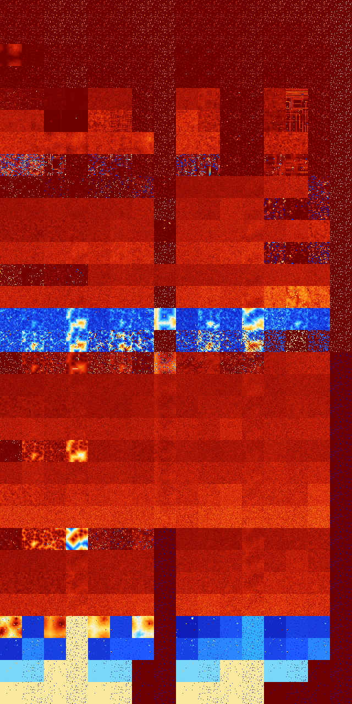

# B0123456 (65024-65535)

<details>
    <summary>Initial Grid</summary>
    
</details>


<details>
    <summary>Initial Grid RLE</summary>

```
#C Exported from GoGoL (https://github.com/marrow16/gogol)
#C Wrap mode: Toroidal
#C Boundary mode: Dead
#C Step: 0
x = 100, y = 100, rule = B0123456/S
19bo28b2o17bo22bo$3bo24bo15bo2bo$bo3bo12bo16bo19b2o23bo18bo$22bo60bo3bo
$10bo33bo13bo2bo29bo4bo$17bo22bo19bo$12bo5bobobo6bo10bo15bo26bo10bo$42b
o11bo2bo24bobo9bo$44bo28bo2bo$20bo5bo39bo31bo$21bo4bo8bo36b2o$52bo6bo$
27bo15bo28bo$19bo5bo11bo31bobo5bo4bo15bo$53bo15b2o2bo4bo5bo$49bo8bo29bo
2bo$14bo31bo29b2o13bo$17bo29bo8bo18bo$26bo5bo13bo5bo40bo$5bo2bo30bo10bo
14bo7bo12b2o6bo$41bo29bo15bo7bo$22bo4bo10b2o15bo3bo2bo10bo17bo$11bo25bo
29bobo$o7bobo17b2o13bo9bo6bo28bo$51bo$8bo15bo17bo19bo5bo18bo$85bo$4bo
33bo15bo8bo11b2obo$90bo3bo$o21bobo9bo12bo3bo7bo2bo$16bo7bo9bo6bo10bo12b
3o10bo6bobo$14bo6bo12bo33bo11bo$o69bo24bo$22bo15bo9bo4bo11bo13bobo6bobo
bo$o71bo4bo$9bo4bo4bo5bo19bo19bo8bo$o19bo18bo4bobo11bo14bo3bo9bo$24bo
12bo7bobo7bo10bo5bo15bo$4bo31bo30bo7bo4bo8bo$8bo12bo21bo9bo29bo3bo$5bo
59bo26bo$2o18bo38bo11bobo$74bo$32bo$24bobo5bo18bo15bo$23bo3bo37bo$46bo
4bo$24bo17bo18bo14b2o3bo$42bo5bo$25bo22bo49bo$14bo29bo6bobo7bo7b2o24bo$
5bo4bo10bo9b2o25bo3bobo21bo$32bo38bo19bo$6bo2bo19b2o18bo26bo$20bo11bo
42bo4bo$11bo52bo16bo6bo$8bo6bo13bo49bo7bo$10bo14bo8bo14bo12bo11bo$21bo
30bo$22bo51bo2bo3bo10bo$4bo12b2o5bo5bo50bo$4bo4bo34bo$5bo31bo38bo4bobo$
7bo12bo15bo51b2o2bo$7bo5bo44bo22bo3bo$14bo4bo17bo29bo$6bo12bo20bo2bo$
100b$4bo11bo8bobo28bobo15bo$17bo14bo12bo4bo33bo$8bo16b2o10bo30bo30bo$
10bo69bo2bo4bo$4bobo36bo12bo2bo7bo9bo6bo$20bo6bo59bo4bo6bo$4bo11bo2bo8b
o21bo$5bo51bo16bo13bo10bo$bo4bo2bo3bo4bo5bo18bo27bo3bo5bo$4bo12bo2bo$
31bo11bo5bo7bo33bo2bo$9bo22bo28bo15bo6bo$63bo$23bo27bo33bo$79bobo$6bo
60bo7bo11bo$5bo11bo10bo26bo12bobo7bo$3bo4bo26bo4bo18bo$36bo26bo6bo$o58b
o18bo7bo$15bo6bo26bo38bobo$71bo7bo2bo$7bo10bo19bo20bo2bo$3b2o47bo18bo6b
obo5bo$5bo22bo54bo$11bo10bo12bo26bo23bo$12bo26bo10bo10bo9bo16bobo$26bo
64bo$2bobo23b2o2bo45bo$bo23bo67bo$2bo15bo9b2o9bobo10bo2bo9bo8bo$24bo22b
o5bo7bo3bo5bobo!
```
</details>
<details>
    <summary>Thumbnail</summary>

</details>
<table>
<tr>
    <td><a href="./65024%20S%20Heat%20Map%20Activity.png"></a><br>S (65024)<br>R@6,p2</td>    <td><a href="./65025%20S0%20Heat%20Map%20Activity.png"></a><br>S0 (65025)<br>R@6,p2</td>    <td><a href="./65026%20S1%20Heat%20Map%20Activity.png"></a><br>S1 (65026)<br>R@4,p2</td>    <td><a href="./65027%20S01%20Heat%20Map%20Activity.png"></a><br>S01 (65027)<br>R@4,p2</td>    <td><a href="./65028%20S2%20Heat%20Map%20Activity.png"></a><br>S2 (65028)<br>R@6,p2</td>    <td><a href="./65029%20S02%20Heat%20Map%20Activity.png"></a><br>S02 (65029)<br>R@5,p2</td>    <td><a href="./65030%20S12%20Heat%20Map%20Activity.png"></a><br>S12 (65030)<br>R@4,p2</td>    <td><a href="./65031%20S012%20Heat%20Map%20Activity.png"></a><br>S012 (65031)<br>R@4,p2</td>    <td><a href="./65032%20S3%20Heat%20Map%20Activity.png"></a><br>S3 (65032)<br>R@6,p2</td>    <td><a href="./65033%20S03%20Heat%20Map%20Activity.png"></a><br>S03 (65033)<br>R@6,p2</td>    <td><a href="./65034%20S13%20Heat%20Map%20Activity.png"></a><br>S13 (65034)<br>R@6,p2</td>    <td><a href="./65035%20S013%20Heat%20Map%20Activity.png"></a><br>S013 (65035)<br>R@5,p2</td>    <td><a href="./65036%20S23%20Heat%20Map%20Activity.png"></a><br>S23 (65036)<br>R@4,p2</td>    <td><a href="./65037%20S023%20Heat%20Map%20Activity.png"></a><br>S023 (65037)<br>R@4,p2</td>    <td><a href="./65038%20S123%20Heat%20Map%20Activity.png"></a><br>S123 (65038)<br>R@4,p2</td>    <td><a href="./65039%20S0123%20Heat%20Map%20Activity.png"></a><br>S0123 (65039)<br>R@3,p2</td></tr>
<tr>
    <td><a href="./65040%20S4%20Heat%20Map%20Activity.png"></a><br>S4 (65040)<br>R@6,p2</td>    <td><a href="./65041%20S04%20Heat%20Map%20Activity.png"></a><br>S04 (65041)<br>R@6,p2</td>    <td><a href="./65042%20S14%20Heat%20Map%20Activity.png"></a><br>S14 (65042)<br>R@4,p2</td>    <td><a href="./65043%20S014%20Heat%20Map%20Activity.png"></a><br>S014 (65043)<br>R@4,p2</td>    <td><a href="./65044%20S24%20Heat%20Map%20Activity.png"></a><br>S24 (65044)<br>R@6,p2</td>    <td><a href="./65045%20S024%20Heat%20Map%20Activity.png"></a><br>S024 (65045)<br>R@6,p2</td>    <td><a href="./65046%20S124%20Heat%20Map%20Activity.png"></a><br>S124 (65046)<br>R@4,p2</td>    <td><a href="./65047%20S0124%20Heat%20Map%20Activity.png"></a><br>S0124 (65047)<br>R@4,p2</td>    <td><a href="./65048%20S34%20Heat%20Map%20Activity.png"></a><br>S34 (65048)<br>R@6,p2</td>    <td><a href="./65049%20S034%20Heat%20Map%20Activity.png"></a><br>S034 (65049)<br>R@6,p2</td>    <td><a href="./65050%20S134%20Heat%20Map%20Activity.png"></a><br>S134 (65050)<br>R@6,p2</td>    <td><a href="./65051%20S0134%20Heat%20Map%20Activity.png"></a><br>S0134 (65051)<br>R@5,p2</td>    <td><a href="./65052%20S234%20Heat%20Map%20Activity.png"></a><br>S234 (65052)<br>R@6,p2</td>    <td><a href="./65053%20S0234%20Heat%20Map%20Activity.png"></a><br>S0234 (65053)<br>R@6,p2</td>    <td><a href="./65054%20S1234%20Heat%20Map%20Activity.png"></a><br>S1234 (65054)<br>R@4,p2</td>    <td><a href="./65055%20S01234%20Heat%20Map%20Activity.png"></a><br>S01234 (65055)<br>R@3,p2</td></tr>
<tr>
    <td><a href="./65056%20S5%20Heat%20Map%20Activity.png"></a><br>S5 (65056)<br>G>1000</td>    <td><a href="./65057%20S05%20Heat%20Map%20Activity.png"></a><br>S05 (65057)<br>R@23,p16</td>    <td><a href="./65058%20S15%20Heat%20Map%20Activity.png"></a><br>S15 (65058)<br>R@6,p2</td>    <td><a href="./65059%20S015%20Heat%20Map%20Activity.png"></a><br>S015 (65059)<br>R@6,p2</td>    <td><a href="./65060%20S25%20Heat%20Map%20Activity.png"></a><br>S25 (65060)<br>R@6,p2</td>    <td><a href="./65061%20S025%20Heat%20Map%20Activity.png"></a><br>S025 (65061)<br>R@6,p2</td>    <td><a href="./65062%20S125%20Heat%20Map%20Activity.png"></a><br>S125 (65062)<br>R@6,p2</td>    <td><a href="./65063%20S0125%20Heat%20Map%20Activity.png"></a><br>S0125 (65063)<br>R@4,p2</td>    <td><a href="./65064%20S35%20Heat%20Map%20Activity.png"></a><br>S35 (65064)<br>R@12,p4</td>    <td><a href="./65065%20S035%20Heat%20Map%20Activity.png"></a><br>S035 (65065)<br>R@10,p4</td>    <td><a href="./65066%20S135%20Heat%20Map%20Activity.png"></a><br>S135 (65066)<br>R@6,p2</td>    <td><a href="./65067%20S0135%20Heat%20Map%20Activity.png"></a><br>S0135 (65067)<br>R@5,p2</td>    <td><a href="./65068%20S235%20Heat%20Map%20Activity.png"></a><br>S235 (65068)<br>R@6,p2</td>    <td><a href="./65069%20S0235%20Heat%20Map%20Activity.png"></a><br>S0235 (65069)<br>R@6,p2</td>    <td><a href="./65070%20S1235%20Heat%20Map%20Activity.png"></a><br>S1235 (65070)<br>R@6,p2</td>    <td><a href="./65071%20S01235%20Heat%20Map%20Activity.png"></a><br>S01235 (65071)<br>R@3,p2</td></tr>
<tr>
    <td><a href="./65072%20S45%20Heat%20Map%20Activity.png"></a><br>S45 (65072)<br>R@14,p4</td>    <td><a href="./65073%20S045%20Heat%20Map%20Activity.png"></a><br>S045 (65073)<br>R@10,p4</td>    <td><a href="./65074%20S145%20Heat%20Map%20Activity.png"></a><br>S145 (65074)<br>R@6,p2</td>    <td><a href="./65075%20S0145%20Heat%20Map%20Activity.png"></a><br>S0145 (65075)<br>R@4,p2</td>    <td><a href="./65076%20S245%20Heat%20Map%20Activity.png"></a><br>S245 (65076)<br>R@8,p2</td>    <td><a href="./65077%20S0245%20Heat%20Map%20Activity.png"></a><br>S0245 (65077)<br>R@6,p2</td>    <td><a href="./65078%20S1245%20Heat%20Map%20Activity.png"></a><br>S1245 (65078)<br>R@6,p2</td>    <td><a href="./65079%20S01245%20Heat%20Map%20Activity.png"></a><br>S01245 (65079)<br>R@4,p2</td>    <td><a href="./65080%20S345%20Heat%20Map%20Activity.png"></a><br>S345 (65080)<br>R@14,p4</td>    <td><a href="./65081%20S0345%20Heat%20Map%20Activity.png"></a><br>S0345 (65081)<br>R@10,p4</td>    <td><a href="./65082%20S1345%20Heat%20Map%20Activity.png"></a><br>S1345 (65082)<br>R@6,p2</td>    <td><a href="./65083%20S01345%20Heat%20Map%20Activity.png"></a><br>S01345 (65083)<br>R@5,p2</td>    <td><a href="./65084%20S2345%20Heat%20Map%20Activity.png"></a><br>S2345 (65084)<br>R@8,p2</td>    <td><a href="./65085%20S02345%20Heat%20Map%20Activity.png"></a><br>S02345 (65085)<br>R@6,p2</td>    <td><a href="./65086%20S12345%20Heat%20Map%20Activity.png"></a><br>S12345 (65086)<br>R@6,p2</td>    <td><a href="./65087%20S012345%20Heat%20Map%20Activity.png"></a><br>S012345 (65087)<br>R@3,p2</td></tr>
<tr>
    <td><a href="./65088%20S6%20Heat%20Map%20Activity.png"></a><br>S6 (65088)<br>R@65,p8</td>    <td><a href="./65089%20S06%20Heat%20Map%20Activity.png"></a><br>S06 (65089)<br>R@117,p24</td>    <td><a href="./65090%20S16%20Heat%20Map%20Activity.png"></a><br>S16 (65090)<br>R@149,p2</td>    <td><a href="./65091%20S016%20Heat%20Map%20Activity.png"></a><br>S016 (65091)<br>R@194,p2</td>    <td><a href="./65092%20S26%20Heat%20Map%20Activity.png"></a><br>S26 (65092)<br>G>1000</td>    <td><a href="./65093%20S026%20Heat%20Map%20Activity.png"></a><br>S026 (65093)<br>G>1000</td>    <td><a href="./65094%20S126%20Heat%20Map%20Activity.png"></a><br>S126 (65094)<br>R@8,p2</td>    <td><a href="./65095%20S0126%20Heat%20Map%20Activity.png"></a><br>S0126 (65095)<br>R@4,p2</td>    <td><a href="./65096%20S36%20Heat%20Map%20Activity.png"></a><br>S36 (65096)<br>G>1000</td>    <td><a href="./65097%20S036%20Heat%20Map%20Activity.png"></a><br>S036 (65097)<br>G>1000</td>    <td><a href="./65098%20S136%20Heat%20Map%20Activity.png"></a><br>S136 (65098)<br>R@15,p2</td>    <td><a href="./65099%20S0136%20Heat%20Map%20Activity.png"></a><br>S0136 (65099)<br>R@7,p2</td>    <td><a href="./65100%20S236%20Heat%20Map%20Activity.png"></a><br>S236 (65100)<br>G>1000</td>    <td><a href="./65101%20S0236%20Heat%20Map%20Activity.png"></a><br>S0236 (65101)<br>G>1000</td>    <td><a href="./65102%20S1236%20Heat%20Map%20Activity.png"></a><br>S1236 (65102)<br>R@8,p2</td>    <td><a href="./65103%20S01236%20Heat%20Map%20Activity.png"></a><br>S01236 (65103)<br>R@3,p2</td></tr>
<tr>
    <td><a href="./65104%20S46%20Heat%20Map%20Activity.png"></a><br>S46 (65104)<br>G>1000</td>    <td><a href="./65105%20S046%20Heat%20Map%20Activity.png"></a><br>S046 (65105)<br>G>1000</td>    <td><a href="./65106%20S146%20Heat%20Map%20Activity.png"></a><br>S146 (65106)<br>R@265,p200</td>    <td><a href="./65107%20S0146%20Heat%20Map%20Activity.png"></a><br>S0146 (65107)<br>R@208,p200</td>    <td><a href="./65108%20S246%20Heat%20Map%20Activity.png"></a><br>S246 (65108)<br>G>1000</td>    <td><a href="./65109%20S0246%20Heat%20Map%20Activity.png"></a><br>S0246 (65109)<br>G>1000</td>    <td><a href="./65110%20S1246%20Heat%20Map%20Activity.png"></a><br>S1246 (65110)<br>R@8,p2</td>    <td><a href="./65111%20S01246%20Heat%20Map%20Activity.png"></a><br>S01246 (65111)<br>R@4,p2</td>    <td><a href="./65112%20S346%20Heat%20Map%20Activity.png"></a><br>S346 (65112)<br>G>1000</td>    <td><a href="./65113%20S0346%20Heat%20Map%20Activity.png"></a><br>S0346 (65113)<br>G>1000</td>    <td><a href="./65114%20S1346%20Heat%20Map%20Activity.png"></a><br>S1346 (65114)<br>R@11,p2</td>    <td><a href="./65115%20S01346%20Heat%20Map%20Activity.png"></a><br>S01346 (65115)<br>R@6,p2</td>    <td><a href="./65116%20S2346%20Heat%20Map%20Activity.png"></a><br>S2346 (65116)<br>G>1000</td>    <td><a href="./65117%20S02346%20Heat%20Map%20Activity.png"></a><br>S02346 (65117)<br>G>1000</td>    <td><a href="./65118%20S12346%20Heat%20Map%20Activity.png"></a><br>S12346 (65118)<br>R@8,p2</td>    <td><a href="./65119%20S012346%20Heat%20Map%20Activity.png"></a><br>S012346 (65119)<br>R@3,p2</td></tr>
<tr>
    <td><a href="./65120%20S56%20Heat%20Map%20Activity.png"></a><br>S56 (65120)<br>G>1000</td>    <td><a href="./65121%20S056%20Heat%20Map%20Activity.png"></a><br>S056 (65121)<br>G>1000</td>    <td><a href="./65122%20S156%20Heat%20Map%20Activity.png"></a><br>S156 (65122)<br>G>1000</td>    <td><a href="./65123%20S0156%20Heat%20Map%20Activity.png"></a><br>S0156 (65123)<br>G>1000</td>    <td><a href="./65124%20S256%20Heat%20Map%20Activity.png"></a><br>S256 (65124)<br>G>1000</td>    <td><a href="./65125%20S0256%20Heat%20Map%20Activity.png"></a><br>S0256 (65125)<br>G>1000</td>    <td><a href="./65126%20S1256%20Heat%20Map%20Activity.png"></a><br>S1256 (65126)<br>G>1000</td>    <td><a href="./65127%20S01256%20Heat%20Map%20Activity.png"></a><br>S01256 (65127)<br>R@4,p2</td>    <td><a href="./65128%20S356%20Heat%20Map%20Activity.png"></a><br>S356 (65128)<br>G>1000</td>    <td><a href="./65129%20S0356%20Heat%20Map%20Activity.png"></a><br>S0356 (65129)<br>G>1000</td>    <td><a href="./65130%20S1356%20Heat%20Map%20Activity.png"></a><br>S1356 (65130)<br>R@14,p4</td>    <td><a href="./65131%20S01356%20Heat%20Map%20Activity.png"></a><br>S01356 (65131)<br>R@8,p4</td>    <td><a href="./65132%20S2356%20Heat%20Map%20Activity.png"></a><br>S2356 (65132)<br>G>1000</td>    <td><a href="./65133%20S02356%20Heat%20Map%20Activity.png"></a><br>S02356 (65133)<br>G>1000</td>    <td><a href="./65134%20S12356%20Heat%20Map%20Activity.png"></a><br>S12356 (65134)<br>R@10,p4</td>    <td><a href="./65135%20S012356%20Heat%20Map%20Activity.png"></a><br>S012356 (65135)<br>R@3,p2</td></tr>
<tr>
    <td><a href="./65136%20S456%20Heat%20Map%20Activity.png"></a><br>S456 (65136)<br>R@170,p4</td>    <td><a href="./65137%20S0456%20Heat%20Map%20Activity.png"></a><br>S0456 (65137)<br>R@180,p12</td>    <td><a href="./65138%20S1456%20Heat%20Map%20Activity.png"></a><br>S1456 (65138)<br>G>1000</td>    <td><a href="./65139%20S01456%20Heat%20Map%20Activity.png"></a><br>S01456 (65139)<br>R@9,p2</td>    <td><a href="./65140%20S2456%20Heat%20Map%20Activity.png"></a><br>S2456 (65140)<br>R@250,p4</td>    <td><a href="./65141%20S02456%20Heat%20Map%20Activity.png"></a><br>S02456 (65141)<br>R@207,p4</td>    <td><a href="./65142%20S12456%20Heat%20Map%20Activity.png"></a><br>S12456 (65142)<br>R@8,p2</td>    <td><a href="./65143%20S012456%20Heat%20Map%20Activity.png"></a><br>S012456 (65143)<br>R@4,p2</td>    <td><a href="./65144%20S3456%20Heat%20Map%20Activity.png"></a><br>S3456 (65144)<br>R@151,p12</td>    <td><a href="./65145%20S03456%20Heat%20Map%20Activity.png"></a><br>S03456 (65145)<br>R@127,p4</td>    <td><a href="./65146%20S13456%20Heat%20Map%20Activity.png"></a><br>S13456 (65146)<br>R@11,p2</td>    <td><a href="./65147%20S013456%20Heat%20Map%20Activity.png"></a><br>S013456 (65147)<br>R@8,p2</td>    <td><a href="./65148%20S23456%20Heat%20Map%20Activity.png"></a><br>S23456 (65148)<br>G>1000</td>    <td><a href="./65149%20S023456%20Heat%20Map%20Activity.png"></a><br>S023456 (65149)<br>G>1000</td>    <td><a href="./65150%20S123456%20Heat%20Map%20Activity.png"></a><br>S123456 (65150)<br>R@8,p2</td>    <td><a href="./65151%20S0123456%20Heat%20Map%20Activity.png"></a><br>S0123456 (65151)<br>R@3,p2</td></tr>
<tr>
    <td><a href="./65152%20S7%20Heat%20Map%20Activity.png"></a><br>S7 (65152)<br>R@156,p120</td>    <td><a href="./65153%20S07%20Heat%20Map%20Activity.png"></a><br>S07 (65153)<br>R@173,p120</td>    <td><a href="./65154%20S17%20Heat%20Map%20Activity.png"></a><br>S17 (65154)<br>R@103,p60</td>    <td><a href="./65155%20S017%20Heat%20Map%20Activity.png"></a><br>S017 (65155)<br>R@91,p2</td>    <td><a href="./65156%20S27%20Heat%20Map%20Activity.png"></a><br>S27 (65156)<br>G>1000</td>    <td><a href="./65157%20S027%20Heat%20Map%20Activity.png"></a><br>S027 (65157)<br>G>1000</td>    <td><a href="./65158%20S127%20Heat%20Map%20Activity.png"></a><br>S127 (65158)<br>R@125,p24</td>    <td><a href="./65159%20S0127%20Heat%20Map%20Activity.png"></a><br>S0127 (65159)<br>R@8,p2</td>    <td><a href="./65160%20S37%20Heat%20Map%20Activity.png"></a><br>S37 (65160)<br>G>1000</td>    <td><a href="./65161%20S037%20Heat%20Map%20Activity.png"></a><br>S037 (65161)<br>G>1000</td>    <td><a href="./65162%20S137%20Heat%20Map%20Activity.png"></a><br>S137 (65162)<br>G>1000</td>    <td><a href="./65163%20S0137%20Heat%20Map%20Activity.png"></a><br>S0137 (65163)<br>G>1000</td>    <td><a href="./65164%20S237%20Heat%20Map%20Activity.png"></a><br>S237 (65164)<br>G>1000</td>    <td><a href="./65165%20S0237%20Heat%20Map%20Activity.png"></a><br>S0237 (65165)<br>G>1000</td>    <td><a href="./65166%20S1237%20Heat%20Map%20Activity.png"></a><br>S1237 (65166)<br>R@64,p12</td>    <td><a href="./65167%20S01237%20Heat%20Map%20Activity.png"></a><br>S01237 (65167)<br>R@3,p2</td></tr>
<tr>
    <td><a href="./65168%20S47%20Heat%20Map%20Activity.png"></a><br>S47 (65168)<br>G>1000</td>    <td><a href="./65169%20S047%20Heat%20Map%20Activity.png"></a><br>S047 (65169)<br>G>1000</td>    <td><a href="./65170%20S147%20Heat%20Map%20Activity.png"></a><br>S147 (65170)<br>G>1000</td>    <td><a href="./65171%20S0147%20Heat%20Map%20Activity.png"></a><br>S0147 (65171)<br>G>1000</td>    <td><a href="./65172%20S247%20Heat%20Map%20Activity.png"></a><br>S247 (65172)<br>G>1000</td>    <td><a href="./65173%20S0247%20Heat%20Map%20Activity.png"></a><br>S0247 (65173)<br>G>1000</td>    <td><a href="./65174%20S1247%20Heat%20Map%20Activity.png"></a><br>S1247 (65174)<br>G>1000</td>    <td><a href="./65175%20S01247%20Heat%20Map%20Activity.png"></a><br>S01247 (65175)<br>R@3,p2</td>    <td><a href="./65176%20S347%20Heat%20Map%20Activity.png"></a><br>S347 (65176)<br>G>1000</td>    <td><a href="./65177%20S0347%20Heat%20Map%20Activity.png"></a><br>S0347 (65177)<br>G>1000</td>    <td><a href="./65178%20S1347%20Heat%20Map%20Activity.png"></a><br>S1347 (65178)<br>G>1000</td>    <td><a href="./65179%20S01347%20Heat%20Map%20Activity.png"></a><br>S01347 (65179)<br>G>1000</td>    <td><a href="./65180%20S2347%20Heat%20Map%20Activity.png"></a><br>S2347 (65180)<br>R@117,p4</td>    <td><a href="./65181%20S02347%20Heat%20Map%20Activity.png"></a><br>S02347 (65181)<br>R@31,p8</td>    <td><a href="./65182%20S12347%20Heat%20Map%20Activity.png"></a><br>S12347 (65182)<br>R@19,p4</td>    <td><a href="./65183%20S012347%20Heat%20Map%20Activity.png"></a><br>S012347 (65183)<br>R@3,p2</td></tr>
<tr>
    <td><a href="./65184%20S57%20Heat%20Map%20Activity.png"></a><br>S57 (65184)<br>G>1000</td>    <td><a href="./65185%20S057%20Heat%20Map%20Activity.png"></a><br>S057 (65185)<br>G>1000</td>    <td><a href="./65186%20S157%20Heat%20Map%20Activity.png"></a><br>S157 (65186)<br>G>1000</td>    <td><a href="./65187%20S0157%20Heat%20Map%20Activity.png"></a><br>S0157 (65187)<br>G>1000</td>    <td><a href="./65188%20S257%20Heat%20Map%20Activity.png"></a><br>S257 (65188)<br>G>1000</td>    <td><a href="./65189%20S0257%20Heat%20Map%20Activity.png"></a><br>S0257 (65189)<br>G>1000</td>    <td><a href="./65190%20S1257%20Heat%20Map%20Activity.png"></a><br>S1257 (65190)<br>G>1000</td>    <td><a href="./65191%20S01257%20Heat%20Map%20Activity.png"></a><br>S01257 (65191)<br>R@13,p10</td>    <td><a href="./65192%20S357%20Heat%20Map%20Activity.png"></a><br>S357 (65192)<br>G>1000</td>    <td><a href="./65193%20S0357%20Heat%20Map%20Activity.png"></a><br>S0357 (65193)<br>G>1000</td>    <td><a href="./65194%20S1357%20Heat%20Map%20Activity.png"></a><br>S1357 (65194)<br>G>1000</td>    <td><a href="./65195%20S01357%20Heat%20Map%20Activity.png"></a><br>S01357 (65195)<br>G>1000</td>    <td><a href="./65196%20S2357%20Heat%20Map%20Activity.png"></a><br>S2357 (65196)<br>G>1000</td>    <td><a href="./65197%20S02357%20Heat%20Map%20Activity.png"></a><br>S02357 (65197)<br>G>1000</td>    <td><a href="./65198%20S12357%20Heat%20Map%20Activity.png"></a><br>S12357 (65198)<br>G>1000</td>    <td><a href="./65199%20S012357%20Heat%20Map%20Activity.png"></a><br>S012357 (65199)<br>R@3,p2</td></tr>
<tr>
    <td><a href="./65200%20S457%20Heat%20Map%20Activity.png"></a><br>S457 (65200)<br>G>1000</td>    <td><a href="./65201%20S0457%20Heat%20Map%20Activity.png"></a><br>S0457 (65201)<br>G>1000</td>    <td><a href="./65202%20S1457%20Heat%20Map%20Activity.png"></a><br>S1457 (65202)<br>G>1000</td>    <td><a href="./65203%20S01457%20Heat%20Map%20Activity.png"></a><br>S01457 (65203)<br>G>1000</td>    <td><a href="./65204%20S2457%20Heat%20Map%20Activity.png"></a><br>S2457 (65204)<br>G>1000</td>    <td><a href="./65205%20S02457%20Heat%20Map%20Activity.png"></a><br>S02457 (65205)<br>G>1000</td>    <td><a href="./65206%20S12457%20Heat%20Map%20Activity.png"></a><br>S12457 (65206)<br>G>1000</td>    <td><a href="./65207%20S012457%20Heat%20Map%20Activity.png"></a><br>S012457 (65207)<br>R@3,p2</td>    <td><a href="./65208%20S3457%20Heat%20Map%20Activity.png"></a><br>S3457 (65208)<br>G>1000</td>    <td><a href="./65209%20S03457%20Heat%20Map%20Activity.png"></a><br>S03457 (65209)<br>G>1000</td>    <td><a href="./65210%20S13457%20Heat%20Map%20Activity.png"></a><br>S13457 (65210)<br>G>1000</td>    <td><a href="./65211%20S013457%20Heat%20Map%20Activity.png"></a><br>S013457 (65211)<br>G>1000</td>    <td><a href="./65212%20S23457%20Heat%20Map%20Activity.png"></a><br>S23457 (65212)<br>R@35,p2</td>    <td><a href="./65213%20S023457%20Heat%20Map%20Activity.png"></a><br>S023457 (65213)<br>R@21,p2</td>    <td><a href="./65214%20S123457%20Heat%20Map%20Activity.png"></a><br>S123457 (65214)<br>R@11,p2</td>    <td><a href="./65215%20S0123457%20Heat%20Map%20Activity.png"></a><br>S0123457 (65215)<br>R@3,p2</td></tr>
<tr>
    <td><a href="./65216%20S67%20Heat%20Map%20Activity.png"></a><br>S67 (65216)<br>R@99,p24</td>    <td><a href="./65217%20S067%20Heat%20Map%20Activity.png"></a><br>S067 (65217)<br>R@184,p96</td>    <td><a href="./65218%20S167%20Heat%20Map%20Activity.png"></a><br>S167 (65218)<br>R@76,p24</td>    <td><a href="./65219%20S0167%20Heat%20Map%20Activity.png"></a><br>S0167 (65219)<br>R@119,p12</td>    <td><a href="./65220%20S267%20Heat%20Map%20Activity.png"></a><br>S267 (65220)<br>G>1000</td>    <td><a href="./65221%20S0267%20Heat%20Map%20Activity.png"></a><br>S0267 (65221)<br>G>1000</td>    <td><a href="./65222%20S1267%20Heat%20Map%20Activity.png"></a><br>S1267 (65222)<br>G>1000</td>    <td><a href="./65223%20S01267%20Heat%20Map%20Activity.png"></a><br>S01267 (65223)<br>G>1000</td>    <td><a href="./65224%20S367%20Heat%20Map%20Activity.png"></a><br>S367 (65224)<br>G>1000</td>    <td><a href="./65225%20S0367%20Heat%20Map%20Activity.png"></a><br>S0367 (65225)<br>G>1000</td>    <td><a href="./65226%20S1367%20Heat%20Map%20Activity.png"></a><br>S1367 (65226)<br>G>1000</td>    <td><a href="./65227%20S01367%20Heat%20Map%20Activity.png"></a><br>S01367 (65227)<br>G>1000</td>    <td><a href="./65228%20S2367%20Heat%20Map%20Activity.png"></a><br>S2367 (65228)<br>G>1000</td>    <td><a href="./65229%20S02367%20Heat%20Map%20Activity.png"></a><br>S02367 (65229)<br>G>1000</td>    <td><a href="./65230%20S12367%20Heat%20Map%20Activity.png"></a><br>S12367 (65230)<br>G>1000</td>    <td><a href="./65231%20S012367%20Heat%20Map%20Activity.png"></a><br>S012367 (65231)<br>R@3,p2</td></tr>
<tr>
    <td><a href="./65232%20S467%20Heat%20Map%20Activity.png"></a><br>S467 (65232)<br>G>1000</td>    <td><a href="./65233%20S0467%20Heat%20Map%20Activity.png"></a><br>S0467 (65233)<br>G>1000</td>    <td><a href="./65234%20S1467%20Heat%20Map%20Activity.png"></a><br>S1467 (65234)<br>G>1000</td>    <td><a href="./65235%20S01467%20Heat%20Map%20Activity.png"></a><br>S01467 (65235)<br>G>1000</td>    <td><a href="./65236%20S2467%20Heat%20Map%20Activity.png"></a><br>S2467 (65236)<br>G>1000</td>    <td><a href="./65237%20S02467%20Heat%20Map%20Activity.png"></a><br>S02467 (65237)<br>G>1000</td>    <td><a href="./65238%20S12467%20Heat%20Map%20Activity.png"></a><br>S12467 (65238)<br>G>1000</td>    <td><a href="./65239%20S012467%20Heat%20Map%20Activity.png"></a><br>S012467 (65239)<br>R@3,p2</td>    <td><a href="./65240%20S3467%20Heat%20Map%20Activity.png"></a><br>S3467 (65240)<br>G>1000</td>    <td><a href="./65241%20S03467%20Heat%20Map%20Activity.png"></a><br>S03467 (65241)<br>G>1000</td>    <td><a href="./65242%20S13467%20Heat%20Map%20Activity.png"></a><br>S13467 (65242)<br>G>1000</td>    <td><a href="./65243%20S013467%20Heat%20Map%20Activity.png"></a><br>S013467 (65243)<br>G>1000</td>    <td><a href="./65244%20S23467%20Heat%20Map%20Activity.png"></a><br>S23467 (65244)<br>G>1000</td>    <td><a href="./65245%20S023467%20Heat%20Map%20Activity.png"></a><br>S023467 (65245)<br>G>1000</td>    <td><a href="./65246%20S123467%20Heat%20Map%20Activity.png"></a><br>S123467 (65246)<br>G>1000</td>    <td><a href="./65247%20S0123467%20Heat%20Map%20Activity.png"></a><br>S0123467 (65247)<br>R@3,p2</td></tr>
<tr>
    <td><a href="./65248%20S567%20Heat%20Map%20Activity.png"></a><br>S567 (65248)<br>R@82,p6</td>    <td><a href="./65249%20S0567%20Heat%20Map%20Activity.png"></a><br>S0567 (65249)<br>R@125,p30</td>    <td><a href="./65250%20S1567%20Heat%20Map%20Activity.png"></a><br>S1567 (65250)<br>R@87,p6</td>    <td><a href="./65251%20S01567%20Heat%20Map%20Activity.png"></a><br>S01567 (65251)<br>R@107,p6</td>    <td><a href="./65252%20S2567%20Heat%20Map%20Activity.png"></a><br>S2567 (65252)<br>R@92,p18</td>    <td><a href="./65253%20S02567%20Heat%20Map%20Activity.png"></a><br>S02567 (65253)<br>R@98,p6</td>    <td><a href="./65254%20S12567%20Heat%20Map%20Activity.png"></a><br>S12567 (65254)<br>R@68,p6</td>    <td><a href="./65255%20S012567%20Heat%20Map%20Activity.png"></a><br>S012567 (65255)<br>R@157,p12</td>    <td><a href="./65256%20S3567%20Heat%20Map%20Activity.png"></a><br>S3567 (65256)<br>R@134,p60</td>    <td><a href="./65257%20S03567%20Heat%20Map%20Activity.png"></a><br>S03567 (65257)<br>R@120,p12</td>    <td><a href="./65258%20S13567%20Heat%20Map%20Activity.png"></a><br>S13567 (65258)<br>R@109,p2</td>    <td><a href="./65259%20S013567%20Heat%20Map%20Activity.png"></a><br>S013567 (65259)<br>R@154,p6</td>    <td><a href="./65260%20S23567%20Heat%20Map%20Activity.png"></a><br>S23567 (65260)<br>R@59,p2</td>    <td><a href="./65261%20S023567%20Heat%20Map%20Activity.png"></a><br>S023567 (65261)<br>R@115,p6</td>    <td><a href="./65262%20S123567%20Heat%20Map%20Activity.png"></a><br>S123567 (65262)<br>R@101,p10</td>    <td><a href="./65263%20S0123567%20Heat%20Map%20Activity.png"></a><br>S0123567 (65263)<br>R@3,p2</td></tr>
<tr>
    <td><a href="./65264%20S4567%20Heat%20Map%20Activity.png"></a><br>S4567 (65264)<br>R@32,p12</td>    <td><a href="./65265%20S04567%20Heat%20Map%20Activity.png"></a><br>S04567 (65265)<br>R@47,p12</td>    <td><a href="./65266%20S14567%20Heat%20Map%20Activity.png"></a><br>S14567 (65266)<br>R@34,p12</td>    <td><a href="./65267%20S014567%20Heat%20Map%20Activity.png"></a><br>S014567 (65267)<br>R@80,p12</td>    <td><a href="./65268%20S24567%20Heat%20Map%20Activity.png"></a><br>S24567 (65268)<br>R@57,p4</td>    <td><a href="./65269%20S024567%20Heat%20Map%20Activity.png"></a><br>S024567 (65269)<br>R@118,p4</td>    <td><a href="./65270%20S124567%20Heat%20Map%20Activity.png"></a><br>S124567 (65270)<br>R@95,p12</td>    <td><a href="./65271%20S0124567%20Heat%20Map%20Activity.png"></a><br>S0124567 (65271)<br>R@3,p2</td>    <td><a href="./65272%20S34567%20Heat%20Map%20Activity.png"></a><br>S34567 (65272)<br>R@34,p2</td>    <td><a href="./65273%20S034567%20Heat%20Map%20Activity.png"></a><br>S034567 (65273)<br>R@48,p2</td>    <td><a href="./65274%20S134567%20Heat%20Map%20Activity.png"></a><br>S134567 (65274)<br>R@39,p2</td>    <td><a href="./65275%20S0134567%20Heat%20Map%20Activity.png"></a><br>S0134567 (65275)<br>R@93,p2</td>    <td><a href="./65276%20S234567%20Heat%20Map%20Activity.png"></a><br>S234567 (65276)<br>R@7,p2</td>    <td><a href="./65277%20S0234567%20Heat%20Map%20Activity.png"></a><br>S0234567 (65277)<br>R@3,p2</td>    <td><a href="./65278%20S1234567%20Heat%20Map%20Activity.png"></a><br>S1234567 (65278)<br>R@7,p2</td>    <td><a href="./65279%20S01234567%20Heat%20Map%20Activity.png"></a><br>S01234567 (65279)<br>R@3,p2</td></tr>
<tr>
    <td><a href="./65280%20S8%20Heat%20Map%20Activity.png"></a><br>S8 (65280)<br>R@272,p240</td>    <td><a href="./65281%20S08%20Heat%20Map%20Activity.png"></a><br>S08 (65281)<br>R@67,p24</td>    <td><a href="./65282%20S18%20Heat%20Map%20Activity.png"></a><br>S18 (65282)<br>R@32,p12</td>    <td><a href="./65283%20S018%20Heat%20Map%20Activity.png"></a><br>S018 (65283)<br>R@113,p60</td>    <td><a href="./65284%20S28%20Heat%20Map%20Activity.png"></a><br>S28 (65284)<br>R@63,p24</td>    <td><a href="./65285%20S028%20Heat%20Map%20Activity.png"></a><br>S028 (65285)<br>R@78,p24</td>    <td><a href="./65286%20S128%20Heat%20Map%20Activity.png"></a><br>S128 (65286)<br>R@167,p120</td>    <td><a href="./65287%20S0128%20Heat%20Map%20Activity.png"></a><br>S0128 (65287)<br>R@144,p84</td>    <td><a href="./65288%20S38%20Heat%20Map%20Activity.png"></a><br>S38 (65288)<br>G>1000</td>    <td><a href="./65289%20S038%20Heat%20Map%20Activity.png"></a><br>S038 (65289)<br>G>1000</td>    <td><a href="./65290%20S138%20Heat%20Map%20Activity.png"></a><br>S138 (65290)<br>G>1000</td>    <td><a href="./65291%20S0138%20Heat%20Map%20Activity.png"></a><br>S0138 (65291)<br>R@953,p72</td>    <td><a href="./65292%20S238%20Heat%20Map%20Activity.png"></a><br>S238 (65292)<br>G>1000</td>    <td><a href="./65293%20S0238%20Heat%20Map%20Activity.png"></a><br>S0238 (65293)<br>G>1000</td>    <td><a href="./65294%20S1238%20Heat%20Map%20Activity.png"></a><br>S1238 (65294)<br>G>1000</td>    <td><a href="./65295%20S01238%20Heat%20Map%20Activity.png"></a><br>S01238 (65295)<br>S@1</td></tr>
<tr>
    <td><a href="./65296%20S48%20Heat%20Map%20Activity.png"></a><br>S48 (65296)<br>G>1000</td>    <td><a href="./65297%20S048%20Heat%20Map%20Activity.png"></a><br>S048 (65297)<br>G>1000</td>    <td><a href="./65298%20S148%20Heat%20Map%20Activity.png"></a><br>S148 (65298)<br>G>1000</td>    <td><a href="./65299%20S0148%20Heat%20Map%20Activity.png"></a><br>S0148 (65299)<br>G>1000</td>    <td><a href="./65300%20S248%20Heat%20Map%20Activity.png"></a><br>S248 (65300)<br>G>1000</td>    <td><a href="./65301%20S0248%20Heat%20Map%20Activity.png"></a><br>S0248 (65301)<br>G>1000</td>    <td><a href="./65302%20S1248%20Heat%20Map%20Activity.png"></a><br>S1248 (65302)<br>G>1000</td>    <td><a href="./65303%20S01248%20Heat%20Map%20Activity.png"></a><br>S01248 (65303)<br>G>1000</td>    <td><a href="./65304%20S348%20Heat%20Map%20Activity.png"></a><br>S348 (65304)<br>G>1000</td>    <td><a href="./65305%20S0348%20Heat%20Map%20Activity.png"></a><br>S0348 (65305)<br>G>1000</td>    <td><a href="./65306%20S1348%20Heat%20Map%20Activity.png"></a><br>S1348 (65306)<br>G>1000</td>    <td><a href="./65307%20S01348%20Heat%20Map%20Activity.png"></a><br>S01348 (65307)<br>G>1000</td>    <td><a href="./65308%20S2348%20Heat%20Map%20Activity.png"></a><br>S2348 (65308)<br>G>1000</td>    <td><a href="./65309%20S02348%20Heat%20Map%20Activity.png"></a><br>S02348 (65309)<br>G>1000</td>    <td><a href="./65310%20S12348%20Heat%20Map%20Activity.png"></a><br>S12348 (65310)<br>G>1000</td>    <td><a href="./65311%20S012348%20Heat%20Map%20Activity.png"></a><br>S012348 (65311)<br>S@1</td></tr>
<tr>
    <td><a href="./65312%20S58%20Heat%20Map%20Activity.png"></a><br>S58 (65312)<br>G>1000</td>    <td><a href="./65313%20S058%20Heat%20Map%20Activity.png"></a><br>S058 (65313)<br>G>1000</td>    <td><a href="./65314%20S158%20Heat%20Map%20Activity.png"></a><br>S158 (65314)<br>G>1000</td>    <td><a href="./65315%20S0158%20Heat%20Map%20Activity.png"></a><br>S0158 (65315)<br>G>1000</td>    <td><a href="./65316%20S258%20Heat%20Map%20Activity.png"></a><br>S258 (65316)<br>G>1000</td>    <td><a href="./65317%20S0258%20Heat%20Map%20Activity.png"></a><br>S0258 (65317)<br>G>1000</td>    <td><a href="./65318%20S1258%20Heat%20Map%20Activity.png"></a><br>S1258 (65318)<br>G>1000</td>    <td><a href="./65319%20S01258%20Heat%20Map%20Activity.png"></a><br>S01258 (65319)<br>G>1000</td>    <td><a href="./65320%20S358%20Heat%20Map%20Activity.png"></a><br>S358 (65320)<br>G>1000</td>    <td><a href="./65321%20S0358%20Heat%20Map%20Activity.png"></a><br>S0358 (65321)<br>G>1000</td>    <td><a href="./65322%20S1358%20Heat%20Map%20Activity.png"></a><br>S1358 (65322)<br>G>1000</td>    <td><a href="./65323%20S01358%20Heat%20Map%20Activity.png"></a><br>S01358 (65323)<br>G>1000</td>    <td><a href="./65324%20S2358%20Heat%20Map%20Activity.png"></a><br>S2358 (65324)<br>G>1000</td>    <td><a href="./65325%20S02358%20Heat%20Map%20Activity.png"></a><br>S02358 (65325)<br>G>1000</td>    <td><a href="./65326%20S12358%20Heat%20Map%20Activity.png"></a><br>S12358 (65326)<br>G>1000</td>    <td><a href="./65327%20S012358%20Heat%20Map%20Activity.png"></a><br>S012358 (65327)<br>S@1</td></tr>
<tr>
    <td><a href="./65328%20S458%20Heat%20Map%20Activity.png"></a><br>S458 (65328)<br>G>1000</td>    <td><a href="./65329%20S0458%20Heat%20Map%20Activity.png"></a><br>S0458 (65329)<br>G>1000</td>    <td><a href="./65330%20S1458%20Heat%20Map%20Activity.png"></a><br>S1458 (65330)<br>G>1000</td>    <td><a href="./65331%20S01458%20Heat%20Map%20Activity.png"></a><br>S01458 (65331)<br>G>1000</td>    <td><a href="./65332%20S2458%20Heat%20Map%20Activity.png"></a><br>S2458 (65332)<br>G>1000</td>    <td><a href="./65333%20S02458%20Heat%20Map%20Activity.png"></a><br>S02458 (65333)<br>G>1000</td>    <td><a href="./65334%20S12458%20Heat%20Map%20Activity.png"></a><br>S12458 (65334)<br>G>1000</td>    <td><a href="./65335%20S012458%20Heat%20Map%20Activity.png"></a><br>S012458 (65335)<br>G>1000</td>    <td><a href="./65336%20S3458%20Heat%20Map%20Activity.png"></a><br>S3458 (65336)<br>G>1000</td>    <td><a href="./65337%20S03458%20Heat%20Map%20Activity.png"></a><br>S03458 (65337)<br>G>1000</td>    <td><a href="./65338%20S13458%20Heat%20Map%20Activity.png"></a><br>S13458 (65338)<br>G>1000</td>    <td><a href="./65339%20S013458%20Heat%20Map%20Activity.png"></a><br>S013458 (65339)<br>G>1000</td>    <td><a href="./65340%20S23458%20Heat%20Map%20Activity.png"></a><br>S23458 (65340)<br>G>1000</td>    <td><a href="./65341%20S023458%20Heat%20Map%20Activity.png"></a><br>S023458 (65341)<br>G>1000</td>    <td><a href="./65342%20S123458%20Heat%20Map%20Activity.png"></a><br>S123458 (65342)<br>G>1000</td>    <td><a href="./65343%20S0123458%20Heat%20Map%20Activity.png"></a><br>S0123458 (65343)<br>S@1</td></tr>
<tr>
    <td><a href="./65344%20S68%20Heat%20Map%20Activity.png"></a><br>S68 (65344)<br>R@163,p120</td>    <td><a href="./65345%20S068%20Heat%20Map%20Activity.png"></a><br>S068 (65345)<br>R@46,p8</td>    <td><a href="./65346%20S168%20Heat%20Map%20Activity.png"></a><br>S168 (65346)<br>R@43,p4</td>    <td><a href="./65347%20S0168%20Heat%20Map%20Activity.png"></a><br>S0168 (65347)<br>R@51,p4</td>    <td><a href="./65348%20S268%20Heat%20Map%20Activity.png"></a><br>S268 (65348)<br>G>1000</td>    <td><a href="./65349%20S0268%20Heat%20Map%20Activity.png"></a><br>S0268 (65349)<br>G>1000</td>    <td><a href="./65350%20S1268%20Heat%20Map%20Activity.png"></a><br>S1268 (65350)<br>G>1000</td>    <td><a href="./65351%20S01268%20Heat%20Map%20Activity.png"></a><br>S01268 (65351)<br>G>1000</td>    <td><a href="./65352%20S368%20Heat%20Map%20Activity.png"></a><br>S368 (65352)<br>G>1000</td>    <td><a href="./65353%20S0368%20Heat%20Map%20Activity.png"></a><br>S0368 (65353)<br>G>1000</td>    <td><a href="./65354%20S1368%20Heat%20Map%20Activity.png"></a><br>S1368 (65354)<br>G>1000</td>    <td><a href="./65355%20S01368%20Heat%20Map%20Activity.png"></a><br>S01368 (65355)<br>G>1000</td>    <td><a href="./65356%20S2368%20Heat%20Map%20Activity.png"></a><br>S2368 (65356)<br>G>1000</td>    <td><a href="./65357%20S02368%20Heat%20Map%20Activity.png"></a><br>S02368 (65357)<br>G>1000</td>    <td><a href="./65358%20S12368%20Heat%20Map%20Activity.png"></a><br>S12368 (65358)<br>G>1000</td>    <td><a href="./65359%20S012368%20Heat%20Map%20Activity.png"></a><br>S012368 (65359)<br>S@1</td></tr>
<tr>
    <td><a href="./65360%20S468%20Heat%20Map%20Activity.png"></a><br>S468 (65360)<br>G>1000</td>    <td><a href="./65361%20S0468%20Heat%20Map%20Activity.png"></a><br>S0468 (65361)<br>G>1000</td>    <td><a href="./65362%20S1468%20Heat%20Map%20Activity.png"></a><br>S1468 (65362)<br>G>1000</td>    <td><a href="./65363%20S01468%20Heat%20Map%20Activity.png"></a><br>S01468 (65363)<br>G>1000</td>    <td><a href="./65364%20S2468%20Heat%20Map%20Activity.png"></a><br>S2468 (65364)<br>G>1000</td>    <td><a href="./65365%20S02468%20Heat%20Map%20Activity.png"></a><br>S02468 (65365)<br>G>1000</td>    <td><a href="./65366%20S12468%20Heat%20Map%20Activity.png"></a><br>S12468 (65366)<br>G>1000</td>    <td><a href="./65367%20S012468%20Heat%20Map%20Activity.png"></a><br>S012468 (65367)<br>G>1000</td>    <td><a href="./65368%20S3468%20Heat%20Map%20Activity.png"></a><br>S3468 (65368)<br>G>1000</td>    <td><a href="./65369%20S03468%20Heat%20Map%20Activity.png"></a><br>S03468 (65369)<br>G>1000</td>    <td><a href="./65370%20S13468%20Heat%20Map%20Activity.png"></a><br>S13468 (65370)<br>G>1000</td>    <td><a href="./65371%20S013468%20Heat%20Map%20Activity.png"></a><br>S013468 (65371)<br>G>1000</td>    <td><a href="./65372%20S23468%20Heat%20Map%20Activity.png"></a><br>S23468 (65372)<br>G>1000</td>    <td><a href="./65373%20S023468%20Heat%20Map%20Activity.png"></a><br>S023468 (65373)<br>G>1000</td>    <td><a href="./65374%20S123468%20Heat%20Map%20Activity.png"></a><br>S123468 (65374)<br>G>1000</td>    <td><a href="./65375%20S0123468%20Heat%20Map%20Activity.png"></a><br>S0123468 (65375)<br>S@1</td></tr>
<tr>
    <td><a href="./65376%20S568%20Heat%20Map%20Activity.png"></a><br>S568 (65376)<br>G>1000</td>    <td><a href="./65377%20S0568%20Heat%20Map%20Activity.png"></a><br>S0568 (65377)<br>G>1000</td>    <td><a href="./65378%20S1568%20Heat%20Map%20Activity.png"></a><br>S1568 (65378)<br>G>1000</td>    <td><a href="./65379%20S01568%20Heat%20Map%20Activity.png"></a><br>S01568 (65379)<br>G>1000</td>    <td><a href="./65380%20S2568%20Heat%20Map%20Activity.png"></a><br>S2568 (65380)<br>G>1000</td>    <td><a href="./65381%20S02568%20Heat%20Map%20Activity.png"></a><br>S02568 (65381)<br>G>1000</td>    <td><a href="./65382%20S12568%20Heat%20Map%20Activity.png"></a><br>S12568 (65382)<br>G>1000</td>    <td><a href="./65383%20S012568%20Heat%20Map%20Activity.png"></a><br>S012568 (65383)<br>G>1000</td>    <td><a href="./65384%20S3568%20Heat%20Map%20Activity.png"></a><br>S3568 (65384)<br>G>1000</td>    <td><a href="./65385%20S03568%20Heat%20Map%20Activity.png"></a><br>S03568 (65385)<br>G>1000</td>    <td><a href="./65386%20S13568%20Heat%20Map%20Activity.png"></a><br>S13568 (65386)<br>G>1000</td>    <td><a href="./65387%20S013568%20Heat%20Map%20Activity.png"></a><br>S013568 (65387)<br>G>1000</td>    <td><a href="./65388%20S23568%20Heat%20Map%20Activity.png"></a><br>S23568 (65388)<br>G>1000</td>    <td><a href="./65389%20S023568%20Heat%20Map%20Activity.png"></a><br>S023568 (65389)<br>G>1000</td>    <td><a href="./65390%20S123568%20Heat%20Map%20Activity.png"></a><br>S123568 (65390)<br>G>1000</td>    <td><a href="./65391%20S0123568%20Heat%20Map%20Activity.png"></a><br>S0123568 (65391)<br>S@1</td></tr>
<tr>
    <td><a href="./65392%20S4568%20Heat%20Map%20Activity.png"></a><br>S4568 (65392)<br>G>1000</td>    <td><a href="./65393%20S04568%20Heat%20Map%20Activity.png"></a><br>S04568 (65393)<br>G>1000</td>    <td><a href="./65394%20S14568%20Heat%20Map%20Activity.png"></a><br>S14568 (65394)<br>G>1000</td>    <td><a href="./65395%20S014568%20Heat%20Map%20Activity.png"></a><br>S014568 (65395)<br>G>1000</td>    <td><a href="./65396%20S24568%20Heat%20Map%20Activity.png"></a><br>S24568 (65396)<br>G>1000</td>    <td><a href="./65397%20S024568%20Heat%20Map%20Activity.png"></a><br>S024568 (65397)<br>G>1000</td>    <td><a href="./65398%20S124568%20Heat%20Map%20Activity.png"></a><br>S124568 (65398)<br>G>1000</td>    <td><a href="./65399%20S0124568%20Heat%20Map%20Activity.png"></a><br>S0124568 (65399)<br>G>1000</td>    <td><a href="./65400%20S34568%20Heat%20Map%20Activity.png"></a><br>S34568 (65400)<br>G>1000</td>    <td><a href="./65401%20S034568%20Heat%20Map%20Activity.png"></a><br>S034568 (65401)<br>G>1000</td>    <td><a href="./65402%20S134568%20Heat%20Map%20Activity.png"></a><br>S134568 (65402)<br>G>1000</td>    <td><a href="./65403%20S0134568%20Heat%20Map%20Activity.png"></a><br>S0134568 (65403)<br>G>1000</td>    <td><a href="./65404%20S234568%20Heat%20Map%20Activity.png"></a><br>S234568 (65404)<br>G>1000</td>    <td><a href="./65405%20S0234568%20Heat%20Map%20Activity.png"></a><br>S0234568 (65405)<br>G>1000</td>    <td><a href="./65406%20S1234568%20Heat%20Map%20Activity.png"></a><br>S1234568 (65406)<br>G>1000</td>    <td><a href="./65407%20S01234568%20Heat%20Map%20Activity.png"></a><br>S01234568 (65407)<br>S@1</td></tr>
<tr>
    <td><a href="./65408%20S78%20Heat%20Map%20Activity.png"></a><br>S78 (65408)<br>R@193,p168</td>    <td><a href="./65409%20S078%20Heat%20Map%20Activity.png"></a><br>S078 (65409)<br>R@49,p24</td>    <td><a href="./65410%20S178%20Heat%20Map%20Activity.png"></a><br>S178 (65410)<br>R@49,p24</td>    <td><a href="./65411%20S0178%20Heat%20Map%20Activity.png"></a><br>S0178 (65411)<br>R@59,p4</td>    <td><a href="./65412%20S278%20Heat%20Map%20Activity.png"></a><br>S278 (65412)<br>R@189,p24</td>    <td><a href="./65413%20S0278%20Heat%20Map%20Activity.png"></a><br>S0278 (65413)<br>R@381,p24</td>    <td><a href="./65414%20S1278%20Heat%20Map%20Activity.png"></a><br>S1278 (65414)<br>R@163,p24</td>    <td><a href="./65415%20S01278%20Heat%20Map%20Activity.png"></a><br>S01278 (65415)<br>S@1</td>    <td><a href="./65416%20S378%20Heat%20Map%20Activity.png"></a><br>S378 (65416)<br>G>1000</td>    <td><a href="./65417%20S0378%20Heat%20Map%20Activity.png"></a><br>S0378 (65417)<br>G>1000</td>    <td><a href="./65418%20S1378%20Heat%20Map%20Activity.png"></a><br>S1378 (65418)<br>G>1000</td>    <td><a href="./65419%20S01378%20Heat%20Map%20Activity.png"></a><br>S01378 (65419)<br>G>1000</td>    <td><a href="./65420%20S2378%20Heat%20Map%20Activity.png"></a><br>S2378 (65420)<br>G>1000</td>    <td><a href="./65421%20S02378%20Heat%20Map%20Activity.png"></a><br>S02378 (65421)<br>G>1000</td>    <td><a href="./65422%20S12378%20Heat%20Map%20Activity.png"></a><br>S12378 (65422)<br>G>1000</td>    <td><a href="./65423%20S012378%20Heat%20Map%20Activity.png"></a><br>S012378 (65423)<br>S@1</td></tr>
<tr>
    <td><a href="./65424%20S478%20Heat%20Map%20Activity.png"></a><br>S478 (65424)<br>G>1000</td>    <td><a href="./65425%20S0478%20Heat%20Map%20Activity.png"></a><br>S0478 (65425)<br>G>1000</td>    <td><a href="./65426%20S1478%20Heat%20Map%20Activity.png"></a><br>S1478 (65426)<br>G>1000</td>    <td><a href="./65427%20S01478%20Heat%20Map%20Activity.png"></a><br>S01478 (65427)<br>G>1000</td>    <td><a href="./65428%20S2478%20Heat%20Map%20Activity.png"></a><br>S2478 (65428)<br>G>1000</td>    <td><a href="./65429%20S02478%20Heat%20Map%20Activity.png"></a><br>S02478 (65429)<br>G>1000</td>    <td><a href="./65430%20S12478%20Heat%20Map%20Activity.png"></a><br>S12478 (65430)<br>G>1000</td>    <td><a href="./65431%20S012478%20Heat%20Map%20Activity.png"></a><br>S012478 (65431)<br>S@1</td>    <td><a href="./65432%20S3478%20Heat%20Map%20Activity.png"></a><br>S3478 (65432)<br>G>1000</td>    <td><a href="./65433%20S03478%20Heat%20Map%20Activity.png"></a><br>S03478 (65433)<br>G>1000</td>    <td><a href="./65434%20S13478%20Heat%20Map%20Activity.png"></a><br>S13478 (65434)<br>G>1000</td>    <td><a href="./65435%20S013478%20Heat%20Map%20Activity.png"></a><br>S013478 (65435)<br>G>1000</td>    <td><a href="./65436%20S23478%20Heat%20Map%20Activity.png"></a><br>S23478 (65436)<br>G>1000</td>    <td><a href="./65437%20S023478%20Heat%20Map%20Activity.png"></a><br>S023478 (65437)<br>G>1000</td>    <td><a href="./65438%20S123478%20Heat%20Map%20Activity.png"></a><br>S123478 (65438)<br>G>1000</td>    <td><a href="./65439%20S0123478%20Heat%20Map%20Activity.png"></a><br>S0123478 (65439)<br>S@1</td></tr>
<tr>
    <td><a href="./65440%20S578%20Heat%20Map%20Activity.png"></a><br>S578 (65440)<br>G>1000</td>    <td><a href="./65441%20S0578%20Heat%20Map%20Activity.png"></a><br>S0578 (65441)<br>G>1000</td>    <td><a href="./65442%20S1578%20Heat%20Map%20Activity.png"></a><br>S1578 (65442)<br>G>1000</td>    <td><a href="./65443%20S01578%20Heat%20Map%20Activity.png"></a><br>S01578 (65443)<br>G>1000</td>    <td><a href="./65444%20S2578%20Heat%20Map%20Activity.png"></a><br>S2578 (65444)<br>G>1000</td>    <td><a href="./65445%20S02578%20Heat%20Map%20Activity.png"></a><br>S02578 (65445)<br>G>1000</td>    <td><a href="./65446%20S12578%20Heat%20Map%20Activity.png"></a><br>S12578 (65446)<br>G>1000</td>    <td><a href="./65447%20S012578%20Heat%20Map%20Activity.png"></a><br>S012578 (65447)<br>S@1</td>    <td><a href="./65448%20S3578%20Heat%20Map%20Activity.png"></a><br>S3578 (65448)<br>G>1000</td>    <td><a href="./65449%20S03578%20Heat%20Map%20Activity.png"></a><br>S03578 (65449)<br>G>1000</td>    <td><a href="./65450%20S13578%20Heat%20Map%20Activity.png"></a><br>S13578 (65450)<br>G>1000</td>    <td><a href="./65451%20S013578%20Heat%20Map%20Activity.png"></a><br>S013578 (65451)<br>G>1000</td>    <td><a href="./65452%20S23578%20Heat%20Map%20Activity.png"></a><br>S23578 (65452)<br>G>1000</td>    <td><a href="./65453%20S023578%20Heat%20Map%20Activity.png"></a><br>S023578 (65453)<br>G>1000</td>    <td><a href="./65454%20S123578%20Heat%20Map%20Activity.png"></a><br>S123578 (65454)<br>G>1000</td>    <td><a href="./65455%20S0123578%20Heat%20Map%20Activity.png"></a><br>S0123578 (65455)<br>S@1</td></tr>
<tr>
    <td><a href="./65456%20S4578%20Heat%20Map%20Activity.png"></a><br>S4578 (65456)<br>G>1000</td>    <td><a href="./65457%20S04578%20Heat%20Map%20Activity.png"></a><br>S04578 (65457)<br>G>1000</td>    <td><a href="./65458%20S14578%20Heat%20Map%20Activity.png"></a><br>S14578 (65458)<br>G>1000</td>    <td><a href="./65459%20S014578%20Heat%20Map%20Activity.png"></a><br>S014578 (65459)<br>G>1000</td>    <td><a href="./65460%20S24578%20Heat%20Map%20Activity.png"></a><br>S24578 (65460)<br>G>1000</td>    <td><a href="./65461%20S024578%20Heat%20Map%20Activity.png"></a><br>S024578 (65461)<br>G>1000</td>    <td><a href="./65462%20S124578%20Heat%20Map%20Activity.png"></a><br>S124578 (65462)<br>G>1000</td>    <td><a href="./65463%20S0124578%20Heat%20Map%20Activity.png"></a><br>S0124578 (65463)<br>S@1</td>    <td><a href="./65464%20S34578%20Heat%20Map%20Activity.png"></a><br>S34578 (65464)<br>G>1000</td>    <td><a href="./65465%20S034578%20Heat%20Map%20Activity.png"></a><br>S034578 (65465)<br>G>1000</td>    <td><a href="./65466%20S134578%20Heat%20Map%20Activity.png"></a><br>S134578 (65466)<br>G>1000</td>    <td><a href="./65467%20S0134578%20Heat%20Map%20Activity.png"></a><br>S0134578 (65467)<br>G>1000</td>    <td><a href="./65468%20S234578%20Heat%20Map%20Activity.png"></a><br>S234578 (65468)<br>G>1000</td>    <td><a href="./65469%20S0234578%20Heat%20Map%20Activity.png"></a><br>S0234578 (65469)<br>G>1000</td>    <td><a href="./65470%20S1234578%20Heat%20Map%20Activity.png"></a><br>S1234578 (65470)<br>G>1000</td>    <td><a href="./65471%20S01234578%20Heat%20Map%20Activity.png"></a><br>S01234578 (65471)<br>S@1</td></tr>
<tr>
    <td><a href="./65472%20S678%20Heat%20Map%20Activity.png"></a><br>S678 (65472)<br>R@418,p168</td>    <td><a href="./65473%20S0678%20Heat%20Map%20Activity.png"></a><br>S0678 (65473)<br>R@17,p4</td>    <td><a href="./65474%20S1678%20Heat%20Map%20Activity.png"></a><br>S1678 (65474)<br>G>1000</td>    <td><a href="./65475%20S01678%20Heat%20Map%20Activity.png"></a><br>S01678 (65475)<br>S@2</td>    <td><a href="./65476%20S2678%20Heat%20Map%20Activity.png"></a><br>S2678 (65476)<br>G>1000</td>    <td><a href="./65477%20S02678%20Heat%20Map%20Activity.png"></a><br>S02678 (65477)<br>S@12</td>    <td><a href="./65478%20S12678%20Heat%20Map%20Activity.png"></a><br>S12678 (65478)<br>G>1000</td>    <td><a href="./65479%20S012678%20Heat%20Map%20Activity.png"></a><br>S012678 (65479)<br>S@1</td>    <td><a href="./65480%20S3678%20Heat%20Map%20Activity.png"></a><br>S3678 (65480)<br>R@109,p8</td>    <td><a href="./65481%20S03678%20Heat%20Map%20Activity.png"></a><br>S03678 (65481)<br>R@18,p8</td>    <td><a href="./65482%20S13678%20Heat%20Map%20Activity.png"></a><br>S13678 (65482)<br>S@10</td>    <td><a href="./65483%20S013678%20Heat%20Map%20Activity.png"></a><br>S013678 (65483)<br>S@4</td>    <td><a href="./65484%20S23678%20Heat%20Map%20Activity.png"></a><br>S23678 (65484)<br>R@29,p2</td>    <td><a href="./65485%20S023678%20Heat%20Map%20Activity.png"></a><br>S023678 (65485)<br>S@13</td>    <td><a href="./65486%20S123678%20Heat%20Map%20Activity.png"></a><br>S123678 (65486)<br>R@19,p4</td>    <td><a href="./65487%20S0123678%20Heat%20Map%20Activity.png"></a><br>S0123678 (65487)<br>S@1</td></tr>
<tr>
    <td><a href="./65488%20S4678%20Heat%20Map%20Activity.png"></a><br>S4678 (65488)<br>R@23,p4</td>    <td><a href="./65489%20S04678%20Heat%20Map%20Activity.png"></a><br>S04678 (65489)<br>R@6,p2</td>    <td><a href="./65490%20S14678%20Heat%20Map%20Activity.png"></a><br>S14678 (65490)<br>S@16</td>    <td><a href="./65491%20S014678%20Heat%20Map%20Activity.png"></a><br>S014678 (65491)<br>S@2</td>    <td><a href="./65492%20S24678%20Heat%20Map%20Activity.png"></a><br>S24678 (65492)<br>R@18,p2</td>    <td><a href="./65493%20S024678%20Heat%20Map%20Activity.png"></a><br>S024678 (65493)<br>S@8</td>    <td><a href="./65494%20S124678%20Heat%20Map%20Activity.png"></a><br>S124678 (65494)<br>S@9</td>    <td><a href="./65495%20S0124678%20Heat%20Map%20Activity.png"></a><br>S0124678 (65495)<br>S@1</td>    <td><a href="./65496%20S34678%20Heat%20Map%20Activity.png"></a><br>S34678 (65496)<br>R@12,p2</td>    <td><a href="./65497%20S034678%20Heat%20Map%20Activity.png"></a><br>S034678 (65497)<br>R@6,p2</td>    <td><a href="./65498%20S134678%20Heat%20Map%20Activity.png"></a><br>S134678 (65498)<br>S@8</td>    <td><a href="./65499%20S0134678%20Heat%20Map%20Activity.png"></a><br>S0134678 (65499)<br>S@4</td>    <td><a href="./65500%20S234678%20Heat%20Map%20Activity.png"></a><br>S234678 (65500)<br>R@14,p2</td>    <td><a href="./65501%20S0234678%20Heat%20Map%20Activity.png"></a><br>S0234678 (65501)<br>S@8</td>    <td><a href="./65502%20S1234678%20Heat%20Map%20Activity.png"></a><br>S1234678 (65502)<br>S@8</td>    <td><a href="./65503%20S01234678%20Heat%20Map%20Activity.png"></a><br>S01234678 (65503)<br>S@1</td></tr>
<tr>
    <td><a href="./65504%20S5678%20Heat%20Map%20Activity.png"></a><br>S5678 (65504)<br>S@3</td>    <td><a href="./65505%20S05678%20Heat%20Map%20Activity.png"></a><br>S05678 (65505)<br>S@3</td>    <td><a href="./65506%20S15678%20Heat%20Map%20Activity.png"></a><br>S15678 (65506)<br>S@2</td>    <td><a href="./65507%20S015678%20Heat%20Map%20Activity.png"></a><br>S015678 (65507)<br>S@2</td>    <td><a href="./65508%20S25678%20Heat%20Map%20Activity.png"></a><br>S25678 (65508)<br>S@3</td>    <td><a href="./65509%20S025678%20Heat%20Map%20Activity.png"></a><br>S025678 (65509)<br>S@3</td>    <td><a href="./65510%20S125678%20Heat%20Map%20Activity.png"></a><br>S125678 (65510)<br>S@1</td>    <td><a href="./65511%20S0125678%20Heat%20Map%20Activity.png"></a><br>S0125678 (65511)<br>S@1</td>    <td><a href="./65512%20S35678%20Heat%20Map%20Activity.png"></a><br>S35678 (65512)<br>S@3</td>    <td><a href="./65513%20S035678%20Heat%20Map%20Activity.png"></a><br>S035678 (65513)<br>S@3</td>    <td><a href="./65514%20S135678%20Heat%20Map%20Activity.png"></a><br>S135678 (65514)<br>S@2</td>    <td><a href="./65515%20S0135678%20Heat%20Map%20Activity.png"></a><br>S0135678 (65515)<br>S@2</td>    <td><a href="./65516%20S235678%20Heat%20Map%20Activity.png"></a><br>S235678 (65516)<br>S@3</td>    <td><a href="./65517%20S0235678%20Heat%20Map%20Activity.png"></a><br>S0235678 (65517)<br>S@3</td>    <td><a href="./65518%20S1235678%20Heat%20Map%20Activity.png"></a><br>S1235678 (65518)<br>S@1</td>    <td><a href="./65519%20S01235678%20Heat%20Map%20Activity.png"></a><br>S01235678 (65519)<br>S@1</td></tr>
<tr>
    <td><a href="./65520%20S45678%20Heat%20Map%20Activity.png"></a><br>S45678 (65520)<br>S@2</td>    <td><a href="./65521%20S045678%20Heat%20Map%20Activity.png"></a><br>S045678 (65521)<br>S@2</td>    <td><a href="./65522%20S145678%20Heat%20Map%20Activity.png"></a><br>S145678 (65522)<br>S@2</td>    <td><a href="./65523%20S0145678%20Heat%20Map%20Activity.png"></a><br>S0145678 (65523)<br>S@2</td>    <td><a href="./65524%20S245678%20Heat%20Map%20Activity.png"></a><br>S245678 (65524)<br>S@2</td>    <td><a href="./65525%20S0245678%20Heat%20Map%20Activity.png"></a><br>S0245678 (65525)<br>S@2</td>    <td><a href="./65526%20S1245678%20Heat%20Map%20Activity.png"></a><br>S1245678 (65526)<br>S@1</td>    <td><a href="./65527%20S01245678%20Heat%20Map%20Activity.png"></a><br>S01245678 (65527)<br>S@1</td>    <td><a href="./65528%20S345678%20Heat%20Map%20Activity.png"></a><br>S345678 (65528)<br>S@2</td>    <td><a href="./65529%20S0345678%20Heat%20Map%20Activity.png"></a><br>S0345678 (65529)<br>S@2</td>    <td><a href="./65530%20S1345678%20Heat%20Map%20Activity.png"></a><br>S1345678 (65530)<br>S@2</td>    <td><a href="./65531%20S01345678%20Heat%20Map%20Activity.png"></a><br>S01345678 (65531)<br>S@2</td>    <td><a href="./65532%20S2345678%20Heat%20Map%20Activity.png"></a><br>S2345678 (65532)<br>S@1</td>    <td><a href="./65533%20S02345678%20Heat%20Map%20Activity.png"></a><br>S02345678 (65533)<br>S@1</td>    <td><a href="./65534%20S12345678%20Heat%20Map%20Activity.png"></a><br>S12345678 (65534)<br>S@1</td>    <td><a href="./65535%20S012345678%20Heat%20Map%20Activity.png"></a><br>S012345678 (65535)<br>S@1</td></tr>
</table>
