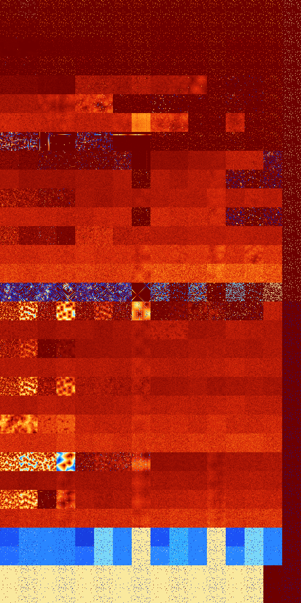

# B01234567 (130560-131071)

<details>
    <summary>Initial Grid</summary>
    
</details>


<details>
    <summary>Initial Grid RLE</summary>

```
#C Exported from GoGoL (https://github.com/marrow16/gogol)
#C Wrap mode: Toroidal
#C Boundary mode: Dead
#C Step: 0
x = 100, y = 100, rule = B01234567/S
15bo9bo8bo4bo34bo$16bo2bo21bo3bo10bo14bo10bo$26b2o16bo2bo45bo$bo33bob2o
2bo53bo$21bo17bo7bo7bo4bo8bobobo14bo$2bo22bo36bo4bo$16bo8bo14bo3bo24bo
22bo$16bo19bo16bo6bo16bo7bo10bo$39bo6bobo3bo9bo11bo10bo10bo$16bo19bo34b
o$40bo4bo28bo8bo6bo$11bo5bo12bo21bo22bo3bobo$3bo12bobo21b2o2bo12bo13bo
3bo9bo$37bo38bo22bo$ob2o7bo44bo3b2o17bo$4bo16bo30bo15bo9b3o3bo$4bo7bo5b
o7bobo6bo40bo$50bo16bo$16bo8bo12bo12bo7bo12bobo5bo$13bobo8bo12bo10bo13b
o24bo$19bo26bo6bo4bo8b2o4bo18bo$11bo14bo9bo5bo8bo15bo18bo$19bo36b2o21bo
8bo7bo$25bo6bo25bo8bo15b2obo12bo$5bo41bo11bo3bobo20bo$13bo17bo41bo$10bo
27bo9bo14bo$78bo3bo5bobo$8bo41bo11bo$4bo2bo33bo$21bo6bo39b2o12bo$4bo22b
obo24bo26bo17bo$2bo73bo12bo$21bo7bo18bo6bo35bo7bo$10bobo3bo14bo35bobo
22b2o$26bo$7bo6bo27bo$43bo20bo4bo9bo16bo$13bo16bo2bo3b2o11bo32bo6bo$11b
o9bobo5bo$44bo9bo15bo$2bo13bo50bo30bo$2bo2bo2bo11bo6b2o27bo$29bo9bo43bo
$34bo5bo14bo$27bo19b2o7bo$44b2o40bo5bo$8bo12bo4bo37bo7bo13bo3bo$100b$
11bo48bo3b2o4bo2bo23bo$11bo11bo4bo10bo12bo4bo2bo25bo$10bo10bo47bo19bo9b
o$22bo19bo3bo33bo$5bo11bo35bo42bo$2bo29bo37bo9bo4bo$o8bo35bo24bo15bo5bo
$27bo19bo2bobo$20bo40bo7b2o28bo$19bo49bo4bo$53bo25bobo$4bo37bo23bo12bo
2bo9bo$11bo3bo11bo4bo62bo$65bo30bo2bo$bo2bo10bo4bo2bo10bo5bo8bo3bo9bo$
5bo6bo45bo39bo$17bo50bo23bo$9bo20b2o10bo39bo$2bo38bo29bo4bo7bo3bo4bo$
10bo22bo7b2o2bo53bo$58bo4bo$40bo37bo$9bo7bo10bo9bo42bo14bo$14bo13bo66bo
$39bo48bo$3b2o37bo37bo$bo45b2o35bo$2bo50bo6bo10bo9bo16bo$46bo13bo7bo$bo
23bo10bo32bo2bo5bo$7bo2bo8bob2o9bo15bo7bo5bo2bo4bo$5bo17bo8bo6bo36bo2bo
5bo$16bobo33bo29bo6bo$o12bo31bo$13bo11bo9bo3bo$bo29bo26bo9bo4bo$40bo3bo
16bo11bo8bo13bo$95bo$60b2o11bo15bo3bo$46bo24bo23bob2o$12bo26bo$23bo41bo
7bo$33bo34bo16bo$8bo16bo30bo25bo4bo7bo$10bo8bo19bo6bo34bo5bo5bobobo$40b
o47bo$8bo5bo8bo22bo2bo3bo19bo7bo3bo12bo$o54bo18bo7bo8bo7bo$14bo6bo11bo
16bo$27bo27b2o$21bo56bo!
```
</details>
<details>
    <summary>Thumbnail</summary>

</details>
<table>
<tr>
    <td><a href="./130560%20S%20Heat%20Map%20Activity.png"></a><br>S (130560)<br>R@4,p2</td>    <td><a href="./130561%20S0%20Heat%20Map%20Activity.png"></a><br>S0 (130561)<br>R@3,p2</td>    <td><a href="./130562%20S1%20Heat%20Map%20Activity.png"></a><br>S1 (130562)<br>R@5,p2</td>    <td><a href="./130563%20S01%20Heat%20Map%20Activity.png"></a><br>S01 (130563)<br>R@5,p2</td>    <td><a href="./130564%20S2%20Heat%20Map%20Activity.png"></a><br>S2 (130564)<br>R@4,p2</td>    <td><a href="./130565%20S02%20Heat%20Map%20Activity.png"></a><br>S02 (130565)<br>R@4,p2</td>    <td><a href="./130566%20S12%20Heat%20Map%20Activity.png"></a><br>S12 (130566)<br>R@5,p2</td>    <td><a href="./130567%20S012%20Heat%20Map%20Activity.png"></a><br>S012 (130567)<br>R@5,p2</td>    <td><a href="./130568%20S3%20Heat%20Map%20Activity.png"></a><br>S3 (130568)<br>R@4,p2</td>    <td><a href="./130569%20S03%20Heat%20Map%20Activity.png"></a><br>S03 (130569)<br>R@4,p2</td>    <td><a href="./130570%20S13%20Heat%20Map%20Activity.png"></a><br>S13 (130570)<br>R@5,p2</td>    <td><a href="./130571%20S013%20Heat%20Map%20Activity.png"></a><br>S013 (130571)<br>R@5,p2</td>    <td><a href="./130572%20S23%20Heat%20Map%20Activity.png"></a><br>S23 (130572)<br>R@4,p2</td>    <td><a href="./130573%20S023%20Heat%20Map%20Activity.png"></a><br>S023 (130573)<br>R@4,p2</td>    <td><a href="./130574%20S123%20Heat%20Map%20Activity.png"></a><br>S123 (130574)<br>R@4,p2</td>    <td><a href="./130575%20S0123%20Heat%20Map%20Activity.png"></a><br>S0123 (130575)<br>R@3,p2</td></tr>
<tr>
    <td><a href="./130576%20S4%20Heat%20Map%20Activity.png"></a><br>S4 (130576)<br>R@6,p2</td>    <td><a href="./130577%20S04%20Heat%20Map%20Activity.png"></a><br>S04 (130577)<br>R@6,p2</td>    <td><a href="./130578%20S14%20Heat%20Map%20Activity.png"></a><br>S14 (130578)<br>R@5,p2</td>    <td><a href="./130579%20S014%20Heat%20Map%20Activity.png"></a><br>S014 (130579)<br>R@5,p2</td>    <td><a href="./130580%20S24%20Heat%20Map%20Activity.png"></a><br>S24 (130580)<br>R@4,p2</td>    <td><a href="./130581%20S024%20Heat%20Map%20Activity.png"></a><br>S024 (130581)<br>R@4,p2</td>    <td><a href="./130582%20S124%20Heat%20Map%20Activity.png"></a><br>S124 (130582)<br>R@5,p2</td>    <td><a href="./130583%20S0124%20Heat%20Map%20Activity.png"></a><br>S0124 (130583)<br>R@5,p2</td>    <td><a href="./130584%20S34%20Heat%20Map%20Activity.png"></a><br>S34 (130584)<br>R@6,p2</td>    <td><a href="./130585%20S034%20Heat%20Map%20Activity.png"></a><br>S034 (130585)<br>R@6,p2</td>    <td><a href="./130586%20S134%20Heat%20Map%20Activity.png"></a><br>S134 (130586)<br>R@5,p2</td>    <td><a href="./130587%20S0134%20Heat%20Map%20Activity.png"></a><br>S0134 (130587)<br>R@5,p2</td>    <td><a href="./130588%20S234%20Heat%20Map%20Activity.png"></a><br>S234 (130588)<br>R@4,p2</td>    <td><a href="./130589%20S0234%20Heat%20Map%20Activity.png"></a><br>S0234 (130589)<br>R@4,p2</td>    <td><a href="./130590%20S1234%20Heat%20Map%20Activity.png"></a><br>S1234 (130590)<br>R@4,p2</td>    <td><a href="./130591%20S01234%20Heat%20Map%20Activity.png"></a><br>S01234 (130591)<br>R@3,p2</td></tr>
<tr>
    <td><a href="./130592%20S5%20Heat%20Map%20Activity.png"></a><br>S5 (130592)<br>G>1000</td>    <td><a href="./130593%20S05%20Heat%20Map%20Activity.png"></a><br>S05 (130593)<br>R@754,p4</td>    <td><a href="./130594%20S15%20Heat%20Map%20Activity.png"></a><br>S15 (130594)<br>R@23,p16</td>    <td><a href="./130595%20S015%20Heat%20Map%20Activity.png"></a><br>S015 (130595)<br>R@21,p16</td>    <td><a href="./130596%20S25%20Heat%20Map%20Activity.png"></a><br>S25 (130596)<br>R@21,p2</td>    <td><a href="./130597%20S025%20Heat%20Map%20Activity.png"></a><br>S025 (130597)<br>R@13,p2</td>    <td><a href="./130598%20S125%20Heat%20Map%20Activity.png"></a><br>S125 (130598)<br>R@6,p2</td>    <td><a href="./130599%20S0125%20Heat%20Map%20Activity.png"></a><br>S0125 (130599)<br>R@5,p2</td>    <td><a href="./130600%20S35%20Heat%20Map%20Activity.png"></a><br>S35 (130600)<br>R@10,p2</td>    <td><a href="./130601%20S035%20Heat%20Map%20Activity.png"></a><br>S035 (130601)<br>R@10,p2</td>    <td><a href="./130602%20S135%20Heat%20Map%20Activity.png"></a><br>S135 (130602)<br>R@7,p2</td>    <td><a href="./130603%20S0135%20Heat%20Map%20Activity.png"></a><br>S0135 (130603)<br>R@5,p2</td>    <td><a href="./130604%20S235%20Heat%20Map%20Activity.png"></a><br>S235 (130604)<br>R@8,p2</td>    <td><a href="./130605%20S0235%20Heat%20Map%20Activity.png"></a><br>S0235 (130605)<br>R@7,p2</td>    <td><a href="./130606%20S1235%20Heat%20Map%20Activity.png"></a><br>S1235 (130606)<br>R@6,p2</td>    <td><a href="./130607%20S01235%20Heat%20Map%20Activity.png"></a><br>S01235 (130607)<br>R@3,p2</td></tr>
<tr>
    <td><a href="./130608%20S45%20Heat%20Map%20Activity.png"></a><br>S45 (130608)<br>R@10,p2</td>    <td><a href="./130609%20S045%20Heat%20Map%20Activity.png"></a><br>S045 (130609)<br>R@10,p2</td>    <td><a href="./130610%20S145%20Heat%20Map%20Activity.png"></a><br>S145 (130610)<br>R@6,p2</td>    <td><a href="./130611%20S0145%20Heat%20Map%20Activity.png"></a><br>S0145 (130611)<br>R@5,p2</td>    <td><a href="./130612%20S245%20Heat%20Map%20Activity.png"></a><br>S245 (130612)<br>R@8,p2</td>    <td><a href="./130613%20S0245%20Heat%20Map%20Activity.png"></a><br>S0245 (130613)<br>R@6,p2</td>    <td><a href="./130614%20S1245%20Heat%20Map%20Activity.png"></a><br>S1245 (130614)<br>R@6,p2</td>    <td><a href="./130615%20S01245%20Heat%20Map%20Activity.png"></a><br>S01245 (130615)<br>R@5,p2</td>    <td><a href="./130616%20S345%20Heat%20Map%20Activity.png"></a><br>S345 (130616)<br>R@8,p2</td>    <td><a href="./130617%20S0345%20Heat%20Map%20Activity.png"></a><br>S0345 (130617)<br>R@6,p2</td>    <td><a href="./130618%20S1345%20Heat%20Map%20Activity.png"></a><br>S1345 (130618)<br>R@7,p2</td>    <td><a href="./130619%20S01345%20Heat%20Map%20Activity.png"></a><br>S01345 (130619)<br>R@5,p2</td>    <td><a href="./130620%20S2345%20Heat%20Map%20Activity.png"></a><br>S2345 (130620)<br>R@6,p2</td>    <td><a href="./130621%20S02345%20Heat%20Map%20Activity.png"></a><br>S02345 (130621)<br>R@6,p2</td>    <td><a href="./130622%20S12345%20Heat%20Map%20Activity.png"></a><br>S12345 (130622)<br>R@6,p2</td>    <td><a href="./130623%20S012345%20Heat%20Map%20Activity.png"></a><br>S012345 (130623)<br>R@3,p2</td></tr>
<tr>
    <td><a href="./130624%20S6%20Heat%20Map%20Activity.png"></a><br>S6 (130624)<br>R@36,p2</td>    <td><a href="./130625%20S06%20Heat%20Map%20Activity.png"></a><br>S06 (130625)<br>R@43,p2</td>    <td><a href="./130626%20S16%20Heat%20Map%20Activity.png"></a><br>S16 (130626)<br>R@86,p2</td>    <td><a href="./130627%20S016%20Heat%20Map%20Activity.png"></a><br>S016 (130627)<br>R@101,p2</td>    <td><a href="./130628%20S26%20Heat%20Map%20Activity.png"></a><br>S26 (130628)<br>G>1000</td>    <td><a href="./130629%20S026%20Heat%20Map%20Activity.png"></a><br>S026 (130629)<br>G>1000</td>    <td><a href="./130630%20S126%20Heat%20Map%20Activity.png"></a><br>S126 (130630)<br>G>1000</td>    <td><a href="./130631%20S0126%20Heat%20Map%20Activity.png"></a><br>S0126 (130631)<br>G>1000</td>    <td><a href="./130632%20S36%20Heat%20Map%20Activity.png"></a><br>S36 (130632)<br>G>1000</td>    <td><a href="./130633%20S036%20Heat%20Map%20Activity.png"></a><br>S036 (130633)<br>G>1000</td>    <td><a href="./130634%20S136%20Heat%20Map%20Activity.png"></a><br>S136 (130634)<br>G>1000</td>    <td><a href="./130635%20S0136%20Heat%20Map%20Activity.png"></a><br>S0136 (130635)<br>R@7,p2</td>    <td><a href="./130636%20S236%20Heat%20Map%20Activity.png"></a><br>S236 (130636)<br>R@43,p4</td>    <td><a href="./130637%20S0236%20Heat%20Map%20Activity.png"></a><br>S0236 (130637)<br>R@14,p4</td>    <td><a href="./130638%20S1236%20Heat%20Map%20Activity.png"></a><br>S1236 (130638)<br>R@7,p2</td>    <td><a href="./130639%20S01236%20Heat%20Map%20Activity.png"></a><br>S01236 (130639)<br>R@3,p2</td></tr>
<tr>
    <td><a href="./130640%20S46%20Heat%20Map%20Activity.png"></a><br>S46 (130640)<br>G>1000</td>    <td><a href="./130641%20S046%20Heat%20Map%20Activity.png"></a><br>S046 (130641)<br>G>1000</td>    <td><a href="./130642%20S146%20Heat%20Map%20Activity.png"></a><br>S146 (130642)<br>G>1000</td>    <td><a href="./130643%20S0146%20Heat%20Map%20Activity.png"></a><br>S0146 (130643)<br>G>1000</td>    <td><a href="./130644%20S246%20Heat%20Map%20Activity.png"></a><br>S246 (130644)<br>G>1000</td>    <td><a href="./130645%20S0246%20Heat%20Map%20Activity.png"></a><br>S0246 (130645)<br>G>1000</td>    <td><a href="./130646%20S1246%20Heat%20Map%20Activity.png"></a><br>S1246 (130646)<br>R@13,p6</td>    <td><a href="./130647%20S01246%20Heat%20Map%20Activity.png"></a><br>S01246 (130647)<br>R@8,p6</td>    <td><a href="./130648%20S346%20Heat%20Map%20Activity.png"></a><br>S346 (130648)<br>R@88,p28</td>    <td><a href="./130649%20S0346%20Heat%20Map%20Activity.png"></a><br>S0346 (130649)<br>R@19,p4</td>    <td><a href="./130650%20S1346%20Heat%20Map%20Activity.png"></a><br>S1346 (130650)<br>R@16,p8</td>    <td><a href="./130651%20S01346%20Heat%20Map%20Activity.png"></a><br>S01346 (130651)<br>R@6,p2</td>    <td><a href="./130652%20S2346%20Heat%20Map%20Activity.png"></a><br>S2346 (130652)<br>R@15,p4</td>    <td><a href="./130653%20S02346%20Heat%20Map%20Activity.png"></a><br>S02346 (130653)<br>R@15,p4</td>    <td><a href="./130654%20S12346%20Heat%20Map%20Activity.png"></a><br>S12346 (130654)<br>R@7,p2</td>    <td><a href="./130655%20S012346%20Heat%20Map%20Activity.png"></a><br>S012346 (130655)<br>R@3,p2</td></tr>
<tr>
    <td><a href="./130656%20S56%20Heat%20Map%20Activity.png"></a><br>S56 (130656)<br>G>1000</td>    <td><a href="./130657%20S056%20Heat%20Map%20Activity.png"></a><br>S056 (130657)<br>G>1000</td>    <td><a href="./130658%20S156%20Heat%20Map%20Activity.png"></a><br>S156 (130658)<br>G>1000</td>    <td><a href="./130659%20S0156%20Heat%20Map%20Activity.png"></a><br>S0156 (130659)<br>G>1000</td>    <td><a href="./130660%20S256%20Heat%20Map%20Activity.png"></a><br>S256 (130660)<br>G>1000</td>    <td><a href="./130661%20S0256%20Heat%20Map%20Activity.png"></a><br>S0256 (130661)<br>G>1000</td>    <td><a href="./130662%20S1256%20Heat%20Map%20Activity.png"></a><br>S1256 (130662)<br>G>1000</td>    <td><a href="./130663%20S01256%20Heat%20Map%20Activity.png"></a><br>S01256 (130663)<br>G>1000</td>    <td><a href="./130664%20S356%20Heat%20Map%20Activity.png"></a><br>S356 (130664)<br>G>1000</td>    <td><a href="./130665%20S0356%20Heat%20Map%20Activity.png"></a><br>S0356 (130665)<br>G>1000</td>    <td><a href="./130666%20S1356%20Heat%20Map%20Activity.png"></a><br>S1356 (130666)<br>R@14,p4</td>    <td><a href="./130667%20S01356%20Heat%20Map%20Activity.png"></a><br>S01356 (130667)<br>R@8,p4</td>    <td><a href="./130668%20S2356%20Heat%20Map%20Activity.png"></a><br>S2356 (130668)<br>G>1000</td>    <td><a href="./130669%20S02356%20Heat%20Map%20Activity.png"></a><br>S02356 (130669)<br>R@9,p4</td>    <td><a href="./130670%20S12356%20Heat%20Map%20Activity.png"></a><br>S12356 (130670)<br>R@7,p2</td>    <td><a href="./130671%20S012356%20Heat%20Map%20Activity.png"></a><br>S012356 (130671)<br>R@3,p2</td></tr>
<tr>
    <td><a href="./130672%20S456%20Heat%20Map%20Activity.png"></a><br>S456 (130672)<br>R@62,p4</td>    <td><a href="./130673%20S0456%20Heat%20Map%20Activity.png"></a><br>S0456 (130673)<br>R@109,p12</td>    <td><a href="./130674%20S1456%20Heat%20Map%20Activity.png"></a><br>S1456 (130674)<br>R@226,p12</td>    <td><a href="./130675%20S01456%20Heat%20Map%20Activity.png"></a><br>S01456 (130675)<br>R@154,p12</td>    <td><a href="./130676%20S2456%20Heat%20Map%20Activity.png"></a><br>S2456 (130676)<br>R@134,p24</td>    <td><a href="./130677%20S02456%20Heat%20Map%20Activity.png"></a><br>S02456 (130677)<br>R@310,p144</td>    <td><a href="./130678%20S12456%20Heat%20Map%20Activity.png"></a><br>S12456 (130678)<br>R@199,p4</td>    <td><a href="./130679%20S012456%20Heat%20Map%20Activity.png"></a><br>S012456 (130679)<br>R@197,p2</td>    <td><a href="./130680%20S3456%20Heat%20Map%20Activity.png"></a><br>S3456 (130680)<br>R@21,p4</td>    <td><a href="./130681%20S03456%20Heat%20Map%20Activity.png"></a><br>S03456 (130681)<br>R@12,p4</td>    <td><a href="./130682%20S13456%20Heat%20Map%20Activity.png"></a><br>S13456 (130682)<br>R@10,p2</td>    <td><a href="./130683%20S013456%20Heat%20Map%20Activity.png"></a><br>S013456 (130683)<br>R@6,p2</td>    <td><a href="./130684%20S23456%20Heat%20Map%20Activity.png"></a><br>S23456 (130684)<br>R@12,p4</td>    <td><a href="./130685%20S023456%20Heat%20Map%20Activity.png"></a><br>S023456 (130685)<br>R@11,p4</td>    <td><a href="./130686%20S123456%20Heat%20Map%20Activity.png"></a><br>S123456 (130686)<br>R@7,p2</td>    <td><a href="./130687%20S0123456%20Heat%20Map%20Activity.png"></a><br>S0123456 (130687)<br>R@3,p2</td></tr>
<tr>
    <td><a href="./130688%20S7%20Heat%20Map%20Activity.png"></a><br>S7 (130688)<br>R@20,p4</td>    <td><a href="./130689%20S07%20Heat%20Map%20Activity.png"></a><br>S07 (130689)<br>R@30,p2</td>    <td><a href="./130690%20S17%20Heat%20Map%20Activity.png"></a><br>S17 (130690)<br>R@71,p2</td>    <td><a href="./130691%20S017%20Heat%20Map%20Activity.png"></a><br>S017 (130691)<br>R@82,p2</td>    <td><a href="./130692%20S27%20Heat%20Map%20Activity.png"></a><br>S27 (130692)<br>R@217,p120</td>    <td><a href="./130693%20S027%20Heat%20Map%20Activity.png"></a><br>S027 (130693)<br>R@293,p168</td>    <td><a href="./130694%20S127%20Heat%20Map%20Activity.png"></a><br>S127 (130694)<br>R@112,p24</td>    <td><a href="./130695%20S0127%20Heat%20Map%20Activity.png"></a><br>S0127 (130695)<br>R@101,p2</td>    <td><a href="./130696%20S37%20Heat%20Map%20Activity.png"></a><br>S37 (130696)<br>G>1000</td>    <td><a href="./130697%20S037%20Heat%20Map%20Activity.png"></a><br>S037 (130697)<br>G>1000</td>    <td><a href="./130698%20S137%20Heat%20Map%20Activity.png"></a><br>S137 (130698)<br>G>1000</td>    <td><a href="./130699%20S0137%20Heat%20Map%20Activity.png"></a><br>S0137 (130699)<br>G>1000</td>    <td><a href="./130700%20S237%20Heat%20Map%20Activity.png"></a><br>S237 (130700)<br>G>1000</td>    <td><a href="./130701%20S0237%20Heat%20Map%20Activity.png"></a><br>S0237 (130701)<br>G>1000</td>    <td><a href="./130702%20S1237%20Heat%20Map%20Activity.png"></a><br>S1237 (130702)<br>R@241,p24</td>    <td><a href="./130703%20S01237%20Heat%20Map%20Activity.png"></a><br>S01237 (130703)<br>R@3,p2</td></tr>
<tr>
    <td><a href="./130704%20S47%20Heat%20Map%20Activity.png"></a><br>S47 (130704)<br>G>1000</td>    <td><a href="./130705%20S047%20Heat%20Map%20Activity.png"></a><br>S047 (130705)<br>G>1000</td>    <td><a href="./130706%20S147%20Heat%20Map%20Activity.png"></a><br>S147 (130706)<br>G>1000</td>    <td><a href="./130707%20S0147%20Heat%20Map%20Activity.png"></a><br>S0147 (130707)<br>G>1000</td>    <td><a href="./130708%20S247%20Heat%20Map%20Activity.png"></a><br>S247 (130708)<br>G>1000</td>    <td><a href="./130709%20S0247%20Heat%20Map%20Activity.png"></a><br>S0247 (130709)<br>G>1000</td>    <td><a href="./130710%20S1247%20Heat%20Map%20Activity.png"></a><br>S1247 (130710)<br>G>1000</td>    <td><a href="./130711%20S01247%20Heat%20Map%20Activity.png"></a><br>S01247 (130711)<br>R@5,p2</td>    <td><a href="./130712%20S347%20Heat%20Map%20Activity.png"></a><br>S347 (130712)<br>G>1000</td>    <td><a href="./130713%20S0347%20Heat%20Map%20Activity.png"></a><br>S0347 (130713)<br>G>1000</td>    <td><a href="./130714%20S1347%20Heat%20Map%20Activity.png"></a><br>S1347 (130714)<br>G>1000</td>    <td><a href="./130715%20S01347%20Heat%20Map%20Activity.png"></a><br>S01347 (130715)<br>G>1000</td>    <td><a href="./130716%20S2347%20Heat%20Map%20Activity.png"></a><br>S2347 (130716)<br>R@58,p12</td>    <td><a href="./130717%20S02347%20Heat%20Map%20Activity.png"></a><br>S02347 (130717)<br>R@9,p2</td>    <td><a href="./130718%20S12347%20Heat%20Map%20Activity.png"></a><br>S12347 (130718)<br>R@37,p24</td>    <td><a href="./130719%20S012347%20Heat%20Map%20Activity.png"></a><br>S012347 (130719)<br>R@3,p2</td></tr>
<tr>
    <td><a href="./130720%20S57%20Heat%20Map%20Activity.png"></a><br>S57 (130720)<br>R@34,p2</td>    <td><a href="./130721%20S057%20Heat%20Map%20Activity.png"></a><br>S057 (130721)<br>R@43,p4</td>    <td><a href="./130722%20S157%20Heat%20Map%20Activity.png"></a><br>S157 (130722)<br>R@138,p8</td>    <td><a href="./130723%20S0157%20Heat%20Map%20Activity.png"></a><br>S0157 (130723)<br>R@109,p8</td>    <td><a href="./130724%20S257%20Heat%20Map%20Activity.png"></a><br>S257 (130724)<br>G>1000</td>    <td><a href="./130725%20S0257%20Heat%20Map%20Activity.png"></a><br>S0257 (130725)<br>G>1000</td>    <td><a href="./130726%20S1257%20Heat%20Map%20Activity.png"></a><br>S1257 (130726)<br>G>1000</td>    <td><a href="./130727%20S01257%20Heat%20Map%20Activity.png"></a><br>S01257 (130727)<br>G>1000</td>    <td><a href="./130728%20S357%20Heat%20Map%20Activity.png"></a><br>S357 (130728)<br>G>1000</td>    <td><a href="./130729%20S0357%20Heat%20Map%20Activity.png"></a><br>S0357 (130729)<br>G>1000</td>    <td><a href="./130730%20S1357%20Heat%20Map%20Activity.png"></a><br>S1357 (130730)<br>G>1000</td>    <td><a href="./130731%20S01357%20Heat%20Map%20Activity.png"></a><br>S01357 (130731)<br>G>1000</td>    <td><a href="./130732%20S2357%20Heat%20Map%20Activity.png"></a><br>S2357 (130732)<br>G>1000</td>    <td><a href="./130733%20S02357%20Heat%20Map%20Activity.png"></a><br>S02357 (130733)<br>G>1000</td>    <td><a href="./130734%20S12357%20Heat%20Map%20Activity.png"></a><br>S12357 (130734)<br>G>1000</td>    <td><a href="./130735%20S012357%20Heat%20Map%20Activity.png"></a><br>S012357 (130735)<br>R@3,p2</td></tr>
<tr>
    <td><a href="./130736%20S457%20Heat%20Map%20Activity.png"></a><br>S457 (130736)<br>G>1000</td>    <td><a href="./130737%20S0457%20Heat%20Map%20Activity.png"></a><br>S0457 (130737)<br>G>1000</td>    <td><a href="./130738%20S1457%20Heat%20Map%20Activity.png"></a><br>S1457 (130738)<br>G>1000</td>    <td><a href="./130739%20S01457%20Heat%20Map%20Activity.png"></a><br>S01457 (130739)<br>G>1000</td>    <td><a href="./130740%20S2457%20Heat%20Map%20Activity.png"></a><br>S2457 (130740)<br>G>1000</td>    <td><a href="./130741%20S02457%20Heat%20Map%20Activity.png"></a><br>S02457 (130741)<br>G>1000</td>    <td><a href="./130742%20S12457%20Heat%20Map%20Activity.png"></a><br>S12457 (130742)<br>G>1000</td>    <td><a href="./130743%20S012457%20Heat%20Map%20Activity.png"></a><br>S012457 (130743)<br>R@5,p2</td>    <td><a href="./130744%20S3457%20Heat%20Map%20Activity.png"></a><br>S3457 (130744)<br>G>1000</td>    <td><a href="./130745%20S03457%20Heat%20Map%20Activity.png"></a><br>S03457 (130745)<br>G>1000</td>    <td><a href="./130746%20S13457%20Heat%20Map%20Activity.png"></a><br>S13457 (130746)<br>G>1000</td>    <td><a href="./130747%20S013457%20Heat%20Map%20Activity.png"></a><br>S013457 (130747)<br>G>1000</td>    <td><a href="./130748%20S23457%20Heat%20Map%20Activity.png"></a><br>S23457 (130748)<br>R@29,p8</td>    <td><a href="./130749%20S023457%20Heat%20Map%20Activity.png"></a><br>S023457 (130749)<br>R@7,p2</td>    <td><a href="./130750%20S123457%20Heat%20Map%20Activity.png"></a><br>S123457 (130750)<br>R@23,p6</td>    <td><a href="./130751%20S0123457%20Heat%20Map%20Activity.png"></a><br>S0123457 (130751)<br>R@3,p2</td></tr>
<tr>
    <td><a href="./130752%20S67%20Heat%20Map%20Activity.png"></a><br>S67 (130752)<br>R@15,p2</td>    <td><a href="./130753%20S067%20Heat%20Map%20Activity.png"></a><br>S067 (130753)<br>R@32,p2</td>    <td><a href="./130754%20S167%20Heat%20Map%20Activity.png"></a><br>S167 (130754)<br>R@32,p4</td>    <td><a href="./130755%20S0167%20Heat%20Map%20Activity.png"></a><br>S0167 (130755)<br>R@66,p4</td>    <td><a href="./130756%20S267%20Heat%20Map%20Activity.png"></a><br>S267 (130756)<br>G>1000</td>    <td><a href="./130757%20S0267%20Heat%20Map%20Activity.png"></a><br>S0267 (130757)<br>G>1000</td>    <td><a href="./130758%20S1267%20Heat%20Map%20Activity.png"></a><br>S1267 (130758)<br>G>1000</td>    <td><a href="./130759%20S01267%20Heat%20Map%20Activity.png"></a><br>S01267 (130759)<br>G>1000</td>    <td><a href="./130760%20S367%20Heat%20Map%20Activity.png"></a><br>S367 (130760)<br>G>1000</td>    <td><a href="./130761%20S0367%20Heat%20Map%20Activity.png"></a><br>S0367 (130761)<br>G>1000</td>    <td><a href="./130762%20S1367%20Heat%20Map%20Activity.png"></a><br>S1367 (130762)<br>G>1000</td>    <td><a href="./130763%20S01367%20Heat%20Map%20Activity.png"></a><br>S01367 (130763)<br>G>1000</td>    <td><a href="./130764%20S2367%20Heat%20Map%20Activity.png"></a><br>S2367 (130764)<br>G>1000</td>    <td><a href="./130765%20S02367%20Heat%20Map%20Activity.png"></a><br>S02367 (130765)<br>G>1000</td>    <td><a href="./130766%20S12367%20Heat%20Map%20Activity.png"></a><br>S12367 (130766)<br>G>1000</td>    <td><a href="./130767%20S012367%20Heat%20Map%20Activity.png"></a><br>S012367 (130767)<br>R@3,p2</td></tr>
<tr>
    <td><a href="./130768%20S467%20Heat%20Map%20Activity.png"></a><br>S467 (130768)<br>G>1000</td>    <td><a href="./130769%20S0467%20Heat%20Map%20Activity.png"></a><br>S0467 (130769)<br>G>1000</td>    <td><a href="./130770%20S1467%20Heat%20Map%20Activity.png"></a><br>S1467 (130770)<br>G>1000</td>    <td><a href="./130771%20S01467%20Heat%20Map%20Activity.png"></a><br>S01467 (130771)<br>G>1000</td>    <td><a href="./130772%20S2467%20Heat%20Map%20Activity.png"></a><br>S2467 (130772)<br>G>1000</td>    <td><a href="./130773%20S02467%20Heat%20Map%20Activity.png"></a><br>S02467 (130773)<br>G>1000</td>    <td><a href="./130774%20S12467%20Heat%20Map%20Activity.png"></a><br>S12467 (130774)<br>G>1000</td>    <td><a href="./130775%20S012467%20Heat%20Map%20Activity.png"></a><br>S012467 (130775)<br>G>1000</td>    <td><a href="./130776%20S3467%20Heat%20Map%20Activity.png"></a><br>S3467 (130776)<br>G>1000</td>    <td><a href="./130777%20S03467%20Heat%20Map%20Activity.png"></a><br>S03467 (130777)<br>G>1000</td>    <td><a href="./130778%20S13467%20Heat%20Map%20Activity.png"></a><br>S13467 (130778)<br>G>1000</td>    <td><a href="./130779%20S013467%20Heat%20Map%20Activity.png"></a><br>S013467 (130779)<br>G>1000</td>    <td><a href="./130780%20S23467%20Heat%20Map%20Activity.png"></a><br>S23467 (130780)<br>G>1000</td>    <td><a href="./130781%20S023467%20Heat%20Map%20Activity.png"></a><br>S023467 (130781)<br>G>1000</td>    <td><a href="./130782%20S123467%20Heat%20Map%20Activity.png"></a><br>S123467 (130782)<br>G>1000</td>    <td><a href="./130783%20S0123467%20Heat%20Map%20Activity.png"></a><br>S0123467 (130783)<br>R@3,p2</td></tr>
<tr>
    <td><a href="./130784%20S567%20Heat%20Map%20Activity.png"></a><br>S567 (130784)<br>G>1000</td>    <td><a href="./130785%20S0567%20Heat%20Map%20Activity.png"></a><br>S0567 (130785)<br>G>1000</td>    <td><a href="./130786%20S1567%20Heat%20Map%20Activity.png"></a><br>S1567 (130786)<br>G>1000</td>    <td><a href="./130787%20S01567%20Heat%20Map%20Activity.png"></a><br>S01567 (130787)<br>G>1000</td>    <td><a href="./130788%20S2567%20Heat%20Map%20Activity.png"></a><br>S2567 (130788)<br>G>1000</td>    <td><a href="./130789%20S02567%20Heat%20Map%20Activity.png"></a><br>S02567 (130789)<br>G>1000</td>    <td><a href="./130790%20S12567%20Heat%20Map%20Activity.png"></a><br>S12567 (130790)<br>G>1000</td>    <td><a href="./130791%20S012567%20Heat%20Map%20Activity.png"></a><br>S012567 (130791)<br>G>1000</td>    <td><a href="./130792%20S3567%20Heat%20Map%20Activity.png"></a><br>S3567 (130792)<br>G>1000</td>    <td><a href="./130793%20S03567%20Heat%20Map%20Activity.png"></a><br>S03567 (130793)<br>G>1000</td>    <td><a href="./130794%20S13567%20Heat%20Map%20Activity.png"></a><br>S13567 (130794)<br>G>1000</td>    <td><a href="./130795%20S013567%20Heat%20Map%20Activity.png"></a><br>S013567 (130795)<br>G>1000</td>    <td><a href="./130796%20S23567%20Heat%20Map%20Activity.png"></a><br>S23567 (130796)<br>G>1000</td>    <td><a href="./130797%20S023567%20Heat%20Map%20Activity.png"></a><br>S023567 (130797)<br>G>1000</td>    <td><a href="./130798%20S123567%20Heat%20Map%20Activity.png"></a><br>S123567 (130798)<br>G>1000</td>    <td><a href="./130799%20S0123567%20Heat%20Map%20Activity.png"></a><br>S0123567 (130799)<br>R@3,p2</td></tr>
<tr>
    <td><a href="./130800%20S4567%20Heat%20Map%20Activity.png"></a><br>S4567 (130800)<br>R@135,p24</td>    <td><a href="./130801%20S04567%20Heat%20Map%20Activity.png"></a><br>S04567 (130801)<br>R@79,p6</td>    <td><a href="./130802%20S14567%20Heat%20Map%20Activity.png"></a><br>S14567 (130802)<br>R@118,p6</td>    <td><a href="./130803%20S014567%20Heat%20Map%20Activity.png"></a><br>S014567 (130803)<br>R@151,p6</td>    <td><a href="./130804%20S24567%20Heat%20Map%20Activity.png"></a><br>S24567 (130804)<br>R@90,p6</td>    <td><a href="./130805%20S024567%20Heat%20Map%20Activity.png"></a><br>S024567 (130805)<br>R@62,p6</td>    <td><a href="./130806%20S124567%20Heat%20Map%20Activity.png"></a><br>S124567 (130806)<br>R@83,p6</td>    <td><a href="./130807%20S0124567%20Heat%20Map%20Activity.png"></a><br>S0124567 (130807)<br>R@100,p2</td>    <td><a href="./130808%20S34567%20Heat%20Map%20Activity.png"></a><br>S34567 (130808)<br>R@12,p2</td>    <td><a href="./130809%20S034567%20Heat%20Map%20Activity.png"></a><br>S034567 (130809)<br>R@6,p2</td>    <td><a href="./130810%20S134567%20Heat%20Map%20Activity.png"></a><br>S134567 (130810)<br>R@12,p2</td>    <td><a href="./130811%20S0134567%20Heat%20Map%20Activity.png"></a><br>S0134567 (130811)<br>R@6,p2</td>    <td><a href="./130812%20S234567%20Heat%20Map%20Activity.png"></a><br>S234567 (130812)<br>R@4,p2</td>    <td><a href="./130813%20S0234567%20Heat%20Map%20Activity.png"></a><br>S0234567 (130813)<br>R@4,p2</td>    <td><a href="./130814%20S1234567%20Heat%20Map%20Activity.png"></a><br>S1234567 (130814)<br>R@3,p2</td>    <td><a href="./130815%20S01234567%20Heat%20Map%20Activity.png"></a><br>S01234567 (130815)<br>R@3,p2</td></tr>
<tr>
    <td><a href="./130816%20S8%20Heat%20Map%20Activity.png"></a><br>S8 (130816)<br>R@10,p4</td>    <td><a href="./130817%20S08%20Heat%20Map%20Activity.png"></a><br>S08 (130817)<br>R@14,p2</td>    <td><a href="./130818%20S18%20Heat%20Map%20Activity.png"></a><br>S18 (130818)<br>R@27,p8</td>    <td><a href="./130819%20S018%20Heat%20Map%20Activity.png"></a><br>S018 (130819)<br>R@29,p8</td>    <td><a href="./130820%20S28%20Heat%20Map%20Activity.png"></a><br>S28 (130820)<br>R@40,p12</td>    <td><a href="./130821%20S028%20Heat%20Map%20Activity.png"></a><br>S028 (130821)<br>R@41,p12</td>    <td><a href="./130822%20S128%20Heat%20Map%20Activity.png"></a><br>S128 (130822)<br>R@70,p24</td>    <td><a href="./130823%20S0128%20Heat%20Map%20Activity.png"></a><br>S0128 (130823)<br>R@98,p24</td>    <td><a href="./130824%20S38%20Heat%20Map%20Activity.png"></a><br>S38 (130824)<br>R@213,p120</td>    <td><a href="./130825%20S038%20Heat%20Map%20Activity.png"></a><br>S038 (130825)<br>R@209,p120</td>    <td><a href="./130826%20S138%20Heat%20Map%20Activity.png"></a><br>S138 (130826)<br>G>1000</td>    <td><a href="./130827%20S0138%20Heat%20Map%20Activity.png"></a><br>S0138 (130827)<br>G>1000</td>    <td><a href="./130828%20S238%20Heat%20Map%20Activity.png"></a><br>S238 (130828)<br>G>1000</td>    <td><a href="./130829%20S0238%20Heat%20Map%20Activity.png"></a><br>S0238 (130829)<br>G>1000</td>    <td><a href="./130830%20S1238%20Heat%20Map%20Activity.png"></a><br>S1238 (130830)<br>G>1000</td>    <td><a href="./130831%20S01238%20Heat%20Map%20Activity.png"></a><br>S01238 (130831)<br>S@1</td></tr>
<tr>
    <td><a href="./130832%20S48%20Heat%20Map%20Activity.png"></a><br>S48 (130832)<br>G>1000</td>    <td><a href="./130833%20S048%20Heat%20Map%20Activity.png"></a><br>S048 (130833)<br>G>1000</td>    <td><a href="./130834%20S148%20Heat%20Map%20Activity.png"></a><br>S148 (130834)<br>G>1000</td>    <td><a href="./130835%20S0148%20Heat%20Map%20Activity.png"></a><br>S0148 (130835)<br>G>1000</td>    <td><a href="./130836%20S248%20Heat%20Map%20Activity.png"></a><br>S248 (130836)<br>G>1000</td>    <td><a href="./130837%20S0248%20Heat%20Map%20Activity.png"></a><br>S0248 (130837)<br>G>1000</td>    <td><a href="./130838%20S1248%20Heat%20Map%20Activity.png"></a><br>S1248 (130838)<br>G>1000</td>    <td><a href="./130839%20S01248%20Heat%20Map%20Activity.png"></a><br>S01248 (130839)<br>G>1000</td>    <td><a href="./130840%20S348%20Heat%20Map%20Activity.png"></a><br>S348 (130840)<br>G>1000</td>    <td><a href="./130841%20S0348%20Heat%20Map%20Activity.png"></a><br>S0348 (130841)<br>G>1000</td>    <td><a href="./130842%20S1348%20Heat%20Map%20Activity.png"></a><br>S1348 (130842)<br>G>1000</td>    <td><a href="./130843%20S01348%20Heat%20Map%20Activity.png"></a><br>S01348 (130843)<br>G>1000</td>    <td><a href="./130844%20S2348%20Heat%20Map%20Activity.png"></a><br>S2348 (130844)<br>G>1000</td>    <td><a href="./130845%20S02348%20Heat%20Map%20Activity.png"></a><br>S02348 (130845)<br>G>1000</td>    <td><a href="./130846%20S12348%20Heat%20Map%20Activity.png"></a><br>S12348 (130846)<br>G>1000</td>    <td><a href="./130847%20S012348%20Heat%20Map%20Activity.png"></a><br>S012348 (130847)<br>S@1</td></tr>
<tr>
    <td><a href="./130848%20S58%20Heat%20Map%20Activity.png"></a><br>S58 (130848)<br>R@38,p2</td>    <td><a href="./130849%20S058%20Heat%20Map%20Activity.png"></a><br>S058 (130849)<br>R@47,p2</td>    <td><a href="./130850%20S158%20Heat%20Map%20Activity.png"></a><br>S158 (130850)<br>R@615,p360</td>    <td><a href="./130851%20S0158%20Heat%20Map%20Activity.png"></a><br>S0158 (130851)<br>R@428,p168</td>    <td><a href="./130852%20S258%20Heat%20Map%20Activity.png"></a><br>S258 (130852)<br>G>1000</td>    <td><a href="./130853%20S0258%20Heat%20Map%20Activity.png"></a><br>S0258 (130853)<br>G>1000</td>    <td><a href="./130854%20S1258%20Heat%20Map%20Activity.png"></a><br>S1258 (130854)<br>G>1000</td>    <td><a href="./130855%20S01258%20Heat%20Map%20Activity.png"></a><br>S01258 (130855)<br>G>1000</td>    <td><a href="./130856%20S358%20Heat%20Map%20Activity.png"></a><br>S358 (130856)<br>G>1000</td>    <td><a href="./130857%20S0358%20Heat%20Map%20Activity.png"></a><br>S0358 (130857)<br>G>1000</td>    <td><a href="./130858%20S1358%20Heat%20Map%20Activity.png"></a><br>S1358 (130858)<br>G>1000</td>    <td><a href="./130859%20S01358%20Heat%20Map%20Activity.png"></a><br>S01358 (130859)<br>G>1000</td>    <td><a href="./130860%20S2358%20Heat%20Map%20Activity.png"></a><br>S2358 (130860)<br>G>1000</td>    <td><a href="./130861%20S02358%20Heat%20Map%20Activity.png"></a><br>S02358 (130861)<br>G>1000</td>    <td><a href="./130862%20S12358%20Heat%20Map%20Activity.png"></a><br>S12358 (130862)<br>G>1000</td>    <td><a href="./130863%20S012358%20Heat%20Map%20Activity.png"></a><br>S012358 (130863)<br>S@1</td></tr>
<tr>
    <td><a href="./130864%20S458%20Heat%20Map%20Activity.png"></a><br>S458 (130864)<br>G>1000</td>    <td><a href="./130865%20S0458%20Heat%20Map%20Activity.png"></a><br>S0458 (130865)<br>G>1000</td>    <td><a href="./130866%20S1458%20Heat%20Map%20Activity.png"></a><br>S1458 (130866)<br>G>1000</td>    <td><a href="./130867%20S01458%20Heat%20Map%20Activity.png"></a><br>S01458 (130867)<br>G>1000</td>    <td><a href="./130868%20S2458%20Heat%20Map%20Activity.png"></a><br>S2458 (130868)<br>G>1000</td>    <td><a href="./130869%20S02458%20Heat%20Map%20Activity.png"></a><br>S02458 (130869)<br>G>1000</td>    <td><a href="./130870%20S12458%20Heat%20Map%20Activity.png"></a><br>S12458 (130870)<br>G>1000</td>    <td><a href="./130871%20S012458%20Heat%20Map%20Activity.png"></a><br>S012458 (130871)<br>G>1000</td>    <td><a href="./130872%20S3458%20Heat%20Map%20Activity.png"></a><br>S3458 (130872)<br>G>1000</td>    <td><a href="./130873%20S03458%20Heat%20Map%20Activity.png"></a><br>S03458 (130873)<br>G>1000</td>    <td><a href="./130874%20S13458%20Heat%20Map%20Activity.png"></a><br>S13458 (130874)<br>G>1000</td>    <td><a href="./130875%20S013458%20Heat%20Map%20Activity.png"></a><br>S013458 (130875)<br>G>1000</td>    <td><a href="./130876%20S23458%20Heat%20Map%20Activity.png"></a><br>S23458 (130876)<br>G>1000</td>    <td><a href="./130877%20S023458%20Heat%20Map%20Activity.png"></a><br>S023458 (130877)<br>G>1000</td>    <td><a href="./130878%20S123458%20Heat%20Map%20Activity.png"></a><br>S123458 (130878)<br>G>1000</td>    <td><a href="./130879%20S0123458%20Heat%20Map%20Activity.png"></a><br>S0123458 (130879)<br>S@1</td></tr>
<tr>
    <td><a href="./130880%20S68%20Heat%20Map%20Activity.png"></a><br>S68 (130880)<br>R@14,p2</td>    <td><a href="./130881%20S068%20Heat%20Map%20Activity.png"></a><br>S068 (130881)<br>R@19,p2</td>    <td><a href="./130882%20S168%20Heat%20Map%20Activity.png"></a><br>S168 (130882)<br>R@35,p4</td>    <td><a href="./130883%20S0168%20Heat%20Map%20Activity.png"></a><br>S0168 (130883)<br>R@50,p4</td>    <td><a href="./130884%20S268%20Heat%20Map%20Activity.png"></a><br>S268 (130884)<br>G>1000</td>    <td><a href="./130885%20S0268%20Heat%20Map%20Activity.png"></a><br>S0268 (130885)<br>G>1000</td>    <td><a href="./130886%20S1268%20Heat%20Map%20Activity.png"></a><br>S1268 (130886)<br>G>1000</td>    <td><a href="./130887%20S01268%20Heat%20Map%20Activity.png"></a><br>S01268 (130887)<br>G>1000</td>    <td><a href="./130888%20S368%20Heat%20Map%20Activity.png"></a><br>S368 (130888)<br>G>1000</td>    <td><a href="./130889%20S0368%20Heat%20Map%20Activity.png"></a><br>S0368 (130889)<br>G>1000</td>    <td><a href="./130890%20S1368%20Heat%20Map%20Activity.png"></a><br>S1368 (130890)<br>G>1000</td>    <td><a href="./130891%20S01368%20Heat%20Map%20Activity.png"></a><br>S01368 (130891)<br>G>1000</td>    <td><a href="./130892%20S2368%20Heat%20Map%20Activity.png"></a><br>S2368 (130892)<br>G>1000</td>    <td><a href="./130893%20S02368%20Heat%20Map%20Activity.png"></a><br>S02368 (130893)<br>G>1000</td>    <td><a href="./130894%20S12368%20Heat%20Map%20Activity.png"></a><br>S12368 (130894)<br>G>1000</td>    <td><a href="./130895%20S012368%20Heat%20Map%20Activity.png"></a><br>S012368 (130895)<br>S@1</td></tr>
<tr>
    <td><a href="./130896%20S468%20Heat%20Map%20Activity.png"></a><br>S468 (130896)<br>G>1000</td>    <td><a href="./130897%20S0468%20Heat%20Map%20Activity.png"></a><br>S0468 (130897)<br>G>1000</td>    <td><a href="./130898%20S1468%20Heat%20Map%20Activity.png"></a><br>S1468 (130898)<br>G>1000</td>    <td><a href="./130899%20S01468%20Heat%20Map%20Activity.png"></a><br>S01468 (130899)<br>G>1000</td>    <td><a href="./130900%20S2468%20Heat%20Map%20Activity.png"></a><br>S2468 (130900)<br>G>1000</td>    <td><a href="./130901%20S02468%20Heat%20Map%20Activity.png"></a><br>S02468 (130901)<br>G>1000</td>    <td><a href="./130902%20S12468%20Heat%20Map%20Activity.png"></a><br>S12468 (130902)<br>G>1000</td>    <td><a href="./130903%20S012468%20Heat%20Map%20Activity.png"></a><br>S012468 (130903)<br>G>1000</td>    <td><a href="./130904%20S3468%20Heat%20Map%20Activity.png"></a><br>S3468 (130904)<br>G>1000</td>    <td><a href="./130905%20S03468%20Heat%20Map%20Activity.png"></a><br>S03468 (130905)<br>G>1000</td>    <td><a href="./130906%20S13468%20Heat%20Map%20Activity.png"></a><br>S13468 (130906)<br>G>1000</td>    <td><a href="./130907%20S013468%20Heat%20Map%20Activity.png"></a><br>S013468 (130907)<br>G>1000</td>    <td><a href="./130908%20S23468%20Heat%20Map%20Activity.png"></a><br>S23468 (130908)<br>G>1000</td>    <td><a href="./130909%20S023468%20Heat%20Map%20Activity.png"></a><br>S023468 (130909)<br>G>1000</td>    <td><a href="./130910%20S123468%20Heat%20Map%20Activity.png"></a><br>S123468 (130910)<br>G>1000</td>    <td><a href="./130911%20S0123468%20Heat%20Map%20Activity.png"></a><br>S0123468 (130911)<br>S@1</td></tr>
<tr>
    <td><a href="./130912%20S568%20Heat%20Map%20Activity.png"></a><br>S568 (130912)<br>R@477,p6</td>    <td><a href="./130913%20S0568%20Heat%20Map%20Activity.png"></a><br>S0568 (130913)<br>R@586,p2</td>    <td><a href="./130914%20S1568%20Heat%20Map%20Activity.png"></a><br>S1568 (130914)<br>G>1000</td>    <td><a href="./130915%20S01568%20Heat%20Map%20Activity.png"></a><br>S01568 (130915)<br>G>1000</td>    <td><a href="./130916%20S2568%20Heat%20Map%20Activity.png"></a><br>S2568 (130916)<br>G>1000</td>    <td><a href="./130917%20S02568%20Heat%20Map%20Activity.png"></a><br>S02568 (130917)<br>G>1000</td>    <td><a href="./130918%20S12568%20Heat%20Map%20Activity.png"></a><br>S12568 (130918)<br>G>1000</td>    <td><a href="./130919%20S012568%20Heat%20Map%20Activity.png"></a><br>S012568 (130919)<br>G>1000</td>    <td><a href="./130920%20S3568%20Heat%20Map%20Activity.png"></a><br>S3568 (130920)<br>G>1000</td>    <td><a href="./130921%20S03568%20Heat%20Map%20Activity.png"></a><br>S03568 (130921)<br>G>1000</td>    <td><a href="./130922%20S13568%20Heat%20Map%20Activity.png"></a><br>S13568 (130922)<br>G>1000</td>    <td><a href="./130923%20S013568%20Heat%20Map%20Activity.png"></a><br>S013568 (130923)<br>G>1000</td>    <td><a href="./130924%20S23568%20Heat%20Map%20Activity.png"></a><br>S23568 (130924)<br>G>1000</td>    <td><a href="./130925%20S023568%20Heat%20Map%20Activity.png"></a><br>S023568 (130925)<br>G>1000</td>    <td><a href="./130926%20S123568%20Heat%20Map%20Activity.png"></a><br>S123568 (130926)<br>G>1000</td>    <td><a href="./130927%20S0123568%20Heat%20Map%20Activity.png"></a><br>S0123568 (130927)<br>S@1</td></tr>
<tr>
    <td><a href="./130928%20S4568%20Heat%20Map%20Activity.png"></a><br>S4568 (130928)<br>G>1000</td>    <td><a href="./130929%20S04568%20Heat%20Map%20Activity.png"></a><br>S04568 (130929)<br>G>1000</td>    <td><a href="./130930%20S14568%20Heat%20Map%20Activity.png"></a><br>S14568 (130930)<br>G>1000</td>    <td><a href="./130931%20S014568%20Heat%20Map%20Activity.png"></a><br>S014568 (130931)<br>G>1000</td>    <td><a href="./130932%20S24568%20Heat%20Map%20Activity.png"></a><br>S24568 (130932)<br>G>1000</td>    <td><a href="./130933%20S024568%20Heat%20Map%20Activity.png"></a><br>S024568 (130933)<br>G>1000</td>    <td><a href="./130934%20S124568%20Heat%20Map%20Activity.png"></a><br>S124568 (130934)<br>G>1000</td>    <td><a href="./130935%20S0124568%20Heat%20Map%20Activity.png"></a><br>S0124568 (130935)<br>G>1000</td>    <td><a href="./130936%20S34568%20Heat%20Map%20Activity.png"></a><br>S34568 (130936)<br>G>1000</td>    <td><a href="./130937%20S034568%20Heat%20Map%20Activity.png"></a><br>S034568 (130937)<br>G>1000</td>    <td><a href="./130938%20S134568%20Heat%20Map%20Activity.png"></a><br>S134568 (130938)<br>G>1000</td>    <td><a href="./130939%20S0134568%20Heat%20Map%20Activity.png"></a><br>S0134568 (130939)<br>G>1000</td>    <td><a href="./130940%20S234568%20Heat%20Map%20Activity.png"></a><br>S234568 (130940)<br>G>1000</td>    <td><a href="./130941%20S0234568%20Heat%20Map%20Activity.png"></a><br>S0234568 (130941)<br>G>1000</td>    <td><a href="./130942%20S1234568%20Heat%20Map%20Activity.png"></a><br>S1234568 (130942)<br>G>1000</td>    <td><a href="./130943%20S01234568%20Heat%20Map%20Activity.png"></a><br>S01234568 (130943)<br>S@1</td></tr>
<tr>
    <td><a href="./130944%20S78%20Heat%20Map%20Activity.png"></a><br>S78 (130944)<br>R@18,p4</td>    <td><a href="./130945%20S078%20Heat%20Map%20Activity.png"></a><br>S078 (130945)<br>R@24,p2</td>    <td><a href="./130946%20S178%20Heat%20Map%20Activity.png"></a><br>S178 (130946)<br>R@23,p4</td>    <td><a href="./130947%20S0178%20Heat%20Map%20Activity.png"></a><br>S0178 (130947)<br>R@67,p2</td>    <td><a href="./130948%20S278%20Heat%20Map%20Activity.png"></a><br>S278 (130948)<br>R@205,p24</td>    <td><a href="./130949%20S0278%20Heat%20Map%20Activity.png"></a><br>S0278 (130949)<br>R@187,p24</td>    <td><a href="./130950%20S1278%20Heat%20Map%20Activity.png"></a><br>S1278 (130950)<br>R@143,p12</td>    <td><a href="./130951%20S01278%20Heat%20Map%20Activity.png"></a><br>S01278 (130951)<br>R@402,p120</td>    <td><a href="./130952%20S378%20Heat%20Map%20Activity.png"></a><br>S378 (130952)<br>G>1000</td>    <td><a href="./130953%20S0378%20Heat%20Map%20Activity.png"></a><br>S0378 (130953)<br>G>1000</td>    <td><a href="./130954%20S1378%20Heat%20Map%20Activity.png"></a><br>S1378 (130954)<br>G>1000</td>    <td><a href="./130955%20S01378%20Heat%20Map%20Activity.png"></a><br>S01378 (130955)<br>G>1000</td>    <td><a href="./130956%20S2378%20Heat%20Map%20Activity.png"></a><br>S2378 (130956)<br>G>1000</td>    <td><a href="./130957%20S02378%20Heat%20Map%20Activity.png"></a><br>S02378 (130957)<br>G>1000</td>    <td><a href="./130958%20S12378%20Heat%20Map%20Activity.png"></a><br>S12378 (130958)<br>G>1000</td>    <td><a href="./130959%20S012378%20Heat%20Map%20Activity.png"></a><br>S012378 (130959)<br>S@1</td></tr>
<tr>
    <td><a href="./130960%20S478%20Heat%20Map%20Activity.png"></a><br>S478 (130960)<br>G>1000</td>    <td><a href="./130961%20S0478%20Heat%20Map%20Activity.png"></a><br>S0478 (130961)<br>G>1000</td>    <td><a href="./130962%20S1478%20Heat%20Map%20Activity.png"></a><br>S1478 (130962)<br>G>1000</td>    <td><a href="./130963%20S01478%20Heat%20Map%20Activity.png"></a><br>S01478 (130963)<br>G>1000</td>    <td><a href="./130964%20S2478%20Heat%20Map%20Activity.png"></a><br>S2478 (130964)<br>G>1000</td>    <td><a href="./130965%20S02478%20Heat%20Map%20Activity.png"></a><br>S02478 (130965)<br>G>1000</td>    <td><a href="./130966%20S12478%20Heat%20Map%20Activity.png"></a><br>S12478 (130966)<br>G>1000</td>    <td><a href="./130967%20S012478%20Heat%20Map%20Activity.png"></a><br>S012478 (130967)<br>G>1000</td>    <td><a href="./130968%20S3478%20Heat%20Map%20Activity.png"></a><br>S3478 (130968)<br>G>1000</td>    <td><a href="./130969%20S03478%20Heat%20Map%20Activity.png"></a><br>S03478 (130969)<br>G>1000</td>    <td><a href="./130970%20S13478%20Heat%20Map%20Activity.png"></a><br>S13478 (130970)<br>G>1000</td>    <td><a href="./130971%20S013478%20Heat%20Map%20Activity.png"></a><br>S013478 (130971)<br>G>1000</td>    <td><a href="./130972%20S23478%20Heat%20Map%20Activity.png"></a><br>S23478 (130972)<br>G>1000</td>    <td><a href="./130973%20S023478%20Heat%20Map%20Activity.png"></a><br>S023478 (130973)<br>G>1000</td>    <td><a href="./130974%20S123478%20Heat%20Map%20Activity.png"></a><br>S123478 (130974)<br>G>1000</td>    <td><a href="./130975%20S0123478%20Heat%20Map%20Activity.png"></a><br>S0123478 (130975)<br>S@1</td></tr>
<tr>
    <td><a href="./130976%20S578%20Heat%20Map%20Activity.png"></a><br>S578 (130976)<br>R@37,p2</td>    <td><a href="./130977%20S0578%20Heat%20Map%20Activity.png"></a><br>S0578 (130977)<br>R@45,p4</td>    <td><a href="./130978%20S1578%20Heat%20Map%20Activity.png"></a><br>S1578 (130978)<br>G>1000</td>    <td><a href="./130979%20S01578%20Heat%20Map%20Activity.png"></a><br>S01578 (130979)<br>R@273,p80</td>    <td><a href="./130980%20S2578%20Heat%20Map%20Activity.png"></a><br>S2578 (130980)<br>G>1000</td>    <td><a href="./130981%20S02578%20Heat%20Map%20Activity.png"></a><br>S02578 (130981)<br>G>1000</td>    <td><a href="./130982%20S12578%20Heat%20Map%20Activity.png"></a><br>S12578 (130982)<br>G>1000</td>    <td><a href="./130983%20S012578%20Heat%20Map%20Activity.png"></a><br>S012578 (130983)<br>G>1000</td>    <td><a href="./130984%20S3578%20Heat%20Map%20Activity.png"></a><br>S3578 (130984)<br>G>1000</td>    <td><a href="./130985%20S03578%20Heat%20Map%20Activity.png"></a><br>S03578 (130985)<br>G>1000</td>    <td><a href="./130986%20S13578%20Heat%20Map%20Activity.png"></a><br>S13578 (130986)<br>G>1000</td>    <td><a href="./130987%20S013578%20Heat%20Map%20Activity.png"></a><br>S013578 (130987)<br>G>1000</td>    <td><a href="./130988%20S23578%20Heat%20Map%20Activity.png"></a><br>S23578 (130988)<br>G>1000</td>    <td><a href="./130989%20S023578%20Heat%20Map%20Activity.png"></a><br>S023578 (130989)<br>G>1000</td>    <td><a href="./130990%20S123578%20Heat%20Map%20Activity.png"></a><br>S123578 (130990)<br>G>1000</td>    <td><a href="./130991%20S0123578%20Heat%20Map%20Activity.png"></a><br>S0123578 (130991)<br>S@1</td></tr>
<tr>
    <td><a href="./130992%20S4578%20Heat%20Map%20Activity.png"></a><br>S4578 (130992)<br>G>1000</td>    <td><a href="./130993%20S04578%20Heat%20Map%20Activity.png"></a><br>S04578 (130993)<br>G>1000</td>    <td><a href="./130994%20S14578%20Heat%20Map%20Activity.png"></a><br>S14578 (130994)<br>G>1000</td>    <td><a href="./130995%20S014578%20Heat%20Map%20Activity.png"></a><br>S014578 (130995)<br>G>1000</td>    <td><a href="./130996%20S24578%20Heat%20Map%20Activity.png"></a><br>S24578 (130996)<br>G>1000</td>    <td><a href="./130997%20S024578%20Heat%20Map%20Activity.png"></a><br>S024578 (130997)<br>G>1000</td>    <td><a href="./130998%20S124578%20Heat%20Map%20Activity.png"></a><br>S124578 (130998)<br>G>1000</td>    <td><a href="./130999%20S0124578%20Heat%20Map%20Activity.png"></a><br>S0124578 (130999)<br>G>1000</td>    <td><a href="./131000%20S34578%20Heat%20Map%20Activity.png"></a><br>S34578 (131000)<br>G>1000</td>    <td><a href="./131001%20S034578%20Heat%20Map%20Activity.png"></a><br>S034578 (131001)<br>G>1000</td>    <td><a href="./131002%20S134578%20Heat%20Map%20Activity.png"></a><br>S134578 (131002)<br>G>1000</td>    <td><a href="./131003%20S0134578%20Heat%20Map%20Activity.png"></a><br>S0134578 (131003)<br>G>1000</td>    <td><a href="./131004%20S234578%20Heat%20Map%20Activity.png"></a><br>S234578 (131004)<br>G>1000</td>    <td><a href="./131005%20S0234578%20Heat%20Map%20Activity.png"></a><br>S0234578 (131005)<br>G>1000</td>    <td><a href="./131006%20S1234578%20Heat%20Map%20Activity.png"></a><br>S1234578 (131006)<br>G>1000</td>    <td><a href="./131007%20S01234578%20Heat%20Map%20Activity.png"></a><br>S01234578 (131007)<br>S@1</td></tr>
<tr>
    <td><a href="./131008%20S678%20Heat%20Map%20Activity.png"></a><br>S678 (131008)<br>R@9,p4</td>    <td><a href="./131009%20S0678%20Heat%20Map%20Activity.png"></a><br>S0678 (131009)<br>S@5</td>    <td><a href="./131010%20S1678%20Heat%20Map%20Activity.png"></a><br>S1678 (131010)<br>S@5</td>    <td><a href="./131011%20S01678%20Heat%20Map%20Activity.png"></a><br>S01678 (131011)<br>S@5</td>    <td><a href="./131012%20S2678%20Heat%20Map%20Activity.png"></a><br>S2678 (131012)<br>R@13,p4</td>    <td><a href="./131013%20S02678%20Heat%20Map%20Activity.png"></a><br>S02678 (131013)<br>S@3</td>    <td><a href="./131014%20S12678%20Heat%20Map%20Activity.png"></a><br>S12678 (131014)<br>S@5</td>    <td><a href="./131015%20S012678%20Heat%20Map%20Activity.png"></a><br>S012678 (131015)<br>S@2</td>    <td><a href="./131016%20S3678%20Heat%20Map%20Activity.png"></a><br>S3678 (131016)<br>R@9,p4</td>    <td><a href="./131017%20S03678%20Heat%20Map%20Activity.png"></a><br>S03678 (131017)<br>S@4</td>    <td><a href="./131018%20S13678%20Heat%20Map%20Activity.png"></a><br>S13678 (131018)<br>S@5</td>    <td><a href="./131019%20S013678%20Heat%20Map%20Activity.png"></a><br>S013678 (131019)<br>S@2</td>    <td><a href="./131020%20S23678%20Heat%20Map%20Activity.png"></a><br>S23678 (131020)<br>R@9,p4</td>    <td><a href="./131021%20S023678%20Heat%20Map%20Activity.png"></a><br>S023678 (131021)<br>S@3</td>    <td><a href="./131022%20S123678%20Heat%20Map%20Activity.png"></a><br>S123678 (131022)<br>S@5</td>    <td><a href="./131023%20S0123678%20Heat%20Map%20Activity.png"></a><br>S0123678 (131023)<br>S@1</td></tr>
<tr>
    <td><a href="./131024%20S4678%20Heat%20Map%20Activity.png"></a><br>S4678 (131024)<br>S@6</td>    <td><a href="./131025%20S04678%20Heat%20Map%20Activity.png"></a><br>S04678 (131025)<br>S@5</td>    <td><a href="./131026%20S14678%20Heat%20Map%20Activity.png"></a><br>S14678 (131026)<br>S@6</td>    <td><a href="./131027%20S014678%20Heat%20Map%20Activity.png"></a><br>S014678 (131027)<br>S@5</td>    <td><a href="./131028%20S24678%20Heat%20Map%20Activity.png"></a><br>S24678 (131028)<br>S@6</td>    <td><a href="./131029%20S024678%20Heat%20Map%20Activity.png"></a><br>S024678 (131029)<br>S@3</td>    <td><a href="./131030%20S124678%20Heat%20Map%20Activity.png"></a><br>S124678 (131030)<br>S@6</td>    <td><a href="./131031%20S0124678%20Heat%20Map%20Activity.png"></a><br>S0124678 (131031)<br>S@2</td>    <td><a href="./131032%20S34678%20Heat%20Map%20Activity.png"></a><br>S34678 (131032)<br>S@6</td>    <td><a href="./131033%20S034678%20Heat%20Map%20Activity.png"></a><br>S034678 (131033)<br>S@4</td>    <td><a href="./131034%20S134678%20Heat%20Map%20Activity.png"></a><br>S134678 (131034)<br>S@6</td>    <td><a href="./131035%20S0134678%20Heat%20Map%20Activity.png"></a><br>S0134678 (131035)<br>S@2</td>    <td><a href="./131036%20S234678%20Heat%20Map%20Activity.png"></a><br>S234678 (131036)<br>S@6</td>    <td><a href="./131037%20S0234678%20Heat%20Map%20Activity.png"></a><br>S0234678 (131037)<br>S@3</td>    <td><a href="./131038%20S1234678%20Heat%20Map%20Activity.png"></a><br>S1234678 (131038)<br>S@6</td>    <td><a href="./131039%20S01234678%20Heat%20Map%20Activity.png"></a><br>S01234678 (131039)<br>S@1</td></tr>
<tr>
    <td><a href="./131040%20S5678%20Heat%20Map%20Activity.png"></a><br>S5678 (131040)<br>S@2</td>    <td><a href="./131041%20S05678%20Heat%20Map%20Activity.png"></a><br>S05678 (131041)<br>S@2</td>    <td><a href="./131042%20S15678%20Heat%20Map%20Activity.png"></a><br>S15678 (131042)<br>S@2</td>    <td><a href="./131043%20S015678%20Heat%20Map%20Activity.png"></a><br>S015678 (131043)<br>S@2</td>    <td><a href="./131044%20S25678%20Heat%20Map%20Activity.png"></a><br>S25678 (131044)<br>S@2</td>    <td><a href="./131045%20S025678%20Heat%20Map%20Activity.png"></a><br>S025678 (131045)<br>S@2</td>    <td><a href="./131046%20S125678%20Heat%20Map%20Activity.png"></a><br>S125678 (131046)<br>S@2</td>    <td><a href="./131047%20S0125678%20Heat%20Map%20Activity.png"></a><br>S0125678 (131047)<br>S@2</td>    <td><a href="./131048%20S35678%20Heat%20Map%20Activity.png"></a><br>S35678 (131048)<br>S@2</td>    <td><a href="./131049%20S035678%20Heat%20Map%20Activity.png"></a><br>S035678 (131049)<br>S@2</td>    <td><a href="./131050%20S135678%20Heat%20Map%20Activity.png"></a><br>S135678 (131050)<br>S@2</td>    <td><a href="./131051%20S0135678%20Heat%20Map%20Activity.png"></a><br>S0135678 (131051)<br>S@2</td>    <td><a href="./131052%20S235678%20Heat%20Map%20Activity.png"></a><br>S235678 (131052)<br>S@2</td>    <td><a href="./131053%20S0235678%20Heat%20Map%20Activity.png"></a><br>S0235678 (131053)<br>S@2</td>    <td><a href="./131054%20S1235678%20Heat%20Map%20Activity.png"></a><br>S1235678 (131054)<br>S@1</td>    <td><a href="./131055%20S01235678%20Heat%20Map%20Activity.png"></a><br>S01235678 (131055)<br>S@1</td></tr>
<tr>
    <td><a href="./131056%20S45678%20Heat%20Map%20Activity.png"></a><br>S45678 (131056)<br>S@2</td>    <td><a href="./131057%20S045678%20Heat%20Map%20Activity.png"></a><br>S045678 (131057)<br>S@2</td>    <td><a href="./131058%20S145678%20Heat%20Map%20Activity.png"></a><br>S145678 (131058)<br>S@2</td>    <td><a href="./131059%20S0145678%20Heat%20Map%20Activity.png"></a><br>S0145678 (131059)<br>S@2</td>    <td><a href="./131060%20S245678%20Heat%20Map%20Activity.png"></a><br>S245678 (131060)<br>S@2</td>    <td><a href="./131061%20S0245678%20Heat%20Map%20Activity.png"></a><br>S0245678 (131061)<br>S@2</td>    <td><a href="./131062%20S1245678%20Heat%20Map%20Activity.png"></a><br>S1245678 (131062)<br>S@2</td>    <td><a href="./131063%20S01245678%20Heat%20Map%20Activity.png"></a><br>S01245678 (131063)<br>S@2</td>    <td><a href="./131064%20S345678%20Heat%20Map%20Activity.png"></a><br>S345678 (131064)<br>S@2</td>    <td><a href="./131065%20S0345678%20Heat%20Map%20Activity.png"></a><br>S0345678 (131065)<br>S@2</td>    <td><a href="./131066%20S1345678%20Heat%20Map%20Activity.png"></a><br>S1345678 (131066)<br>S@2</td>    <td><a href="./131067%20S01345678%20Heat%20Map%20Activity.png"></a><br>S01345678 (131067)<br>S@2</td>    <td><a href="./131068%20S2345678%20Heat%20Map%20Activity.png"></a><br>S2345678 (131068)<br>S@2</td>    <td><a href="./131069%20S02345678%20Heat%20Map%20Activity.png"></a><br>S02345678 (131069)<br>S@2</td>    <td><a href="./131070%20S12345678%20Heat%20Map%20Activity.png"></a><br>S12345678 (131070)<br>S@1</td>    <td><a href="./131071%20S012345678%20Heat%20Map%20Activity.png"></a><br>S012345678 (131071)<br>S@1</td></tr>
</table>
