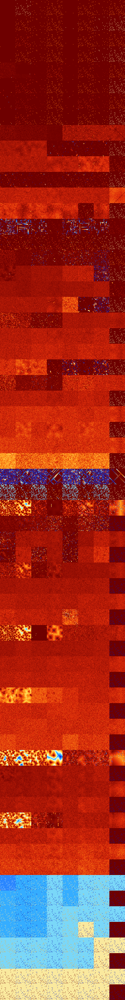

# B012345678 (261632-262143)

<details>
    <summary>Initial Grid</summary>
    
</details>


<details>
    <summary>Initial Grid RLE</summary>

```
#C Exported from GoGoL (https://github.com/marrow16/gogol)
#C Wrap mode: Toroidal
#C Boundary mode: Dead
#C Step: 0
x = 100, y = 100, rule = B012345678/S
6bo3bo53bo$bo7bo12bo2bobo67bo$33bobo3bo21bo$40bo3bo20bo5bo12bo$5bo7bo
17bo47b2o$7b2o15bo16bo4bo14bo22bo$17bo41bo$12bo9bo13bo35bo$4bo10bo44bo
3bob2o22bo5bo$18b3o54bo5bo8bo$12bo7b2o13bo20bo7bo4bo$11bo50bo9bo$21bo
23bo30bo$7bo21bo15bo42bo7bo$13bo3bo42bo5bo15bobo4b2o8bo$26bo26bo26bo5bo
$27bo46bo$10bo8bo3bo5bo14bobo18bo14bo3bo$37bo$37bo7bo18bo21bo2bo$32bo
22bo2bo$25bo5bo2bobo31bo16bo$2bo19bo14bo24bo9bo4bo5bobo$11bo32bo45bo$3b
o34bo8bo7bo12bo4bo5bo$10bo9bo13bo7bo9bo22bo9bo$36bo$2bo33bo4bo13bo4bo
13bo15bo5bo$8bo$o7bo2bobo17bo23bo25bo$12bo32bo13bo9bo5bo2bo17bo$87bo$
25bo4bo39bo23bo$36bo41bo12bo$8bo16bo7bo10b2o3bo44bo$44bo4bo18bo18bo$25b
o5bo64bo$4bo43bo24bo9bo$4bo5bo53bo11bo$o13bo82bo$27bo27bo$bo45bo30bo4bo
8bo$69bo$2bo33bo8bo5bo7bo$13bo40bo4bo9bo10bo17bo$34bo16bo19bo$18bo37b2o
15bo23bo$3bo39bo22bo27bo$19bo63b2o7bo$10bo5bobo28bo14bo28bo7bo$65bo20b
2o9bo$6bo36bo11bo9bo24bo7bo$8bo22bo23bo43bo$13bo4bo24bo45bo$15bo38bobo
15bo5bo5bo$48bo24bo$3bo10bo37bo24bo6bo$o20bo$38bo12bo9bo16bo5bo$5bo43bo
9bo3bo$6bo19bo8bo26bo$12bo12bo44bo19bo$46bo13bo16bo$bo54bo4bo23bo$18bo
14bo3bo2bo25bo$4bo2bo16bo23bo11bo5bo9bo13bo3bo$51bo24bo$bo6bo4bo15bo19b
o30bobo14bo$18bo16bo13bo12bo4bo$17bo14bo31bo$9bo13bo52bo10bo5bo$11bo7bo
26bo12bo8bo5bo9bo3bo$28bo6bo31bo$6bo13bo37bo14bo13bo$o6bo29bo42bo$22bo
15bo13bo10bo31bo$o4bo15b2o3bo41bo$53bo17bo7bo10bo$2bo5bo23bo14bo13bobo
24bo$11bo27bo3bo4bo4bo15bobo8bo$24b2o7bo2bo7bo43bo$bo21bobo52bo11bo3bo$
100b$68bo24bo$67bobo8bo$37bo30bo21bobo$4bo11bo29bo18bo10bo4bo14bo$21bo
13bo28bobo6bo$8bo17bobo4bo21b2o2bobo10bo12b2o$93bo$11bo6bo9bobo65bo$3bo
48bo2bo16bob2o6bo12bo$39bo5bo25bo2bo4bo19bo$o2b2o7b2o4bo7bo6bo53bo3bobo
4bo$bo2bo29bo15bo$10bo35bo18bo3bo21bo3bo$10bo8bo4bo36bo28bo$b2o35bo20bo
26bo$25bo23bo12bo20bo$b2o62bo5bo3bobo!
```
</details>
<details>
    <summary>Thumbnail</summary>

</details>
<table>
<tr>
    <td><a href="./261632%20S%20Heat%20Map%20Activity.png"></a><br>S (261632)<br>R@2,p2</td>    <td><a href="./261633%20S0%20Heat%20Map%20Activity.png"></a><br>S0 (261633)<br>R@3,p2</td>    <td><a href="./261634%20S1%20Heat%20Map%20Activity.png"></a><br>S1 (261634)<br>R@5,p2</td>    <td><a href="./261635%20S01%20Heat%20Map%20Activity.png"></a><br>S01 (261635)<br>R@5,p2</td>    <td><a href="./261636%20S2%20Heat%20Map%20Activity.png"></a><br>S2 (261636)<br>R@5,p2</td>    <td><a href="./261637%20S02%20Heat%20Map%20Activity.png"></a><br>S02 (261637)<br>R@5,p2</td>    <td><a href="./261638%20S12%20Heat%20Map%20Activity.png"></a><br>S12 (261638)<br>R@5,p2</td>    <td><a href="./261639%20S012%20Heat%20Map%20Activity.png"></a><br>S012 (261639)<br>R@5,p2</td></tr>
<tr>
    <td><a href="./261640%20S3%20Heat%20Map%20Activity.png"></a><br>S3 (261640)<br>R@3,p2</td>    <td><a href="./261641%20S03%20Heat%20Map%20Activity.png"></a><br>S03 (261641)<br>R@5,p2</td>    <td><a href="./261642%20S13%20Heat%20Map%20Activity.png"></a><br>S13 (261642)<br>R@5,p2</td>    <td><a href="./261643%20S013%20Heat%20Map%20Activity.png"></a><br>S013 (261643)<br>R@5,p2</td>    <td><a href="./261644%20S23%20Heat%20Map%20Activity.png"></a><br>S23 (261644)<br>R@3,p2</td>    <td><a href="./261645%20S023%20Heat%20Map%20Activity.png"></a><br>S023 (261645)<br>R@5,p2</td>    <td><a href="./261646%20S123%20Heat%20Map%20Activity.png"></a><br>S123 (261646)<br>R@3,p2</td>    <td><a href="./261647%20S0123%20Heat%20Map%20Activity.png"></a><br>S0123 (261647)<br>R@3,p2</td></tr>
<tr>
    <td><a href="./261648%20S4%20Heat%20Map%20Activity.png"></a><br>S4 (261648)<br>R@5,p2</td>    <td><a href="./261649%20S04%20Heat%20Map%20Activity.png"></a><br>S04 (261649)<br>R@7,p2</td>    <td><a href="./261650%20S14%20Heat%20Map%20Activity.png"></a><br>S14 (261650)<br>R@5,p2</td>    <td><a href="./261651%20S014%20Heat%20Map%20Activity.png"></a><br>S014 (261651)<br>R@5,p2</td>    <td><a href="./261652%20S24%20Heat%20Map%20Activity.png"></a><br>S24 (261652)<br>R@5,p2</td>    <td><a href="./261653%20S024%20Heat%20Map%20Activity.png"></a><br>S024 (261653)<br>R@5,p2</td>    <td><a href="./261654%20S124%20Heat%20Map%20Activity.png"></a><br>S124 (261654)<br>R@5,p2</td>    <td><a href="./261655%20S0124%20Heat%20Map%20Activity.png"></a><br>S0124 (261655)<br>R@5,p2</td></tr>
<tr>
    <td><a href="./261656%20S34%20Heat%20Map%20Activity.png"></a><br>S34 (261656)<br>R@5,p2</td>    <td><a href="./261657%20S034%20Heat%20Map%20Activity.png"></a><br>S034 (261657)<br>R@5,p2</td>    <td><a href="./261658%20S134%20Heat%20Map%20Activity.png"></a><br>S134 (261658)<br>R@5,p2</td>    <td><a href="./261659%20S0134%20Heat%20Map%20Activity.png"></a><br>S0134 (261659)<br>R@5,p2</td>    <td><a href="./261660%20S234%20Heat%20Map%20Activity.png"></a><br>S234 (261660)<br>R@5,p2</td>    <td><a href="./261661%20S0234%20Heat%20Map%20Activity.png"></a><br>S0234 (261661)<br>R@5,p2</td>    <td><a href="./261662%20S1234%20Heat%20Map%20Activity.png"></a><br>S1234 (261662)<br>R@3,p2</td>    <td><a href="./261663%20S01234%20Heat%20Map%20Activity.png"></a><br>S01234 (261663)<br>R@3,p2</td></tr>
<tr>
    <td><a href="./261664%20S5%20Heat%20Map%20Activity.png"></a><br>S5 (261664)<br>R@246,p2</td>    <td><a href="./261665%20S05%20Heat%20Map%20Activity.png"></a><br>S05 (261665)<br>R@507,p2</td>    <td><a href="./261666%20S15%20Heat%20Map%20Activity.png"></a><br>S15 (261666)<br>R@42,p16</td>    <td><a href="./261667%20S015%20Heat%20Map%20Activity.png"></a><br>S015 (261667)<br>R@7,p2</td>    <td><a href="./261668%20S25%20Heat%20Map%20Activity.png"></a><br>S25 (261668)<br>R@26,p2</td>    <td><a href="./261669%20S025%20Heat%20Map%20Activity.png"></a><br>S025 (261669)<br>R@6,p2</td>    <td><a href="./261670%20S125%20Heat%20Map%20Activity.png"></a><br>S125 (261670)<br>R@18,p2</td>    <td><a href="./261671%20S0125%20Heat%20Map%20Activity.png"></a><br>S0125 (261671)<br>R@5,p2</td></tr>
<tr>
    <td><a href="./261672%20S35%20Heat%20Map%20Activity.png"></a><br>S35 (261672)<br>R@9,p2</td>    <td><a href="./261673%20S035%20Heat%20Map%20Activity.png"></a><br>S035 (261673)<br>R@9,p2</td>    <td><a href="./261674%20S135%20Heat%20Map%20Activity.png"></a><br>S135 (261674)<br>R@7,p2</td>    <td><a href="./261675%20S0135%20Heat%20Map%20Activity.png"></a><br>S0135 (261675)<br>R@5,p2</td>    <td><a href="./261676%20S235%20Heat%20Map%20Activity.png"></a><br>S235 (261676)<br>R@5,p2</td>    <td><a href="./261677%20S0235%20Heat%20Map%20Activity.png"></a><br>S0235 (261677)<br>R@5,p2</td>    <td><a href="./261678%20S1235%20Heat%20Map%20Activity.png"></a><br>S1235 (261678)<br>R@5,p2</td>    <td><a href="./261679%20S01235%20Heat%20Map%20Activity.png"></a><br>S01235 (261679)<br>R@3,p2</td></tr>
<tr>
    <td><a href="./261680%20S45%20Heat%20Map%20Activity.png"></a><br>S45 (261680)<br>R@14,p4</td>    <td><a href="./261681%20S045%20Heat%20Map%20Activity.png"></a><br>S045 (261681)<br>R@12,p2</td>    <td><a href="./261682%20S145%20Heat%20Map%20Activity.png"></a><br>S145 (261682)<br>R@14,p2</td>    <td><a href="./261683%20S0145%20Heat%20Map%20Activity.png"></a><br>S0145 (261683)<br>R@5,p2</td>    <td><a href="./261684%20S245%20Heat%20Map%20Activity.png"></a><br>S245 (261684)<br>R@7,p2</td>    <td><a href="./261685%20S0245%20Heat%20Map%20Activity.png"></a><br>S0245 (261685)<br>R@7,p2</td>    <td><a href="./261686%20S1245%20Heat%20Map%20Activity.png"></a><br>S1245 (261686)<br>R@11,p2</td>    <td><a href="./261687%20S01245%20Heat%20Map%20Activity.png"></a><br>S01245 (261687)<br>R@5,p2</td></tr>
<tr>
    <td><a href="./261688%20S345%20Heat%20Map%20Activity.png"></a><br>S345 (261688)<br>R@5,p2</td>    <td><a href="./261689%20S0345%20Heat%20Map%20Activity.png"></a><br>S0345 (261689)<br>R@7,p2</td>    <td><a href="./261690%20S1345%20Heat%20Map%20Activity.png"></a><br>S1345 (261690)<br>R@5,p2</td>    <td><a href="./261691%20S01345%20Heat%20Map%20Activity.png"></a><br>S01345 (261691)<br>R@5,p2</td>    <td><a href="./261692%20S2345%20Heat%20Map%20Activity.png"></a><br>S2345 (261692)<br>R@5,p2</td>    <td><a href="./261693%20S02345%20Heat%20Map%20Activity.png"></a><br>S02345 (261693)<br>R@5,p2</td>    <td><a href="./261694%20S12345%20Heat%20Map%20Activity.png"></a><br>S12345 (261694)<br>R@5,p2</td>    <td><a href="./261695%20S012345%20Heat%20Map%20Activity.png"></a><br>S012345 (261695)<br>R@3,p2</td></tr>
<tr>
    <td><a href="./261696%20S6%20Heat%20Map%20Activity.png"></a><br>S6 (261696)<br>R@36,p2</td>    <td><a href="./261697%20S06%20Heat%20Map%20Activity.png"></a><br>S06 (261697)<br>R@52,p2</td>    <td><a href="./261698%20S16%20Heat%20Map%20Activity.png"></a><br>S16 (261698)<br>R@69,p2</td>    <td><a href="./261699%20S016%20Heat%20Map%20Activity.png"></a><br>S016 (261699)<br>R@155,p2</td>    <td><a href="./261700%20S26%20Heat%20Map%20Activity.png"></a><br>S26 (261700)<br>G>1000</td>    <td><a href="./261701%20S026%20Heat%20Map%20Activity.png"></a><br>S026 (261701)<br>G>1000</td>    <td><a href="./261702%20S126%20Heat%20Map%20Activity.png"></a><br>S126 (261702)<br>G>1000</td>    <td><a href="./261703%20S0126%20Heat%20Map%20Activity.png"></a><br>S0126 (261703)<br>G>1000</td></tr>
<tr>
    <td><a href="./261704%20S36%20Heat%20Map%20Activity.png"></a><br>S36 (261704)<br>G>1000</td>    <td><a href="./261705%20S036%20Heat%20Map%20Activity.png"></a><br>S036 (261705)<br>G>1000</td>    <td><a href="./261706%20S136%20Heat%20Map%20Activity.png"></a><br>S136 (261706)<br>G>1000</td>    <td><a href="./261707%20S0136%20Heat%20Map%20Activity.png"></a><br>S0136 (261707)<br>R@17,p2</td>    <td><a href="./261708%20S236%20Heat%20Map%20Activity.png"></a><br>S236 (261708)<br>R@95,p4</td>    <td><a href="./261709%20S0236%20Heat%20Map%20Activity.png"></a><br>S0236 (261709)<br>R@25,p2</td>    <td><a href="./261710%20S1236%20Heat%20Map%20Activity.png"></a><br>S1236 (261710)<br>R@29,p4</td>    <td><a href="./261711%20S01236%20Heat%20Map%20Activity.png"></a><br>S01236 (261711)<br>R@3,p2</td></tr>
<tr>
    <td><a href="./261712%20S46%20Heat%20Map%20Activity.png"></a><br>S46 (261712)<br>G>1000</td>    <td><a href="./261713%20S046%20Heat%20Map%20Activity.png"></a><br>S046 (261713)<br>G>1000</td>    <td><a href="./261714%20S146%20Heat%20Map%20Activity.png"></a><br>S146 (261714)<br>G>1000</td>    <td><a href="./261715%20S0146%20Heat%20Map%20Activity.png"></a><br>S0146 (261715)<br>G>1000</td>    <td><a href="./261716%20S246%20Heat%20Map%20Activity.png"></a><br>S246 (261716)<br>G>1000</td>    <td><a href="./261717%20S0246%20Heat%20Map%20Activity.png"></a><br>S0246 (261717)<br>G>1000</td>    <td><a href="./261718%20S1246%20Heat%20Map%20Activity.png"></a><br>S1246 (261718)<br>G>1000</td>    <td><a href="./261719%20S01246%20Heat%20Map%20Activity.png"></a><br>S01246 (261719)<br>R@7,p2</td></tr>
<tr>
    <td><a href="./261720%20S346%20Heat%20Map%20Activity.png"></a><br>S346 (261720)<br>R@29,p2</td>    <td><a href="./261721%20S0346%20Heat%20Map%20Activity.png"></a><br>S0346 (261721)<br>R@21,p2</td>    <td><a href="./261722%20S1346%20Heat%20Map%20Activity.png"></a><br>S1346 (261722)<br>R@25,p8</td>    <td><a href="./261723%20S01346%20Heat%20Map%20Activity.png"></a><br>S01346 (261723)<br>R@13,p2</td>    <td><a href="./261724%20S2346%20Heat%20Map%20Activity.png"></a><br>S2346 (261724)<br>R@19,p2</td>    <td><a href="./261725%20S02346%20Heat%20Map%20Activity.png"></a><br>S02346 (261725)<br>R@11,p2</td>    <td><a href="./261726%20S12346%20Heat%20Map%20Activity.png"></a><br>S12346 (261726)<br>R@11,p2</td>    <td><a href="./261727%20S012346%20Heat%20Map%20Activity.png"></a><br>S012346 (261727)<br>R@3,p2</td></tr>
<tr>
    <td><a href="./261728%20S56%20Heat%20Map%20Activity.png"></a><br>S56 (261728)<br>G>1000</td>    <td><a href="./261729%20S056%20Heat%20Map%20Activity.png"></a><br>S056 (261729)<br>G>1000</td>    <td><a href="./261730%20S156%20Heat%20Map%20Activity.png"></a><br>S156 (261730)<br>G>1000</td>    <td><a href="./261731%20S0156%20Heat%20Map%20Activity.png"></a><br>S0156 (261731)<br>G>1000</td>    <td><a href="./261732%20S256%20Heat%20Map%20Activity.png"></a><br>S256 (261732)<br>G>1000</td>    <td><a href="./261733%20S0256%20Heat%20Map%20Activity.png"></a><br>S0256 (261733)<br>G>1000</td>    <td><a href="./261734%20S1256%20Heat%20Map%20Activity.png"></a><br>S1256 (261734)<br>G>1000</td>    <td><a href="./261735%20S01256%20Heat%20Map%20Activity.png"></a><br>S01256 (261735)<br>G>1000</td></tr>
<tr>
    <td><a href="./261736%20S356%20Heat%20Map%20Activity.png"></a><br>S356 (261736)<br>G>1000</td>    <td><a href="./261737%20S0356%20Heat%20Map%20Activity.png"></a><br>S0356 (261737)<br>G>1000</td>    <td><a href="./261738%20S1356%20Heat%20Map%20Activity.png"></a><br>S1356 (261738)<br>G>1000</td>    <td><a href="./261739%20S01356%20Heat%20Map%20Activity.png"></a><br>S01356 (261739)<br>G>1000</td>    <td><a href="./261740%20S2356%20Heat%20Map%20Activity.png"></a><br>S2356 (261740)<br>G>1000</td>    <td><a href="./261741%20S02356%20Heat%20Map%20Activity.png"></a><br>S02356 (261741)<br>R@9,p2</td>    <td><a href="./261742%20S12356%20Heat%20Map%20Activity.png"></a><br>S12356 (261742)<br>G>1000</td>    <td><a href="./261743%20S012356%20Heat%20Map%20Activity.png"></a><br>S012356 (261743)<br>R@3,p2</td></tr>
<tr>
    <td><a href="./261744%20S456%20Heat%20Map%20Activity.png"></a><br>S456 (261744)<br>R@60,p4</td>    <td><a href="./261745%20S0456%20Heat%20Map%20Activity.png"></a><br>S0456 (261745)<br>R@120,p4</td>    <td><a href="./261746%20S1456%20Heat%20Map%20Activity.png"></a><br>S1456 (261746)<br>R@48,p2</td>    <td><a href="./261747%20S01456%20Heat%20Map%20Activity.png"></a><br>S01456 (261747)<br>R@17,p2</td>    <td><a href="./261748%20S2456%20Heat%20Map%20Activity.png"></a><br>S2456 (261748)<br>R@65,p4</td>    <td><a href="./261749%20S02456%20Heat%20Map%20Activity.png"></a><br>S02456 (261749)<br>R@127,p2</td>    <td><a href="./261750%20S12456%20Heat%20Map%20Activity.png"></a><br>S12456 (261750)<br>R@60,p4</td>    <td><a href="./261751%20S012456%20Heat%20Map%20Activity.png"></a><br>S012456 (261751)<br>R@13,p2</td></tr>
<tr>
    <td><a href="./261752%20S3456%20Heat%20Map%20Activity.png"></a><br>S3456 (261752)<br>R@11,p2</td>    <td><a href="./261753%20S03456%20Heat%20Map%20Activity.png"></a><br>S03456 (261753)<br>R@7,p2</td>    <td><a href="./261754%20S13456%20Heat%20Map%20Activity.png"></a><br>S13456 (261754)<br>R@7,p2</td>    <td><a href="./261755%20S013456%20Heat%20Map%20Activity.png"></a><br>S013456 (261755)<br>R@7,p2</td>    <td><a href="./261756%20S23456%20Heat%20Map%20Activity.png"></a><br>S23456 (261756)<br>R@7,p2</td>    <td><a href="./261757%20S023456%20Heat%20Map%20Activity.png"></a><br>S023456 (261757)<br>R@7,p2</td>    <td><a href="./261758%20S123456%20Heat%20Map%20Activity.png"></a><br>S123456 (261758)<br>R@5,p2</td>    <td><a href="./261759%20S0123456%20Heat%20Map%20Activity.png"></a><br>S0123456 (261759)<br>R@3,p2</td></tr>
<tr>
    <td><a href="./261760%20S7%20Heat%20Map%20Activity.png"></a><br>S7 (261760)<br>R@18,p2</td>    <td><a href="./261761%20S07%20Heat%20Map%20Activity.png"></a><br>S07 (261761)<br>R@42,p2</td>    <td><a href="./261762%20S17%20Heat%20Map%20Activity.png"></a><br>S17 (261762)<br>R@55,p2</td>    <td><a href="./261763%20S017%20Heat%20Map%20Activity.png"></a><br>S017 (261763)<br>R@89,p2</td>    <td><a href="./261764%20S27%20Heat%20Map%20Activity.png"></a><br>S27 (261764)<br>R@77,p12</td>    <td><a href="./261765%20S027%20Heat%20Map%20Activity.png"></a><br>S027 (261765)<br>R@120,p24</td>    <td><a href="./261766%20S127%20Heat%20Map%20Activity.png"></a><br>S127 (261766)<br>R@32,p12</td>    <td><a href="./261767%20S0127%20Heat%20Map%20Activity.png"></a><br>S0127 (261767)<br>R@5,p2</td></tr>
<tr>
    <td><a href="./261768%20S37%20Heat%20Map%20Activity.png"></a><br>S37 (261768)<br>G>1000</td>    <td><a href="./261769%20S037%20Heat%20Map%20Activity.png"></a><br>S037 (261769)<br>G>1000</td>    <td><a href="./261770%20S137%20Heat%20Map%20Activity.png"></a><br>S137 (261770)<br>G>1000</td>    <td><a href="./261771%20S0137%20Heat%20Map%20Activity.png"></a><br>S0137 (261771)<br>G>1000</td>    <td><a href="./261772%20S237%20Heat%20Map%20Activity.png"></a><br>S237 (261772)<br>G>1000</td>    <td><a href="./261773%20S0237%20Heat%20Map%20Activity.png"></a><br>S0237 (261773)<br>G>1000</td>    <td><a href="./261774%20S1237%20Heat%20Map%20Activity.png"></a><br>S1237 (261774)<br>R@305,p120</td>    <td><a href="./261775%20S01237%20Heat%20Map%20Activity.png"></a><br>S01237 (261775)<br>R@3,p2</td></tr>
<tr>
    <td><a href="./261776%20S47%20Heat%20Map%20Activity.png"></a><br>S47 (261776)<br>G>1000</td>    <td><a href="./261777%20S047%20Heat%20Map%20Activity.png"></a><br>S047 (261777)<br>G>1000</td>    <td><a href="./261778%20S147%20Heat%20Map%20Activity.png"></a><br>S147 (261778)<br>G>1000</td>    <td><a href="./261779%20S0147%20Heat%20Map%20Activity.png"></a><br>S0147 (261779)<br>G>1000</td>    <td><a href="./261780%20S247%20Heat%20Map%20Activity.png"></a><br>S247 (261780)<br>G>1000</td>    <td><a href="./261781%20S0247%20Heat%20Map%20Activity.png"></a><br>S0247 (261781)<br>G>1000</td>    <td><a href="./261782%20S1247%20Heat%20Map%20Activity.png"></a><br>S1247 (261782)<br>G>1000</td>    <td><a href="./261783%20S01247%20Heat%20Map%20Activity.png"></a><br>S01247 (261783)<br>R@10,p2</td></tr>
<tr>
    <td><a href="./261784%20S347%20Heat%20Map%20Activity.png"></a><br>S347 (261784)<br>G>1000</td>    <td><a href="./261785%20S0347%20Heat%20Map%20Activity.png"></a><br>S0347 (261785)<br>G>1000</td>    <td><a href="./261786%20S1347%20Heat%20Map%20Activity.png"></a><br>S1347 (261786)<br>G>1000</td>    <td><a href="./261787%20S01347%20Heat%20Map%20Activity.png"></a><br>S01347 (261787)<br>G>1000</td>    <td><a href="./261788%20S2347%20Heat%20Map%20Activity.png"></a><br>S2347 (261788)<br>G>1000</td>    <td><a href="./261789%20S02347%20Heat%20Map%20Activity.png"></a><br>S02347 (261789)<br>R@31,p4</td>    <td><a href="./261790%20S12347%20Heat%20Map%20Activity.png"></a><br>S12347 (261790)<br>R@253,p24</td>    <td><a href="./261791%20S012347%20Heat%20Map%20Activity.png"></a><br>S012347 (261791)<br>R@3,p2</td></tr>
<tr>
    <td><a href="./261792%20S57%20Heat%20Map%20Activity.png"></a><br>S57 (261792)<br>R@30,p2</td>    <td><a href="./261793%20S057%20Heat%20Map%20Activity.png"></a><br>S057 (261793)<br>R@42,p2</td>    <td><a href="./261794%20S157%20Heat%20Map%20Activity.png"></a><br>S157 (261794)<br>R@192,p72</td>    <td><a href="./261795%20S0157%20Heat%20Map%20Activity.png"></a><br>S0157 (261795)<br>R@196,p72</td>    <td><a href="./261796%20S257%20Heat%20Map%20Activity.png"></a><br>S257 (261796)<br>G>1000</td>    <td><a href="./261797%20S0257%20Heat%20Map%20Activity.png"></a><br>S0257 (261797)<br>G>1000</td>    <td><a href="./261798%20S1257%20Heat%20Map%20Activity.png"></a><br>S1257 (261798)<br>G>1000</td>    <td><a href="./261799%20S01257%20Heat%20Map%20Activity.png"></a><br>S01257 (261799)<br>G>1000</td></tr>
<tr>
    <td><a href="./261800%20S357%20Heat%20Map%20Activity.png"></a><br>S357 (261800)<br>G>1000</td>    <td><a href="./261801%20S0357%20Heat%20Map%20Activity.png"></a><br>S0357 (261801)<br>G>1000</td>    <td><a href="./261802%20S1357%20Heat%20Map%20Activity.png"></a><br>S1357 (261802)<br>G>1000</td>    <td><a href="./261803%20S01357%20Heat%20Map%20Activity.png"></a><br>S01357 (261803)<br>G>1000</td>    <td><a href="./261804%20S2357%20Heat%20Map%20Activity.png"></a><br>S2357 (261804)<br>G>1000</td>    <td><a href="./261805%20S02357%20Heat%20Map%20Activity.png"></a><br>S02357 (261805)<br>G>1000</td>    <td><a href="./261806%20S12357%20Heat%20Map%20Activity.png"></a><br>S12357 (261806)<br>G>1000</td>    <td><a href="./261807%20S012357%20Heat%20Map%20Activity.png"></a><br>S012357 (261807)<br>R@3,p2</td></tr>
<tr>
    <td><a href="./261808%20S457%20Heat%20Map%20Activity.png"></a><br>S457 (261808)<br>G>1000</td>    <td><a href="./261809%20S0457%20Heat%20Map%20Activity.png"></a><br>S0457 (261809)<br>G>1000</td>    <td><a href="./261810%20S1457%20Heat%20Map%20Activity.png"></a><br>S1457 (261810)<br>G>1000</td>    <td><a href="./261811%20S01457%20Heat%20Map%20Activity.png"></a><br>S01457 (261811)<br>G>1000</td>    <td><a href="./261812%20S2457%20Heat%20Map%20Activity.png"></a><br>S2457 (261812)<br>G>1000</td>    <td><a href="./261813%20S02457%20Heat%20Map%20Activity.png"></a><br>S02457 (261813)<br>G>1000</td>    <td><a href="./261814%20S12457%20Heat%20Map%20Activity.png"></a><br>S12457 (261814)<br>G>1000</td>    <td><a href="./261815%20S012457%20Heat%20Map%20Activity.png"></a><br>S012457 (261815)<br>G>1000</td></tr>
<tr>
    <td><a href="./261816%20S3457%20Heat%20Map%20Activity.png"></a><br>S3457 (261816)<br>G>1000</td>    <td><a href="./261817%20S03457%20Heat%20Map%20Activity.png"></a><br>S03457 (261817)<br>G>1000</td>    <td><a href="./261818%20S13457%20Heat%20Map%20Activity.png"></a><br>S13457 (261818)<br>G>1000</td>    <td><a href="./261819%20S013457%20Heat%20Map%20Activity.png"></a><br>S013457 (261819)<br>R@9,p2</td>    <td><a href="./261820%20S23457%20Heat%20Map%20Activity.png"></a><br>S23457 (261820)<br>R@45,p8</td>    <td><a href="./261821%20S023457%20Heat%20Map%20Activity.png"></a><br>S023457 (261821)<br>R@17,p2</td>    <td><a href="./261822%20S123457%20Heat%20Map%20Activity.png"></a><br>S123457 (261822)<br>R@27,p8</td>    <td><a href="./261823%20S0123457%20Heat%20Map%20Activity.png"></a><br>S0123457 (261823)<br>R@3,p2</td></tr>
<tr>
    <td><a href="./261824%20S67%20Heat%20Map%20Activity.png"></a><br>S67 (261824)<br>R@16,p2</td>    <td><a href="./261825%20S067%20Heat%20Map%20Activity.png"></a><br>S067 (261825)<br>R@40,p2</td>    <td><a href="./261826%20S167%20Heat%20Map%20Activity.png"></a><br>S167 (261826)<br>R@35,p6</td>    <td><a href="./261827%20S0167%20Heat%20Map%20Activity.png"></a><br>S0167 (261827)<br>R@73,p2</td>    <td><a href="./261828%20S267%20Heat%20Map%20Activity.png"></a><br>S267 (261828)<br>G>1000</td>    <td><a href="./261829%20S0267%20Heat%20Map%20Activity.png"></a><br>S0267 (261829)<br>G>1000</td>    <td><a href="./261830%20S1267%20Heat%20Map%20Activity.png"></a><br>S1267 (261830)<br>G>1000</td>    <td><a href="./261831%20S01267%20Heat%20Map%20Activity.png"></a><br>S01267 (261831)<br>G>1000</td></tr>
<tr>
    <td><a href="./261832%20S367%20Heat%20Map%20Activity.png"></a><br>S367 (261832)<br>G>1000</td>    <td><a href="./261833%20S0367%20Heat%20Map%20Activity.png"></a><br>S0367 (261833)<br>G>1000</td>    <td><a href="./261834%20S1367%20Heat%20Map%20Activity.png"></a><br>S1367 (261834)<br>G>1000</td>    <td><a href="./261835%20S01367%20Heat%20Map%20Activity.png"></a><br>S01367 (261835)<br>G>1000</td>    <td><a href="./261836%20S2367%20Heat%20Map%20Activity.png"></a><br>S2367 (261836)<br>G>1000</td>    <td><a href="./261837%20S02367%20Heat%20Map%20Activity.png"></a><br>S02367 (261837)<br>G>1000</td>    <td><a href="./261838%20S12367%20Heat%20Map%20Activity.png"></a><br>S12367 (261838)<br>G>1000</td>    <td><a href="./261839%20S012367%20Heat%20Map%20Activity.png"></a><br>S012367 (261839)<br>R@3,p2</td></tr>
<tr>
    <td><a href="./261840%20S467%20Heat%20Map%20Activity.png"></a><br>S467 (261840)<br>G>1000</td>    <td><a href="./261841%20S0467%20Heat%20Map%20Activity.png"></a><br>S0467 (261841)<br>G>1000</td>    <td><a href="./261842%20S1467%20Heat%20Map%20Activity.png"></a><br>S1467 (261842)<br>G>1000</td>    <td><a href="./261843%20S01467%20Heat%20Map%20Activity.png"></a><br>S01467 (261843)<br>G>1000</td>    <td><a href="./261844%20S2467%20Heat%20Map%20Activity.png"></a><br>S2467 (261844)<br>G>1000</td>    <td><a href="./261845%20S02467%20Heat%20Map%20Activity.png"></a><br>S02467 (261845)<br>G>1000</td>    <td><a href="./261846%20S12467%20Heat%20Map%20Activity.png"></a><br>S12467 (261846)<br>G>1000</td>    <td><a href="./261847%20S012467%20Heat%20Map%20Activity.png"></a><br>S012467 (261847)<br>G>1000</td></tr>
<tr>
    <td><a href="./261848%20S3467%20Heat%20Map%20Activity.png"></a><br>S3467 (261848)<br>G>1000</td>    <td><a href="./261849%20S03467%20Heat%20Map%20Activity.png"></a><br>S03467 (261849)<br>G>1000</td>    <td><a href="./261850%20S13467%20Heat%20Map%20Activity.png"></a><br>S13467 (261850)<br>G>1000</td>    <td><a href="./261851%20S013467%20Heat%20Map%20Activity.png"></a><br>S013467 (261851)<br>G>1000</td>    <td><a href="./261852%20S23467%20Heat%20Map%20Activity.png"></a><br>S23467 (261852)<br>G>1000</td>    <td><a href="./261853%20S023467%20Heat%20Map%20Activity.png"></a><br>S023467 (261853)<br>G>1000</td>    <td><a href="./261854%20S123467%20Heat%20Map%20Activity.png"></a><br>S123467 (261854)<br>G>1000</td>    <td><a href="./261855%20S0123467%20Heat%20Map%20Activity.png"></a><br>S0123467 (261855)<br>R@3,p2</td></tr>
<tr>
    <td><a href="./261856%20S567%20Heat%20Map%20Activity.png"></a><br>S567 (261856)<br>G>1000</td>    <td><a href="./261857%20S0567%20Heat%20Map%20Activity.png"></a><br>S0567 (261857)<br>G>1000</td>    <td><a href="./261858%20S1567%20Heat%20Map%20Activity.png"></a><br>S1567 (261858)<br>G>1000</td>    <td><a href="./261859%20S01567%20Heat%20Map%20Activity.png"></a><br>S01567 (261859)<br>G>1000</td>    <td><a href="./261860%20S2567%20Heat%20Map%20Activity.png"></a><br>S2567 (261860)<br>G>1000</td>    <td><a href="./261861%20S02567%20Heat%20Map%20Activity.png"></a><br>S02567 (261861)<br>G>1000</td>    <td><a href="./261862%20S12567%20Heat%20Map%20Activity.png"></a><br>S12567 (261862)<br>G>1000</td>    <td><a href="./261863%20S012567%20Heat%20Map%20Activity.png"></a><br>S012567 (261863)<br>G>1000</td></tr>
<tr>
    <td><a href="./261864%20S3567%20Heat%20Map%20Activity.png"></a><br>S3567 (261864)<br>G>1000</td>    <td><a href="./261865%20S03567%20Heat%20Map%20Activity.png"></a><br>S03567 (261865)<br>G>1000</td>    <td><a href="./261866%20S13567%20Heat%20Map%20Activity.png"></a><br>S13567 (261866)<br>G>1000</td>    <td><a href="./261867%20S013567%20Heat%20Map%20Activity.png"></a><br>S013567 (261867)<br>G>1000</td>    <td><a href="./261868%20S23567%20Heat%20Map%20Activity.png"></a><br>S23567 (261868)<br>G>1000</td>    <td><a href="./261869%20S023567%20Heat%20Map%20Activity.png"></a><br>S023567 (261869)<br>G>1000</td>    <td><a href="./261870%20S123567%20Heat%20Map%20Activity.png"></a><br>S123567 (261870)<br>G>1000</td>    <td><a href="./261871%20S0123567%20Heat%20Map%20Activity.png"></a><br>S0123567 (261871)<br>R@3,p2</td></tr>
<tr>
    <td><a href="./261872%20S4567%20Heat%20Map%20Activity.png"></a><br>S4567 (261872)<br>R@108,p6</td>    <td><a href="./261873%20S04567%20Heat%20Map%20Activity.png"></a><br>S04567 (261873)<br>R@120,p6</td>    <td><a href="./261874%20S14567%20Heat%20Map%20Activity.png"></a><br>S14567 (261874)<br>R@97,p24</td>    <td><a href="./261875%20S014567%20Heat%20Map%20Activity.png"></a><br>S014567 (261875)<br>R@129,p6</td>    <td><a href="./261876%20S24567%20Heat%20Map%20Activity.png"></a><br>S24567 (261876)<br>R@61,p6</td>    <td><a href="./261877%20S024567%20Heat%20Map%20Activity.png"></a><br>S024567 (261877)<br>R@80,p6</td>    <td><a href="./261878%20S124567%20Heat%20Map%20Activity.png"></a><br>S124567 (261878)<br>R@97,p24</td>    <td><a href="./261879%20S0124567%20Heat%20Map%20Activity.png"></a><br>S0124567 (261879)<br>R@125,p6</td></tr>
<tr>
    <td><a href="./261880%20S34567%20Heat%20Map%20Activity.png"></a><br>S34567 (261880)<br>R@4,p2</td>    <td><a href="./261881%20S034567%20Heat%20Map%20Activity.png"></a><br>S034567 (261881)<br>R@4,p2</td>    <td><a href="./261882%20S134567%20Heat%20Map%20Activity.png"></a><br>S134567 (261882)<br>R@4,p2</td>    <td><a href="./261883%20S0134567%20Heat%20Map%20Activity.png"></a><br>S0134567 (261883)<br>R@4,p2</td>    <td><a href="./261884%20S234567%20Heat%20Map%20Activity.png"></a><br>S234567 (261884)<br>R@4,p2</td>    <td><a href="./261885%20S0234567%20Heat%20Map%20Activity.png"></a><br>S0234567 (261885)<br>R@4,p2</td>    <td><a href="./261886%20S1234567%20Heat%20Map%20Activity.png"></a><br>S1234567 (261886)<br>R@4,p2</td>    <td><a href="./261887%20S01234567%20Heat%20Map%20Activity.png"></a><br>S01234567 (261887)<br>R@3,p2</td></tr>
<tr>
    <td><a href="./261888%20S8%20Heat%20Map%20Activity.png"></a><br>S8 (261888)<br>R@8,p2</td>    <td><a href="./261889%20S08%20Heat%20Map%20Activity.png"></a><br>S08 (261889)<br>R@19,p2</td>    <td><a href="./261890%20S18%20Heat%20Map%20Activity.png"></a><br>S18 (261890)<br>R@25,p4</td>    <td><a href="./261891%20S018%20Heat%20Map%20Activity.png"></a><br>S018 (261891)<br>G>1000</td>    <td><a href="./261892%20S28%20Heat%20Map%20Activity.png"></a><br>S28 (261892)<br>R@22,p2</td>    <td><a href="./261893%20S028%20Heat%20Map%20Activity.png"></a><br>S028 (261893)<br>R@50,p12</td>    <td><a href="./261894%20S128%20Heat%20Map%20Activity.png"></a><br>S128 (261894)<br>R@45,p12</td>    <td><a href="./261895%20S0128%20Heat%20Map%20Activity.png"></a><br>S0128 (261895)<br>R@159,p84</td></tr>
<tr>
    <td><a href="./261896%20S38%20Heat%20Map%20Activity.png"></a><br>S38 (261896)<br>R@88,p18</td>    <td><a href="./261897%20S038%20Heat%20Map%20Activity.png"></a><br>S038 (261897)<br>R@231,p60</td>    <td><a href="./261898%20S138%20Heat%20Map%20Activity.png"></a><br>S138 (261898)<br>R@89,p12</td>    <td><a href="./261899%20S0138%20Heat%20Map%20Activity.png"></a><br>S0138 (261899)<br>G>1000</td>    <td><a href="./261900%20S238%20Heat%20Map%20Activity.png"></a><br>S238 (261900)<br>R@178,p120</td>    <td><a href="./261901%20S0238%20Heat%20Map%20Activity.png"></a><br>S0238 (261901)<br>R@262,p120</td>    <td><a href="./261902%20S1238%20Heat%20Map%20Activity.png"></a><br>S1238 (261902)<br>R@303,p120</td>    <td><a href="./261903%20S01238%20Heat%20Map%20Activity.png"></a><br>S01238 (261903)<br>S@1</td></tr>
<tr>
    <td><a href="./261904%20S48%20Heat%20Map%20Activity.png"></a><br>S48 (261904)<br>R@192,p4</td>    <td><a href="./261905%20S048%20Heat%20Map%20Activity.png"></a><br>S048 (261905)<br>G>1000</td>    <td><a href="./261906%20S148%20Heat%20Map%20Activity.png"></a><br>S148 (261906)<br>G>1000</td>    <td><a href="./261907%20S0148%20Heat%20Map%20Activity.png"></a><br>S0148 (261907)<br>G>1000</td>    <td><a href="./261908%20S248%20Heat%20Map%20Activity.png"></a><br>S248 (261908)<br>G>1000</td>    <td><a href="./261909%20S0248%20Heat%20Map%20Activity.png"></a><br>S0248 (261909)<br>G>1000</td>    <td><a href="./261910%20S1248%20Heat%20Map%20Activity.png"></a><br>S1248 (261910)<br>G>1000</td>    <td><a href="./261911%20S01248%20Heat%20Map%20Activity.png"></a><br>S01248 (261911)<br>G>1000</td></tr>
<tr>
    <td><a href="./261912%20S348%20Heat%20Map%20Activity.png"></a><br>S348 (261912)<br>G>1000</td>    <td><a href="./261913%20S0348%20Heat%20Map%20Activity.png"></a><br>S0348 (261913)<br>G>1000</td>    <td><a href="./261914%20S1348%20Heat%20Map%20Activity.png"></a><br>S1348 (261914)<br>R@937,p240</td>    <td><a href="./261915%20S01348%20Heat%20Map%20Activity.png"></a><br>S01348 (261915)<br>G>1000</td>    <td><a href="./261916%20S2348%20Heat%20Map%20Activity.png"></a><br>S2348 (261916)<br>G>1000</td>    <td><a href="./261917%20S02348%20Heat%20Map%20Activity.png"></a><br>S02348 (261917)<br>G>1000</td>    <td><a href="./261918%20S12348%20Heat%20Map%20Activity.png"></a><br>S12348 (261918)<br>G>1000</td>    <td><a href="./261919%20S012348%20Heat%20Map%20Activity.png"></a><br>S012348 (261919)<br>S@1</td></tr>
<tr>
    <td><a href="./261920%20S58%20Heat%20Map%20Activity.png"></a><br>S58 (261920)<br>R@45,p4</td>    <td><a href="./261921%20S058%20Heat%20Map%20Activity.png"></a><br>S058 (261921)<br>R@52,p2</td>    <td><a href="./261922%20S158%20Heat%20Map%20Activity.png"></a><br>S158 (261922)<br>R@340,p24</td>    <td><a href="./261923%20S0158%20Heat%20Map%20Activity.png"></a><br>S0158 (261923)<br>R@328,p42</td>    <td><a href="./261924%20S258%20Heat%20Map%20Activity.png"></a><br>S258 (261924)<br>G>1000</td>    <td><a href="./261925%20S0258%20Heat%20Map%20Activity.png"></a><br>S0258 (261925)<br>G>1000</td>    <td><a href="./261926%20S1258%20Heat%20Map%20Activity.png"></a><br>S1258 (261926)<br>G>1000</td>    <td><a href="./261927%20S01258%20Heat%20Map%20Activity.png"></a><br>S01258 (261927)<br>G>1000</td></tr>
<tr>
    <td><a href="./261928%20S358%20Heat%20Map%20Activity.png"></a><br>S358 (261928)<br>G>1000</td>    <td><a href="./261929%20S0358%20Heat%20Map%20Activity.png"></a><br>S0358 (261929)<br>G>1000</td>    <td><a href="./261930%20S1358%20Heat%20Map%20Activity.png"></a><br>S1358 (261930)<br>G>1000</td>    <td><a href="./261931%20S01358%20Heat%20Map%20Activity.png"></a><br>S01358 (261931)<br>G>1000</td>    <td><a href="./261932%20S2358%20Heat%20Map%20Activity.png"></a><br>S2358 (261932)<br>G>1000</td>    <td><a href="./261933%20S02358%20Heat%20Map%20Activity.png"></a><br>S02358 (261933)<br>G>1000</td>    <td><a href="./261934%20S12358%20Heat%20Map%20Activity.png"></a><br>S12358 (261934)<br>G>1000</td>    <td><a href="./261935%20S012358%20Heat%20Map%20Activity.png"></a><br>S012358 (261935)<br>S@1</td></tr>
<tr>
    <td><a href="./261936%20S458%20Heat%20Map%20Activity.png"></a><br>S458 (261936)<br>G>1000</td>    <td><a href="./261937%20S0458%20Heat%20Map%20Activity.png"></a><br>S0458 (261937)<br>G>1000</td>    <td><a href="./261938%20S1458%20Heat%20Map%20Activity.png"></a><br>S1458 (261938)<br>G>1000</td>    <td><a href="./261939%20S01458%20Heat%20Map%20Activity.png"></a><br>S01458 (261939)<br>G>1000</td>    <td><a href="./261940%20S2458%20Heat%20Map%20Activity.png"></a><br>S2458 (261940)<br>G>1000</td>    <td><a href="./261941%20S02458%20Heat%20Map%20Activity.png"></a><br>S02458 (261941)<br>G>1000</td>    <td><a href="./261942%20S12458%20Heat%20Map%20Activity.png"></a><br>S12458 (261942)<br>G>1000</td>    <td><a href="./261943%20S012458%20Heat%20Map%20Activity.png"></a><br>S012458 (261943)<br>G>1000</td></tr>
<tr>
    <td><a href="./261944%20S3458%20Heat%20Map%20Activity.png"></a><br>S3458 (261944)<br>G>1000</td>    <td><a href="./261945%20S03458%20Heat%20Map%20Activity.png"></a><br>S03458 (261945)<br>G>1000</td>    <td><a href="./261946%20S13458%20Heat%20Map%20Activity.png"></a><br>S13458 (261946)<br>G>1000</td>    <td><a href="./261947%20S013458%20Heat%20Map%20Activity.png"></a><br>S013458 (261947)<br>G>1000</td>    <td><a href="./261948%20S23458%20Heat%20Map%20Activity.png"></a><br>S23458 (261948)<br>G>1000</td>    <td><a href="./261949%20S023458%20Heat%20Map%20Activity.png"></a><br>S023458 (261949)<br>G>1000</td>    <td><a href="./261950%20S123458%20Heat%20Map%20Activity.png"></a><br>S123458 (261950)<br>G>1000</td>    <td><a href="./261951%20S0123458%20Heat%20Map%20Activity.png"></a><br>S0123458 (261951)<br>S@1</td></tr>
<tr>
    <td><a href="./261952%20S68%20Heat%20Map%20Activity.png"></a><br>S68 (261952)<br>R@12,p2</td>    <td><a href="./261953%20S068%20Heat%20Map%20Activity.png"></a><br>S068 (261953)<br>R@21,p2</td>    <td><a href="./261954%20S168%20Heat%20Map%20Activity.png"></a><br>S168 (261954)<br>G>1000</td>    <td><a href="./261955%20S0168%20Heat%20Map%20Activity.png"></a><br>S0168 (261955)<br>R@72,p6</td>    <td><a href="./261956%20S268%20Heat%20Map%20Activity.png"></a><br>S268 (261956)<br>G>1000</td>    <td><a href="./261957%20S0268%20Heat%20Map%20Activity.png"></a><br>S0268 (261957)<br>G>1000</td>    <td><a href="./261958%20S1268%20Heat%20Map%20Activity.png"></a><br>S1268 (261958)<br>G>1000</td>    <td><a href="./261959%20S01268%20Heat%20Map%20Activity.png"></a><br>S01268 (261959)<br>G>1000</td></tr>
<tr>
    <td><a href="./261960%20S368%20Heat%20Map%20Activity.png"></a><br>S368 (261960)<br>G>1000</td>    <td><a href="./261961%20S0368%20Heat%20Map%20Activity.png"></a><br>S0368 (261961)<br>G>1000</td>    <td><a href="./261962%20S1368%20Heat%20Map%20Activity.png"></a><br>S1368 (261962)<br>G>1000</td>    <td><a href="./261963%20S01368%20Heat%20Map%20Activity.png"></a><br>S01368 (261963)<br>G>1000</td>    <td><a href="./261964%20S2368%20Heat%20Map%20Activity.png"></a><br>S2368 (261964)<br>G>1000</td>    <td><a href="./261965%20S02368%20Heat%20Map%20Activity.png"></a><br>S02368 (261965)<br>G>1000</td>    <td><a href="./261966%20S12368%20Heat%20Map%20Activity.png"></a><br>S12368 (261966)<br>G>1000</td>    <td><a href="./261967%20S012368%20Heat%20Map%20Activity.png"></a><br>S012368 (261967)<br>S@1</td></tr>
<tr>
    <td><a href="./261968%20S468%20Heat%20Map%20Activity.png"></a><br>S468 (261968)<br>G>1000</td>    <td><a href="./261969%20S0468%20Heat%20Map%20Activity.png"></a><br>S0468 (261969)<br>G>1000</td>    <td><a href="./261970%20S1468%20Heat%20Map%20Activity.png"></a><br>S1468 (261970)<br>G>1000</td>    <td><a href="./261971%20S01468%20Heat%20Map%20Activity.png"></a><br>S01468 (261971)<br>G>1000</td>    <td><a href="./261972%20S2468%20Heat%20Map%20Activity.png"></a><br>S2468 (261972)<br>G>1000</td>    <td><a href="./261973%20S02468%20Heat%20Map%20Activity.png"></a><br>S02468 (261973)<br>G>1000</td>    <td><a href="./261974%20S12468%20Heat%20Map%20Activity.png"></a><br>S12468 (261974)<br>G>1000</td>    <td><a href="./261975%20S012468%20Heat%20Map%20Activity.png"></a><br>S012468 (261975)<br>G>1000</td></tr>
<tr>
    <td><a href="./261976%20S3468%20Heat%20Map%20Activity.png"></a><br>S3468 (261976)<br>G>1000</td>    <td><a href="./261977%20S03468%20Heat%20Map%20Activity.png"></a><br>S03468 (261977)<br>G>1000</td>    <td><a href="./261978%20S13468%20Heat%20Map%20Activity.png"></a><br>S13468 (261978)<br>G>1000</td>    <td><a href="./261979%20S013468%20Heat%20Map%20Activity.png"></a><br>S013468 (261979)<br>G>1000</td>    <td><a href="./261980%20S23468%20Heat%20Map%20Activity.png"></a><br>S23468 (261980)<br>G>1000</td>    <td><a href="./261981%20S023468%20Heat%20Map%20Activity.png"></a><br>S023468 (261981)<br>G>1000</td>    <td><a href="./261982%20S123468%20Heat%20Map%20Activity.png"></a><br>S123468 (261982)<br>G>1000</td>    <td><a href="./261983%20S0123468%20Heat%20Map%20Activity.png"></a><br>S0123468 (261983)<br>S@1</td></tr>
<tr>
    <td><a href="./261984%20S568%20Heat%20Map%20Activity.png"></a><br>S568 (261984)<br>R@564,p4</td>    <td><a href="./261985%20S0568%20Heat%20Map%20Activity.png"></a><br>S0568 (261985)<br>R@600,p4</td>    <td><a href="./261986%20S1568%20Heat%20Map%20Activity.png"></a><br>S1568 (261986)<br>G>1000</td>    <td><a href="./261987%20S01568%20Heat%20Map%20Activity.png"></a><br>S01568 (261987)<br>G>1000</td>    <td><a href="./261988%20S2568%20Heat%20Map%20Activity.png"></a><br>S2568 (261988)<br>G>1000</td>    <td><a href="./261989%20S02568%20Heat%20Map%20Activity.png"></a><br>S02568 (261989)<br>G>1000</td>    <td><a href="./261990%20S12568%20Heat%20Map%20Activity.png"></a><br>S12568 (261990)<br>G>1000</td>    <td><a href="./261991%20S012568%20Heat%20Map%20Activity.png"></a><br>S012568 (261991)<br>G>1000</td></tr>
<tr>
    <td><a href="./261992%20S3568%20Heat%20Map%20Activity.png"></a><br>S3568 (261992)<br>G>1000</td>    <td><a href="./261993%20S03568%20Heat%20Map%20Activity.png"></a><br>S03568 (261993)<br>G>1000</td>    <td><a href="./261994%20S13568%20Heat%20Map%20Activity.png"></a><br>S13568 (261994)<br>G>1000</td>    <td><a href="./261995%20S013568%20Heat%20Map%20Activity.png"></a><br>S013568 (261995)<br>G>1000</td>    <td><a href="./261996%20S23568%20Heat%20Map%20Activity.png"></a><br>S23568 (261996)<br>G>1000</td>    <td><a href="./261997%20S023568%20Heat%20Map%20Activity.png"></a><br>S023568 (261997)<br>G>1000</td>    <td><a href="./261998%20S123568%20Heat%20Map%20Activity.png"></a><br>S123568 (261998)<br>G>1000</td>    <td><a href="./261999%20S0123568%20Heat%20Map%20Activity.png"></a><br>S0123568 (261999)<br>S@1</td></tr>
<tr>
    <td><a href="./262000%20S4568%20Heat%20Map%20Activity.png"></a><br>S4568 (262000)<br>G>1000</td>    <td><a href="./262001%20S04568%20Heat%20Map%20Activity.png"></a><br>S04568 (262001)<br>G>1000</td>    <td><a href="./262002%20S14568%20Heat%20Map%20Activity.png"></a><br>S14568 (262002)<br>G>1000</td>    <td><a href="./262003%20S014568%20Heat%20Map%20Activity.png"></a><br>S014568 (262003)<br>G>1000</td>    <td><a href="./262004%20S24568%20Heat%20Map%20Activity.png"></a><br>S24568 (262004)<br>G>1000</td>    <td><a href="./262005%20S024568%20Heat%20Map%20Activity.png"></a><br>S024568 (262005)<br>G>1000</td>    <td><a href="./262006%20S124568%20Heat%20Map%20Activity.png"></a><br>S124568 (262006)<br>G>1000</td>    <td><a href="./262007%20S0124568%20Heat%20Map%20Activity.png"></a><br>S0124568 (262007)<br>G>1000</td></tr>
<tr>
    <td><a href="./262008%20S34568%20Heat%20Map%20Activity.png"></a><br>S34568 (262008)<br>G>1000</td>    <td><a href="./262009%20S034568%20Heat%20Map%20Activity.png"></a><br>S034568 (262009)<br>G>1000</td>    <td><a href="./262010%20S134568%20Heat%20Map%20Activity.png"></a><br>S134568 (262010)<br>G>1000</td>    <td><a href="./262011%20S0134568%20Heat%20Map%20Activity.png"></a><br>S0134568 (262011)<br>G>1000</td>    <td><a href="./262012%20S234568%20Heat%20Map%20Activity.png"></a><br>S234568 (262012)<br>G>1000</td>    <td><a href="./262013%20S0234568%20Heat%20Map%20Activity.png"></a><br>S0234568 (262013)<br>G>1000</td>    <td><a href="./262014%20S1234568%20Heat%20Map%20Activity.png"></a><br>S1234568 (262014)<br>G>1000</td>    <td><a href="./262015%20S01234568%20Heat%20Map%20Activity.png"></a><br>S01234568 (262015)<br>S@1</td></tr>
<tr>
    <td><a href="./262016%20S78%20Heat%20Map%20Activity.png"></a><br>S78 (262016)<br>R@23,p2</td>    <td><a href="./262017%20S078%20Heat%20Map%20Activity.png"></a><br>S078 (262017)<br>R@35,p2</td>    <td><a href="./262018%20S178%20Heat%20Map%20Activity.png"></a><br>S178 (262018)<br>R@35,p2</td>    <td><a href="./262019%20S0178%20Heat%20Map%20Activity.png"></a><br>S0178 (262019)<br>R@69,p2</td>    <td><a href="./262020%20S278%20Heat%20Map%20Activity.png"></a><br>S278 (262020)<br>R@119,p24</td>    <td><a href="./262021%20S0278%20Heat%20Map%20Activity.png"></a><br>S0278 (262021)<br>R@182,p24</td>    <td><a href="./262022%20S1278%20Heat%20Map%20Activity.png"></a><br>S1278 (262022)<br>R@153,p12</td>    <td><a href="./262023%20S01278%20Heat%20Map%20Activity.png"></a><br>S01278 (262023)<br>R@367,p120</td></tr>
<tr>
    <td><a href="./262024%20S378%20Heat%20Map%20Activity.png"></a><br>S378 (262024)<br>G>1000</td>    <td><a href="./262025%20S0378%20Heat%20Map%20Activity.png"></a><br>S0378 (262025)<br>G>1000</td>    <td><a href="./262026%20S1378%20Heat%20Map%20Activity.png"></a><br>S1378 (262026)<br>G>1000</td>    <td><a href="./262027%20S01378%20Heat%20Map%20Activity.png"></a><br>S01378 (262027)<br>G>1000</td>    <td><a href="./262028%20S2378%20Heat%20Map%20Activity.png"></a><br>S2378 (262028)<br>G>1000</td>    <td><a href="./262029%20S02378%20Heat%20Map%20Activity.png"></a><br>S02378 (262029)<br>G>1000</td>    <td><a href="./262030%20S12378%20Heat%20Map%20Activity.png"></a><br>S12378 (262030)<br>G>1000</td>    <td><a href="./262031%20S012378%20Heat%20Map%20Activity.png"></a><br>S012378 (262031)<br>S@1</td></tr>
<tr>
    <td><a href="./262032%20S478%20Heat%20Map%20Activity.png"></a><br>S478 (262032)<br>G>1000</td>    <td><a href="./262033%20S0478%20Heat%20Map%20Activity.png"></a><br>S0478 (262033)<br>G>1000</td>    <td><a href="./262034%20S1478%20Heat%20Map%20Activity.png"></a><br>S1478 (262034)<br>G>1000</td>    <td><a href="./262035%20S01478%20Heat%20Map%20Activity.png"></a><br>S01478 (262035)<br>G>1000</td>    <td><a href="./262036%20S2478%20Heat%20Map%20Activity.png"></a><br>S2478 (262036)<br>G>1000</td>    <td><a href="./262037%20S02478%20Heat%20Map%20Activity.png"></a><br>S02478 (262037)<br>G>1000</td>    <td><a href="./262038%20S12478%20Heat%20Map%20Activity.png"></a><br>S12478 (262038)<br>G>1000</td>    <td><a href="./262039%20S012478%20Heat%20Map%20Activity.png"></a><br>S012478 (262039)<br>G>1000</td></tr>
<tr>
    <td><a href="./262040%20S3478%20Heat%20Map%20Activity.png"></a><br>S3478 (262040)<br>G>1000</td>    <td><a href="./262041%20S03478%20Heat%20Map%20Activity.png"></a><br>S03478 (262041)<br>G>1000</td>    <td><a href="./262042%20S13478%20Heat%20Map%20Activity.png"></a><br>S13478 (262042)<br>G>1000</td>    <td><a href="./262043%20S013478%20Heat%20Map%20Activity.png"></a><br>S013478 (262043)<br>G>1000</td>    <td><a href="./262044%20S23478%20Heat%20Map%20Activity.png"></a><br>S23478 (262044)<br>G>1000</td>    <td><a href="./262045%20S023478%20Heat%20Map%20Activity.png"></a><br>S023478 (262045)<br>G>1000</td>    <td><a href="./262046%20S123478%20Heat%20Map%20Activity.png"></a><br>S123478 (262046)<br>G>1000</td>    <td><a href="./262047%20S0123478%20Heat%20Map%20Activity.png"></a><br>S0123478 (262047)<br>S@1</td></tr>
<tr>
    <td><a href="./262048%20S578%20Heat%20Map%20Activity.png"></a><br>S578 (262048)<br>R@39,p2</td>    <td><a href="./262049%20S0578%20Heat%20Map%20Activity.png"></a><br>S0578 (262049)<br>R@50,p2</td>    <td><a href="./262050%20S1578%20Heat%20Map%20Activity.png"></a><br>S1578 (262050)<br>R@206,p40</td>    <td><a href="./262051%20S01578%20Heat%20Map%20Activity.png"></a><br>S01578 (262051)<br>G>1000</td>    <td><a href="./262052%20S2578%20Heat%20Map%20Activity.png"></a><br>S2578 (262052)<br>G>1000</td>    <td><a href="./262053%20S02578%20Heat%20Map%20Activity.png"></a><br>S02578 (262053)<br>G>1000</td>    <td><a href="./262054%20S12578%20Heat%20Map%20Activity.png"></a><br>S12578 (262054)<br>G>1000</td>    <td><a href="./262055%20S012578%20Heat%20Map%20Activity.png"></a><br>S012578 (262055)<br>G>1000</td></tr>
<tr>
    <td><a href="./262056%20S3578%20Heat%20Map%20Activity.png"></a><br>S3578 (262056)<br>G>1000</td>    <td><a href="./262057%20S03578%20Heat%20Map%20Activity.png"></a><br>S03578 (262057)<br>G>1000</td>    <td><a href="./262058%20S13578%20Heat%20Map%20Activity.png"></a><br>S13578 (262058)<br>G>1000</td>    <td><a href="./262059%20S013578%20Heat%20Map%20Activity.png"></a><br>S013578 (262059)<br>G>1000</td>    <td><a href="./262060%20S23578%20Heat%20Map%20Activity.png"></a><br>S23578 (262060)<br>G>1000</td>    <td><a href="./262061%20S023578%20Heat%20Map%20Activity.png"></a><br>S023578 (262061)<br>G>1000</td>    <td><a href="./262062%20S123578%20Heat%20Map%20Activity.png"></a><br>S123578 (262062)<br>G>1000</td>    <td><a href="./262063%20S0123578%20Heat%20Map%20Activity.png"></a><br>S0123578 (262063)<br>S@1</td></tr>
<tr>
    <td><a href="./262064%20S4578%20Heat%20Map%20Activity.png"></a><br>S4578 (262064)<br>G>1000</td>    <td><a href="./262065%20S04578%20Heat%20Map%20Activity.png"></a><br>S04578 (262065)<br>G>1000</td>    <td><a href="./262066%20S14578%20Heat%20Map%20Activity.png"></a><br>S14578 (262066)<br>G>1000</td>    <td><a href="./262067%20S014578%20Heat%20Map%20Activity.png"></a><br>S014578 (262067)<br>G>1000</td>    <td><a href="./262068%20S24578%20Heat%20Map%20Activity.png"></a><br>S24578 (262068)<br>G>1000</td>    <td><a href="./262069%20S024578%20Heat%20Map%20Activity.png"></a><br>S024578 (262069)<br>G>1000</td>    <td><a href="./262070%20S124578%20Heat%20Map%20Activity.png"></a><br>S124578 (262070)<br>G>1000</td>    <td><a href="./262071%20S0124578%20Heat%20Map%20Activity.png"></a><br>S0124578 (262071)<br>G>1000</td></tr>
<tr>
    <td><a href="./262072%20S34578%20Heat%20Map%20Activity.png"></a><br>S34578 (262072)<br>G>1000</td>    <td><a href="./262073%20S034578%20Heat%20Map%20Activity.png"></a><br>S034578 (262073)<br>G>1000</td>    <td><a href="./262074%20S134578%20Heat%20Map%20Activity.png"></a><br>S134578 (262074)<br>G>1000</td>    <td><a href="./262075%20S0134578%20Heat%20Map%20Activity.png"></a><br>S0134578 (262075)<br>G>1000</td>    <td><a href="./262076%20S234578%20Heat%20Map%20Activity.png"></a><br>S234578 (262076)<br>G>1000</td>    <td><a href="./262077%20S0234578%20Heat%20Map%20Activity.png"></a><br>S0234578 (262077)<br>G>1000</td>    <td><a href="./262078%20S1234578%20Heat%20Map%20Activity.png"></a><br>S1234578 (262078)<br>G>1000</td>    <td><a href="./262079%20S01234578%20Heat%20Map%20Activity.png"></a><br>S01234578 (262079)<br>S@1</td></tr>
<tr>
    <td><a href="./262080%20S678%20Heat%20Map%20Activity.png"></a><br>S678 (262080)<br>S@5</td>    <td><a href="./262081%20S0678%20Heat%20Map%20Activity.png"></a><br>S0678 (262081)<br>S@4</td>    <td><a href="./262082%20S1678%20Heat%20Map%20Activity.png"></a><br>S1678 (262082)<br>S@4</td>    <td><a href="./262083%20S01678%20Heat%20Map%20Activity.png"></a><br>S01678 (262083)<br>S@3</td>    <td><a href="./262084%20S2678%20Heat%20Map%20Activity.png"></a><br>S2678 (262084)<br>S@4</td>    <td><a href="./262085%20S02678%20Heat%20Map%20Activity.png"></a><br>S02678 (262085)<br>S@3</td>    <td><a href="./262086%20S12678%20Heat%20Map%20Activity.png"></a><br>S12678 (262086)<br>S@3</td>    <td><a href="./262087%20S012678%20Heat%20Map%20Activity.png"></a><br>S012678 (262087)<br>S@3</td></tr>
<tr>
    <td><a href="./262088%20S3678%20Heat%20Map%20Activity.png"></a><br>S3678 (262088)<br>S@4</td>    <td><a href="./262089%20S03678%20Heat%20Map%20Activity.png"></a><br>S03678 (262089)<br>S@4</td>    <td><a href="./262090%20S13678%20Heat%20Map%20Activity.png"></a><br>S13678 (262090)<br>S@4</td>    <td><a href="./262091%20S013678%20Heat%20Map%20Activity.png"></a><br>S013678 (262091)<br>S@3</td>    <td><a href="./262092%20S23678%20Heat%20Map%20Activity.png"></a><br>S23678 (262092)<br>S@4</td>    <td><a href="./262093%20S023678%20Heat%20Map%20Activity.png"></a><br>S023678 (262093)<br>S@3</td>    <td><a href="./262094%20S123678%20Heat%20Map%20Activity.png"></a><br>S123678 (262094)<br>S@3</td>    <td><a href="./262095%20S0123678%20Heat%20Map%20Activity.png"></a><br>S0123678 (262095)<br>S@1</td></tr>
<tr>
    <td><a href="./262096%20S4678%20Heat%20Map%20Activity.png"></a><br>S4678 (262096)<br>S@4</td>    <td><a href="./262097%20S04678%20Heat%20Map%20Activity.png"></a><br>S04678 (262097)<br>S@4</td>    <td><a href="./262098%20S14678%20Heat%20Map%20Activity.png"></a><br>S14678 (262098)<br>S@4</td>    <td><a href="./262099%20S014678%20Heat%20Map%20Activity.png"></a><br>S014678 (262099)<br>S@3</td>    <td><a href="./262100%20S24678%20Heat%20Map%20Activity.png"></a><br>S24678 (262100)<br>S@3</td>    <td><a href="./262101%20S024678%20Heat%20Map%20Activity.png"></a><br>S024678 (262101)<br>S@3</td>    <td><a href="./262102%20S124678%20Heat%20Map%20Activity.png"></a><br>S124678 (262102)<br>S@3</td>    <td><a href="./262103%20S0124678%20Heat%20Map%20Activity.png"></a><br>S0124678 (262103)<br>S@3</td></tr>
<tr>
    <td><a href="./262104%20S34678%20Heat%20Map%20Activity.png"></a><br><strong><sup>"InverseLife"</sup></strong><br>S34678 (262104)<br>S@4</td>    <td><a href="./262105%20S034678%20Heat%20Map%20Activity.png"></a><br>S034678 (262105)<br>S@4</td>    <td><a href="./262106%20S134678%20Heat%20Map%20Activity.png"></a><br>S134678 (262106)<br>S@4</td>    <td><a href="./262107%20S0134678%20Heat%20Map%20Activity.png"></a><br>S0134678 (262107)<br>S@3</td>    <td><a href="./262108%20S234678%20Heat%20Map%20Activity.png"></a><br>S234678 (262108)<br>S@3</td>    <td><a href="./262109%20S0234678%20Heat%20Map%20Activity.png"></a><br>S0234678 (262109)<br>S@2</td>    <td><a href="./262110%20S1234678%20Heat%20Map%20Activity.png"></a><br>S1234678 (262110)<br>S@3</td>    <td><a href="./262111%20S01234678%20Heat%20Map%20Activity.png"></a><br>S01234678 (262111)<br>S@1</td></tr>
<tr>
    <td><a href="./262112%20S5678%20Heat%20Map%20Activity.png"></a><br>S5678 (262112)<br>S@3</td>    <td><a href="./262113%20S05678%20Heat%20Map%20Activity.png"></a><br>S05678 (262113)<br>S@3</td>    <td><a href="./262114%20S15678%20Heat%20Map%20Activity.png"></a><br>S15678 (262114)<br>S@3</td>    <td><a href="./262115%20S015678%20Heat%20Map%20Activity.png"></a><br>S015678 (262115)<br>S@3</td>    <td><a href="./262116%20S25678%20Heat%20Map%20Activity.png"></a><br>S25678 (262116)<br>S@3</td>    <td><a href="./262117%20S025678%20Heat%20Map%20Activity.png"></a><br>S025678 (262117)<br>S@3</td>    <td><a href="./262118%20S125678%20Heat%20Map%20Activity.png"></a><br>S125678 (262118)<br>S@2</td>    <td><a href="./262119%20S0125678%20Heat%20Map%20Activity.png"></a><br>S0125678 (262119)<br>S@2</td></tr>
<tr>
    <td><a href="./262120%20S35678%20Heat%20Map%20Activity.png"></a><br>S35678 (262120)<br>S@3</td>    <td><a href="./262121%20S035678%20Heat%20Map%20Activity.png"></a><br>S035678 (262121)<br>S@3</td>    <td><a href="./262122%20S135678%20Heat%20Map%20Activity.png"></a><br>S135678 (262122)<br>S@3</td>    <td><a href="./262123%20S0135678%20Heat%20Map%20Activity.png"></a><br>S0135678 (262123)<br>S@3</td>    <td><a href="./262124%20S235678%20Heat%20Map%20Activity.png"></a><br>S235678 (262124)<br>S@3</td>    <td><a href="./262125%20S0235678%20Heat%20Map%20Activity.png"></a><br>S0235678 (262125)<br>S@3</td>    <td><a href="./262126%20S1235678%20Heat%20Map%20Activity.png"></a><br>S1235678 (262126)<br>S@2</td>    <td><a href="./262127%20S01235678%20Heat%20Map%20Activity.png"></a><br>S01235678 (262127)<br>S@1</td></tr>
<tr>
    <td><a href="./262128%20S45678%20Heat%20Map%20Activity.png"></a><br>S45678 (262128)<br>S@2</td>    <td><a href="./262129%20S045678%20Heat%20Map%20Activity.png"></a><br>S045678 (262129)<br>S@2</td>    <td><a href="./262130%20S145678%20Heat%20Map%20Activity.png"></a><br>S145678 (262130)<br>S@2</td>    <td><a href="./262131%20S0145678%20Heat%20Map%20Activity.png"></a><br>S0145678 (262131)<br>S@2</td>    <td><a href="./262132%20S245678%20Heat%20Map%20Activity.png"></a><br>S245678 (262132)<br>S@2</td>    <td><a href="./262133%20S0245678%20Heat%20Map%20Activity.png"></a><br>S0245678 (262133)<br>S@2</td>    <td><a href="./262134%20S1245678%20Heat%20Map%20Activity.png"></a><br>S1245678 (262134)<br>S@2</td>    <td><a href="./262135%20S01245678%20Heat%20Map%20Activity.png"></a><br>S01245678 (262135)<br>S@2</td></tr>
<tr>
    <td><a href="./262136%20S345678%20Heat%20Map%20Activity.png"></a><br>S345678 (262136)<br>S@2</td>    <td><a href="./262137%20S0345678%20Heat%20Map%20Activity.png"></a><br>S0345678 (262137)<br>S@2</td>    <td><a href="./262138%20S1345678%20Heat%20Map%20Activity.png"></a><br>S1345678 (262138)<br>S@2</td>    <td><a href="./262139%20S01345678%20Heat%20Map%20Activity.png"></a><br>S01345678 (262139)<br>S@2</td>    <td><a href="./262140%20S2345678%20Heat%20Map%20Activity.png"></a><br>S2345678 (262140)<br>S@2</td>    <td><a href="./262141%20S02345678%20Heat%20Map%20Activity.png"></a><br>S02345678 (262141)<br>S@2</td>    <td><a href="./262142%20S12345678%20Heat%20Map%20Activity.png"></a><br>S12345678 (262142)<br>S@2</td>    <td><a href="./262143%20S012345678%20Heat%20Map%20Activity.png"></a><br>S012345678 (262143)<br>S@1</td></tr>
</table>
