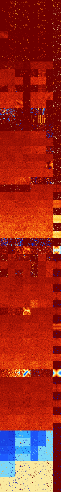

# B01234568 (196096-196607)

<details>
    <summary>Initial Grid</summary>
    
</details>


<details>
    <summary>Initial Grid RLE</summary>

```
#C Exported from GoGoL (https://github.com/marrow16/gogol)
#C Wrap mode: Toroidal
#C Boundary mode: Dead
#C Step: 0
x = 100, y = 100, rule = B01234568/S
77bo$6bo12bo20bo4bo22bo14bo$o24bo2bo6bo3b2o15bo$40bo21bobo4bo24bo$28bo
4b2o21bo$2bo23bo5bo23bo$5bobo79b2o3bo6bo$79bo7bo$o34bo8bo11bo39bo$19bo
8bo7bo6bo9bo14bo$bo35bo4bo22bo4bo12bo6bo$26bo4b2o47b2o15bo$14bo53bo11bo
17bo$6bo16bo37bobo$81b2o12bo$25bo4bo21bo20bo$23bo6bo19bobo31bo$4bo36bo
13bobo10bo$3bo18bo13bo3bo5bo7bo25bo11bo$bo17bo33bo16bo26b2o$12bo7bo24bo
10bo8bo30bo$10bo52bo$19bo2bo14bo17bo39bobo$29b2o12bo5bo6bo$40bo34bo$10b
obo4bo53bo$7bo39bo13bo3bo3bo$29bo36bo8bo20bo$36bo10bo4bo26bo14bo$o14bo
66bo$26bo53bo7bo$8bo10bo12bo3bo9bo4bo6bo7bo11bo$11bo7bo7bo11bo2bo41bo$
4bo4bo18bo2bobo8bo2bo21bo15bo$7bobo6bo28bo26bo4bo8bo$8bo5bo18bo$3bo29bo
$3bo5bo30bo7b2o18bo$25bo15bo$7bo68bo$11bo23bo46bo$3bo45bo15bo4bo$3bo2bo
78bo$18bo18bo25bo18bo14bo$2bo13bo23b2o25bo8bo$34bo25bo2bo5bo22bo$o2bo
47bo10bo4bo16bo6bo$4bo13bo47bo9bo9bo$4bo15bo37bo23bo$29bo4bo22bo35bo$
23bo16bo2bo42bo$3bo10bo22bo11bo22bo3bo$3bo95bo$72b2o10bo$3bo38bo25bo29b
o$41bo2bo11bo$21bo46bo10bo$bo21bo16b3obo45bo$3bo14bo34bo10bo15bo$o3bo5b
o19bo23bo$30bo47bobo16bo$11bo2bo23b2o6bo19bo18bo7bo$33bo54bo3bo$obo24bo
61bo$13bo14bo18bo22bo22bobo$9bo28bo12bo22bo$50bo5bo11bo23bo3bo$3bo22bo
7bo8bo27bo$62bo5b3o11b2o9bo3bo$12bo10bo56bo$6bo7bo9bo6bo19bo9bo13bo2bo$
bo23bo16bo4bo24bo10bo4bo$29bo32bo$bo2bo10bo4bo11bo19bo20bo4bo15bo$4bo$
7bo25bobo13bo$3b2o10b2o9bo30bo18bo7bo$12bo43bo6bo$4bo7bo7bo6bo27bo3bo
33bo$2bo19bo4bo2bo4bo10bo37bo$5bo4bo22bo19bo14bo9bobo18bo$9bo17bo4bo11b
o9bo8bo22bo$18bo6bo11bo32bo12b3o$o12bo39bo3bo30bo5bo$28bo15bo53bo$11bo
35bobo$bo6bobo18bo8bo3bo32bo12bo$21bo34bo$8bo14bo4bo43bobo20bo$27bo28bo
5bo15bo10bo$16bo7bo28b3o4bo$bo21bo18bo$8bo6bo4bo4bo4bo18bo3bo2b2o$4bo$
41bo36bo5bo$17bobo16bo27bo$7bo30bo$27bo39bo20bo$37bo13bo15bo$10b2o8bo
63bo3bo2bo6bo!
```
</details>
<details>
    <summary>Thumbnail</summary>

</details>
<table>
<tr>
    <td><a href="./196096%20S%20Heat%20Map%20Activity.png"></a><br>S (196096)<br>R@6,p2</td>    <td><a href="./196097%20S0%20Heat%20Map%20Activity.png"></a><br>S0 (196097)<br>R@6,p2</td>    <td><a href="./196098%20S1%20Heat%20Map%20Activity.png"></a><br>S1 (196098)<br>R@4,p2</td>    <td><a href="./196099%20S01%20Heat%20Map%20Activity.png"></a><br>S01 (196099)<br>R@5,p2</td>    <td><a href="./196100%20S2%20Heat%20Map%20Activity.png"></a><br>S2 (196100)<br>R@4,p2</td>    <td><a href="./196101%20S02%20Heat%20Map%20Activity.png"></a><br>S02 (196101)<br>R@5,p2</td>    <td><a href="./196102%20S12%20Heat%20Map%20Activity.png"></a><br>S12 (196102)<br>R@4,p2</td>    <td><a href="./196103%20S012%20Heat%20Map%20Activity.png"></a><br>S012 (196103)<br>R@4,p2</td></tr>
<tr>
    <td><a href="./196104%20S3%20Heat%20Map%20Activity.png"></a><br>S3 (196104)<br>R@6,p2</td>    <td><a href="./196105%20S03%20Heat%20Map%20Activity.png"></a><br>S03 (196105)<br>R@6,p2</td>    <td><a href="./196106%20S13%20Heat%20Map%20Activity.png"></a><br>S13 (196106)<br>R@4,p2</td>    <td><a href="./196107%20S013%20Heat%20Map%20Activity.png"></a><br>S013 (196107)<br>R@5,p2</td>    <td><a href="./196108%20S23%20Heat%20Map%20Activity.png"></a><br>S23 (196108)<br>R@4,p2</td>    <td><a href="./196109%20S023%20Heat%20Map%20Activity.png"></a><br>S023 (196109)<br>R@5,p2</td>    <td><a href="./196110%20S123%20Heat%20Map%20Activity.png"></a><br>S123 (196110)<br>R@3,p2</td>    <td><a href="./196111%20S0123%20Heat%20Map%20Activity.png"></a><br>S0123 (196111)<br>R@3,p2</td></tr>
<tr>
    <td><a href="./196112%20S4%20Heat%20Map%20Activity.png"></a><br>S4 (196112)<br>R@6,p2</td>    <td><a href="./196113%20S04%20Heat%20Map%20Activity.png"></a><br>S04 (196113)<br>R@6,p2</td>    <td><a href="./196114%20S14%20Heat%20Map%20Activity.png"></a><br>S14 (196114)<br>R@4,p2</td>    <td><a href="./196115%20S014%20Heat%20Map%20Activity.png"></a><br>S014 (196115)<br>R@5,p2</td>    <td><a href="./196116%20S24%20Heat%20Map%20Activity.png"></a><br>S24 (196116)<br>R@4,p2</td>    <td><a href="./196117%20S024%20Heat%20Map%20Activity.png"></a><br>S024 (196117)<br>R@5,p2</td>    <td><a href="./196118%20S124%20Heat%20Map%20Activity.png"></a><br>S124 (196118)<br>R@4,p2</td>    <td><a href="./196119%20S0124%20Heat%20Map%20Activity.png"></a><br>S0124 (196119)<br>R@4,p2</td></tr>
<tr>
    <td><a href="./196120%20S34%20Heat%20Map%20Activity.png"></a><br>S34 (196120)<br>R@6,p2</td>    <td><a href="./196121%20S034%20Heat%20Map%20Activity.png"></a><br>S034 (196121)<br>R@6,p2</td>    <td><a href="./196122%20S134%20Heat%20Map%20Activity.png"></a><br>S134 (196122)<br>R@4,p2</td>    <td><a href="./196123%20S0134%20Heat%20Map%20Activity.png"></a><br>S0134 (196123)<br>R@5,p2</td>    <td><a href="./196124%20S234%20Heat%20Map%20Activity.png"></a><br>S234 (196124)<br>R@4,p2</td>    <td><a href="./196125%20S0234%20Heat%20Map%20Activity.png"></a><br>S0234 (196125)<br>R@5,p2</td>    <td><a href="./196126%20S1234%20Heat%20Map%20Activity.png"></a><br>S1234 (196126)<br>R@3,p2</td>    <td><a href="./196127%20S01234%20Heat%20Map%20Activity.png"></a><br>S01234 (196127)<br>R@3,p2</td></tr>
<tr>
    <td><a href="./196128%20S5%20Heat%20Map%20Activity.png"></a><br>S5 (196128)<br>G>1000</td>    <td><a href="./196129%20S05%20Heat%20Map%20Activity.png"></a><br>S05 (196129)<br>R@25,p16</td>    <td><a href="./196130%20S15%20Heat%20Map%20Activity.png"></a><br>S15 (196130)<br>R@25,p16</td>    <td><a href="./196131%20S015%20Heat%20Map%20Activity.png"></a><br>S015 (196131)<br>R@21,p16</td>    <td><a href="./196132%20S25%20Heat%20Map%20Activity.png"></a><br>S25 (196132)<br>R@14,p2</td>    <td><a href="./196133%20S025%20Heat%20Map%20Activity.png"></a><br>S025 (196133)<br>R@7,p2</td>    <td><a href="./196134%20S125%20Heat%20Map%20Activity.png"></a><br>S125 (196134)<br>R@5,p2</td>    <td><a href="./196135%20S0125%20Heat%20Map%20Activity.png"></a><br>S0125 (196135)<br>R@4,p2</td></tr>
<tr>
    <td><a href="./196136%20S35%20Heat%20Map%20Activity.png"></a><br>S35 (196136)<br>R@10,p2</td>    <td><a href="./196137%20S035%20Heat%20Map%20Activity.png"></a><br>S035 (196137)<br>R@8,p2</td>    <td><a href="./196138%20S135%20Heat%20Map%20Activity.png"></a><br>S135 (196138)<br>R@5,p2</td>    <td><a href="./196139%20S0135%20Heat%20Map%20Activity.png"></a><br>S0135 (196139)<br>R@5,p2</td>    <td><a href="./196140%20S235%20Heat%20Map%20Activity.png"></a><br>S235 (196140)<br>R@6,p2</td>    <td><a href="./196141%20S0235%20Heat%20Map%20Activity.png"></a><br>S0235 (196141)<br>R@7,p2</td>    <td><a href="./196142%20S1235%20Heat%20Map%20Activity.png"></a><br>S1235 (196142)<br>R@5,p2</td>    <td><a href="./196143%20S01235%20Heat%20Map%20Activity.png"></a><br>S01235 (196143)<br>R@3,p2</td></tr>
<tr>
    <td><a href="./196144%20S45%20Heat%20Map%20Activity.png"></a><br>S45 (196144)<br>R@18,p4</td>    <td><a href="./196145%20S045%20Heat%20Map%20Activity.png"></a><br>S045 (196145)<br>R@16,p4</td>    <td><a href="./196146%20S145%20Heat%20Map%20Activity.png"></a><br>S145 (196146)<br>R@12,p4</td>    <td><a href="./196147%20S0145%20Heat%20Map%20Activity.png"></a><br>S0145 (196147)<br>R@7,p4</td>    <td><a href="./196148%20S245%20Heat%20Map%20Activity.png"></a><br>S245 (196148)<br>R@10,p2</td>    <td><a href="./196149%20S0245%20Heat%20Map%20Activity.png"></a><br>S0245 (196149)<br>R@7,p2</td>    <td><a href="./196150%20S1245%20Heat%20Map%20Activity.png"></a><br>S1245 (196150)<br>R@5,p2</td>    <td><a href="./196151%20S01245%20Heat%20Map%20Activity.png"></a><br>S01245 (196151)<br>R@4,p2</td></tr>
<tr>
    <td><a href="./196152%20S345%20Heat%20Map%20Activity.png"></a><br>S345 (196152)<br>R@10,p2</td>    <td><a href="./196153%20S0345%20Heat%20Map%20Activity.png"></a><br>S0345 (196153)<br>R@7,p2</td>    <td><a href="./196154%20S1345%20Heat%20Map%20Activity.png"></a><br>S1345 (196154)<br>R@5,p2</td>    <td><a href="./196155%20S01345%20Heat%20Map%20Activity.png"></a><br>S01345 (196155)<br>R@5,p2</td>    <td><a href="./196156%20S2345%20Heat%20Map%20Activity.png"></a><br>S2345 (196156)<br>R@6,p2</td>    <td><a href="./196157%20S02345%20Heat%20Map%20Activity.png"></a><br>S02345 (196157)<br>R@7,p2</td>    <td><a href="./196158%20S12345%20Heat%20Map%20Activity.png"></a><br>S12345 (196158)<br>R@5,p2</td>    <td><a href="./196159%20S012345%20Heat%20Map%20Activity.png"></a><br>S012345 (196159)<br>R@3,p2</td></tr>
<tr>
    <td><a href="./196160%20S6%20Heat%20Map%20Activity.png"></a><br>S6 (196160)<br>R@77,p24</td>    <td><a href="./196161%20S06%20Heat%20Map%20Activity.png"></a><br>S06 (196161)<br>R@95,p8</td>    <td><a href="./196162%20S16%20Heat%20Map%20Activity.png"></a><br>S16 (196162)<br>R@79,p2</td>    <td><a href="./196163%20S016%20Heat%20Map%20Activity.png"></a><br>S016 (196163)<br>R@183,p2</td>    <td><a href="./196164%20S26%20Heat%20Map%20Activity.png"></a><br>S26 (196164)<br>G>1000</td>    <td><a href="./196165%20S026%20Heat%20Map%20Activity.png"></a><br>S026 (196165)<br>G>1000</td>    <td><a href="./196166%20S126%20Heat%20Map%20Activity.png"></a><br>S126 (196166)<br>G>1000</td>    <td><a href="./196167%20S0126%20Heat%20Map%20Activity.png"></a><br>S0126 (196167)<br>R@5,p2</td></tr>
<tr>
    <td><a href="./196168%20S36%20Heat%20Map%20Activity.png"></a><br>S36 (196168)<br>G>1000</td>    <td><a href="./196169%20S036%20Heat%20Map%20Activity.png"></a><br>S036 (196169)<br>G>1000</td>    <td><a href="./196170%20S136%20Heat%20Map%20Activity.png"></a><br>S136 (196170)<br>R@255,p4</td>    <td><a href="./196171%20S0136%20Heat%20Map%20Activity.png"></a><br>S0136 (196171)<br>R@8,p2</td>    <td><a href="./196172%20S236%20Heat%20Map%20Activity.png"></a><br>S236 (196172)<br>R@339,p12</td>    <td><a href="./196173%20S0236%20Heat%20Map%20Activity.png"></a><br>S0236 (196173)<br>G>1000</td>    <td><a href="./196174%20S1236%20Heat%20Map%20Activity.png"></a><br>S1236 (196174)<br>R@19,p4</td>    <td><a href="./196175%20S01236%20Heat%20Map%20Activity.png"></a><br>S01236 (196175)<br>R@3,p2</td></tr>
<tr>
    <td><a href="./196176%20S46%20Heat%20Map%20Activity.png"></a><br>S46 (196176)<br>G>1000</td>    <td><a href="./196177%20S046%20Heat%20Map%20Activity.png"></a><br>S046 (196177)<br>G>1000</td>    <td><a href="./196178%20S146%20Heat%20Map%20Activity.png"></a><br>S146 (196178)<br>G>1000</td>    <td><a href="./196179%20S0146%20Heat%20Map%20Activity.png"></a><br>S0146 (196179)<br>R@41,p2</td>    <td><a href="./196180%20S246%20Heat%20Map%20Activity.png"></a><br>S246 (196180)<br>G>1000</td>    <td><a href="./196181%20S0246%20Heat%20Map%20Activity.png"></a><br>S0246 (196181)<br>G>1000</td>    <td><a href="./196182%20S1246%20Heat%20Map%20Activity.png"></a><br>S1246 (196182)<br>R@45,p4</td>    <td><a href="./196183%20S01246%20Heat%20Map%20Activity.png"></a><br>S01246 (196183)<br>R@5,p2</td></tr>
<tr>
    <td><a href="./196184%20S346%20Heat%20Map%20Activity.png"></a><br>S346 (196184)<br>G>1000</td>    <td><a href="./196185%20S0346%20Heat%20Map%20Activity.png"></a><br>S0346 (196185)<br>G>1000</td>    <td><a href="./196186%20S1346%20Heat%20Map%20Activity.png"></a><br>S1346 (196186)<br>R@9,p2</td>    <td><a href="./196187%20S01346%20Heat%20Map%20Activity.png"></a><br>S01346 (196187)<br>R@5,p2</td>    <td><a href="./196188%20S2346%20Heat%20Map%20Activity.png"></a><br>S2346 (196188)<br>R@61,p4</td>    <td><a href="./196189%20S02346%20Heat%20Map%20Activity.png"></a><br>S02346 (196189)<br>G>1000</td>    <td><a href="./196190%20S12346%20Heat%20Map%20Activity.png"></a><br>S12346 (196190)<br>R@7,p2</td>    <td><a href="./196191%20S012346%20Heat%20Map%20Activity.png"></a><br>S012346 (196191)<br>R@3,p2</td></tr>
<tr>
    <td><a href="./196192%20S56%20Heat%20Map%20Activity.png"></a><br>S56 (196192)<br>G>1000</td>    <td><a href="./196193%20S056%20Heat%20Map%20Activity.png"></a><br>S056 (196193)<br>G>1000</td>    <td><a href="./196194%20S156%20Heat%20Map%20Activity.png"></a><br>S156 (196194)<br>G>1000</td>    <td><a href="./196195%20S0156%20Heat%20Map%20Activity.png"></a><br>S0156 (196195)<br>R@603,p600</td>    <td><a href="./196196%20S256%20Heat%20Map%20Activity.png"></a><br>S256 (196196)<br>G>1000</td>    <td><a href="./196197%20S0256%20Heat%20Map%20Activity.png"></a><br>S0256 (196197)<br>G>1000</td>    <td><a href="./196198%20S1256%20Heat%20Map%20Activity.png"></a><br>S1256 (196198)<br>G>1000</td>    <td><a href="./196199%20S01256%20Heat%20Map%20Activity.png"></a><br>S01256 (196199)<br>R@5,p2</td></tr>
<tr>
    <td><a href="./196200%20S356%20Heat%20Map%20Activity.png"></a><br>S356 (196200)<br>G>1000</td>    <td><a href="./196201%20S0356%20Heat%20Map%20Activity.png"></a><br>S0356 (196201)<br>G>1000</td>    <td><a href="./196202%20S1356%20Heat%20Map%20Activity.png"></a><br>S1356 (196202)<br>G>1000</td>    <td><a href="./196203%20S01356%20Heat%20Map%20Activity.png"></a><br>S01356 (196203)<br>R@9,p4</td>    <td><a href="./196204%20S2356%20Heat%20Map%20Activity.png"></a><br>S2356 (196204)<br>G>1000</td>    <td><a href="./196205%20S02356%20Heat%20Map%20Activity.png"></a><br>S02356 (196205)<br>G>1000</td>    <td><a href="./196206%20S12356%20Heat%20Map%20Activity.png"></a><br>S12356 (196206)<br>R@15,p4</td>    <td><a href="./196207%20S012356%20Heat%20Map%20Activity.png"></a><br>S012356 (196207)<br>R@3,p2</td></tr>
<tr>
    <td><a href="./196208%20S456%20Heat%20Map%20Activity.png"></a><br>S456 (196208)<br>R@151,p4</td>    <td><a href="./196209%20S0456%20Heat%20Map%20Activity.png"></a><br>S0456 (196209)<br>R@211,p20</td>    <td><a href="./196210%20S1456%20Heat%20Map%20Activity.png"></a><br>S1456 (196210)<br>R@91,p4</td>    <td><a href="./196211%20S01456%20Heat%20Map%20Activity.png"></a><br>S01456 (196211)<br>R@9,p2</td>    <td><a href="./196212%20S2456%20Heat%20Map%20Activity.png"></a><br>S2456 (196212)<br>R@168,p4</td>    <td><a href="./196213%20S02456%20Heat%20Map%20Activity.png"></a><br>S02456 (196213)<br>R@173,p20</td>    <td><a href="./196214%20S12456%20Heat%20Map%20Activity.png"></a><br>S12456 (196214)<br>R@15,p2</td>    <td><a href="./196215%20S012456%20Heat%20Map%20Activity.png"></a><br>S012456 (196215)<br>R@5,p2</td></tr>
<tr>
    <td><a href="./196216%20S3456%20Heat%20Map%20Activity.png"></a><br>S3456 (196216)<br>R@114,p12</td>    <td><a href="./196217%20S03456%20Heat%20Map%20Activity.png"></a><br>S03456 (196217)<br>R@131,p4</td>    <td><a href="./196218%20S13456%20Heat%20Map%20Activity.png"></a><br>S13456 (196218)<br>R@9,p2</td>    <td><a href="./196219%20S013456%20Heat%20Map%20Activity.png"></a><br>S013456 (196219)<br>R@7,p2</td>    <td><a href="./196220%20S23456%20Heat%20Map%20Activity.png"></a><br>S23456 (196220)<br>G>1000</td>    <td><a href="./196221%20S023456%20Heat%20Map%20Activity.png"></a><br>S023456 (196221)<br>G>1000</td>    <td><a href="./196222%20S123456%20Heat%20Map%20Activity.png"></a><br>S123456 (196222)<br>R@5,p2</td>    <td><a href="./196223%20S0123456%20Heat%20Map%20Activity.png"></a><br>S0123456 (196223)<br>R@3,p2</td></tr>
<tr>
    <td><a href="./196224%20S7%20Heat%20Map%20Activity.png"></a><br>S7 (196224)<br>R@208,p168</td>    <td><a href="./196225%20S07%20Heat%20Map%20Activity.png"></a><br>S07 (196225)<br>R@885,p840</td>    <td><a href="./196226%20S17%20Heat%20Map%20Activity.png"></a><br>S17 (196226)<br>R@79,p2</td>    <td><a href="./196227%20S017%20Heat%20Map%20Activity.png"></a><br>S017 (196227)<br>R@99,p2</td>    <td><a href="./196228%20S27%20Heat%20Map%20Activity.png"></a><br>S27 (196228)<br>R@285,p168</td>    <td><a href="./196229%20S027%20Heat%20Map%20Activity.png"></a><br>S027 (196229)<br>R@131,p24</td>    <td><a href="./196230%20S127%20Heat%20Map%20Activity.png"></a><br>S127 (196230)<br>R@50,p12</td>    <td><a href="./196231%20S0127%20Heat%20Map%20Activity.png"></a><br>S0127 (196231)<br>R@5,p2</td></tr>
<tr>
    <td><a href="./196232%20S37%20Heat%20Map%20Activity.png"></a><br>S37 (196232)<br>G>1000</td>    <td><a href="./196233%20S037%20Heat%20Map%20Activity.png"></a><br>S037 (196233)<br>G>1000</td>    <td><a href="./196234%20S137%20Heat%20Map%20Activity.png"></a><br>S137 (196234)<br>G>1000</td>    <td><a href="./196235%20S0137%20Heat%20Map%20Activity.png"></a><br>S0137 (196235)<br>G>1000</td>    <td><a href="./196236%20S237%20Heat%20Map%20Activity.png"></a><br>S237 (196236)<br>G>1000</td>    <td><a href="./196237%20S0237%20Heat%20Map%20Activity.png"></a><br>S0237 (196237)<br>G>1000</td>    <td><a href="./196238%20S1237%20Heat%20Map%20Activity.png"></a><br>S1237 (196238)<br>R@87,p24</td>    <td><a href="./196239%20S01237%20Heat%20Map%20Activity.png"></a><br>S01237 (196239)<br>R@3,p2</td></tr>
<tr>
    <td><a href="./196240%20S47%20Heat%20Map%20Activity.png"></a><br>S47 (196240)<br>G>1000</td>    <td><a href="./196241%20S047%20Heat%20Map%20Activity.png"></a><br>S047 (196241)<br>G>1000</td>    <td><a href="./196242%20S147%20Heat%20Map%20Activity.png"></a><br>S147 (196242)<br>G>1000</td>    <td><a href="./196243%20S0147%20Heat%20Map%20Activity.png"></a><br>S0147 (196243)<br>G>1000</td>    <td><a href="./196244%20S247%20Heat%20Map%20Activity.png"></a><br>S247 (196244)<br>G>1000</td>    <td><a href="./196245%20S0247%20Heat%20Map%20Activity.png"></a><br>S0247 (196245)<br>G>1000</td>    <td><a href="./196246%20S1247%20Heat%20Map%20Activity.png"></a><br>S1247 (196246)<br>G>1000</td>    <td><a href="./196247%20S01247%20Heat%20Map%20Activity.png"></a><br>S01247 (196247)<br>R@5,p2</td></tr>
<tr>
    <td><a href="./196248%20S347%20Heat%20Map%20Activity.png"></a><br>S347 (196248)<br>G>1000</td>    <td><a href="./196249%20S0347%20Heat%20Map%20Activity.png"></a><br>S0347 (196249)<br>G>1000</td>    <td><a href="./196250%20S1347%20Heat%20Map%20Activity.png"></a><br>S1347 (196250)<br>G>1000</td>    <td><a href="./196251%20S01347%20Heat%20Map%20Activity.png"></a><br>S01347 (196251)<br>G>1000</td>    <td><a href="./196252%20S2347%20Heat%20Map%20Activity.png"></a><br>S2347 (196252)<br>G>1000</td>    <td><a href="./196253%20S02347%20Heat%20Map%20Activity.png"></a><br>S02347 (196253)<br>G>1000</td>    <td><a href="./196254%20S12347%20Heat%20Map%20Activity.png"></a><br>S12347 (196254)<br>R@62,p12</td>    <td><a href="./196255%20S012347%20Heat%20Map%20Activity.png"></a><br>S012347 (196255)<br>R@3,p2</td></tr>
<tr>
    <td><a href="./196256%20S57%20Heat%20Map%20Activity.png"></a><br>S57 (196256)<br>G>1000</td>    <td><a href="./196257%20S057%20Heat%20Map%20Activity.png"></a><br>S057 (196257)<br>G>1000</td>    <td><a href="./196258%20S157%20Heat%20Map%20Activity.png"></a><br>S157 (196258)<br>G>1000</td>    <td><a href="./196259%20S0157%20Heat%20Map%20Activity.png"></a><br>S0157 (196259)<br>G>1000</td>    <td><a href="./196260%20S257%20Heat%20Map%20Activity.png"></a><br>S257 (196260)<br>G>1000</td>    <td><a href="./196261%20S0257%20Heat%20Map%20Activity.png"></a><br>S0257 (196261)<br>G>1000</td>    <td><a href="./196262%20S1257%20Heat%20Map%20Activity.png"></a><br>S1257 (196262)<br>G>1000</td>    <td><a href="./196263%20S01257%20Heat%20Map%20Activity.png"></a><br>S01257 (196263)<br>R@5,p2</td></tr>
<tr>
    <td><a href="./196264%20S357%20Heat%20Map%20Activity.png"></a><br>S357 (196264)<br>G>1000</td>    <td><a href="./196265%20S0357%20Heat%20Map%20Activity.png"></a><br>S0357 (196265)<br>G>1000</td>    <td><a href="./196266%20S1357%20Heat%20Map%20Activity.png"></a><br>S1357 (196266)<br>G>1000</td>    <td><a href="./196267%20S01357%20Heat%20Map%20Activity.png"></a><br>S01357 (196267)<br>G>1000</td>    <td><a href="./196268%20S2357%20Heat%20Map%20Activity.png"></a><br>S2357 (196268)<br>G>1000</td>    <td><a href="./196269%20S02357%20Heat%20Map%20Activity.png"></a><br>S02357 (196269)<br>G>1000</td>    <td><a href="./196270%20S12357%20Heat%20Map%20Activity.png"></a><br>S12357 (196270)<br>G>1000</td>    <td><a href="./196271%20S012357%20Heat%20Map%20Activity.png"></a><br>S012357 (196271)<br>R@3,p2</td></tr>
<tr>
    <td><a href="./196272%20S457%20Heat%20Map%20Activity.png"></a><br>S457 (196272)<br>G>1000</td>    <td><a href="./196273%20S0457%20Heat%20Map%20Activity.png"></a><br>S0457 (196273)<br>G>1000</td>    <td><a href="./196274%20S1457%20Heat%20Map%20Activity.png"></a><br>S1457 (196274)<br>G>1000</td>    <td><a href="./196275%20S01457%20Heat%20Map%20Activity.png"></a><br>S01457 (196275)<br>G>1000</td>    <td><a href="./196276%20S2457%20Heat%20Map%20Activity.png"></a><br>S2457 (196276)<br>G>1000</td>    <td><a href="./196277%20S02457%20Heat%20Map%20Activity.png"></a><br>S02457 (196277)<br>G>1000</td>    <td><a href="./196278%20S12457%20Heat%20Map%20Activity.png"></a><br>S12457 (196278)<br>G>1000</td>    <td><a href="./196279%20S012457%20Heat%20Map%20Activity.png"></a><br>S012457 (196279)<br>R@5,p2</td></tr>
<tr>
    <td><a href="./196280%20S3457%20Heat%20Map%20Activity.png"></a><br>S3457 (196280)<br>G>1000</td>    <td><a href="./196281%20S03457%20Heat%20Map%20Activity.png"></a><br>S03457 (196281)<br>G>1000</td>    <td><a href="./196282%20S13457%20Heat%20Map%20Activity.png"></a><br>S13457 (196282)<br>G>1000</td>    <td><a href="./196283%20S013457%20Heat%20Map%20Activity.png"></a><br>S013457 (196283)<br>G>1000</td>    <td><a href="./196284%20S23457%20Heat%20Map%20Activity.png"></a><br>S23457 (196284)<br>R@127,p2</td>    <td><a href="./196285%20S023457%20Heat%20Map%20Activity.png"></a><br>S023457 (196285)<br>R@15,p2</td>    <td><a href="./196286%20S123457%20Heat%20Map%20Activity.png"></a><br>S123457 (196286)<br>R@17,p2</td>    <td><a href="./196287%20S0123457%20Heat%20Map%20Activity.png"></a><br>S0123457 (196287)<br>R@3,p2</td></tr>
<tr>
    <td><a href="./196288%20S67%20Heat%20Map%20Activity.png"></a><br>S67 (196288)<br>R@213,p168</td>    <td><a href="./196289%20S067%20Heat%20Map%20Activity.png"></a><br>S067 (196289)<br>R@876,p720</td>    <td><a href="./196290%20S167%20Heat%20Map%20Activity.png"></a><br>S167 (196290)<br>R@118,p84</td>    <td><a href="./196291%20S0167%20Heat%20Map%20Activity.png"></a><br>S0167 (196291)<br>R@107,p12</td>    <td><a href="./196292%20S267%20Heat%20Map%20Activity.png"></a><br>S267 (196292)<br>G>1000</td>    <td><a href="./196293%20S0267%20Heat%20Map%20Activity.png"></a><br>S0267 (196293)<br>G>1000</td>    <td><a href="./196294%20S1267%20Heat%20Map%20Activity.png"></a><br>S1267 (196294)<br>G>1000</td>    <td><a href="./196295%20S01267%20Heat%20Map%20Activity.png"></a><br>S01267 (196295)<br>G>1000</td></tr>
<tr>
    <td><a href="./196296%20S367%20Heat%20Map%20Activity.png"></a><br>S367 (196296)<br>G>1000</td>    <td><a href="./196297%20S0367%20Heat%20Map%20Activity.png"></a><br>S0367 (196297)<br>G>1000</td>    <td><a href="./196298%20S1367%20Heat%20Map%20Activity.png"></a><br>S1367 (196298)<br>G>1000</td>    <td><a href="./196299%20S01367%20Heat%20Map%20Activity.png"></a><br>S01367 (196299)<br>G>1000</td>    <td><a href="./196300%20S2367%20Heat%20Map%20Activity.png"></a><br>S2367 (196300)<br>G>1000</td>    <td><a href="./196301%20S02367%20Heat%20Map%20Activity.png"></a><br>S02367 (196301)<br>G>1000</td>    <td><a href="./196302%20S12367%20Heat%20Map%20Activity.png"></a><br>S12367 (196302)<br>G>1000</td>    <td><a href="./196303%20S012367%20Heat%20Map%20Activity.png"></a><br>S012367 (196303)<br>R@3,p2</td></tr>
<tr>
    <td><a href="./196304%20S467%20Heat%20Map%20Activity.png"></a><br>S467 (196304)<br>G>1000</td>    <td><a href="./196305%20S0467%20Heat%20Map%20Activity.png"></a><br>S0467 (196305)<br>G>1000</td>    <td><a href="./196306%20S1467%20Heat%20Map%20Activity.png"></a><br>S1467 (196306)<br>G>1000</td>    <td><a href="./196307%20S01467%20Heat%20Map%20Activity.png"></a><br>S01467 (196307)<br>G>1000</td>    <td><a href="./196308%20S2467%20Heat%20Map%20Activity.png"></a><br>S2467 (196308)<br>G>1000</td>    <td><a href="./196309%20S02467%20Heat%20Map%20Activity.png"></a><br>S02467 (196309)<br>G>1000</td>    <td><a href="./196310%20S12467%20Heat%20Map%20Activity.png"></a><br>S12467 (196310)<br>G>1000</td>    <td><a href="./196311%20S012467%20Heat%20Map%20Activity.png"></a><br>S012467 (196311)<br>G>1000</td></tr>
<tr>
    <td><a href="./196312%20S3467%20Heat%20Map%20Activity.png"></a><br>S3467 (196312)<br>G>1000</td>    <td><a href="./196313%20S03467%20Heat%20Map%20Activity.png"></a><br>S03467 (196313)<br>G>1000</td>    <td><a href="./196314%20S13467%20Heat%20Map%20Activity.png"></a><br>S13467 (196314)<br>G>1000</td>    <td><a href="./196315%20S013467%20Heat%20Map%20Activity.png"></a><br>S013467 (196315)<br>G>1000</td>    <td><a href="./196316%20S23467%20Heat%20Map%20Activity.png"></a><br>S23467 (196316)<br>G>1000</td>    <td><a href="./196317%20S023467%20Heat%20Map%20Activity.png"></a><br>S023467 (196317)<br>G>1000</td>    <td><a href="./196318%20S123467%20Heat%20Map%20Activity.png"></a><br>S123467 (196318)<br>G>1000</td>    <td><a href="./196319%20S0123467%20Heat%20Map%20Activity.png"></a><br>S0123467 (196319)<br>R@3,p2</td></tr>
<tr>
    <td><a href="./196320%20S567%20Heat%20Map%20Activity.png"></a><br>S567 (196320)<br>G>1000</td>    <td><a href="./196321%20S0567%20Heat%20Map%20Activity.png"></a><br>S0567 (196321)<br>G>1000</td>    <td><a href="./196322%20S1567%20Heat%20Map%20Activity.png"></a><br>S1567 (196322)<br>G>1000</td>    <td><a href="./196323%20S01567%20Heat%20Map%20Activity.png"></a><br>S01567 (196323)<br>G>1000</td>    <td><a href="./196324%20S2567%20Heat%20Map%20Activity.png"></a><br>S2567 (196324)<br>G>1000</td>    <td><a href="./196325%20S02567%20Heat%20Map%20Activity.png"></a><br>S02567 (196325)<br>G>1000</td>    <td><a href="./196326%20S12567%20Heat%20Map%20Activity.png"></a><br>S12567 (196326)<br>G>1000</td>    <td><a href="./196327%20S012567%20Heat%20Map%20Activity.png"></a><br>S012567 (196327)<br>G>1000</td></tr>
<tr>
    <td><a href="./196328%20S3567%20Heat%20Map%20Activity.png"></a><br>S3567 (196328)<br>G>1000</td>    <td><a href="./196329%20S03567%20Heat%20Map%20Activity.png"></a><br>S03567 (196329)<br>G>1000</td>    <td><a href="./196330%20S13567%20Heat%20Map%20Activity.png"></a><br>S13567 (196330)<br>G>1000</td>    <td><a href="./196331%20S013567%20Heat%20Map%20Activity.png"></a><br>S013567 (196331)<br>G>1000</td>    <td><a href="./196332%20S23567%20Heat%20Map%20Activity.png"></a><br>S23567 (196332)<br>G>1000</td>    <td><a href="./196333%20S023567%20Heat%20Map%20Activity.png"></a><br>S023567 (196333)<br>G>1000</td>    <td><a href="./196334%20S123567%20Heat%20Map%20Activity.png"></a><br>S123567 (196334)<br>G>1000</td>    <td><a href="./196335%20S0123567%20Heat%20Map%20Activity.png"></a><br>S0123567 (196335)<br>R@3,p2</td></tr>
<tr>
    <td><a href="./196336%20S4567%20Heat%20Map%20Activity.png"></a><br>S4567 (196336)<br>G>1000</td>    <td><a href="./196337%20S04567%20Heat%20Map%20Activity.png"></a><br>S04567 (196337)<br>G>1000</td>    <td><a href="./196338%20S14567%20Heat%20Map%20Activity.png"></a><br>S14567 (196338)<br>G>1000</td>    <td><a href="./196339%20S014567%20Heat%20Map%20Activity.png"></a><br>S014567 (196339)<br>G>1000</td>    <td><a href="./196340%20S24567%20Heat%20Map%20Activity.png"></a><br>S24567 (196340)<br>G>1000</td>    <td><a href="./196341%20S024567%20Heat%20Map%20Activity.png"></a><br>S024567 (196341)<br>G>1000</td>    <td><a href="./196342%20S124567%20Heat%20Map%20Activity.png"></a><br>S124567 (196342)<br>G>1000</td>    <td><a href="./196343%20S0124567%20Heat%20Map%20Activity.png"></a><br>S0124567 (196343)<br>G>1000</td></tr>
<tr>
    <td><a href="./196344%20S34567%20Heat%20Map%20Activity.png"></a><br>S34567 (196344)<br>R@88,p6</td>    <td><a href="./196345%20S034567%20Heat%20Map%20Activity.png"></a><br>S034567 (196345)<br>R@95,p2</td>    <td><a href="./196346%20S134567%20Heat%20Map%20Activity.png"></a><br>S134567 (196346)<br>R@69,p2</td>    <td><a href="./196347%20S0134567%20Heat%20Map%20Activity.png"></a><br>S0134567 (196347)<br>R@20,p2</td>    <td><a href="./196348%20S234567%20Heat%20Map%20Activity.png"></a><br>S234567 (196348)<br>R@15,p2</td>    <td><a href="./196349%20S0234567%20Heat%20Map%20Activity.png"></a><br>S0234567 (196349)<br>R@7,p2</td>    <td><a href="./196350%20S1234567%20Heat%20Map%20Activity.png"></a><br>S1234567 (196350)<br>R@15,p2</td>    <td><a href="./196351%20S01234567%20Heat%20Map%20Activity.png"></a><br>S01234567 (196351)<br>R@3,p2</td></tr>
<tr>
    <td><a href="./196352%20S8%20Heat%20Map%20Activity.png"></a><br>S8 (196352)<br>R@27,p12</td>    <td><a href="./196353%20S08%20Heat%20Map%20Activity.png"></a><br>S08 (196353)<br>R@493,p336</td>    <td><a href="./196354%20S18%20Heat%20Map%20Activity.png"></a><br>S18 (196354)<br>R@16,p4</td>    <td><a href="./196355%20S018%20Heat%20Map%20Activity.png"></a><br>S018 (196355)<br>R@59,p12</td>    <td><a href="./196356%20S28%20Heat%20Map%20Activity.png"></a><br>S28 (196356)<br>R@38,p12</td>    <td><a href="./196357%20S028%20Heat%20Map%20Activity.png"></a><br>S028 (196357)<br>R@121,p60</td>    <td><a href="./196358%20S128%20Heat%20Map%20Activity.png"></a><br>S128 (196358)<br>R@41,p12</td>    <td><a href="./196359%20S0128%20Heat%20Map%20Activity.png"></a><br>S0128 (196359)<br>R@78,p12</td></tr>
<tr>
    <td><a href="./196360%20S38%20Heat%20Map%20Activity.png"></a><br>S38 (196360)<br>R@152,p60</td>    <td><a href="./196361%20S038%20Heat%20Map%20Activity.png"></a><br>S038 (196361)<br>G>1000</td>    <td><a href="./196362%20S138%20Heat%20Map%20Activity.png"></a><br>S138 (196362)<br>R@94,p12</td>    <td><a href="./196363%20S0138%20Heat%20Map%20Activity.png"></a><br>S0138 (196363)<br>R@926,p24</td>    <td><a href="./196364%20S238%20Heat%20Map%20Activity.png"></a><br>S238 (196364)<br>R@929,p840</td>    <td><a href="./196365%20S0238%20Heat%20Map%20Activity.png"></a><br>S0238 (196365)<br>G>1000</td>    <td><a href="./196366%20S1238%20Heat%20Map%20Activity.png"></a><br>S1238 (196366)<br>R@384,p240</td>    <td><a href="./196367%20S01238%20Heat%20Map%20Activity.png"></a><br>S01238 (196367)<br>S@1</td></tr>
<tr>
    <td><a href="./196368%20S48%20Heat%20Map%20Activity.png"></a><br>S48 (196368)<br>G>1000</td>    <td><a href="./196369%20S048%20Heat%20Map%20Activity.png"></a><br>S048 (196369)<br>G>1000</td>    <td><a href="./196370%20S148%20Heat%20Map%20Activity.png"></a><br>S148 (196370)<br>G>1000</td>    <td><a href="./196371%20S0148%20Heat%20Map%20Activity.png"></a><br>S0148 (196371)<br>G>1000</td>    <td><a href="./196372%20S248%20Heat%20Map%20Activity.png"></a><br>S248 (196372)<br>G>1000</td>    <td><a href="./196373%20S0248%20Heat%20Map%20Activity.png"></a><br>S0248 (196373)<br>G>1000</td>    <td><a href="./196374%20S1248%20Heat%20Map%20Activity.png"></a><br>S1248 (196374)<br>G>1000</td>    <td><a href="./196375%20S01248%20Heat%20Map%20Activity.png"></a><br>S01248 (196375)<br>G>1000</td></tr>
<tr>
    <td><a href="./196376%20S348%20Heat%20Map%20Activity.png"></a><br>S348 (196376)<br>G>1000</td>    <td><a href="./196377%20S0348%20Heat%20Map%20Activity.png"></a><br>S0348 (196377)<br>G>1000</td>    <td><a href="./196378%20S1348%20Heat%20Map%20Activity.png"></a><br>S1348 (196378)<br>R@733,p168</td>    <td><a href="./196379%20S01348%20Heat%20Map%20Activity.png"></a><br>S01348 (196379)<br>G>1000</td>    <td><a href="./196380%20S2348%20Heat%20Map%20Activity.png"></a><br>S2348 (196380)<br>G>1000</td>    <td><a href="./196381%20S02348%20Heat%20Map%20Activity.png"></a><br>S02348 (196381)<br>G>1000</td>    <td><a href="./196382%20S12348%20Heat%20Map%20Activity.png"></a><br>S12348 (196382)<br>G>1000</td>    <td><a href="./196383%20S012348%20Heat%20Map%20Activity.png"></a><br>S012348 (196383)<br>S@1</td></tr>
<tr>
    <td><a href="./196384%20S58%20Heat%20Map%20Activity.png"></a><br>S58 (196384)<br>G>1000</td>    <td><a href="./196385%20S058%20Heat%20Map%20Activity.png"></a><br>S058 (196385)<br>G>1000</td>    <td><a href="./196386%20S158%20Heat%20Map%20Activity.png"></a><br>S158 (196386)<br>G>1000</td>    <td><a href="./196387%20S0158%20Heat%20Map%20Activity.png"></a><br>S0158 (196387)<br>G>1000</td>    <td><a href="./196388%20S258%20Heat%20Map%20Activity.png"></a><br>S258 (196388)<br>G>1000</td>    <td><a href="./196389%20S0258%20Heat%20Map%20Activity.png"></a><br>S0258 (196389)<br>G>1000</td>    <td><a href="./196390%20S1258%20Heat%20Map%20Activity.png"></a><br>S1258 (196390)<br>G>1000</td>    <td><a href="./196391%20S01258%20Heat%20Map%20Activity.png"></a><br>S01258 (196391)<br>G>1000</td></tr>
<tr>
    <td><a href="./196392%20S358%20Heat%20Map%20Activity.png"></a><br>S358 (196392)<br>G>1000</td>    <td><a href="./196393%20S0358%20Heat%20Map%20Activity.png"></a><br>S0358 (196393)<br>G>1000</td>    <td><a href="./196394%20S1358%20Heat%20Map%20Activity.png"></a><br>S1358 (196394)<br>G>1000</td>    <td><a href="./196395%20S01358%20Heat%20Map%20Activity.png"></a><br>S01358 (196395)<br>G>1000</td>    <td><a href="./196396%20S2358%20Heat%20Map%20Activity.png"></a><br>S2358 (196396)<br>G>1000</td>    <td><a href="./196397%20S02358%20Heat%20Map%20Activity.png"></a><br>S02358 (196397)<br>G>1000</td>    <td><a href="./196398%20S12358%20Heat%20Map%20Activity.png"></a><br>S12358 (196398)<br>G>1000</td>    <td><a href="./196399%20S012358%20Heat%20Map%20Activity.png"></a><br>S012358 (196399)<br>S@1</td></tr>
<tr>
    <td><a href="./196400%20S458%20Heat%20Map%20Activity.png"></a><br>S458 (196400)<br>G>1000</td>    <td><a href="./196401%20S0458%20Heat%20Map%20Activity.png"></a><br>S0458 (196401)<br>G>1000</td>    <td><a href="./196402%20S1458%20Heat%20Map%20Activity.png"></a><br>S1458 (196402)<br>G>1000</td>    <td><a href="./196403%20S01458%20Heat%20Map%20Activity.png"></a><br>S01458 (196403)<br>G>1000</td>    <td><a href="./196404%20S2458%20Heat%20Map%20Activity.png"></a><br>S2458 (196404)<br>G>1000</td>    <td><a href="./196405%20S02458%20Heat%20Map%20Activity.png"></a><br>S02458 (196405)<br>G>1000</td>    <td><a href="./196406%20S12458%20Heat%20Map%20Activity.png"></a><br>S12458 (196406)<br>G>1000</td>    <td><a href="./196407%20S012458%20Heat%20Map%20Activity.png"></a><br>S012458 (196407)<br>G>1000</td></tr>
<tr>
    <td><a href="./196408%20S3458%20Heat%20Map%20Activity.png"></a><br>S3458 (196408)<br>G>1000</td>    <td><a href="./196409%20S03458%20Heat%20Map%20Activity.png"></a><br>S03458 (196409)<br>G>1000</td>    <td><a href="./196410%20S13458%20Heat%20Map%20Activity.png"></a><br>S13458 (196410)<br>G>1000</td>    <td><a href="./196411%20S013458%20Heat%20Map%20Activity.png"></a><br>S013458 (196411)<br>G>1000</td>    <td><a href="./196412%20S23458%20Heat%20Map%20Activity.png"></a><br>S23458 (196412)<br>G>1000</td>    <td><a href="./196413%20S023458%20Heat%20Map%20Activity.png"></a><br>S023458 (196413)<br>G>1000</td>    <td><a href="./196414%20S123458%20Heat%20Map%20Activity.png"></a><br>S123458 (196414)<br>G>1000</td>    <td><a href="./196415%20S0123458%20Heat%20Map%20Activity.png"></a><br>S0123458 (196415)<br>S@1</td></tr>
<tr>
    <td><a href="./196416%20S68%20Heat%20Map%20Activity.png"></a><br>S68 (196416)<br>R@83,p24</td>    <td><a href="./196417%20S068%20Heat%20Map%20Activity.png"></a><br>S068 (196417)<br>R@74,p24</td>    <td><a href="./196418%20S168%20Heat%20Map%20Activity.png"></a><br>S168 (196418)<br>R@51,p6</td>    <td><a href="./196419%20S0168%20Heat%20Map%20Activity.png"></a><br>S0168 (196419)<br>R@46,p4</td>    <td><a href="./196420%20S268%20Heat%20Map%20Activity.png"></a><br>S268 (196420)<br>G>1000</td>    <td><a href="./196421%20S0268%20Heat%20Map%20Activity.png"></a><br>S0268 (196421)<br>G>1000</td>    <td><a href="./196422%20S1268%20Heat%20Map%20Activity.png"></a><br>S1268 (196422)<br>G>1000</td>    <td><a href="./196423%20S01268%20Heat%20Map%20Activity.png"></a><br>S01268 (196423)<br>G>1000</td></tr>
<tr>
    <td><a href="./196424%20S368%20Heat%20Map%20Activity.png"></a><br>S368 (196424)<br>G>1000</td>    <td><a href="./196425%20S0368%20Heat%20Map%20Activity.png"></a><br>S0368 (196425)<br>G>1000</td>    <td><a href="./196426%20S1368%20Heat%20Map%20Activity.png"></a><br>S1368 (196426)<br>G>1000</td>    <td><a href="./196427%20S01368%20Heat%20Map%20Activity.png"></a><br>S01368 (196427)<br>G>1000</td>    <td><a href="./196428%20S2368%20Heat%20Map%20Activity.png"></a><br>S2368 (196428)<br>G>1000</td>    <td><a href="./196429%20S02368%20Heat%20Map%20Activity.png"></a><br>S02368 (196429)<br>G>1000</td>    <td><a href="./196430%20S12368%20Heat%20Map%20Activity.png"></a><br>S12368 (196430)<br>G>1000</td>    <td><a href="./196431%20S012368%20Heat%20Map%20Activity.png"></a><br>S012368 (196431)<br>S@1</td></tr>
<tr>
    <td><a href="./196432%20S468%20Heat%20Map%20Activity.png"></a><br>S468 (196432)<br>G>1000</td>    <td><a href="./196433%20S0468%20Heat%20Map%20Activity.png"></a><br>S0468 (196433)<br>G>1000</td>    <td><a href="./196434%20S1468%20Heat%20Map%20Activity.png"></a><br>S1468 (196434)<br>G>1000</td>    <td><a href="./196435%20S01468%20Heat%20Map%20Activity.png"></a><br>S01468 (196435)<br>G>1000</td>    <td><a href="./196436%20S2468%20Heat%20Map%20Activity.png"></a><br>S2468 (196436)<br>G>1000</td>    <td><a href="./196437%20S02468%20Heat%20Map%20Activity.png"></a><br>S02468 (196437)<br>G>1000</td>    <td><a href="./196438%20S12468%20Heat%20Map%20Activity.png"></a><br>S12468 (196438)<br>G>1000</td>    <td><a href="./196439%20S012468%20Heat%20Map%20Activity.png"></a><br>S012468 (196439)<br>G>1000</td></tr>
<tr>
    <td><a href="./196440%20S3468%20Heat%20Map%20Activity.png"></a><br>S3468 (196440)<br>G>1000</td>    <td><a href="./196441%20S03468%20Heat%20Map%20Activity.png"></a><br>S03468 (196441)<br>G>1000</td>    <td><a href="./196442%20S13468%20Heat%20Map%20Activity.png"></a><br>S13468 (196442)<br>G>1000</td>    <td><a href="./196443%20S013468%20Heat%20Map%20Activity.png"></a><br>S013468 (196443)<br>G>1000</td>    <td><a href="./196444%20S23468%20Heat%20Map%20Activity.png"></a><br>S23468 (196444)<br>G>1000</td>    <td><a href="./196445%20S023468%20Heat%20Map%20Activity.png"></a><br>S023468 (196445)<br>G>1000</td>    <td><a href="./196446%20S123468%20Heat%20Map%20Activity.png"></a><br>S123468 (196446)<br>G>1000</td>    <td><a href="./196447%20S0123468%20Heat%20Map%20Activity.png"></a><br>S0123468 (196447)<br>S@1</td></tr>
<tr>
    <td><a href="./196448%20S568%20Heat%20Map%20Activity.png"></a><br>S568 (196448)<br>G>1000</td>    <td><a href="./196449%20S0568%20Heat%20Map%20Activity.png"></a><br>S0568 (196449)<br>G>1000</td>    <td><a href="./196450%20S1568%20Heat%20Map%20Activity.png"></a><br>S1568 (196450)<br>G>1000</td>    <td><a href="./196451%20S01568%20Heat%20Map%20Activity.png"></a><br>S01568 (196451)<br>G>1000</td>    <td><a href="./196452%20S2568%20Heat%20Map%20Activity.png"></a><br>S2568 (196452)<br>G>1000</td>    <td><a href="./196453%20S02568%20Heat%20Map%20Activity.png"></a><br>S02568 (196453)<br>G>1000</td>    <td><a href="./196454%20S12568%20Heat%20Map%20Activity.png"></a><br>S12568 (196454)<br>G>1000</td>    <td><a href="./196455%20S012568%20Heat%20Map%20Activity.png"></a><br>S012568 (196455)<br>G>1000</td></tr>
<tr>
    <td><a href="./196456%20S3568%20Heat%20Map%20Activity.png"></a><br>S3568 (196456)<br>G>1000</td>    <td><a href="./196457%20S03568%20Heat%20Map%20Activity.png"></a><br>S03568 (196457)<br>G>1000</td>    <td><a href="./196458%20S13568%20Heat%20Map%20Activity.png"></a><br>S13568 (196458)<br>G>1000</td>    <td><a href="./196459%20S013568%20Heat%20Map%20Activity.png"></a><br>S013568 (196459)<br>G>1000</td>    <td><a href="./196460%20S23568%20Heat%20Map%20Activity.png"></a><br>S23568 (196460)<br>G>1000</td>    <td><a href="./196461%20S023568%20Heat%20Map%20Activity.png"></a><br>S023568 (196461)<br>G>1000</td>    <td><a href="./196462%20S123568%20Heat%20Map%20Activity.png"></a><br>S123568 (196462)<br>G>1000</td>    <td><a href="./196463%20S0123568%20Heat%20Map%20Activity.png"></a><br>S0123568 (196463)<br>S@1</td></tr>
<tr>
    <td><a href="./196464%20S4568%20Heat%20Map%20Activity.png"></a><br>S4568 (196464)<br>G>1000</td>    <td><a href="./196465%20S04568%20Heat%20Map%20Activity.png"></a><br>S04568 (196465)<br>G>1000</td>    <td><a href="./196466%20S14568%20Heat%20Map%20Activity.png"></a><br>S14568 (196466)<br>G>1000</td>    <td><a href="./196467%20S014568%20Heat%20Map%20Activity.png"></a><br>S014568 (196467)<br>G>1000</td>    <td><a href="./196468%20S24568%20Heat%20Map%20Activity.png"></a><br>S24568 (196468)<br>G>1000</td>    <td><a href="./196469%20S024568%20Heat%20Map%20Activity.png"></a><br>S024568 (196469)<br>G>1000</td>    <td><a href="./196470%20S124568%20Heat%20Map%20Activity.png"></a><br>S124568 (196470)<br>G>1000</td>    <td><a href="./196471%20S0124568%20Heat%20Map%20Activity.png"></a><br>S0124568 (196471)<br>G>1000</td></tr>
<tr>
    <td><a href="./196472%20S34568%20Heat%20Map%20Activity.png"></a><br>S34568 (196472)<br>G>1000</td>    <td><a href="./196473%20S034568%20Heat%20Map%20Activity.png"></a><br>S034568 (196473)<br>G>1000</td>    <td><a href="./196474%20S134568%20Heat%20Map%20Activity.png"></a><br>S134568 (196474)<br>G>1000</td>    <td><a href="./196475%20S0134568%20Heat%20Map%20Activity.png"></a><br>S0134568 (196475)<br>G>1000</td>    <td><a href="./196476%20S234568%20Heat%20Map%20Activity.png"></a><br>S234568 (196476)<br>G>1000</td>    <td><a href="./196477%20S0234568%20Heat%20Map%20Activity.png"></a><br>S0234568 (196477)<br>G>1000</td>    <td><a href="./196478%20S1234568%20Heat%20Map%20Activity.png"></a><br>S1234568 (196478)<br>G>1000</td>    <td><a href="./196479%20S01234568%20Heat%20Map%20Activity.png"></a><br>S01234568 (196479)<br>S@1</td></tr>
<tr>
    <td><a href="./196480%20S78%20Heat%20Map%20Activity.png"></a><br>S78 (196480)<br>R@38,p24</td>    <td><a href="./196481%20S078%20Heat%20Map%20Activity.png"></a><br>S078 (196481)<br>R@32,p12</td>    <td><a href="./196482%20S178%20Heat%20Map%20Activity.png"></a><br>S178 (196482)<br>R@21,p2</td>    <td><a href="./196483%20S0178%20Heat%20Map%20Activity.png"></a><br>S0178 (196483)<br>R@50,p2</td>    <td><a href="./196484%20S278%20Heat%20Map%20Activity.png"></a><br>S278 (196484)<br>R@243,p24</td>    <td><a href="./196485%20S0278%20Heat%20Map%20Activity.png"></a><br>S0278 (196485)<br>R@208,p24</td>    <td><a href="./196486%20S1278%20Heat%20Map%20Activity.png"></a><br>S1278 (196486)<br>R@267,p120</td>    <td><a href="./196487%20S01278%20Heat%20Map%20Activity.png"></a><br>S01278 (196487)<br>R@110,p2</td></tr>
<tr>
    <td><a href="./196488%20S378%20Heat%20Map%20Activity.png"></a><br>S378 (196488)<br>G>1000</td>    <td><a href="./196489%20S0378%20Heat%20Map%20Activity.png"></a><br>S0378 (196489)<br>G>1000</td>    <td><a href="./196490%20S1378%20Heat%20Map%20Activity.png"></a><br>S1378 (196490)<br>G>1000</td>    <td><a href="./196491%20S01378%20Heat%20Map%20Activity.png"></a><br>S01378 (196491)<br>G>1000</td>    <td><a href="./196492%20S2378%20Heat%20Map%20Activity.png"></a><br>S2378 (196492)<br>G>1000</td>    <td><a href="./196493%20S02378%20Heat%20Map%20Activity.png"></a><br>S02378 (196493)<br>G>1000</td>    <td><a href="./196494%20S12378%20Heat%20Map%20Activity.png"></a><br>S12378 (196494)<br>G>1000</td>    <td><a href="./196495%20S012378%20Heat%20Map%20Activity.png"></a><br>S012378 (196495)<br>S@1</td></tr>
<tr>
    <td><a href="./196496%20S478%20Heat%20Map%20Activity.png"></a><br>S478 (196496)<br>G>1000</td>    <td><a href="./196497%20S0478%20Heat%20Map%20Activity.png"></a><br>S0478 (196497)<br>G>1000</td>    <td><a href="./196498%20S1478%20Heat%20Map%20Activity.png"></a><br>S1478 (196498)<br>G>1000</td>    <td><a href="./196499%20S01478%20Heat%20Map%20Activity.png"></a><br>S01478 (196499)<br>G>1000</td>    <td><a href="./196500%20S2478%20Heat%20Map%20Activity.png"></a><br>S2478 (196500)<br>G>1000</td>    <td><a href="./196501%20S02478%20Heat%20Map%20Activity.png"></a><br>S02478 (196501)<br>G>1000</td>    <td><a href="./196502%20S12478%20Heat%20Map%20Activity.png"></a><br>S12478 (196502)<br>G>1000</td>    <td><a href="./196503%20S012478%20Heat%20Map%20Activity.png"></a><br>S012478 (196503)<br>G>1000</td></tr>
<tr>
    <td><a href="./196504%20S3478%20Heat%20Map%20Activity.png"></a><br>S3478 (196504)<br>G>1000</td>    <td><a href="./196505%20S03478%20Heat%20Map%20Activity.png"></a><br>S03478 (196505)<br>G>1000</td>    <td><a href="./196506%20S13478%20Heat%20Map%20Activity.png"></a><br>S13478 (196506)<br>G>1000</td>    <td><a href="./196507%20S013478%20Heat%20Map%20Activity.png"></a><br>S013478 (196507)<br>G>1000</td>    <td><a href="./196508%20S23478%20Heat%20Map%20Activity.png"></a><br>S23478 (196508)<br>G>1000</td>    <td><a href="./196509%20S023478%20Heat%20Map%20Activity.png"></a><br>S023478 (196509)<br>G>1000</td>    <td><a href="./196510%20S123478%20Heat%20Map%20Activity.png"></a><br>S123478 (196510)<br>G>1000</td>    <td><a href="./196511%20S0123478%20Heat%20Map%20Activity.png"></a><br>S0123478 (196511)<br>S@1</td></tr>
<tr>
    <td><a href="./196512%20S578%20Heat%20Map%20Activity.png"></a><br>S578 (196512)<br>G>1000</td>    <td><a href="./196513%20S0578%20Heat%20Map%20Activity.png"></a><br>S0578 (196513)<br>G>1000</td>    <td><a href="./196514%20S1578%20Heat%20Map%20Activity.png"></a><br>S1578 (196514)<br>G>1000</td>    <td><a href="./196515%20S01578%20Heat%20Map%20Activity.png"></a><br>S01578 (196515)<br>G>1000</td>    <td><a href="./196516%20S2578%20Heat%20Map%20Activity.png"></a><br>S2578 (196516)<br>G>1000</td>    <td><a href="./196517%20S02578%20Heat%20Map%20Activity.png"></a><br>S02578 (196517)<br>G>1000</td>    <td><a href="./196518%20S12578%20Heat%20Map%20Activity.png"></a><br>S12578 (196518)<br>G>1000</td>    <td><a href="./196519%20S012578%20Heat%20Map%20Activity.png"></a><br>S012578 (196519)<br>G>1000</td></tr>
<tr>
    <td><a href="./196520%20S3578%20Heat%20Map%20Activity.png"></a><br>S3578 (196520)<br>G>1000</td>    <td><a href="./196521%20S03578%20Heat%20Map%20Activity.png"></a><br>S03578 (196521)<br>G>1000</td>    <td><a href="./196522%20S13578%20Heat%20Map%20Activity.png"></a><br>S13578 (196522)<br>G>1000</td>    <td><a href="./196523%20S013578%20Heat%20Map%20Activity.png"></a><br>S013578 (196523)<br>G>1000</td>    <td><a href="./196524%20S23578%20Heat%20Map%20Activity.png"></a><br>S23578 (196524)<br>G>1000</td>    <td><a href="./196525%20S023578%20Heat%20Map%20Activity.png"></a><br>S023578 (196525)<br>G>1000</td>    <td><a href="./196526%20S123578%20Heat%20Map%20Activity.png"></a><br>S123578 (196526)<br>G>1000</td>    <td><a href="./196527%20S0123578%20Heat%20Map%20Activity.png"></a><br>S0123578 (196527)<br>S@1</td></tr>
<tr>
    <td><a href="./196528%20S4578%20Heat%20Map%20Activity.png"></a><br>S4578 (196528)<br>G>1000</td>    <td><a href="./196529%20S04578%20Heat%20Map%20Activity.png"></a><br>S04578 (196529)<br>G>1000</td>    <td><a href="./196530%20S14578%20Heat%20Map%20Activity.png"></a><br>S14578 (196530)<br>G>1000</td>    <td><a href="./196531%20S014578%20Heat%20Map%20Activity.png"></a><br>S014578 (196531)<br>G>1000</td>    <td><a href="./196532%20S24578%20Heat%20Map%20Activity.png"></a><br>S24578 (196532)<br>G>1000</td>    <td><a href="./196533%20S024578%20Heat%20Map%20Activity.png"></a><br>S024578 (196533)<br>G>1000</td>    <td><a href="./196534%20S124578%20Heat%20Map%20Activity.png"></a><br>S124578 (196534)<br>G>1000</td>    <td><a href="./196535%20S0124578%20Heat%20Map%20Activity.png"></a><br>S0124578 (196535)<br>G>1000</td></tr>
<tr>
    <td><a href="./196536%20S34578%20Heat%20Map%20Activity.png"></a><br>S34578 (196536)<br>G>1000</td>    <td><a href="./196537%20S034578%20Heat%20Map%20Activity.png"></a><br>S034578 (196537)<br>G>1000</td>    <td><a href="./196538%20S134578%20Heat%20Map%20Activity.png"></a><br>S134578 (196538)<br>G>1000</td>    <td><a href="./196539%20S0134578%20Heat%20Map%20Activity.png"></a><br>S0134578 (196539)<br>G>1000</td>    <td><a href="./196540%20S234578%20Heat%20Map%20Activity.png"></a><br>S234578 (196540)<br>G>1000</td>    <td><a href="./196541%20S0234578%20Heat%20Map%20Activity.png"></a><br>S0234578 (196541)<br>G>1000</td>    <td><a href="./196542%20S1234578%20Heat%20Map%20Activity.png"></a><br>S1234578 (196542)<br>G>1000</td>    <td><a href="./196543%20S01234578%20Heat%20Map%20Activity.png"></a><br>S01234578 (196543)<br>S@1</td></tr>
<tr>
    <td><a href="./196544%20S678%20Heat%20Map%20Activity.png"></a><br>S678 (196544)<br>R@12,p2</td>    <td><a href="./196545%20S0678%20Heat%20Map%20Activity.png"></a><br>S0678 (196545)<br>R@13,p2</td>    <td><a href="./196546%20S1678%20Heat%20Map%20Activity.png"></a><br>S1678 (196546)<br>S@4</td>    <td><a href="./196547%20S01678%20Heat%20Map%20Activity.png"></a><br>S01678 (196547)<br>S@4</td>    <td><a href="./196548%20S2678%20Heat%20Map%20Activity.png"></a><br>S2678 (196548)<br>R@10,p2</td>    <td><a href="./196549%20S02678%20Heat%20Map%20Activity.png"></a><br>S02678 (196549)<br>R@8,p2</td>    <td><a href="./196550%20S12678%20Heat%20Map%20Activity.png"></a><br>S12678 (196550)<br>S@3</td>    <td><a href="./196551%20S012678%20Heat%20Map%20Activity.png"></a><br>S012678 (196551)<br>S@1</td></tr>
<tr>
    <td><a href="./196552%20S3678%20Heat%20Map%20Activity.png"></a><br>S3678 (196552)<br>R@12,p2</td>    <td><a href="./196553%20S03678%20Heat%20Map%20Activity.png"></a><br>S03678 (196553)<br>R@11,p2</td>    <td><a href="./196554%20S13678%20Heat%20Map%20Activity.png"></a><br>S13678 (196554)<br>S@4</td>    <td><a href="./196555%20S013678%20Heat%20Map%20Activity.png"></a><br>S013678 (196555)<br>S@3</td>    <td><a href="./196556%20S23678%20Heat%20Map%20Activity.png"></a><br>S23678 (196556)<br>R@10,p2</td>    <td><a href="./196557%20S023678%20Heat%20Map%20Activity.png"></a><br>S023678 (196557)<br>R@8,p2</td>    <td><a href="./196558%20S123678%20Heat%20Map%20Activity.png"></a><br>S123678 (196558)<br>S@3</td>    <td><a href="./196559%20S0123678%20Heat%20Map%20Activity.png"></a><br>S0123678 (196559)<br>S@1</td></tr>
<tr>
    <td><a href="./196560%20S4678%20Heat%20Map%20Activity.png"></a><br>S4678 (196560)<br>R@10,p2</td>    <td><a href="./196561%20S04678%20Heat%20Map%20Activity.png"></a><br>S04678 (196561)<br>R@9,p2</td>    <td><a href="./196562%20S14678%20Heat%20Map%20Activity.png"></a><br>S14678 (196562)<br>S@4</td>    <td><a href="./196563%20S014678%20Heat%20Map%20Activity.png"></a><br>S014678 (196563)<br>S@4</td>    <td><a href="./196564%20S24678%20Heat%20Map%20Activity.png"></a><br>S24678 (196564)<br>R@8,p2</td>    <td><a href="./196565%20S024678%20Heat%20Map%20Activity.png"></a><br>S024678 (196565)<br>R@5,p2</td>    <td><a href="./196566%20S124678%20Heat%20Map%20Activity.png"></a><br>S124678 (196566)<br>S@3</td>    <td><a href="./196567%20S0124678%20Heat%20Map%20Activity.png"></a><br>S0124678 (196567)<br>S@1</td></tr>
<tr>
    <td><a href="./196568%20S34678%20Heat%20Map%20Activity.png"></a><br>S34678 (196568)<br>R@8,p2</td>    <td><a href="./196569%20S034678%20Heat%20Map%20Activity.png"></a><br>S034678 (196569)<br>R@7,p2</td>    <td><a href="./196570%20S134678%20Heat%20Map%20Activity.png"></a><br>S134678 (196570)<br>S@4</td>    <td><a href="./196571%20S0134678%20Heat%20Map%20Activity.png"></a><br>S0134678 (196571)<br>S@3</td>    <td><a href="./196572%20S234678%20Heat%20Map%20Activity.png"></a><br>S234678 (196572)<br>R@8,p2</td>    <td><a href="./196573%20S0234678%20Heat%20Map%20Activity.png"></a><br>S0234678 (196573)<br>R@5,p2</td>    <td><a href="./196574%20S1234678%20Heat%20Map%20Activity.png"></a><br>S1234678 (196574)<br>S@3</td>    <td><a href="./196575%20S01234678%20Heat%20Map%20Activity.png"></a><br>S01234678 (196575)<br>S@1</td></tr>
<tr>
    <td><a href="./196576%20S5678%20Heat%20Map%20Activity.png"></a><br>S5678 (196576)<br>S@4</td>    <td><a href="./196577%20S05678%20Heat%20Map%20Activity.png"></a><br>S05678 (196577)<br>S@4</td>    <td><a href="./196578%20S15678%20Heat%20Map%20Activity.png"></a><br>S15678 (196578)<br>S@2</td>    <td><a href="./196579%20S015678%20Heat%20Map%20Activity.png"></a><br>S015678 (196579)<br>S@2</td>    <td><a href="./196580%20S25678%20Heat%20Map%20Activity.png"></a><br>S25678 (196580)<br>S@2</td>    <td><a href="./196581%20S025678%20Heat%20Map%20Activity.png"></a><br>S025678 (196581)<br>S@2</td>    <td><a href="./196582%20S125678%20Heat%20Map%20Activity.png"></a><br>S125678 (196582)<br>S@2</td>    <td><a href="./196583%20S0125678%20Heat%20Map%20Activity.png"></a><br>S0125678 (196583)<br>S@1</td></tr>
<tr>
    <td><a href="./196584%20S35678%20Heat%20Map%20Activity.png"></a><br>S35678 (196584)<br>S@4</td>    <td><a href="./196585%20S035678%20Heat%20Map%20Activity.png"></a><br>S035678 (196585)<br>S@4</td>    <td><a href="./196586%20S135678%20Heat%20Map%20Activity.png"></a><br>S135678 (196586)<br>S@2</td>    <td><a href="./196587%20S0135678%20Heat%20Map%20Activity.png"></a><br>S0135678 (196587)<br>S@2</td>    <td><a href="./196588%20S235678%20Heat%20Map%20Activity.png"></a><br>S235678 (196588)<br>S@2</td>    <td><a href="./196589%20S0235678%20Heat%20Map%20Activity.png"></a><br>S0235678 (196589)<br>S@2</td>    <td><a href="./196590%20S1235678%20Heat%20Map%20Activity.png"></a><br>S1235678 (196590)<br>S@2</td>    <td><a href="./196591%20S01235678%20Heat%20Map%20Activity.png"></a><br>S01235678 (196591)<br>S@1</td></tr>
<tr>
    <td><a href="./196592%20S45678%20Heat%20Map%20Activity.png"></a><br>S45678 (196592)<br>S@3</td>    <td><a href="./196593%20S045678%20Heat%20Map%20Activity.png"></a><br>S045678 (196593)<br>S@3</td>    <td><a href="./196594%20S145678%20Heat%20Map%20Activity.png"></a><br>S145678 (196594)<br>S@2</td>    <td><a href="./196595%20S0145678%20Heat%20Map%20Activity.png"></a><br>S0145678 (196595)<br>S@2</td>    <td><a href="./196596%20S245678%20Heat%20Map%20Activity.png"></a><br>S245678 (196596)<br>S@2</td>    <td><a href="./196597%20S0245678%20Heat%20Map%20Activity.png"></a><br>S0245678 (196597)<br>S@2</td>    <td><a href="./196598%20S1245678%20Heat%20Map%20Activity.png"></a><br>S1245678 (196598)<br>S@2</td>    <td><a href="./196599%20S01245678%20Heat%20Map%20Activity.png"></a><br>S01245678 (196599)<br>S@1</td></tr>
<tr>
    <td><a href="./196600%20S345678%20Heat%20Map%20Activity.png"></a><br>S345678 (196600)<br>S@3</td>    <td><a href="./196601%20S0345678%20Heat%20Map%20Activity.png"></a><br>S0345678 (196601)<br>S@3</td>    <td><a href="./196602%20S1345678%20Heat%20Map%20Activity.png"></a><br>S1345678 (196602)<br>S@2</td>    <td><a href="./196603%20S01345678%20Heat%20Map%20Activity.png"></a><br>S01345678 (196603)<br>S@2</td>    <td><a href="./196604%20S2345678%20Heat%20Map%20Activity.png"></a><br>S2345678 (196604)<br>S@2</td>    <td><a href="./196605%20S02345678%20Heat%20Map%20Activity.png"></a><br>S02345678 (196605)<br>S@2</td>    <td><a href="./196606%20S12345678%20Heat%20Map%20Activity.png"></a><br>S12345678 (196606)<br>S@2</td>    <td><a href="./196607%20S012345678%20Heat%20Map%20Activity.png"></a><br>S012345678 (196607)<br>S@1</td></tr>
</table>
