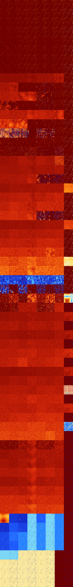

# B0123457 (97792-98303)

<details>
    <summary>Initial Grid</summary>
    
</details>


<details>
    <summary>Initial Grid RLE</summary>

```
#C Exported from GoGoL (https://github.com/marrow16/gogol)
#C Wrap mode: Toroidal
#C Boundary mode: Dead
#C Step: 0
x = 100, y = 100, rule = B0123457/S
60bo7bo24bo$3bo11bo47bo$6bo15b2o11bo3bo14bo3bo7b2o12bo2bo9bo$19bobo17bo
22bo8bo3bo5bo$9bo20bo8bo16bo$4bo3bobo18bo3bo17bo4bob2o$8bo9bo32bo29bo4b
o6bo$18bo4bo8bo41bo$10bo36bo14b2o27bo2bo$12bo22bo8bo33bo$15bo3bo31bo15b
o7bo$35bo6bo25bo2bo10bo$67bo5bo14bo5bo$4bo91bo$15b2o2bo29bo2bo34bo5bo2b
o2bo$4bo26bo56bo6bo$6bo23bo39bo$20bo17bo6bo$16bo14bo22bo21bo3bo$17bo17b
obo24bo$5b2o2bo47bo14bo5bo$48bo40bo$40bo2bo4bo21bo10bo4b2obo8bo$bo$15bo
42bo29bo$7bo11bo26bo$46bo2bo20bo7bo3bo3bo$4bo30bo3bo11bo2bo6bo23bo$10bo
16bo12bo21b2obo4bo$16bo53bo24bo$41bo40bo$9bobo72bo11bo$45bo38bo$44bo13b
o8bo3bo15bo$bo4bo28bo8bobo5bo16bo19bo$9bo7bo53bo19bo2bo$10bo5bo11bo21bo
34bo$7bo79bo6bo$31bo5bo12bo$obo74bo13bo5bo$6bo18bo24bo24bo3bo$18bo24bo$
16bo16bo9bo3bo16bo$6bo44b2o3bo7bo15bo10bo4bo$28bo5bo22bo8bo8bo2bo$38bo
2bo4bo38bo$20bo9bo9bo47bo$obo15bo34bo$40bo9bo11b2o$7bobo15bo7bo20bo27bo
$20bo31bo4bo12bo4bo4b2o13bo$5bo14bo27bo15bo26bo4bo$6bo15bo10bo4bo2b2o
39bo$11bo$3bo20bo19bo21bo$12bo19bo6bo$o37bo7bo28bo15bo4bo$8bo11bo46bo4b
o$o8b2o6bo27bo6bo26bo4bo$11bo23bo10bo8bo33bo$17bo11bo22bo4bo19bo2bo11bo
$o16bo37bo5b2obo12bo9bo$11bo6bo6bo58bo$2bo11bo25bo13b2o29bo9bo$10bo3b2o
2bo16bo2bo50bobobo4bo$64bo18bo$15bo71bo11bo$22bo13bo2bo16bo$4bo11bo13bo
3bo3bobo39bo11bo$9bo6bo16bo12bo43bo2bo$50bo$bo2bo54bo16bo$41bo5bo$27bo
55bo$17bo21bo22bo23bo$55bo5bo22bo$22bo2bo63bo$100b$2bo19bo13bo7bo$bo7bo
14bo5bo3bobo2bo11bo10bo36bo$10bo6bo6b2o6bo2bo10bo14bo23b3o$27bo6bo58bo$
11bo22bo6bo42bo$26bo13bo24bo22bo5bo$13bo53bo10bobo6bo$3bo16bo2bo$19bo3b
obo$41b2o33bo3bo$31bo5bo2bo11bo30bo$15bo30bo3bo37bo2bo$23bo22bo8bo7bo
15bo15bo3bo$57bo30bo$o38bo32bobo5bo9bo$46bo15bo$19bo4bobo46bo3bo$6bo31b
o2bo3bo37bo$4bo6bo6bo4bo13bo43b2o$24bo30bo$6bo15bo12bo8bo15bo23bo$12bo
17bo12bo2bo6bo3bo17bo!
```
</details>
<details>
    <summary>Thumbnail</summary>

</details>
<table>
<tr>
    <td><a href="./97792%20S%20Heat%20Map%20Activity.png"></a><br>S (97792)<br>R@6,p2</td>    <td><a href="./97793%20S0%20Heat%20Map%20Activity.png"></a><br>S0 (97793)<br>R@5,p2</td>    <td><a href="./97794%20S1%20Heat%20Map%20Activity.png"></a><br>S1 (97794)<br>R@6,p2</td>    <td><a href="./97795%20S01%20Heat%20Map%20Activity.png"></a><br>S01 (97795)<br>R@5,p2</td>    <td><a href="./97796%20S2%20Heat%20Map%20Activity.png"></a><br>S2 (97796)<br>R@4,p2</td>    <td><a href="./97797%20S02%20Heat%20Map%20Activity.png"></a><br>S02 (97797)<br>R@4,p2</td>    <td><a href="./97798%20S12%20Heat%20Map%20Activity.png"></a><br>S12 (97798)<br>R@4,p2</td>    <td><a href="./97799%20S012%20Heat%20Map%20Activity.png"></a><br>S012 (97799)<br>R@4,p2</td></tr>
<tr>
    <td><a href="./97800%20S3%20Heat%20Map%20Activity.png"></a><br>S3 (97800)<br>R@6,p2</td>    <td><a href="./97801%20S03%20Heat%20Map%20Activity.png"></a><br>S03 (97801)<br>R@5,p2</td>    <td><a href="./97802%20S13%20Heat%20Map%20Activity.png"></a><br>S13 (97802)<br>R@5,p2</td>    <td><a href="./97803%20S013%20Heat%20Map%20Activity.png"></a><br>S013 (97803)<br>R@5,p2</td>    <td><a href="./97804%20S23%20Heat%20Map%20Activity.png"></a><br>S23 (97804)<br>R@4,p2</td>    <td><a href="./97805%20S023%20Heat%20Map%20Activity.png"></a><br>S023 (97805)<br>R@4,p2</td>    <td><a href="./97806%20S123%20Heat%20Map%20Activity.png"></a><br>S123 (97806)<br>R@4,p2</td>    <td><a href="./97807%20S0123%20Heat%20Map%20Activity.png"></a><br>S0123 (97807)<br>R@3,p2</td></tr>
<tr>
    <td><a href="./97808%20S4%20Heat%20Map%20Activity.png"></a><br>S4 (97808)<br>R@8,p2</td>    <td><a href="./97809%20S04%20Heat%20Map%20Activity.png"></a><br>S04 (97809)<br>R@7,p2</td>    <td><a href="./97810%20S14%20Heat%20Map%20Activity.png"></a><br>S14 (97810)<br>R@6,p2</td>    <td><a href="./97811%20S014%20Heat%20Map%20Activity.png"></a><br>S014 (97811)<br>R@5,p2</td>    <td><a href="./97812%20S24%20Heat%20Map%20Activity.png"></a><br>S24 (97812)<br>R@4,p2</td>    <td><a href="./97813%20S024%20Heat%20Map%20Activity.png"></a><br>S024 (97813)<br>R@4,p2</td>    <td><a href="./97814%20S124%20Heat%20Map%20Activity.png"></a><br>S124 (97814)<br>R@4,p2</td>    <td><a href="./97815%20S0124%20Heat%20Map%20Activity.png"></a><br>S0124 (97815)<br>R@4,p2</td></tr>
<tr>
    <td><a href="./97816%20S34%20Heat%20Map%20Activity.png"></a><br>S34 (97816)<br>R@8,p2</td>    <td><a href="./97817%20S034%20Heat%20Map%20Activity.png"></a><br>S034 (97817)<br>R@7,p2</td>    <td><a href="./97818%20S134%20Heat%20Map%20Activity.png"></a><br>S134 (97818)<br>R@5,p2</td>    <td><a href="./97819%20S0134%20Heat%20Map%20Activity.png"></a><br>S0134 (97819)<br>R@5,p2</td>    <td><a href="./97820%20S234%20Heat%20Map%20Activity.png"></a><br>S234 (97820)<br>R@4,p2</td>    <td><a href="./97821%20S0234%20Heat%20Map%20Activity.png"></a><br>S0234 (97821)<br>R@4,p2</td>    <td><a href="./97822%20S1234%20Heat%20Map%20Activity.png"></a><br>S1234 (97822)<br>R@4,p2</td>    <td><a href="./97823%20S01234%20Heat%20Map%20Activity.png"></a><br>S01234 (97823)<br>R@3,p2</td></tr>
<tr>
    <td><a href="./97824%20S5%20Heat%20Map%20Activity.png"></a><br>S5 (97824)<br>R@24,p4</td>    <td><a href="./97825%20S05%20Heat%20Map%20Activity.png"></a><br>S05 (97825)<br>R@24,p4</td>    <td><a href="./97826%20S15%20Heat%20Map%20Activity.png"></a><br>S15 (97826)<br>R@6,p2</td>    <td><a href="./97827%20S015%20Heat%20Map%20Activity.png"></a><br>S015 (97827)<br>R@5,p2</td>    <td><a href="./97828%20S25%20Heat%20Map%20Activity.png"></a><br>S25 (97828)<br>R@9,p2</td>    <td><a href="./97829%20S025%20Heat%20Map%20Activity.png"></a><br>S025 (97829)<br>R@9,p2</td>    <td><a href="./97830%20S125%20Heat%20Map%20Activity.png"></a><br>S125 (97830)<br>R@6,p2</td>    <td><a href="./97831%20S0125%20Heat%20Map%20Activity.png"></a><br>S0125 (97831)<br>R@4,p2</td></tr>
<tr>
    <td><a href="./97832%20S35%20Heat%20Map%20Activity.png"></a><br>S35 (97832)<br>R@13,p4</td>    <td><a href="./97833%20S035%20Heat%20Map%20Activity.png"></a><br>S035 (97833)<br>R@10,p4</td>    <td><a href="./97834%20S135%20Heat%20Map%20Activity.png"></a><br>S135 (97834)<br>R@6,p2</td>    <td><a href="./97835%20S0135%20Heat%20Map%20Activity.png"></a><br>S0135 (97835)<br>R@5,p2</td>    <td><a href="./97836%20S235%20Heat%20Map%20Activity.png"></a><br>S235 (97836)<br>R@7,p2</td>    <td><a href="./97837%20S0235%20Heat%20Map%20Activity.png"></a><br>S0235 (97837)<br>R@7,p2</td>    <td><a href="./97838%20S1235%20Heat%20Map%20Activity.png"></a><br>S1235 (97838)<br>R@6,p2</td>    <td><a href="./97839%20S01235%20Heat%20Map%20Activity.png"></a><br>S01235 (97839)<br>R@3,p2</td></tr>
<tr>
    <td><a href="./97840%20S45%20Heat%20Map%20Activity.png"></a><br>S45 (97840)<br>R@18,p4</td>    <td><a href="./97841%20S045%20Heat%20Map%20Activity.png"></a><br>S045 (97841)<br>R@11,p4</td>    <td><a href="./97842%20S145%20Heat%20Map%20Activity.png"></a><br>S145 (97842)<br>R@6,p2</td>    <td><a href="./97843%20S0145%20Heat%20Map%20Activity.png"></a><br>S0145 (97843)<br>R@5,p2</td>    <td><a href="./97844%20S245%20Heat%20Map%20Activity.png"></a><br>S245 (97844)<br>R@7,p2</td>    <td><a href="./97845%20S0245%20Heat%20Map%20Activity.png"></a><br>S0245 (97845)<br>R@5,p2</td>    <td><a href="./97846%20S1245%20Heat%20Map%20Activity.png"></a><br>S1245 (97846)<br>R@6,p2</td>    <td><a href="./97847%20S01245%20Heat%20Map%20Activity.png"></a><br>S01245 (97847)<br>R@4,p2</td></tr>
<tr>
    <td><a href="./97848%20S345%20Heat%20Map%20Activity.png"></a><br>S345 (97848)<br>R@12,p4</td>    <td><a href="./97849%20S0345%20Heat%20Map%20Activity.png"></a><br>S0345 (97849)<br>R@11,p4</td>    <td><a href="./97850%20S1345%20Heat%20Map%20Activity.png"></a><br>S1345 (97850)<br>R@6,p2</td>    <td><a href="./97851%20S01345%20Heat%20Map%20Activity.png"></a><br>S01345 (97851)<br>R@5,p2</td>    <td><a href="./97852%20S2345%20Heat%20Map%20Activity.png"></a><br>S2345 (97852)<br>R@6,p2</td>    <td><a href="./97853%20S02345%20Heat%20Map%20Activity.png"></a><br>S02345 (97853)<br>R@6,p2</td>    <td><a href="./97854%20S12345%20Heat%20Map%20Activity.png"></a><br>S12345 (97854)<br>R@6,p2</td>    <td><a href="./97855%20S012345%20Heat%20Map%20Activity.png"></a><br>S012345 (97855)<br>R@3,p2</td></tr>
<tr>
    <td><a href="./97856%20S6%20Heat%20Map%20Activity.png"></a><br>S6 (97856)<br>G>1000</td>    <td><a href="./97857%20S06%20Heat%20Map%20Activity.png"></a><br>S06 (97857)<br>G>1000</td>    <td><a href="./97858%20S16%20Heat%20Map%20Activity.png"></a><br>S16 (97858)<br>G>1000</td>    <td><a href="./97859%20S016%20Heat%20Map%20Activity.png"></a><br>S016 (97859)<br>G>1000</td>    <td><a href="./97860%20S26%20Heat%20Map%20Activity.png"></a><br>S26 (97860)<br>G>1000</td>    <td><a href="./97861%20S026%20Heat%20Map%20Activity.png"></a><br>S026 (97861)<br>G>1000</td>    <td><a href="./97862%20S126%20Heat%20Map%20Activity.png"></a><br>S126 (97862)<br>G>1000</td>    <td><a href="./97863%20S0126%20Heat%20Map%20Activity.png"></a><br>S0126 (97863)<br>R@4,p2</td></tr>
<tr>
    <td><a href="./97864%20S36%20Heat%20Map%20Activity.png"></a><br>S36 (97864)<br>G>1000</td>    <td><a href="./97865%20S036%20Heat%20Map%20Activity.png"></a><br>S036 (97865)<br>G>1000</td>    <td><a href="./97866%20S136%20Heat%20Map%20Activity.png"></a><br>S136 (97866)<br>R@17,p4</td>    <td><a href="./97867%20S0136%20Heat%20Map%20Activity.png"></a><br>S0136 (97867)<br>R@7,p2</td>    <td><a href="./97868%20S236%20Heat%20Map%20Activity.png"></a><br>S236 (97868)<br>R@21,p4</td>    <td><a href="./97869%20S0236%20Heat%20Map%20Activity.png"></a><br>S0236 (97869)<br>R@10,p4</td>    <td><a href="./97870%20S1236%20Heat%20Map%20Activity.png"></a><br>S1236 (97870)<br>R@7,p2</td>    <td><a href="./97871%20S01236%20Heat%20Map%20Activity.png"></a><br>S01236 (97871)<br>R@3,p2</td></tr>
<tr>
    <td><a href="./97872%20S46%20Heat%20Map%20Activity.png"></a><br>S46 (97872)<br>G>1000</td>    <td><a href="./97873%20S046%20Heat%20Map%20Activity.png"></a><br>S046 (97873)<br>G>1000</td>    <td><a href="./97874%20S146%20Heat%20Map%20Activity.png"></a><br>S146 (97874)<br>G>1000</td>    <td><a href="./97875%20S0146%20Heat%20Map%20Activity.png"></a><br>S0146 (97875)<br>G>1000</td>    <td><a href="./97876%20S246%20Heat%20Map%20Activity.png"></a><br>S246 (97876)<br>G>1000</td>    <td><a href="./97877%20S0246%20Heat%20Map%20Activity.png"></a><br>S0246 (97877)<br>R@336,p12</td>    <td><a href="./97878%20S1246%20Heat%20Map%20Activity.png"></a><br>S1246 (97878)<br>R@7,p2</td>    <td><a href="./97879%20S01246%20Heat%20Map%20Activity.png"></a><br>S01246 (97879)<br>R@4,p2</td></tr>
<tr>
    <td><a href="./97880%20S346%20Heat%20Map%20Activity.png"></a><br>S346 (97880)<br>G>1000</td>    <td><a href="./97881%20S0346%20Heat%20Map%20Activity.png"></a><br>S0346 (97881)<br>R@748,p4</td>    <td><a href="./97882%20S1346%20Heat%20Map%20Activity.png"></a><br>S1346 (97882)<br>R@13,p4</td>    <td><a href="./97883%20S01346%20Heat%20Map%20Activity.png"></a><br>S01346 (97883)<br>R@7,p2</td>    <td><a href="./97884%20S2346%20Heat%20Map%20Activity.png"></a><br>S2346 (97884)<br>R@18,p4</td>    <td><a href="./97885%20S02346%20Heat%20Map%20Activity.png"></a><br>S02346 (97885)<br>R@7,p4</td>    <td><a href="./97886%20S12346%20Heat%20Map%20Activity.png"></a><br>S12346 (97886)<br>R@7,p2</td>    <td><a href="./97887%20S012346%20Heat%20Map%20Activity.png"></a><br>S012346 (97887)<br>R@3,p2</td></tr>
<tr>
    <td><a href="./97888%20S56%20Heat%20Map%20Activity.png"></a><br>S56 (97888)<br>G>1000</td>    <td><a href="./97889%20S056%20Heat%20Map%20Activity.png"></a><br>S056 (97889)<br>G>1000</td>    <td><a href="./97890%20S156%20Heat%20Map%20Activity.png"></a><br>S156 (97890)<br>G>1000</td>    <td><a href="./97891%20S0156%20Heat%20Map%20Activity.png"></a><br>S0156 (97891)<br>G>1000</td>    <td><a href="./97892%20S256%20Heat%20Map%20Activity.png"></a><br>S256 (97892)<br>G>1000</td>    <td><a href="./97893%20S0256%20Heat%20Map%20Activity.png"></a><br>S0256 (97893)<br>G>1000</td>    <td><a href="./97894%20S1256%20Heat%20Map%20Activity.png"></a><br>S1256 (97894)<br>G>1000</td>    <td><a href="./97895%20S01256%20Heat%20Map%20Activity.png"></a><br>S01256 (97895)<br>R@4,p2</td></tr>
<tr>
    <td><a href="./97896%20S356%20Heat%20Map%20Activity.png"></a><br>S356 (97896)<br>G>1000</td>    <td><a href="./97897%20S0356%20Heat%20Map%20Activity.png"></a><br>S0356 (97897)<br>G>1000</td>    <td><a href="./97898%20S1356%20Heat%20Map%20Activity.png"></a><br>S1356 (97898)<br>G>1000</td>    <td><a href="./97899%20S01356%20Heat%20Map%20Activity.png"></a><br>S01356 (97899)<br>R@7,p2</td>    <td><a href="./97900%20S2356%20Heat%20Map%20Activity.png"></a><br>S2356 (97900)<br>R@60,p4</td>    <td><a href="./97901%20S02356%20Heat%20Map%20Activity.png"></a><br>S02356 (97901)<br>R@11,p4</td>    <td><a href="./97902%20S12356%20Heat%20Map%20Activity.png"></a><br>S12356 (97902)<br>R@7,p2</td>    <td><a href="./97903%20S012356%20Heat%20Map%20Activity.png"></a><br>S012356 (97903)<br>R@3,p2</td></tr>
<tr>
    <td><a href="./97904%20S456%20Heat%20Map%20Activity.png"></a><br>S456 (97904)<br>G>1000</td>    <td><a href="./97905%20S0456%20Heat%20Map%20Activity.png"></a><br>S0456 (97905)<br>R@996,p4</td>    <td><a href="./97906%20S1456%20Heat%20Map%20Activity.png"></a><br>S1456 (97906)<br>R@656,p4</td>    <td><a href="./97907%20S01456%20Heat%20Map%20Activity.png"></a><br>S01456 (97907)<br>R@105,p2</td>    <td><a href="./97908%20S2456%20Heat%20Map%20Activity.png"></a><br>S2456 (97908)<br>R@276,p20</td>    <td><a href="./97909%20S02456%20Heat%20Map%20Activity.png"></a><br>S02456 (97909)<br>R@428,p80</td>    <td><a href="./97910%20S12456%20Heat%20Map%20Activity.png"></a><br>S12456 (97910)<br>R@7,p2</td>    <td><a href="./97911%20S012456%20Heat%20Map%20Activity.png"></a><br>S012456 (97911)<br>R@4,p2</td></tr>
<tr>
    <td><a href="./97912%20S3456%20Heat%20Map%20Activity.png"></a><br>S3456 (97912)<br>R@24,p4</td>    <td><a href="./97913%20S03456%20Heat%20Map%20Activity.png"></a><br>S03456 (97913)<br>R@14,p4</td>    <td><a href="./97914%20S13456%20Heat%20Map%20Activity.png"></a><br>S13456 (97914)<br>R@12,p2</td>    <td><a href="./97915%20S013456%20Heat%20Map%20Activity.png"></a><br>S013456 (97915)<br>R@7,p2</td>    <td><a href="./97916%20S23456%20Heat%20Map%20Activity.png"></a><br>S23456 (97916)<br>R@16,p4</td>    <td><a href="./97917%20S023456%20Heat%20Map%20Activity.png"></a><br>S023456 (97917)<br>R@9,p4</td>    <td><a href="./97918%20S123456%20Heat%20Map%20Activity.png"></a><br>S123456 (97918)<br>R@7,p2</td>    <td><a href="./97919%20S0123456%20Heat%20Map%20Activity.png"></a><br>S0123456 (97919)<br>R@3,p2</td></tr>
<tr>
    <td><a href="./97920%20S7%20Heat%20Map%20Activity.png"></a><br>S7 (97920)<br>R@390,p120</td>    <td><a href="./97921%20S07%20Heat%20Map%20Activity.png"></a><br>S07 (97921)<br>G>1000</td>    <td><a href="./97922%20S17%20Heat%20Map%20Activity.png"></a><br>S17 (97922)<br>G>1000</td>    <td><a href="./97923%20S017%20Heat%20Map%20Activity.png"></a><br>S017 (97923)<br>R@555,p120</td>    <td><a href="./97924%20S27%20Heat%20Map%20Activity.png"></a><br>S27 (97924)<br>R@601,p480</td>    <td><a href="./97925%20S027%20Heat%20Map%20Activity.png"></a><br>S027 (97925)<br>R@976,p840</td>    <td><a href="./97926%20S127%20Heat%20Map%20Activity.png"></a><br>S127 (97926)<br>R@263,p120</td>    <td><a href="./97927%20S0127%20Heat%20Map%20Activity.png"></a><br>S0127 (97927)<br>R@7,p2</td></tr>
<tr>
    <td><a href="./97928%20S37%20Heat%20Map%20Activity.png"></a><br>S37 (97928)<br>G>1000</td>    <td><a href="./97929%20S037%20Heat%20Map%20Activity.png"></a><br>S037 (97929)<br>G>1000</td>    <td><a href="./97930%20S137%20Heat%20Map%20Activity.png"></a><br>S137 (97930)<br>G>1000</td>    <td><a href="./97931%20S0137%20Heat%20Map%20Activity.png"></a><br>S0137 (97931)<br>G>1000</td>    <td><a href="./97932%20S237%20Heat%20Map%20Activity.png"></a><br>S237 (97932)<br>G>1000</td>    <td><a href="./97933%20S0237%20Heat%20Map%20Activity.png"></a><br>S0237 (97933)<br>G>1000</td>    <td><a href="./97934%20S1237%20Heat%20Map%20Activity.png"></a><br>S1237 (97934)<br>G>1000</td>    <td><a href="./97935%20S01237%20Heat%20Map%20Activity.png"></a><br>S01237 (97935)<br>R@3,p2</td></tr>
<tr>
    <td><a href="./97936%20S47%20Heat%20Map%20Activity.png"></a><br>S47 (97936)<br>G>1000</td>    <td><a href="./97937%20S047%20Heat%20Map%20Activity.png"></a><br>S047 (97937)<br>G>1000</td>    <td><a href="./97938%20S147%20Heat%20Map%20Activity.png"></a><br>S147 (97938)<br>G>1000</td>    <td><a href="./97939%20S0147%20Heat%20Map%20Activity.png"></a><br>S0147 (97939)<br>G>1000</td>    <td><a href="./97940%20S247%20Heat%20Map%20Activity.png"></a><br>S247 (97940)<br>G>1000</td>    <td><a href="./97941%20S0247%20Heat%20Map%20Activity.png"></a><br>S0247 (97941)<br>G>1000</td>    <td><a href="./97942%20S1247%20Heat%20Map%20Activity.png"></a><br>S1247 (97942)<br>G>1000</td>    <td><a href="./97943%20S01247%20Heat%20Map%20Activity.png"></a><br>S01247 (97943)<br>R@3,p2</td></tr>
<tr>
    <td><a href="./97944%20S347%20Heat%20Map%20Activity.png"></a><br>S347 (97944)<br>G>1000</td>    <td><a href="./97945%20S0347%20Heat%20Map%20Activity.png"></a><br>S0347 (97945)<br>G>1000</td>    <td><a href="./97946%20S1347%20Heat%20Map%20Activity.png"></a><br>S1347 (97946)<br>G>1000</td>    <td><a href="./97947%20S01347%20Heat%20Map%20Activity.png"></a><br>S01347 (97947)<br>G>1000</td>    <td><a href="./97948%20S2347%20Heat%20Map%20Activity.png"></a><br>S2347 (97948)<br>R@333,p2</td>    <td><a href="./97949%20S02347%20Heat%20Map%20Activity.png"></a><br>S02347 (97949)<br>R@61,p2</td>    <td><a href="./97950%20S12347%20Heat%20Map%20Activity.png"></a><br>S12347 (97950)<br>R@55,p4</td>    <td><a href="./97951%20S012347%20Heat%20Map%20Activity.png"></a><br>S012347 (97951)<br>R@3,p2</td></tr>
<tr>
    <td><a href="./97952%20S57%20Heat%20Map%20Activity.png"></a><br>S57 (97952)<br>G>1000</td>    <td><a href="./97953%20S057%20Heat%20Map%20Activity.png"></a><br>S057 (97953)<br>G>1000</td>    <td><a href="./97954%20S157%20Heat%20Map%20Activity.png"></a><br>S157 (97954)<br>G>1000</td>    <td><a href="./97955%20S0157%20Heat%20Map%20Activity.png"></a><br>S0157 (97955)<br>G>1000</td>    <td><a href="./97956%20S257%20Heat%20Map%20Activity.png"></a><br>S257 (97956)<br>G>1000</td>    <td><a href="./97957%20S0257%20Heat%20Map%20Activity.png"></a><br>S0257 (97957)<br>G>1000</td>    <td><a href="./97958%20S1257%20Heat%20Map%20Activity.png"></a><br>S1257 (97958)<br>G>1000</td>    <td><a href="./97959%20S01257%20Heat%20Map%20Activity.png"></a><br>S01257 (97959)<br>G>1000</td></tr>
<tr>
    <td><a href="./97960%20S357%20Heat%20Map%20Activity.png"></a><br>S357 (97960)<br>G>1000</td>    <td><a href="./97961%20S0357%20Heat%20Map%20Activity.png"></a><br>S0357 (97961)<br>G>1000</td>    <td><a href="./97962%20S1357%20Heat%20Map%20Activity.png"></a><br>S1357 (97962)<br>G>1000</td>    <td><a href="./97963%20S01357%20Heat%20Map%20Activity.png"></a><br>S01357 (97963)<br>G>1000</td>    <td><a href="./97964%20S2357%20Heat%20Map%20Activity.png"></a><br>S2357 (97964)<br>G>1000</td>    <td><a href="./97965%20S02357%20Heat%20Map%20Activity.png"></a><br>S02357 (97965)<br>G>1000</td>    <td><a href="./97966%20S12357%20Heat%20Map%20Activity.png"></a><br>S12357 (97966)<br>G>1000</td>    <td><a href="./97967%20S012357%20Heat%20Map%20Activity.png"></a><br>S012357 (97967)<br>R@3,p2</td></tr>
<tr>
    <td><a href="./97968%20S457%20Heat%20Map%20Activity.png"></a><br>S457 (97968)<br>G>1000</td>    <td><a href="./97969%20S0457%20Heat%20Map%20Activity.png"></a><br>S0457 (97969)<br>G>1000</td>    <td><a href="./97970%20S1457%20Heat%20Map%20Activity.png"></a><br>S1457 (97970)<br>G>1000</td>    <td><a href="./97971%20S01457%20Heat%20Map%20Activity.png"></a><br>S01457 (97971)<br>G>1000</td>    <td><a href="./97972%20S2457%20Heat%20Map%20Activity.png"></a><br>S2457 (97972)<br>G>1000</td>    <td><a href="./97973%20S02457%20Heat%20Map%20Activity.png"></a><br>S02457 (97973)<br>G>1000</td>    <td><a href="./97974%20S12457%20Heat%20Map%20Activity.png"></a><br>S12457 (97974)<br>G>1000</td>    <td><a href="./97975%20S012457%20Heat%20Map%20Activity.png"></a><br>S012457 (97975)<br>R@3,p2</td></tr>
<tr>
    <td><a href="./97976%20S3457%20Heat%20Map%20Activity.png"></a><br>S3457 (97976)<br>G>1000</td>    <td><a href="./97977%20S03457%20Heat%20Map%20Activity.png"></a><br>S03457 (97977)<br>G>1000</td>    <td><a href="./97978%20S13457%20Heat%20Map%20Activity.png"></a><br>S13457 (97978)<br>G>1000</td>    <td><a href="./97979%20S013457%20Heat%20Map%20Activity.png"></a><br>S013457 (97979)<br>G>1000</td>    <td><a href="./97980%20S23457%20Heat%20Map%20Activity.png"></a><br>S23457 (97980)<br>R@67,p8</td>    <td><a href="./97981%20S023457%20Heat%20Map%20Activity.png"></a><br>S023457 (97981)<br>R@39,p2</td>    <td><a href="./97982%20S123457%20Heat%20Map%20Activity.png"></a><br>S123457 (97982)<br>R@23,p4</td>    <td><a href="./97983%20S0123457%20Heat%20Map%20Activity.png"></a><br>S0123457 (97983)<br>R@3,p2</td></tr>
<tr>
    <td><a href="./97984%20S67%20Heat%20Map%20Activity.png"></a><br>S67 (97984)<br>G>1000</td>    <td><a href="./97985%20S067%20Heat%20Map%20Activity.png"></a><br>S067 (97985)<br>G>1000</td>    <td><a href="./97986%20S167%20Heat%20Map%20Activity.png"></a><br>S167 (97986)<br>G>1000</td>    <td><a href="./97987%20S0167%20Heat%20Map%20Activity.png"></a><br>S0167 (97987)<br>G>1000</td>    <td><a href="./97988%20S267%20Heat%20Map%20Activity.png"></a><br>S267 (97988)<br>G>1000</td>    <td><a href="./97989%20S0267%20Heat%20Map%20Activity.png"></a><br>S0267 (97989)<br>G>1000</td>    <td><a href="./97990%20S1267%20Heat%20Map%20Activity.png"></a><br>S1267 (97990)<br>G>1000</td>    <td><a href="./97991%20S01267%20Heat%20Map%20Activity.png"></a><br>S01267 (97991)<br>G>1000</td></tr>
<tr>
    <td><a href="./97992%20S367%20Heat%20Map%20Activity.png"></a><br>S367 (97992)<br>G>1000</td>    <td><a href="./97993%20S0367%20Heat%20Map%20Activity.png"></a><br>S0367 (97993)<br>G>1000</td>    <td><a href="./97994%20S1367%20Heat%20Map%20Activity.png"></a><br>S1367 (97994)<br>G>1000</td>    <td><a href="./97995%20S01367%20Heat%20Map%20Activity.png"></a><br>S01367 (97995)<br>G>1000</td>    <td><a href="./97996%20S2367%20Heat%20Map%20Activity.png"></a><br>S2367 (97996)<br>G>1000</td>    <td><a href="./97997%20S02367%20Heat%20Map%20Activity.png"></a><br>S02367 (97997)<br>G>1000</td>    <td><a href="./97998%20S12367%20Heat%20Map%20Activity.png"></a><br>S12367 (97998)<br>G>1000</td>    <td><a href="./97999%20S012367%20Heat%20Map%20Activity.png"></a><br>S012367 (97999)<br>R@3,p2</td></tr>
<tr>
    <td><a href="./98000%20S467%20Heat%20Map%20Activity.png"></a><br>S467 (98000)<br>G>1000</td>    <td><a href="./98001%20S0467%20Heat%20Map%20Activity.png"></a><br>S0467 (98001)<br>G>1000</td>    <td><a href="./98002%20S1467%20Heat%20Map%20Activity.png"></a><br>S1467 (98002)<br>G>1000</td>    <td><a href="./98003%20S01467%20Heat%20Map%20Activity.png"></a><br>S01467 (98003)<br>G>1000</td>    <td><a href="./98004%20S2467%20Heat%20Map%20Activity.png"></a><br>S2467 (98004)<br>G>1000</td>    <td><a href="./98005%20S02467%20Heat%20Map%20Activity.png"></a><br>S02467 (98005)<br>G>1000</td>    <td><a href="./98006%20S12467%20Heat%20Map%20Activity.png"></a><br>S12467 (98006)<br>G>1000</td>    <td><a href="./98007%20S012467%20Heat%20Map%20Activity.png"></a><br>S012467 (98007)<br>R@3,p2</td></tr>
<tr>
    <td><a href="./98008%20S3467%20Heat%20Map%20Activity.png"></a><br>S3467 (98008)<br>G>1000</td>    <td><a href="./98009%20S03467%20Heat%20Map%20Activity.png"></a><br>S03467 (98009)<br>G>1000</td>    <td><a href="./98010%20S13467%20Heat%20Map%20Activity.png"></a><br>S13467 (98010)<br>G>1000</td>    <td><a href="./98011%20S013467%20Heat%20Map%20Activity.png"></a><br>S013467 (98011)<br>G>1000</td>    <td><a href="./98012%20S23467%20Heat%20Map%20Activity.png"></a><br>S23467 (98012)<br>G>1000</td>    <td><a href="./98013%20S023467%20Heat%20Map%20Activity.png"></a><br>S023467 (98013)<br>G>1000</td>    <td><a href="./98014%20S123467%20Heat%20Map%20Activity.png"></a><br>S123467 (98014)<br>G>1000</td>    <td><a href="./98015%20S0123467%20Heat%20Map%20Activity.png"></a><br>S0123467 (98015)<br>R@3,p2</td></tr>
<tr>
    <td><a href="./98016%20S567%20Heat%20Map%20Activity.png"></a><br>S567 (98016)<br>G>1000</td>    <td><a href="./98017%20S0567%20Heat%20Map%20Activity.png"></a><br>S0567 (98017)<br>G>1000</td>    <td><a href="./98018%20S1567%20Heat%20Map%20Activity.png"></a><br>S1567 (98018)<br>G>1000</td>    <td><a href="./98019%20S01567%20Heat%20Map%20Activity.png"></a><br>S01567 (98019)<br>G>1000</td>    <td><a href="./98020%20S2567%20Heat%20Map%20Activity.png"></a><br>S2567 (98020)<br>G>1000</td>    <td><a href="./98021%20S02567%20Heat%20Map%20Activity.png"></a><br>S02567 (98021)<br>G>1000</td>    <td><a href="./98022%20S12567%20Heat%20Map%20Activity.png"></a><br>S12567 (98022)<br>G>1000</td>    <td><a href="./98023%20S012567%20Heat%20Map%20Activity.png"></a><br>S012567 (98023)<br>G>1000</td></tr>
<tr>
    <td><a href="./98024%20S3567%20Heat%20Map%20Activity.png"></a><br>S3567 (98024)<br>G>1000</td>    <td><a href="./98025%20S03567%20Heat%20Map%20Activity.png"></a><br>S03567 (98025)<br>G>1000</td>    <td><a href="./98026%20S13567%20Heat%20Map%20Activity.png"></a><br>S13567 (98026)<br>G>1000</td>    <td><a href="./98027%20S013567%20Heat%20Map%20Activity.png"></a><br>S013567 (98027)<br>G>1000</td>    <td><a href="./98028%20S23567%20Heat%20Map%20Activity.png"></a><br>S23567 (98028)<br>G>1000</td>    <td><a href="./98029%20S023567%20Heat%20Map%20Activity.png"></a><br>S023567 (98029)<br>G>1000</td>    <td><a href="./98030%20S123567%20Heat%20Map%20Activity.png"></a><br>S123567 (98030)<br>G>1000</td>    <td><a href="./98031%20S0123567%20Heat%20Map%20Activity.png"></a><br>S0123567 (98031)<br>R@3,p2</td></tr>
<tr>
    <td><a href="./98032%20S4567%20Heat%20Map%20Activity.png"></a><br>S4567 (98032)<br>R@152,p12</td>    <td><a href="./98033%20S04567%20Heat%20Map%20Activity.png"></a><br>S04567 (98033)<br>R@219,p2</td>    <td><a href="./98034%20S14567%20Heat%20Map%20Activity.png"></a><br>S14567 (98034)<br>R@275,p12</td>    <td><a href="./98035%20S014567%20Heat%20Map%20Activity.png"></a><br>S014567 (98035)<br>R@188,p6</td>    <td><a href="./98036%20S24567%20Heat%20Map%20Activity.png"></a><br>S24567 (98036)<br>R@130,p6</td>    <td><a href="./98037%20S024567%20Heat%20Map%20Activity.png"></a><br>S024567 (98037)<br>R@236,p84</td>    <td><a href="./98038%20S124567%20Heat%20Map%20Activity.png"></a><br>S124567 (98038)<br>R@115,p6</td>    <td><a href="./98039%20S0124567%20Heat%20Map%20Activity.png"></a><br>S0124567 (98039)<br>R@3,p2</td></tr>
<tr>
    <td><a href="./98040%20S34567%20Heat%20Map%20Activity.png"></a><br>S34567 (98040)<br>R@92,p12</td>    <td><a href="./98041%20S034567%20Heat%20Map%20Activity.png"></a><br>S034567 (98041)<br>R@153,p12</td>    <td><a href="./98042%20S134567%20Heat%20Map%20Activity.png"></a><br>S134567 (98042)<br>R@100,p12</td>    <td><a href="./98043%20S0134567%20Heat%20Map%20Activity.png"></a><br>S0134567 (98043)<br>R@15,p4</td>    <td><a href="./98044%20S234567%20Heat%20Map%20Activity.png"></a><br>S234567 (98044)<br>R@13,p2</td>    <td><a href="./98045%20S0234567%20Heat%20Map%20Activity.png"></a><br>S0234567 (98045)<br>R@7,p2</td>    <td><a href="./98046%20S1234567%20Heat%20Map%20Activity.png"></a><br>S1234567 (98046)<br>R@9,p2</td>    <td><a href="./98047%20S01234567%20Heat%20Map%20Activity.png"></a><br>S01234567 (98047)<br>R@3,p2</td></tr>
<tr>
    <td><a href="./98048%20S8%20Heat%20Map%20Activity.png"></a><br>S8 (98048)<br>R@60,p24</td>    <td><a href="./98049%20S08%20Heat%20Map%20Activity.png"></a><br>S08 (98049)<br>R@57,p12</td>    <td><a href="./98050%20S18%20Heat%20Map%20Activity.png"></a><br>S18 (98050)<br>R@294,p252</td>    <td><a href="./98051%20S018%20Heat%20Map%20Activity.png"></a><br>S018 (98051)<br>R@79,p24</td>    <td><a href="./98052%20S28%20Heat%20Map%20Activity.png"></a><br>S28 (98052)<br>R@34,p12</td>    <td><a href="./98053%20S028%20Heat%20Map%20Activity.png"></a><br>S028 (98053)<br>R@35,p8</td>    <td><a href="./98054%20S128%20Heat%20Map%20Activity.png"></a><br>S128 (98054)<br>R@56,p24</td>    <td><a href="./98055%20S0128%20Heat%20Map%20Activity.png"></a><br>S0128 (98055)<br>R@79,p4</td></tr>
<tr>
    <td><a href="./98056%20S38%20Heat%20Map%20Activity.png"></a><br>S38 (98056)<br>G>1000</td>    <td><a href="./98057%20S038%20Heat%20Map%20Activity.png"></a><br>S038 (98057)<br>R@530,p120</td>    <td><a href="./98058%20S138%20Heat%20Map%20Activity.png"></a><br>S138 (98058)<br>G>1000</td>    <td><a href="./98059%20S0138%20Heat%20Map%20Activity.png"></a><br>S0138 (98059)<br>G>1000</td>    <td><a href="./98060%20S238%20Heat%20Map%20Activity.png"></a><br>S238 (98060)<br>R@384,p240</td>    <td><a href="./98061%20S0238%20Heat%20Map%20Activity.png"></a><br>S0238 (98061)<br>R@264,p60</td>    <td><a href="./98062%20S1238%20Heat%20Map%20Activity.png"></a><br>S1238 (98062)<br>G>1000</td>    <td><a href="./98063%20S01238%20Heat%20Map%20Activity.png"></a><br>S01238 (98063)<br>S@1</td></tr>
<tr>
    <td><a href="./98064%20S48%20Heat%20Map%20Activity.png"></a><br>S48 (98064)<br>G>1000</td>    <td><a href="./98065%20S048%20Heat%20Map%20Activity.png"></a><br>S048 (98065)<br>G>1000</td>    <td><a href="./98066%20S148%20Heat%20Map%20Activity.png"></a><br>S148 (98066)<br>G>1000</td>    <td><a href="./98067%20S0148%20Heat%20Map%20Activity.png"></a><br>S0148 (98067)<br>G>1000</td>    <td><a href="./98068%20S248%20Heat%20Map%20Activity.png"></a><br>S248 (98068)<br>G>1000</td>    <td><a href="./98069%20S0248%20Heat%20Map%20Activity.png"></a><br>S0248 (98069)<br>G>1000</td>    <td><a href="./98070%20S1248%20Heat%20Map%20Activity.png"></a><br>S1248 (98070)<br>G>1000</td>    <td><a href="./98071%20S01248%20Heat%20Map%20Activity.png"></a><br>S01248 (98071)<br>G>1000</td></tr>
<tr>
    <td><a href="./98072%20S348%20Heat%20Map%20Activity.png"></a><br>S348 (98072)<br>G>1000</td>    <td><a href="./98073%20S0348%20Heat%20Map%20Activity.png"></a><br>S0348 (98073)<br>G>1000</td>    <td><a href="./98074%20S1348%20Heat%20Map%20Activity.png"></a><br>S1348 (98074)<br>G>1000</td>    <td><a href="./98075%20S01348%20Heat%20Map%20Activity.png"></a><br>S01348 (98075)<br>G>1000</td>    <td><a href="./98076%20S2348%20Heat%20Map%20Activity.png"></a><br>S2348 (98076)<br>G>1000</td>    <td><a href="./98077%20S02348%20Heat%20Map%20Activity.png"></a><br>S02348 (98077)<br>G>1000</td>    <td><a href="./98078%20S12348%20Heat%20Map%20Activity.png"></a><br>S12348 (98078)<br>G>1000</td>    <td><a href="./98079%20S012348%20Heat%20Map%20Activity.png"></a><br>S012348 (98079)<br>S@1</td></tr>
<tr>
    <td><a href="./98080%20S58%20Heat%20Map%20Activity.png"></a><br>S58 (98080)<br>G>1000</td>    <td><a href="./98081%20S058%20Heat%20Map%20Activity.png"></a><br>S058 (98081)<br>G>1000</td>    <td><a href="./98082%20S158%20Heat%20Map%20Activity.png"></a><br>S158 (98082)<br>G>1000</td>    <td><a href="./98083%20S0158%20Heat%20Map%20Activity.png"></a><br>S0158 (98083)<br>G>1000</td>    <td><a href="./98084%20S258%20Heat%20Map%20Activity.png"></a><br>S258 (98084)<br>G>1000</td>    <td><a href="./98085%20S0258%20Heat%20Map%20Activity.png"></a><br>S0258 (98085)<br>G>1000</td>    <td><a href="./98086%20S1258%20Heat%20Map%20Activity.png"></a><br>S1258 (98086)<br>G>1000</td>    <td><a href="./98087%20S01258%20Heat%20Map%20Activity.png"></a><br>S01258 (98087)<br>G>1000</td></tr>
<tr>
    <td><a href="./98088%20S358%20Heat%20Map%20Activity.png"></a><br>S358 (98088)<br>G>1000</td>    <td><a href="./98089%20S0358%20Heat%20Map%20Activity.png"></a><br>S0358 (98089)<br>G>1000</td>    <td><a href="./98090%20S1358%20Heat%20Map%20Activity.png"></a><br>S1358 (98090)<br>G>1000</td>    <td><a href="./98091%20S01358%20Heat%20Map%20Activity.png"></a><br>S01358 (98091)<br>G>1000</td>    <td><a href="./98092%20S2358%20Heat%20Map%20Activity.png"></a><br>S2358 (98092)<br>G>1000</td>    <td><a href="./98093%20S02358%20Heat%20Map%20Activity.png"></a><br>S02358 (98093)<br>G>1000</td>    <td><a href="./98094%20S12358%20Heat%20Map%20Activity.png"></a><br>S12358 (98094)<br>G>1000</td>    <td><a href="./98095%20S012358%20Heat%20Map%20Activity.png"></a><br>S012358 (98095)<br>S@1</td></tr>
<tr>
    <td><a href="./98096%20S458%20Heat%20Map%20Activity.png"></a><br>S458 (98096)<br>G>1000</td>    <td><a href="./98097%20S0458%20Heat%20Map%20Activity.png"></a><br>S0458 (98097)<br>G>1000</td>    <td><a href="./98098%20S1458%20Heat%20Map%20Activity.png"></a><br>S1458 (98098)<br>G>1000</td>    <td><a href="./98099%20S01458%20Heat%20Map%20Activity.png"></a><br>S01458 (98099)<br>G>1000</td>    <td><a href="./98100%20S2458%20Heat%20Map%20Activity.png"></a><br>S2458 (98100)<br>G>1000</td>    <td><a href="./98101%20S02458%20Heat%20Map%20Activity.png"></a><br>S02458 (98101)<br>G>1000</td>    <td><a href="./98102%20S12458%20Heat%20Map%20Activity.png"></a><br>S12458 (98102)<br>G>1000</td>    <td><a href="./98103%20S012458%20Heat%20Map%20Activity.png"></a><br>S012458 (98103)<br>G>1000</td></tr>
<tr>
    <td><a href="./98104%20S3458%20Heat%20Map%20Activity.png"></a><br>S3458 (98104)<br>G>1000</td>    <td><a href="./98105%20S03458%20Heat%20Map%20Activity.png"></a><br>S03458 (98105)<br>G>1000</td>    <td><a href="./98106%20S13458%20Heat%20Map%20Activity.png"></a><br>S13458 (98106)<br>G>1000</td>    <td><a href="./98107%20S013458%20Heat%20Map%20Activity.png"></a><br>S013458 (98107)<br>G>1000</td>    <td><a href="./98108%20S23458%20Heat%20Map%20Activity.png"></a><br>S23458 (98108)<br>G>1000</td>    <td><a href="./98109%20S023458%20Heat%20Map%20Activity.png"></a><br>S023458 (98109)<br>G>1000</td>    <td><a href="./98110%20S123458%20Heat%20Map%20Activity.png"></a><br>S123458 (98110)<br>G>1000</td>    <td><a href="./98111%20S0123458%20Heat%20Map%20Activity.png"></a><br>S0123458 (98111)<br>S@1</td></tr>
<tr>
    <td><a href="./98112%20S68%20Heat%20Map%20Activity.png"></a><br>S68 (98112)<br>G>1000</td>    <td><a href="./98113%20S068%20Heat%20Map%20Activity.png"></a><br>S068 (98113)<br>G>1000</td>    <td><a href="./98114%20S168%20Heat%20Map%20Activity.png"></a><br>S168 (98114)<br>G>1000</td>    <td><a href="./98115%20S0168%20Heat%20Map%20Activity.png"></a><br>S0168 (98115)<br>G>1000</td>    <td><a href="./98116%20S268%20Heat%20Map%20Activity.png"></a><br>S268 (98116)<br>G>1000</td>    <td><a href="./98117%20S0268%20Heat%20Map%20Activity.png"></a><br>S0268 (98117)<br>G>1000</td>    <td><a href="./98118%20S1268%20Heat%20Map%20Activity.png"></a><br>S1268 (98118)<br>G>1000</td>    <td><a href="./98119%20S01268%20Heat%20Map%20Activity.png"></a><br>S01268 (98119)<br>G>1000</td></tr>
<tr>
    <td><a href="./98120%20S368%20Heat%20Map%20Activity.png"></a><br>S368 (98120)<br>G>1000</td>    <td><a href="./98121%20S0368%20Heat%20Map%20Activity.png"></a><br>S0368 (98121)<br>G>1000</td>    <td><a href="./98122%20S1368%20Heat%20Map%20Activity.png"></a><br>S1368 (98122)<br>G>1000</td>    <td><a href="./98123%20S01368%20Heat%20Map%20Activity.png"></a><br>S01368 (98123)<br>G>1000</td>    <td><a href="./98124%20S2368%20Heat%20Map%20Activity.png"></a><br>S2368 (98124)<br>G>1000</td>    <td><a href="./98125%20S02368%20Heat%20Map%20Activity.png"></a><br>S02368 (98125)<br>G>1000</td>    <td><a href="./98126%20S12368%20Heat%20Map%20Activity.png"></a><br>S12368 (98126)<br>G>1000</td>    <td><a href="./98127%20S012368%20Heat%20Map%20Activity.png"></a><br>S012368 (98127)<br>S@1</td></tr>
<tr>
    <td><a href="./98128%20S468%20Heat%20Map%20Activity.png"></a><br>S468 (98128)<br>G>1000</td>    <td><a href="./98129%20S0468%20Heat%20Map%20Activity.png"></a><br>S0468 (98129)<br>G>1000</td>    <td><a href="./98130%20S1468%20Heat%20Map%20Activity.png"></a><br>S1468 (98130)<br>G>1000</td>    <td><a href="./98131%20S01468%20Heat%20Map%20Activity.png"></a><br>S01468 (98131)<br>G>1000</td>    <td><a href="./98132%20S2468%20Heat%20Map%20Activity.png"></a><br>S2468 (98132)<br>G>1000</td>    <td><a href="./98133%20S02468%20Heat%20Map%20Activity.png"></a><br>S02468 (98133)<br>G>1000</td>    <td><a href="./98134%20S12468%20Heat%20Map%20Activity.png"></a><br>S12468 (98134)<br>G>1000</td>    <td><a href="./98135%20S012468%20Heat%20Map%20Activity.png"></a><br>S012468 (98135)<br>G>1000</td></tr>
<tr>
    <td><a href="./98136%20S3468%20Heat%20Map%20Activity.png"></a><br>S3468 (98136)<br>G>1000</td>    <td><a href="./98137%20S03468%20Heat%20Map%20Activity.png"></a><br>S03468 (98137)<br>G>1000</td>    <td><a href="./98138%20S13468%20Heat%20Map%20Activity.png"></a><br>S13468 (98138)<br>G>1000</td>    <td><a href="./98139%20S013468%20Heat%20Map%20Activity.png"></a><br>S013468 (98139)<br>G>1000</td>    <td><a href="./98140%20S23468%20Heat%20Map%20Activity.png"></a><br>S23468 (98140)<br>G>1000</td>    <td><a href="./98141%20S023468%20Heat%20Map%20Activity.png"></a><br>S023468 (98141)<br>G>1000</td>    <td><a href="./98142%20S123468%20Heat%20Map%20Activity.png"></a><br>S123468 (98142)<br>G>1000</td>    <td><a href="./98143%20S0123468%20Heat%20Map%20Activity.png"></a><br>S0123468 (98143)<br>S@1</td></tr>
<tr>
    <td><a href="./98144%20S568%20Heat%20Map%20Activity.png"></a><br>S568 (98144)<br>G>1000</td>    <td><a href="./98145%20S0568%20Heat%20Map%20Activity.png"></a><br>S0568 (98145)<br>G>1000</td>    <td><a href="./98146%20S1568%20Heat%20Map%20Activity.png"></a><br>S1568 (98146)<br>G>1000</td>    <td><a href="./98147%20S01568%20Heat%20Map%20Activity.png"></a><br>S01568 (98147)<br>G>1000</td>    <td><a href="./98148%20S2568%20Heat%20Map%20Activity.png"></a><br>S2568 (98148)<br>G>1000</td>    <td><a href="./98149%20S02568%20Heat%20Map%20Activity.png"></a><br>S02568 (98149)<br>G>1000</td>    <td><a href="./98150%20S12568%20Heat%20Map%20Activity.png"></a><br>S12568 (98150)<br>G>1000</td>    <td><a href="./98151%20S012568%20Heat%20Map%20Activity.png"></a><br>S012568 (98151)<br>G>1000</td></tr>
<tr>
    <td><a href="./98152%20S3568%20Heat%20Map%20Activity.png"></a><br>S3568 (98152)<br>G>1000</td>    <td><a href="./98153%20S03568%20Heat%20Map%20Activity.png"></a><br>S03568 (98153)<br>G>1000</td>    <td><a href="./98154%20S13568%20Heat%20Map%20Activity.png"></a><br>S13568 (98154)<br>G>1000</td>    <td><a href="./98155%20S013568%20Heat%20Map%20Activity.png"></a><br>S013568 (98155)<br>G>1000</td>    <td><a href="./98156%20S23568%20Heat%20Map%20Activity.png"></a><br>S23568 (98156)<br>G>1000</td>    <td><a href="./98157%20S023568%20Heat%20Map%20Activity.png"></a><br>S023568 (98157)<br>G>1000</td>    <td><a href="./98158%20S123568%20Heat%20Map%20Activity.png"></a><br>S123568 (98158)<br>G>1000</td>    <td><a href="./98159%20S0123568%20Heat%20Map%20Activity.png"></a><br>S0123568 (98159)<br>S@1</td></tr>
<tr>
    <td><a href="./98160%20S4568%20Heat%20Map%20Activity.png"></a><br>S4568 (98160)<br>G>1000</td>    <td><a href="./98161%20S04568%20Heat%20Map%20Activity.png"></a><br>S04568 (98161)<br>G>1000</td>    <td><a href="./98162%20S14568%20Heat%20Map%20Activity.png"></a><br>S14568 (98162)<br>G>1000</td>    <td><a href="./98163%20S014568%20Heat%20Map%20Activity.png"></a><br>S014568 (98163)<br>G>1000</td>    <td><a href="./98164%20S24568%20Heat%20Map%20Activity.png"></a><br>S24568 (98164)<br>G>1000</td>    <td><a href="./98165%20S024568%20Heat%20Map%20Activity.png"></a><br>S024568 (98165)<br>G>1000</td>    <td><a href="./98166%20S124568%20Heat%20Map%20Activity.png"></a><br>S124568 (98166)<br>G>1000</td>    <td><a href="./98167%20S0124568%20Heat%20Map%20Activity.png"></a><br>S0124568 (98167)<br>G>1000</td></tr>
<tr>
    <td><a href="./98168%20S34568%20Heat%20Map%20Activity.png"></a><br>S34568 (98168)<br>G>1000</td>    <td><a href="./98169%20S034568%20Heat%20Map%20Activity.png"></a><br>S034568 (98169)<br>G>1000</td>    <td><a href="./98170%20S134568%20Heat%20Map%20Activity.png"></a><br>S134568 (98170)<br>G>1000</td>    <td><a href="./98171%20S0134568%20Heat%20Map%20Activity.png"></a><br>S0134568 (98171)<br>G>1000</td>    <td><a href="./98172%20S234568%20Heat%20Map%20Activity.png"></a><br>S234568 (98172)<br>G>1000</td>    <td><a href="./98173%20S0234568%20Heat%20Map%20Activity.png"></a><br>S0234568 (98173)<br>G>1000</td>    <td><a href="./98174%20S1234568%20Heat%20Map%20Activity.png"></a><br>S1234568 (98174)<br>G>1000</td>    <td><a href="./98175%20S01234568%20Heat%20Map%20Activity.png"></a><br>S01234568 (98175)<br>S@1</td></tr>
<tr>
    <td><a href="./98176%20S78%20Heat%20Map%20Activity.png"></a><br>S78 (98176)<br>R@516,p120</td>    <td><a href="./98177%20S078%20Heat%20Map%20Activity.png"></a><br>S078 (98177)<br>G>1000</td>    <td><a href="./98178%20S178%20Heat%20Map%20Activity.png"></a><br>S178 (98178)<br>G>1000</td>    <td><a href="./98179%20S0178%20Heat%20Map%20Activity.png"></a><br>S0178 (98179)<br>G>1000</td>    <td><a href="./98180%20S278%20Heat%20Map%20Activity.png"></a><br>S278 (98180)<br>R@312,p8</td>    <td><a href="./98181%20S0278%20Heat%20Map%20Activity.png"></a><br>S0278 (98181)<br>R@549,p48</td>    <td><a href="./98182%20S1278%20Heat%20Map%20Activity.png"></a><br>S1278 (98182)<br>G>1000</td>    <td><a href="./98183%20S01278%20Heat%20Map%20Activity.png"></a><br>S01278 (98183)<br>S@1</td></tr>
<tr>
    <td><a href="./98184%20S378%20Heat%20Map%20Activity.png"></a><br>S378 (98184)<br>G>1000</td>    <td><a href="./98185%20S0378%20Heat%20Map%20Activity.png"></a><br>S0378 (98185)<br>G>1000</td>    <td><a href="./98186%20S1378%20Heat%20Map%20Activity.png"></a><br>S1378 (98186)<br>G>1000</td>    <td><a href="./98187%20S01378%20Heat%20Map%20Activity.png"></a><br>S01378 (98187)<br>G>1000</td>    <td><a href="./98188%20S2378%20Heat%20Map%20Activity.png"></a><br>S2378 (98188)<br>G>1000</td>    <td><a href="./98189%20S02378%20Heat%20Map%20Activity.png"></a><br>S02378 (98189)<br>G>1000</td>    <td><a href="./98190%20S12378%20Heat%20Map%20Activity.png"></a><br>S12378 (98190)<br>G>1000</td>    <td><a href="./98191%20S012378%20Heat%20Map%20Activity.png"></a><br>S012378 (98191)<br>S@1</td></tr>
<tr>
    <td><a href="./98192%20S478%20Heat%20Map%20Activity.png"></a><br>S478 (98192)<br>G>1000</td>    <td><a href="./98193%20S0478%20Heat%20Map%20Activity.png"></a><br>S0478 (98193)<br>G>1000</td>    <td><a href="./98194%20S1478%20Heat%20Map%20Activity.png"></a><br>S1478 (98194)<br>G>1000</td>    <td><a href="./98195%20S01478%20Heat%20Map%20Activity.png"></a><br>S01478 (98195)<br>G>1000</td>    <td><a href="./98196%20S2478%20Heat%20Map%20Activity.png"></a><br>S2478 (98196)<br>G>1000</td>    <td><a href="./98197%20S02478%20Heat%20Map%20Activity.png"></a><br>S02478 (98197)<br>G>1000</td>    <td><a href="./98198%20S12478%20Heat%20Map%20Activity.png"></a><br>S12478 (98198)<br>G>1000</td>    <td><a href="./98199%20S012478%20Heat%20Map%20Activity.png"></a><br>S012478 (98199)<br>S@1</td></tr>
<tr>
    <td><a href="./98200%20S3478%20Heat%20Map%20Activity.png"></a><br>S3478 (98200)<br>G>1000</td>    <td><a href="./98201%20S03478%20Heat%20Map%20Activity.png"></a><br>S03478 (98201)<br>G>1000</td>    <td><a href="./98202%20S13478%20Heat%20Map%20Activity.png"></a><br>S13478 (98202)<br>G>1000</td>    <td><a href="./98203%20S013478%20Heat%20Map%20Activity.png"></a><br>S013478 (98203)<br>G>1000</td>    <td><a href="./98204%20S23478%20Heat%20Map%20Activity.png"></a><br>S23478 (98204)<br>G>1000</td>    <td><a href="./98205%20S023478%20Heat%20Map%20Activity.png"></a><br>S023478 (98205)<br>G>1000</td>    <td><a href="./98206%20S123478%20Heat%20Map%20Activity.png"></a><br>S123478 (98206)<br>G>1000</td>    <td><a href="./98207%20S0123478%20Heat%20Map%20Activity.png"></a><br>S0123478 (98207)<br>S@1</td></tr>
<tr>
    <td><a href="./98208%20S578%20Heat%20Map%20Activity.png"></a><br>S578 (98208)<br>G>1000</td>    <td><a href="./98209%20S0578%20Heat%20Map%20Activity.png"></a><br>S0578 (98209)<br>G>1000</td>    <td><a href="./98210%20S1578%20Heat%20Map%20Activity.png"></a><br>S1578 (98210)<br>G>1000</td>    <td><a href="./98211%20S01578%20Heat%20Map%20Activity.png"></a><br>S01578 (98211)<br>G>1000</td>    <td><a href="./98212%20S2578%20Heat%20Map%20Activity.png"></a><br>S2578 (98212)<br>G>1000</td>    <td><a href="./98213%20S02578%20Heat%20Map%20Activity.png"></a><br>S02578 (98213)<br>G>1000</td>    <td><a href="./98214%20S12578%20Heat%20Map%20Activity.png"></a><br>S12578 (98214)<br>G>1000</td>    <td><a href="./98215%20S012578%20Heat%20Map%20Activity.png"></a><br>S012578 (98215)<br>S@1</td></tr>
<tr>
    <td><a href="./98216%20S3578%20Heat%20Map%20Activity.png"></a><br>S3578 (98216)<br>G>1000</td>    <td><a href="./98217%20S03578%20Heat%20Map%20Activity.png"></a><br>S03578 (98217)<br>G>1000</td>    <td><a href="./98218%20S13578%20Heat%20Map%20Activity.png"></a><br>S13578 (98218)<br>G>1000</td>    <td><a href="./98219%20S013578%20Heat%20Map%20Activity.png"></a><br>S013578 (98219)<br>G>1000</td>    <td><a href="./98220%20S23578%20Heat%20Map%20Activity.png"></a><br>S23578 (98220)<br>G>1000</td>    <td><a href="./98221%20S023578%20Heat%20Map%20Activity.png"></a><br>S023578 (98221)<br>G>1000</td>    <td><a href="./98222%20S123578%20Heat%20Map%20Activity.png"></a><br>S123578 (98222)<br>G>1000</td>    <td><a href="./98223%20S0123578%20Heat%20Map%20Activity.png"></a><br>S0123578 (98223)<br>S@1</td></tr>
<tr>
    <td><a href="./98224%20S4578%20Heat%20Map%20Activity.png"></a><br>S4578 (98224)<br>G>1000</td>    <td><a href="./98225%20S04578%20Heat%20Map%20Activity.png"></a><br>S04578 (98225)<br>G>1000</td>    <td><a href="./98226%20S14578%20Heat%20Map%20Activity.png"></a><br>S14578 (98226)<br>G>1000</td>    <td><a href="./98227%20S014578%20Heat%20Map%20Activity.png"></a><br>S014578 (98227)<br>G>1000</td>    <td><a href="./98228%20S24578%20Heat%20Map%20Activity.png"></a><br>S24578 (98228)<br>G>1000</td>    <td><a href="./98229%20S024578%20Heat%20Map%20Activity.png"></a><br>S024578 (98229)<br>G>1000</td>    <td><a href="./98230%20S124578%20Heat%20Map%20Activity.png"></a><br>S124578 (98230)<br>G>1000</td>    <td><a href="./98231%20S0124578%20Heat%20Map%20Activity.png"></a><br>S0124578 (98231)<br>S@1</td></tr>
<tr>
    <td><a href="./98232%20S34578%20Heat%20Map%20Activity.png"></a><br>S34578 (98232)<br>G>1000</td>    <td><a href="./98233%20S034578%20Heat%20Map%20Activity.png"></a><br>S034578 (98233)<br>G>1000</td>    <td><a href="./98234%20S134578%20Heat%20Map%20Activity.png"></a><br>S134578 (98234)<br>G>1000</td>    <td><a href="./98235%20S0134578%20Heat%20Map%20Activity.png"></a><br>S0134578 (98235)<br>G>1000</td>    <td><a href="./98236%20S234578%20Heat%20Map%20Activity.png"></a><br>S234578 (98236)<br>G>1000</td>    <td><a href="./98237%20S0234578%20Heat%20Map%20Activity.png"></a><br>S0234578 (98237)<br>G>1000</td>    <td><a href="./98238%20S1234578%20Heat%20Map%20Activity.png"></a><br>S1234578 (98238)<br>G>1000</td>    <td><a href="./98239%20S01234578%20Heat%20Map%20Activity.png"></a><br>S01234578 (98239)<br>S@1</td></tr>
<tr>
    <td><a href="./98240%20S678%20Heat%20Map%20Activity.png"></a><br>S678 (98240)<br>G>1000</td>    <td><a href="./98241%20S0678%20Heat%20Map%20Activity.png"></a><br>S0678 (98241)<br>R@17,p4</td>    <td><a href="./98242%20S1678%20Heat%20Map%20Activity.png"></a><br>S1678 (98242)<br>S@28</td>    <td><a href="./98243%20S01678%20Heat%20Map%20Activity.png"></a><br>S01678 (98243)<br>S@3</td>    <td><a href="./98244%20S2678%20Heat%20Map%20Activity.png"></a><br>S2678 (98244)<br>S@8</td>    <td><a href="./98245%20S02678%20Heat%20Map%20Activity.png"></a><br>S02678 (98245)<br>S@3</td>    <td><a href="./98246%20S12678%20Heat%20Map%20Activity.png"></a><br>S12678 (98246)<br>S@5</td>    <td><a href="./98247%20S012678%20Heat%20Map%20Activity.png"></a><br>S012678 (98247)<br>S@1</td></tr>
<tr>
    <td><a href="./98248%20S3678%20Heat%20Map%20Activity.png"></a><br>S3678 (98248)<br>R@23,p4</td>    <td><a href="./98249%20S03678%20Heat%20Map%20Activity.png"></a><br>S03678 (98249)<br>R@9,p4</td>    <td><a href="./98250%20S13678%20Heat%20Map%20Activity.png"></a><br>S13678 (98250)<br>S@14</td>    <td><a href="./98251%20S013678%20Heat%20Map%20Activity.png"></a><br>S013678 (98251)<br>S@3</td>    <td><a href="./98252%20S23678%20Heat%20Map%20Activity.png"></a><br>S23678 (98252)<br>S@7</td>    <td><a href="./98253%20S023678%20Heat%20Map%20Activity.png"></a><br>S023678 (98253)<br>S@3</td>    <td><a href="./98254%20S123678%20Heat%20Map%20Activity.png"></a><br>S123678 (98254)<br>S@5</td>    <td><a href="./98255%20S0123678%20Heat%20Map%20Activity.png"></a><br>S0123678 (98255)<br>S@1</td></tr>
<tr>
    <td><a href="./98256%20S4678%20Heat%20Map%20Activity.png"></a><br>S4678 (98256)<br>R@11,p2</td>    <td><a href="./98257%20S04678%20Heat%20Map%20Activity.png"></a><br>S04678 (98257)<br>R@7,p2</td>    <td><a href="./98258%20S14678%20Heat%20Map%20Activity.png"></a><br>S14678 (98258)<br>S@9</td>    <td><a href="./98259%20S014678%20Heat%20Map%20Activity.png"></a><br>S014678 (98259)<br>S@3</td>    <td><a href="./98260%20S24678%20Heat%20Map%20Activity.png"></a><br>S24678 (98260)<br>S@8</td>    <td><a href="./98261%20S024678%20Heat%20Map%20Activity.png"></a><br>S024678 (98261)<br>S@3</td>    <td><a href="./98262%20S124678%20Heat%20Map%20Activity.png"></a><br>S124678 (98262)<br>S@5</td>    <td><a href="./98263%20S0124678%20Heat%20Map%20Activity.png"></a><br>S0124678 (98263)<br>S@1</td></tr>
<tr>
    <td><a href="./98264%20S34678%20Heat%20Map%20Activity.png"></a><br>S34678 (98264)<br>R@11,p2</td>    <td><a href="./98265%20S034678%20Heat%20Map%20Activity.png"></a><br>S034678 (98265)<br>R@8,p2</td>    <td><a href="./98266%20S134678%20Heat%20Map%20Activity.png"></a><br>S134678 (98266)<br>S@9</td>    <td><a href="./98267%20S0134678%20Heat%20Map%20Activity.png"></a><br>S0134678 (98267)<br>S@3</td>    <td><a href="./98268%20S234678%20Heat%20Map%20Activity.png"></a><br>S234678 (98268)<br>S@8</td>    <td><a href="./98269%20S0234678%20Heat%20Map%20Activity.png"></a><br>S0234678 (98269)<br>S@3</td>    <td><a href="./98270%20S1234678%20Heat%20Map%20Activity.png"></a><br>S1234678 (98270)<br>S@5</td>    <td><a href="./98271%20S01234678%20Heat%20Map%20Activity.png"></a><br>S01234678 (98271)<br>S@1</td></tr>
<tr>
    <td><a href="./98272%20S5678%20Heat%20Map%20Activity.png"></a><br>S5678 (98272)<br>S@3</td>    <td><a href="./98273%20S05678%20Heat%20Map%20Activity.png"></a><br>S05678 (98273)<br>S@3</td>    <td><a href="./98274%20S15678%20Heat%20Map%20Activity.png"></a><br>S15678 (98274)<br>S@2</td>    <td><a href="./98275%20S015678%20Heat%20Map%20Activity.png"></a><br>S015678 (98275)<br>S@2</td>    <td><a href="./98276%20S25678%20Heat%20Map%20Activity.png"></a><br>S25678 (98276)<br>S@2</td>    <td><a href="./98277%20S025678%20Heat%20Map%20Activity.png"></a><br>S025678 (98277)<br>S@2</td>    <td><a href="./98278%20S125678%20Heat%20Map%20Activity.png"></a><br>S125678 (98278)<br>S@1</td>    <td><a href="./98279%20S0125678%20Heat%20Map%20Activity.png"></a><br>S0125678 (98279)<br>S@1</td></tr>
<tr>
    <td><a href="./98280%20S35678%20Heat%20Map%20Activity.png"></a><br>S35678 (98280)<br>S@3</td>    <td><a href="./98281%20S035678%20Heat%20Map%20Activity.png"></a><br>S035678 (98281)<br>S@3</td>    <td><a href="./98282%20S135678%20Heat%20Map%20Activity.png"></a><br>S135678 (98282)<br>S@2</td>    <td><a href="./98283%20S0135678%20Heat%20Map%20Activity.png"></a><br>S0135678 (98283)<br>S@2</td>    <td><a href="./98284%20S235678%20Heat%20Map%20Activity.png"></a><br>S235678 (98284)<br>S@2</td>    <td><a href="./98285%20S0235678%20Heat%20Map%20Activity.png"></a><br>S0235678 (98285)<br>S@2</td>    <td><a href="./98286%20S1235678%20Heat%20Map%20Activity.png"></a><br>S1235678 (98286)<br>S@1</td>    <td><a href="./98287%20S01235678%20Heat%20Map%20Activity.png"></a><br>S01235678 (98287)<br>S@1</td></tr>
<tr>
    <td><a href="./98288%20S45678%20Heat%20Map%20Activity.png"></a><br>S45678 (98288)<br>S@3</td>    <td><a href="./98289%20S045678%20Heat%20Map%20Activity.png"></a><br>S045678 (98289)<br>S@3</td>    <td><a href="./98290%20S145678%20Heat%20Map%20Activity.png"></a><br>S145678 (98290)<br>S@2</td>    <td><a href="./98291%20S0145678%20Heat%20Map%20Activity.png"></a><br>S0145678 (98291)<br>S@2</td>    <td><a href="./98292%20S245678%20Heat%20Map%20Activity.png"></a><br>S245678 (98292)<br>S@2</td>    <td><a href="./98293%20S0245678%20Heat%20Map%20Activity.png"></a><br>S0245678 (98293)<br>S@2</td>    <td><a href="./98294%20S1245678%20Heat%20Map%20Activity.png"></a><br>S1245678 (98294)<br>S@1</td>    <td><a href="./98295%20S01245678%20Heat%20Map%20Activity.png"></a><br>S01245678 (98295)<br>S@1</td></tr>
<tr>
    <td><a href="./98296%20S345678%20Heat%20Map%20Activity.png"></a><br>S345678 (98296)<br>S@3</td>    <td><a href="./98297%20S0345678%20Heat%20Map%20Activity.png"></a><br>S0345678 (98297)<br>S@3</td>    <td><a href="./98298%20S1345678%20Heat%20Map%20Activity.png"></a><br>S1345678 (98298)<br>S@2</td>    <td><a href="./98299%20S01345678%20Heat%20Map%20Activity.png"></a><br>S01345678 (98299)<br>S@2</td>    <td><a href="./98300%20S2345678%20Heat%20Map%20Activity.png"></a><br>S2345678 (98300)<br>S@2</td>    <td><a href="./98301%20S02345678%20Heat%20Map%20Activity.png"></a><br>S02345678 (98301)<br>S@2</td>    <td><a href="./98302%20S12345678%20Heat%20Map%20Activity.png"></a><br>S12345678 (98302)<br>S@1</td>    <td><a href="./98303%20S012345678%20Heat%20Map%20Activity.png"></a><br>S012345678 (98303)<br>S@1</td></tr>
</table>
