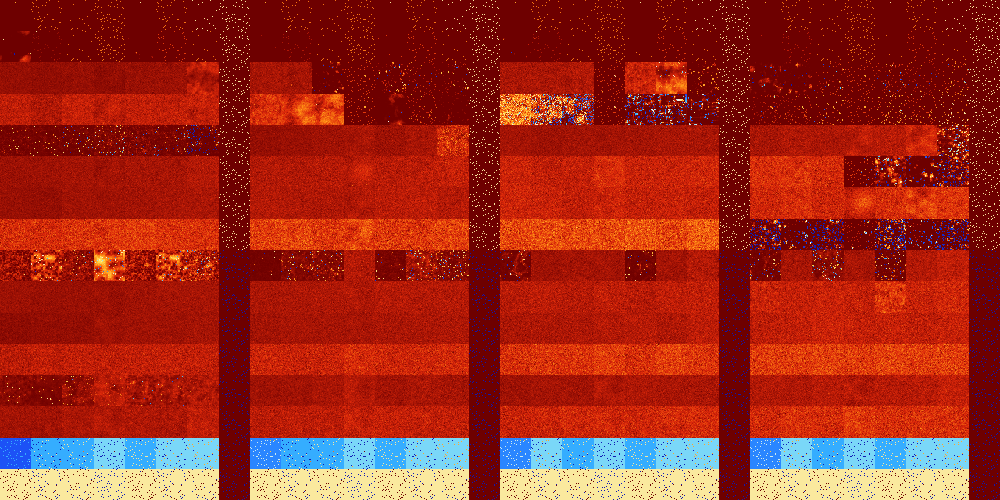

# B01234578 (228864-229375)

<details>
    <summary>Initial Grid</summary>
    
</details>


<details>
    <summary>Initial Grid RLE</summary>

```
#C Exported from GoGoL (https://github.com/marrow16/gogol)
#C Wrap mode: Toroidal
#C Boundary mode: Dead
#C Step: 0
x = 100, y = 100, rule = B01234578/S
38bo45bo$15b2o25bo15bo14bo$11bo5bo38bo12bo2bo19bo$10bo24bo24bo13bo11bo$
24bo4b2o21bo5bo6bo15bo2bo$33bo7bo14bo31bo$24bo10bobo24bo20bo$49bo4bo10b
2o10bobo9bo$o2bo16bo27bo7b2o9bo$16bo9bo16bo5bo28bo2bo9bo3bo$12bo64b2o4b
o$6bo80bo9bo$3bo8bo30bo9bo9bo3bo18bo$2bo26bo6b2o2bo35bo$23bo26bo3bo5bo
4bo12bo$16bo20bo31bo2bo22bo$23bo38bo3bo10bo13bo$10bo2bo$36bo9bo15bo$83b
o9bobo$8bo4bo13bo62bo2bo3bo$6bo9bo36bo12bo7bo10bo$35bo11bo3bo45bo$11b2o
10bo52bo14bo$84bo$13bo31bo18bo14bo5bo13bo$12bo47bo14bo6bo13bo$10bo23bo
10bo$7bo10bo6bo7bo13bo29bo16bo$20bo15bo6bo39bo$38bo10bo29bobo2bo$bo33bo
11bo17bo$8bo5bo27bo41bo5bo3bo$12bo39bo11bo28bo$2bo31bo15bo5bo40bo$12bo
23bo24bo11bo3bo2b2o11bo$3bo25bo10bo9bo13bo22bo$28bo62bo7bo$23bo6bo62bo$
59bo$40bo3bo32bo13bo$15bo2bo3bo11bo5bo5bo10bo21bo9bo8bo$6bo11bo39bo4bo
2b2o15bo4bo$11bo25bo12bo16bo21bo$12bo17bo40bo23b2o$2bo51bo2bo12b2o$43bo
7bo36bo5bo2bo$48bo$31bo13bo11bo36bo$58bo31bo$8b2o27bo16bo2bo$39bo16bo
24bo15bo$17bo65bo$10bo15bo23bo30bo$22bo59bo8bo$6bo29bo13bo13bo$32bo8bo
5bobo15bo6bo6bo$4bo33bo40bo13bo$11bo16bo4bo19bo44bo$18bo14bo20bo6bo13bo
$44bo11bo20bo17bo$21bobo13bo25bo2bobo2bo8bo$42bo4bo4bo11bo16bo3bobo$12b
o12bo$13bo2bo14bo11bo21bo10bo11bo4bo$bo11bo12bo47bo$26bo9bo6bo$18bo11bo
15bo7bo17b2o6bo6bo$23bo9bo3bo24bo15bo18bo$22bo12bo41bo12bo8bo$8bo28bo
27bo4bo2bo10bo13bo$5bo39bo7bo37bobo$5bo27b2o12bo2bo27bo20bo$15b2o29bo5b
o12bo7bo5b2o$11bo58bo26bo$bo40bo51bo2bo$40bo16bo12b2o16bo5bo$11bo4bo39b
o24bo11bo$10bo4bo64bo$100b$3bo14bo13bo35bo3bo12bo9bo$15bo12bo6bo44bo2bo
6bo7bo$22bo13bo13bo6bo25bo4bo7bo$26bo13bo22bo11bo14bo$10bo$o17bo11bobo
55bo6bobo$36b2o7bo7bo26bobo8bo$7bo63bo4bo$5bo17bo10bo9bobo31bo15bo2bo$b
o69bobo$22bo37bo10bo2b2o10bo2bo$15bo4bo9b2o16bo28bobo3bo4bo5b2obo$7bo
33bo3b2o2bo41bo$28bo44bo$12bo14b2o22bo14bo8bobo$15bo16bo26bobo$30bo27bo
22bo17bo$17bo24bo55bo$5bo57bo12bo10bo$2bo45bo2bo10bo2bobo11bo11bo!
```
</details>
<details>
    <summary>Thumbnail</summary>

</details>
<table>
<tr>
    <td><a href="./228864%20S%20Heat%20Map%20Activity.png"></a><br>S (228864)<br>R@4,p2</td>    <td><a href="./228865%20S0%20Heat%20Map%20Activity.png"></a><br>S0 (228865)<br>R@5,p2</td>    <td><a href="./228866%20S1%20Heat%20Map%20Activity.png"></a><br>S1 (228866)<br>R@5,p2</td>    <td><a href="./228867%20S01%20Heat%20Map%20Activity.png"></a><br>S01 (228867)<br>R@5,p2</td>    <td><a href="./228868%20S2%20Heat%20Map%20Activity.png"></a><br>S2 (228868)<br>R@3,p2</td>    <td><a href="./228869%20S02%20Heat%20Map%20Activity.png"></a><br>S02 (228869)<br>R@5,p2</td>    <td><a href="./228870%20S12%20Heat%20Map%20Activity.png"></a><br>S12 (228870)<br>R@3,p2</td>    <td><a href="./228871%20S012%20Heat%20Map%20Activity.png"></a><br>S012 (228871)<br>R@3,p2</td>    <td><a href="./228872%20S3%20Heat%20Map%20Activity.png"></a><br>S3 (228872)<br>R@4,p2</td>    <td><a href="./228873%20S03%20Heat%20Map%20Activity.png"></a><br>S03 (228873)<br>R@5,p2</td>    <td><a href="./228874%20S13%20Heat%20Map%20Activity.png"></a><br>S13 (228874)<br>R@5,p2</td>    <td><a href="./228875%20S013%20Heat%20Map%20Activity.png"></a><br>S013 (228875)<br>R@5,p2</td>    <td><a href="./228876%20S23%20Heat%20Map%20Activity.png"></a><br>S23 (228876)<br>R@3,p2</td>    <td><a href="./228877%20S023%20Heat%20Map%20Activity.png"></a><br>S023 (228877)<br>R@5,p2</td>    <td><a href="./228878%20S123%20Heat%20Map%20Activity.png"></a><br>S123 (228878)<br>R@3,p2</td>    <td><a href="./228879%20S0123%20Heat%20Map%20Activity.png"></a><br>S0123 (228879)<br>R@3,p2</td>    <td><a href="./228880%20S4%20Heat%20Map%20Activity.png"></a><br>S4 (228880)<br>R@4,p2</td>    <td><a href="./228881%20S04%20Heat%20Map%20Activity.png"></a><br>S04 (228881)<br>R@5,p2</td>    <td><a href="./228882%20S14%20Heat%20Map%20Activity.png"></a><br>S14 (228882)<br>R@5,p2</td>    <td><a href="./228883%20S014%20Heat%20Map%20Activity.png"></a><br>S014 (228883)<br>R@5,p2</td>    <td><a href="./228884%20S24%20Heat%20Map%20Activity.png"></a><br>S24 (228884)<br>R@3,p2</td>    <td><a href="./228885%20S024%20Heat%20Map%20Activity.png"></a><br>S024 (228885)<br>R@5,p2</td>    <td><a href="./228886%20S124%20Heat%20Map%20Activity.png"></a><br>S124 (228886)<br>R@3,p2</td>    <td><a href="./228887%20S0124%20Heat%20Map%20Activity.png"></a><br>S0124 (228887)<br>R@3,p2</td>    <td><a href="./228888%20S34%20Heat%20Map%20Activity.png"></a><br>S34 (228888)<br>R@4,p2</td>    <td><a href="./228889%20S034%20Heat%20Map%20Activity.png"></a><br>S034 (228889)<br>R@5,p2</td>    <td><a href="./228890%20S134%20Heat%20Map%20Activity.png"></a><br>S134 (228890)<br>R@5,p2</td>    <td><a href="./228891%20S0134%20Heat%20Map%20Activity.png"></a><br>S0134 (228891)<br>R@5,p2</td>    <td><a href="./228892%20S234%20Heat%20Map%20Activity.png"></a><br>S234 (228892)<br>R@3,p2</td>    <td><a href="./228893%20S0234%20Heat%20Map%20Activity.png"></a><br>S0234 (228893)<br>R@5,p2</td>    <td><a href="./228894%20S1234%20Heat%20Map%20Activity.png"></a><br>S1234 (228894)<br>R@3,p2</td>    <td><a href="./228895%20S01234%20Heat%20Map%20Activity.png"></a><br>S01234 (228895)<br>R@3,p2</td></tr>
<tr>
    <td><a href="./228896%20S5%20Heat%20Map%20Activity.png"></a><br>S5 (228896)<br>G>1000</td>    <td><a href="./228897%20S05%20Heat%20Map%20Activity.png"></a><br>S05 (228897)<br>R@19,p4</td>    <td><a href="./228898%20S15%20Heat%20Map%20Activity.png"></a><br>S15 (228898)<br>R@5,p2</td>    <td><a href="./228899%20S015%20Heat%20Map%20Activity.png"></a><br>S015 (228899)<br>R@5,p2</td>    <td><a href="./228900%20S25%20Heat%20Map%20Activity.png"></a><br>S25 (228900)<br>R@21,p2</td>    <td><a href="./228901%20S025%20Heat%20Map%20Activity.png"></a><br>S025 (228901)<br>R@7,p2</td>    <td><a href="./228902%20S125%20Heat%20Map%20Activity.png"></a><br>S125 (228902)<br>R@5,p2</td>    <td><a href="./228903%20S0125%20Heat%20Map%20Activity.png"></a><br>S0125 (228903)<br>R@3,p2</td>    <td><a href="./228904%20S35%20Heat%20Map%20Activity.png"></a><br>S35 (228904)<br>R@14,p4</td>    <td><a href="./228905%20S035%20Heat%20Map%20Activity.png"></a><br>S035 (228905)<br>R@13,p4</td>    <td><a href="./228906%20S135%20Heat%20Map%20Activity.png"></a><br>S135 (228906)<br>R@5,p2</td>    <td><a href="./228907%20S0135%20Heat%20Map%20Activity.png"></a><br>S0135 (228907)<br>R@5,p2</td>    <td><a href="./228908%20S235%20Heat%20Map%20Activity.png"></a><br>S235 (228908)<br>R@7,p2</td>    <td><a href="./228909%20S0235%20Heat%20Map%20Activity.png"></a><br>S0235 (228909)<br>R@7,p2</td>    <td><a href="./228910%20S1235%20Heat%20Map%20Activity.png"></a><br>S1235 (228910)<br>R@5,p2</td>    <td><a href="./228911%20S01235%20Heat%20Map%20Activity.png"></a><br>S01235 (228911)<br>R@3,p2</td>    <td><a href="./228912%20S45%20Heat%20Map%20Activity.png"></a><br>S45 (228912)<br>R@35,p12</td>    <td><a href="./228913%20S045%20Heat%20Map%20Activity.png"></a><br>S045 (228913)<br>R@13,p4</td>    <td><a href="./228914%20S145%20Heat%20Map%20Activity.png"></a><br>S145 (228914)<br>R@5,p2</td>    <td><a href="./228915%20S0145%20Heat%20Map%20Activity.png"></a><br>S0145 (228915)<br>R@5,p2</td>    <td><a href="./228916%20S245%20Heat%20Map%20Activity.png"></a><br>S245 (228916)<br>R@5,p2</td>    <td><a href="./228917%20S0245%20Heat%20Map%20Activity.png"></a><br>S0245 (228917)<br>R@7,p2</td>    <td><a href="./228918%20S1245%20Heat%20Map%20Activity.png"></a><br>S1245 (228918)<br>R@5,p2</td>    <td><a href="./228919%20S01245%20Heat%20Map%20Activity.png"></a><br>S01245 (228919)<br>R@3,p2</td>    <td><a href="./228920%20S345%20Heat%20Map%20Activity.png"></a><br>S345 (228920)<br>R@10,p4</td>    <td><a href="./228921%20S0345%20Heat%20Map%20Activity.png"></a><br>S0345 (228921)<br>R@11,p4</td>    <td><a href="./228922%20S1345%20Heat%20Map%20Activity.png"></a><br>S1345 (228922)<br>R@5,p2</td>    <td><a href="./228923%20S01345%20Heat%20Map%20Activity.png"></a><br>S01345 (228923)<br>R@5,p2</td>    <td><a href="./228924%20S2345%20Heat%20Map%20Activity.png"></a><br>S2345 (228924)<br>R@5,p2</td>    <td><a href="./228925%20S02345%20Heat%20Map%20Activity.png"></a><br>S02345 (228925)<br>R@7,p2</td>    <td><a href="./228926%20S12345%20Heat%20Map%20Activity.png"></a><br>S12345 (228926)<br>R@5,p2</td>    <td><a href="./228927%20S012345%20Heat%20Map%20Activity.png"></a><br>S012345 (228927)<br>R@3,p2</td></tr>
<tr>
    <td><a href="./228928%20S6%20Heat%20Map%20Activity.png"></a><br>S6 (228928)<br>G>1000</td>    <td><a href="./228929%20S06%20Heat%20Map%20Activity.png"></a><br>S06 (228929)<br>G>1000</td>    <td><a href="./228930%20S16%20Heat%20Map%20Activity.png"></a><br>S16 (228930)<br>G>1000</td>    <td><a href="./228931%20S016%20Heat%20Map%20Activity.png"></a><br>S016 (228931)<br>G>1000</td>    <td><a href="./228932%20S26%20Heat%20Map%20Activity.png"></a><br>S26 (228932)<br>G>1000</td>    <td><a href="./228933%20S026%20Heat%20Map%20Activity.png"></a><br>S026 (228933)<br>G>1000</td>    <td><a href="./228934%20S126%20Heat%20Map%20Activity.png"></a><br>S126 (228934)<br>G>1000</td>    <td><a href="./228935%20S0126%20Heat%20Map%20Activity.png"></a><br>S0126 (228935)<br>R@3,p2</td>    <td><a href="./228936%20S36%20Heat%20Map%20Activity.png"></a><br>S36 (228936)<br>G>1000</td>    <td><a href="./228937%20S036%20Heat%20Map%20Activity.png"></a><br>S036 (228937)<br>G>1000</td>    <td><a href="./228938%20S136%20Heat%20Map%20Activity.png"></a><br>S136 (228938)<br>R@71,p4</td>    <td><a href="./228939%20S0136%20Heat%20Map%20Activity.png"></a><br>S0136 (228939)<br>R@7,p2</td>    <td><a href="./228940%20S236%20Heat%20Map%20Activity.png"></a><br>S236 (228940)<br>R@29,p4</td>    <td><a href="./228941%20S0236%20Heat%20Map%20Activity.png"></a><br>S0236 (228941)<br>R@11,p2</td>    <td><a href="./228942%20S1236%20Heat%20Map%20Activity.png"></a><br>S1236 (228942)<br>R@19,p4</td>    <td><a href="./228943%20S01236%20Heat%20Map%20Activity.png"></a><br>S01236 (228943)<br>R@3,p2</td>    <td><a href="./228944%20S46%20Heat%20Map%20Activity.png"></a><br>S46 (228944)<br>G>1000</td>    <td><a href="./228945%20S046%20Heat%20Map%20Activity.png"></a><br>S046 (228945)<br>G>1000</td>    <td><a href="./228946%20S146%20Heat%20Map%20Activity.png"></a><br>S146 (228946)<br>G>1000</td>    <td><a href="./228947%20S0146%20Heat%20Map%20Activity.png"></a><br>S0146 (228947)<br>R@7,p2</td>    <td><a href="./228948%20S246%20Heat%20Map%20Activity.png"></a><br>S246 (228948)<br>G>1000</td>    <td><a href="./228949%20S0246%20Heat%20Map%20Activity.png"></a><br>S0246 (228949)<br>G>1000</td>    <td><a href="./228950%20S1246%20Heat%20Map%20Activity.png"></a><br>S1246 (228950)<br>R@37,p6</td>    <td><a href="./228951%20S01246%20Heat%20Map%20Activity.png"></a><br>S01246 (228951)<br>R@3,p2</td>    <td><a href="./228952%20S346%20Heat%20Map%20Activity.png"></a><br>S346 (228952)<br>R@477,p2</td>    <td><a href="./228953%20S0346%20Heat%20Map%20Activity.png"></a><br>S0346 (228953)<br>R@137,p2</td>    <td><a href="./228954%20S1346%20Heat%20Map%20Activity.png"></a><br>S1346 (228954)<br>R@11,p2</td>    <td><a href="./228955%20S01346%20Heat%20Map%20Activity.png"></a><br>S01346 (228955)<br>R@7,p2</td>    <td><a href="./228956%20S2346%20Heat%20Map%20Activity.png"></a><br>S2346 (228956)<br>R@13,p2</td>    <td><a href="./228957%20S02346%20Heat%20Map%20Activity.png"></a><br>S02346 (228957)<br>R@11,p2</td>    <td><a href="./228958%20S12346%20Heat%20Map%20Activity.png"></a><br>S12346 (228958)<br>R@7,p2</td>    <td><a href="./228959%20S012346%20Heat%20Map%20Activity.png"></a><br>S012346 (228959)<br>R@3,p2</td></tr>
<tr>
    <td><a href="./228960%20S56%20Heat%20Map%20Activity.png"></a><br>S56 (228960)<br>G>1000</td>    <td><a href="./228961%20S056%20Heat%20Map%20Activity.png"></a><br>S056 (228961)<br>G>1000</td>    <td><a href="./228962%20S156%20Heat%20Map%20Activity.png"></a><br>S156 (228962)<br>G>1000</td>    <td><a href="./228963%20S0156%20Heat%20Map%20Activity.png"></a><br>S0156 (228963)<br>G>1000</td>    <td><a href="./228964%20S256%20Heat%20Map%20Activity.png"></a><br>S256 (228964)<br>G>1000</td>    <td><a href="./228965%20S0256%20Heat%20Map%20Activity.png"></a><br>S0256 (228965)<br>G>1000</td>    <td><a href="./228966%20S1256%20Heat%20Map%20Activity.png"></a><br>S1256 (228966)<br>G>1000</td>    <td><a href="./228967%20S01256%20Heat%20Map%20Activity.png"></a><br>S01256 (228967)<br>R@3,p2</td>    <td><a href="./228968%20S356%20Heat%20Map%20Activity.png"></a><br>S356 (228968)<br>G>1000</td>    <td><a href="./228969%20S0356%20Heat%20Map%20Activity.png"></a><br>S0356 (228969)<br>G>1000</td>    <td><a href="./228970%20S1356%20Heat%20Map%20Activity.png"></a><br>S1356 (228970)<br>G>1000</td>    <td><a href="./228971%20S01356%20Heat%20Map%20Activity.png"></a><br>S01356 (228971)<br>R@7,p2</td>    <td><a href="./228972%20S2356%20Heat%20Map%20Activity.png"></a><br>S2356 (228972)<br>G>1000</td>    <td><a href="./228973%20S02356%20Heat%20Map%20Activity.png"></a><br>S02356 (228973)<br>R@9,p2</td>    <td><a href="./228974%20S12356%20Heat%20Map%20Activity.png"></a><br>S12356 (228974)<br>R@45,p2</td>    <td><a href="./228975%20S012356%20Heat%20Map%20Activity.png"></a><br>S012356 (228975)<br>R@3,p2</td>    <td><a href="./228976%20S456%20Heat%20Map%20Activity.png"></a><br>S456 (228976)<br>G>1000</td>    <td><a href="./228977%20S0456%20Heat%20Map%20Activity.png"></a><br>S0456 (228977)<br>R@857,p6</td>    <td><a href="./228978%20S1456%20Heat%20Map%20Activity.png"></a><br>S1456 (228978)<br>R@548,p12</td>    <td><a href="./228979%20S01456%20Heat%20Map%20Activity.png"></a><br>S01456 (228979)<br>R@7,p2</td>    <td><a href="./228980%20S2456%20Heat%20Map%20Activity.png"></a><br>S2456 (228980)<br>R@181,p12</td>    <td><a href="./228981%20S02456%20Heat%20Map%20Activity.png"></a><br>S02456 (228981)<br>R@239,p24</td>    <td><a href="./228982%20S12456%20Heat%20Map%20Activity.png"></a><br>S12456 (228982)<br>R@195,p12</td>    <td><a href="./228983%20S012456%20Heat%20Map%20Activity.png"></a><br>S012456 (228983)<br>R@3,p2</td>    <td><a href="./228984%20S3456%20Heat%20Map%20Activity.png"></a><br>S3456 (228984)<br>R@19,p2</td>    <td><a href="./228985%20S03456%20Heat%20Map%20Activity.png"></a><br>S03456 (228985)<br>R@11,p2</td>    <td><a href="./228986%20S13456%20Heat%20Map%20Activity.png"></a><br>S13456 (228986)<br>R@7,p2</td>    <td><a href="./228987%20S013456%20Heat%20Map%20Activity.png"></a><br>S013456 (228987)<br>R@7,p2</td>    <td><a href="./228988%20S23456%20Heat%20Map%20Activity.png"></a><br>S23456 (228988)<br>R@7,p2</td>    <td><a href="./228989%20S023456%20Heat%20Map%20Activity.png"></a><br>S023456 (228989)<br>R@7,p2</td>    <td><a href="./228990%20S123456%20Heat%20Map%20Activity.png"></a><br>S123456 (228990)<br>R@5,p2</td>    <td><a href="./228991%20S0123456%20Heat%20Map%20Activity.png"></a><br>S0123456 (228991)<br>R@3,p2</td></tr>
<tr>
    <td><a href="./228992%20S7%20Heat%20Map%20Activity.png"></a><br>S7 (228992)<br>R@139,p24</td>    <td><a href="./228993%20S07%20Heat%20Map%20Activity.png"></a><br>S07 (228993)<br>R@443,p168</td>    <td><a href="./228994%20S17%20Heat%20Map%20Activity.png"></a><br>S17 (228994)<br>G>1000</td>    <td><a href="./228995%20S017%20Heat%20Map%20Activity.png"></a><br>S017 (228995)<br>R@446,p24</td>    <td><a href="./228996%20S27%20Heat%20Map%20Activity.png"></a><br>S27 (228996)<br>R@86,p12</td>    <td><a href="./228997%20S027%20Heat%20Map%20Activity.png"></a><br>S027 (228997)<br>R@195,p60</td>    <td><a href="./228998%20S127%20Heat%20Map%20Activity.png"></a><br>S127 (228998)<br>R@128,p12</td>    <td><a href="./228999%20S0127%20Heat%20Map%20Activity.png"></a><br>S0127 (228999)<br>R@3,p2</td>    <td><a href="./229000%20S37%20Heat%20Map%20Activity.png"></a><br>S37 (229000)<br>G>1000</td>    <td><a href="./229001%20S037%20Heat%20Map%20Activity.png"></a><br>S037 (229001)<br>G>1000</td>    <td><a href="./229002%20S137%20Heat%20Map%20Activity.png"></a><br>S137 (229002)<br>G>1000</td>    <td><a href="./229003%20S0137%20Heat%20Map%20Activity.png"></a><br>S0137 (229003)<br>G>1000</td>    <td><a href="./229004%20S237%20Heat%20Map%20Activity.png"></a><br>S237 (229004)<br>G>1000</td>    <td><a href="./229005%20S0237%20Heat%20Map%20Activity.png"></a><br>S0237 (229005)<br>G>1000</td>    <td><a href="./229006%20S1237%20Heat%20Map%20Activity.png"></a><br>S1237 (229006)<br>G>1000</td>    <td><a href="./229007%20S01237%20Heat%20Map%20Activity.png"></a><br>S01237 (229007)<br>R@3,p2</td>    <td><a href="./229008%20S47%20Heat%20Map%20Activity.png"></a><br>S47 (229008)<br>G>1000</td>    <td><a href="./229009%20S047%20Heat%20Map%20Activity.png"></a><br>S047 (229009)<br>G>1000</td>    <td><a href="./229010%20S147%20Heat%20Map%20Activity.png"></a><br>S147 (229010)<br>G>1000</td>    <td><a href="./229011%20S0147%20Heat%20Map%20Activity.png"></a><br>S0147 (229011)<br>G>1000</td>    <td><a href="./229012%20S247%20Heat%20Map%20Activity.png"></a><br>S247 (229012)<br>G>1000</td>    <td><a href="./229013%20S0247%20Heat%20Map%20Activity.png"></a><br>S0247 (229013)<br>G>1000</td>    <td><a href="./229014%20S1247%20Heat%20Map%20Activity.png"></a><br>S1247 (229014)<br>G>1000</td>    <td><a href="./229015%20S01247%20Heat%20Map%20Activity.png"></a><br>S01247 (229015)<br>R@3,p2</td>    <td><a href="./229016%20S347%20Heat%20Map%20Activity.png"></a><br>S347 (229016)<br>G>1000</td>    <td><a href="./229017%20S0347%20Heat%20Map%20Activity.png"></a><br>S0347 (229017)<br>G>1000</td>    <td><a href="./229018%20S1347%20Heat%20Map%20Activity.png"></a><br>S1347 (229018)<br>G>1000</td>    <td><a href="./229019%20S01347%20Heat%20Map%20Activity.png"></a><br>S01347 (229019)<br>G>1000</td>    <td><a href="./229020%20S2347%20Heat%20Map%20Activity.png"></a><br>S2347 (229020)<br>G>1000</td>    <td><a href="./229021%20S02347%20Heat%20Map%20Activity.png"></a><br>S02347 (229021)<br>G>1000</td>    <td><a href="./229022%20S12347%20Heat%20Map%20Activity.png"></a><br>S12347 (229022)<br>R@157,p12</td>    <td><a href="./229023%20S012347%20Heat%20Map%20Activity.png"></a><br>S012347 (229023)<br>R@3,p2</td></tr>
<tr>
    <td><a href="./229024%20S57%20Heat%20Map%20Activity.png"></a><br>S57 (229024)<br>G>1000</td>    <td><a href="./229025%20S057%20Heat%20Map%20Activity.png"></a><br>S057 (229025)<br>G>1000</td>    <td><a href="./229026%20S157%20Heat%20Map%20Activity.png"></a><br>S157 (229026)<br>G>1000</td>    <td><a href="./229027%20S0157%20Heat%20Map%20Activity.png"></a><br>S0157 (229027)<br>G>1000</td>    <td><a href="./229028%20S257%20Heat%20Map%20Activity.png"></a><br>S257 (229028)<br>G>1000</td>    <td><a href="./229029%20S0257%20Heat%20Map%20Activity.png"></a><br>S0257 (229029)<br>G>1000</td>    <td><a href="./229030%20S1257%20Heat%20Map%20Activity.png"></a><br>S1257 (229030)<br>G>1000</td>    <td><a href="./229031%20S01257%20Heat%20Map%20Activity.png"></a><br>S01257 (229031)<br>R@3,p2</td>    <td><a href="./229032%20S357%20Heat%20Map%20Activity.png"></a><br>S357 (229032)<br>G>1000</td>    <td><a href="./229033%20S0357%20Heat%20Map%20Activity.png"></a><br>S0357 (229033)<br>G>1000</td>    <td><a href="./229034%20S1357%20Heat%20Map%20Activity.png"></a><br>S1357 (229034)<br>G>1000</td>    <td><a href="./229035%20S01357%20Heat%20Map%20Activity.png"></a><br>S01357 (229035)<br>G>1000</td>    <td><a href="./229036%20S2357%20Heat%20Map%20Activity.png"></a><br>S2357 (229036)<br>G>1000</td>    <td><a href="./229037%20S02357%20Heat%20Map%20Activity.png"></a><br>S02357 (229037)<br>G>1000</td>    <td><a href="./229038%20S12357%20Heat%20Map%20Activity.png"></a><br>S12357 (229038)<br>G>1000</td>    <td><a href="./229039%20S012357%20Heat%20Map%20Activity.png"></a><br>S012357 (229039)<br>R@3,p2</td>    <td><a href="./229040%20S457%20Heat%20Map%20Activity.png"></a><br>S457 (229040)<br>G>1000</td>    <td><a href="./229041%20S0457%20Heat%20Map%20Activity.png"></a><br>S0457 (229041)<br>G>1000</td>    <td><a href="./229042%20S1457%20Heat%20Map%20Activity.png"></a><br>S1457 (229042)<br>G>1000</td>    <td><a href="./229043%20S01457%20Heat%20Map%20Activity.png"></a><br>S01457 (229043)<br>G>1000</td>    <td><a href="./229044%20S2457%20Heat%20Map%20Activity.png"></a><br>S2457 (229044)<br>G>1000</td>    <td><a href="./229045%20S02457%20Heat%20Map%20Activity.png"></a><br>S02457 (229045)<br>G>1000</td>    <td><a href="./229046%20S12457%20Heat%20Map%20Activity.png"></a><br>S12457 (229046)<br>G>1000</td>    <td><a href="./229047%20S012457%20Heat%20Map%20Activity.png"></a><br>S012457 (229047)<br>R@3,p2</td>    <td><a href="./229048%20S3457%20Heat%20Map%20Activity.png"></a><br>S3457 (229048)<br>G>1000</td>    <td><a href="./229049%20S03457%20Heat%20Map%20Activity.png"></a><br>S03457 (229049)<br>G>1000</td>    <td><a href="./229050%20S13457%20Heat%20Map%20Activity.png"></a><br>S13457 (229050)<br>G>1000</td>    <td><a href="./229051%20S013457%20Heat%20Map%20Activity.png"></a><br>S013457 (229051)<br>R@7,p2</td>    <td><a href="./229052%20S23457%20Heat%20Map%20Activity.png"></a><br>S23457 (229052)<br>R@213,p8</td>    <td><a href="./229053%20S023457%20Heat%20Map%20Activity.png"></a><br>S023457 (229053)<br>R@89,p8</td>    <td><a href="./229054%20S123457%20Heat%20Map%20Activity.png"></a><br>S123457 (229054)<br>R@37,p8</td>    <td><a href="./229055%20S0123457%20Heat%20Map%20Activity.png"></a><br>S0123457 (229055)<br>R@3,p2</td></tr>
<tr>
    <td><a href="./229056%20S67%20Heat%20Map%20Activity.png"></a><br>S67 (229056)<br>G>1000</td>    <td><a href="./229057%20S067%20Heat%20Map%20Activity.png"></a><br>S067 (229057)<br>G>1000</td>    <td><a href="./229058%20S167%20Heat%20Map%20Activity.png"></a><br>S167 (229058)<br>G>1000</td>    <td><a href="./229059%20S0167%20Heat%20Map%20Activity.png"></a><br>S0167 (229059)<br>G>1000</td>    <td><a href="./229060%20S267%20Heat%20Map%20Activity.png"></a><br>S267 (229060)<br>G>1000</td>    <td><a href="./229061%20S0267%20Heat%20Map%20Activity.png"></a><br>S0267 (229061)<br>G>1000</td>    <td><a href="./229062%20S1267%20Heat%20Map%20Activity.png"></a><br>S1267 (229062)<br>G>1000</td>    <td><a href="./229063%20S01267%20Heat%20Map%20Activity.png"></a><br>S01267 (229063)<br>R@3,p2</td>    <td><a href="./229064%20S367%20Heat%20Map%20Activity.png"></a><br>S367 (229064)<br>G>1000</td>    <td><a href="./229065%20S0367%20Heat%20Map%20Activity.png"></a><br>S0367 (229065)<br>G>1000</td>    <td><a href="./229066%20S1367%20Heat%20Map%20Activity.png"></a><br>S1367 (229066)<br>G>1000</td>    <td><a href="./229067%20S01367%20Heat%20Map%20Activity.png"></a><br>S01367 (229067)<br>G>1000</td>    <td><a href="./229068%20S2367%20Heat%20Map%20Activity.png"></a><br>S2367 (229068)<br>G>1000</td>    <td><a href="./229069%20S02367%20Heat%20Map%20Activity.png"></a><br>S02367 (229069)<br>G>1000</td>    <td><a href="./229070%20S12367%20Heat%20Map%20Activity.png"></a><br>S12367 (229070)<br>G>1000</td>    <td><a href="./229071%20S012367%20Heat%20Map%20Activity.png"></a><br>S012367 (229071)<br>R@3,p2</td>    <td><a href="./229072%20S467%20Heat%20Map%20Activity.png"></a><br>S467 (229072)<br>G>1000</td>    <td><a href="./229073%20S0467%20Heat%20Map%20Activity.png"></a><br>S0467 (229073)<br>G>1000</td>    <td><a href="./229074%20S1467%20Heat%20Map%20Activity.png"></a><br>S1467 (229074)<br>G>1000</td>    <td><a href="./229075%20S01467%20Heat%20Map%20Activity.png"></a><br>S01467 (229075)<br>G>1000</td>    <td><a href="./229076%20S2467%20Heat%20Map%20Activity.png"></a><br>S2467 (229076)<br>G>1000</td>    <td><a href="./229077%20S02467%20Heat%20Map%20Activity.png"></a><br>S02467 (229077)<br>G>1000</td>    <td><a href="./229078%20S12467%20Heat%20Map%20Activity.png"></a><br>S12467 (229078)<br>G>1000</td>    <td><a href="./229079%20S012467%20Heat%20Map%20Activity.png"></a><br>S012467 (229079)<br>R@3,p2</td>    <td><a href="./229080%20S3467%20Heat%20Map%20Activity.png"></a><br>S3467 (229080)<br>G>1000</td>    <td><a href="./229081%20S03467%20Heat%20Map%20Activity.png"></a><br>S03467 (229081)<br>G>1000</td>    <td><a href="./229082%20S13467%20Heat%20Map%20Activity.png"></a><br>S13467 (229082)<br>G>1000</td>    <td><a href="./229083%20S013467%20Heat%20Map%20Activity.png"></a><br>S013467 (229083)<br>G>1000</td>    <td><a href="./229084%20S23467%20Heat%20Map%20Activity.png"></a><br>S23467 (229084)<br>G>1000</td>    <td><a href="./229085%20S023467%20Heat%20Map%20Activity.png"></a><br>S023467 (229085)<br>G>1000</td>    <td><a href="./229086%20S123467%20Heat%20Map%20Activity.png"></a><br>S123467 (229086)<br>G>1000</td>    <td><a href="./229087%20S0123467%20Heat%20Map%20Activity.png"></a><br>S0123467 (229087)<br>R@3,p2</td></tr>
<tr>
    <td><a href="./229088%20S567%20Heat%20Map%20Activity.png"></a><br>S567 (229088)<br>G>1000</td>    <td><a href="./229089%20S0567%20Heat%20Map%20Activity.png"></a><br>S0567 (229089)<br>G>1000</td>    <td><a href="./229090%20S1567%20Heat%20Map%20Activity.png"></a><br>S1567 (229090)<br>G>1000</td>    <td><a href="./229091%20S01567%20Heat%20Map%20Activity.png"></a><br>S01567 (229091)<br>G>1000</td>    <td><a href="./229092%20S2567%20Heat%20Map%20Activity.png"></a><br>S2567 (229092)<br>G>1000</td>    <td><a href="./229093%20S02567%20Heat%20Map%20Activity.png"></a><br>S02567 (229093)<br>G>1000</td>    <td><a href="./229094%20S12567%20Heat%20Map%20Activity.png"></a><br>S12567 (229094)<br>G>1000</td>    <td><a href="./229095%20S012567%20Heat%20Map%20Activity.png"></a><br>S012567 (229095)<br>R@3,p2</td>    <td><a href="./229096%20S3567%20Heat%20Map%20Activity.png"></a><br>S3567 (229096)<br>G>1000</td>    <td><a href="./229097%20S03567%20Heat%20Map%20Activity.png"></a><br>S03567 (229097)<br>G>1000</td>    <td><a href="./229098%20S13567%20Heat%20Map%20Activity.png"></a><br>S13567 (229098)<br>G>1000</td>    <td><a href="./229099%20S013567%20Heat%20Map%20Activity.png"></a><br>S013567 (229099)<br>G>1000</td>    <td><a href="./229100%20S23567%20Heat%20Map%20Activity.png"></a><br>S23567 (229100)<br>G>1000</td>    <td><a href="./229101%20S023567%20Heat%20Map%20Activity.png"></a><br>S023567 (229101)<br>G>1000</td>    <td><a href="./229102%20S123567%20Heat%20Map%20Activity.png"></a><br>S123567 (229102)<br>G>1000</td>    <td><a href="./229103%20S0123567%20Heat%20Map%20Activity.png"></a><br>S0123567 (229103)<br>R@3,p2</td>    <td><a href="./229104%20S4567%20Heat%20Map%20Activity.png"></a><br>S4567 (229104)<br>G>1000</td>    <td><a href="./229105%20S04567%20Heat%20Map%20Activity.png"></a><br>S04567 (229105)<br>G>1000</td>    <td><a href="./229106%20S14567%20Heat%20Map%20Activity.png"></a><br>S14567 (229106)<br>G>1000</td>    <td><a href="./229107%20S014567%20Heat%20Map%20Activity.png"></a><br>S014567 (229107)<br>G>1000</td>    <td><a href="./229108%20S24567%20Heat%20Map%20Activity.png"></a><br>S24567 (229108)<br>G>1000</td>    <td><a href="./229109%20S024567%20Heat%20Map%20Activity.png"></a><br>S024567 (229109)<br>G>1000</td>    <td><a href="./229110%20S124567%20Heat%20Map%20Activity.png"></a><br>S124567 (229110)<br>G>1000</td>    <td><a href="./229111%20S0124567%20Heat%20Map%20Activity.png"></a><br>S0124567 (229111)<br>R@3,p2</td>    <td><a href="./229112%20S34567%20Heat%20Map%20Activity.png"></a><br>S34567 (229112)<br>R@53,p6</td>    <td><a href="./229113%20S034567%20Heat%20Map%20Activity.png"></a><br>S034567 (229113)<br>R@17,p2</td>    <td><a href="./229114%20S134567%20Heat%20Map%20Activity.png"></a><br>S134567 (229114)<br>R@57,p2</td>    <td><a href="./229115%20S0134567%20Heat%20Map%20Activity.png"></a><br>S0134567 (229115)<br>R@9,p2</td>    <td><a href="./229116%20S234567%20Heat%20Map%20Activity.png"></a><br>S234567 (229116)<br>R@21,p2</td>    <td><a href="./229117%20S0234567%20Heat%20Map%20Activity.png"></a><br>S0234567 (229117)<br>R@9,p2</td>    <td><a href="./229118%20S1234567%20Heat%20Map%20Activity.png"></a><br>S1234567 (229118)<br>R@25,p8</td>    <td><a href="./229119%20S01234567%20Heat%20Map%20Activity.png"></a><br>S01234567 (229119)<br>R@3,p2</td></tr>
<tr>
    <td><a href="./229120%20S8%20Heat%20Map%20Activity.png"></a><br>S8 (229120)<br>R@25,p4</td>    <td><a href="./229121%20S08%20Heat%20Map%20Activity.png"></a><br>S08 (229121)<br>R@37,p4</td>    <td><a href="./229122%20S18%20Heat%20Map%20Activity.png"></a><br>S18 (229122)<br>R@39,p12</td>    <td><a href="./229123%20S018%20Heat%20Map%20Activity.png"></a><br>S018 (229123)<br>R@65,p12</td>    <td><a href="./229124%20S28%20Heat%20Map%20Activity.png"></a><br>S28 (229124)<br>R@22,p4</td>    <td><a href="./229125%20S028%20Heat%20Map%20Activity.png"></a><br>S028 (229125)<br>R@36,p8</td>    <td><a href="./229126%20S128%20Heat%20Map%20Activity.png"></a><br>S128 (229126)<br>R@24,p4</td>    <td><a href="./229127%20S0128%20Heat%20Map%20Activity.png"></a><br>S0128 (229127)<br>S@1</td>    <td><a href="./229128%20S38%20Heat%20Map%20Activity.png"></a><br>S38 (229128)<br>R@346,p280</td>    <td><a href="./229129%20S038%20Heat%20Map%20Activity.png"></a><br>S038 (229129)<br>R@390,p24</td>    <td><a href="./229130%20S138%20Heat%20Map%20Activity.png"></a><br>S138 (229130)<br>R@169,p24</td>    <td><a href="./229131%20S0138%20Heat%20Map%20Activity.png"></a><br>S0138 (229131)<br>G>1000</td>    <td><a href="./229132%20S238%20Heat%20Map%20Activity.png"></a><br>S238 (229132)<br>R@177,p120</td>    <td><a href="./229133%20S0238%20Heat%20Map%20Activity.png"></a><br>S0238 (229133)<br>R@169,p24</td>    <td><a href="./229134%20S1238%20Heat%20Map%20Activity.png"></a><br>S1238 (229134)<br>R@259,p72</td>    <td><a href="./229135%20S01238%20Heat%20Map%20Activity.png"></a><br>S01238 (229135)<br>S@1</td>    <td><a href="./229136%20S48%20Heat%20Map%20Activity.png"></a><br>S48 (229136)<br>G>1000</td>    <td><a href="./229137%20S048%20Heat%20Map%20Activity.png"></a><br>S048 (229137)<br>G>1000</td>    <td><a href="./229138%20S148%20Heat%20Map%20Activity.png"></a><br>S148 (229138)<br>G>1000</td>    <td><a href="./229139%20S0148%20Heat%20Map%20Activity.png"></a><br>S0148 (229139)<br>G>1000</td>    <td><a href="./229140%20S248%20Heat%20Map%20Activity.png"></a><br>S248 (229140)<br>G>1000</td>    <td><a href="./229141%20S0248%20Heat%20Map%20Activity.png"></a><br>S0248 (229141)<br>G>1000</td>    <td><a href="./229142%20S1248%20Heat%20Map%20Activity.png"></a><br>S1248 (229142)<br>G>1000</td>    <td><a href="./229143%20S01248%20Heat%20Map%20Activity.png"></a><br>S01248 (229143)<br>S@1</td>    <td><a href="./229144%20S348%20Heat%20Map%20Activity.png"></a><br>S348 (229144)<br>R@618,p60</td>    <td><a href="./229145%20S0348%20Heat%20Map%20Activity.png"></a><br>S0348 (229145)<br>G>1000</td>    <td><a href="./229146%20S1348%20Heat%20Map%20Activity.png"></a><br>S1348 (229146)<br>G>1000</td>    <td><a href="./229147%20S01348%20Heat%20Map%20Activity.png"></a><br>S01348 (229147)<br>G>1000</td>    <td><a href="./229148%20S2348%20Heat%20Map%20Activity.png"></a><br>S2348 (229148)<br>G>1000</td>    <td><a href="./229149%20S02348%20Heat%20Map%20Activity.png"></a><br>S02348 (229149)<br>G>1000</td>    <td><a href="./229150%20S12348%20Heat%20Map%20Activity.png"></a><br>S12348 (229150)<br>G>1000</td>    <td><a href="./229151%20S012348%20Heat%20Map%20Activity.png"></a><br>S012348 (229151)<br>S@1</td></tr>
<tr>
    <td><a href="./229152%20S58%20Heat%20Map%20Activity.png"></a><br>S58 (229152)<br>G>1000</td>    <td><a href="./229153%20S058%20Heat%20Map%20Activity.png"></a><br>S058 (229153)<br>G>1000</td>    <td><a href="./229154%20S158%20Heat%20Map%20Activity.png"></a><br>S158 (229154)<br>G>1000</td>    <td><a href="./229155%20S0158%20Heat%20Map%20Activity.png"></a><br>S0158 (229155)<br>G>1000</td>    <td><a href="./229156%20S258%20Heat%20Map%20Activity.png"></a><br>S258 (229156)<br>G>1000</td>    <td><a href="./229157%20S0258%20Heat%20Map%20Activity.png"></a><br>S0258 (229157)<br>G>1000</td>    <td><a href="./229158%20S1258%20Heat%20Map%20Activity.png"></a><br>S1258 (229158)<br>G>1000</td>    <td><a href="./229159%20S01258%20Heat%20Map%20Activity.png"></a><br>S01258 (229159)<br>S@1</td>    <td><a href="./229160%20S358%20Heat%20Map%20Activity.png"></a><br>S358 (229160)<br>G>1000</td>    <td><a href="./229161%20S0358%20Heat%20Map%20Activity.png"></a><br>S0358 (229161)<br>G>1000</td>    <td><a href="./229162%20S1358%20Heat%20Map%20Activity.png"></a><br>S1358 (229162)<br>G>1000</td>    <td><a href="./229163%20S01358%20Heat%20Map%20Activity.png"></a><br>S01358 (229163)<br>G>1000</td>    <td><a href="./229164%20S2358%20Heat%20Map%20Activity.png"></a><br>S2358 (229164)<br>G>1000</td>    <td><a href="./229165%20S02358%20Heat%20Map%20Activity.png"></a><br>S02358 (229165)<br>G>1000</td>    <td><a href="./229166%20S12358%20Heat%20Map%20Activity.png"></a><br>S12358 (229166)<br>G>1000</td>    <td><a href="./229167%20S012358%20Heat%20Map%20Activity.png"></a><br>S012358 (229167)<br>S@1</td>    <td><a href="./229168%20S458%20Heat%20Map%20Activity.png"></a><br>S458 (229168)<br>G>1000</td>    <td><a href="./229169%20S0458%20Heat%20Map%20Activity.png"></a><br>S0458 (229169)<br>G>1000</td>    <td><a href="./229170%20S1458%20Heat%20Map%20Activity.png"></a><br>S1458 (229170)<br>G>1000</td>    <td><a href="./229171%20S01458%20Heat%20Map%20Activity.png"></a><br>S01458 (229171)<br>G>1000</td>    <td><a href="./229172%20S2458%20Heat%20Map%20Activity.png"></a><br>S2458 (229172)<br>G>1000</td>    <td><a href="./229173%20S02458%20Heat%20Map%20Activity.png"></a><br>S02458 (229173)<br>G>1000</td>    <td><a href="./229174%20S12458%20Heat%20Map%20Activity.png"></a><br>S12458 (229174)<br>G>1000</td>    <td><a href="./229175%20S012458%20Heat%20Map%20Activity.png"></a><br>S012458 (229175)<br>S@1</td>    <td><a href="./229176%20S3458%20Heat%20Map%20Activity.png"></a><br>S3458 (229176)<br>G>1000</td>    <td><a href="./229177%20S03458%20Heat%20Map%20Activity.png"></a><br>S03458 (229177)<br>G>1000</td>    <td><a href="./229178%20S13458%20Heat%20Map%20Activity.png"></a><br>S13458 (229178)<br>G>1000</td>    <td><a href="./229179%20S013458%20Heat%20Map%20Activity.png"></a><br>S013458 (229179)<br>G>1000</td>    <td><a href="./229180%20S23458%20Heat%20Map%20Activity.png"></a><br>S23458 (229180)<br>G>1000</td>    <td><a href="./229181%20S023458%20Heat%20Map%20Activity.png"></a><br>S023458 (229181)<br>G>1000</td>    <td><a href="./229182%20S123458%20Heat%20Map%20Activity.png"></a><br>S123458 (229182)<br>G>1000</td>    <td><a href="./229183%20S0123458%20Heat%20Map%20Activity.png"></a><br>S0123458 (229183)<br>S@1</td></tr>
<tr>
    <td><a href="./229184%20S68%20Heat%20Map%20Activity.png"></a><br>S68 (229184)<br>G>1000</td>    <td><a href="./229185%20S068%20Heat%20Map%20Activity.png"></a><br>S068 (229185)<br>G>1000</td>    <td><a href="./229186%20S168%20Heat%20Map%20Activity.png"></a><br>S168 (229186)<br>G>1000</td>    <td><a href="./229187%20S0168%20Heat%20Map%20Activity.png"></a><br>S0168 (229187)<br>G>1000</td>    <td><a href="./229188%20S268%20Heat%20Map%20Activity.png"></a><br>S268 (229188)<br>G>1000</td>    <td><a href="./229189%20S0268%20Heat%20Map%20Activity.png"></a><br>S0268 (229189)<br>G>1000</td>    <td><a href="./229190%20S1268%20Heat%20Map%20Activity.png"></a><br>S1268 (229190)<br>G>1000</td>    <td><a href="./229191%20S01268%20Heat%20Map%20Activity.png"></a><br>S01268 (229191)<br>S@1</td>    <td><a href="./229192%20S368%20Heat%20Map%20Activity.png"></a><br>S368 (229192)<br>G>1000</td>    <td><a href="./229193%20S0368%20Heat%20Map%20Activity.png"></a><br>S0368 (229193)<br>G>1000</td>    <td><a href="./229194%20S1368%20Heat%20Map%20Activity.png"></a><br>S1368 (229194)<br>G>1000</td>    <td><a href="./229195%20S01368%20Heat%20Map%20Activity.png"></a><br>S01368 (229195)<br>G>1000</td>    <td><a href="./229196%20S2368%20Heat%20Map%20Activity.png"></a><br>S2368 (229196)<br>G>1000</td>    <td><a href="./229197%20S02368%20Heat%20Map%20Activity.png"></a><br>S02368 (229197)<br>G>1000</td>    <td><a href="./229198%20S12368%20Heat%20Map%20Activity.png"></a><br>S12368 (229198)<br>G>1000</td>    <td><a href="./229199%20S012368%20Heat%20Map%20Activity.png"></a><br>S012368 (229199)<br>S@1</td>    <td><a href="./229200%20S468%20Heat%20Map%20Activity.png"></a><br>S468 (229200)<br>G>1000</td>    <td><a href="./229201%20S0468%20Heat%20Map%20Activity.png"></a><br>S0468 (229201)<br>G>1000</td>    <td><a href="./229202%20S1468%20Heat%20Map%20Activity.png"></a><br>S1468 (229202)<br>G>1000</td>    <td><a href="./229203%20S01468%20Heat%20Map%20Activity.png"></a><br>S01468 (229203)<br>G>1000</td>    <td><a href="./229204%20S2468%20Heat%20Map%20Activity.png"></a><br>S2468 (229204)<br>G>1000</td>    <td><a href="./229205%20S02468%20Heat%20Map%20Activity.png"></a><br>S02468 (229205)<br>G>1000</td>    <td><a href="./229206%20S12468%20Heat%20Map%20Activity.png"></a><br>S12468 (229206)<br>G>1000</td>    <td><a href="./229207%20S012468%20Heat%20Map%20Activity.png"></a><br>S012468 (229207)<br>S@1</td>    <td><a href="./229208%20S3468%20Heat%20Map%20Activity.png"></a><br>S3468 (229208)<br>G>1000</td>    <td><a href="./229209%20S03468%20Heat%20Map%20Activity.png"></a><br>S03468 (229209)<br>G>1000</td>    <td><a href="./229210%20S13468%20Heat%20Map%20Activity.png"></a><br>S13468 (229210)<br>G>1000</td>    <td><a href="./229211%20S013468%20Heat%20Map%20Activity.png"></a><br>S013468 (229211)<br>G>1000</td>    <td><a href="./229212%20S23468%20Heat%20Map%20Activity.png"></a><br>S23468 (229212)<br>G>1000</td>    <td><a href="./229213%20S023468%20Heat%20Map%20Activity.png"></a><br>S023468 (229213)<br>G>1000</td>    <td><a href="./229214%20S123468%20Heat%20Map%20Activity.png"></a><br>S123468 (229214)<br>G>1000</td>    <td><a href="./229215%20S0123468%20Heat%20Map%20Activity.png"></a><br>S0123468 (229215)<br>S@1</td></tr>
<tr>
    <td><a href="./229216%20S568%20Heat%20Map%20Activity.png"></a><br>S568 (229216)<br>G>1000</td>    <td><a href="./229217%20S0568%20Heat%20Map%20Activity.png"></a><br>S0568 (229217)<br>G>1000</td>    <td><a href="./229218%20S1568%20Heat%20Map%20Activity.png"></a><br>S1568 (229218)<br>G>1000</td>    <td><a href="./229219%20S01568%20Heat%20Map%20Activity.png"></a><br>S01568 (229219)<br>G>1000</td>    <td><a href="./229220%20S2568%20Heat%20Map%20Activity.png"></a><br>S2568 (229220)<br>G>1000</td>    <td><a href="./229221%20S02568%20Heat%20Map%20Activity.png"></a><br>S02568 (229221)<br>G>1000</td>    <td><a href="./229222%20S12568%20Heat%20Map%20Activity.png"></a><br>S12568 (229222)<br>G>1000</td>    <td><a href="./229223%20S012568%20Heat%20Map%20Activity.png"></a><br>S012568 (229223)<br>S@1</td>    <td><a href="./229224%20S3568%20Heat%20Map%20Activity.png"></a><br>S3568 (229224)<br>G>1000</td>    <td><a href="./229225%20S03568%20Heat%20Map%20Activity.png"></a><br>S03568 (229225)<br>G>1000</td>    <td><a href="./229226%20S13568%20Heat%20Map%20Activity.png"></a><br>S13568 (229226)<br>G>1000</td>    <td><a href="./229227%20S013568%20Heat%20Map%20Activity.png"></a><br>S013568 (229227)<br>G>1000</td>    <td><a href="./229228%20S23568%20Heat%20Map%20Activity.png"></a><br>S23568 (229228)<br>G>1000</td>    <td><a href="./229229%20S023568%20Heat%20Map%20Activity.png"></a><br>S023568 (229229)<br>G>1000</td>    <td><a href="./229230%20S123568%20Heat%20Map%20Activity.png"></a><br>S123568 (229230)<br>G>1000</td>    <td><a href="./229231%20S0123568%20Heat%20Map%20Activity.png"></a><br>S0123568 (229231)<br>S@1</td>    <td><a href="./229232%20S4568%20Heat%20Map%20Activity.png"></a><br>S4568 (229232)<br>G>1000</td>    <td><a href="./229233%20S04568%20Heat%20Map%20Activity.png"></a><br>S04568 (229233)<br>G>1000</td>    <td><a href="./229234%20S14568%20Heat%20Map%20Activity.png"></a><br>S14568 (229234)<br>G>1000</td>    <td><a href="./229235%20S014568%20Heat%20Map%20Activity.png"></a><br>S014568 (229235)<br>G>1000</td>    <td><a href="./229236%20S24568%20Heat%20Map%20Activity.png"></a><br>S24568 (229236)<br>G>1000</td>    <td><a href="./229237%20S024568%20Heat%20Map%20Activity.png"></a><br>S024568 (229237)<br>G>1000</td>    <td><a href="./229238%20S124568%20Heat%20Map%20Activity.png"></a><br>S124568 (229238)<br>G>1000</td>    <td><a href="./229239%20S0124568%20Heat%20Map%20Activity.png"></a><br>S0124568 (229239)<br>S@1</td>    <td><a href="./229240%20S34568%20Heat%20Map%20Activity.png"></a><br>S34568 (229240)<br>G>1000</td>    <td><a href="./229241%20S034568%20Heat%20Map%20Activity.png"></a><br>S034568 (229241)<br>G>1000</td>    <td><a href="./229242%20S134568%20Heat%20Map%20Activity.png"></a><br>S134568 (229242)<br>G>1000</td>    <td><a href="./229243%20S0134568%20Heat%20Map%20Activity.png"></a><br>S0134568 (229243)<br>G>1000</td>    <td><a href="./229244%20S234568%20Heat%20Map%20Activity.png"></a><br>S234568 (229244)<br>G>1000</td>    <td><a href="./229245%20S0234568%20Heat%20Map%20Activity.png"></a><br>S0234568 (229245)<br>G>1000</td>    <td><a href="./229246%20S1234568%20Heat%20Map%20Activity.png"></a><br>S1234568 (229246)<br>G>1000</td>    <td><a href="./229247%20S01234568%20Heat%20Map%20Activity.png"></a><br>S01234568 (229247)<br>S@1</td></tr>
<tr>
    <td><a href="./229248%20S78%20Heat%20Map%20Activity.png"></a><br>S78 (229248)<br>R@235,p24</td>    <td><a href="./229249%20S078%20Heat%20Map%20Activity.png"></a><br>S078 (229249)<br>G>1000</td>    <td><a href="./229250%20S178%20Heat%20Map%20Activity.png"></a><br>S178 (229250)<br>G>1000</td>    <td><a href="./229251%20S0178%20Heat%20Map%20Activity.png"></a><br>S0178 (229251)<br>G>1000</td>    <td><a href="./229252%20S278%20Heat%20Map%20Activity.png"></a><br>S278 (229252)<br>R@136,p4</td>    <td><a href="./229253%20S0278%20Heat%20Map%20Activity.png"></a><br>S0278 (229253)<br>R@283,p8</td>    <td><a href="./229254%20S1278%20Heat%20Map%20Activity.png"></a><br>S1278 (229254)<br>G>1000</td>    <td><a href="./229255%20S01278%20Heat%20Map%20Activity.png"></a><br>S01278 (229255)<br>S@1</td>    <td><a href="./229256%20S378%20Heat%20Map%20Activity.png"></a><br>S378 (229256)<br>G>1000</td>    <td><a href="./229257%20S0378%20Heat%20Map%20Activity.png"></a><br>S0378 (229257)<br>G>1000</td>    <td><a href="./229258%20S1378%20Heat%20Map%20Activity.png"></a><br>S1378 (229258)<br>G>1000</td>    <td><a href="./229259%20S01378%20Heat%20Map%20Activity.png"></a><br>S01378 (229259)<br>G>1000</td>    <td><a href="./229260%20S2378%20Heat%20Map%20Activity.png"></a><br>S2378 (229260)<br>G>1000</td>    <td><a href="./229261%20S02378%20Heat%20Map%20Activity.png"></a><br>S02378 (229261)<br>G>1000</td>    <td><a href="./229262%20S12378%20Heat%20Map%20Activity.png"></a><br>S12378 (229262)<br>G>1000</td>    <td><a href="./229263%20S012378%20Heat%20Map%20Activity.png"></a><br>S012378 (229263)<br>S@1</td>    <td><a href="./229264%20S478%20Heat%20Map%20Activity.png"></a><br>S478 (229264)<br>G>1000</td>    <td><a href="./229265%20S0478%20Heat%20Map%20Activity.png"></a><br>S0478 (229265)<br>G>1000</td>    <td><a href="./229266%20S1478%20Heat%20Map%20Activity.png"></a><br>S1478 (229266)<br>G>1000</td>    <td><a href="./229267%20S01478%20Heat%20Map%20Activity.png"></a><br>S01478 (229267)<br>G>1000</td>    <td><a href="./229268%20S2478%20Heat%20Map%20Activity.png"></a><br>S2478 (229268)<br>G>1000</td>    <td><a href="./229269%20S02478%20Heat%20Map%20Activity.png"></a><br>S02478 (229269)<br>G>1000</td>    <td><a href="./229270%20S12478%20Heat%20Map%20Activity.png"></a><br>S12478 (229270)<br>G>1000</td>    <td><a href="./229271%20S012478%20Heat%20Map%20Activity.png"></a><br>S012478 (229271)<br>S@1</td>    <td><a href="./229272%20S3478%20Heat%20Map%20Activity.png"></a><br>S3478 (229272)<br>G>1000</td>    <td><a href="./229273%20S03478%20Heat%20Map%20Activity.png"></a><br>S03478 (229273)<br>G>1000</td>    <td><a href="./229274%20S13478%20Heat%20Map%20Activity.png"></a><br>S13478 (229274)<br>G>1000</td>    <td><a href="./229275%20S013478%20Heat%20Map%20Activity.png"></a><br>S013478 (229275)<br>G>1000</td>    <td><a href="./229276%20S23478%20Heat%20Map%20Activity.png"></a><br>S23478 (229276)<br>G>1000</td>    <td><a href="./229277%20S023478%20Heat%20Map%20Activity.png"></a><br>S023478 (229277)<br>G>1000</td>    <td><a href="./229278%20S123478%20Heat%20Map%20Activity.png"></a><br>S123478 (229278)<br>G>1000</td>    <td><a href="./229279%20S0123478%20Heat%20Map%20Activity.png"></a><br>S0123478 (229279)<br>S@1</td></tr>
<tr>
    <td><a href="./229280%20S578%20Heat%20Map%20Activity.png"></a><br>S578 (229280)<br>G>1000</td>    <td><a href="./229281%20S0578%20Heat%20Map%20Activity.png"></a><br>S0578 (229281)<br>G>1000</td>    <td><a href="./229282%20S1578%20Heat%20Map%20Activity.png"></a><br>S1578 (229282)<br>G>1000</td>    <td><a href="./229283%20S01578%20Heat%20Map%20Activity.png"></a><br>S01578 (229283)<br>G>1000</td>    <td><a href="./229284%20S2578%20Heat%20Map%20Activity.png"></a><br>S2578 (229284)<br>G>1000</td>    <td><a href="./229285%20S02578%20Heat%20Map%20Activity.png"></a><br>S02578 (229285)<br>G>1000</td>    <td><a href="./229286%20S12578%20Heat%20Map%20Activity.png"></a><br>S12578 (229286)<br>G>1000</td>    <td><a href="./229287%20S012578%20Heat%20Map%20Activity.png"></a><br>S012578 (229287)<br>S@1</td>    <td><a href="./229288%20S3578%20Heat%20Map%20Activity.png"></a><br>S3578 (229288)<br>G>1000</td>    <td><a href="./229289%20S03578%20Heat%20Map%20Activity.png"></a><br>S03578 (229289)<br>G>1000</td>    <td><a href="./229290%20S13578%20Heat%20Map%20Activity.png"></a><br>S13578 (229290)<br>G>1000</td>    <td><a href="./229291%20S013578%20Heat%20Map%20Activity.png"></a><br>S013578 (229291)<br>G>1000</td>    <td><a href="./229292%20S23578%20Heat%20Map%20Activity.png"></a><br>S23578 (229292)<br>G>1000</td>    <td><a href="./229293%20S023578%20Heat%20Map%20Activity.png"></a><br>S023578 (229293)<br>G>1000</td>    <td><a href="./229294%20S123578%20Heat%20Map%20Activity.png"></a><br>S123578 (229294)<br>G>1000</td>    <td><a href="./229295%20S0123578%20Heat%20Map%20Activity.png"></a><br>S0123578 (229295)<br>S@1</td>    <td><a href="./229296%20S4578%20Heat%20Map%20Activity.png"></a><br>S4578 (229296)<br>G>1000</td>    <td><a href="./229297%20S04578%20Heat%20Map%20Activity.png"></a><br>S04578 (229297)<br>G>1000</td>    <td><a href="./229298%20S14578%20Heat%20Map%20Activity.png"></a><br>S14578 (229298)<br>G>1000</td>    <td><a href="./229299%20S014578%20Heat%20Map%20Activity.png"></a><br>S014578 (229299)<br>G>1000</td>    <td><a href="./229300%20S24578%20Heat%20Map%20Activity.png"></a><br>S24578 (229300)<br>G>1000</td>    <td><a href="./229301%20S024578%20Heat%20Map%20Activity.png"></a><br>S024578 (229301)<br>G>1000</td>    <td><a href="./229302%20S124578%20Heat%20Map%20Activity.png"></a><br>S124578 (229302)<br>G>1000</td>    <td><a href="./229303%20S0124578%20Heat%20Map%20Activity.png"></a><br>S0124578 (229303)<br>S@1</td>    <td><a href="./229304%20S34578%20Heat%20Map%20Activity.png"></a><br>S34578 (229304)<br>G>1000</td>    <td><a href="./229305%20S034578%20Heat%20Map%20Activity.png"></a><br>S034578 (229305)<br>G>1000</td>    <td><a href="./229306%20S134578%20Heat%20Map%20Activity.png"></a><br>S134578 (229306)<br>G>1000</td>    <td><a href="./229307%20S0134578%20Heat%20Map%20Activity.png"></a><br>S0134578 (229307)<br>G>1000</td>    <td><a href="./229308%20S234578%20Heat%20Map%20Activity.png"></a><br>S234578 (229308)<br>G>1000</td>    <td><a href="./229309%20S0234578%20Heat%20Map%20Activity.png"></a><br>S0234578 (229309)<br>G>1000</td>    <td><a href="./229310%20S1234578%20Heat%20Map%20Activity.png"></a><br>S1234578 (229310)<br>G>1000</td>    <td><a href="./229311%20S01234578%20Heat%20Map%20Activity.png"></a><br>S01234578 (229311)<br>S@1</td></tr>
<tr>
    <td><a href="./229312%20S678%20Heat%20Map%20Activity.png"></a><br>S678 (229312)<br>S@8</td>    <td><a href="./229313%20S0678%20Heat%20Map%20Activity.png"></a><br>S0678 (229313)<br>S@4</td>    <td><a href="./229314%20S1678%20Heat%20Map%20Activity.png"></a><br>S1678 (229314)<br>S@5</td>    <td><a href="./229315%20S01678%20Heat%20Map%20Activity.png"></a><br>S01678 (229315)<br>S@3</td>    <td><a href="./229316%20S2678%20Heat%20Map%20Activity.png"></a><br>S2678 (229316)<br>R@5,p2</td>    <td><a href="./229317%20S02678%20Heat%20Map%20Activity.png"></a><br>S02678 (229317)<br>S@3</td>    <td><a href="./229318%20S12678%20Heat%20Map%20Activity.png"></a><br>S12678 (229318)<br>S@3</td>    <td><a href="./229319%20S012678%20Heat%20Map%20Activity.png"></a><br>S012678 (229319)<br>S@1</td>    <td><a href="./229320%20S3678%20Heat%20Map%20Activity.png"></a><br>S3678 (229320)<br>S@6</td>    <td><a href="./229321%20S03678%20Heat%20Map%20Activity.png"></a><br>S03678 (229321)<br>S@4</td>    <td><a href="./229322%20S13678%20Heat%20Map%20Activity.png"></a><br>S13678 (229322)<br>S@5</td>    <td><a href="./229323%20S013678%20Heat%20Map%20Activity.png"></a><br>S013678 (229323)<br>S@3</td>    <td><a href="./229324%20S23678%20Heat%20Map%20Activity.png"></a><br>S23678 (229324)<br>R@5,p2</td>    <td><a href="./229325%20S023678%20Heat%20Map%20Activity.png"></a><br>S023678 (229325)<br>S@3</td>    <td><a href="./229326%20S123678%20Heat%20Map%20Activity.png"></a><br>S123678 (229326)<br>S@3</td>    <td><a href="./229327%20S0123678%20Heat%20Map%20Activity.png"></a><br>S0123678 (229327)<br>S@1</td>    <td><a href="./229328%20S4678%20Heat%20Map%20Activity.png"></a><br>S4678 (229328)<br>S@6</td>    <td><a href="./229329%20S04678%20Heat%20Map%20Activity.png"></a><br>S04678 (229329)<br>S@4</td>    <td><a href="./229330%20S14678%20Heat%20Map%20Activity.png"></a><br>S14678 (229330)<br>S@5</td>    <td><a href="./229331%20S014678%20Heat%20Map%20Activity.png"></a><br>S014678 (229331)<br>S@3</td>    <td><a href="./229332%20S24678%20Heat%20Map%20Activity.png"></a><br>S24678 (229332)<br>R@5,p2</td>    <td><a href="./229333%20S024678%20Heat%20Map%20Activity.png"></a><br>S024678 (229333)<br>S@3</td>    <td><a href="./229334%20S124678%20Heat%20Map%20Activity.png"></a><br>S124678 (229334)<br>S@3</td>    <td><a href="./229335%20S0124678%20Heat%20Map%20Activity.png"></a><br>S0124678 (229335)<br>S@1</td>    <td><a href="./229336%20S34678%20Heat%20Map%20Activity.png"></a><br>S34678 (229336)<br>S@5</td>    <td><a href="./229337%20S034678%20Heat%20Map%20Activity.png"></a><br>S034678 (229337)<br>S@4</td>    <td><a href="./229338%20S134678%20Heat%20Map%20Activity.png"></a><br>S134678 (229338)<br>S@5</td>    <td><a href="./229339%20S0134678%20Heat%20Map%20Activity.png"></a><br>S0134678 (229339)<br>S@3</td>    <td><a href="./229340%20S234678%20Heat%20Map%20Activity.png"></a><br>S234678 (229340)<br>R@5,p2</td>    <td><a href="./229341%20S0234678%20Heat%20Map%20Activity.png"></a><br>S0234678 (229341)<br>S@3</td>    <td><a href="./229342%20S1234678%20Heat%20Map%20Activity.png"></a><br>S1234678 (229342)<br>S@3</td>    <td><a href="./229343%20S01234678%20Heat%20Map%20Activity.png"></a><br>S01234678 (229343)<br>S@1</td></tr>
<tr>
    <td><a href="./229344%20S5678%20Heat%20Map%20Activity.png"></a><br>S5678 (229344)<br>S@3</td>    <td><a href="./229345%20S05678%20Heat%20Map%20Activity.png"></a><br>S05678 (229345)<br>S@3</td>    <td><a href="./229346%20S15678%20Heat%20Map%20Activity.png"></a><br>S15678 (229346)<br>S@2</td>    <td><a href="./229347%20S015678%20Heat%20Map%20Activity.png"></a><br>S015678 (229347)<br>S@2</td>    <td><a href="./229348%20S25678%20Heat%20Map%20Activity.png"></a><br>S25678 (229348)<br>S@2</td>    <td><a href="./229349%20S025678%20Heat%20Map%20Activity.png"></a><br>S025678 (229349)<br>S@2</td>    <td><a href="./229350%20S125678%20Heat%20Map%20Activity.png"></a><br>S125678 (229350)<br>S@2</td>    <td><a href="./229351%20S0125678%20Heat%20Map%20Activity.png"></a><br>S0125678 (229351)<br>S@1</td>    <td><a href="./229352%20S35678%20Heat%20Map%20Activity.png"></a><br>S35678 (229352)<br>S@3</td>    <td><a href="./229353%20S035678%20Heat%20Map%20Activity.png"></a><br>S035678 (229353)<br>S@3</td>    <td><a href="./229354%20S135678%20Heat%20Map%20Activity.png"></a><br>S135678 (229354)<br>S@2</td>    <td><a href="./229355%20S0135678%20Heat%20Map%20Activity.png"></a><br>S0135678 (229355)<br>S@2</td>    <td><a href="./229356%20S235678%20Heat%20Map%20Activity.png"></a><br>S235678 (229356)<br>S@2</td>    <td><a href="./229357%20S0235678%20Heat%20Map%20Activity.png"></a><br>S0235678 (229357)<br>S@2</td>    <td><a href="./229358%20S1235678%20Heat%20Map%20Activity.png"></a><br>S1235678 (229358)<br>S@2</td>    <td><a href="./229359%20S01235678%20Heat%20Map%20Activity.png"></a><br>S01235678 (229359)<br>S@1</td>    <td><a href="./229360%20S45678%20Heat%20Map%20Activity.png"></a><br>S45678 (229360)<br>S@3</td>    <td><a href="./229361%20S045678%20Heat%20Map%20Activity.png"></a><br>S045678 (229361)<br>S@3</td>    <td><a href="./229362%20S145678%20Heat%20Map%20Activity.png"></a><br>S145678 (229362)<br>S@2</td>    <td><a href="./229363%20S0145678%20Heat%20Map%20Activity.png"></a><br>S0145678 (229363)<br>S@2</td>    <td><a href="./229364%20S245678%20Heat%20Map%20Activity.png"></a><br>S245678 (229364)<br>S@2</td>    <td><a href="./229365%20S0245678%20Heat%20Map%20Activity.png"></a><br>S0245678 (229365)<br>S@2</td>    <td><a href="./229366%20S1245678%20Heat%20Map%20Activity.png"></a><br>S1245678 (229366)<br>S@2</td>    <td><a href="./229367%20S01245678%20Heat%20Map%20Activity.png"></a><br>S01245678 (229367)<br>S@1</td>    <td><a href="./229368%20S345678%20Heat%20Map%20Activity.png"></a><br>S345678 (229368)<br>S@3</td>    <td><a href="./229369%20S0345678%20Heat%20Map%20Activity.png"></a><br>S0345678 (229369)<br>S@3</td>    <td><a href="./229370%20S1345678%20Heat%20Map%20Activity.png"></a><br>S1345678 (229370)<br>S@2</td>    <td><a href="./229371%20S01345678%20Heat%20Map%20Activity.png"></a><br>S01345678 (229371)<br>S@2</td>    <td><a href="./229372%20S2345678%20Heat%20Map%20Activity.png"></a><br>S2345678 (229372)<br>S@2</td>    <td><a href="./229373%20S02345678%20Heat%20Map%20Activity.png"></a><br>S02345678 (229373)<br>S@2</td>    <td><a href="./229374%20S12345678%20Heat%20Map%20Activity.png"></a><br>S12345678 (229374)<br>S@2</td>    <td><a href="./229375%20S012345678%20Heat%20Map%20Activity.png"></a><br>S012345678 (229375)<br>S@1</td></tr>
</table>
