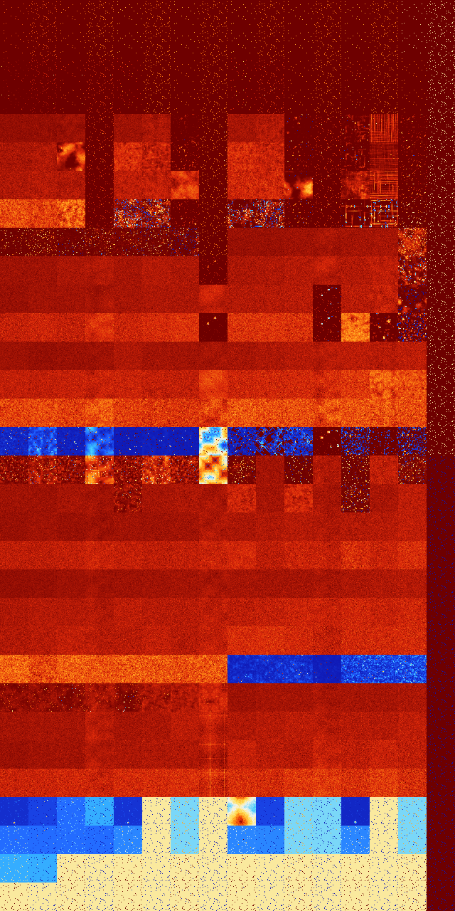

# B0123458 (163328-163839)

<details>
    <summary>Initial Grid</summary>
    
</details>


<details>
    <summary>Initial Grid RLE</summary>

```
#C Exported from GoGoL (https://github.com/marrow16/gogol)
#C Wrap mode: Toroidal
#C Boundary mode: Dead
#C Step: 0
x = 100, y = 100, rule = B0123458/S
7bo17bob2o4bo10bo5bo8bo13bo8bo$4bo59bo20bo4bo$bo16bo38bo12bo23bobo$4bo
4bo5bo9bobo23bo27bo$25bo37bo13bo9bo11bo$14bo23bo5bo$4bo8bo39bobo6bo35bo
$24bo4bo18bo9bo32bo$50bo20bo5bo$3bo48bo6bo31bo$66bo32bo$o10bo16bo23bo
14bo24bo$3bo26bo9bo19bo6bo3bo10b2o$4bo4bo11bo41bo13bo5bo$15bo20bo3bo26b
o11bo$o17bo19bo16bo15bo$13bo37bo4bo13bo28bo$12bo4bo19bo17b2o4bo28bo$3bo
27bo10bo15bobo21bo13bo$o20bo15bo3bo$14bo3bo10b2obo55bo4bo4bo$2bo48bo$
22bo9bo$47bo$2bo14bo2bo48bo14bo$24bo24bo8bo2bo2bo4bo19bo9bo$14bo19bo6bo
21bo29bo3bo$9bo26bo3bo9bo11bo2bo$11bo12bo20bo2bo8bo27bo7bo$32bo34bobo
24bo$o10bo3bo7bo4bo27bo10bo12bo$31bo23bo$48bo27bo11bo$7bo15bo26bo28bo
18bo$16bo5bo9bo15bo9bo35bo$5b2obo16bo4bo41bo$2bo28bo13bo8bo2bo9bo11bo$
18bo12b2o7bo14bo5b2o8bo9bo13bob2o$52bo18bo4bo$28bo44bo16bo$o23bo7bo8bo
42bo14bo$11bo12bo73bo$39bo22bo28bo4bo$16b2o60bo$69bo$30bo23bobo20bo14bo
$12bo15bo23bo18bo11bo6bo$30bo3bo6bo2bo5bo4bo27bo$bo55bo2bo24bo$10bo20bo
24bo9bo8bo$31bo4b2o31bo8bo$33bo15bo27bo$2bo48bo31bo15bo$7bo61bo$20bo10b
o7bo37bo8bo10bo$o17bo18bo19bo37bo$7bo16bo13bo14bo18bo16bo$2bo5bo18bo2bo
34b2o27bo$45bo10bo4bo$40bo6bo8bo9bo$38bo45bo$36bo26bo32bo$25bo16bo12bo
15bo11bo$18bo28bo12bo5bo22bo$12bo44bo30b2o$2bo19bo14b2o27bo8bo13bo5bo$
12bo16bo22b2o42bo$4bobo7bo3bo18bo19bo4bo12bo$26bo13bo21b2o5bobo$37bo51b
o$15b2o47b2o11bobobo17bo$4bo5bo23bo54bo$67bo28bo$51bo8bo$4bo8bo6bo43bo
21bo$46bo9bo2bo4bo16b2o11bo$34bo5bo19bo35bo$22bo6bo20bobo9bo4bo8bobo2bo
11bo$16bo2bo17bo19bo33bo$52bo16bo$12bo3bo4bo25bo4bo12bo6bo$4bo16bo46bo
19bo2bo$19bo19bo7bo18bo8bobo19bo$13bo29bo$11bobo4bo2bo44bo7bo3bo$bo23bo
11bo46bo$6bo15bo27bo26b2o8bo$44bo5bo33bo$8bo32bo$12bo15bo5bo13bobo8bo5b
o5bo7bo11bo$13bo50bo$18bo22bo8bo20bo24bo$29bobo11bo7bo24bo$23bo11bo10bo
bo17bo16bo7bo$28bo10bo13bo4bo3bo11bo20bo$18bo4bobo7bo20bo3bo6bo19bo9bo$
13bo40bo$17bo$61bo28bo7bo$o37bo14bo23bo6bo2bo!
```
</details>
<details>
    <summary>Thumbnail</summary>

</details>
<table>
<tr>
    <td><a href="./163328%20S%20Heat%20Map%20Activity.png"></a><br>S (163328)<br>R@6,p2</td>    <td><a href="./163329%20S0%20Heat%20Map%20Activity.png"></a><br>S0 (163329)<br>R@6,p2</td>    <td><a href="./163330%20S1%20Heat%20Map%20Activity.png"></a><br>S1 (163330)<br>R@5,p2</td>    <td><a href="./163331%20S01%20Heat%20Map%20Activity.png"></a><br>S01 (163331)<br>R@5,p2</td>    <td><a href="./163332%20S2%20Heat%20Map%20Activity.png"></a><br>S2 (163332)<br>R@4,p2</td>    <td><a href="./163333%20S02%20Heat%20Map%20Activity.png"></a><br>S02 (163333)<br>R@5,p2</td>    <td><a href="./163334%20S12%20Heat%20Map%20Activity.png"></a><br>S12 (163334)<br>R@4,p2</td>    <td><a href="./163335%20S012%20Heat%20Map%20Activity.png"></a><br>S012 (163335)<br>R@5,p2</td>    <td><a href="./163336%20S3%20Heat%20Map%20Activity.png"></a><br>S3 (163336)<br>R@4,p2</td>    <td><a href="./163337%20S03%20Heat%20Map%20Activity.png"></a><br>S03 (163337)<br>R@5,p2</td>    <td><a href="./163338%20S13%20Heat%20Map%20Activity.png"></a><br>S13 (163338)<br>R@4,p2</td>    <td><a href="./163339%20S013%20Heat%20Map%20Activity.png"></a><br>S013 (163339)<br>R@5,p2</td>    <td><a href="./163340%20S23%20Heat%20Map%20Activity.png"></a><br>S23 (163340)<br>R@4,p2</td>    <td><a href="./163341%20S023%20Heat%20Map%20Activity.png"></a><br>S023 (163341)<br>R@5,p2</td>    <td><a href="./163342%20S123%20Heat%20Map%20Activity.png"></a><br>S123 (163342)<br>R@3,p2</td>    <td><a href="./163343%20S0123%20Heat%20Map%20Activity.png"></a><br>S0123 (163343)<br>R@3,p2</td></tr>
<tr>
    <td><a href="./163344%20S4%20Heat%20Map%20Activity.png"></a><br>S4 (163344)<br>R@6,p2</td>    <td><a href="./163345%20S04%20Heat%20Map%20Activity.png"></a><br>S04 (163345)<br>R@6,p2</td>    <td><a href="./163346%20S14%20Heat%20Map%20Activity.png"></a><br>S14 (163346)<br>R@5,p2</td>    <td><a href="./163347%20S014%20Heat%20Map%20Activity.png"></a><br>S014 (163347)<br>R@5,p2</td>    <td><a href="./163348%20S24%20Heat%20Map%20Activity.png"></a><br>S24 (163348)<br>R@4,p2</td>    <td><a href="./163349%20S024%20Heat%20Map%20Activity.png"></a><br>S024 (163349)<br>R@5,p2</td>    <td><a href="./163350%20S124%20Heat%20Map%20Activity.png"></a><br>S124 (163350)<br>R@4,p2</td>    <td><a href="./163351%20S0124%20Heat%20Map%20Activity.png"></a><br>S0124 (163351)<br>R@5,p2</td>    <td><a href="./163352%20S34%20Heat%20Map%20Activity.png"></a><br>S34 (163352)<br>R@4,p2</td>    <td><a href="./163353%20S034%20Heat%20Map%20Activity.png"></a><br>S034 (163353)<br>R@5,p2</td>    <td><a href="./163354%20S134%20Heat%20Map%20Activity.png"></a><br>S134 (163354)<br>R@4,p2</td>    <td><a href="./163355%20S0134%20Heat%20Map%20Activity.png"></a><br>S0134 (163355)<br>R@5,p2</td>    <td><a href="./163356%20S234%20Heat%20Map%20Activity.png"></a><br>S234 (163356)<br>R@4,p2</td>    <td><a href="./163357%20S0234%20Heat%20Map%20Activity.png"></a><br>S0234 (163357)<br>R@5,p2</td>    <td><a href="./163358%20S1234%20Heat%20Map%20Activity.png"></a><br>S1234 (163358)<br>R@3,p2</td>    <td><a href="./163359%20S01234%20Heat%20Map%20Activity.png"></a><br>S01234 (163359)<br>R@3,p2</td></tr>
<tr>
    <td><a href="./163360%20S5%20Heat%20Map%20Activity.png"></a><br>S5 (163360)<br>R@22,p4</td>    <td><a href="./163361%20S05%20Heat%20Map%20Activity.png"></a><br>S05 (163361)<br>R@9,p2</td>    <td><a href="./163362%20S15%20Heat%20Map%20Activity.png"></a><br>S15 (163362)<br>R@7,p4</td>    <td><a href="./163363%20S015%20Heat%20Map%20Activity.png"></a><br>S015 (163363)<br>R@7,p4</td>    <td><a href="./163364%20S25%20Heat%20Map%20Activity.png"></a><br>S25 (163364)<br>R@8,p2</td>    <td><a href="./163365%20S025%20Heat%20Map%20Activity.png"></a><br>S025 (163365)<br>R@5,p2</td>    <td><a href="./163366%20S125%20Heat%20Map%20Activity.png"></a><br>S125 (163366)<br>R@5,p2</td>    <td><a href="./163367%20S0125%20Heat%20Map%20Activity.png"></a><br>S0125 (163367)<br>R@5,p2</td>    <td><a href="./163368%20S35%20Heat%20Map%20Activity.png"></a><br>S35 (163368)<br>R@8,p2</td>    <td><a href="./163369%20S035%20Heat%20Map%20Activity.png"></a><br>S035 (163369)<br>R@7,p2</td>    <td><a href="./163370%20S135%20Heat%20Map%20Activity.png"></a><br>S135 (163370)<br>R@5,p2</td>    <td><a href="./163371%20S0135%20Heat%20Map%20Activity.png"></a><br>S0135 (163371)<br>R@5,p2</td>    <td><a href="./163372%20S235%20Heat%20Map%20Activity.png"></a><br>S235 (163372)<br>R@6,p2</td>    <td><a href="./163373%20S0235%20Heat%20Map%20Activity.png"></a><br>S0235 (163373)<br>R@5,p2</td>    <td><a href="./163374%20S1235%20Heat%20Map%20Activity.png"></a><br>S1235 (163374)<br>R@5,p2</td>    <td><a href="./163375%20S01235%20Heat%20Map%20Activity.png"></a><br>S01235 (163375)<br>R@3,p2</td></tr>
<tr>
    <td><a href="./163376%20S45%20Heat%20Map%20Activity.png"></a><br>S45 (163376)<br>R@32,p8</td>    <td><a href="./163377%20S045%20Heat%20Map%20Activity.png"></a><br>S045 (163377)<br>R@13,p8</td>    <td><a href="./163378%20S145%20Heat%20Map%20Activity.png"></a><br>S145 (163378)<br>R@6,p2</td>    <td><a href="./163379%20S0145%20Heat%20Map%20Activity.png"></a><br>S0145 (163379)<br>R@7,p2</td>    <td><a href="./163380%20S245%20Heat%20Map%20Activity.png"></a><br>S245 (163380)<br>R@8,p2</td>    <td><a href="./163381%20S0245%20Heat%20Map%20Activity.png"></a><br>S0245 (163381)<br>R@5,p2</td>    <td><a href="./163382%20S1245%20Heat%20Map%20Activity.png"></a><br>S1245 (163382)<br>R@5,p2</td>    <td><a href="./163383%20S01245%20Heat%20Map%20Activity.png"></a><br>S01245 (163383)<br>R@5,p2</td>    <td><a href="./163384%20S345%20Heat%20Map%20Activity.png"></a><br>S345 (163384)<br>R@8,p2</td>    <td><a href="./163385%20S0345%20Heat%20Map%20Activity.png"></a><br>S0345 (163385)<br>R@7,p2</td>    <td><a href="./163386%20S1345%20Heat%20Map%20Activity.png"></a><br>S1345 (163386)<br>R@5,p2</td>    <td><a href="./163387%20S01345%20Heat%20Map%20Activity.png"></a><br>S01345 (163387)<br>R@5,p2</td>    <td><a href="./163388%20S2345%20Heat%20Map%20Activity.png"></a><br>S2345 (163388)<br>R@6,p2</td>    <td><a href="./163389%20S02345%20Heat%20Map%20Activity.png"></a><br>S02345 (163389)<br>R@5,p2</td>    <td><a href="./163390%20S12345%20Heat%20Map%20Activity.png"></a><br>S12345 (163390)<br>R@5,p2</td>    <td><a href="./163391%20S012345%20Heat%20Map%20Activity.png"></a><br>S012345 (163391)<br>R@3,p2</td></tr>
<tr>
    <td><a href="./163392%20S6%20Heat%20Map%20Activity.png"></a><br>S6 (163392)<br>G>1000</td>    <td><a href="./163393%20S06%20Heat%20Map%20Activity.png"></a><br>S06 (163393)<br>G>1000</td>    <td><a href="./163394%20S16%20Heat%20Map%20Activity.png"></a><br>S16 (163394)<br>G>1000</td>    <td><a href="./163395%20S016%20Heat%20Map%20Activity.png"></a><br>S016 (163395)<br>R@7,p2</td>    <td><a href="./163396%20S26%20Heat%20Map%20Activity.png"></a><br>S26 (163396)<br>G>1000</td>    <td><a href="./163397%20S026%20Heat%20Map%20Activity.png"></a><br>S026 (163397)<br>G>1000</td>    <td><a href="./163398%20S126%20Heat%20Map%20Activity.png"></a><br>S126 (163398)<br>R@65,p2</td>    <td><a href="./163399%20S0126%20Heat%20Map%20Activity.png"></a><br>S0126 (163399)<br>R@5,p2</td>    <td><a href="./163400%20S36%20Heat%20Map%20Activity.png"></a><br>S36 (163400)<br>G>1000</td>    <td><a href="./163401%20S036%20Heat%20Map%20Activity.png"></a><br>S036 (163401)<br>G>1000</td>    <td><a href="./163402%20S136%20Heat%20Map%20Activity.png"></a><br>S136 (163402)<br>R@161,p68</td>    <td><a href="./163403%20S0136%20Heat%20Map%20Activity.png"></a><br>S0136 (163403)<br>R@7,p2</td>    <td><a href="./163404%20S236%20Heat%20Map%20Activity.png"></a><br>S236 (163404)<br>R@167,p24</td>    <td><a href="./163405%20S0236%20Heat%20Map%20Activity.png"></a><br>S0236 (163405)<br>G>1000</td>    <td><a href="./163406%20S1236%20Heat%20Map%20Activity.png"></a><br>S1236 (163406)<br>R@19,p4</td>    <td><a href="./163407%20S01236%20Heat%20Map%20Activity.png"></a><br>S01236 (163407)<br>R@3,p2</td></tr>
<tr>
    <td><a href="./163408%20S46%20Heat%20Map%20Activity.png"></a><br>S46 (163408)<br>G>1000</td>    <td><a href="./163409%20S046%20Heat%20Map%20Activity.png"></a><br>S046 (163409)<br>G>1000</td>    <td><a href="./163410%20S146%20Heat%20Map%20Activity.png"></a><br>S146 (163410)<br>G>1000</td>    <td><a href="./163411%20S0146%20Heat%20Map%20Activity.png"></a><br>S0146 (163411)<br>R@7,p2</td>    <td><a href="./163412%20S246%20Heat%20Map%20Activity.png"></a><br>S246 (163412)<br>G>1000</td>    <td><a href="./163413%20S0246%20Heat%20Map%20Activity.png"></a><br>S0246 (163413)<br>G>1000</td>    <td><a href="./163414%20S1246%20Heat%20Map%20Activity.png"></a><br>S1246 (163414)<br>R@19,p2</td>    <td><a href="./163415%20S01246%20Heat%20Map%20Activity.png"></a><br>S01246 (163415)<br>R@5,p2</td>    <td><a href="./163416%20S346%20Heat%20Map%20Activity.png"></a><br>S346 (163416)<br>G>1000</td>    <td><a href="./163417%20S0346%20Heat%20Map%20Activity.png"></a><br>S0346 (163417)<br>G>1000</td>    <td><a href="./163418%20S1346%20Heat%20Map%20Activity.png"></a><br>S1346 (163418)<br>R@19,p2</td>    <td><a href="./163419%20S01346%20Heat%20Map%20Activity.png"></a><br>S01346 (163419)<br>R@7,p2</td>    <td><a href="./163420%20S2346%20Heat%20Map%20Activity.png"></a><br>S2346 (163420)<br>R@67,p4</td>    <td><a href="./163421%20S02346%20Heat%20Map%20Activity.png"></a><br>S02346 (163421)<br>G>1000</td>    <td><a href="./163422%20S12346%20Heat%20Map%20Activity.png"></a><br>S12346 (163422)<br>R@11,p2</td>    <td><a href="./163423%20S012346%20Heat%20Map%20Activity.png"></a><br>S012346 (163423)<br>R@3,p2</td></tr>
<tr>
    <td><a href="./163424%20S56%20Heat%20Map%20Activity.png"></a><br>S56 (163424)<br>G>1000</td>    <td><a href="./163425%20S056%20Heat%20Map%20Activity.png"></a><br>S056 (163425)<br>G>1000</td>    <td><a href="./163426%20S156%20Heat%20Map%20Activity.png"></a><br>S156 (163426)<br>G>1000</td>    <td><a href="./163427%20S0156%20Heat%20Map%20Activity.png"></a><br>S0156 (163427)<br>R@9,p2</td>    <td><a href="./163428%20S256%20Heat%20Map%20Activity.png"></a><br>S256 (163428)<br>G>1000</td>    <td><a href="./163429%20S0256%20Heat%20Map%20Activity.png"></a><br>S0256 (163429)<br>G>1000</td>    <td><a href="./163430%20S1256%20Heat%20Map%20Activity.png"></a><br>S1256 (163430)<br>G>1000</td>    <td><a href="./163431%20S01256%20Heat%20Map%20Activity.png"></a><br>S01256 (163431)<br>R@5,p2</td>    <td><a href="./163432%20S356%20Heat%20Map%20Activity.png"></a><br>S356 (163432)<br>G>1000</td>    <td><a href="./163433%20S0356%20Heat%20Map%20Activity.png"></a><br>S0356 (163433)<br>G>1000</td>    <td><a href="./163434%20S1356%20Heat%20Map%20Activity.png"></a><br>S1356 (163434)<br>G>1000</td>    <td><a href="./163435%20S01356%20Heat%20Map%20Activity.png"></a><br>S01356 (163435)<br>R@7,p2</td>    <td><a href="./163436%20S2356%20Heat%20Map%20Activity.png"></a><br>S2356 (163436)<br>G>1000</td>    <td><a href="./163437%20S02356%20Heat%20Map%20Activity.png"></a><br>S02356 (163437)<br>G>1000</td>    <td><a href="./163438%20S12356%20Heat%20Map%20Activity.png"></a><br>S12356 (163438)<br>R@9,p2</td>    <td><a href="./163439%20S012356%20Heat%20Map%20Activity.png"></a><br>S012356 (163439)<br>R@3,p2</td></tr>
<tr>
    <td><a href="./163440%20S456%20Heat%20Map%20Activity.png"></a><br>S456 (163440)<br>G>1000</td>    <td><a href="./163441%20S0456%20Heat%20Map%20Activity.png"></a><br>S0456 (163441)<br>G>1000</td>    <td><a href="./163442%20S1456%20Heat%20Map%20Activity.png"></a><br>S1456 (163442)<br>G>1000</td>    <td><a href="./163443%20S01456%20Heat%20Map%20Activity.png"></a><br>S01456 (163443)<br>R@9,p2</td>    <td><a href="./163444%20S2456%20Heat%20Map%20Activity.png"></a><br>S2456 (163444)<br>R@987,p4</td>    <td><a href="./163445%20S02456%20Heat%20Map%20Activity.png"></a><br>S02456 (163445)<br>R@912,p12</td>    <td><a href="./163446%20S12456%20Heat%20Map%20Activity.png"></a><br>S12456 (163446)<br>R@23,p2</td>    <td><a href="./163447%20S012456%20Heat%20Map%20Activity.png"></a><br>S012456 (163447)<br>R@5,p2</td>    <td><a href="./163448%20S3456%20Heat%20Map%20Activity.png"></a><br>S3456 (163448)<br>R@235,p12</td>    <td><a href="./163449%20S03456%20Heat%20Map%20Activity.png"></a><br>S03456 (163449)<br>R@206,p8</td>    <td><a href="./163450%20S13456%20Heat%20Map%20Activity.png"></a><br>S13456 (163450)<br>R@9,p2</td>    <td><a href="./163451%20S013456%20Heat%20Map%20Activity.png"></a><br>S013456 (163451)<br>R@7,p2</td>    <td><a href="./163452%20S23456%20Heat%20Map%20Activity.png"></a><br>S23456 (163452)<br>G>1000</td>    <td><a href="./163453%20S023456%20Heat%20Map%20Activity.png"></a><br>S023456 (163453)<br>G>1000</td>    <td><a href="./163454%20S123456%20Heat%20Map%20Activity.png"></a><br>S123456 (163454)<br>R@5,p2</td>    <td><a href="./163455%20S0123456%20Heat%20Map%20Activity.png"></a><br>S0123456 (163455)<br>R@3,p2</td></tr>
<tr>
    <td><a href="./163456%20S7%20Heat%20Map%20Activity.png"></a><br>S7 (163456)<br>G>1000</td>    <td><a href="./163457%20S07%20Heat%20Map%20Activity.png"></a><br>S07 (163457)<br>G>1000</td>    <td><a href="./163458%20S17%20Heat%20Map%20Activity.png"></a><br>S17 (163458)<br>G>1000</td>    <td><a href="./163459%20S017%20Heat%20Map%20Activity.png"></a><br>S017 (163459)<br>R@754,p120</td>    <td><a href="./163460%20S27%20Heat%20Map%20Activity.png"></a><br>S27 (163460)<br>R@271,p120</td>    <td><a href="./163461%20S027%20Heat%20Map%20Activity.png"></a><br>S027 (163461)<br>R@401,p240</td>    <td><a href="./163462%20S127%20Heat%20Map%20Activity.png"></a><br>S127 (163462)<br>R@109,p24</td>    <td><a href="./163463%20S0127%20Heat%20Map%20Activity.png"></a><br>S0127 (163463)<br>R@5,p2</td>    <td><a href="./163464%20S37%20Heat%20Map%20Activity.png"></a><br>S37 (163464)<br>G>1000</td>    <td><a href="./163465%20S037%20Heat%20Map%20Activity.png"></a><br>S037 (163465)<br>G>1000</td>    <td><a href="./163466%20S137%20Heat%20Map%20Activity.png"></a><br>S137 (163466)<br>G>1000</td>    <td><a href="./163467%20S0137%20Heat%20Map%20Activity.png"></a><br>S0137 (163467)<br>G>1000</td>    <td><a href="./163468%20S237%20Heat%20Map%20Activity.png"></a><br>S237 (163468)<br>G>1000</td>    <td><a href="./163469%20S0237%20Heat%20Map%20Activity.png"></a><br>S0237 (163469)<br>G>1000</td>    <td><a href="./163470%20S1237%20Heat%20Map%20Activity.png"></a><br>S1237 (163470)<br>G>1000</td>    <td><a href="./163471%20S01237%20Heat%20Map%20Activity.png"></a><br>S01237 (163471)<br>R@3,p2</td></tr>
<tr>
    <td><a href="./163472%20S47%20Heat%20Map%20Activity.png"></a><br>S47 (163472)<br>G>1000</td>    <td><a href="./163473%20S047%20Heat%20Map%20Activity.png"></a><br>S047 (163473)<br>G>1000</td>    <td><a href="./163474%20S147%20Heat%20Map%20Activity.png"></a><br>S147 (163474)<br>G>1000</td>    <td><a href="./163475%20S0147%20Heat%20Map%20Activity.png"></a><br>S0147 (163475)<br>G>1000</td>    <td><a href="./163476%20S247%20Heat%20Map%20Activity.png"></a><br>S247 (163476)<br>G>1000</td>    <td><a href="./163477%20S0247%20Heat%20Map%20Activity.png"></a><br>S0247 (163477)<br>G>1000</td>    <td><a href="./163478%20S1247%20Heat%20Map%20Activity.png"></a><br>S1247 (163478)<br>G>1000</td>    <td><a href="./163479%20S01247%20Heat%20Map%20Activity.png"></a><br>S01247 (163479)<br>R@10,p2</td>    <td><a href="./163480%20S347%20Heat%20Map%20Activity.png"></a><br>S347 (163480)<br>G>1000</td>    <td><a href="./163481%20S0347%20Heat%20Map%20Activity.png"></a><br>S0347 (163481)<br>G>1000</td>    <td><a href="./163482%20S1347%20Heat%20Map%20Activity.png"></a><br>S1347 (163482)<br>G>1000</td>    <td><a href="./163483%20S01347%20Heat%20Map%20Activity.png"></a><br>S01347 (163483)<br>G>1000</td>    <td><a href="./163484%20S2347%20Heat%20Map%20Activity.png"></a><br>S2347 (163484)<br>G>1000</td>    <td><a href="./163485%20S02347%20Heat%20Map%20Activity.png"></a><br>S02347 (163485)<br>G>1000</td>    <td><a href="./163486%20S12347%20Heat%20Map%20Activity.png"></a><br>S12347 (163486)<br>R@203,p4</td>    <td><a href="./163487%20S012347%20Heat%20Map%20Activity.png"></a><br>S012347 (163487)<br>R@3,p2</td></tr>
<tr>
    <td><a href="./163488%20S57%20Heat%20Map%20Activity.png"></a><br>S57 (163488)<br>G>1000</td>    <td><a href="./163489%20S057%20Heat%20Map%20Activity.png"></a><br>S057 (163489)<br>G>1000</td>    <td><a href="./163490%20S157%20Heat%20Map%20Activity.png"></a><br>S157 (163490)<br>G>1000</td>    <td><a href="./163491%20S0157%20Heat%20Map%20Activity.png"></a><br>S0157 (163491)<br>G>1000</td>    <td><a href="./163492%20S257%20Heat%20Map%20Activity.png"></a><br>S257 (163492)<br>G>1000</td>    <td><a href="./163493%20S0257%20Heat%20Map%20Activity.png"></a><br>S0257 (163493)<br>G>1000</td>    <td><a href="./163494%20S1257%20Heat%20Map%20Activity.png"></a><br>S1257 (163494)<br>G>1000</td>    <td><a href="./163495%20S01257%20Heat%20Map%20Activity.png"></a><br>S01257 (163495)<br>G>1000</td>    <td><a href="./163496%20S357%20Heat%20Map%20Activity.png"></a><br>S357 (163496)<br>G>1000</td>    <td><a href="./163497%20S0357%20Heat%20Map%20Activity.png"></a><br>S0357 (163497)<br>G>1000</td>    <td><a href="./163498%20S1357%20Heat%20Map%20Activity.png"></a><br>S1357 (163498)<br>G>1000</td>    <td><a href="./163499%20S01357%20Heat%20Map%20Activity.png"></a><br>S01357 (163499)<br>R@9,p2</td>    <td><a href="./163500%20S2357%20Heat%20Map%20Activity.png"></a><br>S2357 (163500)<br>G>1000</td>    <td><a href="./163501%20S02357%20Heat%20Map%20Activity.png"></a><br>S02357 (163501)<br>G>1000</td>    <td><a href="./163502%20S12357%20Heat%20Map%20Activity.png"></a><br>S12357 (163502)<br>R@465,p4</td>    <td><a href="./163503%20S012357%20Heat%20Map%20Activity.png"></a><br>S012357 (163503)<br>R@3,p2</td></tr>
<tr>
    <td><a href="./163504%20S457%20Heat%20Map%20Activity.png"></a><br>S457 (163504)<br>G>1000</td>    <td><a href="./163505%20S0457%20Heat%20Map%20Activity.png"></a><br>S0457 (163505)<br>G>1000</td>    <td><a href="./163506%20S1457%20Heat%20Map%20Activity.png"></a><br>S1457 (163506)<br>G>1000</td>    <td><a href="./163507%20S01457%20Heat%20Map%20Activity.png"></a><br>S01457 (163507)<br>G>1000</td>    <td><a href="./163508%20S2457%20Heat%20Map%20Activity.png"></a><br>S2457 (163508)<br>G>1000</td>    <td><a href="./163509%20S02457%20Heat%20Map%20Activity.png"></a><br>S02457 (163509)<br>G>1000</td>    <td><a href="./163510%20S12457%20Heat%20Map%20Activity.png"></a><br>S12457 (163510)<br>G>1000</td>    <td><a href="./163511%20S012457%20Heat%20Map%20Activity.png"></a><br>S012457 (163511)<br>R@27,p2</td>    <td><a href="./163512%20S3457%20Heat%20Map%20Activity.png"></a><br>S3457 (163512)<br>G>1000</td>    <td><a href="./163513%20S03457%20Heat%20Map%20Activity.png"></a><br>S03457 (163513)<br>G>1000</td>    <td><a href="./163514%20S13457%20Heat%20Map%20Activity.png"></a><br>S13457 (163514)<br>G>1000</td>    <td><a href="./163515%20S013457%20Heat%20Map%20Activity.png"></a><br>S013457 (163515)<br>R@9,p2</td>    <td><a href="./163516%20S23457%20Heat%20Map%20Activity.png"></a><br>S23457 (163516)<br>G>1000</td>    <td><a href="./163517%20S023457%20Heat%20Map%20Activity.png"></a><br>S023457 (163517)<br>R@43,p2</td>    <td><a href="./163518%20S123457%20Heat%20Map%20Activity.png"></a><br>S123457 (163518)<br>R@37,p4</td>    <td><a href="./163519%20S0123457%20Heat%20Map%20Activity.png"></a><br>S0123457 (163519)<br>R@3,p2</td></tr>
<tr>
    <td><a href="./163520%20S67%20Heat%20Map%20Activity.png"></a><br>S67 (163520)<br>G>1000</td>    <td><a href="./163521%20S067%20Heat%20Map%20Activity.png"></a><br>S067 (163521)<br>G>1000</td>    <td><a href="./163522%20S167%20Heat%20Map%20Activity.png"></a><br>S167 (163522)<br>G>1000</td>    <td><a href="./163523%20S0167%20Heat%20Map%20Activity.png"></a><br>S0167 (163523)<br>G>1000</td>    <td><a href="./163524%20S267%20Heat%20Map%20Activity.png"></a><br>S267 (163524)<br>G>1000</td>    <td><a href="./163525%20S0267%20Heat%20Map%20Activity.png"></a><br>S0267 (163525)<br>G>1000</td>    <td><a href="./163526%20S1267%20Heat%20Map%20Activity.png"></a><br>S1267 (163526)<br>G>1000</td>    <td><a href="./163527%20S01267%20Heat%20Map%20Activity.png"></a><br>S01267 (163527)<br>G>1000</td>    <td><a href="./163528%20S367%20Heat%20Map%20Activity.png"></a><br>S367 (163528)<br>G>1000</td>    <td><a href="./163529%20S0367%20Heat%20Map%20Activity.png"></a><br>S0367 (163529)<br>G>1000</td>    <td><a href="./163530%20S1367%20Heat%20Map%20Activity.png"></a><br>S1367 (163530)<br>G>1000</td>    <td><a href="./163531%20S01367%20Heat%20Map%20Activity.png"></a><br>S01367 (163531)<br>G>1000</td>    <td><a href="./163532%20S2367%20Heat%20Map%20Activity.png"></a><br>S2367 (163532)<br>G>1000</td>    <td><a href="./163533%20S02367%20Heat%20Map%20Activity.png"></a><br>S02367 (163533)<br>G>1000</td>    <td><a href="./163534%20S12367%20Heat%20Map%20Activity.png"></a><br>S12367 (163534)<br>G>1000</td>    <td><a href="./163535%20S012367%20Heat%20Map%20Activity.png"></a><br>S012367 (163535)<br>R@3,p2</td></tr>
<tr>
    <td><a href="./163536%20S467%20Heat%20Map%20Activity.png"></a><br>S467 (163536)<br>G>1000</td>    <td><a href="./163537%20S0467%20Heat%20Map%20Activity.png"></a><br>S0467 (163537)<br>G>1000</td>    <td><a href="./163538%20S1467%20Heat%20Map%20Activity.png"></a><br>S1467 (163538)<br>G>1000</td>    <td><a href="./163539%20S01467%20Heat%20Map%20Activity.png"></a><br>S01467 (163539)<br>G>1000</td>    <td><a href="./163540%20S2467%20Heat%20Map%20Activity.png"></a><br>S2467 (163540)<br>G>1000</td>    <td><a href="./163541%20S02467%20Heat%20Map%20Activity.png"></a><br>S02467 (163541)<br>G>1000</td>    <td><a href="./163542%20S12467%20Heat%20Map%20Activity.png"></a><br>S12467 (163542)<br>G>1000</td>    <td><a href="./163543%20S012467%20Heat%20Map%20Activity.png"></a><br>S012467 (163543)<br>G>1000</td>    <td><a href="./163544%20S3467%20Heat%20Map%20Activity.png"></a><br>S3467 (163544)<br>G>1000</td>    <td><a href="./163545%20S03467%20Heat%20Map%20Activity.png"></a><br>S03467 (163545)<br>G>1000</td>    <td><a href="./163546%20S13467%20Heat%20Map%20Activity.png"></a><br>S13467 (163546)<br>G>1000</td>    <td><a href="./163547%20S013467%20Heat%20Map%20Activity.png"></a><br>S013467 (163547)<br>G>1000</td>    <td><a href="./163548%20S23467%20Heat%20Map%20Activity.png"></a><br>S23467 (163548)<br>G>1000</td>    <td><a href="./163549%20S023467%20Heat%20Map%20Activity.png"></a><br>S023467 (163549)<br>G>1000</td>    <td><a href="./163550%20S123467%20Heat%20Map%20Activity.png"></a><br>S123467 (163550)<br>G>1000</td>    <td><a href="./163551%20S0123467%20Heat%20Map%20Activity.png"></a><br>S0123467 (163551)<br>R@3,p2</td></tr>
<tr>
    <td><a href="./163552%20S567%20Heat%20Map%20Activity.png"></a><br>S567 (163552)<br>G>1000</td>    <td><a href="./163553%20S0567%20Heat%20Map%20Activity.png"></a><br>S0567 (163553)<br>G>1000</td>    <td><a href="./163554%20S1567%20Heat%20Map%20Activity.png"></a><br>S1567 (163554)<br>G>1000</td>    <td><a href="./163555%20S01567%20Heat%20Map%20Activity.png"></a><br>S01567 (163555)<br>G>1000</td>    <td><a href="./163556%20S2567%20Heat%20Map%20Activity.png"></a><br>S2567 (163556)<br>G>1000</td>    <td><a href="./163557%20S02567%20Heat%20Map%20Activity.png"></a><br>S02567 (163557)<br>G>1000</td>    <td><a href="./163558%20S12567%20Heat%20Map%20Activity.png"></a><br>S12567 (163558)<br>G>1000</td>    <td><a href="./163559%20S012567%20Heat%20Map%20Activity.png"></a><br>S012567 (163559)<br>G>1000</td>    <td><a href="./163560%20S3567%20Heat%20Map%20Activity.png"></a><br>S3567 (163560)<br>G>1000</td>    <td><a href="./163561%20S03567%20Heat%20Map%20Activity.png"></a><br>S03567 (163561)<br>G>1000</td>    <td><a href="./163562%20S13567%20Heat%20Map%20Activity.png"></a><br>S13567 (163562)<br>G>1000</td>    <td><a href="./163563%20S013567%20Heat%20Map%20Activity.png"></a><br>S013567 (163563)<br>G>1000</td>    <td><a href="./163564%20S23567%20Heat%20Map%20Activity.png"></a><br>S23567 (163564)<br>G>1000</td>    <td><a href="./163565%20S023567%20Heat%20Map%20Activity.png"></a><br>S023567 (163565)<br>G>1000</td>    <td><a href="./163566%20S123567%20Heat%20Map%20Activity.png"></a><br>S123567 (163566)<br>G>1000</td>    <td><a href="./163567%20S0123567%20Heat%20Map%20Activity.png"></a><br>S0123567 (163567)<br>R@3,p2</td></tr>
<tr>
    <td><a href="./163568%20S4567%20Heat%20Map%20Activity.png"></a><br>S4567 (163568)<br>R@164,p120</td>    <td><a href="./163569%20S04567%20Heat%20Map%20Activity.png"></a><br>S04567 (163569)<br>R@116,p60</td>    <td><a href="./163570%20S14567%20Heat%20Map%20Activity.png"></a><br>S14567 (163570)<br>R@310,p264</td>    <td><a href="./163571%20S014567%20Heat%20Map%20Activity.png"></a><br>S014567 (163571)<br>R@221,p132</td>    <td><a href="./163572%20S24567%20Heat%20Map%20Activity.png"></a><br>S24567 (163572)<br>R@732,p660</td>    <td><a href="./163573%20S024567%20Heat%20Map%20Activity.png"></a><br>S024567 (163573)<br>G>1000</td>    <td><a href="./163574%20S124567%20Heat%20Map%20Activity.png"></a><br>S124567 (163574)<br>R@709,p660</td>    <td><a href="./163575%20S0124567%20Heat%20Map%20Activity.png"></a><br>S0124567 (163575)<br>R@118,p4</td>    <td><a href="./163576%20S34567%20Heat%20Map%20Activity.png"></a><br>S34567 (163576)<br>R@371,p312</td>    <td><a href="./163577%20S034567%20Heat%20Map%20Activity.png"></a><br>S034567 (163577)<br>R@211,p120</td>    <td><a href="./163578%20S134567%20Heat%20Map%20Activity.png"></a><br>S134567 (163578)<br>R@198,p120</td>    <td><a href="./163579%20S0134567%20Heat%20Map%20Activity.png"></a><br>S0134567 (163579)<br>R@15,p2</td>    <td><a href="./163580%20S234567%20Heat%20Map%20Activity.png"></a><br>S234567 (163580)<br>R@19,p6</td>    <td><a href="./163581%20S0234567%20Heat%20Map%20Activity.png"></a><br>S0234567 (163581)<br>R@9,p2</td>    <td><a href="./163582%20S1234567%20Heat%20Map%20Activity.png"></a><br>S1234567 (163582)<br>R@17,p2</td>    <td><a href="./163583%20S01234567%20Heat%20Map%20Activity.png"></a><br>S01234567 (163583)<br>R@3,p2</td></tr>
<tr>
    <td><a href="./163584%20S8%20Heat%20Map%20Activity.png"></a><br>S8 (163584)<br>R@43,p12</td>    <td><a href="./163585%20S08%20Heat%20Map%20Activity.png"></a><br>S08 (163585)<br>R@80,p24</td>    <td><a href="./163586%20S18%20Heat%20Map%20Activity.png"></a><br>S18 (163586)<br>R@40,p12</td>    <td><a href="./163587%20S018%20Heat%20Map%20Activity.png"></a><br>S018 (163587)<br>R@98,p24</td>    <td><a href="./163588%20S28%20Heat%20Map%20Activity.png"></a><br>S28 (163588)<br>R@34,p12</td>    <td><a href="./163589%20S028%20Heat%20Map%20Activity.png"></a><br>S028 (163589)<br>R@49,p16</td>    <td><a href="./163590%20S128%20Heat%20Map%20Activity.png"></a><br>S128 (163590)<br>R@33,p4</td>    <td><a href="./163591%20S0128%20Heat%20Map%20Activity.png"></a><br>S0128 (163591)<br>R@68,p4</td>    <td><a href="./163592%20S38%20Heat%20Map%20Activity.png"></a><br>S38 (163592)<br>R@372,p120</td>    <td><a href="./163593%20S038%20Heat%20Map%20Activity.png"></a><br>S038 (163593)<br>G>1000</td>    <td><a href="./163594%20S138%20Heat%20Map%20Activity.png"></a><br>S138 (163594)<br>R@998,p840</td>    <td><a href="./163595%20S0138%20Heat%20Map%20Activity.png"></a><br>S0138 (163595)<br>G>1000</td>    <td><a href="./163596%20S238%20Heat%20Map%20Activity.png"></a><br>S238 (163596)<br>R@462,p360</td>    <td><a href="./163597%20S0238%20Heat%20Map%20Activity.png"></a><br>S0238 (163597)<br>G>1000</td>    <td><a href="./163598%20S1238%20Heat%20Map%20Activity.png"></a><br>S1238 (163598)<br>R@440,p168</td>    <td><a href="./163599%20S01238%20Heat%20Map%20Activity.png"></a><br>S01238 (163599)<br>S@1</td></tr>
<tr>
    <td><a href="./163600%20S48%20Heat%20Map%20Activity.png"></a><br>S48 (163600)<br>G>1000</td>    <td><a href="./163601%20S048%20Heat%20Map%20Activity.png"></a><br>S048 (163601)<br>G>1000</td>    <td><a href="./163602%20S148%20Heat%20Map%20Activity.png"></a><br>S148 (163602)<br>G>1000</td>    <td><a href="./163603%20S0148%20Heat%20Map%20Activity.png"></a><br>S0148 (163603)<br>G>1000</td>    <td><a href="./163604%20S248%20Heat%20Map%20Activity.png"></a><br>S248 (163604)<br>G>1000</td>    <td><a href="./163605%20S0248%20Heat%20Map%20Activity.png"></a><br>S0248 (163605)<br>G>1000</td>    <td><a href="./163606%20S1248%20Heat%20Map%20Activity.png"></a><br>S1248 (163606)<br>G>1000</td>    <td><a href="./163607%20S01248%20Heat%20Map%20Activity.png"></a><br>S01248 (163607)<br>G>1000</td>    <td><a href="./163608%20S348%20Heat%20Map%20Activity.png"></a><br>S348 (163608)<br>G>1000</td>    <td><a href="./163609%20S0348%20Heat%20Map%20Activity.png"></a><br>S0348 (163609)<br>G>1000</td>    <td><a href="./163610%20S1348%20Heat%20Map%20Activity.png"></a><br>S1348 (163610)<br>G>1000</td>    <td><a href="./163611%20S01348%20Heat%20Map%20Activity.png"></a><br>S01348 (163611)<br>G>1000</td>    <td><a href="./163612%20S2348%20Heat%20Map%20Activity.png"></a><br>S2348 (163612)<br>G>1000</td>    <td><a href="./163613%20S02348%20Heat%20Map%20Activity.png"></a><br>S02348 (163613)<br>G>1000</td>    <td><a href="./163614%20S12348%20Heat%20Map%20Activity.png"></a><br>S12348 (163614)<br>G>1000</td>    <td><a href="./163615%20S012348%20Heat%20Map%20Activity.png"></a><br>S012348 (163615)<br>S@1</td></tr>
<tr>
    <td><a href="./163616%20S58%20Heat%20Map%20Activity.png"></a><br>S58 (163616)<br>G>1000</td>    <td><a href="./163617%20S058%20Heat%20Map%20Activity.png"></a><br>S058 (163617)<br>G>1000</td>    <td><a href="./163618%20S158%20Heat%20Map%20Activity.png"></a><br>S158 (163618)<br>G>1000</td>    <td><a href="./163619%20S0158%20Heat%20Map%20Activity.png"></a><br>S0158 (163619)<br>G>1000</td>    <td><a href="./163620%20S258%20Heat%20Map%20Activity.png"></a><br>S258 (163620)<br>G>1000</td>    <td><a href="./163621%20S0258%20Heat%20Map%20Activity.png"></a><br>S0258 (163621)<br>G>1000</td>    <td><a href="./163622%20S1258%20Heat%20Map%20Activity.png"></a><br>S1258 (163622)<br>G>1000</td>    <td><a href="./163623%20S01258%20Heat%20Map%20Activity.png"></a><br>S01258 (163623)<br>G>1000</td>    <td><a href="./163624%20S358%20Heat%20Map%20Activity.png"></a><br>S358 (163624)<br>G>1000</td>    <td><a href="./163625%20S0358%20Heat%20Map%20Activity.png"></a><br>S0358 (163625)<br>G>1000</td>    <td><a href="./163626%20S1358%20Heat%20Map%20Activity.png"></a><br>S1358 (163626)<br>G>1000</td>    <td><a href="./163627%20S01358%20Heat%20Map%20Activity.png"></a><br>S01358 (163627)<br>G>1000</td>    <td><a href="./163628%20S2358%20Heat%20Map%20Activity.png"></a><br>S2358 (163628)<br>G>1000</td>    <td><a href="./163629%20S02358%20Heat%20Map%20Activity.png"></a><br>S02358 (163629)<br>G>1000</td>    <td><a href="./163630%20S12358%20Heat%20Map%20Activity.png"></a><br>S12358 (163630)<br>G>1000</td>    <td><a href="./163631%20S012358%20Heat%20Map%20Activity.png"></a><br>S012358 (163631)<br>S@1</td></tr>
<tr>
    <td><a href="./163632%20S458%20Heat%20Map%20Activity.png"></a><br>S458 (163632)<br>G>1000</td>    <td><a href="./163633%20S0458%20Heat%20Map%20Activity.png"></a><br>S0458 (163633)<br>G>1000</td>    <td><a href="./163634%20S1458%20Heat%20Map%20Activity.png"></a><br>S1458 (163634)<br>G>1000</td>    <td><a href="./163635%20S01458%20Heat%20Map%20Activity.png"></a><br>S01458 (163635)<br>G>1000</td>    <td><a href="./163636%20S2458%20Heat%20Map%20Activity.png"></a><br>S2458 (163636)<br>G>1000</td>    <td><a href="./163637%20S02458%20Heat%20Map%20Activity.png"></a><br>S02458 (163637)<br>G>1000</td>    <td><a href="./163638%20S12458%20Heat%20Map%20Activity.png"></a><br>S12458 (163638)<br>G>1000</td>    <td><a href="./163639%20S012458%20Heat%20Map%20Activity.png"></a><br>S012458 (163639)<br>G>1000</td>    <td><a href="./163640%20S3458%20Heat%20Map%20Activity.png"></a><br>S3458 (163640)<br>G>1000</td>    <td><a href="./163641%20S03458%20Heat%20Map%20Activity.png"></a><br>S03458 (163641)<br>G>1000</td>    <td><a href="./163642%20S13458%20Heat%20Map%20Activity.png"></a><br>S13458 (163642)<br>G>1000</td>    <td><a href="./163643%20S013458%20Heat%20Map%20Activity.png"></a><br>S013458 (163643)<br>G>1000</td>    <td><a href="./163644%20S23458%20Heat%20Map%20Activity.png"></a><br>S23458 (163644)<br>G>1000</td>    <td><a href="./163645%20S023458%20Heat%20Map%20Activity.png"></a><br>S023458 (163645)<br>G>1000</td>    <td><a href="./163646%20S123458%20Heat%20Map%20Activity.png"></a><br>S123458 (163646)<br>G>1000</td>    <td><a href="./163647%20S0123458%20Heat%20Map%20Activity.png"></a><br>S0123458 (163647)<br>S@1</td></tr>
<tr>
    <td><a href="./163648%20S68%20Heat%20Map%20Activity.png"></a><br>S68 (163648)<br>G>1000</td>    <td><a href="./163649%20S068%20Heat%20Map%20Activity.png"></a><br>S068 (163649)<br>G>1000</td>    <td><a href="./163650%20S168%20Heat%20Map%20Activity.png"></a><br>S168 (163650)<br>G>1000</td>    <td><a href="./163651%20S0168%20Heat%20Map%20Activity.png"></a><br>S0168 (163651)<br>G>1000</td>    <td><a href="./163652%20S268%20Heat%20Map%20Activity.png"></a><br>S268 (163652)<br>G>1000</td>    <td><a href="./163653%20S0268%20Heat%20Map%20Activity.png"></a><br>S0268 (163653)<br>G>1000</td>    <td><a href="./163654%20S1268%20Heat%20Map%20Activity.png"></a><br>S1268 (163654)<br>G>1000</td>    <td><a href="./163655%20S01268%20Heat%20Map%20Activity.png"></a><br>S01268 (163655)<br>G>1000</td>    <td><a href="./163656%20S368%20Heat%20Map%20Activity.png"></a><br>S368 (163656)<br>G>1000</td>    <td><a href="./163657%20S0368%20Heat%20Map%20Activity.png"></a><br>S0368 (163657)<br>G>1000</td>    <td><a href="./163658%20S1368%20Heat%20Map%20Activity.png"></a><br>S1368 (163658)<br>G>1000</td>    <td><a href="./163659%20S01368%20Heat%20Map%20Activity.png"></a><br>S01368 (163659)<br>G>1000</td>    <td><a href="./163660%20S2368%20Heat%20Map%20Activity.png"></a><br>S2368 (163660)<br>G>1000</td>    <td><a href="./163661%20S02368%20Heat%20Map%20Activity.png"></a><br>S02368 (163661)<br>G>1000</td>    <td><a href="./163662%20S12368%20Heat%20Map%20Activity.png"></a><br>S12368 (163662)<br>G>1000</td>    <td><a href="./163663%20S012368%20Heat%20Map%20Activity.png"></a><br>S012368 (163663)<br>S@1</td></tr>
<tr>
    <td><a href="./163664%20S468%20Heat%20Map%20Activity.png"></a><br>S468 (163664)<br>G>1000</td>    <td><a href="./163665%20S0468%20Heat%20Map%20Activity.png"></a><br>S0468 (163665)<br>G>1000</td>    <td><a href="./163666%20S1468%20Heat%20Map%20Activity.png"></a><br>S1468 (163666)<br>G>1000</td>    <td><a href="./163667%20S01468%20Heat%20Map%20Activity.png"></a><br>S01468 (163667)<br>G>1000</td>    <td><a href="./163668%20S2468%20Heat%20Map%20Activity.png"></a><br>S2468 (163668)<br>G>1000</td>    <td><a href="./163669%20S02468%20Heat%20Map%20Activity.png"></a><br>S02468 (163669)<br>G>1000</td>    <td><a href="./163670%20S12468%20Heat%20Map%20Activity.png"></a><br>S12468 (163670)<br>G>1000</td>    <td><a href="./163671%20S012468%20Heat%20Map%20Activity.png"></a><br>S012468 (163671)<br>G>1000</td>    <td><a href="./163672%20S3468%20Heat%20Map%20Activity.png"></a><br>S3468 (163672)<br>G>1000</td>    <td><a href="./163673%20S03468%20Heat%20Map%20Activity.png"></a><br>S03468 (163673)<br>G>1000</td>    <td><a href="./163674%20S13468%20Heat%20Map%20Activity.png"></a><br>S13468 (163674)<br>G>1000</td>    <td><a href="./163675%20S013468%20Heat%20Map%20Activity.png"></a><br>S013468 (163675)<br>G>1000</td>    <td><a href="./163676%20S23468%20Heat%20Map%20Activity.png"></a><br>S23468 (163676)<br>G>1000</td>    <td><a href="./163677%20S023468%20Heat%20Map%20Activity.png"></a><br>S023468 (163677)<br>G>1000</td>    <td><a href="./163678%20S123468%20Heat%20Map%20Activity.png"></a><br>S123468 (163678)<br>G>1000</td>    <td><a href="./163679%20S0123468%20Heat%20Map%20Activity.png"></a><br>S0123468 (163679)<br>S@1</td></tr>
<tr>
    <td><a href="./163680%20S568%20Heat%20Map%20Activity.png"></a><br>S568 (163680)<br>G>1000</td>    <td><a href="./163681%20S0568%20Heat%20Map%20Activity.png"></a><br>S0568 (163681)<br>G>1000</td>    <td><a href="./163682%20S1568%20Heat%20Map%20Activity.png"></a><br>S1568 (163682)<br>G>1000</td>    <td><a href="./163683%20S01568%20Heat%20Map%20Activity.png"></a><br>S01568 (163683)<br>G>1000</td>    <td><a href="./163684%20S2568%20Heat%20Map%20Activity.png"></a><br>S2568 (163684)<br>G>1000</td>    <td><a href="./163685%20S02568%20Heat%20Map%20Activity.png"></a><br>S02568 (163685)<br>G>1000</td>    <td><a href="./163686%20S12568%20Heat%20Map%20Activity.png"></a><br>S12568 (163686)<br>G>1000</td>    <td><a href="./163687%20S012568%20Heat%20Map%20Activity.png"></a><br>S012568 (163687)<br>G>1000</td>    <td><a href="./163688%20S3568%20Heat%20Map%20Activity.png"></a><br>S3568 (163688)<br>G>1000</td>    <td><a href="./163689%20S03568%20Heat%20Map%20Activity.png"></a><br>S03568 (163689)<br>G>1000</td>    <td><a href="./163690%20S13568%20Heat%20Map%20Activity.png"></a><br>S13568 (163690)<br>G>1000</td>    <td><a href="./163691%20S013568%20Heat%20Map%20Activity.png"></a><br>S013568 (163691)<br>G>1000</td>    <td><a href="./163692%20S23568%20Heat%20Map%20Activity.png"></a><br>S23568 (163692)<br>G>1000</td>    <td><a href="./163693%20S023568%20Heat%20Map%20Activity.png"></a><br>S023568 (163693)<br>G>1000</td>    <td><a href="./163694%20S123568%20Heat%20Map%20Activity.png"></a><br>S123568 (163694)<br>G>1000</td>    <td><a href="./163695%20S0123568%20Heat%20Map%20Activity.png"></a><br>S0123568 (163695)<br>S@1</td></tr>
<tr>
    <td><a href="./163696%20S4568%20Heat%20Map%20Activity.png"></a><br>S4568 (163696)<br>G>1000</td>    <td><a href="./163697%20S04568%20Heat%20Map%20Activity.png"></a><br>S04568 (163697)<br>G>1000</td>    <td><a href="./163698%20S14568%20Heat%20Map%20Activity.png"></a><br>S14568 (163698)<br>G>1000</td>    <td><a href="./163699%20S014568%20Heat%20Map%20Activity.png"></a><br>S014568 (163699)<br>G>1000</td>    <td><a href="./163700%20S24568%20Heat%20Map%20Activity.png"></a><br>S24568 (163700)<br>G>1000</td>    <td><a href="./163701%20S024568%20Heat%20Map%20Activity.png"></a><br>S024568 (163701)<br>G>1000</td>    <td><a href="./163702%20S124568%20Heat%20Map%20Activity.png"></a><br>S124568 (163702)<br>G>1000</td>    <td><a href="./163703%20S0124568%20Heat%20Map%20Activity.png"></a><br>S0124568 (163703)<br>G>1000</td>    <td><a href="./163704%20S34568%20Heat%20Map%20Activity.png"></a><br>S34568 (163704)<br>R@348,p60</td>    <td><a href="./163705%20S034568%20Heat%20Map%20Activity.png"></a><br>S034568 (163705)<br>R@250,p60</td>    <td><a href="./163706%20S134568%20Heat%20Map%20Activity.png"></a><br>S134568 (163706)<br>R@234,p60</td>    <td><a href="./163707%20S0134568%20Heat%20Map%20Activity.png"></a><br>S0134568 (163707)<br>G>1000</td>    <td><a href="./163708%20S234568%20Heat%20Map%20Activity.png"></a><br>S234568 (163708)<br>R@58,p12</td>    <td><a href="./163709%20S0234568%20Heat%20Map%20Activity.png"></a><br>S0234568 (163709)<br>R@55,p12</td>    <td><a href="./163710%20S1234568%20Heat%20Map%20Activity.png"></a><br>S1234568 (163710)<br>R@49,p12</td>    <td><a href="./163711%20S01234568%20Heat%20Map%20Activity.png"></a><br>S01234568 (163711)<br>S@1</td></tr>
<tr>
    <td><a href="./163712%20S78%20Heat%20Map%20Activity.png"></a><br>S78 (163712)<br>G>1000</td>    <td><a href="./163713%20S078%20Heat%20Map%20Activity.png"></a><br>S078 (163713)<br>G>1000</td>    <td><a href="./163714%20S178%20Heat%20Map%20Activity.png"></a><br>S178 (163714)<br>G>1000</td>    <td><a href="./163715%20S0178%20Heat%20Map%20Activity.png"></a><br>S0178 (163715)<br>G>1000</td>    <td><a href="./163716%20S278%20Heat%20Map%20Activity.png"></a><br>S278 (163716)<br>G>1000</td>    <td><a href="./163717%20S0278%20Heat%20Map%20Activity.png"></a><br>S0278 (163717)<br>G>1000</td>    <td><a href="./163718%20S1278%20Heat%20Map%20Activity.png"></a><br>S1278 (163718)<br>G>1000</td>    <td><a href="./163719%20S01278%20Heat%20Map%20Activity.png"></a><br>S01278 (163719)<br>G>1000</td>    <td><a href="./163720%20S378%20Heat%20Map%20Activity.png"></a><br>S378 (163720)<br>G>1000</td>    <td><a href="./163721%20S0378%20Heat%20Map%20Activity.png"></a><br>S0378 (163721)<br>G>1000</td>    <td><a href="./163722%20S1378%20Heat%20Map%20Activity.png"></a><br>S1378 (163722)<br>G>1000</td>    <td><a href="./163723%20S01378%20Heat%20Map%20Activity.png"></a><br>S01378 (163723)<br>G>1000</td>    <td><a href="./163724%20S2378%20Heat%20Map%20Activity.png"></a><br>S2378 (163724)<br>G>1000</td>    <td><a href="./163725%20S02378%20Heat%20Map%20Activity.png"></a><br>S02378 (163725)<br>G>1000</td>    <td><a href="./163726%20S12378%20Heat%20Map%20Activity.png"></a><br>S12378 (163726)<br>G>1000</td>    <td><a href="./163727%20S012378%20Heat%20Map%20Activity.png"></a><br>S012378 (163727)<br>S@1</td></tr>
<tr>
    <td><a href="./163728%20S478%20Heat%20Map%20Activity.png"></a><br>S478 (163728)<br>G>1000</td>    <td><a href="./163729%20S0478%20Heat%20Map%20Activity.png"></a><br>S0478 (163729)<br>G>1000</td>    <td><a href="./163730%20S1478%20Heat%20Map%20Activity.png"></a><br>S1478 (163730)<br>G>1000</td>    <td><a href="./163731%20S01478%20Heat%20Map%20Activity.png"></a><br>S01478 (163731)<br>G>1000</td>    <td><a href="./163732%20S2478%20Heat%20Map%20Activity.png"></a><br>S2478 (163732)<br>G>1000</td>    <td><a href="./163733%20S02478%20Heat%20Map%20Activity.png"></a><br>S02478 (163733)<br>G>1000</td>    <td><a href="./163734%20S12478%20Heat%20Map%20Activity.png"></a><br>S12478 (163734)<br>G>1000</td>    <td><a href="./163735%20S012478%20Heat%20Map%20Activity.png"></a><br>S012478 (163735)<br>G>1000</td>    <td><a href="./163736%20S3478%20Heat%20Map%20Activity.png"></a><br>S3478 (163736)<br>G>1000</td>    <td><a href="./163737%20S03478%20Heat%20Map%20Activity.png"></a><br>S03478 (163737)<br>G>1000</td>    <td><a href="./163738%20S13478%20Heat%20Map%20Activity.png"></a><br>S13478 (163738)<br>G>1000</td>    <td><a href="./163739%20S013478%20Heat%20Map%20Activity.png"></a><br>S013478 (163739)<br>G>1000</td>    <td><a href="./163740%20S23478%20Heat%20Map%20Activity.png"></a><br>S23478 (163740)<br>G>1000</td>    <td><a href="./163741%20S023478%20Heat%20Map%20Activity.png"></a><br>S023478 (163741)<br>G>1000</td>    <td><a href="./163742%20S123478%20Heat%20Map%20Activity.png"></a><br>S123478 (163742)<br>G>1000</td>    <td><a href="./163743%20S0123478%20Heat%20Map%20Activity.png"></a><br>S0123478 (163743)<br>S@1</td></tr>
<tr>
    <td><a href="./163744%20S578%20Heat%20Map%20Activity.png"></a><br>S578 (163744)<br>G>1000</td>    <td><a href="./163745%20S0578%20Heat%20Map%20Activity.png"></a><br>S0578 (163745)<br>G>1000</td>    <td><a href="./163746%20S1578%20Heat%20Map%20Activity.png"></a><br>S1578 (163746)<br>G>1000</td>    <td><a href="./163747%20S01578%20Heat%20Map%20Activity.png"></a><br>S01578 (163747)<br>G>1000</td>    <td><a href="./163748%20S2578%20Heat%20Map%20Activity.png"></a><br>S2578 (163748)<br>G>1000</td>    <td><a href="./163749%20S02578%20Heat%20Map%20Activity.png"></a><br>S02578 (163749)<br>G>1000</td>    <td><a href="./163750%20S12578%20Heat%20Map%20Activity.png"></a><br>S12578 (163750)<br>G>1000</td>    <td><a href="./163751%20S012578%20Heat%20Map%20Activity.png"></a><br>S012578 (163751)<br>G>1000</td>    <td><a href="./163752%20S3578%20Heat%20Map%20Activity.png"></a><br>S3578 (163752)<br>G>1000</td>    <td><a href="./163753%20S03578%20Heat%20Map%20Activity.png"></a><br>S03578 (163753)<br>G>1000</td>    <td><a href="./163754%20S13578%20Heat%20Map%20Activity.png"></a><br>S13578 (163754)<br>G>1000</td>    <td><a href="./163755%20S013578%20Heat%20Map%20Activity.png"></a><br>S013578 (163755)<br>G>1000</td>    <td><a href="./163756%20S23578%20Heat%20Map%20Activity.png"></a><br>S23578 (163756)<br>G>1000</td>    <td><a href="./163757%20S023578%20Heat%20Map%20Activity.png"></a><br>S023578 (163757)<br>G>1000</td>    <td><a href="./163758%20S123578%20Heat%20Map%20Activity.png"></a><br>S123578 (163758)<br>G>1000</td>    <td><a href="./163759%20S0123578%20Heat%20Map%20Activity.png"></a><br>S0123578 (163759)<br>S@1</td></tr>
<tr>
    <td><a href="./163760%20S4578%20Heat%20Map%20Activity.png"></a><br>S4578 (163760)<br>G>1000</td>    <td><a href="./163761%20S04578%20Heat%20Map%20Activity.png"></a><br>S04578 (163761)<br>G>1000</td>    <td><a href="./163762%20S14578%20Heat%20Map%20Activity.png"></a><br>S14578 (163762)<br>G>1000</td>    <td><a href="./163763%20S014578%20Heat%20Map%20Activity.png"></a><br>S014578 (163763)<br>G>1000</td>    <td><a href="./163764%20S24578%20Heat%20Map%20Activity.png"></a><br>S24578 (163764)<br>G>1000</td>    <td><a href="./163765%20S024578%20Heat%20Map%20Activity.png"></a><br>S024578 (163765)<br>G>1000</td>    <td><a href="./163766%20S124578%20Heat%20Map%20Activity.png"></a><br>S124578 (163766)<br>G>1000</td>    <td><a href="./163767%20S0124578%20Heat%20Map%20Activity.png"></a><br>S0124578 (163767)<br>G>1000</td>    <td><a href="./163768%20S34578%20Heat%20Map%20Activity.png"></a><br>S34578 (163768)<br>G>1000</td>    <td><a href="./163769%20S034578%20Heat%20Map%20Activity.png"></a><br>S034578 (163769)<br>G>1000</td>    <td><a href="./163770%20S134578%20Heat%20Map%20Activity.png"></a><br>S134578 (163770)<br>G>1000</td>    <td><a href="./163771%20S0134578%20Heat%20Map%20Activity.png"></a><br>S0134578 (163771)<br>G>1000</td>    <td><a href="./163772%20S234578%20Heat%20Map%20Activity.png"></a><br>S234578 (163772)<br>G>1000</td>    <td><a href="./163773%20S0234578%20Heat%20Map%20Activity.png"></a><br>S0234578 (163773)<br>G>1000</td>    <td><a href="./163774%20S1234578%20Heat%20Map%20Activity.png"></a><br>S1234578 (163774)<br>G>1000</td>    <td><a href="./163775%20S01234578%20Heat%20Map%20Activity.png"></a><br>S01234578 (163775)<br>S@1</td></tr>
<tr>
    <td><a href="./163776%20S678%20Heat%20Map%20Activity.png"></a><br>S678 (163776)<br>S@27</td>    <td><a href="./163777%20S0678%20Heat%20Map%20Activity.png"></a><br>S0678 (163777)<br>S@12</td>    <td><a href="./163778%20S1678%20Heat%20Map%20Activity.png"></a><br>S1678 (163778)<br>S@8</td>    <td><a href="./163779%20S01678%20Heat%20Map%20Activity.png"></a><br>S01678 (163779)<br>S@5</td>    <td><a href="./163780%20S2678%20Heat%20Map%20Activity.png"></a><br>S2678 (163780)<br>S@26</td>    <td><a href="./163781%20S02678%20Heat%20Map%20Activity.png"></a><br>S02678 (163781)<br>S@2</td>    <td><a href="./163782%20S12678%20Heat%20Map%20Activity.png"></a><br>S12678 (163782)<br>S@3</td>    <td><a href="./163783%20S012678%20Heat%20Map%20Activity.png"></a><br>S012678 (163783)<br>S@2</td>    <td><a href="./163784%20S3678%20Heat%20Map%20Activity.png"></a><br>S3678 (163784)<br>G>1000</td>    <td><a href="./163785%20S03678%20Heat%20Map%20Activity.png"></a><br>S03678 (163785)<br>S@12</td>    <td><a href="./163786%20S13678%20Heat%20Map%20Activity.png"></a><br>S13678 (163786)<br>S@3</td>    <td><a href="./163787%20S013678%20Heat%20Map%20Activity.png"></a><br>S013678 (163787)<br>S@3</td>    <td><a href="./163788%20S23678%20Heat%20Map%20Activity.png"></a><br>S23678 (163788)<br>S@46</td>    <td><a href="./163789%20S023678%20Heat%20Map%20Activity.png"></a><br>S023678 (163789)<br>S@2</td>    <td><a href="./163790%20S123678%20Heat%20Map%20Activity.png"></a><br>S123678 (163790)<br>S@3</td>    <td><a href="./163791%20S0123678%20Heat%20Map%20Activity.png"></a><br>S0123678 (163791)<br>S@1</td></tr>
<tr>
    <td><a href="./163792%20S4678%20Heat%20Map%20Activity.png"></a><br>S4678 (163792)<br>S@7</td>    <td><a href="./163793%20S04678%20Heat%20Map%20Activity.png"></a><br>S04678 (163793)<br>S@7</td>    <td><a href="./163794%20S14678%20Heat%20Map%20Activity.png"></a><br>S14678 (163794)<br>S@7</td>    <td><a href="./163795%20S014678%20Heat%20Map%20Activity.png"></a><br>S014678 (163795)<br>S@7</td>    <td><a href="./163796%20S24678%20Heat%20Map%20Activity.png"></a><br>S24678 (163796)<br>S@7</td>    <td><a href="./163797%20S024678%20Heat%20Map%20Activity.png"></a><br>S024678 (163797)<br>S@2</td>    <td><a href="./163798%20S124678%20Heat%20Map%20Activity.png"></a><br>S124678 (163798)<br>S@3</td>    <td><a href="./163799%20S0124678%20Heat%20Map%20Activity.png"></a><br>S0124678 (163799)<br>S@2</td>    <td><a href="./163800%20S34678%20Heat%20Map%20Activity.png"></a><br>S34678 (163800)<br>S@7</td>    <td><a href="./163801%20S034678%20Heat%20Map%20Activity.png"></a><br>S034678 (163801)<br>S@6</td>    <td><a href="./163802%20S134678%20Heat%20Map%20Activity.png"></a><br>S134678 (163802)<br>S@3</td>    <td><a href="./163803%20S0134678%20Heat%20Map%20Activity.png"></a><br>S0134678 (163803)<br>S@3</td>    <td><a href="./163804%20S234678%20Heat%20Map%20Activity.png"></a><br>S234678 (163804)<br>S@7</td>    <td><a href="./163805%20S0234678%20Heat%20Map%20Activity.png"></a><br>S0234678 (163805)<br>S@2</td>    <td><a href="./163806%20S1234678%20Heat%20Map%20Activity.png"></a><br>S1234678 (163806)<br>S@3</td>    <td><a href="./163807%20S01234678%20Heat%20Map%20Activity.png"></a><br>S01234678 (163807)<br>S@1</td></tr>
<tr>
    <td><a href="./163808%20S5678%20Heat%20Map%20Activity.png"></a><br>S5678 (163808)<br>R@5,p2</td>    <td><a href="./163809%20S05678%20Heat%20Map%20Activity.png"></a><br>S05678 (163809)<br>R@5,p2</td>    <td><a href="./163810%20S15678%20Heat%20Map%20Activity.png"></a><br>S15678 (163810)<br>S@3</td>    <td><a href="./163811%20S015678%20Heat%20Map%20Activity.png"></a><br>S015678 (163811)<br>S@3</td>    <td><a href="./163812%20S25678%20Heat%20Map%20Activity.png"></a><br>S25678 (163812)<br>S@2</td>    <td><a href="./163813%20S025678%20Heat%20Map%20Activity.png"></a><br>S025678 (163813)<br>S@2</td>    <td><a href="./163814%20S125678%20Heat%20Map%20Activity.png"></a><br>S125678 (163814)<br>S@2</td>    <td><a href="./163815%20S0125678%20Heat%20Map%20Activity.png"></a><br>S0125678 (163815)<br>S@2</td>    <td><a href="./163816%20S35678%20Heat%20Map%20Activity.png"></a><br>S35678 (163816)<br>S@2</td>    <td><a href="./163817%20S035678%20Heat%20Map%20Activity.png"></a><br>S035678 (163817)<br>S@2</td>    <td><a href="./163818%20S135678%20Heat%20Map%20Activity.png"></a><br>S135678 (163818)<br>S@2</td>    <td><a href="./163819%20S0135678%20Heat%20Map%20Activity.png"></a><br>S0135678 (163819)<br>S@2</td>    <td><a href="./163820%20S235678%20Heat%20Map%20Activity.png"></a><br>S235678 (163820)<br>S@2</td>    <td><a href="./163821%20S0235678%20Heat%20Map%20Activity.png"></a><br>S0235678 (163821)<br>S@2</td>    <td><a href="./163822%20S1235678%20Heat%20Map%20Activity.png"></a><br>S1235678 (163822)<br>S@2</td>    <td><a href="./163823%20S01235678%20Heat%20Map%20Activity.png"></a><br>S01235678 (163823)<br>S@1</td></tr>
<tr>
    <td><a href="./163824%20S45678%20Heat%20Map%20Activity.png"></a><br>S45678 (163824)<br>S@3</td>    <td><a href="./163825%20S045678%20Heat%20Map%20Activity.png"></a><br>S045678 (163825)<br>S@3</td>    <td><a href="./163826%20S145678%20Heat%20Map%20Activity.png"></a><br>S145678 (163826)<br>S@3</td>    <td><a href="./163827%20S0145678%20Heat%20Map%20Activity.png"></a><br>S0145678 (163827)<br>S@3</td>    <td><a href="./163828%20S245678%20Heat%20Map%20Activity.png"></a><br>S245678 (163828)<br>S@2</td>    <td><a href="./163829%20S0245678%20Heat%20Map%20Activity.png"></a><br>S0245678 (163829)<br>S@2</td>    <td><a href="./163830%20S1245678%20Heat%20Map%20Activity.png"></a><br>S1245678 (163830)<br>S@2</td>    <td><a href="./163831%20S01245678%20Heat%20Map%20Activity.png"></a><br>S01245678 (163831)<br>S@2</td>    <td><a href="./163832%20S345678%20Heat%20Map%20Activity.png"></a><br>S345678 (163832)<br>S@2</td>    <td><a href="./163833%20S0345678%20Heat%20Map%20Activity.png"></a><br>S0345678 (163833)<br>S@2</td>    <td><a href="./163834%20S1345678%20Heat%20Map%20Activity.png"></a><br>S1345678 (163834)<br>S@2</td>    <td><a href="./163835%20S01345678%20Heat%20Map%20Activity.png"></a><br>S01345678 (163835)<br>S@2</td>    <td><a href="./163836%20S2345678%20Heat%20Map%20Activity.png"></a><br>S2345678 (163836)<br>S@2</td>    <td><a href="./163837%20S02345678%20Heat%20Map%20Activity.png"></a><br>S02345678 (163837)<br>S@2</td>    <td><a href="./163838%20S12345678%20Heat%20Map%20Activity.png"></a><br>S12345678 (163838)<br>S@2</td>    <td><a href="./163839%20S012345678%20Heat%20Map%20Activity.png"></a><br>S012345678 (163839)<br>S@1</td></tr>
</table>
