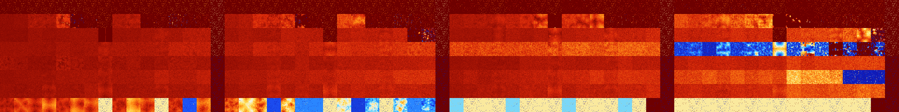

# B012347 (81408-81919)

<details>
    <summary>Initial Grid</summary>
    
</details>


<details>
    <summary>Initial Grid RLE</summary>

```
#C Exported from GoGoL (https://github.com/marrow16/gogol)
#C Wrap mode: Toroidal
#C Boundary mode: Dead
#C Step: 0
x = 100, y = 100, rule = B012347/S
3bo9bo16bo24bo23bo$26b2o6bo6bo27bobo3bo6bo$23bo15bo18bo9bo$bo14bo5bo36b
o$2bo38bobo12bo2bo10bo$o11b2o3bo11bo5bo5bo4bo26bo2bo$29bo46bo6bo$10bo2b
o6bo25bo4bo8bo6bo5bo6bo$15bo2b2o21bo12bo6bo21bo10bo$52bo29bo$5bo12bo52b
o22bo$o9bo35bo3bo3bo11bo17bo5bo$12bo10bo44bo16bo$2bo26bo46b2o20bo$54bo
16bo17bo$22bo2bo37bo12bo3bo4bo$42bo6bo17bobo20bo$3bo19bo13bo$bo4b3o41bo
44bo$12bo11bo26bo3bo4bo17bo4bo15bo$4bo35bo48bobo$99bo$5bo16bo13bo20bo
13bo15bo$o38bo13bo22bo5bo$2bo16bo13bo6bo5bo14bo7bo$21bo21bo26bo10b2o$
34bo18bo9bo2bobo18bo$25bobo10bo6bo5bo$b2o5bo4bo5bo32bo$13bo8bo30bo33bo$
52bo26bo11bo$19bo34bo17bo7bo13bo4bo$28bo7bo31bobo16bo2bo$52bo15bo11bo2b
o3bobo$5b2o11bo4bo13bo28bo17bo$bo17bo18bo18bo2bo18bo$7bo2bo40bo6bo5bo
15bo$4bo6bo5bo69bo$14bo8bo37bo22bo7bo4bo$21bobo2bo$5bo75bo4bo$35bo14bo
11bo4bo7bo5bo7bo$9bo8bo56bo4bo6bo$2bo6bo25bo20bobo4bo13bobo$5bo16bo3bo
8bobo3bo5b2o14bo11bobo9bo$28b2o11bo6bo20bo$62bo$44bo27bo13bo11bo$11bo
17bo5bo57bo$13bo9bo26bo6bo10bo8bo3bo2bo$34bo8bo7bobo10bo23bob2o5bo$7bo
26bo7bo7bo22bo$9bo58bo19bo$12bo2bo31bo12bo6bo17bo8bo$2bo48bo6bo18bo6bob
o$6b2o11bo9bo15b2o2bo14bo23bo4bo$2bo25bobo9b2o3bo17b2o14bo14bo$2bo4bo
47bo11bo3bo$6bo7b3o4bo11bo19b2o9bo$14bo9bo16bo2bo5bo3bo13bo6bo10bo6bo$
45bo49bobo$2bo4bo41bo19bo$o23bo6b2o10bo51b2obo$64bo28bo$26b2o31bo3bo12b
o$11bo17bo29bo18bo6bo$7bo10bo35bo$6bo18bo4bo16bo18bo$11bo16bo15bo51bo$
5bo7bo3bo28bo6bo$75bo$28bo27bo11bo$100b$7bo20bo16bo8bo5bo14bo3bo4bo$59b
o$15bo41bo9bo$5bo13bo26bo44bo$bo4bo24bo4bo18bo$44bo20bo26bo$10bo14bo16b
o4bo$44bo3bo20bo16bo6bo$o18bo5bo12bo55bobo$27bo23bo13bo$3bo31bo6bo6bo
39bo$38bo23bo6bo6bo$7bo2bo7bo23bo13b2o12bo23bo2bo$9bo3bo21bo24b2o37bo$b
o11bo13bo46bo6bo10bo$26bo4bo8bo23bo30bo$19bo34bo$7bo4bo39bo5bo6bo9bo$
45bo12bo27bo$24bo47bo14bo$10bo18bo13bo$o7bo38bo4bo4bo19bo3bo$2o17b2o2bo
12bo12bo24bo10bo$21bo14bo8b2o50bo$24bo17bo14bo20bo5bo$50b2o28bo$o32bo
17b2o6bo8bo6bo6bo!
```
</details>
<details>
    <summary>Thumbnail</summary>

</details>
<table>
<tr>
    <td><a href="./81408%20S%20Heat%20Map%20Activity.png"></a><br>S (81408)<br>R@6,p2</td>    <td><a href="./81409%20S0%20Heat%20Map%20Activity.png"></a><br>S0 (81409)<br>R@5,p2</td>    <td><a href="./81410%20S1%20Heat%20Map%20Activity.png"></a><br>S1 (81410)<br>R@5,p2</td>    <td><a href="./81411%20S01%20Heat%20Map%20Activity.png"></a><br>S01 (81411)<br>R@5,p2</td>    <td><a href="./81412%20S2%20Heat%20Map%20Activity.png"></a><br>S2 (81412)<br>R@4,p2</td>    <td><a href="./81413%20S02%20Heat%20Map%20Activity.png"></a><br>S02 (81413)<br>R@4,p2</td>    <td><a href="./81414%20S12%20Heat%20Map%20Activity.png"></a><br>S12 (81414)<br>R@5,p2</td>    <td><a href="./81415%20S012%20Heat%20Map%20Activity.png"></a><br>S012 (81415)<br>R@5,p2</td>    <td><a href="./81416%20S3%20Heat%20Map%20Activity.png"></a><br>S3 (81416)<br>R@6,p2</td>    <td><a href="./81417%20S03%20Heat%20Map%20Activity.png"></a><br>S03 (81417)<br>R@5,p2</td>    <td><a href="./81418%20S13%20Heat%20Map%20Activity.png"></a><br>S13 (81418)<br>R@5,p2</td>    <td><a href="./81419%20S013%20Heat%20Map%20Activity.png"></a><br>S013 (81419)<br>R@5,p2</td>    <td><a href="./81420%20S23%20Heat%20Map%20Activity.png"></a><br>S23 (81420)<br>R@4,p2</td>    <td><a href="./81421%20S023%20Heat%20Map%20Activity.png"></a><br>S023 (81421)<br>R@4,p2</td>    <td><a href="./81422%20S123%20Heat%20Map%20Activity.png"></a><br>S123 (81422)<br>R@4,p2</td>    <td><a href="./81423%20S0123%20Heat%20Map%20Activity.png"></a><br>S0123 (81423)<br>R@3,p2</td>    <td><a href="./81424%20S4%20Heat%20Map%20Activity.png"></a><br>S4 (81424)<br>R@6,p2</td>    <td><a href="./81425%20S04%20Heat%20Map%20Activity.png"></a><br>S04 (81425)<br>R@5,p2</td>    <td><a href="./81426%20S14%20Heat%20Map%20Activity.png"></a><br>S14 (81426)<br>R@5,p2</td>    <td><a href="./81427%20S014%20Heat%20Map%20Activity.png"></a><br>S014 (81427)<br>R@5,p2</td>    <td><a href="./81428%20S24%20Heat%20Map%20Activity.png"></a><br>S24 (81428)<br>R@6,p2</td>    <td><a href="./81429%20S024%20Heat%20Map%20Activity.png"></a><br>S024 (81429)<br>R@4,p2</td>    <td><a href="./81430%20S124%20Heat%20Map%20Activity.png"></a><br>S124 (81430)<br>R@5,p2</td>    <td><a href="./81431%20S0124%20Heat%20Map%20Activity.png"></a><br>S0124 (81431)<br>R@5,p2</td>    <td><a href="./81432%20S34%20Heat%20Map%20Activity.png"></a><br>S34 (81432)<br>R@6,p2</td>    <td><a href="./81433%20S034%20Heat%20Map%20Activity.png"></a><br>S034 (81433)<br>R@5,p2</td>    <td><a href="./81434%20S134%20Heat%20Map%20Activity.png"></a><br>S134 (81434)<br>R@5,p2</td>    <td><a href="./81435%20S0134%20Heat%20Map%20Activity.png"></a><br>S0134 (81435)<br>R@5,p2</td>    <td><a href="./81436%20S234%20Heat%20Map%20Activity.png"></a><br>S234 (81436)<br>R@6,p2</td>    <td><a href="./81437%20S0234%20Heat%20Map%20Activity.png"></a><br>S0234 (81437)<br>R@4,p2</td>    <td><a href="./81438%20S1234%20Heat%20Map%20Activity.png"></a><br>S1234 (81438)<br>R@4,p2</td>    <td><a href="./81439%20S01234%20Heat%20Map%20Activity.png"></a><br>S01234 (81439)<br>R@3,p2</td>    <td><a href="./81440%20S5%20Heat%20Map%20Activity.png"></a><br>S5 (81440)<br>R@18,p4</td>    <td><a href="./81441%20S05%20Heat%20Map%20Activity.png"></a><br>S05 (81441)<br>R@12,p4</td>    <td><a href="./81442%20S15%20Heat%20Map%20Activity.png"></a><br>S15 (81442)<br>R@6,p2</td>    <td><a href="./81443%20S015%20Heat%20Map%20Activity.png"></a><br>S015 (81443)<br>R@5,p2</td>    <td><a href="./81444%20S25%20Heat%20Map%20Activity.png"></a><br>S25 (81444)<br>R@10,p2</td>    <td><a href="./81445%20S025%20Heat%20Map%20Activity.png"></a><br>S025 (81445)<br>R@8,p2</td>    <td><a href="./81446%20S125%20Heat%20Map%20Activity.png"></a><br>S125 (81446)<br>R@6,p2</td>    <td><a href="./81447%20S0125%20Heat%20Map%20Activity.png"></a><br>S0125 (81447)<br>R@5,p2</td>    <td><a href="./81448%20S35%20Heat%20Map%20Activity.png"></a><br>S35 (81448)<br>R@18,p4</td>    <td><a href="./81449%20S035%20Heat%20Map%20Activity.png"></a><br>S035 (81449)<br>R@13,p4</td>    <td><a href="./81450%20S135%20Heat%20Map%20Activity.png"></a><br>S135 (81450)<br>R@6,p2</td>    <td><a href="./81451%20S0135%20Heat%20Map%20Activity.png"></a><br>S0135 (81451)<br>R@5,p2</td>    <td><a href="./81452%20S235%20Heat%20Map%20Activity.png"></a><br>S235 (81452)<br>R@7,p2</td>    <td><a href="./81453%20S0235%20Heat%20Map%20Activity.png"></a><br>S0235 (81453)<br>R@8,p2</td>    <td><a href="./81454%20S1235%20Heat%20Map%20Activity.png"></a><br>S1235 (81454)<br>R@6,p2</td>    <td><a href="./81455%20S01235%20Heat%20Map%20Activity.png"></a><br>S01235 (81455)<br>R@3,p2</td>    <td><a href="./81456%20S45%20Heat%20Map%20Activity.png"></a><br>S45 (81456)<br>R@18,p4</td>    <td><a href="./81457%20S045%20Heat%20Map%20Activity.png"></a><br>S045 (81457)<br>R@13,p4</td>    <td><a href="./81458%20S145%20Heat%20Map%20Activity.png"></a><br>S145 (81458)<br>R@6,p2</td>    <td><a href="./81459%20S0145%20Heat%20Map%20Activity.png"></a><br>S0145 (81459)<br>R@5,p2</td>    <td><a href="./81460%20S245%20Heat%20Map%20Activity.png"></a><br>S245 (81460)<br>R@7,p2</td>    <td><a href="./81461%20S0245%20Heat%20Map%20Activity.png"></a><br>S0245 (81461)<br>R@6,p2</td>    <td><a href="./81462%20S1245%20Heat%20Map%20Activity.png"></a><br>S1245 (81462)<br>R@6,p2</td>    <td><a href="./81463%20S01245%20Heat%20Map%20Activity.png"></a><br>S01245 (81463)<br>R@5,p2</td>    <td><a href="./81464%20S345%20Heat%20Map%20Activity.png"></a><br>S345 (81464)<br>R@14,p4</td>    <td><a href="./81465%20S0345%20Heat%20Map%20Activity.png"></a><br>S0345 (81465)<br>R@11,p4</td>    <td><a href="./81466%20S1345%20Heat%20Map%20Activity.png"></a><br>S1345 (81466)<br>R@6,p2</td>    <td><a href="./81467%20S01345%20Heat%20Map%20Activity.png"></a><br>S01345 (81467)<br>R@5,p2</td>    <td><a href="./81468%20S2345%20Heat%20Map%20Activity.png"></a><br>S2345 (81468)<br>R@6,p2</td>    <td><a href="./81469%20S02345%20Heat%20Map%20Activity.png"></a><br>S02345 (81469)<br>R@6,p2</td>    <td><a href="./81470%20S12345%20Heat%20Map%20Activity.png"></a><br>S12345 (81470)<br>R@6,p2</td>    <td><a href="./81471%20S012345%20Heat%20Map%20Activity.png"></a><br>S012345 (81471)<br>R@3,p2</td></tr>
<tr>
    <td><a href="./81472%20S6%20Heat%20Map%20Activity.png"></a><br>S6 (81472)<br>G>1000</td>    <td><a href="./81473%20S06%20Heat%20Map%20Activity.png"></a><br>S06 (81473)<br>G>1000</td>    <td><a href="./81474%20S16%20Heat%20Map%20Activity.png"></a><br>S16 (81474)<br>G>1000</td>    <td><a href="./81475%20S016%20Heat%20Map%20Activity.png"></a><br>S016 (81475)<br>G>1000</td>    <td><a href="./81476%20S26%20Heat%20Map%20Activity.png"></a><br>S26 (81476)<br>G>1000</td>    <td><a href="./81477%20S026%20Heat%20Map%20Activity.png"></a><br>S026 (81477)<br>R@205,p8</td>    <td><a href="./81478%20S126%20Heat%20Map%20Activity.png"></a><br>S126 (81478)<br>R@13,p4</td>    <td><a href="./81479%20S0126%20Heat%20Map%20Activity.png"></a><br>S0126 (81479)<br>R@5,p2</td>    <td><a href="./81480%20S36%20Heat%20Map%20Activity.png"></a><br>S36 (81480)<br>G>1000</td>    <td><a href="./81481%20S036%20Heat%20Map%20Activity.png"></a><br>S036 (81481)<br>G>1000</td>    <td><a href="./81482%20S136%20Heat%20Map%20Activity.png"></a><br>S136 (81482)<br>R@31,p14</td>    <td><a href="./81483%20S0136%20Heat%20Map%20Activity.png"></a><br>S0136 (81483)<br>R@7,p2</td>    <td><a href="./81484%20S236%20Heat%20Map%20Activity.png"></a><br>S236 (81484)<br>R@28,p4</td>    <td><a href="./81485%20S0236%20Heat%20Map%20Activity.png"></a><br>S0236 (81485)<br>R@12,p4</td>    <td><a href="./81486%20S1236%20Heat%20Map%20Activity.png"></a><br>S1236 (81486)<br>R@9,p2</td>    <td><a href="./81487%20S01236%20Heat%20Map%20Activity.png"></a><br>S01236 (81487)<br>R@3,p2</td>    <td><a href="./81488%20S46%20Heat%20Map%20Activity.png"></a><br>S46 (81488)<br>G>1000</td>    <td><a href="./81489%20S046%20Heat%20Map%20Activity.png"></a><br>S046 (81489)<br>G>1000</td>    <td><a href="./81490%20S146%20Heat%20Map%20Activity.png"></a><br>S146 (81490)<br>G>1000</td>    <td><a href="./81491%20S0146%20Heat%20Map%20Activity.png"></a><br>S0146 (81491)<br>G>1000</td>    <td><a href="./81492%20S246%20Heat%20Map%20Activity.png"></a><br>S246 (81492)<br>G>1000</td>    <td><a href="./81493%20S0246%20Heat%20Map%20Activity.png"></a><br>S0246 (81493)<br>R@632,p4</td>    <td><a href="./81494%20S1246%20Heat%20Map%20Activity.png"></a><br>S1246 (81494)<br>R@11,p2</td>    <td><a href="./81495%20S01246%20Heat%20Map%20Activity.png"></a><br>S01246 (81495)<br>R@5,p2</td>    <td><a href="./81496%20S346%20Heat%20Map%20Activity.png"></a><br>S346 (81496)<br>G>1000</td>    <td><a href="./81497%20S0346%20Heat%20Map%20Activity.png"></a><br>S0346 (81497)<br>G>1000</td>    <td><a href="./81498%20S1346%20Heat%20Map%20Activity.png"></a><br>S1346 (81498)<br>R@15,p2</td>    <td><a href="./81499%20S01346%20Heat%20Map%20Activity.png"></a><br>S01346 (81499)<br>R@7,p2</td>    <td><a href="./81500%20S2346%20Heat%20Map%20Activity.png"></a><br>S2346 (81500)<br>R@18,p4</td>    <td><a href="./81501%20S02346%20Heat%20Map%20Activity.png"></a><br>S02346 (81501)<br>R@8,p4</td>    <td><a href="./81502%20S12346%20Heat%20Map%20Activity.png"></a><br>S12346 (81502)<br>R@9,p2</td>    <td><a href="./81503%20S012346%20Heat%20Map%20Activity.png"></a><br>S012346 (81503)<br>R@3,p2</td>    <td><a href="./81504%20S56%20Heat%20Map%20Activity.png"></a><br>S56 (81504)<br>G>1000</td>    <td><a href="./81505%20S056%20Heat%20Map%20Activity.png"></a><br>S056 (81505)<br>G>1000</td>    <td><a href="./81506%20S156%20Heat%20Map%20Activity.png"></a><br>S156 (81506)<br>G>1000</td>    <td><a href="./81507%20S0156%20Heat%20Map%20Activity.png"></a><br>S0156 (81507)<br>G>1000</td>    <td><a href="./81508%20S256%20Heat%20Map%20Activity.png"></a><br>S256 (81508)<br>G>1000</td>    <td><a href="./81509%20S0256%20Heat%20Map%20Activity.png"></a><br>S0256 (81509)<br>G>1000</td>    <td><a href="./81510%20S1256%20Heat%20Map%20Activity.png"></a><br>S1256 (81510)<br>G>1000</td>    <td><a href="./81511%20S01256%20Heat%20Map%20Activity.png"></a><br>S01256 (81511)<br>R@25,p2</td>    <td><a href="./81512%20S356%20Heat%20Map%20Activity.png"></a><br>S356 (81512)<br>G>1000</td>    <td><a href="./81513%20S0356%20Heat%20Map%20Activity.png"></a><br>S0356 (81513)<br>G>1000</td>    <td><a href="./81514%20S1356%20Heat%20Map%20Activity.png"></a><br>S1356 (81514)<br>G>1000</td>    <td><a href="./81515%20S01356%20Heat%20Map%20Activity.png"></a><br>S01356 (81515)<br>R@7,p4</td>    <td><a href="./81516%20S2356%20Heat%20Map%20Activity.png"></a><br>S2356 (81516)<br>R@62,p4</td>    <td><a href="./81517%20S02356%20Heat%20Map%20Activity.png"></a><br>S02356 (81517)<br>R@12,p4</td>    <td><a href="./81518%20S12356%20Heat%20Map%20Activity.png"></a><br>S12356 (81518)<br>R@9,p2</td>    <td><a href="./81519%20S012356%20Heat%20Map%20Activity.png"></a><br>S012356 (81519)<br>R@3,p2</td>    <td><a href="./81520%20S456%20Heat%20Map%20Activity.png"></a><br>S456 (81520)<br>G>1000</td>    <td><a href="./81521%20S0456%20Heat%20Map%20Activity.png"></a><br>S0456 (81521)<br>G>1000</td>    <td><a href="./81522%20S1456%20Heat%20Map%20Activity.png"></a><br>S1456 (81522)<br>G>1000</td>    <td><a href="./81523%20S01456%20Heat%20Map%20Activity.png"></a><br>S01456 (81523)<br>G>1000</td>    <td><a href="./81524%20S2456%20Heat%20Map%20Activity.png"></a><br>S2456 (81524)<br>G>1000</td>    <td><a href="./81525%20S02456%20Heat%20Map%20Activity.png"></a><br>S02456 (81525)<br>G>1000</td>    <td><a href="./81526%20S12456%20Heat%20Map%20Activity.png"></a><br>S12456 (81526)<br>G>1000</td>    <td><a href="./81527%20S012456%20Heat%20Map%20Activity.png"></a><br>S012456 (81527)<br>R@313,p2</td>    <td><a href="./81528%20S3456%20Heat%20Map%20Activity.png"></a><br>S3456 (81528)<br>R@168,p2</td>    <td><a href="./81529%20S03456%20Heat%20Map%20Activity.png"></a><br>S03456 (81529)<br>R@57,p48</td>    <td><a href="./81530%20S13456%20Heat%20Map%20Activity.png"></a><br>S13456 (81530)<br>R@15,p2</td>    <td><a href="./81531%20S013456%20Heat%20Map%20Activity.png"></a><br>S013456 (81531)<br>R@7,p4</td>    <td><a href="./81532%20S23456%20Heat%20Map%20Activity.png"></a><br>S23456 (81532)<br>R@15,p4</td>    <td><a href="./81533%20S023456%20Heat%20Map%20Activity.png"></a><br>S023456 (81533)<br>R@9,p4</td>    <td><a href="./81534%20S123456%20Heat%20Map%20Activity.png"></a><br>S123456 (81534)<br>R@9,p2</td>    <td><a href="./81535%20S0123456%20Heat%20Map%20Activity.png"></a><br>S0123456 (81535)<br>R@3,p2</td></tr>
<tr>
    <td><a href="./81536%20S7%20Heat%20Map%20Activity.png"></a><br>S7 (81536)<br>G>1000</td>    <td><a href="./81537%20S07%20Heat%20Map%20Activity.png"></a><br>S07 (81537)<br>G>1000</td>    <td><a href="./81538%20S17%20Heat%20Map%20Activity.png"></a><br>S17 (81538)<br>G>1000</td>    <td><a href="./81539%20S017%20Heat%20Map%20Activity.png"></a><br>S017 (81539)<br>G>1000</td>    <td><a href="./81540%20S27%20Heat%20Map%20Activity.png"></a><br>S27 (81540)<br>G>1000</td>    <td><a href="./81541%20S027%20Heat%20Map%20Activity.png"></a><br>S027 (81541)<br>G>1000</td>    <td><a href="./81542%20S127%20Heat%20Map%20Activity.png"></a><br>S127 (81542)<br>G>1000</td>    <td><a href="./81543%20S0127%20Heat%20Map%20Activity.png"></a><br>S0127 (81543)<br>R@143,p120</td>    <td><a href="./81544%20S37%20Heat%20Map%20Activity.png"></a><br>S37 (81544)<br>G>1000</td>    <td><a href="./81545%20S037%20Heat%20Map%20Activity.png"></a><br>S037 (81545)<br>G>1000</td>    <td><a href="./81546%20S137%20Heat%20Map%20Activity.png"></a><br>S137 (81546)<br>G>1000</td>    <td><a href="./81547%20S0137%20Heat%20Map%20Activity.png"></a><br>S0137 (81547)<br>G>1000</td>    <td><a href="./81548%20S237%20Heat%20Map%20Activity.png"></a><br>S237 (81548)<br>G>1000</td>    <td><a href="./81549%20S0237%20Heat%20Map%20Activity.png"></a><br>S0237 (81549)<br>G>1000</td>    <td><a href="./81550%20S1237%20Heat%20Map%20Activity.png"></a><br>S1237 (81550)<br>G>1000</td>    <td><a href="./81551%20S01237%20Heat%20Map%20Activity.png"></a><br>S01237 (81551)<br>R@3,p2</td>    <td><a href="./81552%20S47%20Heat%20Map%20Activity.png"></a><br>S47 (81552)<br>G>1000</td>    <td><a href="./81553%20S047%20Heat%20Map%20Activity.png"></a><br>S047 (81553)<br>G>1000</td>    <td><a href="./81554%20S147%20Heat%20Map%20Activity.png"></a><br>S147 (81554)<br>G>1000</td>    <td><a href="./81555%20S0147%20Heat%20Map%20Activity.png"></a><br>S0147 (81555)<br>G>1000</td>    <td><a href="./81556%20S247%20Heat%20Map%20Activity.png"></a><br>S247 (81556)<br>G>1000</td>    <td><a href="./81557%20S0247%20Heat%20Map%20Activity.png"></a><br>S0247 (81557)<br>G>1000</td>    <td><a href="./81558%20S1247%20Heat%20Map%20Activity.png"></a><br>S1247 (81558)<br>G>1000</td>    <td><a href="./81559%20S01247%20Heat%20Map%20Activity.png"></a><br>S01247 (81559)<br>R@5,p2</td>    <td><a href="./81560%20S347%20Heat%20Map%20Activity.png"></a><br>S347 (81560)<br>G>1000</td>    <td><a href="./81561%20S0347%20Heat%20Map%20Activity.png"></a><br>S0347 (81561)<br>G>1000</td>    <td><a href="./81562%20S1347%20Heat%20Map%20Activity.png"></a><br>S1347 (81562)<br>G>1000</td>    <td><a href="./81563%20S01347%20Heat%20Map%20Activity.png"></a><br>S01347 (81563)<br>G>1000</td>    <td><a href="./81564%20S2347%20Heat%20Map%20Activity.png"></a><br>S2347 (81564)<br>G>1000</td>    <td><a href="./81565%20S02347%20Heat%20Map%20Activity.png"></a><br>S02347 (81565)<br>R@73,p2</td>    <td><a href="./81566%20S12347%20Heat%20Map%20Activity.png"></a><br>S12347 (81566)<br>R@97,p12</td>    <td><a href="./81567%20S012347%20Heat%20Map%20Activity.png"></a><br>S012347 (81567)<br>R@3,p2</td>    <td><a href="./81568%20S57%20Heat%20Map%20Activity.png"></a><br>S57 (81568)<br>G>1000</td>    <td><a href="./81569%20S057%20Heat%20Map%20Activity.png"></a><br>S057 (81569)<br>G>1000</td>    <td><a href="./81570%20S157%20Heat%20Map%20Activity.png"></a><br>S157 (81570)<br>G>1000</td>    <td><a href="./81571%20S0157%20Heat%20Map%20Activity.png"></a><br>S0157 (81571)<br>G>1000</td>    <td><a href="./81572%20S257%20Heat%20Map%20Activity.png"></a><br>S257 (81572)<br>G>1000</td>    <td><a href="./81573%20S0257%20Heat%20Map%20Activity.png"></a><br>S0257 (81573)<br>G>1000</td>    <td><a href="./81574%20S1257%20Heat%20Map%20Activity.png"></a><br>S1257 (81574)<br>G>1000</td>    <td><a href="./81575%20S01257%20Heat%20Map%20Activity.png"></a><br>S01257 (81575)<br>G>1000</td>    <td><a href="./81576%20S357%20Heat%20Map%20Activity.png"></a><br>S357 (81576)<br>G>1000</td>    <td><a href="./81577%20S0357%20Heat%20Map%20Activity.png"></a><br>S0357 (81577)<br>G>1000</td>    <td><a href="./81578%20S1357%20Heat%20Map%20Activity.png"></a><br>S1357 (81578)<br>G>1000</td>    <td><a href="./81579%20S01357%20Heat%20Map%20Activity.png"></a><br>S01357 (81579)<br>G>1000</td>    <td><a href="./81580%20S2357%20Heat%20Map%20Activity.png"></a><br>S2357 (81580)<br>G>1000</td>    <td><a href="./81581%20S02357%20Heat%20Map%20Activity.png"></a><br>S02357 (81581)<br>G>1000</td>    <td><a href="./81582%20S12357%20Heat%20Map%20Activity.png"></a><br>S12357 (81582)<br>G>1000</td>    <td><a href="./81583%20S012357%20Heat%20Map%20Activity.png"></a><br>S012357 (81583)<br>R@3,p2</td>    <td><a href="./81584%20S457%20Heat%20Map%20Activity.png"></a><br>S457 (81584)<br>G>1000</td>    <td><a href="./81585%20S0457%20Heat%20Map%20Activity.png"></a><br>S0457 (81585)<br>G>1000</td>    <td><a href="./81586%20S1457%20Heat%20Map%20Activity.png"></a><br>S1457 (81586)<br>G>1000</td>    <td><a href="./81587%20S01457%20Heat%20Map%20Activity.png"></a><br>S01457 (81587)<br>G>1000</td>    <td><a href="./81588%20S2457%20Heat%20Map%20Activity.png"></a><br>S2457 (81588)<br>G>1000</td>    <td><a href="./81589%20S02457%20Heat%20Map%20Activity.png"></a><br>S02457 (81589)<br>G>1000</td>    <td><a href="./81590%20S12457%20Heat%20Map%20Activity.png"></a><br>S12457 (81590)<br>G>1000</td>    <td><a href="./81591%20S012457%20Heat%20Map%20Activity.png"></a><br>S012457 (81591)<br>R@5,p2</td>    <td><a href="./81592%20S3457%20Heat%20Map%20Activity.png"></a><br>S3457 (81592)<br>G>1000</td>    <td><a href="./81593%20S03457%20Heat%20Map%20Activity.png"></a><br>S03457 (81593)<br>G>1000</td>    <td><a href="./81594%20S13457%20Heat%20Map%20Activity.png"></a><br>S13457 (81594)<br>G>1000</td>    <td><a href="./81595%20S013457%20Heat%20Map%20Activity.png"></a><br>S013457 (81595)<br>G>1000</td>    <td><a href="./81596%20S23457%20Heat%20Map%20Activity.png"></a><br>S23457 (81596)<br>G>1000</td>    <td><a href="./81597%20S023457%20Heat%20Map%20Activity.png"></a><br>S023457 (81597)<br>G>1000</td>    <td><a href="./81598%20S123457%20Heat%20Map%20Activity.png"></a><br>S123457 (81598)<br>R@449,p8</td>    <td><a href="./81599%20S0123457%20Heat%20Map%20Activity.png"></a><br>S0123457 (81599)<br>R@3,p2</td></tr>
<tr>
    <td><a href="./81600%20S67%20Heat%20Map%20Activity.png"></a><br>S67 (81600)<br>G>1000</td>    <td><a href="./81601%20S067%20Heat%20Map%20Activity.png"></a><br>S067 (81601)<br>G>1000</td>    <td><a href="./81602%20S167%20Heat%20Map%20Activity.png"></a><br>S167 (81602)<br>G>1000</td>    <td><a href="./81603%20S0167%20Heat%20Map%20Activity.png"></a><br>S0167 (81603)<br>G>1000</td>    <td><a href="./81604%20S267%20Heat%20Map%20Activity.png"></a><br>S267 (81604)<br>G>1000</td>    <td><a href="./81605%20S0267%20Heat%20Map%20Activity.png"></a><br>S0267 (81605)<br>G>1000</td>    <td><a href="./81606%20S1267%20Heat%20Map%20Activity.png"></a><br>S1267 (81606)<br>G>1000</td>    <td><a href="./81607%20S01267%20Heat%20Map%20Activity.png"></a><br>S01267 (81607)<br>G>1000</td>    <td><a href="./81608%20S367%20Heat%20Map%20Activity.png"></a><br>S367 (81608)<br>G>1000</td>    <td><a href="./81609%20S0367%20Heat%20Map%20Activity.png"></a><br>S0367 (81609)<br>G>1000</td>    <td><a href="./81610%20S1367%20Heat%20Map%20Activity.png"></a><br>S1367 (81610)<br>G>1000</td>    <td><a href="./81611%20S01367%20Heat%20Map%20Activity.png"></a><br>S01367 (81611)<br>G>1000</td>    <td><a href="./81612%20S2367%20Heat%20Map%20Activity.png"></a><br>S2367 (81612)<br>G>1000</td>    <td><a href="./81613%20S02367%20Heat%20Map%20Activity.png"></a><br>S02367 (81613)<br>G>1000</td>    <td><a href="./81614%20S12367%20Heat%20Map%20Activity.png"></a><br>S12367 (81614)<br>G>1000</td>    <td><a href="./81615%20S012367%20Heat%20Map%20Activity.png"></a><br>S012367 (81615)<br>R@3,p2</td>    <td><a href="./81616%20S467%20Heat%20Map%20Activity.png"></a><br>S467 (81616)<br>G>1000</td>    <td><a href="./81617%20S0467%20Heat%20Map%20Activity.png"></a><br>S0467 (81617)<br>G>1000</td>    <td><a href="./81618%20S1467%20Heat%20Map%20Activity.png"></a><br>S1467 (81618)<br>G>1000</td>    <td><a href="./81619%20S01467%20Heat%20Map%20Activity.png"></a><br>S01467 (81619)<br>G>1000</td>    <td><a href="./81620%20S2467%20Heat%20Map%20Activity.png"></a><br>S2467 (81620)<br>G>1000</td>    <td><a href="./81621%20S02467%20Heat%20Map%20Activity.png"></a><br>S02467 (81621)<br>G>1000</td>    <td><a href="./81622%20S12467%20Heat%20Map%20Activity.png"></a><br>S12467 (81622)<br>G>1000</td>    <td><a href="./81623%20S012467%20Heat%20Map%20Activity.png"></a><br>S012467 (81623)<br>G>1000</td>    <td><a href="./81624%20S3467%20Heat%20Map%20Activity.png"></a><br>S3467 (81624)<br>G>1000</td>    <td><a href="./81625%20S03467%20Heat%20Map%20Activity.png"></a><br>S03467 (81625)<br>G>1000</td>    <td><a href="./81626%20S13467%20Heat%20Map%20Activity.png"></a><br>S13467 (81626)<br>G>1000</td>    <td><a href="./81627%20S013467%20Heat%20Map%20Activity.png"></a><br>S013467 (81627)<br>G>1000</td>    <td><a href="./81628%20S23467%20Heat%20Map%20Activity.png"></a><br>S23467 (81628)<br>G>1000</td>    <td><a href="./81629%20S023467%20Heat%20Map%20Activity.png"></a><br>S023467 (81629)<br>G>1000</td>    <td><a href="./81630%20S123467%20Heat%20Map%20Activity.png"></a><br>S123467 (81630)<br>G>1000</td>    <td><a href="./81631%20S0123467%20Heat%20Map%20Activity.png"></a><br>S0123467 (81631)<br>R@3,p2</td>    <td><a href="./81632%20S567%20Heat%20Map%20Activity.png"></a><br>S567 (81632)<br>G>1000</td>    <td><a href="./81633%20S0567%20Heat%20Map%20Activity.png"></a><br>S0567 (81633)<br>G>1000</td>    <td><a href="./81634%20S1567%20Heat%20Map%20Activity.png"></a><br>S1567 (81634)<br>G>1000</td>    <td><a href="./81635%20S01567%20Heat%20Map%20Activity.png"></a><br>S01567 (81635)<br>G>1000</td>    <td><a href="./81636%20S2567%20Heat%20Map%20Activity.png"></a><br>S2567 (81636)<br>G>1000</td>    <td><a href="./81637%20S02567%20Heat%20Map%20Activity.png"></a><br>S02567 (81637)<br>G>1000</td>    <td><a href="./81638%20S12567%20Heat%20Map%20Activity.png"></a><br>S12567 (81638)<br>G>1000</td>    <td><a href="./81639%20S012567%20Heat%20Map%20Activity.png"></a><br>S012567 (81639)<br>G>1000</td>    <td><a href="./81640%20S3567%20Heat%20Map%20Activity.png"></a><br>S3567 (81640)<br>G>1000</td>    <td><a href="./81641%20S03567%20Heat%20Map%20Activity.png"></a><br>S03567 (81641)<br>G>1000</td>    <td><a href="./81642%20S13567%20Heat%20Map%20Activity.png"></a><br>S13567 (81642)<br>G>1000</td>    <td><a href="./81643%20S013567%20Heat%20Map%20Activity.png"></a><br>S013567 (81643)<br>G>1000</td>    <td><a href="./81644%20S23567%20Heat%20Map%20Activity.png"></a><br>S23567 (81644)<br>G>1000</td>    <td><a href="./81645%20S023567%20Heat%20Map%20Activity.png"></a><br>S023567 (81645)<br>G>1000</td>    <td><a href="./81646%20S123567%20Heat%20Map%20Activity.png"></a><br>S123567 (81646)<br>G>1000</td>    <td><a href="./81647%20S0123567%20Heat%20Map%20Activity.png"></a><br>S0123567 (81647)<br>R@3,p2</td>    <td><a href="./81648%20S4567%20Heat%20Map%20Activity.png"></a><br>S4567 (81648)<br>R@64,p6</td>    <td><a href="./81649%20S04567%20Heat%20Map%20Activity.png"></a><br>S04567 (81649)<br>R@94,p30</td>    <td><a href="./81650%20S14567%20Heat%20Map%20Activity.png"></a><br>S14567 (81650)<br>R@178,p120</td>    <td><a href="./81651%20S014567%20Heat%20Map%20Activity.png"></a><br>S014567 (81651)<br>R@116,p6</td>    <td><a href="./81652%20S24567%20Heat%20Map%20Activity.png"></a><br>S24567 (81652)<br>R@75,p12</td>    <td><a href="./81653%20S024567%20Heat%20Map%20Activity.png"></a><br>S024567 (81653)<br>R@98,p12</td>    <td><a href="./81654%20S124567%20Heat%20Map%20Activity.png"></a><br>S124567 (81654)<br>R@66,p6</td>    <td><a href="./81655%20S0124567%20Heat%20Map%20Activity.png"></a><br>S0124567 (81655)<br>R@201,p6</td>    <td><a href="./81656%20S34567%20Heat%20Map%20Activity.png"></a><br>S34567 (81656)<br>R@42,p12</td>    <td><a href="./81657%20S034567%20Heat%20Map%20Activity.png"></a><br>S034567 (81657)<br>R@361,p6</td>    <td><a href="./81658%20S134567%20Heat%20Map%20Activity.png"></a><br>S134567 (81658)<br>R@40,p6</td>    <td><a href="./81659%20S0134567%20Heat%20Map%20Activity.png"></a><br>S0134567 (81659)<br>R@115,p4</td>    <td><a href="./81660%20S234567%20Heat%20Map%20Activity.png"></a><br>S234567 (81660)<br>R@83,p6</td>    <td><a href="./81661%20S0234567%20Heat%20Map%20Activity.png"></a><br>S0234567 (81661)<br>R@21,p2</td>    <td><a href="./81662%20S1234567%20Heat%20Map%20Activity.png"></a><br>S1234567 (81662)<br>R@113,p12</td>    <td><a href="./81663%20S01234567%20Heat%20Map%20Activity.png"></a><br>S01234567 (81663)<br>R@3,p2</td></tr>
<tr>
    <td><a href="./81664%20S8%20Heat%20Map%20Activity.png"></a><br>S8 (81664)<br>G>1000</td>    <td><a href="./81665%20S08%20Heat%20Map%20Activity.png"></a><br>S08 (81665)<br>G>1000</td>    <td><a href="./81666%20S18%20Heat%20Map%20Activity.png"></a><br>S18 (81666)<br>G>1000</td>    <td><a href="./81667%20S018%20Heat%20Map%20Activity.png"></a><br>S018 (81667)<br>G>1000</td>    <td><a href="./81668%20S28%20Heat%20Map%20Activity.png"></a><br>S28 (81668)<br>G>1000</td>    <td><a href="./81669%20S028%20Heat%20Map%20Activity.png"></a><br>S028 (81669)<br>G>1000</td>    <td><a href="./81670%20S128%20Heat%20Map%20Activity.png"></a><br>S128 (81670)<br>G>1000</td>    <td><a href="./81671%20S0128%20Heat%20Map%20Activity.png"></a><br>S0128 (81671)<br>G>1000</td>    <td><a href="./81672%20S38%20Heat%20Map%20Activity.png"></a><br>S38 (81672)<br>G>1000</td>    <td><a href="./81673%20S038%20Heat%20Map%20Activity.png"></a><br>S038 (81673)<br>G>1000</td>    <td><a href="./81674%20S138%20Heat%20Map%20Activity.png"></a><br>S138 (81674)<br>G>1000</td>    <td><a href="./81675%20S0138%20Heat%20Map%20Activity.png"></a><br>S0138 (81675)<br>G>1000</td>    <td><a href="./81676%20S238%20Heat%20Map%20Activity.png"></a><br>S238 (81676)<br>G>1000</td>    <td><a href="./81677%20S0238%20Heat%20Map%20Activity.png"></a><br>S0238 (81677)<br>G>1000</td>    <td><a href="./81678%20S1238%20Heat%20Map%20Activity.png"></a><br>S1238 (81678)<br>G>1000</td>    <td><a href="./81679%20S01238%20Heat%20Map%20Activity.png"></a><br>S01238 (81679)<br>S@1</td>    <td><a href="./81680%20S48%20Heat%20Map%20Activity.png"></a><br>S48 (81680)<br>G>1000</td>    <td><a href="./81681%20S048%20Heat%20Map%20Activity.png"></a><br>S048 (81681)<br>G>1000</td>    <td><a href="./81682%20S148%20Heat%20Map%20Activity.png"></a><br>S148 (81682)<br>G>1000</td>    <td><a href="./81683%20S0148%20Heat%20Map%20Activity.png"></a><br>S0148 (81683)<br>G>1000</td>    <td><a href="./81684%20S248%20Heat%20Map%20Activity.png"></a><br>S248 (81684)<br>G>1000</td>    <td><a href="./81685%20S0248%20Heat%20Map%20Activity.png"></a><br>S0248 (81685)<br>G>1000</td>    <td><a href="./81686%20S1248%20Heat%20Map%20Activity.png"></a><br>S1248 (81686)<br>G>1000</td>    <td><a href="./81687%20S01248%20Heat%20Map%20Activity.png"></a><br>S01248 (81687)<br>G>1000</td>    <td><a href="./81688%20S348%20Heat%20Map%20Activity.png"></a><br>S348 (81688)<br>G>1000</td>    <td><a href="./81689%20S0348%20Heat%20Map%20Activity.png"></a><br>S0348 (81689)<br>G>1000</td>    <td><a href="./81690%20S1348%20Heat%20Map%20Activity.png"></a><br>S1348 (81690)<br>G>1000</td>    <td><a href="./81691%20S01348%20Heat%20Map%20Activity.png"></a><br>S01348 (81691)<br>G>1000</td>    <td><a href="./81692%20S2348%20Heat%20Map%20Activity.png"></a><br>S2348 (81692)<br>G>1000</td>    <td><a href="./81693%20S02348%20Heat%20Map%20Activity.png"></a><br>S02348 (81693)<br>G>1000</td>    <td><a href="./81694%20S12348%20Heat%20Map%20Activity.png"></a><br>S12348 (81694)<br>G>1000</td>    <td><a href="./81695%20S012348%20Heat%20Map%20Activity.png"></a><br>S012348 (81695)<br>S@1</td>    <td><a href="./81696%20S58%20Heat%20Map%20Activity.png"></a><br>S58 (81696)<br>G>1000</td>    <td><a href="./81697%20S058%20Heat%20Map%20Activity.png"></a><br>S058 (81697)<br>G>1000</td>    <td><a href="./81698%20S158%20Heat%20Map%20Activity.png"></a><br>S158 (81698)<br>G>1000</td>    <td><a href="./81699%20S0158%20Heat%20Map%20Activity.png"></a><br>S0158 (81699)<br>G>1000</td>    <td><a href="./81700%20S258%20Heat%20Map%20Activity.png"></a><br>S258 (81700)<br>G>1000</td>    <td><a href="./81701%20S0258%20Heat%20Map%20Activity.png"></a><br>S0258 (81701)<br>G>1000</td>    <td><a href="./81702%20S1258%20Heat%20Map%20Activity.png"></a><br>S1258 (81702)<br>G>1000</td>    <td><a href="./81703%20S01258%20Heat%20Map%20Activity.png"></a><br>S01258 (81703)<br>G>1000</td>    <td><a href="./81704%20S358%20Heat%20Map%20Activity.png"></a><br>S358 (81704)<br>G>1000</td>    <td><a href="./81705%20S0358%20Heat%20Map%20Activity.png"></a><br>S0358 (81705)<br>G>1000</td>    <td><a href="./81706%20S1358%20Heat%20Map%20Activity.png"></a><br>S1358 (81706)<br>G>1000</td>    <td><a href="./81707%20S01358%20Heat%20Map%20Activity.png"></a><br>S01358 (81707)<br>G>1000</td>    <td><a href="./81708%20S2358%20Heat%20Map%20Activity.png"></a><br>S2358 (81708)<br>G>1000</td>    <td><a href="./81709%20S02358%20Heat%20Map%20Activity.png"></a><br>S02358 (81709)<br>G>1000</td>    <td><a href="./81710%20S12358%20Heat%20Map%20Activity.png"></a><br>S12358 (81710)<br>G>1000</td>    <td><a href="./81711%20S012358%20Heat%20Map%20Activity.png"></a><br>S012358 (81711)<br>S@1</td>    <td><a href="./81712%20S458%20Heat%20Map%20Activity.png"></a><br>S458 (81712)<br>G>1000</td>    <td><a href="./81713%20S0458%20Heat%20Map%20Activity.png"></a><br>S0458 (81713)<br>G>1000</td>    <td><a href="./81714%20S1458%20Heat%20Map%20Activity.png"></a><br>S1458 (81714)<br>G>1000</td>    <td><a href="./81715%20S01458%20Heat%20Map%20Activity.png"></a><br>S01458 (81715)<br>G>1000</td>    <td><a href="./81716%20S2458%20Heat%20Map%20Activity.png"></a><br>S2458 (81716)<br>G>1000</td>    <td><a href="./81717%20S02458%20Heat%20Map%20Activity.png"></a><br>S02458 (81717)<br>G>1000</td>    <td><a href="./81718%20S12458%20Heat%20Map%20Activity.png"></a><br>S12458 (81718)<br>G>1000</td>    <td><a href="./81719%20S012458%20Heat%20Map%20Activity.png"></a><br>S012458 (81719)<br>G>1000</td>    <td><a href="./81720%20S3458%20Heat%20Map%20Activity.png"></a><br>S3458 (81720)<br>G>1000</td>    <td><a href="./81721%20S03458%20Heat%20Map%20Activity.png"></a><br>S03458 (81721)<br>G>1000</td>    <td><a href="./81722%20S13458%20Heat%20Map%20Activity.png"></a><br>S13458 (81722)<br>G>1000</td>    <td><a href="./81723%20S013458%20Heat%20Map%20Activity.png"></a><br>S013458 (81723)<br>G>1000</td>    <td><a href="./81724%20S23458%20Heat%20Map%20Activity.png"></a><br>S23458 (81724)<br>G>1000</td>    <td><a href="./81725%20S023458%20Heat%20Map%20Activity.png"></a><br>S023458 (81725)<br>G>1000</td>    <td><a href="./81726%20S123458%20Heat%20Map%20Activity.png"></a><br>S123458 (81726)<br>G>1000</td>    <td><a href="./81727%20S0123458%20Heat%20Map%20Activity.png"></a><br>S0123458 (81727)<br>S@1</td></tr>
<tr>
    <td><a href="./81728%20S68%20Heat%20Map%20Activity.png"></a><br>S68 (81728)<br>G>1000</td>    <td><a href="./81729%20S068%20Heat%20Map%20Activity.png"></a><br>S068 (81729)<br>G>1000</td>    <td><a href="./81730%20S168%20Heat%20Map%20Activity.png"></a><br>S168 (81730)<br>G>1000</td>    <td><a href="./81731%20S0168%20Heat%20Map%20Activity.png"></a><br>S0168 (81731)<br>G>1000</td>    <td><a href="./81732%20S268%20Heat%20Map%20Activity.png"></a><br>S268 (81732)<br>G>1000</td>    <td><a href="./81733%20S0268%20Heat%20Map%20Activity.png"></a><br>S0268 (81733)<br>G>1000</td>    <td><a href="./81734%20S1268%20Heat%20Map%20Activity.png"></a><br>S1268 (81734)<br>G>1000</td>    <td><a href="./81735%20S01268%20Heat%20Map%20Activity.png"></a><br>S01268 (81735)<br>G>1000</td>    <td><a href="./81736%20S368%20Heat%20Map%20Activity.png"></a><br>S368 (81736)<br>G>1000</td>    <td><a href="./81737%20S0368%20Heat%20Map%20Activity.png"></a><br>S0368 (81737)<br>G>1000</td>    <td><a href="./81738%20S1368%20Heat%20Map%20Activity.png"></a><br>S1368 (81738)<br>G>1000</td>    <td><a href="./81739%20S01368%20Heat%20Map%20Activity.png"></a><br>S01368 (81739)<br>G>1000</td>    <td><a href="./81740%20S2368%20Heat%20Map%20Activity.png"></a><br>S2368 (81740)<br>G>1000</td>    <td><a href="./81741%20S02368%20Heat%20Map%20Activity.png"></a><br>S02368 (81741)<br>G>1000</td>    <td><a href="./81742%20S12368%20Heat%20Map%20Activity.png"></a><br>S12368 (81742)<br>G>1000</td>    <td><a href="./81743%20S012368%20Heat%20Map%20Activity.png"></a><br>S012368 (81743)<br>S@1</td>    <td><a href="./81744%20S468%20Heat%20Map%20Activity.png"></a><br>S468 (81744)<br>G>1000</td>    <td><a href="./81745%20S0468%20Heat%20Map%20Activity.png"></a><br>S0468 (81745)<br>G>1000</td>    <td><a href="./81746%20S1468%20Heat%20Map%20Activity.png"></a><br>S1468 (81746)<br>G>1000</td>    <td><a href="./81747%20S01468%20Heat%20Map%20Activity.png"></a><br>S01468 (81747)<br>G>1000</td>    <td><a href="./81748%20S2468%20Heat%20Map%20Activity.png"></a><br>S2468 (81748)<br>G>1000</td>    <td><a href="./81749%20S02468%20Heat%20Map%20Activity.png"></a><br>S02468 (81749)<br>G>1000</td>    <td><a href="./81750%20S12468%20Heat%20Map%20Activity.png"></a><br>S12468 (81750)<br>G>1000</td>    <td><a href="./81751%20S012468%20Heat%20Map%20Activity.png"></a><br>S012468 (81751)<br>G>1000</td>    <td><a href="./81752%20S3468%20Heat%20Map%20Activity.png"></a><br>S3468 (81752)<br>G>1000</td>    <td><a href="./81753%20S03468%20Heat%20Map%20Activity.png"></a><br>S03468 (81753)<br>G>1000</td>    <td><a href="./81754%20S13468%20Heat%20Map%20Activity.png"></a><br>S13468 (81754)<br>G>1000</td>    <td><a href="./81755%20S013468%20Heat%20Map%20Activity.png"></a><br>S013468 (81755)<br>G>1000</td>    <td><a href="./81756%20S23468%20Heat%20Map%20Activity.png"></a><br>S23468 (81756)<br>G>1000</td>    <td><a href="./81757%20S023468%20Heat%20Map%20Activity.png"></a><br>S023468 (81757)<br>G>1000</td>    <td><a href="./81758%20S123468%20Heat%20Map%20Activity.png"></a><br>S123468 (81758)<br>G>1000</td>    <td><a href="./81759%20S0123468%20Heat%20Map%20Activity.png"></a><br>S0123468 (81759)<br>S@1</td>    <td><a href="./81760%20S568%20Heat%20Map%20Activity.png"></a><br>S568 (81760)<br>G>1000</td>    <td><a href="./81761%20S0568%20Heat%20Map%20Activity.png"></a><br>S0568 (81761)<br>G>1000</td>    <td><a href="./81762%20S1568%20Heat%20Map%20Activity.png"></a><br>S1568 (81762)<br>G>1000</td>    <td><a href="./81763%20S01568%20Heat%20Map%20Activity.png"></a><br>S01568 (81763)<br>G>1000</td>    <td><a href="./81764%20S2568%20Heat%20Map%20Activity.png"></a><br>S2568 (81764)<br>G>1000</td>    <td><a href="./81765%20S02568%20Heat%20Map%20Activity.png"></a><br>S02568 (81765)<br>G>1000</td>    <td><a href="./81766%20S12568%20Heat%20Map%20Activity.png"></a><br>S12568 (81766)<br>G>1000</td>    <td><a href="./81767%20S012568%20Heat%20Map%20Activity.png"></a><br>S012568 (81767)<br>G>1000</td>    <td><a href="./81768%20S3568%20Heat%20Map%20Activity.png"></a><br>S3568 (81768)<br>G>1000</td>    <td><a href="./81769%20S03568%20Heat%20Map%20Activity.png"></a><br>S03568 (81769)<br>G>1000</td>    <td><a href="./81770%20S13568%20Heat%20Map%20Activity.png"></a><br>S13568 (81770)<br>G>1000</td>    <td><a href="./81771%20S013568%20Heat%20Map%20Activity.png"></a><br>S013568 (81771)<br>G>1000</td>    <td><a href="./81772%20S23568%20Heat%20Map%20Activity.png"></a><br>S23568 (81772)<br>G>1000</td>    <td><a href="./81773%20S023568%20Heat%20Map%20Activity.png"></a><br>S023568 (81773)<br>G>1000</td>    <td><a href="./81774%20S123568%20Heat%20Map%20Activity.png"></a><br>S123568 (81774)<br>G>1000</td>    <td><a href="./81775%20S0123568%20Heat%20Map%20Activity.png"></a><br>S0123568 (81775)<br>S@1</td>    <td><a href="./81776%20S4568%20Heat%20Map%20Activity.png"></a><br>S4568 (81776)<br>G>1000</td>    <td><a href="./81777%20S04568%20Heat%20Map%20Activity.png"></a><br>S04568 (81777)<br>G>1000</td>    <td><a href="./81778%20S14568%20Heat%20Map%20Activity.png"></a><br>S14568 (81778)<br>G>1000</td>    <td><a href="./81779%20S014568%20Heat%20Map%20Activity.png"></a><br>S014568 (81779)<br>G>1000</td>    <td><a href="./81780%20S24568%20Heat%20Map%20Activity.png"></a><br>S24568 (81780)<br>G>1000</td>    <td><a href="./81781%20S024568%20Heat%20Map%20Activity.png"></a><br>S024568 (81781)<br>G>1000</td>    <td><a href="./81782%20S124568%20Heat%20Map%20Activity.png"></a><br>S124568 (81782)<br>G>1000</td>    <td><a href="./81783%20S0124568%20Heat%20Map%20Activity.png"></a><br>S0124568 (81783)<br>G>1000</td>    <td><a href="./81784%20S34568%20Heat%20Map%20Activity.png"></a><br>S34568 (81784)<br>G>1000</td>    <td><a href="./81785%20S034568%20Heat%20Map%20Activity.png"></a><br>S034568 (81785)<br>G>1000</td>    <td><a href="./81786%20S134568%20Heat%20Map%20Activity.png"></a><br>S134568 (81786)<br>G>1000</td>    <td><a href="./81787%20S0134568%20Heat%20Map%20Activity.png"></a><br>S0134568 (81787)<br>G>1000</td>    <td><a href="./81788%20S234568%20Heat%20Map%20Activity.png"></a><br>S234568 (81788)<br>G>1000</td>    <td><a href="./81789%20S0234568%20Heat%20Map%20Activity.png"></a><br>S0234568 (81789)<br>G>1000</td>    <td><a href="./81790%20S1234568%20Heat%20Map%20Activity.png"></a><br>S1234568 (81790)<br>G>1000</td>    <td><a href="./81791%20S01234568%20Heat%20Map%20Activity.png"></a><br>S01234568 (81791)<br>S@1</td></tr>
<tr>
    <td><a href="./81792%20S78%20Heat%20Map%20Activity.png"></a><br>S78 (81792)<br>G>1000</td>    <td><a href="./81793%20S078%20Heat%20Map%20Activity.png"></a><br>S078 (81793)<br>G>1000</td>    <td><a href="./81794%20S178%20Heat%20Map%20Activity.png"></a><br>S178 (81794)<br>G>1000</td>    <td><a href="./81795%20S0178%20Heat%20Map%20Activity.png"></a><br>S0178 (81795)<br>G>1000</td>    <td><a href="./81796%20S278%20Heat%20Map%20Activity.png"></a><br>S278 (81796)<br>G>1000</td>    <td><a href="./81797%20S0278%20Heat%20Map%20Activity.png"></a><br>S0278 (81797)<br>G>1000</td>    <td><a href="./81798%20S1278%20Heat%20Map%20Activity.png"></a><br>S1278 (81798)<br>G>1000</td>    <td><a href="./81799%20S01278%20Heat%20Map%20Activity.png"></a><br>S01278 (81799)<br>G>1000</td>    <td><a href="./81800%20S378%20Heat%20Map%20Activity.png"></a><br>S378 (81800)<br>G>1000</td>    <td><a href="./81801%20S0378%20Heat%20Map%20Activity.png"></a><br>S0378 (81801)<br>G>1000</td>    <td><a href="./81802%20S1378%20Heat%20Map%20Activity.png"></a><br>S1378 (81802)<br>G>1000</td>    <td><a href="./81803%20S01378%20Heat%20Map%20Activity.png"></a><br>S01378 (81803)<br>G>1000</td>    <td><a href="./81804%20S2378%20Heat%20Map%20Activity.png"></a><br>S2378 (81804)<br>G>1000</td>    <td><a href="./81805%20S02378%20Heat%20Map%20Activity.png"></a><br>S02378 (81805)<br>G>1000</td>    <td><a href="./81806%20S12378%20Heat%20Map%20Activity.png"></a><br>S12378 (81806)<br>G>1000</td>    <td><a href="./81807%20S012378%20Heat%20Map%20Activity.png"></a><br>S012378 (81807)<br>S@1</td>    <td><a href="./81808%20S478%20Heat%20Map%20Activity.png"></a><br>S478 (81808)<br>G>1000</td>    <td><a href="./81809%20S0478%20Heat%20Map%20Activity.png"></a><br>S0478 (81809)<br>G>1000</td>    <td><a href="./81810%20S1478%20Heat%20Map%20Activity.png"></a><br>S1478 (81810)<br>G>1000</td>    <td><a href="./81811%20S01478%20Heat%20Map%20Activity.png"></a><br>S01478 (81811)<br>G>1000</td>    <td><a href="./81812%20S2478%20Heat%20Map%20Activity.png"></a><br>S2478 (81812)<br>G>1000</td>    <td><a href="./81813%20S02478%20Heat%20Map%20Activity.png"></a><br>S02478 (81813)<br>G>1000</td>    <td><a href="./81814%20S12478%20Heat%20Map%20Activity.png"></a><br>S12478 (81814)<br>G>1000</td>    <td><a href="./81815%20S012478%20Heat%20Map%20Activity.png"></a><br>S012478 (81815)<br>G>1000</td>    <td><a href="./81816%20S3478%20Heat%20Map%20Activity.png"></a><br>S3478 (81816)<br>G>1000</td>    <td><a href="./81817%20S03478%20Heat%20Map%20Activity.png"></a><br>S03478 (81817)<br>G>1000</td>    <td><a href="./81818%20S13478%20Heat%20Map%20Activity.png"></a><br>S13478 (81818)<br>G>1000</td>    <td><a href="./81819%20S013478%20Heat%20Map%20Activity.png"></a><br>S013478 (81819)<br>G>1000</td>    <td><a href="./81820%20S23478%20Heat%20Map%20Activity.png"></a><br>S23478 (81820)<br>G>1000</td>    <td><a href="./81821%20S023478%20Heat%20Map%20Activity.png"></a><br>S023478 (81821)<br>G>1000</td>    <td><a href="./81822%20S123478%20Heat%20Map%20Activity.png"></a><br>S123478 (81822)<br>G>1000</td>    <td><a href="./81823%20S0123478%20Heat%20Map%20Activity.png"></a><br>S0123478 (81823)<br>S@1</td>    <td><a href="./81824%20S578%20Heat%20Map%20Activity.png"></a><br>S578 (81824)<br>G>1000</td>    <td><a href="./81825%20S0578%20Heat%20Map%20Activity.png"></a><br>S0578 (81825)<br>G>1000</td>    <td><a href="./81826%20S1578%20Heat%20Map%20Activity.png"></a><br>S1578 (81826)<br>G>1000</td>    <td><a href="./81827%20S01578%20Heat%20Map%20Activity.png"></a><br>S01578 (81827)<br>G>1000</td>    <td><a href="./81828%20S2578%20Heat%20Map%20Activity.png"></a><br>S2578 (81828)<br>G>1000</td>    <td><a href="./81829%20S02578%20Heat%20Map%20Activity.png"></a><br>S02578 (81829)<br>G>1000</td>    <td><a href="./81830%20S12578%20Heat%20Map%20Activity.png"></a><br>S12578 (81830)<br>G>1000</td>    <td><a href="./81831%20S012578%20Heat%20Map%20Activity.png"></a><br>S012578 (81831)<br>G>1000</td>    <td><a href="./81832%20S3578%20Heat%20Map%20Activity.png"></a><br>S3578 (81832)<br>G>1000</td>    <td><a href="./81833%20S03578%20Heat%20Map%20Activity.png"></a><br>S03578 (81833)<br>G>1000</td>    <td><a href="./81834%20S13578%20Heat%20Map%20Activity.png"></a><br>S13578 (81834)<br>G>1000</td>    <td><a href="./81835%20S013578%20Heat%20Map%20Activity.png"></a><br>S013578 (81835)<br>G>1000</td>    <td><a href="./81836%20S23578%20Heat%20Map%20Activity.png"></a><br>S23578 (81836)<br>G>1000</td>    <td><a href="./81837%20S023578%20Heat%20Map%20Activity.png"></a><br>S023578 (81837)<br>G>1000</td>    <td><a href="./81838%20S123578%20Heat%20Map%20Activity.png"></a><br>S123578 (81838)<br>G>1000</td>    <td><a href="./81839%20S0123578%20Heat%20Map%20Activity.png"></a><br>S0123578 (81839)<br>S@1</td>    <td><a href="./81840%20S4578%20Heat%20Map%20Activity.png"></a><br>S4578 (81840)<br>G>1000</td>    <td><a href="./81841%20S04578%20Heat%20Map%20Activity.png"></a><br>S04578 (81841)<br>G>1000</td>    <td><a href="./81842%20S14578%20Heat%20Map%20Activity.png"></a><br>S14578 (81842)<br>G>1000</td>    <td><a href="./81843%20S014578%20Heat%20Map%20Activity.png"></a><br>S014578 (81843)<br>G>1000</td>    <td><a href="./81844%20S24578%20Heat%20Map%20Activity.png"></a><br>S24578 (81844)<br>G>1000</td>    <td><a href="./81845%20S024578%20Heat%20Map%20Activity.png"></a><br>S024578 (81845)<br>G>1000</td>    <td><a href="./81846%20S124578%20Heat%20Map%20Activity.png"></a><br>S124578 (81846)<br>G>1000</td>    <td><a href="./81847%20S0124578%20Heat%20Map%20Activity.png"></a><br>S0124578 (81847)<br>G>1000</td>    <td><a href="./81848%20S34578%20Heat%20Map%20Activity.png"></a><br>S34578 (81848)<br>G>1000</td>    <td><a href="./81849%20S034578%20Heat%20Map%20Activity.png"></a><br>S034578 (81849)<br>G>1000</td>    <td><a href="./81850%20S134578%20Heat%20Map%20Activity.png"></a><br>S134578 (81850)<br>G>1000</td>    <td><a href="./81851%20S0134578%20Heat%20Map%20Activity.png"></a><br>S0134578 (81851)<br>G>1000</td>    <td><a href="./81852%20S234578%20Heat%20Map%20Activity.png"></a><br>S234578 (81852)<br>G>1000</td>    <td><a href="./81853%20S0234578%20Heat%20Map%20Activity.png"></a><br>S0234578 (81853)<br>G>1000</td>    <td><a href="./81854%20S1234578%20Heat%20Map%20Activity.png"></a><br>S1234578 (81854)<br>G>1000</td>    <td><a href="./81855%20S01234578%20Heat%20Map%20Activity.png"></a><br>S01234578 (81855)<br>S@1</td></tr>
<tr>
    <td><a href="./81856%20S678%20Heat%20Map%20Activity.png"></a><br>S678 (81856)<br>G>1000</td>    <td><a href="./81857%20S0678%20Heat%20Map%20Activity.png"></a><br>S0678 (81857)<br>G>1000</td>    <td><a href="./81858%20S1678%20Heat%20Map%20Activity.png"></a><br>S1678 (81858)<br>G>1000</td>    <td><a href="./81859%20S01678%20Heat%20Map%20Activity.png"></a><br>S01678 (81859)<br>G>1000</td>    <td><a href="./81860%20S2678%20Heat%20Map%20Activity.png"></a><br>S2678 (81860)<br>G>1000</td>    <td><a href="./81861%20S02678%20Heat%20Map%20Activity.png"></a><br>S02678 (81861)<br>G>1000</td>    <td><a href="./81862%20S12678%20Heat%20Map%20Activity.png"></a><br>S12678 (81862)<br>G>1000</td>    <td><a href="./81863%20S012678%20Heat%20Map%20Activity.png"></a><br>S012678 (81863)<br>S@2</td>    <td><a href="./81864%20S3678%20Heat%20Map%20Activity.png"></a><br>S3678 (81864)<br>G>1000</td>    <td><a href="./81865%20S03678%20Heat%20Map%20Activity.png"></a><br>S03678 (81865)<br>G>1000</td>    <td><a href="./81866%20S13678%20Heat%20Map%20Activity.png"></a><br>S13678 (81866)<br>G>1000</td>    <td><a href="./81867%20S013678%20Heat%20Map%20Activity.png"></a><br>S013678 (81867)<br>S@2</td>    <td><a href="./81868%20S23678%20Heat%20Map%20Activity.png"></a><br>S23678 (81868)<br>G>1000</td>    <td><a href="./81869%20S023678%20Heat%20Map%20Activity.png"></a><br>S023678 (81869)<br>S@11</td>    <td><a href="./81870%20S123678%20Heat%20Map%20Activity.png"></a><br>S123678 (81870)<br>G>1000</td>    <td><a href="./81871%20S0123678%20Heat%20Map%20Activity.png"></a><br>S0123678 (81871)<br>S@1</td>    <td><a href="./81872%20S4678%20Heat%20Map%20Activity.png"></a><br>S4678 (81872)<br>G>1000</td>    <td><a href="./81873%20S04678%20Heat%20Map%20Activity.png"></a><br>S04678 (81873)<br>G>1000</td>    <td><a href="./81874%20S14678%20Heat%20Map%20Activity.png"></a><br>S14678 (81874)<br>G>1000</td>    <td><a href="./81875%20S014678%20Heat%20Map%20Activity.png"></a><br>S014678 (81875)<br>S@15</td>    <td><a href="./81876%20S24678%20Heat%20Map%20Activity.png"></a><br>S24678 (81876)<br>G>1000</td>    <td><a href="./81877%20S024678%20Heat%20Map%20Activity.png"></a><br>S024678 (81877)<br>S@7</td>    <td><a href="./81878%20S124678%20Heat%20Map%20Activity.png"></a><br>S124678 (81878)<br>S@7</td>    <td><a href="./81879%20S0124678%20Heat%20Map%20Activity.png"></a><br>S0124678 (81879)<br>S@2</td>    <td><a href="./81880%20S34678%20Heat%20Map%20Activity.png"></a><br>S34678 (81880)<br>G>1000</td>    <td><a href="./81881%20S034678%20Heat%20Map%20Activity.png"></a><br>S034678 (81881)<br>R@14,p2</td>    <td><a href="./81882%20S134678%20Heat%20Map%20Activity.png"></a><br>S134678 (81882)<br>G>1000</td>    <td><a href="./81883%20S0134678%20Heat%20Map%20Activity.png"></a><br>S0134678 (81883)<br>S@2</td>    <td><a href="./81884%20S234678%20Heat%20Map%20Activity.png"></a><br>S234678 (81884)<br>G>1000</td>    <td><a href="./81885%20S0234678%20Heat%20Map%20Activity.png"></a><br>S0234678 (81885)<br>S@7</td>    <td><a href="./81886%20S1234678%20Heat%20Map%20Activity.png"></a><br>S1234678 (81886)<br>G>1000</td>    <td><a href="./81887%20S01234678%20Heat%20Map%20Activity.png"></a><br>S01234678 (81887)<br>S@1</td>    <td><a href="./81888%20S5678%20Heat%20Map%20Activity.png"></a><br>S5678 (81888)<br>S@3</td>    <td><a href="./81889%20S05678%20Heat%20Map%20Activity.png"></a><br>S05678 (81889)<br>S@3</td>    <td><a href="./81890%20S15678%20Heat%20Map%20Activity.png"></a><br>S15678 (81890)<br>S@2</td>    <td><a href="./81891%20S015678%20Heat%20Map%20Activity.png"></a><br>S015678 (81891)<br>S@2</td>    <td><a href="./81892%20S25678%20Heat%20Map%20Activity.png"></a><br>S25678 (81892)<br>S@3</td>    <td><a href="./81893%20S025678%20Heat%20Map%20Activity.png"></a><br>S025678 (81893)<br>S@2</td>    <td><a href="./81894%20S125678%20Heat%20Map%20Activity.png"></a><br>S125678 (81894)<br>S@2</td>    <td><a href="./81895%20S0125678%20Heat%20Map%20Activity.png"></a><br>S0125678 (81895)<br>S@2</td>    <td><a href="./81896%20S35678%20Heat%20Map%20Activity.png"></a><br>S35678 (81896)<br>S@3</td>    <td><a href="./81897%20S035678%20Heat%20Map%20Activity.png"></a><br>S035678 (81897)<br>S@3</td>    <td><a href="./81898%20S135678%20Heat%20Map%20Activity.png"></a><br>S135678 (81898)<br>S@2</td>    <td><a href="./81899%20S0135678%20Heat%20Map%20Activity.png"></a><br>S0135678 (81899)<br>S@2</td>    <td><a href="./81900%20S235678%20Heat%20Map%20Activity.png"></a><br>S235678 (81900)<br>S@3</td>    <td><a href="./81901%20S0235678%20Heat%20Map%20Activity.png"></a><br>S0235678 (81901)<br>S@2</td>    <td><a href="./81902%20S1235678%20Heat%20Map%20Activity.png"></a><br>S1235678 (81902)<br>S@1</td>    <td><a href="./81903%20S01235678%20Heat%20Map%20Activity.png"></a><br>S01235678 (81903)<br>S@1</td>    <td><a href="./81904%20S45678%20Heat%20Map%20Activity.png"></a><br>S45678 (81904)<br>S@3</td>    <td><a href="./81905%20S045678%20Heat%20Map%20Activity.png"></a><br>S045678 (81905)<br>S@3</td>    <td><a href="./81906%20S145678%20Heat%20Map%20Activity.png"></a><br>S145678 (81906)<br>S@2</td>    <td><a href="./81907%20S0145678%20Heat%20Map%20Activity.png"></a><br>S0145678 (81907)<br>S@2</td>    <td><a href="./81908%20S245678%20Heat%20Map%20Activity.png"></a><br>S245678 (81908)<br>S@2</td>    <td><a href="./81909%20S0245678%20Heat%20Map%20Activity.png"></a><br>S0245678 (81909)<br>S@2</td>    <td><a href="./81910%20S1245678%20Heat%20Map%20Activity.png"></a><br>S1245678 (81910)<br>S@2</td>    <td><a href="./81911%20S01245678%20Heat%20Map%20Activity.png"></a><br>S01245678 (81911)<br>S@2</td>    <td><a href="./81912%20S345678%20Heat%20Map%20Activity.png"></a><br>S345678 (81912)<br>S@3</td>    <td><a href="./81913%20S0345678%20Heat%20Map%20Activity.png"></a><br>S0345678 (81913)<br>S@3</td>    <td><a href="./81914%20S1345678%20Heat%20Map%20Activity.png"></a><br>S1345678 (81914)<br>S@2</td>    <td><a href="./81915%20S01345678%20Heat%20Map%20Activity.png"></a><br>S01345678 (81915)<br>S@2</td>    <td><a href="./81916%20S2345678%20Heat%20Map%20Activity.png"></a><br>S2345678 (81916)<br>S@2</td>    <td><a href="./81917%20S02345678%20Heat%20Map%20Activity.png"></a><br>S02345678 (81917)<br>S@2</td>    <td><a href="./81918%20S12345678%20Heat%20Map%20Activity.png"></a><br>S12345678 (81918)<br>S@1</td>    <td><a href="./81919%20S012345678%20Heat%20Map%20Activity.png"></a><br>S012345678 (81919)<br>S@1</td></tr>
</table>
