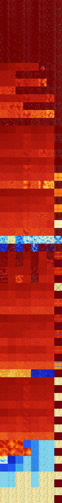

# B0123478 (212480-212991)

<details>
    <summary>Initial Grid</summary>
    
</details>


<details>
    <summary>Initial Grid RLE</summary>

```
#C Exported from GoGoL (https://github.com/marrow16/gogol)
#C Wrap mode: Toroidal
#C Boundary mode: Dead
#C Step: 0
x = 100, y = 100, rule = B0123478/S
11bo18bo16bo12bo3bo$16bo14bo39bo17bo$10bo18bo51bo8bo$27bo25bo10bo24bo6b
o$5bo19bo23bo23bo4bo4bo4bo$23bo2bo26bo14bo5bobo3bo10bo$18bo5bobo23bo3bo
$8bo16bo65bo6bo$21bo18bo56bo$8bo64b2o$20bo24b2o10bo40b2o$4bo19bo33bo12b
obo6b2o8bo8bo$21bo63bo12bo$3bo9bo23bo25bo2bobo6bo15b2o$29bo60bo7bo$29bo
10bo32bo$o7bo15bo14bo2bo15bo3bobo$13bo50bo23bo2bo$19bo3bo36bo31bo$31bo
51bo$17bo64bo$4bo6bo7bo19bo14bo20bo13bo4bo$32bo7bo53bo$39bo3bo5bo22bo2b
o2bo19bo$bo32bo5bo11bo17bo27bo$21bo10bo27bo$26bo41bo6bo4bobo6bo3bo3bo$
49bo25bo19bo$o17bo39bo18bo$47bo16bo8bo$o18b2o35bo10bobo$12b2o31bo2bo$5b
o2bo5bo25bo4b2o17bo15bo3bo$6bo55bo9bo9bo7bo$2bo34bo9bo11b2o5bo$o17bo32b
o$2bo8bo13bo9bo27bo3bo$13bo13bo66bo4bo$3bo9bo5b2o24bo24b2o$o10bo64bo16b
o2bo$2bo62bo9bo19bo3bo$19b2o4bo36bo36bo$22bo6bo29bo22bo11bo$8b2o7bo17bo
bo28b2o15bo$7bo33bo7bo2bo$66bobo11bo13bo$41b2o12bo5bo2bo10bo11bo10bo$
23bo6bo24bo22b2o$7bo3bo67bo12bobo$30bo59bo8bo$7bo8bo26bo25bo$bo8bo36bo
21bo12bo8bo5bo$3bo46b2o13bo23bo7bo$7bo19bobo11bo16b2o4bo$35bo50bo$24bo
20bo9bo15bo20bobo2bo$5bo2bo35bo14bo4bo$8bo17bo20bo18bo$74bo$90bo$45b2o
2bo3bo34bo7bo$16bo68bo5bo2bo$o31bo13bo13bo36bo$3bo4bobo7bo47bo$57bo$o7b
o15bo19bo15bo$5bobo32bo4bo32bo$10bo2bo11bo20bo24bo$o13bobo14b2o23bo23bo
$7bo6bo10bo15bo16bo39bo$33bo17bo3bo2bobo8bo5bo2bo$34bo19bo$33bo27bo17bo
8bo$bo19bo20bo37bo$17bobo55bo17b2o$2bo24bo46bo21bo$10bo2bo30bo3bo21bo3b
o5bo15bo$5bo44bo5bo5bo17bo7bo$bo9bo5bo55bo3bo10b2o$21bo13bo4bo$41bo15bo
11bobo8bo$7bo3bo62bo3bo14bo3bo$o23b2o11bo3bo39bo3bobo$70bo5bo4bo$3bo13b
o14bo37bo4bo9bo6bo$10bo4bo75bobo$10b2o10bo14bo4bo23bo$obo10bo2bo7bo7bo
3bo6bo5bo43bo$12bo56bo24bo$16bo10bo50bo11bo$6bo15bo16bo26bo28bo$11bo69b
o$o29bobo51b2o$6bo11bo20bo20bo12bo23bo$60bo5bo$3bo3bo3bo3bo9bo70bo$26bo
30bo11bo7bo7bo7bo$7bo13bo4bo20bob2o17b2o9bo8bo$7bo24bo18bo2bo9bo32bo$
17bo17bo!
```
</details>
<details>
    <summary>Thumbnail</summary>

</details>
<table>
<tr>
    <td><a href="./212480%20S%20Heat%20Map%20Activity.png"></a><br>S (212480)<br>R@4,p2</td>    <td><a href="./212481%20S0%20Heat%20Map%20Activity.png"></a><br>S0 (212481)<br>R@5,p2</td>    <td><a href="./212482%20S1%20Heat%20Map%20Activity.png"></a><br>S1 (212482)<br>R@5,p2</td>    <td><a href="./212483%20S01%20Heat%20Map%20Activity.png"></a><br>S01 (212483)<br>R@5,p2</td>    <td><a href="./212484%20S2%20Heat%20Map%20Activity.png"></a><br>S2 (212484)<br>R@3,p2</td>    <td><a href="./212485%20S02%20Heat%20Map%20Activity.png"></a><br>S02 (212485)<br>R@5,p2</td>    <td><a href="./212486%20S12%20Heat%20Map%20Activity.png"></a><br>S12 (212486)<br>R@3,p2</td>    <td><a href="./212487%20S012%20Heat%20Map%20Activity.png"></a><br>S012 (212487)<br>R@5,p2</td></tr>
<tr>
    <td><a href="./212488%20S3%20Heat%20Map%20Activity.png"></a><br>S3 (212488)<br>R@4,p2</td>    <td><a href="./212489%20S03%20Heat%20Map%20Activity.png"></a><br>S03 (212489)<br>R@5,p2</td>    <td><a href="./212490%20S13%20Heat%20Map%20Activity.png"></a><br>S13 (212490)<br>R@5,p2</td>    <td><a href="./212491%20S013%20Heat%20Map%20Activity.png"></a><br>S013 (212491)<br>R@5,p2</td>    <td><a href="./212492%20S23%20Heat%20Map%20Activity.png"></a><br>S23 (212492)<br>R@3,p2</td>    <td><a href="./212493%20S023%20Heat%20Map%20Activity.png"></a><br>S023 (212493)<br>R@5,p2</td>    <td><a href="./212494%20S123%20Heat%20Map%20Activity.png"></a><br>S123 (212494)<br>R@3,p2</td>    <td><a href="./212495%20S0123%20Heat%20Map%20Activity.png"></a><br>S0123 (212495)<br>R@3,p2</td></tr>
<tr>
    <td><a href="./212496%20S4%20Heat%20Map%20Activity.png"></a><br>S4 (212496)<br>R@8,p2</td>    <td><a href="./212497%20S04%20Heat%20Map%20Activity.png"></a><br>S04 (212497)<br>R@7,p2</td>    <td><a href="./212498%20S14%20Heat%20Map%20Activity.png"></a><br>S14 (212498)<br>R@5,p2</td>    <td><a href="./212499%20S014%20Heat%20Map%20Activity.png"></a><br>S014 (212499)<br>R@7,p2</td>    <td><a href="./212500%20S24%20Heat%20Map%20Activity.png"></a><br>S24 (212500)<br>R@5,p2</td>    <td><a href="./212501%20S024%20Heat%20Map%20Activity.png"></a><br>S024 (212501)<br>R@5,p2</td>    <td><a href="./212502%20S124%20Heat%20Map%20Activity.png"></a><br>S124 (212502)<br>R@3,p2</td>    <td><a href="./212503%20S0124%20Heat%20Map%20Activity.png"></a><br>S0124 (212503)<br>R@5,p2</td></tr>
<tr>
    <td><a href="./212504%20S34%20Heat%20Map%20Activity.png"></a><br>S34 (212504)<br>R@7,p2</td>    <td><a href="./212505%20S034%20Heat%20Map%20Activity.png"></a><br>S034 (212505)<br>R@7,p2</td>    <td><a href="./212506%20S134%20Heat%20Map%20Activity.png"></a><br>S134 (212506)<br>R@5,p2</td>    <td><a href="./212507%20S0134%20Heat%20Map%20Activity.png"></a><br>S0134 (212507)<br>R@7,p2</td>    <td><a href="./212508%20S234%20Heat%20Map%20Activity.png"></a><br>S234 (212508)<br>R@5,p2</td>    <td><a href="./212509%20S0234%20Heat%20Map%20Activity.png"></a><br>S0234 (212509)<br>R@5,p2</td>    <td><a href="./212510%20S1234%20Heat%20Map%20Activity.png"></a><br>S1234 (212510)<br>R@3,p2</td>    <td><a href="./212511%20S01234%20Heat%20Map%20Activity.png"></a><br>S01234 (212511)<br>R@3,p2</td></tr>
<tr>
    <td><a href="./212512%20S5%20Heat%20Map%20Activity.png"></a><br>S5 (212512)<br>R@50,p16</td>    <td><a href="./212513%20S05%20Heat%20Map%20Activity.png"></a><br>S05 (212513)<br>R@19,p4</td>    <td><a href="./212514%20S15%20Heat%20Map%20Activity.png"></a><br>S15 (212514)<br>R@7,p2</td>    <td><a href="./212515%20S015%20Heat%20Map%20Activity.png"></a><br>S015 (212515)<br>R@7,p2</td>    <td><a href="./212516%20S25%20Heat%20Map%20Activity.png"></a><br>S25 (212516)<br>R@9,p2</td>    <td><a href="./212517%20S025%20Heat%20Map%20Activity.png"></a><br>S025 (212517)<br>R@9,p2</td>    <td><a href="./212518%20S125%20Heat%20Map%20Activity.png"></a><br>S125 (212518)<br>R@5,p2</td>    <td><a href="./212519%20S0125%20Heat%20Map%20Activity.png"></a><br>S0125 (212519)<br>R@5,p2</td></tr>
<tr>
    <td><a href="./212520%20S35%20Heat%20Map%20Activity.png"></a><br>S35 (212520)<br>R@33,p16</td>    <td><a href="./212521%20S035%20Heat%20Map%20Activity.png"></a><br>S035 (212521)<br>R@20,p4</td>    <td><a href="./212522%20S135%20Heat%20Map%20Activity.png"></a><br>S135 (212522)<br>R@7,p2</td>    <td><a href="./212523%20S0135%20Heat%20Map%20Activity.png"></a><br>S0135 (212523)<br>R@7,p2</td>    <td><a href="./212524%20S235%20Heat%20Map%20Activity.png"></a><br>S235 (212524)<br>R@9,p2</td>    <td><a href="./212525%20S0235%20Heat%20Map%20Activity.png"></a><br>S0235 (212525)<br>R@7,p2</td>    <td><a href="./212526%20S1235%20Heat%20Map%20Activity.png"></a><br>S1235 (212526)<br>R@5,p2</td>    <td><a href="./212527%20S01235%20Heat%20Map%20Activity.png"></a><br>S01235 (212527)<br>R@3,p2</td></tr>
<tr>
    <td><a href="./212528%20S45%20Heat%20Map%20Activity.png"></a><br>S45 (212528)<br>R@66,p8</td>    <td><a href="./212529%20S045%20Heat%20Map%20Activity.png"></a><br>S045 (212529)<br>R@41,p4</td>    <td><a href="./212530%20S145%20Heat%20Map%20Activity.png"></a><br>S145 (212530)<br>R@7,p2</td>    <td><a href="./212531%20S0145%20Heat%20Map%20Activity.png"></a><br>S0145 (212531)<br>R@7,p2</td>    <td><a href="./212532%20S245%20Heat%20Map%20Activity.png"></a><br>S245 (212532)<br>R@11,p2</td>    <td><a href="./212533%20S0245%20Heat%20Map%20Activity.png"></a><br>S0245 (212533)<br>R@9,p2</td>    <td><a href="./212534%20S1245%20Heat%20Map%20Activity.png"></a><br>S1245 (212534)<br>R@5,p2</td>    <td><a href="./212535%20S01245%20Heat%20Map%20Activity.png"></a><br>S01245 (212535)<br>R@5,p2</td></tr>
<tr>
    <td><a href="./212536%20S345%20Heat%20Map%20Activity.png"></a><br>S345 (212536)<br>R@20,p8</td>    <td><a href="./212537%20S0345%20Heat%20Map%20Activity.png"></a><br>S0345 (212537)<br>R@17,p4</td>    <td><a href="./212538%20S1345%20Heat%20Map%20Activity.png"></a><br>S1345 (212538)<br>R@7,p2</td>    <td><a href="./212539%20S01345%20Heat%20Map%20Activity.png"></a><br>S01345 (212539)<br>R@7,p2</td>    <td><a href="./212540%20S2345%20Heat%20Map%20Activity.png"></a><br>S2345 (212540)<br>R@5,p2</td>    <td><a href="./212541%20S02345%20Heat%20Map%20Activity.png"></a><br>S02345 (212541)<br>R@7,p2</td>    <td><a href="./212542%20S12345%20Heat%20Map%20Activity.png"></a><br>S12345 (212542)<br>R@5,p2</td>    <td><a href="./212543%20S012345%20Heat%20Map%20Activity.png"></a><br>S012345 (212543)<br>R@3,p2</td></tr>
<tr>
    <td><a href="./212544%20S6%20Heat%20Map%20Activity.png"></a><br>S6 (212544)<br>G>1000</td>    <td><a href="./212545%20S06%20Heat%20Map%20Activity.png"></a><br>S06 (212545)<br>G>1000</td>    <td><a href="./212546%20S16%20Heat%20Map%20Activity.png"></a><br>S16 (212546)<br>G>1000</td>    <td><a href="./212547%20S016%20Heat%20Map%20Activity.png"></a><br>S016 (212547)<br>G>1000</td>    <td><a href="./212548%20S26%20Heat%20Map%20Activity.png"></a><br>S26 (212548)<br>G>1000</td>    <td><a href="./212549%20S026%20Heat%20Map%20Activity.png"></a><br>S026 (212549)<br>G>1000</td>    <td><a href="./212550%20S126%20Heat%20Map%20Activity.png"></a><br>S126 (212550)<br>R@15,p4</td>    <td><a href="./212551%20S0126%20Heat%20Map%20Activity.png"></a><br>S0126 (212551)<br>R@5,p2</td></tr>
<tr>
    <td><a href="./212552%20S36%20Heat%20Map%20Activity.png"></a><br>S36 (212552)<br>G>1000</td>    <td><a href="./212553%20S036%20Heat%20Map%20Activity.png"></a><br>S036 (212553)<br>G>1000</td>    <td><a href="./212554%20S136%20Heat%20Map%20Activity.png"></a><br>S136 (212554)<br>R@33,p4</td>    <td><a href="./212555%20S0136%20Heat%20Map%20Activity.png"></a><br>S0136 (212555)<br>R@7,p2</td>    <td><a href="./212556%20S236%20Heat%20Map%20Activity.png"></a><br>S236 (212556)<br>R@75,p12</td>    <td><a href="./212557%20S0236%20Heat%20Map%20Activity.png"></a><br>S0236 (212557)<br>R@21,p4</td>    <td><a href="./212558%20S1236%20Heat%20Map%20Activity.png"></a><br>S1236 (212558)<br>R@19,p12</td>    <td><a href="./212559%20S01236%20Heat%20Map%20Activity.png"></a><br>S01236 (212559)<br>R@3,p2</td></tr>
<tr>
    <td><a href="./212560%20S46%20Heat%20Map%20Activity.png"></a><br>S46 (212560)<br>G>1000</td>    <td><a href="./212561%20S046%20Heat%20Map%20Activity.png"></a><br>S046 (212561)<br>G>1000</td>    <td><a href="./212562%20S146%20Heat%20Map%20Activity.png"></a><br>S146 (212562)<br>G>1000</td>    <td><a href="./212563%20S0146%20Heat%20Map%20Activity.png"></a><br>S0146 (212563)<br>G>1000</td>    <td><a href="./212564%20S246%20Heat%20Map%20Activity.png"></a><br>S246 (212564)<br>G>1000</td>    <td><a href="./212565%20S0246%20Heat%20Map%20Activity.png"></a><br>S0246 (212565)<br>G>1000</td>    <td><a href="./212566%20S1246%20Heat%20Map%20Activity.png"></a><br>S1246 (212566)<br>R@37,p4</td>    <td><a href="./212567%20S01246%20Heat%20Map%20Activity.png"></a><br>S01246 (212567)<br>R@5,p2</td></tr>
<tr>
    <td><a href="./212568%20S346%20Heat%20Map%20Activity.png"></a><br>S346 (212568)<br>G>1000</td>    <td><a href="./212569%20S0346%20Heat%20Map%20Activity.png"></a><br>S0346 (212569)<br>G>1000</td>    <td><a href="./212570%20S1346%20Heat%20Map%20Activity.png"></a><br>S1346 (212570)<br>R@21,p2</td>    <td><a href="./212571%20S01346%20Heat%20Map%20Activity.png"></a><br>S01346 (212571)<br>R@9,p2</td>    <td><a href="./212572%20S2346%20Heat%20Map%20Activity.png"></a><br>S2346 (212572)<br>R@27,p4</td>    <td><a href="./212573%20S02346%20Heat%20Map%20Activity.png"></a><br>S02346 (212573)<br>R@15,p4</td>    <td><a href="./212574%20S12346%20Heat%20Map%20Activity.png"></a><br>S12346 (212574)<br>R@7,p2</td>    <td><a href="./212575%20S012346%20Heat%20Map%20Activity.png"></a><br>S012346 (212575)<br>R@3,p2</td></tr>
<tr>
    <td><a href="./212576%20S56%20Heat%20Map%20Activity.png"></a><br>S56 (212576)<br>G>1000</td>    <td><a href="./212577%20S056%20Heat%20Map%20Activity.png"></a><br>S056 (212577)<br>G>1000</td>    <td><a href="./212578%20S156%20Heat%20Map%20Activity.png"></a><br>S156 (212578)<br>G>1000</td>    <td><a href="./212579%20S0156%20Heat%20Map%20Activity.png"></a><br>S0156 (212579)<br>G>1000</td>    <td><a href="./212580%20S256%20Heat%20Map%20Activity.png"></a><br>S256 (212580)<br>G>1000</td>    <td><a href="./212581%20S0256%20Heat%20Map%20Activity.png"></a><br>S0256 (212581)<br>G>1000</td>    <td><a href="./212582%20S1256%20Heat%20Map%20Activity.png"></a><br>S1256 (212582)<br>G>1000</td>    <td><a href="./212583%20S01256%20Heat%20Map%20Activity.png"></a><br>S01256 (212583)<br>R@5,p2</td></tr>
<tr>
    <td><a href="./212584%20S356%20Heat%20Map%20Activity.png"></a><br>S356 (212584)<br>G>1000</td>    <td><a href="./212585%20S0356%20Heat%20Map%20Activity.png"></a><br>S0356 (212585)<br>G>1000</td>    <td><a href="./212586%20S1356%20Heat%20Map%20Activity.png"></a><br>S1356 (212586)<br>G>1000</td>    <td><a href="./212587%20S01356%20Heat%20Map%20Activity.png"></a><br>S01356 (212587)<br>R@17,p4</td>    <td><a href="./212588%20S2356%20Heat%20Map%20Activity.png"></a><br>S2356 (212588)<br>R@27,p2</td>    <td><a href="./212589%20S02356%20Heat%20Map%20Activity.png"></a><br>S02356 (212589)<br>R@11,p2</td>    <td><a href="./212590%20S12356%20Heat%20Map%20Activity.png"></a><br>S12356 (212590)<br>R@9,p2</td>    <td><a href="./212591%20S012356%20Heat%20Map%20Activity.png"></a><br>S012356 (212591)<br>R@3,p2</td></tr>
<tr>
    <td><a href="./212592%20S456%20Heat%20Map%20Activity.png"></a><br>S456 (212592)<br>G>1000</td>    <td><a href="./212593%20S0456%20Heat%20Map%20Activity.png"></a><br>S0456 (212593)<br>G>1000</td>    <td><a href="./212594%20S1456%20Heat%20Map%20Activity.png"></a><br>S1456 (212594)<br>G>1000</td>    <td><a href="./212595%20S01456%20Heat%20Map%20Activity.png"></a><br>S01456 (212595)<br>G>1000</td>    <td><a href="./212596%20S2456%20Heat%20Map%20Activity.png"></a><br>S2456 (212596)<br>G>1000</td>    <td><a href="./212597%20S02456%20Heat%20Map%20Activity.png"></a><br>S02456 (212597)<br>G>1000</td>    <td><a href="./212598%20S12456%20Heat%20Map%20Activity.png"></a><br>S12456 (212598)<br>G>1000</td>    <td><a href="./212599%20S012456%20Heat%20Map%20Activity.png"></a><br>S012456 (212599)<br>R@5,p2</td></tr>
<tr>
    <td><a href="./212600%20S3456%20Heat%20Map%20Activity.png"></a><br>S3456 (212600)<br>R@27,p2</td>    <td><a href="./212601%20S03456%20Heat%20Map%20Activity.png"></a><br>S03456 (212601)<br>R@17,p2</td>    <td><a href="./212602%20S13456%20Heat%20Map%20Activity.png"></a><br>S13456 (212602)<br>R@11,p2</td>    <td><a href="./212603%20S013456%20Heat%20Map%20Activity.png"></a><br>S013456 (212603)<br>R@11,p4</td>    <td><a href="./212604%20S23456%20Heat%20Map%20Activity.png"></a><br>S23456 (212604)<br>R@9,p2</td>    <td><a href="./212605%20S023456%20Heat%20Map%20Activity.png"></a><br>S023456 (212605)<br>R@7,p2</td>    <td><a href="./212606%20S123456%20Heat%20Map%20Activity.png"></a><br>S123456 (212606)<br>R@7,p2</td>    <td><a href="./212607%20S0123456%20Heat%20Map%20Activity.png"></a><br>S0123456 (212607)<br>R@3,p2</td></tr>
<tr>
    <td><a href="./212608%20S7%20Heat%20Map%20Activity.png"></a><br>S7 (212608)<br>G>1000</td>    <td><a href="./212609%20S07%20Heat%20Map%20Activity.png"></a><br>S07 (212609)<br>G>1000</td>    <td><a href="./212610%20S17%20Heat%20Map%20Activity.png"></a><br>S17 (212610)<br>G>1000</td>    <td><a href="./212611%20S017%20Heat%20Map%20Activity.png"></a><br>S017 (212611)<br>G>1000</td>    <td><a href="./212612%20S27%20Heat%20Map%20Activity.png"></a><br>S27 (212612)<br>G>1000</td>    <td><a href="./212613%20S027%20Heat%20Map%20Activity.png"></a><br>S027 (212613)<br>G>1000</td>    <td><a href="./212614%20S127%20Heat%20Map%20Activity.png"></a><br>S127 (212614)<br>G>1000</td>    <td><a href="./212615%20S0127%20Heat%20Map%20Activity.png"></a><br>S0127 (212615)<br>R@13,p2</td></tr>
<tr>
    <td><a href="./212616%20S37%20Heat%20Map%20Activity.png"></a><br>S37 (212616)<br>G>1000</td>    <td><a href="./212617%20S037%20Heat%20Map%20Activity.png"></a><br>S037 (212617)<br>G>1000</td>    <td><a href="./212618%20S137%20Heat%20Map%20Activity.png"></a><br>S137 (212618)<br>G>1000</td>    <td><a href="./212619%20S0137%20Heat%20Map%20Activity.png"></a><br>S0137 (212619)<br>G>1000</td>    <td><a href="./212620%20S237%20Heat%20Map%20Activity.png"></a><br>S237 (212620)<br>G>1000</td>    <td><a href="./212621%20S0237%20Heat%20Map%20Activity.png"></a><br>S0237 (212621)<br>G>1000</td>    <td><a href="./212622%20S1237%20Heat%20Map%20Activity.png"></a><br>S1237 (212622)<br>G>1000</td>    <td><a href="./212623%20S01237%20Heat%20Map%20Activity.png"></a><br>S01237 (212623)<br>R@3,p2</td></tr>
<tr>
    <td><a href="./212624%20S47%20Heat%20Map%20Activity.png"></a><br>S47 (212624)<br>G>1000</td>    <td><a href="./212625%20S047%20Heat%20Map%20Activity.png"></a><br>S047 (212625)<br>G>1000</td>    <td><a href="./212626%20S147%20Heat%20Map%20Activity.png"></a><br>S147 (212626)<br>G>1000</td>    <td><a href="./212627%20S0147%20Heat%20Map%20Activity.png"></a><br>S0147 (212627)<br>G>1000</td>    <td><a href="./212628%20S247%20Heat%20Map%20Activity.png"></a><br>S247 (212628)<br>G>1000</td>    <td><a href="./212629%20S0247%20Heat%20Map%20Activity.png"></a><br>S0247 (212629)<br>G>1000</td>    <td><a href="./212630%20S1247%20Heat%20Map%20Activity.png"></a><br>S1247 (212630)<br>G>1000</td>    <td><a href="./212631%20S01247%20Heat%20Map%20Activity.png"></a><br>S01247 (212631)<br>R@11,p6</td></tr>
<tr>
    <td><a href="./212632%20S347%20Heat%20Map%20Activity.png"></a><br>S347 (212632)<br>G>1000</td>    <td><a href="./212633%20S0347%20Heat%20Map%20Activity.png"></a><br>S0347 (212633)<br>G>1000</td>    <td><a href="./212634%20S1347%20Heat%20Map%20Activity.png"></a><br>S1347 (212634)<br>G>1000</td>    <td><a href="./212635%20S01347%20Heat%20Map%20Activity.png"></a><br>S01347 (212635)<br>G>1000</td>    <td><a href="./212636%20S2347%20Heat%20Map%20Activity.png"></a><br>S2347 (212636)<br>G>1000</td>    <td><a href="./212637%20S02347%20Heat%20Map%20Activity.png"></a><br>S02347 (212637)<br>G>1000</td>    <td><a href="./212638%20S12347%20Heat%20Map%20Activity.png"></a><br>S12347 (212638)<br>G>1000</td>    <td><a href="./212639%20S012347%20Heat%20Map%20Activity.png"></a><br>S012347 (212639)<br>R@3,p2</td></tr>
<tr>
    <td><a href="./212640%20S57%20Heat%20Map%20Activity.png"></a><br>S57 (212640)<br>G>1000</td>    <td><a href="./212641%20S057%20Heat%20Map%20Activity.png"></a><br>S057 (212641)<br>G>1000</td>    <td><a href="./212642%20S157%20Heat%20Map%20Activity.png"></a><br>S157 (212642)<br>G>1000</td>    <td><a href="./212643%20S0157%20Heat%20Map%20Activity.png"></a><br>S0157 (212643)<br>G>1000</td>    <td><a href="./212644%20S257%20Heat%20Map%20Activity.png"></a><br>S257 (212644)<br>G>1000</td>    <td><a href="./212645%20S0257%20Heat%20Map%20Activity.png"></a><br>S0257 (212645)<br>G>1000</td>    <td><a href="./212646%20S1257%20Heat%20Map%20Activity.png"></a><br>S1257 (212646)<br>G>1000</td>    <td><a href="./212647%20S01257%20Heat%20Map%20Activity.png"></a><br>S01257 (212647)<br>R@21,p18</td></tr>
<tr>
    <td><a href="./212648%20S357%20Heat%20Map%20Activity.png"></a><br>S357 (212648)<br>G>1000</td>    <td><a href="./212649%20S0357%20Heat%20Map%20Activity.png"></a><br>S0357 (212649)<br>G>1000</td>    <td><a href="./212650%20S1357%20Heat%20Map%20Activity.png"></a><br>S1357 (212650)<br>G>1000</td>    <td><a href="./212651%20S01357%20Heat%20Map%20Activity.png"></a><br>S01357 (212651)<br>G>1000</td>    <td><a href="./212652%20S2357%20Heat%20Map%20Activity.png"></a><br>S2357 (212652)<br>G>1000</td>    <td><a href="./212653%20S02357%20Heat%20Map%20Activity.png"></a><br>S02357 (212653)<br>G>1000</td>    <td><a href="./212654%20S12357%20Heat%20Map%20Activity.png"></a><br>S12357 (212654)<br>G>1000</td>    <td><a href="./212655%20S012357%20Heat%20Map%20Activity.png"></a><br>S012357 (212655)<br>R@3,p2</td></tr>
<tr>
    <td><a href="./212656%20S457%20Heat%20Map%20Activity.png"></a><br>S457 (212656)<br>G>1000</td>    <td><a href="./212657%20S0457%20Heat%20Map%20Activity.png"></a><br>S0457 (212657)<br>G>1000</td>    <td><a href="./212658%20S1457%20Heat%20Map%20Activity.png"></a><br>S1457 (212658)<br>G>1000</td>    <td><a href="./212659%20S01457%20Heat%20Map%20Activity.png"></a><br>S01457 (212659)<br>G>1000</td>    <td><a href="./212660%20S2457%20Heat%20Map%20Activity.png"></a><br>S2457 (212660)<br>G>1000</td>    <td><a href="./212661%20S02457%20Heat%20Map%20Activity.png"></a><br>S02457 (212661)<br>G>1000</td>    <td><a href="./212662%20S12457%20Heat%20Map%20Activity.png"></a><br>S12457 (212662)<br>G>1000</td>    <td><a href="./212663%20S012457%20Heat%20Map%20Activity.png"></a><br>S012457 (212663)<br>G>1000</td></tr>
<tr>
    <td><a href="./212664%20S3457%20Heat%20Map%20Activity.png"></a><br>S3457 (212664)<br>G>1000</td>    <td><a href="./212665%20S03457%20Heat%20Map%20Activity.png"></a><br>S03457 (212665)<br>G>1000</td>    <td><a href="./212666%20S13457%20Heat%20Map%20Activity.png"></a><br>S13457 (212666)<br>G>1000</td>    <td><a href="./212667%20S013457%20Heat%20Map%20Activity.png"></a><br>S013457 (212667)<br>G>1000</td>    <td><a href="./212668%20S23457%20Heat%20Map%20Activity.png"></a><br>S23457 (212668)<br>G>1000</td>    <td><a href="./212669%20S023457%20Heat%20Map%20Activity.png"></a><br>S023457 (212669)<br>G>1000</td>    <td><a href="./212670%20S123457%20Heat%20Map%20Activity.png"></a><br>S123457 (212670)<br>G>1000</td>    <td><a href="./212671%20S0123457%20Heat%20Map%20Activity.png"></a><br>S0123457 (212671)<br>R@3,p2</td></tr>
<tr>
    <td><a href="./212672%20S67%20Heat%20Map%20Activity.png"></a><br>S67 (212672)<br>G>1000</td>    <td><a href="./212673%20S067%20Heat%20Map%20Activity.png"></a><br>S067 (212673)<br>G>1000</td>    <td><a href="./212674%20S167%20Heat%20Map%20Activity.png"></a><br>S167 (212674)<br>G>1000</td>    <td><a href="./212675%20S0167%20Heat%20Map%20Activity.png"></a><br>S0167 (212675)<br>G>1000</td>    <td><a href="./212676%20S267%20Heat%20Map%20Activity.png"></a><br>S267 (212676)<br>G>1000</td>    <td><a href="./212677%20S0267%20Heat%20Map%20Activity.png"></a><br>S0267 (212677)<br>G>1000</td>    <td><a href="./212678%20S1267%20Heat%20Map%20Activity.png"></a><br>S1267 (212678)<br>G>1000</td>    <td><a href="./212679%20S01267%20Heat%20Map%20Activity.png"></a><br>S01267 (212679)<br>G>1000</td></tr>
<tr>
    <td><a href="./212680%20S367%20Heat%20Map%20Activity.png"></a><br>S367 (212680)<br>G>1000</td>    <td><a href="./212681%20S0367%20Heat%20Map%20Activity.png"></a><br>S0367 (212681)<br>G>1000</td>    <td><a href="./212682%20S1367%20Heat%20Map%20Activity.png"></a><br>S1367 (212682)<br>G>1000</td>    <td><a href="./212683%20S01367%20Heat%20Map%20Activity.png"></a><br>S01367 (212683)<br>G>1000</td>    <td><a href="./212684%20S2367%20Heat%20Map%20Activity.png"></a><br>S2367 (212684)<br>G>1000</td>    <td><a href="./212685%20S02367%20Heat%20Map%20Activity.png"></a><br>S02367 (212685)<br>G>1000</td>    <td><a href="./212686%20S12367%20Heat%20Map%20Activity.png"></a><br>S12367 (212686)<br>G>1000</td>    <td><a href="./212687%20S012367%20Heat%20Map%20Activity.png"></a><br>S012367 (212687)<br>R@3,p2</td></tr>
<tr>
    <td><a href="./212688%20S467%20Heat%20Map%20Activity.png"></a><br>S467 (212688)<br>G>1000</td>    <td><a href="./212689%20S0467%20Heat%20Map%20Activity.png"></a><br>S0467 (212689)<br>G>1000</td>    <td><a href="./212690%20S1467%20Heat%20Map%20Activity.png"></a><br>S1467 (212690)<br>G>1000</td>    <td><a href="./212691%20S01467%20Heat%20Map%20Activity.png"></a><br>S01467 (212691)<br>G>1000</td>    <td><a href="./212692%20S2467%20Heat%20Map%20Activity.png"></a><br>S2467 (212692)<br>G>1000</td>    <td><a href="./212693%20S02467%20Heat%20Map%20Activity.png"></a><br>S02467 (212693)<br>G>1000</td>    <td><a href="./212694%20S12467%20Heat%20Map%20Activity.png"></a><br>S12467 (212694)<br>G>1000</td>    <td><a href="./212695%20S012467%20Heat%20Map%20Activity.png"></a><br>S012467 (212695)<br>G>1000</td></tr>
<tr>
    <td><a href="./212696%20S3467%20Heat%20Map%20Activity.png"></a><br>S3467 (212696)<br>G>1000</td>    <td><a href="./212697%20S03467%20Heat%20Map%20Activity.png"></a><br>S03467 (212697)<br>G>1000</td>    <td><a href="./212698%20S13467%20Heat%20Map%20Activity.png"></a><br>S13467 (212698)<br>G>1000</td>    <td><a href="./212699%20S013467%20Heat%20Map%20Activity.png"></a><br>S013467 (212699)<br>G>1000</td>    <td><a href="./212700%20S23467%20Heat%20Map%20Activity.png"></a><br>S23467 (212700)<br>G>1000</td>    <td><a href="./212701%20S023467%20Heat%20Map%20Activity.png"></a><br>S023467 (212701)<br>G>1000</td>    <td><a href="./212702%20S123467%20Heat%20Map%20Activity.png"></a><br>S123467 (212702)<br>G>1000</td>    <td><a href="./212703%20S0123467%20Heat%20Map%20Activity.png"></a><br>S0123467 (212703)<br>R@3,p2</td></tr>
<tr>
    <td><a href="./212704%20S567%20Heat%20Map%20Activity.png"></a><br>S567 (212704)<br>G>1000</td>    <td><a href="./212705%20S0567%20Heat%20Map%20Activity.png"></a><br>S0567 (212705)<br>G>1000</td>    <td><a href="./212706%20S1567%20Heat%20Map%20Activity.png"></a><br>S1567 (212706)<br>G>1000</td>    <td><a href="./212707%20S01567%20Heat%20Map%20Activity.png"></a><br>S01567 (212707)<br>G>1000</td>    <td><a href="./212708%20S2567%20Heat%20Map%20Activity.png"></a><br>S2567 (212708)<br>G>1000</td>    <td><a href="./212709%20S02567%20Heat%20Map%20Activity.png"></a><br>S02567 (212709)<br>G>1000</td>    <td><a href="./212710%20S12567%20Heat%20Map%20Activity.png"></a><br>S12567 (212710)<br>G>1000</td>    <td><a href="./212711%20S012567%20Heat%20Map%20Activity.png"></a><br>S012567 (212711)<br>G>1000</td></tr>
<tr>
    <td><a href="./212712%20S3567%20Heat%20Map%20Activity.png"></a><br>S3567 (212712)<br>G>1000</td>    <td><a href="./212713%20S03567%20Heat%20Map%20Activity.png"></a><br>S03567 (212713)<br>G>1000</td>    <td><a href="./212714%20S13567%20Heat%20Map%20Activity.png"></a><br>S13567 (212714)<br>G>1000</td>    <td><a href="./212715%20S013567%20Heat%20Map%20Activity.png"></a><br>S013567 (212715)<br>G>1000</td>    <td><a href="./212716%20S23567%20Heat%20Map%20Activity.png"></a><br>S23567 (212716)<br>G>1000</td>    <td><a href="./212717%20S023567%20Heat%20Map%20Activity.png"></a><br>S023567 (212717)<br>G>1000</td>    <td><a href="./212718%20S123567%20Heat%20Map%20Activity.png"></a><br>S123567 (212718)<br>G>1000</td>    <td><a href="./212719%20S0123567%20Heat%20Map%20Activity.png"></a><br>S0123567 (212719)<br>R@3,p2</td></tr>
<tr>
    <td><a href="./212720%20S4567%20Heat%20Map%20Activity.png"></a><br>S4567 (212720)<br>G>1000</td>    <td><a href="./212721%20S04567%20Heat%20Map%20Activity.png"></a><br>S04567 (212721)<br>G>1000</td>    <td><a href="./212722%20S14567%20Heat%20Map%20Activity.png"></a><br>S14567 (212722)<br>G>1000</td>    <td><a href="./212723%20S014567%20Heat%20Map%20Activity.png"></a><br>S014567 (212723)<br>G>1000</td>    <td><a href="./212724%20S24567%20Heat%20Map%20Activity.png"></a><br>S24567 (212724)<br>G>1000</td>    <td><a href="./212725%20S024567%20Heat%20Map%20Activity.png"></a><br>S024567 (212725)<br>G>1000</td>    <td><a href="./212726%20S124567%20Heat%20Map%20Activity.png"></a><br>S124567 (212726)<br>G>1000</td>    <td><a href="./212727%20S0124567%20Heat%20Map%20Activity.png"></a><br>S0124567 (212727)<br>G>1000</td></tr>
<tr>
    <td><a href="./212728%20S34567%20Heat%20Map%20Activity.png"></a><br>S34567 (212728)<br>G>1000</td>    <td><a href="./212729%20S034567%20Heat%20Map%20Activity.png"></a><br>S034567 (212729)<br>R@409,p280</td>    <td><a href="./212730%20S134567%20Heat%20Map%20Activity.png"></a><br>S134567 (212730)<br>G>1000</td>    <td><a href="./212731%20S0134567%20Heat%20Map%20Activity.png"></a><br>S0134567 (212731)<br>R@7,p4</td>    <td><a href="./212732%20S234567%20Heat%20Map%20Activity.png"></a><br>S234567 (212732)<br>R@469,p180</td>    <td><a href="./212733%20S0234567%20Heat%20Map%20Activity.png"></a><br>S0234567 (212733)<br>R@27,p2</td>    <td><a href="./212734%20S1234567%20Heat%20Map%20Activity.png"></a><br>S1234567 (212734)<br>G>1000</td>    <td><a href="./212735%20S01234567%20Heat%20Map%20Activity.png"></a><br>S01234567 (212735)<br>R@3,p2</td></tr>
<tr>
    <td><a href="./212736%20S8%20Heat%20Map%20Activity.png"></a><br>S8 (212736)<br>R@203,p120</td>    <td><a href="./212737%20S08%20Heat%20Map%20Activity.png"></a><br>S08 (212737)<br>G>1000</td>    <td><a href="./212738%20S18%20Heat%20Map%20Activity.png"></a><br>S18 (212738)<br>G>1000</td>    <td><a href="./212739%20S018%20Heat%20Map%20Activity.png"></a><br>S018 (212739)<br>G>1000</td>    <td><a href="./212740%20S28%20Heat%20Map%20Activity.png"></a><br>S28 (212740)<br>R@143,p60</td>    <td><a href="./212741%20S028%20Heat%20Map%20Activity.png"></a><br>S028 (212741)<br>G>1000</td>    <td><a href="./212742%20S128%20Heat%20Map%20Activity.png"></a><br>S128 (212742)<br>G>1000</td>    <td><a href="./212743%20S0128%20Heat%20Map%20Activity.png"></a><br>S0128 (212743)<br>G>1000</td></tr>
<tr>
    <td><a href="./212744%20S38%20Heat%20Map%20Activity.png"></a><br>S38 (212744)<br>R@123,p60</td>    <td><a href="./212745%20S038%20Heat%20Map%20Activity.png"></a><br>S038 (212745)<br>G>1000</td>    <td><a href="./212746%20S138%20Heat%20Map%20Activity.png"></a><br>S138 (212746)<br>R@372,p120</td>    <td><a href="./212747%20S0138%20Heat%20Map%20Activity.png"></a><br>S0138 (212747)<br>G>1000</td>    <td><a href="./212748%20S238%20Heat%20Map%20Activity.png"></a><br>S238 (212748)<br>R@159,p60</td>    <td><a href="./212749%20S0238%20Heat%20Map%20Activity.png"></a><br>S0238 (212749)<br>G>1000</td>    <td><a href="./212750%20S1238%20Heat%20Map%20Activity.png"></a><br>S1238 (212750)<br>R@937,p120</td>    <td><a href="./212751%20S01238%20Heat%20Map%20Activity.png"></a><br>S01238 (212751)<br>S@1</td></tr>
<tr>
    <td><a href="./212752%20S48%20Heat%20Map%20Activity.png"></a><br>S48 (212752)<br>G>1000</td>    <td><a href="./212753%20S048%20Heat%20Map%20Activity.png"></a><br>S048 (212753)<br>G>1000</td>    <td><a href="./212754%20S148%20Heat%20Map%20Activity.png"></a><br>S148 (212754)<br>G>1000</td>    <td><a href="./212755%20S0148%20Heat%20Map%20Activity.png"></a><br>S0148 (212755)<br>G>1000</td>    <td><a href="./212756%20S248%20Heat%20Map%20Activity.png"></a><br>S248 (212756)<br>R@683,p12</td>    <td><a href="./212757%20S0248%20Heat%20Map%20Activity.png"></a><br>S0248 (212757)<br>G>1000</td>    <td><a href="./212758%20S1248%20Heat%20Map%20Activity.png"></a><br>S1248 (212758)<br>G>1000</td>    <td><a href="./212759%20S01248%20Heat%20Map%20Activity.png"></a><br>S01248 (212759)<br>G>1000</td></tr>
<tr>
    <td><a href="./212760%20S348%20Heat%20Map%20Activity.png"></a><br>S348 (212760)<br>G>1000</td>    <td><a href="./212761%20S0348%20Heat%20Map%20Activity.png"></a><br>S0348 (212761)<br>G>1000</td>    <td><a href="./212762%20S1348%20Heat%20Map%20Activity.png"></a><br>S1348 (212762)<br>G>1000</td>    <td><a href="./212763%20S01348%20Heat%20Map%20Activity.png"></a><br>S01348 (212763)<br>G>1000</td>    <td><a href="./212764%20S2348%20Heat%20Map%20Activity.png"></a><br>S2348 (212764)<br>R@507,p240</td>    <td><a href="./212765%20S02348%20Heat%20Map%20Activity.png"></a><br>S02348 (212765)<br>G>1000</td>    <td><a href="./212766%20S12348%20Heat%20Map%20Activity.png"></a><br>S12348 (212766)<br>G>1000</td>    <td><a href="./212767%20S012348%20Heat%20Map%20Activity.png"></a><br>S012348 (212767)<br>S@1</td></tr>
<tr>
    <td><a href="./212768%20S58%20Heat%20Map%20Activity.png"></a><br>S58 (212768)<br>G>1000</td>    <td><a href="./212769%20S058%20Heat%20Map%20Activity.png"></a><br>S058 (212769)<br>G>1000</td>    <td><a href="./212770%20S158%20Heat%20Map%20Activity.png"></a><br>S158 (212770)<br>G>1000</td>    <td><a href="./212771%20S0158%20Heat%20Map%20Activity.png"></a><br>S0158 (212771)<br>G>1000</td>    <td><a href="./212772%20S258%20Heat%20Map%20Activity.png"></a><br>S258 (212772)<br>G>1000</td>    <td><a href="./212773%20S0258%20Heat%20Map%20Activity.png"></a><br>S0258 (212773)<br>G>1000</td>    <td><a href="./212774%20S1258%20Heat%20Map%20Activity.png"></a><br>S1258 (212774)<br>G>1000</td>    <td><a href="./212775%20S01258%20Heat%20Map%20Activity.png"></a><br>S01258 (212775)<br>R@513,p510</td></tr>
<tr>
    <td><a href="./212776%20S358%20Heat%20Map%20Activity.png"></a><br>S358 (212776)<br>G>1000</td>    <td><a href="./212777%20S0358%20Heat%20Map%20Activity.png"></a><br>S0358 (212777)<br>G>1000</td>    <td><a href="./212778%20S1358%20Heat%20Map%20Activity.png"></a><br>S1358 (212778)<br>G>1000</td>    <td><a href="./212779%20S01358%20Heat%20Map%20Activity.png"></a><br>S01358 (212779)<br>G>1000</td>    <td><a href="./212780%20S2358%20Heat%20Map%20Activity.png"></a><br>S2358 (212780)<br>G>1000</td>    <td><a href="./212781%20S02358%20Heat%20Map%20Activity.png"></a><br>S02358 (212781)<br>G>1000</td>    <td><a href="./212782%20S12358%20Heat%20Map%20Activity.png"></a><br>S12358 (212782)<br>G>1000</td>    <td><a href="./212783%20S012358%20Heat%20Map%20Activity.png"></a><br>S012358 (212783)<br>S@1</td></tr>
<tr>
    <td><a href="./212784%20S458%20Heat%20Map%20Activity.png"></a><br>S458 (212784)<br>G>1000</td>    <td><a href="./212785%20S0458%20Heat%20Map%20Activity.png"></a><br>S0458 (212785)<br>G>1000</td>    <td><a href="./212786%20S1458%20Heat%20Map%20Activity.png"></a><br>S1458 (212786)<br>G>1000</td>    <td><a href="./212787%20S01458%20Heat%20Map%20Activity.png"></a><br>S01458 (212787)<br>G>1000</td>    <td><a href="./212788%20S2458%20Heat%20Map%20Activity.png"></a><br>S2458 (212788)<br>G>1000</td>    <td><a href="./212789%20S02458%20Heat%20Map%20Activity.png"></a><br>S02458 (212789)<br>G>1000</td>    <td><a href="./212790%20S12458%20Heat%20Map%20Activity.png"></a><br>S12458 (212790)<br>G>1000</td>    <td><a href="./212791%20S012458%20Heat%20Map%20Activity.png"></a><br>S012458 (212791)<br>G>1000</td></tr>
<tr>
    <td><a href="./212792%20S3458%20Heat%20Map%20Activity.png"></a><br>S3458 (212792)<br>G>1000</td>    <td><a href="./212793%20S03458%20Heat%20Map%20Activity.png"></a><br>S03458 (212793)<br>G>1000</td>    <td><a href="./212794%20S13458%20Heat%20Map%20Activity.png"></a><br>S13458 (212794)<br>G>1000</td>    <td><a href="./212795%20S013458%20Heat%20Map%20Activity.png"></a><br>S013458 (212795)<br>G>1000</td>    <td><a href="./212796%20S23458%20Heat%20Map%20Activity.png"></a><br>S23458 (212796)<br>G>1000</td>    <td><a href="./212797%20S023458%20Heat%20Map%20Activity.png"></a><br>S023458 (212797)<br>G>1000</td>    <td><a href="./212798%20S123458%20Heat%20Map%20Activity.png"></a><br>S123458 (212798)<br>G>1000</td>    <td><a href="./212799%20S0123458%20Heat%20Map%20Activity.png"></a><br>S0123458 (212799)<br>S@1</td></tr>
<tr>
    <td><a href="./212800%20S68%20Heat%20Map%20Activity.png"></a><br>S68 (212800)<br>G>1000</td>    <td><a href="./212801%20S068%20Heat%20Map%20Activity.png"></a><br>S068 (212801)<br>G>1000</td>    <td><a href="./212802%20S168%20Heat%20Map%20Activity.png"></a><br>S168 (212802)<br>G>1000</td>    <td><a href="./212803%20S0168%20Heat%20Map%20Activity.png"></a><br>S0168 (212803)<br>G>1000</td>    <td><a href="./212804%20S268%20Heat%20Map%20Activity.png"></a><br>S268 (212804)<br>G>1000</td>    <td><a href="./212805%20S0268%20Heat%20Map%20Activity.png"></a><br>S0268 (212805)<br>G>1000</td>    <td><a href="./212806%20S1268%20Heat%20Map%20Activity.png"></a><br>S1268 (212806)<br>G>1000</td>    <td><a href="./212807%20S01268%20Heat%20Map%20Activity.png"></a><br>S01268 (212807)<br>G>1000</td></tr>
<tr>
    <td><a href="./212808%20S368%20Heat%20Map%20Activity.png"></a><br>S368 (212808)<br>G>1000</td>    <td><a href="./212809%20S0368%20Heat%20Map%20Activity.png"></a><br>S0368 (212809)<br>G>1000</td>    <td><a href="./212810%20S1368%20Heat%20Map%20Activity.png"></a><br>S1368 (212810)<br>G>1000</td>    <td><a href="./212811%20S01368%20Heat%20Map%20Activity.png"></a><br>S01368 (212811)<br>G>1000</td>    <td><a href="./212812%20S2368%20Heat%20Map%20Activity.png"></a><br>S2368 (212812)<br>G>1000</td>    <td><a href="./212813%20S02368%20Heat%20Map%20Activity.png"></a><br>S02368 (212813)<br>G>1000</td>    <td><a href="./212814%20S12368%20Heat%20Map%20Activity.png"></a><br>S12368 (212814)<br>G>1000</td>    <td><a href="./212815%20S012368%20Heat%20Map%20Activity.png"></a><br>S012368 (212815)<br>S@1</td></tr>
<tr>
    <td><a href="./212816%20S468%20Heat%20Map%20Activity.png"></a><br>S468 (212816)<br>G>1000</td>    <td><a href="./212817%20S0468%20Heat%20Map%20Activity.png"></a><br>S0468 (212817)<br>G>1000</td>    <td><a href="./212818%20S1468%20Heat%20Map%20Activity.png"></a><br>S1468 (212818)<br>G>1000</td>    <td><a href="./212819%20S01468%20Heat%20Map%20Activity.png"></a><br>S01468 (212819)<br>G>1000</td>    <td><a href="./212820%20S2468%20Heat%20Map%20Activity.png"></a><br>S2468 (212820)<br>G>1000</td>    <td><a href="./212821%20S02468%20Heat%20Map%20Activity.png"></a><br>S02468 (212821)<br>G>1000</td>    <td><a href="./212822%20S12468%20Heat%20Map%20Activity.png"></a><br>S12468 (212822)<br>G>1000</td>    <td><a href="./212823%20S012468%20Heat%20Map%20Activity.png"></a><br>S012468 (212823)<br>G>1000</td></tr>
<tr>
    <td><a href="./212824%20S3468%20Heat%20Map%20Activity.png"></a><br>S3468 (212824)<br>G>1000</td>    <td><a href="./212825%20S03468%20Heat%20Map%20Activity.png"></a><br>S03468 (212825)<br>G>1000</td>    <td><a href="./212826%20S13468%20Heat%20Map%20Activity.png"></a><br>S13468 (212826)<br>G>1000</td>    <td><a href="./212827%20S013468%20Heat%20Map%20Activity.png"></a><br>S013468 (212827)<br>G>1000</td>    <td><a href="./212828%20S23468%20Heat%20Map%20Activity.png"></a><br>S23468 (212828)<br>G>1000</td>    <td><a href="./212829%20S023468%20Heat%20Map%20Activity.png"></a><br>S023468 (212829)<br>G>1000</td>    <td><a href="./212830%20S123468%20Heat%20Map%20Activity.png"></a><br>S123468 (212830)<br>G>1000</td>    <td><a href="./212831%20S0123468%20Heat%20Map%20Activity.png"></a><br>S0123468 (212831)<br>S@1</td></tr>
<tr>
    <td><a href="./212832%20S568%20Heat%20Map%20Activity.png"></a><br>S568 (212832)<br>G>1000</td>    <td><a href="./212833%20S0568%20Heat%20Map%20Activity.png"></a><br>S0568 (212833)<br>G>1000</td>    <td><a href="./212834%20S1568%20Heat%20Map%20Activity.png"></a><br>S1568 (212834)<br>G>1000</td>    <td><a href="./212835%20S01568%20Heat%20Map%20Activity.png"></a><br>S01568 (212835)<br>G>1000</td>    <td><a href="./212836%20S2568%20Heat%20Map%20Activity.png"></a><br>S2568 (212836)<br>G>1000</td>    <td><a href="./212837%20S02568%20Heat%20Map%20Activity.png"></a><br>S02568 (212837)<br>G>1000</td>    <td><a href="./212838%20S12568%20Heat%20Map%20Activity.png"></a><br>S12568 (212838)<br>G>1000</td>    <td><a href="./212839%20S012568%20Heat%20Map%20Activity.png"></a><br>S012568 (212839)<br>G>1000</td></tr>
<tr>
    <td><a href="./212840%20S3568%20Heat%20Map%20Activity.png"></a><br>S3568 (212840)<br>G>1000</td>    <td><a href="./212841%20S03568%20Heat%20Map%20Activity.png"></a><br>S03568 (212841)<br>G>1000</td>    <td><a href="./212842%20S13568%20Heat%20Map%20Activity.png"></a><br>S13568 (212842)<br>G>1000</td>    <td><a href="./212843%20S013568%20Heat%20Map%20Activity.png"></a><br>S013568 (212843)<br>G>1000</td>    <td><a href="./212844%20S23568%20Heat%20Map%20Activity.png"></a><br>S23568 (212844)<br>G>1000</td>    <td><a href="./212845%20S023568%20Heat%20Map%20Activity.png"></a><br>S023568 (212845)<br>G>1000</td>    <td><a href="./212846%20S123568%20Heat%20Map%20Activity.png"></a><br>S123568 (212846)<br>G>1000</td>    <td><a href="./212847%20S0123568%20Heat%20Map%20Activity.png"></a><br>S0123568 (212847)<br>S@1</td></tr>
<tr>
    <td><a href="./212848%20S4568%20Heat%20Map%20Activity.png"></a><br>S4568 (212848)<br>G>1000</td>    <td><a href="./212849%20S04568%20Heat%20Map%20Activity.png"></a><br>S04568 (212849)<br>G>1000</td>    <td><a href="./212850%20S14568%20Heat%20Map%20Activity.png"></a><br>S14568 (212850)<br>G>1000</td>    <td><a href="./212851%20S014568%20Heat%20Map%20Activity.png"></a><br>S014568 (212851)<br>G>1000</td>    <td><a href="./212852%20S24568%20Heat%20Map%20Activity.png"></a><br>S24568 (212852)<br>G>1000</td>    <td><a href="./212853%20S024568%20Heat%20Map%20Activity.png"></a><br>S024568 (212853)<br>G>1000</td>    <td><a href="./212854%20S124568%20Heat%20Map%20Activity.png"></a><br>S124568 (212854)<br>G>1000</td>    <td><a href="./212855%20S0124568%20Heat%20Map%20Activity.png"></a><br>S0124568 (212855)<br>G>1000</td></tr>
<tr>
    <td><a href="./212856%20S34568%20Heat%20Map%20Activity.png"></a><br>S34568 (212856)<br>G>1000</td>    <td><a href="./212857%20S034568%20Heat%20Map%20Activity.png"></a><br>S034568 (212857)<br>G>1000</td>    <td><a href="./212858%20S134568%20Heat%20Map%20Activity.png"></a><br>S134568 (212858)<br>G>1000</td>    <td><a href="./212859%20S0134568%20Heat%20Map%20Activity.png"></a><br>S0134568 (212859)<br>G>1000</td>    <td><a href="./212860%20S234568%20Heat%20Map%20Activity.png"></a><br>S234568 (212860)<br>G>1000</td>    <td><a href="./212861%20S0234568%20Heat%20Map%20Activity.png"></a><br>S0234568 (212861)<br>R@564,p180</td>    <td><a href="./212862%20S1234568%20Heat%20Map%20Activity.png"></a><br>S1234568 (212862)<br>G>1000</td>    <td><a href="./212863%20S01234568%20Heat%20Map%20Activity.png"></a><br>S01234568 (212863)<br>S@1</td></tr>
<tr>
    <td><a href="./212864%20S78%20Heat%20Map%20Activity.png"></a><br>S78 (212864)<br>G>1000</td>    <td><a href="./212865%20S078%20Heat%20Map%20Activity.png"></a><br>S078 (212865)<br>G>1000</td>    <td><a href="./212866%20S178%20Heat%20Map%20Activity.png"></a><br>S178 (212866)<br>G>1000</td>    <td><a href="./212867%20S0178%20Heat%20Map%20Activity.png"></a><br>S0178 (212867)<br>G>1000</td>    <td><a href="./212868%20S278%20Heat%20Map%20Activity.png"></a><br>S278 (212868)<br>G>1000</td>    <td><a href="./212869%20S0278%20Heat%20Map%20Activity.png"></a><br>S0278 (212869)<br>G>1000</td>    <td><a href="./212870%20S1278%20Heat%20Map%20Activity.png"></a><br>S1278 (212870)<br>G>1000</td>    <td><a href="./212871%20S01278%20Heat%20Map%20Activity.png"></a><br>S01278 (212871)<br>S@2</td></tr>
<tr>
    <td><a href="./212872%20S378%20Heat%20Map%20Activity.png"></a><br>S378 (212872)<br>G>1000</td>    <td><a href="./212873%20S0378%20Heat%20Map%20Activity.png"></a><br>S0378 (212873)<br>G>1000</td>    <td><a href="./212874%20S1378%20Heat%20Map%20Activity.png"></a><br>S1378 (212874)<br>G>1000</td>    <td><a href="./212875%20S01378%20Heat%20Map%20Activity.png"></a><br>S01378 (212875)<br>G>1000</td>    <td><a href="./212876%20S2378%20Heat%20Map%20Activity.png"></a><br>S2378 (212876)<br>G>1000</td>    <td><a href="./212877%20S02378%20Heat%20Map%20Activity.png"></a><br>S02378 (212877)<br>G>1000</td>    <td><a href="./212878%20S12378%20Heat%20Map%20Activity.png"></a><br>S12378 (212878)<br>G>1000</td>    <td><a href="./212879%20S012378%20Heat%20Map%20Activity.png"></a><br>S012378 (212879)<br>S@1</td></tr>
<tr>
    <td><a href="./212880%20S478%20Heat%20Map%20Activity.png"></a><br>S478 (212880)<br>G>1000</td>    <td><a href="./212881%20S0478%20Heat%20Map%20Activity.png"></a><br>S0478 (212881)<br>G>1000</td>    <td><a href="./212882%20S1478%20Heat%20Map%20Activity.png"></a><br>S1478 (212882)<br>G>1000</td>    <td><a href="./212883%20S01478%20Heat%20Map%20Activity.png"></a><br>S01478 (212883)<br>G>1000</td>    <td><a href="./212884%20S2478%20Heat%20Map%20Activity.png"></a><br>S2478 (212884)<br>G>1000</td>    <td><a href="./212885%20S02478%20Heat%20Map%20Activity.png"></a><br>S02478 (212885)<br>G>1000</td>    <td><a href="./212886%20S12478%20Heat%20Map%20Activity.png"></a><br>S12478 (212886)<br>G>1000</td>    <td><a href="./212887%20S012478%20Heat%20Map%20Activity.png"></a><br>S012478 (212887)<br>S@2</td></tr>
<tr>
    <td><a href="./212888%20S3478%20Heat%20Map%20Activity.png"></a><br>S3478 (212888)<br>G>1000</td>    <td><a href="./212889%20S03478%20Heat%20Map%20Activity.png"></a><br>S03478 (212889)<br>G>1000</td>    <td><a href="./212890%20S13478%20Heat%20Map%20Activity.png"></a><br>S13478 (212890)<br>G>1000</td>    <td><a href="./212891%20S013478%20Heat%20Map%20Activity.png"></a><br>S013478 (212891)<br>G>1000</td>    <td><a href="./212892%20S23478%20Heat%20Map%20Activity.png"></a><br>S23478 (212892)<br>G>1000</td>    <td><a href="./212893%20S023478%20Heat%20Map%20Activity.png"></a><br>S023478 (212893)<br>G>1000</td>    <td><a href="./212894%20S123478%20Heat%20Map%20Activity.png"></a><br>S123478 (212894)<br>G>1000</td>    <td><a href="./212895%20S0123478%20Heat%20Map%20Activity.png"></a><br>S0123478 (212895)<br>S@1</td></tr>
<tr>
    <td><a href="./212896%20S578%20Heat%20Map%20Activity.png"></a><br>S578 (212896)<br>G>1000</td>    <td><a href="./212897%20S0578%20Heat%20Map%20Activity.png"></a><br>S0578 (212897)<br>G>1000</td>    <td><a href="./212898%20S1578%20Heat%20Map%20Activity.png"></a><br>S1578 (212898)<br>G>1000</td>    <td><a href="./212899%20S01578%20Heat%20Map%20Activity.png"></a><br>S01578 (212899)<br>G>1000</td>    <td><a href="./212900%20S2578%20Heat%20Map%20Activity.png"></a><br>S2578 (212900)<br>G>1000</td>    <td><a href="./212901%20S02578%20Heat%20Map%20Activity.png"></a><br>S02578 (212901)<br>G>1000</td>    <td><a href="./212902%20S12578%20Heat%20Map%20Activity.png"></a><br>S12578 (212902)<br>G>1000</td>    <td><a href="./212903%20S012578%20Heat%20Map%20Activity.png"></a><br>S012578 (212903)<br>S@2</td></tr>
<tr>
    <td><a href="./212904%20S3578%20Heat%20Map%20Activity.png"></a><br>S3578 (212904)<br>G>1000</td>    <td><a href="./212905%20S03578%20Heat%20Map%20Activity.png"></a><br>S03578 (212905)<br>G>1000</td>    <td><a href="./212906%20S13578%20Heat%20Map%20Activity.png"></a><br>S13578 (212906)<br>G>1000</td>    <td><a href="./212907%20S013578%20Heat%20Map%20Activity.png"></a><br>S013578 (212907)<br>G>1000</td>    <td><a href="./212908%20S23578%20Heat%20Map%20Activity.png"></a><br>S23578 (212908)<br>G>1000</td>    <td><a href="./212909%20S023578%20Heat%20Map%20Activity.png"></a><br>S023578 (212909)<br>G>1000</td>    <td><a href="./212910%20S123578%20Heat%20Map%20Activity.png"></a><br>S123578 (212910)<br>G>1000</td>    <td><a href="./212911%20S0123578%20Heat%20Map%20Activity.png"></a><br>S0123578 (212911)<br>S@1</td></tr>
<tr>
    <td><a href="./212912%20S4578%20Heat%20Map%20Activity.png"></a><br>S4578 (212912)<br>G>1000</td>    <td><a href="./212913%20S04578%20Heat%20Map%20Activity.png"></a><br>S04578 (212913)<br>G>1000</td>    <td><a href="./212914%20S14578%20Heat%20Map%20Activity.png"></a><br>S14578 (212914)<br>G>1000</td>    <td><a href="./212915%20S014578%20Heat%20Map%20Activity.png"></a><br>S014578 (212915)<br>G>1000</td>    <td><a href="./212916%20S24578%20Heat%20Map%20Activity.png"></a><br>S24578 (212916)<br>G>1000</td>    <td><a href="./212917%20S024578%20Heat%20Map%20Activity.png"></a><br>S024578 (212917)<br>G>1000</td>    <td><a href="./212918%20S124578%20Heat%20Map%20Activity.png"></a><br>S124578 (212918)<br>G>1000</td>    <td><a href="./212919%20S0124578%20Heat%20Map%20Activity.png"></a><br>S0124578 (212919)<br>S@2</td></tr>
<tr>
    <td><a href="./212920%20S34578%20Heat%20Map%20Activity.png"></a><br>S34578 (212920)<br>G>1000</td>    <td><a href="./212921%20S034578%20Heat%20Map%20Activity.png"></a><br>S034578 (212921)<br>G>1000</td>    <td><a href="./212922%20S134578%20Heat%20Map%20Activity.png"></a><br>S134578 (212922)<br>G>1000</td>    <td><a href="./212923%20S0134578%20Heat%20Map%20Activity.png"></a><br>S0134578 (212923)<br>G>1000</td>    <td><a href="./212924%20S234578%20Heat%20Map%20Activity.png"></a><br>S234578 (212924)<br>G>1000</td>    <td><a href="./212925%20S0234578%20Heat%20Map%20Activity.png"></a><br>S0234578 (212925)<br>G>1000</td>    <td><a href="./212926%20S1234578%20Heat%20Map%20Activity.png"></a><br>S1234578 (212926)<br>G>1000</td>    <td><a href="./212927%20S01234578%20Heat%20Map%20Activity.png"></a><br>S01234578 (212927)<br>S@1</td></tr>
<tr>
    <td><a href="./212928%20S678%20Heat%20Map%20Activity.png"></a><br>S678 (212928)<br>G>1000</td>    <td><a href="./212929%20S0678%20Heat%20Map%20Activity.png"></a><br>S0678 (212929)<br>G>1000</td>    <td><a href="./212930%20S1678%20Heat%20Map%20Activity.png"></a><br>S1678 (212930)<br>G>1000</td>    <td><a href="./212931%20S01678%20Heat%20Map%20Activity.png"></a><br>S01678 (212931)<br>R@9,p4</td>    <td><a href="./212932%20S2678%20Heat%20Map%20Activity.png"></a><br>S2678 (212932)<br>R@6,p2</td>    <td><a href="./212933%20S02678%20Heat%20Map%20Activity.png"></a><br>S02678 (212933)<br>S@3</td>    <td><a href="./212934%20S12678%20Heat%20Map%20Activity.png"></a><br>S12678 (212934)<br>S@3</td>    <td><a href="./212935%20S012678%20Heat%20Map%20Activity.png"></a><br>S012678 (212935)<br>S@2</td></tr>
<tr>
    <td><a href="./212936%20S3678%20Heat%20Map%20Activity.png"></a><br>S3678 (212936)<br>G>1000</td>    <td><a href="./212937%20S03678%20Heat%20Map%20Activity.png"></a><br>S03678 (212937)<br>G>1000</td>    <td><a href="./212938%20S13678%20Heat%20Map%20Activity.png"></a><br>S13678 (212938)<br>G>1000</td>    <td><a href="./212939%20S013678%20Heat%20Map%20Activity.png"></a><br>S013678 (212939)<br>G>1000</td>    <td><a href="./212940%20S23678%20Heat%20Map%20Activity.png"></a><br>S23678 (212940)<br>R@6,p2</td>    <td><a href="./212941%20S023678%20Heat%20Map%20Activity.png"></a><br>S023678 (212941)<br>S@3</td>    <td><a href="./212942%20S123678%20Heat%20Map%20Activity.png"></a><br>S123678 (212942)<br>S@3</td>    <td><a href="./212943%20S0123678%20Heat%20Map%20Activity.png"></a><br>S0123678 (212943)<br>S@1</td></tr>
<tr>
    <td><a href="./212944%20S4678%20Heat%20Map%20Activity.png"></a><br>S4678 (212944)<br>G>1000</td>    <td><a href="./212945%20S04678%20Heat%20Map%20Activity.png"></a><br>S04678 (212945)<br>R@30,p2</td>    <td><a href="./212946%20S14678%20Heat%20Map%20Activity.png"></a><br>S14678 (212946)<br>S@9</td>    <td><a href="./212947%20S014678%20Heat%20Map%20Activity.png"></a><br>S014678 (212947)<br>S@4</td>    <td><a href="./212948%20S24678%20Heat%20Map%20Activity.png"></a><br>S24678 (212948)<br>R@6,p2</td>    <td><a href="./212949%20S024678%20Heat%20Map%20Activity.png"></a><br>S024678 (212949)<br>S@3</td>    <td><a href="./212950%20S124678%20Heat%20Map%20Activity.png"></a><br>S124678 (212950)<br>S@3</td>    <td><a href="./212951%20S0124678%20Heat%20Map%20Activity.png"></a><br>S0124678 (212951)<br>S@2</td></tr>
<tr>
    <td><a href="./212952%20S34678%20Heat%20Map%20Activity.png"></a><br>S34678 (212952)<br>R@11,p2</td>    <td><a href="./212953%20S034678%20Heat%20Map%20Activity.png"></a><br>S034678 (212953)<br>R@8,p2</td>    <td><a href="./212954%20S134678%20Heat%20Map%20Activity.png"></a><br>S134678 (212954)<br>S@6</td>    <td><a href="./212955%20S0134678%20Heat%20Map%20Activity.png"></a><br>S0134678 (212955)<br>S@4</td>    <td><a href="./212956%20S234678%20Heat%20Map%20Activity.png"></a><br>S234678 (212956)<br>R@6,p2</td>    <td><a href="./212957%20S0234678%20Heat%20Map%20Activity.png"></a><br>S0234678 (212957)<br>S@3</td>    <td><a href="./212958%20S1234678%20Heat%20Map%20Activity.png"></a><br>S1234678 (212958)<br>S@3</td>    <td><a href="./212959%20S01234678%20Heat%20Map%20Activity.png"></a><br><strong><sup>"AntiLife"</sup></strong><br>S01234678 (212959)<br>S@1</td></tr>
<tr>
    <td><a href="./212960%20S5678%20Heat%20Map%20Activity.png"></a><br>S5678 (212960)<br>S@4</td>    <td><a href="./212961%20S05678%20Heat%20Map%20Activity.png"></a><br>S05678 (212961)<br>S@4</td>    <td><a href="./212962%20S15678%20Heat%20Map%20Activity.png"></a><br>S15678 (212962)<br>S@2</td>    <td><a href="./212963%20S015678%20Heat%20Map%20Activity.png"></a><br>S015678 (212963)<br>S@2</td>    <td><a href="./212964%20S25678%20Heat%20Map%20Activity.png"></a><br>S25678 (212964)<br>S@3</td>    <td><a href="./212965%20S025678%20Heat%20Map%20Activity.png"></a><br>S025678 (212965)<br>S@2</td>    <td><a href="./212966%20S125678%20Heat%20Map%20Activity.png"></a><br>S125678 (212966)<br>S@2</td>    <td><a href="./212967%20S0125678%20Heat%20Map%20Activity.png"></a><br>S0125678 (212967)<br>S@2</td></tr>
<tr>
    <td><a href="./212968%20S35678%20Heat%20Map%20Activity.png"></a><br>S35678 (212968)<br>S@4</td>    <td><a href="./212969%20S035678%20Heat%20Map%20Activity.png"></a><br>S035678 (212969)<br>S@4</td>    <td><a href="./212970%20S135678%20Heat%20Map%20Activity.png"></a><br>S135678 (212970)<br>S@2</td>    <td><a href="./212971%20S0135678%20Heat%20Map%20Activity.png"></a><br>S0135678 (212971)<br>S@2</td>    <td><a href="./212972%20S235678%20Heat%20Map%20Activity.png"></a><br>S235678 (212972)<br>S@3</td>    <td><a href="./212973%20S0235678%20Heat%20Map%20Activity.png"></a><br>S0235678 (212973)<br>S@2</td>    <td><a href="./212974%20S1235678%20Heat%20Map%20Activity.png"></a><br>S1235678 (212974)<br>S@2</td>    <td><a href="./212975%20S01235678%20Heat%20Map%20Activity.png"></a><br>S01235678 (212975)<br>S@1</td></tr>
<tr>
    <td><a href="./212976%20S45678%20Heat%20Map%20Activity.png"></a><br>S45678 (212976)<br>S@4</td>    <td><a href="./212977%20S045678%20Heat%20Map%20Activity.png"></a><br>S045678 (212977)<br>S@4</td>    <td><a href="./212978%20S145678%20Heat%20Map%20Activity.png"></a><br>S145678 (212978)<br>S@3</td>    <td><a href="./212979%20S0145678%20Heat%20Map%20Activity.png"></a><br>S0145678 (212979)<br>S@3</td>    <td><a href="./212980%20S245678%20Heat%20Map%20Activity.png"></a><br>S245678 (212980)<br>S@2</td>    <td><a href="./212981%20S0245678%20Heat%20Map%20Activity.png"></a><br>S0245678 (212981)<br>S@2</td>    <td><a href="./212982%20S1245678%20Heat%20Map%20Activity.png"></a><br>S1245678 (212982)<br>S@2</td>    <td><a href="./212983%20S01245678%20Heat%20Map%20Activity.png"></a><br>S01245678 (212983)<br>S@2</td></tr>
<tr>
    <td><a href="./212984%20S345678%20Heat%20Map%20Activity.png"></a><br>S345678 (212984)<br>S@4</td>    <td><a href="./212985%20S0345678%20Heat%20Map%20Activity.png"></a><br>S0345678 (212985)<br>S@4</td>    <td><a href="./212986%20S1345678%20Heat%20Map%20Activity.png"></a><br>S1345678 (212986)<br>S@3</td>    <td><a href="./212987%20S01345678%20Heat%20Map%20Activity.png"></a><br>S01345678 (212987)<br>S@3</td>    <td><a href="./212988%20S2345678%20Heat%20Map%20Activity.png"></a><br>S2345678 (212988)<br>S@2</td>    <td><a href="./212989%20S02345678%20Heat%20Map%20Activity.png"></a><br>S02345678 (212989)<br>S@2</td>    <td><a href="./212990%20S12345678%20Heat%20Map%20Activity.png"></a><br>S12345678 (212990)<br>S@2</td>    <td><a href="./212991%20S012345678%20Heat%20Map%20Activity.png"></a><br>S012345678 (212991)<br>S@1</td></tr>
</table>
