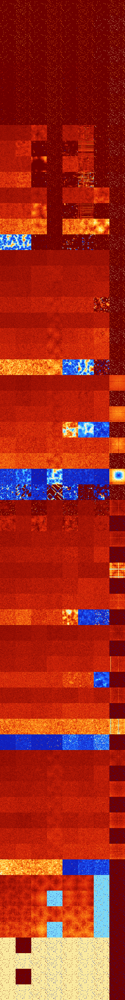

# B012348 (146944-147455)

<details>
    <summary>Initial Grid</summary>
    
</details>


<details>
    <summary>Initial Grid RLE</summary>

```
#C Exported from GoGoL (https://github.com/marrow16/gogol)
#C Wrap mode: Toroidal
#C Boundary mode: Dead
#C Step: 0
x = 100, y = 100, rule = B012348/S
9bo9bo37bo10bo$o2bobo9bo26bo$bo5bobo21bo48bo$13bo18bo19bo10bo3bo26bo$
38bo2bo$4bo7bo7bo35bo6bo18bo4bo$16bo62bo2bo14bo$40bo17bo10bo21bobo$o10b
o11bo10bobo15bo43bo2bo$14bo2bo4bob3o2bo4bo2bo22bo31bo$bo2bo7bo18bo$5bo
16bo4bo12bo34bo$5bo4bo40bo2bo4bo26bo$4bo87bo$32bo4bo36bo2b2o15bo$33bo6b
o17bo26bo11bo$16bo48bo15bo$o17bo4bo39bo$22b2o23bo13bo23bo5bo$100b$10bo
28bo3bo48bo$63bo25bo$3bo58bo21bo5bo$26bo44bo18bo$4bo2bo4bo20bo30bo6bo$b
o24b2o5bo12bo18bo$6bo53bo13b3o11b2o$2bo31bo16bo16bo$32bo29bo19bo2bo11bo
$27bo5bo4bo43bo2bo$17bo22bo33bo$16bo24bo46bo3bo$15bo41bo14bo3bo13bo$bo
2bo13b2o4bo41bo21bo$28bo48bo16bo$66bo19bo$32bo28bo5bo28bo$7bo22bo46bo
18bo$23bo2bo10bo4bo3bo8bo25bo11b2o$11bo31bo5bo22bo5bo18bo$18bo45bo17bo$
29b2o5bo22b2o$5bo5bo3bo22bo10bo8b2o3bo7bo14bo$32bo37bo$7bo15bo11b2o5bo
27bo$26bo24bo17bo10bo$3bo16bo34bo5bo3bo24bo$19bobo27bo19bo$13bo39bo11bo
27bo$4bo4bo16b2o30bo39bo$3bo2bo7bo3bo19b2o2bo6bo39bobo$3bo44bo15bo26bo
7bo$44bo10bo8bo4bo$14bo25bo50bo$72bo11bo10bo$83bo$2bo64bo$32bo20bo25bo
16bo$24bo4bo11bo19bo36bo$28bo11bo12bo2bo10bo15bo$bo12bo10bo19bo4bo3bo
17bo5bo$12bo3bo3bo10bo33bo32bo$14bo19bobo28bo25bo$21bo9bo17bo29bo4bo$3b
o9bo4bo5bo6bo22bo35bobo$7bo31bo42bobo$6bo23bo7bo19bo$65bo7bo3bo$o5bo2bo
19bo13bo$5bo12bo37bobo6bo15bobo$38bobo33bo16bo3bo$o14bo$17bo9bo2bo65bo$
11bo14bo6bo5bo2bo11bo7bo3bo19bo$17bo10bo35b2o5bo11bo15bo$100b$35bo11bo
5bo$17bo4bo4bo16bo19bo4bo10bo$3bo10bo7bo31bo8bo18bo8bo$11bo2bo7bo16bo3b
o21bo22bo6b2o$40bo31bo18bo3bo$10bo5bo14bo8bo36bo12bo$15bo19bo3bo16bo34b
o7bo$4bo17bo21bo8bo43bo$15bo22bo28bo17b2o$2o13bo11bo47bo$59bo5bo6bo14bo
5bo$65bo16bo5bo$27bo15bo2bo6bo32bo$o39b2o4bo9bo11bo7bo21bo$2bo49bo23bo$
6bo36bo10bo9bo32bo$28bobo2bo20bo10bo$47bo2bo34bo$37bo$2bo29b2o6bo5bo6bo
4bo3bo10bo$o4bo2bo44bo32bo$4bo13b2o7bo16bo15bo3bo21bo$20b3o$15bo24bo6bo
10bo11bo7bo13b2o!
```
</details>
<details>
    <summary>Thumbnail</summary>

</details>
<table>
<tr>
    <td><a href="./146944%20S%20Heat%20Map%20Activity.png"></a><br>S (146944)<br>R@4,p2</td>    <td><a href="./146945%20S0%20Heat%20Map%20Activity.png"></a><br>S0 (146945)<br>R@4,p2</td>    <td><a href="./146946%20S1%20Heat%20Map%20Activity.png"></a><br>S1 (146946)<br>R@4,p2</td>    <td><a href="./146947%20S01%20Heat%20Map%20Activity.png"></a><br>S01 (146947)<br>R@5,p2</td>    <td><a href="./146948%20S2%20Heat%20Map%20Activity.png"></a><br>S2 (146948)<br>R@4,p2</td>    <td><a href="./146949%20S02%20Heat%20Map%20Activity.png"></a><br>S02 (146949)<br>R@5,p2</td>    <td><a href="./146950%20S12%20Heat%20Map%20Activity.png"></a><br>S12 (146950)<br>R@4,p2</td>    <td><a href="./146951%20S012%20Heat%20Map%20Activity.png"></a><br>S012 (146951)<br>R@4,p2</td></tr>
<tr>
    <td><a href="./146952%20S3%20Heat%20Map%20Activity.png"></a><br>S3 (146952)<br>R@4,p2</td>    <td><a href="./146953%20S03%20Heat%20Map%20Activity.png"></a><br>S03 (146953)<br>R@5,p2</td>    <td><a href="./146954%20S13%20Heat%20Map%20Activity.png"></a><br>S13 (146954)<br>R@4,p2</td>    <td><a href="./146955%20S013%20Heat%20Map%20Activity.png"></a><br>S013 (146955)<br>R@5,p2</td>    <td><a href="./146956%20S23%20Heat%20Map%20Activity.png"></a><br>S23 (146956)<br>R@4,p2</td>    <td><a href="./146957%20S023%20Heat%20Map%20Activity.png"></a><br>S023 (146957)<br>R@5,p2</td>    <td><a href="./146958%20S123%20Heat%20Map%20Activity.png"></a><br>S123 (146958)<br>R@3,p2</td>    <td><a href="./146959%20S0123%20Heat%20Map%20Activity.png"></a><br>S0123 (146959)<br>R@3,p2</td></tr>
<tr>
    <td><a href="./146960%20S4%20Heat%20Map%20Activity.png"></a><br>S4 (146960)<br>R@4,p2</td>    <td><a href="./146961%20S04%20Heat%20Map%20Activity.png"></a><br>S04 (146961)<br>R@4,p2</td>    <td><a href="./146962%20S14%20Heat%20Map%20Activity.png"></a><br>S14 (146962)<br>R@4,p2</td>    <td><a href="./146963%20S014%20Heat%20Map%20Activity.png"></a><br>S014 (146963)<br>R@5,p2</td>    <td><a href="./146964%20S24%20Heat%20Map%20Activity.png"></a><br>S24 (146964)<br>R@4,p2</td>    <td><a href="./146965%20S024%20Heat%20Map%20Activity.png"></a><br>S024 (146965)<br>R@5,p2</td>    <td><a href="./146966%20S124%20Heat%20Map%20Activity.png"></a><br>S124 (146966)<br>R@4,p2</td>    <td><a href="./146967%20S0124%20Heat%20Map%20Activity.png"></a><br>S0124 (146967)<br>R@4,p2</td></tr>
<tr>
    <td><a href="./146968%20S34%20Heat%20Map%20Activity.png"></a><br>S34 (146968)<br>R@4,p2</td>    <td><a href="./146969%20S034%20Heat%20Map%20Activity.png"></a><br>S034 (146969)<br>R@5,p2</td>    <td><a href="./146970%20S134%20Heat%20Map%20Activity.png"></a><br>S134 (146970)<br>R@4,p2</td>    <td><a href="./146971%20S0134%20Heat%20Map%20Activity.png"></a><br>S0134 (146971)<br>R@5,p2</td>    <td><a href="./146972%20S234%20Heat%20Map%20Activity.png"></a><br>S234 (146972)<br>R@4,p2</td>    <td><a href="./146973%20S0234%20Heat%20Map%20Activity.png"></a><br>S0234 (146973)<br>R@5,p2</td>    <td><a href="./146974%20S1234%20Heat%20Map%20Activity.png"></a><br>S1234 (146974)<br>R@3,p2</td>    <td><a href="./146975%20S01234%20Heat%20Map%20Activity.png"></a><br>S01234 (146975)<br>R@3,p2</td></tr>
<tr>
    <td><a href="./146976%20S5%20Heat%20Map%20Activity.png"></a><br>S5 (146976)<br>R@14,p2</td>    <td><a href="./146977%20S05%20Heat%20Map%20Activity.png"></a><br>S05 (146977)<br>R@7,p2</td>    <td><a href="./146978%20S15%20Heat%20Map%20Activity.png"></a><br>S15 (146978)<br>R@6,p2</td>    <td><a href="./146979%20S015%20Heat%20Map%20Activity.png"></a><br>S015 (146979)<br>R@5,p2</td>    <td><a href="./146980%20S25%20Heat%20Map%20Activity.png"></a><br>S25 (146980)<br>R@8,p2</td>    <td><a href="./146981%20S025%20Heat%20Map%20Activity.png"></a><br>S025 (146981)<br>R@6,p2</td>    <td><a href="./146982%20S125%20Heat%20Map%20Activity.png"></a><br>S125 (146982)<br>R@5,p2</td>    <td><a href="./146983%20S0125%20Heat%20Map%20Activity.png"></a><br>S0125 (146983)<br>R@4,p2</td></tr>
<tr>
    <td><a href="./146984%20S35%20Heat%20Map%20Activity.png"></a><br>S35 (146984)<br>R@12,p2</td>    <td><a href="./146985%20S035%20Heat%20Map%20Activity.png"></a><br>S035 (146985)<br>R@7,p2</td>    <td><a href="./146986%20S135%20Heat%20Map%20Activity.png"></a><br>S135 (146986)<br>R@5,p2</td>    <td><a href="./146987%20S0135%20Heat%20Map%20Activity.png"></a><br>S0135 (146987)<br>R@5,p2</td>    <td><a href="./146988%20S235%20Heat%20Map%20Activity.png"></a><br>S235 (146988)<br>R@6,p2</td>    <td><a href="./146989%20S0235%20Heat%20Map%20Activity.png"></a><br>S0235 (146989)<br>R@6,p2</td>    <td><a href="./146990%20S1235%20Heat%20Map%20Activity.png"></a><br>S1235 (146990)<br>R@5,p2</td>    <td><a href="./146991%20S01235%20Heat%20Map%20Activity.png"></a><br>S01235 (146991)<br>R@3,p2</td></tr>
<tr>
    <td><a href="./146992%20S45%20Heat%20Map%20Activity.png"></a><br>S45 (146992)<br>R@22,p8</td>    <td><a href="./146993%20S045%20Heat%20Map%20Activity.png"></a><br>S045 (146993)<br>R@7,p2</td>    <td><a href="./146994%20S145%20Heat%20Map%20Activity.png"></a><br>S145 (146994)<br>R@6,p2</td>    <td><a href="./146995%20S0145%20Heat%20Map%20Activity.png"></a><br>S0145 (146995)<br>R@5,p2</td>    <td><a href="./146996%20S245%20Heat%20Map%20Activity.png"></a><br>S245 (146996)<br>R@8,p2</td>    <td><a href="./146997%20S0245%20Heat%20Map%20Activity.png"></a><br>S0245 (146997)<br>R@6,p2</td>    <td><a href="./146998%20S1245%20Heat%20Map%20Activity.png"></a><br>S1245 (146998)<br>R@5,p2</td>    <td><a href="./146999%20S01245%20Heat%20Map%20Activity.png"></a><br>S01245 (146999)<br>R@4,p2</td></tr>
<tr>
    <td><a href="./147000%20S345%20Heat%20Map%20Activity.png"></a><br>S345 (147000)<br>R@10,p2</td>    <td><a href="./147001%20S0345%20Heat%20Map%20Activity.png"></a><br>S0345 (147001)<br>R@7,p2</td>    <td><a href="./147002%20S1345%20Heat%20Map%20Activity.png"></a><br>S1345 (147002)<br>R@5,p2</td>    <td><a href="./147003%20S01345%20Heat%20Map%20Activity.png"></a><br>S01345 (147003)<br>R@5,p2</td>    <td><a href="./147004%20S2345%20Heat%20Map%20Activity.png"></a><br>S2345 (147004)<br>R@6,p2</td>    <td><a href="./147005%20S02345%20Heat%20Map%20Activity.png"></a><br>S02345 (147005)<br>R@6,p2</td>    <td><a href="./147006%20S12345%20Heat%20Map%20Activity.png"></a><br>S12345 (147006)<br>R@5,p2</td>    <td><a href="./147007%20S012345%20Heat%20Map%20Activity.png"></a><br>S012345 (147007)<br>R@3,p2</td></tr>
<tr>
    <td><a href="./147008%20S6%20Heat%20Map%20Activity.png"></a><br>S6 (147008)<br>G>1000</td>    <td><a href="./147009%20S06%20Heat%20Map%20Activity.png"></a><br>S06 (147009)<br>G>1000</td>    <td><a href="./147010%20S16%20Heat%20Map%20Activity.png"></a><br>S16 (147010)<br>G>1000</td>    <td><a href="./147011%20S016%20Heat%20Map%20Activity.png"></a><br>S016 (147011)<br>R@7,p2</td>    <td><a href="./147012%20S26%20Heat%20Map%20Activity.png"></a><br>S26 (147012)<br>G>1000</td>    <td><a href="./147013%20S026%20Heat%20Map%20Activity.png"></a><br>S026 (147013)<br>G>1000</td>    <td><a href="./147014%20S126%20Heat%20Map%20Activity.png"></a><br>S126 (147014)<br>R@15,p4</td>    <td><a href="./147015%20S0126%20Heat%20Map%20Activity.png"></a><br>S0126 (147015)<br>R@5,p2</td></tr>
<tr>
    <td><a href="./147016%20S36%20Heat%20Map%20Activity.png"></a><br>S36 (147016)<br>G>1000</td>    <td><a href="./147017%20S036%20Heat%20Map%20Activity.png"></a><br>S036 (147017)<br>G>1000</td>    <td><a href="./147018%20S136%20Heat%20Map%20Activity.png"></a><br>S136 (147018)<br>R@55,p4</td>    <td><a href="./147019%20S0136%20Heat%20Map%20Activity.png"></a><br>S0136 (147019)<br>R@7,p2</td>    <td><a href="./147020%20S236%20Heat%20Map%20Activity.png"></a><br>S236 (147020)<br>R@351,p12</td>    <td><a href="./147021%20S0236%20Heat%20Map%20Activity.png"></a><br>S0236 (147021)<br>G>1000</td>    <td><a href="./147022%20S1236%20Heat%20Map%20Activity.png"></a><br>S1236 (147022)<br>R@11,p2</td>    <td><a href="./147023%20S01236%20Heat%20Map%20Activity.png"></a><br>S01236 (147023)<br>R@3,p2</td></tr>
<tr>
    <td><a href="./147024%20S46%20Heat%20Map%20Activity.png"></a><br>S46 (147024)<br>G>1000</td>    <td><a href="./147025%20S046%20Heat%20Map%20Activity.png"></a><br>S046 (147025)<br>G>1000</td>    <td><a href="./147026%20S146%20Heat%20Map%20Activity.png"></a><br>S146 (147026)<br>G>1000</td>    <td><a href="./147027%20S0146%20Heat%20Map%20Activity.png"></a><br>S0146 (147027)<br>R@7,p2</td>    <td><a href="./147028%20S246%20Heat%20Map%20Activity.png"></a><br>S246 (147028)<br>G>1000</td>    <td><a href="./147029%20S0246%20Heat%20Map%20Activity.png"></a><br>S0246 (147029)<br>G>1000</td>    <td><a href="./147030%20S1246%20Heat%20Map%20Activity.png"></a><br>S1246 (147030)<br>R@17,p2</td>    <td><a href="./147031%20S01246%20Heat%20Map%20Activity.png"></a><br>S01246 (147031)<br>R@5,p2</td></tr>
<tr>
    <td><a href="./147032%20S346%20Heat%20Map%20Activity.png"></a><br>S346 (147032)<br>G>1000</td>    <td><a href="./147033%20S0346%20Heat%20Map%20Activity.png"></a><br>S0346 (147033)<br>G>1000</td>    <td><a href="./147034%20S1346%20Heat%20Map%20Activity.png"></a><br>S1346 (147034)<br>R@31,p6</td>    <td><a href="./147035%20S01346%20Heat%20Map%20Activity.png"></a><br>S01346 (147035)<br>R@7,p2</td>    <td><a href="./147036%20S2346%20Heat%20Map%20Activity.png"></a><br>S2346 (147036)<br>R@161,p4</td>    <td><a href="./147037%20S02346%20Heat%20Map%20Activity.png"></a><br>S02346 (147037)<br>G>1000</td>    <td><a href="./147038%20S12346%20Heat%20Map%20Activity.png"></a><br>S12346 (147038)<br>R@7,p2</td>    <td><a href="./147039%20S012346%20Heat%20Map%20Activity.png"></a><br>S012346 (147039)<br>R@3,p2</td></tr>
<tr>
    <td><a href="./147040%20S56%20Heat%20Map%20Activity.png"></a><br>S56 (147040)<br>G>1000</td>    <td><a href="./147041%20S056%20Heat%20Map%20Activity.png"></a><br>S056 (147041)<br>G>1000</td>    <td><a href="./147042%20S156%20Heat%20Map%20Activity.png"></a><br>S156 (147042)<br>G>1000</td>    <td><a href="./147043%20S0156%20Heat%20Map%20Activity.png"></a><br>S0156 (147043)<br>R@11,p4</td>    <td><a href="./147044%20S256%20Heat%20Map%20Activity.png"></a><br>S256 (147044)<br>G>1000</td>    <td><a href="./147045%20S0256%20Heat%20Map%20Activity.png"></a><br>S0256 (147045)<br>G>1000</td>    <td><a href="./147046%20S1256%20Heat%20Map%20Activity.png"></a><br>S1256 (147046)<br>G>1000</td>    <td><a href="./147047%20S01256%20Heat%20Map%20Activity.png"></a><br>S01256 (147047)<br>R@5,p2</td></tr>
<tr>
    <td><a href="./147048%20S356%20Heat%20Map%20Activity.png"></a><br>S356 (147048)<br>G>1000</td>    <td><a href="./147049%20S0356%20Heat%20Map%20Activity.png"></a><br>S0356 (147049)<br>G>1000</td>    <td><a href="./147050%20S1356%20Heat%20Map%20Activity.png"></a><br>S1356 (147050)<br>G>1000</td>    <td><a href="./147051%20S01356%20Heat%20Map%20Activity.png"></a><br>S01356 (147051)<br>R@11,p4</td>    <td><a href="./147052%20S2356%20Heat%20Map%20Activity.png"></a><br>S2356 (147052)<br>R@347,p12</td>    <td><a href="./147053%20S02356%20Heat%20Map%20Activity.png"></a><br>S02356 (147053)<br>G>1000</td>    <td><a href="./147054%20S12356%20Heat%20Map%20Activity.png"></a><br>S12356 (147054)<br>R@9,p2</td>    <td><a href="./147055%20S012356%20Heat%20Map%20Activity.png"></a><br>S012356 (147055)<br>R@3,p2</td></tr>
<tr>
    <td><a href="./147056%20S456%20Heat%20Map%20Activity.png"></a><br>S456 (147056)<br>G>1000</td>    <td><a href="./147057%20S0456%20Heat%20Map%20Activity.png"></a><br>S0456 (147057)<br>G>1000</td>    <td><a href="./147058%20S1456%20Heat%20Map%20Activity.png"></a><br>S1456 (147058)<br>G>1000</td>    <td><a href="./147059%20S01456%20Heat%20Map%20Activity.png"></a><br>S01456 (147059)<br>R@11,p4</td>    <td><a href="./147060%20S2456%20Heat%20Map%20Activity.png"></a><br>S2456 (147060)<br>G>1000</td>    <td><a href="./147061%20S02456%20Heat%20Map%20Activity.png"></a><br>S02456 (147061)<br>G>1000</td>    <td><a href="./147062%20S12456%20Heat%20Map%20Activity.png"></a><br>S12456 (147062)<br>G>1000</td>    <td><a href="./147063%20S012456%20Heat%20Map%20Activity.png"></a><br>S012456 (147063)<br>R@5,p2</td></tr>
<tr>
    <td><a href="./147064%20S3456%20Heat%20Map%20Activity.png"></a><br>S3456 (147064)<br>R@111,p12</td>    <td><a href="./147065%20S03456%20Heat%20Map%20Activity.png"></a><br>S03456 (147065)<br>R@116,p4</td>    <td><a href="./147066%20S13456%20Heat%20Map%20Activity.png"></a><br>S13456 (147066)<br>R@23,p4</td>    <td><a href="./147067%20S013456%20Heat%20Map%20Activity.png"></a><br>S013456 (147067)<br>R@11,p4</td>    <td><a href="./147068%20S23456%20Heat%20Map%20Activity.png"></a><br>S23456 (147068)<br>R@111,p12</td>    <td><a href="./147069%20S023456%20Heat%20Map%20Activity.png"></a><br>S023456 (147069)<br>R@789,p660</td>    <td><a href="./147070%20S123456%20Heat%20Map%20Activity.png"></a><br>S123456 (147070)<br>R@7,p2</td>    <td><a href="./147071%20S0123456%20Heat%20Map%20Activity.png"></a><br>S0123456 (147071)<br>R@3,p2</td></tr>
<tr>
    <td><a href="./147072%20S7%20Heat%20Map%20Activity.png"></a><br>S7 (147072)<br>G>1000</td>    <td><a href="./147073%20S07%20Heat%20Map%20Activity.png"></a><br>S07 (147073)<br>G>1000</td>    <td><a href="./147074%20S17%20Heat%20Map%20Activity.png"></a><br>S17 (147074)<br>G>1000</td>    <td><a href="./147075%20S017%20Heat%20Map%20Activity.png"></a><br>S017 (147075)<br>G>1000</td>    <td><a href="./147076%20S27%20Heat%20Map%20Activity.png"></a><br>S27 (147076)<br>G>1000</td>    <td><a href="./147077%20S027%20Heat%20Map%20Activity.png"></a><br>S027 (147077)<br>G>1000</td>    <td><a href="./147078%20S127%20Heat%20Map%20Activity.png"></a><br>S127 (147078)<br>G>1000</td>    <td><a href="./147079%20S0127%20Heat%20Map%20Activity.png"></a><br>S0127 (147079)<br>R@5,p2</td></tr>
<tr>
    <td><a href="./147080%20S37%20Heat%20Map%20Activity.png"></a><br>S37 (147080)<br>G>1000</td>    <td><a href="./147081%20S037%20Heat%20Map%20Activity.png"></a><br>S037 (147081)<br>G>1000</td>    <td><a href="./147082%20S137%20Heat%20Map%20Activity.png"></a><br>S137 (147082)<br>G>1000</td>    <td><a href="./147083%20S0137%20Heat%20Map%20Activity.png"></a><br>S0137 (147083)<br>G>1000</td>    <td><a href="./147084%20S237%20Heat%20Map%20Activity.png"></a><br>S237 (147084)<br>G>1000</td>    <td><a href="./147085%20S0237%20Heat%20Map%20Activity.png"></a><br>S0237 (147085)<br>G>1000</td>    <td><a href="./147086%20S1237%20Heat%20Map%20Activity.png"></a><br>S1237 (147086)<br>G>1000</td>    <td><a href="./147087%20S01237%20Heat%20Map%20Activity.png"></a><br>S01237 (147087)<br>R@3,p2</td></tr>
<tr>
    <td><a href="./147088%20S47%20Heat%20Map%20Activity.png"></a><br>S47 (147088)<br>G>1000</td>    <td><a href="./147089%20S047%20Heat%20Map%20Activity.png"></a><br>S047 (147089)<br>G>1000</td>    <td><a href="./147090%20S147%20Heat%20Map%20Activity.png"></a><br>S147 (147090)<br>G>1000</td>    <td><a href="./147091%20S0147%20Heat%20Map%20Activity.png"></a><br>S0147 (147091)<br>G>1000</td>    <td><a href="./147092%20S247%20Heat%20Map%20Activity.png"></a><br>S247 (147092)<br>G>1000</td>    <td><a href="./147093%20S0247%20Heat%20Map%20Activity.png"></a><br>S0247 (147093)<br>G>1000</td>    <td><a href="./147094%20S1247%20Heat%20Map%20Activity.png"></a><br>S1247 (147094)<br>G>1000</td>    <td><a href="./147095%20S01247%20Heat%20Map%20Activity.png"></a><br>S01247 (147095)<br>R@5,p2</td></tr>
<tr>
    <td><a href="./147096%20S347%20Heat%20Map%20Activity.png"></a><br>S347 (147096)<br>G>1000</td>    <td><a href="./147097%20S0347%20Heat%20Map%20Activity.png"></a><br>S0347 (147097)<br>G>1000</td>    <td><a href="./147098%20S1347%20Heat%20Map%20Activity.png"></a><br>S1347 (147098)<br>G>1000</td>    <td><a href="./147099%20S01347%20Heat%20Map%20Activity.png"></a><br>S01347 (147099)<br>G>1000</td>    <td><a href="./147100%20S2347%20Heat%20Map%20Activity.png"></a><br>S2347 (147100)<br>G>1000</td>    <td><a href="./147101%20S02347%20Heat%20Map%20Activity.png"></a><br>S02347 (147101)<br>G>1000</td>    <td><a href="./147102%20S12347%20Heat%20Map%20Activity.png"></a><br>S12347 (147102)<br>R@189,p12</td>    <td><a href="./147103%20S012347%20Heat%20Map%20Activity.png"></a><br>S012347 (147103)<br>R@3,p2</td></tr>
<tr>
    <td><a href="./147104%20S57%20Heat%20Map%20Activity.png"></a><br>S57 (147104)<br>G>1000</td>    <td><a href="./147105%20S057%20Heat%20Map%20Activity.png"></a><br>S057 (147105)<br>G>1000</td>    <td><a href="./147106%20S157%20Heat%20Map%20Activity.png"></a><br>S157 (147106)<br>G>1000</td>    <td><a href="./147107%20S0157%20Heat%20Map%20Activity.png"></a><br>S0157 (147107)<br>G>1000</td>    <td><a href="./147108%20S257%20Heat%20Map%20Activity.png"></a><br>S257 (147108)<br>G>1000</td>    <td><a href="./147109%20S0257%20Heat%20Map%20Activity.png"></a><br>S0257 (147109)<br>G>1000</td>    <td><a href="./147110%20S1257%20Heat%20Map%20Activity.png"></a><br>S1257 (147110)<br>G>1000</td>    <td><a href="./147111%20S01257%20Heat%20Map%20Activity.png"></a><br>S01257 (147111)<br>R@5,p2</td></tr>
<tr>
    <td><a href="./147112%20S357%20Heat%20Map%20Activity.png"></a><br>S357 (147112)<br>G>1000</td>    <td><a href="./147113%20S0357%20Heat%20Map%20Activity.png"></a><br>S0357 (147113)<br>G>1000</td>    <td><a href="./147114%20S1357%20Heat%20Map%20Activity.png"></a><br>S1357 (147114)<br>G>1000</td>    <td><a href="./147115%20S01357%20Heat%20Map%20Activity.png"></a><br>S01357 (147115)<br>G>1000</td>    <td><a href="./147116%20S2357%20Heat%20Map%20Activity.png"></a><br>S2357 (147116)<br>G>1000</td>    <td><a href="./147117%20S02357%20Heat%20Map%20Activity.png"></a><br>S02357 (147117)<br>G>1000</td>    <td><a href="./147118%20S12357%20Heat%20Map%20Activity.png"></a><br>S12357 (147118)<br>G>1000</td>    <td><a href="./147119%20S012357%20Heat%20Map%20Activity.png"></a><br>S012357 (147119)<br>R@3,p2</td></tr>
<tr>
    <td><a href="./147120%20S457%20Heat%20Map%20Activity.png"></a><br>S457 (147120)<br>G>1000</td>    <td><a href="./147121%20S0457%20Heat%20Map%20Activity.png"></a><br>S0457 (147121)<br>G>1000</td>    <td><a href="./147122%20S1457%20Heat%20Map%20Activity.png"></a><br>S1457 (147122)<br>G>1000</td>    <td><a href="./147123%20S01457%20Heat%20Map%20Activity.png"></a><br>S01457 (147123)<br>G>1000</td>    <td><a href="./147124%20S2457%20Heat%20Map%20Activity.png"></a><br>S2457 (147124)<br>G>1000</td>    <td><a href="./147125%20S02457%20Heat%20Map%20Activity.png"></a><br>S02457 (147125)<br>G>1000</td>    <td><a href="./147126%20S12457%20Heat%20Map%20Activity.png"></a><br>S12457 (147126)<br>G>1000</td>    <td><a href="./147127%20S012457%20Heat%20Map%20Activity.png"></a><br>S012457 (147127)<br>R@5,p2</td></tr>
<tr>
    <td><a href="./147128%20S3457%20Heat%20Map%20Activity.png"></a><br>S3457 (147128)<br>G>1000</td>    <td><a href="./147129%20S03457%20Heat%20Map%20Activity.png"></a><br>S03457 (147129)<br>G>1000</td>    <td><a href="./147130%20S13457%20Heat%20Map%20Activity.png"></a><br>S13457 (147130)<br>G>1000</td>    <td><a href="./147131%20S013457%20Heat%20Map%20Activity.png"></a><br>S013457 (147131)<br>G>1000</td>    <td><a href="./147132%20S23457%20Heat%20Map%20Activity.png"></a><br>S23457 (147132)<br>R@78,p24</td>    <td><a href="./147133%20S023457%20Heat%20Map%20Activity.png"></a><br>S023457 (147133)<br>R@158,p4</td>    <td><a href="./147134%20S123457%20Heat%20Map%20Activity.png"></a><br>S123457 (147134)<br>R@147,p8</td>    <td><a href="./147135%20S0123457%20Heat%20Map%20Activity.png"></a><br>S0123457 (147135)<br>R@3,p2</td></tr>
<tr>
    <td><a href="./147136%20S67%20Heat%20Map%20Activity.png"></a><br>S67 (147136)<br>G>1000</td>    <td><a href="./147137%20S067%20Heat%20Map%20Activity.png"></a><br>S067 (147137)<br>G>1000</td>    <td><a href="./147138%20S167%20Heat%20Map%20Activity.png"></a><br>S167 (147138)<br>G>1000</td>    <td><a href="./147139%20S0167%20Heat%20Map%20Activity.png"></a><br>S0167 (147139)<br>G>1000</td>    <td><a href="./147140%20S267%20Heat%20Map%20Activity.png"></a><br>S267 (147140)<br>G>1000</td>    <td><a href="./147141%20S0267%20Heat%20Map%20Activity.png"></a><br>S0267 (147141)<br>G>1000</td>    <td><a href="./147142%20S1267%20Heat%20Map%20Activity.png"></a><br>S1267 (147142)<br>G>1000</td>    <td><a href="./147143%20S01267%20Heat%20Map%20Activity.png"></a><br>S01267 (147143)<br>G>1000</td></tr>
<tr>
    <td><a href="./147144%20S367%20Heat%20Map%20Activity.png"></a><br>S367 (147144)<br>G>1000</td>    <td><a href="./147145%20S0367%20Heat%20Map%20Activity.png"></a><br>S0367 (147145)<br>G>1000</td>    <td><a href="./147146%20S1367%20Heat%20Map%20Activity.png"></a><br>S1367 (147146)<br>G>1000</td>    <td><a href="./147147%20S01367%20Heat%20Map%20Activity.png"></a><br>S01367 (147147)<br>G>1000</td>    <td><a href="./147148%20S2367%20Heat%20Map%20Activity.png"></a><br>S2367 (147148)<br>G>1000</td>    <td><a href="./147149%20S02367%20Heat%20Map%20Activity.png"></a><br>S02367 (147149)<br>G>1000</td>    <td><a href="./147150%20S12367%20Heat%20Map%20Activity.png"></a><br>S12367 (147150)<br>G>1000</td>    <td><a href="./147151%20S012367%20Heat%20Map%20Activity.png"></a><br>S012367 (147151)<br>R@3,p2</td></tr>
<tr>
    <td><a href="./147152%20S467%20Heat%20Map%20Activity.png"></a><br>S467 (147152)<br>G>1000</td>    <td><a href="./147153%20S0467%20Heat%20Map%20Activity.png"></a><br>S0467 (147153)<br>G>1000</td>    <td><a href="./147154%20S1467%20Heat%20Map%20Activity.png"></a><br>S1467 (147154)<br>G>1000</td>    <td><a href="./147155%20S01467%20Heat%20Map%20Activity.png"></a><br>S01467 (147155)<br>G>1000</td>    <td><a href="./147156%20S2467%20Heat%20Map%20Activity.png"></a><br>S2467 (147156)<br>G>1000</td>    <td><a href="./147157%20S02467%20Heat%20Map%20Activity.png"></a><br>S02467 (147157)<br>G>1000</td>    <td><a href="./147158%20S12467%20Heat%20Map%20Activity.png"></a><br>S12467 (147158)<br>G>1000</td>    <td><a href="./147159%20S012467%20Heat%20Map%20Activity.png"></a><br>S012467 (147159)<br>G>1000</td></tr>
<tr>
    <td><a href="./147160%20S3467%20Heat%20Map%20Activity.png"></a><br>S3467 (147160)<br>G>1000</td>    <td><a href="./147161%20S03467%20Heat%20Map%20Activity.png"></a><br>S03467 (147161)<br>G>1000</td>    <td><a href="./147162%20S13467%20Heat%20Map%20Activity.png"></a><br>S13467 (147162)<br>G>1000</td>    <td><a href="./147163%20S013467%20Heat%20Map%20Activity.png"></a><br>S013467 (147163)<br>G>1000</td>    <td><a href="./147164%20S23467%20Heat%20Map%20Activity.png"></a><br>S23467 (147164)<br>G>1000</td>    <td><a href="./147165%20S023467%20Heat%20Map%20Activity.png"></a><br>S023467 (147165)<br>G>1000</td>    <td><a href="./147166%20S123467%20Heat%20Map%20Activity.png"></a><br>S123467 (147166)<br>R@440,p12</td>    <td><a href="./147167%20S0123467%20Heat%20Map%20Activity.png"></a><br>S0123467 (147167)<br>R@3,p2</td></tr>
<tr>
    <td><a href="./147168%20S567%20Heat%20Map%20Activity.png"></a><br>S567 (147168)<br>G>1000</td>    <td><a href="./147169%20S0567%20Heat%20Map%20Activity.png"></a><br>S0567 (147169)<br>G>1000</td>    <td><a href="./147170%20S1567%20Heat%20Map%20Activity.png"></a><br>S1567 (147170)<br>G>1000</td>    <td><a href="./147171%20S01567%20Heat%20Map%20Activity.png"></a><br>S01567 (147171)<br>G>1000</td>    <td><a href="./147172%20S2567%20Heat%20Map%20Activity.png"></a><br>S2567 (147172)<br>G>1000</td>    <td><a href="./147173%20S02567%20Heat%20Map%20Activity.png"></a><br>S02567 (147173)<br>G>1000</td>    <td><a href="./147174%20S12567%20Heat%20Map%20Activity.png"></a><br>S12567 (147174)<br>G>1000</td>    <td><a href="./147175%20S012567%20Heat%20Map%20Activity.png"></a><br>S012567 (147175)<br>G>1000</td></tr>
<tr>
    <td><a href="./147176%20S3567%20Heat%20Map%20Activity.png"></a><br>S3567 (147176)<br>G>1000</td>    <td><a href="./147177%20S03567%20Heat%20Map%20Activity.png"></a><br>S03567 (147177)<br>G>1000</td>    <td><a href="./147178%20S13567%20Heat%20Map%20Activity.png"></a><br>S13567 (147178)<br>G>1000</td>    <td><a href="./147179%20S013567%20Heat%20Map%20Activity.png"></a><br>S013567 (147179)<br>G>1000</td>    <td><a href="./147180%20S23567%20Heat%20Map%20Activity.png"></a><br>S23567 (147180)<br>G>1000</td>    <td><a href="./147181%20S023567%20Heat%20Map%20Activity.png"></a><br>S023567 (147181)<br>G>1000</td>    <td><a href="./147182%20S123567%20Heat%20Map%20Activity.png"></a><br>S123567 (147182)<br>G>1000</td>    <td><a href="./147183%20S0123567%20Heat%20Map%20Activity.png"></a><br>S0123567 (147183)<br>R@3,p2</td></tr>
<tr>
    <td><a href="./147184%20S4567%20Heat%20Map%20Activity.png"></a><br>S4567 (147184)<br>R@61,p12</td>    <td><a href="./147185%20S04567%20Heat%20Map%20Activity.png"></a><br>S04567 (147185)<br>R@67,p12</td>    <td><a href="./147186%20S14567%20Heat%20Map%20Activity.png"></a><br>S14567 (147186)<br>R@464,p420</td>    <td><a href="./147187%20S014567%20Heat%20Map%20Activity.png"></a><br>S014567 (147187)<br>R@74,p12</td>    <td><a href="./147188%20S24567%20Heat%20Map%20Activity.png"></a><br>S24567 (147188)<br>R@92,p48</td>    <td><a href="./147189%20S024567%20Heat%20Map%20Activity.png"></a><br>S024567 (147189)<br>R@215,p120</td>    <td><a href="./147190%20S124567%20Heat%20Map%20Activity.png"></a><br>S124567 (147190)<br>R@222,p180</td>    <td><a href="./147191%20S0124567%20Heat%20Map%20Activity.png"></a><br>S0124567 (147191)<br>R@138,p12</td></tr>
<tr>
    <td><a href="./147192%20S34567%20Heat%20Map%20Activity.png"></a><br>S34567 (147192)<br>R@56,p12</td>    <td><a href="./147193%20S034567%20Heat%20Map%20Activity.png"></a><br>S034567 (147193)<br>R@83,p12</td>    <td><a href="./147194%20S134567%20Heat%20Map%20Activity.png"></a><br>S134567 (147194)<br>R@191,p120</td>    <td><a href="./147195%20S0134567%20Heat%20Map%20Activity.png"></a><br>S0134567 (147195)<br>R@105,p12</td>    <td><a href="./147196%20S234567%20Heat%20Map%20Activity.png"></a><br>S234567 (147196)<br>R@167,p24</td>    <td><a href="./147197%20S0234567%20Heat%20Map%20Activity.png"></a><br>S0234567 (147197)<br>R@13,p2</td>    <td><a href="./147198%20S1234567%20Heat%20Map%20Activity.png"></a><br>S1234567 (147198)<br>R@156,p24</td>    <td><a href="./147199%20S01234567%20Heat%20Map%20Activity.png"></a><br>S01234567 (147199)<br>R@3,p2</td></tr>
<tr>
    <td><a href="./147200%20S8%20Heat%20Map%20Activity.png"></a><br>S8 (147200)<br>G>1000</td>    <td><a href="./147201%20S08%20Heat%20Map%20Activity.png"></a><br>S08 (147201)<br>G>1000</td>    <td><a href="./147202%20S18%20Heat%20Map%20Activity.png"></a><br>S18 (147202)<br>G>1000</td>    <td><a href="./147203%20S018%20Heat%20Map%20Activity.png"></a><br>S018 (147203)<br>G>1000</td>    <td><a href="./147204%20S28%20Heat%20Map%20Activity.png"></a><br>S28 (147204)<br>R@367,p48</td>    <td><a href="./147205%20S028%20Heat%20Map%20Activity.png"></a><br>S028 (147205)<br>G>1000</td>    <td><a href="./147206%20S128%20Heat%20Map%20Activity.png"></a><br>S128 (147206)<br>G>1000</td>    <td><a href="./147207%20S0128%20Heat%20Map%20Activity.png"></a><br>S0128 (147207)<br>G>1000</td></tr>
<tr>
    <td><a href="./147208%20S38%20Heat%20Map%20Activity.png"></a><br>S38 (147208)<br>G>1000</td>    <td><a href="./147209%20S038%20Heat%20Map%20Activity.png"></a><br>S038 (147209)<br>G>1000</td>    <td><a href="./147210%20S138%20Heat%20Map%20Activity.png"></a><br>S138 (147210)<br>G>1000</td>    <td><a href="./147211%20S0138%20Heat%20Map%20Activity.png"></a><br>S0138 (147211)<br>G>1000</td>    <td><a href="./147212%20S238%20Heat%20Map%20Activity.png"></a><br>S238 (147212)<br>G>1000</td>    <td><a href="./147213%20S0238%20Heat%20Map%20Activity.png"></a><br>S0238 (147213)<br>G>1000</td>    <td><a href="./147214%20S1238%20Heat%20Map%20Activity.png"></a><br>S1238 (147214)<br>G>1000</td>    <td><a href="./147215%20S01238%20Heat%20Map%20Activity.png"></a><br>S01238 (147215)<br>S@1</td></tr>
<tr>
    <td><a href="./147216%20S48%20Heat%20Map%20Activity.png"></a><br>S48 (147216)<br>G>1000</td>    <td><a href="./147217%20S048%20Heat%20Map%20Activity.png"></a><br>S048 (147217)<br>G>1000</td>    <td><a href="./147218%20S148%20Heat%20Map%20Activity.png"></a><br>S148 (147218)<br>G>1000</td>    <td><a href="./147219%20S0148%20Heat%20Map%20Activity.png"></a><br>S0148 (147219)<br>G>1000</td>    <td><a href="./147220%20S248%20Heat%20Map%20Activity.png"></a><br>S248 (147220)<br>G>1000</td>    <td><a href="./147221%20S0248%20Heat%20Map%20Activity.png"></a><br>S0248 (147221)<br>G>1000</td>    <td><a href="./147222%20S1248%20Heat%20Map%20Activity.png"></a><br>S1248 (147222)<br>G>1000</td>    <td><a href="./147223%20S01248%20Heat%20Map%20Activity.png"></a><br>S01248 (147223)<br>G>1000</td></tr>
<tr>
    <td><a href="./147224%20S348%20Heat%20Map%20Activity.png"></a><br>S348 (147224)<br>G>1000</td>    <td><a href="./147225%20S0348%20Heat%20Map%20Activity.png"></a><br>S0348 (147225)<br>G>1000</td>    <td><a href="./147226%20S1348%20Heat%20Map%20Activity.png"></a><br>S1348 (147226)<br>G>1000</td>    <td><a href="./147227%20S01348%20Heat%20Map%20Activity.png"></a><br>S01348 (147227)<br>G>1000</td>    <td><a href="./147228%20S2348%20Heat%20Map%20Activity.png"></a><br>S2348 (147228)<br>G>1000</td>    <td><a href="./147229%20S02348%20Heat%20Map%20Activity.png"></a><br>S02348 (147229)<br>G>1000</td>    <td><a href="./147230%20S12348%20Heat%20Map%20Activity.png"></a><br>S12348 (147230)<br>G>1000</td>    <td><a href="./147231%20S012348%20Heat%20Map%20Activity.png"></a><br>S012348 (147231)<br>S@1</td></tr>
<tr>
    <td><a href="./147232%20S58%20Heat%20Map%20Activity.png"></a><br>S58 (147232)<br>G>1000</td>    <td><a href="./147233%20S058%20Heat%20Map%20Activity.png"></a><br>S058 (147233)<br>G>1000</td>    <td><a href="./147234%20S158%20Heat%20Map%20Activity.png"></a><br>S158 (147234)<br>G>1000</td>    <td><a href="./147235%20S0158%20Heat%20Map%20Activity.png"></a><br>S0158 (147235)<br>G>1000</td>    <td><a href="./147236%20S258%20Heat%20Map%20Activity.png"></a><br>S258 (147236)<br>G>1000</td>    <td><a href="./147237%20S0258%20Heat%20Map%20Activity.png"></a><br>S0258 (147237)<br>G>1000</td>    <td><a href="./147238%20S1258%20Heat%20Map%20Activity.png"></a><br>S1258 (147238)<br>G>1000</td>    <td><a href="./147239%20S01258%20Heat%20Map%20Activity.png"></a><br>S01258 (147239)<br>G>1000</td></tr>
<tr>
    <td><a href="./147240%20S358%20Heat%20Map%20Activity.png"></a><br>S358 (147240)<br>G>1000</td>    <td><a href="./147241%20S0358%20Heat%20Map%20Activity.png"></a><br>S0358 (147241)<br>G>1000</td>    <td><a href="./147242%20S1358%20Heat%20Map%20Activity.png"></a><br>S1358 (147242)<br>G>1000</td>    <td><a href="./147243%20S01358%20Heat%20Map%20Activity.png"></a><br>S01358 (147243)<br>G>1000</td>    <td><a href="./147244%20S2358%20Heat%20Map%20Activity.png"></a><br>S2358 (147244)<br>G>1000</td>    <td><a href="./147245%20S02358%20Heat%20Map%20Activity.png"></a><br>S02358 (147245)<br>G>1000</td>    <td><a href="./147246%20S12358%20Heat%20Map%20Activity.png"></a><br>S12358 (147246)<br>G>1000</td>    <td><a href="./147247%20S012358%20Heat%20Map%20Activity.png"></a><br>S012358 (147247)<br>S@1</td></tr>
<tr>
    <td><a href="./147248%20S458%20Heat%20Map%20Activity.png"></a><br>S458 (147248)<br>G>1000</td>    <td><a href="./147249%20S0458%20Heat%20Map%20Activity.png"></a><br>S0458 (147249)<br>G>1000</td>    <td><a href="./147250%20S1458%20Heat%20Map%20Activity.png"></a><br>S1458 (147250)<br>G>1000</td>    <td><a href="./147251%20S01458%20Heat%20Map%20Activity.png"></a><br>S01458 (147251)<br>G>1000</td>    <td><a href="./147252%20S2458%20Heat%20Map%20Activity.png"></a><br>S2458 (147252)<br>G>1000</td>    <td><a href="./147253%20S02458%20Heat%20Map%20Activity.png"></a><br>S02458 (147253)<br>G>1000</td>    <td><a href="./147254%20S12458%20Heat%20Map%20Activity.png"></a><br>S12458 (147254)<br>G>1000</td>    <td><a href="./147255%20S012458%20Heat%20Map%20Activity.png"></a><br>S012458 (147255)<br>G>1000</td></tr>
<tr>
    <td><a href="./147256%20S3458%20Heat%20Map%20Activity.png"></a><br>S3458 (147256)<br>G>1000</td>    <td><a href="./147257%20S03458%20Heat%20Map%20Activity.png"></a><br>S03458 (147257)<br>G>1000</td>    <td><a href="./147258%20S13458%20Heat%20Map%20Activity.png"></a><br>S13458 (147258)<br>G>1000</td>    <td><a href="./147259%20S013458%20Heat%20Map%20Activity.png"></a><br>S013458 (147259)<br>G>1000</td>    <td><a href="./147260%20S23458%20Heat%20Map%20Activity.png"></a><br>S23458 (147260)<br>G>1000</td>    <td><a href="./147261%20S023458%20Heat%20Map%20Activity.png"></a><br>S023458 (147261)<br>R@659,p360</td>    <td><a href="./147262%20S123458%20Heat%20Map%20Activity.png"></a><br>S123458 (147262)<br>R@206,p72</td>    <td><a href="./147263%20S0123458%20Heat%20Map%20Activity.png"></a><br>S0123458 (147263)<br>S@1</td></tr>
<tr>
    <td><a href="./147264%20S68%20Heat%20Map%20Activity.png"></a><br>S68 (147264)<br>G>1000</td>    <td><a href="./147265%20S068%20Heat%20Map%20Activity.png"></a><br>S068 (147265)<br>G>1000</td>    <td><a href="./147266%20S168%20Heat%20Map%20Activity.png"></a><br>S168 (147266)<br>G>1000</td>    <td><a href="./147267%20S0168%20Heat%20Map%20Activity.png"></a><br>S0168 (147267)<br>G>1000</td>    <td><a href="./147268%20S268%20Heat%20Map%20Activity.png"></a><br>S268 (147268)<br>G>1000</td>    <td><a href="./147269%20S0268%20Heat%20Map%20Activity.png"></a><br>S0268 (147269)<br>G>1000</td>    <td><a href="./147270%20S1268%20Heat%20Map%20Activity.png"></a><br>S1268 (147270)<br>G>1000</td>    <td><a href="./147271%20S01268%20Heat%20Map%20Activity.png"></a><br>S01268 (147271)<br>G>1000</td></tr>
<tr>
    <td><a href="./147272%20S368%20Heat%20Map%20Activity.png"></a><br>S368 (147272)<br>G>1000</td>    <td><a href="./147273%20S0368%20Heat%20Map%20Activity.png"></a><br>S0368 (147273)<br>G>1000</td>    <td><a href="./147274%20S1368%20Heat%20Map%20Activity.png"></a><br>S1368 (147274)<br>G>1000</td>    <td><a href="./147275%20S01368%20Heat%20Map%20Activity.png"></a><br>S01368 (147275)<br>G>1000</td>    <td><a href="./147276%20S2368%20Heat%20Map%20Activity.png"></a><br>S2368 (147276)<br>G>1000</td>    <td><a href="./147277%20S02368%20Heat%20Map%20Activity.png"></a><br>S02368 (147277)<br>G>1000</td>    <td><a href="./147278%20S12368%20Heat%20Map%20Activity.png"></a><br>S12368 (147278)<br>G>1000</td>    <td><a href="./147279%20S012368%20Heat%20Map%20Activity.png"></a><br>S012368 (147279)<br>S@1</td></tr>
<tr>
    <td><a href="./147280%20S468%20Heat%20Map%20Activity.png"></a><br>S468 (147280)<br>G>1000</td>    <td><a href="./147281%20S0468%20Heat%20Map%20Activity.png"></a><br>S0468 (147281)<br>G>1000</td>    <td><a href="./147282%20S1468%20Heat%20Map%20Activity.png"></a><br>S1468 (147282)<br>G>1000</td>    <td><a href="./147283%20S01468%20Heat%20Map%20Activity.png"></a><br>S01468 (147283)<br>G>1000</td>    <td><a href="./147284%20S2468%20Heat%20Map%20Activity.png"></a><br>S2468 (147284)<br>G>1000</td>    <td><a href="./147285%20S02468%20Heat%20Map%20Activity.png"></a><br>S02468 (147285)<br>G>1000</td>    <td><a href="./147286%20S12468%20Heat%20Map%20Activity.png"></a><br>S12468 (147286)<br>G>1000</td>    <td><a href="./147287%20S012468%20Heat%20Map%20Activity.png"></a><br>S012468 (147287)<br>G>1000</td></tr>
<tr>
    <td><a href="./147288%20S3468%20Heat%20Map%20Activity.png"></a><br>S3468 (147288)<br>G>1000</td>    <td><a href="./147289%20S03468%20Heat%20Map%20Activity.png"></a><br>S03468 (147289)<br>G>1000</td>    <td><a href="./147290%20S13468%20Heat%20Map%20Activity.png"></a><br>S13468 (147290)<br>G>1000</td>    <td><a href="./147291%20S013468%20Heat%20Map%20Activity.png"></a><br>S013468 (147291)<br>G>1000</td>    <td><a href="./147292%20S23468%20Heat%20Map%20Activity.png"></a><br>S23468 (147292)<br>G>1000</td>    <td><a href="./147293%20S023468%20Heat%20Map%20Activity.png"></a><br>S023468 (147293)<br>G>1000</td>    <td><a href="./147294%20S123468%20Heat%20Map%20Activity.png"></a><br>S123468 (147294)<br>G>1000</td>    <td><a href="./147295%20S0123468%20Heat%20Map%20Activity.png"></a><br>S0123468 (147295)<br>S@1</td></tr>
<tr>
    <td><a href="./147296%20S568%20Heat%20Map%20Activity.png"></a><br>S568 (147296)<br>G>1000</td>    <td><a href="./147297%20S0568%20Heat%20Map%20Activity.png"></a><br>S0568 (147297)<br>G>1000</td>    <td><a href="./147298%20S1568%20Heat%20Map%20Activity.png"></a><br>S1568 (147298)<br>G>1000</td>    <td><a href="./147299%20S01568%20Heat%20Map%20Activity.png"></a><br>S01568 (147299)<br>G>1000</td>    <td><a href="./147300%20S2568%20Heat%20Map%20Activity.png"></a><br>S2568 (147300)<br>G>1000</td>    <td><a href="./147301%20S02568%20Heat%20Map%20Activity.png"></a><br>S02568 (147301)<br>G>1000</td>    <td><a href="./147302%20S12568%20Heat%20Map%20Activity.png"></a><br>S12568 (147302)<br>G>1000</td>    <td><a href="./147303%20S012568%20Heat%20Map%20Activity.png"></a><br>S012568 (147303)<br>G>1000</td></tr>
<tr>
    <td><a href="./147304%20S3568%20Heat%20Map%20Activity.png"></a><br>S3568 (147304)<br>G>1000</td>    <td><a href="./147305%20S03568%20Heat%20Map%20Activity.png"></a><br>S03568 (147305)<br>G>1000</td>    <td><a href="./147306%20S13568%20Heat%20Map%20Activity.png"></a><br>S13568 (147306)<br>G>1000</td>    <td><a href="./147307%20S013568%20Heat%20Map%20Activity.png"></a><br>S013568 (147307)<br>G>1000</td>    <td><a href="./147308%20S23568%20Heat%20Map%20Activity.png"></a><br>S23568 (147308)<br>G>1000</td>    <td><a href="./147309%20S023568%20Heat%20Map%20Activity.png"></a><br>S023568 (147309)<br>G>1000</td>    <td><a href="./147310%20S123568%20Heat%20Map%20Activity.png"></a><br>S123568 (147310)<br>G>1000</td>    <td><a href="./147311%20S0123568%20Heat%20Map%20Activity.png"></a><br>S0123568 (147311)<br>S@1</td></tr>
<tr>
    <td><a href="./147312%20S4568%20Heat%20Map%20Activity.png"></a><br>S4568 (147312)<br>G>1000</td>    <td><a href="./147313%20S04568%20Heat%20Map%20Activity.png"></a><br>S04568 (147313)<br>G>1000</td>    <td><a href="./147314%20S14568%20Heat%20Map%20Activity.png"></a><br>S14568 (147314)<br>G>1000</td>    <td><a href="./147315%20S014568%20Heat%20Map%20Activity.png"></a><br>S014568 (147315)<br>G>1000</td>    <td><a href="./147316%20S24568%20Heat%20Map%20Activity.png"></a><br>S24568 (147316)<br>G>1000</td>    <td><a href="./147317%20S024568%20Heat%20Map%20Activity.png"></a><br>S024568 (147317)<br>G>1000</td>    <td><a href="./147318%20S124568%20Heat%20Map%20Activity.png"></a><br>S124568 (147318)<br>G>1000</td>    <td><a href="./147319%20S0124568%20Heat%20Map%20Activity.png"></a><br>S0124568 (147319)<br>G>1000</td></tr>
<tr>
    <td><a href="./147320%20S34568%20Heat%20Map%20Activity.png"></a><br>S34568 (147320)<br>R@130,p84</td>    <td><a href="./147321%20S034568%20Heat%20Map%20Activity.png"></a><br>S034568 (147321)<br>R@51,p12</td>    <td><a href="./147322%20S134568%20Heat%20Map%20Activity.png"></a><br>S134568 (147322)<br>R@111,p84</td>    <td><a href="./147323%20S0134568%20Heat%20Map%20Activity.png"></a><br>S0134568 (147323)<br>R@119,p60</td>    <td><a href="./147324%20S234568%20Heat%20Map%20Activity.png"></a><br>S234568 (147324)<br>R@17,p2</td>    <td><a href="./147325%20S0234568%20Heat%20Map%20Activity.png"></a><br>S0234568 (147325)<br>R@24,p4</td>    <td><a href="./147326%20S1234568%20Heat%20Map%20Activity.png"></a><br>S1234568 (147326)<br>R@17,p2</td>    <td><a href="./147327%20S01234568%20Heat%20Map%20Activity.png"></a><br>S01234568 (147327)<br>S@1</td></tr>
<tr>
    <td><a href="./147328%20S78%20Heat%20Map%20Activity.png"></a><br>S78 (147328)<br>G>1000</td>    <td><a href="./147329%20S078%20Heat%20Map%20Activity.png"></a><br>S078 (147329)<br>G>1000</td>    <td><a href="./147330%20S178%20Heat%20Map%20Activity.png"></a><br>S178 (147330)<br>G>1000</td>    <td><a href="./147331%20S0178%20Heat%20Map%20Activity.png"></a><br>S0178 (147331)<br>G>1000</td>    <td><a href="./147332%20S278%20Heat%20Map%20Activity.png"></a><br>S278 (147332)<br>G>1000</td>    <td><a href="./147333%20S0278%20Heat%20Map%20Activity.png"></a><br>S0278 (147333)<br>G>1000</td>    <td><a href="./147334%20S1278%20Heat%20Map%20Activity.png"></a><br>S1278 (147334)<br>G>1000</td>    <td><a href="./147335%20S01278%20Heat%20Map%20Activity.png"></a><br>S01278 (147335)<br>G>1000</td></tr>
<tr>
    <td><a href="./147336%20S378%20Heat%20Map%20Activity.png"></a><br>S378 (147336)<br>G>1000</td>    <td><a href="./147337%20S0378%20Heat%20Map%20Activity.png"></a><br>S0378 (147337)<br>G>1000</td>    <td><a href="./147338%20S1378%20Heat%20Map%20Activity.png"></a><br>S1378 (147338)<br>G>1000</td>    <td><a href="./147339%20S01378%20Heat%20Map%20Activity.png"></a><br>S01378 (147339)<br>G>1000</td>    <td><a href="./147340%20S2378%20Heat%20Map%20Activity.png"></a><br>S2378 (147340)<br>G>1000</td>    <td><a href="./147341%20S02378%20Heat%20Map%20Activity.png"></a><br>S02378 (147341)<br>G>1000</td>    <td><a href="./147342%20S12378%20Heat%20Map%20Activity.png"></a><br>S12378 (147342)<br>G>1000</td>    <td><a href="./147343%20S012378%20Heat%20Map%20Activity.png"></a><br>S012378 (147343)<br>S@1</td></tr>
<tr>
    <td><a href="./147344%20S478%20Heat%20Map%20Activity.png"></a><br>S478 (147344)<br>G>1000</td>    <td><a href="./147345%20S0478%20Heat%20Map%20Activity.png"></a><br>S0478 (147345)<br>G>1000</td>    <td><a href="./147346%20S1478%20Heat%20Map%20Activity.png"></a><br>S1478 (147346)<br>G>1000</td>    <td><a href="./147347%20S01478%20Heat%20Map%20Activity.png"></a><br>S01478 (147347)<br>G>1000</td>    <td><a href="./147348%20S2478%20Heat%20Map%20Activity.png"></a><br>S2478 (147348)<br>G>1000</td>    <td><a href="./147349%20S02478%20Heat%20Map%20Activity.png"></a><br>S02478 (147349)<br>G>1000</td>    <td><a href="./147350%20S12478%20Heat%20Map%20Activity.png"></a><br>S12478 (147350)<br>G>1000</td>    <td><a href="./147351%20S012478%20Heat%20Map%20Activity.png"></a><br>S012478 (147351)<br>G>1000</td></tr>
<tr>
    <td><a href="./147352%20S3478%20Heat%20Map%20Activity.png"></a><br>S3478 (147352)<br>G>1000</td>    <td><a href="./147353%20S03478%20Heat%20Map%20Activity.png"></a><br>S03478 (147353)<br>G>1000</td>    <td><a href="./147354%20S13478%20Heat%20Map%20Activity.png"></a><br>S13478 (147354)<br>G>1000</td>    <td><a href="./147355%20S013478%20Heat%20Map%20Activity.png"></a><br>S013478 (147355)<br>G>1000</td>    <td><a href="./147356%20S23478%20Heat%20Map%20Activity.png"></a><br>S23478 (147356)<br>G>1000</td>    <td><a href="./147357%20S023478%20Heat%20Map%20Activity.png"></a><br>S023478 (147357)<br>G>1000</td>    <td><a href="./147358%20S123478%20Heat%20Map%20Activity.png"></a><br>S123478 (147358)<br>G>1000</td>    <td><a href="./147359%20S0123478%20Heat%20Map%20Activity.png"></a><br>S0123478 (147359)<br>S@1</td></tr>
<tr>
    <td><a href="./147360%20S578%20Heat%20Map%20Activity.png"></a><br>S578 (147360)<br>G>1000</td>    <td><a href="./147361%20S0578%20Heat%20Map%20Activity.png"></a><br>S0578 (147361)<br>G>1000</td>    <td><a href="./147362%20S1578%20Heat%20Map%20Activity.png"></a><br>S1578 (147362)<br>G>1000</td>    <td><a href="./147363%20S01578%20Heat%20Map%20Activity.png"></a><br>S01578 (147363)<br>G>1000</td>    <td><a href="./147364%20S2578%20Heat%20Map%20Activity.png"></a><br>S2578 (147364)<br>G>1000</td>    <td><a href="./147365%20S02578%20Heat%20Map%20Activity.png"></a><br>S02578 (147365)<br>G>1000</td>    <td><a href="./147366%20S12578%20Heat%20Map%20Activity.png"></a><br>S12578 (147366)<br>G>1000</td>    <td><a href="./147367%20S012578%20Heat%20Map%20Activity.png"></a><br>S012578 (147367)<br>G>1000</td></tr>
<tr>
    <td><a href="./147368%20S3578%20Heat%20Map%20Activity.png"></a><br>S3578 (147368)<br>G>1000</td>    <td><a href="./147369%20S03578%20Heat%20Map%20Activity.png"></a><br>S03578 (147369)<br>G>1000</td>    <td><a href="./147370%20S13578%20Heat%20Map%20Activity.png"></a><br>S13578 (147370)<br>G>1000</td>    <td><a href="./147371%20S013578%20Heat%20Map%20Activity.png"></a><br>S013578 (147371)<br>G>1000</td>    <td><a href="./147372%20S23578%20Heat%20Map%20Activity.png"></a><br>S23578 (147372)<br>G>1000</td>    <td><a href="./147373%20S023578%20Heat%20Map%20Activity.png"></a><br>S023578 (147373)<br>G>1000</td>    <td><a href="./147374%20S123578%20Heat%20Map%20Activity.png"></a><br>S123578 (147374)<br>G>1000</td>    <td><a href="./147375%20S0123578%20Heat%20Map%20Activity.png"></a><br>S0123578 (147375)<br>S@1</td></tr>
<tr>
    <td><a href="./147376%20S4578%20Heat%20Map%20Activity.png"></a><br>S4578 (147376)<br>G>1000</td>    <td><a href="./147377%20S04578%20Heat%20Map%20Activity.png"></a><br>S04578 (147377)<br>G>1000</td>    <td><a href="./147378%20S14578%20Heat%20Map%20Activity.png"></a><br>S14578 (147378)<br>G>1000</td>    <td><a href="./147379%20S014578%20Heat%20Map%20Activity.png"></a><br>S014578 (147379)<br>G>1000</td>    <td><a href="./147380%20S24578%20Heat%20Map%20Activity.png"></a><br>S24578 (147380)<br>G>1000</td>    <td><a href="./147381%20S024578%20Heat%20Map%20Activity.png"></a><br>S024578 (147381)<br>G>1000</td>    <td><a href="./147382%20S124578%20Heat%20Map%20Activity.png"></a><br>S124578 (147382)<br>G>1000</td>    <td><a href="./147383%20S0124578%20Heat%20Map%20Activity.png"></a><br>S0124578 (147383)<br>G>1000</td></tr>
<tr>
    <td><a href="./147384%20S34578%20Heat%20Map%20Activity.png"></a><br>S34578 (147384)<br>G>1000</td>    <td><a href="./147385%20S034578%20Heat%20Map%20Activity.png"></a><br>S034578 (147385)<br>G>1000</td>    <td><a href="./147386%20S134578%20Heat%20Map%20Activity.png"></a><br>S134578 (147386)<br>G>1000</td>    <td><a href="./147387%20S0134578%20Heat%20Map%20Activity.png"></a><br>S0134578 (147387)<br>G>1000</td>    <td><a href="./147388%20S234578%20Heat%20Map%20Activity.png"></a><br>S234578 (147388)<br>R@161,p120</td>    <td><a href="./147389%20S0234578%20Heat%20Map%20Activity.png"></a><br>S0234578 (147389)<br>R@67,p24</td>    <td><a href="./147390%20S1234578%20Heat%20Map%20Activity.png"></a><br>S1234578 (147390)<br>R@52,p6</td>    <td><a href="./147391%20S01234578%20Heat%20Map%20Activity.png"></a><br>S01234578 (147391)<br>S@1</td></tr>
<tr>
    <td><a href="./147392%20S678%20Heat%20Map%20Activity.png"></a><br>S678 (147392)<br>G>1000</td>    <td><a href="./147393%20S0678%20Heat%20Map%20Activity.png"></a><br>S0678 (147393)<br>G>1000</td>    <td><a href="./147394%20S1678%20Heat%20Map%20Activity.png"></a><br>S1678 (147394)<br>G>1000</td>    <td><a href="./147395%20S01678%20Heat%20Map%20Activity.png"></a><br>S01678 (147395)<br>G>1000</td>    <td><a href="./147396%20S2678%20Heat%20Map%20Activity.png"></a><br>S2678 (147396)<br>G>1000</td>    <td><a href="./147397%20S02678%20Heat%20Map%20Activity.png"></a><br>S02678 (147397)<br>G>1000</td>    <td><a href="./147398%20S12678%20Heat%20Map%20Activity.png"></a><br>S12678 (147398)<br>S@3</td>    <td><a href="./147399%20S012678%20Heat%20Map%20Activity.png"></a><br>S012678 (147399)<br>S@1</td></tr>
<tr>
    <td><a href="./147400%20S3678%20Heat%20Map%20Activity.png"></a><br>S3678 (147400)<br>G>1000</td>    <td><a href="./147401%20S03678%20Heat%20Map%20Activity.png"></a><br>S03678 (147401)<br>G>1000</td>    <td><a href="./147402%20S13678%20Heat%20Map%20Activity.png"></a><br>S13678 (147402)<br>G>1000</td>    <td><a href="./147403%20S013678%20Heat%20Map%20Activity.png"></a><br>S013678 (147403)<br>S@4</td>    <td><a href="./147404%20S23678%20Heat%20Map%20Activity.png"></a><br>S23678 (147404)<br>G>1000</td>    <td><a href="./147405%20S023678%20Heat%20Map%20Activity.png"></a><br>S023678 (147405)<br>G>1000</td>    <td><a href="./147406%20S123678%20Heat%20Map%20Activity.png"></a><br>S123678 (147406)<br>S@3</td>    <td><a href="./147407%20S0123678%20Heat%20Map%20Activity.png"></a><br>S0123678 (147407)<br>S@1</td></tr>
<tr>
    <td><a href="./147408%20S4678%20Heat%20Map%20Activity.png"></a><br>S4678 (147408)<br>G>1000</td>    <td><a href="./147409%20S04678%20Heat%20Map%20Activity.png"></a><br>S04678 (147409)<br>G>1000</td>    <td><a href="./147410%20S14678%20Heat%20Map%20Activity.png"></a><br>S14678 (147410)<br>G>1000</td>    <td><a href="./147411%20S014678%20Heat%20Map%20Activity.png"></a><br>S014678 (147411)<br>G>1000</td>    <td><a href="./147412%20S24678%20Heat%20Map%20Activity.png"></a><br>S24678 (147412)<br>G>1000</td>    <td><a href="./147413%20S024678%20Heat%20Map%20Activity.png"></a><br>S024678 (147413)<br>G>1000</td>    <td><a href="./147414%20S124678%20Heat%20Map%20Activity.png"></a><br>S124678 (147414)<br>S@3</td>    <td><a href="./147415%20S0124678%20Heat%20Map%20Activity.png"></a><br>S0124678 (147415)<br>S@1</td></tr>
<tr>
    <td><a href="./147416%20S34678%20Heat%20Map%20Activity.png"></a><br>S34678 (147416)<br>G>1000</td>    <td><a href="./147417%20S034678%20Heat%20Map%20Activity.png"></a><br>S034678 (147417)<br>G>1000</td>    <td><a href="./147418%20S134678%20Heat%20Map%20Activity.png"></a><br>S134678 (147418)<br>G>1000</td>    <td><a href="./147419%20S0134678%20Heat%20Map%20Activity.png"></a><br>S0134678 (147419)<br>S@4</td>    <td><a href="./147420%20S234678%20Heat%20Map%20Activity.png"></a><br>S234678 (147420)<br>G>1000</td>    <td><a href="./147421%20S0234678%20Heat%20Map%20Activity.png"></a><br>S0234678 (147421)<br>G>1000</td>    <td><a href="./147422%20S1234678%20Heat%20Map%20Activity.png"></a><br>S1234678 (147422)<br>S@3</td>    <td><a href="./147423%20S01234678%20Heat%20Map%20Activity.png"></a><br>S01234678 (147423)<br>S@1</td></tr>
<tr>
    <td><a href="./147424%20S5678%20Heat%20Map%20Activity.png"></a><br>S5678 (147424)<br>S@2</td>    <td><a href="./147425%20S05678%20Heat%20Map%20Activity.png"></a><br>S05678 (147425)<br>S@1</td>    <td><a href="./147426%20S15678%20Heat%20Map%20Activity.png"></a><br>S15678 (147426)<br>S@2</td>    <td><a href="./147427%20S015678%20Heat%20Map%20Activity.png"></a><br>S015678 (147427)<br>S@2</td>    <td><a href="./147428%20S25678%20Heat%20Map%20Activity.png"></a><br>S25678 (147428)<br>S@2</td>    <td><a href="./147429%20S025678%20Heat%20Map%20Activity.png"></a><br>S025678 (147429)<br>S@2</td>    <td><a href="./147430%20S125678%20Heat%20Map%20Activity.png"></a><br>S125678 (147430)<br>S@2</td>    <td><a href="./147431%20S0125678%20Heat%20Map%20Activity.png"></a><br>S0125678 (147431)<br>S@1</td></tr>
<tr>
    <td><a href="./147432%20S35678%20Heat%20Map%20Activity.png"></a><br>S35678 (147432)<br>S@2</td>    <td><a href="./147433%20S035678%20Heat%20Map%20Activity.png"></a><br>S035678 (147433)<br>S@2</td>    <td><a href="./147434%20S135678%20Heat%20Map%20Activity.png"></a><br>S135678 (147434)<br>S@2</td>    <td><a href="./147435%20S0135678%20Heat%20Map%20Activity.png"></a><br>S0135678 (147435)<br>S@2</td>    <td><a href="./147436%20S235678%20Heat%20Map%20Activity.png"></a><br>S235678 (147436)<br>S@2</td>    <td><a href="./147437%20S0235678%20Heat%20Map%20Activity.png"></a><br>S0235678 (147437)<br>S@2</td>    <td><a href="./147438%20S1235678%20Heat%20Map%20Activity.png"></a><br>S1235678 (147438)<br>S@2</td>    <td><a href="./147439%20S01235678%20Heat%20Map%20Activity.png"></a><br>S01235678 (147439)<br>S@1</td></tr>
<tr>
    <td><a href="./147440%20S45678%20Heat%20Map%20Activity.png"></a><br>S45678 (147440)<br>S@2</td>    <td><a href="./147441%20S045678%20Heat%20Map%20Activity.png"></a><br>S045678 (147441)<br>S@1</td>    <td><a href="./147442%20S145678%20Heat%20Map%20Activity.png"></a><br>S145678 (147442)<br>S@2</td>    <td><a href="./147443%20S0145678%20Heat%20Map%20Activity.png"></a><br>S0145678 (147443)<br>S@2</td>    <td><a href="./147444%20S245678%20Heat%20Map%20Activity.png"></a><br>S245678 (147444)<br>S@2</td>    <td><a href="./147445%20S0245678%20Heat%20Map%20Activity.png"></a><br>S0245678 (147445)<br>S@2</td>    <td><a href="./147446%20S1245678%20Heat%20Map%20Activity.png"></a><br>S1245678 (147446)<br>S@2</td>    <td><a href="./147447%20S01245678%20Heat%20Map%20Activity.png"></a><br>S01245678 (147447)<br>S@1</td></tr>
<tr>
    <td><a href="./147448%20S345678%20Heat%20Map%20Activity.png"></a><br>S345678 (147448)<br>S@2</td>    <td><a href="./147449%20S0345678%20Heat%20Map%20Activity.png"></a><br>S0345678 (147449)<br>S@2</td>    <td><a href="./147450%20S1345678%20Heat%20Map%20Activity.png"></a><br>S1345678 (147450)<br>S@2</td>    <td><a href="./147451%20S01345678%20Heat%20Map%20Activity.png"></a><br>S01345678 (147451)<br>S@2</td>    <td><a href="./147452%20S2345678%20Heat%20Map%20Activity.png"></a><br>S2345678 (147452)<br>S@2</td>    <td><a href="./147453%20S02345678%20Heat%20Map%20Activity.png"></a><br>S02345678 (147453)<br>S@2</td>    <td><a href="./147454%20S12345678%20Heat%20Map%20Activity.png"></a><br>S12345678 (147454)<br>S@2</td>    <td><a href="./147455%20S012345678%20Heat%20Map%20Activity.png"></a><br>S012345678 (147455)<br>S@1</td></tr>
</table>
