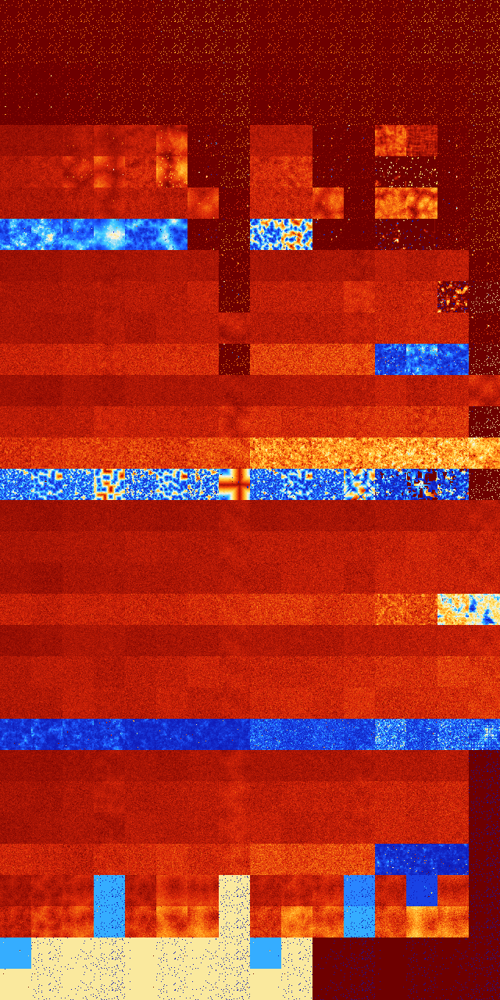

# B01235 (24064-24575)

<details>
    <summary>Initial Grid</summary>
    
</details>


<details>
    <summary>Initial Grid RLE</summary>

```
#C Exported from GoGoL (https://github.com/marrow16/gogol)
#C Wrap mode: Toroidal
#C Boundary mode: Dead
#C Step: 0
x = 100, y = 100, rule = B01235/S
17bo10bo60bo$4bo12bo9bo43bo$3bo12b2o74bo$5bo37bo47bo$100b$bobo11bo13bo
7b2o50bo2bo4bo$44bo9bo3bo24bo7bo7bo$o8bo9b2o$12bo80bo$21bo24bo9bo42bo$
11b2o19bo14bo21bo$4bo7bo8bo20bo15bo12bo$39bo30bo$24bo43bobo$10bo5bo42bo
$o9bo34bo20bo5bo21bo$3bobo5b2o25bo$100b$15bo12bo34bo4bo29bo$bo3bo10bo
35bo2bo13bobo19bo$44bo41bo$35bo11bo3bo47bo$14bo16bo10bo34bo16bo$21bo39b
o28bo$2bo46bo18bobo15bo$17bo51bo12bo$bo28bo4bo$5bo25bo3bo4bo2bo51bo$35b
o8bo14bo13bo5bo11bo$19bo24b2o38bo$8bo42bo6bo10bo$100b$64bo5bo11bo14bo$
17bo3bo20bo24bo2bo$28bo4bo12b2o17bo3bo17bo3bobo$11bo3b2o17bo2bo13bo6bo
2bo8bo6bo11bo$bo12bo42bo27bo5bo$8bo30bo10bo8bo3bo2bo4bo$o57bo16bo2bo$
18bobo13bo33bo2bo$2b2o3bo8bo51bo9bo18bo$16bo2bo42bobo16bo$16bo43bobo20b
2o8bo$2bo6bo53bo27b2o$30bo8bo10bo4bobo31bo$3bo11bobo4bo14bo14bo16bo18bo
2bo$12bo42bo5bo6bo6bo17bo$23bo6bo$14bo4bo22bo15bo23bo5bo$bo43b2o19bo14b
o7bo$35bobobo28bo21bo$26bo29bo3bo14b2o9bo2bo$20bo7bo51bo17b2o$19bo13bo
5bo5bo18bo$18bo30bo3bo2bo21bo10bo4bo$3bo22bo10bo42b2o2bo8bo$4bo12bo5bob
o6bo11bo5b2o24bo$14bo29bo35bo$57bo17bo5bo9b2o5bo$6bo20bo9bo7bo31bo13b2o
$32bo35bo$15bo11bo22bo7bo6bo6bo23b2o$42bo14bo3bo18b2o3bo4bo$23bo6bo10bo
22bo6bo6bo3bo$17bobo12bo16bo2bo8bo3bo29bo$2bo14bo15bo2bo45bo8bobo$8bo7b
o11b2o4bo26bo5bo15bo$12bo3bo13bo3bo36bo$2bo45bo9bo2bo2bo6bo4bo9bo$22bo
15bo9bo24b3o5bo$5bo12bo27bo$13bo19bo34bobo$52bo11bo9bo14bo2bo$23bo38bo
14bo$bo4bo26bo39b2o24bo$17bo62bo$33bo25bo7bo18bo$29bo27bo34bo$14bobo8bo
58bo$7bo26bobo31bo$19bo13bo8bo$2bo11bo28bo26bo4bo22b2o$12bo40bo8bo$12bo
67bo10bo$18bo13bo57bo$48bo6bo3bo2bo13bo18bo$4bobo11bo68bo9bo$14bo2bo11b
o14bo7bo3bo33bo6bo$36bo2bo7bo25bo2bo21bo$53b2o3bo15bo$4bo19bo7bo22bo3bo
$2bo8bo8bo59bo$17b2o12bo21bo11bo11bo12bo$7b2o11bo45bo9bo19bo$82bo7bo7bo
$10bo35bo34bo4bo$7bo15bobo22bo5bo3bo21bo$27bo16bo9bo6bo13bo6bobo$26bo3b
o2bo7bo36bo10bo$3bo10bo3bo15bo12bo28bo2b2o4bo!
```
</details>
<details>
    <summary>Thumbnail</summary>

</details>
<table>
<tr>
    <td><a href="./24064%20S%20Heat%20Map%20Activity.png"></a><br>S (24064)<br>R@6,p2</td>    <td><a href="./24065%20S0%20Heat%20Map%20Activity.png"></a><br>S0 (24065)<br>R@6,p2</td>    <td><a href="./24066%20S1%20Heat%20Map%20Activity.png"></a><br>S1 (24066)<br>R@5,p2</td>    <td><a href="./24067%20S01%20Heat%20Map%20Activity.png"></a><br>S01 (24067)<br>R@5,p2</td>    <td><a href="./24068%20S2%20Heat%20Map%20Activity.png"></a><br>S2 (24068)<br>R@6,p2</td>    <td><a href="./24069%20S02%20Heat%20Map%20Activity.png"></a><br>S02 (24069)<br>R@4,p2</td>    <td><a href="./24070%20S12%20Heat%20Map%20Activity.png"></a><br>S12 (24070)<br>R@4,p2</td>    <td><a href="./24071%20S012%20Heat%20Map%20Activity.png"></a><br>S012 (24071)<br>R@4,p2</td>    <td><a href="./24072%20S3%20Heat%20Map%20Activity.png"></a><br>S3 (24072)<br>R@6,p2</td>    <td><a href="./24073%20S03%20Heat%20Map%20Activity.png"></a><br>S03 (24073)<br>R@6,p2</td>    <td><a href="./24074%20S13%20Heat%20Map%20Activity.png"></a><br>S13 (24074)<br>R@6,p2</td>    <td><a href="./24075%20S013%20Heat%20Map%20Activity.png"></a><br>S013 (24075)<br>R@5,p2</td>    <td><a href="./24076%20S23%20Heat%20Map%20Activity.png"></a><br>S23 (24076)<br>R@6,p2</td>    <td><a href="./24077%20S023%20Heat%20Map%20Activity.png"></a><br>S023 (24077)<br>R@4,p2</td>    <td><a href="./24078%20S123%20Heat%20Map%20Activity.png"></a><br>S123 (24078)<br>R@4,p2</td>    <td><a href="./24079%20S0123%20Heat%20Map%20Activity.png"></a><br>S0123 (24079)<br>R@4,p2</td></tr>
<tr>
    <td><a href="./24080%20S4%20Heat%20Map%20Activity.png"></a><br>S4 (24080)<br>R@6,p2</td>    <td><a href="./24081%20S04%20Heat%20Map%20Activity.png"></a><br>S04 (24081)<br>R@6,p2</td>    <td><a href="./24082%20S14%20Heat%20Map%20Activity.png"></a><br>S14 (24082)<br>R@5,p2</td>    <td><a href="./24083%20S014%20Heat%20Map%20Activity.png"></a><br>S014 (24083)<br>R@5,p2</td>    <td><a href="./24084%20S24%20Heat%20Map%20Activity.png"></a><br>S24 (24084)<br>R@6,p2</td>    <td><a href="./24085%20S024%20Heat%20Map%20Activity.png"></a><br>S024 (24085)<br>R@4,p2</td>    <td><a href="./24086%20S124%20Heat%20Map%20Activity.png"></a><br>S124 (24086)<br>R@4,p2</td>    <td><a href="./24087%20S0124%20Heat%20Map%20Activity.png"></a><br>S0124 (24087)<br>R@4,p2</td>    <td><a href="./24088%20S34%20Heat%20Map%20Activity.png"></a><br>S34 (24088)<br>R@6,p2</td>    <td><a href="./24089%20S034%20Heat%20Map%20Activity.png"></a><br>S034 (24089)<br>R@6,p2</td>    <td><a href="./24090%20S134%20Heat%20Map%20Activity.png"></a><br>S134 (24090)<br>R@5,p2</td>    <td><a href="./24091%20S0134%20Heat%20Map%20Activity.png"></a><br>S0134 (24091)<br>R@5,p2</td>    <td><a href="./24092%20S234%20Heat%20Map%20Activity.png"></a><br>S234 (24092)<br>R@6,p2</td>    <td><a href="./24093%20S0234%20Heat%20Map%20Activity.png"></a><br>S0234 (24093)<br>R@4,p2</td>    <td><a href="./24094%20S1234%20Heat%20Map%20Activity.png"></a><br>S1234 (24094)<br>R@4,p2</td>    <td><a href="./24095%20S01234%20Heat%20Map%20Activity.png"></a><br>S01234 (24095)<br>R@4,p2</td></tr>
<tr>
    <td><a href="./24096%20S5%20Heat%20Map%20Activity.png"></a><br>S5 (24096)<br>R@16,p2</td>    <td><a href="./24097%20S05%20Heat%20Map%20Activity.png"></a><br>S05 (24097)<br>R@18,p4</td>    <td><a href="./24098%20S15%20Heat%20Map%20Activity.png"></a><br>S15 (24098)<br>R@8,p2</td>    <td><a href="./24099%20S015%20Heat%20Map%20Activity.png"></a><br>S015 (24099)<br>R@6,p2</td>    <td><a href="./24100%20S25%20Heat%20Map%20Activity.png"></a><br>S25 (24100)<br>R@6,p2</td>    <td><a href="./24101%20S025%20Heat%20Map%20Activity.png"></a><br>S025 (24101)<br>R@6,p2</td>    <td><a href="./24102%20S125%20Heat%20Map%20Activity.png"></a><br>S125 (24102)<br>R@6,p2</td>    <td><a href="./24103%20S0125%20Heat%20Map%20Activity.png"></a><br>S0125 (24103)<br>R@4,p2</td>    <td><a href="./24104%20S35%20Heat%20Map%20Activity.png"></a><br>S35 (24104)<br>R@10,p2</td>    <td><a href="./24105%20S035%20Heat%20Map%20Activity.png"></a><br>S035 (24105)<br>R@7,p2</td>    <td><a href="./24106%20S135%20Heat%20Map%20Activity.png"></a><br>S135 (24106)<br>R@6,p2</td>    <td><a href="./24107%20S0135%20Heat%20Map%20Activity.png"></a><br>S0135 (24107)<br>R@5,p2</td>    <td><a href="./24108%20S235%20Heat%20Map%20Activity.png"></a><br>S235 (24108)<br>R@6,p2</td>    <td><a href="./24109%20S0235%20Heat%20Map%20Activity.png"></a><br>S0235 (24109)<br>R@6,p2</td>    <td><a href="./24110%20S1235%20Heat%20Map%20Activity.png"></a><br>S1235 (24110)<br>R@6,p2</td>    <td><a href="./24111%20S01235%20Heat%20Map%20Activity.png"></a><br>S01235 (24111)<br>R@4,p2</td></tr>
<tr>
    <td><a href="./24112%20S45%20Heat%20Map%20Activity.png"></a><br>S45 (24112)<br>R@22,p4</td>    <td><a href="./24113%20S045%20Heat%20Map%20Activity.png"></a><br>S045 (24113)<br>R@16,p4</td>    <td><a href="./24114%20S145%20Heat%20Map%20Activity.png"></a><br>S145 (24114)<br>R@8,p2</td>    <td><a href="./24115%20S0145%20Heat%20Map%20Activity.png"></a><br>S0145 (24115)<br>R@6,p2</td>    <td><a href="./24116%20S245%20Heat%20Map%20Activity.png"></a><br>S245 (24116)<br>R@6,p2</td>    <td><a href="./24117%20S0245%20Heat%20Map%20Activity.png"></a><br>S0245 (24117)<br>R@6,p2</td>    <td><a href="./24118%20S1245%20Heat%20Map%20Activity.png"></a><br>S1245 (24118)<br>R@6,p2</td>    <td><a href="./24119%20S01245%20Heat%20Map%20Activity.png"></a><br>S01245 (24119)<br>R@4,p2</td>    <td><a href="./24120%20S345%20Heat%20Map%20Activity.png"></a><br>S345 (24120)<br>R@12,p2</td>    <td><a href="./24121%20S0345%20Heat%20Map%20Activity.png"></a><br>S0345 (24121)<br>R@7,p2</td>    <td><a href="./24122%20S1345%20Heat%20Map%20Activity.png"></a><br>S1345 (24122)<br>R@6,p2</td>    <td><a href="./24123%20S01345%20Heat%20Map%20Activity.png"></a><br>S01345 (24123)<br>R@5,p2</td>    <td><a href="./24124%20S2345%20Heat%20Map%20Activity.png"></a><br>S2345 (24124)<br>R@6,p2</td>    <td><a href="./24125%20S02345%20Heat%20Map%20Activity.png"></a><br>S02345 (24125)<br>R@6,p2</td>    <td><a href="./24126%20S12345%20Heat%20Map%20Activity.png"></a><br>S12345 (24126)<br>R@6,p2</td>    <td><a href="./24127%20S012345%20Heat%20Map%20Activity.png"></a><br>S012345 (24127)<br>R@4,p2</td></tr>
<tr>
    <td><a href="./24128%20S6%20Heat%20Map%20Activity.png"></a><br>S6 (24128)<br>G>1000</td>    <td><a href="./24129%20S06%20Heat%20Map%20Activity.png"></a><br>S06 (24129)<br>G>1000</td>    <td><a href="./24130%20S16%20Heat%20Map%20Activity.png"></a><br>S16 (24130)<br>G>1000</td>    <td><a href="./24131%20S016%20Heat%20Map%20Activity.png"></a><br>S016 (24131)<br>G>1000</td>    <td><a href="./24132%20S26%20Heat%20Map%20Activity.png"></a><br>S26 (24132)<br>G>1000</td>    <td><a href="./24133%20S026%20Heat%20Map%20Activity.png"></a><br>S026 (24133)<br>G>1000</td>    <td><a href="./24134%20S126%20Heat%20Map%20Activity.png"></a><br>S126 (24134)<br>R@11,p4</td>    <td><a href="./24135%20S0126%20Heat%20Map%20Activity.png"></a><br>S0126 (24135)<br>R@5,p2</td>    <td><a href="./24136%20S36%20Heat%20Map%20Activity.png"></a><br>S36 (24136)<br>G>1000</td>    <td><a href="./24137%20S036%20Heat%20Map%20Activity.png"></a><br>S036 (24137)<br>G>1000</td>    <td><a href="./24138%20S136%20Heat%20Map%20Activity.png"></a><br>S136 (24138)<br>R@26,p8</td>    <td><a href="./24139%20S0136%20Heat%20Map%20Activity.png"></a><br>S0136 (24139)<br>R@9,p4</td>    <td><a href="./24140%20S236%20Heat%20Map%20Activity.png"></a><br>S236 (24140)<br>G>1000</td>    <td><a href="./24141%20S0236%20Heat%20Map%20Activity.png"></a><br>S0236 (24141)<br>G>1000</td>    <td><a href="./24142%20S1236%20Heat%20Map%20Activity.png"></a><br>S1236 (24142)<br>R@11,p4</td>    <td><a href="./24143%20S01236%20Heat%20Map%20Activity.png"></a><br>S01236 (24143)<br>R@4,p2</td></tr>
<tr>
    <td><a href="./24144%20S46%20Heat%20Map%20Activity.png"></a><br>S46 (24144)<br>G>1000</td>    <td><a href="./24145%20S046%20Heat%20Map%20Activity.png"></a><br>S046 (24145)<br>G>1000</td>    <td><a href="./24146%20S146%20Heat%20Map%20Activity.png"></a><br>S146 (24146)<br>G>1000</td>    <td><a href="./24147%20S0146%20Heat%20Map%20Activity.png"></a><br>S0146 (24147)<br>G>1000</td>    <td><a href="./24148%20S246%20Heat%20Map%20Activity.png"></a><br>S246 (24148)<br>G>1000</td>    <td><a href="./24149%20S0246%20Heat%20Map%20Activity.png"></a><br>S0246 (24149)<br>G>1000</td>    <td><a href="./24150%20S1246%20Heat%20Map%20Activity.png"></a><br>S1246 (24150)<br>R@22,p4</td>    <td><a href="./24151%20S01246%20Heat%20Map%20Activity.png"></a><br>S01246 (24151)<br>R@4,p2</td>    <td><a href="./24152%20S346%20Heat%20Map%20Activity.png"></a><br>S346 (24152)<br>G>1000</td>    <td><a href="./24153%20S0346%20Heat%20Map%20Activity.png"></a><br>S0346 (24153)<br>G>1000</td>    <td><a href="./24154%20S1346%20Heat%20Map%20Activity.png"></a><br>S1346 (24154)<br>R@16,p8</td>    <td><a href="./24155%20S01346%20Heat%20Map%20Activity.png"></a><br>S01346 (24155)<br>R@12,p4</td>    <td><a href="./24156%20S2346%20Heat%20Map%20Activity.png"></a><br>S2346 (24156)<br>R@504,p4</td>    <td><a href="./24157%20S02346%20Heat%20Map%20Activity.png"></a><br>S02346 (24157)<br>R@24,p8</td>    <td><a href="./24158%20S12346%20Heat%20Map%20Activity.png"></a><br>S12346 (24158)<br>R@13,p4</td>    <td><a href="./24159%20S012346%20Heat%20Map%20Activity.png"></a><br>S012346 (24159)<br>R@4,p2</td></tr>
<tr>
    <td><a href="./24160%20S56%20Heat%20Map%20Activity.png"></a><br>S56 (24160)<br>G>1000</td>    <td><a href="./24161%20S056%20Heat%20Map%20Activity.png"></a><br>S056 (24161)<br>G>1000</td>    <td><a href="./24162%20S156%20Heat%20Map%20Activity.png"></a><br>S156 (24162)<br>G>1000</td>    <td><a href="./24163%20S0156%20Heat%20Map%20Activity.png"></a><br>S0156 (24163)<br>G>1000</td>    <td><a href="./24164%20S256%20Heat%20Map%20Activity.png"></a><br>S256 (24164)<br>G>1000</td>    <td><a href="./24165%20S0256%20Heat%20Map%20Activity.png"></a><br>S0256 (24165)<br>G>1000</td>    <td><a href="./24166%20S1256%20Heat%20Map%20Activity.png"></a><br>S1256 (24166)<br>G>1000</td>    <td><a href="./24167%20S01256%20Heat%20Map%20Activity.png"></a><br>S01256 (24167)<br>R@8,p6</td>    <td><a href="./24168%20S356%20Heat%20Map%20Activity.png"></a><br>S356 (24168)<br>G>1000</td>    <td><a href="./24169%20S0356%20Heat%20Map%20Activity.png"></a><br>S0356 (24169)<br>G>1000</td>    <td><a href="./24170%20S1356%20Heat%20Map%20Activity.png"></a><br>S1356 (24170)<br>G>1000</td>    <td><a href="./24171%20S01356%20Heat%20Map%20Activity.png"></a><br>S01356 (24171)<br>R@11,p2</td>    <td><a href="./24172%20S2356%20Heat%20Map%20Activity.png"></a><br>S2356 (24172)<br>G>1000</td>    <td><a href="./24173%20S02356%20Heat%20Map%20Activity.png"></a><br>S02356 (24173)<br>G>1000</td>    <td><a href="./24174%20S12356%20Heat%20Map%20Activity.png"></a><br>S12356 (24174)<br>R@19,p2</td>    <td><a href="./24175%20S012356%20Heat%20Map%20Activity.png"></a><br>S012356 (24175)<br>R@4,p2</td></tr>
<tr>
    <td><a href="./24176%20S456%20Heat%20Map%20Activity.png"></a><br>S456 (24176)<br>G>1000</td>    <td><a href="./24177%20S0456%20Heat%20Map%20Activity.png"></a><br>S0456 (24177)<br>G>1000</td>    <td><a href="./24178%20S1456%20Heat%20Map%20Activity.png"></a><br>S1456 (24178)<br>G>1000</td>    <td><a href="./24179%20S01456%20Heat%20Map%20Activity.png"></a><br>S01456 (24179)<br>G>1000</td>    <td><a href="./24180%20S2456%20Heat%20Map%20Activity.png"></a><br>S2456 (24180)<br>R@325,p6</td>    <td><a href="./24181%20S02456%20Heat%20Map%20Activity.png"></a><br>S02456 (24181)<br>R@442,p2</td>    <td><a href="./24182%20S12456%20Heat%20Map%20Activity.png"></a><br>S12456 (24182)<br>R@16,p8</td>    <td><a href="./24183%20S012456%20Heat%20Map%20Activity.png"></a><br>S012456 (24183)<br>R@4,p2</td>    <td><a href="./24184%20S3456%20Heat%20Map%20Activity.png"></a><br>S3456 (24184)<br>R@98,p12</td>    <td><a href="./24185%20S03456%20Heat%20Map%20Activity.png"></a><br>S03456 (24185)<br>R@109,p6</td>    <td><a href="./24186%20S13456%20Heat%20Map%20Activity.png"></a><br>S13456 (24186)<br>R@26,p2</td>    <td><a href="./24187%20S013456%20Heat%20Map%20Activity.png"></a><br>S013456 (24187)<br>R@20,p2</td>    <td><a href="./24188%20S23456%20Heat%20Map%20Activity.png"></a><br>S23456 (24188)<br>R@172,p12</td>    <td><a href="./24189%20S023456%20Heat%20Map%20Activity.png"></a><br>S023456 (24189)<br>R@279,p4</td>    <td><a href="./24190%20S123456%20Heat%20Map%20Activity.png"></a><br>S123456 (24190)<br>R@9,p2</td>    <td><a href="./24191%20S0123456%20Heat%20Map%20Activity.png"></a><br>S0123456 (24191)<br>R@4,p2</td></tr>
<tr>
    <td><a href="./24192%20S7%20Heat%20Map%20Activity.png"></a><br>S7 (24192)<br>G>1000</td>    <td><a href="./24193%20S07%20Heat%20Map%20Activity.png"></a><br>S07 (24193)<br>G>1000</td>    <td><a href="./24194%20S17%20Heat%20Map%20Activity.png"></a><br>S17 (24194)<br>G>1000</td>    <td><a href="./24195%20S017%20Heat%20Map%20Activity.png"></a><br>S017 (24195)<br>G>1000</td>    <td><a href="./24196%20S27%20Heat%20Map%20Activity.png"></a><br>S27 (24196)<br>G>1000</td>    <td><a href="./24197%20S027%20Heat%20Map%20Activity.png"></a><br>S027 (24197)<br>G>1000</td>    <td><a href="./24198%20S127%20Heat%20Map%20Activity.png"></a><br>S127 (24198)<br>G>1000</td>    <td><a href="./24199%20S0127%20Heat%20Map%20Activity.png"></a><br>S0127 (24199)<br>R@7,p2</td>    <td><a href="./24200%20S37%20Heat%20Map%20Activity.png"></a><br>S37 (24200)<br>G>1000</td>    <td><a href="./24201%20S037%20Heat%20Map%20Activity.png"></a><br>S037 (24201)<br>G>1000</td>    <td><a href="./24202%20S137%20Heat%20Map%20Activity.png"></a><br>S137 (24202)<br>G>1000</td>    <td><a href="./24203%20S0137%20Heat%20Map%20Activity.png"></a><br>S0137 (24203)<br>G>1000</td>    <td><a href="./24204%20S237%20Heat%20Map%20Activity.png"></a><br>S237 (24204)<br>G>1000</td>    <td><a href="./24205%20S0237%20Heat%20Map%20Activity.png"></a><br>S0237 (24205)<br>G>1000</td>    <td><a href="./24206%20S1237%20Heat%20Map%20Activity.png"></a><br>S1237 (24206)<br>G>1000</td>    <td><a href="./24207%20S01237%20Heat%20Map%20Activity.png"></a><br>S01237 (24207)<br>R@7,p2</td></tr>
<tr>
    <td><a href="./24208%20S47%20Heat%20Map%20Activity.png"></a><br>S47 (24208)<br>G>1000</td>    <td><a href="./24209%20S047%20Heat%20Map%20Activity.png"></a><br>S047 (24209)<br>G>1000</td>    <td><a href="./24210%20S147%20Heat%20Map%20Activity.png"></a><br>S147 (24210)<br>G>1000</td>    <td><a href="./24211%20S0147%20Heat%20Map%20Activity.png"></a><br>S0147 (24211)<br>G>1000</td>    <td><a href="./24212%20S247%20Heat%20Map%20Activity.png"></a><br>S247 (24212)<br>G>1000</td>    <td><a href="./24213%20S0247%20Heat%20Map%20Activity.png"></a><br>S0247 (24213)<br>G>1000</td>    <td><a href="./24214%20S1247%20Heat%20Map%20Activity.png"></a><br>S1247 (24214)<br>G>1000</td>    <td><a href="./24215%20S01247%20Heat%20Map%20Activity.png"></a><br>S01247 (24215)<br>R@5,p2</td>    <td><a href="./24216%20S347%20Heat%20Map%20Activity.png"></a><br>S347 (24216)<br>G>1000</td>    <td><a href="./24217%20S0347%20Heat%20Map%20Activity.png"></a><br>S0347 (24217)<br>G>1000</td>    <td><a href="./24218%20S1347%20Heat%20Map%20Activity.png"></a><br>S1347 (24218)<br>G>1000</td>    <td><a href="./24219%20S01347%20Heat%20Map%20Activity.png"></a><br>S01347 (24219)<br>G>1000</td>    <td><a href="./24220%20S2347%20Heat%20Map%20Activity.png"></a><br>S2347 (24220)<br>G>1000</td>    <td><a href="./24221%20S02347%20Heat%20Map%20Activity.png"></a><br>S02347 (24221)<br>G>1000</td>    <td><a href="./24222%20S12347%20Heat%20Map%20Activity.png"></a><br>S12347 (24222)<br>R@71,p4</td>    <td><a href="./24223%20S012347%20Heat%20Map%20Activity.png"></a><br>S012347 (24223)<br>R@3,p2</td></tr>
<tr>
    <td><a href="./24224%20S57%20Heat%20Map%20Activity.png"></a><br>S57 (24224)<br>G>1000</td>    <td><a href="./24225%20S057%20Heat%20Map%20Activity.png"></a><br>S057 (24225)<br>G>1000</td>    <td><a href="./24226%20S157%20Heat%20Map%20Activity.png"></a><br>S157 (24226)<br>G>1000</td>    <td><a href="./24227%20S0157%20Heat%20Map%20Activity.png"></a><br>S0157 (24227)<br>G>1000</td>    <td><a href="./24228%20S257%20Heat%20Map%20Activity.png"></a><br>S257 (24228)<br>G>1000</td>    <td><a href="./24229%20S0257%20Heat%20Map%20Activity.png"></a><br>S0257 (24229)<br>G>1000</td>    <td><a href="./24230%20S1257%20Heat%20Map%20Activity.png"></a><br>S1257 (24230)<br>G>1000</td>    <td><a href="./24231%20S01257%20Heat%20Map%20Activity.png"></a><br>S01257 (24231)<br>G>1000</td>    <td><a href="./24232%20S357%20Heat%20Map%20Activity.png"></a><br>S357 (24232)<br>G>1000</td>    <td><a href="./24233%20S0357%20Heat%20Map%20Activity.png"></a><br>S0357 (24233)<br>G>1000</td>    <td><a href="./24234%20S1357%20Heat%20Map%20Activity.png"></a><br>S1357 (24234)<br>G>1000</td>    <td><a href="./24235%20S01357%20Heat%20Map%20Activity.png"></a><br>S01357 (24235)<br>G>1000</td>    <td><a href="./24236%20S2357%20Heat%20Map%20Activity.png"></a><br>S2357 (24236)<br>G>1000</td>    <td><a href="./24237%20S02357%20Heat%20Map%20Activity.png"></a><br>S02357 (24237)<br>G>1000</td>    <td><a href="./24238%20S12357%20Heat%20Map%20Activity.png"></a><br>S12357 (24238)<br>G>1000</td>    <td><a href="./24239%20S012357%20Heat%20Map%20Activity.png"></a><br>S012357 (24239)<br>R@7,p4</td></tr>
<tr>
    <td><a href="./24240%20S457%20Heat%20Map%20Activity.png"></a><br>S457 (24240)<br>G>1000</td>    <td><a href="./24241%20S0457%20Heat%20Map%20Activity.png"></a><br>S0457 (24241)<br>G>1000</td>    <td><a href="./24242%20S1457%20Heat%20Map%20Activity.png"></a><br>S1457 (24242)<br>G>1000</td>    <td><a href="./24243%20S01457%20Heat%20Map%20Activity.png"></a><br>S01457 (24243)<br>G>1000</td>    <td><a href="./24244%20S2457%20Heat%20Map%20Activity.png"></a><br>S2457 (24244)<br>G>1000</td>    <td><a href="./24245%20S02457%20Heat%20Map%20Activity.png"></a><br>S02457 (24245)<br>G>1000</td>    <td><a href="./24246%20S12457%20Heat%20Map%20Activity.png"></a><br>S12457 (24246)<br>G>1000</td>    <td><a href="./24247%20S012457%20Heat%20Map%20Activity.png"></a><br>S012457 (24247)<br>R@5,p2</td>    <td><a href="./24248%20S3457%20Heat%20Map%20Activity.png"></a><br>S3457 (24248)<br>G>1000</td>    <td><a href="./24249%20S03457%20Heat%20Map%20Activity.png"></a><br>S03457 (24249)<br>G>1000</td>    <td><a href="./24250%20S13457%20Heat%20Map%20Activity.png"></a><br>S13457 (24250)<br>G>1000</td>    <td><a href="./24251%20S013457%20Heat%20Map%20Activity.png"></a><br>S013457 (24251)<br>G>1000</td>    <td><a href="./24252%20S23457%20Heat%20Map%20Activity.png"></a><br>S23457 (24252)<br>R@238,p12</td>    <td><a href="./24253%20S023457%20Heat%20Map%20Activity.png"></a><br>S023457 (24253)<br>R@243,p12</td>    <td><a href="./24254%20S123457%20Heat%20Map%20Activity.png"></a><br>S123457 (24254)<br>R@303,p12</td>    <td><a href="./24255%20S0123457%20Heat%20Map%20Activity.png"></a><br>S0123457 (24255)<br>R@3,p2</td></tr>
<tr>
    <td><a href="./24256%20S67%20Heat%20Map%20Activity.png"></a><br>S67 (24256)<br>G>1000</td>    <td><a href="./24257%20S067%20Heat%20Map%20Activity.png"></a><br>S067 (24257)<br>G>1000</td>    <td><a href="./24258%20S167%20Heat%20Map%20Activity.png"></a><br>S167 (24258)<br>G>1000</td>    <td><a href="./24259%20S0167%20Heat%20Map%20Activity.png"></a><br>S0167 (24259)<br>G>1000</td>    <td><a href="./24260%20S267%20Heat%20Map%20Activity.png"></a><br>S267 (24260)<br>G>1000</td>    <td><a href="./24261%20S0267%20Heat%20Map%20Activity.png"></a><br>S0267 (24261)<br>G>1000</td>    <td><a href="./24262%20S1267%20Heat%20Map%20Activity.png"></a><br>S1267 (24262)<br>G>1000</td>    <td><a href="./24263%20S01267%20Heat%20Map%20Activity.png"></a><br>S01267 (24263)<br>G>1000</td>    <td><a href="./24264%20S367%20Heat%20Map%20Activity.png"></a><br>S367 (24264)<br>G>1000</td>    <td><a href="./24265%20S0367%20Heat%20Map%20Activity.png"></a><br>S0367 (24265)<br>G>1000</td>    <td><a href="./24266%20S1367%20Heat%20Map%20Activity.png"></a><br>S1367 (24266)<br>G>1000</td>    <td><a href="./24267%20S01367%20Heat%20Map%20Activity.png"></a><br>S01367 (24267)<br>G>1000</td>    <td><a href="./24268%20S2367%20Heat%20Map%20Activity.png"></a><br>S2367 (24268)<br>G>1000</td>    <td><a href="./24269%20S02367%20Heat%20Map%20Activity.png"></a><br>S02367 (24269)<br>G>1000</td>    <td><a href="./24270%20S12367%20Heat%20Map%20Activity.png"></a><br>S12367 (24270)<br>G>1000</td>    <td><a href="./24271%20S012367%20Heat%20Map%20Activity.png"></a><br>S012367 (24271)<br>G>1000</td></tr>
<tr>
    <td><a href="./24272%20S467%20Heat%20Map%20Activity.png"></a><br>S467 (24272)<br>G>1000</td>    <td><a href="./24273%20S0467%20Heat%20Map%20Activity.png"></a><br>S0467 (24273)<br>G>1000</td>    <td><a href="./24274%20S1467%20Heat%20Map%20Activity.png"></a><br>S1467 (24274)<br>G>1000</td>    <td><a href="./24275%20S01467%20Heat%20Map%20Activity.png"></a><br>S01467 (24275)<br>G>1000</td>    <td><a href="./24276%20S2467%20Heat%20Map%20Activity.png"></a><br>S2467 (24276)<br>G>1000</td>    <td><a href="./24277%20S02467%20Heat%20Map%20Activity.png"></a><br>S02467 (24277)<br>G>1000</td>    <td><a href="./24278%20S12467%20Heat%20Map%20Activity.png"></a><br>S12467 (24278)<br>G>1000</td>    <td><a href="./24279%20S012467%20Heat%20Map%20Activity.png"></a><br>S012467 (24279)<br>G>1000</td>    <td><a href="./24280%20S3467%20Heat%20Map%20Activity.png"></a><br>S3467 (24280)<br>G>1000</td>    <td><a href="./24281%20S03467%20Heat%20Map%20Activity.png"></a><br>S03467 (24281)<br>G>1000</td>    <td><a href="./24282%20S13467%20Heat%20Map%20Activity.png"></a><br>S13467 (24282)<br>G>1000</td>    <td><a href="./24283%20S013467%20Heat%20Map%20Activity.png"></a><br>S013467 (24283)<br>G>1000</td>    <td><a href="./24284%20S23467%20Heat%20Map%20Activity.png"></a><br>S23467 (24284)<br>G>1000</td>    <td><a href="./24285%20S023467%20Heat%20Map%20Activity.png"></a><br>S023467 (24285)<br>G>1000</td>    <td><a href="./24286%20S123467%20Heat%20Map%20Activity.png"></a><br>S123467 (24286)<br>G>1000</td>    <td><a href="./24287%20S0123467%20Heat%20Map%20Activity.png"></a><br>S0123467 (24287)<br>R@3,p2</td></tr>
<tr>
    <td><a href="./24288%20S567%20Heat%20Map%20Activity.png"></a><br>S567 (24288)<br>G>1000</td>    <td><a href="./24289%20S0567%20Heat%20Map%20Activity.png"></a><br>S0567 (24289)<br>G>1000</td>    <td><a href="./24290%20S1567%20Heat%20Map%20Activity.png"></a><br>S1567 (24290)<br>G>1000</td>    <td><a href="./24291%20S01567%20Heat%20Map%20Activity.png"></a><br>S01567 (24291)<br>G>1000</td>    <td><a href="./24292%20S2567%20Heat%20Map%20Activity.png"></a><br>S2567 (24292)<br>G>1000</td>    <td><a href="./24293%20S02567%20Heat%20Map%20Activity.png"></a><br>S02567 (24293)<br>G>1000</td>    <td><a href="./24294%20S12567%20Heat%20Map%20Activity.png"></a><br>S12567 (24294)<br>G>1000</td>    <td><a href="./24295%20S012567%20Heat%20Map%20Activity.png"></a><br>S012567 (24295)<br>G>1000</td>    <td><a href="./24296%20S3567%20Heat%20Map%20Activity.png"></a><br>S3567 (24296)<br>G>1000</td>    <td><a href="./24297%20S03567%20Heat%20Map%20Activity.png"></a><br>S03567 (24297)<br>G>1000</td>    <td><a href="./24298%20S13567%20Heat%20Map%20Activity.png"></a><br>S13567 (24298)<br>G>1000</td>    <td><a href="./24299%20S013567%20Heat%20Map%20Activity.png"></a><br>S013567 (24299)<br>G>1000</td>    <td><a href="./24300%20S23567%20Heat%20Map%20Activity.png"></a><br>S23567 (24300)<br>G>1000</td>    <td><a href="./24301%20S023567%20Heat%20Map%20Activity.png"></a><br>S023567 (24301)<br>G>1000</td>    <td><a href="./24302%20S123567%20Heat%20Map%20Activity.png"></a><br>S123567 (24302)<br>G>1000</td>    <td><a href="./24303%20S0123567%20Heat%20Map%20Activity.png"></a><br>S0123567 (24303)<br>G>1000</td></tr>
<tr>
    <td><a href="./24304%20S4567%20Heat%20Map%20Activity.png"></a><br>S4567 (24304)<br>R@18,p2</td>    <td><a href="./24305%20S04567%20Heat%20Map%20Activity.png"></a><br>S04567 (24305)<br>R@37,p2</td>    <td><a href="./24306%20S14567%20Heat%20Map%20Activity.png"></a><br>S14567 (24306)<br>R@20,p2</td>    <td><a href="./24307%20S014567%20Heat%20Map%20Activity.png"></a><br>S014567 (24307)<br>S@46</td>    <td><a href="./24308%20S24567%20Heat%20Map%20Activity.png"></a><br>S24567 (24308)<br>R@23,p2</td>    <td><a href="./24309%20S024567%20Heat%20Map%20Activity.png"></a><br>S024567 (24309)<br>R@37,p2</td>    <td><a href="./24310%20S124567%20Heat%20Map%20Activity.png"></a><br>S124567 (24310)<br>R@25,p2</td>    <td><a href="./24311%20S0124567%20Heat%20Map%20Activity.png"></a><br>S0124567 (24311)<br>R@112,p2</td>    <td><a href="./24312%20S34567%20Heat%20Map%20Activity.png"></a><br>S34567 (24312)<br>R@18,p2</td>    <td><a href="./24313%20S034567%20Heat%20Map%20Activity.png"></a><br>S034567 (24313)<br>R@43,p2</td>    <td><a href="./24314%20S134567%20Heat%20Map%20Activity.png"></a><br>S134567 (24314)<br>R@21,p2</td>    <td><a href="./24315%20S0134567%20Heat%20Map%20Activity.png"></a><br>S0134567 (24315)<br>R@62,p2</td>    <td><a href="./24316%20S234567%20Heat%20Map%20Activity.png"></a><br>S234567 (24316)<br>R@45,p2</td>    <td><a href="./24317%20S0234567%20Heat%20Map%20Activity.png"></a><br>S0234567 (24317)<br>R@171,p2</td>    <td><a href="./24318%20S1234567%20Heat%20Map%20Activity.png"></a><br>S1234567 (24318)<br>R@49,p2</td>    <td><a href="./24319%20S01234567%20Heat%20Map%20Activity.png"></a><br>S01234567 (24319)<br>R@3,p2</td></tr>
<tr>
    <td><a href="./24320%20S8%20Heat%20Map%20Activity.png"></a><br>S8 (24320)<br>G>1000</td>    <td><a href="./24321%20S08%20Heat%20Map%20Activity.png"></a><br>S08 (24321)<br>G>1000</td>    <td><a href="./24322%20S18%20Heat%20Map%20Activity.png"></a><br>S18 (24322)<br>G>1000</td>    <td><a href="./24323%20S018%20Heat%20Map%20Activity.png"></a><br>S018 (24323)<br>G>1000</td>    <td><a href="./24324%20S28%20Heat%20Map%20Activity.png"></a><br>S28 (24324)<br>G>1000</td>    <td><a href="./24325%20S028%20Heat%20Map%20Activity.png"></a><br>S028 (24325)<br>G>1000</td>    <td><a href="./24326%20S128%20Heat%20Map%20Activity.png"></a><br>S128 (24326)<br>G>1000</td>    <td><a href="./24327%20S0128%20Heat%20Map%20Activity.png"></a><br>S0128 (24327)<br>G>1000</td>    <td><a href="./24328%20S38%20Heat%20Map%20Activity.png"></a><br>S38 (24328)<br>G>1000</td>    <td><a href="./24329%20S038%20Heat%20Map%20Activity.png"></a><br>S038 (24329)<br>G>1000</td>    <td><a href="./24330%20S138%20Heat%20Map%20Activity.png"></a><br>S138 (24330)<br>G>1000</td>    <td><a href="./24331%20S0138%20Heat%20Map%20Activity.png"></a><br>S0138 (24331)<br>G>1000</td>    <td><a href="./24332%20S238%20Heat%20Map%20Activity.png"></a><br>S238 (24332)<br>G>1000</td>    <td><a href="./24333%20S0238%20Heat%20Map%20Activity.png"></a><br>S0238 (24333)<br>G>1000</td>    <td><a href="./24334%20S1238%20Heat%20Map%20Activity.png"></a><br>S1238 (24334)<br>G>1000</td>    <td><a href="./24335%20S01238%20Heat%20Map%20Activity.png"></a><br>S01238 (24335)<br>G>1000</td></tr>
<tr>
    <td><a href="./24336%20S48%20Heat%20Map%20Activity.png"></a><br>S48 (24336)<br>G>1000</td>    <td><a href="./24337%20S048%20Heat%20Map%20Activity.png"></a><br>S048 (24337)<br>G>1000</td>    <td><a href="./24338%20S148%20Heat%20Map%20Activity.png"></a><br>S148 (24338)<br>G>1000</td>    <td><a href="./24339%20S0148%20Heat%20Map%20Activity.png"></a><br>S0148 (24339)<br>G>1000</td>    <td><a href="./24340%20S248%20Heat%20Map%20Activity.png"></a><br>S248 (24340)<br>G>1000</td>    <td><a href="./24341%20S0248%20Heat%20Map%20Activity.png"></a><br>S0248 (24341)<br>G>1000</td>    <td><a href="./24342%20S1248%20Heat%20Map%20Activity.png"></a><br>S1248 (24342)<br>G>1000</td>    <td><a href="./24343%20S01248%20Heat%20Map%20Activity.png"></a><br>S01248 (24343)<br>G>1000</td>    <td><a href="./24344%20S348%20Heat%20Map%20Activity.png"></a><br>S348 (24344)<br>G>1000</td>    <td><a href="./24345%20S0348%20Heat%20Map%20Activity.png"></a><br>S0348 (24345)<br>G>1000</td>    <td><a href="./24346%20S1348%20Heat%20Map%20Activity.png"></a><br>S1348 (24346)<br>G>1000</td>    <td><a href="./24347%20S01348%20Heat%20Map%20Activity.png"></a><br>S01348 (24347)<br>G>1000</td>    <td><a href="./24348%20S2348%20Heat%20Map%20Activity.png"></a><br>S2348 (24348)<br>G>1000</td>    <td><a href="./24349%20S02348%20Heat%20Map%20Activity.png"></a><br>S02348 (24349)<br>G>1000</td>    <td><a href="./24350%20S12348%20Heat%20Map%20Activity.png"></a><br>S12348 (24350)<br>G>1000</td>    <td><a href="./24351%20S012348%20Heat%20Map%20Activity.png"></a><br>S012348 (24351)<br>G>1000</td></tr>
<tr>
    <td><a href="./24352%20S58%20Heat%20Map%20Activity.png"></a><br>S58 (24352)<br>G>1000</td>    <td><a href="./24353%20S058%20Heat%20Map%20Activity.png"></a><br>S058 (24353)<br>G>1000</td>    <td><a href="./24354%20S158%20Heat%20Map%20Activity.png"></a><br>S158 (24354)<br>G>1000</td>    <td><a href="./24355%20S0158%20Heat%20Map%20Activity.png"></a><br>S0158 (24355)<br>G>1000</td>    <td><a href="./24356%20S258%20Heat%20Map%20Activity.png"></a><br>S258 (24356)<br>G>1000</td>    <td><a href="./24357%20S0258%20Heat%20Map%20Activity.png"></a><br>S0258 (24357)<br>G>1000</td>    <td><a href="./24358%20S1258%20Heat%20Map%20Activity.png"></a><br>S1258 (24358)<br>G>1000</td>    <td><a href="./24359%20S01258%20Heat%20Map%20Activity.png"></a><br>S01258 (24359)<br>G>1000</td>    <td><a href="./24360%20S358%20Heat%20Map%20Activity.png"></a><br>S358 (24360)<br>G>1000</td>    <td><a href="./24361%20S0358%20Heat%20Map%20Activity.png"></a><br>S0358 (24361)<br>G>1000</td>    <td><a href="./24362%20S1358%20Heat%20Map%20Activity.png"></a><br>S1358 (24362)<br>G>1000</td>    <td><a href="./24363%20S01358%20Heat%20Map%20Activity.png"></a><br>S01358 (24363)<br>G>1000</td>    <td><a href="./24364%20S2358%20Heat%20Map%20Activity.png"></a><br>S2358 (24364)<br>G>1000</td>    <td><a href="./24365%20S02358%20Heat%20Map%20Activity.png"></a><br>S02358 (24365)<br>G>1000</td>    <td><a href="./24366%20S12358%20Heat%20Map%20Activity.png"></a><br>S12358 (24366)<br>G>1000</td>    <td><a href="./24367%20S012358%20Heat%20Map%20Activity.png"></a><br>S012358 (24367)<br>G>1000</td></tr>
<tr>
    <td><a href="./24368%20S458%20Heat%20Map%20Activity.png"></a><br>S458 (24368)<br>G>1000</td>    <td><a href="./24369%20S0458%20Heat%20Map%20Activity.png"></a><br>S0458 (24369)<br>G>1000</td>    <td><a href="./24370%20S1458%20Heat%20Map%20Activity.png"></a><br>S1458 (24370)<br>G>1000</td>    <td><a href="./24371%20S01458%20Heat%20Map%20Activity.png"></a><br>S01458 (24371)<br>G>1000</td>    <td><a href="./24372%20S2458%20Heat%20Map%20Activity.png"></a><br>S2458 (24372)<br>G>1000</td>    <td><a href="./24373%20S02458%20Heat%20Map%20Activity.png"></a><br>S02458 (24373)<br>G>1000</td>    <td><a href="./24374%20S12458%20Heat%20Map%20Activity.png"></a><br>S12458 (24374)<br>G>1000</td>    <td><a href="./24375%20S012458%20Heat%20Map%20Activity.png"></a><br>S012458 (24375)<br>G>1000</td>    <td><a href="./24376%20S3458%20Heat%20Map%20Activity.png"></a><br>S3458 (24376)<br>G>1000</td>    <td><a href="./24377%20S03458%20Heat%20Map%20Activity.png"></a><br>S03458 (24377)<br>G>1000</td>    <td><a href="./24378%20S13458%20Heat%20Map%20Activity.png"></a><br>S13458 (24378)<br>G>1000</td>    <td><a href="./24379%20S013458%20Heat%20Map%20Activity.png"></a><br>S013458 (24379)<br>G>1000</td>    <td><a href="./24380%20S23458%20Heat%20Map%20Activity.png"></a><br>S23458 (24380)<br>G>1000</td>    <td><a href="./24381%20S023458%20Heat%20Map%20Activity.png"></a><br>S023458 (24381)<br>G>1000</td>    <td><a href="./24382%20S123458%20Heat%20Map%20Activity.png"></a><br>S123458 (24382)<br>G>1000</td>    <td><a href="./24383%20S0123458%20Heat%20Map%20Activity.png"></a><br>S0123458 (24383)<br>G>1000</td></tr>
<tr>
    <td><a href="./24384%20S68%20Heat%20Map%20Activity.png"></a><br>S68 (24384)<br>G>1000</td>    <td><a href="./24385%20S068%20Heat%20Map%20Activity.png"></a><br>S068 (24385)<br>G>1000</td>    <td><a href="./24386%20S168%20Heat%20Map%20Activity.png"></a><br>S168 (24386)<br>G>1000</td>    <td><a href="./24387%20S0168%20Heat%20Map%20Activity.png"></a><br>S0168 (24387)<br>G>1000</td>    <td><a href="./24388%20S268%20Heat%20Map%20Activity.png"></a><br>S268 (24388)<br>G>1000</td>    <td><a href="./24389%20S0268%20Heat%20Map%20Activity.png"></a><br>S0268 (24389)<br>G>1000</td>    <td><a href="./24390%20S1268%20Heat%20Map%20Activity.png"></a><br>S1268 (24390)<br>G>1000</td>    <td><a href="./24391%20S01268%20Heat%20Map%20Activity.png"></a><br>S01268 (24391)<br>G>1000</td>    <td><a href="./24392%20S368%20Heat%20Map%20Activity.png"></a><br>S368 (24392)<br>G>1000</td>    <td><a href="./24393%20S0368%20Heat%20Map%20Activity.png"></a><br>S0368 (24393)<br>G>1000</td>    <td><a href="./24394%20S1368%20Heat%20Map%20Activity.png"></a><br>S1368 (24394)<br>G>1000</td>    <td><a href="./24395%20S01368%20Heat%20Map%20Activity.png"></a><br>S01368 (24395)<br>G>1000</td>    <td><a href="./24396%20S2368%20Heat%20Map%20Activity.png"></a><br>S2368 (24396)<br>G>1000</td>    <td><a href="./24397%20S02368%20Heat%20Map%20Activity.png"></a><br>S02368 (24397)<br>G>1000</td>    <td><a href="./24398%20S12368%20Heat%20Map%20Activity.png"></a><br>S12368 (24398)<br>G>1000</td>    <td><a href="./24399%20S012368%20Heat%20Map%20Activity.png"></a><br>S012368 (24399)<br>G>1000</td></tr>
<tr>
    <td><a href="./24400%20S468%20Heat%20Map%20Activity.png"></a><br>S468 (24400)<br>G>1000</td>    <td><a href="./24401%20S0468%20Heat%20Map%20Activity.png"></a><br>S0468 (24401)<br>G>1000</td>    <td><a href="./24402%20S1468%20Heat%20Map%20Activity.png"></a><br>S1468 (24402)<br>G>1000</td>    <td><a href="./24403%20S01468%20Heat%20Map%20Activity.png"></a><br>S01468 (24403)<br>G>1000</td>    <td><a href="./24404%20S2468%20Heat%20Map%20Activity.png"></a><br>S2468 (24404)<br>G>1000</td>    <td><a href="./24405%20S02468%20Heat%20Map%20Activity.png"></a><br>S02468 (24405)<br>G>1000</td>    <td><a href="./24406%20S12468%20Heat%20Map%20Activity.png"></a><br>S12468 (24406)<br>G>1000</td>    <td><a href="./24407%20S012468%20Heat%20Map%20Activity.png"></a><br>S012468 (24407)<br>G>1000</td>    <td><a href="./24408%20S3468%20Heat%20Map%20Activity.png"></a><br>S3468 (24408)<br>G>1000</td>    <td><a href="./24409%20S03468%20Heat%20Map%20Activity.png"></a><br>S03468 (24409)<br>G>1000</td>    <td><a href="./24410%20S13468%20Heat%20Map%20Activity.png"></a><br>S13468 (24410)<br>G>1000</td>    <td><a href="./24411%20S013468%20Heat%20Map%20Activity.png"></a><br>S013468 (24411)<br>G>1000</td>    <td><a href="./24412%20S23468%20Heat%20Map%20Activity.png"></a><br>S23468 (24412)<br>G>1000</td>    <td><a href="./24413%20S023468%20Heat%20Map%20Activity.png"></a><br>S023468 (24413)<br>G>1000</td>    <td><a href="./24414%20S123468%20Heat%20Map%20Activity.png"></a><br>S123468 (24414)<br>G>1000</td>    <td><a href="./24415%20S0123468%20Heat%20Map%20Activity.png"></a><br>S0123468 (24415)<br>G>1000</td></tr>
<tr>
    <td><a href="./24416%20S568%20Heat%20Map%20Activity.png"></a><br>S568 (24416)<br>G>1000</td>    <td><a href="./24417%20S0568%20Heat%20Map%20Activity.png"></a><br>S0568 (24417)<br>G>1000</td>    <td><a href="./24418%20S1568%20Heat%20Map%20Activity.png"></a><br>S1568 (24418)<br>G>1000</td>    <td><a href="./24419%20S01568%20Heat%20Map%20Activity.png"></a><br>S01568 (24419)<br>G>1000</td>    <td><a href="./24420%20S2568%20Heat%20Map%20Activity.png"></a><br>S2568 (24420)<br>G>1000</td>    <td><a href="./24421%20S02568%20Heat%20Map%20Activity.png"></a><br>S02568 (24421)<br>G>1000</td>    <td><a href="./24422%20S12568%20Heat%20Map%20Activity.png"></a><br>S12568 (24422)<br>G>1000</td>    <td><a href="./24423%20S012568%20Heat%20Map%20Activity.png"></a><br>S012568 (24423)<br>G>1000</td>    <td><a href="./24424%20S3568%20Heat%20Map%20Activity.png"></a><br>S3568 (24424)<br>G>1000</td>    <td><a href="./24425%20S03568%20Heat%20Map%20Activity.png"></a><br>S03568 (24425)<br>G>1000</td>    <td><a href="./24426%20S13568%20Heat%20Map%20Activity.png"></a><br>S13568 (24426)<br>G>1000</td>    <td><a href="./24427%20S013568%20Heat%20Map%20Activity.png"></a><br>S013568 (24427)<br>G>1000</td>    <td><a href="./24428%20S23568%20Heat%20Map%20Activity.png"></a><br>S23568 (24428)<br>G>1000</td>    <td><a href="./24429%20S023568%20Heat%20Map%20Activity.png"></a><br>S023568 (24429)<br>G>1000</td>    <td><a href="./24430%20S123568%20Heat%20Map%20Activity.png"></a><br>S123568 (24430)<br>G>1000</td>    <td><a href="./24431%20S0123568%20Heat%20Map%20Activity.png"></a><br>S0123568 (24431)<br>G>1000</td></tr>
<tr>
    <td><a href="./24432%20S4568%20Heat%20Map%20Activity.png"></a><br>S4568 (24432)<br>R@537,p3</td>    <td><a href="./24433%20S04568%20Heat%20Map%20Activity.png"></a><br>S04568 (24433)<br>R@447,p24</td>    <td><a href="./24434%20S14568%20Heat%20Map%20Activity.png"></a><br>S14568 (24434)<br>R@375,p3</td>    <td><a href="./24435%20S014568%20Heat%20Map%20Activity.png"></a><br>S014568 (24435)<br>R@366,p3</td>    <td><a href="./24436%20S24568%20Heat%20Map%20Activity.png"></a><br>S24568 (24436)<br>R@264,p24</td>    <td><a href="./24437%20S024568%20Heat%20Map%20Activity.png"></a><br>S024568 (24437)<br>R@230,p12</td>    <td><a href="./24438%20S124568%20Heat%20Map%20Activity.png"></a><br>S124568 (24438)<br>R@280,p12</td>    <td><a href="./24439%20S0124568%20Heat%20Map%20Activity.png"></a><br>S0124568 (24439)<br>R@248,p6</td>    <td><a href="./24440%20S34568%20Heat%20Map%20Activity.png"></a><br>S34568 (24440)<br>R@29,p6</td>    <td><a href="./24441%20S034568%20Heat%20Map%20Activity.png"></a><br>S034568 (24441)<br>R@35,p6</td>    <td><a href="./24442%20S134568%20Heat%20Map%20Activity.png"></a><br>S134568 (24442)<br>R@38,p12</td>    <td><a href="./24443%20S0134568%20Heat%20Map%20Activity.png"></a><br>S0134568 (24443)<br>R@46,p6</td>    <td><a href="./24444%20S234568%20Heat%20Map%20Activity.png"></a><br>S234568 (24444)<br>R@21,p2</td>    <td><a href="./24445%20S0234568%20Heat%20Map%20Activity.png"></a><br>S0234568 (24445)<br>R@29,p4</td>    <td><a href="./24446%20S1234568%20Heat%20Map%20Activity.png"></a><br>S1234568 (24446)<br>R@25,p2</td>    <td><a href="./24447%20S01234568%20Heat%20Map%20Activity.png"></a><br>S01234568 (24447)<br>R@66,p2</td></tr>
<tr>
    <td><a href="./24448%20S78%20Heat%20Map%20Activity.png"></a><br>S78 (24448)<br>G>1000</td>    <td><a href="./24449%20S078%20Heat%20Map%20Activity.png"></a><br>S078 (24449)<br>G>1000</td>    <td><a href="./24450%20S178%20Heat%20Map%20Activity.png"></a><br>S178 (24450)<br>G>1000</td>    <td><a href="./24451%20S0178%20Heat%20Map%20Activity.png"></a><br>S0178 (24451)<br>G>1000</td>    <td><a href="./24452%20S278%20Heat%20Map%20Activity.png"></a><br>S278 (24452)<br>G>1000</td>    <td><a href="./24453%20S0278%20Heat%20Map%20Activity.png"></a><br>S0278 (24453)<br>G>1000</td>    <td><a href="./24454%20S1278%20Heat%20Map%20Activity.png"></a><br>S1278 (24454)<br>G>1000</td>    <td><a href="./24455%20S01278%20Heat%20Map%20Activity.png"></a><br>S01278 (24455)<br>G>1000</td>    <td><a href="./24456%20S378%20Heat%20Map%20Activity.png"></a><br>S378 (24456)<br>G>1000</td>    <td><a href="./24457%20S0378%20Heat%20Map%20Activity.png"></a><br>S0378 (24457)<br>G>1000</td>    <td><a href="./24458%20S1378%20Heat%20Map%20Activity.png"></a><br>S1378 (24458)<br>G>1000</td>    <td><a href="./24459%20S01378%20Heat%20Map%20Activity.png"></a><br>S01378 (24459)<br>G>1000</td>    <td><a href="./24460%20S2378%20Heat%20Map%20Activity.png"></a><br>S2378 (24460)<br>G>1000</td>    <td><a href="./24461%20S02378%20Heat%20Map%20Activity.png"></a><br>S02378 (24461)<br>G>1000</td>    <td><a href="./24462%20S12378%20Heat%20Map%20Activity.png"></a><br>S12378 (24462)<br>G>1000</td>    <td><a href="./24463%20S012378%20Heat%20Map%20Activity.png"></a><br>S012378 (24463)<br>S@1</td></tr>
<tr>
    <td><a href="./24464%20S478%20Heat%20Map%20Activity.png"></a><br>S478 (24464)<br>G>1000</td>    <td><a href="./24465%20S0478%20Heat%20Map%20Activity.png"></a><br>S0478 (24465)<br>G>1000</td>    <td><a href="./24466%20S1478%20Heat%20Map%20Activity.png"></a><br>S1478 (24466)<br>G>1000</td>    <td><a href="./24467%20S01478%20Heat%20Map%20Activity.png"></a><br>S01478 (24467)<br>G>1000</td>    <td><a href="./24468%20S2478%20Heat%20Map%20Activity.png"></a><br>S2478 (24468)<br>G>1000</td>    <td><a href="./24469%20S02478%20Heat%20Map%20Activity.png"></a><br>S02478 (24469)<br>G>1000</td>    <td><a href="./24470%20S12478%20Heat%20Map%20Activity.png"></a><br>S12478 (24470)<br>G>1000</td>    <td><a href="./24471%20S012478%20Heat%20Map%20Activity.png"></a><br>S012478 (24471)<br>G>1000</td>    <td><a href="./24472%20S3478%20Heat%20Map%20Activity.png"></a><br>S3478 (24472)<br>G>1000</td>    <td><a href="./24473%20S03478%20Heat%20Map%20Activity.png"></a><br>S03478 (24473)<br>G>1000</td>    <td><a href="./24474%20S13478%20Heat%20Map%20Activity.png"></a><br>S13478 (24474)<br>G>1000</td>    <td><a href="./24475%20S013478%20Heat%20Map%20Activity.png"></a><br>S013478 (24475)<br>G>1000</td>    <td><a href="./24476%20S23478%20Heat%20Map%20Activity.png"></a><br>S23478 (24476)<br>G>1000</td>    <td><a href="./24477%20S023478%20Heat%20Map%20Activity.png"></a><br>S023478 (24477)<br>G>1000</td>    <td><a href="./24478%20S123478%20Heat%20Map%20Activity.png"></a><br>S123478 (24478)<br>G>1000</td>    <td><a href="./24479%20S0123478%20Heat%20Map%20Activity.png"></a><br>S0123478 (24479)<br>S@1</td></tr>
<tr>
    <td><a href="./24480%20S578%20Heat%20Map%20Activity.png"></a><br>S578 (24480)<br>G>1000</td>    <td><a href="./24481%20S0578%20Heat%20Map%20Activity.png"></a><br>S0578 (24481)<br>G>1000</td>    <td><a href="./24482%20S1578%20Heat%20Map%20Activity.png"></a><br>S1578 (24482)<br>G>1000</td>    <td><a href="./24483%20S01578%20Heat%20Map%20Activity.png"></a><br>S01578 (24483)<br>G>1000</td>    <td><a href="./24484%20S2578%20Heat%20Map%20Activity.png"></a><br>S2578 (24484)<br>G>1000</td>    <td><a href="./24485%20S02578%20Heat%20Map%20Activity.png"></a><br>S02578 (24485)<br>G>1000</td>    <td><a href="./24486%20S12578%20Heat%20Map%20Activity.png"></a><br>S12578 (24486)<br>G>1000</td>    <td><a href="./24487%20S012578%20Heat%20Map%20Activity.png"></a><br>S012578 (24487)<br>G>1000</td>    <td><a href="./24488%20S3578%20Heat%20Map%20Activity.png"></a><br>S3578 (24488)<br>G>1000</td>    <td><a href="./24489%20S03578%20Heat%20Map%20Activity.png"></a><br>S03578 (24489)<br>G>1000</td>    <td><a href="./24490%20S13578%20Heat%20Map%20Activity.png"></a><br>S13578 (24490)<br>G>1000</td>    <td><a href="./24491%20S013578%20Heat%20Map%20Activity.png"></a><br>S013578 (24491)<br>G>1000</td>    <td><a href="./24492%20S23578%20Heat%20Map%20Activity.png"></a><br>S23578 (24492)<br>G>1000</td>    <td><a href="./24493%20S023578%20Heat%20Map%20Activity.png"></a><br>S023578 (24493)<br>G>1000</td>    <td><a href="./24494%20S123578%20Heat%20Map%20Activity.png"></a><br>S123578 (24494)<br>G>1000</td>    <td><a href="./24495%20S0123578%20Heat%20Map%20Activity.png"></a><br>S0123578 (24495)<br>S@1</td></tr>
<tr>
    <td><a href="./24496%20S4578%20Heat%20Map%20Activity.png"></a><br>S4578 (24496)<br>G>1000</td>    <td><a href="./24497%20S04578%20Heat%20Map%20Activity.png"></a><br>S04578 (24497)<br>G>1000</td>    <td><a href="./24498%20S14578%20Heat%20Map%20Activity.png"></a><br>S14578 (24498)<br>G>1000</td>    <td><a href="./24499%20S014578%20Heat%20Map%20Activity.png"></a><br>S014578 (24499)<br>G>1000</td>    <td><a href="./24500%20S24578%20Heat%20Map%20Activity.png"></a><br>S24578 (24500)<br>G>1000</td>    <td><a href="./24501%20S024578%20Heat%20Map%20Activity.png"></a><br>S024578 (24501)<br>G>1000</td>    <td><a href="./24502%20S124578%20Heat%20Map%20Activity.png"></a><br>S124578 (24502)<br>G>1000</td>    <td><a href="./24503%20S0124578%20Heat%20Map%20Activity.png"></a><br>S0124578 (24503)<br>G>1000</td>    <td><a href="./24504%20S34578%20Heat%20Map%20Activity.png"></a><br>S34578 (24504)<br>G>1000</td>    <td><a href="./24505%20S034578%20Heat%20Map%20Activity.png"></a><br>S034578 (24505)<br>G>1000</td>    <td><a href="./24506%20S134578%20Heat%20Map%20Activity.png"></a><br>S134578 (24506)<br>G>1000</td>    <td><a href="./24507%20S0134578%20Heat%20Map%20Activity.png"></a><br>S0134578 (24507)<br>G>1000</td>    <td><a href="./24508%20S234578%20Heat%20Map%20Activity.png"></a><br>S234578 (24508)<br>R@419,p12</td>    <td><a href="./24509%20S0234578%20Heat%20Map%20Activity.png"></a><br>S0234578 (24509)<br>R@490,p12</td>    <td><a href="./24510%20S1234578%20Heat%20Map%20Activity.png"></a><br>S1234578 (24510)<br>R@385,p60</td>    <td><a href="./24511%20S01234578%20Heat%20Map%20Activity.png"></a><br>S01234578 (24511)<br>S@1</td></tr>
<tr>
    <td><a href="./24512%20S678%20Heat%20Map%20Activity.png"></a><br>S678 (24512)<br>G>1000</td>    <td><a href="./24513%20S0678%20Heat%20Map%20Activity.png"></a><br>S0678 (24513)<br>G>1000</td>    <td><a href="./24514%20S1678%20Heat%20Map%20Activity.png"></a><br>S1678 (24514)<br>G>1000</td>    <td><a href="./24515%20S01678%20Heat%20Map%20Activity.png"></a><br>S01678 (24515)<br>R@7,p4</td>    <td><a href="./24516%20S2678%20Heat%20Map%20Activity.png"></a><br>S2678 (24516)<br>G>1000</td>    <td><a href="./24517%20S02678%20Heat%20Map%20Activity.png"></a><br>S02678 (24517)<br>G>1000</td>    <td><a href="./24518%20S12678%20Heat%20Map%20Activity.png"></a><br>S12678 (24518)<br>G>1000</td>    <td><a href="./24519%20S012678%20Heat%20Map%20Activity.png"></a><br>S012678 (24519)<br>S@2</td>    <td><a href="./24520%20S3678%20Heat%20Map%20Activity.png"></a><br>S3678 (24520)<br>G>1000</td>    <td><a href="./24521%20S03678%20Heat%20Map%20Activity.png"></a><br>S03678 (24521)<br>G>1000</td>    <td><a href="./24522%20S13678%20Heat%20Map%20Activity.png"></a><br>S13678 (24522)<br>G>1000</td>    <td><a href="./24523%20S013678%20Heat%20Map%20Activity.png"></a><br>S013678 (24523)<br>S@7</td>    <td><a href="./24524%20S23678%20Heat%20Map%20Activity.png"></a><br>S23678 (24524)<br>G>1000</td>    <td><a href="./24525%20S023678%20Heat%20Map%20Activity.png"></a><br>S023678 (24525)<br>R@14,p2</td>    <td><a href="./24526%20S123678%20Heat%20Map%20Activity.png"></a><br>S123678 (24526)<br>G>1000</td>    <td><a href="./24527%20S0123678%20Heat%20Map%20Activity.png"></a><br>S0123678 (24527)<br>S@1</td></tr>
<tr>
    <td><a href="./24528%20S4678%20Heat%20Map%20Activity.png"></a><br>S4678 (24528)<br>G>1000</td>    <td><a href="./24529%20S04678%20Heat%20Map%20Activity.png"></a><br>S04678 (24529)<br>G>1000</td>    <td><a href="./24530%20S14678%20Heat%20Map%20Activity.png"></a><br>S14678 (24530)<br>G>1000</td>    <td><a href="./24531%20S014678%20Heat%20Map%20Activity.png"></a><br>S014678 (24531)<br>R@7,p4</td>    <td><a href="./24532%20S24678%20Heat%20Map%20Activity.png"></a><br>S24678 (24532)<br>G>1000</td>    <td><a href="./24533%20S024678%20Heat%20Map%20Activity.png"></a><br>S024678 (24533)<br>G>1000</td>    <td><a href="./24534%20S124678%20Heat%20Map%20Activity.png"></a><br>S124678 (24534)<br>G>1000</td>    <td><a href="./24535%20S0124678%20Heat%20Map%20Activity.png"></a><br>S0124678 (24535)<br>S@2</td>    <td><a href="./24536%20S34678%20Heat%20Map%20Activity.png"></a><br>S34678 (24536)<br>G>1000</td>    <td><a href="./24537%20S034678%20Heat%20Map%20Activity.png"></a><br>S034678 (24537)<br>G>1000</td>    <td><a href="./24538%20S134678%20Heat%20Map%20Activity.png"></a><br>S134678 (24538)<br>G>1000</td>    <td><a href="./24539%20S0134678%20Heat%20Map%20Activity.png"></a><br>S0134678 (24539)<br>R@7,p4</td>    <td><a href="./24540%20S234678%20Heat%20Map%20Activity.png"></a><br>S234678 (24540)<br>G>1000</td>    <td><a href="./24541%20S0234678%20Heat%20Map%20Activity.png"></a><br>S0234678 (24541)<br>G>1000</td>    <td><a href="./24542%20S1234678%20Heat%20Map%20Activity.png"></a><br>S1234678 (24542)<br>G>1000</td>    <td><a href="./24543%20S01234678%20Heat%20Map%20Activity.png"></a><br>S01234678 (24543)<br>S@1</td></tr>
<tr>
    <td><a href="./24544%20S5678%20Heat%20Map%20Activity.png"></a><br>S5678 (24544)<br>S@4</td>    <td><a href="./24545%20S05678%20Heat%20Map%20Activity.png"></a><br>S05678 (24545)<br>S@2</td>    <td><a href="./24546%20S15678%20Heat%20Map%20Activity.png"></a><br>S15678 (24546)<br>S@2</td>    <td><a href="./24547%20S015678%20Heat%20Map%20Activity.png"></a><br>S015678 (24547)<br>S@2</td>    <td><a href="./24548%20S25678%20Heat%20Map%20Activity.png"></a><br>S25678 (24548)<br>S@2</td>    <td><a href="./24549%20S025678%20Heat%20Map%20Activity.png"></a><br>S025678 (24549)<br>S@2</td>    <td><a href="./24550%20S125678%20Heat%20Map%20Activity.png"></a><br>S125678 (24550)<br>S@2</td>    <td><a href="./24551%20S0125678%20Heat%20Map%20Activity.png"></a><br>S0125678 (24551)<br>S@2</td>    <td><a href="./24552%20S35678%20Heat%20Map%20Activity.png"></a><br>S35678 (24552)<br>R@6,p2</td>    <td><a href="./24553%20S035678%20Heat%20Map%20Activity.png"></a><br>S035678 (24553)<br>R@4,p2</td>    <td><a href="./24554%20S135678%20Heat%20Map%20Activity.png"></a><br>S135678 (24554)<br>R@3,p2</td>    <td><a href="./24555%20S0135678%20Heat%20Map%20Activity.png"></a><br>S0135678 (24555)<br>R@3,p2</td>    <td><a href="./24556%20S235678%20Heat%20Map%20Activity.png"></a><br>S235678 (24556)<br>S@2</td>    <td><a href="./24557%20S0235678%20Heat%20Map%20Activity.png"></a><br>S0235678 (24557)<br>S@1</td>    <td><a href="./24558%20S1235678%20Heat%20Map%20Activity.png"></a><br>S1235678 (24558)<br>S@1</td>    <td><a href="./24559%20S01235678%20Heat%20Map%20Activity.png"></a><br>S01235678 (24559)<br>S@1</td></tr>
<tr>
    <td><a href="./24560%20S45678%20Heat%20Map%20Activity.png"></a><br>S45678 (24560)<br>S@3</td>    <td><a href="./24561%20S045678%20Heat%20Map%20Activity.png"></a><br>S045678 (24561)<br>S@2</td>    <td><a href="./24562%20S145678%20Heat%20Map%20Activity.png"></a><br>S145678 (24562)<br>S@2</td>    <td><a href="./24563%20S0145678%20Heat%20Map%20Activity.png"></a><br>S0145678 (24563)<br>S@2</td>    <td><a href="./24564%20S245678%20Heat%20Map%20Activity.png"></a><br>S245678 (24564)<br>S@2</td>    <td><a href="./24565%20S0245678%20Heat%20Map%20Activity.png"></a><br>S0245678 (24565)<br>S@2</td>    <td><a href="./24566%20S1245678%20Heat%20Map%20Activity.png"></a><br>S1245678 (24566)<br>S@2</td>    <td><a href="./24567%20S01245678%20Heat%20Map%20Activity.png"></a><br>S01245678 (24567)<br>S@2</td>    <td><a href="./24568%20S345678%20Heat%20Map%20Activity.png"></a><br>S345678 (24568)<br>S@3</td>    <td><a href="./24569%20S0345678%20Heat%20Map%20Activity.png"></a><br>S0345678 (24569)<br>S@2</td>    <td><a href="./24570%20S1345678%20Heat%20Map%20Activity.png"></a><br>S1345678 (24570)<br>S@2</td>    <td><a href="./24571%20S01345678%20Heat%20Map%20Activity.png"></a><br>S01345678 (24571)<br>S@2</td>    <td><a href="./24572%20S2345678%20Heat%20Map%20Activity.png"></a><br>S2345678 (24572)<br>S@2</td>    <td><a href="./24573%20S02345678%20Heat%20Map%20Activity.png"></a><br>S02345678 (24573)<br>S@1</td>    <td><a href="./24574%20S12345678%20Heat%20Map%20Activity.png"></a><br>S12345678 (24574)<br>S@1</td>    <td><a href="./24575%20S012345678%20Heat%20Map%20Activity.png"></a><br>S012345678 (24575)<br>S@1</td></tr>
</table>
