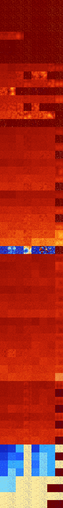

# B0123567 (122368-122879)

<details>
    <summary>Initial Grid</summary>
    
</details>


<details>
    <summary>Initial Grid RLE</summary>

```
#C Exported from GoGoL (https://github.com/marrow16/gogol)
#C Wrap mode: Toroidal
#C Boundary mode: Dead
#C Step: 0
x = 100, y = 100, rule = B0123567/S
o51bo9bo4bo17bo$12bo30bo2bo31bo14bo$3bo13bo11bo32b2o10bo$10bo8bo10bo9bo
bo15bo6bo8bo$12bo24bo15bobo24bo14bo$36bo6bo42bo$41bo16bo3bo33bo$3bobo7b
o9bo3bo25bo7bo7bo5bobo$bo77bo10b2o$14bo2bo56bo3bo20bo$3bo15b2o16bo58bo$
4bo27bo4bo18bo28bo$51bo7bo33bo$53bo20b2o$53bo21bo$10bobo8bo2bo7bo9bo10b
o8bo2bo22bo$bo3bobo18bo17bo28bo2bo$11bo41bo44b2o$26bo10bo16bo$4bo29bo3b
o22bo12bo8bo$8bo42bobo14bo4b2o$56bo4bo9bo27bo$14bo13bo7bo4bo7bo3bo12bo
25bo$14bo46bo9bo4bo11bo9bo$2bo7bo25bo4bo15bo15bo$27bo2bo$67bo4bo19bo$
23bo25bo4bo26bo3bo2bo$64bo18bo$8bo6bo13bo19bo18bo19bo$81bo15bo$2bo2bo
10bo6bo40bo$9b2o39bo2bo19bo13bo$o2bo23bo21bo4bo8bo2bo$6bo4bo15bo23bo6bo
4bo13bo12bo5bo$22bo10bo9bo$58bo4bo$7bo11bo20bo3bo16bo11bo3bo$o2bobobo
27bo3bo43bobo$15bo4bo13bo3bo6bo13bo23bo10bo$11bo7bo7bo5bo56bo$20bo10bo
38b2o8b2o$28bo23bo46bo$15bo14bobo55bo$6bo45bo10bo5bo9bo8bo2bo$bo24bo$
14bo7bo19bo4b3o11bo8bo16bo$6bo23b2o35bo12bo$25bo36bobo33bo$22bo19bo21bo
4bo3bobo4bo5bo$51bo25bo$59bo6bo13bo16bo$16bobo3bo3bo5bo2bo7bo18bo2bo4bo
$61bo8bo7bo13bo6bo$o38bo6bo9bo$25bo4bo32bo$24bobobo21bo43bo$o60bo$28bo
14bo21bo5bo3bo13bo$56bo19bo14bo7bo$o30bo5bo17bo11bo5bob2o$b2o7b3o17b2o
22bobo37bo$19bo10bo35bo5bobo7bo$28bo46bo$15b2o34bo4bo$13bo3bo$30bo47bo
5bo8bo2bobo$5bo19b2o8bo5bo9bo14bo18bo13bo$15bo9bo22bo28bo20bo$bo3bo16bo
35bo14b3o18bo2bo$o5bo8bo2bo66bo$6bo6bo15bo17bo8bo12b2o3bo$74bo$4bo2bo
56bo7bo22bo$46bo10bo3bo2bo27bo$27bo31bo9bo9b2o14bo$66bo$34bo16b2o26bo$
19bo4bo17bo31bo$8bo13bo22bo$13bo66bo13bo$30bo12bo20bo6bo23bo$20bo7bo4bo
3bo2bo20bo3bo$18bo19bo4bo17bo11bo23bo$14bo8bo46bo11bo$18bo8bo3bo23bo6bo
9bo3bo$o2bo19bo14bo3bo2bo2bo11bo19bo$33bo13bo17bo27bo$2bo9bo5bo42bo4bo
22bo$34bo2bo9bo6bo16bo5bo9b2o10bo$9bo2bo8bo37bo$22bo18bo29bo$o5bo2bo12b
o$15bo5bo32bo3bo32bo$23bo18bo10bo19bo$21bo68bo8bo$15bo10bo4bo17bo4b2o
17bo9bo14bo$23bo24bo6bo$22bo50bo6bo14bo$9bo15bo2bo24bo35bo8b2o!
```
</details>
<details>
    <summary>Thumbnail</summary>

</details>
<table>
<tr>
    <td><a href="./122368%20S%20Heat%20Map%20Activity.png"></a><br>S (122368)<br>R@6,p2</td>    <td><a href="./122369%20S0%20Heat%20Map%20Activity.png"></a><br>S0 (122369)<br>R@5,p2</td>    <td><a href="./122370%20S1%20Heat%20Map%20Activity.png"></a><br>S1 (122370)<br>R@5,p2</td>    <td><a href="./122371%20S01%20Heat%20Map%20Activity.png"></a><br>S01 (122371)<br>R@5,p2</td>    <td><a href="./122372%20S2%20Heat%20Map%20Activity.png"></a><br>S2 (122372)<br>R@8,p2</td>    <td><a href="./122373%20S02%20Heat%20Map%20Activity.png"></a><br>S02 (122373)<br>R@8,p2</td>    <td><a href="./122374%20S12%20Heat%20Map%20Activity.png"></a><br>S12 (122374)<br>R@5,p2</td>    <td><a href="./122375%20S012%20Heat%20Map%20Activity.png"></a><br>S012 (122375)<br>R@5,p2</td></tr>
<tr>
    <td><a href="./122376%20S3%20Heat%20Map%20Activity.png"></a><br>S3 (122376)<br>R@6,p4</td>    <td><a href="./122377%20S03%20Heat%20Map%20Activity.png"></a><br>S03 (122377)<br>R@6,p4</td>    <td><a href="./122378%20S13%20Heat%20Map%20Activity.png"></a><br>S13 (122378)<br>R@5,p2</td>    <td><a href="./122379%20S013%20Heat%20Map%20Activity.png"></a><br>S013 (122379)<br>R@5,p2</td>    <td><a href="./122380%20S23%20Heat%20Map%20Activity.png"></a><br>S23 (122380)<br>R@6,p2</td>    <td><a href="./122381%20S023%20Heat%20Map%20Activity.png"></a><br>S023 (122381)<br>R@6,p2</td>    <td><a href="./122382%20S123%20Heat%20Map%20Activity.png"></a><br>S123 (122382)<br>R@4,p2</td>    <td><a href="./122383%20S0123%20Heat%20Map%20Activity.png"></a><br>S0123 (122383)<br>R@4,p2</td></tr>
<tr>
    <td><a href="./122384%20S4%20Heat%20Map%20Activity.png"></a><br>S4 (122384)<br>R@6,p2</td>    <td><a href="./122385%20S04%20Heat%20Map%20Activity.png"></a><br>S04 (122385)<br>R@5,p2</td>    <td><a href="./122386%20S14%20Heat%20Map%20Activity.png"></a><br>S14 (122386)<br>R@5,p2</td>    <td><a href="./122387%20S014%20Heat%20Map%20Activity.png"></a><br>S014 (122387)<br>R@5,p2</td>    <td><a href="./122388%20S24%20Heat%20Map%20Activity.png"></a><br>S24 (122388)<br>R@8,p2</td>    <td><a href="./122389%20S024%20Heat%20Map%20Activity.png"></a><br>S024 (122389)<br>R@8,p2</td>    <td><a href="./122390%20S124%20Heat%20Map%20Activity.png"></a><br>S124 (122390)<br>R@5,p2</td>    <td><a href="./122391%20S0124%20Heat%20Map%20Activity.png"></a><br>S0124 (122391)<br>R@5,p2</td></tr>
<tr>
    <td><a href="./122392%20S34%20Heat%20Map%20Activity.png"></a><br>S34 (122392)<br>R@6,p2</td>    <td><a href="./122393%20S034%20Heat%20Map%20Activity.png"></a><br>S034 (122393)<br>R@6,p2</td>    <td><a href="./122394%20S134%20Heat%20Map%20Activity.png"></a><br>S134 (122394)<br>R@5,p2</td>    <td><a href="./122395%20S0134%20Heat%20Map%20Activity.png"></a><br>S0134 (122395)<br>R@5,p2</td>    <td><a href="./122396%20S234%20Heat%20Map%20Activity.png"></a><br>S234 (122396)<br>R@6,p2</td>    <td><a href="./122397%20S0234%20Heat%20Map%20Activity.png"></a><br>S0234 (122397)<br>R@6,p2</td>    <td><a href="./122398%20S1234%20Heat%20Map%20Activity.png"></a><br>S1234 (122398)<br>R@4,p2</td>    <td><a href="./122399%20S01234%20Heat%20Map%20Activity.png"></a><br>S01234 (122399)<br>R@4,p2</td></tr>
<tr>
    <td><a href="./122400%20S5%20Heat%20Map%20Activity.png"></a><br>S5 (122400)<br>G>1000</td>    <td><a href="./122401%20S05%20Heat%20Map%20Activity.png"></a><br>S05 (122401)<br>G>1000</td>    <td><a href="./122402%20S15%20Heat%20Map%20Activity.png"></a><br>S15 (122402)<br>G>1000</td>    <td><a href="./122403%20S015%20Heat%20Map%20Activity.png"></a><br>S015 (122403)<br>R@9,p2</td>    <td><a href="./122404%20S25%20Heat%20Map%20Activity.png"></a><br>S25 (122404)<br>R@7,p2</td>    <td><a href="./122405%20S025%20Heat%20Map%20Activity.png"></a><br>S025 (122405)<br>R@9,p2</td>    <td><a href="./122406%20S125%20Heat%20Map%20Activity.png"></a><br>S125 (122406)<br>R@6,p2</td>    <td><a href="./122407%20S0125%20Heat%20Map%20Activity.png"></a><br>S0125 (122407)<br>R@5,p2</td></tr>
<tr>
    <td><a href="./122408%20S35%20Heat%20Map%20Activity.png"></a><br>S35 (122408)<br>R@11,p2</td>    <td><a href="./122409%20S035%20Heat%20Map%20Activity.png"></a><br>S035 (122409)<br>R@42,p4</td>    <td><a href="./122410%20S135%20Heat%20Map%20Activity.png"></a><br>S135 (122410)<br>R@6,p2</td>    <td><a href="./122411%20S0135%20Heat%20Map%20Activity.png"></a><br>S0135 (122411)<br>R@5,p2</td>    <td><a href="./122412%20S235%20Heat%20Map%20Activity.png"></a><br>S235 (122412)<br>R@10,p2</td>    <td><a href="./122413%20S0235%20Heat%20Map%20Activity.png"></a><br>S0235 (122413)<br>R@10,p2</td>    <td><a href="./122414%20S1235%20Heat%20Map%20Activity.png"></a><br>S1235 (122414)<br>R@6,p2</td>    <td><a href="./122415%20S01235%20Heat%20Map%20Activity.png"></a><br>S01235 (122415)<br>R@4,p2</td></tr>
<tr>
    <td><a href="./122416%20S45%20Heat%20Map%20Activity.png"></a><br>S45 (122416)<br>R@22,p2</td>    <td><a href="./122417%20S045%20Heat%20Map%20Activity.png"></a><br>S045 (122417)<br>R@40,p2</td>    <td><a href="./122418%20S145%20Heat%20Map%20Activity.png"></a><br>S145 (122418)<br>R@7,p2</td>    <td><a href="./122419%20S0145%20Heat%20Map%20Activity.png"></a><br>S0145 (122419)<br>R@5,p2</td>    <td><a href="./122420%20S245%20Heat%20Map%20Activity.png"></a><br>S245 (122420)<br>R@9,p2</td>    <td><a href="./122421%20S0245%20Heat%20Map%20Activity.png"></a><br>S0245 (122421)<br>R@6,p2</td>    <td><a href="./122422%20S1245%20Heat%20Map%20Activity.png"></a><br>S1245 (122422)<br>R@6,p2</td>    <td><a href="./122423%20S01245%20Heat%20Map%20Activity.png"></a><br>S01245 (122423)<br>R@5,p2</td></tr>
<tr>
    <td><a href="./122424%20S345%20Heat%20Map%20Activity.png"></a><br>S345 (122424)<br>R@8,p2</td>    <td><a href="./122425%20S0345%20Heat%20Map%20Activity.png"></a><br>S0345 (122425)<br>R@6,p2</td>    <td><a href="./122426%20S1345%20Heat%20Map%20Activity.png"></a><br>S1345 (122426)<br>R@6,p2</td>    <td><a href="./122427%20S01345%20Heat%20Map%20Activity.png"></a><br>S01345 (122427)<br>R@5,p2</td>    <td><a href="./122428%20S2345%20Heat%20Map%20Activity.png"></a><br>S2345 (122428)<br>R@6,p2</td>    <td><a href="./122429%20S02345%20Heat%20Map%20Activity.png"></a><br>S02345 (122429)<br>R@5,p2</td>    <td><a href="./122430%20S12345%20Heat%20Map%20Activity.png"></a><br>S12345 (122430)<br>R@6,p2</td>    <td><a href="./122431%20S012345%20Heat%20Map%20Activity.png"></a><br>S012345 (122431)<br>R@4,p2</td></tr>
<tr>
    <td><a href="./122432%20S6%20Heat%20Map%20Activity.png"></a><br>S6 (122432)<br>G>1000</td>    <td><a href="./122433%20S06%20Heat%20Map%20Activity.png"></a><br>S06 (122433)<br>G>1000</td>    <td><a href="./122434%20S16%20Heat%20Map%20Activity.png"></a><br>S16 (122434)<br>G>1000</td>    <td><a href="./122435%20S016%20Heat%20Map%20Activity.png"></a><br>S016 (122435)<br>G>1000</td>    <td><a href="./122436%20S26%20Heat%20Map%20Activity.png"></a><br>S26 (122436)<br>G>1000</td>    <td><a href="./122437%20S026%20Heat%20Map%20Activity.png"></a><br>S026 (122437)<br>G>1000</td>    <td><a href="./122438%20S126%20Heat%20Map%20Activity.png"></a><br>S126 (122438)<br>G>1000</td>    <td><a href="./122439%20S0126%20Heat%20Map%20Activity.png"></a><br>S0126 (122439)<br>G>1000</td></tr>
<tr>
    <td><a href="./122440%20S36%20Heat%20Map%20Activity.png"></a><br>S36 (122440)<br>G>1000</td>    <td><a href="./122441%20S036%20Heat%20Map%20Activity.png"></a><br>S036 (122441)<br>G>1000</td>    <td><a href="./122442%20S136%20Heat%20Map%20Activity.png"></a><br>S136 (122442)<br>G>1000</td>    <td><a href="./122443%20S0136%20Heat%20Map%20Activity.png"></a><br>S0136 (122443)<br>R@7,p2</td>    <td><a href="./122444%20S236%20Heat%20Map%20Activity.png"></a><br>S236 (122444)<br>G>1000</td>    <td><a href="./122445%20S0236%20Heat%20Map%20Activity.png"></a><br>S0236 (122445)<br>G>1000</td>    <td><a href="./122446%20S1236%20Heat%20Map%20Activity.png"></a><br>S1236 (122446)<br>R@12,p2</td>    <td><a href="./122447%20S01236%20Heat%20Map%20Activity.png"></a><br>S01236 (122447)<br>R@4,p2</td></tr>
<tr>
    <td><a href="./122448%20S46%20Heat%20Map%20Activity.png"></a><br>S46 (122448)<br>G>1000</td>    <td><a href="./122449%20S046%20Heat%20Map%20Activity.png"></a><br>S046 (122449)<br>G>1000</td>    <td><a href="./122450%20S146%20Heat%20Map%20Activity.png"></a><br>S146 (122450)<br>G>1000</td>    <td><a href="./122451%20S0146%20Heat%20Map%20Activity.png"></a><br>S0146 (122451)<br>G>1000</td>    <td><a href="./122452%20S246%20Heat%20Map%20Activity.png"></a><br>S246 (122452)<br>G>1000</td>    <td><a href="./122453%20S0246%20Heat%20Map%20Activity.png"></a><br>S0246 (122453)<br>G>1000</td>    <td><a href="./122454%20S1246%20Heat%20Map%20Activity.png"></a><br>S1246 (122454)<br>G>1000</td>    <td><a href="./122455%20S01246%20Heat%20Map%20Activity.png"></a><br>S01246 (122455)<br>G>1000</td></tr>
<tr>
    <td><a href="./122456%20S346%20Heat%20Map%20Activity.png"></a><br>S346 (122456)<br>G>1000</td>    <td><a href="./122457%20S0346%20Heat%20Map%20Activity.png"></a><br>S0346 (122457)<br>G>1000</td>    <td><a href="./122458%20S1346%20Heat%20Map%20Activity.png"></a><br>S1346 (122458)<br>R@38,p4</td>    <td><a href="./122459%20S01346%20Heat%20Map%20Activity.png"></a><br>S01346 (122459)<br>R@5,p2</td>    <td><a href="./122460%20S2346%20Heat%20Map%20Activity.png"></a><br>S2346 (122460)<br>R@31,p4</td>    <td><a href="./122461%20S02346%20Heat%20Map%20Activity.png"></a><br>S02346 (122461)<br>R@18,p4</td>    <td><a href="./122462%20S12346%20Heat%20Map%20Activity.png"></a><br>S12346 (122462)<br>R@10,p2</td>    <td><a href="./122463%20S012346%20Heat%20Map%20Activity.png"></a><br>S012346 (122463)<br>R@4,p2</td></tr>
<tr>
    <td><a href="./122464%20S56%20Heat%20Map%20Activity.png"></a><br>S56 (122464)<br>G>1000</td>    <td><a href="./122465%20S056%20Heat%20Map%20Activity.png"></a><br>S056 (122465)<br>G>1000</td>    <td><a href="./122466%20S156%20Heat%20Map%20Activity.png"></a><br>S156 (122466)<br>G>1000</td>    <td><a href="./122467%20S0156%20Heat%20Map%20Activity.png"></a><br>S0156 (122467)<br>G>1000</td>    <td><a href="./122468%20S256%20Heat%20Map%20Activity.png"></a><br>S256 (122468)<br>G>1000</td>    <td><a href="./122469%20S0256%20Heat%20Map%20Activity.png"></a><br>S0256 (122469)<br>G>1000</td>    <td><a href="./122470%20S1256%20Heat%20Map%20Activity.png"></a><br>S1256 (122470)<br>G>1000</td>    <td><a href="./122471%20S01256%20Heat%20Map%20Activity.png"></a><br>S01256 (122471)<br>G>1000</td></tr>
<tr>
    <td><a href="./122472%20S356%20Heat%20Map%20Activity.png"></a><br>S356 (122472)<br>G>1000</td>    <td><a href="./122473%20S0356%20Heat%20Map%20Activity.png"></a><br>S0356 (122473)<br>G>1000</td>    <td><a href="./122474%20S1356%20Heat%20Map%20Activity.png"></a><br>S1356 (122474)<br>G>1000</td>    <td><a href="./122475%20S01356%20Heat%20Map%20Activity.png"></a><br>S01356 (122475)<br>R@7,p4</td>    <td><a href="./122476%20S2356%20Heat%20Map%20Activity.png"></a><br>S2356 (122476)<br>G>1000</td>    <td><a href="./122477%20S02356%20Heat%20Map%20Activity.png"></a><br>S02356 (122477)<br>R@13,p4</td>    <td><a href="./122478%20S12356%20Heat%20Map%20Activity.png"></a><br>S12356 (122478)<br>R@15,p4</td>    <td><a href="./122479%20S012356%20Heat%20Map%20Activity.png"></a><br>S012356 (122479)<br>R@4,p2</td></tr>
<tr>
    <td><a href="./122480%20S456%20Heat%20Map%20Activity.png"></a><br>S456 (122480)<br>G>1000</td>    <td><a href="./122481%20S0456%20Heat%20Map%20Activity.png"></a><br>S0456 (122481)<br>G>1000</td>    <td><a href="./122482%20S1456%20Heat%20Map%20Activity.png"></a><br>S1456 (122482)<br>G>1000</td>    <td><a href="./122483%20S01456%20Heat%20Map%20Activity.png"></a><br>S01456 (122483)<br>G>1000</td>    <td><a href="./122484%20S2456%20Heat%20Map%20Activity.png"></a><br>S2456 (122484)<br>G>1000</td>    <td><a href="./122485%20S02456%20Heat%20Map%20Activity.png"></a><br>S02456 (122485)<br>G>1000</td>    <td><a href="./122486%20S12456%20Heat%20Map%20Activity.png"></a><br>S12456 (122486)<br>G>1000</td>    <td><a href="./122487%20S012456%20Heat%20Map%20Activity.png"></a><br>S012456 (122487)<br>R@11,p2</td></tr>
<tr>
    <td><a href="./122488%20S3456%20Heat%20Map%20Activity.png"></a><br>S3456 (122488)<br>R@27,p4</td>    <td><a href="./122489%20S03456%20Heat%20Map%20Activity.png"></a><br>S03456 (122489)<br>R@25,p4</td>    <td><a href="./122490%20S13456%20Heat%20Map%20Activity.png"></a><br>S13456 (122490)<br>R@14,p2</td>    <td><a href="./122491%20S013456%20Heat%20Map%20Activity.png"></a><br>S013456 (122491)<br>R@6,p2</td>    <td><a href="./122492%20S23456%20Heat%20Map%20Activity.png"></a><br>S23456 (122492)<br>R@32,p4</td>    <td><a href="./122493%20S023456%20Heat%20Map%20Activity.png"></a><br>S023456 (122493)<br>R@14,p4</td>    <td><a href="./122494%20S123456%20Heat%20Map%20Activity.png"></a><br>S123456 (122494)<br>R@9,p2</td>    <td><a href="./122495%20S0123456%20Heat%20Map%20Activity.png"></a><br>S0123456 (122495)<br>R@4,p2</td></tr>
<tr>
    <td><a href="./122496%20S7%20Heat%20Map%20Activity.png"></a><br>S7 (122496)<br>G>1000</td>    <td><a href="./122497%20S07%20Heat%20Map%20Activity.png"></a><br>S07 (122497)<br>G>1000</td>    <td><a href="./122498%20S17%20Heat%20Map%20Activity.png"></a><br>S17 (122498)<br>G>1000</td>    <td><a href="./122499%20S017%20Heat%20Map%20Activity.png"></a><br>S017 (122499)<br>G>1000</td>    <td><a href="./122500%20S27%20Heat%20Map%20Activity.png"></a><br>S27 (122500)<br>G>1000</td>    <td><a href="./122501%20S027%20Heat%20Map%20Activity.png"></a><br>S027 (122501)<br>G>1000</td>    <td><a href="./122502%20S127%20Heat%20Map%20Activity.png"></a><br>S127 (122502)<br>G>1000</td>    <td><a href="./122503%20S0127%20Heat%20Map%20Activity.png"></a><br>S0127 (122503)<br>G>1000</td></tr>
<tr>
    <td><a href="./122504%20S37%20Heat%20Map%20Activity.png"></a><br>S37 (122504)<br>G>1000</td>    <td><a href="./122505%20S037%20Heat%20Map%20Activity.png"></a><br>S037 (122505)<br>G>1000</td>    <td><a href="./122506%20S137%20Heat%20Map%20Activity.png"></a><br>S137 (122506)<br>G>1000</td>    <td><a href="./122507%20S0137%20Heat%20Map%20Activity.png"></a><br>S0137 (122507)<br>G>1000</td>    <td><a href="./122508%20S237%20Heat%20Map%20Activity.png"></a><br>S237 (122508)<br>G>1000</td>    <td><a href="./122509%20S0237%20Heat%20Map%20Activity.png"></a><br>S0237 (122509)<br>G>1000</td>    <td><a href="./122510%20S1237%20Heat%20Map%20Activity.png"></a><br>S1237 (122510)<br>G>1000</td>    <td><a href="./122511%20S01237%20Heat%20Map%20Activity.png"></a><br>S01237 (122511)<br>R@5,p2</td></tr>
<tr>
    <td><a href="./122512%20S47%20Heat%20Map%20Activity.png"></a><br>S47 (122512)<br>G>1000</td>    <td><a href="./122513%20S047%20Heat%20Map%20Activity.png"></a><br>S047 (122513)<br>G>1000</td>    <td><a href="./122514%20S147%20Heat%20Map%20Activity.png"></a><br>S147 (122514)<br>G>1000</td>    <td><a href="./122515%20S0147%20Heat%20Map%20Activity.png"></a><br>S0147 (122515)<br>G>1000</td>    <td><a href="./122516%20S247%20Heat%20Map%20Activity.png"></a><br>S247 (122516)<br>G>1000</td>    <td><a href="./122517%20S0247%20Heat%20Map%20Activity.png"></a><br>S0247 (122517)<br>G>1000</td>    <td><a href="./122518%20S1247%20Heat%20Map%20Activity.png"></a><br>S1247 (122518)<br>G>1000</td>    <td><a href="./122519%20S01247%20Heat%20Map%20Activity.png"></a><br>S01247 (122519)<br>G>1000</td></tr>
<tr>
    <td><a href="./122520%20S347%20Heat%20Map%20Activity.png"></a><br>S347 (122520)<br>G>1000</td>    <td><a href="./122521%20S0347%20Heat%20Map%20Activity.png"></a><br>S0347 (122521)<br>G>1000</td>    <td><a href="./122522%20S1347%20Heat%20Map%20Activity.png"></a><br>S1347 (122522)<br>G>1000</td>    <td><a href="./122523%20S01347%20Heat%20Map%20Activity.png"></a><br>S01347 (122523)<br>G>1000</td>    <td><a href="./122524%20S2347%20Heat%20Map%20Activity.png"></a><br>S2347 (122524)<br>G>1000</td>    <td><a href="./122525%20S02347%20Heat%20Map%20Activity.png"></a><br>S02347 (122525)<br>G>1000</td>    <td><a href="./122526%20S12347%20Heat%20Map%20Activity.png"></a><br>S12347 (122526)<br>G>1000</td>    <td><a href="./122527%20S012347%20Heat%20Map%20Activity.png"></a><br>S012347 (122527)<br>R@3,p2</td></tr>
<tr>
    <td><a href="./122528%20S57%20Heat%20Map%20Activity.png"></a><br>S57 (122528)<br>G>1000</td>    <td><a href="./122529%20S057%20Heat%20Map%20Activity.png"></a><br>S057 (122529)<br>G>1000</td>    <td><a href="./122530%20S157%20Heat%20Map%20Activity.png"></a><br>S157 (122530)<br>G>1000</td>    <td><a href="./122531%20S0157%20Heat%20Map%20Activity.png"></a><br>S0157 (122531)<br>G>1000</td>    <td><a href="./122532%20S257%20Heat%20Map%20Activity.png"></a><br>S257 (122532)<br>G>1000</td>    <td><a href="./122533%20S0257%20Heat%20Map%20Activity.png"></a><br>S0257 (122533)<br>G>1000</td>    <td><a href="./122534%20S1257%20Heat%20Map%20Activity.png"></a><br>S1257 (122534)<br>G>1000</td>    <td><a href="./122535%20S01257%20Heat%20Map%20Activity.png"></a><br>S01257 (122535)<br>G>1000</td></tr>
<tr>
    <td><a href="./122536%20S357%20Heat%20Map%20Activity.png"></a><br>S357 (122536)<br>G>1000</td>    <td><a href="./122537%20S0357%20Heat%20Map%20Activity.png"></a><br>S0357 (122537)<br>G>1000</td>    <td><a href="./122538%20S1357%20Heat%20Map%20Activity.png"></a><br>S1357 (122538)<br>G>1000</td>    <td><a href="./122539%20S01357%20Heat%20Map%20Activity.png"></a><br>S01357 (122539)<br>G>1000</td>    <td><a href="./122540%20S2357%20Heat%20Map%20Activity.png"></a><br>S2357 (122540)<br>G>1000</td>    <td><a href="./122541%20S02357%20Heat%20Map%20Activity.png"></a><br>S02357 (122541)<br>G>1000</td>    <td><a href="./122542%20S12357%20Heat%20Map%20Activity.png"></a><br>S12357 (122542)<br>G>1000</td>    <td><a href="./122543%20S012357%20Heat%20Map%20Activity.png"></a><br>S012357 (122543)<br>G>1000</td></tr>
<tr>
    <td><a href="./122544%20S457%20Heat%20Map%20Activity.png"></a><br>S457 (122544)<br>G>1000</td>    <td><a href="./122545%20S0457%20Heat%20Map%20Activity.png"></a><br>S0457 (122545)<br>G>1000</td>    <td><a href="./122546%20S1457%20Heat%20Map%20Activity.png"></a><br>S1457 (122546)<br>G>1000</td>    <td><a href="./122547%20S01457%20Heat%20Map%20Activity.png"></a><br>S01457 (122547)<br>G>1000</td>    <td><a href="./122548%20S2457%20Heat%20Map%20Activity.png"></a><br>S2457 (122548)<br>G>1000</td>    <td><a href="./122549%20S02457%20Heat%20Map%20Activity.png"></a><br>S02457 (122549)<br>G>1000</td>    <td><a href="./122550%20S12457%20Heat%20Map%20Activity.png"></a><br>S12457 (122550)<br>G>1000</td>    <td><a href="./122551%20S012457%20Heat%20Map%20Activity.png"></a><br>S012457 (122551)<br>G>1000</td></tr>
<tr>
    <td><a href="./122552%20S3457%20Heat%20Map%20Activity.png"></a><br>S3457 (122552)<br>G>1000</td>    <td><a href="./122553%20S03457%20Heat%20Map%20Activity.png"></a><br>S03457 (122553)<br>G>1000</td>    <td><a href="./122554%20S13457%20Heat%20Map%20Activity.png"></a><br>S13457 (122554)<br>G>1000</td>    <td><a href="./122555%20S013457%20Heat%20Map%20Activity.png"></a><br>S013457 (122555)<br>G>1000</td>    <td><a href="./122556%20S23457%20Heat%20Map%20Activity.png"></a><br>S23457 (122556)<br>G>1000</td>    <td><a href="./122557%20S023457%20Heat%20Map%20Activity.png"></a><br>S023457 (122557)<br>G>1000</td>    <td><a href="./122558%20S123457%20Heat%20Map%20Activity.png"></a><br>S123457 (122558)<br>G>1000</td>    <td><a href="./122559%20S0123457%20Heat%20Map%20Activity.png"></a><br>S0123457 (122559)<br>R@3,p2</td></tr>
<tr>
    <td><a href="./122560%20S67%20Heat%20Map%20Activity.png"></a><br>S67 (122560)<br>G>1000</td>    <td><a href="./122561%20S067%20Heat%20Map%20Activity.png"></a><br>S067 (122561)<br>G>1000</td>    <td><a href="./122562%20S167%20Heat%20Map%20Activity.png"></a><br>S167 (122562)<br>G>1000</td>    <td><a href="./122563%20S0167%20Heat%20Map%20Activity.png"></a><br>S0167 (122563)<br>G>1000</td>    <td><a href="./122564%20S267%20Heat%20Map%20Activity.png"></a><br>S267 (122564)<br>G>1000</td>    <td><a href="./122565%20S0267%20Heat%20Map%20Activity.png"></a><br>S0267 (122565)<br>G>1000</td>    <td><a href="./122566%20S1267%20Heat%20Map%20Activity.png"></a><br>S1267 (122566)<br>G>1000</td>    <td><a href="./122567%20S01267%20Heat%20Map%20Activity.png"></a><br>S01267 (122567)<br>G>1000</td></tr>
<tr>
    <td><a href="./122568%20S367%20Heat%20Map%20Activity.png"></a><br>S367 (122568)<br>G>1000</td>    <td><a href="./122569%20S0367%20Heat%20Map%20Activity.png"></a><br>S0367 (122569)<br>G>1000</td>    <td><a href="./122570%20S1367%20Heat%20Map%20Activity.png"></a><br>S1367 (122570)<br>G>1000</td>    <td><a href="./122571%20S01367%20Heat%20Map%20Activity.png"></a><br>S01367 (122571)<br>G>1000</td>    <td><a href="./122572%20S2367%20Heat%20Map%20Activity.png"></a><br>S2367 (122572)<br>G>1000</td>    <td><a href="./122573%20S02367%20Heat%20Map%20Activity.png"></a><br>S02367 (122573)<br>G>1000</td>    <td><a href="./122574%20S12367%20Heat%20Map%20Activity.png"></a><br>S12367 (122574)<br>G>1000</td>    <td><a href="./122575%20S012367%20Heat%20Map%20Activity.png"></a><br>S012367 (122575)<br>R@5,p2</td></tr>
<tr>
    <td><a href="./122576%20S467%20Heat%20Map%20Activity.png"></a><br>S467 (122576)<br>G>1000</td>    <td><a href="./122577%20S0467%20Heat%20Map%20Activity.png"></a><br>S0467 (122577)<br>G>1000</td>    <td><a href="./122578%20S1467%20Heat%20Map%20Activity.png"></a><br>S1467 (122578)<br>G>1000</td>    <td><a href="./122579%20S01467%20Heat%20Map%20Activity.png"></a><br>S01467 (122579)<br>G>1000</td>    <td><a href="./122580%20S2467%20Heat%20Map%20Activity.png"></a><br>S2467 (122580)<br>G>1000</td>    <td><a href="./122581%20S02467%20Heat%20Map%20Activity.png"></a><br>S02467 (122581)<br>G>1000</td>    <td><a href="./122582%20S12467%20Heat%20Map%20Activity.png"></a><br>S12467 (122582)<br>G>1000</td>    <td><a href="./122583%20S012467%20Heat%20Map%20Activity.png"></a><br>S012467 (122583)<br>G>1000</td></tr>
<tr>
    <td><a href="./122584%20S3467%20Heat%20Map%20Activity.png"></a><br>S3467 (122584)<br>G>1000</td>    <td><a href="./122585%20S03467%20Heat%20Map%20Activity.png"></a><br>S03467 (122585)<br>G>1000</td>    <td><a href="./122586%20S13467%20Heat%20Map%20Activity.png"></a><br>S13467 (122586)<br>G>1000</td>    <td><a href="./122587%20S013467%20Heat%20Map%20Activity.png"></a><br>S013467 (122587)<br>G>1000</td>    <td><a href="./122588%20S23467%20Heat%20Map%20Activity.png"></a><br>S23467 (122588)<br>G>1000</td>    <td><a href="./122589%20S023467%20Heat%20Map%20Activity.png"></a><br>S023467 (122589)<br>G>1000</td>    <td><a href="./122590%20S123467%20Heat%20Map%20Activity.png"></a><br>S123467 (122590)<br>G>1000</td>    <td><a href="./122591%20S0123467%20Heat%20Map%20Activity.png"></a><br>S0123467 (122591)<br>R@3,p2</td></tr>
<tr>
    <td><a href="./122592%20S567%20Heat%20Map%20Activity.png"></a><br>S567 (122592)<br>G>1000</td>    <td><a href="./122593%20S0567%20Heat%20Map%20Activity.png"></a><br>S0567 (122593)<br>G>1000</td>    <td><a href="./122594%20S1567%20Heat%20Map%20Activity.png"></a><br>S1567 (122594)<br>G>1000</td>    <td><a href="./122595%20S01567%20Heat%20Map%20Activity.png"></a><br>S01567 (122595)<br>G>1000</td>    <td><a href="./122596%20S2567%20Heat%20Map%20Activity.png"></a><br>S2567 (122596)<br>G>1000</td>    <td><a href="./122597%20S02567%20Heat%20Map%20Activity.png"></a><br>S02567 (122597)<br>G>1000</td>    <td><a href="./122598%20S12567%20Heat%20Map%20Activity.png"></a><br>S12567 (122598)<br>G>1000</td>    <td><a href="./122599%20S012567%20Heat%20Map%20Activity.png"></a><br>S012567 (122599)<br>G>1000</td></tr>
<tr>
    <td><a href="./122600%20S3567%20Heat%20Map%20Activity.png"></a><br>S3567 (122600)<br>G>1000</td>    <td><a href="./122601%20S03567%20Heat%20Map%20Activity.png"></a><br>S03567 (122601)<br>G>1000</td>    <td><a href="./122602%20S13567%20Heat%20Map%20Activity.png"></a><br>S13567 (122602)<br>G>1000</td>    <td><a href="./122603%20S013567%20Heat%20Map%20Activity.png"></a><br>S013567 (122603)<br>G>1000</td>    <td><a href="./122604%20S23567%20Heat%20Map%20Activity.png"></a><br>S23567 (122604)<br>G>1000</td>    <td><a href="./122605%20S023567%20Heat%20Map%20Activity.png"></a><br>S023567 (122605)<br>G>1000</td>    <td><a href="./122606%20S123567%20Heat%20Map%20Activity.png"></a><br>S123567 (122606)<br>G>1000</td>    <td><a href="./122607%20S0123567%20Heat%20Map%20Activity.png"></a><br>S0123567 (122607)<br>G>1000</td></tr>
<tr>
    <td><a href="./122608%20S4567%20Heat%20Map%20Activity.png"></a><br>S4567 (122608)<br>G>1000</td>    <td><a href="./122609%20S04567%20Heat%20Map%20Activity.png"></a><br>S04567 (122609)<br>G>1000</td>    <td><a href="./122610%20S14567%20Heat%20Map%20Activity.png"></a><br>S14567 (122610)<br>G>1000</td>    <td><a href="./122611%20S014567%20Heat%20Map%20Activity.png"></a><br>S014567 (122611)<br>G>1000</td>    <td><a href="./122612%20S24567%20Heat%20Map%20Activity.png"></a><br>S24567 (122612)<br>G>1000</td>    <td><a href="./122613%20S024567%20Heat%20Map%20Activity.png"></a><br>S024567 (122613)<br>G>1000</td>    <td><a href="./122614%20S124567%20Heat%20Map%20Activity.png"></a><br>S124567 (122614)<br>G>1000</td>    <td><a href="./122615%20S0124567%20Heat%20Map%20Activity.png"></a><br>S0124567 (122615)<br>G>1000</td></tr>
<tr>
    <td><a href="./122616%20S34567%20Heat%20Map%20Activity.png"></a><br>S34567 (122616)<br>R@146,p60</td>    <td><a href="./122617%20S034567%20Heat%20Map%20Activity.png"></a><br>S034567 (122617)<br>R@153,p60</td>    <td><a href="./122618%20S134567%20Heat%20Map%20Activity.png"></a><br>S134567 (122618)<br>R@109,p24</td>    <td><a href="./122619%20S0134567%20Heat%20Map%20Activity.png"></a><br>S0134567 (122619)<br>R@203,p30</td>    <td><a href="./122620%20S234567%20Heat%20Map%20Activity.png"></a><br>S234567 (122620)<br>R@99,p30</td>    <td><a href="./122621%20S0234567%20Heat%20Map%20Activity.png"></a><br>S0234567 (122621)<br>R@220,p6</td>    <td><a href="./122622%20S1234567%20Heat%20Map%20Activity.png"></a><br>S1234567 (122622)<br>R@59,p6</td>    <td><a href="./122623%20S01234567%20Heat%20Map%20Activity.png"></a><br>S01234567 (122623)<br>R@3,p2</td></tr>
<tr>
    <td><a href="./122624%20S8%20Heat%20Map%20Activity.png"></a><br>S8 (122624)<br>G>1000</td>    <td><a href="./122625%20S08%20Heat%20Map%20Activity.png"></a><br>S08 (122625)<br>G>1000</td>    <td><a href="./122626%20S18%20Heat%20Map%20Activity.png"></a><br>S18 (122626)<br>G>1000</td>    <td><a href="./122627%20S018%20Heat%20Map%20Activity.png"></a><br>S018 (122627)<br>G>1000</td>    <td><a href="./122628%20S28%20Heat%20Map%20Activity.png"></a><br>S28 (122628)<br>G>1000</td>    <td><a href="./122629%20S028%20Heat%20Map%20Activity.png"></a><br>S028 (122629)<br>G>1000</td>    <td><a href="./122630%20S128%20Heat%20Map%20Activity.png"></a><br>S128 (122630)<br>G>1000</td>    <td><a href="./122631%20S0128%20Heat%20Map%20Activity.png"></a><br>S0128 (122631)<br>G>1000</td></tr>
<tr>
    <td><a href="./122632%20S38%20Heat%20Map%20Activity.png"></a><br>S38 (122632)<br>G>1000</td>    <td><a href="./122633%20S038%20Heat%20Map%20Activity.png"></a><br>S038 (122633)<br>G>1000</td>    <td><a href="./122634%20S138%20Heat%20Map%20Activity.png"></a><br>S138 (122634)<br>G>1000</td>    <td><a href="./122635%20S0138%20Heat%20Map%20Activity.png"></a><br>S0138 (122635)<br>G>1000</td>    <td><a href="./122636%20S238%20Heat%20Map%20Activity.png"></a><br>S238 (122636)<br>G>1000</td>    <td><a href="./122637%20S0238%20Heat%20Map%20Activity.png"></a><br>S0238 (122637)<br>G>1000</td>    <td><a href="./122638%20S1238%20Heat%20Map%20Activity.png"></a><br>S1238 (122638)<br>G>1000</td>    <td><a href="./122639%20S01238%20Heat%20Map%20Activity.png"></a><br>S01238 (122639)<br>G>1000</td></tr>
<tr>
    <td><a href="./122640%20S48%20Heat%20Map%20Activity.png"></a><br>S48 (122640)<br>G>1000</td>    <td><a href="./122641%20S048%20Heat%20Map%20Activity.png"></a><br>S048 (122641)<br>G>1000</td>    <td><a href="./122642%20S148%20Heat%20Map%20Activity.png"></a><br>S148 (122642)<br>G>1000</td>    <td><a href="./122643%20S0148%20Heat%20Map%20Activity.png"></a><br>S0148 (122643)<br>G>1000</td>    <td><a href="./122644%20S248%20Heat%20Map%20Activity.png"></a><br>S248 (122644)<br>G>1000</td>    <td><a href="./122645%20S0248%20Heat%20Map%20Activity.png"></a><br>S0248 (122645)<br>G>1000</td>    <td><a href="./122646%20S1248%20Heat%20Map%20Activity.png"></a><br>S1248 (122646)<br>G>1000</td>    <td><a href="./122647%20S01248%20Heat%20Map%20Activity.png"></a><br>S01248 (122647)<br>G>1000</td></tr>
<tr>
    <td><a href="./122648%20S348%20Heat%20Map%20Activity.png"></a><br>S348 (122648)<br>G>1000</td>    <td><a href="./122649%20S0348%20Heat%20Map%20Activity.png"></a><br>S0348 (122649)<br>G>1000</td>    <td><a href="./122650%20S1348%20Heat%20Map%20Activity.png"></a><br>S1348 (122650)<br>G>1000</td>    <td><a href="./122651%20S01348%20Heat%20Map%20Activity.png"></a><br>S01348 (122651)<br>G>1000</td>    <td><a href="./122652%20S2348%20Heat%20Map%20Activity.png"></a><br>S2348 (122652)<br>G>1000</td>    <td><a href="./122653%20S02348%20Heat%20Map%20Activity.png"></a><br>S02348 (122653)<br>G>1000</td>    <td><a href="./122654%20S12348%20Heat%20Map%20Activity.png"></a><br>S12348 (122654)<br>G>1000</td>    <td><a href="./122655%20S012348%20Heat%20Map%20Activity.png"></a><br>S012348 (122655)<br>G>1000</td></tr>
<tr>
    <td><a href="./122656%20S58%20Heat%20Map%20Activity.png"></a><br>S58 (122656)<br>G>1000</td>    <td><a href="./122657%20S058%20Heat%20Map%20Activity.png"></a><br>S058 (122657)<br>G>1000</td>    <td><a href="./122658%20S158%20Heat%20Map%20Activity.png"></a><br>S158 (122658)<br>G>1000</td>    <td><a href="./122659%20S0158%20Heat%20Map%20Activity.png"></a><br>S0158 (122659)<br>G>1000</td>    <td><a href="./122660%20S258%20Heat%20Map%20Activity.png"></a><br>S258 (122660)<br>G>1000</td>    <td><a href="./122661%20S0258%20Heat%20Map%20Activity.png"></a><br>S0258 (122661)<br>G>1000</td>    <td><a href="./122662%20S1258%20Heat%20Map%20Activity.png"></a><br>S1258 (122662)<br>G>1000</td>    <td><a href="./122663%20S01258%20Heat%20Map%20Activity.png"></a><br>S01258 (122663)<br>G>1000</td></tr>
<tr>
    <td><a href="./122664%20S358%20Heat%20Map%20Activity.png"></a><br>S358 (122664)<br>G>1000</td>    <td><a href="./122665%20S0358%20Heat%20Map%20Activity.png"></a><br>S0358 (122665)<br>G>1000</td>    <td><a href="./122666%20S1358%20Heat%20Map%20Activity.png"></a><br>S1358 (122666)<br>G>1000</td>    <td><a href="./122667%20S01358%20Heat%20Map%20Activity.png"></a><br>S01358 (122667)<br>G>1000</td>    <td><a href="./122668%20S2358%20Heat%20Map%20Activity.png"></a><br>S2358 (122668)<br>G>1000</td>    <td><a href="./122669%20S02358%20Heat%20Map%20Activity.png"></a><br>S02358 (122669)<br>G>1000</td>    <td><a href="./122670%20S12358%20Heat%20Map%20Activity.png"></a><br>S12358 (122670)<br>G>1000</td>    <td><a href="./122671%20S012358%20Heat%20Map%20Activity.png"></a><br>S012358 (122671)<br>G>1000</td></tr>
<tr>
    <td><a href="./122672%20S458%20Heat%20Map%20Activity.png"></a><br>S458 (122672)<br>G>1000</td>    <td><a href="./122673%20S0458%20Heat%20Map%20Activity.png"></a><br>S0458 (122673)<br>G>1000</td>    <td><a href="./122674%20S1458%20Heat%20Map%20Activity.png"></a><br>S1458 (122674)<br>G>1000</td>    <td><a href="./122675%20S01458%20Heat%20Map%20Activity.png"></a><br>S01458 (122675)<br>G>1000</td>    <td><a href="./122676%20S2458%20Heat%20Map%20Activity.png"></a><br>S2458 (122676)<br>G>1000</td>    <td><a href="./122677%20S02458%20Heat%20Map%20Activity.png"></a><br>S02458 (122677)<br>G>1000</td>    <td><a href="./122678%20S12458%20Heat%20Map%20Activity.png"></a><br>S12458 (122678)<br>G>1000</td>    <td><a href="./122679%20S012458%20Heat%20Map%20Activity.png"></a><br>S012458 (122679)<br>G>1000</td></tr>
<tr>
    <td><a href="./122680%20S3458%20Heat%20Map%20Activity.png"></a><br>S3458 (122680)<br>G>1000</td>    <td><a href="./122681%20S03458%20Heat%20Map%20Activity.png"></a><br>S03458 (122681)<br>G>1000</td>    <td><a href="./122682%20S13458%20Heat%20Map%20Activity.png"></a><br>S13458 (122682)<br>G>1000</td>    <td><a href="./122683%20S013458%20Heat%20Map%20Activity.png"></a><br>S013458 (122683)<br>G>1000</td>    <td><a href="./122684%20S23458%20Heat%20Map%20Activity.png"></a><br>S23458 (122684)<br>G>1000</td>    <td><a href="./122685%20S023458%20Heat%20Map%20Activity.png"></a><br>S023458 (122685)<br>G>1000</td>    <td><a href="./122686%20S123458%20Heat%20Map%20Activity.png"></a><br>S123458 (122686)<br>G>1000</td>    <td><a href="./122687%20S0123458%20Heat%20Map%20Activity.png"></a><br>S0123458 (122687)<br>G>1000</td></tr>
<tr>
    <td><a href="./122688%20S68%20Heat%20Map%20Activity.png"></a><br>S68 (122688)<br>G>1000</td>    <td><a href="./122689%20S068%20Heat%20Map%20Activity.png"></a><br>S068 (122689)<br>G>1000</td>    <td><a href="./122690%20S168%20Heat%20Map%20Activity.png"></a><br>S168 (122690)<br>G>1000</td>    <td><a href="./122691%20S0168%20Heat%20Map%20Activity.png"></a><br>S0168 (122691)<br>G>1000</td>    <td><a href="./122692%20S268%20Heat%20Map%20Activity.png"></a><br>S268 (122692)<br>G>1000</td>    <td><a href="./122693%20S0268%20Heat%20Map%20Activity.png"></a><br>S0268 (122693)<br>G>1000</td>    <td><a href="./122694%20S1268%20Heat%20Map%20Activity.png"></a><br>S1268 (122694)<br>G>1000</td>    <td><a href="./122695%20S01268%20Heat%20Map%20Activity.png"></a><br>S01268 (122695)<br>G>1000</td></tr>
<tr>
    <td><a href="./122696%20S368%20Heat%20Map%20Activity.png"></a><br>S368 (122696)<br>G>1000</td>    <td><a href="./122697%20S0368%20Heat%20Map%20Activity.png"></a><br>S0368 (122697)<br>G>1000</td>    <td><a href="./122698%20S1368%20Heat%20Map%20Activity.png"></a><br>S1368 (122698)<br>G>1000</td>    <td><a href="./122699%20S01368%20Heat%20Map%20Activity.png"></a><br>S01368 (122699)<br>G>1000</td>    <td><a href="./122700%20S2368%20Heat%20Map%20Activity.png"></a><br>S2368 (122700)<br>G>1000</td>    <td><a href="./122701%20S02368%20Heat%20Map%20Activity.png"></a><br>S02368 (122701)<br>G>1000</td>    <td><a href="./122702%20S12368%20Heat%20Map%20Activity.png"></a><br>S12368 (122702)<br>G>1000</td>    <td><a href="./122703%20S012368%20Heat%20Map%20Activity.png"></a><br>S012368 (122703)<br>G>1000</td></tr>
<tr>
    <td><a href="./122704%20S468%20Heat%20Map%20Activity.png"></a><br>S468 (122704)<br>G>1000</td>    <td><a href="./122705%20S0468%20Heat%20Map%20Activity.png"></a><br>S0468 (122705)<br>G>1000</td>    <td><a href="./122706%20S1468%20Heat%20Map%20Activity.png"></a><br>S1468 (122706)<br>G>1000</td>    <td><a href="./122707%20S01468%20Heat%20Map%20Activity.png"></a><br>S01468 (122707)<br>G>1000</td>    <td><a href="./122708%20S2468%20Heat%20Map%20Activity.png"></a><br>S2468 (122708)<br>G>1000</td>    <td><a href="./122709%20S02468%20Heat%20Map%20Activity.png"></a><br>S02468 (122709)<br>G>1000</td>    <td><a href="./122710%20S12468%20Heat%20Map%20Activity.png"></a><br>S12468 (122710)<br>G>1000</td>    <td><a href="./122711%20S012468%20Heat%20Map%20Activity.png"></a><br>S012468 (122711)<br>G>1000</td></tr>
<tr>
    <td><a href="./122712%20S3468%20Heat%20Map%20Activity.png"></a><br>S3468 (122712)<br>G>1000</td>    <td><a href="./122713%20S03468%20Heat%20Map%20Activity.png"></a><br>S03468 (122713)<br>G>1000</td>    <td><a href="./122714%20S13468%20Heat%20Map%20Activity.png"></a><br>S13468 (122714)<br>G>1000</td>    <td><a href="./122715%20S013468%20Heat%20Map%20Activity.png"></a><br>S013468 (122715)<br>G>1000</td>    <td><a href="./122716%20S23468%20Heat%20Map%20Activity.png"></a><br>S23468 (122716)<br>G>1000</td>    <td><a href="./122717%20S023468%20Heat%20Map%20Activity.png"></a><br>S023468 (122717)<br>G>1000</td>    <td><a href="./122718%20S123468%20Heat%20Map%20Activity.png"></a><br>S123468 (122718)<br>G>1000</td>    <td><a href="./122719%20S0123468%20Heat%20Map%20Activity.png"></a><br>S0123468 (122719)<br>G>1000</td></tr>
<tr>
    <td><a href="./122720%20S568%20Heat%20Map%20Activity.png"></a><br>S568 (122720)<br>G>1000</td>    <td><a href="./122721%20S0568%20Heat%20Map%20Activity.png"></a><br>S0568 (122721)<br>G>1000</td>    <td><a href="./122722%20S1568%20Heat%20Map%20Activity.png"></a><br>S1568 (122722)<br>G>1000</td>    <td><a href="./122723%20S01568%20Heat%20Map%20Activity.png"></a><br>S01568 (122723)<br>G>1000</td>    <td><a href="./122724%20S2568%20Heat%20Map%20Activity.png"></a><br>S2568 (122724)<br>G>1000</td>    <td><a href="./122725%20S02568%20Heat%20Map%20Activity.png"></a><br>S02568 (122725)<br>G>1000</td>    <td><a href="./122726%20S12568%20Heat%20Map%20Activity.png"></a><br>S12568 (122726)<br>G>1000</td>    <td><a href="./122727%20S012568%20Heat%20Map%20Activity.png"></a><br>S012568 (122727)<br>G>1000</td></tr>
<tr>
    <td><a href="./122728%20S3568%20Heat%20Map%20Activity.png"></a><br>S3568 (122728)<br>G>1000</td>    <td><a href="./122729%20S03568%20Heat%20Map%20Activity.png"></a><br>S03568 (122729)<br>G>1000</td>    <td><a href="./122730%20S13568%20Heat%20Map%20Activity.png"></a><br>S13568 (122730)<br>G>1000</td>    <td><a href="./122731%20S013568%20Heat%20Map%20Activity.png"></a><br>S013568 (122731)<br>G>1000</td>    <td><a href="./122732%20S23568%20Heat%20Map%20Activity.png"></a><br>S23568 (122732)<br>G>1000</td>    <td><a href="./122733%20S023568%20Heat%20Map%20Activity.png"></a><br>S023568 (122733)<br>G>1000</td>    <td><a href="./122734%20S123568%20Heat%20Map%20Activity.png"></a><br>S123568 (122734)<br>G>1000</td>    <td><a href="./122735%20S0123568%20Heat%20Map%20Activity.png"></a><br>S0123568 (122735)<br>G>1000</td></tr>
<tr>
    <td><a href="./122736%20S4568%20Heat%20Map%20Activity.png"></a><br>S4568 (122736)<br>G>1000</td>    <td><a href="./122737%20S04568%20Heat%20Map%20Activity.png"></a><br>S04568 (122737)<br>G>1000</td>    <td><a href="./122738%20S14568%20Heat%20Map%20Activity.png"></a><br>S14568 (122738)<br>G>1000</td>    <td><a href="./122739%20S014568%20Heat%20Map%20Activity.png"></a><br>S014568 (122739)<br>G>1000</td>    <td><a href="./122740%20S24568%20Heat%20Map%20Activity.png"></a><br>S24568 (122740)<br>G>1000</td>    <td><a href="./122741%20S024568%20Heat%20Map%20Activity.png"></a><br>S024568 (122741)<br>G>1000</td>    <td><a href="./122742%20S124568%20Heat%20Map%20Activity.png"></a><br>S124568 (122742)<br>G>1000</td>    <td><a href="./122743%20S0124568%20Heat%20Map%20Activity.png"></a><br>S0124568 (122743)<br>G>1000</td></tr>
<tr>
    <td><a href="./122744%20S34568%20Heat%20Map%20Activity.png"></a><br>S34568 (122744)<br>G>1000</td>    <td><a href="./122745%20S034568%20Heat%20Map%20Activity.png"></a><br>S034568 (122745)<br>G>1000</td>    <td><a href="./122746%20S134568%20Heat%20Map%20Activity.png"></a><br>S134568 (122746)<br>G>1000</td>    <td><a href="./122747%20S0134568%20Heat%20Map%20Activity.png"></a><br>S0134568 (122747)<br>G>1000</td>    <td><a href="./122748%20S234568%20Heat%20Map%20Activity.png"></a><br>S234568 (122748)<br>G>1000</td>    <td><a href="./122749%20S0234568%20Heat%20Map%20Activity.png"></a><br>S0234568 (122749)<br>G>1000</td>    <td><a href="./122750%20S1234568%20Heat%20Map%20Activity.png"></a><br>S1234568 (122750)<br>G>1000</td>    <td><a href="./122751%20S01234568%20Heat%20Map%20Activity.png"></a><br>S01234568 (122751)<br>G>1000</td></tr>
<tr>
    <td><a href="./122752%20S78%20Heat%20Map%20Activity.png"></a><br>S78 (122752)<br>G>1000</td>    <td><a href="./122753%20S078%20Heat%20Map%20Activity.png"></a><br>S078 (122753)<br>G>1000</td>    <td><a href="./122754%20S178%20Heat%20Map%20Activity.png"></a><br>S178 (122754)<br>G>1000</td>    <td><a href="./122755%20S0178%20Heat%20Map%20Activity.png"></a><br>S0178 (122755)<br>G>1000</td>    <td><a href="./122756%20S278%20Heat%20Map%20Activity.png"></a><br>S278 (122756)<br>G>1000</td>    <td><a href="./122757%20S0278%20Heat%20Map%20Activity.png"></a><br>S0278 (122757)<br>G>1000</td>    <td><a href="./122758%20S1278%20Heat%20Map%20Activity.png"></a><br>S1278 (122758)<br>G>1000</td>    <td><a href="./122759%20S01278%20Heat%20Map%20Activity.png"></a><br>S01278 (122759)<br>G>1000</td></tr>
<tr>
    <td><a href="./122760%20S378%20Heat%20Map%20Activity.png"></a><br>S378 (122760)<br>G>1000</td>    <td><a href="./122761%20S0378%20Heat%20Map%20Activity.png"></a><br>S0378 (122761)<br>G>1000</td>    <td><a href="./122762%20S1378%20Heat%20Map%20Activity.png"></a><br>S1378 (122762)<br>G>1000</td>    <td><a href="./122763%20S01378%20Heat%20Map%20Activity.png"></a><br>S01378 (122763)<br>G>1000</td>    <td><a href="./122764%20S2378%20Heat%20Map%20Activity.png"></a><br>S2378 (122764)<br>G>1000</td>    <td><a href="./122765%20S02378%20Heat%20Map%20Activity.png"></a><br>S02378 (122765)<br>G>1000</td>    <td><a href="./122766%20S12378%20Heat%20Map%20Activity.png"></a><br>S12378 (122766)<br>G>1000</td>    <td><a href="./122767%20S012378%20Heat%20Map%20Activity.png"></a><br>S012378 (122767)<br>S@1</td></tr>
<tr>
    <td><a href="./122768%20S478%20Heat%20Map%20Activity.png"></a><br>S478 (122768)<br>G>1000</td>    <td><a href="./122769%20S0478%20Heat%20Map%20Activity.png"></a><br>S0478 (122769)<br>G>1000</td>    <td><a href="./122770%20S1478%20Heat%20Map%20Activity.png"></a><br>S1478 (122770)<br>G>1000</td>    <td><a href="./122771%20S01478%20Heat%20Map%20Activity.png"></a><br>S01478 (122771)<br>G>1000</td>    <td><a href="./122772%20S2478%20Heat%20Map%20Activity.png"></a><br>S2478 (122772)<br>G>1000</td>    <td><a href="./122773%20S02478%20Heat%20Map%20Activity.png"></a><br>S02478 (122773)<br>G>1000</td>    <td><a href="./122774%20S12478%20Heat%20Map%20Activity.png"></a><br>S12478 (122774)<br>G>1000</td>    <td><a href="./122775%20S012478%20Heat%20Map%20Activity.png"></a><br>S012478 (122775)<br>G>1000</td></tr>
<tr>
    <td><a href="./122776%20S3478%20Heat%20Map%20Activity.png"></a><br>S3478 (122776)<br>G>1000</td>    <td><a href="./122777%20S03478%20Heat%20Map%20Activity.png"></a><br>S03478 (122777)<br>G>1000</td>    <td><a href="./122778%20S13478%20Heat%20Map%20Activity.png"></a><br>S13478 (122778)<br>G>1000</td>    <td><a href="./122779%20S013478%20Heat%20Map%20Activity.png"></a><br>S013478 (122779)<br>G>1000</td>    <td><a href="./122780%20S23478%20Heat%20Map%20Activity.png"></a><br>S23478 (122780)<br>G>1000</td>    <td><a href="./122781%20S023478%20Heat%20Map%20Activity.png"></a><br>S023478 (122781)<br>G>1000</td>    <td><a href="./122782%20S123478%20Heat%20Map%20Activity.png"></a><br>S123478 (122782)<br>G>1000</td>    <td><a href="./122783%20S0123478%20Heat%20Map%20Activity.png"></a><br>S0123478 (122783)<br>S@1</td></tr>
<tr>
    <td><a href="./122784%20S578%20Heat%20Map%20Activity.png"></a><br>S578 (122784)<br>G>1000</td>    <td><a href="./122785%20S0578%20Heat%20Map%20Activity.png"></a><br>S0578 (122785)<br>G>1000</td>    <td><a href="./122786%20S1578%20Heat%20Map%20Activity.png"></a><br>S1578 (122786)<br>G>1000</td>    <td><a href="./122787%20S01578%20Heat%20Map%20Activity.png"></a><br>S01578 (122787)<br>G>1000</td>    <td><a href="./122788%20S2578%20Heat%20Map%20Activity.png"></a><br>S2578 (122788)<br>G>1000</td>    <td><a href="./122789%20S02578%20Heat%20Map%20Activity.png"></a><br>S02578 (122789)<br>G>1000</td>    <td><a href="./122790%20S12578%20Heat%20Map%20Activity.png"></a><br>S12578 (122790)<br>G>1000</td>    <td><a href="./122791%20S012578%20Heat%20Map%20Activity.png"></a><br>S012578 (122791)<br>G>1000</td></tr>
<tr>
    <td><a href="./122792%20S3578%20Heat%20Map%20Activity.png"></a><br>S3578 (122792)<br>G>1000</td>    <td><a href="./122793%20S03578%20Heat%20Map%20Activity.png"></a><br>S03578 (122793)<br>G>1000</td>    <td><a href="./122794%20S13578%20Heat%20Map%20Activity.png"></a><br>S13578 (122794)<br>G>1000</td>    <td><a href="./122795%20S013578%20Heat%20Map%20Activity.png"></a><br>S013578 (122795)<br>G>1000</td>    <td><a href="./122796%20S23578%20Heat%20Map%20Activity.png"></a><br>S23578 (122796)<br>G>1000</td>    <td><a href="./122797%20S023578%20Heat%20Map%20Activity.png"></a><br>S023578 (122797)<br>G>1000</td>    <td><a href="./122798%20S123578%20Heat%20Map%20Activity.png"></a><br>S123578 (122798)<br>G>1000</td>    <td><a href="./122799%20S0123578%20Heat%20Map%20Activity.png"></a><br>S0123578 (122799)<br>S@1</td></tr>
<tr>
    <td><a href="./122800%20S4578%20Heat%20Map%20Activity.png"></a><br>S4578 (122800)<br>G>1000</td>    <td><a href="./122801%20S04578%20Heat%20Map%20Activity.png"></a><br>S04578 (122801)<br>G>1000</td>    <td><a href="./122802%20S14578%20Heat%20Map%20Activity.png"></a><br>S14578 (122802)<br>G>1000</td>    <td><a href="./122803%20S014578%20Heat%20Map%20Activity.png"></a><br>S014578 (122803)<br>G>1000</td>    <td><a href="./122804%20S24578%20Heat%20Map%20Activity.png"></a><br>S24578 (122804)<br>G>1000</td>    <td><a href="./122805%20S024578%20Heat%20Map%20Activity.png"></a><br>S024578 (122805)<br>G>1000</td>    <td><a href="./122806%20S124578%20Heat%20Map%20Activity.png"></a><br>S124578 (122806)<br>G>1000</td>    <td><a href="./122807%20S0124578%20Heat%20Map%20Activity.png"></a><br>S0124578 (122807)<br>G>1000</td></tr>
<tr>
    <td><a href="./122808%20S34578%20Heat%20Map%20Activity.png"></a><br>S34578 (122808)<br>G>1000</td>    <td><a href="./122809%20S034578%20Heat%20Map%20Activity.png"></a><br>S034578 (122809)<br>G>1000</td>    <td><a href="./122810%20S134578%20Heat%20Map%20Activity.png"></a><br>S134578 (122810)<br>G>1000</td>    <td><a href="./122811%20S0134578%20Heat%20Map%20Activity.png"></a><br>S0134578 (122811)<br>G>1000</td>    <td><a href="./122812%20S234578%20Heat%20Map%20Activity.png"></a><br>S234578 (122812)<br>G>1000</td>    <td><a href="./122813%20S0234578%20Heat%20Map%20Activity.png"></a><br>S0234578 (122813)<br>G>1000</td>    <td><a href="./122814%20S1234578%20Heat%20Map%20Activity.png"></a><br>S1234578 (122814)<br>G>1000</td>    <td><a href="./122815%20S01234578%20Heat%20Map%20Activity.png"></a><br>S01234578 (122815)<br>S@1</td></tr>
<tr>
    <td><a href="./122816%20S678%20Heat%20Map%20Activity.png"></a><br>S678 (122816)<br>R@35,p20</td>    <td><a href="./122817%20S0678%20Heat%20Map%20Activity.png"></a><br>S0678 (122817)<br>R@17,p10</td>    <td><a href="./122818%20S1678%20Heat%20Map%20Activity.png"></a><br>S1678 (122818)<br>S@4</td>    <td><a href="./122819%20S01678%20Heat%20Map%20Activity.png"></a><br>S01678 (122819)<br>S@2</td>    <td><a href="./122820%20S2678%20Heat%20Map%20Activity.png"></a><br>S2678 (122820)<br>R@16,p10</td>    <td><a href="./122821%20S02678%20Heat%20Map%20Activity.png"></a><br>S02678 (122821)<br>S@4</td>    <td><a href="./122822%20S12678%20Heat%20Map%20Activity.png"></a><br>S12678 (122822)<br>S@4</td>    <td><a href="./122823%20S012678%20Heat%20Map%20Activity.png"></a><br>S012678 (122823)<br>S@2</td></tr>
<tr>
    <td><a href="./122824%20S3678%20Heat%20Map%20Activity.png"></a><br>S3678 (122824)<br>R@15,p4</td>    <td><a href="./122825%20S03678%20Heat%20Map%20Activity.png"></a><br>S03678 (122825)<br>R@7,p2</td>    <td><a href="./122826%20S13678%20Heat%20Map%20Activity.png"></a><br>S13678 (122826)<br>R@8,p4</td>    <td><a href="./122827%20S013678%20Heat%20Map%20Activity.png"></a><br>S013678 (122827)<br>S@2</td>    <td><a href="./122828%20S23678%20Heat%20Map%20Activity.png"></a><br>S23678 (122828)<br>S@6</td>    <td><a href="./122829%20S023678%20Heat%20Map%20Activity.png"></a><br>S023678 (122829)<br>S@4</td>    <td><a href="./122830%20S123678%20Heat%20Map%20Activity.png"></a><br>S123678 (122830)<br>S@4</td>    <td><a href="./122831%20S0123678%20Heat%20Map%20Activity.png"></a><br>S0123678 (122831)<br>S@1</td></tr>
<tr>
    <td><a href="./122832%20S4678%20Heat%20Map%20Activity.png"></a><br>S4678 (122832)<br>R@9,p4</td>    <td><a href="./122833%20S04678%20Heat%20Map%20Activity.png"></a><br>S04678 (122833)<br>S@4</td>    <td><a href="./122834%20S14678%20Heat%20Map%20Activity.png"></a><br>S14678 (122834)<br>S@4</td>    <td><a href="./122835%20S014678%20Heat%20Map%20Activity.png"></a><br>S014678 (122835)<br>S@2</td>    <td><a href="./122836%20S24678%20Heat%20Map%20Activity.png"></a><br>S24678 (122836)<br>S@6</td>    <td><a href="./122837%20S024678%20Heat%20Map%20Activity.png"></a><br>S024678 (122837)<br>S@3</td>    <td><a href="./122838%20S124678%20Heat%20Map%20Activity.png"></a><br>S124678 (122838)<br>S@4</td>    <td><a href="./122839%20S0124678%20Heat%20Map%20Activity.png"></a><br>S0124678 (122839)<br>S@2</td></tr>
<tr>
    <td><a href="./122840%20S34678%20Heat%20Map%20Activity.png"></a><br>S34678 (122840)<br>R@9,p4</td>    <td><a href="./122841%20S034678%20Heat%20Map%20Activity.png"></a><br>S034678 (122841)<br>S@4</td>    <td><a href="./122842%20S134678%20Heat%20Map%20Activity.png"></a><br>S134678 (122842)<br>S@5</td>    <td><a href="./122843%20S0134678%20Heat%20Map%20Activity.png"></a><br>S0134678 (122843)<br>S@2</td>    <td><a href="./122844%20S234678%20Heat%20Map%20Activity.png"></a><br>S234678 (122844)<br>S@5</td>    <td><a href="./122845%20S0234678%20Heat%20Map%20Activity.png"></a><br>S0234678 (122845)<br>S@4</td>    <td><a href="./122846%20S1234678%20Heat%20Map%20Activity.png"></a><br>S1234678 (122846)<br>S@4</td>    <td><a href="./122847%20S01234678%20Heat%20Map%20Activity.png"></a><br>S01234678 (122847)<br>S@1</td></tr>
<tr>
    <td><a href="./122848%20S5678%20Heat%20Map%20Activity.png"></a><br>S5678 (122848)<br>S@3</td>    <td><a href="./122849%20S05678%20Heat%20Map%20Activity.png"></a><br>S05678 (122849)<br>S@3</td>    <td><a href="./122850%20S15678%20Heat%20Map%20Activity.png"></a><br>S15678 (122850)<br>S@2</td>    <td><a href="./122851%20S015678%20Heat%20Map%20Activity.png"></a><br>S015678 (122851)<br>S@2</td>    <td><a href="./122852%20S25678%20Heat%20Map%20Activity.png"></a><br>S25678 (122852)<br>S@2</td>    <td><a href="./122853%20S025678%20Heat%20Map%20Activity.png"></a><br>S025678 (122853)<br>S@2</td>    <td><a href="./122854%20S125678%20Heat%20Map%20Activity.png"></a><br>S125678 (122854)<br>S@2</td>    <td><a href="./122855%20S0125678%20Heat%20Map%20Activity.png"></a><br>S0125678 (122855)<br>S@2</td></tr>
<tr>
    <td><a href="./122856%20S35678%20Heat%20Map%20Activity.png"></a><br>S35678 (122856)<br>S@3</td>    <td><a href="./122857%20S035678%20Heat%20Map%20Activity.png"></a><br>S035678 (122857)<br>S@3</td>    <td><a href="./122858%20S135678%20Heat%20Map%20Activity.png"></a><br>S135678 (122858)<br>S@2</td>    <td><a href="./122859%20S0135678%20Heat%20Map%20Activity.png"></a><br>S0135678 (122859)<br>S@2</td>    <td><a href="./122860%20S235678%20Heat%20Map%20Activity.png"></a><br>S235678 (122860)<br>S@2</td>    <td><a href="./122861%20S0235678%20Heat%20Map%20Activity.png"></a><br>S0235678 (122861)<br>S@2</td>    <td><a href="./122862%20S1235678%20Heat%20Map%20Activity.png"></a><br>S1235678 (122862)<br>S@1</td>    <td><a href="./122863%20S01235678%20Heat%20Map%20Activity.png"></a><br>S01235678 (122863)<br>S@1</td></tr>
<tr>
    <td><a href="./122864%20S45678%20Heat%20Map%20Activity.png"></a><br>S45678 (122864)<br>S@3</td>    <td><a href="./122865%20S045678%20Heat%20Map%20Activity.png"></a><br>S045678 (122865)<br>S@3</td>    <td><a href="./122866%20S145678%20Heat%20Map%20Activity.png"></a><br>S145678 (122866)<br>S@2</td>    <td><a href="./122867%20S0145678%20Heat%20Map%20Activity.png"></a><br>S0145678 (122867)<br>S@2</td>    <td><a href="./122868%20S245678%20Heat%20Map%20Activity.png"></a><br>S245678 (122868)<br>S@2</td>    <td><a href="./122869%20S0245678%20Heat%20Map%20Activity.png"></a><br>S0245678 (122869)<br>S@2</td>    <td><a href="./122870%20S1245678%20Heat%20Map%20Activity.png"></a><br>S1245678 (122870)<br>S@2</td>    <td><a href="./122871%20S01245678%20Heat%20Map%20Activity.png"></a><br>S01245678 (122871)<br>S@2</td></tr>
<tr>
    <td><a href="./122872%20S345678%20Heat%20Map%20Activity.png"></a><br>S345678 (122872)<br>S@2</td>    <td><a href="./122873%20S0345678%20Heat%20Map%20Activity.png"></a><br>S0345678 (122873)<br>S@2</td>    <td><a href="./122874%20S1345678%20Heat%20Map%20Activity.png"></a><br>S1345678 (122874)<br>S@2</td>    <td><a href="./122875%20S01345678%20Heat%20Map%20Activity.png"></a><br>S01345678 (122875)<br>S@2</td>    <td><a href="./122876%20S2345678%20Heat%20Map%20Activity.png"></a><br>S2345678 (122876)<br>S@2</td>    <td><a href="./122877%20S02345678%20Heat%20Map%20Activity.png"></a><br>S02345678 (122877)<br>S@2</td>    <td><a href="./122878%20S12345678%20Heat%20Map%20Activity.png"></a><br>S12345678 (122878)<br>S@1</td>    <td><a href="./122879%20S012345678%20Heat%20Map%20Activity.png"></a><br>S012345678 (122879)<br>S@1</td></tr>
</table>
