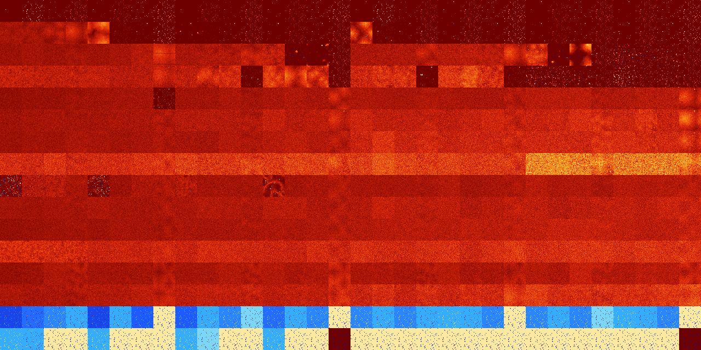

# B01235678 (253440-253951)

<details>
    <summary>Initial Grid</summary>
    
</details>


<details>
    <summary>Initial Grid RLE</summary>

```
#C Exported from GoGoL (https://github.com/marrow16/gogol)
#C Wrap mode: Toroidal
#C Boundary mode: Dead
#C Step: 0
x = 100, y = 100, rule = B01235678/S
9bobobo6bo24bo16bo13bo4bo2bo$4bo14bo7bo35bo15bo18bo$52bo2bo3bo3bo13bo$
19bo9bo12bo12bo29bo3bo$85bo9bobo$65bo3bobo14bo$2bo94bo$30bo38b2obo9bo8b
o$28bo22bo3bo3bo$2bo38bobo7bo17bobo7bo$8b2o16bo25bo4bo4bo25bo6bo$25bo5b
2o52bo$14bo13bo22bo47bo$19bo12bo10bo25bo9bo$4bo7bo9bo12bo6bobo17bo13bo$
22bo7bo8bo16bo14bo5bo5bo$57bo27bo9bo$6bo27bo$2bo6bo17bo13bo13bo7bo8bo$
35bo42bo$16bo13bo43bo14bo4bo$5bo86bo$22bo56bo$12bo5bo16bo7bo27bo21bobo$
22bo14bo16bo20bo20bo$37bo10bo36bo$10bo16bo60bo$3bo6bo19bo17bo21b2o$5bo
31bo2bo$38bo$5bo73bo$13bo72bo4bo3bo$35bo5bo11bo44bo$bo20bo22bo7bo5bo2bo
bobo2bo6bo12bo7bo$2bo15bo50bo$32bo13bo2bo3bo30bo$15bo3bo14bo9bo9bo24bo$
o3bo65bo24bo$37bo7bobo15bo15bobo$15bo37bobo12bo4bo4bo$12bo22bo37bo$o13b
o2bo7bo15bo55bo$bo16bo2bo3b2o37bo$23bobo8b2o39bo$bo23bo30bo13bo$3bo14bo
13bo6bo5bo24bo4bo3bo$23bo21bo13bo$71bo15bobo$bo4bo5bo51b2o17bo$bobo48bo
33bo8bo$2bo2b2o6bo14bo9bo5bo8bobo27bo7bo$21bo50bo22bo$27bo12bo3bo16bo
10bo16bo$7bo13bo5bo6bo4bo11bo14bo12bo14bo$8bo9bo5bo4bo17bo9bo5bo5bobo2b
o12bo$46b2o10bo23bo6bo9bo$7bo31bo13b2o38b2o$17bo17b2o5bo14bo5bo5bo$77bo
$8bo34bobo3b3o12bo21bo$o24bo10bo38bobo9bo$21bobo22bo30b2o$bo3bo13bo7bo
9bo20bo29bo3bo$32bo20bo15bo19bo$96bo$11bo2bo29bo18bo6bo25bo$35bo4bo33bo
$12bo25bo6bo3bo12bo6bobo$4bo78bo6bo$40bobo3bo32bo$11bo42bo10bo3bo$20bob
o16bo28bo24bo$2bo12bo7bo14bo3bo12bo5bo33bo$20bo10bo12bo16bo19bo$o3bo55b
o$14bo12bo46bo15bo2bo3bo$5bo15b2o26bo2bo20bo2bo21bo$11b2o29bo21b2o$17bo
3bo2bo24bo10bo12bobo11bo2bo$o31bo4bo4bo49bo$7bo11b2o20bo12bo35bo8bo$41b
o29bo16bo$28bo9bo$3bo14b2o2b2o3bo8bo5bo6bo27bo14bo$18bo21bo11b2o15bo17b
o6bo$4bo28bo37bo12bobobo$3bo18bo15bo33bo7bo4bo$56bo41bo$22bo6bo11bo10bo
25bo$8bo6bo7bo4b2o27bo$17bo9bo37bo15bo15bo$34bo3bo37bo$33bo13bo5bo8bo$
25bo11bo28bo$4bo31bo17bo25bo9bo6bo$33bo14bo$46bo34bo3bo$26bo12bo19bo10b
o26bo$3bo64bo30bo$5bo28bo2bo18bo18bobo18bo!
```
</details>
<details>
    <summary>Thumbnail</summary>

</details>
<table>
<tr>
    <td><a href="./253440%20S%20Heat%20Map%20Activity.png"></a><br>S (253440)<br>R@5,p2</td>    <td><a href="./253441%20S0%20Heat%20Map%20Activity.png"></a><br>S0 (253441)<br>R@4,p2</td>    <td><a href="./253442%20S1%20Heat%20Map%20Activity.png"></a><br>S1 (253442)<br>R@7,p2</td>    <td><a href="./253443%20S01%20Heat%20Map%20Activity.png"></a><br>S01 (253443)<br>R@7,p2</td>    <td><a href="./253444%20S2%20Heat%20Map%20Activity.png"></a><br>S2 (253444)<br>R@8,p2</td>    <td><a href="./253445%20S02%20Heat%20Map%20Activity.png"></a><br>S02 (253445)<br>R@9,p2</td>    <td><a href="./253446%20S12%20Heat%20Map%20Activity.png"></a><br>S12 (253446)<br>R@5,p2</td>    <td><a href="./253447%20S012%20Heat%20Map%20Activity.png"></a><br>S012 (253447)<br>R@5,p2</td>    <td><a href="./253448%20S3%20Heat%20Map%20Activity.png"></a><br>S3 (253448)<br>R@9,p8</td>    <td><a href="./253449%20S03%20Heat%20Map%20Activity.png"></a><br>S03 (253449)<br>R@9,p2</td>    <td><a href="./253450%20S13%20Heat%20Map%20Activity.png"></a><br>S13 (253450)<br>R@9,p2</td>    <td><a href="./253451%20S013%20Heat%20Map%20Activity.png"></a><br>S013 (253451)<br>R@7,p2</td>    <td><a href="./253452%20S23%20Heat%20Map%20Activity.png"></a><br>S23 (253452)<br>R@5,p2</td>    <td><a href="./253453%20S023%20Heat%20Map%20Activity.png"></a><br>S023 (253453)<br>R@9,p2</td>    <td><a href="./253454%20S123%20Heat%20Map%20Activity.png"></a><br>S123 (253454)<br>R@5,p2</td>    <td><a href="./253455%20S0123%20Heat%20Map%20Activity.png"></a><br>S0123 (253455)<br>R@5,p2</td>    <td><a href="./253456%20S4%20Heat%20Map%20Activity.png"></a><br>S4 (253456)<br>R@11,p6</td>    <td><a href="./253457%20S04%20Heat%20Map%20Activity.png"></a><br>S04 (253457)<br>R@4,p2</td>    <td><a href="./253458%20S14%20Heat%20Map%20Activity.png"></a><br>S14 (253458)<br>R@7,p2</td>    <td><a href="./253459%20S014%20Heat%20Map%20Activity.png"></a><br>S014 (253459)<br>R@9,p2</td>    <td><a href="./253460%20S24%20Heat%20Map%20Activity.png"></a><br>S24 (253460)<br>R@10,p2</td>    <td><a href="./253461%20S024%20Heat%20Map%20Activity.png"></a><br>S024 (253461)<br>R@7,p2</td>    <td><a href="./253462%20S124%20Heat%20Map%20Activity.png"></a><br>S124 (253462)<br>R@5,p2</td>    <td><a href="./253463%20S0124%20Heat%20Map%20Activity.png"></a><br>S0124 (253463)<br>R@5,p2</td>    <td><a href="./253464%20S34%20Heat%20Map%20Activity.png"></a><br>S34 (253464)<br>R@13,p2</td>    <td><a href="./253465%20S034%20Heat%20Map%20Activity.png"></a><br>S034 (253465)<br>R@9,p2</td>    <td><a href="./253466%20S134%20Heat%20Map%20Activity.png"></a><br>S134 (253466)<br>R@5,p2</td>    <td><a href="./253467%20S0134%20Heat%20Map%20Activity.png"></a><br>S0134 (253467)<br>R@7,p2</td>    <td><a href="./253468%20S234%20Heat%20Map%20Activity.png"></a><br>S234 (253468)<br>R@11,p2</td>    <td><a href="./253469%20S0234%20Heat%20Map%20Activity.png"></a><br>S0234 (253469)<br>R@7,p2</td>    <td><a href="./253470%20S1234%20Heat%20Map%20Activity.png"></a><br>S1234 (253470)<br>R@5,p2</td>    <td><a href="./253471%20S01234%20Heat%20Map%20Activity.png"></a><br>S01234 (253471)<br>R@5,p2</td></tr>
<tr>
    <td><a href="./253472%20S5%20Heat%20Map%20Activity.png"></a><br>S5 (253472)<br>G>1000</td>    <td><a href="./253473%20S05%20Heat%20Map%20Activity.png"></a><br>S05 (253473)<br>G>1000</td>    <td><a href="./253474%20S15%20Heat%20Map%20Activity.png"></a><br>S15 (253474)<br>G>1000</td>    <td><a href="./253475%20S015%20Heat%20Map%20Activity.png"></a><br>S015 (253475)<br>G>1000</td>    <td><a href="./253476%20S25%20Heat%20Map%20Activity.png"></a><br>S25 (253476)<br>G>1000</td>    <td><a href="./253477%20S025%20Heat%20Map%20Activity.png"></a><br>S025 (253477)<br>R@17,p2</td>    <td><a href="./253478%20S125%20Heat%20Map%20Activity.png"></a><br>S125 (253478)<br>R@13,p2</td>    <td><a href="./253479%20S0125%20Heat%20Map%20Activity.png"></a><br>S0125 (253479)<br>R@5,p2</td>    <td><a href="./253480%20S35%20Heat%20Map%20Activity.png"></a><br>S35 (253480)<br>R@29,p2</td>    <td><a href="./253481%20S035%20Heat%20Map%20Activity.png"></a><br>S035 (253481)<br>R@40,p2</td>    <td><a href="./253482%20S135%20Heat%20Map%20Activity.png"></a><br>S135 (253482)<br>R@7,p2</td>    <td><a href="./253483%20S0135%20Heat%20Map%20Activity.png"></a><br>S0135 (253483)<br>R@7,p2</td>    <td><a href="./253484%20S235%20Heat%20Map%20Activity.png"></a><br>S235 (253484)<br>R@11,p2</td>    <td><a href="./253485%20S0235%20Heat%20Map%20Activity.png"></a><br>S0235 (253485)<br>R@9,p2</td>    <td><a href="./253486%20S1235%20Heat%20Map%20Activity.png"></a><br>S1235 (253486)<br>R@7,p2</td>    <td><a href="./253487%20S01235%20Heat%20Map%20Activity.png"></a><br>S01235 (253487)<br>R@7,p2</td>    <td><a href="./253488%20S45%20Heat%20Map%20Activity.png"></a><br>S45 (253488)<br>G>1000</td>    <td><a href="./253489%20S045%20Heat%20Map%20Activity.png"></a><br>S045 (253489)<br>R@17,p2</td>    <td><a href="./253490%20S145%20Heat%20Map%20Activity.png"></a><br>S145 (253490)<br>R@17,p2</td>    <td><a href="./253491%20S0145%20Heat%20Map%20Activity.png"></a><br>S0145 (253491)<br>R@7,p2</td>    <td><a href="./253492%20S245%20Heat%20Map%20Activity.png"></a><br>S245 (253492)<br>R@11,p2</td>    <td><a href="./253493%20S0245%20Heat%20Map%20Activity.png"></a><br>S0245 (253493)<br>R@6,p2</td>    <td><a href="./253494%20S1245%20Heat%20Map%20Activity.png"></a><br>S1245 (253494)<br>R@9,p2</td>    <td><a href="./253495%20S01245%20Heat%20Map%20Activity.png"></a><br>S01245 (253495)<br>R@5,p2</td>    <td><a href="./253496%20S345%20Heat%20Map%20Activity.png"></a><br>S345 (253496)<br>R@11,p2</td>    <td><a href="./253497%20S0345%20Heat%20Map%20Activity.png"></a><br>S0345 (253497)<br>R@11,p2</td>    <td><a href="./253498%20S1345%20Heat%20Map%20Activity.png"></a><br>S1345 (253498)<br>R@7,p2</td>    <td><a href="./253499%20S01345%20Heat%20Map%20Activity.png"></a><br>S01345 (253499)<br>R@9,p2</td>    <td><a href="./253500%20S2345%20Heat%20Map%20Activity.png"></a><br>S2345 (253500)<br>R@5,p2</td>    <td><a href="./253501%20S02345%20Heat%20Map%20Activity.png"></a><br>S02345 (253501)<br>R@7,p2</td>    <td><a href="./253502%20S12345%20Heat%20Map%20Activity.png"></a><br>S12345 (253502)<br>R@5,p2</td>    <td><a href="./253503%20S012345%20Heat%20Map%20Activity.png"></a><br>S012345 (253503)<br>R@5,p2</td></tr>
<tr>
    <td><a href="./253504%20S6%20Heat%20Map%20Activity.png"></a><br>S6 (253504)<br>G>1000</td>    <td><a href="./253505%20S06%20Heat%20Map%20Activity.png"></a><br>S06 (253505)<br>G>1000</td>    <td><a href="./253506%20S16%20Heat%20Map%20Activity.png"></a><br>S16 (253506)<br>G>1000</td>    <td><a href="./253507%20S016%20Heat%20Map%20Activity.png"></a><br>S016 (253507)<br>G>1000</td>    <td><a href="./253508%20S26%20Heat%20Map%20Activity.png"></a><br>S26 (253508)<br>G>1000</td>    <td><a href="./253509%20S026%20Heat%20Map%20Activity.png"></a><br>S026 (253509)<br>G>1000</td>    <td><a href="./253510%20S126%20Heat%20Map%20Activity.png"></a><br>S126 (253510)<br>G>1000</td>    <td><a href="./253511%20S0126%20Heat%20Map%20Activity.png"></a><br>S0126 (253511)<br>G>1000</td>    <td><a href="./253512%20S36%20Heat%20Map%20Activity.png"></a><br>S36 (253512)<br>G>1000</td>    <td><a href="./253513%20S036%20Heat%20Map%20Activity.png"></a><br>S036 (253513)<br>G>1000</td>    <td><a href="./253514%20S136%20Heat%20Map%20Activity.png"></a><br>S136 (253514)<br>G>1000</td>    <td><a href="./253515%20S0136%20Heat%20Map%20Activity.png"></a><br>S0136 (253515)<br>G>1000</td>    <td><a href="./253516%20S236%20Heat%20Map%20Activity.png"></a><br>S236 (253516)<br>G>1000</td>    <td><a href="./253517%20S0236%20Heat%20Map%20Activity.png"></a><br>S0236 (253517)<br>R@63,p2</td>    <td><a href="./253518%20S1236%20Heat%20Map%20Activity.png"></a><br>S1236 (253518)<br>R@381,p4</td>    <td><a href="./253519%20S01236%20Heat%20Map%20Activity.png"></a><br>S01236 (253519)<br>R@7,p2</td>    <td><a href="./253520%20S46%20Heat%20Map%20Activity.png"></a><br>S46 (253520)<br>G>1000</td>    <td><a href="./253521%20S046%20Heat%20Map%20Activity.png"></a><br>S046 (253521)<br>G>1000</td>    <td><a href="./253522%20S146%20Heat%20Map%20Activity.png"></a><br>S146 (253522)<br>G>1000</td>    <td><a href="./253523%20S0146%20Heat%20Map%20Activity.png"></a><br>S0146 (253523)<br>G>1000</td>    <td><a href="./253524%20S246%20Heat%20Map%20Activity.png"></a><br>S246 (253524)<br>G>1000</td>    <td><a href="./253525%20S0246%20Heat%20Map%20Activity.png"></a><br>S0246 (253525)<br>G>1000</td>    <td><a href="./253526%20S1246%20Heat%20Map%20Activity.png"></a><br>S1246 (253526)<br>G>1000</td>    <td><a href="./253527%20S01246%20Heat%20Map%20Activity.png"></a><br>S01246 (253527)<br>G>1000</td>    <td><a href="./253528%20S346%20Heat%20Map%20Activity.png"></a><br>S346 (253528)<br>G>1000</td>    <td><a href="./253529%20S0346%20Heat%20Map%20Activity.png"></a><br>S0346 (253529)<br>R@181,p4</td>    <td><a href="./253530%20S1346%20Heat%20Map%20Activity.png"></a><br>S1346 (253530)<br>G>1000</td>    <td><a href="./253531%20S01346%20Heat%20Map%20Activity.png"></a><br>S01346 (253531)<br>R@7,p2</td>    <td><a href="./253532%20S2346%20Heat%20Map%20Activity.png"></a><br>S2346 (253532)<br>R@17,p4</td>    <td><a href="./253533%20S02346%20Heat%20Map%20Activity.png"></a><br>S02346 (253533)<br>R@13,p4</td>    <td><a href="./253534%20S12346%20Heat%20Map%20Activity.png"></a><br>S12346 (253534)<br>R@11,p2</td>    <td><a href="./253535%20S012346%20Heat%20Map%20Activity.png"></a><br>S012346 (253535)<br>R@7,p2</td></tr>
<tr>
    <td><a href="./253536%20S56%20Heat%20Map%20Activity.png"></a><br>S56 (253536)<br>G>1000</td>    <td><a href="./253537%20S056%20Heat%20Map%20Activity.png"></a><br>S056 (253537)<br>G>1000</td>    <td><a href="./253538%20S156%20Heat%20Map%20Activity.png"></a><br>S156 (253538)<br>G>1000</td>    <td><a href="./253539%20S0156%20Heat%20Map%20Activity.png"></a><br>S0156 (253539)<br>G>1000</td>    <td><a href="./253540%20S256%20Heat%20Map%20Activity.png"></a><br>S256 (253540)<br>G>1000</td>    <td><a href="./253541%20S0256%20Heat%20Map%20Activity.png"></a><br>S0256 (253541)<br>G>1000</td>    <td><a href="./253542%20S1256%20Heat%20Map%20Activity.png"></a><br>S1256 (253542)<br>G>1000</td>    <td><a href="./253543%20S01256%20Heat%20Map%20Activity.png"></a><br>S01256 (253543)<br>G>1000</td>    <td><a href="./253544%20S356%20Heat%20Map%20Activity.png"></a><br>S356 (253544)<br>G>1000</td>    <td><a href="./253545%20S0356%20Heat%20Map%20Activity.png"></a><br>S0356 (253545)<br>G>1000</td>    <td><a href="./253546%20S1356%20Heat%20Map%20Activity.png"></a><br>S1356 (253546)<br>G>1000</td>    <td><a href="./253547%20S01356%20Heat%20Map%20Activity.png"></a><br>S01356 (253547)<br>R@15,p4</td>    <td><a href="./253548%20S2356%20Heat%20Map%20Activity.png"></a><br>S2356 (253548)<br>G>1000</td>    <td><a href="./253549%20S02356%20Heat%20Map%20Activity.png"></a><br>S02356 (253549)<br>G>1000</td>    <td><a href="./253550%20S12356%20Heat%20Map%20Activity.png"></a><br>S12356 (253550)<br>G>1000</td>    <td><a href="./253551%20S012356%20Heat%20Map%20Activity.png"></a><br>S012356 (253551)<br>R@7,p2</td>    <td><a href="./253552%20S456%20Heat%20Map%20Activity.png"></a><br>S456 (253552)<br>G>1000</td>    <td><a href="./253553%20S0456%20Heat%20Map%20Activity.png"></a><br>S0456 (253553)<br>G>1000</td>    <td><a href="./253554%20S1456%20Heat%20Map%20Activity.png"></a><br>S1456 (253554)<br>G>1000</td>    <td><a href="./253555%20S01456%20Heat%20Map%20Activity.png"></a><br>S01456 (253555)<br>R@27,p8</td>    <td><a href="./253556%20S2456%20Heat%20Map%20Activity.png"></a><br>S2456 (253556)<br>G>1000</td>    <td><a href="./253557%20S02456%20Heat%20Map%20Activity.png"></a><br>S02456 (253557)<br>G>1000</td>    <td><a href="./253558%20S12456%20Heat%20Map%20Activity.png"></a><br>S12456 (253558)<br>G>1000</td>    <td><a href="./253559%20S012456%20Heat%20Map%20Activity.png"></a><br>S012456 (253559)<br>R@13,p2</td>    <td><a href="./253560%20S3456%20Heat%20Map%20Activity.png"></a><br>S3456 (253560)<br>R@19,p2</td>    <td><a href="./253561%20S03456%20Heat%20Map%20Activity.png"></a><br>S03456 (253561)<br>R@9,p2</td>    <td><a href="./253562%20S13456%20Heat%20Map%20Activity.png"></a><br>S13456 (253562)<br>R@15,p2</td>    <td><a href="./253563%20S013456%20Heat%20Map%20Activity.png"></a><br>S013456 (253563)<br>R@9,p2</td>    <td><a href="./253564%20S23456%20Heat%20Map%20Activity.png"></a><br>S23456 (253564)<br>R@9,p2</td>    <td><a href="./253565%20S023456%20Heat%20Map%20Activity.png"></a><br>S023456 (253565)<br>R@13,p2</td>    <td><a href="./253566%20S123456%20Heat%20Map%20Activity.png"></a><br>S123456 (253566)<br>R@9,p2</td>    <td><a href="./253567%20S0123456%20Heat%20Map%20Activity.png"></a><br>S0123456 (253567)<br>R@7,p2</td></tr>
<tr>
    <td><a href="./253568%20S7%20Heat%20Map%20Activity.png"></a><br>S7 (253568)<br>G>1000</td>    <td><a href="./253569%20S07%20Heat%20Map%20Activity.png"></a><br>S07 (253569)<br>G>1000</td>    <td><a href="./253570%20S17%20Heat%20Map%20Activity.png"></a><br>S17 (253570)<br>G>1000</td>    <td><a href="./253571%20S017%20Heat%20Map%20Activity.png"></a><br>S017 (253571)<br>G>1000</td>    <td><a href="./253572%20S27%20Heat%20Map%20Activity.png"></a><br>S27 (253572)<br>G>1000</td>    <td><a href="./253573%20S027%20Heat%20Map%20Activity.png"></a><br>S027 (253573)<br>G>1000</td>    <td><a href="./253574%20S127%20Heat%20Map%20Activity.png"></a><br>S127 (253574)<br>G>1000</td>    <td><a href="./253575%20S0127%20Heat%20Map%20Activity.png"></a><br>S0127 (253575)<br>R@8,p4</td>    <td><a href="./253576%20S37%20Heat%20Map%20Activity.png"></a><br>S37 (253576)<br>G>1000</td>    <td><a href="./253577%20S037%20Heat%20Map%20Activity.png"></a><br>S037 (253577)<br>G>1000</td>    <td><a href="./253578%20S137%20Heat%20Map%20Activity.png"></a><br>S137 (253578)<br>G>1000</td>    <td><a href="./253579%20S0137%20Heat%20Map%20Activity.png"></a><br>S0137 (253579)<br>G>1000</td>    <td><a href="./253580%20S237%20Heat%20Map%20Activity.png"></a><br>S237 (253580)<br>G>1000</td>    <td><a href="./253581%20S0237%20Heat%20Map%20Activity.png"></a><br>S0237 (253581)<br>G>1000</td>    <td><a href="./253582%20S1237%20Heat%20Map%20Activity.png"></a><br>S1237 (253582)<br>G>1000</td>    <td><a href="./253583%20S01237%20Heat%20Map%20Activity.png"></a><br>S01237 (253583)<br>G>1000</td>    <td><a href="./253584%20S47%20Heat%20Map%20Activity.png"></a><br>S47 (253584)<br>G>1000</td>    <td><a href="./253585%20S047%20Heat%20Map%20Activity.png"></a><br>S047 (253585)<br>G>1000</td>    <td><a href="./253586%20S147%20Heat%20Map%20Activity.png"></a><br>S147 (253586)<br>G>1000</td>    <td><a href="./253587%20S0147%20Heat%20Map%20Activity.png"></a><br>S0147 (253587)<br>G>1000</td>    <td><a href="./253588%20S247%20Heat%20Map%20Activity.png"></a><br>S247 (253588)<br>G>1000</td>    <td><a href="./253589%20S0247%20Heat%20Map%20Activity.png"></a><br>S0247 (253589)<br>G>1000</td>    <td><a href="./253590%20S1247%20Heat%20Map%20Activity.png"></a><br>S1247 (253590)<br>G>1000</td>    <td><a href="./253591%20S01247%20Heat%20Map%20Activity.png"></a><br>S01247 (253591)<br>G>1000</td>    <td><a href="./253592%20S347%20Heat%20Map%20Activity.png"></a><br>S347 (253592)<br>G>1000</td>    <td><a href="./253593%20S0347%20Heat%20Map%20Activity.png"></a><br>S0347 (253593)<br>G>1000</td>    <td><a href="./253594%20S1347%20Heat%20Map%20Activity.png"></a><br>S1347 (253594)<br>G>1000</td>    <td><a href="./253595%20S01347%20Heat%20Map%20Activity.png"></a><br>S01347 (253595)<br>G>1000</td>    <td><a href="./253596%20S2347%20Heat%20Map%20Activity.png"></a><br>S2347 (253596)<br>G>1000</td>    <td><a href="./253597%20S02347%20Heat%20Map%20Activity.png"></a><br>S02347 (253597)<br>G>1000</td>    <td><a href="./253598%20S12347%20Heat%20Map%20Activity.png"></a><br>S12347 (253598)<br>G>1000</td>    <td><a href="./253599%20S012347%20Heat%20Map%20Activity.png"></a><br>S012347 (253599)<br>G>1000</td></tr>
<tr>
    <td><a href="./253600%20S57%20Heat%20Map%20Activity.png"></a><br>S57 (253600)<br>G>1000</td>    <td><a href="./253601%20S057%20Heat%20Map%20Activity.png"></a><br>S057 (253601)<br>G>1000</td>    <td><a href="./253602%20S157%20Heat%20Map%20Activity.png"></a><br>S157 (253602)<br>G>1000</td>    <td><a href="./253603%20S0157%20Heat%20Map%20Activity.png"></a><br>S0157 (253603)<br>G>1000</td>    <td><a href="./253604%20S257%20Heat%20Map%20Activity.png"></a><br>S257 (253604)<br>G>1000</td>    <td><a href="./253605%20S0257%20Heat%20Map%20Activity.png"></a><br>S0257 (253605)<br>G>1000</td>    <td><a href="./253606%20S1257%20Heat%20Map%20Activity.png"></a><br>S1257 (253606)<br>G>1000</td>    <td><a href="./253607%20S01257%20Heat%20Map%20Activity.png"></a><br>S01257 (253607)<br>G>1000</td>    <td><a href="./253608%20S357%20Heat%20Map%20Activity.png"></a><br>S357 (253608)<br>G>1000</td>    <td><a href="./253609%20S0357%20Heat%20Map%20Activity.png"></a><br>S0357 (253609)<br>G>1000</td>    <td><a href="./253610%20S1357%20Heat%20Map%20Activity.png"></a><br>S1357 (253610)<br>G>1000</td>    <td><a href="./253611%20S01357%20Heat%20Map%20Activity.png"></a><br>S01357 (253611)<br>G>1000</td>    <td><a href="./253612%20S2357%20Heat%20Map%20Activity.png"></a><br>S2357 (253612)<br>G>1000</td>    <td><a href="./253613%20S02357%20Heat%20Map%20Activity.png"></a><br>S02357 (253613)<br>G>1000</td>    <td><a href="./253614%20S12357%20Heat%20Map%20Activity.png"></a><br>S12357 (253614)<br>G>1000</td>    <td><a href="./253615%20S012357%20Heat%20Map%20Activity.png"></a><br>S012357 (253615)<br>G>1000</td>    <td><a href="./253616%20S457%20Heat%20Map%20Activity.png"></a><br>S457 (253616)<br>G>1000</td>    <td><a href="./253617%20S0457%20Heat%20Map%20Activity.png"></a><br>S0457 (253617)<br>G>1000</td>    <td><a href="./253618%20S1457%20Heat%20Map%20Activity.png"></a><br>S1457 (253618)<br>G>1000</td>    <td><a href="./253619%20S01457%20Heat%20Map%20Activity.png"></a><br>S01457 (253619)<br>G>1000</td>    <td><a href="./253620%20S2457%20Heat%20Map%20Activity.png"></a><br>S2457 (253620)<br>G>1000</td>    <td><a href="./253621%20S02457%20Heat%20Map%20Activity.png"></a><br>S02457 (253621)<br>G>1000</td>    <td><a href="./253622%20S12457%20Heat%20Map%20Activity.png"></a><br>S12457 (253622)<br>G>1000</td>    <td><a href="./253623%20S012457%20Heat%20Map%20Activity.png"></a><br>S012457 (253623)<br>G>1000</td>    <td><a href="./253624%20S3457%20Heat%20Map%20Activity.png"></a><br>S3457 (253624)<br>G>1000</td>    <td><a href="./253625%20S03457%20Heat%20Map%20Activity.png"></a><br>S03457 (253625)<br>G>1000</td>    <td><a href="./253626%20S13457%20Heat%20Map%20Activity.png"></a><br>S13457 (253626)<br>G>1000</td>    <td><a href="./253627%20S013457%20Heat%20Map%20Activity.png"></a><br>S013457 (253627)<br>G>1000</td>    <td><a href="./253628%20S23457%20Heat%20Map%20Activity.png"></a><br>S23457 (253628)<br>G>1000</td>    <td><a href="./253629%20S023457%20Heat%20Map%20Activity.png"></a><br>S023457 (253629)<br>G>1000</td>    <td><a href="./253630%20S123457%20Heat%20Map%20Activity.png"></a><br>S123457 (253630)<br>G>1000</td>    <td><a href="./253631%20S0123457%20Heat%20Map%20Activity.png"></a><br>S0123457 (253631)<br>G>1000</td></tr>
<tr>
    <td><a href="./253632%20S67%20Heat%20Map%20Activity.png"></a><br>S67 (253632)<br>G>1000</td>    <td><a href="./253633%20S067%20Heat%20Map%20Activity.png"></a><br>S067 (253633)<br>G>1000</td>    <td><a href="./253634%20S167%20Heat%20Map%20Activity.png"></a><br>S167 (253634)<br>G>1000</td>    <td><a href="./253635%20S0167%20Heat%20Map%20Activity.png"></a><br>S0167 (253635)<br>G>1000</td>    <td><a href="./253636%20S267%20Heat%20Map%20Activity.png"></a><br>S267 (253636)<br>G>1000</td>    <td><a href="./253637%20S0267%20Heat%20Map%20Activity.png"></a><br>S0267 (253637)<br>G>1000</td>    <td><a href="./253638%20S1267%20Heat%20Map%20Activity.png"></a><br>S1267 (253638)<br>G>1000</td>    <td><a href="./253639%20S01267%20Heat%20Map%20Activity.png"></a><br>S01267 (253639)<br>G>1000</td>    <td><a href="./253640%20S367%20Heat%20Map%20Activity.png"></a><br>S367 (253640)<br>G>1000</td>    <td><a href="./253641%20S0367%20Heat%20Map%20Activity.png"></a><br>S0367 (253641)<br>G>1000</td>    <td><a href="./253642%20S1367%20Heat%20Map%20Activity.png"></a><br>S1367 (253642)<br>G>1000</td>    <td><a href="./253643%20S01367%20Heat%20Map%20Activity.png"></a><br>S01367 (253643)<br>G>1000</td>    <td><a href="./253644%20S2367%20Heat%20Map%20Activity.png"></a><br>S2367 (253644)<br>G>1000</td>    <td><a href="./253645%20S02367%20Heat%20Map%20Activity.png"></a><br>S02367 (253645)<br>G>1000</td>    <td><a href="./253646%20S12367%20Heat%20Map%20Activity.png"></a><br>S12367 (253646)<br>G>1000</td>    <td><a href="./253647%20S012367%20Heat%20Map%20Activity.png"></a><br>S012367 (253647)<br>G>1000</td>    <td><a href="./253648%20S467%20Heat%20Map%20Activity.png"></a><br>S467 (253648)<br>G>1000</td>    <td><a href="./253649%20S0467%20Heat%20Map%20Activity.png"></a><br>S0467 (253649)<br>G>1000</td>    <td><a href="./253650%20S1467%20Heat%20Map%20Activity.png"></a><br>S1467 (253650)<br>G>1000</td>    <td><a href="./253651%20S01467%20Heat%20Map%20Activity.png"></a><br>S01467 (253651)<br>G>1000</td>    <td><a href="./253652%20S2467%20Heat%20Map%20Activity.png"></a><br>S2467 (253652)<br>G>1000</td>    <td><a href="./253653%20S02467%20Heat%20Map%20Activity.png"></a><br>S02467 (253653)<br>G>1000</td>    <td><a href="./253654%20S12467%20Heat%20Map%20Activity.png"></a><br>S12467 (253654)<br>G>1000</td>    <td><a href="./253655%20S012467%20Heat%20Map%20Activity.png"></a><br>S012467 (253655)<br>G>1000</td>    <td><a href="./253656%20S3467%20Heat%20Map%20Activity.png"></a><br>S3467 (253656)<br>G>1000</td>    <td><a href="./253657%20S03467%20Heat%20Map%20Activity.png"></a><br>S03467 (253657)<br>G>1000</td>    <td><a href="./253658%20S13467%20Heat%20Map%20Activity.png"></a><br>S13467 (253658)<br>G>1000</td>    <td><a href="./253659%20S013467%20Heat%20Map%20Activity.png"></a><br>S013467 (253659)<br>G>1000</td>    <td><a href="./253660%20S23467%20Heat%20Map%20Activity.png"></a><br>S23467 (253660)<br>G>1000</td>    <td><a href="./253661%20S023467%20Heat%20Map%20Activity.png"></a><br>S023467 (253661)<br>G>1000</td>    <td><a href="./253662%20S123467%20Heat%20Map%20Activity.png"></a><br>S123467 (253662)<br>G>1000</td>    <td><a href="./253663%20S0123467%20Heat%20Map%20Activity.png"></a><br>S0123467 (253663)<br>G>1000</td></tr>
<tr>
    <td><a href="./253664%20S567%20Heat%20Map%20Activity.png"></a><br>S567 (253664)<br>G>1000</td>    <td><a href="./253665%20S0567%20Heat%20Map%20Activity.png"></a><br>S0567 (253665)<br>G>1000</td>    <td><a href="./253666%20S1567%20Heat%20Map%20Activity.png"></a><br>S1567 (253666)<br>G>1000</td>    <td><a href="./253667%20S01567%20Heat%20Map%20Activity.png"></a><br>S01567 (253667)<br>G>1000</td>    <td><a href="./253668%20S2567%20Heat%20Map%20Activity.png"></a><br>S2567 (253668)<br>G>1000</td>    <td><a href="./253669%20S02567%20Heat%20Map%20Activity.png"></a><br>S02567 (253669)<br>G>1000</td>    <td><a href="./253670%20S12567%20Heat%20Map%20Activity.png"></a><br>S12567 (253670)<br>G>1000</td>    <td><a href="./253671%20S012567%20Heat%20Map%20Activity.png"></a><br>S012567 (253671)<br>G>1000</td>    <td><a href="./253672%20S3567%20Heat%20Map%20Activity.png"></a><br>S3567 (253672)<br>G>1000</td>    <td><a href="./253673%20S03567%20Heat%20Map%20Activity.png"></a><br>S03567 (253673)<br>G>1000</td>    <td><a href="./253674%20S13567%20Heat%20Map%20Activity.png"></a><br>S13567 (253674)<br>G>1000</td>    <td><a href="./253675%20S013567%20Heat%20Map%20Activity.png"></a><br>S013567 (253675)<br>G>1000</td>    <td><a href="./253676%20S23567%20Heat%20Map%20Activity.png"></a><br>S23567 (253676)<br>G>1000</td>    <td><a href="./253677%20S023567%20Heat%20Map%20Activity.png"></a><br>S023567 (253677)<br>G>1000</td>    <td><a href="./253678%20S123567%20Heat%20Map%20Activity.png"></a><br>S123567 (253678)<br>G>1000</td>    <td><a href="./253679%20S0123567%20Heat%20Map%20Activity.png"></a><br>S0123567 (253679)<br>G>1000</td>    <td><a href="./253680%20S4567%20Heat%20Map%20Activity.png"></a><br>S4567 (253680)<br>G>1000</td>    <td><a href="./253681%20S04567%20Heat%20Map%20Activity.png"></a><br>S04567 (253681)<br>G>1000</td>    <td><a href="./253682%20S14567%20Heat%20Map%20Activity.png"></a><br>S14567 (253682)<br>G>1000</td>    <td><a href="./253683%20S014567%20Heat%20Map%20Activity.png"></a><br>S014567 (253683)<br>G>1000</td>    <td><a href="./253684%20S24567%20Heat%20Map%20Activity.png"></a><br>S24567 (253684)<br>G>1000</td>    <td><a href="./253685%20S024567%20Heat%20Map%20Activity.png"></a><br>S024567 (253685)<br>G>1000</td>    <td><a href="./253686%20S124567%20Heat%20Map%20Activity.png"></a><br>S124567 (253686)<br>G>1000</td>    <td><a href="./253687%20S0124567%20Heat%20Map%20Activity.png"></a><br>S0124567 (253687)<br>G>1000</td>    <td><a href="./253688%20S34567%20Heat%20Map%20Activity.png"></a><br>S34567 (253688)<br>G>1000</td>    <td><a href="./253689%20S034567%20Heat%20Map%20Activity.png"></a><br>S034567 (253689)<br>G>1000</td>    <td><a href="./253690%20S134567%20Heat%20Map%20Activity.png"></a><br>S134567 (253690)<br>G>1000</td>    <td><a href="./253691%20S0134567%20Heat%20Map%20Activity.png"></a><br>S0134567 (253691)<br>G>1000</td>    <td><a href="./253692%20S234567%20Heat%20Map%20Activity.png"></a><br>S234567 (253692)<br>G>1000</td>    <td><a href="./253693%20S0234567%20Heat%20Map%20Activity.png"></a><br>S0234567 (253693)<br>G>1000</td>    <td><a href="./253694%20S1234567%20Heat%20Map%20Activity.png"></a><br>S1234567 (253694)<br>G>1000</td>    <td><a href="./253695%20S01234567%20Heat%20Map%20Activity.png"></a><br>S01234567 (253695)<br>G>1000</td></tr>
<tr>
    <td><a href="./253696%20S8%20Heat%20Map%20Activity.png"></a><br>S8 (253696)<br>R@152,p4</td>    <td><a href="./253697%20S08%20Heat%20Map%20Activity.png"></a><br>S08 (253697)<br>G>1000</td>    <td><a href="./253698%20S18%20Heat%20Map%20Activity.png"></a><br>S18 (253698)<br>G>1000</td>    <td><a href="./253699%20S018%20Heat%20Map%20Activity.png"></a><br>S018 (253699)<br>G>1000</td>    <td><a href="./253700%20S28%20Heat%20Map%20Activity.png"></a><br>S28 (253700)<br>R@565,p4</td>    <td><a href="./253701%20S028%20Heat%20Map%20Activity.png"></a><br>S028 (253701)<br>G>1000</td>    <td><a href="./253702%20S128%20Heat%20Map%20Activity.png"></a><br>S128 (253702)<br>G>1000</td>    <td><a href="./253703%20S0128%20Heat%20Map%20Activity.png"></a><br>S0128 (253703)<br>G>1000</td>    <td><a href="./253704%20S38%20Heat%20Map%20Activity.png"></a><br>S38 (253704)<br>G>1000</td>    <td><a href="./253705%20S038%20Heat%20Map%20Activity.png"></a><br>S038 (253705)<br>G>1000</td>    <td><a href="./253706%20S138%20Heat%20Map%20Activity.png"></a><br>S138 (253706)<br>G>1000</td>    <td><a href="./253707%20S0138%20Heat%20Map%20Activity.png"></a><br>S0138 (253707)<br>G>1000</td>    <td><a href="./253708%20S238%20Heat%20Map%20Activity.png"></a><br>S238 (253708)<br>G>1000</td>    <td><a href="./253709%20S0238%20Heat%20Map%20Activity.png"></a><br>S0238 (253709)<br>G>1000</td>    <td><a href="./253710%20S1238%20Heat%20Map%20Activity.png"></a><br>S1238 (253710)<br>G>1000</td>    <td><a href="./253711%20S01238%20Heat%20Map%20Activity.png"></a><br>S01238 (253711)<br>G>1000</td>    <td><a href="./253712%20S48%20Heat%20Map%20Activity.png"></a><br>S48 (253712)<br>G>1000</td>    <td><a href="./253713%20S048%20Heat%20Map%20Activity.png"></a><br>S048 (253713)<br>G>1000</td>    <td><a href="./253714%20S148%20Heat%20Map%20Activity.png"></a><br>S148 (253714)<br>G>1000</td>    <td><a href="./253715%20S0148%20Heat%20Map%20Activity.png"></a><br>S0148 (253715)<br>G>1000</td>    <td><a href="./253716%20S248%20Heat%20Map%20Activity.png"></a><br>S248 (253716)<br>G>1000</td>    <td><a href="./253717%20S0248%20Heat%20Map%20Activity.png"></a><br>S0248 (253717)<br>G>1000</td>    <td><a href="./253718%20S1248%20Heat%20Map%20Activity.png"></a><br>S1248 (253718)<br>G>1000</td>    <td><a href="./253719%20S01248%20Heat%20Map%20Activity.png"></a><br>S01248 (253719)<br>G>1000</td>    <td><a href="./253720%20S348%20Heat%20Map%20Activity.png"></a><br>S348 (253720)<br>G>1000</td>    <td><a href="./253721%20S0348%20Heat%20Map%20Activity.png"></a><br>S0348 (253721)<br>G>1000</td>    <td><a href="./253722%20S1348%20Heat%20Map%20Activity.png"></a><br>S1348 (253722)<br>G>1000</td>    <td><a href="./253723%20S01348%20Heat%20Map%20Activity.png"></a><br>S01348 (253723)<br>G>1000</td>    <td><a href="./253724%20S2348%20Heat%20Map%20Activity.png"></a><br>S2348 (253724)<br>G>1000</td>    <td><a href="./253725%20S02348%20Heat%20Map%20Activity.png"></a><br>S02348 (253725)<br>G>1000</td>    <td><a href="./253726%20S12348%20Heat%20Map%20Activity.png"></a><br>S12348 (253726)<br>G>1000</td>    <td><a href="./253727%20S012348%20Heat%20Map%20Activity.png"></a><br>S012348 (253727)<br>G>1000</td></tr>
<tr>
    <td><a href="./253728%20S58%20Heat%20Map%20Activity.png"></a><br>S58 (253728)<br>G>1000</td>    <td><a href="./253729%20S058%20Heat%20Map%20Activity.png"></a><br>S058 (253729)<br>G>1000</td>    <td><a href="./253730%20S158%20Heat%20Map%20Activity.png"></a><br>S158 (253730)<br>G>1000</td>    <td><a href="./253731%20S0158%20Heat%20Map%20Activity.png"></a><br>S0158 (253731)<br>G>1000</td>    <td><a href="./253732%20S258%20Heat%20Map%20Activity.png"></a><br>S258 (253732)<br>G>1000</td>    <td><a href="./253733%20S0258%20Heat%20Map%20Activity.png"></a><br>S0258 (253733)<br>G>1000</td>    <td><a href="./253734%20S1258%20Heat%20Map%20Activity.png"></a><br>S1258 (253734)<br>G>1000</td>    <td><a href="./253735%20S01258%20Heat%20Map%20Activity.png"></a><br>S01258 (253735)<br>G>1000</td>    <td><a href="./253736%20S358%20Heat%20Map%20Activity.png"></a><br>S358 (253736)<br>G>1000</td>    <td><a href="./253737%20S0358%20Heat%20Map%20Activity.png"></a><br>S0358 (253737)<br>G>1000</td>    <td><a href="./253738%20S1358%20Heat%20Map%20Activity.png"></a><br>S1358 (253738)<br>G>1000</td>    <td><a href="./253739%20S01358%20Heat%20Map%20Activity.png"></a><br>S01358 (253739)<br>G>1000</td>    <td><a href="./253740%20S2358%20Heat%20Map%20Activity.png"></a><br>S2358 (253740)<br>G>1000</td>    <td><a href="./253741%20S02358%20Heat%20Map%20Activity.png"></a><br>S02358 (253741)<br>G>1000</td>    <td><a href="./253742%20S12358%20Heat%20Map%20Activity.png"></a><br>S12358 (253742)<br>G>1000</td>    <td><a href="./253743%20S012358%20Heat%20Map%20Activity.png"></a><br>S012358 (253743)<br>G>1000</td>    <td><a href="./253744%20S458%20Heat%20Map%20Activity.png"></a><br>S458 (253744)<br>G>1000</td>    <td><a href="./253745%20S0458%20Heat%20Map%20Activity.png"></a><br>S0458 (253745)<br>G>1000</td>    <td><a href="./253746%20S1458%20Heat%20Map%20Activity.png"></a><br>S1458 (253746)<br>G>1000</td>    <td><a href="./253747%20S01458%20Heat%20Map%20Activity.png"></a><br>S01458 (253747)<br>G>1000</td>    <td><a href="./253748%20S2458%20Heat%20Map%20Activity.png"></a><br>S2458 (253748)<br>G>1000</td>    <td><a href="./253749%20S02458%20Heat%20Map%20Activity.png"></a><br>S02458 (253749)<br>G>1000</td>    <td><a href="./253750%20S12458%20Heat%20Map%20Activity.png"></a><br>S12458 (253750)<br>G>1000</td>    <td><a href="./253751%20S012458%20Heat%20Map%20Activity.png"></a><br>S012458 (253751)<br>G>1000</td>    <td><a href="./253752%20S3458%20Heat%20Map%20Activity.png"></a><br>S3458 (253752)<br>G>1000</td>    <td><a href="./253753%20S03458%20Heat%20Map%20Activity.png"></a><br>S03458 (253753)<br>G>1000</td>    <td><a href="./253754%20S13458%20Heat%20Map%20Activity.png"></a><br>S13458 (253754)<br>G>1000</td>    <td><a href="./253755%20S013458%20Heat%20Map%20Activity.png"></a><br>S013458 (253755)<br>G>1000</td>    <td><a href="./253756%20S23458%20Heat%20Map%20Activity.png"></a><br>S23458 (253756)<br>G>1000</td>    <td><a href="./253757%20S023458%20Heat%20Map%20Activity.png"></a><br>S023458 (253757)<br>G>1000</td>    <td><a href="./253758%20S123458%20Heat%20Map%20Activity.png"></a><br>S123458 (253758)<br>G>1000</td>    <td><a href="./253759%20S0123458%20Heat%20Map%20Activity.png"></a><br>S0123458 (253759)<br>G>1000</td></tr>
<tr>
    <td><a href="./253760%20S68%20Heat%20Map%20Activity.png"></a><br>S68 (253760)<br>G>1000</td>    <td><a href="./253761%20S068%20Heat%20Map%20Activity.png"></a><br>S068 (253761)<br>G>1000</td>    <td><a href="./253762%20S168%20Heat%20Map%20Activity.png"></a><br>S168 (253762)<br>G>1000</td>    <td><a href="./253763%20S0168%20Heat%20Map%20Activity.png"></a><br>S0168 (253763)<br>G>1000</td>    <td><a href="./253764%20S268%20Heat%20Map%20Activity.png"></a><br>S268 (253764)<br>G>1000</td>    <td><a href="./253765%20S0268%20Heat%20Map%20Activity.png"></a><br>S0268 (253765)<br>G>1000</td>    <td><a href="./253766%20S1268%20Heat%20Map%20Activity.png"></a><br>S1268 (253766)<br>G>1000</td>    <td><a href="./253767%20S01268%20Heat%20Map%20Activity.png"></a><br>S01268 (253767)<br>G>1000</td>    <td><a href="./253768%20S368%20Heat%20Map%20Activity.png"></a><br>S368 (253768)<br>G>1000</td>    <td><a href="./253769%20S0368%20Heat%20Map%20Activity.png"></a><br>S0368 (253769)<br>G>1000</td>    <td><a href="./253770%20S1368%20Heat%20Map%20Activity.png"></a><br>S1368 (253770)<br>G>1000</td>    <td><a href="./253771%20S01368%20Heat%20Map%20Activity.png"></a><br>S01368 (253771)<br>G>1000</td>    <td><a href="./253772%20S2368%20Heat%20Map%20Activity.png"></a><br>S2368 (253772)<br>G>1000</td>    <td><a href="./253773%20S02368%20Heat%20Map%20Activity.png"></a><br>S02368 (253773)<br>G>1000</td>    <td><a href="./253774%20S12368%20Heat%20Map%20Activity.png"></a><br>S12368 (253774)<br>G>1000</td>    <td><a href="./253775%20S012368%20Heat%20Map%20Activity.png"></a><br>S012368 (253775)<br>G>1000</td>    <td><a href="./253776%20S468%20Heat%20Map%20Activity.png"></a><br>S468 (253776)<br>G>1000</td>    <td><a href="./253777%20S0468%20Heat%20Map%20Activity.png"></a><br>S0468 (253777)<br>G>1000</td>    <td><a href="./253778%20S1468%20Heat%20Map%20Activity.png"></a><br>S1468 (253778)<br>G>1000</td>    <td><a href="./253779%20S01468%20Heat%20Map%20Activity.png"></a><br>S01468 (253779)<br>G>1000</td>    <td><a href="./253780%20S2468%20Heat%20Map%20Activity.png"></a><br>S2468 (253780)<br>G>1000</td>    <td><a href="./253781%20S02468%20Heat%20Map%20Activity.png"></a><br>S02468 (253781)<br>G>1000</td>    <td><a href="./253782%20S12468%20Heat%20Map%20Activity.png"></a><br>S12468 (253782)<br>G>1000</td>    <td><a href="./253783%20S012468%20Heat%20Map%20Activity.png"></a><br>S012468 (253783)<br>G>1000</td>    <td><a href="./253784%20S3468%20Heat%20Map%20Activity.png"></a><br>S3468 (253784)<br>G>1000</td>    <td><a href="./253785%20S03468%20Heat%20Map%20Activity.png"></a><br>S03468 (253785)<br>G>1000</td>    <td><a href="./253786%20S13468%20Heat%20Map%20Activity.png"></a><br>S13468 (253786)<br>G>1000</td>    <td><a href="./253787%20S013468%20Heat%20Map%20Activity.png"></a><br>S013468 (253787)<br>G>1000</td>    <td><a href="./253788%20S23468%20Heat%20Map%20Activity.png"></a><br>S23468 (253788)<br>G>1000</td>    <td><a href="./253789%20S023468%20Heat%20Map%20Activity.png"></a><br>S023468 (253789)<br>G>1000</td>    <td><a href="./253790%20S123468%20Heat%20Map%20Activity.png"></a><br>S123468 (253790)<br>G>1000</td>    <td><a href="./253791%20S0123468%20Heat%20Map%20Activity.png"></a><br>S0123468 (253791)<br>G>1000</td></tr>
<tr>
    <td><a href="./253792%20S568%20Heat%20Map%20Activity.png"></a><br>S568 (253792)<br>G>1000</td>    <td><a href="./253793%20S0568%20Heat%20Map%20Activity.png"></a><br>S0568 (253793)<br>G>1000</td>    <td><a href="./253794%20S1568%20Heat%20Map%20Activity.png"></a><br>S1568 (253794)<br>G>1000</td>    <td><a href="./253795%20S01568%20Heat%20Map%20Activity.png"></a><br>S01568 (253795)<br>G>1000</td>    <td><a href="./253796%20S2568%20Heat%20Map%20Activity.png"></a><br>S2568 (253796)<br>G>1000</td>    <td><a href="./253797%20S02568%20Heat%20Map%20Activity.png"></a><br>S02568 (253797)<br>G>1000</td>    <td><a href="./253798%20S12568%20Heat%20Map%20Activity.png"></a><br>S12568 (253798)<br>G>1000</td>    <td><a href="./253799%20S012568%20Heat%20Map%20Activity.png"></a><br>S012568 (253799)<br>G>1000</td>    <td><a href="./253800%20S3568%20Heat%20Map%20Activity.png"></a><br>S3568 (253800)<br>G>1000</td>    <td><a href="./253801%20S03568%20Heat%20Map%20Activity.png"></a><br>S03568 (253801)<br>G>1000</td>    <td><a href="./253802%20S13568%20Heat%20Map%20Activity.png"></a><br>S13568 (253802)<br>G>1000</td>    <td><a href="./253803%20S013568%20Heat%20Map%20Activity.png"></a><br>S013568 (253803)<br>G>1000</td>    <td><a href="./253804%20S23568%20Heat%20Map%20Activity.png"></a><br>S23568 (253804)<br>G>1000</td>    <td><a href="./253805%20S023568%20Heat%20Map%20Activity.png"></a><br>S023568 (253805)<br>G>1000</td>    <td><a href="./253806%20S123568%20Heat%20Map%20Activity.png"></a><br>S123568 (253806)<br>G>1000</td>    <td><a href="./253807%20S0123568%20Heat%20Map%20Activity.png"></a><br>S0123568 (253807)<br>G>1000</td>    <td><a href="./253808%20S4568%20Heat%20Map%20Activity.png"></a><br>S4568 (253808)<br>G>1000</td>    <td><a href="./253809%20S04568%20Heat%20Map%20Activity.png"></a><br>S04568 (253809)<br>G>1000</td>    <td><a href="./253810%20S14568%20Heat%20Map%20Activity.png"></a><br>S14568 (253810)<br>G>1000</td>    <td><a href="./253811%20S014568%20Heat%20Map%20Activity.png"></a><br>S014568 (253811)<br>G>1000</td>    <td><a href="./253812%20S24568%20Heat%20Map%20Activity.png"></a><br>S24568 (253812)<br>G>1000</td>    <td><a href="./253813%20S024568%20Heat%20Map%20Activity.png"></a><br>S024568 (253813)<br>G>1000</td>    <td><a href="./253814%20S124568%20Heat%20Map%20Activity.png"></a><br>S124568 (253814)<br>G>1000</td>    <td><a href="./253815%20S0124568%20Heat%20Map%20Activity.png"></a><br>S0124568 (253815)<br>G>1000</td>    <td><a href="./253816%20S34568%20Heat%20Map%20Activity.png"></a><br>S34568 (253816)<br>G>1000</td>    <td><a href="./253817%20S034568%20Heat%20Map%20Activity.png"></a><br>S034568 (253817)<br>G>1000</td>    <td><a href="./253818%20S134568%20Heat%20Map%20Activity.png"></a><br>S134568 (253818)<br>G>1000</td>    <td><a href="./253819%20S0134568%20Heat%20Map%20Activity.png"></a><br>S0134568 (253819)<br>G>1000</td>    <td><a href="./253820%20S234568%20Heat%20Map%20Activity.png"></a><br>S234568 (253820)<br>G>1000</td>    <td><a href="./253821%20S0234568%20Heat%20Map%20Activity.png"></a><br>S0234568 (253821)<br>G>1000</td>    <td><a href="./253822%20S1234568%20Heat%20Map%20Activity.png"></a><br>S1234568 (253822)<br>G>1000</td>    <td><a href="./253823%20S01234568%20Heat%20Map%20Activity.png"></a><br>S01234568 (253823)<br>G>1000</td></tr>
<tr>
    <td><a href="./253824%20S78%20Heat%20Map%20Activity.png"></a><br>S78 (253824)<br>G>1000</td>    <td><a href="./253825%20S078%20Heat%20Map%20Activity.png"></a><br>S078 (253825)<br>G>1000</td>    <td><a href="./253826%20S178%20Heat%20Map%20Activity.png"></a><br>S178 (253826)<br>G>1000</td>    <td><a href="./253827%20S0178%20Heat%20Map%20Activity.png"></a><br>S0178 (253827)<br>G>1000</td>    <td><a href="./253828%20S278%20Heat%20Map%20Activity.png"></a><br>S278 (253828)<br>G>1000</td>    <td><a href="./253829%20S0278%20Heat%20Map%20Activity.png"></a><br>S0278 (253829)<br>G>1000</td>    <td><a href="./253830%20S1278%20Heat%20Map%20Activity.png"></a><br>S1278 (253830)<br>G>1000</td>    <td><a href="./253831%20S01278%20Heat%20Map%20Activity.png"></a><br>S01278 (253831)<br>G>1000</td>    <td><a href="./253832%20S378%20Heat%20Map%20Activity.png"></a><br>S378 (253832)<br>G>1000</td>    <td><a href="./253833%20S0378%20Heat%20Map%20Activity.png"></a><br>S0378 (253833)<br>G>1000</td>    <td><a href="./253834%20S1378%20Heat%20Map%20Activity.png"></a><br>S1378 (253834)<br>G>1000</td>    <td><a href="./253835%20S01378%20Heat%20Map%20Activity.png"></a><br>S01378 (253835)<br>G>1000</td>    <td><a href="./253836%20S2378%20Heat%20Map%20Activity.png"></a><br>S2378 (253836)<br>G>1000</td>    <td><a href="./253837%20S02378%20Heat%20Map%20Activity.png"></a><br>S02378 (253837)<br>G>1000</td>    <td><a href="./253838%20S12378%20Heat%20Map%20Activity.png"></a><br>S12378 (253838)<br>G>1000</td>    <td><a href="./253839%20S012378%20Heat%20Map%20Activity.png"></a><br>S012378 (253839)<br>G>1000</td>    <td><a href="./253840%20S478%20Heat%20Map%20Activity.png"></a><br>S478 (253840)<br>G>1000</td>    <td><a href="./253841%20S0478%20Heat%20Map%20Activity.png"></a><br>S0478 (253841)<br>G>1000</td>    <td><a href="./253842%20S1478%20Heat%20Map%20Activity.png"></a><br>S1478 (253842)<br>G>1000</td>    <td><a href="./253843%20S01478%20Heat%20Map%20Activity.png"></a><br>S01478 (253843)<br>G>1000</td>    <td><a href="./253844%20S2478%20Heat%20Map%20Activity.png"></a><br>S2478 (253844)<br>G>1000</td>    <td><a href="./253845%20S02478%20Heat%20Map%20Activity.png"></a><br>S02478 (253845)<br>G>1000</td>    <td><a href="./253846%20S12478%20Heat%20Map%20Activity.png"></a><br>S12478 (253846)<br>G>1000</td>    <td><a href="./253847%20S012478%20Heat%20Map%20Activity.png"></a><br>S012478 (253847)<br>G>1000</td>    <td><a href="./253848%20S3478%20Heat%20Map%20Activity.png"></a><br>S3478 (253848)<br>G>1000</td>    <td><a href="./253849%20S03478%20Heat%20Map%20Activity.png"></a><br>S03478 (253849)<br>G>1000</td>    <td><a href="./253850%20S13478%20Heat%20Map%20Activity.png"></a><br>S13478 (253850)<br>G>1000</td>    <td><a href="./253851%20S013478%20Heat%20Map%20Activity.png"></a><br>S013478 (253851)<br>G>1000</td>    <td><a href="./253852%20S23478%20Heat%20Map%20Activity.png"></a><br>S23478 (253852)<br>G>1000</td>    <td><a href="./253853%20S023478%20Heat%20Map%20Activity.png"></a><br>S023478 (253853)<br>G>1000</td>    <td><a href="./253854%20S123478%20Heat%20Map%20Activity.png"></a><br>S123478 (253854)<br>G>1000</td>    <td><a href="./253855%20S0123478%20Heat%20Map%20Activity.png"></a><br>S0123478 (253855)<br>G>1000</td></tr>
<tr>
    <td><a href="./253856%20S578%20Heat%20Map%20Activity.png"></a><br>S578 (253856)<br>G>1000</td>    <td><a href="./253857%20S0578%20Heat%20Map%20Activity.png"></a><br>S0578 (253857)<br>G>1000</td>    <td><a href="./253858%20S1578%20Heat%20Map%20Activity.png"></a><br>S1578 (253858)<br>G>1000</td>    <td><a href="./253859%20S01578%20Heat%20Map%20Activity.png"></a><br>S01578 (253859)<br>G>1000</td>    <td><a href="./253860%20S2578%20Heat%20Map%20Activity.png"></a><br>S2578 (253860)<br>G>1000</td>    <td><a href="./253861%20S02578%20Heat%20Map%20Activity.png"></a><br>S02578 (253861)<br>G>1000</td>    <td><a href="./253862%20S12578%20Heat%20Map%20Activity.png"></a><br>S12578 (253862)<br>G>1000</td>    <td><a href="./253863%20S012578%20Heat%20Map%20Activity.png"></a><br>S012578 (253863)<br>G>1000</td>    <td><a href="./253864%20S3578%20Heat%20Map%20Activity.png"></a><br>S3578 (253864)<br>G>1000</td>    <td><a href="./253865%20S03578%20Heat%20Map%20Activity.png"></a><br>S03578 (253865)<br>G>1000</td>    <td><a href="./253866%20S13578%20Heat%20Map%20Activity.png"></a><br>S13578 (253866)<br>G>1000</td>    <td><a href="./253867%20S013578%20Heat%20Map%20Activity.png"></a><br>S013578 (253867)<br>G>1000</td>    <td><a href="./253868%20S23578%20Heat%20Map%20Activity.png"></a><br>S23578 (253868)<br>G>1000</td>    <td><a href="./253869%20S023578%20Heat%20Map%20Activity.png"></a><br>S023578 (253869)<br>G>1000</td>    <td><a href="./253870%20S123578%20Heat%20Map%20Activity.png"></a><br>S123578 (253870)<br>G>1000</td>    <td><a href="./253871%20S0123578%20Heat%20Map%20Activity.png"></a><br>S0123578 (253871)<br>G>1000</td>    <td><a href="./253872%20S4578%20Heat%20Map%20Activity.png"></a><br>S4578 (253872)<br>G>1000</td>    <td><a href="./253873%20S04578%20Heat%20Map%20Activity.png"></a><br>S04578 (253873)<br>G>1000</td>    <td><a href="./253874%20S14578%20Heat%20Map%20Activity.png"></a><br>S14578 (253874)<br>G>1000</td>    <td><a href="./253875%20S014578%20Heat%20Map%20Activity.png"></a><br>S014578 (253875)<br>G>1000</td>    <td><a href="./253876%20S24578%20Heat%20Map%20Activity.png"></a><br>S24578 (253876)<br>G>1000</td>    <td><a href="./253877%20S024578%20Heat%20Map%20Activity.png"></a><br>S024578 (253877)<br>G>1000</td>    <td><a href="./253878%20S124578%20Heat%20Map%20Activity.png"></a><br>S124578 (253878)<br>G>1000</td>    <td><a href="./253879%20S0124578%20Heat%20Map%20Activity.png"></a><br>S0124578 (253879)<br>G>1000</td>    <td><a href="./253880%20S34578%20Heat%20Map%20Activity.png"></a><br>S34578 (253880)<br>G>1000</td>    <td><a href="./253881%20S034578%20Heat%20Map%20Activity.png"></a><br>S034578 (253881)<br>G>1000</td>    <td><a href="./253882%20S134578%20Heat%20Map%20Activity.png"></a><br>S134578 (253882)<br>G>1000</td>    <td><a href="./253883%20S0134578%20Heat%20Map%20Activity.png"></a><br>S0134578 (253883)<br>G>1000</td>    <td><a href="./253884%20S234578%20Heat%20Map%20Activity.png"></a><br>S234578 (253884)<br>G>1000</td>    <td><a href="./253885%20S0234578%20Heat%20Map%20Activity.png"></a><br>S0234578 (253885)<br>G>1000</td>    <td><a href="./253886%20S1234578%20Heat%20Map%20Activity.png"></a><br>S1234578 (253886)<br>G>1000</td>    <td><a href="./253887%20S01234578%20Heat%20Map%20Activity.png"></a><br>S01234578 (253887)<br>G>1000</td></tr>
<tr>
    <td><a href="./253888%20S678%20Heat%20Map%20Activity.png"></a><br>S678 (253888)<br>R@11,p2</td>    <td><a href="./253889%20S0678%20Heat%20Map%20Activity.png"></a><br>S0678 (253889)<br>R@7,p2</td>    <td><a href="./253890%20S1678%20Heat%20Map%20Activity.png"></a><br>S1678 (253890)<br>R@6,p2</td>    <td><a href="./253891%20S01678%20Heat%20Map%20Activity.png"></a><br>S01678 (253891)<br>S@5</td>    <td><a href="./253892%20S2678%20Heat%20Map%20Activity.png"></a><br>S2678 (253892)<br>R@11,p2</td>    <td><a href="./253893%20S02678%20Heat%20Map%20Activity.png"></a><br>S02678 (253893)<br>S@5</td>    <td><a href="./253894%20S12678%20Heat%20Map%20Activity.png"></a><br>S12678 (253894)<br>R@8,p2</td>    <td><a href="./253895%20S012678%20Heat%20Map%20Activity.png"></a><br>S012678 (253895)<br>S@3</td>    <td><a href="./253896%20S3678%20Heat%20Map%20Activity.png"></a><br>S3678 (253896)<br>R@8,p2</td>    <td><a href="./253897%20S03678%20Heat%20Map%20Activity.png"></a><br>S03678 (253897)<br>S@5</td>    <td><a href="./253898%20S13678%20Heat%20Map%20Activity.png"></a><br>S13678 (253898)<br>R@6,p2</td>    <td><a href="./253899%20S013678%20Heat%20Map%20Activity.png"></a><br>S013678 (253899)<br>S@3</td>    <td><a href="./253900%20S23678%20Heat%20Map%20Activity.png"></a><br>S23678 (253900)<br>S@6</td>    <td><a href="./253901%20S023678%20Heat%20Map%20Activity.png"></a><br>S023678 (253901)<br>S@4</td>    <td><a href="./253902%20S123678%20Heat%20Map%20Activity.png"></a><br>S123678 (253902)<br>R@6,p2</td>    <td><a href="./253903%20S0123678%20Heat%20Map%20Activity.png"></a><br>S0123678 (253903)<br>S@3</td>    <td><a href="./253904%20S4678%20Heat%20Map%20Activity.png"></a><br>S4678 (253904)<br>S@5</td>    <td><a href="./253905%20S04678%20Heat%20Map%20Activity.png"></a><br>S04678 (253905)<br>S@4</td>    <td><a href="./253906%20S14678%20Heat%20Map%20Activity.png"></a><br>S14678 (253906)<br>S@6</td>    <td><a href="./253907%20S014678%20Heat%20Map%20Activity.png"></a><br>S014678 (253907)<br>S@4</td>    <td><a href="./253908%20S24678%20Heat%20Map%20Activity.png"></a><br>S24678 (253908)<br>S@5</td>    <td><a href="./253909%20S024678%20Heat%20Map%20Activity.png"></a><br>S024678 (253909)<br>S@4</td>    <td><a href="./253910%20S124678%20Heat%20Map%20Activity.png"></a><br>S124678 (253910)<br>S@6</td>    <td><a href="./253911%20S0124678%20Heat%20Map%20Activity.png"></a><br>S0124678 (253911)<br>S@3</td>    <td><a href="./253912%20S34678%20Heat%20Map%20Activity.png"></a><br>S34678 (253912)<br>S@5</td>    <td><a href="./253913%20S034678%20Heat%20Map%20Activity.png"></a><br>S034678 (253913)<br>S@4</td>    <td><a href="./253914%20S134678%20Heat%20Map%20Activity.png"></a><br>S134678 (253914)<br>S@6</td>    <td><a href="./253915%20S0134678%20Heat%20Map%20Activity.png"></a><br>S0134678 (253915)<br>S@3</td>    <td><a href="./253916%20S234678%20Heat%20Map%20Activity.png"></a><br>S234678 (253916)<br>S@4</td>    <td><a href="./253917%20S0234678%20Heat%20Map%20Activity.png"></a><br>S0234678 (253917)<br>S@4</td>    <td><a href="./253918%20S1234678%20Heat%20Map%20Activity.png"></a><br>S1234678 (253918)<br>S@6</td>    <td><a href="./253919%20S01234678%20Heat%20Map%20Activity.png"></a><br>S01234678 (253919)<br>S@3</td></tr>
<tr>
    <td><a href="./253920%20S5678%20Heat%20Map%20Activity.png"></a><br>S5678 (253920)<br>S@4</td>    <td><a href="./253921%20S05678%20Heat%20Map%20Activity.png"></a><br>S05678 (253921)<br>S@4</td>    <td><a href="./253922%20S15678%20Heat%20Map%20Activity.png"></a><br>S15678 (253922)<br>S@3</td>    <td><a href="./253923%20S015678%20Heat%20Map%20Activity.png"></a><br>S015678 (253923)<br>S@3</td>    <td><a href="./253924%20S25678%20Heat%20Map%20Activity.png"></a><br>S25678 (253924)<br>S@4</td>    <td><a href="./253925%20S025678%20Heat%20Map%20Activity.png"></a><br>S025678 (253925)<br>S@3</td>    <td><a href="./253926%20S125678%20Heat%20Map%20Activity.png"></a><br>S125678 (253926)<br>S@3</td>    <td><a href="./253927%20S0125678%20Heat%20Map%20Activity.png"></a><br>S0125678 (253927)<br>S@2</td>    <td><a href="./253928%20S35678%20Heat%20Map%20Activity.png"></a><br>S35678 (253928)<br>S@4</td>    <td><a href="./253929%20S035678%20Heat%20Map%20Activity.png"></a><br>S035678 (253929)<br>S@3</td>    <td><a href="./253930%20S135678%20Heat%20Map%20Activity.png"></a><br>S135678 (253930)<br>S@3</td>    <td><a href="./253931%20S0135678%20Heat%20Map%20Activity.png"></a><br>S0135678 (253931)<br>S@3</td>    <td><a href="./253932%20S235678%20Heat%20Map%20Activity.png"></a><br>S235678 (253932)<br>S@4</td>    <td><a href="./253933%20S0235678%20Heat%20Map%20Activity.png"></a><br>S0235678 (253933)<br>S@3</td>    <td><a href="./253934%20S1235678%20Heat%20Map%20Activity.png"></a><br>S1235678 (253934)<br>S@2</td>    <td><a href="./253935%20S01235678%20Heat%20Map%20Activity.png"></a><br>S01235678 (253935)<br>S@2</td>    <td><a href="./253936%20S45678%20Heat%20Map%20Activity.png"></a><br>S45678 (253936)<br>S@3</td>    <td><a href="./253937%20S045678%20Heat%20Map%20Activity.png"></a><br>S045678 (253937)<br>S@3</td>    <td><a href="./253938%20S145678%20Heat%20Map%20Activity.png"></a><br>S145678 (253938)<br>S@3</td>    <td><a href="./253939%20S0145678%20Heat%20Map%20Activity.png"></a><br>S0145678 (253939)<br>S@3</td>    <td><a href="./253940%20S245678%20Heat%20Map%20Activity.png"></a><br>S245678 (253940)<br>S@3</td>    <td><a href="./253941%20S0245678%20Heat%20Map%20Activity.png"></a><br>S0245678 (253941)<br>S@3</td>    <td><a href="./253942%20S1245678%20Heat%20Map%20Activity.png"></a><br>S1245678 (253942)<br>S@3</td>    <td><a href="./253943%20S01245678%20Heat%20Map%20Activity.png"></a><br>S01245678 (253943)<br>S@2</td>    <td><a href="./253944%20S345678%20Heat%20Map%20Activity.png"></a><br>S345678 (253944)<br>S@3</td>    <td><a href="./253945%20S0345678%20Heat%20Map%20Activity.png"></a><br>S0345678 (253945)<br>S@3</td>    <td><a href="./253946%20S1345678%20Heat%20Map%20Activity.png"></a><br>S1345678 (253946)<br>S@2</td>    <td><a href="./253947%20S01345678%20Heat%20Map%20Activity.png"></a><br>S01345678 (253947)<br>S@2</td>    <td><a href="./253948%20S2345678%20Heat%20Map%20Activity.png"></a><br>S2345678 (253948)<br>S@3</td>    <td><a href="./253949%20S02345678%20Heat%20Map%20Activity.png"></a><br>S02345678 (253949)<br>S@2</td>    <td><a href="./253950%20S12345678%20Heat%20Map%20Activity.png"></a><br>S12345678 (253950)<br>S@2</td>    <td><a href="./253951%20S012345678%20Heat%20Map%20Activity.png"></a><br>S012345678 (253951)<br>S@2</td></tr>
</table>
