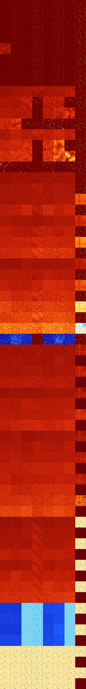

# B0123568 (187904-188415)

<details>
    <summary>Initial Grid</summary>
    
</details>


<details>
    <summary>Initial Grid RLE</summary>

```
#C Exported from GoGoL (https://github.com/marrow16/gogol)
#C Wrap mode: Toroidal
#C Boundary mode: Dead
#C Step: 0
x = 100, y = 100, rule = B0123568/S
15bo16bo14bo35bo8bobo$4bo42bo4bo5bo18bo$4bobo24bo2bo14bo13bo13bo$54bo
32bo$32bo29bo$11bo9bo11bo2bo22bo34bo$8bobobo27bo43bo3bo$44bo11bo20b2o5b
o10bobo$5bo15bo26bo$11bo3bo5bo4bo6bo2bo15bo30bo3bo4bo$59bo13b2o3bo$2bo
35bo35bo7b2o$3bo15bo18bo13bo$33bo13bo3bo10bo22bo2bo6bo$21bo32b2o13bo5bo
3bo$22b2o6bo17bo30bo$bo38bo4bo20bo20bo$6bobo4bo38bo8bo26b2o$28bo18bo27b
o12bo$5bo4bo3b2o14bo28bo11bo$11bo9bo11bo10bo16bo23bo8bo$72bo$2bo45bo23b
o18bo$8bo34bo15bo$8b2obo8bo23bo2bo5bobo8bo12bo4bo15bo$15bo12bo25bo31bo$
96bo$10b2o2bo34bo2bo2b2o18bo13bo5b2o$100b$20bo31bo11bo2bo$12bobo18bo3bo
16bo15bo$14bo14bo40bo22bo$74bo10bo8bo$10bo38bo3bo3bo22bo$23bo6b2o27bo5b
o16bobo2bo$17bo13bo2bo2bo29bo16bo$14bo5bo13bo40bo18bo$17bo49bo19bo$25bo
10bo51bo9bo$4bo13bo19bo16bobo16bo$13bobo7bo5bo21bo3bo$53bo6bo$54bo11bo
4bo3bobo$18bo5bo18bo42bo$3b2o7bo4bo35bobo11bobo18bo$46bo33bo15bo$2bo6bo
21bo25bo3bo18bo$38bo6bo28bo22bo$34bo9b2o5bo10bo19bo13bo$bo25bo9bo2bo29b
o$5bo54bo$53bo9bo$o2bo17bo14bo9bo$13bo11bobo5bo6bo3bo$8bo32bo6bo26bo10b
o5bo$27bo$bo14bo8bo65bo$30bo14bo9bo14b2o$o23bo12bo49bo8bo$o2b2o33bo16bo
$bo21bo7bo39bo12bo7bo$34b2o27bo$23bo24bo14bo7bo6bobo11bo$4bo31bo22bo6bo
$7bob2o15bo13bo23bo5bo19bo$bo21bo25bo47bo$2bo5bo17bo2bo64bo4bo$20bo2bo
54bo$68bo14bo5bo9bo$85bo4bo$83bo$23bobo36bo24bo4bo$7bo16bo15bo37bo3bo6b
o$bo2bo31bo3bo33b2o$17bo43bo11bo5bo$6bo14bo26bo23bo$29bo24bo42bo$72bo$
14bo23bo30bo13bo2bo$6bo42bo6bo25bo5bo10bo$35bo38bo$7bo61bo9bo8bo$42bo
10bo5b2o$9bo24bo61bo$bo36bo46bo8bo2bo$7bo32bo30bo3bo19bo2bo$26bo25bo5bo
9bo18bo$20bo39bo5bo$97bo$9b2o41bo9bo$2bo11bo6bo48bo9b2o$7bobo2bo17bo7bo
48bo4bo$29bo5bo5bo45bo6bo$obo38bo27bo21bo3bobo$2bo33bo5bo46bo7bo$24bo$
8bo11bo20bo25bobo$o11bo14bo30bo24bo8bo$20bo10bo11bo9bo38bo$2bo26bo9bo5b
o16bo24bo8bo!
```
</details>
<details>
    <summary>Thumbnail</summary>

</details>
<table>
<tr>
    <td><a href="./187904%20S%20Heat%20Map%20Activity.png"></a><br>S (187904)<br>R@6,p2</td>    <td><a href="./187905%20S0%20Heat%20Map%20Activity.png"></a><br>S0 (187905)<br>R@6,p2</td>    <td><a href="./187906%20S1%20Heat%20Map%20Activity.png"></a><br>S1 (187906)<br>R@4,p2</td>    <td><a href="./187907%20S01%20Heat%20Map%20Activity.png"></a><br>S01 (187907)<br>R@5,p2</td>    <td><a href="./187908%20S2%20Heat%20Map%20Activity.png"></a><br>S2 (187908)<br>R@4,p2</td>    <td><a href="./187909%20S02%20Heat%20Map%20Activity.png"></a><br>S02 (187909)<br>R@5,p2</td>    <td><a href="./187910%20S12%20Heat%20Map%20Activity.png"></a><br>S12 (187910)<br>R@3,p2</td>    <td><a href="./187911%20S012%20Heat%20Map%20Activity.png"></a><br>S012 (187911)<br>R@5,p2</td></tr>
<tr>
    <td><a href="./187912%20S3%20Heat%20Map%20Activity.png"></a><br>S3 (187912)<br>R@6,p2</td>    <td><a href="./187913%20S03%20Heat%20Map%20Activity.png"></a><br>S03 (187913)<br>R@6,p2</td>    <td><a href="./187914%20S13%20Heat%20Map%20Activity.png"></a><br>S13 (187914)<br>R@4,p2</td>    <td><a href="./187915%20S013%20Heat%20Map%20Activity.png"></a><br>S013 (187915)<br>R@5,p2</td>    <td><a href="./187916%20S23%20Heat%20Map%20Activity.png"></a><br>S23 (187916)<br>R@4,p2</td>    <td><a href="./187917%20S023%20Heat%20Map%20Activity.png"></a><br>S023 (187917)<br>R@5,p2</td>    <td><a href="./187918%20S123%20Heat%20Map%20Activity.png"></a><br>S123 (187918)<br>R@3,p2</td>    <td><a href="./187919%20S0123%20Heat%20Map%20Activity.png"></a><br>S0123 (187919)<br>R@3,p2</td></tr>
<tr>
    <td><a href="./187920%20S4%20Heat%20Map%20Activity.png"></a><br>S4 (187920)<br>R@6,p2</td>    <td><a href="./187921%20S04%20Heat%20Map%20Activity.png"></a><br>S04 (187921)<br>R@6,p2</td>    <td><a href="./187922%20S14%20Heat%20Map%20Activity.png"></a><br>S14 (187922)<br>R@4,p2</td>    <td><a href="./187923%20S014%20Heat%20Map%20Activity.png"></a><br>S014 (187923)<br>R@5,p2</td>    <td><a href="./187924%20S24%20Heat%20Map%20Activity.png"></a><br>S24 (187924)<br>R@4,p2</td>    <td><a href="./187925%20S024%20Heat%20Map%20Activity.png"></a><br>S024 (187925)<br>R@5,p2</td>    <td><a href="./187926%20S124%20Heat%20Map%20Activity.png"></a><br>S124 (187926)<br>R@3,p2</td>    <td><a href="./187927%20S0124%20Heat%20Map%20Activity.png"></a><br>S0124 (187927)<br>R@5,p2</td></tr>
<tr>
    <td><a href="./187928%20S34%20Heat%20Map%20Activity.png"></a><br>S34 (187928)<br>R@6,p2</td>    <td><a href="./187929%20S034%20Heat%20Map%20Activity.png"></a><br>S034 (187929)<br>R@6,p2</td>    <td><a href="./187930%20S134%20Heat%20Map%20Activity.png"></a><br>S134 (187930)<br>R@4,p2</td>    <td><a href="./187931%20S0134%20Heat%20Map%20Activity.png"></a><br>S0134 (187931)<br>R@5,p2</td>    <td><a href="./187932%20S234%20Heat%20Map%20Activity.png"></a><br>S234 (187932)<br>R@4,p2</td>    <td><a href="./187933%20S0234%20Heat%20Map%20Activity.png"></a><br>S0234 (187933)<br>R@5,p2</td>    <td><a href="./187934%20S1234%20Heat%20Map%20Activity.png"></a><br>S1234 (187934)<br>R@3,p2</td>    <td><a href="./187935%20S01234%20Heat%20Map%20Activity.png"></a><br>S01234 (187935)<br>R@3,p2</td></tr>
<tr>
    <td><a href="./187936%20S5%20Heat%20Map%20Activity.png"></a><br>S5 (187936)<br>G>1000</td>    <td><a href="./187937%20S05%20Heat%20Map%20Activity.png"></a><br>S05 (187937)<br>R@10,p4</td>    <td><a href="./187938%20S15%20Heat%20Map%20Activity.png"></a><br>S15 (187938)<br>R@14,p2</td>    <td><a href="./187939%20S015%20Heat%20Map%20Activity.png"></a><br>S015 (187939)<br>R@5,p2</td>    <td><a href="./187940%20S25%20Heat%20Map%20Activity.png"></a><br>S25 (187940)<br>R@9,p2</td>    <td><a href="./187941%20S025%20Heat%20Map%20Activity.png"></a><br>S025 (187941)<br>R@6,p2</td>    <td><a href="./187942%20S125%20Heat%20Map%20Activity.png"></a><br>S125 (187942)<br>R@5,p2</td>    <td><a href="./187943%20S0125%20Heat%20Map%20Activity.png"></a><br>S0125 (187943)<br>R@5,p2</td></tr>
<tr>
    <td><a href="./187944%20S35%20Heat%20Map%20Activity.png"></a><br>S35 (187944)<br>R@11,p4</td>    <td><a href="./187945%20S035%20Heat%20Map%20Activity.png"></a><br>S035 (187945)<br>R@10,p4</td>    <td><a href="./187946%20S135%20Heat%20Map%20Activity.png"></a><br>S135 (187946)<br>R@5,p2</td>    <td><a href="./187947%20S0135%20Heat%20Map%20Activity.png"></a><br>S0135 (187947)<br>R@5,p2</td>    <td><a href="./187948%20S235%20Heat%20Map%20Activity.png"></a><br>S235 (187948)<br>R@7,p2</td>    <td><a href="./187949%20S0235%20Heat%20Map%20Activity.png"></a><br>S0235 (187949)<br>R@6,p2</td>    <td><a href="./187950%20S1235%20Heat%20Map%20Activity.png"></a><br>S1235 (187950)<br>R@5,p2</td>    <td><a href="./187951%20S01235%20Heat%20Map%20Activity.png"></a><br>S01235 (187951)<br>R@3,p2</td></tr>
<tr>
    <td><a href="./187952%20S45%20Heat%20Map%20Activity.png"></a><br>S45 (187952)<br>R@20,p4</td>    <td><a href="./187953%20S045%20Heat%20Map%20Activity.png"></a><br>S045 (187953)<br>R@10,p4</td>    <td><a href="./187954%20S145%20Heat%20Map%20Activity.png"></a><br>S145 (187954)<br>R@10,p2</td>    <td><a href="./187955%20S0145%20Heat%20Map%20Activity.png"></a><br>S0145 (187955)<br>R@5,p2</td>    <td><a href="./187956%20S245%20Heat%20Map%20Activity.png"></a><br>S245 (187956)<br>R@10,p2</td>    <td><a href="./187957%20S0245%20Heat%20Map%20Activity.png"></a><br>S0245 (187957)<br>R@6,p2</td>    <td><a href="./187958%20S1245%20Heat%20Map%20Activity.png"></a><br>S1245 (187958)<br>R@5,p2</td>    <td><a href="./187959%20S01245%20Heat%20Map%20Activity.png"></a><br>S01245 (187959)<br>R@5,p2</td></tr>
<tr>
    <td><a href="./187960%20S345%20Heat%20Map%20Activity.png"></a><br>S345 (187960)<br>R@10,p4</td>    <td><a href="./187961%20S0345%20Heat%20Map%20Activity.png"></a><br>S0345 (187961)<br>R@10,p4</td>    <td><a href="./187962%20S1345%20Heat%20Map%20Activity.png"></a><br>S1345 (187962)<br>R@5,p2</td>    <td><a href="./187963%20S01345%20Heat%20Map%20Activity.png"></a><br>S01345 (187963)<br>R@5,p2</td>    <td><a href="./187964%20S2345%20Heat%20Map%20Activity.png"></a><br>S2345 (187964)<br>R@7,p2</td>    <td><a href="./187965%20S02345%20Heat%20Map%20Activity.png"></a><br>S02345 (187965)<br>R@6,p2</td>    <td><a href="./187966%20S12345%20Heat%20Map%20Activity.png"></a><br>S12345 (187966)<br>R@5,p2</td>    <td><a href="./187967%20S012345%20Heat%20Map%20Activity.png"></a><br>S012345 (187967)<br>R@3,p2</td></tr>
<tr>
    <td><a href="./187968%20S6%20Heat%20Map%20Activity.png"></a><br>S6 (187968)<br>G>1000</td>    <td><a href="./187969%20S06%20Heat%20Map%20Activity.png"></a><br>S06 (187969)<br>G>1000</td>    <td><a href="./187970%20S16%20Heat%20Map%20Activity.png"></a><br>S16 (187970)<br>G>1000</td>    <td><a href="./187971%20S016%20Heat%20Map%20Activity.png"></a><br>S016 (187971)<br>G>1000</td>    <td><a href="./187972%20S26%20Heat%20Map%20Activity.png"></a><br>S26 (187972)<br>G>1000</td>    <td><a href="./187973%20S026%20Heat%20Map%20Activity.png"></a><br>S026 (187973)<br>G>1000</td>    <td><a href="./187974%20S126%20Heat%20Map%20Activity.png"></a><br>S126 (187974)<br>G>1000</td>    <td><a href="./187975%20S0126%20Heat%20Map%20Activity.png"></a><br>S0126 (187975)<br>R@5,p2</td></tr>
<tr>
    <td><a href="./187976%20S36%20Heat%20Map%20Activity.png"></a><br>S36 (187976)<br>G>1000</td>    <td><a href="./187977%20S036%20Heat%20Map%20Activity.png"></a><br>S036 (187977)<br>G>1000</td>    <td><a href="./187978%20S136%20Heat%20Map%20Activity.png"></a><br>S136 (187978)<br>G>1000</td>    <td><a href="./187979%20S0136%20Heat%20Map%20Activity.png"></a><br>S0136 (187979)<br>R@16,p2</td>    <td><a href="./187980%20S236%20Heat%20Map%20Activity.png"></a><br>S236 (187980)<br>G>1000</td>    <td><a href="./187981%20S0236%20Heat%20Map%20Activity.png"></a><br>S0236 (187981)<br>G>1000</td>    <td><a href="./187982%20S1236%20Heat%20Map%20Activity.png"></a><br>S1236 (187982)<br>R@75,p2</td>    <td><a href="./187983%20S01236%20Heat%20Map%20Activity.png"></a><br>S01236 (187983)<br>R@3,p2</td></tr>
<tr>
    <td><a href="./187984%20S46%20Heat%20Map%20Activity.png"></a><br>S46 (187984)<br>G>1000</td>    <td><a href="./187985%20S046%20Heat%20Map%20Activity.png"></a><br>S046 (187985)<br>G>1000</td>    <td><a href="./187986%20S146%20Heat%20Map%20Activity.png"></a><br>S146 (187986)<br>G>1000</td>    <td><a href="./187987%20S0146%20Heat%20Map%20Activity.png"></a><br>S0146 (187987)<br>R@9,p2</td>    <td><a href="./187988%20S246%20Heat%20Map%20Activity.png"></a><br>S246 (187988)<br>G>1000</td>    <td><a href="./187989%20S0246%20Heat%20Map%20Activity.png"></a><br>S0246 (187989)<br>G>1000</td>    <td><a href="./187990%20S1246%20Heat%20Map%20Activity.png"></a><br>S1246 (187990)<br>G>1000</td>    <td><a href="./187991%20S01246%20Heat%20Map%20Activity.png"></a><br>S01246 (187991)<br>R@5,p2</td></tr>
<tr>
    <td><a href="./187992%20S346%20Heat%20Map%20Activity.png"></a><br>S346 (187992)<br>G>1000</td>    <td><a href="./187993%20S0346%20Heat%20Map%20Activity.png"></a><br>S0346 (187993)<br>G>1000</td>    <td><a href="./187994%20S1346%20Heat%20Map%20Activity.png"></a><br>S1346 (187994)<br>R@21,p2</td>    <td><a href="./187995%20S01346%20Heat%20Map%20Activity.png"></a><br>S01346 (187995)<br>R@5,p2</td>    <td><a href="./187996%20S2346%20Heat%20Map%20Activity.png"></a><br>S2346 (187996)<br>R@99,p12</td>    <td><a href="./187997%20S02346%20Heat%20Map%20Activity.png"></a><br>S02346 (187997)<br>R@91,p12</td>    <td><a href="./187998%20S12346%20Heat%20Map%20Activity.png"></a><br>S12346 (187998)<br>R@11,p2</td>    <td><a href="./187999%20S012346%20Heat%20Map%20Activity.png"></a><br>S012346 (187999)<br>R@3,p2</td></tr>
<tr>
    <td><a href="./188000%20S56%20Heat%20Map%20Activity.png"></a><br>S56 (188000)<br>G>1000</td>    <td><a href="./188001%20S056%20Heat%20Map%20Activity.png"></a><br>S056 (188001)<br>G>1000</td>    <td><a href="./188002%20S156%20Heat%20Map%20Activity.png"></a><br>S156 (188002)<br>G>1000</td>    <td><a href="./188003%20S0156%20Heat%20Map%20Activity.png"></a><br>S0156 (188003)<br>G>1000</td>    <td><a href="./188004%20S256%20Heat%20Map%20Activity.png"></a><br>S256 (188004)<br>G>1000</td>    <td><a href="./188005%20S0256%20Heat%20Map%20Activity.png"></a><br>S0256 (188005)<br>G>1000</td>    <td><a href="./188006%20S1256%20Heat%20Map%20Activity.png"></a><br>S1256 (188006)<br>G>1000</td>    <td><a href="./188007%20S01256%20Heat%20Map%20Activity.png"></a><br>S01256 (188007)<br>R@5,p2</td></tr>
<tr>
    <td><a href="./188008%20S356%20Heat%20Map%20Activity.png"></a><br>S356 (188008)<br>G>1000</td>    <td><a href="./188009%20S0356%20Heat%20Map%20Activity.png"></a><br>S0356 (188009)<br>G>1000</td>    <td><a href="./188010%20S1356%20Heat%20Map%20Activity.png"></a><br>S1356 (188010)<br>G>1000</td>    <td><a href="./188011%20S01356%20Heat%20Map%20Activity.png"></a><br>S01356 (188011)<br>R@7,p4</td>    <td><a href="./188012%20S2356%20Heat%20Map%20Activity.png"></a><br>S2356 (188012)<br>G>1000</td>    <td><a href="./188013%20S02356%20Heat%20Map%20Activity.png"></a><br>S02356 (188013)<br>G>1000</td>    <td><a href="./188014%20S12356%20Heat%20Map%20Activity.png"></a><br>S12356 (188014)<br>R@31,p4</td>    <td><a href="./188015%20S012356%20Heat%20Map%20Activity.png"></a><br>S012356 (188015)<br>R@3,p2</td></tr>
<tr>
    <td><a href="./188016%20S456%20Heat%20Map%20Activity.png"></a><br>S456 (188016)<br>G>1000</td>    <td><a href="./188017%20S0456%20Heat%20Map%20Activity.png"></a><br>S0456 (188017)<br>G>1000</td>    <td><a href="./188018%20S1456%20Heat%20Map%20Activity.png"></a><br>S1456 (188018)<br>G>1000</td>    <td><a href="./188019%20S01456%20Heat%20Map%20Activity.png"></a><br>S01456 (188019)<br>R@17,p2</td>    <td><a href="./188020%20S2456%20Heat%20Map%20Activity.png"></a><br>S2456 (188020)<br>G>1000</td>    <td><a href="./188021%20S02456%20Heat%20Map%20Activity.png"></a><br>S02456 (188021)<br>G>1000</td>    <td><a href="./188022%20S12456%20Heat%20Map%20Activity.png"></a><br>S12456 (188022)<br>G>1000</td>    <td><a href="./188023%20S012456%20Heat%20Map%20Activity.png"></a><br>S012456 (188023)<br>R@5,p2</td></tr>
<tr>
    <td><a href="./188024%20S3456%20Heat%20Map%20Activity.png"></a><br>S3456 (188024)<br>R@165,p12</td>    <td><a href="./188025%20S03456%20Heat%20Map%20Activity.png"></a><br>S03456 (188025)<br>R@53,p4</td>    <td><a href="./188026%20S13456%20Heat%20Map%20Activity.png"></a><br>S13456 (188026)<br>R@15,p2</td>    <td><a href="./188027%20S013456%20Heat%20Map%20Activity.png"></a><br>S013456 (188027)<br>R@7,p2</td>    <td><a href="./188028%20S23456%20Heat%20Map%20Activity.png"></a><br>S23456 (188028)<br>R@23,p4</td>    <td><a href="./188029%20S023456%20Heat%20Map%20Activity.png"></a><br>S023456 (188029)<br>R@27,p4</td>    <td><a href="./188030%20S123456%20Heat%20Map%20Activity.png"></a><br>S123456 (188030)<br>R@7,p2</td>    <td><a href="./188031%20S0123456%20Heat%20Map%20Activity.png"></a><br>S0123456 (188031)<br>R@3,p2</td></tr>
<tr>
    <td><a href="./188032%20S7%20Heat%20Map%20Activity.png"></a><br>S7 (188032)<br>G>1000</td>    <td><a href="./188033%20S07%20Heat%20Map%20Activity.png"></a><br>S07 (188033)<br>G>1000</td>    <td><a href="./188034%20S17%20Heat%20Map%20Activity.png"></a><br>S17 (188034)<br>G>1000</td>    <td><a href="./188035%20S017%20Heat%20Map%20Activity.png"></a><br>S017 (188035)<br>G>1000</td>    <td><a href="./188036%20S27%20Heat%20Map%20Activity.png"></a><br>S27 (188036)<br>G>1000</td>    <td><a href="./188037%20S027%20Heat%20Map%20Activity.png"></a><br>S027 (188037)<br>G>1000</td>    <td><a href="./188038%20S127%20Heat%20Map%20Activity.png"></a><br>S127 (188038)<br>G>1000</td>    <td><a href="./188039%20S0127%20Heat%20Map%20Activity.png"></a><br>S0127 (188039)<br>R@5,p2</td></tr>
<tr>
    <td><a href="./188040%20S37%20Heat%20Map%20Activity.png"></a><br>S37 (188040)<br>G>1000</td>    <td><a href="./188041%20S037%20Heat%20Map%20Activity.png"></a><br>S037 (188041)<br>G>1000</td>    <td><a href="./188042%20S137%20Heat%20Map%20Activity.png"></a><br>S137 (188042)<br>G>1000</td>    <td><a href="./188043%20S0137%20Heat%20Map%20Activity.png"></a><br>S0137 (188043)<br>G>1000</td>    <td><a href="./188044%20S237%20Heat%20Map%20Activity.png"></a><br>S237 (188044)<br>G>1000</td>    <td><a href="./188045%20S0237%20Heat%20Map%20Activity.png"></a><br>S0237 (188045)<br>G>1000</td>    <td><a href="./188046%20S1237%20Heat%20Map%20Activity.png"></a><br>S1237 (188046)<br>G>1000</td>    <td><a href="./188047%20S01237%20Heat%20Map%20Activity.png"></a><br>S01237 (188047)<br>R@3,p2</td></tr>
<tr>
    <td><a href="./188048%20S47%20Heat%20Map%20Activity.png"></a><br>S47 (188048)<br>G>1000</td>    <td><a href="./188049%20S047%20Heat%20Map%20Activity.png"></a><br>S047 (188049)<br>G>1000</td>    <td><a href="./188050%20S147%20Heat%20Map%20Activity.png"></a><br>S147 (188050)<br>G>1000</td>    <td><a href="./188051%20S0147%20Heat%20Map%20Activity.png"></a><br>S0147 (188051)<br>G>1000</td>    <td><a href="./188052%20S247%20Heat%20Map%20Activity.png"></a><br>S247 (188052)<br>G>1000</td>    <td><a href="./188053%20S0247%20Heat%20Map%20Activity.png"></a><br>S0247 (188053)<br>G>1000</td>    <td><a href="./188054%20S1247%20Heat%20Map%20Activity.png"></a><br>S1247 (188054)<br>G>1000</td>    <td><a href="./188055%20S01247%20Heat%20Map%20Activity.png"></a><br>S01247 (188055)<br>G>1000</td></tr>
<tr>
    <td><a href="./188056%20S347%20Heat%20Map%20Activity.png"></a><br>S347 (188056)<br>G>1000</td>    <td><a href="./188057%20S0347%20Heat%20Map%20Activity.png"></a><br>S0347 (188057)<br>G>1000</td>    <td><a href="./188058%20S1347%20Heat%20Map%20Activity.png"></a><br>S1347 (188058)<br>G>1000</td>    <td><a href="./188059%20S01347%20Heat%20Map%20Activity.png"></a><br>S01347 (188059)<br>G>1000</td>    <td><a href="./188060%20S2347%20Heat%20Map%20Activity.png"></a><br>S2347 (188060)<br>G>1000</td>    <td><a href="./188061%20S02347%20Heat%20Map%20Activity.png"></a><br>S02347 (188061)<br>G>1000</td>    <td><a href="./188062%20S12347%20Heat%20Map%20Activity.png"></a><br>S12347 (188062)<br>G>1000</td>    <td><a href="./188063%20S012347%20Heat%20Map%20Activity.png"></a><br>S012347 (188063)<br>R@3,p2</td></tr>
<tr>
    <td><a href="./188064%20S57%20Heat%20Map%20Activity.png"></a><br>S57 (188064)<br>G>1000</td>    <td><a href="./188065%20S057%20Heat%20Map%20Activity.png"></a><br>S057 (188065)<br>G>1000</td>    <td><a href="./188066%20S157%20Heat%20Map%20Activity.png"></a><br>S157 (188066)<br>G>1000</td>    <td><a href="./188067%20S0157%20Heat%20Map%20Activity.png"></a><br>S0157 (188067)<br>G>1000</td>    <td><a href="./188068%20S257%20Heat%20Map%20Activity.png"></a><br>S257 (188068)<br>G>1000</td>    <td><a href="./188069%20S0257%20Heat%20Map%20Activity.png"></a><br>S0257 (188069)<br>G>1000</td>    <td><a href="./188070%20S1257%20Heat%20Map%20Activity.png"></a><br>S1257 (188070)<br>G>1000</td>    <td><a href="./188071%20S01257%20Heat%20Map%20Activity.png"></a><br>S01257 (188071)<br>G>1000</td></tr>
<tr>
    <td><a href="./188072%20S357%20Heat%20Map%20Activity.png"></a><br>S357 (188072)<br>G>1000</td>    <td><a href="./188073%20S0357%20Heat%20Map%20Activity.png"></a><br>S0357 (188073)<br>G>1000</td>    <td><a href="./188074%20S1357%20Heat%20Map%20Activity.png"></a><br>S1357 (188074)<br>G>1000</td>    <td><a href="./188075%20S01357%20Heat%20Map%20Activity.png"></a><br>S01357 (188075)<br>G>1000</td>    <td><a href="./188076%20S2357%20Heat%20Map%20Activity.png"></a><br>S2357 (188076)<br>G>1000</td>    <td><a href="./188077%20S02357%20Heat%20Map%20Activity.png"></a><br>S02357 (188077)<br>G>1000</td>    <td><a href="./188078%20S12357%20Heat%20Map%20Activity.png"></a><br>S12357 (188078)<br>G>1000</td>    <td><a href="./188079%20S012357%20Heat%20Map%20Activity.png"></a><br>S012357 (188079)<br>R@3,p2</td></tr>
<tr>
    <td><a href="./188080%20S457%20Heat%20Map%20Activity.png"></a><br>S457 (188080)<br>G>1000</td>    <td><a href="./188081%20S0457%20Heat%20Map%20Activity.png"></a><br>S0457 (188081)<br>G>1000</td>    <td><a href="./188082%20S1457%20Heat%20Map%20Activity.png"></a><br>S1457 (188082)<br>G>1000</td>    <td><a href="./188083%20S01457%20Heat%20Map%20Activity.png"></a><br>S01457 (188083)<br>G>1000</td>    <td><a href="./188084%20S2457%20Heat%20Map%20Activity.png"></a><br>S2457 (188084)<br>G>1000</td>    <td><a href="./188085%20S02457%20Heat%20Map%20Activity.png"></a><br>S02457 (188085)<br>G>1000</td>    <td><a href="./188086%20S12457%20Heat%20Map%20Activity.png"></a><br>S12457 (188086)<br>G>1000</td>    <td><a href="./188087%20S012457%20Heat%20Map%20Activity.png"></a><br>S012457 (188087)<br>G>1000</td></tr>
<tr>
    <td><a href="./188088%20S3457%20Heat%20Map%20Activity.png"></a><br>S3457 (188088)<br>G>1000</td>    <td><a href="./188089%20S03457%20Heat%20Map%20Activity.png"></a><br>S03457 (188089)<br>G>1000</td>    <td><a href="./188090%20S13457%20Heat%20Map%20Activity.png"></a><br>S13457 (188090)<br>G>1000</td>    <td><a href="./188091%20S013457%20Heat%20Map%20Activity.png"></a><br>S013457 (188091)<br>G>1000</td>    <td><a href="./188092%20S23457%20Heat%20Map%20Activity.png"></a><br>S23457 (188092)<br>G>1000</td>    <td><a href="./188093%20S023457%20Heat%20Map%20Activity.png"></a><br>S023457 (188093)<br>G>1000</td>    <td><a href="./188094%20S123457%20Heat%20Map%20Activity.png"></a><br>S123457 (188094)<br>G>1000</td>    <td><a href="./188095%20S0123457%20Heat%20Map%20Activity.png"></a><br>S0123457 (188095)<br>R@3,p2</td></tr>
<tr>
    <td><a href="./188096%20S67%20Heat%20Map%20Activity.png"></a><br>S67 (188096)<br>G>1000</td>    <td><a href="./188097%20S067%20Heat%20Map%20Activity.png"></a><br>S067 (188097)<br>G>1000</td>    <td><a href="./188098%20S167%20Heat%20Map%20Activity.png"></a><br>S167 (188098)<br>G>1000</td>    <td><a href="./188099%20S0167%20Heat%20Map%20Activity.png"></a><br>S0167 (188099)<br>G>1000</td>    <td><a href="./188100%20S267%20Heat%20Map%20Activity.png"></a><br>S267 (188100)<br>G>1000</td>    <td><a href="./188101%20S0267%20Heat%20Map%20Activity.png"></a><br>S0267 (188101)<br>G>1000</td>    <td><a href="./188102%20S1267%20Heat%20Map%20Activity.png"></a><br>S1267 (188102)<br>G>1000</td>    <td><a href="./188103%20S01267%20Heat%20Map%20Activity.png"></a><br>S01267 (188103)<br>G>1000</td></tr>
<tr>
    <td><a href="./188104%20S367%20Heat%20Map%20Activity.png"></a><br>S367 (188104)<br>G>1000</td>    <td><a href="./188105%20S0367%20Heat%20Map%20Activity.png"></a><br>S0367 (188105)<br>G>1000</td>    <td><a href="./188106%20S1367%20Heat%20Map%20Activity.png"></a><br>S1367 (188106)<br>G>1000</td>    <td><a href="./188107%20S01367%20Heat%20Map%20Activity.png"></a><br>S01367 (188107)<br>G>1000</td>    <td><a href="./188108%20S2367%20Heat%20Map%20Activity.png"></a><br>S2367 (188108)<br>G>1000</td>    <td><a href="./188109%20S02367%20Heat%20Map%20Activity.png"></a><br>S02367 (188109)<br>G>1000</td>    <td><a href="./188110%20S12367%20Heat%20Map%20Activity.png"></a><br>S12367 (188110)<br>G>1000</td>    <td><a href="./188111%20S012367%20Heat%20Map%20Activity.png"></a><br>S012367 (188111)<br>R@3,p2</td></tr>
<tr>
    <td><a href="./188112%20S467%20Heat%20Map%20Activity.png"></a><br>S467 (188112)<br>G>1000</td>    <td><a href="./188113%20S0467%20Heat%20Map%20Activity.png"></a><br>S0467 (188113)<br>G>1000</td>    <td><a href="./188114%20S1467%20Heat%20Map%20Activity.png"></a><br>S1467 (188114)<br>G>1000</td>    <td><a href="./188115%20S01467%20Heat%20Map%20Activity.png"></a><br>S01467 (188115)<br>G>1000</td>    <td><a href="./188116%20S2467%20Heat%20Map%20Activity.png"></a><br>S2467 (188116)<br>G>1000</td>    <td><a href="./188117%20S02467%20Heat%20Map%20Activity.png"></a><br>S02467 (188117)<br>G>1000</td>    <td><a href="./188118%20S12467%20Heat%20Map%20Activity.png"></a><br>S12467 (188118)<br>G>1000</td>    <td><a href="./188119%20S012467%20Heat%20Map%20Activity.png"></a><br>S012467 (188119)<br>G>1000</td></tr>
<tr>
    <td><a href="./188120%20S3467%20Heat%20Map%20Activity.png"></a><br>S3467 (188120)<br>G>1000</td>    <td><a href="./188121%20S03467%20Heat%20Map%20Activity.png"></a><br>S03467 (188121)<br>G>1000</td>    <td><a href="./188122%20S13467%20Heat%20Map%20Activity.png"></a><br>S13467 (188122)<br>G>1000</td>    <td><a href="./188123%20S013467%20Heat%20Map%20Activity.png"></a><br>S013467 (188123)<br>G>1000</td>    <td><a href="./188124%20S23467%20Heat%20Map%20Activity.png"></a><br>S23467 (188124)<br>G>1000</td>    <td><a href="./188125%20S023467%20Heat%20Map%20Activity.png"></a><br>S023467 (188125)<br>G>1000</td>    <td><a href="./188126%20S123467%20Heat%20Map%20Activity.png"></a><br>S123467 (188126)<br>G>1000</td>    <td><a href="./188127%20S0123467%20Heat%20Map%20Activity.png"></a><br>S0123467 (188127)<br>R@3,p2</td></tr>
<tr>
    <td><a href="./188128%20S567%20Heat%20Map%20Activity.png"></a><br>S567 (188128)<br>G>1000</td>    <td><a href="./188129%20S0567%20Heat%20Map%20Activity.png"></a><br>S0567 (188129)<br>G>1000</td>    <td><a href="./188130%20S1567%20Heat%20Map%20Activity.png"></a><br>S1567 (188130)<br>G>1000</td>    <td><a href="./188131%20S01567%20Heat%20Map%20Activity.png"></a><br>S01567 (188131)<br>G>1000</td>    <td><a href="./188132%20S2567%20Heat%20Map%20Activity.png"></a><br>S2567 (188132)<br>G>1000</td>    <td><a href="./188133%20S02567%20Heat%20Map%20Activity.png"></a><br>S02567 (188133)<br>G>1000</td>    <td><a href="./188134%20S12567%20Heat%20Map%20Activity.png"></a><br>S12567 (188134)<br>G>1000</td>    <td><a href="./188135%20S012567%20Heat%20Map%20Activity.png"></a><br>S012567 (188135)<br>G>1000</td></tr>
<tr>
    <td><a href="./188136%20S3567%20Heat%20Map%20Activity.png"></a><br>S3567 (188136)<br>G>1000</td>    <td><a href="./188137%20S03567%20Heat%20Map%20Activity.png"></a><br>S03567 (188137)<br>G>1000</td>    <td><a href="./188138%20S13567%20Heat%20Map%20Activity.png"></a><br>S13567 (188138)<br>G>1000</td>    <td><a href="./188139%20S013567%20Heat%20Map%20Activity.png"></a><br>S013567 (188139)<br>G>1000</td>    <td><a href="./188140%20S23567%20Heat%20Map%20Activity.png"></a><br>S23567 (188140)<br>G>1000</td>    <td><a href="./188141%20S023567%20Heat%20Map%20Activity.png"></a><br>S023567 (188141)<br>G>1000</td>    <td><a href="./188142%20S123567%20Heat%20Map%20Activity.png"></a><br>S123567 (188142)<br>G>1000</td>    <td><a href="./188143%20S0123567%20Heat%20Map%20Activity.png"></a><br>S0123567 (188143)<br>R@3,p2</td></tr>
<tr>
    <td><a href="./188144%20S4567%20Heat%20Map%20Activity.png"></a><br>S4567 (188144)<br>G>1000</td>    <td><a href="./188145%20S04567%20Heat%20Map%20Activity.png"></a><br>S04567 (188145)<br>G>1000</td>    <td><a href="./188146%20S14567%20Heat%20Map%20Activity.png"></a><br>S14567 (188146)<br>G>1000</td>    <td><a href="./188147%20S014567%20Heat%20Map%20Activity.png"></a><br>S014567 (188147)<br>G>1000</td>    <td><a href="./188148%20S24567%20Heat%20Map%20Activity.png"></a><br>S24567 (188148)<br>G>1000</td>    <td><a href="./188149%20S024567%20Heat%20Map%20Activity.png"></a><br>S024567 (188149)<br>G>1000</td>    <td><a href="./188150%20S124567%20Heat%20Map%20Activity.png"></a><br>S124567 (188150)<br>G>1000</td>    <td><a href="./188151%20S0124567%20Heat%20Map%20Activity.png"></a><br>S0124567 (188151)<br>G>1000</td></tr>
<tr>
    <td><a href="./188152%20S34567%20Heat%20Map%20Activity.png"></a><br>S34567 (188152)<br>R@915,p840</td>    <td><a href="./188153%20S034567%20Heat%20Map%20Activity.png"></a><br>S034567 (188153)<br>R@249,p120</td>    <td><a href="./188154%20S134567%20Heat%20Map%20Activity.png"></a><br>S134567 (188154)<br>R@447,p360</td>    <td><a href="./188155%20S0134567%20Heat%20Map%20Activity.png"></a><br>S0134567 (188155)<br>R@7,p2</td>    <td><a href="./188156%20S234567%20Heat%20Map%20Activity.png"></a><br>S234567 (188156)<br>G>1000</td>    <td><a href="./188157%20S0234567%20Heat%20Map%20Activity.png"></a><br>S0234567 (188157)<br>R@500,p360</td>    <td><a href="./188158%20S1234567%20Heat%20Map%20Activity.png"></a><br>S1234567 (188158)<br>R@423,p360</td>    <td><a href="./188159%20S01234567%20Heat%20Map%20Activity.png"></a><br>S01234567 (188159)<br>R@3,p2</td></tr>
<tr>
    <td><a href="./188160%20S8%20Heat%20Map%20Activity.png"></a><br>S8 (188160)<br>G>1000</td>    <td><a href="./188161%20S08%20Heat%20Map%20Activity.png"></a><br>S08 (188161)<br>G>1000</td>    <td><a href="./188162%20S18%20Heat%20Map%20Activity.png"></a><br>S18 (188162)<br>G>1000</td>    <td><a href="./188163%20S018%20Heat%20Map%20Activity.png"></a><br>S018 (188163)<br>G>1000</td>    <td><a href="./188164%20S28%20Heat%20Map%20Activity.png"></a><br>S28 (188164)<br>G>1000</td>    <td><a href="./188165%20S028%20Heat%20Map%20Activity.png"></a><br>S028 (188165)<br>G>1000</td>    <td><a href="./188166%20S128%20Heat%20Map%20Activity.png"></a><br>S128 (188166)<br>G>1000</td>    <td><a href="./188167%20S0128%20Heat%20Map%20Activity.png"></a><br>S0128 (188167)<br>G>1000</td></tr>
<tr>
    <td><a href="./188168%20S38%20Heat%20Map%20Activity.png"></a><br>S38 (188168)<br>G>1000</td>    <td><a href="./188169%20S038%20Heat%20Map%20Activity.png"></a><br>S038 (188169)<br>G>1000</td>    <td><a href="./188170%20S138%20Heat%20Map%20Activity.png"></a><br>S138 (188170)<br>G>1000</td>    <td><a href="./188171%20S0138%20Heat%20Map%20Activity.png"></a><br>S0138 (188171)<br>G>1000</td>    <td><a href="./188172%20S238%20Heat%20Map%20Activity.png"></a><br>S238 (188172)<br>G>1000</td>    <td><a href="./188173%20S0238%20Heat%20Map%20Activity.png"></a><br>S0238 (188173)<br>G>1000</td>    <td><a href="./188174%20S1238%20Heat%20Map%20Activity.png"></a><br>S1238 (188174)<br>G>1000</td>    <td><a href="./188175%20S01238%20Heat%20Map%20Activity.png"></a><br>S01238 (188175)<br>S@1</td></tr>
<tr>
    <td><a href="./188176%20S48%20Heat%20Map%20Activity.png"></a><br>S48 (188176)<br>G>1000</td>    <td><a href="./188177%20S048%20Heat%20Map%20Activity.png"></a><br>S048 (188177)<br>G>1000</td>    <td><a href="./188178%20S148%20Heat%20Map%20Activity.png"></a><br>S148 (188178)<br>G>1000</td>    <td><a href="./188179%20S0148%20Heat%20Map%20Activity.png"></a><br>S0148 (188179)<br>G>1000</td>    <td><a href="./188180%20S248%20Heat%20Map%20Activity.png"></a><br>S248 (188180)<br>G>1000</td>    <td><a href="./188181%20S0248%20Heat%20Map%20Activity.png"></a><br>S0248 (188181)<br>G>1000</td>    <td><a href="./188182%20S1248%20Heat%20Map%20Activity.png"></a><br>S1248 (188182)<br>G>1000</td>    <td><a href="./188183%20S01248%20Heat%20Map%20Activity.png"></a><br>S01248 (188183)<br>G>1000</td></tr>
<tr>
    <td><a href="./188184%20S348%20Heat%20Map%20Activity.png"></a><br>S348 (188184)<br>G>1000</td>    <td><a href="./188185%20S0348%20Heat%20Map%20Activity.png"></a><br>S0348 (188185)<br>G>1000</td>    <td><a href="./188186%20S1348%20Heat%20Map%20Activity.png"></a><br>S1348 (188186)<br>G>1000</td>    <td><a href="./188187%20S01348%20Heat%20Map%20Activity.png"></a><br>S01348 (188187)<br>G>1000</td>    <td><a href="./188188%20S2348%20Heat%20Map%20Activity.png"></a><br>S2348 (188188)<br>G>1000</td>    <td><a href="./188189%20S02348%20Heat%20Map%20Activity.png"></a><br>S02348 (188189)<br>G>1000</td>    <td><a href="./188190%20S12348%20Heat%20Map%20Activity.png"></a><br>S12348 (188190)<br>G>1000</td>    <td><a href="./188191%20S012348%20Heat%20Map%20Activity.png"></a><br>S012348 (188191)<br>S@1</td></tr>
<tr>
    <td><a href="./188192%20S58%20Heat%20Map%20Activity.png"></a><br>S58 (188192)<br>G>1000</td>    <td><a href="./188193%20S058%20Heat%20Map%20Activity.png"></a><br>S058 (188193)<br>G>1000</td>    <td><a href="./188194%20S158%20Heat%20Map%20Activity.png"></a><br>S158 (188194)<br>G>1000</td>    <td><a href="./188195%20S0158%20Heat%20Map%20Activity.png"></a><br>S0158 (188195)<br>G>1000</td>    <td><a href="./188196%20S258%20Heat%20Map%20Activity.png"></a><br>S258 (188196)<br>G>1000</td>    <td><a href="./188197%20S0258%20Heat%20Map%20Activity.png"></a><br>S0258 (188197)<br>G>1000</td>    <td><a href="./188198%20S1258%20Heat%20Map%20Activity.png"></a><br>S1258 (188198)<br>G>1000</td>    <td><a href="./188199%20S01258%20Heat%20Map%20Activity.png"></a><br>S01258 (188199)<br>G>1000</td></tr>
<tr>
    <td><a href="./188200%20S358%20Heat%20Map%20Activity.png"></a><br>S358 (188200)<br>G>1000</td>    <td><a href="./188201%20S0358%20Heat%20Map%20Activity.png"></a><br>S0358 (188201)<br>G>1000</td>    <td><a href="./188202%20S1358%20Heat%20Map%20Activity.png"></a><br>S1358 (188202)<br>G>1000</td>    <td><a href="./188203%20S01358%20Heat%20Map%20Activity.png"></a><br>S01358 (188203)<br>G>1000</td>    <td><a href="./188204%20S2358%20Heat%20Map%20Activity.png"></a><br>S2358 (188204)<br>G>1000</td>    <td><a href="./188205%20S02358%20Heat%20Map%20Activity.png"></a><br>S02358 (188205)<br>G>1000</td>    <td><a href="./188206%20S12358%20Heat%20Map%20Activity.png"></a><br>S12358 (188206)<br>G>1000</td>    <td><a href="./188207%20S012358%20Heat%20Map%20Activity.png"></a><br>S012358 (188207)<br>S@1</td></tr>
<tr>
    <td><a href="./188208%20S458%20Heat%20Map%20Activity.png"></a><br>S458 (188208)<br>G>1000</td>    <td><a href="./188209%20S0458%20Heat%20Map%20Activity.png"></a><br>S0458 (188209)<br>G>1000</td>    <td><a href="./188210%20S1458%20Heat%20Map%20Activity.png"></a><br>S1458 (188210)<br>G>1000</td>    <td><a href="./188211%20S01458%20Heat%20Map%20Activity.png"></a><br>S01458 (188211)<br>G>1000</td>    <td><a href="./188212%20S2458%20Heat%20Map%20Activity.png"></a><br>S2458 (188212)<br>G>1000</td>    <td><a href="./188213%20S02458%20Heat%20Map%20Activity.png"></a><br>S02458 (188213)<br>G>1000</td>    <td><a href="./188214%20S12458%20Heat%20Map%20Activity.png"></a><br>S12458 (188214)<br>G>1000</td>    <td><a href="./188215%20S012458%20Heat%20Map%20Activity.png"></a><br>S012458 (188215)<br>G>1000</td></tr>
<tr>
    <td><a href="./188216%20S3458%20Heat%20Map%20Activity.png"></a><br>S3458 (188216)<br>G>1000</td>    <td><a href="./188217%20S03458%20Heat%20Map%20Activity.png"></a><br>S03458 (188217)<br>G>1000</td>    <td><a href="./188218%20S13458%20Heat%20Map%20Activity.png"></a><br>S13458 (188218)<br>G>1000</td>    <td><a href="./188219%20S013458%20Heat%20Map%20Activity.png"></a><br>S013458 (188219)<br>G>1000</td>    <td><a href="./188220%20S23458%20Heat%20Map%20Activity.png"></a><br>S23458 (188220)<br>G>1000</td>    <td><a href="./188221%20S023458%20Heat%20Map%20Activity.png"></a><br>S023458 (188221)<br>G>1000</td>    <td><a href="./188222%20S123458%20Heat%20Map%20Activity.png"></a><br>S123458 (188222)<br>G>1000</td>    <td><a href="./188223%20S0123458%20Heat%20Map%20Activity.png"></a><br>S0123458 (188223)<br>S@1</td></tr>
<tr>
    <td><a href="./188224%20S68%20Heat%20Map%20Activity.png"></a><br>S68 (188224)<br>G>1000</td>    <td><a href="./188225%20S068%20Heat%20Map%20Activity.png"></a><br>S068 (188225)<br>G>1000</td>    <td><a href="./188226%20S168%20Heat%20Map%20Activity.png"></a><br>S168 (188226)<br>G>1000</td>    <td><a href="./188227%20S0168%20Heat%20Map%20Activity.png"></a><br>S0168 (188227)<br>G>1000</td>    <td><a href="./188228%20S268%20Heat%20Map%20Activity.png"></a><br>S268 (188228)<br>G>1000</td>    <td><a href="./188229%20S0268%20Heat%20Map%20Activity.png"></a><br>S0268 (188229)<br>G>1000</td>    <td><a href="./188230%20S1268%20Heat%20Map%20Activity.png"></a><br>S1268 (188230)<br>G>1000</td>    <td><a href="./188231%20S01268%20Heat%20Map%20Activity.png"></a><br>S01268 (188231)<br>G>1000</td></tr>
<tr>
    <td><a href="./188232%20S368%20Heat%20Map%20Activity.png"></a><br>S368 (188232)<br>G>1000</td>    <td><a href="./188233%20S0368%20Heat%20Map%20Activity.png"></a><br>S0368 (188233)<br>G>1000</td>    <td><a href="./188234%20S1368%20Heat%20Map%20Activity.png"></a><br>S1368 (188234)<br>G>1000</td>    <td><a href="./188235%20S01368%20Heat%20Map%20Activity.png"></a><br>S01368 (188235)<br>G>1000</td>    <td><a href="./188236%20S2368%20Heat%20Map%20Activity.png"></a><br>S2368 (188236)<br>G>1000</td>    <td><a href="./188237%20S02368%20Heat%20Map%20Activity.png"></a><br>S02368 (188237)<br>G>1000</td>    <td><a href="./188238%20S12368%20Heat%20Map%20Activity.png"></a><br>S12368 (188238)<br>G>1000</td>    <td><a href="./188239%20S012368%20Heat%20Map%20Activity.png"></a><br>S012368 (188239)<br>S@1</td></tr>
<tr>
    <td><a href="./188240%20S468%20Heat%20Map%20Activity.png"></a><br>S468 (188240)<br>G>1000</td>    <td><a href="./188241%20S0468%20Heat%20Map%20Activity.png"></a><br>S0468 (188241)<br>G>1000</td>    <td><a href="./188242%20S1468%20Heat%20Map%20Activity.png"></a><br>S1468 (188242)<br>G>1000</td>    <td><a href="./188243%20S01468%20Heat%20Map%20Activity.png"></a><br>S01468 (188243)<br>G>1000</td>    <td><a href="./188244%20S2468%20Heat%20Map%20Activity.png"></a><br>S2468 (188244)<br>G>1000</td>    <td><a href="./188245%20S02468%20Heat%20Map%20Activity.png"></a><br>S02468 (188245)<br>G>1000</td>    <td><a href="./188246%20S12468%20Heat%20Map%20Activity.png"></a><br>S12468 (188246)<br>G>1000</td>    <td><a href="./188247%20S012468%20Heat%20Map%20Activity.png"></a><br>S012468 (188247)<br>G>1000</td></tr>
<tr>
    <td><a href="./188248%20S3468%20Heat%20Map%20Activity.png"></a><br>S3468 (188248)<br>G>1000</td>    <td><a href="./188249%20S03468%20Heat%20Map%20Activity.png"></a><br>S03468 (188249)<br>G>1000</td>    <td><a href="./188250%20S13468%20Heat%20Map%20Activity.png"></a><br>S13468 (188250)<br>G>1000</td>    <td><a href="./188251%20S013468%20Heat%20Map%20Activity.png"></a><br>S013468 (188251)<br>G>1000</td>    <td><a href="./188252%20S23468%20Heat%20Map%20Activity.png"></a><br>S23468 (188252)<br>G>1000</td>    <td><a href="./188253%20S023468%20Heat%20Map%20Activity.png"></a><br>S023468 (188253)<br>G>1000</td>    <td><a href="./188254%20S123468%20Heat%20Map%20Activity.png"></a><br>S123468 (188254)<br>G>1000</td>    <td><a href="./188255%20S0123468%20Heat%20Map%20Activity.png"></a><br>S0123468 (188255)<br>S@1</td></tr>
<tr>
    <td><a href="./188256%20S568%20Heat%20Map%20Activity.png"></a><br>S568 (188256)<br>G>1000</td>    <td><a href="./188257%20S0568%20Heat%20Map%20Activity.png"></a><br>S0568 (188257)<br>G>1000</td>    <td><a href="./188258%20S1568%20Heat%20Map%20Activity.png"></a><br>S1568 (188258)<br>G>1000</td>    <td><a href="./188259%20S01568%20Heat%20Map%20Activity.png"></a><br>S01568 (188259)<br>G>1000</td>    <td><a href="./188260%20S2568%20Heat%20Map%20Activity.png"></a><br>S2568 (188260)<br>G>1000</td>    <td><a href="./188261%20S02568%20Heat%20Map%20Activity.png"></a><br>S02568 (188261)<br>G>1000</td>    <td><a href="./188262%20S12568%20Heat%20Map%20Activity.png"></a><br>S12568 (188262)<br>G>1000</td>    <td><a href="./188263%20S012568%20Heat%20Map%20Activity.png"></a><br>S012568 (188263)<br>G>1000</td></tr>
<tr>
    <td><a href="./188264%20S3568%20Heat%20Map%20Activity.png"></a><br>S3568 (188264)<br>G>1000</td>    <td><a href="./188265%20S03568%20Heat%20Map%20Activity.png"></a><br>S03568 (188265)<br>G>1000</td>    <td><a href="./188266%20S13568%20Heat%20Map%20Activity.png"></a><br>S13568 (188266)<br>G>1000</td>    <td><a href="./188267%20S013568%20Heat%20Map%20Activity.png"></a><br>S013568 (188267)<br>G>1000</td>    <td><a href="./188268%20S23568%20Heat%20Map%20Activity.png"></a><br>S23568 (188268)<br>G>1000</td>    <td><a href="./188269%20S023568%20Heat%20Map%20Activity.png"></a><br>S023568 (188269)<br>G>1000</td>    <td><a href="./188270%20S123568%20Heat%20Map%20Activity.png"></a><br>S123568 (188270)<br>G>1000</td>    <td><a href="./188271%20S0123568%20Heat%20Map%20Activity.png"></a><br>S0123568 (188271)<br>S@1</td></tr>
<tr>
    <td><a href="./188272%20S4568%20Heat%20Map%20Activity.png"></a><br>S4568 (188272)<br>G>1000</td>    <td><a href="./188273%20S04568%20Heat%20Map%20Activity.png"></a><br>S04568 (188273)<br>G>1000</td>    <td><a href="./188274%20S14568%20Heat%20Map%20Activity.png"></a><br>S14568 (188274)<br>G>1000</td>    <td><a href="./188275%20S014568%20Heat%20Map%20Activity.png"></a><br>S014568 (188275)<br>G>1000</td>    <td><a href="./188276%20S24568%20Heat%20Map%20Activity.png"></a><br>S24568 (188276)<br>G>1000</td>    <td><a href="./188277%20S024568%20Heat%20Map%20Activity.png"></a><br>S024568 (188277)<br>G>1000</td>    <td><a href="./188278%20S124568%20Heat%20Map%20Activity.png"></a><br>S124568 (188278)<br>G>1000</td>    <td><a href="./188279%20S0124568%20Heat%20Map%20Activity.png"></a><br>S0124568 (188279)<br>G>1000</td></tr>
<tr>
    <td><a href="./188280%20S34568%20Heat%20Map%20Activity.png"></a><br>S34568 (188280)<br>G>1000</td>    <td><a href="./188281%20S034568%20Heat%20Map%20Activity.png"></a><br>S034568 (188281)<br>G>1000</td>    <td><a href="./188282%20S134568%20Heat%20Map%20Activity.png"></a><br>S134568 (188282)<br>G>1000</td>    <td><a href="./188283%20S0134568%20Heat%20Map%20Activity.png"></a><br>S0134568 (188283)<br>G>1000</td>    <td><a href="./188284%20S234568%20Heat%20Map%20Activity.png"></a><br>S234568 (188284)<br>G>1000</td>    <td><a href="./188285%20S0234568%20Heat%20Map%20Activity.png"></a><br>S0234568 (188285)<br>G>1000</td>    <td><a href="./188286%20S1234568%20Heat%20Map%20Activity.png"></a><br>S1234568 (188286)<br>G>1000</td>    <td><a href="./188287%20S01234568%20Heat%20Map%20Activity.png"></a><br>S01234568 (188287)<br>S@1</td></tr>
<tr>
    <td><a href="./188288%20S78%20Heat%20Map%20Activity.png"></a><br>S78 (188288)<br>G>1000</td>    <td><a href="./188289%20S078%20Heat%20Map%20Activity.png"></a><br>S078 (188289)<br>G>1000</td>    <td><a href="./188290%20S178%20Heat%20Map%20Activity.png"></a><br>S178 (188290)<br>G>1000</td>    <td><a href="./188291%20S0178%20Heat%20Map%20Activity.png"></a><br>S0178 (188291)<br>G>1000</td>    <td><a href="./188292%20S278%20Heat%20Map%20Activity.png"></a><br>S278 (188292)<br>G>1000</td>    <td><a href="./188293%20S0278%20Heat%20Map%20Activity.png"></a><br>S0278 (188293)<br>G>1000</td>    <td><a href="./188294%20S1278%20Heat%20Map%20Activity.png"></a><br>S1278 (188294)<br>G>1000</td>    <td><a href="./188295%20S01278%20Heat%20Map%20Activity.png"></a><br>S01278 (188295)<br>S@2</td></tr>
<tr>
    <td><a href="./188296%20S378%20Heat%20Map%20Activity.png"></a><br>S378 (188296)<br>G>1000</td>    <td><a href="./188297%20S0378%20Heat%20Map%20Activity.png"></a><br>S0378 (188297)<br>G>1000</td>    <td><a href="./188298%20S1378%20Heat%20Map%20Activity.png"></a><br>S1378 (188298)<br>G>1000</td>    <td><a href="./188299%20S01378%20Heat%20Map%20Activity.png"></a><br>S01378 (188299)<br>G>1000</td>    <td><a href="./188300%20S2378%20Heat%20Map%20Activity.png"></a><br>S2378 (188300)<br>G>1000</td>    <td><a href="./188301%20S02378%20Heat%20Map%20Activity.png"></a><br>S02378 (188301)<br>G>1000</td>    <td><a href="./188302%20S12378%20Heat%20Map%20Activity.png"></a><br>S12378 (188302)<br>G>1000</td>    <td><a href="./188303%20S012378%20Heat%20Map%20Activity.png"></a><br>S012378 (188303)<br>S@1</td></tr>
<tr>
    <td><a href="./188304%20S478%20Heat%20Map%20Activity.png"></a><br>S478 (188304)<br>G>1000</td>    <td><a href="./188305%20S0478%20Heat%20Map%20Activity.png"></a><br>S0478 (188305)<br>G>1000</td>    <td><a href="./188306%20S1478%20Heat%20Map%20Activity.png"></a><br>S1478 (188306)<br>G>1000</td>    <td><a href="./188307%20S01478%20Heat%20Map%20Activity.png"></a><br>S01478 (188307)<br>G>1000</td>    <td><a href="./188308%20S2478%20Heat%20Map%20Activity.png"></a><br>S2478 (188308)<br>G>1000</td>    <td><a href="./188309%20S02478%20Heat%20Map%20Activity.png"></a><br>S02478 (188309)<br>G>1000</td>    <td><a href="./188310%20S12478%20Heat%20Map%20Activity.png"></a><br>S12478 (188310)<br>G>1000</td>    <td><a href="./188311%20S012478%20Heat%20Map%20Activity.png"></a><br>S012478 (188311)<br>S@2</td></tr>
<tr>
    <td><a href="./188312%20S3478%20Heat%20Map%20Activity.png"></a><br>S3478 (188312)<br>G>1000</td>    <td><a href="./188313%20S03478%20Heat%20Map%20Activity.png"></a><br>S03478 (188313)<br>G>1000</td>    <td><a href="./188314%20S13478%20Heat%20Map%20Activity.png"></a><br>S13478 (188314)<br>G>1000</td>    <td><a href="./188315%20S013478%20Heat%20Map%20Activity.png"></a><br>S013478 (188315)<br>G>1000</td>    <td><a href="./188316%20S23478%20Heat%20Map%20Activity.png"></a><br>S23478 (188316)<br>G>1000</td>    <td><a href="./188317%20S023478%20Heat%20Map%20Activity.png"></a><br>S023478 (188317)<br>G>1000</td>    <td><a href="./188318%20S123478%20Heat%20Map%20Activity.png"></a><br>S123478 (188318)<br>G>1000</td>    <td><a href="./188319%20S0123478%20Heat%20Map%20Activity.png"></a><br>S0123478 (188319)<br>S@1</td></tr>
<tr>
    <td><a href="./188320%20S578%20Heat%20Map%20Activity.png"></a><br>S578 (188320)<br>G>1000</td>    <td><a href="./188321%20S0578%20Heat%20Map%20Activity.png"></a><br>S0578 (188321)<br>G>1000</td>    <td><a href="./188322%20S1578%20Heat%20Map%20Activity.png"></a><br>S1578 (188322)<br>G>1000</td>    <td><a href="./188323%20S01578%20Heat%20Map%20Activity.png"></a><br>S01578 (188323)<br>G>1000</td>    <td><a href="./188324%20S2578%20Heat%20Map%20Activity.png"></a><br>S2578 (188324)<br>G>1000</td>    <td><a href="./188325%20S02578%20Heat%20Map%20Activity.png"></a><br>S02578 (188325)<br>G>1000</td>    <td><a href="./188326%20S12578%20Heat%20Map%20Activity.png"></a><br>S12578 (188326)<br>G>1000</td>    <td><a href="./188327%20S012578%20Heat%20Map%20Activity.png"></a><br>S012578 (188327)<br>S@2</td></tr>
<tr>
    <td><a href="./188328%20S3578%20Heat%20Map%20Activity.png"></a><br>S3578 (188328)<br>G>1000</td>    <td><a href="./188329%20S03578%20Heat%20Map%20Activity.png"></a><br>S03578 (188329)<br>G>1000</td>    <td><a href="./188330%20S13578%20Heat%20Map%20Activity.png"></a><br>S13578 (188330)<br>G>1000</td>    <td><a href="./188331%20S013578%20Heat%20Map%20Activity.png"></a><br>S013578 (188331)<br>G>1000</td>    <td><a href="./188332%20S23578%20Heat%20Map%20Activity.png"></a><br>S23578 (188332)<br>G>1000</td>    <td><a href="./188333%20S023578%20Heat%20Map%20Activity.png"></a><br>S023578 (188333)<br>G>1000</td>    <td><a href="./188334%20S123578%20Heat%20Map%20Activity.png"></a><br>S123578 (188334)<br>G>1000</td>    <td><a href="./188335%20S0123578%20Heat%20Map%20Activity.png"></a><br>S0123578 (188335)<br>S@1</td></tr>
<tr>
    <td><a href="./188336%20S4578%20Heat%20Map%20Activity.png"></a><br>S4578 (188336)<br>G>1000</td>    <td><a href="./188337%20S04578%20Heat%20Map%20Activity.png"></a><br>S04578 (188337)<br>G>1000</td>    <td><a href="./188338%20S14578%20Heat%20Map%20Activity.png"></a><br>S14578 (188338)<br>G>1000</td>    <td><a href="./188339%20S014578%20Heat%20Map%20Activity.png"></a><br>S014578 (188339)<br>G>1000</td>    <td><a href="./188340%20S24578%20Heat%20Map%20Activity.png"></a><br>S24578 (188340)<br>G>1000</td>    <td><a href="./188341%20S024578%20Heat%20Map%20Activity.png"></a><br>S024578 (188341)<br>G>1000</td>    <td><a href="./188342%20S124578%20Heat%20Map%20Activity.png"></a><br>S124578 (188342)<br>G>1000</td>    <td><a href="./188343%20S0124578%20Heat%20Map%20Activity.png"></a><br>S0124578 (188343)<br>S@2</td></tr>
<tr>
    <td><a href="./188344%20S34578%20Heat%20Map%20Activity.png"></a><br>S34578 (188344)<br>G>1000</td>    <td><a href="./188345%20S034578%20Heat%20Map%20Activity.png"></a><br>S034578 (188345)<br>G>1000</td>    <td><a href="./188346%20S134578%20Heat%20Map%20Activity.png"></a><br>S134578 (188346)<br>G>1000</td>    <td><a href="./188347%20S0134578%20Heat%20Map%20Activity.png"></a><br>S0134578 (188347)<br>G>1000</td>    <td><a href="./188348%20S234578%20Heat%20Map%20Activity.png"></a><br>S234578 (188348)<br>G>1000</td>    <td><a href="./188349%20S0234578%20Heat%20Map%20Activity.png"></a><br>S0234578 (188349)<br>G>1000</td>    <td><a href="./188350%20S1234578%20Heat%20Map%20Activity.png"></a><br>S1234578 (188350)<br>G>1000</td>    <td><a href="./188351%20S01234578%20Heat%20Map%20Activity.png"></a><br>S01234578 (188351)<br>S@1</td></tr>
<tr>
    <td><a href="./188352%20S678%20Heat%20Map%20Activity.png"></a><br>S678 (188352)<br>R@16,p2</td>    <td><a href="./188353%20S0678%20Heat%20Map%20Activity.png"></a><br>S0678 (188353)<br>R@16,p2</td>    <td><a href="./188354%20S1678%20Heat%20Map%20Activity.png"></a><br>S1678 (188354)<br>S@3</td>    <td><a href="./188355%20S01678%20Heat%20Map%20Activity.png"></a><br>S01678 (188355)<br>S@3</td>    <td><a href="./188356%20S2678%20Heat%20Map%20Activity.png"></a><br>S2678 (188356)<br>R@12,p2</td>    <td><a href="./188357%20S02678%20Heat%20Map%20Activity.png"></a><br>S02678 (188357)<br>S@11</td>    <td><a href="./188358%20S12678%20Heat%20Map%20Activity.png"></a><br>S12678 (188358)<br>S@3</td>    <td><a href="./188359%20S012678%20Heat%20Map%20Activity.png"></a><br>S012678 (188359)<br>S@2</td></tr>
<tr>
    <td><a href="./188360%20S3678%20Heat%20Map%20Activity.png"></a><br>S3678 (188360)<br>R@14,p2</td>    <td><a href="./188361%20S03678%20Heat%20Map%20Activity.png"></a><br>S03678 (188361)<br>R@13,p2</td>    <td><a href="./188362%20S13678%20Heat%20Map%20Activity.png"></a><br>S13678 (188362)<br>S@3</td>    <td><a href="./188363%20S013678%20Heat%20Map%20Activity.png"></a><br>S013678 (188363)<br>S@3</td>    <td><a href="./188364%20S23678%20Heat%20Map%20Activity.png"></a><br>S23678 (188364)<br>R@14,p2</td>    <td><a href="./188365%20S023678%20Heat%20Map%20Activity.png"></a><br>S023678 (188365)<br>S@11</td>    <td><a href="./188366%20S123678%20Heat%20Map%20Activity.png"></a><br>S123678 (188366)<br>S@3</td>    <td><a href="./188367%20S0123678%20Heat%20Map%20Activity.png"></a><br>S0123678 (188367)<br>S@1</td></tr>
<tr>
    <td><a href="./188368%20S4678%20Heat%20Map%20Activity.png"></a><br>S4678 (188368)<br>R@16,p2</td>    <td><a href="./188369%20S04678%20Heat%20Map%20Activity.png"></a><br>S04678 (188369)<br>R@16,p2</td>    <td><a href="./188370%20S14678%20Heat%20Map%20Activity.png"></a><br>S14678 (188370)<br>S@3</td>    <td><a href="./188371%20S014678%20Heat%20Map%20Activity.png"></a><br>S014678 (188371)<br>S@3</td>    <td><a href="./188372%20S24678%20Heat%20Map%20Activity.png"></a><br>S24678 (188372)<br>R@13,p2</td>    <td><a href="./188373%20S024678%20Heat%20Map%20Activity.png"></a><br>S024678 (188373)<br>S@11</td>    <td><a href="./188374%20S124678%20Heat%20Map%20Activity.png"></a><br>S124678 (188374)<br>S@3</td>    <td><a href="./188375%20S0124678%20Heat%20Map%20Activity.png"></a><br>S0124678 (188375)<br>S@2</td></tr>
<tr>
    <td><a href="./188376%20S34678%20Heat%20Map%20Activity.png"></a><br>S34678 (188376)<br>R@12,p2</td>    <td><a href="./188377%20S034678%20Heat%20Map%20Activity.png"></a><br>S034678 (188377)<br>R@11,p2</td>    <td><a href="./188378%20S134678%20Heat%20Map%20Activity.png"></a><br>S134678 (188378)<br>S@3</td>    <td><a href="./188379%20S0134678%20Heat%20Map%20Activity.png"></a><br>S0134678 (188379)<br>S@3</td>    <td><a href="./188380%20S234678%20Heat%20Map%20Activity.png"></a><br>S234678 (188380)<br>R@12,p2</td>    <td><a href="./188381%20S0234678%20Heat%20Map%20Activity.png"></a><br>S0234678 (188381)<br>S@10</td>    <td><a href="./188382%20S1234678%20Heat%20Map%20Activity.png"></a><br>S1234678 (188382)<br>S@3</td>    <td><a href="./188383%20S01234678%20Heat%20Map%20Activity.png"></a><br>S01234678 (188383)<br>S@1</td></tr>
<tr>
    <td><a href="./188384%20S5678%20Heat%20Map%20Activity.png"></a><br>S5678 (188384)<br>S@3</td>    <td><a href="./188385%20S05678%20Heat%20Map%20Activity.png"></a><br>S05678 (188385)<br>S@3</td>    <td><a href="./188386%20S15678%20Heat%20Map%20Activity.png"></a><br>S15678 (188386)<br>S@2</td>    <td><a href="./188387%20S015678%20Heat%20Map%20Activity.png"></a><br>S015678 (188387)<br>S@2</td>    <td><a href="./188388%20S25678%20Heat%20Map%20Activity.png"></a><br>S25678 (188388)<br>S@2</td>    <td><a href="./188389%20S025678%20Heat%20Map%20Activity.png"></a><br>S025678 (188389)<br>S@2</td>    <td><a href="./188390%20S125678%20Heat%20Map%20Activity.png"></a><br>S125678 (188390)<br>S@2</td>    <td><a href="./188391%20S0125678%20Heat%20Map%20Activity.png"></a><br>S0125678 (188391)<br>S@2</td></tr>
<tr>
    <td><a href="./188392%20S35678%20Heat%20Map%20Activity.png"></a><br>S35678 (188392)<br>S@3</td>    <td><a href="./188393%20S035678%20Heat%20Map%20Activity.png"></a><br>S035678 (188393)<br>S@3</td>    <td><a href="./188394%20S135678%20Heat%20Map%20Activity.png"></a><br>S135678 (188394)<br>S@2</td>    <td><a href="./188395%20S0135678%20Heat%20Map%20Activity.png"></a><br>S0135678 (188395)<br>S@2</td>    <td><a href="./188396%20S235678%20Heat%20Map%20Activity.png"></a><br>S235678 (188396)<br>S@2</td>    <td><a href="./188397%20S0235678%20Heat%20Map%20Activity.png"></a><br>S0235678 (188397)<br>S@2</td>    <td><a href="./188398%20S1235678%20Heat%20Map%20Activity.png"></a><br>S1235678 (188398)<br>S@2</td>    <td><a href="./188399%20S01235678%20Heat%20Map%20Activity.png"></a><br>S01235678 (188399)<br>S@1</td></tr>
<tr>
    <td><a href="./188400%20S45678%20Heat%20Map%20Activity.png"></a><br>S45678 (188400)<br>S@3</td>    <td><a href="./188401%20S045678%20Heat%20Map%20Activity.png"></a><br>S045678 (188401)<br>S@3</td>    <td><a href="./188402%20S145678%20Heat%20Map%20Activity.png"></a><br>S145678 (188402)<br>S@2</td>    <td><a href="./188403%20S0145678%20Heat%20Map%20Activity.png"></a><br>S0145678 (188403)<br>S@2</td>    <td><a href="./188404%20S245678%20Heat%20Map%20Activity.png"></a><br>S245678 (188404)<br>S@2</td>    <td><a href="./188405%20S0245678%20Heat%20Map%20Activity.png"></a><br>S0245678 (188405)<br>S@2</td>    <td><a href="./188406%20S1245678%20Heat%20Map%20Activity.png"></a><br>S1245678 (188406)<br>S@2</td>    <td><a href="./188407%20S01245678%20Heat%20Map%20Activity.png"></a><br>S01245678 (188407)<br>S@2</td></tr>
<tr>
    <td><a href="./188408%20S345678%20Heat%20Map%20Activity.png"></a><br>S345678 (188408)<br>S@3</td>    <td><a href="./188409%20S0345678%20Heat%20Map%20Activity.png"></a><br>S0345678 (188409)<br>S@3</td>    <td><a href="./188410%20S1345678%20Heat%20Map%20Activity.png"></a><br>S1345678 (188410)<br>S@2</td>    <td><a href="./188411%20S01345678%20Heat%20Map%20Activity.png"></a><br>S01345678 (188411)<br>S@2</td>    <td><a href="./188412%20S2345678%20Heat%20Map%20Activity.png"></a><br>S2345678 (188412)<br>S@2</td>    <td><a href="./188413%20S02345678%20Heat%20Map%20Activity.png"></a><br>S02345678 (188413)<br>S@2</td>    <td><a href="./188414%20S12345678%20Heat%20Map%20Activity.png"></a><br>S12345678 (188414)<br>S@2</td>    <td><a href="./188415%20S012345678%20Heat%20Map%20Activity.png"></a><br>S012345678 (188415)<br>S@1</td></tr>
</table>
