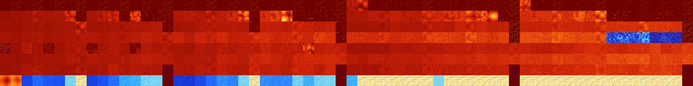

# B0123578 (220672-221183)

<details>
    <summary>Initial Grid</summary>
    
</details>


<details>
    <summary>Initial Grid RLE</summary>

```
#C Exported from GoGoL (https://github.com/marrow16/gogol)
#C Wrap mode: Toroidal
#C Boundary mode: Dead
#C Step: 0
x = 100, y = 100, rule = B0123578/S
39bo10bo5bo3bo5b2o2bo9bo7bo$26bob2o52bo$19bo7bobo9bo13bo3b2o$11bo38bo
11bo2bo15bo4bo11bo$5bo27bo14bo29bo$5bo30bo43bo15bo$4b2o18bo$11bob3o44bo
9bo$17bo2bo26bo24bo6bo$10bo3bo12bobo27bo30bo9bo$77bo9bo6bo$19bo24bo28bo
22bo$4bo10bo44bo32bo$37bo50bo$2bo14bo3bo16bo27bo12bo9bo7bo$7bo4bo13bo
26bo21bo14bobo5bo$8bo21bo34bo2bo8bo$29bo25bo6bo$5bo25bo27bo4bo16bo$22bo
25bo10bo32b2o4bo$19bo7bo20bo15bo3bo11bo7bo8bo$3b2o10bo28bobo6bo8b2o18bo
5bo$4bo5bo12bo7bo18bo3bo27bo7bo$29bo21bo20bo3bo$45bo11bo15bo$2bo23bo11b
o12bo3bo4bo16bo21bo$bo7bo15bo10bo10bo13bo6bo26bo$17bo13bo44bo19bo2bo$4b
o5bo58bobo18bo3bo$12bo25bo11bo45bobo$o4bo9bo5bo2bo34bo7b2o21b2o$28bo8bo
49bo$59bo$18bo30bo3bo2bo13bo23bo$6bo13bo64bo2bo3bo$6bo11bo9bo21bo$11bo
21bo4bo8bo2bo6bo14bo$64bo10bo14bo6bo$9bo6bo11bo11bo7bo15b2obo25bo$15bo
11bo9bo4bo17bo3bo34bo$23bo43bo6bo9bo12bo$20bo15bo37bo9bo$59b2o2bo21b2o$
3bo5bo2bo3bo47bo29bo$24bo16bo5bo12bo3bo19bo$4b2o5bo2bo2bo26bo13b2o$2bo
31bo14bo8bo$16bo11bo9bo20bo7bo16bo10bo$bo16bobo8bo22bo11bo$13bo47bo27bo
$3bo3bo12bo40bo12bo$24bo7bo17bo2bo$23bo62bo$26bo18bo21bo2bo22bo3bo$76bo
2bo7bo$28bo15bo$16bo43bo$18bo11bo26bo$10bo9bo12bo16bo25bo19b2o$3bo12bo
8bo16bo16bo19bo2bo$3bo54bo3bo3bo$11bo14bo44bobobo3bo$16bo15bo22bo19bo
23bo$17bo13bo3bo31bo2bo$11bo12bo17bo2bo2bo8bo22bo$3bo30bo13bo6bo15bo22b
o$2bo34bo32bo10bo$3bo10bo23bo15bo15bobo17bo2bo$11bo20bo33bo13bo7bo8bo$
31bo11bo16bo17bo$52bo4bo9b2obo10bo$91bo$19bo22bo9bo7bo22bo4bo4bo$32bo
18bo19bo13bo$45bo16bo5bo13bo3bo$13bo7b2o48bo24bo$26bo23bo41bobo$23bo5bo
18bo$34bo4bo17bo5bo$3bo9bo7bo15bo6bobo3bo11bo$19bo9bo7bo25bo$17bo6bo$o
12bo57bo9bo$18bo15bo5bo25bo16bo8bo$o20bo31bo$10bo3bo4bo24bo13bo8bo$10b
2o4bo19b2o9bo42bo6bo$27bobo4bo24bo29bo$6bo30bo24bo3bo$11bo28bobo17bo4bo
4bo$6bo25bo34bo11bo6bo8bo$81bo10bo$3bo25bo18bo5bo41bo$10bo17bobo4bo11bo
5bo4bo2bo12bo$9bo21bo45b2o$2bo7bob2o5bo24bo22bo$9bo36b2o3bo16bo19bo$18b
o28bo25bo3bo12bo3bo$4bo4bo18bo15bo35bo17bo$58bobo4bo25bo!
```
</details>
<details>
    <summary>Thumbnail</summary>

</details>
<table>
<tr>
    <td><a href="./220672%20S%20Heat%20Map%20Activity.png"></a><br>S (220672)<br>R@4,p2</td>    <td><a href="./220673%20S0%20Heat%20Map%20Activity.png"></a><br>S0 (220673)<br>R@5,p2</td>    <td><a href="./220674%20S1%20Heat%20Map%20Activity.png"></a><br>S1 (220674)<br>R@5,p2</td>    <td><a href="./220675%20S01%20Heat%20Map%20Activity.png"></a><br>S01 (220675)<br>R@5,p2</td>    <td><a href="./220676%20S2%20Heat%20Map%20Activity.png"></a><br>S2 (220676)<br>R@5,p2</td>    <td><a href="./220677%20S02%20Heat%20Map%20Activity.png"></a><br>S02 (220677)<br>R@5,p2</td>    <td><a href="./220678%20S12%20Heat%20Map%20Activity.png"></a><br>S12 (220678)<br>R@5,p2</td>    <td><a href="./220679%20S012%20Heat%20Map%20Activity.png"></a><br>S012 (220679)<br>R@5,p2</td>    <td><a href="./220680%20S3%20Heat%20Map%20Activity.png"></a><br>S3 (220680)<br>R@4,p2</td>    <td><a href="./220681%20S03%20Heat%20Map%20Activity.png"></a><br>S03 (220681)<br>R@5,p2</td>    <td><a href="./220682%20S13%20Heat%20Map%20Activity.png"></a><br>S13 (220682)<br>R@5,p2</td>    <td><a href="./220683%20S013%20Heat%20Map%20Activity.png"></a><br>S013 (220683)<br>R@5,p2</td>    <td><a href="./220684%20S23%20Heat%20Map%20Activity.png"></a><br>S23 (220684)<br>R@5,p2</td>    <td><a href="./220685%20S023%20Heat%20Map%20Activity.png"></a><br>S023 (220685)<br>R@5,p2</td>    <td><a href="./220686%20S123%20Heat%20Map%20Activity.png"></a><br>S123 (220686)<br>R@5,p2</td>    <td><a href="./220687%20S0123%20Heat%20Map%20Activity.png"></a><br>S0123 (220687)<br>R@5,p2</td>    <td><a href="./220688%20S4%20Heat%20Map%20Activity.png"></a><br>S4 (220688)<br>R@6,p2</td>    <td><a href="./220689%20S04%20Heat%20Map%20Activity.png"></a><br>S04 (220689)<br>R@6,p2</td>    <td><a href="./220690%20S14%20Heat%20Map%20Activity.png"></a><br>S14 (220690)<br>R@5,p2</td>    <td><a href="./220691%20S014%20Heat%20Map%20Activity.png"></a><br>S014 (220691)<br>R@5,p2</td>    <td><a href="./220692%20S24%20Heat%20Map%20Activity.png"></a><br>S24 (220692)<br>R@5,p2</td>    <td><a href="./220693%20S024%20Heat%20Map%20Activity.png"></a><br>S024 (220693)<br>R@5,p2</td>    <td><a href="./220694%20S124%20Heat%20Map%20Activity.png"></a><br>S124 (220694)<br>R@5,p2</td>    <td><a href="./220695%20S0124%20Heat%20Map%20Activity.png"></a><br>S0124 (220695)<br>R@5,p2</td>    <td><a href="./220696%20S34%20Heat%20Map%20Activity.png"></a><br>S34 (220696)<br>R@6,p2</td>    <td><a href="./220697%20S034%20Heat%20Map%20Activity.png"></a><br>S034 (220697)<br>R@6,p2</td>    <td><a href="./220698%20S134%20Heat%20Map%20Activity.png"></a><br>S134 (220698)<br>R@6,p2</td>    <td><a href="./220699%20S0134%20Heat%20Map%20Activity.png"></a><br>S0134 (220699)<br>R@6,p2</td>    <td><a href="./220700%20S234%20Heat%20Map%20Activity.png"></a><br>S234 (220700)<br>R@5,p2</td>    <td><a href="./220701%20S0234%20Heat%20Map%20Activity.png"></a><br>S0234 (220701)<br>R@5,p2</td>    <td><a href="./220702%20S1234%20Heat%20Map%20Activity.png"></a><br>S1234 (220702)<br>R@5,p2</td>    <td><a href="./220703%20S01234%20Heat%20Map%20Activity.png"></a><br>S01234 (220703)<br>R@5,p2</td>    <td><a href="./220704%20S5%20Heat%20Map%20Activity.png"></a><br>S5 (220704)<br>G>1000</td>    <td><a href="./220705%20S05%20Heat%20Map%20Activity.png"></a><br>S05 (220705)<br>G>1000</td>    <td><a href="./220706%20S15%20Heat%20Map%20Activity.png"></a><br>S15 (220706)<br>R@23,p2</td>    <td><a href="./220707%20S015%20Heat%20Map%20Activity.png"></a><br>S015 (220707)<br>R@15,p2</td>    <td><a href="./220708%20S25%20Heat%20Map%20Activity.png"></a><br>S25 (220708)<br>R@14,p2</td>    <td><a href="./220709%20S025%20Heat%20Map%20Activity.png"></a><br>S025 (220709)<br>R@16,p2</td>    <td><a href="./220710%20S125%20Heat%20Map%20Activity.png"></a><br>S125 (220710)<br>R@5,p2</td>    <td><a href="./220711%20S0125%20Heat%20Map%20Activity.png"></a><br>S0125 (220711)<br>R@5,p2</td>    <td><a href="./220712%20S35%20Heat%20Map%20Activity.png"></a><br>S35 (220712)<br>R@14,p4</td>    <td><a href="./220713%20S035%20Heat%20Map%20Activity.png"></a><br>S035 (220713)<br>R@18,p4</td>    <td><a href="./220714%20S135%20Heat%20Map%20Activity.png"></a><br>S135 (220714)<br>R@11,p2</td>    <td><a href="./220715%20S0135%20Heat%20Map%20Activity.png"></a><br>S0135 (220715)<br>R@7,p2</td>    <td><a href="./220716%20S235%20Heat%20Map%20Activity.png"></a><br>S235 (220716)<br>R@9,p4</td>    <td><a href="./220717%20S0235%20Heat%20Map%20Activity.png"></a><br>S0235 (220717)<br>R@7,p2</td>    <td><a href="./220718%20S1235%20Heat%20Map%20Activity.png"></a><br>S1235 (220718)<br>R@5,p2</td>    <td><a href="./220719%20S01235%20Heat%20Map%20Activity.png"></a><br>S01235 (220719)<br>R@5,p2</td>    <td><a href="./220720%20S45%20Heat%20Map%20Activity.png"></a><br>S45 (220720)<br>G>1000</td>    <td><a href="./220721%20S045%20Heat%20Map%20Activity.png"></a><br>S045 (220721)<br>R@42,p4</td>    <td><a href="./220722%20S145%20Heat%20Map%20Activity.png"></a><br>S145 (220722)<br>R@27,p2</td>    <td><a href="./220723%20S0145%20Heat%20Map%20Activity.png"></a><br>S0145 (220723)<br>R@7,p2</td>    <td><a href="./220724%20S245%20Heat%20Map%20Activity.png"></a><br>S245 (220724)<br>R@9,p2</td>    <td><a href="./220725%20S0245%20Heat%20Map%20Activity.png"></a><br>S0245 (220725)<br>R@9,p2</td>    <td><a href="./220726%20S1245%20Heat%20Map%20Activity.png"></a><br>S1245 (220726)<br>R@5,p2</td>    <td><a href="./220727%20S01245%20Heat%20Map%20Activity.png"></a><br>S01245 (220727)<br>R@5,p2</td>    <td><a href="./220728%20S345%20Heat%20Map%20Activity.png"></a><br>S345 (220728)<br>R@19,p4</td>    <td><a href="./220729%20S0345%20Heat%20Map%20Activity.png"></a><br>S0345 (220729)<br>R@15,p4</td>    <td><a href="./220730%20S1345%20Heat%20Map%20Activity.png"></a><br>S1345 (220730)<br>R@13,p2</td>    <td><a href="./220731%20S01345%20Heat%20Map%20Activity.png"></a><br>S01345 (220731)<br>R@7,p2</td>    <td><a href="./220732%20S2345%20Heat%20Map%20Activity.png"></a><br>S2345 (220732)<br>R@7,p2</td>    <td><a href="./220733%20S02345%20Heat%20Map%20Activity.png"></a><br>S02345 (220733)<br>R@7,p2</td>    <td><a href="./220734%20S12345%20Heat%20Map%20Activity.png"></a><br>S12345 (220734)<br>R@5,p2</td>    <td><a href="./220735%20S012345%20Heat%20Map%20Activity.png"></a><br>S012345 (220735)<br>R@5,p2</td></tr>
<tr>
    <td><a href="./220736%20S6%20Heat%20Map%20Activity.png"></a><br>S6 (220736)<br>G>1000</td>    <td><a href="./220737%20S06%20Heat%20Map%20Activity.png"></a><br>S06 (220737)<br>G>1000</td>    <td><a href="./220738%20S16%20Heat%20Map%20Activity.png"></a><br>S16 (220738)<br>G>1000</td>    <td><a href="./220739%20S016%20Heat%20Map%20Activity.png"></a><br>S016 (220739)<br>G>1000</td>    <td><a href="./220740%20S26%20Heat%20Map%20Activity.png"></a><br>S26 (220740)<br>G>1000</td>    <td><a href="./220741%20S026%20Heat%20Map%20Activity.png"></a><br>S026 (220741)<br>G>1000</td>    <td><a href="./220742%20S126%20Heat%20Map%20Activity.png"></a><br>S126 (220742)<br>G>1000</td>    <td><a href="./220743%20S0126%20Heat%20Map%20Activity.png"></a><br>S0126 (220743)<br>R@9,p2</td>    <td><a href="./220744%20S36%20Heat%20Map%20Activity.png"></a><br>S36 (220744)<br>G>1000</td>    <td><a href="./220745%20S036%20Heat%20Map%20Activity.png"></a><br>S036 (220745)<br>G>1000</td>    <td><a href="./220746%20S136%20Heat%20Map%20Activity.png"></a><br>S136 (220746)<br>G>1000</td>    <td><a href="./220747%20S0136%20Heat%20Map%20Activity.png"></a><br>S0136 (220747)<br>R@11,p4</td>    <td><a href="./220748%20S236%20Heat%20Map%20Activity.png"></a><br>S236 (220748)<br>G>1000</td>    <td><a href="./220749%20S0236%20Heat%20Map%20Activity.png"></a><br>S0236 (220749)<br>R@49,p4</td>    <td><a href="./220750%20S1236%20Heat%20Map%20Activity.png"></a><br>S1236 (220750)<br>R@23,p4</td>    <td><a href="./220751%20S01236%20Heat%20Map%20Activity.png"></a><br>S01236 (220751)<br>R@5,p2</td>    <td><a href="./220752%20S46%20Heat%20Map%20Activity.png"></a><br>S46 (220752)<br>G>1000</td>    <td><a href="./220753%20S046%20Heat%20Map%20Activity.png"></a><br>S046 (220753)<br>G>1000</td>    <td><a href="./220754%20S146%20Heat%20Map%20Activity.png"></a><br>S146 (220754)<br>G>1000</td>    <td><a href="./220755%20S0146%20Heat%20Map%20Activity.png"></a><br>S0146 (220755)<br>G>1000</td>    <td><a href="./220756%20S246%20Heat%20Map%20Activity.png"></a><br>S246 (220756)<br>G>1000</td>    <td><a href="./220757%20S0246%20Heat%20Map%20Activity.png"></a><br>S0246 (220757)<br>G>1000</td>    <td><a href="./220758%20S1246%20Heat%20Map%20Activity.png"></a><br>S1246 (220758)<br>G>1000</td>    <td><a href="./220759%20S01246%20Heat%20Map%20Activity.png"></a><br>S01246 (220759)<br>R@11,p2</td>    <td><a href="./220760%20S346%20Heat%20Map%20Activity.png"></a><br>S346 (220760)<br>G>1000</td>    <td><a href="./220761%20S0346%20Heat%20Map%20Activity.png"></a><br>S0346 (220761)<br>G>1000</td>    <td><a href="./220762%20S1346%20Heat%20Map%20Activity.png"></a><br>S1346 (220762)<br>G>1000</td>    <td><a href="./220763%20S01346%20Heat%20Map%20Activity.png"></a><br>S01346 (220763)<br>R@17,p4</td>    <td><a href="./220764%20S2346%20Heat%20Map%20Activity.png"></a><br>S2346 (220764)<br>R@57,p8</td>    <td><a href="./220765%20S02346%20Heat%20Map%20Activity.png"></a><br>S02346 (220765)<br>R@23,p2</td>    <td><a href="./220766%20S12346%20Heat%20Map%20Activity.png"></a><br>S12346 (220766)<br>R@17,p4</td>    <td><a href="./220767%20S012346%20Heat%20Map%20Activity.png"></a><br>S012346 (220767)<br>R@5,p2</td>    <td><a href="./220768%20S56%20Heat%20Map%20Activity.png"></a><br>S56 (220768)<br>G>1000</td>    <td><a href="./220769%20S056%20Heat%20Map%20Activity.png"></a><br>S056 (220769)<br>G>1000</td>    <td><a href="./220770%20S156%20Heat%20Map%20Activity.png"></a><br>S156 (220770)<br>G>1000</td>    <td><a href="./220771%20S0156%20Heat%20Map%20Activity.png"></a><br>S0156 (220771)<br>G>1000</td>    <td><a href="./220772%20S256%20Heat%20Map%20Activity.png"></a><br>S256 (220772)<br>G>1000</td>    <td><a href="./220773%20S0256%20Heat%20Map%20Activity.png"></a><br>S0256 (220773)<br>G>1000</td>    <td><a href="./220774%20S1256%20Heat%20Map%20Activity.png"></a><br>S1256 (220774)<br>G>1000</td>    <td><a href="./220775%20S01256%20Heat%20Map%20Activity.png"></a><br>S01256 (220775)<br>G>1000</td>    <td><a href="./220776%20S356%20Heat%20Map%20Activity.png"></a><br>S356 (220776)<br>G>1000</td>    <td><a href="./220777%20S0356%20Heat%20Map%20Activity.png"></a><br>S0356 (220777)<br>G>1000</td>    <td><a href="./220778%20S1356%20Heat%20Map%20Activity.png"></a><br>S1356 (220778)<br>G>1000</td>    <td><a href="./220779%20S01356%20Heat%20Map%20Activity.png"></a><br>S01356 (220779)<br>G>1000</td>    <td><a href="./220780%20S2356%20Heat%20Map%20Activity.png"></a><br>S2356 (220780)<br>G>1000</td>    <td><a href="./220781%20S02356%20Heat%20Map%20Activity.png"></a><br>S02356 (220781)<br>G>1000</td>    <td><a href="./220782%20S12356%20Heat%20Map%20Activity.png"></a><br>S12356 (220782)<br>R@23,p2</td>    <td><a href="./220783%20S012356%20Heat%20Map%20Activity.png"></a><br>S012356 (220783)<br>R@5,p2</td>    <td><a href="./220784%20S456%20Heat%20Map%20Activity.png"></a><br>S456 (220784)<br>G>1000</td>    <td><a href="./220785%20S0456%20Heat%20Map%20Activity.png"></a><br>S0456 (220785)<br>G>1000</td>    <td><a href="./220786%20S1456%20Heat%20Map%20Activity.png"></a><br>S1456 (220786)<br>G>1000</td>    <td><a href="./220787%20S01456%20Heat%20Map%20Activity.png"></a><br>S01456 (220787)<br>G>1000</td>    <td><a href="./220788%20S2456%20Heat%20Map%20Activity.png"></a><br>S2456 (220788)<br>G>1000</td>    <td><a href="./220789%20S02456%20Heat%20Map%20Activity.png"></a><br>S02456 (220789)<br>G>1000</td>    <td><a href="./220790%20S12456%20Heat%20Map%20Activity.png"></a><br>S12456 (220790)<br>G>1000</td>    <td><a href="./220791%20S012456%20Heat%20Map%20Activity.png"></a><br>S012456 (220791)<br>G>1000</td>    <td><a href="./220792%20S3456%20Heat%20Map%20Activity.png"></a><br>S3456 (220792)<br>R@39,p4</td>    <td><a href="./220793%20S03456%20Heat%20Map%20Activity.png"></a><br>S03456 (220793)<br>R@11,p2</td>    <td><a href="./220794%20S13456%20Heat%20Map%20Activity.png"></a><br>S13456 (220794)<br>R@21,p2</td>    <td><a href="./220795%20S013456%20Heat%20Map%20Activity.png"></a><br>S013456 (220795)<br>R@9,p2</td>    <td><a href="./220796%20S23456%20Heat%20Map%20Activity.png"></a><br>S23456 (220796)<br>R@17,p4</td>    <td><a href="./220797%20S023456%20Heat%20Map%20Activity.png"></a><br>S023456 (220797)<br>R@9,p2</td>    <td><a href="./220798%20S123456%20Heat%20Map%20Activity.png"></a><br>S123456 (220798)<br>R@11,p2</td>    <td><a href="./220799%20S0123456%20Heat%20Map%20Activity.png"></a><br>S0123456 (220799)<br>R@5,p2</td></tr>
<tr>
    <td><a href="./220800%20S7%20Heat%20Map%20Activity.png"></a><br>S7 (220800)<br>G>1000</td>    <td><a href="./220801%20S07%20Heat%20Map%20Activity.png"></a><br>S07 (220801)<br>G>1000</td>    <td><a href="./220802%20S17%20Heat%20Map%20Activity.png"></a><br>S17 (220802)<br>G>1000</td>    <td><a href="./220803%20S017%20Heat%20Map%20Activity.png"></a><br>S017 (220803)<br>G>1000</td>    <td><a href="./220804%20S27%20Heat%20Map%20Activity.png"></a><br>S27 (220804)<br>G>1000</td>    <td><a href="./220805%20S027%20Heat%20Map%20Activity.png"></a><br>S027 (220805)<br>G>1000</td>    <td><a href="./220806%20S127%20Heat%20Map%20Activity.png"></a><br>S127 (220806)<br>G>1000</td>    <td><a href="./220807%20S0127%20Heat%20Map%20Activity.png"></a><br>S0127 (220807)<br>G>1000</td>    <td><a href="./220808%20S37%20Heat%20Map%20Activity.png"></a><br>S37 (220808)<br>G>1000</td>    <td><a href="./220809%20S037%20Heat%20Map%20Activity.png"></a><br>S037 (220809)<br>G>1000</td>    <td><a href="./220810%20S137%20Heat%20Map%20Activity.png"></a><br>S137 (220810)<br>G>1000</td>    <td><a href="./220811%20S0137%20Heat%20Map%20Activity.png"></a><br>S0137 (220811)<br>G>1000</td>    <td><a href="./220812%20S237%20Heat%20Map%20Activity.png"></a><br>S237 (220812)<br>G>1000</td>    <td><a href="./220813%20S0237%20Heat%20Map%20Activity.png"></a><br>S0237 (220813)<br>G>1000</td>    <td><a href="./220814%20S1237%20Heat%20Map%20Activity.png"></a><br>S1237 (220814)<br>G>1000</td>    <td><a href="./220815%20S01237%20Heat%20Map%20Activity.png"></a><br>S01237 (220815)<br>R@7,p2</td>    <td><a href="./220816%20S47%20Heat%20Map%20Activity.png"></a><br>S47 (220816)<br>G>1000</td>    <td><a href="./220817%20S047%20Heat%20Map%20Activity.png"></a><br>S047 (220817)<br>G>1000</td>    <td><a href="./220818%20S147%20Heat%20Map%20Activity.png"></a><br>S147 (220818)<br>G>1000</td>    <td><a href="./220819%20S0147%20Heat%20Map%20Activity.png"></a><br>S0147 (220819)<br>G>1000</td>    <td><a href="./220820%20S247%20Heat%20Map%20Activity.png"></a><br>S247 (220820)<br>G>1000</td>    <td><a href="./220821%20S0247%20Heat%20Map%20Activity.png"></a><br>S0247 (220821)<br>G>1000</td>    <td><a href="./220822%20S1247%20Heat%20Map%20Activity.png"></a><br>S1247 (220822)<br>G>1000</td>    <td><a href="./220823%20S01247%20Heat%20Map%20Activity.png"></a><br>S01247 (220823)<br>R@11,p2</td>    <td><a href="./220824%20S347%20Heat%20Map%20Activity.png"></a><br>S347 (220824)<br>G>1000</td>    <td><a href="./220825%20S0347%20Heat%20Map%20Activity.png"></a><br>S0347 (220825)<br>G>1000</td>    <td><a href="./220826%20S1347%20Heat%20Map%20Activity.png"></a><br>S1347 (220826)<br>G>1000</td>    <td><a href="./220827%20S01347%20Heat%20Map%20Activity.png"></a><br>S01347 (220827)<br>G>1000</td>    <td><a href="./220828%20S2347%20Heat%20Map%20Activity.png"></a><br>S2347 (220828)<br>G>1000</td>    <td><a href="./220829%20S02347%20Heat%20Map%20Activity.png"></a><br>S02347 (220829)<br>G>1000</td>    <td><a href="./220830%20S12347%20Heat%20Map%20Activity.png"></a><br>S12347 (220830)<br>G>1000</td>    <td><a href="./220831%20S012347%20Heat%20Map%20Activity.png"></a><br>S012347 (220831)<br>R@7,p4</td>    <td><a href="./220832%20S57%20Heat%20Map%20Activity.png"></a><br>S57 (220832)<br>G>1000</td>    <td><a href="./220833%20S057%20Heat%20Map%20Activity.png"></a><br>S057 (220833)<br>G>1000</td>    <td><a href="./220834%20S157%20Heat%20Map%20Activity.png"></a><br>S157 (220834)<br>G>1000</td>    <td><a href="./220835%20S0157%20Heat%20Map%20Activity.png"></a><br>S0157 (220835)<br>G>1000</td>    <td><a href="./220836%20S257%20Heat%20Map%20Activity.png"></a><br>S257 (220836)<br>G>1000</td>    <td><a href="./220837%20S0257%20Heat%20Map%20Activity.png"></a><br>S0257 (220837)<br>G>1000</td>    <td><a href="./220838%20S1257%20Heat%20Map%20Activity.png"></a><br>S1257 (220838)<br>G>1000</td>    <td><a href="./220839%20S01257%20Heat%20Map%20Activity.png"></a><br>S01257 (220839)<br>G>1000</td>    <td><a href="./220840%20S357%20Heat%20Map%20Activity.png"></a><br>S357 (220840)<br>G>1000</td>    <td><a href="./220841%20S0357%20Heat%20Map%20Activity.png"></a><br>S0357 (220841)<br>G>1000</td>    <td><a href="./220842%20S1357%20Heat%20Map%20Activity.png"></a><br>S1357 (220842)<br>G>1000</td>    <td><a href="./220843%20S01357%20Heat%20Map%20Activity.png"></a><br>S01357 (220843)<br>G>1000</td>    <td><a href="./220844%20S2357%20Heat%20Map%20Activity.png"></a><br>S2357 (220844)<br>G>1000</td>    <td><a href="./220845%20S02357%20Heat%20Map%20Activity.png"></a><br>S02357 (220845)<br>G>1000</td>    <td><a href="./220846%20S12357%20Heat%20Map%20Activity.png"></a><br>S12357 (220846)<br>G>1000</td>    <td><a href="./220847%20S012357%20Heat%20Map%20Activity.png"></a><br>S012357 (220847)<br>R@3,p2</td>    <td><a href="./220848%20S457%20Heat%20Map%20Activity.png"></a><br>S457 (220848)<br>G>1000</td>    <td><a href="./220849%20S0457%20Heat%20Map%20Activity.png"></a><br>S0457 (220849)<br>G>1000</td>    <td><a href="./220850%20S1457%20Heat%20Map%20Activity.png"></a><br>S1457 (220850)<br>G>1000</td>    <td><a href="./220851%20S01457%20Heat%20Map%20Activity.png"></a><br>S01457 (220851)<br>G>1000</td>    <td><a href="./220852%20S2457%20Heat%20Map%20Activity.png"></a><br>S2457 (220852)<br>G>1000</td>    <td><a href="./220853%20S02457%20Heat%20Map%20Activity.png"></a><br>S02457 (220853)<br>G>1000</td>    <td><a href="./220854%20S12457%20Heat%20Map%20Activity.png"></a><br>S12457 (220854)<br>G>1000</td>    <td><a href="./220855%20S012457%20Heat%20Map%20Activity.png"></a><br>S012457 (220855)<br>G>1000</td>    <td><a href="./220856%20S3457%20Heat%20Map%20Activity.png"></a><br>S3457 (220856)<br>G>1000</td>    <td><a href="./220857%20S03457%20Heat%20Map%20Activity.png"></a><br>S03457 (220857)<br>G>1000</td>    <td><a href="./220858%20S13457%20Heat%20Map%20Activity.png"></a><br>S13457 (220858)<br>G>1000</td>    <td><a href="./220859%20S013457%20Heat%20Map%20Activity.png"></a><br>S013457 (220859)<br>G>1000</td>    <td><a href="./220860%20S23457%20Heat%20Map%20Activity.png"></a><br>S23457 (220860)<br>G>1000</td>    <td><a href="./220861%20S023457%20Heat%20Map%20Activity.png"></a><br>S023457 (220861)<br>G>1000</td>    <td><a href="./220862%20S123457%20Heat%20Map%20Activity.png"></a><br>S123457 (220862)<br>G>1000</td>    <td><a href="./220863%20S0123457%20Heat%20Map%20Activity.png"></a><br>S0123457 (220863)<br>R@3,p2</td></tr>
<tr>
    <td><a href="./220864%20S67%20Heat%20Map%20Activity.png"></a><br>S67 (220864)<br>G>1000</td>    <td><a href="./220865%20S067%20Heat%20Map%20Activity.png"></a><br>S067 (220865)<br>G>1000</td>    <td><a href="./220866%20S167%20Heat%20Map%20Activity.png"></a><br>S167 (220866)<br>G>1000</td>    <td><a href="./220867%20S0167%20Heat%20Map%20Activity.png"></a><br>S0167 (220867)<br>G>1000</td>    <td><a href="./220868%20S267%20Heat%20Map%20Activity.png"></a><br>S267 (220868)<br>G>1000</td>    <td><a href="./220869%20S0267%20Heat%20Map%20Activity.png"></a><br>S0267 (220869)<br>G>1000</td>    <td><a href="./220870%20S1267%20Heat%20Map%20Activity.png"></a><br>S1267 (220870)<br>G>1000</td>    <td><a href="./220871%20S01267%20Heat%20Map%20Activity.png"></a><br>S01267 (220871)<br>G>1000</td>    <td><a href="./220872%20S367%20Heat%20Map%20Activity.png"></a><br>S367 (220872)<br>G>1000</td>    <td><a href="./220873%20S0367%20Heat%20Map%20Activity.png"></a><br>S0367 (220873)<br>G>1000</td>    <td><a href="./220874%20S1367%20Heat%20Map%20Activity.png"></a><br>S1367 (220874)<br>G>1000</td>    <td><a href="./220875%20S01367%20Heat%20Map%20Activity.png"></a><br>S01367 (220875)<br>G>1000</td>    <td><a href="./220876%20S2367%20Heat%20Map%20Activity.png"></a><br>S2367 (220876)<br>G>1000</td>    <td><a href="./220877%20S02367%20Heat%20Map%20Activity.png"></a><br>S02367 (220877)<br>G>1000</td>    <td><a href="./220878%20S12367%20Heat%20Map%20Activity.png"></a><br>S12367 (220878)<br>G>1000</td>    <td><a href="./220879%20S012367%20Heat%20Map%20Activity.png"></a><br>S012367 (220879)<br>G>1000</td>    <td><a href="./220880%20S467%20Heat%20Map%20Activity.png"></a><br>S467 (220880)<br>G>1000</td>    <td><a href="./220881%20S0467%20Heat%20Map%20Activity.png"></a><br>S0467 (220881)<br>G>1000</td>    <td><a href="./220882%20S1467%20Heat%20Map%20Activity.png"></a><br>S1467 (220882)<br>G>1000</td>    <td><a href="./220883%20S01467%20Heat%20Map%20Activity.png"></a><br>S01467 (220883)<br>G>1000</td>    <td><a href="./220884%20S2467%20Heat%20Map%20Activity.png"></a><br>S2467 (220884)<br>G>1000</td>    <td><a href="./220885%20S02467%20Heat%20Map%20Activity.png"></a><br>S02467 (220885)<br>G>1000</td>    <td><a href="./220886%20S12467%20Heat%20Map%20Activity.png"></a><br>S12467 (220886)<br>G>1000</td>    <td><a href="./220887%20S012467%20Heat%20Map%20Activity.png"></a><br>S012467 (220887)<br>G>1000</td>    <td><a href="./220888%20S3467%20Heat%20Map%20Activity.png"></a><br>S3467 (220888)<br>G>1000</td>    <td><a href="./220889%20S03467%20Heat%20Map%20Activity.png"></a><br>S03467 (220889)<br>G>1000</td>    <td><a href="./220890%20S13467%20Heat%20Map%20Activity.png"></a><br>S13467 (220890)<br>G>1000</td>    <td><a href="./220891%20S013467%20Heat%20Map%20Activity.png"></a><br>S013467 (220891)<br>G>1000</td>    <td><a href="./220892%20S23467%20Heat%20Map%20Activity.png"></a><br>S23467 (220892)<br>G>1000</td>    <td><a href="./220893%20S023467%20Heat%20Map%20Activity.png"></a><br>S023467 (220893)<br>G>1000</td>    <td><a href="./220894%20S123467%20Heat%20Map%20Activity.png"></a><br>S123467 (220894)<br>G>1000</td>    <td><a href="./220895%20S0123467%20Heat%20Map%20Activity.png"></a><br>S0123467 (220895)<br>R@7,p6</td>    <td><a href="./220896%20S567%20Heat%20Map%20Activity.png"></a><br>S567 (220896)<br>G>1000</td>    <td><a href="./220897%20S0567%20Heat%20Map%20Activity.png"></a><br>S0567 (220897)<br>G>1000</td>    <td><a href="./220898%20S1567%20Heat%20Map%20Activity.png"></a><br>S1567 (220898)<br>G>1000</td>    <td><a href="./220899%20S01567%20Heat%20Map%20Activity.png"></a><br>S01567 (220899)<br>G>1000</td>    <td><a href="./220900%20S2567%20Heat%20Map%20Activity.png"></a><br>S2567 (220900)<br>G>1000</td>    <td><a href="./220901%20S02567%20Heat%20Map%20Activity.png"></a><br>S02567 (220901)<br>G>1000</td>    <td><a href="./220902%20S12567%20Heat%20Map%20Activity.png"></a><br>S12567 (220902)<br>G>1000</td>    <td><a href="./220903%20S012567%20Heat%20Map%20Activity.png"></a><br>S012567 (220903)<br>G>1000</td>    <td><a href="./220904%20S3567%20Heat%20Map%20Activity.png"></a><br>S3567 (220904)<br>G>1000</td>    <td><a href="./220905%20S03567%20Heat%20Map%20Activity.png"></a><br>S03567 (220905)<br>G>1000</td>    <td><a href="./220906%20S13567%20Heat%20Map%20Activity.png"></a><br>S13567 (220906)<br>G>1000</td>    <td><a href="./220907%20S013567%20Heat%20Map%20Activity.png"></a><br>S013567 (220907)<br>G>1000</td>    <td><a href="./220908%20S23567%20Heat%20Map%20Activity.png"></a><br>S23567 (220908)<br>G>1000</td>    <td><a href="./220909%20S023567%20Heat%20Map%20Activity.png"></a><br>S023567 (220909)<br>G>1000</td>    <td><a href="./220910%20S123567%20Heat%20Map%20Activity.png"></a><br>S123567 (220910)<br>G>1000</td>    <td><a href="./220911%20S0123567%20Heat%20Map%20Activity.png"></a><br>S0123567 (220911)<br>R@3,p2</td>    <td><a href="./220912%20S4567%20Heat%20Map%20Activity.png"></a><br>S4567 (220912)<br>G>1000</td>    <td><a href="./220913%20S04567%20Heat%20Map%20Activity.png"></a><br>S04567 (220913)<br>G>1000</td>    <td><a href="./220914%20S14567%20Heat%20Map%20Activity.png"></a><br>S14567 (220914)<br>G>1000</td>    <td><a href="./220915%20S014567%20Heat%20Map%20Activity.png"></a><br>S014567 (220915)<br>G>1000</td>    <td><a href="./220916%20S24567%20Heat%20Map%20Activity.png"></a><br>S24567 (220916)<br>G>1000</td>    <td><a href="./220917%20S024567%20Heat%20Map%20Activity.png"></a><br>S024567 (220917)<br>G>1000</td>    <td><a href="./220918%20S124567%20Heat%20Map%20Activity.png"></a><br>S124567 (220918)<br>G>1000</td>    <td><a href="./220919%20S0124567%20Heat%20Map%20Activity.png"></a><br>S0124567 (220919)<br>G>1000</td>    <td><a href="./220920%20S34567%20Heat%20Map%20Activity.png"></a><br>S34567 (220920)<br>G>1000</td>    <td><a href="./220921%20S034567%20Heat%20Map%20Activity.png"></a><br>S034567 (220921)<br>G>1000</td>    <td><a href="./220922%20S134567%20Heat%20Map%20Activity.png"></a><br>S134567 (220922)<br>G>1000</td>    <td><a href="./220923%20S0134567%20Heat%20Map%20Activity.png"></a><br>S0134567 (220923)<br>G>1000</td>    <td><a href="./220924%20S234567%20Heat%20Map%20Activity.png"></a><br>S234567 (220924)<br>G>1000</td>    <td><a href="./220925%20S0234567%20Heat%20Map%20Activity.png"></a><br>S0234567 (220925)<br>G>1000</td>    <td><a href="./220926%20S1234567%20Heat%20Map%20Activity.png"></a><br>S1234567 (220926)<br>G>1000</td>    <td><a href="./220927%20S01234567%20Heat%20Map%20Activity.png"></a><br>S01234567 (220927)<br>R@3,p2</td></tr>
<tr>
    <td><a href="./220928%20S8%20Heat%20Map%20Activity.png"></a><br>S8 (220928)<br>R@357,p12</td>    <td><a href="./220929%20S08%20Heat%20Map%20Activity.png"></a><br>S08 (220929)<br>G>1000</td>    <td><a href="./220930%20S18%20Heat%20Map%20Activity.png"></a><br>S18 (220930)<br>G>1000</td>    <td><a href="./220931%20S018%20Heat%20Map%20Activity.png"></a><br>S018 (220931)<br>G>1000</td>    <td><a href="./220932%20S28%20Heat%20Map%20Activity.png"></a><br>S28 (220932)<br>R@416,p120</td>    <td><a href="./220933%20S028%20Heat%20Map%20Activity.png"></a><br>S028 (220933)<br>G>1000</td>    <td><a href="./220934%20S128%20Heat%20Map%20Activity.png"></a><br>S128 (220934)<br>G>1000</td>    <td><a href="./220935%20S0128%20Heat%20Map%20Activity.png"></a><br>S0128 (220935)<br>G>1000</td>    <td><a href="./220936%20S38%20Heat%20Map%20Activity.png"></a><br>S38 (220936)<br>G>1000</td>    <td><a href="./220937%20S038%20Heat%20Map%20Activity.png"></a><br>S038 (220937)<br>G>1000</td>    <td><a href="./220938%20S138%20Heat%20Map%20Activity.png"></a><br>S138 (220938)<br>G>1000</td>    <td><a href="./220939%20S0138%20Heat%20Map%20Activity.png"></a><br>S0138 (220939)<br>G>1000</td>    <td><a href="./220940%20S238%20Heat%20Map%20Activity.png"></a><br>S238 (220940)<br>G>1000</td>    <td><a href="./220941%20S0238%20Heat%20Map%20Activity.png"></a><br>S0238 (220941)<br>G>1000</td>    <td><a href="./220942%20S1238%20Heat%20Map%20Activity.png"></a><br>S1238 (220942)<br>G>1000</td>    <td><a href="./220943%20S01238%20Heat%20Map%20Activity.png"></a><br>S01238 (220943)<br>G>1000</td>    <td><a href="./220944%20S48%20Heat%20Map%20Activity.png"></a><br>S48 (220944)<br>G>1000</td>    <td><a href="./220945%20S048%20Heat%20Map%20Activity.png"></a><br>S048 (220945)<br>G>1000</td>    <td><a href="./220946%20S148%20Heat%20Map%20Activity.png"></a><br>S148 (220946)<br>G>1000</td>    <td><a href="./220947%20S0148%20Heat%20Map%20Activity.png"></a><br>S0148 (220947)<br>G>1000</td>    <td><a href="./220948%20S248%20Heat%20Map%20Activity.png"></a><br>S248 (220948)<br>G>1000</td>    <td><a href="./220949%20S0248%20Heat%20Map%20Activity.png"></a><br>S0248 (220949)<br>G>1000</td>    <td><a href="./220950%20S1248%20Heat%20Map%20Activity.png"></a><br>S1248 (220950)<br>G>1000</td>    <td><a href="./220951%20S01248%20Heat%20Map%20Activity.png"></a><br>S01248 (220951)<br>G>1000</td>    <td><a href="./220952%20S348%20Heat%20Map%20Activity.png"></a><br>S348 (220952)<br>G>1000</td>    <td><a href="./220953%20S0348%20Heat%20Map%20Activity.png"></a><br>S0348 (220953)<br>G>1000</td>    <td><a href="./220954%20S1348%20Heat%20Map%20Activity.png"></a><br>S1348 (220954)<br>G>1000</td>    <td><a href="./220955%20S01348%20Heat%20Map%20Activity.png"></a><br>S01348 (220955)<br>G>1000</td>    <td><a href="./220956%20S2348%20Heat%20Map%20Activity.png"></a><br>S2348 (220956)<br>G>1000</td>    <td><a href="./220957%20S02348%20Heat%20Map%20Activity.png"></a><br>S02348 (220957)<br>G>1000</td>    <td><a href="./220958%20S12348%20Heat%20Map%20Activity.png"></a><br>S12348 (220958)<br>G>1000</td>    <td><a href="./220959%20S012348%20Heat%20Map%20Activity.png"></a><br>S012348 (220959)<br>G>1000</td>    <td><a href="./220960%20S58%20Heat%20Map%20Activity.png"></a><br>S58 (220960)<br>G>1000</td>    <td><a href="./220961%20S058%20Heat%20Map%20Activity.png"></a><br>S058 (220961)<br>G>1000</td>    <td><a href="./220962%20S158%20Heat%20Map%20Activity.png"></a><br>S158 (220962)<br>G>1000</td>    <td><a href="./220963%20S0158%20Heat%20Map%20Activity.png"></a><br>S0158 (220963)<br>G>1000</td>    <td><a href="./220964%20S258%20Heat%20Map%20Activity.png"></a><br>S258 (220964)<br>G>1000</td>    <td><a href="./220965%20S0258%20Heat%20Map%20Activity.png"></a><br>S0258 (220965)<br>G>1000</td>    <td><a href="./220966%20S1258%20Heat%20Map%20Activity.png"></a><br>S1258 (220966)<br>G>1000</td>    <td><a href="./220967%20S01258%20Heat%20Map%20Activity.png"></a><br>S01258 (220967)<br>G>1000</td>    <td><a href="./220968%20S358%20Heat%20Map%20Activity.png"></a><br>S358 (220968)<br>G>1000</td>    <td><a href="./220969%20S0358%20Heat%20Map%20Activity.png"></a><br>S0358 (220969)<br>G>1000</td>    <td><a href="./220970%20S1358%20Heat%20Map%20Activity.png"></a><br>S1358 (220970)<br>G>1000</td>    <td><a href="./220971%20S01358%20Heat%20Map%20Activity.png"></a><br>S01358 (220971)<br>G>1000</td>    <td><a href="./220972%20S2358%20Heat%20Map%20Activity.png"></a><br>S2358 (220972)<br>G>1000</td>    <td><a href="./220973%20S02358%20Heat%20Map%20Activity.png"></a><br>S02358 (220973)<br>G>1000</td>    <td><a href="./220974%20S12358%20Heat%20Map%20Activity.png"></a><br>S12358 (220974)<br>G>1000</td>    <td><a href="./220975%20S012358%20Heat%20Map%20Activity.png"></a><br>S012358 (220975)<br>G>1000</td>    <td><a href="./220976%20S458%20Heat%20Map%20Activity.png"></a><br>S458 (220976)<br>G>1000</td>    <td><a href="./220977%20S0458%20Heat%20Map%20Activity.png"></a><br>S0458 (220977)<br>G>1000</td>    <td><a href="./220978%20S1458%20Heat%20Map%20Activity.png"></a><br>S1458 (220978)<br>G>1000</td>    <td><a href="./220979%20S01458%20Heat%20Map%20Activity.png"></a><br>S01458 (220979)<br>G>1000</td>    <td><a href="./220980%20S2458%20Heat%20Map%20Activity.png"></a><br>S2458 (220980)<br>G>1000</td>    <td><a href="./220981%20S02458%20Heat%20Map%20Activity.png"></a><br>S02458 (220981)<br>G>1000</td>    <td><a href="./220982%20S12458%20Heat%20Map%20Activity.png"></a><br>S12458 (220982)<br>G>1000</td>    <td><a href="./220983%20S012458%20Heat%20Map%20Activity.png"></a><br>S012458 (220983)<br>G>1000</td>    <td><a href="./220984%20S3458%20Heat%20Map%20Activity.png"></a><br>S3458 (220984)<br>G>1000</td>    <td><a href="./220985%20S03458%20Heat%20Map%20Activity.png"></a><br>S03458 (220985)<br>G>1000</td>    <td><a href="./220986%20S13458%20Heat%20Map%20Activity.png"></a><br>S13458 (220986)<br>G>1000</td>    <td><a href="./220987%20S013458%20Heat%20Map%20Activity.png"></a><br>S013458 (220987)<br>G>1000</td>    <td><a href="./220988%20S23458%20Heat%20Map%20Activity.png"></a><br>S23458 (220988)<br>G>1000</td>    <td><a href="./220989%20S023458%20Heat%20Map%20Activity.png"></a><br>S023458 (220989)<br>G>1000</td>    <td><a href="./220990%20S123458%20Heat%20Map%20Activity.png"></a><br>S123458 (220990)<br>G>1000</td>    <td><a href="./220991%20S0123458%20Heat%20Map%20Activity.png"></a><br>S0123458 (220991)<br>G>1000</td></tr>
<tr>
    <td><a href="./220992%20S68%20Heat%20Map%20Activity.png"></a><br>S68 (220992)<br>G>1000</td>    <td><a href="./220993%20S068%20Heat%20Map%20Activity.png"></a><br>S068 (220993)<br>G>1000</td>    <td><a href="./220994%20S168%20Heat%20Map%20Activity.png"></a><br>S168 (220994)<br>G>1000</td>    <td><a href="./220995%20S0168%20Heat%20Map%20Activity.png"></a><br>S0168 (220995)<br>G>1000</td>    <td><a href="./220996%20S268%20Heat%20Map%20Activity.png"></a><br>S268 (220996)<br>G>1000</td>    <td><a href="./220997%20S0268%20Heat%20Map%20Activity.png"></a><br>S0268 (220997)<br>G>1000</td>    <td><a href="./220998%20S1268%20Heat%20Map%20Activity.png"></a><br>S1268 (220998)<br>G>1000</td>    <td><a href="./220999%20S01268%20Heat%20Map%20Activity.png"></a><br>S01268 (220999)<br>G>1000</td>    <td><a href="./221000%20S368%20Heat%20Map%20Activity.png"></a><br>S368 (221000)<br>G>1000</td>    <td><a href="./221001%20S0368%20Heat%20Map%20Activity.png"></a><br>S0368 (221001)<br>G>1000</td>    <td><a href="./221002%20S1368%20Heat%20Map%20Activity.png"></a><br>S1368 (221002)<br>G>1000</td>    <td><a href="./221003%20S01368%20Heat%20Map%20Activity.png"></a><br>S01368 (221003)<br>G>1000</td>    <td><a href="./221004%20S2368%20Heat%20Map%20Activity.png"></a><br>S2368 (221004)<br>G>1000</td>    <td><a href="./221005%20S02368%20Heat%20Map%20Activity.png"></a><br>S02368 (221005)<br>G>1000</td>    <td><a href="./221006%20S12368%20Heat%20Map%20Activity.png"></a><br>S12368 (221006)<br>G>1000</td>    <td><a href="./221007%20S012368%20Heat%20Map%20Activity.png"></a><br>S012368 (221007)<br>G>1000</td>    <td><a href="./221008%20S468%20Heat%20Map%20Activity.png"></a><br>S468 (221008)<br>G>1000</td>    <td><a href="./221009%20S0468%20Heat%20Map%20Activity.png"></a><br>S0468 (221009)<br>G>1000</td>    <td><a href="./221010%20S1468%20Heat%20Map%20Activity.png"></a><br>S1468 (221010)<br>G>1000</td>    <td><a href="./221011%20S01468%20Heat%20Map%20Activity.png"></a><br>S01468 (221011)<br>G>1000</td>    <td><a href="./221012%20S2468%20Heat%20Map%20Activity.png"></a><br>S2468 (221012)<br>G>1000</td>    <td><a href="./221013%20S02468%20Heat%20Map%20Activity.png"></a><br>S02468 (221013)<br>G>1000</td>    <td><a href="./221014%20S12468%20Heat%20Map%20Activity.png"></a><br>S12468 (221014)<br>G>1000</td>    <td><a href="./221015%20S012468%20Heat%20Map%20Activity.png"></a><br>S012468 (221015)<br>G>1000</td>    <td><a href="./221016%20S3468%20Heat%20Map%20Activity.png"></a><br>S3468 (221016)<br>G>1000</td>    <td><a href="./221017%20S03468%20Heat%20Map%20Activity.png"></a><br>S03468 (221017)<br>G>1000</td>    <td><a href="./221018%20S13468%20Heat%20Map%20Activity.png"></a><br>S13468 (221018)<br>G>1000</td>    <td><a href="./221019%20S013468%20Heat%20Map%20Activity.png"></a><br>S013468 (221019)<br>G>1000</td>    <td><a href="./221020%20S23468%20Heat%20Map%20Activity.png"></a><br>S23468 (221020)<br>G>1000</td>    <td><a href="./221021%20S023468%20Heat%20Map%20Activity.png"></a><br>S023468 (221021)<br>G>1000</td>    <td><a href="./221022%20S123468%20Heat%20Map%20Activity.png"></a><br>S123468 (221022)<br>G>1000</td>    <td><a href="./221023%20S0123468%20Heat%20Map%20Activity.png"></a><br>S0123468 (221023)<br>G>1000</td>    <td><a href="./221024%20S568%20Heat%20Map%20Activity.png"></a><br>S568 (221024)<br>G>1000</td>    <td><a href="./221025%20S0568%20Heat%20Map%20Activity.png"></a><br>S0568 (221025)<br>G>1000</td>    <td><a href="./221026%20S1568%20Heat%20Map%20Activity.png"></a><br>S1568 (221026)<br>G>1000</td>    <td><a href="./221027%20S01568%20Heat%20Map%20Activity.png"></a><br>S01568 (221027)<br>G>1000</td>    <td><a href="./221028%20S2568%20Heat%20Map%20Activity.png"></a><br>S2568 (221028)<br>G>1000</td>    <td><a href="./221029%20S02568%20Heat%20Map%20Activity.png"></a><br>S02568 (221029)<br>G>1000</td>    <td><a href="./221030%20S12568%20Heat%20Map%20Activity.png"></a><br>S12568 (221030)<br>G>1000</td>    <td><a href="./221031%20S012568%20Heat%20Map%20Activity.png"></a><br>S012568 (221031)<br>G>1000</td>    <td><a href="./221032%20S3568%20Heat%20Map%20Activity.png"></a><br>S3568 (221032)<br>G>1000</td>    <td><a href="./221033%20S03568%20Heat%20Map%20Activity.png"></a><br>S03568 (221033)<br>G>1000</td>    <td><a href="./221034%20S13568%20Heat%20Map%20Activity.png"></a><br>S13568 (221034)<br>G>1000</td>    <td><a href="./221035%20S013568%20Heat%20Map%20Activity.png"></a><br>S013568 (221035)<br>G>1000</td>    <td><a href="./221036%20S23568%20Heat%20Map%20Activity.png"></a><br>S23568 (221036)<br>G>1000</td>    <td><a href="./221037%20S023568%20Heat%20Map%20Activity.png"></a><br>S023568 (221037)<br>G>1000</td>    <td><a href="./221038%20S123568%20Heat%20Map%20Activity.png"></a><br>S123568 (221038)<br>G>1000</td>    <td><a href="./221039%20S0123568%20Heat%20Map%20Activity.png"></a><br>S0123568 (221039)<br>G>1000</td>    <td><a href="./221040%20S4568%20Heat%20Map%20Activity.png"></a><br>S4568 (221040)<br>G>1000</td>    <td><a href="./221041%20S04568%20Heat%20Map%20Activity.png"></a><br>S04568 (221041)<br>G>1000</td>    <td><a href="./221042%20S14568%20Heat%20Map%20Activity.png"></a><br>S14568 (221042)<br>G>1000</td>    <td><a href="./221043%20S014568%20Heat%20Map%20Activity.png"></a><br>S014568 (221043)<br>G>1000</td>    <td><a href="./221044%20S24568%20Heat%20Map%20Activity.png"></a><br>S24568 (221044)<br>G>1000</td>    <td><a href="./221045%20S024568%20Heat%20Map%20Activity.png"></a><br>S024568 (221045)<br>G>1000</td>    <td><a href="./221046%20S124568%20Heat%20Map%20Activity.png"></a><br>S124568 (221046)<br>G>1000</td>    <td><a href="./221047%20S0124568%20Heat%20Map%20Activity.png"></a><br>S0124568 (221047)<br>G>1000</td>    <td><a href="./221048%20S34568%20Heat%20Map%20Activity.png"></a><br>S34568 (221048)<br>G>1000</td>    <td><a href="./221049%20S034568%20Heat%20Map%20Activity.png"></a><br>S034568 (221049)<br>G>1000</td>    <td><a href="./221050%20S134568%20Heat%20Map%20Activity.png"></a><br>S134568 (221050)<br>G>1000</td>    <td><a href="./221051%20S0134568%20Heat%20Map%20Activity.png"></a><br>S0134568 (221051)<br>G>1000</td>    <td><a href="./221052%20S234568%20Heat%20Map%20Activity.png"></a><br>S234568 (221052)<br>G>1000</td>    <td><a href="./221053%20S0234568%20Heat%20Map%20Activity.png"></a><br>S0234568 (221053)<br>G>1000</td>    <td><a href="./221054%20S1234568%20Heat%20Map%20Activity.png"></a><br>S1234568 (221054)<br>G>1000</td>    <td><a href="./221055%20S01234568%20Heat%20Map%20Activity.png"></a><br>S01234568 (221055)<br>G>1000</td></tr>
<tr>
    <td><a href="./221056%20S78%20Heat%20Map%20Activity.png"></a><br>S78 (221056)<br>G>1000</td>    <td><a href="./221057%20S078%20Heat%20Map%20Activity.png"></a><br>S078 (221057)<br>G>1000</td>    <td><a href="./221058%20S178%20Heat%20Map%20Activity.png"></a><br>S178 (221058)<br>G>1000</td>    <td><a href="./221059%20S0178%20Heat%20Map%20Activity.png"></a><br>S0178 (221059)<br>G>1000</td>    <td><a href="./221060%20S278%20Heat%20Map%20Activity.png"></a><br>S278 (221060)<br>G>1000</td>    <td><a href="./221061%20S0278%20Heat%20Map%20Activity.png"></a><br>S0278 (221061)<br>G>1000</td>    <td><a href="./221062%20S1278%20Heat%20Map%20Activity.png"></a><br>S1278 (221062)<br>G>1000</td>    <td><a href="./221063%20S01278%20Heat%20Map%20Activity.png"></a><br>S01278 (221063)<br>G>1000</td>    <td><a href="./221064%20S378%20Heat%20Map%20Activity.png"></a><br>S378 (221064)<br>G>1000</td>    <td><a href="./221065%20S0378%20Heat%20Map%20Activity.png"></a><br>S0378 (221065)<br>G>1000</td>    <td><a href="./221066%20S1378%20Heat%20Map%20Activity.png"></a><br>S1378 (221066)<br>G>1000</td>    <td><a href="./221067%20S01378%20Heat%20Map%20Activity.png"></a><br>S01378 (221067)<br>G>1000</td>    <td><a href="./221068%20S2378%20Heat%20Map%20Activity.png"></a><br>S2378 (221068)<br>G>1000</td>    <td><a href="./221069%20S02378%20Heat%20Map%20Activity.png"></a><br>S02378 (221069)<br>G>1000</td>    <td><a href="./221070%20S12378%20Heat%20Map%20Activity.png"></a><br>S12378 (221070)<br>G>1000</td>    <td><a href="./221071%20S012378%20Heat%20Map%20Activity.png"></a><br>S012378 (221071)<br>S@2</td>    <td><a href="./221072%20S478%20Heat%20Map%20Activity.png"></a><br>S478 (221072)<br>G>1000</td>    <td><a href="./221073%20S0478%20Heat%20Map%20Activity.png"></a><br>S0478 (221073)<br>G>1000</td>    <td><a href="./221074%20S1478%20Heat%20Map%20Activity.png"></a><br>S1478 (221074)<br>G>1000</td>    <td><a href="./221075%20S01478%20Heat%20Map%20Activity.png"></a><br>S01478 (221075)<br>G>1000</td>    <td><a href="./221076%20S2478%20Heat%20Map%20Activity.png"></a><br>S2478 (221076)<br>G>1000</td>    <td><a href="./221077%20S02478%20Heat%20Map%20Activity.png"></a><br>S02478 (221077)<br>G>1000</td>    <td><a href="./221078%20S12478%20Heat%20Map%20Activity.png"></a><br>S12478 (221078)<br>G>1000</td>    <td><a href="./221079%20S012478%20Heat%20Map%20Activity.png"></a><br>S012478 (221079)<br>G>1000</td>    <td><a href="./221080%20S3478%20Heat%20Map%20Activity.png"></a><br>S3478 (221080)<br>G>1000</td>    <td><a href="./221081%20S03478%20Heat%20Map%20Activity.png"></a><br>S03478 (221081)<br>G>1000</td>    <td><a href="./221082%20S13478%20Heat%20Map%20Activity.png"></a><br>S13478 (221082)<br>G>1000</td>    <td><a href="./221083%20S013478%20Heat%20Map%20Activity.png"></a><br>S013478 (221083)<br>G>1000</td>    <td><a href="./221084%20S23478%20Heat%20Map%20Activity.png"></a><br>S23478 (221084)<br>G>1000</td>    <td><a href="./221085%20S023478%20Heat%20Map%20Activity.png"></a><br>S023478 (221085)<br>G>1000</td>    <td><a href="./221086%20S123478%20Heat%20Map%20Activity.png"></a><br>S123478 (221086)<br>G>1000</td>    <td><a href="./221087%20S0123478%20Heat%20Map%20Activity.png"></a><br>S0123478 (221087)<br>S@2</td>    <td><a href="./221088%20S578%20Heat%20Map%20Activity.png"></a><br>S578 (221088)<br>G>1000</td>    <td><a href="./221089%20S0578%20Heat%20Map%20Activity.png"></a><br>S0578 (221089)<br>G>1000</td>    <td><a href="./221090%20S1578%20Heat%20Map%20Activity.png"></a><br>S1578 (221090)<br>G>1000</td>    <td><a href="./221091%20S01578%20Heat%20Map%20Activity.png"></a><br>S01578 (221091)<br>G>1000</td>    <td><a href="./221092%20S2578%20Heat%20Map%20Activity.png"></a><br>S2578 (221092)<br>G>1000</td>    <td><a href="./221093%20S02578%20Heat%20Map%20Activity.png"></a><br>S02578 (221093)<br>G>1000</td>    <td><a href="./221094%20S12578%20Heat%20Map%20Activity.png"></a><br>S12578 (221094)<br>G>1000</td>    <td><a href="./221095%20S012578%20Heat%20Map%20Activity.png"></a><br>S012578 (221095)<br>G>1000</td>    <td><a href="./221096%20S3578%20Heat%20Map%20Activity.png"></a><br>S3578 (221096)<br>G>1000</td>    <td><a href="./221097%20S03578%20Heat%20Map%20Activity.png"></a><br>S03578 (221097)<br>G>1000</td>    <td><a href="./221098%20S13578%20Heat%20Map%20Activity.png"></a><br>S13578 (221098)<br>G>1000</td>    <td><a href="./221099%20S013578%20Heat%20Map%20Activity.png"></a><br>S013578 (221099)<br>G>1000</td>    <td><a href="./221100%20S23578%20Heat%20Map%20Activity.png"></a><br>S23578 (221100)<br>G>1000</td>    <td><a href="./221101%20S023578%20Heat%20Map%20Activity.png"></a><br>S023578 (221101)<br>G>1000</td>    <td><a href="./221102%20S123578%20Heat%20Map%20Activity.png"></a><br>S123578 (221102)<br>G>1000</td>    <td><a href="./221103%20S0123578%20Heat%20Map%20Activity.png"></a><br>S0123578 (221103)<br>S@2</td>    <td><a href="./221104%20S4578%20Heat%20Map%20Activity.png"></a><br>S4578 (221104)<br>G>1000</td>    <td><a href="./221105%20S04578%20Heat%20Map%20Activity.png"></a><br>S04578 (221105)<br>G>1000</td>    <td><a href="./221106%20S14578%20Heat%20Map%20Activity.png"></a><br>S14578 (221106)<br>G>1000</td>    <td><a href="./221107%20S014578%20Heat%20Map%20Activity.png"></a><br>S014578 (221107)<br>G>1000</td>    <td><a href="./221108%20S24578%20Heat%20Map%20Activity.png"></a><br>S24578 (221108)<br>G>1000</td>    <td><a href="./221109%20S024578%20Heat%20Map%20Activity.png"></a><br>S024578 (221109)<br>G>1000</td>    <td><a href="./221110%20S124578%20Heat%20Map%20Activity.png"></a><br>S124578 (221110)<br>G>1000</td>    <td><a href="./221111%20S0124578%20Heat%20Map%20Activity.png"></a><br>S0124578 (221111)<br>G>1000</td>    <td><a href="./221112%20S34578%20Heat%20Map%20Activity.png"></a><br>S34578 (221112)<br>G>1000</td>    <td><a href="./221113%20S034578%20Heat%20Map%20Activity.png"></a><br>S034578 (221113)<br>G>1000</td>    <td><a href="./221114%20S134578%20Heat%20Map%20Activity.png"></a><br>S134578 (221114)<br>G>1000</td>    <td><a href="./221115%20S0134578%20Heat%20Map%20Activity.png"></a><br>S0134578 (221115)<br>G>1000</td>    <td><a href="./221116%20S234578%20Heat%20Map%20Activity.png"></a><br>S234578 (221116)<br>G>1000</td>    <td><a href="./221117%20S0234578%20Heat%20Map%20Activity.png"></a><br>S0234578 (221117)<br>G>1000</td>    <td><a href="./221118%20S1234578%20Heat%20Map%20Activity.png"></a><br>S1234578 (221118)<br>G>1000</td>    <td><a href="./221119%20S01234578%20Heat%20Map%20Activity.png"></a><br>S01234578 (221119)<br>S@2</td></tr>
<tr>
    <td><a href="./221120%20S678%20Heat%20Map%20Activity.png"></a><br>S678 (221120)<br>G>1000</td>    <td><a href="./221121%20S0678%20Heat%20Map%20Activity.png"></a><br>S0678 (221121)<br>G>1000</td>    <td><a href="./221122%20S1678%20Heat%20Map%20Activity.png"></a><br>S1678 (221122)<br>R@12,p4</td>    <td><a href="./221123%20S01678%20Heat%20Map%20Activity.png"></a><br>S01678 (221123)<br>R@7,p4</td>    <td><a href="./221124%20S2678%20Heat%20Map%20Activity.png"></a><br>S2678 (221124)<br>R@9,p2</td>    <td><a href="./221125%20S02678%20Heat%20Map%20Activity.png"></a><br>S02678 (221125)<br>R@9,p2</td>    <td><a href="./221126%20S12678%20Heat%20Map%20Activity.png"></a><br>S12678 (221126)<br>S@3</td>    <td><a href="./221127%20S012678%20Heat%20Map%20Activity.png"></a><br>S012678 (221127)<br>S@3</td>    <td><a href="./221128%20S3678%20Heat%20Map%20Activity.png"></a><br>S3678 (221128)<br>R@15,p4</td>    <td><a href="./221129%20S03678%20Heat%20Map%20Activity.png"></a><br>S03678 (221129)<br>R@10,p4</td>    <td><a href="./221130%20S13678%20Heat%20Map%20Activity.png"></a><br>S13678 (221130)<br>R@7,p2</td>    <td><a href="./221131%20S013678%20Heat%20Map%20Activity.png"></a><br>S013678 (221131)<br>S@5</td>    <td><a href="./221132%20S23678%20Heat%20Map%20Activity.png"></a><br>S23678 (221132)<br>S@4</td>    <td><a href="./221133%20S023678%20Heat%20Map%20Activity.png"></a><br>S023678 (221133)<br>S@3</td>    <td><a href="./221134%20S123678%20Heat%20Map%20Activity.png"></a><br>S123678 (221134)<br>S@3</td>    <td><a href="./221135%20S0123678%20Heat%20Map%20Activity.png"></a><br>S0123678 (221135)<br>S@2</td>    <td><a href="./221136%20S4678%20Heat%20Map%20Activity.png"></a><br>S4678 (221136)<br>R@16,p4</td>    <td><a href="./221137%20S04678%20Heat%20Map%20Activity.png"></a><br>S04678 (221137)<br>R@16,p4</td>    <td><a href="./221138%20S14678%20Heat%20Map%20Activity.png"></a><br>S14678 (221138)<br>R@11,p4</td>    <td><a href="./221139%20S014678%20Heat%20Map%20Activity.png"></a><br>S014678 (221139)<br>R@7,p4</td>    <td><a href="./221140%20S24678%20Heat%20Map%20Activity.png"></a><br>S24678 (221140)<br>R@8,p4</td>    <td><a href="./221141%20S024678%20Heat%20Map%20Activity.png"></a><br>S024678 (221141)<br>R@8,p4</td>    <td><a href="./221142%20S124678%20Heat%20Map%20Activity.png"></a><br>S124678 (221142)<br>S@3</td>    <td><a href="./221143%20S0124678%20Heat%20Map%20Activity.png"></a><br>S0124678 (221143)<br>S@3</td>    <td><a href="./221144%20S34678%20Heat%20Map%20Activity.png"></a><br>S34678 (221144)<br>R@10,p4</td>    <td><a href="./221145%20S034678%20Heat%20Map%20Activity.png"></a><br>S034678 (221145)<br>R@10,p4</td>    <td><a href="./221146%20S134678%20Heat%20Map%20Activity.png"></a><br>S134678 (221146)<br>R@6,p2</td>    <td><a href="./221147%20S0134678%20Heat%20Map%20Activity.png"></a><br>S0134678 (221147)<br>S@4</td>    <td><a href="./221148%20S234678%20Heat%20Map%20Activity.png"></a><br>S234678 (221148)<br>S@4</td>    <td><a href="./221149%20S0234678%20Heat%20Map%20Activity.png"></a><br>S0234678 (221149)<br>S@3</td>    <td><a href="./221150%20S1234678%20Heat%20Map%20Activity.png"></a><br>S1234678 (221150)<br>S@3</td>    <td><a href="./221151%20S01234678%20Heat%20Map%20Activity.png"></a><br>S01234678 (221151)<br>S@2</td>    <td><a href="./221152%20S5678%20Heat%20Map%20Activity.png"></a><br>S5678 (221152)<br>S@4</td>    <td><a href="./221153%20S05678%20Heat%20Map%20Activity.png"></a><br>S05678 (221153)<br>S@4</td>    <td><a href="./221154%20S15678%20Heat%20Map%20Activity.png"></a><br>S15678 (221154)<br>S@3</td>    <td><a href="./221155%20S015678%20Heat%20Map%20Activity.png"></a><br>S015678 (221155)<br>S@3</td>    <td><a href="./221156%20S25678%20Heat%20Map%20Activity.png"></a><br>S25678 (221156)<br>S@3</td>    <td><a href="./221157%20S025678%20Heat%20Map%20Activity.png"></a><br>S025678 (221157)<br>S@3</td>    <td><a href="./221158%20S125678%20Heat%20Map%20Activity.png"></a><br>S125678 (221158)<br>S@2</td>    <td><a href="./221159%20S0125678%20Heat%20Map%20Activity.png"></a><br>S0125678 (221159)<br>S@2</td>    <td><a href="./221160%20S35678%20Heat%20Map%20Activity.png"></a><br>S35678 (221160)<br>S@4</td>    <td><a href="./221161%20S035678%20Heat%20Map%20Activity.png"></a><br>S035678 (221161)<br>S@4</td>    <td><a href="./221162%20S135678%20Heat%20Map%20Activity.png"></a><br>S135678 (221162)<br>S@3</td>    <td><a href="./221163%20S0135678%20Heat%20Map%20Activity.png"></a><br>S0135678 (221163)<br>S@2</td>    <td><a href="./221164%20S235678%20Heat%20Map%20Activity.png"></a><br>S235678 (221164)<br>S@3</td>    <td><a href="./221165%20S0235678%20Heat%20Map%20Activity.png"></a><br>S0235678 (221165)<br>S@3</td>    <td><a href="./221166%20S1235678%20Heat%20Map%20Activity.png"></a><br>S1235678 (221166)<br>S@2</td>    <td><a href="./221167%20S01235678%20Heat%20Map%20Activity.png"></a><br>S01235678 (221167)<br>S@2</td>    <td><a href="./221168%20S45678%20Heat%20Map%20Activity.png"></a><br>S45678 (221168)<br>S@4</td>    <td><a href="./221169%20S045678%20Heat%20Map%20Activity.png"></a><br>S045678 (221169)<br>S@4</td>    <td><a href="./221170%20S145678%20Heat%20Map%20Activity.png"></a><br>S145678 (221170)<br>S@3</td>    <td><a href="./221171%20S0145678%20Heat%20Map%20Activity.png"></a><br>S0145678 (221171)<br>S@3</td>    <td><a href="./221172%20S245678%20Heat%20Map%20Activity.png"></a><br>S245678 (221172)<br>S@3</td>    <td><a href="./221173%20S0245678%20Heat%20Map%20Activity.png"></a><br>S0245678 (221173)<br>S@3</td>    <td><a href="./221174%20S1245678%20Heat%20Map%20Activity.png"></a><br>S1245678 (221174)<br>S@2</td>    <td><a href="./221175%20S01245678%20Heat%20Map%20Activity.png"></a><br>S01245678 (221175)<br>S@2</td>    <td><a href="./221176%20S345678%20Heat%20Map%20Activity.png"></a><br>S345678 (221176)<br>S@4</td>    <td><a href="./221177%20S0345678%20Heat%20Map%20Activity.png"></a><br>S0345678 (221177)<br>S@4</td>    <td><a href="./221178%20S1345678%20Heat%20Map%20Activity.png"></a><br>S1345678 (221178)<br>S@3</td>    <td><a href="./221179%20S01345678%20Heat%20Map%20Activity.png"></a><br>S01345678 (221179)<br>S@3</td>    <td><a href="./221180%20S2345678%20Heat%20Map%20Activity.png"></a><br>S2345678 (221180)<br>S@3</td>    <td><a href="./221181%20S02345678%20Heat%20Map%20Activity.png"></a><br>S02345678 (221181)<br>S@3</td>    <td><a href="./221182%20S12345678%20Heat%20Map%20Activity.png"></a><br>S12345678 (221182)<br>S@2</td>    <td><a href="./221183%20S012345678%20Heat%20Map%20Activity.png"></a><br>S012345678 (221183)<br>S@2</td></tr>
</table>
