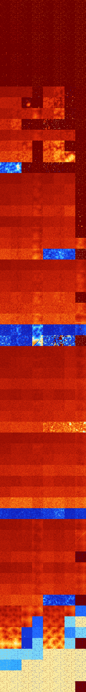

# B012358 (155136-155647)

<details>
    <summary>Initial Grid</summary>
    
</details>


<details>
    <summary>Initial Grid RLE</summary>

```
#C Exported from GoGoL (https://github.com/marrow16/gogol)
#C Wrap mode: Toroidal
#C Boundary mode: Dead
#C Step: 0
x = 100, y = 100, rule = B012358/S
65bo12bo$23bo9bo21bo4bo8bo2bo15bo3bo3bo$33bo8bo5bo3bo2bo3b2o4bo13bo14bo
2bo$3bo12bo23bo2b2o8bo3bo33bo$21b3o3b2o2bo12bo14bo26bo4bo2bo$11bo19bo
48b2o$20bo7bo41bo16bo4bo5bo$52b2o32bo$16bo45bo15bo15bo2bo$60bo23b2o$17b
2o$9bo57bo2bo27bo$25bo23bo32bo$28bo32bo15bo$28bo15bo6bo27bo19bo$51bo14b
o$10bo6bo10bo59bo2bo$34bo44bo14bo$7bo13bo2bo16bo25bo10bo20bo$34b2o4bo9b
2o6bo16bo23bo$18bo35bo$12b2o19bo34bo2bo13bo$6bo9bo50bo11bo$43bo17bo$13b
o15bo10bo5bo29bo13bo$8bo28bo3bo30bo6bo18bo$45bo3bo13bo$4bo15bo35bo18bob
o4bo$bo30bo33bo2bo$5bo15bo68bo$28bo19bo27bo$o4bo11bo3bo22bo12bo30bo$bo
8bo10bo8bo17bo26bo9bo$30bobo2bo4bo14bo21bo$22bo10bo7bo8bo17bo5bo14bo$o
4bo9bo4bo2bo4bo10bo16bo15bo21bo$6bo35bobo$10bo4bo19bo28bo$o5bo7bo60bo$
9bo2bo74bo5bo$10bo58bo5bo18b2o$34bo26bo9bo7bo5bo6bo$27bo19bo31bo$bo5b2o
33bo2b2o19bo2bo4bo7bo9bo2bo$o41bo4bo23bo8bo7bo$26bo$b2o15bo27bo39bobo$
17bo19bo3bo20bo20bo$33bo$5bo3bo19bo6bo10bo11bo19bo$40bo7bo5bo8bo25bo6bo
$66bo$59bo16bo6bobo$16bo52bo14bo2bo2bo6bobo$9bobo3bo24bo36bo$2bo16bo15b
o3bo23bo29bo$o32b3o8bo23bobo$76b2o3bo6bo$10bo14bo10bo6bo34bo$21bo11bo
10bobo5bo4bo16bo$27bo13bo22bo7bo$23bobo12bo5bo21bo20bo$21bo6bo20bobo34b
o4bo$6bo10bo4bo30bo18bo$19bo29bo11bobo5bo9bo$19bo25bo$16bobo16bo5bo4bo
14bo17bo$69bo3bo11bo9bo2bo$9bo27bo14bo4bo$82bo6bo$10bo22bo21bo6bo5bo27b
2o$o6bo12bobo4bo6bo4bo$47bo20bo$9bo35bo4bo28b2o10bo$9bo26bo29bo5bo23bo$
5bo37bo30bo18bo3bo$3bo59bo34bo$51bo4bo11bo$8bo24bo23bo2bobo33bo2bo$6bo
82bo4bo$10bo19bo11bo7bobo$61bo$6bo22bo$21bo6bobo35bo$14bo14b2obo18b2o$
9bo16bo3bo15bo43bo$bo22bo10bo39bo$5bo9bo6bo22bo39bo11bo$5bo9bo21bo7bo3b
o10bo20bo$22bo13bo3bo9bo6b2o17bo16bo$6bo7bo51bo$29bobo14bo13b2o9bo2bo9b
o$22bo2bo32bobo29bo$40bo21bo7bo4bo19bo$4bo5bo6bo40bo2bo17bo16bo$30bo36b
o27bo$3bo9bo18bo45bo13bo$10bo17bo20bo$23bo21bo33bo12bo$6bo6bo2bo24bo44b
o!
```
</details>
<details>
    <summary>Thumbnail</summary>

</details>
<table>
<tr>
    <td><a href="./155136%20S%20Heat%20Map%20Activity.png"></a><br>S (155136)<br>R@6,p2</td>    <td><a href="./155137%20S0%20Heat%20Map%20Activity.png"></a><br>S0 (155137)<br>R@6,p2</td>    <td><a href="./155138%20S1%20Heat%20Map%20Activity.png"></a><br>S1 (155138)<br>R@4,p2</td>    <td><a href="./155139%20S01%20Heat%20Map%20Activity.png"></a><br>S01 (155139)<br>R@5,p2</td>    <td><a href="./155140%20S2%20Heat%20Map%20Activity.png"></a><br>S2 (155140)<br>R@5,p2</td>    <td><a href="./155141%20S02%20Heat%20Map%20Activity.png"></a><br>S02 (155141)<br>R@6,p2</td>    <td><a href="./155142%20S12%20Heat%20Map%20Activity.png"></a><br>S12 (155142)<br>R@5,p2</td>    <td><a href="./155143%20S012%20Heat%20Map%20Activity.png"></a><br>S012 (155143)<br>R@5,p2</td></tr>
<tr>
    <td><a href="./155144%20S3%20Heat%20Map%20Activity.png"></a><br>S3 (155144)<br>R@6,p2</td>    <td><a href="./155145%20S03%20Heat%20Map%20Activity.png"></a><br>S03 (155145)<br>R@6,p2</td>    <td><a href="./155146%20S13%20Heat%20Map%20Activity.png"></a><br>S13 (155146)<br>R@5,p2</td>    <td><a href="./155147%20S013%20Heat%20Map%20Activity.png"></a><br>S013 (155147)<br>R@5,p2</td>    <td><a href="./155148%20S23%20Heat%20Map%20Activity.png"></a><br>S23 (155148)<br>R@4,p2</td>    <td><a href="./155149%20S023%20Heat%20Map%20Activity.png"></a><br>S023 (155149)<br>R@5,p2</td>    <td><a href="./155150%20S123%20Heat%20Map%20Activity.png"></a><br>S123 (155150)<br>R@4,p2</td>    <td><a href="./155151%20S0123%20Heat%20Map%20Activity.png"></a><br>S0123 (155151)<br>R@5,p2</td></tr>
<tr>
    <td><a href="./155152%20S4%20Heat%20Map%20Activity.png"></a><br>S4 (155152)<br>R@8,p2</td>    <td><a href="./155153%20S04%20Heat%20Map%20Activity.png"></a><br>S04 (155153)<br>R@8,p2</td>    <td><a href="./155154%20S14%20Heat%20Map%20Activity.png"></a><br>S14 (155154)<br>R@6,p2</td>    <td><a href="./155155%20S014%20Heat%20Map%20Activity.png"></a><br>S014 (155155)<br>R@7,p2</td>    <td><a href="./155156%20S24%20Heat%20Map%20Activity.png"></a><br>S24 (155156)<br>R@6,p2</td>    <td><a href="./155157%20S024%20Heat%20Map%20Activity.png"></a><br>S024 (155157)<br>R@5,p2</td>    <td><a href="./155158%20S124%20Heat%20Map%20Activity.png"></a><br>S124 (155158)<br>R@5,p2</td>    <td><a href="./155159%20S0124%20Heat%20Map%20Activity.png"></a><br>S0124 (155159)<br>R@5,p2</td></tr>
<tr>
    <td><a href="./155160%20S34%20Heat%20Map%20Activity.png"></a><br>S34 (155160)<br>R@8,p2</td>    <td><a href="./155161%20S034%20Heat%20Map%20Activity.png"></a><br>S034 (155161)<br>R@8,p2</td>    <td><a href="./155162%20S134%20Heat%20Map%20Activity.png"></a><br>S134 (155162)<br>R@5,p2</td>    <td><a href="./155163%20S0134%20Heat%20Map%20Activity.png"></a><br>S0134 (155163)<br>R@5,p2</td>    <td><a href="./155164%20S234%20Heat%20Map%20Activity.png"></a><br>S234 (155164)<br>R@4,p2</td>    <td><a href="./155165%20S0234%20Heat%20Map%20Activity.png"></a><br>S0234 (155165)<br>R@5,p2</td>    <td><a href="./155166%20S1234%20Heat%20Map%20Activity.png"></a><br>S1234 (155166)<br>R@4,p2</td>    <td><a href="./155167%20S01234%20Heat%20Map%20Activity.png"></a><br>S01234 (155167)<br>R@5,p2</td></tr>
<tr>
    <td><a href="./155168%20S5%20Heat%20Map%20Activity.png"></a><br>S5 (155168)<br>R@88,p8</td>    <td><a href="./155169%20S05%20Heat%20Map%20Activity.png"></a><br>S05 (155169)<br>R@23,p4</td>    <td><a href="./155170%20S15%20Heat%20Map%20Activity.png"></a><br>S15 (155170)<br>R@10,p2</td>    <td><a href="./155171%20S015%20Heat%20Map%20Activity.png"></a><br>S015 (155171)<br>R@7,p2</td>    <td><a href="./155172%20S25%20Heat%20Map%20Activity.png"></a><br>S25 (155172)<br>R@8,p2</td>    <td><a href="./155173%20S025%20Heat%20Map%20Activity.png"></a><br>S025 (155173)<br>R@8,p2</td>    <td><a href="./155174%20S125%20Heat%20Map%20Activity.png"></a><br>S125 (155174)<br>R@7,p2</td>    <td><a href="./155175%20S0125%20Heat%20Map%20Activity.png"></a><br>S0125 (155175)<br>R@5,p2</td></tr>
<tr>
    <td><a href="./155176%20S35%20Heat%20Map%20Activity.png"></a><br>S35 (155176)<br>R@18,p8</td>    <td><a href="./155177%20S035%20Heat%20Map%20Activity.png"></a><br>S035 (155177)<br>R@7,p2</td>    <td><a href="./155178%20S135%20Heat%20Map%20Activity.png"></a><br>S135 (155178)<br>R@8,p2</td>    <td><a href="./155179%20S0135%20Heat%20Map%20Activity.png"></a><br>S0135 (155179)<br>R@7,p2</td>    <td><a href="./155180%20S235%20Heat%20Map%20Activity.png"></a><br>S235 (155180)<br>R@6,p2</td>    <td><a href="./155181%20S0235%20Heat%20Map%20Activity.png"></a><br>S0235 (155181)<br>R@6,p2</td>    <td><a href="./155182%20S1235%20Heat%20Map%20Activity.png"></a><br>S1235 (155182)<br>R@5,p2</td>    <td><a href="./155183%20S01235%20Heat%20Map%20Activity.png"></a><br>S01235 (155183)<br>R@5,p2</td></tr>
<tr>
    <td><a href="./155184%20S45%20Heat%20Map%20Activity.png"></a><br>S45 (155184)<br>R@52,p16</td>    <td><a href="./155185%20S045%20Heat%20Map%20Activity.png"></a><br>S045 (155185)<br>R@12,p4</td>    <td><a href="./155186%20S145%20Heat%20Map%20Activity.png"></a><br>S145 (155186)<br>R@12,p2</td>    <td><a href="./155187%20S0145%20Heat%20Map%20Activity.png"></a><br>S0145 (155187)<br>R@9,p2</td>    <td><a href="./155188%20S245%20Heat%20Map%20Activity.png"></a><br>S245 (155188)<br>R@7,p2</td>    <td><a href="./155189%20S0245%20Heat%20Map%20Activity.png"></a><br>S0245 (155189)<br>R@6,p2</td>    <td><a href="./155190%20S1245%20Heat%20Map%20Activity.png"></a><br>S1245 (155190)<br>R@5,p2</td>    <td><a href="./155191%20S01245%20Heat%20Map%20Activity.png"></a><br>S01245 (155191)<br>R@5,p2</td></tr>
<tr>
    <td><a href="./155192%20S345%20Heat%20Map%20Activity.png"></a><br>S345 (155192)<br>R@18,p8</td>    <td><a href="./155193%20S0345%20Heat%20Map%20Activity.png"></a><br>S0345 (155193)<br>R@9,p2</td>    <td><a href="./155194%20S1345%20Heat%20Map%20Activity.png"></a><br>S1345 (155194)<br>R@9,p2</td>    <td><a href="./155195%20S01345%20Heat%20Map%20Activity.png"></a><br>S01345 (155195)<br>R@5,p2</td>    <td><a href="./155196%20S2345%20Heat%20Map%20Activity.png"></a><br>S2345 (155196)<br>R@6,p2</td>    <td><a href="./155197%20S02345%20Heat%20Map%20Activity.png"></a><br>S02345 (155197)<br>R@6,p2</td>    <td><a href="./155198%20S12345%20Heat%20Map%20Activity.png"></a><br>S12345 (155198)<br>R@5,p2</td>    <td><a href="./155199%20S012345%20Heat%20Map%20Activity.png"></a><br>S012345 (155199)<br>R@5,p2</td></tr>
<tr>
    <td><a href="./155200%20S6%20Heat%20Map%20Activity.png"></a><br>S6 (155200)<br>G>1000</td>    <td><a href="./155201%20S06%20Heat%20Map%20Activity.png"></a><br>S06 (155201)<br>G>1000</td>    <td><a href="./155202%20S16%20Heat%20Map%20Activity.png"></a><br>S16 (155202)<br>G>1000</td>    <td><a href="./155203%20S016%20Heat%20Map%20Activity.png"></a><br>S016 (155203)<br>R@7,p4</td>    <td><a href="./155204%20S26%20Heat%20Map%20Activity.png"></a><br>S26 (155204)<br>G>1000</td>    <td><a href="./155205%20S026%20Heat%20Map%20Activity.png"></a><br>S026 (155205)<br>G>1000</td>    <td><a href="./155206%20S126%20Heat%20Map%20Activity.png"></a><br>S126 (155206)<br>R@95,p2</td>    <td><a href="./155207%20S0126%20Heat%20Map%20Activity.png"></a><br>S0126 (155207)<br>R@7,p2</td></tr>
<tr>
    <td><a href="./155208%20S36%20Heat%20Map%20Activity.png"></a><br>S36 (155208)<br>G>1000</td>    <td><a href="./155209%20S036%20Heat%20Map%20Activity.png"></a><br>S036 (155209)<br>G>1000</td>    <td><a href="./155210%20S136%20Heat%20Map%20Activity.png"></a><br>S136 (155210)<br>G>1000</td>    <td><a href="./155211%20S0136%20Heat%20Map%20Activity.png"></a><br>S0136 (155211)<br>R@17,p4</td>    <td><a href="./155212%20S236%20Heat%20Map%20Activity.png"></a><br>S236 (155212)<br>G>1000</td>    <td><a href="./155213%20S0236%20Heat%20Map%20Activity.png"></a><br>S0236 (155213)<br>G>1000</td>    <td><a href="./155214%20S1236%20Heat%20Map%20Activity.png"></a><br>S1236 (155214)<br>R@13,p2</td>    <td><a href="./155215%20S01236%20Heat%20Map%20Activity.png"></a><br>S01236 (155215)<br>R@7,p2</td></tr>
<tr>
    <td><a href="./155216%20S46%20Heat%20Map%20Activity.png"></a><br>S46 (155216)<br>G>1000</td>    <td><a href="./155217%20S046%20Heat%20Map%20Activity.png"></a><br>S046 (155217)<br>G>1000</td>    <td><a href="./155218%20S146%20Heat%20Map%20Activity.png"></a><br>S146 (155218)<br>G>1000</td>    <td><a href="./155219%20S0146%20Heat%20Map%20Activity.png"></a><br>S0146 (155219)<br>G>1000</td>    <td><a href="./155220%20S246%20Heat%20Map%20Activity.png"></a><br>S246 (155220)<br>G>1000</td>    <td><a href="./155221%20S0246%20Heat%20Map%20Activity.png"></a><br>S0246 (155221)<br>G>1000</td>    <td><a href="./155222%20S1246%20Heat%20Map%20Activity.png"></a><br>S1246 (155222)<br>R@19,p2</td>    <td><a href="./155223%20S01246%20Heat%20Map%20Activity.png"></a><br>S01246 (155223)<br>R@7,p2</td></tr>
<tr>
    <td><a href="./155224%20S346%20Heat%20Map%20Activity.png"></a><br>S346 (155224)<br>G>1000</td>    <td><a href="./155225%20S0346%20Heat%20Map%20Activity.png"></a><br>S0346 (155225)<br>G>1000</td>    <td><a href="./155226%20S1346%20Heat%20Map%20Activity.png"></a><br>S1346 (155226)<br>R@39,p8</td>    <td><a href="./155227%20S01346%20Heat%20Map%20Activity.png"></a><br>S01346 (155227)<br>R@7,p4</td>    <td><a href="./155228%20S2346%20Heat%20Map%20Activity.png"></a><br>S2346 (155228)<br>R@277,p12</td>    <td><a href="./155229%20S02346%20Heat%20Map%20Activity.png"></a><br>S02346 (155229)<br>R@619,p4</td>    <td><a href="./155230%20S12346%20Heat%20Map%20Activity.png"></a><br>S12346 (155230)<br>R@13,p2</td>    <td><a href="./155231%20S012346%20Heat%20Map%20Activity.png"></a><br>S012346 (155231)<br>R@5,p2</td></tr>
<tr>
    <td><a href="./155232%20S56%20Heat%20Map%20Activity.png"></a><br>S56 (155232)<br>G>1000</td>    <td><a href="./155233%20S056%20Heat%20Map%20Activity.png"></a><br>S056 (155233)<br>G>1000</td>    <td><a href="./155234%20S156%20Heat%20Map%20Activity.png"></a><br>S156 (155234)<br>G>1000</td>    <td><a href="./155235%20S0156%20Heat%20Map%20Activity.png"></a><br>S0156 (155235)<br>G>1000</td>    <td><a href="./155236%20S256%20Heat%20Map%20Activity.png"></a><br>S256 (155236)<br>G>1000</td>    <td><a href="./155237%20S0256%20Heat%20Map%20Activity.png"></a><br>S0256 (155237)<br>G>1000</td>    <td><a href="./155238%20S1256%20Heat%20Map%20Activity.png"></a><br>S1256 (155238)<br>G>1000</td>    <td><a href="./155239%20S01256%20Heat%20Map%20Activity.png"></a><br>S01256 (155239)<br>R@13,p2</td></tr>
<tr>
    <td><a href="./155240%20S356%20Heat%20Map%20Activity.png"></a><br>S356 (155240)<br>G>1000</td>    <td><a href="./155241%20S0356%20Heat%20Map%20Activity.png"></a><br>S0356 (155241)<br>G>1000</td>    <td><a href="./155242%20S1356%20Heat%20Map%20Activity.png"></a><br>S1356 (155242)<br>G>1000</td>    <td><a href="./155243%20S01356%20Heat%20Map%20Activity.png"></a><br>S01356 (155243)<br>R@15,p6</td>    <td><a href="./155244%20S2356%20Heat%20Map%20Activity.png"></a><br>S2356 (155244)<br>G>1000</td>    <td><a href="./155245%20S02356%20Heat%20Map%20Activity.png"></a><br>S02356 (155245)<br>G>1000</td>    <td><a href="./155246%20S12356%20Heat%20Map%20Activity.png"></a><br>S12356 (155246)<br>R@11,p2</td>    <td><a href="./155247%20S012356%20Heat%20Map%20Activity.png"></a><br>S012356 (155247)<br>R@7,p2</td></tr>
<tr>
    <td><a href="./155248%20S456%20Heat%20Map%20Activity.png"></a><br>S456 (155248)<br>G>1000</td>    <td><a href="./155249%20S0456%20Heat%20Map%20Activity.png"></a><br>S0456 (155249)<br>G>1000</td>    <td><a href="./155250%20S1456%20Heat%20Map%20Activity.png"></a><br>S1456 (155250)<br>G>1000</td>    <td><a href="./155251%20S01456%20Heat%20Map%20Activity.png"></a><br>S01456 (155251)<br>R@9,p2</td>    <td><a href="./155252%20S2456%20Heat%20Map%20Activity.png"></a><br>S2456 (155252)<br>G>1000</td>    <td><a href="./155253%20S02456%20Heat%20Map%20Activity.png"></a><br>S02456 (155253)<br>G>1000</td>    <td><a href="./155254%20S12456%20Heat%20Map%20Activity.png"></a><br>S12456 (155254)<br>G>1000</td>    <td><a href="./155255%20S012456%20Heat%20Map%20Activity.png"></a><br>S012456 (155255)<br>R@5,p2</td></tr>
<tr>
    <td><a href="./155256%20S3456%20Heat%20Map%20Activity.png"></a><br>S3456 (155256)<br>R@292,p12</td>    <td><a href="./155257%20S03456%20Heat%20Map%20Activity.png"></a><br>S03456 (155257)<br>R@425,p60</td>    <td><a href="./155258%20S13456%20Heat%20Map%20Activity.png"></a><br>S13456 (155258)<br>R@31,p4</td>    <td><a href="./155259%20S013456%20Heat%20Map%20Activity.png"></a><br>S013456 (155259)<br>R@7,p2</td>    <td><a href="./155260%20S23456%20Heat%20Map%20Activity.png"></a><br>S23456 (155260)<br>R@37,p4</td>    <td><a href="./155261%20S023456%20Heat%20Map%20Activity.png"></a><br>S023456 (155261)<br>R@31,p4</td>    <td><a href="./155262%20S123456%20Heat%20Map%20Activity.png"></a><br>S123456 (155262)<br>R@11,p2</td>    <td><a href="./155263%20S0123456%20Heat%20Map%20Activity.png"></a><br>S0123456 (155263)<br>R@5,p2</td></tr>
<tr>
    <td><a href="./155264%20S7%20Heat%20Map%20Activity.png"></a><br>S7 (155264)<br>G>1000</td>    <td><a href="./155265%20S07%20Heat%20Map%20Activity.png"></a><br>S07 (155265)<br>G>1000</td>    <td><a href="./155266%20S17%20Heat%20Map%20Activity.png"></a><br>S17 (155266)<br>G>1000</td>    <td><a href="./155267%20S017%20Heat%20Map%20Activity.png"></a><br>S017 (155267)<br>G>1000</td>    <td><a href="./155268%20S27%20Heat%20Map%20Activity.png"></a><br>S27 (155268)<br>G>1000</td>    <td><a href="./155269%20S027%20Heat%20Map%20Activity.png"></a><br>S027 (155269)<br>G>1000</td>    <td><a href="./155270%20S127%20Heat%20Map%20Activity.png"></a><br>S127 (155270)<br>G>1000</td>    <td><a href="./155271%20S0127%20Heat%20Map%20Activity.png"></a><br>S0127 (155271)<br>R@5,p2</td></tr>
<tr>
    <td><a href="./155272%20S37%20Heat%20Map%20Activity.png"></a><br>S37 (155272)<br>G>1000</td>    <td><a href="./155273%20S037%20Heat%20Map%20Activity.png"></a><br>S037 (155273)<br>G>1000</td>    <td><a href="./155274%20S137%20Heat%20Map%20Activity.png"></a><br>S137 (155274)<br>G>1000</td>    <td><a href="./155275%20S0137%20Heat%20Map%20Activity.png"></a><br>S0137 (155275)<br>G>1000</td>    <td><a href="./155276%20S237%20Heat%20Map%20Activity.png"></a><br>S237 (155276)<br>G>1000</td>    <td><a href="./155277%20S0237%20Heat%20Map%20Activity.png"></a><br>S0237 (155277)<br>G>1000</td>    <td><a href="./155278%20S1237%20Heat%20Map%20Activity.png"></a><br>S1237 (155278)<br>G>1000</td>    <td><a href="./155279%20S01237%20Heat%20Map%20Activity.png"></a><br>S01237 (155279)<br>R@7,p2</td></tr>
<tr>
    <td><a href="./155280%20S47%20Heat%20Map%20Activity.png"></a><br>S47 (155280)<br>G>1000</td>    <td><a href="./155281%20S047%20Heat%20Map%20Activity.png"></a><br>S047 (155281)<br>G>1000</td>    <td><a href="./155282%20S147%20Heat%20Map%20Activity.png"></a><br>S147 (155282)<br>G>1000</td>    <td><a href="./155283%20S0147%20Heat%20Map%20Activity.png"></a><br>S0147 (155283)<br>G>1000</td>    <td><a href="./155284%20S247%20Heat%20Map%20Activity.png"></a><br>S247 (155284)<br>G>1000</td>    <td><a href="./155285%20S0247%20Heat%20Map%20Activity.png"></a><br>S0247 (155285)<br>G>1000</td>    <td><a href="./155286%20S1247%20Heat%20Map%20Activity.png"></a><br>S1247 (155286)<br>G>1000</td>    <td><a href="./155287%20S01247%20Heat%20Map%20Activity.png"></a><br>S01247 (155287)<br>R@11,p2</td></tr>
<tr>
    <td><a href="./155288%20S347%20Heat%20Map%20Activity.png"></a><br>S347 (155288)<br>G>1000</td>    <td><a href="./155289%20S0347%20Heat%20Map%20Activity.png"></a><br>S0347 (155289)<br>G>1000</td>    <td><a href="./155290%20S1347%20Heat%20Map%20Activity.png"></a><br>S1347 (155290)<br>G>1000</td>    <td><a href="./155291%20S01347%20Heat%20Map%20Activity.png"></a><br>S01347 (155291)<br>G>1000</td>    <td><a href="./155292%20S2347%20Heat%20Map%20Activity.png"></a><br>S2347 (155292)<br>G>1000</td>    <td><a href="./155293%20S02347%20Heat%20Map%20Activity.png"></a><br>S02347 (155293)<br>G>1000</td>    <td><a href="./155294%20S12347%20Heat%20Map%20Activity.png"></a><br>S12347 (155294)<br>G>1000</td>    <td><a href="./155295%20S012347%20Heat%20Map%20Activity.png"></a><br>S012347 (155295)<br>R@7,p4</td></tr>
<tr>
    <td><a href="./155296%20S57%20Heat%20Map%20Activity.png"></a><br>S57 (155296)<br>G>1000</td>    <td><a href="./155297%20S057%20Heat%20Map%20Activity.png"></a><br>S057 (155297)<br>G>1000</td>    <td><a href="./155298%20S157%20Heat%20Map%20Activity.png"></a><br>S157 (155298)<br>G>1000</td>    <td><a href="./155299%20S0157%20Heat%20Map%20Activity.png"></a><br>S0157 (155299)<br>G>1000</td>    <td><a href="./155300%20S257%20Heat%20Map%20Activity.png"></a><br>S257 (155300)<br>G>1000</td>    <td><a href="./155301%20S0257%20Heat%20Map%20Activity.png"></a><br>S0257 (155301)<br>G>1000</td>    <td><a href="./155302%20S1257%20Heat%20Map%20Activity.png"></a><br>S1257 (155302)<br>G>1000</td>    <td><a href="./155303%20S01257%20Heat%20Map%20Activity.png"></a><br>S01257 (155303)<br>R@25,p12</td></tr>
<tr>
    <td><a href="./155304%20S357%20Heat%20Map%20Activity.png"></a><br>S357 (155304)<br>G>1000</td>    <td><a href="./155305%20S0357%20Heat%20Map%20Activity.png"></a><br>S0357 (155305)<br>G>1000</td>    <td><a href="./155306%20S1357%20Heat%20Map%20Activity.png"></a><br>S1357 (155306)<br>G>1000</td>    <td><a href="./155307%20S01357%20Heat%20Map%20Activity.png"></a><br>S01357 (155307)<br>G>1000</td>    <td><a href="./155308%20S2357%20Heat%20Map%20Activity.png"></a><br>S2357 (155308)<br>G>1000</td>    <td><a href="./155309%20S02357%20Heat%20Map%20Activity.png"></a><br>S02357 (155309)<br>G>1000</td>    <td><a href="./155310%20S12357%20Heat%20Map%20Activity.png"></a><br>S12357 (155310)<br>G>1000</td>    <td><a href="./155311%20S012357%20Heat%20Map%20Activity.png"></a><br>S012357 (155311)<br>R@7,p2</td></tr>
<tr>
    <td><a href="./155312%20S457%20Heat%20Map%20Activity.png"></a><br>S457 (155312)<br>G>1000</td>    <td><a href="./155313%20S0457%20Heat%20Map%20Activity.png"></a><br>S0457 (155313)<br>G>1000</td>    <td><a href="./155314%20S1457%20Heat%20Map%20Activity.png"></a><br>S1457 (155314)<br>G>1000</td>    <td><a href="./155315%20S01457%20Heat%20Map%20Activity.png"></a><br>S01457 (155315)<br>G>1000</td>    <td><a href="./155316%20S2457%20Heat%20Map%20Activity.png"></a><br>S2457 (155316)<br>G>1000</td>    <td><a href="./155317%20S02457%20Heat%20Map%20Activity.png"></a><br>S02457 (155317)<br>G>1000</td>    <td><a href="./155318%20S12457%20Heat%20Map%20Activity.png"></a><br>S12457 (155318)<br>G>1000</td>    <td><a href="./155319%20S012457%20Heat%20Map%20Activity.png"></a><br>S012457 (155319)<br>G>1000</td></tr>
<tr>
    <td><a href="./155320%20S3457%20Heat%20Map%20Activity.png"></a><br>S3457 (155320)<br>G>1000</td>    <td><a href="./155321%20S03457%20Heat%20Map%20Activity.png"></a><br>S03457 (155321)<br>G>1000</td>    <td><a href="./155322%20S13457%20Heat%20Map%20Activity.png"></a><br>S13457 (155322)<br>G>1000</td>    <td><a href="./155323%20S013457%20Heat%20Map%20Activity.png"></a><br>S013457 (155323)<br>G>1000</td>    <td><a href="./155324%20S23457%20Heat%20Map%20Activity.png"></a><br>S23457 (155324)<br>R@468,p12</td>    <td><a href="./155325%20S023457%20Heat%20Map%20Activity.png"></a><br>S023457 (155325)<br>R@501,p12</td>    <td><a href="./155326%20S123457%20Heat%20Map%20Activity.png"></a><br>S123457 (155326)<br>R@348,p24</td>    <td><a href="./155327%20S0123457%20Heat%20Map%20Activity.png"></a><br>S0123457 (155327)<br>R@3,p2</td></tr>
<tr>
    <td><a href="./155328%20S67%20Heat%20Map%20Activity.png"></a><br>S67 (155328)<br>G>1000</td>    <td><a href="./155329%20S067%20Heat%20Map%20Activity.png"></a><br>S067 (155329)<br>G>1000</td>    <td><a href="./155330%20S167%20Heat%20Map%20Activity.png"></a><br>S167 (155330)<br>G>1000</td>    <td><a href="./155331%20S0167%20Heat%20Map%20Activity.png"></a><br>S0167 (155331)<br>G>1000</td>    <td><a href="./155332%20S267%20Heat%20Map%20Activity.png"></a><br>S267 (155332)<br>G>1000</td>    <td><a href="./155333%20S0267%20Heat%20Map%20Activity.png"></a><br>S0267 (155333)<br>G>1000</td>    <td><a href="./155334%20S1267%20Heat%20Map%20Activity.png"></a><br>S1267 (155334)<br>G>1000</td>    <td><a href="./155335%20S01267%20Heat%20Map%20Activity.png"></a><br>S01267 (155335)<br>G>1000</td></tr>
<tr>
    <td><a href="./155336%20S367%20Heat%20Map%20Activity.png"></a><br>S367 (155336)<br>G>1000</td>    <td><a href="./155337%20S0367%20Heat%20Map%20Activity.png"></a><br>S0367 (155337)<br>G>1000</td>    <td><a href="./155338%20S1367%20Heat%20Map%20Activity.png"></a><br>S1367 (155338)<br>G>1000</td>    <td><a href="./155339%20S01367%20Heat%20Map%20Activity.png"></a><br>S01367 (155339)<br>G>1000</td>    <td><a href="./155340%20S2367%20Heat%20Map%20Activity.png"></a><br>S2367 (155340)<br>G>1000</td>    <td><a href="./155341%20S02367%20Heat%20Map%20Activity.png"></a><br>S02367 (155341)<br>G>1000</td>    <td><a href="./155342%20S12367%20Heat%20Map%20Activity.png"></a><br>S12367 (155342)<br>G>1000</td>    <td><a href="./155343%20S012367%20Heat%20Map%20Activity.png"></a><br>S012367 (155343)<br>G>1000</td></tr>
<tr>
    <td><a href="./155344%20S467%20Heat%20Map%20Activity.png"></a><br>S467 (155344)<br>G>1000</td>    <td><a href="./155345%20S0467%20Heat%20Map%20Activity.png"></a><br>S0467 (155345)<br>G>1000</td>    <td><a href="./155346%20S1467%20Heat%20Map%20Activity.png"></a><br>S1467 (155346)<br>G>1000</td>    <td><a href="./155347%20S01467%20Heat%20Map%20Activity.png"></a><br>S01467 (155347)<br>G>1000</td>    <td><a href="./155348%20S2467%20Heat%20Map%20Activity.png"></a><br>S2467 (155348)<br>G>1000</td>    <td><a href="./155349%20S02467%20Heat%20Map%20Activity.png"></a><br>S02467 (155349)<br>G>1000</td>    <td><a href="./155350%20S12467%20Heat%20Map%20Activity.png"></a><br>S12467 (155350)<br>G>1000</td>    <td><a href="./155351%20S012467%20Heat%20Map%20Activity.png"></a><br>S012467 (155351)<br>G>1000</td></tr>
<tr>
    <td><a href="./155352%20S3467%20Heat%20Map%20Activity.png"></a><br>S3467 (155352)<br>G>1000</td>    <td><a href="./155353%20S03467%20Heat%20Map%20Activity.png"></a><br>S03467 (155353)<br>G>1000</td>    <td><a href="./155354%20S13467%20Heat%20Map%20Activity.png"></a><br>S13467 (155354)<br>G>1000</td>    <td><a href="./155355%20S013467%20Heat%20Map%20Activity.png"></a><br>S013467 (155355)<br>G>1000</td>    <td><a href="./155356%20S23467%20Heat%20Map%20Activity.png"></a><br>S23467 (155356)<br>G>1000</td>    <td><a href="./155357%20S023467%20Heat%20Map%20Activity.png"></a><br>S023467 (155357)<br>G>1000</td>    <td><a href="./155358%20S123467%20Heat%20Map%20Activity.png"></a><br>S123467 (155358)<br>G>1000</td>    <td><a href="./155359%20S0123467%20Heat%20Map%20Activity.png"></a><br>S0123467 (155359)<br>R@7,p6</td></tr>
<tr>
    <td><a href="./155360%20S567%20Heat%20Map%20Activity.png"></a><br>S567 (155360)<br>G>1000</td>    <td><a href="./155361%20S0567%20Heat%20Map%20Activity.png"></a><br>S0567 (155361)<br>G>1000</td>    <td><a href="./155362%20S1567%20Heat%20Map%20Activity.png"></a><br>S1567 (155362)<br>G>1000</td>    <td><a href="./155363%20S01567%20Heat%20Map%20Activity.png"></a><br>S01567 (155363)<br>G>1000</td>    <td><a href="./155364%20S2567%20Heat%20Map%20Activity.png"></a><br>S2567 (155364)<br>G>1000</td>    <td><a href="./155365%20S02567%20Heat%20Map%20Activity.png"></a><br>S02567 (155365)<br>G>1000</td>    <td><a href="./155366%20S12567%20Heat%20Map%20Activity.png"></a><br>S12567 (155366)<br>G>1000</td>    <td><a href="./155367%20S012567%20Heat%20Map%20Activity.png"></a><br>S012567 (155367)<br>G>1000</td></tr>
<tr>
    <td><a href="./155368%20S3567%20Heat%20Map%20Activity.png"></a><br>S3567 (155368)<br>G>1000</td>    <td><a href="./155369%20S03567%20Heat%20Map%20Activity.png"></a><br>S03567 (155369)<br>G>1000</td>    <td><a href="./155370%20S13567%20Heat%20Map%20Activity.png"></a><br>S13567 (155370)<br>G>1000</td>    <td><a href="./155371%20S013567%20Heat%20Map%20Activity.png"></a><br>S013567 (155371)<br>G>1000</td>    <td><a href="./155372%20S23567%20Heat%20Map%20Activity.png"></a><br>S23567 (155372)<br>G>1000</td>    <td><a href="./155373%20S023567%20Heat%20Map%20Activity.png"></a><br>S023567 (155373)<br>G>1000</td>    <td><a href="./155374%20S123567%20Heat%20Map%20Activity.png"></a><br>S123567 (155374)<br>G>1000</td>    <td><a href="./155375%20S0123567%20Heat%20Map%20Activity.png"></a><br>S0123567 (155375)<br>G>1000</td></tr>
<tr>
    <td><a href="./155376%20S4567%20Heat%20Map%20Activity.png"></a><br>S4567 (155376)<br>R@106,p60</td>    <td><a href="./155377%20S04567%20Heat%20Map%20Activity.png"></a><br>S04567 (155377)<br>R@114,p60</td>    <td><a href="./155378%20S14567%20Heat%20Map%20Activity.png"></a><br>S14567 (155378)<br>R@160,p120</td>    <td><a href="./155379%20S014567%20Heat%20Map%20Activity.png"></a><br>S014567 (155379)<br>R@129,p60</td>    <td><a href="./155380%20S24567%20Heat%20Map%20Activity.png"></a><br>S24567 (155380)<br>R@186,p120</td>    <td><a href="./155381%20S024567%20Heat%20Map%20Activity.png"></a><br>S024567 (155381)<br>R@239,p180</td>    <td><a href="./155382%20S124567%20Heat%20Map%20Activity.png"></a><br>S124567 (155382)<br>R@177,p120</td>    <td><a href="./155383%20S0124567%20Heat%20Map%20Activity.png"></a><br>S0124567 (155383)<br>R@533,p420</td></tr>
<tr>
    <td><a href="./155384%20S34567%20Heat%20Map%20Activity.png"></a><br>S34567 (155384)<br>R@41,p12</td>    <td><a href="./155385%20S034567%20Heat%20Map%20Activity.png"></a><br>S034567 (155385)<br>R@220,p168</td>    <td><a href="./155386%20S134567%20Heat%20Map%20Activity.png"></a><br>S134567 (155386)<br>R@116,p84</td>    <td><a href="./155387%20S0134567%20Heat%20Map%20Activity.png"></a><br>S0134567 (155387)<br>R@231,p60</td>    <td><a href="./155388%20S234567%20Heat%20Map%20Activity.png"></a><br>S234567 (155388)<br>R@50,p12</td>    <td><a href="./155389%20S0234567%20Heat%20Map%20Activity.png"></a><br>S0234567 (155389)<br>R@210,p12</td>    <td><a href="./155390%20S1234567%20Heat%20Map%20Activity.png"></a><br>S1234567 (155390)<br>R@55,p12</td>    <td><a href="./155391%20S01234567%20Heat%20Map%20Activity.png"></a><br>S01234567 (155391)<br>R@3,p2</td></tr>
<tr>
    <td><a href="./155392%20S8%20Heat%20Map%20Activity.png"></a><br>S8 (155392)<br>G>1000</td>    <td><a href="./155393%20S08%20Heat%20Map%20Activity.png"></a><br>S08 (155393)<br>G>1000</td>    <td><a href="./155394%20S18%20Heat%20Map%20Activity.png"></a><br>S18 (155394)<br>G>1000</td>    <td><a href="./155395%20S018%20Heat%20Map%20Activity.png"></a><br>S018 (155395)<br>G>1000</td>    <td><a href="./155396%20S28%20Heat%20Map%20Activity.png"></a><br>S28 (155396)<br>G>1000</td>    <td><a href="./155397%20S028%20Heat%20Map%20Activity.png"></a><br>S028 (155397)<br>G>1000</td>    <td><a href="./155398%20S128%20Heat%20Map%20Activity.png"></a><br>S128 (155398)<br>G>1000</td>    <td><a href="./155399%20S0128%20Heat%20Map%20Activity.png"></a><br>S0128 (155399)<br>G>1000</td></tr>
<tr>
    <td><a href="./155400%20S38%20Heat%20Map%20Activity.png"></a><br>S38 (155400)<br>G>1000</td>    <td><a href="./155401%20S038%20Heat%20Map%20Activity.png"></a><br>S038 (155401)<br>G>1000</td>    <td><a href="./155402%20S138%20Heat%20Map%20Activity.png"></a><br>S138 (155402)<br>G>1000</td>    <td><a href="./155403%20S0138%20Heat%20Map%20Activity.png"></a><br>S0138 (155403)<br>G>1000</td>    <td><a href="./155404%20S238%20Heat%20Map%20Activity.png"></a><br>S238 (155404)<br>G>1000</td>    <td><a href="./155405%20S0238%20Heat%20Map%20Activity.png"></a><br>S0238 (155405)<br>G>1000</td>    <td><a href="./155406%20S1238%20Heat%20Map%20Activity.png"></a><br>S1238 (155406)<br>G>1000</td>    <td><a href="./155407%20S01238%20Heat%20Map%20Activity.png"></a><br>S01238 (155407)<br>G>1000</td></tr>
<tr>
    <td><a href="./155408%20S48%20Heat%20Map%20Activity.png"></a><br>S48 (155408)<br>G>1000</td>    <td><a href="./155409%20S048%20Heat%20Map%20Activity.png"></a><br>S048 (155409)<br>G>1000</td>    <td><a href="./155410%20S148%20Heat%20Map%20Activity.png"></a><br>S148 (155410)<br>G>1000</td>    <td><a href="./155411%20S0148%20Heat%20Map%20Activity.png"></a><br>S0148 (155411)<br>G>1000</td>    <td><a href="./155412%20S248%20Heat%20Map%20Activity.png"></a><br>S248 (155412)<br>G>1000</td>    <td><a href="./155413%20S0248%20Heat%20Map%20Activity.png"></a><br>S0248 (155413)<br>G>1000</td>    <td><a href="./155414%20S1248%20Heat%20Map%20Activity.png"></a><br>S1248 (155414)<br>G>1000</td>    <td><a href="./155415%20S01248%20Heat%20Map%20Activity.png"></a><br>S01248 (155415)<br>G>1000</td></tr>
<tr>
    <td><a href="./155416%20S348%20Heat%20Map%20Activity.png"></a><br>S348 (155416)<br>G>1000</td>    <td><a href="./155417%20S0348%20Heat%20Map%20Activity.png"></a><br>S0348 (155417)<br>G>1000</td>    <td><a href="./155418%20S1348%20Heat%20Map%20Activity.png"></a><br>S1348 (155418)<br>G>1000</td>    <td><a href="./155419%20S01348%20Heat%20Map%20Activity.png"></a><br>S01348 (155419)<br>G>1000</td>    <td><a href="./155420%20S2348%20Heat%20Map%20Activity.png"></a><br>S2348 (155420)<br>G>1000</td>    <td><a href="./155421%20S02348%20Heat%20Map%20Activity.png"></a><br>S02348 (155421)<br>G>1000</td>    <td><a href="./155422%20S12348%20Heat%20Map%20Activity.png"></a><br>S12348 (155422)<br>G>1000</td>    <td><a href="./155423%20S012348%20Heat%20Map%20Activity.png"></a><br>S012348 (155423)<br>G>1000</td></tr>
<tr>
    <td><a href="./155424%20S58%20Heat%20Map%20Activity.png"></a><br>S58 (155424)<br>G>1000</td>    <td><a href="./155425%20S058%20Heat%20Map%20Activity.png"></a><br>S058 (155425)<br>G>1000</td>    <td><a href="./155426%20S158%20Heat%20Map%20Activity.png"></a><br>S158 (155426)<br>G>1000</td>    <td><a href="./155427%20S0158%20Heat%20Map%20Activity.png"></a><br>S0158 (155427)<br>G>1000</td>    <td><a href="./155428%20S258%20Heat%20Map%20Activity.png"></a><br>S258 (155428)<br>G>1000</td>    <td><a href="./155429%20S0258%20Heat%20Map%20Activity.png"></a><br>S0258 (155429)<br>G>1000</td>    <td><a href="./155430%20S1258%20Heat%20Map%20Activity.png"></a><br>S1258 (155430)<br>G>1000</td>    <td><a href="./155431%20S01258%20Heat%20Map%20Activity.png"></a><br>S01258 (155431)<br>G>1000</td></tr>
<tr>
    <td><a href="./155432%20S358%20Heat%20Map%20Activity.png"></a><br>S358 (155432)<br>G>1000</td>    <td><a href="./155433%20S0358%20Heat%20Map%20Activity.png"></a><br>S0358 (155433)<br>G>1000</td>    <td><a href="./155434%20S1358%20Heat%20Map%20Activity.png"></a><br>S1358 (155434)<br>G>1000</td>    <td><a href="./155435%20S01358%20Heat%20Map%20Activity.png"></a><br>S01358 (155435)<br>G>1000</td>    <td><a href="./155436%20S2358%20Heat%20Map%20Activity.png"></a><br>S2358 (155436)<br>G>1000</td>    <td><a href="./155437%20S02358%20Heat%20Map%20Activity.png"></a><br>S02358 (155437)<br>G>1000</td>    <td><a href="./155438%20S12358%20Heat%20Map%20Activity.png"></a><br>S12358 (155438)<br>G>1000</td>    <td><a href="./155439%20S012358%20Heat%20Map%20Activity.png"></a><br>S012358 (155439)<br>G>1000</td></tr>
<tr>
    <td><a href="./155440%20S458%20Heat%20Map%20Activity.png"></a><br>S458 (155440)<br>G>1000</td>    <td><a href="./155441%20S0458%20Heat%20Map%20Activity.png"></a><br>S0458 (155441)<br>G>1000</td>    <td><a href="./155442%20S1458%20Heat%20Map%20Activity.png"></a><br>S1458 (155442)<br>G>1000</td>    <td><a href="./155443%20S01458%20Heat%20Map%20Activity.png"></a><br>S01458 (155443)<br>G>1000</td>    <td><a href="./155444%20S2458%20Heat%20Map%20Activity.png"></a><br>S2458 (155444)<br>G>1000</td>    <td><a href="./155445%20S02458%20Heat%20Map%20Activity.png"></a><br>S02458 (155445)<br>G>1000</td>    <td><a href="./155446%20S12458%20Heat%20Map%20Activity.png"></a><br>S12458 (155446)<br>G>1000</td>    <td><a href="./155447%20S012458%20Heat%20Map%20Activity.png"></a><br>S012458 (155447)<br>G>1000</td></tr>
<tr>
    <td><a href="./155448%20S3458%20Heat%20Map%20Activity.png"></a><br>S3458 (155448)<br>G>1000</td>    <td><a href="./155449%20S03458%20Heat%20Map%20Activity.png"></a><br>S03458 (155449)<br>G>1000</td>    <td><a href="./155450%20S13458%20Heat%20Map%20Activity.png"></a><br>S13458 (155450)<br>G>1000</td>    <td><a href="./155451%20S013458%20Heat%20Map%20Activity.png"></a><br>S013458 (155451)<br>G>1000</td>    <td><a href="./155452%20S23458%20Heat%20Map%20Activity.png"></a><br>S23458 (155452)<br>G>1000</td>    <td><a href="./155453%20S023458%20Heat%20Map%20Activity.png"></a><br>S023458 (155453)<br>G>1000</td>    <td><a href="./155454%20S123458%20Heat%20Map%20Activity.png"></a><br>S123458 (155454)<br>G>1000</td>    <td><a href="./155455%20S0123458%20Heat%20Map%20Activity.png"></a><br>S0123458 (155455)<br>G>1000</td></tr>
<tr>
    <td><a href="./155456%20S68%20Heat%20Map%20Activity.png"></a><br>S68 (155456)<br>G>1000</td>    <td><a href="./155457%20S068%20Heat%20Map%20Activity.png"></a><br>S068 (155457)<br>G>1000</td>    <td><a href="./155458%20S168%20Heat%20Map%20Activity.png"></a><br>S168 (155458)<br>G>1000</td>    <td><a href="./155459%20S0168%20Heat%20Map%20Activity.png"></a><br>S0168 (155459)<br>G>1000</td>    <td><a href="./155460%20S268%20Heat%20Map%20Activity.png"></a><br>S268 (155460)<br>G>1000</td>    <td><a href="./155461%20S0268%20Heat%20Map%20Activity.png"></a><br>S0268 (155461)<br>G>1000</td>    <td><a href="./155462%20S1268%20Heat%20Map%20Activity.png"></a><br>S1268 (155462)<br>G>1000</td>    <td><a href="./155463%20S01268%20Heat%20Map%20Activity.png"></a><br>S01268 (155463)<br>G>1000</td></tr>
<tr>
    <td><a href="./155464%20S368%20Heat%20Map%20Activity.png"></a><br>S368 (155464)<br>G>1000</td>    <td><a href="./155465%20S0368%20Heat%20Map%20Activity.png"></a><br>S0368 (155465)<br>G>1000</td>    <td><a href="./155466%20S1368%20Heat%20Map%20Activity.png"></a><br>S1368 (155466)<br>G>1000</td>    <td><a href="./155467%20S01368%20Heat%20Map%20Activity.png"></a><br>S01368 (155467)<br>G>1000</td>    <td><a href="./155468%20S2368%20Heat%20Map%20Activity.png"></a><br>S2368 (155468)<br>G>1000</td>    <td><a href="./155469%20S02368%20Heat%20Map%20Activity.png"></a><br>S02368 (155469)<br>G>1000</td>    <td><a href="./155470%20S12368%20Heat%20Map%20Activity.png"></a><br>S12368 (155470)<br>G>1000</td>    <td><a href="./155471%20S012368%20Heat%20Map%20Activity.png"></a><br>S012368 (155471)<br>G>1000</td></tr>
<tr>
    <td><a href="./155472%20S468%20Heat%20Map%20Activity.png"></a><br>S468 (155472)<br>G>1000</td>    <td><a href="./155473%20S0468%20Heat%20Map%20Activity.png"></a><br>S0468 (155473)<br>G>1000</td>    <td><a href="./155474%20S1468%20Heat%20Map%20Activity.png"></a><br>S1468 (155474)<br>G>1000</td>    <td><a href="./155475%20S01468%20Heat%20Map%20Activity.png"></a><br>S01468 (155475)<br>G>1000</td>    <td><a href="./155476%20S2468%20Heat%20Map%20Activity.png"></a><br>S2468 (155476)<br>G>1000</td>    <td><a href="./155477%20S02468%20Heat%20Map%20Activity.png"></a><br>S02468 (155477)<br>G>1000</td>    <td><a href="./155478%20S12468%20Heat%20Map%20Activity.png"></a><br>S12468 (155478)<br>G>1000</td>    <td><a href="./155479%20S012468%20Heat%20Map%20Activity.png"></a><br>S012468 (155479)<br>G>1000</td></tr>
<tr>
    <td><a href="./155480%20S3468%20Heat%20Map%20Activity.png"></a><br>S3468 (155480)<br>G>1000</td>    <td><a href="./155481%20S03468%20Heat%20Map%20Activity.png"></a><br>S03468 (155481)<br>G>1000</td>    <td><a href="./155482%20S13468%20Heat%20Map%20Activity.png"></a><br>S13468 (155482)<br>G>1000</td>    <td><a href="./155483%20S013468%20Heat%20Map%20Activity.png"></a><br>S013468 (155483)<br>G>1000</td>    <td><a href="./155484%20S23468%20Heat%20Map%20Activity.png"></a><br>S23468 (155484)<br>G>1000</td>    <td><a href="./155485%20S023468%20Heat%20Map%20Activity.png"></a><br>S023468 (155485)<br>G>1000</td>    <td><a href="./155486%20S123468%20Heat%20Map%20Activity.png"></a><br>S123468 (155486)<br>G>1000</td>    <td><a href="./155487%20S0123468%20Heat%20Map%20Activity.png"></a><br>S0123468 (155487)<br>G>1000</td></tr>
<tr>
    <td><a href="./155488%20S568%20Heat%20Map%20Activity.png"></a><br>S568 (155488)<br>G>1000</td>    <td><a href="./155489%20S0568%20Heat%20Map%20Activity.png"></a><br>S0568 (155489)<br>G>1000</td>    <td><a href="./155490%20S1568%20Heat%20Map%20Activity.png"></a><br>S1568 (155490)<br>G>1000</td>    <td><a href="./155491%20S01568%20Heat%20Map%20Activity.png"></a><br>S01568 (155491)<br>G>1000</td>    <td><a href="./155492%20S2568%20Heat%20Map%20Activity.png"></a><br>S2568 (155492)<br>G>1000</td>    <td><a href="./155493%20S02568%20Heat%20Map%20Activity.png"></a><br>S02568 (155493)<br>G>1000</td>    <td><a href="./155494%20S12568%20Heat%20Map%20Activity.png"></a><br>S12568 (155494)<br>G>1000</td>    <td><a href="./155495%20S012568%20Heat%20Map%20Activity.png"></a><br>S012568 (155495)<br>G>1000</td></tr>
<tr>
    <td><a href="./155496%20S3568%20Heat%20Map%20Activity.png"></a><br>S3568 (155496)<br>G>1000</td>    <td><a href="./155497%20S03568%20Heat%20Map%20Activity.png"></a><br>S03568 (155497)<br>G>1000</td>    <td><a href="./155498%20S13568%20Heat%20Map%20Activity.png"></a><br>S13568 (155498)<br>G>1000</td>    <td><a href="./155499%20S013568%20Heat%20Map%20Activity.png"></a><br>S013568 (155499)<br>G>1000</td>    <td><a href="./155500%20S23568%20Heat%20Map%20Activity.png"></a><br>S23568 (155500)<br>G>1000</td>    <td><a href="./155501%20S023568%20Heat%20Map%20Activity.png"></a><br>S023568 (155501)<br>G>1000</td>    <td><a href="./155502%20S123568%20Heat%20Map%20Activity.png"></a><br>S123568 (155502)<br>G>1000</td>    <td><a href="./155503%20S0123568%20Heat%20Map%20Activity.png"></a><br>S0123568 (155503)<br>G>1000</td></tr>
<tr>
    <td><a href="./155504%20S4568%20Heat%20Map%20Activity.png"></a><br>S4568 (155504)<br>G>1000</td>    <td><a href="./155505%20S04568%20Heat%20Map%20Activity.png"></a><br>S04568 (155505)<br>G>1000</td>    <td><a href="./155506%20S14568%20Heat%20Map%20Activity.png"></a><br>S14568 (155506)<br>G>1000</td>    <td><a href="./155507%20S014568%20Heat%20Map%20Activity.png"></a><br>S014568 (155507)<br>G>1000</td>    <td><a href="./155508%20S24568%20Heat%20Map%20Activity.png"></a><br>S24568 (155508)<br>G>1000</td>    <td><a href="./155509%20S024568%20Heat%20Map%20Activity.png"></a><br>S024568 (155509)<br>G>1000</td>    <td><a href="./155510%20S124568%20Heat%20Map%20Activity.png"></a><br>S124568 (155510)<br>G>1000</td>    <td><a href="./155511%20S0124568%20Heat%20Map%20Activity.png"></a><br>S0124568 (155511)<br>G>1000</td></tr>
<tr>
    <td><a href="./155512%20S34568%20Heat%20Map%20Activity.png"></a><br>S34568 (155512)<br>R@103,p2</td>    <td><a href="./155513%20S034568%20Heat%20Map%20Activity.png"></a><br>S034568 (155513)<br>R@153,p60</td>    <td><a href="./155514%20S134568%20Heat%20Map%20Activity.png"></a><br>S134568 (155514)<br>R@125,p6</td>    <td><a href="./155515%20S0134568%20Heat%20Map%20Activity.png"></a><br>S0134568 (155515)<br>R@136,p30</td>    <td><a href="./155516%20S234568%20Heat%20Map%20Activity.png"></a><br>S234568 (155516)<br>R@39,p10</td>    <td><a href="./155517%20S0234568%20Heat%20Map%20Activity.png"></a><br>S0234568 (155517)<br>R@32,p2</td>    <td><a href="./155518%20S1234568%20Heat%20Map%20Activity.png"></a><br>S1234568 (155518)<br>R@90,p60</td>    <td><a href="./155519%20S01234568%20Heat%20Map%20Activity.png"></a><br>S01234568 (155519)<br>R@61,p2</td></tr>
<tr>
    <td><a href="./155520%20S78%20Heat%20Map%20Activity.png"></a><br>S78 (155520)<br>G>1000</td>    <td><a href="./155521%20S078%20Heat%20Map%20Activity.png"></a><br>S078 (155521)<br>G>1000</td>    <td><a href="./155522%20S178%20Heat%20Map%20Activity.png"></a><br>S178 (155522)<br>G>1000</td>    <td><a href="./155523%20S0178%20Heat%20Map%20Activity.png"></a><br>S0178 (155523)<br>G>1000</td>    <td><a href="./155524%20S278%20Heat%20Map%20Activity.png"></a><br>S278 (155524)<br>G>1000</td>    <td><a href="./155525%20S0278%20Heat%20Map%20Activity.png"></a><br>S0278 (155525)<br>G>1000</td>    <td><a href="./155526%20S1278%20Heat%20Map%20Activity.png"></a><br>S1278 (155526)<br>G>1000</td>    <td><a href="./155527%20S01278%20Heat%20Map%20Activity.png"></a><br>S01278 (155527)<br>G>1000</td></tr>
<tr>
    <td><a href="./155528%20S378%20Heat%20Map%20Activity.png"></a><br>S378 (155528)<br>G>1000</td>    <td><a href="./155529%20S0378%20Heat%20Map%20Activity.png"></a><br>S0378 (155529)<br>G>1000</td>    <td><a href="./155530%20S1378%20Heat%20Map%20Activity.png"></a><br>S1378 (155530)<br>G>1000</td>    <td><a href="./155531%20S01378%20Heat%20Map%20Activity.png"></a><br>S01378 (155531)<br>G>1000</td>    <td><a href="./155532%20S2378%20Heat%20Map%20Activity.png"></a><br>S2378 (155532)<br>G>1000</td>    <td><a href="./155533%20S02378%20Heat%20Map%20Activity.png"></a><br>S02378 (155533)<br>G>1000</td>    <td><a href="./155534%20S12378%20Heat%20Map%20Activity.png"></a><br>S12378 (155534)<br>G>1000</td>    <td><a href="./155535%20S012378%20Heat%20Map%20Activity.png"></a><br>S012378 (155535)<br>G>1000</td></tr>
<tr>
    <td><a href="./155536%20S478%20Heat%20Map%20Activity.png"></a><br>S478 (155536)<br>G>1000</td>    <td><a href="./155537%20S0478%20Heat%20Map%20Activity.png"></a><br>S0478 (155537)<br>G>1000</td>    <td><a href="./155538%20S1478%20Heat%20Map%20Activity.png"></a><br>S1478 (155538)<br>G>1000</td>    <td><a href="./155539%20S01478%20Heat%20Map%20Activity.png"></a><br>S01478 (155539)<br>G>1000</td>    <td><a href="./155540%20S2478%20Heat%20Map%20Activity.png"></a><br>S2478 (155540)<br>G>1000</td>    <td><a href="./155541%20S02478%20Heat%20Map%20Activity.png"></a><br>S02478 (155541)<br>G>1000</td>    <td><a href="./155542%20S12478%20Heat%20Map%20Activity.png"></a><br>S12478 (155542)<br>G>1000</td>    <td><a href="./155543%20S012478%20Heat%20Map%20Activity.png"></a><br>S012478 (155543)<br>G>1000</td></tr>
<tr>
    <td><a href="./155544%20S3478%20Heat%20Map%20Activity.png"></a><br>S3478 (155544)<br>G>1000</td>    <td><a href="./155545%20S03478%20Heat%20Map%20Activity.png"></a><br>S03478 (155545)<br>G>1000</td>    <td><a href="./155546%20S13478%20Heat%20Map%20Activity.png"></a><br>S13478 (155546)<br>G>1000</td>    <td><a href="./155547%20S013478%20Heat%20Map%20Activity.png"></a><br>S013478 (155547)<br>G>1000</td>    <td><a href="./155548%20S23478%20Heat%20Map%20Activity.png"></a><br>S23478 (155548)<br>G>1000</td>    <td><a href="./155549%20S023478%20Heat%20Map%20Activity.png"></a><br>S023478 (155549)<br>G>1000</td>    <td><a href="./155550%20S123478%20Heat%20Map%20Activity.png"></a><br>S123478 (155550)<br>G>1000</td>    <td><a href="./155551%20S0123478%20Heat%20Map%20Activity.png"></a><br>S0123478 (155551)<br>S@2</td></tr>
<tr>
    <td><a href="./155552%20S578%20Heat%20Map%20Activity.png"></a><br>S578 (155552)<br>G>1000</td>    <td><a href="./155553%20S0578%20Heat%20Map%20Activity.png"></a><br>S0578 (155553)<br>G>1000</td>    <td><a href="./155554%20S1578%20Heat%20Map%20Activity.png"></a><br>S1578 (155554)<br>G>1000</td>    <td><a href="./155555%20S01578%20Heat%20Map%20Activity.png"></a><br>S01578 (155555)<br>G>1000</td>    <td><a href="./155556%20S2578%20Heat%20Map%20Activity.png"></a><br>S2578 (155556)<br>G>1000</td>    <td><a href="./155557%20S02578%20Heat%20Map%20Activity.png"></a><br>S02578 (155557)<br>G>1000</td>    <td><a href="./155558%20S12578%20Heat%20Map%20Activity.png"></a><br>S12578 (155558)<br>G>1000</td>    <td><a href="./155559%20S012578%20Heat%20Map%20Activity.png"></a><br>S012578 (155559)<br>G>1000</td></tr>
<tr>
    <td><a href="./155560%20S3578%20Heat%20Map%20Activity.png"></a><br>S3578 (155560)<br>G>1000</td>    <td><a href="./155561%20S03578%20Heat%20Map%20Activity.png"></a><br>S03578 (155561)<br>G>1000</td>    <td><a href="./155562%20S13578%20Heat%20Map%20Activity.png"></a><br>S13578 (155562)<br>G>1000</td>    <td><a href="./155563%20S013578%20Heat%20Map%20Activity.png"></a><br>S013578 (155563)<br>G>1000</td>    <td><a href="./155564%20S23578%20Heat%20Map%20Activity.png"></a><br>S23578 (155564)<br>G>1000</td>    <td><a href="./155565%20S023578%20Heat%20Map%20Activity.png"></a><br>S023578 (155565)<br>G>1000</td>    <td><a href="./155566%20S123578%20Heat%20Map%20Activity.png"></a><br>S123578 (155566)<br>G>1000</td>    <td><a href="./155567%20S0123578%20Heat%20Map%20Activity.png"></a><br>S0123578 (155567)<br>G>1000</td></tr>
<tr>
    <td><a href="./155568%20S4578%20Heat%20Map%20Activity.png"></a><br>S4578 (155568)<br>G>1000</td>    <td><a href="./155569%20S04578%20Heat%20Map%20Activity.png"></a><br>S04578 (155569)<br>G>1000</td>    <td><a href="./155570%20S14578%20Heat%20Map%20Activity.png"></a><br>S14578 (155570)<br>G>1000</td>    <td><a href="./155571%20S014578%20Heat%20Map%20Activity.png"></a><br>S014578 (155571)<br>G>1000</td>    <td><a href="./155572%20S24578%20Heat%20Map%20Activity.png"></a><br>S24578 (155572)<br>G>1000</td>    <td><a href="./155573%20S024578%20Heat%20Map%20Activity.png"></a><br>S024578 (155573)<br>G>1000</td>    <td><a href="./155574%20S124578%20Heat%20Map%20Activity.png"></a><br>S124578 (155574)<br>G>1000</td>    <td><a href="./155575%20S0124578%20Heat%20Map%20Activity.png"></a><br>S0124578 (155575)<br>G>1000</td></tr>
<tr>
    <td><a href="./155576%20S34578%20Heat%20Map%20Activity.png"></a><br>S34578 (155576)<br>G>1000</td>    <td><a href="./155577%20S034578%20Heat%20Map%20Activity.png"></a><br>S034578 (155577)<br>G>1000</td>    <td><a href="./155578%20S134578%20Heat%20Map%20Activity.png"></a><br>S134578 (155578)<br>G>1000</td>    <td><a href="./155579%20S0134578%20Heat%20Map%20Activity.png"></a><br>S0134578 (155579)<br>G>1000</td>    <td><a href="./155580%20S234578%20Heat%20Map%20Activity.png"></a><br>S234578 (155580)<br>G>1000</td>    <td><a href="./155581%20S0234578%20Heat%20Map%20Activity.png"></a><br>S0234578 (155581)<br>G>1000</td>    <td><a href="./155582%20S1234578%20Heat%20Map%20Activity.png"></a><br>S1234578 (155582)<br>R@529,p12</td>    <td><a href="./155583%20S01234578%20Heat%20Map%20Activity.png"></a><br>S01234578 (155583)<br>S@2</td></tr>
<tr>
    <td><a href="./155584%20S678%20Heat%20Map%20Activity.png"></a><br>S678 (155584)<br>G>1000</td>    <td><a href="./155585%20S0678%20Heat%20Map%20Activity.png"></a><br>S0678 (155585)<br>G>1000</td>    <td><a href="./155586%20S1678%20Heat%20Map%20Activity.png"></a><br>S1678 (155586)<br>G>1000</td>    <td><a href="./155587%20S01678%20Heat%20Map%20Activity.png"></a><br>S01678 (155587)<br>G>1000</td>    <td><a href="./155588%20S2678%20Heat%20Map%20Activity.png"></a><br>S2678 (155588)<br>G>1000</td>    <td><a href="./155589%20S02678%20Heat%20Map%20Activity.png"></a><br>S02678 (155589)<br>G>1000</td>    <td><a href="./155590%20S12678%20Heat%20Map%20Activity.png"></a><br>S12678 (155590)<br>G>1000</td>    <td><a href="./155591%20S012678%20Heat%20Map%20Activity.png"></a><br>S012678 (155591)<br>R@7,p4</td></tr>
<tr>
    <td><a href="./155592%20S3678%20Heat%20Map%20Activity.png"></a><br>S3678 (155592)<br>G>1000</td>    <td><a href="./155593%20S03678%20Heat%20Map%20Activity.png"></a><br>S03678 (155593)<br>G>1000</td>    <td><a href="./155594%20S13678%20Heat%20Map%20Activity.png"></a><br>S13678 (155594)<br>G>1000</td>    <td><a href="./155595%20S013678%20Heat%20Map%20Activity.png"></a><br>S013678 (155595)<br>S@8</td>    <td><a href="./155596%20S23678%20Heat%20Map%20Activity.png"></a><br>S23678 (155596)<br>G>1000</td>    <td><a href="./155597%20S023678%20Heat%20Map%20Activity.png"></a><br>S023678 (155597)<br>G>1000</td>    <td><a href="./155598%20S123678%20Heat%20Map%20Activity.png"></a><br>S123678 (155598)<br>S@3</td>    <td><a href="./155599%20S0123678%20Heat%20Map%20Activity.png"></a><br>S0123678 (155599)<br>S@2</td></tr>
<tr>
    <td><a href="./155600%20S4678%20Heat%20Map%20Activity.png"></a><br>S4678 (155600)<br>G>1000</td>    <td><a href="./155601%20S04678%20Heat%20Map%20Activity.png"></a><br>S04678 (155601)<br>G>1000</td>    <td><a href="./155602%20S14678%20Heat%20Map%20Activity.png"></a><br>S14678 (155602)<br>R@28,p4</td>    <td><a href="./155603%20S014678%20Heat%20Map%20Activity.png"></a><br>S014678 (155603)<br>S@8</td>    <td><a href="./155604%20S24678%20Heat%20Map%20Activity.png"></a><br>S24678 (155604)<br>G>1000</td>    <td><a href="./155605%20S024678%20Heat%20Map%20Activity.png"></a><br>S024678 (155605)<br>G>1000</td>    <td><a href="./155606%20S124678%20Heat%20Map%20Activity.png"></a><br>S124678 (155606)<br>S@7</td>    <td><a href="./155607%20S0124678%20Heat%20Map%20Activity.png"></a><br>S0124678 (155607)<br>S@3</td></tr>
<tr>
    <td><a href="./155608%20S34678%20Heat%20Map%20Activity.png"></a><br>S34678 (155608)<br>G>1000</td>    <td><a href="./155609%20S034678%20Heat%20Map%20Activity.png"></a><br>S034678 (155609)<br>G>1000</td>    <td><a href="./155610%20S134678%20Heat%20Map%20Activity.png"></a><br>S134678 (155610)<br>R@39,p4</td>    <td><a href="./155611%20S0134678%20Heat%20Map%20Activity.png"></a><br>S0134678 (155611)<br>S@3</td>    <td><a href="./155612%20S234678%20Heat%20Map%20Activity.png"></a><br>S234678 (155612)<br>G>1000</td>    <td><a href="./155613%20S0234678%20Heat%20Map%20Activity.png"></a><br>S0234678 (155613)<br>G>1000</td>    <td><a href="./155614%20S1234678%20Heat%20Map%20Activity.png"></a><br>S1234678 (155614)<br>S@3</td>    <td><a href="./155615%20S01234678%20Heat%20Map%20Activity.png"></a><br>S01234678 (155615)<br>S@2</td></tr>
<tr>
    <td><a href="./155616%20S5678%20Heat%20Map%20Activity.png"></a><br>S5678 (155616)<br>S@4</td>    <td><a href="./155617%20S05678%20Heat%20Map%20Activity.png"></a><br>S05678 (155617)<br>S@4</td>    <td><a href="./155618%20S15678%20Heat%20Map%20Activity.png"></a><br>S15678 (155618)<br>S@3</td>    <td><a href="./155619%20S015678%20Heat%20Map%20Activity.png"></a><br>S015678 (155619)<br>S@3</td>    <td><a href="./155620%20S25678%20Heat%20Map%20Activity.png"></a><br>S25678 (155620)<br>S@3</td>    <td><a href="./155621%20S025678%20Heat%20Map%20Activity.png"></a><br>S025678 (155621)<br>S@3</td>    <td><a href="./155622%20S125678%20Heat%20Map%20Activity.png"></a><br>S125678 (155622)<br>S@3</td>    <td><a href="./155623%20S0125678%20Heat%20Map%20Activity.png"></a><br>S0125678 (155623)<br>S@3</td></tr>
<tr>
    <td><a href="./155624%20S35678%20Heat%20Map%20Activity.png"></a><br>S35678 (155624)<br>R@6,p2</td>    <td><a href="./155625%20S035678%20Heat%20Map%20Activity.png"></a><br>S035678 (155625)<br>R@6,p2</td>    <td><a href="./155626%20S135678%20Heat%20Map%20Activity.png"></a><br>S135678 (155626)<br>S@2</td>    <td><a href="./155627%20S0135678%20Heat%20Map%20Activity.png"></a><br>S0135678 (155627)<br>S@2</td>    <td><a href="./155628%20S235678%20Heat%20Map%20Activity.png"></a><br>S235678 (155628)<br>S@2</td>    <td><a href="./155629%20S0235678%20Heat%20Map%20Activity.png"></a><br>S0235678 (155629)<br>S@2</td>    <td><a href="./155630%20S1235678%20Heat%20Map%20Activity.png"></a><br>S1235678 (155630)<br>S@2</td>    <td><a href="./155631%20S01235678%20Heat%20Map%20Activity.png"></a><br>S01235678 (155631)<br>S@2</td></tr>
<tr>
    <td><a href="./155632%20S45678%20Heat%20Map%20Activity.png"></a><br>S45678 (155632)<br>S@3</td>    <td><a href="./155633%20S045678%20Heat%20Map%20Activity.png"></a><br>S045678 (155633)<br>S@3</td>    <td><a href="./155634%20S145678%20Heat%20Map%20Activity.png"></a><br>S145678 (155634)<br>S@2</td>    <td><a href="./155635%20S0145678%20Heat%20Map%20Activity.png"></a><br>S0145678 (155635)<br>S@3</td>    <td><a href="./155636%20S245678%20Heat%20Map%20Activity.png"></a><br>S245678 (155636)<br>S@3</td>    <td><a href="./155637%20S0245678%20Heat%20Map%20Activity.png"></a><br>S0245678 (155637)<br>S@3</td>    <td><a href="./155638%20S1245678%20Heat%20Map%20Activity.png"></a><br>S1245678 (155638)<br>S@3</td>    <td><a href="./155639%20S01245678%20Heat%20Map%20Activity.png"></a><br>S01245678 (155639)<br>S@2</td></tr>
<tr>
    <td><a href="./155640%20S345678%20Heat%20Map%20Activity.png"></a><br>S345678 (155640)<br>S@3</td>    <td><a href="./155641%20S0345678%20Heat%20Map%20Activity.png"></a><br>S0345678 (155641)<br>S@3</td>    <td><a href="./155642%20S1345678%20Heat%20Map%20Activity.png"></a><br>S1345678 (155642)<br>S@2</td>    <td><a href="./155643%20S01345678%20Heat%20Map%20Activity.png"></a><br>S01345678 (155643)<br>S@2</td>    <td><a href="./155644%20S2345678%20Heat%20Map%20Activity.png"></a><br>S2345678 (155644)<br>S@2</td>    <td><a href="./155645%20S02345678%20Heat%20Map%20Activity.png"></a><br>S02345678 (155645)<br>S@2</td>    <td><a href="./155646%20S12345678%20Heat%20Map%20Activity.png"></a><br>S12345678 (155646)<br>S@2</td>    <td><a href="./155647%20S012345678%20Heat%20Map%20Activity.png"></a><br>S012345678 (155647)<br>S@2</td></tr>
</table>
