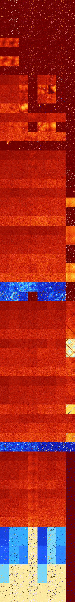

# B012367 (105984-106495)

<details>
    <summary>Initial Grid</summary>
    
</details>


<details>
    <summary>Initial Grid RLE</summary>

```
#C Exported from GoGoL (https://github.com/marrow16/gogol)
#C Wrap mode: Toroidal
#C Boundary mode: Dead
#C Step: 0
x = 100, y = 100, rule = B012367/S
5bo51bo32bo$9bo20bo4bo19bo8bo19bo14bo$obo38bo42bo10bo2bo$2bo83bo$6bo2bo
11bo8bo25bo25bo$33bo2bobo6bo47bo$11bo44bo2bo7bo8bo14bo$61bo$6bo2bo23bo
8bo4bo17bo15bo$23bobobo2bo8bo16bo28bo$14bo2bo18bo13bo10bo$19bo6bo3bo4bo
5bo3bo20bo$bo12bobo4bo3bo36bo16bo2bo2bo$13bo7bo12bo27bo32bo$12bo18bo13b
o18bo10bo5bo$9bo3bo14bo57b2o7bo$15b2o39bo5bo16bo2bo$12bo57bobo14bo3bo$b
o7bo21bo32bo14bo12bo$3bo41bo3bo3bo10bo6bo2bo7b2o$o17bobobo62bo$49bo41bo
$26bo15bo$20bo12bo65bo$54bo5bo$33bo18bo$35bo40bo5b2o$40bo47bo$46bobo22b
o4bo4bo$80bo$14bo43b2o18bo5bo5bo$8bo45b2o2bo21bo$25bo4b2o14bo27b2o3bo
12bo$12bo8bobo3bo18bo35bo15bo$11bo5bo35bo28bo$32bo3bo4bo7bo8bo33bo$16bo
3bo15bo28bo$7b2o7bo16bo4bo17bo$40bo7bo9bo8bo19bobo$10bo20bo28bo28bo$24b
o62bo$12bo21bo3bo11bo2bo20bo$8bo4bo32bo38bo$40bobo3bo26bo$70bo10bo2bo8b
o$56bob2o11bo$bo6bo21bobo41bo$bo15bo38bo2bo$19bo5bo13bo6bobo49bo$47bo6b
o16bo25bo$8bo3bo46bo11bo19b2o$19bo7bo21bo17bo$5bo8bo20bo34bo18bo$22bo8b
o5bo10b2o11bo37bo$25bo14bo26bob2o3bo$23bo$o32bo23bo26b2o12bo$100b$23bo
4bo24bo30bo$51bo15bo$29bo8bo45bo$90bo3bo$o25bo13bo32bo10b2o4bo2bo$31bo
33bo16bo10bo$18bo10bo18bo12bo5bo$5bo2bo6bo19bo4bo10bo3bo12bo26bo$2bo4bo
21bo61bobo$bo12bo30bo4bo6bo4bo18bo5bo5bo$32bo55bo$8bo2bo2bo30bo4bo$8bo
37bo50bo$56bo17bo7bo10bo$5bo41bo2b2o11bo$38bo46bo$20bo2bo4bo6bo6bo10bo
10bo$13bo65bo18bo$4bo2bo8bo9bo3bo23bo6bo6bo16bo$22bo35bo4bo3bo4bo22bo$
7bo56bo3bo16bo$22bo9bo12bo36bo14bo$6bo8bo35bo15bo18bo9bo$8bobo6bo7bo2bo
7bo14bo8bo5bo$10bo9bo36bo26bo$15bo9bo13bo13bo23bo$36bo12bo5bo40bo$21bo$
22bob2o4bo4bo21bo16bo$42bo18bo14bo4bo4bo$3bo6bo27bo6bo31bo$4bo18bo14bo
13bo31bo6bo$9bo51bo28bo$2bo13bo13bobo2b2o21bo10bo9bo5bo$18bobo18bo49bo
7bo$100b$bo3bo3bo24bo10bo6bo$9bo52bo16bo$15bo7bo59bo2bo$21bo24bo41bo$9b
o23bo16b2o19bo$8bo2bo9bo2bo7bo5bo10bo45b2o!
```
</details>
<details>
    <summary>Thumbnail</summary>

</details>
<table>
<tr>
    <td><a href="./105984%20S%20Heat%20Map%20Activity.png"></a><br>S (105984)<br>R@4,p2</td>    <td><a href="./105985%20S0%20Heat%20Map%20Activity.png"></a><br>S0 (105985)<br>R@3,p2</td>    <td><a href="./105986%20S1%20Heat%20Map%20Activity.png"></a><br>S1 (105986)<br>R@6,p2</td>    <td><a href="./105987%20S01%20Heat%20Map%20Activity.png"></a><br>S01 (105987)<br>R@5,p2</td>    <td><a href="./105988%20S2%20Heat%20Map%20Activity.png"></a><br>S2 (105988)<br>R@4,p2</td>    <td><a href="./105989%20S02%20Heat%20Map%20Activity.png"></a><br>S02 (105989)<br>R@5,p2</td>    <td><a href="./105990%20S12%20Heat%20Map%20Activity.png"></a><br>S12 (105990)<br>R@5,p2</td>    <td><a href="./105991%20S012%20Heat%20Map%20Activity.png"></a><br>S012 (105991)<br>R@4,p2</td></tr>
<tr>
    <td><a href="./105992%20S3%20Heat%20Map%20Activity.png"></a><br>S3 (105992)<br>R@4,p2</td>    <td><a href="./105993%20S03%20Heat%20Map%20Activity.png"></a><br>S03 (105993)<br>R@3,p2</td>    <td><a href="./105994%20S13%20Heat%20Map%20Activity.png"></a><br>S13 (105994)<br>R@6,p2</td>    <td><a href="./105995%20S013%20Heat%20Map%20Activity.png"></a><br>S013 (105995)<br>R@5,p2</td>    <td><a href="./105996%20S23%20Heat%20Map%20Activity.png"></a><br>S23 (105996)<br>R@4,p2</td>    <td><a href="./105997%20S023%20Heat%20Map%20Activity.png"></a><br>S023 (105997)<br>R@5,p2</td>    <td><a href="./105998%20S123%20Heat%20Map%20Activity.png"></a><br>S123 (105998)<br>R@5,p2</td>    <td><a href="./105999%20S0123%20Heat%20Map%20Activity.png"></a><br>S0123 (105999)<br>R@4,p2</td></tr>
<tr>
    <td><a href="./106000%20S4%20Heat%20Map%20Activity.png"></a><br>S4 (106000)<br>R@10,p2</td>    <td><a href="./106001%20S04%20Heat%20Map%20Activity.png"></a><br>S04 (106001)<br>R@3,p2</td>    <td><a href="./106002%20S14%20Heat%20Map%20Activity.png"></a><br>S14 (106002)<br>R@6,p2</td>    <td><a href="./106003%20S014%20Heat%20Map%20Activity.png"></a><br>S014 (106003)<br>R@5,p2</td>    <td><a href="./106004%20S24%20Heat%20Map%20Activity.png"></a><br>S24 (106004)<br>R@9,p2</td>    <td><a href="./106005%20S024%20Heat%20Map%20Activity.png"></a><br>S024 (106005)<br>R@5,p2</td>    <td><a href="./106006%20S124%20Heat%20Map%20Activity.png"></a><br>S124 (106006)<br>R@5,p2</td>    <td><a href="./106007%20S0124%20Heat%20Map%20Activity.png"></a><br>S0124 (106007)<br>R@4,p2</td></tr>
<tr>
    <td><a href="./106008%20S34%20Heat%20Map%20Activity.png"></a><br>S34 (106008)<br>R@4,p2</td>    <td><a href="./106009%20S034%20Heat%20Map%20Activity.png"></a><br>S034 (106009)<br>R@3,p2</td>    <td><a href="./106010%20S134%20Heat%20Map%20Activity.png"></a><br>S134 (106010)<br>R@6,p2</td>    <td><a href="./106011%20S0134%20Heat%20Map%20Activity.png"></a><br>S0134 (106011)<br>R@5,p2</td>    <td><a href="./106012%20S234%20Heat%20Map%20Activity.png"></a><br>S234 (106012)<br>R@8,p2</td>    <td><a href="./106013%20S0234%20Heat%20Map%20Activity.png"></a><br>S0234 (106013)<br>R@5,p2</td>    <td><a href="./106014%20S1234%20Heat%20Map%20Activity.png"></a><br>S1234 (106014)<br>R@5,p2</td>    <td><a href="./106015%20S01234%20Heat%20Map%20Activity.png"></a><br>S01234 (106015)<br>R@4,p2</td></tr>
<tr>
    <td><a href="./106016%20S5%20Heat%20Map%20Activity.png"></a><br>S5 (106016)<br>G>1000</td>    <td><a href="./106017%20S05%20Heat%20Map%20Activity.png"></a><br>S05 (106017)<br>G>1000</td>    <td><a href="./106018%20S15%20Heat%20Map%20Activity.png"></a><br>S15 (106018)<br>R@11,p2</td>    <td><a href="./106019%20S015%20Heat%20Map%20Activity.png"></a><br>S015 (106019)<br>R@6,p2</td>    <td><a href="./106020%20S25%20Heat%20Map%20Activity.png"></a><br>S25 (106020)<br>R@11,p2</td>    <td><a href="./106021%20S025%20Heat%20Map%20Activity.png"></a><br>S025 (106021)<br>R@6,p2</td>    <td><a href="./106022%20S125%20Heat%20Map%20Activity.png"></a><br>S125 (106022)<br>R@7,p2</td>    <td><a href="./106023%20S0125%20Heat%20Map%20Activity.png"></a><br>S0125 (106023)<br>R@4,p2</td></tr>
<tr>
    <td><a href="./106024%20S35%20Heat%20Map%20Activity.png"></a><br>S35 (106024)<br>R@15,p2</td>    <td><a href="./106025%20S035%20Heat%20Map%20Activity.png"></a><br>S035 (106025)<br>R@16,p2</td>    <td><a href="./106026%20S135%20Heat%20Map%20Activity.png"></a><br>S135 (106026)<br>R@6,p2</td>    <td><a href="./106027%20S0135%20Heat%20Map%20Activity.png"></a><br>S0135 (106027)<br>R@5,p2</td>    <td><a href="./106028%20S235%20Heat%20Map%20Activity.png"></a><br>S235 (106028)<br>R@8,p2</td>    <td><a href="./106029%20S0235%20Heat%20Map%20Activity.png"></a><br>S0235 (106029)<br>R@6,p2</td>    <td><a href="./106030%20S1235%20Heat%20Map%20Activity.png"></a><br>S1235 (106030)<br>R@6,p2</td>    <td><a href="./106031%20S01235%20Heat%20Map%20Activity.png"></a><br>S01235 (106031)<br>R@4,p2</td></tr>
<tr>
    <td><a href="./106032%20S45%20Heat%20Map%20Activity.png"></a><br>S45 (106032)<br>G>1000</td>    <td><a href="./106033%20S045%20Heat%20Map%20Activity.png"></a><br>S045 (106033)<br>G>1000</td>    <td><a href="./106034%20S145%20Heat%20Map%20Activity.png"></a><br>S145 (106034)<br>R@9,p2</td>    <td><a href="./106035%20S0145%20Heat%20Map%20Activity.png"></a><br>S0145 (106035)<br>R@6,p2</td>    <td><a href="./106036%20S245%20Heat%20Map%20Activity.png"></a><br>S245 (106036)<br>R@6,p2</td>    <td><a href="./106037%20S0245%20Heat%20Map%20Activity.png"></a><br>S0245 (106037)<br>R@6,p2</td>    <td><a href="./106038%20S1245%20Heat%20Map%20Activity.png"></a><br>S1245 (106038)<br>R@7,p2</td>    <td><a href="./106039%20S01245%20Heat%20Map%20Activity.png"></a><br>S01245 (106039)<br>R@4,p2</td></tr>
<tr>
    <td><a href="./106040%20S345%20Heat%20Map%20Activity.png"></a><br>S345 (106040)<br>R@8,p2</td>    <td><a href="./106041%20S0345%20Heat%20Map%20Activity.png"></a><br>S0345 (106041)<br>R@7,p2</td>    <td><a href="./106042%20S1345%20Heat%20Map%20Activity.png"></a><br>S1345 (106042)<br>R@6,p2</td>    <td><a href="./106043%20S01345%20Heat%20Map%20Activity.png"></a><br>S01345 (106043)<br>R@5,p2</td>    <td><a href="./106044%20S2345%20Heat%20Map%20Activity.png"></a><br>S2345 (106044)<br>R@6,p2</td>    <td><a href="./106045%20S02345%20Heat%20Map%20Activity.png"></a><br>S02345 (106045)<br>R@6,p2</td>    <td><a href="./106046%20S12345%20Heat%20Map%20Activity.png"></a><br>S12345 (106046)<br>R@6,p2</td>    <td><a href="./106047%20S012345%20Heat%20Map%20Activity.png"></a><br>S012345 (106047)<br>R@4,p2</td></tr>
<tr>
    <td><a href="./106048%20S6%20Heat%20Map%20Activity.png"></a><br>S6 (106048)<br>G>1000</td>    <td><a href="./106049%20S06%20Heat%20Map%20Activity.png"></a><br>S06 (106049)<br>G>1000</td>    <td><a href="./106050%20S16%20Heat%20Map%20Activity.png"></a><br>S16 (106050)<br>G>1000</td>    <td><a href="./106051%20S016%20Heat%20Map%20Activity.png"></a><br>S016 (106051)<br>R@7,p2</td>    <td><a href="./106052%20S26%20Heat%20Map%20Activity.png"></a><br>S26 (106052)<br>G>1000</td>    <td><a href="./106053%20S026%20Heat%20Map%20Activity.png"></a><br>S026 (106053)<br>G>1000</td>    <td><a href="./106054%20S126%20Heat%20Map%20Activity.png"></a><br>S126 (106054)<br>R@10,p2</td>    <td><a href="./106055%20S0126%20Heat%20Map%20Activity.png"></a><br>S0126 (106055)<br>R@4,p2</td></tr>
<tr>
    <td><a href="./106056%20S36%20Heat%20Map%20Activity.png"></a><br>S36 (106056)<br>G>1000</td>    <td><a href="./106057%20S036%20Heat%20Map%20Activity.png"></a><br>S036 (106057)<br>G>1000</td>    <td><a href="./106058%20S136%20Heat%20Map%20Activity.png"></a><br>S136 (106058)<br>G>1000</td>    <td><a href="./106059%20S0136%20Heat%20Map%20Activity.png"></a><br>S0136 (106059)<br>R@16,p2</td>    <td><a href="./106060%20S236%20Heat%20Map%20Activity.png"></a><br>S236 (106060)<br>G>1000</td>    <td><a href="./106061%20S0236%20Heat%20Map%20Activity.png"></a><br>S0236 (106061)<br>G>1000</td>    <td><a href="./106062%20S1236%20Heat%20Map%20Activity.png"></a><br>S1236 (106062)<br>R@14,p4</td>    <td><a href="./106063%20S01236%20Heat%20Map%20Activity.png"></a><br>S01236 (106063)<br>R@4,p2</td></tr>
<tr>
    <td><a href="./106064%20S46%20Heat%20Map%20Activity.png"></a><br>S46 (106064)<br>G>1000</td>    <td><a href="./106065%20S046%20Heat%20Map%20Activity.png"></a><br>S046 (106065)<br>G>1000</td>    <td><a href="./106066%20S146%20Heat%20Map%20Activity.png"></a><br>S146 (106066)<br>G>1000</td>    <td><a href="./106067%20S0146%20Heat%20Map%20Activity.png"></a><br>S0146 (106067)<br>R@7,p2</td>    <td><a href="./106068%20S246%20Heat%20Map%20Activity.png"></a><br>S246 (106068)<br>G>1000</td>    <td><a href="./106069%20S0246%20Heat%20Map%20Activity.png"></a><br>S0246 (106069)<br>G>1000</td>    <td><a href="./106070%20S1246%20Heat%20Map%20Activity.png"></a><br>S1246 (106070)<br>R@18,p2</td>    <td><a href="./106071%20S01246%20Heat%20Map%20Activity.png"></a><br>S01246 (106071)<br>R@4,p2</td></tr>
<tr>
    <td><a href="./106072%20S346%20Heat%20Map%20Activity.png"></a><br>S346 (106072)<br>G>1000</td>    <td><a href="./106073%20S0346%20Heat%20Map%20Activity.png"></a><br>S0346 (106073)<br>G>1000</td>    <td><a href="./106074%20S1346%20Heat%20Map%20Activity.png"></a><br>S1346 (106074)<br>G>1000</td>    <td><a href="./106075%20S01346%20Heat%20Map%20Activity.png"></a><br>S01346 (106075)<br>R@5,p2</td>    <td><a href="./106076%20S2346%20Heat%20Map%20Activity.png"></a><br>S2346 (106076)<br>R@242,p4</td>    <td><a href="./106077%20S02346%20Heat%20Map%20Activity.png"></a><br>S02346 (106077)<br>R@47,p12</td>    <td><a href="./106078%20S12346%20Heat%20Map%20Activity.png"></a><br>S12346 (106078)<br>R@11,p2</td>    <td><a href="./106079%20S012346%20Heat%20Map%20Activity.png"></a><br>S012346 (106079)<br>R@4,p2</td></tr>
<tr>
    <td><a href="./106080%20S56%20Heat%20Map%20Activity.png"></a><br>S56 (106080)<br>G>1000</td>    <td><a href="./106081%20S056%20Heat%20Map%20Activity.png"></a><br>S056 (106081)<br>G>1000</td>    <td><a href="./106082%20S156%20Heat%20Map%20Activity.png"></a><br>S156 (106082)<br>G>1000</td>    <td><a href="./106083%20S0156%20Heat%20Map%20Activity.png"></a><br>S0156 (106083)<br>G>1000</td>    <td><a href="./106084%20S256%20Heat%20Map%20Activity.png"></a><br>S256 (106084)<br>G>1000</td>    <td><a href="./106085%20S0256%20Heat%20Map%20Activity.png"></a><br>S0256 (106085)<br>G>1000</td>    <td><a href="./106086%20S1256%20Heat%20Map%20Activity.png"></a><br>S1256 (106086)<br>G>1000</td>    <td><a href="./106087%20S01256%20Heat%20Map%20Activity.png"></a><br>S01256 (106087)<br>R@4,p2</td></tr>
<tr>
    <td><a href="./106088%20S356%20Heat%20Map%20Activity.png"></a><br>S356 (106088)<br>G>1000</td>    <td><a href="./106089%20S0356%20Heat%20Map%20Activity.png"></a><br>S0356 (106089)<br>G>1000</td>    <td><a href="./106090%20S1356%20Heat%20Map%20Activity.png"></a><br>S1356 (106090)<br>G>1000</td>    <td><a href="./106091%20S01356%20Heat%20Map%20Activity.png"></a><br>S01356 (106091)<br>R@7,p4</td>    <td><a href="./106092%20S2356%20Heat%20Map%20Activity.png"></a><br>S2356 (106092)<br>G>1000</td>    <td><a href="./106093%20S02356%20Heat%20Map%20Activity.png"></a><br>S02356 (106093)<br>G>1000</td>    <td><a href="./106094%20S12356%20Heat%20Map%20Activity.png"></a><br>S12356 (106094)<br>R@13,p4</td>    <td><a href="./106095%20S012356%20Heat%20Map%20Activity.png"></a><br>S012356 (106095)<br>R@4,p2</td></tr>
<tr>
    <td><a href="./106096%20S456%20Heat%20Map%20Activity.png"></a><br>S456 (106096)<br>G>1000</td>    <td><a href="./106097%20S0456%20Heat%20Map%20Activity.png"></a><br>S0456 (106097)<br>G>1000</td>    <td><a href="./106098%20S1456%20Heat%20Map%20Activity.png"></a><br>S1456 (106098)<br>G>1000</td>    <td><a href="./106099%20S01456%20Heat%20Map%20Activity.png"></a><br>S01456 (106099)<br>G>1000</td>    <td><a href="./106100%20S2456%20Heat%20Map%20Activity.png"></a><br>S2456 (106100)<br>G>1000</td>    <td><a href="./106101%20S02456%20Heat%20Map%20Activity.png"></a><br>S02456 (106101)<br>G>1000</td>    <td><a href="./106102%20S12456%20Heat%20Map%20Activity.png"></a><br>S12456 (106102)<br>G>1000</td>    <td><a href="./106103%20S012456%20Heat%20Map%20Activity.png"></a><br>S012456 (106103)<br>R@4,p2</td></tr>
<tr>
    <td><a href="./106104%20S3456%20Heat%20Map%20Activity.png"></a><br>S3456 (106104)<br>G>1000</td>    <td><a href="./106105%20S03456%20Heat%20Map%20Activity.png"></a><br>S03456 (106105)<br>R@40,p2</td>    <td><a href="./106106%20S13456%20Heat%20Map%20Activity.png"></a><br>S13456 (106106)<br>R@23,p2</td>    <td><a href="./106107%20S013456%20Heat%20Map%20Activity.png"></a><br>S013456 (106107)<br>R@6,p2</td>    <td><a href="./106108%20S23456%20Heat%20Map%20Activity.png"></a><br>S23456 (106108)<br>R@35,p4</td>    <td><a href="./106109%20S023456%20Heat%20Map%20Activity.png"></a><br>S023456 (106109)<br>R@23,p4</td>    <td><a href="./106110%20S123456%20Heat%20Map%20Activity.png"></a><br>S123456 (106110)<br>R@9,p2</td>    <td><a href="./106111%20S0123456%20Heat%20Map%20Activity.png"></a><br>S0123456 (106111)<br>R@4,p2</td></tr>
<tr>
    <td><a href="./106112%20S7%20Heat%20Map%20Activity.png"></a><br>S7 (106112)<br>G>1000</td>    <td><a href="./106113%20S07%20Heat%20Map%20Activity.png"></a><br>S07 (106113)<br>G>1000</td>    <td><a href="./106114%20S17%20Heat%20Map%20Activity.png"></a><br>S17 (106114)<br>G>1000</td>    <td><a href="./106115%20S017%20Heat%20Map%20Activity.png"></a><br>S017 (106115)<br>G>1000</td>    <td><a href="./106116%20S27%20Heat%20Map%20Activity.png"></a><br>S27 (106116)<br>G>1000</td>    <td><a href="./106117%20S027%20Heat%20Map%20Activity.png"></a><br>S027 (106117)<br>G>1000</td>    <td><a href="./106118%20S127%20Heat%20Map%20Activity.png"></a><br>S127 (106118)<br>G>1000</td>    <td><a href="./106119%20S0127%20Heat%20Map%20Activity.png"></a><br>S0127 (106119)<br>R@9,p2</td></tr>
<tr>
    <td><a href="./106120%20S37%20Heat%20Map%20Activity.png"></a><br>S37 (106120)<br>G>1000</td>    <td><a href="./106121%20S037%20Heat%20Map%20Activity.png"></a><br>S037 (106121)<br>G>1000</td>    <td><a href="./106122%20S137%20Heat%20Map%20Activity.png"></a><br>S137 (106122)<br>G>1000</td>    <td><a href="./106123%20S0137%20Heat%20Map%20Activity.png"></a><br>S0137 (106123)<br>G>1000</td>    <td><a href="./106124%20S237%20Heat%20Map%20Activity.png"></a><br>S237 (106124)<br>G>1000</td>    <td><a href="./106125%20S0237%20Heat%20Map%20Activity.png"></a><br>S0237 (106125)<br>G>1000</td>    <td><a href="./106126%20S1237%20Heat%20Map%20Activity.png"></a><br>S1237 (106126)<br>G>1000</td>    <td><a href="./106127%20S01237%20Heat%20Map%20Activity.png"></a><br>S01237 (106127)<br>R@9,p2</td></tr>
<tr>
    <td><a href="./106128%20S47%20Heat%20Map%20Activity.png"></a><br>S47 (106128)<br>G>1000</td>    <td><a href="./106129%20S047%20Heat%20Map%20Activity.png"></a><br>S047 (106129)<br>G>1000</td>    <td><a href="./106130%20S147%20Heat%20Map%20Activity.png"></a><br>S147 (106130)<br>G>1000</td>    <td><a href="./106131%20S0147%20Heat%20Map%20Activity.png"></a><br>S0147 (106131)<br>G>1000</td>    <td><a href="./106132%20S247%20Heat%20Map%20Activity.png"></a><br>S247 (106132)<br>G>1000</td>    <td><a href="./106133%20S0247%20Heat%20Map%20Activity.png"></a><br>S0247 (106133)<br>G>1000</td>    <td><a href="./106134%20S1247%20Heat%20Map%20Activity.png"></a><br>S1247 (106134)<br>G>1000</td>    <td><a href="./106135%20S01247%20Heat%20Map%20Activity.png"></a><br>S01247 (106135)<br>R@3,p2</td></tr>
<tr>
    <td><a href="./106136%20S347%20Heat%20Map%20Activity.png"></a><br>S347 (106136)<br>G>1000</td>    <td><a href="./106137%20S0347%20Heat%20Map%20Activity.png"></a><br>S0347 (106137)<br>G>1000</td>    <td><a href="./106138%20S1347%20Heat%20Map%20Activity.png"></a><br>S1347 (106138)<br>G>1000</td>    <td><a href="./106139%20S01347%20Heat%20Map%20Activity.png"></a><br>S01347 (106139)<br>G>1000</td>    <td><a href="./106140%20S2347%20Heat%20Map%20Activity.png"></a><br>S2347 (106140)<br>G>1000</td>    <td><a href="./106141%20S02347%20Heat%20Map%20Activity.png"></a><br>S02347 (106141)<br>G>1000</td>    <td><a href="./106142%20S12347%20Heat%20Map%20Activity.png"></a><br>S12347 (106142)<br>G>1000</td>    <td><a href="./106143%20S012347%20Heat%20Map%20Activity.png"></a><br>S012347 (106143)<br>R@3,p2</td></tr>
<tr>
    <td><a href="./106144%20S57%20Heat%20Map%20Activity.png"></a><br>S57 (106144)<br>G>1000</td>    <td><a href="./106145%20S057%20Heat%20Map%20Activity.png"></a><br>S057 (106145)<br>G>1000</td>    <td><a href="./106146%20S157%20Heat%20Map%20Activity.png"></a><br>S157 (106146)<br>G>1000</td>    <td><a href="./106147%20S0157%20Heat%20Map%20Activity.png"></a><br>S0157 (106147)<br>G>1000</td>    <td><a href="./106148%20S257%20Heat%20Map%20Activity.png"></a><br>S257 (106148)<br>G>1000</td>    <td><a href="./106149%20S0257%20Heat%20Map%20Activity.png"></a><br>S0257 (106149)<br>G>1000</td>    <td><a href="./106150%20S1257%20Heat%20Map%20Activity.png"></a><br>S1257 (106150)<br>G>1000</td>    <td><a href="./106151%20S01257%20Heat%20Map%20Activity.png"></a><br>S01257 (106151)<br>R@15,p2</td></tr>
<tr>
    <td><a href="./106152%20S357%20Heat%20Map%20Activity.png"></a><br>S357 (106152)<br>G>1000</td>    <td><a href="./106153%20S0357%20Heat%20Map%20Activity.png"></a><br>S0357 (106153)<br>G>1000</td>    <td><a href="./106154%20S1357%20Heat%20Map%20Activity.png"></a><br>S1357 (106154)<br>G>1000</td>    <td><a href="./106155%20S01357%20Heat%20Map%20Activity.png"></a><br>S01357 (106155)<br>G>1000</td>    <td><a href="./106156%20S2357%20Heat%20Map%20Activity.png"></a><br>S2357 (106156)<br>G>1000</td>    <td><a href="./106157%20S02357%20Heat%20Map%20Activity.png"></a><br>S02357 (106157)<br>G>1000</td>    <td><a href="./106158%20S12357%20Heat%20Map%20Activity.png"></a><br>S12357 (106158)<br>G>1000</td>    <td><a href="./106159%20S012357%20Heat%20Map%20Activity.png"></a><br>S012357 (106159)<br>G>1000</td></tr>
<tr>
    <td><a href="./106160%20S457%20Heat%20Map%20Activity.png"></a><br>S457 (106160)<br>G>1000</td>    <td><a href="./106161%20S0457%20Heat%20Map%20Activity.png"></a><br>S0457 (106161)<br>G>1000</td>    <td><a href="./106162%20S1457%20Heat%20Map%20Activity.png"></a><br>S1457 (106162)<br>G>1000</td>    <td><a href="./106163%20S01457%20Heat%20Map%20Activity.png"></a><br>S01457 (106163)<br>G>1000</td>    <td><a href="./106164%20S2457%20Heat%20Map%20Activity.png"></a><br>S2457 (106164)<br>G>1000</td>    <td><a href="./106165%20S02457%20Heat%20Map%20Activity.png"></a><br>S02457 (106165)<br>G>1000</td>    <td><a href="./106166%20S12457%20Heat%20Map%20Activity.png"></a><br>S12457 (106166)<br>G>1000</td>    <td><a href="./106167%20S012457%20Heat%20Map%20Activity.png"></a><br>S012457 (106167)<br>R@3,p2</td></tr>
<tr>
    <td><a href="./106168%20S3457%20Heat%20Map%20Activity.png"></a><br>S3457 (106168)<br>G>1000</td>    <td><a href="./106169%20S03457%20Heat%20Map%20Activity.png"></a><br>S03457 (106169)<br>G>1000</td>    <td><a href="./106170%20S13457%20Heat%20Map%20Activity.png"></a><br>S13457 (106170)<br>G>1000</td>    <td><a href="./106171%20S013457%20Heat%20Map%20Activity.png"></a><br>S013457 (106171)<br>G>1000</td>    <td><a href="./106172%20S23457%20Heat%20Map%20Activity.png"></a><br>S23457 (106172)<br>G>1000</td>    <td><a href="./106173%20S023457%20Heat%20Map%20Activity.png"></a><br>S023457 (106173)<br>G>1000</td>    <td><a href="./106174%20S123457%20Heat%20Map%20Activity.png"></a><br>S123457 (106174)<br>G>1000</td>    <td><a href="./106175%20S0123457%20Heat%20Map%20Activity.png"></a><br>S0123457 (106175)<br>R@3,p2</td></tr>
<tr>
    <td><a href="./106176%20S67%20Heat%20Map%20Activity.png"></a><br>S67 (106176)<br>G>1000</td>    <td><a href="./106177%20S067%20Heat%20Map%20Activity.png"></a><br>S067 (106177)<br>G>1000</td>    <td><a href="./106178%20S167%20Heat%20Map%20Activity.png"></a><br>S167 (106178)<br>G>1000</td>    <td><a href="./106179%20S0167%20Heat%20Map%20Activity.png"></a><br>S0167 (106179)<br>G>1000</td>    <td><a href="./106180%20S267%20Heat%20Map%20Activity.png"></a><br>S267 (106180)<br>G>1000</td>    <td><a href="./106181%20S0267%20Heat%20Map%20Activity.png"></a><br>S0267 (106181)<br>G>1000</td>    <td><a href="./106182%20S1267%20Heat%20Map%20Activity.png"></a><br>S1267 (106182)<br>G>1000</td>    <td><a href="./106183%20S01267%20Heat%20Map%20Activity.png"></a><br>S01267 (106183)<br>G>1000</td></tr>
<tr>
    <td><a href="./106184%20S367%20Heat%20Map%20Activity.png"></a><br>S367 (106184)<br>G>1000</td>    <td><a href="./106185%20S0367%20Heat%20Map%20Activity.png"></a><br>S0367 (106185)<br>G>1000</td>    <td><a href="./106186%20S1367%20Heat%20Map%20Activity.png"></a><br>S1367 (106186)<br>G>1000</td>    <td><a href="./106187%20S01367%20Heat%20Map%20Activity.png"></a><br>S01367 (106187)<br>G>1000</td>    <td><a href="./106188%20S2367%20Heat%20Map%20Activity.png"></a><br>S2367 (106188)<br>G>1000</td>    <td><a href="./106189%20S02367%20Heat%20Map%20Activity.png"></a><br>S02367 (106189)<br>G>1000</td>    <td><a href="./106190%20S12367%20Heat%20Map%20Activity.png"></a><br>S12367 (106190)<br>G>1000</td>    <td><a href="./106191%20S012367%20Heat%20Map%20Activity.png"></a><br>S012367 (106191)<br>G>1000</td></tr>
<tr>
    <td><a href="./106192%20S467%20Heat%20Map%20Activity.png"></a><br>S467 (106192)<br>G>1000</td>    <td><a href="./106193%20S0467%20Heat%20Map%20Activity.png"></a><br>S0467 (106193)<br>G>1000</td>    <td><a href="./106194%20S1467%20Heat%20Map%20Activity.png"></a><br>S1467 (106194)<br>G>1000</td>    <td><a href="./106195%20S01467%20Heat%20Map%20Activity.png"></a><br>S01467 (106195)<br>G>1000</td>    <td><a href="./106196%20S2467%20Heat%20Map%20Activity.png"></a><br>S2467 (106196)<br>G>1000</td>    <td><a href="./106197%20S02467%20Heat%20Map%20Activity.png"></a><br>S02467 (106197)<br>G>1000</td>    <td><a href="./106198%20S12467%20Heat%20Map%20Activity.png"></a><br>S12467 (106198)<br>G>1000</td>    <td><a href="./106199%20S012467%20Heat%20Map%20Activity.png"></a><br>S012467 (106199)<br>R@3,p2</td></tr>
<tr>
    <td><a href="./106200%20S3467%20Heat%20Map%20Activity.png"></a><br>S3467 (106200)<br>G>1000</td>    <td><a href="./106201%20S03467%20Heat%20Map%20Activity.png"></a><br>S03467 (106201)<br>G>1000</td>    <td><a href="./106202%20S13467%20Heat%20Map%20Activity.png"></a><br>S13467 (106202)<br>G>1000</td>    <td><a href="./106203%20S013467%20Heat%20Map%20Activity.png"></a><br>S013467 (106203)<br>G>1000</td>    <td><a href="./106204%20S23467%20Heat%20Map%20Activity.png"></a><br>S23467 (106204)<br>G>1000</td>    <td><a href="./106205%20S023467%20Heat%20Map%20Activity.png"></a><br>S023467 (106205)<br>G>1000</td>    <td><a href="./106206%20S123467%20Heat%20Map%20Activity.png"></a><br>S123467 (106206)<br>G>1000</td>    <td><a href="./106207%20S0123467%20Heat%20Map%20Activity.png"></a><br>S0123467 (106207)<br>R@3,p2</td></tr>
<tr>
    <td><a href="./106208%20S567%20Heat%20Map%20Activity.png"></a><br>S567 (106208)<br>G>1000</td>    <td><a href="./106209%20S0567%20Heat%20Map%20Activity.png"></a><br>S0567 (106209)<br>G>1000</td>    <td><a href="./106210%20S1567%20Heat%20Map%20Activity.png"></a><br>S1567 (106210)<br>G>1000</td>    <td><a href="./106211%20S01567%20Heat%20Map%20Activity.png"></a><br>S01567 (106211)<br>G>1000</td>    <td><a href="./106212%20S2567%20Heat%20Map%20Activity.png"></a><br>S2567 (106212)<br>G>1000</td>    <td><a href="./106213%20S02567%20Heat%20Map%20Activity.png"></a><br>S02567 (106213)<br>G>1000</td>    <td><a href="./106214%20S12567%20Heat%20Map%20Activity.png"></a><br>S12567 (106214)<br>G>1000</td>    <td><a href="./106215%20S012567%20Heat%20Map%20Activity.png"></a><br>S012567 (106215)<br>G>1000</td></tr>
<tr>
    <td><a href="./106216%20S3567%20Heat%20Map%20Activity.png"></a><br>S3567 (106216)<br>G>1000</td>    <td><a href="./106217%20S03567%20Heat%20Map%20Activity.png"></a><br>S03567 (106217)<br>G>1000</td>    <td><a href="./106218%20S13567%20Heat%20Map%20Activity.png"></a><br>S13567 (106218)<br>G>1000</td>    <td><a href="./106219%20S013567%20Heat%20Map%20Activity.png"></a><br>S013567 (106219)<br>G>1000</td>    <td><a href="./106220%20S23567%20Heat%20Map%20Activity.png"></a><br>S23567 (106220)<br>G>1000</td>    <td><a href="./106221%20S023567%20Heat%20Map%20Activity.png"></a><br>S023567 (106221)<br>G>1000</td>    <td><a href="./106222%20S123567%20Heat%20Map%20Activity.png"></a><br>S123567 (106222)<br>G>1000</td>    <td><a href="./106223%20S0123567%20Heat%20Map%20Activity.png"></a><br>S0123567 (106223)<br>G>1000</td></tr>
<tr>
    <td><a href="./106224%20S4567%20Heat%20Map%20Activity.png"></a><br>S4567 (106224)<br>G>1000</td>    <td><a href="./106225%20S04567%20Heat%20Map%20Activity.png"></a><br>S04567 (106225)<br>G>1000</td>    <td><a href="./106226%20S14567%20Heat%20Map%20Activity.png"></a><br>S14567 (106226)<br>G>1000</td>    <td><a href="./106227%20S014567%20Heat%20Map%20Activity.png"></a><br>S014567 (106227)<br>G>1000</td>    <td><a href="./106228%20S24567%20Heat%20Map%20Activity.png"></a><br>S24567 (106228)<br>R@708,p12</td>    <td><a href="./106229%20S024567%20Heat%20Map%20Activity.png"></a><br>S024567 (106229)<br>G>1000</td>    <td><a href="./106230%20S124567%20Heat%20Map%20Activity.png"></a><br>S124567 (106230)<br>G>1000</td>    <td><a href="./106231%20S0124567%20Heat%20Map%20Activity.png"></a><br>S0124567 (106231)<br>R@3,p2</td></tr>
<tr>
    <td><a href="./106232%20S34567%20Heat%20Map%20Activity.png"></a><br>S34567 (106232)<br>R@39,p6</td>    <td><a href="./106233%20S034567%20Heat%20Map%20Activity.png"></a><br>S034567 (106233)<br>R@101,p42</td>    <td><a href="./106234%20S134567%20Heat%20Map%20Activity.png"></a><br>S134567 (106234)<br>R@96,p48</td>    <td><a href="./106235%20S0134567%20Heat%20Map%20Activity.png"></a><br>S0134567 (106235)<br>R@5,p4</td>    <td><a href="./106236%20S234567%20Heat%20Map%20Activity.png"></a><br>S234567 (106236)<br>R@157,p126</td>    <td><a href="./106237%20S0234567%20Heat%20Map%20Activity.png"></a><br>S0234567 (106237)<br>R@240,p180</td>    <td><a href="./106238%20S1234567%20Heat%20Map%20Activity.png"></a><br>S1234567 (106238)<br>R@48,p18</td>    <td><a href="./106239%20S01234567%20Heat%20Map%20Activity.png"></a><br>S01234567 (106239)<br>R@3,p2</td></tr>
<tr>
    <td><a href="./106240%20S8%20Heat%20Map%20Activity.png"></a><br>S8 (106240)<br>G>1000</td>    <td><a href="./106241%20S08%20Heat%20Map%20Activity.png"></a><br>S08 (106241)<br>G>1000</td>    <td><a href="./106242%20S18%20Heat%20Map%20Activity.png"></a><br>S18 (106242)<br>G>1000</td>    <td><a href="./106243%20S018%20Heat%20Map%20Activity.png"></a><br>S018 (106243)<br>G>1000</td>    <td><a href="./106244%20S28%20Heat%20Map%20Activity.png"></a><br>S28 (106244)<br>G>1000</td>    <td><a href="./106245%20S028%20Heat%20Map%20Activity.png"></a><br>S028 (106245)<br>G>1000</td>    <td><a href="./106246%20S128%20Heat%20Map%20Activity.png"></a><br>S128 (106246)<br>G>1000</td>    <td><a href="./106247%20S0128%20Heat%20Map%20Activity.png"></a><br>S0128 (106247)<br>G>1000</td></tr>
<tr>
    <td><a href="./106248%20S38%20Heat%20Map%20Activity.png"></a><br>S38 (106248)<br>G>1000</td>    <td><a href="./106249%20S038%20Heat%20Map%20Activity.png"></a><br>S038 (106249)<br>G>1000</td>    <td><a href="./106250%20S138%20Heat%20Map%20Activity.png"></a><br>S138 (106250)<br>G>1000</td>    <td><a href="./106251%20S0138%20Heat%20Map%20Activity.png"></a><br>S0138 (106251)<br>G>1000</td>    <td><a href="./106252%20S238%20Heat%20Map%20Activity.png"></a><br>S238 (106252)<br>G>1000</td>    <td><a href="./106253%20S0238%20Heat%20Map%20Activity.png"></a><br>S0238 (106253)<br>G>1000</td>    <td><a href="./106254%20S1238%20Heat%20Map%20Activity.png"></a><br>S1238 (106254)<br>G>1000</td>    <td><a href="./106255%20S01238%20Heat%20Map%20Activity.png"></a><br>S01238 (106255)<br>G>1000</td></tr>
<tr>
    <td><a href="./106256%20S48%20Heat%20Map%20Activity.png"></a><br>S48 (106256)<br>G>1000</td>    <td><a href="./106257%20S048%20Heat%20Map%20Activity.png"></a><br>S048 (106257)<br>G>1000</td>    <td><a href="./106258%20S148%20Heat%20Map%20Activity.png"></a><br>S148 (106258)<br>G>1000</td>    <td><a href="./106259%20S0148%20Heat%20Map%20Activity.png"></a><br>S0148 (106259)<br>G>1000</td>    <td><a href="./106260%20S248%20Heat%20Map%20Activity.png"></a><br>S248 (106260)<br>G>1000</td>    <td><a href="./106261%20S0248%20Heat%20Map%20Activity.png"></a><br>S0248 (106261)<br>G>1000</td>    <td><a href="./106262%20S1248%20Heat%20Map%20Activity.png"></a><br>S1248 (106262)<br>G>1000</td>    <td><a href="./106263%20S01248%20Heat%20Map%20Activity.png"></a><br>S01248 (106263)<br>G>1000</td></tr>
<tr>
    <td><a href="./106264%20S348%20Heat%20Map%20Activity.png"></a><br>S348 (106264)<br>G>1000</td>    <td><a href="./106265%20S0348%20Heat%20Map%20Activity.png"></a><br>S0348 (106265)<br>G>1000</td>    <td><a href="./106266%20S1348%20Heat%20Map%20Activity.png"></a><br>S1348 (106266)<br>G>1000</td>    <td><a href="./106267%20S01348%20Heat%20Map%20Activity.png"></a><br>S01348 (106267)<br>G>1000</td>    <td><a href="./106268%20S2348%20Heat%20Map%20Activity.png"></a><br>S2348 (106268)<br>G>1000</td>    <td><a href="./106269%20S02348%20Heat%20Map%20Activity.png"></a><br>S02348 (106269)<br>G>1000</td>    <td><a href="./106270%20S12348%20Heat%20Map%20Activity.png"></a><br>S12348 (106270)<br>G>1000</td>    <td><a href="./106271%20S012348%20Heat%20Map%20Activity.png"></a><br>S012348 (106271)<br>G>1000</td></tr>
<tr>
    <td><a href="./106272%20S58%20Heat%20Map%20Activity.png"></a><br>S58 (106272)<br>G>1000</td>    <td><a href="./106273%20S058%20Heat%20Map%20Activity.png"></a><br>S058 (106273)<br>G>1000</td>    <td><a href="./106274%20S158%20Heat%20Map%20Activity.png"></a><br>S158 (106274)<br>G>1000</td>    <td><a href="./106275%20S0158%20Heat%20Map%20Activity.png"></a><br>S0158 (106275)<br>G>1000</td>    <td><a href="./106276%20S258%20Heat%20Map%20Activity.png"></a><br>S258 (106276)<br>G>1000</td>    <td><a href="./106277%20S0258%20Heat%20Map%20Activity.png"></a><br>S0258 (106277)<br>G>1000</td>    <td><a href="./106278%20S1258%20Heat%20Map%20Activity.png"></a><br>S1258 (106278)<br>G>1000</td>    <td><a href="./106279%20S01258%20Heat%20Map%20Activity.png"></a><br>S01258 (106279)<br>R@512,p510</td></tr>
<tr>
    <td><a href="./106280%20S358%20Heat%20Map%20Activity.png"></a><br>S358 (106280)<br>G>1000</td>    <td><a href="./106281%20S0358%20Heat%20Map%20Activity.png"></a><br>S0358 (106281)<br>G>1000</td>    <td><a href="./106282%20S1358%20Heat%20Map%20Activity.png"></a><br>S1358 (106282)<br>G>1000</td>    <td><a href="./106283%20S01358%20Heat%20Map%20Activity.png"></a><br>S01358 (106283)<br>G>1000</td>    <td><a href="./106284%20S2358%20Heat%20Map%20Activity.png"></a><br>S2358 (106284)<br>G>1000</td>    <td><a href="./106285%20S02358%20Heat%20Map%20Activity.png"></a><br>S02358 (106285)<br>G>1000</td>    <td><a href="./106286%20S12358%20Heat%20Map%20Activity.png"></a><br>S12358 (106286)<br>G>1000</td>    <td><a href="./106287%20S012358%20Heat%20Map%20Activity.png"></a><br>S012358 (106287)<br>R@512,p510</td></tr>
<tr>
    <td><a href="./106288%20S458%20Heat%20Map%20Activity.png"></a><br>S458 (106288)<br>G>1000</td>    <td><a href="./106289%20S0458%20Heat%20Map%20Activity.png"></a><br>S0458 (106289)<br>G>1000</td>    <td><a href="./106290%20S1458%20Heat%20Map%20Activity.png"></a><br>S1458 (106290)<br>G>1000</td>    <td><a href="./106291%20S01458%20Heat%20Map%20Activity.png"></a><br>S01458 (106291)<br>G>1000</td>    <td><a href="./106292%20S2458%20Heat%20Map%20Activity.png"></a><br>S2458 (106292)<br>G>1000</td>    <td><a href="./106293%20S02458%20Heat%20Map%20Activity.png"></a><br>S02458 (106293)<br>G>1000</td>    <td><a href="./106294%20S12458%20Heat%20Map%20Activity.png"></a><br>S12458 (106294)<br>G>1000</td>    <td><a href="./106295%20S012458%20Heat%20Map%20Activity.png"></a><br>S012458 (106295)<br>G>1000</td></tr>
<tr>
    <td><a href="./106296%20S3458%20Heat%20Map%20Activity.png"></a><br>S3458 (106296)<br>G>1000</td>    <td><a href="./106297%20S03458%20Heat%20Map%20Activity.png"></a><br>S03458 (106297)<br>G>1000</td>    <td><a href="./106298%20S13458%20Heat%20Map%20Activity.png"></a><br>S13458 (106298)<br>G>1000</td>    <td><a href="./106299%20S013458%20Heat%20Map%20Activity.png"></a><br>S013458 (106299)<br>G>1000</td>    <td><a href="./106300%20S23458%20Heat%20Map%20Activity.png"></a><br>S23458 (106300)<br>G>1000</td>    <td><a href="./106301%20S023458%20Heat%20Map%20Activity.png"></a><br>S023458 (106301)<br>G>1000</td>    <td><a href="./106302%20S123458%20Heat%20Map%20Activity.png"></a><br>S123458 (106302)<br>G>1000</td>    <td><a href="./106303%20S0123458%20Heat%20Map%20Activity.png"></a><br>S0123458 (106303)<br>G>1000</td></tr>
<tr>
    <td><a href="./106304%20S68%20Heat%20Map%20Activity.png"></a><br>S68 (106304)<br>G>1000</td>    <td><a href="./106305%20S068%20Heat%20Map%20Activity.png"></a><br>S068 (106305)<br>G>1000</td>    <td><a href="./106306%20S168%20Heat%20Map%20Activity.png"></a><br>S168 (106306)<br>G>1000</td>    <td><a href="./106307%20S0168%20Heat%20Map%20Activity.png"></a><br>S0168 (106307)<br>G>1000</td>    <td><a href="./106308%20S268%20Heat%20Map%20Activity.png"></a><br>S268 (106308)<br>G>1000</td>    <td><a href="./106309%20S0268%20Heat%20Map%20Activity.png"></a><br>S0268 (106309)<br>G>1000</td>    <td><a href="./106310%20S1268%20Heat%20Map%20Activity.png"></a><br>S1268 (106310)<br>G>1000</td>    <td><a href="./106311%20S01268%20Heat%20Map%20Activity.png"></a><br>S01268 (106311)<br>G>1000</td></tr>
<tr>
    <td><a href="./106312%20S368%20Heat%20Map%20Activity.png"></a><br>S368 (106312)<br>G>1000</td>    <td><a href="./106313%20S0368%20Heat%20Map%20Activity.png"></a><br>S0368 (106313)<br>G>1000</td>    <td><a href="./106314%20S1368%20Heat%20Map%20Activity.png"></a><br>S1368 (106314)<br>G>1000</td>    <td><a href="./106315%20S01368%20Heat%20Map%20Activity.png"></a><br>S01368 (106315)<br>G>1000</td>    <td><a href="./106316%20S2368%20Heat%20Map%20Activity.png"></a><br>S2368 (106316)<br>G>1000</td>    <td><a href="./106317%20S02368%20Heat%20Map%20Activity.png"></a><br>S02368 (106317)<br>G>1000</td>    <td><a href="./106318%20S12368%20Heat%20Map%20Activity.png"></a><br>S12368 (106318)<br>G>1000</td>    <td><a href="./106319%20S012368%20Heat%20Map%20Activity.png"></a><br>S012368 (106319)<br>G>1000</td></tr>
<tr>
    <td><a href="./106320%20S468%20Heat%20Map%20Activity.png"></a><br>S468 (106320)<br>G>1000</td>    <td><a href="./106321%20S0468%20Heat%20Map%20Activity.png"></a><br>S0468 (106321)<br>G>1000</td>    <td><a href="./106322%20S1468%20Heat%20Map%20Activity.png"></a><br>S1468 (106322)<br>G>1000</td>    <td><a href="./106323%20S01468%20Heat%20Map%20Activity.png"></a><br>S01468 (106323)<br>G>1000</td>    <td><a href="./106324%20S2468%20Heat%20Map%20Activity.png"></a><br>S2468 (106324)<br>G>1000</td>    <td><a href="./106325%20S02468%20Heat%20Map%20Activity.png"></a><br>S02468 (106325)<br>G>1000</td>    <td><a href="./106326%20S12468%20Heat%20Map%20Activity.png"></a><br>S12468 (106326)<br>G>1000</td>    <td><a href="./106327%20S012468%20Heat%20Map%20Activity.png"></a><br>S012468 (106327)<br>G>1000</td></tr>
<tr>
    <td><a href="./106328%20S3468%20Heat%20Map%20Activity.png"></a><br>S3468 (106328)<br>G>1000</td>    <td><a href="./106329%20S03468%20Heat%20Map%20Activity.png"></a><br>S03468 (106329)<br>G>1000</td>    <td><a href="./106330%20S13468%20Heat%20Map%20Activity.png"></a><br>S13468 (106330)<br>G>1000</td>    <td><a href="./106331%20S013468%20Heat%20Map%20Activity.png"></a><br>S013468 (106331)<br>G>1000</td>    <td><a href="./106332%20S23468%20Heat%20Map%20Activity.png"></a><br>S23468 (106332)<br>G>1000</td>    <td><a href="./106333%20S023468%20Heat%20Map%20Activity.png"></a><br>S023468 (106333)<br>G>1000</td>    <td><a href="./106334%20S123468%20Heat%20Map%20Activity.png"></a><br>S123468 (106334)<br>G>1000</td>    <td><a href="./106335%20S0123468%20Heat%20Map%20Activity.png"></a><br>S0123468 (106335)<br>G>1000</td></tr>
<tr>
    <td><a href="./106336%20S568%20Heat%20Map%20Activity.png"></a><br>S568 (106336)<br>G>1000</td>    <td><a href="./106337%20S0568%20Heat%20Map%20Activity.png"></a><br>S0568 (106337)<br>G>1000</td>    <td><a href="./106338%20S1568%20Heat%20Map%20Activity.png"></a><br>S1568 (106338)<br>G>1000</td>    <td><a href="./106339%20S01568%20Heat%20Map%20Activity.png"></a><br>S01568 (106339)<br>G>1000</td>    <td><a href="./106340%20S2568%20Heat%20Map%20Activity.png"></a><br>S2568 (106340)<br>G>1000</td>    <td><a href="./106341%20S02568%20Heat%20Map%20Activity.png"></a><br>S02568 (106341)<br>G>1000</td>    <td><a href="./106342%20S12568%20Heat%20Map%20Activity.png"></a><br>S12568 (106342)<br>G>1000</td>    <td><a href="./106343%20S012568%20Heat%20Map%20Activity.png"></a><br>S012568 (106343)<br>G>1000</td></tr>
<tr>
    <td><a href="./106344%20S3568%20Heat%20Map%20Activity.png"></a><br>S3568 (106344)<br>G>1000</td>    <td><a href="./106345%20S03568%20Heat%20Map%20Activity.png"></a><br>S03568 (106345)<br>G>1000</td>    <td><a href="./106346%20S13568%20Heat%20Map%20Activity.png"></a><br>S13568 (106346)<br>G>1000</td>    <td><a href="./106347%20S013568%20Heat%20Map%20Activity.png"></a><br>S013568 (106347)<br>G>1000</td>    <td><a href="./106348%20S23568%20Heat%20Map%20Activity.png"></a><br>S23568 (106348)<br>G>1000</td>    <td><a href="./106349%20S023568%20Heat%20Map%20Activity.png"></a><br>S023568 (106349)<br>G>1000</td>    <td><a href="./106350%20S123568%20Heat%20Map%20Activity.png"></a><br>S123568 (106350)<br>G>1000</td>    <td><a href="./106351%20S0123568%20Heat%20Map%20Activity.png"></a><br>S0123568 (106351)<br>G>1000</td></tr>
<tr>
    <td><a href="./106352%20S4568%20Heat%20Map%20Activity.png"></a><br>S4568 (106352)<br>G>1000</td>    <td><a href="./106353%20S04568%20Heat%20Map%20Activity.png"></a><br>S04568 (106353)<br>G>1000</td>    <td><a href="./106354%20S14568%20Heat%20Map%20Activity.png"></a><br>S14568 (106354)<br>G>1000</td>    <td><a href="./106355%20S014568%20Heat%20Map%20Activity.png"></a><br>S014568 (106355)<br>G>1000</td>    <td><a href="./106356%20S24568%20Heat%20Map%20Activity.png"></a><br>S24568 (106356)<br>G>1000</td>    <td><a href="./106357%20S024568%20Heat%20Map%20Activity.png"></a><br>S024568 (106357)<br>G>1000</td>    <td><a href="./106358%20S124568%20Heat%20Map%20Activity.png"></a><br>S124568 (106358)<br>G>1000</td>    <td><a href="./106359%20S0124568%20Heat%20Map%20Activity.png"></a><br>S0124568 (106359)<br>G>1000</td></tr>
<tr>
    <td><a href="./106360%20S34568%20Heat%20Map%20Activity.png"></a><br>S34568 (106360)<br>G>1000</td>    <td><a href="./106361%20S034568%20Heat%20Map%20Activity.png"></a><br>S034568 (106361)<br>G>1000</td>    <td><a href="./106362%20S134568%20Heat%20Map%20Activity.png"></a><br>S134568 (106362)<br>G>1000</td>    <td><a href="./106363%20S0134568%20Heat%20Map%20Activity.png"></a><br>S0134568 (106363)<br>G>1000</td>    <td><a href="./106364%20S234568%20Heat%20Map%20Activity.png"></a><br>S234568 (106364)<br>G>1000</td>    <td><a href="./106365%20S0234568%20Heat%20Map%20Activity.png"></a><br>S0234568 (106365)<br>G>1000</td>    <td><a href="./106366%20S1234568%20Heat%20Map%20Activity.png"></a><br>S1234568 (106366)<br>G>1000</td>    <td><a href="./106367%20S01234568%20Heat%20Map%20Activity.png"></a><br>S01234568 (106367)<br>G>1000</td></tr>
<tr>
    <td><a href="./106368%20S78%20Heat%20Map%20Activity.png"></a><br>S78 (106368)<br>G>1000</td>    <td><a href="./106369%20S078%20Heat%20Map%20Activity.png"></a><br>S078 (106369)<br>G>1000</td>    <td><a href="./106370%20S178%20Heat%20Map%20Activity.png"></a><br>S178 (106370)<br>G>1000</td>    <td><a href="./106371%20S0178%20Heat%20Map%20Activity.png"></a><br>S0178 (106371)<br>G>1000</td>    <td><a href="./106372%20S278%20Heat%20Map%20Activity.png"></a><br>S278 (106372)<br>G>1000</td>    <td><a href="./106373%20S0278%20Heat%20Map%20Activity.png"></a><br>S0278 (106373)<br>G>1000</td>    <td><a href="./106374%20S1278%20Heat%20Map%20Activity.png"></a><br>S1278 (106374)<br>G>1000</td>    <td><a href="./106375%20S01278%20Heat%20Map%20Activity.png"></a><br>S01278 (106375)<br>S@1</td></tr>
<tr>
    <td><a href="./106376%20S378%20Heat%20Map%20Activity.png"></a><br>S378 (106376)<br>G>1000</td>    <td><a href="./106377%20S0378%20Heat%20Map%20Activity.png"></a><br>S0378 (106377)<br>G>1000</td>    <td><a href="./106378%20S1378%20Heat%20Map%20Activity.png"></a><br>S1378 (106378)<br>G>1000</td>    <td><a href="./106379%20S01378%20Heat%20Map%20Activity.png"></a><br>S01378 (106379)<br>G>1000</td>    <td><a href="./106380%20S2378%20Heat%20Map%20Activity.png"></a><br>S2378 (106380)<br>G>1000</td>    <td><a href="./106381%20S02378%20Heat%20Map%20Activity.png"></a><br>S02378 (106381)<br>G>1000</td>    <td><a href="./106382%20S12378%20Heat%20Map%20Activity.png"></a><br>S12378 (106382)<br>G>1000</td>    <td><a href="./106383%20S012378%20Heat%20Map%20Activity.png"></a><br>S012378 (106383)<br>S@1</td></tr>
<tr>
    <td><a href="./106384%20S478%20Heat%20Map%20Activity.png"></a><br>S478 (106384)<br>G>1000</td>    <td><a href="./106385%20S0478%20Heat%20Map%20Activity.png"></a><br>S0478 (106385)<br>G>1000</td>    <td><a href="./106386%20S1478%20Heat%20Map%20Activity.png"></a><br>S1478 (106386)<br>G>1000</td>    <td><a href="./106387%20S01478%20Heat%20Map%20Activity.png"></a><br>S01478 (106387)<br>G>1000</td>    <td><a href="./106388%20S2478%20Heat%20Map%20Activity.png"></a><br>S2478 (106388)<br>G>1000</td>    <td><a href="./106389%20S02478%20Heat%20Map%20Activity.png"></a><br>S02478 (106389)<br>G>1000</td>    <td><a href="./106390%20S12478%20Heat%20Map%20Activity.png"></a><br>S12478 (106390)<br>G>1000</td>    <td><a href="./106391%20S012478%20Heat%20Map%20Activity.png"></a><br>S012478 (106391)<br>S@1</td></tr>
<tr>
    <td><a href="./106392%20S3478%20Heat%20Map%20Activity.png"></a><br>S3478 (106392)<br>G>1000</td>    <td><a href="./106393%20S03478%20Heat%20Map%20Activity.png"></a><br>S03478 (106393)<br>G>1000</td>    <td><a href="./106394%20S13478%20Heat%20Map%20Activity.png"></a><br>S13478 (106394)<br>G>1000</td>    <td><a href="./106395%20S013478%20Heat%20Map%20Activity.png"></a><br>S013478 (106395)<br>G>1000</td>    <td><a href="./106396%20S23478%20Heat%20Map%20Activity.png"></a><br>S23478 (106396)<br>G>1000</td>    <td><a href="./106397%20S023478%20Heat%20Map%20Activity.png"></a><br>S023478 (106397)<br>G>1000</td>    <td><a href="./106398%20S123478%20Heat%20Map%20Activity.png"></a><br>S123478 (106398)<br>G>1000</td>    <td><a href="./106399%20S0123478%20Heat%20Map%20Activity.png"></a><br>S0123478 (106399)<br>S@1</td></tr>
<tr>
    <td><a href="./106400%20S578%20Heat%20Map%20Activity.png"></a><br>S578 (106400)<br>G>1000</td>    <td><a href="./106401%20S0578%20Heat%20Map%20Activity.png"></a><br>S0578 (106401)<br>G>1000</td>    <td><a href="./106402%20S1578%20Heat%20Map%20Activity.png"></a><br>S1578 (106402)<br>G>1000</td>    <td><a href="./106403%20S01578%20Heat%20Map%20Activity.png"></a><br>S01578 (106403)<br>G>1000</td>    <td><a href="./106404%20S2578%20Heat%20Map%20Activity.png"></a><br>S2578 (106404)<br>G>1000</td>    <td><a href="./106405%20S02578%20Heat%20Map%20Activity.png"></a><br>S02578 (106405)<br>G>1000</td>    <td><a href="./106406%20S12578%20Heat%20Map%20Activity.png"></a><br>S12578 (106406)<br>G>1000</td>    <td><a href="./106407%20S012578%20Heat%20Map%20Activity.png"></a><br>S012578 (106407)<br>S@1</td></tr>
<tr>
    <td><a href="./106408%20S3578%20Heat%20Map%20Activity.png"></a><br>S3578 (106408)<br>G>1000</td>    <td><a href="./106409%20S03578%20Heat%20Map%20Activity.png"></a><br>S03578 (106409)<br>G>1000</td>    <td><a href="./106410%20S13578%20Heat%20Map%20Activity.png"></a><br>S13578 (106410)<br>G>1000</td>    <td><a href="./106411%20S013578%20Heat%20Map%20Activity.png"></a><br>S013578 (106411)<br>G>1000</td>    <td><a href="./106412%20S23578%20Heat%20Map%20Activity.png"></a><br>S23578 (106412)<br>G>1000</td>    <td><a href="./106413%20S023578%20Heat%20Map%20Activity.png"></a><br>S023578 (106413)<br>G>1000</td>    <td><a href="./106414%20S123578%20Heat%20Map%20Activity.png"></a><br>S123578 (106414)<br>G>1000</td>    <td><a href="./106415%20S0123578%20Heat%20Map%20Activity.png"></a><br>S0123578 (106415)<br>S@1</td></tr>
<tr>
    <td><a href="./106416%20S4578%20Heat%20Map%20Activity.png"></a><br>S4578 (106416)<br>G>1000</td>    <td><a href="./106417%20S04578%20Heat%20Map%20Activity.png"></a><br>S04578 (106417)<br>G>1000</td>    <td><a href="./106418%20S14578%20Heat%20Map%20Activity.png"></a><br>S14578 (106418)<br>G>1000</td>    <td><a href="./106419%20S014578%20Heat%20Map%20Activity.png"></a><br>S014578 (106419)<br>G>1000</td>    <td><a href="./106420%20S24578%20Heat%20Map%20Activity.png"></a><br>S24578 (106420)<br>G>1000</td>    <td><a href="./106421%20S024578%20Heat%20Map%20Activity.png"></a><br>S024578 (106421)<br>G>1000</td>    <td><a href="./106422%20S124578%20Heat%20Map%20Activity.png"></a><br>S124578 (106422)<br>G>1000</td>    <td><a href="./106423%20S0124578%20Heat%20Map%20Activity.png"></a><br>S0124578 (106423)<br>S@1</td></tr>
<tr>
    <td><a href="./106424%20S34578%20Heat%20Map%20Activity.png"></a><br>S34578 (106424)<br>G>1000</td>    <td><a href="./106425%20S034578%20Heat%20Map%20Activity.png"></a><br>S034578 (106425)<br>G>1000</td>    <td><a href="./106426%20S134578%20Heat%20Map%20Activity.png"></a><br>S134578 (106426)<br>G>1000</td>    <td><a href="./106427%20S0134578%20Heat%20Map%20Activity.png"></a><br>S0134578 (106427)<br>G>1000</td>    <td><a href="./106428%20S234578%20Heat%20Map%20Activity.png"></a><br>S234578 (106428)<br>G>1000</td>    <td><a href="./106429%20S0234578%20Heat%20Map%20Activity.png"></a><br>S0234578 (106429)<br>G>1000</td>    <td><a href="./106430%20S1234578%20Heat%20Map%20Activity.png"></a><br>S1234578 (106430)<br>G>1000</td>    <td><a href="./106431%20S01234578%20Heat%20Map%20Activity.png"></a><br>S01234578 (106431)<br>S@1</td></tr>
<tr>
    <td><a href="./106432%20S678%20Heat%20Map%20Activity.png"></a><br>S678 (106432)<br>R@12,p6</td>    <td><a href="./106433%20S0678%20Heat%20Map%20Activity.png"></a><br>S0678 (106433)<br>S@4</td>    <td><a href="./106434%20S1678%20Heat%20Map%20Activity.png"></a><br>S1678 (106434)<br>R@6,p2</td>    <td><a href="./106435%20S01678%20Heat%20Map%20Activity.png"></a><br>S01678 (106435)<br>S@2</td>    <td><a href="./106436%20S2678%20Heat%20Map%20Activity.png"></a><br>S2678 (106436)<br>R@15,p6</td>    <td><a href="./106437%20S02678%20Heat%20Map%20Activity.png"></a><br>S02678 (106437)<br>S@3</td>    <td><a href="./106438%20S12678%20Heat%20Map%20Activity.png"></a><br>S12678 (106438)<br>R@6,p2</td>    <td><a href="./106439%20S012678%20Heat%20Map%20Activity.png"></a><br>S012678 (106439)<br>S@1</td></tr>
<tr>
    <td><a href="./106440%20S3678%20Heat%20Map%20Activity.png"></a><br>S3678 (106440)<br>R@11,p6</td>    <td><a href="./106441%20S03678%20Heat%20Map%20Activity.png"></a><br>S03678 (106441)<br>S@4</td>    <td><a href="./106442%20S13678%20Heat%20Map%20Activity.png"></a><br>S13678 (106442)<br>R@6,p2</td>    <td><a href="./106443%20S013678%20Heat%20Map%20Activity.png"></a><br>S013678 (106443)<br>S@2</td>    <td><a href="./106444%20S23678%20Heat%20Map%20Activity.png"></a><br>S23678 (106444)<br>R@14,p6</td>    <td><a href="./106445%20S023678%20Heat%20Map%20Activity.png"></a><br>S023678 (106445)<br>S@3</td>    <td><a href="./106446%20S123678%20Heat%20Map%20Activity.png"></a><br>S123678 (106446)<br>R@6,p2</td>    <td><a href="./106447%20S0123678%20Heat%20Map%20Activity.png"></a><br>S0123678 (106447)<br>S@1</td></tr>
<tr>
    <td><a href="./106448%20S4678%20Heat%20Map%20Activity.png"></a><br>S4678 (106448)<br>S@9</td>    <td><a href="./106449%20S04678%20Heat%20Map%20Activity.png"></a><br>S04678 (106449)<br>S@4</td>    <td><a href="./106450%20S14678%20Heat%20Map%20Activity.png"></a><br>S14678 (106450)<br>S@6</td>    <td><a href="./106451%20S014678%20Heat%20Map%20Activity.png"></a><br>S014678 (106451)<br>S@2</td>    <td><a href="./106452%20S24678%20Heat%20Map%20Activity.png"></a><br>S24678 (106452)<br>S@9</td>    <td><a href="./106453%20S024678%20Heat%20Map%20Activity.png"></a><br>S024678 (106453)<br>S@3</td>    <td><a href="./106454%20S124678%20Heat%20Map%20Activity.png"></a><br>S124678 (106454)<br>S@6</td>    <td><a href="./106455%20S0124678%20Heat%20Map%20Activity.png"></a><br>S0124678 (106455)<br>S@1</td></tr>
<tr>
    <td><a href="./106456%20S34678%20Heat%20Map%20Activity.png"></a><br>S34678 (106456)<br>S@10</td>    <td><a href="./106457%20S034678%20Heat%20Map%20Activity.png"></a><br>S034678 (106457)<br>S@4</td>    <td><a href="./106458%20S134678%20Heat%20Map%20Activity.png"></a><br>S134678 (106458)<br>S@6</td>    <td><a href="./106459%20S0134678%20Heat%20Map%20Activity.png"></a><br>S0134678 (106459)<br>S@2</td>    <td><a href="./106460%20S234678%20Heat%20Map%20Activity.png"></a><br>S234678 (106460)<br>S@10</td>    <td><a href="./106461%20S0234678%20Heat%20Map%20Activity.png"></a><br>S0234678 (106461)<br>S@3</td>    <td><a href="./106462%20S1234678%20Heat%20Map%20Activity.png"></a><br>S1234678 (106462)<br>S@6</td>    <td><a href="./106463%20S01234678%20Heat%20Map%20Activity.png"></a><br>S01234678 (106463)<br>S@1</td></tr>
<tr>
    <td><a href="./106464%20S5678%20Heat%20Map%20Activity.png"></a><br>S5678 (106464)<br>S@3</td>    <td><a href="./106465%20S05678%20Heat%20Map%20Activity.png"></a><br>S05678 (106465)<br>S@2</td>    <td><a href="./106466%20S15678%20Heat%20Map%20Activity.png"></a><br>S15678 (106466)<br>S@2</td>    <td><a href="./106467%20S015678%20Heat%20Map%20Activity.png"></a><br>S015678 (106467)<br>S@2</td>    <td><a href="./106468%20S25678%20Heat%20Map%20Activity.png"></a><br>S25678 (106468)<br>S@3</td>    <td><a href="./106469%20S025678%20Heat%20Map%20Activity.png"></a><br>S025678 (106469)<br>S@2</td>    <td><a href="./106470%20S125678%20Heat%20Map%20Activity.png"></a><br>S125678 (106470)<br>S@2</td>    <td><a href="./106471%20S0125678%20Heat%20Map%20Activity.png"></a><br>S0125678 (106471)<br>S@1</td></tr>
<tr>
    <td><a href="./106472%20S35678%20Heat%20Map%20Activity.png"></a><br>S35678 (106472)<br>S@3</td>    <td><a href="./106473%20S035678%20Heat%20Map%20Activity.png"></a><br>S035678 (106473)<br>S@2</td>    <td><a href="./106474%20S135678%20Heat%20Map%20Activity.png"></a><br>S135678 (106474)<br>S@2</td>    <td><a href="./106475%20S0135678%20Heat%20Map%20Activity.png"></a><br>S0135678 (106475)<br>S@2</td>    <td><a href="./106476%20S235678%20Heat%20Map%20Activity.png"></a><br>S235678 (106476)<br>S@3</td>    <td><a href="./106477%20S0235678%20Heat%20Map%20Activity.png"></a><br>S0235678 (106477)<br>S@2</td>    <td><a href="./106478%20S1235678%20Heat%20Map%20Activity.png"></a><br>S1235678 (106478)<br>S@2</td>    <td><a href="./106479%20S01235678%20Heat%20Map%20Activity.png"></a><br>S01235678 (106479)<br>S@1</td></tr>
<tr>
    <td><a href="./106480%20S45678%20Heat%20Map%20Activity.png"></a><br>S45678 (106480)<br>S@2</td>    <td><a href="./106481%20S045678%20Heat%20Map%20Activity.png"></a><br>S045678 (106481)<br>S@2</td>    <td><a href="./106482%20S145678%20Heat%20Map%20Activity.png"></a><br>S145678 (106482)<br>S@2</td>    <td><a href="./106483%20S0145678%20Heat%20Map%20Activity.png"></a><br>S0145678 (106483)<br>S@2</td>    <td><a href="./106484%20S245678%20Heat%20Map%20Activity.png"></a><br>S245678 (106484)<br>S@2</td>    <td><a href="./106485%20S0245678%20Heat%20Map%20Activity.png"></a><br>S0245678 (106485)<br>S@2</td>    <td><a href="./106486%20S1245678%20Heat%20Map%20Activity.png"></a><br>S1245678 (106486)<br>S@2</td>    <td><a href="./106487%20S01245678%20Heat%20Map%20Activity.png"></a><br>S01245678 (106487)<br>S@1</td></tr>
<tr>
    <td><a href="./106488%20S345678%20Heat%20Map%20Activity.png"></a><br>S345678 (106488)<br>S@2</td>    <td><a href="./106489%20S0345678%20Heat%20Map%20Activity.png"></a><br>S0345678 (106489)<br>S@2</td>    <td><a href="./106490%20S1345678%20Heat%20Map%20Activity.png"></a><br>S1345678 (106490)<br>S@2</td>    <td><a href="./106491%20S01345678%20Heat%20Map%20Activity.png"></a><br>S01345678 (106491)<br>S@2</td>    <td><a href="./106492%20S2345678%20Heat%20Map%20Activity.png"></a><br>S2345678 (106492)<br>S@2</td>    <td><a href="./106493%20S02345678%20Heat%20Map%20Activity.png"></a><br>S02345678 (106493)<br>S@2</td>    <td><a href="./106494%20S12345678%20Heat%20Map%20Activity.png"></a><br>S12345678 (106494)<br>S@2</td>    <td><a href="./106495%20S012345678%20Heat%20Map%20Activity.png"></a><br>S012345678 (106495)<br>S@1</td></tr>
</table>
