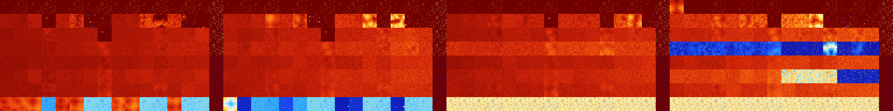

# B012368 (171520-172031)

<details>
    <summary>Initial Grid</summary>
    
</details>


<details>
    <summary>Initial Grid RLE</summary>

```
#C Exported from GoGoL (https://github.com/marrow16/gogol)
#C Wrap mode: Toroidal
#C Boundary mode: Dead
#C Step: 0
x = 100, y = 100, rule = B012368/S
8bo10bobo$14bo15bo27bo21bo$39bo18bobo4bo6bo6bo7bo11bo$100b$34bo10bo16bo
2bo10bo9bo$8bo10bo19bo3b2o2bo36bo$25bo35bo6bo27bo$11bo5bo64bo$28bo16bo
17bo3bo9bo$12bo6bo4bo7bo47bo18bo$16bo24bo40bo13bo$2bo17bo18bo53bo$25b2o
4bo9bo10bo17bo10bo2bo$36bo26bo24bo$12bo13bo58bo$10bo7b2o13bo2bo5bo9bo
11bo5bo13bo$29bo18bo$20bo8bo38bo5bo$23bo41bo22bo$bo43bo19bo6bo23bo$o55b
o8bo7bo4bo16bo2bo$12bo2bo4bobo10bo2bo12bo$27bo40bobo15bo$2bo22bo10bo12b
o5bo4bo13bo$2bobo24bo3bo2bo9bo42bo$16b2o3bo36bo28bo4bo$15bo10bo4bo7bo2b
o42bo$2bo15b2o17bo$9bo6bo6bo17bo2bo4bo7bo2bo$6bo23bo4b2o3bo29b2o$34b2o
8bo31bo11bo$2bo16bo10b2obo13bo$2bo8bo17bo41bo26bo$64bobobo8bo3bo$21bo
20bo18bo10bo$49bobo34bo$54bo$15bo11bo38bo$12bo4bo8bo4bo45bo13bo$29bo2bo
7bo$5bo21bo3bo2bo13bo4bo9bo9bo5bo$5bo5bo2bo21bo18bo32bo$51bo32bo$5bo6bo
30bo27bo26bo$23bo24bo2bo43b2o$5bo14bo18bo23bo28bo$85bo7bo$2bo18bo3bo40b
o2bo8bo8bo$9bo88bo$21bo22b2o4bo7bo7bo25bo$4bo3bo22bo24bo$bo41bo9bo42bo$
10bo12bobo7bo13bo10bo14bo5bo11bo5bo$4bo14bo31bo33bo4bo3bo2bo$bo14bo$22b
2o12bo8bo5bo17bo23bo$45bo17bo2bo9bo7bo$36bo14bo20bo13bo12bo$13bo2bo16bo
bo12bo39bo$63bo7bo19bo$34bo12bo25bo5bo$bo2bo20b2o28bobo30bo$29bo18bo26b
o$44bo17bo5b2o2bo4bo21bo$37bo9b2o35bo12bo$18bo31bo27bo4bo$10bo84bob2o$
7bo36bo27bo9bo$31bo9bob2o51bo$21bo9bo16bo17b2o20bo$4bo22bo65b2o2bo$41bo
26bo14bo14bo$25bo$21bo32bo5bo25bo6bo$4bo4bo22bo52bo8bo$17bo5bo8bobo44bo
$8bo41bo4bo$34bo24bo28bo4bo$22bo16bo21bo$2o8bo11bo5bo3bo22bo4bo9bo$bo
37bo3bo12b2o19bo$3bo50bo2bo14bo8bo9bo$8bo2b2o80bo$8bo9bo24bo3bo11bo11bo
2bo3bo2b2o4bo11bo$56bo27bobo5bo$12bo15bo40bo8bo10bo$56bo23bo$4bo10bo6bo
12bo30bo7bo$7bo2bo11bo17bo25bo8bo3bo$31bo11bo8bo10bo8bo7bo6bo$4bo4bo7bo
10bo12bo33bo4bo$7bo54bo2bo$o36bo41bo19bo$4bo8bo11bo8bo25bo4bo6b2o12bo$
55bo4bo7bo11bo$29bo14bo13bo12bo$5b3o2bo4bo16bo2bobo6bo8bobo22bo18bo$14b
o9bo8bo7bo15bo$8bobo11bo28bo2bo$2bo4bo21bo5bo3bo!
```
</details>
<details>
    <summary>Thumbnail</summary>

</details>
<table>
<tr>
    <td><a href="./171520%20S%20Heat%20Map%20Activity.png"></a><br>S (171520)<br>R@6,p2</td>    <td><a href="./171521%20S0%20Heat%20Map%20Activity.png"></a><br>S0 (171521)<br>R@6,p2</td>    <td><a href="./171522%20S1%20Heat%20Map%20Activity.png"></a><br>S1 (171522)<br>R@4,p2</td>    <td><a href="./171523%20S01%20Heat%20Map%20Activity.png"></a><br>S01 (171523)<br>R@5,p2</td>    <td><a href="./171524%20S2%20Heat%20Map%20Activity.png"></a><br>S2 (171524)<br>R@6,p2</td>    <td><a href="./171525%20S02%20Heat%20Map%20Activity.png"></a><br>S02 (171525)<br>R@6,p2</td>    <td><a href="./171526%20S12%20Heat%20Map%20Activity.png"></a><br>S12 (171526)<br>R@5,p2</td>    <td><a href="./171527%20S012%20Heat%20Map%20Activity.png"></a><br>S012 (171527)<br>R@5,p2</td>    <td><a href="./171528%20S3%20Heat%20Map%20Activity.png"></a><br>S3 (171528)<br>R@4,p2</td>    <td><a href="./171529%20S03%20Heat%20Map%20Activity.png"></a><br>S03 (171529)<br>R@5,p2</td>    <td><a href="./171530%20S13%20Heat%20Map%20Activity.png"></a><br>S13 (171530)<br>R@4,p2</td>    <td><a href="./171531%20S013%20Heat%20Map%20Activity.png"></a><br>S013 (171531)<br>R@5,p2</td>    <td><a href="./171532%20S23%20Heat%20Map%20Activity.png"></a><br>S23 (171532)<br>R@4,p2</td>    <td><a href="./171533%20S023%20Heat%20Map%20Activity.png"></a><br>S023 (171533)<br>R@5,p2</td>    <td><a href="./171534%20S123%20Heat%20Map%20Activity.png"></a><br>S123 (171534)<br>R@3,p2</td>    <td><a href="./171535%20S0123%20Heat%20Map%20Activity.png"></a><br>S0123 (171535)<br>R@3,p2</td>    <td><a href="./171536%20S4%20Heat%20Map%20Activity.png"></a><br>S4 (171536)<br>R@6,p2</td>    <td><a href="./171537%20S04%20Heat%20Map%20Activity.png"></a><br>S04 (171537)<br>R@6,p2</td>    <td><a href="./171538%20S14%20Heat%20Map%20Activity.png"></a><br>S14 (171538)<br>R@4,p2</td>    <td><a href="./171539%20S014%20Heat%20Map%20Activity.png"></a><br>S014 (171539)<br>R@5,p2</td>    <td><a href="./171540%20S24%20Heat%20Map%20Activity.png"></a><br>S24 (171540)<br>R@6,p2</td>    <td><a href="./171541%20S024%20Heat%20Map%20Activity.png"></a><br>S024 (171541)<br>R@6,p2</td>    <td><a href="./171542%20S124%20Heat%20Map%20Activity.png"></a><br>S124 (171542)<br>R@5,p2</td>    <td><a href="./171543%20S0124%20Heat%20Map%20Activity.png"></a><br>S0124 (171543)<br>R@5,p2</td>    <td><a href="./171544%20S34%20Heat%20Map%20Activity.png"></a><br>S34 (171544)<br>R@4,p2</td>    <td><a href="./171545%20S034%20Heat%20Map%20Activity.png"></a><br>S034 (171545)<br>R@5,p2</td>    <td><a href="./171546%20S134%20Heat%20Map%20Activity.png"></a><br>S134 (171546)<br>R@4,p2</td>    <td><a href="./171547%20S0134%20Heat%20Map%20Activity.png"></a><br>S0134 (171547)<br>R@5,p2</td>    <td><a href="./171548%20S234%20Heat%20Map%20Activity.png"></a><br>S234 (171548)<br>R@4,p2</td>    <td><a href="./171549%20S0234%20Heat%20Map%20Activity.png"></a><br>S0234 (171549)<br>R@5,p2</td>    <td><a href="./171550%20S1234%20Heat%20Map%20Activity.png"></a><br>S1234 (171550)<br>R@3,p2</td>    <td><a href="./171551%20S01234%20Heat%20Map%20Activity.png"></a><br>S01234 (171551)<br>R@3,p2</td>    <td><a href="./171552%20S5%20Heat%20Map%20Activity.png"></a><br>S5 (171552)<br>R@30,p4</td>    <td><a href="./171553%20S05%20Heat%20Map%20Activity.png"></a><br>S05 (171553)<br>R@12,p4</td>    <td><a href="./171554%20S15%20Heat%20Map%20Activity.png"></a><br>S15 (171554)<br>R@10,p2</td>    <td><a href="./171555%20S015%20Heat%20Map%20Activity.png"></a><br>S015 (171555)<br>R@6,p2</td>    <td><a href="./171556%20S25%20Heat%20Map%20Activity.png"></a><br>S25 (171556)<br>R@14,p2</td>    <td><a href="./171557%20S025%20Heat%20Map%20Activity.png"></a><br>S025 (171557)<br>R@8,p2</td>    <td><a href="./171558%20S125%20Heat%20Map%20Activity.png"></a><br>S125 (171558)<br>R@7,p2</td>    <td><a href="./171559%20S0125%20Heat%20Map%20Activity.png"></a><br>S0125 (171559)<br>R@6,p2</td>    <td><a href="./171560%20S35%20Heat%20Map%20Activity.png"></a><br>S35 (171560)<br>R@20,p4</td>    <td><a href="./171561%20S035%20Heat%20Map%20Activity.png"></a><br>S035 (171561)<br>R@10,p4</td>    <td><a href="./171562%20S135%20Heat%20Map%20Activity.png"></a><br>S135 (171562)<br>R@7,p2</td>    <td><a href="./171563%20S0135%20Heat%20Map%20Activity.png"></a><br>S0135 (171563)<br>R@5,p2</td>    <td><a href="./171564%20S235%20Heat%20Map%20Activity.png"></a><br>S235 (171564)<br>R@6,p2</td>    <td><a href="./171565%20S0235%20Heat%20Map%20Activity.png"></a><br>S0235 (171565)<br>R@6,p2</td>    <td><a href="./171566%20S1235%20Heat%20Map%20Activity.png"></a><br>S1235 (171566)<br>R@5,p2</td>    <td><a href="./171567%20S01235%20Heat%20Map%20Activity.png"></a><br>S01235 (171567)<br>R@3,p2</td>    <td><a href="./171568%20S45%20Heat%20Map%20Activity.png"></a><br>S45 (171568)<br>G>1000</td>    <td><a href="./171569%20S045%20Heat%20Map%20Activity.png"></a><br>S045 (171569)<br>R@20,p4</td>    <td><a href="./171570%20S145%20Heat%20Map%20Activity.png"></a><br>S145 (171570)<br>R@12,p4</td>    <td><a href="./171571%20S0145%20Heat%20Map%20Activity.png"></a><br>S0145 (171571)<br>R@6,p2</td>    <td><a href="./171572%20S245%20Heat%20Map%20Activity.png"></a><br>S245 (171572)<br>R@12,p2</td>    <td><a href="./171573%20S0245%20Heat%20Map%20Activity.png"></a><br>S0245 (171573)<br>R@8,p2</td>    <td><a href="./171574%20S1245%20Heat%20Map%20Activity.png"></a><br>S1245 (171574)<br>R@7,p2</td>    <td><a href="./171575%20S01245%20Heat%20Map%20Activity.png"></a><br>S01245 (171575)<br>R@6,p2</td>    <td><a href="./171576%20S345%20Heat%20Map%20Activity.png"></a><br>S345 (171576)<br>R@20,p4</td>    <td><a href="./171577%20S0345%20Heat%20Map%20Activity.png"></a><br>S0345 (171577)<br>R@18,p4</td>    <td><a href="./171578%20S1345%20Heat%20Map%20Activity.png"></a><br>S1345 (171578)<br>R@7,p2</td>    <td><a href="./171579%20S01345%20Heat%20Map%20Activity.png"></a><br>S01345 (171579)<br>R@5,p2</td>    <td><a href="./171580%20S2345%20Heat%20Map%20Activity.png"></a><br>S2345 (171580)<br>R@6,p2</td>    <td><a href="./171581%20S02345%20Heat%20Map%20Activity.png"></a><br>S02345 (171581)<br>R@6,p2</td>    <td><a href="./171582%20S12345%20Heat%20Map%20Activity.png"></a><br>S12345 (171582)<br>R@5,p2</td>    <td><a href="./171583%20S012345%20Heat%20Map%20Activity.png"></a><br>S012345 (171583)<br>R@3,p2</td></tr>
<tr>
    <td><a href="./171584%20S6%20Heat%20Map%20Activity.png"></a><br>S6 (171584)<br>G>1000</td>    <td><a href="./171585%20S06%20Heat%20Map%20Activity.png"></a><br>S06 (171585)<br>G>1000</td>    <td><a href="./171586%20S16%20Heat%20Map%20Activity.png"></a><br>S16 (171586)<br>G>1000</td>    <td><a href="./171587%20S016%20Heat%20Map%20Activity.png"></a><br>S016 (171587)<br>R@53,p4</td>    <td><a href="./171588%20S26%20Heat%20Map%20Activity.png"></a><br>S26 (171588)<br>G>1000</td>    <td><a href="./171589%20S026%20Heat%20Map%20Activity.png"></a><br>S026 (171589)<br>G>1000</td>    <td><a href="./171590%20S126%20Heat%20Map%20Activity.png"></a><br>S126 (171590)<br>R@37,p2</td>    <td><a href="./171591%20S0126%20Heat%20Map%20Activity.png"></a><br>S0126 (171591)<br>R@7,p2</td>    <td><a href="./171592%20S36%20Heat%20Map%20Activity.png"></a><br>S36 (171592)<br>G>1000</td>    <td><a href="./171593%20S036%20Heat%20Map%20Activity.png"></a><br>S036 (171593)<br>G>1000</td>    <td><a href="./171594%20S136%20Heat%20Map%20Activity.png"></a><br>S136 (171594)<br>G>1000</td>    <td><a href="./171595%20S0136%20Heat%20Map%20Activity.png"></a><br>S0136 (171595)<br>G>1000</td>    <td><a href="./171596%20S236%20Heat%20Map%20Activity.png"></a><br>S236 (171596)<br>G>1000</td>    <td><a href="./171597%20S0236%20Heat%20Map%20Activity.png"></a><br>S0236 (171597)<br>R@513,p4</td>    <td><a href="./171598%20S1236%20Heat%20Map%20Activity.png"></a><br>S1236 (171598)<br>R@57,p2</td>    <td><a href="./171599%20S01236%20Heat%20Map%20Activity.png"></a><br>S01236 (171599)<br>R@3,p2</td>    <td><a href="./171600%20S46%20Heat%20Map%20Activity.png"></a><br>S46 (171600)<br>G>1000</td>    <td><a href="./171601%20S046%20Heat%20Map%20Activity.png"></a><br>S046 (171601)<br>G>1000</td>    <td><a href="./171602%20S146%20Heat%20Map%20Activity.png"></a><br>S146 (171602)<br>G>1000</td>    <td><a href="./171603%20S0146%20Heat%20Map%20Activity.png"></a><br>S0146 (171603)<br>G>1000</td>    <td><a href="./171604%20S246%20Heat%20Map%20Activity.png"></a><br>S246 (171604)<br>G>1000</td>    <td><a href="./171605%20S0246%20Heat%20Map%20Activity.png"></a><br>S0246 (171605)<br>G>1000</td>    <td><a href="./171606%20S1246%20Heat%20Map%20Activity.png"></a><br>S1246 (171606)<br>R@129,p20</td>    <td><a href="./171607%20S01246%20Heat%20Map%20Activity.png"></a><br>S01246 (171607)<br>R@7,p2</td>    <td><a href="./171608%20S346%20Heat%20Map%20Activity.png"></a><br>S346 (171608)<br>G>1000</td>    <td><a href="./171609%20S0346%20Heat%20Map%20Activity.png"></a><br>S0346 (171609)<br>G>1000</td>    <td><a href="./171610%20S1346%20Heat%20Map%20Activity.png"></a><br>S1346 (171610)<br>G>1000</td>    <td><a href="./171611%20S01346%20Heat%20Map%20Activity.png"></a><br>S01346 (171611)<br>R@5,p2</td>    <td><a href="./171612%20S2346%20Heat%20Map%20Activity.png"></a><br>S2346 (171612)<br>G>1000</td>    <td><a href="./171613%20S02346%20Heat%20Map%20Activity.png"></a><br>S02346 (171613)<br>R@123,p4</td>    <td><a href="./171614%20S12346%20Heat%20Map%20Activity.png"></a><br>S12346 (171614)<br>R@9,p2</td>    <td><a href="./171615%20S012346%20Heat%20Map%20Activity.png"></a><br>S012346 (171615)<br>R@3,p2</td>    <td><a href="./171616%20S56%20Heat%20Map%20Activity.png"></a><br>S56 (171616)<br>G>1000</td>    <td><a href="./171617%20S056%20Heat%20Map%20Activity.png"></a><br>S056 (171617)<br>G>1000</td>    <td><a href="./171618%20S156%20Heat%20Map%20Activity.png"></a><br>S156 (171618)<br>G>1000</td>    <td><a href="./171619%20S0156%20Heat%20Map%20Activity.png"></a><br>S0156 (171619)<br>G>1000</td>    <td><a href="./171620%20S256%20Heat%20Map%20Activity.png"></a><br>S256 (171620)<br>G>1000</td>    <td><a href="./171621%20S0256%20Heat%20Map%20Activity.png"></a><br>S0256 (171621)<br>G>1000</td>    <td><a href="./171622%20S1256%20Heat%20Map%20Activity.png"></a><br>S1256 (171622)<br>G>1000</td>    <td><a href="./171623%20S01256%20Heat%20Map%20Activity.png"></a><br>S01256 (171623)<br>R@25,p2</td>    <td><a href="./171624%20S356%20Heat%20Map%20Activity.png"></a><br>S356 (171624)<br>G>1000</td>    <td><a href="./171625%20S0356%20Heat%20Map%20Activity.png"></a><br>S0356 (171625)<br>G>1000</td>    <td><a href="./171626%20S1356%20Heat%20Map%20Activity.png"></a><br>S1356 (171626)<br>G>1000</td>    <td><a href="./171627%20S01356%20Heat%20Map%20Activity.png"></a><br>S01356 (171627)<br>R@7,p4</td>    <td><a href="./171628%20S2356%20Heat%20Map%20Activity.png"></a><br>S2356 (171628)<br>G>1000</td>    <td><a href="./171629%20S02356%20Heat%20Map%20Activity.png"></a><br>S02356 (171629)<br>G>1000</td>    <td><a href="./171630%20S12356%20Heat%20Map%20Activity.png"></a><br>S12356 (171630)<br>R@27,p4</td>    <td><a href="./171631%20S012356%20Heat%20Map%20Activity.png"></a><br>S012356 (171631)<br>R@3,p2</td>    <td><a href="./171632%20S456%20Heat%20Map%20Activity.png"></a><br>S456 (171632)<br>G>1000</td>    <td><a href="./171633%20S0456%20Heat%20Map%20Activity.png"></a><br>S0456 (171633)<br>G>1000</td>    <td><a href="./171634%20S1456%20Heat%20Map%20Activity.png"></a><br>S1456 (171634)<br>G>1000</td>    <td><a href="./171635%20S01456%20Heat%20Map%20Activity.png"></a><br>S01456 (171635)<br>G>1000</td>    <td><a href="./171636%20S2456%20Heat%20Map%20Activity.png"></a><br>S2456 (171636)<br>G>1000</td>    <td><a href="./171637%20S02456%20Heat%20Map%20Activity.png"></a><br>S02456 (171637)<br>G>1000</td>    <td><a href="./171638%20S12456%20Heat%20Map%20Activity.png"></a><br>S12456 (171638)<br>G>1000</td>    <td><a href="./171639%20S012456%20Heat%20Map%20Activity.png"></a><br>S012456 (171639)<br>R@7,p2</td>    <td><a href="./171640%20S3456%20Heat%20Map%20Activity.png"></a><br>S3456 (171640)<br>G>1000</td>    <td><a href="./171641%20S03456%20Heat%20Map%20Activity.png"></a><br>S03456 (171641)<br>G>1000</td>    <td><a href="./171642%20S13456%20Heat%20Map%20Activity.png"></a><br>S13456 (171642)<br>G>1000</td>    <td><a href="./171643%20S013456%20Heat%20Map%20Activity.png"></a><br>S013456 (171643)<br>R@7,p2</td>    <td><a href="./171644%20S23456%20Heat%20Map%20Activity.png"></a><br>S23456 (171644)<br>R@50,p4</td>    <td><a href="./171645%20S023456%20Heat%20Map%20Activity.png"></a><br>S023456 (171645)<br>R@23,p4</td>    <td><a href="./171646%20S123456%20Heat%20Map%20Activity.png"></a><br>S123456 (171646)<br>R@9,p2</td>    <td><a href="./171647%20S0123456%20Heat%20Map%20Activity.png"></a><br>S0123456 (171647)<br>R@3,p2</td></tr>
<tr>
    <td><a href="./171648%20S7%20Heat%20Map%20Activity.png"></a><br>S7 (171648)<br>G>1000</td>    <td><a href="./171649%20S07%20Heat%20Map%20Activity.png"></a><br>S07 (171649)<br>G>1000</td>    <td><a href="./171650%20S17%20Heat%20Map%20Activity.png"></a><br>S17 (171650)<br>G>1000</td>    <td><a href="./171651%20S017%20Heat%20Map%20Activity.png"></a><br>S017 (171651)<br>G>1000</td>    <td><a href="./171652%20S27%20Heat%20Map%20Activity.png"></a><br>S27 (171652)<br>G>1000</td>    <td><a href="./171653%20S027%20Heat%20Map%20Activity.png"></a><br>S027 (171653)<br>G>1000</td>    <td><a href="./171654%20S127%20Heat%20Map%20Activity.png"></a><br>S127 (171654)<br>G>1000</td>    <td><a href="./171655%20S0127%20Heat%20Map%20Activity.png"></a><br>S0127 (171655)<br>R@63,p2</td>    <td><a href="./171656%20S37%20Heat%20Map%20Activity.png"></a><br>S37 (171656)<br>G>1000</td>    <td><a href="./171657%20S037%20Heat%20Map%20Activity.png"></a><br>S037 (171657)<br>G>1000</td>    <td><a href="./171658%20S137%20Heat%20Map%20Activity.png"></a><br>S137 (171658)<br>G>1000</td>    <td><a href="./171659%20S0137%20Heat%20Map%20Activity.png"></a><br>S0137 (171659)<br>G>1000</td>    <td><a href="./171660%20S237%20Heat%20Map%20Activity.png"></a><br>S237 (171660)<br>G>1000</td>    <td><a href="./171661%20S0237%20Heat%20Map%20Activity.png"></a><br>S0237 (171661)<br>G>1000</td>    <td><a href="./171662%20S1237%20Heat%20Map%20Activity.png"></a><br>S1237 (171662)<br>G>1000</td>    <td><a href="./171663%20S01237%20Heat%20Map%20Activity.png"></a><br>S01237 (171663)<br>R@3,p2</td>    <td><a href="./171664%20S47%20Heat%20Map%20Activity.png"></a><br>S47 (171664)<br>G>1000</td>    <td><a href="./171665%20S047%20Heat%20Map%20Activity.png"></a><br>S047 (171665)<br>G>1000</td>    <td><a href="./171666%20S147%20Heat%20Map%20Activity.png"></a><br>S147 (171666)<br>G>1000</td>    <td><a href="./171667%20S0147%20Heat%20Map%20Activity.png"></a><br>S0147 (171667)<br>G>1000</td>    <td><a href="./171668%20S247%20Heat%20Map%20Activity.png"></a><br>S247 (171668)<br>G>1000</td>    <td><a href="./171669%20S0247%20Heat%20Map%20Activity.png"></a><br>S0247 (171669)<br>G>1000</td>    <td><a href="./171670%20S1247%20Heat%20Map%20Activity.png"></a><br>S1247 (171670)<br>G>1000</td>    <td><a href="./171671%20S01247%20Heat%20Map%20Activity.png"></a><br>S01247 (171671)<br>R@29,p2</td>    <td><a href="./171672%20S347%20Heat%20Map%20Activity.png"></a><br>S347 (171672)<br>G>1000</td>    <td><a href="./171673%20S0347%20Heat%20Map%20Activity.png"></a><br>S0347 (171673)<br>G>1000</td>    <td><a href="./171674%20S1347%20Heat%20Map%20Activity.png"></a><br>S1347 (171674)<br>G>1000</td>    <td><a href="./171675%20S01347%20Heat%20Map%20Activity.png"></a><br>S01347 (171675)<br>G>1000</td>    <td><a href="./171676%20S2347%20Heat%20Map%20Activity.png"></a><br>S2347 (171676)<br>G>1000</td>    <td><a href="./171677%20S02347%20Heat%20Map%20Activity.png"></a><br>S02347 (171677)<br>G>1000</td>    <td><a href="./171678%20S12347%20Heat%20Map%20Activity.png"></a><br>S12347 (171678)<br>G>1000</td>    <td><a href="./171679%20S012347%20Heat%20Map%20Activity.png"></a><br>S012347 (171679)<br>R@3,p2</td>    <td><a href="./171680%20S57%20Heat%20Map%20Activity.png"></a><br>S57 (171680)<br>G>1000</td>    <td><a href="./171681%20S057%20Heat%20Map%20Activity.png"></a><br>S057 (171681)<br>G>1000</td>    <td><a href="./171682%20S157%20Heat%20Map%20Activity.png"></a><br>S157 (171682)<br>G>1000</td>    <td><a href="./171683%20S0157%20Heat%20Map%20Activity.png"></a><br>S0157 (171683)<br>G>1000</td>    <td><a href="./171684%20S257%20Heat%20Map%20Activity.png"></a><br>S257 (171684)<br>G>1000</td>    <td><a href="./171685%20S0257%20Heat%20Map%20Activity.png"></a><br>S0257 (171685)<br>G>1000</td>    <td><a href="./171686%20S1257%20Heat%20Map%20Activity.png"></a><br>S1257 (171686)<br>G>1000</td>    <td><a href="./171687%20S01257%20Heat%20Map%20Activity.png"></a><br>S01257 (171687)<br>G>1000</td>    <td><a href="./171688%20S357%20Heat%20Map%20Activity.png"></a><br>S357 (171688)<br>G>1000</td>    <td><a href="./171689%20S0357%20Heat%20Map%20Activity.png"></a><br>S0357 (171689)<br>G>1000</td>    <td><a href="./171690%20S1357%20Heat%20Map%20Activity.png"></a><br>S1357 (171690)<br>G>1000</td>    <td><a href="./171691%20S01357%20Heat%20Map%20Activity.png"></a><br>S01357 (171691)<br>G>1000</td>    <td><a href="./171692%20S2357%20Heat%20Map%20Activity.png"></a><br>S2357 (171692)<br>G>1000</td>    <td><a href="./171693%20S02357%20Heat%20Map%20Activity.png"></a><br>S02357 (171693)<br>G>1000</td>    <td><a href="./171694%20S12357%20Heat%20Map%20Activity.png"></a><br>S12357 (171694)<br>G>1000</td>    <td><a href="./171695%20S012357%20Heat%20Map%20Activity.png"></a><br>S012357 (171695)<br>R@3,p2</td>    <td><a href="./171696%20S457%20Heat%20Map%20Activity.png"></a><br>S457 (171696)<br>G>1000</td>    <td><a href="./171697%20S0457%20Heat%20Map%20Activity.png"></a><br>S0457 (171697)<br>G>1000</td>    <td><a href="./171698%20S1457%20Heat%20Map%20Activity.png"></a><br>S1457 (171698)<br>G>1000</td>    <td><a href="./171699%20S01457%20Heat%20Map%20Activity.png"></a><br>S01457 (171699)<br>G>1000</td>    <td><a href="./171700%20S2457%20Heat%20Map%20Activity.png"></a><br>S2457 (171700)<br>G>1000</td>    <td><a href="./171701%20S02457%20Heat%20Map%20Activity.png"></a><br>S02457 (171701)<br>G>1000</td>    <td><a href="./171702%20S12457%20Heat%20Map%20Activity.png"></a><br>S12457 (171702)<br>G>1000</td>    <td><a href="./171703%20S012457%20Heat%20Map%20Activity.png"></a><br>S012457 (171703)<br>G>1000</td>    <td><a href="./171704%20S3457%20Heat%20Map%20Activity.png"></a><br>S3457 (171704)<br>G>1000</td>    <td><a href="./171705%20S03457%20Heat%20Map%20Activity.png"></a><br>S03457 (171705)<br>G>1000</td>    <td><a href="./171706%20S13457%20Heat%20Map%20Activity.png"></a><br>S13457 (171706)<br>G>1000</td>    <td><a href="./171707%20S013457%20Heat%20Map%20Activity.png"></a><br>S013457 (171707)<br>G>1000</td>    <td><a href="./171708%20S23457%20Heat%20Map%20Activity.png"></a><br>S23457 (171708)<br>G>1000</td>    <td><a href="./171709%20S023457%20Heat%20Map%20Activity.png"></a><br>S023457 (171709)<br>G>1000</td>    <td><a href="./171710%20S123457%20Heat%20Map%20Activity.png"></a><br>S123457 (171710)<br>G>1000</td>    <td><a href="./171711%20S0123457%20Heat%20Map%20Activity.png"></a><br>S0123457 (171711)<br>R@3,p2</td></tr>
<tr>
    <td><a href="./171712%20S67%20Heat%20Map%20Activity.png"></a><br>S67 (171712)<br>G>1000</td>    <td><a href="./171713%20S067%20Heat%20Map%20Activity.png"></a><br>S067 (171713)<br>G>1000</td>    <td><a href="./171714%20S167%20Heat%20Map%20Activity.png"></a><br>S167 (171714)<br>G>1000</td>    <td><a href="./171715%20S0167%20Heat%20Map%20Activity.png"></a><br>S0167 (171715)<br>G>1000</td>    <td><a href="./171716%20S267%20Heat%20Map%20Activity.png"></a><br>S267 (171716)<br>G>1000</td>    <td><a href="./171717%20S0267%20Heat%20Map%20Activity.png"></a><br>S0267 (171717)<br>G>1000</td>    <td><a href="./171718%20S1267%20Heat%20Map%20Activity.png"></a><br>S1267 (171718)<br>G>1000</td>    <td><a href="./171719%20S01267%20Heat%20Map%20Activity.png"></a><br>S01267 (171719)<br>G>1000</td>    <td><a href="./171720%20S367%20Heat%20Map%20Activity.png"></a><br>S367 (171720)<br>G>1000</td>    <td><a href="./171721%20S0367%20Heat%20Map%20Activity.png"></a><br>S0367 (171721)<br>G>1000</td>    <td><a href="./171722%20S1367%20Heat%20Map%20Activity.png"></a><br>S1367 (171722)<br>G>1000</td>    <td><a href="./171723%20S01367%20Heat%20Map%20Activity.png"></a><br>S01367 (171723)<br>G>1000</td>    <td><a href="./171724%20S2367%20Heat%20Map%20Activity.png"></a><br>S2367 (171724)<br>G>1000</td>    <td><a href="./171725%20S02367%20Heat%20Map%20Activity.png"></a><br>S02367 (171725)<br>G>1000</td>    <td><a href="./171726%20S12367%20Heat%20Map%20Activity.png"></a><br>S12367 (171726)<br>G>1000</td>    <td><a href="./171727%20S012367%20Heat%20Map%20Activity.png"></a><br>S012367 (171727)<br>R@3,p2</td>    <td><a href="./171728%20S467%20Heat%20Map%20Activity.png"></a><br>S467 (171728)<br>G>1000</td>    <td><a href="./171729%20S0467%20Heat%20Map%20Activity.png"></a><br>S0467 (171729)<br>G>1000</td>    <td><a href="./171730%20S1467%20Heat%20Map%20Activity.png"></a><br>S1467 (171730)<br>G>1000</td>    <td><a href="./171731%20S01467%20Heat%20Map%20Activity.png"></a><br>S01467 (171731)<br>G>1000</td>    <td><a href="./171732%20S2467%20Heat%20Map%20Activity.png"></a><br>S2467 (171732)<br>G>1000</td>    <td><a href="./171733%20S02467%20Heat%20Map%20Activity.png"></a><br>S02467 (171733)<br>G>1000</td>    <td><a href="./171734%20S12467%20Heat%20Map%20Activity.png"></a><br>S12467 (171734)<br>G>1000</td>    <td><a href="./171735%20S012467%20Heat%20Map%20Activity.png"></a><br>S012467 (171735)<br>G>1000</td>    <td><a href="./171736%20S3467%20Heat%20Map%20Activity.png"></a><br>S3467 (171736)<br>G>1000</td>    <td><a href="./171737%20S03467%20Heat%20Map%20Activity.png"></a><br>S03467 (171737)<br>G>1000</td>    <td><a href="./171738%20S13467%20Heat%20Map%20Activity.png"></a><br>S13467 (171738)<br>G>1000</td>    <td><a href="./171739%20S013467%20Heat%20Map%20Activity.png"></a><br>S013467 (171739)<br>G>1000</td>    <td><a href="./171740%20S23467%20Heat%20Map%20Activity.png"></a><br>S23467 (171740)<br>G>1000</td>    <td><a href="./171741%20S023467%20Heat%20Map%20Activity.png"></a><br>S023467 (171741)<br>G>1000</td>    <td><a href="./171742%20S123467%20Heat%20Map%20Activity.png"></a><br>S123467 (171742)<br>G>1000</td>    <td><a href="./171743%20S0123467%20Heat%20Map%20Activity.png"></a><br>S0123467 (171743)<br>R@3,p2</td>    <td><a href="./171744%20S567%20Heat%20Map%20Activity.png"></a><br>S567 (171744)<br>G>1000</td>    <td><a href="./171745%20S0567%20Heat%20Map%20Activity.png"></a><br>S0567 (171745)<br>G>1000</td>    <td><a href="./171746%20S1567%20Heat%20Map%20Activity.png"></a><br>S1567 (171746)<br>G>1000</td>    <td><a href="./171747%20S01567%20Heat%20Map%20Activity.png"></a><br>S01567 (171747)<br>G>1000</td>    <td><a href="./171748%20S2567%20Heat%20Map%20Activity.png"></a><br>S2567 (171748)<br>G>1000</td>    <td><a href="./171749%20S02567%20Heat%20Map%20Activity.png"></a><br>S02567 (171749)<br>G>1000</td>    <td><a href="./171750%20S12567%20Heat%20Map%20Activity.png"></a><br>S12567 (171750)<br>G>1000</td>    <td><a href="./171751%20S012567%20Heat%20Map%20Activity.png"></a><br>S012567 (171751)<br>G>1000</td>    <td><a href="./171752%20S3567%20Heat%20Map%20Activity.png"></a><br>S3567 (171752)<br>G>1000</td>    <td><a href="./171753%20S03567%20Heat%20Map%20Activity.png"></a><br>S03567 (171753)<br>G>1000</td>    <td><a href="./171754%20S13567%20Heat%20Map%20Activity.png"></a><br>S13567 (171754)<br>G>1000</td>    <td><a href="./171755%20S013567%20Heat%20Map%20Activity.png"></a><br>S013567 (171755)<br>G>1000</td>    <td><a href="./171756%20S23567%20Heat%20Map%20Activity.png"></a><br>S23567 (171756)<br>G>1000</td>    <td><a href="./171757%20S023567%20Heat%20Map%20Activity.png"></a><br>S023567 (171757)<br>G>1000</td>    <td><a href="./171758%20S123567%20Heat%20Map%20Activity.png"></a><br>S123567 (171758)<br>G>1000</td>    <td><a href="./171759%20S0123567%20Heat%20Map%20Activity.png"></a><br>S0123567 (171759)<br>R@3,p2</td>    <td><a href="./171760%20S4567%20Heat%20Map%20Activity.png"></a><br>S4567 (171760)<br>G>1000</td>    <td><a href="./171761%20S04567%20Heat%20Map%20Activity.png"></a><br>S04567 (171761)<br>G>1000</td>    <td><a href="./171762%20S14567%20Heat%20Map%20Activity.png"></a><br>S14567 (171762)<br>G>1000</td>    <td><a href="./171763%20S014567%20Heat%20Map%20Activity.png"></a><br>S014567 (171763)<br>G>1000</td>    <td><a href="./171764%20S24567%20Heat%20Map%20Activity.png"></a><br>S24567 (171764)<br>G>1000</td>    <td><a href="./171765%20S024567%20Heat%20Map%20Activity.png"></a><br>S024567 (171765)<br>G>1000</td>    <td><a href="./171766%20S124567%20Heat%20Map%20Activity.png"></a><br>S124567 (171766)<br>G>1000</td>    <td><a href="./171767%20S0124567%20Heat%20Map%20Activity.png"></a><br>S0124567 (171767)<br>G>1000</td>    <td><a href="./171768%20S34567%20Heat%20Map%20Activity.png"></a><br>S34567 (171768)<br>G>1000</td>    <td><a href="./171769%20S034567%20Heat%20Map%20Activity.png"></a><br>S034567 (171769)<br>G>1000</td>    <td><a href="./171770%20S134567%20Heat%20Map%20Activity.png"></a><br>S134567 (171770)<br>R@468,p420</td>    <td><a href="./171771%20S0134567%20Heat%20Map%20Activity.png"></a><br>S0134567 (171771)<br>R@208,p84</td>    <td><a href="./171772%20S234567%20Heat%20Map%20Activity.png"></a><br>S234567 (171772)<br>R@570,p504</td>    <td><a href="./171773%20S0234567%20Heat%20Map%20Activity.png"></a><br>S0234567 (171773)<br>R@358,p252</td>    <td><a href="./171774%20S1234567%20Heat%20Map%20Activity.png"></a><br>S1234567 (171774)<br>G>1000</td>    <td><a href="./171775%20S01234567%20Heat%20Map%20Activity.png"></a><br>S01234567 (171775)<br>R@3,p2</td></tr>
<tr>
    <td><a href="./171776%20S8%20Heat%20Map%20Activity.png"></a><br>S8 (171776)<br>G>1000</td>    <td><a href="./171777%20S08%20Heat%20Map%20Activity.png"></a><br>S08 (171777)<br>G>1000</td>    <td><a href="./171778%20S18%20Heat%20Map%20Activity.png"></a><br>S18 (171778)<br>G>1000</td>    <td><a href="./171779%20S018%20Heat%20Map%20Activity.png"></a><br>S018 (171779)<br>G>1000</td>    <td><a href="./171780%20S28%20Heat%20Map%20Activity.png"></a><br>S28 (171780)<br>G>1000</td>    <td><a href="./171781%20S028%20Heat%20Map%20Activity.png"></a><br>S028 (171781)<br>G>1000</td>    <td><a href="./171782%20S128%20Heat%20Map%20Activity.png"></a><br>S128 (171782)<br>G>1000</td>    <td><a href="./171783%20S0128%20Heat%20Map%20Activity.png"></a><br>S0128 (171783)<br>G>1000</td>    <td><a href="./171784%20S38%20Heat%20Map%20Activity.png"></a><br>S38 (171784)<br>G>1000</td>    <td><a href="./171785%20S038%20Heat%20Map%20Activity.png"></a><br>S038 (171785)<br>G>1000</td>    <td><a href="./171786%20S138%20Heat%20Map%20Activity.png"></a><br>S138 (171786)<br>G>1000</td>    <td><a href="./171787%20S0138%20Heat%20Map%20Activity.png"></a><br>S0138 (171787)<br>G>1000</td>    <td><a href="./171788%20S238%20Heat%20Map%20Activity.png"></a><br>S238 (171788)<br>G>1000</td>    <td><a href="./171789%20S0238%20Heat%20Map%20Activity.png"></a><br>S0238 (171789)<br>G>1000</td>    <td><a href="./171790%20S1238%20Heat%20Map%20Activity.png"></a><br>S1238 (171790)<br>G>1000</td>    <td><a href="./171791%20S01238%20Heat%20Map%20Activity.png"></a><br>S01238 (171791)<br>S@1</td>    <td><a href="./171792%20S48%20Heat%20Map%20Activity.png"></a><br>S48 (171792)<br>G>1000</td>    <td><a href="./171793%20S048%20Heat%20Map%20Activity.png"></a><br>S048 (171793)<br>G>1000</td>    <td><a href="./171794%20S148%20Heat%20Map%20Activity.png"></a><br>S148 (171794)<br>G>1000</td>    <td><a href="./171795%20S0148%20Heat%20Map%20Activity.png"></a><br>S0148 (171795)<br>G>1000</td>    <td><a href="./171796%20S248%20Heat%20Map%20Activity.png"></a><br>S248 (171796)<br>G>1000</td>    <td><a href="./171797%20S0248%20Heat%20Map%20Activity.png"></a><br>S0248 (171797)<br>G>1000</td>    <td><a href="./171798%20S1248%20Heat%20Map%20Activity.png"></a><br>S1248 (171798)<br>G>1000</td>    <td><a href="./171799%20S01248%20Heat%20Map%20Activity.png"></a><br>S01248 (171799)<br>G>1000</td>    <td><a href="./171800%20S348%20Heat%20Map%20Activity.png"></a><br>S348 (171800)<br>G>1000</td>    <td><a href="./171801%20S0348%20Heat%20Map%20Activity.png"></a><br>S0348 (171801)<br>G>1000</td>    <td><a href="./171802%20S1348%20Heat%20Map%20Activity.png"></a><br>S1348 (171802)<br>G>1000</td>    <td><a href="./171803%20S01348%20Heat%20Map%20Activity.png"></a><br>S01348 (171803)<br>G>1000</td>    <td><a href="./171804%20S2348%20Heat%20Map%20Activity.png"></a><br>S2348 (171804)<br>G>1000</td>    <td><a href="./171805%20S02348%20Heat%20Map%20Activity.png"></a><br>S02348 (171805)<br>G>1000</td>    <td><a href="./171806%20S12348%20Heat%20Map%20Activity.png"></a><br>S12348 (171806)<br>G>1000</td>    <td><a href="./171807%20S012348%20Heat%20Map%20Activity.png"></a><br>S012348 (171807)<br>S@1</td>    <td><a href="./171808%20S58%20Heat%20Map%20Activity.png"></a><br>S58 (171808)<br>G>1000</td>    <td><a href="./171809%20S058%20Heat%20Map%20Activity.png"></a><br>S058 (171809)<br>G>1000</td>    <td><a href="./171810%20S158%20Heat%20Map%20Activity.png"></a><br>S158 (171810)<br>G>1000</td>    <td><a href="./171811%20S0158%20Heat%20Map%20Activity.png"></a><br>S0158 (171811)<br>G>1000</td>    <td><a href="./171812%20S258%20Heat%20Map%20Activity.png"></a><br>S258 (171812)<br>G>1000</td>    <td><a href="./171813%20S0258%20Heat%20Map%20Activity.png"></a><br>S0258 (171813)<br>G>1000</td>    <td><a href="./171814%20S1258%20Heat%20Map%20Activity.png"></a><br>S1258 (171814)<br>G>1000</td>    <td><a href="./171815%20S01258%20Heat%20Map%20Activity.png"></a><br>S01258 (171815)<br>G>1000</td>    <td><a href="./171816%20S358%20Heat%20Map%20Activity.png"></a><br>S358 (171816)<br>G>1000</td>    <td><a href="./171817%20S0358%20Heat%20Map%20Activity.png"></a><br>S0358 (171817)<br>G>1000</td>    <td><a href="./171818%20S1358%20Heat%20Map%20Activity.png"></a><br>S1358 (171818)<br>G>1000</td>    <td><a href="./171819%20S01358%20Heat%20Map%20Activity.png"></a><br>S01358 (171819)<br>G>1000</td>    <td><a href="./171820%20S2358%20Heat%20Map%20Activity.png"></a><br>S2358 (171820)<br>G>1000</td>    <td><a href="./171821%20S02358%20Heat%20Map%20Activity.png"></a><br>S02358 (171821)<br>G>1000</td>    <td><a href="./171822%20S12358%20Heat%20Map%20Activity.png"></a><br>S12358 (171822)<br>G>1000</td>    <td><a href="./171823%20S012358%20Heat%20Map%20Activity.png"></a><br>S012358 (171823)<br>S@1</td>    <td><a href="./171824%20S458%20Heat%20Map%20Activity.png"></a><br>S458 (171824)<br>G>1000</td>    <td><a href="./171825%20S0458%20Heat%20Map%20Activity.png"></a><br>S0458 (171825)<br>G>1000</td>    <td><a href="./171826%20S1458%20Heat%20Map%20Activity.png"></a><br>S1458 (171826)<br>G>1000</td>    <td><a href="./171827%20S01458%20Heat%20Map%20Activity.png"></a><br>S01458 (171827)<br>G>1000</td>    <td><a href="./171828%20S2458%20Heat%20Map%20Activity.png"></a><br>S2458 (171828)<br>G>1000</td>    <td><a href="./171829%20S02458%20Heat%20Map%20Activity.png"></a><br>S02458 (171829)<br>G>1000</td>    <td><a href="./171830%20S12458%20Heat%20Map%20Activity.png"></a><br>S12458 (171830)<br>G>1000</td>    <td><a href="./171831%20S012458%20Heat%20Map%20Activity.png"></a><br>S012458 (171831)<br>G>1000</td>    <td><a href="./171832%20S3458%20Heat%20Map%20Activity.png"></a><br>S3458 (171832)<br>G>1000</td>    <td><a href="./171833%20S03458%20Heat%20Map%20Activity.png"></a><br>S03458 (171833)<br>G>1000</td>    <td><a href="./171834%20S13458%20Heat%20Map%20Activity.png"></a><br>S13458 (171834)<br>G>1000</td>    <td><a href="./171835%20S013458%20Heat%20Map%20Activity.png"></a><br>S013458 (171835)<br>G>1000</td>    <td><a href="./171836%20S23458%20Heat%20Map%20Activity.png"></a><br>S23458 (171836)<br>G>1000</td>    <td><a href="./171837%20S023458%20Heat%20Map%20Activity.png"></a><br>S023458 (171837)<br>G>1000</td>    <td><a href="./171838%20S123458%20Heat%20Map%20Activity.png"></a><br>S123458 (171838)<br>G>1000</td>    <td><a href="./171839%20S0123458%20Heat%20Map%20Activity.png"></a><br>S0123458 (171839)<br>S@1</td></tr>
<tr>
    <td><a href="./171840%20S68%20Heat%20Map%20Activity.png"></a><br>S68 (171840)<br>G>1000</td>    <td><a href="./171841%20S068%20Heat%20Map%20Activity.png"></a><br>S068 (171841)<br>G>1000</td>    <td><a href="./171842%20S168%20Heat%20Map%20Activity.png"></a><br>S168 (171842)<br>G>1000</td>    <td><a href="./171843%20S0168%20Heat%20Map%20Activity.png"></a><br>S0168 (171843)<br>G>1000</td>    <td><a href="./171844%20S268%20Heat%20Map%20Activity.png"></a><br>S268 (171844)<br>G>1000</td>    <td><a href="./171845%20S0268%20Heat%20Map%20Activity.png"></a><br>S0268 (171845)<br>G>1000</td>    <td><a href="./171846%20S1268%20Heat%20Map%20Activity.png"></a><br>S1268 (171846)<br>G>1000</td>    <td><a href="./171847%20S01268%20Heat%20Map%20Activity.png"></a><br>S01268 (171847)<br>G>1000</td>    <td><a href="./171848%20S368%20Heat%20Map%20Activity.png"></a><br>S368 (171848)<br>G>1000</td>    <td><a href="./171849%20S0368%20Heat%20Map%20Activity.png"></a><br>S0368 (171849)<br>G>1000</td>    <td><a href="./171850%20S1368%20Heat%20Map%20Activity.png"></a><br>S1368 (171850)<br>G>1000</td>    <td><a href="./171851%20S01368%20Heat%20Map%20Activity.png"></a><br>S01368 (171851)<br>G>1000</td>    <td><a href="./171852%20S2368%20Heat%20Map%20Activity.png"></a><br>S2368 (171852)<br>G>1000</td>    <td><a href="./171853%20S02368%20Heat%20Map%20Activity.png"></a><br>S02368 (171853)<br>G>1000</td>    <td><a href="./171854%20S12368%20Heat%20Map%20Activity.png"></a><br>S12368 (171854)<br>G>1000</td>    <td><a href="./171855%20S012368%20Heat%20Map%20Activity.png"></a><br>S012368 (171855)<br>S@1</td>    <td><a href="./171856%20S468%20Heat%20Map%20Activity.png"></a><br>S468 (171856)<br>G>1000</td>    <td><a href="./171857%20S0468%20Heat%20Map%20Activity.png"></a><br>S0468 (171857)<br>G>1000</td>    <td><a href="./171858%20S1468%20Heat%20Map%20Activity.png"></a><br>S1468 (171858)<br>G>1000</td>    <td><a href="./171859%20S01468%20Heat%20Map%20Activity.png"></a><br>S01468 (171859)<br>G>1000</td>    <td><a href="./171860%20S2468%20Heat%20Map%20Activity.png"></a><br>S2468 (171860)<br>G>1000</td>    <td><a href="./171861%20S02468%20Heat%20Map%20Activity.png"></a><br>S02468 (171861)<br>G>1000</td>    <td><a href="./171862%20S12468%20Heat%20Map%20Activity.png"></a><br>S12468 (171862)<br>G>1000</td>    <td><a href="./171863%20S012468%20Heat%20Map%20Activity.png"></a><br>S012468 (171863)<br>G>1000</td>    <td><a href="./171864%20S3468%20Heat%20Map%20Activity.png"></a><br>S3468 (171864)<br>G>1000</td>    <td><a href="./171865%20S03468%20Heat%20Map%20Activity.png"></a><br>S03468 (171865)<br>G>1000</td>    <td><a href="./171866%20S13468%20Heat%20Map%20Activity.png"></a><br>S13468 (171866)<br>G>1000</td>    <td><a href="./171867%20S013468%20Heat%20Map%20Activity.png"></a><br>S013468 (171867)<br>G>1000</td>    <td><a href="./171868%20S23468%20Heat%20Map%20Activity.png"></a><br>S23468 (171868)<br>G>1000</td>    <td><a href="./171869%20S023468%20Heat%20Map%20Activity.png"></a><br>S023468 (171869)<br>G>1000</td>    <td><a href="./171870%20S123468%20Heat%20Map%20Activity.png"></a><br>S123468 (171870)<br>G>1000</td>    <td><a href="./171871%20S0123468%20Heat%20Map%20Activity.png"></a><br>S0123468 (171871)<br>S@1</td>    <td><a href="./171872%20S568%20Heat%20Map%20Activity.png"></a><br>S568 (171872)<br>G>1000</td>    <td><a href="./171873%20S0568%20Heat%20Map%20Activity.png"></a><br>S0568 (171873)<br>G>1000</td>    <td><a href="./171874%20S1568%20Heat%20Map%20Activity.png"></a><br>S1568 (171874)<br>G>1000</td>    <td><a href="./171875%20S01568%20Heat%20Map%20Activity.png"></a><br>S01568 (171875)<br>G>1000</td>    <td><a href="./171876%20S2568%20Heat%20Map%20Activity.png"></a><br>S2568 (171876)<br>G>1000</td>    <td><a href="./171877%20S02568%20Heat%20Map%20Activity.png"></a><br>S02568 (171877)<br>G>1000</td>    <td><a href="./171878%20S12568%20Heat%20Map%20Activity.png"></a><br>S12568 (171878)<br>G>1000</td>    <td><a href="./171879%20S012568%20Heat%20Map%20Activity.png"></a><br>S012568 (171879)<br>G>1000</td>    <td><a href="./171880%20S3568%20Heat%20Map%20Activity.png"></a><br>S3568 (171880)<br>G>1000</td>    <td><a href="./171881%20S03568%20Heat%20Map%20Activity.png"></a><br>S03568 (171881)<br>G>1000</td>    <td><a href="./171882%20S13568%20Heat%20Map%20Activity.png"></a><br>S13568 (171882)<br>G>1000</td>    <td><a href="./171883%20S013568%20Heat%20Map%20Activity.png"></a><br>S013568 (171883)<br>G>1000</td>    <td><a href="./171884%20S23568%20Heat%20Map%20Activity.png"></a><br>S23568 (171884)<br>G>1000</td>    <td><a href="./171885%20S023568%20Heat%20Map%20Activity.png"></a><br>S023568 (171885)<br>G>1000</td>    <td><a href="./171886%20S123568%20Heat%20Map%20Activity.png"></a><br>S123568 (171886)<br>G>1000</td>    <td><a href="./171887%20S0123568%20Heat%20Map%20Activity.png"></a><br>S0123568 (171887)<br>S@1</td>    <td><a href="./171888%20S4568%20Heat%20Map%20Activity.png"></a><br>S4568 (171888)<br>G>1000</td>    <td><a href="./171889%20S04568%20Heat%20Map%20Activity.png"></a><br>S04568 (171889)<br>G>1000</td>    <td><a href="./171890%20S14568%20Heat%20Map%20Activity.png"></a><br>S14568 (171890)<br>G>1000</td>    <td><a href="./171891%20S014568%20Heat%20Map%20Activity.png"></a><br>S014568 (171891)<br>G>1000</td>    <td><a href="./171892%20S24568%20Heat%20Map%20Activity.png"></a><br>S24568 (171892)<br>G>1000</td>    <td><a href="./171893%20S024568%20Heat%20Map%20Activity.png"></a><br>S024568 (171893)<br>G>1000</td>    <td><a href="./171894%20S124568%20Heat%20Map%20Activity.png"></a><br>S124568 (171894)<br>G>1000</td>    <td><a href="./171895%20S0124568%20Heat%20Map%20Activity.png"></a><br>S0124568 (171895)<br>G>1000</td>    <td><a href="./171896%20S34568%20Heat%20Map%20Activity.png"></a><br>S34568 (171896)<br>G>1000</td>    <td><a href="./171897%20S034568%20Heat%20Map%20Activity.png"></a><br>S034568 (171897)<br>G>1000</td>    <td><a href="./171898%20S134568%20Heat%20Map%20Activity.png"></a><br>S134568 (171898)<br>G>1000</td>    <td><a href="./171899%20S0134568%20Heat%20Map%20Activity.png"></a><br>S0134568 (171899)<br>G>1000</td>    <td><a href="./171900%20S234568%20Heat%20Map%20Activity.png"></a><br>S234568 (171900)<br>G>1000</td>    <td><a href="./171901%20S0234568%20Heat%20Map%20Activity.png"></a><br>S0234568 (171901)<br>G>1000</td>    <td><a href="./171902%20S1234568%20Heat%20Map%20Activity.png"></a><br>S1234568 (171902)<br>G>1000</td>    <td><a href="./171903%20S01234568%20Heat%20Map%20Activity.png"></a><br>S01234568 (171903)<br>S@1</td></tr>
<tr>
    <td><a href="./171904%20S78%20Heat%20Map%20Activity.png"></a><br>S78 (171904)<br>G>1000</td>    <td><a href="./171905%20S078%20Heat%20Map%20Activity.png"></a><br>S078 (171905)<br>G>1000</td>    <td><a href="./171906%20S178%20Heat%20Map%20Activity.png"></a><br>S178 (171906)<br>G>1000</td>    <td><a href="./171907%20S0178%20Heat%20Map%20Activity.png"></a><br>S0178 (171907)<br>G>1000</td>    <td><a href="./171908%20S278%20Heat%20Map%20Activity.png"></a><br>S278 (171908)<br>G>1000</td>    <td><a href="./171909%20S0278%20Heat%20Map%20Activity.png"></a><br>S0278 (171909)<br>G>1000</td>    <td><a href="./171910%20S1278%20Heat%20Map%20Activity.png"></a><br>S1278 (171910)<br>G>1000</td>    <td><a href="./171911%20S01278%20Heat%20Map%20Activity.png"></a><br>S01278 (171911)<br>G>1000</td>    <td><a href="./171912%20S378%20Heat%20Map%20Activity.png"></a><br>S378 (171912)<br>G>1000</td>    <td><a href="./171913%20S0378%20Heat%20Map%20Activity.png"></a><br>S0378 (171913)<br>G>1000</td>    <td><a href="./171914%20S1378%20Heat%20Map%20Activity.png"></a><br>S1378 (171914)<br>G>1000</td>    <td><a href="./171915%20S01378%20Heat%20Map%20Activity.png"></a><br>S01378 (171915)<br>G>1000</td>    <td><a href="./171916%20S2378%20Heat%20Map%20Activity.png"></a><br>S2378 (171916)<br>G>1000</td>    <td><a href="./171917%20S02378%20Heat%20Map%20Activity.png"></a><br>S02378 (171917)<br>G>1000</td>    <td><a href="./171918%20S12378%20Heat%20Map%20Activity.png"></a><br>S12378 (171918)<br>G>1000</td>    <td><a href="./171919%20S012378%20Heat%20Map%20Activity.png"></a><br>S012378 (171919)<br>S@1</td>    <td><a href="./171920%20S478%20Heat%20Map%20Activity.png"></a><br>S478 (171920)<br>G>1000</td>    <td><a href="./171921%20S0478%20Heat%20Map%20Activity.png"></a><br>S0478 (171921)<br>G>1000</td>    <td><a href="./171922%20S1478%20Heat%20Map%20Activity.png"></a><br>S1478 (171922)<br>G>1000</td>    <td><a href="./171923%20S01478%20Heat%20Map%20Activity.png"></a><br>S01478 (171923)<br>G>1000</td>    <td><a href="./171924%20S2478%20Heat%20Map%20Activity.png"></a><br>S2478 (171924)<br>G>1000</td>    <td><a href="./171925%20S02478%20Heat%20Map%20Activity.png"></a><br>S02478 (171925)<br>G>1000</td>    <td><a href="./171926%20S12478%20Heat%20Map%20Activity.png"></a><br>S12478 (171926)<br>G>1000</td>    <td><a href="./171927%20S012478%20Heat%20Map%20Activity.png"></a><br>S012478 (171927)<br>G>1000</td>    <td><a href="./171928%20S3478%20Heat%20Map%20Activity.png"></a><br>S3478 (171928)<br>G>1000</td>    <td><a href="./171929%20S03478%20Heat%20Map%20Activity.png"></a><br>S03478 (171929)<br>G>1000</td>    <td><a href="./171930%20S13478%20Heat%20Map%20Activity.png"></a><br>S13478 (171930)<br>G>1000</td>    <td><a href="./171931%20S013478%20Heat%20Map%20Activity.png"></a><br>S013478 (171931)<br>G>1000</td>    <td><a href="./171932%20S23478%20Heat%20Map%20Activity.png"></a><br>S23478 (171932)<br>G>1000</td>    <td><a href="./171933%20S023478%20Heat%20Map%20Activity.png"></a><br>S023478 (171933)<br>G>1000</td>    <td><a href="./171934%20S123478%20Heat%20Map%20Activity.png"></a><br>S123478 (171934)<br>G>1000</td>    <td><a href="./171935%20S0123478%20Heat%20Map%20Activity.png"></a><br>S0123478 (171935)<br>S@1</td>    <td><a href="./171936%20S578%20Heat%20Map%20Activity.png"></a><br>S578 (171936)<br>G>1000</td>    <td><a href="./171937%20S0578%20Heat%20Map%20Activity.png"></a><br>S0578 (171937)<br>G>1000</td>    <td><a href="./171938%20S1578%20Heat%20Map%20Activity.png"></a><br>S1578 (171938)<br>G>1000</td>    <td><a href="./171939%20S01578%20Heat%20Map%20Activity.png"></a><br>S01578 (171939)<br>G>1000</td>    <td><a href="./171940%20S2578%20Heat%20Map%20Activity.png"></a><br>S2578 (171940)<br>G>1000</td>    <td><a href="./171941%20S02578%20Heat%20Map%20Activity.png"></a><br>S02578 (171941)<br>G>1000</td>    <td><a href="./171942%20S12578%20Heat%20Map%20Activity.png"></a><br>S12578 (171942)<br>G>1000</td>    <td><a href="./171943%20S012578%20Heat%20Map%20Activity.png"></a><br>S012578 (171943)<br>G>1000</td>    <td><a href="./171944%20S3578%20Heat%20Map%20Activity.png"></a><br>S3578 (171944)<br>G>1000</td>    <td><a href="./171945%20S03578%20Heat%20Map%20Activity.png"></a><br>S03578 (171945)<br>G>1000</td>    <td><a href="./171946%20S13578%20Heat%20Map%20Activity.png"></a><br>S13578 (171946)<br>G>1000</td>    <td><a href="./171947%20S013578%20Heat%20Map%20Activity.png"></a><br>S013578 (171947)<br>G>1000</td>    <td><a href="./171948%20S23578%20Heat%20Map%20Activity.png"></a><br>S23578 (171948)<br>G>1000</td>    <td><a href="./171949%20S023578%20Heat%20Map%20Activity.png"></a><br>S023578 (171949)<br>G>1000</td>    <td><a href="./171950%20S123578%20Heat%20Map%20Activity.png"></a><br>S123578 (171950)<br>G>1000</td>    <td><a href="./171951%20S0123578%20Heat%20Map%20Activity.png"></a><br>S0123578 (171951)<br>S@1</td>    <td><a href="./171952%20S4578%20Heat%20Map%20Activity.png"></a><br>S4578 (171952)<br>G>1000</td>    <td><a href="./171953%20S04578%20Heat%20Map%20Activity.png"></a><br>S04578 (171953)<br>G>1000</td>    <td><a href="./171954%20S14578%20Heat%20Map%20Activity.png"></a><br>S14578 (171954)<br>G>1000</td>    <td><a href="./171955%20S014578%20Heat%20Map%20Activity.png"></a><br>S014578 (171955)<br>G>1000</td>    <td><a href="./171956%20S24578%20Heat%20Map%20Activity.png"></a><br>S24578 (171956)<br>G>1000</td>    <td><a href="./171957%20S024578%20Heat%20Map%20Activity.png"></a><br>S024578 (171957)<br>G>1000</td>    <td><a href="./171958%20S124578%20Heat%20Map%20Activity.png"></a><br>S124578 (171958)<br>G>1000</td>    <td><a href="./171959%20S0124578%20Heat%20Map%20Activity.png"></a><br>S0124578 (171959)<br>G>1000</td>    <td><a href="./171960%20S34578%20Heat%20Map%20Activity.png"></a><br>S34578 (171960)<br>G>1000</td>    <td><a href="./171961%20S034578%20Heat%20Map%20Activity.png"></a><br>S034578 (171961)<br>G>1000</td>    <td><a href="./171962%20S134578%20Heat%20Map%20Activity.png"></a><br>S134578 (171962)<br>G>1000</td>    <td><a href="./171963%20S0134578%20Heat%20Map%20Activity.png"></a><br>S0134578 (171963)<br>G>1000</td>    <td><a href="./171964%20S234578%20Heat%20Map%20Activity.png"></a><br>S234578 (171964)<br>G>1000</td>    <td><a href="./171965%20S0234578%20Heat%20Map%20Activity.png"></a><br>S0234578 (171965)<br>G>1000</td>    <td><a href="./171966%20S1234578%20Heat%20Map%20Activity.png"></a><br>S1234578 (171966)<br>G>1000</td>    <td><a href="./171967%20S01234578%20Heat%20Map%20Activity.png"></a><br>S01234578 (171967)<br>S@1</td></tr>
<tr>
    <td><a href="./171968%20S678%20Heat%20Map%20Activity.png"></a><br>S678 (171968)<br>G>1000</td>    <td><a href="./171969%20S0678%20Heat%20Map%20Activity.png"></a><br>S0678 (171969)<br>G>1000</td>    <td><a href="./171970%20S1678%20Heat%20Map%20Activity.png"></a><br>S1678 (171970)<br>G>1000</td>    <td><a href="./171971%20S01678%20Heat%20Map%20Activity.png"></a><br>S01678 (171971)<br>R@5,p2</td>    <td><a href="./171972%20S2678%20Heat%20Map%20Activity.png"></a><br>S2678 (171972)<br>G>1000</td>    <td><a href="./171973%20S02678%20Heat%20Map%20Activity.png"></a><br>S02678 (171973)<br>G>1000</td>    <td><a href="./171974%20S12678%20Heat%20Map%20Activity.png"></a><br>S12678 (171974)<br>S@3</td>    <td><a href="./171975%20S012678%20Heat%20Map%20Activity.png"></a><br>S012678 (171975)<br>S@3</td>    <td><a href="./171976%20S3678%20Heat%20Map%20Activity.png"></a><br>S3678 (171976)<br>G>1000</td>    <td><a href="./171977%20S03678%20Heat%20Map%20Activity.png"></a><br>S03678 (171977)<br>G>1000</td>    <td><a href="./171978%20S13678%20Heat%20Map%20Activity.png"></a><br>S13678 (171978)<br>S@3</td>    <td><a href="./171979%20S013678%20Heat%20Map%20Activity.png"></a><br>S013678 (171979)<br>S@3</td>    <td><a href="./171980%20S23678%20Heat%20Map%20Activity.png"></a><br>S23678 (171980)<br>G>1000</td>    <td><a href="./171981%20S023678%20Heat%20Map%20Activity.png"></a><br>S023678 (171981)<br>S@4</td>    <td><a href="./171982%20S123678%20Heat%20Map%20Activity.png"></a><br>S123678 (171982)<br>S@3</td>    <td><a href="./171983%20S0123678%20Heat%20Map%20Activity.png"></a><br>S0123678 (171983)<br>S@1</td>    <td><a href="./171984%20S4678%20Heat%20Map%20Activity.png"></a><br>S4678 (171984)<br>G>1000</td>    <td><a href="./171985%20S04678%20Heat%20Map%20Activity.png"></a><br>S04678 (171985)<br>R@32,p2</td>    <td><a href="./171986%20S14678%20Heat%20Map%20Activity.png"></a><br>S14678 (171986)<br>S@5</td>    <td><a href="./171987%20S014678%20Heat%20Map%20Activity.png"></a><br>S014678 (171987)<br>R@5,p2</td>    <td><a href="./171988%20S24678%20Heat%20Map%20Activity.png"></a><br>S24678 (171988)<br>R@16,p5</td>    <td><a href="./171989%20S024678%20Heat%20Map%20Activity.png"></a><br>S024678 (171989)<br>S@5</td>    <td><a href="./171990%20S124678%20Heat%20Map%20Activity.png"></a><br>S124678 (171990)<br>S@3</td>    <td><a href="./171991%20S0124678%20Heat%20Map%20Activity.png"></a><br>S0124678 (171991)<br>S@3</td>    <td><a href="./171992%20S34678%20Heat%20Map%20Activity.png"></a><br>S34678 (171992)<br>R@134,p2</td>    <td><a href="./171993%20S034678%20Heat%20Map%20Activity.png"></a><br>S034678 (171993)<br>R@19,p2</td>    <td><a href="./171994%20S134678%20Heat%20Map%20Activity.png"></a><br>S134678 (171994)<br>S@3</td>    <td><a href="./171995%20S0134678%20Heat%20Map%20Activity.png"></a><br>S0134678 (171995)<br>S@3</td>    <td><a href="./171996%20S234678%20Heat%20Map%20Activity.png"></a><br>S234678 (171996)<br>R@169,p2</td>    <td><a href="./171997%20S0234678%20Heat%20Map%20Activity.png"></a><br>S0234678 (171997)<br>S@4</td>    <td><a href="./171998%20S1234678%20Heat%20Map%20Activity.png"></a><br>S1234678 (171998)<br>S@3</td>    <td><a href="./171999%20S01234678%20Heat%20Map%20Activity.png"></a><br>S01234678 (171999)<br>S@1</td>    <td><a href="./172000%20S5678%20Heat%20Map%20Activity.png"></a><br>S5678 (172000)<br>S@3</td>    <td><a href="./172001%20S05678%20Heat%20Map%20Activity.png"></a><br>S05678 (172001)<br>S@3</td>    <td><a href="./172002%20S15678%20Heat%20Map%20Activity.png"></a><br>S15678 (172002)<br>S@2</td>    <td><a href="./172003%20S015678%20Heat%20Map%20Activity.png"></a><br>S015678 (172003)<br>S@2</td>    <td><a href="./172004%20S25678%20Heat%20Map%20Activity.png"></a><br>S25678 (172004)<br>S@2</td>    <td><a href="./172005%20S025678%20Heat%20Map%20Activity.png"></a><br>S025678 (172005)<br>S@2</td>    <td><a href="./172006%20S125678%20Heat%20Map%20Activity.png"></a><br>S125678 (172006)<br>S@2</td>    <td><a href="./172007%20S0125678%20Heat%20Map%20Activity.png"></a><br>S0125678 (172007)<br>S@2</td>    <td><a href="./172008%20S35678%20Heat%20Map%20Activity.png"></a><br>S35678 (172008)<br>S@3</td>    <td><a href="./172009%20S035678%20Heat%20Map%20Activity.png"></a><br>S035678 (172009)<br>S@3</td>    <td><a href="./172010%20S135678%20Heat%20Map%20Activity.png"></a><br>S135678 (172010)<br>S@2</td>    <td><a href="./172011%20S0135678%20Heat%20Map%20Activity.png"></a><br>S0135678 (172011)<br>S@2</td>    <td><a href="./172012%20S235678%20Heat%20Map%20Activity.png"></a><br>S235678 (172012)<br>S@2</td>    <td><a href="./172013%20S0235678%20Heat%20Map%20Activity.png"></a><br>S0235678 (172013)<br>S@2</td>    <td><a href="./172014%20S1235678%20Heat%20Map%20Activity.png"></a><br>S1235678 (172014)<br>S@2</td>    <td><a href="./172015%20S01235678%20Heat%20Map%20Activity.png"></a><br>S01235678 (172015)<br>S@1</td>    <td><a href="./172016%20S45678%20Heat%20Map%20Activity.png"></a><br>S45678 (172016)<br>S@3</td>    <td><a href="./172017%20S045678%20Heat%20Map%20Activity.png"></a><br>S045678 (172017)<br>S@3</td>    <td><a href="./172018%20S145678%20Heat%20Map%20Activity.png"></a><br>S145678 (172018)<br>S@2</td>    <td><a href="./172019%20S0145678%20Heat%20Map%20Activity.png"></a><br>S0145678 (172019)<br>S@2</td>    <td><a href="./172020%20S245678%20Heat%20Map%20Activity.png"></a><br>S245678 (172020)<br>S@2</td>    <td><a href="./172021%20S0245678%20Heat%20Map%20Activity.png"></a><br>S0245678 (172021)<br>S@2</td>    <td><a href="./172022%20S1245678%20Heat%20Map%20Activity.png"></a><br>S1245678 (172022)<br>S@2</td>    <td><a href="./172023%20S01245678%20Heat%20Map%20Activity.png"></a><br>S01245678 (172023)<br>S@2</td>    <td><a href="./172024%20S345678%20Heat%20Map%20Activity.png"></a><br>S345678 (172024)<br>S@3</td>    <td><a href="./172025%20S0345678%20Heat%20Map%20Activity.png"></a><br>S0345678 (172025)<br>S@3</td>    <td><a href="./172026%20S1345678%20Heat%20Map%20Activity.png"></a><br>S1345678 (172026)<br>S@2</td>    <td><a href="./172027%20S01345678%20Heat%20Map%20Activity.png"></a><br>S01345678 (172027)<br>S@2</td>    <td><a href="./172028%20S2345678%20Heat%20Map%20Activity.png"></a><br>S2345678 (172028)<br>S@2</td>    <td><a href="./172029%20S02345678%20Heat%20Map%20Activity.png"></a><br>S02345678 (172029)<br>S@2</td>    <td><a href="./172030%20S12345678%20Heat%20Map%20Activity.png"></a><br>S12345678 (172030)<br>S@2</td>    <td><a href="./172031%20S012345678%20Heat%20Map%20Activity.png"></a><br>S012345678 (172031)<br>S@1</td></tr>
</table>
