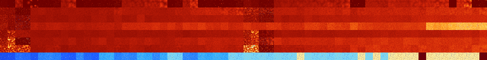

# B01245678 (257536-258047)

<details>
    <summary>Initial Grid</summary>
    
</details>


<details>
    <summary>Initial Grid RLE</summary>

```
#C Exported from GoGoL (https://github.com/marrow16/gogol)
#C Wrap mode: Toroidal
#C Boundary mode: Dead
#C Step: 0
x = 100, y = 100, rule = B01245678/S
13bo3bo8bo29bo26bobo4b2o$bo6bo17bo5bo38bo16bo$15bo7bo2bo3bo2bo6bo21bo
16bo$11bo59bo14bo2b2o$19bo8bo9bo4bo8bobo5bo6bo9bo9b2o5bo$12bo34bo22bo
11bo8bo$5bo10bo17bo10bo5bo21bo15bo$26bo6bo$bo29bo12bo21bo10bo3bo$73bo
13bo$39bo10bo25bo2bo$34bo19bo7bo15bo14bo$13bo15bobo21bo7bo9b2o$14bo7b2o
12bo9bo5bo27bo9bo$34bo10bo24bo24b2o$19bo16bo2bo16bo4bobo16bo15bo$65bo$
55bo$26bo4bo30bo16bo$18bo40bo31bo$30bo11bo27bo13bo10bo$22bo28bo22bo$93b
o$4bo28bo16bo32bo2bo2bo$30bo23bo26bo$17bo48bo22bo$15bo20bo31bo25bo$18bo
$5bo21bo17b2o9bo18b2o$25bo5bo10bo18b2o5bo6bo11bo$5bo6bo70bo6bo$9bo5bo
17bo10bo26bobo$4bo38b2o16bo5bo11bo7bo$bo26bo3bo22bo5bo$12bo26bo6bo42bo
6bo$17bo9bo22bo22bo5bo3bo$42bo20bo34b2o$36bo28bobo$26bo70bo$6bo35bo5bo
39bo7bo$2bo6bo6bo30bo8bo$14bo16bo4bo2bo7bo11bo6bo28bo$5bo6bo14bo3bo3bo
6bo2bo5bo20bo$4bo19bo11bo15bo32bo$11bo65bo$4bo6bo11bo43bo11bo4b2o11bo$
9bo21bo63bo$7bo4b3o13bo10bo7bo6bo39bo3bo$39bo44bo2bo$76bo12bo$70bo$6bo
78bo3bo7bo$7b2o6bo4bo56b2o12b2o$33bo19bo13bo17bobo$9bo2bo5bo10bobo2bo3b
o9bo7bo17bo$78bo$41bo2b2o5bo21bo4bo$19b2o2bo17bo20bo6bo15bo$14b2o2bo8bo
28bo$71bo11bo$19bo$3bo14bo71b2o$6bo33bo11bo3bo5bo$26bo15bo20bo11bo4bo$
2bo2bo10bo17bo7bo20bobo10bo20bo$51bo28bo$10bo46bo7bo$13bo2bo5bo9b2o33bo
31bo$bo3bo3bo51bo3bo5bo$34bo60bobo$3bo40bo2b2o8bo4bo34bo$32bo4bo7bo8b3o
19bo2bo19bo$15bo4bo37bo$4bo2bo12bo38bo18bo$4bo36bo22bo$22bo19bo23bo4bo
12bo$11bo8b2o62bo14bo$bo17bo8bo10bo11bo8bo33bo$8bo3bo5bo17bo5bo38bo14bo
$3bo13bo14bo28bo4bo$21bo7bo$18bo29bo2bo$2b2o25bo24bo$8bo6bo43bo29bo$32b
o3bo30bo$19bo12b2o33bo13bo$23bo65bo8bo$21bo27bo$76bo$17bo2bo7bobo4bo10b
o6bo2bo$4bo26bo8bo3bo9bo10b2o5bo25bo$55bo$2bo15bo3b2o16bo4bo32bo$32bo
25bo19bo$11bo$o7bo64b2o3bo6bo$2b2o18bo28bo3bo13bo8bo$o23bo42bo10bo$5bo
4bo21bobo12bo49b2o$56bo38bo3bo!
```
</details>
<details>
    <summary>Thumbnail</summary>

</details>
<table>
<tr>
    <td><a href="./257536%20S%20Heat%20Map%20Activity.png"></a><br>S (257536)<br>R@260,p2</td>    <td><a href="./257537%20S0%20Heat%20Map%20Activity.png"></a><br>S0 (257537)<br>R@792,p2</td>    <td><a href="./257538%20S1%20Heat%20Map%20Activity.png"></a><br>S1 (257538)<br>G>1000</td>    <td><a href="./257539%20S01%20Heat%20Map%20Activity.png"></a><br>S01 (257539)<br>G>1000</td>    <td><a href="./257540%20S2%20Heat%20Map%20Activity.png"></a><br>S2 (257540)<br>G>1000</td>    <td><a href="./257541%20S02%20Heat%20Map%20Activity.png"></a><br>S02 (257541)<br>R@25,p2</td>    <td><a href="./257542%20S12%20Heat%20Map%20Activity.png"></a><br>S12 (257542)<br>R@13,p2</td>    <td><a href="./257543%20S012%20Heat%20Map%20Activity.png"></a><br>S012 (257543)<br>R@9,p4</td>    <td><a href="./257544%20S3%20Heat%20Map%20Activity.png"></a><br>S3 (257544)<br>G>1000</td>    <td><a href="./257545%20S03%20Heat%20Map%20Activity.png"></a><br>S03 (257545)<br>G>1000</td>    <td><a href="./257546%20S13%20Heat%20Map%20Activity.png"></a><br>S13 (257546)<br>R@109,p4</td>    <td><a href="./257547%20S013%20Heat%20Map%20Activity.png"></a><br>S013 (257547)<br>R@15,p4</td>    <td><a href="./257548%20S23%20Heat%20Map%20Activity.png"></a><br>S23 (257548)<br>R@113,p12</td>    <td><a href="./257549%20S023%20Heat%20Map%20Activity.png"></a><br>S023 (257549)<br>R@23,p4</td>    <td><a href="./257550%20S123%20Heat%20Map%20Activity.png"></a><br>S123 (257550)<br>R@9,p2</td>    <td><a href="./257551%20S0123%20Heat%20Map%20Activity.png"></a><br>S0123 (257551)<br>R@7,p2</td>    <td><a href="./257552%20S4%20Heat%20Map%20Activity.png"></a><br>S4 (257552)<br>G>1000</td>    <td><a href="./257553%20S04%20Heat%20Map%20Activity.png"></a><br>S04 (257553)<br>G>1000</td>    <td><a href="./257554%20S14%20Heat%20Map%20Activity.png"></a><br>S14 (257554)<br>G>1000</td>    <td><a href="./257555%20S014%20Heat%20Map%20Activity.png"></a><br>S014 (257555)<br>G>1000</td>    <td><a href="./257556%20S24%20Heat%20Map%20Activity.png"></a><br>S24 (257556)<br>G>1000</td>    <td><a href="./257557%20S024%20Heat%20Map%20Activity.png"></a><br>S024 (257557)<br>G>1000</td>    <td><a href="./257558%20S124%20Heat%20Map%20Activity.png"></a><br>S124 (257558)<br>R@191,p2</td>    <td><a href="./257559%20S0124%20Heat%20Map%20Activity.png"></a><br>S0124 (257559)<br>R@9,p2</td>    <td><a href="./257560%20S34%20Heat%20Map%20Activity.png"></a><br>S34 (257560)<br>G>1000</td>    <td><a href="./257561%20S034%20Heat%20Map%20Activity.png"></a><br>S034 (257561)<br>G>1000</td>    <td><a href="./257562%20S134%20Heat%20Map%20Activity.png"></a><br>S134 (257562)<br>R@33,p4</td>    <td><a href="./257563%20S0134%20Heat%20Map%20Activity.png"></a><br>S0134 (257563)<br>R@21,p8</td>    <td><a href="./257564%20S234%20Heat%20Map%20Activity.png"></a><br>S234 (257564)<br>R@285,p4</td>    <td><a href="./257565%20S0234%20Heat%20Map%20Activity.png"></a><br>S0234 (257565)<br>R@51,p10</td>    <td><a href="./257566%20S1234%20Heat%20Map%20Activity.png"></a><br>S1234 (257566)<br>R@15,p2</td>    <td><a href="./257567%20S01234%20Heat%20Map%20Activity.png"></a><br>S01234 (257567)<br>R@7,p2</td>    <td><a href="./257568%20S5%20Heat%20Map%20Activity.png"></a><br>S5 (257568)<br>R@61,p2</td>    <td><a href="./257569%20S05%20Heat%20Map%20Activity.png"></a><br>S05 (257569)<br>R@98,p2</td>    <td><a href="./257570%20S15%20Heat%20Map%20Activity.png"></a><br>S15 (257570)<br>G>1000</td>    <td><a href="./257571%20S015%20Heat%20Map%20Activity.png"></a><br>S015 (257571)<br>R@807,p336</td>    <td><a href="./257572%20S25%20Heat%20Map%20Activity.png"></a><br>S25 (257572)<br>G>1000</td>    <td><a href="./257573%20S025%20Heat%20Map%20Activity.png"></a><br>S025 (257573)<br>G>1000</td>    <td><a href="./257574%20S125%20Heat%20Map%20Activity.png"></a><br>S125 (257574)<br>G>1000</td>    <td><a href="./257575%20S0125%20Heat%20Map%20Activity.png"></a><br>S0125 (257575)<br>G>1000</td>    <td><a href="./257576%20S35%20Heat%20Map%20Activity.png"></a><br>S35 (257576)<br>G>1000</td>    <td><a href="./257577%20S035%20Heat%20Map%20Activity.png"></a><br>S035 (257577)<br>G>1000</td>    <td><a href="./257578%20S135%20Heat%20Map%20Activity.png"></a><br>S135 (257578)<br>G>1000</td>    <td><a href="./257579%20S0135%20Heat%20Map%20Activity.png"></a><br>S0135 (257579)<br>G>1000</td>    <td><a href="./257580%20S235%20Heat%20Map%20Activity.png"></a><br>S235 (257580)<br>G>1000</td>    <td><a href="./257581%20S0235%20Heat%20Map%20Activity.png"></a><br>S0235 (257581)<br>G>1000</td>    <td><a href="./257582%20S1235%20Heat%20Map%20Activity.png"></a><br>S1235 (257582)<br>R@47,p2</td>    <td><a href="./257583%20S01235%20Heat%20Map%20Activity.png"></a><br>S01235 (257583)<br>R@55,p4</td>    <td><a href="./257584%20S45%20Heat%20Map%20Activity.png"></a><br>S45 (257584)<br>G>1000</td>    <td><a href="./257585%20S045%20Heat%20Map%20Activity.png"></a><br>S045 (257585)<br>G>1000</td>    <td><a href="./257586%20S145%20Heat%20Map%20Activity.png"></a><br>S145 (257586)<br>G>1000</td>    <td><a href="./257587%20S0145%20Heat%20Map%20Activity.png"></a><br>S0145 (257587)<br>G>1000</td>    <td><a href="./257588%20S245%20Heat%20Map%20Activity.png"></a><br>S245 (257588)<br>G>1000</td>    <td><a href="./257589%20S0245%20Heat%20Map%20Activity.png"></a><br>S0245 (257589)<br>G>1000</td>    <td><a href="./257590%20S1245%20Heat%20Map%20Activity.png"></a><br>S1245 (257590)<br>G>1000</td>    <td><a href="./257591%20S01245%20Heat%20Map%20Activity.png"></a><br>S01245 (257591)<br>G>1000</td>    <td><a href="./257592%20S345%20Heat%20Map%20Activity.png"></a><br>S345 (257592)<br>G>1000</td>    <td><a href="./257593%20S0345%20Heat%20Map%20Activity.png"></a><br>S0345 (257593)<br>G>1000</td>    <td><a href="./257594%20S1345%20Heat%20Map%20Activity.png"></a><br>S1345 (257594)<br>G>1000</td>    <td><a href="./257595%20S01345%20Heat%20Map%20Activity.png"></a><br>S01345 (257595)<br>R@415,p400</td>    <td><a href="./257596%20S2345%20Heat%20Map%20Activity.png"></a><br>S2345 (257596)<br>G>1000</td>    <td><a href="./257597%20S02345%20Heat%20Map%20Activity.png"></a><br>S02345 (257597)<br>G>1000</td>    <td><a href="./257598%20S12345%20Heat%20Map%20Activity.png"></a><br>S12345 (257598)<br>R@31,p4</td>    <td><a href="./257599%20S012345%20Heat%20Map%20Activity.png"></a><br>S012345 (257599)<br>R@13,p2</td></tr>
<tr>
    <td><a href="./257600%20S6%20Heat%20Map%20Activity.png"></a><br>S6 (257600)<br>R@35,p4</td>    <td><a href="./257601%20S06%20Heat%20Map%20Activity.png"></a><br>S06 (257601)<br>R@42,p4</td>    <td><a href="./257602%20S16%20Heat%20Map%20Activity.png"></a><br>S16 (257602)<br>G>1000</td>    <td><a href="./257603%20S016%20Heat%20Map%20Activity.png"></a><br>S016 (257603)<br>R@385,p120</td>    <td><a href="./257604%20S26%20Heat%20Map%20Activity.png"></a><br>S26 (257604)<br>G>1000</td>    <td><a href="./257605%20S026%20Heat%20Map%20Activity.png"></a><br>S026 (257605)<br>G>1000</td>    <td><a href="./257606%20S126%20Heat%20Map%20Activity.png"></a><br>S126 (257606)<br>G>1000</td>    <td><a href="./257607%20S0126%20Heat%20Map%20Activity.png"></a><br>S0126 (257607)<br>G>1000</td>    <td><a href="./257608%20S36%20Heat%20Map%20Activity.png"></a><br>S36 (257608)<br>G>1000</td>    <td><a href="./257609%20S036%20Heat%20Map%20Activity.png"></a><br>S036 (257609)<br>G>1000</td>    <td><a href="./257610%20S136%20Heat%20Map%20Activity.png"></a><br>S136 (257610)<br>G>1000</td>    <td><a href="./257611%20S0136%20Heat%20Map%20Activity.png"></a><br>S0136 (257611)<br>G>1000</td>    <td><a href="./257612%20S236%20Heat%20Map%20Activity.png"></a><br>S236 (257612)<br>G>1000</td>    <td><a href="./257613%20S0236%20Heat%20Map%20Activity.png"></a><br>S0236 (257613)<br>G>1000</td>    <td><a href="./257614%20S1236%20Heat%20Map%20Activity.png"></a><br>S1236 (257614)<br>G>1000</td>    <td><a href="./257615%20S01236%20Heat%20Map%20Activity.png"></a><br>S01236 (257615)<br>G>1000</td>    <td><a href="./257616%20S46%20Heat%20Map%20Activity.png"></a><br>S46 (257616)<br>G>1000</td>    <td><a href="./257617%20S046%20Heat%20Map%20Activity.png"></a><br>S046 (257617)<br>G>1000</td>    <td><a href="./257618%20S146%20Heat%20Map%20Activity.png"></a><br>S146 (257618)<br>G>1000</td>    <td><a href="./257619%20S0146%20Heat%20Map%20Activity.png"></a><br>S0146 (257619)<br>G>1000</td>    <td><a href="./257620%20S246%20Heat%20Map%20Activity.png"></a><br>S246 (257620)<br>G>1000</td>    <td><a href="./257621%20S0246%20Heat%20Map%20Activity.png"></a><br>S0246 (257621)<br>G>1000</td>    <td><a href="./257622%20S1246%20Heat%20Map%20Activity.png"></a><br>S1246 (257622)<br>G>1000</td>    <td><a href="./257623%20S01246%20Heat%20Map%20Activity.png"></a><br>S01246 (257623)<br>G>1000</td>    <td><a href="./257624%20S346%20Heat%20Map%20Activity.png"></a><br>S346 (257624)<br>G>1000</td>    <td><a href="./257625%20S0346%20Heat%20Map%20Activity.png"></a><br>S0346 (257625)<br>G>1000</td>    <td><a href="./257626%20S1346%20Heat%20Map%20Activity.png"></a><br>S1346 (257626)<br>G>1000</td>    <td><a href="./257627%20S01346%20Heat%20Map%20Activity.png"></a><br>S01346 (257627)<br>G>1000</td>    <td><a href="./257628%20S2346%20Heat%20Map%20Activity.png"></a><br>S2346 (257628)<br>G>1000</td>    <td><a href="./257629%20S02346%20Heat%20Map%20Activity.png"></a><br>S02346 (257629)<br>G>1000</td>    <td><a href="./257630%20S12346%20Heat%20Map%20Activity.png"></a><br>S12346 (257630)<br>G>1000</td>    <td><a href="./257631%20S012346%20Heat%20Map%20Activity.png"></a><br>S012346 (257631)<br>G>1000</td>    <td><a href="./257632%20S56%20Heat%20Map%20Activity.png"></a><br>S56 (257632)<br>R@91,p12</td>    <td><a href="./257633%20S056%20Heat%20Map%20Activity.png"></a><br>S056 (257633)<br>R@107,p12</td>    <td><a href="./257634%20S156%20Heat%20Map%20Activity.png"></a><br>S156 (257634)<br>R@396,p120</td>    <td><a href="./257635%20S0156%20Heat%20Map%20Activity.png"></a><br>S0156 (257635)<br>R@486,p24</td>    <td><a href="./257636%20S256%20Heat%20Map%20Activity.png"></a><br>S256 (257636)<br>G>1000</td>    <td><a href="./257637%20S0256%20Heat%20Map%20Activity.png"></a><br>S0256 (257637)<br>G>1000</td>    <td><a href="./257638%20S1256%20Heat%20Map%20Activity.png"></a><br>S1256 (257638)<br>G>1000</td>    <td><a href="./257639%20S01256%20Heat%20Map%20Activity.png"></a><br>S01256 (257639)<br>G>1000</td>    <td><a href="./257640%20S356%20Heat%20Map%20Activity.png"></a><br>S356 (257640)<br>G>1000</td>    <td><a href="./257641%20S0356%20Heat%20Map%20Activity.png"></a><br>S0356 (257641)<br>G>1000</td>    <td><a href="./257642%20S1356%20Heat%20Map%20Activity.png"></a><br>S1356 (257642)<br>G>1000</td>    <td><a href="./257643%20S01356%20Heat%20Map%20Activity.png"></a><br>S01356 (257643)<br>G>1000</td>    <td><a href="./257644%20S2356%20Heat%20Map%20Activity.png"></a><br>S2356 (257644)<br>G>1000</td>    <td><a href="./257645%20S02356%20Heat%20Map%20Activity.png"></a><br>S02356 (257645)<br>G>1000</td>    <td><a href="./257646%20S12356%20Heat%20Map%20Activity.png"></a><br>S12356 (257646)<br>G>1000</td>    <td><a href="./257647%20S012356%20Heat%20Map%20Activity.png"></a><br>S012356 (257647)<br>G>1000</td>    <td><a href="./257648%20S456%20Heat%20Map%20Activity.png"></a><br>S456 (257648)<br>G>1000</td>    <td><a href="./257649%20S0456%20Heat%20Map%20Activity.png"></a><br>S0456 (257649)<br>G>1000</td>    <td><a href="./257650%20S1456%20Heat%20Map%20Activity.png"></a><br>S1456 (257650)<br>G>1000</td>    <td><a href="./257651%20S01456%20Heat%20Map%20Activity.png"></a><br>S01456 (257651)<br>G>1000</td>    <td><a href="./257652%20S2456%20Heat%20Map%20Activity.png"></a><br>S2456 (257652)<br>G>1000</td>    <td><a href="./257653%20S02456%20Heat%20Map%20Activity.png"></a><br>S02456 (257653)<br>G>1000</td>    <td><a href="./257654%20S12456%20Heat%20Map%20Activity.png"></a><br>S12456 (257654)<br>G>1000</td>    <td><a href="./257655%20S012456%20Heat%20Map%20Activity.png"></a><br>S012456 (257655)<br>G>1000</td>    <td><a href="./257656%20S3456%20Heat%20Map%20Activity.png"></a><br>S3456 (257656)<br>G>1000</td>    <td><a href="./257657%20S03456%20Heat%20Map%20Activity.png"></a><br>S03456 (257657)<br>G>1000</td>    <td><a href="./257658%20S13456%20Heat%20Map%20Activity.png"></a><br>S13456 (257658)<br>G>1000</td>    <td><a href="./257659%20S013456%20Heat%20Map%20Activity.png"></a><br>S013456 (257659)<br>G>1000</td>    <td><a href="./257660%20S23456%20Heat%20Map%20Activity.png"></a><br>S23456 (257660)<br>G>1000</td>    <td><a href="./257661%20S023456%20Heat%20Map%20Activity.png"></a><br>S023456 (257661)<br>G>1000</td>    <td><a href="./257662%20S123456%20Heat%20Map%20Activity.png"></a><br>S123456 (257662)<br>G>1000</td>    <td><a href="./257663%20S0123456%20Heat%20Map%20Activity.png"></a><br>S0123456 (257663)<br>G>1000</td></tr>
<tr>
    <td><a href="./257664%20S7%20Heat%20Map%20Activity.png"></a><br>S7 (257664)<br>R@34,p2</td>    <td><a href="./257665%20S07%20Heat%20Map%20Activity.png"></a><br>S07 (257665)<br>R@41,p2</td>    <td><a href="./257666%20S17%20Heat%20Map%20Activity.png"></a><br>S17 (257666)<br>R@127,p4</td>    <td><a href="./257667%20S017%20Heat%20Map%20Activity.png"></a><br>S017 (257667)<br>R@87,p4</td>    <td><a href="./257668%20S27%20Heat%20Map%20Activity.png"></a><br>S27 (257668)<br>G>1000</td>    <td><a href="./257669%20S027%20Heat%20Map%20Activity.png"></a><br>S027 (257669)<br>G>1000</td>    <td><a href="./257670%20S127%20Heat%20Map%20Activity.png"></a><br>S127 (257670)<br>G>1000</td>    <td><a href="./257671%20S0127%20Heat%20Map%20Activity.png"></a><br>S0127 (257671)<br>G>1000</td>    <td><a href="./257672%20S37%20Heat%20Map%20Activity.png"></a><br>S37 (257672)<br>G>1000</td>    <td><a href="./257673%20S037%20Heat%20Map%20Activity.png"></a><br>S037 (257673)<br>G>1000</td>    <td><a href="./257674%20S137%20Heat%20Map%20Activity.png"></a><br>S137 (257674)<br>G>1000</td>    <td><a href="./257675%20S0137%20Heat%20Map%20Activity.png"></a><br>S0137 (257675)<br>G>1000</td>    <td><a href="./257676%20S237%20Heat%20Map%20Activity.png"></a><br>S237 (257676)<br>G>1000</td>    <td><a href="./257677%20S0237%20Heat%20Map%20Activity.png"></a><br>S0237 (257677)<br>G>1000</td>    <td><a href="./257678%20S1237%20Heat%20Map%20Activity.png"></a><br>S1237 (257678)<br>G>1000</td>    <td><a href="./257679%20S01237%20Heat%20Map%20Activity.png"></a><br>S01237 (257679)<br>G>1000</td>    <td><a href="./257680%20S47%20Heat%20Map%20Activity.png"></a><br>S47 (257680)<br>G>1000</td>    <td><a href="./257681%20S047%20Heat%20Map%20Activity.png"></a><br>S047 (257681)<br>G>1000</td>    <td><a href="./257682%20S147%20Heat%20Map%20Activity.png"></a><br>S147 (257682)<br>G>1000</td>    <td><a href="./257683%20S0147%20Heat%20Map%20Activity.png"></a><br>S0147 (257683)<br>G>1000</td>    <td><a href="./257684%20S247%20Heat%20Map%20Activity.png"></a><br>S247 (257684)<br>G>1000</td>    <td><a href="./257685%20S0247%20Heat%20Map%20Activity.png"></a><br>S0247 (257685)<br>G>1000</td>    <td><a href="./257686%20S1247%20Heat%20Map%20Activity.png"></a><br>S1247 (257686)<br>G>1000</td>    <td><a href="./257687%20S01247%20Heat%20Map%20Activity.png"></a><br>S01247 (257687)<br>G>1000</td>    <td><a href="./257688%20S347%20Heat%20Map%20Activity.png"></a><br>S347 (257688)<br>G>1000</td>    <td><a href="./257689%20S0347%20Heat%20Map%20Activity.png"></a><br>S0347 (257689)<br>G>1000</td>    <td><a href="./257690%20S1347%20Heat%20Map%20Activity.png"></a><br>S1347 (257690)<br>G>1000</td>    <td><a href="./257691%20S01347%20Heat%20Map%20Activity.png"></a><br>S01347 (257691)<br>G>1000</td>    <td><a href="./257692%20S2347%20Heat%20Map%20Activity.png"></a><br>S2347 (257692)<br>G>1000</td>    <td><a href="./257693%20S02347%20Heat%20Map%20Activity.png"></a><br>S02347 (257693)<br>G>1000</td>    <td><a href="./257694%20S12347%20Heat%20Map%20Activity.png"></a><br>S12347 (257694)<br>G>1000</td>    <td><a href="./257695%20S012347%20Heat%20Map%20Activity.png"></a><br>S012347 (257695)<br>G>1000</td>    <td><a href="./257696%20S57%20Heat%20Map%20Activity.png"></a><br>S57 (257696)<br>R@31,p2</td>    <td><a href="./257697%20S057%20Heat%20Map%20Activity.png"></a><br>S057 (257697)<br>R@31,p2</td>    <td><a href="./257698%20S157%20Heat%20Map%20Activity.png"></a><br>S157 (257698)<br>R@105,p16</td>    <td><a href="./257699%20S0157%20Heat%20Map%20Activity.png"></a><br>S0157 (257699)<br>R@108,p8</td>    <td><a href="./257700%20S257%20Heat%20Map%20Activity.png"></a><br>S257 (257700)<br>G>1000</td>    <td><a href="./257701%20S0257%20Heat%20Map%20Activity.png"></a><br>S0257 (257701)<br>G>1000</td>    <td><a href="./257702%20S1257%20Heat%20Map%20Activity.png"></a><br>S1257 (257702)<br>G>1000</td>    <td><a href="./257703%20S01257%20Heat%20Map%20Activity.png"></a><br>S01257 (257703)<br>G>1000</td>    <td><a href="./257704%20S357%20Heat%20Map%20Activity.png"></a><br>S357 (257704)<br>G>1000</td>    <td><a href="./257705%20S0357%20Heat%20Map%20Activity.png"></a><br>S0357 (257705)<br>G>1000</td>    <td><a href="./257706%20S1357%20Heat%20Map%20Activity.png"></a><br>S1357 (257706)<br>G>1000</td>    <td><a href="./257707%20S01357%20Heat%20Map%20Activity.png"></a><br>S01357 (257707)<br>G>1000</td>    <td><a href="./257708%20S2357%20Heat%20Map%20Activity.png"></a><br>S2357 (257708)<br>G>1000</td>    <td><a href="./257709%20S02357%20Heat%20Map%20Activity.png"></a><br>S02357 (257709)<br>G>1000</td>    <td><a href="./257710%20S12357%20Heat%20Map%20Activity.png"></a><br>S12357 (257710)<br>G>1000</td>    <td><a href="./257711%20S012357%20Heat%20Map%20Activity.png"></a><br>S012357 (257711)<br>G>1000</td>    <td><a href="./257712%20S457%20Heat%20Map%20Activity.png"></a><br>S457 (257712)<br>G>1000</td>    <td><a href="./257713%20S0457%20Heat%20Map%20Activity.png"></a><br>S0457 (257713)<br>G>1000</td>    <td><a href="./257714%20S1457%20Heat%20Map%20Activity.png"></a><br>S1457 (257714)<br>G>1000</td>    <td><a href="./257715%20S01457%20Heat%20Map%20Activity.png"></a><br>S01457 (257715)<br>G>1000</td>    <td><a href="./257716%20S2457%20Heat%20Map%20Activity.png"></a><br>S2457 (257716)<br>G>1000</td>    <td><a href="./257717%20S02457%20Heat%20Map%20Activity.png"></a><br>S02457 (257717)<br>G>1000</td>    <td><a href="./257718%20S12457%20Heat%20Map%20Activity.png"></a><br>S12457 (257718)<br>G>1000</td>    <td><a href="./257719%20S012457%20Heat%20Map%20Activity.png"></a><br>S012457 (257719)<br>G>1000</td>    <td><a href="./257720%20S3457%20Heat%20Map%20Activity.png"></a><br>S3457 (257720)<br>G>1000</td>    <td><a href="./257721%20S03457%20Heat%20Map%20Activity.png"></a><br>S03457 (257721)<br>G>1000</td>    <td><a href="./257722%20S13457%20Heat%20Map%20Activity.png"></a><br>S13457 (257722)<br>G>1000</td>    <td><a href="./257723%20S013457%20Heat%20Map%20Activity.png"></a><br>S013457 (257723)<br>G>1000</td>    <td><a href="./257724%20S23457%20Heat%20Map%20Activity.png"></a><br>S23457 (257724)<br>G>1000</td>    <td><a href="./257725%20S023457%20Heat%20Map%20Activity.png"></a><br>S023457 (257725)<br>G>1000</td>    <td><a href="./257726%20S123457%20Heat%20Map%20Activity.png"></a><br>S123457 (257726)<br>G>1000</td>    <td><a href="./257727%20S0123457%20Heat%20Map%20Activity.png"></a><br>S0123457 (257727)<br>G>1000</td></tr>
<tr>
    <td><a href="./257728%20S67%20Heat%20Map%20Activity.png"></a><br>S67 (257728)<br>R@23,p2</td>    <td><a href="./257729%20S067%20Heat%20Map%20Activity.png"></a><br>S067 (257729)<br>R@43,p4</td>    <td><a href="./257730%20S167%20Heat%20Map%20Activity.png"></a><br>S167 (257730)<br>R@37,p12</td>    <td><a href="./257731%20S0167%20Heat%20Map%20Activity.png"></a><br>S0167 (257731)<br>R@53,p12</td>    <td><a href="./257732%20S267%20Heat%20Map%20Activity.png"></a><br>S267 (257732)<br>G>1000</td>    <td><a href="./257733%20S0267%20Heat%20Map%20Activity.png"></a><br>S0267 (257733)<br>G>1000</td>    <td><a href="./257734%20S1267%20Heat%20Map%20Activity.png"></a><br>S1267 (257734)<br>G>1000</td>    <td><a href="./257735%20S01267%20Heat%20Map%20Activity.png"></a><br>S01267 (257735)<br>G>1000</td>    <td><a href="./257736%20S367%20Heat%20Map%20Activity.png"></a><br>S367 (257736)<br>G>1000</td>    <td><a href="./257737%20S0367%20Heat%20Map%20Activity.png"></a><br>S0367 (257737)<br>G>1000</td>    <td><a href="./257738%20S1367%20Heat%20Map%20Activity.png"></a><br>S1367 (257738)<br>G>1000</td>    <td><a href="./257739%20S01367%20Heat%20Map%20Activity.png"></a><br>S01367 (257739)<br>G>1000</td>    <td><a href="./257740%20S2367%20Heat%20Map%20Activity.png"></a><br>S2367 (257740)<br>G>1000</td>    <td><a href="./257741%20S02367%20Heat%20Map%20Activity.png"></a><br>S02367 (257741)<br>G>1000</td>    <td><a href="./257742%20S12367%20Heat%20Map%20Activity.png"></a><br>S12367 (257742)<br>G>1000</td>    <td><a href="./257743%20S012367%20Heat%20Map%20Activity.png"></a><br>S012367 (257743)<br>G>1000</td>    <td><a href="./257744%20S467%20Heat%20Map%20Activity.png"></a><br>S467 (257744)<br>G>1000</td>    <td><a href="./257745%20S0467%20Heat%20Map%20Activity.png"></a><br>S0467 (257745)<br>G>1000</td>    <td><a href="./257746%20S1467%20Heat%20Map%20Activity.png"></a><br>S1467 (257746)<br>G>1000</td>    <td><a href="./257747%20S01467%20Heat%20Map%20Activity.png"></a><br>S01467 (257747)<br>G>1000</td>    <td><a href="./257748%20S2467%20Heat%20Map%20Activity.png"></a><br>S2467 (257748)<br>G>1000</td>    <td><a href="./257749%20S02467%20Heat%20Map%20Activity.png"></a><br>S02467 (257749)<br>G>1000</td>    <td><a href="./257750%20S12467%20Heat%20Map%20Activity.png"></a><br>S12467 (257750)<br>G>1000</td>    <td><a href="./257751%20S012467%20Heat%20Map%20Activity.png"></a><br>S012467 (257751)<br>G>1000</td>    <td><a href="./257752%20S3467%20Heat%20Map%20Activity.png"></a><br>S3467 (257752)<br>G>1000</td>    <td><a href="./257753%20S03467%20Heat%20Map%20Activity.png"></a><br>S03467 (257753)<br>G>1000</td>    <td><a href="./257754%20S13467%20Heat%20Map%20Activity.png"></a><br>S13467 (257754)<br>G>1000</td>    <td><a href="./257755%20S013467%20Heat%20Map%20Activity.png"></a><br>S013467 (257755)<br>G>1000</td>    <td><a href="./257756%20S23467%20Heat%20Map%20Activity.png"></a><br>S23467 (257756)<br>G>1000</td>    <td><a href="./257757%20S023467%20Heat%20Map%20Activity.png"></a><br>S023467 (257757)<br>G>1000</td>    <td><a href="./257758%20S123467%20Heat%20Map%20Activity.png"></a><br>S123467 (257758)<br>G>1000</td>    <td><a href="./257759%20S0123467%20Heat%20Map%20Activity.png"></a><br>S0123467 (257759)<br>G>1000</td>    <td><a href="./257760%20S567%20Heat%20Map%20Activity.png"></a><br>S567 (257760)<br>G>1000</td>    <td><a href="./257761%20S0567%20Heat%20Map%20Activity.png"></a><br>S0567 (257761)<br>G>1000</td>    <td><a href="./257762%20S1567%20Heat%20Map%20Activity.png"></a><br>S1567 (257762)<br>G>1000</td>    <td><a href="./257763%20S01567%20Heat%20Map%20Activity.png"></a><br>S01567 (257763)<br>G>1000</td>    <td><a href="./257764%20S2567%20Heat%20Map%20Activity.png"></a><br>S2567 (257764)<br>G>1000</td>    <td><a href="./257765%20S02567%20Heat%20Map%20Activity.png"></a><br>S02567 (257765)<br>G>1000</td>    <td><a href="./257766%20S12567%20Heat%20Map%20Activity.png"></a><br>S12567 (257766)<br>G>1000</td>    <td><a href="./257767%20S012567%20Heat%20Map%20Activity.png"></a><br>S012567 (257767)<br>G>1000</td>    <td><a href="./257768%20S3567%20Heat%20Map%20Activity.png"></a><br>S3567 (257768)<br>G>1000</td>    <td><a href="./257769%20S03567%20Heat%20Map%20Activity.png"></a><br>S03567 (257769)<br>G>1000</td>    <td><a href="./257770%20S13567%20Heat%20Map%20Activity.png"></a><br>S13567 (257770)<br>G>1000</td>    <td><a href="./257771%20S013567%20Heat%20Map%20Activity.png"></a><br>S013567 (257771)<br>G>1000</td>    <td><a href="./257772%20S23567%20Heat%20Map%20Activity.png"></a><br>S23567 (257772)<br>G>1000</td>    <td><a href="./257773%20S023567%20Heat%20Map%20Activity.png"></a><br>S023567 (257773)<br>G>1000</td>    <td><a href="./257774%20S123567%20Heat%20Map%20Activity.png"></a><br>S123567 (257774)<br>G>1000</td>    <td><a href="./257775%20S0123567%20Heat%20Map%20Activity.png"></a><br>S0123567 (257775)<br>G>1000</td>    <td><a href="./257776%20S4567%20Heat%20Map%20Activity.png"></a><br>S4567 (257776)<br>G>1000</td>    <td><a href="./257777%20S04567%20Heat%20Map%20Activity.png"></a><br>S04567 (257777)<br>G>1000</td>    <td><a href="./257778%20S14567%20Heat%20Map%20Activity.png"></a><br>S14567 (257778)<br>G>1000</td>    <td><a href="./257779%20S014567%20Heat%20Map%20Activity.png"></a><br>S014567 (257779)<br>G>1000</td>    <td><a href="./257780%20S24567%20Heat%20Map%20Activity.png"></a><br>S24567 (257780)<br>G>1000</td>    <td><a href="./257781%20S024567%20Heat%20Map%20Activity.png"></a><br>S024567 (257781)<br>G>1000</td>    <td><a href="./257782%20S124567%20Heat%20Map%20Activity.png"></a><br>S124567 (257782)<br>G>1000</td>    <td><a href="./257783%20S0124567%20Heat%20Map%20Activity.png"></a><br>S0124567 (257783)<br>G>1000</td>    <td><a href="./257784%20S34567%20Heat%20Map%20Activity.png"></a><br>S34567 (257784)<br>G>1000</td>    <td><a href="./257785%20S034567%20Heat%20Map%20Activity.png"></a><br>S034567 (257785)<br>G>1000</td>    <td><a href="./257786%20S134567%20Heat%20Map%20Activity.png"></a><br>S134567 (257786)<br>G>1000</td>    <td><a href="./257787%20S0134567%20Heat%20Map%20Activity.png"></a><br>S0134567 (257787)<br>G>1000</td>    <td><a href="./257788%20S234567%20Heat%20Map%20Activity.png"></a><br>S234567 (257788)<br>G>1000</td>    <td><a href="./257789%20S0234567%20Heat%20Map%20Activity.png"></a><br>S0234567 (257789)<br>G>1000</td>    <td><a href="./257790%20S1234567%20Heat%20Map%20Activity.png"></a><br>S1234567 (257790)<br>G>1000</td>    <td><a href="./257791%20S01234567%20Heat%20Map%20Activity.png"></a><br>S01234567 (257791)<br>G>1000</td></tr>
<tr>
    <td><a href="./257792%20S8%20Heat%20Map%20Activity.png"></a><br>S8 (257792)<br>R@38,p4</td>    <td><a href="./257793%20S08%20Heat%20Map%20Activity.png"></a><br>S08 (257793)<br>R@42,p4</td>    <td><a href="./257794%20S18%20Heat%20Map%20Activity.png"></a><br>S18 (257794)<br>G>1000</td>    <td><a href="./257795%20S018%20Heat%20Map%20Activity.png"></a><br>S018 (257795)<br>G>1000</td>    <td><a href="./257796%20S28%20Heat%20Map%20Activity.png"></a><br>S28 (257796)<br>G>1000</td>    <td><a href="./257797%20S028%20Heat%20Map%20Activity.png"></a><br>S028 (257797)<br>G>1000</td>    <td><a href="./257798%20S128%20Heat%20Map%20Activity.png"></a><br>S128 (257798)<br>G>1000</td>    <td><a href="./257799%20S0128%20Heat%20Map%20Activity.png"></a><br>S0128 (257799)<br>G>1000</td>    <td><a href="./257800%20S38%20Heat%20Map%20Activity.png"></a><br>S38 (257800)<br>G>1000</td>    <td><a href="./257801%20S038%20Heat%20Map%20Activity.png"></a><br>S038 (257801)<br>G>1000</td>    <td><a href="./257802%20S138%20Heat%20Map%20Activity.png"></a><br>S138 (257802)<br>G>1000</td>    <td><a href="./257803%20S0138%20Heat%20Map%20Activity.png"></a><br>S0138 (257803)<br>G>1000</td>    <td><a href="./257804%20S238%20Heat%20Map%20Activity.png"></a><br>S238 (257804)<br>G>1000</td>    <td><a href="./257805%20S0238%20Heat%20Map%20Activity.png"></a><br>S0238 (257805)<br>G>1000</td>    <td><a href="./257806%20S1238%20Heat%20Map%20Activity.png"></a><br>S1238 (257806)<br>G>1000</td>    <td><a href="./257807%20S01238%20Heat%20Map%20Activity.png"></a><br>S01238 (257807)<br>G>1000</td>    <td><a href="./257808%20S48%20Heat%20Map%20Activity.png"></a><br>S48 (257808)<br>G>1000</td>    <td><a href="./257809%20S048%20Heat%20Map%20Activity.png"></a><br>S048 (257809)<br>G>1000</td>    <td><a href="./257810%20S148%20Heat%20Map%20Activity.png"></a><br>S148 (257810)<br>G>1000</td>    <td><a href="./257811%20S0148%20Heat%20Map%20Activity.png"></a><br>S0148 (257811)<br>G>1000</td>    <td><a href="./257812%20S248%20Heat%20Map%20Activity.png"></a><br>S248 (257812)<br>G>1000</td>    <td><a href="./257813%20S0248%20Heat%20Map%20Activity.png"></a><br>S0248 (257813)<br>G>1000</td>    <td><a href="./257814%20S1248%20Heat%20Map%20Activity.png"></a><br>S1248 (257814)<br>G>1000</td>    <td><a href="./257815%20S01248%20Heat%20Map%20Activity.png"></a><br>S01248 (257815)<br>G>1000</td>    <td><a href="./257816%20S348%20Heat%20Map%20Activity.png"></a><br>S348 (257816)<br>G>1000</td>    <td><a href="./257817%20S0348%20Heat%20Map%20Activity.png"></a><br>S0348 (257817)<br>G>1000</td>    <td><a href="./257818%20S1348%20Heat%20Map%20Activity.png"></a><br>S1348 (257818)<br>G>1000</td>    <td><a href="./257819%20S01348%20Heat%20Map%20Activity.png"></a><br>S01348 (257819)<br>G>1000</td>    <td><a href="./257820%20S2348%20Heat%20Map%20Activity.png"></a><br>S2348 (257820)<br>G>1000</td>    <td><a href="./257821%20S02348%20Heat%20Map%20Activity.png"></a><br>S02348 (257821)<br>G>1000</td>    <td><a href="./257822%20S12348%20Heat%20Map%20Activity.png"></a><br>S12348 (257822)<br>G>1000</td>    <td><a href="./257823%20S012348%20Heat%20Map%20Activity.png"></a><br>S012348 (257823)<br>G>1000</td>    <td><a href="./257824%20S58%20Heat%20Map%20Activity.png"></a><br>S58 (257824)<br>R@24,p6</td>    <td><a href="./257825%20S058%20Heat%20Map%20Activity.png"></a><br>S058 (257825)<br>R@31,p2</td>    <td><a href="./257826%20S158%20Heat%20Map%20Activity.png"></a><br>S158 (257826)<br>R@276,p6</td>    <td><a href="./257827%20S0158%20Heat%20Map%20Activity.png"></a><br>S0158 (257827)<br>R@331,p6</td>    <td><a href="./257828%20S258%20Heat%20Map%20Activity.png"></a><br>S258 (257828)<br>G>1000</td>    <td><a href="./257829%20S0258%20Heat%20Map%20Activity.png"></a><br>S0258 (257829)<br>G>1000</td>    <td><a href="./257830%20S1258%20Heat%20Map%20Activity.png"></a><br>S1258 (257830)<br>G>1000</td>    <td><a href="./257831%20S01258%20Heat%20Map%20Activity.png"></a><br>S01258 (257831)<br>G>1000</td>    <td><a href="./257832%20S358%20Heat%20Map%20Activity.png"></a><br>S358 (257832)<br>G>1000</td>    <td><a href="./257833%20S0358%20Heat%20Map%20Activity.png"></a><br>S0358 (257833)<br>G>1000</td>    <td><a href="./257834%20S1358%20Heat%20Map%20Activity.png"></a><br>S1358 (257834)<br>G>1000</td>    <td><a href="./257835%20S01358%20Heat%20Map%20Activity.png"></a><br>S01358 (257835)<br>G>1000</td>    <td><a href="./257836%20S2358%20Heat%20Map%20Activity.png"></a><br>S2358 (257836)<br>G>1000</td>    <td><a href="./257837%20S02358%20Heat%20Map%20Activity.png"></a><br>S02358 (257837)<br>G>1000</td>    <td><a href="./257838%20S12358%20Heat%20Map%20Activity.png"></a><br>S12358 (257838)<br>G>1000</td>    <td><a href="./257839%20S012358%20Heat%20Map%20Activity.png"></a><br>S012358 (257839)<br>G>1000</td>    <td><a href="./257840%20S458%20Heat%20Map%20Activity.png"></a><br>S458 (257840)<br>G>1000</td>    <td><a href="./257841%20S0458%20Heat%20Map%20Activity.png"></a><br>S0458 (257841)<br>G>1000</td>    <td><a href="./257842%20S1458%20Heat%20Map%20Activity.png"></a><br>S1458 (257842)<br>G>1000</td>    <td><a href="./257843%20S01458%20Heat%20Map%20Activity.png"></a><br>S01458 (257843)<br>G>1000</td>    <td><a href="./257844%20S2458%20Heat%20Map%20Activity.png"></a><br>S2458 (257844)<br>G>1000</td>    <td><a href="./257845%20S02458%20Heat%20Map%20Activity.png"></a><br>S02458 (257845)<br>G>1000</td>    <td><a href="./257846%20S12458%20Heat%20Map%20Activity.png"></a><br>S12458 (257846)<br>G>1000</td>    <td><a href="./257847%20S012458%20Heat%20Map%20Activity.png"></a><br>S012458 (257847)<br>G>1000</td>    <td><a href="./257848%20S3458%20Heat%20Map%20Activity.png"></a><br>S3458 (257848)<br>G>1000</td>    <td><a href="./257849%20S03458%20Heat%20Map%20Activity.png"></a><br>S03458 (257849)<br>G>1000</td>    <td><a href="./257850%20S13458%20Heat%20Map%20Activity.png"></a><br>S13458 (257850)<br>G>1000</td>    <td><a href="./257851%20S013458%20Heat%20Map%20Activity.png"></a><br>S013458 (257851)<br>G>1000</td>    <td><a href="./257852%20S23458%20Heat%20Map%20Activity.png"></a><br>S23458 (257852)<br>G>1000</td>    <td><a href="./257853%20S023458%20Heat%20Map%20Activity.png"></a><br>S023458 (257853)<br>G>1000</td>    <td><a href="./257854%20S123458%20Heat%20Map%20Activity.png"></a><br>S123458 (257854)<br>G>1000</td>    <td><a href="./257855%20S0123458%20Heat%20Map%20Activity.png"></a><br>S0123458 (257855)<br>G>1000</td></tr>
<tr>
    <td><a href="./257856%20S68%20Heat%20Map%20Activity.png"></a><br>S68 (257856)<br>R@25,p4</td>    <td><a href="./257857%20S068%20Heat%20Map%20Activity.png"></a><br>S068 (257857)<br>R@26,p4</td>    <td><a href="./257858%20S168%20Heat%20Map%20Activity.png"></a><br>S168 (257858)<br>G>1000</td>    <td><a href="./257859%20S0168%20Heat%20Map%20Activity.png"></a><br>S0168 (257859)<br>G>1000</td>    <td><a href="./257860%20S268%20Heat%20Map%20Activity.png"></a><br>S268 (257860)<br>G>1000</td>    <td><a href="./257861%20S0268%20Heat%20Map%20Activity.png"></a><br>S0268 (257861)<br>G>1000</td>    <td><a href="./257862%20S1268%20Heat%20Map%20Activity.png"></a><br>S1268 (257862)<br>G>1000</td>    <td><a href="./257863%20S01268%20Heat%20Map%20Activity.png"></a><br>S01268 (257863)<br>G>1000</td>    <td><a href="./257864%20S368%20Heat%20Map%20Activity.png"></a><br>S368 (257864)<br>G>1000</td>    <td><a href="./257865%20S0368%20Heat%20Map%20Activity.png"></a><br>S0368 (257865)<br>G>1000</td>    <td><a href="./257866%20S1368%20Heat%20Map%20Activity.png"></a><br>S1368 (257866)<br>G>1000</td>    <td><a href="./257867%20S01368%20Heat%20Map%20Activity.png"></a><br>S01368 (257867)<br>G>1000</td>    <td><a href="./257868%20S2368%20Heat%20Map%20Activity.png"></a><br>S2368 (257868)<br>G>1000</td>    <td><a href="./257869%20S02368%20Heat%20Map%20Activity.png"></a><br>S02368 (257869)<br>G>1000</td>    <td><a href="./257870%20S12368%20Heat%20Map%20Activity.png"></a><br>S12368 (257870)<br>G>1000</td>    <td><a href="./257871%20S012368%20Heat%20Map%20Activity.png"></a><br>S012368 (257871)<br>G>1000</td>    <td><a href="./257872%20S468%20Heat%20Map%20Activity.png"></a><br>S468 (257872)<br>G>1000</td>    <td><a href="./257873%20S0468%20Heat%20Map%20Activity.png"></a><br>S0468 (257873)<br>G>1000</td>    <td><a href="./257874%20S1468%20Heat%20Map%20Activity.png"></a><br>S1468 (257874)<br>G>1000</td>    <td><a href="./257875%20S01468%20Heat%20Map%20Activity.png"></a><br>S01468 (257875)<br>G>1000</td>    <td><a href="./257876%20S2468%20Heat%20Map%20Activity.png"></a><br>S2468 (257876)<br>G>1000</td>    <td><a href="./257877%20S02468%20Heat%20Map%20Activity.png"></a><br>S02468 (257877)<br>G>1000</td>    <td><a href="./257878%20S12468%20Heat%20Map%20Activity.png"></a><br>S12468 (257878)<br>G>1000</td>    <td><a href="./257879%20S012468%20Heat%20Map%20Activity.png"></a><br>S012468 (257879)<br>G>1000</td>    <td><a href="./257880%20S3468%20Heat%20Map%20Activity.png"></a><br>S3468 (257880)<br>G>1000</td>    <td><a href="./257881%20S03468%20Heat%20Map%20Activity.png"></a><br>S03468 (257881)<br>G>1000</td>    <td><a href="./257882%20S13468%20Heat%20Map%20Activity.png"></a><br>S13468 (257882)<br>G>1000</td>    <td><a href="./257883%20S013468%20Heat%20Map%20Activity.png"></a><br>S013468 (257883)<br>G>1000</td>    <td><a href="./257884%20S23468%20Heat%20Map%20Activity.png"></a><br>S23468 (257884)<br>G>1000</td>    <td><a href="./257885%20S023468%20Heat%20Map%20Activity.png"></a><br>S023468 (257885)<br>G>1000</td>    <td><a href="./257886%20S123468%20Heat%20Map%20Activity.png"></a><br>S123468 (257886)<br>G>1000</td>    <td><a href="./257887%20S0123468%20Heat%20Map%20Activity.png"></a><br>S0123468 (257887)<br>G>1000</td>    <td><a href="./257888%20S568%20Heat%20Map%20Activity.png"></a><br>S568 (257888)<br>R@198,p84</td>    <td><a href="./257889%20S0568%20Heat%20Map%20Activity.png"></a><br>S0568 (257889)<br>R@179,p44</td>    <td><a href="./257890%20S1568%20Heat%20Map%20Activity.png"></a><br>S1568 (257890)<br>G>1000</td>    <td><a href="./257891%20S01568%20Heat%20Map%20Activity.png"></a><br>S01568 (257891)<br>R@672,p24</td>    <td><a href="./257892%20S2568%20Heat%20Map%20Activity.png"></a><br>S2568 (257892)<br>G>1000</td>    <td><a href="./257893%20S02568%20Heat%20Map%20Activity.png"></a><br>S02568 (257893)<br>G>1000</td>    <td><a href="./257894%20S12568%20Heat%20Map%20Activity.png"></a><br>S12568 (257894)<br>G>1000</td>    <td><a href="./257895%20S012568%20Heat%20Map%20Activity.png"></a><br>S012568 (257895)<br>G>1000</td>    <td><a href="./257896%20S3568%20Heat%20Map%20Activity.png"></a><br>S3568 (257896)<br>G>1000</td>    <td><a href="./257897%20S03568%20Heat%20Map%20Activity.png"></a><br>S03568 (257897)<br>G>1000</td>    <td><a href="./257898%20S13568%20Heat%20Map%20Activity.png"></a><br>S13568 (257898)<br>G>1000</td>    <td><a href="./257899%20S013568%20Heat%20Map%20Activity.png"></a><br>S013568 (257899)<br>G>1000</td>    <td><a href="./257900%20S23568%20Heat%20Map%20Activity.png"></a><br>S23568 (257900)<br>G>1000</td>    <td><a href="./257901%20S023568%20Heat%20Map%20Activity.png"></a><br>S023568 (257901)<br>G>1000</td>    <td><a href="./257902%20S123568%20Heat%20Map%20Activity.png"></a><br>S123568 (257902)<br>G>1000</td>    <td><a href="./257903%20S0123568%20Heat%20Map%20Activity.png"></a><br>S0123568 (257903)<br>G>1000</td>    <td><a href="./257904%20S4568%20Heat%20Map%20Activity.png"></a><br>S4568 (257904)<br>G>1000</td>    <td><a href="./257905%20S04568%20Heat%20Map%20Activity.png"></a><br>S04568 (257905)<br>G>1000</td>    <td><a href="./257906%20S14568%20Heat%20Map%20Activity.png"></a><br>S14568 (257906)<br>G>1000</td>    <td><a href="./257907%20S014568%20Heat%20Map%20Activity.png"></a><br>S014568 (257907)<br>G>1000</td>    <td><a href="./257908%20S24568%20Heat%20Map%20Activity.png"></a><br>S24568 (257908)<br>G>1000</td>    <td><a href="./257909%20S024568%20Heat%20Map%20Activity.png"></a><br>S024568 (257909)<br>G>1000</td>    <td><a href="./257910%20S124568%20Heat%20Map%20Activity.png"></a><br>S124568 (257910)<br>G>1000</td>    <td><a href="./257911%20S0124568%20Heat%20Map%20Activity.png"></a><br>S0124568 (257911)<br>G>1000</td>    <td><a href="./257912%20S34568%20Heat%20Map%20Activity.png"></a><br>S34568 (257912)<br>G>1000</td>    <td><a href="./257913%20S034568%20Heat%20Map%20Activity.png"></a><br>S034568 (257913)<br>G>1000</td>    <td><a href="./257914%20S134568%20Heat%20Map%20Activity.png"></a><br>S134568 (257914)<br>G>1000</td>    <td><a href="./257915%20S0134568%20Heat%20Map%20Activity.png"></a><br>S0134568 (257915)<br>G>1000</td>    <td><a href="./257916%20S234568%20Heat%20Map%20Activity.png"></a><br>S234568 (257916)<br>G>1000</td>    <td><a href="./257917%20S0234568%20Heat%20Map%20Activity.png"></a><br>S0234568 (257917)<br>G>1000</td>    <td><a href="./257918%20S1234568%20Heat%20Map%20Activity.png"></a><br>S1234568 (257918)<br>G>1000</td>    <td><a href="./257919%20S01234568%20Heat%20Map%20Activity.png"></a><br>S01234568 (257919)<br>G>1000</td></tr>
<tr>
    <td><a href="./257920%20S78%20Heat%20Map%20Activity.png"></a><br>S78 (257920)<br>R@48,p2</td>    <td><a href="./257921%20S078%20Heat%20Map%20Activity.png"></a><br>S078 (257921)<br>R@46,p2</td>    <td><a href="./257922%20S178%20Heat%20Map%20Activity.png"></a><br>S178 (257922)<br>R@54,p4</td>    <td><a href="./257923%20S0178%20Heat%20Map%20Activity.png"></a><br>S0178 (257923)<br>R@85,p2</td>    <td><a href="./257924%20S278%20Heat%20Map%20Activity.png"></a><br>S278 (257924)<br>G>1000</td>    <td><a href="./257925%20S0278%20Heat%20Map%20Activity.png"></a><br>S0278 (257925)<br>G>1000</td>    <td><a href="./257926%20S1278%20Heat%20Map%20Activity.png"></a><br>S1278 (257926)<br>G>1000</td>    <td><a href="./257927%20S01278%20Heat%20Map%20Activity.png"></a><br>S01278 (257927)<br>G>1000</td>    <td><a href="./257928%20S378%20Heat%20Map%20Activity.png"></a><br>S378 (257928)<br>G>1000</td>    <td><a href="./257929%20S0378%20Heat%20Map%20Activity.png"></a><br>S0378 (257929)<br>G>1000</td>    <td><a href="./257930%20S1378%20Heat%20Map%20Activity.png"></a><br>S1378 (257930)<br>G>1000</td>    <td><a href="./257931%20S01378%20Heat%20Map%20Activity.png"></a><br>S01378 (257931)<br>G>1000</td>    <td><a href="./257932%20S2378%20Heat%20Map%20Activity.png"></a><br>S2378 (257932)<br>G>1000</td>    <td><a href="./257933%20S02378%20Heat%20Map%20Activity.png"></a><br>S02378 (257933)<br>G>1000</td>    <td><a href="./257934%20S12378%20Heat%20Map%20Activity.png"></a><br>S12378 (257934)<br>G>1000</td>    <td><a href="./257935%20S012378%20Heat%20Map%20Activity.png"></a><br>S012378 (257935)<br>G>1000</td>    <td><a href="./257936%20S478%20Heat%20Map%20Activity.png"></a><br>S478 (257936)<br>G>1000</td>    <td><a href="./257937%20S0478%20Heat%20Map%20Activity.png"></a><br>S0478 (257937)<br>G>1000</td>    <td><a href="./257938%20S1478%20Heat%20Map%20Activity.png"></a><br>S1478 (257938)<br>G>1000</td>    <td><a href="./257939%20S01478%20Heat%20Map%20Activity.png"></a><br>S01478 (257939)<br>G>1000</td>    <td><a href="./257940%20S2478%20Heat%20Map%20Activity.png"></a><br>S2478 (257940)<br>G>1000</td>    <td><a href="./257941%20S02478%20Heat%20Map%20Activity.png"></a><br>S02478 (257941)<br>G>1000</td>    <td><a href="./257942%20S12478%20Heat%20Map%20Activity.png"></a><br>S12478 (257942)<br>G>1000</td>    <td><a href="./257943%20S012478%20Heat%20Map%20Activity.png"></a><br>S012478 (257943)<br>G>1000</td>    <td><a href="./257944%20S3478%20Heat%20Map%20Activity.png"></a><br>S3478 (257944)<br>G>1000</td>    <td><a href="./257945%20S03478%20Heat%20Map%20Activity.png"></a><br>S03478 (257945)<br>G>1000</td>    <td><a href="./257946%20S13478%20Heat%20Map%20Activity.png"></a><br>S13478 (257946)<br>G>1000</td>    <td><a href="./257947%20S013478%20Heat%20Map%20Activity.png"></a><br>S013478 (257947)<br>G>1000</td>    <td><a href="./257948%20S23478%20Heat%20Map%20Activity.png"></a><br>S23478 (257948)<br>G>1000</td>    <td><a href="./257949%20S023478%20Heat%20Map%20Activity.png"></a><br>S023478 (257949)<br>G>1000</td>    <td><a href="./257950%20S123478%20Heat%20Map%20Activity.png"></a><br>S123478 (257950)<br>G>1000</td>    <td><a href="./257951%20S0123478%20Heat%20Map%20Activity.png"></a><br>S0123478 (257951)<br>G>1000</td>    <td><a href="./257952%20S578%20Heat%20Map%20Activity.png"></a><br>S578 (257952)<br>R@34,p2</td>    <td><a href="./257953%20S0578%20Heat%20Map%20Activity.png"></a><br>S0578 (257953)<br>R@43,p2</td>    <td><a href="./257954%20S1578%20Heat%20Map%20Activity.png"></a><br>S1578 (257954)<br>R@979,p360</td>    <td><a href="./257955%20S01578%20Heat%20Map%20Activity.png"></a><br>S01578 (257955)<br>G>1000</td>    <td><a href="./257956%20S2578%20Heat%20Map%20Activity.png"></a><br>S2578 (257956)<br>G>1000</td>    <td><a href="./257957%20S02578%20Heat%20Map%20Activity.png"></a><br>S02578 (257957)<br>G>1000</td>    <td><a href="./257958%20S12578%20Heat%20Map%20Activity.png"></a><br>S12578 (257958)<br>G>1000</td>    <td><a href="./257959%20S012578%20Heat%20Map%20Activity.png"></a><br>S012578 (257959)<br>G>1000</td>    <td><a href="./257960%20S3578%20Heat%20Map%20Activity.png"></a><br>S3578 (257960)<br>G>1000</td>    <td><a href="./257961%20S03578%20Heat%20Map%20Activity.png"></a><br>S03578 (257961)<br>G>1000</td>    <td><a href="./257962%20S13578%20Heat%20Map%20Activity.png"></a><br>S13578 (257962)<br>G>1000</td>    <td><a href="./257963%20S013578%20Heat%20Map%20Activity.png"></a><br>S013578 (257963)<br>G>1000</td>    <td><a href="./257964%20S23578%20Heat%20Map%20Activity.png"></a><br>S23578 (257964)<br>G>1000</td>    <td><a href="./257965%20S023578%20Heat%20Map%20Activity.png"></a><br>S023578 (257965)<br>G>1000</td>    <td><a href="./257966%20S123578%20Heat%20Map%20Activity.png"></a><br>S123578 (257966)<br>G>1000</td>    <td><a href="./257967%20S0123578%20Heat%20Map%20Activity.png"></a><br>S0123578 (257967)<br>G>1000</td>    <td><a href="./257968%20S4578%20Heat%20Map%20Activity.png"></a><br>S4578 (257968)<br>G>1000</td>    <td><a href="./257969%20S04578%20Heat%20Map%20Activity.png"></a><br>S04578 (257969)<br>G>1000</td>    <td><a href="./257970%20S14578%20Heat%20Map%20Activity.png"></a><br>S14578 (257970)<br>G>1000</td>    <td><a href="./257971%20S014578%20Heat%20Map%20Activity.png"></a><br>S014578 (257971)<br>G>1000</td>    <td><a href="./257972%20S24578%20Heat%20Map%20Activity.png"></a><br>S24578 (257972)<br>G>1000</td>    <td><a href="./257973%20S024578%20Heat%20Map%20Activity.png"></a><br>S024578 (257973)<br>G>1000</td>    <td><a href="./257974%20S124578%20Heat%20Map%20Activity.png"></a><br>S124578 (257974)<br>G>1000</td>    <td><a href="./257975%20S0124578%20Heat%20Map%20Activity.png"></a><br>S0124578 (257975)<br>G>1000</td>    <td><a href="./257976%20S34578%20Heat%20Map%20Activity.png"></a><br>S34578 (257976)<br>G>1000</td>    <td><a href="./257977%20S034578%20Heat%20Map%20Activity.png"></a><br>S034578 (257977)<br>G>1000</td>    <td><a href="./257978%20S134578%20Heat%20Map%20Activity.png"></a><br>S134578 (257978)<br>G>1000</td>    <td><a href="./257979%20S0134578%20Heat%20Map%20Activity.png"></a><br>S0134578 (257979)<br>G>1000</td>    <td><a href="./257980%20S234578%20Heat%20Map%20Activity.png"></a><br>S234578 (257980)<br>G>1000</td>    <td><a href="./257981%20S0234578%20Heat%20Map%20Activity.png"></a><br>S0234578 (257981)<br>G>1000</td>    <td><a href="./257982%20S1234578%20Heat%20Map%20Activity.png"></a><br>S1234578 (257982)<br>G>1000</td>    <td><a href="./257983%20S01234578%20Heat%20Map%20Activity.png"></a><br>S01234578 (257983)<br>G>1000</td></tr>
<tr>
    <td><a href="./257984%20S678%20Heat%20Map%20Activity.png"></a><br>S678 (257984)<br>R@10,p2</td>    <td><a href="./257985%20S0678%20Heat%20Map%20Activity.png"></a><br>S0678 (257985)<br>R@9,p2</td>    <td><a href="./257986%20S1678%20Heat%20Map%20Activity.png"></a><br>S1678 (257986)<br>R@7,p2</td>    <td><a href="./257987%20S01678%20Heat%20Map%20Activity.png"></a><br>S01678 (257987)<br>R@7,p2</td>    <td><a href="./257988%20S2678%20Heat%20Map%20Activity.png"></a><br>S2678 (257988)<br>R@9,p2</td>    <td><a href="./257989%20S02678%20Heat%20Map%20Activity.png"></a><br>S02678 (257989)<br>S@6</td>    <td><a href="./257990%20S12678%20Heat%20Map%20Activity.png"></a><br>S12678 (257990)<br>R@6,p2</td>    <td><a href="./257991%20S012678%20Heat%20Map%20Activity.png"></a><br>S012678 (257991)<br>R@6,p2</td>    <td><a href="./257992%20S3678%20Heat%20Map%20Activity.png"></a><br>S3678 (257992)<br>S@8</td>    <td><a href="./257993%20S03678%20Heat%20Map%20Activity.png"></a><br>S03678 (257993)<br>S@7</td>    <td><a href="./257994%20S13678%20Heat%20Map%20Activity.png"></a><br>S13678 (257994)<br>S@5</td>    <td><a href="./257995%20S013678%20Heat%20Map%20Activity.png"></a><br>S013678 (257995)<br>R@7,p2</td>    <td><a href="./257996%20S23678%20Heat%20Map%20Activity.png"></a><br>S23678 (257996)<br>S@8</td>    <td><a href="./257997%20S023678%20Heat%20Map%20Activity.png"></a><br>S023678 (257997)<br>S@5</td>    <td><a href="./257998%20S123678%20Heat%20Map%20Activity.png"></a><br>S123678 (257998)<br>S@4</td>    <td><a href="./257999%20S0123678%20Heat%20Map%20Activity.png"></a><br>S0123678 (257999)<br>R@6,p2</td>    <td><a href="./258000%20S4678%20Heat%20Map%20Activity.png"></a><br>S4678 (258000)<br>S@5</td>    <td><a href="./258001%20S04678%20Heat%20Map%20Activity.png"></a><br>S04678 (258001)<br>S@5</td>    <td><a href="./258002%20S14678%20Heat%20Map%20Activity.png"></a><br>S14678 (258002)<br>S@4</td>    <td><a href="./258003%20S014678%20Heat%20Map%20Activity.png"></a><br>S014678 (258003)<br>S@4</td>    <td><a href="./258004%20S24678%20Heat%20Map%20Activity.png"></a><br>S24678 (258004)<br>S@5</td>    <td><a href="./258005%20S024678%20Heat%20Map%20Activity.png"></a><br>S024678 (258005)<br>S@4</td>    <td><a href="./258006%20S124678%20Heat%20Map%20Activity.png"></a><br>S124678 (258006)<br>S@4</td>    <td><a href="./258007%20S0124678%20Heat%20Map%20Activity.png"></a><br>S0124678 (258007)<br>S@3</td>    <td><a href="./258008%20S34678%20Heat%20Map%20Activity.png"></a><br>S34678 (258008)<br>S@6</td>    <td><a href="./258009%20S034678%20Heat%20Map%20Activity.png"></a><br>S034678 (258009)<br>S@5</td>    <td><a href="./258010%20S134678%20Heat%20Map%20Activity.png"></a><br>S134678 (258010)<br>S@4</td>    <td><a href="./258011%20S0134678%20Heat%20Map%20Activity.png"></a><br>S0134678 (258011)<br>S@4</td>    <td><a href="./258012%20S234678%20Heat%20Map%20Activity.png"></a><br>S234678 (258012)<br>S@4</td>    <td><a href="./258013%20S0234678%20Heat%20Map%20Activity.png"></a><br>S0234678 (258013)<br>S@4</td>    <td><a href="./258014%20S1234678%20Heat%20Map%20Activity.png"></a><br>S1234678 (258014)<br>S@4</td>    <td><a href="./258015%20S01234678%20Heat%20Map%20Activity.png"></a><br>S01234678 (258015)<br>S@3</td>    <td><a href="./258016%20S5678%20Heat%20Map%20Activity.png"></a><br>S5678 (258016)<br>S@4</td>    <td><a href="./258017%20S05678%20Heat%20Map%20Activity.png"></a><br>S05678 (258017)<br>S@3</td>    <td><a href="./258018%20S15678%20Heat%20Map%20Activity.png"></a><br>S15678 (258018)<br>S@4</td>    <td><a href="./258019%20S015678%20Heat%20Map%20Activity.png"></a><br>S015678 (258019)<br>S@4</td>    <td><a href="./258020%20S25678%20Heat%20Map%20Activity.png"></a><br>S25678 (258020)<br>S@4</td>    <td><a href="./258021%20S025678%20Heat%20Map%20Activity.png"></a><br>S025678 (258021)<br>S@3</td>    <td><a href="./258022%20S125678%20Heat%20Map%20Activity.png"></a><br>S125678 (258022)<br>S@4</td>    <td><a href="./258023%20S0125678%20Heat%20Map%20Activity.png"></a><br>S0125678 (258023)<br>S@3</td>    <td><a href="./258024%20S35678%20Heat%20Map%20Activity.png"></a><br>S35678 (258024)<br>S@4</td>    <td><a href="./258025%20S035678%20Heat%20Map%20Activity.png"></a><br>S035678 (258025)<br>S@3</td>    <td><a href="./258026%20S135678%20Heat%20Map%20Activity.png"></a><br>S135678 (258026)<br>S@4</td>    <td><a href="./258027%20S0135678%20Heat%20Map%20Activity.png"></a><br>S0135678 (258027)<br>S@4</td>    <td><a href="./258028%20S235678%20Heat%20Map%20Activity.png"></a><br>S235678 (258028)<br>S@4</td>    <td><a href="./258029%20S0235678%20Heat%20Map%20Activity.png"></a><br>S0235678 (258029)<br>S@3</td>    <td><a href="./258030%20S1235678%20Heat%20Map%20Activity.png"></a><br>S1235678 (258030)<br>S@4</td>    <td><a href="./258031%20S01235678%20Heat%20Map%20Activity.png"></a><br>S01235678 (258031)<br>S@3</td>    <td><a href="./258032%20S45678%20Heat%20Map%20Activity.png"></a><br>S45678 (258032)<br>S@3</td>    <td><a href="./258033%20S045678%20Heat%20Map%20Activity.png"></a><br>S045678 (258033)<br>S@3</td>    <td><a href="./258034%20S145678%20Heat%20Map%20Activity.png"></a><br>S145678 (258034)<br>S@3</td>    <td><a href="./258035%20S0145678%20Heat%20Map%20Activity.png"></a><br>S0145678 (258035)<br>S@3</td>    <td><a href="./258036%20S245678%20Heat%20Map%20Activity.png"></a><br>S245678 (258036)<br>S@3</td>    <td><a href="./258037%20S0245678%20Heat%20Map%20Activity.png"></a><br>S0245678 (258037)<br>S@3</td>    <td><a href="./258038%20S1245678%20Heat%20Map%20Activity.png"></a><br>S1245678 (258038)<br>S@2</td>    <td><a href="./258039%20S01245678%20Heat%20Map%20Activity.png"></a><br>S01245678 (258039)<br>S@2</td>    <td><a href="./258040%20S345678%20Heat%20Map%20Activity.png"></a><br>S345678 (258040)<br>S@3</td>    <td><a href="./258041%20S0345678%20Heat%20Map%20Activity.png"></a><br>S0345678 (258041)<br>S@3</td>    <td><a href="./258042%20S1345678%20Heat%20Map%20Activity.png"></a><br>S1345678 (258042)<br>S@3</td>    <td><a href="./258043%20S01345678%20Heat%20Map%20Activity.png"></a><br>S01345678 (258043)<br>S@3</td>    <td><a href="./258044%20S2345678%20Heat%20Map%20Activity.png"></a><br>S2345678 (258044)<br>S@2</td>    <td><a href="./258045%20S02345678%20Heat%20Map%20Activity.png"></a><br>S02345678 (258045)<br>S@2</td>    <td><a href="./258046%20S12345678%20Heat%20Map%20Activity.png"></a><br>S12345678 (258046)<br>S@2</td>    <td><a href="./258047%20S012345678%20Heat%20Map%20Activity.png"></a><br>S012345678 (258047)<br>S@2</td></tr>
</table>
