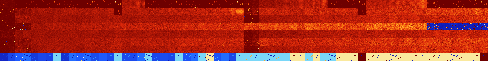

# B0124568 (192000-192511)

<details>
    <summary>Initial Grid</summary>
    
</details>


<details>
    <summary>Initial Grid RLE</summary>

```
#C Exported from GoGoL (https://github.com/marrow16/gogol)
#C Wrap mode: Toroidal
#C Boundary mode: Dead
#C Step: 0
x = 100, y = 100, rule = B0124568/S
15bo14bo12bo9bo8b2o$70bo$29bo25bo3bo$52bo7bo$8bo10bo7bo9bo29bo$3bo3bo
17bo36bo$35bobo14bo3bo$14bo46bo$8bo41bo5bo24bo9b2o$10bo2bo46bo26bo3bo$
14bo9bo9bo15bo11bo23bo$4bo3bo26bo10bo$16bo30bo6bo19bo$7bo13bo13bo11bo4b
o4bo12bo9bo$13bo42bo16bo4bo$9bo25bo12bo3bo31bo4bo$80bo$12b2o74bo$38bo8b
o16bo4bobo$7bo4bo24bo6bob2o4bo14bo28bo$17bo$30bo2bo7bo30bobo3bo$14bo15b
o3bo12bo20bo19bo$52bo$22bo43bo20bo11bo$18bo62bo12bo$6bo6bo41bo2bo26bo8b
o$4bo27bo21bo14bobo16bo$41bo6bo5bo6bobo34bo$91bo$10bo28bo30bo$37bo29bo
5bo$2bobo14bo21bobo50bo$13b2o10bo3bo62bo6bo$10bo15bo11bo11bo14bo31bo$8b
o12bo7bo2b2o59bo4bo$10bo4bo9bo16bo25bo$10bo10bo17bo7bo27bo6bo9bo6bo$25b
o11bo15bo7bo17bo11bo$5bo6b2o42b2o7bo26bo6bo$4bo13bobo40bo$15bo64bo5bo7b
o4bo$64bo31bo$15b2o11bo$o16bo2bo7bo40bo24bobo$2bo15bo29bo6bo28bo4bo$48b
o9bo15bo6bo$10bo7bo28bo30bo13bo$o11bo29bo$48bo4bo22bobo16bo$11bo79bo$2b
o4bo3bo41bo20bo20b2o$61bo$39bo11bo10bo2bo13bo15bo$14bo3bo9bo9bo17bo14bo
bo2bo6bo$5bo26bo62bo$51bobo36bo$15bo15bo55bo11bo$16bo6b2o12bo6b2obo5bo
24bo2bo3b2o$44bo10bo17bobo3bo$48bo14bo3bo$15bo19bo5bo8bo3bo8bo20bo$76b
2o$20bo14bo$5bo4bo42bo30bo8bo$bo6bo27b2o10bo45bo$10bo3bo11bo33bo$15bo3b
o38bo28bo$19bo24bo6bo12bo27bo3bo$21bo13bo55bo$13bo27bo8bo9bo3bo3bo$o11b
o23bo7bo18bo14bo$21bo16bo35bo11bo$32bo7bo5bo$49bobo$2bo10bo7bo8bo61bo$
12bo30bo22bo3bo$20bo19bo37bo9bo$100b$14bo24bo36bo$o5bo34bo7bo$5bo27bobo
41bo$42bobo41bo8bo$12bo18bo40bo$5bo3bo44bo8bo7bo16bo2b2o$12bo3bo18bo24b
o8bo9bo5bobo10bo$10b2o12bo40bo$54bo34bo$12bo82bo$15bo7bobo14bo22bobo$o
29bo34bo4bo4bo11bo$17bo9bo26bobo4bo6bo$40bo8bo39b2o2bo$8bo56bo2bobo$9bo
42bo8bo3bo5bo$8bo21bo$o46b2o7bo25bo$bo45b2o8bobo2bobo$4bo22bo22b2o3bo7b
o4bo21b2o$11bo8bo14bo38bo!
```
</details>
<details>
    <summary>Thumbnail</summary>

</details>
<table>
<tr>
    <td><a href="./192000%20S%20Heat%20Map%20Activity.png"></a><br>S (192000)<br>R@792,p240</td>    <td><a href="./192001%20S0%20Heat%20Map%20Activity.png"></a><br>S0 (192001)<br>G>1000</td>    <td><a href="./192002%20S1%20Heat%20Map%20Activity.png"></a><br>S1 (192002)<br>R@26,p16</td>    <td><a href="./192003%20S01%20Heat%20Map%20Activity.png"></a><br>S01 (192003)<br>R@22,p16</td>    <td><a href="./192004%20S2%20Heat%20Map%20Activity.png"></a><br>S2 (192004)<br>R@16,p4</td>    <td><a href="./192005%20S02%20Heat%20Map%20Activity.png"></a><br>S02 (192005)<br>R@13,p4</td>    <td><a href="./192006%20S12%20Heat%20Map%20Activity.png"></a><br>S12 (192006)<br>R@16,p8</td>    <td><a href="./192007%20S012%20Heat%20Map%20Activity.png"></a><br>S012 (192007)<br>R@9,p2</td>    <td><a href="./192008%20S3%20Heat%20Map%20Activity.png"></a><br>S3 (192008)<br>R@28,p8</td>    <td><a href="./192009%20S03%20Heat%20Map%20Activity.png"></a><br>S03 (192009)<br>R@16,p8</td>    <td><a href="./192010%20S13%20Heat%20Map%20Activity.png"></a><br>S13 (192010)<br>R@11,p2</td>    <td><a href="./192011%20S013%20Heat%20Map%20Activity.png"></a><br>S013 (192011)<br>R@7,p2</td>    <td><a href="./192012%20S23%20Heat%20Map%20Activity.png"></a><br>S23 (192012)<br>R@8,p2</td>    <td><a href="./192013%20S023%20Heat%20Map%20Activity.png"></a><br>S023 (192013)<br>R@7,p2</td>    <td><a href="./192014%20S123%20Heat%20Map%20Activity.png"></a><br>S123 (192014)<br>R@16,p8</td>    <td><a href="./192015%20S0123%20Heat%20Map%20Activity.png"></a><br>S0123 (192015)<br>R@5,p2</td>    <td><a href="./192016%20S4%20Heat%20Map%20Activity.png"></a><br>S4 (192016)<br>G>1000</td>    <td><a href="./192017%20S04%20Heat%20Map%20Activity.png"></a><br>S04 (192017)<br>G>1000</td>    <td><a href="./192018%20S14%20Heat%20Map%20Activity.png"></a><br>S14 (192018)<br>G>1000</td>    <td><a href="./192019%20S014%20Heat%20Map%20Activity.png"></a><br>S014 (192019)<br>R@13,p2</td>    <td><a href="./192020%20S24%20Heat%20Map%20Activity.png"></a><br>S24 (192020)<br>R@24,p2</td>    <td><a href="./192021%20S024%20Heat%20Map%20Activity.png"></a><br>S024 (192021)<br>R@31,p4</td>    <td><a href="./192022%20S124%20Heat%20Map%20Activity.png"></a><br>S124 (192022)<br>R@23,p2</td>    <td><a href="./192023%20S0124%20Heat%20Map%20Activity.png"></a><br>S0124 (192023)<br>R@9,p2</td>    <td><a href="./192024%20S34%20Heat%20Map%20Activity.png"></a><br>S34 (192024)<br>R@26,p2</td>    <td><a href="./192025%20S034%20Heat%20Map%20Activity.png"></a><br>S034 (192025)<br>R@13,p2</td>    <td><a href="./192026%20S134%20Heat%20Map%20Activity.png"></a><br>S134 (192026)<br>R@22,p2</td>    <td><a href="./192027%20S0134%20Heat%20Map%20Activity.png"></a><br>S0134 (192027)<br>R@7,p2</td>    <td><a href="./192028%20S234%20Heat%20Map%20Activity.png"></a><br>S234 (192028)<br>R@13,p2</td>    <td><a href="./192029%20S0234%20Heat%20Map%20Activity.png"></a><br>S0234 (192029)<br>R@11,p2</td>    <td><a href="./192030%20S1234%20Heat%20Map%20Activity.png"></a><br>S1234 (192030)<br>R@16,p2</td>    <td><a href="./192031%20S01234%20Heat%20Map%20Activity.png"></a><br>S01234 (192031)<br>R@5,p2</td>    <td><a href="./192032%20S5%20Heat%20Map%20Activity.png"></a><br>S5 (192032)<br>G>1000</td>    <td><a href="./192033%20S05%20Heat%20Map%20Activity.png"></a><br>S05 (192033)<br>R@475,p60</td>    <td><a href="./192034%20S15%20Heat%20Map%20Activity.png"></a><br>S15 (192034)<br>G>1000</td>    <td><a href="./192035%20S015%20Heat%20Map%20Activity.png"></a><br>S015 (192035)<br>G>1000</td>    <td><a href="./192036%20S25%20Heat%20Map%20Activity.png"></a><br>S25 (192036)<br>G>1000</td>    <td><a href="./192037%20S025%20Heat%20Map%20Activity.png"></a><br>S025 (192037)<br>G>1000</td>    <td><a href="./192038%20S125%20Heat%20Map%20Activity.png"></a><br>S125 (192038)<br>G>1000</td>    <td><a href="./192039%20S0125%20Heat%20Map%20Activity.png"></a><br>S0125 (192039)<br>G>1000</td>    <td><a href="./192040%20S35%20Heat%20Map%20Activity.png"></a><br>S35 (192040)<br>G>1000</td>    <td><a href="./192041%20S035%20Heat%20Map%20Activity.png"></a><br>S035 (192041)<br>G>1000</td>    <td><a href="./192042%20S135%20Heat%20Map%20Activity.png"></a><br>S135 (192042)<br>G>1000</td>    <td><a href="./192043%20S0135%20Heat%20Map%20Activity.png"></a><br>S0135 (192043)<br>R@6,p2</td>    <td><a href="./192044%20S235%20Heat%20Map%20Activity.png"></a><br>S235 (192044)<br>R@87,p2</td>    <td><a href="./192045%20S0235%20Heat%20Map%20Activity.png"></a><br>S0235 (192045)<br>R@7,p2</td>    <td><a href="./192046%20S1235%20Heat%20Map%20Activity.png"></a><br>S1235 (192046)<br>R@19,p4</td>    <td><a href="./192047%20S01235%20Heat%20Map%20Activity.png"></a><br>S01235 (192047)<br>R@7,p2</td>    <td><a href="./192048%20S45%20Heat%20Map%20Activity.png"></a><br>S45 (192048)<br>G>1000</td>    <td><a href="./192049%20S045%20Heat%20Map%20Activity.png"></a><br>S045 (192049)<br>G>1000</td>    <td><a href="./192050%20S145%20Heat%20Map%20Activity.png"></a><br>S145 (192050)<br>G>1000</td>    <td><a href="./192051%20S0145%20Heat%20Map%20Activity.png"></a><br>S0145 (192051)<br>G>1000</td>    <td><a href="./192052%20S245%20Heat%20Map%20Activity.png"></a><br>S245 (192052)<br>G>1000</td>    <td><a href="./192053%20S0245%20Heat%20Map%20Activity.png"></a><br>S0245 (192053)<br>G>1000</td>    <td><a href="./192054%20S1245%20Heat%20Map%20Activity.png"></a><br>S1245 (192054)<br>G>1000</td>    <td><a href="./192055%20S01245%20Heat%20Map%20Activity.png"></a><br>S01245 (192055)<br>G>1000</td>    <td><a href="./192056%20S345%20Heat%20Map%20Activity.png"></a><br>S345 (192056)<br>G>1000</td>    <td><a href="./192057%20S0345%20Heat%20Map%20Activity.png"></a><br>S0345 (192057)<br>R@21,p2</td>    <td><a href="./192058%20S1345%20Heat%20Map%20Activity.png"></a><br>S1345 (192058)<br>R@21,p8</td>    <td><a href="./192059%20S01345%20Heat%20Map%20Activity.png"></a><br>S01345 (192059)<br>R@7,p2</td>    <td><a href="./192060%20S2345%20Heat%20Map%20Activity.png"></a><br>S2345 (192060)<br>R@18,p2</td>    <td><a href="./192061%20S02345%20Heat%20Map%20Activity.png"></a><br>S02345 (192061)<br>R@15,p2</td>    <td><a href="./192062%20S12345%20Heat%20Map%20Activity.png"></a><br>S12345 (192062)<br>R@9,p2</td>    <td><a href="./192063%20S012345%20Heat%20Map%20Activity.png"></a><br>S012345 (192063)<br>R@7,p2</td></tr>
<tr>
    <td><a href="./192064%20S6%20Heat%20Map%20Activity.png"></a><br>S6 (192064)<br>G>1000</td>    <td><a href="./192065%20S06%20Heat%20Map%20Activity.png"></a><br>S06 (192065)<br>R@452,p180</td>    <td><a href="./192066%20S16%20Heat%20Map%20Activity.png"></a><br>S16 (192066)<br>G>1000</td>    <td><a href="./192067%20S016%20Heat%20Map%20Activity.png"></a><br>S016 (192067)<br>G>1000</td>    <td><a href="./192068%20S26%20Heat%20Map%20Activity.png"></a><br>S26 (192068)<br>G>1000</td>    <td><a href="./192069%20S026%20Heat%20Map%20Activity.png"></a><br>S026 (192069)<br>G>1000</td>    <td><a href="./192070%20S126%20Heat%20Map%20Activity.png"></a><br>S126 (192070)<br>G>1000</td>    <td><a href="./192071%20S0126%20Heat%20Map%20Activity.png"></a><br>S0126 (192071)<br>G>1000</td>    <td><a href="./192072%20S36%20Heat%20Map%20Activity.png"></a><br>S36 (192072)<br>G>1000</td>    <td><a href="./192073%20S036%20Heat%20Map%20Activity.png"></a><br>S036 (192073)<br>G>1000</td>    <td><a href="./192074%20S136%20Heat%20Map%20Activity.png"></a><br>S136 (192074)<br>G>1000</td>    <td><a href="./192075%20S0136%20Heat%20Map%20Activity.png"></a><br>S0136 (192075)<br>G>1000</td>    <td><a href="./192076%20S236%20Heat%20Map%20Activity.png"></a><br>S236 (192076)<br>G>1000</td>    <td><a href="./192077%20S0236%20Heat%20Map%20Activity.png"></a><br>S0236 (192077)<br>G>1000</td>    <td><a href="./192078%20S1236%20Heat%20Map%20Activity.png"></a><br>S1236 (192078)<br>G>1000</td>    <td><a href="./192079%20S01236%20Heat%20Map%20Activity.png"></a><br>S01236 (192079)<br>R@7,p2</td>    <td><a href="./192080%20S46%20Heat%20Map%20Activity.png"></a><br>S46 (192080)<br>G>1000</td>    <td><a href="./192081%20S046%20Heat%20Map%20Activity.png"></a><br>S046 (192081)<br>G>1000</td>    <td><a href="./192082%20S146%20Heat%20Map%20Activity.png"></a><br>S146 (192082)<br>G>1000</td>    <td><a href="./192083%20S0146%20Heat%20Map%20Activity.png"></a><br>S0146 (192083)<br>G>1000</td>    <td><a href="./192084%20S246%20Heat%20Map%20Activity.png"></a><br>S246 (192084)<br>G>1000</td>    <td><a href="./192085%20S0246%20Heat%20Map%20Activity.png"></a><br>S0246 (192085)<br>G>1000</td>    <td><a href="./192086%20S1246%20Heat%20Map%20Activity.png"></a><br>S1246 (192086)<br>G>1000</td>    <td><a href="./192087%20S01246%20Heat%20Map%20Activity.png"></a><br>S01246 (192087)<br>G>1000</td>    <td><a href="./192088%20S346%20Heat%20Map%20Activity.png"></a><br>S346 (192088)<br>G>1000</td>    <td><a href="./192089%20S0346%20Heat%20Map%20Activity.png"></a><br>S0346 (192089)<br>G>1000</td>    <td><a href="./192090%20S1346%20Heat%20Map%20Activity.png"></a><br>S1346 (192090)<br>G>1000</td>    <td><a href="./192091%20S01346%20Heat%20Map%20Activity.png"></a><br>S01346 (192091)<br>G>1000</td>    <td><a href="./192092%20S2346%20Heat%20Map%20Activity.png"></a><br>S2346 (192092)<br>G>1000</td>    <td><a href="./192093%20S02346%20Heat%20Map%20Activity.png"></a><br>S02346 (192093)<br>G>1000</td>    <td><a href="./192094%20S12346%20Heat%20Map%20Activity.png"></a><br>S12346 (192094)<br>G>1000</td>    <td><a href="./192095%20S012346%20Heat%20Map%20Activity.png"></a><br>S012346 (192095)<br>G>1000</td>    <td><a href="./192096%20S56%20Heat%20Map%20Activity.png"></a><br>S56 (192096)<br>G>1000</td>    <td><a href="./192097%20S056%20Heat%20Map%20Activity.png"></a><br>S056 (192097)<br>G>1000</td>    <td><a href="./192098%20S156%20Heat%20Map%20Activity.png"></a><br>S156 (192098)<br>G>1000</td>    <td><a href="./192099%20S0156%20Heat%20Map%20Activity.png"></a><br>S0156 (192099)<br>G>1000</td>    <td><a href="./192100%20S256%20Heat%20Map%20Activity.png"></a><br>S256 (192100)<br>G>1000</td>    <td><a href="./192101%20S0256%20Heat%20Map%20Activity.png"></a><br>S0256 (192101)<br>G>1000</td>    <td><a href="./192102%20S1256%20Heat%20Map%20Activity.png"></a><br>S1256 (192102)<br>G>1000</td>    <td><a href="./192103%20S01256%20Heat%20Map%20Activity.png"></a><br>S01256 (192103)<br>G>1000</td>    <td><a href="./192104%20S356%20Heat%20Map%20Activity.png"></a><br>S356 (192104)<br>G>1000</td>    <td><a href="./192105%20S0356%20Heat%20Map%20Activity.png"></a><br>S0356 (192105)<br>G>1000</td>    <td><a href="./192106%20S1356%20Heat%20Map%20Activity.png"></a><br>S1356 (192106)<br>G>1000</td>    <td><a href="./192107%20S01356%20Heat%20Map%20Activity.png"></a><br>S01356 (192107)<br>G>1000</td>    <td><a href="./192108%20S2356%20Heat%20Map%20Activity.png"></a><br>S2356 (192108)<br>G>1000</td>    <td><a href="./192109%20S02356%20Heat%20Map%20Activity.png"></a><br>S02356 (192109)<br>G>1000</td>    <td><a href="./192110%20S12356%20Heat%20Map%20Activity.png"></a><br>S12356 (192110)<br>G>1000</td>    <td><a href="./192111%20S012356%20Heat%20Map%20Activity.png"></a><br>S012356 (192111)<br>R@19,p2</td>    <td><a href="./192112%20S456%20Heat%20Map%20Activity.png"></a><br>S456 (192112)<br>G>1000</td>    <td><a href="./192113%20S0456%20Heat%20Map%20Activity.png"></a><br>S0456 (192113)<br>G>1000</td>    <td><a href="./192114%20S1456%20Heat%20Map%20Activity.png"></a><br>S1456 (192114)<br>G>1000</td>    <td><a href="./192115%20S01456%20Heat%20Map%20Activity.png"></a><br>S01456 (192115)<br>G>1000</td>    <td><a href="./192116%20S2456%20Heat%20Map%20Activity.png"></a><br>S2456 (192116)<br>G>1000</td>    <td><a href="./192117%20S02456%20Heat%20Map%20Activity.png"></a><br>S02456 (192117)<br>G>1000</td>    <td><a href="./192118%20S12456%20Heat%20Map%20Activity.png"></a><br>S12456 (192118)<br>G>1000</td>    <td><a href="./192119%20S012456%20Heat%20Map%20Activity.png"></a><br>S012456 (192119)<br>G>1000</td>    <td><a href="./192120%20S3456%20Heat%20Map%20Activity.png"></a><br>S3456 (192120)<br>G>1000</td>    <td><a href="./192121%20S03456%20Heat%20Map%20Activity.png"></a><br>S03456 (192121)<br>G>1000</td>    <td><a href="./192122%20S13456%20Heat%20Map%20Activity.png"></a><br>S13456 (192122)<br>G>1000</td>    <td><a href="./192123%20S013456%20Heat%20Map%20Activity.png"></a><br>S013456 (192123)<br>G>1000</td>    <td><a href="./192124%20S23456%20Heat%20Map%20Activity.png"></a><br>S23456 (192124)<br>G>1000</td>    <td><a href="./192125%20S023456%20Heat%20Map%20Activity.png"></a><br>S023456 (192125)<br>G>1000</td>    <td><a href="./192126%20S123456%20Heat%20Map%20Activity.png"></a><br>S123456 (192126)<br>G>1000</td>    <td><a href="./192127%20S0123456%20Heat%20Map%20Activity.png"></a><br>S0123456 (192127)<br>G>1000</td></tr>
<tr>
    <td><a href="./192128%20S7%20Heat%20Map%20Activity.png"></a><br>S7 (192128)<br>R@817,p504</td>    <td><a href="./192129%20S07%20Heat%20Map%20Activity.png"></a><br>S07 (192129)<br>G>1000</td>    <td><a href="./192130%20S17%20Heat%20Map%20Activity.png"></a><br>S17 (192130)<br>G>1000</td>    <td><a href="./192131%20S017%20Heat%20Map%20Activity.png"></a><br>S017 (192131)<br>G>1000</td>    <td><a href="./192132%20S27%20Heat%20Map%20Activity.png"></a><br>S27 (192132)<br>G>1000</td>    <td><a href="./192133%20S027%20Heat%20Map%20Activity.png"></a><br>S027 (192133)<br>G>1000</td>    <td><a href="./192134%20S127%20Heat%20Map%20Activity.png"></a><br>S127 (192134)<br>G>1000</td>    <td><a href="./192135%20S0127%20Heat%20Map%20Activity.png"></a><br>S0127 (192135)<br>G>1000</td>    <td><a href="./192136%20S37%20Heat%20Map%20Activity.png"></a><br>S37 (192136)<br>G>1000</td>    <td><a href="./192137%20S037%20Heat%20Map%20Activity.png"></a><br>S037 (192137)<br>G>1000</td>    <td><a href="./192138%20S137%20Heat%20Map%20Activity.png"></a><br>S137 (192138)<br>G>1000</td>    <td><a href="./192139%20S0137%20Heat%20Map%20Activity.png"></a><br>S0137 (192139)<br>G>1000</td>    <td><a href="./192140%20S237%20Heat%20Map%20Activity.png"></a><br>S237 (192140)<br>G>1000</td>    <td><a href="./192141%20S0237%20Heat%20Map%20Activity.png"></a><br>S0237 (192141)<br>G>1000</td>    <td><a href="./192142%20S1237%20Heat%20Map%20Activity.png"></a><br>S1237 (192142)<br>G>1000</td>    <td><a href="./192143%20S01237%20Heat%20Map%20Activity.png"></a><br>S01237 (192143)<br>G>1000</td>    <td><a href="./192144%20S47%20Heat%20Map%20Activity.png"></a><br>S47 (192144)<br>G>1000</td>    <td><a href="./192145%20S047%20Heat%20Map%20Activity.png"></a><br>S047 (192145)<br>G>1000</td>    <td><a href="./192146%20S147%20Heat%20Map%20Activity.png"></a><br>S147 (192146)<br>G>1000</td>    <td><a href="./192147%20S0147%20Heat%20Map%20Activity.png"></a><br>S0147 (192147)<br>G>1000</td>    <td><a href="./192148%20S247%20Heat%20Map%20Activity.png"></a><br>S247 (192148)<br>G>1000</td>    <td><a href="./192149%20S0247%20Heat%20Map%20Activity.png"></a><br>S0247 (192149)<br>G>1000</td>    <td><a href="./192150%20S1247%20Heat%20Map%20Activity.png"></a><br>S1247 (192150)<br>G>1000</td>    <td><a href="./192151%20S01247%20Heat%20Map%20Activity.png"></a><br>S01247 (192151)<br>G>1000</td>    <td><a href="./192152%20S347%20Heat%20Map%20Activity.png"></a><br>S347 (192152)<br>G>1000</td>    <td><a href="./192153%20S0347%20Heat%20Map%20Activity.png"></a><br>S0347 (192153)<br>G>1000</td>    <td><a href="./192154%20S1347%20Heat%20Map%20Activity.png"></a><br>S1347 (192154)<br>G>1000</td>    <td><a href="./192155%20S01347%20Heat%20Map%20Activity.png"></a><br>S01347 (192155)<br>G>1000</td>    <td><a href="./192156%20S2347%20Heat%20Map%20Activity.png"></a><br>S2347 (192156)<br>G>1000</td>    <td><a href="./192157%20S02347%20Heat%20Map%20Activity.png"></a><br>S02347 (192157)<br>G>1000</td>    <td><a href="./192158%20S12347%20Heat%20Map%20Activity.png"></a><br>S12347 (192158)<br>G>1000</td>    <td><a href="./192159%20S012347%20Heat%20Map%20Activity.png"></a><br>S012347 (192159)<br>G>1000</td>    <td><a href="./192160%20S57%20Heat%20Map%20Activity.png"></a><br>S57 (192160)<br>G>1000</td>    <td><a href="./192161%20S057%20Heat%20Map%20Activity.png"></a><br>S057 (192161)<br>G>1000</td>    <td><a href="./192162%20S157%20Heat%20Map%20Activity.png"></a><br>S157 (192162)<br>G>1000</td>    <td><a href="./192163%20S0157%20Heat%20Map%20Activity.png"></a><br>S0157 (192163)<br>G>1000</td>    <td><a href="./192164%20S257%20Heat%20Map%20Activity.png"></a><br>S257 (192164)<br>G>1000</td>    <td><a href="./192165%20S0257%20Heat%20Map%20Activity.png"></a><br>S0257 (192165)<br>G>1000</td>    <td><a href="./192166%20S1257%20Heat%20Map%20Activity.png"></a><br>S1257 (192166)<br>G>1000</td>    <td><a href="./192167%20S01257%20Heat%20Map%20Activity.png"></a><br>S01257 (192167)<br>G>1000</td>    <td><a href="./192168%20S357%20Heat%20Map%20Activity.png"></a><br>S357 (192168)<br>G>1000</td>    <td><a href="./192169%20S0357%20Heat%20Map%20Activity.png"></a><br>S0357 (192169)<br>G>1000</td>    <td><a href="./192170%20S1357%20Heat%20Map%20Activity.png"></a><br>S1357 (192170)<br>G>1000</td>    <td><a href="./192171%20S01357%20Heat%20Map%20Activity.png"></a><br>S01357 (192171)<br>G>1000</td>    <td><a href="./192172%20S2357%20Heat%20Map%20Activity.png"></a><br>S2357 (192172)<br>G>1000</td>    <td><a href="./192173%20S02357%20Heat%20Map%20Activity.png"></a><br>S02357 (192173)<br>G>1000</td>    <td><a href="./192174%20S12357%20Heat%20Map%20Activity.png"></a><br>S12357 (192174)<br>G>1000</td>    <td><a href="./192175%20S012357%20Heat%20Map%20Activity.png"></a><br>S012357 (192175)<br>G>1000</td>    <td><a href="./192176%20S457%20Heat%20Map%20Activity.png"></a><br>S457 (192176)<br>G>1000</td>    <td><a href="./192177%20S0457%20Heat%20Map%20Activity.png"></a><br>S0457 (192177)<br>G>1000</td>    <td><a href="./192178%20S1457%20Heat%20Map%20Activity.png"></a><br>S1457 (192178)<br>G>1000</td>    <td><a href="./192179%20S01457%20Heat%20Map%20Activity.png"></a><br>S01457 (192179)<br>G>1000</td>    <td><a href="./192180%20S2457%20Heat%20Map%20Activity.png"></a><br>S2457 (192180)<br>G>1000</td>    <td><a href="./192181%20S02457%20Heat%20Map%20Activity.png"></a><br>S02457 (192181)<br>G>1000</td>    <td><a href="./192182%20S12457%20Heat%20Map%20Activity.png"></a><br>S12457 (192182)<br>G>1000</td>    <td><a href="./192183%20S012457%20Heat%20Map%20Activity.png"></a><br>S012457 (192183)<br>G>1000</td>    <td><a href="./192184%20S3457%20Heat%20Map%20Activity.png"></a><br>S3457 (192184)<br>G>1000</td>    <td><a href="./192185%20S03457%20Heat%20Map%20Activity.png"></a><br>S03457 (192185)<br>G>1000</td>    <td><a href="./192186%20S13457%20Heat%20Map%20Activity.png"></a><br>S13457 (192186)<br>G>1000</td>    <td><a href="./192187%20S013457%20Heat%20Map%20Activity.png"></a><br>S013457 (192187)<br>G>1000</td>    <td><a href="./192188%20S23457%20Heat%20Map%20Activity.png"></a><br>S23457 (192188)<br>G>1000</td>    <td><a href="./192189%20S023457%20Heat%20Map%20Activity.png"></a><br>S023457 (192189)<br>G>1000</td>    <td><a href="./192190%20S123457%20Heat%20Map%20Activity.png"></a><br>S123457 (192190)<br>G>1000</td>    <td><a href="./192191%20S0123457%20Heat%20Map%20Activity.png"></a><br>S0123457 (192191)<br>G>1000</td></tr>
<tr>
    <td><a href="./192192%20S67%20Heat%20Map%20Activity.png"></a><br>S67 (192192)<br>G>1000</td>    <td><a href="./192193%20S067%20Heat%20Map%20Activity.png"></a><br>S067 (192193)<br>G>1000</td>    <td><a href="./192194%20S167%20Heat%20Map%20Activity.png"></a><br>S167 (192194)<br>R@601,p168</td>    <td><a href="./192195%20S0167%20Heat%20Map%20Activity.png"></a><br>S0167 (192195)<br>R@519,p240</td>    <td><a href="./192196%20S267%20Heat%20Map%20Activity.png"></a><br>S267 (192196)<br>G>1000</td>    <td><a href="./192197%20S0267%20Heat%20Map%20Activity.png"></a><br>S0267 (192197)<br>G>1000</td>    <td><a href="./192198%20S1267%20Heat%20Map%20Activity.png"></a><br>S1267 (192198)<br>G>1000</td>    <td><a href="./192199%20S01267%20Heat%20Map%20Activity.png"></a><br>S01267 (192199)<br>G>1000</td>    <td><a href="./192200%20S367%20Heat%20Map%20Activity.png"></a><br>S367 (192200)<br>G>1000</td>    <td><a href="./192201%20S0367%20Heat%20Map%20Activity.png"></a><br>S0367 (192201)<br>G>1000</td>    <td><a href="./192202%20S1367%20Heat%20Map%20Activity.png"></a><br>S1367 (192202)<br>G>1000</td>    <td><a href="./192203%20S01367%20Heat%20Map%20Activity.png"></a><br>S01367 (192203)<br>G>1000</td>    <td><a href="./192204%20S2367%20Heat%20Map%20Activity.png"></a><br>S2367 (192204)<br>G>1000</td>    <td><a href="./192205%20S02367%20Heat%20Map%20Activity.png"></a><br>S02367 (192205)<br>G>1000</td>    <td><a href="./192206%20S12367%20Heat%20Map%20Activity.png"></a><br>S12367 (192206)<br>G>1000</td>    <td><a href="./192207%20S012367%20Heat%20Map%20Activity.png"></a><br>S012367 (192207)<br>G>1000</td>    <td><a href="./192208%20S467%20Heat%20Map%20Activity.png"></a><br>S467 (192208)<br>G>1000</td>    <td><a href="./192209%20S0467%20Heat%20Map%20Activity.png"></a><br>S0467 (192209)<br>G>1000</td>    <td><a href="./192210%20S1467%20Heat%20Map%20Activity.png"></a><br>S1467 (192210)<br>G>1000</td>    <td><a href="./192211%20S01467%20Heat%20Map%20Activity.png"></a><br>S01467 (192211)<br>G>1000</td>    <td><a href="./192212%20S2467%20Heat%20Map%20Activity.png"></a><br>S2467 (192212)<br>G>1000</td>    <td><a href="./192213%20S02467%20Heat%20Map%20Activity.png"></a><br>S02467 (192213)<br>G>1000</td>    <td><a href="./192214%20S12467%20Heat%20Map%20Activity.png"></a><br>S12467 (192214)<br>G>1000</td>    <td><a href="./192215%20S012467%20Heat%20Map%20Activity.png"></a><br>S012467 (192215)<br>G>1000</td>    <td><a href="./192216%20S3467%20Heat%20Map%20Activity.png"></a><br>S3467 (192216)<br>G>1000</td>    <td><a href="./192217%20S03467%20Heat%20Map%20Activity.png"></a><br>S03467 (192217)<br>G>1000</td>    <td><a href="./192218%20S13467%20Heat%20Map%20Activity.png"></a><br>S13467 (192218)<br>G>1000</td>    <td><a href="./192219%20S013467%20Heat%20Map%20Activity.png"></a><br>S013467 (192219)<br>G>1000</td>    <td><a href="./192220%20S23467%20Heat%20Map%20Activity.png"></a><br>S23467 (192220)<br>G>1000</td>    <td><a href="./192221%20S023467%20Heat%20Map%20Activity.png"></a><br>S023467 (192221)<br>G>1000</td>    <td><a href="./192222%20S123467%20Heat%20Map%20Activity.png"></a><br>S123467 (192222)<br>G>1000</td>    <td><a href="./192223%20S0123467%20Heat%20Map%20Activity.png"></a><br>S0123467 (192223)<br>G>1000</td>    <td><a href="./192224%20S567%20Heat%20Map%20Activity.png"></a><br>S567 (192224)<br>G>1000</td>    <td><a href="./192225%20S0567%20Heat%20Map%20Activity.png"></a><br>S0567 (192225)<br>G>1000</td>    <td><a href="./192226%20S1567%20Heat%20Map%20Activity.png"></a><br>S1567 (192226)<br>G>1000</td>    <td><a href="./192227%20S01567%20Heat%20Map%20Activity.png"></a><br>S01567 (192227)<br>G>1000</td>    <td><a href="./192228%20S2567%20Heat%20Map%20Activity.png"></a><br>S2567 (192228)<br>G>1000</td>    <td><a href="./192229%20S02567%20Heat%20Map%20Activity.png"></a><br>S02567 (192229)<br>G>1000</td>    <td><a href="./192230%20S12567%20Heat%20Map%20Activity.png"></a><br>S12567 (192230)<br>G>1000</td>    <td><a href="./192231%20S012567%20Heat%20Map%20Activity.png"></a><br>S012567 (192231)<br>G>1000</td>    <td><a href="./192232%20S3567%20Heat%20Map%20Activity.png"></a><br>S3567 (192232)<br>G>1000</td>    <td><a href="./192233%20S03567%20Heat%20Map%20Activity.png"></a><br>S03567 (192233)<br>G>1000</td>    <td><a href="./192234%20S13567%20Heat%20Map%20Activity.png"></a><br>S13567 (192234)<br>G>1000</td>    <td><a href="./192235%20S013567%20Heat%20Map%20Activity.png"></a><br>S013567 (192235)<br>G>1000</td>    <td><a href="./192236%20S23567%20Heat%20Map%20Activity.png"></a><br>S23567 (192236)<br>G>1000</td>    <td><a href="./192237%20S023567%20Heat%20Map%20Activity.png"></a><br>S023567 (192237)<br>G>1000</td>    <td><a href="./192238%20S123567%20Heat%20Map%20Activity.png"></a><br>S123567 (192238)<br>G>1000</td>    <td><a href="./192239%20S0123567%20Heat%20Map%20Activity.png"></a><br>S0123567 (192239)<br>G>1000</td>    <td><a href="./192240%20S4567%20Heat%20Map%20Activity.png"></a><br>S4567 (192240)<br>G>1000</td>    <td><a href="./192241%20S04567%20Heat%20Map%20Activity.png"></a><br>S04567 (192241)<br>G>1000</td>    <td><a href="./192242%20S14567%20Heat%20Map%20Activity.png"></a><br>S14567 (192242)<br>G>1000</td>    <td><a href="./192243%20S014567%20Heat%20Map%20Activity.png"></a><br>S014567 (192243)<br>G>1000</td>    <td><a href="./192244%20S24567%20Heat%20Map%20Activity.png"></a><br>S24567 (192244)<br>G>1000</td>    <td><a href="./192245%20S024567%20Heat%20Map%20Activity.png"></a><br>S024567 (192245)<br>G>1000</td>    <td><a href="./192246%20S124567%20Heat%20Map%20Activity.png"></a><br>S124567 (192246)<br>G>1000</td>    <td><a href="./192247%20S0124567%20Heat%20Map%20Activity.png"></a><br>S0124567 (192247)<br>G>1000</td>    <td><a href="./192248%20S34567%20Heat%20Map%20Activity.png"></a><br>S34567 (192248)<br>R@472,p360</td>    <td><a href="./192249%20S034567%20Heat%20Map%20Activity.png"></a><br>S034567 (192249)<br>G>1000</td>    <td><a href="./192250%20S134567%20Heat%20Map%20Activity.png"></a><br>S134567 (192250)<br>G>1000</td>    <td><a href="./192251%20S0134567%20Heat%20Map%20Activity.png"></a><br>S0134567 (192251)<br>G>1000</td>    <td><a href="./192252%20S234567%20Heat%20Map%20Activity.png"></a><br>S234567 (192252)<br>G>1000</td>    <td><a href="./192253%20S0234567%20Heat%20Map%20Activity.png"></a><br>S0234567 (192253)<br>G>1000</td>    <td><a href="./192254%20S1234567%20Heat%20Map%20Activity.png"></a><br>S1234567 (192254)<br>G>1000</td>    <td><a href="./192255%20S01234567%20Heat%20Map%20Activity.png"></a><br>S01234567 (192255)<br>G>1000</td></tr>
<tr>
    <td><a href="./192256%20S8%20Heat%20Map%20Activity.png"></a><br>S8 (192256)<br>R@346,p60</td>    <td><a href="./192257%20S08%20Heat%20Map%20Activity.png"></a><br>S08 (192257)<br>R@465,p96</td>    <td><a href="./192258%20S18%20Heat%20Map%20Activity.png"></a><br>S18 (192258)<br>G>1000</td>    <td><a href="./192259%20S018%20Heat%20Map%20Activity.png"></a><br>S018 (192259)<br>G>1000</td>    <td><a href="./192260%20S28%20Heat%20Map%20Activity.png"></a><br>S28 (192260)<br>G>1000</td>    <td><a href="./192261%20S028%20Heat%20Map%20Activity.png"></a><br>S028 (192261)<br>G>1000</td>    <td><a href="./192262%20S128%20Heat%20Map%20Activity.png"></a><br>S128 (192262)<br>G>1000</td>    <td><a href="./192263%20S0128%20Heat%20Map%20Activity.png"></a><br>S0128 (192263)<br>G>1000</td>    <td><a href="./192264%20S38%20Heat%20Map%20Activity.png"></a><br>S38 (192264)<br>G>1000</td>    <td><a href="./192265%20S038%20Heat%20Map%20Activity.png"></a><br>S038 (192265)<br>G>1000</td>    <td><a href="./192266%20S138%20Heat%20Map%20Activity.png"></a><br>S138 (192266)<br>G>1000</td>    <td><a href="./192267%20S0138%20Heat%20Map%20Activity.png"></a><br>S0138 (192267)<br>G>1000</td>    <td><a href="./192268%20S238%20Heat%20Map%20Activity.png"></a><br>S238 (192268)<br>G>1000</td>    <td><a href="./192269%20S0238%20Heat%20Map%20Activity.png"></a><br>S0238 (192269)<br>G>1000</td>    <td><a href="./192270%20S1238%20Heat%20Map%20Activity.png"></a><br>S1238 (192270)<br>G>1000</td>    <td><a href="./192271%20S01238%20Heat%20Map%20Activity.png"></a><br>S01238 (192271)<br>G>1000</td>    <td><a href="./192272%20S48%20Heat%20Map%20Activity.png"></a><br>S48 (192272)<br>G>1000</td>    <td><a href="./192273%20S048%20Heat%20Map%20Activity.png"></a><br>S048 (192273)<br>G>1000</td>    <td><a href="./192274%20S148%20Heat%20Map%20Activity.png"></a><br>S148 (192274)<br>G>1000</td>    <td><a href="./192275%20S0148%20Heat%20Map%20Activity.png"></a><br>S0148 (192275)<br>G>1000</td>    <td><a href="./192276%20S248%20Heat%20Map%20Activity.png"></a><br>S248 (192276)<br>G>1000</td>    <td><a href="./192277%20S0248%20Heat%20Map%20Activity.png"></a><br>S0248 (192277)<br>G>1000</td>    <td><a href="./192278%20S1248%20Heat%20Map%20Activity.png"></a><br>S1248 (192278)<br>G>1000</td>    <td><a href="./192279%20S01248%20Heat%20Map%20Activity.png"></a><br>S01248 (192279)<br>G>1000</td>    <td><a href="./192280%20S348%20Heat%20Map%20Activity.png"></a><br>S348 (192280)<br>G>1000</td>    <td><a href="./192281%20S0348%20Heat%20Map%20Activity.png"></a><br>S0348 (192281)<br>G>1000</td>    <td><a href="./192282%20S1348%20Heat%20Map%20Activity.png"></a><br>S1348 (192282)<br>G>1000</td>    <td><a href="./192283%20S01348%20Heat%20Map%20Activity.png"></a><br>S01348 (192283)<br>G>1000</td>    <td><a href="./192284%20S2348%20Heat%20Map%20Activity.png"></a><br>S2348 (192284)<br>G>1000</td>    <td><a href="./192285%20S02348%20Heat%20Map%20Activity.png"></a><br>S02348 (192285)<br>G>1000</td>    <td><a href="./192286%20S12348%20Heat%20Map%20Activity.png"></a><br>S12348 (192286)<br>G>1000</td>    <td><a href="./192287%20S012348%20Heat%20Map%20Activity.png"></a><br>S012348 (192287)<br>G>1000</td>    <td><a href="./192288%20S58%20Heat%20Map%20Activity.png"></a><br>S58 (192288)<br>R@515,p84</td>    <td><a href="./192289%20S058%20Heat%20Map%20Activity.png"></a><br>S058 (192289)<br>R@316,p12</td>    <td><a href="./192290%20S158%20Heat%20Map%20Activity.png"></a><br>S158 (192290)<br>G>1000</td>    <td><a href="./192291%20S0158%20Heat%20Map%20Activity.png"></a><br>S0158 (192291)<br>G>1000</td>    <td><a href="./192292%20S258%20Heat%20Map%20Activity.png"></a><br>S258 (192292)<br>G>1000</td>    <td><a href="./192293%20S0258%20Heat%20Map%20Activity.png"></a><br>S0258 (192293)<br>G>1000</td>    <td><a href="./192294%20S1258%20Heat%20Map%20Activity.png"></a><br>S1258 (192294)<br>G>1000</td>    <td><a href="./192295%20S01258%20Heat%20Map%20Activity.png"></a><br>S01258 (192295)<br>G>1000</td>    <td><a href="./192296%20S358%20Heat%20Map%20Activity.png"></a><br>S358 (192296)<br>G>1000</td>    <td><a href="./192297%20S0358%20Heat%20Map%20Activity.png"></a><br>S0358 (192297)<br>G>1000</td>    <td><a href="./192298%20S1358%20Heat%20Map%20Activity.png"></a><br>S1358 (192298)<br>G>1000</td>    <td><a href="./192299%20S01358%20Heat%20Map%20Activity.png"></a><br>S01358 (192299)<br>G>1000</td>    <td><a href="./192300%20S2358%20Heat%20Map%20Activity.png"></a><br>S2358 (192300)<br>G>1000</td>    <td><a href="./192301%20S02358%20Heat%20Map%20Activity.png"></a><br>S02358 (192301)<br>G>1000</td>    <td><a href="./192302%20S12358%20Heat%20Map%20Activity.png"></a><br>S12358 (192302)<br>G>1000</td>    <td><a href="./192303%20S012358%20Heat%20Map%20Activity.png"></a><br>S012358 (192303)<br>G>1000</td>    <td><a href="./192304%20S458%20Heat%20Map%20Activity.png"></a><br>S458 (192304)<br>G>1000</td>    <td><a href="./192305%20S0458%20Heat%20Map%20Activity.png"></a><br>S0458 (192305)<br>G>1000</td>    <td><a href="./192306%20S1458%20Heat%20Map%20Activity.png"></a><br>S1458 (192306)<br>G>1000</td>    <td><a href="./192307%20S01458%20Heat%20Map%20Activity.png"></a><br>S01458 (192307)<br>G>1000</td>    <td><a href="./192308%20S2458%20Heat%20Map%20Activity.png"></a><br>S2458 (192308)<br>G>1000</td>    <td><a href="./192309%20S02458%20Heat%20Map%20Activity.png"></a><br>S02458 (192309)<br>G>1000</td>    <td><a href="./192310%20S12458%20Heat%20Map%20Activity.png"></a><br>S12458 (192310)<br>G>1000</td>    <td><a href="./192311%20S012458%20Heat%20Map%20Activity.png"></a><br>S012458 (192311)<br>G>1000</td>    <td><a href="./192312%20S3458%20Heat%20Map%20Activity.png"></a><br>S3458 (192312)<br>G>1000</td>    <td><a href="./192313%20S03458%20Heat%20Map%20Activity.png"></a><br>S03458 (192313)<br>G>1000</td>    <td><a href="./192314%20S13458%20Heat%20Map%20Activity.png"></a><br>S13458 (192314)<br>G>1000</td>    <td><a href="./192315%20S013458%20Heat%20Map%20Activity.png"></a><br>S013458 (192315)<br>G>1000</td>    <td><a href="./192316%20S23458%20Heat%20Map%20Activity.png"></a><br>S23458 (192316)<br>G>1000</td>    <td><a href="./192317%20S023458%20Heat%20Map%20Activity.png"></a><br>S023458 (192317)<br>G>1000</td>    <td><a href="./192318%20S123458%20Heat%20Map%20Activity.png"></a><br>S123458 (192318)<br>G>1000</td>    <td><a href="./192319%20S0123458%20Heat%20Map%20Activity.png"></a><br>S0123458 (192319)<br>G>1000</td></tr>
<tr>
    <td><a href="./192320%20S68%20Heat%20Map%20Activity.png"></a><br>S68 (192320)<br>G>1000</td>    <td><a href="./192321%20S068%20Heat%20Map%20Activity.png"></a><br>S068 (192321)<br>G>1000</td>    <td><a href="./192322%20S168%20Heat%20Map%20Activity.png"></a><br>S168 (192322)<br>G>1000</td>    <td><a href="./192323%20S0168%20Heat%20Map%20Activity.png"></a><br>S0168 (192323)<br>G>1000</td>    <td><a href="./192324%20S268%20Heat%20Map%20Activity.png"></a><br>S268 (192324)<br>G>1000</td>    <td><a href="./192325%20S0268%20Heat%20Map%20Activity.png"></a><br>S0268 (192325)<br>G>1000</td>    <td><a href="./192326%20S1268%20Heat%20Map%20Activity.png"></a><br>S1268 (192326)<br>G>1000</td>    <td><a href="./192327%20S01268%20Heat%20Map%20Activity.png"></a><br>S01268 (192327)<br>G>1000</td>    <td><a href="./192328%20S368%20Heat%20Map%20Activity.png"></a><br>S368 (192328)<br>G>1000</td>    <td><a href="./192329%20S0368%20Heat%20Map%20Activity.png"></a><br>S0368 (192329)<br>G>1000</td>    <td><a href="./192330%20S1368%20Heat%20Map%20Activity.png"></a><br>S1368 (192330)<br>G>1000</td>    <td><a href="./192331%20S01368%20Heat%20Map%20Activity.png"></a><br>S01368 (192331)<br>G>1000</td>    <td><a href="./192332%20S2368%20Heat%20Map%20Activity.png"></a><br>S2368 (192332)<br>G>1000</td>    <td><a href="./192333%20S02368%20Heat%20Map%20Activity.png"></a><br>S02368 (192333)<br>G>1000</td>    <td><a href="./192334%20S12368%20Heat%20Map%20Activity.png"></a><br>S12368 (192334)<br>G>1000</td>    <td><a href="./192335%20S012368%20Heat%20Map%20Activity.png"></a><br>S012368 (192335)<br>G>1000</td>    <td><a href="./192336%20S468%20Heat%20Map%20Activity.png"></a><br>S468 (192336)<br>G>1000</td>    <td><a href="./192337%20S0468%20Heat%20Map%20Activity.png"></a><br>S0468 (192337)<br>G>1000</td>    <td><a href="./192338%20S1468%20Heat%20Map%20Activity.png"></a><br>S1468 (192338)<br>G>1000</td>    <td><a href="./192339%20S01468%20Heat%20Map%20Activity.png"></a><br>S01468 (192339)<br>G>1000</td>    <td><a href="./192340%20S2468%20Heat%20Map%20Activity.png"></a><br>S2468 (192340)<br>G>1000</td>    <td><a href="./192341%20S02468%20Heat%20Map%20Activity.png"></a><br>S02468 (192341)<br>G>1000</td>    <td><a href="./192342%20S12468%20Heat%20Map%20Activity.png"></a><br>S12468 (192342)<br>G>1000</td>    <td><a href="./192343%20S012468%20Heat%20Map%20Activity.png"></a><br>S012468 (192343)<br>G>1000</td>    <td><a href="./192344%20S3468%20Heat%20Map%20Activity.png"></a><br>S3468 (192344)<br>G>1000</td>    <td><a href="./192345%20S03468%20Heat%20Map%20Activity.png"></a><br>S03468 (192345)<br>G>1000</td>    <td><a href="./192346%20S13468%20Heat%20Map%20Activity.png"></a><br>S13468 (192346)<br>G>1000</td>    <td><a href="./192347%20S013468%20Heat%20Map%20Activity.png"></a><br>S013468 (192347)<br>G>1000</td>    <td><a href="./192348%20S23468%20Heat%20Map%20Activity.png"></a><br>S23468 (192348)<br>G>1000</td>    <td><a href="./192349%20S023468%20Heat%20Map%20Activity.png"></a><br>S023468 (192349)<br>G>1000</td>    <td><a href="./192350%20S123468%20Heat%20Map%20Activity.png"></a><br>S123468 (192350)<br>G>1000</td>    <td><a href="./192351%20S0123468%20Heat%20Map%20Activity.png"></a><br>S0123468 (192351)<br>G>1000</td>    <td><a href="./192352%20S568%20Heat%20Map%20Activity.png"></a><br>S568 (192352)<br>G>1000</td>    <td><a href="./192353%20S0568%20Heat%20Map%20Activity.png"></a><br>S0568 (192353)<br>G>1000</td>    <td><a href="./192354%20S1568%20Heat%20Map%20Activity.png"></a><br>S1568 (192354)<br>G>1000</td>    <td><a href="./192355%20S01568%20Heat%20Map%20Activity.png"></a><br>S01568 (192355)<br>G>1000</td>    <td><a href="./192356%20S2568%20Heat%20Map%20Activity.png"></a><br>S2568 (192356)<br>G>1000</td>    <td><a href="./192357%20S02568%20Heat%20Map%20Activity.png"></a><br>S02568 (192357)<br>G>1000</td>    <td><a href="./192358%20S12568%20Heat%20Map%20Activity.png"></a><br>S12568 (192358)<br>G>1000</td>    <td><a href="./192359%20S012568%20Heat%20Map%20Activity.png"></a><br>S012568 (192359)<br>G>1000</td>    <td><a href="./192360%20S3568%20Heat%20Map%20Activity.png"></a><br>S3568 (192360)<br>G>1000</td>    <td><a href="./192361%20S03568%20Heat%20Map%20Activity.png"></a><br>S03568 (192361)<br>G>1000</td>    <td><a href="./192362%20S13568%20Heat%20Map%20Activity.png"></a><br>S13568 (192362)<br>G>1000</td>    <td><a href="./192363%20S013568%20Heat%20Map%20Activity.png"></a><br>S013568 (192363)<br>G>1000</td>    <td><a href="./192364%20S23568%20Heat%20Map%20Activity.png"></a><br>S23568 (192364)<br>G>1000</td>    <td><a href="./192365%20S023568%20Heat%20Map%20Activity.png"></a><br>S023568 (192365)<br>G>1000</td>    <td><a href="./192366%20S123568%20Heat%20Map%20Activity.png"></a><br>S123568 (192366)<br>G>1000</td>    <td><a href="./192367%20S0123568%20Heat%20Map%20Activity.png"></a><br>S0123568 (192367)<br>G>1000</td>    <td><a href="./192368%20S4568%20Heat%20Map%20Activity.png"></a><br>S4568 (192368)<br>G>1000</td>    <td><a href="./192369%20S04568%20Heat%20Map%20Activity.png"></a><br>S04568 (192369)<br>G>1000</td>    <td><a href="./192370%20S14568%20Heat%20Map%20Activity.png"></a><br>S14568 (192370)<br>G>1000</td>    <td><a href="./192371%20S014568%20Heat%20Map%20Activity.png"></a><br>S014568 (192371)<br>G>1000</td>    <td><a href="./192372%20S24568%20Heat%20Map%20Activity.png"></a><br>S24568 (192372)<br>G>1000</td>    <td><a href="./192373%20S024568%20Heat%20Map%20Activity.png"></a><br>S024568 (192373)<br>G>1000</td>    <td><a href="./192374%20S124568%20Heat%20Map%20Activity.png"></a><br>S124568 (192374)<br>G>1000</td>    <td><a href="./192375%20S0124568%20Heat%20Map%20Activity.png"></a><br>S0124568 (192375)<br>G>1000</td>    <td><a href="./192376%20S34568%20Heat%20Map%20Activity.png"></a><br>S34568 (192376)<br>G>1000</td>    <td><a href="./192377%20S034568%20Heat%20Map%20Activity.png"></a><br>S034568 (192377)<br>G>1000</td>    <td><a href="./192378%20S134568%20Heat%20Map%20Activity.png"></a><br>S134568 (192378)<br>G>1000</td>    <td><a href="./192379%20S0134568%20Heat%20Map%20Activity.png"></a><br>S0134568 (192379)<br>G>1000</td>    <td><a href="./192380%20S234568%20Heat%20Map%20Activity.png"></a><br>S234568 (192380)<br>G>1000</td>    <td><a href="./192381%20S0234568%20Heat%20Map%20Activity.png"></a><br>S0234568 (192381)<br>G>1000</td>    <td><a href="./192382%20S1234568%20Heat%20Map%20Activity.png"></a><br>S1234568 (192382)<br>G>1000</td>    <td><a href="./192383%20S01234568%20Heat%20Map%20Activity.png"></a><br>S01234568 (192383)<br>G>1000</td></tr>
<tr>
    <td><a href="./192384%20S78%20Heat%20Map%20Activity.png"></a><br>S78 (192384)<br>R@879,p528</td>    <td><a href="./192385%20S078%20Heat%20Map%20Activity.png"></a><br>S078 (192385)<br>R@504,p168</td>    <td><a href="./192386%20S178%20Heat%20Map%20Activity.png"></a><br>S178 (192386)<br>G>1000</td>    <td><a href="./192387%20S0178%20Heat%20Map%20Activity.png"></a><br>S0178 (192387)<br>G>1000</td>    <td><a href="./192388%20S278%20Heat%20Map%20Activity.png"></a><br>S278 (192388)<br>G>1000</td>    <td><a href="./192389%20S0278%20Heat%20Map%20Activity.png"></a><br>S0278 (192389)<br>G>1000</td>    <td><a href="./192390%20S1278%20Heat%20Map%20Activity.png"></a><br>S1278 (192390)<br>G>1000</td>    <td><a href="./192391%20S01278%20Heat%20Map%20Activity.png"></a><br>S01278 (192391)<br>G>1000</td>    <td><a href="./192392%20S378%20Heat%20Map%20Activity.png"></a><br>S378 (192392)<br>G>1000</td>    <td><a href="./192393%20S0378%20Heat%20Map%20Activity.png"></a><br>S0378 (192393)<br>G>1000</td>    <td><a href="./192394%20S1378%20Heat%20Map%20Activity.png"></a><br>S1378 (192394)<br>G>1000</td>    <td><a href="./192395%20S01378%20Heat%20Map%20Activity.png"></a><br>S01378 (192395)<br>G>1000</td>    <td><a href="./192396%20S2378%20Heat%20Map%20Activity.png"></a><br>S2378 (192396)<br>G>1000</td>    <td><a href="./192397%20S02378%20Heat%20Map%20Activity.png"></a><br>S02378 (192397)<br>G>1000</td>    <td><a href="./192398%20S12378%20Heat%20Map%20Activity.png"></a><br>S12378 (192398)<br>G>1000</td>    <td><a href="./192399%20S012378%20Heat%20Map%20Activity.png"></a><br>S012378 (192399)<br>G>1000</td>    <td><a href="./192400%20S478%20Heat%20Map%20Activity.png"></a><br>S478 (192400)<br>G>1000</td>    <td><a href="./192401%20S0478%20Heat%20Map%20Activity.png"></a><br>S0478 (192401)<br>G>1000</td>    <td><a href="./192402%20S1478%20Heat%20Map%20Activity.png"></a><br>S1478 (192402)<br>G>1000</td>    <td><a href="./192403%20S01478%20Heat%20Map%20Activity.png"></a><br>S01478 (192403)<br>G>1000</td>    <td><a href="./192404%20S2478%20Heat%20Map%20Activity.png"></a><br>S2478 (192404)<br>G>1000</td>    <td><a href="./192405%20S02478%20Heat%20Map%20Activity.png"></a><br>S02478 (192405)<br>G>1000</td>    <td><a href="./192406%20S12478%20Heat%20Map%20Activity.png"></a><br>S12478 (192406)<br>G>1000</td>    <td><a href="./192407%20S012478%20Heat%20Map%20Activity.png"></a><br>S012478 (192407)<br>G>1000</td>    <td><a href="./192408%20S3478%20Heat%20Map%20Activity.png"></a><br>S3478 (192408)<br>G>1000</td>    <td><a href="./192409%20S03478%20Heat%20Map%20Activity.png"></a><br>S03478 (192409)<br>G>1000</td>    <td><a href="./192410%20S13478%20Heat%20Map%20Activity.png"></a><br>S13478 (192410)<br>G>1000</td>    <td><a href="./192411%20S013478%20Heat%20Map%20Activity.png"></a><br>S013478 (192411)<br>G>1000</td>    <td><a href="./192412%20S23478%20Heat%20Map%20Activity.png"></a><br>S23478 (192412)<br>G>1000</td>    <td><a href="./192413%20S023478%20Heat%20Map%20Activity.png"></a><br>S023478 (192413)<br>G>1000</td>    <td><a href="./192414%20S123478%20Heat%20Map%20Activity.png"></a><br>S123478 (192414)<br>G>1000</td>    <td><a href="./192415%20S0123478%20Heat%20Map%20Activity.png"></a><br>S0123478 (192415)<br>G>1000</td>    <td><a href="./192416%20S578%20Heat%20Map%20Activity.png"></a><br>S578 (192416)<br>G>1000</td>    <td><a href="./192417%20S0578%20Heat%20Map%20Activity.png"></a><br>S0578 (192417)<br>G>1000</td>    <td><a href="./192418%20S1578%20Heat%20Map%20Activity.png"></a><br>S1578 (192418)<br>G>1000</td>    <td><a href="./192419%20S01578%20Heat%20Map%20Activity.png"></a><br>S01578 (192419)<br>G>1000</td>    <td><a href="./192420%20S2578%20Heat%20Map%20Activity.png"></a><br>S2578 (192420)<br>G>1000</td>    <td><a href="./192421%20S02578%20Heat%20Map%20Activity.png"></a><br>S02578 (192421)<br>G>1000</td>    <td><a href="./192422%20S12578%20Heat%20Map%20Activity.png"></a><br>S12578 (192422)<br>G>1000</td>    <td><a href="./192423%20S012578%20Heat%20Map%20Activity.png"></a><br>S012578 (192423)<br>G>1000</td>    <td><a href="./192424%20S3578%20Heat%20Map%20Activity.png"></a><br>S3578 (192424)<br>G>1000</td>    <td><a href="./192425%20S03578%20Heat%20Map%20Activity.png"></a><br>S03578 (192425)<br>G>1000</td>    <td><a href="./192426%20S13578%20Heat%20Map%20Activity.png"></a><br>S13578 (192426)<br>G>1000</td>    <td><a href="./192427%20S013578%20Heat%20Map%20Activity.png"></a><br>S013578 (192427)<br>G>1000</td>    <td><a href="./192428%20S23578%20Heat%20Map%20Activity.png"></a><br>S23578 (192428)<br>G>1000</td>    <td><a href="./192429%20S023578%20Heat%20Map%20Activity.png"></a><br>S023578 (192429)<br>G>1000</td>    <td><a href="./192430%20S123578%20Heat%20Map%20Activity.png"></a><br>S123578 (192430)<br>G>1000</td>    <td><a href="./192431%20S0123578%20Heat%20Map%20Activity.png"></a><br>S0123578 (192431)<br>G>1000</td>    <td><a href="./192432%20S4578%20Heat%20Map%20Activity.png"></a><br>S4578 (192432)<br>G>1000</td>    <td><a href="./192433%20S04578%20Heat%20Map%20Activity.png"></a><br>S04578 (192433)<br>G>1000</td>    <td><a href="./192434%20S14578%20Heat%20Map%20Activity.png"></a><br>S14578 (192434)<br>G>1000</td>    <td><a href="./192435%20S014578%20Heat%20Map%20Activity.png"></a><br>S014578 (192435)<br>G>1000</td>    <td><a href="./192436%20S24578%20Heat%20Map%20Activity.png"></a><br>S24578 (192436)<br>G>1000</td>    <td><a href="./192437%20S024578%20Heat%20Map%20Activity.png"></a><br>S024578 (192437)<br>G>1000</td>    <td><a href="./192438%20S124578%20Heat%20Map%20Activity.png"></a><br>S124578 (192438)<br>G>1000</td>    <td><a href="./192439%20S0124578%20Heat%20Map%20Activity.png"></a><br>S0124578 (192439)<br>G>1000</td>    <td><a href="./192440%20S34578%20Heat%20Map%20Activity.png"></a><br>S34578 (192440)<br>G>1000</td>    <td><a href="./192441%20S034578%20Heat%20Map%20Activity.png"></a><br>S034578 (192441)<br>G>1000</td>    <td><a href="./192442%20S134578%20Heat%20Map%20Activity.png"></a><br>S134578 (192442)<br>G>1000</td>    <td><a href="./192443%20S0134578%20Heat%20Map%20Activity.png"></a><br>S0134578 (192443)<br>G>1000</td>    <td><a href="./192444%20S234578%20Heat%20Map%20Activity.png"></a><br>S234578 (192444)<br>G>1000</td>    <td><a href="./192445%20S0234578%20Heat%20Map%20Activity.png"></a><br>S0234578 (192445)<br>G>1000</td>    <td><a href="./192446%20S1234578%20Heat%20Map%20Activity.png"></a><br>S1234578 (192446)<br>G>1000</td>    <td><a href="./192447%20S01234578%20Heat%20Map%20Activity.png"></a><br>S01234578 (192447)<br>G>1000</td></tr>
<tr>
    <td><a href="./192448%20S678%20Heat%20Map%20Activity.png"></a><br>S678 (192448)<br>S@33</td>    <td><a href="./192449%20S0678%20Heat%20Map%20Activity.png"></a><br>S0678 (192449)<br>R@12,p2</td>    <td><a href="./192450%20S1678%20Heat%20Map%20Activity.png"></a><br>S1678 (192450)<br>S@8</td>    <td><a href="./192451%20S01678%20Heat%20Map%20Activity.png"></a><br>S01678 (192451)<br>S@6</td>    <td><a href="./192452%20S2678%20Heat%20Map%20Activity.png"></a><br>S2678 (192452)<br>R@15,p2</td>    <td><a href="./192453%20S02678%20Heat%20Map%20Activity.png"></a><br>S02678 (192453)<br>R@12,p2</td>    <td><a href="./192454%20S12678%20Heat%20Map%20Activity.png"></a><br>S12678 (192454)<br>R@12,p2</td>    <td><a href="./192455%20S012678%20Heat%20Map%20Activity.png"></a><br>S012678 (192455)<br>S@5</td>    <td><a href="./192456%20S3678%20Heat%20Map%20Activity.png"></a><br>S3678 (192456)<br>R@19,p2</td>    <td><a href="./192457%20S03678%20Heat%20Map%20Activity.png"></a><br>S03678 (192457)<br>R@7,p2</td>    <td><a href="./192458%20S13678%20Heat%20Map%20Activity.png"></a><br>S13678 (192458)<br>S@7</td>    <td><a href="./192459%20S013678%20Heat%20Map%20Activity.png"></a><br>S013678 (192459)<br>S@6</td>    <td><a href="./192460%20S23678%20Heat%20Map%20Activity.png"></a><br>S23678 (192460)<br>R@10,p2</td>    <td><a href="./192461%20S023678%20Heat%20Map%20Activity.png"></a><br>S023678 (192461)<br>R@8,p2</td>    <td><a href="./192462%20S123678%20Heat%20Map%20Activity.png"></a><br>S123678 (192462)<br>R@10,p2</td>    <td><a href="./192463%20S0123678%20Heat%20Map%20Activity.png"></a><br>S0123678 (192463)<br>S@5</td>    <td><a href="./192464%20S4678%20Heat%20Map%20Activity.png"></a><br>S4678 (192464)<br>R@11,p2</td>    <td><a href="./192465%20S04678%20Heat%20Map%20Activity.png"></a><br>S04678 (192465)<br>R@11,p2</td>    <td><a href="./192466%20S14678%20Heat%20Map%20Activity.png"></a><br>S14678 (192466)<br>S@8</td>    <td><a href="./192467%20S014678%20Heat%20Map%20Activity.png"></a><br>S014678 (192467)<br>S@3</td>    <td><a href="./192468%20S24678%20Heat%20Map%20Activity.png"></a><br>S24678 (192468)<br>R@11,p2</td>    <td><a href="./192469%20S024678%20Heat%20Map%20Activity.png"></a><br>S024678 (192469)<br>R@11,p2</td>    <td><a href="./192470%20S124678%20Heat%20Map%20Activity.png"></a><br>S124678 (192470)<br>R@11,p2</td>    <td><a href="./192471%20S0124678%20Heat%20Map%20Activity.png"></a><br>S0124678 (192471)<br>S@3</td>    <td><a href="./192472%20S34678%20Heat%20Map%20Activity.png"></a><br>S34678 (192472)<br>R@9,p2</td>    <td><a href="./192473%20S034678%20Heat%20Map%20Activity.png"></a><br>S034678 (192473)<br>R@7,p2</td>    <td><a href="./192474%20S134678%20Heat%20Map%20Activity.png"></a><br>S134678 (192474)<br>S@5</td>    <td><a href="./192475%20S0134678%20Heat%20Map%20Activity.png"></a><br>S0134678 (192475)<br>S@2</td>    <td><a href="./192476%20S234678%20Heat%20Map%20Activity.png"></a><br>S234678 (192476)<br>R@9,p2</td>    <td><a href="./192477%20S0234678%20Heat%20Map%20Activity.png"></a><br>S0234678 (192477)<br>R@7,p2</td>    <td><a href="./192478%20S1234678%20Heat%20Map%20Activity.png"></a><br>S1234678 (192478)<br>R@11,p2</td>    <td><a href="./192479%20S01234678%20Heat%20Map%20Activity.png"></a><br>S01234678 (192479)<br>S@3</td>    <td><a href="./192480%20S5678%20Heat%20Map%20Activity.png"></a><br>S5678 (192480)<br>S@4</td>    <td><a href="./192481%20S05678%20Heat%20Map%20Activity.png"></a><br>S05678 (192481)<br>S@4</td>    <td><a href="./192482%20S15678%20Heat%20Map%20Activity.png"></a><br>S15678 (192482)<br>S@3</td>    <td><a href="./192483%20S015678%20Heat%20Map%20Activity.png"></a><br>S015678 (192483)<br>S@3</td>    <td><a href="./192484%20S25678%20Heat%20Map%20Activity.png"></a><br>S25678 (192484)<br>S@4</td>    <td><a href="./192485%20S025678%20Heat%20Map%20Activity.png"></a><br>S025678 (192485)<br>S@4</td>    <td><a href="./192486%20S125678%20Heat%20Map%20Activity.png"></a><br>S125678 (192486)<br>S@3</td>    <td><a href="./192487%20S0125678%20Heat%20Map%20Activity.png"></a><br>S0125678 (192487)<br>S@3</td>    <td><a href="./192488%20S35678%20Heat%20Map%20Activity.png"></a><br>S35678 (192488)<br>S@3</td>    <td><a href="./192489%20S035678%20Heat%20Map%20Activity.png"></a><br>S035678 (192489)<br>S@3</td>    <td><a href="./192490%20S135678%20Heat%20Map%20Activity.png"></a><br>S135678 (192490)<br>S@3</td>    <td><a href="./192491%20S0135678%20Heat%20Map%20Activity.png"></a><br>S0135678 (192491)<br>S@3</td>    <td><a href="./192492%20S235678%20Heat%20Map%20Activity.png"></a><br>S235678 (192492)<br>S@3</td>    <td><a href="./192493%20S0235678%20Heat%20Map%20Activity.png"></a><br>S0235678 (192493)<br>S@3</td>    <td><a href="./192494%20S1235678%20Heat%20Map%20Activity.png"></a><br>S1235678 (192494)<br>S@3</td>    <td><a href="./192495%20S01235678%20Heat%20Map%20Activity.png"></a><br>S01235678 (192495)<br>S@3</td>    <td><a href="./192496%20S45678%20Heat%20Map%20Activity.png"></a><br>S45678 (192496)<br>S@3</td>    <td><a href="./192497%20S045678%20Heat%20Map%20Activity.png"></a><br>S045678 (192497)<br>S@3</td>    <td><a href="./192498%20S145678%20Heat%20Map%20Activity.png"></a><br>S145678 (192498)<br>S@3</td>    <td><a href="./192499%20S0145678%20Heat%20Map%20Activity.png"></a><br>S0145678 (192499)<br>S@3</td>    <td><a href="./192500%20S245678%20Heat%20Map%20Activity.png"></a><br>S245678 (192500)<br>S@4</td>    <td><a href="./192501%20S0245678%20Heat%20Map%20Activity.png"></a><br>S0245678 (192501)<br>S@4</td>    <td><a href="./192502%20S1245678%20Heat%20Map%20Activity.png"></a><br>S1245678 (192502)<br>S@3</td>    <td><a href="./192503%20S01245678%20Heat%20Map%20Activity.png"></a><br>S01245678 (192503)<br>S@2</td>    <td><a href="./192504%20S345678%20Heat%20Map%20Activity.png"></a><br>S345678 (192504)<br>S@3</td>    <td><a href="./192505%20S0345678%20Heat%20Map%20Activity.png"></a><br>S0345678 (192505)<br>S@3</td>    <td><a href="./192506%20S1345678%20Heat%20Map%20Activity.png"></a><br>S1345678 (192506)<br>S@3</td>    <td><a href="./192507%20S01345678%20Heat%20Map%20Activity.png"></a><br>S01345678 (192507)<br>S@3</td>    <td><a href="./192508%20S2345678%20Heat%20Map%20Activity.png"></a><br>S2345678 (192508)<br>S@3</td>    <td><a href="./192509%20S02345678%20Heat%20Map%20Activity.png"></a><br>S02345678 (192509)<br>S@3</td>    <td><a href="./192510%20S12345678%20Heat%20Map%20Activity.png"></a><br>S12345678 (192510)<br>S@3</td>    <td><a href="./192511%20S012345678%20Heat%20Map%20Activity.png"></a><br>S012345678 (192511)<br>S@2</td></tr>
</table>
