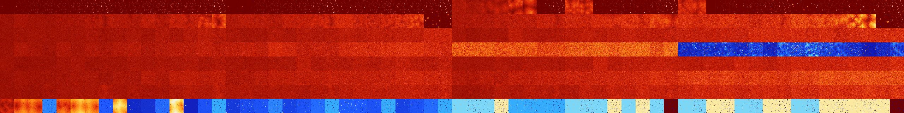

# B012457 (93696-94207)

<details>
    <summary>Initial Grid</summary>
    
</details>


<details>
    <summary>Initial Grid RLE</summary>

```
#C Exported from GoGoL (https://github.com/marrow16/gogol)
#C Wrap mode: Toroidal
#C Boundary mode: Dead
#C Step: 0
x = 100, y = 100, rule = B012457/S
26bo69bo$59bobo$o12bo38bo35bo$20bo52bo2bo$71bobo$bo10bo12bo69bo$46bo7bo
bo19bo20b3o$20bo11bo12bo7bo3bo18bo8bobo$30bo11bo$24bo2b2o21bo$19bo18bo
39bo8bo2bo$bo15bo18bo36bo5bo2bo$2bo54bo4bo4bo$12bo24bo14bo18bo11bo7bo6b
o$o71bo19bo5bo$7bo27bo$58bo$16bo16bo28bo33bo$14bo3bo8bo10bo6bo43bo9bo$
8bo28bo$34bobo10bo15bo13bo20bo$42bo$45bo24bo14bo3bo2b2o$21bo6bo15bobobo
15bo18bo$6bo69bo21bo$16bo8bo2bo7bo26bo26bo3bo$37bo19bo9bo$19bo2bo26bo
12bobo7bo7bo$16bo42bo26bo$24bo7bo24bo2bo7bo16bobo3bo5bo$50bo38bobo$24bo
7bo2bo$8bo18bo12bo22bob2o5bo9bo11bo$12bo2bo14bo13bo23b2o5bo$17bo18bo11b
obo4bo5bo6bo$13b2o2bo10bo3bo4bo11b2o6bo13bo3bo$23bo10bo9bo$28bo$6bo11bo
5bo18bo6bo9bo3bo12bo10bo$5bo19bo39bo8bo14bo$5bobo21bo42bo16bo9bo$26bo4b
o17bo13bobo20bo2bo$4bo27bo8bo10bo2bo41bo$63bo20bo$35bo$17bo5bo9bo16bo7b
2o4bo$4b2o9bobo24bo10bo4bo$15bobo6bo41bo15bo3bo4bo4b2o$13bo70bo4bo$6bob
o5bo5bo12bo11bo3bo2bo5bo28bo2bo$29bo37bo$12b2o7bo$4bo57bo11bo2bo14bo$
19bo45bo$30bo20b2o21bo6bo$2bo3bo10bo21bo20bo17bob3o15bo$100b$17bo23bo$
20bo6bo67bo$2bo70bo$84bo3bo$39bo17bo3bo5bo14bo$32bo5bo6bo3bo6bo14bo$3bo
8bo15bo5bo7bo13b2o8bo29bo$67bo29bo$9bo18bo5bo51bo11b2o$22b3o4bo6bo14bob
o9bo7bo12bo$11bo18bo62bo$59bo30bo$11bo55bo23bo$31bo31bo25bo2bo$7bo13bo
21bo11b2o26bo5bo$15bobo4bo36bo7bo10bo$23bo13bo27bo26bo$bo18bo9bo8bo4b2o
10b2o4bo9bo16bo8bo$20b2o17bo24bo6bo4bo$7bo58bo13bo6bo8bo$38bo2bo9bo22bo
6bo$5bo13bo7bo9bo40bo$9bo10bo16bo17bo9bo21bo$50bo2bo28bo2bo9bo$7bo51bo
6bo24bo3bo2bo$36bobo16bobo22bo10bo$8bo2bo37bo12bo35bo$27bo4bo45bo$7bobo
58bo5bo14bo8bo$10bo23bo5bo$11bo49bo3bo7bo6bo4bo3bo5bo$o33bo16bo10bo3bo
30bo$41bo5bo13bobo7bo$5bobo31bo3bo7bo$7bo10bo39bo8bo28bo$2bo20bo18bo30b
o14bo$20bo59bo11bo2bo$14b2o41bo31bo$3bo17bo33bo9bo13bo$bo15bo54bo13bo2b
o5bo$2bo26bo$45bo33bo3bo$5bobo31bo41bo!
```
</details>
<details>
    <summary>Thumbnail</summary>

</details>
<table>
<tr>
    <td><a href="./93696%20S%20Heat%20Map%20Activity.png"></a><br>S (93696)<br>R@47,p2</td>    <td><a href="./93697%20S0%20Heat%20Map%20Activity.png"></a><br>S0 (93697)<br>R@17,p2</td>    <td><a href="./93698%20S1%20Heat%20Map%20Activity.png"></a><br>S1 (93698)<br>R@11,p2</td>    <td><a href="./93699%20S01%20Heat%20Map%20Activity.png"></a><br>S01 (93699)<br>R@11,p2</td>    <td><a href="./93700%20S2%20Heat%20Map%20Activity.png"></a><br>S2 (93700)<br>R@12,p2</td>    <td><a href="./93701%20S02%20Heat%20Map%20Activity.png"></a><br>S02 (93701)<br>R@9,p2</td>    <td><a href="./93702%20S12%20Heat%20Map%20Activity.png"></a><br>S12 (93702)<br>R@7,p2</td>    <td><a href="./93703%20S012%20Heat%20Map%20Activity.png"></a><br>S012 (93703)<br>R@6,p2</td>    <td><a href="./93704%20S3%20Heat%20Map%20Activity.png"></a><br>S3 (93704)<br>R@9,p2</td>    <td><a href="./93705%20S03%20Heat%20Map%20Activity.png"></a><br>S03 (93705)<br>R@9,p2</td>    <td><a href="./93706%20S13%20Heat%20Map%20Activity.png"></a><br>S13 (93706)<br>R@8,p2</td>    <td><a href="./93707%20S013%20Heat%20Map%20Activity.png"></a><br>S013 (93707)<br>R@7,p2</td>    <td><a href="./93708%20S23%20Heat%20Map%20Activity.png"></a><br>S23 (93708)<br>R@8,p2</td>    <td><a href="./93709%20S023%20Heat%20Map%20Activity.png"></a><br>S023 (93709)<br>R@8,p2</td>    <td><a href="./93710%20S123%20Heat%20Map%20Activity.png"></a><br>S123 (93710)<br>R@8,p2</td>    <td><a href="./93711%20S0123%20Heat%20Map%20Activity.png"></a><br>S0123 (93711)<br>R@5,p2</td>    <td><a href="./93712%20S4%20Heat%20Map%20Activity.png"></a><br>S4 (93712)<br>R@92,p2</td>    <td><a href="./93713%20S04%20Heat%20Map%20Activity.png"></a><br>S04 (93713)<br>R@54,p2</td>    <td><a href="./93714%20S14%20Heat%20Map%20Activity.png"></a><br>S14 (93714)<br>R@12,p2</td>    <td><a href="./93715%20S014%20Heat%20Map%20Activity.png"></a><br>S014 (93715)<br>R@11,p2</td>    <td><a href="./93716%20S24%20Heat%20Map%20Activity.png"></a><br>S24 (93716)<br>R@12,p2</td>    <td><a href="./93717%20S024%20Heat%20Map%20Activity.png"></a><br>S024 (93717)<br>R@9,p2</td>    <td><a href="./93718%20S124%20Heat%20Map%20Activity.png"></a><br>S124 (93718)<br>R@7,p2</td>    <td><a href="./93719%20S0124%20Heat%20Map%20Activity.png"></a><br>S0124 (93719)<br>R@5,p2</td>    <td><a href="./93720%20S34%20Heat%20Map%20Activity.png"></a><br>S34 (93720)<br>R@13,p4</td>    <td><a href="./93721%20S034%20Heat%20Map%20Activity.png"></a><br>S034 (93721)<br>R@12,p4</td>    <td><a href="./93722%20S134%20Heat%20Map%20Activity.png"></a><br>S134 (93722)<br>R@10,p4</td>    <td><a href="./93723%20S0134%20Heat%20Map%20Activity.png"></a><br>S0134 (93723)<br>R@7,p4</td>    <td><a href="./93724%20S234%20Heat%20Map%20Activity.png"></a><br>S234 (93724)<br>R@10,p2</td>    <td><a href="./93725%20S0234%20Heat%20Map%20Activity.png"></a><br>S0234 (93725)<br>R@10,p2</td>    <td><a href="./93726%20S1234%20Heat%20Map%20Activity.png"></a><br>S1234 (93726)<br>R@8,p2</td>    <td><a href="./93727%20S01234%20Heat%20Map%20Activity.png"></a><br>S01234 (93727)<br>R@5,p2</td>    <td><a href="./93728%20S5%20Heat%20Map%20Activity.png"></a><br>S5 (93728)<br>G>1000</td>    <td><a href="./93729%20S05%20Heat%20Map%20Activity.png"></a><br>S05 (93729)<br>G>1000</td>    <td><a href="./93730%20S15%20Heat%20Map%20Activity.png"></a><br>S15 (93730)<br>G>1000</td>    <td><a href="./93731%20S015%20Heat%20Map%20Activity.png"></a><br>S015 (93731)<br>G>1000</td>    <td><a href="./93732%20S25%20Heat%20Map%20Activity.png"></a><br>S25 (93732)<br>G>1000</td>    <td><a href="./93733%20S025%20Heat%20Map%20Activity.png"></a><br>S025 (93733)<br>G>1000</td>    <td><a href="./93734%20S125%20Heat%20Map%20Activity.png"></a><br>S125 (93734)<br>R@31,p16</td>    <td><a href="./93735%20S0125%20Heat%20Map%20Activity.png"></a><br>S0125 (93735)<br>R@7,p2</td>    <td><a href="./93736%20S35%20Heat%20Map%20Activity.png"></a><br>S35 (93736)<br>G>1000</td>    <td><a href="./93737%20S035%20Heat%20Map%20Activity.png"></a><br>S035 (93737)<br>G>1000</td>    <td><a href="./93738%20S135%20Heat%20Map%20Activity.png"></a><br>S135 (93738)<br>R@27,p2</td>    <td><a href="./93739%20S0135%20Heat%20Map%20Activity.png"></a><br>S0135 (93739)<br>R@13,p2</td>    <td><a href="./93740%20S235%20Heat%20Map%20Activity.png"></a><br>S235 (93740)<br>R@18,p4</td>    <td><a href="./93741%20S0235%20Heat%20Map%20Activity.png"></a><br>S0235 (93741)<br>R@18,p4</td>    <td><a href="./93742%20S1235%20Heat%20Map%20Activity.png"></a><br>S1235 (93742)<br>R@10,p2</td>    <td><a href="./93743%20S01235%20Heat%20Map%20Activity.png"></a><br>S01235 (93743)<br>R@5,p2</td>    <td><a href="./93744%20S45%20Heat%20Map%20Activity.png"></a><br>S45 (93744)<br>G>1000</td>    <td><a href="./93745%20S045%20Heat%20Map%20Activity.png"></a><br>S045 (93745)<br>G>1000</td>    <td><a href="./93746%20S145%20Heat%20Map%20Activity.png"></a><br>S145 (93746)<br>R@265,p200</td>    <td><a href="./93747%20S0145%20Heat%20Map%20Activity.png"></a><br>S0145 (93747)<br>R@16,p2</td>    <td><a href="./93748%20S245%20Heat%20Map%20Activity.png"></a><br>S245 (93748)<br>R@40,p2</td>    <td><a href="./93749%20S0245%20Heat%20Map%20Activity.png"></a><br>S0245 (93749)<br>R@13,p2</td>    <td><a href="./93750%20S1245%20Heat%20Map%20Activity.png"></a><br>S1245 (93750)<br>R@9,p2</td>    <td><a href="./93751%20S01245%20Heat%20Map%20Activity.png"></a><br>S01245 (93751)<br>R@7,p2</td>    <td><a href="./93752%20S345%20Heat%20Map%20Activity.png"></a><br>S345 (93752)<br>R@90,p4</td>    <td><a href="./93753%20S0345%20Heat%20Map%20Activity.png"></a><br>S0345 (93753)<br>R@39,p12</td>    <td><a href="./93754%20S1345%20Heat%20Map%20Activity.png"></a><br>S1345 (93754)<br>R@14,p2</td>    <td><a href="./93755%20S01345%20Heat%20Map%20Activity.png"></a><br>S01345 (93755)<br>R@13,p4</td>    <td><a href="./93756%20S2345%20Heat%20Map%20Activity.png"></a><br>S2345 (93756)<br>R@20,p2</td>    <td><a href="./93757%20S02345%20Heat%20Map%20Activity.png"></a><br>S02345 (93757)<br>R@20,p2</td>    <td><a href="./93758%20S12345%20Heat%20Map%20Activity.png"></a><br>S12345 (93758)<br>R@8,p2</td>    <td><a href="./93759%20S012345%20Heat%20Map%20Activity.png"></a><br>S012345 (93759)<br>R@5,p2</td></tr>
<tr>
    <td><a href="./93760%20S6%20Heat%20Map%20Activity.png"></a><br>S6 (93760)<br>G>1000</td>    <td><a href="./93761%20S06%20Heat%20Map%20Activity.png"></a><br>S06 (93761)<br>G>1000</td>    <td><a href="./93762%20S16%20Heat%20Map%20Activity.png"></a><br>S16 (93762)<br>G>1000</td>    <td><a href="./93763%20S016%20Heat%20Map%20Activity.png"></a><br>S016 (93763)<br>G>1000</td>    <td><a href="./93764%20S26%20Heat%20Map%20Activity.png"></a><br>S26 (93764)<br>G>1000</td>    <td><a href="./93765%20S026%20Heat%20Map%20Activity.png"></a><br>S026 (93765)<br>G>1000</td>    <td><a href="./93766%20S126%20Heat%20Map%20Activity.png"></a><br>S126 (93766)<br>G>1000</td>    <td><a href="./93767%20S0126%20Heat%20Map%20Activity.png"></a><br>S0126 (93767)<br>G>1000</td>    <td><a href="./93768%20S36%20Heat%20Map%20Activity.png"></a><br>S36 (93768)<br>G>1000</td>    <td><a href="./93769%20S036%20Heat%20Map%20Activity.png"></a><br>S036 (93769)<br>G>1000</td>    <td><a href="./93770%20S136%20Heat%20Map%20Activity.png"></a><br>S136 (93770)<br>G>1000</td>    <td><a href="./93771%20S0136%20Heat%20Map%20Activity.png"></a><br>S0136 (93771)<br>G>1000</td>    <td><a href="./93772%20S236%20Heat%20Map%20Activity.png"></a><br>S236 (93772)<br>G>1000</td>    <td><a href="./93773%20S0236%20Heat%20Map%20Activity.png"></a><br>S0236 (93773)<br>G>1000</td>    <td><a href="./93774%20S1236%20Heat%20Map%20Activity.png"></a><br>S1236 (93774)<br>G>1000</td>    <td><a href="./93775%20S01236%20Heat%20Map%20Activity.png"></a><br>S01236 (93775)<br>G>1000</td>    <td><a href="./93776%20S46%20Heat%20Map%20Activity.png"></a><br>S46 (93776)<br>G>1000</td>    <td><a href="./93777%20S046%20Heat%20Map%20Activity.png"></a><br>S046 (93777)<br>G>1000</td>    <td><a href="./93778%20S146%20Heat%20Map%20Activity.png"></a><br>S146 (93778)<br>G>1000</td>    <td><a href="./93779%20S0146%20Heat%20Map%20Activity.png"></a><br>S0146 (93779)<br>G>1000</td>    <td><a href="./93780%20S246%20Heat%20Map%20Activity.png"></a><br>S246 (93780)<br>G>1000</td>    <td><a href="./93781%20S0246%20Heat%20Map%20Activity.png"></a><br>S0246 (93781)<br>G>1000</td>    <td><a href="./93782%20S1246%20Heat%20Map%20Activity.png"></a><br>S1246 (93782)<br>G>1000</td>    <td><a href="./93783%20S01246%20Heat%20Map%20Activity.png"></a><br>S01246 (93783)<br>G>1000</td>    <td><a href="./93784%20S346%20Heat%20Map%20Activity.png"></a><br>S346 (93784)<br>G>1000</td>    <td><a href="./93785%20S0346%20Heat%20Map%20Activity.png"></a><br>S0346 (93785)<br>G>1000</td>    <td><a href="./93786%20S1346%20Heat%20Map%20Activity.png"></a><br>S1346 (93786)<br>G>1000</td>    <td><a href="./93787%20S01346%20Heat%20Map%20Activity.png"></a><br>S01346 (93787)<br>G>1000</td>    <td><a href="./93788%20S2346%20Heat%20Map%20Activity.png"></a><br>S2346 (93788)<br>G>1000</td>    <td><a href="./93789%20S02346%20Heat%20Map%20Activity.png"></a><br>S02346 (93789)<br>G>1000</td>    <td><a href="./93790%20S12346%20Heat%20Map%20Activity.png"></a><br>S12346 (93790)<br>R@61,p2</td>    <td><a href="./93791%20S012346%20Heat%20Map%20Activity.png"></a><br>S012346 (93791)<br>R@33,p2</td>    <td><a href="./93792%20S56%20Heat%20Map%20Activity.png"></a><br>S56 (93792)<br>G>1000</td>    <td><a href="./93793%20S056%20Heat%20Map%20Activity.png"></a><br>S056 (93793)<br>G>1000</td>    <td><a href="./93794%20S156%20Heat%20Map%20Activity.png"></a><br>S156 (93794)<br>G>1000</td>    <td><a href="./93795%20S0156%20Heat%20Map%20Activity.png"></a><br>S0156 (93795)<br>G>1000</td>    <td><a href="./93796%20S256%20Heat%20Map%20Activity.png"></a><br>S256 (93796)<br>G>1000</td>    <td><a href="./93797%20S0256%20Heat%20Map%20Activity.png"></a><br>S0256 (93797)<br>G>1000</td>    <td><a href="./93798%20S1256%20Heat%20Map%20Activity.png"></a><br>S1256 (93798)<br>G>1000</td>    <td><a href="./93799%20S01256%20Heat%20Map%20Activity.png"></a><br>S01256 (93799)<br>G>1000</td>    <td><a href="./93800%20S356%20Heat%20Map%20Activity.png"></a><br>S356 (93800)<br>G>1000</td>    <td><a href="./93801%20S0356%20Heat%20Map%20Activity.png"></a><br>S0356 (93801)<br>G>1000</td>    <td><a href="./93802%20S1356%20Heat%20Map%20Activity.png"></a><br>S1356 (93802)<br>G>1000</td>    <td><a href="./93803%20S01356%20Heat%20Map%20Activity.png"></a><br>S01356 (93803)<br>G>1000</td>    <td><a href="./93804%20S2356%20Heat%20Map%20Activity.png"></a><br>S2356 (93804)<br>G>1000</td>    <td><a href="./93805%20S02356%20Heat%20Map%20Activity.png"></a><br>S02356 (93805)<br>G>1000</td>    <td><a href="./93806%20S12356%20Heat%20Map%20Activity.png"></a><br>S12356 (93806)<br>G>1000</td>    <td><a href="./93807%20S012356%20Heat%20Map%20Activity.png"></a><br>S012356 (93807)<br>G>1000</td>    <td><a href="./93808%20S456%20Heat%20Map%20Activity.png"></a><br>S456 (93808)<br>G>1000</td>    <td><a href="./93809%20S0456%20Heat%20Map%20Activity.png"></a><br>S0456 (93809)<br>G>1000</td>    <td><a href="./93810%20S1456%20Heat%20Map%20Activity.png"></a><br>S1456 (93810)<br>G>1000</td>    <td><a href="./93811%20S01456%20Heat%20Map%20Activity.png"></a><br>S01456 (93811)<br>G>1000</td>    <td><a href="./93812%20S2456%20Heat%20Map%20Activity.png"></a><br>S2456 (93812)<br>G>1000</td>    <td><a href="./93813%20S02456%20Heat%20Map%20Activity.png"></a><br>S02456 (93813)<br>G>1000</td>    <td><a href="./93814%20S12456%20Heat%20Map%20Activity.png"></a><br>S12456 (93814)<br>G>1000</td>    <td><a href="./93815%20S012456%20Heat%20Map%20Activity.png"></a><br>S012456 (93815)<br>G>1000</td>    <td><a href="./93816%20S3456%20Heat%20Map%20Activity.png"></a><br>S3456 (93816)<br>G>1000</td>    <td><a href="./93817%20S03456%20Heat%20Map%20Activity.png"></a><br>S03456 (93817)<br>G>1000</td>    <td><a href="./93818%20S13456%20Heat%20Map%20Activity.png"></a><br>S13456 (93818)<br>G>1000</td>    <td><a href="./93819%20S013456%20Heat%20Map%20Activity.png"></a><br>S013456 (93819)<br>G>1000</td>    <td><a href="./93820%20S23456%20Heat%20Map%20Activity.png"></a><br>S23456 (93820)<br>G>1000</td>    <td><a href="./93821%20S023456%20Heat%20Map%20Activity.png"></a><br>S023456 (93821)<br>G>1000</td>    <td><a href="./93822%20S123456%20Heat%20Map%20Activity.png"></a><br>S123456 (93822)<br>R@83,p4</td>    <td><a href="./93823%20S0123456%20Heat%20Map%20Activity.png"></a><br>S0123456 (93823)<br>R@9,p2</td></tr>
<tr>
    <td><a href="./93824%20S7%20Heat%20Map%20Activity.png"></a><br>S7 (93824)<br>G>1000</td>    <td><a href="./93825%20S07%20Heat%20Map%20Activity.png"></a><br>S07 (93825)<br>G>1000</td>    <td><a href="./93826%20S17%20Heat%20Map%20Activity.png"></a><br>S17 (93826)<br>G>1000</td>    <td><a href="./93827%20S017%20Heat%20Map%20Activity.png"></a><br>S017 (93827)<br>G>1000</td>    <td><a href="./93828%20S27%20Heat%20Map%20Activity.png"></a><br>S27 (93828)<br>G>1000</td>    <td><a href="./93829%20S027%20Heat%20Map%20Activity.png"></a><br>S027 (93829)<br>G>1000</td>    <td><a href="./93830%20S127%20Heat%20Map%20Activity.png"></a><br>S127 (93830)<br>G>1000</td>    <td><a href="./93831%20S0127%20Heat%20Map%20Activity.png"></a><br>S0127 (93831)<br>G>1000</td>    <td><a href="./93832%20S37%20Heat%20Map%20Activity.png"></a><br>S37 (93832)<br>G>1000</td>    <td><a href="./93833%20S037%20Heat%20Map%20Activity.png"></a><br>S037 (93833)<br>G>1000</td>    <td><a href="./93834%20S137%20Heat%20Map%20Activity.png"></a><br>S137 (93834)<br>G>1000</td>    <td><a href="./93835%20S0137%20Heat%20Map%20Activity.png"></a><br>S0137 (93835)<br>G>1000</td>    <td><a href="./93836%20S237%20Heat%20Map%20Activity.png"></a><br>S237 (93836)<br>G>1000</td>    <td><a href="./93837%20S0237%20Heat%20Map%20Activity.png"></a><br>S0237 (93837)<br>G>1000</td>    <td><a href="./93838%20S1237%20Heat%20Map%20Activity.png"></a><br>S1237 (93838)<br>G>1000</td>    <td><a href="./93839%20S01237%20Heat%20Map%20Activity.png"></a><br>S01237 (93839)<br>G>1000</td>    <td><a href="./93840%20S47%20Heat%20Map%20Activity.png"></a><br>S47 (93840)<br>G>1000</td>    <td><a href="./93841%20S047%20Heat%20Map%20Activity.png"></a><br>S047 (93841)<br>G>1000</td>    <td><a href="./93842%20S147%20Heat%20Map%20Activity.png"></a><br>S147 (93842)<br>G>1000</td>    <td><a href="./93843%20S0147%20Heat%20Map%20Activity.png"></a><br>S0147 (93843)<br>G>1000</td>    <td><a href="./93844%20S247%20Heat%20Map%20Activity.png"></a><br>S247 (93844)<br>G>1000</td>    <td><a href="./93845%20S0247%20Heat%20Map%20Activity.png"></a><br>S0247 (93845)<br>G>1000</td>    <td><a href="./93846%20S1247%20Heat%20Map%20Activity.png"></a><br>S1247 (93846)<br>G>1000</td>    <td><a href="./93847%20S01247%20Heat%20Map%20Activity.png"></a><br>S01247 (93847)<br>G>1000</td>    <td><a href="./93848%20S347%20Heat%20Map%20Activity.png"></a><br>S347 (93848)<br>G>1000</td>    <td><a href="./93849%20S0347%20Heat%20Map%20Activity.png"></a><br>S0347 (93849)<br>G>1000</td>    <td><a href="./93850%20S1347%20Heat%20Map%20Activity.png"></a><br>S1347 (93850)<br>G>1000</td>    <td><a href="./93851%20S01347%20Heat%20Map%20Activity.png"></a><br>S01347 (93851)<br>G>1000</td>    <td><a href="./93852%20S2347%20Heat%20Map%20Activity.png"></a><br>S2347 (93852)<br>G>1000</td>    <td><a href="./93853%20S02347%20Heat%20Map%20Activity.png"></a><br>S02347 (93853)<br>G>1000</td>    <td><a href="./93854%20S12347%20Heat%20Map%20Activity.png"></a><br>S12347 (93854)<br>G>1000</td>    <td><a href="./93855%20S012347%20Heat%20Map%20Activity.png"></a><br>S012347 (93855)<br>G>1000</td>    <td><a href="./93856%20S57%20Heat%20Map%20Activity.png"></a><br>S57 (93856)<br>G>1000</td>    <td><a href="./93857%20S057%20Heat%20Map%20Activity.png"></a><br>S057 (93857)<br>G>1000</td>    <td><a href="./93858%20S157%20Heat%20Map%20Activity.png"></a><br>S157 (93858)<br>G>1000</td>    <td><a href="./93859%20S0157%20Heat%20Map%20Activity.png"></a><br>S0157 (93859)<br>G>1000</td>    <td><a href="./93860%20S257%20Heat%20Map%20Activity.png"></a><br>S257 (93860)<br>G>1000</td>    <td><a href="./93861%20S0257%20Heat%20Map%20Activity.png"></a><br>S0257 (93861)<br>G>1000</td>    <td><a href="./93862%20S1257%20Heat%20Map%20Activity.png"></a><br>S1257 (93862)<br>G>1000</td>    <td><a href="./93863%20S01257%20Heat%20Map%20Activity.png"></a><br>S01257 (93863)<br>G>1000</td>    <td><a href="./93864%20S357%20Heat%20Map%20Activity.png"></a><br>S357 (93864)<br>G>1000</td>    <td><a href="./93865%20S0357%20Heat%20Map%20Activity.png"></a><br>S0357 (93865)<br>G>1000</td>    <td><a href="./93866%20S1357%20Heat%20Map%20Activity.png"></a><br>S1357 (93866)<br>G>1000</td>    <td><a href="./93867%20S01357%20Heat%20Map%20Activity.png"></a><br>S01357 (93867)<br>G>1000</td>    <td><a href="./93868%20S2357%20Heat%20Map%20Activity.png"></a><br>S2357 (93868)<br>G>1000</td>    <td><a href="./93869%20S02357%20Heat%20Map%20Activity.png"></a><br>S02357 (93869)<br>G>1000</td>    <td><a href="./93870%20S12357%20Heat%20Map%20Activity.png"></a><br>S12357 (93870)<br>G>1000</td>    <td><a href="./93871%20S012357%20Heat%20Map%20Activity.png"></a><br>S012357 (93871)<br>G>1000</td>    <td><a href="./93872%20S457%20Heat%20Map%20Activity.png"></a><br>S457 (93872)<br>G>1000</td>    <td><a href="./93873%20S0457%20Heat%20Map%20Activity.png"></a><br>S0457 (93873)<br>G>1000</td>    <td><a href="./93874%20S1457%20Heat%20Map%20Activity.png"></a><br>S1457 (93874)<br>G>1000</td>    <td><a href="./93875%20S01457%20Heat%20Map%20Activity.png"></a><br>S01457 (93875)<br>G>1000</td>    <td><a href="./93876%20S2457%20Heat%20Map%20Activity.png"></a><br>S2457 (93876)<br>G>1000</td>    <td><a href="./93877%20S02457%20Heat%20Map%20Activity.png"></a><br>S02457 (93877)<br>G>1000</td>    <td><a href="./93878%20S12457%20Heat%20Map%20Activity.png"></a><br>S12457 (93878)<br>G>1000</td>    <td><a href="./93879%20S012457%20Heat%20Map%20Activity.png"></a><br>S012457 (93879)<br>G>1000</td>    <td><a href="./93880%20S3457%20Heat%20Map%20Activity.png"></a><br>S3457 (93880)<br>G>1000</td>    <td><a href="./93881%20S03457%20Heat%20Map%20Activity.png"></a><br>S03457 (93881)<br>G>1000</td>    <td><a href="./93882%20S13457%20Heat%20Map%20Activity.png"></a><br>S13457 (93882)<br>G>1000</td>    <td><a href="./93883%20S013457%20Heat%20Map%20Activity.png"></a><br>S013457 (93883)<br>G>1000</td>    <td><a href="./93884%20S23457%20Heat%20Map%20Activity.png"></a><br>S23457 (93884)<br>G>1000</td>    <td><a href="./93885%20S023457%20Heat%20Map%20Activity.png"></a><br>S023457 (93885)<br>G>1000</td>    <td><a href="./93886%20S123457%20Heat%20Map%20Activity.png"></a><br>S123457 (93886)<br>G>1000</td>    <td><a href="./93887%20S0123457%20Heat%20Map%20Activity.png"></a><br>S0123457 (93887)<br>G>1000</td></tr>
<tr>
    <td><a href="./93888%20S67%20Heat%20Map%20Activity.png"></a><br>S67 (93888)<br>G>1000</td>    <td><a href="./93889%20S067%20Heat%20Map%20Activity.png"></a><br>S067 (93889)<br>G>1000</td>    <td><a href="./93890%20S167%20Heat%20Map%20Activity.png"></a><br>S167 (93890)<br>G>1000</td>    <td><a href="./93891%20S0167%20Heat%20Map%20Activity.png"></a><br>S0167 (93891)<br>G>1000</td>    <td><a href="./93892%20S267%20Heat%20Map%20Activity.png"></a><br>S267 (93892)<br>G>1000</td>    <td><a href="./93893%20S0267%20Heat%20Map%20Activity.png"></a><br>S0267 (93893)<br>G>1000</td>    <td><a href="./93894%20S1267%20Heat%20Map%20Activity.png"></a><br>S1267 (93894)<br>G>1000</td>    <td><a href="./93895%20S01267%20Heat%20Map%20Activity.png"></a><br>S01267 (93895)<br>G>1000</td>    <td><a href="./93896%20S367%20Heat%20Map%20Activity.png"></a><br>S367 (93896)<br>G>1000</td>    <td><a href="./93897%20S0367%20Heat%20Map%20Activity.png"></a><br>S0367 (93897)<br>G>1000</td>    <td><a href="./93898%20S1367%20Heat%20Map%20Activity.png"></a><br>S1367 (93898)<br>G>1000</td>    <td><a href="./93899%20S01367%20Heat%20Map%20Activity.png"></a><br>S01367 (93899)<br>G>1000</td>    <td><a href="./93900%20S2367%20Heat%20Map%20Activity.png"></a><br>S2367 (93900)<br>G>1000</td>    <td><a href="./93901%20S02367%20Heat%20Map%20Activity.png"></a><br>S02367 (93901)<br>G>1000</td>    <td><a href="./93902%20S12367%20Heat%20Map%20Activity.png"></a><br>S12367 (93902)<br>G>1000</td>    <td><a href="./93903%20S012367%20Heat%20Map%20Activity.png"></a><br>S012367 (93903)<br>G>1000</td>    <td><a href="./93904%20S467%20Heat%20Map%20Activity.png"></a><br>S467 (93904)<br>G>1000</td>    <td><a href="./93905%20S0467%20Heat%20Map%20Activity.png"></a><br>S0467 (93905)<br>G>1000</td>    <td><a href="./93906%20S1467%20Heat%20Map%20Activity.png"></a><br>S1467 (93906)<br>G>1000</td>    <td><a href="./93907%20S01467%20Heat%20Map%20Activity.png"></a><br>S01467 (93907)<br>G>1000</td>    <td><a href="./93908%20S2467%20Heat%20Map%20Activity.png"></a><br>S2467 (93908)<br>G>1000</td>    <td><a href="./93909%20S02467%20Heat%20Map%20Activity.png"></a><br>S02467 (93909)<br>G>1000</td>    <td><a href="./93910%20S12467%20Heat%20Map%20Activity.png"></a><br>S12467 (93910)<br>G>1000</td>    <td><a href="./93911%20S012467%20Heat%20Map%20Activity.png"></a><br>S012467 (93911)<br>G>1000</td>    <td><a href="./93912%20S3467%20Heat%20Map%20Activity.png"></a><br>S3467 (93912)<br>G>1000</td>    <td><a href="./93913%20S03467%20Heat%20Map%20Activity.png"></a><br>S03467 (93913)<br>G>1000</td>    <td><a href="./93914%20S13467%20Heat%20Map%20Activity.png"></a><br>S13467 (93914)<br>G>1000</td>    <td><a href="./93915%20S013467%20Heat%20Map%20Activity.png"></a><br>S013467 (93915)<br>G>1000</td>    <td><a href="./93916%20S23467%20Heat%20Map%20Activity.png"></a><br>S23467 (93916)<br>G>1000</td>    <td><a href="./93917%20S023467%20Heat%20Map%20Activity.png"></a><br>S023467 (93917)<br>G>1000</td>    <td><a href="./93918%20S123467%20Heat%20Map%20Activity.png"></a><br>S123467 (93918)<br>G>1000</td>    <td><a href="./93919%20S0123467%20Heat%20Map%20Activity.png"></a><br>S0123467 (93919)<br>G>1000</td>    <td><a href="./93920%20S567%20Heat%20Map%20Activity.png"></a><br>S567 (93920)<br>G>1000</td>    <td><a href="./93921%20S0567%20Heat%20Map%20Activity.png"></a><br>S0567 (93921)<br>G>1000</td>    <td><a href="./93922%20S1567%20Heat%20Map%20Activity.png"></a><br>S1567 (93922)<br>G>1000</td>    <td><a href="./93923%20S01567%20Heat%20Map%20Activity.png"></a><br>S01567 (93923)<br>G>1000</td>    <td><a href="./93924%20S2567%20Heat%20Map%20Activity.png"></a><br>S2567 (93924)<br>G>1000</td>    <td><a href="./93925%20S02567%20Heat%20Map%20Activity.png"></a><br>S02567 (93925)<br>G>1000</td>    <td><a href="./93926%20S12567%20Heat%20Map%20Activity.png"></a><br>S12567 (93926)<br>G>1000</td>    <td><a href="./93927%20S012567%20Heat%20Map%20Activity.png"></a><br>S012567 (93927)<br>G>1000</td>    <td><a href="./93928%20S3567%20Heat%20Map%20Activity.png"></a><br>S3567 (93928)<br>G>1000</td>    <td><a href="./93929%20S03567%20Heat%20Map%20Activity.png"></a><br>S03567 (93929)<br>G>1000</td>    <td><a href="./93930%20S13567%20Heat%20Map%20Activity.png"></a><br>S13567 (93930)<br>G>1000</td>    <td><a href="./93931%20S013567%20Heat%20Map%20Activity.png"></a><br>S013567 (93931)<br>G>1000</td>    <td><a href="./93932%20S23567%20Heat%20Map%20Activity.png"></a><br>S23567 (93932)<br>G>1000</td>    <td><a href="./93933%20S023567%20Heat%20Map%20Activity.png"></a><br>S023567 (93933)<br>G>1000</td>    <td><a href="./93934%20S123567%20Heat%20Map%20Activity.png"></a><br>S123567 (93934)<br>G>1000</td>    <td><a href="./93935%20S0123567%20Heat%20Map%20Activity.png"></a><br>S0123567 (93935)<br>G>1000</td>    <td><a href="./93936%20S4567%20Heat%20Map%20Activity.png"></a><br>S4567 (93936)<br>R@339,p60</td>    <td><a href="./93937%20S04567%20Heat%20Map%20Activity.png"></a><br>S04567 (93937)<br>R@306,p12</td>    <td><a href="./93938%20S14567%20Heat%20Map%20Activity.png"></a><br>S14567 (93938)<br>R@232,p12</td>    <td><a href="./93939%20S014567%20Heat%20Map%20Activity.png"></a><br>S014567 (93939)<br>R@261,p6</td>    <td><a href="./93940%20S24567%20Heat%20Map%20Activity.png"></a><br>S24567 (93940)<br>R@177,p12</td>    <td><a href="./93941%20S024567%20Heat%20Map%20Activity.png"></a><br>S024567 (93941)<br>R@113,p12</td>    <td><a href="./93942%20S124567%20Heat%20Map%20Activity.png"></a><br>S124567 (93942)<br>R@269,p6</td>    <td><a href="./93943%20S0124567%20Heat%20Map%20Activity.png"></a><br>S0124567 (93943)<br>R@143,p12</td>    <td><a href="./93944%20S34567%20Heat%20Map%20Activity.png"></a><br>S34567 (93944)<br>R@38,p6</td>    <td><a href="./93945%20S034567%20Heat%20Map%20Activity.png"></a><br>S034567 (93945)<br>R@49,p12</td>    <td><a href="./93946%20S134567%20Heat%20Map%20Activity.png"></a><br>S134567 (93946)<br>R@40,p6</td>    <td><a href="./93947%20S0134567%20Heat%20Map%20Activity.png"></a><br>S0134567 (93947)<br>R@121,p30</td>    <td><a href="./93948%20S234567%20Heat%20Map%20Activity.png"></a><br>S234567 (93948)<br>R@52,p30</td>    <td><a href="./93949%20S0234567%20Heat%20Map%20Activity.png"></a><br>S0234567 (93949)<br>G>1000</td>    <td><a href="./93950%20S1234567%20Heat%20Map%20Activity.png"></a><br>S1234567 (93950)<br>R@76,p30</td>    <td><a href="./93951%20S01234567%20Heat%20Map%20Activity.png"></a><br>S01234567 (93951)<br>R@137,p84</td></tr>
<tr>
    <td><a href="./93952%20S8%20Heat%20Map%20Activity.png"></a><br>S8 (93952)<br>G>1000</td>    <td><a href="./93953%20S08%20Heat%20Map%20Activity.png"></a><br>S08 (93953)<br>G>1000</td>    <td><a href="./93954%20S18%20Heat%20Map%20Activity.png"></a><br>S18 (93954)<br>G>1000</td>    <td><a href="./93955%20S018%20Heat%20Map%20Activity.png"></a><br>S018 (93955)<br>G>1000</td>    <td><a href="./93956%20S28%20Heat%20Map%20Activity.png"></a><br>S28 (93956)<br>G>1000</td>    <td><a href="./93957%20S028%20Heat%20Map%20Activity.png"></a><br>S028 (93957)<br>G>1000</td>    <td><a href="./93958%20S128%20Heat%20Map%20Activity.png"></a><br>S128 (93958)<br>G>1000</td>    <td><a href="./93959%20S0128%20Heat%20Map%20Activity.png"></a><br>S0128 (93959)<br>G>1000</td>    <td><a href="./93960%20S38%20Heat%20Map%20Activity.png"></a><br>S38 (93960)<br>G>1000</td>    <td><a href="./93961%20S038%20Heat%20Map%20Activity.png"></a><br>S038 (93961)<br>G>1000</td>    <td><a href="./93962%20S138%20Heat%20Map%20Activity.png"></a><br>S138 (93962)<br>G>1000</td>    <td><a href="./93963%20S0138%20Heat%20Map%20Activity.png"></a><br>S0138 (93963)<br>G>1000</td>    <td><a href="./93964%20S238%20Heat%20Map%20Activity.png"></a><br>S238 (93964)<br>G>1000</td>    <td><a href="./93965%20S0238%20Heat%20Map%20Activity.png"></a><br>S0238 (93965)<br>G>1000</td>    <td><a href="./93966%20S1238%20Heat%20Map%20Activity.png"></a><br>S1238 (93966)<br>G>1000</td>    <td><a href="./93967%20S01238%20Heat%20Map%20Activity.png"></a><br>S01238 (93967)<br>G>1000</td>    <td><a href="./93968%20S48%20Heat%20Map%20Activity.png"></a><br>S48 (93968)<br>G>1000</td>    <td><a href="./93969%20S048%20Heat%20Map%20Activity.png"></a><br>S048 (93969)<br>G>1000</td>    <td><a href="./93970%20S148%20Heat%20Map%20Activity.png"></a><br>S148 (93970)<br>G>1000</td>    <td><a href="./93971%20S0148%20Heat%20Map%20Activity.png"></a><br>S0148 (93971)<br>G>1000</td>    <td><a href="./93972%20S248%20Heat%20Map%20Activity.png"></a><br>S248 (93972)<br>G>1000</td>    <td><a href="./93973%20S0248%20Heat%20Map%20Activity.png"></a><br>S0248 (93973)<br>G>1000</td>    <td><a href="./93974%20S1248%20Heat%20Map%20Activity.png"></a><br>S1248 (93974)<br>G>1000</td>    <td><a href="./93975%20S01248%20Heat%20Map%20Activity.png"></a><br>S01248 (93975)<br>G>1000</td>    <td><a href="./93976%20S348%20Heat%20Map%20Activity.png"></a><br>S348 (93976)<br>G>1000</td>    <td><a href="./93977%20S0348%20Heat%20Map%20Activity.png"></a><br>S0348 (93977)<br>G>1000</td>    <td><a href="./93978%20S1348%20Heat%20Map%20Activity.png"></a><br>S1348 (93978)<br>G>1000</td>    <td><a href="./93979%20S01348%20Heat%20Map%20Activity.png"></a><br>S01348 (93979)<br>G>1000</td>    <td><a href="./93980%20S2348%20Heat%20Map%20Activity.png"></a><br>S2348 (93980)<br>G>1000</td>    <td><a href="./93981%20S02348%20Heat%20Map%20Activity.png"></a><br>S02348 (93981)<br>G>1000</td>    <td><a href="./93982%20S12348%20Heat%20Map%20Activity.png"></a><br>S12348 (93982)<br>G>1000</td>    <td><a href="./93983%20S012348%20Heat%20Map%20Activity.png"></a><br>S012348 (93983)<br>G>1000</td>    <td><a href="./93984%20S58%20Heat%20Map%20Activity.png"></a><br>S58 (93984)<br>G>1000</td>    <td><a href="./93985%20S058%20Heat%20Map%20Activity.png"></a><br>S058 (93985)<br>G>1000</td>    <td><a href="./93986%20S158%20Heat%20Map%20Activity.png"></a><br>S158 (93986)<br>G>1000</td>    <td><a href="./93987%20S0158%20Heat%20Map%20Activity.png"></a><br>S0158 (93987)<br>G>1000</td>    <td><a href="./93988%20S258%20Heat%20Map%20Activity.png"></a><br>S258 (93988)<br>G>1000</td>    <td><a href="./93989%20S0258%20Heat%20Map%20Activity.png"></a><br>S0258 (93989)<br>G>1000</td>    <td><a href="./93990%20S1258%20Heat%20Map%20Activity.png"></a><br>S1258 (93990)<br>G>1000</td>    <td><a href="./93991%20S01258%20Heat%20Map%20Activity.png"></a><br>S01258 (93991)<br>G>1000</td>    <td><a href="./93992%20S358%20Heat%20Map%20Activity.png"></a><br>S358 (93992)<br>G>1000</td>    <td><a href="./93993%20S0358%20Heat%20Map%20Activity.png"></a><br>S0358 (93993)<br>G>1000</td>    <td><a href="./93994%20S1358%20Heat%20Map%20Activity.png"></a><br>S1358 (93994)<br>G>1000</td>    <td><a href="./93995%20S01358%20Heat%20Map%20Activity.png"></a><br>S01358 (93995)<br>G>1000</td>    <td><a href="./93996%20S2358%20Heat%20Map%20Activity.png"></a><br>S2358 (93996)<br>G>1000</td>    <td><a href="./93997%20S02358%20Heat%20Map%20Activity.png"></a><br>S02358 (93997)<br>G>1000</td>    <td><a href="./93998%20S12358%20Heat%20Map%20Activity.png"></a><br>S12358 (93998)<br>G>1000</td>    <td><a href="./93999%20S012358%20Heat%20Map%20Activity.png"></a><br>S012358 (93999)<br>G>1000</td>    <td><a href="./94000%20S458%20Heat%20Map%20Activity.png"></a><br>S458 (94000)<br>G>1000</td>    <td><a href="./94001%20S0458%20Heat%20Map%20Activity.png"></a><br>S0458 (94001)<br>G>1000</td>    <td><a href="./94002%20S1458%20Heat%20Map%20Activity.png"></a><br>S1458 (94002)<br>G>1000</td>    <td><a href="./94003%20S01458%20Heat%20Map%20Activity.png"></a><br>S01458 (94003)<br>G>1000</td>    <td><a href="./94004%20S2458%20Heat%20Map%20Activity.png"></a><br>S2458 (94004)<br>G>1000</td>    <td><a href="./94005%20S02458%20Heat%20Map%20Activity.png"></a><br>S02458 (94005)<br>G>1000</td>    <td><a href="./94006%20S12458%20Heat%20Map%20Activity.png"></a><br>S12458 (94006)<br>G>1000</td>    <td><a href="./94007%20S012458%20Heat%20Map%20Activity.png"></a><br>S012458 (94007)<br>G>1000</td>    <td><a href="./94008%20S3458%20Heat%20Map%20Activity.png"></a><br>S3458 (94008)<br>G>1000</td>    <td><a href="./94009%20S03458%20Heat%20Map%20Activity.png"></a><br>S03458 (94009)<br>G>1000</td>    <td><a href="./94010%20S13458%20Heat%20Map%20Activity.png"></a><br>S13458 (94010)<br>G>1000</td>    <td><a href="./94011%20S013458%20Heat%20Map%20Activity.png"></a><br>S013458 (94011)<br>G>1000</td>    <td><a href="./94012%20S23458%20Heat%20Map%20Activity.png"></a><br>S23458 (94012)<br>G>1000</td>    <td><a href="./94013%20S023458%20Heat%20Map%20Activity.png"></a><br>S023458 (94013)<br>G>1000</td>    <td><a href="./94014%20S123458%20Heat%20Map%20Activity.png"></a><br>S123458 (94014)<br>G>1000</td>    <td><a href="./94015%20S0123458%20Heat%20Map%20Activity.png"></a><br>S0123458 (94015)<br>G>1000</td></tr>
<tr>
    <td><a href="./94016%20S68%20Heat%20Map%20Activity.png"></a><br>S68 (94016)<br>G>1000</td>    <td><a href="./94017%20S068%20Heat%20Map%20Activity.png"></a><br>S068 (94017)<br>G>1000</td>    <td><a href="./94018%20S168%20Heat%20Map%20Activity.png"></a><br>S168 (94018)<br>G>1000</td>    <td><a href="./94019%20S0168%20Heat%20Map%20Activity.png"></a><br>S0168 (94019)<br>G>1000</td>    <td><a href="./94020%20S268%20Heat%20Map%20Activity.png"></a><br>S268 (94020)<br>G>1000</td>    <td><a href="./94021%20S0268%20Heat%20Map%20Activity.png"></a><br>S0268 (94021)<br>G>1000</td>    <td><a href="./94022%20S1268%20Heat%20Map%20Activity.png"></a><br>S1268 (94022)<br>G>1000</td>    <td><a href="./94023%20S01268%20Heat%20Map%20Activity.png"></a><br>S01268 (94023)<br>G>1000</td>    <td><a href="./94024%20S368%20Heat%20Map%20Activity.png"></a><br>S368 (94024)<br>G>1000</td>    <td><a href="./94025%20S0368%20Heat%20Map%20Activity.png"></a><br>S0368 (94025)<br>G>1000</td>    <td><a href="./94026%20S1368%20Heat%20Map%20Activity.png"></a><br>S1368 (94026)<br>G>1000</td>    <td><a href="./94027%20S01368%20Heat%20Map%20Activity.png"></a><br>S01368 (94027)<br>G>1000</td>    <td><a href="./94028%20S2368%20Heat%20Map%20Activity.png"></a><br>S2368 (94028)<br>G>1000</td>    <td><a href="./94029%20S02368%20Heat%20Map%20Activity.png"></a><br>S02368 (94029)<br>G>1000</td>    <td><a href="./94030%20S12368%20Heat%20Map%20Activity.png"></a><br>S12368 (94030)<br>G>1000</td>    <td><a href="./94031%20S012368%20Heat%20Map%20Activity.png"></a><br>S012368 (94031)<br>G>1000</td>    <td><a href="./94032%20S468%20Heat%20Map%20Activity.png"></a><br>S468 (94032)<br>G>1000</td>    <td><a href="./94033%20S0468%20Heat%20Map%20Activity.png"></a><br>S0468 (94033)<br>G>1000</td>    <td><a href="./94034%20S1468%20Heat%20Map%20Activity.png"></a><br>S1468 (94034)<br>G>1000</td>    <td><a href="./94035%20S01468%20Heat%20Map%20Activity.png"></a><br>S01468 (94035)<br>G>1000</td>    <td><a href="./94036%20S2468%20Heat%20Map%20Activity.png"></a><br>S2468 (94036)<br>G>1000</td>    <td><a href="./94037%20S02468%20Heat%20Map%20Activity.png"></a><br>S02468 (94037)<br>G>1000</td>    <td><a href="./94038%20S12468%20Heat%20Map%20Activity.png"></a><br>S12468 (94038)<br>G>1000</td>    <td><a href="./94039%20S012468%20Heat%20Map%20Activity.png"></a><br>S012468 (94039)<br>G>1000</td>    <td><a href="./94040%20S3468%20Heat%20Map%20Activity.png"></a><br>S3468 (94040)<br>G>1000</td>    <td><a href="./94041%20S03468%20Heat%20Map%20Activity.png"></a><br>S03468 (94041)<br>G>1000</td>    <td><a href="./94042%20S13468%20Heat%20Map%20Activity.png"></a><br>S13468 (94042)<br>G>1000</td>    <td><a href="./94043%20S013468%20Heat%20Map%20Activity.png"></a><br>S013468 (94043)<br>G>1000</td>    <td><a href="./94044%20S23468%20Heat%20Map%20Activity.png"></a><br>S23468 (94044)<br>G>1000</td>    <td><a href="./94045%20S023468%20Heat%20Map%20Activity.png"></a><br>S023468 (94045)<br>G>1000</td>    <td><a href="./94046%20S123468%20Heat%20Map%20Activity.png"></a><br>S123468 (94046)<br>G>1000</td>    <td><a href="./94047%20S0123468%20Heat%20Map%20Activity.png"></a><br>S0123468 (94047)<br>G>1000</td>    <td><a href="./94048%20S568%20Heat%20Map%20Activity.png"></a><br>S568 (94048)<br>G>1000</td>    <td><a href="./94049%20S0568%20Heat%20Map%20Activity.png"></a><br>S0568 (94049)<br>G>1000</td>    <td><a href="./94050%20S1568%20Heat%20Map%20Activity.png"></a><br>S1568 (94050)<br>G>1000</td>    <td><a href="./94051%20S01568%20Heat%20Map%20Activity.png"></a><br>S01568 (94051)<br>G>1000</td>    <td><a href="./94052%20S2568%20Heat%20Map%20Activity.png"></a><br>S2568 (94052)<br>G>1000</td>    <td><a href="./94053%20S02568%20Heat%20Map%20Activity.png"></a><br>S02568 (94053)<br>G>1000</td>    <td><a href="./94054%20S12568%20Heat%20Map%20Activity.png"></a><br>S12568 (94054)<br>G>1000</td>    <td><a href="./94055%20S012568%20Heat%20Map%20Activity.png"></a><br>S012568 (94055)<br>G>1000</td>    <td><a href="./94056%20S3568%20Heat%20Map%20Activity.png"></a><br>S3568 (94056)<br>G>1000</td>    <td><a href="./94057%20S03568%20Heat%20Map%20Activity.png"></a><br>S03568 (94057)<br>G>1000</td>    <td><a href="./94058%20S13568%20Heat%20Map%20Activity.png"></a><br>S13568 (94058)<br>G>1000</td>    <td><a href="./94059%20S013568%20Heat%20Map%20Activity.png"></a><br>S013568 (94059)<br>G>1000</td>    <td><a href="./94060%20S23568%20Heat%20Map%20Activity.png"></a><br>S23568 (94060)<br>G>1000</td>    <td><a href="./94061%20S023568%20Heat%20Map%20Activity.png"></a><br>S023568 (94061)<br>G>1000</td>    <td><a href="./94062%20S123568%20Heat%20Map%20Activity.png"></a><br>S123568 (94062)<br>G>1000</td>    <td><a href="./94063%20S0123568%20Heat%20Map%20Activity.png"></a><br>S0123568 (94063)<br>G>1000</td>    <td><a href="./94064%20S4568%20Heat%20Map%20Activity.png"></a><br>S4568 (94064)<br>G>1000</td>    <td><a href="./94065%20S04568%20Heat%20Map%20Activity.png"></a><br>S04568 (94065)<br>G>1000</td>    <td><a href="./94066%20S14568%20Heat%20Map%20Activity.png"></a><br>S14568 (94066)<br>G>1000</td>    <td><a href="./94067%20S014568%20Heat%20Map%20Activity.png"></a><br>S014568 (94067)<br>G>1000</td>    <td><a href="./94068%20S24568%20Heat%20Map%20Activity.png"></a><br>S24568 (94068)<br>G>1000</td>    <td><a href="./94069%20S024568%20Heat%20Map%20Activity.png"></a><br>S024568 (94069)<br>G>1000</td>    <td><a href="./94070%20S124568%20Heat%20Map%20Activity.png"></a><br>S124568 (94070)<br>G>1000</td>    <td><a href="./94071%20S0124568%20Heat%20Map%20Activity.png"></a><br>S0124568 (94071)<br>G>1000</td>    <td><a href="./94072%20S34568%20Heat%20Map%20Activity.png"></a><br>S34568 (94072)<br>G>1000</td>    <td><a href="./94073%20S034568%20Heat%20Map%20Activity.png"></a><br>S034568 (94073)<br>G>1000</td>    <td><a href="./94074%20S134568%20Heat%20Map%20Activity.png"></a><br>S134568 (94074)<br>G>1000</td>    <td><a href="./94075%20S0134568%20Heat%20Map%20Activity.png"></a><br>S0134568 (94075)<br>G>1000</td>    <td><a href="./94076%20S234568%20Heat%20Map%20Activity.png"></a><br>S234568 (94076)<br>G>1000</td>    <td><a href="./94077%20S0234568%20Heat%20Map%20Activity.png"></a><br>S0234568 (94077)<br>G>1000</td>    <td><a href="./94078%20S1234568%20Heat%20Map%20Activity.png"></a><br>S1234568 (94078)<br>G>1000</td>    <td><a href="./94079%20S01234568%20Heat%20Map%20Activity.png"></a><br>S01234568 (94079)<br>G>1000</td></tr>
<tr>
    <td><a href="./94080%20S78%20Heat%20Map%20Activity.png"></a><br>S78 (94080)<br>G>1000</td>    <td><a href="./94081%20S078%20Heat%20Map%20Activity.png"></a><br>S078 (94081)<br>G>1000</td>    <td><a href="./94082%20S178%20Heat%20Map%20Activity.png"></a><br>S178 (94082)<br>G>1000</td>    <td><a href="./94083%20S0178%20Heat%20Map%20Activity.png"></a><br>S0178 (94083)<br>G>1000</td>    <td><a href="./94084%20S278%20Heat%20Map%20Activity.png"></a><br>S278 (94084)<br>G>1000</td>    <td><a href="./94085%20S0278%20Heat%20Map%20Activity.png"></a><br>S0278 (94085)<br>G>1000</td>    <td><a href="./94086%20S1278%20Heat%20Map%20Activity.png"></a><br>S1278 (94086)<br>G>1000</td>    <td><a href="./94087%20S01278%20Heat%20Map%20Activity.png"></a><br>S01278 (94087)<br>G>1000</td>    <td><a href="./94088%20S378%20Heat%20Map%20Activity.png"></a><br>S378 (94088)<br>G>1000</td>    <td><a href="./94089%20S0378%20Heat%20Map%20Activity.png"></a><br>S0378 (94089)<br>G>1000</td>    <td><a href="./94090%20S1378%20Heat%20Map%20Activity.png"></a><br>S1378 (94090)<br>G>1000</td>    <td><a href="./94091%20S01378%20Heat%20Map%20Activity.png"></a><br>S01378 (94091)<br>G>1000</td>    <td><a href="./94092%20S2378%20Heat%20Map%20Activity.png"></a><br>S2378 (94092)<br>G>1000</td>    <td><a href="./94093%20S02378%20Heat%20Map%20Activity.png"></a><br>S02378 (94093)<br>G>1000</td>    <td><a href="./94094%20S12378%20Heat%20Map%20Activity.png"></a><br>S12378 (94094)<br>G>1000</td>    <td><a href="./94095%20S012378%20Heat%20Map%20Activity.png"></a><br>S012378 (94095)<br>G>1000</td>    <td><a href="./94096%20S478%20Heat%20Map%20Activity.png"></a><br>S478 (94096)<br>G>1000</td>    <td><a href="./94097%20S0478%20Heat%20Map%20Activity.png"></a><br>S0478 (94097)<br>G>1000</td>    <td><a href="./94098%20S1478%20Heat%20Map%20Activity.png"></a><br>S1478 (94098)<br>G>1000</td>    <td><a href="./94099%20S01478%20Heat%20Map%20Activity.png"></a><br>S01478 (94099)<br>G>1000</td>    <td><a href="./94100%20S2478%20Heat%20Map%20Activity.png"></a><br>S2478 (94100)<br>G>1000</td>    <td><a href="./94101%20S02478%20Heat%20Map%20Activity.png"></a><br>S02478 (94101)<br>G>1000</td>    <td><a href="./94102%20S12478%20Heat%20Map%20Activity.png"></a><br>S12478 (94102)<br>G>1000</td>    <td><a href="./94103%20S012478%20Heat%20Map%20Activity.png"></a><br>S012478 (94103)<br>G>1000</td>    <td><a href="./94104%20S3478%20Heat%20Map%20Activity.png"></a><br>S3478 (94104)<br>G>1000</td>    <td><a href="./94105%20S03478%20Heat%20Map%20Activity.png"></a><br>S03478 (94105)<br>G>1000</td>    <td><a href="./94106%20S13478%20Heat%20Map%20Activity.png"></a><br>S13478 (94106)<br>G>1000</td>    <td><a href="./94107%20S013478%20Heat%20Map%20Activity.png"></a><br>S013478 (94107)<br>G>1000</td>    <td><a href="./94108%20S23478%20Heat%20Map%20Activity.png"></a><br>S23478 (94108)<br>G>1000</td>    <td><a href="./94109%20S023478%20Heat%20Map%20Activity.png"></a><br>S023478 (94109)<br>G>1000</td>    <td><a href="./94110%20S123478%20Heat%20Map%20Activity.png"></a><br>S123478 (94110)<br>G>1000</td>    <td><a href="./94111%20S0123478%20Heat%20Map%20Activity.png"></a><br>S0123478 (94111)<br>G>1000</td>    <td><a href="./94112%20S578%20Heat%20Map%20Activity.png"></a><br>S578 (94112)<br>G>1000</td>    <td><a href="./94113%20S0578%20Heat%20Map%20Activity.png"></a><br>S0578 (94113)<br>G>1000</td>    <td><a href="./94114%20S1578%20Heat%20Map%20Activity.png"></a><br>S1578 (94114)<br>G>1000</td>    <td><a href="./94115%20S01578%20Heat%20Map%20Activity.png"></a><br>S01578 (94115)<br>G>1000</td>    <td><a href="./94116%20S2578%20Heat%20Map%20Activity.png"></a><br>S2578 (94116)<br>G>1000</td>    <td><a href="./94117%20S02578%20Heat%20Map%20Activity.png"></a><br>S02578 (94117)<br>G>1000</td>    <td><a href="./94118%20S12578%20Heat%20Map%20Activity.png"></a><br>S12578 (94118)<br>G>1000</td>    <td><a href="./94119%20S012578%20Heat%20Map%20Activity.png"></a><br>S012578 (94119)<br>G>1000</td>    <td><a href="./94120%20S3578%20Heat%20Map%20Activity.png"></a><br>S3578 (94120)<br>G>1000</td>    <td><a href="./94121%20S03578%20Heat%20Map%20Activity.png"></a><br>S03578 (94121)<br>G>1000</td>    <td><a href="./94122%20S13578%20Heat%20Map%20Activity.png"></a><br>S13578 (94122)<br>G>1000</td>    <td><a href="./94123%20S013578%20Heat%20Map%20Activity.png"></a><br>S013578 (94123)<br>G>1000</td>    <td><a href="./94124%20S23578%20Heat%20Map%20Activity.png"></a><br>S23578 (94124)<br>G>1000</td>    <td><a href="./94125%20S023578%20Heat%20Map%20Activity.png"></a><br>S023578 (94125)<br>G>1000</td>    <td><a href="./94126%20S123578%20Heat%20Map%20Activity.png"></a><br>S123578 (94126)<br>G>1000</td>    <td><a href="./94127%20S0123578%20Heat%20Map%20Activity.png"></a><br>S0123578 (94127)<br>G>1000</td>    <td><a href="./94128%20S4578%20Heat%20Map%20Activity.png"></a><br>S4578 (94128)<br>G>1000</td>    <td><a href="./94129%20S04578%20Heat%20Map%20Activity.png"></a><br>S04578 (94129)<br>G>1000</td>    <td><a href="./94130%20S14578%20Heat%20Map%20Activity.png"></a><br>S14578 (94130)<br>G>1000</td>    <td><a href="./94131%20S014578%20Heat%20Map%20Activity.png"></a><br>S014578 (94131)<br>G>1000</td>    <td><a href="./94132%20S24578%20Heat%20Map%20Activity.png"></a><br>S24578 (94132)<br>G>1000</td>    <td><a href="./94133%20S024578%20Heat%20Map%20Activity.png"></a><br>S024578 (94133)<br>G>1000</td>    <td><a href="./94134%20S124578%20Heat%20Map%20Activity.png"></a><br>S124578 (94134)<br>G>1000</td>    <td><a href="./94135%20S0124578%20Heat%20Map%20Activity.png"></a><br>S0124578 (94135)<br>G>1000</td>    <td><a href="./94136%20S34578%20Heat%20Map%20Activity.png"></a><br>S34578 (94136)<br>G>1000</td>    <td><a href="./94137%20S034578%20Heat%20Map%20Activity.png"></a><br>S034578 (94137)<br>G>1000</td>    <td><a href="./94138%20S134578%20Heat%20Map%20Activity.png"></a><br>S134578 (94138)<br>G>1000</td>    <td><a href="./94139%20S0134578%20Heat%20Map%20Activity.png"></a><br>S0134578 (94139)<br>G>1000</td>    <td><a href="./94140%20S234578%20Heat%20Map%20Activity.png"></a><br>S234578 (94140)<br>G>1000</td>    <td><a href="./94141%20S0234578%20Heat%20Map%20Activity.png"></a><br>S0234578 (94141)<br>G>1000</td>    <td><a href="./94142%20S1234578%20Heat%20Map%20Activity.png"></a><br>S1234578 (94142)<br>G>1000</td>    <td><a href="./94143%20S01234578%20Heat%20Map%20Activity.png"></a><br>S01234578 (94143)<br>G>1000</td></tr>
<tr>
    <td><a href="./94144%20S678%20Heat%20Map%20Activity.png"></a><br>S678 (94144)<br>G>1000</td>    <td><a href="./94145%20S0678%20Heat%20Map%20Activity.png"></a><br>S0678 (94145)<br>G>1000</td>    <td><a href="./94146%20S1678%20Heat%20Map%20Activity.png"></a><br>S1678 (94146)<br>G>1000</td>    <td><a href="./94147%20S01678%20Heat%20Map%20Activity.png"></a><br>S01678 (94147)<br>R@7,p2</td>    <td><a href="./94148%20S2678%20Heat%20Map%20Activity.png"></a><br>S2678 (94148)<br>G>1000</td>    <td><a href="./94149%20S02678%20Heat%20Map%20Activity.png"></a><br>S02678 (94149)<br>G>1000</td>    <td><a href="./94150%20S12678%20Heat%20Map%20Activity.png"></a><br>S12678 (94150)<br>G>1000</td>    <td><a href="./94151%20S012678%20Heat%20Map%20Activity.png"></a><br>S012678 (94151)<br>R@8,p4</td>    <td><a href="./94152%20S3678%20Heat%20Map%20Activity.png"></a><br>S3678 (94152)<br>G>1000</td>    <td><a href="./94153%20S03678%20Heat%20Map%20Activity.png"></a><br>S03678 (94153)<br>R@29,p4</td>    <td><a href="./94154%20S13678%20Heat%20Map%20Activity.png"></a><br>S13678 (94154)<br>R@19,p12</td>    <td><a href="./94155%20S013678%20Heat%20Map%20Activity.png"></a><br>S013678 (94155)<br>R@8,p4</td>    <td><a href="./94156%20S23678%20Heat%20Map%20Activity.png"></a><br>S23678 (94156)<br>G>1000</td>    <td><a href="./94157%20S023678%20Heat%20Map%20Activity.png"></a><br>S023678 (94157)<br>R@56,p4</td>    <td><a href="./94158%20S123678%20Heat%20Map%20Activity.png"></a><br>S123678 (94158)<br>R@9,p2</td>    <td><a href="./94159%20S0123678%20Heat%20Map%20Activity.png"></a><br>S0123678 (94159)<br>S@5</td>    <td><a href="./94160%20S4678%20Heat%20Map%20Activity.png"></a><br>S4678 (94160)<br>R@15,p4</td>    <td><a href="./94161%20S04678%20Heat%20Map%20Activity.png"></a><br>S04678 (94161)<br>R@10,p4</td>    <td><a href="./94162%20S14678%20Heat%20Map%20Activity.png"></a><br>S14678 (94162)<br>R@9,p2</td>    <td><a href="./94163%20S014678%20Heat%20Map%20Activity.png"></a><br>S014678 (94163)<br>R@7,p2</td>    <td><a href="./94164%20S24678%20Heat%20Map%20Activity.png"></a><br>S24678 (94164)<br>R@12,p4</td>    <td><a href="./94165%20S024678%20Heat%20Map%20Activity.png"></a><br>S024678 (94165)<br>R@9,p2</td>    <td><a href="./94166%20S124678%20Heat%20Map%20Activity.png"></a><br>S124678 (94166)<br>R@7,p2</td>    <td><a href="./94167%20S0124678%20Heat%20Map%20Activity.png"></a><br>S0124678 (94167)<br>S@4</td>    <td><a href="./94168%20S34678%20Heat%20Map%20Activity.png"></a><br>S34678 (94168)<br>S@12</td>    <td><a href="./94169%20S034678%20Heat%20Map%20Activity.png"></a><br>S034678 (94169)<br>R@8,p2</td>    <td><a href="./94170%20S134678%20Heat%20Map%20Activity.png"></a><br>S134678 (94170)<br>R@9,p2</td>    <td><a href="./94171%20S0134678%20Heat%20Map%20Activity.png"></a><br>S0134678 (94171)<br>R@6,p2</td>    <td><a href="./94172%20S234678%20Heat%20Map%20Activity.png"></a><br>S234678 (94172)<br>R@12,p2</td>    <td><a href="./94173%20S0234678%20Heat%20Map%20Activity.png"></a><br>S0234678 (94173)<br>R@9,p2</td>    <td><a href="./94174%20S1234678%20Heat%20Map%20Activity.png"></a><br>S1234678 (94174)<br>R@7,p2</td>    <td><a href="./94175%20S01234678%20Heat%20Map%20Activity.png"></a><br>S01234678 (94175)<br>S@5</td>    <td><a href="./94176%20S5678%20Heat%20Map%20Activity.png"></a><br>S5678 (94176)<br>S@4</td>    <td><a href="./94177%20S05678%20Heat%20Map%20Activity.png"></a><br>S05678 (94177)<br>S@4</td>    <td><a href="./94178%20S15678%20Heat%20Map%20Activity.png"></a><br>S15678 (94178)<br>S@3</td>    <td><a href="./94179%20S015678%20Heat%20Map%20Activity.png"></a><br>S015678 (94179)<br>S@2</td>    <td><a href="./94180%20S25678%20Heat%20Map%20Activity.png"></a><br>S25678 (94180)<br>S@4</td>    <td><a href="./94181%20S025678%20Heat%20Map%20Activity.png"></a><br>S025678 (94181)<br>S@4</td>    <td><a href="./94182%20S125678%20Heat%20Map%20Activity.png"></a><br>S125678 (94182)<br>S@4</td>    <td><a href="./94183%20S0125678%20Heat%20Map%20Activity.png"></a><br>S0125678 (94183)<br>S@4</td>    <td><a href="./94184%20S35678%20Heat%20Map%20Activity.png"></a><br>S35678 (94184)<br>S@4</td>    <td><a href="./94185%20S035678%20Heat%20Map%20Activity.png"></a><br>S035678 (94185)<br>S@4</td>    <td><a href="./94186%20S135678%20Heat%20Map%20Activity.png"></a><br>S135678 (94186)<br>S@4</td>    <td><a href="./94187%20S0135678%20Heat%20Map%20Activity.png"></a><br>S0135678 (94187)<br>S@4</td>    <td><a href="./94188%20S235678%20Heat%20Map%20Activity.png"></a><br>S235678 (94188)<br>S@4</td>    <td><a href="./94189%20S0235678%20Heat%20Map%20Activity.png"></a><br>S0235678 (94189)<br>S@3</td>    <td><a href="./94190%20S1235678%20Heat%20Map%20Activity.png"></a><br>S1235678 (94190)<br>S@3</td>    <td><a href="./94191%20S01235678%20Heat%20Map%20Activity.png"></a><br>S01235678 (94191)<br>S@2</td>    <td><a href="./94192%20S45678%20Heat%20Map%20Activity.png"></a><br>S45678 (94192)<br>S@3</td>    <td><a href="./94193%20S045678%20Heat%20Map%20Activity.png"></a><br>S045678 (94193)<br>S@3</td>    <td><a href="./94194%20S145678%20Heat%20Map%20Activity.png"></a><br>S145678 (94194)<br>S@3</td>    <td><a href="./94195%20S0145678%20Heat%20Map%20Activity.png"></a><br>S0145678 (94195)<br>S@2</td>    <td><a href="./94196%20S245678%20Heat%20Map%20Activity.png"></a><br>S245678 (94196)<br>S@4</td>    <td><a href="./94197%20S0245678%20Heat%20Map%20Activity.png"></a><br>S0245678 (94197)<br>S@4</td>    <td><a href="./94198%20S1245678%20Heat%20Map%20Activity.png"></a><br>S1245678 (94198)<br>S@3</td>    <td><a href="./94199%20S01245678%20Heat%20Map%20Activity.png"></a><br>S01245678 (94199)<br>S@2</td>    <td><a href="./94200%20S345678%20Heat%20Map%20Activity.png"></a><br>S345678 (94200)<br>S@3</td>    <td><a href="./94201%20S0345678%20Heat%20Map%20Activity.png"></a><br>S0345678 (94201)<br>S@3</td>    <td><a href="./94202%20S1345678%20Heat%20Map%20Activity.png"></a><br>S1345678 (94202)<br>S@3</td>    <td><a href="./94203%20S01345678%20Heat%20Map%20Activity.png"></a><br>S01345678 (94203)<br>S@3</td>    <td><a href="./94204%20S2345678%20Heat%20Map%20Activity.png"></a><br>S2345678 (94204)<br>S@3</td>    <td><a href="./94205%20S02345678%20Heat%20Map%20Activity.png"></a><br>S02345678 (94205)<br>S@3</td>    <td><a href="./94206%20S12345678%20Heat%20Map%20Activity.png"></a><br>S12345678 (94206)<br>S@3</td>    <td><a href="./94207%20S012345678%20Heat%20Map%20Activity.png"></a><br>S012345678 (94207)<br>S@2</td></tr>
</table>
