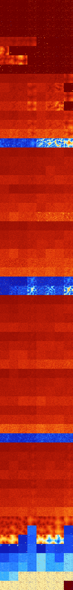

# B012458 (159232-159743)

<details>
    <summary>Initial Grid</summary>
    
</details>


<details>
    <summary>Initial Grid RLE</summary>

```
#C Exported from GoGoL (https://github.com/marrow16/gogol)
#C Wrap mode: Toroidal
#C Boundary mode: Dead
#C Step: 0
x = 100, y = 100, rule = B012458/S
6bo13bo30bo11bo10bo23bo$35bo9bo21bo22bo5bo$100b$10bo31bobo19bo14bo18bo$
13bo11bo11bo7bo31bo$24b2o2bo30bo5bo25bo$12bo13bo22bo6b2o$bo15bo20bo2bo
6bo3bo30bo$15bob2o2bo11bo18bobo8bo11bo10bo10bo$2bobo32b2o26bo$29bo6bo7b
o16bo6bo13bo$9bo6bo40bo31bo8b2o$11bo25bobo20bo9bo7bo$28bo7bo4bo25bo22bo
$4bo19bo9bo17bo36bobob2o$44bo37bo$7bo12bo2bo17bo16bo29b2o$7bo44bo8bo34b
o$18bo3bo5bo3bo3bo14bo12bo10bo11b2o$4bo50bo12bo4bo$bo18bo6bo49bo8bo$6bo
47bo44bo$6bo10bo34bo13bo10bo13b2o$11bo6bo25bo6bo34b2o9b2o$bo2bo37bo2bo$
13bo14bo34bo28bo$10bo10bo17bo4bo30bo6bo6bo$23bo$37bo20bo7bo28bo$20bo73b
o$9bo19bo54bo8bo$20bo3bobo37bo24bo$30bo35b2o14bo$17bobo7bo7bo26bo$5bo
10bo14bo$17bo26bo5bo37bo7bo$26bo27bo$20bo5bobo3b2o16bo34bo$30bo23bo36bo
6bo$2bo13b2o41bo2bo4bo4bo$8bo20bo47bo21bo$9bo3bo21bo9bo$56bo18b2o$7bo
25bo16bo19bo12bo5bobo2bo4bo$13bo17bo$8bo37bo3bo14bo29bo$11bo17bo33bo8bo
$3bo8bo$22bo26bo14bo11bo$5bo14bo29bo$6bo3bo19bo11bo11bo24bo5bo11bo$22bo
41bo19bo$21bo22bo11bo15bo2bo3bo$18bo15bo14bo10bo28bo7bo$7b2o31bo7bo10bo
9bo6bo12bo$2o9bo17bo5bo19bo$28bo3bo61bo$19bo8bo43bo13bo$14bo11bo9bo20bo
38bo$23bo5bo$o39bo2bo10bo16bo13bo$20bo7bo7bo50bo$50bo17bo10bo3bo$8bo5bo
15bo52bo14bo$36bo28bobo18bobo7bo$o48bo23b2o11bo5bo$22bo34bo8bo28bo$8bo
18bo15bo4bo31bo$44bo29bo21bo$4bo9bo7bo28bo42bo$8bobo73bo4bo$8bo8bo7bo5b
o7bo25bo17bo$bo4bo12bob2o35bo11bo9bobo$7bo11bo68bo$3bo39bo16bo2bo6bo22b
o$36bo10bo47bo2bo$22bo12bo2bo19bo28bo$10b2o3bo10bo27bo27b2o$43bo7bo31bo
$31bo17bo45bo$21bo6bo9bo18bo24bo$47bo9bo18bo14bo$33bo13b2o33bo11bo$44bo
47bo3bo$8bo12bo51bo3bo16bo$6bo9bo53bo9bo3bo$56bo22b2o15bo$30bo12bo15bo
2bo6bo4bo2b2o$o15bo3bo34bo2bo16bo10bo$9bo26bo8bo31bo5bo$9bo5bo6bo20b2o
45bo$49bo18bo16bo4bo$3bo9bo19bo4bo3bo$6bo31bo40bo$34bo20bo12bobo$23bo5b
o13bobo7bo6bo16bobo17bo$13bo13bo29bo30bo$bobo7bo6bo4bo15bo6bo19bo7bo$6b
o13bo62bo$10bo39bo3bob2o17bo5bo7bo!
```
</details>
<details>
    <summary>Thumbnail</summary>

</details>
<table>
<tr>
    <td><a href="./159232%20S%20Heat%20Map%20Activity.png"></a><br>S (159232)<br>R@22,p2</td>    <td><a href="./159233%20S0%20Heat%20Map%20Activity.png"></a><br>S0 (159233)<br>R@18,p2</td>    <td><a href="./159234%20S1%20Heat%20Map%20Activity.png"></a><br>S1 (159234)<br>R@20,p2</td>    <td><a href="./159235%20S01%20Heat%20Map%20Activity.png"></a><br>S01 (159235)<br>R@7,p2</td>    <td><a href="./159236%20S2%20Heat%20Map%20Activity.png"></a><br>S2 (159236)<br>R@11,p2</td>    <td><a href="./159237%20S02%20Heat%20Map%20Activity.png"></a><br>S02 (159237)<br>R@11,p2</td>    <td><a href="./159238%20S12%20Heat%20Map%20Activity.png"></a><br>S12 (159238)<br>R@6,p2</td>    <td><a href="./159239%20S012%20Heat%20Map%20Activity.png"></a><br>S012 (159239)<br>R@7,p2</td></tr>
<tr>
    <td><a href="./159240%20S3%20Heat%20Map%20Activity.png"></a><br>S3 (159240)<br>R@19,p2</td>    <td><a href="./159241%20S03%20Heat%20Map%20Activity.png"></a><br>S03 (159241)<br>R@17,p2</td>    <td><a href="./159242%20S13%20Heat%20Map%20Activity.png"></a><br>S13 (159242)<br>R@10,p2</td>    <td><a href="./159243%20S013%20Heat%20Map%20Activity.png"></a><br>S013 (159243)<br>R@9,p2</td>    <td><a href="./159244%20S23%20Heat%20Map%20Activity.png"></a><br>S23 (159244)<br>R@10,p2</td>    <td><a href="./159245%20S023%20Heat%20Map%20Activity.png"></a><br>S023 (159245)<br>R@10,p2</td>    <td><a href="./159246%20S123%20Heat%20Map%20Activity.png"></a><br>S123 (159246)<br>R@6,p2</td>    <td><a href="./159247%20S0123%20Heat%20Map%20Activity.png"></a><br>S0123 (159247)<br>R@7,p2</td></tr>
<tr>
    <td><a href="./159248%20S4%20Heat%20Map%20Activity.png"></a><br>S4 (159248)<br>R@14,p4</td>    <td><a href="./159249%20S04%20Heat%20Map%20Activity.png"></a><br>S04 (159249)<br>R@16,p2</td>    <td><a href="./159250%20S14%20Heat%20Map%20Activity.png"></a><br>S14 (159250)<br>R@18,p2</td>    <td><a href="./159251%20S014%20Heat%20Map%20Activity.png"></a><br>S014 (159251)<br>R@9,p2</td>    <td><a href="./159252%20S24%20Heat%20Map%20Activity.png"></a><br>S24 (159252)<br>R@14,p2</td>    <td><a href="./159253%20S024%20Heat%20Map%20Activity.png"></a><br>S024 (159253)<br>R@8,p2</td>    <td><a href="./159254%20S124%20Heat%20Map%20Activity.png"></a><br>S124 (159254)<br>R@8,p2</td>    <td><a href="./159255%20S0124%20Heat%20Map%20Activity.png"></a><br>S0124 (159255)<br>R@8,p2</td></tr>
<tr>
    <td><a href="./159256%20S34%20Heat%20Map%20Activity.png"></a><br>S34 (159256)<br>R@14,p2</td>    <td><a href="./159257%20S034%20Heat%20Map%20Activity.png"></a><br>S034 (159257)<br>R@17,p4</td>    <td><a href="./159258%20S134%20Heat%20Map%20Activity.png"></a><br>S134 (159258)<br>R@10,p2</td>    <td><a href="./159259%20S0134%20Heat%20Map%20Activity.png"></a><br>S0134 (159259)<br>R@7,p2</td>    <td><a href="./159260%20S234%20Heat%20Map%20Activity.png"></a><br>S234 (159260)<br>R@8,p2</td>    <td><a href="./159261%20S0234%20Heat%20Map%20Activity.png"></a><br>S0234 (159261)<br>R@9,p2</td>    <td><a href="./159262%20S1234%20Heat%20Map%20Activity.png"></a><br>S1234 (159262)<br>R@6,p2</td>    <td><a href="./159263%20S01234%20Heat%20Map%20Activity.png"></a><br>S01234 (159263)<br>R@7,p2</td></tr>
<tr>
    <td><a href="./159264%20S5%20Heat%20Map%20Activity.png"></a><br>S5 (159264)<br>G>1000</td>    <td><a href="./159265%20S05%20Heat%20Map%20Activity.png"></a><br>S05 (159265)<br>G>1000</td>    <td><a href="./159266%20S15%20Heat%20Map%20Activity.png"></a><br>S15 (159266)<br>G>1000</td>    <td><a href="./159267%20S015%20Heat%20Map%20Activity.png"></a><br>S015 (159267)<br>G>1000</td>    <td><a href="./159268%20S25%20Heat%20Map%20Activity.png"></a><br>S25 (159268)<br>R@150,p16</td>    <td><a href="./159269%20S025%20Heat%20Map%20Activity.png"></a><br>S025 (159269)<br>R@60,p4</td>    <td><a href="./159270%20S125%20Heat%20Map%20Activity.png"></a><br>S125 (159270)<br>R@18,p4</td>    <td><a href="./159271%20S0125%20Heat%20Map%20Activity.png"></a><br>S0125 (159271)<br>R@21,p16</td></tr>
<tr>
    <td><a href="./159272%20S35%20Heat%20Map%20Activity.png"></a><br>S35 (159272)<br>G>1000</td>    <td><a href="./159273%20S035%20Heat%20Map%20Activity.png"></a><br>S035 (159273)<br>R@200,p2</td>    <td><a href="./159274%20S135%20Heat%20Map%20Activity.png"></a><br>S135 (159274)<br>R@33,p2</td>    <td><a href="./159275%20S0135%20Heat%20Map%20Activity.png"></a><br>S0135 (159275)<br>R@18,p2</td>    <td><a href="./159276%20S235%20Heat%20Map%20Activity.png"></a><br>S235 (159276)<br>R@18,p4</td>    <td><a href="./159277%20S0235%20Heat%20Map%20Activity.png"></a><br>S0235 (159277)<br>R@13,p2</td>    <td><a href="./159278%20S1235%20Heat%20Map%20Activity.png"></a><br>S1235 (159278)<br>R@12,p4</td>    <td><a href="./159279%20S01235%20Heat%20Map%20Activity.png"></a><br>S01235 (159279)<br>R@9,p2</td></tr>
<tr>
    <td><a href="./159280%20S45%20Heat%20Map%20Activity.png"></a><br>S45 (159280)<br>G>1000</td>    <td><a href="./159281%20S045%20Heat%20Map%20Activity.png"></a><br>S045 (159281)<br>G>1000</td>    <td><a href="./159282%20S145%20Heat%20Map%20Activity.png"></a><br>S145 (159282)<br>G>1000</td>    <td><a href="./159283%20S0145%20Heat%20Map%20Activity.png"></a><br>S0145 (159283)<br>R@25,p2</td>    <td><a href="./159284%20S245%20Heat%20Map%20Activity.png"></a><br>S245 (159284)<br>R@40,p4</td>    <td><a href="./159285%20S0245%20Heat%20Map%20Activity.png"></a><br>S0245 (159285)<br>R@13,p2</td>    <td><a href="./159286%20S1245%20Heat%20Map%20Activity.png"></a><br>S1245 (159286)<br>R@12,p4</td>    <td><a href="./159287%20S01245%20Heat%20Map%20Activity.png"></a><br>S01245 (159287)<br>R@7,p2</td></tr>
<tr>
    <td><a href="./159288%20S345%20Heat%20Map%20Activity.png"></a><br>S345 (159288)<br>R@92,p2</td>    <td><a href="./159289%20S0345%20Heat%20Map%20Activity.png"></a><br>S0345 (159289)<br>R@16,p2</td>    <td><a href="./159290%20S1345%20Heat%20Map%20Activity.png"></a><br>S1345 (159290)<br>R@15,p2</td>    <td><a href="./159291%20S01345%20Heat%20Map%20Activity.png"></a><br>S01345 (159291)<br>R@9,p2</td>    <td><a href="./159292%20S2345%20Heat%20Map%20Activity.png"></a><br>S2345 (159292)<br>R@19,p4</td>    <td><a href="./159293%20S02345%20Heat%20Map%20Activity.png"></a><br>S02345 (159293)<br>R@11,p2</td>    <td><a href="./159294%20S12345%20Heat%20Map%20Activity.png"></a><br>S12345 (159294)<br>R@10,p4</td>    <td><a href="./159295%20S012345%20Heat%20Map%20Activity.png"></a><br>S012345 (159295)<br>R@9,p2</td></tr>
<tr>
    <td><a href="./159296%20S6%20Heat%20Map%20Activity.png"></a><br>S6 (159296)<br>G>1000</td>    <td><a href="./159297%20S06%20Heat%20Map%20Activity.png"></a><br>S06 (159297)<br>G>1000</td>    <td><a href="./159298%20S16%20Heat%20Map%20Activity.png"></a><br>S16 (159298)<br>G>1000</td>    <td><a href="./159299%20S016%20Heat%20Map%20Activity.png"></a><br>S016 (159299)<br>G>1000</td>    <td><a href="./159300%20S26%20Heat%20Map%20Activity.png"></a><br>S26 (159300)<br>G>1000</td>    <td><a href="./159301%20S026%20Heat%20Map%20Activity.png"></a><br>S026 (159301)<br>G>1000</td>    <td><a href="./159302%20S126%20Heat%20Map%20Activity.png"></a><br>S126 (159302)<br>G>1000</td>    <td><a href="./159303%20S0126%20Heat%20Map%20Activity.png"></a><br>S0126 (159303)<br>G>1000</td></tr>
<tr>
    <td><a href="./159304%20S36%20Heat%20Map%20Activity.png"></a><br>S36 (159304)<br>G>1000</td>    <td><a href="./159305%20S036%20Heat%20Map%20Activity.png"></a><br>S036 (159305)<br>G>1000</td>    <td><a href="./159306%20S136%20Heat%20Map%20Activity.png"></a><br>S136 (159306)<br>G>1000</td>    <td><a href="./159307%20S0136%20Heat%20Map%20Activity.png"></a><br>S0136 (159307)<br>G>1000</td>    <td><a href="./159308%20S236%20Heat%20Map%20Activity.png"></a><br>S236 (159308)<br>G>1000</td>    <td><a href="./159309%20S0236%20Heat%20Map%20Activity.png"></a><br>S0236 (159309)<br>G>1000</td>    <td><a href="./159310%20S1236%20Heat%20Map%20Activity.png"></a><br>S1236 (159310)<br>G>1000</td>    <td><a href="./159311%20S01236%20Heat%20Map%20Activity.png"></a><br>S01236 (159311)<br>R@41,p28</td></tr>
<tr>
    <td><a href="./159312%20S46%20Heat%20Map%20Activity.png"></a><br>S46 (159312)<br>G>1000</td>    <td><a href="./159313%20S046%20Heat%20Map%20Activity.png"></a><br>S046 (159313)<br>G>1000</td>    <td><a href="./159314%20S146%20Heat%20Map%20Activity.png"></a><br>S146 (159314)<br>G>1000</td>    <td><a href="./159315%20S0146%20Heat%20Map%20Activity.png"></a><br>S0146 (159315)<br>G>1000</td>    <td><a href="./159316%20S246%20Heat%20Map%20Activity.png"></a><br>S246 (159316)<br>G>1000</td>    <td><a href="./159317%20S0246%20Heat%20Map%20Activity.png"></a><br>S0246 (159317)<br>G>1000</td>    <td><a href="./159318%20S1246%20Heat%20Map%20Activity.png"></a><br>S1246 (159318)<br>G>1000</td>    <td><a href="./159319%20S01246%20Heat%20Map%20Activity.png"></a><br>S01246 (159319)<br>G>1000</td></tr>
<tr>
    <td><a href="./159320%20S346%20Heat%20Map%20Activity.png"></a><br>S346 (159320)<br>G>1000</td>    <td><a href="./159321%20S0346%20Heat%20Map%20Activity.png"></a><br>S0346 (159321)<br>G>1000</td>    <td><a href="./159322%20S1346%20Heat%20Map%20Activity.png"></a><br>S1346 (159322)<br>G>1000</td>    <td><a href="./159323%20S01346%20Heat%20Map%20Activity.png"></a><br>S01346 (159323)<br>G>1000</td>    <td><a href="./159324%20S2346%20Heat%20Map%20Activity.png"></a><br>S2346 (159324)<br>G>1000</td>    <td><a href="./159325%20S02346%20Heat%20Map%20Activity.png"></a><br>S02346 (159325)<br>G>1000</td>    <td><a href="./159326%20S12346%20Heat%20Map%20Activity.png"></a><br>S12346 (159326)<br>G>1000</td>    <td><a href="./159327%20S012346%20Heat%20Map%20Activity.png"></a><br>S012346 (159327)<br>R@19,p12</td></tr>
<tr>
    <td><a href="./159328%20S56%20Heat%20Map%20Activity.png"></a><br>S56 (159328)<br>G>1000</td>    <td><a href="./159329%20S056%20Heat%20Map%20Activity.png"></a><br>S056 (159329)<br>G>1000</td>    <td><a href="./159330%20S156%20Heat%20Map%20Activity.png"></a><br>S156 (159330)<br>G>1000</td>    <td><a href="./159331%20S0156%20Heat%20Map%20Activity.png"></a><br>S0156 (159331)<br>G>1000</td>    <td><a href="./159332%20S256%20Heat%20Map%20Activity.png"></a><br>S256 (159332)<br>G>1000</td>    <td><a href="./159333%20S0256%20Heat%20Map%20Activity.png"></a><br>S0256 (159333)<br>G>1000</td>    <td><a href="./159334%20S1256%20Heat%20Map%20Activity.png"></a><br>S1256 (159334)<br>G>1000</td>    <td><a href="./159335%20S01256%20Heat%20Map%20Activity.png"></a><br>S01256 (159335)<br>G>1000</td></tr>
<tr>
    <td><a href="./159336%20S356%20Heat%20Map%20Activity.png"></a><br>S356 (159336)<br>G>1000</td>    <td><a href="./159337%20S0356%20Heat%20Map%20Activity.png"></a><br>S0356 (159337)<br>G>1000</td>    <td><a href="./159338%20S1356%20Heat%20Map%20Activity.png"></a><br>S1356 (159338)<br>G>1000</td>    <td><a href="./159339%20S01356%20Heat%20Map%20Activity.png"></a><br>S01356 (159339)<br>G>1000</td>    <td><a href="./159340%20S2356%20Heat%20Map%20Activity.png"></a><br>S2356 (159340)<br>G>1000</td>    <td><a href="./159341%20S02356%20Heat%20Map%20Activity.png"></a><br>S02356 (159341)<br>G>1000</td>    <td><a href="./159342%20S12356%20Heat%20Map%20Activity.png"></a><br>S12356 (159342)<br>G>1000</td>    <td><a href="./159343%20S012356%20Heat%20Map%20Activity.png"></a><br>S012356 (159343)<br>G>1000</td></tr>
<tr>
    <td><a href="./159344%20S456%20Heat%20Map%20Activity.png"></a><br>S456 (159344)<br>G>1000</td>    <td><a href="./159345%20S0456%20Heat%20Map%20Activity.png"></a><br>S0456 (159345)<br>G>1000</td>    <td><a href="./159346%20S1456%20Heat%20Map%20Activity.png"></a><br>S1456 (159346)<br>G>1000</td>    <td><a href="./159347%20S01456%20Heat%20Map%20Activity.png"></a><br>S01456 (159347)<br>G>1000</td>    <td><a href="./159348%20S2456%20Heat%20Map%20Activity.png"></a><br>S2456 (159348)<br>G>1000</td>    <td><a href="./159349%20S02456%20Heat%20Map%20Activity.png"></a><br>S02456 (159349)<br>G>1000</td>    <td><a href="./159350%20S12456%20Heat%20Map%20Activity.png"></a><br>S12456 (159350)<br>G>1000</td>    <td><a href="./159351%20S012456%20Heat%20Map%20Activity.png"></a><br>S012456 (159351)<br>G>1000</td></tr>
<tr>
    <td><a href="./159352%20S3456%20Heat%20Map%20Activity.png"></a><br>S3456 (159352)<br>R@404,p12</td>    <td><a href="./159353%20S03456%20Heat%20Map%20Activity.png"></a><br>S03456 (159353)<br>R@758,p144</td>    <td><a href="./159354%20S13456%20Heat%20Map%20Activity.png"></a><br>S13456 (159354)<br>R@421,p120</td>    <td><a href="./159355%20S013456%20Heat%20Map%20Activity.png"></a><br>S013456 (159355)<br>R@639,p264</td>    <td><a href="./159356%20S23456%20Heat%20Map%20Activity.png"></a><br>S23456 (159356)<br>R@68,p12</td>    <td><a href="./159357%20S023456%20Heat%20Map%20Activity.png"></a><br>S023456 (159357)<br>R@106,p12</td>    <td><a href="./159358%20S123456%20Heat%20Map%20Activity.png"></a><br>S123456 (159358)<br>R@99,p12</td>    <td><a href="./159359%20S0123456%20Heat%20Map%20Activity.png"></a><br>S0123456 (159359)<br>R@162,p12</td></tr>
<tr>
    <td><a href="./159360%20S7%20Heat%20Map%20Activity.png"></a><br>S7 (159360)<br>G>1000</td>    <td><a href="./159361%20S07%20Heat%20Map%20Activity.png"></a><br>S07 (159361)<br>G>1000</td>    <td><a href="./159362%20S17%20Heat%20Map%20Activity.png"></a><br>S17 (159362)<br>G>1000</td>    <td><a href="./159363%20S017%20Heat%20Map%20Activity.png"></a><br>S017 (159363)<br>G>1000</td>    <td><a href="./159364%20S27%20Heat%20Map%20Activity.png"></a><br>S27 (159364)<br>G>1000</td>    <td><a href="./159365%20S027%20Heat%20Map%20Activity.png"></a><br>S027 (159365)<br>G>1000</td>    <td><a href="./159366%20S127%20Heat%20Map%20Activity.png"></a><br>S127 (159366)<br>G>1000</td>    <td><a href="./159367%20S0127%20Heat%20Map%20Activity.png"></a><br>S0127 (159367)<br>G>1000</td></tr>
<tr>
    <td><a href="./159368%20S37%20Heat%20Map%20Activity.png"></a><br>S37 (159368)<br>G>1000</td>    <td><a href="./159369%20S037%20Heat%20Map%20Activity.png"></a><br>S037 (159369)<br>G>1000</td>    <td><a href="./159370%20S137%20Heat%20Map%20Activity.png"></a><br>S137 (159370)<br>G>1000</td>    <td><a href="./159371%20S0137%20Heat%20Map%20Activity.png"></a><br>S0137 (159371)<br>G>1000</td>    <td><a href="./159372%20S237%20Heat%20Map%20Activity.png"></a><br>S237 (159372)<br>G>1000</td>    <td><a href="./159373%20S0237%20Heat%20Map%20Activity.png"></a><br>S0237 (159373)<br>G>1000</td>    <td><a href="./159374%20S1237%20Heat%20Map%20Activity.png"></a><br>S1237 (159374)<br>G>1000</td>    <td><a href="./159375%20S01237%20Heat%20Map%20Activity.png"></a><br>S01237 (159375)<br>G>1000</td></tr>
<tr>
    <td><a href="./159376%20S47%20Heat%20Map%20Activity.png"></a><br>S47 (159376)<br>G>1000</td>    <td><a href="./159377%20S047%20Heat%20Map%20Activity.png"></a><br>S047 (159377)<br>G>1000</td>    <td><a href="./159378%20S147%20Heat%20Map%20Activity.png"></a><br>S147 (159378)<br>G>1000</td>    <td><a href="./159379%20S0147%20Heat%20Map%20Activity.png"></a><br>S0147 (159379)<br>G>1000</td>    <td><a href="./159380%20S247%20Heat%20Map%20Activity.png"></a><br>S247 (159380)<br>G>1000</td>    <td><a href="./159381%20S0247%20Heat%20Map%20Activity.png"></a><br>S0247 (159381)<br>G>1000</td>    <td><a href="./159382%20S1247%20Heat%20Map%20Activity.png"></a><br>S1247 (159382)<br>G>1000</td>    <td><a href="./159383%20S01247%20Heat%20Map%20Activity.png"></a><br>S01247 (159383)<br>G>1000</td></tr>
<tr>
    <td><a href="./159384%20S347%20Heat%20Map%20Activity.png"></a><br>S347 (159384)<br>G>1000</td>    <td><a href="./159385%20S0347%20Heat%20Map%20Activity.png"></a><br>S0347 (159385)<br>G>1000</td>    <td><a href="./159386%20S1347%20Heat%20Map%20Activity.png"></a><br>S1347 (159386)<br>G>1000</td>    <td><a href="./159387%20S01347%20Heat%20Map%20Activity.png"></a><br>S01347 (159387)<br>G>1000</td>    <td><a href="./159388%20S2347%20Heat%20Map%20Activity.png"></a><br>S2347 (159388)<br>G>1000</td>    <td><a href="./159389%20S02347%20Heat%20Map%20Activity.png"></a><br>S02347 (159389)<br>G>1000</td>    <td><a href="./159390%20S12347%20Heat%20Map%20Activity.png"></a><br>S12347 (159390)<br>G>1000</td>    <td><a href="./159391%20S012347%20Heat%20Map%20Activity.png"></a><br>S012347 (159391)<br>G>1000</td></tr>
<tr>
    <td><a href="./159392%20S57%20Heat%20Map%20Activity.png"></a><br>S57 (159392)<br>G>1000</td>    <td><a href="./159393%20S057%20Heat%20Map%20Activity.png"></a><br>S057 (159393)<br>G>1000</td>    <td><a href="./159394%20S157%20Heat%20Map%20Activity.png"></a><br>S157 (159394)<br>G>1000</td>    <td><a href="./159395%20S0157%20Heat%20Map%20Activity.png"></a><br>S0157 (159395)<br>G>1000</td>    <td><a href="./159396%20S257%20Heat%20Map%20Activity.png"></a><br>S257 (159396)<br>G>1000</td>    <td><a href="./159397%20S0257%20Heat%20Map%20Activity.png"></a><br>S0257 (159397)<br>G>1000</td>    <td><a href="./159398%20S1257%20Heat%20Map%20Activity.png"></a><br>S1257 (159398)<br>G>1000</td>    <td><a href="./159399%20S01257%20Heat%20Map%20Activity.png"></a><br>S01257 (159399)<br>G>1000</td></tr>
<tr>
    <td><a href="./159400%20S357%20Heat%20Map%20Activity.png"></a><br>S357 (159400)<br>G>1000</td>    <td><a href="./159401%20S0357%20Heat%20Map%20Activity.png"></a><br>S0357 (159401)<br>G>1000</td>    <td><a href="./159402%20S1357%20Heat%20Map%20Activity.png"></a><br>S1357 (159402)<br>G>1000</td>    <td><a href="./159403%20S01357%20Heat%20Map%20Activity.png"></a><br>S01357 (159403)<br>G>1000</td>    <td><a href="./159404%20S2357%20Heat%20Map%20Activity.png"></a><br>S2357 (159404)<br>G>1000</td>    <td><a href="./159405%20S02357%20Heat%20Map%20Activity.png"></a><br>S02357 (159405)<br>G>1000</td>    <td><a href="./159406%20S12357%20Heat%20Map%20Activity.png"></a><br>S12357 (159406)<br>G>1000</td>    <td><a href="./159407%20S012357%20Heat%20Map%20Activity.png"></a><br>S012357 (159407)<br>G>1000</td></tr>
<tr>
    <td><a href="./159408%20S457%20Heat%20Map%20Activity.png"></a><br>S457 (159408)<br>G>1000</td>    <td><a href="./159409%20S0457%20Heat%20Map%20Activity.png"></a><br>S0457 (159409)<br>G>1000</td>    <td><a href="./159410%20S1457%20Heat%20Map%20Activity.png"></a><br>S1457 (159410)<br>G>1000</td>    <td><a href="./159411%20S01457%20Heat%20Map%20Activity.png"></a><br>S01457 (159411)<br>G>1000</td>    <td><a href="./159412%20S2457%20Heat%20Map%20Activity.png"></a><br>S2457 (159412)<br>G>1000</td>    <td><a href="./159413%20S02457%20Heat%20Map%20Activity.png"></a><br>S02457 (159413)<br>G>1000</td>    <td><a href="./159414%20S12457%20Heat%20Map%20Activity.png"></a><br>S12457 (159414)<br>G>1000</td>    <td><a href="./159415%20S012457%20Heat%20Map%20Activity.png"></a><br>S012457 (159415)<br>G>1000</td></tr>
<tr>
    <td><a href="./159416%20S3457%20Heat%20Map%20Activity.png"></a><br>S3457 (159416)<br>G>1000</td>    <td><a href="./159417%20S03457%20Heat%20Map%20Activity.png"></a><br>S03457 (159417)<br>G>1000</td>    <td><a href="./159418%20S13457%20Heat%20Map%20Activity.png"></a><br>S13457 (159418)<br>G>1000</td>    <td><a href="./159419%20S013457%20Heat%20Map%20Activity.png"></a><br>S013457 (159419)<br>G>1000</td>    <td><a href="./159420%20S23457%20Heat%20Map%20Activity.png"></a><br>S23457 (159420)<br>G>1000</td>    <td><a href="./159421%20S023457%20Heat%20Map%20Activity.png"></a><br>S023457 (159421)<br>G>1000</td>    <td><a href="./159422%20S123457%20Heat%20Map%20Activity.png"></a><br>S123457 (159422)<br>G>1000</td>    <td><a href="./159423%20S0123457%20Heat%20Map%20Activity.png"></a><br>S0123457 (159423)<br>G>1000</td></tr>
<tr>
    <td><a href="./159424%20S67%20Heat%20Map%20Activity.png"></a><br>S67 (159424)<br>G>1000</td>    <td><a href="./159425%20S067%20Heat%20Map%20Activity.png"></a><br>S067 (159425)<br>G>1000</td>    <td><a href="./159426%20S167%20Heat%20Map%20Activity.png"></a><br>S167 (159426)<br>G>1000</td>    <td><a href="./159427%20S0167%20Heat%20Map%20Activity.png"></a><br>S0167 (159427)<br>G>1000</td>    <td><a href="./159428%20S267%20Heat%20Map%20Activity.png"></a><br>S267 (159428)<br>G>1000</td>    <td><a href="./159429%20S0267%20Heat%20Map%20Activity.png"></a><br>S0267 (159429)<br>G>1000</td>    <td><a href="./159430%20S1267%20Heat%20Map%20Activity.png"></a><br>S1267 (159430)<br>G>1000</td>    <td><a href="./159431%20S01267%20Heat%20Map%20Activity.png"></a><br>S01267 (159431)<br>G>1000</td></tr>
<tr>
    <td><a href="./159432%20S367%20Heat%20Map%20Activity.png"></a><br>S367 (159432)<br>G>1000</td>    <td><a href="./159433%20S0367%20Heat%20Map%20Activity.png"></a><br>S0367 (159433)<br>G>1000</td>    <td><a href="./159434%20S1367%20Heat%20Map%20Activity.png"></a><br>S1367 (159434)<br>G>1000</td>    <td><a href="./159435%20S01367%20Heat%20Map%20Activity.png"></a><br>S01367 (159435)<br>G>1000</td>    <td><a href="./159436%20S2367%20Heat%20Map%20Activity.png"></a><br>S2367 (159436)<br>G>1000</td>    <td><a href="./159437%20S02367%20Heat%20Map%20Activity.png"></a><br>S02367 (159437)<br>G>1000</td>    <td><a href="./159438%20S12367%20Heat%20Map%20Activity.png"></a><br>S12367 (159438)<br>G>1000</td>    <td><a href="./159439%20S012367%20Heat%20Map%20Activity.png"></a><br>S012367 (159439)<br>G>1000</td></tr>
<tr>
    <td><a href="./159440%20S467%20Heat%20Map%20Activity.png"></a><br>S467 (159440)<br>G>1000</td>    <td><a href="./159441%20S0467%20Heat%20Map%20Activity.png"></a><br>S0467 (159441)<br>G>1000</td>    <td><a href="./159442%20S1467%20Heat%20Map%20Activity.png"></a><br>S1467 (159442)<br>G>1000</td>    <td><a href="./159443%20S01467%20Heat%20Map%20Activity.png"></a><br>S01467 (159443)<br>G>1000</td>    <td><a href="./159444%20S2467%20Heat%20Map%20Activity.png"></a><br>S2467 (159444)<br>G>1000</td>    <td><a href="./159445%20S02467%20Heat%20Map%20Activity.png"></a><br>S02467 (159445)<br>G>1000</td>    <td><a href="./159446%20S12467%20Heat%20Map%20Activity.png"></a><br>S12467 (159446)<br>G>1000</td>    <td><a href="./159447%20S012467%20Heat%20Map%20Activity.png"></a><br>S012467 (159447)<br>G>1000</td></tr>
<tr>
    <td><a href="./159448%20S3467%20Heat%20Map%20Activity.png"></a><br>S3467 (159448)<br>G>1000</td>    <td><a href="./159449%20S03467%20Heat%20Map%20Activity.png"></a><br>S03467 (159449)<br>G>1000</td>    <td><a href="./159450%20S13467%20Heat%20Map%20Activity.png"></a><br>S13467 (159450)<br>G>1000</td>    <td><a href="./159451%20S013467%20Heat%20Map%20Activity.png"></a><br>S013467 (159451)<br>G>1000</td>    <td><a href="./159452%20S23467%20Heat%20Map%20Activity.png"></a><br>S23467 (159452)<br>G>1000</td>    <td><a href="./159453%20S023467%20Heat%20Map%20Activity.png"></a><br>S023467 (159453)<br>G>1000</td>    <td><a href="./159454%20S123467%20Heat%20Map%20Activity.png"></a><br>S123467 (159454)<br>G>1000</td>    <td><a href="./159455%20S0123467%20Heat%20Map%20Activity.png"></a><br>S0123467 (159455)<br>G>1000</td></tr>
<tr>
    <td><a href="./159456%20S567%20Heat%20Map%20Activity.png"></a><br>S567 (159456)<br>G>1000</td>    <td><a href="./159457%20S0567%20Heat%20Map%20Activity.png"></a><br>S0567 (159457)<br>G>1000</td>    <td><a href="./159458%20S1567%20Heat%20Map%20Activity.png"></a><br>S1567 (159458)<br>G>1000</td>    <td><a href="./159459%20S01567%20Heat%20Map%20Activity.png"></a><br>S01567 (159459)<br>G>1000</td>    <td><a href="./159460%20S2567%20Heat%20Map%20Activity.png"></a><br>S2567 (159460)<br>G>1000</td>    <td><a href="./159461%20S02567%20Heat%20Map%20Activity.png"></a><br>S02567 (159461)<br>G>1000</td>    <td><a href="./159462%20S12567%20Heat%20Map%20Activity.png"></a><br>S12567 (159462)<br>G>1000</td>    <td><a href="./159463%20S012567%20Heat%20Map%20Activity.png"></a><br>S012567 (159463)<br>G>1000</td></tr>
<tr>
    <td><a href="./159464%20S3567%20Heat%20Map%20Activity.png"></a><br>S3567 (159464)<br>G>1000</td>    <td><a href="./159465%20S03567%20Heat%20Map%20Activity.png"></a><br>S03567 (159465)<br>G>1000</td>    <td><a href="./159466%20S13567%20Heat%20Map%20Activity.png"></a><br>S13567 (159466)<br>G>1000</td>    <td><a href="./159467%20S013567%20Heat%20Map%20Activity.png"></a><br>S013567 (159467)<br>G>1000</td>    <td><a href="./159468%20S23567%20Heat%20Map%20Activity.png"></a><br>S23567 (159468)<br>G>1000</td>    <td><a href="./159469%20S023567%20Heat%20Map%20Activity.png"></a><br>S023567 (159469)<br>G>1000</td>    <td><a href="./159470%20S123567%20Heat%20Map%20Activity.png"></a><br>S123567 (159470)<br>G>1000</td>    <td><a href="./159471%20S0123567%20Heat%20Map%20Activity.png"></a><br>S0123567 (159471)<br>G>1000</td></tr>
<tr>
    <td><a href="./159472%20S4567%20Heat%20Map%20Activity.png"></a><br>S4567 (159472)<br>R@165,p120</td>    <td><a href="./159473%20S04567%20Heat%20Map%20Activity.png"></a><br>S04567 (159473)<br>R@884,p840</td>    <td><a href="./159474%20S14567%20Heat%20Map%20Activity.png"></a><br>S14567 (159474)<br>G>1000</td>    <td><a href="./159475%20S014567%20Heat%20Map%20Activity.png"></a><br>S014567 (159475)<br>R@117,p60</td>    <td><a href="./159476%20S24567%20Heat%20Map%20Activity.png"></a><br>S24567 (159476)<br>R@104,p60</td>    <td><a href="./159477%20S024567%20Heat%20Map%20Activity.png"></a><br>S024567 (159477)<br>R@172,p120</td>    <td><a href="./159478%20S124567%20Heat%20Map%20Activity.png"></a><br>S124567 (159478)<br>R@122,p60</td>    <td><a href="./159479%20S0124567%20Heat%20Map%20Activity.png"></a><br>S0124567 (159479)<br>R@121,p60</td></tr>
<tr>
    <td><a href="./159480%20S34567%20Heat%20Map%20Activity.png"></a><br>S34567 (159480)<br>R@144,p120</td>    <td><a href="./159481%20S034567%20Heat%20Map%20Activity.png"></a><br>S034567 (159481)<br>R@91,p60</td>    <td><a href="./159482%20S134567%20Heat%20Map%20Activity.png"></a><br>S134567 (159482)<br>R@39,p12</td>    <td><a href="./159483%20S0134567%20Heat%20Map%20Activity.png"></a><br>S0134567 (159483)<br>R@53,p12</td>    <td><a href="./159484%20S234567%20Heat%20Map%20Activity.png"></a><br>S234567 (159484)<br>R@33,p12</td>    <td><a href="./159485%20S0234567%20Heat%20Map%20Activity.png"></a><br>S0234567 (159485)<br>R@40,p12</td>    <td><a href="./159486%20S1234567%20Heat%20Map%20Activity.png"></a><br>S1234567 (159486)<br>R@38,p12</td>    <td><a href="./159487%20S01234567%20Heat%20Map%20Activity.png"></a><br>S01234567 (159487)<br>R@44,p12</td></tr>
<tr>
    <td><a href="./159488%20S8%20Heat%20Map%20Activity.png"></a><br>S8 (159488)<br>G>1000</td>    <td><a href="./159489%20S08%20Heat%20Map%20Activity.png"></a><br>S08 (159489)<br>G>1000</td>    <td><a href="./159490%20S18%20Heat%20Map%20Activity.png"></a><br>S18 (159490)<br>G>1000</td>    <td><a href="./159491%20S018%20Heat%20Map%20Activity.png"></a><br>S018 (159491)<br>G>1000</td>    <td><a href="./159492%20S28%20Heat%20Map%20Activity.png"></a><br>S28 (159492)<br>G>1000</td>    <td><a href="./159493%20S028%20Heat%20Map%20Activity.png"></a><br>S028 (159493)<br>G>1000</td>    <td><a href="./159494%20S128%20Heat%20Map%20Activity.png"></a><br>S128 (159494)<br>G>1000</td>    <td><a href="./159495%20S0128%20Heat%20Map%20Activity.png"></a><br>S0128 (159495)<br>G>1000</td></tr>
<tr>
    <td><a href="./159496%20S38%20Heat%20Map%20Activity.png"></a><br>S38 (159496)<br>G>1000</td>    <td><a href="./159497%20S038%20Heat%20Map%20Activity.png"></a><br>S038 (159497)<br>G>1000</td>    <td><a href="./159498%20S138%20Heat%20Map%20Activity.png"></a><br>S138 (159498)<br>G>1000</td>    <td><a href="./159499%20S0138%20Heat%20Map%20Activity.png"></a><br>S0138 (159499)<br>G>1000</td>    <td><a href="./159500%20S238%20Heat%20Map%20Activity.png"></a><br>S238 (159500)<br>G>1000</td>    <td><a href="./159501%20S0238%20Heat%20Map%20Activity.png"></a><br>S0238 (159501)<br>G>1000</td>    <td><a href="./159502%20S1238%20Heat%20Map%20Activity.png"></a><br>S1238 (159502)<br>G>1000</td>    <td><a href="./159503%20S01238%20Heat%20Map%20Activity.png"></a><br>S01238 (159503)<br>G>1000</td></tr>
<tr>
    <td><a href="./159504%20S48%20Heat%20Map%20Activity.png"></a><br>S48 (159504)<br>G>1000</td>    <td><a href="./159505%20S048%20Heat%20Map%20Activity.png"></a><br>S048 (159505)<br>G>1000</td>    <td><a href="./159506%20S148%20Heat%20Map%20Activity.png"></a><br>S148 (159506)<br>G>1000</td>    <td><a href="./159507%20S0148%20Heat%20Map%20Activity.png"></a><br>S0148 (159507)<br>G>1000</td>    <td><a href="./159508%20S248%20Heat%20Map%20Activity.png"></a><br>S248 (159508)<br>G>1000</td>    <td><a href="./159509%20S0248%20Heat%20Map%20Activity.png"></a><br>S0248 (159509)<br>G>1000</td>    <td><a href="./159510%20S1248%20Heat%20Map%20Activity.png"></a><br>S1248 (159510)<br>G>1000</td>    <td><a href="./159511%20S01248%20Heat%20Map%20Activity.png"></a><br>S01248 (159511)<br>G>1000</td></tr>
<tr>
    <td><a href="./159512%20S348%20Heat%20Map%20Activity.png"></a><br>S348 (159512)<br>G>1000</td>    <td><a href="./159513%20S0348%20Heat%20Map%20Activity.png"></a><br>S0348 (159513)<br>G>1000</td>    <td><a href="./159514%20S1348%20Heat%20Map%20Activity.png"></a><br>S1348 (159514)<br>G>1000</td>    <td><a href="./159515%20S01348%20Heat%20Map%20Activity.png"></a><br>S01348 (159515)<br>G>1000</td>    <td><a href="./159516%20S2348%20Heat%20Map%20Activity.png"></a><br>S2348 (159516)<br>G>1000</td>    <td><a href="./159517%20S02348%20Heat%20Map%20Activity.png"></a><br>S02348 (159517)<br>G>1000</td>    <td><a href="./159518%20S12348%20Heat%20Map%20Activity.png"></a><br>S12348 (159518)<br>G>1000</td>    <td><a href="./159519%20S012348%20Heat%20Map%20Activity.png"></a><br>S012348 (159519)<br>G>1000</td></tr>
<tr>
    <td><a href="./159520%20S58%20Heat%20Map%20Activity.png"></a><br>S58 (159520)<br>G>1000</td>    <td><a href="./159521%20S058%20Heat%20Map%20Activity.png"></a><br>S058 (159521)<br>G>1000</td>    <td><a href="./159522%20S158%20Heat%20Map%20Activity.png"></a><br>S158 (159522)<br>G>1000</td>    <td><a href="./159523%20S0158%20Heat%20Map%20Activity.png"></a><br>S0158 (159523)<br>G>1000</td>    <td><a href="./159524%20S258%20Heat%20Map%20Activity.png"></a><br>S258 (159524)<br>G>1000</td>    <td><a href="./159525%20S0258%20Heat%20Map%20Activity.png"></a><br>S0258 (159525)<br>G>1000</td>    <td><a href="./159526%20S1258%20Heat%20Map%20Activity.png"></a><br>S1258 (159526)<br>G>1000</td>    <td><a href="./159527%20S01258%20Heat%20Map%20Activity.png"></a><br>S01258 (159527)<br>G>1000</td></tr>
<tr>
    <td><a href="./159528%20S358%20Heat%20Map%20Activity.png"></a><br>S358 (159528)<br>G>1000</td>    <td><a href="./159529%20S0358%20Heat%20Map%20Activity.png"></a><br>S0358 (159529)<br>G>1000</td>    <td><a href="./159530%20S1358%20Heat%20Map%20Activity.png"></a><br>S1358 (159530)<br>G>1000</td>    <td><a href="./159531%20S01358%20Heat%20Map%20Activity.png"></a><br>S01358 (159531)<br>G>1000</td>    <td><a href="./159532%20S2358%20Heat%20Map%20Activity.png"></a><br>S2358 (159532)<br>G>1000</td>    <td><a href="./159533%20S02358%20Heat%20Map%20Activity.png"></a><br>S02358 (159533)<br>G>1000</td>    <td><a href="./159534%20S12358%20Heat%20Map%20Activity.png"></a><br>S12358 (159534)<br>G>1000</td>    <td><a href="./159535%20S012358%20Heat%20Map%20Activity.png"></a><br>S012358 (159535)<br>G>1000</td></tr>
<tr>
    <td><a href="./159536%20S458%20Heat%20Map%20Activity.png"></a><br>S458 (159536)<br>G>1000</td>    <td><a href="./159537%20S0458%20Heat%20Map%20Activity.png"></a><br>S0458 (159537)<br>G>1000</td>    <td><a href="./159538%20S1458%20Heat%20Map%20Activity.png"></a><br>S1458 (159538)<br>G>1000</td>    <td><a href="./159539%20S01458%20Heat%20Map%20Activity.png"></a><br>S01458 (159539)<br>G>1000</td>    <td><a href="./159540%20S2458%20Heat%20Map%20Activity.png"></a><br>S2458 (159540)<br>G>1000</td>    <td><a href="./159541%20S02458%20Heat%20Map%20Activity.png"></a><br>S02458 (159541)<br>G>1000</td>    <td><a href="./159542%20S12458%20Heat%20Map%20Activity.png"></a><br>S12458 (159542)<br>G>1000</td>    <td><a href="./159543%20S012458%20Heat%20Map%20Activity.png"></a><br>S012458 (159543)<br>G>1000</td></tr>
<tr>
    <td><a href="./159544%20S3458%20Heat%20Map%20Activity.png"></a><br>S3458 (159544)<br>G>1000</td>    <td><a href="./159545%20S03458%20Heat%20Map%20Activity.png"></a><br>S03458 (159545)<br>G>1000</td>    <td><a href="./159546%20S13458%20Heat%20Map%20Activity.png"></a><br>S13458 (159546)<br>G>1000</td>    <td><a href="./159547%20S013458%20Heat%20Map%20Activity.png"></a><br>S013458 (159547)<br>G>1000</td>    <td><a href="./159548%20S23458%20Heat%20Map%20Activity.png"></a><br>S23458 (159548)<br>G>1000</td>    <td><a href="./159549%20S023458%20Heat%20Map%20Activity.png"></a><br>S023458 (159549)<br>G>1000</td>    <td><a href="./159550%20S123458%20Heat%20Map%20Activity.png"></a><br>S123458 (159550)<br>G>1000</td>    <td><a href="./159551%20S0123458%20Heat%20Map%20Activity.png"></a><br>S0123458 (159551)<br>G>1000</td></tr>
<tr>
    <td><a href="./159552%20S68%20Heat%20Map%20Activity.png"></a><br>S68 (159552)<br>G>1000</td>    <td><a href="./159553%20S068%20Heat%20Map%20Activity.png"></a><br>S068 (159553)<br>G>1000</td>    <td><a href="./159554%20S168%20Heat%20Map%20Activity.png"></a><br>S168 (159554)<br>G>1000</td>    <td><a href="./159555%20S0168%20Heat%20Map%20Activity.png"></a><br>S0168 (159555)<br>G>1000</td>    <td><a href="./159556%20S268%20Heat%20Map%20Activity.png"></a><br>S268 (159556)<br>G>1000</td>    <td><a href="./159557%20S0268%20Heat%20Map%20Activity.png"></a><br>S0268 (159557)<br>G>1000</td>    <td><a href="./159558%20S1268%20Heat%20Map%20Activity.png"></a><br>S1268 (159558)<br>G>1000</td>    <td><a href="./159559%20S01268%20Heat%20Map%20Activity.png"></a><br>S01268 (159559)<br>G>1000</td></tr>
<tr>
    <td><a href="./159560%20S368%20Heat%20Map%20Activity.png"></a><br>S368 (159560)<br>G>1000</td>    <td><a href="./159561%20S0368%20Heat%20Map%20Activity.png"></a><br>S0368 (159561)<br>G>1000</td>    <td><a href="./159562%20S1368%20Heat%20Map%20Activity.png"></a><br>S1368 (159562)<br>G>1000</td>    <td><a href="./159563%20S01368%20Heat%20Map%20Activity.png"></a><br>S01368 (159563)<br>G>1000</td>    <td><a href="./159564%20S2368%20Heat%20Map%20Activity.png"></a><br>S2368 (159564)<br>G>1000</td>    <td><a href="./159565%20S02368%20Heat%20Map%20Activity.png"></a><br>S02368 (159565)<br>G>1000</td>    <td><a href="./159566%20S12368%20Heat%20Map%20Activity.png"></a><br>S12368 (159566)<br>G>1000</td>    <td><a href="./159567%20S012368%20Heat%20Map%20Activity.png"></a><br>S012368 (159567)<br>G>1000</td></tr>
<tr>
    <td><a href="./159568%20S468%20Heat%20Map%20Activity.png"></a><br>S468 (159568)<br>G>1000</td>    <td><a href="./159569%20S0468%20Heat%20Map%20Activity.png"></a><br>S0468 (159569)<br>G>1000</td>    <td><a href="./159570%20S1468%20Heat%20Map%20Activity.png"></a><br>S1468 (159570)<br>G>1000</td>    <td><a href="./159571%20S01468%20Heat%20Map%20Activity.png"></a><br>S01468 (159571)<br>G>1000</td>    <td><a href="./159572%20S2468%20Heat%20Map%20Activity.png"></a><br>S2468 (159572)<br>G>1000</td>    <td><a href="./159573%20S02468%20Heat%20Map%20Activity.png"></a><br>S02468 (159573)<br>G>1000</td>    <td><a href="./159574%20S12468%20Heat%20Map%20Activity.png"></a><br>S12468 (159574)<br>G>1000</td>    <td><a href="./159575%20S012468%20Heat%20Map%20Activity.png"></a><br>S012468 (159575)<br>G>1000</td></tr>
<tr>
    <td><a href="./159576%20S3468%20Heat%20Map%20Activity.png"></a><br>S3468 (159576)<br>G>1000</td>    <td><a href="./159577%20S03468%20Heat%20Map%20Activity.png"></a><br>S03468 (159577)<br>G>1000</td>    <td><a href="./159578%20S13468%20Heat%20Map%20Activity.png"></a><br>S13468 (159578)<br>G>1000</td>    <td><a href="./159579%20S013468%20Heat%20Map%20Activity.png"></a><br>S013468 (159579)<br>G>1000</td>    <td><a href="./159580%20S23468%20Heat%20Map%20Activity.png"></a><br>S23468 (159580)<br>G>1000</td>    <td><a href="./159581%20S023468%20Heat%20Map%20Activity.png"></a><br>S023468 (159581)<br>G>1000</td>    <td><a href="./159582%20S123468%20Heat%20Map%20Activity.png"></a><br>S123468 (159582)<br>G>1000</td>    <td><a href="./159583%20S0123468%20Heat%20Map%20Activity.png"></a><br>S0123468 (159583)<br>G>1000</td></tr>
<tr>
    <td><a href="./159584%20S568%20Heat%20Map%20Activity.png"></a><br>S568 (159584)<br>G>1000</td>    <td><a href="./159585%20S0568%20Heat%20Map%20Activity.png"></a><br>S0568 (159585)<br>G>1000</td>    <td><a href="./159586%20S1568%20Heat%20Map%20Activity.png"></a><br>S1568 (159586)<br>G>1000</td>    <td><a href="./159587%20S01568%20Heat%20Map%20Activity.png"></a><br>S01568 (159587)<br>G>1000</td>    <td><a href="./159588%20S2568%20Heat%20Map%20Activity.png"></a><br>S2568 (159588)<br>G>1000</td>    <td><a href="./159589%20S02568%20Heat%20Map%20Activity.png"></a><br>S02568 (159589)<br>G>1000</td>    <td><a href="./159590%20S12568%20Heat%20Map%20Activity.png"></a><br>S12568 (159590)<br>G>1000</td>    <td><a href="./159591%20S012568%20Heat%20Map%20Activity.png"></a><br>S012568 (159591)<br>G>1000</td></tr>
<tr>
    <td><a href="./159592%20S3568%20Heat%20Map%20Activity.png"></a><br>S3568 (159592)<br>G>1000</td>    <td><a href="./159593%20S03568%20Heat%20Map%20Activity.png"></a><br>S03568 (159593)<br>G>1000</td>    <td><a href="./159594%20S13568%20Heat%20Map%20Activity.png"></a><br>S13568 (159594)<br>G>1000</td>    <td><a href="./159595%20S013568%20Heat%20Map%20Activity.png"></a><br>S013568 (159595)<br>G>1000</td>    <td><a href="./159596%20S23568%20Heat%20Map%20Activity.png"></a><br>S23568 (159596)<br>G>1000</td>    <td><a href="./159597%20S023568%20Heat%20Map%20Activity.png"></a><br>S023568 (159597)<br>G>1000</td>    <td><a href="./159598%20S123568%20Heat%20Map%20Activity.png"></a><br>S123568 (159598)<br>G>1000</td>    <td><a href="./159599%20S0123568%20Heat%20Map%20Activity.png"></a><br>S0123568 (159599)<br>G>1000</td></tr>
<tr>
    <td><a href="./159600%20S4568%20Heat%20Map%20Activity.png"></a><br>S4568 (159600)<br>G>1000</td>    <td><a href="./159601%20S04568%20Heat%20Map%20Activity.png"></a><br>S04568 (159601)<br>G>1000</td>    <td><a href="./159602%20S14568%20Heat%20Map%20Activity.png"></a><br>S14568 (159602)<br>G>1000</td>    <td><a href="./159603%20S014568%20Heat%20Map%20Activity.png"></a><br>S014568 (159603)<br>G>1000</td>    <td><a href="./159604%20S24568%20Heat%20Map%20Activity.png"></a><br>S24568 (159604)<br>G>1000</td>    <td><a href="./159605%20S024568%20Heat%20Map%20Activity.png"></a><br>S024568 (159605)<br>G>1000</td>    <td><a href="./159606%20S124568%20Heat%20Map%20Activity.png"></a><br>S124568 (159606)<br>G>1000</td>    <td><a href="./159607%20S0124568%20Heat%20Map%20Activity.png"></a><br>S0124568 (159607)<br>G>1000</td></tr>
<tr>
    <td><a href="./159608%20S34568%20Heat%20Map%20Activity.png"></a><br>S34568 (159608)<br>R@120,p6</td>    <td><a href="./159609%20S034568%20Heat%20Map%20Activity.png"></a><br>S034568 (159609)<br>R@176,p30</td>    <td><a href="./159610%20S134568%20Heat%20Map%20Activity.png"></a><br>S134568 (159610)<br>R@179,p4</td>    <td><a href="./159611%20S0134568%20Heat%20Map%20Activity.png"></a><br>S0134568 (159611)<br>R@181,p20</td>    <td><a href="./159612%20S234568%20Heat%20Map%20Activity.png"></a><br>S234568 (159612)<br>R@50,p12</td>    <td><a href="./159613%20S0234568%20Heat%20Map%20Activity.png"></a><br>S0234568 (159613)<br>R@54,p12</td>    <td><a href="./159614%20S1234568%20Heat%20Map%20Activity.png"></a><br>S1234568 (159614)<br>R@49,p12</td>    <td><a href="./159615%20S01234568%20Heat%20Map%20Activity.png"></a><br>S01234568 (159615)<br>R@52,p12</td></tr>
<tr>
    <td><a href="./159616%20S78%20Heat%20Map%20Activity.png"></a><br>S78 (159616)<br>G>1000</td>    <td><a href="./159617%20S078%20Heat%20Map%20Activity.png"></a><br>S078 (159617)<br>G>1000</td>    <td><a href="./159618%20S178%20Heat%20Map%20Activity.png"></a><br>S178 (159618)<br>G>1000</td>    <td><a href="./159619%20S0178%20Heat%20Map%20Activity.png"></a><br>S0178 (159619)<br>G>1000</td>    <td><a href="./159620%20S278%20Heat%20Map%20Activity.png"></a><br>S278 (159620)<br>G>1000</td>    <td><a href="./159621%20S0278%20Heat%20Map%20Activity.png"></a><br>S0278 (159621)<br>G>1000</td>    <td><a href="./159622%20S1278%20Heat%20Map%20Activity.png"></a><br>S1278 (159622)<br>G>1000</td>    <td><a href="./159623%20S01278%20Heat%20Map%20Activity.png"></a><br>S01278 (159623)<br>G>1000</td></tr>
<tr>
    <td><a href="./159624%20S378%20Heat%20Map%20Activity.png"></a><br>S378 (159624)<br>G>1000</td>    <td><a href="./159625%20S0378%20Heat%20Map%20Activity.png"></a><br>S0378 (159625)<br>G>1000</td>    <td><a href="./159626%20S1378%20Heat%20Map%20Activity.png"></a><br>S1378 (159626)<br>G>1000</td>    <td><a href="./159627%20S01378%20Heat%20Map%20Activity.png"></a><br>S01378 (159627)<br>G>1000</td>    <td><a href="./159628%20S2378%20Heat%20Map%20Activity.png"></a><br>S2378 (159628)<br>G>1000</td>    <td><a href="./159629%20S02378%20Heat%20Map%20Activity.png"></a><br>S02378 (159629)<br>G>1000</td>    <td><a href="./159630%20S12378%20Heat%20Map%20Activity.png"></a><br>S12378 (159630)<br>G>1000</td>    <td><a href="./159631%20S012378%20Heat%20Map%20Activity.png"></a><br>S012378 (159631)<br>G>1000</td></tr>
<tr>
    <td><a href="./159632%20S478%20Heat%20Map%20Activity.png"></a><br>S478 (159632)<br>G>1000</td>    <td><a href="./159633%20S0478%20Heat%20Map%20Activity.png"></a><br>S0478 (159633)<br>G>1000</td>    <td><a href="./159634%20S1478%20Heat%20Map%20Activity.png"></a><br>S1478 (159634)<br>G>1000</td>    <td><a href="./159635%20S01478%20Heat%20Map%20Activity.png"></a><br>S01478 (159635)<br>G>1000</td>    <td><a href="./159636%20S2478%20Heat%20Map%20Activity.png"></a><br>S2478 (159636)<br>G>1000</td>    <td><a href="./159637%20S02478%20Heat%20Map%20Activity.png"></a><br>S02478 (159637)<br>G>1000</td>    <td><a href="./159638%20S12478%20Heat%20Map%20Activity.png"></a><br>S12478 (159638)<br>G>1000</td>    <td><a href="./159639%20S012478%20Heat%20Map%20Activity.png"></a><br>S012478 (159639)<br>G>1000</td></tr>
<tr>
    <td><a href="./159640%20S3478%20Heat%20Map%20Activity.png"></a><br>S3478 (159640)<br>G>1000</td>    <td><a href="./159641%20S03478%20Heat%20Map%20Activity.png"></a><br>S03478 (159641)<br>G>1000</td>    <td><a href="./159642%20S13478%20Heat%20Map%20Activity.png"></a><br>S13478 (159642)<br>G>1000</td>    <td><a href="./159643%20S013478%20Heat%20Map%20Activity.png"></a><br>S013478 (159643)<br>G>1000</td>    <td><a href="./159644%20S23478%20Heat%20Map%20Activity.png"></a><br>S23478 (159644)<br>G>1000</td>    <td><a href="./159645%20S023478%20Heat%20Map%20Activity.png"></a><br>S023478 (159645)<br>G>1000</td>    <td><a href="./159646%20S123478%20Heat%20Map%20Activity.png"></a><br>S123478 (159646)<br>G>1000</td>    <td><a href="./159647%20S0123478%20Heat%20Map%20Activity.png"></a><br>S0123478 (159647)<br>G>1000</td></tr>
<tr>
    <td><a href="./159648%20S578%20Heat%20Map%20Activity.png"></a><br>S578 (159648)<br>G>1000</td>    <td><a href="./159649%20S0578%20Heat%20Map%20Activity.png"></a><br>S0578 (159649)<br>G>1000</td>    <td><a href="./159650%20S1578%20Heat%20Map%20Activity.png"></a><br>S1578 (159650)<br>G>1000</td>    <td><a href="./159651%20S01578%20Heat%20Map%20Activity.png"></a><br>S01578 (159651)<br>G>1000</td>    <td><a href="./159652%20S2578%20Heat%20Map%20Activity.png"></a><br>S2578 (159652)<br>G>1000</td>    <td><a href="./159653%20S02578%20Heat%20Map%20Activity.png"></a><br>S02578 (159653)<br>G>1000</td>    <td><a href="./159654%20S12578%20Heat%20Map%20Activity.png"></a><br>S12578 (159654)<br>G>1000</td>    <td><a href="./159655%20S012578%20Heat%20Map%20Activity.png"></a><br>S012578 (159655)<br>G>1000</td></tr>
<tr>
    <td><a href="./159656%20S3578%20Heat%20Map%20Activity.png"></a><br>S3578 (159656)<br>G>1000</td>    <td><a href="./159657%20S03578%20Heat%20Map%20Activity.png"></a><br>S03578 (159657)<br>G>1000</td>    <td><a href="./159658%20S13578%20Heat%20Map%20Activity.png"></a><br>S13578 (159658)<br>G>1000</td>    <td><a href="./159659%20S013578%20Heat%20Map%20Activity.png"></a><br>S013578 (159659)<br>G>1000</td>    <td><a href="./159660%20S23578%20Heat%20Map%20Activity.png"></a><br>S23578 (159660)<br>G>1000</td>    <td><a href="./159661%20S023578%20Heat%20Map%20Activity.png"></a><br>S023578 (159661)<br>G>1000</td>    <td><a href="./159662%20S123578%20Heat%20Map%20Activity.png"></a><br>S123578 (159662)<br>G>1000</td>    <td><a href="./159663%20S0123578%20Heat%20Map%20Activity.png"></a><br>S0123578 (159663)<br>G>1000</td></tr>
<tr>
    <td><a href="./159664%20S4578%20Heat%20Map%20Activity.png"></a><br>S4578 (159664)<br>G>1000</td>    <td><a href="./159665%20S04578%20Heat%20Map%20Activity.png"></a><br>S04578 (159665)<br>G>1000</td>    <td><a href="./159666%20S14578%20Heat%20Map%20Activity.png"></a><br>S14578 (159666)<br>G>1000</td>    <td><a href="./159667%20S014578%20Heat%20Map%20Activity.png"></a><br>S014578 (159667)<br>G>1000</td>    <td><a href="./159668%20S24578%20Heat%20Map%20Activity.png"></a><br>S24578 (159668)<br>G>1000</td>    <td><a href="./159669%20S024578%20Heat%20Map%20Activity.png"></a><br>S024578 (159669)<br>G>1000</td>    <td><a href="./159670%20S124578%20Heat%20Map%20Activity.png"></a><br>S124578 (159670)<br>G>1000</td>    <td><a href="./159671%20S0124578%20Heat%20Map%20Activity.png"></a><br>S0124578 (159671)<br>G>1000</td></tr>
<tr>
    <td><a href="./159672%20S34578%20Heat%20Map%20Activity.png"></a><br>S34578 (159672)<br>G>1000</td>    <td><a href="./159673%20S034578%20Heat%20Map%20Activity.png"></a><br>S034578 (159673)<br>G>1000</td>    <td><a href="./159674%20S134578%20Heat%20Map%20Activity.png"></a><br>S134578 (159674)<br>G>1000</td>    <td><a href="./159675%20S0134578%20Heat%20Map%20Activity.png"></a><br>S0134578 (159675)<br>G>1000</td>    <td><a href="./159676%20S234578%20Heat%20Map%20Activity.png"></a><br>S234578 (159676)<br>G>1000</td>    <td><a href="./159677%20S0234578%20Heat%20Map%20Activity.png"></a><br>S0234578 (159677)<br>G>1000</td>    <td><a href="./159678%20S1234578%20Heat%20Map%20Activity.png"></a><br>S1234578 (159678)<br>G>1000</td>    <td><a href="./159679%20S01234578%20Heat%20Map%20Activity.png"></a><br>S01234578 (159679)<br>G>1000</td></tr>
<tr>
    <td><a href="./159680%20S678%20Heat%20Map%20Activity.png"></a><br>S678 (159680)<br>G>1000</td>    <td><a href="./159681%20S0678%20Heat%20Map%20Activity.png"></a><br>S0678 (159681)<br>G>1000</td>    <td><a href="./159682%20S1678%20Heat%20Map%20Activity.png"></a><br>S1678 (159682)<br>G>1000</td>    <td><a href="./159683%20S01678%20Heat%20Map%20Activity.png"></a><br>S01678 (159683)<br>G>1000</td>    <td><a href="./159684%20S2678%20Heat%20Map%20Activity.png"></a><br>S2678 (159684)<br>G>1000</td>    <td><a href="./159685%20S02678%20Heat%20Map%20Activity.png"></a><br>S02678 (159685)<br>G>1000</td>    <td><a href="./159686%20S12678%20Heat%20Map%20Activity.png"></a><br>S12678 (159686)<br>G>1000</td>    <td><a href="./159687%20S012678%20Heat%20Map%20Activity.png"></a><br>S012678 (159687)<br>G>1000</td></tr>
<tr>
    <td><a href="./159688%20S3678%20Heat%20Map%20Activity.png"></a><br>S3678 (159688)<br>G>1000</td>    <td><a href="./159689%20S03678%20Heat%20Map%20Activity.png"></a><br>S03678 (159689)<br>G>1000</td>    <td><a href="./159690%20S13678%20Heat%20Map%20Activity.png"></a><br>S13678 (159690)<br>G>1000</td>    <td><a href="./159691%20S013678%20Heat%20Map%20Activity.png"></a><br>S013678 (159691)<br>S@8</td>    <td><a href="./159692%20S23678%20Heat%20Map%20Activity.png"></a><br>S23678 (159692)<br>G>1000</td>    <td><a href="./159693%20S023678%20Heat%20Map%20Activity.png"></a><br>S023678 (159693)<br>G>1000</td>    <td><a href="./159694%20S123678%20Heat%20Map%20Activity.png"></a><br>S123678 (159694)<br>G>1000</td>    <td><a href="./159695%20S0123678%20Heat%20Map%20Activity.png"></a><br>S0123678 (159695)<br>R@25,p5</td></tr>
<tr>
    <td><a href="./159696%20S4678%20Heat%20Map%20Activity.png"></a><br>S4678 (159696)<br>G>1000</td>    <td><a href="./159697%20S04678%20Heat%20Map%20Activity.png"></a><br>S04678 (159697)<br>G>1000</td>    <td><a href="./159698%20S14678%20Heat%20Map%20Activity.png"></a><br>S14678 (159698)<br>S@87</td>    <td><a href="./159699%20S014678%20Heat%20Map%20Activity.png"></a><br>S014678 (159699)<br>S@10</td>    <td><a href="./159700%20S24678%20Heat%20Map%20Activity.png"></a><br>S24678 (159700)<br>G>1000</td>    <td><a href="./159701%20S024678%20Heat%20Map%20Activity.png"></a><br>S024678 (159701)<br>G>1000</td>    <td><a href="./159702%20S124678%20Heat%20Map%20Activity.png"></a><br>S124678 (159702)<br>G>1000</td>    <td><a href="./159703%20S0124678%20Heat%20Map%20Activity.png"></a><br>S0124678 (159703)<br>S@15</td></tr>
<tr>
    <td><a href="./159704%20S34678%20Heat%20Map%20Activity.png"></a><br>S34678 (159704)<br>R@810,p2</td>    <td><a href="./159705%20S034678%20Heat%20Map%20Activity.png"></a><br>S034678 (159705)<br>S@204</td>    <td><a href="./159706%20S134678%20Heat%20Map%20Activity.png"></a><br>S134678 (159706)<br>S@55</td>    <td><a href="./159707%20S0134678%20Heat%20Map%20Activity.png"></a><br>S0134678 (159707)<br>S@8</td>    <td><a href="./159708%20S234678%20Heat%20Map%20Activity.png"></a><br>S234678 (159708)<br>R@261,p2</td>    <td><a href="./159709%20S0234678%20Heat%20Map%20Activity.png"></a><br>S0234678 (159709)<br>S@13</td>    <td><a href="./159710%20S1234678%20Heat%20Map%20Activity.png"></a><br>S1234678 (159710)<br>S@19</td>    <td><a href="./159711%20S01234678%20Heat%20Map%20Activity.png"></a><br>S01234678 (159711)<br>S@14</td></tr>
<tr>
    <td><a href="./159712%20S5678%20Heat%20Map%20Activity.png"></a><br>S5678 (159712)<br>R@12,p2</td>    <td><a href="./159713%20S05678%20Heat%20Map%20Activity.png"></a><br>S05678 (159713)<br>R@8,p2</td>    <td><a href="./159714%20S15678%20Heat%20Map%20Activity.png"></a><br>S15678 (159714)<br>R@7,p2</td>    <td><a href="./159715%20S015678%20Heat%20Map%20Activity.png"></a><br>S015678 (159715)<br>R@6,p2</td>    <td><a href="./159716%20S25678%20Heat%20Map%20Activity.png"></a><br>S25678 (159716)<br>S@5</td>    <td><a href="./159717%20S025678%20Heat%20Map%20Activity.png"></a><br>S025678 (159717)<br>S@5</td>    <td><a href="./159718%20S125678%20Heat%20Map%20Activity.png"></a><br>S125678 (159718)<br>R@9,p2</td>    <td><a href="./159719%20S0125678%20Heat%20Map%20Activity.png"></a><br>S0125678 (159719)<br>S@5</td></tr>
<tr>
    <td><a href="./159720%20S35678%20Heat%20Map%20Activity.png"></a><br>S35678 (159720)<br>R@7,p2</td>    <td><a href="./159721%20S035678%20Heat%20Map%20Activity.png"></a><br>S035678 (159721)<br>R@7,p2</td>    <td><a href="./159722%20S135678%20Heat%20Map%20Activity.png"></a><br>S135678 (159722)<br>R@6,p2</td>    <td><a href="./159723%20S0135678%20Heat%20Map%20Activity.png"></a><br>S0135678 (159723)<br>R@6,p2</td>    <td><a href="./159724%20S235678%20Heat%20Map%20Activity.png"></a><br>S235678 (159724)<br>S@5</td>    <td><a href="./159725%20S0235678%20Heat%20Map%20Activity.png"></a><br>S0235678 (159725)<br>S@6</td>    <td><a href="./159726%20S1235678%20Heat%20Map%20Activity.png"></a><br>S1235678 (159726)<br>R@6,p2</td>    <td><a href="./159727%20S01235678%20Heat%20Map%20Activity.png"></a><br>S01235678 (159727)<br>S@6</td></tr>
<tr>
    <td><a href="./159728%20S45678%20Heat%20Map%20Activity.png"></a><br>S45678 (159728)<br>S@5</td>    <td><a href="./159729%20S045678%20Heat%20Map%20Activity.png"></a><br>S045678 (159729)<br>S@4</td>    <td><a href="./159730%20S145678%20Heat%20Map%20Activity.png"></a><br>S145678 (159730)<br>S@4</td>    <td><a href="./159731%20S0145678%20Heat%20Map%20Activity.png"></a><br>S0145678 (159731)<br>S@4</td>    <td><a href="./159732%20S245678%20Heat%20Map%20Activity.png"></a><br>S245678 (159732)<br>S@3</td>    <td><a href="./159733%20S0245678%20Heat%20Map%20Activity.png"></a><br>S0245678 (159733)<br>S@3</td>    <td><a href="./159734%20S1245678%20Heat%20Map%20Activity.png"></a><br>S1245678 (159734)<br>S@3</td>    <td><a href="./159735%20S01245678%20Heat%20Map%20Activity.png"></a><br>S01245678 (159735)<br>S@4</td></tr>
<tr>
    <td><a href="./159736%20S345678%20Heat%20Map%20Activity.png"></a><br>S345678 (159736)<br>S@3</td>    <td><a href="./159737%20S0345678%20Heat%20Map%20Activity.png"></a><br>S0345678 (159737)<br>S@3</td>    <td><a href="./159738%20S1345678%20Heat%20Map%20Activity.png"></a><br>S1345678 (159738)<br>S@3</td>    <td><a href="./159739%20S01345678%20Heat%20Map%20Activity.png"></a><br>S01345678 (159739)<br>S@3</td>    <td><a href="./159740%20S2345678%20Heat%20Map%20Activity.png"></a><br>S2345678 (159740)<br>S@3</td>    <td><a href="./159741%20S02345678%20Heat%20Map%20Activity.png"></a><br>S02345678 (159741)<br>S@3</td>    <td><a href="./159742%20S12345678%20Heat%20Map%20Activity.png"></a><br>S12345678 (159742)<br>S@3</td>    <td><a href="./159743%20S012345678%20Heat%20Map%20Activity.png"></a><br>S012345678 (159743)<br>S@3</td></tr>
</table>
