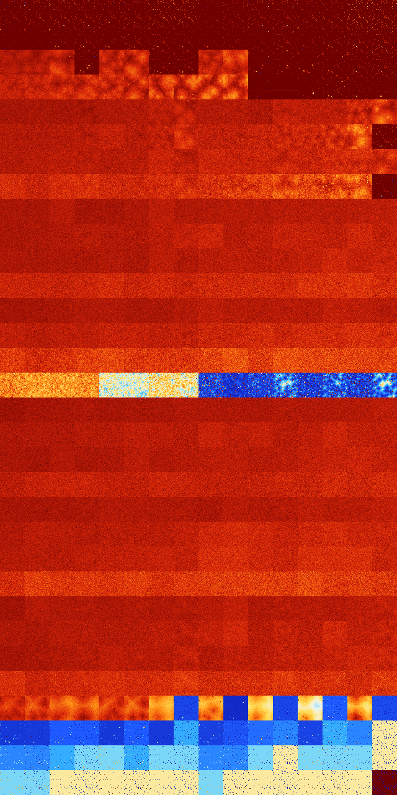

# B012467 (110080-110591)

<details>
    <summary>Initial Grid</summary>
    
</details>


<details>
    <summary>Initial Grid RLE</summary>

```
#C Exported from GoGoL (https://github.com/marrow16/gogol)
#C Wrap mode: Toroidal
#C Boundary mode: Dead
#C Step: 0
x = 100, y = 100, rule = B012467/S
10bo18bo33bo5bo24bo$7bo28bo37bo4bo6bo4bo6b2o$bo38b2o5bo2bo6bo23bo$10bo
6bo12bo4bo21bo35bo$28bo4bo3bo19bo13bo19bo$4b2o5bo5bo4bo9bo33bo23bo8bo$
20bo17bo7bo4bo37bo4bo$40bo16bo2bo35bo$bo27bo15bo11bo24bo$15bo7bo9bo13bo
11bo10bo14bo8bo$obo10bo14bo22bo32bo$36bo8bo4bo10bo9bo9bo2bo$2bo26bo4bo
10bo11bo15bo3bo12bo8bo$14bo2bo7bo12bo9bo32bo5bo6bo4bo$32bo2bo33bobo20bo
4bo$4bo16bo8bo22bo$3bo17bo5bo7bo37bo15bo$bo9b2o13bo6bo10bo$3bo4bo12bo
15bo14bo$28bo28bo28bo11bo$o4bo14bo10bo17bo7bo26bo7bo4bobo$49bo17bobo$3b
o2bo6bo8bo6bo2bo17bo10bo16bo$10bo4bo18bo29bo23bo$62bo26bo$52bo34bo2bobo
$25bo10bo26bobo14bo4bo11bo$27bo4bo18bo14bo13b2o$11bo17bo49bo14bo$16bo4b
o5bo$3bo15bo6bo7bo19bo24bo$25bo9bo29bo12bo15bo$37bobo8bo3bo39bo$5bo4bo
48bo21bo$26bo3bo21bo10bo19bo$7bo21bo37bo5bo5bo$6bo32bo13bo17bo12bo$12bo
9bo3bo13bo47bo8b2o$16bo2bo6bo5b2o8b2o$o16bobo$bo7bo16bo21bo8bo2bo12bobo
14bo4bo$bo34bo$11bo20bobo23bo10bo$50bo5bo$36bo57bo$11bo4bo34bo17bo8bo$
4bo9bo31bo$14bo21bo2bo48bo4bo$49bo15bo13bo8bo$o4bo14bo11bo10bo18bo15bo
10bo$9bo10bo12bo8bo33bo$2bo4bo32bo13bo16bo$2bo31bo8bo19bobo14bo2bo$o45b
o$50bo7bo$4bo2bo32bo2bo6bo32bo$32bo25bo9bo8bo20bo$22bo56bo3bobo$8bo6bo
27bo5bo10bo$5bo17bo18bo3bo14bo35bo$50bo8bo$15bo6bo12bo18bo23b2o13bo$7bo
bobo9bo19bo16bo31bo$4bo21bo15bo5bo9bobobo$24b2o9bo2bo20bo37bo$16bo12bo
36bo9bo$3bo16bo18bo8bo18bo2bo13bo3bo5bo$13bo23bo14bo6bo27bo4bo$10bo10bo
12b2o22bo7bo6b2o11bo3bo$2bo9bo63bo2bo2bo13bo$32bo14bo14b2o19bo$3bo8bo
35bo4bo4bo11bobo$63bo$6bobo43bo5bo6b2o7bo2bo13b2o$9bo7bo12bo3bo19b2o16b
o22bo$6bo9bo22bo14bo7bobo7bo23bo$99bo$4bo8bo39bo25bo10bo$bo7bo4bo13bo
42bo$b2o43bo8bo20bo7bo$14bo15bo14bo28b2o$21bo53bo$6bo3bo12bo43bo7bo5bo
7bo4bo4bo$o23bo30bo31bo$o22bo6bo5bo2bo18bo17bo20bo$33bo11bo$24b2o9b2o
38bo5bo$13bo11bo34bo38bo$4bo18bo12bo22bo15bo6bo13bo$9bo9bo14bo16bo2bo4b
o10bo$12bo17bo5b2o2bobo34bo$9bo5bo9bo2bo12bo3bobo29bo3bo$11bo8bo60bo$bo
35bo9bo5bo$4bo26bo21bo9bo11bo16b2o$18bo6bo2bo26bo17bo$19bobo20bo35bobo$
17bo15bo38bo19bo$13bo26b2o32bo$11bo43bo41bo!
```
</details>
<details>
    <summary>Thumbnail</summary>

</details>
<table>
<tr>
    <td><a href="./110080%20S%20Heat%20Map%20Activity.png"></a><br>S (110080)<br>R@12,p4</td>    <td><a href="./110081%20S0%20Heat%20Map%20Activity.png"></a><br>S0 (110081)<br>R@10,p4</td>    <td><a href="./110082%20S1%20Heat%20Map%20Activity.png"></a><br>S1 (110082)<br>R@10,p4</td>    <td><a href="./110083%20S01%20Heat%20Map%20Activity.png"></a><br>S01 (110083)<br>R@11,p4</td>    <td><a href="./110084%20S2%20Heat%20Map%20Activity.png"></a><br>S2 (110084)<br>R@10,p4</td>    <td><a href="./110085%20S02%20Heat%20Map%20Activity.png"></a><br>S02 (110085)<br>R@11,p4</td>    <td><a href="./110086%20S12%20Heat%20Map%20Activity.png"></a><br>S12 (110086)<br>R@7,p2</td>    <td><a href="./110087%20S012%20Heat%20Map%20Activity.png"></a><br>S012 (110087)<br>R@7,p2</td>    <td><a href="./110088%20S3%20Heat%20Map%20Activity.png"></a><br>S3 (110088)<br>R@22,p4</td>    <td><a href="./110089%20S03%20Heat%20Map%20Activity.png"></a><br>S03 (110089)<br>R@15,p4</td>    <td><a href="./110090%20S13%20Heat%20Map%20Activity.png"></a><br>S13 (110090)<br>R@11,p4</td>    <td><a href="./110091%20S013%20Heat%20Map%20Activity.png"></a><br>S013 (110091)<br>R@11,p4</td>    <td><a href="./110092%20S23%20Heat%20Map%20Activity.png"></a><br>S23 (110092)<br>R@12,p4</td>    <td><a href="./110093%20S023%20Heat%20Map%20Activity.png"></a><br>S023 (110093)<br>R@12,p4</td>    <td><a href="./110094%20S123%20Heat%20Map%20Activity.png"></a><br>S123 (110094)<br>R@6,p2</td>    <td><a href="./110095%20S0123%20Heat%20Map%20Activity.png"></a><br>S0123 (110095)<br>R@7,p2</td></tr>
<tr>
    <td><a href="./110096%20S4%20Heat%20Map%20Activity.png"></a><br>S4 (110096)<br>R@52,p2</td>    <td><a href="./110097%20S04%20Heat%20Map%20Activity.png"></a><br>S04 (110097)<br>R@51,p4</td>    <td><a href="./110098%20S14%20Heat%20Map%20Activity.png"></a><br>S14 (110098)<br>R@20,p4</td>    <td><a href="./110099%20S014%20Heat%20Map%20Activity.png"></a><br>S014 (110099)<br>R@14,p4</td>    <td><a href="./110100%20S24%20Heat%20Map%20Activity.png"></a><br>S24 (110100)<br>R@23,p4</td>    <td><a href="./110101%20S024%20Heat%20Map%20Activity.png"></a><br>S024 (110101)<br>R@12,p4</td>    <td><a href="./110102%20S124%20Heat%20Map%20Activity.png"></a><br>S124 (110102)<br>R@12,p2</td>    <td><a href="./110103%20S0124%20Heat%20Map%20Activity.png"></a><br>S0124 (110103)<br>R@19,p2</td>    <td><a href="./110104%20S34%20Heat%20Map%20Activity.png"></a><br>S34 (110104)<br>R@26,p2</td>    <td><a href="./110105%20S034%20Heat%20Map%20Activity.png"></a><br>S034 (110105)<br>R@19,p2</td>    <td><a href="./110106%20S134%20Heat%20Map%20Activity.png"></a><br>S134 (110106)<br>R@22,p4</td>    <td><a href="./110107%20S0134%20Heat%20Map%20Activity.png"></a><br>S0134 (110107)<br>R@12,p4</td>    <td><a href="./110108%20S234%20Heat%20Map%20Activity.png"></a><br>S234 (110108)<br>R@20,p4</td>    <td><a href="./110109%20S0234%20Heat%20Map%20Activity.png"></a><br>S0234 (110109)<br>R@14,p4</td>    <td><a href="./110110%20S1234%20Heat%20Map%20Activity.png"></a><br>S1234 (110110)<br>R@10,p2</td>    <td><a href="./110111%20S01234%20Heat%20Map%20Activity.png"></a><br>S01234 (110111)<br>R@8,p2</td></tr>
<tr>
    <td><a href="./110112%20S5%20Heat%20Map%20Activity.png"></a><br>S5 (110112)<br>G>1000</td>    <td><a href="./110113%20S05%20Heat%20Map%20Activity.png"></a><br>S05 (110113)<br>G>1000</td>    <td><a href="./110114%20S15%20Heat%20Map%20Activity.png"></a><br>S15 (110114)<br>G>1000</td>    <td><a href="./110115%20S015%20Heat%20Map%20Activity.png"></a><br>S015 (110115)<br>R@16,p4</td>    <td><a href="./110116%20S25%20Heat%20Map%20Activity.png"></a><br>S25 (110116)<br>G>1000</td>    <td><a href="./110117%20S025%20Heat%20Map%20Activity.png"></a><br>S025 (110117)<br>G>1000</td>    <td><a href="./110118%20S125%20Heat%20Map%20Activity.png"></a><br>S125 (110118)<br>R@16,p2</td>    <td><a href="./110119%20S0125%20Heat%20Map%20Activity.png"></a><br>S0125 (110119)<br>R@13,p2</td>    <td><a href="./110120%20S35%20Heat%20Map%20Activity.png"></a><br>S35 (110120)<br>G>1000</td>    <td><a href="./110121%20S035%20Heat%20Map%20Activity.png"></a><br>S035 (110121)<br>G>1000</td>    <td><a href="./110122%20S135%20Heat%20Map%20Activity.png"></a><br>S135 (110122)<br>R@28,p4</td>    <td><a href="./110123%20S0135%20Heat%20Map%20Activity.png"></a><br>S0135 (110123)<br>R@17,p4</td>    <td><a href="./110124%20S235%20Heat%20Map%20Activity.png"></a><br>S235 (110124)<br>R@38,p2</td>    <td><a href="./110125%20S0235%20Heat%20Map%20Activity.png"></a><br>S0235 (110125)<br>R@18,p2</td>    <td><a href="./110126%20S1235%20Heat%20Map%20Activity.png"></a><br>S1235 (110126)<br>R@14,p2</td>    <td><a href="./110127%20S01235%20Heat%20Map%20Activity.png"></a><br>S01235 (110127)<br>R@10,p2</td></tr>
<tr>
    <td><a href="./110128%20S45%20Heat%20Map%20Activity.png"></a><br>S45 (110128)<br>G>1000</td>    <td><a href="./110129%20S045%20Heat%20Map%20Activity.png"></a><br>S045 (110129)<br>G>1000</td>    <td><a href="./110130%20S145%20Heat%20Map%20Activity.png"></a><br>S145 (110130)<br>G>1000</td>    <td><a href="./110131%20S0145%20Heat%20Map%20Activity.png"></a><br>S0145 (110131)<br>G>1000</td>    <td><a href="./110132%20S245%20Heat%20Map%20Activity.png"></a><br>S245 (110132)<br>G>1000</td>    <td><a href="./110133%20S0245%20Heat%20Map%20Activity.png"></a><br>S0245 (110133)<br>G>1000</td>    <td><a href="./110134%20S1245%20Heat%20Map%20Activity.png"></a><br>S1245 (110134)<br>G>1000</td>    <td><a href="./110135%20S01245%20Heat%20Map%20Activity.png"></a><br>S01245 (110135)<br>G>1000</td>    <td><a href="./110136%20S345%20Heat%20Map%20Activity.png"></a><br>S345 (110136)<br>G>1000</td>    <td><a href="./110137%20S0345%20Heat%20Map%20Activity.png"></a><br>S0345 (110137)<br>G>1000</td>    <td><a href="./110138%20S1345%20Heat%20Map%20Activity.png"></a><br>S1345 (110138)<br>R@778,p400</td>    <td><a href="./110139%20S01345%20Heat%20Map%20Activity.png"></a><br>S01345 (110139)<br>R@419,p400</td>    <td><a href="./110140%20S2345%20Heat%20Map%20Activity.png"></a><br>S2345 (110140)<br>R@50,p2</td>    <td><a href="./110141%20S02345%20Heat%20Map%20Activity.png"></a><br>S02345 (110141)<br>R@12,p2</td>    <td><a href="./110142%20S12345%20Heat%20Map%20Activity.png"></a><br>S12345 (110142)<br>R@19,p2</td>    <td><a href="./110143%20S012345%20Heat%20Map%20Activity.png"></a><br>S012345 (110143)<br>R@22,p2</td></tr>
<tr>
    <td><a href="./110144%20S6%20Heat%20Map%20Activity.png"></a><br>S6 (110144)<br>G>1000</td>    <td><a href="./110145%20S06%20Heat%20Map%20Activity.png"></a><br>S06 (110145)<br>G>1000</td>    <td><a href="./110146%20S16%20Heat%20Map%20Activity.png"></a><br>S16 (110146)<br>G>1000</td>    <td><a href="./110147%20S016%20Heat%20Map%20Activity.png"></a><br>S016 (110147)<br>G>1000</td>    <td><a href="./110148%20S26%20Heat%20Map%20Activity.png"></a><br>S26 (110148)<br>G>1000</td>    <td><a href="./110149%20S026%20Heat%20Map%20Activity.png"></a><br>S026 (110149)<br>G>1000</td>    <td><a href="./110150%20S126%20Heat%20Map%20Activity.png"></a><br>S126 (110150)<br>G>1000</td>    <td><a href="./110151%20S0126%20Heat%20Map%20Activity.png"></a><br>S0126 (110151)<br>G>1000</td>    <td><a href="./110152%20S36%20Heat%20Map%20Activity.png"></a><br>S36 (110152)<br>G>1000</td>    <td><a href="./110153%20S036%20Heat%20Map%20Activity.png"></a><br>S036 (110153)<br>G>1000</td>    <td><a href="./110154%20S136%20Heat%20Map%20Activity.png"></a><br>S136 (110154)<br>G>1000</td>    <td><a href="./110155%20S0136%20Heat%20Map%20Activity.png"></a><br>S0136 (110155)<br>G>1000</td>    <td><a href="./110156%20S236%20Heat%20Map%20Activity.png"></a><br>S236 (110156)<br>G>1000</td>    <td><a href="./110157%20S0236%20Heat%20Map%20Activity.png"></a><br>S0236 (110157)<br>G>1000</td>    <td><a href="./110158%20S1236%20Heat%20Map%20Activity.png"></a><br>S1236 (110158)<br>G>1000</td>    <td><a href="./110159%20S01236%20Heat%20Map%20Activity.png"></a><br>S01236 (110159)<br>G>1000</td></tr>
<tr>
    <td><a href="./110160%20S46%20Heat%20Map%20Activity.png"></a><br>S46 (110160)<br>G>1000</td>    <td><a href="./110161%20S046%20Heat%20Map%20Activity.png"></a><br>S046 (110161)<br>G>1000</td>    <td><a href="./110162%20S146%20Heat%20Map%20Activity.png"></a><br>S146 (110162)<br>G>1000</td>    <td><a href="./110163%20S0146%20Heat%20Map%20Activity.png"></a><br>S0146 (110163)<br>G>1000</td>    <td><a href="./110164%20S246%20Heat%20Map%20Activity.png"></a><br>S246 (110164)<br>G>1000</td>    <td><a href="./110165%20S0246%20Heat%20Map%20Activity.png"></a><br>S0246 (110165)<br>G>1000</td>    <td><a href="./110166%20S1246%20Heat%20Map%20Activity.png"></a><br>S1246 (110166)<br>G>1000</td>    <td><a href="./110167%20S01246%20Heat%20Map%20Activity.png"></a><br>S01246 (110167)<br>G>1000</td>    <td><a href="./110168%20S346%20Heat%20Map%20Activity.png"></a><br>S346 (110168)<br>G>1000</td>    <td><a href="./110169%20S0346%20Heat%20Map%20Activity.png"></a><br>S0346 (110169)<br>G>1000</td>    <td><a href="./110170%20S1346%20Heat%20Map%20Activity.png"></a><br>S1346 (110170)<br>G>1000</td>    <td><a href="./110171%20S01346%20Heat%20Map%20Activity.png"></a><br>S01346 (110171)<br>G>1000</td>    <td><a href="./110172%20S2346%20Heat%20Map%20Activity.png"></a><br>S2346 (110172)<br>G>1000</td>    <td><a href="./110173%20S02346%20Heat%20Map%20Activity.png"></a><br>S02346 (110173)<br>G>1000</td>    <td><a href="./110174%20S12346%20Heat%20Map%20Activity.png"></a><br>S12346 (110174)<br>G>1000</td>    <td><a href="./110175%20S012346%20Heat%20Map%20Activity.png"></a><br>S012346 (110175)<br>R@10,p2</td></tr>
<tr>
    <td><a href="./110176%20S56%20Heat%20Map%20Activity.png"></a><br>S56 (110176)<br>G>1000</td>    <td><a href="./110177%20S056%20Heat%20Map%20Activity.png"></a><br>S056 (110177)<br>G>1000</td>    <td><a href="./110178%20S156%20Heat%20Map%20Activity.png"></a><br>S156 (110178)<br>G>1000</td>    <td><a href="./110179%20S0156%20Heat%20Map%20Activity.png"></a><br>S0156 (110179)<br>G>1000</td>    <td><a href="./110180%20S256%20Heat%20Map%20Activity.png"></a><br>S256 (110180)<br>G>1000</td>    <td><a href="./110181%20S0256%20Heat%20Map%20Activity.png"></a><br>S0256 (110181)<br>G>1000</td>    <td><a href="./110182%20S1256%20Heat%20Map%20Activity.png"></a><br>S1256 (110182)<br>G>1000</td>    <td><a href="./110183%20S01256%20Heat%20Map%20Activity.png"></a><br>S01256 (110183)<br>G>1000</td>    <td><a href="./110184%20S356%20Heat%20Map%20Activity.png"></a><br>S356 (110184)<br>G>1000</td>    <td><a href="./110185%20S0356%20Heat%20Map%20Activity.png"></a><br>S0356 (110185)<br>G>1000</td>    <td><a href="./110186%20S1356%20Heat%20Map%20Activity.png"></a><br>S1356 (110186)<br>G>1000</td>    <td><a href="./110187%20S01356%20Heat%20Map%20Activity.png"></a><br>S01356 (110187)<br>G>1000</td>    <td><a href="./110188%20S2356%20Heat%20Map%20Activity.png"></a><br>S2356 (110188)<br>G>1000</td>    <td><a href="./110189%20S02356%20Heat%20Map%20Activity.png"></a><br>S02356 (110189)<br>G>1000</td>    <td><a href="./110190%20S12356%20Heat%20Map%20Activity.png"></a><br>S12356 (110190)<br>G>1000</td>    <td><a href="./110191%20S012356%20Heat%20Map%20Activity.png"></a><br>S012356 (110191)<br>G>1000</td></tr>
<tr>
    <td><a href="./110192%20S456%20Heat%20Map%20Activity.png"></a><br>S456 (110192)<br>G>1000</td>    <td><a href="./110193%20S0456%20Heat%20Map%20Activity.png"></a><br>S0456 (110193)<br>G>1000</td>    <td><a href="./110194%20S1456%20Heat%20Map%20Activity.png"></a><br>S1456 (110194)<br>G>1000</td>    <td><a href="./110195%20S01456%20Heat%20Map%20Activity.png"></a><br>S01456 (110195)<br>G>1000</td>    <td><a href="./110196%20S2456%20Heat%20Map%20Activity.png"></a><br>S2456 (110196)<br>G>1000</td>    <td><a href="./110197%20S02456%20Heat%20Map%20Activity.png"></a><br>S02456 (110197)<br>G>1000</td>    <td><a href="./110198%20S12456%20Heat%20Map%20Activity.png"></a><br>S12456 (110198)<br>G>1000</td>    <td><a href="./110199%20S012456%20Heat%20Map%20Activity.png"></a><br>S012456 (110199)<br>G>1000</td>    <td><a href="./110200%20S3456%20Heat%20Map%20Activity.png"></a><br>S3456 (110200)<br>G>1000</td>    <td><a href="./110201%20S03456%20Heat%20Map%20Activity.png"></a><br>S03456 (110201)<br>G>1000</td>    <td><a href="./110202%20S13456%20Heat%20Map%20Activity.png"></a><br>S13456 (110202)<br>G>1000</td>    <td><a href="./110203%20S013456%20Heat%20Map%20Activity.png"></a><br>S013456 (110203)<br>G>1000</td>    <td><a href="./110204%20S23456%20Heat%20Map%20Activity.png"></a><br>S23456 (110204)<br>G>1000</td>    <td><a href="./110205%20S023456%20Heat%20Map%20Activity.png"></a><br>S023456 (110205)<br>G>1000</td>    <td><a href="./110206%20S123456%20Heat%20Map%20Activity.png"></a><br>S123456 (110206)<br>G>1000</td>    <td><a href="./110207%20S0123456%20Heat%20Map%20Activity.png"></a><br>S0123456 (110207)<br>R@19,p2</td></tr>
<tr>
    <td><a href="./110208%20S7%20Heat%20Map%20Activity.png"></a><br>S7 (110208)<br>G>1000</td>    <td><a href="./110209%20S07%20Heat%20Map%20Activity.png"></a><br>S07 (110209)<br>G>1000</td>    <td><a href="./110210%20S17%20Heat%20Map%20Activity.png"></a><br>S17 (110210)<br>G>1000</td>    <td><a href="./110211%20S017%20Heat%20Map%20Activity.png"></a><br>S017 (110211)<br>G>1000</td>    <td><a href="./110212%20S27%20Heat%20Map%20Activity.png"></a><br>S27 (110212)<br>G>1000</td>    <td><a href="./110213%20S027%20Heat%20Map%20Activity.png"></a><br>S027 (110213)<br>G>1000</td>    <td><a href="./110214%20S127%20Heat%20Map%20Activity.png"></a><br>S127 (110214)<br>G>1000</td>    <td><a href="./110215%20S0127%20Heat%20Map%20Activity.png"></a><br>S0127 (110215)<br>G>1000</td>    <td><a href="./110216%20S37%20Heat%20Map%20Activity.png"></a><br>S37 (110216)<br>G>1000</td>    <td><a href="./110217%20S037%20Heat%20Map%20Activity.png"></a><br>S037 (110217)<br>G>1000</td>    <td><a href="./110218%20S137%20Heat%20Map%20Activity.png"></a><br>S137 (110218)<br>G>1000</td>    <td><a href="./110219%20S0137%20Heat%20Map%20Activity.png"></a><br>S0137 (110219)<br>G>1000</td>    <td><a href="./110220%20S237%20Heat%20Map%20Activity.png"></a><br>S237 (110220)<br>G>1000</td>    <td><a href="./110221%20S0237%20Heat%20Map%20Activity.png"></a><br>S0237 (110221)<br>G>1000</td>    <td><a href="./110222%20S1237%20Heat%20Map%20Activity.png"></a><br>S1237 (110222)<br>G>1000</td>    <td><a href="./110223%20S01237%20Heat%20Map%20Activity.png"></a><br>S01237 (110223)<br>G>1000</td></tr>
<tr>
    <td><a href="./110224%20S47%20Heat%20Map%20Activity.png"></a><br>S47 (110224)<br>G>1000</td>    <td><a href="./110225%20S047%20Heat%20Map%20Activity.png"></a><br>S047 (110225)<br>G>1000</td>    <td><a href="./110226%20S147%20Heat%20Map%20Activity.png"></a><br>S147 (110226)<br>G>1000</td>    <td><a href="./110227%20S0147%20Heat%20Map%20Activity.png"></a><br>S0147 (110227)<br>G>1000</td>    <td><a href="./110228%20S247%20Heat%20Map%20Activity.png"></a><br>S247 (110228)<br>G>1000</td>    <td><a href="./110229%20S0247%20Heat%20Map%20Activity.png"></a><br>S0247 (110229)<br>G>1000</td>    <td><a href="./110230%20S1247%20Heat%20Map%20Activity.png"></a><br>S1247 (110230)<br>G>1000</td>    <td><a href="./110231%20S01247%20Heat%20Map%20Activity.png"></a><br>S01247 (110231)<br>G>1000</td>    <td><a href="./110232%20S347%20Heat%20Map%20Activity.png"></a><br>S347 (110232)<br>G>1000</td>    <td><a href="./110233%20S0347%20Heat%20Map%20Activity.png"></a><br>S0347 (110233)<br>G>1000</td>    <td><a href="./110234%20S1347%20Heat%20Map%20Activity.png"></a><br>S1347 (110234)<br>G>1000</td>    <td><a href="./110235%20S01347%20Heat%20Map%20Activity.png"></a><br>S01347 (110235)<br>G>1000</td>    <td><a href="./110236%20S2347%20Heat%20Map%20Activity.png"></a><br>S2347 (110236)<br>G>1000</td>    <td><a href="./110237%20S02347%20Heat%20Map%20Activity.png"></a><br>S02347 (110237)<br>G>1000</td>    <td><a href="./110238%20S12347%20Heat%20Map%20Activity.png"></a><br>S12347 (110238)<br>G>1000</td>    <td><a href="./110239%20S012347%20Heat%20Map%20Activity.png"></a><br>S012347 (110239)<br>G>1000</td></tr>
<tr>
    <td><a href="./110240%20S57%20Heat%20Map%20Activity.png"></a><br>S57 (110240)<br>G>1000</td>    <td><a href="./110241%20S057%20Heat%20Map%20Activity.png"></a><br>S057 (110241)<br>G>1000</td>    <td><a href="./110242%20S157%20Heat%20Map%20Activity.png"></a><br>S157 (110242)<br>G>1000</td>    <td><a href="./110243%20S0157%20Heat%20Map%20Activity.png"></a><br>S0157 (110243)<br>G>1000</td>    <td><a href="./110244%20S257%20Heat%20Map%20Activity.png"></a><br>S257 (110244)<br>G>1000</td>    <td><a href="./110245%20S0257%20Heat%20Map%20Activity.png"></a><br>S0257 (110245)<br>G>1000</td>    <td><a href="./110246%20S1257%20Heat%20Map%20Activity.png"></a><br>S1257 (110246)<br>G>1000</td>    <td><a href="./110247%20S01257%20Heat%20Map%20Activity.png"></a><br>S01257 (110247)<br>G>1000</td>    <td><a href="./110248%20S357%20Heat%20Map%20Activity.png"></a><br>S357 (110248)<br>G>1000</td>    <td><a href="./110249%20S0357%20Heat%20Map%20Activity.png"></a><br>S0357 (110249)<br>G>1000</td>    <td><a href="./110250%20S1357%20Heat%20Map%20Activity.png"></a><br>S1357 (110250)<br>G>1000</td>    <td><a href="./110251%20S01357%20Heat%20Map%20Activity.png"></a><br>S01357 (110251)<br>G>1000</td>    <td><a href="./110252%20S2357%20Heat%20Map%20Activity.png"></a><br>S2357 (110252)<br>G>1000</td>    <td><a href="./110253%20S02357%20Heat%20Map%20Activity.png"></a><br>S02357 (110253)<br>G>1000</td>    <td><a href="./110254%20S12357%20Heat%20Map%20Activity.png"></a><br>S12357 (110254)<br>G>1000</td>    <td><a href="./110255%20S012357%20Heat%20Map%20Activity.png"></a><br>S012357 (110255)<br>G>1000</td></tr>
<tr>
    <td><a href="./110256%20S457%20Heat%20Map%20Activity.png"></a><br>S457 (110256)<br>G>1000</td>    <td><a href="./110257%20S0457%20Heat%20Map%20Activity.png"></a><br>S0457 (110257)<br>G>1000</td>    <td><a href="./110258%20S1457%20Heat%20Map%20Activity.png"></a><br>S1457 (110258)<br>G>1000</td>    <td><a href="./110259%20S01457%20Heat%20Map%20Activity.png"></a><br>S01457 (110259)<br>G>1000</td>    <td><a href="./110260%20S2457%20Heat%20Map%20Activity.png"></a><br>S2457 (110260)<br>G>1000</td>    <td><a href="./110261%20S02457%20Heat%20Map%20Activity.png"></a><br>S02457 (110261)<br>G>1000</td>    <td><a href="./110262%20S12457%20Heat%20Map%20Activity.png"></a><br>S12457 (110262)<br>G>1000</td>    <td><a href="./110263%20S012457%20Heat%20Map%20Activity.png"></a><br>S012457 (110263)<br>G>1000</td>    <td><a href="./110264%20S3457%20Heat%20Map%20Activity.png"></a><br>S3457 (110264)<br>G>1000</td>    <td><a href="./110265%20S03457%20Heat%20Map%20Activity.png"></a><br>S03457 (110265)<br>G>1000</td>    <td><a href="./110266%20S13457%20Heat%20Map%20Activity.png"></a><br>S13457 (110266)<br>G>1000</td>    <td><a href="./110267%20S013457%20Heat%20Map%20Activity.png"></a><br>S013457 (110267)<br>G>1000</td>    <td><a href="./110268%20S23457%20Heat%20Map%20Activity.png"></a><br>S23457 (110268)<br>G>1000</td>    <td><a href="./110269%20S023457%20Heat%20Map%20Activity.png"></a><br>S023457 (110269)<br>G>1000</td>    <td><a href="./110270%20S123457%20Heat%20Map%20Activity.png"></a><br>S123457 (110270)<br>G>1000</td>    <td><a href="./110271%20S0123457%20Heat%20Map%20Activity.png"></a><br>S0123457 (110271)<br>G>1000</td></tr>
<tr>
    <td><a href="./110272%20S67%20Heat%20Map%20Activity.png"></a><br>S67 (110272)<br>G>1000</td>    <td><a href="./110273%20S067%20Heat%20Map%20Activity.png"></a><br>S067 (110273)<br>G>1000</td>    <td><a href="./110274%20S167%20Heat%20Map%20Activity.png"></a><br>S167 (110274)<br>G>1000</td>    <td><a href="./110275%20S0167%20Heat%20Map%20Activity.png"></a><br>S0167 (110275)<br>G>1000</td>    <td><a href="./110276%20S267%20Heat%20Map%20Activity.png"></a><br>S267 (110276)<br>G>1000</td>    <td><a href="./110277%20S0267%20Heat%20Map%20Activity.png"></a><br>S0267 (110277)<br>G>1000</td>    <td><a href="./110278%20S1267%20Heat%20Map%20Activity.png"></a><br>S1267 (110278)<br>G>1000</td>    <td><a href="./110279%20S01267%20Heat%20Map%20Activity.png"></a><br>S01267 (110279)<br>G>1000</td>    <td><a href="./110280%20S367%20Heat%20Map%20Activity.png"></a><br>S367 (110280)<br>G>1000</td>    <td><a href="./110281%20S0367%20Heat%20Map%20Activity.png"></a><br>S0367 (110281)<br>G>1000</td>    <td><a href="./110282%20S1367%20Heat%20Map%20Activity.png"></a><br>S1367 (110282)<br>G>1000</td>    <td><a href="./110283%20S01367%20Heat%20Map%20Activity.png"></a><br>S01367 (110283)<br>G>1000</td>    <td><a href="./110284%20S2367%20Heat%20Map%20Activity.png"></a><br>S2367 (110284)<br>G>1000</td>    <td><a href="./110285%20S02367%20Heat%20Map%20Activity.png"></a><br>S02367 (110285)<br>G>1000</td>    <td><a href="./110286%20S12367%20Heat%20Map%20Activity.png"></a><br>S12367 (110286)<br>G>1000</td>    <td><a href="./110287%20S012367%20Heat%20Map%20Activity.png"></a><br>S012367 (110287)<br>G>1000</td></tr>
<tr>
    <td><a href="./110288%20S467%20Heat%20Map%20Activity.png"></a><br>S467 (110288)<br>G>1000</td>    <td><a href="./110289%20S0467%20Heat%20Map%20Activity.png"></a><br>S0467 (110289)<br>G>1000</td>    <td><a href="./110290%20S1467%20Heat%20Map%20Activity.png"></a><br>S1467 (110290)<br>G>1000</td>    <td><a href="./110291%20S01467%20Heat%20Map%20Activity.png"></a><br>S01467 (110291)<br>G>1000</td>    <td><a href="./110292%20S2467%20Heat%20Map%20Activity.png"></a><br>S2467 (110292)<br>G>1000</td>    <td><a href="./110293%20S02467%20Heat%20Map%20Activity.png"></a><br>S02467 (110293)<br>G>1000</td>    <td><a href="./110294%20S12467%20Heat%20Map%20Activity.png"></a><br>S12467 (110294)<br>G>1000</td>    <td><a href="./110295%20S012467%20Heat%20Map%20Activity.png"></a><br>S012467 (110295)<br>G>1000</td>    <td><a href="./110296%20S3467%20Heat%20Map%20Activity.png"></a><br>S3467 (110296)<br>G>1000</td>    <td><a href="./110297%20S03467%20Heat%20Map%20Activity.png"></a><br>S03467 (110297)<br>G>1000</td>    <td><a href="./110298%20S13467%20Heat%20Map%20Activity.png"></a><br>S13467 (110298)<br>G>1000</td>    <td><a href="./110299%20S013467%20Heat%20Map%20Activity.png"></a><br>S013467 (110299)<br>G>1000</td>    <td><a href="./110300%20S23467%20Heat%20Map%20Activity.png"></a><br>S23467 (110300)<br>G>1000</td>    <td><a href="./110301%20S023467%20Heat%20Map%20Activity.png"></a><br>S023467 (110301)<br>G>1000</td>    <td><a href="./110302%20S123467%20Heat%20Map%20Activity.png"></a><br>S123467 (110302)<br>G>1000</td>    <td><a href="./110303%20S0123467%20Heat%20Map%20Activity.png"></a><br>S0123467 (110303)<br>G>1000</td></tr>
<tr>
    <td><a href="./110304%20S567%20Heat%20Map%20Activity.png"></a><br>S567 (110304)<br>G>1000</td>    <td><a href="./110305%20S0567%20Heat%20Map%20Activity.png"></a><br>S0567 (110305)<br>G>1000</td>    <td><a href="./110306%20S1567%20Heat%20Map%20Activity.png"></a><br>S1567 (110306)<br>G>1000</td>    <td><a href="./110307%20S01567%20Heat%20Map%20Activity.png"></a><br>S01567 (110307)<br>G>1000</td>    <td><a href="./110308%20S2567%20Heat%20Map%20Activity.png"></a><br>S2567 (110308)<br>G>1000</td>    <td><a href="./110309%20S02567%20Heat%20Map%20Activity.png"></a><br>S02567 (110309)<br>G>1000</td>    <td><a href="./110310%20S12567%20Heat%20Map%20Activity.png"></a><br>S12567 (110310)<br>G>1000</td>    <td><a href="./110311%20S012567%20Heat%20Map%20Activity.png"></a><br>S012567 (110311)<br>G>1000</td>    <td><a href="./110312%20S3567%20Heat%20Map%20Activity.png"></a><br>S3567 (110312)<br>G>1000</td>    <td><a href="./110313%20S03567%20Heat%20Map%20Activity.png"></a><br>S03567 (110313)<br>G>1000</td>    <td><a href="./110314%20S13567%20Heat%20Map%20Activity.png"></a><br>S13567 (110314)<br>G>1000</td>    <td><a href="./110315%20S013567%20Heat%20Map%20Activity.png"></a><br>S013567 (110315)<br>G>1000</td>    <td><a href="./110316%20S23567%20Heat%20Map%20Activity.png"></a><br>S23567 (110316)<br>G>1000</td>    <td><a href="./110317%20S023567%20Heat%20Map%20Activity.png"></a><br>S023567 (110317)<br>G>1000</td>    <td><a href="./110318%20S123567%20Heat%20Map%20Activity.png"></a><br>S123567 (110318)<br>G>1000</td>    <td><a href="./110319%20S0123567%20Heat%20Map%20Activity.png"></a><br>S0123567 (110319)<br>G>1000</td></tr>
<tr>
    <td><a href="./110320%20S4567%20Heat%20Map%20Activity.png"></a><br>S4567 (110320)<br>G>1000</td>    <td><a href="./110321%20S04567%20Heat%20Map%20Activity.png"></a><br>S04567 (110321)<br>G>1000</td>    <td><a href="./110322%20S14567%20Heat%20Map%20Activity.png"></a><br>S14567 (110322)<br>G>1000</td>    <td><a href="./110323%20S014567%20Heat%20Map%20Activity.png"></a><br>S014567 (110323)<br>G>1000</td>    <td><a href="./110324%20S24567%20Heat%20Map%20Activity.png"></a><br>S24567 (110324)<br>G>1000</td>    <td><a href="./110325%20S024567%20Heat%20Map%20Activity.png"></a><br>S024567 (110325)<br>G>1000</td>    <td><a href="./110326%20S124567%20Heat%20Map%20Activity.png"></a><br>S124567 (110326)<br>G>1000</td>    <td><a href="./110327%20S0124567%20Heat%20Map%20Activity.png"></a><br>S0124567 (110327)<br>G>1000</td>    <td><a href="./110328%20S34567%20Heat%20Map%20Activity.png"></a><br>S34567 (110328)<br>R@51,p12</td>    <td><a href="./110329%20S034567%20Heat%20Map%20Activity.png"></a><br>S034567 (110329)<br>R@128,p84</td>    <td><a href="./110330%20S134567%20Heat%20Map%20Activity.png"></a><br>S134567 (110330)<br>R@56,p12</td>    <td><a href="./110331%20S0134567%20Heat%20Map%20Activity.png"></a><br>S0134567 (110331)<br>R@56,p12</td>    <td><a href="./110332%20S234567%20Heat%20Map%20Activity.png"></a><br>S234567 (110332)<br>R@38,p12</td>    <td><a href="./110333%20S0234567%20Heat%20Map%20Activity.png"></a><br>S0234567 (110333)<br>R@44,p12</td>    <td><a href="./110334%20S1234567%20Heat%20Map%20Activity.png"></a><br>S1234567 (110334)<br>R@36,p12</td>    <td><a href="./110335%20S01234567%20Heat%20Map%20Activity.png"></a><br>S01234567 (110335)<br>R@52,p12</td></tr>
<tr>
    <td><a href="./110336%20S8%20Heat%20Map%20Activity.png"></a><br>S8 (110336)<br>G>1000</td>    <td><a href="./110337%20S08%20Heat%20Map%20Activity.png"></a><br>S08 (110337)<br>G>1000</td>    <td><a href="./110338%20S18%20Heat%20Map%20Activity.png"></a><br>S18 (110338)<br>G>1000</td>    <td><a href="./110339%20S018%20Heat%20Map%20Activity.png"></a><br>S018 (110339)<br>G>1000</td>    <td><a href="./110340%20S28%20Heat%20Map%20Activity.png"></a><br>S28 (110340)<br>G>1000</td>    <td><a href="./110341%20S028%20Heat%20Map%20Activity.png"></a><br>S028 (110341)<br>G>1000</td>    <td><a href="./110342%20S128%20Heat%20Map%20Activity.png"></a><br>S128 (110342)<br>G>1000</td>    <td><a href="./110343%20S0128%20Heat%20Map%20Activity.png"></a><br>S0128 (110343)<br>G>1000</td>    <td><a href="./110344%20S38%20Heat%20Map%20Activity.png"></a><br>S38 (110344)<br>G>1000</td>    <td><a href="./110345%20S038%20Heat%20Map%20Activity.png"></a><br>S038 (110345)<br>G>1000</td>    <td><a href="./110346%20S138%20Heat%20Map%20Activity.png"></a><br>S138 (110346)<br>G>1000</td>    <td><a href="./110347%20S0138%20Heat%20Map%20Activity.png"></a><br>S0138 (110347)<br>G>1000</td>    <td><a href="./110348%20S238%20Heat%20Map%20Activity.png"></a><br>S238 (110348)<br>G>1000</td>    <td><a href="./110349%20S0238%20Heat%20Map%20Activity.png"></a><br>S0238 (110349)<br>G>1000</td>    <td><a href="./110350%20S1238%20Heat%20Map%20Activity.png"></a><br>S1238 (110350)<br>G>1000</td>    <td><a href="./110351%20S01238%20Heat%20Map%20Activity.png"></a><br>S01238 (110351)<br>G>1000</td></tr>
<tr>
    <td><a href="./110352%20S48%20Heat%20Map%20Activity.png"></a><br>S48 (110352)<br>G>1000</td>    <td><a href="./110353%20S048%20Heat%20Map%20Activity.png"></a><br>S048 (110353)<br>G>1000</td>    <td><a href="./110354%20S148%20Heat%20Map%20Activity.png"></a><br>S148 (110354)<br>G>1000</td>    <td><a href="./110355%20S0148%20Heat%20Map%20Activity.png"></a><br>S0148 (110355)<br>G>1000</td>    <td><a href="./110356%20S248%20Heat%20Map%20Activity.png"></a><br>S248 (110356)<br>G>1000</td>    <td><a href="./110357%20S0248%20Heat%20Map%20Activity.png"></a><br>S0248 (110357)<br>G>1000</td>    <td><a href="./110358%20S1248%20Heat%20Map%20Activity.png"></a><br>S1248 (110358)<br>G>1000</td>    <td><a href="./110359%20S01248%20Heat%20Map%20Activity.png"></a><br>S01248 (110359)<br>G>1000</td>    <td><a href="./110360%20S348%20Heat%20Map%20Activity.png"></a><br>S348 (110360)<br>G>1000</td>    <td><a href="./110361%20S0348%20Heat%20Map%20Activity.png"></a><br>S0348 (110361)<br>G>1000</td>    <td><a href="./110362%20S1348%20Heat%20Map%20Activity.png"></a><br>S1348 (110362)<br>G>1000</td>    <td><a href="./110363%20S01348%20Heat%20Map%20Activity.png"></a><br>S01348 (110363)<br>G>1000</td>    <td><a href="./110364%20S2348%20Heat%20Map%20Activity.png"></a><br>S2348 (110364)<br>G>1000</td>    <td><a href="./110365%20S02348%20Heat%20Map%20Activity.png"></a><br>S02348 (110365)<br>G>1000</td>    <td><a href="./110366%20S12348%20Heat%20Map%20Activity.png"></a><br>S12348 (110366)<br>G>1000</td>    <td><a href="./110367%20S012348%20Heat%20Map%20Activity.png"></a><br>S012348 (110367)<br>G>1000</td></tr>
<tr>
    <td><a href="./110368%20S58%20Heat%20Map%20Activity.png"></a><br>S58 (110368)<br>G>1000</td>    <td><a href="./110369%20S058%20Heat%20Map%20Activity.png"></a><br>S058 (110369)<br>G>1000</td>    <td><a href="./110370%20S158%20Heat%20Map%20Activity.png"></a><br>S158 (110370)<br>G>1000</td>    <td><a href="./110371%20S0158%20Heat%20Map%20Activity.png"></a><br>S0158 (110371)<br>G>1000</td>    <td><a href="./110372%20S258%20Heat%20Map%20Activity.png"></a><br>S258 (110372)<br>G>1000</td>    <td><a href="./110373%20S0258%20Heat%20Map%20Activity.png"></a><br>S0258 (110373)<br>G>1000</td>    <td><a href="./110374%20S1258%20Heat%20Map%20Activity.png"></a><br>S1258 (110374)<br>G>1000</td>    <td><a href="./110375%20S01258%20Heat%20Map%20Activity.png"></a><br>S01258 (110375)<br>G>1000</td>    <td><a href="./110376%20S358%20Heat%20Map%20Activity.png"></a><br>S358 (110376)<br>G>1000</td>    <td><a href="./110377%20S0358%20Heat%20Map%20Activity.png"></a><br>S0358 (110377)<br>G>1000</td>    <td><a href="./110378%20S1358%20Heat%20Map%20Activity.png"></a><br>S1358 (110378)<br>G>1000</td>    <td><a href="./110379%20S01358%20Heat%20Map%20Activity.png"></a><br>S01358 (110379)<br>G>1000</td>    <td><a href="./110380%20S2358%20Heat%20Map%20Activity.png"></a><br>S2358 (110380)<br>G>1000</td>    <td><a href="./110381%20S02358%20Heat%20Map%20Activity.png"></a><br>S02358 (110381)<br>G>1000</td>    <td><a href="./110382%20S12358%20Heat%20Map%20Activity.png"></a><br>S12358 (110382)<br>G>1000</td>    <td><a href="./110383%20S012358%20Heat%20Map%20Activity.png"></a><br>S012358 (110383)<br>G>1000</td></tr>
<tr>
    <td><a href="./110384%20S458%20Heat%20Map%20Activity.png"></a><br>S458 (110384)<br>G>1000</td>    <td><a href="./110385%20S0458%20Heat%20Map%20Activity.png"></a><br>S0458 (110385)<br>G>1000</td>    <td><a href="./110386%20S1458%20Heat%20Map%20Activity.png"></a><br>S1458 (110386)<br>G>1000</td>    <td><a href="./110387%20S01458%20Heat%20Map%20Activity.png"></a><br>S01458 (110387)<br>G>1000</td>    <td><a href="./110388%20S2458%20Heat%20Map%20Activity.png"></a><br>S2458 (110388)<br>G>1000</td>    <td><a href="./110389%20S02458%20Heat%20Map%20Activity.png"></a><br>S02458 (110389)<br>G>1000</td>    <td><a href="./110390%20S12458%20Heat%20Map%20Activity.png"></a><br>S12458 (110390)<br>G>1000</td>    <td><a href="./110391%20S012458%20Heat%20Map%20Activity.png"></a><br>S012458 (110391)<br>G>1000</td>    <td><a href="./110392%20S3458%20Heat%20Map%20Activity.png"></a><br>S3458 (110392)<br>G>1000</td>    <td><a href="./110393%20S03458%20Heat%20Map%20Activity.png"></a><br>S03458 (110393)<br>G>1000</td>    <td><a href="./110394%20S13458%20Heat%20Map%20Activity.png"></a><br>S13458 (110394)<br>G>1000</td>    <td><a href="./110395%20S013458%20Heat%20Map%20Activity.png"></a><br>S013458 (110395)<br>G>1000</td>    <td><a href="./110396%20S23458%20Heat%20Map%20Activity.png"></a><br>S23458 (110396)<br>G>1000</td>    <td><a href="./110397%20S023458%20Heat%20Map%20Activity.png"></a><br>S023458 (110397)<br>G>1000</td>    <td><a href="./110398%20S123458%20Heat%20Map%20Activity.png"></a><br>S123458 (110398)<br>G>1000</td>    <td><a href="./110399%20S0123458%20Heat%20Map%20Activity.png"></a><br>S0123458 (110399)<br>G>1000</td></tr>
<tr>
    <td><a href="./110400%20S68%20Heat%20Map%20Activity.png"></a><br>S68 (110400)<br>G>1000</td>    <td><a href="./110401%20S068%20Heat%20Map%20Activity.png"></a><br>S068 (110401)<br>G>1000</td>    <td><a href="./110402%20S168%20Heat%20Map%20Activity.png"></a><br>S168 (110402)<br>G>1000</td>    <td><a href="./110403%20S0168%20Heat%20Map%20Activity.png"></a><br>S0168 (110403)<br>G>1000</td>    <td><a href="./110404%20S268%20Heat%20Map%20Activity.png"></a><br>S268 (110404)<br>G>1000</td>    <td><a href="./110405%20S0268%20Heat%20Map%20Activity.png"></a><br>S0268 (110405)<br>G>1000</td>    <td><a href="./110406%20S1268%20Heat%20Map%20Activity.png"></a><br>S1268 (110406)<br>G>1000</td>    <td><a href="./110407%20S01268%20Heat%20Map%20Activity.png"></a><br>S01268 (110407)<br>G>1000</td>    <td><a href="./110408%20S368%20Heat%20Map%20Activity.png"></a><br>S368 (110408)<br>G>1000</td>    <td><a href="./110409%20S0368%20Heat%20Map%20Activity.png"></a><br>S0368 (110409)<br>G>1000</td>    <td><a href="./110410%20S1368%20Heat%20Map%20Activity.png"></a><br>S1368 (110410)<br>G>1000</td>    <td><a href="./110411%20S01368%20Heat%20Map%20Activity.png"></a><br>S01368 (110411)<br>G>1000</td>    <td><a href="./110412%20S2368%20Heat%20Map%20Activity.png"></a><br>S2368 (110412)<br>G>1000</td>    <td><a href="./110413%20S02368%20Heat%20Map%20Activity.png"></a><br>S02368 (110413)<br>G>1000</td>    <td><a href="./110414%20S12368%20Heat%20Map%20Activity.png"></a><br>S12368 (110414)<br>G>1000</td>    <td><a href="./110415%20S012368%20Heat%20Map%20Activity.png"></a><br>S012368 (110415)<br>G>1000</td></tr>
<tr>
    <td><a href="./110416%20S468%20Heat%20Map%20Activity.png"></a><br>S468 (110416)<br>G>1000</td>    <td><a href="./110417%20S0468%20Heat%20Map%20Activity.png"></a><br>S0468 (110417)<br>G>1000</td>    <td><a href="./110418%20S1468%20Heat%20Map%20Activity.png"></a><br>S1468 (110418)<br>G>1000</td>    <td><a href="./110419%20S01468%20Heat%20Map%20Activity.png"></a><br>S01468 (110419)<br>G>1000</td>    <td><a href="./110420%20S2468%20Heat%20Map%20Activity.png"></a><br>S2468 (110420)<br>G>1000</td>    <td><a href="./110421%20S02468%20Heat%20Map%20Activity.png"></a><br>S02468 (110421)<br>G>1000</td>    <td><a href="./110422%20S12468%20Heat%20Map%20Activity.png"></a><br>S12468 (110422)<br>G>1000</td>    <td><a href="./110423%20S012468%20Heat%20Map%20Activity.png"></a><br>S012468 (110423)<br>G>1000</td>    <td><a href="./110424%20S3468%20Heat%20Map%20Activity.png"></a><br>S3468 (110424)<br>G>1000</td>    <td><a href="./110425%20S03468%20Heat%20Map%20Activity.png"></a><br>S03468 (110425)<br>G>1000</td>    <td><a href="./110426%20S13468%20Heat%20Map%20Activity.png"></a><br>S13468 (110426)<br>G>1000</td>    <td><a href="./110427%20S013468%20Heat%20Map%20Activity.png"></a><br>S013468 (110427)<br>G>1000</td>    <td><a href="./110428%20S23468%20Heat%20Map%20Activity.png"></a><br>S23468 (110428)<br>G>1000</td>    <td><a href="./110429%20S023468%20Heat%20Map%20Activity.png"></a><br>S023468 (110429)<br>G>1000</td>    <td><a href="./110430%20S123468%20Heat%20Map%20Activity.png"></a><br>S123468 (110430)<br>G>1000</td>    <td><a href="./110431%20S0123468%20Heat%20Map%20Activity.png"></a><br>S0123468 (110431)<br>G>1000</td></tr>
<tr>
    <td><a href="./110432%20S568%20Heat%20Map%20Activity.png"></a><br>S568 (110432)<br>G>1000</td>    <td><a href="./110433%20S0568%20Heat%20Map%20Activity.png"></a><br>S0568 (110433)<br>G>1000</td>    <td><a href="./110434%20S1568%20Heat%20Map%20Activity.png"></a><br>S1568 (110434)<br>G>1000</td>    <td><a href="./110435%20S01568%20Heat%20Map%20Activity.png"></a><br>S01568 (110435)<br>G>1000</td>    <td><a href="./110436%20S2568%20Heat%20Map%20Activity.png"></a><br>S2568 (110436)<br>G>1000</td>    <td><a href="./110437%20S02568%20Heat%20Map%20Activity.png"></a><br>S02568 (110437)<br>G>1000</td>    <td><a href="./110438%20S12568%20Heat%20Map%20Activity.png"></a><br>S12568 (110438)<br>G>1000</td>    <td><a href="./110439%20S012568%20Heat%20Map%20Activity.png"></a><br>S012568 (110439)<br>G>1000</td>    <td><a href="./110440%20S3568%20Heat%20Map%20Activity.png"></a><br>S3568 (110440)<br>G>1000</td>    <td><a href="./110441%20S03568%20Heat%20Map%20Activity.png"></a><br>S03568 (110441)<br>G>1000</td>    <td><a href="./110442%20S13568%20Heat%20Map%20Activity.png"></a><br>S13568 (110442)<br>G>1000</td>    <td><a href="./110443%20S013568%20Heat%20Map%20Activity.png"></a><br>S013568 (110443)<br>G>1000</td>    <td><a href="./110444%20S23568%20Heat%20Map%20Activity.png"></a><br>S23568 (110444)<br>G>1000</td>    <td><a href="./110445%20S023568%20Heat%20Map%20Activity.png"></a><br>S023568 (110445)<br>G>1000</td>    <td><a href="./110446%20S123568%20Heat%20Map%20Activity.png"></a><br>S123568 (110446)<br>G>1000</td>    <td><a href="./110447%20S0123568%20Heat%20Map%20Activity.png"></a><br>S0123568 (110447)<br>G>1000</td></tr>
<tr>
    <td><a href="./110448%20S4568%20Heat%20Map%20Activity.png"></a><br>S4568 (110448)<br>G>1000</td>    <td><a href="./110449%20S04568%20Heat%20Map%20Activity.png"></a><br>S04568 (110449)<br>G>1000</td>    <td><a href="./110450%20S14568%20Heat%20Map%20Activity.png"></a><br>S14568 (110450)<br>G>1000</td>    <td><a href="./110451%20S014568%20Heat%20Map%20Activity.png"></a><br>S014568 (110451)<br>G>1000</td>    <td><a href="./110452%20S24568%20Heat%20Map%20Activity.png"></a><br>S24568 (110452)<br>G>1000</td>    <td><a href="./110453%20S024568%20Heat%20Map%20Activity.png"></a><br>S024568 (110453)<br>G>1000</td>    <td><a href="./110454%20S124568%20Heat%20Map%20Activity.png"></a><br>S124568 (110454)<br>G>1000</td>    <td><a href="./110455%20S0124568%20Heat%20Map%20Activity.png"></a><br>S0124568 (110455)<br>G>1000</td>    <td><a href="./110456%20S34568%20Heat%20Map%20Activity.png"></a><br>S34568 (110456)<br>G>1000</td>    <td><a href="./110457%20S034568%20Heat%20Map%20Activity.png"></a><br>S034568 (110457)<br>G>1000</td>    <td><a href="./110458%20S134568%20Heat%20Map%20Activity.png"></a><br>S134568 (110458)<br>G>1000</td>    <td><a href="./110459%20S0134568%20Heat%20Map%20Activity.png"></a><br>S0134568 (110459)<br>G>1000</td>    <td><a href="./110460%20S234568%20Heat%20Map%20Activity.png"></a><br>S234568 (110460)<br>G>1000</td>    <td><a href="./110461%20S0234568%20Heat%20Map%20Activity.png"></a><br>S0234568 (110461)<br>G>1000</td>    <td><a href="./110462%20S1234568%20Heat%20Map%20Activity.png"></a><br>S1234568 (110462)<br>G>1000</td>    <td><a href="./110463%20S01234568%20Heat%20Map%20Activity.png"></a><br>S01234568 (110463)<br>G>1000</td></tr>
<tr>
    <td><a href="./110464%20S78%20Heat%20Map%20Activity.png"></a><br>S78 (110464)<br>G>1000</td>    <td><a href="./110465%20S078%20Heat%20Map%20Activity.png"></a><br>S078 (110465)<br>G>1000</td>    <td><a href="./110466%20S178%20Heat%20Map%20Activity.png"></a><br>S178 (110466)<br>G>1000</td>    <td><a href="./110467%20S0178%20Heat%20Map%20Activity.png"></a><br>S0178 (110467)<br>G>1000</td>    <td><a href="./110468%20S278%20Heat%20Map%20Activity.png"></a><br>S278 (110468)<br>G>1000</td>    <td><a href="./110469%20S0278%20Heat%20Map%20Activity.png"></a><br>S0278 (110469)<br>G>1000</td>    <td><a href="./110470%20S1278%20Heat%20Map%20Activity.png"></a><br>S1278 (110470)<br>G>1000</td>    <td><a href="./110471%20S01278%20Heat%20Map%20Activity.png"></a><br>S01278 (110471)<br>G>1000</td>    <td><a href="./110472%20S378%20Heat%20Map%20Activity.png"></a><br>S378 (110472)<br>G>1000</td>    <td><a href="./110473%20S0378%20Heat%20Map%20Activity.png"></a><br>S0378 (110473)<br>G>1000</td>    <td><a href="./110474%20S1378%20Heat%20Map%20Activity.png"></a><br>S1378 (110474)<br>G>1000</td>    <td><a href="./110475%20S01378%20Heat%20Map%20Activity.png"></a><br>S01378 (110475)<br>G>1000</td>    <td><a href="./110476%20S2378%20Heat%20Map%20Activity.png"></a><br>S2378 (110476)<br>G>1000</td>    <td><a href="./110477%20S02378%20Heat%20Map%20Activity.png"></a><br>S02378 (110477)<br>G>1000</td>    <td><a href="./110478%20S12378%20Heat%20Map%20Activity.png"></a><br>S12378 (110478)<br>G>1000</td>    <td><a href="./110479%20S012378%20Heat%20Map%20Activity.png"></a><br>S012378 (110479)<br>G>1000</td></tr>
<tr>
    <td><a href="./110480%20S478%20Heat%20Map%20Activity.png"></a><br>S478 (110480)<br>G>1000</td>    <td><a href="./110481%20S0478%20Heat%20Map%20Activity.png"></a><br>S0478 (110481)<br>G>1000</td>    <td><a href="./110482%20S1478%20Heat%20Map%20Activity.png"></a><br>S1478 (110482)<br>G>1000</td>    <td><a href="./110483%20S01478%20Heat%20Map%20Activity.png"></a><br>S01478 (110483)<br>G>1000</td>    <td><a href="./110484%20S2478%20Heat%20Map%20Activity.png"></a><br>S2478 (110484)<br>G>1000</td>    <td><a href="./110485%20S02478%20Heat%20Map%20Activity.png"></a><br>S02478 (110485)<br>G>1000</td>    <td><a href="./110486%20S12478%20Heat%20Map%20Activity.png"></a><br>S12478 (110486)<br>G>1000</td>    <td><a href="./110487%20S012478%20Heat%20Map%20Activity.png"></a><br>S012478 (110487)<br>G>1000</td>    <td><a href="./110488%20S3478%20Heat%20Map%20Activity.png"></a><br>S3478 (110488)<br>G>1000</td>    <td><a href="./110489%20S03478%20Heat%20Map%20Activity.png"></a><br>S03478 (110489)<br>G>1000</td>    <td><a href="./110490%20S13478%20Heat%20Map%20Activity.png"></a><br>S13478 (110490)<br>G>1000</td>    <td><a href="./110491%20S013478%20Heat%20Map%20Activity.png"></a><br>S013478 (110491)<br>G>1000</td>    <td><a href="./110492%20S23478%20Heat%20Map%20Activity.png"></a><br>S23478 (110492)<br>G>1000</td>    <td><a href="./110493%20S023478%20Heat%20Map%20Activity.png"></a><br>S023478 (110493)<br>G>1000</td>    <td><a href="./110494%20S123478%20Heat%20Map%20Activity.png"></a><br>S123478 (110494)<br>G>1000</td>    <td><a href="./110495%20S0123478%20Heat%20Map%20Activity.png"></a><br>S0123478 (110495)<br>G>1000</td></tr>
<tr>
    <td><a href="./110496%20S578%20Heat%20Map%20Activity.png"></a><br>S578 (110496)<br>G>1000</td>    <td><a href="./110497%20S0578%20Heat%20Map%20Activity.png"></a><br>S0578 (110497)<br>G>1000</td>    <td><a href="./110498%20S1578%20Heat%20Map%20Activity.png"></a><br>S1578 (110498)<br>G>1000</td>    <td><a href="./110499%20S01578%20Heat%20Map%20Activity.png"></a><br>S01578 (110499)<br>G>1000</td>    <td><a href="./110500%20S2578%20Heat%20Map%20Activity.png"></a><br>S2578 (110500)<br>G>1000</td>    <td><a href="./110501%20S02578%20Heat%20Map%20Activity.png"></a><br>S02578 (110501)<br>G>1000</td>    <td><a href="./110502%20S12578%20Heat%20Map%20Activity.png"></a><br>S12578 (110502)<br>G>1000</td>    <td><a href="./110503%20S012578%20Heat%20Map%20Activity.png"></a><br>S012578 (110503)<br>G>1000</td>    <td><a href="./110504%20S3578%20Heat%20Map%20Activity.png"></a><br>S3578 (110504)<br>G>1000</td>    <td><a href="./110505%20S03578%20Heat%20Map%20Activity.png"></a><br>S03578 (110505)<br>G>1000</td>    <td><a href="./110506%20S13578%20Heat%20Map%20Activity.png"></a><br>S13578 (110506)<br>G>1000</td>    <td><a href="./110507%20S013578%20Heat%20Map%20Activity.png"></a><br>S013578 (110507)<br>G>1000</td>    <td><a href="./110508%20S23578%20Heat%20Map%20Activity.png"></a><br>S23578 (110508)<br>G>1000</td>    <td><a href="./110509%20S023578%20Heat%20Map%20Activity.png"></a><br>S023578 (110509)<br>G>1000</td>    <td><a href="./110510%20S123578%20Heat%20Map%20Activity.png"></a><br>S123578 (110510)<br>G>1000</td>    <td><a href="./110511%20S0123578%20Heat%20Map%20Activity.png"></a><br>S0123578 (110511)<br>G>1000</td></tr>
<tr>
    <td><a href="./110512%20S4578%20Heat%20Map%20Activity.png"></a><br>S4578 (110512)<br>G>1000</td>    <td><a href="./110513%20S04578%20Heat%20Map%20Activity.png"></a><br>S04578 (110513)<br>G>1000</td>    <td><a href="./110514%20S14578%20Heat%20Map%20Activity.png"></a><br>S14578 (110514)<br>G>1000</td>    <td><a href="./110515%20S014578%20Heat%20Map%20Activity.png"></a><br>S014578 (110515)<br>G>1000</td>    <td><a href="./110516%20S24578%20Heat%20Map%20Activity.png"></a><br>S24578 (110516)<br>G>1000</td>    <td><a href="./110517%20S024578%20Heat%20Map%20Activity.png"></a><br>S024578 (110517)<br>G>1000</td>    <td><a href="./110518%20S124578%20Heat%20Map%20Activity.png"></a><br>S124578 (110518)<br>G>1000</td>    <td><a href="./110519%20S0124578%20Heat%20Map%20Activity.png"></a><br>S0124578 (110519)<br>G>1000</td>    <td><a href="./110520%20S34578%20Heat%20Map%20Activity.png"></a><br>S34578 (110520)<br>G>1000</td>    <td><a href="./110521%20S034578%20Heat%20Map%20Activity.png"></a><br>S034578 (110521)<br>G>1000</td>    <td><a href="./110522%20S134578%20Heat%20Map%20Activity.png"></a><br>S134578 (110522)<br>G>1000</td>    <td><a href="./110523%20S0134578%20Heat%20Map%20Activity.png"></a><br>S0134578 (110523)<br>G>1000</td>    <td><a href="./110524%20S234578%20Heat%20Map%20Activity.png"></a><br>S234578 (110524)<br>G>1000</td>    <td><a href="./110525%20S0234578%20Heat%20Map%20Activity.png"></a><br>S0234578 (110525)<br>G>1000</td>    <td><a href="./110526%20S1234578%20Heat%20Map%20Activity.png"></a><br>S1234578 (110526)<br>G>1000</td>    <td><a href="./110527%20S01234578%20Heat%20Map%20Activity.png"></a><br>S01234578 (110527)<br>G>1000</td></tr>
<tr>
    <td><a href="./110528%20S678%20Heat%20Map%20Activity.png"></a><br>S678 (110528)<br>G>1000</td>    <td><a href="./110529%20S0678%20Heat%20Map%20Activity.png"></a><br>S0678 (110529)<br>G>1000</td>    <td><a href="./110530%20S1678%20Heat%20Map%20Activity.png"></a><br>S1678 (110530)<br>G>1000</td>    <td><a href="./110531%20S01678%20Heat%20Map%20Activity.png"></a><br>S01678 (110531)<br>G>1000</td>    <td><a href="./110532%20S2678%20Heat%20Map%20Activity.png"></a><br>S2678 (110532)<br>G>1000</td>    <td><a href="./110533%20S02678%20Heat%20Map%20Activity.png"></a><br>S02678 (110533)<br>G>1000</td>    <td><a href="./110534%20S12678%20Heat%20Map%20Activity.png"></a><br>S12678 (110534)<br>G>1000</td>    <td><a href="./110535%20S012678%20Heat%20Map%20Activity.png"></a><br>S012678 (110535)<br>R@12,p2</td>    <td><a href="./110536%20S3678%20Heat%20Map%20Activity.png"></a><br>S3678 (110536)<br>G>1000</td>    <td><a href="./110537%20S03678%20Heat%20Map%20Activity.png"></a><br>S03678 (110537)<br>R@26,p6</td>    <td><a href="./110538%20S13678%20Heat%20Map%20Activity.png"></a><br>S13678 (110538)<br>G>1000</td>    <td><a href="./110539%20S013678%20Heat%20Map%20Activity.png"></a><br>S013678 (110539)<br>R@11,p6</td>    <td><a href="./110540%20S23678%20Heat%20Map%20Activity.png"></a><br>S23678 (110540)<br>G>1000</td>    <td><a href="./110541%20S023678%20Heat%20Map%20Activity.png"></a><br>S023678 (110541)<br>S@9</td>    <td><a href="./110542%20S123678%20Heat%20Map%20Activity.png"></a><br>S123678 (110542)<br>G>1000</td>    <td><a href="./110543%20S0123678%20Heat%20Map%20Activity.png"></a><br>S0123678 (110543)<br>R@11,p6</td></tr>
<tr>
    <td><a href="./110544%20S4678%20Heat%20Map%20Activity.png"></a><br>S4678 (110544)<br>R@16,p2</td>    <td><a href="./110545%20S04678%20Heat%20Map%20Activity.png"></a><br>S04678 (110545)<br>R@15,p2</td>    <td><a href="./110546%20S14678%20Heat%20Map%20Activity.png"></a><br>S14678 (110546)<br>S@9</td>    <td><a href="./110547%20S014678%20Heat%20Map%20Activity.png"></a><br>S014678 (110547)<br>S@7</td>    <td><a href="./110548%20S24678%20Heat%20Map%20Activity.png"></a><br>S24678 (110548)<br>R@16,p2</td>    <td><a href="./110549%20S024678%20Heat%20Map%20Activity.png"></a><br>S024678 (110549)<br>S@12</td>    <td><a href="./110550%20S124678%20Heat%20Map%20Activity.png"></a><br>S124678 (110550)<br>R@16,p2</td>    <td><a href="./110551%20S0124678%20Heat%20Map%20Activity.png"></a><br>S0124678 (110551)<br>R@6,p2</td>    <td><a href="./110552%20S34678%20Heat%20Map%20Activity.png"></a><br>S34678 (110552)<br>R@13,p2</td>    <td><a href="./110553%20S034678%20Heat%20Map%20Activity.png"></a><br>S034678 (110553)<br>R@9,p2</td>    <td><a href="./110554%20S134678%20Heat%20Map%20Activity.png"></a><br>S134678 (110554)<br>S@7</td>    <td><a href="./110555%20S0134678%20Heat%20Map%20Activity.png"></a><br>S0134678 (110555)<br>S@5</td>    <td><a href="./110556%20S234678%20Heat%20Map%20Activity.png"></a><br>S234678 (110556)<br>R@12,p2</td>    <td><a href="./110557%20S0234678%20Heat%20Map%20Activity.png"></a><br>S0234678 (110557)<br>S@5</td>    <td><a href="./110558%20S1234678%20Heat%20Map%20Activity.png"></a><br>S1234678 (110558)<br>S@6</td>    <td><a href="./110559%20S01234678%20Heat%20Map%20Activity.png"></a><br>S01234678 (110559)<br>S@3</td></tr>
<tr>
    <td><a href="./110560%20S5678%20Heat%20Map%20Activity.png"></a><br>S5678 (110560)<br>S@6</td>    <td><a href="./110561%20S05678%20Heat%20Map%20Activity.png"></a><br>S05678 (110561)<br>S@5</td>    <td><a href="./110562%20S15678%20Heat%20Map%20Activity.png"></a><br>S15678 (110562)<br>S@5</td>    <td><a href="./110563%20S015678%20Heat%20Map%20Activity.png"></a><br>S015678 (110563)<br>S@4</td>    <td><a href="./110564%20S25678%20Heat%20Map%20Activity.png"></a><br>S25678 (110564)<br>S@4</td>    <td><a href="./110565%20S025678%20Heat%20Map%20Activity.png"></a><br>S025678 (110565)<br>S@5</td>    <td><a href="./110566%20S125678%20Heat%20Map%20Activity.png"></a><br>S125678 (110566)<br>S@4</td>    <td><a href="./110567%20S0125678%20Heat%20Map%20Activity.png"></a><br>S0125678 (110567)<br>S@4</td>    <td><a href="./110568%20S35678%20Heat%20Map%20Activity.png"></a><br>S35678 (110568)<br>S@5</td>    <td><a href="./110569%20S035678%20Heat%20Map%20Activity.png"></a><br>S035678 (110569)<br>S@5</td>    <td><a href="./110570%20S135678%20Heat%20Map%20Activity.png"></a><br>S135678 (110570)<br>S@4</td>    <td><a href="./110571%20S0135678%20Heat%20Map%20Activity.png"></a><br>S0135678 (110571)<br>S@3</td>    <td><a href="./110572%20S235678%20Heat%20Map%20Activity.png"></a><br>S235678 (110572)<br>S@4</td>    <td><a href="./110573%20S0235678%20Heat%20Map%20Activity.png"></a><br>S0235678 (110573)<br>S@4</td>    <td><a href="./110574%20S1235678%20Heat%20Map%20Activity.png"></a><br>S1235678 (110574)<br>S@4</td>    <td><a href="./110575%20S01235678%20Heat%20Map%20Activity.png"></a><br>S01235678 (110575)<br>S@3</td></tr>
<tr>
    <td><a href="./110576%20S45678%20Heat%20Map%20Activity.png"></a><br>S45678 (110576)<br>S@4</td>    <td><a href="./110577%20S045678%20Heat%20Map%20Activity.png"></a><br>S045678 (110577)<br>S@4</td>    <td><a href="./110578%20S145678%20Heat%20Map%20Activity.png"></a><br>S145678 (110578)<br>S@3</td>    <td><a href="./110579%20S0145678%20Heat%20Map%20Activity.png"></a><br>S0145678 (110579)<br>S@3</td>    <td><a href="./110580%20S245678%20Heat%20Map%20Activity.png"></a><br>S245678 (110580)<br>S@3</td>    <td><a href="./110581%20S0245678%20Heat%20Map%20Activity.png"></a><br>S0245678 (110581)<br>S@3</td>    <td><a href="./110582%20S1245678%20Heat%20Map%20Activity.png"></a><br>S1245678 (110582)<br>S@3</td>    <td><a href="./110583%20S01245678%20Heat%20Map%20Activity.png"></a><br>S01245678 (110583)<br>S@3</td>    <td><a href="./110584%20S345678%20Heat%20Map%20Activity.png"></a><br>S345678 (110584)<br>S@4</td>    <td><a href="./110585%20S0345678%20Heat%20Map%20Activity.png"></a><br>S0345678 (110585)<br>S@4</td>    <td><a href="./110586%20S1345678%20Heat%20Map%20Activity.png"></a><br>S1345678 (110586)<br>S@3</td>    <td><a href="./110587%20S01345678%20Heat%20Map%20Activity.png"></a><br>S01345678 (110587)<br>S@3</td>    <td><a href="./110588%20S2345678%20Heat%20Map%20Activity.png"></a><br>S2345678 (110588)<br>S@3</td>    <td><a href="./110589%20S02345678%20Heat%20Map%20Activity.png"></a><br>S02345678 (110589)<br>S@3</td>    <td><a href="./110590%20S12345678%20Heat%20Map%20Activity.png"></a><br>S12345678 (110590)<br>S@3</td>    <td><a href="./110591%20S012345678%20Heat%20Map%20Activity.png"></a><br>S012345678 (110591)<br>S@2</td></tr>
</table>
