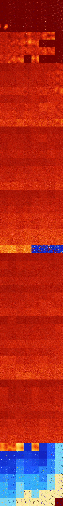

# B0124678 (241152-241663)

<details>
    <summary>Initial Grid</summary>
    
</details>


<details>
    <summary>Initial Grid RLE</summary>

```
#C Exported from GoGoL (https://github.com/marrow16/gogol)
#C Wrap mode: Toroidal
#C Boundary mode: Dead
#C Step: 0
x = 100, y = 100, rule = B0124678/S
bo24bo6bo40bo10bo$9bo42bo6bo17bo5bo3bo5bo3bo$17bo53bo5bo$41b2o44bo$26bo
5bo19bo$18bo22bo9bo12bo20bo6bo$25bo4bo12bo11bo41bo$7bo15bo40bo$28bo11bo
10bo8bo$2o$21bo5bo3bo7bo35bo5bo13bo2bo$5bo21bo20bo$o8bo8b4o22bo29bo$53b
o10bo5b2o13bo11bo$6bo17bo34bobo$5bo21bo27bo7bo17bo5bo$11bo35bo22bo2bo$
16bo3bo15bo11bo26bo$4bo23bo$19bo$36bo9bo$5bo3bo16bo36bo34bo$9bo9bo5b2o
8b2o51bo$34bo31bo15bo8bo$3bo12bo17bo54bo6bo$2bo2bo21bo30bo2bo26bo$70bo
20bo4bo2bo$17bo13bo2bo4bo33b2o12bo$71bo5bo17bo$55bo18b2o6bo$22bo7bo47bo
14bo$8bo40bo26bo5bo$12bo13bo6bo8bobo31bo9bo$9bo5bo11bo25bobo7bo8bo3bobo
2bo8bo$9bo22bo17bo31bo4bo10bo$bo9bo61bo7bo16bo$34bo63bo$20bo4bo11bo52bo
$4b2o31b2o7bo3bo20bo$21bo16bo44b3o10bo$14bo26b2o18bo$42bo50bo$14bo2bo
17bo59bo$23bo14bo32bo16bo$7bo23bo51bo12bo$10bo5bo8bobo44bo20bo$81bo15bo
$15bo9bo32bo$24bo50bo$7bo41bobo38bo$2bobo2bo35bobo26bo10bo3bo$9bo10bo
29bob2obo33bo$39bobo14bo35bobo$42bo29bo2bo$45bo16bo17bo$13bo63bo8bo11bo
$21bobo2bo4bo18bo29bo$4bo9bo29bo38bo$33bo9bo13bo12bo4bo12bo3bo6bo$24bo
2bo30bo$78bo10bo5bo$o11bo57bo9bo6bo$3b2o44bo10bo13bo3bo2bo$8bo3bo25bo
43bo6bo$13bo14bo3b2o36bo6bo2bo15bo$70bo11bo$17bo11bo7bo27bo$11bo14b2o
16bo17bo17bo3bo3bo3bo$26bo13bo12bo13bo$18bo34bo4bo21bo2bo$24bo10bobo26b
obo19bo3bo$6bo45bo4bo11bo21bo$11bo5bo13bo10bo16bo16bobo$77bo$37bo3bo18b
o36bo$48bo49bo$o21bo3bo26bo16bo$8bo9bo27bo7bo26bo$20bo41bo3bo2bo11bo7bo
7b2o$4bo14bo10bo8bo7bo4bo31bo2bo11bo$5bo10bo23bo42bo$35bo30bo$7bo10bo
49bo20bo$29bo19bo$42b2o19bo10bo8bo$o15b2o14bo8bo9bo5bo7bo31bo$10bo21b2o
12bo27bo10bo7bo$11bo63bo16bo$10bo48bo21bo$15bobo32bo21bo5bo$7bo2bo5b2o
19bobo9bo$15bo51bo8bo$31bo28bo3bo3bo$2bo67bo22bo$13bo7bo2bo4bo8bo12bo
22bo$26bo4bo34b2o10bo5bo11bobo$15bo62bo3b2o$6bo12bo4bo4bo35bo$22bobo39b
o22bo$28bo56bo!
```
</details>
<details>
    <summary>Thumbnail</summary>

</details>
<table>
<tr>
    <td><a href="./241152%20S%20Heat%20Map%20Activity.png"></a><br>S (241152)<br>R@16,p2</td>    <td><a href="./241153%20S0%20Heat%20Map%20Activity.png"></a><br>S0 (241153)<br>R@7,p2</td>    <td><a href="./241154%20S1%20Heat%20Map%20Activity.png"></a><br>S1 (241154)<br>R@9,p4</td>    <td><a href="./241155%20S01%20Heat%20Map%20Activity.png"></a><br>S01 (241155)<br>R@11,p4</td>    <td><a href="./241156%20S2%20Heat%20Map%20Activity.png"></a><br>S2 (241156)<br>R@14,p4</td>    <td><a href="./241157%20S02%20Heat%20Map%20Activity.png"></a><br>S02 (241157)<br>R@10,p4</td>    <td><a href="./241158%20S12%20Heat%20Map%20Activity.png"></a><br>S12 (241158)<br>R@7,p2</td>    <td><a href="./241159%20S012%20Heat%20Map%20Activity.png"></a><br>S012 (241159)<br>R@7,p2</td></tr>
<tr>
    <td><a href="./241160%20S3%20Heat%20Map%20Activity.png"></a><br>S3 (241160)<br>R@24,p2</td>    <td><a href="./241161%20S03%20Heat%20Map%20Activity.png"></a><br>S03 (241161)<br>R@11,p2</td>    <td><a href="./241162%20S13%20Heat%20Map%20Activity.png"></a><br>S13 (241162)<br>R@13,p4</td>    <td><a href="./241163%20S013%20Heat%20Map%20Activity.png"></a><br>S013 (241163)<br>R@11,p4</td>    <td><a href="./241164%20S23%20Heat%20Map%20Activity.png"></a><br>S23 (241164)<br>R@17,p4</td>    <td><a href="./241165%20S023%20Heat%20Map%20Activity.png"></a><br>S023 (241165)<br>R@13,p4</td>    <td><a href="./241166%20S123%20Heat%20Map%20Activity.png"></a><br>S123 (241166)<br>R@7,p2</td>    <td><a href="./241167%20S0123%20Heat%20Map%20Activity.png"></a><br>S0123 (241167)<br>R@7,p2</td></tr>
<tr>
    <td><a href="./241168%20S4%20Heat%20Map%20Activity.png"></a><br>S4 (241168)<br>R@80,p2</td>    <td><a href="./241169%20S04%20Heat%20Map%20Activity.png"></a><br>S04 (241169)<br>R@9,p2</td>    <td><a href="./241170%20S14%20Heat%20Map%20Activity.png"></a><br>S14 (241170)<br>R@38,p4</td>    <td><a href="./241171%20S014%20Heat%20Map%20Activity.png"></a><br>S014 (241171)<br>R@13,p4</td>    <td><a href="./241172%20S24%20Heat%20Map%20Activity.png"></a><br>S24 (241172)<br>R@75,p32</td>    <td><a href="./241173%20S024%20Heat%20Map%20Activity.png"></a><br>S024 (241173)<br>R@13,p4</td>    <td><a href="./241174%20S124%20Heat%20Map%20Activity.png"></a><br>S124 (241174)<br>R@15,p2</td>    <td><a href="./241175%20S0124%20Heat%20Map%20Activity.png"></a><br>S0124 (241175)<br>R@7,p2</td></tr>
<tr>
    <td><a href="./241176%20S34%20Heat%20Map%20Activity.png"></a><br>S34 (241176)<br>G>1000</td>    <td><a href="./241177%20S034%20Heat%20Map%20Activity.png"></a><br>S034 (241177)<br>R@13,p4</td>    <td><a href="./241178%20S134%20Heat%20Map%20Activity.png"></a><br>S134 (241178)<br>R@20,p8</td>    <td><a href="./241179%20S0134%20Heat%20Map%20Activity.png"></a><br>S0134 (241179)<br>R@15,p8</td>    <td><a href="./241180%20S234%20Heat%20Map%20Activity.png"></a><br>S234 (241180)<br>R@37,p4</td>    <td><a href="./241181%20S0234%20Heat%20Map%20Activity.png"></a><br>S0234 (241181)<br>R@27,p4</td>    <td><a href="./241182%20S1234%20Heat%20Map%20Activity.png"></a><br>S1234 (241182)<br>R@15,p4</td>    <td><a href="./241183%20S01234%20Heat%20Map%20Activity.png"></a><br>S01234 (241183)<br>R@7,p2</td></tr>
<tr>
    <td><a href="./241184%20S5%20Heat%20Map%20Activity.png"></a><br>S5 (241184)<br>G>1000</td>    <td><a href="./241185%20S05%20Heat%20Map%20Activity.png"></a><br>S05 (241185)<br>G>1000</td>    <td><a href="./241186%20S15%20Heat%20Map%20Activity.png"></a><br>S15 (241186)<br>G>1000</td>    <td><a href="./241187%20S015%20Heat%20Map%20Activity.png"></a><br>S015 (241187)<br>G>1000</td>    <td><a href="./241188%20S25%20Heat%20Map%20Activity.png"></a><br>S25 (241188)<br>G>1000</td>    <td><a href="./241189%20S025%20Heat%20Map%20Activity.png"></a><br>S025 (241189)<br>G>1000</td>    <td><a href="./241190%20S125%20Heat%20Map%20Activity.png"></a><br>S125 (241190)<br>G>1000</td>    <td><a href="./241191%20S0125%20Heat%20Map%20Activity.png"></a><br>S0125 (241191)<br>R@14,p2</td></tr>
<tr>
    <td><a href="./241192%20S35%20Heat%20Map%20Activity.png"></a><br>S35 (241192)<br>G>1000</td>    <td><a href="./241193%20S035%20Heat%20Map%20Activity.png"></a><br>S035 (241193)<br>G>1000</td>    <td><a href="./241194%20S135%20Heat%20Map%20Activity.png"></a><br>S135 (241194)<br>G>1000</td>    <td><a href="./241195%20S0135%20Heat%20Map%20Activity.png"></a><br>S0135 (241195)<br>G>1000</td>    <td><a href="./241196%20S235%20Heat%20Map%20Activity.png"></a><br>S235 (241196)<br>G>1000</td>    <td><a href="./241197%20S0235%20Heat%20Map%20Activity.png"></a><br>S0235 (241197)<br>R@17,p2</td>    <td><a href="./241198%20S1235%20Heat%20Map%20Activity.png"></a><br>S1235 (241198)<br>R@23,p4</td>    <td><a href="./241199%20S01235%20Heat%20Map%20Activity.png"></a><br>S01235 (241199)<br>R@27,p2</td></tr>
<tr>
    <td><a href="./241200%20S45%20Heat%20Map%20Activity.png"></a><br>S45 (241200)<br>G>1000</td>    <td><a href="./241201%20S045%20Heat%20Map%20Activity.png"></a><br>S045 (241201)<br>G>1000</td>    <td><a href="./241202%20S145%20Heat%20Map%20Activity.png"></a><br>S145 (241202)<br>G>1000</td>    <td><a href="./241203%20S0145%20Heat%20Map%20Activity.png"></a><br>S0145 (241203)<br>G>1000</td>    <td><a href="./241204%20S245%20Heat%20Map%20Activity.png"></a><br>S245 (241204)<br>G>1000</td>    <td><a href="./241205%20S0245%20Heat%20Map%20Activity.png"></a><br>S0245 (241205)<br>G>1000</td>    <td><a href="./241206%20S1245%20Heat%20Map%20Activity.png"></a><br>S1245 (241206)<br>G>1000</td>    <td><a href="./241207%20S01245%20Heat%20Map%20Activity.png"></a><br>S01245 (241207)<br>R@29,p18</td></tr>
<tr>
    <td><a href="./241208%20S345%20Heat%20Map%20Activity.png"></a><br>S345 (241208)<br>G>1000</td>    <td><a href="./241209%20S0345%20Heat%20Map%20Activity.png"></a><br>S0345 (241209)<br>G>1000</td>    <td><a href="./241210%20S1345%20Heat%20Map%20Activity.png"></a><br>S1345 (241210)<br>G>1000</td>    <td><a href="./241211%20S01345%20Heat%20Map%20Activity.png"></a><br>S01345 (241211)<br>R@47,p4</td>    <td><a href="./241212%20S2345%20Heat%20Map%20Activity.png"></a><br>S2345 (241212)<br>G>1000</td>    <td><a href="./241213%20S02345%20Heat%20Map%20Activity.png"></a><br>S02345 (241213)<br>R@31,p2</td>    <td><a href="./241214%20S12345%20Heat%20Map%20Activity.png"></a><br>S12345 (241214)<br>R@33,p4</td>    <td><a href="./241215%20S012345%20Heat%20Map%20Activity.png"></a><br>S012345 (241215)<br>R@9,p4</td></tr>
<tr>
    <td><a href="./241216%20S6%20Heat%20Map%20Activity.png"></a><br>S6 (241216)<br>G>1000</td>    <td><a href="./241217%20S06%20Heat%20Map%20Activity.png"></a><br>S06 (241217)<br>G>1000</td>    <td><a href="./241218%20S16%20Heat%20Map%20Activity.png"></a><br>S16 (241218)<br>G>1000</td>    <td><a href="./241219%20S016%20Heat%20Map%20Activity.png"></a><br>S016 (241219)<br>G>1000</td>    <td><a href="./241220%20S26%20Heat%20Map%20Activity.png"></a><br>S26 (241220)<br>G>1000</td>    <td><a href="./241221%20S026%20Heat%20Map%20Activity.png"></a><br>S026 (241221)<br>G>1000</td>    <td><a href="./241222%20S126%20Heat%20Map%20Activity.png"></a><br>S126 (241222)<br>G>1000</td>    <td><a href="./241223%20S0126%20Heat%20Map%20Activity.png"></a><br>S0126 (241223)<br>G>1000</td></tr>
<tr>
    <td><a href="./241224%20S36%20Heat%20Map%20Activity.png"></a><br>S36 (241224)<br>G>1000</td>    <td><a href="./241225%20S036%20Heat%20Map%20Activity.png"></a><br>S036 (241225)<br>G>1000</td>    <td><a href="./241226%20S136%20Heat%20Map%20Activity.png"></a><br>S136 (241226)<br>G>1000</td>    <td><a href="./241227%20S0136%20Heat%20Map%20Activity.png"></a><br>S0136 (241227)<br>G>1000</td>    <td><a href="./241228%20S236%20Heat%20Map%20Activity.png"></a><br>S236 (241228)<br>G>1000</td>    <td><a href="./241229%20S0236%20Heat%20Map%20Activity.png"></a><br>S0236 (241229)<br>G>1000</td>    <td><a href="./241230%20S1236%20Heat%20Map%20Activity.png"></a><br>S1236 (241230)<br>G>1000</td>    <td><a href="./241231%20S01236%20Heat%20Map%20Activity.png"></a><br>S01236 (241231)<br>G>1000</td></tr>
<tr>
    <td><a href="./241232%20S46%20Heat%20Map%20Activity.png"></a><br>S46 (241232)<br>G>1000</td>    <td><a href="./241233%20S046%20Heat%20Map%20Activity.png"></a><br>S046 (241233)<br>G>1000</td>    <td><a href="./241234%20S146%20Heat%20Map%20Activity.png"></a><br>S146 (241234)<br>G>1000</td>    <td><a href="./241235%20S0146%20Heat%20Map%20Activity.png"></a><br>S0146 (241235)<br>G>1000</td>    <td><a href="./241236%20S246%20Heat%20Map%20Activity.png"></a><br>S246 (241236)<br>G>1000</td>    <td><a href="./241237%20S0246%20Heat%20Map%20Activity.png"></a><br>S0246 (241237)<br>G>1000</td>    <td><a href="./241238%20S1246%20Heat%20Map%20Activity.png"></a><br>S1246 (241238)<br>G>1000</td>    <td><a href="./241239%20S01246%20Heat%20Map%20Activity.png"></a><br>S01246 (241239)<br>G>1000</td></tr>
<tr>
    <td><a href="./241240%20S346%20Heat%20Map%20Activity.png"></a><br>S346 (241240)<br>G>1000</td>    <td><a href="./241241%20S0346%20Heat%20Map%20Activity.png"></a><br>S0346 (241241)<br>G>1000</td>    <td><a href="./241242%20S1346%20Heat%20Map%20Activity.png"></a><br>S1346 (241242)<br>G>1000</td>    <td><a href="./241243%20S01346%20Heat%20Map%20Activity.png"></a><br>S01346 (241243)<br>G>1000</td>    <td><a href="./241244%20S2346%20Heat%20Map%20Activity.png"></a><br>S2346 (241244)<br>G>1000</td>    <td><a href="./241245%20S02346%20Heat%20Map%20Activity.png"></a><br>S02346 (241245)<br>G>1000</td>    <td><a href="./241246%20S12346%20Heat%20Map%20Activity.png"></a><br>S12346 (241246)<br>G>1000</td>    <td><a href="./241247%20S012346%20Heat%20Map%20Activity.png"></a><br>S012346 (241247)<br>G>1000</td></tr>
<tr>
    <td><a href="./241248%20S56%20Heat%20Map%20Activity.png"></a><br>S56 (241248)<br>G>1000</td>    <td><a href="./241249%20S056%20Heat%20Map%20Activity.png"></a><br>S056 (241249)<br>G>1000</td>    <td><a href="./241250%20S156%20Heat%20Map%20Activity.png"></a><br>S156 (241250)<br>G>1000</td>    <td><a href="./241251%20S0156%20Heat%20Map%20Activity.png"></a><br>S0156 (241251)<br>G>1000</td>    <td><a href="./241252%20S256%20Heat%20Map%20Activity.png"></a><br>S256 (241252)<br>G>1000</td>    <td><a href="./241253%20S0256%20Heat%20Map%20Activity.png"></a><br>S0256 (241253)<br>G>1000</td>    <td><a href="./241254%20S1256%20Heat%20Map%20Activity.png"></a><br>S1256 (241254)<br>G>1000</td>    <td><a href="./241255%20S01256%20Heat%20Map%20Activity.png"></a><br>S01256 (241255)<br>G>1000</td></tr>
<tr>
    <td><a href="./241256%20S356%20Heat%20Map%20Activity.png"></a><br>S356 (241256)<br>G>1000</td>    <td><a href="./241257%20S0356%20Heat%20Map%20Activity.png"></a><br>S0356 (241257)<br>G>1000</td>    <td><a href="./241258%20S1356%20Heat%20Map%20Activity.png"></a><br>S1356 (241258)<br>G>1000</td>    <td><a href="./241259%20S01356%20Heat%20Map%20Activity.png"></a><br>S01356 (241259)<br>G>1000</td>    <td><a href="./241260%20S2356%20Heat%20Map%20Activity.png"></a><br>S2356 (241260)<br>G>1000</td>    <td><a href="./241261%20S02356%20Heat%20Map%20Activity.png"></a><br>S02356 (241261)<br>G>1000</td>    <td><a href="./241262%20S12356%20Heat%20Map%20Activity.png"></a><br>S12356 (241262)<br>G>1000</td>    <td><a href="./241263%20S012356%20Heat%20Map%20Activity.png"></a><br>S012356 (241263)<br>G>1000</td></tr>
<tr>
    <td><a href="./241264%20S456%20Heat%20Map%20Activity.png"></a><br>S456 (241264)<br>G>1000</td>    <td><a href="./241265%20S0456%20Heat%20Map%20Activity.png"></a><br>S0456 (241265)<br>G>1000</td>    <td><a href="./241266%20S1456%20Heat%20Map%20Activity.png"></a><br>S1456 (241266)<br>G>1000</td>    <td><a href="./241267%20S01456%20Heat%20Map%20Activity.png"></a><br>S01456 (241267)<br>G>1000</td>    <td><a href="./241268%20S2456%20Heat%20Map%20Activity.png"></a><br>S2456 (241268)<br>G>1000</td>    <td><a href="./241269%20S02456%20Heat%20Map%20Activity.png"></a><br>S02456 (241269)<br>G>1000</td>    <td><a href="./241270%20S12456%20Heat%20Map%20Activity.png"></a><br>S12456 (241270)<br>G>1000</td>    <td><a href="./241271%20S012456%20Heat%20Map%20Activity.png"></a><br>S012456 (241271)<br>G>1000</td></tr>
<tr>
    <td><a href="./241272%20S3456%20Heat%20Map%20Activity.png"></a><br>S3456 (241272)<br>G>1000</td>    <td><a href="./241273%20S03456%20Heat%20Map%20Activity.png"></a><br>S03456 (241273)<br>G>1000</td>    <td><a href="./241274%20S13456%20Heat%20Map%20Activity.png"></a><br>S13456 (241274)<br>G>1000</td>    <td><a href="./241275%20S013456%20Heat%20Map%20Activity.png"></a><br>S013456 (241275)<br>G>1000</td>    <td><a href="./241276%20S23456%20Heat%20Map%20Activity.png"></a><br>S23456 (241276)<br>G>1000</td>    <td><a href="./241277%20S023456%20Heat%20Map%20Activity.png"></a><br>S023456 (241277)<br>G>1000</td>    <td><a href="./241278%20S123456%20Heat%20Map%20Activity.png"></a><br>S123456 (241278)<br>G>1000</td>    <td><a href="./241279%20S0123456%20Heat%20Map%20Activity.png"></a><br>S0123456 (241279)<br>G>1000</td></tr>
<tr>
    <td><a href="./241280%20S7%20Heat%20Map%20Activity.png"></a><br>S7 (241280)<br>G>1000</td>    <td><a href="./241281%20S07%20Heat%20Map%20Activity.png"></a><br>S07 (241281)<br>G>1000</td>    <td><a href="./241282%20S17%20Heat%20Map%20Activity.png"></a><br>S17 (241282)<br>G>1000</td>    <td><a href="./241283%20S017%20Heat%20Map%20Activity.png"></a><br>S017 (241283)<br>G>1000</td>    <td><a href="./241284%20S27%20Heat%20Map%20Activity.png"></a><br>S27 (241284)<br>G>1000</td>    <td><a href="./241285%20S027%20Heat%20Map%20Activity.png"></a><br>S027 (241285)<br>G>1000</td>    <td><a href="./241286%20S127%20Heat%20Map%20Activity.png"></a><br>S127 (241286)<br>G>1000</td>    <td><a href="./241287%20S0127%20Heat%20Map%20Activity.png"></a><br>S0127 (241287)<br>G>1000</td></tr>
<tr>
    <td><a href="./241288%20S37%20Heat%20Map%20Activity.png"></a><br>S37 (241288)<br>G>1000</td>    <td><a href="./241289%20S037%20Heat%20Map%20Activity.png"></a><br>S037 (241289)<br>G>1000</td>    <td><a href="./241290%20S137%20Heat%20Map%20Activity.png"></a><br>S137 (241290)<br>G>1000</td>    <td><a href="./241291%20S0137%20Heat%20Map%20Activity.png"></a><br>S0137 (241291)<br>G>1000</td>    <td><a href="./241292%20S237%20Heat%20Map%20Activity.png"></a><br>S237 (241292)<br>G>1000</td>    <td><a href="./241293%20S0237%20Heat%20Map%20Activity.png"></a><br>S0237 (241293)<br>G>1000</td>    <td><a href="./241294%20S1237%20Heat%20Map%20Activity.png"></a><br>S1237 (241294)<br>G>1000</td>    <td><a href="./241295%20S01237%20Heat%20Map%20Activity.png"></a><br>S01237 (241295)<br>G>1000</td></tr>
<tr>
    <td><a href="./241296%20S47%20Heat%20Map%20Activity.png"></a><br>S47 (241296)<br>G>1000</td>    <td><a href="./241297%20S047%20Heat%20Map%20Activity.png"></a><br>S047 (241297)<br>G>1000</td>    <td><a href="./241298%20S147%20Heat%20Map%20Activity.png"></a><br>S147 (241298)<br>G>1000</td>    <td><a href="./241299%20S0147%20Heat%20Map%20Activity.png"></a><br>S0147 (241299)<br>G>1000</td>    <td><a href="./241300%20S247%20Heat%20Map%20Activity.png"></a><br>S247 (241300)<br>G>1000</td>    <td><a href="./241301%20S0247%20Heat%20Map%20Activity.png"></a><br>S0247 (241301)<br>G>1000</td>    <td><a href="./241302%20S1247%20Heat%20Map%20Activity.png"></a><br>S1247 (241302)<br>G>1000</td>    <td><a href="./241303%20S01247%20Heat%20Map%20Activity.png"></a><br>S01247 (241303)<br>G>1000</td></tr>
<tr>
    <td><a href="./241304%20S347%20Heat%20Map%20Activity.png"></a><br>S347 (241304)<br>G>1000</td>    <td><a href="./241305%20S0347%20Heat%20Map%20Activity.png"></a><br>S0347 (241305)<br>G>1000</td>    <td><a href="./241306%20S1347%20Heat%20Map%20Activity.png"></a><br>S1347 (241306)<br>G>1000</td>    <td><a href="./241307%20S01347%20Heat%20Map%20Activity.png"></a><br>S01347 (241307)<br>G>1000</td>    <td><a href="./241308%20S2347%20Heat%20Map%20Activity.png"></a><br>S2347 (241308)<br>G>1000</td>    <td><a href="./241309%20S02347%20Heat%20Map%20Activity.png"></a><br>S02347 (241309)<br>G>1000</td>    <td><a href="./241310%20S12347%20Heat%20Map%20Activity.png"></a><br>S12347 (241310)<br>G>1000</td>    <td><a href="./241311%20S012347%20Heat%20Map%20Activity.png"></a><br>S012347 (241311)<br>G>1000</td></tr>
<tr>
    <td><a href="./241312%20S57%20Heat%20Map%20Activity.png"></a><br>S57 (241312)<br>G>1000</td>    <td><a href="./241313%20S057%20Heat%20Map%20Activity.png"></a><br>S057 (241313)<br>G>1000</td>    <td><a href="./241314%20S157%20Heat%20Map%20Activity.png"></a><br>S157 (241314)<br>G>1000</td>    <td><a href="./241315%20S0157%20Heat%20Map%20Activity.png"></a><br>S0157 (241315)<br>G>1000</td>    <td><a href="./241316%20S257%20Heat%20Map%20Activity.png"></a><br>S257 (241316)<br>G>1000</td>    <td><a href="./241317%20S0257%20Heat%20Map%20Activity.png"></a><br>S0257 (241317)<br>G>1000</td>    <td><a href="./241318%20S1257%20Heat%20Map%20Activity.png"></a><br>S1257 (241318)<br>G>1000</td>    <td><a href="./241319%20S01257%20Heat%20Map%20Activity.png"></a><br>S01257 (241319)<br>G>1000</td></tr>
<tr>
    <td><a href="./241320%20S357%20Heat%20Map%20Activity.png"></a><br>S357 (241320)<br>G>1000</td>    <td><a href="./241321%20S0357%20Heat%20Map%20Activity.png"></a><br>S0357 (241321)<br>G>1000</td>    <td><a href="./241322%20S1357%20Heat%20Map%20Activity.png"></a><br>S1357 (241322)<br>G>1000</td>    <td><a href="./241323%20S01357%20Heat%20Map%20Activity.png"></a><br>S01357 (241323)<br>G>1000</td>    <td><a href="./241324%20S2357%20Heat%20Map%20Activity.png"></a><br>S2357 (241324)<br>G>1000</td>    <td><a href="./241325%20S02357%20Heat%20Map%20Activity.png"></a><br>S02357 (241325)<br>G>1000</td>    <td><a href="./241326%20S12357%20Heat%20Map%20Activity.png"></a><br>S12357 (241326)<br>G>1000</td>    <td><a href="./241327%20S012357%20Heat%20Map%20Activity.png"></a><br>S012357 (241327)<br>G>1000</td></tr>
<tr>
    <td><a href="./241328%20S457%20Heat%20Map%20Activity.png"></a><br>S457 (241328)<br>G>1000</td>    <td><a href="./241329%20S0457%20Heat%20Map%20Activity.png"></a><br>S0457 (241329)<br>G>1000</td>    <td><a href="./241330%20S1457%20Heat%20Map%20Activity.png"></a><br>S1457 (241330)<br>G>1000</td>    <td><a href="./241331%20S01457%20Heat%20Map%20Activity.png"></a><br>S01457 (241331)<br>G>1000</td>    <td><a href="./241332%20S2457%20Heat%20Map%20Activity.png"></a><br>S2457 (241332)<br>G>1000</td>    <td><a href="./241333%20S02457%20Heat%20Map%20Activity.png"></a><br>S02457 (241333)<br>G>1000</td>    <td><a href="./241334%20S12457%20Heat%20Map%20Activity.png"></a><br>S12457 (241334)<br>G>1000</td>    <td><a href="./241335%20S012457%20Heat%20Map%20Activity.png"></a><br>S012457 (241335)<br>G>1000</td></tr>
<tr>
    <td><a href="./241336%20S3457%20Heat%20Map%20Activity.png"></a><br>S3457 (241336)<br>G>1000</td>    <td><a href="./241337%20S03457%20Heat%20Map%20Activity.png"></a><br>S03457 (241337)<br>G>1000</td>    <td><a href="./241338%20S13457%20Heat%20Map%20Activity.png"></a><br>S13457 (241338)<br>G>1000</td>    <td><a href="./241339%20S013457%20Heat%20Map%20Activity.png"></a><br>S013457 (241339)<br>G>1000</td>    <td><a href="./241340%20S23457%20Heat%20Map%20Activity.png"></a><br>S23457 (241340)<br>G>1000</td>    <td><a href="./241341%20S023457%20Heat%20Map%20Activity.png"></a><br>S023457 (241341)<br>G>1000</td>    <td><a href="./241342%20S123457%20Heat%20Map%20Activity.png"></a><br>S123457 (241342)<br>G>1000</td>    <td><a href="./241343%20S0123457%20Heat%20Map%20Activity.png"></a><br>S0123457 (241343)<br>G>1000</td></tr>
<tr>
    <td><a href="./241344%20S67%20Heat%20Map%20Activity.png"></a><br>S67 (241344)<br>G>1000</td>    <td><a href="./241345%20S067%20Heat%20Map%20Activity.png"></a><br>S067 (241345)<br>G>1000</td>    <td><a href="./241346%20S167%20Heat%20Map%20Activity.png"></a><br>S167 (241346)<br>G>1000</td>    <td><a href="./241347%20S0167%20Heat%20Map%20Activity.png"></a><br>S0167 (241347)<br>G>1000</td>    <td><a href="./241348%20S267%20Heat%20Map%20Activity.png"></a><br>S267 (241348)<br>G>1000</td>    <td><a href="./241349%20S0267%20Heat%20Map%20Activity.png"></a><br>S0267 (241349)<br>G>1000</td>    <td><a href="./241350%20S1267%20Heat%20Map%20Activity.png"></a><br>S1267 (241350)<br>G>1000</td>    <td><a href="./241351%20S01267%20Heat%20Map%20Activity.png"></a><br>S01267 (241351)<br>G>1000</td></tr>
<tr>
    <td><a href="./241352%20S367%20Heat%20Map%20Activity.png"></a><br>S367 (241352)<br>G>1000</td>    <td><a href="./241353%20S0367%20Heat%20Map%20Activity.png"></a><br>S0367 (241353)<br>G>1000</td>    <td><a href="./241354%20S1367%20Heat%20Map%20Activity.png"></a><br>S1367 (241354)<br>G>1000</td>    <td><a href="./241355%20S01367%20Heat%20Map%20Activity.png"></a><br>S01367 (241355)<br>G>1000</td>    <td><a href="./241356%20S2367%20Heat%20Map%20Activity.png"></a><br>S2367 (241356)<br>G>1000</td>    <td><a href="./241357%20S02367%20Heat%20Map%20Activity.png"></a><br>S02367 (241357)<br>G>1000</td>    <td><a href="./241358%20S12367%20Heat%20Map%20Activity.png"></a><br>S12367 (241358)<br>G>1000</td>    <td><a href="./241359%20S012367%20Heat%20Map%20Activity.png"></a><br>S012367 (241359)<br>G>1000</td></tr>
<tr>
    <td><a href="./241360%20S467%20Heat%20Map%20Activity.png"></a><br>S467 (241360)<br>G>1000</td>    <td><a href="./241361%20S0467%20Heat%20Map%20Activity.png"></a><br>S0467 (241361)<br>G>1000</td>    <td><a href="./241362%20S1467%20Heat%20Map%20Activity.png"></a><br>S1467 (241362)<br>G>1000</td>    <td><a href="./241363%20S01467%20Heat%20Map%20Activity.png"></a><br>S01467 (241363)<br>G>1000</td>    <td><a href="./241364%20S2467%20Heat%20Map%20Activity.png"></a><br>S2467 (241364)<br>G>1000</td>    <td><a href="./241365%20S02467%20Heat%20Map%20Activity.png"></a><br>S02467 (241365)<br>G>1000</td>    <td><a href="./241366%20S12467%20Heat%20Map%20Activity.png"></a><br>S12467 (241366)<br>G>1000</td>    <td><a href="./241367%20S012467%20Heat%20Map%20Activity.png"></a><br>S012467 (241367)<br>G>1000</td></tr>
<tr>
    <td><a href="./241368%20S3467%20Heat%20Map%20Activity.png"></a><br>S3467 (241368)<br>G>1000</td>    <td><a href="./241369%20S03467%20Heat%20Map%20Activity.png"></a><br>S03467 (241369)<br>G>1000</td>    <td><a href="./241370%20S13467%20Heat%20Map%20Activity.png"></a><br>S13467 (241370)<br>G>1000</td>    <td><a href="./241371%20S013467%20Heat%20Map%20Activity.png"></a><br>S013467 (241371)<br>G>1000</td>    <td><a href="./241372%20S23467%20Heat%20Map%20Activity.png"></a><br>S23467 (241372)<br>G>1000</td>    <td><a href="./241373%20S023467%20Heat%20Map%20Activity.png"></a><br>S023467 (241373)<br>G>1000</td>    <td><a href="./241374%20S123467%20Heat%20Map%20Activity.png"></a><br>S123467 (241374)<br>G>1000</td>    <td><a href="./241375%20S0123467%20Heat%20Map%20Activity.png"></a><br>S0123467 (241375)<br>G>1000</td></tr>
<tr>
    <td><a href="./241376%20S567%20Heat%20Map%20Activity.png"></a><br>S567 (241376)<br>G>1000</td>    <td><a href="./241377%20S0567%20Heat%20Map%20Activity.png"></a><br>S0567 (241377)<br>G>1000</td>    <td><a href="./241378%20S1567%20Heat%20Map%20Activity.png"></a><br>S1567 (241378)<br>G>1000</td>    <td><a href="./241379%20S01567%20Heat%20Map%20Activity.png"></a><br>S01567 (241379)<br>G>1000</td>    <td><a href="./241380%20S2567%20Heat%20Map%20Activity.png"></a><br>S2567 (241380)<br>G>1000</td>    <td><a href="./241381%20S02567%20Heat%20Map%20Activity.png"></a><br>S02567 (241381)<br>G>1000</td>    <td><a href="./241382%20S12567%20Heat%20Map%20Activity.png"></a><br>S12567 (241382)<br>G>1000</td>    <td><a href="./241383%20S012567%20Heat%20Map%20Activity.png"></a><br>S012567 (241383)<br>G>1000</td></tr>
<tr>
    <td><a href="./241384%20S3567%20Heat%20Map%20Activity.png"></a><br>S3567 (241384)<br>G>1000</td>    <td><a href="./241385%20S03567%20Heat%20Map%20Activity.png"></a><br>S03567 (241385)<br>G>1000</td>    <td><a href="./241386%20S13567%20Heat%20Map%20Activity.png"></a><br>S13567 (241386)<br>G>1000</td>    <td><a href="./241387%20S013567%20Heat%20Map%20Activity.png"></a><br>S013567 (241387)<br>G>1000</td>    <td><a href="./241388%20S23567%20Heat%20Map%20Activity.png"></a><br>S23567 (241388)<br>G>1000</td>    <td><a href="./241389%20S023567%20Heat%20Map%20Activity.png"></a><br>S023567 (241389)<br>G>1000</td>    <td><a href="./241390%20S123567%20Heat%20Map%20Activity.png"></a><br>S123567 (241390)<br>G>1000</td>    <td><a href="./241391%20S0123567%20Heat%20Map%20Activity.png"></a><br>S0123567 (241391)<br>G>1000</td></tr>
<tr>
    <td><a href="./241392%20S4567%20Heat%20Map%20Activity.png"></a><br>S4567 (241392)<br>G>1000</td>    <td><a href="./241393%20S04567%20Heat%20Map%20Activity.png"></a><br>S04567 (241393)<br>G>1000</td>    <td><a href="./241394%20S14567%20Heat%20Map%20Activity.png"></a><br>S14567 (241394)<br>G>1000</td>    <td><a href="./241395%20S014567%20Heat%20Map%20Activity.png"></a><br>S014567 (241395)<br>G>1000</td>    <td><a href="./241396%20S24567%20Heat%20Map%20Activity.png"></a><br>S24567 (241396)<br>G>1000</td>    <td><a href="./241397%20S024567%20Heat%20Map%20Activity.png"></a><br>S024567 (241397)<br>G>1000</td>    <td><a href="./241398%20S124567%20Heat%20Map%20Activity.png"></a><br>S124567 (241398)<br>G>1000</td>    <td><a href="./241399%20S0124567%20Heat%20Map%20Activity.png"></a><br>S0124567 (241399)<br>G>1000</td></tr>
<tr>
    <td><a href="./241400%20S34567%20Heat%20Map%20Activity.png"></a><br>S34567 (241400)<br>G>1000</td>    <td><a href="./241401%20S034567%20Heat%20Map%20Activity.png"></a><br>S034567 (241401)<br>G>1000</td>    <td><a href="./241402%20S134567%20Heat%20Map%20Activity.png"></a><br>S134567 (241402)<br>G>1000</td>    <td><a href="./241403%20S0134567%20Heat%20Map%20Activity.png"></a><br>S0134567 (241403)<br>G>1000</td>    <td><a href="./241404%20S234567%20Heat%20Map%20Activity.png"></a><br>S234567 (241404)<br>G>1000</td>    <td><a href="./241405%20S0234567%20Heat%20Map%20Activity.png"></a><br>S0234567 (241405)<br>G>1000</td>    <td><a href="./241406%20S1234567%20Heat%20Map%20Activity.png"></a><br>S1234567 (241406)<br>G>1000</td>    <td><a href="./241407%20S01234567%20Heat%20Map%20Activity.png"></a><br>S01234567 (241407)<br>G>1000</td></tr>
<tr>
    <td><a href="./241408%20S8%20Heat%20Map%20Activity.png"></a><br>S8 (241408)<br>G>1000</td>    <td><a href="./241409%20S08%20Heat%20Map%20Activity.png"></a><br>S08 (241409)<br>G>1000</td>    <td><a href="./241410%20S18%20Heat%20Map%20Activity.png"></a><br>S18 (241410)<br>G>1000</td>    <td><a href="./241411%20S018%20Heat%20Map%20Activity.png"></a><br>S018 (241411)<br>G>1000</td>    <td><a href="./241412%20S28%20Heat%20Map%20Activity.png"></a><br>S28 (241412)<br>G>1000</td>    <td><a href="./241413%20S028%20Heat%20Map%20Activity.png"></a><br>S028 (241413)<br>G>1000</td>    <td><a href="./241414%20S128%20Heat%20Map%20Activity.png"></a><br>S128 (241414)<br>G>1000</td>    <td><a href="./241415%20S0128%20Heat%20Map%20Activity.png"></a><br>S0128 (241415)<br>G>1000</td></tr>
<tr>
    <td><a href="./241416%20S38%20Heat%20Map%20Activity.png"></a><br>S38 (241416)<br>G>1000</td>    <td><a href="./241417%20S038%20Heat%20Map%20Activity.png"></a><br>S038 (241417)<br>G>1000</td>    <td><a href="./241418%20S138%20Heat%20Map%20Activity.png"></a><br>S138 (241418)<br>G>1000</td>    <td><a href="./241419%20S0138%20Heat%20Map%20Activity.png"></a><br>S0138 (241419)<br>G>1000</td>    <td><a href="./241420%20S238%20Heat%20Map%20Activity.png"></a><br>S238 (241420)<br>G>1000</td>    <td><a href="./241421%20S0238%20Heat%20Map%20Activity.png"></a><br>S0238 (241421)<br>G>1000</td>    <td><a href="./241422%20S1238%20Heat%20Map%20Activity.png"></a><br>S1238 (241422)<br>G>1000</td>    <td><a href="./241423%20S01238%20Heat%20Map%20Activity.png"></a><br>S01238 (241423)<br>G>1000</td></tr>
<tr>
    <td><a href="./241424%20S48%20Heat%20Map%20Activity.png"></a><br>S48 (241424)<br>G>1000</td>    <td><a href="./241425%20S048%20Heat%20Map%20Activity.png"></a><br>S048 (241425)<br>G>1000</td>    <td><a href="./241426%20S148%20Heat%20Map%20Activity.png"></a><br>S148 (241426)<br>G>1000</td>    <td><a href="./241427%20S0148%20Heat%20Map%20Activity.png"></a><br>S0148 (241427)<br>G>1000</td>    <td><a href="./241428%20S248%20Heat%20Map%20Activity.png"></a><br>S248 (241428)<br>G>1000</td>    <td><a href="./241429%20S0248%20Heat%20Map%20Activity.png"></a><br>S0248 (241429)<br>G>1000</td>    <td><a href="./241430%20S1248%20Heat%20Map%20Activity.png"></a><br>S1248 (241430)<br>G>1000</td>    <td><a href="./241431%20S01248%20Heat%20Map%20Activity.png"></a><br>S01248 (241431)<br>G>1000</td></tr>
<tr>
    <td><a href="./241432%20S348%20Heat%20Map%20Activity.png"></a><br>S348 (241432)<br>G>1000</td>    <td><a href="./241433%20S0348%20Heat%20Map%20Activity.png"></a><br>S0348 (241433)<br>G>1000</td>    <td><a href="./241434%20S1348%20Heat%20Map%20Activity.png"></a><br>S1348 (241434)<br>G>1000</td>    <td><a href="./241435%20S01348%20Heat%20Map%20Activity.png"></a><br>S01348 (241435)<br>G>1000</td>    <td><a href="./241436%20S2348%20Heat%20Map%20Activity.png"></a><br>S2348 (241436)<br>G>1000</td>    <td><a href="./241437%20S02348%20Heat%20Map%20Activity.png"></a><br>S02348 (241437)<br>G>1000</td>    <td><a href="./241438%20S12348%20Heat%20Map%20Activity.png"></a><br>S12348 (241438)<br>G>1000</td>    <td><a href="./241439%20S012348%20Heat%20Map%20Activity.png"></a><br>S012348 (241439)<br>G>1000</td></tr>
<tr>
    <td><a href="./241440%20S58%20Heat%20Map%20Activity.png"></a><br>S58 (241440)<br>G>1000</td>    <td><a href="./241441%20S058%20Heat%20Map%20Activity.png"></a><br>S058 (241441)<br>G>1000</td>    <td><a href="./241442%20S158%20Heat%20Map%20Activity.png"></a><br>S158 (241442)<br>G>1000</td>    <td><a href="./241443%20S0158%20Heat%20Map%20Activity.png"></a><br>S0158 (241443)<br>G>1000</td>    <td><a href="./241444%20S258%20Heat%20Map%20Activity.png"></a><br>S258 (241444)<br>G>1000</td>    <td><a href="./241445%20S0258%20Heat%20Map%20Activity.png"></a><br>S0258 (241445)<br>G>1000</td>    <td><a href="./241446%20S1258%20Heat%20Map%20Activity.png"></a><br>S1258 (241446)<br>G>1000</td>    <td><a href="./241447%20S01258%20Heat%20Map%20Activity.png"></a><br>S01258 (241447)<br>G>1000</td></tr>
<tr>
    <td><a href="./241448%20S358%20Heat%20Map%20Activity.png"></a><br>S358 (241448)<br>G>1000</td>    <td><a href="./241449%20S0358%20Heat%20Map%20Activity.png"></a><br>S0358 (241449)<br>G>1000</td>    <td><a href="./241450%20S1358%20Heat%20Map%20Activity.png"></a><br>S1358 (241450)<br>G>1000</td>    <td><a href="./241451%20S01358%20Heat%20Map%20Activity.png"></a><br>S01358 (241451)<br>G>1000</td>    <td><a href="./241452%20S2358%20Heat%20Map%20Activity.png"></a><br>S2358 (241452)<br>G>1000</td>    <td><a href="./241453%20S02358%20Heat%20Map%20Activity.png"></a><br>S02358 (241453)<br>G>1000</td>    <td><a href="./241454%20S12358%20Heat%20Map%20Activity.png"></a><br>S12358 (241454)<br>G>1000</td>    <td><a href="./241455%20S012358%20Heat%20Map%20Activity.png"></a><br>S012358 (241455)<br>G>1000</td></tr>
<tr>
    <td><a href="./241456%20S458%20Heat%20Map%20Activity.png"></a><br>S458 (241456)<br>G>1000</td>    <td><a href="./241457%20S0458%20Heat%20Map%20Activity.png"></a><br>S0458 (241457)<br>G>1000</td>    <td><a href="./241458%20S1458%20Heat%20Map%20Activity.png"></a><br>S1458 (241458)<br>G>1000</td>    <td><a href="./241459%20S01458%20Heat%20Map%20Activity.png"></a><br>S01458 (241459)<br>G>1000</td>    <td><a href="./241460%20S2458%20Heat%20Map%20Activity.png"></a><br>S2458 (241460)<br>G>1000</td>    <td><a href="./241461%20S02458%20Heat%20Map%20Activity.png"></a><br>S02458 (241461)<br>G>1000</td>    <td><a href="./241462%20S12458%20Heat%20Map%20Activity.png"></a><br>S12458 (241462)<br>G>1000</td>    <td><a href="./241463%20S012458%20Heat%20Map%20Activity.png"></a><br>S012458 (241463)<br>G>1000</td></tr>
<tr>
    <td><a href="./241464%20S3458%20Heat%20Map%20Activity.png"></a><br>S3458 (241464)<br>G>1000</td>    <td><a href="./241465%20S03458%20Heat%20Map%20Activity.png"></a><br>S03458 (241465)<br>G>1000</td>    <td><a href="./241466%20S13458%20Heat%20Map%20Activity.png"></a><br>S13458 (241466)<br>G>1000</td>    <td><a href="./241467%20S013458%20Heat%20Map%20Activity.png"></a><br>S013458 (241467)<br>G>1000</td>    <td><a href="./241468%20S23458%20Heat%20Map%20Activity.png"></a><br>S23458 (241468)<br>G>1000</td>    <td><a href="./241469%20S023458%20Heat%20Map%20Activity.png"></a><br>S023458 (241469)<br>G>1000</td>    <td><a href="./241470%20S123458%20Heat%20Map%20Activity.png"></a><br>S123458 (241470)<br>G>1000</td>    <td><a href="./241471%20S0123458%20Heat%20Map%20Activity.png"></a><br>S0123458 (241471)<br>G>1000</td></tr>
<tr>
    <td><a href="./241472%20S68%20Heat%20Map%20Activity.png"></a><br>S68 (241472)<br>G>1000</td>    <td><a href="./241473%20S068%20Heat%20Map%20Activity.png"></a><br>S068 (241473)<br>G>1000</td>    <td><a href="./241474%20S168%20Heat%20Map%20Activity.png"></a><br>S168 (241474)<br>G>1000</td>    <td><a href="./241475%20S0168%20Heat%20Map%20Activity.png"></a><br>S0168 (241475)<br>G>1000</td>    <td><a href="./241476%20S268%20Heat%20Map%20Activity.png"></a><br>S268 (241476)<br>G>1000</td>    <td><a href="./241477%20S0268%20Heat%20Map%20Activity.png"></a><br>S0268 (241477)<br>G>1000</td>    <td><a href="./241478%20S1268%20Heat%20Map%20Activity.png"></a><br>S1268 (241478)<br>G>1000</td>    <td><a href="./241479%20S01268%20Heat%20Map%20Activity.png"></a><br>S01268 (241479)<br>G>1000</td></tr>
<tr>
    <td><a href="./241480%20S368%20Heat%20Map%20Activity.png"></a><br>S368 (241480)<br>G>1000</td>    <td><a href="./241481%20S0368%20Heat%20Map%20Activity.png"></a><br>S0368 (241481)<br>G>1000</td>    <td><a href="./241482%20S1368%20Heat%20Map%20Activity.png"></a><br>S1368 (241482)<br>G>1000</td>    <td><a href="./241483%20S01368%20Heat%20Map%20Activity.png"></a><br>S01368 (241483)<br>G>1000</td>    <td><a href="./241484%20S2368%20Heat%20Map%20Activity.png"></a><br>S2368 (241484)<br>G>1000</td>    <td><a href="./241485%20S02368%20Heat%20Map%20Activity.png"></a><br>S02368 (241485)<br>G>1000</td>    <td><a href="./241486%20S12368%20Heat%20Map%20Activity.png"></a><br>S12368 (241486)<br>G>1000</td>    <td><a href="./241487%20S012368%20Heat%20Map%20Activity.png"></a><br>S012368 (241487)<br>G>1000</td></tr>
<tr>
    <td><a href="./241488%20S468%20Heat%20Map%20Activity.png"></a><br>S468 (241488)<br>G>1000</td>    <td><a href="./241489%20S0468%20Heat%20Map%20Activity.png"></a><br>S0468 (241489)<br>G>1000</td>    <td><a href="./241490%20S1468%20Heat%20Map%20Activity.png"></a><br>S1468 (241490)<br>G>1000</td>    <td><a href="./241491%20S01468%20Heat%20Map%20Activity.png"></a><br>S01468 (241491)<br>G>1000</td>    <td><a href="./241492%20S2468%20Heat%20Map%20Activity.png"></a><br>S2468 (241492)<br>G>1000</td>    <td><a href="./241493%20S02468%20Heat%20Map%20Activity.png"></a><br>S02468 (241493)<br>G>1000</td>    <td><a href="./241494%20S12468%20Heat%20Map%20Activity.png"></a><br>S12468 (241494)<br>G>1000</td>    <td><a href="./241495%20S012468%20Heat%20Map%20Activity.png"></a><br>S012468 (241495)<br>G>1000</td></tr>
<tr>
    <td><a href="./241496%20S3468%20Heat%20Map%20Activity.png"></a><br>S3468 (241496)<br>G>1000</td>    <td><a href="./241497%20S03468%20Heat%20Map%20Activity.png"></a><br>S03468 (241497)<br>G>1000</td>    <td><a href="./241498%20S13468%20Heat%20Map%20Activity.png"></a><br>S13468 (241498)<br>G>1000</td>    <td><a href="./241499%20S013468%20Heat%20Map%20Activity.png"></a><br>S013468 (241499)<br>G>1000</td>    <td><a href="./241500%20S23468%20Heat%20Map%20Activity.png"></a><br>S23468 (241500)<br>G>1000</td>    <td><a href="./241501%20S023468%20Heat%20Map%20Activity.png"></a><br>S023468 (241501)<br>G>1000</td>    <td><a href="./241502%20S123468%20Heat%20Map%20Activity.png"></a><br>S123468 (241502)<br>G>1000</td>    <td><a href="./241503%20S0123468%20Heat%20Map%20Activity.png"></a><br>S0123468 (241503)<br>G>1000</td></tr>
<tr>
    <td><a href="./241504%20S568%20Heat%20Map%20Activity.png"></a><br>S568 (241504)<br>G>1000</td>    <td><a href="./241505%20S0568%20Heat%20Map%20Activity.png"></a><br>S0568 (241505)<br>G>1000</td>    <td><a href="./241506%20S1568%20Heat%20Map%20Activity.png"></a><br>S1568 (241506)<br>G>1000</td>    <td><a href="./241507%20S01568%20Heat%20Map%20Activity.png"></a><br>S01568 (241507)<br>G>1000</td>    <td><a href="./241508%20S2568%20Heat%20Map%20Activity.png"></a><br>S2568 (241508)<br>G>1000</td>    <td><a href="./241509%20S02568%20Heat%20Map%20Activity.png"></a><br>S02568 (241509)<br>G>1000</td>    <td><a href="./241510%20S12568%20Heat%20Map%20Activity.png"></a><br>S12568 (241510)<br>G>1000</td>    <td><a href="./241511%20S012568%20Heat%20Map%20Activity.png"></a><br>S012568 (241511)<br>G>1000</td></tr>
<tr>
    <td><a href="./241512%20S3568%20Heat%20Map%20Activity.png"></a><br>S3568 (241512)<br>G>1000</td>    <td><a href="./241513%20S03568%20Heat%20Map%20Activity.png"></a><br>S03568 (241513)<br>G>1000</td>    <td><a href="./241514%20S13568%20Heat%20Map%20Activity.png"></a><br>S13568 (241514)<br>G>1000</td>    <td><a href="./241515%20S013568%20Heat%20Map%20Activity.png"></a><br>S013568 (241515)<br>G>1000</td>    <td><a href="./241516%20S23568%20Heat%20Map%20Activity.png"></a><br>S23568 (241516)<br>G>1000</td>    <td><a href="./241517%20S023568%20Heat%20Map%20Activity.png"></a><br>S023568 (241517)<br>G>1000</td>    <td><a href="./241518%20S123568%20Heat%20Map%20Activity.png"></a><br>S123568 (241518)<br>G>1000</td>    <td><a href="./241519%20S0123568%20Heat%20Map%20Activity.png"></a><br>S0123568 (241519)<br>G>1000</td></tr>
<tr>
    <td><a href="./241520%20S4568%20Heat%20Map%20Activity.png"></a><br>S4568 (241520)<br>G>1000</td>    <td><a href="./241521%20S04568%20Heat%20Map%20Activity.png"></a><br>S04568 (241521)<br>G>1000</td>    <td><a href="./241522%20S14568%20Heat%20Map%20Activity.png"></a><br>S14568 (241522)<br>G>1000</td>    <td><a href="./241523%20S014568%20Heat%20Map%20Activity.png"></a><br>S014568 (241523)<br>G>1000</td>    <td><a href="./241524%20S24568%20Heat%20Map%20Activity.png"></a><br>S24568 (241524)<br>G>1000</td>    <td><a href="./241525%20S024568%20Heat%20Map%20Activity.png"></a><br>S024568 (241525)<br>G>1000</td>    <td><a href="./241526%20S124568%20Heat%20Map%20Activity.png"></a><br>S124568 (241526)<br>G>1000</td>    <td><a href="./241527%20S0124568%20Heat%20Map%20Activity.png"></a><br>S0124568 (241527)<br>G>1000</td></tr>
<tr>
    <td><a href="./241528%20S34568%20Heat%20Map%20Activity.png"></a><br>S34568 (241528)<br>G>1000</td>    <td><a href="./241529%20S034568%20Heat%20Map%20Activity.png"></a><br>S034568 (241529)<br>G>1000</td>    <td><a href="./241530%20S134568%20Heat%20Map%20Activity.png"></a><br>S134568 (241530)<br>G>1000</td>    <td><a href="./241531%20S0134568%20Heat%20Map%20Activity.png"></a><br>S0134568 (241531)<br>G>1000</td>    <td><a href="./241532%20S234568%20Heat%20Map%20Activity.png"></a><br>S234568 (241532)<br>G>1000</td>    <td><a href="./241533%20S0234568%20Heat%20Map%20Activity.png"></a><br>S0234568 (241533)<br>G>1000</td>    <td><a href="./241534%20S1234568%20Heat%20Map%20Activity.png"></a><br>S1234568 (241534)<br>G>1000</td>    <td><a href="./241535%20S01234568%20Heat%20Map%20Activity.png"></a><br>S01234568 (241535)<br>G>1000</td></tr>
<tr>
    <td><a href="./241536%20S78%20Heat%20Map%20Activity.png"></a><br>S78 (241536)<br>G>1000</td>    <td><a href="./241537%20S078%20Heat%20Map%20Activity.png"></a><br>S078 (241537)<br>G>1000</td>    <td><a href="./241538%20S178%20Heat%20Map%20Activity.png"></a><br>S178 (241538)<br>G>1000</td>    <td><a href="./241539%20S0178%20Heat%20Map%20Activity.png"></a><br>S0178 (241539)<br>G>1000</td>    <td><a href="./241540%20S278%20Heat%20Map%20Activity.png"></a><br>S278 (241540)<br>G>1000</td>    <td><a href="./241541%20S0278%20Heat%20Map%20Activity.png"></a><br>S0278 (241541)<br>G>1000</td>    <td><a href="./241542%20S1278%20Heat%20Map%20Activity.png"></a><br>S1278 (241542)<br>G>1000</td>    <td><a href="./241543%20S01278%20Heat%20Map%20Activity.png"></a><br>S01278 (241543)<br>G>1000</td></tr>
<tr>
    <td><a href="./241544%20S378%20Heat%20Map%20Activity.png"></a><br>S378 (241544)<br>G>1000</td>    <td><a href="./241545%20S0378%20Heat%20Map%20Activity.png"></a><br>S0378 (241545)<br>G>1000</td>    <td><a href="./241546%20S1378%20Heat%20Map%20Activity.png"></a><br>S1378 (241546)<br>G>1000</td>    <td><a href="./241547%20S01378%20Heat%20Map%20Activity.png"></a><br>S01378 (241547)<br>G>1000</td>    <td><a href="./241548%20S2378%20Heat%20Map%20Activity.png"></a><br>S2378 (241548)<br>G>1000</td>    <td><a href="./241549%20S02378%20Heat%20Map%20Activity.png"></a><br>S02378 (241549)<br>G>1000</td>    <td><a href="./241550%20S12378%20Heat%20Map%20Activity.png"></a><br>S12378 (241550)<br>G>1000</td>    <td><a href="./241551%20S012378%20Heat%20Map%20Activity.png"></a><br>S012378 (241551)<br>G>1000</td></tr>
<tr>
    <td><a href="./241552%20S478%20Heat%20Map%20Activity.png"></a><br>S478 (241552)<br>G>1000</td>    <td><a href="./241553%20S0478%20Heat%20Map%20Activity.png"></a><br>S0478 (241553)<br>G>1000</td>    <td><a href="./241554%20S1478%20Heat%20Map%20Activity.png"></a><br>S1478 (241554)<br>G>1000</td>    <td><a href="./241555%20S01478%20Heat%20Map%20Activity.png"></a><br>S01478 (241555)<br>G>1000</td>    <td><a href="./241556%20S2478%20Heat%20Map%20Activity.png"></a><br>S2478 (241556)<br>G>1000</td>    <td><a href="./241557%20S02478%20Heat%20Map%20Activity.png"></a><br>S02478 (241557)<br>G>1000</td>    <td><a href="./241558%20S12478%20Heat%20Map%20Activity.png"></a><br>S12478 (241558)<br>G>1000</td>    <td><a href="./241559%20S012478%20Heat%20Map%20Activity.png"></a><br>S012478 (241559)<br>G>1000</td></tr>
<tr>
    <td><a href="./241560%20S3478%20Heat%20Map%20Activity.png"></a><br>S3478 (241560)<br>G>1000</td>    <td><a href="./241561%20S03478%20Heat%20Map%20Activity.png"></a><br>S03478 (241561)<br>G>1000</td>    <td><a href="./241562%20S13478%20Heat%20Map%20Activity.png"></a><br>S13478 (241562)<br>G>1000</td>    <td><a href="./241563%20S013478%20Heat%20Map%20Activity.png"></a><br>S013478 (241563)<br>G>1000</td>    <td><a href="./241564%20S23478%20Heat%20Map%20Activity.png"></a><br>S23478 (241564)<br>G>1000</td>    <td><a href="./241565%20S023478%20Heat%20Map%20Activity.png"></a><br>S023478 (241565)<br>G>1000</td>    <td><a href="./241566%20S123478%20Heat%20Map%20Activity.png"></a><br>S123478 (241566)<br>G>1000</td>    <td><a href="./241567%20S0123478%20Heat%20Map%20Activity.png"></a><br>S0123478 (241567)<br>G>1000</td></tr>
<tr>
    <td><a href="./241568%20S578%20Heat%20Map%20Activity.png"></a><br>S578 (241568)<br>G>1000</td>    <td><a href="./241569%20S0578%20Heat%20Map%20Activity.png"></a><br>S0578 (241569)<br>G>1000</td>    <td><a href="./241570%20S1578%20Heat%20Map%20Activity.png"></a><br>S1578 (241570)<br>G>1000</td>    <td><a href="./241571%20S01578%20Heat%20Map%20Activity.png"></a><br>S01578 (241571)<br>G>1000</td>    <td><a href="./241572%20S2578%20Heat%20Map%20Activity.png"></a><br>S2578 (241572)<br>G>1000</td>    <td><a href="./241573%20S02578%20Heat%20Map%20Activity.png"></a><br>S02578 (241573)<br>G>1000</td>    <td><a href="./241574%20S12578%20Heat%20Map%20Activity.png"></a><br>S12578 (241574)<br>G>1000</td>    <td><a href="./241575%20S012578%20Heat%20Map%20Activity.png"></a><br>S012578 (241575)<br>G>1000</td></tr>
<tr>
    <td><a href="./241576%20S3578%20Heat%20Map%20Activity.png"></a><br>S3578 (241576)<br>G>1000</td>    <td><a href="./241577%20S03578%20Heat%20Map%20Activity.png"></a><br>S03578 (241577)<br>G>1000</td>    <td><a href="./241578%20S13578%20Heat%20Map%20Activity.png"></a><br>S13578 (241578)<br>G>1000</td>    <td><a href="./241579%20S013578%20Heat%20Map%20Activity.png"></a><br>S013578 (241579)<br>G>1000</td>    <td><a href="./241580%20S23578%20Heat%20Map%20Activity.png"></a><br>S23578 (241580)<br>G>1000</td>    <td><a href="./241581%20S023578%20Heat%20Map%20Activity.png"></a><br>S023578 (241581)<br>G>1000</td>    <td><a href="./241582%20S123578%20Heat%20Map%20Activity.png"></a><br>S123578 (241582)<br>G>1000</td>    <td><a href="./241583%20S0123578%20Heat%20Map%20Activity.png"></a><br>S0123578 (241583)<br>G>1000</td></tr>
<tr>
    <td><a href="./241584%20S4578%20Heat%20Map%20Activity.png"></a><br>S4578 (241584)<br>G>1000</td>    <td><a href="./241585%20S04578%20Heat%20Map%20Activity.png"></a><br>S04578 (241585)<br>G>1000</td>    <td><a href="./241586%20S14578%20Heat%20Map%20Activity.png"></a><br>S14578 (241586)<br>G>1000</td>    <td><a href="./241587%20S014578%20Heat%20Map%20Activity.png"></a><br>S014578 (241587)<br>G>1000</td>    <td><a href="./241588%20S24578%20Heat%20Map%20Activity.png"></a><br>S24578 (241588)<br>G>1000</td>    <td><a href="./241589%20S024578%20Heat%20Map%20Activity.png"></a><br>S024578 (241589)<br>G>1000</td>    <td><a href="./241590%20S124578%20Heat%20Map%20Activity.png"></a><br>S124578 (241590)<br>G>1000</td>    <td><a href="./241591%20S0124578%20Heat%20Map%20Activity.png"></a><br>S0124578 (241591)<br>G>1000</td></tr>
<tr>
    <td><a href="./241592%20S34578%20Heat%20Map%20Activity.png"></a><br>S34578 (241592)<br>G>1000</td>    <td><a href="./241593%20S034578%20Heat%20Map%20Activity.png"></a><br>S034578 (241593)<br>G>1000</td>    <td><a href="./241594%20S134578%20Heat%20Map%20Activity.png"></a><br>S134578 (241594)<br>G>1000</td>    <td><a href="./241595%20S0134578%20Heat%20Map%20Activity.png"></a><br>S0134578 (241595)<br>G>1000</td>    <td><a href="./241596%20S234578%20Heat%20Map%20Activity.png"></a><br>S234578 (241596)<br>G>1000</td>    <td><a href="./241597%20S0234578%20Heat%20Map%20Activity.png"></a><br>S0234578 (241597)<br>G>1000</td>    <td><a href="./241598%20S1234578%20Heat%20Map%20Activity.png"></a><br>S1234578 (241598)<br>G>1000</td>    <td><a href="./241599%20S01234578%20Heat%20Map%20Activity.png"></a><br>S01234578 (241599)<br>G>1000</td></tr>
<tr>
    <td><a href="./241600%20S678%20Heat%20Map%20Activity.png"></a><br>S678 (241600)<br>G>1000</td>    <td><a href="./241601%20S0678%20Heat%20Map%20Activity.png"></a><br>S0678 (241601)<br>G>1000</td>    <td><a href="./241602%20S1678%20Heat%20Map%20Activity.png"></a><br>S1678 (241602)<br>G>1000</td>    <td><a href="./241603%20S01678%20Heat%20Map%20Activity.png"></a><br>S01678 (241603)<br>R@33,p24</td>    <td><a href="./241604%20S2678%20Heat%20Map%20Activity.png"></a><br>S2678 (241604)<br>G>1000</td>    <td><a href="./241605%20S02678%20Heat%20Map%20Activity.png"></a><br>S02678 (241605)<br>R@21,p6</td>    <td><a href="./241606%20S12678%20Heat%20Map%20Activity.png"></a><br>S12678 (241606)<br>R@8,p2</td>    <td><a href="./241607%20S012678%20Heat%20Map%20Activity.png"></a><br>S012678 (241607)<br>R@5,p2</td></tr>
<tr>
    <td><a href="./241608%20S3678%20Heat%20Map%20Activity.png"></a><br>S3678 (241608)<br>R@25,p6</td>    <td><a href="./241609%20S03678%20Heat%20Map%20Activity.png"></a><br>S03678 (241609)<br>R@26,p6</td>    <td><a href="./241610%20S13678%20Heat%20Map%20Activity.png"></a><br>S13678 (241610)<br>R@20,p6</td>    <td><a href="./241611%20S013678%20Heat%20Map%20Activity.png"></a><br>S013678 (241611)<br>R@14,p6</td>    <td><a href="./241612%20S23678%20Heat%20Map%20Activity.png"></a><br>S23678 (241612)<br>R@20,p6</td>    <td><a href="./241613%20S023678%20Heat%20Map%20Activity.png"></a><br>S023678 (241613)<br>R@39,p6</td>    <td><a href="./241614%20S123678%20Heat%20Map%20Activity.png"></a><br>S123678 (241614)<br>R@8,p2</td>    <td><a href="./241615%20S0123678%20Heat%20Map%20Activity.png"></a><br>S0123678 (241615)<br>S@3</td></tr>
<tr>
    <td><a href="./241616%20S4678%20Heat%20Map%20Activity.png"></a><br>S4678 (241616)<br>R@18,p2</td>    <td><a href="./241617%20S04678%20Heat%20Map%20Activity.png"></a><br>S04678 (241617)<br>R@14,p2</td>    <td><a href="./241618%20S14678%20Heat%20Map%20Activity.png"></a><br>S14678 (241618)<br>S@7</td>    <td><a href="./241619%20S014678%20Heat%20Map%20Activity.png"></a><br>S014678 (241619)<br>R@9,p2</td>    <td><a href="./241620%20S24678%20Heat%20Map%20Activity.png"></a><br>S24678 (241620)<br>R@11,p2</td>    <td><a href="./241621%20S024678%20Heat%20Map%20Activity.png"></a><br>S024678 (241621)<br>R@16,p2</td>    <td><a href="./241622%20S124678%20Heat%20Map%20Activity.png"></a><br>S124678 (241622)<br>R@6,p2</td>    <td><a href="./241623%20S0124678%20Heat%20Map%20Activity.png"></a><br>S0124678 (241623)<br>R@5,p2</td></tr>
<tr>
    <td><a href="./241624%20S34678%20Heat%20Map%20Activity.png"></a><br>S34678 (241624)<br>R@12,p2</td>    <td><a href="./241625%20S034678%20Heat%20Map%20Activity.png"></a><br>S034678 (241625)<br>R@14,p2</td>    <td><a href="./241626%20S134678%20Heat%20Map%20Activity.png"></a><br>S134678 (241626)<br>S@6</td>    <td><a href="./241627%20S0134678%20Heat%20Map%20Activity.png"></a><br>S0134678 (241627)<br>R@8,p2</td>    <td><a href="./241628%20S234678%20Heat%20Map%20Activity.png"></a><br>S234678 (241628)<br>R@8,p2</td>    <td><a href="./241629%20S0234678%20Heat%20Map%20Activity.png"></a><br>S0234678 (241629)<br>S@7</td>    <td><a href="./241630%20S1234678%20Heat%20Map%20Activity.png"></a><br>S1234678 (241630)<br>R@6,p2</td>    <td><a href="./241631%20S01234678%20Heat%20Map%20Activity.png"></a><br>S01234678 (241631)<br>S@3</td></tr>
<tr>
    <td><a href="./241632%20S5678%20Heat%20Map%20Activity.png"></a><br>S5678 (241632)<br>S@6</td>    <td><a href="./241633%20S05678%20Heat%20Map%20Activity.png"></a><br>S05678 (241633)<br>S@6</td>    <td><a href="./241634%20S15678%20Heat%20Map%20Activity.png"></a><br>S15678 (241634)<br>S@4</td>    <td><a href="./241635%20S015678%20Heat%20Map%20Activity.png"></a><br>S015678 (241635)<br>S@4</td>    <td><a href="./241636%20S25678%20Heat%20Map%20Activity.png"></a><br>S25678 (241636)<br>S@4</td>    <td><a href="./241637%20S025678%20Heat%20Map%20Activity.png"></a><br>S025678 (241637)<br>S@6</td>    <td><a href="./241638%20S125678%20Heat%20Map%20Activity.png"></a><br>S125678 (241638)<br>S@3</td>    <td><a href="./241639%20S0125678%20Heat%20Map%20Activity.png"></a><br>S0125678 (241639)<br>S@3</td></tr>
<tr>
    <td><a href="./241640%20S35678%20Heat%20Map%20Activity.png"></a><br>S35678 (241640)<br>S@5</td>    <td><a href="./241641%20S035678%20Heat%20Map%20Activity.png"></a><br>S035678 (241641)<br>S@6</td>    <td><a href="./241642%20S135678%20Heat%20Map%20Activity.png"></a><br>S135678 (241642)<br>S@3</td>    <td><a href="./241643%20S0135678%20Heat%20Map%20Activity.png"></a><br>S0135678 (241643)<br>S@4</td>    <td><a href="./241644%20S235678%20Heat%20Map%20Activity.png"></a><br>S235678 (241644)<br>S@4</td>    <td><a href="./241645%20S0235678%20Heat%20Map%20Activity.png"></a><br>S0235678 (241645)<br>S@7</td>    <td><a href="./241646%20S1235678%20Heat%20Map%20Activity.png"></a><br>S1235678 (241646)<br>S@3</td>    <td><a href="./241647%20S01235678%20Heat%20Map%20Activity.png"></a><br>S01235678 (241647)<br>S@3</td></tr>
<tr>
    <td><a href="./241648%20S45678%20Heat%20Map%20Activity.png"></a><br>S45678 (241648)<br>S@5</td>    <td><a href="./241649%20S045678%20Heat%20Map%20Activity.png"></a><br>S045678 (241649)<br>S@5</td>    <td><a href="./241650%20S145678%20Heat%20Map%20Activity.png"></a><br>S145678 (241650)<br>S@4</td>    <td><a href="./241651%20S0145678%20Heat%20Map%20Activity.png"></a><br>S0145678 (241651)<br>S@3</td>    <td><a href="./241652%20S245678%20Heat%20Map%20Activity.png"></a><br>S245678 (241652)<br>S@4</td>    <td><a href="./241653%20S0245678%20Heat%20Map%20Activity.png"></a><br>S0245678 (241653)<br>S@3</td>    <td><a href="./241654%20S1245678%20Heat%20Map%20Activity.png"></a><br>S1245678 (241654)<br>S@3</td>    <td><a href="./241655%20S01245678%20Heat%20Map%20Activity.png"></a><br>S01245678 (241655)<br>S@3</td></tr>
<tr>
    <td><a href="./241656%20S345678%20Heat%20Map%20Activity.png"></a><br>S345678 (241656)<br>S@4</td>    <td><a href="./241657%20S0345678%20Heat%20Map%20Activity.png"></a><br>S0345678 (241657)<br>S@4</td>    <td><a href="./241658%20S1345678%20Heat%20Map%20Activity.png"></a><br>S1345678 (241658)<br>S@3</td>    <td><a href="./241659%20S01345678%20Heat%20Map%20Activity.png"></a><br>S01345678 (241659)<br>S@3</td>    <td><a href="./241660%20S2345678%20Heat%20Map%20Activity.png"></a><br>S2345678 (241660)<br>S@3</td>    <td><a href="./241661%20S02345678%20Heat%20Map%20Activity.png"></a><br>S02345678 (241661)<br>S@3</td>    <td><a href="./241662%20S12345678%20Heat%20Map%20Activity.png"></a><br>S12345678 (241662)<br>S@3</td>    <td><a href="./241663%20S012345678%20Heat%20Map%20Activity.png"></a><br>S012345678 (241663)<br>S@2</td></tr>
</table>
