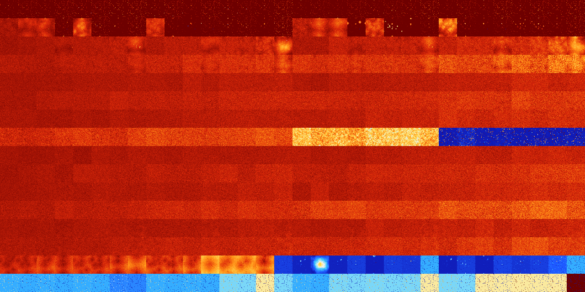

# B012468 (175616-176127)

<details>
    <summary>Initial Grid</summary>
    
</details>


<details>
    <summary>Initial Grid RLE</summary>

```
#C Exported from GoGoL (https://github.com/marrow16/gogol)
#C Wrap mode: Toroidal
#C Boundary mode: Dead
#C Step: 0
x = 100, y = 100, rule = B012468/S
46bo$bo7bo74bo13bo$4bo19bo20bo2bo3bo19bo$73bo25bo$4bo23bo11bo$4bo16bo7b
o10bo19b2o37bo$3bo10bo31b2o30bo7b2o$71bo8bobo4bo$36bo13bo2bo14bo4bo21bo
$3bobo42bo22bo20bo$14bo42bo27bo$2bo39bo28bo$9bo3bo39bo44b2o$83bo$36bo7b
o50bo2bo$5bo23bo2bo3bo27bo22bo$26bo9b2o21bo8bo22bo2bo$9bo9bo23bo20bo$bo
6bobo32bo6b2o23bo13bo6bo$o17bo31bo4bo6bo17bo$46bo19bo25bo$10bo12bo16bo
27b2o$29bo22bo15bo27bo$17bo36bo16bo$100b$2bo22bo25bo22bo19bo3bo$bo14b2o
24bo8bo10bobo19bo5bo$bo26bo13bo4bo27bobo7bo$bo11bo29bo19bo27bo$34bo9bo
42bo$44bobo11bo24bo3bo$17bo3bo3bo22bo8bo13bo$22bo23bo8bo12bo16bo$2bo18b
o2bo9bo9bo$11bo23bo$7bo4b2o32bo4bo34bo8bo$19bo3bo38bo24bo11bo$7bo11bo9b
o22bo3bo$56bo13bo2bo9bo8bo$37bo5bo13bo14bo$bo29b2o3bo16bo$11bo9bobo32bo
28bo7bo5bo$25bo4bo24bo17bo11bo$28bobo4bo13bo15bo6bobo5bo3bo13bo$2bobo
88bo$8bo28bo21bo6b2o10bo12bo$10bo13bo7bo24bo4bo16bo14bo$o2bo27bo15bo3bo
38bo8bo$7bo15bo8bo11b2obo8bo11bo8bo11bo$12bo3bo6bo23bo47bo$20b2o6bo11bo
12bo$48bo36bo$41bo10bo$3bo37bo4bo6bo$17bo4bo23bo15bo5bo3bo$16bo12bo40bo
8bo$13bo15bo44bo19bo$7bo13bo21b3o25bo23bo$3bo45bo14b3o25bo$2bo3bo14bo8b
o67b2o$29bo8bo8bo22bo27bo$14bo51bo26bo5bo$52bo24bo$13bo62bo7bo$46bo3bo
2bo15bo$o11bo2bo$5bo33bo13bo8bobo$9bo13bo13bo4bo6bo22b2o11bo$8bo25bo35b
o$51bo29bo$6bo5b2o11bobo14bo7bo4bo8bo12bo6bo13bo$36bo27bo3b2o29bo$9bo2b
o16bo15bo6bo35bo8bo$18bo2bo54bo19bo$3bo13bo9bobo16bobo16bo15bo$13bo16bo
6bo18bo35bo$21bo35bo27bo$5bo24bo20bo16bobo3bo$23bo48bo2bo10bo8bo$71bo$
15bo37bo$60bo$9bo13bo18bo12bo2bo35bo$6bo65bobo22bo$4bo16bo11bo34bo$4bo
30bo9b2o14bo29bo$11bo20bo9bobo20bo7bo$bo8bo10bo23bo$31bo21bo24bo9bo$o7b
o5bo5bo23bo17bo3bo11bo17bo$14bo9bo41bo7bo$17bo34bo10bo9bo9bo11bo$2b2obo
21bo10bo43bo$25bo34bo38bo$20bo12bo5bo$4bo7bo48bo7bo$53bo30bo8bo$100b$bo
8bo5bo8bo15bo2bo2bobo26bobo$9bo9bo17bo7b2obo3bo5bo21bo13bo!
```
</details>
<details>
    <summary>Thumbnail</summary>

</details>
<table>
<tr>
    <td><a href="./175616%20S%20Heat%20Map%20Activity.png"></a><br>S (175616)<br>R@16,p2</td>    <td><a href="./175617%20S0%20Heat%20Map%20Activity.png"></a><br>S0 (175617)<br>R@12,p2</td>    <td><a href="./175618%20S1%20Heat%20Map%20Activity.png"></a><br>S1 (175618)<br>R@11,p2</td>    <td><a href="./175619%20S01%20Heat%20Map%20Activity.png"></a><br>S01 (175619)<br>R@9,p2</td>    <td><a href="./175620%20S2%20Heat%20Map%20Activity.png"></a><br>S2 (175620)<br>R@8,p2</td>    <td><a href="./175621%20S02%20Heat%20Map%20Activity.png"></a><br>S02 (175621)<br>R@9,p2</td>    <td><a href="./175622%20S12%20Heat%20Map%20Activity.png"></a><br>S12 (175622)<br>R@6,p2</td>    <td><a href="./175623%20S012%20Heat%20Map%20Activity.png"></a><br>S012 (175623)<br>R@7,p2</td>    <td><a href="./175624%20S3%20Heat%20Map%20Activity.png"></a><br>S3 (175624)<br>R@10,p2</td>    <td><a href="./175625%20S03%20Heat%20Map%20Activity.png"></a><br>S03 (175625)<br>R@9,p2</td>    <td><a href="./175626%20S13%20Heat%20Map%20Activity.png"></a><br>S13 (175626)<br>R@14,p2</td>    <td><a href="./175627%20S013%20Heat%20Map%20Activity.png"></a><br>S013 (175627)<br>R@8,p2</td>    <td><a href="./175628%20S23%20Heat%20Map%20Activity.png"></a><br>S23 (175628)<br>R@9,p2</td>    <td><a href="./175629%20S023%20Heat%20Map%20Activity.png"></a><br>S023 (175629)<br>R@13,p2</td>    <td><a href="./175630%20S123%20Heat%20Map%20Activity.png"></a><br>S123 (175630)<br>R@9,p2</td>    <td><a href="./175631%20S0123%20Heat%20Map%20Activity.png"></a><br>S0123 (175631)<br>R@7,p2</td>    <td><a href="./175632%20S4%20Heat%20Map%20Activity.png"></a><br>S4 (175632)<br>R@18,p2</td>    <td><a href="./175633%20S04%20Heat%20Map%20Activity.png"></a><br>S04 (175633)<br>R@15,p2</td>    <td><a href="./175634%20S14%20Heat%20Map%20Activity.png"></a><br>S14 (175634)<br>R@18,p2</td>    <td><a href="./175635%20S014%20Heat%20Map%20Activity.png"></a><br>S014 (175635)<br>R@11,p2</td>    <td><a href="./175636%20S24%20Heat%20Map%20Activity.png"></a><br>S24 (175636)<br>R@12,p2</td>    <td><a href="./175637%20S024%20Heat%20Map%20Activity.png"></a><br>S024 (175637)<br>R@14,p4</td>    <td><a href="./175638%20S124%20Heat%20Map%20Activity.png"></a><br>S124 (175638)<br>R@8,p2</td>    <td><a href="./175639%20S0124%20Heat%20Map%20Activity.png"></a><br>S0124 (175639)<br>R@7,p2</td>    <td><a href="./175640%20S34%20Heat%20Map%20Activity.png"></a><br>S34 (175640)<br>R@16,p2</td>    <td><a href="./175641%20S034%20Heat%20Map%20Activity.png"></a><br>S034 (175641)<br>R@11,p2</td>    <td><a href="./175642%20S134%20Heat%20Map%20Activity.png"></a><br>S134 (175642)<br>R@12,p4</td>    <td><a href="./175643%20S0134%20Heat%20Map%20Activity.png"></a><br>S0134 (175643)<br>R@7,p2</td>    <td><a href="./175644%20S234%20Heat%20Map%20Activity.png"></a><br>S234 (175644)<br>R@12,p2</td>    <td><a href="./175645%20S0234%20Heat%20Map%20Activity.png"></a><br>S0234 (175645)<br>R@9,p2</td>    <td><a href="./175646%20S1234%20Heat%20Map%20Activity.png"></a><br>S1234 (175646)<br>R@8,p2</td>    <td><a href="./175647%20S01234%20Heat%20Map%20Activity.png"></a><br>S01234 (175647)<br>R@7,p2</td></tr>
<tr>
    <td><a href="./175648%20S5%20Heat%20Map%20Activity.png"></a><br>S5 (175648)<br>G>1000</td>    <td><a href="./175649%20S05%20Heat%20Map%20Activity.png"></a><br>S05 (175649)<br>G>1000</td>    <td><a href="./175650%20S15%20Heat%20Map%20Activity.png"></a><br>S15 (175650)<br>G>1000</td>    <td><a href="./175651%20S015%20Heat%20Map%20Activity.png"></a><br>S015 (175651)<br>R@17,p4</td>    <td><a href="./175652%20S25%20Heat%20Map%20Activity.png"></a><br>S25 (175652)<br>G>1000</td>    <td><a href="./175653%20S025%20Heat%20Map%20Activity.png"></a><br>S025 (175653)<br>R@11,p2</td>    <td><a href="./175654%20S125%20Heat%20Map%20Activity.png"></a><br>S125 (175654)<br>R@35,p2</td>    <td><a href="./175655%20S0125%20Heat%20Map%20Activity.png"></a><br>S0125 (175655)<br>R@10,p2</td>    <td><a href="./175656%20S35%20Heat%20Map%20Activity.png"></a><br>S35 (175656)<br>G>1000</td>    <td><a href="./175657%20S035%20Heat%20Map%20Activity.png"></a><br>S035 (175657)<br>R@49,p4</td>    <td><a href="./175658%20S135%20Heat%20Map%20Activity.png"></a><br>S135 (175658)<br>R@64,p4</td>    <td><a href="./175659%20S0135%20Heat%20Map%20Activity.png"></a><br>S0135 (175659)<br>R@19,p4</td>    <td><a href="./175660%20S235%20Heat%20Map%20Activity.png"></a><br>S235 (175660)<br>R@16,p4</td>    <td><a href="./175661%20S0235%20Heat%20Map%20Activity.png"></a><br>S0235 (175661)<br>R@13,p2</td>    <td><a href="./175662%20S1235%20Heat%20Map%20Activity.png"></a><br>S1235 (175662)<br>R@25,p2</td>    <td><a href="./175663%20S01235%20Heat%20Map%20Activity.png"></a><br>S01235 (175663)<br>R@7,p2</td>    <td><a href="./175664%20S45%20Heat%20Map%20Activity.png"></a><br>S45 (175664)<br>G>1000</td>    <td><a href="./175665%20S045%20Heat%20Map%20Activity.png"></a><br>S045 (175665)<br>G>1000</td>    <td><a href="./175666%20S145%20Heat%20Map%20Activity.png"></a><br>S145 (175666)<br>G>1000</td>    <td><a href="./175667%20S0145%20Heat%20Map%20Activity.png"></a><br>S0145 (175667)<br>R@51,p2</td>    <td><a href="./175668%20S245%20Heat%20Map%20Activity.png"></a><br>S245 (175668)<br>G>1000</td>    <td><a href="./175669%20S0245%20Heat%20Map%20Activity.png"></a><br>S0245 (175669)<br>R@53,p4</td>    <td><a href="./175670%20S1245%20Heat%20Map%20Activity.png"></a><br>S1245 (175670)<br>R@75,p2</td>    <td><a href="./175671%20S01245%20Heat%20Map%20Activity.png"></a><br>S01245 (175671)<br>R@17,p2</td>    <td><a href="./175672%20S345%20Heat%20Map%20Activity.png"></a><br>S345 (175672)<br>G>1000</td>    <td><a href="./175673%20S0345%20Heat%20Map%20Activity.png"></a><br>S0345 (175673)<br>R@39,p4</td>    <td><a href="./175674%20S1345%20Heat%20Map%20Activity.png"></a><br>S1345 (175674)<br>R@48,p2</td>    <td><a href="./175675%20S01345%20Heat%20Map%20Activity.png"></a><br>S01345 (175675)<br>R@19,p2</td>    <td><a href="./175676%20S2345%20Heat%20Map%20Activity.png"></a><br>S2345 (175676)<br>R@20,p2</td>    <td><a href="./175677%20S02345%20Heat%20Map%20Activity.png"></a><br>S02345 (175677)<br>R@19,p2</td>    <td><a href="./175678%20S12345%20Heat%20Map%20Activity.png"></a><br>S12345 (175678)<br>R@13,p2</td>    <td><a href="./175679%20S012345%20Heat%20Map%20Activity.png"></a><br>S012345 (175679)<br>R@9,p2</td></tr>
<tr>
    <td><a href="./175680%20S6%20Heat%20Map%20Activity.png"></a><br>S6 (175680)<br>G>1000</td>    <td><a href="./175681%20S06%20Heat%20Map%20Activity.png"></a><br>S06 (175681)<br>G>1000</td>    <td><a href="./175682%20S16%20Heat%20Map%20Activity.png"></a><br>S16 (175682)<br>G>1000</td>    <td><a href="./175683%20S016%20Heat%20Map%20Activity.png"></a><br>S016 (175683)<br>G>1000</td>    <td><a href="./175684%20S26%20Heat%20Map%20Activity.png"></a><br>S26 (175684)<br>G>1000</td>    <td><a href="./175685%20S026%20Heat%20Map%20Activity.png"></a><br>S026 (175685)<br>G>1000</td>    <td><a href="./175686%20S126%20Heat%20Map%20Activity.png"></a><br>S126 (175686)<br>G>1000</td>    <td><a href="./175687%20S0126%20Heat%20Map%20Activity.png"></a><br>S0126 (175687)<br>G>1000</td>    <td><a href="./175688%20S36%20Heat%20Map%20Activity.png"></a><br>S36 (175688)<br>G>1000</td>    <td><a href="./175689%20S036%20Heat%20Map%20Activity.png"></a><br>S036 (175689)<br>G>1000</td>    <td><a href="./175690%20S136%20Heat%20Map%20Activity.png"></a><br>S136 (175690)<br>G>1000</td>    <td><a href="./175691%20S0136%20Heat%20Map%20Activity.png"></a><br>S0136 (175691)<br>G>1000</td>    <td><a href="./175692%20S236%20Heat%20Map%20Activity.png"></a><br>S236 (175692)<br>G>1000</td>    <td><a href="./175693%20S0236%20Heat%20Map%20Activity.png"></a><br>S0236 (175693)<br>G>1000</td>    <td><a href="./175694%20S1236%20Heat%20Map%20Activity.png"></a><br>S1236 (175694)<br>G>1000</td>    <td><a href="./175695%20S01236%20Heat%20Map%20Activity.png"></a><br>S01236 (175695)<br>G>1000</td>    <td><a href="./175696%20S46%20Heat%20Map%20Activity.png"></a><br>S46 (175696)<br>G>1000</td>    <td><a href="./175697%20S046%20Heat%20Map%20Activity.png"></a><br>S046 (175697)<br>G>1000</td>    <td><a href="./175698%20S146%20Heat%20Map%20Activity.png"></a><br>S146 (175698)<br>G>1000</td>    <td><a href="./175699%20S0146%20Heat%20Map%20Activity.png"></a><br>S0146 (175699)<br>G>1000</td>    <td><a href="./175700%20S246%20Heat%20Map%20Activity.png"></a><br>S246 (175700)<br>G>1000</td>    <td><a href="./175701%20S0246%20Heat%20Map%20Activity.png"></a><br>S0246 (175701)<br>G>1000</td>    <td><a href="./175702%20S1246%20Heat%20Map%20Activity.png"></a><br>S1246 (175702)<br>G>1000</td>    <td><a href="./175703%20S01246%20Heat%20Map%20Activity.png"></a><br>S01246 (175703)<br>G>1000</td>    <td><a href="./175704%20S346%20Heat%20Map%20Activity.png"></a><br>S346 (175704)<br>G>1000</td>    <td><a href="./175705%20S0346%20Heat%20Map%20Activity.png"></a><br>S0346 (175705)<br>G>1000</td>    <td><a href="./175706%20S1346%20Heat%20Map%20Activity.png"></a><br>S1346 (175706)<br>G>1000</td>    <td><a href="./175707%20S01346%20Heat%20Map%20Activity.png"></a><br>S01346 (175707)<br>G>1000</td>    <td><a href="./175708%20S2346%20Heat%20Map%20Activity.png"></a><br>S2346 (175708)<br>G>1000</td>    <td><a href="./175709%20S02346%20Heat%20Map%20Activity.png"></a><br>S02346 (175709)<br>G>1000</td>    <td><a href="./175710%20S12346%20Heat%20Map%20Activity.png"></a><br>S12346 (175710)<br>G>1000</td>    <td><a href="./175711%20S012346%20Heat%20Map%20Activity.png"></a><br>S012346 (175711)<br>G>1000</td></tr>
<tr>
    <td><a href="./175712%20S56%20Heat%20Map%20Activity.png"></a><br>S56 (175712)<br>G>1000</td>    <td><a href="./175713%20S056%20Heat%20Map%20Activity.png"></a><br>S056 (175713)<br>G>1000</td>    <td><a href="./175714%20S156%20Heat%20Map%20Activity.png"></a><br>S156 (175714)<br>G>1000</td>    <td><a href="./175715%20S0156%20Heat%20Map%20Activity.png"></a><br>S0156 (175715)<br>G>1000</td>    <td><a href="./175716%20S256%20Heat%20Map%20Activity.png"></a><br>S256 (175716)<br>G>1000</td>    <td><a href="./175717%20S0256%20Heat%20Map%20Activity.png"></a><br>S0256 (175717)<br>G>1000</td>    <td><a href="./175718%20S1256%20Heat%20Map%20Activity.png"></a><br>S1256 (175718)<br>G>1000</td>    <td><a href="./175719%20S01256%20Heat%20Map%20Activity.png"></a><br>S01256 (175719)<br>G>1000</td>    <td><a href="./175720%20S356%20Heat%20Map%20Activity.png"></a><br>S356 (175720)<br>G>1000</td>    <td><a href="./175721%20S0356%20Heat%20Map%20Activity.png"></a><br>S0356 (175721)<br>G>1000</td>    <td><a href="./175722%20S1356%20Heat%20Map%20Activity.png"></a><br>S1356 (175722)<br>G>1000</td>    <td><a href="./175723%20S01356%20Heat%20Map%20Activity.png"></a><br>S01356 (175723)<br>G>1000</td>    <td><a href="./175724%20S2356%20Heat%20Map%20Activity.png"></a><br>S2356 (175724)<br>G>1000</td>    <td><a href="./175725%20S02356%20Heat%20Map%20Activity.png"></a><br>S02356 (175725)<br>G>1000</td>    <td><a href="./175726%20S12356%20Heat%20Map%20Activity.png"></a><br>S12356 (175726)<br>G>1000</td>    <td><a href="./175727%20S012356%20Heat%20Map%20Activity.png"></a><br>S012356 (175727)<br>G>1000</td>    <td><a href="./175728%20S456%20Heat%20Map%20Activity.png"></a><br>S456 (175728)<br>G>1000</td>    <td><a href="./175729%20S0456%20Heat%20Map%20Activity.png"></a><br>S0456 (175729)<br>G>1000</td>    <td><a href="./175730%20S1456%20Heat%20Map%20Activity.png"></a><br>S1456 (175730)<br>G>1000</td>    <td><a href="./175731%20S01456%20Heat%20Map%20Activity.png"></a><br>S01456 (175731)<br>G>1000</td>    <td><a href="./175732%20S2456%20Heat%20Map%20Activity.png"></a><br>S2456 (175732)<br>G>1000</td>    <td><a href="./175733%20S02456%20Heat%20Map%20Activity.png"></a><br>S02456 (175733)<br>G>1000</td>    <td><a href="./175734%20S12456%20Heat%20Map%20Activity.png"></a><br>S12456 (175734)<br>G>1000</td>    <td><a href="./175735%20S012456%20Heat%20Map%20Activity.png"></a><br>S012456 (175735)<br>G>1000</td>    <td><a href="./175736%20S3456%20Heat%20Map%20Activity.png"></a><br>S3456 (175736)<br>G>1000</td>    <td><a href="./175737%20S03456%20Heat%20Map%20Activity.png"></a><br>S03456 (175737)<br>G>1000</td>    <td><a href="./175738%20S13456%20Heat%20Map%20Activity.png"></a><br>S13456 (175738)<br>G>1000</td>    <td><a href="./175739%20S013456%20Heat%20Map%20Activity.png"></a><br>S013456 (175739)<br>G>1000</td>    <td><a href="./175740%20S23456%20Heat%20Map%20Activity.png"></a><br>S23456 (175740)<br>G>1000</td>    <td><a href="./175741%20S023456%20Heat%20Map%20Activity.png"></a><br>S023456 (175741)<br>G>1000</td>    <td><a href="./175742%20S123456%20Heat%20Map%20Activity.png"></a><br>S123456 (175742)<br>G>1000</td>    <td><a href="./175743%20S0123456%20Heat%20Map%20Activity.png"></a><br>S0123456 (175743)<br>G>1000</td></tr>
<tr>
    <td><a href="./175744%20S7%20Heat%20Map%20Activity.png"></a><br>S7 (175744)<br>G>1000</td>    <td><a href="./175745%20S07%20Heat%20Map%20Activity.png"></a><br>S07 (175745)<br>G>1000</td>    <td><a href="./175746%20S17%20Heat%20Map%20Activity.png"></a><br>S17 (175746)<br>G>1000</td>    <td><a href="./175747%20S017%20Heat%20Map%20Activity.png"></a><br>S017 (175747)<br>G>1000</td>    <td><a href="./175748%20S27%20Heat%20Map%20Activity.png"></a><br>S27 (175748)<br>G>1000</td>    <td><a href="./175749%20S027%20Heat%20Map%20Activity.png"></a><br>S027 (175749)<br>G>1000</td>    <td><a href="./175750%20S127%20Heat%20Map%20Activity.png"></a><br>S127 (175750)<br>G>1000</td>    <td><a href="./175751%20S0127%20Heat%20Map%20Activity.png"></a><br>S0127 (175751)<br>G>1000</td>    <td><a href="./175752%20S37%20Heat%20Map%20Activity.png"></a><br>S37 (175752)<br>G>1000</td>    <td><a href="./175753%20S037%20Heat%20Map%20Activity.png"></a><br>S037 (175753)<br>G>1000</td>    <td><a href="./175754%20S137%20Heat%20Map%20Activity.png"></a><br>S137 (175754)<br>G>1000</td>    <td><a href="./175755%20S0137%20Heat%20Map%20Activity.png"></a><br>S0137 (175755)<br>G>1000</td>    <td><a href="./175756%20S237%20Heat%20Map%20Activity.png"></a><br>S237 (175756)<br>G>1000</td>    <td><a href="./175757%20S0237%20Heat%20Map%20Activity.png"></a><br>S0237 (175757)<br>G>1000</td>    <td><a href="./175758%20S1237%20Heat%20Map%20Activity.png"></a><br>S1237 (175758)<br>G>1000</td>    <td><a href="./175759%20S01237%20Heat%20Map%20Activity.png"></a><br>S01237 (175759)<br>G>1000</td>    <td><a href="./175760%20S47%20Heat%20Map%20Activity.png"></a><br>S47 (175760)<br>G>1000</td>    <td><a href="./175761%20S047%20Heat%20Map%20Activity.png"></a><br>S047 (175761)<br>G>1000</td>    <td><a href="./175762%20S147%20Heat%20Map%20Activity.png"></a><br>S147 (175762)<br>G>1000</td>    <td><a href="./175763%20S0147%20Heat%20Map%20Activity.png"></a><br>S0147 (175763)<br>G>1000</td>    <td><a href="./175764%20S247%20Heat%20Map%20Activity.png"></a><br>S247 (175764)<br>G>1000</td>    <td><a href="./175765%20S0247%20Heat%20Map%20Activity.png"></a><br>S0247 (175765)<br>G>1000</td>    <td><a href="./175766%20S1247%20Heat%20Map%20Activity.png"></a><br>S1247 (175766)<br>G>1000</td>    <td><a href="./175767%20S01247%20Heat%20Map%20Activity.png"></a><br>S01247 (175767)<br>G>1000</td>    <td><a href="./175768%20S347%20Heat%20Map%20Activity.png"></a><br>S347 (175768)<br>G>1000</td>    <td><a href="./175769%20S0347%20Heat%20Map%20Activity.png"></a><br>S0347 (175769)<br>G>1000</td>    <td><a href="./175770%20S1347%20Heat%20Map%20Activity.png"></a><br>S1347 (175770)<br>G>1000</td>    <td><a href="./175771%20S01347%20Heat%20Map%20Activity.png"></a><br>S01347 (175771)<br>G>1000</td>    <td><a href="./175772%20S2347%20Heat%20Map%20Activity.png"></a><br>S2347 (175772)<br>G>1000</td>    <td><a href="./175773%20S02347%20Heat%20Map%20Activity.png"></a><br>S02347 (175773)<br>G>1000</td>    <td><a href="./175774%20S12347%20Heat%20Map%20Activity.png"></a><br>S12347 (175774)<br>G>1000</td>    <td><a href="./175775%20S012347%20Heat%20Map%20Activity.png"></a><br>S012347 (175775)<br>G>1000</td></tr>
<tr>
    <td><a href="./175776%20S57%20Heat%20Map%20Activity.png"></a><br>S57 (175776)<br>G>1000</td>    <td><a href="./175777%20S057%20Heat%20Map%20Activity.png"></a><br>S057 (175777)<br>G>1000</td>    <td><a href="./175778%20S157%20Heat%20Map%20Activity.png"></a><br>S157 (175778)<br>G>1000</td>    <td><a href="./175779%20S0157%20Heat%20Map%20Activity.png"></a><br>S0157 (175779)<br>G>1000</td>    <td><a href="./175780%20S257%20Heat%20Map%20Activity.png"></a><br>S257 (175780)<br>G>1000</td>    <td><a href="./175781%20S0257%20Heat%20Map%20Activity.png"></a><br>S0257 (175781)<br>G>1000</td>    <td><a href="./175782%20S1257%20Heat%20Map%20Activity.png"></a><br>S1257 (175782)<br>G>1000</td>    <td><a href="./175783%20S01257%20Heat%20Map%20Activity.png"></a><br>S01257 (175783)<br>G>1000</td>    <td><a href="./175784%20S357%20Heat%20Map%20Activity.png"></a><br>S357 (175784)<br>G>1000</td>    <td><a href="./175785%20S0357%20Heat%20Map%20Activity.png"></a><br>S0357 (175785)<br>G>1000</td>    <td><a href="./175786%20S1357%20Heat%20Map%20Activity.png"></a><br>S1357 (175786)<br>G>1000</td>    <td><a href="./175787%20S01357%20Heat%20Map%20Activity.png"></a><br>S01357 (175787)<br>G>1000</td>    <td><a href="./175788%20S2357%20Heat%20Map%20Activity.png"></a><br>S2357 (175788)<br>G>1000</td>    <td><a href="./175789%20S02357%20Heat%20Map%20Activity.png"></a><br>S02357 (175789)<br>G>1000</td>    <td><a href="./175790%20S12357%20Heat%20Map%20Activity.png"></a><br>S12357 (175790)<br>G>1000</td>    <td><a href="./175791%20S012357%20Heat%20Map%20Activity.png"></a><br>S012357 (175791)<br>G>1000</td>    <td><a href="./175792%20S457%20Heat%20Map%20Activity.png"></a><br>S457 (175792)<br>G>1000</td>    <td><a href="./175793%20S0457%20Heat%20Map%20Activity.png"></a><br>S0457 (175793)<br>G>1000</td>    <td><a href="./175794%20S1457%20Heat%20Map%20Activity.png"></a><br>S1457 (175794)<br>G>1000</td>    <td><a href="./175795%20S01457%20Heat%20Map%20Activity.png"></a><br>S01457 (175795)<br>G>1000</td>    <td><a href="./175796%20S2457%20Heat%20Map%20Activity.png"></a><br>S2457 (175796)<br>G>1000</td>    <td><a href="./175797%20S02457%20Heat%20Map%20Activity.png"></a><br>S02457 (175797)<br>G>1000</td>    <td><a href="./175798%20S12457%20Heat%20Map%20Activity.png"></a><br>S12457 (175798)<br>G>1000</td>    <td><a href="./175799%20S012457%20Heat%20Map%20Activity.png"></a><br>S012457 (175799)<br>G>1000</td>    <td><a href="./175800%20S3457%20Heat%20Map%20Activity.png"></a><br>S3457 (175800)<br>G>1000</td>    <td><a href="./175801%20S03457%20Heat%20Map%20Activity.png"></a><br>S03457 (175801)<br>G>1000</td>    <td><a href="./175802%20S13457%20Heat%20Map%20Activity.png"></a><br>S13457 (175802)<br>G>1000</td>    <td><a href="./175803%20S013457%20Heat%20Map%20Activity.png"></a><br>S013457 (175803)<br>G>1000</td>    <td><a href="./175804%20S23457%20Heat%20Map%20Activity.png"></a><br>S23457 (175804)<br>G>1000</td>    <td><a href="./175805%20S023457%20Heat%20Map%20Activity.png"></a><br>S023457 (175805)<br>G>1000</td>    <td><a href="./175806%20S123457%20Heat%20Map%20Activity.png"></a><br>S123457 (175806)<br>G>1000</td>    <td><a href="./175807%20S0123457%20Heat%20Map%20Activity.png"></a><br>S0123457 (175807)<br>G>1000</td></tr>
<tr>
    <td><a href="./175808%20S67%20Heat%20Map%20Activity.png"></a><br>S67 (175808)<br>G>1000</td>    <td><a href="./175809%20S067%20Heat%20Map%20Activity.png"></a><br>S067 (175809)<br>G>1000</td>    <td><a href="./175810%20S167%20Heat%20Map%20Activity.png"></a><br>S167 (175810)<br>G>1000</td>    <td><a href="./175811%20S0167%20Heat%20Map%20Activity.png"></a><br>S0167 (175811)<br>G>1000</td>    <td><a href="./175812%20S267%20Heat%20Map%20Activity.png"></a><br>S267 (175812)<br>G>1000</td>    <td><a href="./175813%20S0267%20Heat%20Map%20Activity.png"></a><br>S0267 (175813)<br>G>1000</td>    <td><a href="./175814%20S1267%20Heat%20Map%20Activity.png"></a><br>S1267 (175814)<br>G>1000</td>    <td><a href="./175815%20S01267%20Heat%20Map%20Activity.png"></a><br>S01267 (175815)<br>G>1000</td>    <td><a href="./175816%20S367%20Heat%20Map%20Activity.png"></a><br>S367 (175816)<br>G>1000</td>    <td><a href="./175817%20S0367%20Heat%20Map%20Activity.png"></a><br>S0367 (175817)<br>G>1000</td>    <td><a href="./175818%20S1367%20Heat%20Map%20Activity.png"></a><br>S1367 (175818)<br>G>1000</td>    <td><a href="./175819%20S01367%20Heat%20Map%20Activity.png"></a><br>S01367 (175819)<br>G>1000</td>    <td><a href="./175820%20S2367%20Heat%20Map%20Activity.png"></a><br>S2367 (175820)<br>G>1000</td>    <td><a href="./175821%20S02367%20Heat%20Map%20Activity.png"></a><br>S02367 (175821)<br>G>1000</td>    <td><a href="./175822%20S12367%20Heat%20Map%20Activity.png"></a><br>S12367 (175822)<br>G>1000</td>    <td><a href="./175823%20S012367%20Heat%20Map%20Activity.png"></a><br>S012367 (175823)<br>G>1000</td>    <td><a href="./175824%20S467%20Heat%20Map%20Activity.png"></a><br>S467 (175824)<br>G>1000</td>    <td><a href="./175825%20S0467%20Heat%20Map%20Activity.png"></a><br>S0467 (175825)<br>G>1000</td>    <td><a href="./175826%20S1467%20Heat%20Map%20Activity.png"></a><br>S1467 (175826)<br>G>1000</td>    <td><a href="./175827%20S01467%20Heat%20Map%20Activity.png"></a><br>S01467 (175827)<br>G>1000</td>    <td><a href="./175828%20S2467%20Heat%20Map%20Activity.png"></a><br>S2467 (175828)<br>G>1000</td>    <td><a href="./175829%20S02467%20Heat%20Map%20Activity.png"></a><br>S02467 (175829)<br>G>1000</td>    <td><a href="./175830%20S12467%20Heat%20Map%20Activity.png"></a><br>S12467 (175830)<br>G>1000</td>    <td><a href="./175831%20S012467%20Heat%20Map%20Activity.png"></a><br>S012467 (175831)<br>G>1000</td>    <td><a href="./175832%20S3467%20Heat%20Map%20Activity.png"></a><br>S3467 (175832)<br>G>1000</td>    <td><a href="./175833%20S03467%20Heat%20Map%20Activity.png"></a><br>S03467 (175833)<br>G>1000</td>    <td><a href="./175834%20S13467%20Heat%20Map%20Activity.png"></a><br>S13467 (175834)<br>G>1000</td>    <td><a href="./175835%20S013467%20Heat%20Map%20Activity.png"></a><br>S013467 (175835)<br>G>1000</td>    <td><a href="./175836%20S23467%20Heat%20Map%20Activity.png"></a><br>S23467 (175836)<br>G>1000</td>    <td><a href="./175837%20S023467%20Heat%20Map%20Activity.png"></a><br>S023467 (175837)<br>G>1000</td>    <td><a href="./175838%20S123467%20Heat%20Map%20Activity.png"></a><br>S123467 (175838)<br>G>1000</td>    <td><a href="./175839%20S0123467%20Heat%20Map%20Activity.png"></a><br>S0123467 (175839)<br>G>1000</td></tr>
<tr>
    <td><a href="./175840%20S567%20Heat%20Map%20Activity.png"></a><br>S567 (175840)<br>G>1000</td>    <td><a href="./175841%20S0567%20Heat%20Map%20Activity.png"></a><br>S0567 (175841)<br>G>1000</td>    <td><a href="./175842%20S1567%20Heat%20Map%20Activity.png"></a><br>S1567 (175842)<br>G>1000</td>    <td><a href="./175843%20S01567%20Heat%20Map%20Activity.png"></a><br>S01567 (175843)<br>G>1000</td>    <td><a href="./175844%20S2567%20Heat%20Map%20Activity.png"></a><br>S2567 (175844)<br>G>1000</td>    <td><a href="./175845%20S02567%20Heat%20Map%20Activity.png"></a><br>S02567 (175845)<br>G>1000</td>    <td><a href="./175846%20S12567%20Heat%20Map%20Activity.png"></a><br>S12567 (175846)<br>G>1000</td>    <td><a href="./175847%20S012567%20Heat%20Map%20Activity.png"></a><br>S012567 (175847)<br>G>1000</td>    <td><a href="./175848%20S3567%20Heat%20Map%20Activity.png"></a><br>S3567 (175848)<br>G>1000</td>    <td><a href="./175849%20S03567%20Heat%20Map%20Activity.png"></a><br>S03567 (175849)<br>G>1000</td>    <td><a href="./175850%20S13567%20Heat%20Map%20Activity.png"></a><br>S13567 (175850)<br>G>1000</td>    <td><a href="./175851%20S013567%20Heat%20Map%20Activity.png"></a><br>S013567 (175851)<br>G>1000</td>    <td><a href="./175852%20S23567%20Heat%20Map%20Activity.png"></a><br>S23567 (175852)<br>G>1000</td>    <td><a href="./175853%20S023567%20Heat%20Map%20Activity.png"></a><br>S023567 (175853)<br>G>1000</td>    <td><a href="./175854%20S123567%20Heat%20Map%20Activity.png"></a><br>S123567 (175854)<br>G>1000</td>    <td><a href="./175855%20S0123567%20Heat%20Map%20Activity.png"></a><br>S0123567 (175855)<br>G>1000</td>    <td><a href="./175856%20S4567%20Heat%20Map%20Activity.png"></a><br>S4567 (175856)<br>G>1000</td>    <td><a href="./175857%20S04567%20Heat%20Map%20Activity.png"></a><br>S04567 (175857)<br>G>1000</td>    <td><a href="./175858%20S14567%20Heat%20Map%20Activity.png"></a><br>S14567 (175858)<br>G>1000</td>    <td><a href="./175859%20S014567%20Heat%20Map%20Activity.png"></a><br>S014567 (175859)<br>G>1000</td>    <td><a href="./175860%20S24567%20Heat%20Map%20Activity.png"></a><br>S24567 (175860)<br>G>1000</td>    <td><a href="./175861%20S024567%20Heat%20Map%20Activity.png"></a><br>S024567 (175861)<br>G>1000</td>    <td><a href="./175862%20S124567%20Heat%20Map%20Activity.png"></a><br>S124567 (175862)<br>G>1000</td>    <td><a href="./175863%20S0124567%20Heat%20Map%20Activity.png"></a><br>S0124567 (175863)<br>G>1000</td>    <td><a href="./175864%20S34567%20Heat%20Map%20Activity.png"></a><br>S34567 (175864)<br>G>1000</td>    <td><a href="./175865%20S034567%20Heat%20Map%20Activity.png"></a><br>S034567 (175865)<br>R@244,p168</td>    <td><a href="./175866%20S134567%20Heat%20Map%20Activity.png"></a><br>S134567 (175866)<br>R@884,p840</td>    <td><a href="./175867%20S0134567%20Heat%20Map%20Activity.png"></a><br>S0134567 (175867)<br>G>1000</td>    <td><a href="./175868%20S234567%20Heat%20Map%20Activity.png"></a><br>S234567 (175868)<br>R@893,p840</td>    <td><a href="./175869%20S0234567%20Heat%20Map%20Activity.png"></a><br>S0234567 (175869)<br>G>1000</td>    <td><a href="./175870%20S1234567%20Heat%20Map%20Activity.png"></a><br>S1234567 (175870)<br>R@891,p840</td>    <td><a href="./175871%20S01234567%20Heat%20Map%20Activity.png"></a><br>S01234567 (175871)<br>G>1000</td></tr>
<tr>
    <td><a href="./175872%20S8%20Heat%20Map%20Activity.png"></a><br>S8 (175872)<br>G>1000</td>    <td><a href="./175873%20S08%20Heat%20Map%20Activity.png"></a><br>S08 (175873)<br>G>1000</td>    <td><a href="./175874%20S18%20Heat%20Map%20Activity.png"></a><br>S18 (175874)<br>G>1000</td>    <td><a href="./175875%20S018%20Heat%20Map%20Activity.png"></a><br>S018 (175875)<br>G>1000</td>    <td><a href="./175876%20S28%20Heat%20Map%20Activity.png"></a><br>S28 (175876)<br>G>1000</td>    <td><a href="./175877%20S028%20Heat%20Map%20Activity.png"></a><br>S028 (175877)<br>G>1000</td>    <td><a href="./175878%20S128%20Heat%20Map%20Activity.png"></a><br>S128 (175878)<br>G>1000</td>    <td><a href="./175879%20S0128%20Heat%20Map%20Activity.png"></a><br>S0128 (175879)<br>G>1000</td>    <td><a href="./175880%20S38%20Heat%20Map%20Activity.png"></a><br>S38 (175880)<br>G>1000</td>    <td><a href="./175881%20S038%20Heat%20Map%20Activity.png"></a><br>S038 (175881)<br>G>1000</td>    <td><a href="./175882%20S138%20Heat%20Map%20Activity.png"></a><br>S138 (175882)<br>G>1000</td>    <td><a href="./175883%20S0138%20Heat%20Map%20Activity.png"></a><br>S0138 (175883)<br>G>1000</td>    <td><a href="./175884%20S238%20Heat%20Map%20Activity.png"></a><br>S238 (175884)<br>G>1000</td>    <td><a href="./175885%20S0238%20Heat%20Map%20Activity.png"></a><br>S0238 (175885)<br>G>1000</td>    <td><a href="./175886%20S1238%20Heat%20Map%20Activity.png"></a><br>S1238 (175886)<br>G>1000</td>    <td><a href="./175887%20S01238%20Heat%20Map%20Activity.png"></a><br>S01238 (175887)<br>G>1000</td>    <td><a href="./175888%20S48%20Heat%20Map%20Activity.png"></a><br>S48 (175888)<br>G>1000</td>    <td><a href="./175889%20S048%20Heat%20Map%20Activity.png"></a><br>S048 (175889)<br>G>1000</td>    <td><a href="./175890%20S148%20Heat%20Map%20Activity.png"></a><br>S148 (175890)<br>G>1000</td>    <td><a href="./175891%20S0148%20Heat%20Map%20Activity.png"></a><br>S0148 (175891)<br>G>1000</td>    <td><a href="./175892%20S248%20Heat%20Map%20Activity.png"></a><br>S248 (175892)<br>G>1000</td>    <td><a href="./175893%20S0248%20Heat%20Map%20Activity.png"></a><br>S0248 (175893)<br>G>1000</td>    <td><a href="./175894%20S1248%20Heat%20Map%20Activity.png"></a><br>S1248 (175894)<br>G>1000</td>    <td><a href="./175895%20S01248%20Heat%20Map%20Activity.png"></a><br>S01248 (175895)<br>G>1000</td>    <td><a href="./175896%20S348%20Heat%20Map%20Activity.png"></a><br>S348 (175896)<br>G>1000</td>    <td><a href="./175897%20S0348%20Heat%20Map%20Activity.png"></a><br>S0348 (175897)<br>G>1000</td>    <td><a href="./175898%20S1348%20Heat%20Map%20Activity.png"></a><br>S1348 (175898)<br>G>1000</td>    <td><a href="./175899%20S01348%20Heat%20Map%20Activity.png"></a><br>S01348 (175899)<br>G>1000</td>    <td><a href="./175900%20S2348%20Heat%20Map%20Activity.png"></a><br>S2348 (175900)<br>G>1000</td>    <td><a href="./175901%20S02348%20Heat%20Map%20Activity.png"></a><br>S02348 (175901)<br>G>1000</td>    <td><a href="./175902%20S12348%20Heat%20Map%20Activity.png"></a><br>S12348 (175902)<br>G>1000</td>    <td><a href="./175903%20S012348%20Heat%20Map%20Activity.png"></a><br>S012348 (175903)<br>G>1000</td></tr>
<tr>
    <td><a href="./175904%20S58%20Heat%20Map%20Activity.png"></a><br>S58 (175904)<br>G>1000</td>    <td><a href="./175905%20S058%20Heat%20Map%20Activity.png"></a><br>S058 (175905)<br>G>1000</td>    <td><a href="./175906%20S158%20Heat%20Map%20Activity.png"></a><br>S158 (175906)<br>G>1000</td>    <td><a href="./175907%20S0158%20Heat%20Map%20Activity.png"></a><br>S0158 (175907)<br>G>1000</td>    <td><a href="./175908%20S258%20Heat%20Map%20Activity.png"></a><br>S258 (175908)<br>G>1000</td>    <td><a href="./175909%20S0258%20Heat%20Map%20Activity.png"></a><br>S0258 (175909)<br>G>1000</td>    <td><a href="./175910%20S1258%20Heat%20Map%20Activity.png"></a><br>S1258 (175910)<br>G>1000</td>    <td><a href="./175911%20S01258%20Heat%20Map%20Activity.png"></a><br>S01258 (175911)<br>G>1000</td>    <td><a href="./175912%20S358%20Heat%20Map%20Activity.png"></a><br>S358 (175912)<br>G>1000</td>    <td><a href="./175913%20S0358%20Heat%20Map%20Activity.png"></a><br>S0358 (175913)<br>G>1000</td>    <td><a href="./175914%20S1358%20Heat%20Map%20Activity.png"></a><br>S1358 (175914)<br>G>1000</td>    <td><a href="./175915%20S01358%20Heat%20Map%20Activity.png"></a><br>S01358 (175915)<br>G>1000</td>    <td><a href="./175916%20S2358%20Heat%20Map%20Activity.png"></a><br>S2358 (175916)<br>G>1000</td>    <td><a href="./175917%20S02358%20Heat%20Map%20Activity.png"></a><br>S02358 (175917)<br>G>1000</td>    <td><a href="./175918%20S12358%20Heat%20Map%20Activity.png"></a><br>S12358 (175918)<br>G>1000</td>    <td><a href="./175919%20S012358%20Heat%20Map%20Activity.png"></a><br>S012358 (175919)<br>G>1000</td>    <td><a href="./175920%20S458%20Heat%20Map%20Activity.png"></a><br>S458 (175920)<br>G>1000</td>    <td><a href="./175921%20S0458%20Heat%20Map%20Activity.png"></a><br>S0458 (175921)<br>G>1000</td>    <td><a href="./175922%20S1458%20Heat%20Map%20Activity.png"></a><br>S1458 (175922)<br>G>1000</td>    <td><a href="./175923%20S01458%20Heat%20Map%20Activity.png"></a><br>S01458 (175923)<br>G>1000</td>    <td><a href="./175924%20S2458%20Heat%20Map%20Activity.png"></a><br>S2458 (175924)<br>G>1000</td>    <td><a href="./175925%20S02458%20Heat%20Map%20Activity.png"></a><br>S02458 (175925)<br>G>1000</td>    <td><a href="./175926%20S12458%20Heat%20Map%20Activity.png"></a><br>S12458 (175926)<br>G>1000</td>    <td><a href="./175927%20S012458%20Heat%20Map%20Activity.png"></a><br>S012458 (175927)<br>G>1000</td>    <td><a href="./175928%20S3458%20Heat%20Map%20Activity.png"></a><br>S3458 (175928)<br>G>1000</td>    <td><a href="./175929%20S03458%20Heat%20Map%20Activity.png"></a><br>S03458 (175929)<br>G>1000</td>    <td><a href="./175930%20S13458%20Heat%20Map%20Activity.png"></a><br>S13458 (175930)<br>G>1000</td>    <td><a href="./175931%20S013458%20Heat%20Map%20Activity.png"></a><br>S013458 (175931)<br>G>1000</td>    <td><a href="./175932%20S23458%20Heat%20Map%20Activity.png"></a><br>S23458 (175932)<br>G>1000</td>    <td><a href="./175933%20S023458%20Heat%20Map%20Activity.png"></a><br>S023458 (175933)<br>G>1000</td>    <td><a href="./175934%20S123458%20Heat%20Map%20Activity.png"></a><br>S123458 (175934)<br>G>1000</td>    <td><a href="./175935%20S0123458%20Heat%20Map%20Activity.png"></a><br>S0123458 (175935)<br>G>1000</td></tr>
<tr>
    <td><a href="./175936%20S68%20Heat%20Map%20Activity.png"></a><br>S68 (175936)<br>G>1000</td>    <td><a href="./175937%20S068%20Heat%20Map%20Activity.png"></a><br>S068 (175937)<br>G>1000</td>    <td><a href="./175938%20S168%20Heat%20Map%20Activity.png"></a><br>S168 (175938)<br>G>1000</td>    <td><a href="./175939%20S0168%20Heat%20Map%20Activity.png"></a><br>S0168 (175939)<br>G>1000</td>    <td><a href="./175940%20S268%20Heat%20Map%20Activity.png"></a><br>S268 (175940)<br>G>1000</td>    <td><a href="./175941%20S0268%20Heat%20Map%20Activity.png"></a><br>S0268 (175941)<br>G>1000</td>    <td><a href="./175942%20S1268%20Heat%20Map%20Activity.png"></a><br>S1268 (175942)<br>G>1000</td>    <td><a href="./175943%20S01268%20Heat%20Map%20Activity.png"></a><br>S01268 (175943)<br>G>1000</td>    <td><a href="./175944%20S368%20Heat%20Map%20Activity.png"></a><br>S368 (175944)<br>G>1000</td>    <td><a href="./175945%20S0368%20Heat%20Map%20Activity.png"></a><br>S0368 (175945)<br>G>1000</td>    <td><a href="./175946%20S1368%20Heat%20Map%20Activity.png"></a><br>S1368 (175946)<br>G>1000</td>    <td><a href="./175947%20S01368%20Heat%20Map%20Activity.png"></a><br>S01368 (175947)<br>G>1000</td>    <td><a href="./175948%20S2368%20Heat%20Map%20Activity.png"></a><br>S2368 (175948)<br>G>1000</td>    <td><a href="./175949%20S02368%20Heat%20Map%20Activity.png"></a><br>S02368 (175949)<br>G>1000</td>    <td><a href="./175950%20S12368%20Heat%20Map%20Activity.png"></a><br>S12368 (175950)<br>G>1000</td>    <td><a href="./175951%20S012368%20Heat%20Map%20Activity.png"></a><br>S012368 (175951)<br>G>1000</td>    <td><a href="./175952%20S468%20Heat%20Map%20Activity.png"></a><br>S468 (175952)<br>G>1000</td>    <td><a href="./175953%20S0468%20Heat%20Map%20Activity.png"></a><br>S0468 (175953)<br>G>1000</td>    <td><a href="./175954%20S1468%20Heat%20Map%20Activity.png"></a><br>S1468 (175954)<br>G>1000</td>    <td><a href="./175955%20S01468%20Heat%20Map%20Activity.png"></a><br>S01468 (175955)<br>G>1000</td>    <td><a href="./175956%20S2468%20Heat%20Map%20Activity.png"></a><br>S2468 (175956)<br>G>1000</td>    <td><a href="./175957%20S02468%20Heat%20Map%20Activity.png"></a><br>S02468 (175957)<br>G>1000</td>    <td><a href="./175958%20S12468%20Heat%20Map%20Activity.png"></a><br>S12468 (175958)<br>G>1000</td>    <td><a href="./175959%20S012468%20Heat%20Map%20Activity.png"></a><br>S012468 (175959)<br>G>1000</td>    <td><a href="./175960%20S3468%20Heat%20Map%20Activity.png"></a><br>S3468 (175960)<br>G>1000</td>    <td><a href="./175961%20S03468%20Heat%20Map%20Activity.png"></a><br>S03468 (175961)<br>G>1000</td>    <td><a href="./175962%20S13468%20Heat%20Map%20Activity.png"></a><br>S13468 (175962)<br>G>1000</td>    <td><a href="./175963%20S013468%20Heat%20Map%20Activity.png"></a><br>S013468 (175963)<br>G>1000</td>    <td><a href="./175964%20S23468%20Heat%20Map%20Activity.png"></a><br>S23468 (175964)<br>G>1000</td>    <td><a href="./175965%20S023468%20Heat%20Map%20Activity.png"></a><br>S023468 (175965)<br>G>1000</td>    <td><a href="./175966%20S123468%20Heat%20Map%20Activity.png"></a><br>S123468 (175966)<br>G>1000</td>    <td><a href="./175967%20S0123468%20Heat%20Map%20Activity.png"></a><br>S0123468 (175967)<br>G>1000</td></tr>
<tr>
    <td><a href="./175968%20S568%20Heat%20Map%20Activity.png"></a><br>S568 (175968)<br>G>1000</td>    <td><a href="./175969%20S0568%20Heat%20Map%20Activity.png"></a><br>S0568 (175969)<br>G>1000</td>    <td><a href="./175970%20S1568%20Heat%20Map%20Activity.png"></a><br>S1568 (175970)<br>G>1000</td>    <td><a href="./175971%20S01568%20Heat%20Map%20Activity.png"></a><br>S01568 (175971)<br>G>1000</td>    <td><a href="./175972%20S2568%20Heat%20Map%20Activity.png"></a><br>S2568 (175972)<br>G>1000</td>    <td><a href="./175973%20S02568%20Heat%20Map%20Activity.png"></a><br>S02568 (175973)<br>G>1000</td>    <td><a href="./175974%20S12568%20Heat%20Map%20Activity.png"></a><br>S12568 (175974)<br>G>1000</td>    <td><a href="./175975%20S012568%20Heat%20Map%20Activity.png"></a><br>S012568 (175975)<br>G>1000</td>    <td><a href="./175976%20S3568%20Heat%20Map%20Activity.png"></a><br>S3568 (175976)<br>G>1000</td>    <td><a href="./175977%20S03568%20Heat%20Map%20Activity.png"></a><br>S03568 (175977)<br>G>1000</td>    <td><a href="./175978%20S13568%20Heat%20Map%20Activity.png"></a><br>S13568 (175978)<br>G>1000</td>    <td><a href="./175979%20S013568%20Heat%20Map%20Activity.png"></a><br>S013568 (175979)<br>G>1000</td>    <td><a href="./175980%20S23568%20Heat%20Map%20Activity.png"></a><br>S23568 (175980)<br>G>1000</td>    <td><a href="./175981%20S023568%20Heat%20Map%20Activity.png"></a><br>S023568 (175981)<br>G>1000</td>    <td><a href="./175982%20S123568%20Heat%20Map%20Activity.png"></a><br>S123568 (175982)<br>G>1000</td>    <td><a href="./175983%20S0123568%20Heat%20Map%20Activity.png"></a><br>S0123568 (175983)<br>G>1000</td>    <td><a href="./175984%20S4568%20Heat%20Map%20Activity.png"></a><br>S4568 (175984)<br>G>1000</td>    <td><a href="./175985%20S04568%20Heat%20Map%20Activity.png"></a><br>S04568 (175985)<br>G>1000</td>    <td><a href="./175986%20S14568%20Heat%20Map%20Activity.png"></a><br>S14568 (175986)<br>G>1000</td>    <td><a href="./175987%20S014568%20Heat%20Map%20Activity.png"></a><br>S014568 (175987)<br>G>1000</td>    <td><a href="./175988%20S24568%20Heat%20Map%20Activity.png"></a><br>S24568 (175988)<br>G>1000</td>    <td><a href="./175989%20S024568%20Heat%20Map%20Activity.png"></a><br>S024568 (175989)<br>G>1000</td>    <td><a href="./175990%20S124568%20Heat%20Map%20Activity.png"></a><br>S124568 (175990)<br>G>1000</td>    <td><a href="./175991%20S0124568%20Heat%20Map%20Activity.png"></a><br>S0124568 (175991)<br>G>1000</td>    <td><a href="./175992%20S34568%20Heat%20Map%20Activity.png"></a><br>S34568 (175992)<br>G>1000</td>    <td><a href="./175993%20S034568%20Heat%20Map%20Activity.png"></a><br>S034568 (175993)<br>G>1000</td>    <td><a href="./175994%20S134568%20Heat%20Map%20Activity.png"></a><br>S134568 (175994)<br>G>1000</td>    <td><a href="./175995%20S0134568%20Heat%20Map%20Activity.png"></a><br>S0134568 (175995)<br>G>1000</td>    <td><a href="./175996%20S234568%20Heat%20Map%20Activity.png"></a><br>S234568 (175996)<br>G>1000</td>    <td><a href="./175997%20S0234568%20Heat%20Map%20Activity.png"></a><br>S0234568 (175997)<br>G>1000</td>    <td><a href="./175998%20S1234568%20Heat%20Map%20Activity.png"></a><br>S1234568 (175998)<br>G>1000</td>    <td><a href="./175999%20S01234568%20Heat%20Map%20Activity.png"></a><br>S01234568 (175999)<br>G>1000</td></tr>
<tr>
    <td><a href="./176000%20S78%20Heat%20Map%20Activity.png"></a><br>S78 (176000)<br>G>1000</td>    <td><a href="./176001%20S078%20Heat%20Map%20Activity.png"></a><br>S078 (176001)<br>G>1000</td>    <td><a href="./176002%20S178%20Heat%20Map%20Activity.png"></a><br>S178 (176002)<br>G>1000</td>    <td><a href="./176003%20S0178%20Heat%20Map%20Activity.png"></a><br>S0178 (176003)<br>G>1000</td>    <td><a href="./176004%20S278%20Heat%20Map%20Activity.png"></a><br>S278 (176004)<br>G>1000</td>    <td><a href="./176005%20S0278%20Heat%20Map%20Activity.png"></a><br>S0278 (176005)<br>G>1000</td>    <td><a href="./176006%20S1278%20Heat%20Map%20Activity.png"></a><br>S1278 (176006)<br>G>1000</td>    <td><a href="./176007%20S01278%20Heat%20Map%20Activity.png"></a><br>S01278 (176007)<br>G>1000</td>    <td><a href="./176008%20S378%20Heat%20Map%20Activity.png"></a><br>S378 (176008)<br>G>1000</td>    <td><a href="./176009%20S0378%20Heat%20Map%20Activity.png"></a><br>S0378 (176009)<br>G>1000</td>    <td><a href="./176010%20S1378%20Heat%20Map%20Activity.png"></a><br>S1378 (176010)<br>G>1000</td>    <td><a href="./176011%20S01378%20Heat%20Map%20Activity.png"></a><br>S01378 (176011)<br>G>1000</td>    <td><a href="./176012%20S2378%20Heat%20Map%20Activity.png"></a><br>S2378 (176012)<br>G>1000</td>    <td><a href="./176013%20S02378%20Heat%20Map%20Activity.png"></a><br>S02378 (176013)<br>G>1000</td>    <td><a href="./176014%20S12378%20Heat%20Map%20Activity.png"></a><br>S12378 (176014)<br>G>1000</td>    <td><a href="./176015%20S012378%20Heat%20Map%20Activity.png"></a><br>S012378 (176015)<br>G>1000</td>    <td><a href="./176016%20S478%20Heat%20Map%20Activity.png"></a><br>S478 (176016)<br>G>1000</td>    <td><a href="./176017%20S0478%20Heat%20Map%20Activity.png"></a><br>S0478 (176017)<br>G>1000</td>    <td><a href="./176018%20S1478%20Heat%20Map%20Activity.png"></a><br>S1478 (176018)<br>G>1000</td>    <td><a href="./176019%20S01478%20Heat%20Map%20Activity.png"></a><br>S01478 (176019)<br>G>1000</td>    <td><a href="./176020%20S2478%20Heat%20Map%20Activity.png"></a><br>S2478 (176020)<br>G>1000</td>    <td><a href="./176021%20S02478%20Heat%20Map%20Activity.png"></a><br>S02478 (176021)<br>G>1000</td>    <td><a href="./176022%20S12478%20Heat%20Map%20Activity.png"></a><br>S12478 (176022)<br>G>1000</td>    <td><a href="./176023%20S012478%20Heat%20Map%20Activity.png"></a><br>S012478 (176023)<br>G>1000</td>    <td><a href="./176024%20S3478%20Heat%20Map%20Activity.png"></a><br>S3478 (176024)<br>G>1000</td>    <td><a href="./176025%20S03478%20Heat%20Map%20Activity.png"></a><br>S03478 (176025)<br>G>1000</td>    <td><a href="./176026%20S13478%20Heat%20Map%20Activity.png"></a><br>S13478 (176026)<br>G>1000</td>    <td><a href="./176027%20S013478%20Heat%20Map%20Activity.png"></a><br>S013478 (176027)<br>G>1000</td>    <td><a href="./176028%20S23478%20Heat%20Map%20Activity.png"></a><br>S23478 (176028)<br>G>1000</td>    <td><a href="./176029%20S023478%20Heat%20Map%20Activity.png"></a><br>S023478 (176029)<br>G>1000</td>    <td><a href="./176030%20S123478%20Heat%20Map%20Activity.png"></a><br>S123478 (176030)<br>G>1000</td>    <td><a href="./176031%20S0123478%20Heat%20Map%20Activity.png"></a><br>S0123478 (176031)<br>G>1000</td></tr>
<tr>
    <td><a href="./176032%20S578%20Heat%20Map%20Activity.png"></a><br>S578 (176032)<br>G>1000</td>    <td><a href="./176033%20S0578%20Heat%20Map%20Activity.png"></a><br>S0578 (176033)<br>G>1000</td>    <td><a href="./176034%20S1578%20Heat%20Map%20Activity.png"></a><br>S1578 (176034)<br>G>1000</td>    <td><a href="./176035%20S01578%20Heat%20Map%20Activity.png"></a><br>S01578 (176035)<br>G>1000</td>    <td><a href="./176036%20S2578%20Heat%20Map%20Activity.png"></a><br>S2578 (176036)<br>G>1000</td>    <td><a href="./176037%20S02578%20Heat%20Map%20Activity.png"></a><br>S02578 (176037)<br>G>1000</td>    <td><a href="./176038%20S12578%20Heat%20Map%20Activity.png"></a><br>S12578 (176038)<br>G>1000</td>    <td><a href="./176039%20S012578%20Heat%20Map%20Activity.png"></a><br>S012578 (176039)<br>G>1000</td>    <td><a href="./176040%20S3578%20Heat%20Map%20Activity.png"></a><br>S3578 (176040)<br>G>1000</td>    <td><a href="./176041%20S03578%20Heat%20Map%20Activity.png"></a><br>S03578 (176041)<br>G>1000</td>    <td><a href="./176042%20S13578%20Heat%20Map%20Activity.png"></a><br>S13578 (176042)<br>G>1000</td>    <td><a href="./176043%20S013578%20Heat%20Map%20Activity.png"></a><br>S013578 (176043)<br>G>1000</td>    <td><a href="./176044%20S23578%20Heat%20Map%20Activity.png"></a><br>S23578 (176044)<br>G>1000</td>    <td><a href="./176045%20S023578%20Heat%20Map%20Activity.png"></a><br>S023578 (176045)<br>G>1000</td>    <td><a href="./176046%20S123578%20Heat%20Map%20Activity.png"></a><br>S123578 (176046)<br>G>1000</td>    <td><a href="./176047%20S0123578%20Heat%20Map%20Activity.png"></a><br>S0123578 (176047)<br>G>1000</td>    <td><a href="./176048%20S4578%20Heat%20Map%20Activity.png"></a><br>S4578 (176048)<br>G>1000</td>    <td><a href="./176049%20S04578%20Heat%20Map%20Activity.png"></a><br>S04578 (176049)<br>G>1000</td>    <td><a href="./176050%20S14578%20Heat%20Map%20Activity.png"></a><br>S14578 (176050)<br>G>1000</td>    <td><a href="./176051%20S014578%20Heat%20Map%20Activity.png"></a><br>S014578 (176051)<br>G>1000</td>    <td><a href="./176052%20S24578%20Heat%20Map%20Activity.png"></a><br>S24578 (176052)<br>G>1000</td>    <td><a href="./176053%20S024578%20Heat%20Map%20Activity.png"></a><br>S024578 (176053)<br>G>1000</td>    <td><a href="./176054%20S124578%20Heat%20Map%20Activity.png"></a><br>S124578 (176054)<br>G>1000</td>    <td><a href="./176055%20S0124578%20Heat%20Map%20Activity.png"></a><br>S0124578 (176055)<br>G>1000</td>    <td><a href="./176056%20S34578%20Heat%20Map%20Activity.png"></a><br>S34578 (176056)<br>G>1000</td>    <td><a href="./176057%20S034578%20Heat%20Map%20Activity.png"></a><br>S034578 (176057)<br>G>1000</td>    <td><a href="./176058%20S134578%20Heat%20Map%20Activity.png"></a><br>S134578 (176058)<br>G>1000</td>    <td><a href="./176059%20S0134578%20Heat%20Map%20Activity.png"></a><br>S0134578 (176059)<br>G>1000</td>    <td><a href="./176060%20S234578%20Heat%20Map%20Activity.png"></a><br>S234578 (176060)<br>G>1000</td>    <td><a href="./176061%20S0234578%20Heat%20Map%20Activity.png"></a><br>S0234578 (176061)<br>G>1000</td>    <td><a href="./176062%20S1234578%20Heat%20Map%20Activity.png"></a><br>S1234578 (176062)<br>G>1000</td>    <td><a href="./176063%20S01234578%20Heat%20Map%20Activity.png"></a><br>S01234578 (176063)<br>G>1000</td></tr>
<tr>
    <td><a href="./176064%20S678%20Heat%20Map%20Activity.png"></a><br>S678 (176064)<br>G>1000</td>    <td><a href="./176065%20S0678%20Heat%20Map%20Activity.png"></a><br>S0678 (176065)<br>G>1000</td>    <td><a href="./176066%20S1678%20Heat%20Map%20Activity.png"></a><br>S1678 (176066)<br>G>1000</td>    <td><a href="./176067%20S01678%20Heat%20Map%20Activity.png"></a><br>S01678 (176067)<br>G>1000</td>    <td><a href="./176068%20S2678%20Heat%20Map%20Activity.png"></a><br>S2678 (176068)<br>G>1000</td>    <td><a href="./176069%20S02678%20Heat%20Map%20Activity.png"></a><br>S02678 (176069)<br>G>1000</td>    <td><a href="./176070%20S12678%20Heat%20Map%20Activity.png"></a><br>S12678 (176070)<br>G>1000</td>    <td><a href="./176071%20S012678%20Heat%20Map%20Activity.png"></a><br>S012678 (176071)<br>G>1000</td>    <td><a href="./176072%20S3678%20Heat%20Map%20Activity.png"></a><br>S3678 (176072)<br>G>1000</td>    <td><a href="./176073%20S03678%20Heat%20Map%20Activity.png"></a><br>S03678 (176073)<br>G>1000</td>    <td><a href="./176074%20S13678%20Heat%20Map%20Activity.png"></a><br>S13678 (176074)<br>G>1000</td>    <td><a href="./176075%20S013678%20Heat%20Map%20Activity.png"></a><br>S013678 (176075)<br>G>1000</td>    <td><a href="./176076%20S23678%20Heat%20Map%20Activity.png"></a><br>S23678 (176076)<br>G>1000</td>    <td><a href="./176077%20S023678%20Heat%20Map%20Activity.png"></a><br>S023678 (176077)<br>G>1000</td>    <td><a href="./176078%20S123678%20Heat%20Map%20Activity.png"></a><br>S123678 (176078)<br>G>1000</td>    <td><a href="./176079%20S0123678%20Heat%20Map%20Activity.png"></a><br>S0123678 (176079)<br>R@15,p4</td>    <td><a href="./176080%20S4678%20Heat%20Map%20Activity.png"></a><br>S4678 (176080)<br>R@49,p2</td>    <td><a href="./176081%20S04678%20Heat%20Map%20Activity.png"></a><br>S04678 (176081)<br>G>1000</td>    <td><a href="./176082%20S14678%20Heat%20Map%20Activity.png"></a><br>S14678 (176082)<br>R@49,p2</td>    <td><a href="./176083%20S014678%20Heat%20Map%20Activity.png"></a><br>S014678 (176083)<br>R@14,p2</td>    <td><a href="./176084%20S24678%20Heat%20Map%20Activity.png"></a><br>S24678 (176084)<br>R@106,p2</td>    <td><a href="./176085%20S024678%20Heat%20Map%20Activity.png"></a><br>S024678 (176085)<br>R@14,p2</td>    <td><a href="./176086%20S124678%20Heat%20Map%20Activity.png"></a><br>S124678 (176086)<br>R@25,p2</td>    <td><a href="./176087%20S0124678%20Heat%20Map%20Activity.png"></a><br>S0124678 (176087)<br>S@7</td>    <td><a href="./176088%20S34678%20Heat%20Map%20Activity.png"></a><br>S34678 (176088)<br>R@79,p2</td>    <td><a href="./176089%20S034678%20Heat%20Map%20Activity.png"></a><br>S034678 (176089)<br>R@14,p2</td>    <td><a href="./176090%20S134678%20Heat%20Map%20Activity.png"></a><br>S134678 (176090)<br>R@77,p2</td>    <td><a href="./176091%20S0134678%20Heat%20Map%20Activity.png"></a><br>S0134678 (176091)<br>R@12,p2</td>    <td><a href="./176092%20S234678%20Heat%20Map%20Activity.png"></a><br>S234678 (176092)<br>R@18,p2</td>    <td><a href="./176093%20S0234678%20Heat%20Map%20Activity.png"></a><br>S0234678 (176093)<br>R@13,p2</td>    <td><a href="./176094%20S1234678%20Heat%20Map%20Activity.png"></a><br>S1234678 (176094)<br>S@11</td>    <td><a href="./176095%20S01234678%20Heat%20Map%20Activity.png"></a><br>S01234678 (176095)<br>S@7</td></tr>
<tr>
    <td><a href="./176096%20S5678%20Heat%20Map%20Activity.png"></a><br>S5678 (176096)<br>S@5</td>    <td><a href="./176097%20S05678%20Heat%20Map%20Activity.png"></a><br>S05678 (176097)<br>S@5</td>    <td><a href="./176098%20S15678%20Heat%20Map%20Activity.png"></a><br>S15678 (176098)<br>S@5</td>    <td><a href="./176099%20S015678%20Heat%20Map%20Activity.png"></a><br>S015678 (176099)<br>S@6</td>    <td><a href="./176100%20S25678%20Heat%20Map%20Activity.png"></a><br>S25678 (176100)<br>S@7</td>    <td><a href="./176101%20S025678%20Heat%20Map%20Activity.png"></a><br>S025678 (176101)<br>S@7</td>    <td><a href="./176102%20S125678%20Heat%20Map%20Activity.png"></a><br>S125678 (176102)<br>S@6</td>    <td><a href="./176103%20S0125678%20Heat%20Map%20Activity.png"></a><br>S0125678 (176103)<br>S@6</td>    <td><a href="./176104%20S35678%20Heat%20Map%20Activity.png"></a><br>S35678 (176104)<br>S@5</td>    <td><a href="./176105%20S035678%20Heat%20Map%20Activity.png"></a><br>S035678 (176105)<br>S@6</td>    <td><a href="./176106%20S135678%20Heat%20Map%20Activity.png"></a><br>S135678 (176106)<br>S@7</td>    <td><a href="./176107%20S0135678%20Heat%20Map%20Activity.png"></a><br>S0135678 (176107)<br>S@6</td>    <td><a href="./176108%20S235678%20Heat%20Map%20Activity.png"></a><br>S235678 (176108)<br>S@6</td>    <td><a href="./176109%20S0235678%20Heat%20Map%20Activity.png"></a><br>S0235678 (176109)<br>S@4</td>    <td><a href="./176110%20S1235678%20Heat%20Map%20Activity.png"></a><br>S1235678 (176110)<br>S@3</td>    <td><a href="./176111%20S01235678%20Heat%20Map%20Activity.png"></a><br>S01235678 (176111)<br>S@4</td>    <td><a href="./176112%20S45678%20Heat%20Map%20Activity.png"></a><br>S45678 (176112)<br>S@7</td>    <td><a href="./176113%20S045678%20Heat%20Map%20Activity.png"></a><br>S045678 (176113)<br>S@5</td>    <td><a href="./176114%20S145678%20Heat%20Map%20Activity.png"></a><br>S145678 (176114)<br>S@4</td>    <td><a href="./176115%20S0145678%20Heat%20Map%20Activity.png"></a><br>S0145678 (176115)<br>S@4</td>    <td><a href="./176116%20S245678%20Heat%20Map%20Activity.png"></a><br>S245678 (176116)<br>S@4</td>    <td><a href="./176117%20S0245678%20Heat%20Map%20Activity.png"></a><br>S0245678 (176117)<br>S@4</td>    <td><a href="./176118%20S1245678%20Heat%20Map%20Activity.png"></a><br>S1245678 (176118)<br>S@4</td>    <td><a href="./176119%20S01245678%20Heat%20Map%20Activity.png"></a><br>S01245678 (176119)<br>S@3</td>    <td><a href="./176120%20S345678%20Heat%20Map%20Activity.png"></a><br>S345678 (176120)<br>S@4</td>    <td><a href="./176121%20S0345678%20Heat%20Map%20Activity.png"></a><br>S0345678 (176121)<br>S@4</td>    <td><a href="./176122%20S1345678%20Heat%20Map%20Activity.png"></a><br>S1345678 (176122)<br>S@4</td>    <td><a href="./176123%20S01345678%20Heat%20Map%20Activity.png"></a><br>S01345678 (176123)<br>S@4</td>    <td><a href="./176124%20S2345678%20Heat%20Map%20Activity.png"></a><br>S2345678 (176124)<br>S@4</td>    <td><a href="./176125%20S02345678%20Heat%20Map%20Activity.png"></a><br>S02345678 (176125)<br>S@3</td>    <td><a href="./176126%20S12345678%20Heat%20Map%20Activity.png"></a><br>S12345678 (176126)<br>S@3</td>    <td><a href="./176127%20S012345678%20Heat%20Map%20Activity.png"></a><br>S012345678 (176127)<br>S@3</td></tr>
</table>
