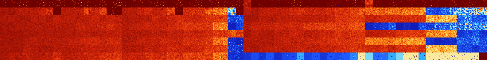

# B01248 (142848-143359)

<details>
    <summary>Initial Grid</summary>
    
</details>


<details>
    <summary>Initial Grid RLE</summary>

```
#C Exported from GoGoL (https://github.com/marrow16/gogol)
#C Wrap mode: Toroidal
#C Boundary mode: Dead
#C Step: 0
x = 100, y = 100, rule = B01248/S
bo2bo2bo20bo7bo16bo32bo8bo$25bobobo30bo8b2o12bo$16bo69bo6bo$36bo39bo8bo
$10b2o51bo7bo4bo15bo$23bo7bo4bo3bo4bo13bo3bo$9bo14bo21bo6bo10bo5bo10bo$
11bo21bo55bo$o11bo7bo6bo15bo7bo16bob2o10bobo13bo$71bo14bo2bo4bo3bo$13bo
42b2o8bo$7bo26bo50bo$bo4bo58bo16bo2bo6bo$26bo3bo$4bo2bo60bo11bo18bo$23b
o6bo11bo4bo27bo21bo$40bo5b2o37bo12bo$2bo29bo7bo$15bo38bo18bobo$11bobo
31bo32bo$3bo18bo2bo14bo13b2o2bo17b2o4bo6bo$14bo5b2o41bo2bo5bo$31bo$17bo
17bo56bo$9bo4bo$2b2obo22bo$4bo$13bo76bo$2bo38bo$5bo23bo2bo26bo35bo$4bo
14bo5bo27bo4bo6bo3bo6bo$8bo49bo11bo7bo18bo$44bo2bo22bobo14bo$2bo45bo6bo
3bo10bo19b2o4bo$bo8bo72bo$13bo5bo53bo4bo6bo9bo$7bo22bo13bo5bo5bo4b2o5bo
5bo13bo9bo$4bo10bo9bo18bo10bo18bo3bo$17bo14bo32bo3bo8bobo$o8bo25bobo11b
o3bo23bo18bo$34bo31bo11bo9bo$9bo22bobo2bo35bo4bo11bo$40bo8bo7bo18bo5bo$
7bo10bo11bo12b2o$bo4bo25bo11bo11bo7bo12bo$7b2o13bo4bo3bo25bo33bo$31bo
17bo32bo9bo6bo$23bo17bo3bo23bo$7bo11bo18bo21bo31bo$22bo34b2o10bo14b2o$
20bo5bo55bo4bo5bo$69bo$6bo3bo26bo61bo$2bo33bo6b2obo9bo16bo8bo6bo5bo$bo
13bo40bo19bo19bo$20bo27bo14b2o$25bo4b2o5b2o7bo22bo25bo$15bo11bo46bobo$
3bo28bo17bo27bo8bo10bo$22bo15bo15bo2bo3bo25bo$10bo2b2o14bo27bo12bo$7bo
10bo45bo21bo$8b2o18bo11bo$10b2o72bo$11bo2bo11bo12bo10bo19bo11bo$10bo7bo
26bo8bo5bo20bo$45b2o12bo22bo6bo$51bo$6bo8bo64bo5bo2bo5bo$6bo57bo4bo22b
2obo$36bo43bo2bo$bo26bo14bo24bo6bo5bo$3bo2bo12bo3bo30bo32bo3bo$47bobo6b
o14bo11bo10bo$14bo16bo17b2o6bo15bo16bo8bo$bo29bo27b2o10bo7bo14bo$9bo14b
o3bo60bo$2bo4bo5bo68bo10bo$22bo12b2o37bo2bo14bo$65b2o2bo$5bo12bo3bo$2bo
5b3o2bo3bo36bo26bo10bo$24b2o45bo7bo15bo$17bo17bo7b2o3b3o9bo3bo$21bo12bo
30bo28bo$2bo61bo10bo6bo$27bo17bo28bo22bobo$10bo5bo20bo5bo28bo$43bo40bo$
12bo20bo7bo22bo19bo$2bo19bo38bo10bo18bo3bo$12bo6bo20bo$bo32bo35bo15bo$
30bo30bo14bo5bo13bo$29bo28b2o3bo$18bo8bobo21bo28bo$15bo9bo15bo8bo$24bo
29bo21bo2bo$18bob2o38bo17bobo$3b2o37bo36bo16bo!
```
</details>
<details>
    <summary>Thumbnail</summary>

</details>
<table>
<tr>
    <td><a href="./142848%20S%20Heat%20Map%20Activity.png"></a><br>S (142848)<br>R@10,p2</td>    <td><a href="./142849%20S0%20Heat%20Map%20Activity.png"></a><br>S0 (142849)<br>R@7,p2</td>    <td><a href="./142850%20S1%20Heat%20Map%20Activity.png"></a><br>S1 (142850)<br>R@6,p2</td>    <td><a href="./142851%20S01%20Heat%20Map%20Activity.png"></a><br>S01 (142851)<br>R@8,p2</td>    <td><a href="./142852%20S2%20Heat%20Map%20Activity.png"></a><br>S2 (142852)<br>R@6,p2</td>    <td><a href="./142853%20S02%20Heat%20Map%20Activity.png"></a><br>S02 (142853)<br>R@7,p2</td>    <td><a href="./142854%20S12%20Heat%20Map%20Activity.png"></a><br>S12 (142854)<br>R@5,p2</td>    <td><a href="./142855%20S012%20Heat%20Map%20Activity.png"></a><br>S012 (142855)<br>R@5,p2</td>    <td><a href="./142856%20S3%20Heat%20Map%20Activity.png"></a><br>S3 (142856)<br>R@9,p2</td>    <td><a href="./142857%20S03%20Heat%20Map%20Activity.png"></a><br>S03 (142857)<br>R@6,p2</td>    <td><a href="./142858%20S13%20Heat%20Map%20Activity.png"></a><br>S13 (142858)<br>R@6,p2</td>    <td><a href="./142859%20S013%20Heat%20Map%20Activity.png"></a><br>S013 (142859)<br>R@6,p2</td>    <td><a href="./142860%20S23%20Heat%20Map%20Activity.png"></a><br>S23 (142860)<br>R@6,p2</td>    <td><a href="./142861%20S023%20Heat%20Map%20Activity.png"></a><br>S023 (142861)<br>R@6,p2</td>    <td><a href="./142862%20S123%20Heat%20Map%20Activity.png"></a><br>S123 (142862)<br>R@5,p2</td>    <td><a href="./142863%20S0123%20Heat%20Map%20Activity.png"></a><br>S0123 (142863)<br>R@5,p2</td>    <td><a href="./142864%20S4%20Heat%20Map%20Activity.png"></a><br>S4 (142864)<br>R@10,p2</td>    <td><a href="./142865%20S04%20Heat%20Map%20Activity.png"></a><br>S04 (142865)<br>R@8,p2</td>    <td><a href="./142866%20S14%20Heat%20Map%20Activity.png"></a><br>S14 (142866)<br>R@8,p2</td>    <td><a href="./142867%20S014%20Heat%20Map%20Activity.png"></a><br>S014 (142867)<br>R@8,p2</td>    <td><a href="./142868%20S24%20Heat%20Map%20Activity.png"></a><br>S24 (142868)<br>R@6,p2</td>    <td><a href="./142869%20S024%20Heat%20Map%20Activity.png"></a><br>S024 (142869)<br>R@7,p2</td>    <td><a href="./142870%20S124%20Heat%20Map%20Activity.png"></a><br>S124 (142870)<br>R@5,p2</td>    <td><a href="./142871%20S0124%20Heat%20Map%20Activity.png"></a><br>S0124 (142871)<br>R@7,p2</td>    <td><a href="./142872%20S34%20Heat%20Map%20Activity.png"></a><br>S34 (142872)<br>R@8,p2</td>    <td><a href="./142873%20S034%20Heat%20Map%20Activity.png"></a><br>S034 (142873)<br>R@8,p2</td>    <td><a href="./142874%20S134%20Heat%20Map%20Activity.png"></a><br>S134 (142874)<br>R@7,p2</td>    <td><a href="./142875%20S0134%20Heat%20Map%20Activity.png"></a><br>S0134 (142875)<br>R@7,p2</td>    <td><a href="./142876%20S234%20Heat%20Map%20Activity.png"></a><br>S234 (142876)<br>R@8,p2</td>    <td><a href="./142877%20S0234%20Heat%20Map%20Activity.png"></a><br>S0234 (142877)<br>R@7,p2</td>    <td><a href="./142878%20S1234%20Heat%20Map%20Activity.png"></a><br>S1234 (142878)<br>R@5,p2</td>    <td><a href="./142879%20S01234%20Heat%20Map%20Activity.png"></a><br>S01234 (142879)<br>R@7,p2</td>    <td><a href="./142880%20S5%20Heat%20Map%20Activity.png"></a><br>S5 (142880)<br>G>1000</td>    <td><a href="./142881%20S05%20Heat%20Map%20Activity.png"></a><br>S05 (142881)<br>R@211,p200</td>    <td><a href="./142882%20S15%20Heat%20Map%20Activity.png"></a><br>S15 (142882)<br>R@18,p2</td>    <td><a href="./142883%20S015%20Heat%20Map%20Activity.png"></a><br>S015 (142883)<br>R@17,p2</td>    <td><a href="./142884%20S25%20Heat%20Map%20Activity.png"></a><br>S25 (142884)<br>R@14,p4</td>    <td><a href="./142885%20S025%20Heat%20Map%20Activity.png"></a><br>S025 (142885)<br>R@17,p2</td>    <td><a href="./142886%20S125%20Heat%20Map%20Activity.png"></a><br>S125 (142886)<br>R@8,p4</td>    <td><a href="./142887%20S0125%20Heat%20Map%20Activity.png"></a><br>S0125 (142887)<br>R@7,p2</td>    <td><a href="./142888%20S35%20Heat%20Map%20Activity.png"></a><br>S35 (142888)<br>R@50,p4</td>    <td><a href="./142889%20S035%20Heat%20Map%20Activity.png"></a><br>S035 (142889)<br>R@27,p8</td>    <td><a href="./142890%20S135%20Heat%20Map%20Activity.png"></a><br>S135 (142890)<br>R@35,p2</td>    <td><a href="./142891%20S0135%20Heat%20Map%20Activity.png"></a><br>S0135 (142891)<br>R@12,p2</td>    <td><a href="./142892%20S235%20Heat%20Map%20Activity.png"></a><br>S235 (142892)<br>R@14,p4</td>    <td><a href="./142893%20S0235%20Heat%20Map%20Activity.png"></a><br>S0235 (142893)<br>R@9,p2</td>    <td><a href="./142894%20S1235%20Heat%20Map%20Activity.png"></a><br>S1235 (142894)<br>R@9,p4</td>    <td><a href="./142895%20S01235%20Heat%20Map%20Activity.png"></a><br>S01235 (142895)<br>R@7,p2</td>    <td><a href="./142896%20S45%20Heat%20Map%20Activity.png"></a><br>S45 (142896)<br>G>1000</td>    <td><a href="./142897%20S045%20Heat%20Map%20Activity.png"></a><br>S045 (142897)<br>R@15,p4</td>    <td><a href="./142898%20S145%20Heat%20Map%20Activity.png"></a><br>S145 (142898)<br>R@44,p2</td>    <td><a href="./142899%20S0145%20Heat%20Map%20Activity.png"></a><br>S0145 (142899)<br>R@13,p2</td>    <td><a href="./142900%20S245%20Heat%20Map%20Activity.png"></a><br>S245 (142900)<br>R@34,p4</td>    <td><a href="./142901%20S0245%20Heat%20Map%20Activity.png"></a><br>S0245 (142901)<br>R@15,p2</td>    <td><a href="./142902%20S1245%20Heat%20Map%20Activity.png"></a><br>S1245 (142902)<br>R@12,p4</td>    <td><a href="./142903%20S01245%20Heat%20Map%20Activity.png"></a><br>S01245 (142903)<br>R@8,p2</td>    <td><a href="./142904%20S345%20Heat%20Map%20Activity.png"></a><br>S345 (142904)<br>R@72,p4</td>    <td><a href="./142905%20S0345%20Heat%20Map%20Activity.png"></a><br>S0345 (142905)<br>R@18,p6</td>    <td><a href="./142906%20S1345%20Heat%20Map%20Activity.png"></a><br>S1345 (142906)<br>R@18,p2</td>    <td><a href="./142907%20S01345%20Heat%20Map%20Activity.png"></a><br>S01345 (142907)<br>R@7,p2</td>    <td><a href="./142908%20S2345%20Heat%20Map%20Activity.png"></a><br>S2345 (142908)<br>R@26,p4</td>    <td><a href="./142909%20S02345%20Heat%20Map%20Activity.png"></a><br>S02345 (142909)<br>R@15,p6</td>    <td><a href="./142910%20S12345%20Heat%20Map%20Activity.png"></a><br>S12345 (142910)<br>R@11,p4</td>    <td><a href="./142911%20S012345%20Heat%20Map%20Activity.png"></a><br>S012345 (142911)<br>R@9,p2</td></tr>
<tr>
    <td><a href="./142912%20S6%20Heat%20Map%20Activity.png"></a><br>S6 (142912)<br>G>1000</td>    <td><a href="./142913%20S06%20Heat%20Map%20Activity.png"></a><br>S06 (142913)<br>G>1000</td>    <td><a href="./142914%20S16%20Heat%20Map%20Activity.png"></a><br>S16 (142914)<br>G>1000</td>    <td><a href="./142915%20S016%20Heat%20Map%20Activity.png"></a><br>S016 (142915)<br>G>1000</td>    <td><a href="./142916%20S26%20Heat%20Map%20Activity.png"></a><br>S26 (142916)<br>G>1000</td>    <td><a href="./142917%20S026%20Heat%20Map%20Activity.png"></a><br>S026 (142917)<br>G>1000</td>    <td><a href="./142918%20S126%20Heat%20Map%20Activity.png"></a><br>S126 (142918)<br>G>1000</td>    <td><a href="./142919%20S0126%20Heat%20Map%20Activity.png"></a><br>S0126 (142919)<br>R@23,p6</td>    <td><a href="./142920%20S36%20Heat%20Map%20Activity.png"></a><br>S36 (142920)<br>G>1000</td>    <td><a href="./142921%20S036%20Heat%20Map%20Activity.png"></a><br>S036 (142921)<br>G>1000</td>    <td><a href="./142922%20S136%20Heat%20Map%20Activity.png"></a><br>S136 (142922)<br>G>1000</td>    <td><a href="./142923%20S0136%20Heat%20Map%20Activity.png"></a><br>S0136 (142923)<br>G>1000</td>    <td><a href="./142924%20S236%20Heat%20Map%20Activity.png"></a><br>S236 (142924)<br>G>1000</td>    <td><a href="./142925%20S0236%20Heat%20Map%20Activity.png"></a><br>S0236 (142925)<br>G>1000</td>    <td><a href="./142926%20S1236%20Heat%20Map%20Activity.png"></a><br>S1236 (142926)<br>R@195,p4</td>    <td><a href="./142927%20S01236%20Heat%20Map%20Activity.png"></a><br>S01236 (142927)<br>R@23,p12</td>    <td><a href="./142928%20S46%20Heat%20Map%20Activity.png"></a><br>S46 (142928)<br>G>1000</td>    <td><a href="./142929%20S046%20Heat%20Map%20Activity.png"></a><br>S046 (142929)<br>G>1000</td>    <td><a href="./142930%20S146%20Heat%20Map%20Activity.png"></a><br>S146 (142930)<br>G>1000</td>    <td><a href="./142931%20S0146%20Heat%20Map%20Activity.png"></a><br>S0146 (142931)<br>G>1000</td>    <td><a href="./142932%20S246%20Heat%20Map%20Activity.png"></a><br>S246 (142932)<br>G>1000</td>    <td><a href="./142933%20S0246%20Heat%20Map%20Activity.png"></a><br>S0246 (142933)<br>G>1000</td>    <td><a href="./142934%20S1246%20Heat%20Map%20Activity.png"></a><br>S1246 (142934)<br>G>1000</td>    <td><a href="./142935%20S01246%20Heat%20Map%20Activity.png"></a><br>S01246 (142935)<br>R@31,p2</td>    <td><a href="./142936%20S346%20Heat%20Map%20Activity.png"></a><br>S346 (142936)<br>G>1000</td>    <td><a href="./142937%20S0346%20Heat%20Map%20Activity.png"></a><br>S0346 (142937)<br>G>1000</td>    <td><a href="./142938%20S1346%20Heat%20Map%20Activity.png"></a><br>S1346 (142938)<br>G>1000</td>    <td><a href="./142939%20S01346%20Heat%20Map%20Activity.png"></a><br>S01346 (142939)<br>G>1000</td>    <td><a href="./142940%20S2346%20Heat%20Map%20Activity.png"></a><br>S2346 (142940)<br>G>1000</td>    <td><a href="./142941%20S02346%20Heat%20Map%20Activity.png"></a><br>S02346 (142941)<br>G>1000</td>    <td><a href="./142942%20S12346%20Heat%20Map%20Activity.png"></a><br>S12346 (142942)<br>R@391,p12</td>    <td><a href="./142943%20S012346%20Heat%20Map%20Activity.png"></a><br>S012346 (142943)<br>R@21,p4</td>    <td><a href="./142944%20S56%20Heat%20Map%20Activity.png"></a><br>S56 (142944)<br>G>1000</td>    <td><a href="./142945%20S056%20Heat%20Map%20Activity.png"></a><br>S056 (142945)<br>G>1000</td>    <td><a href="./142946%20S156%20Heat%20Map%20Activity.png"></a><br>S156 (142946)<br>G>1000</td>    <td><a href="./142947%20S0156%20Heat%20Map%20Activity.png"></a><br>S0156 (142947)<br>G>1000</td>    <td><a href="./142948%20S256%20Heat%20Map%20Activity.png"></a><br>S256 (142948)<br>G>1000</td>    <td><a href="./142949%20S0256%20Heat%20Map%20Activity.png"></a><br>S0256 (142949)<br>G>1000</td>    <td><a href="./142950%20S1256%20Heat%20Map%20Activity.png"></a><br>S1256 (142950)<br>G>1000</td>    <td><a href="./142951%20S01256%20Heat%20Map%20Activity.png"></a><br>S01256 (142951)<br>G>1000</td>    <td><a href="./142952%20S356%20Heat%20Map%20Activity.png"></a><br>S356 (142952)<br>G>1000</td>    <td><a href="./142953%20S0356%20Heat%20Map%20Activity.png"></a><br>S0356 (142953)<br>G>1000</td>    <td><a href="./142954%20S1356%20Heat%20Map%20Activity.png"></a><br>S1356 (142954)<br>G>1000</td>    <td><a href="./142955%20S01356%20Heat%20Map%20Activity.png"></a><br>S01356 (142955)<br>G>1000</td>    <td><a href="./142956%20S2356%20Heat%20Map%20Activity.png"></a><br>S2356 (142956)<br>G>1000</td>    <td><a href="./142957%20S02356%20Heat%20Map%20Activity.png"></a><br>S02356 (142957)<br>G>1000</td>    <td><a href="./142958%20S12356%20Heat%20Map%20Activity.png"></a><br>S12356 (142958)<br>G>1000</td>    <td><a href="./142959%20S012356%20Heat%20Map%20Activity.png"></a><br>S012356 (142959)<br>G>1000</td>    <td><a href="./142960%20S456%20Heat%20Map%20Activity.png"></a><br>S456 (142960)<br>G>1000</td>    <td><a href="./142961%20S0456%20Heat%20Map%20Activity.png"></a><br>S0456 (142961)<br>G>1000</td>    <td><a href="./142962%20S1456%20Heat%20Map%20Activity.png"></a><br>S1456 (142962)<br>G>1000</td>    <td><a href="./142963%20S01456%20Heat%20Map%20Activity.png"></a><br>S01456 (142963)<br>G>1000</td>    <td><a href="./142964%20S2456%20Heat%20Map%20Activity.png"></a><br>S2456 (142964)<br>G>1000</td>    <td><a href="./142965%20S02456%20Heat%20Map%20Activity.png"></a><br>S02456 (142965)<br>G>1000</td>    <td><a href="./142966%20S12456%20Heat%20Map%20Activity.png"></a><br>S12456 (142966)<br>G>1000</td>    <td><a href="./142967%20S012456%20Heat%20Map%20Activity.png"></a><br>S012456 (142967)<br>G>1000</td>    <td><a href="./142968%20S3456%20Heat%20Map%20Activity.png"></a><br>S3456 (142968)<br>R@73,p12</td>    <td><a href="./142969%20S03456%20Heat%20Map%20Activity.png"></a><br>S03456 (142969)<br>R@145,p84</td>    <td><a href="./142970%20S13456%20Heat%20Map%20Activity.png"></a><br>S13456 (142970)<br>R@83,p4</td>    <td><a href="./142971%20S013456%20Heat%20Map%20Activity.png"></a><br>S013456 (142971)<br>R@106,p30</td>    <td><a href="./142972%20S23456%20Heat%20Map%20Activity.png"></a><br>S23456 (142972)<br>R@42,p12</td>    <td><a href="./142973%20S023456%20Heat%20Map%20Activity.png"></a><br>S023456 (142973)<br>R@57,p6</td>    <td><a href="./142974%20S123456%20Heat%20Map%20Activity.png"></a><br>S123456 (142974)<br>R@61,p2</td>    <td><a href="./142975%20S0123456%20Heat%20Map%20Activity.png"></a><br>S0123456 (142975)<br>R@95,p2</td></tr>
<tr>
    <td><a href="./142976%20S7%20Heat%20Map%20Activity.png"></a><br>S7 (142976)<br>G>1000</td>    <td><a href="./142977%20S07%20Heat%20Map%20Activity.png"></a><br>S07 (142977)<br>G>1000</td>    <td><a href="./142978%20S17%20Heat%20Map%20Activity.png"></a><br>S17 (142978)<br>G>1000</td>    <td><a href="./142979%20S017%20Heat%20Map%20Activity.png"></a><br>S017 (142979)<br>G>1000</td>    <td><a href="./142980%20S27%20Heat%20Map%20Activity.png"></a><br>S27 (142980)<br>G>1000</td>    <td><a href="./142981%20S027%20Heat%20Map%20Activity.png"></a><br>S027 (142981)<br>G>1000</td>    <td><a href="./142982%20S127%20Heat%20Map%20Activity.png"></a><br>S127 (142982)<br>G>1000</td>    <td><a href="./142983%20S0127%20Heat%20Map%20Activity.png"></a><br>S0127 (142983)<br>G>1000</td>    <td><a href="./142984%20S37%20Heat%20Map%20Activity.png"></a><br>S37 (142984)<br>G>1000</td>    <td><a href="./142985%20S037%20Heat%20Map%20Activity.png"></a><br>S037 (142985)<br>G>1000</td>    <td><a href="./142986%20S137%20Heat%20Map%20Activity.png"></a><br>S137 (142986)<br>G>1000</td>    <td><a href="./142987%20S0137%20Heat%20Map%20Activity.png"></a><br>S0137 (142987)<br>G>1000</td>    <td><a href="./142988%20S237%20Heat%20Map%20Activity.png"></a><br>S237 (142988)<br>G>1000</td>    <td><a href="./142989%20S0237%20Heat%20Map%20Activity.png"></a><br>S0237 (142989)<br>G>1000</td>    <td><a href="./142990%20S1237%20Heat%20Map%20Activity.png"></a><br>S1237 (142990)<br>G>1000</td>    <td><a href="./142991%20S01237%20Heat%20Map%20Activity.png"></a><br>S01237 (142991)<br>G>1000</td>    <td><a href="./142992%20S47%20Heat%20Map%20Activity.png"></a><br>S47 (142992)<br>G>1000</td>    <td><a href="./142993%20S047%20Heat%20Map%20Activity.png"></a><br>S047 (142993)<br>G>1000</td>    <td><a href="./142994%20S147%20Heat%20Map%20Activity.png"></a><br>S147 (142994)<br>G>1000</td>    <td><a href="./142995%20S0147%20Heat%20Map%20Activity.png"></a><br>S0147 (142995)<br>G>1000</td>    <td><a href="./142996%20S247%20Heat%20Map%20Activity.png"></a><br>S247 (142996)<br>G>1000</td>    <td><a href="./142997%20S0247%20Heat%20Map%20Activity.png"></a><br>S0247 (142997)<br>G>1000</td>    <td><a href="./142998%20S1247%20Heat%20Map%20Activity.png"></a><br>S1247 (142998)<br>G>1000</td>    <td><a href="./142999%20S01247%20Heat%20Map%20Activity.png"></a><br>S01247 (142999)<br>G>1000</td>    <td><a href="./143000%20S347%20Heat%20Map%20Activity.png"></a><br>S347 (143000)<br>G>1000</td>    <td><a href="./143001%20S0347%20Heat%20Map%20Activity.png"></a><br>S0347 (143001)<br>G>1000</td>    <td><a href="./143002%20S1347%20Heat%20Map%20Activity.png"></a><br>S1347 (143002)<br>G>1000</td>    <td><a href="./143003%20S01347%20Heat%20Map%20Activity.png"></a><br>S01347 (143003)<br>G>1000</td>    <td><a href="./143004%20S2347%20Heat%20Map%20Activity.png"></a><br>S2347 (143004)<br>G>1000</td>    <td><a href="./143005%20S02347%20Heat%20Map%20Activity.png"></a><br>S02347 (143005)<br>G>1000</td>    <td><a href="./143006%20S12347%20Heat%20Map%20Activity.png"></a><br>S12347 (143006)<br>R@849,p12</td>    <td><a href="./143007%20S012347%20Heat%20Map%20Activity.png"></a><br>S012347 (143007)<br>G>1000</td>    <td><a href="./143008%20S57%20Heat%20Map%20Activity.png"></a><br>S57 (143008)<br>G>1000</td>    <td><a href="./143009%20S057%20Heat%20Map%20Activity.png"></a><br>S057 (143009)<br>G>1000</td>    <td><a href="./143010%20S157%20Heat%20Map%20Activity.png"></a><br>S157 (143010)<br>G>1000</td>    <td><a href="./143011%20S0157%20Heat%20Map%20Activity.png"></a><br>S0157 (143011)<br>G>1000</td>    <td><a href="./143012%20S257%20Heat%20Map%20Activity.png"></a><br>S257 (143012)<br>G>1000</td>    <td><a href="./143013%20S0257%20Heat%20Map%20Activity.png"></a><br>S0257 (143013)<br>G>1000</td>    <td><a href="./143014%20S1257%20Heat%20Map%20Activity.png"></a><br>S1257 (143014)<br>G>1000</td>    <td><a href="./143015%20S01257%20Heat%20Map%20Activity.png"></a><br>S01257 (143015)<br>G>1000</td>    <td><a href="./143016%20S357%20Heat%20Map%20Activity.png"></a><br>S357 (143016)<br>G>1000</td>    <td><a href="./143017%20S0357%20Heat%20Map%20Activity.png"></a><br>S0357 (143017)<br>G>1000</td>    <td><a href="./143018%20S1357%20Heat%20Map%20Activity.png"></a><br>S1357 (143018)<br>G>1000</td>    <td><a href="./143019%20S01357%20Heat%20Map%20Activity.png"></a><br>S01357 (143019)<br>G>1000</td>    <td><a href="./143020%20S2357%20Heat%20Map%20Activity.png"></a><br>S2357 (143020)<br>G>1000</td>    <td><a href="./143021%20S02357%20Heat%20Map%20Activity.png"></a><br>S02357 (143021)<br>G>1000</td>    <td><a href="./143022%20S12357%20Heat%20Map%20Activity.png"></a><br>S12357 (143022)<br>G>1000</td>    <td><a href="./143023%20S012357%20Heat%20Map%20Activity.png"></a><br>S012357 (143023)<br>G>1000</td>    <td><a href="./143024%20S457%20Heat%20Map%20Activity.png"></a><br>S457 (143024)<br>G>1000</td>    <td><a href="./143025%20S0457%20Heat%20Map%20Activity.png"></a><br>S0457 (143025)<br>G>1000</td>    <td><a href="./143026%20S1457%20Heat%20Map%20Activity.png"></a><br>S1457 (143026)<br>G>1000</td>    <td><a href="./143027%20S01457%20Heat%20Map%20Activity.png"></a><br>S01457 (143027)<br>G>1000</td>    <td><a href="./143028%20S2457%20Heat%20Map%20Activity.png"></a><br>S2457 (143028)<br>G>1000</td>    <td><a href="./143029%20S02457%20Heat%20Map%20Activity.png"></a><br>S02457 (143029)<br>G>1000</td>    <td><a href="./143030%20S12457%20Heat%20Map%20Activity.png"></a><br>S12457 (143030)<br>G>1000</td>    <td><a href="./143031%20S012457%20Heat%20Map%20Activity.png"></a><br>S012457 (143031)<br>G>1000</td>    <td><a href="./143032%20S3457%20Heat%20Map%20Activity.png"></a><br>S3457 (143032)<br>G>1000</td>    <td><a href="./143033%20S03457%20Heat%20Map%20Activity.png"></a><br>S03457 (143033)<br>G>1000</td>    <td><a href="./143034%20S13457%20Heat%20Map%20Activity.png"></a><br>S13457 (143034)<br>G>1000</td>    <td><a href="./143035%20S013457%20Heat%20Map%20Activity.png"></a><br>S013457 (143035)<br>G>1000</td>    <td><a href="./143036%20S23457%20Heat%20Map%20Activity.png"></a><br>S23457 (143036)<br>R@30,p6</td>    <td><a href="./143037%20S023457%20Heat%20Map%20Activity.png"></a><br>S023457 (143037)<br>R@35,p6</td>    <td><a href="./143038%20S123457%20Heat%20Map%20Activity.png"></a><br>S123457 (143038)<br>R@32,p6</td>    <td><a href="./143039%20S0123457%20Heat%20Map%20Activity.png"></a><br>S0123457 (143039)<br>R@96,p60</td></tr>
<tr>
    <td><a href="./143040%20S67%20Heat%20Map%20Activity.png"></a><br>S67 (143040)<br>G>1000</td>    <td><a href="./143041%20S067%20Heat%20Map%20Activity.png"></a><br>S067 (143041)<br>G>1000</td>    <td><a href="./143042%20S167%20Heat%20Map%20Activity.png"></a><br>S167 (143042)<br>G>1000</td>    <td><a href="./143043%20S0167%20Heat%20Map%20Activity.png"></a><br>S0167 (143043)<br>G>1000</td>    <td><a href="./143044%20S267%20Heat%20Map%20Activity.png"></a><br>S267 (143044)<br>G>1000</td>    <td><a href="./143045%20S0267%20Heat%20Map%20Activity.png"></a><br>S0267 (143045)<br>G>1000</td>    <td><a href="./143046%20S1267%20Heat%20Map%20Activity.png"></a><br>S1267 (143046)<br>G>1000</td>    <td><a href="./143047%20S01267%20Heat%20Map%20Activity.png"></a><br>S01267 (143047)<br>G>1000</td>    <td><a href="./143048%20S367%20Heat%20Map%20Activity.png"></a><br>S367 (143048)<br>G>1000</td>    <td><a href="./143049%20S0367%20Heat%20Map%20Activity.png"></a><br>S0367 (143049)<br>G>1000</td>    <td><a href="./143050%20S1367%20Heat%20Map%20Activity.png"></a><br>S1367 (143050)<br>G>1000</td>    <td><a href="./143051%20S01367%20Heat%20Map%20Activity.png"></a><br>S01367 (143051)<br>G>1000</td>    <td><a href="./143052%20S2367%20Heat%20Map%20Activity.png"></a><br>S2367 (143052)<br>G>1000</td>    <td><a href="./143053%20S02367%20Heat%20Map%20Activity.png"></a><br>S02367 (143053)<br>G>1000</td>    <td><a href="./143054%20S12367%20Heat%20Map%20Activity.png"></a><br>S12367 (143054)<br>G>1000</td>    <td><a href="./143055%20S012367%20Heat%20Map%20Activity.png"></a><br>S012367 (143055)<br>G>1000</td>    <td><a href="./143056%20S467%20Heat%20Map%20Activity.png"></a><br>S467 (143056)<br>G>1000</td>    <td><a href="./143057%20S0467%20Heat%20Map%20Activity.png"></a><br>S0467 (143057)<br>G>1000</td>    <td><a href="./143058%20S1467%20Heat%20Map%20Activity.png"></a><br>S1467 (143058)<br>G>1000</td>    <td><a href="./143059%20S01467%20Heat%20Map%20Activity.png"></a><br>S01467 (143059)<br>G>1000</td>    <td><a href="./143060%20S2467%20Heat%20Map%20Activity.png"></a><br>S2467 (143060)<br>G>1000</td>    <td><a href="./143061%20S02467%20Heat%20Map%20Activity.png"></a><br>S02467 (143061)<br>G>1000</td>    <td><a href="./143062%20S12467%20Heat%20Map%20Activity.png"></a><br>S12467 (143062)<br>G>1000</td>    <td><a href="./143063%20S012467%20Heat%20Map%20Activity.png"></a><br>S012467 (143063)<br>G>1000</td>    <td><a href="./143064%20S3467%20Heat%20Map%20Activity.png"></a><br>S3467 (143064)<br>G>1000</td>    <td><a href="./143065%20S03467%20Heat%20Map%20Activity.png"></a><br>S03467 (143065)<br>G>1000</td>    <td><a href="./143066%20S13467%20Heat%20Map%20Activity.png"></a><br>S13467 (143066)<br>G>1000</td>    <td><a href="./143067%20S013467%20Heat%20Map%20Activity.png"></a><br>S013467 (143067)<br>G>1000</td>    <td><a href="./143068%20S23467%20Heat%20Map%20Activity.png"></a><br>S23467 (143068)<br>G>1000</td>    <td><a href="./143069%20S023467%20Heat%20Map%20Activity.png"></a><br>S023467 (143069)<br>G>1000</td>    <td><a href="./143070%20S123467%20Heat%20Map%20Activity.png"></a><br>S123467 (143070)<br>G>1000</td>    <td><a href="./143071%20S0123467%20Heat%20Map%20Activity.png"></a><br>S0123467 (143071)<br>R@265,p84</td>    <td><a href="./143072%20S567%20Heat%20Map%20Activity.png"></a><br>S567 (143072)<br>G>1000</td>    <td><a href="./143073%20S0567%20Heat%20Map%20Activity.png"></a><br>S0567 (143073)<br>G>1000</td>    <td><a href="./143074%20S1567%20Heat%20Map%20Activity.png"></a><br>S1567 (143074)<br>G>1000</td>    <td><a href="./143075%20S01567%20Heat%20Map%20Activity.png"></a><br>S01567 (143075)<br>G>1000</td>    <td><a href="./143076%20S2567%20Heat%20Map%20Activity.png"></a><br>S2567 (143076)<br>G>1000</td>    <td><a href="./143077%20S02567%20Heat%20Map%20Activity.png"></a><br>S02567 (143077)<br>G>1000</td>    <td><a href="./143078%20S12567%20Heat%20Map%20Activity.png"></a><br>S12567 (143078)<br>G>1000</td>    <td><a href="./143079%20S012567%20Heat%20Map%20Activity.png"></a><br>S012567 (143079)<br>G>1000</td>    <td><a href="./143080%20S3567%20Heat%20Map%20Activity.png"></a><br>S3567 (143080)<br>G>1000</td>    <td><a href="./143081%20S03567%20Heat%20Map%20Activity.png"></a><br>S03567 (143081)<br>G>1000</td>    <td><a href="./143082%20S13567%20Heat%20Map%20Activity.png"></a><br>S13567 (143082)<br>G>1000</td>    <td><a href="./143083%20S013567%20Heat%20Map%20Activity.png"></a><br>S013567 (143083)<br>G>1000</td>    <td><a href="./143084%20S23567%20Heat%20Map%20Activity.png"></a><br>S23567 (143084)<br>G>1000</td>    <td><a href="./143085%20S023567%20Heat%20Map%20Activity.png"></a><br>S023567 (143085)<br>G>1000</td>    <td><a href="./143086%20S123567%20Heat%20Map%20Activity.png"></a><br>S123567 (143086)<br>G>1000</td>    <td><a href="./143087%20S0123567%20Heat%20Map%20Activity.png"></a><br>S0123567 (143087)<br>G>1000</td>    <td><a href="./143088%20S4567%20Heat%20Map%20Activity.png"></a><br>S4567 (143088)<br>R@169,p120</td>    <td><a href="./143089%20S04567%20Heat%20Map%20Activity.png"></a><br>S04567 (143089)<br>R@149,p90</td>    <td><a href="./143090%20S14567%20Heat%20Map%20Activity.png"></a><br>S14567 (143090)<br>R@65,p12</td>    <td><a href="./143091%20S014567%20Heat%20Map%20Activity.png"></a><br>S014567 (143091)<br>R@78,p12</td>    <td><a href="./143092%20S24567%20Heat%20Map%20Activity.png"></a><br>S24567 (143092)<br>R@438,p396</td>    <td><a href="./143093%20S024567%20Heat%20Map%20Activity.png"></a><br>S024567 (143093)<br>R@229,p180</td>    <td><a href="./143094%20S124567%20Heat%20Map%20Activity.png"></a><br>S124567 (143094)<br>R@449,p396</td>    <td><a href="./143095%20S0124567%20Heat%20Map%20Activity.png"></a><br>S0124567 (143095)<br>R@89,p12</td>    <td><a href="./143096%20S34567%20Heat%20Map%20Activity.png"></a><br>S34567 (143096)<br>R@42,p20</td>    <td><a href="./143097%20S034567%20Heat%20Map%20Activity.png"></a><br>S034567 (143097)<br>R@39,p12</td>    <td><a href="./143098%20S134567%20Heat%20Map%20Activity.png"></a><br>S134567 (143098)<br>R@26,p4</td>    <td><a href="./143099%20S0134567%20Heat%20Map%20Activity.png"></a><br>S0134567 (143099)<br>R@43,p12</td>    <td><a href="./143100%20S234567%20Heat%20Map%20Activity.png"></a><br>S234567 (143100)<br>R@19,p6</td>    <td><a href="./143101%20S0234567%20Heat%20Map%20Activity.png"></a><br>S0234567 (143101)<br>R@21,p2</td>    <td><a href="./143102%20S1234567%20Heat%20Map%20Activity.png"></a><br>S1234567 (143102)<br>R@19,p6</td>    <td><a href="./143103%20S01234567%20Heat%20Map%20Activity.png"></a><br>S01234567 (143103)<br>R@44,p6</td></tr>
<tr>
    <td><a href="./143104%20S8%20Heat%20Map%20Activity.png"></a><br>S8 (143104)<br>G>1000</td>    <td><a href="./143105%20S08%20Heat%20Map%20Activity.png"></a><br>S08 (143105)<br>G>1000</td>    <td><a href="./143106%20S18%20Heat%20Map%20Activity.png"></a><br>S18 (143106)<br>G>1000</td>    <td><a href="./143107%20S018%20Heat%20Map%20Activity.png"></a><br>S018 (143107)<br>G>1000</td>    <td><a href="./143108%20S28%20Heat%20Map%20Activity.png"></a><br>S28 (143108)<br>G>1000</td>    <td><a href="./143109%20S028%20Heat%20Map%20Activity.png"></a><br>S028 (143109)<br>G>1000</td>    <td><a href="./143110%20S128%20Heat%20Map%20Activity.png"></a><br>S128 (143110)<br>G>1000</td>    <td><a href="./143111%20S0128%20Heat%20Map%20Activity.png"></a><br>S0128 (143111)<br>G>1000</td>    <td><a href="./143112%20S38%20Heat%20Map%20Activity.png"></a><br>S38 (143112)<br>G>1000</td>    <td><a href="./143113%20S038%20Heat%20Map%20Activity.png"></a><br>S038 (143113)<br>G>1000</td>    <td><a href="./143114%20S138%20Heat%20Map%20Activity.png"></a><br>S138 (143114)<br>G>1000</td>    <td><a href="./143115%20S0138%20Heat%20Map%20Activity.png"></a><br>S0138 (143115)<br>G>1000</td>    <td><a href="./143116%20S238%20Heat%20Map%20Activity.png"></a><br>S238 (143116)<br>G>1000</td>    <td><a href="./143117%20S0238%20Heat%20Map%20Activity.png"></a><br>S0238 (143117)<br>G>1000</td>    <td><a href="./143118%20S1238%20Heat%20Map%20Activity.png"></a><br>S1238 (143118)<br>G>1000</td>    <td><a href="./143119%20S01238%20Heat%20Map%20Activity.png"></a><br>S01238 (143119)<br>G>1000</td>    <td><a href="./143120%20S48%20Heat%20Map%20Activity.png"></a><br>S48 (143120)<br>G>1000</td>    <td><a href="./143121%20S048%20Heat%20Map%20Activity.png"></a><br>S048 (143121)<br>G>1000</td>    <td><a href="./143122%20S148%20Heat%20Map%20Activity.png"></a><br>S148 (143122)<br>G>1000</td>    <td><a href="./143123%20S0148%20Heat%20Map%20Activity.png"></a><br>S0148 (143123)<br>G>1000</td>    <td><a href="./143124%20S248%20Heat%20Map%20Activity.png"></a><br>S248 (143124)<br>G>1000</td>    <td><a href="./143125%20S0248%20Heat%20Map%20Activity.png"></a><br>S0248 (143125)<br>G>1000</td>    <td><a href="./143126%20S1248%20Heat%20Map%20Activity.png"></a><br>S1248 (143126)<br>G>1000</td>    <td><a href="./143127%20S01248%20Heat%20Map%20Activity.png"></a><br>S01248 (143127)<br>G>1000</td>    <td><a href="./143128%20S348%20Heat%20Map%20Activity.png"></a><br>S348 (143128)<br>G>1000</td>    <td><a href="./143129%20S0348%20Heat%20Map%20Activity.png"></a><br>S0348 (143129)<br>G>1000</td>    <td><a href="./143130%20S1348%20Heat%20Map%20Activity.png"></a><br>S1348 (143130)<br>G>1000</td>    <td><a href="./143131%20S01348%20Heat%20Map%20Activity.png"></a><br>S01348 (143131)<br>G>1000</td>    <td><a href="./143132%20S2348%20Heat%20Map%20Activity.png"></a><br>S2348 (143132)<br>G>1000</td>    <td><a href="./143133%20S02348%20Heat%20Map%20Activity.png"></a><br>S02348 (143133)<br>G>1000</td>    <td><a href="./143134%20S12348%20Heat%20Map%20Activity.png"></a><br>S12348 (143134)<br>G>1000</td>    <td><a href="./143135%20S012348%20Heat%20Map%20Activity.png"></a><br>S012348 (143135)<br>G>1000</td>    <td><a href="./143136%20S58%20Heat%20Map%20Activity.png"></a><br>S58 (143136)<br>G>1000</td>    <td><a href="./143137%20S058%20Heat%20Map%20Activity.png"></a><br>S058 (143137)<br>G>1000</td>    <td><a href="./143138%20S158%20Heat%20Map%20Activity.png"></a><br>S158 (143138)<br>G>1000</td>    <td><a href="./143139%20S0158%20Heat%20Map%20Activity.png"></a><br>S0158 (143139)<br>G>1000</td>    <td><a href="./143140%20S258%20Heat%20Map%20Activity.png"></a><br>S258 (143140)<br>G>1000</td>    <td><a href="./143141%20S0258%20Heat%20Map%20Activity.png"></a><br>S0258 (143141)<br>G>1000</td>    <td><a href="./143142%20S1258%20Heat%20Map%20Activity.png"></a><br>S1258 (143142)<br>G>1000</td>    <td><a href="./143143%20S01258%20Heat%20Map%20Activity.png"></a><br>S01258 (143143)<br>G>1000</td>    <td><a href="./143144%20S358%20Heat%20Map%20Activity.png"></a><br>S358 (143144)<br>G>1000</td>    <td><a href="./143145%20S0358%20Heat%20Map%20Activity.png"></a><br>S0358 (143145)<br>G>1000</td>    <td><a href="./143146%20S1358%20Heat%20Map%20Activity.png"></a><br>S1358 (143146)<br>G>1000</td>    <td><a href="./143147%20S01358%20Heat%20Map%20Activity.png"></a><br>S01358 (143147)<br>G>1000</td>    <td><a href="./143148%20S2358%20Heat%20Map%20Activity.png"></a><br>S2358 (143148)<br>G>1000</td>    <td><a href="./143149%20S02358%20Heat%20Map%20Activity.png"></a><br>S02358 (143149)<br>G>1000</td>    <td><a href="./143150%20S12358%20Heat%20Map%20Activity.png"></a><br>S12358 (143150)<br>G>1000</td>    <td><a href="./143151%20S012358%20Heat%20Map%20Activity.png"></a><br>S012358 (143151)<br>G>1000</td>    <td><a href="./143152%20S458%20Heat%20Map%20Activity.png"></a><br>S458 (143152)<br>G>1000</td>    <td><a href="./143153%20S0458%20Heat%20Map%20Activity.png"></a><br>S0458 (143153)<br>G>1000</td>    <td><a href="./143154%20S1458%20Heat%20Map%20Activity.png"></a><br>S1458 (143154)<br>G>1000</td>    <td><a href="./143155%20S01458%20Heat%20Map%20Activity.png"></a><br>S01458 (143155)<br>G>1000</td>    <td><a href="./143156%20S2458%20Heat%20Map%20Activity.png"></a><br>S2458 (143156)<br>G>1000</td>    <td><a href="./143157%20S02458%20Heat%20Map%20Activity.png"></a><br>S02458 (143157)<br>G>1000</td>    <td><a href="./143158%20S12458%20Heat%20Map%20Activity.png"></a><br>S12458 (143158)<br>G>1000</td>    <td><a href="./143159%20S012458%20Heat%20Map%20Activity.png"></a><br>S012458 (143159)<br>G>1000</td>    <td><a href="./143160%20S3458%20Heat%20Map%20Activity.png"></a><br>S3458 (143160)<br>G>1000</td>    <td><a href="./143161%20S03458%20Heat%20Map%20Activity.png"></a><br>S03458 (143161)<br>G>1000</td>    <td><a href="./143162%20S13458%20Heat%20Map%20Activity.png"></a><br>S13458 (143162)<br>G>1000</td>    <td><a href="./143163%20S013458%20Heat%20Map%20Activity.png"></a><br>S013458 (143163)<br>G>1000</td>    <td><a href="./143164%20S23458%20Heat%20Map%20Activity.png"></a><br>S23458 (143164)<br>R@61,p30</td>    <td><a href="./143165%20S023458%20Heat%20Map%20Activity.png"></a><br>S023458 (143165)<br>R@46,p6</td>    <td><a href="./143166%20S123458%20Heat%20Map%20Activity.png"></a><br>S123458 (143166)<br>R@33,p6</td>    <td><a href="./143167%20S0123458%20Heat%20Map%20Activity.png"></a><br>S0123458 (143167)<br>R@66,p30</td></tr>
<tr>
    <td><a href="./143168%20S68%20Heat%20Map%20Activity.png"></a><br>S68 (143168)<br>G>1000</td>    <td><a href="./143169%20S068%20Heat%20Map%20Activity.png"></a><br>S068 (143169)<br>G>1000</td>    <td><a href="./143170%20S168%20Heat%20Map%20Activity.png"></a><br>S168 (143170)<br>G>1000</td>    <td><a href="./143171%20S0168%20Heat%20Map%20Activity.png"></a><br>S0168 (143171)<br>G>1000</td>    <td><a href="./143172%20S268%20Heat%20Map%20Activity.png"></a><br>S268 (143172)<br>G>1000</td>    <td><a href="./143173%20S0268%20Heat%20Map%20Activity.png"></a><br>S0268 (143173)<br>G>1000</td>    <td><a href="./143174%20S1268%20Heat%20Map%20Activity.png"></a><br>S1268 (143174)<br>G>1000</td>    <td><a href="./143175%20S01268%20Heat%20Map%20Activity.png"></a><br>S01268 (143175)<br>G>1000</td>    <td><a href="./143176%20S368%20Heat%20Map%20Activity.png"></a><br>S368 (143176)<br>G>1000</td>    <td><a href="./143177%20S0368%20Heat%20Map%20Activity.png"></a><br>S0368 (143177)<br>G>1000</td>    <td><a href="./143178%20S1368%20Heat%20Map%20Activity.png"></a><br>S1368 (143178)<br>G>1000</td>    <td><a href="./143179%20S01368%20Heat%20Map%20Activity.png"></a><br>S01368 (143179)<br>G>1000</td>    <td><a href="./143180%20S2368%20Heat%20Map%20Activity.png"></a><br>S2368 (143180)<br>G>1000</td>    <td><a href="./143181%20S02368%20Heat%20Map%20Activity.png"></a><br>S02368 (143181)<br>G>1000</td>    <td><a href="./143182%20S12368%20Heat%20Map%20Activity.png"></a><br>S12368 (143182)<br>G>1000</td>    <td><a href="./143183%20S012368%20Heat%20Map%20Activity.png"></a><br>S012368 (143183)<br>G>1000</td>    <td><a href="./143184%20S468%20Heat%20Map%20Activity.png"></a><br>S468 (143184)<br>G>1000</td>    <td><a href="./143185%20S0468%20Heat%20Map%20Activity.png"></a><br>S0468 (143185)<br>G>1000</td>    <td><a href="./143186%20S1468%20Heat%20Map%20Activity.png"></a><br>S1468 (143186)<br>G>1000</td>    <td><a href="./143187%20S01468%20Heat%20Map%20Activity.png"></a><br>S01468 (143187)<br>G>1000</td>    <td><a href="./143188%20S2468%20Heat%20Map%20Activity.png"></a><br>S2468 (143188)<br>G>1000</td>    <td><a href="./143189%20S02468%20Heat%20Map%20Activity.png"></a><br>S02468 (143189)<br>G>1000</td>    <td><a href="./143190%20S12468%20Heat%20Map%20Activity.png"></a><br>S12468 (143190)<br>G>1000</td>    <td><a href="./143191%20S012468%20Heat%20Map%20Activity.png"></a><br>S012468 (143191)<br>G>1000</td>    <td><a href="./143192%20S3468%20Heat%20Map%20Activity.png"></a><br>S3468 (143192)<br>G>1000</td>    <td><a href="./143193%20S03468%20Heat%20Map%20Activity.png"></a><br>S03468 (143193)<br>G>1000</td>    <td><a href="./143194%20S13468%20Heat%20Map%20Activity.png"></a><br>S13468 (143194)<br>G>1000</td>    <td><a href="./143195%20S013468%20Heat%20Map%20Activity.png"></a><br>S013468 (143195)<br>G>1000</td>    <td><a href="./143196%20S23468%20Heat%20Map%20Activity.png"></a><br>S23468 (143196)<br>G>1000</td>    <td><a href="./143197%20S023468%20Heat%20Map%20Activity.png"></a><br>S023468 (143197)<br>G>1000</td>    <td><a href="./143198%20S123468%20Heat%20Map%20Activity.png"></a><br>S123468 (143198)<br>R@245,p120</td>    <td><a href="./143199%20S0123468%20Heat%20Map%20Activity.png"></a><br>S0123468 (143199)<br>R@557,p420</td>    <td><a href="./143200%20S568%20Heat%20Map%20Activity.png"></a><br>S568 (143200)<br>G>1000</td>    <td><a href="./143201%20S0568%20Heat%20Map%20Activity.png"></a><br>S0568 (143201)<br>G>1000</td>    <td><a href="./143202%20S1568%20Heat%20Map%20Activity.png"></a><br>S1568 (143202)<br>G>1000</td>    <td><a href="./143203%20S01568%20Heat%20Map%20Activity.png"></a><br>S01568 (143203)<br>G>1000</td>    <td><a href="./143204%20S2568%20Heat%20Map%20Activity.png"></a><br>S2568 (143204)<br>G>1000</td>    <td><a href="./143205%20S02568%20Heat%20Map%20Activity.png"></a><br>S02568 (143205)<br>G>1000</td>    <td><a href="./143206%20S12568%20Heat%20Map%20Activity.png"></a><br>S12568 (143206)<br>G>1000</td>    <td><a href="./143207%20S012568%20Heat%20Map%20Activity.png"></a><br>S012568 (143207)<br>G>1000</td>    <td><a href="./143208%20S3568%20Heat%20Map%20Activity.png"></a><br>S3568 (143208)<br>G>1000</td>    <td><a href="./143209%20S03568%20Heat%20Map%20Activity.png"></a><br>S03568 (143209)<br>G>1000</td>    <td><a href="./143210%20S13568%20Heat%20Map%20Activity.png"></a><br>S13568 (143210)<br>G>1000</td>    <td><a href="./143211%20S013568%20Heat%20Map%20Activity.png"></a><br>S013568 (143211)<br>G>1000</td>    <td><a href="./143212%20S23568%20Heat%20Map%20Activity.png"></a><br>S23568 (143212)<br>G>1000</td>    <td><a href="./143213%20S023568%20Heat%20Map%20Activity.png"></a><br>S023568 (143213)<br>G>1000</td>    <td><a href="./143214%20S123568%20Heat%20Map%20Activity.png"></a><br>S123568 (143214)<br>G>1000</td>    <td><a href="./143215%20S0123568%20Heat%20Map%20Activity.png"></a><br>S0123568 (143215)<br>G>1000</td>    <td><a href="./143216%20S4568%20Heat%20Map%20Activity.png"></a><br>S4568 (143216)<br>G>1000</td>    <td><a href="./143217%20S04568%20Heat%20Map%20Activity.png"></a><br>S04568 (143217)<br>G>1000</td>    <td><a href="./143218%20S14568%20Heat%20Map%20Activity.png"></a><br>S14568 (143218)<br>G>1000</td>    <td><a href="./143219%20S014568%20Heat%20Map%20Activity.png"></a><br>S014568 (143219)<br>G>1000</td>    <td><a href="./143220%20S24568%20Heat%20Map%20Activity.png"></a><br>S24568 (143220)<br>G>1000</td>    <td><a href="./143221%20S024568%20Heat%20Map%20Activity.png"></a><br>S024568 (143221)<br>G>1000</td>    <td><a href="./143222%20S124568%20Heat%20Map%20Activity.png"></a><br>S124568 (143222)<br>G>1000</td>    <td><a href="./143223%20S0124568%20Heat%20Map%20Activity.png"></a><br>S0124568 (143223)<br>G>1000</td>    <td><a href="./143224%20S34568%20Heat%20Map%20Activity.png"></a><br>S34568 (143224)<br>R@48,p6</td>    <td><a href="./143225%20S034568%20Heat%20Map%20Activity.png"></a><br>S034568 (143225)<br>R@122,p84</td>    <td><a href="./143226%20S134568%20Heat%20Map%20Activity.png"></a><br>S134568 (143226)<br>R@67,p30</td>    <td><a href="./143227%20S0134568%20Heat%20Map%20Activity.png"></a><br>S0134568 (143227)<br>R@64,p20</td>    <td><a href="./143228%20S234568%20Heat%20Map%20Activity.png"></a><br>S234568 (143228)<br>R@16,p2</td>    <td><a href="./143229%20S0234568%20Heat%20Map%20Activity.png"></a><br>S0234568 (143229)<br>R@19,p2</td>    <td><a href="./143230%20S1234568%20Heat%20Map%20Activity.png"></a><br>S1234568 (143230)<br>R@15,p2</td>    <td><a href="./143231%20S01234568%20Heat%20Map%20Activity.png"></a><br>S01234568 (143231)<br>R@24,p2</td></tr>
<tr>
    <td><a href="./143232%20S78%20Heat%20Map%20Activity.png"></a><br>S78 (143232)<br>G>1000</td>    <td><a href="./143233%20S078%20Heat%20Map%20Activity.png"></a><br>S078 (143233)<br>G>1000</td>    <td><a href="./143234%20S178%20Heat%20Map%20Activity.png"></a><br>S178 (143234)<br>G>1000</td>    <td><a href="./143235%20S0178%20Heat%20Map%20Activity.png"></a><br>S0178 (143235)<br>G>1000</td>    <td><a href="./143236%20S278%20Heat%20Map%20Activity.png"></a><br>S278 (143236)<br>G>1000</td>    <td><a href="./143237%20S0278%20Heat%20Map%20Activity.png"></a><br>S0278 (143237)<br>G>1000</td>    <td><a href="./143238%20S1278%20Heat%20Map%20Activity.png"></a><br>S1278 (143238)<br>G>1000</td>    <td><a href="./143239%20S01278%20Heat%20Map%20Activity.png"></a><br>S01278 (143239)<br>G>1000</td>    <td><a href="./143240%20S378%20Heat%20Map%20Activity.png"></a><br>S378 (143240)<br>G>1000</td>    <td><a href="./143241%20S0378%20Heat%20Map%20Activity.png"></a><br>S0378 (143241)<br>G>1000</td>    <td><a href="./143242%20S1378%20Heat%20Map%20Activity.png"></a><br>S1378 (143242)<br>G>1000</td>    <td><a href="./143243%20S01378%20Heat%20Map%20Activity.png"></a><br>S01378 (143243)<br>G>1000</td>    <td><a href="./143244%20S2378%20Heat%20Map%20Activity.png"></a><br>S2378 (143244)<br>G>1000</td>    <td><a href="./143245%20S02378%20Heat%20Map%20Activity.png"></a><br>S02378 (143245)<br>G>1000</td>    <td><a href="./143246%20S12378%20Heat%20Map%20Activity.png"></a><br>S12378 (143246)<br>G>1000</td>    <td><a href="./143247%20S012378%20Heat%20Map%20Activity.png"></a><br>S012378 (143247)<br>G>1000</td>    <td><a href="./143248%20S478%20Heat%20Map%20Activity.png"></a><br>S478 (143248)<br>G>1000</td>    <td><a href="./143249%20S0478%20Heat%20Map%20Activity.png"></a><br>S0478 (143249)<br>G>1000</td>    <td><a href="./143250%20S1478%20Heat%20Map%20Activity.png"></a><br>S1478 (143250)<br>G>1000</td>    <td><a href="./143251%20S01478%20Heat%20Map%20Activity.png"></a><br>S01478 (143251)<br>G>1000</td>    <td><a href="./143252%20S2478%20Heat%20Map%20Activity.png"></a><br>S2478 (143252)<br>G>1000</td>    <td><a href="./143253%20S02478%20Heat%20Map%20Activity.png"></a><br>S02478 (143253)<br>G>1000</td>    <td><a href="./143254%20S12478%20Heat%20Map%20Activity.png"></a><br>S12478 (143254)<br>G>1000</td>    <td><a href="./143255%20S012478%20Heat%20Map%20Activity.png"></a><br>S012478 (143255)<br>G>1000</td>    <td><a href="./143256%20S3478%20Heat%20Map%20Activity.png"></a><br>S3478 (143256)<br>G>1000</td>    <td><a href="./143257%20S03478%20Heat%20Map%20Activity.png"></a><br>S03478 (143257)<br>G>1000</td>    <td><a href="./143258%20S13478%20Heat%20Map%20Activity.png"></a><br>S13478 (143258)<br>G>1000</td>    <td><a href="./143259%20S013478%20Heat%20Map%20Activity.png"></a><br>S013478 (143259)<br>G>1000</td>    <td><a href="./143260%20S23478%20Heat%20Map%20Activity.png"></a><br>S23478 (143260)<br>G>1000</td>    <td><a href="./143261%20S023478%20Heat%20Map%20Activity.png"></a><br>S023478 (143261)<br>G>1000</td>    <td><a href="./143262%20S123478%20Heat%20Map%20Activity.png"></a><br>S123478 (143262)<br>R@542,p120</td>    <td><a href="./143263%20S0123478%20Heat%20Map%20Activity.png"></a><br>S0123478 (143263)<br>R@648,p40</td>    <td><a href="./143264%20S578%20Heat%20Map%20Activity.png"></a><br>S578 (143264)<br>G>1000</td>    <td><a href="./143265%20S0578%20Heat%20Map%20Activity.png"></a><br>S0578 (143265)<br>G>1000</td>    <td><a href="./143266%20S1578%20Heat%20Map%20Activity.png"></a><br>S1578 (143266)<br>G>1000</td>    <td><a href="./143267%20S01578%20Heat%20Map%20Activity.png"></a><br>S01578 (143267)<br>G>1000</td>    <td><a href="./143268%20S2578%20Heat%20Map%20Activity.png"></a><br>S2578 (143268)<br>G>1000</td>    <td><a href="./143269%20S02578%20Heat%20Map%20Activity.png"></a><br>S02578 (143269)<br>G>1000</td>    <td><a href="./143270%20S12578%20Heat%20Map%20Activity.png"></a><br>S12578 (143270)<br>G>1000</td>    <td><a href="./143271%20S012578%20Heat%20Map%20Activity.png"></a><br>S012578 (143271)<br>G>1000</td>    <td><a href="./143272%20S3578%20Heat%20Map%20Activity.png"></a><br>S3578 (143272)<br>G>1000</td>    <td><a href="./143273%20S03578%20Heat%20Map%20Activity.png"></a><br>S03578 (143273)<br>G>1000</td>    <td><a href="./143274%20S13578%20Heat%20Map%20Activity.png"></a><br>S13578 (143274)<br>G>1000</td>    <td><a href="./143275%20S013578%20Heat%20Map%20Activity.png"></a><br>S013578 (143275)<br>G>1000</td>    <td><a href="./143276%20S23578%20Heat%20Map%20Activity.png"></a><br>S23578 (143276)<br>G>1000</td>    <td><a href="./143277%20S023578%20Heat%20Map%20Activity.png"></a><br>S023578 (143277)<br>G>1000</td>    <td><a href="./143278%20S123578%20Heat%20Map%20Activity.png"></a><br>S123578 (143278)<br>G>1000</td>    <td><a href="./143279%20S0123578%20Heat%20Map%20Activity.png"></a><br>S0123578 (143279)<br>G>1000</td>    <td><a href="./143280%20S4578%20Heat%20Map%20Activity.png"></a><br>S4578 (143280)<br>G>1000</td>    <td><a href="./143281%20S04578%20Heat%20Map%20Activity.png"></a><br>S04578 (143281)<br>G>1000</td>    <td><a href="./143282%20S14578%20Heat%20Map%20Activity.png"></a><br>S14578 (143282)<br>G>1000</td>    <td><a href="./143283%20S014578%20Heat%20Map%20Activity.png"></a><br>S014578 (143283)<br>G>1000</td>    <td><a href="./143284%20S24578%20Heat%20Map%20Activity.png"></a><br>S24578 (143284)<br>G>1000</td>    <td><a href="./143285%20S024578%20Heat%20Map%20Activity.png"></a><br>S024578 (143285)<br>G>1000</td>    <td><a href="./143286%20S124578%20Heat%20Map%20Activity.png"></a><br>S124578 (143286)<br>G>1000</td>    <td><a href="./143287%20S0124578%20Heat%20Map%20Activity.png"></a><br>S0124578 (143287)<br>G>1000</td>    <td><a href="./143288%20S34578%20Heat%20Map%20Activity.png"></a><br>S34578 (143288)<br>G>1000</td>    <td><a href="./143289%20S034578%20Heat%20Map%20Activity.png"></a><br>S034578 (143289)<br>G>1000</td>    <td><a href="./143290%20S134578%20Heat%20Map%20Activity.png"></a><br>S134578 (143290)<br>G>1000</td>    <td><a href="./143291%20S0134578%20Heat%20Map%20Activity.png"></a><br>S0134578 (143291)<br>G>1000</td>    <td><a href="./143292%20S234578%20Heat%20Map%20Activity.png"></a><br>S234578 (143292)<br>R@35,p6</td>    <td><a href="./143293%20S0234578%20Heat%20Map%20Activity.png"></a><br>S0234578 (143293)<br>R@38,p2</td>    <td><a href="./143294%20S1234578%20Heat%20Map%20Activity.png"></a><br>S1234578 (143294)<br>R@56,p20</td>    <td><a href="./143295%20S01234578%20Heat%20Map%20Activity.png"></a><br>S01234578 (143295)<br>R@50,p2</td></tr>
<tr>
    <td><a href="./143296%20S678%20Heat%20Map%20Activity.png"></a><br>S678 (143296)<br>G>1000</td>    <td><a href="./143297%20S0678%20Heat%20Map%20Activity.png"></a><br>S0678 (143297)<br>G>1000</td>    <td><a href="./143298%20S1678%20Heat%20Map%20Activity.png"></a><br>S1678 (143298)<br>G>1000</td>    <td><a href="./143299%20S01678%20Heat%20Map%20Activity.png"></a><br>S01678 (143299)<br>G>1000</td>    <td><a href="./143300%20S2678%20Heat%20Map%20Activity.png"></a><br>S2678 (143300)<br>G>1000</td>    <td><a href="./143301%20S02678%20Heat%20Map%20Activity.png"></a><br>S02678 (143301)<br>G>1000</td>    <td><a href="./143302%20S12678%20Heat%20Map%20Activity.png"></a><br>S12678 (143302)<br>G>1000</td>    <td><a href="./143303%20S012678%20Heat%20Map%20Activity.png"></a><br>S012678 (143303)<br>G>1000</td>    <td><a href="./143304%20S3678%20Heat%20Map%20Activity.png"></a><br>S3678 (143304)<br>G>1000</td>    <td><a href="./143305%20S03678%20Heat%20Map%20Activity.png"></a><br>S03678 (143305)<br>G>1000</td>    <td><a href="./143306%20S13678%20Heat%20Map%20Activity.png"></a><br>S13678 (143306)<br>G>1000</td>    <td><a href="./143307%20S013678%20Heat%20Map%20Activity.png"></a><br>S013678 (143307)<br>G>1000</td>    <td><a href="./143308%20S23678%20Heat%20Map%20Activity.png"></a><br>S23678 (143308)<br>G>1000</td>    <td><a href="./143309%20S023678%20Heat%20Map%20Activity.png"></a><br>S023678 (143309)<br>G>1000</td>    <td><a href="./143310%20S123678%20Heat%20Map%20Activity.png"></a><br>S123678 (143310)<br>G>1000</td>    <td><a href="./143311%20S0123678%20Heat%20Map%20Activity.png"></a><br>S0123678 (143311)<br>G>1000</td>    <td><a href="./143312%20S4678%20Heat%20Map%20Activity.png"></a><br>S4678 (143312)<br>G>1000</td>    <td><a href="./143313%20S04678%20Heat%20Map%20Activity.png"></a><br>S04678 (143313)<br>G>1000</td>    <td><a href="./143314%20S14678%20Heat%20Map%20Activity.png"></a><br>S14678 (143314)<br>G>1000</td>    <td><a href="./143315%20S014678%20Heat%20Map%20Activity.png"></a><br>S014678 (143315)<br>G>1000</td>    <td><a href="./143316%20S24678%20Heat%20Map%20Activity.png"></a><br>S24678 (143316)<br>G>1000</td>    <td><a href="./143317%20S024678%20Heat%20Map%20Activity.png"></a><br>S024678 (143317)<br>G>1000</td>    <td><a href="./143318%20S124678%20Heat%20Map%20Activity.png"></a><br>S124678 (143318)<br>G>1000</td>    <td><a href="./143319%20S0124678%20Heat%20Map%20Activity.png"></a><br>S0124678 (143319)<br>G>1000</td>    <td><a href="./143320%20S34678%20Heat%20Map%20Activity.png"></a><br>S34678 (143320)<br>G>1000</td>    <td><a href="./143321%20S034678%20Heat%20Map%20Activity.png"></a><br>S034678 (143321)<br>G>1000</td>    <td><a href="./143322%20S134678%20Heat%20Map%20Activity.png"></a><br>S134678 (143322)<br>G>1000</td>    <td><a href="./143323%20S0134678%20Heat%20Map%20Activity.png"></a><br>S0134678 (143323)<br>G>1000</td>    <td><a href="./143324%20S234678%20Heat%20Map%20Activity.png"></a><br>S234678 (143324)<br>G>1000</td>    <td><a href="./143325%20S0234678%20Heat%20Map%20Activity.png"></a><br>S0234678 (143325)<br>G>1000</td>    <td><a href="./143326%20S1234678%20Heat%20Map%20Activity.png"></a><br>S1234678 (143326)<br>R@333,p48</td>    <td><a href="./143327%20S01234678%20Heat%20Map%20Activity.png"></a><br>S01234678 (143327)<br>R@423,p36</td>    <td><a href="./143328%20S5678%20Heat%20Map%20Activity.png"></a><br>S5678 (143328)<br>R@18,p4</td>    <td><a href="./143329%20S05678%20Heat%20Map%20Activity.png"></a><br>S05678 (143329)<br>R@10,p2</td>    <td><a href="./143330%20S15678%20Heat%20Map%20Activity.png"></a><br>S15678 (143330)<br>R@18,p2</td>    <td><a href="./143331%20S015678%20Heat%20Map%20Activity.png"></a><br>S015678 (143331)<br>R@9,p2</td>    <td><a href="./143332%20S25678%20Heat%20Map%20Activity.png"></a><br>S25678 (143332)<br>R@25,p2</td>    <td><a href="./143333%20S025678%20Heat%20Map%20Activity.png"></a><br>S025678 (143333)<br>R@12,p2</td>    <td><a href="./143334%20S125678%20Heat%20Map%20Activity.png"></a><br>S125678 (143334)<br>R@14,p3</td>    <td><a href="./143335%20S0125678%20Heat%20Map%20Activity.png"></a><br>S0125678 (143335)<br>R@9,p3</td>    <td><a href="./143336%20S35678%20Heat%20Map%20Activity.png"></a><br>S35678 (143336)<br>R@12,p2</td>    <td><a href="./143337%20S035678%20Heat%20Map%20Activity.png"></a><br>S035678 (143337)<br>R@9,p2</td>    <td><a href="./143338%20S135678%20Heat%20Map%20Activity.png"></a><br>S135678 (143338)<br>R@16,p2</td>    <td><a href="./143339%20S0135678%20Heat%20Map%20Activity.png"></a><br>S0135678 (143339)<br>R@9,p2</td>    <td><a href="./143340%20S235678%20Heat%20Map%20Activity.png"></a><br>S235678 (143340)<br>R@11,p2</td>    <td><a href="./143341%20S0235678%20Heat%20Map%20Activity.png"></a><br>S0235678 (143341)<br>R@9,p4</td>    <td><a href="./143342%20S1235678%20Heat%20Map%20Activity.png"></a><br>S1235678 (143342)<br>R@9,p3</td>    <td><a href="./143343%20S01235678%20Heat%20Map%20Activity.png"></a><br>S01235678 (143343)<br>S@3</td>    <td><a href="./143344%20S45678%20Heat%20Map%20Activity.png"></a><br>S45678 (143344)<br>S@5</td>    <td><a href="./143345%20S045678%20Heat%20Map%20Activity.png"></a><br>S045678 (143345)<br>R@7,p2</td>    <td><a href="./143346%20S145678%20Heat%20Map%20Activity.png"></a><br>S145678 (143346)<br>R@7,p2</td>    <td><a href="./143347%20S0145678%20Heat%20Map%20Activity.png"></a><br>S0145678 (143347)<br>S@5</td>    <td><a href="./143348%20S245678%20Heat%20Map%20Activity.png"></a><br>S245678 (143348)<br>R@7,p2</td>    <td><a href="./143349%20S0245678%20Heat%20Map%20Activity.png"></a><br>S0245678 (143349)<br>S@4</td>    <td><a href="./143350%20S1245678%20Heat%20Map%20Activity.png"></a><br>S1245678 (143350)<br>S@4</td>    <td><a href="./143351%20S01245678%20Heat%20Map%20Activity.png"></a><br>S01245678 (143351)<br>R@6,p2</td>    <td><a href="./143352%20S345678%20Heat%20Map%20Activity.png"></a><br>S345678 (143352)<br>S@4</td>    <td><a href="./143353%20S0345678%20Heat%20Map%20Activity.png"></a><br>S0345678 (143353)<br>S@3</td>    <td><a href="./143354%20S1345678%20Heat%20Map%20Activity.png"></a><br>S1345678 (143354)<br>S@3</td>    <td><a href="./143355%20S01345678%20Heat%20Map%20Activity.png"></a><br>S01345678 (143355)<br>S@4</td>    <td><a href="./143356%20S2345678%20Heat%20Map%20Activity.png"></a><br>S2345678 (143356)<br>S@3</td>    <td><a href="./143357%20S02345678%20Heat%20Map%20Activity.png"></a><br>S02345678 (143357)<br>S@3</td>    <td><a href="./143358%20S12345678%20Heat%20Map%20Activity.png"></a><br>S12345678 (143358)<br>S@3</td>    <td><a href="./143359%20S012345678%20Heat%20Map%20Activity.png"></a><br>S012345678 (143359)<br>S@3</td></tr>
</table>
