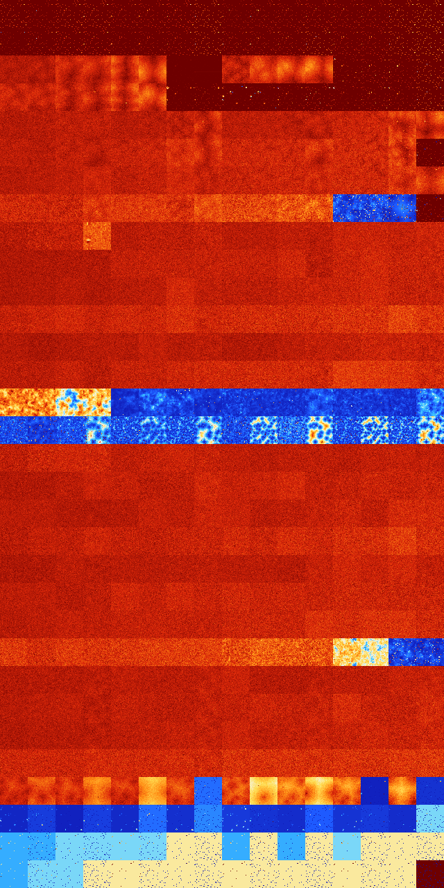

# B01256 (52736-53247)

<details>
    <summary>Initial Grid</summary>
    
</details>


<details>
    <summary>Initial Grid RLE</summary>

```
#C Exported from GoGoL (https://github.com/marrow16/gogol)
#C Wrap mode: Toroidal
#C Boundary mode: Dead
#C Step: 0
x = 100, y = 100, rule = B01256/S
73bo$6bo45bo4bo12bo7bo15bo$2bo20bo2bo53bo$35bo6bo25bo$38bo37bo$22bo50b
2o4bobo$17bo17bo45bo3bo$o8bo8bo3bo5bo14bobo22bo$80bo13bo$9bobo31bo55bo$
o12bo52bo4bo5bo3bo$5bo13bo12bo22bo15bobo$7bo7bo7bo25bo40bo$6bo4bo7bo15b
o3bo23bo18bobo$51bo25bo10bo$5bo64bo8bo7b2o$bobo22bo7bo25bo15bo8bobo$5bo
57bo$2bo33bo35bo$25bo3bo25bo14bo$45bo17bo$4bo11bo20bo35bo$25bo29bo3bo6b
o30bo$8bo38b2o33bo$3bo26bo6bo$64bo13bo3bo$21bo57bo$40bo$15bo9bo34bo23bo
$30bo25bo20bo11bobo3bo$30bo35bo$7bo22bo7b3o14bo36bo$54bo4bo6bo6bo$37bo
47bo13bo$19bo5bo10bo44bo12bo4bo$o17b2o4bobo41bo6bo$32bo5bo9bo25bo$4bo
15bo9bo37bo$3bo27bobo19bo15bo18bo$17bo34bo$2bo51bo8bo7bo$92bo$18bo19bo
49bo$16bo52bo26bo$19bo5bo38bo34bo$26bo7bo24bo$31bo3bo4bo13bo13bo11bo$3b
o23bo22bo19bo$4b3o67bo20bo$bo20bo12bo22bo$18bo9bo5bo8bo18bo2bo$26bo35bo
14bo17bo$o6bo16bo12bo18bo24b2o14b2o$17bo35bo10bo5bo15bo$2bo11bo19bo34bo
16bo4bobo$29bo25bo16bo3bo10bo$2bo17bo5bo20b2o3bo9bo3bo$2bo57bo15bo10bo$
2b3o6bo31bo13bo$14bo2bo8bo7bo9bo13bo11bo10bobo$3bo14bo4bo2bo23bo7bo2bo$
29b2o51bo15bo$12bo6bo6bo7bo30b2o7bo8bo$47bo45bo$27bo60bo$46bo4bo8b2o$
20bo30b2o14bo12bo$4bo90bo$8bobo10bo46bobo6bo$21bo4bo31bo4bo18bo12bo$2bo
41bo9bo42bo$8bo5bo16bo4bo15bobo17bo$bo13bo27bo7bo4bo28bo10bo$50bo32bo$
35bo11bo$12bo33bo4bo21b2o6bo$3bobo10bo35bobo2bo24bo$20bo42bo21bo4bo$4bo
12bo23bo34bobo7bo$9bo3bo13bo22bo8bo38bo$6bo4bo9bo19bo30bo5bo5bo$2bo5bo
37bo13bo17bo3bo8bo4bo$15bo7bo13bo9bo20bo2bo9bo6bo9bo$100b$9bo24bo17bo
37bo$21bo26bo5bo31bo$19bo16bo$9bo8bo3bo14bo21bo20bo9bobo$63bo18bo11bo$
12bo21bo3bo21bo6bo26bobo$23bo31bo10bo9bo$o20bo4b2o7bobo7bo2bo2bo41bo$7b
obo43bo21bo4b2o9bo5bo$22bo10bo2bo$o34bo16bo11bo20bo$43bo38bo$14bo43bo2b
o11bo$13bo10b2o7bo16bo9bo5bo24bo4bo$bo9bo34bo36bo10bo4bo$4bobo32bo23bo!
```
</details>
<details>
    <summary>Thumbnail</summary>

</details>
<table>
<tr>
    <td><a href="./52736%20S%20Heat%20Map%20Activity.png"></a><br>S (52736)<br>R@7,p2</td>    <td><a href="./52737%20S0%20Heat%20Map%20Activity.png"></a><br>S0 (52737)<br>R@12,p2</td>    <td><a href="./52738%20S1%20Heat%20Map%20Activity.png"></a><br>S1 (52738)<br>R@7,p2</td>    <td><a href="./52739%20S01%20Heat%20Map%20Activity.png"></a><br>S01 (52739)<br>R@7,p2</td>    <td><a href="./52740%20S2%20Heat%20Map%20Activity.png"></a><br>S2 (52740)<br>R@10,p2</td>    <td><a href="./52741%20S02%20Heat%20Map%20Activity.png"></a><br>S02 (52741)<br>R@10,p2</td>    <td><a href="./52742%20S12%20Heat%20Map%20Activity.png"></a><br>S12 (52742)<br>R@8,p2</td>    <td><a href="./52743%20S012%20Heat%20Map%20Activity.png"></a><br>S012 (52743)<br>R@6,p2</td>    <td><a href="./52744%20S3%20Heat%20Map%20Activity.png"></a><br>S3 (52744)<br>R@15,p4</td>    <td><a href="./52745%20S03%20Heat%20Map%20Activity.png"></a><br>S03 (52745)<br>R@11,p4</td>    <td><a href="./52746%20S13%20Heat%20Map%20Activity.png"></a><br>S13 (52746)<br>R@11,p4</td>    <td><a href="./52747%20S013%20Heat%20Map%20Activity.png"></a><br>S013 (52747)<br>R@9,p2</td>    <td><a href="./52748%20S23%20Heat%20Map%20Activity.png"></a><br>S23 (52748)<br>R@10,p2</td>    <td><a href="./52749%20S023%20Heat%20Map%20Activity.png"></a><br>S023 (52749)<br>R@10,p2</td>    <td><a href="./52750%20S123%20Heat%20Map%20Activity.png"></a><br>S123 (52750)<br>R@6,p2</td>    <td><a href="./52751%20S0123%20Heat%20Map%20Activity.png"></a><br>S0123 (52751)<br>R@5,p2</td></tr>
<tr>
    <td><a href="./52752%20S4%20Heat%20Map%20Activity.png"></a><br>S4 (52752)<br>R@16,p4</td>    <td><a href="./52753%20S04%20Heat%20Map%20Activity.png"></a><br>S04 (52753)<br>R@10,p2</td>    <td><a href="./52754%20S14%20Heat%20Map%20Activity.png"></a><br>S14 (52754)<br>R@8,p2</td>    <td><a href="./52755%20S014%20Heat%20Map%20Activity.png"></a><br>S014 (52755)<br>R@8,p2</td>    <td><a href="./52756%20S24%20Heat%20Map%20Activity.png"></a><br>S24 (52756)<br>R@14,p4</td>    <td><a href="./52757%20S024%20Heat%20Map%20Activity.png"></a><br>S024 (52757)<br>R@12,p2</td>    <td><a href="./52758%20S124%20Heat%20Map%20Activity.png"></a><br>S124 (52758)<br>R@10,p4</td>    <td><a href="./52759%20S0124%20Heat%20Map%20Activity.png"></a><br>S0124 (52759)<br>R@6,p2</td>    <td><a href="./52760%20S34%20Heat%20Map%20Activity.png"></a><br>S34 (52760)<br>R@10,p2</td>    <td><a href="./52761%20S034%20Heat%20Map%20Activity.png"></a><br>S034 (52761)<br>R@11,p2</td>    <td><a href="./52762%20S134%20Heat%20Map%20Activity.png"></a><br>S134 (52762)<br>R@10,p2</td>    <td><a href="./52763%20S0134%20Heat%20Map%20Activity.png"></a><br>S0134 (52763)<br>R@6,p2</td>    <td><a href="./52764%20S234%20Heat%20Map%20Activity.png"></a><br>S234 (52764)<br>R@10,p2</td>    <td><a href="./52765%20S0234%20Heat%20Map%20Activity.png"></a><br>S0234 (52765)<br>R@10,p2</td>    <td><a href="./52766%20S1234%20Heat%20Map%20Activity.png"></a><br>S1234 (52766)<br>R@6,p2</td>    <td><a href="./52767%20S01234%20Heat%20Map%20Activity.png"></a><br>S01234 (52767)<br>R@5,p2</td></tr>
<tr>
    <td><a href="./52768%20S5%20Heat%20Map%20Activity.png"></a><br>S5 (52768)<br>G>1000</td>    <td><a href="./52769%20S05%20Heat%20Map%20Activity.png"></a><br>S05 (52769)<br>G>1000</td>    <td><a href="./52770%20S15%20Heat%20Map%20Activity.png"></a><br>S15 (52770)<br>G>1000</td>    <td><a href="./52771%20S015%20Heat%20Map%20Activity.png"></a><br>S015 (52771)<br>G>1000</td>    <td><a href="./52772%20S25%20Heat%20Map%20Activity.png"></a><br>S25 (52772)<br>G>1000</td>    <td><a href="./52773%20S025%20Heat%20Map%20Activity.png"></a><br>S025 (52773)<br>G>1000</td>    <td><a href="./52774%20S125%20Heat%20Map%20Activity.png"></a><br>S125 (52774)<br>R@125,p2</td>    <td><a href="./52775%20S0125%20Heat%20Map%20Activity.png"></a><br>S0125 (52775)<br>R@208,p200</td>    <td><a href="./52776%20S35%20Heat%20Map%20Activity.png"></a><br>S35 (52776)<br>G>1000</td>    <td><a href="./52777%20S035%20Heat%20Map%20Activity.png"></a><br>S035 (52777)<br>G>1000</td>    <td><a href="./52778%20S135%20Heat%20Map%20Activity.png"></a><br>S135 (52778)<br>G>1000</td>    <td><a href="./52779%20S0135%20Heat%20Map%20Activity.png"></a><br>S0135 (52779)<br>G>1000</td>    <td><a href="./52780%20S235%20Heat%20Map%20Activity.png"></a><br>S235 (52780)<br>R@17,p2</td>    <td><a href="./52781%20S0235%20Heat%20Map%20Activity.png"></a><br>S0235 (52781)<br>R@10,p2</td>    <td><a href="./52782%20S1235%20Heat%20Map%20Activity.png"></a><br>S1235 (52782)<br>R@12,p2</td>    <td><a href="./52783%20S01235%20Heat%20Map%20Activity.png"></a><br>S01235 (52783)<br>R@6,p2</td></tr>
<tr>
    <td><a href="./52784%20S45%20Heat%20Map%20Activity.png"></a><br>S45 (52784)<br>G>1000</td>    <td><a href="./52785%20S045%20Heat%20Map%20Activity.png"></a><br>S045 (52785)<br>G>1000</td>    <td><a href="./52786%20S145%20Heat%20Map%20Activity.png"></a><br>S145 (52786)<br>G>1000</td>    <td><a href="./52787%20S0145%20Heat%20Map%20Activity.png"></a><br>S0145 (52787)<br>G>1000</td>    <td><a href="./52788%20S245%20Heat%20Map%20Activity.png"></a><br>S245 (52788)<br>G>1000</td>    <td><a href="./52789%20S0245%20Heat%20Map%20Activity.png"></a><br>S0245 (52789)<br>G>1000</td>    <td><a href="./52790%20S1245%20Heat%20Map%20Activity.png"></a><br>S1245 (52790)<br>R@30,p2</td>    <td><a href="./52791%20S01245%20Heat%20Map%20Activity.png"></a><br>S01245 (52791)<br>R@14,p2</td>    <td><a href="./52792%20S345%20Heat%20Map%20Activity.png"></a><br>S345 (52792)<br>R@38,p4</td>    <td><a href="./52793%20S0345%20Heat%20Map%20Activity.png"></a><br>S0345 (52793)<br>R@22,p4</td>    <td><a href="./52794%20S1345%20Heat%20Map%20Activity.png"></a><br>S1345 (52794)<br>R@16,p4</td>    <td><a href="./52795%20S01345%20Heat%20Map%20Activity.png"></a><br>S01345 (52795)<br>R@9,p2</td>    <td><a href="./52796%20S2345%20Heat%20Map%20Activity.png"></a><br>S2345 (52796)<br>R@22,p8</td>    <td><a href="./52797%20S02345%20Heat%20Map%20Activity.png"></a><br>S02345 (52797)<br>R@11,p2</td>    <td><a href="./52798%20S12345%20Heat%20Map%20Activity.png"></a><br>S12345 (52798)<br>R@12,p2</td>    <td><a href="./52799%20S012345%20Heat%20Map%20Activity.png"></a><br>S012345 (52799)<br>R@6,p2</td></tr>
<tr>
    <td><a href="./52800%20S6%20Heat%20Map%20Activity.png"></a><br>S6 (52800)<br>G>1000</td>    <td><a href="./52801%20S06%20Heat%20Map%20Activity.png"></a><br>S06 (52801)<br>G>1000</td>    <td><a href="./52802%20S16%20Heat%20Map%20Activity.png"></a><br>S16 (52802)<br>G>1000</td>    <td><a href="./52803%20S016%20Heat%20Map%20Activity.png"></a><br>S016 (52803)<br>G>1000</td>    <td><a href="./52804%20S26%20Heat%20Map%20Activity.png"></a><br>S26 (52804)<br>G>1000</td>    <td><a href="./52805%20S026%20Heat%20Map%20Activity.png"></a><br>S026 (52805)<br>G>1000</td>    <td><a href="./52806%20S126%20Heat%20Map%20Activity.png"></a><br>S126 (52806)<br>G>1000</td>    <td><a href="./52807%20S0126%20Heat%20Map%20Activity.png"></a><br>S0126 (52807)<br>G>1000</td>    <td><a href="./52808%20S36%20Heat%20Map%20Activity.png"></a><br>S36 (52808)<br>G>1000</td>    <td><a href="./52809%20S036%20Heat%20Map%20Activity.png"></a><br>S036 (52809)<br>G>1000</td>    <td><a href="./52810%20S136%20Heat%20Map%20Activity.png"></a><br>S136 (52810)<br>G>1000</td>    <td><a href="./52811%20S0136%20Heat%20Map%20Activity.png"></a><br>S0136 (52811)<br>G>1000</td>    <td><a href="./52812%20S236%20Heat%20Map%20Activity.png"></a><br>S236 (52812)<br>G>1000</td>    <td><a href="./52813%20S0236%20Heat%20Map%20Activity.png"></a><br>S0236 (52813)<br>G>1000</td>    <td><a href="./52814%20S1236%20Heat%20Map%20Activity.png"></a><br>S1236 (52814)<br>G>1000</td>    <td><a href="./52815%20S01236%20Heat%20Map%20Activity.png"></a><br>S01236 (52815)<br>G>1000</td></tr>
<tr>
    <td><a href="./52816%20S46%20Heat%20Map%20Activity.png"></a><br>S46 (52816)<br>G>1000</td>    <td><a href="./52817%20S046%20Heat%20Map%20Activity.png"></a><br>S046 (52817)<br>G>1000</td>    <td><a href="./52818%20S146%20Heat%20Map%20Activity.png"></a><br>S146 (52818)<br>G>1000</td>    <td><a href="./52819%20S0146%20Heat%20Map%20Activity.png"></a><br>S0146 (52819)<br>G>1000</td>    <td><a href="./52820%20S246%20Heat%20Map%20Activity.png"></a><br>S246 (52820)<br>G>1000</td>    <td><a href="./52821%20S0246%20Heat%20Map%20Activity.png"></a><br>S0246 (52821)<br>G>1000</td>    <td><a href="./52822%20S1246%20Heat%20Map%20Activity.png"></a><br>S1246 (52822)<br>G>1000</td>    <td><a href="./52823%20S01246%20Heat%20Map%20Activity.png"></a><br>S01246 (52823)<br>G>1000</td>    <td><a href="./52824%20S346%20Heat%20Map%20Activity.png"></a><br>S346 (52824)<br>G>1000</td>    <td><a href="./52825%20S0346%20Heat%20Map%20Activity.png"></a><br>S0346 (52825)<br>G>1000</td>    <td><a href="./52826%20S1346%20Heat%20Map%20Activity.png"></a><br>S1346 (52826)<br>G>1000</td>    <td><a href="./52827%20S01346%20Heat%20Map%20Activity.png"></a><br>S01346 (52827)<br>G>1000</td>    <td><a href="./52828%20S2346%20Heat%20Map%20Activity.png"></a><br>S2346 (52828)<br>G>1000</td>    <td><a href="./52829%20S02346%20Heat%20Map%20Activity.png"></a><br>S02346 (52829)<br>G>1000</td>    <td><a href="./52830%20S12346%20Heat%20Map%20Activity.png"></a><br>S12346 (52830)<br>G>1000</td>    <td><a href="./52831%20S012346%20Heat%20Map%20Activity.png"></a><br>S012346 (52831)<br>R@13,p8</td></tr>
<tr>
    <td><a href="./52832%20S56%20Heat%20Map%20Activity.png"></a><br>S56 (52832)<br>G>1000</td>    <td><a href="./52833%20S056%20Heat%20Map%20Activity.png"></a><br>S056 (52833)<br>G>1000</td>    <td><a href="./52834%20S156%20Heat%20Map%20Activity.png"></a><br>S156 (52834)<br>G>1000</td>    <td><a href="./52835%20S0156%20Heat%20Map%20Activity.png"></a><br>S0156 (52835)<br>G>1000</td>    <td><a href="./52836%20S256%20Heat%20Map%20Activity.png"></a><br>S256 (52836)<br>G>1000</td>    <td><a href="./52837%20S0256%20Heat%20Map%20Activity.png"></a><br>S0256 (52837)<br>G>1000</td>    <td><a href="./52838%20S1256%20Heat%20Map%20Activity.png"></a><br>S1256 (52838)<br>G>1000</td>    <td><a href="./52839%20S01256%20Heat%20Map%20Activity.png"></a><br>S01256 (52839)<br>G>1000</td>    <td><a href="./52840%20S356%20Heat%20Map%20Activity.png"></a><br>S356 (52840)<br>G>1000</td>    <td><a href="./52841%20S0356%20Heat%20Map%20Activity.png"></a><br>S0356 (52841)<br>G>1000</td>    <td><a href="./52842%20S1356%20Heat%20Map%20Activity.png"></a><br>S1356 (52842)<br>G>1000</td>    <td><a href="./52843%20S01356%20Heat%20Map%20Activity.png"></a><br>S01356 (52843)<br>G>1000</td>    <td><a href="./52844%20S2356%20Heat%20Map%20Activity.png"></a><br>S2356 (52844)<br>G>1000</td>    <td><a href="./52845%20S02356%20Heat%20Map%20Activity.png"></a><br>S02356 (52845)<br>G>1000</td>    <td><a href="./52846%20S12356%20Heat%20Map%20Activity.png"></a><br>S12356 (52846)<br>G>1000</td>    <td><a href="./52847%20S012356%20Heat%20Map%20Activity.png"></a><br>S012356 (52847)<br>G>1000</td></tr>
<tr>
    <td><a href="./52848%20S456%20Heat%20Map%20Activity.png"></a><br>S456 (52848)<br>G>1000</td>    <td><a href="./52849%20S0456%20Heat%20Map%20Activity.png"></a><br>S0456 (52849)<br>G>1000</td>    <td><a href="./52850%20S1456%20Heat%20Map%20Activity.png"></a><br>S1456 (52850)<br>G>1000</td>    <td><a href="./52851%20S01456%20Heat%20Map%20Activity.png"></a><br>S01456 (52851)<br>G>1000</td>    <td><a href="./52852%20S2456%20Heat%20Map%20Activity.png"></a><br>S2456 (52852)<br>G>1000</td>    <td><a href="./52853%20S02456%20Heat%20Map%20Activity.png"></a><br>S02456 (52853)<br>G>1000</td>    <td><a href="./52854%20S12456%20Heat%20Map%20Activity.png"></a><br>S12456 (52854)<br>G>1000</td>    <td><a href="./52855%20S012456%20Heat%20Map%20Activity.png"></a><br>S012456 (52855)<br>G>1000</td>    <td><a href="./52856%20S3456%20Heat%20Map%20Activity.png"></a><br>S3456 (52856)<br>G>1000</td>    <td><a href="./52857%20S03456%20Heat%20Map%20Activity.png"></a><br>S03456 (52857)<br>G>1000</td>    <td><a href="./52858%20S13456%20Heat%20Map%20Activity.png"></a><br>S13456 (52858)<br>G>1000</td>    <td><a href="./52859%20S013456%20Heat%20Map%20Activity.png"></a><br>S013456 (52859)<br>G>1000</td>    <td><a href="./52860%20S23456%20Heat%20Map%20Activity.png"></a><br>S23456 (52860)<br>R@981,p12</td>    <td><a href="./52861%20S023456%20Heat%20Map%20Activity.png"></a><br>S023456 (52861)<br>G>1000</td>    <td><a href="./52862%20S123456%20Heat%20Map%20Activity.png"></a><br>S123456 (52862)<br>G>1000</td>    <td><a href="./52863%20S0123456%20Heat%20Map%20Activity.png"></a><br>S0123456 (52863)<br>R@11,p2</td></tr>
<tr>
    <td><a href="./52864%20S7%20Heat%20Map%20Activity.png"></a><br>S7 (52864)<br>G>1000</td>    <td><a href="./52865%20S07%20Heat%20Map%20Activity.png"></a><br>S07 (52865)<br>G>1000</td>    <td><a href="./52866%20S17%20Heat%20Map%20Activity.png"></a><br>S17 (52866)<br>G>1000</td>    <td><a href="./52867%20S017%20Heat%20Map%20Activity.png"></a><br>S017 (52867)<br>G>1000</td>    <td><a href="./52868%20S27%20Heat%20Map%20Activity.png"></a><br>S27 (52868)<br>G>1000</td>    <td><a href="./52869%20S027%20Heat%20Map%20Activity.png"></a><br>S027 (52869)<br>G>1000</td>    <td><a href="./52870%20S127%20Heat%20Map%20Activity.png"></a><br>S127 (52870)<br>G>1000</td>    <td><a href="./52871%20S0127%20Heat%20Map%20Activity.png"></a><br>S0127 (52871)<br>G>1000</td>    <td><a href="./52872%20S37%20Heat%20Map%20Activity.png"></a><br>S37 (52872)<br>G>1000</td>    <td><a href="./52873%20S037%20Heat%20Map%20Activity.png"></a><br>S037 (52873)<br>G>1000</td>    <td><a href="./52874%20S137%20Heat%20Map%20Activity.png"></a><br>S137 (52874)<br>G>1000</td>    <td><a href="./52875%20S0137%20Heat%20Map%20Activity.png"></a><br>S0137 (52875)<br>G>1000</td>    <td><a href="./52876%20S237%20Heat%20Map%20Activity.png"></a><br>S237 (52876)<br>G>1000</td>    <td><a href="./52877%20S0237%20Heat%20Map%20Activity.png"></a><br>S0237 (52877)<br>G>1000</td>    <td><a href="./52878%20S1237%20Heat%20Map%20Activity.png"></a><br>S1237 (52878)<br>G>1000</td>    <td><a href="./52879%20S01237%20Heat%20Map%20Activity.png"></a><br>S01237 (52879)<br>G>1000</td></tr>
<tr>
    <td><a href="./52880%20S47%20Heat%20Map%20Activity.png"></a><br>S47 (52880)<br>G>1000</td>    <td><a href="./52881%20S047%20Heat%20Map%20Activity.png"></a><br>S047 (52881)<br>G>1000</td>    <td><a href="./52882%20S147%20Heat%20Map%20Activity.png"></a><br>S147 (52882)<br>G>1000</td>    <td><a href="./52883%20S0147%20Heat%20Map%20Activity.png"></a><br>S0147 (52883)<br>G>1000</td>    <td><a href="./52884%20S247%20Heat%20Map%20Activity.png"></a><br>S247 (52884)<br>G>1000</td>    <td><a href="./52885%20S0247%20Heat%20Map%20Activity.png"></a><br>S0247 (52885)<br>G>1000</td>    <td><a href="./52886%20S1247%20Heat%20Map%20Activity.png"></a><br>S1247 (52886)<br>G>1000</td>    <td><a href="./52887%20S01247%20Heat%20Map%20Activity.png"></a><br>S01247 (52887)<br>G>1000</td>    <td><a href="./52888%20S347%20Heat%20Map%20Activity.png"></a><br>S347 (52888)<br>G>1000</td>    <td><a href="./52889%20S0347%20Heat%20Map%20Activity.png"></a><br>S0347 (52889)<br>G>1000</td>    <td><a href="./52890%20S1347%20Heat%20Map%20Activity.png"></a><br>S1347 (52890)<br>G>1000</td>    <td><a href="./52891%20S01347%20Heat%20Map%20Activity.png"></a><br>S01347 (52891)<br>G>1000</td>    <td><a href="./52892%20S2347%20Heat%20Map%20Activity.png"></a><br>S2347 (52892)<br>G>1000</td>    <td><a href="./52893%20S02347%20Heat%20Map%20Activity.png"></a><br>S02347 (52893)<br>G>1000</td>    <td><a href="./52894%20S12347%20Heat%20Map%20Activity.png"></a><br>S12347 (52894)<br>G>1000</td>    <td><a href="./52895%20S012347%20Heat%20Map%20Activity.png"></a><br>S012347 (52895)<br>G>1000</td></tr>
<tr>
    <td><a href="./52896%20S57%20Heat%20Map%20Activity.png"></a><br>S57 (52896)<br>G>1000</td>    <td><a href="./52897%20S057%20Heat%20Map%20Activity.png"></a><br>S057 (52897)<br>G>1000</td>    <td><a href="./52898%20S157%20Heat%20Map%20Activity.png"></a><br>S157 (52898)<br>G>1000</td>    <td><a href="./52899%20S0157%20Heat%20Map%20Activity.png"></a><br>S0157 (52899)<br>G>1000</td>    <td><a href="./52900%20S257%20Heat%20Map%20Activity.png"></a><br>S257 (52900)<br>G>1000</td>    <td><a href="./52901%20S0257%20Heat%20Map%20Activity.png"></a><br>S0257 (52901)<br>G>1000</td>    <td><a href="./52902%20S1257%20Heat%20Map%20Activity.png"></a><br>S1257 (52902)<br>G>1000</td>    <td><a href="./52903%20S01257%20Heat%20Map%20Activity.png"></a><br>S01257 (52903)<br>G>1000</td>    <td><a href="./52904%20S357%20Heat%20Map%20Activity.png"></a><br>S357 (52904)<br>G>1000</td>    <td><a href="./52905%20S0357%20Heat%20Map%20Activity.png"></a><br>S0357 (52905)<br>G>1000</td>    <td><a href="./52906%20S1357%20Heat%20Map%20Activity.png"></a><br>S1357 (52906)<br>G>1000</td>    <td><a href="./52907%20S01357%20Heat%20Map%20Activity.png"></a><br>S01357 (52907)<br>G>1000</td>    <td><a href="./52908%20S2357%20Heat%20Map%20Activity.png"></a><br>S2357 (52908)<br>G>1000</td>    <td><a href="./52909%20S02357%20Heat%20Map%20Activity.png"></a><br>S02357 (52909)<br>G>1000</td>    <td><a href="./52910%20S12357%20Heat%20Map%20Activity.png"></a><br>S12357 (52910)<br>G>1000</td>    <td><a href="./52911%20S012357%20Heat%20Map%20Activity.png"></a><br>S012357 (52911)<br>G>1000</td></tr>
<tr>
    <td><a href="./52912%20S457%20Heat%20Map%20Activity.png"></a><br>S457 (52912)<br>G>1000</td>    <td><a href="./52913%20S0457%20Heat%20Map%20Activity.png"></a><br>S0457 (52913)<br>G>1000</td>    <td><a href="./52914%20S1457%20Heat%20Map%20Activity.png"></a><br>S1457 (52914)<br>G>1000</td>    <td><a href="./52915%20S01457%20Heat%20Map%20Activity.png"></a><br>S01457 (52915)<br>G>1000</td>    <td><a href="./52916%20S2457%20Heat%20Map%20Activity.png"></a><br>S2457 (52916)<br>G>1000</td>    <td><a href="./52917%20S02457%20Heat%20Map%20Activity.png"></a><br>S02457 (52917)<br>G>1000</td>    <td><a href="./52918%20S12457%20Heat%20Map%20Activity.png"></a><br>S12457 (52918)<br>G>1000</td>    <td><a href="./52919%20S012457%20Heat%20Map%20Activity.png"></a><br>S012457 (52919)<br>G>1000</td>    <td><a href="./52920%20S3457%20Heat%20Map%20Activity.png"></a><br>S3457 (52920)<br>G>1000</td>    <td><a href="./52921%20S03457%20Heat%20Map%20Activity.png"></a><br>S03457 (52921)<br>G>1000</td>    <td><a href="./52922%20S13457%20Heat%20Map%20Activity.png"></a><br>S13457 (52922)<br>G>1000</td>    <td><a href="./52923%20S013457%20Heat%20Map%20Activity.png"></a><br>S013457 (52923)<br>G>1000</td>    <td><a href="./52924%20S23457%20Heat%20Map%20Activity.png"></a><br>S23457 (52924)<br>G>1000</td>    <td><a href="./52925%20S023457%20Heat%20Map%20Activity.png"></a><br>S023457 (52925)<br>G>1000</td>    <td><a href="./52926%20S123457%20Heat%20Map%20Activity.png"></a><br>S123457 (52926)<br>G>1000</td>    <td><a href="./52927%20S0123457%20Heat%20Map%20Activity.png"></a><br>S0123457 (52927)<br>G>1000</td></tr>
<tr>
    <td><a href="./52928%20S67%20Heat%20Map%20Activity.png"></a><br>S67 (52928)<br>G>1000</td>    <td><a href="./52929%20S067%20Heat%20Map%20Activity.png"></a><br>S067 (52929)<br>G>1000</td>    <td><a href="./52930%20S167%20Heat%20Map%20Activity.png"></a><br>S167 (52930)<br>G>1000</td>    <td><a href="./52931%20S0167%20Heat%20Map%20Activity.png"></a><br>S0167 (52931)<br>G>1000</td>    <td><a href="./52932%20S267%20Heat%20Map%20Activity.png"></a><br>S267 (52932)<br>G>1000</td>    <td><a href="./52933%20S0267%20Heat%20Map%20Activity.png"></a><br>S0267 (52933)<br>G>1000</td>    <td><a href="./52934%20S1267%20Heat%20Map%20Activity.png"></a><br>S1267 (52934)<br>G>1000</td>    <td><a href="./52935%20S01267%20Heat%20Map%20Activity.png"></a><br>S01267 (52935)<br>G>1000</td>    <td><a href="./52936%20S367%20Heat%20Map%20Activity.png"></a><br>S367 (52936)<br>G>1000</td>    <td><a href="./52937%20S0367%20Heat%20Map%20Activity.png"></a><br>S0367 (52937)<br>G>1000</td>    <td><a href="./52938%20S1367%20Heat%20Map%20Activity.png"></a><br>S1367 (52938)<br>G>1000</td>    <td><a href="./52939%20S01367%20Heat%20Map%20Activity.png"></a><br>S01367 (52939)<br>G>1000</td>    <td><a href="./52940%20S2367%20Heat%20Map%20Activity.png"></a><br>S2367 (52940)<br>G>1000</td>    <td><a href="./52941%20S02367%20Heat%20Map%20Activity.png"></a><br>S02367 (52941)<br>G>1000</td>    <td><a href="./52942%20S12367%20Heat%20Map%20Activity.png"></a><br>S12367 (52942)<br>G>1000</td>    <td><a href="./52943%20S012367%20Heat%20Map%20Activity.png"></a><br>S012367 (52943)<br>G>1000</td></tr>
<tr>
    <td><a href="./52944%20S467%20Heat%20Map%20Activity.png"></a><br>S467 (52944)<br>G>1000</td>    <td><a href="./52945%20S0467%20Heat%20Map%20Activity.png"></a><br>S0467 (52945)<br>G>1000</td>    <td><a href="./52946%20S1467%20Heat%20Map%20Activity.png"></a><br>S1467 (52946)<br>G>1000</td>    <td><a href="./52947%20S01467%20Heat%20Map%20Activity.png"></a><br>S01467 (52947)<br>G>1000</td>    <td><a href="./52948%20S2467%20Heat%20Map%20Activity.png"></a><br>S2467 (52948)<br>G>1000</td>    <td><a href="./52949%20S02467%20Heat%20Map%20Activity.png"></a><br>S02467 (52949)<br>G>1000</td>    <td><a href="./52950%20S12467%20Heat%20Map%20Activity.png"></a><br>S12467 (52950)<br>G>1000</td>    <td><a href="./52951%20S012467%20Heat%20Map%20Activity.png"></a><br>S012467 (52951)<br>G>1000</td>    <td><a href="./52952%20S3467%20Heat%20Map%20Activity.png"></a><br>S3467 (52952)<br>G>1000</td>    <td><a href="./52953%20S03467%20Heat%20Map%20Activity.png"></a><br>S03467 (52953)<br>G>1000</td>    <td><a href="./52954%20S13467%20Heat%20Map%20Activity.png"></a><br>S13467 (52954)<br>G>1000</td>    <td><a href="./52955%20S013467%20Heat%20Map%20Activity.png"></a><br>S013467 (52955)<br>G>1000</td>    <td><a href="./52956%20S23467%20Heat%20Map%20Activity.png"></a><br>S23467 (52956)<br>G>1000</td>    <td><a href="./52957%20S023467%20Heat%20Map%20Activity.png"></a><br>S023467 (52957)<br>G>1000</td>    <td><a href="./52958%20S123467%20Heat%20Map%20Activity.png"></a><br>S123467 (52958)<br>G>1000</td>    <td><a href="./52959%20S0123467%20Heat%20Map%20Activity.png"></a><br>S0123467 (52959)<br>G>1000</td></tr>
<tr>
    <td><a href="./52960%20S567%20Heat%20Map%20Activity.png"></a><br>S567 (52960)<br>G>1000</td>    <td><a href="./52961%20S0567%20Heat%20Map%20Activity.png"></a><br>S0567 (52961)<br>G>1000</td>    <td><a href="./52962%20S1567%20Heat%20Map%20Activity.png"></a><br>S1567 (52962)<br>G>1000</td>    <td><a href="./52963%20S01567%20Heat%20Map%20Activity.png"></a><br>S01567 (52963)<br>G>1000</td>    <td><a href="./52964%20S2567%20Heat%20Map%20Activity.png"></a><br>S2567 (52964)<br>R@902,p4</td>    <td><a href="./52965%20S02567%20Heat%20Map%20Activity.png"></a><br>S02567 (52965)<br>R@607,p84</td>    <td><a href="./52966%20S12567%20Heat%20Map%20Activity.png"></a><br>S12567 (52966)<br>R@418,p36</td>    <td><a href="./52967%20S012567%20Heat%20Map%20Activity.png"></a><br>S012567 (52967)<br>R@786,p12</td>    <td><a href="./52968%20S3567%20Heat%20Map%20Activity.png"></a><br>S3567 (52968)<br>R@208,p30</td>    <td><a href="./52969%20S03567%20Heat%20Map%20Activity.png"></a><br>S03567 (52969)<br>R@255,p70</td>    <td><a href="./52970%20S13567%20Heat%20Map%20Activity.png"></a><br>S13567 (52970)<br>R@180,p20</td>    <td><a href="./52971%20S013567%20Heat%20Map%20Activity.png"></a><br>S013567 (52971)<br>R@195,p6</td>    <td><a href="./52972%20S23567%20Heat%20Map%20Activity.png"></a><br>S23567 (52972)<br>R@141,p30</td>    <td><a href="./52973%20S023567%20Heat%20Map%20Activity.png"></a><br>S023567 (52973)<br>R@177,p30</td>    <td><a href="./52974%20S123567%20Heat%20Map%20Activity.png"></a><br>S123567 (52974)<br>R@160,p10</td>    <td><a href="./52975%20S0123567%20Heat%20Map%20Activity.png"></a><br>S0123567 (52975)<br>R@139,p10</td></tr>
<tr>
    <td><a href="./52976%20S4567%20Heat%20Map%20Activity.png"></a><br>S4567 (52976)<br>R@41,p12</td>    <td><a href="./52977%20S04567%20Heat%20Map%20Activity.png"></a><br>S04567 (52977)<br>R@93,p60</td>    <td><a href="./52978%20S14567%20Heat%20Map%20Activity.png"></a><br>S14567 (52978)<br>R@39,p6</td>    <td><a href="./52979%20S014567%20Heat%20Map%20Activity.png"></a><br>S014567 (52979)<br>R@49,p12</td>    <td><a href="./52980%20S24567%20Heat%20Map%20Activity.png"></a><br>S24567 (52980)<br>R@28,p6</td>    <td><a href="./52981%20S024567%20Heat%20Map%20Activity.png"></a><br>S024567 (52981)<br>R@40,p12</td>    <td><a href="./52982%20S124567%20Heat%20Map%20Activity.png"></a><br>S124567 (52982)<br>R@28,p6</td>    <td><a href="./52983%20S0124567%20Heat%20Map%20Activity.png"></a><br>S0124567 (52983)<br>R@47,p12</td>    <td><a href="./52984%20S34567%20Heat%20Map%20Activity.png"></a><br>S34567 (52984)<br>R@33,p12</td>    <td><a href="./52985%20S034567%20Heat%20Map%20Activity.png"></a><br>S034567 (52985)<br>R@25,p6</td>    <td><a href="./52986%20S134567%20Heat%20Map%20Activity.png"></a><br>S134567 (52986)<br>R@23,p6</td>    <td><a href="./52987%20S0134567%20Heat%20Map%20Activity.png"></a><br>S0134567 (52987)<br>R@32,p6</td>    <td><a href="./52988%20S234567%20Heat%20Map%20Activity.png"></a><br>S234567 (52988)<br>R@23,p6</td>    <td><a href="./52989%20S0234567%20Heat%20Map%20Activity.png"></a><br>S0234567 (52989)<br>R@26,p6</td>    <td><a href="./52990%20S1234567%20Heat%20Map%20Activity.png"></a><br>S1234567 (52990)<br>R@21,p6</td>    <td><a href="./52991%20S01234567%20Heat%20Map%20Activity.png"></a><br>S01234567 (52991)<br>R@39,p6</td></tr>
<tr>
    <td><a href="./52992%20S8%20Heat%20Map%20Activity.png"></a><br>S8 (52992)<br>G>1000</td>    <td><a href="./52993%20S08%20Heat%20Map%20Activity.png"></a><br>S08 (52993)<br>G>1000</td>    <td><a href="./52994%20S18%20Heat%20Map%20Activity.png"></a><br>S18 (52994)<br>G>1000</td>    <td><a href="./52995%20S018%20Heat%20Map%20Activity.png"></a><br>S018 (52995)<br>G>1000</td>    <td><a href="./52996%20S28%20Heat%20Map%20Activity.png"></a><br>S28 (52996)<br>G>1000</td>    <td><a href="./52997%20S028%20Heat%20Map%20Activity.png"></a><br>S028 (52997)<br>G>1000</td>    <td><a href="./52998%20S128%20Heat%20Map%20Activity.png"></a><br>S128 (52998)<br>G>1000</td>    <td><a href="./52999%20S0128%20Heat%20Map%20Activity.png"></a><br>S0128 (52999)<br>G>1000</td>    <td><a href="./53000%20S38%20Heat%20Map%20Activity.png"></a><br>S38 (53000)<br>G>1000</td>    <td><a href="./53001%20S038%20Heat%20Map%20Activity.png"></a><br>S038 (53001)<br>G>1000</td>    <td><a href="./53002%20S138%20Heat%20Map%20Activity.png"></a><br>S138 (53002)<br>G>1000</td>    <td><a href="./53003%20S0138%20Heat%20Map%20Activity.png"></a><br>S0138 (53003)<br>G>1000</td>    <td><a href="./53004%20S238%20Heat%20Map%20Activity.png"></a><br>S238 (53004)<br>G>1000</td>    <td><a href="./53005%20S0238%20Heat%20Map%20Activity.png"></a><br>S0238 (53005)<br>G>1000</td>    <td><a href="./53006%20S1238%20Heat%20Map%20Activity.png"></a><br>S1238 (53006)<br>G>1000</td>    <td><a href="./53007%20S01238%20Heat%20Map%20Activity.png"></a><br>S01238 (53007)<br>G>1000</td></tr>
<tr>
    <td><a href="./53008%20S48%20Heat%20Map%20Activity.png"></a><br>S48 (53008)<br>G>1000</td>    <td><a href="./53009%20S048%20Heat%20Map%20Activity.png"></a><br>S048 (53009)<br>G>1000</td>    <td><a href="./53010%20S148%20Heat%20Map%20Activity.png"></a><br>S148 (53010)<br>G>1000</td>    <td><a href="./53011%20S0148%20Heat%20Map%20Activity.png"></a><br>S0148 (53011)<br>G>1000</td>    <td><a href="./53012%20S248%20Heat%20Map%20Activity.png"></a><br>S248 (53012)<br>G>1000</td>    <td><a href="./53013%20S0248%20Heat%20Map%20Activity.png"></a><br>S0248 (53013)<br>G>1000</td>    <td><a href="./53014%20S1248%20Heat%20Map%20Activity.png"></a><br>S1248 (53014)<br>G>1000</td>    <td><a href="./53015%20S01248%20Heat%20Map%20Activity.png"></a><br>S01248 (53015)<br>G>1000</td>    <td><a href="./53016%20S348%20Heat%20Map%20Activity.png"></a><br>S348 (53016)<br>G>1000</td>    <td><a href="./53017%20S0348%20Heat%20Map%20Activity.png"></a><br>S0348 (53017)<br>G>1000</td>    <td><a href="./53018%20S1348%20Heat%20Map%20Activity.png"></a><br>S1348 (53018)<br>G>1000</td>    <td><a href="./53019%20S01348%20Heat%20Map%20Activity.png"></a><br>S01348 (53019)<br>G>1000</td>    <td><a href="./53020%20S2348%20Heat%20Map%20Activity.png"></a><br>S2348 (53020)<br>G>1000</td>    <td><a href="./53021%20S02348%20Heat%20Map%20Activity.png"></a><br>S02348 (53021)<br>G>1000</td>    <td><a href="./53022%20S12348%20Heat%20Map%20Activity.png"></a><br>S12348 (53022)<br>G>1000</td>    <td><a href="./53023%20S012348%20Heat%20Map%20Activity.png"></a><br>S012348 (53023)<br>G>1000</td></tr>
<tr>
    <td><a href="./53024%20S58%20Heat%20Map%20Activity.png"></a><br>S58 (53024)<br>G>1000</td>    <td><a href="./53025%20S058%20Heat%20Map%20Activity.png"></a><br>S058 (53025)<br>G>1000</td>    <td><a href="./53026%20S158%20Heat%20Map%20Activity.png"></a><br>S158 (53026)<br>G>1000</td>    <td><a href="./53027%20S0158%20Heat%20Map%20Activity.png"></a><br>S0158 (53027)<br>G>1000</td>    <td><a href="./53028%20S258%20Heat%20Map%20Activity.png"></a><br>S258 (53028)<br>G>1000</td>    <td><a href="./53029%20S0258%20Heat%20Map%20Activity.png"></a><br>S0258 (53029)<br>G>1000</td>    <td><a href="./53030%20S1258%20Heat%20Map%20Activity.png"></a><br>S1258 (53030)<br>G>1000</td>    <td><a href="./53031%20S01258%20Heat%20Map%20Activity.png"></a><br>S01258 (53031)<br>G>1000</td>    <td><a href="./53032%20S358%20Heat%20Map%20Activity.png"></a><br>S358 (53032)<br>G>1000</td>    <td><a href="./53033%20S0358%20Heat%20Map%20Activity.png"></a><br>S0358 (53033)<br>G>1000</td>    <td><a href="./53034%20S1358%20Heat%20Map%20Activity.png"></a><br>S1358 (53034)<br>G>1000</td>    <td><a href="./53035%20S01358%20Heat%20Map%20Activity.png"></a><br>S01358 (53035)<br>G>1000</td>    <td><a href="./53036%20S2358%20Heat%20Map%20Activity.png"></a><br>S2358 (53036)<br>G>1000</td>    <td><a href="./53037%20S02358%20Heat%20Map%20Activity.png"></a><br>S02358 (53037)<br>G>1000</td>    <td><a href="./53038%20S12358%20Heat%20Map%20Activity.png"></a><br>S12358 (53038)<br>G>1000</td>    <td><a href="./53039%20S012358%20Heat%20Map%20Activity.png"></a><br>S012358 (53039)<br>G>1000</td></tr>
<tr>
    <td><a href="./53040%20S458%20Heat%20Map%20Activity.png"></a><br>S458 (53040)<br>G>1000</td>    <td><a href="./53041%20S0458%20Heat%20Map%20Activity.png"></a><br>S0458 (53041)<br>G>1000</td>    <td><a href="./53042%20S1458%20Heat%20Map%20Activity.png"></a><br>S1458 (53042)<br>G>1000</td>    <td><a href="./53043%20S01458%20Heat%20Map%20Activity.png"></a><br>S01458 (53043)<br>G>1000</td>    <td><a href="./53044%20S2458%20Heat%20Map%20Activity.png"></a><br>S2458 (53044)<br>G>1000</td>    <td><a href="./53045%20S02458%20Heat%20Map%20Activity.png"></a><br>S02458 (53045)<br>G>1000</td>    <td><a href="./53046%20S12458%20Heat%20Map%20Activity.png"></a><br>S12458 (53046)<br>G>1000</td>    <td><a href="./53047%20S012458%20Heat%20Map%20Activity.png"></a><br>S012458 (53047)<br>G>1000</td>    <td><a href="./53048%20S3458%20Heat%20Map%20Activity.png"></a><br>S3458 (53048)<br>G>1000</td>    <td><a href="./53049%20S03458%20Heat%20Map%20Activity.png"></a><br>S03458 (53049)<br>G>1000</td>    <td><a href="./53050%20S13458%20Heat%20Map%20Activity.png"></a><br>S13458 (53050)<br>G>1000</td>    <td><a href="./53051%20S013458%20Heat%20Map%20Activity.png"></a><br>S013458 (53051)<br>G>1000</td>    <td><a href="./53052%20S23458%20Heat%20Map%20Activity.png"></a><br>S23458 (53052)<br>G>1000</td>    <td><a href="./53053%20S023458%20Heat%20Map%20Activity.png"></a><br>S023458 (53053)<br>G>1000</td>    <td><a href="./53054%20S123458%20Heat%20Map%20Activity.png"></a><br>S123458 (53054)<br>G>1000</td>    <td><a href="./53055%20S0123458%20Heat%20Map%20Activity.png"></a><br>S0123458 (53055)<br>G>1000</td></tr>
<tr>
    <td><a href="./53056%20S68%20Heat%20Map%20Activity.png"></a><br>S68 (53056)<br>G>1000</td>    <td><a href="./53057%20S068%20Heat%20Map%20Activity.png"></a><br>S068 (53057)<br>G>1000</td>    <td><a href="./53058%20S168%20Heat%20Map%20Activity.png"></a><br>S168 (53058)<br>G>1000</td>    <td><a href="./53059%20S0168%20Heat%20Map%20Activity.png"></a><br>S0168 (53059)<br>G>1000</td>    <td><a href="./53060%20S268%20Heat%20Map%20Activity.png"></a><br>S268 (53060)<br>G>1000</td>    <td><a href="./53061%20S0268%20Heat%20Map%20Activity.png"></a><br>S0268 (53061)<br>G>1000</td>    <td><a href="./53062%20S1268%20Heat%20Map%20Activity.png"></a><br>S1268 (53062)<br>G>1000</td>    <td><a href="./53063%20S01268%20Heat%20Map%20Activity.png"></a><br>S01268 (53063)<br>G>1000</td>    <td><a href="./53064%20S368%20Heat%20Map%20Activity.png"></a><br>S368 (53064)<br>G>1000</td>    <td><a href="./53065%20S0368%20Heat%20Map%20Activity.png"></a><br>S0368 (53065)<br>G>1000</td>    <td><a href="./53066%20S1368%20Heat%20Map%20Activity.png"></a><br>S1368 (53066)<br>G>1000</td>    <td><a href="./53067%20S01368%20Heat%20Map%20Activity.png"></a><br>S01368 (53067)<br>G>1000</td>    <td><a href="./53068%20S2368%20Heat%20Map%20Activity.png"></a><br>S2368 (53068)<br>G>1000</td>    <td><a href="./53069%20S02368%20Heat%20Map%20Activity.png"></a><br>S02368 (53069)<br>G>1000</td>    <td><a href="./53070%20S12368%20Heat%20Map%20Activity.png"></a><br>S12368 (53070)<br>G>1000</td>    <td><a href="./53071%20S012368%20Heat%20Map%20Activity.png"></a><br>S012368 (53071)<br>G>1000</td></tr>
<tr>
    <td><a href="./53072%20S468%20Heat%20Map%20Activity.png"></a><br>S468 (53072)<br>G>1000</td>    <td><a href="./53073%20S0468%20Heat%20Map%20Activity.png"></a><br>S0468 (53073)<br>G>1000</td>    <td><a href="./53074%20S1468%20Heat%20Map%20Activity.png"></a><br>S1468 (53074)<br>G>1000</td>    <td><a href="./53075%20S01468%20Heat%20Map%20Activity.png"></a><br>S01468 (53075)<br>G>1000</td>    <td><a href="./53076%20S2468%20Heat%20Map%20Activity.png"></a><br>S2468 (53076)<br>G>1000</td>    <td><a href="./53077%20S02468%20Heat%20Map%20Activity.png"></a><br>S02468 (53077)<br>G>1000</td>    <td><a href="./53078%20S12468%20Heat%20Map%20Activity.png"></a><br>S12468 (53078)<br>G>1000</td>    <td><a href="./53079%20S012468%20Heat%20Map%20Activity.png"></a><br>S012468 (53079)<br>G>1000</td>    <td><a href="./53080%20S3468%20Heat%20Map%20Activity.png"></a><br>S3468 (53080)<br>G>1000</td>    <td><a href="./53081%20S03468%20Heat%20Map%20Activity.png"></a><br>S03468 (53081)<br>G>1000</td>    <td><a href="./53082%20S13468%20Heat%20Map%20Activity.png"></a><br>S13468 (53082)<br>G>1000</td>    <td><a href="./53083%20S013468%20Heat%20Map%20Activity.png"></a><br>S013468 (53083)<br>G>1000</td>    <td><a href="./53084%20S23468%20Heat%20Map%20Activity.png"></a><br>S23468 (53084)<br>G>1000</td>    <td><a href="./53085%20S023468%20Heat%20Map%20Activity.png"></a><br>S023468 (53085)<br>G>1000</td>    <td><a href="./53086%20S123468%20Heat%20Map%20Activity.png"></a><br>S123468 (53086)<br>G>1000</td>    <td><a href="./53087%20S0123468%20Heat%20Map%20Activity.png"></a><br>S0123468 (53087)<br>G>1000</td></tr>
<tr>
    <td><a href="./53088%20S568%20Heat%20Map%20Activity.png"></a><br>S568 (53088)<br>G>1000</td>    <td><a href="./53089%20S0568%20Heat%20Map%20Activity.png"></a><br>S0568 (53089)<br>G>1000</td>    <td><a href="./53090%20S1568%20Heat%20Map%20Activity.png"></a><br>S1568 (53090)<br>G>1000</td>    <td><a href="./53091%20S01568%20Heat%20Map%20Activity.png"></a><br>S01568 (53091)<br>G>1000</td>    <td><a href="./53092%20S2568%20Heat%20Map%20Activity.png"></a><br>S2568 (53092)<br>G>1000</td>    <td><a href="./53093%20S02568%20Heat%20Map%20Activity.png"></a><br>S02568 (53093)<br>G>1000</td>    <td><a href="./53094%20S12568%20Heat%20Map%20Activity.png"></a><br>S12568 (53094)<br>G>1000</td>    <td><a href="./53095%20S012568%20Heat%20Map%20Activity.png"></a><br>S012568 (53095)<br>G>1000</td>    <td><a href="./53096%20S3568%20Heat%20Map%20Activity.png"></a><br>S3568 (53096)<br>G>1000</td>    <td><a href="./53097%20S03568%20Heat%20Map%20Activity.png"></a><br>S03568 (53097)<br>G>1000</td>    <td><a href="./53098%20S13568%20Heat%20Map%20Activity.png"></a><br>S13568 (53098)<br>G>1000</td>    <td><a href="./53099%20S013568%20Heat%20Map%20Activity.png"></a><br>S013568 (53099)<br>G>1000</td>    <td><a href="./53100%20S23568%20Heat%20Map%20Activity.png"></a><br>S23568 (53100)<br>G>1000</td>    <td><a href="./53101%20S023568%20Heat%20Map%20Activity.png"></a><br>S023568 (53101)<br>G>1000</td>    <td><a href="./53102%20S123568%20Heat%20Map%20Activity.png"></a><br>S123568 (53102)<br>G>1000</td>    <td><a href="./53103%20S0123568%20Heat%20Map%20Activity.png"></a><br>S0123568 (53103)<br>G>1000</td></tr>
<tr>
    <td><a href="./53104%20S4568%20Heat%20Map%20Activity.png"></a><br>S4568 (53104)<br>G>1000</td>    <td><a href="./53105%20S04568%20Heat%20Map%20Activity.png"></a><br>S04568 (53105)<br>G>1000</td>    <td><a href="./53106%20S14568%20Heat%20Map%20Activity.png"></a><br>S14568 (53106)<br>G>1000</td>    <td><a href="./53107%20S014568%20Heat%20Map%20Activity.png"></a><br>S014568 (53107)<br>G>1000</td>    <td><a href="./53108%20S24568%20Heat%20Map%20Activity.png"></a><br>S24568 (53108)<br>G>1000</td>    <td><a href="./53109%20S024568%20Heat%20Map%20Activity.png"></a><br>S024568 (53109)<br>G>1000</td>    <td><a href="./53110%20S124568%20Heat%20Map%20Activity.png"></a><br>S124568 (53110)<br>G>1000</td>    <td><a href="./53111%20S0124568%20Heat%20Map%20Activity.png"></a><br>S0124568 (53111)<br>G>1000</td>    <td><a href="./53112%20S34568%20Heat%20Map%20Activity.png"></a><br>S34568 (53112)<br>G>1000</td>    <td><a href="./53113%20S034568%20Heat%20Map%20Activity.png"></a><br>S034568 (53113)<br>G>1000</td>    <td><a href="./53114%20S134568%20Heat%20Map%20Activity.png"></a><br>S134568 (53114)<br>G>1000</td>    <td><a href="./53115%20S0134568%20Heat%20Map%20Activity.png"></a><br>S0134568 (53115)<br>G>1000</td>    <td><a href="./53116%20S234568%20Heat%20Map%20Activity.png"></a><br>S234568 (53116)<br>G>1000</td>    <td><a href="./53117%20S0234568%20Heat%20Map%20Activity.png"></a><br>S0234568 (53117)<br>G>1000</td>    <td><a href="./53118%20S1234568%20Heat%20Map%20Activity.png"></a><br>S1234568 (53118)<br>R@778,p120</td>    <td><a href="./53119%20S01234568%20Heat%20Map%20Activity.png"></a><br>S01234568 (53119)<br>R@921,p120</td></tr>
<tr>
    <td><a href="./53120%20S78%20Heat%20Map%20Activity.png"></a><br>S78 (53120)<br>G>1000</td>    <td><a href="./53121%20S078%20Heat%20Map%20Activity.png"></a><br>S078 (53121)<br>G>1000</td>    <td><a href="./53122%20S178%20Heat%20Map%20Activity.png"></a><br>S178 (53122)<br>G>1000</td>    <td><a href="./53123%20S0178%20Heat%20Map%20Activity.png"></a><br>S0178 (53123)<br>G>1000</td>    <td><a href="./53124%20S278%20Heat%20Map%20Activity.png"></a><br>S278 (53124)<br>G>1000</td>    <td><a href="./53125%20S0278%20Heat%20Map%20Activity.png"></a><br>S0278 (53125)<br>G>1000</td>    <td><a href="./53126%20S1278%20Heat%20Map%20Activity.png"></a><br>S1278 (53126)<br>G>1000</td>    <td><a href="./53127%20S01278%20Heat%20Map%20Activity.png"></a><br>S01278 (53127)<br>G>1000</td>    <td><a href="./53128%20S378%20Heat%20Map%20Activity.png"></a><br>S378 (53128)<br>G>1000</td>    <td><a href="./53129%20S0378%20Heat%20Map%20Activity.png"></a><br>S0378 (53129)<br>G>1000</td>    <td><a href="./53130%20S1378%20Heat%20Map%20Activity.png"></a><br>S1378 (53130)<br>G>1000</td>    <td><a href="./53131%20S01378%20Heat%20Map%20Activity.png"></a><br>S01378 (53131)<br>G>1000</td>    <td><a href="./53132%20S2378%20Heat%20Map%20Activity.png"></a><br>S2378 (53132)<br>G>1000</td>    <td><a href="./53133%20S02378%20Heat%20Map%20Activity.png"></a><br>S02378 (53133)<br>G>1000</td>    <td><a href="./53134%20S12378%20Heat%20Map%20Activity.png"></a><br>S12378 (53134)<br>G>1000</td>    <td><a href="./53135%20S012378%20Heat%20Map%20Activity.png"></a><br>S012378 (53135)<br>G>1000</td></tr>
<tr>
    <td><a href="./53136%20S478%20Heat%20Map%20Activity.png"></a><br>S478 (53136)<br>G>1000</td>    <td><a href="./53137%20S0478%20Heat%20Map%20Activity.png"></a><br>S0478 (53137)<br>G>1000</td>    <td><a href="./53138%20S1478%20Heat%20Map%20Activity.png"></a><br>S1478 (53138)<br>G>1000</td>    <td><a href="./53139%20S01478%20Heat%20Map%20Activity.png"></a><br>S01478 (53139)<br>G>1000</td>    <td><a href="./53140%20S2478%20Heat%20Map%20Activity.png"></a><br>S2478 (53140)<br>G>1000</td>    <td><a href="./53141%20S02478%20Heat%20Map%20Activity.png"></a><br>S02478 (53141)<br>G>1000</td>    <td><a href="./53142%20S12478%20Heat%20Map%20Activity.png"></a><br>S12478 (53142)<br>G>1000</td>    <td><a href="./53143%20S012478%20Heat%20Map%20Activity.png"></a><br>S012478 (53143)<br>G>1000</td>    <td><a href="./53144%20S3478%20Heat%20Map%20Activity.png"></a><br>S3478 (53144)<br>G>1000</td>    <td><a href="./53145%20S03478%20Heat%20Map%20Activity.png"></a><br>S03478 (53145)<br>G>1000</td>    <td><a href="./53146%20S13478%20Heat%20Map%20Activity.png"></a><br>S13478 (53146)<br>G>1000</td>    <td><a href="./53147%20S013478%20Heat%20Map%20Activity.png"></a><br>S013478 (53147)<br>G>1000</td>    <td><a href="./53148%20S23478%20Heat%20Map%20Activity.png"></a><br>S23478 (53148)<br>G>1000</td>    <td><a href="./53149%20S023478%20Heat%20Map%20Activity.png"></a><br>S023478 (53149)<br>G>1000</td>    <td><a href="./53150%20S123478%20Heat%20Map%20Activity.png"></a><br>S123478 (53150)<br>G>1000</td>    <td><a href="./53151%20S0123478%20Heat%20Map%20Activity.png"></a><br>S0123478 (53151)<br>G>1000</td></tr>
<tr>
    <td><a href="./53152%20S578%20Heat%20Map%20Activity.png"></a><br>S578 (53152)<br>G>1000</td>    <td><a href="./53153%20S0578%20Heat%20Map%20Activity.png"></a><br>S0578 (53153)<br>G>1000</td>    <td><a href="./53154%20S1578%20Heat%20Map%20Activity.png"></a><br>S1578 (53154)<br>G>1000</td>    <td><a href="./53155%20S01578%20Heat%20Map%20Activity.png"></a><br>S01578 (53155)<br>G>1000</td>    <td><a href="./53156%20S2578%20Heat%20Map%20Activity.png"></a><br>S2578 (53156)<br>G>1000</td>    <td><a href="./53157%20S02578%20Heat%20Map%20Activity.png"></a><br>S02578 (53157)<br>G>1000</td>    <td><a href="./53158%20S12578%20Heat%20Map%20Activity.png"></a><br>S12578 (53158)<br>G>1000</td>    <td><a href="./53159%20S012578%20Heat%20Map%20Activity.png"></a><br>S012578 (53159)<br>G>1000</td>    <td><a href="./53160%20S3578%20Heat%20Map%20Activity.png"></a><br>S3578 (53160)<br>G>1000</td>    <td><a href="./53161%20S03578%20Heat%20Map%20Activity.png"></a><br>S03578 (53161)<br>G>1000</td>    <td><a href="./53162%20S13578%20Heat%20Map%20Activity.png"></a><br>S13578 (53162)<br>G>1000</td>    <td><a href="./53163%20S013578%20Heat%20Map%20Activity.png"></a><br>S013578 (53163)<br>G>1000</td>    <td><a href="./53164%20S23578%20Heat%20Map%20Activity.png"></a><br>S23578 (53164)<br>G>1000</td>    <td><a href="./53165%20S023578%20Heat%20Map%20Activity.png"></a><br>S023578 (53165)<br>G>1000</td>    <td><a href="./53166%20S123578%20Heat%20Map%20Activity.png"></a><br>S123578 (53166)<br>G>1000</td>    <td><a href="./53167%20S0123578%20Heat%20Map%20Activity.png"></a><br>S0123578 (53167)<br>G>1000</td></tr>
<tr>
    <td><a href="./53168%20S4578%20Heat%20Map%20Activity.png"></a><br>S4578 (53168)<br>G>1000</td>    <td><a href="./53169%20S04578%20Heat%20Map%20Activity.png"></a><br>S04578 (53169)<br>G>1000</td>    <td><a href="./53170%20S14578%20Heat%20Map%20Activity.png"></a><br>S14578 (53170)<br>G>1000</td>    <td><a href="./53171%20S014578%20Heat%20Map%20Activity.png"></a><br>S014578 (53171)<br>G>1000</td>    <td><a href="./53172%20S24578%20Heat%20Map%20Activity.png"></a><br>S24578 (53172)<br>G>1000</td>    <td><a href="./53173%20S024578%20Heat%20Map%20Activity.png"></a><br>S024578 (53173)<br>G>1000</td>    <td><a href="./53174%20S124578%20Heat%20Map%20Activity.png"></a><br>S124578 (53174)<br>G>1000</td>    <td><a href="./53175%20S0124578%20Heat%20Map%20Activity.png"></a><br>S0124578 (53175)<br>G>1000</td>    <td><a href="./53176%20S34578%20Heat%20Map%20Activity.png"></a><br>S34578 (53176)<br>G>1000</td>    <td><a href="./53177%20S034578%20Heat%20Map%20Activity.png"></a><br>S034578 (53177)<br>G>1000</td>    <td><a href="./53178%20S134578%20Heat%20Map%20Activity.png"></a><br>S134578 (53178)<br>G>1000</td>    <td><a href="./53179%20S0134578%20Heat%20Map%20Activity.png"></a><br>S0134578 (53179)<br>G>1000</td>    <td><a href="./53180%20S234578%20Heat%20Map%20Activity.png"></a><br>S234578 (53180)<br>G>1000</td>    <td><a href="./53181%20S0234578%20Heat%20Map%20Activity.png"></a><br>S0234578 (53181)<br>G>1000</td>    <td><a href="./53182%20S1234578%20Heat%20Map%20Activity.png"></a><br>S1234578 (53182)<br>G>1000</td>    <td><a href="./53183%20S01234578%20Heat%20Map%20Activity.png"></a><br>S01234578 (53183)<br>G>1000</td></tr>
<tr>
    <td><a href="./53184%20S678%20Heat%20Map%20Activity.png"></a><br>S678 (53184)<br>G>1000</td>    <td><a href="./53185%20S0678%20Heat%20Map%20Activity.png"></a><br>S0678 (53185)<br>G>1000</td>    <td><a href="./53186%20S1678%20Heat%20Map%20Activity.png"></a><br>S1678 (53186)<br>G>1000</td>    <td><a href="./53187%20S01678%20Heat%20Map%20Activity.png"></a><br>S01678 (53187)<br>G>1000</td>    <td><a href="./53188%20S2678%20Heat%20Map%20Activity.png"></a><br>S2678 (53188)<br>G>1000</td>    <td><a href="./53189%20S02678%20Heat%20Map%20Activity.png"></a><br>S02678 (53189)<br>G>1000</td>    <td><a href="./53190%20S12678%20Heat%20Map%20Activity.png"></a><br>S12678 (53190)<br>G>1000</td>    <td><a href="./53191%20S012678%20Heat%20Map%20Activity.png"></a><br>S012678 (53191)<br>S@7</td>    <td><a href="./53192%20S3678%20Heat%20Map%20Activity.png"></a><br>S3678 (53192)<br>G>1000</td>    <td><a href="./53193%20S03678%20Heat%20Map%20Activity.png"></a><br>S03678 (53193)<br>G>1000</td>    <td><a href="./53194%20S13678%20Heat%20Map%20Activity.png"></a><br>S13678 (53194)<br>G>1000</td>    <td><a href="./53195%20S013678%20Heat%20Map%20Activity.png"></a><br>S013678 (53195)<br>G>1000</td>    <td><a href="./53196%20S23678%20Heat%20Map%20Activity.png"></a><br>S23678 (53196)<br>G>1000</td>    <td><a href="./53197%20S023678%20Heat%20Map%20Activity.png"></a><br>S023678 (53197)<br>R@51,p20</td>    <td><a href="./53198%20S123678%20Heat%20Map%20Activity.png"></a><br>S123678 (53198)<br>G>1000</td>    <td><a href="./53199%20S0123678%20Heat%20Map%20Activity.png"></a><br>S0123678 (53199)<br>R@24,p5</td></tr>
<tr>
    <td><a href="./53200%20S4678%20Heat%20Map%20Activity.png"></a><br>S4678 (53200)<br>R@33,p2</td>    <td><a href="./53201%20S04678%20Heat%20Map%20Activity.png"></a><br>S04678 (53201)<br>R@14,p2</td>    <td><a href="./53202%20S14678%20Heat%20Map%20Activity.png"></a><br>S14678 (53202)<br>R@50,p2</td>    <td><a href="./53203%20S014678%20Heat%20Map%20Activity.png"></a><br>S014678 (53203)<br>R@15,p2</td>    <td><a href="./53204%20S24678%20Heat%20Map%20Activity.png"></a><br>S24678 (53204)<br>R@30,p2</td>    <td><a href="./53205%20S024678%20Heat%20Map%20Activity.png"></a><br>S024678 (53205)<br>R@7,p2</td>    <td><a href="./53206%20S124678%20Heat%20Map%20Activity.png"></a><br>S124678 (53206)<br>S@31</td>    <td><a href="./53207%20S0124678%20Heat%20Map%20Activity.png"></a><br>S0124678 (53207)<br>S@6</td>    <td><a href="./53208%20S34678%20Heat%20Map%20Activity.png"></a><br>S34678 (53208)<br>R@17,p2</td>    <td><a href="./53209%20S034678%20Heat%20Map%20Activity.png"></a><br>S034678 (53209)<br>R@18,p2</td>    <td><a href="./53210%20S134678%20Heat%20Map%20Activity.png"></a><br>S134678 (53210)<br>R@26,p2</td>    <td><a href="./53211%20S0134678%20Heat%20Map%20Activity.png"></a><br>S0134678 (53211)<br>R@8,p2</td>    <td><a href="./53212%20S234678%20Heat%20Map%20Activity.png"></a><br>S234678 (53212)<br>R@18,p2</td>    <td><a href="./53213%20S0234678%20Heat%20Map%20Activity.png"></a><br>S0234678 (53213)<br>R@15,p2</td>    <td><a href="./53214%20S1234678%20Heat%20Map%20Activity.png"></a><br>S1234678 (53214)<br>R@26,p2</td>    <td><a href="./53215%20S01234678%20Heat%20Map%20Activity.png"></a><br>S01234678 (53215)<br>S@4</td></tr>
<tr>
    <td><a href="./53216%20S5678%20Heat%20Map%20Activity.png"></a><br>S5678 (53216)<br>S@4</td>    <td><a href="./53217%20S05678%20Heat%20Map%20Activity.png"></a><br>S05678 (53217)<br>S@4</td>    <td><a href="./53218%20S15678%20Heat%20Map%20Activity.png"></a><br>S15678 (53218)<br>S@3</td>    <td><a href="./53219%20S015678%20Heat%20Map%20Activity.png"></a><br>S015678 (53219)<br>S@3</td>    <td><a href="./53220%20S25678%20Heat%20Map%20Activity.png"></a><br>S25678 (53220)<br>S@3</td>    <td><a href="./53221%20S025678%20Heat%20Map%20Activity.png"></a><br>S025678 (53221)<br>S@3</td>    <td><a href="./53222%20S125678%20Heat%20Map%20Activity.png"></a><br>S125678 (53222)<br>S@3</td>    <td><a href="./53223%20S0125678%20Heat%20Map%20Activity.png"></a><br>S0125678 (53223)<br>S@3</td>    <td><a href="./53224%20S35678%20Heat%20Map%20Activity.png"></a><br>S35678 (53224)<br>S@4</td>    <td><a href="./53225%20S035678%20Heat%20Map%20Activity.png"></a><br>S035678 (53225)<br>S@3</td>    <td><a href="./53226%20S135678%20Heat%20Map%20Activity.png"></a><br>S135678 (53226)<br>S@4</td>    <td><a href="./53227%20S0135678%20Heat%20Map%20Activity.png"></a><br>S0135678 (53227)<br>S@3</td>    <td><a href="./53228%20S235678%20Heat%20Map%20Activity.png"></a><br>S235678 (53228)<br>S@3</td>    <td><a href="./53229%20S0235678%20Heat%20Map%20Activity.png"></a><br>S0235678 (53229)<br>S@3</td>    <td><a href="./53230%20S1235678%20Heat%20Map%20Activity.png"></a><br>S1235678 (53230)<br>S@3</td>    <td><a href="./53231%20S01235678%20Heat%20Map%20Activity.png"></a><br>S01235678 (53231)<br>S@3</td></tr>
<tr>
    <td><a href="./53232%20S45678%20Heat%20Map%20Activity.png"></a><br>S45678 (53232)<br>S@4</td>    <td><a href="./53233%20S045678%20Heat%20Map%20Activity.png"></a><br>S045678 (53233)<br>S@3</td>    <td><a href="./53234%20S145678%20Heat%20Map%20Activity.png"></a><br>S145678 (53234)<br>S@3</td>    <td><a href="./53235%20S0145678%20Heat%20Map%20Activity.png"></a><br>S0145678 (53235)<br>S@3</td>    <td><a href="./53236%20S245678%20Heat%20Map%20Activity.png"></a><br>S245678 (53236)<br>S@3</td>    <td><a href="./53237%20S0245678%20Heat%20Map%20Activity.png"></a><br>S0245678 (53237)<br>S@3</td>    <td><a href="./53238%20S1245678%20Heat%20Map%20Activity.png"></a><br>S1245678 (53238)<br>S@3</td>    <td><a href="./53239%20S01245678%20Heat%20Map%20Activity.png"></a><br>S01245678 (53239)<br>S@3</td>    <td><a href="./53240%20S345678%20Heat%20Map%20Activity.png"></a><br>S345678 (53240)<br>S@3</td>    <td><a href="./53241%20S0345678%20Heat%20Map%20Activity.png"></a><br>S0345678 (53241)<br>S@3</td>    <td><a href="./53242%20S1345678%20Heat%20Map%20Activity.png"></a><br>S1345678 (53242)<br>S@3</td>    <td><a href="./53243%20S01345678%20Heat%20Map%20Activity.png"></a><br>S01345678 (53243)<br>S@3</td>    <td><a href="./53244%20S2345678%20Heat%20Map%20Activity.png"></a><br>S2345678 (53244)<br>S@3</td>    <td><a href="./53245%20S02345678%20Heat%20Map%20Activity.png"></a><br>S02345678 (53245)<br>S@3</td>    <td><a href="./53246%20S12345678%20Heat%20Map%20Activity.png"></a><br>S12345678 (53246)<br>S@2</td>    <td><a href="./53247%20S012345678%20Heat%20Map%20Activity.png"></a><br>S012345678 (53247)<br>S@2</td></tr>
</table>
