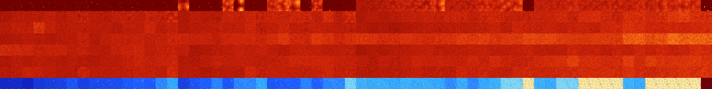

# B0125678 (249344-249855)

<details>
    <summary>Initial Grid</summary>
    
</details>


<details>
    <summary>Initial Grid RLE</summary>

```
#C Exported from GoGoL (https://github.com/marrow16/gogol)
#C Wrap mode: Toroidal
#C Boundary mode: Dead
#C Step: 0
x = 100, y = 100, rule = B0125678/S
3bo34bo$64bo6bo17bo$3bo6bo40bo32bobo$4bo30bo8bo18bo33bo$bo45bobo29bo19b
o$4bo6bo26bo14bo14bo17bo$27bo12bob2o23bo$3bo42b2o2bo8bo20bo8bo$14bo7bo
9bo43bo14bo$3bo21bo28bo39bo4bo$67bo13bo9bo$68bo14bobo$40bo50bo5bo$14bo
63bo$8b2o10bo17bo17bo20bo$3bobo8bo10bo18bo7bo9bo29bo$o8bo5bo5bo35bo14bo
5bo16bo$2bo14b2obo35bo14bo6bo2bo7bo3bo$6bo16bo8bo10bo31bo17bo3bo$15bo7b
o53bo5b2o$2bobo8bo11bo21bo8bo22bo$72b2o16bo4bo$13bo23bo6bo2bo30bobo6bo$
10bo10bo7bo15bo34bo$o81bo9bo$16bo29bo10bo14bo12bo$56bo20bo$9bo8bo13bo3b
o4bo4bo20bo18bobo$bo2bo39bo3bo37bo4bo$11bo7bo14b2o11bobo42bo$29bo30bo8b
o19bo$bo7bo13bo12bo7bo30bobo$17b2o12bo23bo32bo$4bo23bo8bo2bo4bo7bo3bo2b
o12b3o6bo$42bo3bo7bo$31bo2bo13bo3bo8bo9bo$24bo45bo17bo$12bo10bo4b2o8bo
4bo4b2o7bo13bo3bo17bo$o24bo31bo21bobo$5bo7bo$2bo8bo48b2o3bo23bo2bobo$
27bo41bo9bo$11bo2bo15bo49bo$26bo42bo7bo$17b2o22bo$33bo17bo28bo3bobo$37b
o19bo18bo19bo$7bo15bo5b2o5bo19bo7bo18bo6bo6bo$12bo4bo35bo24bo17bo$18bo
3bo37b2o15bo$22bo27bo25bo11bo$3bo3bo12b2o77bo$7bo46bo$bo9bo25bo23bo31bo
$75bo$55bo9bo18bo5bo6bo$6bo3bobo31bo6bo25bobo$17bo19bo4bo10bo39bo5bo$
23b2o22bo$58bo7bo21bo5bo$7bo3bo5bo13bo22bo24bo7bo7bo$3bo28b4o3bo44bo3b
2o8bo$16bo26bo9bo17bo20bo$39bo20bo30bobo$3bo2bo21bo11bo15bo19bo13bo$5bo
20bo7bo2bo8bo30bo9bo$8bo31bo11bo5bo$27bo39bo4bo14bob2o$27bo12bo20bo25bo
7bo$bo33bo2bo7b2o9bo12bo$8bo2bo12b2o43bo13bo$14bo45bo16bo12bo$8bo46bo$o
14bo77bo$31bo7bo30bo16bo$9bo14bo32bo2bo6bo2bo$3bo10bo45bo20bo$19bo2bo5b
o11bo12bo$2bo6bo3bo18bo33bo$31bo52bo2bo4bo$11bo66bo$o12bo11bo49bo$10bo
4bo14bo6bo41bo$2bo6bobo2bo11bo40bo14bo$3bo17bo7bobo15bo11bobo3bo6bo$21b
o9bo48bo11bo$4bo5bo4bo$13bo6bo5bo9bo20bo17bo20bo$43bo38bo$3bo24b2o4bo
36bo12bo11bo$24bo34bo5bo$13bo13bo6bo52bo$4bo45bo13bo30bo$40bo14bo5bobo$
31bo17bo17bo15bo2bobo$2bo37bo22b2o19b2o$4bo29b2o5bo20bo5bo19bo$7bo4bo
50bo4bo16bo$4bobo5b2obobo31bo40bobobo$7b2o3bob2o33bo40bo!
```
</details>
<details>
    <summary>Thumbnail</summary>

</details>
<table>
<tr>
    <td><a href="./249344%20S%20Heat%20Map%20Activity.png"></a><br>S (249344)<br>R@22,p2</td>    <td><a href="./249345%20S0%20Heat%20Map%20Activity.png"></a><br>S0 (249345)<br>R@9,p2</td>    <td><a href="./249346%20S1%20Heat%20Map%20Activity.png"></a><br>S1 (249346)<br>R@15,p2</td>    <td><a href="./249347%20S01%20Heat%20Map%20Activity.png"></a><br>S01 (249347)<br>R@15,p4</td>    <td><a href="./249348%20S2%20Heat%20Map%20Activity.png"></a><br>S2 (249348)<br>R@52,p24</td>    <td><a href="./249349%20S02%20Heat%20Map%20Activity.png"></a><br>S02 (249349)<br>R@19,p4</td>    <td><a href="./249350%20S12%20Heat%20Map%20Activity.png"></a><br>S12 (249350)<br>R@31,p2</td>    <td><a href="./249351%20S012%20Heat%20Map%20Activity.png"></a><br>S012 (249351)<br>R@9,p2</td>    <td><a href="./249352%20S3%20Heat%20Map%20Activity.png"></a><br>S3 (249352)<br>R@324,p4</td>    <td><a href="./249353%20S03%20Heat%20Map%20Activity.png"></a><br>S03 (249353)<br>R@23,p8</td>    <td><a href="./249354%20S13%20Heat%20Map%20Activity.png"></a><br>S13 (249354)<br>R@23,p8</td>    <td><a href="./249355%20S013%20Heat%20Map%20Activity.png"></a><br>S013 (249355)<br>R@19,p4</td>    <td><a href="./249356%20S23%20Heat%20Map%20Activity.png"></a><br>S23 (249356)<br>R@205,p4</td>    <td><a href="./249357%20S023%20Heat%20Map%20Activity.png"></a><br>S023 (249357)<br>R@33,p2</td>    <td><a href="./249358%20S123%20Heat%20Map%20Activity.png"></a><br>S123 (249358)<br>R@23,p8</td>    <td><a href="./249359%20S0123%20Heat%20Map%20Activity.png"></a><br>S0123 (249359)<br>R@11,p4</td>    <td><a href="./249360%20S4%20Heat%20Map%20Activity.png"></a><br>S4 (249360)<br>G>1000</td>    <td><a href="./249361%20S04%20Heat%20Map%20Activity.png"></a><br>S04 (249361)<br>R@48,p2</td>    <td><a href="./249362%20S14%20Heat%20Map%20Activity.png"></a><br>S14 (249362)<br>R@23,p4</td>    <td><a href="./249363%20S014%20Heat%20Map%20Activity.png"></a><br>S014 (249363)<br>R@17,p4</td>    <td><a href="./249364%20S24%20Heat%20Map%20Activity.png"></a><br>S24 (249364)<br>G>1000</td>    <td><a href="./249365%20S024%20Heat%20Map%20Activity.png"></a><br>S024 (249365)<br>G>1000</td>    <td><a href="./249366%20S124%20Heat%20Map%20Activity.png"></a><br>S124 (249366)<br>R@33,p16</td>    <td><a href="./249367%20S0124%20Heat%20Map%20Activity.png"></a><br>S0124 (249367)<br>R@35,p2</td>    <td><a href="./249368%20S34%20Heat%20Map%20Activity.png"></a><br>S34 (249368)<br>G>1000</td>    <td><a href="./249369%20S034%20Heat%20Map%20Activity.png"></a><br>S034 (249369)<br>G>1000</td>    <td><a href="./249370%20S134%20Heat%20Map%20Activity.png"></a><br>S134 (249370)<br>G>1000</td>    <td><a href="./249371%20S0134%20Heat%20Map%20Activity.png"></a><br>S0134 (249371)<br>R@19,p4</td>    <td><a href="./249372%20S234%20Heat%20Map%20Activity.png"></a><br>S234 (249372)<br>G>1000</td>    <td><a href="./249373%20S0234%20Heat%20Map%20Activity.png"></a><br>S0234 (249373)<br>R@139,p2</td>    <td><a href="./249374%20S1234%20Heat%20Map%20Activity.png"></a><br>S1234 (249374)<br>R@29,p2</td>    <td><a href="./249375%20S01234%20Heat%20Map%20Activity.png"></a><br>S01234 (249375)<br>R@13,p2</td>    <td><a href="./249376%20S5%20Heat%20Map%20Activity.png"></a><br>S5 (249376)<br>G>1000</td>    <td><a href="./249377%20S05%20Heat%20Map%20Activity.png"></a><br>S05 (249377)<br>G>1000</td>    <td><a href="./249378%20S15%20Heat%20Map%20Activity.png"></a><br>S15 (249378)<br>G>1000</td>    <td><a href="./249379%20S015%20Heat%20Map%20Activity.png"></a><br>S015 (249379)<br>G>1000</td>    <td><a href="./249380%20S25%20Heat%20Map%20Activity.png"></a><br>S25 (249380)<br>G>1000</td>    <td><a href="./249381%20S025%20Heat%20Map%20Activity.png"></a><br>S025 (249381)<br>G>1000</td>    <td><a href="./249382%20S125%20Heat%20Map%20Activity.png"></a><br>S125 (249382)<br>G>1000</td>    <td><a href="./249383%20S0125%20Heat%20Map%20Activity.png"></a><br>S0125 (249383)<br>G>1000</td>    <td><a href="./249384%20S35%20Heat%20Map%20Activity.png"></a><br>S35 (249384)<br>G>1000</td>    <td><a href="./249385%20S035%20Heat%20Map%20Activity.png"></a><br>S035 (249385)<br>G>1000</td>    <td><a href="./249386%20S135%20Heat%20Map%20Activity.png"></a><br>S135 (249386)<br>G>1000</td>    <td><a href="./249387%20S0135%20Heat%20Map%20Activity.png"></a><br>S0135 (249387)<br>G>1000</td>    <td><a href="./249388%20S235%20Heat%20Map%20Activity.png"></a><br>S235 (249388)<br>G>1000</td>    <td><a href="./249389%20S0235%20Heat%20Map%20Activity.png"></a><br>S0235 (249389)<br>G>1000</td>    <td><a href="./249390%20S1235%20Heat%20Map%20Activity.png"></a><br>S1235 (249390)<br>G>1000</td>    <td><a href="./249391%20S01235%20Heat%20Map%20Activity.png"></a><br>S01235 (249391)<br>R@49,p4</td>    <td><a href="./249392%20S45%20Heat%20Map%20Activity.png"></a><br>S45 (249392)<br>G>1000</td>    <td><a href="./249393%20S045%20Heat%20Map%20Activity.png"></a><br>S045 (249393)<br>G>1000</td>    <td><a href="./249394%20S145%20Heat%20Map%20Activity.png"></a><br>S145 (249394)<br>G>1000</td>    <td><a href="./249395%20S0145%20Heat%20Map%20Activity.png"></a><br>S0145 (249395)<br>G>1000</td>    <td><a href="./249396%20S245%20Heat%20Map%20Activity.png"></a><br>S245 (249396)<br>G>1000</td>    <td><a href="./249397%20S0245%20Heat%20Map%20Activity.png"></a><br>S0245 (249397)<br>G>1000</td>    <td><a href="./249398%20S1245%20Heat%20Map%20Activity.png"></a><br>S1245 (249398)<br>G>1000</td>    <td><a href="./249399%20S01245%20Heat%20Map%20Activity.png"></a><br>S01245 (249399)<br>G>1000</td>    <td><a href="./249400%20S345%20Heat%20Map%20Activity.png"></a><br>S345 (249400)<br>G>1000</td>    <td><a href="./249401%20S0345%20Heat%20Map%20Activity.png"></a><br>S0345 (249401)<br>G>1000</td>    <td><a href="./249402%20S1345%20Heat%20Map%20Activity.png"></a><br>S1345 (249402)<br>G>1000</td>    <td><a href="./249403%20S01345%20Heat%20Map%20Activity.png"></a><br>S01345 (249403)<br>G>1000</td>    <td><a href="./249404%20S2345%20Heat%20Map%20Activity.png"></a><br>S2345 (249404)<br>G>1000</td>    <td><a href="./249405%20S02345%20Heat%20Map%20Activity.png"></a><br>S02345 (249405)<br>G>1000</td>    <td><a href="./249406%20S12345%20Heat%20Map%20Activity.png"></a><br>S12345 (249406)<br>G>1000</td>    <td><a href="./249407%20S012345%20Heat%20Map%20Activity.png"></a><br>S012345 (249407)<br>R@45,p4</td></tr>
<tr>
    <td><a href="./249408%20S6%20Heat%20Map%20Activity.png"></a><br>S6 (249408)<br>G>1000</td>    <td><a href="./249409%20S06%20Heat%20Map%20Activity.png"></a><br>S06 (249409)<br>G>1000</td>    <td><a href="./249410%20S16%20Heat%20Map%20Activity.png"></a><br>S16 (249410)<br>G>1000</td>    <td><a href="./249411%20S016%20Heat%20Map%20Activity.png"></a><br>S016 (249411)<br>G>1000</td>    <td><a href="./249412%20S26%20Heat%20Map%20Activity.png"></a><br>S26 (249412)<br>G>1000</td>    <td><a href="./249413%20S026%20Heat%20Map%20Activity.png"></a><br>S026 (249413)<br>G>1000</td>    <td><a href="./249414%20S126%20Heat%20Map%20Activity.png"></a><br>S126 (249414)<br>G>1000</td>    <td><a href="./249415%20S0126%20Heat%20Map%20Activity.png"></a><br>S0126 (249415)<br>G>1000</td>    <td><a href="./249416%20S36%20Heat%20Map%20Activity.png"></a><br>S36 (249416)<br>G>1000</td>    <td><a href="./249417%20S036%20Heat%20Map%20Activity.png"></a><br>S036 (249417)<br>G>1000</td>    <td><a href="./249418%20S136%20Heat%20Map%20Activity.png"></a><br>S136 (249418)<br>G>1000</td>    <td><a href="./249419%20S0136%20Heat%20Map%20Activity.png"></a><br>S0136 (249419)<br>G>1000</td>    <td><a href="./249420%20S236%20Heat%20Map%20Activity.png"></a><br>S236 (249420)<br>G>1000</td>    <td><a href="./249421%20S0236%20Heat%20Map%20Activity.png"></a><br>S0236 (249421)<br>G>1000</td>    <td><a href="./249422%20S1236%20Heat%20Map%20Activity.png"></a><br>S1236 (249422)<br>G>1000</td>    <td><a href="./249423%20S01236%20Heat%20Map%20Activity.png"></a><br>S01236 (249423)<br>G>1000</td>    <td><a href="./249424%20S46%20Heat%20Map%20Activity.png"></a><br>S46 (249424)<br>G>1000</td>    <td><a href="./249425%20S046%20Heat%20Map%20Activity.png"></a><br>S046 (249425)<br>G>1000</td>    <td><a href="./249426%20S146%20Heat%20Map%20Activity.png"></a><br>S146 (249426)<br>G>1000</td>    <td><a href="./249427%20S0146%20Heat%20Map%20Activity.png"></a><br>S0146 (249427)<br>G>1000</td>    <td><a href="./249428%20S246%20Heat%20Map%20Activity.png"></a><br>S246 (249428)<br>G>1000</td>    <td><a href="./249429%20S0246%20Heat%20Map%20Activity.png"></a><br>S0246 (249429)<br>G>1000</td>    <td><a href="./249430%20S1246%20Heat%20Map%20Activity.png"></a><br>S1246 (249430)<br>G>1000</td>    <td><a href="./249431%20S01246%20Heat%20Map%20Activity.png"></a><br>S01246 (249431)<br>G>1000</td>    <td><a href="./249432%20S346%20Heat%20Map%20Activity.png"></a><br>S346 (249432)<br>G>1000</td>    <td><a href="./249433%20S0346%20Heat%20Map%20Activity.png"></a><br>S0346 (249433)<br>G>1000</td>    <td><a href="./249434%20S1346%20Heat%20Map%20Activity.png"></a><br>S1346 (249434)<br>G>1000</td>    <td><a href="./249435%20S01346%20Heat%20Map%20Activity.png"></a><br>S01346 (249435)<br>G>1000</td>    <td><a href="./249436%20S2346%20Heat%20Map%20Activity.png"></a><br>S2346 (249436)<br>G>1000</td>    <td><a href="./249437%20S02346%20Heat%20Map%20Activity.png"></a><br>S02346 (249437)<br>G>1000</td>    <td><a href="./249438%20S12346%20Heat%20Map%20Activity.png"></a><br>S12346 (249438)<br>G>1000</td>    <td><a href="./249439%20S012346%20Heat%20Map%20Activity.png"></a><br>S012346 (249439)<br>G>1000</td>    <td><a href="./249440%20S56%20Heat%20Map%20Activity.png"></a><br>S56 (249440)<br>G>1000</td>    <td><a href="./249441%20S056%20Heat%20Map%20Activity.png"></a><br>S056 (249441)<br>G>1000</td>    <td><a href="./249442%20S156%20Heat%20Map%20Activity.png"></a><br>S156 (249442)<br>G>1000</td>    <td><a href="./249443%20S0156%20Heat%20Map%20Activity.png"></a><br>S0156 (249443)<br>G>1000</td>    <td><a href="./249444%20S256%20Heat%20Map%20Activity.png"></a><br>S256 (249444)<br>G>1000</td>    <td><a href="./249445%20S0256%20Heat%20Map%20Activity.png"></a><br>S0256 (249445)<br>G>1000</td>    <td><a href="./249446%20S1256%20Heat%20Map%20Activity.png"></a><br>S1256 (249446)<br>G>1000</td>    <td><a href="./249447%20S01256%20Heat%20Map%20Activity.png"></a><br>S01256 (249447)<br>G>1000</td>    <td><a href="./249448%20S356%20Heat%20Map%20Activity.png"></a><br>S356 (249448)<br>G>1000</td>    <td><a href="./249449%20S0356%20Heat%20Map%20Activity.png"></a><br>S0356 (249449)<br>G>1000</td>    <td><a href="./249450%20S1356%20Heat%20Map%20Activity.png"></a><br>S1356 (249450)<br>G>1000</td>    <td><a href="./249451%20S01356%20Heat%20Map%20Activity.png"></a><br>S01356 (249451)<br>G>1000</td>    <td><a href="./249452%20S2356%20Heat%20Map%20Activity.png"></a><br>S2356 (249452)<br>G>1000</td>    <td><a href="./249453%20S02356%20Heat%20Map%20Activity.png"></a><br>S02356 (249453)<br>G>1000</td>    <td><a href="./249454%20S12356%20Heat%20Map%20Activity.png"></a><br>S12356 (249454)<br>G>1000</td>    <td><a href="./249455%20S012356%20Heat%20Map%20Activity.png"></a><br>S012356 (249455)<br>G>1000</td>    <td><a href="./249456%20S456%20Heat%20Map%20Activity.png"></a><br>S456 (249456)<br>G>1000</td>    <td><a href="./249457%20S0456%20Heat%20Map%20Activity.png"></a><br>S0456 (249457)<br>G>1000</td>    <td><a href="./249458%20S1456%20Heat%20Map%20Activity.png"></a><br>S1456 (249458)<br>G>1000</td>    <td><a href="./249459%20S01456%20Heat%20Map%20Activity.png"></a><br>S01456 (249459)<br>G>1000</td>    <td><a href="./249460%20S2456%20Heat%20Map%20Activity.png"></a><br>S2456 (249460)<br>G>1000</td>    <td><a href="./249461%20S02456%20Heat%20Map%20Activity.png"></a><br>S02456 (249461)<br>G>1000</td>    <td><a href="./249462%20S12456%20Heat%20Map%20Activity.png"></a><br>S12456 (249462)<br>G>1000</td>    <td><a href="./249463%20S012456%20Heat%20Map%20Activity.png"></a><br>S012456 (249463)<br>G>1000</td>    <td><a href="./249464%20S3456%20Heat%20Map%20Activity.png"></a><br>S3456 (249464)<br>G>1000</td>    <td><a href="./249465%20S03456%20Heat%20Map%20Activity.png"></a><br>S03456 (249465)<br>G>1000</td>    <td><a href="./249466%20S13456%20Heat%20Map%20Activity.png"></a><br>S13456 (249466)<br>G>1000</td>    <td><a href="./249467%20S013456%20Heat%20Map%20Activity.png"></a><br>S013456 (249467)<br>G>1000</td>    <td><a href="./249468%20S23456%20Heat%20Map%20Activity.png"></a><br>S23456 (249468)<br>G>1000</td>    <td><a href="./249469%20S023456%20Heat%20Map%20Activity.png"></a><br>S023456 (249469)<br>G>1000</td>    <td><a href="./249470%20S123456%20Heat%20Map%20Activity.png"></a><br>S123456 (249470)<br>G>1000</td>    <td><a href="./249471%20S0123456%20Heat%20Map%20Activity.png"></a><br>S0123456 (249471)<br>G>1000</td></tr>
<tr>
    <td><a href="./249472%20S7%20Heat%20Map%20Activity.png"></a><br>S7 (249472)<br>G>1000</td>    <td><a href="./249473%20S07%20Heat%20Map%20Activity.png"></a><br>S07 (249473)<br>G>1000</td>    <td><a href="./249474%20S17%20Heat%20Map%20Activity.png"></a><br>S17 (249474)<br>G>1000</td>    <td><a href="./249475%20S017%20Heat%20Map%20Activity.png"></a><br>S017 (249475)<br>G>1000</td>    <td><a href="./249476%20S27%20Heat%20Map%20Activity.png"></a><br>S27 (249476)<br>G>1000</td>    <td><a href="./249477%20S027%20Heat%20Map%20Activity.png"></a><br>S027 (249477)<br>G>1000</td>    <td><a href="./249478%20S127%20Heat%20Map%20Activity.png"></a><br>S127 (249478)<br>G>1000</td>    <td><a href="./249479%20S0127%20Heat%20Map%20Activity.png"></a><br>S0127 (249479)<br>G>1000</td>    <td><a href="./249480%20S37%20Heat%20Map%20Activity.png"></a><br>S37 (249480)<br>G>1000</td>    <td><a href="./249481%20S037%20Heat%20Map%20Activity.png"></a><br>S037 (249481)<br>G>1000</td>    <td><a href="./249482%20S137%20Heat%20Map%20Activity.png"></a><br>S137 (249482)<br>G>1000</td>    <td><a href="./249483%20S0137%20Heat%20Map%20Activity.png"></a><br>S0137 (249483)<br>G>1000</td>    <td><a href="./249484%20S237%20Heat%20Map%20Activity.png"></a><br>S237 (249484)<br>G>1000</td>    <td><a href="./249485%20S0237%20Heat%20Map%20Activity.png"></a><br>S0237 (249485)<br>G>1000</td>    <td><a href="./249486%20S1237%20Heat%20Map%20Activity.png"></a><br>S1237 (249486)<br>G>1000</td>    <td><a href="./249487%20S01237%20Heat%20Map%20Activity.png"></a><br>S01237 (249487)<br>G>1000</td>    <td><a href="./249488%20S47%20Heat%20Map%20Activity.png"></a><br>S47 (249488)<br>G>1000</td>    <td><a href="./249489%20S047%20Heat%20Map%20Activity.png"></a><br>S047 (249489)<br>G>1000</td>    <td><a href="./249490%20S147%20Heat%20Map%20Activity.png"></a><br>S147 (249490)<br>G>1000</td>    <td><a href="./249491%20S0147%20Heat%20Map%20Activity.png"></a><br>S0147 (249491)<br>G>1000</td>    <td><a href="./249492%20S247%20Heat%20Map%20Activity.png"></a><br>S247 (249492)<br>G>1000</td>    <td><a href="./249493%20S0247%20Heat%20Map%20Activity.png"></a><br>S0247 (249493)<br>G>1000</td>    <td><a href="./249494%20S1247%20Heat%20Map%20Activity.png"></a><br>S1247 (249494)<br>G>1000</td>    <td><a href="./249495%20S01247%20Heat%20Map%20Activity.png"></a><br>S01247 (249495)<br>G>1000</td>    <td><a href="./249496%20S347%20Heat%20Map%20Activity.png"></a><br>S347 (249496)<br>G>1000</td>    <td><a href="./249497%20S0347%20Heat%20Map%20Activity.png"></a><br>S0347 (249497)<br>G>1000</td>    <td><a href="./249498%20S1347%20Heat%20Map%20Activity.png"></a><br>S1347 (249498)<br>G>1000</td>    <td><a href="./249499%20S01347%20Heat%20Map%20Activity.png"></a><br>S01347 (249499)<br>G>1000</td>    <td><a href="./249500%20S2347%20Heat%20Map%20Activity.png"></a><br>S2347 (249500)<br>G>1000</td>    <td><a href="./249501%20S02347%20Heat%20Map%20Activity.png"></a><br>S02347 (249501)<br>G>1000</td>    <td><a href="./249502%20S12347%20Heat%20Map%20Activity.png"></a><br>S12347 (249502)<br>G>1000</td>    <td><a href="./249503%20S012347%20Heat%20Map%20Activity.png"></a><br>S012347 (249503)<br>G>1000</td>    <td><a href="./249504%20S57%20Heat%20Map%20Activity.png"></a><br>S57 (249504)<br>G>1000</td>    <td><a href="./249505%20S057%20Heat%20Map%20Activity.png"></a><br>S057 (249505)<br>G>1000</td>    <td><a href="./249506%20S157%20Heat%20Map%20Activity.png"></a><br>S157 (249506)<br>G>1000</td>    <td><a href="./249507%20S0157%20Heat%20Map%20Activity.png"></a><br>S0157 (249507)<br>G>1000</td>    <td><a href="./249508%20S257%20Heat%20Map%20Activity.png"></a><br>S257 (249508)<br>G>1000</td>    <td><a href="./249509%20S0257%20Heat%20Map%20Activity.png"></a><br>S0257 (249509)<br>G>1000</td>    <td><a href="./249510%20S1257%20Heat%20Map%20Activity.png"></a><br>S1257 (249510)<br>G>1000</td>    <td><a href="./249511%20S01257%20Heat%20Map%20Activity.png"></a><br>S01257 (249511)<br>G>1000</td>    <td><a href="./249512%20S357%20Heat%20Map%20Activity.png"></a><br>S357 (249512)<br>G>1000</td>    <td><a href="./249513%20S0357%20Heat%20Map%20Activity.png"></a><br>S0357 (249513)<br>G>1000</td>    <td><a href="./249514%20S1357%20Heat%20Map%20Activity.png"></a><br>S1357 (249514)<br>G>1000</td>    <td><a href="./249515%20S01357%20Heat%20Map%20Activity.png"></a><br>S01357 (249515)<br>G>1000</td>    <td><a href="./249516%20S2357%20Heat%20Map%20Activity.png"></a><br>S2357 (249516)<br>G>1000</td>    <td><a href="./249517%20S02357%20Heat%20Map%20Activity.png"></a><br>S02357 (249517)<br>G>1000</td>    <td><a href="./249518%20S12357%20Heat%20Map%20Activity.png"></a><br>S12357 (249518)<br>G>1000</td>    <td><a href="./249519%20S012357%20Heat%20Map%20Activity.png"></a><br>S012357 (249519)<br>G>1000</td>    <td><a href="./249520%20S457%20Heat%20Map%20Activity.png"></a><br>S457 (249520)<br>G>1000</td>    <td><a href="./249521%20S0457%20Heat%20Map%20Activity.png"></a><br>S0457 (249521)<br>G>1000</td>    <td><a href="./249522%20S1457%20Heat%20Map%20Activity.png"></a><br>S1457 (249522)<br>G>1000</td>    <td><a href="./249523%20S01457%20Heat%20Map%20Activity.png"></a><br>S01457 (249523)<br>G>1000</td>    <td><a href="./249524%20S2457%20Heat%20Map%20Activity.png"></a><br>S2457 (249524)<br>G>1000</td>    <td><a href="./249525%20S02457%20Heat%20Map%20Activity.png"></a><br>S02457 (249525)<br>G>1000</td>    <td><a href="./249526%20S12457%20Heat%20Map%20Activity.png"></a><br>S12457 (249526)<br>G>1000</td>    <td><a href="./249527%20S012457%20Heat%20Map%20Activity.png"></a><br>S012457 (249527)<br>G>1000</td>    <td><a href="./249528%20S3457%20Heat%20Map%20Activity.png"></a><br>S3457 (249528)<br>G>1000</td>    <td><a href="./249529%20S03457%20Heat%20Map%20Activity.png"></a><br>S03457 (249529)<br>G>1000</td>    <td><a href="./249530%20S13457%20Heat%20Map%20Activity.png"></a><br>S13457 (249530)<br>G>1000</td>    <td><a href="./249531%20S013457%20Heat%20Map%20Activity.png"></a><br>S013457 (249531)<br>G>1000</td>    <td><a href="./249532%20S23457%20Heat%20Map%20Activity.png"></a><br>S23457 (249532)<br>G>1000</td>    <td><a href="./249533%20S023457%20Heat%20Map%20Activity.png"></a><br>S023457 (249533)<br>G>1000</td>    <td><a href="./249534%20S123457%20Heat%20Map%20Activity.png"></a><br>S123457 (249534)<br>G>1000</td>    <td><a href="./249535%20S0123457%20Heat%20Map%20Activity.png"></a><br>S0123457 (249535)<br>G>1000</td></tr>
<tr>
    <td><a href="./249536%20S67%20Heat%20Map%20Activity.png"></a><br>S67 (249536)<br>G>1000</td>    <td><a href="./249537%20S067%20Heat%20Map%20Activity.png"></a><br>S067 (249537)<br>G>1000</td>    <td><a href="./249538%20S167%20Heat%20Map%20Activity.png"></a><br>S167 (249538)<br>G>1000</td>    <td><a href="./249539%20S0167%20Heat%20Map%20Activity.png"></a><br>S0167 (249539)<br>G>1000</td>    <td><a href="./249540%20S267%20Heat%20Map%20Activity.png"></a><br>S267 (249540)<br>G>1000</td>    <td><a href="./249541%20S0267%20Heat%20Map%20Activity.png"></a><br>S0267 (249541)<br>G>1000</td>    <td><a href="./249542%20S1267%20Heat%20Map%20Activity.png"></a><br>S1267 (249542)<br>G>1000</td>    <td><a href="./249543%20S01267%20Heat%20Map%20Activity.png"></a><br>S01267 (249543)<br>G>1000</td>    <td><a href="./249544%20S367%20Heat%20Map%20Activity.png"></a><br>S367 (249544)<br>G>1000</td>    <td><a href="./249545%20S0367%20Heat%20Map%20Activity.png"></a><br>S0367 (249545)<br>G>1000</td>    <td><a href="./249546%20S1367%20Heat%20Map%20Activity.png"></a><br>S1367 (249546)<br>G>1000</td>    <td><a href="./249547%20S01367%20Heat%20Map%20Activity.png"></a><br>S01367 (249547)<br>G>1000</td>    <td><a href="./249548%20S2367%20Heat%20Map%20Activity.png"></a><br>S2367 (249548)<br>G>1000</td>    <td><a href="./249549%20S02367%20Heat%20Map%20Activity.png"></a><br>S02367 (249549)<br>G>1000</td>    <td><a href="./249550%20S12367%20Heat%20Map%20Activity.png"></a><br>S12367 (249550)<br>G>1000</td>    <td><a href="./249551%20S012367%20Heat%20Map%20Activity.png"></a><br>S012367 (249551)<br>G>1000</td>    <td><a href="./249552%20S467%20Heat%20Map%20Activity.png"></a><br>S467 (249552)<br>G>1000</td>    <td><a href="./249553%20S0467%20Heat%20Map%20Activity.png"></a><br>S0467 (249553)<br>G>1000</td>    <td><a href="./249554%20S1467%20Heat%20Map%20Activity.png"></a><br>S1467 (249554)<br>G>1000</td>    <td><a href="./249555%20S01467%20Heat%20Map%20Activity.png"></a><br>S01467 (249555)<br>G>1000</td>    <td><a href="./249556%20S2467%20Heat%20Map%20Activity.png"></a><br>S2467 (249556)<br>G>1000</td>    <td><a href="./249557%20S02467%20Heat%20Map%20Activity.png"></a><br>S02467 (249557)<br>G>1000</td>    <td><a href="./249558%20S12467%20Heat%20Map%20Activity.png"></a><br>S12467 (249558)<br>G>1000</td>    <td><a href="./249559%20S012467%20Heat%20Map%20Activity.png"></a><br>S012467 (249559)<br>G>1000</td>    <td><a href="./249560%20S3467%20Heat%20Map%20Activity.png"></a><br>S3467 (249560)<br>G>1000</td>    <td><a href="./249561%20S03467%20Heat%20Map%20Activity.png"></a><br>S03467 (249561)<br>G>1000</td>    <td><a href="./249562%20S13467%20Heat%20Map%20Activity.png"></a><br>S13467 (249562)<br>G>1000</td>    <td><a href="./249563%20S013467%20Heat%20Map%20Activity.png"></a><br>S013467 (249563)<br>G>1000</td>    <td><a href="./249564%20S23467%20Heat%20Map%20Activity.png"></a><br>S23467 (249564)<br>G>1000</td>    <td><a href="./249565%20S023467%20Heat%20Map%20Activity.png"></a><br>S023467 (249565)<br>G>1000</td>    <td><a href="./249566%20S123467%20Heat%20Map%20Activity.png"></a><br>S123467 (249566)<br>G>1000</td>    <td><a href="./249567%20S0123467%20Heat%20Map%20Activity.png"></a><br>S0123467 (249567)<br>G>1000</td>    <td><a href="./249568%20S567%20Heat%20Map%20Activity.png"></a><br>S567 (249568)<br>G>1000</td>    <td><a href="./249569%20S0567%20Heat%20Map%20Activity.png"></a><br>S0567 (249569)<br>G>1000</td>    <td><a href="./249570%20S1567%20Heat%20Map%20Activity.png"></a><br>S1567 (249570)<br>G>1000</td>    <td><a href="./249571%20S01567%20Heat%20Map%20Activity.png"></a><br>S01567 (249571)<br>G>1000</td>    <td><a href="./249572%20S2567%20Heat%20Map%20Activity.png"></a><br>S2567 (249572)<br>G>1000</td>    <td><a href="./249573%20S02567%20Heat%20Map%20Activity.png"></a><br>S02567 (249573)<br>G>1000</td>    <td><a href="./249574%20S12567%20Heat%20Map%20Activity.png"></a><br>S12567 (249574)<br>G>1000</td>    <td><a href="./249575%20S012567%20Heat%20Map%20Activity.png"></a><br>S012567 (249575)<br>G>1000</td>    <td><a href="./249576%20S3567%20Heat%20Map%20Activity.png"></a><br>S3567 (249576)<br>G>1000</td>    <td><a href="./249577%20S03567%20Heat%20Map%20Activity.png"></a><br>S03567 (249577)<br>G>1000</td>    <td><a href="./249578%20S13567%20Heat%20Map%20Activity.png"></a><br>S13567 (249578)<br>G>1000</td>    <td><a href="./249579%20S013567%20Heat%20Map%20Activity.png"></a><br>S013567 (249579)<br>G>1000</td>    <td><a href="./249580%20S23567%20Heat%20Map%20Activity.png"></a><br>S23567 (249580)<br>G>1000</td>    <td><a href="./249581%20S023567%20Heat%20Map%20Activity.png"></a><br>S023567 (249581)<br>G>1000</td>    <td><a href="./249582%20S123567%20Heat%20Map%20Activity.png"></a><br>S123567 (249582)<br>G>1000</td>    <td><a href="./249583%20S0123567%20Heat%20Map%20Activity.png"></a><br>S0123567 (249583)<br>G>1000</td>    <td><a href="./249584%20S4567%20Heat%20Map%20Activity.png"></a><br>S4567 (249584)<br>G>1000</td>    <td><a href="./249585%20S04567%20Heat%20Map%20Activity.png"></a><br>S04567 (249585)<br>G>1000</td>    <td><a href="./249586%20S14567%20Heat%20Map%20Activity.png"></a><br>S14567 (249586)<br>G>1000</td>    <td><a href="./249587%20S014567%20Heat%20Map%20Activity.png"></a><br>S014567 (249587)<br>G>1000</td>    <td><a href="./249588%20S24567%20Heat%20Map%20Activity.png"></a><br>S24567 (249588)<br>G>1000</td>    <td><a href="./249589%20S024567%20Heat%20Map%20Activity.png"></a><br>S024567 (249589)<br>G>1000</td>    <td><a href="./249590%20S124567%20Heat%20Map%20Activity.png"></a><br>S124567 (249590)<br>G>1000</td>    <td><a href="./249591%20S0124567%20Heat%20Map%20Activity.png"></a><br>S0124567 (249591)<br>G>1000</td>    <td><a href="./249592%20S34567%20Heat%20Map%20Activity.png"></a><br>S34567 (249592)<br>G>1000</td>    <td><a href="./249593%20S034567%20Heat%20Map%20Activity.png"></a><br>S034567 (249593)<br>G>1000</td>    <td><a href="./249594%20S134567%20Heat%20Map%20Activity.png"></a><br>S134567 (249594)<br>G>1000</td>    <td><a href="./249595%20S0134567%20Heat%20Map%20Activity.png"></a><br>S0134567 (249595)<br>G>1000</td>    <td><a href="./249596%20S234567%20Heat%20Map%20Activity.png"></a><br>S234567 (249596)<br>G>1000</td>    <td><a href="./249597%20S0234567%20Heat%20Map%20Activity.png"></a><br>S0234567 (249597)<br>G>1000</td>    <td><a href="./249598%20S1234567%20Heat%20Map%20Activity.png"></a><br>S1234567 (249598)<br>G>1000</td>    <td><a href="./249599%20S01234567%20Heat%20Map%20Activity.png"></a><br>S01234567 (249599)<br>G>1000</td></tr>
<tr>
    <td><a href="./249600%20S8%20Heat%20Map%20Activity.png"></a><br>S8 (249600)<br>G>1000</td>    <td><a href="./249601%20S08%20Heat%20Map%20Activity.png"></a><br>S08 (249601)<br>G>1000</td>    <td><a href="./249602%20S18%20Heat%20Map%20Activity.png"></a><br>S18 (249602)<br>G>1000</td>    <td><a href="./249603%20S018%20Heat%20Map%20Activity.png"></a><br>S018 (249603)<br>G>1000</td>    <td><a href="./249604%20S28%20Heat%20Map%20Activity.png"></a><br>S28 (249604)<br>G>1000</td>    <td><a href="./249605%20S028%20Heat%20Map%20Activity.png"></a><br>S028 (249605)<br>G>1000</td>    <td><a href="./249606%20S128%20Heat%20Map%20Activity.png"></a><br>S128 (249606)<br>G>1000</td>    <td><a href="./249607%20S0128%20Heat%20Map%20Activity.png"></a><br>S0128 (249607)<br>G>1000</td>    <td><a href="./249608%20S38%20Heat%20Map%20Activity.png"></a><br>S38 (249608)<br>G>1000</td>    <td><a href="./249609%20S038%20Heat%20Map%20Activity.png"></a><br>S038 (249609)<br>G>1000</td>    <td><a href="./249610%20S138%20Heat%20Map%20Activity.png"></a><br>S138 (249610)<br>G>1000</td>    <td><a href="./249611%20S0138%20Heat%20Map%20Activity.png"></a><br>S0138 (249611)<br>G>1000</td>    <td><a href="./249612%20S238%20Heat%20Map%20Activity.png"></a><br>S238 (249612)<br>G>1000</td>    <td><a href="./249613%20S0238%20Heat%20Map%20Activity.png"></a><br>S0238 (249613)<br>G>1000</td>    <td><a href="./249614%20S1238%20Heat%20Map%20Activity.png"></a><br>S1238 (249614)<br>G>1000</td>    <td><a href="./249615%20S01238%20Heat%20Map%20Activity.png"></a><br>S01238 (249615)<br>G>1000</td>    <td><a href="./249616%20S48%20Heat%20Map%20Activity.png"></a><br>S48 (249616)<br>G>1000</td>    <td><a href="./249617%20S048%20Heat%20Map%20Activity.png"></a><br>S048 (249617)<br>G>1000</td>    <td><a href="./249618%20S148%20Heat%20Map%20Activity.png"></a><br>S148 (249618)<br>G>1000</td>    <td><a href="./249619%20S0148%20Heat%20Map%20Activity.png"></a><br>S0148 (249619)<br>G>1000</td>    <td><a href="./249620%20S248%20Heat%20Map%20Activity.png"></a><br>S248 (249620)<br>G>1000</td>    <td><a href="./249621%20S0248%20Heat%20Map%20Activity.png"></a><br>S0248 (249621)<br>G>1000</td>    <td><a href="./249622%20S1248%20Heat%20Map%20Activity.png"></a><br>S1248 (249622)<br>G>1000</td>    <td><a href="./249623%20S01248%20Heat%20Map%20Activity.png"></a><br>S01248 (249623)<br>G>1000</td>    <td><a href="./249624%20S348%20Heat%20Map%20Activity.png"></a><br>S348 (249624)<br>G>1000</td>    <td><a href="./249625%20S0348%20Heat%20Map%20Activity.png"></a><br>S0348 (249625)<br>G>1000</td>    <td><a href="./249626%20S1348%20Heat%20Map%20Activity.png"></a><br>S1348 (249626)<br>G>1000</td>    <td><a href="./249627%20S01348%20Heat%20Map%20Activity.png"></a><br>S01348 (249627)<br>G>1000</td>    <td><a href="./249628%20S2348%20Heat%20Map%20Activity.png"></a><br>S2348 (249628)<br>G>1000</td>    <td><a href="./249629%20S02348%20Heat%20Map%20Activity.png"></a><br>S02348 (249629)<br>G>1000</td>    <td><a href="./249630%20S12348%20Heat%20Map%20Activity.png"></a><br>S12348 (249630)<br>G>1000</td>    <td><a href="./249631%20S012348%20Heat%20Map%20Activity.png"></a><br>S012348 (249631)<br>G>1000</td>    <td><a href="./249632%20S58%20Heat%20Map%20Activity.png"></a><br>S58 (249632)<br>G>1000</td>    <td><a href="./249633%20S058%20Heat%20Map%20Activity.png"></a><br>S058 (249633)<br>G>1000</td>    <td><a href="./249634%20S158%20Heat%20Map%20Activity.png"></a><br>S158 (249634)<br>G>1000</td>    <td><a href="./249635%20S0158%20Heat%20Map%20Activity.png"></a><br>S0158 (249635)<br>G>1000</td>    <td><a href="./249636%20S258%20Heat%20Map%20Activity.png"></a><br>S258 (249636)<br>G>1000</td>    <td><a href="./249637%20S0258%20Heat%20Map%20Activity.png"></a><br>S0258 (249637)<br>G>1000</td>    <td><a href="./249638%20S1258%20Heat%20Map%20Activity.png"></a><br>S1258 (249638)<br>G>1000</td>    <td><a href="./249639%20S01258%20Heat%20Map%20Activity.png"></a><br>S01258 (249639)<br>G>1000</td>    <td><a href="./249640%20S358%20Heat%20Map%20Activity.png"></a><br>S358 (249640)<br>G>1000</td>    <td><a href="./249641%20S0358%20Heat%20Map%20Activity.png"></a><br>S0358 (249641)<br>G>1000</td>    <td><a href="./249642%20S1358%20Heat%20Map%20Activity.png"></a><br>S1358 (249642)<br>G>1000</td>    <td><a href="./249643%20S01358%20Heat%20Map%20Activity.png"></a><br>S01358 (249643)<br>G>1000</td>    <td><a href="./249644%20S2358%20Heat%20Map%20Activity.png"></a><br>S2358 (249644)<br>G>1000</td>    <td><a href="./249645%20S02358%20Heat%20Map%20Activity.png"></a><br>S02358 (249645)<br>G>1000</td>    <td><a href="./249646%20S12358%20Heat%20Map%20Activity.png"></a><br>S12358 (249646)<br>G>1000</td>    <td><a href="./249647%20S012358%20Heat%20Map%20Activity.png"></a><br>S012358 (249647)<br>G>1000</td>    <td><a href="./249648%20S458%20Heat%20Map%20Activity.png"></a><br>S458 (249648)<br>G>1000</td>    <td><a href="./249649%20S0458%20Heat%20Map%20Activity.png"></a><br>S0458 (249649)<br>G>1000</td>    <td><a href="./249650%20S1458%20Heat%20Map%20Activity.png"></a><br>S1458 (249650)<br>G>1000</td>    <td><a href="./249651%20S01458%20Heat%20Map%20Activity.png"></a><br>S01458 (249651)<br>G>1000</td>    <td><a href="./249652%20S2458%20Heat%20Map%20Activity.png"></a><br>S2458 (249652)<br>G>1000</td>    <td><a href="./249653%20S02458%20Heat%20Map%20Activity.png"></a><br>S02458 (249653)<br>G>1000</td>    <td><a href="./249654%20S12458%20Heat%20Map%20Activity.png"></a><br>S12458 (249654)<br>G>1000</td>    <td><a href="./249655%20S012458%20Heat%20Map%20Activity.png"></a><br>S012458 (249655)<br>G>1000</td>    <td><a href="./249656%20S3458%20Heat%20Map%20Activity.png"></a><br>S3458 (249656)<br>G>1000</td>    <td><a href="./249657%20S03458%20Heat%20Map%20Activity.png"></a><br>S03458 (249657)<br>G>1000</td>    <td><a href="./249658%20S13458%20Heat%20Map%20Activity.png"></a><br>S13458 (249658)<br>G>1000</td>    <td><a href="./249659%20S013458%20Heat%20Map%20Activity.png"></a><br>S013458 (249659)<br>G>1000</td>    <td><a href="./249660%20S23458%20Heat%20Map%20Activity.png"></a><br>S23458 (249660)<br>G>1000</td>    <td><a href="./249661%20S023458%20Heat%20Map%20Activity.png"></a><br>S023458 (249661)<br>G>1000</td>    <td><a href="./249662%20S123458%20Heat%20Map%20Activity.png"></a><br>S123458 (249662)<br>G>1000</td>    <td><a href="./249663%20S0123458%20Heat%20Map%20Activity.png"></a><br>S0123458 (249663)<br>G>1000</td></tr>
<tr>
    <td><a href="./249664%20S68%20Heat%20Map%20Activity.png"></a><br>S68 (249664)<br>G>1000</td>    <td><a href="./249665%20S068%20Heat%20Map%20Activity.png"></a><br>S068 (249665)<br>G>1000</td>    <td><a href="./249666%20S168%20Heat%20Map%20Activity.png"></a><br>S168 (249666)<br>G>1000</td>    <td><a href="./249667%20S0168%20Heat%20Map%20Activity.png"></a><br>S0168 (249667)<br>G>1000</td>    <td><a href="./249668%20S268%20Heat%20Map%20Activity.png"></a><br>S268 (249668)<br>G>1000</td>    <td><a href="./249669%20S0268%20Heat%20Map%20Activity.png"></a><br>S0268 (249669)<br>G>1000</td>    <td><a href="./249670%20S1268%20Heat%20Map%20Activity.png"></a><br>S1268 (249670)<br>G>1000</td>    <td><a href="./249671%20S01268%20Heat%20Map%20Activity.png"></a><br>S01268 (249671)<br>G>1000</td>    <td><a href="./249672%20S368%20Heat%20Map%20Activity.png"></a><br>S368 (249672)<br>G>1000</td>    <td><a href="./249673%20S0368%20Heat%20Map%20Activity.png"></a><br>S0368 (249673)<br>G>1000</td>    <td><a href="./249674%20S1368%20Heat%20Map%20Activity.png"></a><br>S1368 (249674)<br>G>1000</td>    <td><a href="./249675%20S01368%20Heat%20Map%20Activity.png"></a><br>S01368 (249675)<br>G>1000</td>    <td><a href="./249676%20S2368%20Heat%20Map%20Activity.png"></a><br>S2368 (249676)<br>G>1000</td>    <td><a href="./249677%20S02368%20Heat%20Map%20Activity.png"></a><br>S02368 (249677)<br>G>1000</td>    <td><a href="./249678%20S12368%20Heat%20Map%20Activity.png"></a><br>S12368 (249678)<br>G>1000</td>    <td><a href="./249679%20S012368%20Heat%20Map%20Activity.png"></a><br>S012368 (249679)<br>G>1000</td>    <td><a href="./249680%20S468%20Heat%20Map%20Activity.png"></a><br>S468 (249680)<br>G>1000</td>    <td><a href="./249681%20S0468%20Heat%20Map%20Activity.png"></a><br>S0468 (249681)<br>G>1000</td>    <td><a href="./249682%20S1468%20Heat%20Map%20Activity.png"></a><br>S1468 (249682)<br>G>1000</td>    <td><a href="./249683%20S01468%20Heat%20Map%20Activity.png"></a><br>S01468 (249683)<br>G>1000</td>    <td><a href="./249684%20S2468%20Heat%20Map%20Activity.png"></a><br>S2468 (249684)<br>G>1000</td>    <td><a href="./249685%20S02468%20Heat%20Map%20Activity.png"></a><br>S02468 (249685)<br>G>1000</td>    <td><a href="./249686%20S12468%20Heat%20Map%20Activity.png"></a><br>S12468 (249686)<br>G>1000</td>    <td><a href="./249687%20S012468%20Heat%20Map%20Activity.png"></a><br>S012468 (249687)<br>G>1000</td>    <td><a href="./249688%20S3468%20Heat%20Map%20Activity.png"></a><br>S3468 (249688)<br>G>1000</td>    <td><a href="./249689%20S03468%20Heat%20Map%20Activity.png"></a><br>S03468 (249689)<br>G>1000</td>    <td><a href="./249690%20S13468%20Heat%20Map%20Activity.png"></a><br>S13468 (249690)<br>G>1000</td>    <td><a href="./249691%20S013468%20Heat%20Map%20Activity.png"></a><br>S013468 (249691)<br>G>1000</td>    <td><a href="./249692%20S23468%20Heat%20Map%20Activity.png"></a><br>S23468 (249692)<br>G>1000</td>    <td><a href="./249693%20S023468%20Heat%20Map%20Activity.png"></a><br>S023468 (249693)<br>G>1000</td>    <td><a href="./249694%20S123468%20Heat%20Map%20Activity.png"></a><br>S123468 (249694)<br>G>1000</td>    <td><a href="./249695%20S0123468%20Heat%20Map%20Activity.png"></a><br>S0123468 (249695)<br>G>1000</td>    <td><a href="./249696%20S568%20Heat%20Map%20Activity.png"></a><br>S568 (249696)<br>G>1000</td>    <td><a href="./249697%20S0568%20Heat%20Map%20Activity.png"></a><br>S0568 (249697)<br>G>1000</td>    <td><a href="./249698%20S1568%20Heat%20Map%20Activity.png"></a><br>S1568 (249698)<br>G>1000</td>    <td><a href="./249699%20S01568%20Heat%20Map%20Activity.png"></a><br>S01568 (249699)<br>G>1000</td>    <td><a href="./249700%20S2568%20Heat%20Map%20Activity.png"></a><br>S2568 (249700)<br>G>1000</td>    <td><a href="./249701%20S02568%20Heat%20Map%20Activity.png"></a><br>S02568 (249701)<br>G>1000</td>    <td><a href="./249702%20S12568%20Heat%20Map%20Activity.png"></a><br>S12568 (249702)<br>G>1000</td>    <td><a href="./249703%20S012568%20Heat%20Map%20Activity.png"></a><br>S012568 (249703)<br>G>1000</td>    <td><a href="./249704%20S3568%20Heat%20Map%20Activity.png"></a><br>S3568 (249704)<br>G>1000</td>    <td><a href="./249705%20S03568%20Heat%20Map%20Activity.png"></a><br>S03568 (249705)<br>G>1000</td>    <td><a href="./249706%20S13568%20Heat%20Map%20Activity.png"></a><br>S13568 (249706)<br>G>1000</td>    <td><a href="./249707%20S013568%20Heat%20Map%20Activity.png"></a><br>S013568 (249707)<br>G>1000</td>    <td><a href="./249708%20S23568%20Heat%20Map%20Activity.png"></a><br>S23568 (249708)<br>G>1000</td>    <td><a href="./249709%20S023568%20Heat%20Map%20Activity.png"></a><br>S023568 (249709)<br>G>1000</td>    <td><a href="./249710%20S123568%20Heat%20Map%20Activity.png"></a><br>S123568 (249710)<br>G>1000</td>    <td><a href="./249711%20S0123568%20Heat%20Map%20Activity.png"></a><br>S0123568 (249711)<br>G>1000</td>    <td><a href="./249712%20S4568%20Heat%20Map%20Activity.png"></a><br>S4568 (249712)<br>G>1000</td>    <td><a href="./249713%20S04568%20Heat%20Map%20Activity.png"></a><br>S04568 (249713)<br>G>1000</td>    <td><a href="./249714%20S14568%20Heat%20Map%20Activity.png"></a><br>S14568 (249714)<br>G>1000</td>    <td><a href="./249715%20S014568%20Heat%20Map%20Activity.png"></a><br>S014568 (249715)<br>G>1000</td>    <td><a href="./249716%20S24568%20Heat%20Map%20Activity.png"></a><br>S24568 (249716)<br>G>1000</td>    <td><a href="./249717%20S024568%20Heat%20Map%20Activity.png"></a><br>S024568 (249717)<br>G>1000</td>    <td><a href="./249718%20S124568%20Heat%20Map%20Activity.png"></a><br>S124568 (249718)<br>G>1000</td>    <td><a href="./249719%20S0124568%20Heat%20Map%20Activity.png"></a><br>S0124568 (249719)<br>G>1000</td>    <td><a href="./249720%20S34568%20Heat%20Map%20Activity.png"></a><br>S34568 (249720)<br>G>1000</td>    <td><a href="./249721%20S034568%20Heat%20Map%20Activity.png"></a><br>S034568 (249721)<br>G>1000</td>    <td><a href="./249722%20S134568%20Heat%20Map%20Activity.png"></a><br>S134568 (249722)<br>G>1000</td>    <td><a href="./249723%20S0134568%20Heat%20Map%20Activity.png"></a><br>S0134568 (249723)<br>G>1000</td>    <td><a href="./249724%20S234568%20Heat%20Map%20Activity.png"></a><br>S234568 (249724)<br>G>1000</td>    <td><a href="./249725%20S0234568%20Heat%20Map%20Activity.png"></a><br>S0234568 (249725)<br>G>1000</td>    <td><a href="./249726%20S1234568%20Heat%20Map%20Activity.png"></a><br>S1234568 (249726)<br>G>1000</td>    <td><a href="./249727%20S01234568%20Heat%20Map%20Activity.png"></a><br>S01234568 (249727)<br>G>1000</td></tr>
<tr>
    <td><a href="./249728%20S78%20Heat%20Map%20Activity.png"></a><br>S78 (249728)<br>G>1000</td>    <td><a href="./249729%20S078%20Heat%20Map%20Activity.png"></a><br>S078 (249729)<br>G>1000</td>    <td><a href="./249730%20S178%20Heat%20Map%20Activity.png"></a><br>S178 (249730)<br>G>1000</td>    <td><a href="./249731%20S0178%20Heat%20Map%20Activity.png"></a><br>S0178 (249731)<br>G>1000</td>    <td><a href="./249732%20S278%20Heat%20Map%20Activity.png"></a><br>S278 (249732)<br>G>1000</td>    <td><a href="./249733%20S0278%20Heat%20Map%20Activity.png"></a><br>S0278 (249733)<br>G>1000</td>    <td><a href="./249734%20S1278%20Heat%20Map%20Activity.png"></a><br>S1278 (249734)<br>G>1000</td>    <td><a href="./249735%20S01278%20Heat%20Map%20Activity.png"></a><br>S01278 (249735)<br>G>1000</td>    <td><a href="./249736%20S378%20Heat%20Map%20Activity.png"></a><br>S378 (249736)<br>G>1000</td>    <td><a href="./249737%20S0378%20Heat%20Map%20Activity.png"></a><br>S0378 (249737)<br>G>1000</td>    <td><a href="./249738%20S1378%20Heat%20Map%20Activity.png"></a><br>S1378 (249738)<br>G>1000</td>    <td><a href="./249739%20S01378%20Heat%20Map%20Activity.png"></a><br>S01378 (249739)<br>G>1000</td>    <td><a href="./249740%20S2378%20Heat%20Map%20Activity.png"></a><br>S2378 (249740)<br>G>1000</td>    <td><a href="./249741%20S02378%20Heat%20Map%20Activity.png"></a><br>S02378 (249741)<br>G>1000</td>    <td><a href="./249742%20S12378%20Heat%20Map%20Activity.png"></a><br>S12378 (249742)<br>G>1000</td>    <td><a href="./249743%20S012378%20Heat%20Map%20Activity.png"></a><br>S012378 (249743)<br>G>1000</td>    <td><a href="./249744%20S478%20Heat%20Map%20Activity.png"></a><br>S478 (249744)<br>G>1000</td>    <td><a href="./249745%20S0478%20Heat%20Map%20Activity.png"></a><br>S0478 (249745)<br>G>1000</td>    <td><a href="./249746%20S1478%20Heat%20Map%20Activity.png"></a><br>S1478 (249746)<br>G>1000</td>    <td><a href="./249747%20S01478%20Heat%20Map%20Activity.png"></a><br>S01478 (249747)<br>G>1000</td>    <td><a href="./249748%20S2478%20Heat%20Map%20Activity.png"></a><br>S2478 (249748)<br>G>1000</td>    <td><a href="./249749%20S02478%20Heat%20Map%20Activity.png"></a><br>S02478 (249749)<br>G>1000</td>    <td><a href="./249750%20S12478%20Heat%20Map%20Activity.png"></a><br>S12478 (249750)<br>G>1000</td>    <td><a href="./249751%20S012478%20Heat%20Map%20Activity.png"></a><br>S012478 (249751)<br>G>1000</td>    <td><a href="./249752%20S3478%20Heat%20Map%20Activity.png"></a><br>S3478 (249752)<br>G>1000</td>    <td><a href="./249753%20S03478%20Heat%20Map%20Activity.png"></a><br>S03478 (249753)<br>G>1000</td>    <td><a href="./249754%20S13478%20Heat%20Map%20Activity.png"></a><br>S13478 (249754)<br>G>1000</td>    <td><a href="./249755%20S013478%20Heat%20Map%20Activity.png"></a><br>S013478 (249755)<br>G>1000</td>    <td><a href="./249756%20S23478%20Heat%20Map%20Activity.png"></a><br>S23478 (249756)<br>G>1000</td>    <td><a href="./249757%20S023478%20Heat%20Map%20Activity.png"></a><br>S023478 (249757)<br>G>1000</td>    <td><a href="./249758%20S123478%20Heat%20Map%20Activity.png"></a><br>S123478 (249758)<br>G>1000</td>    <td><a href="./249759%20S0123478%20Heat%20Map%20Activity.png"></a><br>S0123478 (249759)<br>G>1000</td>    <td><a href="./249760%20S578%20Heat%20Map%20Activity.png"></a><br>S578 (249760)<br>G>1000</td>    <td><a href="./249761%20S0578%20Heat%20Map%20Activity.png"></a><br>S0578 (249761)<br>G>1000</td>    <td><a href="./249762%20S1578%20Heat%20Map%20Activity.png"></a><br>S1578 (249762)<br>G>1000</td>    <td><a href="./249763%20S01578%20Heat%20Map%20Activity.png"></a><br>S01578 (249763)<br>G>1000</td>    <td><a href="./249764%20S2578%20Heat%20Map%20Activity.png"></a><br>S2578 (249764)<br>G>1000</td>    <td><a href="./249765%20S02578%20Heat%20Map%20Activity.png"></a><br>S02578 (249765)<br>G>1000</td>    <td><a href="./249766%20S12578%20Heat%20Map%20Activity.png"></a><br>S12578 (249766)<br>G>1000</td>    <td><a href="./249767%20S012578%20Heat%20Map%20Activity.png"></a><br>S012578 (249767)<br>G>1000</td>    <td><a href="./249768%20S3578%20Heat%20Map%20Activity.png"></a><br>S3578 (249768)<br>G>1000</td>    <td><a href="./249769%20S03578%20Heat%20Map%20Activity.png"></a><br>S03578 (249769)<br>G>1000</td>    <td><a href="./249770%20S13578%20Heat%20Map%20Activity.png"></a><br>S13578 (249770)<br>G>1000</td>    <td><a href="./249771%20S013578%20Heat%20Map%20Activity.png"></a><br>S013578 (249771)<br>G>1000</td>    <td><a href="./249772%20S23578%20Heat%20Map%20Activity.png"></a><br>S23578 (249772)<br>G>1000</td>    <td><a href="./249773%20S023578%20Heat%20Map%20Activity.png"></a><br>S023578 (249773)<br>G>1000</td>    <td><a href="./249774%20S123578%20Heat%20Map%20Activity.png"></a><br>S123578 (249774)<br>G>1000</td>    <td><a href="./249775%20S0123578%20Heat%20Map%20Activity.png"></a><br>S0123578 (249775)<br>G>1000</td>    <td><a href="./249776%20S4578%20Heat%20Map%20Activity.png"></a><br>S4578 (249776)<br>G>1000</td>    <td><a href="./249777%20S04578%20Heat%20Map%20Activity.png"></a><br>S04578 (249777)<br>G>1000</td>    <td><a href="./249778%20S14578%20Heat%20Map%20Activity.png"></a><br>S14578 (249778)<br>G>1000</td>    <td><a href="./249779%20S014578%20Heat%20Map%20Activity.png"></a><br>S014578 (249779)<br>G>1000</td>    <td><a href="./249780%20S24578%20Heat%20Map%20Activity.png"></a><br>S24578 (249780)<br>G>1000</td>    <td><a href="./249781%20S024578%20Heat%20Map%20Activity.png"></a><br>S024578 (249781)<br>G>1000</td>    <td><a href="./249782%20S124578%20Heat%20Map%20Activity.png"></a><br>S124578 (249782)<br>G>1000</td>    <td><a href="./249783%20S0124578%20Heat%20Map%20Activity.png"></a><br>S0124578 (249783)<br>G>1000</td>    <td><a href="./249784%20S34578%20Heat%20Map%20Activity.png"></a><br>S34578 (249784)<br>G>1000</td>    <td><a href="./249785%20S034578%20Heat%20Map%20Activity.png"></a><br>S034578 (249785)<br>G>1000</td>    <td><a href="./249786%20S134578%20Heat%20Map%20Activity.png"></a><br>S134578 (249786)<br>G>1000</td>    <td><a href="./249787%20S0134578%20Heat%20Map%20Activity.png"></a><br>S0134578 (249787)<br>G>1000</td>    <td><a href="./249788%20S234578%20Heat%20Map%20Activity.png"></a><br>S234578 (249788)<br>G>1000</td>    <td><a href="./249789%20S0234578%20Heat%20Map%20Activity.png"></a><br>S0234578 (249789)<br>G>1000</td>    <td><a href="./249790%20S1234578%20Heat%20Map%20Activity.png"></a><br>S1234578 (249790)<br>G>1000</td>    <td><a href="./249791%20S01234578%20Heat%20Map%20Activity.png"></a><br>S01234578 (249791)<br>G>1000</td></tr>
<tr>
    <td><a href="./249792%20S678%20Heat%20Map%20Activity.png"></a><br>S678 (249792)<br>R@31,p6</td>    <td><a href="./249793%20S0678%20Heat%20Map%20Activity.png"></a><br>S0678 (249793)<br>R@25,p6</td>    <td><a href="./249794%20S1678%20Heat%20Map%20Activity.png"></a><br>S1678 (249794)<br>R@42,p2</td>    <td><a href="./249795%20S01678%20Heat%20Map%20Activity.png"></a><br>S01678 (249795)<br>R@15,p2</td>    <td><a href="./249796%20S2678%20Heat%20Map%20Activity.png"></a><br>S2678 (249796)<br>R@14,p2</td>    <td><a href="./249797%20S02678%20Heat%20Map%20Activity.png"></a><br>S02678 (249797)<br>R@12,p2</td>    <td><a href="./249798%20S12678%20Heat%20Map%20Activity.png"></a><br>S12678 (249798)<br>R@9,p2</td>    <td><a href="./249799%20S012678%20Heat%20Map%20Activity.png"></a><br>S012678 (249799)<br>R@12,p2</td>    <td><a href="./249800%20S3678%20Heat%20Map%20Activity.png"></a><br>S3678 (249800)<br>R@11,p2</td>    <td><a href="./249801%20S03678%20Heat%20Map%20Activity.png"></a><br>S03678 (249801)<br>R@10,p2</td>    <td><a href="./249802%20S13678%20Heat%20Map%20Activity.png"></a><br>S13678 (249802)<br>S@10</td>    <td><a href="./249803%20S013678%20Heat%20Map%20Activity.png"></a><br>S013678 (249803)<br>S@7</td>    <td><a href="./249804%20S23678%20Heat%20Map%20Activity.png"></a><br>S23678 (249804)<br>S@8</td>    <td><a href="./249805%20S023678%20Heat%20Map%20Activity.png"></a><br>S023678 (249805)<br>S@8</td>    <td><a href="./249806%20S123678%20Heat%20Map%20Activity.png"></a><br>S123678 (249806)<br>S@6</td>    <td><a href="./249807%20S0123678%20Heat%20Map%20Activity.png"></a><br>S0123678 (249807)<br>S@5</td>    <td><a href="./249808%20S4678%20Heat%20Map%20Activity.png"></a><br>S4678 (249808)<br>R@13,p2</td>    <td><a href="./249809%20S04678%20Heat%20Map%20Activity.png"></a><br>S04678 (249809)<br>S@9</td>    <td><a href="./249810%20S14678%20Heat%20Map%20Activity.png"></a><br>S14678 (249810)<br>S@9</td>    <td><a href="./249811%20S014678%20Heat%20Map%20Activity.png"></a><br>S014678 (249811)<br>S@6</td>    <td><a href="./249812%20S24678%20Heat%20Map%20Activity.png"></a><br>S24678 (249812)<br>R@9,p2</td>    <td><a href="./249813%20S024678%20Heat%20Map%20Activity.png"></a><br>S024678 (249813)<br>S@6</td>    <td><a href="./249814%20S124678%20Heat%20Map%20Activity.png"></a><br>S124678 (249814)<br>S@5</td>    <td><a href="./249815%20S0124678%20Heat%20Map%20Activity.png"></a><br>S0124678 (249815)<br>S@4</td>    <td><a href="./249816%20S34678%20Heat%20Map%20Activity.png"></a><br>S34678 (249816)<br>R@9,p2</td>    <td><a href="./249817%20S034678%20Heat%20Map%20Activity.png"></a><br>S034678 (249817)<br>S@8</td>    <td><a href="./249818%20S134678%20Heat%20Map%20Activity.png"></a><br>S134678 (249818)<br>S@7</td>    <td><a href="./249819%20S0134678%20Heat%20Map%20Activity.png"></a><br>S0134678 (249819)<br>S@5</td>    <td><a href="./249820%20S234678%20Heat%20Map%20Activity.png"></a><br>S234678 (249820)<br>R@8,p2</td>    <td><a href="./249821%20S0234678%20Heat%20Map%20Activity.png"></a><br>S0234678 (249821)<br>S@6</td>    <td><a href="./249822%20S1234678%20Heat%20Map%20Activity.png"></a><br>S1234678 (249822)<br>S@5</td>    <td><a href="./249823%20S01234678%20Heat%20Map%20Activity.png"></a><br>S01234678 (249823)<br>S@4</td>    <td><a href="./249824%20S5678%20Heat%20Map%20Activity.png"></a><br>S5678 (249824)<br>S@5</td>    <td><a href="./249825%20S05678%20Heat%20Map%20Activity.png"></a><br>S05678 (249825)<br>S@4</td>    <td><a href="./249826%20S15678%20Heat%20Map%20Activity.png"></a><br>S15678 (249826)<br>S@5</td>    <td><a href="./249827%20S015678%20Heat%20Map%20Activity.png"></a><br>S015678 (249827)<br>S@4</td>    <td><a href="./249828%20S25678%20Heat%20Map%20Activity.png"></a><br>S25678 (249828)<br>S@5</td>    <td><a href="./249829%20S025678%20Heat%20Map%20Activity.png"></a><br>S025678 (249829)<br>S@5</td>    <td><a href="./249830%20S125678%20Heat%20Map%20Activity.png"></a><br>S125678 (249830)<br>S@5</td>    <td><a href="./249831%20S0125678%20Heat%20Map%20Activity.png"></a><br>S0125678 (249831)<br>S@5</td>    <td><a href="./249832%20S35678%20Heat%20Map%20Activity.png"></a><br>S35678 (249832)<br>S@5</td>    <td><a href="./249833%20S035678%20Heat%20Map%20Activity.png"></a><br>S035678 (249833)<br>S@4</td>    <td><a href="./249834%20S135678%20Heat%20Map%20Activity.png"></a><br>S135678 (249834)<br>S@5</td>    <td><a href="./249835%20S0135678%20Heat%20Map%20Activity.png"></a><br>S0135678 (249835)<br>S@4</td>    <td><a href="./249836%20S235678%20Heat%20Map%20Activity.png"></a><br>S235678 (249836)<br>S@5</td>    <td><a href="./249837%20S0235678%20Heat%20Map%20Activity.png"></a><br>S0235678 (249837)<br>S@4</td>    <td><a href="./249838%20S1235678%20Heat%20Map%20Activity.png"></a><br>S1235678 (249838)<br>S@3</td>    <td><a href="./249839%20S01235678%20Heat%20Map%20Activity.png"></a><br>S01235678 (249839)<br>S@3</td>    <td><a href="./249840%20S45678%20Heat%20Map%20Activity.png"></a><br>S45678 (249840)<br>S@5</td>    <td><a href="./249841%20S045678%20Heat%20Map%20Activity.png"></a><br>S045678 (249841)<br>S@4</td>    <td><a href="./249842%20S145678%20Heat%20Map%20Activity.png"></a><br>S145678 (249842)<br>S@4</td>    <td><a href="./249843%20S0145678%20Heat%20Map%20Activity.png"></a><br>S0145678 (249843)<br>S@4</td>    <td><a href="./249844%20S245678%20Heat%20Map%20Activity.png"></a><br>S245678 (249844)<br>S@4</td>    <td><a href="./249845%20S0245678%20Heat%20Map%20Activity.png"></a><br>S0245678 (249845)<br>S@3</td>    <td><a href="./249846%20S1245678%20Heat%20Map%20Activity.png"></a><br>S1245678 (249846)<br>S@3</td>    <td><a href="./249847%20S01245678%20Heat%20Map%20Activity.png"></a><br>S01245678 (249847)<br>S@3</td>    <td><a href="./249848%20S345678%20Heat%20Map%20Activity.png"></a><br>S345678 (249848)<br>S@4</td>    <td><a href="./249849%20S0345678%20Heat%20Map%20Activity.png"></a><br>S0345678 (249849)<br>S@4</td>    <td><a href="./249850%20S1345678%20Heat%20Map%20Activity.png"></a><br>S1345678 (249850)<br>S@4</td>    <td><a href="./249851%20S01345678%20Heat%20Map%20Activity.png"></a><br>S01345678 (249851)<br>S@3</td>    <td><a href="./249852%20S2345678%20Heat%20Map%20Activity.png"></a><br>S2345678 (249852)<br>S@4</td>    <td><a href="./249853%20S02345678%20Heat%20Map%20Activity.png"></a><br>S02345678 (249853)<br>S@3</td>    <td><a href="./249854%20S12345678%20Heat%20Map%20Activity.png"></a><br>S12345678 (249854)<br>S@2</td>    <td><a href="./249855%20S012345678%20Heat%20Map%20Activity.png"></a><br>S012345678 (249855)<br>S@2</td></tr>
</table>
