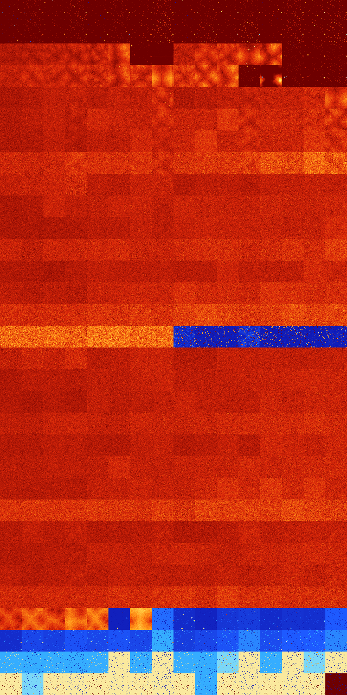

# B012568 (183808-184319)

<details>
    <summary>Initial Grid</summary>
    
</details>


<details>
    <summary>Initial Grid RLE</summary>

```
#C Exported from GoGoL (https://github.com/marrow16/gogol)
#C Wrap mode: Toroidal
#C Boundary mode: Dead
#C Step: 0
x = 100, y = 100, rule = B012568/S
66bo18bo5bo$15bo13bobo3bo26bo13bo9bo$17bo16bo5bo12bo38bo$28bo3bo25bo4bo
$22bo16b3o11bo15bo4bo12bo$39bobo13bo38b2o$23bo26bo12bo2bo17bo$o3bo27bo
11bo4bo18bo13bo$4bo2bo34bo8bo32bo7bo$13bo38bo46bo$bo3bo3bo6bo8bo14bo12b
o2bo26bo$7bobo19bo42bo$4bo27bobo15bo24bo$19bo38bo3bo5bo5bobo9bo10bo$3bo
6bo2bo4bo16bo3bobob2o13bo15bo7bo9bo$11bo6bo18bo28bo7bo$26bo23bobobo3bo
25bo$11bo2bo6bo19bo14bo9bo30bo$21bo2bo14bo8bobo9bo5bo19bo$10bo45bo6bobo
8bo10bo10bo$7bo85bo$7bo6bo8bo30bo$19bo15bo29bo7bo3bo$26bo5bo9bo11bo7b2o
7bo17bo$bo67bo28bo$9bo9bo3bo30bo2bo29bo2bobo2bo$14bo18bo4bo6bobo30bo$
79bo15bo3bo$43b2o$9bo34bo7bo$41bo28bo15bo11bo$31bo45bo6bobo10bo$45bo12b
o$31bo20bo19bo$14bo3bo35bo18bo$12bo18bo17bobo6bob2o12bo18bo$3bo7bo31bo
25bo11bo2bo$4bo30bo27bo8bo9bo5bo$2bo10bo52bo$52bo$42bo18bo15bo20bo$18bo
12bo5bo4bo16bo$30bo20bo29bo17bo$54bo31bo$48bo20bo12b2obo$9bobo44bo33bo$
19bo12bo52bo$20bo29bo8bo3bo7bo12bo$20bo5b2o$bo3bo4bo58bo$8bo19bo13bo10b
o6bo16bo$20bobo13bo5bo35bobo$10bo15bo55bobo$17bob2o32bo7bo$bo5bo53bo$o
9bobo9bo15b2o6bo$11bo51bo4bo8bo15bobobo$52bo34bo9bo$59bo37bo$78bo9bo6bo
bo$55bo5bo11bo14bo$13bo7bo18bo7bo9bo25bo12bo$4bo10bo$19bo21bob2o4bo11bo
29bo$36bo10bo8bo4bo27bo$41bo33b2o$9bo27bo25bo30bo3bo$5bo5bo46bo$7bo5bo
36bo$o77bobo$27b2o9bo14bo8bo19bo5bo$2bo19b2o20bobo8b2o30bo2bo2bo$12bo
23bo6bo5bo2bo9b2o34b2o$6bo21bo13bo28bo$38bo33bo19bo$6b2o13bo11bo$19bo
36bo14bo$bo14bo35bo$27bo12bo25bo12bo14bo$83bo$4bo24bo16bo20bo4bo17bo5bo
$88bo10bo$39bo3bo35bo$35bo45bo17bo$15bo46bo20bo2bo$10bo3bo10bo5bo3bo26b
o17bo11bo2bo$7bo63bo8bobo$8bo23bo34bobo16bo$22bobo14bo19bo38bo$11bo66bo
17bo$5bo2bo7bo18bobo3bo17bo5bo$18bo9bo13bo6bo4bo14b2o17bo7bobo$42bo3bo
7bo11bo23bo$12bo4bo8bo8bo17bo27bo$35bo2b3o23bo31bo$25bo4bo10bo43bo$51b
2o2bo25bo$21bo$31bo2bo47bo7bo$11b2o22bo28bobo2bo5bo!
```
</details>
<details>
    <summary>Thumbnail</summary>

</details>
<table>
<tr>
    <td><a href="./183808%20S%20Heat%20Map%20Activity.png"></a><br>S (183808)<br>R@14,p2</td>    <td><a href="./183809%20S0%20Heat%20Map%20Activity.png"></a><br>S0 (183809)<br>R@14,p2</td>    <td><a href="./183810%20S1%20Heat%20Map%20Activity.png"></a><br>S1 (183810)<br>R@13,p4</td>    <td><a href="./183811%20S01%20Heat%20Map%20Activity.png"></a><br>S01 (183811)<br>R@10,p2</td>    <td><a href="./183812%20S2%20Heat%20Map%20Activity.png"></a><br>S2 (183812)<br>R@16,p2</td>    <td><a href="./183813%20S02%20Heat%20Map%20Activity.png"></a><br>S02 (183813)<br>R@13,p2</td>    <td><a href="./183814%20S12%20Heat%20Map%20Activity.png"></a><br>S12 (183814)<br>R@9,p2</td>    <td><a href="./183815%20S012%20Heat%20Map%20Activity.png"></a><br>S012 (183815)<br>R@9,p2</td>    <td><a href="./183816%20S3%20Heat%20Map%20Activity.png"></a><br>S3 (183816)<br>R@22,p4</td>    <td><a href="./183817%20S03%20Heat%20Map%20Activity.png"></a><br>S03 (183817)<br>R@18,p4</td>    <td><a href="./183818%20S13%20Heat%20Map%20Activity.png"></a><br>S13 (183818)<br>R@16,p4</td>    <td><a href="./183819%20S013%20Heat%20Map%20Activity.png"></a><br>S013 (183819)<br>R@17,p2</td>    <td><a href="./183820%20S23%20Heat%20Map%20Activity.png"></a><br>S23 (183820)<br>R@8,p2</td>    <td><a href="./183821%20S023%20Heat%20Map%20Activity.png"></a><br>S023 (183821)<br>R@10,p2</td>    <td><a href="./183822%20S123%20Heat%20Map%20Activity.png"></a><br>S123 (183822)<br>R@8,p2</td>    <td><a href="./183823%20S0123%20Heat%20Map%20Activity.png"></a><br>S0123 (183823)<br>R@9,p2</td></tr>
<tr>
    <td><a href="./183824%20S4%20Heat%20Map%20Activity.png"></a><br>S4 (183824)<br>R@25,p2</td>    <td><a href="./183825%20S04%20Heat%20Map%20Activity.png"></a><br>S04 (183825)<br>R@16,p2</td>    <td><a href="./183826%20S14%20Heat%20Map%20Activity.png"></a><br>S14 (183826)<br>R@20,p2</td>    <td><a href="./183827%20S014%20Heat%20Map%20Activity.png"></a><br>S014 (183827)<br>R@14,p4</td>    <td><a href="./183828%20S24%20Heat%20Map%20Activity.png"></a><br>S24 (183828)<br>R@26,p8</td>    <td><a href="./183829%20S024%20Heat%20Map%20Activity.png"></a><br>S024 (183829)<br>R@16,p8</td>    <td><a href="./183830%20S124%20Heat%20Map%20Activity.png"></a><br>S124 (183830)<br>R@11,p2</td>    <td><a href="./183831%20S0124%20Heat%20Map%20Activity.png"></a><br>S0124 (183831)<br>R@7,p2</td>    <td><a href="./183832%20S34%20Heat%20Map%20Activity.png"></a><br>S34 (183832)<br>R@26,p2</td>    <td><a href="./183833%20S034%20Heat%20Map%20Activity.png"></a><br>S034 (183833)<br>R@11,p2</td>    <td><a href="./183834%20S134%20Heat%20Map%20Activity.png"></a><br>S134 (183834)<br>R@20,p4</td>    <td><a href="./183835%20S0134%20Heat%20Map%20Activity.png"></a><br>S0134 (183835)<br>R@7,p2</td>    <td><a href="./183836%20S234%20Heat%20Map%20Activity.png"></a><br>S234 (183836)<br>R@34,p2</td>    <td><a href="./183837%20S0234%20Heat%20Map%20Activity.png"></a><br>S0234 (183837)<br>R@9,p2</td>    <td><a href="./183838%20S1234%20Heat%20Map%20Activity.png"></a><br>S1234 (183838)<br>R@13,p4</td>    <td><a href="./183839%20S01234%20Heat%20Map%20Activity.png"></a><br>S01234 (183839)<br>R@7,p2</td></tr>
<tr>
    <td><a href="./183840%20S5%20Heat%20Map%20Activity.png"></a><br>S5 (183840)<br>G>1000</td>    <td><a href="./183841%20S05%20Heat%20Map%20Activity.png"></a><br>S05 (183841)<br>G>1000</td>    <td><a href="./183842%20S15%20Heat%20Map%20Activity.png"></a><br>S15 (183842)<br>G>1000</td>    <td><a href="./183843%20S015%20Heat%20Map%20Activity.png"></a><br>S015 (183843)<br>G>1000</td>    <td><a href="./183844%20S25%20Heat%20Map%20Activity.png"></a><br>S25 (183844)<br>G>1000</td>    <td><a href="./183845%20S025%20Heat%20Map%20Activity.png"></a><br>S025 (183845)<br>G>1000</td>    <td><a href="./183846%20S125%20Heat%20Map%20Activity.png"></a><br>S125 (183846)<br>R@57,p2</td>    <td><a href="./183847%20S0125%20Heat%20Map%20Activity.png"></a><br>S0125 (183847)<br>R@212,p200</td>    <td><a href="./183848%20S35%20Heat%20Map%20Activity.png"></a><br>S35 (183848)<br>G>1000</td>    <td><a href="./183849%20S035%20Heat%20Map%20Activity.png"></a><br>S035 (183849)<br>G>1000</td>    <td><a href="./183850%20S135%20Heat%20Map%20Activity.png"></a><br>S135 (183850)<br>G>1000</td>    <td><a href="./183851%20S0135%20Heat%20Map%20Activity.png"></a><br>S0135 (183851)<br>G>1000</td>    <td><a href="./183852%20S235%20Heat%20Map%20Activity.png"></a><br>S235 (183852)<br>G>1000</td>    <td><a href="./183853%20S0235%20Heat%20Map%20Activity.png"></a><br>S0235 (183853)<br>R@29,p4</td>    <td><a href="./183854%20S1235%20Heat%20Map%20Activity.png"></a><br>S1235 (183854)<br>R@21,p2</td>    <td><a href="./183855%20S01235%20Heat%20Map%20Activity.png"></a><br>S01235 (183855)<br>R@19,p2</td></tr>
<tr>
    <td><a href="./183856%20S45%20Heat%20Map%20Activity.png"></a><br>S45 (183856)<br>G>1000</td>    <td><a href="./183857%20S045%20Heat%20Map%20Activity.png"></a><br>S045 (183857)<br>G>1000</td>    <td><a href="./183858%20S145%20Heat%20Map%20Activity.png"></a><br>S145 (183858)<br>G>1000</td>    <td><a href="./183859%20S0145%20Heat%20Map%20Activity.png"></a><br>S0145 (183859)<br>G>1000</td>    <td><a href="./183860%20S245%20Heat%20Map%20Activity.png"></a><br>S245 (183860)<br>G>1000</td>    <td><a href="./183861%20S0245%20Heat%20Map%20Activity.png"></a><br>S0245 (183861)<br>G>1000</td>    <td><a href="./183862%20S1245%20Heat%20Map%20Activity.png"></a><br>S1245 (183862)<br>G>1000</td>    <td><a href="./183863%20S01245%20Heat%20Map%20Activity.png"></a><br>S01245 (183863)<br>G>1000</td>    <td><a href="./183864%20S345%20Heat%20Map%20Activity.png"></a><br>S345 (183864)<br>G>1000</td>    <td><a href="./183865%20S0345%20Heat%20Map%20Activity.png"></a><br>S0345 (183865)<br>G>1000</td>    <td><a href="./183866%20S1345%20Heat%20Map%20Activity.png"></a><br>S1345 (183866)<br>G>1000</td>    <td><a href="./183867%20S01345%20Heat%20Map%20Activity.png"></a><br>S01345 (183867)<br>R@27,p4</td>    <td><a href="./183868%20S2345%20Heat%20Map%20Activity.png"></a><br>S2345 (183868)<br>G>1000</td>    <td><a href="./183869%20S02345%20Heat%20Map%20Activity.png"></a><br>S02345 (183869)<br>R@23,p6</td>    <td><a href="./183870%20S12345%20Heat%20Map%20Activity.png"></a><br>S12345 (183870)<br>R@19,p2</td>    <td><a href="./183871%20S012345%20Heat%20Map%20Activity.png"></a><br>S012345 (183871)<br>R@11,p2</td></tr>
<tr>
    <td><a href="./183872%20S6%20Heat%20Map%20Activity.png"></a><br>S6 (183872)<br>G>1000</td>    <td><a href="./183873%20S06%20Heat%20Map%20Activity.png"></a><br>S06 (183873)<br>G>1000</td>    <td><a href="./183874%20S16%20Heat%20Map%20Activity.png"></a><br>S16 (183874)<br>G>1000</td>    <td><a href="./183875%20S016%20Heat%20Map%20Activity.png"></a><br>S016 (183875)<br>G>1000</td>    <td><a href="./183876%20S26%20Heat%20Map%20Activity.png"></a><br>S26 (183876)<br>G>1000</td>    <td><a href="./183877%20S026%20Heat%20Map%20Activity.png"></a><br>S026 (183877)<br>G>1000</td>    <td><a href="./183878%20S126%20Heat%20Map%20Activity.png"></a><br>S126 (183878)<br>G>1000</td>    <td><a href="./183879%20S0126%20Heat%20Map%20Activity.png"></a><br>S0126 (183879)<br>G>1000</td>    <td><a href="./183880%20S36%20Heat%20Map%20Activity.png"></a><br>S36 (183880)<br>G>1000</td>    <td><a href="./183881%20S036%20Heat%20Map%20Activity.png"></a><br>S036 (183881)<br>G>1000</td>    <td><a href="./183882%20S136%20Heat%20Map%20Activity.png"></a><br>S136 (183882)<br>G>1000</td>    <td><a href="./183883%20S0136%20Heat%20Map%20Activity.png"></a><br>S0136 (183883)<br>G>1000</td>    <td><a href="./183884%20S236%20Heat%20Map%20Activity.png"></a><br>S236 (183884)<br>G>1000</td>    <td><a href="./183885%20S0236%20Heat%20Map%20Activity.png"></a><br>S0236 (183885)<br>G>1000</td>    <td><a href="./183886%20S1236%20Heat%20Map%20Activity.png"></a><br>S1236 (183886)<br>G>1000</td>    <td><a href="./183887%20S01236%20Heat%20Map%20Activity.png"></a><br>S01236 (183887)<br>G>1000</td></tr>
<tr>
    <td><a href="./183888%20S46%20Heat%20Map%20Activity.png"></a><br>S46 (183888)<br>G>1000</td>    <td><a href="./183889%20S046%20Heat%20Map%20Activity.png"></a><br>S046 (183889)<br>G>1000</td>    <td><a href="./183890%20S146%20Heat%20Map%20Activity.png"></a><br>S146 (183890)<br>G>1000</td>    <td><a href="./183891%20S0146%20Heat%20Map%20Activity.png"></a><br>S0146 (183891)<br>G>1000</td>    <td><a href="./183892%20S246%20Heat%20Map%20Activity.png"></a><br>S246 (183892)<br>G>1000</td>    <td><a href="./183893%20S0246%20Heat%20Map%20Activity.png"></a><br>S0246 (183893)<br>G>1000</td>    <td><a href="./183894%20S1246%20Heat%20Map%20Activity.png"></a><br>S1246 (183894)<br>G>1000</td>    <td><a href="./183895%20S01246%20Heat%20Map%20Activity.png"></a><br>S01246 (183895)<br>G>1000</td>    <td><a href="./183896%20S346%20Heat%20Map%20Activity.png"></a><br>S346 (183896)<br>G>1000</td>    <td><a href="./183897%20S0346%20Heat%20Map%20Activity.png"></a><br>S0346 (183897)<br>G>1000</td>    <td><a href="./183898%20S1346%20Heat%20Map%20Activity.png"></a><br>S1346 (183898)<br>G>1000</td>    <td><a href="./183899%20S01346%20Heat%20Map%20Activity.png"></a><br>S01346 (183899)<br>G>1000</td>    <td><a href="./183900%20S2346%20Heat%20Map%20Activity.png"></a><br>S2346 (183900)<br>G>1000</td>    <td><a href="./183901%20S02346%20Heat%20Map%20Activity.png"></a><br>S02346 (183901)<br>G>1000</td>    <td><a href="./183902%20S12346%20Heat%20Map%20Activity.png"></a><br>S12346 (183902)<br>G>1000</td>    <td><a href="./183903%20S012346%20Heat%20Map%20Activity.png"></a><br>S012346 (183903)<br>G>1000</td></tr>
<tr>
    <td><a href="./183904%20S56%20Heat%20Map%20Activity.png"></a><br>S56 (183904)<br>G>1000</td>    <td><a href="./183905%20S056%20Heat%20Map%20Activity.png"></a><br>S056 (183905)<br>G>1000</td>    <td><a href="./183906%20S156%20Heat%20Map%20Activity.png"></a><br>S156 (183906)<br>G>1000</td>    <td><a href="./183907%20S0156%20Heat%20Map%20Activity.png"></a><br>S0156 (183907)<br>G>1000</td>    <td><a href="./183908%20S256%20Heat%20Map%20Activity.png"></a><br>S256 (183908)<br>G>1000</td>    <td><a href="./183909%20S0256%20Heat%20Map%20Activity.png"></a><br>S0256 (183909)<br>G>1000</td>    <td><a href="./183910%20S1256%20Heat%20Map%20Activity.png"></a><br>S1256 (183910)<br>G>1000</td>    <td><a href="./183911%20S01256%20Heat%20Map%20Activity.png"></a><br>S01256 (183911)<br>G>1000</td>    <td><a href="./183912%20S356%20Heat%20Map%20Activity.png"></a><br>S356 (183912)<br>G>1000</td>    <td><a href="./183913%20S0356%20Heat%20Map%20Activity.png"></a><br>S0356 (183913)<br>G>1000</td>    <td><a href="./183914%20S1356%20Heat%20Map%20Activity.png"></a><br>S1356 (183914)<br>G>1000</td>    <td><a href="./183915%20S01356%20Heat%20Map%20Activity.png"></a><br>S01356 (183915)<br>G>1000</td>    <td><a href="./183916%20S2356%20Heat%20Map%20Activity.png"></a><br>S2356 (183916)<br>G>1000</td>    <td><a href="./183917%20S02356%20Heat%20Map%20Activity.png"></a><br>S02356 (183917)<br>G>1000</td>    <td><a href="./183918%20S12356%20Heat%20Map%20Activity.png"></a><br>S12356 (183918)<br>G>1000</td>    <td><a href="./183919%20S012356%20Heat%20Map%20Activity.png"></a><br>S012356 (183919)<br>G>1000</td></tr>
<tr>
    <td><a href="./183920%20S456%20Heat%20Map%20Activity.png"></a><br>S456 (183920)<br>G>1000</td>    <td><a href="./183921%20S0456%20Heat%20Map%20Activity.png"></a><br>S0456 (183921)<br>G>1000</td>    <td><a href="./183922%20S1456%20Heat%20Map%20Activity.png"></a><br>S1456 (183922)<br>G>1000</td>    <td><a href="./183923%20S01456%20Heat%20Map%20Activity.png"></a><br>S01456 (183923)<br>G>1000</td>    <td><a href="./183924%20S2456%20Heat%20Map%20Activity.png"></a><br>S2456 (183924)<br>G>1000</td>    <td><a href="./183925%20S02456%20Heat%20Map%20Activity.png"></a><br>S02456 (183925)<br>G>1000</td>    <td><a href="./183926%20S12456%20Heat%20Map%20Activity.png"></a><br>S12456 (183926)<br>G>1000</td>    <td><a href="./183927%20S012456%20Heat%20Map%20Activity.png"></a><br>S012456 (183927)<br>G>1000</td>    <td><a href="./183928%20S3456%20Heat%20Map%20Activity.png"></a><br>S3456 (183928)<br>G>1000</td>    <td><a href="./183929%20S03456%20Heat%20Map%20Activity.png"></a><br>S03456 (183929)<br>G>1000</td>    <td><a href="./183930%20S13456%20Heat%20Map%20Activity.png"></a><br>S13456 (183930)<br>G>1000</td>    <td><a href="./183931%20S013456%20Heat%20Map%20Activity.png"></a><br>S013456 (183931)<br>G>1000</td>    <td><a href="./183932%20S23456%20Heat%20Map%20Activity.png"></a><br>S23456 (183932)<br>G>1000</td>    <td><a href="./183933%20S023456%20Heat%20Map%20Activity.png"></a><br>S023456 (183933)<br>G>1000</td>    <td><a href="./183934%20S123456%20Heat%20Map%20Activity.png"></a><br>S123456 (183934)<br>G>1000</td>    <td><a href="./183935%20S0123456%20Heat%20Map%20Activity.png"></a><br>S0123456 (183935)<br>G>1000</td></tr>
<tr>
    <td><a href="./183936%20S7%20Heat%20Map%20Activity.png"></a><br>S7 (183936)<br>G>1000</td>    <td><a href="./183937%20S07%20Heat%20Map%20Activity.png"></a><br>S07 (183937)<br>G>1000</td>    <td><a href="./183938%20S17%20Heat%20Map%20Activity.png"></a><br>S17 (183938)<br>G>1000</td>    <td><a href="./183939%20S017%20Heat%20Map%20Activity.png"></a><br>S017 (183939)<br>G>1000</td>    <td><a href="./183940%20S27%20Heat%20Map%20Activity.png"></a><br>S27 (183940)<br>G>1000</td>    <td><a href="./183941%20S027%20Heat%20Map%20Activity.png"></a><br>S027 (183941)<br>G>1000</td>    <td><a href="./183942%20S127%20Heat%20Map%20Activity.png"></a><br>S127 (183942)<br>G>1000</td>    <td><a href="./183943%20S0127%20Heat%20Map%20Activity.png"></a><br>S0127 (183943)<br>G>1000</td>    <td><a href="./183944%20S37%20Heat%20Map%20Activity.png"></a><br>S37 (183944)<br>G>1000</td>    <td><a href="./183945%20S037%20Heat%20Map%20Activity.png"></a><br>S037 (183945)<br>G>1000</td>    <td><a href="./183946%20S137%20Heat%20Map%20Activity.png"></a><br>S137 (183946)<br>G>1000</td>    <td><a href="./183947%20S0137%20Heat%20Map%20Activity.png"></a><br>S0137 (183947)<br>G>1000</td>    <td><a href="./183948%20S237%20Heat%20Map%20Activity.png"></a><br>S237 (183948)<br>G>1000</td>    <td><a href="./183949%20S0237%20Heat%20Map%20Activity.png"></a><br>S0237 (183949)<br>G>1000</td>    <td><a href="./183950%20S1237%20Heat%20Map%20Activity.png"></a><br>S1237 (183950)<br>G>1000</td>    <td><a href="./183951%20S01237%20Heat%20Map%20Activity.png"></a><br>S01237 (183951)<br>G>1000</td></tr>
<tr>
    <td><a href="./183952%20S47%20Heat%20Map%20Activity.png"></a><br>S47 (183952)<br>G>1000</td>    <td><a href="./183953%20S047%20Heat%20Map%20Activity.png"></a><br>S047 (183953)<br>G>1000</td>    <td><a href="./183954%20S147%20Heat%20Map%20Activity.png"></a><br>S147 (183954)<br>G>1000</td>    <td><a href="./183955%20S0147%20Heat%20Map%20Activity.png"></a><br>S0147 (183955)<br>G>1000</td>    <td><a href="./183956%20S247%20Heat%20Map%20Activity.png"></a><br>S247 (183956)<br>G>1000</td>    <td><a href="./183957%20S0247%20Heat%20Map%20Activity.png"></a><br>S0247 (183957)<br>G>1000</td>    <td><a href="./183958%20S1247%20Heat%20Map%20Activity.png"></a><br>S1247 (183958)<br>G>1000</td>    <td><a href="./183959%20S01247%20Heat%20Map%20Activity.png"></a><br>S01247 (183959)<br>G>1000</td>    <td><a href="./183960%20S347%20Heat%20Map%20Activity.png"></a><br>S347 (183960)<br>G>1000</td>    <td><a href="./183961%20S0347%20Heat%20Map%20Activity.png"></a><br>S0347 (183961)<br>G>1000</td>    <td><a href="./183962%20S1347%20Heat%20Map%20Activity.png"></a><br>S1347 (183962)<br>G>1000</td>    <td><a href="./183963%20S01347%20Heat%20Map%20Activity.png"></a><br>S01347 (183963)<br>G>1000</td>    <td><a href="./183964%20S2347%20Heat%20Map%20Activity.png"></a><br>S2347 (183964)<br>G>1000</td>    <td><a href="./183965%20S02347%20Heat%20Map%20Activity.png"></a><br>S02347 (183965)<br>G>1000</td>    <td><a href="./183966%20S12347%20Heat%20Map%20Activity.png"></a><br>S12347 (183966)<br>G>1000</td>    <td><a href="./183967%20S012347%20Heat%20Map%20Activity.png"></a><br>S012347 (183967)<br>G>1000</td></tr>
<tr>
    <td><a href="./183968%20S57%20Heat%20Map%20Activity.png"></a><br>S57 (183968)<br>G>1000</td>    <td><a href="./183969%20S057%20Heat%20Map%20Activity.png"></a><br>S057 (183969)<br>G>1000</td>    <td><a href="./183970%20S157%20Heat%20Map%20Activity.png"></a><br>S157 (183970)<br>G>1000</td>    <td><a href="./183971%20S0157%20Heat%20Map%20Activity.png"></a><br>S0157 (183971)<br>G>1000</td>    <td><a href="./183972%20S257%20Heat%20Map%20Activity.png"></a><br>S257 (183972)<br>G>1000</td>    <td><a href="./183973%20S0257%20Heat%20Map%20Activity.png"></a><br>S0257 (183973)<br>G>1000</td>    <td><a href="./183974%20S1257%20Heat%20Map%20Activity.png"></a><br>S1257 (183974)<br>G>1000</td>    <td><a href="./183975%20S01257%20Heat%20Map%20Activity.png"></a><br>S01257 (183975)<br>G>1000</td>    <td><a href="./183976%20S357%20Heat%20Map%20Activity.png"></a><br>S357 (183976)<br>G>1000</td>    <td><a href="./183977%20S0357%20Heat%20Map%20Activity.png"></a><br>S0357 (183977)<br>G>1000</td>    <td><a href="./183978%20S1357%20Heat%20Map%20Activity.png"></a><br>S1357 (183978)<br>G>1000</td>    <td><a href="./183979%20S01357%20Heat%20Map%20Activity.png"></a><br>S01357 (183979)<br>G>1000</td>    <td><a href="./183980%20S2357%20Heat%20Map%20Activity.png"></a><br>S2357 (183980)<br>G>1000</td>    <td><a href="./183981%20S02357%20Heat%20Map%20Activity.png"></a><br>S02357 (183981)<br>G>1000</td>    <td><a href="./183982%20S12357%20Heat%20Map%20Activity.png"></a><br>S12357 (183982)<br>G>1000</td>    <td><a href="./183983%20S012357%20Heat%20Map%20Activity.png"></a><br>S012357 (183983)<br>G>1000</td></tr>
<tr>
    <td><a href="./183984%20S457%20Heat%20Map%20Activity.png"></a><br>S457 (183984)<br>G>1000</td>    <td><a href="./183985%20S0457%20Heat%20Map%20Activity.png"></a><br>S0457 (183985)<br>G>1000</td>    <td><a href="./183986%20S1457%20Heat%20Map%20Activity.png"></a><br>S1457 (183986)<br>G>1000</td>    <td><a href="./183987%20S01457%20Heat%20Map%20Activity.png"></a><br>S01457 (183987)<br>G>1000</td>    <td><a href="./183988%20S2457%20Heat%20Map%20Activity.png"></a><br>S2457 (183988)<br>G>1000</td>    <td><a href="./183989%20S02457%20Heat%20Map%20Activity.png"></a><br>S02457 (183989)<br>G>1000</td>    <td><a href="./183990%20S12457%20Heat%20Map%20Activity.png"></a><br>S12457 (183990)<br>G>1000</td>    <td><a href="./183991%20S012457%20Heat%20Map%20Activity.png"></a><br>S012457 (183991)<br>G>1000</td>    <td><a href="./183992%20S3457%20Heat%20Map%20Activity.png"></a><br>S3457 (183992)<br>G>1000</td>    <td><a href="./183993%20S03457%20Heat%20Map%20Activity.png"></a><br>S03457 (183993)<br>G>1000</td>    <td><a href="./183994%20S13457%20Heat%20Map%20Activity.png"></a><br>S13457 (183994)<br>G>1000</td>    <td><a href="./183995%20S013457%20Heat%20Map%20Activity.png"></a><br>S013457 (183995)<br>G>1000</td>    <td><a href="./183996%20S23457%20Heat%20Map%20Activity.png"></a><br>S23457 (183996)<br>G>1000</td>    <td><a href="./183997%20S023457%20Heat%20Map%20Activity.png"></a><br>S023457 (183997)<br>G>1000</td>    <td><a href="./183998%20S123457%20Heat%20Map%20Activity.png"></a><br>S123457 (183998)<br>G>1000</td>    <td><a href="./183999%20S0123457%20Heat%20Map%20Activity.png"></a><br>S0123457 (183999)<br>G>1000</td></tr>
<tr>
    <td><a href="./184000%20S67%20Heat%20Map%20Activity.png"></a><br>S67 (184000)<br>G>1000</td>    <td><a href="./184001%20S067%20Heat%20Map%20Activity.png"></a><br>S067 (184001)<br>G>1000</td>    <td><a href="./184002%20S167%20Heat%20Map%20Activity.png"></a><br>S167 (184002)<br>G>1000</td>    <td><a href="./184003%20S0167%20Heat%20Map%20Activity.png"></a><br>S0167 (184003)<br>G>1000</td>    <td><a href="./184004%20S267%20Heat%20Map%20Activity.png"></a><br>S267 (184004)<br>G>1000</td>    <td><a href="./184005%20S0267%20Heat%20Map%20Activity.png"></a><br>S0267 (184005)<br>G>1000</td>    <td><a href="./184006%20S1267%20Heat%20Map%20Activity.png"></a><br>S1267 (184006)<br>G>1000</td>    <td><a href="./184007%20S01267%20Heat%20Map%20Activity.png"></a><br>S01267 (184007)<br>G>1000</td>    <td><a href="./184008%20S367%20Heat%20Map%20Activity.png"></a><br>S367 (184008)<br>G>1000</td>    <td><a href="./184009%20S0367%20Heat%20Map%20Activity.png"></a><br>S0367 (184009)<br>G>1000</td>    <td><a href="./184010%20S1367%20Heat%20Map%20Activity.png"></a><br>S1367 (184010)<br>G>1000</td>    <td><a href="./184011%20S01367%20Heat%20Map%20Activity.png"></a><br>S01367 (184011)<br>G>1000</td>    <td><a href="./184012%20S2367%20Heat%20Map%20Activity.png"></a><br>S2367 (184012)<br>G>1000</td>    <td><a href="./184013%20S02367%20Heat%20Map%20Activity.png"></a><br>S02367 (184013)<br>G>1000</td>    <td><a href="./184014%20S12367%20Heat%20Map%20Activity.png"></a><br>S12367 (184014)<br>G>1000</td>    <td><a href="./184015%20S012367%20Heat%20Map%20Activity.png"></a><br>S012367 (184015)<br>G>1000</td></tr>
<tr>
    <td><a href="./184016%20S467%20Heat%20Map%20Activity.png"></a><br>S467 (184016)<br>G>1000</td>    <td><a href="./184017%20S0467%20Heat%20Map%20Activity.png"></a><br>S0467 (184017)<br>G>1000</td>    <td><a href="./184018%20S1467%20Heat%20Map%20Activity.png"></a><br>S1467 (184018)<br>G>1000</td>    <td><a href="./184019%20S01467%20Heat%20Map%20Activity.png"></a><br>S01467 (184019)<br>G>1000</td>    <td><a href="./184020%20S2467%20Heat%20Map%20Activity.png"></a><br>S2467 (184020)<br>G>1000</td>    <td><a href="./184021%20S02467%20Heat%20Map%20Activity.png"></a><br>S02467 (184021)<br>G>1000</td>    <td><a href="./184022%20S12467%20Heat%20Map%20Activity.png"></a><br>S12467 (184022)<br>G>1000</td>    <td><a href="./184023%20S012467%20Heat%20Map%20Activity.png"></a><br>S012467 (184023)<br>G>1000</td>    <td><a href="./184024%20S3467%20Heat%20Map%20Activity.png"></a><br>S3467 (184024)<br>G>1000</td>    <td><a href="./184025%20S03467%20Heat%20Map%20Activity.png"></a><br>S03467 (184025)<br>G>1000</td>    <td><a href="./184026%20S13467%20Heat%20Map%20Activity.png"></a><br>S13467 (184026)<br>G>1000</td>    <td><a href="./184027%20S013467%20Heat%20Map%20Activity.png"></a><br>S013467 (184027)<br>G>1000</td>    <td><a href="./184028%20S23467%20Heat%20Map%20Activity.png"></a><br>S23467 (184028)<br>G>1000</td>    <td><a href="./184029%20S023467%20Heat%20Map%20Activity.png"></a><br>S023467 (184029)<br>G>1000</td>    <td><a href="./184030%20S123467%20Heat%20Map%20Activity.png"></a><br>S123467 (184030)<br>G>1000</td>    <td><a href="./184031%20S0123467%20Heat%20Map%20Activity.png"></a><br>S0123467 (184031)<br>G>1000</td></tr>
<tr>
    <td><a href="./184032%20S567%20Heat%20Map%20Activity.png"></a><br>S567 (184032)<br>G>1000</td>    <td><a href="./184033%20S0567%20Heat%20Map%20Activity.png"></a><br>S0567 (184033)<br>G>1000</td>    <td><a href="./184034%20S1567%20Heat%20Map%20Activity.png"></a><br>S1567 (184034)<br>G>1000</td>    <td><a href="./184035%20S01567%20Heat%20Map%20Activity.png"></a><br>S01567 (184035)<br>G>1000</td>    <td><a href="./184036%20S2567%20Heat%20Map%20Activity.png"></a><br>S2567 (184036)<br>G>1000</td>    <td><a href="./184037%20S02567%20Heat%20Map%20Activity.png"></a><br>S02567 (184037)<br>G>1000</td>    <td><a href="./184038%20S12567%20Heat%20Map%20Activity.png"></a><br>S12567 (184038)<br>G>1000</td>    <td><a href="./184039%20S012567%20Heat%20Map%20Activity.png"></a><br>S012567 (184039)<br>G>1000</td>    <td><a href="./184040%20S3567%20Heat%20Map%20Activity.png"></a><br>S3567 (184040)<br>G>1000</td>    <td><a href="./184041%20S03567%20Heat%20Map%20Activity.png"></a><br>S03567 (184041)<br>G>1000</td>    <td><a href="./184042%20S13567%20Heat%20Map%20Activity.png"></a><br>S13567 (184042)<br>G>1000</td>    <td><a href="./184043%20S013567%20Heat%20Map%20Activity.png"></a><br>S013567 (184043)<br>G>1000</td>    <td><a href="./184044%20S23567%20Heat%20Map%20Activity.png"></a><br>S23567 (184044)<br>G>1000</td>    <td><a href="./184045%20S023567%20Heat%20Map%20Activity.png"></a><br>S023567 (184045)<br>G>1000</td>    <td><a href="./184046%20S123567%20Heat%20Map%20Activity.png"></a><br>S123567 (184046)<br>G>1000</td>    <td><a href="./184047%20S0123567%20Heat%20Map%20Activity.png"></a><br>S0123567 (184047)<br>G>1000</td></tr>
<tr>
    <td><a href="./184048%20S4567%20Heat%20Map%20Activity.png"></a><br>S4567 (184048)<br>G>1000</td>    <td><a href="./184049%20S04567%20Heat%20Map%20Activity.png"></a><br>S04567 (184049)<br>G>1000</td>    <td><a href="./184050%20S14567%20Heat%20Map%20Activity.png"></a><br>S14567 (184050)<br>G>1000</td>    <td><a href="./184051%20S014567%20Heat%20Map%20Activity.png"></a><br>S014567 (184051)<br>G>1000</td>    <td><a href="./184052%20S24567%20Heat%20Map%20Activity.png"></a><br>S24567 (184052)<br>G>1000</td>    <td><a href="./184053%20S024567%20Heat%20Map%20Activity.png"></a><br>S024567 (184053)<br>G>1000</td>    <td><a href="./184054%20S124567%20Heat%20Map%20Activity.png"></a><br>S124567 (184054)<br>G>1000</td>    <td><a href="./184055%20S0124567%20Heat%20Map%20Activity.png"></a><br>S0124567 (184055)<br>G>1000</td>    <td><a href="./184056%20S34567%20Heat%20Map%20Activity.png"></a><br>S34567 (184056)<br>R@202,p120</td>    <td><a href="./184057%20S034567%20Heat%20Map%20Activity.png"></a><br>S034567 (184057)<br>G>1000</td>    <td><a href="./184058%20S134567%20Heat%20Map%20Activity.png"></a><br>S134567 (184058)<br>G>1000</td>    <td><a href="./184059%20S0134567%20Heat%20Map%20Activity.png"></a><br>S0134567 (184059)<br>R@258,p168</td>    <td><a href="./184060%20S234567%20Heat%20Map%20Activity.png"></a><br>S234567 (184060)<br>G>1000</td>    <td><a href="./184061%20S0234567%20Heat%20Map%20Activity.png"></a><br>S0234567 (184061)<br>G>1000</td>    <td><a href="./184062%20S1234567%20Heat%20Map%20Activity.png"></a><br>S1234567 (184062)<br>G>1000</td>    <td><a href="./184063%20S01234567%20Heat%20Map%20Activity.png"></a><br>S01234567 (184063)<br>G>1000</td></tr>
<tr>
    <td><a href="./184064%20S8%20Heat%20Map%20Activity.png"></a><br>S8 (184064)<br>G>1000</td>    <td><a href="./184065%20S08%20Heat%20Map%20Activity.png"></a><br>S08 (184065)<br>G>1000</td>    <td><a href="./184066%20S18%20Heat%20Map%20Activity.png"></a><br>S18 (184066)<br>G>1000</td>    <td><a href="./184067%20S018%20Heat%20Map%20Activity.png"></a><br>S018 (184067)<br>G>1000</td>    <td><a href="./184068%20S28%20Heat%20Map%20Activity.png"></a><br>S28 (184068)<br>G>1000</td>    <td><a href="./184069%20S028%20Heat%20Map%20Activity.png"></a><br>S028 (184069)<br>G>1000</td>    <td><a href="./184070%20S128%20Heat%20Map%20Activity.png"></a><br>S128 (184070)<br>G>1000</td>    <td><a href="./184071%20S0128%20Heat%20Map%20Activity.png"></a><br>S0128 (184071)<br>G>1000</td>    <td><a href="./184072%20S38%20Heat%20Map%20Activity.png"></a><br>S38 (184072)<br>G>1000</td>    <td><a href="./184073%20S038%20Heat%20Map%20Activity.png"></a><br>S038 (184073)<br>G>1000</td>    <td><a href="./184074%20S138%20Heat%20Map%20Activity.png"></a><br>S138 (184074)<br>G>1000</td>    <td><a href="./184075%20S0138%20Heat%20Map%20Activity.png"></a><br>S0138 (184075)<br>G>1000</td>    <td><a href="./184076%20S238%20Heat%20Map%20Activity.png"></a><br>S238 (184076)<br>G>1000</td>    <td><a href="./184077%20S0238%20Heat%20Map%20Activity.png"></a><br>S0238 (184077)<br>G>1000</td>    <td><a href="./184078%20S1238%20Heat%20Map%20Activity.png"></a><br>S1238 (184078)<br>G>1000</td>    <td><a href="./184079%20S01238%20Heat%20Map%20Activity.png"></a><br>S01238 (184079)<br>G>1000</td></tr>
<tr>
    <td><a href="./184080%20S48%20Heat%20Map%20Activity.png"></a><br>S48 (184080)<br>G>1000</td>    <td><a href="./184081%20S048%20Heat%20Map%20Activity.png"></a><br>S048 (184081)<br>G>1000</td>    <td><a href="./184082%20S148%20Heat%20Map%20Activity.png"></a><br>S148 (184082)<br>G>1000</td>    <td><a href="./184083%20S0148%20Heat%20Map%20Activity.png"></a><br>S0148 (184083)<br>G>1000</td>    <td><a href="./184084%20S248%20Heat%20Map%20Activity.png"></a><br>S248 (184084)<br>G>1000</td>    <td><a href="./184085%20S0248%20Heat%20Map%20Activity.png"></a><br>S0248 (184085)<br>G>1000</td>    <td><a href="./184086%20S1248%20Heat%20Map%20Activity.png"></a><br>S1248 (184086)<br>G>1000</td>    <td><a href="./184087%20S01248%20Heat%20Map%20Activity.png"></a><br>S01248 (184087)<br>G>1000</td>    <td><a href="./184088%20S348%20Heat%20Map%20Activity.png"></a><br>S348 (184088)<br>G>1000</td>    <td><a href="./184089%20S0348%20Heat%20Map%20Activity.png"></a><br>S0348 (184089)<br>G>1000</td>    <td><a href="./184090%20S1348%20Heat%20Map%20Activity.png"></a><br>S1348 (184090)<br>G>1000</td>    <td><a href="./184091%20S01348%20Heat%20Map%20Activity.png"></a><br>S01348 (184091)<br>G>1000</td>    <td><a href="./184092%20S2348%20Heat%20Map%20Activity.png"></a><br>S2348 (184092)<br>G>1000</td>    <td><a href="./184093%20S02348%20Heat%20Map%20Activity.png"></a><br>S02348 (184093)<br>G>1000</td>    <td><a href="./184094%20S12348%20Heat%20Map%20Activity.png"></a><br>S12348 (184094)<br>G>1000</td>    <td><a href="./184095%20S012348%20Heat%20Map%20Activity.png"></a><br>S012348 (184095)<br>G>1000</td></tr>
<tr>
    <td><a href="./184096%20S58%20Heat%20Map%20Activity.png"></a><br>S58 (184096)<br>G>1000</td>    <td><a href="./184097%20S058%20Heat%20Map%20Activity.png"></a><br>S058 (184097)<br>G>1000</td>    <td><a href="./184098%20S158%20Heat%20Map%20Activity.png"></a><br>S158 (184098)<br>G>1000</td>    <td><a href="./184099%20S0158%20Heat%20Map%20Activity.png"></a><br>S0158 (184099)<br>G>1000</td>    <td><a href="./184100%20S258%20Heat%20Map%20Activity.png"></a><br>S258 (184100)<br>G>1000</td>    <td><a href="./184101%20S0258%20Heat%20Map%20Activity.png"></a><br>S0258 (184101)<br>G>1000</td>    <td><a href="./184102%20S1258%20Heat%20Map%20Activity.png"></a><br>S1258 (184102)<br>G>1000</td>    <td><a href="./184103%20S01258%20Heat%20Map%20Activity.png"></a><br>S01258 (184103)<br>G>1000</td>    <td><a href="./184104%20S358%20Heat%20Map%20Activity.png"></a><br>S358 (184104)<br>G>1000</td>    <td><a href="./184105%20S0358%20Heat%20Map%20Activity.png"></a><br>S0358 (184105)<br>G>1000</td>    <td><a href="./184106%20S1358%20Heat%20Map%20Activity.png"></a><br>S1358 (184106)<br>G>1000</td>    <td><a href="./184107%20S01358%20Heat%20Map%20Activity.png"></a><br>S01358 (184107)<br>G>1000</td>    <td><a href="./184108%20S2358%20Heat%20Map%20Activity.png"></a><br>S2358 (184108)<br>G>1000</td>    <td><a href="./184109%20S02358%20Heat%20Map%20Activity.png"></a><br>S02358 (184109)<br>G>1000</td>    <td><a href="./184110%20S12358%20Heat%20Map%20Activity.png"></a><br>S12358 (184110)<br>G>1000</td>    <td><a href="./184111%20S012358%20Heat%20Map%20Activity.png"></a><br>S012358 (184111)<br>G>1000</td></tr>
<tr>
    <td><a href="./184112%20S458%20Heat%20Map%20Activity.png"></a><br>S458 (184112)<br>G>1000</td>    <td><a href="./184113%20S0458%20Heat%20Map%20Activity.png"></a><br>S0458 (184113)<br>G>1000</td>    <td><a href="./184114%20S1458%20Heat%20Map%20Activity.png"></a><br>S1458 (184114)<br>G>1000</td>    <td><a href="./184115%20S01458%20Heat%20Map%20Activity.png"></a><br>S01458 (184115)<br>G>1000</td>    <td><a href="./184116%20S2458%20Heat%20Map%20Activity.png"></a><br>S2458 (184116)<br>G>1000</td>    <td><a href="./184117%20S02458%20Heat%20Map%20Activity.png"></a><br>S02458 (184117)<br>G>1000</td>    <td><a href="./184118%20S12458%20Heat%20Map%20Activity.png"></a><br>S12458 (184118)<br>G>1000</td>    <td><a href="./184119%20S012458%20Heat%20Map%20Activity.png"></a><br>S012458 (184119)<br>G>1000</td>    <td><a href="./184120%20S3458%20Heat%20Map%20Activity.png"></a><br>S3458 (184120)<br>G>1000</td>    <td><a href="./184121%20S03458%20Heat%20Map%20Activity.png"></a><br>S03458 (184121)<br>G>1000</td>    <td><a href="./184122%20S13458%20Heat%20Map%20Activity.png"></a><br>S13458 (184122)<br>G>1000</td>    <td><a href="./184123%20S013458%20Heat%20Map%20Activity.png"></a><br>S013458 (184123)<br>G>1000</td>    <td><a href="./184124%20S23458%20Heat%20Map%20Activity.png"></a><br>S23458 (184124)<br>G>1000</td>    <td><a href="./184125%20S023458%20Heat%20Map%20Activity.png"></a><br>S023458 (184125)<br>G>1000</td>    <td><a href="./184126%20S123458%20Heat%20Map%20Activity.png"></a><br>S123458 (184126)<br>G>1000</td>    <td><a href="./184127%20S0123458%20Heat%20Map%20Activity.png"></a><br>S0123458 (184127)<br>G>1000</td></tr>
<tr>
    <td><a href="./184128%20S68%20Heat%20Map%20Activity.png"></a><br>S68 (184128)<br>G>1000</td>    <td><a href="./184129%20S068%20Heat%20Map%20Activity.png"></a><br>S068 (184129)<br>G>1000</td>    <td><a href="./184130%20S168%20Heat%20Map%20Activity.png"></a><br>S168 (184130)<br>G>1000</td>    <td><a href="./184131%20S0168%20Heat%20Map%20Activity.png"></a><br>S0168 (184131)<br>G>1000</td>    <td><a href="./184132%20S268%20Heat%20Map%20Activity.png"></a><br>S268 (184132)<br>G>1000</td>    <td><a href="./184133%20S0268%20Heat%20Map%20Activity.png"></a><br>S0268 (184133)<br>G>1000</td>    <td><a href="./184134%20S1268%20Heat%20Map%20Activity.png"></a><br>S1268 (184134)<br>G>1000</td>    <td><a href="./184135%20S01268%20Heat%20Map%20Activity.png"></a><br>S01268 (184135)<br>G>1000</td>    <td><a href="./184136%20S368%20Heat%20Map%20Activity.png"></a><br>S368 (184136)<br>G>1000</td>    <td><a href="./184137%20S0368%20Heat%20Map%20Activity.png"></a><br>S0368 (184137)<br>G>1000</td>    <td><a href="./184138%20S1368%20Heat%20Map%20Activity.png"></a><br>S1368 (184138)<br>G>1000</td>    <td><a href="./184139%20S01368%20Heat%20Map%20Activity.png"></a><br>S01368 (184139)<br>G>1000</td>    <td><a href="./184140%20S2368%20Heat%20Map%20Activity.png"></a><br>S2368 (184140)<br>G>1000</td>    <td><a href="./184141%20S02368%20Heat%20Map%20Activity.png"></a><br>S02368 (184141)<br>G>1000</td>    <td><a href="./184142%20S12368%20Heat%20Map%20Activity.png"></a><br>S12368 (184142)<br>G>1000</td>    <td><a href="./184143%20S012368%20Heat%20Map%20Activity.png"></a><br>S012368 (184143)<br>G>1000</td></tr>
<tr>
    <td><a href="./184144%20S468%20Heat%20Map%20Activity.png"></a><br>S468 (184144)<br>G>1000</td>    <td><a href="./184145%20S0468%20Heat%20Map%20Activity.png"></a><br>S0468 (184145)<br>G>1000</td>    <td><a href="./184146%20S1468%20Heat%20Map%20Activity.png"></a><br>S1468 (184146)<br>G>1000</td>    <td><a href="./184147%20S01468%20Heat%20Map%20Activity.png"></a><br>S01468 (184147)<br>G>1000</td>    <td><a href="./184148%20S2468%20Heat%20Map%20Activity.png"></a><br>S2468 (184148)<br>G>1000</td>    <td><a href="./184149%20S02468%20Heat%20Map%20Activity.png"></a><br>S02468 (184149)<br>G>1000</td>    <td><a href="./184150%20S12468%20Heat%20Map%20Activity.png"></a><br>S12468 (184150)<br>G>1000</td>    <td><a href="./184151%20S012468%20Heat%20Map%20Activity.png"></a><br>S012468 (184151)<br>G>1000</td>    <td><a href="./184152%20S3468%20Heat%20Map%20Activity.png"></a><br>S3468 (184152)<br>G>1000</td>    <td><a href="./184153%20S03468%20Heat%20Map%20Activity.png"></a><br>S03468 (184153)<br>G>1000</td>    <td><a href="./184154%20S13468%20Heat%20Map%20Activity.png"></a><br>S13468 (184154)<br>G>1000</td>    <td><a href="./184155%20S013468%20Heat%20Map%20Activity.png"></a><br>S013468 (184155)<br>G>1000</td>    <td><a href="./184156%20S23468%20Heat%20Map%20Activity.png"></a><br>S23468 (184156)<br>G>1000</td>    <td><a href="./184157%20S023468%20Heat%20Map%20Activity.png"></a><br>S023468 (184157)<br>G>1000</td>    <td><a href="./184158%20S123468%20Heat%20Map%20Activity.png"></a><br>S123468 (184158)<br>G>1000</td>    <td><a href="./184159%20S0123468%20Heat%20Map%20Activity.png"></a><br>S0123468 (184159)<br>G>1000</td></tr>
<tr>
    <td><a href="./184160%20S568%20Heat%20Map%20Activity.png"></a><br>S568 (184160)<br>G>1000</td>    <td><a href="./184161%20S0568%20Heat%20Map%20Activity.png"></a><br>S0568 (184161)<br>G>1000</td>    <td><a href="./184162%20S1568%20Heat%20Map%20Activity.png"></a><br>S1568 (184162)<br>G>1000</td>    <td><a href="./184163%20S01568%20Heat%20Map%20Activity.png"></a><br>S01568 (184163)<br>G>1000</td>    <td><a href="./184164%20S2568%20Heat%20Map%20Activity.png"></a><br>S2568 (184164)<br>G>1000</td>    <td><a href="./184165%20S02568%20Heat%20Map%20Activity.png"></a><br>S02568 (184165)<br>G>1000</td>    <td><a href="./184166%20S12568%20Heat%20Map%20Activity.png"></a><br>S12568 (184166)<br>G>1000</td>    <td><a href="./184167%20S012568%20Heat%20Map%20Activity.png"></a><br>S012568 (184167)<br>G>1000</td>    <td><a href="./184168%20S3568%20Heat%20Map%20Activity.png"></a><br>S3568 (184168)<br>G>1000</td>    <td><a href="./184169%20S03568%20Heat%20Map%20Activity.png"></a><br>S03568 (184169)<br>G>1000</td>    <td><a href="./184170%20S13568%20Heat%20Map%20Activity.png"></a><br>S13568 (184170)<br>G>1000</td>    <td><a href="./184171%20S013568%20Heat%20Map%20Activity.png"></a><br>S013568 (184171)<br>G>1000</td>    <td><a href="./184172%20S23568%20Heat%20Map%20Activity.png"></a><br>S23568 (184172)<br>G>1000</td>    <td><a href="./184173%20S023568%20Heat%20Map%20Activity.png"></a><br>S023568 (184173)<br>G>1000</td>    <td><a href="./184174%20S123568%20Heat%20Map%20Activity.png"></a><br>S123568 (184174)<br>G>1000</td>    <td><a href="./184175%20S0123568%20Heat%20Map%20Activity.png"></a><br>S0123568 (184175)<br>G>1000</td></tr>
<tr>
    <td><a href="./184176%20S4568%20Heat%20Map%20Activity.png"></a><br>S4568 (184176)<br>G>1000</td>    <td><a href="./184177%20S04568%20Heat%20Map%20Activity.png"></a><br>S04568 (184177)<br>G>1000</td>    <td><a href="./184178%20S14568%20Heat%20Map%20Activity.png"></a><br>S14568 (184178)<br>G>1000</td>    <td><a href="./184179%20S014568%20Heat%20Map%20Activity.png"></a><br>S014568 (184179)<br>G>1000</td>    <td><a href="./184180%20S24568%20Heat%20Map%20Activity.png"></a><br>S24568 (184180)<br>G>1000</td>    <td><a href="./184181%20S024568%20Heat%20Map%20Activity.png"></a><br>S024568 (184181)<br>G>1000</td>    <td><a href="./184182%20S124568%20Heat%20Map%20Activity.png"></a><br>S124568 (184182)<br>G>1000</td>    <td><a href="./184183%20S0124568%20Heat%20Map%20Activity.png"></a><br>S0124568 (184183)<br>G>1000</td>    <td><a href="./184184%20S34568%20Heat%20Map%20Activity.png"></a><br>S34568 (184184)<br>G>1000</td>    <td><a href="./184185%20S034568%20Heat%20Map%20Activity.png"></a><br>S034568 (184185)<br>G>1000</td>    <td><a href="./184186%20S134568%20Heat%20Map%20Activity.png"></a><br>S134568 (184186)<br>G>1000</td>    <td><a href="./184187%20S0134568%20Heat%20Map%20Activity.png"></a><br>S0134568 (184187)<br>G>1000</td>    <td><a href="./184188%20S234568%20Heat%20Map%20Activity.png"></a><br>S234568 (184188)<br>G>1000</td>    <td><a href="./184189%20S0234568%20Heat%20Map%20Activity.png"></a><br>S0234568 (184189)<br>G>1000</td>    <td><a href="./184190%20S1234568%20Heat%20Map%20Activity.png"></a><br>S1234568 (184190)<br>G>1000</td>    <td><a href="./184191%20S01234568%20Heat%20Map%20Activity.png"></a><br>S01234568 (184191)<br>G>1000</td></tr>
<tr>
    <td><a href="./184192%20S78%20Heat%20Map%20Activity.png"></a><br>S78 (184192)<br>G>1000</td>    <td><a href="./184193%20S078%20Heat%20Map%20Activity.png"></a><br>S078 (184193)<br>G>1000</td>    <td><a href="./184194%20S178%20Heat%20Map%20Activity.png"></a><br>S178 (184194)<br>G>1000</td>    <td><a href="./184195%20S0178%20Heat%20Map%20Activity.png"></a><br>S0178 (184195)<br>G>1000</td>    <td><a href="./184196%20S278%20Heat%20Map%20Activity.png"></a><br>S278 (184196)<br>G>1000</td>    <td><a href="./184197%20S0278%20Heat%20Map%20Activity.png"></a><br>S0278 (184197)<br>G>1000</td>    <td><a href="./184198%20S1278%20Heat%20Map%20Activity.png"></a><br>S1278 (184198)<br>G>1000</td>    <td><a href="./184199%20S01278%20Heat%20Map%20Activity.png"></a><br>S01278 (184199)<br>G>1000</td>    <td><a href="./184200%20S378%20Heat%20Map%20Activity.png"></a><br>S378 (184200)<br>G>1000</td>    <td><a href="./184201%20S0378%20Heat%20Map%20Activity.png"></a><br>S0378 (184201)<br>G>1000</td>    <td><a href="./184202%20S1378%20Heat%20Map%20Activity.png"></a><br>S1378 (184202)<br>G>1000</td>    <td><a href="./184203%20S01378%20Heat%20Map%20Activity.png"></a><br>S01378 (184203)<br>G>1000</td>    <td><a href="./184204%20S2378%20Heat%20Map%20Activity.png"></a><br>S2378 (184204)<br>G>1000</td>    <td><a href="./184205%20S02378%20Heat%20Map%20Activity.png"></a><br>S02378 (184205)<br>G>1000</td>    <td><a href="./184206%20S12378%20Heat%20Map%20Activity.png"></a><br>S12378 (184206)<br>G>1000</td>    <td><a href="./184207%20S012378%20Heat%20Map%20Activity.png"></a><br>S012378 (184207)<br>G>1000</td></tr>
<tr>
    <td><a href="./184208%20S478%20Heat%20Map%20Activity.png"></a><br>S478 (184208)<br>G>1000</td>    <td><a href="./184209%20S0478%20Heat%20Map%20Activity.png"></a><br>S0478 (184209)<br>G>1000</td>    <td><a href="./184210%20S1478%20Heat%20Map%20Activity.png"></a><br>S1478 (184210)<br>G>1000</td>    <td><a href="./184211%20S01478%20Heat%20Map%20Activity.png"></a><br>S01478 (184211)<br>G>1000</td>    <td><a href="./184212%20S2478%20Heat%20Map%20Activity.png"></a><br>S2478 (184212)<br>G>1000</td>    <td><a href="./184213%20S02478%20Heat%20Map%20Activity.png"></a><br>S02478 (184213)<br>G>1000</td>    <td><a href="./184214%20S12478%20Heat%20Map%20Activity.png"></a><br>S12478 (184214)<br>G>1000</td>    <td><a href="./184215%20S012478%20Heat%20Map%20Activity.png"></a><br>S012478 (184215)<br>G>1000</td>    <td><a href="./184216%20S3478%20Heat%20Map%20Activity.png"></a><br>S3478 (184216)<br>G>1000</td>    <td><a href="./184217%20S03478%20Heat%20Map%20Activity.png"></a><br>S03478 (184217)<br>G>1000</td>    <td><a href="./184218%20S13478%20Heat%20Map%20Activity.png"></a><br>S13478 (184218)<br>G>1000</td>    <td><a href="./184219%20S013478%20Heat%20Map%20Activity.png"></a><br>S013478 (184219)<br>G>1000</td>    <td><a href="./184220%20S23478%20Heat%20Map%20Activity.png"></a><br>S23478 (184220)<br>G>1000</td>    <td><a href="./184221%20S023478%20Heat%20Map%20Activity.png"></a><br>S023478 (184221)<br>G>1000</td>    <td><a href="./184222%20S123478%20Heat%20Map%20Activity.png"></a><br>S123478 (184222)<br>G>1000</td>    <td><a href="./184223%20S0123478%20Heat%20Map%20Activity.png"></a><br>S0123478 (184223)<br>G>1000</td></tr>
<tr>
    <td><a href="./184224%20S578%20Heat%20Map%20Activity.png"></a><br>S578 (184224)<br>G>1000</td>    <td><a href="./184225%20S0578%20Heat%20Map%20Activity.png"></a><br>S0578 (184225)<br>G>1000</td>    <td><a href="./184226%20S1578%20Heat%20Map%20Activity.png"></a><br>S1578 (184226)<br>G>1000</td>    <td><a href="./184227%20S01578%20Heat%20Map%20Activity.png"></a><br>S01578 (184227)<br>G>1000</td>    <td><a href="./184228%20S2578%20Heat%20Map%20Activity.png"></a><br>S2578 (184228)<br>G>1000</td>    <td><a href="./184229%20S02578%20Heat%20Map%20Activity.png"></a><br>S02578 (184229)<br>G>1000</td>    <td><a href="./184230%20S12578%20Heat%20Map%20Activity.png"></a><br>S12578 (184230)<br>G>1000</td>    <td><a href="./184231%20S012578%20Heat%20Map%20Activity.png"></a><br>S012578 (184231)<br>G>1000</td>    <td><a href="./184232%20S3578%20Heat%20Map%20Activity.png"></a><br>S3578 (184232)<br>G>1000</td>    <td><a href="./184233%20S03578%20Heat%20Map%20Activity.png"></a><br>S03578 (184233)<br>G>1000</td>    <td><a href="./184234%20S13578%20Heat%20Map%20Activity.png"></a><br>S13578 (184234)<br>G>1000</td>    <td><a href="./184235%20S013578%20Heat%20Map%20Activity.png"></a><br>S013578 (184235)<br>G>1000</td>    <td><a href="./184236%20S23578%20Heat%20Map%20Activity.png"></a><br>S23578 (184236)<br>G>1000</td>    <td><a href="./184237%20S023578%20Heat%20Map%20Activity.png"></a><br>S023578 (184237)<br>G>1000</td>    <td><a href="./184238%20S123578%20Heat%20Map%20Activity.png"></a><br>S123578 (184238)<br>G>1000</td>    <td><a href="./184239%20S0123578%20Heat%20Map%20Activity.png"></a><br>S0123578 (184239)<br>G>1000</td></tr>
<tr>
    <td><a href="./184240%20S4578%20Heat%20Map%20Activity.png"></a><br>S4578 (184240)<br>G>1000</td>    <td><a href="./184241%20S04578%20Heat%20Map%20Activity.png"></a><br>S04578 (184241)<br>G>1000</td>    <td><a href="./184242%20S14578%20Heat%20Map%20Activity.png"></a><br>S14578 (184242)<br>G>1000</td>    <td><a href="./184243%20S014578%20Heat%20Map%20Activity.png"></a><br>S014578 (184243)<br>G>1000</td>    <td><a href="./184244%20S24578%20Heat%20Map%20Activity.png"></a><br>S24578 (184244)<br>G>1000</td>    <td><a href="./184245%20S024578%20Heat%20Map%20Activity.png"></a><br>S024578 (184245)<br>G>1000</td>    <td><a href="./184246%20S124578%20Heat%20Map%20Activity.png"></a><br>S124578 (184246)<br>G>1000</td>    <td><a href="./184247%20S0124578%20Heat%20Map%20Activity.png"></a><br>S0124578 (184247)<br>G>1000</td>    <td><a href="./184248%20S34578%20Heat%20Map%20Activity.png"></a><br>S34578 (184248)<br>G>1000</td>    <td><a href="./184249%20S034578%20Heat%20Map%20Activity.png"></a><br>S034578 (184249)<br>G>1000</td>    <td><a href="./184250%20S134578%20Heat%20Map%20Activity.png"></a><br>S134578 (184250)<br>G>1000</td>    <td><a href="./184251%20S0134578%20Heat%20Map%20Activity.png"></a><br>S0134578 (184251)<br>G>1000</td>    <td><a href="./184252%20S234578%20Heat%20Map%20Activity.png"></a><br>S234578 (184252)<br>G>1000</td>    <td><a href="./184253%20S0234578%20Heat%20Map%20Activity.png"></a><br>S0234578 (184253)<br>G>1000</td>    <td><a href="./184254%20S1234578%20Heat%20Map%20Activity.png"></a><br>S1234578 (184254)<br>G>1000</td>    <td><a href="./184255%20S01234578%20Heat%20Map%20Activity.png"></a><br>S01234578 (184255)<br>G>1000</td></tr>
<tr>
    <td><a href="./184256%20S678%20Heat%20Map%20Activity.png"></a><br>S678 (184256)<br>G>1000</td>    <td><a href="./184257%20S0678%20Heat%20Map%20Activity.png"></a><br>S0678 (184257)<br>G>1000</td>    <td><a href="./184258%20S1678%20Heat%20Map%20Activity.png"></a><br>S1678 (184258)<br>G>1000</td>    <td><a href="./184259%20S01678%20Heat%20Map%20Activity.png"></a><br>S01678 (184259)<br>G>1000</td>    <td><a href="./184260%20S2678%20Heat%20Map%20Activity.png"></a><br>S2678 (184260)<br>G>1000</td>    <td><a href="./184261%20S02678%20Heat%20Map%20Activity.png"></a><br>S02678 (184261)<br>R@61,p2</td>    <td><a href="./184262%20S12678%20Heat%20Map%20Activity.png"></a><br>S12678 (184262)<br>G>1000</td>    <td><a href="./184263%20S012678%20Heat%20Map%20Activity.png"></a><br>S012678 (184263)<br>S@8</td>    <td><a href="./184264%20S3678%20Heat%20Map%20Activity.png"></a><br>S3678 (184264)<br>S@40</td>    <td><a href="./184265%20S03678%20Heat%20Map%20Activity.png"></a><br>S03678 (184265)<br>R@42,p2</td>    <td><a href="./184266%20S13678%20Heat%20Map%20Activity.png"></a><br>S13678 (184266)<br>S@22</td>    <td><a href="./184267%20S013678%20Heat%20Map%20Activity.png"></a><br>S013678 (184267)<br>R@14,p2</td>    <td><a href="./184268%20S23678%20Heat%20Map%20Activity.png"></a><br>S23678 (184268)<br>R@27,p10</td>    <td><a href="./184269%20S023678%20Heat%20Map%20Activity.png"></a><br>S023678 (184269)<br>R@19,p2</td>    <td><a href="./184270%20S123678%20Heat%20Map%20Activity.png"></a><br>S123678 (184270)<br>R@23,p10</td>    <td><a href="./184271%20S0123678%20Heat%20Map%20Activity.png"></a><br>S0123678 (184271)<br>S@7</td></tr>
<tr>
    <td><a href="./184272%20S4678%20Heat%20Map%20Activity.png"></a><br>S4678 (184272)<br>R@26,p2</td>    <td><a href="./184273%20S04678%20Heat%20Map%20Activity.png"></a><br>S04678 (184273)<br>R@11,p2</td>    <td><a href="./184274%20S14678%20Heat%20Map%20Activity.png"></a><br>S14678 (184274)<br>S@18</td>    <td><a href="./184275%20S014678%20Heat%20Map%20Activity.png"></a><br>S014678 (184275)<br>R@12,p4</td>    <td><a href="./184276%20S24678%20Heat%20Map%20Activity.png"></a><br>S24678 (184276)<br>R@12,p2</td>    <td><a href="./184277%20S024678%20Heat%20Map%20Activity.png"></a><br>S024678 (184277)<br>R@9,p2</td>    <td><a href="./184278%20S124678%20Heat%20Map%20Activity.png"></a><br>S124678 (184278)<br>R@12,p2</td>    <td><a href="./184279%20S0124678%20Heat%20Map%20Activity.png"></a><br>S0124678 (184279)<br>S@6</td>    <td><a href="./184280%20S34678%20Heat%20Map%20Activity.png"></a><br>S34678 (184280)<br>R@15,p2</td>    <td><a href="./184281%20S034678%20Heat%20Map%20Activity.png"></a><br>S034678 (184281)<br>R@11,p2</td>    <td><a href="./184282%20S134678%20Heat%20Map%20Activity.png"></a><br>S134678 (184282)<br>R@10,p2</td>    <td><a href="./184283%20S0134678%20Heat%20Map%20Activity.png"></a><br>S0134678 (184283)<br>R@8,p2</td>    <td><a href="./184284%20S234678%20Heat%20Map%20Activity.png"></a><br>S234678 (184284)<br>R@11,p2</td>    <td><a href="./184285%20S0234678%20Heat%20Map%20Activity.png"></a><br>S0234678 (184285)<br>R@8,p2</td>    <td><a href="./184286%20S1234678%20Heat%20Map%20Activity.png"></a><br>S1234678 (184286)<br>S@9</td>    <td><a href="./184287%20S01234678%20Heat%20Map%20Activity.png"></a><br>S01234678 (184287)<br>S@7</td></tr>
<tr>
    <td><a href="./184288%20S5678%20Heat%20Map%20Activity.png"></a><br>S5678 (184288)<br>S@5</td>    <td><a href="./184289%20S05678%20Heat%20Map%20Activity.png"></a><br>S05678 (184289)<br>S@4</td>    <td><a href="./184290%20S15678%20Heat%20Map%20Activity.png"></a><br>S15678 (184290)<br>S@5</td>    <td><a href="./184291%20S015678%20Heat%20Map%20Activity.png"></a><br>S015678 (184291)<br>S@4</td>    <td><a href="./184292%20S25678%20Heat%20Map%20Activity.png"></a><br>S25678 (184292)<br>S@6</td>    <td><a href="./184293%20S025678%20Heat%20Map%20Activity.png"></a><br>S025678 (184293)<br>S@4</td>    <td><a href="./184294%20S125678%20Heat%20Map%20Activity.png"></a><br>S125678 (184294)<br>S@5</td>    <td><a href="./184295%20S0125678%20Heat%20Map%20Activity.png"></a><br>S0125678 (184295)<br>S@5</td>    <td><a href="./184296%20S35678%20Heat%20Map%20Activity.png"></a><br>S35678 (184296)<br>S@5</td>    <td><a href="./184297%20S035678%20Heat%20Map%20Activity.png"></a><br>S035678 (184297)<br>S@4</td>    <td><a href="./184298%20S135678%20Heat%20Map%20Activity.png"></a><br>S135678 (184298)<br>S@5</td>    <td><a href="./184299%20S0135678%20Heat%20Map%20Activity.png"></a><br>S0135678 (184299)<br>S@4</td>    <td><a href="./184300%20S235678%20Heat%20Map%20Activity.png"></a><br>S235678 (184300)<br>S@6</td>    <td><a href="./184301%20S0235678%20Heat%20Map%20Activity.png"></a><br>S0235678 (184301)<br>S@4</td>    <td><a href="./184302%20S1235678%20Heat%20Map%20Activity.png"></a><br>S1235678 (184302)<br>S@4</td>    <td><a href="./184303%20S01235678%20Heat%20Map%20Activity.png"></a><br>S01235678 (184303)<br>S@4</td></tr>
<tr>
    <td><a href="./184304%20S45678%20Heat%20Map%20Activity.png"></a><br>S45678 (184304)<br>S@4</td>    <td><a href="./184305%20S045678%20Heat%20Map%20Activity.png"></a><br>S045678 (184305)<br>S@4</td>    <td><a href="./184306%20S145678%20Heat%20Map%20Activity.png"></a><br>S145678 (184306)<br>S@4</td>    <td><a href="./184307%20S0145678%20Heat%20Map%20Activity.png"></a><br>S0145678 (184307)<br>S@4</td>    <td><a href="./184308%20S245678%20Heat%20Map%20Activity.png"></a><br>S245678 (184308)<br>S@4</td>    <td><a href="./184309%20S0245678%20Heat%20Map%20Activity.png"></a><br>S0245678 (184309)<br>S@3</td>    <td><a href="./184310%20S1245678%20Heat%20Map%20Activity.png"></a><br>S1245678 (184310)<br>S@3</td>    <td><a href="./184311%20S01245678%20Heat%20Map%20Activity.png"></a><br>S01245678 (184311)<br>S@3</td>    <td><a href="./184312%20S345678%20Heat%20Map%20Activity.png"></a><br>S345678 (184312)<br>S@4</td>    <td><a href="./184313%20S0345678%20Heat%20Map%20Activity.png"></a><br>S0345678 (184313)<br>S@4</td>    <td><a href="./184314%20S1345678%20Heat%20Map%20Activity.png"></a><br>S1345678 (184314)<br>S@4</td>    <td><a href="./184315%20S01345678%20Heat%20Map%20Activity.png"></a><br>S01345678 (184315)<br>S@3</td>    <td><a href="./184316%20S2345678%20Heat%20Map%20Activity.png"></a><br>S2345678 (184316)<br>S@4</td>    <td><a href="./184317%20S02345678%20Heat%20Map%20Activity.png"></a><br>S02345678 (184317)<br>S@3</td>    <td><a href="./184318%20S12345678%20Heat%20Map%20Activity.png"></a><br>S12345678 (184318)<br>S@3</td>    <td><a href="./184319%20S012345678%20Heat%20Map%20Activity.png"></a><br>S012345678 (184319)<br>S@3</td></tr>
</table>
