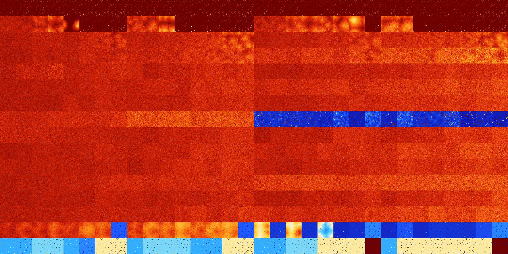

# B01257 (85504-86015)

<details>
    <summary>Initial Grid</summary>
    
</details>


<details>
    <summary>Initial Grid RLE</summary>

```
#C Exported from GoGoL (https://github.com/marrow16/gogol)
#C Wrap mode: Toroidal
#C Boundary mode: Dead
#C Step: 0
x = 100, y = 100, rule = B01257/S
23bo72bo$o9bo19bo4bo2bo38bo11bo$20bo11bo11bo34bo$5bo5bo10bo10bo11b2o27b
obo5bo11bo4bo$58bo22bo12bo$31bo6bo4bo16bo10bo26bo$58bo$15bo22bo26bo4bo
4bo$32bobo3bo17bo4bo28bo7bo$3bo55bo32bo$6bo6bo8bo6bo7bo15bo8bo28bo5bo$
12bo2bo2bo20bo2bo24bo5bo$6bo33bo13bo10bo11bo5bo7bo4bo$15bo2bo36bo25bo$
26bo32bo22bo$13bo80bobo$100b$3bo7bo22bo6bo8bo25bo5bo$12bo15bo20bo3bo4bo
24bo6bo$13bo23bo12bo$7bo15bo11bo26bobo14bobo14bo$95bo$36bo20bo30bo$27bo
10bo22bo10bo$8bo39b2o8bo28bo$18bo7bo2bo49bo6bo3bo$55bo2bo8bo18bo$27bobo
11bo19bo7bo15bo11bo$13bo8bo49bo23bo$60bo25bo$40bo22bo11bo14bo$8bo9bo2bo
23bo5bo7bo$3bo32bo11bo31bo12bo$bo13bo27bo8bo26bo$21bo22bo27bobo$20bo40b
o19bo$2o15bo35bo$27bo4bo14bo14bo11bo7bo$18bo12bo7bo5bo15bo19bo9bo3bo$
19bo3bo3bo2bo6bo30b2o16b2o7bo$18bo19bo3bo11bo18b2o3bo$60bo30bo$2bo41bo
14b2o2bo$18bo25bobo10bo15bo$13bo27bo31b2o$5bo41bo41bo6bo$28bo23bo$4bo9b
o5bo15bo31bo5bo5bo3bo$2bo6bo2bo12bo46bo4bo$6bo33bo18bobo8bo2bo9bo7bo$o
2bo26bo25bo27bo$5bo29bo11bo27bo6bo$9bo38bobo9bo12bo12bo$40bo13bo12bobo
9bo$17bo24bo37bo18bo$56bo18bo19bo$28bo40b2o$11bo20bo32bo18bo$5bo19bo2bo
27bo7bobo6bo9bo$18bo24bo2bo2bo20bo11bo14bo$20bo43bo18bo$27bo27bo9bo26bo
$19bo6bo17bo5bo12bo20b3o$14bo19bo$23bo3bo15bo12bo21bo7bo$4bo16b2o12bo
35bo6bo$4bo9bo22bo6bo24bo14bo$6bo38bo15bo$7bo51bo2bo3bo27bo$3bo18bo2bo
9bo23bo4b2o26bo$10bo21bo53bo9bo$17bo64bo14bo$6b2o12bo13bo29bo13bo9bo4bo
$8bobo3bo31bo30bobo3bo13bo$3bo12bo24bobo21bo10bo$bo9bo4bo8bo20bo11bo7bo
5b2o8bo$5bo68bo$13bo19bo21bo40bo$bo12bo4bo20bo17bo7bo9bo3bo$100b$40bo5b
obo46bo$6bo21bo18bo12bo8bo$9bo4bo35bobo15bo$o9bo15bo22bo3bo29bo8bo$20bo
2bo15bo27bo26bo$16bo19bo28bo14bo7bo$8bo26bo$13bo20bo23bo6b2o20bo$46bo
11bo11bo$32bo11bo13b2o$24b2o5bo43bo4bo17bo$14bo35bo18b2o$o4bo19bobo2bo
14bobo7bo$57bo20bo$32bo14bo41bo3bo4bo$bo2bo7bo9bo8bo23bo3bo7bo21bobo5bo
$18bobo20bo25bo22b2o$9bo5bo8bo14bo$5bo2bo21bo15bo3bo11bo$3bobobo2bo2bo
2bo47bo2bo24bo!
```
</details>
<details>
    <summary>Thumbnail</summary>

</details>
<table>
<tr>
    <td><a href="./85504%20S%20Heat%20Map%20Activity.png"></a><br>S (85504)<br>R@14,p2</td>    <td><a href="./85505%20S0%20Heat%20Map%20Activity.png"></a><br>S0 (85505)<br>R@8,p2</td>    <td><a href="./85506%20S1%20Heat%20Map%20Activity.png"></a><br>S1 (85506)<br>R@7,p2</td>    <td><a href="./85507%20S01%20Heat%20Map%20Activity.png"></a><br>S01 (85507)<br>R@9,p2</td>    <td><a href="./85508%20S2%20Heat%20Map%20Activity.png"></a><br>S2 (85508)<br>R@8,p2</td>    <td><a href="./85509%20S02%20Heat%20Map%20Activity.png"></a><br>S02 (85509)<br>R@7,p2</td>    <td><a href="./85510%20S12%20Heat%20Map%20Activity.png"></a><br>S12 (85510)<br>R@7,p2</td>    <td><a href="./85511%20S012%20Heat%20Map%20Activity.png"></a><br>S012 (85511)<br>R@7,p2</td>    <td><a href="./85512%20S3%20Heat%20Map%20Activity.png"></a><br>S3 (85512)<br>R@10,p2</td>    <td><a href="./85513%20S03%20Heat%20Map%20Activity.png"></a><br>S03 (85513)<br>R@8,p2</td>    <td><a href="./85514%20S13%20Heat%20Map%20Activity.png"></a><br>S13 (85514)<br>R@8,p2</td>    <td><a href="./85515%20S013%20Heat%20Map%20Activity.png"></a><br>S013 (85515)<br>R@9,p2</td>    <td><a href="./85516%20S23%20Heat%20Map%20Activity.png"></a><br>S23 (85516)<br>R@8,p2</td>    <td><a href="./85517%20S023%20Heat%20Map%20Activity.png"></a><br>S023 (85517)<br>R@7,p2</td>    <td><a href="./85518%20S123%20Heat%20Map%20Activity.png"></a><br>S123 (85518)<br>R@8,p2</td>    <td><a href="./85519%20S0123%20Heat%20Map%20Activity.png"></a><br>S0123 (85519)<br>R@7,p2</td>    <td><a href="./85520%20S4%20Heat%20Map%20Activity.png"></a><br>S4 (85520)<br>R@12,p2</td>    <td><a href="./85521%20S04%20Heat%20Map%20Activity.png"></a><br>S04 (85521)<br>R@10,p2</td>    <td><a href="./85522%20S14%20Heat%20Map%20Activity.png"></a><br>S14 (85522)<br>R@10,p2</td>    <td><a href="./85523%20S014%20Heat%20Map%20Activity.png"></a><br>S014 (85523)<br>R@15,p2</td>    <td><a href="./85524%20S24%20Heat%20Map%20Activity.png"></a><br>S24 (85524)<br>R@12,p2</td>    <td><a href="./85525%20S024%20Heat%20Map%20Activity.png"></a><br>S024 (85525)<br>R@8,p2</td>    <td><a href="./85526%20S124%20Heat%20Map%20Activity.png"></a><br>S124 (85526)<br>R@8,p2</td>    <td><a href="./85527%20S0124%20Heat%20Map%20Activity.png"></a><br>S0124 (85527)<br>R@8,p4</td>    <td><a href="./85528%20S34%20Heat%20Map%20Activity.png"></a><br>S34 (85528)<br>R@12,p2</td>    <td><a href="./85529%20S034%20Heat%20Map%20Activity.png"></a><br>S034 (85529)<br>R@10,p2</td>    <td><a href="./85530%20S134%20Heat%20Map%20Activity.png"></a><br>S134 (85530)<br>R@9,p2</td>    <td><a href="./85531%20S0134%20Heat%20Map%20Activity.png"></a><br>S0134 (85531)<br>R@9,p2</td>    <td><a href="./85532%20S234%20Heat%20Map%20Activity.png"></a><br>S234 (85532)<br>R@12,p2</td>    <td><a href="./85533%20S0234%20Heat%20Map%20Activity.png"></a><br>S0234 (85533)<br>R@14,p2</td>    <td><a href="./85534%20S1234%20Heat%20Map%20Activity.png"></a><br>S1234 (85534)<br>R@8,p2</td>    <td><a href="./85535%20S01234%20Heat%20Map%20Activity.png"></a><br>S01234 (85535)<br>R@7,p2</td></tr>
<tr>
    <td><a href="./85536%20S5%20Heat%20Map%20Activity.png"></a><br>S5 (85536)<br>G>1000</td>    <td><a href="./85537%20S05%20Heat%20Map%20Activity.png"></a><br>S05 (85537)<br>G>1000</td>    <td><a href="./85538%20S15%20Heat%20Map%20Activity.png"></a><br>S15 (85538)<br>G>1000</td>    <td><a href="./85539%20S015%20Heat%20Map%20Activity.png"></a><br>S015 (85539)<br>G>1000</td>    <td><a href="./85540%20S25%20Heat%20Map%20Activity.png"></a><br>S25 (85540)<br>G>1000</td>    <td><a href="./85541%20S025%20Heat%20Map%20Activity.png"></a><br>S025 (85541)<br>R@16,p2</td>    <td><a href="./85542%20S125%20Heat%20Map%20Activity.png"></a><br>S125 (85542)<br>R@26,p2</td>    <td><a href="./85543%20S0125%20Heat%20Map%20Activity.png"></a><br>S0125 (85543)<br>R@10,p2</td>    <td><a href="./85544%20S35%20Heat%20Map%20Activity.png"></a><br>S35 (85544)<br>G>1000</td>    <td><a href="./85545%20S035%20Heat%20Map%20Activity.png"></a><br>S035 (85545)<br>G>1000</td>    <td><a href="./85546%20S135%20Heat%20Map%20Activity.png"></a><br>S135 (85546)<br>G>1000</td>    <td><a href="./85547%20S0135%20Heat%20Map%20Activity.png"></a><br>S0135 (85547)<br>R@14,p4</td>    <td><a href="./85548%20S235%20Heat%20Map%20Activity.png"></a><br>S235 (85548)<br>R@40,p4</td>    <td><a href="./85549%20S0235%20Heat%20Map%20Activity.png"></a><br>S0235 (85549)<br>R@11,p2</td>    <td><a href="./85550%20S1235%20Heat%20Map%20Activity.png"></a><br>S1235 (85550)<br>R@12,p4</td>    <td><a href="./85551%20S01235%20Heat%20Map%20Activity.png"></a><br>S01235 (85551)<br>R@8,p2</td>    <td><a href="./85552%20S45%20Heat%20Map%20Activity.png"></a><br>S45 (85552)<br>G>1000</td>    <td><a href="./85553%20S045%20Heat%20Map%20Activity.png"></a><br>S045 (85553)<br>G>1000</td>    <td><a href="./85554%20S145%20Heat%20Map%20Activity.png"></a><br>S145 (85554)<br>G>1000</td>    <td><a href="./85555%20S0145%20Heat%20Map%20Activity.png"></a><br>S0145 (85555)<br>G>1000</td>    <td><a href="./85556%20S245%20Heat%20Map%20Activity.png"></a><br>S245 (85556)<br>G>1000</td>    <td><a href="./85557%20S0245%20Heat%20Map%20Activity.png"></a><br>S0245 (85557)<br>G>1000</td>    <td><a href="./85558%20S1245%20Heat%20Map%20Activity.png"></a><br>S1245 (85558)<br>G>1000</td>    <td><a href="./85559%20S01245%20Heat%20Map%20Activity.png"></a><br>S01245 (85559)<br>R@21,p2</td>    <td><a href="./85560%20S345%20Heat%20Map%20Activity.png"></a><br>S345 (85560)<br>G>1000</td>    <td><a href="./85561%20S0345%20Heat%20Map%20Activity.png"></a><br>S0345 (85561)<br>G>1000</td>    <td><a href="./85562%20S1345%20Heat%20Map%20Activity.png"></a><br>S1345 (85562)<br>R@37,p4</td>    <td><a href="./85563%20S01345%20Heat%20Map%20Activity.png"></a><br>S01345 (85563)<br>R@17,p2</td>    <td><a href="./85564%20S2345%20Heat%20Map%20Activity.png"></a><br>S2345 (85564)<br>R@20,p2</td>    <td><a href="./85565%20S02345%20Heat%20Map%20Activity.png"></a><br>S02345 (85565)<br>R@11,p2</td>    <td><a href="./85566%20S12345%20Heat%20Map%20Activity.png"></a><br>S12345 (85566)<br>R@10,p2</td>    <td><a href="./85567%20S012345%20Heat%20Map%20Activity.png"></a><br>S012345 (85567)<br>R@9,p2</td></tr>
<tr>
    <td><a href="./85568%20S6%20Heat%20Map%20Activity.png"></a><br>S6 (85568)<br>G>1000</td>    <td><a href="./85569%20S06%20Heat%20Map%20Activity.png"></a><br>S06 (85569)<br>G>1000</td>    <td><a href="./85570%20S16%20Heat%20Map%20Activity.png"></a><br>S16 (85570)<br>G>1000</td>    <td><a href="./85571%20S016%20Heat%20Map%20Activity.png"></a><br>S016 (85571)<br>G>1000</td>    <td><a href="./85572%20S26%20Heat%20Map%20Activity.png"></a><br>S26 (85572)<br>G>1000</td>    <td><a href="./85573%20S026%20Heat%20Map%20Activity.png"></a><br>S026 (85573)<br>G>1000</td>    <td><a href="./85574%20S126%20Heat%20Map%20Activity.png"></a><br>S126 (85574)<br>G>1000</td>    <td><a href="./85575%20S0126%20Heat%20Map%20Activity.png"></a><br>S0126 (85575)<br>G>1000</td>    <td><a href="./85576%20S36%20Heat%20Map%20Activity.png"></a><br>S36 (85576)<br>G>1000</td>    <td><a href="./85577%20S036%20Heat%20Map%20Activity.png"></a><br>S036 (85577)<br>G>1000</td>    <td><a href="./85578%20S136%20Heat%20Map%20Activity.png"></a><br>S136 (85578)<br>G>1000</td>    <td><a href="./85579%20S0136%20Heat%20Map%20Activity.png"></a><br>S0136 (85579)<br>G>1000</td>    <td><a href="./85580%20S236%20Heat%20Map%20Activity.png"></a><br>S236 (85580)<br>G>1000</td>    <td><a href="./85581%20S0236%20Heat%20Map%20Activity.png"></a><br>S0236 (85581)<br>G>1000</td>    <td><a href="./85582%20S1236%20Heat%20Map%20Activity.png"></a><br>S1236 (85582)<br>G>1000</td>    <td><a href="./85583%20S01236%20Heat%20Map%20Activity.png"></a><br>S01236 (85583)<br>G>1000</td>    <td><a href="./85584%20S46%20Heat%20Map%20Activity.png"></a><br>S46 (85584)<br>G>1000</td>    <td><a href="./85585%20S046%20Heat%20Map%20Activity.png"></a><br>S046 (85585)<br>G>1000</td>    <td><a href="./85586%20S146%20Heat%20Map%20Activity.png"></a><br>S146 (85586)<br>G>1000</td>    <td><a href="./85587%20S0146%20Heat%20Map%20Activity.png"></a><br>S0146 (85587)<br>G>1000</td>    <td><a href="./85588%20S246%20Heat%20Map%20Activity.png"></a><br>S246 (85588)<br>G>1000</td>    <td><a href="./85589%20S0246%20Heat%20Map%20Activity.png"></a><br>S0246 (85589)<br>G>1000</td>    <td><a href="./85590%20S1246%20Heat%20Map%20Activity.png"></a><br>S1246 (85590)<br>G>1000</td>    <td><a href="./85591%20S01246%20Heat%20Map%20Activity.png"></a><br>S01246 (85591)<br>G>1000</td>    <td><a href="./85592%20S346%20Heat%20Map%20Activity.png"></a><br>S346 (85592)<br>G>1000</td>    <td><a href="./85593%20S0346%20Heat%20Map%20Activity.png"></a><br>S0346 (85593)<br>G>1000</td>    <td><a href="./85594%20S1346%20Heat%20Map%20Activity.png"></a><br>S1346 (85594)<br>G>1000</td>    <td><a href="./85595%20S01346%20Heat%20Map%20Activity.png"></a><br>S01346 (85595)<br>G>1000</td>    <td><a href="./85596%20S2346%20Heat%20Map%20Activity.png"></a><br>S2346 (85596)<br>G>1000</td>    <td><a href="./85597%20S02346%20Heat%20Map%20Activity.png"></a><br>S02346 (85597)<br>G>1000</td>    <td><a href="./85598%20S12346%20Heat%20Map%20Activity.png"></a><br>S12346 (85598)<br>G>1000</td>    <td><a href="./85599%20S012346%20Heat%20Map%20Activity.png"></a><br>S012346 (85599)<br>G>1000</td></tr>
<tr>
    <td><a href="./85600%20S56%20Heat%20Map%20Activity.png"></a><br>S56 (85600)<br>G>1000</td>    <td><a href="./85601%20S056%20Heat%20Map%20Activity.png"></a><br>S056 (85601)<br>G>1000</td>    <td><a href="./85602%20S156%20Heat%20Map%20Activity.png"></a><br>S156 (85602)<br>G>1000</td>    <td><a href="./85603%20S0156%20Heat%20Map%20Activity.png"></a><br>S0156 (85603)<br>G>1000</td>    <td><a href="./85604%20S256%20Heat%20Map%20Activity.png"></a><br>S256 (85604)<br>G>1000</td>    <td><a href="./85605%20S0256%20Heat%20Map%20Activity.png"></a><br>S0256 (85605)<br>G>1000</td>    <td><a href="./85606%20S1256%20Heat%20Map%20Activity.png"></a><br>S1256 (85606)<br>G>1000</td>    <td><a href="./85607%20S01256%20Heat%20Map%20Activity.png"></a><br>S01256 (85607)<br>G>1000</td>    <td><a href="./85608%20S356%20Heat%20Map%20Activity.png"></a><br>S356 (85608)<br>G>1000</td>    <td><a href="./85609%20S0356%20Heat%20Map%20Activity.png"></a><br>S0356 (85609)<br>G>1000</td>    <td><a href="./85610%20S1356%20Heat%20Map%20Activity.png"></a><br>S1356 (85610)<br>G>1000</td>    <td><a href="./85611%20S01356%20Heat%20Map%20Activity.png"></a><br>S01356 (85611)<br>G>1000</td>    <td><a href="./85612%20S2356%20Heat%20Map%20Activity.png"></a><br>S2356 (85612)<br>G>1000</td>    <td><a href="./85613%20S02356%20Heat%20Map%20Activity.png"></a><br>S02356 (85613)<br>G>1000</td>    <td><a href="./85614%20S12356%20Heat%20Map%20Activity.png"></a><br>S12356 (85614)<br>G>1000</td>    <td><a href="./85615%20S012356%20Heat%20Map%20Activity.png"></a><br>S012356 (85615)<br>G>1000</td>    <td><a href="./85616%20S456%20Heat%20Map%20Activity.png"></a><br>S456 (85616)<br>G>1000</td>    <td><a href="./85617%20S0456%20Heat%20Map%20Activity.png"></a><br>S0456 (85617)<br>G>1000</td>    <td><a href="./85618%20S1456%20Heat%20Map%20Activity.png"></a><br>S1456 (85618)<br>G>1000</td>    <td><a href="./85619%20S01456%20Heat%20Map%20Activity.png"></a><br>S01456 (85619)<br>G>1000</td>    <td><a href="./85620%20S2456%20Heat%20Map%20Activity.png"></a><br>S2456 (85620)<br>G>1000</td>    <td><a href="./85621%20S02456%20Heat%20Map%20Activity.png"></a><br>S02456 (85621)<br>G>1000</td>    <td><a href="./85622%20S12456%20Heat%20Map%20Activity.png"></a><br>S12456 (85622)<br>G>1000</td>    <td><a href="./85623%20S012456%20Heat%20Map%20Activity.png"></a><br>S012456 (85623)<br>G>1000</td>    <td><a href="./85624%20S3456%20Heat%20Map%20Activity.png"></a><br>S3456 (85624)<br>G>1000</td>    <td><a href="./85625%20S03456%20Heat%20Map%20Activity.png"></a><br>S03456 (85625)<br>G>1000</td>    <td><a href="./85626%20S13456%20Heat%20Map%20Activity.png"></a><br>S13456 (85626)<br>G>1000</td>    <td><a href="./85627%20S013456%20Heat%20Map%20Activity.png"></a><br>S013456 (85627)<br>G>1000</td>    <td><a href="./85628%20S23456%20Heat%20Map%20Activity.png"></a><br>S23456 (85628)<br>G>1000</td>    <td><a href="./85629%20S023456%20Heat%20Map%20Activity.png"></a><br>S023456 (85629)<br>G>1000</td>    <td><a href="./85630%20S123456%20Heat%20Map%20Activity.png"></a><br>S123456 (85630)<br>G>1000</td>    <td><a href="./85631%20S0123456%20Heat%20Map%20Activity.png"></a><br>S0123456 (85631)<br>G>1000</td></tr>
<tr>
    <td><a href="./85632%20S7%20Heat%20Map%20Activity.png"></a><br>S7 (85632)<br>G>1000</td>    <td><a href="./85633%20S07%20Heat%20Map%20Activity.png"></a><br>S07 (85633)<br>G>1000</td>    <td><a href="./85634%20S17%20Heat%20Map%20Activity.png"></a><br>S17 (85634)<br>G>1000</td>    <td><a href="./85635%20S017%20Heat%20Map%20Activity.png"></a><br>S017 (85635)<br>G>1000</td>    <td><a href="./85636%20S27%20Heat%20Map%20Activity.png"></a><br>S27 (85636)<br>G>1000</td>    <td><a href="./85637%20S027%20Heat%20Map%20Activity.png"></a><br>S027 (85637)<br>G>1000</td>    <td><a href="./85638%20S127%20Heat%20Map%20Activity.png"></a><br>S127 (85638)<br>G>1000</td>    <td><a href="./85639%20S0127%20Heat%20Map%20Activity.png"></a><br>S0127 (85639)<br>G>1000</td>    <td><a href="./85640%20S37%20Heat%20Map%20Activity.png"></a><br>S37 (85640)<br>G>1000</td>    <td><a href="./85641%20S037%20Heat%20Map%20Activity.png"></a><br>S037 (85641)<br>G>1000</td>    <td><a href="./85642%20S137%20Heat%20Map%20Activity.png"></a><br>S137 (85642)<br>G>1000</td>    <td><a href="./85643%20S0137%20Heat%20Map%20Activity.png"></a><br>S0137 (85643)<br>G>1000</td>    <td><a href="./85644%20S237%20Heat%20Map%20Activity.png"></a><br>S237 (85644)<br>G>1000</td>    <td><a href="./85645%20S0237%20Heat%20Map%20Activity.png"></a><br>S0237 (85645)<br>G>1000</td>    <td><a href="./85646%20S1237%20Heat%20Map%20Activity.png"></a><br>S1237 (85646)<br>G>1000</td>    <td><a href="./85647%20S01237%20Heat%20Map%20Activity.png"></a><br>S01237 (85647)<br>G>1000</td>    <td><a href="./85648%20S47%20Heat%20Map%20Activity.png"></a><br>S47 (85648)<br>G>1000</td>    <td><a href="./85649%20S047%20Heat%20Map%20Activity.png"></a><br>S047 (85649)<br>G>1000</td>    <td><a href="./85650%20S147%20Heat%20Map%20Activity.png"></a><br>S147 (85650)<br>G>1000</td>    <td><a href="./85651%20S0147%20Heat%20Map%20Activity.png"></a><br>S0147 (85651)<br>G>1000</td>    <td><a href="./85652%20S247%20Heat%20Map%20Activity.png"></a><br>S247 (85652)<br>G>1000</td>    <td><a href="./85653%20S0247%20Heat%20Map%20Activity.png"></a><br>S0247 (85653)<br>G>1000</td>    <td><a href="./85654%20S1247%20Heat%20Map%20Activity.png"></a><br>S1247 (85654)<br>G>1000</td>    <td><a href="./85655%20S01247%20Heat%20Map%20Activity.png"></a><br>S01247 (85655)<br>G>1000</td>    <td><a href="./85656%20S347%20Heat%20Map%20Activity.png"></a><br>S347 (85656)<br>G>1000</td>    <td><a href="./85657%20S0347%20Heat%20Map%20Activity.png"></a><br>S0347 (85657)<br>G>1000</td>    <td><a href="./85658%20S1347%20Heat%20Map%20Activity.png"></a><br>S1347 (85658)<br>G>1000</td>    <td><a href="./85659%20S01347%20Heat%20Map%20Activity.png"></a><br>S01347 (85659)<br>G>1000</td>    <td><a href="./85660%20S2347%20Heat%20Map%20Activity.png"></a><br>S2347 (85660)<br>G>1000</td>    <td><a href="./85661%20S02347%20Heat%20Map%20Activity.png"></a><br>S02347 (85661)<br>G>1000</td>    <td><a href="./85662%20S12347%20Heat%20Map%20Activity.png"></a><br>S12347 (85662)<br>G>1000</td>    <td><a href="./85663%20S012347%20Heat%20Map%20Activity.png"></a><br>S012347 (85663)<br>G>1000</td></tr>
<tr>
    <td><a href="./85664%20S57%20Heat%20Map%20Activity.png"></a><br>S57 (85664)<br>G>1000</td>    <td><a href="./85665%20S057%20Heat%20Map%20Activity.png"></a><br>S057 (85665)<br>G>1000</td>    <td><a href="./85666%20S157%20Heat%20Map%20Activity.png"></a><br>S157 (85666)<br>G>1000</td>    <td><a href="./85667%20S0157%20Heat%20Map%20Activity.png"></a><br>S0157 (85667)<br>G>1000</td>    <td><a href="./85668%20S257%20Heat%20Map%20Activity.png"></a><br>S257 (85668)<br>G>1000</td>    <td><a href="./85669%20S0257%20Heat%20Map%20Activity.png"></a><br>S0257 (85669)<br>G>1000</td>    <td><a href="./85670%20S1257%20Heat%20Map%20Activity.png"></a><br>S1257 (85670)<br>G>1000</td>    <td><a href="./85671%20S01257%20Heat%20Map%20Activity.png"></a><br>S01257 (85671)<br>G>1000</td>    <td><a href="./85672%20S357%20Heat%20Map%20Activity.png"></a><br>S357 (85672)<br>G>1000</td>    <td><a href="./85673%20S0357%20Heat%20Map%20Activity.png"></a><br>S0357 (85673)<br>G>1000</td>    <td><a href="./85674%20S1357%20Heat%20Map%20Activity.png"></a><br>S1357 (85674)<br>G>1000</td>    <td><a href="./85675%20S01357%20Heat%20Map%20Activity.png"></a><br>S01357 (85675)<br>G>1000</td>    <td><a href="./85676%20S2357%20Heat%20Map%20Activity.png"></a><br>S2357 (85676)<br>G>1000</td>    <td><a href="./85677%20S02357%20Heat%20Map%20Activity.png"></a><br>S02357 (85677)<br>G>1000</td>    <td><a href="./85678%20S12357%20Heat%20Map%20Activity.png"></a><br>S12357 (85678)<br>G>1000</td>    <td><a href="./85679%20S012357%20Heat%20Map%20Activity.png"></a><br>S012357 (85679)<br>G>1000</td>    <td><a href="./85680%20S457%20Heat%20Map%20Activity.png"></a><br>S457 (85680)<br>G>1000</td>    <td><a href="./85681%20S0457%20Heat%20Map%20Activity.png"></a><br>S0457 (85681)<br>G>1000</td>    <td><a href="./85682%20S1457%20Heat%20Map%20Activity.png"></a><br>S1457 (85682)<br>G>1000</td>    <td><a href="./85683%20S01457%20Heat%20Map%20Activity.png"></a><br>S01457 (85683)<br>G>1000</td>    <td><a href="./85684%20S2457%20Heat%20Map%20Activity.png"></a><br>S2457 (85684)<br>G>1000</td>    <td><a href="./85685%20S02457%20Heat%20Map%20Activity.png"></a><br>S02457 (85685)<br>G>1000</td>    <td><a href="./85686%20S12457%20Heat%20Map%20Activity.png"></a><br>S12457 (85686)<br>G>1000</td>    <td><a href="./85687%20S012457%20Heat%20Map%20Activity.png"></a><br>S012457 (85687)<br>G>1000</td>    <td><a href="./85688%20S3457%20Heat%20Map%20Activity.png"></a><br>S3457 (85688)<br>G>1000</td>    <td><a href="./85689%20S03457%20Heat%20Map%20Activity.png"></a><br>S03457 (85689)<br>G>1000</td>    <td><a href="./85690%20S13457%20Heat%20Map%20Activity.png"></a><br>S13457 (85690)<br>G>1000</td>    <td><a href="./85691%20S013457%20Heat%20Map%20Activity.png"></a><br>S013457 (85691)<br>G>1000</td>    <td><a href="./85692%20S23457%20Heat%20Map%20Activity.png"></a><br>S23457 (85692)<br>G>1000</td>    <td><a href="./85693%20S023457%20Heat%20Map%20Activity.png"></a><br>S023457 (85693)<br>G>1000</td>    <td><a href="./85694%20S123457%20Heat%20Map%20Activity.png"></a><br>S123457 (85694)<br>G>1000</td>    <td><a href="./85695%20S0123457%20Heat%20Map%20Activity.png"></a><br>S0123457 (85695)<br>G>1000</td></tr>
<tr>
    <td><a href="./85696%20S67%20Heat%20Map%20Activity.png"></a><br>S67 (85696)<br>G>1000</td>    <td><a href="./85697%20S067%20Heat%20Map%20Activity.png"></a><br>S067 (85697)<br>G>1000</td>    <td><a href="./85698%20S167%20Heat%20Map%20Activity.png"></a><br>S167 (85698)<br>G>1000</td>    <td><a href="./85699%20S0167%20Heat%20Map%20Activity.png"></a><br>S0167 (85699)<br>G>1000</td>    <td><a href="./85700%20S267%20Heat%20Map%20Activity.png"></a><br>S267 (85700)<br>G>1000</td>    <td><a href="./85701%20S0267%20Heat%20Map%20Activity.png"></a><br>S0267 (85701)<br>G>1000</td>    <td><a href="./85702%20S1267%20Heat%20Map%20Activity.png"></a><br>S1267 (85702)<br>G>1000</td>    <td><a href="./85703%20S01267%20Heat%20Map%20Activity.png"></a><br>S01267 (85703)<br>G>1000</td>    <td><a href="./85704%20S367%20Heat%20Map%20Activity.png"></a><br>S367 (85704)<br>G>1000</td>    <td><a href="./85705%20S0367%20Heat%20Map%20Activity.png"></a><br>S0367 (85705)<br>G>1000</td>    <td><a href="./85706%20S1367%20Heat%20Map%20Activity.png"></a><br>S1367 (85706)<br>G>1000</td>    <td><a href="./85707%20S01367%20Heat%20Map%20Activity.png"></a><br>S01367 (85707)<br>G>1000</td>    <td><a href="./85708%20S2367%20Heat%20Map%20Activity.png"></a><br>S2367 (85708)<br>G>1000</td>    <td><a href="./85709%20S02367%20Heat%20Map%20Activity.png"></a><br>S02367 (85709)<br>G>1000</td>    <td><a href="./85710%20S12367%20Heat%20Map%20Activity.png"></a><br>S12367 (85710)<br>G>1000</td>    <td><a href="./85711%20S012367%20Heat%20Map%20Activity.png"></a><br>S012367 (85711)<br>G>1000</td>    <td><a href="./85712%20S467%20Heat%20Map%20Activity.png"></a><br>S467 (85712)<br>G>1000</td>    <td><a href="./85713%20S0467%20Heat%20Map%20Activity.png"></a><br>S0467 (85713)<br>G>1000</td>    <td><a href="./85714%20S1467%20Heat%20Map%20Activity.png"></a><br>S1467 (85714)<br>G>1000</td>    <td><a href="./85715%20S01467%20Heat%20Map%20Activity.png"></a><br>S01467 (85715)<br>G>1000</td>    <td><a href="./85716%20S2467%20Heat%20Map%20Activity.png"></a><br>S2467 (85716)<br>G>1000</td>    <td><a href="./85717%20S02467%20Heat%20Map%20Activity.png"></a><br>S02467 (85717)<br>G>1000</td>    <td><a href="./85718%20S12467%20Heat%20Map%20Activity.png"></a><br>S12467 (85718)<br>G>1000</td>    <td><a href="./85719%20S012467%20Heat%20Map%20Activity.png"></a><br>S012467 (85719)<br>G>1000</td>    <td><a href="./85720%20S3467%20Heat%20Map%20Activity.png"></a><br>S3467 (85720)<br>G>1000</td>    <td><a href="./85721%20S03467%20Heat%20Map%20Activity.png"></a><br>S03467 (85721)<br>G>1000</td>    <td><a href="./85722%20S13467%20Heat%20Map%20Activity.png"></a><br>S13467 (85722)<br>G>1000</td>    <td><a href="./85723%20S013467%20Heat%20Map%20Activity.png"></a><br>S013467 (85723)<br>G>1000</td>    <td><a href="./85724%20S23467%20Heat%20Map%20Activity.png"></a><br>S23467 (85724)<br>G>1000</td>    <td><a href="./85725%20S023467%20Heat%20Map%20Activity.png"></a><br>S023467 (85725)<br>G>1000</td>    <td><a href="./85726%20S123467%20Heat%20Map%20Activity.png"></a><br>S123467 (85726)<br>G>1000</td>    <td><a href="./85727%20S0123467%20Heat%20Map%20Activity.png"></a><br>S0123467 (85727)<br>G>1000</td></tr>
<tr>
    <td><a href="./85728%20S567%20Heat%20Map%20Activity.png"></a><br>S567 (85728)<br>G>1000</td>    <td><a href="./85729%20S0567%20Heat%20Map%20Activity.png"></a><br>S0567 (85729)<br>G>1000</td>    <td><a href="./85730%20S1567%20Heat%20Map%20Activity.png"></a><br>S1567 (85730)<br>G>1000</td>    <td><a href="./85731%20S01567%20Heat%20Map%20Activity.png"></a><br>S01567 (85731)<br>G>1000</td>    <td><a href="./85732%20S2567%20Heat%20Map%20Activity.png"></a><br>S2567 (85732)<br>G>1000</td>    <td><a href="./85733%20S02567%20Heat%20Map%20Activity.png"></a><br>S02567 (85733)<br>G>1000</td>    <td><a href="./85734%20S12567%20Heat%20Map%20Activity.png"></a><br>S12567 (85734)<br>G>1000</td>    <td><a href="./85735%20S012567%20Heat%20Map%20Activity.png"></a><br>S012567 (85735)<br>G>1000</td>    <td><a href="./85736%20S3567%20Heat%20Map%20Activity.png"></a><br>S3567 (85736)<br>G>1000</td>    <td><a href="./85737%20S03567%20Heat%20Map%20Activity.png"></a><br>S03567 (85737)<br>G>1000</td>    <td><a href="./85738%20S13567%20Heat%20Map%20Activity.png"></a><br>S13567 (85738)<br>G>1000</td>    <td><a href="./85739%20S013567%20Heat%20Map%20Activity.png"></a><br>S013567 (85739)<br>G>1000</td>    <td><a href="./85740%20S23567%20Heat%20Map%20Activity.png"></a><br>S23567 (85740)<br>G>1000</td>    <td><a href="./85741%20S023567%20Heat%20Map%20Activity.png"></a><br>S023567 (85741)<br>G>1000</td>    <td><a href="./85742%20S123567%20Heat%20Map%20Activity.png"></a><br>S123567 (85742)<br>G>1000</td>    <td><a href="./85743%20S0123567%20Heat%20Map%20Activity.png"></a><br>S0123567 (85743)<br>G>1000</td>    <td><a href="./85744%20S4567%20Heat%20Map%20Activity.png"></a><br>S4567 (85744)<br>R@140,p20</td>    <td><a href="./85745%20S04567%20Heat%20Map%20Activity.png"></a><br>S04567 (85745)<br>R@192,p60</td>    <td><a href="./85746%20S14567%20Heat%20Map%20Activity.png"></a><br>S14567 (85746)<br>R@178,p60</td>    <td><a href="./85747%20S014567%20Heat%20Map%20Activity.png"></a><br>S014567 (85747)<br>R@329,p210</td>    <td><a href="./85748%20S24567%20Heat%20Map%20Activity.png"></a><br>S24567 (85748)<br>R@182,p60</td>    <td><a href="./85749%20S024567%20Heat%20Map%20Activity.png"></a><br>S024567 (85749)<br>R@100,p12</td>    <td><a href="./85750%20S124567%20Heat%20Map%20Activity.png"></a><br>S124567 (85750)<br>R@540,p420</td>    <td><a href="./85751%20S0124567%20Heat%20Map%20Activity.png"></a><br>S0124567 (85751)<br>R@128,p6</td>    <td><a href="./85752%20S34567%20Heat%20Map%20Activity.png"></a><br>S34567 (85752)<br>R@152,p120</td>    <td><a href="./85753%20S034567%20Heat%20Map%20Activity.png"></a><br>S034567 (85753)<br>R@64,p24</td>    <td><a href="./85754%20S134567%20Heat%20Map%20Activity.png"></a><br>S134567 (85754)<br>R@82,p42</td>    <td><a href="./85755%20S0134567%20Heat%20Map%20Activity.png"></a><br>S0134567 (85755)<br>R@170,p132</td>    <td><a href="./85756%20S234567%20Heat%20Map%20Activity.png"></a><br>S234567 (85756)<br>R@36,p12</td>    <td><a href="./85757%20S0234567%20Heat%20Map%20Activity.png"></a><br>S0234567 (85757)<br>G>1000</td>    <td><a href="./85758%20S1234567%20Heat%20Map%20Activity.png"></a><br>S1234567 (85758)<br>R@116,p84</td>    <td><a href="./85759%20S01234567%20Heat%20Map%20Activity.png"></a><br>S01234567 (85759)<br>G>1000</td></tr>
<tr>
    <td><a href="./85760%20S8%20Heat%20Map%20Activity.png"></a><br>S8 (85760)<br>G>1000</td>    <td><a href="./85761%20S08%20Heat%20Map%20Activity.png"></a><br>S08 (85761)<br>G>1000</td>    <td><a href="./85762%20S18%20Heat%20Map%20Activity.png"></a><br>S18 (85762)<br>G>1000</td>    <td><a href="./85763%20S018%20Heat%20Map%20Activity.png"></a><br>S018 (85763)<br>G>1000</td>    <td><a href="./85764%20S28%20Heat%20Map%20Activity.png"></a><br>S28 (85764)<br>G>1000</td>    <td><a href="./85765%20S028%20Heat%20Map%20Activity.png"></a><br>S028 (85765)<br>G>1000</td>    <td><a href="./85766%20S128%20Heat%20Map%20Activity.png"></a><br>S128 (85766)<br>G>1000</td>    <td><a href="./85767%20S0128%20Heat%20Map%20Activity.png"></a><br>S0128 (85767)<br>G>1000</td>    <td><a href="./85768%20S38%20Heat%20Map%20Activity.png"></a><br>S38 (85768)<br>G>1000</td>    <td><a href="./85769%20S038%20Heat%20Map%20Activity.png"></a><br>S038 (85769)<br>G>1000</td>    <td><a href="./85770%20S138%20Heat%20Map%20Activity.png"></a><br>S138 (85770)<br>G>1000</td>    <td><a href="./85771%20S0138%20Heat%20Map%20Activity.png"></a><br>S0138 (85771)<br>G>1000</td>    <td><a href="./85772%20S238%20Heat%20Map%20Activity.png"></a><br>S238 (85772)<br>G>1000</td>    <td><a href="./85773%20S0238%20Heat%20Map%20Activity.png"></a><br>S0238 (85773)<br>G>1000</td>    <td><a href="./85774%20S1238%20Heat%20Map%20Activity.png"></a><br>S1238 (85774)<br>G>1000</td>    <td><a href="./85775%20S01238%20Heat%20Map%20Activity.png"></a><br>S01238 (85775)<br>G>1000</td>    <td><a href="./85776%20S48%20Heat%20Map%20Activity.png"></a><br>S48 (85776)<br>G>1000</td>    <td><a href="./85777%20S048%20Heat%20Map%20Activity.png"></a><br>S048 (85777)<br>G>1000</td>    <td><a href="./85778%20S148%20Heat%20Map%20Activity.png"></a><br>S148 (85778)<br>G>1000</td>    <td><a href="./85779%20S0148%20Heat%20Map%20Activity.png"></a><br>S0148 (85779)<br>G>1000</td>    <td><a href="./85780%20S248%20Heat%20Map%20Activity.png"></a><br>S248 (85780)<br>G>1000</td>    <td><a href="./85781%20S0248%20Heat%20Map%20Activity.png"></a><br>S0248 (85781)<br>G>1000</td>    <td><a href="./85782%20S1248%20Heat%20Map%20Activity.png"></a><br>S1248 (85782)<br>G>1000</td>    <td><a href="./85783%20S01248%20Heat%20Map%20Activity.png"></a><br>S01248 (85783)<br>G>1000</td>    <td><a href="./85784%20S348%20Heat%20Map%20Activity.png"></a><br>S348 (85784)<br>G>1000</td>    <td><a href="./85785%20S0348%20Heat%20Map%20Activity.png"></a><br>S0348 (85785)<br>G>1000</td>    <td><a href="./85786%20S1348%20Heat%20Map%20Activity.png"></a><br>S1348 (85786)<br>G>1000</td>    <td><a href="./85787%20S01348%20Heat%20Map%20Activity.png"></a><br>S01348 (85787)<br>G>1000</td>    <td><a href="./85788%20S2348%20Heat%20Map%20Activity.png"></a><br>S2348 (85788)<br>G>1000</td>    <td><a href="./85789%20S02348%20Heat%20Map%20Activity.png"></a><br>S02348 (85789)<br>G>1000</td>    <td><a href="./85790%20S12348%20Heat%20Map%20Activity.png"></a><br>S12348 (85790)<br>G>1000</td>    <td><a href="./85791%20S012348%20Heat%20Map%20Activity.png"></a><br>S012348 (85791)<br>G>1000</td></tr>
<tr>
    <td><a href="./85792%20S58%20Heat%20Map%20Activity.png"></a><br>S58 (85792)<br>G>1000</td>    <td><a href="./85793%20S058%20Heat%20Map%20Activity.png"></a><br>S058 (85793)<br>G>1000</td>    <td><a href="./85794%20S158%20Heat%20Map%20Activity.png"></a><br>S158 (85794)<br>G>1000</td>    <td><a href="./85795%20S0158%20Heat%20Map%20Activity.png"></a><br>S0158 (85795)<br>G>1000</td>    <td><a href="./85796%20S258%20Heat%20Map%20Activity.png"></a><br>S258 (85796)<br>G>1000</td>    <td><a href="./85797%20S0258%20Heat%20Map%20Activity.png"></a><br>S0258 (85797)<br>G>1000</td>    <td><a href="./85798%20S1258%20Heat%20Map%20Activity.png"></a><br>S1258 (85798)<br>G>1000</td>    <td><a href="./85799%20S01258%20Heat%20Map%20Activity.png"></a><br>S01258 (85799)<br>G>1000</td>    <td><a href="./85800%20S358%20Heat%20Map%20Activity.png"></a><br>S358 (85800)<br>G>1000</td>    <td><a href="./85801%20S0358%20Heat%20Map%20Activity.png"></a><br>S0358 (85801)<br>G>1000</td>    <td><a href="./85802%20S1358%20Heat%20Map%20Activity.png"></a><br>S1358 (85802)<br>G>1000</td>    <td><a href="./85803%20S01358%20Heat%20Map%20Activity.png"></a><br>S01358 (85803)<br>G>1000</td>    <td><a href="./85804%20S2358%20Heat%20Map%20Activity.png"></a><br>S2358 (85804)<br>G>1000</td>    <td><a href="./85805%20S02358%20Heat%20Map%20Activity.png"></a><br>S02358 (85805)<br>G>1000</td>    <td><a href="./85806%20S12358%20Heat%20Map%20Activity.png"></a><br>S12358 (85806)<br>G>1000</td>    <td><a href="./85807%20S012358%20Heat%20Map%20Activity.png"></a><br>S012358 (85807)<br>G>1000</td>    <td><a href="./85808%20S458%20Heat%20Map%20Activity.png"></a><br>S458 (85808)<br>G>1000</td>    <td><a href="./85809%20S0458%20Heat%20Map%20Activity.png"></a><br>S0458 (85809)<br>G>1000</td>    <td><a href="./85810%20S1458%20Heat%20Map%20Activity.png"></a><br>S1458 (85810)<br>G>1000</td>    <td><a href="./85811%20S01458%20Heat%20Map%20Activity.png"></a><br>S01458 (85811)<br>G>1000</td>    <td><a href="./85812%20S2458%20Heat%20Map%20Activity.png"></a><br>S2458 (85812)<br>G>1000</td>    <td><a href="./85813%20S02458%20Heat%20Map%20Activity.png"></a><br>S02458 (85813)<br>G>1000</td>    <td><a href="./85814%20S12458%20Heat%20Map%20Activity.png"></a><br>S12458 (85814)<br>G>1000</td>    <td><a href="./85815%20S012458%20Heat%20Map%20Activity.png"></a><br>S012458 (85815)<br>G>1000</td>    <td><a href="./85816%20S3458%20Heat%20Map%20Activity.png"></a><br>S3458 (85816)<br>G>1000</td>    <td><a href="./85817%20S03458%20Heat%20Map%20Activity.png"></a><br>S03458 (85817)<br>G>1000</td>    <td><a href="./85818%20S13458%20Heat%20Map%20Activity.png"></a><br>S13458 (85818)<br>G>1000</td>    <td><a href="./85819%20S013458%20Heat%20Map%20Activity.png"></a><br>S013458 (85819)<br>G>1000</td>    <td><a href="./85820%20S23458%20Heat%20Map%20Activity.png"></a><br>S23458 (85820)<br>G>1000</td>    <td><a href="./85821%20S023458%20Heat%20Map%20Activity.png"></a><br>S023458 (85821)<br>G>1000</td>    <td><a href="./85822%20S123458%20Heat%20Map%20Activity.png"></a><br>S123458 (85822)<br>G>1000</td>    <td><a href="./85823%20S0123458%20Heat%20Map%20Activity.png"></a><br>S0123458 (85823)<br>G>1000</td></tr>
<tr>
    <td><a href="./85824%20S68%20Heat%20Map%20Activity.png"></a><br>S68 (85824)<br>G>1000</td>    <td><a href="./85825%20S068%20Heat%20Map%20Activity.png"></a><br>S068 (85825)<br>G>1000</td>    <td><a href="./85826%20S168%20Heat%20Map%20Activity.png"></a><br>S168 (85826)<br>G>1000</td>    <td><a href="./85827%20S0168%20Heat%20Map%20Activity.png"></a><br>S0168 (85827)<br>G>1000</td>    <td><a href="./85828%20S268%20Heat%20Map%20Activity.png"></a><br>S268 (85828)<br>G>1000</td>    <td><a href="./85829%20S0268%20Heat%20Map%20Activity.png"></a><br>S0268 (85829)<br>G>1000</td>    <td><a href="./85830%20S1268%20Heat%20Map%20Activity.png"></a><br>S1268 (85830)<br>G>1000</td>    <td><a href="./85831%20S01268%20Heat%20Map%20Activity.png"></a><br>S01268 (85831)<br>G>1000</td>    <td><a href="./85832%20S368%20Heat%20Map%20Activity.png"></a><br>S368 (85832)<br>G>1000</td>    <td><a href="./85833%20S0368%20Heat%20Map%20Activity.png"></a><br>S0368 (85833)<br>G>1000</td>    <td><a href="./85834%20S1368%20Heat%20Map%20Activity.png"></a><br>S1368 (85834)<br>G>1000</td>    <td><a href="./85835%20S01368%20Heat%20Map%20Activity.png"></a><br>S01368 (85835)<br>G>1000</td>    <td><a href="./85836%20S2368%20Heat%20Map%20Activity.png"></a><br>S2368 (85836)<br>G>1000</td>    <td><a href="./85837%20S02368%20Heat%20Map%20Activity.png"></a><br>S02368 (85837)<br>G>1000</td>    <td><a href="./85838%20S12368%20Heat%20Map%20Activity.png"></a><br>S12368 (85838)<br>G>1000</td>    <td><a href="./85839%20S012368%20Heat%20Map%20Activity.png"></a><br>S012368 (85839)<br>G>1000</td>    <td><a href="./85840%20S468%20Heat%20Map%20Activity.png"></a><br>S468 (85840)<br>G>1000</td>    <td><a href="./85841%20S0468%20Heat%20Map%20Activity.png"></a><br>S0468 (85841)<br>G>1000</td>    <td><a href="./85842%20S1468%20Heat%20Map%20Activity.png"></a><br>S1468 (85842)<br>G>1000</td>    <td><a href="./85843%20S01468%20Heat%20Map%20Activity.png"></a><br>S01468 (85843)<br>G>1000</td>    <td><a href="./85844%20S2468%20Heat%20Map%20Activity.png"></a><br>S2468 (85844)<br>G>1000</td>    <td><a href="./85845%20S02468%20Heat%20Map%20Activity.png"></a><br>S02468 (85845)<br>G>1000</td>    <td><a href="./85846%20S12468%20Heat%20Map%20Activity.png"></a><br>S12468 (85846)<br>G>1000</td>    <td><a href="./85847%20S012468%20Heat%20Map%20Activity.png"></a><br>S012468 (85847)<br>G>1000</td>    <td><a href="./85848%20S3468%20Heat%20Map%20Activity.png"></a><br>S3468 (85848)<br>G>1000</td>    <td><a href="./85849%20S03468%20Heat%20Map%20Activity.png"></a><br>S03468 (85849)<br>G>1000</td>    <td><a href="./85850%20S13468%20Heat%20Map%20Activity.png"></a><br>S13468 (85850)<br>G>1000</td>    <td><a href="./85851%20S013468%20Heat%20Map%20Activity.png"></a><br>S013468 (85851)<br>G>1000</td>    <td><a href="./85852%20S23468%20Heat%20Map%20Activity.png"></a><br>S23468 (85852)<br>G>1000</td>    <td><a href="./85853%20S023468%20Heat%20Map%20Activity.png"></a><br>S023468 (85853)<br>G>1000</td>    <td><a href="./85854%20S123468%20Heat%20Map%20Activity.png"></a><br>S123468 (85854)<br>G>1000</td>    <td><a href="./85855%20S0123468%20Heat%20Map%20Activity.png"></a><br>S0123468 (85855)<br>G>1000</td></tr>
<tr>
    <td><a href="./85856%20S568%20Heat%20Map%20Activity.png"></a><br>S568 (85856)<br>G>1000</td>    <td><a href="./85857%20S0568%20Heat%20Map%20Activity.png"></a><br>S0568 (85857)<br>G>1000</td>    <td><a href="./85858%20S1568%20Heat%20Map%20Activity.png"></a><br>S1568 (85858)<br>G>1000</td>    <td><a href="./85859%20S01568%20Heat%20Map%20Activity.png"></a><br>S01568 (85859)<br>G>1000</td>    <td><a href="./85860%20S2568%20Heat%20Map%20Activity.png"></a><br>S2568 (85860)<br>G>1000</td>    <td><a href="./85861%20S02568%20Heat%20Map%20Activity.png"></a><br>S02568 (85861)<br>G>1000</td>    <td><a href="./85862%20S12568%20Heat%20Map%20Activity.png"></a><br>S12568 (85862)<br>G>1000</td>    <td><a href="./85863%20S012568%20Heat%20Map%20Activity.png"></a><br>S012568 (85863)<br>G>1000</td>    <td><a href="./85864%20S3568%20Heat%20Map%20Activity.png"></a><br>S3568 (85864)<br>G>1000</td>    <td><a href="./85865%20S03568%20Heat%20Map%20Activity.png"></a><br>S03568 (85865)<br>G>1000</td>    <td><a href="./85866%20S13568%20Heat%20Map%20Activity.png"></a><br>S13568 (85866)<br>G>1000</td>    <td><a href="./85867%20S013568%20Heat%20Map%20Activity.png"></a><br>S013568 (85867)<br>G>1000</td>    <td><a href="./85868%20S23568%20Heat%20Map%20Activity.png"></a><br>S23568 (85868)<br>G>1000</td>    <td><a href="./85869%20S023568%20Heat%20Map%20Activity.png"></a><br>S023568 (85869)<br>G>1000</td>    <td><a href="./85870%20S123568%20Heat%20Map%20Activity.png"></a><br>S123568 (85870)<br>G>1000</td>    <td><a href="./85871%20S0123568%20Heat%20Map%20Activity.png"></a><br>S0123568 (85871)<br>G>1000</td>    <td><a href="./85872%20S4568%20Heat%20Map%20Activity.png"></a><br>S4568 (85872)<br>G>1000</td>    <td><a href="./85873%20S04568%20Heat%20Map%20Activity.png"></a><br>S04568 (85873)<br>G>1000</td>    <td><a href="./85874%20S14568%20Heat%20Map%20Activity.png"></a><br>S14568 (85874)<br>G>1000</td>    <td><a href="./85875%20S014568%20Heat%20Map%20Activity.png"></a><br>S014568 (85875)<br>G>1000</td>    <td><a href="./85876%20S24568%20Heat%20Map%20Activity.png"></a><br>S24568 (85876)<br>G>1000</td>    <td><a href="./85877%20S024568%20Heat%20Map%20Activity.png"></a><br>S024568 (85877)<br>G>1000</td>    <td><a href="./85878%20S124568%20Heat%20Map%20Activity.png"></a><br>S124568 (85878)<br>G>1000</td>    <td><a href="./85879%20S0124568%20Heat%20Map%20Activity.png"></a><br>S0124568 (85879)<br>G>1000</td>    <td><a href="./85880%20S34568%20Heat%20Map%20Activity.png"></a><br>S34568 (85880)<br>G>1000</td>    <td><a href="./85881%20S034568%20Heat%20Map%20Activity.png"></a><br>S034568 (85881)<br>G>1000</td>    <td><a href="./85882%20S134568%20Heat%20Map%20Activity.png"></a><br>S134568 (85882)<br>G>1000</td>    <td><a href="./85883%20S0134568%20Heat%20Map%20Activity.png"></a><br>S0134568 (85883)<br>G>1000</td>    <td><a href="./85884%20S234568%20Heat%20Map%20Activity.png"></a><br>S234568 (85884)<br>G>1000</td>    <td><a href="./85885%20S0234568%20Heat%20Map%20Activity.png"></a><br>S0234568 (85885)<br>G>1000</td>    <td><a href="./85886%20S1234568%20Heat%20Map%20Activity.png"></a><br>S1234568 (85886)<br>G>1000</td>    <td><a href="./85887%20S01234568%20Heat%20Map%20Activity.png"></a><br>S01234568 (85887)<br>G>1000</td></tr>
<tr>
    <td><a href="./85888%20S78%20Heat%20Map%20Activity.png"></a><br>S78 (85888)<br>G>1000</td>    <td><a href="./85889%20S078%20Heat%20Map%20Activity.png"></a><br>S078 (85889)<br>G>1000</td>    <td><a href="./85890%20S178%20Heat%20Map%20Activity.png"></a><br>S178 (85890)<br>G>1000</td>    <td><a href="./85891%20S0178%20Heat%20Map%20Activity.png"></a><br>S0178 (85891)<br>G>1000</td>    <td><a href="./85892%20S278%20Heat%20Map%20Activity.png"></a><br>S278 (85892)<br>G>1000</td>    <td><a href="./85893%20S0278%20Heat%20Map%20Activity.png"></a><br>S0278 (85893)<br>G>1000</td>    <td><a href="./85894%20S1278%20Heat%20Map%20Activity.png"></a><br>S1278 (85894)<br>G>1000</td>    <td><a href="./85895%20S01278%20Heat%20Map%20Activity.png"></a><br>S01278 (85895)<br>G>1000</td>    <td><a href="./85896%20S378%20Heat%20Map%20Activity.png"></a><br>S378 (85896)<br>G>1000</td>    <td><a href="./85897%20S0378%20Heat%20Map%20Activity.png"></a><br>S0378 (85897)<br>G>1000</td>    <td><a href="./85898%20S1378%20Heat%20Map%20Activity.png"></a><br>S1378 (85898)<br>G>1000</td>    <td><a href="./85899%20S01378%20Heat%20Map%20Activity.png"></a><br>S01378 (85899)<br>G>1000</td>    <td><a href="./85900%20S2378%20Heat%20Map%20Activity.png"></a><br>S2378 (85900)<br>G>1000</td>    <td><a href="./85901%20S02378%20Heat%20Map%20Activity.png"></a><br>S02378 (85901)<br>G>1000</td>    <td><a href="./85902%20S12378%20Heat%20Map%20Activity.png"></a><br>S12378 (85902)<br>G>1000</td>    <td><a href="./85903%20S012378%20Heat%20Map%20Activity.png"></a><br>S012378 (85903)<br>G>1000</td>    <td><a href="./85904%20S478%20Heat%20Map%20Activity.png"></a><br>S478 (85904)<br>G>1000</td>    <td><a href="./85905%20S0478%20Heat%20Map%20Activity.png"></a><br>S0478 (85905)<br>G>1000</td>    <td><a href="./85906%20S1478%20Heat%20Map%20Activity.png"></a><br>S1478 (85906)<br>G>1000</td>    <td><a href="./85907%20S01478%20Heat%20Map%20Activity.png"></a><br>S01478 (85907)<br>G>1000</td>    <td><a href="./85908%20S2478%20Heat%20Map%20Activity.png"></a><br>S2478 (85908)<br>G>1000</td>    <td><a href="./85909%20S02478%20Heat%20Map%20Activity.png"></a><br>S02478 (85909)<br>G>1000</td>    <td><a href="./85910%20S12478%20Heat%20Map%20Activity.png"></a><br>S12478 (85910)<br>G>1000</td>    <td><a href="./85911%20S012478%20Heat%20Map%20Activity.png"></a><br>S012478 (85911)<br>G>1000</td>    <td><a href="./85912%20S3478%20Heat%20Map%20Activity.png"></a><br>S3478 (85912)<br>G>1000</td>    <td><a href="./85913%20S03478%20Heat%20Map%20Activity.png"></a><br>S03478 (85913)<br>G>1000</td>    <td><a href="./85914%20S13478%20Heat%20Map%20Activity.png"></a><br>S13478 (85914)<br>G>1000</td>    <td><a href="./85915%20S013478%20Heat%20Map%20Activity.png"></a><br>S013478 (85915)<br>G>1000</td>    <td><a href="./85916%20S23478%20Heat%20Map%20Activity.png"></a><br>S23478 (85916)<br>G>1000</td>    <td><a href="./85917%20S023478%20Heat%20Map%20Activity.png"></a><br>S023478 (85917)<br>G>1000</td>    <td><a href="./85918%20S123478%20Heat%20Map%20Activity.png"></a><br>S123478 (85918)<br>G>1000</td>    <td><a href="./85919%20S0123478%20Heat%20Map%20Activity.png"></a><br>S0123478 (85919)<br>G>1000</td></tr>
<tr>
    <td><a href="./85920%20S578%20Heat%20Map%20Activity.png"></a><br>S578 (85920)<br>G>1000</td>    <td><a href="./85921%20S0578%20Heat%20Map%20Activity.png"></a><br>S0578 (85921)<br>G>1000</td>    <td><a href="./85922%20S1578%20Heat%20Map%20Activity.png"></a><br>S1578 (85922)<br>G>1000</td>    <td><a href="./85923%20S01578%20Heat%20Map%20Activity.png"></a><br>S01578 (85923)<br>G>1000</td>    <td><a href="./85924%20S2578%20Heat%20Map%20Activity.png"></a><br>S2578 (85924)<br>G>1000</td>    <td><a href="./85925%20S02578%20Heat%20Map%20Activity.png"></a><br>S02578 (85925)<br>G>1000</td>    <td><a href="./85926%20S12578%20Heat%20Map%20Activity.png"></a><br>S12578 (85926)<br>G>1000</td>    <td><a href="./85927%20S012578%20Heat%20Map%20Activity.png"></a><br>S012578 (85927)<br>G>1000</td>    <td><a href="./85928%20S3578%20Heat%20Map%20Activity.png"></a><br>S3578 (85928)<br>G>1000</td>    <td><a href="./85929%20S03578%20Heat%20Map%20Activity.png"></a><br>S03578 (85929)<br>G>1000</td>    <td><a href="./85930%20S13578%20Heat%20Map%20Activity.png"></a><br>S13578 (85930)<br>G>1000</td>    <td><a href="./85931%20S013578%20Heat%20Map%20Activity.png"></a><br>S013578 (85931)<br>G>1000</td>    <td><a href="./85932%20S23578%20Heat%20Map%20Activity.png"></a><br>S23578 (85932)<br>G>1000</td>    <td><a href="./85933%20S023578%20Heat%20Map%20Activity.png"></a><br>S023578 (85933)<br>G>1000</td>    <td><a href="./85934%20S123578%20Heat%20Map%20Activity.png"></a><br>S123578 (85934)<br>G>1000</td>    <td><a href="./85935%20S0123578%20Heat%20Map%20Activity.png"></a><br>S0123578 (85935)<br>G>1000</td>    <td><a href="./85936%20S4578%20Heat%20Map%20Activity.png"></a><br>S4578 (85936)<br>G>1000</td>    <td><a href="./85937%20S04578%20Heat%20Map%20Activity.png"></a><br>S04578 (85937)<br>G>1000</td>    <td><a href="./85938%20S14578%20Heat%20Map%20Activity.png"></a><br>S14578 (85938)<br>G>1000</td>    <td><a href="./85939%20S014578%20Heat%20Map%20Activity.png"></a><br>S014578 (85939)<br>G>1000</td>    <td><a href="./85940%20S24578%20Heat%20Map%20Activity.png"></a><br>S24578 (85940)<br>G>1000</td>    <td><a href="./85941%20S024578%20Heat%20Map%20Activity.png"></a><br>S024578 (85941)<br>G>1000</td>    <td><a href="./85942%20S124578%20Heat%20Map%20Activity.png"></a><br>S124578 (85942)<br>G>1000</td>    <td><a href="./85943%20S0124578%20Heat%20Map%20Activity.png"></a><br>S0124578 (85943)<br>G>1000</td>    <td><a href="./85944%20S34578%20Heat%20Map%20Activity.png"></a><br>S34578 (85944)<br>G>1000</td>    <td><a href="./85945%20S034578%20Heat%20Map%20Activity.png"></a><br>S034578 (85945)<br>G>1000</td>    <td><a href="./85946%20S134578%20Heat%20Map%20Activity.png"></a><br>S134578 (85946)<br>G>1000</td>    <td><a href="./85947%20S0134578%20Heat%20Map%20Activity.png"></a><br>S0134578 (85947)<br>G>1000</td>    <td><a href="./85948%20S234578%20Heat%20Map%20Activity.png"></a><br>S234578 (85948)<br>G>1000</td>    <td><a href="./85949%20S0234578%20Heat%20Map%20Activity.png"></a><br>S0234578 (85949)<br>G>1000</td>    <td><a href="./85950%20S1234578%20Heat%20Map%20Activity.png"></a><br>S1234578 (85950)<br>G>1000</td>    <td><a href="./85951%20S01234578%20Heat%20Map%20Activity.png"></a><br>S01234578 (85951)<br>G>1000</td></tr>
<tr>
    <td><a href="./85952%20S678%20Heat%20Map%20Activity.png"></a><br>S678 (85952)<br>G>1000</td>    <td><a href="./85953%20S0678%20Heat%20Map%20Activity.png"></a><br>S0678 (85953)<br>G>1000</td>    <td><a href="./85954%20S1678%20Heat%20Map%20Activity.png"></a><br>S1678 (85954)<br>G>1000</td>    <td><a href="./85955%20S01678%20Heat%20Map%20Activity.png"></a><br>S01678 (85955)<br>G>1000</td>    <td><a href="./85956%20S2678%20Heat%20Map%20Activity.png"></a><br>S2678 (85956)<br>G>1000</td>    <td><a href="./85957%20S02678%20Heat%20Map%20Activity.png"></a><br>S02678 (85957)<br>G>1000</td>    <td><a href="./85958%20S12678%20Heat%20Map%20Activity.png"></a><br>S12678 (85958)<br>G>1000</td>    <td><a href="./85959%20S012678%20Heat%20Map%20Activity.png"></a><br>S012678 (85959)<br>R@9,p2</td>    <td><a href="./85960%20S3678%20Heat%20Map%20Activity.png"></a><br>S3678 (85960)<br>G>1000</td>    <td><a href="./85961%20S03678%20Heat%20Map%20Activity.png"></a><br>S03678 (85961)<br>G>1000</td>    <td><a href="./85962%20S13678%20Heat%20Map%20Activity.png"></a><br>S13678 (85962)<br>G>1000</td>    <td><a href="./85963%20S013678%20Heat%20Map%20Activity.png"></a><br>S013678 (85963)<br>G>1000</td>    <td><a href="./85964%20S23678%20Heat%20Map%20Activity.png"></a><br>S23678 (85964)<br>G>1000</td>    <td><a href="./85965%20S023678%20Heat%20Map%20Activity.png"></a><br>S023678 (85965)<br>G>1000</td>    <td><a href="./85966%20S123678%20Heat%20Map%20Activity.png"></a><br>S123678 (85966)<br>G>1000</td>    <td><a href="./85967%20S0123678%20Heat%20Map%20Activity.png"></a><br>S0123678 (85967)<br>R@9,p2</td>    <td><a href="./85968%20S4678%20Heat%20Map%20Activity.png"></a><br>S4678 (85968)<br>G>1000</td>    <td><a href="./85969%20S04678%20Heat%20Map%20Activity.png"></a><br>S04678 (85969)<br>R@16,p4</td>    <td><a href="./85970%20S14678%20Heat%20Map%20Activity.png"></a><br>S14678 (85970)<br>G>1000</td>    <td><a href="./85971%20S014678%20Heat%20Map%20Activity.png"></a><br>S014678 (85971)<br>R@20,p4</td>    <td><a href="./85972%20S24678%20Heat%20Map%20Activity.png"></a><br>S24678 (85972)<br>G>1000</td>    <td><a href="./85973%20S024678%20Heat%20Map%20Activity.png"></a><br>S024678 (85973)<br>R@34,p4</td>    <td><a href="./85974%20S124678%20Heat%20Map%20Activity.png"></a><br>S124678 (85974)<br>R@24,p6</td>    <td><a href="./85975%20S0124678%20Heat%20Map%20Activity.png"></a><br>S0124678 (85975)<br>R@7,p2</td>    <td><a href="./85976%20S34678%20Heat%20Map%20Activity.png"></a><br>S34678 (85976)<br>R@31,p2</td>    <td><a href="./85977%20S034678%20Heat%20Map%20Activity.png"></a><br>S034678 (85977)<br>R@15,p4</td>    <td><a href="./85978%20S134678%20Heat%20Map%20Activity.png"></a><br>S134678 (85978)<br>R@30,p2</td>    <td><a href="./85979%20S0134678%20Heat%20Map%20Activity.png"></a><br>S0134678 (85979)<br>R@16,p2</td>    <td><a href="./85980%20S234678%20Heat%20Map%20Activity.png"></a><br>S234678 (85980)<br>R@18,p4</td>    <td><a href="./85981%20S0234678%20Heat%20Map%20Activity.png"></a><br>S0234678 (85981)<br>R@19,p4</td>    <td><a href="./85982%20S1234678%20Heat%20Map%20Activity.png"></a><br>S1234678 (85982)<br>R@10,p2</td>    <td><a href="./85983%20S01234678%20Heat%20Map%20Activity.png"></a><br>S01234678 (85983)<br>R@7,p2</td></tr>
<tr>
    <td><a href="./85984%20S5678%20Heat%20Map%20Activity.png"></a><br>S5678 (85984)<br>S@5</td>    <td><a href="./85985%20S05678%20Heat%20Map%20Activity.png"></a><br>S05678 (85985)<br>S@4</td>    <td><a href="./85986%20S15678%20Heat%20Map%20Activity.png"></a><br>S15678 (85986)<br>S@4</td>    <td><a href="./85987%20S015678%20Heat%20Map%20Activity.png"></a><br>S015678 (85987)<br>S@5</td>    <td><a href="./85988%20S25678%20Heat%20Map%20Activity.png"></a><br>S25678 (85988)<br>S@4</td>    <td><a href="./85989%20S025678%20Heat%20Map%20Activity.png"></a><br>S025678 (85989)<br>S@6</td>    <td><a href="./85990%20S125678%20Heat%20Map%20Activity.png"></a><br>S125678 (85990)<br>S@3</td>    <td><a href="./85991%20S0125678%20Heat%20Map%20Activity.png"></a><br>S0125678 (85991)<br>S@3</td>    <td><a href="./85992%20S35678%20Heat%20Map%20Activity.png"></a><br>S35678 (85992)<br>S@5</td>    <td><a href="./85993%20S035678%20Heat%20Map%20Activity.png"></a><br>S035678 (85993)<br>S@5</td>    <td><a href="./85994%20S135678%20Heat%20Map%20Activity.png"></a><br>S135678 (85994)<br>S@4</td>    <td><a href="./85995%20S0135678%20Heat%20Map%20Activity.png"></a><br>S0135678 (85995)<br>S@5</td>    <td><a href="./85996%20S235678%20Heat%20Map%20Activity.png"></a><br>S235678 (85996)<br>S@4</td>    <td><a href="./85997%20S0235678%20Heat%20Map%20Activity.png"></a><br>S0235678 (85997)<br>R@5,p2</td>    <td><a href="./85998%20S1235678%20Heat%20Map%20Activity.png"></a><br>S1235678 (85998)<br>S@3</td>    <td><a href="./85999%20S01235678%20Heat%20Map%20Activity.png"></a><br>S01235678 (85999)<br>S@3</td>    <td><a href="./86000%20S45678%20Heat%20Map%20Activity.png"></a><br>S45678 (86000)<br>S@5</td>    <td><a href="./86001%20S045678%20Heat%20Map%20Activity.png"></a><br>S045678 (86001)<br>S@5</td>    <td><a href="./86002%20S145678%20Heat%20Map%20Activity.png"></a><br>S145678 (86002)<br>S@3</td>    <td><a href="./86003%20S0145678%20Heat%20Map%20Activity.png"></a><br>S0145678 (86003)<br>S@3</td>    <td><a href="./86004%20S245678%20Heat%20Map%20Activity.png"></a><br>S245678 (86004)<br>S@3</td>    <td><a href="./86005%20S0245678%20Heat%20Map%20Activity.png"></a><br>S0245678 (86005)<br>S@3</td>    <td><a href="./86006%20S1245678%20Heat%20Map%20Activity.png"></a><br>S1245678 (86006)<br>S@2</td>    <td><a href="./86007%20S01245678%20Heat%20Map%20Activity.png"></a><br>S01245678 (86007)<br>S@2</td>    <td><a href="./86008%20S345678%20Heat%20Map%20Activity.png"></a><br>S345678 (86008)<br>S@5</td>    <td><a href="./86009%20S0345678%20Heat%20Map%20Activity.png"></a><br>S0345678 (86009)<br>S@4</td>    <td><a href="./86010%20S1345678%20Heat%20Map%20Activity.png"></a><br>S1345678 (86010)<br>S@3</td>    <td><a href="./86011%20S01345678%20Heat%20Map%20Activity.png"></a><br>S01345678 (86011)<br>S@3</td>    <td><a href="./86012%20S2345678%20Heat%20Map%20Activity.png"></a><br>S2345678 (86012)<br>S@3</td>    <td><a href="./86013%20S02345678%20Heat%20Map%20Activity.png"></a><br>S02345678 (86013)<br>S@3</td>    <td><a href="./86014%20S12345678%20Heat%20Map%20Activity.png"></a><br>S12345678 (86014)<br>S@2</td>    <td><a href="./86015%20S012345678%20Heat%20Map%20Activity.png"></a><br>S012345678 (86015)<br>S@2</td></tr>
</table>
