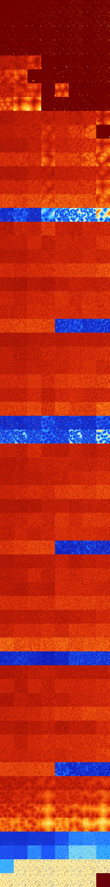

# B01258 (151040-151551)

<details>
    <summary>Initial Grid</summary>
    
</details>


<details>
    <summary>Initial Grid RLE</summary>

```
#C Exported from GoGoL (https://github.com/marrow16/gogol)
#C Wrap mode: Toroidal
#C Boundary mode: Dead
#C Step: 0
x = 100, y = 100, rule = B01258/S
17bo8bo7bo3bo15bo7bo29bo5b2o$39bo53bo$10bo10bo54bo$34bo3bo20bo7bo17bo$
11bo13bo$2bo2bo2bo43bo$26bo51bo13bo$31bo2bo30bo19bo$7bo10bo8bo18bobo22b
o$bo84b2o5bo$34bo$53bo12bo4bo22bo$4bo13bo46bo7bo3bobo4bo10bo$12bo6bobob
o46bo5bo19bo$38bo19bo30bo3bo$18bo5bo7b2o29b3o33bo$12bo3bo33bo6bo16bo22b
o$6bo15bo5bo26bo36bo$21bo32bo2bo2bo5bo25bo$12bo17bo20bo31bo6bo$13bo13bo
6bo5bo3bo11bo8bo4bo17bo$78bo16bo$9bobo10bo8bo13bo9bo10bo6bo24bo$17bo11b
o15bo6bob2o42bo$6bo10bo19bo57bo$12bo25bo19bo35bo$10bo18bo26bo2bo14bo14b
o3bo$11bobo10bo23b2o11bo19bo11bo$18bo9bobo6bo7bo$20bo4bo36bo20bo$18bo
30bo3bo18bo$64bo$o17bo32bo2bo17bo23bo$4b2o8bo2bo25bo17bo25bo9bo$10bo12b
o13bobo18bo$23bo11bo45bo17bo$2bo$21bo12bo$53bo36bo$29bo17bo5bo3bo27bo2b
o4bo$4bo6bo21bo9b2o32bo$24bo11bo38bo7bo$18bo18bo26bo$6bo18bo4bo10bo3bo
9bo9bo30bo$14bo26bo$3bo14bo21bo2bo32bo11bo2bo$3bo26bo43b2o9bo$15bo22bo
42bo5bo2bo$11bo5bo19bo14bo6bo$4bo15bo3bo21bo41bo$53bo7bo8bo5bo20bo$25bo
18bobo6bo6bo$bo26bo8bo4bo19b2o12bo9bo$bo9bo25bo14bo15bo9bo$9bo47bo23bo$
18bobo7bo8bo39bo$7bo11bo16bo$16b2o40bo23bo$2bo18bo22bo20bo$34bo10bo26bo
bo$8bo47bo27bo$9bo7bo10bo15bo15b2o4bobo17bo7bo$bobo33bo17bo22bo$8bo31bo
31bo5bo$33bo2bo5bo$10bo8bo30bo9bo21bo6bo$91bo4bo$42bo19bo19bo7bo$7bo22b
o25bo6bo4bo$15bo27bo21bobo19bo$29bo17bo2bo3bo$13bo36bo5bo10bo10bo$7bo4b
o34bo3bo12bo11bo$21bo3bo13bo$o22bo3bo19bo23bo$2bo29b2o2bo31bo26bo$20bo
8bo11bo53bo$10bo9bo6bo36bo21bo$31bo47bo3bo$o28bo4bo5bo23bo15bo$36bo4bo
28bo6b2o$38bo22bo5bo18bobo10bo$5bo17bo11b2o31bo7bobo$11bo5bo32bo9bo24bo
5bo$o21bo17bo14bo3bo4bo19bo$27b2o57bo$10bo13bo4bo17bo4bo$5bo37bo10bo40b
3o$34bobob2o36bobo19b2o$2o16bo15bo20bo7bobo3bo27bo$o20bo26bo$16bo8bo21b
o33bo$36bo47bo$27bo58bo8bo$6bo26bo30bo27bo3b2o$68bo19bo$19bo48bobo$30bo
24bo$24bo20bo4bo17bo9bo10bo$30bo15bo35bo!
```
</details>
<details>
    <summary>Thumbnail</summary>

</details>
<table>
<tr>
    <td><a href="./151040%20S%20Heat%20Map%20Activity.png"></a><br>S (151040)<br>R@18,p2</td>    <td><a href="./151041%20S0%20Heat%20Map%20Activity.png"></a><br>S0 (151041)<br>R@18,p2</td>    <td><a href="./151042%20S1%20Heat%20Map%20Activity.png"></a><br>S1 (151042)<br>R@11,p2</td>    <td><a href="./151043%20S01%20Heat%20Map%20Activity.png"></a><br>S01 (151043)<br>R@11,p2</td>    <td><a href="./151044%20S2%20Heat%20Map%20Activity.png"></a><br>S2 (151044)<br>R@6,p2</td>    <td><a href="./151045%20S02%20Heat%20Map%20Activity.png"></a><br>S02 (151045)<br>R@6,p2</td>    <td><a href="./151046%20S12%20Heat%20Map%20Activity.png"></a><br>S12 (151046)<br>R@6,p2</td>    <td><a href="./151047%20S012%20Heat%20Map%20Activity.png"></a><br>S012 (151047)<br>R@7,p2</td></tr>
<tr>
    <td><a href="./151048%20S3%20Heat%20Map%20Activity.png"></a><br>S3 (151048)<br>R@10,p2</td>    <td><a href="./151049%20S03%20Heat%20Map%20Activity.png"></a><br>S03 (151049)<br>R@11,p2</td>    <td><a href="./151050%20S13%20Heat%20Map%20Activity.png"></a><br>S13 (151050)<br>R@8,p2</td>    <td><a href="./151051%20S013%20Heat%20Map%20Activity.png"></a><br>S013 (151051)<br>R@7,p2</td>    <td><a href="./151052%20S23%20Heat%20Map%20Activity.png"></a><br>S23 (151052)<br>R@6,p2</td>    <td><a href="./151053%20S023%20Heat%20Map%20Activity.png"></a><br>S023 (151053)<br>R@6,p2</td>    <td><a href="./151054%20S123%20Heat%20Map%20Activity.png"></a><br>S123 (151054)<br>R@6,p2</td>    <td><a href="./151055%20S0123%20Heat%20Map%20Activity.png"></a><br>S0123 (151055)<br>R@5,p2</td></tr>
<tr>
    <td><a href="./151056%20S4%20Heat%20Map%20Activity.png"></a><br>S4 (151056)<br>R@12,p2</td>    <td><a href="./151057%20S04%20Heat%20Map%20Activity.png"></a><br>S04 (151057)<br>R@16,p2</td>    <td><a href="./151058%20S14%20Heat%20Map%20Activity.png"></a><br>S14 (151058)<br>R@10,p2</td>    <td><a href="./151059%20S014%20Heat%20Map%20Activity.png"></a><br>S014 (151059)<br>R@11,p2</td>    <td><a href="./151060%20S24%20Heat%20Map%20Activity.png"></a><br>S24 (151060)<br>R@8,p2</td>    <td><a href="./151061%20S024%20Heat%20Map%20Activity.png"></a><br>S024 (151061)<br>R@7,p2</td>    <td><a href="./151062%20S124%20Heat%20Map%20Activity.png"></a><br>S124 (151062)<br>R@9,p2</td>    <td><a href="./151063%20S0124%20Heat%20Map%20Activity.png"></a><br>S0124 (151063)<br>R@6,p2</td></tr>
<tr>
    <td><a href="./151064%20S34%20Heat%20Map%20Activity.png"></a><br>S34 (151064)<br>R@10,p2</td>    <td><a href="./151065%20S034%20Heat%20Map%20Activity.png"></a><br>S034 (151065)<br>R@10,p2</td>    <td><a href="./151066%20S134%20Heat%20Map%20Activity.png"></a><br>S134 (151066)<br>R@10,p2</td>    <td><a href="./151067%20S0134%20Heat%20Map%20Activity.png"></a><br>S0134 (151067)<br>R@8,p2</td>    <td><a href="./151068%20S234%20Heat%20Map%20Activity.png"></a><br>S234 (151068)<br>R@8,p2</td>    <td><a href="./151069%20S0234%20Heat%20Map%20Activity.png"></a><br>S0234 (151069)<br>R@7,p2</td>    <td><a href="./151070%20S1234%20Heat%20Map%20Activity.png"></a><br>S1234 (151070)<br>R@8,p2</td>    <td><a href="./151071%20S01234%20Heat%20Map%20Activity.png"></a><br>S01234 (151071)<br>R@9,p2</td></tr>
<tr>
    <td><a href="./151072%20S5%20Heat%20Map%20Activity.png"></a><br>S5 (151072)<br>G>1000</td>    <td><a href="./151073%20S05%20Heat%20Map%20Activity.png"></a><br>S05 (151073)<br>G>1000</td>    <td><a href="./151074%20S15%20Heat%20Map%20Activity.png"></a><br>S15 (151074)<br>G>1000</td>    <td><a href="./151075%20S015%20Heat%20Map%20Activity.png"></a><br>S015 (151075)<br>R@45,p2</td>    <td><a href="./151076%20S25%20Heat%20Map%20Activity.png"></a><br>S25 (151076)<br>R@68,p2</td>    <td><a href="./151077%20S025%20Heat%20Map%20Activity.png"></a><br>S025 (151077)<br>R@14,p2</td>    <td><a href="./151078%20S125%20Heat%20Map%20Activity.png"></a><br>S125 (151078)<br>R@10,p2</td>    <td><a href="./151079%20S0125%20Heat%20Map%20Activity.png"></a><br>S0125 (151079)<br>R@9,p2</td></tr>
<tr>
    <td><a href="./151080%20S35%20Heat%20Map%20Activity.png"></a><br>S35 (151080)<br>G>1000</td>    <td><a href="./151081%20S035%20Heat%20Map%20Activity.png"></a><br>S035 (151081)<br>G>1000</td>    <td><a href="./151082%20S135%20Heat%20Map%20Activity.png"></a><br>S135 (151082)<br>R@133,p2</td>    <td><a href="./151083%20S0135%20Heat%20Map%20Activity.png"></a><br>S0135 (151083)<br>R@17,p2</td>    <td><a href="./151084%20S235%20Heat%20Map%20Activity.png"></a><br>S235 (151084)<br>R@13,p2</td>    <td><a href="./151085%20S0235%20Heat%20Map%20Activity.png"></a><br>S0235 (151085)<br>R@13,p2</td>    <td><a href="./151086%20S1235%20Heat%20Map%20Activity.png"></a><br>S1235 (151086)<br>R@10,p4</td>    <td><a href="./151087%20S01235%20Heat%20Map%20Activity.png"></a><br>S01235 (151087)<br>R@6,p2</td></tr>
<tr>
    <td><a href="./151088%20S45%20Heat%20Map%20Activity.png"></a><br>S45 (151088)<br>G>1000</td>    <td><a href="./151089%20S045%20Heat%20Map%20Activity.png"></a><br>S045 (151089)<br>G>1000</td>    <td><a href="./151090%20S145%20Heat%20Map%20Activity.png"></a><br>S145 (151090)<br>G>1000</td>    <td><a href="./151091%20S0145%20Heat%20Map%20Activity.png"></a><br>S0145 (151091)<br>R@30,p2</td>    <td><a href="./151092%20S245%20Heat%20Map%20Activity.png"></a><br>S245 (151092)<br>G>1000</td>    <td><a href="./151093%20S0245%20Heat%20Map%20Activity.png"></a><br>S0245 (151093)<br>R@34,p12</td>    <td><a href="./151094%20S1245%20Heat%20Map%20Activity.png"></a><br>S1245 (151094)<br>R@18,p6</td>    <td><a href="./151095%20S01245%20Heat%20Map%20Activity.png"></a><br>S01245 (151095)<br>R@13,p6</td></tr>
<tr>
    <td><a href="./151096%20S345%20Heat%20Map%20Activity.png"></a><br>S345 (151096)<br>G>1000</td>    <td><a href="./151097%20S0345%20Heat%20Map%20Activity.png"></a><br>S0345 (151097)<br>G>1000</td>    <td><a href="./151098%20S1345%20Heat%20Map%20Activity.png"></a><br>S1345 (151098)<br>G>1000</td>    <td><a href="./151099%20S01345%20Heat%20Map%20Activity.png"></a><br>S01345 (151099)<br>R@23,p2</td>    <td><a href="./151100%20S2345%20Heat%20Map%20Activity.png"></a><br>S2345 (151100)<br>R@20,p2</td>    <td><a href="./151101%20S02345%20Heat%20Map%20Activity.png"></a><br>S02345 (151101)<br>R@21,p2</td>    <td><a href="./151102%20S12345%20Heat%20Map%20Activity.png"></a><br>S12345 (151102)<br>R@9,p2</td>    <td><a href="./151103%20S012345%20Heat%20Map%20Activity.png"></a><br>S012345 (151103)<br>R@11,p2</td></tr>
<tr>
    <td><a href="./151104%20S6%20Heat%20Map%20Activity.png"></a><br>S6 (151104)<br>G>1000</td>    <td><a href="./151105%20S06%20Heat%20Map%20Activity.png"></a><br>S06 (151105)<br>G>1000</td>    <td><a href="./151106%20S16%20Heat%20Map%20Activity.png"></a><br>S16 (151106)<br>G>1000</td>    <td><a href="./151107%20S016%20Heat%20Map%20Activity.png"></a><br>S016 (151107)<br>G>1000</td>    <td><a href="./151108%20S26%20Heat%20Map%20Activity.png"></a><br>S26 (151108)<br>G>1000</td>    <td><a href="./151109%20S026%20Heat%20Map%20Activity.png"></a><br>S026 (151109)<br>G>1000</td>    <td><a href="./151110%20S126%20Heat%20Map%20Activity.png"></a><br>S126 (151110)<br>G>1000</td>    <td><a href="./151111%20S0126%20Heat%20Map%20Activity.png"></a><br>S0126 (151111)<br>G>1000</td></tr>
<tr>
    <td><a href="./151112%20S36%20Heat%20Map%20Activity.png"></a><br>S36 (151112)<br>G>1000</td>    <td><a href="./151113%20S036%20Heat%20Map%20Activity.png"></a><br>S036 (151113)<br>G>1000</td>    <td><a href="./151114%20S136%20Heat%20Map%20Activity.png"></a><br>S136 (151114)<br>G>1000</td>    <td><a href="./151115%20S0136%20Heat%20Map%20Activity.png"></a><br>S0136 (151115)<br>G>1000</td>    <td><a href="./151116%20S236%20Heat%20Map%20Activity.png"></a><br>S236 (151116)<br>G>1000</td>    <td><a href="./151117%20S0236%20Heat%20Map%20Activity.png"></a><br>S0236 (151117)<br>G>1000</td>    <td><a href="./151118%20S1236%20Heat%20Map%20Activity.png"></a><br>S1236 (151118)<br>G>1000</td>    <td><a href="./151119%20S01236%20Heat%20Map%20Activity.png"></a><br>S01236 (151119)<br>R@25,p2</td></tr>
<tr>
    <td><a href="./151120%20S46%20Heat%20Map%20Activity.png"></a><br>S46 (151120)<br>G>1000</td>    <td><a href="./151121%20S046%20Heat%20Map%20Activity.png"></a><br>S046 (151121)<br>G>1000</td>    <td><a href="./151122%20S146%20Heat%20Map%20Activity.png"></a><br>S146 (151122)<br>G>1000</td>    <td><a href="./151123%20S0146%20Heat%20Map%20Activity.png"></a><br>S0146 (151123)<br>G>1000</td>    <td><a href="./151124%20S246%20Heat%20Map%20Activity.png"></a><br>S246 (151124)<br>G>1000</td>    <td><a href="./151125%20S0246%20Heat%20Map%20Activity.png"></a><br>S0246 (151125)<br>G>1000</td>    <td><a href="./151126%20S1246%20Heat%20Map%20Activity.png"></a><br>S1246 (151126)<br>G>1000</td>    <td><a href="./151127%20S01246%20Heat%20Map%20Activity.png"></a><br>S01246 (151127)<br>G>1000</td></tr>
<tr>
    <td><a href="./151128%20S346%20Heat%20Map%20Activity.png"></a><br>S346 (151128)<br>G>1000</td>    <td><a href="./151129%20S0346%20Heat%20Map%20Activity.png"></a><br>S0346 (151129)<br>G>1000</td>    <td><a href="./151130%20S1346%20Heat%20Map%20Activity.png"></a><br>S1346 (151130)<br>G>1000</td>    <td><a href="./151131%20S01346%20Heat%20Map%20Activity.png"></a><br>S01346 (151131)<br>G>1000</td>    <td><a href="./151132%20S2346%20Heat%20Map%20Activity.png"></a><br>S2346 (151132)<br>G>1000</td>    <td><a href="./151133%20S02346%20Heat%20Map%20Activity.png"></a><br>S02346 (151133)<br>G>1000</td>    <td><a href="./151134%20S12346%20Heat%20Map%20Activity.png"></a><br>S12346 (151134)<br>G>1000</td>    <td><a href="./151135%20S012346%20Heat%20Map%20Activity.png"></a><br>S012346 (151135)<br>G>1000</td></tr>
<tr>
    <td><a href="./151136%20S56%20Heat%20Map%20Activity.png"></a><br>S56 (151136)<br>G>1000</td>    <td><a href="./151137%20S056%20Heat%20Map%20Activity.png"></a><br>S056 (151137)<br>G>1000</td>    <td><a href="./151138%20S156%20Heat%20Map%20Activity.png"></a><br>S156 (151138)<br>G>1000</td>    <td><a href="./151139%20S0156%20Heat%20Map%20Activity.png"></a><br>S0156 (151139)<br>G>1000</td>    <td><a href="./151140%20S256%20Heat%20Map%20Activity.png"></a><br>S256 (151140)<br>G>1000</td>    <td><a href="./151141%20S0256%20Heat%20Map%20Activity.png"></a><br>S0256 (151141)<br>G>1000</td>    <td><a href="./151142%20S1256%20Heat%20Map%20Activity.png"></a><br>S1256 (151142)<br>G>1000</td>    <td><a href="./151143%20S01256%20Heat%20Map%20Activity.png"></a><br>S01256 (151143)<br>G>1000</td></tr>
<tr>
    <td><a href="./151144%20S356%20Heat%20Map%20Activity.png"></a><br>S356 (151144)<br>G>1000</td>    <td><a href="./151145%20S0356%20Heat%20Map%20Activity.png"></a><br>S0356 (151145)<br>G>1000</td>    <td><a href="./151146%20S1356%20Heat%20Map%20Activity.png"></a><br>S1356 (151146)<br>G>1000</td>    <td><a href="./151147%20S01356%20Heat%20Map%20Activity.png"></a><br>S01356 (151147)<br>G>1000</td>    <td><a href="./151148%20S2356%20Heat%20Map%20Activity.png"></a><br>S2356 (151148)<br>G>1000</td>    <td><a href="./151149%20S02356%20Heat%20Map%20Activity.png"></a><br>S02356 (151149)<br>G>1000</td>    <td><a href="./151150%20S12356%20Heat%20Map%20Activity.png"></a><br>S12356 (151150)<br>G>1000</td>    <td><a href="./151151%20S012356%20Heat%20Map%20Activity.png"></a><br>S012356 (151151)<br>G>1000</td></tr>
<tr>
    <td><a href="./151152%20S456%20Heat%20Map%20Activity.png"></a><br>S456 (151152)<br>G>1000</td>    <td><a href="./151153%20S0456%20Heat%20Map%20Activity.png"></a><br>S0456 (151153)<br>G>1000</td>    <td><a href="./151154%20S1456%20Heat%20Map%20Activity.png"></a><br>S1456 (151154)<br>G>1000</td>    <td><a href="./151155%20S01456%20Heat%20Map%20Activity.png"></a><br>S01456 (151155)<br>G>1000</td>    <td><a href="./151156%20S2456%20Heat%20Map%20Activity.png"></a><br>S2456 (151156)<br>G>1000</td>    <td><a href="./151157%20S02456%20Heat%20Map%20Activity.png"></a><br>S02456 (151157)<br>G>1000</td>    <td><a href="./151158%20S12456%20Heat%20Map%20Activity.png"></a><br>S12456 (151158)<br>G>1000</td>    <td><a href="./151159%20S012456%20Heat%20Map%20Activity.png"></a><br>S012456 (151159)<br>G>1000</td></tr>
<tr>
    <td><a href="./151160%20S3456%20Heat%20Map%20Activity.png"></a><br>S3456 (151160)<br>R@311,p36</td>    <td><a href="./151161%20S03456%20Heat%20Map%20Activity.png"></a><br>S03456 (151161)<br>R@194,p12</td>    <td><a href="./151162%20S13456%20Heat%20Map%20Activity.png"></a><br>S13456 (151162)<br>R@367,p168</td>    <td><a href="./151163%20S013456%20Heat%20Map%20Activity.png"></a><br>S013456 (151163)<br>R@206,p12</td>    <td><a href="./151164%20S23456%20Heat%20Map%20Activity.png"></a><br>S23456 (151164)<br>R@57,p12</td>    <td><a href="./151165%20S023456%20Heat%20Map%20Activity.png"></a><br>S023456 (151165)<br>R@73,p24</td>    <td><a href="./151166%20S123456%20Heat%20Map%20Activity.png"></a><br>S123456 (151166)<br>R@68,p24</td>    <td><a href="./151167%20S0123456%20Heat%20Map%20Activity.png"></a><br>S0123456 (151167)<br>R@119,p12</td></tr>
<tr>
    <td><a href="./151168%20S7%20Heat%20Map%20Activity.png"></a><br>S7 (151168)<br>G>1000</td>    <td><a href="./151169%20S07%20Heat%20Map%20Activity.png"></a><br>S07 (151169)<br>G>1000</td>    <td><a href="./151170%20S17%20Heat%20Map%20Activity.png"></a><br>S17 (151170)<br>G>1000</td>    <td><a href="./151171%20S017%20Heat%20Map%20Activity.png"></a><br>S017 (151171)<br>G>1000</td>    <td><a href="./151172%20S27%20Heat%20Map%20Activity.png"></a><br>S27 (151172)<br>G>1000</td>    <td><a href="./151173%20S027%20Heat%20Map%20Activity.png"></a><br>S027 (151173)<br>G>1000</td>    <td><a href="./151174%20S127%20Heat%20Map%20Activity.png"></a><br>S127 (151174)<br>G>1000</td>    <td><a href="./151175%20S0127%20Heat%20Map%20Activity.png"></a><br>S0127 (151175)<br>G>1000</td></tr>
<tr>
    <td><a href="./151176%20S37%20Heat%20Map%20Activity.png"></a><br>S37 (151176)<br>G>1000</td>    <td><a href="./151177%20S037%20Heat%20Map%20Activity.png"></a><br>S037 (151177)<br>G>1000</td>    <td><a href="./151178%20S137%20Heat%20Map%20Activity.png"></a><br>S137 (151178)<br>G>1000</td>    <td><a href="./151179%20S0137%20Heat%20Map%20Activity.png"></a><br>S0137 (151179)<br>G>1000</td>    <td><a href="./151180%20S237%20Heat%20Map%20Activity.png"></a><br>S237 (151180)<br>G>1000</td>    <td><a href="./151181%20S0237%20Heat%20Map%20Activity.png"></a><br>S0237 (151181)<br>G>1000</td>    <td><a href="./151182%20S1237%20Heat%20Map%20Activity.png"></a><br>S1237 (151182)<br>G>1000</td>    <td><a href="./151183%20S01237%20Heat%20Map%20Activity.png"></a><br>S01237 (151183)<br>G>1000</td></tr>
<tr>
    <td><a href="./151184%20S47%20Heat%20Map%20Activity.png"></a><br>S47 (151184)<br>G>1000</td>    <td><a href="./151185%20S047%20Heat%20Map%20Activity.png"></a><br>S047 (151185)<br>G>1000</td>    <td><a href="./151186%20S147%20Heat%20Map%20Activity.png"></a><br>S147 (151186)<br>G>1000</td>    <td><a href="./151187%20S0147%20Heat%20Map%20Activity.png"></a><br>S0147 (151187)<br>G>1000</td>    <td><a href="./151188%20S247%20Heat%20Map%20Activity.png"></a><br>S247 (151188)<br>G>1000</td>    <td><a href="./151189%20S0247%20Heat%20Map%20Activity.png"></a><br>S0247 (151189)<br>G>1000</td>    <td><a href="./151190%20S1247%20Heat%20Map%20Activity.png"></a><br>S1247 (151190)<br>G>1000</td>    <td><a href="./151191%20S01247%20Heat%20Map%20Activity.png"></a><br>S01247 (151191)<br>G>1000</td></tr>
<tr>
    <td><a href="./151192%20S347%20Heat%20Map%20Activity.png"></a><br>S347 (151192)<br>G>1000</td>    <td><a href="./151193%20S0347%20Heat%20Map%20Activity.png"></a><br>S0347 (151193)<br>G>1000</td>    <td><a href="./151194%20S1347%20Heat%20Map%20Activity.png"></a><br>S1347 (151194)<br>G>1000</td>    <td><a href="./151195%20S01347%20Heat%20Map%20Activity.png"></a><br>S01347 (151195)<br>G>1000</td>    <td><a href="./151196%20S2347%20Heat%20Map%20Activity.png"></a><br>S2347 (151196)<br>G>1000</td>    <td><a href="./151197%20S02347%20Heat%20Map%20Activity.png"></a><br>S02347 (151197)<br>G>1000</td>    <td><a href="./151198%20S12347%20Heat%20Map%20Activity.png"></a><br>S12347 (151198)<br>G>1000</td>    <td><a href="./151199%20S012347%20Heat%20Map%20Activity.png"></a><br>S012347 (151199)<br>G>1000</td></tr>
<tr>
    <td><a href="./151200%20S57%20Heat%20Map%20Activity.png"></a><br>S57 (151200)<br>G>1000</td>    <td><a href="./151201%20S057%20Heat%20Map%20Activity.png"></a><br>S057 (151201)<br>G>1000</td>    <td><a href="./151202%20S157%20Heat%20Map%20Activity.png"></a><br>S157 (151202)<br>G>1000</td>    <td><a href="./151203%20S0157%20Heat%20Map%20Activity.png"></a><br>S0157 (151203)<br>G>1000</td>    <td><a href="./151204%20S257%20Heat%20Map%20Activity.png"></a><br>S257 (151204)<br>G>1000</td>    <td><a href="./151205%20S0257%20Heat%20Map%20Activity.png"></a><br>S0257 (151205)<br>G>1000</td>    <td><a href="./151206%20S1257%20Heat%20Map%20Activity.png"></a><br>S1257 (151206)<br>G>1000</td>    <td><a href="./151207%20S01257%20Heat%20Map%20Activity.png"></a><br>S01257 (151207)<br>G>1000</td></tr>
<tr>
    <td><a href="./151208%20S357%20Heat%20Map%20Activity.png"></a><br>S357 (151208)<br>G>1000</td>    <td><a href="./151209%20S0357%20Heat%20Map%20Activity.png"></a><br>S0357 (151209)<br>G>1000</td>    <td><a href="./151210%20S1357%20Heat%20Map%20Activity.png"></a><br>S1357 (151210)<br>G>1000</td>    <td><a href="./151211%20S01357%20Heat%20Map%20Activity.png"></a><br>S01357 (151211)<br>G>1000</td>    <td><a href="./151212%20S2357%20Heat%20Map%20Activity.png"></a><br>S2357 (151212)<br>G>1000</td>    <td><a href="./151213%20S02357%20Heat%20Map%20Activity.png"></a><br>S02357 (151213)<br>G>1000</td>    <td><a href="./151214%20S12357%20Heat%20Map%20Activity.png"></a><br>S12357 (151214)<br>G>1000</td>    <td><a href="./151215%20S012357%20Heat%20Map%20Activity.png"></a><br>S012357 (151215)<br>G>1000</td></tr>
<tr>
    <td><a href="./151216%20S457%20Heat%20Map%20Activity.png"></a><br>S457 (151216)<br>G>1000</td>    <td><a href="./151217%20S0457%20Heat%20Map%20Activity.png"></a><br>S0457 (151217)<br>G>1000</td>    <td><a href="./151218%20S1457%20Heat%20Map%20Activity.png"></a><br>S1457 (151218)<br>G>1000</td>    <td><a href="./151219%20S01457%20Heat%20Map%20Activity.png"></a><br>S01457 (151219)<br>G>1000</td>    <td><a href="./151220%20S2457%20Heat%20Map%20Activity.png"></a><br>S2457 (151220)<br>G>1000</td>    <td><a href="./151221%20S02457%20Heat%20Map%20Activity.png"></a><br>S02457 (151221)<br>G>1000</td>    <td><a href="./151222%20S12457%20Heat%20Map%20Activity.png"></a><br>S12457 (151222)<br>G>1000</td>    <td><a href="./151223%20S012457%20Heat%20Map%20Activity.png"></a><br>S012457 (151223)<br>G>1000</td></tr>
<tr>
    <td><a href="./151224%20S3457%20Heat%20Map%20Activity.png"></a><br>S3457 (151224)<br>G>1000</td>    <td><a href="./151225%20S03457%20Heat%20Map%20Activity.png"></a><br>S03457 (151225)<br>G>1000</td>    <td><a href="./151226%20S13457%20Heat%20Map%20Activity.png"></a><br>S13457 (151226)<br>G>1000</td>    <td><a href="./151227%20S013457%20Heat%20Map%20Activity.png"></a><br>S013457 (151227)<br>G>1000</td>    <td><a href="./151228%20S23457%20Heat%20Map%20Activity.png"></a><br>S23457 (151228)<br>R@362,p60</td>    <td><a href="./151229%20S023457%20Heat%20Map%20Activity.png"></a><br>S023457 (151229)<br>R@397,p12</td>    <td><a href="./151230%20S123457%20Heat%20Map%20Activity.png"></a><br>S123457 (151230)<br>R@315,p12</td>    <td><a href="./151231%20S0123457%20Heat%20Map%20Activity.png"></a><br>S0123457 (151231)<br>R@330,p60</td></tr>
<tr>
    <td><a href="./151232%20S67%20Heat%20Map%20Activity.png"></a><br>S67 (151232)<br>G>1000</td>    <td><a href="./151233%20S067%20Heat%20Map%20Activity.png"></a><br>S067 (151233)<br>G>1000</td>    <td><a href="./151234%20S167%20Heat%20Map%20Activity.png"></a><br>S167 (151234)<br>G>1000</td>    <td><a href="./151235%20S0167%20Heat%20Map%20Activity.png"></a><br>S0167 (151235)<br>G>1000</td>    <td><a href="./151236%20S267%20Heat%20Map%20Activity.png"></a><br>S267 (151236)<br>G>1000</td>    <td><a href="./151237%20S0267%20Heat%20Map%20Activity.png"></a><br>S0267 (151237)<br>G>1000</td>    <td><a href="./151238%20S1267%20Heat%20Map%20Activity.png"></a><br>S1267 (151238)<br>G>1000</td>    <td><a href="./151239%20S01267%20Heat%20Map%20Activity.png"></a><br>S01267 (151239)<br>G>1000</td></tr>
<tr>
    <td><a href="./151240%20S367%20Heat%20Map%20Activity.png"></a><br>S367 (151240)<br>G>1000</td>    <td><a href="./151241%20S0367%20Heat%20Map%20Activity.png"></a><br>S0367 (151241)<br>G>1000</td>    <td><a href="./151242%20S1367%20Heat%20Map%20Activity.png"></a><br>S1367 (151242)<br>G>1000</td>    <td><a href="./151243%20S01367%20Heat%20Map%20Activity.png"></a><br>S01367 (151243)<br>G>1000</td>    <td><a href="./151244%20S2367%20Heat%20Map%20Activity.png"></a><br>S2367 (151244)<br>G>1000</td>    <td><a href="./151245%20S02367%20Heat%20Map%20Activity.png"></a><br>S02367 (151245)<br>G>1000</td>    <td><a href="./151246%20S12367%20Heat%20Map%20Activity.png"></a><br>S12367 (151246)<br>G>1000</td>    <td><a href="./151247%20S012367%20Heat%20Map%20Activity.png"></a><br>S012367 (151247)<br>G>1000</td></tr>
<tr>
    <td><a href="./151248%20S467%20Heat%20Map%20Activity.png"></a><br>S467 (151248)<br>G>1000</td>    <td><a href="./151249%20S0467%20Heat%20Map%20Activity.png"></a><br>S0467 (151249)<br>G>1000</td>    <td><a href="./151250%20S1467%20Heat%20Map%20Activity.png"></a><br>S1467 (151250)<br>G>1000</td>    <td><a href="./151251%20S01467%20Heat%20Map%20Activity.png"></a><br>S01467 (151251)<br>G>1000</td>    <td><a href="./151252%20S2467%20Heat%20Map%20Activity.png"></a><br>S2467 (151252)<br>G>1000</td>    <td><a href="./151253%20S02467%20Heat%20Map%20Activity.png"></a><br>S02467 (151253)<br>G>1000</td>    <td><a href="./151254%20S12467%20Heat%20Map%20Activity.png"></a><br>S12467 (151254)<br>G>1000</td>    <td><a href="./151255%20S012467%20Heat%20Map%20Activity.png"></a><br>S012467 (151255)<br>G>1000</td></tr>
<tr>
    <td><a href="./151256%20S3467%20Heat%20Map%20Activity.png"></a><br>S3467 (151256)<br>G>1000</td>    <td><a href="./151257%20S03467%20Heat%20Map%20Activity.png"></a><br>S03467 (151257)<br>G>1000</td>    <td><a href="./151258%20S13467%20Heat%20Map%20Activity.png"></a><br>S13467 (151258)<br>G>1000</td>    <td><a href="./151259%20S013467%20Heat%20Map%20Activity.png"></a><br>S013467 (151259)<br>G>1000</td>    <td><a href="./151260%20S23467%20Heat%20Map%20Activity.png"></a><br>S23467 (151260)<br>G>1000</td>    <td><a href="./151261%20S023467%20Heat%20Map%20Activity.png"></a><br>S023467 (151261)<br>G>1000</td>    <td><a href="./151262%20S123467%20Heat%20Map%20Activity.png"></a><br>S123467 (151262)<br>G>1000</td>    <td><a href="./151263%20S0123467%20Heat%20Map%20Activity.png"></a><br>S0123467 (151263)<br>G>1000</td></tr>
<tr>
    <td><a href="./151264%20S567%20Heat%20Map%20Activity.png"></a><br>S567 (151264)<br>G>1000</td>    <td><a href="./151265%20S0567%20Heat%20Map%20Activity.png"></a><br>S0567 (151265)<br>G>1000</td>    <td><a href="./151266%20S1567%20Heat%20Map%20Activity.png"></a><br>S1567 (151266)<br>G>1000</td>    <td><a href="./151267%20S01567%20Heat%20Map%20Activity.png"></a><br>S01567 (151267)<br>G>1000</td>    <td><a href="./151268%20S2567%20Heat%20Map%20Activity.png"></a><br>S2567 (151268)<br>G>1000</td>    <td><a href="./151269%20S02567%20Heat%20Map%20Activity.png"></a><br>S02567 (151269)<br>G>1000</td>    <td><a href="./151270%20S12567%20Heat%20Map%20Activity.png"></a><br>S12567 (151270)<br>G>1000</td>    <td><a href="./151271%20S012567%20Heat%20Map%20Activity.png"></a><br>S012567 (151271)<br>G>1000</td></tr>
<tr>
    <td><a href="./151272%20S3567%20Heat%20Map%20Activity.png"></a><br>S3567 (151272)<br>G>1000</td>    <td><a href="./151273%20S03567%20Heat%20Map%20Activity.png"></a><br>S03567 (151273)<br>G>1000</td>    <td><a href="./151274%20S13567%20Heat%20Map%20Activity.png"></a><br>S13567 (151274)<br>G>1000</td>    <td><a href="./151275%20S013567%20Heat%20Map%20Activity.png"></a><br>S013567 (151275)<br>G>1000</td>    <td><a href="./151276%20S23567%20Heat%20Map%20Activity.png"></a><br>S23567 (151276)<br>G>1000</td>    <td><a href="./151277%20S023567%20Heat%20Map%20Activity.png"></a><br>S023567 (151277)<br>G>1000</td>    <td><a href="./151278%20S123567%20Heat%20Map%20Activity.png"></a><br>S123567 (151278)<br>G>1000</td>    <td><a href="./151279%20S0123567%20Heat%20Map%20Activity.png"></a><br>S0123567 (151279)<br>G>1000</td></tr>
<tr>
    <td><a href="./151280%20S4567%20Heat%20Map%20Activity.png"></a><br>S4567 (151280)<br>R@105,p30</td>    <td><a href="./151281%20S04567%20Heat%20Map%20Activity.png"></a><br>S04567 (151281)<br>R@197,p60</td>    <td><a href="./151282%20S14567%20Heat%20Map%20Activity.png"></a><br>S14567 (151282)<br>R@89,p30</td>    <td><a href="./151283%20S014567%20Heat%20Map%20Activity.png"></a><br>S014567 (151283)<br>R@121,p60</td>    <td><a href="./151284%20S24567%20Heat%20Map%20Activity.png"></a><br>S24567 (151284)<br>R@80,p12</td>    <td><a href="./151285%20S024567%20Heat%20Map%20Activity.png"></a><br>S024567 (151285)<br>R@124,p60</td>    <td><a href="./151286%20S124567%20Heat%20Map%20Activity.png"></a><br>S124567 (151286)<br>R@104,p30</td>    <td><a href="./151287%20S0124567%20Heat%20Map%20Activity.png"></a><br>S0124567 (151287)<br>R@128,p60</td></tr>
<tr>
    <td><a href="./151288%20S34567%20Heat%20Map%20Activity.png"></a><br>S34567 (151288)<br>R@26,p6</td>    <td><a href="./151289%20S034567%20Heat%20Map%20Activity.png"></a><br>S034567 (151289)<br>R@40,p12</td>    <td><a href="./151290%20S134567%20Heat%20Map%20Activity.png"></a><br>S134567 (151290)<br>R@34,p12</td>    <td><a href="./151291%20S0134567%20Heat%20Map%20Activity.png"></a><br>S0134567 (151291)<br>R@91,p60</td>    <td><a href="./151292%20S234567%20Heat%20Map%20Activity.png"></a><br>S234567 (151292)<br>R@33,p12</td>    <td><a href="./151293%20S0234567%20Heat%20Map%20Activity.png"></a><br>S0234567 (151293)<br>R@33,p12</td>    <td><a href="./151294%20S1234567%20Heat%20Map%20Activity.png"></a><br>S1234567 (151294)<br>R@31,p12</td>    <td><a href="./151295%20S01234567%20Heat%20Map%20Activity.png"></a><br>S01234567 (151295)<br>R@43,p12</td></tr>
<tr>
    <td><a href="./151296%20S8%20Heat%20Map%20Activity.png"></a><br>S8 (151296)<br>G>1000</td>    <td><a href="./151297%20S08%20Heat%20Map%20Activity.png"></a><br>S08 (151297)<br>G>1000</td>    <td><a href="./151298%20S18%20Heat%20Map%20Activity.png"></a><br>S18 (151298)<br>G>1000</td>    <td><a href="./151299%20S018%20Heat%20Map%20Activity.png"></a><br>S018 (151299)<br>G>1000</td>    <td><a href="./151300%20S28%20Heat%20Map%20Activity.png"></a><br>S28 (151300)<br>G>1000</td>    <td><a href="./151301%20S028%20Heat%20Map%20Activity.png"></a><br>S028 (151301)<br>G>1000</td>    <td><a href="./151302%20S128%20Heat%20Map%20Activity.png"></a><br>S128 (151302)<br>G>1000</td>    <td><a href="./151303%20S0128%20Heat%20Map%20Activity.png"></a><br>S0128 (151303)<br>G>1000</td></tr>
<tr>
    <td><a href="./151304%20S38%20Heat%20Map%20Activity.png"></a><br>S38 (151304)<br>G>1000</td>    <td><a href="./151305%20S038%20Heat%20Map%20Activity.png"></a><br>S038 (151305)<br>G>1000</td>    <td><a href="./151306%20S138%20Heat%20Map%20Activity.png"></a><br>S138 (151306)<br>G>1000</td>    <td><a href="./151307%20S0138%20Heat%20Map%20Activity.png"></a><br>S0138 (151307)<br>G>1000</td>    <td><a href="./151308%20S238%20Heat%20Map%20Activity.png"></a><br>S238 (151308)<br>G>1000</td>    <td><a href="./151309%20S0238%20Heat%20Map%20Activity.png"></a><br>S0238 (151309)<br>G>1000</td>    <td><a href="./151310%20S1238%20Heat%20Map%20Activity.png"></a><br>S1238 (151310)<br>G>1000</td>    <td><a href="./151311%20S01238%20Heat%20Map%20Activity.png"></a><br>S01238 (151311)<br>G>1000</td></tr>
<tr>
    <td><a href="./151312%20S48%20Heat%20Map%20Activity.png"></a><br>S48 (151312)<br>G>1000</td>    <td><a href="./151313%20S048%20Heat%20Map%20Activity.png"></a><br>S048 (151313)<br>G>1000</td>    <td><a href="./151314%20S148%20Heat%20Map%20Activity.png"></a><br>S148 (151314)<br>G>1000</td>    <td><a href="./151315%20S0148%20Heat%20Map%20Activity.png"></a><br>S0148 (151315)<br>G>1000</td>    <td><a href="./151316%20S248%20Heat%20Map%20Activity.png"></a><br>S248 (151316)<br>G>1000</td>    <td><a href="./151317%20S0248%20Heat%20Map%20Activity.png"></a><br>S0248 (151317)<br>G>1000</td>    <td><a href="./151318%20S1248%20Heat%20Map%20Activity.png"></a><br>S1248 (151318)<br>G>1000</td>    <td><a href="./151319%20S01248%20Heat%20Map%20Activity.png"></a><br>S01248 (151319)<br>G>1000</td></tr>
<tr>
    <td><a href="./151320%20S348%20Heat%20Map%20Activity.png"></a><br>S348 (151320)<br>G>1000</td>    <td><a href="./151321%20S0348%20Heat%20Map%20Activity.png"></a><br>S0348 (151321)<br>G>1000</td>    <td><a href="./151322%20S1348%20Heat%20Map%20Activity.png"></a><br>S1348 (151322)<br>G>1000</td>    <td><a href="./151323%20S01348%20Heat%20Map%20Activity.png"></a><br>S01348 (151323)<br>G>1000</td>    <td><a href="./151324%20S2348%20Heat%20Map%20Activity.png"></a><br>S2348 (151324)<br>G>1000</td>    <td><a href="./151325%20S02348%20Heat%20Map%20Activity.png"></a><br>S02348 (151325)<br>G>1000</td>    <td><a href="./151326%20S12348%20Heat%20Map%20Activity.png"></a><br>S12348 (151326)<br>G>1000</td>    <td><a href="./151327%20S012348%20Heat%20Map%20Activity.png"></a><br>S012348 (151327)<br>G>1000</td></tr>
<tr>
    <td><a href="./151328%20S58%20Heat%20Map%20Activity.png"></a><br>S58 (151328)<br>G>1000</td>    <td><a href="./151329%20S058%20Heat%20Map%20Activity.png"></a><br>S058 (151329)<br>G>1000</td>    <td><a href="./151330%20S158%20Heat%20Map%20Activity.png"></a><br>S158 (151330)<br>G>1000</td>    <td><a href="./151331%20S0158%20Heat%20Map%20Activity.png"></a><br>S0158 (151331)<br>G>1000</td>    <td><a href="./151332%20S258%20Heat%20Map%20Activity.png"></a><br>S258 (151332)<br>G>1000</td>    <td><a href="./151333%20S0258%20Heat%20Map%20Activity.png"></a><br>S0258 (151333)<br>G>1000</td>    <td><a href="./151334%20S1258%20Heat%20Map%20Activity.png"></a><br>S1258 (151334)<br>G>1000</td>    <td><a href="./151335%20S01258%20Heat%20Map%20Activity.png"></a><br>S01258 (151335)<br>G>1000</td></tr>
<tr>
    <td><a href="./151336%20S358%20Heat%20Map%20Activity.png"></a><br>S358 (151336)<br>G>1000</td>    <td><a href="./151337%20S0358%20Heat%20Map%20Activity.png"></a><br>S0358 (151337)<br>G>1000</td>    <td><a href="./151338%20S1358%20Heat%20Map%20Activity.png"></a><br>S1358 (151338)<br>G>1000</td>    <td><a href="./151339%20S01358%20Heat%20Map%20Activity.png"></a><br>S01358 (151339)<br>G>1000</td>    <td><a href="./151340%20S2358%20Heat%20Map%20Activity.png"></a><br>S2358 (151340)<br>G>1000</td>    <td><a href="./151341%20S02358%20Heat%20Map%20Activity.png"></a><br>S02358 (151341)<br>G>1000</td>    <td><a href="./151342%20S12358%20Heat%20Map%20Activity.png"></a><br>S12358 (151342)<br>G>1000</td>    <td><a href="./151343%20S012358%20Heat%20Map%20Activity.png"></a><br>S012358 (151343)<br>G>1000</td></tr>
<tr>
    <td><a href="./151344%20S458%20Heat%20Map%20Activity.png"></a><br>S458 (151344)<br>G>1000</td>    <td><a href="./151345%20S0458%20Heat%20Map%20Activity.png"></a><br>S0458 (151345)<br>G>1000</td>    <td><a href="./151346%20S1458%20Heat%20Map%20Activity.png"></a><br>S1458 (151346)<br>G>1000</td>    <td><a href="./151347%20S01458%20Heat%20Map%20Activity.png"></a><br>S01458 (151347)<br>G>1000</td>    <td><a href="./151348%20S2458%20Heat%20Map%20Activity.png"></a><br>S2458 (151348)<br>G>1000</td>    <td><a href="./151349%20S02458%20Heat%20Map%20Activity.png"></a><br>S02458 (151349)<br>G>1000</td>    <td><a href="./151350%20S12458%20Heat%20Map%20Activity.png"></a><br>S12458 (151350)<br>G>1000</td>    <td><a href="./151351%20S012458%20Heat%20Map%20Activity.png"></a><br>S012458 (151351)<br>G>1000</td></tr>
<tr>
    <td><a href="./151352%20S3458%20Heat%20Map%20Activity.png"></a><br>S3458 (151352)<br>G>1000</td>    <td><a href="./151353%20S03458%20Heat%20Map%20Activity.png"></a><br>S03458 (151353)<br>G>1000</td>    <td><a href="./151354%20S13458%20Heat%20Map%20Activity.png"></a><br>S13458 (151354)<br>G>1000</td>    <td><a href="./151355%20S013458%20Heat%20Map%20Activity.png"></a><br>S013458 (151355)<br>G>1000</td>    <td><a href="./151356%20S23458%20Heat%20Map%20Activity.png"></a><br>S23458 (151356)<br>R@645,p6</td>    <td><a href="./151357%20S023458%20Heat%20Map%20Activity.png"></a><br>S023458 (151357)<br>R@610,p6</td>    <td><a href="./151358%20S123458%20Heat%20Map%20Activity.png"></a><br>S123458 (151358)<br>R@204,p12</td>    <td><a href="./151359%20S0123458%20Heat%20Map%20Activity.png"></a><br>S0123458 (151359)<br>R@210,p6</td></tr>
<tr>
    <td><a href="./151360%20S68%20Heat%20Map%20Activity.png"></a><br>S68 (151360)<br>G>1000</td>    <td><a href="./151361%20S068%20Heat%20Map%20Activity.png"></a><br>S068 (151361)<br>G>1000</td>    <td><a href="./151362%20S168%20Heat%20Map%20Activity.png"></a><br>S168 (151362)<br>G>1000</td>    <td><a href="./151363%20S0168%20Heat%20Map%20Activity.png"></a><br>S0168 (151363)<br>G>1000</td>    <td><a href="./151364%20S268%20Heat%20Map%20Activity.png"></a><br>S268 (151364)<br>G>1000</td>    <td><a href="./151365%20S0268%20Heat%20Map%20Activity.png"></a><br>S0268 (151365)<br>G>1000</td>    <td><a href="./151366%20S1268%20Heat%20Map%20Activity.png"></a><br>S1268 (151366)<br>G>1000</td>    <td><a href="./151367%20S01268%20Heat%20Map%20Activity.png"></a><br>S01268 (151367)<br>G>1000</td></tr>
<tr>
    <td><a href="./151368%20S368%20Heat%20Map%20Activity.png"></a><br>S368 (151368)<br>G>1000</td>    <td><a href="./151369%20S0368%20Heat%20Map%20Activity.png"></a><br>S0368 (151369)<br>G>1000</td>    <td><a href="./151370%20S1368%20Heat%20Map%20Activity.png"></a><br>S1368 (151370)<br>G>1000</td>    <td><a href="./151371%20S01368%20Heat%20Map%20Activity.png"></a><br>S01368 (151371)<br>G>1000</td>    <td><a href="./151372%20S2368%20Heat%20Map%20Activity.png"></a><br>S2368 (151372)<br>G>1000</td>    <td><a href="./151373%20S02368%20Heat%20Map%20Activity.png"></a><br>S02368 (151373)<br>G>1000</td>    <td><a href="./151374%20S12368%20Heat%20Map%20Activity.png"></a><br>S12368 (151374)<br>G>1000</td>    <td><a href="./151375%20S012368%20Heat%20Map%20Activity.png"></a><br>S012368 (151375)<br>G>1000</td></tr>
<tr>
    <td><a href="./151376%20S468%20Heat%20Map%20Activity.png"></a><br>S468 (151376)<br>G>1000</td>    <td><a href="./151377%20S0468%20Heat%20Map%20Activity.png"></a><br>S0468 (151377)<br>G>1000</td>    <td><a href="./151378%20S1468%20Heat%20Map%20Activity.png"></a><br>S1468 (151378)<br>G>1000</td>    <td><a href="./151379%20S01468%20Heat%20Map%20Activity.png"></a><br>S01468 (151379)<br>G>1000</td>    <td><a href="./151380%20S2468%20Heat%20Map%20Activity.png"></a><br>S2468 (151380)<br>G>1000</td>    <td><a href="./151381%20S02468%20Heat%20Map%20Activity.png"></a><br>S02468 (151381)<br>G>1000</td>    <td><a href="./151382%20S12468%20Heat%20Map%20Activity.png"></a><br>S12468 (151382)<br>G>1000</td>    <td><a href="./151383%20S012468%20Heat%20Map%20Activity.png"></a><br>S012468 (151383)<br>G>1000</td></tr>
<tr>
    <td><a href="./151384%20S3468%20Heat%20Map%20Activity.png"></a><br>S3468 (151384)<br>G>1000</td>    <td><a href="./151385%20S03468%20Heat%20Map%20Activity.png"></a><br>S03468 (151385)<br>G>1000</td>    <td><a href="./151386%20S13468%20Heat%20Map%20Activity.png"></a><br>S13468 (151386)<br>G>1000</td>    <td><a href="./151387%20S013468%20Heat%20Map%20Activity.png"></a><br>S013468 (151387)<br>G>1000</td>    <td><a href="./151388%20S23468%20Heat%20Map%20Activity.png"></a><br>S23468 (151388)<br>G>1000</td>    <td><a href="./151389%20S023468%20Heat%20Map%20Activity.png"></a><br>S023468 (151389)<br>G>1000</td>    <td><a href="./151390%20S123468%20Heat%20Map%20Activity.png"></a><br>S123468 (151390)<br>G>1000</td>    <td><a href="./151391%20S0123468%20Heat%20Map%20Activity.png"></a><br>S0123468 (151391)<br>G>1000</td></tr>
<tr>
    <td><a href="./151392%20S568%20Heat%20Map%20Activity.png"></a><br>S568 (151392)<br>G>1000</td>    <td><a href="./151393%20S0568%20Heat%20Map%20Activity.png"></a><br>S0568 (151393)<br>G>1000</td>    <td><a href="./151394%20S1568%20Heat%20Map%20Activity.png"></a><br>S1568 (151394)<br>G>1000</td>    <td><a href="./151395%20S01568%20Heat%20Map%20Activity.png"></a><br>S01568 (151395)<br>G>1000</td>    <td><a href="./151396%20S2568%20Heat%20Map%20Activity.png"></a><br>S2568 (151396)<br>G>1000</td>    <td><a href="./151397%20S02568%20Heat%20Map%20Activity.png"></a><br>S02568 (151397)<br>G>1000</td>    <td><a href="./151398%20S12568%20Heat%20Map%20Activity.png"></a><br>S12568 (151398)<br>G>1000</td>    <td><a href="./151399%20S012568%20Heat%20Map%20Activity.png"></a><br>S012568 (151399)<br>G>1000</td></tr>
<tr>
    <td><a href="./151400%20S3568%20Heat%20Map%20Activity.png"></a><br>S3568 (151400)<br>G>1000</td>    <td><a href="./151401%20S03568%20Heat%20Map%20Activity.png"></a><br>S03568 (151401)<br>G>1000</td>    <td><a href="./151402%20S13568%20Heat%20Map%20Activity.png"></a><br>S13568 (151402)<br>G>1000</td>    <td><a href="./151403%20S013568%20Heat%20Map%20Activity.png"></a><br>S013568 (151403)<br>G>1000</td>    <td><a href="./151404%20S23568%20Heat%20Map%20Activity.png"></a><br>S23568 (151404)<br>G>1000</td>    <td><a href="./151405%20S023568%20Heat%20Map%20Activity.png"></a><br>S023568 (151405)<br>G>1000</td>    <td><a href="./151406%20S123568%20Heat%20Map%20Activity.png"></a><br>S123568 (151406)<br>G>1000</td>    <td><a href="./151407%20S0123568%20Heat%20Map%20Activity.png"></a><br>S0123568 (151407)<br>G>1000</td></tr>
<tr>
    <td><a href="./151408%20S4568%20Heat%20Map%20Activity.png"></a><br>S4568 (151408)<br>G>1000</td>    <td><a href="./151409%20S04568%20Heat%20Map%20Activity.png"></a><br>S04568 (151409)<br>G>1000</td>    <td><a href="./151410%20S14568%20Heat%20Map%20Activity.png"></a><br>S14568 (151410)<br>G>1000</td>    <td><a href="./151411%20S014568%20Heat%20Map%20Activity.png"></a><br>S014568 (151411)<br>G>1000</td>    <td><a href="./151412%20S24568%20Heat%20Map%20Activity.png"></a><br>S24568 (151412)<br>G>1000</td>    <td><a href="./151413%20S024568%20Heat%20Map%20Activity.png"></a><br>S024568 (151413)<br>G>1000</td>    <td><a href="./151414%20S124568%20Heat%20Map%20Activity.png"></a><br>S124568 (151414)<br>G>1000</td>    <td><a href="./151415%20S0124568%20Heat%20Map%20Activity.png"></a><br>S0124568 (151415)<br>G>1000</td></tr>
<tr>
    <td><a href="./151416%20S34568%20Heat%20Map%20Activity.png"></a><br>S34568 (151416)<br>R@137,p12</td>    <td><a href="./151417%20S034568%20Heat%20Map%20Activity.png"></a><br>S034568 (151417)<br>R@91,p6</td>    <td><a href="./151418%20S134568%20Heat%20Map%20Activity.png"></a><br>S134568 (151418)<br>R@131,p6</td>    <td><a href="./151419%20S0134568%20Heat%20Map%20Activity.png"></a><br>S0134568 (151419)<br>R@322,p210</td>    <td><a href="./151420%20S234568%20Heat%20Map%20Activity.png"></a><br>S234568 (151420)<br>R@94,p60</td>    <td><a href="./151421%20S0234568%20Heat%20Map%20Activity.png"></a><br>S0234568 (151421)<br>R@42,p4</td>    <td><a href="./151422%20S1234568%20Heat%20Map%20Activity.png"></a><br>S1234568 (151422)<br>R@40,p6</td>    <td><a href="./151423%20S01234568%20Heat%20Map%20Activity.png"></a><br>S01234568 (151423)<br>R@39,p2</td></tr>
<tr>
    <td><a href="./151424%20S78%20Heat%20Map%20Activity.png"></a><br>S78 (151424)<br>G>1000</td>    <td><a href="./151425%20S078%20Heat%20Map%20Activity.png"></a><br>S078 (151425)<br>G>1000</td>    <td><a href="./151426%20S178%20Heat%20Map%20Activity.png"></a><br>S178 (151426)<br>G>1000</td>    <td><a href="./151427%20S0178%20Heat%20Map%20Activity.png"></a><br>S0178 (151427)<br>G>1000</td>    <td><a href="./151428%20S278%20Heat%20Map%20Activity.png"></a><br>S278 (151428)<br>G>1000</td>    <td><a href="./151429%20S0278%20Heat%20Map%20Activity.png"></a><br>S0278 (151429)<br>G>1000</td>    <td><a href="./151430%20S1278%20Heat%20Map%20Activity.png"></a><br>S1278 (151430)<br>G>1000</td>    <td><a href="./151431%20S01278%20Heat%20Map%20Activity.png"></a><br>S01278 (151431)<br>G>1000</td></tr>
<tr>
    <td><a href="./151432%20S378%20Heat%20Map%20Activity.png"></a><br>S378 (151432)<br>G>1000</td>    <td><a href="./151433%20S0378%20Heat%20Map%20Activity.png"></a><br>S0378 (151433)<br>G>1000</td>    <td><a href="./151434%20S1378%20Heat%20Map%20Activity.png"></a><br>S1378 (151434)<br>G>1000</td>    <td><a href="./151435%20S01378%20Heat%20Map%20Activity.png"></a><br>S01378 (151435)<br>G>1000</td>    <td><a href="./151436%20S2378%20Heat%20Map%20Activity.png"></a><br>S2378 (151436)<br>G>1000</td>    <td><a href="./151437%20S02378%20Heat%20Map%20Activity.png"></a><br>S02378 (151437)<br>G>1000</td>    <td><a href="./151438%20S12378%20Heat%20Map%20Activity.png"></a><br>S12378 (151438)<br>G>1000</td>    <td><a href="./151439%20S012378%20Heat%20Map%20Activity.png"></a><br>S012378 (151439)<br>G>1000</td></tr>
<tr>
    <td><a href="./151440%20S478%20Heat%20Map%20Activity.png"></a><br>S478 (151440)<br>G>1000</td>    <td><a href="./151441%20S0478%20Heat%20Map%20Activity.png"></a><br>S0478 (151441)<br>G>1000</td>    <td><a href="./151442%20S1478%20Heat%20Map%20Activity.png"></a><br>S1478 (151442)<br>G>1000</td>    <td><a href="./151443%20S01478%20Heat%20Map%20Activity.png"></a><br>S01478 (151443)<br>G>1000</td>    <td><a href="./151444%20S2478%20Heat%20Map%20Activity.png"></a><br>S2478 (151444)<br>G>1000</td>    <td><a href="./151445%20S02478%20Heat%20Map%20Activity.png"></a><br>S02478 (151445)<br>G>1000</td>    <td><a href="./151446%20S12478%20Heat%20Map%20Activity.png"></a><br>S12478 (151446)<br>G>1000</td>    <td><a href="./151447%20S012478%20Heat%20Map%20Activity.png"></a><br>S012478 (151447)<br>G>1000</td></tr>
<tr>
    <td><a href="./151448%20S3478%20Heat%20Map%20Activity.png"></a><br>S3478 (151448)<br>G>1000</td>    <td><a href="./151449%20S03478%20Heat%20Map%20Activity.png"></a><br>S03478 (151449)<br>G>1000</td>    <td><a href="./151450%20S13478%20Heat%20Map%20Activity.png"></a><br>S13478 (151450)<br>G>1000</td>    <td><a href="./151451%20S013478%20Heat%20Map%20Activity.png"></a><br>S013478 (151451)<br>G>1000</td>    <td><a href="./151452%20S23478%20Heat%20Map%20Activity.png"></a><br>S23478 (151452)<br>G>1000</td>    <td><a href="./151453%20S023478%20Heat%20Map%20Activity.png"></a><br>S023478 (151453)<br>G>1000</td>    <td><a href="./151454%20S123478%20Heat%20Map%20Activity.png"></a><br>S123478 (151454)<br>G>1000</td>    <td><a href="./151455%20S0123478%20Heat%20Map%20Activity.png"></a><br>S0123478 (151455)<br>G>1000</td></tr>
<tr>
    <td><a href="./151456%20S578%20Heat%20Map%20Activity.png"></a><br>S578 (151456)<br>G>1000</td>    <td><a href="./151457%20S0578%20Heat%20Map%20Activity.png"></a><br>S0578 (151457)<br>G>1000</td>    <td><a href="./151458%20S1578%20Heat%20Map%20Activity.png"></a><br>S1578 (151458)<br>G>1000</td>    <td><a href="./151459%20S01578%20Heat%20Map%20Activity.png"></a><br>S01578 (151459)<br>G>1000</td>    <td><a href="./151460%20S2578%20Heat%20Map%20Activity.png"></a><br>S2578 (151460)<br>G>1000</td>    <td><a href="./151461%20S02578%20Heat%20Map%20Activity.png"></a><br>S02578 (151461)<br>G>1000</td>    <td><a href="./151462%20S12578%20Heat%20Map%20Activity.png"></a><br>S12578 (151462)<br>G>1000</td>    <td><a href="./151463%20S012578%20Heat%20Map%20Activity.png"></a><br>S012578 (151463)<br>G>1000</td></tr>
<tr>
    <td><a href="./151464%20S3578%20Heat%20Map%20Activity.png"></a><br>S3578 (151464)<br>G>1000</td>    <td><a href="./151465%20S03578%20Heat%20Map%20Activity.png"></a><br>S03578 (151465)<br>G>1000</td>    <td><a href="./151466%20S13578%20Heat%20Map%20Activity.png"></a><br>S13578 (151466)<br>G>1000</td>    <td><a href="./151467%20S013578%20Heat%20Map%20Activity.png"></a><br>S013578 (151467)<br>G>1000</td>    <td><a href="./151468%20S23578%20Heat%20Map%20Activity.png"></a><br>S23578 (151468)<br>G>1000</td>    <td><a href="./151469%20S023578%20Heat%20Map%20Activity.png"></a><br>S023578 (151469)<br>G>1000</td>    <td><a href="./151470%20S123578%20Heat%20Map%20Activity.png"></a><br>S123578 (151470)<br>G>1000</td>    <td><a href="./151471%20S0123578%20Heat%20Map%20Activity.png"></a><br>S0123578 (151471)<br>G>1000</td></tr>
<tr>
    <td><a href="./151472%20S4578%20Heat%20Map%20Activity.png"></a><br>S4578 (151472)<br>G>1000</td>    <td><a href="./151473%20S04578%20Heat%20Map%20Activity.png"></a><br>S04578 (151473)<br>G>1000</td>    <td><a href="./151474%20S14578%20Heat%20Map%20Activity.png"></a><br>S14578 (151474)<br>G>1000</td>    <td><a href="./151475%20S014578%20Heat%20Map%20Activity.png"></a><br>S014578 (151475)<br>G>1000</td>    <td><a href="./151476%20S24578%20Heat%20Map%20Activity.png"></a><br>S24578 (151476)<br>G>1000</td>    <td><a href="./151477%20S024578%20Heat%20Map%20Activity.png"></a><br>S024578 (151477)<br>G>1000</td>    <td><a href="./151478%20S124578%20Heat%20Map%20Activity.png"></a><br>S124578 (151478)<br>G>1000</td>    <td><a href="./151479%20S0124578%20Heat%20Map%20Activity.png"></a><br>S0124578 (151479)<br>G>1000</td></tr>
<tr>
    <td><a href="./151480%20S34578%20Heat%20Map%20Activity.png"></a><br>S34578 (151480)<br>G>1000</td>    <td><a href="./151481%20S034578%20Heat%20Map%20Activity.png"></a><br>S034578 (151481)<br>G>1000</td>    <td><a href="./151482%20S134578%20Heat%20Map%20Activity.png"></a><br>S134578 (151482)<br>G>1000</td>    <td><a href="./151483%20S0134578%20Heat%20Map%20Activity.png"></a><br>S0134578 (151483)<br>G>1000</td>    <td><a href="./151484%20S234578%20Heat%20Map%20Activity.png"></a><br>S234578 (151484)<br>R@674,p6</td>    <td><a href="./151485%20S0234578%20Heat%20Map%20Activity.png"></a><br>S0234578 (151485)<br>R@672,p12</td>    <td><a href="./151486%20S1234578%20Heat%20Map%20Activity.png"></a><br>S1234578 (151486)<br>R@435,p12</td>    <td><a href="./151487%20S01234578%20Heat%20Map%20Activity.png"></a><br>S01234578 (151487)<br>R@582,p12</td></tr>
<tr>
    <td><a href="./151488%20S678%20Heat%20Map%20Activity.png"></a><br>S678 (151488)<br>G>1000</td>    <td><a href="./151489%20S0678%20Heat%20Map%20Activity.png"></a><br>S0678 (151489)<br>G>1000</td>    <td><a href="./151490%20S1678%20Heat%20Map%20Activity.png"></a><br>S1678 (151490)<br>G>1000</td>    <td><a href="./151491%20S01678%20Heat%20Map%20Activity.png"></a><br>S01678 (151491)<br>G>1000</td>    <td><a href="./151492%20S2678%20Heat%20Map%20Activity.png"></a><br>S2678 (151492)<br>G>1000</td>    <td><a href="./151493%20S02678%20Heat%20Map%20Activity.png"></a><br>S02678 (151493)<br>G>1000</td>    <td><a href="./151494%20S12678%20Heat%20Map%20Activity.png"></a><br>S12678 (151494)<br>G>1000</td>    <td><a href="./151495%20S012678%20Heat%20Map%20Activity.png"></a><br>S012678 (151495)<br>G>1000</td></tr>
<tr>
    <td><a href="./151496%20S3678%20Heat%20Map%20Activity.png"></a><br>S3678 (151496)<br>G>1000</td>    <td><a href="./151497%20S03678%20Heat%20Map%20Activity.png"></a><br>S03678 (151497)<br>G>1000</td>    <td><a href="./151498%20S13678%20Heat%20Map%20Activity.png"></a><br>S13678 (151498)<br>G>1000</td>    <td><a href="./151499%20S013678%20Heat%20Map%20Activity.png"></a><br>S013678 (151499)<br>G>1000</td>    <td><a href="./151500%20S23678%20Heat%20Map%20Activity.png"></a><br>S23678 (151500)<br>G>1000</td>    <td><a href="./151501%20S023678%20Heat%20Map%20Activity.png"></a><br>S023678 (151501)<br>G>1000</td>    <td><a href="./151502%20S123678%20Heat%20Map%20Activity.png"></a><br>S123678 (151502)<br>G>1000</td>    <td><a href="./151503%20S0123678%20Heat%20Map%20Activity.png"></a><br>S0123678 (151503)<br>G>1000</td></tr>
<tr>
    <td><a href="./151504%20S4678%20Heat%20Map%20Activity.png"></a><br>S4678 (151504)<br>G>1000</td>    <td><a href="./151505%20S04678%20Heat%20Map%20Activity.png"></a><br>S04678 (151505)<br>G>1000</td>    <td><a href="./151506%20S14678%20Heat%20Map%20Activity.png"></a><br>S14678 (151506)<br>G>1000</td>    <td><a href="./151507%20S014678%20Heat%20Map%20Activity.png"></a><br>S014678 (151507)<br>G>1000</td>    <td><a href="./151508%20S24678%20Heat%20Map%20Activity.png"></a><br>S24678 (151508)<br>G>1000</td>    <td><a href="./151509%20S024678%20Heat%20Map%20Activity.png"></a><br>S024678 (151509)<br>G>1000</td>    <td><a href="./151510%20S124678%20Heat%20Map%20Activity.png"></a><br>S124678 (151510)<br>G>1000</td>    <td><a href="./151511%20S0124678%20Heat%20Map%20Activity.png"></a><br>S0124678 (151511)<br>G>1000</td></tr>
<tr>
    <td><a href="./151512%20S34678%20Heat%20Map%20Activity.png"></a><br>S34678 (151512)<br>G>1000</td>    <td><a href="./151513%20S034678%20Heat%20Map%20Activity.png"></a><br>S034678 (151513)<br>G>1000</td>    <td><a href="./151514%20S134678%20Heat%20Map%20Activity.png"></a><br>S134678 (151514)<br>G>1000</td>    <td><a href="./151515%20S0134678%20Heat%20Map%20Activity.png"></a><br>S0134678 (151515)<br>G>1000</td>    <td><a href="./151516%20S234678%20Heat%20Map%20Activity.png"></a><br>S234678 (151516)<br>G>1000</td>    <td><a href="./151517%20S0234678%20Heat%20Map%20Activity.png"></a><br>S0234678 (151517)<br>G>1000</td>    <td><a href="./151518%20S1234678%20Heat%20Map%20Activity.png"></a><br>S1234678 (151518)<br>G>1000</td>    <td><a href="./151519%20S01234678%20Heat%20Map%20Activity.png"></a><br>S01234678 (151519)<br>G>1000</td></tr>
<tr>
    <td><a href="./151520%20S5678%20Heat%20Map%20Activity.png"></a><br>S5678 (151520)<br>R@19,p2</td>    <td><a href="./151521%20S05678%20Heat%20Map%20Activity.png"></a><br>S05678 (151521)<br>R@19,p2</td>    <td><a href="./151522%20S15678%20Heat%20Map%20Activity.png"></a><br>S15678 (151522)<br>R@17,p2</td>    <td><a href="./151523%20S015678%20Heat%20Map%20Activity.png"></a><br>S015678 (151523)<br>R@17,p2</td>    <td><a href="./151524%20S25678%20Heat%20Map%20Activity.png"></a><br>S25678 (151524)<br>S@14</td>    <td><a href="./151525%20S025678%20Heat%20Map%20Activity.png"></a><br>S025678 (151525)<br>S@8</td>    <td><a href="./151526%20S125678%20Heat%20Map%20Activity.png"></a><br>S125678 (151526)<br>S@8</td>    <td><a href="./151527%20S0125678%20Heat%20Map%20Activity.png"></a><br>S0125678 (151527)<br>S@7</td></tr>
<tr>
    <td><a href="./151528%20S35678%20Heat%20Map%20Activity.png"></a><br>S35678 (151528)<br>R@10,p2</td>    <td><a href="./151529%20S035678%20Heat%20Map%20Activity.png"></a><br>S035678 (151529)<br>R@10,p2</td>    <td><a href="./151530%20S135678%20Heat%20Map%20Activity.png"></a><br>S135678 (151530)<br>R@7,p2</td>    <td><a href="./151531%20S0135678%20Heat%20Map%20Activity.png"></a><br>S0135678 (151531)<br>R@9,p2</td>    <td><a href="./151532%20S235678%20Heat%20Map%20Activity.png"></a><br>S235678 (151532)<br>S@7</td>    <td><a href="./151533%20S0235678%20Heat%20Map%20Activity.png"></a><br>S0235678 (151533)<br>S@6</td>    <td><a href="./151534%20S1235678%20Heat%20Map%20Activity.png"></a><br>S1235678 (151534)<br>S@5</td>    <td><a href="./151535%20S01235678%20Heat%20Map%20Activity.png"></a><br>S01235678 (151535)<br>S@7</td></tr>
<tr>
    <td><a href="./151536%20S45678%20Heat%20Map%20Activity.png"></a><br>S45678 (151536)<br>S@7</td>    <td><a href="./151537%20S045678%20Heat%20Map%20Activity.png"></a><br>S045678 (151537)<br>S@4</td>    <td><a href="./151538%20S145678%20Heat%20Map%20Activity.png"></a><br>S145678 (151538)<br>S@3</td>    <td><a href="./151539%20S0145678%20Heat%20Map%20Activity.png"></a><br>S0145678 (151539)<br>S@3</td>    <td><a href="./151540%20S245678%20Heat%20Map%20Activity.png"></a><br>S245678 (151540)<br>S@6</td>    <td><a href="./151541%20S0245678%20Heat%20Map%20Activity.png"></a><br>S0245678 (151541)<br>S@3</td>    <td><a href="./151542%20S1245678%20Heat%20Map%20Activity.png"></a><br>S1245678 (151542)<br>S@5</td>    <td><a href="./151543%20S01245678%20Heat%20Map%20Activity.png"></a><br>S01245678 (151543)<br>S@5</td></tr>
<tr>
    <td><a href="./151544%20S345678%20Heat%20Map%20Activity.png"></a><br>S345678 (151544)<br>S@6</td>    <td><a href="./151545%20S0345678%20Heat%20Map%20Activity.png"></a><br>S0345678 (151545)<br>S@4</td>    <td><a href="./151546%20S1345678%20Heat%20Map%20Activity.png"></a><br>S1345678 (151546)<br>S@4</td>    <td><a href="./151547%20S01345678%20Heat%20Map%20Activity.png"></a><br>S01345678 (151547)<br>S@4</td>    <td><a href="./151548%20S2345678%20Heat%20Map%20Activity.png"></a><br>S2345678 (151548)<br>S@6</td>    <td><a href="./151549%20S02345678%20Heat%20Map%20Activity.png"></a><br>S02345678 (151549)<br>S@4</td>    <td><a href="./151550%20S12345678%20Heat%20Map%20Activity.png"></a><br>S12345678 (151550)<br>S@3</td>    <td><a href="./151551%20S012345678%20Heat%20Map%20Activity.png"></a><br>S012345678 (151551)<br>S@3</td></tr>
</table>
