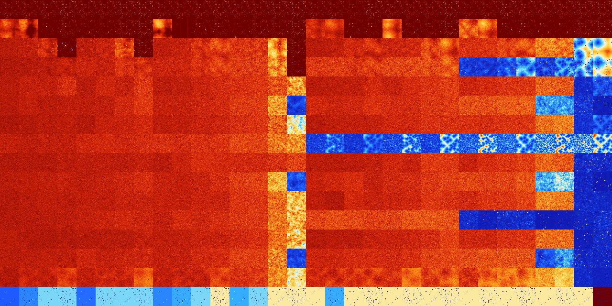

# B0126 (36352-36863)

<details>
    <summary>Initial Grid</summary>
    
</details>


<details>
    <summary>Initial Grid RLE</summary>

```
#C Exported from GoGoL (https://github.com/marrow16/gogol)
#C Wrap mode: Toroidal
#C Boundary mode: Dead
#C Step: 0
x = 100, y = 100, rule = B0126/S
31bo33bo11bo5bo$2bo11bo27bo7bo38b2o$5bo64bo3bo5bo15bo$12bo34bo25bo$6bo
8bo10bo8bo13bo31bo17bo$36bo11bo12bo13bo23bo$11bo9bo4bo$19bo23bo8bo16bo
8bo$5bo56bo16bo3bo2bo6bo2bo$14bo5bo46bo4bo4bo9bo4bo3bo$57bo8bo6bo$25bo
2bo8bo37bo17bo2bo$12bo62bo11bobo$18bo5bo36bo$49bo12bo2bo3bo$36bo33bo8bo
8bo7bo$7bo32bo11bo10bo10bo18bo$bo20bo7bo62bo$2bo14bobo8bo26bo4bo25bo$
43bo29bo18bo$14bo11bo13bobobo13bo20bo10bo$8bo38bo15bo$4bo32bo4bo23bo14b
o$5bo20bo4bo16bo8bo41bo$24bo5bo16bo34bo$9bo13bobobo14bo9bo5bo2bo21bo3bo
$21bo5bo2bo14bo$7bo3bo6bo9bo46bobo10bo10bo$2bo41bo4bo29bo18bo$20bo2bo
10bo15bo43bo$18bo11bo38bo$54bo43bo$bo33bo9bo8bo$47bo6bo22bo11bo6bo2bo$
100b$72bo14b2o$41bo19bo6bo29bo$22bo23bo8bo27bo$19bo8bo13bo3bo8bo5bo23bo
$6bo2bobo3bo9bo13bobobo25bo15bo6bo6bo$o43bo20bo$3bo4bo30bo25bo4bo4bo23b
o$2bo8bo7bo11bo13bo3bo27bo3bo17bo$50bo$31bo19bo8bo27bo2bo$bo16bo10bo34b
o4bo18bo6bo$6bo7bo10bo35bo36bo$7bo16bo52bo$4bo31bo43bo$14bo15bo$29bo9bo
3b2o13bo$19bo39bo12bo2bo$6bo67bo5bobo$21bo9bo38bo2bo7bo15bo$63bo8bo22bo
$6bo33bo9bo47bo$2bo14bo3bo7b2o16bo46bo$12bo61bo18bo$5bo3b2o11bo26bo30bo
$25bo5bo45bo13bo$8bo17bo31bo34bo$5bo10bo19bo40b2o$3bo14bo8bo18bo12b2o
17bo9bo8bo$2bobo11b2o15bo57bo$12bo22bo7bo$12bo19bo60bo$7bo55bo4b2o$16bo
68b2o$43bo22b2o$7bo19bo65bo$o14bo31bo2bo$28bo12bo11bo30bo$4bo56b2o34bo$
5bo10bo6bo21bo5bo25b2o7bo7bo$bo25bobo5bo19bo4bo10bo$3bo$22bo2bo4bo13bo
8bo23bo4bo$3bo6bo39bo15bo8bo9bo$25bo3bo26bo12bo7bo5bo$36bobo5bo12bo$22b
obo29bo4b2o26bo$7bo27bo2bo14bo$43bo3bo47bo$26bo27b2obo30bo3bo6bo$21bo8b
o63b2o$bo61bo12bo$42bo35bo$5bo4bo7bo9b2o25b2o25bo8bo$32bo8bo2bo$15bo9bo
38bo6bo4bo6bo14bo$12bo6bo4bo11bo$49bo39bo$o12bo13bo2bo6bo19bo39bo$32bob
o$9bo16bo5bo3bobo4bo$19bobo39bo2bo9bo$17bo16bo30bobo29bo$31bo62bo$7bo
20bo5bo14bo3bo40bo$19bo10bo17bo4bo28bobo!
```
</details>
<details>
    <summary>Thumbnail</summary>

</details>
<table>
<tr>
    <td><a href="./36352%20S%20Heat%20Map%20Activity.png"></a><br>S (36352)<br>R@8,p2</td>    <td><a href="./36353%20S0%20Heat%20Map%20Activity.png"></a><br>S0 (36353)<br>R@8,p2</td>    <td><a href="./36354%20S1%20Heat%20Map%20Activity.png"></a><br>S1 (36354)<br>R@8,p2</td>    <td><a href="./36355%20S01%20Heat%20Map%20Activity.png"></a><br>S01 (36355)<br>R@6,p2</td>    <td><a href="./36356%20S2%20Heat%20Map%20Activity.png"></a><br>S2 (36356)<br>R@8,p2</td>    <td><a href="./36357%20S02%20Heat%20Map%20Activity.png"></a><br>S02 (36357)<br>R@8,p2</td>    <td><a href="./36358%20S12%20Heat%20Map%20Activity.png"></a><br>S12 (36358)<br>R@6,p2</td>    <td><a href="./36359%20S012%20Heat%20Map%20Activity.png"></a><br>S012 (36359)<br>R@5,p2</td>    <td><a href="./36360%20S3%20Heat%20Map%20Activity.png"></a><br>S3 (36360)<br>R@8,p2</td>    <td><a href="./36361%20S03%20Heat%20Map%20Activity.png"></a><br>S03 (36361)<br>R@8,p2</td>    <td><a href="./36362%20S13%20Heat%20Map%20Activity.png"></a><br>S13 (36362)<br>R@8,p2</td>    <td><a href="./36363%20S013%20Heat%20Map%20Activity.png"></a><br>S013 (36363)<br>R@7,p2</td>    <td><a href="./36364%20S23%20Heat%20Map%20Activity.png"></a><br>S23 (36364)<br>R@8,p2</td>    <td><a href="./36365%20S023%20Heat%20Map%20Activity.png"></a><br>S023 (36365)<br>R@8,p2</td>    <td><a href="./36366%20S123%20Heat%20Map%20Activity.png"></a><br>S123 (36366)<br>R@6,p2</td>    <td><a href="./36367%20S0123%20Heat%20Map%20Activity.png"></a><br>S0123 (36367)<br>R@5,p2</td>    <td><a href="./36368%20S4%20Heat%20Map%20Activity.png"></a><br>S4 (36368)<br>R@8,p2</td>    <td><a href="./36369%20S04%20Heat%20Map%20Activity.png"></a><br>S04 (36369)<br>R@8,p2</td>    <td><a href="./36370%20S14%20Heat%20Map%20Activity.png"></a><br>S14 (36370)<br>R@12,p2</td>    <td><a href="./36371%20S014%20Heat%20Map%20Activity.png"></a><br>S014 (36371)<br>R@6,p2</td>    <td><a href="./36372%20S24%20Heat%20Map%20Activity.png"></a><br>S24 (36372)<br>R@8,p2</td>    <td><a href="./36373%20S024%20Heat%20Map%20Activity.png"></a><br>S024 (36373)<br>R@8,p2</td>    <td><a href="./36374%20S124%20Heat%20Map%20Activity.png"></a><br>S124 (36374)<br>R@8,p2</td>    <td><a href="./36375%20S0124%20Heat%20Map%20Activity.png"></a><br>S0124 (36375)<br>R@5,p2</td>    <td><a href="./36376%20S34%20Heat%20Map%20Activity.png"></a><br>S34 (36376)<br>R@10,p2</td>    <td><a href="./36377%20S034%20Heat%20Map%20Activity.png"></a><br>S034 (36377)<br>R@8,p2</td>    <td><a href="./36378%20S134%20Heat%20Map%20Activity.png"></a><br>S134 (36378)<br>R@6,p2</td>    <td><a href="./36379%20S0134%20Heat%20Map%20Activity.png"></a><br>S0134 (36379)<br>R@8,p2</td>    <td><a href="./36380%20S234%20Heat%20Map%20Activity.png"></a><br>S234 (36380)<br>R@8,p2</td>    <td><a href="./36381%20S0234%20Heat%20Map%20Activity.png"></a><br>S0234 (36381)<br>R@8,p2</td>    <td><a href="./36382%20S1234%20Heat%20Map%20Activity.png"></a><br>S1234 (36382)<br>R@6,p2</td>    <td><a href="./36383%20S01234%20Heat%20Map%20Activity.png"></a><br>S01234 (36383)<br>R@6,p2</td></tr>
<tr>
    <td><a href="./36384%20S5%20Heat%20Map%20Activity.png"></a><br>S5 (36384)<br>G>1000</td>    <td><a href="./36385%20S05%20Heat%20Map%20Activity.png"></a><br>S05 (36385)<br>G>1000</td>    <td><a href="./36386%20S15%20Heat%20Map%20Activity.png"></a><br>S15 (36386)<br>R@28,p4</td>    <td><a href="./36387%20S015%20Heat%20Map%20Activity.png"></a><br>S015 (36387)<br>R@10,p2</td>    <td><a href="./36388%20S25%20Heat%20Map%20Activity.png"></a><br>S25 (36388)<br>R@18,p2</td>    <td><a href="./36389%20S025%20Heat%20Map%20Activity.png"></a><br>S025 (36389)<br>R@17,p2</td>    <td><a href="./36390%20S125%20Heat%20Map%20Activity.png"></a><br>S125 (36390)<br>R@8,p2</td>    <td><a href="./36391%20S0125%20Heat%20Map%20Activity.png"></a><br>S0125 (36391)<br>R@6,p2</td>    <td><a href="./36392%20S35%20Heat%20Map%20Activity.png"></a><br>S35 (36392)<br>G>1000</td>    <td><a href="./36393%20S035%20Heat%20Map%20Activity.png"></a><br>S035 (36393)<br>R@444,p400</td>    <td><a href="./36394%20S135%20Heat%20Map%20Activity.png"></a><br>S135 (36394)<br>R@15,p4</td>    <td><a href="./36395%20S0135%20Heat%20Map%20Activity.png"></a><br>S0135 (36395)<br>R@11,p2</td>    <td><a href="./36396%20S235%20Heat%20Map%20Activity.png"></a><br>S235 (36396)<br>R@27,p2</td>    <td><a href="./36397%20S0235%20Heat%20Map%20Activity.png"></a><br>S0235 (36397)<br>R@10,p2</td>    <td><a href="./36398%20S1235%20Heat%20Map%20Activity.png"></a><br>S1235 (36398)<br>R@10,p2</td>    <td><a href="./36399%20S01235%20Heat%20Map%20Activity.png"></a><br>S01235 (36399)<br>R@6,p2</td>    <td><a href="./36400%20S45%20Heat%20Map%20Activity.png"></a><br>S45 (36400)<br>G>1000</td>    <td><a href="./36401%20S045%20Heat%20Map%20Activity.png"></a><br>S045 (36401)<br>G>1000</td>    <td><a href="./36402%20S145%20Heat%20Map%20Activity.png"></a><br>S145 (36402)<br>R@18,p2</td>    <td><a href="./36403%20S0145%20Heat%20Map%20Activity.png"></a><br>S0145 (36403)<br>R@14,p2</td>    <td><a href="./36404%20S245%20Heat%20Map%20Activity.png"></a><br>S245 (36404)<br>G>1000</td>    <td><a href="./36405%20S0245%20Heat%20Map%20Activity.png"></a><br>S0245 (36405)<br>R@14,p2</td>    <td><a href="./36406%20S1245%20Heat%20Map%20Activity.png"></a><br>S1245 (36406)<br>R@12,p2</td>    <td><a href="./36407%20S01245%20Heat%20Map%20Activity.png"></a><br>S01245 (36407)<br>R@6,p2</td>    <td><a href="./36408%20S345%20Heat%20Map%20Activity.png"></a><br>S345 (36408)<br>G>1000</td>    <td><a href="./36409%20S0345%20Heat%20Map%20Activity.png"></a><br>S0345 (36409)<br>G>1000</td>    <td><a href="./36410%20S1345%20Heat%20Map%20Activity.png"></a><br>S1345 (36410)<br>R@20,p4</td>    <td><a href="./36411%20S01345%20Heat%20Map%20Activity.png"></a><br>S01345 (36411)<br>R@11,p2</td>    <td><a href="./36412%20S2345%20Heat%20Map%20Activity.png"></a><br>S2345 (36412)<br>R@28,p4</td>    <td><a href="./36413%20S02345%20Heat%20Map%20Activity.png"></a><br>S02345 (36413)<br>R@25,p2</td>    <td><a href="./36414%20S12345%20Heat%20Map%20Activity.png"></a><br>S12345 (36414)<br>R@8,p2</td>    <td><a href="./36415%20S012345%20Heat%20Map%20Activity.png"></a><br>S012345 (36415)<br>R@6,p2</td></tr>
<tr>
    <td><a href="./36416%20S6%20Heat%20Map%20Activity.png"></a><br>S6 (36416)<br>G>1000</td>    <td><a href="./36417%20S06%20Heat%20Map%20Activity.png"></a><br>S06 (36417)<br>G>1000</td>    <td><a href="./36418%20S16%20Heat%20Map%20Activity.png"></a><br>S16 (36418)<br>G>1000</td>    <td><a href="./36419%20S016%20Heat%20Map%20Activity.png"></a><br>S016 (36419)<br>R@20,p2</td>    <td><a href="./36420%20S26%20Heat%20Map%20Activity.png"></a><br>S26 (36420)<br>G>1000</td>    <td><a href="./36421%20S026%20Heat%20Map%20Activity.png"></a><br>S026 (36421)<br>G>1000</td>    <td><a href="./36422%20S126%20Heat%20Map%20Activity.png"></a><br>S126 (36422)<br>G>1000</td>    <td><a href="./36423%20S0126%20Heat%20Map%20Activity.png"></a><br>S0126 (36423)<br>R@8,p4</td>    <td><a href="./36424%20S36%20Heat%20Map%20Activity.png"></a><br>S36 (36424)<br>G>1000</td>    <td><a href="./36425%20S036%20Heat%20Map%20Activity.png"></a><br>S036 (36425)<br>G>1000</td>    <td><a href="./36426%20S136%20Heat%20Map%20Activity.png"></a><br>S136 (36426)<br>G>1000</td>    <td><a href="./36427%20S0136%20Heat%20Map%20Activity.png"></a><br>S0136 (36427)<br>G>1000</td>    <td><a href="./36428%20S236%20Heat%20Map%20Activity.png"></a><br>S236 (36428)<br>G>1000</td>    <td><a href="./36429%20S0236%20Heat%20Map%20Activity.png"></a><br>S0236 (36429)<br>G>1000</td>    <td><a href="./36430%20S1236%20Heat%20Map%20Activity.png"></a><br>S1236 (36430)<br>G>1000</td>    <td><a href="./36431%20S01236%20Heat%20Map%20Activity.png"></a><br>S01236 (36431)<br>R@8,p2</td>    <td><a href="./36432%20S46%20Heat%20Map%20Activity.png"></a><br>S46 (36432)<br>G>1000</td>    <td><a href="./36433%20S046%20Heat%20Map%20Activity.png"></a><br>S046 (36433)<br>G>1000</td>    <td><a href="./36434%20S146%20Heat%20Map%20Activity.png"></a><br>S146 (36434)<br>G>1000</td>    <td><a href="./36435%20S0146%20Heat%20Map%20Activity.png"></a><br>S0146 (36435)<br>G>1000</td>    <td><a href="./36436%20S246%20Heat%20Map%20Activity.png"></a><br>S246 (36436)<br>G>1000</td>    <td><a href="./36437%20S0246%20Heat%20Map%20Activity.png"></a><br>S0246 (36437)<br>G>1000</td>    <td><a href="./36438%20S1246%20Heat%20Map%20Activity.png"></a><br>S1246 (36438)<br>G>1000</td>    <td><a href="./36439%20S01246%20Heat%20Map%20Activity.png"></a><br>S01246 (36439)<br>G>1000</td>    <td><a href="./36440%20S346%20Heat%20Map%20Activity.png"></a><br>S346 (36440)<br>G>1000</td>    <td><a href="./36441%20S0346%20Heat%20Map%20Activity.png"></a><br>S0346 (36441)<br>G>1000</td>    <td><a href="./36442%20S1346%20Heat%20Map%20Activity.png"></a><br>S1346 (36442)<br>G>1000</td>    <td><a href="./36443%20S01346%20Heat%20Map%20Activity.png"></a><br>S01346 (36443)<br>G>1000</td>    <td><a href="./36444%20S2346%20Heat%20Map%20Activity.png"></a><br>S2346 (36444)<br>G>1000</td>    <td><a href="./36445%20S02346%20Heat%20Map%20Activity.png"></a><br>S02346 (36445)<br>G>1000</td>    <td><a href="./36446%20S12346%20Heat%20Map%20Activity.png"></a><br>S12346 (36446)<br>R@272,p12</td>    <td><a href="./36447%20S012346%20Heat%20Map%20Activity.png"></a><br>S012346 (36447)<br>R@368,p60</td></tr>
<tr>
    <td><a href="./36448%20S56%20Heat%20Map%20Activity.png"></a><br>S56 (36448)<br>G>1000</td>    <td><a href="./36449%20S056%20Heat%20Map%20Activity.png"></a><br>S056 (36449)<br>G>1000</td>    <td><a href="./36450%20S156%20Heat%20Map%20Activity.png"></a><br>S156 (36450)<br>G>1000</td>    <td><a href="./36451%20S0156%20Heat%20Map%20Activity.png"></a><br>S0156 (36451)<br>G>1000</td>    <td><a href="./36452%20S256%20Heat%20Map%20Activity.png"></a><br>S256 (36452)<br>G>1000</td>    <td><a href="./36453%20S0256%20Heat%20Map%20Activity.png"></a><br>S0256 (36453)<br>G>1000</td>    <td><a href="./36454%20S1256%20Heat%20Map%20Activity.png"></a><br>S1256 (36454)<br>G>1000</td>    <td><a href="./36455%20S01256%20Heat%20Map%20Activity.png"></a><br>S01256 (36455)<br>G>1000</td>    <td><a href="./36456%20S356%20Heat%20Map%20Activity.png"></a><br>S356 (36456)<br>G>1000</td>    <td><a href="./36457%20S0356%20Heat%20Map%20Activity.png"></a><br>S0356 (36457)<br>G>1000</td>    <td><a href="./36458%20S1356%20Heat%20Map%20Activity.png"></a><br>S1356 (36458)<br>G>1000</td>    <td><a href="./36459%20S01356%20Heat%20Map%20Activity.png"></a><br>S01356 (36459)<br>G>1000</td>    <td><a href="./36460%20S2356%20Heat%20Map%20Activity.png"></a><br>S2356 (36460)<br>G>1000</td>    <td><a href="./36461%20S02356%20Heat%20Map%20Activity.png"></a><br>S02356 (36461)<br>G>1000</td>    <td><a href="./36462%20S12356%20Heat%20Map%20Activity.png"></a><br>S12356 (36462)<br>G>1000</td>    <td><a href="./36463%20S012356%20Heat%20Map%20Activity.png"></a><br>S012356 (36463)<br>R@12,p2</td>    <td><a href="./36464%20S456%20Heat%20Map%20Activity.png"></a><br>S456 (36464)<br>G>1000</td>    <td><a href="./36465%20S0456%20Heat%20Map%20Activity.png"></a><br>S0456 (36465)<br>G>1000</td>    <td><a href="./36466%20S1456%20Heat%20Map%20Activity.png"></a><br>S1456 (36466)<br>G>1000</td>    <td><a href="./36467%20S01456%20Heat%20Map%20Activity.png"></a><br>S01456 (36467)<br>G>1000</td>    <td><a href="./36468%20S2456%20Heat%20Map%20Activity.png"></a><br>S2456 (36468)<br>G>1000</td>    <td><a href="./36469%20S02456%20Heat%20Map%20Activity.png"></a><br>S02456 (36469)<br>G>1000</td>    <td><a href="./36470%20S12456%20Heat%20Map%20Activity.png"></a><br>S12456 (36470)<br>G>1000</td>    <td><a href="./36471%20S012456%20Heat%20Map%20Activity.png"></a><br>S012456 (36471)<br>G>1000</td>    <td><a href="./36472%20S3456%20Heat%20Map%20Activity.png"></a><br>S3456 (36472)<br>R@248,p20</td>    <td><a href="./36473%20S03456%20Heat%20Map%20Activity.png"></a><br>S03456 (36473)<br>R@373,p12</td>    <td><a href="./36474%20S13456%20Heat%20Map%20Activity.png"></a><br>S13456 (36474)<br>R@228,p20</td>    <td><a href="./36475%20S013456%20Heat%20Map%20Activity.png"></a><br>S013456 (36475)<br>R@204,p12</td>    <td><a href="./36476%20S23456%20Heat%20Map%20Activity.png"></a><br>S23456 (36476)<br>R@208,p120</td>    <td><a href="./36477%20S023456%20Heat%20Map%20Activity.png"></a><br>S023456 (36477)<br>R@153,p60</td>    <td><a href="./36478%20S123456%20Heat%20Map%20Activity.png"></a><br>S123456 (36478)<br>R@187,p60</td>    <td><a href="./36479%20S0123456%20Heat%20Map%20Activity.png"></a><br>S0123456 (36479)<br>R@269,p60</td></tr>
<tr>
    <td><a href="./36480%20S7%20Heat%20Map%20Activity.png"></a><br>S7 (36480)<br>G>1000</td>    <td><a href="./36481%20S07%20Heat%20Map%20Activity.png"></a><br>S07 (36481)<br>G>1000</td>    <td><a href="./36482%20S17%20Heat%20Map%20Activity.png"></a><br>S17 (36482)<br>G>1000</td>    <td><a href="./36483%20S017%20Heat%20Map%20Activity.png"></a><br>S017 (36483)<br>G>1000</td>    <td><a href="./36484%20S27%20Heat%20Map%20Activity.png"></a><br>S27 (36484)<br>G>1000</td>    <td><a href="./36485%20S027%20Heat%20Map%20Activity.png"></a><br>S027 (36485)<br>G>1000</td>    <td><a href="./36486%20S127%20Heat%20Map%20Activity.png"></a><br>S127 (36486)<br>G>1000</td>    <td><a href="./36487%20S0127%20Heat%20Map%20Activity.png"></a><br>S0127 (36487)<br>G>1000</td>    <td><a href="./36488%20S37%20Heat%20Map%20Activity.png"></a><br>S37 (36488)<br>G>1000</td>    <td><a href="./36489%20S037%20Heat%20Map%20Activity.png"></a><br>S037 (36489)<br>G>1000</td>    <td><a href="./36490%20S137%20Heat%20Map%20Activity.png"></a><br>S137 (36490)<br>G>1000</td>    <td><a href="./36491%20S0137%20Heat%20Map%20Activity.png"></a><br>S0137 (36491)<br>G>1000</td>    <td><a href="./36492%20S237%20Heat%20Map%20Activity.png"></a><br>S237 (36492)<br>G>1000</td>    <td><a href="./36493%20S0237%20Heat%20Map%20Activity.png"></a><br>S0237 (36493)<br>G>1000</td>    <td><a href="./36494%20S1237%20Heat%20Map%20Activity.png"></a><br>S1237 (36494)<br>G>1000</td>    <td><a href="./36495%20S01237%20Heat%20Map%20Activity.png"></a><br>S01237 (36495)<br>G>1000</td>    <td><a href="./36496%20S47%20Heat%20Map%20Activity.png"></a><br>S47 (36496)<br>G>1000</td>    <td><a href="./36497%20S047%20Heat%20Map%20Activity.png"></a><br>S047 (36497)<br>G>1000</td>    <td><a href="./36498%20S147%20Heat%20Map%20Activity.png"></a><br>S147 (36498)<br>G>1000</td>    <td><a href="./36499%20S0147%20Heat%20Map%20Activity.png"></a><br>S0147 (36499)<br>G>1000</td>    <td><a href="./36500%20S247%20Heat%20Map%20Activity.png"></a><br>S247 (36500)<br>G>1000</td>    <td><a href="./36501%20S0247%20Heat%20Map%20Activity.png"></a><br>S0247 (36501)<br>G>1000</td>    <td><a href="./36502%20S1247%20Heat%20Map%20Activity.png"></a><br>S1247 (36502)<br>G>1000</td>    <td><a href="./36503%20S01247%20Heat%20Map%20Activity.png"></a><br>S01247 (36503)<br>G>1000</td>    <td><a href="./36504%20S347%20Heat%20Map%20Activity.png"></a><br>S347 (36504)<br>G>1000</td>    <td><a href="./36505%20S0347%20Heat%20Map%20Activity.png"></a><br>S0347 (36505)<br>G>1000</td>    <td><a href="./36506%20S1347%20Heat%20Map%20Activity.png"></a><br>S1347 (36506)<br>G>1000</td>    <td><a href="./36507%20S01347%20Heat%20Map%20Activity.png"></a><br>S01347 (36507)<br>G>1000</td>    <td><a href="./36508%20S2347%20Heat%20Map%20Activity.png"></a><br>S2347 (36508)<br>G>1000</td>    <td><a href="./36509%20S02347%20Heat%20Map%20Activity.png"></a><br>S02347 (36509)<br>G>1000</td>    <td><a href="./36510%20S12347%20Heat%20Map%20Activity.png"></a><br>S12347 (36510)<br>R@206,p60</td>    <td><a href="./36511%20S012347%20Heat%20Map%20Activity.png"></a><br>S012347 (36511)<br>R@151,p60</td></tr>
<tr>
    <td><a href="./36512%20S57%20Heat%20Map%20Activity.png"></a><br>S57 (36512)<br>G>1000</td>    <td><a href="./36513%20S057%20Heat%20Map%20Activity.png"></a><br>S057 (36513)<br>G>1000</td>    <td><a href="./36514%20S157%20Heat%20Map%20Activity.png"></a><br>S157 (36514)<br>G>1000</td>    <td><a href="./36515%20S0157%20Heat%20Map%20Activity.png"></a><br>S0157 (36515)<br>G>1000</td>    <td><a href="./36516%20S257%20Heat%20Map%20Activity.png"></a><br>S257 (36516)<br>G>1000</td>    <td><a href="./36517%20S0257%20Heat%20Map%20Activity.png"></a><br>S0257 (36517)<br>G>1000</td>    <td><a href="./36518%20S1257%20Heat%20Map%20Activity.png"></a><br>S1257 (36518)<br>G>1000</td>    <td><a href="./36519%20S01257%20Heat%20Map%20Activity.png"></a><br>S01257 (36519)<br>G>1000</td>    <td><a href="./36520%20S357%20Heat%20Map%20Activity.png"></a><br>S357 (36520)<br>G>1000</td>    <td><a href="./36521%20S0357%20Heat%20Map%20Activity.png"></a><br>S0357 (36521)<br>G>1000</td>    <td><a href="./36522%20S1357%20Heat%20Map%20Activity.png"></a><br>S1357 (36522)<br>G>1000</td>    <td><a href="./36523%20S01357%20Heat%20Map%20Activity.png"></a><br>S01357 (36523)<br>G>1000</td>    <td><a href="./36524%20S2357%20Heat%20Map%20Activity.png"></a><br>S2357 (36524)<br>G>1000</td>    <td><a href="./36525%20S02357%20Heat%20Map%20Activity.png"></a><br>S02357 (36525)<br>G>1000</td>    <td><a href="./36526%20S12357%20Heat%20Map%20Activity.png"></a><br>S12357 (36526)<br>G>1000</td>    <td><a href="./36527%20S012357%20Heat%20Map%20Activity.png"></a><br>S012357 (36527)<br>G>1000</td>    <td><a href="./36528%20S457%20Heat%20Map%20Activity.png"></a><br>S457 (36528)<br>G>1000</td>    <td><a href="./36529%20S0457%20Heat%20Map%20Activity.png"></a><br>S0457 (36529)<br>G>1000</td>    <td><a href="./36530%20S1457%20Heat%20Map%20Activity.png"></a><br>S1457 (36530)<br>G>1000</td>    <td><a href="./36531%20S01457%20Heat%20Map%20Activity.png"></a><br>S01457 (36531)<br>G>1000</td>    <td><a href="./36532%20S2457%20Heat%20Map%20Activity.png"></a><br>S2457 (36532)<br>G>1000</td>    <td><a href="./36533%20S02457%20Heat%20Map%20Activity.png"></a><br>S02457 (36533)<br>G>1000</td>    <td><a href="./36534%20S12457%20Heat%20Map%20Activity.png"></a><br>S12457 (36534)<br>G>1000</td>    <td><a href="./36535%20S012457%20Heat%20Map%20Activity.png"></a><br>S012457 (36535)<br>G>1000</td>    <td><a href="./36536%20S3457%20Heat%20Map%20Activity.png"></a><br>S3457 (36536)<br>G>1000</td>    <td><a href="./36537%20S03457%20Heat%20Map%20Activity.png"></a><br>S03457 (36537)<br>G>1000</td>    <td><a href="./36538%20S13457%20Heat%20Map%20Activity.png"></a><br>S13457 (36538)<br>G>1000</td>    <td><a href="./36539%20S013457%20Heat%20Map%20Activity.png"></a><br>S013457 (36539)<br>G>1000</td>    <td><a href="./36540%20S23457%20Heat%20Map%20Activity.png"></a><br>S23457 (36540)<br>G>1000</td>    <td><a href="./36541%20S023457%20Heat%20Map%20Activity.png"></a><br>S023457 (36541)<br>G>1000</td>    <td><a href="./36542%20S123457%20Heat%20Map%20Activity.png"></a><br>S123457 (36542)<br>R@112,p24</td>    <td><a href="./36543%20S0123457%20Heat%20Map%20Activity.png"></a><br>S0123457 (36543)<br>G>1000</td></tr>
<tr>
    <td><a href="./36544%20S67%20Heat%20Map%20Activity.png"></a><br>S67 (36544)<br>G>1000</td>    <td><a href="./36545%20S067%20Heat%20Map%20Activity.png"></a><br>S067 (36545)<br>G>1000</td>    <td><a href="./36546%20S167%20Heat%20Map%20Activity.png"></a><br>S167 (36546)<br>G>1000</td>    <td><a href="./36547%20S0167%20Heat%20Map%20Activity.png"></a><br>S0167 (36547)<br>G>1000</td>    <td><a href="./36548%20S267%20Heat%20Map%20Activity.png"></a><br>S267 (36548)<br>G>1000</td>    <td><a href="./36549%20S0267%20Heat%20Map%20Activity.png"></a><br>S0267 (36549)<br>G>1000</td>    <td><a href="./36550%20S1267%20Heat%20Map%20Activity.png"></a><br>S1267 (36550)<br>G>1000</td>    <td><a href="./36551%20S01267%20Heat%20Map%20Activity.png"></a><br>S01267 (36551)<br>G>1000</td>    <td><a href="./36552%20S367%20Heat%20Map%20Activity.png"></a><br>S367 (36552)<br>G>1000</td>    <td><a href="./36553%20S0367%20Heat%20Map%20Activity.png"></a><br>S0367 (36553)<br>G>1000</td>    <td><a href="./36554%20S1367%20Heat%20Map%20Activity.png"></a><br>S1367 (36554)<br>G>1000</td>    <td><a href="./36555%20S01367%20Heat%20Map%20Activity.png"></a><br>S01367 (36555)<br>G>1000</td>    <td><a href="./36556%20S2367%20Heat%20Map%20Activity.png"></a><br>S2367 (36556)<br>G>1000</td>    <td><a href="./36557%20S02367%20Heat%20Map%20Activity.png"></a><br>S02367 (36557)<br>G>1000</td>    <td><a href="./36558%20S12367%20Heat%20Map%20Activity.png"></a><br>S12367 (36558)<br>G>1000</td>    <td><a href="./36559%20S012367%20Heat%20Map%20Activity.png"></a><br>S012367 (36559)<br>G>1000</td>    <td><a href="./36560%20S467%20Heat%20Map%20Activity.png"></a><br>S467 (36560)<br>G>1000</td>    <td><a href="./36561%20S0467%20Heat%20Map%20Activity.png"></a><br>S0467 (36561)<br>G>1000</td>    <td><a href="./36562%20S1467%20Heat%20Map%20Activity.png"></a><br>S1467 (36562)<br>G>1000</td>    <td><a href="./36563%20S01467%20Heat%20Map%20Activity.png"></a><br>S01467 (36563)<br>G>1000</td>    <td><a href="./36564%20S2467%20Heat%20Map%20Activity.png"></a><br>S2467 (36564)<br>G>1000</td>    <td><a href="./36565%20S02467%20Heat%20Map%20Activity.png"></a><br>S02467 (36565)<br>G>1000</td>    <td><a href="./36566%20S12467%20Heat%20Map%20Activity.png"></a><br>S12467 (36566)<br>G>1000</td>    <td><a href="./36567%20S012467%20Heat%20Map%20Activity.png"></a><br>S012467 (36567)<br>G>1000</td>    <td><a href="./36568%20S3467%20Heat%20Map%20Activity.png"></a><br>S3467 (36568)<br>G>1000</td>    <td><a href="./36569%20S03467%20Heat%20Map%20Activity.png"></a><br>S03467 (36569)<br>G>1000</td>    <td><a href="./36570%20S13467%20Heat%20Map%20Activity.png"></a><br>S13467 (36570)<br>G>1000</td>    <td><a href="./36571%20S013467%20Heat%20Map%20Activity.png"></a><br>S013467 (36571)<br>G>1000</td>    <td><a href="./36572%20S23467%20Heat%20Map%20Activity.png"></a><br>S23467 (36572)<br>G>1000</td>    <td><a href="./36573%20S023467%20Heat%20Map%20Activity.png"></a><br>S023467 (36573)<br>G>1000</td>    <td><a href="./36574%20S123467%20Heat%20Map%20Activity.png"></a><br>S123467 (36574)<br>R@113,p24</td>    <td><a href="./36575%20S0123467%20Heat%20Map%20Activity.png"></a><br>S0123467 (36575)<br>R@117,p24</td></tr>
<tr>
    <td><a href="./36576%20S567%20Heat%20Map%20Activity.png"></a><br>S567 (36576)<br>G>1000</td>    <td><a href="./36577%20S0567%20Heat%20Map%20Activity.png"></a><br>S0567 (36577)<br>G>1000</td>    <td><a href="./36578%20S1567%20Heat%20Map%20Activity.png"></a><br>S1567 (36578)<br>G>1000</td>    <td><a href="./36579%20S01567%20Heat%20Map%20Activity.png"></a><br>S01567 (36579)<br>G>1000</td>    <td><a href="./36580%20S2567%20Heat%20Map%20Activity.png"></a><br>S2567 (36580)<br>G>1000</td>    <td><a href="./36581%20S02567%20Heat%20Map%20Activity.png"></a><br>S02567 (36581)<br>G>1000</td>    <td><a href="./36582%20S12567%20Heat%20Map%20Activity.png"></a><br>S12567 (36582)<br>G>1000</td>    <td><a href="./36583%20S012567%20Heat%20Map%20Activity.png"></a><br>S012567 (36583)<br>G>1000</td>    <td><a href="./36584%20S3567%20Heat%20Map%20Activity.png"></a><br>S3567 (36584)<br>G>1000</td>    <td><a href="./36585%20S03567%20Heat%20Map%20Activity.png"></a><br>S03567 (36585)<br>G>1000</td>    <td><a href="./36586%20S13567%20Heat%20Map%20Activity.png"></a><br>S13567 (36586)<br>G>1000</td>    <td><a href="./36587%20S013567%20Heat%20Map%20Activity.png"></a><br>S013567 (36587)<br>G>1000</td>    <td><a href="./36588%20S23567%20Heat%20Map%20Activity.png"></a><br>S23567 (36588)<br>G>1000</td>    <td><a href="./36589%20S023567%20Heat%20Map%20Activity.png"></a><br>S023567 (36589)<br>G>1000</td>    <td><a href="./36590%20S123567%20Heat%20Map%20Activity.png"></a><br>S123567 (36590)<br>G>1000</td>    <td><a href="./36591%20S0123567%20Heat%20Map%20Activity.png"></a><br>S0123567 (36591)<br>G>1000</td>    <td><a href="./36592%20S4567%20Heat%20Map%20Activity.png"></a><br>S4567 (36592)<br>R@49,p4</td>    <td><a href="./36593%20S04567%20Heat%20Map%20Activity.png"></a><br>S04567 (36593)<br>R@48,p4</td>    <td><a href="./36594%20S14567%20Heat%20Map%20Activity.png"></a><br>S14567 (36594)<br>R@58,p20</td>    <td><a href="./36595%20S014567%20Heat%20Map%20Activity.png"></a><br>S014567 (36595)<br>R@80,p30</td>    <td><a href="./36596%20S24567%20Heat%20Map%20Activity.png"></a><br>S24567 (36596)<br>R@33,p4</td>    <td><a href="./36597%20S024567%20Heat%20Map%20Activity.png"></a><br>S024567 (36597)<br>R@38,p4</td>    <td><a href="./36598%20S124567%20Heat%20Map%20Activity.png"></a><br>S124567 (36598)<br>R@38,p2</td>    <td><a href="./36599%20S0124567%20Heat%20Map%20Activity.png"></a><br>S0124567 (36599)<br>R@46,p4</td>    <td><a href="./36600%20S34567%20Heat%20Map%20Activity.png"></a><br>S34567 (36600)<br>R@20,p6</td>    <td><a href="./36601%20S034567%20Heat%20Map%20Activity.png"></a><br>S034567 (36601)<br>R@21,p2</td>    <td><a href="./36602%20S134567%20Heat%20Map%20Activity.png"></a><br>S134567 (36602)<br>R@19,p4</td>    <td><a href="./36603%20S0134567%20Heat%20Map%20Activity.png"></a><br>S0134567 (36603)<br>R@43,p12</td>    <td><a href="./36604%20S234567%20Heat%20Map%20Activity.png"></a><br>S234567 (36604)<br>R@13,p2</td>    <td><a href="./36605%20S0234567%20Heat%20Map%20Activity.png"></a><br>S0234567 (36605)<br>R@22,p2</td>    <td><a href="./36606%20S1234567%20Heat%20Map%20Activity.png"></a><br>S1234567 (36606)<br>R@13,p2</td>    <td><a href="./36607%20S01234567%20Heat%20Map%20Activity.png"></a><br>S01234567 (36607)<br>S@43</td></tr>
<tr>
    <td><a href="./36608%20S8%20Heat%20Map%20Activity.png"></a><br>S8 (36608)<br>G>1000</td>    <td><a href="./36609%20S08%20Heat%20Map%20Activity.png"></a><br>S08 (36609)<br>G>1000</td>    <td><a href="./36610%20S18%20Heat%20Map%20Activity.png"></a><br>S18 (36610)<br>G>1000</td>    <td><a href="./36611%20S018%20Heat%20Map%20Activity.png"></a><br>S018 (36611)<br>G>1000</td>    <td><a href="./36612%20S28%20Heat%20Map%20Activity.png"></a><br>S28 (36612)<br>G>1000</td>    <td><a href="./36613%20S028%20Heat%20Map%20Activity.png"></a><br>S028 (36613)<br>G>1000</td>    <td><a href="./36614%20S128%20Heat%20Map%20Activity.png"></a><br>S128 (36614)<br>G>1000</td>    <td><a href="./36615%20S0128%20Heat%20Map%20Activity.png"></a><br>S0128 (36615)<br>G>1000</td>    <td><a href="./36616%20S38%20Heat%20Map%20Activity.png"></a><br>S38 (36616)<br>G>1000</td>    <td><a href="./36617%20S038%20Heat%20Map%20Activity.png"></a><br>S038 (36617)<br>G>1000</td>    <td><a href="./36618%20S138%20Heat%20Map%20Activity.png"></a><br>S138 (36618)<br>G>1000</td>    <td><a href="./36619%20S0138%20Heat%20Map%20Activity.png"></a><br>S0138 (36619)<br>G>1000</td>    <td><a href="./36620%20S238%20Heat%20Map%20Activity.png"></a><br>S238 (36620)<br>G>1000</td>    <td><a href="./36621%20S0238%20Heat%20Map%20Activity.png"></a><br>S0238 (36621)<br>G>1000</td>    <td><a href="./36622%20S1238%20Heat%20Map%20Activity.png"></a><br>S1238 (36622)<br>G>1000</td>    <td><a href="./36623%20S01238%20Heat%20Map%20Activity.png"></a><br>S01238 (36623)<br>G>1000</td>    <td><a href="./36624%20S48%20Heat%20Map%20Activity.png"></a><br>S48 (36624)<br>G>1000</td>    <td><a href="./36625%20S048%20Heat%20Map%20Activity.png"></a><br>S048 (36625)<br>G>1000</td>    <td><a href="./36626%20S148%20Heat%20Map%20Activity.png"></a><br>S148 (36626)<br>G>1000</td>    <td><a href="./36627%20S0148%20Heat%20Map%20Activity.png"></a><br>S0148 (36627)<br>G>1000</td>    <td><a href="./36628%20S248%20Heat%20Map%20Activity.png"></a><br>S248 (36628)<br>G>1000</td>    <td><a href="./36629%20S0248%20Heat%20Map%20Activity.png"></a><br>S0248 (36629)<br>G>1000</td>    <td><a href="./36630%20S1248%20Heat%20Map%20Activity.png"></a><br>S1248 (36630)<br>G>1000</td>    <td><a href="./36631%20S01248%20Heat%20Map%20Activity.png"></a><br>S01248 (36631)<br>G>1000</td>    <td><a href="./36632%20S348%20Heat%20Map%20Activity.png"></a><br>S348 (36632)<br>G>1000</td>    <td><a href="./36633%20S0348%20Heat%20Map%20Activity.png"></a><br>S0348 (36633)<br>G>1000</td>    <td><a href="./36634%20S1348%20Heat%20Map%20Activity.png"></a><br>S1348 (36634)<br>G>1000</td>    <td><a href="./36635%20S01348%20Heat%20Map%20Activity.png"></a><br>S01348 (36635)<br>G>1000</td>    <td><a href="./36636%20S2348%20Heat%20Map%20Activity.png"></a><br>S2348 (36636)<br>G>1000</td>    <td><a href="./36637%20S02348%20Heat%20Map%20Activity.png"></a><br>S02348 (36637)<br>G>1000</td>    <td><a href="./36638%20S12348%20Heat%20Map%20Activity.png"></a><br>S12348 (36638)<br>R@360,p120</td>    <td><a href="./36639%20S012348%20Heat%20Map%20Activity.png"></a><br>S012348 (36639)<br>R@242,p120</td></tr>
<tr>
    <td><a href="./36640%20S58%20Heat%20Map%20Activity.png"></a><br>S58 (36640)<br>G>1000</td>    <td><a href="./36641%20S058%20Heat%20Map%20Activity.png"></a><br>S058 (36641)<br>G>1000</td>    <td><a href="./36642%20S158%20Heat%20Map%20Activity.png"></a><br>S158 (36642)<br>G>1000</td>    <td><a href="./36643%20S0158%20Heat%20Map%20Activity.png"></a><br>S0158 (36643)<br>G>1000</td>    <td><a href="./36644%20S258%20Heat%20Map%20Activity.png"></a><br>S258 (36644)<br>G>1000</td>    <td><a href="./36645%20S0258%20Heat%20Map%20Activity.png"></a><br>S0258 (36645)<br>G>1000</td>    <td><a href="./36646%20S1258%20Heat%20Map%20Activity.png"></a><br>S1258 (36646)<br>G>1000</td>    <td><a href="./36647%20S01258%20Heat%20Map%20Activity.png"></a><br>S01258 (36647)<br>G>1000</td>    <td><a href="./36648%20S358%20Heat%20Map%20Activity.png"></a><br>S358 (36648)<br>G>1000</td>    <td><a href="./36649%20S0358%20Heat%20Map%20Activity.png"></a><br>S0358 (36649)<br>G>1000</td>    <td><a href="./36650%20S1358%20Heat%20Map%20Activity.png"></a><br>S1358 (36650)<br>G>1000</td>    <td><a href="./36651%20S01358%20Heat%20Map%20Activity.png"></a><br>S01358 (36651)<br>G>1000</td>    <td><a href="./36652%20S2358%20Heat%20Map%20Activity.png"></a><br>S2358 (36652)<br>G>1000</td>    <td><a href="./36653%20S02358%20Heat%20Map%20Activity.png"></a><br>S02358 (36653)<br>G>1000</td>    <td><a href="./36654%20S12358%20Heat%20Map%20Activity.png"></a><br>S12358 (36654)<br>G>1000</td>    <td><a href="./36655%20S012358%20Heat%20Map%20Activity.png"></a><br>S012358 (36655)<br>G>1000</td>    <td><a href="./36656%20S458%20Heat%20Map%20Activity.png"></a><br>S458 (36656)<br>G>1000</td>    <td><a href="./36657%20S0458%20Heat%20Map%20Activity.png"></a><br>S0458 (36657)<br>G>1000</td>    <td><a href="./36658%20S1458%20Heat%20Map%20Activity.png"></a><br>S1458 (36658)<br>G>1000</td>    <td><a href="./36659%20S01458%20Heat%20Map%20Activity.png"></a><br>S01458 (36659)<br>G>1000</td>    <td><a href="./36660%20S2458%20Heat%20Map%20Activity.png"></a><br>S2458 (36660)<br>G>1000</td>    <td><a href="./36661%20S02458%20Heat%20Map%20Activity.png"></a><br>S02458 (36661)<br>G>1000</td>    <td><a href="./36662%20S12458%20Heat%20Map%20Activity.png"></a><br>S12458 (36662)<br>G>1000</td>    <td><a href="./36663%20S012458%20Heat%20Map%20Activity.png"></a><br>S012458 (36663)<br>G>1000</td>    <td><a href="./36664%20S3458%20Heat%20Map%20Activity.png"></a><br>S3458 (36664)<br>G>1000</td>    <td><a href="./36665%20S03458%20Heat%20Map%20Activity.png"></a><br>S03458 (36665)<br>G>1000</td>    <td><a href="./36666%20S13458%20Heat%20Map%20Activity.png"></a><br>S13458 (36666)<br>G>1000</td>    <td><a href="./36667%20S013458%20Heat%20Map%20Activity.png"></a><br>S013458 (36667)<br>G>1000</td>    <td><a href="./36668%20S23458%20Heat%20Map%20Activity.png"></a><br>S23458 (36668)<br>G>1000</td>    <td><a href="./36669%20S023458%20Heat%20Map%20Activity.png"></a><br>S023458 (36669)<br>G>1000</td>    <td><a href="./36670%20S123458%20Heat%20Map%20Activity.png"></a><br>S123458 (36670)<br>R@252,p120</td>    <td><a href="./36671%20S0123458%20Heat%20Map%20Activity.png"></a><br>S0123458 (36671)<br>G>1000</td></tr>
<tr>
    <td><a href="./36672%20S68%20Heat%20Map%20Activity.png"></a><br>S68 (36672)<br>G>1000</td>    <td><a href="./36673%20S068%20Heat%20Map%20Activity.png"></a><br>S068 (36673)<br>G>1000</td>    <td><a href="./36674%20S168%20Heat%20Map%20Activity.png"></a><br>S168 (36674)<br>G>1000</td>    <td><a href="./36675%20S0168%20Heat%20Map%20Activity.png"></a><br>S0168 (36675)<br>G>1000</td>    <td><a href="./36676%20S268%20Heat%20Map%20Activity.png"></a><br>S268 (36676)<br>G>1000</td>    <td><a href="./36677%20S0268%20Heat%20Map%20Activity.png"></a><br>S0268 (36677)<br>G>1000</td>    <td><a href="./36678%20S1268%20Heat%20Map%20Activity.png"></a><br>S1268 (36678)<br>G>1000</td>    <td><a href="./36679%20S01268%20Heat%20Map%20Activity.png"></a><br>S01268 (36679)<br>G>1000</td>    <td><a href="./36680%20S368%20Heat%20Map%20Activity.png"></a><br>S368 (36680)<br>G>1000</td>    <td><a href="./36681%20S0368%20Heat%20Map%20Activity.png"></a><br>S0368 (36681)<br>G>1000</td>    <td><a href="./36682%20S1368%20Heat%20Map%20Activity.png"></a><br>S1368 (36682)<br>G>1000</td>    <td><a href="./36683%20S01368%20Heat%20Map%20Activity.png"></a><br>S01368 (36683)<br>G>1000</td>    <td><a href="./36684%20S2368%20Heat%20Map%20Activity.png"></a><br>S2368 (36684)<br>G>1000</td>    <td><a href="./36685%20S02368%20Heat%20Map%20Activity.png"></a><br>S02368 (36685)<br>G>1000</td>    <td><a href="./36686%20S12368%20Heat%20Map%20Activity.png"></a><br>S12368 (36686)<br>G>1000</td>    <td><a href="./36687%20S012368%20Heat%20Map%20Activity.png"></a><br>S012368 (36687)<br>G>1000</td>    <td><a href="./36688%20S468%20Heat%20Map%20Activity.png"></a><br>S468 (36688)<br>G>1000</td>    <td><a href="./36689%20S0468%20Heat%20Map%20Activity.png"></a><br>S0468 (36689)<br>G>1000</td>    <td><a href="./36690%20S1468%20Heat%20Map%20Activity.png"></a><br>S1468 (36690)<br>G>1000</td>    <td><a href="./36691%20S01468%20Heat%20Map%20Activity.png"></a><br>S01468 (36691)<br>G>1000</td>    <td><a href="./36692%20S2468%20Heat%20Map%20Activity.png"></a><br>S2468 (36692)<br>G>1000</td>    <td><a href="./36693%20S02468%20Heat%20Map%20Activity.png"></a><br>S02468 (36693)<br>G>1000</td>    <td><a href="./36694%20S12468%20Heat%20Map%20Activity.png"></a><br>S12468 (36694)<br>G>1000</td>    <td><a href="./36695%20S012468%20Heat%20Map%20Activity.png"></a><br>S012468 (36695)<br>G>1000</td>    <td><a href="./36696%20S3468%20Heat%20Map%20Activity.png"></a><br>S3468 (36696)<br>G>1000</td>    <td><a href="./36697%20S03468%20Heat%20Map%20Activity.png"></a><br>S03468 (36697)<br>G>1000</td>    <td><a href="./36698%20S13468%20Heat%20Map%20Activity.png"></a><br>S13468 (36698)<br>G>1000</td>    <td><a href="./36699%20S013468%20Heat%20Map%20Activity.png"></a><br>S013468 (36699)<br>G>1000</td>    <td><a href="./36700%20S23468%20Heat%20Map%20Activity.png"></a><br>S23468 (36700)<br>G>1000</td>    <td><a href="./36701%20S023468%20Heat%20Map%20Activity.png"></a><br>S023468 (36701)<br>G>1000</td>    <td><a href="./36702%20S123468%20Heat%20Map%20Activity.png"></a><br>S123468 (36702)<br>R@125,p12</td>    <td><a href="./36703%20S0123468%20Heat%20Map%20Activity.png"></a><br>S0123468 (36703)<br>R@105,p12</td></tr>
<tr>
    <td><a href="./36704%20S568%20Heat%20Map%20Activity.png"></a><br>S568 (36704)<br>G>1000</td>    <td><a href="./36705%20S0568%20Heat%20Map%20Activity.png"></a><br>S0568 (36705)<br>G>1000</td>    <td><a href="./36706%20S1568%20Heat%20Map%20Activity.png"></a><br>S1568 (36706)<br>G>1000</td>    <td><a href="./36707%20S01568%20Heat%20Map%20Activity.png"></a><br>S01568 (36707)<br>G>1000</td>    <td><a href="./36708%20S2568%20Heat%20Map%20Activity.png"></a><br>S2568 (36708)<br>G>1000</td>    <td><a href="./36709%20S02568%20Heat%20Map%20Activity.png"></a><br>S02568 (36709)<br>G>1000</td>    <td><a href="./36710%20S12568%20Heat%20Map%20Activity.png"></a><br>S12568 (36710)<br>G>1000</td>    <td><a href="./36711%20S012568%20Heat%20Map%20Activity.png"></a><br>S012568 (36711)<br>G>1000</td>    <td><a href="./36712%20S3568%20Heat%20Map%20Activity.png"></a><br>S3568 (36712)<br>G>1000</td>    <td><a href="./36713%20S03568%20Heat%20Map%20Activity.png"></a><br>S03568 (36713)<br>G>1000</td>    <td><a href="./36714%20S13568%20Heat%20Map%20Activity.png"></a><br>S13568 (36714)<br>G>1000</td>    <td><a href="./36715%20S013568%20Heat%20Map%20Activity.png"></a><br>S013568 (36715)<br>G>1000</td>    <td><a href="./36716%20S23568%20Heat%20Map%20Activity.png"></a><br>S23568 (36716)<br>G>1000</td>    <td><a href="./36717%20S023568%20Heat%20Map%20Activity.png"></a><br>S023568 (36717)<br>G>1000</td>    <td><a href="./36718%20S123568%20Heat%20Map%20Activity.png"></a><br>S123568 (36718)<br>G>1000</td>    <td><a href="./36719%20S0123568%20Heat%20Map%20Activity.png"></a><br>S0123568 (36719)<br>G>1000</td>    <td><a href="./36720%20S4568%20Heat%20Map%20Activity.png"></a><br>S4568 (36720)<br>G>1000</td>    <td><a href="./36721%20S04568%20Heat%20Map%20Activity.png"></a><br>S04568 (36721)<br>G>1000</td>    <td><a href="./36722%20S14568%20Heat%20Map%20Activity.png"></a><br>S14568 (36722)<br>G>1000</td>    <td><a href="./36723%20S014568%20Heat%20Map%20Activity.png"></a><br>S014568 (36723)<br>G>1000</td>    <td><a href="./36724%20S24568%20Heat%20Map%20Activity.png"></a><br>S24568 (36724)<br>G>1000</td>    <td><a href="./36725%20S024568%20Heat%20Map%20Activity.png"></a><br>S024568 (36725)<br>G>1000</td>    <td><a href="./36726%20S124568%20Heat%20Map%20Activity.png"></a><br>S124568 (36726)<br>G>1000</td>    <td><a href="./36727%20S0124568%20Heat%20Map%20Activity.png"></a><br>S0124568 (36727)<br>G>1000</td>    <td><a href="./36728%20S34568%20Heat%20Map%20Activity.png"></a><br>S34568 (36728)<br>R@119,p28</td>    <td><a href="./36729%20S034568%20Heat%20Map%20Activity.png"></a><br>S034568 (36729)<br>R@291,p180</td>    <td><a href="./36730%20S134568%20Heat%20Map%20Activity.png"></a><br>S134568 (36730)<br>R@117,p12</td>    <td><a href="./36731%20S0134568%20Heat%20Map%20Activity.png"></a><br>S0134568 (36731)<br>R@117,p4</td>    <td><a href="./36732%20S234568%20Heat%20Map%20Activity.png"></a><br>S234568 (36732)<br>R@477,p420</td>    <td><a href="./36733%20S0234568%20Heat%20Map%20Activity.png"></a><br>S0234568 (36733)<br>R@302,p240</td>    <td><a href="./36734%20S1234568%20Heat%20Map%20Activity.png"></a><br>S1234568 (36734)<br>R@121,p60</td>    <td><a href="./36735%20S01234568%20Heat%20Map%20Activity.png"></a><br>S01234568 (36735)<br>R@80,p12</td></tr>
<tr>
    <td><a href="./36736%20S78%20Heat%20Map%20Activity.png"></a><br>S78 (36736)<br>G>1000</td>    <td><a href="./36737%20S078%20Heat%20Map%20Activity.png"></a><br>S078 (36737)<br>G>1000</td>    <td><a href="./36738%20S178%20Heat%20Map%20Activity.png"></a><br>S178 (36738)<br>G>1000</td>    <td><a href="./36739%20S0178%20Heat%20Map%20Activity.png"></a><br>S0178 (36739)<br>G>1000</td>    <td><a href="./36740%20S278%20Heat%20Map%20Activity.png"></a><br>S278 (36740)<br>G>1000</td>    <td><a href="./36741%20S0278%20Heat%20Map%20Activity.png"></a><br>S0278 (36741)<br>G>1000</td>    <td><a href="./36742%20S1278%20Heat%20Map%20Activity.png"></a><br>S1278 (36742)<br>G>1000</td>    <td><a href="./36743%20S01278%20Heat%20Map%20Activity.png"></a><br>S01278 (36743)<br>G>1000</td>    <td><a href="./36744%20S378%20Heat%20Map%20Activity.png"></a><br>S378 (36744)<br>G>1000</td>    <td><a href="./36745%20S0378%20Heat%20Map%20Activity.png"></a><br>S0378 (36745)<br>G>1000</td>    <td><a href="./36746%20S1378%20Heat%20Map%20Activity.png"></a><br>S1378 (36746)<br>G>1000</td>    <td><a href="./36747%20S01378%20Heat%20Map%20Activity.png"></a><br>S01378 (36747)<br>G>1000</td>    <td><a href="./36748%20S2378%20Heat%20Map%20Activity.png"></a><br>S2378 (36748)<br>G>1000</td>    <td><a href="./36749%20S02378%20Heat%20Map%20Activity.png"></a><br>S02378 (36749)<br>G>1000</td>    <td><a href="./36750%20S12378%20Heat%20Map%20Activity.png"></a><br>S12378 (36750)<br>G>1000</td>    <td><a href="./36751%20S012378%20Heat%20Map%20Activity.png"></a><br>S012378 (36751)<br>G>1000</td>    <td><a href="./36752%20S478%20Heat%20Map%20Activity.png"></a><br>S478 (36752)<br>G>1000</td>    <td><a href="./36753%20S0478%20Heat%20Map%20Activity.png"></a><br>S0478 (36753)<br>G>1000</td>    <td><a href="./36754%20S1478%20Heat%20Map%20Activity.png"></a><br>S1478 (36754)<br>G>1000</td>    <td><a href="./36755%20S01478%20Heat%20Map%20Activity.png"></a><br>S01478 (36755)<br>G>1000</td>    <td><a href="./36756%20S2478%20Heat%20Map%20Activity.png"></a><br>S2478 (36756)<br>G>1000</td>    <td><a href="./36757%20S02478%20Heat%20Map%20Activity.png"></a><br>S02478 (36757)<br>G>1000</td>    <td><a href="./36758%20S12478%20Heat%20Map%20Activity.png"></a><br>S12478 (36758)<br>G>1000</td>    <td><a href="./36759%20S012478%20Heat%20Map%20Activity.png"></a><br>S012478 (36759)<br>G>1000</td>    <td><a href="./36760%20S3478%20Heat%20Map%20Activity.png"></a><br>S3478 (36760)<br>G>1000</td>    <td><a href="./36761%20S03478%20Heat%20Map%20Activity.png"></a><br>S03478 (36761)<br>G>1000</td>    <td><a href="./36762%20S13478%20Heat%20Map%20Activity.png"></a><br>S13478 (36762)<br>G>1000</td>    <td><a href="./36763%20S013478%20Heat%20Map%20Activity.png"></a><br>S013478 (36763)<br>G>1000</td>    <td><a href="./36764%20S23478%20Heat%20Map%20Activity.png"></a><br>S23478 (36764)<br>G>1000</td>    <td><a href="./36765%20S023478%20Heat%20Map%20Activity.png"></a><br>S023478 (36765)<br>G>1000</td>    <td><a href="./36766%20S123478%20Heat%20Map%20Activity.png"></a><br>S123478 (36766)<br>R@558,p420</td>    <td><a href="./36767%20S0123478%20Heat%20Map%20Activity.png"></a><br>S0123478 (36767)<br>R@174,p60</td></tr>
<tr>
    <td><a href="./36768%20S578%20Heat%20Map%20Activity.png"></a><br>S578 (36768)<br>G>1000</td>    <td><a href="./36769%20S0578%20Heat%20Map%20Activity.png"></a><br>S0578 (36769)<br>G>1000</td>    <td><a href="./36770%20S1578%20Heat%20Map%20Activity.png"></a><br>S1578 (36770)<br>G>1000</td>    <td><a href="./36771%20S01578%20Heat%20Map%20Activity.png"></a><br>S01578 (36771)<br>G>1000</td>    <td><a href="./36772%20S2578%20Heat%20Map%20Activity.png"></a><br>S2578 (36772)<br>G>1000</td>    <td><a href="./36773%20S02578%20Heat%20Map%20Activity.png"></a><br>S02578 (36773)<br>G>1000</td>    <td><a href="./36774%20S12578%20Heat%20Map%20Activity.png"></a><br>S12578 (36774)<br>G>1000</td>    <td><a href="./36775%20S012578%20Heat%20Map%20Activity.png"></a><br>S012578 (36775)<br>G>1000</td>    <td><a href="./36776%20S3578%20Heat%20Map%20Activity.png"></a><br>S3578 (36776)<br>G>1000</td>    <td><a href="./36777%20S03578%20Heat%20Map%20Activity.png"></a><br>S03578 (36777)<br>G>1000</td>    <td><a href="./36778%20S13578%20Heat%20Map%20Activity.png"></a><br>S13578 (36778)<br>G>1000</td>    <td><a href="./36779%20S013578%20Heat%20Map%20Activity.png"></a><br>S013578 (36779)<br>G>1000</td>    <td><a href="./36780%20S23578%20Heat%20Map%20Activity.png"></a><br>S23578 (36780)<br>G>1000</td>    <td><a href="./36781%20S023578%20Heat%20Map%20Activity.png"></a><br>S023578 (36781)<br>G>1000</td>    <td><a href="./36782%20S123578%20Heat%20Map%20Activity.png"></a><br>S123578 (36782)<br>G>1000</td>    <td><a href="./36783%20S0123578%20Heat%20Map%20Activity.png"></a><br>S0123578 (36783)<br>G>1000</td>    <td><a href="./36784%20S4578%20Heat%20Map%20Activity.png"></a><br>S4578 (36784)<br>G>1000</td>    <td><a href="./36785%20S04578%20Heat%20Map%20Activity.png"></a><br>S04578 (36785)<br>G>1000</td>    <td><a href="./36786%20S14578%20Heat%20Map%20Activity.png"></a><br>S14578 (36786)<br>G>1000</td>    <td><a href="./36787%20S014578%20Heat%20Map%20Activity.png"></a><br>S014578 (36787)<br>G>1000</td>    <td><a href="./36788%20S24578%20Heat%20Map%20Activity.png"></a><br>S24578 (36788)<br>G>1000</td>    <td><a href="./36789%20S024578%20Heat%20Map%20Activity.png"></a><br>S024578 (36789)<br>G>1000</td>    <td><a href="./36790%20S124578%20Heat%20Map%20Activity.png"></a><br>S124578 (36790)<br>G>1000</td>    <td><a href="./36791%20S0124578%20Heat%20Map%20Activity.png"></a><br>S0124578 (36791)<br>G>1000</td>    <td><a href="./36792%20S34578%20Heat%20Map%20Activity.png"></a><br>S34578 (36792)<br>G>1000</td>    <td><a href="./36793%20S034578%20Heat%20Map%20Activity.png"></a><br>S034578 (36793)<br>G>1000</td>    <td><a href="./36794%20S134578%20Heat%20Map%20Activity.png"></a><br>S134578 (36794)<br>G>1000</td>    <td><a href="./36795%20S0134578%20Heat%20Map%20Activity.png"></a><br>S0134578 (36795)<br>G>1000</td>    <td><a href="./36796%20S234578%20Heat%20Map%20Activity.png"></a><br>S234578 (36796)<br>G>1000</td>    <td><a href="./36797%20S0234578%20Heat%20Map%20Activity.png"></a><br>S0234578 (36797)<br>G>1000</td>    <td><a href="./36798%20S1234578%20Heat%20Map%20Activity.png"></a><br>S1234578 (36798)<br>R@144,p24</td>    <td><a href="./36799%20S01234578%20Heat%20Map%20Activity.png"></a><br>S01234578 (36799)<br>R@148,p48</td></tr>
<tr>
    <td><a href="./36800%20S678%20Heat%20Map%20Activity.png"></a><br>S678 (36800)<br>G>1000</td>    <td><a href="./36801%20S0678%20Heat%20Map%20Activity.png"></a><br>S0678 (36801)<br>G>1000</td>    <td><a href="./36802%20S1678%20Heat%20Map%20Activity.png"></a><br>S1678 (36802)<br>G>1000</td>    <td><a href="./36803%20S01678%20Heat%20Map%20Activity.png"></a><br>S01678 (36803)<br>G>1000</td>    <td><a href="./36804%20S2678%20Heat%20Map%20Activity.png"></a><br>S2678 (36804)<br>G>1000</td>    <td><a href="./36805%20S02678%20Heat%20Map%20Activity.png"></a><br>S02678 (36805)<br>G>1000</td>    <td><a href="./36806%20S12678%20Heat%20Map%20Activity.png"></a><br>S12678 (36806)<br>G>1000</td>    <td><a href="./36807%20S012678%20Heat%20Map%20Activity.png"></a><br>S012678 (36807)<br>G>1000</td>    <td><a href="./36808%20S3678%20Heat%20Map%20Activity.png"></a><br>S3678 (36808)<br>G>1000</td>    <td><a href="./36809%20S03678%20Heat%20Map%20Activity.png"></a><br>S03678 (36809)<br>G>1000</td>    <td><a href="./36810%20S13678%20Heat%20Map%20Activity.png"></a><br>S13678 (36810)<br>G>1000</td>    <td><a href="./36811%20S013678%20Heat%20Map%20Activity.png"></a><br>S013678 (36811)<br>G>1000</td>    <td><a href="./36812%20S23678%20Heat%20Map%20Activity.png"></a><br>S23678 (36812)<br>G>1000</td>    <td><a href="./36813%20S023678%20Heat%20Map%20Activity.png"></a><br>S023678 (36813)<br>G>1000</td>    <td><a href="./36814%20S123678%20Heat%20Map%20Activity.png"></a><br>S123678 (36814)<br>G>1000</td>    <td><a href="./36815%20S0123678%20Heat%20Map%20Activity.png"></a><br>S0123678 (36815)<br>G>1000</td>    <td><a href="./36816%20S4678%20Heat%20Map%20Activity.png"></a><br>S4678 (36816)<br>G>1000</td>    <td><a href="./36817%20S04678%20Heat%20Map%20Activity.png"></a><br>S04678 (36817)<br>G>1000</td>    <td><a href="./36818%20S14678%20Heat%20Map%20Activity.png"></a><br>S14678 (36818)<br>G>1000</td>    <td><a href="./36819%20S014678%20Heat%20Map%20Activity.png"></a><br>S014678 (36819)<br>G>1000</td>    <td><a href="./36820%20S24678%20Heat%20Map%20Activity.png"></a><br>S24678 (36820)<br>G>1000</td>    <td><a href="./36821%20S024678%20Heat%20Map%20Activity.png"></a><br>S024678 (36821)<br>G>1000</td>    <td><a href="./36822%20S124678%20Heat%20Map%20Activity.png"></a><br>S124678 (36822)<br>G>1000</td>    <td><a href="./36823%20S0124678%20Heat%20Map%20Activity.png"></a><br>S0124678 (36823)<br>G>1000</td>    <td><a href="./36824%20S34678%20Heat%20Map%20Activity.png"></a><br>S34678 (36824)<br>G>1000</td>    <td><a href="./36825%20S034678%20Heat%20Map%20Activity.png"></a><br>S034678 (36825)<br>G>1000</td>    <td><a href="./36826%20S134678%20Heat%20Map%20Activity.png"></a><br>S134678 (36826)<br>G>1000</td>    <td><a href="./36827%20S0134678%20Heat%20Map%20Activity.png"></a><br>S0134678 (36827)<br>G>1000</td>    <td><a href="./36828%20S234678%20Heat%20Map%20Activity.png"></a><br>S234678 (36828)<br>G>1000</td>    <td><a href="./36829%20S0234678%20Heat%20Map%20Activity.png"></a><br>S0234678 (36829)<br>G>1000</td>    <td><a href="./36830%20S1234678%20Heat%20Map%20Activity.png"></a><br>S1234678 (36830)<br>R@223,p20</td>    <td><a href="./36831%20S01234678%20Heat%20Map%20Activity.png"></a><br>S01234678 (36831)<br>R@351,p66</td></tr>
<tr>
    <td><a href="./36832%20S5678%20Heat%20Map%20Activity.png"></a><br>S5678 (36832)<br>S@11</td>    <td><a href="./36833%20S05678%20Heat%20Map%20Activity.png"></a><br>S05678 (36833)<br>S@7</td>    <td><a href="./36834%20S15678%20Heat%20Map%20Activity.png"></a><br>S15678 (36834)<br>S@5</td>    <td><a href="./36835%20S015678%20Heat%20Map%20Activity.png"></a><br>S015678 (36835)<br>S@4</td>    <td><a href="./36836%20S25678%20Heat%20Map%20Activity.png"></a><br>S25678 (36836)<br>S@9</td>    <td><a href="./36837%20S025678%20Heat%20Map%20Activity.png"></a><br>S025678 (36837)<br>S@6</td>    <td><a href="./36838%20S125678%20Heat%20Map%20Activity.png"></a><br>S125678 (36838)<br>S@6</td>    <td><a href="./36839%20S0125678%20Heat%20Map%20Activity.png"></a><br>S0125678 (36839)<br>S@6</td>    <td><a href="./36840%20S35678%20Heat%20Map%20Activity.png"></a><br>S35678 (36840)<br>S@8</td>    <td><a href="./36841%20S035678%20Heat%20Map%20Activity.png"></a><br>S035678 (36841)<br>S@8</td>    <td><a href="./36842%20S135678%20Heat%20Map%20Activity.png"></a><br>S135678 (36842)<br>S@3</td>    <td><a href="./36843%20S0135678%20Heat%20Map%20Activity.png"></a><br>S0135678 (36843)<br>S@3</td>    <td><a href="./36844%20S235678%20Heat%20Map%20Activity.png"></a><br>S235678 (36844)<br>S@7</td>    <td><a href="./36845%20S0235678%20Heat%20Map%20Activity.png"></a><br>S0235678 (36845)<br>S@6</td>    <td><a href="./36846%20S1235678%20Heat%20Map%20Activity.png"></a><br>S1235678 (36846)<br>S@5</td>    <td><a href="./36847%20S01235678%20Heat%20Map%20Activity.png"></a><br>S01235678 (36847)<br>S@4</td>    <td><a href="./36848%20S45678%20Heat%20Map%20Activity.png"></a><br>S45678 (36848)<br>S@4</td>    <td><a href="./36849%20S045678%20Heat%20Map%20Activity.png"></a><br>S045678 (36849)<br>S@4</td>    <td><a href="./36850%20S145678%20Heat%20Map%20Activity.png"></a><br>S145678 (36850)<br>S@5</td>    <td><a href="./36851%20S0145678%20Heat%20Map%20Activity.png"></a><br>S0145678 (36851)<br>S@4</td>    <td><a href="./36852%20S245678%20Heat%20Map%20Activity.png"></a><br>S245678 (36852)<br>S@3</td>    <td><a href="./36853%20S0245678%20Heat%20Map%20Activity.png"></a><br>S0245678 (36853)<br>S@3</td>    <td><a href="./36854%20S1245678%20Heat%20Map%20Activity.png"></a><br>S1245678 (36854)<br>S@3</td>    <td><a href="./36855%20S01245678%20Heat%20Map%20Activity.png"></a><br>S01245678 (36855)<br>S@4</td>    <td><a href="./36856%20S345678%20Heat%20Map%20Activity.png"></a><br>S345678 (36856)<br>S@4</td>    <td><a href="./36857%20S0345678%20Heat%20Map%20Activity.png"></a><br>S0345678 (36857)<br>S@3</td>    <td><a href="./36858%20S1345678%20Heat%20Map%20Activity.png"></a><br>S1345678 (36858)<br>S@3</td>    <td><a href="./36859%20S01345678%20Heat%20Map%20Activity.png"></a><br>S01345678 (36859)<br>S@3</td>    <td><a href="./36860%20S2345678%20Heat%20Map%20Activity.png"></a><br>S2345678 (36860)<br>S@3</td>    <td><a href="./36861%20S02345678%20Heat%20Map%20Activity.png"></a><br>S02345678 (36861)<br>S@3</td>    <td><a href="./36862%20S12345678%20Heat%20Map%20Activity.png"></a><br>S12345678 (36862)<br>S@4</td>    <td><a href="./36863%20S012345678%20Heat%20Map%20Activity.png"></a><br>S012345678 (36863)<br>S@3</td></tr>
</table>
