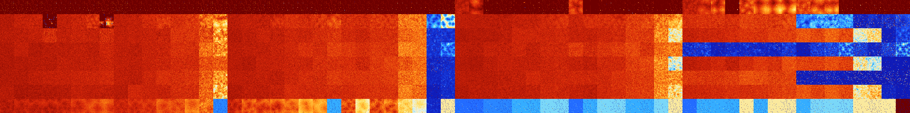

# B01267 (101888-102399)

<details>
    <summary>Initial Grid</summary>
    
</details>


<details>
    <summary>Initial Grid RLE</summary>

```
#C Exported from GoGoL (https://github.com/marrow16/gogol)
#C Wrap mode: Toroidal
#C Boundary mode: Dead
#C Step: 0
x = 100, y = 100, rule = B01267/S
8bo66bo16bo$41bo14bo$o39bo23bo4bo11bo13bo$66bo$14bo16b2o3bo8bo2bo28bo$
8bo7bo6bo4bobo20b2o4bo25bo13bo$12bo10bo2bo4bo65bo$14bobo40bo17bobobo$
96bo$bo82bobo$bo5bo49bo11bo7bo$7bo41bo10bo2bo19bo$49bo43bo$25bo5bo4bo
26bo3bo24bo$7bo19bo66bo$2bo32bo2bo19bo30bo$19bo45bo6bo11bo2bo3bo$53bo
30bo6bo7bo$21bo8bo8bo15bo3bo$13bo10bo13bo51bo$22bo9bo4bo41bo2bobo5bo6bo
$30b2o40bo2bo6bo$3bo22b2o67b2o$6bo6bo19bo42bo20bo$14bo9bo47bo10bo$21bo
34bo26bo6bo$54bo5bo11bo24bo$2bo16bo2bo21bo21bo13bobo$6bo13bo$14bo32bo6b
o2bo8bobo22bo$8bo2bo58bo14bo$2bo11bo16bo16bo4bo$28bo40bo$o10bo31bobo36b
o10bo$13b2o9bo13bo6bo12bo12bo4bobo$52bobo6bo16bo4bo$12bo5bo8bo21bo31bo
9bo$o9bo12bo8bo16bobo7b2obo$13bo10bo27bo2b2o32bo$13b2o30bo45b2o$30bo30b
o2bo14bo$42bo8bo23bo$32bo$7bo7bo17bo8bo21bo4bo19bo$6bo11bo22bo19bo6bo$
14bo37bo$10bo6bo12bo34bo$9b2o47bo33bo$18bo32bo33bo$27bo6bo16b2o2bo5bo2b
o14bo9bo$43bo33bo21bo$24bo11bo12b2o8bo21bo$5b2o32bo5bo4bo3bo10bo3bo19bo
b3o5bo$10bo5bo17bo59bobobo$25bo11bo12bo3bo10bo$18b2o37bo4bo3bo$41bo18b
2o16bo18bobo$2bo4bo70bo$24bo15bo12bo$19bo12bo12bo13bo26bo4bo$15b2o51bo$
30bo29bo25bo$10bo5bo18bo17bo6b2o12bobo$13bo33bo2bo8bo39bo$13bo9bo47bo
19bo$16bo9bo$5bo19bo15bo18bo4bo$33bo24bo27bo9bo$15bo7bo11bo17bo4bo5b2o
22bo$2bo16bo15bo34bo13bobo$6bo16bo62bo4bo$bo34bo30bo16bo$9bo12b2o12b2o
3bo$11bo7bo3bobo15bo6bo12bo14bo3bo$6bo17bo3bo6bo34bo$12bo3bo73bo$6bo33b
o44bo$bo6bo46bo20bo5bobo6bo$2bo24bo4bo17bo41b2o$11bo19bo8bo12bo16bo$17b
o24bo13bo2bo5bo6bo$37bo7bo5bo45b2o$6bo$10bo25bo31bo12bo$6bo25bo25bo4bo$
14bo49bobo14bo$10bo17bo38bo5bo12bo$10bo38bo$21bo6bo37bo$19bo3bo5bo7b2o
5bo15bo6bo$21bo20bo47bo4bo$14bo24bo9bo27bo5bo5bo$o6bo40bobo19bo$17bo13b
obobo29bo4b2o3bo13bo5bobo$3bo11bo14bobo20bo30bo$17bo13bo34bo4bo5bobo14b
o$67bo2bo4bo22bo$23bo10bo9bo6bo13bo8bo$20bo9bo15bo9bo11bo$bo4bo34bo46b
2o6b2o!
```
</details>
<details>
    <summary>Thumbnail</summary>

</details>
<table>
<tr>
    <td><a href="./101888%20S%20Heat%20Map%20Activity.png"></a><br>S (101888)<br>R@6,p2</td>    <td><a href="./101889%20S0%20Heat%20Map%20Activity.png"></a><br>S0 (101889)<br>R@7,p2</td>    <td><a href="./101890%20S1%20Heat%20Map%20Activity.png"></a><br>S1 (101890)<br>R@8,p2</td>    <td><a href="./101891%20S01%20Heat%20Map%20Activity.png"></a><br>S01 (101891)<br>R@10,p4</td>    <td><a href="./101892%20S2%20Heat%20Map%20Activity.png"></a><br>S2 (101892)<br>R@12,p4</td>    <td><a href="./101893%20S02%20Heat%20Map%20Activity.png"></a><br>S02 (101893)<br>R@12,p4</td>    <td><a href="./101894%20S12%20Heat%20Map%20Activity.png"></a><br>S12 (101894)<br>R@8,p2</td>    <td><a href="./101895%20S012%20Heat%20Map%20Activity.png"></a><br>S012 (101895)<br>R@8,p2</td>    <td><a href="./101896%20S3%20Heat%20Map%20Activity.png"></a><br>S3 (101896)<br>R@6,p2</td>    <td><a href="./101897%20S03%20Heat%20Map%20Activity.png"></a><br>S03 (101897)<br>R@10,p2</td>    <td><a href="./101898%20S13%20Heat%20Map%20Activity.png"></a><br>S13 (101898)<br>R@12,p4</td>    <td><a href="./101899%20S013%20Heat%20Map%20Activity.png"></a><br>S013 (101899)<br>R@9,p4</td>    <td><a href="./101900%20S23%20Heat%20Map%20Activity.png"></a><br>S23 (101900)<br>R@12,p4</td>    <td><a href="./101901%20S023%20Heat%20Map%20Activity.png"></a><br>S023 (101901)<br>R@11,p4</td>    <td><a href="./101902%20S123%20Heat%20Map%20Activity.png"></a><br>S123 (101902)<br>R@7,p2</td>    <td><a href="./101903%20S0123%20Heat%20Map%20Activity.png"></a><br>S0123 (101903)<br>R@8,p2</td>    <td><a href="./101904%20S4%20Heat%20Map%20Activity.png"></a><br>S4 (101904)<br>R@10,p2</td>    <td><a href="./101905%20S04%20Heat%20Map%20Activity.png"></a><br>S04 (101905)<br>R@7,p2</td>    <td><a href="./101906%20S14%20Heat%20Map%20Activity.png"></a><br>S14 (101906)<br>R@8,p2</td>    <td><a href="./101907%20S014%20Heat%20Map%20Activity.png"></a><br>S014 (101907)<br>R@10,p4</td>    <td><a href="./101908%20S24%20Heat%20Map%20Activity.png"></a><br>S24 (101908)<br>R@12,p4</td>    <td><a href="./101909%20S024%20Heat%20Map%20Activity.png"></a><br>S024 (101909)<br>R@12,p4</td>    <td><a href="./101910%20S124%20Heat%20Map%20Activity.png"></a><br>S124 (101910)<br>R@12,p2</td>    <td><a href="./101911%20S0124%20Heat%20Map%20Activity.png"></a><br>S0124 (101911)<br>R@8,p2</td>    <td><a href="./101912%20S34%20Heat%20Map%20Activity.png"></a><br>S34 (101912)<br>R@12,p2</td>    <td><a href="./101913%20S034%20Heat%20Map%20Activity.png"></a><br>S034 (101913)<br>R@12,p2</td>    <td><a href="./101914%20S134%20Heat%20Map%20Activity.png"></a><br>S134 (101914)<br>R@14,p4</td>    <td><a href="./101915%20S0134%20Heat%20Map%20Activity.png"></a><br>S0134 (101915)<br>R@15,p4</td>    <td><a href="./101916%20S234%20Heat%20Map%20Activity.png"></a><br>S234 (101916)<br>R@16,p4</td>    <td><a href="./101917%20S0234%20Heat%20Map%20Activity.png"></a><br>S0234 (101917)<br>R@15,p4</td>    <td><a href="./101918%20S1234%20Heat%20Map%20Activity.png"></a><br>S1234 (101918)<br>R@12,p2</td>    <td><a href="./101919%20S01234%20Heat%20Map%20Activity.png"></a><br>S01234 (101919)<br>R@9,p2</td>    <td><a href="./101920%20S5%20Heat%20Map%20Activity.png"></a><br>S5 (101920)<br>G>1000</td>    <td><a href="./101921%20S05%20Heat%20Map%20Activity.png"></a><br>S05 (101921)<br>G>1000</td>    <td><a href="./101922%20S15%20Heat%20Map%20Activity.png"></a><br>S15 (101922)<br>R@18,p2</td>    <td><a href="./101923%20S015%20Heat%20Map%20Activity.png"></a><br>S015 (101923)<br>R@12,p2</td>    <td><a href="./101924%20S25%20Heat%20Map%20Activity.png"></a><br>S25 (101924)<br>R@46,p4</td>    <td><a href="./101925%20S025%20Heat%20Map%20Activity.png"></a><br>S025 (101925)<br>R@18,p2</td>    <td><a href="./101926%20S125%20Heat%20Map%20Activity.png"></a><br>S125 (101926)<br>R@16,p4</td>    <td><a href="./101927%20S0125%20Heat%20Map%20Activity.png"></a><br>S0125 (101927)<br>R@10,p2</td>    <td><a href="./101928%20S35%20Heat%20Map%20Activity.png"></a><br>S35 (101928)<br>G>1000</td>    <td><a href="./101929%20S035%20Heat%20Map%20Activity.png"></a><br>S035 (101929)<br>R@294,p2</td>    <td><a href="./101930%20S135%20Heat%20Map%20Activity.png"></a><br>S135 (101930)<br>R@22,p4</td>    <td><a href="./101931%20S0135%20Heat%20Map%20Activity.png"></a><br>S0135 (101931)<br>R@25,p4</td>    <td><a href="./101932%20S235%20Heat%20Map%20Activity.png"></a><br>S235 (101932)<br>R@36,p6</td>    <td><a href="./101933%20S0235%20Heat%20Map%20Activity.png"></a><br>S0235 (101933)<br>R@13,p2</td>    <td><a href="./101934%20S1235%20Heat%20Map%20Activity.png"></a><br>S1235 (101934)<br>R@48,p2</td>    <td><a href="./101935%20S01235%20Heat%20Map%20Activity.png"></a><br>S01235 (101935)<br>R@10,p2</td>    <td><a href="./101936%20S45%20Heat%20Map%20Activity.png"></a><br>S45 (101936)<br>G>1000</td>    <td><a href="./101937%20S045%20Heat%20Map%20Activity.png"></a><br>S045 (101937)<br>G>1000</td>    <td><a href="./101938%20S145%20Heat%20Map%20Activity.png"></a><br>S145 (101938)<br>G>1000</td>    <td><a href="./101939%20S0145%20Heat%20Map%20Activity.png"></a><br>S0145 (101939)<br>R@21,p4</td>    <td><a href="./101940%20S245%20Heat%20Map%20Activity.png"></a><br>S245 (101940)<br>G>1000</td>    <td><a href="./101941%20S0245%20Heat%20Map%20Activity.png"></a><br>S0245 (101941)<br>G>1000</td>    <td><a href="./101942%20S1245%20Heat%20Map%20Activity.png"></a><br>S1245 (101942)<br>G>1000</td>    <td><a href="./101943%20S01245%20Heat%20Map%20Activity.png"></a><br>S01245 (101943)<br>G>1000</td>    <td><a href="./101944%20S345%20Heat%20Map%20Activity.png"></a><br>S345 (101944)<br>G>1000</td>    <td><a href="./101945%20S0345%20Heat%20Map%20Activity.png"></a><br>S0345 (101945)<br>G>1000</td>    <td><a href="./101946%20S1345%20Heat%20Map%20Activity.png"></a><br>S1345 (101946)<br>G>1000</td>    <td><a href="./101947%20S01345%20Heat%20Map%20Activity.png"></a><br>S01345 (101947)<br>R@13,p4</td>    <td><a href="./101948%20S2345%20Heat%20Map%20Activity.png"></a><br>S2345 (101948)<br>R@28,p2</td>    <td><a href="./101949%20S02345%20Heat%20Map%20Activity.png"></a><br>S02345 (101949)<br>R@11,p2</td>    <td><a href="./101950%20S12345%20Heat%20Map%20Activity.png"></a><br>S12345 (101950)<br>R@13,p2</td>    <td><a href="./101951%20S012345%20Heat%20Map%20Activity.png"></a><br>S012345 (101951)<br>R@13,p2</td></tr>
<tr>
    <td><a href="./101952%20S6%20Heat%20Map%20Activity.png"></a><br>S6 (101952)<br>G>1000</td>    <td><a href="./101953%20S06%20Heat%20Map%20Activity.png"></a><br>S06 (101953)<br>G>1000</td>    <td><a href="./101954%20S16%20Heat%20Map%20Activity.png"></a><br>S16 (101954)<br>G>1000</td>    <td><a href="./101955%20S016%20Heat%20Map%20Activity.png"></a><br>S016 (101955)<br>R@61,p12</td>    <td><a href="./101956%20S26%20Heat%20Map%20Activity.png"></a><br>S26 (101956)<br>G>1000</td>    <td><a href="./101957%20S026%20Heat%20Map%20Activity.png"></a><br>S026 (101957)<br>G>1000</td>    <td><a href="./101958%20S126%20Heat%20Map%20Activity.png"></a><br>S126 (101958)<br>G>1000</td>    <td><a href="./101959%20S0126%20Heat%20Map%20Activity.png"></a><br>S0126 (101959)<br>G>1000</td>    <td><a href="./101960%20S36%20Heat%20Map%20Activity.png"></a><br>S36 (101960)<br>G>1000</td>    <td><a href="./101961%20S036%20Heat%20Map%20Activity.png"></a><br>S036 (101961)<br>G>1000</td>    <td><a href="./101962%20S136%20Heat%20Map%20Activity.png"></a><br>S136 (101962)<br>G>1000</td>    <td><a href="./101963%20S0136%20Heat%20Map%20Activity.png"></a><br>S0136 (101963)<br>G>1000</td>    <td><a href="./101964%20S236%20Heat%20Map%20Activity.png"></a><br>S236 (101964)<br>G>1000</td>    <td><a href="./101965%20S0236%20Heat%20Map%20Activity.png"></a><br>S0236 (101965)<br>G>1000</td>    <td><a href="./101966%20S1236%20Heat%20Map%20Activity.png"></a><br>S1236 (101966)<br>G>1000</td>    <td><a href="./101967%20S01236%20Heat%20Map%20Activity.png"></a><br>S01236 (101967)<br>G>1000</td>    <td><a href="./101968%20S46%20Heat%20Map%20Activity.png"></a><br>S46 (101968)<br>G>1000</td>    <td><a href="./101969%20S046%20Heat%20Map%20Activity.png"></a><br>S046 (101969)<br>G>1000</td>    <td><a href="./101970%20S146%20Heat%20Map%20Activity.png"></a><br>S146 (101970)<br>G>1000</td>    <td><a href="./101971%20S0146%20Heat%20Map%20Activity.png"></a><br>S0146 (101971)<br>G>1000</td>    <td><a href="./101972%20S246%20Heat%20Map%20Activity.png"></a><br>S246 (101972)<br>G>1000</td>    <td><a href="./101973%20S0246%20Heat%20Map%20Activity.png"></a><br>S0246 (101973)<br>G>1000</td>    <td><a href="./101974%20S1246%20Heat%20Map%20Activity.png"></a><br>S1246 (101974)<br>G>1000</td>    <td><a href="./101975%20S01246%20Heat%20Map%20Activity.png"></a><br>S01246 (101975)<br>G>1000</td>    <td><a href="./101976%20S346%20Heat%20Map%20Activity.png"></a><br>S346 (101976)<br>G>1000</td>    <td><a href="./101977%20S0346%20Heat%20Map%20Activity.png"></a><br>S0346 (101977)<br>G>1000</td>    <td><a href="./101978%20S1346%20Heat%20Map%20Activity.png"></a><br>S1346 (101978)<br>G>1000</td>    <td><a href="./101979%20S01346%20Heat%20Map%20Activity.png"></a><br>S01346 (101979)<br>G>1000</td>    <td><a href="./101980%20S2346%20Heat%20Map%20Activity.png"></a><br>S2346 (101980)<br>G>1000</td>    <td><a href="./101981%20S02346%20Heat%20Map%20Activity.png"></a><br>S02346 (101981)<br>G>1000</td>    <td><a href="./101982%20S12346%20Heat%20Map%20Activity.png"></a><br>S12346 (101982)<br>R@262,p84</td>    <td><a href="./101983%20S012346%20Heat%20Map%20Activity.png"></a><br>S012346 (101983)<br>R@159,p12</td>    <td><a href="./101984%20S56%20Heat%20Map%20Activity.png"></a><br>S56 (101984)<br>G>1000</td>    <td><a href="./101985%20S056%20Heat%20Map%20Activity.png"></a><br>S056 (101985)<br>G>1000</td>    <td><a href="./101986%20S156%20Heat%20Map%20Activity.png"></a><br>S156 (101986)<br>G>1000</td>    <td><a href="./101987%20S0156%20Heat%20Map%20Activity.png"></a><br>S0156 (101987)<br>G>1000</td>    <td><a href="./101988%20S256%20Heat%20Map%20Activity.png"></a><br>S256 (101988)<br>G>1000</td>    <td><a href="./101989%20S0256%20Heat%20Map%20Activity.png"></a><br>S0256 (101989)<br>G>1000</td>    <td><a href="./101990%20S1256%20Heat%20Map%20Activity.png"></a><br>S1256 (101990)<br>G>1000</td>    <td><a href="./101991%20S01256%20Heat%20Map%20Activity.png"></a><br>S01256 (101991)<br>G>1000</td>    <td><a href="./101992%20S356%20Heat%20Map%20Activity.png"></a><br>S356 (101992)<br>G>1000</td>    <td><a href="./101993%20S0356%20Heat%20Map%20Activity.png"></a><br>S0356 (101993)<br>G>1000</td>    <td><a href="./101994%20S1356%20Heat%20Map%20Activity.png"></a><br>S1356 (101994)<br>G>1000</td>    <td><a href="./101995%20S01356%20Heat%20Map%20Activity.png"></a><br>S01356 (101995)<br>G>1000</td>    <td><a href="./101996%20S2356%20Heat%20Map%20Activity.png"></a><br>S2356 (101996)<br>G>1000</td>    <td><a href="./101997%20S02356%20Heat%20Map%20Activity.png"></a><br>S02356 (101997)<br>G>1000</td>    <td><a href="./101998%20S12356%20Heat%20Map%20Activity.png"></a><br>S12356 (101998)<br>G>1000</td>    <td><a href="./101999%20S012356%20Heat%20Map%20Activity.png"></a><br>S012356 (101999)<br>G>1000</td>    <td><a href="./102000%20S456%20Heat%20Map%20Activity.png"></a><br>S456 (102000)<br>G>1000</td>    <td><a href="./102001%20S0456%20Heat%20Map%20Activity.png"></a><br>S0456 (102001)<br>G>1000</td>    <td><a href="./102002%20S1456%20Heat%20Map%20Activity.png"></a><br>S1456 (102002)<br>G>1000</td>    <td><a href="./102003%20S01456%20Heat%20Map%20Activity.png"></a><br>S01456 (102003)<br>G>1000</td>    <td><a href="./102004%20S2456%20Heat%20Map%20Activity.png"></a><br>S2456 (102004)<br>G>1000</td>    <td><a href="./102005%20S02456%20Heat%20Map%20Activity.png"></a><br>S02456 (102005)<br>G>1000</td>    <td><a href="./102006%20S12456%20Heat%20Map%20Activity.png"></a><br>S12456 (102006)<br>G>1000</td>    <td><a href="./102007%20S012456%20Heat%20Map%20Activity.png"></a><br>S012456 (102007)<br>G>1000</td>    <td><a href="./102008%20S3456%20Heat%20Map%20Activity.png"></a><br>S3456 (102008)<br>G>1000</td>    <td><a href="./102009%20S03456%20Heat%20Map%20Activity.png"></a><br>S03456 (102009)<br>G>1000</td>    <td><a href="./102010%20S13456%20Heat%20Map%20Activity.png"></a><br>S13456 (102010)<br>G>1000</td>    <td><a href="./102011%20S013456%20Heat%20Map%20Activity.png"></a><br>S013456 (102011)<br>G>1000</td>    <td><a href="./102012%20S23456%20Heat%20Map%20Activity.png"></a><br>S23456 (102012)<br>G>1000</td>    <td><a href="./102013%20S023456%20Heat%20Map%20Activity.png"></a><br>S023456 (102013)<br>G>1000</td>    <td><a href="./102014%20S123456%20Heat%20Map%20Activity.png"></a><br>S123456 (102014)<br>G>1000</td>    <td><a href="./102015%20S0123456%20Heat%20Map%20Activity.png"></a><br>S0123456 (102015)<br>G>1000</td></tr>
<tr>
    <td><a href="./102016%20S7%20Heat%20Map%20Activity.png"></a><br>S7 (102016)<br>G>1000</td>    <td><a href="./102017%20S07%20Heat%20Map%20Activity.png"></a><br>S07 (102017)<br>G>1000</td>    <td><a href="./102018%20S17%20Heat%20Map%20Activity.png"></a><br>S17 (102018)<br>G>1000</td>    <td><a href="./102019%20S017%20Heat%20Map%20Activity.png"></a><br>S017 (102019)<br>G>1000</td>    <td><a href="./102020%20S27%20Heat%20Map%20Activity.png"></a><br>S27 (102020)<br>G>1000</td>    <td><a href="./102021%20S027%20Heat%20Map%20Activity.png"></a><br>S027 (102021)<br>G>1000</td>    <td><a href="./102022%20S127%20Heat%20Map%20Activity.png"></a><br>S127 (102022)<br>G>1000</td>    <td><a href="./102023%20S0127%20Heat%20Map%20Activity.png"></a><br>S0127 (102023)<br>G>1000</td>    <td><a href="./102024%20S37%20Heat%20Map%20Activity.png"></a><br>S37 (102024)<br>G>1000</td>    <td><a href="./102025%20S037%20Heat%20Map%20Activity.png"></a><br>S037 (102025)<br>G>1000</td>    <td><a href="./102026%20S137%20Heat%20Map%20Activity.png"></a><br>S137 (102026)<br>G>1000</td>    <td><a href="./102027%20S0137%20Heat%20Map%20Activity.png"></a><br>S0137 (102027)<br>G>1000</td>    <td><a href="./102028%20S237%20Heat%20Map%20Activity.png"></a><br>S237 (102028)<br>G>1000</td>    <td><a href="./102029%20S0237%20Heat%20Map%20Activity.png"></a><br>S0237 (102029)<br>G>1000</td>    <td><a href="./102030%20S1237%20Heat%20Map%20Activity.png"></a><br>S1237 (102030)<br>G>1000</td>    <td><a href="./102031%20S01237%20Heat%20Map%20Activity.png"></a><br>S01237 (102031)<br>G>1000</td>    <td><a href="./102032%20S47%20Heat%20Map%20Activity.png"></a><br>S47 (102032)<br>G>1000</td>    <td><a href="./102033%20S047%20Heat%20Map%20Activity.png"></a><br>S047 (102033)<br>G>1000</td>    <td><a href="./102034%20S147%20Heat%20Map%20Activity.png"></a><br>S147 (102034)<br>G>1000</td>    <td><a href="./102035%20S0147%20Heat%20Map%20Activity.png"></a><br>S0147 (102035)<br>G>1000</td>    <td><a href="./102036%20S247%20Heat%20Map%20Activity.png"></a><br>S247 (102036)<br>G>1000</td>    <td><a href="./102037%20S0247%20Heat%20Map%20Activity.png"></a><br>S0247 (102037)<br>G>1000</td>    <td><a href="./102038%20S1247%20Heat%20Map%20Activity.png"></a><br>S1247 (102038)<br>G>1000</td>    <td><a href="./102039%20S01247%20Heat%20Map%20Activity.png"></a><br>S01247 (102039)<br>G>1000</td>    <td><a href="./102040%20S347%20Heat%20Map%20Activity.png"></a><br>S347 (102040)<br>G>1000</td>    <td><a href="./102041%20S0347%20Heat%20Map%20Activity.png"></a><br>S0347 (102041)<br>G>1000</td>    <td><a href="./102042%20S1347%20Heat%20Map%20Activity.png"></a><br>S1347 (102042)<br>G>1000</td>    <td><a href="./102043%20S01347%20Heat%20Map%20Activity.png"></a><br>S01347 (102043)<br>G>1000</td>    <td><a href="./102044%20S2347%20Heat%20Map%20Activity.png"></a><br>S2347 (102044)<br>G>1000</td>    <td><a href="./102045%20S02347%20Heat%20Map%20Activity.png"></a><br>S02347 (102045)<br>G>1000</td>    <td><a href="./102046%20S12347%20Heat%20Map%20Activity.png"></a><br>S12347 (102046)<br>R@141,p24</td>    <td><a href="./102047%20S012347%20Heat%20Map%20Activity.png"></a><br>S012347 (102047)<br>R@240,p84</td>    <td><a href="./102048%20S57%20Heat%20Map%20Activity.png"></a><br>S57 (102048)<br>G>1000</td>    <td><a href="./102049%20S057%20Heat%20Map%20Activity.png"></a><br>S057 (102049)<br>G>1000</td>    <td><a href="./102050%20S157%20Heat%20Map%20Activity.png"></a><br>S157 (102050)<br>G>1000</td>    <td><a href="./102051%20S0157%20Heat%20Map%20Activity.png"></a><br>S0157 (102051)<br>G>1000</td>    <td><a href="./102052%20S257%20Heat%20Map%20Activity.png"></a><br>S257 (102052)<br>G>1000</td>    <td><a href="./102053%20S0257%20Heat%20Map%20Activity.png"></a><br>S0257 (102053)<br>G>1000</td>    <td><a href="./102054%20S1257%20Heat%20Map%20Activity.png"></a><br>S1257 (102054)<br>G>1000</td>    <td><a href="./102055%20S01257%20Heat%20Map%20Activity.png"></a><br>S01257 (102055)<br>G>1000</td>    <td><a href="./102056%20S357%20Heat%20Map%20Activity.png"></a><br>S357 (102056)<br>G>1000</td>    <td><a href="./102057%20S0357%20Heat%20Map%20Activity.png"></a><br>S0357 (102057)<br>G>1000</td>    <td><a href="./102058%20S1357%20Heat%20Map%20Activity.png"></a><br>S1357 (102058)<br>G>1000</td>    <td><a href="./102059%20S01357%20Heat%20Map%20Activity.png"></a><br>S01357 (102059)<br>G>1000</td>    <td><a href="./102060%20S2357%20Heat%20Map%20Activity.png"></a><br>S2357 (102060)<br>G>1000</td>    <td><a href="./102061%20S02357%20Heat%20Map%20Activity.png"></a><br>S02357 (102061)<br>G>1000</td>    <td><a href="./102062%20S12357%20Heat%20Map%20Activity.png"></a><br>S12357 (102062)<br>G>1000</td>    <td><a href="./102063%20S012357%20Heat%20Map%20Activity.png"></a><br>S012357 (102063)<br>G>1000</td>    <td><a href="./102064%20S457%20Heat%20Map%20Activity.png"></a><br>S457 (102064)<br>G>1000</td>    <td><a href="./102065%20S0457%20Heat%20Map%20Activity.png"></a><br>S0457 (102065)<br>G>1000</td>    <td><a href="./102066%20S1457%20Heat%20Map%20Activity.png"></a><br>S1457 (102066)<br>G>1000</td>    <td><a href="./102067%20S01457%20Heat%20Map%20Activity.png"></a><br>S01457 (102067)<br>G>1000</td>    <td><a href="./102068%20S2457%20Heat%20Map%20Activity.png"></a><br>S2457 (102068)<br>G>1000</td>    <td><a href="./102069%20S02457%20Heat%20Map%20Activity.png"></a><br>S02457 (102069)<br>G>1000</td>    <td><a href="./102070%20S12457%20Heat%20Map%20Activity.png"></a><br>S12457 (102070)<br>G>1000</td>    <td><a href="./102071%20S012457%20Heat%20Map%20Activity.png"></a><br>S012457 (102071)<br>G>1000</td>    <td><a href="./102072%20S3457%20Heat%20Map%20Activity.png"></a><br>S3457 (102072)<br>G>1000</td>    <td><a href="./102073%20S03457%20Heat%20Map%20Activity.png"></a><br>S03457 (102073)<br>G>1000</td>    <td><a href="./102074%20S13457%20Heat%20Map%20Activity.png"></a><br>S13457 (102074)<br>G>1000</td>    <td><a href="./102075%20S013457%20Heat%20Map%20Activity.png"></a><br>S013457 (102075)<br>G>1000</td>    <td><a href="./102076%20S23457%20Heat%20Map%20Activity.png"></a><br>S23457 (102076)<br>G>1000</td>    <td><a href="./102077%20S023457%20Heat%20Map%20Activity.png"></a><br>S023457 (102077)<br>G>1000</td>    <td><a href="./102078%20S123457%20Heat%20Map%20Activity.png"></a><br>S123457 (102078)<br>R@461,p360</td>    <td><a href="./102079%20S0123457%20Heat%20Map%20Activity.png"></a><br>S0123457 (102079)<br>R@148,p60</td></tr>
<tr>
    <td><a href="./102080%20S67%20Heat%20Map%20Activity.png"></a><br>S67 (102080)<br>G>1000</td>    <td><a href="./102081%20S067%20Heat%20Map%20Activity.png"></a><br>S067 (102081)<br>G>1000</td>    <td><a href="./102082%20S167%20Heat%20Map%20Activity.png"></a><br>S167 (102082)<br>G>1000</td>    <td><a href="./102083%20S0167%20Heat%20Map%20Activity.png"></a><br>S0167 (102083)<br>G>1000</td>    <td><a href="./102084%20S267%20Heat%20Map%20Activity.png"></a><br>S267 (102084)<br>G>1000</td>    <td><a href="./102085%20S0267%20Heat%20Map%20Activity.png"></a><br>S0267 (102085)<br>G>1000</td>    <td><a href="./102086%20S1267%20Heat%20Map%20Activity.png"></a><br>S1267 (102086)<br>G>1000</td>    <td><a href="./102087%20S01267%20Heat%20Map%20Activity.png"></a><br>S01267 (102087)<br>G>1000</td>    <td><a href="./102088%20S367%20Heat%20Map%20Activity.png"></a><br>S367 (102088)<br>G>1000</td>    <td><a href="./102089%20S0367%20Heat%20Map%20Activity.png"></a><br>S0367 (102089)<br>G>1000</td>    <td><a href="./102090%20S1367%20Heat%20Map%20Activity.png"></a><br>S1367 (102090)<br>G>1000</td>    <td><a href="./102091%20S01367%20Heat%20Map%20Activity.png"></a><br>S01367 (102091)<br>G>1000</td>    <td><a href="./102092%20S2367%20Heat%20Map%20Activity.png"></a><br>S2367 (102092)<br>G>1000</td>    <td><a href="./102093%20S02367%20Heat%20Map%20Activity.png"></a><br>S02367 (102093)<br>G>1000</td>    <td><a href="./102094%20S12367%20Heat%20Map%20Activity.png"></a><br>S12367 (102094)<br>G>1000</td>    <td><a href="./102095%20S012367%20Heat%20Map%20Activity.png"></a><br>S012367 (102095)<br>G>1000</td>    <td><a href="./102096%20S467%20Heat%20Map%20Activity.png"></a><br>S467 (102096)<br>G>1000</td>    <td><a href="./102097%20S0467%20Heat%20Map%20Activity.png"></a><br>S0467 (102097)<br>G>1000</td>    <td><a href="./102098%20S1467%20Heat%20Map%20Activity.png"></a><br>S1467 (102098)<br>G>1000</td>    <td><a href="./102099%20S01467%20Heat%20Map%20Activity.png"></a><br>S01467 (102099)<br>G>1000</td>    <td><a href="./102100%20S2467%20Heat%20Map%20Activity.png"></a><br>S2467 (102100)<br>G>1000</td>    <td><a href="./102101%20S02467%20Heat%20Map%20Activity.png"></a><br>S02467 (102101)<br>G>1000</td>    <td><a href="./102102%20S12467%20Heat%20Map%20Activity.png"></a><br>S12467 (102102)<br>G>1000</td>    <td><a href="./102103%20S012467%20Heat%20Map%20Activity.png"></a><br>S012467 (102103)<br>G>1000</td>    <td><a href="./102104%20S3467%20Heat%20Map%20Activity.png"></a><br>S3467 (102104)<br>G>1000</td>    <td><a href="./102105%20S03467%20Heat%20Map%20Activity.png"></a><br>S03467 (102105)<br>G>1000</td>    <td><a href="./102106%20S13467%20Heat%20Map%20Activity.png"></a><br>S13467 (102106)<br>G>1000</td>    <td><a href="./102107%20S013467%20Heat%20Map%20Activity.png"></a><br>S013467 (102107)<br>G>1000</td>    <td><a href="./102108%20S23467%20Heat%20Map%20Activity.png"></a><br>S23467 (102108)<br>G>1000</td>    <td><a href="./102109%20S023467%20Heat%20Map%20Activity.png"></a><br>S023467 (102109)<br>G>1000</td>    <td><a href="./102110%20S123467%20Heat%20Map%20Activity.png"></a><br>S123467 (102110)<br>R@131,p8</td>    <td><a href="./102111%20S0123467%20Heat%20Map%20Activity.png"></a><br>S0123467 (102111)<br>R@79,p4</td>    <td><a href="./102112%20S567%20Heat%20Map%20Activity.png"></a><br>S567 (102112)<br>G>1000</td>    <td><a href="./102113%20S0567%20Heat%20Map%20Activity.png"></a><br>S0567 (102113)<br>G>1000</td>    <td><a href="./102114%20S1567%20Heat%20Map%20Activity.png"></a><br>S1567 (102114)<br>G>1000</td>    <td><a href="./102115%20S01567%20Heat%20Map%20Activity.png"></a><br>S01567 (102115)<br>G>1000</td>    <td><a href="./102116%20S2567%20Heat%20Map%20Activity.png"></a><br>S2567 (102116)<br>G>1000</td>    <td><a href="./102117%20S02567%20Heat%20Map%20Activity.png"></a><br>S02567 (102117)<br>G>1000</td>    <td><a href="./102118%20S12567%20Heat%20Map%20Activity.png"></a><br>S12567 (102118)<br>G>1000</td>    <td><a href="./102119%20S012567%20Heat%20Map%20Activity.png"></a><br>S012567 (102119)<br>G>1000</td>    <td><a href="./102120%20S3567%20Heat%20Map%20Activity.png"></a><br>S3567 (102120)<br>G>1000</td>    <td><a href="./102121%20S03567%20Heat%20Map%20Activity.png"></a><br>S03567 (102121)<br>G>1000</td>    <td><a href="./102122%20S13567%20Heat%20Map%20Activity.png"></a><br>S13567 (102122)<br>G>1000</td>    <td><a href="./102123%20S013567%20Heat%20Map%20Activity.png"></a><br>S013567 (102123)<br>G>1000</td>    <td><a href="./102124%20S23567%20Heat%20Map%20Activity.png"></a><br>S23567 (102124)<br>G>1000</td>    <td><a href="./102125%20S023567%20Heat%20Map%20Activity.png"></a><br>S023567 (102125)<br>G>1000</td>    <td><a href="./102126%20S123567%20Heat%20Map%20Activity.png"></a><br>S123567 (102126)<br>G>1000</td>    <td><a href="./102127%20S0123567%20Heat%20Map%20Activity.png"></a><br>S0123567 (102127)<br>G>1000</td>    <td><a href="./102128%20S4567%20Heat%20Map%20Activity.png"></a><br>S4567 (102128)<br>R@342,p60</td>    <td><a href="./102129%20S04567%20Heat%20Map%20Activity.png"></a><br>S04567 (102129)<br>R@295,p18</td>    <td><a href="./102130%20S14567%20Heat%20Map%20Activity.png"></a><br>S14567 (102130)<br>G>1000</td>    <td><a href="./102131%20S014567%20Heat%20Map%20Activity.png"></a><br>S014567 (102131)<br>R@627,p180</td>    <td><a href="./102132%20S24567%20Heat%20Map%20Activity.png"></a><br>S24567 (102132)<br>R@406,p72</td>    <td><a href="./102133%20S024567%20Heat%20Map%20Activity.png"></a><br>S024567 (102133)<br>R@585,p72</td>    <td><a href="./102134%20S124567%20Heat%20Map%20Activity.png"></a><br>S124567 (102134)<br>R@508,p24</td>    <td><a href="./102135%20S0124567%20Heat%20Map%20Activity.png"></a><br>S0124567 (102135)<br>R@305,p36</td>    <td><a href="./102136%20S34567%20Heat%20Map%20Activity.png"></a><br>S34567 (102136)<br>R@459,p420</td>    <td><a href="./102137%20S034567%20Heat%20Map%20Activity.png"></a><br>S034567 (102137)<br>R@95,p60</td>    <td><a href="./102138%20S134567%20Heat%20Map%20Activity.png"></a><br>S134567 (102138)<br>R@47,p12</td>    <td><a href="./102139%20S0134567%20Heat%20Map%20Activity.png"></a><br>S0134567 (102139)<br>R@55,p12</td>    <td><a href="./102140%20S234567%20Heat%20Map%20Activity.png"></a><br>S234567 (102140)<br>R@39,p12</td>    <td><a href="./102141%20S0234567%20Heat%20Map%20Activity.png"></a><br>S0234567 (102141)<br>R@211,p180</td>    <td><a href="./102142%20S1234567%20Heat%20Map%20Activity.png"></a><br>S1234567 (102142)<br>R@42,p12</td>    <td><a href="./102143%20S01234567%20Heat%20Map%20Activity.png"></a><br>S01234567 (102143)<br>R@54,p12</td></tr>
<tr>
    <td><a href="./102144%20S8%20Heat%20Map%20Activity.png"></a><br>S8 (102144)<br>G>1000</td>    <td><a href="./102145%20S08%20Heat%20Map%20Activity.png"></a><br>S08 (102145)<br>G>1000</td>    <td><a href="./102146%20S18%20Heat%20Map%20Activity.png"></a><br>S18 (102146)<br>G>1000</td>    <td><a href="./102147%20S018%20Heat%20Map%20Activity.png"></a><br>S018 (102147)<br>G>1000</td>    <td><a href="./102148%20S28%20Heat%20Map%20Activity.png"></a><br>S28 (102148)<br>G>1000</td>    <td><a href="./102149%20S028%20Heat%20Map%20Activity.png"></a><br>S028 (102149)<br>G>1000</td>    <td><a href="./102150%20S128%20Heat%20Map%20Activity.png"></a><br>S128 (102150)<br>G>1000</td>    <td><a href="./102151%20S0128%20Heat%20Map%20Activity.png"></a><br>S0128 (102151)<br>G>1000</td>    <td><a href="./102152%20S38%20Heat%20Map%20Activity.png"></a><br>S38 (102152)<br>G>1000</td>    <td><a href="./102153%20S038%20Heat%20Map%20Activity.png"></a><br>S038 (102153)<br>G>1000</td>    <td><a href="./102154%20S138%20Heat%20Map%20Activity.png"></a><br>S138 (102154)<br>G>1000</td>    <td><a href="./102155%20S0138%20Heat%20Map%20Activity.png"></a><br>S0138 (102155)<br>G>1000</td>    <td><a href="./102156%20S238%20Heat%20Map%20Activity.png"></a><br>S238 (102156)<br>G>1000</td>    <td><a href="./102157%20S0238%20Heat%20Map%20Activity.png"></a><br>S0238 (102157)<br>G>1000</td>    <td><a href="./102158%20S1238%20Heat%20Map%20Activity.png"></a><br>S1238 (102158)<br>G>1000</td>    <td><a href="./102159%20S01238%20Heat%20Map%20Activity.png"></a><br>S01238 (102159)<br>G>1000</td>    <td><a href="./102160%20S48%20Heat%20Map%20Activity.png"></a><br>S48 (102160)<br>G>1000</td>    <td><a href="./102161%20S048%20Heat%20Map%20Activity.png"></a><br>S048 (102161)<br>G>1000</td>    <td><a href="./102162%20S148%20Heat%20Map%20Activity.png"></a><br>S148 (102162)<br>G>1000</td>    <td><a href="./102163%20S0148%20Heat%20Map%20Activity.png"></a><br>S0148 (102163)<br>G>1000</td>    <td><a href="./102164%20S248%20Heat%20Map%20Activity.png"></a><br>S248 (102164)<br>G>1000</td>    <td><a href="./102165%20S0248%20Heat%20Map%20Activity.png"></a><br>S0248 (102165)<br>G>1000</td>    <td><a href="./102166%20S1248%20Heat%20Map%20Activity.png"></a><br>S1248 (102166)<br>G>1000</td>    <td><a href="./102167%20S01248%20Heat%20Map%20Activity.png"></a><br>S01248 (102167)<br>G>1000</td>    <td><a href="./102168%20S348%20Heat%20Map%20Activity.png"></a><br>S348 (102168)<br>G>1000</td>    <td><a href="./102169%20S0348%20Heat%20Map%20Activity.png"></a><br>S0348 (102169)<br>G>1000</td>    <td><a href="./102170%20S1348%20Heat%20Map%20Activity.png"></a><br>S1348 (102170)<br>G>1000</td>    <td><a href="./102171%20S01348%20Heat%20Map%20Activity.png"></a><br>S01348 (102171)<br>G>1000</td>    <td><a href="./102172%20S2348%20Heat%20Map%20Activity.png"></a><br>S2348 (102172)<br>G>1000</td>    <td><a href="./102173%20S02348%20Heat%20Map%20Activity.png"></a><br>S02348 (102173)<br>G>1000</td>    <td><a href="./102174%20S12348%20Heat%20Map%20Activity.png"></a><br>S12348 (102174)<br>R@376,p84</td>    <td><a href="./102175%20S012348%20Heat%20Map%20Activity.png"></a><br>S012348 (102175)<br>R@207,p84</td>    <td><a href="./102176%20S58%20Heat%20Map%20Activity.png"></a><br>S58 (102176)<br>G>1000</td>    <td><a href="./102177%20S058%20Heat%20Map%20Activity.png"></a><br>S058 (102177)<br>G>1000</td>    <td><a href="./102178%20S158%20Heat%20Map%20Activity.png"></a><br>S158 (102178)<br>G>1000</td>    <td><a href="./102179%20S0158%20Heat%20Map%20Activity.png"></a><br>S0158 (102179)<br>G>1000</td>    <td><a href="./102180%20S258%20Heat%20Map%20Activity.png"></a><br>S258 (102180)<br>G>1000</td>    <td><a href="./102181%20S0258%20Heat%20Map%20Activity.png"></a><br>S0258 (102181)<br>G>1000</td>    <td><a href="./102182%20S1258%20Heat%20Map%20Activity.png"></a><br>S1258 (102182)<br>G>1000</td>    <td><a href="./102183%20S01258%20Heat%20Map%20Activity.png"></a><br>S01258 (102183)<br>G>1000</td>    <td><a href="./102184%20S358%20Heat%20Map%20Activity.png"></a><br>S358 (102184)<br>G>1000</td>    <td><a href="./102185%20S0358%20Heat%20Map%20Activity.png"></a><br>S0358 (102185)<br>G>1000</td>    <td><a href="./102186%20S1358%20Heat%20Map%20Activity.png"></a><br>S1358 (102186)<br>G>1000</td>    <td><a href="./102187%20S01358%20Heat%20Map%20Activity.png"></a><br>S01358 (102187)<br>G>1000</td>    <td><a href="./102188%20S2358%20Heat%20Map%20Activity.png"></a><br>S2358 (102188)<br>G>1000</td>    <td><a href="./102189%20S02358%20Heat%20Map%20Activity.png"></a><br>S02358 (102189)<br>G>1000</td>    <td><a href="./102190%20S12358%20Heat%20Map%20Activity.png"></a><br>S12358 (102190)<br>G>1000</td>    <td><a href="./102191%20S012358%20Heat%20Map%20Activity.png"></a><br>S012358 (102191)<br>G>1000</td>    <td><a href="./102192%20S458%20Heat%20Map%20Activity.png"></a><br>S458 (102192)<br>G>1000</td>    <td><a href="./102193%20S0458%20Heat%20Map%20Activity.png"></a><br>S0458 (102193)<br>G>1000</td>    <td><a href="./102194%20S1458%20Heat%20Map%20Activity.png"></a><br>S1458 (102194)<br>G>1000</td>    <td><a href="./102195%20S01458%20Heat%20Map%20Activity.png"></a><br>S01458 (102195)<br>G>1000</td>    <td><a href="./102196%20S2458%20Heat%20Map%20Activity.png"></a><br>S2458 (102196)<br>G>1000</td>    <td><a href="./102197%20S02458%20Heat%20Map%20Activity.png"></a><br>S02458 (102197)<br>G>1000</td>    <td><a href="./102198%20S12458%20Heat%20Map%20Activity.png"></a><br>S12458 (102198)<br>G>1000</td>    <td><a href="./102199%20S012458%20Heat%20Map%20Activity.png"></a><br>S012458 (102199)<br>G>1000</td>    <td><a href="./102200%20S3458%20Heat%20Map%20Activity.png"></a><br>S3458 (102200)<br>G>1000</td>    <td><a href="./102201%20S03458%20Heat%20Map%20Activity.png"></a><br>S03458 (102201)<br>G>1000</td>    <td><a href="./102202%20S13458%20Heat%20Map%20Activity.png"></a><br>S13458 (102202)<br>G>1000</td>    <td><a href="./102203%20S013458%20Heat%20Map%20Activity.png"></a><br>S013458 (102203)<br>G>1000</td>    <td><a href="./102204%20S23458%20Heat%20Map%20Activity.png"></a><br>S23458 (102204)<br>G>1000</td>    <td><a href="./102205%20S023458%20Heat%20Map%20Activity.png"></a><br>S023458 (102205)<br>G>1000</td>    <td><a href="./102206%20S123458%20Heat%20Map%20Activity.png"></a><br>S123458 (102206)<br>R@937,p840</td>    <td><a href="./102207%20S0123458%20Heat%20Map%20Activity.png"></a><br>S0123458 (102207)<br>G>1000</td></tr>
<tr>
    <td><a href="./102208%20S68%20Heat%20Map%20Activity.png"></a><br>S68 (102208)<br>G>1000</td>    <td><a href="./102209%20S068%20Heat%20Map%20Activity.png"></a><br>S068 (102209)<br>G>1000</td>    <td><a href="./102210%20S168%20Heat%20Map%20Activity.png"></a><br>S168 (102210)<br>G>1000</td>    <td><a href="./102211%20S0168%20Heat%20Map%20Activity.png"></a><br>S0168 (102211)<br>G>1000</td>    <td><a href="./102212%20S268%20Heat%20Map%20Activity.png"></a><br>S268 (102212)<br>G>1000</td>    <td><a href="./102213%20S0268%20Heat%20Map%20Activity.png"></a><br>S0268 (102213)<br>G>1000</td>    <td><a href="./102214%20S1268%20Heat%20Map%20Activity.png"></a><br>S1268 (102214)<br>G>1000</td>    <td><a href="./102215%20S01268%20Heat%20Map%20Activity.png"></a><br>S01268 (102215)<br>G>1000</td>    <td><a href="./102216%20S368%20Heat%20Map%20Activity.png"></a><br>S368 (102216)<br>G>1000</td>    <td><a href="./102217%20S0368%20Heat%20Map%20Activity.png"></a><br>S0368 (102217)<br>G>1000</td>    <td><a href="./102218%20S1368%20Heat%20Map%20Activity.png"></a><br>S1368 (102218)<br>G>1000</td>    <td><a href="./102219%20S01368%20Heat%20Map%20Activity.png"></a><br>S01368 (102219)<br>G>1000</td>    <td><a href="./102220%20S2368%20Heat%20Map%20Activity.png"></a><br>S2368 (102220)<br>G>1000</td>    <td><a href="./102221%20S02368%20Heat%20Map%20Activity.png"></a><br>S02368 (102221)<br>G>1000</td>    <td><a href="./102222%20S12368%20Heat%20Map%20Activity.png"></a><br>S12368 (102222)<br>G>1000</td>    <td><a href="./102223%20S012368%20Heat%20Map%20Activity.png"></a><br>S012368 (102223)<br>G>1000</td>    <td><a href="./102224%20S468%20Heat%20Map%20Activity.png"></a><br>S468 (102224)<br>G>1000</td>    <td><a href="./102225%20S0468%20Heat%20Map%20Activity.png"></a><br>S0468 (102225)<br>G>1000</td>    <td><a href="./102226%20S1468%20Heat%20Map%20Activity.png"></a><br>S1468 (102226)<br>G>1000</td>    <td><a href="./102227%20S01468%20Heat%20Map%20Activity.png"></a><br>S01468 (102227)<br>G>1000</td>    <td><a href="./102228%20S2468%20Heat%20Map%20Activity.png"></a><br>S2468 (102228)<br>G>1000</td>    <td><a href="./102229%20S02468%20Heat%20Map%20Activity.png"></a><br>S02468 (102229)<br>G>1000</td>    <td><a href="./102230%20S12468%20Heat%20Map%20Activity.png"></a><br>S12468 (102230)<br>G>1000</td>    <td><a href="./102231%20S012468%20Heat%20Map%20Activity.png"></a><br>S012468 (102231)<br>G>1000</td>    <td><a href="./102232%20S3468%20Heat%20Map%20Activity.png"></a><br>S3468 (102232)<br>G>1000</td>    <td><a href="./102233%20S03468%20Heat%20Map%20Activity.png"></a><br>S03468 (102233)<br>G>1000</td>    <td><a href="./102234%20S13468%20Heat%20Map%20Activity.png"></a><br>S13468 (102234)<br>G>1000</td>    <td><a href="./102235%20S013468%20Heat%20Map%20Activity.png"></a><br>S013468 (102235)<br>G>1000</td>    <td><a href="./102236%20S23468%20Heat%20Map%20Activity.png"></a><br>S23468 (102236)<br>G>1000</td>    <td><a href="./102237%20S023468%20Heat%20Map%20Activity.png"></a><br>S023468 (102237)<br>G>1000</td>    <td><a href="./102238%20S123468%20Heat%20Map%20Activity.png"></a><br>S123468 (102238)<br>R@192,p60</td>    <td><a href="./102239%20S0123468%20Heat%20Map%20Activity.png"></a><br>S0123468 (102239)<br>R@96,p24</td>    <td><a href="./102240%20S568%20Heat%20Map%20Activity.png"></a><br>S568 (102240)<br>G>1000</td>    <td><a href="./102241%20S0568%20Heat%20Map%20Activity.png"></a><br>S0568 (102241)<br>G>1000</td>    <td><a href="./102242%20S1568%20Heat%20Map%20Activity.png"></a><br>S1568 (102242)<br>G>1000</td>    <td><a href="./102243%20S01568%20Heat%20Map%20Activity.png"></a><br>S01568 (102243)<br>G>1000</td>    <td><a href="./102244%20S2568%20Heat%20Map%20Activity.png"></a><br>S2568 (102244)<br>G>1000</td>    <td><a href="./102245%20S02568%20Heat%20Map%20Activity.png"></a><br>S02568 (102245)<br>G>1000</td>    <td><a href="./102246%20S12568%20Heat%20Map%20Activity.png"></a><br>S12568 (102246)<br>G>1000</td>    <td><a href="./102247%20S012568%20Heat%20Map%20Activity.png"></a><br>S012568 (102247)<br>G>1000</td>    <td><a href="./102248%20S3568%20Heat%20Map%20Activity.png"></a><br>S3568 (102248)<br>G>1000</td>    <td><a href="./102249%20S03568%20Heat%20Map%20Activity.png"></a><br>S03568 (102249)<br>G>1000</td>    <td><a href="./102250%20S13568%20Heat%20Map%20Activity.png"></a><br>S13568 (102250)<br>G>1000</td>    <td><a href="./102251%20S013568%20Heat%20Map%20Activity.png"></a><br>S013568 (102251)<br>G>1000</td>    <td><a href="./102252%20S23568%20Heat%20Map%20Activity.png"></a><br>S23568 (102252)<br>G>1000</td>    <td><a href="./102253%20S023568%20Heat%20Map%20Activity.png"></a><br>S023568 (102253)<br>G>1000</td>    <td><a href="./102254%20S123568%20Heat%20Map%20Activity.png"></a><br>S123568 (102254)<br>G>1000</td>    <td><a href="./102255%20S0123568%20Heat%20Map%20Activity.png"></a><br>S0123568 (102255)<br>G>1000</td>    <td><a href="./102256%20S4568%20Heat%20Map%20Activity.png"></a><br>S4568 (102256)<br>G>1000</td>    <td><a href="./102257%20S04568%20Heat%20Map%20Activity.png"></a><br>S04568 (102257)<br>G>1000</td>    <td><a href="./102258%20S14568%20Heat%20Map%20Activity.png"></a><br>S14568 (102258)<br>G>1000</td>    <td><a href="./102259%20S014568%20Heat%20Map%20Activity.png"></a><br>S014568 (102259)<br>G>1000</td>    <td><a href="./102260%20S24568%20Heat%20Map%20Activity.png"></a><br>S24568 (102260)<br>G>1000</td>    <td><a href="./102261%20S024568%20Heat%20Map%20Activity.png"></a><br>S024568 (102261)<br>G>1000</td>    <td><a href="./102262%20S124568%20Heat%20Map%20Activity.png"></a><br>S124568 (102262)<br>G>1000</td>    <td><a href="./102263%20S0124568%20Heat%20Map%20Activity.png"></a><br>S0124568 (102263)<br>G>1000</td>    <td><a href="./102264%20S34568%20Heat%20Map%20Activity.png"></a><br>S34568 (102264)<br>G>1000</td>    <td><a href="./102265%20S034568%20Heat%20Map%20Activity.png"></a><br>S034568 (102265)<br>G>1000</td>    <td><a href="./102266%20S134568%20Heat%20Map%20Activity.png"></a><br>S134568 (102266)<br>G>1000</td>    <td><a href="./102267%20S0134568%20Heat%20Map%20Activity.png"></a><br>S0134568 (102267)<br>G>1000</td>    <td><a href="./102268%20S234568%20Heat%20Map%20Activity.png"></a><br>S234568 (102268)<br>G>1000</td>    <td><a href="./102269%20S0234568%20Heat%20Map%20Activity.png"></a><br>S0234568 (102269)<br>G>1000</td>    <td><a href="./102270%20S1234568%20Heat%20Map%20Activity.png"></a><br>S1234568 (102270)<br>G>1000</td>    <td><a href="./102271%20S01234568%20Heat%20Map%20Activity.png"></a><br>S01234568 (102271)<br>G>1000</td></tr>
<tr>
    <td><a href="./102272%20S78%20Heat%20Map%20Activity.png"></a><br>S78 (102272)<br>G>1000</td>    <td><a href="./102273%20S078%20Heat%20Map%20Activity.png"></a><br>S078 (102273)<br>G>1000</td>    <td><a href="./102274%20S178%20Heat%20Map%20Activity.png"></a><br>S178 (102274)<br>G>1000</td>    <td><a href="./102275%20S0178%20Heat%20Map%20Activity.png"></a><br>S0178 (102275)<br>G>1000</td>    <td><a href="./102276%20S278%20Heat%20Map%20Activity.png"></a><br>S278 (102276)<br>G>1000</td>    <td><a href="./102277%20S0278%20Heat%20Map%20Activity.png"></a><br>S0278 (102277)<br>G>1000</td>    <td><a href="./102278%20S1278%20Heat%20Map%20Activity.png"></a><br>S1278 (102278)<br>G>1000</td>    <td><a href="./102279%20S01278%20Heat%20Map%20Activity.png"></a><br>S01278 (102279)<br>G>1000</td>    <td><a href="./102280%20S378%20Heat%20Map%20Activity.png"></a><br>S378 (102280)<br>G>1000</td>    <td><a href="./102281%20S0378%20Heat%20Map%20Activity.png"></a><br>S0378 (102281)<br>G>1000</td>    <td><a href="./102282%20S1378%20Heat%20Map%20Activity.png"></a><br>S1378 (102282)<br>G>1000</td>    <td><a href="./102283%20S01378%20Heat%20Map%20Activity.png"></a><br>S01378 (102283)<br>G>1000</td>    <td><a href="./102284%20S2378%20Heat%20Map%20Activity.png"></a><br>S2378 (102284)<br>G>1000</td>    <td><a href="./102285%20S02378%20Heat%20Map%20Activity.png"></a><br>S02378 (102285)<br>G>1000</td>    <td><a href="./102286%20S12378%20Heat%20Map%20Activity.png"></a><br>S12378 (102286)<br>G>1000</td>    <td><a href="./102287%20S012378%20Heat%20Map%20Activity.png"></a><br>S012378 (102287)<br>G>1000</td>    <td><a href="./102288%20S478%20Heat%20Map%20Activity.png"></a><br>S478 (102288)<br>G>1000</td>    <td><a href="./102289%20S0478%20Heat%20Map%20Activity.png"></a><br>S0478 (102289)<br>G>1000</td>    <td><a href="./102290%20S1478%20Heat%20Map%20Activity.png"></a><br>S1478 (102290)<br>G>1000</td>    <td><a href="./102291%20S01478%20Heat%20Map%20Activity.png"></a><br>S01478 (102291)<br>G>1000</td>    <td><a href="./102292%20S2478%20Heat%20Map%20Activity.png"></a><br>S2478 (102292)<br>G>1000</td>    <td><a href="./102293%20S02478%20Heat%20Map%20Activity.png"></a><br>S02478 (102293)<br>G>1000</td>    <td><a href="./102294%20S12478%20Heat%20Map%20Activity.png"></a><br>S12478 (102294)<br>G>1000</td>    <td><a href="./102295%20S012478%20Heat%20Map%20Activity.png"></a><br>S012478 (102295)<br>G>1000</td>    <td><a href="./102296%20S3478%20Heat%20Map%20Activity.png"></a><br>S3478 (102296)<br>G>1000</td>    <td><a href="./102297%20S03478%20Heat%20Map%20Activity.png"></a><br>S03478 (102297)<br>G>1000</td>    <td><a href="./102298%20S13478%20Heat%20Map%20Activity.png"></a><br>S13478 (102298)<br>G>1000</td>    <td><a href="./102299%20S013478%20Heat%20Map%20Activity.png"></a><br>S013478 (102299)<br>G>1000</td>    <td><a href="./102300%20S23478%20Heat%20Map%20Activity.png"></a><br>S23478 (102300)<br>G>1000</td>    <td><a href="./102301%20S023478%20Heat%20Map%20Activity.png"></a><br>S023478 (102301)<br>G>1000</td>    <td><a href="./102302%20S123478%20Heat%20Map%20Activity.png"></a><br>S123478 (102302)<br>R@524,p420</td>    <td><a href="./102303%20S0123478%20Heat%20Map%20Activity.png"></a><br>S0123478 (102303)<br>R@166,p84</td>    <td><a href="./102304%20S578%20Heat%20Map%20Activity.png"></a><br>S578 (102304)<br>G>1000</td>    <td><a href="./102305%20S0578%20Heat%20Map%20Activity.png"></a><br>S0578 (102305)<br>G>1000</td>    <td><a href="./102306%20S1578%20Heat%20Map%20Activity.png"></a><br>S1578 (102306)<br>G>1000</td>    <td><a href="./102307%20S01578%20Heat%20Map%20Activity.png"></a><br>S01578 (102307)<br>G>1000</td>    <td><a href="./102308%20S2578%20Heat%20Map%20Activity.png"></a><br>S2578 (102308)<br>G>1000</td>    <td><a href="./102309%20S02578%20Heat%20Map%20Activity.png"></a><br>S02578 (102309)<br>G>1000</td>    <td><a href="./102310%20S12578%20Heat%20Map%20Activity.png"></a><br>S12578 (102310)<br>G>1000</td>    <td><a href="./102311%20S012578%20Heat%20Map%20Activity.png"></a><br>S012578 (102311)<br>G>1000</td>    <td><a href="./102312%20S3578%20Heat%20Map%20Activity.png"></a><br>S3578 (102312)<br>G>1000</td>    <td><a href="./102313%20S03578%20Heat%20Map%20Activity.png"></a><br>S03578 (102313)<br>G>1000</td>    <td><a href="./102314%20S13578%20Heat%20Map%20Activity.png"></a><br>S13578 (102314)<br>G>1000</td>    <td><a href="./102315%20S013578%20Heat%20Map%20Activity.png"></a><br>S013578 (102315)<br>G>1000</td>    <td><a href="./102316%20S23578%20Heat%20Map%20Activity.png"></a><br>S23578 (102316)<br>G>1000</td>    <td><a href="./102317%20S023578%20Heat%20Map%20Activity.png"></a><br>S023578 (102317)<br>G>1000</td>    <td><a href="./102318%20S123578%20Heat%20Map%20Activity.png"></a><br>S123578 (102318)<br>G>1000</td>    <td><a href="./102319%20S0123578%20Heat%20Map%20Activity.png"></a><br>S0123578 (102319)<br>G>1000</td>    <td><a href="./102320%20S4578%20Heat%20Map%20Activity.png"></a><br>S4578 (102320)<br>G>1000</td>    <td><a href="./102321%20S04578%20Heat%20Map%20Activity.png"></a><br>S04578 (102321)<br>G>1000</td>    <td><a href="./102322%20S14578%20Heat%20Map%20Activity.png"></a><br>S14578 (102322)<br>G>1000</td>    <td><a href="./102323%20S014578%20Heat%20Map%20Activity.png"></a><br>S014578 (102323)<br>G>1000</td>    <td><a href="./102324%20S24578%20Heat%20Map%20Activity.png"></a><br>S24578 (102324)<br>G>1000</td>    <td><a href="./102325%20S024578%20Heat%20Map%20Activity.png"></a><br>S024578 (102325)<br>G>1000</td>    <td><a href="./102326%20S124578%20Heat%20Map%20Activity.png"></a><br>S124578 (102326)<br>G>1000</td>    <td><a href="./102327%20S0124578%20Heat%20Map%20Activity.png"></a><br>S0124578 (102327)<br>G>1000</td>    <td><a href="./102328%20S34578%20Heat%20Map%20Activity.png"></a><br>S34578 (102328)<br>G>1000</td>    <td><a href="./102329%20S034578%20Heat%20Map%20Activity.png"></a><br>S034578 (102329)<br>G>1000</td>    <td><a href="./102330%20S134578%20Heat%20Map%20Activity.png"></a><br>S134578 (102330)<br>G>1000</td>    <td><a href="./102331%20S0134578%20Heat%20Map%20Activity.png"></a><br>S0134578 (102331)<br>G>1000</td>    <td><a href="./102332%20S234578%20Heat%20Map%20Activity.png"></a><br>S234578 (102332)<br>G>1000</td>    <td><a href="./102333%20S0234578%20Heat%20Map%20Activity.png"></a><br>S0234578 (102333)<br>G>1000</td>    <td><a href="./102334%20S1234578%20Heat%20Map%20Activity.png"></a><br>S1234578 (102334)<br>R@289,p180</td>    <td><a href="./102335%20S01234578%20Heat%20Map%20Activity.png"></a><br>S01234578 (102335)<br>G>1000</td></tr>
<tr>
    <td><a href="./102336%20S678%20Heat%20Map%20Activity.png"></a><br>S678 (102336)<br>G>1000</td>    <td><a href="./102337%20S0678%20Heat%20Map%20Activity.png"></a><br>S0678 (102337)<br>G>1000</td>    <td><a href="./102338%20S1678%20Heat%20Map%20Activity.png"></a><br>S1678 (102338)<br>G>1000</td>    <td><a href="./102339%20S01678%20Heat%20Map%20Activity.png"></a><br>S01678 (102339)<br>G>1000</td>    <td><a href="./102340%20S2678%20Heat%20Map%20Activity.png"></a><br>S2678 (102340)<br>G>1000</td>    <td><a href="./102341%20S02678%20Heat%20Map%20Activity.png"></a><br>S02678 (102341)<br>G>1000</td>    <td><a href="./102342%20S12678%20Heat%20Map%20Activity.png"></a><br>S12678 (102342)<br>G>1000</td>    <td><a href="./102343%20S012678%20Heat%20Map%20Activity.png"></a><br>S012678 (102343)<br>G>1000</td>    <td><a href="./102344%20S3678%20Heat%20Map%20Activity.png"></a><br>S3678 (102344)<br>G>1000</td>    <td><a href="./102345%20S03678%20Heat%20Map%20Activity.png"></a><br>S03678 (102345)<br>G>1000</td>    <td><a href="./102346%20S13678%20Heat%20Map%20Activity.png"></a><br>S13678 (102346)<br>G>1000</td>    <td><a href="./102347%20S013678%20Heat%20Map%20Activity.png"></a><br>S013678 (102347)<br>G>1000</td>    <td><a href="./102348%20S23678%20Heat%20Map%20Activity.png"></a><br>S23678 (102348)<br>G>1000</td>    <td><a href="./102349%20S023678%20Heat%20Map%20Activity.png"></a><br>S023678 (102349)<br>G>1000</td>    <td><a href="./102350%20S123678%20Heat%20Map%20Activity.png"></a><br>S123678 (102350)<br>G>1000</td>    <td><a href="./102351%20S0123678%20Heat%20Map%20Activity.png"></a><br>S0123678 (102351)<br>R@7,p2</td>    <td><a href="./102352%20S4678%20Heat%20Map%20Activity.png"></a><br>S4678 (102352)<br>G>1000</td>    <td><a href="./102353%20S04678%20Heat%20Map%20Activity.png"></a><br>S04678 (102353)<br>G>1000</td>    <td><a href="./102354%20S14678%20Heat%20Map%20Activity.png"></a><br>S14678 (102354)<br>G>1000</td>    <td><a href="./102355%20S014678%20Heat%20Map%20Activity.png"></a><br>S014678 (102355)<br>G>1000</td>    <td><a href="./102356%20S24678%20Heat%20Map%20Activity.png"></a><br>S24678 (102356)<br>G>1000</td>    <td><a href="./102357%20S024678%20Heat%20Map%20Activity.png"></a><br>S024678 (102357)<br>G>1000</td>    <td><a href="./102358%20S124678%20Heat%20Map%20Activity.png"></a><br>S124678 (102358)<br>G>1000</td>    <td><a href="./102359%20S0124678%20Heat%20Map%20Activity.png"></a><br>S0124678 (102359)<br>R@6,p2</td>    <td><a href="./102360%20S34678%20Heat%20Map%20Activity.png"></a><br>S34678 (102360)<br>G>1000</td>    <td><a href="./102361%20S034678%20Heat%20Map%20Activity.png"></a><br>S034678 (102361)<br>G>1000</td>    <td><a href="./102362%20S134678%20Heat%20Map%20Activity.png"></a><br>S134678 (102362)<br>G>1000</td>    <td><a href="./102363%20S0134678%20Heat%20Map%20Activity.png"></a><br>S0134678 (102363)<br>G>1000</td>    <td><a href="./102364%20S234678%20Heat%20Map%20Activity.png"></a><br>S234678 (102364)<br>G>1000</td>    <td><a href="./102365%20S0234678%20Heat%20Map%20Activity.png"></a><br>S0234678 (102365)<br>G>1000</td>    <td><a href="./102366%20S1234678%20Heat%20Map%20Activity.png"></a><br>S1234678 (102366)<br>R@355,p4</td>    <td><a href="./102367%20S01234678%20Heat%20Map%20Activity.png"></a><br>S01234678 (102367)<br>S@3</td>    <td><a href="./102368%20S5678%20Heat%20Map%20Activity.png"></a><br>S5678 (102368)<br>S@8</td>    <td><a href="./102369%20S05678%20Heat%20Map%20Activity.png"></a><br>S05678 (102369)<br>S@9</td>    <td><a href="./102370%20S15678%20Heat%20Map%20Activity.png"></a><br>S15678 (102370)<br>S@8</td>    <td><a href="./102371%20S015678%20Heat%20Map%20Activity.png"></a><br>S015678 (102371)<br>S@8</td>    <td><a href="./102372%20S25678%20Heat%20Map%20Activity.png"></a><br>S25678 (102372)<br>S@5</td>    <td><a href="./102373%20S025678%20Heat%20Map%20Activity.png"></a><br>S025678 (102373)<br>S@4</td>    <td><a href="./102374%20S125678%20Heat%20Map%20Activity.png"></a><br>S125678 (102374)<br>S@5</td>    <td><a href="./102375%20S0125678%20Heat%20Map%20Activity.png"></a><br>S0125678 (102375)<br>S@3</td>    <td><a href="./102376%20S35678%20Heat%20Map%20Activity.png"></a><br>S35678 (102376)<br>S@8</td>    <td><a href="./102377%20S035678%20Heat%20Map%20Activity.png"></a><br>S035678 (102377)<br>S@5</td>    <td><a href="./102378%20S135678%20Heat%20Map%20Activity.png"></a><br>S135678 (102378)<br>S@5</td>    <td><a href="./102379%20S0135678%20Heat%20Map%20Activity.png"></a><br>S0135678 (102379)<br>S@5</td>    <td><a href="./102380%20S235678%20Heat%20Map%20Activity.png"></a><br>S235678 (102380)<br>S@5</td>    <td><a href="./102381%20S0235678%20Heat%20Map%20Activity.png"></a><br>S0235678 (102381)<br>S@4</td>    <td><a href="./102382%20S1235678%20Heat%20Map%20Activity.png"></a><br>S1235678 (102382)<br>S@5</td>    <td><a href="./102383%20S01235678%20Heat%20Map%20Activity.png"></a><br>S01235678 (102383)<br>S@2</td>    <td><a href="./102384%20S45678%20Heat%20Map%20Activity.png"></a><br>S45678 (102384)<br>S@6</td>    <td><a href="./102385%20S045678%20Heat%20Map%20Activity.png"></a><br>S045678 (102385)<br>S@4</td>    <td><a href="./102386%20S145678%20Heat%20Map%20Activity.png"></a><br>S145678 (102386)<br>S@4</td>    <td><a href="./102387%20S0145678%20Heat%20Map%20Activity.png"></a><br>S0145678 (102387)<br>S@4</td>    <td><a href="./102388%20S245678%20Heat%20Map%20Activity.png"></a><br>S245678 (102388)<br>S@5</td>    <td><a href="./102389%20S0245678%20Heat%20Map%20Activity.png"></a><br>S0245678 (102389)<br>S@4</td>    <td><a href="./102390%20S1245678%20Heat%20Map%20Activity.png"></a><br>S1245678 (102390)<br>S@3</td>    <td><a href="./102391%20S01245678%20Heat%20Map%20Activity.png"></a><br>S01245678 (102391)<br>S@3</td>    <td><a href="./102392%20S345678%20Heat%20Map%20Activity.png"></a><br>S345678 (102392)<br>S@5</td>    <td><a href="./102393%20S0345678%20Heat%20Map%20Activity.png"></a><br>S0345678 (102393)<br>S@4</td>    <td><a href="./102394%20S1345678%20Heat%20Map%20Activity.png"></a><br>S1345678 (102394)<br>S@4</td>    <td><a href="./102395%20S01345678%20Heat%20Map%20Activity.png"></a><br>S01345678 (102395)<br>S@3</td>    <td><a href="./102396%20S2345678%20Heat%20Map%20Activity.png"></a><br>S2345678 (102396)<br>S@5</td>    <td><a href="./102397%20S02345678%20Heat%20Map%20Activity.png"></a><br>S02345678 (102397)<br>S@3</td>    <td><a href="./102398%20S12345678%20Heat%20Map%20Activity.png"></a><br>S12345678 (102398)<br>S@4</td>    <td><a href="./102399%20S012345678%20Heat%20Map%20Activity.png"></a><br>S012345678 (102399)<br>S@2</td></tr>
</table>
