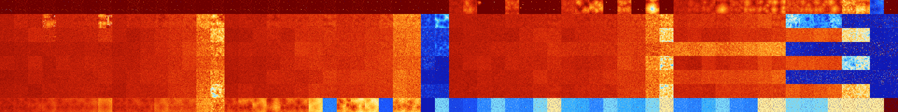

# B012678 (232960-233471)

<details>
    <summary>Initial Grid</summary>
    
</details>


<details>
    <summary>Initial Grid RLE</summary>

```
#C Exported from GoGoL (https://github.com/marrow16/gogol)
#C Wrap mode: Toroidal
#C Boundary mode: Dead
#C Step: 0
x = 100, y = 100, rule = B012678/S
36b2o10bo10bo16bobo$11bo24bo36bo18bo$48bo20bo19b2o$2bo8bo32bo48bo$bo6bo
35bo2bo28bo22bo$11bobo36bo47bo$16bo15bo10bo22bo2bo6bo16bo$19bo6b2o27bo
10bo$4b2o4bo20bo25bo17bo15bo$57bo25bo10bo$16bo29bo5bo8bo2bo13bo$50bo27b
o9bo$9bo4bo8bo30bo33bo$2bo17b2o37bo28b2o$19bo3bobo6bo9bo24bo11bo2bo$34b
o20bo23bo7bo9bo$4bo17b2obo8bo$22bo5bo21bo27bo7bo$4bo14bo7bo4bo8bo21bo9b
o19bo$14bo17bo12bo5bo2bo29bo11bo$12bo10bo26bo6bo$22bo30bo8bo18bo4bo2bo$
5bo2bo22bo2bo4b2o7bobo22bo$13bo16bo8bo18bo$27bo13bo7bo15bo5bo$67bo8bo
22bo$3bo47bo26bo3bo$4bo16bo21bo4bo$41bo37bobo$28bo54bo2bo$16bo2bo12bobo
14bo38bo3bo$22bo3bo12bo57bo$11bo13bo2bo49bo16bo$8bo8bobo8bo29bo10bo$o5b
o4bo2bo8b2o46bo$4bo22bo16bo28bobo19bo$14bo15bo32bo7bo9bo$55bo8bo$14bo
20bo27bo$50bo12bo14bo$53bo32bo3bo$13bo6bo12bo12bo32bo$13bo14bo52bo$16bo
17bo8bo9bo$23bo22bo3bo11bo10bo$9bo12b2o29bo17bo$52bo23bo14bo$59bo11bo
26bo$14bobo16bo30bo34bo$21bo35bo25bo$4bo35bo14bo30bo$30bo3bo17bo9bo8bob
2o9bo6bo$13bo3bo43bo14bo$2bo39bo$10bo43bo5bo3bo4bo8bo4bo8bo$10bo19bobo
4bo28bo17bo3bo$11bobo4bo62bo2bo3bo$35bo23bobo36bo$11bo7bo7bo30bo6bo17b
2o5bo4bo$6bo16bo9bo14bo$17bo10bo27bo$19bo21bo5bo26bo19bobo$31bo25bo9bo
25bo$15bo10bo4bo4bo28bo17bo11bo$7bo2bo13bo31bo$45bo2b3o24bo11bo$8bo29bo
6bobo27bo2bobo$49bo18bobo14bo$2bo12bo6bo23bo15bo4bo3bo21bo$5bo9bobo25bo
2bo8bo13bo$4bo7b2o6bo5bo11bo31bo13bo11bo$17bo75bo$2bo5bo28b2o7bobo28b2o
$5bo19bo40bo10bo6bo9bo$18bo13bo2bo12bo13bo5bo7bo15bo$5bo3bo2bo31bo9bo2b
o8bobo16bo$3bo2bo42bo12bo16bo14bo$18bo21bo34bo3bo$3bo10bo7bobo37bo20bo
7bo$51bo7bo6bo3bo21bo$30bo$4b2o10bo17bo29bo$16bo14bo7bo50b2o$11bo17bo
21bo30bobo$74bo9bo$10bo7bo27bo5bo14bo16bo$o8b2o12bo19bo3bo21bo5bo3bo$6b
o6bo$13b2o10bo27bo5b2o$18bo$26bo10bo2bo6bo6bobo16bo$o13bo12bo27bo16bo
20bo$19bo$7bo32bo19bo15bo4bo8bo$o24bo$42bo2bo12bo9b2o18bo$21bo69bo$10bo
$2bo12bo25bo6bo7bo8bo24bobo$39bo13bo12bo6bo9bo!
```
</details>
<details>
    <summary>Thumbnail</summary>

</details>
<table>
<tr>
    <td><a href="./232960%20S%20Heat%20Map%20Activity.png"></a><br>S (232960)<br>R@4,p2</td>    <td><a href="./232961%20S0%20Heat%20Map%20Activity.png"></a><br>S0 (232961)<br>R@9,p2</td>    <td><a href="./232962%20S1%20Heat%20Map%20Activity.png"></a><br>S1 (232962)<br>R@10,p4</td>    <td><a href="./232963%20S01%20Heat%20Map%20Activity.png"></a><br>S01 (232963)<br>R@11,p4</td>    <td><a href="./232964%20S2%20Heat%20Map%20Activity.png"></a><br>S2 (232964)<br>R@8,p4</td>    <td><a href="./232965%20S02%20Heat%20Map%20Activity.png"></a><br>S02 (232965)<br>R@11,p4</td>    <td><a href="./232966%20S12%20Heat%20Map%20Activity.png"></a><br>S12 (232966)<br>R@14,p8</td>    <td><a href="./232967%20S012%20Heat%20Map%20Activity.png"></a><br>S012 (232967)<br>R@11,p4</td>    <td><a href="./232968%20S3%20Heat%20Map%20Activity.png"></a><br>S3 (232968)<br>R@10,p2</td>    <td><a href="./232969%20S03%20Heat%20Map%20Activity.png"></a><br>S03 (232969)<br>R@7,p2</td>    <td><a href="./232970%20S13%20Heat%20Map%20Activity.png"></a><br>S13 (232970)<br>R@10,p2</td>    <td><a href="./232971%20S013%20Heat%20Map%20Activity.png"></a><br>S013 (232971)<br>R@11,p2</td>    <td><a href="./232972%20S23%20Heat%20Map%20Activity.png"></a><br>S23 (232972)<br>R@12,p4</td>    <td><a href="./232973%20S023%20Heat%20Map%20Activity.png"></a><br>S023 (232973)<br>R@15,p4</td>    <td><a href="./232974%20S123%20Heat%20Map%20Activity.png"></a><br>S123 (232974)<br>R@21,p8</td>    <td><a href="./232975%20S0123%20Heat%20Map%20Activity.png"></a><br>S0123 (232975)<br>R@11,p4</td>    <td><a href="./232976%20S4%20Heat%20Map%20Activity.png"></a><br>S4 (232976)<br>R@10,p2</td>    <td><a href="./232977%20S04%20Heat%20Map%20Activity.png"></a><br>S04 (232977)<br>R@10,p2</td>    <td><a href="./232978%20S14%20Heat%20Map%20Activity.png"></a><br>S14 (232978)<br>R@10,p4</td>    <td><a href="./232979%20S014%20Heat%20Map%20Activity.png"></a><br>S014 (232979)<br>R@8,p2</td>    <td><a href="./232980%20S24%20Heat%20Map%20Activity.png"></a><br>S24 (232980)<br>R@14,p4</td>    <td><a href="./232981%20S024%20Heat%20Map%20Activity.png"></a><br>S024 (232981)<br>R@14,p4</td>    <td><a href="./232982%20S124%20Heat%20Map%20Activity.png"></a><br>S124 (232982)<br>R@18,p8</td>    <td><a href="./232983%20S0124%20Heat%20Map%20Activity.png"></a><br>S0124 (232983)<br>R@11,p2</td>    <td><a href="./232984%20S34%20Heat%20Map%20Activity.png"></a><br>S34 (232984)<br>R@12,p2</td>    <td><a href="./232985%20S034%20Heat%20Map%20Activity.png"></a><br>S034 (232985)<br>R@11,p2</td>    <td><a href="./232986%20S134%20Heat%20Map%20Activity.png"></a><br>S134 (232986)<br>R@17,p4</td>    <td><a href="./232987%20S0134%20Heat%20Map%20Activity.png"></a><br>S0134 (232987)<br>R@13,p4</td>    <td><a href="./232988%20S234%20Heat%20Map%20Activity.png"></a><br>S234 (232988)<br>R@47,p4</td>    <td><a href="./232989%20S0234%20Heat%20Map%20Activity.png"></a><br>S0234 (232989)<br>R@21,p4</td>    <td><a href="./232990%20S1234%20Heat%20Map%20Activity.png"></a><br>S1234 (232990)<br>R@29,p8</td>    <td><a href="./232991%20S01234%20Heat%20Map%20Activity.png"></a><br>S01234 (232991)<br>R@17,p2</td>    <td><a href="./232992%20S5%20Heat%20Map%20Activity.png"></a><br>S5 (232992)<br>G>1000</td>    <td><a href="./232993%20S05%20Heat%20Map%20Activity.png"></a><br>S05 (232993)<br>G>1000</td>    <td><a href="./232994%20S15%20Heat%20Map%20Activity.png"></a><br>S15 (232994)<br>G>1000</td>    <td><a href="./232995%20S015%20Heat%20Map%20Activity.png"></a><br>S015 (232995)<br>R@31,p2</td>    <td><a href="./232996%20S25%20Heat%20Map%20Activity.png"></a><br>S25 (232996)<br>G>1000</td>    <td><a href="./232997%20S025%20Heat%20Map%20Activity.png"></a><br>S025 (232997)<br>R@71,p24</td>    <td><a href="./232998%20S125%20Heat%20Map%20Activity.png"></a><br>S125 (232998)<br>R@48,p4</td>    <td><a href="./232999%20S0125%20Heat%20Map%20Activity.png"></a><br>S0125 (232999)<br>R@21,p2</td>    <td><a href="./233000%20S35%20Heat%20Map%20Activity.png"></a><br>S35 (233000)<br>G>1000</td>    <td><a href="./233001%20S035%20Heat%20Map%20Activity.png"></a><br>S035 (233001)<br>G>1000</td>    <td><a href="./233002%20S135%20Heat%20Map%20Activity.png"></a><br>S135 (233002)<br>G>1000</td>    <td><a href="./233003%20S0135%20Heat%20Map%20Activity.png"></a><br>S0135 (233003)<br>R@21,p2</td>    <td><a href="./233004%20S235%20Heat%20Map%20Activity.png"></a><br>S235 (233004)<br>G>1000</td>    <td><a href="./233005%20S0235%20Heat%20Map%20Activity.png"></a><br>S0235 (233005)<br>R@45,p4</td>    <td><a href="./233006%20S1235%20Heat%20Map%20Activity.png"></a><br>S1235 (233006)<br>G>1000</td>    <td><a href="./233007%20S01235%20Heat%20Map%20Activity.png"></a><br>S01235 (233007)<br>R@29,p4</td>    <td><a href="./233008%20S45%20Heat%20Map%20Activity.png"></a><br>S45 (233008)<br>G>1000</td>    <td><a href="./233009%20S045%20Heat%20Map%20Activity.png"></a><br>S045 (233009)<br>G>1000</td>    <td><a href="./233010%20S145%20Heat%20Map%20Activity.png"></a><br>S145 (233010)<br>G>1000</td>    <td><a href="./233011%20S0145%20Heat%20Map%20Activity.png"></a><br>S0145 (233011)<br>G>1000</td>    <td><a href="./233012%20S245%20Heat%20Map%20Activity.png"></a><br>S245 (233012)<br>G>1000</td>    <td><a href="./233013%20S0245%20Heat%20Map%20Activity.png"></a><br>S0245 (233013)<br>G>1000</td>    <td><a href="./233014%20S1245%20Heat%20Map%20Activity.png"></a><br>S1245 (233014)<br>G>1000</td>    <td><a href="./233015%20S01245%20Heat%20Map%20Activity.png"></a><br>S01245 (233015)<br>G>1000</td>    <td><a href="./233016%20S345%20Heat%20Map%20Activity.png"></a><br>S345 (233016)<br>G>1000</td>    <td><a href="./233017%20S0345%20Heat%20Map%20Activity.png"></a><br>S0345 (233017)<br>G>1000</td>    <td><a href="./233018%20S1345%20Heat%20Map%20Activity.png"></a><br>S1345 (233018)<br>G>1000</td>    <td><a href="./233019%20S01345%20Heat%20Map%20Activity.png"></a><br>S01345 (233019)<br>G>1000</td>    <td><a href="./233020%20S2345%20Heat%20Map%20Activity.png"></a><br>S2345 (233020)<br>G>1000</td>    <td><a href="./233021%20S02345%20Heat%20Map%20Activity.png"></a><br>S02345 (233021)<br>G>1000</td>    <td><a href="./233022%20S12345%20Heat%20Map%20Activity.png"></a><br>S12345 (233022)<br>G>1000</td>    <td><a href="./233023%20S012345%20Heat%20Map%20Activity.png"></a><br>S012345 (233023)<br>R@23,p4</td></tr>
<tr>
    <td><a href="./233024%20S6%20Heat%20Map%20Activity.png"></a><br>S6 (233024)<br>G>1000</td>    <td><a href="./233025%20S06%20Heat%20Map%20Activity.png"></a><br>S06 (233025)<br>G>1000</td>    <td><a href="./233026%20S16%20Heat%20Map%20Activity.png"></a><br>S16 (233026)<br>G>1000</td>    <td><a href="./233027%20S016%20Heat%20Map%20Activity.png"></a><br>S016 (233027)<br>G>1000</td>    <td><a href="./233028%20S26%20Heat%20Map%20Activity.png"></a><br>S26 (233028)<br>G>1000</td>    <td><a href="./233029%20S026%20Heat%20Map%20Activity.png"></a><br>S026 (233029)<br>G>1000</td>    <td><a href="./233030%20S126%20Heat%20Map%20Activity.png"></a><br>S126 (233030)<br>G>1000</td>    <td><a href="./233031%20S0126%20Heat%20Map%20Activity.png"></a><br>S0126 (233031)<br>G>1000</td>    <td><a href="./233032%20S36%20Heat%20Map%20Activity.png"></a><br>S36 (233032)<br>G>1000</td>    <td><a href="./233033%20S036%20Heat%20Map%20Activity.png"></a><br>S036 (233033)<br>G>1000</td>    <td><a href="./233034%20S136%20Heat%20Map%20Activity.png"></a><br>S136 (233034)<br>G>1000</td>    <td><a href="./233035%20S0136%20Heat%20Map%20Activity.png"></a><br>S0136 (233035)<br>G>1000</td>    <td><a href="./233036%20S236%20Heat%20Map%20Activity.png"></a><br>S236 (233036)<br>G>1000</td>    <td><a href="./233037%20S0236%20Heat%20Map%20Activity.png"></a><br>S0236 (233037)<br>G>1000</td>    <td><a href="./233038%20S1236%20Heat%20Map%20Activity.png"></a><br>S1236 (233038)<br>G>1000</td>    <td><a href="./233039%20S01236%20Heat%20Map%20Activity.png"></a><br>S01236 (233039)<br>G>1000</td>    <td><a href="./233040%20S46%20Heat%20Map%20Activity.png"></a><br>S46 (233040)<br>G>1000</td>    <td><a href="./233041%20S046%20Heat%20Map%20Activity.png"></a><br>S046 (233041)<br>G>1000</td>    <td><a href="./233042%20S146%20Heat%20Map%20Activity.png"></a><br>S146 (233042)<br>G>1000</td>    <td><a href="./233043%20S0146%20Heat%20Map%20Activity.png"></a><br>S0146 (233043)<br>G>1000</td>    <td><a href="./233044%20S246%20Heat%20Map%20Activity.png"></a><br>S246 (233044)<br>G>1000</td>    <td><a href="./233045%20S0246%20Heat%20Map%20Activity.png"></a><br>S0246 (233045)<br>G>1000</td>    <td><a href="./233046%20S1246%20Heat%20Map%20Activity.png"></a><br>S1246 (233046)<br>G>1000</td>    <td><a href="./233047%20S01246%20Heat%20Map%20Activity.png"></a><br>S01246 (233047)<br>G>1000</td>    <td><a href="./233048%20S346%20Heat%20Map%20Activity.png"></a><br>S346 (233048)<br>G>1000</td>    <td><a href="./233049%20S0346%20Heat%20Map%20Activity.png"></a><br>S0346 (233049)<br>G>1000</td>    <td><a href="./233050%20S1346%20Heat%20Map%20Activity.png"></a><br>S1346 (233050)<br>G>1000</td>    <td><a href="./233051%20S01346%20Heat%20Map%20Activity.png"></a><br>S01346 (233051)<br>G>1000</td>    <td><a href="./233052%20S2346%20Heat%20Map%20Activity.png"></a><br>S2346 (233052)<br>G>1000</td>    <td><a href="./233053%20S02346%20Heat%20Map%20Activity.png"></a><br>S02346 (233053)<br>G>1000</td>    <td><a href="./233054%20S12346%20Heat%20Map%20Activity.png"></a><br>S12346 (233054)<br>R@262,p84</td>    <td><a href="./233055%20S012346%20Heat%20Map%20Activity.png"></a><br>S012346 (233055)<br>R@245,p84</td>    <td><a href="./233056%20S56%20Heat%20Map%20Activity.png"></a><br>S56 (233056)<br>G>1000</td>    <td><a href="./233057%20S056%20Heat%20Map%20Activity.png"></a><br>S056 (233057)<br>G>1000</td>    <td><a href="./233058%20S156%20Heat%20Map%20Activity.png"></a><br>S156 (233058)<br>G>1000</td>    <td><a href="./233059%20S0156%20Heat%20Map%20Activity.png"></a><br>S0156 (233059)<br>G>1000</td>    <td><a href="./233060%20S256%20Heat%20Map%20Activity.png"></a><br>S256 (233060)<br>G>1000</td>    <td><a href="./233061%20S0256%20Heat%20Map%20Activity.png"></a><br>S0256 (233061)<br>G>1000</td>    <td><a href="./233062%20S1256%20Heat%20Map%20Activity.png"></a><br>S1256 (233062)<br>G>1000</td>    <td><a href="./233063%20S01256%20Heat%20Map%20Activity.png"></a><br>S01256 (233063)<br>G>1000</td>    <td><a href="./233064%20S356%20Heat%20Map%20Activity.png"></a><br>S356 (233064)<br>G>1000</td>    <td><a href="./233065%20S0356%20Heat%20Map%20Activity.png"></a><br>S0356 (233065)<br>G>1000</td>    <td><a href="./233066%20S1356%20Heat%20Map%20Activity.png"></a><br>S1356 (233066)<br>G>1000</td>    <td><a href="./233067%20S01356%20Heat%20Map%20Activity.png"></a><br>S01356 (233067)<br>G>1000</td>    <td><a href="./233068%20S2356%20Heat%20Map%20Activity.png"></a><br>S2356 (233068)<br>G>1000</td>    <td><a href="./233069%20S02356%20Heat%20Map%20Activity.png"></a><br>S02356 (233069)<br>G>1000</td>    <td><a href="./233070%20S12356%20Heat%20Map%20Activity.png"></a><br>S12356 (233070)<br>G>1000</td>    <td><a href="./233071%20S012356%20Heat%20Map%20Activity.png"></a><br>S012356 (233071)<br>G>1000</td>    <td><a href="./233072%20S456%20Heat%20Map%20Activity.png"></a><br>S456 (233072)<br>G>1000</td>    <td><a href="./233073%20S0456%20Heat%20Map%20Activity.png"></a><br>S0456 (233073)<br>G>1000</td>    <td><a href="./233074%20S1456%20Heat%20Map%20Activity.png"></a><br>S1456 (233074)<br>G>1000</td>    <td><a href="./233075%20S01456%20Heat%20Map%20Activity.png"></a><br>S01456 (233075)<br>G>1000</td>    <td><a href="./233076%20S2456%20Heat%20Map%20Activity.png"></a><br>S2456 (233076)<br>G>1000</td>    <td><a href="./233077%20S02456%20Heat%20Map%20Activity.png"></a><br>S02456 (233077)<br>G>1000</td>    <td><a href="./233078%20S12456%20Heat%20Map%20Activity.png"></a><br>S12456 (233078)<br>G>1000</td>    <td><a href="./233079%20S012456%20Heat%20Map%20Activity.png"></a><br>S012456 (233079)<br>G>1000</td>    <td><a href="./233080%20S3456%20Heat%20Map%20Activity.png"></a><br>S3456 (233080)<br>G>1000</td>    <td><a href="./233081%20S03456%20Heat%20Map%20Activity.png"></a><br>S03456 (233081)<br>G>1000</td>    <td><a href="./233082%20S13456%20Heat%20Map%20Activity.png"></a><br>S13456 (233082)<br>G>1000</td>    <td><a href="./233083%20S013456%20Heat%20Map%20Activity.png"></a><br>S013456 (233083)<br>G>1000</td>    <td><a href="./233084%20S23456%20Heat%20Map%20Activity.png"></a><br>S23456 (233084)<br>G>1000</td>    <td><a href="./233085%20S023456%20Heat%20Map%20Activity.png"></a><br>S023456 (233085)<br>G>1000</td>    <td><a href="./233086%20S123456%20Heat%20Map%20Activity.png"></a><br>S123456 (233086)<br>G>1000</td>    <td><a href="./233087%20S0123456%20Heat%20Map%20Activity.png"></a><br>S0123456 (233087)<br>G>1000</td></tr>
<tr>
    <td><a href="./233088%20S7%20Heat%20Map%20Activity.png"></a><br>S7 (233088)<br>G>1000</td>    <td><a href="./233089%20S07%20Heat%20Map%20Activity.png"></a><br>S07 (233089)<br>G>1000</td>    <td><a href="./233090%20S17%20Heat%20Map%20Activity.png"></a><br>S17 (233090)<br>G>1000</td>    <td><a href="./233091%20S017%20Heat%20Map%20Activity.png"></a><br>S017 (233091)<br>G>1000</td>    <td><a href="./233092%20S27%20Heat%20Map%20Activity.png"></a><br>S27 (233092)<br>G>1000</td>    <td><a href="./233093%20S027%20Heat%20Map%20Activity.png"></a><br>S027 (233093)<br>G>1000</td>    <td><a href="./233094%20S127%20Heat%20Map%20Activity.png"></a><br>S127 (233094)<br>G>1000</td>    <td><a href="./233095%20S0127%20Heat%20Map%20Activity.png"></a><br>S0127 (233095)<br>G>1000</td>    <td><a href="./233096%20S37%20Heat%20Map%20Activity.png"></a><br>S37 (233096)<br>G>1000</td>    <td><a href="./233097%20S037%20Heat%20Map%20Activity.png"></a><br>S037 (233097)<br>G>1000</td>    <td><a href="./233098%20S137%20Heat%20Map%20Activity.png"></a><br>S137 (233098)<br>G>1000</td>    <td><a href="./233099%20S0137%20Heat%20Map%20Activity.png"></a><br>S0137 (233099)<br>G>1000</td>    <td><a href="./233100%20S237%20Heat%20Map%20Activity.png"></a><br>S237 (233100)<br>G>1000</td>    <td><a href="./233101%20S0237%20Heat%20Map%20Activity.png"></a><br>S0237 (233101)<br>G>1000</td>    <td><a href="./233102%20S1237%20Heat%20Map%20Activity.png"></a><br>S1237 (233102)<br>G>1000</td>    <td><a href="./233103%20S01237%20Heat%20Map%20Activity.png"></a><br>S01237 (233103)<br>G>1000</td>    <td><a href="./233104%20S47%20Heat%20Map%20Activity.png"></a><br>S47 (233104)<br>G>1000</td>    <td><a href="./233105%20S047%20Heat%20Map%20Activity.png"></a><br>S047 (233105)<br>G>1000</td>    <td><a href="./233106%20S147%20Heat%20Map%20Activity.png"></a><br>S147 (233106)<br>G>1000</td>    <td><a href="./233107%20S0147%20Heat%20Map%20Activity.png"></a><br>S0147 (233107)<br>G>1000</td>    <td><a href="./233108%20S247%20Heat%20Map%20Activity.png"></a><br>S247 (233108)<br>G>1000</td>    <td><a href="./233109%20S0247%20Heat%20Map%20Activity.png"></a><br>S0247 (233109)<br>G>1000</td>    <td><a href="./233110%20S1247%20Heat%20Map%20Activity.png"></a><br>S1247 (233110)<br>G>1000</td>    <td><a href="./233111%20S01247%20Heat%20Map%20Activity.png"></a><br>S01247 (233111)<br>G>1000</td>    <td><a href="./233112%20S347%20Heat%20Map%20Activity.png"></a><br>S347 (233112)<br>G>1000</td>    <td><a href="./233113%20S0347%20Heat%20Map%20Activity.png"></a><br>S0347 (233113)<br>G>1000</td>    <td><a href="./233114%20S1347%20Heat%20Map%20Activity.png"></a><br>S1347 (233114)<br>G>1000</td>    <td><a href="./233115%20S01347%20Heat%20Map%20Activity.png"></a><br>S01347 (233115)<br>G>1000</td>    <td><a href="./233116%20S2347%20Heat%20Map%20Activity.png"></a><br>S2347 (233116)<br>G>1000</td>    <td><a href="./233117%20S02347%20Heat%20Map%20Activity.png"></a><br>S02347 (233117)<br>G>1000</td>    <td><a href="./233118%20S12347%20Heat%20Map%20Activity.png"></a><br>S12347 (233118)<br>R@106,p4</td>    <td><a href="./233119%20S012347%20Heat%20Map%20Activity.png"></a><br>S012347 (233119)<br>R@187,p60</td>    <td><a href="./233120%20S57%20Heat%20Map%20Activity.png"></a><br>S57 (233120)<br>G>1000</td>    <td><a href="./233121%20S057%20Heat%20Map%20Activity.png"></a><br>S057 (233121)<br>G>1000</td>    <td><a href="./233122%20S157%20Heat%20Map%20Activity.png"></a><br>S157 (233122)<br>G>1000</td>    <td><a href="./233123%20S0157%20Heat%20Map%20Activity.png"></a><br>S0157 (233123)<br>G>1000</td>    <td><a href="./233124%20S257%20Heat%20Map%20Activity.png"></a><br>S257 (233124)<br>G>1000</td>    <td><a href="./233125%20S0257%20Heat%20Map%20Activity.png"></a><br>S0257 (233125)<br>G>1000</td>    <td><a href="./233126%20S1257%20Heat%20Map%20Activity.png"></a><br>S1257 (233126)<br>G>1000</td>    <td><a href="./233127%20S01257%20Heat%20Map%20Activity.png"></a><br>S01257 (233127)<br>G>1000</td>    <td><a href="./233128%20S357%20Heat%20Map%20Activity.png"></a><br>S357 (233128)<br>G>1000</td>    <td><a href="./233129%20S0357%20Heat%20Map%20Activity.png"></a><br>S0357 (233129)<br>G>1000</td>    <td><a href="./233130%20S1357%20Heat%20Map%20Activity.png"></a><br>S1357 (233130)<br>G>1000</td>    <td><a href="./233131%20S01357%20Heat%20Map%20Activity.png"></a><br>S01357 (233131)<br>G>1000</td>    <td><a href="./233132%20S2357%20Heat%20Map%20Activity.png"></a><br>S2357 (233132)<br>G>1000</td>    <td><a href="./233133%20S02357%20Heat%20Map%20Activity.png"></a><br>S02357 (233133)<br>G>1000</td>    <td><a href="./233134%20S12357%20Heat%20Map%20Activity.png"></a><br>S12357 (233134)<br>G>1000</td>    <td><a href="./233135%20S012357%20Heat%20Map%20Activity.png"></a><br>S012357 (233135)<br>G>1000</td>    <td><a href="./233136%20S457%20Heat%20Map%20Activity.png"></a><br>S457 (233136)<br>G>1000</td>    <td><a href="./233137%20S0457%20Heat%20Map%20Activity.png"></a><br>S0457 (233137)<br>G>1000</td>    <td><a href="./233138%20S1457%20Heat%20Map%20Activity.png"></a><br>S1457 (233138)<br>G>1000</td>    <td><a href="./233139%20S01457%20Heat%20Map%20Activity.png"></a><br>S01457 (233139)<br>G>1000</td>    <td><a href="./233140%20S2457%20Heat%20Map%20Activity.png"></a><br>S2457 (233140)<br>G>1000</td>    <td><a href="./233141%20S02457%20Heat%20Map%20Activity.png"></a><br>S02457 (233141)<br>G>1000</td>    <td><a href="./233142%20S12457%20Heat%20Map%20Activity.png"></a><br>S12457 (233142)<br>G>1000</td>    <td><a href="./233143%20S012457%20Heat%20Map%20Activity.png"></a><br>S012457 (233143)<br>G>1000</td>    <td><a href="./233144%20S3457%20Heat%20Map%20Activity.png"></a><br>S3457 (233144)<br>G>1000</td>    <td><a href="./233145%20S03457%20Heat%20Map%20Activity.png"></a><br>S03457 (233145)<br>G>1000</td>    <td><a href="./233146%20S13457%20Heat%20Map%20Activity.png"></a><br>S13457 (233146)<br>G>1000</td>    <td><a href="./233147%20S013457%20Heat%20Map%20Activity.png"></a><br>S013457 (233147)<br>G>1000</td>    <td><a href="./233148%20S23457%20Heat%20Map%20Activity.png"></a><br>S23457 (233148)<br>G>1000</td>    <td><a href="./233149%20S023457%20Heat%20Map%20Activity.png"></a><br>S023457 (233149)<br>G>1000</td>    <td><a href="./233150%20S123457%20Heat%20Map%20Activity.png"></a><br>S123457 (233150)<br>G>1000</td>    <td><a href="./233151%20S0123457%20Heat%20Map%20Activity.png"></a><br>S0123457 (233151)<br>G>1000</td></tr>
<tr>
    <td><a href="./233152%20S67%20Heat%20Map%20Activity.png"></a><br>S67 (233152)<br>G>1000</td>    <td><a href="./233153%20S067%20Heat%20Map%20Activity.png"></a><br>S067 (233153)<br>G>1000</td>    <td><a href="./233154%20S167%20Heat%20Map%20Activity.png"></a><br>S167 (233154)<br>G>1000</td>    <td><a href="./233155%20S0167%20Heat%20Map%20Activity.png"></a><br>S0167 (233155)<br>G>1000</td>    <td><a href="./233156%20S267%20Heat%20Map%20Activity.png"></a><br>S267 (233156)<br>G>1000</td>    <td><a href="./233157%20S0267%20Heat%20Map%20Activity.png"></a><br>S0267 (233157)<br>G>1000</td>    <td><a href="./233158%20S1267%20Heat%20Map%20Activity.png"></a><br>S1267 (233158)<br>G>1000</td>    <td><a href="./233159%20S01267%20Heat%20Map%20Activity.png"></a><br>S01267 (233159)<br>G>1000</td>    <td><a href="./233160%20S367%20Heat%20Map%20Activity.png"></a><br>S367 (233160)<br>G>1000</td>    <td><a href="./233161%20S0367%20Heat%20Map%20Activity.png"></a><br>S0367 (233161)<br>G>1000</td>    <td><a href="./233162%20S1367%20Heat%20Map%20Activity.png"></a><br>S1367 (233162)<br>G>1000</td>    <td><a href="./233163%20S01367%20Heat%20Map%20Activity.png"></a><br>S01367 (233163)<br>G>1000</td>    <td><a href="./233164%20S2367%20Heat%20Map%20Activity.png"></a><br>S2367 (233164)<br>G>1000</td>    <td><a href="./233165%20S02367%20Heat%20Map%20Activity.png"></a><br>S02367 (233165)<br>G>1000</td>    <td><a href="./233166%20S12367%20Heat%20Map%20Activity.png"></a><br>S12367 (233166)<br>G>1000</td>    <td><a href="./233167%20S012367%20Heat%20Map%20Activity.png"></a><br>S012367 (233167)<br>G>1000</td>    <td><a href="./233168%20S467%20Heat%20Map%20Activity.png"></a><br>S467 (233168)<br>G>1000</td>    <td><a href="./233169%20S0467%20Heat%20Map%20Activity.png"></a><br>S0467 (233169)<br>G>1000</td>    <td><a href="./233170%20S1467%20Heat%20Map%20Activity.png"></a><br>S1467 (233170)<br>G>1000</td>    <td><a href="./233171%20S01467%20Heat%20Map%20Activity.png"></a><br>S01467 (233171)<br>G>1000</td>    <td><a href="./233172%20S2467%20Heat%20Map%20Activity.png"></a><br>S2467 (233172)<br>G>1000</td>    <td><a href="./233173%20S02467%20Heat%20Map%20Activity.png"></a><br>S02467 (233173)<br>G>1000</td>    <td><a href="./233174%20S12467%20Heat%20Map%20Activity.png"></a><br>S12467 (233174)<br>G>1000</td>    <td><a href="./233175%20S012467%20Heat%20Map%20Activity.png"></a><br>S012467 (233175)<br>G>1000</td>    <td><a href="./233176%20S3467%20Heat%20Map%20Activity.png"></a><br>S3467 (233176)<br>G>1000</td>    <td><a href="./233177%20S03467%20Heat%20Map%20Activity.png"></a><br>S03467 (233177)<br>G>1000</td>    <td><a href="./233178%20S13467%20Heat%20Map%20Activity.png"></a><br>S13467 (233178)<br>G>1000</td>    <td><a href="./233179%20S013467%20Heat%20Map%20Activity.png"></a><br>S013467 (233179)<br>G>1000</td>    <td><a href="./233180%20S23467%20Heat%20Map%20Activity.png"></a><br>S23467 (233180)<br>G>1000</td>    <td><a href="./233181%20S023467%20Heat%20Map%20Activity.png"></a><br>S023467 (233181)<br>G>1000</td>    <td><a href="./233182%20S123467%20Heat%20Map%20Activity.png"></a><br>S123467 (233182)<br>R@118,p10</td>    <td><a href="./233183%20S0123467%20Heat%20Map%20Activity.png"></a><br>S0123467 (233183)<br>R@134,p40</td>    <td><a href="./233184%20S567%20Heat%20Map%20Activity.png"></a><br>S567 (233184)<br>G>1000</td>    <td><a href="./233185%20S0567%20Heat%20Map%20Activity.png"></a><br>S0567 (233185)<br>G>1000</td>    <td><a href="./233186%20S1567%20Heat%20Map%20Activity.png"></a><br>S1567 (233186)<br>G>1000</td>    <td><a href="./233187%20S01567%20Heat%20Map%20Activity.png"></a><br>S01567 (233187)<br>G>1000</td>    <td><a href="./233188%20S2567%20Heat%20Map%20Activity.png"></a><br>S2567 (233188)<br>G>1000</td>    <td><a href="./233189%20S02567%20Heat%20Map%20Activity.png"></a><br>S02567 (233189)<br>G>1000</td>    <td><a href="./233190%20S12567%20Heat%20Map%20Activity.png"></a><br>S12567 (233190)<br>G>1000</td>    <td><a href="./233191%20S012567%20Heat%20Map%20Activity.png"></a><br>S012567 (233191)<br>G>1000</td>    <td><a href="./233192%20S3567%20Heat%20Map%20Activity.png"></a><br>S3567 (233192)<br>G>1000</td>    <td><a href="./233193%20S03567%20Heat%20Map%20Activity.png"></a><br>S03567 (233193)<br>G>1000</td>    <td><a href="./233194%20S13567%20Heat%20Map%20Activity.png"></a><br>S13567 (233194)<br>G>1000</td>    <td><a href="./233195%20S013567%20Heat%20Map%20Activity.png"></a><br>S013567 (233195)<br>G>1000</td>    <td><a href="./233196%20S23567%20Heat%20Map%20Activity.png"></a><br>S23567 (233196)<br>G>1000</td>    <td><a href="./233197%20S023567%20Heat%20Map%20Activity.png"></a><br>S023567 (233197)<br>G>1000</td>    <td><a href="./233198%20S123567%20Heat%20Map%20Activity.png"></a><br>S123567 (233198)<br>G>1000</td>    <td><a href="./233199%20S0123567%20Heat%20Map%20Activity.png"></a><br>S0123567 (233199)<br>G>1000</td>    <td><a href="./233200%20S4567%20Heat%20Map%20Activity.png"></a><br>S4567 (233200)<br>G>1000</td>    <td><a href="./233201%20S04567%20Heat%20Map%20Activity.png"></a><br>S04567 (233201)<br>G>1000</td>    <td><a href="./233202%20S14567%20Heat%20Map%20Activity.png"></a><br>S14567 (233202)<br>G>1000</td>    <td><a href="./233203%20S014567%20Heat%20Map%20Activity.png"></a><br>S014567 (233203)<br>G>1000</td>    <td><a href="./233204%20S24567%20Heat%20Map%20Activity.png"></a><br>S24567 (233204)<br>G>1000</td>    <td><a href="./233205%20S024567%20Heat%20Map%20Activity.png"></a><br>S024567 (233205)<br>G>1000</td>    <td><a href="./233206%20S124567%20Heat%20Map%20Activity.png"></a><br>S124567 (233206)<br>G>1000</td>    <td><a href="./233207%20S0124567%20Heat%20Map%20Activity.png"></a><br>S0124567 (233207)<br>G>1000</td>    <td><a href="./233208%20S34567%20Heat%20Map%20Activity.png"></a><br>S34567 (233208)<br>R@156,p84</td>    <td><a href="./233209%20S034567%20Heat%20Map%20Activity.png"></a><br>S034567 (233209)<br>R@486,p420</td>    <td><a href="./233210%20S134567%20Heat%20Map%20Activity.png"></a><br>S134567 (233210)<br>G>1000</td>    <td><a href="./233211%20S0134567%20Heat%20Map%20Activity.png"></a><br>S0134567 (233211)<br>G>1000</td>    <td><a href="./233212%20S234567%20Heat%20Map%20Activity.png"></a><br>S234567 (233212)<br>G>1000</td>    <td><a href="./233213%20S0234567%20Heat%20Map%20Activity.png"></a><br>S0234567 (233213)<br>G>1000</td>    <td><a href="./233214%20S1234567%20Heat%20Map%20Activity.png"></a><br>S1234567 (233214)<br>G>1000</td>    <td><a href="./233215%20S01234567%20Heat%20Map%20Activity.png"></a><br>S01234567 (233215)<br>G>1000</td></tr>
<tr>
    <td><a href="./233216%20S8%20Heat%20Map%20Activity.png"></a><br>S8 (233216)<br>G>1000</td>    <td><a href="./233217%20S08%20Heat%20Map%20Activity.png"></a><br>S08 (233217)<br>G>1000</td>    <td><a href="./233218%20S18%20Heat%20Map%20Activity.png"></a><br>S18 (233218)<br>G>1000</td>    <td><a href="./233219%20S018%20Heat%20Map%20Activity.png"></a><br>S018 (233219)<br>G>1000</td>    <td><a href="./233220%20S28%20Heat%20Map%20Activity.png"></a><br>S28 (233220)<br>G>1000</td>    <td><a href="./233221%20S028%20Heat%20Map%20Activity.png"></a><br>S028 (233221)<br>G>1000</td>    <td><a href="./233222%20S128%20Heat%20Map%20Activity.png"></a><br>S128 (233222)<br>G>1000</td>    <td><a href="./233223%20S0128%20Heat%20Map%20Activity.png"></a><br>S0128 (233223)<br>G>1000</td>    <td><a href="./233224%20S38%20Heat%20Map%20Activity.png"></a><br>S38 (233224)<br>G>1000</td>    <td><a href="./233225%20S038%20Heat%20Map%20Activity.png"></a><br>S038 (233225)<br>G>1000</td>    <td><a href="./233226%20S138%20Heat%20Map%20Activity.png"></a><br>S138 (233226)<br>G>1000</td>    <td><a href="./233227%20S0138%20Heat%20Map%20Activity.png"></a><br>S0138 (233227)<br>G>1000</td>    <td><a href="./233228%20S238%20Heat%20Map%20Activity.png"></a><br>S238 (233228)<br>G>1000</td>    <td><a href="./233229%20S0238%20Heat%20Map%20Activity.png"></a><br>S0238 (233229)<br>G>1000</td>    <td><a href="./233230%20S1238%20Heat%20Map%20Activity.png"></a><br>S1238 (233230)<br>G>1000</td>    <td><a href="./233231%20S01238%20Heat%20Map%20Activity.png"></a><br>S01238 (233231)<br>G>1000</td>    <td><a href="./233232%20S48%20Heat%20Map%20Activity.png"></a><br>S48 (233232)<br>G>1000</td>    <td><a href="./233233%20S048%20Heat%20Map%20Activity.png"></a><br>S048 (233233)<br>G>1000</td>    <td><a href="./233234%20S148%20Heat%20Map%20Activity.png"></a><br>S148 (233234)<br>G>1000</td>    <td><a href="./233235%20S0148%20Heat%20Map%20Activity.png"></a><br>S0148 (233235)<br>G>1000</td>    <td><a href="./233236%20S248%20Heat%20Map%20Activity.png"></a><br>S248 (233236)<br>G>1000</td>    <td><a href="./233237%20S0248%20Heat%20Map%20Activity.png"></a><br>S0248 (233237)<br>G>1000</td>    <td><a href="./233238%20S1248%20Heat%20Map%20Activity.png"></a><br>S1248 (233238)<br>G>1000</td>    <td><a href="./233239%20S01248%20Heat%20Map%20Activity.png"></a><br>S01248 (233239)<br>G>1000</td>    <td><a href="./233240%20S348%20Heat%20Map%20Activity.png"></a><br>S348 (233240)<br>G>1000</td>    <td><a href="./233241%20S0348%20Heat%20Map%20Activity.png"></a><br>S0348 (233241)<br>G>1000</td>    <td><a href="./233242%20S1348%20Heat%20Map%20Activity.png"></a><br>S1348 (233242)<br>G>1000</td>    <td><a href="./233243%20S01348%20Heat%20Map%20Activity.png"></a><br>S01348 (233243)<br>G>1000</td>    <td><a href="./233244%20S2348%20Heat%20Map%20Activity.png"></a><br>S2348 (233244)<br>G>1000</td>    <td><a href="./233245%20S02348%20Heat%20Map%20Activity.png"></a><br>S02348 (233245)<br>G>1000</td>    <td><a href="./233246%20S12348%20Heat%20Map%20Activity.png"></a><br>S12348 (233246)<br>R@215,p60</td>    <td><a href="./233247%20S012348%20Heat%20Map%20Activity.png"></a><br>S012348 (233247)<br>R@954,p840</td>    <td><a href="./233248%20S58%20Heat%20Map%20Activity.png"></a><br>S58 (233248)<br>G>1000</td>    <td><a href="./233249%20S058%20Heat%20Map%20Activity.png"></a><br>S058 (233249)<br>G>1000</td>    <td><a href="./233250%20S158%20Heat%20Map%20Activity.png"></a><br>S158 (233250)<br>G>1000</td>    <td><a href="./233251%20S0158%20Heat%20Map%20Activity.png"></a><br>S0158 (233251)<br>G>1000</td>    <td><a href="./233252%20S258%20Heat%20Map%20Activity.png"></a><br>S258 (233252)<br>G>1000</td>    <td><a href="./233253%20S0258%20Heat%20Map%20Activity.png"></a><br>S0258 (233253)<br>G>1000</td>    <td><a href="./233254%20S1258%20Heat%20Map%20Activity.png"></a><br>S1258 (233254)<br>G>1000</td>    <td><a href="./233255%20S01258%20Heat%20Map%20Activity.png"></a><br>S01258 (233255)<br>G>1000</td>    <td><a href="./233256%20S358%20Heat%20Map%20Activity.png"></a><br>S358 (233256)<br>G>1000</td>    <td><a href="./233257%20S0358%20Heat%20Map%20Activity.png"></a><br>S0358 (233257)<br>G>1000</td>    <td><a href="./233258%20S1358%20Heat%20Map%20Activity.png"></a><br>S1358 (233258)<br>G>1000</td>    <td><a href="./233259%20S01358%20Heat%20Map%20Activity.png"></a><br>S01358 (233259)<br>G>1000</td>    <td><a href="./233260%20S2358%20Heat%20Map%20Activity.png"></a><br>S2358 (233260)<br>G>1000</td>    <td><a href="./233261%20S02358%20Heat%20Map%20Activity.png"></a><br>S02358 (233261)<br>G>1000</td>    <td><a href="./233262%20S12358%20Heat%20Map%20Activity.png"></a><br>S12358 (233262)<br>G>1000</td>    <td><a href="./233263%20S012358%20Heat%20Map%20Activity.png"></a><br>S012358 (233263)<br>G>1000</td>    <td><a href="./233264%20S458%20Heat%20Map%20Activity.png"></a><br>S458 (233264)<br>G>1000</td>    <td><a href="./233265%20S0458%20Heat%20Map%20Activity.png"></a><br>S0458 (233265)<br>G>1000</td>    <td><a href="./233266%20S1458%20Heat%20Map%20Activity.png"></a><br>S1458 (233266)<br>G>1000</td>    <td><a href="./233267%20S01458%20Heat%20Map%20Activity.png"></a><br>S01458 (233267)<br>G>1000</td>    <td><a href="./233268%20S2458%20Heat%20Map%20Activity.png"></a><br>S2458 (233268)<br>G>1000</td>    <td><a href="./233269%20S02458%20Heat%20Map%20Activity.png"></a><br>S02458 (233269)<br>G>1000</td>    <td><a href="./233270%20S12458%20Heat%20Map%20Activity.png"></a><br>S12458 (233270)<br>G>1000</td>    <td><a href="./233271%20S012458%20Heat%20Map%20Activity.png"></a><br>S012458 (233271)<br>G>1000</td>    <td><a href="./233272%20S3458%20Heat%20Map%20Activity.png"></a><br>S3458 (233272)<br>G>1000</td>    <td><a href="./233273%20S03458%20Heat%20Map%20Activity.png"></a><br>S03458 (233273)<br>G>1000</td>    <td><a href="./233274%20S13458%20Heat%20Map%20Activity.png"></a><br>S13458 (233274)<br>G>1000</td>    <td><a href="./233275%20S013458%20Heat%20Map%20Activity.png"></a><br>S013458 (233275)<br>G>1000</td>    <td><a href="./233276%20S23458%20Heat%20Map%20Activity.png"></a><br>S23458 (233276)<br>G>1000</td>    <td><a href="./233277%20S023458%20Heat%20Map%20Activity.png"></a><br>S023458 (233277)<br>G>1000</td>    <td><a href="./233278%20S123458%20Heat%20Map%20Activity.png"></a><br>S123458 (233278)<br>R@949,p840</td>    <td><a href="./233279%20S0123458%20Heat%20Map%20Activity.png"></a><br>S0123458 (233279)<br>G>1000</td></tr>
<tr>
    <td><a href="./233280%20S68%20Heat%20Map%20Activity.png"></a><br>S68 (233280)<br>G>1000</td>    <td><a href="./233281%20S068%20Heat%20Map%20Activity.png"></a><br>S068 (233281)<br>G>1000</td>    <td><a href="./233282%20S168%20Heat%20Map%20Activity.png"></a><br>S168 (233282)<br>G>1000</td>    <td><a href="./233283%20S0168%20Heat%20Map%20Activity.png"></a><br>S0168 (233283)<br>G>1000</td>    <td><a href="./233284%20S268%20Heat%20Map%20Activity.png"></a><br>S268 (233284)<br>G>1000</td>    <td><a href="./233285%20S0268%20Heat%20Map%20Activity.png"></a><br>S0268 (233285)<br>G>1000</td>    <td><a href="./233286%20S1268%20Heat%20Map%20Activity.png"></a><br>S1268 (233286)<br>G>1000</td>    <td><a href="./233287%20S01268%20Heat%20Map%20Activity.png"></a><br>S01268 (233287)<br>G>1000</td>    <td><a href="./233288%20S368%20Heat%20Map%20Activity.png"></a><br>S368 (233288)<br>G>1000</td>    <td><a href="./233289%20S0368%20Heat%20Map%20Activity.png"></a><br>S0368 (233289)<br>G>1000</td>    <td><a href="./233290%20S1368%20Heat%20Map%20Activity.png"></a><br>S1368 (233290)<br>G>1000</td>    <td><a href="./233291%20S01368%20Heat%20Map%20Activity.png"></a><br>S01368 (233291)<br>G>1000</td>    <td><a href="./233292%20S2368%20Heat%20Map%20Activity.png"></a><br>S2368 (233292)<br>G>1000</td>    <td><a href="./233293%20S02368%20Heat%20Map%20Activity.png"></a><br>S02368 (233293)<br>G>1000</td>    <td><a href="./233294%20S12368%20Heat%20Map%20Activity.png"></a><br>S12368 (233294)<br>G>1000</td>    <td><a href="./233295%20S012368%20Heat%20Map%20Activity.png"></a><br>S012368 (233295)<br>G>1000</td>    <td><a href="./233296%20S468%20Heat%20Map%20Activity.png"></a><br>S468 (233296)<br>G>1000</td>    <td><a href="./233297%20S0468%20Heat%20Map%20Activity.png"></a><br>S0468 (233297)<br>G>1000</td>    <td><a href="./233298%20S1468%20Heat%20Map%20Activity.png"></a><br>S1468 (233298)<br>G>1000</td>    <td><a href="./233299%20S01468%20Heat%20Map%20Activity.png"></a><br>S01468 (233299)<br>G>1000</td>    <td><a href="./233300%20S2468%20Heat%20Map%20Activity.png"></a><br>S2468 (233300)<br>G>1000</td>    <td><a href="./233301%20S02468%20Heat%20Map%20Activity.png"></a><br>S02468 (233301)<br>G>1000</td>    <td><a href="./233302%20S12468%20Heat%20Map%20Activity.png"></a><br>S12468 (233302)<br>G>1000</td>    <td><a href="./233303%20S012468%20Heat%20Map%20Activity.png"></a><br>S012468 (233303)<br>G>1000</td>    <td><a href="./233304%20S3468%20Heat%20Map%20Activity.png"></a><br>S3468 (233304)<br>G>1000</td>    <td><a href="./233305%20S03468%20Heat%20Map%20Activity.png"></a><br>S03468 (233305)<br>G>1000</td>    <td><a href="./233306%20S13468%20Heat%20Map%20Activity.png"></a><br>S13468 (233306)<br>G>1000</td>    <td><a href="./233307%20S013468%20Heat%20Map%20Activity.png"></a><br>S013468 (233307)<br>G>1000</td>    <td><a href="./233308%20S23468%20Heat%20Map%20Activity.png"></a><br>S23468 (233308)<br>G>1000</td>    <td><a href="./233309%20S023468%20Heat%20Map%20Activity.png"></a><br>S023468 (233309)<br>G>1000</td>    <td><a href="./233310%20S123468%20Heat%20Map%20Activity.png"></a><br>S123468 (233310)<br>R@388,p252</td>    <td><a href="./233311%20S0123468%20Heat%20Map%20Activity.png"></a><br>S0123468 (233311)<br>R@506,p420</td>    <td><a href="./233312%20S568%20Heat%20Map%20Activity.png"></a><br>S568 (233312)<br>G>1000</td>    <td><a href="./233313%20S0568%20Heat%20Map%20Activity.png"></a><br>S0568 (233313)<br>G>1000</td>    <td><a href="./233314%20S1568%20Heat%20Map%20Activity.png"></a><br>S1568 (233314)<br>G>1000</td>    <td><a href="./233315%20S01568%20Heat%20Map%20Activity.png"></a><br>S01568 (233315)<br>G>1000</td>    <td><a href="./233316%20S2568%20Heat%20Map%20Activity.png"></a><br>S2568 (233316)<br>G>1000</td>    <td><a href="./233317%20S02568%20Heat%20Map%20Activity.png"></a><br>S02568 (233317)<br>G>1000</td>    <td><a href="./233318%20S12568%20Heat%20Map%20Activity.png"></a><br>S12568 (233318)<br>G>1000</td>    <td><a href="./233319%20S012568%20Heat%20Map%20Activity.png"></a><br>S012568 (233319)<br>G>1000</td>    <td><a href="./233320%20S3568%20Heat%20Map%20Activity.png"></a><br>S3568 (233320)<br>G>1000</td>    <td><a href="./233321%20S03568%20Heat%20Map%20Activity.png"></a><br>S03568 (233321)<br>G>1000</td>    <td><a href="./233322%20S13568%20Heat%20Map%20Activity.png"></a><br>S13568 (233322)<br>G>1000</td>    <td><a href="./233323%20S013568%20Heat%20Map%20Activity.png"></a><br>S013568 (233323)<br>G>1000</td>    <td><a href="./233324%20S23568%20Heat%20Map%20Activity.png"></a><br>S23568 (233324)<br>G>1000</td>    <td><a href="./233325%20S023568%20Heat%20Map%20Activity.png"></a><br>S023568 (233325)<br>G>1000</td>    <td><a href="./233326%20S123568%20Heat%20Map%20Activity.png"></a><br>S123568 (233326)<br>G>1000</td>    <td><a href="./233327%20S0123568%20Heat%20Map%20Activity.png"></a><br>S0123568 (233327)<br>G>1000</td>    <td><a href="./233328%20S4568%20Heat%20Map%20Activity.png"></a><br>S4568 (233328)<br>G>1000</td>    <td><a href="./233329%20S04568%20Heat%20Map%20Activity.png"></a><br>S04568 (233329)<br>G>1000</td>    <td><a href="./233330%20S14568%20Heat%20Map%20Activity.png"></a><br>S14568 (233330)<br>G>1000</td>    <td><a href="./233331%20S014568%20Heat%20Map%20Activity.png"></a><br>S014568 (233331)<br>G>1000</td>    <td><a href="./233332%20S24568%20Heat%20Map%20Activity.png"></a><br>S24568 (233332)<br>G>1000</td>    <td><a href="./233333%20S024568%20Heat%20Map%20Activity.png"></a><br>S024568 (233333)<br>G>1000</td>    <td><a href="./233334%20S124568%20Heat%20Map%20Activity.png"></a><br>S124568 (233334)<br>G>1000</td>    <td><a href="./233335%20S0124568%20Heat%20Map%20Activity.png"></a><br>S0124568 (233335)<br>G>1000</td>    <td><a href="./233336%20S34568%20Heat%20Map%20Activity.png"></a><br>S34568 (233336)<br>G>1000</td>    <td><a href="./233337%20S034568%20Heat%20Map%20Activity.png"></a><br>S034568 (233337)<br>G>1000</td>    <td><a href="./233338%20S134568%20Heat%20Map%20Activity.png"></a><br>S134568 (233338)<br>G>1000</td>    <td><a href="./233339%20S0134568%20Heat%20Map%20Activity.png"></a><br>S0134568 (233339)<br>G>1000</td>    <td><a href="./233340%20S234568%20Heat%20Map%20Activity.png"></a><br>S234568 (233340)<br>G>1000</td>    <td><a href="./233341%20S0234568%20Heat%20Map%20Activity.png"></a><br>S0234568 (233341)<br>G>1000</td>    <td><a href="./233342%20S1234568%20Heat%20Map%20Activity.png"></a><br>S1234568 (233342)<br>G>1000</td>    <td><a href="./233343%20S01234568%20Heat%20Map%20Activity.png"></a><br>S01234568 (233343)<br>G>1000</td></tr>
<tr>
    <td><a href="./233344%20S78%20Heat%20Map%20Activity.png"></a><br>S78 (233344)<br>G>1000</td>    <td><a href="./233345%20S078%20Heat%20Map%20Activity.png"></a><br>S078 (233345)<br>G>1000</td>    <td><a href="./233346%20S178%20Heat%20Map%20Activity.png"></a><br>S178 (233346)<br>G>1000</td>    <td><a href="./233347%20S0178%20Heat%20Map%20Activity.png"></a><br>S0178 (233347)<br>G>1000</td>    <td><a href="./233348%20S278%20Heat%20Map%20Activity.png"></a><br>S278 (233348)<br>G>1000</td>    <td><a href="./233349%20S0278%20Heat%20Map%20Activity.png"></a><br>S0278 (233349)<br>G>1000</td>    <td><a href="./233350%20S1278%20Heat%20Map%20Activity.png"></a><br>S1278 (233350)<br>G>1000</td>    <td><a href="./233351%20S01278%20Heat%20Map%20Activity.png"></a><br>S01278 (233351)<br>G>1000</td>    <td><a href="./233352%20S378%20Heat%20Map%20Activity.png"></a><br>S378 (233352)<br>G>1000</td>    <td><a href="./233353%20S0378%20Heat%20Map%20Activity.png"></a><br>S0378 (233353)<br>G>1000</td>    <td><a href="./233354%20S1378%20Heat%20Map%20Activity.png"></a><br>S1378 (233354)<br>G>1000</td>    <td><a href="./233355%20S01378%20Heat%20Map%20Activity.png"></a><br>S01378 (233355)<br>G>1000</td>    <td><a href="./233356%20S2378%20Heat%20Map%20Activity.png"></a><br>S2378 (233356)<br>G>1000</td>    <td><a href="./233357%20S02378%20Heat%20Map%20Activity.png"></a><br>S02378 (233357)<br>G>1000</td>    <td><a href="./233358%20S12378%20Heat%20Map%20Activity.png"></a><br>S12378 (233358)<br>G>1000</td>    <td><a href="./233359%20S012378%20Heat%20Map%20Activity.png"></a><br>S012378 (233359)<br>G>1000</td>    <td><a href="./233360%20S478%20Heat%20Map%20Activity.png"></a><br>S478 (233360)<br>G>1000</td>    <td><a href="./233361%20S0478%20Heat%20Map%20Activity.png"></a><br>S0478 (233361)<br>G>1000</td>    <td><a href="./233362%20S1478%20Heat%20Map%20Activity.png"></a><br>S1478 (233362)<br>G>1000</td>    <td><a href="./233363%20S01478%20Heat%20Map%20Activity.png"></a><br>S01478 (233363)<br>G>1000</td>    <td><a href="./233364%20S2478%20Heat%20Map%20Activity.png"></a><br>S2478 (233364)<br>G>1000</td>    <td><a href="./233365%20S02478%20Heat%20Map%20Activity.png"></a><br>S02478 (233365)<br>G>1000</td>    <td><a href="./233366%20S12478%20Heat%20Map%20Activity.png"></a><br>S12478 (233366)<br>G>1000</td>    <td><a href="./233367%20S012478%20Heat%20Map%20Activity.png"></a><br>S012478 (233367)<br>G>1000</td>    <td><a href="./233368%20S3478%20Heat%20Map%20Activity.png"></a><br>S3478 (233368)<br>G>1000</td>    <td><a href="./233369%20S03478%20Heat%20Map%20Activity.png"></a><br>S03478 (233369)<br>G>1000</td>    <td><a href="./233370%20S13478%20Heat%20Map%20Activity.png"></a><br>S13478 (233370)<br>G>1000</td>    <td><a href="./233371%20S013478%20Heat%20Map%20Activity.png"></a><br>S013478 (233371)<br>G>1000</td>    <td><a href="./233372%20S23478%20Heat%20Map%20Activity.png"></a><br>S23478 (233372)<br>G>1000</td>    <td><a href="./233373%20S023478%20Heat%20Map%20Activity.png"></a><br>S023478 (233373)<br>G>1000</td>    <td><a href="./233374%20S123478%20Heat%20Map%20Activity.png"></a><br>S123478 (233374)<br>R@146,p4</td>    <td><a href="./233375%20S0123478%20Heat%20Map%20Activity.png"></a><br>S0123478 (233375)<br>R@160,p60</td>    <td><a href="./233376%20S578%20Heat%20Map%20Activity.png"></a><br>S578 (233376)<br>G>1000</td>    <td><a href="./233377%20S0578%20Heat%20Map%20Activity.png"></a><br>S0578 (233377)<br>G>1000</td>    <td><a href="./233378%20S1578%20Heat%20Map%20Activity.png"></a><br>S1578 (233378)<br>G>1000</td>    <td><a href="./233379%20S01578%20Heat%20Map%20Activity.png"></a><br>S01578 (233379)<br>G>1000</td>    <td><a href="./233380%20S2578%20Heat%20Map%20Activity.png"></a><br>S2578 (233380)<br>G>1000</td>    <td><a href="./233381%20S02578%20Heat%20Map%20Activity.png"></a><br>S02578 (233381)<br>G>1000</td>    <td><a href="./233382%20S12578%20Heat%20Map%20Activity.png"></a><br>S12578 (233382)<br>G>1000</td>    <td><a href="./233383%20S012578%20Heat%20Map%20Activity.png"></a><br>S012578 (233383)<br>G>1000</td>    <td><a href="./233384%20S3578%20Heat%20Map%20Activity.png"></a><br>S3578 (233384)<br>G>1000</td>    <td><a href="./233385%20S03578%20Heat%20Map%20Activity.png"></a><br>S03578 (233385)<br>G>1000</td>    <td><a href="./233386%20S13578%20Heat%20Map%20Activity.png"></a><br>S13578 (233386)<br>G>1000</td>    <td><a href="./233387%20S013578%20Heat%20Map%20Activity.png"></a><br>S013578 (233387)<br>G>1000</td>    <td><a href="./233388%20S23578%20Heat%20Map%20Activity.png"></a><br>S23578 (233388)<br>G>1000</td>    <td><a href="./233389%20S023578%20Heat%20Map%20Activity.png"></a><br>S023578 (233389)<br>G>1000</td>    <td><a href="./233390%20S123578%20Heat%20Map%20Activity.png"></a><br>S123578 (233390)<br>G>1000</td>    <td><a href="./233391%20S0123578%20Heat%20Map%20Activity.png"></a><br>S0123578 (233391)<br>G>1000</td>    <td><a href="./233392%20S4578%20Heat%20Map%20Activity.png"></a><br>S4578 (233392)<br>G>1000</td>    <td><a href="./233393%20S04578%20Heat%20Map%20Activity.png"></a><br>S04578 (233393)<br>G>1000</td>    <td><a href="./233394%20S14578%20Heat%20Map%20Activity.png"></a><br>S14578 (233394)<br>G>1000</td>    <td><a href="./233395%20S014578%20Heat%20Map%20Activity.png"></a><br>S014578 (233395)<br>G>1000</td>    <td><a href="./233396%20S24578%20Heat%20Map%20Activity.png"></a><br>S24578 (233396)<br>G>1000</td>    <td><a href="./233397%20S024578%20Heat%20Map%20Activity.png"></a><br>S024578 (233397)<br>G>1000</td>    <td><a href="./233398%20S124578%20Heat%20Map%20Activity.png"></a><br>S124578 (233398)<br>G>1000</td>    <td><a href="./233399%20S0124578%20Heat%20Map%20Activity.png"></a><br>S0124578 (233399)<br>G>1000</td>    <td><a href="./233400%20S34578%20Heat%20Map%20Activity.png"></a><br>S34578 (233400)<br>G>1000</td>    <td><a href="./233401%20S034578%20Heat%20Map%20Activity.png"></a><br>S034578 (233401)<br>G>1000</td>    <td><a href="./233402%20S134578%20Heat%20Map%20Activity.png"></a><br>S134578 (233402)<br>G>1000</td>    <td><a href="./233403%20S0134578%20Heat%20Map%20Activity.png"></a><br>S0134578 (233403)<br>G>1000</td>    <td><a href="./233404%20S234578%20Heat%20Map%20Activity.png"></a><br>S234578 (233404)<br>G>1000</td>    <td><a href="./233405%20S0234578%20Heat%20Map%20Activity.png"></a><br>S0234578 (233405)<br>G>1000</td>    <td><a href="./233406%20S1234578%20Heat%20Map%20Activity.png"></a><br>S1234578 (233406)<br>G>1000</td>    <td><a href="./233407%20S01234578%20Heat%20Map%20Activity.png"></a><br>S01234578 (233407)<br>G>1000</td></tr>
<tr>
    <td><a href="./233408%20S678%20Heat%20Map%20Activity.png"></a><br>S678 (233408)<br>G>1000</td>    <td><a href="./233409%20S0678%20Heat%20Map%20Activity.png"></a><br>S0678 (233409)<br>G>1000</td>    <td><a href="./233410%20S1678%20Heat%20Map%20Activity.png"></a><br>S1678 (233410)<br>G>1000</td>    <td><a href="./233411%20S01678%20Heat%20Map%20Activity.png"></a><br>S01678 (233411)<br>G>1000</td>    <td><a href="./233412%20S2678%20Heat%20Map%20Activity.png"></a><br>S2678 (233412)<br>G>1000</td>    <td><a href="./233413%20S02678%20Heat%20Map%20Activity.png"></a><br>S02678 (233413)<br>G>1000</td>    <td><a href="./233414%20S12678%20Heat%20Map%20Activity.png"></a><br>S12678 (233414)<br>G>1000</td>    <td><a href="./233415%20S012678%20Heat%20Map%20Activity.png"></a><br>S012678 (233415)<br>G>1000</td>    <td><a href="./233416%20S3678%20Heat%20Map%20Activity.png"></a><br>S3678 (233416)<br>G>1000</td>    <td><a href="./233417%20S03678%20Heat%20Map%20Activity.png"></a><br>S03678 (233417)<br>G>1000</td>    <td><a href="./233418%20S13678%20Heat%20Map%20Activity.png"></a><br>S13678 (233418)<br>G>1000</td>    <td><a href="./233419%20S013678%20Heat%20Map%20Activity.png"></a><br>S013678 (233419)<br>G>1000</td>    <td><a href="./233420%20S23678%20Heat%20Map%20Activity.png"></a><br>S23678 (233420)<br>G>1000</td>    <td><a href="./233421%20S023678%20Heat%20Map%20Activity.png"></a><br>S023678 (233421)<br>G>1000</td>    <td><a href="./233422%20S123678%20Heat%20Map%20Activity.png"></a><br>S123678 (233422)<br>G>1000</td>    <td><a href="./233423%20S0123678%20Heat%20Map%20Activity.png"></a><br>S0123678 (233423)<br>G>1000</td>    <td><a href="./233424%20S4678%20Heat%20Map%20Activity.png"></a><br>S4678 (233424)<br>G>1000</td>    <td><a href="./233425%20S04678%20Heat%20Map%20Activity.png"></a><br>S04678 (233425)<br>G>1000</td>    <td><a href="./233426%20S14678%20Heat%20Map%20Activity.png"></a><br>S14678 (233426)<br>G>1000</td>    <td><a href="./233427%20S014678%20Heat%20Map%20Activity.png"></a><br>S014678 (233427)<br>G>1000</td>    <td><a href="./233428%20S24678%20Heat%20Map%20Activity.png"></a><br>S24678 (233428)<br>G>1000</td>    <td><a href="./233429%20S024678%20Heat%20Map%20Activity.png"></a><br>S024678 (233429)<br>G>1000</td>    <td><a href="./233430%20S124678%20Heat%20Map%20Activity.png"></a><br>S124678 (233430)<br>G>1000</td>    <td><a href="./233431%20S0124678%20Heat%20Map%20Activity.png"></a><br>S0124678 (233431)<br>S@5</td>    <td><a href="./233432%20S34678%20Heat%20Map%20Activity.png"></a><br>S34678 (233432)<br>G>1000</td>    <td><a href="./233433%20S034678%20Heat%20Map%20Activity.png"></a><br>S034678 (233433)<br>G>1000</td>    <td><a href="./233434%20S134678%20Heat%20Map%20Activity.png"></a><br>S134678 (233434)<br>G>1000</td>    <td><a href="./233435%20S0134678%20Heat%20Map%20Activity.png"></a><br>S0134678 (233435)<br>S@11</td>    <td><a href="./233436%20S234678%20Heat%20Map%20Activity.png"></a><br>S234678 (233436)<br>G>1000</td>    <td><a href="./233437%20S0234678%20Heat%20Map%20Activity.png"></a><br>S0234678 (233437)<br>G>1000</td>    <td><a href="./233438%20S1234678%20Heat%20Map%20Activity.png"></a><br>S1234678 (233438)<br>R@407,p400</td>    <td><a href="./233439%20S01234678%20Heat%20Map%20Activity.png"></a><br>S01234678 (233439)<br>S@4</td>    <td><a href="./233440%20S5678%20Heat%20Map%20Activity.png"></a><br>S5678 (233440)<br>S@11</td>    <td><a href="./233441%20S05678%20Heat%20Map%20Activity.png"></a><br>S05678 (233441)<br>S@9</td>    <td><a href="./233442%20S15678%20Heat%20Map%20Activity.png"></a><br>S15678 (233442)<br>S@8</td>    <td><a href="./233443%20S015678%20Heat%20Map%20Activity.png"></a><br>S015678 (233443)<br>S@4</td>    <td><a href="./233444%20S25678%20Heat%20Map%20Activity.png"></a><br>S25678 (233444)<br>S@7</td>    <td><a href="./233445%20S025678%20Heat%20Map%20Activity.png"></a><br>S025678 (233445)<br>S@8</td>    <td><a href="./233446%20S125678%20Heat%20Map%20Activity.png"></a><br>S125678 (233446)<br>S@5</td>    <td><a href="./233447%20S0125678%20Heat%20Map%20Activity.png"></a><br>S0125678 (233447)<br>S@3</td>    <td><a href="./233448%20S35678%20Heat%20Map%20Activity.png"></a><br>S35678 (233448)<br>S@7</td>    <td><a href="./233449%20S035678%20Heat%20Map%20Activity.png"></a><br>S035678 (233449)<br>S@8</td>    <td><a href="./233450%20S135678%20Heat%20Map%20Activity.png"></a><br>S135678 (233450)<br>S@6</td>    <td><a href="./233451%20S0135678%20Heat%20Map%20Activity.png"></a><br>S0135678 (233451)<br>S@4</td>    <td><a href="./233452%20S235678%20Heat%20Map%20Activity.png"></a><br>S235678 (233452)<br>S@7</td>    <td><a href="./233453%20S0235678%20Heat%20Map%20Activity.png"></a><br>S0235678 (233453)<br>S@8</td>    <td><a href="./233454%20S1235678%20Heat%20Map%20Activity.png"></a><br>S1235678 (233454)<br>S@7</td>    <td><a href="./233455%20S01235678%20Heat%20Map%20Activity.png"></a><br>S01235678 (233455)<br>S@3</td>    <td><a href="./233456%20S45678%20Heat%20Map%20Activity.png"></a><br>S45678 (233456)<br>S@7</td>    <td><a href="./233457%20S045678%20Heat%20Map%20Activity.png"></a><br>S045678 (233457)<br>S@6</td>    <td><a href="./233458%20S145678%20Heat%20Map%20Activity.png"></a><br>S145678 (233458)<br>S@6</td>    <td><a href="./233459%20S0145678%20Heat%20Map%20Activity.png"></a><br>S0145678 (233459)<br>S@3</td>    <td><a href="./233460%20S245678%20Heat%20Map%20Activity.png"></a><br>S245678 (233460)<br>S@7</td>    <td><a href="./233461%20S0245678%20Heat%20Map%20Activity.png"></a><br>S0245678 (233461)<br>S@6</td>    <td><a href="./233462%20S1245678%20Heat%20Map%20Activity.png"></a><br>S1245678 (233462)<br>S@3</td>    <td><a href="./233463%20S01245678%20Heat%20Map%20Activity.png"></a><br>S01245678 (233463)<br>S@3</td>    <td><a href="./233464%20S345678%20Heat%20Map%20Activity.png"></a><br>S345678 (233464)<br>S@4</td>    <td><a href="./233465%20S0345678%20Heat%20Map%20Activity.png"></a><br>S0345678 (233465)<br>S@4</td>    <td><a href="./233466%20S1345678%20Heat%20Map%20Activity.png"></a><br>S1345678 (233466)<br>S@4</td>    <td><a href="./233467%20S01345678%20Heat%20Map%20Activity.png"></a><br>S01345678 (233467)<br>S@4</td>    <td><a href="./233468%20S2345678%20Heat%20Map%20Activity.png"></a><br>S2345678 (233468)<br>S@6</td>    <td><a href="./233469%20S02345678%20Heat%20Map%20Activity.png"></a><br>S02345678 (233469)<br>S@5</td>    <td><a href="./233470%20S12345678%20Heat%20Map%20Activity.png"></a><br>S12345678 (233470)<br>S@4</td>    <td><a href="./233471%20S012345678%20Heat%20Map%20Activity.png"></a><br>S012345678 (233471)<br>S@3</td></tr>
</table>
