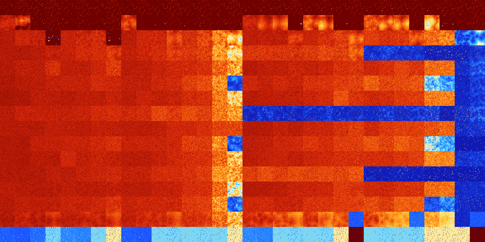

# B01268 (167424-167935)

<details>
    <summary>Initial Grid</summary>
    
</details>


<details>
    <summary>Initial Grid RLE</summary>

```
#C Exported from GoGoL (https://github.com/marrow16/gogol)
#C Wrap mode: Toroidal
#C Boundary mode: Dead
#C Step: 0
x = 100, y = 100, rule = B01268/S
bo25bo6bo12bo6bo15bobo14bo4bo$b2o6bo6bo3bo10bo6bo5bo7bo37bo$30bobo15bo
20bo$38bo5bo23bo$8b2o50bo22bo2bo$2bo17bo21bo15bo$22bo14b2o2bo9bobo12bo
5bo$10bo6bo18bo22bo23bo$3bo5bo9bo6bo21bo7bo$32bo14bo17bo18bo$o13bo3bo
20bo12bo4bo2bo20bobo$29bo3bo$29bo9bo56bo$24b2o8bo10bo$44bo13bo19bo$100b
$41bo10bo13bo7b2o$60bo7bo3bo$16bo44bo21bo$o18b2o4bo$12b2o2bo31bo33bo$
14bo13bo2bo32bo16bo$3bobo10bo32bo45bo$7bo40bo46bo$20bo22bo26bo$11bo2bo
10bo10bo11bo8bo$21bo10bo5bo10bo3bo6bo16bobo$27bo6bo32bo11bo12bo$15bo23b
o4bo24bo$22bo5bo8bo31bo28bo$44bo4bo$53bo7b2o4bo26bobo$31bo2bo30bo6bo5bo
3bo$9bo17bo64bobo$3bobo35bo9bo34bo$15bo9bo53bo10bo6bo$2bo16bo34bo22bo
14bo$6bo12bo4bo21bo9bobo20bo7bo$26bo2bo9bo5bo2bo33bo$18bo21bo7bobo37bo$
bo31bo8bo7bo$14bo5bo5bo2bo11bo16bo15bo15bo$6b2o42bo17bo9bo$o3bo2bo55bo
13bo$33bo37bo6bo$11bo8bo2bo15bo37bo9bo$2bo9bo23bo6bo10bo35bo$35bo3bo31b
o$bo21bo5bo13bo8bo22bo17bo$17bo4b2o13bo2b2o5bo38b2o$3bo3bo7bo9bo2bo14bo
17bo11bob2o3bo14b2o$bo6bo3bo11bo57bo$4b2o24bo8bo30bo$25bo3bobo14bo40bo$
34bo12bo14bobo7bo$38bo7bo12bo8bo5bo3bo13bo3bo$2o17bobo3bobo7bo30bo21bo
8b2o$25bo4bo51b2o2bo3bo$11bo23bo16bo35bo6bo$12bo9bo18bo8bo6bo2bo20bo4bo
6bo$9bo6bo14bo37bo5bo3bo6bo$5bo16bo6bo9bo34bo10bo$59bo11b2o4bo17bo$29bo
33bo$8bo20b2o6bo16bo22bo19bo$27bo13bo$19bo33bo13bo31bo$18bobo24bo2bo21b
o$9bo11bo2bo26b2o2b2o8bo20bo$bo16bo2bobo22bo49bo$7bo11bo55bo8bo$60bo$
20b2o6bo12bo25bo$9bo15bo60bo$3bo6b2o14bo7bo3bo22b2o11bo21bo$o15bo47bo
16bo7bo$6bo46bo5bo7bo11bo$38bo18bo2bo24bo$3bo20bo23bo44bo$6bo42bo46bo$
6bo26bo3bo39bo18bo$9bo11bo11bo43bo2bo$9bo17bo38bo4bo2bo$21bo42bo28bo5bo
$23bo2bo43bo4bo$38bo3bo12bo9bo$5bo36bobo31bo$2bo14bo16bo19bo7bo$21bo12b
o20bo13bo8bo6bo2bo9bo$13bo9bo2bo14bo$64bo6bo4bo9bo$8bo3bo28bo28bobo24bo
$44bo13bo5bo4bo21bo$40bo38bo5bo10bo$7bo7bo31bo51bo$9bo12bo3bo7bobo15bo
14bo8bo9bo$2bo35bo5bo22bo23bo$14bo4bo16bo6bo32bobo$24bo13bo44bo$7bo16bo
28bo21bo!
```
</details>
<details>
    <summary>Thumbnail</summary>

</details>
<table>
<tr>
    <td><a href="./167424%20S%20Heat%20Map%20Activity.png"></a><br>S (167424)<br>R@8,p2</td>    <td><a href="./167425%20S0%20Heat%20Map%20Activity.png"></a><br>S0 (167425)<br>R@8,p2</td>    <td><a href="./167426%20S1%20Heat%20Map%20Activity.png"></a><br>S1 (167426)<br>R@6,p2</td>    <td><a href="./167427%20S01%20Heat%20Map%20Activity.png"></a><br>S01 (167427)<br>R@7,p2</td>    <td><a href="./167428%20S2%20Heat%20Map%20Activity.png"></a><br>S2 (167428)<br>R@8,p2</td>    <td><a href="./167429%20S02%20Heat%20Map%20Activity.png"></a><br>S02 (167429)<br>R@9,p2</td>    <td><a href="./167430%20S12%20Heat%20Map%20Activity.png"></a><br>S12 (167430)<br>R@6,p2</td>    <td><a href="./167431%20S012%20Heat%20Map%20Activity.png"></a><br>S012 (167431)<br>R@7,p2</td>    <td><a href="./167432%20S3%20Heat%20Map%20Activity.png"></a><br>S3 (167432)<br>R@8,p2</td>    <td><a href="./167433%20S03%20Heat%20Map%20Activity.png"></a><br>S03 (167433)<br>R@8,p2</td>    <td><a href="./167434%20S13%20Heat%20Map%20Activity.png"></a><br>S13 (167434)<br>R@8,p2</td>    <td><a href="./167435%20S013%20Heat%20Map%20Activity.png"></a><br>S013 (167435)<br>R@7,p2</td>    <td><a href="./167436%20S23%20Heat%20Map%20Activity.png"></a><br>S23 (167436)<br>R@8,p2</td>    <td><a href="./167437%20S023%20Heat%20Map%20Activity.png"></a><br>S023 (167437)<br>R@9,p2</td>    <td><a href="./167438%20S123%20Heat%20Map%20Activity.png"></a><br>S123 (167438)<br>R@7,p2</td>    <td><a href="./167439%20S0123%20Heat%20Map%20Activity.png"></a><br>S0123 (167439)<br>R@7,p2</td>    <td><a href="./167440%20S4%20Heat%20Map%20Activity.png"></a><br>S4 (167440)<br>R@10,p2</td>    <td><a href="./167441%20S04%20Heat%20Map%20Activity.png"></a><br>S04 (167441)<br>R@10,p2</td>    <td><a href="./167442%20S14%20Heat%20Map%20Activity.png"></a><br>S14 (167442)<br>R@7,p2</td>    <td><a href="./167443%20S014%20Heat%20Map%20Activity.png"></a><br>S014 (167443)<br>R@8,p2</td>    <td><a href="./167444%20S24%20Heat%20Map%20Activity.png"></a><br>S24 (167444)<br>R@10,p2</td>    <td><a href="./167445%20S024%20Heat%20Map%20Activity.png"></a><br>S024 (167445)<br>R@9,p2</td>    <td><a href="./167446%20S124%20Heat%20Map%20Activity.png"></a><br>S124 (167446)<br>R@8,p2</td>    <td><a href="./167447%20S0124%20Heat%20Map%20Activity.png"></a><br>S0124 (167447)<br>R@9,p2</td>    <td><a href="./167448%20S34%20Heat%20Map%20Activity.png"></a><br>S34 (167448)<br>R@10,p2</td>    <td><a href="./167449%20S034%20Heat%20Map%20Activity.png"></a><br>S034 (167449)<br>R@8,p2</td>    <td><a href="./167450%20S134%20Heat%20Map%20Activity.png"></a><br>S134 (167450)<br>R@7,p2</td>    <td><a href="./167451%20S0134%20Heat%20Map%20Activity.png"></a><br>S0134 (167451)<br>R@10,p2</td>    <td><a href="./167452%20S234%20Heat%20Map%20Activity.png"></a><br>S234 (167452)<br>R@12,p2</td>    <td><a href="./167453%20S0234%20Heat%20Map%20Activity.png"></a><br>S0234 (167453)<br>R@10,p2</td>    <td><a href="./167454%20S1234%20Heat%20Map%20Activity.png"></a><br>S1234 (167454)<br>R@7,p2</td>    <td><a href="./167455%20S01234%20Heat%20Map%20Activity.png"></a><br>S01234 (167455)<br>R@7,p2</td></tr>
<tr>
    <td><a href="./167456%20S5%20Heat%20Map%20Activity.png"></a><br>S5 (167456)<br>G>1000</td>    <td><a href="./167457%20S05%20Heat%20Map%20Activity.png"></a><br>S05 (167457)<br>G>1000</td>    <td><a href="./167458%20S15%20Heat%20Map%20Activity.png"></a><br>S15 (167458)<br>R@14,p2</td>    <td><a href="./167459%20S015%20Heat%20Map%20Activity.png"></a><br>S015 (167459)<br>R@9,p2</td>    <td><a href="./167460%20S25%20Heat%20Map%20Activity.png"></a><br>S25 (167460)<br>R@40,p4</td>    <td><a href="./167461%20S025%20Heat%20Map%20Activity.png"></a><br>S025 (167461)<br>R@13,p2</td>    <td><a href="./167462%20S125%20Heat%20Map%20Activity.png"></a><br>S125 (167462)<br>R@13,p4</td>    <td><a href="./167463%20S0125%20Heat%20Map%20Activity.png"></a><br>S0125 (167463)<br>R@8,p2</td>    <td><a href="./167464%20S35%20Heat%20Map%20Activity.png"></a><br>S35 (167464)<br>G>1000</td>    <td><a href="./167465%20S035%20Heat%20Map%20Activity.png"></a><br>S035 (167465)<br>R@427,p400</td>    <td><a href="./167466%20S135%20Heat%20Map%20Activity.png"></a><br>S135 (167466)<br>R@22,p2</td>    <td><a href="./167467%20S0135%20Heat%20Map%20Activity.png"></a><br>S0135 (167467)<br>R@11,p2</td>    <td><a href="./167468%20S235%20Heat%20Map%20Activity.png"></a><br>S235 (167468)<br>R@34,p2</td>    <td><a href="./167469%20S0235%20Heat%20Map%20Activity.png"></a><br>S0235 (167469)<br>R@11,p2</td>    <td><a href="./167470%20S1235%20Heat%20Map%20Activity.png"></a><br>S1235 (167470)<br>R@11,p2</td>    <td><a href="./167471%20S01235%20Heat%20Map%20Activity.png"></a><br>S01235 (167471)<br>R@11,p2</td>    <td><a href="./167472%20S45%20Heat%20Map%20Activity.png"></a><br>S45 (167472)<br>G>1000</td>    <td><a href="./167473%20S045%20Heat%20Map%20Activity.png"></a><br>S045 (167473)<br>G>1000</td>    <td><a href="./167474%20S145%20Heat%20Map%20Activity.png"></a><br>S145 (167474)<br>G>1000</td>    <td><a href="./167475%20S0145%20Heat%20Map%20Activity.png"></a><br>S0145 (167475)<br>R@63,p2</td>    <td><a href="./167476%20S245%20Heat%20Map%20Activity.png"></a><br>S245 (167476)<br>G>1000</td>    <td><a href="./167477%20S0245%20Heat%20Map%20Activity.png"></a><br>S0245 (167477)<br>G>1000</td>    <td><a href="./167478%20S1245%20Heat%20Map%20Activity.png"></a><br>S1245 (167478)<br>R@26,p2</td>    <td><a href="./167479%20S01245%20Heat%20Map%20Activity.png"></a><br>S01245 (167479)<br>R@21,p2</td>    <td><a href="./167480%20S345%20Heat%20Map%20Activity.png"></a><br>S345 (167480)<br>G>1000</td>    <td><a href="./167481%20S0345%20Heat%20Map%20Activity.png"></a><br>S0345 (167481)<br>G>1000</td>    <td><a href="./167482%20S1345%20Heat%20Map%20Activity.png"></a><br>S1345 (167482)<br>G>1000</td>    <td><a href="./167483%20S01345%20Heat%20Map%20Activity.png"></a><br>S01345 (167483)<br>R@13,p2</td>    <td><a href="./167484%20S2345%20Heat%20Map%20Activity.png"></a><br>S2345 (167484)<br>G>1000</td>    <td><a href="./167485%20S02345%20Heat%20Map%20Activity.png"></a><br>S02345 (167485)<br>R@54,p12</td>    <td><a href="./167486%20S12345%20Heat%20Map%20Activity.png"></a><br>S12345 (167486)<br>R@17,p2</td>    <td><a href="./167487%20S012345%20Heat%20Map%20Activity.png"></a><br>S012345 (167487)<br>R@9,p2</td></tr>
<tr>
    <td><a href="./167488%20S6%20Heat%20Map%20Activity.png"></a><br>S6 (167488)<br>G>1000</td>    <td><a href="./167489%20S06%20Heat%20Map%20Activity.png"></a><br>S06 (167489)<br>G>1000</td>    <td><a href="./167490%20S16%20Heat%20Map%20Activity.png"></a><br>S16 (167490)<br>G>1000</td>    <td><a href="./167491%20S016%20Heat%20Map%20Activity.png"></a><br>S016 (167491)<br>R@31,p2</td>    <td><a href="./167492%20S26%20Heat%20Map%20Activity.png"></a><br>S26 (167492)<br>G>1000</td>    <td><a href="./167493%20S026%20Heat%20Map%20Activity.png"></a><br>S026 (167493)<br>G>1000</td>    <td><a href="./167494%20S126%20Heat%20Map%20Activity.png"></a><br>S126 (167494)<br>G>1000</td>    <td><a href="./167495%20S0126%20Heat%20Map%20Activity.png"></a><br>S0126 (167495)<br>R@43,p12</td>    <td><a href="./167496%20S36%20Heat%20Map%20Activity.png"></a><br>S36 (167496)<br>G>1000</td>    <td><a href="./167497%20S036%20Heat%20Map%20Activity.png"></a><br>S036 (167497)<br>G>1000</td>    <td><a href="./167498%20S136%20Heat%20Map%20Activity.png"></a><br>S136 (167498)<br>G>1000</td>    <td><a href="./167499%20S0136%20Heat%20Map%20Activity.png"></a><br>S0136 (167499)<br>G>1000</td>    <td><a href="./167500%20S236%20Heat%20Map%20Activity.png"></a><br>S236 (167500)<br>G>1000</td>    <td><a href="./167501%20S0236%20Heat%20Map%20Activity.png"></a><br>S0236 (167501)<br>G>1000</td>    <td><a href="./167502%20S1236%20Heat%20Map%20Activity.png"></a><br>S1236 (167502)<br>G>1000</td>    <td><a href="./167503%20S01236%20Heat%20Map%20Activity.png"></a><br>S01236 (167503)<br>G>1000</td>    <td><a href="./167504%20S46%20Heat%20Map%20Activity.png"></a><br>S46 (167504)<br>G>1000</td>    <td><a href="./167505%20S046%20Heat%20Map%20Activity.png"></a><br>S046 (167505)<br>G>1000</td>    <td><a href="./167506%20S146%20Heat%20Map%20Activity.png"></a><br>S146 (167506)<br>G>1000</td>    <td><a href="./167507%20S0146%20Heat%20Map%20Activity.png"></a><br>S0146 (167507)<br>G>1000</td>    <td><a href="./167508%20S246%20Heat%20Map%20Activity.png"></a><br>S246 (167508)<br>G>1000</td>    <td><a href="./167509%20S0246%20Heat%20Map%20Activity.png"></a><br>S0246 (167509)<br>G>1000</td>    <td><a href="./167510%20S1246%20Heat%20Map%20Activity.png"></a><br>S1246 (167510)<br>G>1000</td>    <td><a href="./167511%20S01246%20Heat%20Map%20Activity.png"></a><br>S01246 (167511)<br>G>1000</td>    <td><a href="./167512%20S346%20Heat%20Map%20Activity.png"></a><br>S346 (167512)<br>G>1000</td>    <td><a href="./167513%20S0346%20Heat%20Map%20Activity.png"></a><br>S0346 (167513)<br>G>1000</td>    <td><a href="./167514%20S1346%20Heat%20Map%20Activity.png"></a><br>S1346 (167514)<br>G>1000</td>    <td><a href="./167515%20S01346%20Heat%20Map%20Activity.png"></a><br>S01346 (167515)<br>G>1000</td>    <td><a href="./167516%20S2346%20Heat%20Map%20Activity.png"></a><br>S2346 (167516)<br>G>1000</td>    <td><a href="./167517%20S02346%20Heat%20Map%20Activity.png"></a><br>S02346 (167517)<br>G>1000</td>    <td><a href="./167518%20S12346%20Heat%20Map%20Activity.png"></a><br>S12346 (167518)<br>R@213,p72</td>    <td><a href="./167519%20S012346%20Heat%20Map%20Activity.png"></a><br>S012346 (167519)<br>R@343,p120</td></tr>
<tr>
    <td><a href="./167520%20S56%20Heat%20Map%20Activity.png"></a><br>S56 (167520)<br>G>1000</td>    <td><a href="./167521%20S056%20Heat%20Map%20Activity.png"></a><br>S056 (167521)<br>G>1000</td>    <td><a href="./167522%20S156%20Heat%20Map%20Activity.png"></a><br>S156 (167522)<br>G>1000</td>    <td><a href="./167523%20S0156%20Heat%20Map%20Activity.png"></a><br>S0156 (167523)<br>G>1000</td>    <td><a href="./167524%20S256%20Heat%20Map%20Activity.png"></a><br>S256 (167524)<br>G>1000</td>    <td><a href="./167525%20S0256%20Heat%20Map%20Activity.png"></a><br>S0256 (167525)<br>G>1000</td>    <td><a href="./167526%20S1256%20Heat%20Map%20Activity.png"></a><br>S1256 (167526)<br>G>1000</td>    <td><a href="./167527%20S01256%20Heat%20Map%20Activity.png"></a><br>S01256 (167527)<br>G>1000</td>    <td><a href="./167528%20S356%20Heat%20Map%20Activity.png"></a><br>S356 (167528)<br>G>1000</td>    <td><a href="./167529%20S0356%20Heat%20Map%20Activity.png"></a><br>S0356 (167529)<br>G>1000</td>    <td><a href="./167530%20S1356%20Heat%20Map%20Activity.png"></a><br>S1356 (167530)<br>G>1000</td>    <td><a href="./167531%20S01356%20Heat%20Map%20Activity.png"></a><br>S01356 (167531)<br>G>1000</td>    <td><a href="./167532%20S2356%20Heat%20Map%20Activity.png"></a><br>S2356 (167532)<br>G>1000</td>    <td><a href="./167533%20S02356%20Heat%20Map%20Activity.png"></a><br>S02356 (167533)<br>G>1000</td>    <td><a href="./167534%20S12356%20Heat%20Map%20Activity.png"></a><br>S12356 (167534)<br>G>1000</td>    <td><a href="./167535%20S012356%20Heat%20Map%20Activity.png"></a><br>S012356 (167535)<br>G>1000</td>    <td><a href="./167536%20S456%20Heat%20Map%20Activity.png"></a><br>S456 (167536)<br>G>1000</td>    <td><a href="./167537%20S0456%20Heat%20Map%20Activity.png"></a><br>S0456 (167537)<br>G>1000</td>    <td><a href="./167538%20S1456%20Heat%20Map%20Activity.png"></a><br>S1456 (167538)<br>G>1000</td>    <td><a href="./167539%20S01456%20Heat%20Map%20Activity.png"></a><br>S01456 (167539)<br>G>1000</td>    <td><a href="./167540%20S2456%20Heat%20Map%20Activity.png"></a><br>S2456 (167540)<br>G>1000</td>    <td><a href="./167541%20S02456%20Heat%20Map%20Activity.png"></a><br>S02456 (167541)<br>G>1000</td>    <td><a href="./167542%20S12456%20Heat%20Map%20Activity.png"></a><br>S12456 (167542)<br>G>1000</td>    <td><a href="./167543%20S012456%20Heat%20Map%20Activity.png"></a><br>S012456 (167543)<br>G>1000</td>    <td><a href="./167544%20S3456%20Heat%20Map%20Activity.png"></a><br>S3456 (167544)<br>G>1000</td>    <td><a href="./167545%20S03456%20Heat%20Map%20Activity.png"></a><br>S03456 (167545)<br>R@910,p84</td>    <td><a href="./167546%20S13456%20Heat%20Map%20Activity.png"></a><br>S13456 (167546)<br>R@841,p60</td>    <td><a href="./167547%20S013456%20Heat%20Map%20Activity.png"></a><br>S013456 (167547)<br>G>1000</td>    <td><a href="./167548%20S23456%20Heat%20Map%20Activity.png"></a><br>S23456 (167548)<br>G>1000</td>    <td><a href="./167549%20S023456%20Heat%20Map%20Activity.png"></a><br>S023456 (167549)<br>G>1000</td>    <td><a href="./167550%20S123456%20Heat%20Map%20Activity.png"></a><br>S123456 (167550)<br>G>1000</td>    <td><a href="./167551%20S0123456%20Heat%20Map%20Activity.png"></a><br>S0123456 (167551)<br>R@692,p480</td></tr>
<tr>
    <td><a href="./167552%20S7%20Heat%20Map%20Activity.png"></a><br>S7 (167552)<br>G>1000</td>    <td><a href="./167553%20S07%20Heat%20Map%20Activity.png"></a><br>S07 (167553)<br>G>1000</td>    <td><a href="./167554%20S17%20Heat%20Map%20Activity.png"></a><br>S17 (167554)<br>G>1000</td>    <td><a href="./167555%20S017%20Heat%20Map%20Activity.png"></a><br>S017 (167555)<br>G>1000</td>    <td><a href="./167556%20S27%20Heat%20Map%20Activity.png"></a><br>S27 (167556)<br>G>1000</td>    <td><a href="./167557%20S027%20Heat%20Map%20Activity.png"></a><br>S027 (167557)<br>G>1000</td>    <td><a href="./167558%20S127%20Heat%20Map%20Activity.png"></a><br>S127 (167558)<br>G>1000</td>    <td><a href="./167559%20S0127%20Heat%20Map%20Activity.png"></a><br>S0127 (167559)<br>G>1000</td>    <td><a href="./167560%20S37%20Heat%20Map%20Activity.png"></a><br>S37 (167560)<br>G>1000</td>    <td><a href="./167561%20S037%20Heat%20Map%20Activity.png"></a><br>S037 (167561)<br>G>1000</td>    <td><a href="./167562%20S137%20Heat%20Map%20Activity.png"></a><br>S137 (167562)<br>G>1000</td>    <td><a href="./167563%20S0137%20Heat%20Map%20Activity.png"></a><br>S0137 (167563)<br>G>1000</td>    <td><a href="./167564%20S237%20Heat%20Map%20Activity.png"></a><br>S237 (167564)<br>G>1000</td>    <td><a href="./167565%20S0237%20Heat%20Map%20Activity.png"></a><br>S0237 (167565)<br>G>1000</td>    <td><a href="./167566%20S1237%20Heat%20Map%20Activity.png"></a><br>S1237 (167566)<br>G>1000</td>    <td><a href="./167567%20S01237%20Heat%20Map%20Activity.png"></a><br>S01237 (167567)<br>G>1000</td>    <td><a href="./167568%20S47%20Heat%20Map%20Activity.png"></a><br>S47 (167568)<br>G>1000</td>    <td><a href="./167569%20S047%20Heat%20Map%20Activity.png"></a><br>S047 (167569)<br>G>1000</td>    <td><a href="./167570%20S147%20Heat%20Map%20Activity.png"></a><br>S147 (167570)<br>G>1000</td>    <td><a href="./167571%20S0147%20Heat%20Map%20Activity.png"></a><br>S0147 (167571)<br>G>1000</td>    <td><a href="./167572%20S247%20Heat%20Map%20Activity.png"></a><br>S247 (167572)<br>G>1000</td>    <td><a href="./167573%20S0247%20Heat%20Map%20Activity.png"></a><br>S0247 (167573)<br>G>1000</td>    <td><a href="./167574%20S1247%20Heat%20Map%20Activity.png"></a><br>S1247 (167574)<br>G>1000</td>    <td><a href="./167575%20S01247%20Heat%20Map%20Activity.png"></a><br>S01247 (167575)<br>G>1000</td>    <td><a href="./167576%20S347%20Heat%20Map%20Activity.png"></a><br>S347 (167576)<br>G>1000</td>    <td><a href="./167577%20S0347%20Heat%20Map%20Activity.png"></a><br>S0347 (167577)<br>G>1000</td>    <td><a href="./167578%20S1347%20Heat%20Map%20Activity.png"></a><br>S1347 (167578)<br>G>1000</td>    <td><a href="./167579%20S01347%20Heat%20Map%20Activity.png"></a><br>S01347 (167579)<br>G>1000</td>    <td><a href="./167580%20S2347%20Heat%20Map%20Activity.png"></a><br>S2347 (167580)<br>G>1000</td>    <td><a href="./167581%20S02347%20Heat%20Map%20Activity.png"></a><br>S02347 (167581)<br>G>1000</td>    <td><a href="./167582%20S12347%20Heat%20Map%20Activity.png"></a><br>S12347 (167582)<br>R@176,p60</td>    <td><a href="./167583%20S012347%20Heat%20Map%20Activity.png"></a><br>S012347 (167583)<br>R@128,p60</td></tr>
<tr>
    <td><a href="./167584%20S57%20Heat%20Map%20Activity.png"></a><br>S57 (167584)<br>G>1000</td>    <td><a href="./167585%20S057%20Heat%20Map%20Activity.png"></a><br>S057 (167585)<br>G>1000</td>    <td><a href="./167586%20S157%20Heat%20Map%20Activity.png"></a><br>S157 (167586)<br>G>1000</td>    <td><a href="./167587%20S0157%20Heat%20Map%20Activity.png"></a><br>S0157 (167587)<br>G>1000</td>    <td><a href="./167588%20S257%20Heat%20Map%20Activity.png"></a><br>S257 (167588)<br>G>1000</td>    <td><a href="./167589%20S0257%20Heat%20Map%20Activity.png"></a><br>S0257 (167589)<br>G>1000</td>    <td><a href="./167590%20S1257%20Heat%20Map%20Activity.png"></a><br>S1257 (167590)<br>G>1000</td>    <td><a href="./167591%20S01257%20Heat%20Map%20Activity.png"></a><br>S01257 (167591)<br>G>1000</td>    <td><a href="./167592%20S357%20Heat%20Map%20Activity.png"></a><br>S357 (167592)<br>G>1000</td>    <td><a href="./167593%20S0357%20Heat%20Map%20Activity.png"></a><br>S0357 (167593)<br>G>1000</td>    <td><a href="./167594%20S1357%20Heat%20Map%20Activity.png"></a><br>S1357 (167594)<br>G>1000</td>    <td><a href="./167595%20S01357%20Heat%20Map%20Activity.png"></a><br>S01357 (167595)<br>G>1000</td>    <td><a href="./167596%20S2357%20Heat%20Map%20Activity.png"></a><br>S2357 (167596)<br>G>1000</td>    <td><a href="./167597%20S02357%20Heat%20Map%20Activity.png"></a><br>S02357 (167597)<br>G>1000</td>    <td><a href="./167598%20S12357%20Heat%20Map%20Activity.png"></a><br>S12357 (167598)<br>G>1000</td>    <td><a href="./167599%20S012357%20Heat%20Map%20Activity.png"></a><br>S012357 (167599)<br>G>1000</td>    <td><a href="./167600%20S457%20Heat%20Map%20Activity.png"></a><br>S457 (167600)<br>G>1000</td>    <td><a href="./167601%20S0457%20Heat%20Map%20Activity.png"></a><br>S0457 (167601)<br>G>1000</td>    <td><a href="./167602%20S1457%20Heat%20Map%20Activity.png"></a><br>S1457 (167602)<br>G>1000</td>    <td><a href="./167603%20S01457%20Heat%20Map%20Activity.png"></a><br>S01457 (167603)<br>G>1000</td>    <td><a href="./167604%20S2457%20Heat%20Map%20Activity.png"></a><br>S2457 (167604)<br>G>1000</td>    <td><a href="./167605%20S02457%20Heat%20Map%20Activity.png"></a><br>S02457 (167605)<br>G>1000</td>    <td><a href="./167606%20S12457%20Heat%20Map%20Activity.png"></a><br>S12457 (167606)<br>G>1000</td>    <td><a href="./167607%20S012457%20Heat%20Map%20Activity.png"></a><br>S012457 (167607)<br>G>1000</td>    <td><a href="./167608%20S3457%20Heat%20Map%20Activity.png"></a><br>S3457 (167608)<br>G>1000</td>    <td><a href="./167609%20S03457%20Heat%20Map%20Activity.png"></a><br>S03457 (167609)<br>G>1000</td>    <td><a href="./167610%20S13457%20Heat%20Map%20Activity.png"></a><br>S13457 (167610)<br>G>1000</td>    <td><a href="./167611%20S013457%20Heat%20Map%20Activity.png"></a><br>S013457 (167611)<br>G>1000</td>    <td><a href="./167612%20S23457%20Heat%20Map%20Activity.png"></a><br>S23457 (167612)<br>G>1000</td>    <td><a href="./167613%20S023457%20Heat%20Map%20Activity.png"></a><br>S023457 (167613)<br>G>1000</td>    <td><a href="./167614%20S123457%20Heat%20Map%20Activity.png"></a><br>S123457 (167614)<br>R@249,p168</td>    <td><a href="./167615%20S0123457%20Heat%20Map%20Activity.png"></a><br>S0123457 (167615)<br>R@199,p120</td></tr>
<tr>
    <td><a href="./167616%20S67%20Heat%20Map%20Activity.png"></a><br>S67 (167616)<br>G>1000</td>    <td><a href="./167617%20S067%20Heat%20Map%20Activity.png"></a><br>S067 (167617)<br>G>1000</td>    <td><a href="./167618%20S167%20Heat%20Map%20Activity.png"></a><br>S167 (167618)<br>G>1000</td>    <td><a href="./167619%20S0167%20Heat%20Map%20Activity.png"></a><br>S0167 (167619)<br>G>1000</td>    <td><a href="./167620%20S267%20Heat%20Map%20Activity.png"></a><br>S267 (167620)<br>G>1000</td>    <td><a href="./167621%20S0267%20Heat%20Map%20Activity.png"></a><br>S0267 (167621)<br>G>1000</td>    <td><a href="./167622%20S1267%20Heat%20Map%20Activity.png"></a><br>S1267 (167622)<br>G>1000</td>    <td><a href="./167623%20S01267%20Heat%20Map%20Activity.png"></a><br>S01267 (167623)<br>G>1000</td>    <td><a href="./167624%20S367%20Heat%20Map%20Activity.png"></a><br>S367 (167624)<br>G>1000</td>    <td><a href="./167625%20S0367%20Heat%20Map%20Activity.png"></a><br>S0367 (167625)<br>G>1000</td>    <td><a href="./167626%20S1367%20Heat%20Map%20Activity.png"></a><br>S1367 (167626)<br>G>1000</td>    <td><a href="./167627%20S01367%20Heat%20Map%20Activity.png"></a><br>S01367 (167627)<br>G>1000</td>    <td><a href="./167628%20S2367%20Heat%20Map%20Activity.png"></a><br>S2367 (167628)<br>G>1000</td>    <td><a href="./167629%20S02367%20Heat%20Map%20Activity.png"></a><br>S02367 (167629)<br>G>1000</td>    <td><a href="./167630%20S12367%20Heat%20Map%20Activity.png"></a><br>S12367 (167630)<br>G>1000</td>    <td><a href="./167631%20S012367%20Heat%20Map%20Activity.png"></a><br>S012367 (167631)<br>G>1000</td>    <td><a href="./167632%20S467%20Heat%20Map%20Activity.png"></a><br>S467 (167632)<br>G>1000</td>    <td><a href="./167633%20S0467%20Heat%20Map%20Activity.png"></a><br>S0467 (167633)<br>G>1000</td>    <td><a href="./167634%20S1467%20Heat%20Map%20Activity.png"></a><br>S1467 (167634)<br>G>1000</td>    <td><a href="./167635%20S01467%20Heat%20Map%20Activity.png"></a><br>S01467 (167635)<br>G>1000</td>    <td><a href="./167636%20S2467%20Heat%20Map%20Activity.png"></a><br>S2467 (167636)<br>G>1000</td>    <td><a href="./167637%20S02467%20Heat%20Map%20Activity.png"></a><br>S02467 (167637)<br>G>1000</td>    <td><a href="./167638%20S12467%20Heat%20Map%20Activity.png"></a><br>S12467 (167638)<br>G>1000</td>    <td><a href="./167639%20S012467%20Heat%20Map%20Activity.png"></a><br>S012467 (167639)<br>G>1000</td>    <td><a href="./167640%20S3467%20Heat%20Map%20Activity.png"></a><br>S3467 (167640)<br>G>1000</td>    <td><a href="./167641%20S03467%20Heat%20Map%20Activity.png"></a><br>S03467 (167641)<br>G>1000</td>    <td><a href="./167642%20S13467%20Heat%20Map%20Activity.png"></a><br>S13467 (167642)<br>G>1000</td>    <td><a href="./167643%20S013467%20Heat%20Map%20Activity.png"></a><br>S013467 (167643)<br>G>1000</td>    <td><a href="./167644%20S23467%20Heat%20Map%20Activity.png"></a><br>S23467 (167644)<br>G>1000</td>    <td><a href="./167645%20S023467%20Heat%20Map%20Activity.png"></a><br>S023467 (167645)<br>G>1000</td>    <td><a href="./167646%20S123467%20Heat%20Map%20Activity.png"></a><br>S123467 (167646)<br>R@179,p84</td>    <td><a href="./167647%20S0123467%20Heat%20Map%20Activity.png"></a><br>S0123467 (167647)<br>R@188,p120</td></tr>
<tr>
    <td><a href="./167648%20S567%20Heat%20Map%20Activity.png"></a><br>S567 (167648)<br>G>1000</td>    <td><a href="./167649%20S0567%20Heat%20Map%20Activity.png"></a><br>S0567 (167649)<br>G>1000</td>    <td><a href="./167650%20S1567%20Heat%20Map%20Activity.png"></a><br>S1567 (167650)<br>G>1000</td>    <td><a href="./167651%20S01567%20Heat%20Map%20Activity.png"></a><br>S01567 (167651)<br>G>1000</td>    <td><a href="./167652%20S2567%20Heat%20Map%20Activity.png"></a><br>S2567 (167652)<br>G>1000</td>    <td><a href="./167653%20S02567%20Heat%20Map%20Activity.png"></a><br>S02567 (167653)<br>G>1000</td>    <td><a href="./167654%20S12567%20Heat%20Map%20Activity.png"></a><br>S12567 (167654)<br>G>1000</td>    <td><a href="./167655%20S012567%20Heat%20Map%20Activity.png"></a><br>S012567 (167655)<br>G>1000</td>    <td><a href="./167656%20S3567%20Heat%20Map%20Activity.png"></a><br>S3567 (167656)<br>G>1000</td>    <td><a href="./167657%20S03567%20Heat%20Map%20Activity.png"></a><br>S03567 (167657)<br>G>1000</td>    <td><a href="./167658%20S13567%20Heat%20Map%20Activity.png"></a><br>S13567 (167658)<br>G>1000</td>    <td><a href="./167659%20S013567%20Heat%20Map%20Activity.png"></a><br>S013567 (167659)<br>G>1000</td>    <td><a href="./167660%20S23567%20Heat%20Map%20Activity.png"></a><br>S23567 (167660)<br>G>1000</td>    <td><a href="./167661%20S023567%20Heat%20Map%20Activity.png"></a><br>S023567 (167661)<br>G>1000</td>    <td><a href="./167662%20S123567%20Heat%20Map%20Activity.png"></a><br>S123567 (167662)<br>G>1000</td>    <td><a href="./167663%20S0123567%20Heat%20Map%20Activity.png"></a><br>S0123567 (167663)<br>G>1000</td>    <td><a href="./167664%20S4567%20Heat%20Map%20Activity.png"></a><br>S4567 (167664)<br>R@650,p12</td>    <td><a href="./167665%20S04567%20Heat%20Map%20Activity.png"></a><br>S04567 (167665)<br>R@429,p84</td>    <td><a href="./167666%20S14567%20Heat%20Map%20Activity.png"></a><br>S14567 (167666)<br>R@583,p24</td>    <td><a href="./167667%20S014567%20Heat%20Map%20Activity.png"></a><br>S014567 (167667)<br>R@608,p60</td>    <td><a href="./167668%20S24567%20Heat%20Map%20Activity.png"></a><br>S24567 (167668)<br>R@381,p12</td>    <td><a href="./167669%20S024567%20Heat%20Map%20Activity.png"></a><br>S024567 (167669)<br>R@380,p12</td>    <td><a href="./167670%20S124567%20Heat%20Map%20Activity.png"></a><br>S124567 (167670)<br>R@339,p36</td>    <td><a href="./167671%20S0124567%20Heat%20Map%20Activity.png"></a><br>S0124567 (167671)<br>R@490,p120</td>    <td><a href="./167672%20S34567%20Heat%20Map%20Activity.png"></a><br>S34567 (167672)<br>R@99,p60</td>    <td><a href="./167673%20S034567%20Heat%20Map%20Activity.png"></a><br>S034567 (167673)<br>R@97,p60</td>    <td><a href="./167674%20S134567%20Heat%20Map%20Activity.png"></a><br>S134567 (167674)<br>R@101,p60</td>    <td><a href="./167675%20S0134567%20Heat%20Map%20Activity.png"></a><br>S0134567 (167675)<br>R@173,p120</td>    <td><a href="./167676%20S234567%20Heat%20Map%20Activity.png"></a><br>S234567 (167676)<br>R@47,p12</td>    <td><a href="./167677%20S0234567%20Heat%20Map%20Activity.png"></a><br>S0234567 (167677)<br>R@403,p360</td>    <td><a href="./167678%20S1234567%20Heat%20Map%20Activity.png"></a><br>S1234567 (167678)<br>R@80,p36</td>    <td><a href="./167679%20S01234567%20Heat%20Map%20Activity.png"></a><br>S01234567 (167679)<br>R@118,p60</td></tr>
<tr>
    <td><a href="./167680%20S8%20Heat%20Map%20Activity.png"></a><br>S8 (167680)<br>G>1000</td>    <td><a href="./167681%20S08%20Heat%20Map%20Activity.png"></a><br>S08 (167681)<br>G>1000</td>    <td><a href="./167682%20S18%20Heat%20Map%20Activity.png"></a><br>S18 (167682)<br>G>1000</td>    <td><a href="./167683%20S018%20Heat%20Map%20Activity.png"></a><br>S018 (167683)<br>G>1000</td>    <td><a href="./167684%20S28%20Heat%20Map%20Activity.png"></a><br>S28 (167684)<br>G>1000</td>    <td><a href="./167685%20S028%20Heat%20Map%20Activity.png"></a><br>S028 (167685)<br>G>1000</td>    <td><a href="./167686%20S128%20Heat%20Map%20Activity.png"></a><br>S128 (167686)<br>G>1000</td>    <td><a href="./167687%20S0128%20Heat%20Map%20Activity.png"></a><br>S0128 (167687)<br>G>1000</td>    <td><a href="./167688%20S38%20Heat%20Map%20Activity.png"></a><br>S38 (167688)<br>G>1000</td>    <td><a href="./167689%20S038%20Heat%20Map%20Activity.png"></a><br>S038 (167689)<br>G>1000</td>    <td><a href="./167690%20S138%20Heat%20Map%20Activity.png"></a><br>S138 (167690)<br>G>1000</td>    <td><a href="./167691%20S0138%20Heat%20Map%20Activity.png"></a><br>S0138 (167691)<br>G>1000</td>    <td><a href="./167692%20S238%20Heat%20Map%20Activity.png"></a><br>S238 (167692)<br>G>1000</td>    <td><a href="./167693%20S0238%20Heat%20Map%20Activity.png"></a><br>S0238 (167693)<br>G>1000</td>    <td><a href="./167694%20S1238%20Heat%20Map%20Activity.png"></a><br>S1238 (167694)<br>G>1000</td>    <td><a href="./167695%20S01238%20Heat%20Map%20Activity.png"></a><br>S01238 (167695)<br>G>1000</td>    <td><a href="./167696%20S48%20Heat%20Map%20Activity.png"></a><br>S48 (167696)<br>G>1000</td>    <td><a href="./167697%20S048%20Heat%20Map%20Activity.png"></a><br>S048 (167697)<br>G>1000</td>    <td><a href="./167698%20S148%20Heat%20Map%20Activity.png"></a><br>S148 (167698)<br>G>1000</td>    <td><a href="./167699%20S0148%20Heat%20Map%20Activity.png"></a><br>S0148 (167699)<br>G>1000</td>    <td><a href="./167700%20S248%20Heat%20Map%20Activity.png"></a><br>S248 (167700)<br>G>1000</td>    <td><a href="./167701%20S0248%20Heat%20Map%20Activity.png"></a><br>S0248 (167701)<br>G>1000</td>    <td><a href="./167702%20S1248%20Heat%20Map%20Activity.png"></a><br>S1248 (167702)<br>G>1000</td>    <td><a href="./167703%20S01248%20Heat%20Map%20Activity.png"></a><br>S01248 (167703)<br>G>1000</td>    <td><a href="./167704%20S348%20Heat%20Map%20Activity.png"></a><br>S348 (167704)<br>G>1000</td>    <td><a href="./167705%20S0348%20Heat%20Map%20Activity.png"></a><br>S0348 (167705)<br>G>1000</td>    <td><a href="./167706%20S1348%20Heat%20Map%20Activity.png"></a><br>S1348 (167706)<br>G>1000</td>    <td><a href="./167707%20S01348%20Heat%20Map%20Activity.png"></a><br>S01348 (167707)<br>G>1000</td>    <td><a href="./167708%20S2348%20Heat%20Map%20Activity.png"></a><br>S2348 (167708)<br>G>1000</td>    <td><a href="./167709%20S02348%20Heat%20Map%20Activity.png"></a><br>S02348 (167709)<br>G>1000</td>    <td><a href="./167710%20S12348%20Heat%20Map%20Activity.png"></a><br>S12348 (167710)<br>R@293,p60</td>    <td><a href="./167711%20S012348%20Heat%20Map%20Activity.png"></a><br>S012348 (167711)<br>R@162,p60</td></tr>
<tr>
    <td><a href="./167712%20S58%20Heat%20Map%20Activity.png"></a><br>S58 (167712)<br>G>1000</td>    <td><a href="./167713%20S058%20Heat%20Map%20Activity.png"></a><br>S058 (167713)<br>G>1000</td>    <td><a href="./167714%20S158%20Heat%20Map%20Activity.png"></a><br>S158 (167714)<br>G>1000</td>    <td><a href="./167715%20S0158%20Heat%20Map%20Activity.png"></a><br>S0158 (167715)<br>G>1000</td>    <td><a href="./167716%20S258%20Heat%20Map%20Activity.png"></a><br>S258 (167716)<br>G>1000</td>    <td><a href="./167717%20S0258%20Heat%20Map%20Activity.png"></a><br>S0258 (167717)<br>G>1000</td>    <td><a href="./167718%20S1258%20Heat%20Map%20Activity.png"></a><br>S1258 (167718)<br>G>1000</td>    <td><a href="./167719%20S01258%20Heat%20Map%20Activity.png"></a><br>S01258 (167719)<br>G>1000</td>    <td><a href="./167720%20S358%20Heat%20Map%20Activity.png"></a><br>S358 (167720)<br>G>1000</td>    <td><a href="./167721%20S0358%20Heat%20Map%20Activity.png"></a><br>S0358 (167721)<br>G>1000</td>    <td><a href="./167722%20S1358%20Heat%20Map%20Activity.png"></a><br>S1358 (167722)<br>G>1000</td>    <td><a href="./167723%20S01358%20Heat%20Map%20Activity.png"></a><br>S01358 (167723)<br>G>1000</td>    <td><a href="./167724%20S2358%20Heat%20Map%20Activity.png"></a><br>S2358 (167724)<br>G>1000</td>    <td><a href="./167725%20S02358%20Heat%20Map%20Activity.png"></a><br>S02358 (167725)<br>G>1000</td>    <td><a href="./167726%20S12358%20Heat%20Map%20Activity.png"></a><br>S12358 (167726)<br>G>1000</td>    <td><a href="./167727%20S012358%20Heat%20Map%20Activity.png"></a><br>S012358 (167727)<br>G>1000</td>    <td><a href="./167728%20S458%20Heat%20Map%20Activity.png"></a><br>S458 (167728)<br>G>1000</td>    <td><a href="./167729%20S0458%20Heat%20Map%20Activity.png"></a><br>S0458 (167729)<br>G>1000</td>    <td><a href="./167730%20S1458%20Heat%20Map%20Activity.png"></a><br>S1458 (167730)<br>G>1000</td>    <td><a href="./167731%20S01458%20Heat%20Map%20Activity.png"></a><br>S01458 (167731)<br>G>1000</td>    <td><a href="./167732%20S2458%20Heat%20Map%20Activity.png"></a><br>S2458 (167732)<br>G>1000</td>    <td><a href="./167733%20S02458%20Heat%20Map%20Activity.png"></a><br>S02458 (167733)<br>G>1000</td>    <td><a href="./167734%20S12458%20Heat%20Map%20Activity.png"></a><br>S12458 (167734)<br>G>1000</td>    <td><a href="./167735%20S012458%20Heat%20Map%20Activity.png"></a><br>S012458 (167735)<br>G>1000</td>    <td><a href="./167736%20S3458%20Heat%20Map%20Activity.png"></a><br>S3458 (167736)<br>G>1000</td>    <td><a href="./167737%20S03458%20Heat%20Map%20Activity.png"></a><br>S03458 (167737)<br>G>1000</td>    <td><a href="./167738%20S13458%20Heat%20Map%20Activity.png"></a><br>S13458 (167738)<br>G>1000</td>    <td><a href="./167739%20S013458%20Heat%20Map%20Activity.png"></a><br>S013458 (167739)<br>G>1000</td>    <td><a href="./167740%20S23458%20Heat%20Map%20Activity.png"></a><br>S23458 (167740)<br>G>1000</td>    <td><a href="./167741%20S023458%20Heat%20Map%20Activity.png"></a><br>S023458 (167741)<br>G>1000</td>    <td><a href="./167742%20S123458%20Heat%20Map%20Activity.png"></a><br>S123458 (167742)<br>G>1000</td>    <td><a href="./167743%20S0123458%20Heat%20Map%20Activity.png"></a><br>S0123458 (167743)<br>G>1000</td></tr>
<tr>
    <td><a href="./167744%20S68%20Heat%20Map%20Activity.png"></a><br>S68 (167744)<br>G>1000</td>    <td><a href="./167745%20S068%20Heat%20Map%20Activity.png"></a><br>S068 (167745)<br>G>1000</td>    <td><a href="./167746%20S168%20Heat%20Map%20Activity.png"></a><br>S168 (167746)<br>G>1000</td>    <td><a href="./167747%20S0168%20Heat%20Map%20Activity.png"></a><br>S0168 (167747)<br>G>1000</td>    <td><a href="./167748%20S268%20Heat%20Map%20Activity.png"></a><br>S268 (167748)<br>G>1000</td>    <td><a href="./167749%20S0268%20Heat%20Map%20Activity.png"></a><br>S0268 (167749)<br>G>1000</td>    <td><a href="./167750%20S1268%20Heat%20Map%20Activity.png"></a><br>S1268 (167750)<br>G>1000</td>    <td><a href="./167751%20S01268%20Heat%20Map%20Activity.png"></a><br>S01268 (167751)<br>G>1000</td>    <td><a href="./167752%20S368%20Heat%20Map%20Activity.png"></a><br>S368 (167752)<br>G>1000</td>    <td><a href="./167753%20S0368%20Heat%20Map%20Activity.png"></a><br>S0368 (167753)<br>G>1000</td>    <td><a href="./167754%20S1368%20Heat%20Map%20Activity.png"></a><br>S1368 (167754)<br>G>1000</td>    <td><a href="./167755%20S01368%20Heat%20Map%20Activity.png"></a><br>S01368 (167755)<br>G>1000</td>    <td><a href="./167756%20S2368%20Heat%20Map%20Activity.png"></a><br>S2368 (167756)<br>G>1000</td>    <td><a href="./167757%20S02368%20Heat%20Map%20Activity.png"></a><br>S02368 (167757)<br>G>1000</td>    <td><a href="./167758%20S12368%20Heat%20Map%20Activity.png"></a><br>S12368 (167758)<br>G>1000</td>    <td><a href="./167759%20S012368%20Heat%20Map%20Activity.png"></a><br>S012368 (167759)<br>G>1000</td>    <td><a href="./167760%20S468%20Heat%20Map%20Activity.png"></a><br>S468 (167760)<br>G>1000</td>    <td><a href="./167761%20S0468%20Heat%20Map%20Activity.png"></a><br>S0468 (167761)<br>G>1000</td>    <td><a href="./167762%20S1468%20Heat%20Map%20Activity.png"></a><br>S1468 (167762)<br>G>1000</td>    <td><a href="./167763%20S01468%20Heat%20Map%20Activity.png"></a><br>S01468 (167763)<br>G>1000</td>    <td><a href="./167764%20S2468%20Heat%20Map%20Activity.png"></a><br>S2468 (167764)<br>G>1000</td>    <td><a href="./167765%20S02468%20Heat%20Map%20Activity.png"></a><br>S02468 (167765)<br>G>1000</td>    <td><a href="./167766%20S12468%20Heat%20Map%20Activity.png"></a><br>S12468 (167766)<br>G>1000</td>    <td><a href="./167767%20S012468%20Heat%20Map%20Activity.png"></a><br>S012468 (167767)<br>G>1000</td>    <td><a href="./167768%20S3468%20Heat%20Map%20Activity.png"></a><br>S3468 (167768)<br>G>1000</td>    <td><a href="./167769%20S03468%20Heat%20Map%20Activity.png"></a><br>S03468 (167769)<br>G>1000</td>    <td><a href="./167770%20S13468%20Heat%20Map%20Activity.png"></a><br>S13468 (167770)<br>G>1000</td>    <td><a href="./167771%20S013468%20Heat%20Map%20Activity.png"></a><br>S013468 (167771)<br>G>1000</td>    <td><a href="./167772%20S23468%20Heat%20Map%20Activity.png"></a><br>S23468 (167772)<br>G>1000</td>    <td><a href="./167773%20S023468%20Heat%20Map%20Activity.png"></a><br>S023468 (167773)<br>G>1000</td>    <td><a href="./167774%20S123468%20Heat%20Map%20Activity.png"></a><br>S123468 (167774)<br>R@83,p12</td>    <td><a href="./167775%20S0123468%20Heat%20Map%20Activity.png"></a><br>S0123468 (167775)<br>R@71,p6</td></tr>
<tr>
    <td><a href="./167776%20S568%20Heat%20Map%20Activity.png"></a><br>S568 (167776)<br>G>1000</td>    <td><a href="./167777%20S0568%20Heat%20Map%20Activity.png"></a><br>S0568 (167777)<br>G>1000</td>    <td><a href="./167778%20S1568%20Heat%20Map%20Activity.png"></a><br>S1568 (167778)<br>G>1000</td>    <td><a href="./167779%20S01568%20Heat%20Map%20Activity.png"></a><br>S01568 (167779)<br>G>1000</td>    <td><a href="./167780%20S2568%20Heat%20Map%20Activity.png"></a><br>S2568 (167780)<br>G>1000</td>    <td><a href="./167781%20S02568%20Heat%20Map%20Activity.png"></a><br>S02568 (167781)<br>G>1000</td>    <td><a href="./167782%20S12568%20Heat%20Map%20Activity.png"></a><br>S12568 (167782)<br>G>1000</td>    <td><a href="./167783%20S012568%20Heat%20Map%20Activity.png"></a><br>S012568 (167783)<br>G>1000</td>    <td><a href="./167784%20S3568%20Heat%20Map%20Activity.png"></a><br>S3568 (167784)<br>G>1000</td>    <td><a href="./167785%20S03568%20Heat%20Map%20Activity.png"></a><br>S03568 (167785)<br>G>1000</td>    <td><a href="./167786%20S13568%20Heat%20Map%20Activity.png"></a><br>S13568 (167786)<br>G>1000</td>    <td><a href="./167787%20S013568%20Heat%20Map%20Activity.png"></a><br>S013568 (167787)<br>G>1000</td>    <td><a href="./167788%20S23568%20Heat%20Map%20Activity.png"></a><br>S23568 (167788)<br>G>1000</td>    <td><a href="./167789%20S023568%20Heat%20Map%20Activity.png"></a><br>S023568 (167789)<br>G>1000</td>    <td><a href="./167790%20S123568%20Heat%20Map%20Activity.png"></a><br>S123568 (167790)<br>G>1000</td>    <td><a href="./167791%20S0123568%20Heat%20Map%20Activity.png"></a><br>S0123568 (167791)<br>G>1000</td>    <td><a href="./167792%20S4568%20Heat%20Map%20Activity.png"></a><br>S4568 (167792)<br>G>1000</td>    <td><a href="./167793%20S04568%20Heat%20Map%20Activity.png"></a><br>S04568 (167793)<br>G>1000</td>    <td><a href="./167794%20S14568%20Heat%20Map%20Activity.png"></a><br>S14568 (167794)<br>G>1000</td>    <td><a href="./167795%20S014568%20Heat%20Map%20Activity.png"></a><br>S014568 (167795)<br>G>1000</td>    <td><a href="./167796%20S24568%20Heat%20Map%20Activity.png"></a><br>S24568 (167796)<br>G>1000</td>    <td><a href="./167797%20S024568%20Heat%20Map%20Activity.png"></a><br>S024568 (167797)<br>G>1000</td>    <td><a href="./167798%20S124568%20Heat%20Map%20Activity.png"></a><br>S124568 (167798)<br>G>1000</td>    <td><a href="./167799%20S0124568%20Heat%20Map%20Activity.png"></a><br>S0124568 (167799)<br>G>1000</td>    <td><a href="./167800%20S34568%20Heat%20Map%20Activity.png"></a><br>S34568 (167800)<br>G>1000</td>    <td><a href="./167801%20S034568%20Heat%20Map%20Activity.png"></a><br>S034568 (167801)<br>G>1000</td>    <td><a href="./167802%20S134568%20Heat%20Map%20Activity.png"></a><br>S134568 (167802)<br>R@698,p420</td>    <td><a href="./167803%20S0134568%20Heat%20Map%20Activity.png"></a><br>S0134568 (167803)<br>G>1000</td>    <td><a href="./167804%20S234568%20Heat%20Map%20Activity.png"></a><br>S234568 (167804)<br>G>1000</td>    <td><a href="./167805%20S0234568%20Heat%20Map%20Activity.png"></a><br>S0234568 (167805)<br>G>1000</td>    <td><a href="./167806%20S1234568%20Heat%20Map%20Activity.png"></a><br>S1234568 (167806)<br>R@975,p840</td>    <td><a href="./167807%20S01234568%20Heat%20Map%20Activity.png"></a><br>S01234568 (167807)<br>G>1000</td></tr>
<tr>
    <td><a href="./167808%20S78%20Heat%20Map%20Activity.png"></a><br>S78 (167808)<br>G>1000</td>    <td><a href="./167809%20S078%20Heat%20Map%20Activity.png"></a><br>S078 (167809)<br>G>1000</td>    <td><a href="./167810%20S178%20Heat%20Map%20Activity.png"></a><br>S178 (167810)<br>G>1000</td>    <td><a href="./167811%20S0178%20Heat%20Map%20Activity.png"></a><br>S0178 (167811)<br>G>1000</td>    <td><a href="./167812%20S278%20Heat%20Map%20Activity.png"></a><br>S278 (167812)<br>G>1000</td>    <td><a href="./167813%20S0278%20Heat%20Map%20Activity.png"></a><br>S0278 (167813)<br>G>1000</td>    <td><a href="./167814%20S1278%20Heat%20Map%20Activity.png"></a><br>S1278 (167814)<br>G>1000</td>    <td><a href="./167815%20S01278%20Heat%20Map%20Activity.png"></a><br>S01278 (167815)<br>G>1000</td>    <td><a href="./167816%20S378%20Heat%20Map%20Activity.png"></a><br>S378 (167816)<br>G>1000</td>    <td><a href="./167817%20S0378%20Heat%20Map%20Activity.png"></a><br>S0378 (167817)<br>G>1000</td>    <td><a href="./167818%20S1378%20Heat%20Map%20Activity.png"></a><br>S1378 (167818)<br>G>1000</td>    <td><a href="./167819%20S01378%20Heat%20Map%20Activity.png"></a><br>S01378 (167819)<br>G>1000</td>    <td><a href="./167820%20S2378%20Heat%20Map%20Activity.png"></a><br>S2378 (167820)<br>G>1000</td>    <td><a href="./167821%20S02378%20Heat%20Map%20Activity.png"></a><br>S02378 (167821)<br>G>1000</td>    <td><a href="./167822%20S12378%20Heat%20Map%20Activity.png"></a><br>S12378 (167822)<br>G>1000</td>    <td><a href="./167823%20S012378%20Heat%20Map%20Activity.png"></a><br>S012378 (167823)<br>G>1000</td>    <td><a href="./167824%20S478%20Heat%20Map%20Activity.png"></a><br>S478 (167824)<br>G>1000</td>    <td><a href="./167825%20S0478%20Heat%20Map%20Activity.png"></a><br>S0478 (167825)<br>G>1000</td>    <td><a href="./167826%20S1478%20Heat%20Map%20Activity.png"></a><br>S1478 (167826)<br>G>1000</td>    <td><a href="./167827%20S01478%20Heat%20Map%20Activity.png"></a><br>S01478 (167827)<br>G>1000</td>    <td><a href="./167828%20S2478%20Heat%20Map%20Activity.png"></a><br>S2478 (167828)<br>G>1000</td>    <td><a href="./167829%20S02478%20Heat%20Map%20Activity.png"></a><br>S02478 (167829)<br>G>1000</td>    <td><a href="./167830%20S12478%20Heat%20Map%20Activity.png"></a><br>S12478 (167830)<br>G>1000</td>    <td><a href="./167831%20S012478%20Heat%20Map%20Activity.png"></a><br>S012478 (167831)<br>G>1000</td>    <td><a href="./167832%20S3478%20Heat%20Map%20Activity.png"></a><br>S3478 (167832)<br>G>1000</td>    <td><a href="./167833%20S03478%20Heat%20Map%20Activity.png"></a><br>S03478 (167833)<br>G>1000</td>    <td><a href="./167834%20S13478%20Heat%20Map%20Activity.png"></a><br>S13478 (167834)<br>G>1000</td>    <td><a href="./167835%20S013478%20Heat%20Map%20Activity.png"></a><br>S013478 (167835)<br>G>1000</td>    <td><a href="./167836%20S23478%20Heat%20Map%20Activity.png"></a><br>S23478 (167836)<br>G>1000</td>    <td><a href="./167837%20S023478%20Heat%20Map%20Activity.png"></a><br>S023478 (167837)<br>G>1000</td>    <td><a href="./167838%20S123478%20Heat%20Map%20Activity.png"></a><br>S123478 (167838)<br>R@175,p84</td>    <td><a href="./167839%20S0123478%20Heat%20Map%20Activity.png"></a><br>S0123478 (167839)<br>R@161,p60</td></tr>
<tr>
    <td><a href="./167840%20S578%20Heat%20Map%20Activity.png"></a><br>S578 (167840)<br>G>1000</td>    <td><a href="./167841%20S0578%20Heat%20Map%20Activity.png"></a><br>S0578 (167841)<br>G>1000</td>    <td><a href="./167842%20S1578%20Heat%20Map%20Activity.png"></a><br>S1578 (167842)<br>G>1000</td>    <td><a href="./167843%20S01578%20Heat%20Map%20Activity.png"></a><br>S01578 (167843)<br>G>1000</td>    <td><a href="./167844%20S2578%20Heat%20Map%20Activity.png"></a><br>S2578 (167844)<br>G>1000</td>    <td><a href="./167845%20S02578%20Heat%20Map%20Activity.png"></a><br>S02578 (167845)<br>G>1000</td>    <td><a href="./167846%20S12578%20Heat%20Map%20Activity.png"></a><br>S12578 (167846)<br>G>1000</td>    <td><a href="./167847%20S012578%20Heat%20Map%20Activity.png"></a><br>S012578 (167847)<br>G>1000</td>    <td><a href="./167848%20S3578%20Heat%20Map%20Activity.png"></a><br>S3578 (167848)<br>G>1000</td>    <td><a href="./167849%20S03578%20Heat%20Map%20Activity.png"></a><br>S03578 (167849)<br>G>1000</td>    <td><a href="./167850%20S13578%20Heat%20Map%20Activity.png"></a><br>S13578 (167850)<br>G>1000</td>    <td><a href="./167851%20S013578%20Heat%20Map%20Activity.png"></a><br>S013578 (167851)<br>G>1000</td>    <td><a href="./167852%20S23578%20Heat%20Map%20Activity.png"></a><br>S23578 (167852)<br>G>1000</td>    <td><a href="./167853%20S023578%20Heat%20Map%20Activity.png"></a><br>S023578 (167853)<br>G>1000</td>    <td><a href="./167854%20S123578%20Heat%20Map%20Activity.png"></a><br>S123578 (167854)<br>G>1000</td>    <td><a href="./167855%20S0123578%20Heat%20Map%20Activity.png"></a><br>S0123578 (167855)<br>G>1000</td>    <td><a href="./167856%20S4578%20Heat%20Map%20Activity.png"></a><br>S4578 (167856)<br>G>1000</td>    <td><a href="./167857%20S04578%20Heat%20Map%20Activity.png"></a><br>S04578 (167857)<br>G>1000</td>    <td><a href="./167858%20S14578%20Heat%20Map%20Activity.png"></a><br>S14578 (167858)<br>G>1000</td>    <td><a href="./167859%20S014578%20Heat%20Map%20Activity.png"></a><br>S014578 (167859)<br>G>1000</td>    <td><a href="./167860%20S24578%20Heat%20Map%20Activity.png"></a><br>S24578 (167860)<br>G>1000</td>    <td><a href="./167861%20S024578%20Heat%20Map%20Activity.png"></a><br>S024578 (167861)<br>G>1000</td>    <td><a href="./167862%20S124578%20Heat%20Map%20Activity.png"></a><br>S124578 (167862)<br>G>1000</td>    <td><a href="./167863%20S0124578%20Heat%20Map%20Activity.png"></a><br>S0124578 (167863)<br>G>1000</td>    <td><a href="./167864%20S34578%20Heat%20Map%20Activity.png"></a><br>S34578 (167864)<br>G>1000</td>    <td><a href="./167865%20S034578%20Heat%20Map%20Activity.png"></a><br>S034578 (167865)<br>G>1000</td>    <td><a href="./167866%20S134578%20Heat%20Map%20Activity.png"></a><br>S134578 (167866)<br>G>1000</td>    <td><a href="./167867%20S0134578%20Heat%20Map%20Activity.png"></a><br>S0134578 (167867)<br>G>1000</td>    <td><a href="./167868%20S234578%20Heat%20Map%20Activity.png"></a><br>S234578 (167868)<br>G>1000</td>    <td><a href="./167869%20S0234578%20Heat%20Map%20Activity.png"></a><br>S0234578 (167869)<br>G>1000</td>    <td><a href="./167870%20S1234578%20Heat%20Map%20Activity.png"></a><br>S1234578 (167870)<br>R@136,p60</td>    <td><a href="./167871%20S01234578%20Heat%20Map%20Activity.png"></a><br>S01234578 (167871)<br>R@176,p72</td></tr>
<tr>
    <td><a href="./167872%20S678%20Heat%20Map%20Activity.png"></a><br>S678 (167872)<br>G>1000</td>    <td><a href="./167873%20S0678%20Heat%20Map%20Activity.png"></a><br>S0678 (167873)<br>G>1000</td>    <td><a href="./167874%20S1678%20Heat%20Map%20Activity.png"></a><br>S1678 (167874)<br>G>1000</td>    <td><a href="./167875%20S01678%20Heat%20Map%20Activity.png"></a><br>S01678 (167875)<br>G>1000</td>    <td><a href="./167876%20S2678%20Heat%20Map%20Activity.png"></a><br>S2678 (167876)<br>G>1000</td>    <td><a href="./167877%20S02678%20Heat%20Map%20Activity.png"></a><br>S02678 (167877)<br>G>1000</td>    <td><a href="./167878%20S12678%20Heat%20Map%20Activity.png"></a><br>S12678 (167878)<br>G>1000</td>    <td><a href="./167879%20S012678%20Heat%20Map%20Activity.png"></a><br>S012678 (167879)<br>G>1000</td>    <td><a href="./167880%20S3678%20Heat%20Map%20Activity.png"></a><br>S3678 (167880)<br>G>1000</td>    <td><a href="./167881%20S03678%20Heat%20Map%20Activity.png"></a><br>S03678 (167881)<br>G>1000</td>    <td><a href="./167882%20S13678%20Heat%20Map%20Activity.png"></a><br>S13678 (167882)<br>G>1000</td>    <td><a href="./167883%20S013678%20Heat%20Map%20Activity.png"></a><br>S013678 (167883)<br>G>1000</td>    <td><a href="./167884%20S23678%20Heat%20Map%20Activity.png"></a><br>S23678 (167884)<br>G>1000</td>    <td><a href="./167885%20S023678%20Heat%20Map%20Activity.png"></a><br>S023678 (167885)<br>G>1000</td>    <td><a href="./167886%20S123678%20Heat%20Map%20Activity.png"></a><br>S123678 (167886)<br>G>1000</td>    <td><a href="./167887%20S0123678%20Heat%20Map%20Activity.png"></a><br>S0123678 (167887)<br>G>1000</td>    <td><a href="./167888%20S4678%20Heat%20Map%20Activity.png"></a><br>S4678 (167888)<br>G>1000</td>    <td><a href="./167889%20S04678%20Heat%20Map%20Activity.png"></a><br>S04678 (167889)<br>G>1000</td>    <td><a href="./167890%20S14678%20Heat%20Map%20Activity.png"></a><br>S14678 (167890)<br>G>1000</td>    <td><a href="./167891%20S014678%20Heat%20Map%20Activity.png"></a><br>S014678 (167891)<br>G>1000</td>    <td><a href="./167892%20S24678%20Heat%20Map%20Activity.png"></a><br>S24678 (167892)<br>G>1000</td>    <td><a href="./167893%20S024678%20Heat%20Map%20Activity.png"></a><br>S024678 (167893)<br>G>1000</td>    <td><a href="./167894%20S124678%20Heat%20Map%20Activity.png"></a><br>S124678 (167894)<br>G>1000</td>    <td><a href="./167895%20S0124678%20Heat%20Map%20Activity.png"></a><br>S0124678 (167895)<br>R@10,p2</td>    <td><a href="./167896%20S34678%20Heat%20Map%20Activity.png"></a><br>S34678 (167896)<br>G>1000</td>    <td><a href="./167897%20S034678%20Heat%20Map%20Activity.png"></a><br>S034678 (167897)<br>G>1000</td>    <td><a href="./167898%20S134678%20Heat%20Map%20Activity.png"></a><br>S134678 (167898)<br>G>1000</td>    <td><a href="./167899%20S0134678%20Heat%20Map%20Activity.png"></a><br>S0134678 (167899)<br>R@8,p2</td>    <td><a href="./167900%20S234678%20Heat%20Map%20Activity.png"></a><br>S234678 (167900)<br>G>1000</td>    <td><a href="./167901%20S0234678%20Heat%20Map%20Activity.png"></a><br>S0234678 (167901)<br>G>1000</td>    <td><a href="./167902%20S1234678%20Heat%20Map%20Activity.png"></a><br>S1234678 (167902)<br>R@302,p24</td>    <td><a href="./167903%20S01234678%20Heat%20Map%20Activity.png"></a><br>S01234678 (167903)<br>R@10,p2</td></tr>
<tr>
    <td><a href="./167904%20S5678%20Heat%20Map%20Activity.png"></a><br>S5678 (167904)<br>S@10</td>    <td><a href="./167905%20S05678%20Heat%20Map%20Activity.png"></a><br>S05678 (167905)<br>S@10</td>    <td><a href="./167906%20S15678%20Heat%20Map%20Activity.png"></a><br>S15678 (167906)<br>S@10</td>    <td><a href="./167907%20S015678%20Heat%20Map%20Activity.png"></a><br>S015678 (167907)<br>S@6</td>    <td><a href="./167908%20S25678%20Heat%20Map%20Activity.png"></a><br>S25678 (167908)<br>S@8</td>    <td><a href="./167909%20S025678%20Heat%20Map%20Activity.png"></a><br>S025678 (167909)<br>S@8</td>    <td><a href="./167910%20S125678%20Heat%20Map%20Activity.png"></a><br>S125678 (167910)<br>S@4</td>    <td><a href="./167911%20S0125678%20Heat%20Map%20Activity.png"></a><br>S0125678 (167911)<br>S@4</td>    <td><a href="./167912%20S35678%20Heat%20Map%20Activity.png"></a><br>S35678 (167912)<br>S@11</td>    <td><a href="./167913%20S035678%20Heat%20Map%20Activity.png"></a><br>S035678 (167913)<br>S@11</td>    <td><a href="./167914%20S135678%20Heat%20Map%20Activity.png"></a><br>S135678 (167914)<br>S@5</td>    <td><a href="./167915%20S0135678%20Heat%20Map%20Activity.png"></a><br>S0135678 (167915)<br>S@5</td>    <td><a href="./167916%20S235678%20Heat%20Map%20Activity.png"></a><br>S235678 (167916)<br>S@6</td>    <td><a href="./167917%20S0235678%20Heat%20Map%20Activity.png"></a><br>S0235678 (167917)<br>S@4</td>    <td><a href="./167918%20S1235678%20Heat%20Map%20Activity.png"></a><br>S1235678 (167918)<br>S@4</td>    <td><a href="./167919%20S01235678%20Heat%20Map%20Activity.png"></a><br>S01235678 (167919)<br>S@4</td>    <td><a href="./167920%20S45678%20Heat%20Map%20Activity.png"></a><br>S45678 (167920)<br>S@8</td>    <td><a href="./167921%20S045678%20Heat%20Map%20Activity.png"></a><br>S045678 (167921)<br>S@8</td>    <td><a href="./167922%20S145678%20Heat%20Map%20Activity.png"></a><br>S145678 (167922)<br>S@4</td>    <td><a href="./167923%20S0145678%20Heat%20Map%20Activity.png"></a><br>S0145678 (167923)<br>S@4</td>    <td><a href="./167924%20S245678%20Heat%20Map%20Activity.png"></a><br>S245678 (167924)<br>S@6</td>    <td><a href="./167925%20S0245678%20Heat%20Map%20Activity.png"></a><br>S0245678 (167925)<br>S@6</td>    <td><a href="./167926%20S1245678%20Heat%20Map%20Activity.png"></a><br>S1245678 (167926)<br>S@3</td>    <td><a href="./167927%20S01245678%20Heat%20Map%20Activity.png"></a><br>S01245678 (167927)<br>S@3</td>    <td><a href="./167928%20S345678%20Heat%20Map%20Activity.png"></a><br>S345678 (167928)<br>S@5</td>    <td><a href="./167929%20S0345678%20Heat%20Map%20Activity.png"></a><br>S0345678 (167929)<br>S@5</td>    <td><a href="./167930%20S1345678%20Heat%20Map%20Activity.png"></a><br>S1345678 (167930)<br>S@5</td>    <td><a href="./167931%20S01345678%20Heat%20Map%20Activity.png"></a><br>S01345678 (167931)<br>S@3</td>    <td><a href="./167932%20S2345678%20Heat%20Map%20Activity.png"></a><br>S2345678 (167932)<br>S@7</td>    <td><a href="./167933%20S02345678%20Heat%20Map%20Activity.png"></a><br>S02345678 (167933)<br>S@7</td>    <td><a href="./167934%20S12345678%20Heat%20Map%20Activity.png"></a><br>S12345678 (167934)<br>S@5</td>    <td><a href="./167935%20S012345678%20Heat%20Map%20Activity.png"></a><br>S012345678 (167935)<br>S@3</td></tr>
</table>
