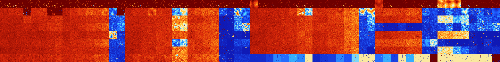

# B0127 (69120-69631)

<details>
    <summary>Initial Grid</summary>
    
</details>


<details>
    <summary>Initial Grid RLE</summary>

```
#C Exported from GoGoL (https://github.com/marrow16/gogol)
#C Wrap mode: Toroidal
#C Boundary mode: Dead
#C Step: 0
x = 100, y = 100, rule = B0127/S
12bo34bo2bo41bo$o17bo28bo29bo3bo15bo$5bo26bo28bo15bo$16bo32bo3b2o9bo29b
o$22bo4bo37bo$11bo6bo39bo16bo$7bo17bo29bo35bo$11bo17bo50bo3bobo$8bo13bo
4bo11bo12bo14bo$20bo18bo10bobo4bo8bo28bo$14bo45bo25bo4bo$28bo12bo15bo3b
o$16bo32b2o44bo$28bo37bo10bo11bo$2bo3bo16bo3bo3bo12bo2b3o14bo$18bo8bo
28bo34bo$14bo36bo39bo5bo$12bo12bo6bo17bo10bo12bo$6bo26bo3bo20bo16bo$17b
o12bo17bo9bo12bo$20bo17bo4bo$7bo4bo54bo10bo$12bo2bo5bo8bo6bo56bo$10bo$
53bo20bo5bo$39bo31bo$7bo27b2o13bo4bo$22bo27bo47bo$51bo5bo25b2o$4bo12bo$
2b2o13bo36bo$3bo21bobo26bo4bo2bo12bo11bo2bo$59bobo17bo10bo$4bo11bo47bob
o5bo7bo7bo$35bo14bo27bo$13bo13bo10bo17bo$9bo44bo6bo5bo$o13bo7bo51bo3bo
4bo13bo$16bo5bo14bo42bo9bo$7bo41bo23bo9b2o2bo7bo2bo$bo55bo14bo17bo$2bob
o2bo8bo12bo21bo43bo$10bo47bo7bo17bo5bo$20bobo5bo30bo19bo17bo$2bo10bo6bo
7bo18bo37bo$33bo4bo38bo6bo$21bo12bobo10bo20bo18b2o$70bo15bo7bo4bo$26bo$
64bo7bo$58bo14bo$11bo8bo14bo$11bo39bo41bo$10bo3bo4bo25bo8bo16bo3bo9bo$
52bo10bo3bo3bo27bo$2bo18bo2bo44bo14bobo$2bo18bo8bo16bo34bo7bo$16bo6bo
63bobo8bo$2bo53bo17bo18bo$5bo34bo27bo$26bo$7bo3bo3bo19bo20bo5bo14bo$2bo
7bo4bo9bo12bo7bo$8bo3bo5bo19bo36bo3bo10bo$27bo4bo2bo3bo6bo22bo7bo8bo$
16bo6bo10bo11bo6bo3bo15bo14bo5bo$80bo18bo$18bo39b2o23bo$85bobo$3bo17bo
73bo$o3bo3bo6bo83bo$o10bo22bo36bo21bobobo$23bo15bo43bo13bo$61bo15bo15bo
2bo$o4bo61bo$3bo11bo54bo$bo4bo39bo13bo25bo$20bo11bo4bo22bo10bo17bo$36bo
17bo11bo28bo$bo11bo9bo26bo19bo15bo$32bo6bo3bo31bo19bo$25bo12bo27bo17bo
8bo$5bo11bo11bo6bo37bo6bo$2b2o3b2o15bo8bo11bo24bobobo$9b2o9bo7bo$bo4bo
18bo23bo19bo15bo$11bo14bo7bo2bo4bobo8bo$6bo27b2o26bo25bo$17bo39bo15bo
17bo3bo$34bo25bo4bo25bobo$b2o26bo5bo11bo13bo19bo$3bo9b2o8bo74bo$30bo4bo
10bo6bo38b2o$16bo25bo22bobo13bo$3bo81bo2bo$10bo49bobo29bo$11bo6bo21bo
12bo35bo$40bo7bo32bo17bo$19bo16bo14bo29bo8bo3bobo$6bo13bo2bo19bo!
```
</details>
<details>
    <summary>Thumbnail</summary>

</details>
<table>
<tr>
    <td><a href="./69120%20S%20Heat%20Map%20Activity.png"></a><br>S (69120)<br>R@6,p2</td>    <td><a href="./69121%20S0%20Heat%20Map%20Activity.png"></a><br>S0 (69121)<br>R@5,p2</td>    <td><a href="./69122%20S1%20Heat%20Map%20Activity.png"></a><br>S1 (69122)<br>R@6,p2</td>    <td><a href="./69123%20S01%20Heat%20Map%20Activity.png"></a><br>S01 (69123)<br>R@5,p2</td>    <td><a href="./69124%20S2%20Heat%20Map%20Activity.png"></a><br>S2 (69124)<br>R@6,p2</td>    <td><a href="./69125%20S02%20Heat%20Map%20Activity.png"></a><br>S02 (69125)<br>R@5,p2</td>    <td><a href="./69126%20S12%20Heat%20Map%20Activity.png"></a><br>S12 (69126)<br>R@6,p2</td>    <td><a href="./69127%20S012%20Heat%20Map%20Activity.png"></a><br>S012 (69127)<br>R@6,p2</td>    <td><a href="./69128%20S3%20Heat%20Map%20Activity.png"></a><br>S3 (69128)<br>R@6,p2</td>    <td><a href="./69129%20S03%20Heat%20Map%20Activity.png"></a><br>S03 (69129)<br>R@5,p2</td>    <td><a href="./69130%20S13%20Heat%20Map%20Activity.png"></a><br>S13 (69130)<br>R@6,p2</td>    <td><a href="./69131%20S013%20Heat%20Map%20Activity.png"></a><br>S013 (69131)<br>R@7,p2</td>    <td><a href="./69132%20S23%20Heat%20Map%20Activity.png"></a><br>S23 (69132)<br>R@8,p2</td>    <td><a href="./69133%20S023%20Heat%20Map%20Activity.png"></a><br>S023 (69133)<br>R@6,p2</td>    <td><a href="./69134%20S123%20Heat%20Map%20Activity.png"></a><br>S123 (69134)<br>R@6,p2</td>    <td><a href="./69135%20S0123%20Heat%20Map%20Activity.png"></a><br>S0123 (69135)<br>R@7,p2</td>    <td><a href="./69136%20S4%20Heat%20Map%20Activity.png"></a><br>S4 (69136)<br>R@6,p2</td>    <td><a href="./69137%20S04%20Heat%20Map%20Activity.png"></a><br>S04 (69137)<br>R@6,p2</td>    <td><a href="./69138%20S14%20Heat%20Map%20Activity.png"></a><br>S14 (69138)<br>R@7,p2</td>    <td><a href="./69139%20S014%20Heat%20Map%20Activity.png"></a><br>S014 (69139)<br>R@5,p2</td>    <td><a href="./69140%20S24%20Heat%20Map%20Activity.png"></a><br>S24 (69140)<br>R@6,p2</td>    <td><a href="./69141%20S024%20Heat%20Map%20Activity.png"></a><br>S024 (69141)<br>R@6,p2</td>    <td><a href="./69142%20S124%20Heat%20Map%20Activity.png"></a><br>S124 (69142)<br>R@7,p2</td>    <td><a href="./69143%20S0124%20Heat%20Map%20Activity.png"></a><br>S0124 (69143)<br>R@6,p2</td>    <td><a href="./69144%20S34%20Heat%20Map%20Activity.png"></a><br>S34 (69144)<br>R@8,p2</td>    <td><a href="./69145%20S034%20Heat%20Map%20Activity.png"></a><br>S034 (69145)<br>R@7,p2</td>    <td><a href="./69146%20S134%20Heat%20Map%20Activity.png"></a><br>S134 (69146)<br>R@8,p2</td>    <td><a href="./69147%20S0134%20Heat%20Map%20Activity.png"></a><br>S0134 (69147)<br>R@7,p2</td>    <td><a href="./69148%20S234%20Heat%20Map%20Activity.png"></a><br>S234 (69148)<br>R@10,p2</td>    <td><a href="./69149%20S0234%20Heat%20Map%20Activity.png"></a><br>S0234 (69149)<br>R@6,p2</td>    <td><a href="./69150%20S1234%20Heat%20Map%20Activity.png"></a><br>S1234 (69150)<br>R@8,p2</td>    <td><a href="./69151%20S01234%20Heat%20Map%20Activity.png"></a><br>S01234 (69151)<br>R@8,p2</td>    <td><a href="./69152%20S5%20Heat%20Map%20Activity.png"></a><br>S5 (69152)<br>G>1000</td>    <td><a href="./69153%20S05%20Heat%20Map%20Activity.png"></a><br>S05 (69153)<br>R@10,p2</td>    <td><a href="./69154%20S15%20Heat%20Map%20Activity.png"></a><br>S15 (69154)<br>R@18,p2</td>    <td><a href="./69155%20S015%20Heat%20Map%20Activity.png"></a><br>S015 (69155)<br>R@9,p2</td>    <td><a href="./69156%20S25%20Heat%20Map%20Activity.png"></a><br>S25 (69156)<br>R@12,p2</td>    <td><a href="./69157%20S025%20Heat%20Map%20Activity.png"></a><br>S025 (69157)<br>R@9,p2</td>    <td><a href="./69158%20S125%20Heat%20Map%20Activity.png"></a><br>S125 (69158)<br>R@12,p2</td>    <td><a href="./69159%20S0125%20Heat%20Map%20Activity.png"></a><br>S0125 (69159)<br>R@8,p2</td>    <td><a href="./69160%20S35%20Heat%20Map%20Activity.png"></a><br>S35 (69160)<br>R@30,p2</td>    <td><a href="./69161%20S035%20Heat%20Map%20Activity.png"></a><br>S035 (69161)<br>R@10,p2</td>    <td><a href="./69162%20S135%20Heat%20Map%20Activity.png"></a><br>S135 (69162)<br>R@32,p2</td>    <td><a href="./69163%20S0135%20Heat%20Map%20Activity.png"></a><br>S0135 (69163)<br>R@20,p2</td>    <td><a href="./69164%20S235%20Heat%20Map%20Activity.png"></a><br>S235 (69164)<br>R@14,p2</td>    <td><a href="./69165%20S0235%20Heat%20Map%20Activity.png"></a><br>S0235 (69165)<br>R@11,p2</td>    <td><a href="./69166%20S1235%20Heat%20Map%20Activity.png"></a><br>S1235 (69166)<br>R@12,p2</td>    <td><a href="./69167%20S01235%20Heat%20Map%20Activity.png"></a><br>S01235 (69167)<br>R@15,p2</td>    <td><a href="./69168%20S45%20Heat%20Map%20Activity.png"></a><br>S45 (69168)<br>G>1000</td>    <td><a href="./69169%20S045%20Heat%20Map%20Activity.png"></a><br>S045 (69169)<br>R@17,p2</td>    <td><a href="./69170%20S145%20Heat%20Map%20Activity.png"></a><br>S145 (69170)<br>R@61,p6</td>    <td><a href="./69171%20S0145%20Heat%20Map%20Activity.png"></a><br>S0145 (69171)<br>R@9,p2</td>    <td><a href="./69172%20S245%20Heat%20Map%20Activity.png"></a><br>S245 (69172)<br>R@28,p4</td>    <td><a href="./69173%20S0245%20Heat%20Map%20Activity.png"></a><br>S0245 (69173)<br>R@10,p2</td>    <td><a href="./69174%20S1245%20Heat%20Map%20Activity.png"></a><br>S1245 (69174)<br>R@14,p2</td>    <td><a href="./69175%20S01245%20Heat%20Map%20Activity.png"></a><br>S01245 (69175)<br>R@13,p8</td>    <td><a href="./69176%20S345%20Heat%20Map%20Activity.png"></a><br>S345 (69176)<br>G>1000</td>    <td><a href="./69177%20S0345%20Heat%20Map%20Activity.png"></a><br>S0345 (69177)<br>G>1000</td>    <td><a href="./69178%20S1345%20Heat%20Map%20Activity.png"></a><br>S1345 (69178)<br>G>1000</td>    <td><a href="./69179%20S01345%20Heat%20Map%20Activity.png"></a><br>S01345 (69179)<br>R@16,p2</td>    <td><a href="./69180%20S2345%20Heat%20Map%20Activity.png"></a><br>S2345 (69180)<br>R@68,p4</td>    <td><a href="./69181%20S02345%20Heat%20Map%20Activity.png"></a><br>S02345 (69181)<br>R@12,p2</td>    <td><a href="./69182%20S12345%20Heat%20Map%20Activity.png"></a><br>S12345 (69182)<br>R@12,p2</td>    <td><a href="./69183%20S012345%20Heat%20Map%20Activity.png"></a><br>S012345 (69183)<br>R@10,p2</td></tr>
<tr>
    <td><a href="./69184%20S6%20Heat%20Map%20Activity.png"></a><br>S6 (69184)<br>G>1000</td>    <td><a href="./69185%20S06%20Heat%20Map%20Activity.png"></a><br>S06 (69185)<br>G>1000</td>    <td><a href="./69186%20S16%20Heat%20Map%20Activity.png"></a><br>S16 (69186)<br>G>1000</td>    <td><a href="./69187%20S016%20Heat%20Map%20Activity.png"></a><br>S016 (69187)<br>R@31,p4</td>    <td><a href="./69188%20S26%20Heat%20Map%20Activity.png"></a><br>S26 (69188)<br>G>1000</td>    <td><a href="./69189%20S026%20Heat%20Map%20Activity.png"></a><br>S026 (69189)<br>G>1000</td>    <td><a href="./69190%20S126%20Heat%20Map%20Activity.png"></a><br>S126 (69190)<br>R@916,p2</td>    <td><a href="./69191%20S0126%20Heat%20Map%20Activity.png"></a><br>S0126 (69191)<br>R@208,p2</td>    <td><a href="./69192%20S36%20Heat%20Map%20Activity.png"></a><br>S36 (69192)<br>G>1000</td>    <td><a href="./69193%20S036%20Heat%20Map%20Activity.png"></a><br>S036 (69193)<br>G>1000</td>    <td><a href="./69194%20S136%20Heat%20Map%20Activity.png"></a><br>S136 (69194)<br>G>1000</td>    <td><a href="./69195%20S0136%20Heat%20Map%20Activity.png"></a><br>S0136 (69195)<br>G>1000</td>    <td><a href="./69196%20S236%20Heat%20Map%20Activity.png"></a><br>S236 (69196)<br>G>1000</td>    <td><a href="./69197%20S0236%20Heat%20Map%20Activity.png"></a><br>S0236 (69197)<br>G>1000</td>    <td><a href="./69198%20S1236%20Heat%20Map%20Activity.png"></a><br>S1236 (69198)<br>G>1000</td>    <td><a href="./69199%20S01236%20Heat%20Map%20Activity.png"></a><br>S01236 (69199)<br>R@41,p2</td>    <td><a href="./69200%20S46%20Heat%20Map%20Activity.png"></a><br>S46 (69200)<br>G>1000</td>    <td><a href="./69201%20S046%20Heat%20Map%20Activity.png"></a><br>S046 (69201)<br>G>1000</td>    <td><a href="./69202%20S146%20Heat%20Map%20Activity.png"></a><br>S146 (69202)<br>G>1000</td>    <td><a href="./69203%20S0146%20Heat%20Map%20Activity.png"></a><br>S0146 (69203)<br>G>1000</td>    <td><a href="./69204%20S246%20Heat%20Map%20Activity.png"></a><br>S246 (69204)<br>G>1000</td>    <td><a href="./69205%20S0246%20Heat%20Map%20Activity.png"></a><br>S0246 (69205)<br>G>1000</td>    <td><a href="./69206%20S1246%20Heat%20Map%20Activity.png"></a><br>S1246 (69206)<br>G>1000</td>    <td><a href="./69207%20S01246%20Heat%20Map%20Activity.png"></a><br>S01246 (69207)<br>G>1000</td>    <td><a href="./69208%20S346%20Heat%20Map%20Activity.png"></a><br>S346 (69208)<br>G>1000</td>    <td><a href="./69209%20S0346%20Heat%20Map%20Activity.png"></a><br>S0346 (69209)<br>G>1000</td>    <td><a href="./69210%20S1346%20Heat%20Map%20Activity.png"></a><br>S1346 (69210)<br>G>1000</td>    <td><a href="./69211%20S01346%20Heat%20Map%20Activity.png"></a><br>S01346 (69211)<br>G>1000</td>    <td><a href="./69212%20S2346%20Heat%20Map%20Activity.png"></a><br>S2346 (69212)<br>R@145,p8</td>    <td><a href="./69213%20S02346%20Heat%20Map%20Activity.png"></a><br>S02346 (69213)<br>G>1000</td>    <td><a href="./69214%20S12346%20Heat%20Map%20Activity.png"></a><br>S12346 (69214)<br>R@150,p20</td>    <td><a href="./69215%20S012346%20Heat%20Map%20Activity.png"></a><br>S012346 (69215)<br>R@397,p260</td>    <td><a href="./69216%20S56%20Heat%20Map%20Activity.png"></a><br>S56 (69216)<br>G>1000</td>    <td><a href="./69217%20S056%20Heat%20Map%20Activity.png"></a><br>S056 (69217)<br>G>1000</td>    <td><a href="./69218%20S156%20Heat%20Map%20Activity.png"></a><br>S156 (69218)<br>G>1000</td>    <td><a href="./69219%20S0156%20Heat%20Map%20Activity.png"></a><br>S0156 (69219)<br>G>1000</td>    <td><a href="./69220%20S256%20Heat%20Map%20Activity.png"></a><br>S256 (69220)<br>G>1000</td>    <td><a href="./69221%20S0256%20Heat%20Map%20Activity.png"></a><br>S0256 (69221)<br>G>1000</td>    <td><a href="./69222%20S1256%20Heat%20Map%20Activity.png"></a><br>S1256 (69222)<br>G>1000</td>    <td><a href="./69223%20S01256%20Heat%20Map%20Activity.png"></a><br>S01256 (69223)<br>G>1000</td>    <td><a href="./69224%20S356%20Heat%20Map%20Activity.png"></a><br>S356 (69224)<br>G>1000</td>    <td><a href="./69225%20S0356%20Heat%20Map%20Activity.png"></a><br>S0356 (69225)<br>G>1000</td>    <td><a href="./69226%20S1356%20Heat%20Map%20Activity.png"></a><br>S1356 (69226)<br>G>1000</td>    <td><a href="./69227%20S01356%20Heat%20Map%20Activity.png"></a><br>S01356 (69227)<br>G>1000</td>    <td><a href="./69228%20S2356%20Heat%20Map%20Activity.png"></a><br>S2356 (69228)<br>G>1000</td>    <td><a href="./69229%20S02356%20Heat%20Map%20Activity.png"></a><br>S02356 (69229)<br>G>1000</td>    <td><a href="./69230%20S12356%20Heat%20Map%20Activity.png"></a><br>S12356 (69230)<br>R@118,p12</td>    <td><a href="./69231%20S012356%20Heat%20Map%20Activity.png"></a><br>S012356 (69231)<br>R@137,p2</td>    <td><a href="./69232%20S456%20Heat%20Map%20Activity.png"></a><br>S456 (69232)<br>G>1000</td>    <td><a href="./69233%20S0456%20Heat%20Map%20Activity.png"></a><br>S0456 (69233)<br>G>1000</td>    <td><a href="./69234%20S1456%20Heat%20Map%20Activity.png"></a><br>S1456 (69234)<br>G>1000</td>    <td><a href="./69235%20S01456%20Heat%20Map%20Activity.png"></a><br>S01456 (69235)<br>G>1000</td>    <td><a href="./69236%20S2456%20Heat%20Map%20Activity.png"></a><br>S2456 (69236)<br>G>1000</td>    <td><a href="./69237%20S02456%20Heat%20Map%20Activity.png"></a><br>S02456 (69237)<br>G>1000</td>    <td><a href="./69238%20S12456%20Heat%20Map%20Activity.png"></a><br>S12456 (69238)<br>G>1000</td>    <td><a href="./69239%20S012456%20Heat%20Map%20Activity.png"></a><br>S012456 (69239)<br>G>1000</td>    <td><a href="./69240%20S3456%20Heat%20Map%20Activity.png"></a><br>S3456 (69240)<br>R@280,p216</td>    <td><a href="./69241%20S03456%20Heat%20Map%20Activity.png"></a><br>S03456 (69241)<br>R@119,p24</td>    <td><a href="./69242%20S13456%20Heat%20Map%20Activity.png"></a><br>S13456 (69242)<br>R@210,p120</td>    <td><a href="./69243%20S013456%20Heat%20Map%20Activity.png"></a><br>S013456 (69243)<br>R@161,p24</td>    <td><a href="./69244%20S23456%20Heat%20Map%20Activity.png"></a><br>S23456 (69244)<br>R@185,p120</td>    <td><a href="./69245%20S023456%20Heat%20Map%20Activity.png"></a><br>S023456 (69245)<br>R@230,p120</td>    <td><a href="./69246%20S123456%20Heat%20Map%20Activity.png"></a><br>S123456 (69246)<br>R@952,p840</td>    <td><a href="./69247%20S0123456%20Heat%20Map%20Activity.png"></a><br>S0123456 (69247)<br>G>1000</td></tr>
<tr>
    <td><a href="./69248%20S7%20Heat%20Map%20Activity.png"></a><br>S7 (69248)<br>G>1000</td>    <td><a href="./69249%20S07%20Heat%20Map%20Activity.png"></a><br>S07 (69249)<br>G>1000</td>    <td><a href="./69250%20S17%20Heat%20Map%20Activity.png"></a><br>S17 (69250)<br>G>1000</td>    <td><a href="./69251%20S017%20Heat%20Map%20Activity.png"></a><br>S017 (69251)<br>G>1000</td>    <td><a href="./69252%20S27%20Heat%20Map%20Activity.png"></a><br>S27 (69252)<br>G>1000</td>    <td><a href="./69253%20S027%20Heat%20Map%20Activity.png"></a><br>S027 (69253)<br>G>1000</td>    <td><a href="./69254%20S127%20Heat%20Map%20Activity.png"></a><br>S127 (69254)<br>G>1000</td>    <td><a href="./69255%20S0127%20Heat%20Map%20Activity.png"></a><br>S0127 (69255)<br>G>1000</td>    <td><a href="./69256%20S37%20Heat%20Map%20Activity.png"></a><br>S37 (69256)<br>G>1000</td>    <td><a href="./69257%20S037%20Heat%20Map%20Activity.png"></a><br>S037 (69257)<br>G>1000</td>    <td><a href="./69258%20S137%20Heat%20Map%20Activity.png"></a><br>S137 (69258)<br>G>1000</td>    <td><a href="./69259%20S0137%20Heat%20Map%20Activity.png"></a><br>S0137 (69259)<br>G>1000</td>    <td><a href="./69260%20S237%20Heat%20Map%20Activity.png"></a><br>S237 (69260)<br>G>1000</td>    <td><a href="./69261%20S0237%20Heat%20Map%20Activity.png"></a><br>S0237 (69261)<br>G>1000</td>    <td><a href="./69262%20S1237%20Heat%20Map%20Activity.png"></a><br>S1237 (69262)<br>R@115,p24</td>    <td><a href="./69263%20S01237%20Heat%20Map%20Activity.png"></a><br>S01237 (69263)<br>R@121,p24</td>    <td><a href="./69264%20S47%20Heat%20Map%20Activity.png"></a><br>S47 (69264)<br>G>1000</td>    <td><a href="./69265%20S047%20Heat%20Map%20Activity.png"></a><br>S047 (69265)<br>G>1000</td>    <td><a href="./69266%20S147%20Heat%20Map%20Activity.png"></a><br>S147 (69266)<br>G>1000</td>    <td><a href="./69267%20S0147%20Heat%20Map%20Activity.png"></a><br>S0147 (69267)<br>G>1000</td>    <td><a href="./69268%20S247%20Heat%20Map%20Activity.png"></a><br>S247 (69268)<br>G>1000</td>    <td><a href="./69269%20S0247%20Heat%20Map%20Activity.png"></a><br>S0247 (69269)<br>G>1000</td>    <td><a href="./69270%20S1247%20Heat%20Map%20Activity.png"></a><br>S1247 (69270)<br>G>1000</td>    <td><a href="./69271%20S01247%20Heat%20Map%20Activity.png"></a><br>S01247 (69271)<br>G>1000</td>    <td><a href="./69272%20S347%20Heat%20Map%20Activity.png"></a><br>S347 (69272)<br>G>1000</td>    <td><a href="./69273%20S0347%20Heat%20Map%20Activity.png"></a><br>S0347 (69273)<br>G>1000</td>    <td><a href="./69274%20S1347%20Heat%20Map%20Activity.png"></a><br>S1347 (69274)<br>G>1000</td>    <td><a href="./69275%20S01347%20Heat%20Map%20Activity.png"></a><br>S01347 (69275)<br>G>1000</td>    <td><a href="./69276%20S2347%20Heat%20Map%20Activity.png"></a><br>S2347 (69276)<br>G>1000</td>    <td><a href="./69277%20S02347%20Heat%20Map%20Activity.png"></a><br>S02347 (69277)<br>G>1000</td>    <td><a href="./69278%20S12347%20Heat%20Map%20Activity.png"></a><br>S12347 (69278)<br>R@21,p2</td>    <td><a href="./69279%20S012347%20Heat%20Map%20Activity.png"></a><br>S012347 (69279)<br>R@132,p84</td>    <td><a href="./69280%20S57%20Heat%20Map%20Activity.png"></a><br>S57 (69280)<br>G>1000</td>    <td><a href="./69281%20S057%20Heat%20Map%20Activity.png"></a><br>S057 (69281)<br>G>1000</td>    <td><a href="./69282%20S157%20Heat%20Map%20Activity.png"></a><br>S157 (69282)<br>G>1000</td>    <td><a href="./69283%20S0157%20Heat%20Map%20Activity.png"></a><br>S0157 (69283)<br>G>1000</td>    <td><a href="./69284%20S257%20Heat%20Map%20Activity.png"></a><br>S257 (69284)<br>G>1000</td>    <td><a href="./69285%20S0257%20Heat%20Map%20Activity.png"></a><br>S0257 (69285)<br>G>1000</td>    <td><a href="./69286%20S1257%20Heat%20Map%20Activity.png"></a><br>S1257 (69286)<br>G>1000</td>    <td><a href="./69287%20S01257%20Heat%20Map%20Activity.png"></a><br>S01257 (69287)<br>G>1000</td>    <td><a href="./69288%20S357%20Heat%20Map%20Activity.png"></a><br>S357 (69288)<br>G>1000</td>    <td><a href="./69289%20S0357%20Heat%20Map%20Activity.png"></a><br>S0357 (69289)<br>G>1000</td>    <td><a href="./69290%20S1357%20Heat%20Map%20Activity.png"></a><br>S1357 (69290)<br>G>1000</td>    <td><a href="./69291%20S01357%20Heat%20Map%20Activity.png"></a><br>S01357 (69291)<br>G>1000</td>    <td><a href="./69292%20S2357%20Heat%20Map%20Activity.png"></a><br>S2357 (69292)<br>G>1000</td>    <td><a href="./69293%20S02357%20Heat%20Map%20Activity.png"></a><br>S02357 (69293)<br>G>1000</td>    <td><a href="./69294%20S12357%20Heat%20Map%20Activity.png"></a><br>S12357 (69294)<br>R@61,p24</td>    <td><a href="./69295%20S012357%20Heat%20Map%20Activity.png"></a><br>S012357 (69295)<br>R@51,p6</td>    <td><a href="./69296%20S457%20Heat%20Map%20Activity.png"></a><br>S457 (69296)<br>G>1000</td>    <td><a href="./69297%20S0457%20Heat%20Map%20Activity.png"></a><br>S0457 (69297)<br>G>1000</td>    <td><a href="./69298%20S1457%20Heat%20Map%20Activity.png"></a><br>S1457 (69298)<br>G>1000</td>    <td><a href="./69299%20S01457%20Heat%20Map%20Activity.png"></a><br>S01457 (69299)<br>G>1000</td>    <td><a href="./69300%20S2457%20Heat%20Map%20Activity.png"></a><br>S2457 (69300)<br>G>1000</td>    <td><a href="./69301%20S02457%20Heat%20Map%20Activity.png"></a><br>S02457 (69301)<br>G>1000</td>    <td><a href="./69302%20S12457%20Heat%20Map%20Activity.png"></a><br>S12457 (69302)<br>G>1000</td>    <td><a href="./69303%20S012457%20Heat%20Map%20Activity.png"></a><br>S012457 (69303)<br>G>1000</td>    <td><a href="./69304%20S3457%20Heat%20Map%20Activity.png"></a><br>S3457 (69304)<br>G>1000</td>    <td><a href="./69305%20S03457%20Heat%20Map%20Activity.png"></a><br>S03457 (69305)<br>G>1000</td>    <td><a href="./69306%20S13457%20Heat%20Map%20Activity.png"></a><br>S13457 (69306)<br>G>1000</td>    <td><a href="./69307%20S013457%20Heat%20Map%20Activity.png"></a><br>S013457 (69307)<br>G>1000</td>    <td><a href="./69308%20S23457%20Heat%20Map%20Activity.png"></a><br>S23457 (69308)<br>R@106,p84</td>    <td><a href="./69309%20S023457%20Heat%20Map%20Activity.png"></a><br>S023457 (69309)<br>R@45,p12</td>    <td><a href="./69310%20S123457%20Heat%20Map%20Activity.png"></a><br>S123457 (69310)<br>R@28,p12</td>    <td><a href="./69311%20S0123457%20Heat%20Map%20Activity.png"></a><br>S0123457 (69311)<br>R@115,p84</td></tr>
<tr>
    <td><a href="./69312%20S67%20Heat%20Map%20Activity.png"></a><br>S67 (69312)<br>G>1000</td>    <td><a href="./69313%20S067%20Heat%20Map%20Activity.png"></a><br>S067 (69313)<br>G>1000</td>    <td><a href="./69314%20S167%20Heat%20Map%20Activity.png"></a><br>S167 (69314)<br>G>1000</td>    <td><a href="./69315%20S0167%20Heat%20Map%20Activity.png"></a><br>S0167 (69315)<br>G>1000</td>    <td><a href="./69316%20S267%20Heat%20Map%20Activity.png"></a><br>S267 (69316)<br>G>1000</td>    <td><a href="./69317%20S0267%20Heat%20Map%20Activity.png"></a><br>S0267 (69317)<br>G>1000</td>    <td><a href="./69318%20S1267%20Heat%20Map%20Activity.png"></a><br>S1267 (69318)<br>G>1000</td>    <td><a href="./69319%20S01267%20Heat%20Map%20Activity.png"></a><br>S01267 (69319)<br>G>1000</td>    <td><a href="./69320%20S367%20Heat%20Map%20Activity.png"></a><br>S367 (69320)<br>G>1000</td>    <td><a href="./69321%20S0367%20Heat%20Map%20Activity.png"></a><br>S0367 (69321)<br>G>1000</td>    <td><a href="./69322%20S1367%20Heat%20Map%20Activity.png"></a><br>S1367 (69322)<br>G>1000</td>    <td><a href="./69323%20S01367%20Heat%20Map%20Activity.png"></a><br>S01367 (69323)<br>G>1000</td>    <td><a href="./69324%20S2367%20Heat%20Map%20Activity.png"></a><br>S2367 (69324)<br>G>1000</td>    <td><a href="./69325%20S02367%20Heat%20Map%20Activity.png"></a><br>S02367 (69325)<br>G>1000</td>    <td><a href="./69326%20S12367%20Heat%20Map%20Activity.png"></a><br>S12367 (69326)<br>R@60,p12</td>    <td><a href="./69327%20S012367%20Heat%20Map%20Activity.png"></a><br>S012367 (69327)<br>R@77,p12</td>    <td><a href="./69328%20S467%20Heat%20Map%20Activity.png"></a><br>S467 (69328)<br>G>1000</td>    <td><a href="./69329%20S0467%20Heat%20Map%20Activity.png"></a><br>S0467 (69329)<br>G>1000</td>    <td><a href="./69330%20S1467%20Heat%20Map%20Activity.png"></a><br>S1467 (69330)<br>G>1000</td>    <td><a href="./69331%20S01467%20Heat%20Map%20Activity.png"></a><br>S01467 (69331)<br>G>1000</td>    <td><a href="./69332%20S2467%20Heat%20Map%20Activity.png"></a><br>S2467 (69332)<br>G>1000</td>    <td><a href="./69333%20S02467%20Heat%20Map%20Activity.png"></a><br>S02467 (69333)<br>G>1000</td>    <td><a href="./69334%20S12467%20Heat%20Map%20Activity.png"></a><br>S12467 (69334)<br>G>1000</td>    <td><a href="./69335%20S012467%20Heat%20Map%20Activity.png"></a><br>S012467 (69335)<br>G>1000</td>    <td><a href="./69336%20S3467%20Heat%20Map%20Activity.png"></a><br>S3467 (69336)<br>G>1000</td>    <td><a href="./69337%20S03467%20Heat%20Map%20Activity.png"></a><br>S03467 (69337)<br>G>1000</td>    <td><a href="./69338%20S13467%20Heat%20Map%20Activity.png"></a><br>S13467 (69338)<br>G>1000</td>    <td><a href="./69339%20S013467%20Heat%20Map%20Activity.png"></a><br>S013467 (69339)<br>G>1000</td>    <td><a href="./69340%20S23467%20Heat%20Map%20Activity.png"></a><br>S23467 (69340)<br>R@905,p756</td>    <td><a href="./69341%20S023467%20Heat%20Map%20Activity.png"></a><br>S023467 (69341)<br>R@923,p840</td>    <td><a href="./69342%20S123467%20Heat%20Map%20Activity.png"></a><br>S123467 (69342)<br>R@19,p2</td>    <td><a href="./69343%20S0123467%20Heat%20Map%20Activity.png"></a><br>S0123467 (69343)<br>S@34</td>    <td><a href="./69344%20S567%20Heat%20Map%20Activity.png"></a><br>S567 (69344)<br>G>1000</td>    <td><a href="./69345%20S0567%20Heat%20Map%20Activity.png"></a><br>S0567 (69345)<br>G>1000</td>    <td><a href="./69346%20S1567%20Heat%20Map%20Activity.png"></a><br>S1567 (69346)<br>G>1000</td>    <td><a href="./69347%20S01567%20Heat%20Map%20Activity.png"></a><br>S01567 (69347)<br>G>1000</td>    <td><a href="./69348%20S2567%20Heat%20Map%20Activity.png"></a><br>S2567 (69348)<br>G>1000</td>    <td><a href="./69349%20S02567%20Heat%20Map%20Activity.png"></a><br>S02567 (69349)<br>G>1000</td>    <td><a href="./69350%20S12567%20Heat%20Map%20Activity.png"></a><br>S12567 (69350)<br>G>1000</td>    <td><a href="./69351%20S012567%20Heat%20Map%20Activity.png"></a><br>S012567 (69351)<br>G>1000</td>    <td><a href="./69352%20S3567%20Heat%20Map%20Activity.png"></a><br>S3567 (69352)<br>G>1000</td>    <td><a href="./69353%20S03567%20Heat%20Map%20Activity.png"></a><br>S03567 (69353)<br>G>1000</td>    <td><a href="./69354%20S13567%20Heat%20Map%20Activity.png"></a><br>S13567 (69354)<br>G>1000</td>    <td><a href="./69355%20S013567%20Heat%20Map%20Activity.png"></a><br>S013567 (69355)<br>G>1000</td>    <td><a href="./69356%20S23567%20Heat%20Map%20Activity.png"></a><br>S23567 (69356)<br>G>1000</td>    <td><a href="./69357%20S023567%20Heat%20Map%20Activity.png"></a><br>S023567 (69357)<br>G>1000</td>    <td><a href="./69358%20S123567%20Heat%20Map%20Activity.png"></a><br>S123567 (69358)<br>R@58,p18</td>    <td><a href="./69359%20S0123567%20Heat%20Map%20Activity.png"></a><br>S0123567 (69359)<br>R@66,p12</td>    <td><a href="./69360%20S4567%20Heat%20Map%20Activity.png"></a><br>S4567 (69360)<br>R@157,p60</td>    <td><a href="./69361%20S04567%20Heat%20Map%20Activity.png"></a><br>S04567 (69361)<br>G>1000</td>    <td><a href="./69362%20S14567%20Heat%20Map%20Activity.png"></a><br>S14567 (69362)<br>G>1000</td>    <td><a href="./69363%20S014567%20Heat%20Map%20Activity.png"></a><br>S014567 (69363)<br>R@341,p252</td>    <td><a href="./69364%20S24567%20Heat%20Map%20Activity.png"></a><br>S24567 (69364)<br>G>1000</td>    <td><a href="./69365%20S024567%20Heat%20Map%20Activity.png"></a><br>S024567 (69365)<br>G>1000</td>    <td><a href="./69366%20S124567%20Heat%20Map%20Activity.png"></a><br>S124567 (69366)<br>R@96,p12</td>    <td><a href="./69367%20S0124567%20Heat%20Map%20Activity.png"></a><br>S0124567 (69367)<br>R@155,p60</td>    <td><a href="./69368%20S34567%20Heat%20Map%20Activity.png"></a><br>S34567 (69368)<br>R@32,p12</td>    <td><a href="./69369%20S034567%20Heat%20Map%20Activity.png"></a><br>S034567 (69369)<br>R@33,p12</td>    <td><a href="./69370%20S134567%20Heat%20Map%20Activity.png"></a><br>S134567 (69370)<br>R@80,p60</td>    <td><a href="./69371%20S0134567%20Heat%20Map%20Activity.png"></a><br>S0134567 (69371)<br>R@44,p12</td>    <td><a href="./69372%20S234567%20Heat%20Map%20Activity.png"></a><br>S234567 (69372)<br>R@24,p6</td>    <td><a href="./69373%20S0234567%20Heat%20Map%20Activity.png"></a><br>S0234567 (69373)<br>R@31,p6</td>    <td><a href="./69374%20S1234567%20Heat%20Map%20Activity.png"></a><br>S1234567 (69374)<br>R@22,p6</td>    <td><a href="./69375%20S01234567%20Heat%20Map%20Activity.png"></a><br>S01234567 (69375)<br>R@43,p6</td></tr>
<tr>
    <td><a href="./69376%20S8%20Heat%20Map%20Activity.png"></a><br>S8 (69376)<br>G>1000</td>    <td><a href="./69377%20S08%20Heat%20Map%20Activity.png"></a><br>S08 (69377)<br>G>1000</td>    <td><a href="./69378%20S18%20Heat%20Map%20Activity.png"></a><br>S18 (69378)<br>G>1000</td>    <td><a href="./69379%20S018%20Heat%20Map%20Activity.png"></a><br>S018 (69379)<br>G>1000</td>    <td><a href="./69380%20S28%20Heat%20Map%20Activity.png"></a><br>S28 (69380)<br>G>1000</td>    <td><a href="./69381%20S028%20Heat%20Map%20Activity.png"></a><br>S028 (69381)<br>G>1000</td>    <td><a href="./69382%20S128%20Heat%20Map%20Activity.png"></a><br>S128 (69382)<br>G>1000</td>    <td><a href="./69383%20S0128%20Heat%20Map%20Activity.png"></a><br>S0128 (69383)<br>G>1000</td>    <td><a href="./69384%20S38%20Heat%20Map%20Activity.png"></a><br>S38 (69384)<br>G>1000</td>    <td><a href="./69385%20S038%20Heat%20Map%20Activity.png"></a><br>S038 (69385)<br>G>1000</td>    <td><a href="./69386%20S138%20Heat%20Map%20Activity.png"></a><br>S138 (69386)<br>G>1000</td>    <td><a href="./69387%20S0138%20Heat%20Map%20Activity.png"></a><br>S0138 (69387)<br>G>1000</td>    <td><a href="./69388%20S238%20Heat%20Map%20Activity.png"></a><br>S238 (69388)<br>G>1000</td>    <td><a href="./69389%20S0238%20Heat%20Map%20Activity.png"></a><br>S0238 (69389)<br>G>1000</td>    <td><a href="./69390%20S1238%20Heat%20Map%20Activity.png"></a><br>S1238 (69390)<br>G>1000</td>    <td><a href="./69391%20S01238%20Heat%20Map%20Activity.png"></a><br>S01238 (69391)<br>G>1000</td>    <td><a href="./69392%20S48%20Heat%20Map%20Activity.png"></a><br>S48 (69392)<br>G>1000</td>    <td><a href="./69393%20S048%20Heat%20Map%20Activity.png"></a><br>S048 (69393)<br>G>1000</td>    <td><a href="./69394%20S148%20Heat%20Map%20Activity.png"></a><br>S148 (69394)<br>G>1000</td>    <td><a href="./69395%20S0148%20Heat%20Map%20Activity.png"></a><br>S0148 (69395)<br>G>1000</td>    <td><a href="./69396%20S248%20Heat%20Map%20Activity.png"></a><br>S248 (69396)<br>G>1000</td>    <td><a href="./69397%20S0248%20Heat%20Map%20Activity.png"></a><br>S0248 (69397)<br>G>1000</td>    <td><a href="./69398%20S1248%20Heat%20Map%20Activity.png"></a><br>S1248 (69398)<br>G>1000</td>    <td><a href="./69399%20S01248%20Heat%20Map%20Activity.png"></a><br>S01248 (69399)<br>G>1000</td>    <td><a href="./69400%20S348%20Heat%20Map%20Activity.png"></a><br>S348 (69400)<br>G>1000</td>    <td><a href="./69401%20S0348%20Heat%20Map%20Activity.png"></a><br>S0348 (69401)<br>G>1000</td>    <td><a href="./69402%20S1348%20Heat%20Map%20Activity.png"></a><br>S1348 (69402)<br>G>1000</td>    <td><a href="./69403%20S01348%20Heat%20Map%20Activity.png"></a><br>S01348 (69403)<br>G>1000</td>    <td><a href="./69404%20S2348%20Heat%20Map%20Activity.png"></a><br>S2348 (69404)<br>R@654,p456</td>    <td><a href="./69405%20S02348%20Heat%20Map%20Activity.png"></a><br>S02348 (69405)<br>G>1000</td>    <td><a href="./69406%20S12348%20Heat%20Map%20Activity.png"></a><br>S12348 (69406)<br>R@190,p168</td>    <td><a href="./69407%20S012348%20Heat%20Map%20Activity.png"></a><br>S012348 (69407)<br>G>1000</td>    <td><a href="./69408%20S58%20Heat%20Map%20Activity.png"></a><br>S58 (69408)<br>G>1000</td>    <td><a href="./69409%20S058%20Heat%20Map%20Activity.png"></a><br>S058 (69409)<br>G>1000</td>    <td><a href="./69410%20S158%20Heat%20Map%20Activity.png"></a><br>S158 (69410)<br>G>1000</td>    <td><a href="./69411%20S0158%20Heat%20Map%20Activity.png"></a><br>S0158 (69411)<br>G>1000</td>    <td><a href="./69412%20S258%20Heat%20Map%20Activity.png"></a><br>S258 (69412)<br>G>1000</td>    <td><a href="./69413%20S0258%20Heat%20Map%20Activity.png"></a><br>S0258 (69413)<br>G>1000</td>    <td><a href="./69414%20S1258%20Heat%20Map%20Activity.png"></a><br>S1258 (69414)<br>G>1000</td>    <td><a href="./69415%20S01258%20Heat%20Map%20Activity.png"></a><br>S01258 (69415)<br>G>1000</td>    <td><a href="./69416%20S358%20Heat%20Map%20Activity.png"></a><br>S358 (69416)<br>G>1000</td>    <td><a href="./69417%20S0358%20Heat%20Map%20Activity.png"></a><br>S0358 (69417)<br>G>1000</td>    <td><a href="./69418%20S1358%20Heat%20Map%20Activity.png"></a><br>S1358 (69418)<br>G>1000</td>    <td><a href="./69419%20S01358%20Heat%20Map%20Activity.png"></a><br>S01358 (69419)<br>G>1000</td>    <td><a href="./69420%20S2358%20Heat%20Map%20Activity.png"></a><br>S2358 (69420)<br>G>1000</td>    <td><a href="./69421%20S02358%20Heat%20Map%20Activity.png"></a><br>S02358 (69421)<br>G>1000</td>    <td><a href="./69422%20S12358%20Heat%20Map%20Activity.png"></a><br>S12358 (69422)<br>R@42,p6</td>    <td><a href="./69423%20S012358%20Heat%20Map%20Activity.png"></a><br>S012358 (69423)<br>R@48,p6</td>    <td><a href="./69424%20S458%20Heat%20Map%20Activity.png"></a><br>S458 (69424)<br>G>1000</td>    <td><a href="./69425%20S0458%20Heat%20Map%20Activity.png"></a><br>S0458 (69425)<br>G>1000</td>    <td><a href="./69426%20S1458%20Heat%20Map%20Activity.png"></a><br>S1458 (69426)<br>G>1000</td>    <td><a href="./69427%20S01458%20Heat%20Map%20Activity.png"></a><br>S01458 (69427)<br>G>1000</td>    <td><a href="./69428%20S2458%20Heat%20Map%20Activity.png"></a><br>S2458 (69428)<br>G>1000</td>    <td><a href="./69429%20S02458%20Heat%20Map%20Activity.png"></a><br>S02458 (69429)<br>G>1000</td>    <td><a href="./69430%20S12458%20Heat%20Map%20Activity.png"></a><br>S12458 (69430)<br>R@340,p6</td>    <td><a href="./69431%20S012458%20Heat%20Map%20Activity.png"></a><br>S012458 (69431)<br>R@696,p60</td>    <td><a href="./69432%20S3458%20Heat%20Map%20Activity.png"></a><br>S3458 (69432)<br>G>1000</td>    <td><a href="./69433%20S03458%20Heat%20Map%20Activity.png"></a><br>S03458 (69433)<br>G>1000</td>    <td><a href="./69434%20S13458%20Heat%20Map%20Activity.png"></a><br>S13458 (69434)<br>G>1000</td>    <td><a href="./69435%20S013458%20Heat%20Map%20Activity.png"></a><br>S013458 (69435)<br>G>1000</td>    <td><a href="./69436%20S23458%20Heat%20Map%20Activity.png"></a><br>S23458 (69436)<br>R@251,p204</td>    <td><a href="./69437%20S023458%20Heat%20Map%20Activity.png"></a><br>S023458 (69437)<br>G>1000</td>    <td><a href="./69438%20S123458%20Heat%20Map%20Activity.png"></a><br>S123458 (69438)<br>G>1000</td>    <td><a href="./69439%20S0123458%20Heat%20Map%20Activity.png"></a><br>S0123458 (69439)<br>G>1000</td></tr>
<tr>
    <td><a href="./69440%20S68%20Heat%20Map%20Activity.png"></a><br>S68 (69440)<br>G>1000</td>    <td><a href="./69441%20S068%20Heat%20Map%20Activity.png"></a><br>S068 (69441)<br>G>1000</td>    <td><a href="./69442%20S168%20Heat%20Map%20Activity.png"></a><br>S168 (69442)<br>G>1000</td>    <td><a href="./69443%20S0168%20Heat%20Map%20Activity.png"></a><br>S0168 (69443)<br>G>1000</td>    <td><a href="./69444%20S268%20Heat%20Map%20Activity.png"></a><br>S268 (69444)<br>G>1000</td>    <td><a href="./69445%20S0268%20Heat%20Map%20Activity.png"></a><br>S0268 (69445)<br>G>1000</td>    <td><a href="./69446%20S1268%20Heat%20Map%20Activity.png"></a><br>S1268 (69446)<br>G>1000</td>    <td><a href="./69447%20S01268%20Heat%20Map%20Activity.png"></a><br>S01268 (69447)<br>G>1000</td>    <td><a href="./69448%20S368%20Heat%20Map%20Activity.png"></a><br>S368 (69448)<br>G>1000</td>    <td><a href="./69449%20S0368%20Heat%20Map%20Activity.png"></a><br>S0368 (69449)<br>G>1000</td>    <td><a href="./69450%20S1368%20Heat%20Map%20Activity.png"></a><br>S1368 (69450)<br>G>1000</td>    <td><a href="./69451%20S01368%20Heat%20Map%20Activity.png"></a><br>S01368 (69451)<br>G>1000</td>    <td><a href="./69452%20S2368%20Heat%20Map%20Activity.png"></a><br>S2368 (69452)<br>G>1000</td>    <td><a href="./69453%20S02368%20Heat%20Map%20Activity.png"></a><br>S02368 (69453)<br>G>1000</td>    <td><a href="./69454%20S12368%20Heat%20Map%20Activity.png"></a><br>S12368 (69454)<br>R@69,p12</td>    <td><a href="./69455%20S012368%20Heat%20Map%20Activity.png"></a><br>S012368 (69455)<br>R@67,p12</td>    <td><a href="./69456%20S468%20Heat%20Map%20Activity.png"></a><br>S468 (69456)<br>G>1000</td>    <td><a href="./69457%20S0468%20Heat%20Map%20Activity.png"></a><br>S0468 (69457)<br>G>1000</td>    <td><a href="./69458%20S1468%20Heat%20Map%20Activity.png"></a><br>S1468 (69458)<br>G>1000</td>    <td><a href="./69459%20S01468%20Heat%20Map%20Activity.png"></a><br>S01468 (69459)<br>G>1000</td>    <td><a href="./69460%20S2468%20Heat%20Map%20Activity.png"></a><br>S2468 (69460)<br>G>1000</td>    <td><a href="./69461%20S02468%20Heat%20Map%20Activity.png"></a><br>S02468 (69461)<br>G>1000</td>    <td><a href="./69462%20S12468%20Heat%20Map%20Activity.png"></a><br>S12468 (69462)<br>G>1000</td>    <td><a href="./69463%20S012468%20Heat%20Map%20Activity.png"></a><br>S012468 (69463)<br>G>1000</td>    <td><a href="./69464%20S3468%20Heat%20Map%20Activity.png"></a><br>S3468 (69464)<br>G>1000</td>    <td><a href="./69465%20S03468%20Heat%20Map%20Activity.png"></a><br>S03468 (69465)<br>G>1000</td>    <td><a href="./69466%20S13468%20Heat%20Map%20Activity.png"></a><br>S13468 (69466)<br>G>1000</td>    <td><a href="./69467%20S013468%20Heat%20Map%20Activity.png"></a><br>S013468 (69467)<br>G>1000</td>    <td><a href="./69468%20S23468%20Heat%20Map%20Activity.png"></a><br>S23468 (69468)<br>R@156,p60</td>    <td><a href="./69469%20S023468%20Heat%20Map%20Activity.png"></a><br>S023468 (69469)<br>G>1000</td>    <td><a href="./69470%20S123468%20Heat%20Map%20Activity.png"></a><br>S123468 (69470)<br>R@28,p12</td>    <td><a href="./69471%20S0123468%20Heat%20Map%20Activity.png"></a><br>S0123468 (69471)<br>R@35,p4</td>    <td><a href="./69472%20S568%20Heat%20Map%20Activity.png"></a><br>S568 (69472)<br>G>1000</td>    <td><a href="./69473%20S0568%20Heat%20Map%20Activity.png"></a><br>S0568 (69473)<br>G>1000</td>    <td><a href="./69474%20S1568%20Heat%20Map%20Activity.png"></a><br>S1568 (69474)<br>G>1000</td>    <td><a href="./69475%20S01568%20Heat%20Map%20Activity.png"></a><br>S01568 (69475)<br>G>1000</td>    <td><a href="./69476%20S2568%20Heat%20Map%20Activity.png"></a><br>S2568 (69476)<br>G>1000</td>    <td><a href="./69477%20S02568%20Heat%20Map%20Activity.png"></a><br>S02568 (69477)<br>G>1000</td>    <td><a href="./69478%20S12568%20Heat%20Map%20Activity.png"></a><br>S12568 (69478)<br>G>1000</td>    <td><a href="./69479%20S012568%20Heat%20Map%20Activity.png"></a><br>S012568 (69479)<br>G>1000</td>    <td><a href="./69480%20S3568%20Heat%20Map%20Activity.png"></a><br>S3568 (69480)<br>G>1000</td>    <td><a href="./69481%20S03568%20Heat%20Map%20Activity.png"></a><br>S03568 (69481)<br>G>1000</td>    <td><a href="./69482%20S13568%20Heat%20Map%20Activity.png"></a><br>S13568 (69482)<br>G>1000</td>    <td><a href="./69483%20S013568%20Heat%20Map%20Activity.png"></a><br>S013568 (69483)<br>G>1000</td>    <td><a href="./69484%20S23568%20Heat%20Map%20Activity.png"></a><br>S23568 (69484)<br>G>1000</td>    <td><a href="./69485%20S023568%20Heat%20Map%20Activity.png"></a><br>S023568 (69485)<br>G>1000</td>    <td><a href="./69486%20S123568%20Heat%20Map%20Activity.png"></a><br>S123568 (69486)<br>R@55,p12</td>    <td><a href="./69487%20S0123568%20Heat%20Map%20Activity.png"></a><br>S0123568 (69487)<br>R@54,p6</td>    <td><a href="./69488%20S4568%20Heat%20Map%20Activity.png"></a><br>S4568 (69488)<br>G>1000</td>    <td><a href="./69489%20S04568%20Heat%20Map%20Activity.png"></a><br>S04568 (69489)<br>G>1000</td>    <td><a href="./69490%20S14568%20Heat%20Map%20Activity.png"></a><br>S14568 (69490)<br>G>1000</td>    <td><a href="./69491%20S014568%20Heat%20Map%20Activity.png"></a><br>S014568 (69491)<br>G>1000</td>    <td><a href="./69492%20S24568%20Heat%20Map%20Activity.png"></a><br>S24568 (69492)<br>G>1000</td>    <td><a href="./69493%20S024568%20Heat%20Map%20Activity.png"></a><br>S024568 (69493)<br>G>1000</td>    <td><a href="./69494%20S124568%20Heat%20Map%20Activity.png"></a><br>S124568 (69494)<br>G>1000</td>    <td><a href="./69495%20S0124568%20Heat%20Map%20Activity.png"></a><br>S0124568 (69495)<br>G>1000</td>    <td><a href="./69496%20S34568%20Heat%20Map%20Activity.png"></a><br>S34568 (69496)<br>R@83,p24</td>    <td><a href="./69497%20S034568%20Heat%20Map%20Activity.png"></a><br>S034568 (69497)<br>R@481,p420</td>    <td><a href="./69498%20S134568%20Heat%20Map%20Activity.png"></a><br>S134568 (69498)<br>G>1000</td>    <td><a href="./69499%20S0134568%20Heat%20Map%20Activity.png"></a><br>S0134568 (69499)<br>G>1000</td>    <td><a href="./69500%20S234568%20Heat%20Map%20Activity.png"></a><br>S234568 (69500)<br>R@104,p84</td>    <td><a href="./69501%20S0234568%20Heat%20Map%20Activity.png"></a><br>S0234568 (69501)<br>G>1000</td>    <td><a href="./69502%20S1234568%20Heat%20Map%20Activity.png"></a><br>S1234568 (69502)<br>R@31,p12</td>    <td><a href="./69503%20S01234568%20Heat%20Map%20Activity.png"></a><br>S01234568 (69503)<br>G>1000</td></tr>
<tr>
    <td><a href="./69504%20S78%20Heat%20Map%20Activity.png"></a><br>S78 (69504)<br>G>1000</td>    <td><a href="./69505%20S078%20Heat%20Map%20Activity.png"></a><br>S078 (69505)<br>G>1000</td>    <td><a href="./69506%20S178%20Heat%20Map%20Activity.png"></a><br>S178 (69506)<br>G>1000</td>    <td><a href="./69507%20S0178%20Heat%20Map%20Activity.png"></a><br>S0178 (69507)<br>G>1000</td>    <td><a href="./69508%20S278%20Heat%20Map%20Activity.png"></a><br>S278 (69508)<br>G>1000</td>    <td><a href="./69509%20S0278%20Heat%20Map%20Activity.png"></a><br>S0278 (69509)<br>G>1000</td>    <td><a href="./69510%20S1278%20Heat%20Map%20Activity.png"></a><br>S1278 (69510)<br>G>1000</td>    <td><a href="./69511%20S01278%20Heat%20Map%20Activity.png"></a><br>S01278 (69511)<br>G>1000</td>    <td><a href="./69512%20S378%20Heat%20Map%20Activity.png"></a><br>S378 (69512)<br>G>1000</td>    <td><a href="./69513%20S0378%20Heat%20Map%20Activity.png"></a><br>S0378 (69513)<br>G>1000</td>    <td><a href="./69514%20S1378%20Heat%20Map%20Activity.png"></a><br>S1378 (69514)<br>G>1000</td>    <td><a href="./69515%20S01378%20Heat%20Map%20Activity.png"></a><br>S01378 (69515)<br>G>1000</td>    <td><a href="./69516%20S2378%20Heat%20Map%20Activity.png"></a><br>S2378 (69516)<br>G>1000</td>    <td><a href="./69517%20S02378%20Heat%20Map%20Activity.png"></a><br>S02378 (69517)<br>G>1000</td>    <td><a href="./69518%20S12378%20Heat%20Map%20Activity.png"></a><br>S12378 (69518)<br>R@215,p120</td>    <td><a href="./69519%20S012378%20Heat%20Map%20Activity.png"></a><br>S012378 (69519)<br>R@258,p140</td>    <td><a href="./69520%20S478%20Heat%20Map%20Activity.png"></a><br>S478 (69520)<br>G>1000</td>    <td><a href="./69521%20S0478%20Heat%20Map%20Activity.png"></a><br>S0478 (69521)<br>G>1000</td>    <td><a href="./69522%20S1478%20Heat%20Map%20Activity.png"></a><br>S1478 (69522)<br>G>1000</td>    <td><a href="./69523%20S01478%20Heat%20Map%20Activity.png"></a><br>S01478 (69523)<br>G>1000</td>    <td><a href="./69524%20S2478%20Heat%20Map%20Activity.png"></a><br>S2478 (69524)<br>G>1000</td>    <td><a href="./69525%20S02478%20Heat%20Map%20Activity.png"></a><br>S02478 (69525)<br>G>1000</td>    <td><a href="./69526%20S12478%20Heat%20Map%20Activity.png"></a><br>S12478 (69526)<br>G>1000</td>    <td><a href="./69527%20S012478%20Heat%20Map%20Activity.png"></a><br>S012478 (69527)<br>G>1000</td>    <td><a href="./69528%20S3478%20Heat%20Map%20Activity.png"></a><br>S3478 (69528)<br>G>1000</td>    <td><a href="./69529%20S03478%20Heat%20Map%20Activity.png"></a><br>S03478 (69529)<br>G>1000</td>    <td><a href="./69530%20S13478%20Heat%20Map%20Activity.png"></a><br>S13478 (69530)<br>G>1000</td>    <td><a href="./69531%20S013478%20Heat%20Map%20Activity.png"></a><br>S013478 (69531)<br>G>1000</td>    <td><a href="./69532%20S23478%20Heat%20Map%20Activity.png"></a><br>S23478 (69532)<br>R@935,p840</td>    <td><a href="./69533%20S023478%20Heat%20Map%20Activity.png"></a><br>S023478 (69533)<br>G>1000</td>    <td><a href="./69534%20S123478%20Heat%20Map%20Activity.png"></a><br>S123478 (69534)<br>R@119,p84</td>    <td><a href="./69535%20S0123478%20Heat%20Map%20Activity.png"></a><br>S0123478 (69535)<br>R@895,p840</td>    <td><a href="./69536%20S578%20Heat%20Map%20Activity.png"></a><br>S578 (69536)<br>G>1000</td>    <td><a href="./69537%20S0578%20Heat%20Map%20Activity.png"></a><br>S0578 (69537)<br>G>1000</td>    <td><a href="./69538%20S1578%20Heat%20Map%20Activity.png"></a><br>S1578 (69538)<br>G>1000</td>    <td><a href="./69539%20S01578%20Heat%20Map%20Activity.png"></a><br>S01578 (69539)<br>G>1000</td>    <td><a href="./69540%20S2578%20Heat%20Map%20Activity.png"></a><br>S2578 (69540)<br>G>1000</td>    <td><a href="./69541%20S02578%20Heat%20Map%20Activity.png"></a><br>S02578 (69541)<br>G>1000</td>    <td><a href="./69542%20S12578%20Heat%20Map%20Activity.png"></a><br>S12578 (69542)<br>G>1000</td>    <td><a href="./69543%20S012578%20Heat%20Map%20Activity.png"></a><br>S012578 (69543)<br>G>1000</td>    <td><a href="./69544%20S3578%20Heat%20Map%20Activity.png"></a><br>S3578 (69544)<br>G>1000</td>    <td><a href="./69545%20S03578%20Heat%20Map%20Activity.png"></a><br>S03578 (69545)<br>G>1000</td>    <td><a href="./69546%20S13578%20Heat%20Map%20Activity.png"></a><br>S13578 (69546)<br>G>1000</td>    <td><a href="./69547%20S013578%20Heat%20Map%20Activity.png"></a><br>S013578 (69547)<br>G>1000</td>    <td><a href="./69548%20S23578%20Heat%20Map%20Activity.png"></a><br>S23578 (69548)<br>G>1000</td>    <td><a href="./69549%20S023578%20Heat%20Map%20Activity.png"></a><br>S023578 (69549)<br>G>1000</td>    <td><a href="./69550%20S123578%20Heat%20Map%20Activity.png"></a><br>S123578 (69550)<br>R@70,p24</td>    <td><a href="./69551%20S0123578%20Heat%20Map%20Activity.png"></a><br>S0123578 (69551)<br>R@404,p264</td>    <td><a href="./69552%20S4578%20Heat%20Map%20Activity.png"></a><br>S4578 (69552)<br>G>1000</td>    <td><a href="./69553%20S04578%20Heat%20Map%20Activity.png"></a><br>S04578 (69553)<br>G>1000</td>    <td><a href="./69554%20S14578%20Heat%20Map%20Activity.png"></a><br>S14578 (69554)<br>G>1000</td>    <td><a href="./69555%20S014578%20Heat%20Map%20Activity.png"></a><br>S014578 (69555)<br>G>1000</td>    <td><a href="./69556%20S24578%20Heat%20Map%20Activity.png"></a><br>S24578 (69556)<br>G>1000</td>    <td><a href="./69557%20S024578%20Heat%20Map%20Activity.png"></a><br>S024578 (69557)<br>G>1000</td>    <td><a href="./69558%20S124578%20Heat%20Map%20Activity.png"></a><br>S124578 (69558)<br>G>1000</td>    <td><a href="./69559%20S0124578%20Heat%20Map%20Activity.png"></a><br>S0124578 (69559)<br>G>1000</td>    <td><a href="./69560%20S34578%20Heat%20Map%20Activity.png"></a><br>S34578 (69560)<br>G>1000</td>    <td><a href="./69561%20S034578%20Heat%20Map%20Activity.png"></a><br>S034578 (69561)<br>G>1000</td>    <td><a href="./69562%20S134578%20Heat%20Map%20Activity.png"></a><br>S134578 (69562)<br>G>1000</td>    <td><a href="./69563%20S0134578%20Heat%20Map%20Activity.png"></a><br>S0134578 (69563)<br>G>1000</td>    <td><a href="./69564%20S234578%20Heat%20Map%20Activity.png"></a><br>S234578 (69564)<br>R@46,p12</td>    <td><a href="./69565%20S0234578%20Heat%20Map%20Activity.png"></a><br>S0234578 (69565)<br>R@211,p168</td>    <td><a href="./69566%20S1234578%20Heat%20Map%20Activity.png"></a><br>S1234578 (69566)<br>R@71,p42</td>    <td><a href="./69567%20S01234578%20Heat%20Map%20Activity.png"></a><br>S01234578 (69567)<br>R@49,p2</td></tr>
<tr>
    <td><a href="./69568%20S678%20Heat%20Map%20Activity.png"></a><br>S678 (69568)<br>G>1000</td>    <td><a href="./69569%20S0678%20Heat%20Map%20Activity.png"></a><br>S0678 (69569)<br>G>1000</td>    <td><a href="./69570%20S1678%20Heat%20Map%20Activity.png"></a><br>S1678 (69570)<br>G>1000</td>    <td><a href="./69571%20S01678%20Heat%20Map%20Activity.png"></a><br>S01678 (69571)<br>G>1000</td>    <td><a href="./69572%20S2678%20Heat%20Map%20Activity.png"></a><br>S2678 (69572)<br>G>1000</td>    <td><a href="./69573%20S02678%20Heat%20Map%20Activity.png"></a><br>S02678 (69573)<br>G>1000</td>    <td><a href="./69574%20S12678%20Heat%20Map%20Activity.png"></a><br>S12678 (69574)<br>G>1000</td>    <td><a href="./69575%20S012678%20Heat%20Map%20Activity.png"></a><br>S012678 (69575)<br>G>1000</td>    <td><a href="./69576%20S3678%20Heat%20Map%20Activity.png"></a><br>S3678 (69576)<br>G>1000</td>    <td><a href="./69577%20S03678%20Heat%20Map%20Activity.png"></a><br>S03678 (69577)<br>G>1000</td>    <td><a href="./69578%20S13678%20Heat%20Map%20Activity.png"></a><br>S13678 (69578)<br>G>1000</td>    <td><a href="./69579%20S013678%20Heat%20Map%20Activity.png"></a><br>S013678 (69579)<br>G>1000</td>    <td><a href="./69580%20S23678%20Heat%20Map%20Activity.png"></a><br>S23678 (69580)<br>G>1000</td>    <td><a href="./69581%20S023678%20Heat%20Map%20Activity.png"></a><br>S023678 (69581)<br>G>1000</td>    <td><a href="./69582%20S123678%20Heat%20Map%20Activity.png"></a><br>S123678 (69582)<br>R@112,p20</td>    <td><a href="./69583%20S0123678%20Heat%20Map%20Activity.png"></a><br>S0123678 (69583)<br>R@163,p12</td>    <td><a href="./69584%20S4678%20Heat%20Map%20Activity.png"></a><br>S4678 (69584)<br>G>1000</td>    <td><a href="./69585%20S04678%20Heat%20Map%20Activity.png"></a><br>S04678 (69585)<br>G>1000</td>    <td><a href="./69586%20S14678%20Heat%20Map%20Activity.png"></a><br>S14678 (69586)<br>G>1000</td>    <td><a href="./69587%20S014678%20Heat%20Map%20Activity.png"></a><br>S014678 (69587)<br>G>1000</td>    <td><a href="./69588%20S24678%20Heat%20Map%20Activity.png"></a><br>S24678 (69588)<br>G>1000</td>    <td><a href="./69589%20S024678%20Heat%20Map%20Activity.png"></a><br>S024678 (69589)<br>G>1000</td>    <td><a href="./69590%20S124678%20Heat%20Map%20Activity.png"></a><br>S124678 (69590)<br>G>1000</td>    <td><a href="./69591%20S0124678%20Heat%20Map%20Activity.png"></a><br>S0124678 (69591)<br>G>1000</td>    <td><a href="./69592%20S34678%20Heat%20Map%20Activity.png"></a><br>S34678 (69592)<br>G>1000</td>    <td><a href="./69593%20S034678%20Heat%20Map%20Activity.png"></a><br>S034678 (69593)<br>G>1000</td>    <td><a href="./69594%20S134678%20Heat%20Map%20Activity.png"></a><br>S134678 (69594)<br>G>1000</td>    <td><a href="./69595%20S0134678%20Heat%20Map%20Activity.png"></a><br>S0134678 (69595)<br>G>1000</td>    <td><a href="./69596%20S234678%20Heat%20Map%20Activity.png"></a><br>S234678 (69596)<br>R@160,p20</td>    <td><a href="./69597%20S0234678%20Heat%20Map%20Activity.png"></a><br>S0234678 (69597)<br>G>1000</td>    <td><a href="./69598%20S1234678%20Heat%20Map%20Activity.png"></a><br>S1234678 (69598)<br>R@121,p4</td>    <td><a href="./69599%20S01234678%20Heat%20Map%20Activity.png"></a><br>S01234678 (69599)<br>R@258,p14</td>    <td><a href="./69600%20S5678%20Heat%20Map%20Activity.png"></a><br>S5678 (69600)<br>R@25,p14</td>    <td><a href="./69601%20S05678%20Heat%20Map%20Activity.png"></a><br>S05678 (69601)<br>R@24,p18</td>    <td><a href="./69602%20S15678%20Heat%20Map%20Activity.png"></a><br>S15678 (69602)<br>R@17,p3</td>    <td><a href="./69603%20S015678%20Heat%20Map%20Activity.png"></a><br>S015678 (69603)<br>R@8,p2</td>    <td><a href="./69604%20S25678%20Heat%20Map%20Activity.png"></a><br>S25678 (69604)<br>R@8,p4</td>    <td><a href="./69605%20S025678%20Heat%20Map%20Activity.png"></a><br>S025678 (69605)<br>R@7,p2</td>    <td><a href="./69606%20S125678%20Heat%20Map%20Activity.png"></a><br>S125678 (69606)<br>R@8,p5</td>    <td><a href="./69607%20S0125678%20Heat%20Map%20Activity.png"></a><br>S0125678 (69607)<br>S@4</td>    <td><a href="./69608%20S35678%20Heat%20Map%20Activity.png"></a><br>S35678 (69608)<br>R@38,p10</td>    <td><a href="./69609%20S035678%20Heat%20Map%20Activity.png"></a><br>S035678 (69609)<br>R@17,p12</td>    <td><a href="./69610%20S135678%20Heat%20Map%20Activity.png"></a><br>S135678 (69610)<br>R@16,p6</td>    <td><a href="./69611%20S0135678%20Heat%20Map%20Activity.png"></a><br>S0135678 (69611)<br>R@9,p2</td>    <td><a href="./69612%20S235678%20Heat%20Map%20Activity.png"></a><br>S235678 (69612)<br>R@13,p5</td>    <td><a href="./69613%20S0235678%20Heat%20Map%20Activity.png"></a><br>S0235678 (69613)<br>S@6</td>    <td><a href="./69614%20S1235678%20Heat%20Map%20Activity.png"></a><br>S1235678 (69614)<br>S@3</td>    <td><a href="./69615%20S01235678%20Heat%20Map%20Activity.png"></a><br>S01235678 (69615)<br>S@3</td>    <td><a href="./69616%20S45678%20Heat%20Map%20Activity.png"></a><br>S45678 (69616)<br>R@7,p4</td>    <td><a href="./69617%20S045678%20Heat%20Map%20Activity.png"></a><br>S045678 (69617)<br>R@5,p2</td>    <td><a href="./69618%20S145678%20Heat%20Map%20Activity.png"></a><br>S145678 (69618)<br>R@14,p7</td>    <td><a href="./69619%20S0145678%20Heat%20Map%20Activity.png"></a><br>S0145678 (69619)<br>S@3</td>    <td><a href="./69620%20S245678%20Heat%20Map%20Activity.png"></a><br>S245678 (69620)<br>R@7,p2</td>    <td><a href="./69621%20S0245678%20Heat%20Map%20Activity.png"></a><br>S0245678 (69621)<br>S@4</td>    <td><a href="./69622%20S1245678%20Heat%20Map%20Activity.png"></a><br>S1245678 (69622)<br>S@4</td>    <td><a href="./69623%20S01245678%20Heat%20Map%20Activity.png"></a><br>S01245678 (69623)<br>S@3</td>    <td><a href="./69624%20S345678%20Heat%20Map%20Activity.png"></a><br>S345678 (69624)<br>R@4,p2</td>    <td><a href="./69625%20S0345678%20Heat%20Map%20Activity.png"></a><br>S0345678 (69625)<br>R@4,p2</td>    <td><a href="./69626%20S1345678%20Heat%20Map%20Activity.png"></a><br>S1345678 (69626)<br>S@3</td>    <td><a href="./69627%20S01345678%20Heat%20Map%20Activity.png"></a><br>S01345678 (69627)<br>S@2</td>    <td><a href="./69628%20S2345678%20Heat%20Map%20Activity.png"></a><br>S2345678 (69628)<br>S@5</td>    <td><a href="./69629%20S02345678%20Heat%20Map%20Activity.png"></a><br>S02345678 (69629)<br>S@4</td>    <td><a href="./69630%20S12345678%20Heat%20Map%20Activity.png"></a><br>S12345678 (69630)<br>S@3</td>    <td><a href="./69631%20S012345678%20Heat%20Map%20Activity.png"></a><br>S012345678 (69631)<br>S@2</td></tr>
</table>
