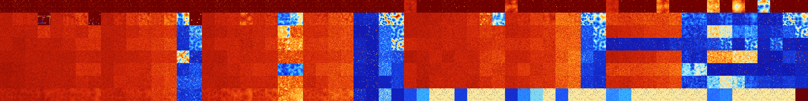

# B01278 (200192-200703)

<details>
    <summary>Initial Grid</summary>
    
</details>


<details>
    <summary>Initial Grid RLE</summary>

```
#C Exported from GoGoL (https://github.com/marrow16/gogol)
#C Wrap mode: Toroidal
#C Boundary mode: Dead
#C Step: 0
x = 100, y = 100, rule = B01278/S
20bo3bo55bo$24bo34bo28bo5bo$12bo64bobo$16bobo45bo5bo11bo5bo$o11bo33bo8b
2o34bo$18bo6bo28bo18bo3bo8bo3bo$13bo5bo4bo24bo33bo$25b2o17bo41bo$9bobo
13bo3bo10bo12bo10bo13bo$35bo10bo22bo$5bo30bo$bo17bobo25bo4bo8bo27bobo7b
o$53bo35bo$26bo2bo10bo19bo8bo$9bo13bo34bo13bo9bo10bo$13bo34bo12bo15bo9b
o6bo$bo2bo5bo12bo13bo39bo4bo16bo$7bo19bo51bo8bo9bo$48bo16bobo4bo$18bo
17bo16bo5bo19bo14bo$o25bo11bo10bo16bo11bo$71bo$43bo15bo4bo$3bo12bo12bo
30bo$24bo2bo8bo13bo31bo9bo$13bo36bo19bo$3bo15bo7bo5bo2bo14bo12bo20bo$2b
o5bo8bo3bo9bo2bo27bo8bo$o37bo12bo35bo$16bo17bo$2bo7bo65bo$11bo6bo39bo
20bo12bo6bo$14bo51bo9bo9bo$55bo43bo$bo29bo5bo5bo48bo$2bo6bo26bo19bo$3bo
10bo13bo7bo32bo28bo$bo5bo33bobo$16bo25bo21bo$34bo6bo30bo8bo6bo$47bo$31b
2o61bo$57bo20bo20bo$59bo23bo$19bobo25bo8bo3bo4bo$4bo61bo2bo3b2o15bo$bo
8bo24bobo29bo7bo5bo5bo$21bo10bo18bo$8bo41bo11bo2bo4bo3bo15bo6bo$3bo3bo
3bo9bo16bo$9bo26bobo9bo37bo$32bo42b2obobo10bobo$7bobo17bo6bo2bobo7bo24b
o22bo$16bo13bo42bo3bo$21bo12bo32bo3bo$10bo14bo16bo12bo41bo$7bo15bo8bo
30bo$16bo30bo9bo31bo$5bo12bo3bo21bo24bo2bo7bo$9bo5bo17b2o21bo12bo25bo$
10bo7b2o39bo18bo$14bo12bo16bo3bo3bo7bo18bo$8bo13b2o11bo40bo$4bo4bo7bo
16bo14bo$36bo5bo18bo31bo3bo$62bo3bo14bo16bo$15bo72bo$2bo7bo13bo9bo17bo
7bo23bo$27bo4bo9bo15bo28bo$o8bo15bo2bo13bo$21bo26bo22b2o$o34bobo15bo5bo
15bo21bo$3bo44bo28bo$15bo38bo14bo$5bo32bo2bo$27bo8b2o16bo28bo$16bo3bo
15bo9bo14bo$2bo50bo9bo5bo2bo17bo$42bo18bo9bo$37bo25bo4bo30bo$21bo18bo9b
o8bo29bo$7bobo9bo19bo38bo12bo$33bo33bo29bo$6b2o19bobo20bo14bo16bo$3bo9b
o5bo53bo10bo$5bo25b2o4bo2bo38bo19bo$3bo50bo2bo$26bo4bobo12bo13bo9b2o10b
o12b2o$35bo30bo6bo$13bo4bo7bo8bo24bo8bo4bo7b2o$2bo10bo13bo18bo35bo8bo$
4bo47bo4bo7bo20bo6bo$3bo21bo20bo10bo10bo4bo$20bo10bo6bo$3bo2bo4bo15bo
11bo9b2o19bo$37b2o6bo11bo12bo17bo$42bo9bo2bo26bo$6bo5bo23bo50bo5bo$24bo
$2bo5bo4bo11bo!
```
</details>
<details>
    <summary>Thumbnail</summary>

</details>
<table>
<tr>
    <td><a href="./200192%20S%20Heat%20Map%20Activity.png"></a><br>S (200192)<br>R@4,p2</td>    <td><a href="./200193%20S0%20Heat%20Map%20Activity.png"></a><br>S0 (200193)<br>R@5,p2</td>    <td><a href="./200194%20S1%20Heat%20Map%20Activity.png"></a><br>S1 (200194)<br>R@5,p2</td>    <td><a href="./200195%20S01%20Heat%20Map%20Activity.png"></a><br>S01 (200195)<br>R@7,p2</td>    <td><a href="./200196%20S2%20Heat%20Map%20Activity.png"></a><br>S2 (200196)<br>R@4,p2</td>    <td><a href="./200197%20S02%20Heat%20Map%20Activity.png"></a><br>S02 (200197)<br>R@6,p2</td>    <td><a href="./200198%20S12%20Heat%20Map%20Activity.png"></a><br>S12 (200198)<br>R@7,p2</td>    <td><a href="./200199%20S012%20Heat%20Map%20Activity.png"></a><br>S012 (200199)<br>R@7,p2</td>    <td><a href="./200200%20S3%20Heat%20Map%20Activity.png"></a><br>S3 (200200)<br>R@6,p2</td>    <td><a href="./200201%20S03%20Heat%20Map%20Activity.png"></a><br>S03 (200201)<br>R@7,p2</td>    <td><a href="./200202%20S13%20Heat%20Map%20Activity.png"></a><br>S13 (200202)<br>R@5,p2</td>    <td><a href="./200203%20S013%20Heat%20Map%20Activity.png"></a><br>S013 (200203)<br>R@7,p2</td>    <td><a href="./200204%20S23%20Heat%20Map%20Activity.png"></a><br>S23 (200204)<br>R@6,p2</td>    <td><a href="./200205%20S023%20Heat%20Map%20Activity.png"></a><br>S023 (200205)<br>R@7,p2</td>    <td><a href="./200206%20S123%20Heat%20Map%20Activity.png"></a><br>S123 (200206)<br>R@7,p2</td>    <td><a href="./200207%20S0123%20Heat%20Map%20Activity.png"></a><br>S0123 (200207)<br>R@7,p2</td>    <td><a href="./200208%20S4%20Heat%20Map%20Activity.png"></a><br>S4 (200208)<br>R@6,p2</td>    <td><a href="./200209%20S04%20Heat%20Map%20Activity.png"></a><br>S04 (200209)<br>R@5,p2</td>    <td><a href="./200210%20S14%20Heat%20Map%20Activity.png"></a><br>S14 (200210)<br>R@7,p2</td>    <td><a href="./200211%20S014%20Heat%20Map%20Activity.png"></a><br>S014 (200211)<br>R@6,p2</td>    <td><a href="./200212%20S24%20Heat%20Map%20Activity.png"></a><br>S24 (200212)<br>R@6,p2</td>    <td><a href="./200213%20S024%20Heat%20Map%20Activity.png"></a><br>S024 (200213)<br>R@6,p2</td>    <td><a href="./200214%20S124%20Heat%20Map%20Activity.png"></a><br>S124 (200214)<br>R@7,p2</td>    <td><a href="./200215%20S0124%20Heat%20Map%20Activity.png"></a><br>S0124 (200215)<br>R@7,p2</td>    <td><a href="./200216%20S34%20Heat%20Map%20Activity.png"></a><br>S34 (200216)<br>R@6,p2</td>    <td><a href="./200217%20S034%20Heat%20Map%20Activity.png"></a><br>S034 (200217)<br>R@7,p2</td>    <td><a href="./200218%20S134%20Heat%20Map%20Activity.png"></a><br>S134 (200218)<br>R@7,p2</td>    <td><a href="./200219%20S0134%20Heat%20Map%20Activity.png"></a><br>S0134 (200219)<br>R@7,p2</td>    <td><a href="./200220%20S234%20Heat%20Map%20Activity.png"></a><br>S234 (200220)<br>R@6,p2</td>    <td><a href="./200221%20S0234%20Heat%20Map%20Activity.png"></a><br>S0234 (200221)<br>R@7,p2</td>    <td><a href="./200222%20S1234%20Heat%20Map%20Activity.png"></a><br>S1234 (200222)<br>R@7,p2</td>    <td><a href="./200223%20S01234%20Heat%20Map%20Activity.png"></a><br>S01234 (200223)<br>R@7,p2</td>    <td><a href="./200224%20S5%20Heat%20Map%20Activity.png"></a><br>S5 (200224)<br>G>1000</td>    <td><a href="./200225%20S05%20Heat%20Map%20Activity.png"></a><br>S05 (200225)<br>R@19,p2</td>    <td><a href="./200226%20S15%20Heat%20Map%20Activity.png"></a><br>S15 (200226)<br>R@25,p2</td>    <td><a href="./200227%20S015%20Heat%20Map%20Activity.png"></a><br>S015 (200227)<br>R@7,p2</td>    <td><a href="./200228%20S25%20Heat%20Map%20Activity.png"></a><br>S25 (200228)<br>R@26,p4</td>    <td><a href="./200229%20S025%20Heat%20Map%20Activity.png"></a><br>S025 (200229)<br>R@9,p2</td>    <td><a href="./200230%20S125%20Heat%20Map%20Activity.png"></a><br>S125 (200230)<br>R@13,p4</td>    <td><a href="./200231%20S0125%20Heat%20Map%20Activity.png"></a><br>S0125 (200231)<br>R@11,p2</td>    <td><a href="./200232%20S35%20Heat%20Map%20Activity.png"></a><br>S35 (200232)<br>G>1000</td>    <td><a href="./200233%20S035%20Heat%20Map%20Activity.png"></a><br>S035 (200233)<br>R@11,p2</td>    <td><a href="./200234%20S135%20Heat%20Map%20Activity.png"></a><br>S135 (200234)<br>R@17,p4</td>    <td><a href="./200235%20S0135%20Heat%20Map%20Activity.png"></a><br>S0135 (200235)<br>R@7,p2</td>    <td><a href="./200236%20S235%20Heat%20Map%20Activity.png"></a><br>S235 (200236)<br>R@28,p4</td>    <td><a href="./200237%20S0235%20Heat%20Map%20Activity.png"></a><br>S0235 (200237)<br>R@9,p2</td>    <td><a href="./200238%20S1235%20Heat%20Map%20Activity.png"></a><br>S1235 (200238)<br>R@15,p4</td>    <td><a href="./200239%20S01235%20Heat%20Map%20Activity.png"></a><br>S01235 (200239)<br>R@9,p2</td>    <td><a href="./200240%20S45%20Heat%20Map%20Activity.png"></a><br>S45 (200240)<br>G>1000</td>    <td><a href="./200241%20S045%20Heat%20Map%20Activity.png"></a><br>S045 (200241)<br>R@11,p2</td>    <td><a href="./200242%20S145%20Heat%20Map%20Activity.png"></a><br>S145 (200242)<br>R@21,p2</td>    <td><a href="./200243%20S0145%20Heat%20Map%20Activity.png"></a><br>S0145 (200243)<br>R@13,p2</td>    <td><a href="./200244%20S245%20Heat%20Map%20Activity.png"></a><br>S245 (200244)<br>G>1000</td>    <td><a href="./200245%20S0245%20Heat%20Map%20Activity.png"></a><br>S0245 (200245)<br>R@13,p2</td>    <td><a href="./200246%20S1245%20Heat%20Map%20Activity.png"></a><br>S1245 (200246)<br>R@22,p4</td>    <td><a href="./200247%20S01245%20Heat%20Map%20Activity.png"></a><br>S01245 (200247)<br>R@17,p2</td>    <td><a href="./200248%20S345%20Heat%20Map%20Activity.png"></a><br>S345 (200248)<br>G>1000</td>    <td><a href="./200249%20S0345%20Heat%20Map%20Activity.png"></a><br>S0345 (200249)<br>R@11,p2</td>    <td><a href="./200250%20S1345%20Heat%20Map%20Activity.png"></a><br>S1345 (200250)<br>G>1000</td>    <td><a href="./200251%20S01345%20Heat%20Map%20Activity.png"></a><br>S01345 (200251)<br>R@13,p2</td>    <td><a href="./200252%20S2345%20Heat%20Map%20Activity.png"></a><br>S2345 (200252)<br>R@338,p60</td>    <td><a href="./200253%20S02345%20Heat%20Map%20Activity.png"></a><br>S02345 (200253)<br>R@9,p2</td>    <td><a href="./200254%20S12345%20Heat%20Map%20Activity.png"></a><br>S12345 (200254)<br>R@43,p4</td>    <td><a href="./200255%20S012345%20Heat%20Map%20Activity.png"></a><br>S012345 (200255)<br>R@11,p2</td></tr>
<tr>
    <td><a href="./200256%20S6%20Heat%20Map%20Activity.png"></a><br>S6 (200256)<br>G>1000</td>    <td><a href="./200257%20S06%20Heat%20Map%20Activity.png"></a><br>S06 (200257)<br>G>1000</td>    <td><a href="./200258%20S16%20Heat%20Map%20Activity.png"></a><br>S16 (200258)<br>G>1000</td>    <td><a href="./200259%20S016%20Heat%20Map%20Activity.png"></a><br>S016 (200259)<br>R@339,p12</td>    <td><a href="./200260%20S26%20Heat%20Map%20Activity.png"></a><br>S26 (200260)<br>G>1000</td>    <td><a href="./200261%20S026%20Heat%20Map%20Activity.png"></a><br>S026 (200261)<br>G>1000</td>    <td><a href="./200262%20S126%20Heat%20Map%20Activity.png"></a><br>S126 (200262)<br>G>1000</td>    <td><a href="./200263%20S0126%20Heat%20Map%20Activity.png"></a><br>S0126 (200263)<br>R@27,p2</td>    <td><a href="./200264%20S36%20Heat%20Map%20Activity.png"></a><br>S36 (200264)<br>G>1000</td>    <td><a href="./200265%20S036%20Heat%20Map%20Activity.png"></a><br>S036 (200265)<br>G>1000</td>    <td><a href="./200266%20S136%20Heat%20Map%20Activity.png"></a><br>S136 (200266)<br>G>1000</td>    <td><a href="./200267%20S0136%20Heat%20Map%20Activity.png"></a><br>S0136 (200267)<br>G>1000</td>    <td><a href="./200268%20S236%20Heat%20Map%20Activity.png"></a><br>S236 (200268)<br>G>1000</td>    <td><a href="./200269%20S0236%20Heat%20Map%20Activity.png"></a><br>S0236 (200269)<br>G>1000</td>    <td><a href="./200270%20S1236%20Heat%20Map%20Activity.png"></a><br>S1236 (200270)<br>R@312,p24</td>    <td><a href="./200271%20S01236%20Heat%20Map%20Activity.png"></a><br>S01236 (200271)<br>R@43,p2</td>    <td><a href="./200272%20S46%20Heat%20Map%20Activity.png"></a><br>S46 (200272)<br>G>1000</td>    <td><a href="./200273%20S046%20Heat%20Map%20Activity.png"></a><br>S046 (200273)<br>G>1000</td>    <td><a href="./200274%20S146%20Heat%20Map%20Activity.png"></a><br>S146 (200274)<br>G>1000</td>    <td><a href="./200275%20S0146%20Heat%20Map%20Activity.png"></a><br>S0146 (200275)<br>G>1000</td>    <td><a href="./200276%20S246%20Heat%20Map%20Activity.png"></a><br>S246 (200276)<br>G>1000</td>    <td><a href="./200277%20S0246%20Heat%20Map%20Activity.png"></a><br>S0246 (200277)<br>G>1000</td>    <td><a href="./200278%20S1246%20Heat%20Map%20Activity.png"></a><br>S1246 (200278)<br>G>1000</td>    <td><a href="./200279%20S01246%20Heat%20Map%20Activity.png"></a><br>S01246 (200279)<br>G>1000</td>    <td><a href="./200280%20S346%20Heat%20Map%20Activity.png"></a><br>S346 (200280)<br>G>1000</td>    <td><a href="./200281%20S0346%20Heat%20Map%20Activity.png"></a><br>S0346 (200281)<br>G>1000</td>    <td><a href="./200282%20S1346%20Heat%20Map%20Activity.png"></a><br>S1346 (200282)<br>G>1000</td>    <td><a href="./200283%20S01346%20Heat%20Map%20Activity.png"></a><br>S01346 (200283)<br>G>1000</td>    <td><a href="./200284%20S2346%20Heat%20Map%20Activity.png"></a><br>S2346 (200284)<br>R@497,p312</td>    <td><a href="./200285%20S02346%20Heat%20Map%20Activity.png"></a><br>S02346 (200285)<br>G>1000</td>    <td><a href="./200286%20S12346%20Heat%20Map%20Activity.png"></a><br>S12346 (200286)<br>R@76,p4</td>    <td><a href="./200287%20S012346%20Heat%20Map%20Activity.png"></a><br>S012346 (200287)<br>R@131,p2</td>    <td><a href="./200288%20S56%20Heat%20Map%20Activity.png"></a><br>S56 (200288)<br>G>1000</td>    <td><a href="./200289%20S056%20Heat%20Map%20Activity.png"></a><br>S056 (200289)<br>G>1000</td>    <td><a href="./200290%20S156%20Heat%20Map%20Activity.png"></a><br>S156 (200290)<br>G>1000</td>    <td><a href="./200291%20S0156%20Heat%20Map%20Activity.png"></a><br>S0156 (200291)<br>G>1000</td>    <td><a href="./200292%20S256%20Heat%20Map%20Activity.png"></a><br>S256 (200292)<br>G>1000</td>    <td><a href="./200293%20S0256%20Heat%20Map%20Activity.png"></a><br>S0256 (200293)<br>G>1000</td>    <td><a href="./200294%20S1256%20Heat%20Map%20Activity.png"></a><br>S1256 (200294)<br>G>1000</td>    <td><a href="./200295%20S01256%20Heat%20Map%20Activity.png"></a><br>S01256 (200295)<br>G>1000</td>    <td><a href="./200296%20S356%20Heat%20Map%20Activity.png"></a><br>S356 (200296)<br>G>1000</td>    <td><a href="./200297%20S0356%20Heat%20Map%20Activity.png"></a><br>S0356 (200297)<br>G>1000</td>    <td><a href="./200298%20S1356%20Heat%20Map%20Activity.png"></a><br>S1356 (200298)<br>G>1000</td>    <td><a href="./200299%20S01356%20Heat%20Map%20Activity.png"></a><br>S01356 (200299)<br>G>1000</td>    <td><a href="./200300%20S2356%20Heat%20Map%20Activity.png"></a><br>S2356 (200300)<br>G>1000</td>    <td><a href="./200301%20S02356%20Heat%20Map%20Activity.png"></a><br>S02356 (200301)<br>G>1000</td>    <td><a href="./200302%20S12356%20Heat%20Map%20Activity.png"></a><br>S12356 (200302)<br>R@60,p2</td>    <td><a href="./200303%20S012356%20Heat%20Map%20Activity.png"></a><br>S012356 (200303)<br>R@160,p42</td>    <td><a href="./200304%20S456%20Heat%20Map%20Activity.png"></a><br>S456 (200304)<br>G>1000</td>    <td><a href="./200305%20S0456%20Heat%20Map%20Activity.png"></a><br>S0456 (200305)<br>G>1000</td>    <td><a href="./200306%20S1456%20Heat%20Map%20Activity.png"></a><br>S1456 (200306)<br>G>1000</td>    <td><a href="./200307%20S01456%20Heat%20Map%20Activity.png"></a><br>S01456 (200307)<br>G>1000</td>    <td><a href="./200308%20S2456%20Heat%20Map%20Activity.png"></a><br>S2456 (200308)<br>G>1000</td>    <td><a href="./200309%20S02456%20Heat%20Map%20Activity.png"></a><br>S02456 (200309)<br>G>1000</td>    <td><a href="./200310%20S12456%20Heat%20Map%20Activity.png"></a><br>S12456 (200310)<br>G>1000</td>    <td><a href="./200311%20S012456%20Heat%20Map%20Activity.png"></a><br>S012456 (200311)<br>G>1000</td>    <td><a href="./200312%20S3456%20Heat%20Map%20Activity.png"></a><br>S3456 (200312)<br>R@207,p120</td>    <td><a href="./200313%20S03456%20Heat%20Map%20Activity.png"></a><br>S03456 (200313)<br>R@176,p72</td>    <td><a href="./200314%20S13456%20Heat%20Map%20Activity.png"></a><br>S13456 (200314)<br>R@283,p180</td>    <td><a href="./200315%20S013456%20Heat%20Map%20Activity.png"></a><br>S013456 (200315)<br>R@308,p168</td>    <td><a href="./200316%20S23456%20Heat%20Map%20Activity.png"></a><br>S23456 (200316)<br>R@710,p660</td>    <td><a href="./200317%20S023456%20Heat%20Map%20Activity.png"></a><br>S023456 (200317)<br>G>1000</td>    <td><a href="./200318%20S123456%20Heat%20Map%20Activity.png"></a><br>S123456 (200318)<br>R@47,p8</td>    <td><a href="./200319%20S0123456%20Heat%20Map%20Activity.png"></a><br>S0123456 (200319)<br>R@140,p40</td></tr>
<tr>
    <td><a href="./200320%20S7%20Heat%20Map%20Activity.png"></a><br>S7 (200320)<br>G>1000</td>    <td><a href="./200321%20S07%20Heat%20Map%20Activity.png"></a><br>S07 (200321)<br>G>1000</td>    <td><a href="./200322%20S17%20Heat%20Map%20Activity.png"></a><br>S17 (200322)<br>G>1000</td>    <td><a href="./200323%20S017%20Heat%20Map%20Activity.png"></a><br>S017 (200323)<br>G>1000</td>    <td><a href="./200324%20S27%20Heat%20Map%20Activity.png"></a><br>S27 (200324)<br>G>1000</td>    <td><a href="./200325%20S027%20Heat%20Map%20Activity.png"></a><br>S027 (200325)<br>G>1000</td>    <td><a href="./200326%20S127%20Heat%20Map%20Activity.png"></a><br>S127 (200326)<br>G>1000</td>    <td><a href="./200327%20S0127%20Heat%20Map%20Activity.png"></a><br>S0127 (200327)<br>G>1000</td>    <td><a href="./200328%20S37%20Heat%20Map%20Activity.png"></a><br>S37 (200328)<br>G>1000</td>    <td><a href="./200329%20S037%20Heat%20Map%20Activity.png"></a><br>S037 (200329)<br>G>1000</td>    <td><a href="./200330%20S137%20Heat%20Map%20Activity.png"></a><br>S137 (200330)<br>G>1000</td>    <td><a href="./200331%20S0137%20Heat%20Map%20Activity.png"></a><br>S0137 (200331)<br>G>1000</td>    <td><a href="./200332%20S237%20Heat%20Map%20Activity.png"></a><br>S237 (200332)<br>G>1000</td>    <td><a href="./200333%20S0237%20Heat%20Map%20Activity.png"></a><br>S0237 (200333)<br>G>1000</td>    <td><a href="./200334%20S1237%20Heat%20Map%20Activity.png"></a><br>S1237 (200334)<br>R@175,p72</td>    <td><a href="./200335%20S01237%20Heat%20Map%20Activity.png"></a><br>S01237 (200335)<br>R@82,p12</td>    <td><a href="./200336%20S47%20Heat%20Map%20Activity.png"></a><br>S47 (200336)<br>G>1000</td>    <td><a href="./200337%20S047%20Heat%20Map%20Activity.png"></a><br>S047 (200337)<br>G>1000</td>    <td><a href="./200338%20S147%20Heat%20Map%20Activity.png"></a><br>S147 (200338)<br>G>1000</td>    <td><a href="./200339%20S0147%20Heat%20Map%20Activity.png"></a><br>S0147 (200339)<br>G>1000</td>    <td><a href="./200340%20S247%20Heat%20Map%20Activity.png"></a><br>S247 (200340)<br>G>1000</td>    <td><a href="./200341%20S0247%20Heat%20Map%20Activity.png"></a><br>S0247 (200341)<br>G>1000</td>    <td><a href="./200342%20S1247%20Heat%20Map%20Activity.png"></a><br>S1247 (200342)<br>G>1000</td>    <td><a href="./200343%20S01247%20Heat%20Map%20Activity.png"></a><br>S01247 (200343)<br>G>1000</td>    <td><a href="./200344%20S347%20Heat%20Map%20Activity.png"></a><br>S347 (200344)<br>G>1000</td>    <td><a href="./200345%20S0347%20Heat%20Map%20Activity.png"></a><br>S0347 (200345)<br>G>1000</td>    <td><a href="./200346%20S1347%20Heat%20Map%20Activity.png"></a><br>S1347 (200346)<br>G>1000</td>    <td><a href="./200347%20S01347%20Heat%20Map%20Activity.png"></a><br>S01347 (200347)<br>G>1000</td>    <td><a href="./200348%20S2347%20Heat%20Map%20Activity.png"></a><br>S2347 (200348)<br>G>1000</td>    <td><a href="./200349%20S02347%20Heat%20Map%20Activity.png"></a><br>S02347 (200349)<br>G>1000</td>    <td><a href="./200350%20S12347%20Heat%20Map%20Activity.png"></a><br>S12347 (200350)<br>R@25,p4</td>    <td><a href="./200351%20S012347%20Heat%20Map%20Activity.png"></a><br>S012347 (200351)<br>R@58,p12</td>    <td><a href="./200352%20S57%20Heat%20Map%20Activity.png"></a><br>S57 (200352)<br>G>1000</td>    <td><a href="./200353%20S057%20Heat%20Map%20Activity.png"></a><br>S057 (200353)<br>G>1000</td>    <td><a href="./200354%20S157%20Heat%20Map%20Activity.png"></a><br>S157 (200354)<br>G>1000</td>    <td><a href="./200355%20S0157%20Heat%20Map%20Activity.png"></a><br>S0157 (200355)<br>G>1000</td>    <td><a href="./200356%20S257%20Heat%20Map%20Activity.png"></a><br>S257 (200356)<br>G>1000</td>    <td><a href="./200357%20S0257%20Heat%20Map%20Activity.png"></a><br>S0257 (200357)<br>G>1000</td>    <td><a href="./200358%20S1257%20Heat%20Map%20Activity.png"></a><br>S1257 (200358)<br>G>1000</td>    <td><a href="./200359%20S01257%20Heat%20Map%20Activity.png"></a><br>S01257 (200359)<br>G>1000</td>    <td><a href="./200360%20S357%20Heat%20Map%20Activity.png"></a><br>S357 (200360)<br>G>1000</td>    <td><a href="./200361%20S0357%20Heat%20Map%20Activity.png"></a><br>S0357 (200361)<br>G>1000</td>    <td><a href="./200362%20S1357%20Heat%20Map%20Activity.png"></a><br>S1357 (200362)<br>G>1000</td>    <td><a href="./200363%20S01357%20Heat%20Map%20Activity.png"></a><br>S01357 (200363)<br>G>1000</td>    <td><a href="./200364%20S2357%20Heat%20Map%20Activity.png"></a><br>S2357 (200364)<br>G>1000</td>    <td><a href="./200365%20S02357%20Heat%20Map%20Activity.png"></a><br>S02357 (200365)<br>G>1000</td>    <td><a href="./200366%20S12357%20Heat%20Map%20Activity.png"></a><br>S12357 (200366)<br>R@41,p6</td>    <td><a href="./200367%20S012357%20Heat%20Map%20Activity.png"></a><br>S012357 (200367)<br>R@50,p6</td>    <td><a href="./200368%20S457%20Heat%20Map%20Activity.png"></a><br>S457 (200368)<br>G>1000</td>    <td><a href="./200369%20S0457%20Heat%20Map%20Activity.png"></a><br>S0457 (200369)<br>G>1000</td>    <td><a href="./200370%20S1457%20Heat%20Map%20Activity.png"></a><br>S1457 (200370)<br>G>1000</td>    <td><a href="./200371%20S01457%20Heat%20Map%20Activity.png"></a><br>S01457 (200371)<br>G>1000</td>    <td><a href="./200372%20S2457%20Heat%20Map%20Activity.png"></a><br>S2457 (200372)<br>G>1000</td>    <td><a href="./200373%20S02457%20Heat%20Map%20Activity.png"></a><br>S02457 (200373)<br>G>1000</td>    <td><a href="./200374%20S12457%20Heat%20Map%20Activity.png"></a><br>S12457 (200374)<br>R@654,p30</td>    <td><a href="./200375%20S012457%20Heat%20Map%20Activity.png"></a><br>S012457 (200375)<br>R@980,p20</td>    <td><a href="./200376%20S3457%20Heat%20Map%20Activity.png"></a><br>S3457 (200376)<br>G>1000</td>    <td><a href="./200377%20S03457%20Heat%20Map%20Activity.png"></a><br>S03457 (200377)<br>G>1000</td>    <td><a href="./200378%20S13457%20Heat%20Map%20Activity.png"></a><br>S13457 (200378)<br>G>1000</td>    <td><a href="./200379%20S013457%20Heat%20Map%20Activity.png"></a><br>S013457 (200379)<br>G>1000</td>    <td><a href="./200380%20S23457%20Heat%20Map%20Activity.png"></a><br>S23457 (200380)<br>R@87,p60</td>    <td><a href="./200381%20S023457%20Heat%20Map%20Activity.png"></a><br>S023457 (200381)<br>R@130,p60</td>    <td><a href="./200382%20S123457%20Heat%20Map%20Activity.png"></a><br>S123457 (200382)<br>R@27,p12</td>    <td><a href="./200383%20S0123457%20Heat%20Map%20Activity.png"></a><br>S0123457 (200383)<br>R@43,p10</td></tr>
<tr>
    <td><a href="./200384%20S67%20Heat%20Map%20Activity.png"></a><br>S67 (200384)<br>G>1000</td>    <td><a href="./200385%20S067%20Heat%20Map%20Activity.png"></a><br>S067 (200385)<br>G>1000</td>    <td><a href="./200386%20S167%20Heat%20Map%20Activity.png"></a><br>S167 (200386)<br>G>1000</td>    <td><a href="./200387%20S0167%20Heat%20Map%20Activity.png"></a><br>S0167 (200387)<br>G>1000</td>    <td><a href="./200388%20S267%20Heat%20Map%20Activity.png"></a><br>S267 (200388)<br>G>1000</td>    <td><a href="./200389%20S0267%20Heat%20Map%20Activity.png"></a><br>S0267 (200389)<br>G>1000</td>    <td><a href="./200390%20S1267%20Heat%20Map%20Activity.png"></a><br>S1267 (200390)<br>G>1000</td>    <td><a href="./200391%20S01267%20Heat%20Map%20Activity.png"></a><br>S01267 (200391)<br>G>1000</td>    <td><a href="./200392%20S367%20Heat%20Map%20Activity.png"></a><br>S367 (200392)<br>G>1000</td>    <td><a href="./200393%20S0367%20Heat%20Map%20Activity.png"></a><br>S0367 (200393)<br>G>1000</td>    <td><a href="./200394%20S1367%20Heat%20Map%20Activity.png"></a><br>S1367 (200394)<br>G>1000</td>    <td><a href="./200395%20S01367%20Heat%20Map%20Activity.png"></a><br>S01367 (200395)<br>G>1000</td>    <td><a href="./200396%20S2367%20Heat%20Map%20Activity.png"></a><br>S2367 (200396)<br>G>1000</td>    <td><a href="./200397%20S02367%20Heat%20Map%20Activity.png"></a><br>S02367 (200397)<br>G>1000</td>    <td><a href="./200398%20S12367%20Heat%20Map%20Activity.png"></a><br>S12367 (200398)<br>R@125,p60</td>    <td><a href="./200399%20S012367%20Heat%20Map%20Activity.png"></a><br>S012367 (200399)<br>R@76,p12</td>    <td><a href="./200400%20S467%20Heat%20Map%20Activity.png"></a><br>S467 (200400)<br>G>1000</td>    <td><a href="./200401%20S0467%20Heat%20Map%20Activity.png"></a><br>S0467 (200401)<br>G>1000</td>    <td><a href="./200402%20S1467%20Heat%20Map%20Activity.png"></a><br>S1467 (200402)<br>G>1000</td>    <td><a href="./200403%20S01467%20Heat%20Map%20Activity.png"></a><br>S01467 (200403)<br>G>1000</td>    <td><a href="./200404%20S2467%20Heat%20Map%20Activity.png"></a><br>S2467 (200404)<br>G>1000</td>    <td><a href="./200405%20S02467%20Heat%20Map%20Activity.png"></a><br>S02467 (200405)<br>G>1000</td>    <td><a href="./200406%20S12467%20Heat%20Map%20Activity.png"></a><br>S12467 (200406)<br>G>1000</td>    <td><a href="./200407%20S012467%20Heat%20Map%20Activity.png"></a><br>S012467 (200407)<br>G>1000</td>    <td><a href="./200408%20S3467%20Heat%20Map%20Activity.png"></a><br>S3467 (200408)<br>G>1000</td>    <td><a href="./200409%20S03467%20Heat%20Map%20Activity.png"></a><br>S03467 (200409)<br>G>1000</td>    <td><a href="./200410%20S13467%20Heat%20Map%20Activity.png"></a><br>S13467 (200410)<br>G>1000</td>    <td><a href="./200411%20S013467%20Heat%20Map%20Activity.png"></a><br>S013467 (200411)<br>G>1000</td>    <td><a href="./200412%20S23467%20Heat%20Map%20Activity.png"></a><br>S23467 (200412)<br>R@174,p84</td>    <td><a href="./200413%20S023467%20Heat%20Map%20Activity.png"></a><br>S023467 (200413)<br>G>1000</td>    <td><a href="./200414%20S123467%20Heat%20Map%20Activity.png"></a><br>S123467 (200414)<br>R@22,p4</td>    <td><a href="./200415%20S0123467%20Heat%20Map%20Activity.png"></a><br>S0123467 (200415)<br>R@35,p2</td>    <td><a href="./200416%20S567%20Heat%20Map%20Activity.png"></a><br>S567 (200416)<br>G>1000</td>    <td><a href="./200417%20S0567%20Heat%20Map%20Activity.png"></a><br>S0567 (200417)<br>G>1000</td>    <td><a href="./200418%20S1567%20Heat%20Map%20Activity.png"></a><br>S1567 (200418)<br>G>1000</td>    <td><a href="./200419%20S01567%20Heat%20Map%20Activity.png"></a><br>S01567 (200419)<br>G>1000</td>    <td><a href="./200420%20S2567%20Heat%20Map%20Activity.png"></a><br>S2567 (200420)<br>G>1000</td>    <td><a href="./200421%20S02567%20Heat%20Map%20Activity.png"></a><br>S02567 (200421)<br>G>1000</td>    <td><a href="./200422%20S12567%20Heat%20Map%20Activity.png"></a><br>S12567 (200422)<br>G>1000</td>    <td><a href="./200423%20S012567%20Heat%20Map%20Activity.png"></a><br>S012567 (200423)<br>G>1000</td>    <td><a href="./200424%20S3567%20Heat%20Map%20Activity.png"></a><br>S3567 (200424)<br>G>1000</td>    <td><a href="./200425%20S03567%20Heat%20Map%20Activity.png"></a><br>S03567 (200425)<br>G>1000</td>    <td><a href="./200426%20S13567%20Heat%20Map%20Activity.png"></a><br>S13567 (200426)<br>G>1000</td>    <td><a href="./200427%20S013567%20Heat%20Map%20Activity.png"></a><br>S013567 (200427)<br>G>1000</td>    <td><a href="./200428%20S23567%20Heat%20Map%20Activity.png"></a><br>S23567 (200428)<br>G>1000</td>    <td><a href="./200429%20S023567%20Heat%20Map%20Activity.png"></a><br>S023567 (200429)<br>G>1000</td>    <td><a href="./200430%20S123567%20Heat%20Map%20Activity.png"></a><br>S123567 (200430)<br>R@54,p6</td>    <td><a href="./200431%20S0123567%20Heat%20Map%20Activity.png"></a><br>S0123567 (200431)<br>R@62,p12</td>    <td><a href="./200432%20S4567%20Heat%20Map%20Activity.png"></a><br>S4567 (200432)<br>G>1000</td>    <td><a href="./200433%20S04567%20Heat%20Map%20Activity.png"></a><br>S04567 (200433)<br>G>1000</td>    <td><a href="./200434%20S14567%20Heat%20Map%20Activity.png"></a><br>S14567 (200434)<br>G>1000</td>    <td><a href="./200435%20S014567%20Heat%20Map%20Activity.png"></a><br>S014567 (200435)<br>G>1000</td>    <td><a href="./200436%20S24567%20Heat%20Map%20Activity.png"></a><br>S24567 (200436)<br>R@572,p420</td>    <td><a href="./200437%20S024567%20Heat%20Map%20Activity.png"></a><br>S024567 (200437)<br>R@245,p84</td>    <td><a href="./200438%20S124567%20Heat%20Map%20Activity.png"></a><br>S124567 (200438)<br>R@179,p60</td>    <td><a href="./200439%20S0124567%20Heat%20Map%20Activity.png"></a><br>S0124567 (200439)<br>R@248,p120</td>    <td><a href="./200440%20S34567%20Heat%20Map%20Activity.png"></a><br>S34567 (200440)<br>R@37,p12</td>    <td><a href="./200441%20S034567%20Heat%20Map%20Activity.png"></a><br>S034567 (200441)<br>R@44,p12</td>    <td><a href="./200442%20S134567%20Heat%20Map%20Activity.png"></a><br>S134567 (200442)<br>R@146,p120</td>    <td><a href="./200443%20S0134567%20Heat%20Map%20Activity.png"></a><br>S0134567 (200443)<br>R@52,p12</td>    <td><a href="./200444%20S234567%20Heat%20Map%20Activity.png"></a><br>S234567 (200444)<br>R@160,p132</td>    <td><a href="./200445%20S0234567%20Heat%20Map%20Activity.png"></a><br>S0234567 (200445)<br>R@53,p12</td>    <td><a href="./200446%20S1234567%20Heat%20Map%20Activity.png"></a><br>S1234567 (200446)<br>R@196,p168</td>    <td><a href="./200447%20S01234567%20Heat%20Map%20Activity.png"></a><br>S01234567 (200447)<br>G>1000</td></tr>
<tr>
    <td><a href="./200448%20S8%20Heat%20Map%20Activity.png"></a><br>S8 (200448)<br>G>1000</td>    <td><a href="./200449%20S08%20Heat%20Map%20Activity.png"></a><br>S08 (200449)<br>G>1000</td>    <td><a href="./200450%20S18%20Heat%20Map%20Activity.png"></a><br>S18 (200450)<br>G>1000</td>    <td><a href="./200451%20S018%20Heat%20Map%20Activity.png"></a><br>S018 (200451)<br>G>1000</td>    <td><a href="./200452%20S28%20Heat%20Map%20Activity.png"></a><br>S28 (200452)<br>G>1000</td>    <td><a href="./200453%20S028%20Heat%20Map%20Activity.png"></a><br>S028 (200453)<br>G>1000</td>    <td><a href="./200454%20S128%20Heat%20Map%20Activity.png"></a><br>S128 (200454)<br>G>1000</td>    <td><a href="./200455%20S0128%20Heat%20Map%20Activity.png"></a><br>S0128 (200455)<br>G>1000</td>    <td><a href="./200456%20S38%20Heat%20Map%20Activity.png"></a><br>S38 (200456)<br>G>1000</td>    <td><a href="./200457%20S038%20Heat%20Map%20Activity.png"></a><br>S038 (200457)<br>G>1000</td>    <td><a href="./200458%20S138%20Heat%20Map%20Activity.png"></a><br>S138 (200458)<br>G>1000</td>    <td><a href="./200459%20S0138%20Heat%20Map%20Activity.png"></a><br>S0138 (200459)<br>G>1000</td>    <td><a href="./200460%20S238%20Heat%20Map%20Activity.png"></a><br>S238 (200460)<br>G>1000</td>    <td><a href="./200461%20S0238%20Heat%20Map%20Activity.png"></a><br>S0238 (200461)<br>G>1000</td>    <td><a href="./200462%20S1238%20Heat%20Map%20Activity.png"></a><br>S1238 (200462)<br>G>1000</td>    <td><a href="./200463%20S01238%20Heat%20Map%20Activity.png"></a><br>S01238 (200463)<br>G>1000</td>    <td><a href="./200464%20S48%20Heat%20Map%20Activity.png"></a><br>S48 (200464)<br>G>1000</td>    <td><a href="./200465%20S048%20Heat%20Map%20Activity.png"></a><br>S048 (200465)<br>G>1000</td>    <td><a href="./200466%20S148%20Heat%20Map%20Activity.png"></a><br>S148 (200466)<br>G>1000</td>    <td><a href="./200467%20S0148%20Heat%20Map%20Activity.png"></a><br>S0148 (200467)<br>G>1000</td>    <td><a href="./200468%20S248%20Heat%20Map%20Activity.png"></a><br>S248 (200468)<br>G>1000</td>    <td><a href="./200469%20S0248%20Heat%20Map%20Activity.png"></a><br>S0248 (200469)<br>G>1000</td>    <td><a href="./200470%20S1248%20Heat%20Map%20Activity.png"></a><br>S1248 (200470)<br>G>1000</td>    <td><a href="./200471%20S01248%20Heat%20Map%20Activity.png"></a><br>S01248 (200471)<br>G>1000</td>    <td><a href="./200472%20S348%20Heat%20Map%20Activity.png"></a><br>S348 (200472)<br>G>1000</td>    <td><a href="./200473%20S0348%20Heat%20Map%20Activity.png"></a><br>S0348 (200473)<br>G>1000</td>    <td><a href="./200474%20S1348%20Heat%20Map%20Activity.png"></a><br>S1348 (200474)<br>G>1000</td>    <td><a href="./200475%20S01348%20Heat%20Map%20Activity.png"></a><br>S01348 (200475)<br>G>1000</td>    <td><a href="./200476%20S2348%20Heat%20Map%20Activity.png"></a><br>S2348 (200476)<br>R@224,p120</td>    <td><a href="./200477%20S02348%20Heat%20Map%20Activity.png"></a><br>S02348 (200477)<br>G>1000</td>    <td><a href="./200478%20S12348%20Heat%20Map%20Activity.png"></a><br>S12348 (200478)<br>R@29,p6</td>    <td><a href="./200479%20S012348%20Heat%20Map%20Activity.png"></a><br>S012348 (200479)<br>R@39,p2</td>    <td><a href="./200480%20S58%20Heat%20Map%20Activity.png"></a><br>S58 (200480)<br>G>1000</td>    <td><a href="./200481%20S058%20Heat%20Map%20Activity.png"></a><br>S058 (200481)<br>G>1000</td>    <td><a href="./200482%20S158%20Heat%20Map%20Activity.png"></a><br>S158 (200482)<br>G>1000</td>    <td><a href="./200483%20S0158%20Heat%20Map%20Activity.png"></a><br>S0158 (200483)<br>G>1000</td>    <td><a href="./200484%20S258%20Heat%20Map%20Activity.png"></a><br>S258 (200484)<br>G>1000</td>    <td><a href="./200485%20S0258%20Heat%20Map%20Activity.png"></a><br>S0258 (200485)<br>G>1000</td>    <td><a href="./200486%20S1258%20Heat%20Map%20Activity.png"></a><br>S1258 (200486)<br>G>1000</td>    <td><a href="./200487%20S01258%20Heat%20Map%20Activity.png"></a><br>S01258 (200487)<br>G>1000</td>    <td><a href="./200488%20S358%20Heat%20Map%20Activity.png"></a><br>S358 (200488)<br>G>1000</td>    <td><a href="./200489%20S0358%20Heat%20Map%20Activity.png"></a><br>S0358 (200489)<br>G>1000</td>    <td><a href="./200490%20S1358%20Heat%20Map%20Activity.png"></a><br>S1358 (200490)<br>G>1000</td>    <td><a href="./200491%20S01358%20Heat%20Map%20Activity.png"></a><br>S01358 (200491)<br>G>1000</td>    <td><a href="./200492%20S2358%20Heat%20Map%20Activity.png"></a><br>S2358 (200492)<br>G>1000</td>    <td><a href="./200493%20S02358%20Heat%20Map%20Activity.png"></a><br>S02358 (200493)<br>G>1000</td>    <td><a href="./200494%20S12358%20Heat%20Map%20Activity.png"></a><br>S12358 (200494)<br>R@32,p2</td>    <td><a href="./200495%20S012358%20Heat%20Map%20Activity.png"></a><br>S012358 (200495)<br>R@78,p42</td>    <td><a href="./200496%20S458%20Heat%20Map%20Activity.png"></a><br>S458 (200496)<br>G>1000</td>    <td><a href="./200497%20S0458%20Heat%20Map%20Activity.png"></a><br>S0458 (200497)<br>G>1000</td>    <td><a href="./200498%20S1458%20Heat%20Map%20Activity.png"></a><br>S1458 (200498)<br>G>1000</td>    <td><a href="./200499%20S01458%20Heat%20Map%20Activity.png"></a><br>S01458 (200499)<br>G>1000</td>    <td><a href="./200500%20S2458%20Heat%20Map%20Activity.png"></a><br>S2458 (200500)<br>G>1000</td>    <td><a href="./200501%20S02458%20Heat%20Map%20Activity.png"></a><br>S02458 (200501)<br>G>1000</td>    <td><a href="./200502%20S12458%20Heat%20Map%20Activity.png"></a><br>S12458 (200502)<br>R@668,p12</td>    <td><a href="./200503%20S012458%20Heat%20Map%20Activity.png"></a><br>S012458 (200503)<br>R@638,p60</td>    <td><a href="./200504%20S3458%20Heat%20Map%20Activity.png"></a><br>S3458 (200504)<br>G>1000</td>    <td><a href="./200505%20S03458%20Heat%20Map%20Activity.png"></a><br>S03458 (200505)<br>G>1000</td>    <td><a href="./200506%20S13458%20Heat%20Map%20Activity.png"></a><br>S13458 (200506)<br>G>1000</td>    <td><a href="./200507%20S013458%20Heat%20Map%20Activity.png"></a><br>S013458 (200507)<br>G>1000</td>    <td><a href="./200508%20S23458%20Heat%20Map%20Activity.png"></a><br>S23458 (200508)<br>R@333,p300</td>    <td><a href="./200509%20S023458%20Heat%20Map%20Activity.png"></a><br>S023458 (200509)<br>G>1000</td>    <td><a href="./200510%20S123458%20Heat%20Map%20Activity.png"></a><br>S123458 (200510)<br>R@34,p20</td>    <td><a href="./200511%20S0123458%20Heat%20Map%20Activity.png"></a><br>S0123458 (200511)<br>R@65,p20</td></tr>
<tr>
    <td><a href="./200512%20S68%20Heat%20Map%20Activity.png"></a><br>S68 (200512)<br>G>1000</td>    <td><a href="./200513%20S068%20Heat%20Map%20Activity.png"></a><br>S068 (200513)<br>G>1000</td>    <td><a href="./200514%20S168%20Heat%20Map%20Activity.png"></a><br>S168 (200514)<br>G>1000</td>    <td><a href="./200515%20S0168%20Heat%20Map%20Activity.png"></a><br>S0168 (200515)<br>G>1000</td>    <td><a href="./200516%20S268%20Heat%20Map%20Activity.png"></a><br>S268 (200516)<br>G>1000</td>    <td><a href="./200517%20S0268%20Heat%20Map%20Activity.png"></a><br>S0268 (200517)<br>G>1000</td>    <td><a href="./200518%20S1268%20Heat%20Map%20Activity.png"></a><br>S1268 (200518)<br>G>1000</td>    <td><a href="./200519%20S01268%20Heat%20Map%20Activity.png"></a><br>S01268 (200519)<br>G>1000</td>    <td><a href="./200520%20S368%20Heat%20Map%20Activity.png"></a><br>S368 (200520)<br>G>1000</td>    <td><a href="./200521%20S0368%20Heat%20Map%20Activity.png"></a><br>S0368 (200521)<br>G>1000</td>    <td><a href="./200522%20S1368%20Heat%20Map%20Activity.png"></a><br>S1368 (200522)<br>G>1000</td>    <td><a href="./200523%20S01368%20Heat%20Map%20Activity.png"></a><br>S01368 (200523)<br>G>1000</td>    <td><a href="./200524%20S2368%20Heat%20Map%20Activity.png"></a><br>S2368 (200524)<br>G>1000</td>    <td><a href="./200525%20S02368%20Heat%20Map%20Activity.png"></a><br>S02368 (200525)<br>G>1000</td>    <td><a href="./200526%20S12368%20Heat%20Map%20Activity.png"></a><br>S12368 (200526)<br>R@123,p60</td>    <td><a href="./200527%20S012368%20Heat%20Map%20Activity.png"></a><br>S012368 (200527)<br>R@57,p12</td>    <td><a href="./200528%20S468%20Heat%20Map%20Activity.png"></a><br>S468 (200528)<br>G>1000</td>    <td><a href="./200529%20S0468%20Heat%20Map%20Activity.png"></a><br>S0468 (200529)<br>G>1000</td>    <td><a href="./200530%20S1468%20Heat%20Map%20Activity.png"></a><br>S1468 (200530)<br>G>1000</td>    <td><a href="./200531%20S01468%20Heat%20Map%20Activity.png"></a><br>S01468 (200531)<br>G>1000</td>    <td><a href="./200532%20S2468%20Heat%20Map%20Activity.png"></a><br>S2468 (200532)<br>G>1000</td>    <td><a href="./200533%20S02468%20Heat%20Map%20Activity.png"></a><br>S02468 (200533)<br>G>1000</td>    <td><a href="./200534%20S12468%20Heat%20Map%20Activity.png"></a><br>S12468 (200534)<br>G>1000</td>    <td><a href="./200535%20S012468%20Heat%20Map%20Activity.png"></a><br>S012468 (200535)<br>G>1000</td>    <td><a href="./200536%20S3468%20Heat%20Map%20Activity.png"></a><br>S3468 (200536)<br>G>1000</td>    <td><a href="./200537%20S03468%20Heat%20Map%20Activity.png"></a><br>S03468 (200537)<br>G>1000</td>    <td><a href="./200538%20S13468%20Heat%20Map%20Activity.png"></a><br>S13468 (200538)<br>G>1000</td>    <td><a href="./200539%20S013468%20Heat%20Map%20Activity.png"></a><br>S013468 (200539)<br>G>1000</td>    <td><a href="./200540%20S23468%20Heat%20Map%20Activity.png"></a><br>S23468 (200540)<br>R@187,p120</td>    <td><a href="./200541%20S023468%20Heat%20Map%20Activity.png"></a><br>S023468 (200541)<br>G>1000</td>    <td><a href="./200542%20S123468%20Heat%20Map%20Activity.png"></a><br>S123468 (200542)<br>R@20,p4</td>    <td><a href="./200543%20S0123468%20Heat%20Map%20Activity.png"></a><br>S0123468 (200543)<br>R@35,p12</td>    <td><a href="./200544%20S568%20Heat%20Map%20Activity.png"></a><br>S568 (200544)<br>G>1000</td>    <td><a href="./200545%20S0568%20Heat%20Map%20Activity.png"></a><br>S0568 (200545)<br>G>1000</td>    <td><a href="./200546%20S1568%20Heat%20Map%20Activity.png"></a><br>S1568 (200546)<br>G>1000</td>    <td><a href="./200547%20S01568%20Heat%20Map%20Activity.png"></a><br>S01568 (200547)<br>G>1000</td>    <td><a href="./200548%20S2568%20Heat%20Map%20Activity.png"></a><br>S2568 (200548)<br>G>1000</td>    <td><a href="./200549%20S02568%20Heat%20Map%20Activity.png"></a><br>S02568 (200549)<br>G>1000</td>    <td><a href="./200550%20S12568%20Heat%20Map%20Activity.png"></a><br>S12568 (200550)<br>G>1000</td>    <td><a href="./200551%20S012568%20Heat%20Map%20Activity.png"></a><br>S012568 (200551)<br>G>1000</td>    <td><a href="./200552%20S3568%20Heat%20Map%20Activity.png"></a><br>S3568 (200552)<br>G>1000</td>    <td><a href="./200553%20S03568%20Heat%20Map%20Activity.png"></a><br>S03568 (200553)<br>G>1000</td>    <td><a href="./200554%20S13568%20Heat%20Map%20Activity.png"></a><br>S13568 (200554)<br>G>1000</td>    <td><a href="./200555%20S013568%20Heat%20Map%20Activity.png"></a><br>S013568 (200555)<br>G>1000</td>    <td><a href="./200556%20S23568%20Heat%20Map%20Activity.png"></a><br>S23568 (200556)<br>G>1000</td>    <td><a href="./200557%20S023568%20Heat%20Map%20Activity.png"></a><br>S023568 (200557)<br>G>1000</td>    <td><a href="./200558%20S123568%20Heat%20Map%20Activity.png"></a><br>S123568 (200558)<br>R@48,p6</td>    <td><a href="./200559%20S0123568%20Heat%20Map%20Activity.png"></a><br>S0123568 (200559)<br>R@81,p30</td>    <td><a href="./200560%20S4568%20Heat%20Map%20Activity.png"></a><br>S4568 (200560)<br>G>1000</td>    <td><a href="./200561%20S04568%20Heat%20Map%20Activity.png"></a><br>S04568 (200561)<br>G>1000</td>    <td><a href="./200562%20S14568%20Heat%20Map%20Activity.png"></a><br>S14568 (200562)<br>G>1000</td>    <td><a href="./200563%20S014568%20Heat%20Map%20Activity.png"></a><br>S014568 (200563)<br>G>1000</td>    <td><a href="./200564%20S24568%20Heat%20Map%20Activity.png"></a><br>S24568 (200564)<br>G>1000</td>    <td><a href="./200565%20S024568%20Heat%20Map%20Activity.png"></a><br>S024568 (200565)<br>G>1000</td>    <td><a href="./200566%20S124568%20Heat%20Map%20Activity.png"></a><br>S124568 (200566)<br>G>1000</td>    <td><a href="./200567%20S0124568%20Heat%20Map%20Activity.png"></a><br>S0124568 (200567)<br>G>1000</td>    <td><a href="./200568%20S34568%20Heat%20Map%20Activity.png"></a><br>S34568 (200568)<br>G>1000</td>    <td><a href="./200569%20S034568%20Heat%20Map%20Activity.png"></a><br>S034568 (200569)<br>G>1000</td>    <td><a href="./200570%20S134568%20Heat%20Map%20Activity.png"></a><br>S134568 (200570)<br>R@259,p180</td>    <td><a href="./200571%20S0134568%20Heat%20Map%20Activity.png"></a><br>S0134568 (200571)<br>R@250,p180</td>    <td><a href="./200572%20S234568%20Heat%20Map%20Activity.png"></a><br>S234568 (200572)<br>G>1000</td>    <td><a href="./200573%20S0234568%20Heat%20Map%20Activity.png"></a><br>S0234568 (200573)<br>R@200,p168</td>    <td><a href="./200574%20S1234568%20Heat%20Map%20Activity.png"></a><br>S1234568 (200574)<br>R@449,p420</td>    <td><a href="./200575%20S01234568%20Heat%20Map%20Activity.png"></a><br>S01234568 (200575)<br>R@95,p60</td></tr>
<tr>
    <td><a href="./200576%20S78%20Heat%20Map%20Activity.png"></a><br>S78 (200576)<br>G>1000</td>    <td><a href="./200577%20S078%20Heat%20Map%20Activity.png"></a><br>S078 (200577)<br>G>1000</td>    <td><a href="./200578%20S178%20Heat%20Map%20Activity.png"></a><br>S178 (200578)<br>G>1000</td>    <td><a href="./200579%20S0178%20Heat%20Map%20Activity.png"></a><br>S0178 (200579)<br>G>1000</td>    <td><a href="./200580%20S278%20Heat%20Map%20Activity.png"></a><br>S278 (200580)<br>G>1000</td>    <td><a href="./200581%20S0278%20Heat%20Map%20Activity.png"></a><br>S0278 (200581)<br>G>1000</td>    <td><a href="./200582%20S1278%20Heat%20Map%20Activity.png"></a><br>S1278 (200582)<br>G>1000</td>    <td><a href="./200583%20S01278%20Heat%20Map%20Activity.png"></a><br>S01278 (200583)<br>G>1000</td>    <td><a href="./200584%20S378%20Heat%20Map%20Activity.png"></a><br>S378 (200584)<br>G>1000</td>    <td><a href="./200585%20S0378%20Heat%20Map%20Activity.png"></a><br>S0378 (200585)<br>G>1000</td>    <td><a href="./200586%20S1378%20Heat%20Map%20Activity.png"></a><br>S1378 (200586)<br>G>1000</td>    <td><a href="./200587%20S01378%20Heat%20Map%20Activity.png"></a><br>S01378 (200587)<br>G>1000</td>    <td><a href="./200588%20S2378%20Heat%20Map%20Activity.png"></a><br>S2378 (200588)<br>G>1000</td>    <td><a href="./200589%20S02378%20Heat%20Map%20Activity.png"></a><br>S02378 (200589)<br>G>1000</td>    <td><a href="./200590%20S12378%20Heat%20Map%20Activity.png"></a><br>S12378 (200590)<br>R@109,p24</td>    <td><a href="./200591%20S012378%20Heat%20Map%20Activity.png"></a><br>S012378 (200591)<br>R@117,p12</td>    <td><a href="./200592%20S478%20Heat%20Map%20Activity.png"></a><br>S478 (200592)<br>G>1000</td>    <td><a href="./200593%20S0478%20Heat%20Map%20Activity.png"></a><br>S0478 (200593)<br>G>1000</td>    <td><a href="./200594%20S1478%20Heat%20Map%20Activity.png"></a><br>S1478 (200594)<br>G>1000</td>    <td><a href="./200595%20S01478%20Heat%20Map%20Activity.png"></a><br>S01478 (200595)<br>G>1000</td>    <td><a href="./200596%20S2478%20Heat%20Map%20Activity.png"></a><br>S2478 (200596)<br>G>1000</td>    <td><a href="./200597%20S02478%20Heat%20Map%20Activity.png"></a><br>S02478 (200597)<br>G>1000</td>    <td><a href="./200598%20S12478%20Heat%20Map%20Activity.png"></a><br>S12478 (200598)<br>G>1000</td>    <td><a href="./200599%20S012478%20Heat%20Map%20Activity.png"></a><br>S012478 (200599)<br>G>1000</td>    <td><a href="./200600%20S3478%20Heat%20Map%20Activity.png"></a><br>S3478 (200600)<br>G>1000</td>    <td><a href="./200601%20S03478%20Heat%20Map%20Activity.png"></a><br>S03478 (200601)<br>G>1000</td>    <td><a href="./200602%20S13478%20Heat%20Map%20Activity.png"></a><br>S13478 (200602)<br>G>1000</td>    <td><a href="./200603%20S013478%20Heat%20Map%20Activity.png"></a><br>S013478 (200603)<br>G>1000</td>    <td><a href="./200604%20S23478%20Heat%20Map%20Activity.png"></a><br>S23478 (200604)<br>G>1000</td>    <td><a href="./200605%20S023478%20Heat%20Map%20Activity.png"></a><br>S023478 (200605)<br>G>1000</td>    <td><a href="./200606%20S123478%20Heat%20Map%20Activity.png"></a><br>S123478 (200606)<br>R@146,p120</td>    <td><a href="./200607%20S0123478%20Heat%20Map%20Activity.png"></a><br>S0123478 (200607)<br>R@62,p4</td>    <td><a href="./200608%20S578%20Heat%20Map%20Activity.png"></a><br>S578 (200608)<br>G>1000</td>    <td><a href="./200609%20S0578%20Heat%20Map%20Activity.png"></a><br>S0578 (200609)<br>G>1000</td>    <td><a href="./200610%20S1578%20Heat%20Map%20Activity.png"></a><br>S1578 (200610)<br>G>1000</td>    <td><a href="./200611%20S01578%20Heat%20Map%20Activity.png"></a><br>S01578 (200611)<br>G>1000</td>    <td><a href="./200612%20S2578%20Heat%20Map%20Activity.png"></a><br>S2578 (200612)<br>G>1000</td>    <td><a href="./200613%20S02578%20Heat%20Map%20Activity.png"></a><br>S02578 (200613)<br>G>1000</td>    <td><a href="./200614%20S12578%20Heat%20Map%20Activity.png"></a><br>S12578 (200614)<br>G>1000</td>    <td><a href="./200615%20S012578%20Heat%20Map%20Activity.png"></a><br>S012578 (200615)<br>G>1000</td>    <td><a href="./200616%20S3578%20Heat%20Map%20Activity.png"></a><br>S3578 (200616)<br>G>1000</td>    <td><a href="./200617%20S03578%20Heat%20Map%20Activity.png"></a><br>S03578 (200617)<br>G>1000</td>    <td><a href="./200618%20S13578%20Heat%20Map%20Activity.png"></a><br>S13578 (200618)<br>G>1000</td>    <td><a href="./200619%20S013578%20Heat%20Map%20Activity.png"></a><br>S013578 (200619)<br>G>1000</td>    <td><a href="./200620%20S23578%20Heat%20Map%20Activity.png"></a><br>S23578 (200620)<br>G>1000</td>    <td><a href="./200621%20S023578%20Heat%20Map%20Activity.png"></a><br>S023578 (200621)<br>G>1000</td>    <td><a href="./200622%20S123578%20Heat%20Map%20Activity.png"></a><br>S123578 (200622)<br>R@68,p24</td>    <td><a href="./200623%20S0123578%20Heat%20Map%20Activity.png"></a><br>S0123578 (200623)<br>R@89,p24</td>    <td><a href="./200624%20S4578%20Heat%20Map%20Activity.png"></a><br>S4578 (200624)<br>G>1000</td>    <td><a href="./200625%20S04578%20Heat%20Map%20Activity.png"></a><br>S04578 (200625)<br>G>1000</td>    <td><a href="./200626%20S14578%20Heat%20Map%20Activity.png"></a><br>S14578 (200626)<br>G>1000</td>    <td><a href="./200627%20S014578%20Heat%20Map%20Activity.png"></a><br>S014578 (200627)<br>G>1000</td>    <td><a href="./200628%20S24578%20Heat%20Map%20Activity.png"></a><br>S24578 (200628)<br>G>1000</td>    <td><a href="./200629%20S024578%20Heat%20Map%20Activity.png"></a><br>S024578 (200629)<br>G>1000</td>    <td><a href="./200630%20S124578%20Heat%20Map%20Activity.png"></a><br>S124578 (200630)<br>G>1000</td>    <td><a href="./200631%20S0124578%20Heat%20Map%20Activity.png"></a><br>S0124578 (200631)<br>R@699,p60</td>    <td><a href="./200632%20S34578%20Heat%20Map%20Activity.png"></a><br>S34578 (200632)<br>G>1000</td>    <td><a href="./200633%20S034578%20Heat%20Map%20Activity.png"></a><br>S034578 (200633)<br>G>1000</td>    <td><a href="./200634%20S134578%20Heat%20Map%20Activity.png"></a><br>S134578 (200634)<br>G>1000</td>    <td><a href="./200635%20S0134578%20Heat%20Map%20Activity.png"></a><br>S0134578 (200635)<br>G>1000</td>    <td><a href="./200636%20S234578%20Heat%20Map%20Activity.png"></a><br>S234578 (200636)<br>R@43,p4</td>    <td><a href="./200637%20S0234578%20Heat%20Map%20Activity.png"></a><br>S0234578 (200637)<br>R@62,p24</td>    <td><a href="./200638%20S1234578%20Heat%20Map%20Activity.png"></a><br>S1234578 (200638)<br>R@36,p2</td>    <td><a href="./200639%20S01234578%20Heat%20Map%20Activity.png"></a><br>S01234578 (200639)<br>R@58,p2</td></tr>
<tr>
    <td><a href="./200640%20S678%20Heat%20Map%20Activity.png"></a><br>S678 (200640)<br>G>1000</td>    <td><a href="./200641%20S0678%20Heat%20Map%20Activity.png"></a><br>S0678 (200641)<br>G>1000</td>    <td><a href="./200642%20S1678%20Heat%20Map%20Activity.png"></a><br>S1678 (200642)<br>G>1000</td>    <td><a href="./200643%20S01678%20Heat%20Map%20Activity.png"></a><br>S01678 (200643)<br>G>1000</td>    <td><a href="./200644%20S2678%20Heat%20Map%20Activity.png"></a><br>S2678 (200644)<br>G>1000</td>    <td><a href="./200645%20S02678%20Heat%20Map%20Activity.png"></a><br>S02678 (200645)<br>G>1000</td>    <td><a href="./200646%20S12678%20Heat%20Map%20Activity.png"></a><br>S12678 (200646)<br>G>1000</td>    <td><a href="./200647%20S012678%20Heat%20Map%20Activity.png"></a><br>S012678 (200647)<br>G>1000</td>    <td><a href="./200648%20S3678%20Heat%20Map%20Activity.png"></a><br>S3678 (200648)<br>G>1000</td>    <td><a href="./200649%20S03678%20Heat%20Map%20Activity.png"></a><br>S03678 (200649)<br>G>1000</td>    <td><a href="./200650%20S13678%20Heat%20Map%20Activity.png"></a><br>S13678 (200650)<br>G>1000</td>    <td><a href="./200651%20S013678%20Heat%20Map%20Activity.png"></a><br>S013678 (200651)<br>G>1000</td>    <td><a href="./200652%20S23678%20Heat%20Map%20Activity.png"></a><br>S23678 (200652)<br>G>1000</td>    <td><a href="./200653%20S023678%20Heat%20Map%20Activity.png"></a><br>S023678 (200653)<br>G>1000</td>    <td><a href="./200654%20S123678%20Heat%20Map%20Activity.png"></a><br>S123678 (200654)<br>R@110,p12</td>    <td><a href="./200655%20S0123678%20Heat%20Map%20Activity.png"></a><br>S0123678 (200655)<br>R@145,p12</td>    <td><a href="./200656%20S4678%20Heat%20Map%20Activity.png"></a><br>S4678 (200656)<br>G>1000</td>    <td><a href="./200657%20S04678%20Heat%20Map%20Activity.png"></a><br>S04678 (200657)<br>G>1000</td>    <td><a href="./200658%20S14678%20Heat%20Map%20Activity.png"></a><br>S14678 (200658)<br>G>1000</td>    <td><a href="./200659%20S014678%20Heat%20Map%20Activity.png"></a><br>S014678 (200659)<br>G>1000</td>    <td><a href="./200660%20S24678%20Heat%20Map%20Activity.png"></a><br>S24678 (200660)<br>G>1000</td>    <td><a href="./200661%20S024678%20Heat%20Map%20Activity.png"></a><br>S024678 (200661)<br>G>1000</td>    <td><a href="./200662%20S124678%20Heat%20Map%20Activity.png"></a><br>S124678 (200662)<br>G>1000</td>    <td><a href="./200663%20S0124678%20Heat%20Map%20Activity.png"></a><br>S0124678 (200663)<br>G>1000</td>    <td><a href="./200664%20S34678%20Heat%20Map%20Activity.png"></a><br>S34678 (200664)<br>G>1000</td>    <td><a href="./200665%20S034678%20Heat%20Map%20Activity.png"></a><br>S034678 (200665)<br>G>1000</td>    <td><a href="./200666%20S134678%20Heat%20Map%20Activity.png"></a><br>S134678 (200666)<br>G>1000</td>    <td><a href="./200667%20S0134678%20Heat%20Map%20Activity.png"></a><br>S0134678 (200667)<br>G>1000</td>    <td><a href="./200668%20S234678%20Heat%20Map%20Activity.png"></a><br>S234678 (200668)<br>R@163,p20</td>    <td><a href="./200669%20S0234678%20Heat%20Map%20Activity.png"></a><br>S0234678 (200669)<br>G>1000</td>    <td><a href="./200670%20S1234678%20Heat%20Map%20Activity.png"></a><br>S1234678 (200670)<br>S@151</td>    <td><a href="./200671%20S01234678%20Heat%20Map%20Activity.png"></a><br>S01234678 (200671)<br>R@262,p2</td>    <td><a href="./200672%20S5678%20Heat%20Map%20Activity.png"></a><br>S5678 (200672)<br>R@11,p4</td>    <td><a href="./200673%20S05678%20Heat%20Map%20Activity.png"></a><br>S05678 (200673)<br>R@5,p2</td>    <td><a href="./200674%20S15678%20Heat%20Map%20Activity.png"></a><br>S15678 (200674)<br>R@5,p2</td>    <td><a href="./200675%20S015678%20Heat%20Map%20Activity.png"></a><br>S015678 (200675)<br>S@3</td>    <td><a href="./200676%20S25678%20Heat%20Map%20Activity.png"></a><br>S25678 (200676)<br>R@15,p6</td>    <td><a href="./200677%20S025678%20Heat%20Map%20Activity.png"></a><br>S025678 (200677)<br>S@3</td>    <td><a href="./200678%20S125678%20Heat%20Map%20Activity.png"></a><br>S125678 (200678)<br>S@4</td>    <td><a href="./200679%20S0125678%20Heat%20Map%20Activity.png"></a><br>S0125678 (200679)<br>S@3</td>    <td><a href="./200680%20S35678%20Heat%20Map%20Activity.png"></a><br>S35678 (200680)<br>R@23,p12</td>    <td><a href="./200681%20S035678%20Heat%20Map%20Activity.png"></a><br>S035678 (200681)<br>R@7,p4</td>    <td><a href="./200682%20S135678%20Heat%20Map%20Activity.png"></a><br>S135678 (200682)<br>S@5</td>    <td><a href="./200683%20S0135678%20Heat%20Map%20Activity.png"></a><br>S0135678 (200683)<br>S@3</td>    <td><a href="./200684%20S235678%20Heat%20Map%20Activity.png"></a><br>S235678 (200684)<br>R@10,p2</td>    <td><a href="./200685%20S0235678%20Heat%20Map%20Activity.png"></a><br>S0235678 (200685)<br>S@3</td>    <td><a href="./200686%20S1235678%20Heat%20Map%20Activity.png"></a><br>S1235678 (200686)<br>S@3</td>    <td><a href="./200687%20S01235678%20Heat%20Map%20Activity.png"></a><br>S01235678 (200687)<br>S@3</td>    <td><a href="./200688%20S45678%20Heat%20Map%20Activity.png"></a><br>S45678 (200688)<br>R@6,p2</td>    <td><a href="./200689%20S045678%20Heat%20Map%20Activity.png"></a><br>S045678 (200689)<br>R@5,p2</td>    <td><a href="./200690%20S145678%20Heat%20Map%20Activity.png"></a><br>S145678 (200690)<br>S@3</td>    <td><a href="./200691%20S0145678%20Heat%20Map%20Activity.png"></a><br>S0145678 (200691)<br>S@3</td>    <td><a href="./200692%20S245678%20Heat%20Map%20Activity.png"></a><br>S245678 (200692)<br>S@4</td>    <td><a href="./200693%20S0245678%20Heat%20Map%20Activity.png"></a><br>S0245678 (200693)<br>S@3</td>    <td><a href="./200694%20S1245678%20Heat%20Map%20Activity.png"></a><br>S1245678 (200694)<br>S@3</td>    <td><a href="./200695%20S01245678%20Heat%20Map%20Activity.png"></a><br>S01245678 (200695)<br>S@3</td>    <td><a href="./200696%20S345678%20Heat%20Map%20Activity.png"></a><br>S345678 (200696)<br>R@8,p4</td>    <td><a href="./200697%20S0345678%20Heat%20Map%20Activity.png"></a><br>S0345678 (200697)<br>R@7,p4</td>    <td><a href="./200698%20S1345678%20Heat%20Map%20Activity.png"></a><br>S1345678 (200698)<br>S@3</td>    <td><a href="./200699%20S01345678%20Heat%20Map%20Activity.png"></a><br>S01345678 (200699)<br>S@3</td>    <td><a href="./200700%20S2345678%20Heat%20Map%20Activity.png"></a><br>S2345678 (200700)<br>S@4</td>    <td><a href="./200701%20S02345678%20Heat%20Map%20Activity.png"></a><br>S02345678 (200701)<br>S@3</td>    <td><a href="./200702%20S12345678%20Heat%20Map%20Activity.png"></a><br>S12345678 (200702)<br>S@3</td>    <td><a href="./200703%20S012345678%20Heat%20Map%20Activity.png"></a><br>S012345678 (200703)<br>S@3</td></tr>
</table>
