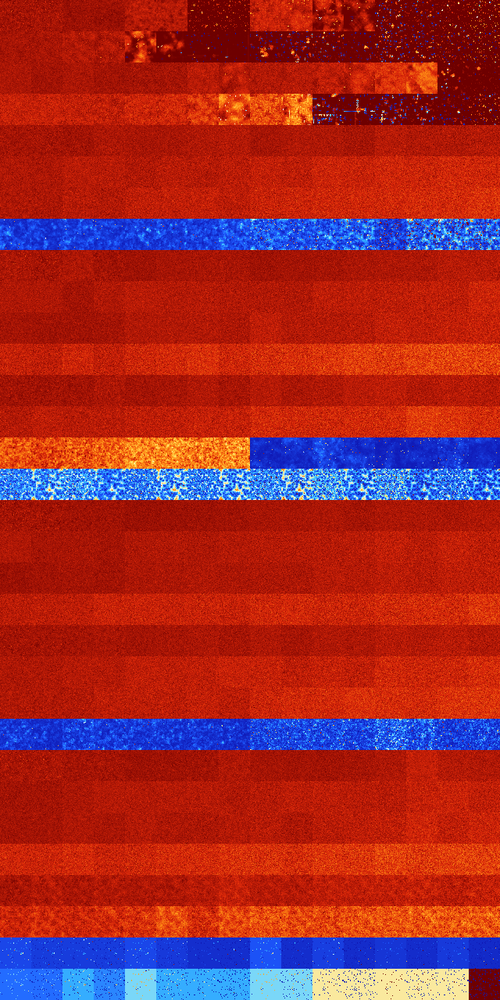

# B01345 (30208-30719)

<details>
    <summary>Initial Grid</summary>
    
</details>


<details>
    <summary>Initial Grid RLE</summary>

```
#C Exported from GoGoL (https://github.com/marrow16/gogol)
#C Wrap mode: Toroidal
#C Boundary mode: Dead
#C Step: 0
x = 100, y = 100, rule = B01345/S
5bo42bo$36bo15bo38bo$20bo16bo27bo10b2o$42bo38bo$8bo17bo3bo2bobo7bo6bo
24bo$5bo30bobo28bo27bo$18bo16bo12bo8bo7bo2b2o2bo$53b2o$3bo8bo3bo50bo$8b
o36bo16bo6bo10bo12bo$19bo5bo41bo6bo$25bo32b2o11bo10bo$o34bo50bo7bo$39bo
13bo5bo8bo8bo11bo7bobo$o5bo5bo34bo22bo21bo2bo$34bo10bo17bo$15bo3b2o5bo
16bo7bo30bo11bo$3bo9bo8bo4bo5bo9bo25bo14b2o$7bo25bo9bo9bo32bo$54bo18bo
9bo$24bo9bo51bo$6bo92bo$34bo17bo15bo$81bo16bo$37bobo42bo$9bo16bo15bo12b
o4bo13bo16bo$13bo6bo18bo40bo$30bo23bo31bo9bo$30bo4bo49bo5bo$24bo15bo9bo
$9bo8bo16bo27bo17bo$41bo7bo12bo12bo7bo15bo$15b2o4bo7bo37bo$13bo24bo21bo
7bo16b2o7bo$4bo$34bo9bo4bo2bo27bo$15bo5bo13bo13bo5bo13bo5b2o2bo9bo8bo$
32bobo14bo12bo33b2o$21bo24bo18bo32bo$15bo35bo4bo$2bo4bo19bo5bo3bo5bobob
o22bo3bo$30bo17bo4bo$2bo5bobo39bo43bo$9bo43bo7b2o$3bo11bo4bo19bo$30bo
47bo$12bo69bo13bo$46bo21bo4bo$30bo7bo40bo$5bo5bo15bo9bo11b2o17b2o4bo4bo
$6bo8bo4bo25bo21bo2bo3bo13bo$2bo7bo13bo10bo19bo10bo5bo25bo$30bo40bo23bo
$68bo18bo2bo8bo$7bo19b2o16bo7bo10bobo20bo$o22bobo9bo20bo10bo$9bo$27bo
21bo10bo4bo8bo12bo$11bo24bo11bo20bo14bo$30bo4bo11bo6bo$5bo35bo18bo2bo5b
o$15bo51bo$2bo84bo7bo$7bo25bo6bo16bo$32bo7bo50bo$15bo19bo5bo11bo8bo$9bo
12bo5bo19bo20bo10bo$7bo12bo5bo10bo$10bo23bo3bo2bo36b2o5bo13bo$24bo8bo
26bo$5bo23bo40bo19b3o$39bo37bo11bo$2bo20bo19bo8bo9bo$20bo69bo$18bo10bo
42bo9b2o7bo$o51bo34bo$bo13bo31b2o$bo34bobo18bo35bo$15bo8bo2bo10bo11bo
20bo13bo$30bo10bo9bo4bo6bobo16bo6bo4bo$4bo8bo7bo17bo19bo24b2o8bo4bo$26b
o3bo17bo30bo$5b2o39bo7b2o4bo26bo$22bo21bo13bo14bo11bo$22bo22bo30bo5bo$
44bo45bo$4bo10bo40bo8bo$11bo5bo33bo6bo15bo$8bo46bo19bo$19bobo22bo6bo28b
o10bo$17bo6bo50bo19bo$29bo17bo11bo$4bo22bo68bo$11bo65bo$24bo8bo$62bo11b
o2bo$22bo11bo16b2o28bo15bo$6bo37bo25bo15bo$22bobo67bo$22bo24bo7bo23bo2b
2obo10bo!
```
</details>
<details>
    <summary>Thumbnail</summary>

</details>
<table>
<tr>
    <td><a href="./30208%20S%20Heat%20Map%20Activity.png"></a><br>S (30208)<br>G>1000</td>    <td><a href="./30209%20S0%20Heat%20Map%20Activity.png"></a><br>S0 (30209)<br>G>1000</td>    <td><a href="./30210%20S1%20Heat%20Map%20Activity.png"></a><br>S1 (30210)<br>G>1000</td>    <td><a href="./30211%20S01%20Heat%20Map%20Activity.png"></a><br>S01 (30211)<br>G>1000</td>    <td><a href="./30212%20S2%20Heat%20Map%20Activity.png"></a><br>S2 (30212)<br>G>1000</td>    <td><a href="./30213%20S02%20Heat%20Map%20Activity.png"></a><br>S02 (30213)<br>G>1000</td>    <td><a href="./30214%20S12%20Heat%20Map%20Activity.png"></a><br>S12 (30214)<br>R@26,p6</td>    <td><a href="./30215%20S012%20Heat%20Map%20Activity.png"></a><br>S012 (30215)<br>R@16,p2</td>    <td><a href="./30216%20S3%20Heat%20Map%20Activity.png"></a><br>S3 (30216)<br>G>1000</td>    <td><a href="./30217%20S03%20Heat%20Map%20Activity.png"></a><br>S03 (30217)<br>G>1000</td>    <td><a href="./30218%20S13%20Heat%20Map%20Activity.png"></a><br>S13 (30218)<br>G>1000</td>    <td><a href="./30219%20S013%20Heat%20Map%20Activity.png"></a><br>S013 (30219)<br>G>1000</td>    <td><a href="./30220%20S23%20Heat%20Map%20Activity.png"></a><br>S23 (30220)<br>R@26,p4</td>    <td><a href="./30221%20S023%20Heat%20Map%20Activity.png"></a><br>S023 (30221)<br>R@26,p4</td>    <td><a href="./30222%20S123%20Heat%20Map%20Activity.png"></a><br>S123 (30222)<br>R@22,p4</td>    <td><a href="./30223%20S0123%20Heat%20Map%20Activity.png"></a><br>S0123 (30223)<br>R@8,p2</td></tr>
<tr>
    <td><a href="./30224%20S4%20Heat%20Map%20Activity.png"></a><br>S4 (30224)<br>G>1000</td>    <td><a href="./30225%20S04%20Heat%20Map%20Activity.png"></a><br>S04 (30225)<br>G>1000</td>    <td><a href="./30226%20S14%20Heat%20Map%20Activity.png"></a><br>S14 (30226)<br>G>1000</td>    <td><a href="./30227%20S014%20Heat%20Map%20Activity.png"></a><br>S014 (30227)<br>G>1000</td>    <td><a href="./30228%20S24%20Heat%20Map%20Activity.png"></a><br>S24 (30228)<br>G>1000</td>    <td><a href="./30229%20S024%20Heat%20Map%20Activity.png"></a><br>S024 (30229)<br>R@949,p4</td>    <td><a href="./30230%20S124%20Heat%20Map%20Activity.png"></a><br>S124 (30230)<br>R@388,p8</td>    <td><a href="./30231%20S0124%20Heat%20Map%20Activity.png"></a><br>S0124 (30231)<br>R@522,p400</td>    <td><a href="./30232%20S34%20Heat%20Map%20Activity.png"></a><br>S34 (30232)<br>R@488,p4</td>    <td><a href="./30233%20S034%20Heat%20Map%20Activity.png"></a><br>S034 (30233)<br>R@124,p4</td>    <td><a href="./30234%20S134%20Heat%20Map%20Activity.png"></a><br>S134 (30234)<br>R@38,p2</td>    <td><a href="./30235%20S0134%20Heat%20Map%20Activity.png"></a><br>S0134 (30235)<br>R@98,p2</td>    <td><a href="./30236%20S234%20Heat%20Map%20Activity.png"></a><br>S234 (30236)<br>R@26,p4</td>    <td><a href="./30237%20S0234%20Heat%20Map%20Activity.png"></a><br>S0234 (30237)<br>R@28,p4</td>    <td><a href="./30238%20S1234%20Heat%20Map%20Activity.png"></a><br>S1234 (30238)<br>R@20,p2</td>    <td><a href="./30239%20S01234%20Heat%20Map%20Activity.png"></a><br>S01234 (30239)<br>R@10,p2</td></tr>
<tr>
    <td><a href="./30240%20S5%20Heat%20Map%20Activity.png"></a><br>S5 (30240)<br>G>1000</td>    <td><a href="./30241%20S05%20Heat%20Map%20Activity.png"></a><br>S05 (30241)<br>G>1000</td>    <td><a href="./30242%20S15%20Heat%20Map%20Activity.png"></a><br>S15 (30242)<br>G>1000</td>    <td><a href="./30243%20S015%20Heat%20Map%20Activity.png"></a><br>S015 (30243)<br>G>1000</td>    <td><a href="./30244%20S25%20Heat%20Map%20Activity.png"></a><br>S25 (30244)<br>G>1000</td>    <td><a href="./30245%20S025%20Heat%20Map%20Activity.png"></a><br>S025 (30245)<br>G>1000</td>    <td><a href="./30246%20S125%20Heat%20Map%20Activity.png"></a><br>S125 (30246)<br>G>1000</td>    <td><a href="./30247%20S0125%20Heat%20Map%20Activity.png"></a><br>S0125 (30247)<br>G>1000</td>    <td><a href="./30248%20S35%20Heat%20Map%20Activity.png"></a><br>S35 (30248)<br>G>1000</td>    <td><a href="./30249%20S035%20Heat%20Map%20Activity.png"></a><br>S035 (30249)<br>G>1000</td>    <td><a href="./30250%20S135%20Heat%20Map%20Activity.png"></a><br>S135 (30250)<br>G>1000</td>    <td><a href="./30251%20S0135%20Heat%20Map%20Activity.png"></a><br>S0135 (30251)<br>G>1000</td>    <td><a href="./30252%20S235%20Heat%20Map%20Activity.png"></a><br>S235 (30252)<br>G>1000</td>    <td><a href="./30253%20S0235%20Heat%20Map%20Activity.png"></a><br>S0235 (30253)<br>G>1000</td>    <td><a href="./30254%20S1235%20Heat%20Map%20Activity.png"></a><br>S1235 (30254)<br>R@111,p12</td>    <td><a href="./30255%20S01235%20Heat%20Map%20Activity.png"></a><br>S01235 (30255)<br>R@54,p2</td></tr>
<tr>
    <td><a href="./30256%20S45%20Heat%20Map%20Activity.png"></a><br>S45 (30256)<br>G>1000</td>    <td><a href="./30257%20S045%20Heat%20Map%20Activity.png"></a><br>S045 (30257)<br>G>1000</td>    <td><a href="./30258%20S145%20Heat%20Map%20Activity.png"></a><br>S145 (30258)<br>G>1000</td>    <td><a href="./30259%20S0145%20Heat%20Map%20Activity.png"></a><br>S0145 (30259)<br>G>1000</td>    <td><a href="./30260%20S245%20Heat%20Map%20Activity.png"></a><br>S245 (30260)<br>G>1000</td>    <td><a href="./30261%20S0245%20Heat%20Map%20Activity.png"></a><br>S0245 (30261)<br>G>1000</td>    <td><a href="./30262%20S1245%20Heat%20Map%20Activity.png"></a><br>S1245 (30262)<br>G>1000</td>    <td><a href="./30263%20S01245%20Heat%20Map%20Activity.png"></a><br>S01245 (30263)<br>G>1000</td>    <td><a href="./30264%20S345%20Heat%20Map%20Activity.png"></a><br>S345 (30264)<br>G>1000</td>    <td><a href="./30265%20S0345%20Heat%20Map%20Activity.png"></a><br>S0345 (30265)<br>G>1000</td>    <td><a href="./30266%20S1345%20Heat%20Map%20Activity.png"></a><br>S1345 (30266)<br>R@188,p12</td>    <td><a href="./30267%20S01345%20Heat%20Map%20Activity.png"></a><br>S01345 (30267)<br>R@178,p4</td>    <td><a href="./30268%20S2345%20Heat%20Map%20Activity.png"></a><br>S2345 (30268)<br>R@302,p84</td>    <td><a href="./30269%20S02345%20Heat%20Map%20Activity.png"></a><br>S02345 (30269)<br>R@65,p4</td>    <td><a href="./30270%20S12345%20Heat%20Map%20Activity.png"></a><br>S12345 (30270)<br>R@80,p6</td>    <td><a href="./30271%20S012345%20Heat%20Map%20Activity.png"></a><br>S012345 (30271)<br>R@13,p2</td></tr>
<tr>
    <td><a href="./30272%20S6%20Heat%20Map%20Activity.png"></a><br>S6 (30272)<br>G>1000</td>    <td><a href="./30273%20S06%20Heat%20Map%20Activity.png"></a><br>S06 (30273)<br>G>1000</td>    <td><a href="./30274%20S16%20Heat%20Map%20Activity.png"></a><br>S16 (30274)<br>G>1000</td>    <td><a href="./30275%20S016%20Heat%20Map%20Activity.png"></a><br>S016 (30275)<br>G>1000</td>    <td><a href="./30276%20S26%20Heat%20Map%20Activity.png"></a><br>S26 (30276)<br>G>1000</td>    <td><a href="./30277%20S026%20Heat%20Map%20Activity.png"></a><br>S026 (30277)<br>G>1000</td>    <td><a href="./30278%20S126%20Heat%20Map%20Activity.png"></a><br>S126 (30278)<br>G>1000</td>    <td><a href="./30279%20S0126%20Heat%20Map%20Activity.png"></a><br>S0126 (30279)<br>G>1000</td>    <td><a href="./30280%20S36%20Heat%20Map%20Activity.png"></a><br>S36 (30280)<br>G>1000</td>    <td><a href="./30281%20S036%20Heat%20Map%20Activity.png"></a><br>S036 (30281)<br>G>1000</td>    <td><a href="./30282%20S136%20Heat%20Map%20Activity.png"></a><br>S136 (30282)<br>G>1000</td>    <td><a href="./30283%20S0136%20Heat%20Map%20Activity.png"></a><br>S0136 (30283)<br>G>1000</td>    <td><a href="./30284%20S236%20Heat%20Map%20Activity.png"></a><br>S236 (30284)<br>G>1000</td>    <td><a href="./30285%20S0236%20Heat%20Map%20Activity.png"></a><br>S0236 (30285)<br>G>1000</td>    <td><a href="./30286%20S1236%20Heat%20Map%20Activity.png"></a><br>S1236 (30286)<br>G>1000</td>    <td><a href="./30287%20S01236%20Heat%20Map%20Activity.png"></a><br>S01236 (30287)<br>G>1000</td></tr>
<tr>
    <td><a href="./30288%20S46%20Heat%20Map%20Activity.png"></a><br>S46 (30288)<br>G>1000</td>    <td><a href="./30289%20S046%20Heat%20Map%20Activity.png"></a><br>S046 (30289)<br>G>1000</td>    <td><a href="./30290%20S146%20Heat%20Map%20Activity.png"></a><br>S146 (30290)<br>G>1000</td>    <td><a href="./30291%20S0146%20Heat%20Map%20Activity.png"></a><br>S0146 (30291)<br>G>1000</td>    <td><a href="./30292%20S246%20Heat%20Map%20Activity.png"></a><br>S246 (30292)<br>G>1000</td>    <td><a href="./30293%20S0246%20Heat%20Map%20Activity.png"></a><br>S0246 (30293)<br>G>1000</td>    <td><a href="./30294%20S1246%20Heat%20Map%20Activity.png"></a><br>S1246 (30294)<br>G>1000</td>    <td><a href="./30295%20S01246%20Heat%20Map%20Activity.png"></a><br>S01246 (30295)<br>G>1000</td>    <td><a href="./30296%20S346%20Heat%20Map%20Activity.png"></a><br>S346 (30296)<br>G>1000</td>    <td><a href="./30297%20S0346%20Heat%20Map%20Activity.png"></a><br>S0346 (30297)<br>G>1000</td>    <td><a href="./30298%20S1346%20Heat%20Map%20Activity.png"></a><br>S1346 (30298)<br>G>1000</td>    <td><a href="./30299%20S01346%20Heat%20Map%20Activity.png"></a><br>S01346 (30299)<br>G>1000</td>    <td><a href="./30300%20S2346%20Heat%20Map%20Activity.png"></a><br>S2346 (30300)<br>G>1000</td>    <td><a href="./30301%20S02346%20Heat%20Map%20Activity.png"></a><br>S02346 (30301)<br>G>1000</td>    <td><a href="./30302%20S12346%20Heat%20Map%20Activity.png"></a><br>S12346 (30302)<br>G>1000</td>    <td><a href="./30303%20S012346%20Heat%20Map%20Activity.png"></a><br>S012346 (30303)<br>G>1000</td></tr>
<tr>
    <td><a href="./30304%20S56%20Heat%20Map%20Activity.png"></a><br>S56 (30304)<br>G>1000</td>    <td><a href="./30305%20S056%20Heat%20Map%20Activity.png"></a><br>S056 (30305)<br>G>1000</td>    <td><a href="./30306%20S156%20Heat%20Map%20Activity.png"></a><br>S156 (30306)<br>G>1000</td>    <td><a href="./30307%20S0156%20Heat%20Map%20Activity.png"></a><br>S0156 (30307)<br>G>1000</td>    <td><a href="./30308%20S256%20Heat%20Map%20Activity.png"></a><br>S256 (30308)<br>G>1000</td>    <td><a href="./30309%20S0256%20Heat%20Map%20Activity.png"></a><br>S0256 (30309)<br>G>1000</td>    <td><a href="./30310%20S1256%20Heat%20Map%20Activity.png"></a><br>S1256 (30310)<br>G>1000</td>    <td><a href="./30311%20S01256%20Heat%20Map%20Activity.png"></a><br>S01256 (30311)<br>G>1000</td>    <td><a href="./30312%20S356%20Heat%20Map%20Activity.png"></a><br>S356 (30312)<br>G>1000</td>    <td><a href="./30313%20S0356%20Heat%20Map%20Activity.png"></a><br>S0356 (30313)<br>G>1000</td>    <td><a href="./30314%20S1356%20Heat%20Map%20Activity.png"></a><br>S1356 (30314)<br>G>1000</td>    <td><a href="./30315%20S01356%20Heat%20Map%20Activity.png"></a><br>S01356 (30315)<br>G>1000</td>    <td><a href="./30316%20S2356%20Heat%20Map%20Activity.png"></a><br>S2356 (30316)<br>G>1000</td>    <td><a href="./30317%20S02356%20Heat%20Map%20Activity.png"></a><br>S02356 (30317)<br>G>1000</td>    <td><a href="./30318%20S12356%20Heat%20Map%20Activity.png"></a><br>S12356 (30318)<br>G>1000</td>    <td><a href="./30319%20S012356%20Heat%20Map%20Activity.png"></a><br>S012356 (30319)<br>G>1000</td></tr>
<tr>
    <td><a href="./30320%20S456%20Heat%20Map%20Activity.png"></a><br>S456 (30320)<br>R@314,p12</td>    <td><a href="./30321%20S0456%20Heat%20Map%20Activity.png"></a><br>S0456 (30321)<br>R@372,p12</td>    <td><a href="./30322%20S1456%20Heat%20Map%20Activity.png"></a><br>S1456 (30322)<br>R@277,p6</td>    <td><a href="./30323%20S01456%20Heat%20Map%20Activity.png"></a><br>S01456 (30323)<br>R@404,p6</td>    <td><a href="./30324%20S2456%20Heat%20Map%20Activity.png"></a><br>S2456 (30324)<br>R@233,p30</td>    <td><a href="./30325%20S02456%20Heat%20Map%20Activity.png"></a><br>S02456 (30325)<br>R@210,p6</td>    <td><a href="./30326%20S12456%20Heat%20Map%20Activity.png"></a><br>S12456 (30326)<br>R@229,p4</td>    <td><a href="./30327%20S012456%20Heat%20Map%20Activity.png"></a><br>S012456 (30327)<br>R@192,p6</td>    <td><a href="./30328%20S3456%20Heat%20Map%20Activity.png"></a><br>S3456 (30328)<br>R@67,p24</td>    <td><a href="./30329%20S03456%20Heat%20Map%20Activity.png"></a><br>S03456 (30329)<br>R@81,p24</td>    <td><a href="./30330%20S13456%20Heat%20Map%20Activity.png"></a><br>S13456 (30330)<br>R@77,p24</td>    <td><a href="./30331%20S013456%20Heat%20Map%20Activity.png"></a><br>S013456 (30331)<br>R@70,p24</td>    <td><a href="./30332%20S23456%20Heat%20Map%20Activity.png"></a><br>S23456 (30332)<br>R@101,p60</td>    <td><a href="./30333%20S023456%20Heat%20Map%20Activity.png"></a><br>S023456 (30333)<br>R@53,p12</td>    <td><a href="./30334%20S123456%20Heat%20Map%20Activity.png"></a><br>S123456 (30334)<br>R@70,p24</td>    <td><a href="./30335%20S0123456%20Heat%20Map%20Activity.png"></a><br>S0123456 (30335)<br>R@75,p12</td></tr>
<tr>
    <td><a href="./30336%20S7%20Heat%20Map%20Activity.png"></a><br>S7 (30336)<br>G>1000</td>    <td><a href="./30337%20S07%20Heat%20Map%20Activity.png"></a><br>S07 (30337)<br>G>1000</td>    <td><a href="./30338%20S17%20Heat%20Map%20Activity.png"></a><br>S17 (30338)<br>G>1000</td>    <td><a href="./30339%20S017%20Heat%20Map%20Activity.png"></a><br>S017 (30339)<br>G>1000</td>    <td><a href="./30340%20S27%20Heat%20Map%20Activity.png"></a><br>S27 (30340)<br>G>1000</td>    <td><a href="./30341%20S027%20Heat%20Map%20Activity.png"></a><br>S027 (30341)<br>G>1000</td>    <td><a href="./30342%20S127%20Heat%20Map%20Activity.png"></a><br>S127 (30342)<br>G>1000</td>    <td><a href="./30343%20S0127%20Heat%20Map%20Activity.png"></a><br>S0127 (30343)<br>G>1000</td>    <td><a href="./30344%20S37%20Heat%20Map%20Activity.png"></a><br>S37 (30344)<br>G>1000</td>    <td><a href="./30345%20S037%20Heat%20Map%20Activity.png"></a><br>S037 (30345)<br>G>1000</td>    <td><a href="./30346%20S137%20Heat%20Map%20Activity.png"></a><br>S137 (30346)<br>G>1000</td>    <td><a href="./30347%20S0137%20Heat%20Map%20Activity.png"></a><br>S0137 (30347)<br>G>1000</td>    <td><a href="./30348%20S237%20Heat%20Map%20Activity.png"></a><br>S237 (30348)<br>G>1000</td>    <td><a href="./30349%20S0237%20Heat%20Map%20Activity.png"></a><br>S0237 (30349)<br>G>1000</td>    <td><a href="./30350%20S1237%20Heat%20Map%20Activity.png"></a><br>S1237 (30350)<br>G>1000</td>    <td><a href="./30351%20S01237%20Heat%20Map%20Activity.png"></a><br>S01237 (30351)<br>G>1000</td></tr>
<tr>
    <td><a href="./30352%20S47%20Heat%20Map%20Activity.png"></a><br>S47 (30352)<br>G>1000</td>    <td><a href="./30353%20S047%20Heat%20Map%20Activity.png"></a><br>S047 (30353)<br>G>1000</td>    <td><a href="./30354%20S147%20Heat%20Map%20Activity.png"></a><br>S147 (30354)<br>G>1000</td>    <td><a href="./30355%20S0147%20Heat%20Map%20Activity.png"></a><br>S0147 (30355)<br>G>1000</td>    <td><a href="./30356%20S247%20Heat%20Map%20Activity.png"></a><br>S247 (30356)<br>G>1000</td>    <td><a href="./30357%20S0247%20Heat%20Map%20Activity.png"></a><br>S0247 (30357)<br>G>1000</td>    <td><a href="./30358%20S1247%20Heat%20Map%20Activity.png"></a><br>S1247 (30358)<br>G>1000</td>    <td><a href="./30359%20S01247%20Heat%20Map%20Activity.png"></a><br>S01247 (30359)<br>G>1000</td>    <td><a href="./30360%20S347%20Heat%20Map%20Activity.png"></a><br>S347 (30360)<br>G>1000</td>    <td><a href="./30361%20S0347%20Heat%20Map%20Activity.png"></a><br>S0347 (30361)<br>G>1000</td>    <td><a href="./30362%20S1347%20Heat%20Map%20Activity.png"></a><br>S1347 (30362)<br>G>1000</td>    <td><a href="./30363%20S01347%20Heat%20Map%20Activity.png"></a><br>S01347 (30363)<br>G>1000</td>    <td><a href="./30364%20S2347%20Heat%20Map%20Activity.png"></a><br>S2347 (30364)<br>G>1000</td>    <td><a href="./30365%20S02347%20Heat%20Map%20Activity.png"></a><br>S02347 (30365)<br>G>1000</td>    <td><a href="./30366%20S12347%20Heat%20Map%20Activity.png"></a><br>S12347 (30366)<br>G>1000</td>    <td><a href="./30367%20S012347%20Heat%20Map%20Activity.png"></a><br>S012347 (30367)<br>G>1000</td></tr>
<tr>
    <td><a href="./30368%20S57%20Heat%20Map%20Activity.png"></a><br>S57 (30368)<br>G>1000</td>    <td><a href="./30369%20S057%20Heat%20Map%20Activity.png"></a><br>S057 (30369)<br>G>1000</td>    <td><a href="./30370%20S157%20Heat%20Map%20Activity.png"></a><br>S157 (30370)<br>G>1000</td>    <td><a href="./30371%20S0157%20Heat%20Map%20Activity.png"></a><br>S0157 (30371)<br>G>1000</td>    <td><a href="./30372%20S257%20Heat%20Map%20Activity.png"></a><br>S257 (30372)<br>G>1000</td>    <td><a href="./30373%20S0257%20Heat%20Map%20Activity.png"></a><br>S0257 (30373)<br>G>1000</td>    <td><a href="./30374%20S1257%20Heat%20Map%20Activity.png"></a><br>S1257 (30374)<br>G>1000</td>    <td><a href="./30375%20S01257%20Heat%20Map%20Activity.png"></a><br>S01257 (30375)<br>G>1000</td>    <td><a href="./30376%20S357%20Heat%20Map%20Activity.png"></a><br>S357 (30376)<br>G>1000</td>    <td><a href="./30377%20S0357%20Heat%20Map%20Activity.png"></a><br>S0357 (30377)<br>G>1000</td>    <td><a href="./30378%20S1357%20Heat%20Map%20Activity.png"></a><br>S1357 (30378)<br>G>1000</td>    <td><a href="./30379%20S01357%20Heat%20Map%20Activity.png"></a><br>S01357 (30379)<br>G>1000</td>    <td><a href="./30380%20S2357%20Heat%20Map%20Activity.png"></a><br>S2357 (30380)<br>G>1000</td>    <td><a href="./30381%20S02357%20Heat%20Map%20Activity.png"></a><br>S02357 (30381)<br>G>1000</td>    <td><a href="./30382%20S12357%20Heat%20Map%20Activity.png"></a><br>S12357 (30382)<br>G>1000</td>    <td><a href="./30383%20S012357%20Heat%20Map%20Activity.png"></a><br>S012357 (30383)<br>G>1000</td></tr>
<tr>
    <td><a href="./30384%20S457%20Heat%20Map%20Activity.png"></a><br>S457 (30384)<br>G>1000</td>    <td><a href="./30385%20S0457%20Heat%20Map%20Activity.png"></a><br>S0457 (30385)<br>G>1000</td>    <td><a href="./30386%20S1457%20Heat%20Map%20Activity.png"></a><br>S1457 (30386)<br>G>1000</td>    <td><a href="./30387%20S01457%20Heat%20Map%20Activity.png"></a><br>S01457 (30387)<br>G>1000</td>    <td><a href="./30388%20S2457%20Heat%20Map%20Activity.png"></a><br>S2457 (30388)<br>G>1000</td>    <td><a href="./30389%20S02457%20Heat%20Map%20Activity.png"></a><br>S02457 (30389)<br>G>1000</td>    <td><a href="./30390%20S12457%20Heat%20Map%20Activity.png"></a><br>S12457 (30390)<br>G>1000</td>    <td><a href="./30391%20S012457%20Heat%20Map%20Activity.png"></a><br>S012457 (30391)<br>G>1000</td>    <td><a href="./30392%20S3457%20Heat%20Map%20Activity.png"></a><br>S3457 (30392)<br>G>1000</td>    <td><a href="./30393%20S03457%20Heat%20Map%20Activity.png"></a><br>S03457 (30393)<br>G>1000</td>    <td><a href="./30394%20S13457%20Heat%20Map%20Activity.png"></a><br>S13457 (30394)<br>G>1000</td>    <td><a href="./30395%20S013457%20Heat%20Map%20Activity.png"></a><br>S013457 (30395)<br>G>1000</td>    <td><a href="./30396%20S23457%20Heat%20Map%20Activity.png"></a><br>S23457 (30396)<br>G>1000</td>    <td><a href="./30397%20S023457%20Heat%20Map%20Activity.png"></a><br>S023457 (30397)<br>G>1000</td>    <td><a href="./30398%20S123457%20Heat%20Map%20Activity.png"></a><br>S123457 (30398)<br>G>1000</td>    <td><a href="./30399%20S0123457%20Heat%20Map%20Activity.png"></a><br>S0123457 (30399)<br>G>1000</td></tr>
<tr>
    <td><a href="./30400%20S67%20Heat%20Map%20Activity.png"></a><br>S67 (30400)<br>G>1000</td>    <td><a href="./30401%20S067%20Heat%20Map%20Activity.png"></a><br>S067 (30401)<br>G>1000</td>    <td><a href="./30402%20S167%20Heat%20Map%20Activity.png"></a><br>S167 (30402)<br>G>1000</td>    <td><a href="./30403%20S0167%20Heat%20Map%20Activity.png"></a><br>S0167 (30403)<br>G>1000</td>    <td><a href="./30404%20S267%20Heat%20Map%20Activity.png"></a><br>S267 (30404)<br>G>1000</td>    <td><a href="./30405%20S0267%20Heat%20Map%20Activity.png"></a><br>S0267 (30405)<br>G>1000</td>    <td><a href="./30406%20S1267%20Heat%20Map%20Activity.png"></a><br>S1267 (30406)<br>G>1000</td>    <td><a href="./30407%20S01267%20Heat%20Map%20Activity.png"></a><br>S01267 (30407)<br>G>1000</td>    <td><a href="./30408%20S367%20Heat%20Map%20Activity.png"></a><br>S367 (30408)<br>G>1000</td>    <td><a href="./30409%20S0367%20Heat%20Map%20Activity.png"></a><br>S0367 (30409)<br>G>1000</td>    <td><a href="./30410%20S1367%20Heat%20Map%20Activity.png"></a><br>S1367 (30410)<br>G>1000</td>    <td><a href="./30411%20S01367%20Heat%20Map%20Activity.png"></a><br>S01367 (30411)<br>G>1000</td>    <td><a href="./30412%20S2367%20Heat%20Map%20Activity.png"></a><br>S2367 (30412)<br>G>1000</td>    <td><a href="./30413%20S02367%20Heat%20Map%20Activity.png"></a><br>S02367 (30413)<br>G>1000</td>    <td><a href="./30414%20S12367%20Heat%20Map%20Activity.png"></a><br>S12367 (30414)<br>G>1000</td>    <td><a href="./30415%20S012367%20Heat%20Map%20Activity.png"></a><br>S012367 (30415)<br>G>1000</td></tr>
<tr>
    <td><a href="./30416%20S467%20Heat%20Map%20Activity.png"></a><br>S467 (30416)<br>G>1000</td>    <td><a href="./30417%20S0467%20Heat%20Map%20Activity.png"></a><br>S0467 (30417)<br>G>1000</td>    <td><a href="./30418%20S1467%20Heat%20Map%20Activity.png"></a><br>S1467 (30418)<br>G>1000</td>    <td><a href="./30419%20S01467%20Heat%20Map%20Activity.png"></a><br>S01467 (30419)<br>G>1000</td>    <td><a href="./30420%20S2467%20Heat%20Map%20Activity.png"></a><br>S2467 (30420)<br>G>1000</td>    <td><a href="./30421%20S02467%20Heat%20Map%20Activity.png"></a><br>S02467 (30421)<br>G>1000</td>    <td><a href="./30422%20S12467%20Heat%20Map%20Activity.png"></a><br>S12467 (30422)<br>G>1000</td>    <td><a href="./30423%20S012467%20Heat%20Map%20Activity.png"></a><br>S012467 (30423)<br>G>1000</td>    <td><a href="./30424%20S3467%20Heat%20Map%20Activity.png"></a><br>S3467 (30424)<br>G>1000</td>    <td><a href="./30425%20S03467%20Heat%20Map%20Activity.png"></a><br>S03467 (30425)<br>G>1000</td>    <td><a href="./30426%20S13467%20Heat%20Map%20Activity.png"></a><br>S13467 (30426)<br>G>1000</td>    <td><a href="./30427%20S013467%20Heat%20Map%20Activity.png"></a><br>S013467 (30427)<br>G>1000</td>    <td><a href="./30428%20S23467%20Heat%20Map%20Activity.png"></a><br>S23467 (30428)<br>G>1000</td>    <td><a href="./30429%20S023467%20Heat%20Map%20Activity.png"></a><br>S023467 (30429)<br>G>1000</td>    <td><a href="./30430%20S123467%20Heat%20Map%20Activity.png"></a><br>S123467 (30430)<br>G>1000</td>    <td><a href="./30431%20S0123467%20Heat%20Map%20Activity.png"></a><br>S0123467 (30431)<br>G>1000</td></tr>
<tr>
    <td><a href="./30432%20S567%20Heat%20Map%20Activity.png"></a><br>S567 (30432)<br>G>1000</td>    <td><a href="./30433%20S0567%20Heat%20Map%20Activity.png"></a><br>S0567 (30433)<br>G>1000</td>    <td><a href="./30434%20S1567%20Heat%20Map%20Activity.png"></a><br>S1567 (30434)<br>G>1000</td>    <td><a href="./30435%20S01567%20Heat%20Map%20Activity.png"></a><br>S01567 (30435)<br>G>1000</td>    <td><a href="./30436%20S2567%20Heat%20Map%20Activity.png"></a><br>S2567 (30436)<br>G>1000</td>    <td><a href="./30437%20S02567%20Heat%20Map%20Activity.png"></a><br>S02567 (30437)<br>G>1000</td>    <td><a href="./30438%20S12567%20Heat%20Map%20Activity.png"></a><br>S12567 (30438)<br>G>1000</td>    <td><a href="./30439%20S012567%20Heat%20Map%20Activity.png"></a><br>S012567 (30439)<br>G>1000</td>    <td><a href="./30440%20S3567%20Heat%20Map%20Activity.png"></a><br>S3567 (30440)<br>G>1000</td>    <td><a href="./30441%20S03567%20Heat%20Map%20Activity.png"></a><br>S03567 (30441)<br>R@750,p12</td>    <td><a href="./30442%20S13567%20Heat%20Map%20Activity.png"></a><br>S13567 (30442)<br>G>1000</td>    <td><a href="./30443%20S013567%20Heat%20Map%20Activity.png"></a><br>S013567 (30443)<br>G>1000</td>    <td><a href="./30444%20S23567%20Heat%20Map%20Activity.png"></a><br>S23567 (30444)<br>G>1000</td>    <td><a href="./30445%20S023567%20Heat%20Map%20Activity.png"></a><br>S023567 (30445)<br>G>1000</td>    <td><a href="./30446%20S123567%20Heat%20Map%20Activity.png"></a><br>S123567 (30446)<br>R@467,p12</td>    <td><a href="./30447%20S0123567%20Heat%20Map%20Activity.png"></a><br>S0123567 (30447)<br>G>1000</td></tr>
<tr>
    <td><a href="./30448%20S4567%20Heat%20Map%20Activity.png"></a><br>S4567 (30448)<br>R@15,p2</td>    <td><a href="./30449%20S04567%20Heat%20Map%20Activity.png"></a><br>S04567 (30449)<br>R@19,p2</td>    <td><a href="./30450%20S14567%20Heat%20Map%20Activity.png"></a><br>S14567 (30450)<br>R@13,p2</td>    <td><a href="./30451%20S014567%20Heat%20Map%20Activity.png"></a><br>S014567 (30451)<br>R@22,p6</td>    <td><a href="./30452%20S24567%20Heat%20Map%20Activity.png"></a><br>S24567 (30452)<br>R@14,p2</td>    <td><a href="./30453%20S024567%20Heat%20Map%20Activity.png"></a><br>S024567 (30453)<br>R@17,p2</td>    <td><a href="./30454%20S124567%20Heat%20Map%20Activity.png"></a><br>S124567 (30454)<br>R@13,p2</td>    <td><a href="./30455%20S0124567%20Heat%20Map%20Activity.png"></a><br>S0124567 (30455)<br>R@17,p2</td>    <td><a href="./30456%20S34567%20Heat%20Map%20Activity.png"></a><br>S34567 (30456)<br>R@13,p2</td>    <td><a href="./30457%20S034567%20Heat%20Map%20Activity.png"></a><br>S034567 (30457)<br>R@16,p2</td>    <td><a href="./30458%20S134567%20Heat%20Map%20Activity.png"></a><br>S134567 (30458)<br>R@11,p2</td>    <td><a href="./30459%20S0134567%20Heat%20Map%20Activity.png"></a><br>S0134567 (30459)<br>R@19,p2</td>    <td><a href="./30460%20S234567%20Heat%20Map%20Activity.png"></a><br>S234567 (30460)<br>R@11,p2</td>    <td><a href="./30461%20S0234567%20Heat%20Map%20Activity.png"></a><br>S0234567 (30461)<br>R@22,p2</td>    <td><a href="./30462%20S1234567%20Heat%20Map%20Activity.png"></a><br>S1234567 (30462)<br>R@13,p2</td>    <td><a href="./30463%20S01234567%20Heat%20Map%20Activity.png"></a><br>S01234567 (30463)<br>R@22,p2</td></tr>
<tr>
    <td><a href="./30464%20S8%20Heat%20Map%20Activity.png"></a><br>S8 (30464)<br>G>1000</td>    <td><a href="./30465%20S08%20Heat%20Map%20Activity.png"></a><br>S08 (30465)<br>G>1000</td>    <td><a href="./30466%20S18%20Heat%20Map%20Activity.png"></a><br>S18 (30466)<br>G>1000</td>    <td><a href="./30467%20S018%20Heat%20Map%20Activity.png"></a><br>S018 (30467)<br>G>1000</td>    <td><a href="./30468%20S28%20Heat%20Map%20Activity.png"></a><br>S28 (30468)<br>G>1000</td>    <td><a href="./30469%20S028%20Heat%20Map%20Activity.png"></a><br>S028 (30469)<br>G>1000</td>    <td><a href="./30470%20S128%20Heat%20Map%20Activity.png"></a><br>S128 (30470)<br>G>1000</td>    <td><a href="./30471%20S0128%20Heat%20Map%20Activity.png"></a><br>S0128 (30471)<br>G>1000</td>    <td><a href="./30472%20S38%20Heat%20Map%20Activity.png"></a><br>S38 (30472)<br>G>1000</td>    <td><a href="./30473%20S038%20Heat%20Map%20Activity.png"></a><br>S038 (30473)<br>G>1000</td>    <td><a href="./30474%20S138%20Heat%20Map%20Activity.png"></a><br>S138 (30474)<br>G>1000</td>    <td><a href="./30475%20S0138%20Heat%20Map%20Activity.png"></a><br>S0138 (30475)<br>G>1000</td>    <td><a href="./30476%20S238%20Heat%20Map%20Activity.png"></a><br>S238 (30476)<br>G>1000</td>    <td><a href="./30477%20S0238%20Heat%20Map%20Activity.png"></a><br>S0238 (30477)<br>G>1000</td>    <td><a href="./30478%20S1238%20Heat%20Map%20Activity.png"></a><br>S1238 (30478)<br>G>1000</td>    <td><a href="./30479%20S01238%20Heat%20Map%20Activity.png"></a><br>S01238 (30479)<br>G>1000</td></tr>
<tr>
    <td><a href="./30480%20S48%20Heat%20Map%20Activity.png"></a><br>S48 (30480)<br>G>1000</td>    <td><a href="./30481%20S048%20Heat%20Map%20Activity.png"></a><br>S048 (30481)<br>G>1000</td>    <td><a href="./30482%20S148%20Heat%20Map%20Activity.png"></a><br>S148 (30482)<br>G>1000</td>    <td><a href="./30483%20S0148%20Heat%20Map%20Activity.png"></a><br>S0148 (30483)<br>G>1000</td>    <td><a href="./30484%20S248%20Heat%20Map%20Activity.png"></a><br>S248 (30484)<br>G>1000</td>    <td><a href="./30485%20S0248%20Heat%20Map%20Activity.png"></a><br>S0248 (30485)<br>G>1000</td>    <td><a href="./30486%20S1248%20Heat%20Map%20Activity.png"></a><br>S1248 (30486)<br>G>1000</td>    <td><a href="./30487%20S01248%20Heat%20Map%20Activity.png"></a><br>S01248 (30487)<br>G>1000</td>    <td><a href="./30488%20S348%20Heat%20Map%20Activity.png"></a><br>S348 (30488)<br>G>1000</td>    <td><a href="./30489%20S0348%20Heat%20Map%20Activity.png"></a><br>S0348 (30489)<br>G>1000</td>    <td><a href="./30490%20S1348%20Heat%20Map%20Activity.png"></a><br>S1348 (30490)<br>G>1000</td>    <td><a href="./30491%20S01348%20Heat%20Map%20Activity.png"></a><br>S01348 (30491)<br>G>1000</td>    <td><a href="./30492%20S2348%20Heat%20Map%20Activity.png"></a><br>S2348 (30492)<br>G>1000</td>    <td><a href="./30493%20S02348%20Heat%20Map%20Activity.png"></a><br>S02348 (30493)<br>G>1000</td>    <td><a href="./30494%20S12348%20Heat%20Map%20Activity.png"></a><br>S12348 (30494)<br>G>1000</td>    <td><a href="./30495%20S012348%20Heat%20Map%20Activity.png"></a><br>S012348 (30495)<br>G>1000</td></tr>
<tr>
    <td><a href="./30496%20S58%20Heat%20Map%20Activity.png"></a><br>S58 (30496)<br>G>1000</td>    <td><a href="./30497%20S058%20Heat%20Map%20Activity.png"></a><br>S058 (30497)<br>G>1000</td>    <td><a href="./30498%20S158%20Heat%20Map%20Activity.png"></a><br>S158 (30498)<br>G>1000</td>    <td><a href="./30499%20S0158%20Heat%20Map%20Activity.png"></a><br>S0158 (30499)<br>G>1000</td>    <td><a href="./30500%20S258%20Heat%20Map%20Activity.png"></a><br>S258 (30500)<br>G>1000</td>    <td><a href="./30501%20S0258%20Heat%20Map%20Activity.png"></a><br>S0258 (30501)<br>G>1000</td>    <td><a href="./30502%20S1258%20Heat%20Map%20Activity.png"></a><br>S1258 (30502)<br>G>1000</td>    <td><a href="./30503%20S01258%20Heat%20Map%20Activity.png"></a><br>S01258 (30503)<br>G>1000</td>    <td><a href="./30504%20S358%20Heat%20Map%20Activity.png"></a><br>S358 (30504)<br>G>1000</td>    <td><a href="./30505%20S0358%20Heat%20Map%20Activity.png"></a><br>S0358 (30505)<br>G>1000</td>    <td><a href="./30506%20S1358%20Heat%20Map%20Activity.png"></a><br>S1358 (30506)<br>G>1000</td>    <td><a href="./30507%20S01358%20Heat%20Map%20Activity.png"></a><br>S01358 (30507)<br>G>1000</td>    <td><a href="./30508%20S2358%20Heat%20Map%20Activity.png"></a><br>S2358 (30508)<br>G>1000</td>    <td><a href="./30509%20S02358%20Heat%20Map%20Activity.png"></a><br>S02358 (30509)<br>G>1000</td>    <td><a href="./30510%20S12358%20Heat%20Map%20Activity.png"></a><br>S12358 (30510)<br>G>1000</td>    <td><a href="./30511%20S012358%20Heat%20Map%20Activity.png"></a><br>S012358 (30511)<br>G>1000</td></tr>
<tr>
    <td><a href="./30512%20S458%20Heat%20Map%20Activity.png"></a><br>S458 (30512)<br>G>1000</td>    <td><a href="./30513%20S0458%20Heat%20Map%20Activity.png"></a><br>S0458 (30513)<br>G>1000</td>    <td><a href="./30514%20S1458%20Heat%20Map%20Activity.png"></a><br>S1458 (30514)<br>G>1000</td>    <td><a href="./30515%20S01458%20Heat%20Map%20Activity.png"></a><br>S01458 (30515)<br>G>1000</td>    <td><a href="./30516%20S2458%20Heat%20Map%20Activity.png"></a><br>S2458 (30516)<br>G>1000</td>    <td><a href="./30517%20S02458%20Heat%20Map%20Activity.png"></a><br>S02458 (30517)<br>G>1000</td>    <td><a href="./30518%20S12458%20Heat%20Map%20Activity.png"></a><br>S12458 (30518)<br>G>1000</td>    <td><a href="./30519%20S012458%20Heat%20Map%20Activity.png"></a><br>S012458 (30519)<br>G>1000</td>    <td><a href="./30520%20S3458%20Heat%20Map%20Activity.png"></a><br>S3458 (30520)<br>G>1000</td>    <td><a href="./30521%20S03458%20Heat%20Map%20Activity.png"></a><br>S03458 (30521)<br>G>1000</td>    <td><a href="./30522%20S13458%20Heat%20Map%20Activity.png"></a><br>S13458 (30522)<br>G>1000</td>    <td><a href="./30523%20S013458%20Heat%20Map%20Activity.png"></a><br>S013458 (30523)<br>G>1000</td>    <td><a href="./30524%20S23458%20Heat%20Map%20Activity.png"></a><br>S23458 (30524)<br>G>1000</td>    <td><a href="./30525%20S023458%20Heat%20Map%20Activity.png"></a><br>S023458 (30525)<br>G>1000</td>    <td><a href="./30526%20S123458%20Heat%20Map%20Activity.png"></a><br>S123458 (30526)<br>G>1000</td>    <td><a href="./30527%20S0123458%20Heat%20Map%20Activity.png"></a><br>S0123458 (30527)<br>G>1000</td></tr>
<tr>
    <td><a href="./30528%20S68%20Heat%20Map%20Activity.png"></a><br>S68 (30528)<br>G>1000</td>    <td><a href="./30529%20S068%20Heat%20Map%20Activity.png"></a><br>S068 (30529)<br>G>1000</td>    <td><a href="./30530%20S168%20Heat%20Map%20Activity.png"></a><br>S168 (30530)<br>G>1000</td>    <td><a href="./30531%20S0168%20Heat%20Map%20Activity.png"></a><br>S0168 (30531)<br>G>1000</td>    <td><a href="./30532%20S268%20Heat%20Map%20Activity.png"></a><br>S268 (30532)<br>G>1000</td>    <td><a href="./30533%20S0268%20Heat%20Map%20Activity.png"></a><br>S0268 (30533)<br>G>1000</td>    <td><a href="./30534%20S1268%20Heat%20Map%20Activity.png"></a><br>S1268 (30534)<br>G>1000</td>    <td><a href="./30535%20S01268%20Heat%20Map%20Activity.png"></a><br>S01268 (30535)<br>G>1000</td>    <td><a href="./30536%20S368%20Heat%20Map%20Activity.png"></a><br>S368 (30536)<br>G>1000</td>    <td><a href="./30537%20S0368%20Heat%20Map%20Activity.png"></a><br>S0368 (30537)<br>G>1000</td>    <td><a href="./30538%20S1368%20Heat%20Map%20Activity.png"></a><br>S1368 (30538)<br>G>1000</td>    <td><a href="./30539%20S01368%20Heat%20Map%20Activity.png"></a><br>S01368 (30539)<br>G>1000</td>    <td><a href="./30540%20S2368%20Heat%20Map%20Activity.png"></a><br>S2368 (30540)<br>G>1000</td>    <td><a href="./30541%20S02368%20Heat%20Map%20Activity.png"></a><br>S02368 (30541)<br>G>1000</td>    <td><a href="./30542%20S12368%20Heat%20Map%20Activity.png"></a><br>S12368 (30542)<br>G>1000</td>    <td><a href="./30543%20S012368%20Heat%20Map%20Activity.png"></a><br>S012368 (30543)<br>G>1000</td></tr>
<tr>
    <td><a href="./30544%20S468%20Heat%20Map%20Activity.png"></a><br>S468 (30544)<br>G>1000</td>    <td><a href="./30545%20S0468%20Heat%20Map%20Activity.png"></a><br>S0468 (30545)<br>G>1000</td>    <td><a href="./30546%20S1468%20Heat%20Map%20Activity.png"></a><br>S1468 (30546)<br>G>1000</td>    <td><a href="./30547%20S01468%20Heat%20Map%20Activity.png"></a><br>S01468 (30547)<br>G>1000</td>    <td><a href="./30548%20S2468%20Heat%20Map%20Activity.png"></a><br>S2468 (30548)<br>G>1000</td>    <td><a href="./30549%20S02468%20Heat%20Map%20Activity.png"></a><br>S02468 (30549)<br>G>1000</td>    <td><a href="./30550%20S12468%20Heat%20Map%20Activity.png"></a><br>S12468 (30550)<br>G>1000</td>    <td><a href="./30551%20S012468%20Heat%20Map%20Activity.png"></a><br>S012468 (30551)<br>G>1000</td>    <td><a href="./30552%20S3468%20Heat%20Map%20Activity.png"></a><br>S3468 (30552)<br>G>1000</td>    <td><a href="./30553%20S03468%20Heat%20Map%20Activity.png"></a><br>S03468 (30553)<br>G>1000</td>    <td><a href="./30554%20S13468%20Heat%20Map%20Activity.png"></a><br>S13468 (30554)<br>G>1000</td>    <td><a href="./30555%20S013468%20Heat%20Map%20Activity.png"></a><br>S013468 (30555)<br>G>1000</td>    <td><a href="./30556%20S23468%20Heat%20Map%20Activity.png"></a><br>S23468 (30556)<br>G>1000</td>    <td><a href="./30557%20S023468%20Heat%20Map%20Activity.png"></a><br>S023468 (30557)<br>G>1000</td>    <td><a href="./30558%20S123468%20Heat%20Map%20Activity.png"></a><br>S123468 (30558)<br>G>1000</td>    <td><a href="./30559%20S0123468%20Heat%20Map%20Activity.png"></a><br>S0123468 (30559)<br>G>1000</td></tr>
<tr>
    <td><a href="./30560%20S568%20Heat%20Map%20Activity.png"></a><br>S568 (30560)<br>G>1000</td>    <td><a href="./30561%20S0568%20Heat%20Map%20Activity.png"></a><br>S0568 (30561)<br>G>1000</td>    <td><a href="./30562%20S1568%20Heat%20Map%20Activity.png"></a><br>S1568 (30562)<br>G>1000</td>    <td><a href="./30563%20S01568%20Heat%20Map%20Activity.png"></a><br>S01568 (30563)<br>G>1000</td>    <td><a href="./30564%20S2568%20Heat%20Map%20Activity.png"></a><br>S2568 (30564)<br>G>1000</td>    <td><a href="./30565%20S02568%20Heat%20Map%20Activity.png"></a><br>S02568 (30565)<br>G>1000</td>    <td><a href="./30566%20S12568%20Heat%20Map%20Activity.png"></a><br>S12568 (30566)<br>G>1000</td>    <td><a href="./30567%20S012568%20Heat%20Map%20Activity.png"></a><br>S012568 (30567)<br>G>1000</td>    <td><a href="./30568%20S3568%20Heat%20Map%20Activity.png"></a><br>S3568 (30568)<br>G>1000</td>    <td><a href="./30569%20S03568%20Heat%20Map%20Activity.png"></a><br>S03568 (30569)<br>G>1000</td>    <td><a href="./30570%20S13568%20Heat%20Map%20Activity.png"></a><br>S13568 (30570)<br>G>1000</td>    <td><a href="./30571%20S013568%20Heat%20Map%20Activity.png"></a><br>S013568 (30571)<br>G>1000</td>    <td><a href="./30572%20S23568%20Heat%20Map%20Activity.png"></a><br>S23568 (30572)<br>G>1000</td>    <td><a href="./30573%20S023568%20Heat%20Map%20Activity.png"></a><br>S023568 (30573)<br>G>1000</td>    <td><a href="./30574%20S123568%20Heat%20Map%20Activity.png"></a><br>S123568 (30574)<br>G>1000</td>    <td><a href="./30575%20S0123568%20Heat%20Map%20Activity.png"></a><br>S0123568 (30575)<br>G>1000</td></tr>
<tr>
    <td><a href="./30576%20S4568%20Heat%20Map%20Activity.png"></a><br>S4568 (30576)<br>R@168,p6</td>    <td><a href="./30577%20S04568%20Heat%20Map%20Activity.png"></a><br>S04568 (30577)<br>R@199,p6</td>    <td><a href="./30578%20S14568%20Heat%20Map%20Activity.png"></a><br>S14568 (30578)<br>R@127,p6</td>    <td><a href="./30579%20S014568%20Heat%20Map%20Activity.png"></a><br>S014568 (30579)<br>R@129,p6</td>    <td><a href="./30580%20S24568%20Heat%20Map%20Activity.png"></a><br>S24568 (30580)<br>R@126,p6</td>    <td><a href="./30581%20S024568%20Heat%20Map%20Activity.png"></a><br>S024568 (30581)<br>R@157,p24</td>    <td><a href="./30582%20S124568%20Heat%20Map%20Activity.png"></a><br>S124568 (30582)<br>R@129,p2</td>    <td><a href="./30583%20S0124568%20Heat%20Map%20Activity.png"></a><br>S0124568 (30583)<br>R@164,p24</td>    <td><a href="./30584%20S34568%20Heat%20Map%20Activity.png"></a><br>S34568 (30584)<br>R@49,p12</td>    <td><a href="./30585%20S034568%20Heat%20Map%20Activity.png"></a><br>S034568 (30585)<br>R@47,p12</td>    <td><a href="./30586%20S134568%20Heat%20Map%20Activity.png"></a><br>S134568 (30586)<br>R@48,p12</td>    <td><a href="./30587%20S0134568%20Heat%20Map%20Activity.png"></a><br>S0134568 (30587)<br>R@45,p6</td>    <td><a href="./30588%20S234568%20Heat%20Map%20Activity.png"></a><br>S234568 (30588)<br>R@31,p2</td>    <td><a href="./30589%20S0234568%20Heat%20Map%20Activity.png"></a><br>S0234568 (30589)<br>R@39,p6</td>    <td><a href="./30590%20S1234568%20Heat%20Map%20Activity.png"></a><br>S1234568 (30590)<br>R@60,p12</td>    <td><a href="./30591%20S01234568%20Heat%20Map%20Activity.png"></a><br>S01234568 (30591)<br>R@44,p6</td></tr>
<tr>
    <td><a href="./30592%20S78%20Heat%20Map%20Activity.png"></a><br>S78 (30592)<br>G>1000</td>    <td><a href="./30593%20S078%20Heat%20Map%20Activity.png"></a><br>S078 (30593)<br>G>1000</td>    <td><a href="./30594%20S178%20Heat%20Map%20Activity.png"></a><br>S178 (30594)<br>G>1000</td>    <td><a href="./30595%20S0178%20Heat%20Map%20Activity.png"></a><br>S0178 (30595)<br>G>1000</td>    <td><a href="./30596%20S278%20Heat%20Map%20Activity.png"></a><br>S278 (30596)<br>G>1000</td>    <td><a href="./30597%20S0278%20Heat%20Map%20Activity.png"></a><br>S0278 (30597)<br>G>1000</td>    <td><a href="./30598%20S1278%20Heat%20Map%20Activity.png"></a><br>S1278 (30598)<br>G>1000</td>    <td><a href="./30599%20S01278%20Heat%20Map%20Activity.png"></a><br>S01278 (30599)<br>G>1000</td>    <td><a href="./30600%20S378%20Heat%20Map%20Activity.png"></a><br>S378 (30600)<br>G>1000</td>    <td><a href="./30601%20S0378%20Heat%20Map%20Activity.png"></a><br>S0378 (30601)<br>G>1000</td>    <td><a href="./30602%20S1378%20Heat%20Map%20Activity.png"></a><br>S1378 (30602)<br>G>1000</td>    <td><a href="./30603%20S01378%20Heat%20Map%20Activity.png"></a><br>S01378 (30603)<br>G>1000</td>    <td><a href="./30604%20S2378%20Heat%20Map%20Activity.png"></a><br>S2378 (30604)<br>G>1000</td>    <td><a href="./30605%20S02378%20Heat%20Map%20Activity.png"></a><br>S02378 (30605)<br>G>1000</td>    <td><a href="./30606%20S12378%20Heat%20Map%20Activity.png"></a><br>S12378 (30606)<br>G>1000</td>    <td><a href="./30607%20S012378%20Heat%20Map%20Activity.png"></a><br>S012378 (30607)<br>G>1000</td></tr>
<tr>
    <td><a href="./30608%20S478%20Heat%20Map%20Activity.png"></a><br>S478 (30608)<br>G>1000</td>    <td><a href="./30609%20S0478%20Heat%20Map%20Activity.png"></a><br>S0478 (30609)<br>G>1000</td>    <td><a href="./30610%20S1478%20Heat%20Map%20Activity.png"></a><br>S1478 (30610)<br>G>1000</td>    <td><a href="./30611%20S01478%20Heat%20Map%20Activity.png"></a><br>S01478 (30611)<br>G>1000</td>    <td><a href="./30612%20S2478%20Heat%20Map%20Activity.png"></a><br>S2478 (30612)<br>G>1000</td>    <td><a href="./30613%20S02478%20Heat%20Map%20Activity.png"></a><br>S02478 (30613)<br>G>1000</td>    <td><a href="./30614%20S12478%20Heat%20Map%20Activity.png"></a><br>S12478 (30614)<br>G>1000</td>    <td><a href="./30615%20S012478%20Heat%20Map%20Activity.png"></a><br>S012478 (30615)<br>G>1000</td>    <td><a href="./30616%20S3478%20Heat%20Map%20Activity.png"></a><br>S3478 (30616)<br>G>1000</td>    <td><a href="./30617%20S03478%20Heat%20Map%20Activity.png"></a><br>S03478 (30617)<br>G>1000</td>    <td><a href="./30618%20S13478%20Heat%20Map%20Activity.png"></a><br>S13478 (30618)<br>G>1000</td>    <td><a href="./30619%20S013478%20Heat%20Map%20Activity.png"></a><br>S013478 (30619)<br>G>1000</td>    <td><a href="./30620%20S23478%20Heat%20Map%20Activity.png"></a><br>S23478 (30620)<br>G>1000</td>    <td><a href="./30621%20S023478%20Heat%20Map%20Activity.png"></a><br>S023478 (30621)<br>G>1000</td>    <td><a href="./30622%20S123478%20Heat%20Map%20Activity.png"></a><br>S123478 (30622)<br>G>1000</td>    <td><a href="./30623%20S0123478%20Heat%20Map%20Activity.png"></a><br>S0123478 (30623)<br>G>1000</td></tr>
<tr>
    <td><a href="./30624%20S578%20Heat%20Map%20Activity.png"></a><br>S578 (30624)<br>G>1000</td>    <td><a href="./30625%20S0578%20Heat%20Map%20Activity.png"></a><br>S0578 (30625)<br>G>1000</td>    <td><a href="./30626%20S1578%20Heat%20Map%20Activity.png"></a><br>S1578 (30626)<br>G>1000</td>    <td><a href="./30627%20S01578%20Heat%20Map%20Activity.png"></a><br>S01578 (30627)<br>G>1000</td>    <td><a href="./30628%20S2578%20Heat%20Map%20Activity.png"></a><br>S2578 (30628)<br>G>1000</td>    <td><a href="./30629%20S02578%20Heat%20Map%20Activity.png"></a><br>S02578 (30629)<br>G>1000</td>    <td><a href="./30630%20S12578%20Heat%20Map%20Activity.png"></a><br>S12578 (30630)<br>G>1000</td>    <td><a href="./30631%20S012578%20Heat%20Map%20Activity.png"></a><br>S012578 (30631)<br>G>1000</td>    <td><a href="./30632%20S3578%20Heat%20Map%20Activity.png"></a><br>S3578 (30632)<br>G>1000</td>    <td><a href="./30633%20S03578%20Heat%20Map%20Activity.png"></a><br>S03578 (30633)<br>G>1000</td>    <td><a href="./30634%20S13578%20Heat%20Map%20Activity.png"></a><br>S13578 (30634)<br>G>1000</td>    <td><a href="./30635%20S013578%20Heat%20Map%20Activity.png"></a><br>S013578 (30635)<br>G>1000</td>    <td><a href="./30636%20S23578%20Heat%20Map%20Activity.png"></a><br>S23578 (30636)<br>G>1000</td>    <td><a href="./30637%20S023578%20Heat%20Map%20Activity.png"></a><br>S023578 (30637)<br>G>1000</td>    <td><a href="./30638%20S123578%20Heat%20Map%20Activity.png"></a><br>S123578 (30638)<br>G>1000</td>    <td><a href="./30639%20S0123578%20Heat%20Map%20Activity.png"></a><br>S0123578 (30639)<br>G>1000</td></tr>
<tr>
    <td><a href="./30640%20S4578%20Heat%20Map%20Activity.png"></a><br>S4578 (30640)<br>G>1000</td>    <td><a href="./30641%20S04578%20Heat%20Map%20Activity.png"></a><br>S04578 (30641)<br>G>1000</td>    <td><a href="./30642%20S14578%20Heat%20Map%20Activity.png"></a><br>S14578 (30642)<br>G>1000</td>    <td><a href="./30643%20S014578%20Heat%20Map%20Activity.png"></a><br>S014578 (30643)<br>G>1000</td>    <td><a href="./30644%20S24578%20Heat%20Map%20Activity.png"></a><br>S24578 (30644)<br>G>1000</td>    <td><a href="./30645%20S024578%20Heat%20Map%20Activity.png"></a><br>S024578 (30645)<br>G>1000</td>    <td><a href="./30646%20S124578%20Heat%20Map%20Activity.png"></a><br>S124578 (30646)<br>G>1000</td>    <td><a href="./30647%20S0124578%20Heat%20Map%20Activity.png"></a><br>S0124578 (30647)<br>G>1000</td>    <td><a href="./30648%20S34578%20Heat%20Map%20Activity.png"></a><br>S34578 (30648)<br>G>1000</td>    <td><a href="./30649%20S034578%20Heat%20Map%20Activity.png"></a><br>S034578 (30649)<br>G>1000</td>    <td><a href="./30650%20S134578%20Heat%20Map%20Activity.png"></a><br>S134578 (30650)<br>G>1000</td>    <td><a href="./30651%20S0134578%20Heat%20Map%20Activity.png"></a><br>S0134578 (30651)<br>G>1000</td>    <td><a href="./30652%20S234578%20Heat%20Map%20Activity.png"></a><br>S234578 (30652)<br>G>1000</td>    <td><a href="./30653%20S0234578%20Heat%20Map%20Activity.png"></a><br>S0234578 (30653)<br>G>1000</td>    <td><a href="./30654%20S1234578%20Heat%20Map%20Activity.png"></a><br>S1234578 (30654)<br>G>1000</td>    <td><a href="./30655%20S01234578%20Heat%20Map%20Activity.png"></a><br>S01234578 (30655)<br>G>1000</td></tr>
<tr>
    <td><a href="./30656%20S678%20Heat%20Map%20Activity.png"></a><br>S678 (30656)<br>G>1000</td>    <td><a href="./30657%20S0678%20Heat%20Map%20Activity.png"></a><br>S0678 (30657)<br>G>1000</td>    <td><a href="./30658%20S1678%20Heat%20Map%20Activity.png"></a><br>S1678 (30658)<br>G>1000</td>    <td><a href="./30659%20S01678%20Heat%20Map%20Activity.png"></a><br>S01678 (30659)<br>G>1000</td>    <td><a href="./30660%20S2678%20Heat%20Map%20Activity.png"></a><br>S2678 (30660)<br>G>1000</td>    <td><a href="./30661%20S02678%20Heat%20Map%20Activity.png"></a><br>S02678 (30661)<br>G>1000</td>    <td><a href="./30662%20S12678%20Heat%20Map%20Activity.png"></a><br>S12678 (30662)<br>G>1000</td>    <td><a href="./30663%20S012678%20Heat%20Map%20Activity.png"></a><br>S012678 (30663)<br>G>1000</td>    <td><a href="./30664%20S3678%20Heat%20Map%20Activity.png"></a><br>S3678 (30664)<br>G>1000</td>    <td><a href="./30665%20S03678%20Heat%20Map%20Activity.png"></a><br>S03678 (30665)<br>G>1000</td>    <td><a href="./30666%20S13678%20Heat%20Map%20Activity.png"></a><br>S13678 (30666)<br>G>1000</td>    <td><a href="./30667%20S013678%20Heat%20Map%20Activity.png"></a><br>S013678 (30667)<br>G>1000</td>    <td><a href="./30668%20S23678%20Heat%20Map%20Activity.png"></a><br>S23678 (30668)<br>G>1000</td>    <td><a href="./30669%20S023678%20Heat%20Map%20Activity.png"></a><br>S023678 (30669)<br>G>1000</td>    <td><a href="./30670%20S123678%20Heat%20Map%20Activity.png"></a><br>S123678 (30670)<br>G>1000</td>    <td><a href="./30671%20S0123678%20Heat%20Map%20Activity.png"></a><br>S0123678 (30671)<br>G>1000</td></tr>
<tr>
    <td><a href="./30672%20S4678%20Heat%20Map%20Activity.png"></a><br>S4678 (30672)<br>G>1000</td>    <td><a href="./30673%20S04678%20Heat%20Map%20Activity.png"></a><br>S04678 (30673)<br>G>1000</td>    <td><a href="./30674%20S14678%20Heat%20Map%20Activity.png"></a><br>S14678 (30674)<br>G>1000</td>    <td><a href="./30675%20S014678%20Heat%20Map%20Activity.png"></a><br>S014678 (30675)<br>G>1000</td>    <td><a href="./30676%20S24678%20Heat%20Map%20Activity.png"></a><br>S24678 (30676)<br>G>1000</td>    <td><a href="./30677%20S024678%20Heat%20Map%20Activity.png"></a><br>S024678 (30677)<br>G>1000</td>    <td><a href="./30678%20S124678%20Heat%20Map%20Activity.png"></a><br>S124678 (30678)<br>G>1000</td>    <td><a href="./30679%20S0124678%20Heat%20Map%20Activity.png"></a><br>S0124678 (30679)<br>G>1000</td>    <td><a href="./30680%20S34678%20Heat%20Map%20Activity.png"></a><br>S34678 (30680)<br>G>1000</td>    <td><a href="./30681%20S034678%20Heat%20Map%20Activity.png"></a><br>S034678 (30681)<br>G>1000</td>    <td><a href="./30682%20S134678%20Heat%20Map%20Activity.png"></a><br>S134678 (30682)<br>G>1000</td>    <td><a href="./30683%20S0134678%20Heat%20Map%20Activity.png"></a><br>S0134678 (30683)<br>G>1000</td>    <td><a href="./30684%20S234678%20Heat%20Map%20Activity.png"></a><br>S234678 (30684)<br>G>1000</td>    <td><a href="./30685%20S0234678%20Heat%20Map%20Activity.png"></a><br>S0234678 (30685)<br>G>1000</td>    <td><a href="./30686%20S1234678%20Heat%20Map%20Activity.png"></a><br>S1234678 (30686)<br>G>1000</td>    <td><a href="./30687%20S01234678%20Heat%20Map%20Activity.png"></a><br>S01234678 (30687)<br>G>1000</td></tr>
<tr>
    <td><a href="./30688%20S5678%20Heat%20Map%20Activity.png"></a><br>S5678 (30688)<br>R@11,p2</td>    <td><a href="./30689%20S05678%20Heat%20Map%20Activity.png"></a><br>S05678 (30689)<br>R@14,p4</td>    <td><a href="./30690%20S15678%20Heat%20Map%20Activity.png"></a><br>S15678 (30690)<br>R@14,p4</td>    <td><a href="./30691%20S015678%20Heat%20Map%20Activity.png"></a><br>S015678 (30691)<br>R@15,p4</td>    <td><a href="./30692%20S25678%20Heat%20Map%20Activity.png"></a><br>S25678 (30692)<br>R@11,p2</td>    <td><a href="./30693%20S025678%20Heat%20Map%20Activity.png"></a><br>S025678 (30693)<br>R@15,p4</td>    <td><a href="./30694%20S125678%20Heat%20Map%20Activity.png"></a><br>S125678 (30694)<br>R@23,p4</td>    <td><a href="./30695%20S0125678%20Heat%20Map%20Activity.png"></a><br>S0125678 (30695)<br>R@23,p4</td>    <td><a href="./30696%20S35678%20Heat%20Map%20Activity.png"></a><br>S35678 (30696)<br>S@10</td>    <td><a href="./30697%20S035678%20Heat%20Map%20Activity.png"></a><br>S035678 (30697)<br>R@23,p12</td>    <td><a href="./30698%20S135678%20Heat%20Map%20Activity.png"></a><br>S135678 (30698)<br>R@14,p6</td>    <td><a href="./30699%20S0135678%20Heat%20Map%20Activity.png"></a><br>S0135678 (30699)<br>R@25,p12</td>    <td><a href="./30700%20S235678%20Heat%20Map%20Activity.png"></a><br>S235678 (30700)<br>R@18,p6</td>    <td><a href="./30701%20S0235678%20Heat%20Map%20Activity.png"></a><br>S0235678 (30701)<br>R@25,p12</td>    <td><a href="./30702%20S1235678%20Heat%20Map%20Activity.png"></a><br>S1235678 (30702)<br>R@16,p6</td>    <td><a href="./30703%20S01235678%20Heat%20Map%20Activity.png"></a><br>S01235678 (30703)<br>R@28,p12</td></tr>
<tr>
    <td><a href="./30704%20S45678%20Heat%20Map%20Activity.png"></a><br>S45678 (30704)<br>S@6</td>    <td><a href="./30705%20S045678%20Heat%20Map%20Activity.png"></a><br>S045678 (30705)<br>R@8,p2</td>    <td><a href="./30706%20S145678%20Heat%20Map%20Activity.png"></a><br>S145678 (30706)<br>S@5</td>    <td><a href="./30707%20S0145678%20Heat%20Map%20Activity.png"></a><br>S0145678 (30707)<br>R@7,p2</td>    <td><a href="./30708%20S245678%20Heat%20Map%20Activity.png"></a><br>S245678 (30708)<br>S@4</td>    <td><a href="./30709%20S0245678%20Heat%20Map%20Activity.png"></a><br>S0245678 (30709)<br>S@5</td>    <td><a href="./30710%20S1245678%20Heat%20Map%20Activity.png"></a><br>S1245678 (30710)<br>S@5</td>    <td><a href="./30711%20S01245678%20Heat%20Map%20Activity.png"></a><br>S01245678 (30711)<br>S@5</td>    <td><a href="./30712%20S345678%20Heat%20Map%20Activity.png"></a><br>S345678 (30712)<br>S@3</td>    <td><a href="./30713%20S0345678%20Heat%20Map%20Activity.png"></a><br>S0345678 (30713)<br>S@4</td>    <td><a href="./30714%20S1345678%20Heat%20Map%20Activity.png"></a><br>S1345678 (30714)<br>S@3</td>    <td><a href="./30715%20S01345678%20Heat%20Map%20Activity.png"></a><br>S01345678 (30715)<br>S@4</td>    <td><a href="./30716%20S2345678%20Heat%20Map%20Activity.png"></a><br>S2345678 (30716)<br>S@2</td>    <td><a href="./30717%20S02345678%20Heat%20Map%20Activity.png"></a><br>S02345678 (30717)<br>S@3</td>    <td><a href="./30718%20S12345678%20Heat%20Map%20Activity.png"></a><br>S12345678 (30718)<br>S@2</td>    <td><a href="./30719%20S012345678%20Heat%20Map%20Activity.png"></a><br>S012345678 (30719)<br>S@2</td></tr>
</table>
