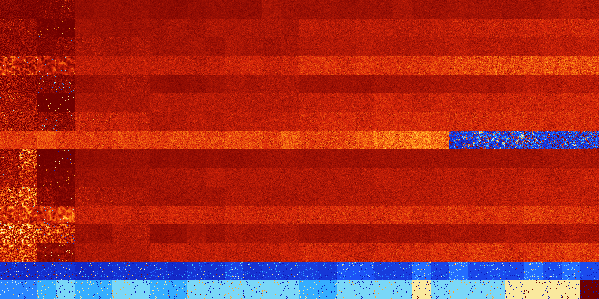

# B0134567 (128512-129023)

<details>
    <summary>Initial Grid</summary>
    
</details>


<details>
    <summary>Initial Grid RLE</summary>

```
#C Exported from GoGoL (https://github.com/marrow16/gogol)
#C Wrap mode: Toroidal
#C Boundary mode: Dead
#C Step: 0
x = 100, y = 100, rule = B0134567/S
bo7bo2bo22bo12bo26b2o$o65bo25bo4bo$22bo3bo4bo6bo43bo5bo$55bo11bo24bo4bo
$3b2o7b2o39bo6bo24bo9bo$o5bo11bo26bo42bo$7bo8bo19bo25bo4bo15bobo$7bo22b
o9bo9bo6bo15bo9bo$o88bo$bo3bo20bo68bo$12bo16bo$8bo12bo19b2o21bobo14bobo
6bo$9bo4bo9bo7bo2bo51bo$31bo2bo34bo7bobo$3bo6bo13bo10bo3bo17bo2bo30bo3b
o$6bo72bo$35bo36bo21bo3bo$21bo2bo2bo6bo48bo15bo$29b2o16bo20bo8bo$13bo
13bo17bo30bo10bo7bo$2bo11bo7bo5b2o31bo$7bo9bo7bo4bo36bo10bo9bo2bo5bo$bo
18bo5bo14bo24b2o10bo12bo$3bo12bo13b2o8bo37bo7bo$bo6bo22bo15bo11bo13bo
12bo$26bo33bo24bo$60bo14bo19bo$21bo17bo5bo3bo27bo$o32bo3bo6bo$17bo19bo
11bo6bo16bo14bo8bo$11bo24bo49bobo$4bo40bo19bo24bo$18bo19bo11bo7bobo18bo
13bo$7bo15bo2bo13bo45bo$19bo24bo$3bo7bo8bo7bo27bo16bo6bo$27bo3bo26bo21b
o$13bo42bo13bobo14bo7bobo$10bo36bobo8bo$bo27bo13bo11bo$2bo59bo$31bo5bob
o11bobo7bo7bo7bo18bo$25bo16bo$18bo18bo3bo27bo2b2o$30bo52bo10bo$72bo20bo
$bo40bo13bo20bo$25bobo23bo9bo21bo$43bo18bo22bo$9bo5bo16bobo59bobo$o51bo
18b2o$12bo28bo4bo$20bobo24bo41bobo7bo$bo5bo5bobo59bobo2bo$21bo25bo41bo
2b2o$35bo12bo50bo$6bo21bobo2bo20bo$3bo6bo21bo$bo21bobo4bo40bo14bo$6bo3b
o3bo65bo10bo$9bo32b2o31bo6bo16bo$20bo8bo2bo20bo8bo6bo19bo$o20bo5bo31bo
7bo6bo$24bo20bo49bo2bo$3bo17bo33bo9bo$23bo25bo6bo23bo$12bo4bo5bo40bo6bo
17bo$3bo30bo19bo9bo26b2o3bo$12b2o44b2o28bo$bo20bo22bo10bo16bo5bo5b2o$
23bo6bo45bo$bo8bo10bo62bo4bo6bo$68b2o$7bo2bo11bo3bo11bo3bo5bo$6bo60bo5b
o$5bo3bo18bo13bo37bo$3bo66bo2bo13bo$20bo5bo10bo4b3o2bo17bo9bo11bo11bo$
32bo3bo4bo4bo10bo5bo8bo3bo$57bo40bo$32bo10bo6bo7bo40bo$7bo7bobo31bo5bo
42bo$11bo35bo51bo$b2o15bo51bo2b2o$5bo24bo20bo9bo5bo11bo$57bo7bo31bo$6bo
2bo21bo11bo46bo6bobo$8bo47bobo3bo29bo$2bobo5bo6bo7bo6b2o12bo31bo$7bo21b
o27bo3bo14b2o6bo$52bo37bo$6bo12bo16bo37bo23bo$53bo6bo11bo17bo$14bo22bo
12bo3bo2bo27bo$8bo19b2o9bo26bo27bo$11bo4bo3bo22bobo14bo2b2o$12bo18bo58b
2o$5bo53bo12bo$16bo11bo63bo$11bo22bo6bo2bo6bo9bo14bo!
```
</details>
<details>
    <summary>Thumbnail</summary>

</details>
<table>
<tr>
    <td><a href="./128512%20S%20Heat%20Map%20Activity.png"></a><br>S (128512)<br>R@29,p2</td>    <td><a href="./128513%20S0%20Heat%20Map%20Activity.png"></a><br>S0 (128513)<br>R@39,p2</td>    <td><a href="./128514%20S1%20Heat%20Map%20Activity.png"></a><br>S1 (128514)<br>R@60,p8</td>    <td><a href="./128515%20S01%20Heat%20Map%20Activity.png"></a><br>S01 (128515)<br>R@68,p4</td>    <td><a href="./128516%20S2%20Heat%20Map%20Activity.png"></a><br>S2 (128516)<br>G>1000</td>    <td><a href="./128517%20S02%20Heat%20Map%20Activity.png"></a><br>S02 (128517)<br>G>1000</td>    <td><a href="./128518%20S12%20Heat%20Map%20Activity.png"></a><br>S12 (128518)<br>G>1000</td>    <td><a href="./128519%20S012%20Heat%20Map%20Activity.png"></a><br>S012 (128519)<br>G>1000</td>    <td><a href="./128520%20S3%20Heat%20Map%20Activity.png"></a><br>S3 (128520)<br>G>1000</td>    <td><a href="./128521%20S03%20Heat%20Map%20Activity.png"></a><br>S03 (128521)<br>G>1000</td>    <td><a href="./128522%20S13%20Heat%20Map%20Activity.png"></a><br>S13 (128522)<br>G>1000</td>    <td><a href="./128523%20S013%20Heat%20Map%20Activity.png"></a><br>S013 (128523)<br>G>1000</td>    <td><a href="./128524%20S23%20Heat%20Map%20Activity.png"></a><br>S23 (128524)<br>G>1000</td>    <td><a href="./128525%20S023%20Heat%20Map%20Activity.png"></a><br>S023 (128525)<br>G>1000</td>    <td><a href="./128526%20S123%20Heat%20Map%20Activity.png"></a><br>S123 (128526)<br>G>1000</td>    <td><a href="./128527%20S0123%20Heat%20Map%20Activity.png"></a><br>S0123 (128527)<br>G>1000</td>    <td><a href="./128528%20S4%20Heat%20Map%20Activity.png"></a><br>S4 (128528)<br>G>1000</td>    <td><a href="./128529%20S04%20Heat%20Map%20Activity.png"></a><br>S04 (128529)<br>G>1000</td>    <td><a href="./128530%20S14%20Heat%20Map%20Activity.png"></a><br>S14 (128530)<br>G>1000</td>    <td><a href="./128531%20S014%20Heat%20Map%20Activity.png"></a><br>S014 (128531)<br>G>1000</td>    <td><a href="./128532%20S24%20Heat%20Map%20Activity.png"></a><br>S24 (128532)<br>G>1000</td>    <td><a href="./128533%20S024%20Heat%20Map%20Activity.png"></a><br>S024 (128533)<br>G>1000</td>    <td><a href="./128534%20S124%20Heat%20Map%20Activity.png"></a><br>S124 (128534)<br>G>1000</td>    <td><a href="./128535%20S0124%20Heat%20Map%20Activity.png"></a><br>S0124 (128535)<br>G>1000</td>    <td><a href="./128536%20S34%20Heat%20Map%20Activity.png"></a><br>S34 (128536)<br>G>1000</td>    <td><a href="./128537%20S034%20Heat%20Map%20Activity.png"></a><br>S034 (128537)<br>G>1000</td>    <td><a href="./128538%20S134%20Heat%20Map%20Activity.png"></a><br>S134 (128538)<br>G>1000</td>    <td><a href="./128539%20S0134%20Heat%20Map%20Activity.png"></a><br>S0134 (128539)<br>G>1000</td>    <td><a href="./128540%20S234%20Heat%20Map%20Activity.png"></a><br>S234 (128540)<br>G>1000</td>    <td><a href="./128541%20S0234%20Heat%20Map%20Activity.png"></a><br>S0234 (128541)<br>G>1000</td>    <td><a href="./128542%20S1234%20Heat%20Map%20Activity.png"></a><br>S1234 (128542)<br>G>1000</td>    <td><a href="./128543%20S01234%20Heat%20Map%20Activity.png"></a><br>S01234 (128543)<br>G>1000</td></tr>
<tr>
    <td><a href="./128544%20S5%20Heat%20Map%20Activity.png"></a><br>S5 (128544)<br>R@36,p4</td>    <td><a href="./128545%20S05%20Heat%20Map%20Activity.png"></a><br>S05 (128545)<br>R@34,p2</td>    <td><a href="./128546%20S15%20Heat%20Map%20Activity.png"></a><br>S15 (128546)<br>R@396,p24</td>    <td><a href="./128547%20S015%20Heat%20Map%20Activity.png"></a><br>S015 (128547)<br>R@593,p252</td>    <td><a href="./128548%20S25%20Heat%20Map%20Activity.png"></a><br>S25 (128548)<br>G>1000</td>    <td><a href="./128549%20S025%20Heat%20Map%20Activity.png"></a><br>S025 (128549)<br>G>1000</td>    <td><a href="./128550%20S125%20Heat%20Map%20Activity.png"></a><br>S125 (128550)<br>G>1000</td>    <td><a href="./128551%20S0125%20Heat%20Map%20Activity.png"></a><br>S0125 (128551)<br>G>1000</td>    <td><a href="./128552%20S35%20Heat%20Map%20Activity.png"></a><br>S35 (128552)<br>G>1000</td>    <td><a href="./128553%20S035%20Heat%20Map%20Activity.png"></a><br>S035 (128553)<br>G>1000</td>    <td><a href="./128554%20S135%20Heat%20Map%20Activity.png"></a><br>S135 (128554)<br>G>1000</td>    <td><a href="./128555%20S0135%20Heat%20Map%20Activity.png"></a><br>S0135 (128555)<br>G>1000</td>    <td><a href="./128556%20S235%20Heat%20Map%20Activity.png"></a><br>S235 (128556)<br>G>1000</td>    <td><a href="./128557%20S0235%20Heat%20Map%20Activity.png"></a><br>S0235 (128557)<br>G>1000</td>    <td><a href="./128558%20S1235%20Heat%20Map%20Activity.png"></a><br>S1235 (128558)<br>G>1000</td>    <td><a href="./128559%20S01235%20Heat%20Map%20Activity.png"></a><br>S01235 (128559)<br>G>1000</td>    <td><a href="./128560%20S45%20Heat%20Map%20Activity.png"></a><br>S45 (128560)<br>G>1000</td>    <td><a href="./128561%20S045%20Heat%20Map%20Activity.png"></a><br>S045 (128561)<br>G>1000</td>    <td><a href="./128562%20S145%20Heat%20Map%20Activity.png"></a><br>S145 (128562)<br>G>1000</td>    <td><a href="./128563%20S0145%20Heat%20Map%20Activity.png"></a><br>S0145 (128563)<br>G>1000</td>    <td><a href="./128564%20S245%20Heat%20Map%20Activity.png"></a><br>S245 (128564)<br>G>1000</td>    <td><a href="./128565%20S0245%20Heat%20Map%20Activity.png"></a><br>S0245 (128565)<br>G>1000</td>    <td><a href="./128566%20S1245%20Heat%20Map%20Activity.png"></a><br>S1245 (128566)<br>G>1000</td>    <td><a href="./128567%20S01245%20Heat%20Map%20Activity.png"></a><br>S01245 (128567)<br>G>1000</td>    <td><a href="./128568%20S345%20Heat%20Map%20Activity.png"></a><br>S345 (128568)<br>G>1000</td>    <td><a href="./128569%20S0345%20Heat%20Map%20Activity.png"></a><br>S0345 (128569)<br>G>1000</td>    <td><a href="./128570%20S1345%20Heat%20Map%20Activity.png"></a><br>S1345 (128570)<br>G>1000</td>    <td><a href="./128571%20S01345%20Heat%20Map%20Activity.png"></a><br>S01345 (128571)<br>G>1000</td>    <td><a href="./128572%20S2345%20Heat%20Map%20Activity.png"></a><br>S2345 (128572)<br>G>1000</td>    <td><a href="./128573%20S02345%20Heat%20Map%20Activity.png"></a><br>S02345 (128573)<br>G>1000</td>    <td><a href="./128574%20S12345%20Heat%20Map%20Activity.png"></a><br>S12345 (128574)<br>G>1000</td>    <td><a href="./128575%20S012345%20Heat%20Map%20Activity.png"></a><br>S012345 (128575)<br>G>1000</td></tr>
<tr>
    <td><a href="./128576%20S6%20Heat%20Map%20Activity.png"></a><br>S6 (128576)<br>R@18,p2</td>    <td><a href="./128577%20S06%20Heat%20Map%20Activity.png"></a><br>S06 (128577)<br>R@21,p2</td>    <td><a href="./128578%20S16%20Heat%20Map%20Activity.png"></a><br>S16 (128578)<br>R@39,p6</td>    <td><a href="./128579%20S016%20Heat%20Map%20Activity.png"></a><br>S016 (128579)<br>R@28,p2</td>    <td><a href="./128580%20S26%20Heat%20Map%20Activity.png"></a><br>S26 (128580)<br>G>1000</td>    <td><a href="./128581%20S026%20Heat%20Map%20Activity.png"></a><br>S026 (128581)<br>G>1000</td>    <td><a href="./128582%20S126%20Heat%20Map%20Activity.png"></a><br>S126 (128582)<br>G>1000</td>    <td><a href="./128583%20S0126%20Heat%20Map%20Activity.png"></a><br>S0126 (128583)<br>G>1000</td>    <td><a href="./128584%20S36%20Heat%20Map%20Activity.png"></a><br>S36 (128584)<br>G>1000</td>    <td><a href="./128585%20S036%20Heat%20Map%20Activity.png"></a><br>S036 (128585)<br>G>1000</td>    <td><a href="./128586%20S136%20Heat%20Map%20Activity.png"></a><br>S136 (128586)<br>G>1000</td>    <td><a href="./128587%20S0136%20Heat%20Map%20Activity.png"></a><br>S0136 (128587)<br>G>1000</td>    <td><a href="./128588%20S236%20Heat%20Map%20Activity.png"></a><br>S236 (128588)<br>G>1000</td>    <td><a href="./128589%20S0236%20Heat%20Map%20Activity.png"></a><br>S0236 (128589)<br>G>1000</td>    <td><a href="./128590%20S1236%20Heat%20Map%20Activity.png"></a><br>S1236 (128590)<br>G>1000</td>    <td><a href="./128591%20S01236%20Heat%20Map%20Activity.png"></a><br>S01236 (128591)<br>G>1000</td>    <td><a href="./128592%20S46%20Heat%20Map%20Activity.png"></a><br>S46 (128592)<br>G>1000</td>    <td><a href="./128593%20S046%20Heat%20Map%20Activity.png"></a><br>S046 (128593)<br>G>1000</td>    <td><a href="./128594%20S146%20Heat%20Map%20Activity.png"></a><br>S146 (128594)<br>G>1000</td>    <td><a href="./128595%20S0146%20Heat%20Map%20Activity.png"></a><br>S0146 (128595)<br>G>1000</td>    <td><a href="./128596%20S246%20Heat%20Map%20Activity.png"></a><br>S246 (128596)<br>G>1000</td>    <td><a href="./128597%20S0246%20Heat%20Map%20Activity.png"></a><br>S0246 (128597)<br>G>1000</td>    <td><a href="./128598%20S1246%20Heat%20Map%20Activity.png"></a><br>S1246 (128598)<br>G>1000</td>    <td><a href="./128599%20S01246%20Heat%20Map%20Activity.png"></a><br>S01246 (128599)<br>G>1000</td>    <td><a href="./128600%20S346%20Heat%20Map%20Activity.png"></a><br>S346 (128600)<br>G>1000</td>    <td><a href="./128601%20S0346%20Heat%20Map%20Activity.png"></a><br>S0346 (128601)<br>G>1000</td>    <td><a href="./128602%20S1346%20Heat%20Map%20Activity.png"></a><br>S1346 (128602)<br>G>1000</td>    <td><a href="./128603%20S01346%20Heat%20Map%20Activity.png"></a><br>S01346 (128603)<br>G>1000</td>    <td><a href="./128604%20S2346%20Heat%20Map%20Activity.png"></a><br>S2346 (128604)<br>G>1000</td>    <td><a href="./128605%20S02346%20Heat%20Map%20Activity.png"></a><br>S02346 (128605)<br>G>1000</td>    <td><a href="./128606%20S12346%20Heat%20Map%20Activity.png"></a><br>S12346 (128606)<br>G>1000</td>    <td><a href="./128607%20S012346%20Heat%20Map%20Activity.png"></a><br>S012346 (128607)<br>G>1000</td></tr>
<tr>
    <td><a href="./128608%20S56%20Heat%20Map%20Activity.png"></a><br>S56 (128608)<br>R@155,p12</td>    <td><a href="./128609%20S056%20Heat%20Map%20Activity.png"></a><br>S056 (128609)<br>R@162,p12</td>    <td><a href="./128610%20S156%20Heat%20Map%20Activity.png"></a><br>S156 (128610)<br>R@427,p6</td>    <td><a href="./128611%20S0156%20Heat%20Map%20Activity.png"></a><br>S0156 (128611)<br>R@451,p24</td>    <td><a href="./128612%20S256%20Heat%20Map%20Activity.png"></a><br>S256 (128612)<br>G>1000</td>    <td><a href="./128613%20S0256%20Heat%20Map%20Activity.png"></a><br>S0256 (128613)<br>G>1000</td>    <td><a href="./128614%20S1256%20Heat%20Map%20Activity.png"></a><br>S1256 (128614)<br>G>1000</td>    <td><a href="./128615%20S01256%20Heat%20Map%20Activity.png"></a><br>S01256 (128615)<br>G>1000</td>    <td><a href="./128616%20S356%20Heat%20Map%20Activity.png"></a><br>S356 (128616)<br>G>1000</td>    <td><a href="./128617%20S0356%20Heat%20Map%20Activity.png"></a><br>S0356 (128617)<br>G>1000</td>    <td><a href="./128618%20S1356%20Heat%20Map%20Activity.png"></a><br>S1356 (128618)<br>G>1000</td>    <td><a href="./128619%20S01356%20Heat%20Map%20Activity.png"></a><br>S01356 (128619)<br>G>1000</td>    <td><a href="./128620%20S2356%20Heat%20Map%20Activity.png"></a><br>S2356 (128620)<br>G>1000</td>    <td><a href="./128621%20S02356%20Heat%20Map%20Activity.png"></a><br>S02356 (128621)<br>G>1000</td>    <td><a href="./128622%20S12356%20Heat%20Map%20Activity.png"></a><br>S12356 (128622)<br>G>1000</td>    <td><a href="./128623%20S012356%20Heat%20Map%20Activity.png"></a><br>S012356 (128623)<br>G>1000</td>    <td><a href="./128624%20S456%20Heat%20Map%20Activity.png"></a><br>S456 (128624)<br>G>1000</td>    <td><a href="./128625%20S0456%20Heat%20Map%20Activity.png"></a><br>S0456 (128625)<br>G>1000</td>    <td><a href="./128626%20S1456%20Heat%20Map%20Activity.png"></a><br>S1456 (128626)<br>G>1000</td>    <td><a href="./128627%20S01456%20Heat%20Map%20Activity.png"></a><br>S01456 (128627)<br>G>1000</td>    <td><a href="./128628%20S2456%20Heat%20Map%20Activity.png"></a><br>S2456 (128628)<br>G>1000</td>    <td><a href="./128629%20S02456%20Heat%20Map%20Activity.png"></a><br>S02456 (128629)<br>G>1000</td>    <td><a href="./128630%20S12456%20Heat%20Map%20Activity.png"></a><br>S12456 (128630)<br>G>1000</td>    <td><a href="./128631%20S012456%20Heat%20Map%20Activity.png"></a><br>S012456 (128631)<br>G>1000</td>    <td><a href="./128632%20S3456%20Heat%20Map%20Activity.png"></a><br>S3456 (128632)<br>G>1000</td>    <td><a href="./128633%20S03456%20Heat%20Map%20Activity.png"></a><br>S03456 (128633)<br>G>1000</td>    <td><a href="./128634%20S13456%20Heat%20Map%20Activity.png"></a><br>S13456 (128634)<br>G>1000</td>    <td><a href="./128635%20S013456%20Heat%20Map%20Activity.png"></a><br>S013456 (128635)<br>G>1000</td>    <td><a href="./128636%20S23456%20Heat%20Map%20Activity.png"></a><br>S23456 (128636)<br>G>1000</td>    <td><a href="./128637%20S023456%20Heat%20Map%20Activity.png"></a><br>S023456 (128637)<br>G>1000</td>    <td><a href="./128638%20S123456%20Heat%20Map%20Activity.png"></a><br>S123456 (128638)<br>G>1000</td>    <td><a href="./128639%20S0123456%20Heat%20Map%20Activity.png"></a><br>S0123456 (128639)<br>G>1000</td></tr>
<tr>
    <td><a href="./128640%20S7%20Heat%20Map%20Activity.png"></a><br>S7 (128640)<br>R@12,p2</td>    <td><a href="./128641%20S07%20Heat%20Map%20Activity.png"></a><br>S07 (128641)<br>R@16,p2</td>    <td><a href="./128642%20S17%20Heat%20Map%20Activity.png"></a><br>S17 (128642)<br>R@28,p8</td>    <td><a href="./128643%20S017%20Heat%20Map%20Activity.png"></a><br>S017 (128643)<br>R@29,p8</td>    <td><a href="./128644%20S27%20Heat%20Map%20Activity.png"></a><br>S27 (128644)<br>G>1000</td>    <td><a href="./128645%20S027%20Heat%20Map%20Activity.png"></a><br>S027 (128645)<br>G>1000</td>    <td><a href="./128646%20S127%20Heat%20Map%20Activity.png"></a><br>S127 (128646)<br>G>1000</td>    <td><a href="./128647%20S0127%20Heat%20Map%20Activity.png"></a><br>S0127 (128647)<br>G>1000</td>    <td><a href="./128648%20S37%20Heat%20Map%20Activity.png"></a><br>S37 (128648)<br>G>1000</td>    <td><a href="./128649%20S037%20Heat%20Map%20Activity.png"></a><br>S037 (128649)<br>G>1000</td>    <td><a href="./128650%20S137%20Heat%20Map%20Activity.png"></a><br>S137 (128650)<br>G>1000</td>    <td><a href="./128651%20S0137%20Heat%20Map%20Activity.png"></a><br>S0137 (128651)<br>G>1000</td>    <td><a href="./128652%20S237%20Heat%20Map%20Activity.png"></a><br>S237 (128652)<br>G>1000</td>    <td><a href="./128653%20S0237%20Heat%20Map%20Activity.png"></a><br>S0237 (128653)<br>G>1000</td>    <td><a href="./128654%20S1237%20Heat%20Map%20Activity.png"></a><br>S1237 (128654)<br>G>1000</td>    <td><a href="./128655%20S01237%20Heat%20Map%20Activity.png"></a><br>S01237 (128655)<br>G>1000</td>    <td><a href="./128656%20S47%20Heat%20Map%20Activity.png"></a><br>S47 (128656)<br>G>1000</td>    <td><a href="./128657%20S047%20Heat%20Map%20Activity.png"></a><br>S047 (128657)<br>G>1000</td>    <td><a href="./128658%20S147%20Heat%20Map%20Activity.png"></a><br>S147 (128658)<br>G>1000</td>    <td><a href="./128659%20S0147%20Heat%20Map%20Activity.png"></a><br>S0147 (128659)<br>G>1000</td>    <td><a href="./128660%20S247%20Heat%20Map%20Activity.png"></a><br>S247 (128660)<br>G>1000</td>    <td><a href="./128661%20S0247%20Heat%20Map%20Activity.png"></a><br>S0247 (128661)<br>G>1000</td>    <td><a href="./128662%20S1247%20Heat%20Map%20Activity.png"></a><br>S1247 (128662)<br>G>1000</td>    <td><a href="./128663%20S01247%20Heat%20Map%20Activity.png"></a><br>S01247 (128663)<br>G>1000</td>    <td><a href="./128664%20S347%20Heat%20Map%20Activity.png"></a><br>S347 (128664)<br>G>1000</td>    <td><a href="./128665%20S0347%20Heat%20Map%20Activity.png"></a><br>S0347 (128665)<br>G>1000</td>    <td><a href="./128666%20S1347%20Heat%20Map%20Activity.png"></a><br>S1347 (128666)<br>G>1000</td>    <td><a href="./128667%20S01347%20Heat%20Map%20Activity.png"></a><br>S01347 (128667)<br>G>1000</td>    <td><a href="./128668%20S2347%20Heat%20Map%20Activity.png"></a><br>S2347 (128668)<br>G>1000</td>    <td><a href="./128669%20S02347%20Heat%20Map%20Activity.png"></a><br>S02347 (128669)<br>G>1000</td>    <td><a href="./128670%20S12347%20Heat%20Map%20Activity.png"></a><br>S12347 (128670)<br>G>1000</td>    <td><a href="./128671%20S012347%20Heat%20Map%20Activity.png"></a><br>S012347 (128671)<br>G>1000</td></tr>
<tr>
    <td><a href="./128672%20S57%20Heat%20Map%20Activity.png"></a><br>S57 (128672)<br>R@26,p2</td>    <td><a href="./128673%20S057%20Heat%20Map%20Activity.png"></a><br>S057 (128673)<br>R@30,p4</td>    <td><a href="./128674%20S157%20Heat%20Map%20Activity.png"></a><br>S157 (128674)<br>R@859,p720</td>    <td><a href="./128675%20S0157%20Heat%20Map%20Activity.png"></a><br>S0157 (128675)<br>R@972,p840</td>    <td><a href="./128676%20S257%20Heat%20Map%20Activity.png"></a><br>S257 (128676)<br>G>1000</td>    <td><a href="./128677%20S0257%20Heat%20Map%20Activity.png"></a><br>S0257 (128677)<br>G>1000</td>    <td><a href="./128678%20S1257%20Heat%20Map%20Activity.png"></a><br>S1257 (128678)<br>G>1000</td>    <td><a href="./128679%20S01257%20Heat%20Map%20Activity.png"></a><br>S01257 (128679)<br>G>1000</td>    <td><a href="./128680%20S357%20Heat%20Map%20Activity.png"></a><br>S357 (128680)<br>G>1000</td>    <td><a href="./128681%20S0357%20Heat%20Map%20Activity.png"></a><br>S0357 (128681)<br>G>1000</td>    <td><a href="./128682%20S1357%20Heat%20Map%20Activity.png"></a><br>S1357 (128682)<br>G>1000</td>    <td><a href="./128683%20S01357%20Heat%20Map%20Activity.png"></a><br>S01357 (128683)<br>G>1000</td>    <td><a href="./128684%20S2357%20Heat%20Map%20Activity.png"></a><br>S2357 (128684)<br>G>1000</td>    <td><a href="./128685%20S02357%20Heat%20Map%20Activity.png"></a><br>S02357 (128685)<br>G>1000</td>    <td><a href="./128686%20S12357%20Heat%20Map%20Activity.png"></a><br>S12357 (128686)<br>G>1000</td>    <td><a href="./128687%20S012357%20Heat%20Map%20Activity.png"></a><br>S012357 (128687)<br>G>1000</td>    <td><a href="./128688%20S457%20Heat%20Map%20Activity.png"></a><br>S457 (128688)<br>G>1000</td>    <td><a href="./128689%20S0457%20Heat%20Map%20Activity.png"></a><br>S0457 (128689)<br>G>1000</td>    <td><a href="./128690%20S1457%20Heat%20Map%20Activity.png"></a><br>S1457 (128690)<br>G>1000</td>    <td><a href="./128691%20S01457%20Heat%20Map%20Activity.png"></a><br>S01457 (128691)<br>G>1000</td>    <td><a href="./128692%20S2457%20Heat%20Map%20Activity.png"></a><br>S2457 (128692)<br>G>1000</td>    <td><a href="./128693%20S02457%20Heat%20Map%20Activity.png"></a><br>S02457 (128693)<br>G>1000</td>    <td><a href="./128694%20S12457%20Heat%20Map%20Activity.png"></a><br>S12457 (128694)<br>G>1000</td>    <td><a href="./128695%20S012457%20Heat%20Map%20Activity.png"></a><br>S012457 (128695)<br>G>1000</td>    <td><a href="./128696%20S3457%20Heat%20Map%20Activity.png"></a><br>S3457 (128696)<br>G>1000</td>    <td><a href="./128697%20S03457%20Heat%20Map%20Activity.png"></a><br>S03457 (128697)<br>G>1000</td>    <td><a href="./128698%20S13457%20Heat%20Map%20Activity.png"></a><br>S13457 (128698)<br>G>1000</td>    <td><a href="./128699%20S013457%20Heat%20Map%20Activity.png"></a><br>S013457 (128699)<br>G>1000</td>    <td><a href="./128700%20S23457%20Heat%20Map%20Activity.png"></a><br>S23457 (128700)<br>G>1000</td>    <td><a href="./128701%20S023457%20Heat%20Map%20Activity.png"></a><br>S023457 (128701)<br>G>1000</td>    <td><a href="./128702%20S123457%20Heat%20Map%20Activity.png"></a><br>S123457 (128702)<br>G>1000</td>    <td><a href="./128703%20S0123457%20Heat%20Map%20Activity.png"></a><br>S0123457 (128703)<br>G>1000</td></tr>
<tr>
    <td><a href="./128704%20S67%20Heat%20Map%20Activity.png"></a><br>S67 (128704)<br>R@13,p2</td>    <td><a href="./128705%20S067%20Heat%20Map%20Activity.png"></a><br>S067 (128705)<br>R@13,p2</td>    <td><a href="./128706%20S167%20Heat%20Map%20Activity.png"></a><br>S167 (128706)<br>R@23,p4</td>    <td><a href="./128707%20S0167%20Heat%20Map%20Activity.png"></a><br>S0167 (128707)<br>R@25,p2</td>    <td><a href="./128708%20S267%20Heat%20Map%20Activity.png"></a><br>S267 (128708)<br>G>1000</td>    <td><a href="./128709%20S0267%20Heat%20Map%20Activity.png"></a><br>S0267 (128709)<br>G>1000</td>    <td><a href="./128710%20S1267%20Heat%20Map%20Activity.png"></a><br>S1267 (128710)<br>G>1000</td>    <td><a href="./128711%20S01267%20Heat%20Map%20Activity.png"></a><br>S01267 (128711)<br>G>1000</td>    <td><a href="./128712%20S367%20Heat%20Map%20Activity.png"></a><br>S367 (128712)<br>G>1000</td>    <td><a href="./128713%20S0367%20Heat%20Map%20Activity.png"></a><br>S0367 (128713)<br>G>1000</td>    <td><a href="./128714%20S1367%20Heat%20Map%20Activity.png"></a><br>S1367 (128714)<br>G>1000</td>    <td><a href="./128715%20S01367%20Heat%20Map%20Activity.png"></a><br>S01367 (128715)<br>G>1000</td>    <td><a href="./128716%20S2367%20Heat%20Map%20Activity.png"></a><br>S2367 (128716)<br>G>1000</td>    <td><a href="./128717%20S02367%20Heat%20Map%20Activity.png"></a><br>S02367 (128717)<br>G>1000</td>    <td><a href="./128718%20S12367%20Heat%20Map%20Activity.png"></a><br>S12367 (128718)<br>G>1000</td>    <td><a href="./128719%20S012367%20Heat%20Map%20Activity.png"></a><br>S012367 (128719)<br>G>1000</td>    <td><a href="./128720%20S467%20Heat%20Map%20Activity.png"></a><br>S467 (128720)<br>G>1000</td>    <td><a href="./128721%20S0467%20Heat%20Map%20Activity.png"></a><br>S0467 (128721)<br>G>1000</td>    <td><a href="./128722%20S1467%20Heat%20Map%20Activity.png"></a><br>S1467 (128722)<br>G>1000</td>    <td><a href="./128723%20S01467%20Heat%20Map%20Activity.png"></a><br>S01467 (128723)<br>G>1000</td>    <td><a href="./128724%20S2467%20Heat%20Map%20Activity.png"></a><br>S2467 (128724)<br>G>1000</td>    <td><a href="./128725%20S02467%20Heat%20Map%20Activity.png"></a><br>S02467 (128725)<br>G>1000</td>    <td><a href="./128726%20S12467%20Heat%20Map%20Activity.png"></a><br>S12467 (128726)<br>G>1000</td>    <td><a href="./128727%20S012467%20Heat%20Map%20Activity.png"></a><br>S012467 (128727)<br>G>1000</td>    <td><a href="./128728%20S3467%20Heat%20Map%20Activity.png"></a><br>S3467 (128728)<br>G>1000</td>    <td><a href="./128729%20S03467%20Heat%20Map%20Activity.png"></a><br>S03467 (128729)<br>G>1000</td>    <td><a href="./128730%20S13467%20Heat%20Map%20Activity.png"></a><br>S13467 (128730)<br>G>1000</td>    <td><a href="./128731%20S013467%20Heat%20Map%20Activity.png"></a><br>S013467 (128731)<br>G>1000</td>    <td><a href="./128732%20S23467%20Heat%20Map%20Activity.png"></a><br>S23467 (128732)<br>G>1000</td>    <td><a href="./128733%20S023467%20Heat%20Map%20Activity.png"></a><br>S023467 (128733)<br>G>1000</td>    <td><a href="./128734%20S123467%20Heat%20Map%20Activity.png"></a><br>S123467 (128734)<br>G>1000</td>    <td><a href="./128735%20S0123467%20Heat%20Map%20Activity.png"></a><br>S0123467 (128735)<br>G>1000</td></tr>
<tr>
    <td><a href="./128736%20S567%20Heat%20Map%20Activity.png"></a><br>S567 (128736)<br>G>1000</td>    <td><a href="./128737%20S0567%20Heat%20Map%20Activity.png"></a><br>S0567 (128737)<br>G>1000</td>    <td><a href="./128738%20S1567%20Heat%20Map%20Activity.png"></a><br>S1567 (128738)<br>G>1000</td>    <td><a href="./128739%20S01567%20Heat%20Map%20Activity.png"></a><br>S01567 (128739)<br>G>1000</td>    <td><a href="./128740%20S2567%20Heat%20Map%20Activity.png"></a><br>S2567 (128740)<br>G>1000</td>    <td><a href="./128741%20S02567%20Heat%20Map%20Activity.png"></a><br>S02567 (128741)<br>G>1000</td>    <td><a href="./128742%20S12567%20Heat%20Map%20Activity.png"></a><br>S12567 (128742)<br>G>1000</td>    <td><a href="./128743%20S012567%20Heat%20Map%20Activity.png"></a><br>S012567 (128743)<br>G>1000</td>    <td><a href="./128744%20S3567%20Heat%20Map%20Activity.png"></a><br>S3567 (128744)<br>G>1000</td>    <td><a href="./128745%20S03567%20Heat%20Map%20Activity.png"></a><br>S03567 (128745)<br>G>1000</td>    <td><a href="./128746%20S13567%20Heat%20Map%20Activity.png"></a><br>S13567 (128746)<br>G>1000</td>    <td><a href="./128747%20S013567%20Heat%20Map%20Activity.png"></a><br>S013567 (128747)<br>G>1000</td>    <td><a href="./128748%20S23567%20Heat%20Map%20Activity.png"></a><br>S23567 (128748)<br>G>1000</td>    <td><a href="./128749%20S023567%20Heat%20Map%20Activity.png"></a><br>S023567 (128749)<br>G>1000</td>    <td><a href="./128750%20S123567%20Heat%20Map%20Activity.png"></a><br>S123567 (128750)<br>G>1000</td>    <td><a href="./128751%20S0123567%20Heat%20Map%20Activity.png"></a><br>S0123567 (128751)<br>G>1000</td>    <td><a href="./128752%20S4567%20Heat%20Map%20Activity.png"></a><br>S4567 (128752)<br>G>1000</td>    <td><a href="./128753%20S04567%20Heat%20Map%20Activity.png"></a><br>S04567 (128753)<br>G>1000</td>    <td><a href="./128754%20S14567%20Heat%20Map%20Activity.png"></a><br>S14567 (128754)<br>G>1000</td>    <td><a href="./128755%20S014567%20Heat%20Map%20Activity.png"></a><br>S014567 (128755)<br>G>1000</td>    <td><a href="./128756%20S24567%20Heat%20Map%20Activity.png"></a><br>S24567 (128756)<br>G>1000</td>    <td><a href="./128757%20S024567%20Heat%20Map%20Activity.png"></a><br>S024567 (128757)<br>G>1000</td>    <td><a href="./128758%20S124567%20Heat%20Map%20Activity.png"></a><br>S124567 (128758)<br>G>1000</td>    <td><a href="./128759%20S0124567%20Heat%20Map%20Activity.png"></a><br>S0124567 (128759)<br>G>1000</td>    <td><a href="./128760%20S34567%20Heat%20Map%20Activity.png"></a><br>S34567 (128760)<br>R@166,p66</td>    <td><a href="./128761%20S034567%20Heat%20Map%20Activity.png"></a><br>S034567 (128761)<br>R@107,p6</td>    <td><a href="./128762%20S134567%20Heat%20Map%20Activity.png"></a><br>S134567 (128762)<br>R@134,p6</td>    <td><a href="./128763%20S0134567%20Heat%20Map%20Activity.png"></a><br>S0134567 (128763)<br>R@115,p6</td>    <td><a href="./128764%20S234567%20Heat%20Map%20Activity.png"></a><br>S234567 (128764)<br>R@31,p6</td>    <td><a href="./128765%20S0234567%20Heat%20Map%20Activity.png"></a><br>S0234567 (128765)<br>R@50,p6</td>    <td><a href="./128766%20S1234567%20Heat%20Map%20Activity.png"></a><br>S1234567 (128766)<br>R@31,p6</td>    <td><a href="./128767%20S01234567%20Heat%20Map%20Activity.png"></a><br>S01234567 (128767)<br>R@40,p6</td></tr>
<tr>
    <td><a href="./128768%20S8%20Heat%20Map%20Activity.png"></a><br>S8 (128768)<br>R@18,p4</td>    <td><a href="./128769%20S08%20Heat%20Map%20Activity.png"></a><br>S08 (128769)<br>R@13,p2</td>    <td><a href="./128770%20S18%20Heat%20Map%20Activity.png"></a><br>S18 (128770)<br>R@236,p180</td>    <td><a href="./128771%20S018%20Heat%20Map%20Activity.png"></a><br>S018 (128771)<br>R@302,p240</td>    <td><a href="./128772%20S28%20Heat%20Map%20Activity.png"></a><br>S28 (128772)<br>G>1000</td>    <td><a href="./128773%20S028%20Heat%20Map%20Activity.png"></a><br>S028 (128773)<br>G>1000</td>    <td><a href="./128774%20S128%20Heat%20Map%20Activity.png"></a><br>S128 (128774)<br>G>1000</td>    <td><a href="./128775%20S0128%20Heat%20Map%20Activity.png"></a><br>S0128 (128775)<br>G>1000</td>    <td><a href="./128776%20S38%20Heat%20Map%20Activity.png"></a><br>S38 (128776)<br>G>1000</td>    <td><a href="./128777%20S038%20Heat%20Map%20Activity.png"></a><br>S038 (128777)<br>G>1000</td>    <td><a href="./128778%20S138%20Heat%20Map%20Activity.png"></a><br>S138 (128778)<br>G>1000</td>    <td><a href="./128779%20S0138%20Heat%20Map%20Activity.png"></a><br>S0138 (128779)<br>G>1000</td>    <td><a href="./128780%20S238%20Heat%20Map%20Activity.png"></a><br>S238 (128780)<br>G>1000</td>    <td><a href="./128781%20S0238%20Heat%20Map%20Activity.png"></a><br>S0238 (128781)<br>G>1000</td>    <td><a href="./128782%20S1238%20Heat%20Map%20Activity.png"></a><br>S1238 (128782)<br>G>1000</td>    <td><a href="./128783%20S01238%20Heat%20Map%20Activity.png"></a><br>S01238 (128783)<br>G>1000</td>    <td><a href="./128784%20S48%20Heat%20Map%20Activity.png"></a><br>S48 (128784)<br>G>1000</td>    <td><a href="./128785%20S048%20Heat%20Map%20Activity.png"></a><br>S048 (128785)<br>G>1000</td>    <td><a href="./128786%20S148%20Heat%20Map%20Activity.png"></a><br>S148 (128786)<br>G>1000</td>    <td><a href="./128787%20S0148%20Heat%20Map%20Activity.png"></a><br>S0148 (128787)<br>G>1000</td>    <td><a href="./128788%20S248%20Heat%20Map%20Activity.png"></a><br>S248 (128788)<br>G>1000</td>    <td><a href="./128789%20S0248%20Heat%20Map%20Activity.png"></a><br>S0248 (128789)<br>G>1000</td>    <td><a href="./128790%20S1248%20Heat%20Map%20Activity.png"></a><br>S1248 (128790)<br>G>1000</td>    <td><a href="./128791%20S01248%20Heat%20Map%20Activity.png"></a><br>S01248 (128791)<br>G>1000</td>    <td><a href="./128792%20S348%20Heat%20Map%20Activity.png"></a><br>S348 (128792)<br>G>1000</td>    <td><a href="./128793%20S0348%20Heat%20Map%20Activity.png"></a><br>S0348 (128793)<br>G>1000</td>    <td><a href="./128794%20S1348%20Heat%20Map%20Activity.png"></a><br>S1348 (128794)<br>G>1000</td>    <td><a href="./128795%20S01348%20Heat%20Map%20Activity.png"></a><br>S01348 (128795)<br>G>1000</td>    <td><a href="./128796%20S2348%20Heat%20Map%20Activity.png"></a><br>S2348 (128796)<br>G>1000</td>    <td><a href="./128797%20S02348%20Heat%20Map%20Activity.png"></a><br>S02348 (128797)<br>G>1000</td>    <td><a href="./128798%20S12348%20Heat%20Map%20Activity.png"></a><br>S12348 (128798)<br>G>1000</td>    <td><a href="./128799%20S012348%20Heat%20Map%20Activity.png"></a><br>S012348 (128799)<br>G>1000</td></tr>
<tr>
    <td><a href="./128800%20S58%20Heat%20Map%20Activity.png"></a><br>S58 (128800)<br>R@29,p2</td>    <td><a href="./128801%20S058%20Heat%20Map%20Activity.png"></a><br>S058 (128801)<br>R@30,p4</td>    <td><a href="./128802%20S158%20Heat%20Map%20Activity.png"></a><br>S158 (128802)<br>R@358,p24</td>    <td><a href="./128803%20S0158%20Heat%20Map%20Activity.png"></a><br>S0158 (128803)<br>R@366,p120</td>    <td><a href="./128804%20S258%20Heat%20Map%20Activity.png"></a><br>S258 (128804)<br>G>1000</td>    <td><a href="./128805%20S0258%20Heat%20Map%20Activity.png"></a><br>S0258 (128805)<br>G>1000</td>    <td><a href="./128806%20S1258%20Heat%20Map%20Activity.png"></a><br>S1258 (128806)<br>G>1000</td>    <td><a href="./128807%20S01258%20Heat%20Map%20Activity.png"></a><br>S01258 (128807)<br>G>1000</td>    <td><a href="./128808%20S358%20Heat%20Map%20Activity.png"></a><br>S358 (128808)<br>G>1000</td>    <td><a href="./128809%20S0358%20Heat%20Map%20Activity.png"></a><br>S0358 (128809)<br>G>1000</td>    <td><a href="./128810%20S1358%20Heat%20Map%20Activity.png"></a><br>S1358 (128810)<br>G>1000</td>    <td><a href="./128811%20S01358%20Heat%20Map%20Activity.png"></a><br>S01358 (128811)<br>G>1000</td>    <td><a href="./128812%20S2358%20Heat%20Map%20Activity.png"></a><br>S2358 (128812)<br>G>1000</td>    <td><a href="./128813%20S02358%20Heat%20Map%20Activity.png"></a><br>S02358 (128813)<br>G>1000</td>    <td><a href="./128814%20S12358%20Heat%20Map%20Activity.png"></a><br>S12358 (128814)<br>G>1000</td>    <td><a href="./128815%20S012358%20Heat%20Map%20Activity.png"></a><br>S012358 (128815)<br>G>1000</td>    <td><a href="./128816%20S458%20Heat%20Map%20Activity.png"></a><br>S458 (128816)<br>G>1000</td>    <td><a href="./128817%20S0458%20Heat%20Map%20Activity.png"></a><br>S0458 (128817)<br>G>1000</td>    <td><a href="./128818%20S1458%20Heat%20Map%20Activity.png"></a><br>S1458 (128818)<br>G>1000</td>    <td><a href="./128819%20S01458%20Heat%20Map%20Activity.png"></a><br>S01458 (128819)<br>G>1000</td>    <td><a href="./128820%20S2458%20Heat%20Map%20Activity.png"></a><br>S2458 (128820)<br>G>1000</td>    <td><a href="./128821%20S02458%20Heat%20Map%20Activity.png"></a><br>S02458 (128821)<br>G>1000</td>    <td><a href="./128822%20S12458%20Heat%20Map%20Activity.png"></a><br>S12458 (128822)<br>G>1000</td>    <td><a href="./128823%20S012458%20Heat%20Map%20Activity.png"></a><br>S012458 (128823)<br>G>1000</td>    <td><a href="./128824%20S3458%20Heat%20Map%20Activity.png"></a><br>S3458 (128824)<br>G>1000</td>    <td><a href="./128825%20S03458%20Heat%20Map%20Activity.png"></a><br>S03458 (128825)<br>G>1000</td>    <td><a href="./128826%20S13458%20Heat%20Map%20Activity.png"></a><br>S13458 (128826)<br>G>1000</td>    <td><a href="./128827%20S013458%20Heat%20Map%20Activity.png"></a><br>S013458 (128827)<br>G>1000</td>    <td><a href="./128828%20S23458%20Heat%20Map%20Activity.png"></a><br>S23458 (128828)<br>G>1000</td>    <td><a href="./128829%20S023458%20Heat%20Map%20Activity.png"></a><br>S023458 (128829)<br>G>1000</td>    <td><a href="./128830%20S123458%20Heat%20Map%20Activity.png"></a><br>S123458 (128830)<br>G>1000</td>    <td><a href="./128831%20S0123458%20Heat%20Map%20Activity.png"></a><br>S0123458 (128831)<br>G>1000</td></tr>
<tr>
    <td><a href="./128832%20S68%20Heat%20Map%20Activity.png"></a><br>S68 (128832)<br>R@11,p2</td>    <td><a href="./128833%20S068%20Heat%20Map%20Activity.png"></a><br>S068 (128833)<br>R@14,p2</td>    <td><a href="./128834%20S168%20Heat%20Map%20Activity.png"></a><br>S168 (128834)<br>R@39,p6</td>    <td><a href="./128835%20S0168%20Heat%20Map%20Activity.png"></a><br>S0168 (128835)<br>R@109,p72</td>    <td><a href="./128836%20S268%20Heat%20Map%20Activity.png"></a><br>S268 (128836)<br>G>1000</td>    <td><a href="./128837%20S0268%20Heat%20Map%20Activity.png"></a><br>S0268 (128837)<br>G>1000</td>    <td><a href="./128838%20S1268%20Heat%20Map%20Activity.png"></a><br>S1268 (128838)<br>G>1000</td>    <td><a href="./128839%20S01268%20Heat%20Map%20Activity.png"></a><br>S01268 (128839)<br>G>1000</td>    <td><a href="./128840%20S368%20Heat%20Map%20Activity.png"></a><br>S368 (128840)<br>G>1000</td>    <td><a href="./128841%20S0368%20Heat%20Map%20Activity.png"></a><br>S0368 (128841)<br>G>1000</td>    <td><a href="./128842%20S1368%20Heat%20Map%20Activity.png"></a><br>S1368 (128842)<br>G>1000</td>    <td><a href="./128843%20S01368%20Heat%20Map%20Activity.png"></a><br>S01368 (128843)<br>G>1000</td>    <td><a href="./128844%20S2368%20Heat%20Map%20Activity.png"></a><br>S2368 (128844)<br>G>1000</td>    <td><a href="./128845%20S02368%20Heat%20Map%20Activity.png"></a><br>S02368 (128845)<br>G>1000</td>    <td><a href="./128846%20S12368%20Heat%20Map%20Activity.png"></a><br>S12368 (128846)<br>G>1000</td>    <td><a href="./128847%20S012368%20Heat%20Map%20Activity.png"></a><br>S012368 (128847)<br>G>1000</td>    <td><a href="./128848%20S468%20Heat%20Map%20Activity.png"></a><br>S468 (128848)<br>G>1000</td>    <td><a href="./128849%20S0468%20Heat%20Map%20Activity.png"></a><br>S0468 (128849)<br>G>1000</td>    <td><a href="./128850%20S1468%20Heat%20Map%20Activity.png"></a><br>S1468 (128850)<br>G>1000</td>    <td><a href="./128851%20S01468%20Heat%20Map%20Activity.png"></a><br>S01468 (128851)<br>G>1000</td>    <td><a href="./128852%20S2468%20Heat%20Map%20Activity.png"></a><br>S2468 (128852)<br>G>1000</td>    <td><a href="./128853%20S02468%20Heat%20Map%20Activity.png"></a><br>S02468 (128853)<br>G>1000</td>    <td><a href="./128854%20S12468%20Heat%20Map%20Activity.png"></a><br>S12468 (128854)<br>G>1000</td>    <td><a href="./128855%20S012468%20Heat%20Map%20Activity.png"></a><br>S012468 (128855)<br>G>1000</td>    <td><a href="./128856%20S3468%20Heat%20Map%20Activity.png"></a><br>S3468 (128856)<br>G>1000</td>    <td><a href="./128857%20S03468%20Heat%20Map%20Activity.png"></a><br>S03468 (128857)<br>G>1000</td>    <td><a href="./128858%20S13468%20Heat%20Map%20Activity.png"></a><br>S13468 (128858)<br>G>1000</td>    <td><a href="./128859%20S013468%20Heat%20Map%20Activity.png"></a><br>S013468 (128859)<br>G>1000</td>    <td><a href="./128860%20S23468%20Heat%20Map%20Activity.png"></a><br>S23468 (128860)<br>G>1000</td>    <td><a href="./128861%20S023468%20Heat%20Map%20Activity.png"></a><br>S023468 (128861)<br>G>1000</td>    <td><a href="./128862%20S123468%20Heat%20Map%20Activity.png"></a><br>S123468 (128862)<br>G>1000</td>    <td><a href="./128863%20S0123468%20Heat%20Map%20Activity.png"></a><br>S0123468 (128863)<br>G>1000</td></tr>
<tr>
    <td><a href="./128864%20S568%20Heat%20Map%20Activity.png"></a><br>S568 (128864)<br>R@202,p12</td>    <td><a href="./128865%20S0568%20Heat%20Map%20Activity.png"></a><br>S0568 (128865)<br>R@218,p4</td>    <td><a href="./128866%20S1568%20Heat%20Map%20Activity.png"></a><br>S1568 (128866)<br>R@579,p48</td>    <td><a href="./128867%20S01568%20Heat%20Map%20Activity.png"></a><br>S01568 (128867)<br>R@494,p12</td>    <td><a href="./128868%20S2568%20Heat%20Map%20Activity.png"></a><br>S2568 (128868)<br>G>1000</td>    <td><a href="./128869%20S02568%20Heat%20Map%20Activity.png"></a><br>S02568 (128869)<br>G>1000</td>    <td><a href="./128870%20S12568%20Heat%20Map%20Activity.png"></a><br>S12568 (128870)<br>G>1000</td>    <td><a href="./128871%20S012568%20Heat%20Map%20Activity.png"></a><br>S012568 (128871)<br>G>1000</td>    <td><a href="./128872%20S3568%20Heat%20Map%20Activity.png"></a><br>S3568 (128872)<br>G>1000</td>    <td><a href="./128873%20S03568%20Heat%20Map%20Activity.png"></a><br>S03568 (128873)<br>G>1000</td>    <td><a href="./128874%20S13568%20Heat%20Map%20Activity.png"></a><br>S13568 (128874)<br>G>1000</td>    <td><a href="./128875%20S013568%20Heat%20Map%20Activity.png"></a><br>S013568 (128875)<br>G>1000</td>    <td><a href="./128876%20S23568%20Heat%20Map%20Activity.png"></a><br>S23568 (128876)<br>G>1000</td>    <td><a href="./128877%20S023568%20Heat%20Map%20Activity.png"></a><br>S023568 (128877)<br>G>1000</td>    <td><a href="./128878%20S123568%20Heat%20Map%20Activity.png"></a><br>S123568 (128878)<br>G>1000</td>    <td><a href="./128879%20S0123568%20Heat%20Map%20Activity.png"></a><br>S0123568 (128879)<br>G>1000</td>    <td><a href="./128880%20S4568%20Heat%20Map%20Activity.png"></a><br>S4568 (128880)<br>G>1000</td>    <td><a href="./128881%20S04568%20Heat%20Map%20Activity.png"></a><br>S04568 (128881)<br>G>1000</td>    <td><a href="./128882%20S14568%20Heat%20Map%20Activity.png"></a><br>S14568 (128882)<br>G>1000</td>    <td><a href="./128883%20S014568%20Heat%20Map%20Activity.png"></a><br>S014568 (128883)<br>G>1000</td>    <td><a href="./128884%20S24568%20Heat%20Map%20Activity.png"></a><br>S24568 (128884)<br>G>1000</td>    <td><a href="./128885%20S024568%20Heat%20Map%20Activity.png"></a><br>S024568 (128885)<br>G>1000</td>    <td><a href="./128886%20S124568%20Heat%20Map%20Activity.png"></a><br>S124568 (128886)<br>G>1000</td>    <td><a href="./128887%20S0124568%20Heat%20Map%20Activity.png"></a><br>S0124568 (128887)<br>G>1000</td>    <td><a href="./128888%20S34568%20Heat%20Map%20Activity.png"></a><br>S34568 (128888)<br>G>1000</td>    <td><a href="./128889%20S034568%20Heat%20Map%20Activity.png"></a><br>S034568 (128889)<br>G>1000</td>    <td><a href="./128890%20S134568%20Heat%20Map%20Activity.png"></a><br>S134568 (128890)<br>G>1000</td>    <td><a href="./128891%20S0134568%20Heat%20Map%20Activity.png"></a><br>S0134568 (128891)<br>G>1000</td>    <td><a href="./128892%20S234568%20Heat%20Map%20Activity.png"></a><br>S234568 (128892)<br>G>1000</td>    <td><a href="./128893%20S0234568%20Heat%20Map%20Activity.png"></a><br>S0234568 (128893)<br>G>1000</td>    <td><a href="./128894%20S1234568%20Heat%20Map%20Activity.png"></a><br>S1234568 (128894)<br>G>1000</td>    <td><a href="./128895%20S01234568%20Heat%20Map%20Activity.png"></a><br>S01234568 (128895)<br>G>1000</td></tr>
<tr>
    <td><a href="./128896%20S78%20Heat%20Map%20Activity.png"></a><br>S78 (128896)<br>R@15,p2</td>    <td><a href="./128897%20S078%20Heat%20Map%20Activity.png"></a><br>S078 (128897)<br>R@17,p2</td>    <td><a href="./128898%20S178%20Heat%20Map%20Activity.png"></a><br>S178 (128898)<br>R@25,p4</td>    <td><a href="./128899%20S0178%20Heat%20Map%20Activity.png"></a><br>S0178 (128899)<br>R@32,p4</td>    <td><a href="./128900%20S278%20Heat%20Map%20Activity.png"></a><br>S278 (128900)<br>G>1000</td>    <td><a href="./128901%20S0278%20Heat%20Map%20Activity.png"></a><br>S0278 (128901)<br>G>1000</td>    <td><a href="./128902%20S1278%20Heat%20Map%20Activity.png"></a><br>S1278 (128902)<br>G>1000</td>    <td><a href="./128903%20S01278%20Heat%20Map%20Activity.png"></a><br>S01278 (128903)<br>G>1000</td>    <td><a href="./128904%20S378%20Heat%20Map%20Activity.png"></a><br>S378 (128904)<br>G>1000</td>    <td><a href="./128905%20S0378%20Heat%20Map%20Activity.png"></a><br>S0378 (128905)<br>G>1000</td>    <td><a href="./128906%20S1378%20Heat%20Map%20Activity.png"></a><br>S1378 (128906)<br>G>1000</td>    <td><a href="./128907%20S01378%20Heat%20Map%20Activity.png"></a><br>S01378 (128907)<br>G>1000</td>    <td><a href="./128908%20S2378%20Heat%20Map%20Activity.png"></a><br>S2378 (128908)<br>G>1000</td>    <td><a href="./128909%20S02378%20Heat%20Map%20Activity.png"></a><br>S02378 (128909)<br>G>1000</td>    <td><a href="./128910%20S12378%20Heat%20Map%20Activity.png"></a><br>S12378 (128910)<br>G>1000</td>    <td><a href="./128911%20S012378%20Heat%20Map%20Activity.png"></a><br>S012378 (128911)<br>G>1000</td>    <td><a href="./128912%20S478%20Heat%20Map%20Activity.png"></a><br>S478 (128912)<br>G>1000</td>    <td><a href="./128913%20S0478%20Heat%20Map%20Activity.png"></a><br>S0478 (128913)<br>G>1000</td>    <td><a href="./128914%20S1478%20Heat%20Map%20Activity.png"></a><br>S1478 (128914)<br>G>1000</td>    <td><a href="./128915%20S01478%20Heat%20Map%20Activity.png"></a><br>S01478 (128915)<br>G>1000</td>    <td><a href="./128916%20S2478%20Heat%20Map%20Activity.png"></a><br>S2478 (128916)<br>G>1000</td>    <td><a href="./128917%20S02478%20Heat%20Map%20Activity.png"></a><br>S02478 (128917)<br>G>1000</td>    <td><a href="./128918%20S12478%20Heat%20Map%20Activity.png"></a><br>S12478 (128918)<br>G>1000</td>    <td><a href="./128919%20S012478%20Heat%20Map%20Activity.png"></a><br>S012478 (128919)<br>G>1000</td>    <td><a href="./128920%20S3478%20Heat%20Map%20Activity.png"></a><br>S3478 (128920)<br>G>1000</td>    <td><a href="./128921%20S03478%20Heat%20Map%20Activity.png"></a><br>S03478 (128921)<br>G>1000</td>    <td><a href="./128922%20S13478%20Heat%20Map%20Activity.png"></a><br>S13478 (128922)<br>G>1000</td>    <td><a href="./128923%20S013478%20Heat%20Map%20Activity.png"></a><br>S013478 (128923)<br>G>1000</td>    <td><a href="./128924%20S23478%20Heat%20Map%20Activity.png"></a><br>S23478 (128924)<br>G>1000</td>    <td><a href="./128925%20S023478%20Heat%20Map%20Activity.png"></a><br>S023478 (128925)<br>G>1000</td>    <td><a href="./128926%20S123478%20Heat%20Map%20Activity.png"></a><br>S123478 (128926)<br>G>1000</td>    <td><a href="./128927%20S0123478%20Heat%20Map%20Activity.png"></a><br>S0123478 (128927)<br>G>1000</td></tr>
<tr>
    <td><a href="./128928%20S578%20Heat%20Map%20Activity.png"></a><br>S578 (128928)<br>R@41,p4</td>    <td><a href="./128929%20S0578%20Heat%20Map%20Activity.png"></a><br>S0578 (128929)<br>R@36,p2</td>    <td><a href="./128930%20S1578%20Heat%20Map%20Activity.png"></a><br>S1578 (128930)<br>R@241,p24</td>    <td><a href="./128931%20S01578%20Heat%20Map%20Activity.png"></a><br>S01578 (128931)<br>R@233,p4</td>    <td><a href="./128932%20S2578%20Heat%20Map%20Activity.png"></a><br>S2578 (128932)<br>G>1000</td>    <td><a href="./128933%20S02578%20Heat%20Map%20Activity.png"></a><br>S02578 (128933)<br>G>1000</td>    <td><a href="./128934%20S12578%20Heat%20Map%20Activity.png"></a><br>S12578 (128934)<br>G>1000</td>    <td><a href="./128935%20S012578%20Heat%20Map%20Activity.png"></a><br>S012578 (128935)<br>G>1000</td>    <td><a href="./128936%20S3578%20Heat%20Map%20Activity.png"></a><br>S3578 (128936)<br>G>1000</td>    <td><a href="./128937%20S03578%20Heat%20Map%20Activity.png"></a><br>S03578 (128937)<br>G>1000</td>    <td><a href="./128938%20S13578%20Heat%20Map%20Activity.png"></a><br>S13578 (128938)<br>G>1000</td>    <td><a href="./128939%20S013578%20Heat%20Map%20Activity.png"></a><br>S013578 (128939)<br>G>1000</td>    <td><a href="./128940%20S23578%20Heat%20Map%20Activity.png"></a><br>S23578 (128940)<br>G>1000</td>    <td><a href="./128941%20S023578%20Heat%20Map%20Activity.png"></a><br>S023578 (128941)<br>G>1000</td>    <td><a href="./128942%20S123578%20Heat%20Map%20Activity.png"></a><br>S123578 (128942)<br>G>1000</td>    <td><a href="./128943%20S0123578%20Heat%20Map%20Activity.png"></a><br>S0123578 (128943)<br>G>1000</td>    <td><a href="./128944%20S4578%20Heat%20Map%20Activity.png"></a><br>S4578 (128944)<br>G>1000</td>    <td><a href="./128945%20S04578%20Heat%20Map%20Activity.png"></a><br>S04578 (128945)<br>G>1000</td>    <td><a href="./128946%20S14578%20Heat%20Map%20Activity.png"></a><br>S14578 (128946)<br>G>1000</td>    <td><a href="./128947%20S014578%20Heat%20Map%20Activity.png"></a><br>S014578 (128947)<br>G>1000</td>    <td><a href="./128948%20S24578%20Heat%20Map%20Activity.png"></a><br>S24578 (128948)<br>G>1000</td>    <td><a href="./128949%20S024578%20Heat%20Map%20Activity.png"></a><br>S024578 (128949)<br>G>1000</td>    <td><a href="./128950%20S124578%20Heat%20Map%20Activity.png"></a><br>S124578 (128950)<br>G>1000</td>    <td><a href="./128951%20S0124578%20Heat%20Map%20Activity.png"></a><br>S0124578 (128951)<br>G>1000</td>    <td><a href="./128952%20S34578%20Heat%20Map%20Activity.png"></a><br>S34578 (128952)<br>G>1000</td>    <td><a href="./128953%20S034578%20Heat%20Map%20Activity.png"></a><br>S034578 (128953)<br>G>1000</td>    <td><a href="./128954%20S134578%20Heat%20Map%20Activity.png"></a><br>S134578 (128954)<br>G>1000</td>    <td><a href="./128955%20S0134578%20Heat%20Map%20Activity.png"></a><br>S0134578 (128955)<br>G>1000</td>    <td><a href="./128956%20S234578%20Heat%20Map%20Activity.png"></a><br>S234578 (128956)<br>G>1000</td>    <td><a href="./128957%20S0234578%20Heat%20Map%20Activity.png"></a><br>S0234578 (128957)<br>G>1000</td>    <td><a href="./128958%20S1234578%20Heat%20Map%20Activity.png"></a><br>S1234578 (128958)<br>G>1000</td>    <td><a href="./128959%20S01234578%20Heat%20Map%20Activity.png"></a><br>S01234578 (128959)<br>G>1000</td></tr>
<tr>
    <td><a href="./128960%20S678%20Heat%20Map%20Activity.png"></a><br>S678 (128960)<br>R@24,p4</td>    <td><a href="./128961%20S0678%20Heat%20Map%20Activity.png"></a><br>S0678 (128961)<br>R@26,p4</td>    <td><a href="./128962%20S1678%20Heat%20Map%20Activity.png"></a><br>S1678 (128962)<br>R@24,p4</td>    <td><a href="./128963%20S01678%20Heat%20Map%20Activity.png"></a><br>S01678 (128963)<br>R@18,p4</td>    <td><a href="./128964%20S2678%20Heat%20Map%20Activity.png"></a><br>S2678 (128964)<br>R@36,p4</td>    <td><a href="./128965%20S02678%20Heat%20Map%20Activity.png"></a><br>S02678 (128965)<br>R@24,p4</td>    <td><a href="./128966%20S12678%20Heat%20Map%20Activity.png"></a><br>S12678 (128966)<br>R@20,p4</td>    <td><a href="./128967%20S012678%20Heat%20Map%20Activity.png"></a><br>S012678 (128967)<br>R@21,p4</td>    <td><a href="./128968%20S3678%20Heat%20Map%20Activity.png"></a><br>S3678 (128968)<br>R@20,p4</td>    <td><a href="./128969%20S03678%20Heat%20Map%20Activity.png"></a><br>S03678 (128969)<br>R@26,p12</td>    <td><a href="./128970%20S13678%20Heat%20Map%20Activity.png"></a><br>S13678 (128970)<br>R@18,p4</td>    <td><a href="./128971%20S013678%20Heat%20Map%20Activity.png"></a><br>S013678 (128971)<br>R@19,p4</td>    <td><a href="./128972%20S23678%20Heat%20Map%20Activity.png"></a><br>S23678 (128972)<br>S@12</td>    <td><a href="./128973%20S023678%20Heat%20Map%20Activity.png"></a><br>S023678 (128973)<br>R@19,p4</td>    <td><a href="./128974%20S123678%20Heat%20Map%20Activity.png"></a><br>S123678 (128974)<br>R@15,p4</td>    <td><a href="./128975%20S0123678%20Heat%20Map%20Activity.png"></a><br>S0123678 (128975)<br>R@15,p4</td>    <td><a href="./128976%20S4678%20Heat%20Map%20Activity.png"></a><br>S4678 (128976)<br>R@14,p4</td>    <td><a href="./128977%20S04678%20Heat%20Map%20Activity.png"></a><br>S04678 (128977)<br>R@16,p4</td>    <td><a href="./128978%20S14678%20Heat%20Map%20Activity.png"></a><br>S14678 (128978)<br>S@9</td>    <td><a href="./128979%20S014678%20Heat%20Map%20Activity.png"></a><br>S014678 (128979)<br>S@9</td>    <td><a href="./128980%20S24678%20Heat%20Map%20Activity.png"></a><br>S24678 (128980)<br>R@14,p4</td>    <td><a href="./128981%20S024678%20Heat%20Map%20Activity.png"></a><br>S024678 (128981)<br>R@13,p4</td>    <td><a href="./128982%20S124678%20Heat%20Map%20Activity.png"></a><br>S124678 (128982)<br>S@9</td>    <td><a href="./128983%20S0124678%20Heat%20Map%20Activity.png"></a><br>S0124678 (128983)<br>R@13,p4</td>    <td><a href="./128984%20S34678%20Heat%20Map%20Activity.png"></a><br>S34678 (128984)<br>S@7</td>    <td><a href="./128985%20S034678%20Heat%20Map%20Activity.png"></a><br>S034678 (128985)<br>R@11,p4</td>    <td><a href="./128986%20S134678%20Heat%20Map%20Activity.png"></a><br>S134678 (128986)<br>S@10</td>    <td><a href="./128987%20S0134678%20Heat%20Map%20Activity.png"></a><br>S0134678 (128987)<br>R@11,p4</td>    <td><a href="./128988%20S234678%20Heat%20Map%20Activity.png"></a><br>S234678 (128988)<br>S@7</td>    <td><a href="./128989%20S0234678%20Heat%20Map%20Activity.png"></a><br>S0234678 (128989)<br>R@10,p4</td>    <td><a href="./128990%20S1234678%20Heat%20Map%20Activity.png"></a><br>S1234678 (128990)<br>S@9</td>    <td><a href="./128991%20S01234678%20Heat%20Map%20Activity.png"></a><br>S01234678 (128991)<br>R@10,p4</td></tr>
<tr>
    <td><a href="./128992%20S5678%20Heat%20Map%20Activity.png"></a><br>S5678 (128992)<br>S@5</td>    <td><a href="./128993%20S05678%20Heat%20Map%20Activity.png"></a><br>S05678 (128993)<br>S@5</td>    <td><a href="./128994%20S15678%20Heat%20Map%20Activity.png"></a><br>S15678 (128994)<br>S@4</td>    <td><a href="./128995%20S015678%20Heat%20Map%20Activity.png"></a><br>S015678 (128995)<br>S@4</td>    <td><a href="./128996%20S25678%20Heat%20Map%20Activity.png"></a><br>S25678 (128996)<br>S@4</td>    <td><a href="./128997%20S025678%20Heat%20Map%20Activity.png"></a><br>S025678 (128997)<br>S@4</td>    <td><a href="./128998%20S125678%20Heat%20Map%20Activity.png"></a><br>S125678 (128998)<br>S@4</td>    <td><a href="./128999%20S0125678%20Heat%20Map%20Activity.png"></a><br>S0125678 (128999)<br>S@3</td>    <td><a href="./129000%20S35678%20Heat%20Map%20Activity.png"></a><br>S35678 (129000)<br>S@4</td>    <td><a href="./129001%20S035678%20Heat%20Map%20Activity.png"></a><br>S035678 (129001)<br>S@4</td>    <td><a href="./129002%20S135678%20Heat%20Map%20Activity.png"></a><br>S135678 (129002)<br>S@3</td>    <td><a href="./129003%20S0135678%20Heat%20Map%20Activity.png"></a><br>S0135678 (129003)<br>S@4</td>    <td><a href="./129004%20S235678%20Heat%20Map%20Activity.png"></a><br>S235678 (129004)<br>S@4</td>    <td><a href="./129005%20S0235678%20Heat%20Map%20Activity.png"></a><br>S0235678 (129005)<br>S@4</td>    <td><a href="./129006%20S1235678%20Heat%20Map%20Activity.png"></a><br>S1235678 (129006)<br>S@3</td>    <td><a href="./129007%20S01235678%20Heat%20Map%20Activity.png"></a><br>S01235678 (129007)<br>S@3</td>    <td><a href="./129008%20S45678%20Heat%20Map%20Activity.png"></a><br>S45678 (129008)<br>S@4</td>    <td><a href="./129009%20S045678%20Heat%20Map%20Activity.png"></a><br>S045678 (129009)<br>S@4</td>    <td><a href="./129010%20S145678%20Heat%20Map%20Activity.png"></a><br>S145678 (129010)<br>S@3</td>    <td><a href="./129011%20S0145678%20Heat%20Map%20Activity.png"></a><br>S0145678 (129011)<br>S@3</td>    <td><a href="./129012%20S245678%20Heat%20Map%20Activity.png"></a><br>S245678 (129012)<br>S@3</td>    <td><a href="./129013%20S0245678%20Heat%20Map%20Activity.png"></a><br>S0245678 (129013)<br>S@3</td>    <td><a href="./129014%20S1245678%20Heat%20Map%20Activity.png"></a><br>S1245678 (129014)<br>S@3</td>    <td><a href="./129015%20S01245678%20Heat%20Map%20Activity.png"></a><br>S01245678 (129015)<br>S@3</td>    <td><a href="./129016%20S345678%20Heat%20Map%20Activity.png"></a><br>S345678 (129016)<br>S@3</td>    <td><a href="./129017%20S0345678%20Heat%20Map%20Activity.png"></a><br>S0345678 (129017)<br>S@3</td>    <td><a href="./129018%20S1345678%20Heat%20Map%20Activity.png"></a><br>S1345678 (129018)<br>S@3</td>    <td><a href="./129019%20S01345678%20Heat%20Map%20Activity.png"></a><br>S01345678 (129019)<br>S@3</td>    <td><a href="./129020%20S2345678%20Heat%20Map%20Activity.png"></a><br>S2345678 (129020)<br>S@3</td>    <td><a href="./129021%20S02345678%20Heat%20Map%20Activity.png"></a><br>S02345678 (129021)<br>S@3</td>    <td><a href="./129022%20S12345678%20Heat%20Map%20Activity.png"></a><br>S12345678 (129022)<br>S@2</td>    <td><a href="./129023%20S012345678%20Heat%20Map%20Activity.png"></a><br>S012345678 (129023)<br>S@2</td></tr>
</table>
