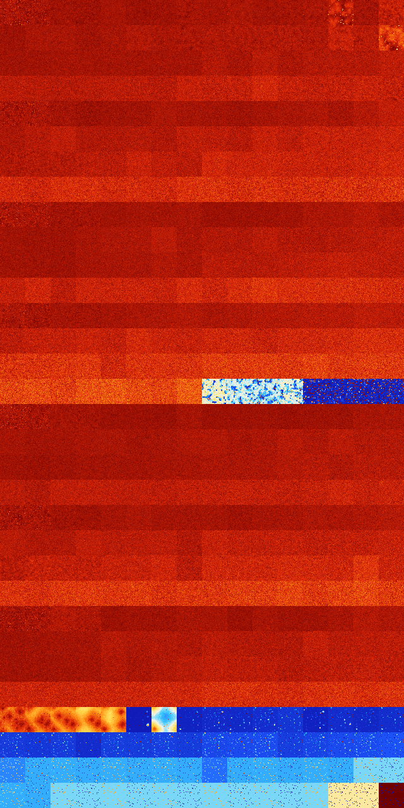

# B0134578 (226816-227327)

<details>
    <summary>Initial Grid</summary>
    
</details>


<details>
    <summary>Initial Grid RLE</summary>

```
#C Exported from GoGoL (https://github.com/marrow16/gogol)
#C Wrap mode: Toroidal
#C Boundary mode: Dead
#C Step: 0
x = 100, y = 100, rule = B0134578/S
11bo20bo34bo10bo15bo2bo$2bo8bo16bo14bo26bo15bo$38bo9bo10bo$5bo9bo24bo
44bo6bo$11bobo5bo35bo7bo10bo15bo$21bo17bo58bo$6bo26bo36bo$10b2o39bo2bo
36bo6bo$58bo5bo7bo$4bobo38bo23bo11bo$29bo24bo2bobo5bo7bo12bo11bo$23bo
18bo7bo15bo4bo$4bo28bo7bo17b2o21bo$6bo23bo2b2o32bo$34bo35bo5bo$17bo4bo
57bobo$11bo27bo38bo$3bo5bo21b2o$3b2o30bo29bo16bo7bo8bo$13bo25bo33bo2bob
o$17bo63bo2bo8bo$10bo20bo5bo5bo17bobo$33bo15b2o19bo11bo$2bo47bo12bo6bo
2bo20bo$5b2o3bo18bo48bo$6bo4bo39bo16bo7bo10bobo$7bo31bo2bo3bo27bo7bo$
23bo22bo12bo$20bo24bo45bo3bo$15bo7b2o28bo14bo19bo$32bo41bo8b2o12bo$11bo
bo12bo8bo16bo39bo2bo$33bo3bo2bo5bo3bo$7bo21bo$7bo52bo12bo25bo$2bo31bo
12bo30bobo$25bo10bo4bo6bo4bo2bo$22bo14bo28bobo28bo$16bo11bo27bo23bo2bob
ob2o$30bo8bo9bo5bo21bo19bo$10bo4bo7bobo5bo15b2o14bo23bo6bo$11bo28bo3bo
6bo30bobo$17b3o$40bo9bo17bo8bo5bo$9bo37bo24bo16bo$11bo51bo10bo12bo$4bo
9bo50bo3bo$24bo8bo14bo41bo$3bo31bo29bo8bo2bo6bo5bo$16bo14b2o19bo6bo$59b
o5bobo12bo$10bo14bo27bo8bo$7bo3bo8bo43bo$13bo26bo9bo34bo$19bo30bo23bo$
10bo17bo9bo22bo18bo13bo$17bo22bo8bo39bo9bo$29bo27b2o35bo$o8bo37bo19bo9b
o6bo$100b$13bo52bo21bobo$26bo6bo13bobo17bo25bo$8bo15b2o39bo17bo4bo$14bo
45bo5bo$39bo32bo12bo3bo$67bo$12bo75bo$23bo11bo40bo$12bo33bo40b2o$24bo
49bo5bo5bo10bo$o34bo17bo3bob2o2bo13bo11bo$47bo23bo7bo3b2o7bo$28bo11bo9b
o10bo23bo$3bo5bobo12bo25bo25bo8bo$50bo42bo$38bo9bo$8bo3bo4bo29bo4bo$34b
o27bo$13bo25bo3bo52bo$9bo12bo28bo2bo4bo6bo8bo8bo$15bo18bo4bo45bo11bo$
23bo10bo14bo$4b2o4bo17bo26bo9bobo2bo$3bo22bo3bo14bo30bo3bo17bo$13bobo
23bo25bo3b2o3bo$13bo13bo13bo56bo$30bo25bo27bo$13bobo9bo46bo7bo$16b2o31b
o36bo$11bo32bo4bo5bo9bo5bo$23bo15bo$13bo5bo54bo6bo8bo$27bo15bo16bo20bo
7bo$19bo3bo65bo$54bo4bo14bo6bo$11bo12bo28bo6bo2bo13bo$22bobo20bo27bo8bo
$o6bo80bo8bo$54bo5bo17bo6bo11bo$10bo25bo5bo34bo14bo!
```
</details>
<details>
    <summary>Thumbnail</summary>

</details>
<table>
<tr>
    <td><a href="./226816%20S%20Heat%20Map%20Activity.png"></a><br>S (226816)<br>G>1000</td>    <td><a href="./226817%20S0%20Heat%20Map%20Activity.png"></a><br>S0 (226817)<br>G>1000</td>    <td><a href="./226818%20S1%20Heat%20Map%20Activity.png"></a><br>S1 (226818)<br>G>1000</td>    <td><a href="./226819%20S01%20Heat%20Map%20Activity.png"></a><br>S01 (226819)<br>G>1000</td>    <td><a href="./226820%20S2%20Heat%20Map%20Activity.png"></a><br>S2 (226820)<br>G>1000</td>    <td><a href="./226821%20S02%20Heat%20Map%20Activity.png"></a><br>S02 (226821)<br>G>1000</td>    <td><a href="./226822%20S12%20Heat%20Map%20Activity.png"></a><br>S12 (226822)<br>G>1000</td>    <td><a href="./226823%20S012%20Heat%20Map%20Activity.png"></a><br>S012 (226823)<br>G>1000</td>    <td><a href="./226824%20S3%20Heat%20Map%20Activity.png"></a><br>S3 (226824)<br>G>1000</td>    <td><a href="./226825%20S03%20Heat%20Map%20Activity.png"></a><br>S03 (226825)<br>G>1000</td>    <td><a href="./226826%20S13%20Heat%20Map%20Activity.png"></a><br>S13 (226826)<br>G>1000</td>    <td><a href="./226827%20S013%20Heat%20Map%20Activity.png"></a><br>S013 (226827)<br>G>1000</td>    <td><a href="./226828%20S23%20Heat%20Map%20Activity.png"></a><br>S23 (226828)<br>G>1000</td>    <td><a href="./226829%20S023%20Heat%20Map%20Activity.png"></a><br>S023 (226829)<br>G>1000</td>    <td><a href="./226830%20S123%20Heat%20Map%20Activity.png"></a><br>S123 (226830)<br>G>1000</td>    <td><a href="./226831%20S0123%20Heat%20Map%20Activity.png"></a><br>S0123 (226831)<br>G>1000</td></tr>
<tr>
    <td><a href="./226832%20S4%20Heat%20Map%20Activity.png"></a><br>S4 (226832)<br>G>1000</td>    <td><a href="./226833%20S04%20Heat%20Map%20Activity.png"></a><br>S04 (226833)<br>G>1000</td>    <td><a href="./226834%20S14%20Heat%20Map%20Activity.png"></a><br>S14 (226834)<br>G>1000</td>    <td><a href="./226835%20S014%20Heat%20Map%20Activity.png"></a><br>S014 (226835)<br>G>1000</td>    <td><a href="./226836%20S24%20Heat%20Map%20Activity.png"></a><br>S24 (226836)<br>G>1000</td>    <td><a href="./226837%20S024%20Heat%20Map%20Activity.png"></a><br>S024 (226837)<br>G>1000</td>    <td><a href="./226838%20S124%20Heat%20Map%20Activity.png"></a><br>S124 (226838)<br>G>1000</td>    <td><a href="./226839%20S0124%20Heat%20Map%20Activity.png"></a><br>S0124 (226839)<br>G>1000</td>    <td><a href="./226840%20S34%20Heat%20Map%20Activity.png"></a><br>S34 (226840)<br>G>1000</td>    <td><a href="./226841%20S034%20Heat%20Map%20Activity.png"></a><br>S034 (226841)<br>G>1000</td>    <td><a href="./226842%20S134%20Heat%20Map%20Activity.png"></a><br>S134 (226842)<br>G>1000</td>    <td><a href="./226843%20S0134%20Heat%20Map%20Activity.png"></a><br>S0134 (226843)<br>G>1000</td>    <td><a href="./226844%20S234%20Heat%20Map%20Activity.png"></a><br>S234 (226844)<br>G>1000</td>    <td><a href="./226845%20S0234%20Heat%20Map%20Activity.png"></a><br>S0234 (226845)<br>G>1000</td>    <td><a href="./226846%20S1234%20Heat%20Map%20Activity.png"></a><br>S1234 (226846)<br>G>1000</td>    <td><a href="./226847%20S01234%20Heat%20Map%20Activity.png"></a><br>S01234 (226847)<br>G>1000</td></tr>
<tr>
    <td><a href="./226848%20S5%20Heat%20Map%20Activity.png"></a><br>S5 (226848)<br>G>1000</td>    <td><a href="./226849%20S05%20Heat%20Map%20Activity.png"></a><br>S05 (226849)<br>G>1000</td>    <td><a href="./226850%20S15%20Heat%20Map%20Activity.png"></a><br>S15 (226850)<br>G>1000</td>    <td><a href="./226851%20S015%20Heat%20Map%20Activity.png"></a><br>S015 (226851)<br>G>1000</td>    <td><a href="./226852%20S25%20Heat%20Map%20Activity.png"></a><br>S25 (226852)<br>G>1000</td>    <td><a href="./226853%20S025%20Heat%20Map%20Activity.png"></a><br>S025 (226853)<br>G>1000</td>    <td><a href="./226854%20S125%20Heat%20Map%20Activity.png"></a><br>S125 (226854)<br>G>1000</td>    <td><a href="./226855%20S0125%20Heat%20Map%20Activity.png"></a><br>S0125 (226855)<br>G>1000</td>    <td><a href="./226856%20S35%20Heat%20Map%20Activity.png"></a><br>S35 (226856)<br>G>1000</td>    <td><a href="./226857%20S035%20Heat%20Map%20Activity.png"></a><br>S035 (226857)<br>G>1000</td>    <td><a href="./226858%20S135%20Heat%20Map%20Activity.png"></a><br>S135 (226858)<br>G>1000</td>    <td><a href="./226859%20S0135%20Heat%20Map%20Activity.png"></a><br>S0135 (226859)<br>G>1000</td>    <td><a href="./226860%20S235%20Heat%20Map%20Activity.png"></a><br>S235 (226860)<br>G>1000</td>    <td><a href="./226861%20S0235%20Heat%20Map%20Activity.png"></a><br>S0235 (226861)<br>G>1000</td>    <td><a href="./226862%20S1235%20Heat%20Map%20Activity.png"></a><br>S1235 (226862)<br>G>1000</td>    <td><a href="./226863%20S01235%20Heat%20Map%20Activity.png"></a><br>S01235 (226863)<br>G>1000</td></tr>
<tr>
    <td><a href="./226864%20S45%20Heat%20Map%20Activity.png"></a><br>S45 (226864)<br>G>1000</td>    <td><a href="./226865%20S045%20Heat%20Map%20Activity.png"></a><br>S045 (226865)<br>G>1000</td>    <td><a href="./226866%20S145%20Heat%20Map%20Activity.png"></a><br>S145 (226866)<br>G>1000</td>    <td><a href="./226867%20S0145%20Heat%20Map%20Activity.png"></a><br>S0145 (226867)<br>G>1000</td>    <td><a href="./226868%20S245%20Heat%20Map%20Activity.png"></a><br>S245 (226868)<br>G>1000</td>    <td><a href="./226869%20S0245%20Heat%20Map%20Activity.png"></a><br>S0245 (226869)<br>G>1000</td>    <td><a href="./226870%20S1245%20Heat%20Map%20Activity.png"></a><br>S1245 (226870)<br>G>1000</td>    <td><a href="./226871%20S01245%20Heat%20Map%20Activity.png"></a><br>S01245 (226871)<br>G>1000</td>    <td><a href="./226872%20S345%20Heat%20Map%20Activity.png"></a><br>S345 (226872)<br>G>1000</td>    <td><a href="./226873%20S0345%20Heat%20Map%20Activity.png"></a><br>S0345 (226873)<br>G>1000</td>    <td><a href="./226874%20S1345%20Heat%20Map%20Activity.png"></a><br>S1345 (226874)<br>G>1000</td>    <td><a href="./226875%20S01345%20Heat%20Map%20Activity.png"></a><br>S01345 (226875)<br>G>1000</td>    <td><a href="./226876%20S2345%20Heat%20Map%20Activity.png"></a><br>S2345 (226876)<br>G>1000</td>    <td><a href="./226877%20S02345%20Heat%20Map%20Activity.png"></a><br>S02345 (226877)<br>G>1000</td>    <td><a href="./226878%20S12345%20Heat%20Map%20Activity.png"></a><br>S12345 (226878)<br>G>1000</td>    <td><a href="./226879%20S012345%20Heat%20Map%20Activity.png"></a><br>S012345 (226879)<br>G>1000</td></tr>
<tr>
    <td><a href="./226880%20S6%20Heat%20Map%20Activity.png"></a><br>S6 (226880)<br>G>1000</td>    <td><a href="./226881%20S06%20Heat%20Map%20Activity.png"></a><br>S06 (226881)<br>G>1000</td>    <td><a href="./226882%20S16%20Heat%20Map%20Activity.png"></a><br>S16 (226882)<br>G>1000</td>    <td><a href="./226883%20S016%20Heat%20Map%20Activity.png"></a><br>S016 (226883)<br>G>1000</td>    <td><a href="./226884%20S26%20Heat%20Map%20Activity.png"></a><br>S26 (226884)<br>G>1000</td>    <td><a href="./226885%20S026%20Heat%20Map%20Activity.png"></a><br>S026 (226885)<br>G>1000</td>    <td><a href="./226886%20S126%20Heat%20Map%20Activity.png"></a><br>S126 (226886)<br>G>1000</td>    <td><a href="./226887%20S0126%20Heat%20Map%20Activity.png"></a><br>S0126 (226887)<br>G>1000</td>    <td><a href="./226888%20S36%20Heat%20Map%20Activity.png"></a><br>S36 (226888)<br>G>1000</td>    <td><a href="./226889%20S036%20Heat%20Map%20Activity.png"></a><br>S036 (226889)<br>G>1000</td>    <td><a href="./226890%20S136%20Heat%20Map%20Activity.png"></a><br>S136 (226890)<br>G>1000</td>    <td><a href="./226891%20S0136%20Heat%20Map%20Activity.png"></a><br>S0136 (226891)<br>G>1000</td>    <td><a href="./226892%20S236%20Heat%20Map%20Activity.png"></a><br>S236 (226892)<br>G>1000</td>    <td><a href="./226893%20S0236%20Heat%20Map%20Activity.png"></a><br>S0236 (226893)<br>G>1000</td>    <td><a href="./226894%20S1236%20Heat%20Map%20Activity.png"></a><br>S1236 (226894)<br>G>1000</td>    <td><a href="./226895%20S01236%20Heat%20Map%20Activity.png"></a><br>S01236 (226895)<br>G>1000</td></tr>
<tr>
    <td><a href="./226896%20S46%20Heat%20Map%20Activity.png"></a><br>S46 (226896)<br>G>1000</td>    <td><a href="./226897%20S046%20Heat%20Map%20Activity.png"></a><br>S046 (226897)<br>G>1000</td>    <td><a href="./226898%20S146%20Heat%20Map%20Activity.png"></a><br>S146 (226898)<br>G>1000</td>    <td><a href="./226899%20S0146%20Heat%20Map%20Activity.png"></a><br>S0146 (226899)<br>G>1000</td>    <td><a href="./226900%20S246%20Heat%20Map%20Activity.png"></a><br>S246 (226900)<br>G>1000</td>    <td><a href="./226901%20S0246%20Heat%20Map%20Activity.png"></a><br>S0246 (226901)<br>G>1000</td>    <td><a href="./226902%20S1246%20Heat%20Map%20Activity.png"></a><br>S1246 (226902)<br>G>1000</td>    <td><a href="./226903%20S01246%20Heat%20Map%20Activity.png"></a><br>S01246 (226903)<br>G>1000</td>    <td><a href="./226904%20S346%20Heat%20Map%20Activity.png"></a><br>S346 (226904)<br>G>1000</td>    <td><a href="./226905%20S0346%20Heat%20Map%20Activity.png"></a><br>S0346 (226905)<br>G>1000</td>    <td><a href="./226906%20S1346%20Heat%20Map%20Activity.png"></a><br>S1346 (226906)<br>G>1000</td>    <td><a href="./226907%20S01346%20Heat%20Map%20Activity.png"></a><br>S01346 (226907)<br>G>1000</td>    <td><a href="./226908%20S2346%20Heat%20Map%20Activity.png"></a><br>S2346 (226908)<br>G>1000</td>    <td><a href="./226909%20S02346%20Heat%20Map%20Activity.png"></a><br>S02346 (226909)<br>G>1000</td>    <td><a href="./226910%20S12346%20Heat%20Map%20Activity.png"></a><br>S12346 (226910)<br>G>1000</td>    <td><a href="./226911%20S012346%20Heat%20Map%20Activity.png"></a><br>S012346 (226911)<br>G>1000</td></tr>
<tr>
    <td><a href="./226912%20S56%20Heat%20Map%20Activity.png"></a><br>S56 (226912)<br>G>1000</td>    <td><a href="./226913%20S056%20Heat%20Map%20Activity.png"></a><br>S056 (226913)<br>G>1000</td>    <td><a href="./226914%20S156%20Heat%20Map%20Activity.png"></a><br>S156 (226914)<br>G>1000</td>    <td><a href="./226915%20S0156%20Heat%20Map%20Activity.png"></a><br>S0156 (226915)<br>G>1000</td>    <td><a href="./226916%20S256%20Heat%20Map%20Activity.png"></a><br>S256 (226916)<br>G>1000</td>    <td><a href="./226917%20S0256%20Heat%20Map%20Activity.png"></a><br>S0256 (226917)<br>G>1000</td>    <td><a href="./226918%20S1256%20Heat%20Map%20Activity.png"></a><br>S1256 (226918)<br>G>1000</td>    <td><a href="./226919%20S01256%20Heat%20Map%20Activity.png"></a><br>S01256 (226919)<br>G>1000</td>    <td><a href="./226920%20S356%20Heat%20Map%20Activity.png"></a><br>S356 (226920)<br>G>1000</td>    <td><a href="./226921%20S0356%20Heat%20Map%20Activity.png"></a><br>S0356 (226921)<br>G>1000</td>    <td><a href="./226922%20S1356%20Heat%20Map%20Activity.png"></a><br>S1356 (226922)<br>G>1000</td>    <td><a href="./226923%20S01356%20Heat%20Map%20Activity.png"></a><br>S01356 (226923)<br>G>1000</td>    <td><a href="./226924%20S2356%20Heat%20Map%20Activity.png"></a><br>S2356 (226924)<br>G>1000</td>    <td><a href="./226925%20S02356%20Heat%20Map%20Activity.png"></a><br>S02356 (226925)<br>G>1000</td>    <td><a href="./226926%20S12356%20Heat%20Map%20Activity.png"></a><br>S12356 (226926)<br>G>1000</td>    <td><a href="./226927%20S012356%20Heat%20Map%20Activity.png"></a><br>S012356 (226927)<br>G>1000</td></tr>
<tr>
    <td><a href="./226928%20S456%20Heat%20Map%20Activity.png"></a><br>S456 (226928)<br>G>1000</td>    <td><a href="./226929%20S0456%20Heat%20Map%20Activity.png"></a><br>S0456 (226929)<br>G>1000</td>    <td><a href="./226930%20S1456%20Heat%20Map%20Activity.png"></a><br>S1456 (226930)<br>G>1000</td>    <td><a href="./226931%20S01456%20Heat%20Map%20Activity.png"></a><br>S01456 (226931)<br>G>1000</td>    <td><a href="./226932%20S2456%20Heat%20Map%20Activity.png"></a><br>S2456 (226932)<br>G>1000</td>    <td><a href="./226933%20S02456%20Heat%20Map%20Activity.png"></a><br>S02456 (226933)<br>G>1000</td>    <td><a href="./226934%20S12456%20Heat%20Map%20Activity.png"></a><br>S12456 (226934)<br>G>1000</td>    <td><a href="./226935%20S012456%20Heat%20Map%20Activity.png"></a><br>S012456 (226935)<br>G>1000</td>    <td><a href="./226936%20S3456%20Heat%20Map%20Activity.png"></a><br>S3456 (226936)<br>G>1000</td>    <td><a href="./226937%20S03456%20Heat%20Map%20Activity.png"></a><br>S03456 (226937)<br>G>1000</td>    <td><a href="./226938%20S13456%20Heat%20Map%20Activity.png"></a><br>S13456 (226938)<br>G>1000</td>    <td><a href="./226939%20S013456%20Heat%20Map%20Activity.png"></a><br>S013456 (226939)<br>G>1000</td>    <td><a href="./226940%20S23456%20Heat%20Map%20Activity.png"></a><br>S23456 (226940)<br>G>1000</td>    <td><a href="./226941%20S023456%20Heat%20Map%20Activity.png"></a><br>S023456 (226941)<br>G>1000</td>    <td><a href="./226942%20S123456%20Heat%20Map%20Activity.png"></a><br>S123456 (226942)<br>G>1000</td>    <td><a href="./226943%20S0123456%20Heat%20Map%20Activity.png"></a><br>S0123456 (226943)<br>G>1000</td></tr>
<tr>
    <td><a href="./226944%20S7%20Heat%20Map%20Activity.png"></a><br>S7 (226944)<br>G>1000</td>    <td><a href="./226945%20S07%20Heat%20Map%20Activity.png"></a><br>S07 (226945)<br>G>1000</td>    <td><a href="./226946%20S17%20Heat%20Map%20Activity.png"></a><br>S17 (226946)<br>G>1000</td>    <td><a href="./226947%20S017%20Heat%20Map%20Activity.png"></a><br>S017 (226947)<br>G>1000</td>    <td><a href="./226948%20S27%20Heat%20Map%20Activity.png"></a><br>S27 (226948)<br>G>1000</td>    <td><a href="./226949%20S027%20Heat%20Map%20Activity.png"></a><br>S027 (226949)<br>G>1000</td>    <td><a href="./226950%20S127%20Heat%20Map%20Activity.png"></a><br>S127 (226950)<br>G>1000</td>    <td><a href="./226951%20S0127%20Heat%20Map%20Activity.png"></a><br>S0127 (226951)<br>G>1000</td>    <td><a href="./226952%20S37%20Heat%20Map%20Activity.png"></a><br>S37 (226952)<br>G>1000</td>    <td><a href="./226953%20S037%20Heat%20Map%20Activity.png"></a><br>S037 (226953)<br>G>1000</td>    <td><a href="./226954%20S137%20Heat%20Map%20Activity.png"></a><br>S137 (226954)<br>G>1000</td>    <td><a href="./226955%20S0137%20Heat%20Map%20Activity.png"></a><br>S0137 (226955)<br>G>1000</td>    <td><a href="./226956%20S237%20Heat%20Map%20Activity.png"></a><br>S237 (226956)<br>G>1000</td>    <td><a href="./226957%20S0237%20Heat%20Map%20Activity.png"></a><br>S0237 (226957)<br>G>1000</td>    <td><a href="./226958%20S1237%20Heat%20Map%20Activity.png"></a><br>S1237 (226958)<br>G>1000</td>    <td><a href="./226959%20S01237%20Heat%20Map%20Activity.png"></a><br>S01237 (226959)<br>G>1000</td></tr>
<tr>
    <td><a href="./226960%20S47%20Heat%20Map%20Activity.png"></a><br>S47 (226960)<br>G>1000</td>    <td><a href="./226961%20S047%20Heat%20Map%20Activity.png"></a><br>S047 (226961)<br>G>1000</td>    <td><a href="./226962%20S147%20Heat%20Map%20Activity.png"></a><br>S147 (226962)<br>G>1000</td>    <td><a href="./226963%20S0147%20Heat%20Map%20Activity.png"></a><br>S0147 (226963)<br>G>1000</td>    <td><a href="./226964%20S247%20Heat%20Map%20Activity.png"></a><br>S247 (226964)<br>G>1000</td>    <td><a href="./226965%20S0247%20Heat%20Map%20Activity.png"></a><br>S0247 (226965)<br>G>1000</td>    <td><a href="./226966%20S1247%20Heat%20Map%20Activity.png"></a><br>S1247 (226966)<br>G>1000</td>    <td><a href="./226967%20S01247%20Heat%20Map%20Activity.png"></a><br>S01247 (226967)<br>G>1000</td>    <td><a href="./226968%20S347%20Heat%20Map%20Activity.png"></a><br>S347 (226968)<br>G>1000</td>    <td><a href="./226969%20S0347%20Heat%20Map%20Activity.png"></a><br>S0347 (226969)<br>G>1000</td>    <td><a href="./226970%20S1347%20Heat%20Map%20Activity.png"></a><br>S1347 (226970)<br>G>1000</td>    <td><a href="./226971%20S01347%20Heat%20Map%20Activity.png"></a><br>S01347 (226971)<br>G>1000</td>    <td><a href="./226972%20S2347%20Heat%20Map%20Activity.png"></a><br>S2347 (226972)<br>G>1000</td>    <td><a href="./226973%20S02347%20Heat%20Map%20Activity.png"></a><br>S02347 (226973)<br>G>1000</td>    <td><a href="./226974%20S12347%20Heat%20Map%20Activity.png"></a><br>S12347 (226974)<br>G>1000</td>    <td><a href="./226975%20S012347%20Heat%20Map%20Activity.png"></a><br>S012347 (226975)<br>G>1000</td></tr>
<tr>
    <td><a href="./226976%20S57%20Heat%20Map%20Activity.png"></a><br>S57 (226976)<br>G>1000</td>    <td><a href="./226977%20S057%20Heat%20Map%20Activity.png"></a><br>S057 (226977)<br>G>1000</td>    <td><a href="./226978%20S157%20Heat%20Map%20Activity.png"></a><br>S157 (226978)<br>G>1000</td>    <td><a href="./226979%20S0157%20Heat%20Map%20Activity.png"></a><br>S0157 (226979)<br>G>1000</td>    <td><a href="./226980%20S257%20Heat%20Map%20Activity.png"></a><br>S257 (226980)<br>G>1000</td>    <td><a href="./226981%20S0257%20Heat%20Map%20Activity.png"></a><br>S0257 (226981)<br>G>1000</td>    <td><a href="./226982%20S1257%20Heat%20Map%20Activity.png"></a><br>S1257 (226982)<br>G>1000</td>    <td><a href="./226983%20S01257%20Heat%20Map%20Activity.png"></a><br>S01257 (226983)<br>G>1000</td>    <td><a href="./226984%20S357%20Heat%20Map%20Activity.png"></a><br>S357 (226984)<br>G>1000</td>    <td><a href="./226985%20S0357%20Heat%20Map%20Activity.png"></a><br>S0357 (226985)<br>G>1000</td>    <td><a href="./226986%20S1357%20Heat%20Map%20Activity.png"></a><br>S1357 (226986)<br>G>1000</td>    <td><a href="./226987%20S01357%20Heat%20Map%20Activity.png"></a><br>S01357 (226987)<br>G>1000</td>    <td><a href="./226988%20S2357%20Heat%20Map%20Activity.png"></a><br>S2357 (226988)<br>G>1000</td>    <td><a href="./226989%20S02357%20Heat%20Map%20Activity.png"></a><br>S02357 (226989)<br>G>1000</td>    <td><a href="./226990%20S12357%20Heat%20Map%20Activity.png"></a><br>S12357 (226990)<br>G>1000</td>    <td><a href="./226991%20S012357%20Heat%20Map%20Activity.png"></a><br>S012357 (226991)<br>G>1000</td></tr>
<tr>
    <td><a href="./226992%20S457%20Heat%20Map%20Activity.png"></a><br>S457 (226992)<br>G>1000</td>    <td><a href="./226993%20S0457%20Heat%20Map%20Activity.png"></a><br>S0457 (226993)<br>G>1000</td>    <td><a href="./226994%20S1457%20Heat%20Map%20Activity.png"></a><br>S1457 (226994)<br>G>1000</td>    <td><a href="./226995%20S01457%20Heat%20Map%20Activity.png"></a><br>S01457 (226995)<br>G>1000</td>    <td><a href="./226996%20S2457%20Heat%20Map%20Activity.png"></a><br>S2457 (226996)<br>G>1000</td>    <td><a href="./226997%20S02457%20Heat%20Map%20Activity.png"></a><br>S02457 (226997)<br>G>1000</td>    <td><a href="./226998%20S12457%20Heat%20Map%20Activity.png"></a><br>S12457 (226998)<br>G>1000</td>    <td><a href="./226999%20S012457%20Heat%20Map%20Activity.png"></a><br>S012457 (226999)<br>G>1000</td>    <td><a href="./227000%20S3457%20Heat%20Map%20Activity.png"></a><br>S3457 (227000)<br>G>1000</td>    <td><a href="./227001%20S03457%20Heat%20Map%20Activity.png"></a><br>S03457 (227001)<br>G>1000</td>    <td><a href="./227002%20S13457%20Heat%20Map%20Activity.png"></a><br>S13457 (227002)<br>G>1000</td>    <td><a href="./227003%20S013457%20Heat%20Map%20Activity.png"></a><br>S013457 (227003)<br>G>1000</td>    <td><a href="./227004%20S23457%20Heat%20Map%20Activity.png"></a><br>S23457 (227004)<br>G>1000</td>    <td><a href="./227005%20S023457%20Heat%20Map%20Activity.png"></a><br>S023457 (227005)<br>G>1000</td>    <td><a href="./227006%20S123457%20Heat%20Map%20Activity.png"></a><br>S123457 (227006)<br>G>1000</td>    <td><a href="./227007%20S0123457%20Heat%20Map%20Activity.png"></a><br>S0123457 (227007)<br>G>1000</td></tr>
<tr>
    <td><a href="./227008%20S67%20Heat%20Map%20Activity.png"></a><br>S67 (227008)<br>G>1000</td>    <td><a href="./227009%20S067%20Heat%20Map%20Activity.png"></a><br>S067 (227009)<br>G>1000</td>    <td><a href="./227010%20S167%20Heat%20Map%20Activity.png"></a><br>S167 (227010)<br>G>1000</td>    <td><a href="./227011%20S0167%20Heat%20Map%20Activity.png"></a><br>S0167 (227011)<br>G>1000</td>    <td><a href="./227012%20S267%20Heat%20Map%20Activity.png"></a><br>S267 (227012)<br>G>1000</td>    <td><a href="./227013%20S0267%20Heat%20Map%20Activity.png"></a><br>S0267 (227013)<br>G>1000</td>    <td><a href="./227014%20S1267%20Heat%20Map%20Activity.png"></a><br>S1267 (227014)<br>G>1000</td>    <td><a href="./227015%20S01267%20Heat%20Map%20Activity.png"></a><br>S01267 (227015)<br>G>1000</td>    <td><a href="./227016%20S367%20Heat%20Map%20Activity.png"></a><br>S367 (227016)<br>G>1000</td>    <td><a href="./227017%20S0367%20Heat%20Map%20Activity.png"></a><br>S0367 (227017)<br>G>1000</td>    <td><a href="./227018%20S1367%20Heat%20Map%20Activity.png"></a><br>S1367 (227018)<br>G>1000</td>    <td><a href="./227019%20S01367%20Heat%20Map%20Activity.png"></a><br>S01367 (227019)<br>G>1000</td>    <td><a href="./227020%20S2367%20Heat%20Map%20Activity.png"></a><br>S2367 (227020)<br>G>1000</td>    <td><a href="./227021%20S02367%20Heat%20Map%20Activity.png"></a><br>S02367 (227021)<br>G>1000</td>    <td><a href="./227022%20S12367%20Heat%20Map%20Activity.png"></a><br>S12367 (227022)<br>G>1000</td>    <td><a href="./227023%20S012367%20Heat%20Map%20Activity.png"></a><br>S012367 (227023)<br>G>1000</td></tr>
<tr>
    <td><a href="./227024%20S467%20Heat%20Map%20Activity.png"></a><br>S467 (227024)<br>G>1000</td>    <td><a href="./227025%20S0467%20Heat%20Map%20Activity.png"></a><br>S0467 (227025)<br>G>1000</td>    <td><a href="./227026%20S1467%20Heat%20Map%20Activity.png"></a><br>S1467 (227026)<br>G>1000</td>    <td><a href="./227027%20S01467%20Heat%20Map%20Activity.png"></a><br>S01467 (227027)<br>G>1000</td>    <td><a href="./227028%20S2467%20Heat%20Map%20Activity.png"></a><br>S2467 (227028)<br>G>1000</td>    <td><a href="./227029%20S02467%20Heat%20Map%20Activity.png"></a><br>S02467 (227029)<br>G>1000</td>    <td><a href="./227030%20S12467%20Heat%20Map%20Activity.png"></a><br>S12467 (227030)<br>G>1000</td>    <td><a href="./227031%20S012467%20Heat%20Map%20Activity.png"></a><br>S012467 (227031)<br>G>1000</td>    <td><a href="./227032%20S3467%20Heat%20Map%20Activity.png"></a><br>S3467 (227032)<br>G>1000</td>    <td><a href="./227033%20S03467%20Heat%20Map%20Activity.png"></a><br>S03467 (227033)<br>G>1000</td>    <td><a href="./227034%20S13467%20Heat%20Map%20Activity.png"></a><br>S13467 (227034)<br>G>1000</td>    <td><a href="./227035%20S013467%20Heat%20Map%20Activity.png"></a><br>S013467 (227035)<br>G>1000</td>    <td><a href="./227036%20S23467%20Heat%20Map%20Activity.png"></a><br>S23467 (227036)<br>G>1000</td>    <td><a href="./227037%20S023467%20Heat%20Map%20Activity.png"></a><br>S023467 (227037)<br>G>1000</td>    <td><a href="./227038%20S123467%20Heat%20Map%20Activity.png"></a><br>S123467 (227038)<br>G>1000</td>    <td><a href="./227039%20S0123467%20Heat%20Map%20Activity.png"></a><br>S0123467 (227039)<br>G>1000</td></tr>
<tr>
    <td><a href="./227040%20S567%20Heat%20Map%20Activity.png"></a><br>S567 (227040)<br>G>1000</td>    <td><a href="./227041%20S0567%20Heat%20Map%20Activity.png"></a><br>S0567 (227041)<br>G>1000</td>    <td><a href="./227042%20S1567%20Heat%20Map%20Activity.png"></a><br>S1567 (227042)<br>G>1000</td>    <td><a href="./227043%20S01567%20Heat%20Map%20Activity.png"></a><br>S01567 (227043)<br>G>1000</td>    <td><a href="./227044%20S2567%20Heat%20Map%20Activity.png"></a><br>S2567 (227044)<br>G>1000</td>    <td><a href="./227045%20S02567%20Heat%20Map%20Activity.png"></a><br>S02567 (227045)<br>G>1000</td>    <td><a href="./227046%20S12567%20Heat%20Map%20Activity.png"></a><br>S12567 (227046)<br>G>1000</td>    <td><a href="./227047%20S012567%20Heat%20Map%20Activity.png"></a><br>S012567 (227047)<br>G>1000</td>    <td><a href="./227048%20S3567%20Heat%20Map%20Activity.png"></a><br>S3567 (227048)<br>G>1000</td>    <td><a href="./227049%20S03567%20Heat%20Map%20Activity.png"></a><br>S03567 (227049)<br>G>1000</td>    <td><a href="./227050%20S13567%20Heat%20Map%20Activity.png"></a><br>S13567 (227050)<br>G>1000</td>    <td><a href="./227051%20S013567%20Heat%20Map%20Activity.png"></a><br>S013567 (227051)<br>G>1000</td>    <td><a href="./227052%20S23567%20Heat%20Map%20Activity.png"></a><br>S23567 (227052)<br>G>1000</td>    <td><a href="./227053%20S023567%20Heat%20Map%20Activity.png"></a><br>S023567 (227053)<br>G>1000</td>    <td><a href="./227054%20S123567%20Heat%20Map%20Activity.png"></a><br>S123567 (227054)<br>G>1000</td>    <td><a href="./227055%20S0123567%20Heat%20Map%20Activity.png"></a><br>S0123567 (227055)<br>G>1000</td></tr>
<tr>
    <td><a href="./227056%20S4567%20Heat%20Map%20Activity.png"></a><br>S4567 (227056)<br>G>1000</td>    <td><a href="./227057%20S04567%20Heat%20Map%20Activity.png"></a><br>S04567 (227057)<br>G>1000</td>    <td><a href="./227058%20S14567%20Heat%20Map%20Activity.png"></a><br>S14567 (227058)<br>G>1000</td>    <td><a href="./227059%20S014567%20Heat%20Map%20Activity.png"></a><br>S014567 (227059)<br>G>1000</td>    <td><a href="./227060%20S24567%20Heat%20Map%20Activity.png"></a><br>S24567 (227060)<br>G>1000</td>    <td><a href="./227061%20S024567%20Heat%20Map%20Activity.png"></a><br>S024567 (227061)<br>G>1000</td>    <td><a href="./227062%20S124567%20Heat%20Map%20Activity.png"></a><br>S124567 (227062)<br>G>1000</td>    <td><a href="./227063%20S0124567%20Heat%20Map%20Activity.png"></a><br>S0124567 (227063)<br>G>1000</td>    <td><a href="./227064%20S34567%20Heat%20Map%20Activity.png"></a><br>S34567 (227064)<br>G>1000</td>    <td><a href="./227065%20S034567%20Heat%20Map%20Activity.png"></a><br>S034567 (227065)<br>G>1000</td>    <td><a href="./227066%20S134567%20Heat%20Map%20Activity.png"></a><br>S134567 (227066)<br>G>1000</td>    <td><a href="./227067%20S0134567%20Heat%20Map%20Activity.png"></a><br>S0134567 (227067)<br>G>1000</td>    <td><a href="./227068%20S234567%20Heat%20Map%20Activity.png"></a><br>S234567 (227068)<br>G>1000</td>    <td><a href="./227069%20S0234567%20Heat%20Map%20Activity.png"></a><br>S0234567 (227069)<br>G>1000</td>    <td><a href="./227070%20S1234567%20Heat%20Map%20Activity.png"></a><br>S1234567 (227070)<br>G>1000</td>    <td><a href="./227071%20S01234567%20Heat%20Map%20Activity.png"></a><br>S01234567 (227071)<br>G>1000</td></tr>
<tr>
    <td><a href="./227072%20S8%20Heat%20Map%20Activity.png"></a><br>S8 (227072)<br>G>1000</td>    <td><a href="./227073%20S08%20Heat%20Map%20Activity.png"></a><br>S08 (227073)<br>G>1000</td>    <td><a href="./227074%20S18%20Heat%20Map%20Activity.png"></a><br>S18 (227074)<br>G>1000</td>    <td><a href="./227075%20S018%20Heat%20Map%20Activity.png"></a><br>S018 (227075)<br>G>1000</td>    <td><a href="./227076%20S28%20Heat%20Map%20Activity.png"></a><br>S28 (227076)<br>G>1000</td>    <td><a href="./227077%20S028%20Heat%20Map%20Activity.png"></a><br>S028 (227077)<br>G>1000</td>    <td><a href="./227078%20S128%20Heat%20Map%20Activity.png"></a><br>S128 (227078)<br>G>1000</td>    <td><a href="./227079%20S0128%20Heat%20Map%20Activity.png"></a><br>S0128 (227079)<br>G>1000</td>    <td><a href="./227080%20S38%20Heat%20Map%20Activity.png"></a><br>S38 (227080)<br>G>1000</td>    <td><a href="./227081%20S038%20Heat%20Map%20Activity.png"></a><br>S038 (227081)<br>G>1000</td>    <td><a href="./227082%20S138%20Heat%20Map%20Activity.png"></a><br>S138 (227082)<br>G>1000</td>    <td><a href="./227083%20S0138%20Heat%20Map%20Activity.png"></a><br>S0138 (227083)<br>G>1000</td>    <td><a href="./227084%20S238%20Heat%20Map%20Activity.png"></a><br>S238 (227084)<br>G>1000</td>    <td><a href="./227085%20S0238%20Heat%20Map%20Activity.png"></a><br>S0238 (227085)<br>G>1000</td>    <td><a href="./227086%20S1238%20Heat%20Map%20Activity.png"></a><br>S1238 (227086)<br>G>1000</td>    <td><a href="./227087%20S01238%20Heat%20Map%20Activity.png"></a><br>S01238 (227087)<br>G>1000</td></tr>
<tr>
    <td><a href="./227088%20S48%20Heat%20Map%20Activity.png"></a><br>S48 (227088)<br>G>1000</td>    <td><a href="./227089%20S048%20Heat%20Map%20Activity.png"></a><br>S048 (227089)<br>G>1000</td>    <td><a href="./227090%20S148%20Heat%20Map%20Activity.png"></a><br>S148 (227090)<br>G>1000</td>    <td><a href="./227091%20S0148%20Heat%20Map%20Activity.png"></a><br>S0148 (227091)<br>G>1000</td>    <td><a href="./227092%20S248%20Heat%20Map%20Activity.png"></a><br>S248 (227092)<br>G>1000</td>    <td><a href="./227093%20S0248%20Heat%20Map%20Activity.png"></a><br>S0248 (227093)<br>G>1000</td>    <td><a href="./227094%20S1248%20Heat%20Map%20Activity.png"></a><br>S1248 (227094)<br>G>1000</td>    <td><a href="./227095%20S01248%20Heat%20Map%20Activity.png"></a><br>S01248 (227095)<br>G>1000</td>    <td><a href="./227096%20S348%20Heat%20Map%20Activity.png"></a><br>S348 (227096)<br>G>1000</td>    <td><a href="./227097%20S0348%20Heat%20Map%20Activity.png"></a><br>S0348 (227097)<br>G>1000</td>    <td><a href="./227098%20S1348%20Heat%20Map%20Activity.png"></a><br>S1348 (227098)<br>G>1000</td>    <td><a href="./227099%20S01348%20Heat%20Map%20Activity.png"></a><br>S01348 (227099)<br>G>1000</td>    <td><a href="./227100%20S2348%20Heat%20Map%20Activity.png"></a><br>S2348 (227100)<br>G>1000</td>    <td><a href="./227101%20S02348%20Heat%20Map%20Activity.png"></a><br>S02348 (227101)<br>G>1000</td>    <td><a href="./227102%20S12348%20Heat%20Map%20Activity.png"></a><br>S12348 (227102)<br>G>1000</td>    <td><a href="./227103%20S012348%20Heat%20Map%20Activity.png"></a><br>S012348 (227103)<br>G>1000</td></tr>
<tr>
    <td><a href="./227104%20S58%20Heat%20Map%20Activity.png"></a><br>S58 (227104)<br>G>1000</td>    <td><a href="./227105%20S058%20Heat%20Map%20Activity.png"></a><br>S058 (227105)<br>G>1000</td>    <td><a href="./227106%20S158%20Heat%20Map%20Activity.png"></a><br>S158 (227106)<br>G>1000</td>    <td><a href="./227107%20S0158%20Heat%20Map%20Activity.png"></a><br>S0158 (227107)<br>G>1000</td>    <td><a href="./227108%20S258%20Heat%20Map%20Activity.png"></a><br>S258 (227108)<br>G>1000</td>    <td><a href="./227109%20S0258%20Heat%20Map%20Activity.png"></a><br>S0258 (227109)<br>G>1000</td>    <td><a href="./227110%20S1258%20Heat%20Map%20Activity.png"></a><br>S1258 (227110)<br>G>1000</td>    <td><a href="./227111%20S01258%20Heat%20Map%20Activity.png"></a><br>S01258 (227111)<br>G>1000</td>    <td><a href="./227112%20S358%20Heat%20Map%20Activity.png"></a><br>S358 (227112)<br>G>1000</td>    <td><a href="./227113%20S0358%20Heat%20Map%20Activity.png"></a><br>S0358 (227113)<br>G>1000</td>    <td><a href="./227114%20S1358%20Heat%20Map%20Activity.png"></a><br>S1358 (227114)<br>G>1000</td>    <td><a href="./227115%20S01358%20Heat%20Map%20Activity.png"></a><br>S01358 (227115)<br>G>1000</td>    <td><a href="./227116%20S2358%20Heat%20Map%20Activity.png"></a><br>S2358 (227116)<br>G>1000</td>    <td><a href="./227117%20S02358%20Heat%20Map%20Activity.png"></a><br>S02358 (227117)<br>G>1000</td>    <td><a href="./227118%20S12358%20Heat%20Map%20Activity.png"></a><br>S12358 (227118)<br>G>1000</td>    <td><a href="./227119%20S012358%20Heat%20Map%20Activity.png"></a><br>S012358 (227119)<br>G>1000</td></tr>
<tr>
    <td><a href="./227120%20S458%20Heat%20Map%20Activity.png"></a><br>S458 (227120)<br>G>1000</td>    <td><a href="./227121%20S0458%20Heat%20Map%20Activity.png"></a><br>S0458 (227121)<br>G>1000</td>    <td><a href="./227122%20S1458%20Heat%20Map%20Activity.png"></a><br>S1458 (227122)<br>G>1000</td>    <td><a href="./227123%20S01458%20Heat%20Map%20Activity.png"></a><br>S01458 (227123)<br>G>1000</td>    <td><a href="./227124%20S2458%20Heat%20Map%20Activity.png"></a><br>S2458 (227124)<br>G>1000</td>    <td><a href="./227125%20S02458%20Heat%20Map%20Activity.png"></a><br>S02458 (227125)<br>G>1000</td>    <td><a href="./227126%20S12458%20Heat%20Map%20Activity.png"></a><br>S12458 (227126)<br>G>1000</td>    <td><a href="./227127%20S012458%20Heat%20Map%20Activity.png"></a><br>S012458 (227127)<br>G>1000</td>    <td><a href="./227128%20S3458%20Heat%20Map%20Activity.png"></a><br>S3458 (227128)<br>G>1000</td>    <td><a href="./227129%20S03458%20Heat%20Map%20Activity.png"></a><br>S03458 (227129)<br>G>1000</td>    <td><a href="./227130%20S13458%20Heat%20Map%20Activity.png"></a><br>S13458 (227130)<br>G>1000</td>    <td><a href="./227131%20S013458%20Heat%20Map%20Activity.png"></a><br>S013458 (227131)<br>G>1000</td>    <td><a href="./227132%20S23458%20Heat%20Map%20Activity.png"></a><br>S23458 (227132)<br>G>1000</td>    <td><a href="./227133%20S023458%20Heat%20Map%20Activity.png"></a><br>S023458 (227133)<br>G>1000</td>    <td><a href="./227134%20S123458%20Heat%20Map%20Activity.png"></a><br>S123458 (227134)<br>G>1000</td>    <td><a href="./227135%20S0123458%20Heat%20Map%20Activity.png"></a><br>S0123458 (227135)<br>G>1000</td></tr>
<tr>
    <td><a href="./227136%20S68%20Heat%20Map%20Activity.png"></a><br>S68 (227136)<br>G>1000</td>    <td><a href="./227137%20S068%20Heat%20Map%20Activity.png"></a><br>S068 (227137)<br>G>1000</td>    <td><a href="./227138%20S168%20Heat%20Map%20Activity.png"></a><br>S168 (227138)<br>G>1000</td>    <td><a href="./227139%20S0168%20Heat%20Map%20Activity.png"></a><br>S0168 (227139)<br>G>1000</td>    <td><a href="./227140%20S268%20Heat%20Map%20Activity.png"></a><br>S268 (227140)<br>G>1000</td>    <td><a href="./227141%20S0268%20Heat%20Map%20Activity.png"></a><br>S0268 (227141)<br>G>1000</td>    <td><a href="./227142%20S1268%20Heat%20Map%20Activity.png"></a><br>S1268 (227142)<br>G>1000</td>    <td><a href="./227143%20S01268%20Heat%20Map%20Activity.png"></a><br>S01268 (227143)<br>G>1000</td>    <td><a href="./227144%20S368%20Heat%20Map%20Activity.png"></a><br>S368 (227144)<br>G>1000</td>    <td><a href="./227145%20S0368%20Heat%20Map%20Activity.png"></a><br>S0368 (227145)<br>G>1000</td>    <td><a href="./227146%20S1368%20Heat%20Map%20Activity.png"></a><br>S1368 (227146)<br>G>1000</td>    <td><a href="./227147%20S01368%20Heat%20Map%20Activity.png"></a><br>S01368 (227147)<br>G>1000</td>    <td><a href="./227148%20S2368%20Heat%20Map%20Activity.png"></a><br>S2368 (227148)<br>G>1000</td>    <td><a href="./227149%20S02368%20Heat%20Map%20Activity.png"></a><br>S02368 (227149)<br>G>1000</td>    <td><a href="./227150%20S12368%20Heat%20Map%20Activity.png"></a><br>S12368 (227150)<br>G>1000</td>    <td><a href="./227151%20S012368%20Heat%20Map%20Activity.png"></a><br>S012368 (227151)<br>G>1000</td></tr>
<tr>
    <td><a href="./227152%20S468%20Heat%20Map%20Activity.png"></a><br>S468 (227152)<br>G>1000</td>    <td><a href="./227153%20S0468%20Heat%20Map%20Activity.png"></a><br>S0468 (227153)<br>G>1000</td>    <td><a href="./227154%20S1468%20Heat%20Map%20Activity.png"></a><br>S1468 (227154)<br>G>1000</td>    <td><a href="./227155%20S01468%20Heat%20Map%20Activity.png"></a><br>S01468 (227155)<br>G>1000</td>    <td><a href="./227156%20S2468%20Heat%20Map%20Activity.png"></a><br>S2468 (227156)<br>G>1000</td>    <td><a href="./227157%20S02468%20Heat%20Map%20Activity.png"></a><br>S02468 (227157)<br>G>1000</td>    <td><a href="./227158%20S12468%20Heat%20Map%20Activity.png"></a><br>S12468 (227158)<br>G>1000</td>    <td><a href="./227159%20S012468%20Heat%20Map%20Activity.png"></a><br>S012468 (227159)<br>G>1000</td>    <td><a href="./227160%20S3468%20Heat%20Map%20Activity.png"></a><br>S3468 (227160)<br>G>1000</td>    <td><a href="./227161%20S03468%20Heat%20Map%20Activity.png"></a><br>S03468 (227161)<br>G>1000</td>    <td><a href="./227162%20S13468%20Heat%20Map%20Activity.png"></a><br>S13468 (227162)<br>G>1000</td>    <td><a href="./227163%20S013468%20Heat%20Map%20Activity.png"></a><br>S013468 (227163)<br>G>1000</td>    <td><a href="./227164%20S23468%20Heat%20Map%20Activity.png"></a><br>S23468 (227164)<br>G>1000</td>    <td><a href="./227165%20S023468%20Heat%20Map%20Activity.png"></a><br>S023468 (227165)<br>G>1000</td>    <td><a href="./227166%20S123468%20Heat%20Map%20Activity.png"></a><br>S123468 (227166)<br>G>1000</td>    <td><a href="./227167%20S0123468%20Heat%20Map%20Activity.png"></a><br>S0123468 (227167)<br>G>1000</td></tr>
<tr>
    <td><a href="./227168%20S568%20Heat%20Map%20Activity.png"></a><br>S568 (227168)<br>G>1000</td>    <td><a href="./227169%20S0568%20Heat%20Map%20Activity.png"></a><br>S0568 (227169)<br>G>1000</td>    <td><a href="./227170%20S1568%20Heat%20Map%20Activity.png"></a><br>S1568 (227170)<br>G>1000</td>    <td><a href="./227171%20S01568%20Heat%20Map%20Activity.png"></a><br>S01568 (227171)<br>G>1000</td>    <td><a href="./227172%20S2568%20Heat%20Map%20Activity.png"></a><br>S2568 (227172)<br>G>1000</td>    <td><a href="./227173%20S02568%20Heat%20Map%20Activity.png"></a><br>S02568 (227173)<br>G>1000</td>    <td><a href="./227174%20S12568%20Heat%20Map%20Activity.png"></a><br>S12568 (227174)<br>G>1000</td>    <td><a href="./227175%20S012568%20Heat%20Map%20Activity.png"></a><br>S012568 (227175)<br>G>1000</td>    <td><a href="./227176%20S3568%20Heat%20Map%20Activity.png"></a><br>S3568 (227176)<br>G>1000</td>    <td><a href="./227177%20S03568%20Heat%20Map%20Activity.png"></a><br>S03568 (227177)<br>G>1000</td>    <td><a href="./227178%20S13568%20Heat%20Map%20Activity.png"></a><br>S13568 (227178)<br>G>1000</td>    <td><a href="./227179%20S013568%20Heat%20Map%20Activity.png"></a><br>S013568 (227179)<br>G>1000</td>    <td><a href="./227180%20S23568%20Heat%20Map%20Activity.png"></a><br>S23568 (227180)<br>G>1000</td>    <td><a href="./227181%20S023568%20Heat%20Map%20Activity.png"></a><br>S023568 (227181)<br>G>1000</td>    <td><a href="./227182%20S123568%20Heat%20Map%20Activity.png"></a><br>S123568 (227182)<br>G>1000</td>    <td><a href="./227183%20S0123568%20Heat%20Map%20Activity.png"></a><br>S0123568 (227183)<br>G>1000</td></tr>
<tr>
    <td><a href="./227184%20S4568%20Heat%20Map%20Activity.png"></a><br>S4568 (227184)<br>G>1000</td>    <td><a href="./227185%20S04568%20Heat%20Map%20Activity.png"></a><br>S04568 (227185)<br>G>1000</td>    <td><a href="./227186%20S14568%20Heat%20Map%20Activity.png"></a><br>S14568 (227186)<br>G>1000</td>    <td><a href="./227187%20S014568%20Heat%20Map%20Activity.png"></a><br>S014568 (227187)<br>G>1000</td>    <td><a href="./227188%20S24568%20Heat%20Map%20Activity.png"></a><br>S24568 (227188)<br>G>1000</td>    <td><a href="./227189%20S024568%20Heat%20Map%20Activity.png"></a><br>S024568 (227189)<br>G>1000</td>    <td><a href="./227190%20S124568%20Heat%20Map%20Activity.png"></a><br>S124568 (227190)<br>G>1000</td>    <td><a href="./227191%20S0124568%20Heat%20Map%20Activity.png"></a><br>S0124568 (227191)<br>G>1000</td>    <td><a href="./227192%20S34568%20Heat%20Map%20Activity.png"></a><br>S34568 (227192)<br>G>1000</td>    <td><a href="./227193%20S034568%20Heat%20Map%20Activity.png"></a><br>S034568 (227193)<br>G>1000</td>    <td><a href="./227194%20S134568%20Heat%20Map%20Activity.png"></a><br>S134568 (227194)<br>G>1000</td>    <td><a href="./227195%20S0134568%20Heat%20Map%20Activity.png"></a><br>S0134568 (227195)<br>G>1000</td>    <td><a href="./227196%20S234568%20Heat%20Map%20Activity.png"></a><br>S234568 (227196)<br>G>1000</td>    <td><a href="./227197%20S0234568%20Heat%20Map%20Activity.png"></a><br>S0234568 (227197)<br>G>1000</td>    <td><a href="./227198%20S1234568%20Heat%20Map%20Activity.png"></a><br>S1234568 (227198)<br>G>1000</td>    <td><a href="./227199%20S01234568%20Heat%20Map%20Activity.png"></a><br>S01234568 (227199)<br>G>1000</td></tr>
<tr>
    <td><a href="./227200%20S78%20Heat%20Map%20Activity.png"></a><br>S78 (227200)<br>G>1000</td>    <td><a href="./227201%20S078%20Heat%20Map%20Activity.png"></a><br>S078 (227201)<br>G>1000</td>    <td><a href="./227202%20S178%20Heat%20Map%20Activity.png"></a><br>S178 (227202)<br>G>1000</td>    <td><a href="./227203%20S0178%20Heat%20Map%20Activity.png"></a><br>S0178 (227203)<br>G>1000</td>    <td><a href="./227204%20S278%20Heat%20Map%20Activity.png"></a><br>S278 (227204)<br>G>1000</td>    <td><a href="./227205%20S0278%20Heat%20Map%20Activity.png"></a><br>S0278 (227205)<br>G>1000</td>    <td><a href="./227206%20S1278%20Heat%20Map%20Activity.png"></a><br>S1278 (227206)<br>G>1000</td>    <td><a href="./227207%20S01278%20Heat%20Map%20Activity.png"></a><br>S01278 (227207)<br>G>1000</td>    <td><a href="./227208%20S378%20Heat%20Map%20Activity.png"></a><br>S378 (227208)<br>G>1000</td>    <td><a href="./227209%20S0378%20Heat%20Map%20Activity.png"></a><br>S0378 (227209)<br>G>1000</td>    <td><a href="./227210%20S1378%20Heat%20Map%20Activity.png"></a><br>S1378 (227210)<br>G>1000</td>    <td><a href="./227211%20S01378%20Heat%20Map%20Activity.png"></a><br>S01378 (227211)<br>G>1000</td>    <td><a href="./227212%20S2378%20Heat%20Map%20Activity.png"></a><br>S2378 (227212)<br>G>1000</td>    <td><a href="./227213%20S02378%20Heat%20Map%20Activity.png"></a><br>S02378 (227213)<br>G>1000</td>    <td><a href="./227214%20S12378%20Heat%20Map%20Activity.png"></a><br>S12378 (227214)<br>G>1000</td>    <td><a href="./227215%20S012378%20Heat%20Map%20Activity.png"></a><br>S012378 (227215)<br>G>1000</td></tr>
<tr>
    <td><a href="./227216%20S478%20Heat%20Map%20Activity.png"></a><br>S478 (227216)<br>G>1000</td>    <td><a href="./227217%20S0478%20Heat%20Map%20Activity.png"></a><br>S0478 (227217)<br>G>1000</td>    <td><a href="./227218%20S1478%20Heat%20Map%20Activity.png"></a><br>S1478 (227218)<br>G>1000</td>    <td><a href="./227219%20S01478%20Heat%20Map%20Activity.png"></a><br>S01478 (227219)<br>G>1000</td>    <td><a href="./227220%20S2478%20Heat%20Map%20Activity.png"></a><br>S2478 (227220)<br>G>1000</td>    <td><a href="./227221%20S02478%20Heat%20Map%20Activity.png"></a><br>S02478 (227221)<br>G>1000</td>    <td><a href="./227222%20S12478%20Heat%20Map%20Activity.png"></a><br>S12478 (227222)<br>G>1000</td>    <td><a href="./227223%20S012478%20Heat%20Map%20Activity.png"></a><br>S012478 (227223)<br>G>1000</td>    <td><a href="./227224%20S3478%20Heat%20Map%20Activity.png"></a><br>S3478 (227224)<br>G>1000</td>    <td><a href="./227225%20S03478%20Heat%20Map%20Activity.png"></a><br>S03478 (227225)<br>G>1000</td>    <td><a href="./227226%20S13478%20Heat%20Map%20Activity.png"></a><br>S13478 (227226)<br>G>1000</td>    <td><a href="./227227%20S013478%20Heat%20Map%20Activity.png"></a><br>S013478 (227227)<br>G>1000</td>    <td><a href="./227228%20S23478%20Heat%20Map%20Activity.png"></a><br>S23478 (227228)<br>G>1000</td>    <td><a href="./227229%20S023478%20Heat%20Map%20Activity.png"></a><br>S023478 (227229)<br>G>1000</td>    <td><a href="./227230%20S123478%20Heat%20Map%20Activity.png"></a><br>S123478 (227230)<br>G>1000</td>    <td><a href="./227231%20S0123478%20Heat%20Map%20Activity.png"></a><br>S0123478 (227231)<br>G>1000</td></tr>
<tr>
    <td><a href="./227232%20S578%20Heat%20Map%20Activity.png"></a><br>S578 (227232)<br>G>1000</td>    <td><a href="./227233%20S0578%20Heat%20Map%20Activity.png"></a><br>S0578 (227233)<br>G>1000</td>    <td><a href="./227234%20S1578%20Heat%20Map%20Activity.png"></a><br>S1578 (227234)<br>G>1000</td>    <td><a href="./227235%20S01578%20Heat%20Map%20Activity.png"></a><br>S01578 (227235)<br>G>1000</td>    <td><a href="./227236%20S2578%20Heat%20Map%20Activity.png"></a><br>S2578 (227236)<br>G>1000</td>    <td><a href="./227237%20S02578%20Heat%20Map%20Activity.png"></a><br>S02578 (227237)<br>G>1000</td>    <td><a href="./227238%20S12578%20Heat%20Map%20Activity.png"></a><br>S12578 (227238)<br>G>1000</td>    <td><a href="./227239%20S012578%20Heat%20Map%20Activity.png"></a><br>S012578 (227239)<br>G>1000</td>    <td><a href="./227240%20S3578%20Heat%20Map%20Activity.png"></a><br>S3578 (227240)<br>G>1000</td>    <td><a href="./227241%20S03578%20Heat%20Map%20Activity.png"></a><br>S03578 (227241)<br>G>1000</td>    <td><a href="./227242%20S13578%20Heat%20Map%20Activity.png"></a><br>S13578 (227242)<br>G>1000</td>    <td><a href="./227243%20S013578%20Heat%20Map%20Activity.png"></a><br>S013578 (227243)<br>G>1000</td>    <td><a href="./227244%20S23578%20Heat%20Map%20Activity.png"></a><br>S23578 (227244)<br>G>1000</td>    <td><a href="./227245%20S023578%20Heat%20Map%20Activity.png"></a><br>S023578 (227245)<br>G>1000</td>    <td><a href="./227246%20S123578%20Heat%20Map%20Activity.png"></a><br>S123578 (227246)<br>G>1000</td>    <td><a href="./227247%20S0123578%20Heat%20Map%20Activity.png"></a><br>S0123578 (227247)<br>G>1000</td></tr>
<tr>
    <td><a href="./227248%20S4578%20Heat%20Map%20Activity.png"></a><br>S4578 (227248)<br>G>1000</td>    <td><a href="./227249%20S04578%20Heat%20Map%20Activity.png"></a><br>S04578 (227249)<br>G>1000</td>    <td><a href="./227250%20S14578%20Heat%20Map%20Activity.png"></a><br>S14578 (227250)<br>G>1000</td>    <td><a href="./227251%20S014578%20Heat%20Map%20Activity.png"></a><br>S014578 (227251)<br>G>1000</td>    <td><a href="./227252%20S24578%20Heat%20Map%20Activity.png"></a><br>S24578 (227252)<br>G>1000</td>    <td><a href="./227253%20S024578%20Heat%20Map%20Activity.png"></a><br>S024578 (227253)<br>G>1000</td>    <td><a href="./227254%20S124578%20Heat%20Map%20Activity.png"></a><br>S124578 (227254)<br>G>1000</td>    <td><a href="./227255%20S0124578%20Heat%20Map%20Activity.png"></a><br>S0124578 (227255)<br>G>1000</td>    <td><a href="./227256%20S34578%20Heat%20Map%20Activity.png"></a><br>S34578 (227256)<br>G>1000</td>    <td><a href="./227257%20S034578%20Heat%20Map%20Activity.png"></a><br>S034578 (227257)<br>G>1000</td>    <td><a href="./227258%20S134578%20Heat%20Map%20Activity.png"></a><br>S134578 (227258)<br>G>1000</td>    <td><a href="./227259%20S0134578%20Heat%20Map%20Activity.png"></a><br>S0134578 (227259)<br>G>1000</td>    <td><a href="./227260%20S234578%20Heat%20Map%20Activity.png"></a><br>S234578 (227260)<br>G>1000</td>    <td><a href="./227261%20S0234578%20Heat%20Map%20Activity.png"></a><br>S0234578 (227261)<br>G>1000</td>    <td><a href="./227262%20S1234578%20Heat%20Map%20Activity.png"></a><br>S1234578 (227262)<br>G>1000</td>    <td><a href="./227263%20S01234578%20Heat%20Map%20Activity.png"></a><br>S01234578 (227263)<br>G>1000</td></tr>
<tr>
    <td><a href="./227264%20S678%20Heat%20Map%20Activity.png"></a><br>S678 (227264)<br>G>1000</td>    <td><a href="./227265%20S0678%20Heat%20Map%20Activity.png"></a><br>S0678 (227265)<br>G>1000</td>    <td><a href="./227266%20S1678%20Heat%20Map%20Activity.png"></a><br>S1678 (227266)<br>G>1000</td>    <td><a href="./227267%20S01678%20Heat%20Map%20Activity.png"></a><br>S01678 (227267)<br>G>1000</td>    <td><a href="./227268%20S2678%20Heat%20Map%20Activity.png"></a><br>S2678 (227268)<br>G>1000</td>    <td><a href="./227269%20S02678%20Heat%20Map%20Activity.png"></a><br>S02678 (227269)<br>R@147,p2</td>    <td><a href="./227270%20S12678%20Heat%20Map%20Activity.png"></a><br>S12678 (227270)<br>G>1000</td>    <td><a href="./227271%20S012678%20Heat%20Map%20Activity.png"></a><br>S012678 (227271)<br>R@44,p4</td>    <td><a href="./227272%20S3678%20Heat%20Map%20Activity.png"></a><br>S3678 (227272)<br>R@30,p2</td>    <td><a href="./227273%20S03678%20Heat%20Map%20Activity.png"></a><br>S03678 (227273)<br>R@28,p2</td>    <td><a href="./227274%20S13678%20Heat%20Map%20Activity.png"></a><br>S13678 (227274)<br>R@24,p2</td>    <td><a href="./227275%20S013678%20Heat%20Map%20Activity.png"></a><br>S013678 (227275)<br>R@17,p2</td>    <td><a href="./227276%20S23678%20Heat%20Map%20Activity.png"></a><br>S23678 (227276)<br>R@50,p12</td>    <td><a href="./227277%20S023678%20Heat%20Map%20Activity.png"></a><br>S023678 (227277)<br>R@24,p2</td>    <td><a href="./227278%20S123678%20Heat%20Map%20Activity.png"></a><br>S123678 (227278)<br>R@34,p12</td>    <td><a href="./227279%20S0123678%20Heat%20Map%20Activity.png"></a><br>S0123678 (227279)<br>R@22,p2</td></tr>
<tr>
    <td><a href="./227280%20S4678%20Heat%20Map%20Activity.png"></a><br>S4678 (227280)<br>R@15,p4</td>    <td><a href="./227281%20S04678%20Heat%20Map%20Activity.png"></a><br>S04678 (227281)<br>R@16,p4</td>    <td><a href="./227282%20S14678%20Heat%20Map%20Activity.png"></a><br>S14678 (227282)<br>R@15,p4</td>    <td><a href="./227283%20S014678%20Heat%20Map%20Activity.png"></a><br>S014678 (227283)<br>R@24,p12</td>    <td><a href="./227284%20S24678%20Heat%20Map%20Activity.png"></a><br>S24678 (227284)<br>R@14,p4</td>    <td><a href="./227285%20S024678%20Heat%20Map%20Activity.png"></a><br>S024678 (227285)<br>R@14,p4</td>    <td><a href="./227286%20S124678%20Heat%20Map%20Activity.png"></a><br>S124678 (227286)<br>R@13,p4</td>    <td><a href="./227287%20S0124678%20Heat%20Map%20Activity.png"></a><br>S0124678 (227287)<br>R@14,p4</td>    <td><a href="./227288%20S34678%20Heat%20Map%20Activity.png"></a><br>S34678 (227288)<br>R@11,p2</td>    <td><a href="./227289%20S034678%20Heat%20Map%20Activity.png"></a><br>S034678 (227289)<br>R@10,p2</td>    <td><a href="./227290%20S134678%20Heat%20Map%20Activity.png"></a><br>S134678 (227290)<br>R@10,p2</td>    <td><a href="./227291%20S0134678%20Heat%20Map%20Activity.png"></a><br>S0134678 (227291)<br>R@13,p2</td>    <td><a href="./227292%20S234678%20Heat%20Map%20Activity.png"></a><br>S234678 (227292)<br>R@12,p2</td>    <td><a href="./227293%20S0234678%20Heat%20Map%20Activity.png"></a><br>S0234678 (227293)<br>R@10,p2</td>    <td><a href="./227294%20S1234678%20Heat%20Map%20Activity.png"></a><br>S1234678 (227294)<br>R@10,p2</td>    <td><a href="./227295%20S01234678%20Heat%20Map%20Activity.png"></a><br>S01234678 (227295)<br>R@9,p2</td></tr>
<tr>
    <td><a href="./227296%20S5678%20Heat%20Map%20Activity.png"></a><br>S5678 (227296)<br>S@6</td>    <td><a href="./227297%20S05678%20Heat%20Map%20Activity.png"></a><br>S05678 (227297)<br>S@5</td>    <td><a href="./227298%20S15678%20Heat%20Map%20Activity.png"></a><br>S15678 (227298)<br>S@4</td>    <td><a href="./227299%20S015678%20Heat%20Map%20Activity.png"></a><br>S015678 (227299)<br>S@5</td>    <td><a href="./227300%20S25678%20Heat%20Map%20Activity.png"></a><br>S25678 (227300)<br>S@5</td>    <td><a href="./227301%20S025678%20Heat%20Map%20Activity.png"></a><br>S025678 (227301)<br>S@6</td>    <td><a href="./227302%20S125678%20Heat%20Map%20Activity.png"></a><br>S125678 (227302)<br>S@5</td>    <td><a href="./227303%20S0125678%20Heat%20Map%20Activity.png"></a><br>S0125678 (227303)<br>S@5</td>    <td><a href="./227304%20S35678%20Heat%20Map%20Activity.png"></a><br>S35678 (227304)<br>S@6</td>    <td><a href="./227305%20S035678%20Heat%20Map%20Activity.png"></a><br>S035678 (227305)<br>S@5</td>    <td><a href="./227306%20S135678%20Heat%20Map%20Activity.png"></a><br>S135678 (227306)<br>S@4</td>    <td><a href="./227307%20S0135678%20Heat%20Map%20Activity.png"></a><br>S0135678 (227307)<br>S@4</td>    <td><a href="./227308%20S235678%20Heat%20Map%20Activity.png"></a><br>S235678 (227308)<br>S@5</td>    <td><a href="./227309%20S0235678%20Heat%20Map%20Activity.png"></a><br>S0235678 (227309)<br>S@5</td>    <td><a href="./227310%20S1235678%20Heat%20Map%20Activity.png"></a><br>S1235678 (227310)<br>S@4</td>    <td><a href="./227311%20S01235678%20Heat%20Map%20Activity.png"></a><br>S01235678 (227311)<br>S@4</td></tr>
<tr>
    <td><a href="./227312%20S45678%20Heat%20Map%20Activity.png"></a><br>S45678 (227312)<br>S@4</td>    <td><a href="./227313%20S045678%20Heat%20Map%20Activity.png"></a><br>S045678 (227313)<br>S@6</td>    <td><a href="./227314%20S145678%20Heat%20Map%20Activity.png"></a><br>S145678 (227314)<br>S@4</td>    <td><a href="./227315%20S0145678%20Heat%20Map%20Activity.png"></a><br>S0145678 (227315)<br>S@4</td>    <td><a href="./227316%20S245678%20Heat%20Map%20Activity.png"></a><br>S245678 (227316)<br>S@4</td>    <td><a href="./227317%20S0245678%20Heat%20Map%20Activity.png"></a><br>S0245678 (227317)<br>S@6</td>    <td><a href="./227318%20S1245678%20Heat%20Map%20Activity.png"></a><br>S1245678 (227318)<br>S@4</td>    <td><a href="./227319%20S01245678%20Heat%20Map%20Activity.png"></a><br>S01245678 (227319)<br>S@6</td>    <td><a href="./227320%20S345678%20Heat%20Map%20Activity.png"></a><br>S345678 (227320)<br>S@4</td>    <td><a href="./227321%20S0345678%20Heat%20Map%20Activity.png"></a><br>S0345678 (227321)<br>S@4</td>    <td><a href="./227322%20S1345678%20Heat%20Map%20Activity.png"></a><br>S1345678 (227322)<br>S@4</td>    <td><a href="./227323%20S01345678%20Heat%20Map%20Activity.png"></a><br>S01345678 (227323)<br>S@4</td>    <td><a href="./227324%20S2345678%20Heat%20Map%20Activity.png"></a><br>S2345678 (227324)<br>S@4</td>    <td><a href="./227325%20S02345678%20Heat%20Map%20Activity.png"></a><br>S02345678 (227325)<br>S@4</td>    <td><a href="./227326%20S12345678%20Heat%20Map%20Activity.png"></a><br>S12345678 (227326)<br>S@4</td>    <td><a href="./227327%20S012345678%20Heat%20Map%20Activity.png"></a><br>S012345678 (227327)<br>S@4</td></tr>
</table>
