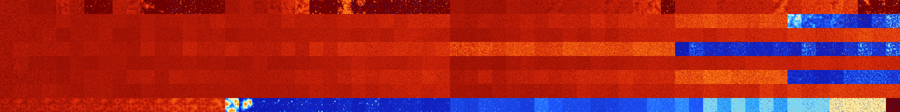

# B013458 (161280-161791)

<details>
    <summary>Initial Grid</summary>
    
</details>


<details>
    <summary>Initial Grid RLE</summary>

```
#C Exported from GoGoL (https://github.com/marrow16/gogol)
#C Wrap mode: Toroidal
#C Boundary mode: Dead
#C Step: 0
x = 100, y = 100, rule = B013458/S
7bo3bo21bo22bo3bo8bobo6bo11bo$3bo22bo18bo7bo13bo12bo11bo$19bo23bo8bo4bo
14bo3bo10bo$8bo25bo48bo$bo95bo$15bo7bo10bo22bo28bobo3bo$3bo19bo19bo14bo
3bo17bo4bo7bobo$12b2o12bo$8bo2bo37bo12bo$4bo4bo2bo21bo8bo23bobo12b2o5bo
5bo$21bo25bo15bo16bo6bo3bo$7bo20bo11bo11b2o5bo11bo$6bo6bo29bo13bo17bo
18bo$38bo7bo45bo$37bo12bo41bo$28bo32bo22bo$32bo16bo11bo3bo16bo$35bo34bo
11bobo13bo$11bo21bo7bo6bo10bo7bo3bo$o11bo7bo22bo11bo17bo$78bo$23bo16bo
24bo11bo$33bobo23bo5bo10bo19bo$35bo36bo5bo$17bo65bo4bo$43bo33bo7bo$11bo
11bo25bo22b3o6bo11bo$34bo25bo5b2o13bo5bo$35bo49bo4bo$34bo15bo15bo27bo$b
2o11bo10bo16bo6bo48bo$50bo2bo$31bo51bo7b2o$11bo31bo3bo9bo7bo10bo$72bo
13bo2bobo3bo$9bo25bobo20bo12bo18bo2bo$12bo5bo20bo9bo9b2o12bo13bo$23bo
24bo20bo9bo$2bobo50b2o8bobo15bo13bo$13b2o34bo40bo$4bo2bo3bobo19bo6bo42b
o$14bo27bo34bo$9bo85bo$10bo27bo8bo6bo2bo14bobo13bo3bo$bo7bo17b2o17bo37b
o$30bo18bo13bo26bo$o10bo10bo20bo2bo2bo22bo16bo$19b2o53bo$16bo11bo16bo
33bo8bo$14bo68bo$85bo$7bo16bo23bo19bo6bo2bo$12bo9bo23bo9bo19bo15bo$100b
$53bo$3bo45bo47bo$25bo11bo5bo7bo12bo26bo$26bo2bo10bo48bo$60bo5bo23bo8bo
$46bo13bo16bobo12bo$3bo5bo36bo24bo21bo$bo57bo12bo8bo8bo$50bo12bo22bo$o
56bo25bo6bo$45bo6bo3bo$7bo43bo16bobo$28bo9bo22bobo16bo$100b$30bo15bo37b
o6bo$20bo9bobo34bo3bo$11bo35bo7bo33bo$7bo2bo25bo2bo4bo20bo$9bo6bo4bo34b
o10bo$17b3obo9bo11bo21bo14b2o$28bo29bo24bo$bo15bo13bo3bo16bo3bo18bo6bo
6bo9bo$44bo22bo20bo$45bo6bo13bo$4bo32bo9b2o17bo3bo$3bo6bo10bo19bob2obo
13bobo$5bo27bo49bo11bo$14bo23bo27bo12bo$10bo2bo38bo13bo$74bo8bo10bo$16b
o2bo3bo16bo6bo3bo3bo$3bo10bo15bo7bo9bo18bo17bo12bo$45bo24bo14bo11bo$24b
o2bo16bobo6bo8bo$2bo13bo2bo3bo37bo9bo$26bo5bo50bo$11bo14bo10bo$28bo40bo
23bo$2bo18bo44bo$21bo55bo15b2o$7bo17bo14bo5bo18bo$o6bo13bobo12bo2bo14b
2o11b3o4bo$bo12bo16bo6bo27bo4bo23bobo$o17bo31bo36bo3b2o$6bo2bo26bo44bo
5bo$58bo25bo!
```
</details>
<details>
    <summary>Thumbnail</summary>

</details>
<table>
<tr>
    <td><a href="./161280%20S%20Heat%20Map%20Activity.png"></a><br>S (161280)<br>G>1000</td>    <td><a href="./161281%20S0%20Heat%20Map%20Activity.png"></a><br>S0 (161281)<br>G>1000</td>    <td><a href="./161282%20S1%20Heat%20Map%20Activity.png"></a><br>S1 (161282)<br>G>1000</td>    <td><a href="./161283%20S01%20Heat%20Map%20Activity.png"></a><br>S01 (161283)<br>G>1000</td>    <td><a href="./161284%20S2%20Heat%20Map%20Activity.png"></a><br>S2 (161284)<br>G>1000</td>    <td><a href="./161285%20S02%20Heat%20Map%20Activity.png"></a><br>S02 (161285)<br>G>1000</td>    <td><a href="./161286%20S12%20Heat%20Map%20Activity.png"></a><br>S12 (161286)<br>R@78,p6</td>    <td><a href="./161287%20S012%20Heat%20Map%20Activity.png"></a><br>S012 (161287)<br>R@18,p4</td>    <td><a href="./161288%20S3%20Heat%20Map%20Activity.png"></a><br>S3 (161288)<br>G>1000</td>    <td><a href="./161289%20S03%20Heat%20Map%20Activity.png"></a><br>S03 (161289)<br>G>1000</td>    <td><a href="./161290%20S13%20Heat%20Map%20Activity.png"></a><br>S13 (161290)<br>G>1000</td>    <td><a href="./161291%20S013%20Heat%20Map%20Activity.png"></a><br>S013 (161291)<br>R@214,p2</td>    <td><a href="./161292%20S23%20Heat%20Map%20Activity.png"></a><br>S23 (161292)<br>R@64,p12</td>    <td><a href="./161293%20S023%20Heat%20Map%20Activity.png"></a><br>S023 (161293)<br>R@26,p4</td>    <td><a href="./161294%20S123%20Heat%20Map%20Activity.png"></a><br>S123 (161294)<br>R@56,p12</td>    <td><a href="./161295%20S0123%20Heat%20Map%20Activity.png"></a><br>S0123 (161295)<br>R@13,p4</td>    <td><a href="./161296%20S4%20Heat%20Map%20Activity.png"></a><br>S4 (161296)<br>G>1000</td>    <td><a href="./161297%20S04%20Heat%20Map%20Activity.png"></a><br>S04 (161297)<br>G>1000</td>    <td><a href="./161298%20S14%20Heat%20Map%20Activity.png"></a><br>S14 (161298)<br>G>1000</td>    <td><a href="./161299%20S014%20Heat%20Map%20Activity.png"></a><br>S014 (161299)<br>G>1000</td>    <td><a href="./161300%20S24%20Heat%20Map%20Activity.png"></a><br>S24 (161300)<br>G>1000</td>    <td><a href="./161301%20S024%20Heat%20Map%20Activity.png"></a><br>S024 (161301)<br>G>1000</td>    <td><a href="./161302%20S124%20Heat%20Map%20Activity.png"></a><br>S124 (161302)<br>R@118,p2</td>    <td><a href="./161303%20S0124%20Heat%20Map%20Activity.png"></a><br>S0124 (161303)<br>R@38,p4</td>    <td><a href="./161304%20S34%20Heat%20Map%20Activity.png"></a><br>S34 (161304)<br>G>1000</td>    <td><a href="./161305%20S034%20Heat%20Map%20Activity.png"></a><br>S034 (161305)<br>G>1000</td>    <td><a href="./161306%20S134%20Heat%20Map%20Activity.png"></a><br>S134 (161306)<br>R@104,p2</td>    <td><a href="./161307%20S0134%20Heat%20Map%20Activity.png"></a><br>S0134 (161307)<br>R@48,p2</td>    <td><a href="./161308%20S234%20Heat%20Map%20Activity.png"></a><br>S234 (161308)<br>R@62,p4</td>    <td><a href="./161309%20S0234%20Heat%20Map%20Activity.png"></a><br>S0234 (161309)<br>R@26,p4</td>    <td><a href="./161310%20S1234%20Heat%20Map%20Activity.png"></a><br>S1234 (161310)<br>R@28,p12</td>    <td><a href="./161311%20S01234%20Heat%20Map%20Activity.png"></a><br>S01234 (161311)<br>R@14,p4</td>    <td><a href="./161312%20S5%20Heat%20Map%20Activity.png"></a><br>S5 (161312)<br>G>1000</td>    <td><a href="./161313%20S05%20Heat%20Map%20Activity.png"></a><br>S05 (161313)<br>G>1000</td>    <td><a href="./161314%20S15%20Heat%20Map%20Activity.png"></a><br>S15 (161314)<br>G>1000</td>    <td><a href="./161315%20S015%20Heat%20Map%20Activity.png"></a><br>S015 (161315)<br>G>1000</td>    <td><a href="./161316%20S25%20Heat%20Map%20Activity.png"></a><br>S25 (161316)<br>G>1000</td>    <td><a href="./161317%20S025%20Heat%20Map%20Activity.png"></a><br>S025 (161317)<br>G>1000</td>    <td><a href="./161318%20S125%20Heat%20Map%20Activity.png"></a><br>S125 (161318)<br>G>1000</td>    <td><a href="./161319%20S0125%20Heat%20Map%20Activity.png"></a><br>S0125 (161319)<br>G>1000</td>    <td><a href="./161320%20S35%20Heat%20Map%20Activity.png"></a><br>S35 (161320)<br>G>1000</td>    <td><a href="./161321%20S035%20Heat%20Map%20Activity.png"></a><br>S035 (161321)<br>G>1000</td>    <td><a href="./161322%20S135%20Heat%20Map%20Activity.png"></a><br>S135 (161322)<br>G>1000</td>    <td><a href="./161323%20S0135%20Heat%20Map%20Activity.png"></a><br>S0135 (161323)<br>G>1000</td>    <td><a href="./161324%20S235%20Heat%20Map%20Activity.png"></a><br>S235 (161324)<br>G>1000</td>    <td><a href="./161325%20S0235%20Heat%20Map%20Activity.png"></a><br>S0235 (161325)<br>G>1000</td>    <td><a href="./161326%20S1235%20Heat%20Map%20Activity.png"></a><br>S1235 (161326)<br>G>1000</td>    <td><a href="./161327%20S01235%20Heat%20Map%20Activity.png"></a><br>S01235 (161327)<br>R@27,p4</td>    <td><a href="./161328%20S45%20Heat%20Map%20Activity.png"></a><br>S45 (161328)<br>G>1000</td>    <td><a href="./161329%20S045%20Heat%20Map%20Activity.png"></a><br>S045 (161329)<br>G>1000</td>    <td><a href="./161330%20S145%20Heat%20Map%20Activity.png"></a><br>S145 (161330)<br>G>1000</td>    <td><a href="./161331%20S0145%20Heat%20Map%20Activity.png"></a><br>S0145 (161331)<br>G>1000</td>    <td><a href="./161332%20S245%20Heat%20Map%20Activity.png"></a><br>S245 (161332)<br>G>1000</td>    <td><a href="./161333%20S0245%20Heat%20Map%20Activity.png"></a><br>S0245 (161333)<br>G>1000</td>    <td><a href="./161334%20S1245%20Heat%20Map%20Activity.png"></a><br>S1245 (161334)<br>G>1000</td>    <td><a href="./161335%20S01245%20Heat%20Map%20Activity.png"></a><br>S01245 (161335)<br>G>1000</td>    <td><a href="./161336%20S345%20Heat%20Map%20Activity.png"></a><br>S345 (161336)<br>G>1000</td>    <td><a href="./161337%20S0345%20Heat%20Map%20Activity.png"></a><br>S0345 (161337)<br>G>1000</td>    <td><a href="./161338%20S1345%20Heat%20Map%20Activity.png"></a><br>S1345 (161338)<br>G>1000</td>    <td><a href="./161339%20S01345%20Heat%20Map%20Activity.png"></a><br>S01345 (161339)<br>G>1000</td>    <td><a href="./161340%20S2345%20Heat%20Map%20Activity.png"></a><br>S2345 (161340)<br>G>1000</td>    <td><a href="./161341%20S02345%20Heat%20Map%20Activity.png"></a><br>S02345 (161341)<br>G>1000</td>    <td><a href="./161342%20S12345%20Heat%20Map%20Activity.png"></a><br>S12345 (161342)<br>R@414,p4</td>    <td><a href="./161343%20S012345%20Heat%20Map%20Activity.png"></a><br>S012345 (161343)<br>R@28,p4</td></tr>
<tr>
    <td><a href="./161344%20S6%20Heat%20Map%20Activity.png"></a><br>S6 (161344)<br>G>1000</td>    <td><a href="./161345%20S06%20Heat%20Map%20Activity.png"></a><br>S06 (161345)<br>G>1000</td>    <td><a href="./161346%20S16%20Heat%20Map%20Activity.png"></a><br>S16 (161346)<br>G>1000</td>    <td><a href="./161347%20S016%20Heat%20Map%20Activity.png"></a><br>S016 (161347)<br>G>1000</td>    <td><a href="./161348%20S26%20Heat%20Map%20Activity.png"></a><br>S26 (161348)<br>G>1000</td>    <td><a href="./161349%20S026%20Heat%20Map%20Activity.png"></a><br>S026 (161349)<br>G>1000</td>    <td><a href="./161350%20S126%20Heat%20Map%20Activity.png"></a><br>S126 (161350)<br>G>1000</td>    <td><a href="./161351%20S0126%20Heat%20Map%20Activity.png"></a><br>S0126 (161351)<br>G>1000</td>    <td><a href="./161352%20S36%20Heat%20Map%20Activity.png"></a><br>S36 (161352)<br>G>1000</td>    <td><a href="./161353%20S036%20Heat%20Map%20Activity.png"></a><br>S036 (161353)<br>G>1000</td>    <td><a href="./161354%20S136%20Heat%20Map%20Activity.png"></a><br>S136 (161354)<br>G>1000</td>    <td><a href="./161355%20S0136%20Heat%20Map%20Activity.png"></a><br>S0136 (161355)<br>G>1000</td>    <td><a href="./161356%20S236%20Heat%20Map%20Activity.png"></a><br>S236 (161356)<br>G>1000</td>    <td><a href="./161357%20S0236%20Heat%20Map%20Activity.png"></a><br>S0236 (161357)<br>G>1000</td>    <td><a href="./161358%20S1236%20Heat%20Map%20Activity.png"></a><br>S1236 (161358)<br>G>1000</td>    <td><a href="./161359%20S01236%20Heat%20Map%20Activity.png"></a><br>S01236 (161359)<br>G>1000</td>    <td><a href="./161360%20S46%20Heat%20Map%20Activity.png"></a><br>S46 (161360)<br>G>1000</td>    <td><a href="./161361%20S046%20Heat%20Map%20Activity.png"></a><br>S046 (161361)<br>G>1000</td>    <td><a href="./161362%20S146%20Heat%20Map%20Activity.png"></a><br>S146 (161362)<br>G>1000</td>    <td><a href="./161363%20S0146%20Heat%20Map%20Activity.png"></a><br>S0146 (161363)<br>G>1000</td>    <td><a href="./161364%20S246%20Heat%20Map%20Activity.png"></a><br>S246 (161364)<br>G>1000</td>    <td><a href="./161365%20S0246%20Heat%20Map%20Activity.png"></a><br>S0246 (161365)<br>G>1000</td>    <td><a href="./161366%20S1246%20Heat%20Map%20Activity.png"></a><br>S1246 (161366)<br>G>1000</td>    <td><a href="./161367%20S01246%20Heat%20Map%20Activity.png"></a><br>S01246 (161367)<br>G>1000</td>    <td><a href="./161368%20S346%20Heat%20Map%20Activity.png"></a><br>S346 (161368)<br>G>1000</td>    <td><a href="./161369%20S0346%20Heat%20Map%20Activity.png"></a><br>S0346 (161369)<br>G>1000</td>    <td><a href="./161370%20S1346%20Heat%20Map%20Activity.png"></a><br>S1346 (161370)<br>G>1000</td>    <td><a href="./161371%20S01346%20Heat%20Map%20Activity.png"></a><br>S01346 (161371)<br>G>1000</td>    <td><a href="./161372%20S2346%20Heat%20Map%20Activity.png"></a><br>S2346 (161372)<br>G>1000</td>    <td><a href="./161373%20S02346%20Heat%20Map%20Activity.png"></a><br>S02346 (161373)<br>G>1000</td>    <td><a href="./161374%20S12346%20Heat%20Map%20Activity.png"></a><br>S12346 (161374)<br>G>1000</td>    <td><a href="./161375%20S012346%20Heat%20Map%20Activity.png"></a><br>S012346 (161375)<br>G>1000</td>    <td><a href="./161376%20S56%20Heat%20Map%20Activity.png"></a><br>S56 (161376)<br>G>1000</td>    <td><a href="./161377%20S056%20Heat%20Map%20Activity.png"></a><br>S056 (161377)<br>G>1000</td>    <td><a href="./161378%20S156%20Heat%20Map%20Activity.png"></a><br>S156 (161378)<br>G>1000</td>    <td><a href="./161379%20S0156%20Heat%20Map%20Activity.png"></a><br>S0156 (161379)<br>G>1000</td>    <td><a href="./161380%20S256%20Heat%20Map%20Activity.png"></a><br>S256 (161380)<br>G>1000</td>    <td><a href="./161381%20S0256%20Heat%20Map%20Activity.png"></a><br>S0256 (161381)<br>G>1000</td>    <td><a href="./161382%20S1256%20Heat%20Map%20Activity.png"></a><br>S1256 (161382)<br>G>1000</td>    <td><a href="./161383%20S01256%20Heat%20Map%20Activity.png"></a><br>S01256 (161383)<br>G>1000</td>    <td><a href="./161384%20S356%20Heat%20Map%20Activity.png"></a><br>S356 (161384)<br>G>1000</td>    <td><a href="./161385%20S0356%20Heat%20Map%20Activity.png"></a><br>S0356 (161385)<br>G>1000</td>    <td><a href="./161386%20S1356%20Heat%20Map%20Activity.png"></a><br>S1356 (161386)<br>G>1000</td>    <td><a href="./161387%20S01356%20Heat%20Map%20Activity.png"></a><br>S01356 (161387)<br>G>1000</td>    <td><a href="./161388%20S2356%20Heat%20Map%20Activity.png"></a><br>S2356 (161388)<br>G>1000</td>    <td><a href="./161389%20S02356%20Heat%20Map%20Activity.png"></a><br>S02356 (161389)<br>G>1000</td>    <td><a href="./161390%20S12356%20Heat%20Map%20Activity.png"></a><br>S12356 (161390)<br>G>1000</td>    <td><a href="./161391%20S012356%20Heat%20Map%20Activity.png"></a><br>S012356 (161391)<br>G>1000</td>    <td><a href="./161392%20S456%20Heat%20Map%20Activity.png"></a><br>S456 (161392)<br>G>1000</td>    <td><a href="./161393%20S0456%20Heat%20Map%20Activity.png"></a><br>S0456 (161393)<br>G>1000</td>    <td><a href="./161394%20S1456%20Heat%20Map%20Activity.png"></a><br>S1456 (161394)<br>G>1000</td>    <td><a href="./161395%20S01456%20Heat%20Map%20Activity.png"></a><br>S01456 (161395)<br>G>1000</td>    <td><a href="./161396%20S2456%20Heat%20Map%20Activity.png"></a><br>S2456 (161396)<br>G>1000</td>    <td><a href="./161397%20S02456%20Heat%20Map%20Activity.png"></a><br>S02456 (161397)<br>G>1000</td>    <td><a href="./161398%20S12456%20Heat%20Map%20Activity.png"></a><br>S12456 (161398)<br>G>1000</td>    <td><a href="./161399%20S012456%20Heat%20Map%20Activity.png"></a><br>S012456 (161399)<br>G>1000</td>    <td><a href="./161400%20S3456%20Heat%20Map%20Activity.png"></a><br>S3456 (161400)<br>G>1000</td>    <td><a href="./161401%20S03456%20Heat%20Map%20Activity.png"></a><br>S03456 (161401)<br>G>1000</td>    <td><a href="./161402%20S13456%20Heat%20Map%20Activity.png"></a><br>S13456 (161402)<br>G>1000</td>    <td><a href="./161403%20S013456%20Heat%20Map%20Activity.png"></a><br>S013456 (161403)<br>G>1000</td>    <td><a href="./161404%20S23456%20Heat%20Map%20Activity.png"></a><br>S23456 (161404)<br>R@196,p120</td>    <td><a href="./161405%20S023456%20Heat%20Map%20Activity.png"></a><br>S023456 (161405)<br>R@909,p840</td>    <td><a href="./161406%20S123456%20Heat%20Map%20Activity.png"></a><br>S123456 (161406)<br>R@142,p60</td>    <td><a href="./161407%20S0123456%20Heat%20Map%20Activity.png"></a><br>S0123456 (161407)<br>R@78,p12</td></tr>
<tr>
    <td><a href="./161408%20S7%20Heat%20Map%20Activity.png"></a><br>S7 (161408)<br>G>1000</td>    <td><a href="./161409%20S07%20Heat%20Map%20Activity.png"></a><br>S07 (161409)<br>G>1000</td>    <td><a href="./161410%20S17%20Heat%20Map%20Activity.png"></a><br>S17 (161410)<br>G>1000</td>    <td><a href="./161411%20S017%20Heat%20Map%20Activity.png"></a><br>S017 (161411)<br>G>1000</td>    <td><a href="./161412%20S27%20Heat%20Map%20Activity.png"></a><br>S27 (161412)<br>G>1000</td>    <td><a href="./161413%20S027%20Heat%20Map%20Activity.png"></a><br>S027 (161413)<br>G>1000</td>    <td><a href="./161414%20S127%20Heat%20Map%20Activity.png"></a><br>S127 (161414)<br>G>1000</td>    <td><a href="./161415%20S0127%20Heat%20Map%20Activity.png"></a><br>S0127 (161415)<br>G>1000</td>    <td><a href="./161416%20S37%20Heat%20Map%20Activity.png"></a><br>S37 (161416)<br>G>1000</td>    <td><a href="./161417%20S037%20Heat%20Map%20Activity.png"></a><br>S037 (161417)<br>G>1000</td>    <td><a href="./161418%20S137%20Heat%20Map%20Activity.png"></a><br>S137 (161418)<br>G>1000</td>    <td><a href="./161419%20S0137%20Heat%20Map%20Activity.png"></a><br>S0137 (161419)<br>G>1000</td>    <td><a href="./161420%20S237%20Heat%20Map%20Activity.png"></a><br>S237 (161420)<br>G>1000</td>    <td><a href="./161421%20S0237%20Heat%20Map%20Activity.png"></a><br>S0237 (161421)<br>G>1000</td>    <td><a href="./161422%20S1237%20Heat%20Map%20Activity.png"></a><br>S1237 (161422)<br>G>1000</td>    <td><a href="./161423%20S01237%20Heat%20Map%20Activity.png"></a><br>S01237 (161423)<br>G>1000</td>    <td><a href="./161424%20S47%20Heat%20Map%20Activity.png"></a><br>S47 (161424)<br>G>1000</td>    <td><a href="./161425%20S047%20Heat%20Map%20Activity.png"></a><br>S047 (161425)<br>G>1000</td>    <td><a href="./161426%20S147%20Heat%20Map%20Activity.png"></a><br>S147 (161426)<br>G>1000</td>    <td><a href="./161427%20S0147%20Heat%20Map%20Activity.png"></a><br>S0147 (161427)<br>G>1000</td>    <td><a href="./161428%20S247%20Heat%20Map%20Activity.png"></a><br>S247 (161428)<br>G>1000</td>    <td><a href="./161429%20S0247%20Heat%20Map%20Activity.png"></a><br>S0247 (161429)<br>G>1000</td>    <td><a href="./161430%20S1247%20Heat%20Map%20Activity.png"></a><br>S1247 (161430)<br>G>1000</td>    <td><a href="./161431%20S01247%20Heat%20Map%20Activity.png"></a><br>S01247 (161431)<br>G>1000</td>    <td><a href="./161432%20S347%20Heat%20Map%20Activity.png"></a><br>S347 (161432)<br>G>1000</td>    <td><a href="./161433%20S0347%20Heat%20Map%20Activity.png"></a><br>S0347 (161433)<br>G>1000</td>    <td><a href="./161434%20S1347%20Heat%20Map%20Activity.png"></a><br>S1347 (161434)<br>G>1000</td>    <td><a href="./161435%20S01347%20Heat%20Map%20Activity.png"></a><br>S01347 (161435)<br>G>1000</td>    <td><a href="./161436%20S2347%20Heat%20Map%20Activity.png"></a><br>S2347 (161436)<br>G>1000</td>    <td><a href="./161437%20S02347%20Heat%20Map%20Activity.png"></a><br>S02347 (161437)<br>G>1000</td>    <td><a href="./161438%20S12347%20Heat%20Map%20Activity.png"></a><br>S12347 (161438)<br>G>1000</td>    <td><a href="./161439%20S012347%20Heat%20Map%20Activity.png"></a><br>S012347 (161439)<br>G>1000</td>    <td><a href="./161440%20S57%20Heat%20Map%20Activity.png"></a><br>S57 (161440)<br>G>1000</td>    <td><a href="./161441%20S057%20Heat%20Map%20Activity.png"></a><br>S057 (161441)<br>G>1000</td>    <td><a href="./161442%20S157%20Heat%20Map%20Activity.png"></a><br>S157 (161442)<br>G>1000</td>    <td><a href="./161443%20S0157%20Heat%20Map%20Activity.png"></a><br>S0157 (161443)<br>G>1000</td>    <td><a href="./161444%20S257%20Heat%20Map%20Activity.png"></a><br>S257 (161444)<br>G>1000</td>    <td><a href="./161445%20S0257%20Heat%20Map%20Activity.png"></a><br>S0257 (161445)<br>G>1000</td>    <td><a href="./161446%20S1257%20Heat%20Map%20Activity.png"></a><br>S1257 (161446)<br>G>1000</td>    <td><a href="./161447%20S01257%20Heat%20Map%20Activity.png"></a><br>S01257 (161447)<br>G>1000</td>    <td><a href="./161448%20S357%20Heat%20Map%20Activity.png"></a><br>S357 (161448)<br>G>1000</td>    <td><a href="./161449%20S0357%20Heat%20Map%20Activity.png"></a><br>S0357 (161449)<br>G>1000</td>    <td><a href="./161450%20S1357%20Heat%20Map%20Activity.png"></a><br>S1357 (161450)<br>G>1000</td>    <td><a href="./161451%20S01357%20Heat%20Map%20Activity.png"></a><br>S01357 (161451)<br>G>1000</td>    <td><a href="./161452%20S2357%20Heat%20Map%20Activity.png"></a><br>S2357 (161452)<br>G>1000</td>    <td><a href="./161453%20S02357%20Heat%20Map%20Activity.png"></a><br>S02357 (161453)<br>G>1000</td>    <td><a href="./161454%20S12357%20Heat%20Map%20Activity.png"></a><br>S12357 (161454)<br>G>1000</td>    <td><a href="./161455%20S012357%20Heat%20Map%20Activity.png"></a><br>S012357 (161455)<br>G>1000</td>    <td><a href="./161456%20S457%20Heat%20Map%20Activity.png"></a><br>S457 (161456)<br>G>1000</td>    <td><a href="./161457%20S0457%20Heat%20Map%20Activity.png"></a><br>S0457 (161457)<br>G>1000</td>    <td><a href="./161458%20S1457%20Heat%20Map%20Activity.png"></a><br>S1457 (161458)<br>G>1000</td>    <td><a href="./161459%20S01457%20Heat%20Map%20Activity.png"></a><br>S01457 (161459)<br>G>1000</td>    <td><a href="./161460%20S2457%20Heat%20Map%20Activity.png"></a><br>S2457 (161460)<br>G>1000</td>    <td><a href="./161461%20S02457%20Heat%20Map%20Activity.png"></a><br>S02457 (161461)<br>G>1000</td>    <td><a href="./161462%20S12457%20Heat%20Map%20Activity.png"></a><br>S12457 (161462)<br>G>1000</td>    <td><a href="./161463%20S012457%20Heat%20Map%20Activity.png"></a><br>S012457 (161463)<br>G>1000</td>    <td><a href="./161464%20S3457%20Heat%20Map%20Activity.png"></a><br>S3457 (161464)<br>G>1000</td>    <td><a href="./161465%20S03457%20Heat%20Map%20Activity.png"></a><br>S03457 (161465)<br>G>1000</td>    <td><a href="./161466%20S13457%20Heat%20Map%20Activity.png"></a><br>S13457 (161466)<br>G>1000</td>    <td><a href="./161467%20S013457%20Heat%20Map%20Activity.png"></a><br>S013457 (161467)<br>G>1000</td>    <td><a href="./161468%20S23457%20Heat%20Map%20Activity.png"></a><br>S23457 (161468)<br>G>1000</td>    <td><a href="./161469%20S023457%20Heat%20Map%20Activity.png"></a><br>S023457 (161469)<br>G>1000</td>    <td><a href="./161470%20S123457%20Heat%20Map%20Activity.png"></a><br>S123457 (161470)<br>G>1000</td>    <td><a href="./161471%20S0123457%20Heat%20Map%20Activity.png"></a><br>S0123457 (161471)<br>G>1000</td></tr>
<tr>
    <td><a href="./161472%20S67%20Heat%20Map%20Activity.png"></a><br>S67 (161472)<br>G>1000</td>    <td><a href="./161473%20S067%20Heat%20Map%20Activity.png"></a><br>S067 (161473)<br>G>1000</td>    <td><a href="./161474%20S167%20Heat%20Map%20Activity.png"></a><br>S167 (161474)<br>G>1000</td>    <td><a href="./161475%20S0167%20Heat%20Map%20Activity.png"></a><br>S0167 (161475)<br>G>1000</td>    <td><a href="./161476%20S267%20Heat%20Map%20Activity.png"></a><br>S267 (161476)<br>G>1000</td>    <td><a href="./161477%20S0267%20Heat%20Map%20Activity.png"></a><br>S0267 (161477)<br>G>1000</td>    <td><a href="./161478%20S1267%20Heat%20Map%20Activity.png"></a><br>S1267 (161478)<br>G>1000</td>    <td><a href="./161479%20S01267%20Heat%20Map%20Activity.png"></a><br>S01267 (161479)<br>G>1000</td>    <td><a href="./161480%20S367%20Heat%20Map%20Activity.png"></a><br>S367 (161480)<br>G>1000</td>    <td><a href="./161481%20S0367%20Heat%20Map%20Activity.png"></a><br>S0367 (161481)<br>G>1000</td>    <td><a href="./161482%20S1367%20Heat%20Map%20Activity.png"></a><br>S1367 (161482)<br>G>1000</td>    <td><a href="./161483%20S01367%20Heat%20Map%20Activity.png"></a><br>S01367 (161483)<br>G>1000</td>    <td><a href="./161484%20S2367%20Heat%20Map%20Activity.png"></a><br>S2367 (161484)<br>G>1000</td>    <td><a href="./161485%20S02367%20Heat%20Map%20Activity.png"></a><br>S02367 (161485)<br>G>1000</td>    <td><a href="./161486%20S12367%20Heat%20Map%20Activity.png"></a><br>S12367 (161486)<br>G>1000</td>    <td><a href="./161487%20S012367%20Heat%20Map%20Activity.png"></a><br>S012367 (161487)<br>G>1000</td>    <td><a href="./161488%20S467%20Heat%20Map%20Activity.png"></a><br>S467 (161488)<br>G>1000</td>    <td><a href="./161489%20S0467%20Heat%20Map%20Activity.png"></a><br>S0467 (161489)<br>G>1000</td>    <td><a href="./161490%20S1467%20Heat%20Map%20Activity.png"></a><br>S1467 (161490)<br>G>1000</td>    <td><a href="./161491%20S01467%20Heat%20Map%20Activity.png"></a><br>S01467 (161491)<br>G>1000</td>    <td><a href="./161492%20S2467%20Heat%20Map%20Activity.png"></a><br>S2467 (161492)<br>G>1000</td>    <td><a href="./161493%20S02467%20Heat%20Map%20Activity.png"></a><br>S02467 (161493)<br>G>1000</td>    <td><a href="./161494%20S12467%20Heat%20Map%20Activity.png"></a><br>S12467 (161494)<br>G>1000</td>    <td><a href="./161495%20S012467%20Heat%20Map%20Activity.png"></a><br>S012467 (161495)<br>G>1000</td>    <td><a href="./161496%20S3467%20Heat%20Map%20Activity.png"></a><br>S3467 (161496)<br>G>1000</td>    <td><a href="./161497%20S03467%20Heat%20Map%20Activity.png"></a><br>S03467 (161497)<br>G>1000</td>    <td><a href="./161498%20S13467%20Heat%20Map%20Activity.png"></a><br>S13467 (161498)<br>G>1000</td>    <td><a href="./161499%20S013467%20Heat%20Map%20Activity.png"></a><br>S013467 (161499)<br>G>1000</td>    <td><a href="./161500%20S23467%20Heat%20Map%20Activity.png"></a><br>S23467 (161500)<br>G>1000</td>    <td><a href="./161501%20S023467%20Heat%20Map%20Activity.png"></a><br>S023467 (161501)<br>G>1000</td>    <td><a href="./161502%20S123467%20Heat%20Map%20Activity.png"></a><br>S123467 (161502)<br>G>1000</td>    <td><a href="./161503%20S0123467%20Heat%20Map%20Activity.png"></a><br>S0123467 (161503)<br>G>1000</td>    <td><a href="./161504%20S567%20Heat%20Map%20Activity.png"></a><br>S567 (161504)<br>G>1000</td>    <td><a href="./161505%20S0567%20Heat%20Map%20Activity.png"></a><br>S0567 (161505)<br>G>1000</td>    <td><a href="./161506%20S1567%20Heat%20Map%20Activity.png"></a><br>S1567 (161506)<br>G>1000</td>    <td><a href="./161507%20S01567%20Heat%20Map%20Activity.png"></a><br>S01567 (161507)<br>G>1000</td>    <td><a href="./161508%20S2567%20Heat%20Map%20Activity.png"></a><br>S2567 (161508)<br>G>1000</td>    <td><a href="./161509%20S02567%20Heat%20Map%20Activity.png"></a><br>S02567 (161509)<br>G>1000</td>    <td><a href="./161510%20S12567%20Heat%20Map%20Activity.png"></a><br>S12567 (161510)<br>G>1000</td>    <td><a href="./161511%20S012567%20Heat%20Map%20Activity.png"></a><br>S012567 (161511)<br>G>1000</td>    <td><a href="./161512%20S3567%20Heat%20Map%20Activity.png"></a><br>S3567 (161512)<br>G>1000</td>    <td><a href="./161513%20S03567%20Heat%20Map%20Activity.png"></a><br>S03567 (161513)<br>G>1000</td>    <td><a href="./161514%20S13567%20Heat%20Map%20Activity.png"></a><br>S13567 (161514)<br>G>1000</td>    <td><a href="./161515%20S013567%20Heat%20Map%20Activity.png"></a><br>S013567 (161515)<br>G>1000</td>    <td><a href="./161516%20S23567%20Heat%20Map%20Activity.png"></a><br>S23567 (161516)<br>G>1000</td>    <td><a href="./161517%20S023567%20Heat%20Map%20Activity.png"></a><br>S023567 (161517)<br>G>1000</td>    <td><a href="./161518%20S123567%20Heat%20Map%20Activity.png"></a><br>S123567 (161518)<br>G>1000</td>    <td><a href="./161519%20S0123567%20Heat%20Map%20Activity.png"></a><br>S0123567 (161519)<br>G>1000</td>    <td><a href="./161520%20S4567%20Heat%20Map%20Activity.png"></a><br>S4567 (161520)<br>R@455,p420</td>    <td><a href="./161521%20S04567%20Heat%20Map%20Activity.png"></a><br>S04567 (161521)<br>R@58,p12</td>    <td><a href="./161522%20S14567%20Heat%20Map%20Activity.png"></a><br>S14567 (161522)<br>R@117,p60</td>    <td><a href="./161523%20S014567%20Heat%20Map%20Activity.png"></a><br>S014567 (161523)<br>R@156,p120</td>    <td><a href="./161524%20S24567%20Heat%20Map%20Activity.png"></a><br>S24567 (161524)<br>R@80,p20</td>    <td><a href="./161525%20S024567%20Heat%20Map%20Activity.png"></a><br>S024567 (161525)<br>R@168,p120</td>    <td><a href="./161526%20S124567%20Heat%20Map%20Activity.png"></a><br>S124567 (161526)<br>R@140,p84</td>    <td><a href="./161527%20S0124567%20Heat%20Map%20Activity.png"></a><br>S0124567 (161527)<br>R@102,p60</td>    <td><a href="./161528%20S34567%20Heat%20Map%20Activity.png"></a><br>S34567 (161528)<br>R@142,p120</td>    <td><a href="./161529%20S034567%20Heat%20Map%20Activity.png"></a><br>S034567 (161529)<br>R@38,p12</td>    <td><a href="./161530%20S134567%20Heat%20Map%20Activity.png"></a><br>S134567 (161530)<br>R@143,p120</td>    <td><a href="./161531%20S0134567%20Heat%20Map%20Activity.png"></a><br>S0134567 (161531)<br>R@196,p168</td>    <td><a href="./161532%20S234567%20Heat%20Map%20Activity.png"></a><br>S234567 (161532)<br>R@57,p30</td>    <td><a href="./161533%20S0234567%20Heat%20Map%20Activity.png"></a><br>S0234567 (161533)<br>R@32,p6</td>    <td><a href="./161534%20S1234567%20Heat%20Map%20Activity.png"></a><br>S1234567 (161534)<br>R@49,p30</td>    <td><a href="./161535%20S01234567%20Heat%20Map%20Activity.png"></a><br>S01234567 (161535)<br>R@26,p6</td></tr>
<tr>
    <td><a href="./161536%20S8%20Heat%20Map%20Activity.png"></a><br>S8 (161536)<br>G>1000</td>    <td><a href="./161537%20S08%20Heat%20Map%20Activity.png"></a><br>S08 (161537)<br>G>1000</td>    <td><a href="./161538%20S18%20Heat%20Map%20Activity.png"></a><br>S18 (161538)<br>G>1000</td>    <td><a href="./161539%20S018%20Heat%20Map%20Activity.png"></a><br>S018 (161539)<br>G>1000</td>    <td><a href="./161540%20S28%20Heat%20Map%20Activity.png"></a><br>S28 (161540)<br>G>1000</td>    <td><a href="./161541%20S028%20Heat%20Map%20Activity.png"></a><br>S028 (161541)<br>G>1000</td>    <td><a href="./161542%20S128%20Heat%20Map%20Activity.png"></a><br>S128 (161542)<br>G>1000</td>    <td><a href="./161543%20S0128%20Heat%20Map%20Activity.png"></a><br>S0128 (161543)<br>G>1000</td>    <td><a href="./161544%20S38%20Heat%20Map%20Activity.png"></a><br>S38 (161544)<br>G>1000</td>    <td><a href="./161545%20S038%20Heat%20Map%20Activity.png"></a><br>S038 (161545)<br>G>1000</td>    <td><a href="./161546%20S138%20Heat%20Map%20Activity.png"></a><br>S138 (161546)<br>G>1000</td>    <td><a href="./161547%20S0138%20Heat%20Map%20Activity.png"></a><br>S0138 (161547)<br>G>1000</td>    <td><a href="./161548%20S238%20Heat%20Map%20Activity.png"></a><br>S238 (161548)<br>G>1000</td>    <td><a href="./161549%20S0238%20Heat%20Map%20Activity.png"></a><br>S0238 (161549)<br>G>1000</td>    <td><a href="./161550%20S1238%20Heat%20Map%20Activity.png"></a><br>S1238 (161550)<br>G>1000</td>    <td><a href="./161551%20S01238%20Heat%20Map%20Activity.png"></a><br>S01238 (161551)<br>G>1000</td>    <td><a href="./161552%20S48%20Heat%20Map%20Activity.png"></a><br>S48 (161552)<br>G>1000</td>    <td><a href="./161553%20S048%20Heat%20Map%20Activity.png"></a><br>S048 (161553)<br>G>1000</td>    <td><a href="./161554%20S148%20Heat%20Map%20Activity.png"></a><br>S148 (161554)<br>G>1000</td>    <td><a href="./161555%20S0148%20Heat%20Map%20Activity.png"></a><br>S0148 (161555)<br>G>1000</td>    <td><a href="./161556%20S248%20Heat%20Map%20Activity.png"></a><br>S248 (161556)<br>G>1000</td>    <td><a href="./161557%20S0248%20Heat%20Map%20Activity.png"></a><br>S0248 (161557)<br>G>1000</td>    <td><a href="./161558%20S1248%20Heat%20Map%20Activity.png"></a><br>S1248 (161558)<br>G>1000</td>    <td><a href="./161559%20S01248%20Heat%20Map%20Activity.png"></a><br>S01248 (161559)<br>G>1000</td>    <td><a href="./161560%20S348%20Heat%20Map%20Activity.png"></a><br>S348 (161560)<br>G>1000</td>    <td><a href="./161561%20S0348%20Heat%20Map%20Activity.png"></a><br>S0348 (161561)<br>G>1000</td>    <td><a href="./161562%20S1348%20Heat%20Map%20Activity.png"></a><br>S1348 (161562)<br>G>1000</td>    <td><a href="./161563%20S01348%20Heat%20Map%20Activity.png"></a><br>S01348 (161563)<br>G>1000</td>    <td><a href="./161564%20S2348%20Heat%20Map%20Activity.png"></a><br>S2348 (161564)<br>G>1000</td>    <td><a href="./161565%20S02348%20Heat%20Map%20Activity.png"></a><br>S02348 (161565)<br>G>1000</td>    <td><a href="./161566%20S12348%20Heat%20Map%20Activity.png"></a><br>S12348 (161566)<br>G>1000</td>    <td><a href="./161567%20S012348%20Heat%20Map%20Activity.png"></a><br>S012348 (161567)<br>G>1000</td>    <td><a href="./161568%20S58%20Heat%20Map%20Activity.png"></a><br>S58 (161568)<br>G>1000</td>    <td><a href="./161569%20S058%20Heat%20Map%20Activity.png"></a><br>S058 (161569)<br>G>1000</td>    <td><a href="./161570%20S158%20Heat%20Map%20Activity.png"></a><br>S158 (161570)<br>G>1000</td>    <td><a href="./161571%20S0158%20Heat%20Map%20Activity.png"></a><br>S0158 (161571)<br>G>1000</td>    <td><a href="./161572%20S258%20Heat%20Map%20Activity.png"></a><br>S258 (161572)<br>G>1000</td>    <td><a href="./161573%20S0258%20Heat%20Map%20Activity.png"></a><br>S0258 (161573)<br>G>1000</td>    <td><a href="./161574%20S1258%20Heat%20Map%20Activity.png"></a><br>S1258 (161574)<br>G>1000</td>    <td><a href="./161575%20S01258%20Heat%20Map%20Activity.png"></a><br>S01258 (161575)<br>G>1000</td>    <td><a href="./161576%20S358%20Heat%20Map%20Activity.png"></a><br>S358 (161576)<br>G>1000</td>    <td><a href="./161577%20S0358%20Heat%20Map%20Activity.png"></a><br>S0358 (161577)<br>G>1000</td>    <td><a href="./161578%20S1358%20Heat%20Map%20Activity.png"></a><br>S1358 (161578)<br>G>1000</td>    <td><a href="./161579%20S01358%20Heat%20Map%20Activity.png"></a><br>S01358 (161579)<br>G>1000</td>    <td><a href="./161580%20S2358%20Heat%20Map%20Activity.png"></a><br>S2358 (161580)<br>G>1000</td>    <td><a href="./161581%20S02358%20Heat%20Map%20Activity.png"></a><br>S02358 (161581)<br>G>1000</td>    <td><a href="./161582%20S12358%20Heat%20Map%20Activity.png"></a><br>S12358 (161582)<br>G>1000</td>    <td><a href="./161583%20S012358%20Heat%20Map%20Activity.png"></a><br>S012358 (161583)<br>G>1000</td>    <td><a href="./161584%20S458%20Heat%20Map%20Activity.png"></a><br>S458 (161584)<br>G>1000</td>    <td><a href="./161585%20S0458%20Heat%20Map%20Activity.png"></a><br>S0458 (161585)<br>G>1000</td>    <td><a href="./161586%20S1458%20Heat%20Map%20Activity.png"></a><br>S1458 (161586)<br>G>1000</td>    <td><a href="./161587%20S01458%20Heat%20Map%20Activity.png"></a><br>S01458 (161587)<br>G>1000</td>    <td><a href="./161588%20S2458%20Heat%20Map%20Activity.png"></a><br>S2458 (161588)<br>G>1000</td>    <td><a href="./161589%20S02458%20Heat%20Map%20Activity.png"></a><br>S02458 (161589)<br>G>1000</td>    <td><a href="./161590%20S12458%20Heat%20Map%20Activity.png"></a><br>S12458 (161590)<br>G>1000</td>    <td><a href="./161591%20S012458%20Heat%20Map%20Activity.png"></a><br>S012458 (161591)<br>G>1000</td>    <td><a href="./161592%20S3458%20Heat%20Map%20Activity.png"></a><br>S3458 (161592)<br>G>1000</td>    <td><a href="./161593%20S03458%20Heat%20Map%20Activity.png"></a><br>S03458 (161593)<br>G>1000</td>    <td><a href="./161594%20S13458%20Heat%20Map%20Activity.png"></a><br>S13458 (161594)<br>G>1000</td>    <td><a href="./161595%20S013458%20Heat%20Map%20Activity.png"></a><br>S013458 (161595)<br>G>1000</td>    <td><a href="./161596%20S23458%20Heat%20Map%20Activity.png"></a><br>S23458 (161596)<br>G>1000</td>    <td><a href="./161597%20S023458%20Heat%20Map%20Activity.png"></a><br>S023458 (161597)<br>G>1000</td>    <td><a href="./161598%20S123458%20Heat%20Map%20Activity.png"></a><br>S123458 (161598)<br>G>1000</td>    <td><a href="./161599%20S0123458%20Heat%20Map%20Activity.png"></a><br>S0123458 (161599)<br>G>1000</td></tr>
<tr>
    <td><a href="./161600%20S68%20Heat%20Map%20Activity.png"></a><br>S68 (161600)<br>G>1000</td>    <td><a href="./161601%20S068%20Heat%20Map%20Activity.png"></a><br>S068 (161601)<br>G>1000</td>    <td><a href="./161602%20S168%20Heat%20Map%20Activity.png"></a><br>S168 (161602)<br>G>1000</td>    <td><a href="./161603%20S0168%20Heat%20Map%20Activity.png"></a><br>S0168 (161603)<br>G>1000</td>    <td><a href="./161604%20S268%20Heat%20Map%20Activity.png"></a><br>S268 (161604)<br>G>1000</td>    <td><a href="./161605%20S0268%20Heat%20Map%20Activity.png"></a><br>S0268 (161605)<br>G>1000</td>    <td><a href="./161606%20S1268%20Heat%20Map%20Activity.png"></a><br>S1268 (161606)<br>G>1000</td>    <td><a href="./161607%20S01268%20Heat%20Map%20Activity.png"></a><br>S01268 (161607)<br>G>1000</td>    <td><a href="./161608%20S368%20Heat%20Map%20Activity.png"></a><br>S368 (161608)<br>G>1000</td>    <td><a href="./161609%20S0368%20Heat%20Map%20Activity.png"></a><br>S0368 (161609)<br>G>1000</td>    <td><a href="./161610%20S1368%20Heat%20Map%20Activity.png"></a><br>S1368 (161610)<br>G>1000</td>    <td><a href="./161611%20S01368%20Heat%20Map%20Activity.png"></a><br>S01368 (161611)<br>G>1000</td>    <td><a href="./161612%20S2368%20Heat%20Map%20Activity.png"></a><br>S2368 (161612)<br>G>1000</td>    <td><a href="./161613%20S02368%20Heat%20Map%20Activity.png"></a><br>S02368 (161613)<br>G>1000</td>    <td><a href="./161614%20S12368%20Heat%20Map%20Activity.png"></a><br>S12368 (161614)<br>G>1000</td>    <td><a href="./161615%20S012368%20Heat%20Map%20Activity.png"></a><br>S012368 (161615)<br>G>1000</td>    <td><a href="./161616%20S468%20Heat%20Map%20Activity.png"></a><br>S468 (161616)<br>G>1000</td>    <td><a href="./161617%20S0468%20Heat%20Map%20Activity.png"></a><br>S0468 (161617)<br>G>1000</td>    <td><a href="./161618%20S1468%20Heat%20Map%20Activity.png"></a><br>S1468 (161618)<br>G>1000</td>    <td><a href="./161619%20S01468%20Heat%20Map%20Activity.png"></a><br>S01468 (161619)<br>G>1000</td>    <td><a href="./161620%20S2468%20Heat%20Map%20Activity.png"></a><br>S2468 (161620)<br>G>1000</td>    <td><a href="./161621%20S02468%20Heat%20Map%20Activity.png"></a><br>S02468 (161621)<br>G>1000</td>    <td><a href="./161622%20S12468%20Heat%20Map%20Activity.png"></a><br>S12468 (161622)<br>G>1000</td>    <td><a href="./161623%20S012468%20Heat%20Map%20Activity.png"></a><br>S012468 (161623)<br>G>1000</td>    <td><a href="./161624%20S3468%20Heat%20Map%20Activity.png"></a><br>S3468 (161624)<br>G>1000</td>    <td><a href="./161625%20S03468%20Heat%20Map%20Activity.png"></a><br>S03468 (161625)<br>G>1000</td>    <td><a href="./161626%20S13468%20Heat%20Map%20Activity.png"></a><br>S13468 (161626)<br>G>1000</td>    <td><a href="./161627%20S013468%20Heat%20Map%20Activity.png"></a><br>S013468 (161627)<br>G>1000</td>    <td><a href="./161628%20S23468%20Heat%20Map%20Activity.png"></a><br>S23468 (161628)<br>G>1000</td>    <td><a href="./161629%20S023468%20Heat%20Map%20Activity.png"></a><br>S023468 (161629)<br>G>1000</td>    <td><a href="./161630%20S123468%20Heat%20Map%20Activity.png"></a><br>S123468 (161630)<br>G>1000</td>    <td><a href="./161631%20S0123468%20Heat%20Map%20Activity.png"></a><br>S0123468 (161631)<br>G>1000</td>    <td><a href="./161632%20S568%20Heat%20Map%20Activity.png"></a><br>S568 (161632)<br>G>1000</td>    <td><a href="./161633%20S0568%20Heat%20Map%20Activity.png"></a><br>S0568 (161633)<br>G>1000</td>    <td><a href="./161634%20S1568%20Heat%20Map%20Activity.png"></a><br>S1568 (161634)<br>G>1000</td>    <td><a href="./161635%20S01568%20Heat%20Map%20Activity.png"></a><br>S01568 (161635)<br>G>1000</td>    <td><a href="./161636%20S2568%20Heat%20Map%20Activity.png"></a><br>S2568 (161636)<br>G>1000</td>    <td><a href="./161637%20S02568%20Heat%20Map%20Activity.png"></a><br>S02568 (161637)<br>G>1000</td>    <td><a href="./161638%20S12568%20Heat%20Map%20Activity.png"></a><br>S12568 (161638)<br>G>1000</td>    <td><a href="./161639%20S012568%20Heat%20Map%20Activity.png"></a><br>S012568 (161639)<br>G>1000</td>    <td><a href="./161640%20S3568%20Heat%20Map%20Activity.png"></a><br>S3568 (161640)<br>G>1000</td>    <td><a href="./161641%20S03568%20Heat%20Map%20Activity.png"></a><br>S03568 (161641)<br>G>1000</td>    <td><a href="./161642%20S13568%20Heat%20Map%20Activity.png"></a><br>S13568 (161642)<br>G>1000</td>    <td><a href="./161643%20S013568%20Heat%20Map%20Activity.png"></a><br>S013568 (161643)<br>G>1000</td>    <td><a href="./161644%20S23568%20Heat%20Map%20Activity.png"></a><br>S23568 (161644)<br>G>1000</td>    <td><a href="./161645%20S023568%20Heat%20Map%20Activity.png"></a><br>S023568 (161645)<br>G>1000</td>    <td><a href="./161646%20S123568%20Heat%20Map%20Activity.png"></a><br>S123568 (161646)<br>G>1000</td>    <td><a href="./161647%20S0123568%20Heat%20Map%20Activity.png"></a><br>S0123568 (161647)<br>G>1000</td>    <td><a href="./161648%20S4568%20Heat%20Map%20Activity.png"></a><br>S4568 (161648)<br>G>1000</td>    <td><a href="./161649%20S04568%20Heat%20Map%20Activity.png"></a><br>S04568 (161649)<br>G>1000</td>    <td><a href="./161650%20S14568%20Heat%20Map%20Activity.png"></a><br>S14568 (161650)<br>G>1000</td>    <td><a href="./161651%20S014568%20Heat%20Map%20Activity.png"></a><br>S014568 (161651)<br>G>1000</td>    <td><a href="./161652%20S24568%20Heat%20Map%20Activity.png"></a><br>S24568 (161652)<br>G>1000</td>    <td><a href="./161653%20S024568%20Heat%20Map%20Activity.png"></a><br>S024568 (161653)<br>G>1000</td>    <td><a href="./161654%20S124568%20Heat%20Map%20Activity.png"></a><br>S124568 (161654)<br>G>1000</td>    <td><a href="./161655%20S0124568%20Heat%20Map%20Activity.png"></a><br>S0124568 (161655)<br>G>1000</td>    <td><a href="./161656%20S34568%20Heat%20Map%20Activity.png"></a><br>S34568 (161656)<br>R@289,p60</td>    <td><a href="./161657%20S034568%20Heat%20Map%20Activity.png"></a><br>S034568 (161657)<br>R@326,p60</td>    <td><a href="./161658%20S134568%20Heat%20Map%20Activity.png"></a><br>S134568 (161658)<br>R@692,p420</td>    <td><a href="./161659%20S0134568%20Heat%20Map%20Activity.png"></a><br>S0134568 (161659)<br>R@346,p90</td>    <td><a href="./161660%20S234568%20Heat%20Map%20Activity.png"></a><br>S234568 (161660)<br>R@55,p12</td>    <td><a href="./161661%20S0234568%20Heat%20Map%20Activity.png"></a><br>S0234568 (161661)<br>R@50,p12</td>    <td><a href="./161662%20S1234568%20Heat%20Map%20Activity.png"></a><br>S1234568 (161662)<br>R@52,p12</td>    <td><a href="./161663%20S01234568%20Heat%20Map%20Activity.png"></a><br>S01234568 (161663)<br>R@64,p20</td></tr>
<tr>
    <td><a href="./161664%20S78%20Heat%20Map%20Activity.png"></a><br>S78 (161664)<br>G>1000</td>    <td><a href="./161665%20S078%20Heat%20Map%20Activity.png"></a><br>S078 (161665)<br>G>1000</td>    <td><a href="./161666%20S178%20Heat%20Map%20Activity.png"></a><br>S178 (161666)<br>G>1000</td>    <td><a href="./161667%20S0178%20Heat%20Map%20Activity.png"></a><br>S0178 (161667)<br>G>1000</td>    <td><a href="./161668%20S278%20Heat%20Map%20Activity.png"></a><br>S278 (161668)<br>G>1000</td>    <td><a href="./161669%20S0278%20Heat%20Map%20Activity.png"></a><br>S0278 (161669)<br>G>1000</td>    <td><a href="./161670%20S1278%20Heat%20Map%20Activity.png"></a><br>S1278 (161670)<br>G>1000</td>    <td><a href="./161671%20S01278%20Heat%20Map%20Activity.png"></a><br>S01278 (161671)<br>G>1000</td>    <td><a href="./161672%20S378%20Heat%20Map%20Activity.png"></a><br>S378 (161672)<br>G>1000</td>    <td><a href="./161673%20S0378%20Heat%20Map%20Activity.png"></a><br>S0378 (161673)<br>G>1000</td>    <td><a href="./161674%20S1378%20Heat%20Map%20Activity.png"></a><br>S1378 (161674)<br>G>1000</td>    <td><a href="./161675%20S01378%20Heat%20Map%20Activity.png"></a><br>S01378 (161675)<br>G>1000</td>    <td><a href="./161676%20S2378%20Heat%20Map%20Activity.png"></a><br>S2378 (161676)<br>G>1000</td>    <td><a href="./161677%20S02378%20Heat%20Map%20Activity.png"></a><br>S02378 (161677)<br>G>1000</td>    <td><a href="./161678%20S12378%20Heat%20Map%20Activity.png"></a><br>S12378 (161678)<br>G>1000</td>    <td><a href="./161679%20S012378%20Heat%20Map%20Activity.png"></a><br>S012378 (161679)<br>G>1000</td>    <td><a href="./161680%20S478%20Heat%20Map%20Activity.png"></a><br>S478 (161680)<br>G>1000</td>    <td><a href="./161681%20S0478%20Heat%20Map%20Activity.png"></a><br>S0478 (161681)<br>G>1000</td>    <td><a href="./161682%20S1478%20Heat%20Map%20Activity.png"></a><br>S1478 (161682)<br>G>1000</td>    <td><a href="./161683%20S01478%20Heat%20Map%20Activity.png"></a><br>S01478 (161683)<br>G>1000</td>    <td><a href="./161684%20S2478%20Heat%20Map%20Activity.png"></a><br>S2478 (161684)<br>G>1000</td>    <td><a href="./161685%20S02478%20Heat%20Map%20Activity.png"></a><br>S02478 (161685)<br>G>1000</td>    <td><a href="./161686%20S12478%20Heat%20Map%20Activity.png"></a><br>S12478 (161686)<br>G>1000</td>    <td><a href="./161687%20S012478%20Heat%20Map%20Activity.png"></a><br>S012478 (161687)<br>G>1000</td>    <td><a href="./161688%20S3478%20Heat%20Map%20Activity.png"></a><br>S3478 (161688)<br>G>1000</td>    <td><a href="./161689%20S03478%20Heat%20Map%20Activity.png"></a><br>S03478 (161689)<br>G>1000</td>    <td><a href="./161690%20S13478%20Heat%20Map%20Activity.png"></a><br>S13478 (161690)<br>G>1000</td>    <td><a href="./161691%20S013478%20Heat%20Map%20Activity.png"></a><br>S013478 (161691)<br>G>1000</td>    <td><a href="./161692%20S23478%20Heat%20Map%20Activity.png"></a><br>S23478 (161692)<br>G>1000</td>    <td><a href="./161693%20S023478%20Heat%20Map%20Activity.png"></a><br>S023478 (161693)<br>G>1000</td>    <td><a href="./161694%20S123478%20Heat%20Map%20Activity.png"></a><br>S123478 (161694)<br>G>1000</td>    <td><a href="./161695%20S0123478%20Heat%20Map%20Activity.png"></a><br>S0123478 (161695)<br>G>1000</td>    <td><a href="./161696%20S578%20Heat%20Map%20Activity.png"></a><br>S578 (161696)<br>G>1000</td>    <td><a href="./161697%20S0578%20Heat%20Map%20Activity.png"></a><br>S0578 (161697)<br>G>1000</td>    <td><a href="./161698%20S1578%20Heat%20Map%20Activity.png"></a><br>S1578 (161698)<br>G>1000</td>    <td><a href="./161699%20S01578%20Heat%20Map%20Activity.png"></a><br>S01578 (161699)<br>G>1000</td>    <td><a href="./161700%20S2578%20Heat%20Map%20Activity.png"></a><br>S2578 (161700)<br>G>1000</td>    <td><a href="./161701%20S02578%20Heat%20Map%20Activity.png"></a><br>S02578 (161701)<br>G>1000</td>    <td><a href="./161702%20S12578%20Heat%20Map%20Activity.png"></a><br>S12578 (161702)<br>G>1000</td>    <td><a href="./161703%20S012578%20Heat%20Map%20Activity.png"></a><br>S012578 (161703)<br>G>1000</td>    <td><a href="./161704%20S3578%20Heat%20Map%20Activity.png"></a><br>S3578 (161704)<br>G>1000</td>    <td><a href="./161705%20S03578%20Heat%20Map%20Activity.png"></a><br>S03578 (161705)<br>G>1000</td>    <td><a href="./161706%20S13578%20Heat%20Map%20Activity.png"></a><br>S13578 (161706)<br>G>1000</td>    <td><a href="./161707%20S013578%20Heat%20Map%20Activity.png"></a><br>S013578 (161707)<br>G>1000</td>    <td><a href="./161708%20S23578%20Heat%20Map%20Activity.png"></a><br>S23578 (161708)<br>G>1000</td>    <td><a href="./161709%20S023578%20Heat%20Map%20Activity.png"></a><br>S023578 (161709)<br>G>1000</td>    <td><a href="./161710%20S123578%20Heat%20Map%20Activity.png"></a><br>S123578 (161710)<br>G>1000</td>    <td><a href="./161711%20S0123578%20Heat%20Map%20Activity.png"></a><br>S0123578 (161711)<br>G>1000</td>    <td><a href="./161712%20S4578%20Heat%20Map%20Activity.png"></a><br>S4578 (161712)<br>G>1000</td>    <td><a href="./161713%20S04578%20Heat%20Map%20Activity.png"></a><br>S04578 (161713)<br>G>1000</td>    <td><a href="./161714%20S14578%20Heat%20Map%20Activity.png"></a><br>S14578 (161714)<br>G>1000</td>    <td><a href="./161715%20S014578%20Heat%20Map%20Activity.png"></a><br>S014578 (161715)<br>G>1000</td>    <td><a href="./161716%20S24578%20Heat%20Map%20Activity.png"></a><br>S24578 (161716)<br>G>1000</td>    <td><a href="./161717%20S024578%20Heat%20Map%20Activity.png"></a><br>S024578 (161717)<br>G>1000</td>    <td><a href="./161718%20S124578%20Heat%20Map%20Activity.png"></a><br>S124578 (161718)<br>G>1000</td>    <td><a href="./161719%20S0124578%20Heat%20Map%20Activity.png"></a><br>S0124578 (161719)<br>G>1000</td>    <td><a href="./161720%20S34578%20Heat%20Map%20Activity.png"></a><br>S34578 (161720)<br>G>1000</td>    <td><a href="./161721%20S034578%20Heat%20Map%20Activity.png"></a><br>S034578 (161721)<br>G>1000</td>    <td><a href="./161722%20S134578%20Heat%20Map%20Activity.png"></a><br>S134578 (161722)<br>G>1000</td>    <td><a href="./161723%20S0134578%20Heat%20Map%20Activity.png"></a><br>S0134578 (161723)<br>G>1000</td>    <td><a href="./161724%20S234578%20Heat%20Map%20Activity.png"></a><br>S234578 (161724)<br>G>1000</td>    <td><a href="./161725%20S0234578%20Heat%20Map%20Activity.png"></a><br>S0234578 (161725)<br>G>1000</td>    <td><a href="./161726%20S1234578%20Heat%20Map%20Activity.png"></a><br>S1234578 (161726)<br>G>1000</td>    <td><a href="./161727%20S01234578%20Heat%20Map%20Activity.png"></a><br>S01234578 (161727)<br>G>1000</td></tr>
<tr>
    <td><a href="./161728%20S678%20Heat%20Map%20Activity.png"></a><br>S678 (161728)<br>G>1000</td>    <td><a href="./161729%20S0678%20Heat%20Map%20Activity.png"></a><br>S0678 (161729)<br>G>1000</td>    <td><a href="./161730%20S1678%20Heat%20Map%20Activity.png"></a><br>S1678 (161730)<br>G>1000</td>    <td><a href="./161731%20S01678%20Heat%20Map%20Activity.png"></a><br>S01678 (161731)<br>G>1000</td>    <td><a href="./161732%20S2678%20Heat%20Map%20Activity.png"></a><br>S2678 (161732)<br>G>1000</td>    <td><a href="./161733%20S02678%20Heat%20Map%20Activity.png"></a><br>S02678 (161733)<br>G>1000</td>    <td><a href="./161734%20S12678%20Heat%20Map%20Activity.png"></a><br>S12678 (161734)<br>G>1000</td>    <td><a href="./161735%20S012678%20Heat%20Map%20Activity.png"></a><br>S012678 (161735)<br>G>1000</td>    <td><a href="./161736%20S3678%20Heat%20Map%20Activity.png"></a><br>S3678 (161736)<br>G>1000</td>    <td><a href="./161737%20S03678%20Heat%20Map%20Activity.png"></a><br>S03678 (161737)<br>G>1000</td>    <td><a href="./161738%20S13678%20Heat%20Map%20Activity.png"></a><br>S13678 (161738)<br>G>1000</td>    <td><a href="./161739%20S013678%20Heat%20Map%20Activity.png"></a><br>S013678 (161739)<br>G>1000</td>    <td><a href="./161740%20S23678%20Heat%20Map%20Activity.png"></a><br>S23678 (161740)<br>G>1000</td>    <td><a href="./161741%20S023678%20Heat%20Map%20Activity.png"></a><br>S023678 (161741)<br>G>1000</td>    <td><a href="./161742%20S123678%20Heat%20Map%20Activity.png"></a><br>S123678 (161742)<br>G>1000</td>    <td><a href="./161743%20S0123678%20Heat%20Map%20Activity.png"></a><br>S0123678 (161743)<br>G>1000</td>    <td><a href="./161744%20S4678%20Heat%20Map%20Activity.png"></a><br>S4678 (161744)<br>G>1000</td>    <td><a href="./161745%20S04678%20Heat%20Map%20Activity.png"></a><br>S04678 (161745)<br>G>1000</td>    <td><a href="./161746%20S14678%20Heat%20Map%20Activity.png"></a><br>S14678 (161746)<br>R@233,p12</td>    <td><a href="./161747%20S014678%20Heat%20Map%20Activity.png"></a><br>S014678 (161747)<br>R@276,p12</td>    <td><a href="./161748%20S24678%20Heat%20Map%20Activity.png"></a><br>S24678 (161748)<br>R@159,p12</td>    <td><a href="./161749%20S024678%20Heat%20Map%20Activity.png"></a><br>S024678 (161749)<br>R@71,p12</td>    <td><a href="./161750%20S124678%20Heat%20Map%20Activity.png"></a><br>S124678 (161750)<br>R@78,p12</td>    <td><a href="./161751%20S0124678%20Heat%20Map%20Activity.png"></a><br>S0124678 (161751)<br>R@123,p12</td>    <td><a href="./161752%20S34678%20Heat%20Map%20Activity.png"></a><br>S34678 (161752)<br>R@39,p2</td>    <td><a href="./161753%20S034678%20Heat%20Map%20Activity.png"></a><br>S034678 (161753)<br>R@72,p2</td>    <td><a href="./161754%20S134678%20Heat%20Map%20Activity.png"></a><br>S134678 (161754)<br>S@68</td>    <td><a href="./161755%20S0134678%20Heat%20Map%20Activity.png"></a><br>S0134678 (161755)<br>R@50,p2</td>    <td><a href="./161756%20S234678%20Heat%20Map%20Activity.png"></a><br>S234678 (161756)<br>R@38,p2</td>    <td><a href="./161757%20S0234678%20Heat%20Map%20Activity.png"></a><br>S0234678 (161757)<br>R@31,p2</td>    <td><a href="./161758%20S1234678%20Heat%20Map%20Activity.png"></a><br>S1234678 (161758)<br>R@60,p2</td>    <td><a href="./161759%20S01234678%20Heat%20Map%20Activity.png"></a><br>S01234678 (161759)<br>R@40,p2</td>    <td><a href="./161760%20S5678%20Heat%20Map%20Activity.png"></a><br>S5678 (161760)<br>R@12,p2</td>    <td><a href="./161761%20S05678%20Heat%20Map%20Activity.png"></a><br>S05678 (161761)<br>R@13,p2</td>    <td><a href="./161762%20S15678%20Heat%20Map%20Activity.png"></a><br>S15678 (161762)<br>R@11,p2</td>    <td><a href="./161763%20S015678%20Heat%20Map%20Activity.png"></a><br>S015678 (161763)<br>R@11,p2</td>    <td><a href="./161764%20S25678%20Heat%20Map%20Activity.png"></a><br>S25678 (161764)<br>R@12,p2</td>    <td><a href="./161765%20S025678%20Heat%20Map%20Activity.png"></a><br>S025678 (161765)<br>R@13,p2</td>    <td><a href="./161766%20S125678%20Heat%20Map%20Activity.png"></a><br>S125678 (161766)<br>R@8,p2</td>    <td><a href="./161767%20S0125678%20Heat%20Map%20Activity.png"></a><br>S0125678 (161767)<br>R@9,p2</td>    <td><a href="./161768%20S35678%20Heat%20Map%20Activity.png"></a><br>S35678 (161768)<br>R@11,p2</td>    <td><a href="./161769%20S035678%20Heat%20Map%20Activity.png"></a><br>S035678 (161769)<br>R@11,p2</td>    <td><a href="./161770%20S135678%20Heat%20Map%20Activity.png"></a><br>S135678 (161770)<br>R@14,p2</td>    <td><a href="./161771%20S0135678%20Heat%20Map%20Activity.png"></a><br>S0135678 (161771)<br>R@13,p2</td>    <td><a href="./161772%20S235678%20Heat%20Map%20Activity.png"></a><br>S235678 (161772)<br>R@11,p2</td>    <td><a href="./161773%20S0235678%20Heat%20Map%20Activity.png"></a><br>S0235678 (161773)<br>R@10,p2</td>    <td><a href="./161774%20S1235678%20Heat%20Map%20Activity.png"></a><br>S1235678 (161774)<br>R@8,p2</td>    <td><a href="./161775%20S01235678%20Heat%20Map%20Activity.png"></a><br>S01235678 (161775)<br>R@8,p2</td>    <td><a href="./161776%20S45678%20Heat%20Map%20Activity.png"></a><br>S45678 (161776)<br>R@6,p2</td>    <td><a href="./161777%20S045678%20Heat%20Map%20Activity.png"></a><br>S045678 (161777)<br>R@8,p2</td>    <td><a href="./161778%20S145678%20Heat%20Map%20Activity.png"></a><br>S145678 (161778)<br>S@5</td>    <td><a href="./161779%20S0145678%20Heat%20Map%20Activity.png"></a><br>S0145678 (161779)<br>S@6</td>    <td><a href="./161780%20S245678%20Heat%20Map%20Activity.png"></a><br>S245678 (161780)<br>S@4</td>    <td><a href="./161781%20S0245678%20Heat%20Map%20Activity.png"></a><br>S0245678 (161781)<br>S@6</td>    <td><a href="./161782%20S1245678%20Heat%20Map%20Activity.png"></a><br>S1245678 (161782)<br>S@5</td>    <td><a href="./161783%20S01245678%20Heat%20Map%20Activity.png"></a><br>S01245678 (161783)<br>S@6</td>    <td><a href="./161784%20S345678%20Heat%20Map%20Activity.png"></a><br>S345678 (161784)<br>S@4</td>    <td><a href="./161785%20S0345678%20Heat%20Map%20Activity.png"></a><br>S0345678 (161785)<br>S@4</td>    <td><a href="./161786%20S1345678%20Heat%20Map%20Activity.png"></a><br>S1345678 (161786)<br>S@4</td>    <td><a href="./161787%20S01345678%20Heat%20Map%20Activity.png"></a><br>S01345678 (161787)<br>S@4</td>    <td><a href="./161788%20S2345678%20Heat%20Map%20Activity.png"></a><br>S2345678 (161788)<br>S@3</td>    <td><a href="./161789%20S02345678%20Heat%20Map%20Activity.png"></a><br>S02345678 (161789)<br>S@3</td>    <td><a href="./161790%20S12345678%20Heat%20Map%20Activity.png"></a><br>S12345678 (161790)<br>S@3</td>    <td><a href="./161791%20S012345678%20Heat%20Map%20Activity.png"></a><br>S012345678 (161791)<br>S@3</td></tr>
</table>
