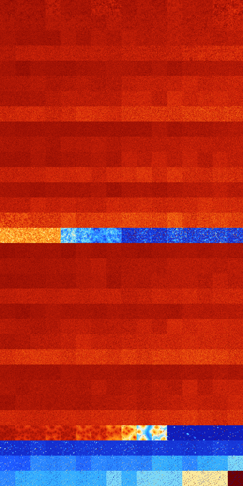

# B013467 (112128-112639)

<details>
    <summary>Initial Grid</summary>
    
</details>


<details>
    <summary>Initial Grid RLE</summary>

```
#C Exported from GoGoL (https://github.com/marrow16/gogol)
#C Wrap mode: Toroidal
#C Boundary mode: Dead
#C Step: 0
x = 100, y = 100, rule = B013467/S
5bo34bo33bo4bo5bo$7bo23bo3bo32bo$47bo17bo19bo$bo29bo8bo7bo$41bo12bo16bo
$12bo41bo7bo16bo3bo$7bobo16bo53bo14bo$21bo23bo$31bo17b2o8bo$o11bo4bo4bo
11bo4bo$4bo9bobo26bo4bo25bo10bo4bo$3bo11bo5bo14b2o19bo7bo12bo16b2o$8bo
39bo$36bo4bo6b2o18bo2bo2bo10bo$32bo5bo19bo25bo11bo$12bo4bo18bo16bo8bo$
11bo16bo3bo15bo45bo4bo$48bo50bo$67bo6b2o15bo$17bo25bo30bo20bo$60b2o13bo
$7bo2bo3bo7bo5bo9bo3bo46bo$56bo23bo11bo$12bo14bo58bo$5bo50bo18bo18bo$
19bo5bo4b2o8bo23bo5b2o$14bo51bo6bo5bo4bo10bo$8bobo9b2o8bo28bo17bo15bo$
34bo21bo11bo$27bo34bo7bo24b2o$100b$10bo21bo6bo43bo$36bo11bo3bo16bo11bo
15bobo$8bo15bo24bo3bo2bo30bo9bo$28bo42bo4bo$39bo29bo10bo13bo$45bo30bo
19bo$8bo33bo33bo20bo$48bobo6bo$5bo22b2o6bo57bo$12bo60bo3bo7bo$8bo38bo
20bo8bo$16bo18bo11bo16bobo32bo$14bo4b2o10bo15bo14bo4bo3bo5bo17bo$100b$b
2o2bo4bo4bo12bo10bo4bo22bo18bo$16bo40bo9bo18bo$5b2o39bo6bo20bo9bo10bo$
7b2o45bo2bo8bo$14bob2o6bo11bo11b2o6bobo4bo17bo$bo15bo37bo27bo$72bo6bo4b
o13bo$bo16bo12b2obo8bo$34bo6bo8bo2bo36bo$7bo7bo13bobo39bo14bo$33bo3b2o
25bo3bo18bobo$34bo11b2o16bo7b2o10bo$21bo4bo9bo17bo$15bo12bo38bo10bo$14b
o2bo24bo38bo$bo30bo34bo4bo$18bo22bo13b2o7bo27bo$71bo$bo6bo28bo32bo8bo$
10bo7b2o6b2o69bo$15bo16bo11bo20bo$22bo15bo20bo11bo$13bo10bo6bo23b2o10bo
$21bo2bo22bobo7bo17bo15bo$4bo7bo3bo18b2o5bo6bo2bo3bo42bo$48bo2bo13bo17b
o$o13bo7bo5bo4bo34bo$3bo15bo22b2o43bo$2bobo4bo25bo4bo34bo2bo$2bo12bo57b
o$5bobo45bo13bo9bo10bo$13bobo60bo$9bo26bo22bo27bobo$4bo20bo2bo4bo8bo4bo
31bo$18bo3bo7bo41bo9bo11bo$10bo76bo4bo5bo$3bo19bo27bo23bo6bo$15bo2bo6bo
14bo3bo38bo$o11b2o12bo56bob2o9bo$9bo41bo17bo6bo$29bo44bo13bo$10bo51bo$
37bo4bo16bo2bo18bo$16bo3bo2bo23bo25bo7bo$6bo12bo8bo65bo$9bo8bo12b2o$13b
o$3bo11bo11bo12bo4bo14bo3bo9bo19bo$41bo31bo$12bo13bo3bo12bo9bo9bo14bo
18bobo$13bo25bo16bo14bo4bo$o31bo6bobo14bo7bo25b2o$4bobo29bo2bo$63bo10bo
2bo12bo$2bo14bo22bo!
```
</details>
<details>
    <summary>Thumbnail</summary>

</details>
<table>
<tr>
    <td><a href="./112128%20S%20Heat%20Map%20Activity.png"></a><br>S (112128)<br>G>1000</td>    <td><a href="./112129%20S0%20Heat%20Map%20Activity.png"></a><br>S0 (112129)<br>G>1000</td>    <td><a href="./112130%20S1%20Heat%20Map%20Activity.png"></a><br>S1 (112130)<br>G>1000</td>    <td><a href="./112131%20S01%20Heat%20Map%20Activity.png"></a><br>S01 (112131)<br>G>1000</td>    <td><a href="./112132%20S2%20Heat%20Map%20Activity.png"></a><br>S2 (112132)<br>G>1000</td>    <td><a href="./112133%20S02%20Heat%20Map%20Activity.png"></a><br>S02 (112133)<br>G>1000</td>    <td><a href="./112134%20S12%20Heat%20Map%20Activity.png"></a><br>S12 (112134)<br>G>1000</td>    <td><a href="./112135%20S012%20Heat%20Map%20Activity.png"></a><br>S012 (112135)<br>G>1000</td>    <td><a href="./112136%20S3%20Heat%20Map%20Activity.png"></a><br>S3 (112136)<br>G>1000</td>    <td><a href="./112137%20S03%20Heat%20Map%20Activity.png"></a><br>S03 (112137)<br>G>1000</td>    <td><a href="./112138%20S13%20Heat%20Map%20Activity.png"></a><br>S13 (112138)<br>G>1000</td>    <td><a href="./112139%20S013%20Heat%20Map%20Activity.png"></a><br>S013 (112139)<br>G>1000</td>    <td><a href="./112140%20S23%20Heat%20Map%20Activity.png"></a><br>S23 (112140)<br>G>1000</td>    <td><a href="./112141%20S023%20Heat%20Map%20Activity.png"></a><br>S023 (112141)<br>G>1000</td>    <td><a href="./112142%20S123%20Heat%20Map%20Activity.png"></a><br>S123 (112142)<br>G>1000</td>    <td><a href="./112143%20S0123%20Heat%20Map%20Activity.png"></a><br>S0123 (112143)<br>G>1000</td></tr>
<tr>
    <td><a href="./112144%20S4%20Heat%20Map%20Activity.png"></a><br>S4 (112144)<br>G>1000</td>    <td><a href="./112145%20S04%20Heat%20Map%20Activity.png"></a><br>S04 (112145)<br>G>1000</td>    <td><a href="./112146%20S14%20Heat%20Map%20Activity.png"></a><br>S14 (112146)<br>G>1000</td>    <td><a href="./112147%20S014%20Heat%20Map%20Activity.png"></a><br>S014 (112147)<br>G>1000</td>    <td><a href="./112148%20S24%20Heat%20Map%20Activity.png"></a><br>S24 (112148)<br>G>1000</td>    <td><a href="./112149%20S024%20Heat%20Map%20Activity.png"></a><br>S024 (112149)<br>G>1000</td>    <td><a href="./112150%20S124%20Heat%20Map%20Activity.png"></a><br>S124 (112150)<br>G>1000</td>    <td><a href="./112151%20S0124%20Heat%20Map%20Activity.png"></a><br>S0124 (112151)<br>G>1000</td>    <td><a href="./112152%20S34%20Heat%20Map%20Activity.png"></a><br>S34 (112152)<br>G>1000</td>    <td><a href="./112153%20S034%20Heat%20Map%20Activity.png"></a><br>S034 (112153)<br>G>1000</td>    <td><a href="./112154%20S134%20Heat%20Map%20Activity.png"></a><br>S134 (112154)<br>G>1000</td>    <td><a href="./112155%20S0134%20Heat%20Map%20Activity.png"></a><br>S0134 (112155)<br>G>1000</td>    <td><a href="./112156%20S234%20Heat%20Map%20Activity.png"></a><br>S234 (112156)<br>G>1000</td>    <td><a href="./112157%20S0234%20Heat%20Map%20Activity.png"></a><br>S0234 (112157)<br>G>1000</td>    <td><a href="./112158%20S1234%20Heat%20Map%20Activity.png"></a><br>S1234 (112158)<br>G>1000</td>    <td><a href="./112159%20S01234%20Heat%20Map%20Activity.png"></a><br>S01234 (112159)<br>G>1000</td></tr>
<tr>
    <td><a href="./112160%20S5%20Heat%20Map%20Activity.png"></a><br>S5 (112160)<br>G>1000</td>    <td><a href="./112161%20S05%20Heat%20Map%20Activity.png"></a><br>S05 (112161)<br>G>1000</td>    <td><a href="./112162%20S15%20Heat%20Map%20Activity.png"></a><br>S15 (112162)<br>G>1000</td>    <td><a href="./112163%20S015%20Heat%20Map%20Activity.png"></a><br>S015 (112163)<br>G>1000</td>    <td><a href="./112164%20S25%20Heat%20Map%20Activity.png"></a><br>S25 (112164)<br>G>1000</td>    <td><a href="./112165%20S025%20Heat%20Map%20Activity.png"></a><br>S025 (112165)<br>G>1000</td>    <td><a href="./112166%20S125%20Heat%20Map%20Activity.png"></a><br>S125 (112166)<br>G>1000</td>    <td><a href="./112167%20S0125%20Heat%20Map%20Activity.png"></a><br>S0125 (112167)<br>G>1000</td>    <td><a href="./112168%20S35%20Heat%20Map%20Activity.png"></a><br>S35 (112168)<br>G>1000</td>    <td><a href="./112169%20S035%20Heat%20Map%20Activity.png"></a><br>S035 (112169)<br>G>1000</td>    <td><a href="./112170%20S135%20Heat%20Map%20Activity.png"></a><br>S135 (112170)<br>G>1000</td>    <td><a href="./112171%20S0135%20Heat%20Map%20Activity.png"></a><br>S0135 (112171)<br>G>1000</td>    <td><a href="./112172%20S235%20Heat%20Map%20Activity.png"></a><br>S235 (112172)<br>G>1000</td>    <td><a href="./112173%20S0235%20Heat%20Map%20Activity.png"></a><br>S0235 (112173)<br>G>1000</td>    <td><a href="./112174%20S1235%20Heat%20Map%20Activity.png"></a><br>S1235 (112174)<br>G>1000</td>    <td><a href="./112175%20S01235%20Heat%20Map%20Activity.png"></a><br>S01235 (112175)<br>G>1000</td></tr>
<tr>
    <td><a href="./112176%20S45%20Heat%20Map%20Activity.png"></a><br>S45 (112176)<br>G>1000</td>    <td><a href="./112177%20S045%20Heat%20Map%20Activity.png"></a><br>S045 (112177)<br>G>1000</td>    <td><a href="./112178%20S145%20Heat%20Map%20Activity.png"></a><br>S145 (112178)<br>G>1000</td>    <td><a href="./112179%20S0145%20Heat%20Map%20Activity.png"></a><br>S0145 (112179)<br>G>1000</td>    <td><a href="./112180%20S245%20Heat%20Map%20Activity.png"></a><br>S245 (112180)<br>G>1000</td>    <td><a href="./112181%20S0245%20Heat%20Map%20Activity.png"></a><br>S0245 (112181)<br>G>1000</td>    <td><a href="./112182%20S1245%20Heat%20Map%20Activity.png"></a><br>S1245 (112182)<br>G>1000</td>    <td><a href="./112183%20S01245%20Heat%20Map%20Activity.png"></a><br>S01245 (112183)<br>G>1000</td>    <td><a href="./112184%20S345%20Heat%20Map%20Activity.png"></a><br>S345 (112184)<br>G>1000</td>    <td><a href="./112185%20S0345%20Heat%20Map%20Activity.png"></a><br>S0345 (112185)<br>G>1000</td>    <td><a href="./112186%20S1345%20Heat%20Map%20Activity.png"></a><br>S1345 (112186)<br>G>1000</td>    <td><a href="./112187%20S01345%20Heat%20Map%20Activity.png"></a><br>S01345 (112187)<br>G>1000</td>    <td><a href="./112188%20S2345%20Heat%20Map%20Activity.png"></a><br>S2345 (112188)<br>G>1000</td>    <td><a href="./112189%20S02345%20Heat%20Map%20Activity.png"></a><br>S02345 (112189)<br>G>1000</td>    <td><a href="./112190%20S12345%20Heat%20Map%20Activity.png"></a><br>S12345 (112190)<br>G>1000</td>    <td><a href="./112191%20S012345%20Heat%20Map%20Activity.png"></a><br>S012345 (112191)<br>G>1000</td></tr>
<tr>
    <td><a href="./112192%20S6%20Heat%20Map%20Activity.png"></a><br>S6 (112192)<br>G>1000</td>    <td><a href="./112193%20S06%20Heat%20Map%20Activity.png"></a><br>S06 (112193)<br>G>1000</td>    <td><a href="./112194%20S16%20Heat%20Map%20Activity.png"></a><br>S16 (112194)<br>G>1000</td>    <td><a href="./112195%20S016%20Heat%20Map%20Activity.png"></a><br>S016 (112195)<br>G>1000</td>    <td><a href="./112196%20S26%20Heat%20Map%20Activity.png"></a><br>S26 (112196)<br>G>1000</td>    <td><a href="./112197%20S026%20Heat%20Map%20Activity.png"></a><br>S026 (112197)<br>G>1000</td>    <td><a href="./112198%20S126%20Heat%20Map%20Activity.png"></a><br>S126 (112198)<br>G>1000</td>    <td><a href="./112199%20S0126%20Heat%20Map%20Activity.png"></a><br>S0126 (112199)<br>G>1000</td>    <td><a href="./112200%20S36%20Heat%20Map%20Activity.png"></a><br>S36 (112200)<br>G>1000</td>    <td><a href="./112201%20S036%20Heat%20Map%20Activity.png"></a><br>S036 (112201)<br>G>1000</td>    <td><a href="./112202%20S136%20Heat%20Map%20Activity.png"></a><br>S136 (112202)<br>G>1000</td>    <td><a href="./112203%20S0136%20Heat%20Map%20Activity.png"></a><br>S0136 (112203)<br>G>1000</td>    <td><a href="./112204%20S236%20Heat%20Map%20Activity.png"></a><br>S236 (112204)<br>G>1000</td>    <td><a href="./112205%20S0236%20Heat%20Map%20Activity.png"></a><br>S0236 (112205)<br>G>1000</td>    <td><a href="./112206%20S1236%20Heat%20Map%20Activity.png"></a><br>S1236 (112206)<br>G>1000</td>    <td><a href="./112207%20S01236%20Heat%20Map%20Activity.png"></a><br>S01236 (112207)<br>G>1000</td></tr>
<tr>
    <td><a href="./112208%20S46%20Heat%20Map%20Activity.png"></a><br>S46 (112208)<br>G>1000</td>    <td><a href="./112209%20S046%20Heat%20Map%20Activity.png"></a><br>S046 (112209)<br>G>1000</td>    <td><a href="./112210%20S146%20Heat%20Map%20Activity.png"></a><br>S146 (112210)<br>G>1000</td>    <td><a href="./112211%20S0146%20Heat%20Map%20Activity.png"></a><br>S0146 (112211)<br>G>1000</td>    <td><a href="./112212%20S246%20Heat%20Map%20Activity.png"></a><br>S246 (112212)<br>G>1000</td>    <td><a href="./112213%20S0246%20Heat%20Map%20Activity.png"></a><br>S0246 (112213)<br>G>1000</td>    <td><a href="./112214%20S1246%20Heat%20Map%20Activity.png"></a><br>S1246 (112214)<br>G>1000</td>    <td><a href="./112215%20S01246%20Heat%20Map%20Activity.png"></a><br>S01246 (112215)<br>G>1000</td>    <td><a href="./112216%20S346%20Heat%20Map%20Activity.png"></a><br>S346 (112216)<br>G>1000</td>    <td><a href="./112217%20S0346%20Heat%20Map%20Activity.png"></a><br>S0346 (112217)<br>G>1000</td>    <td><a href="./112218%20S1346%20Heat%20Map%20Activity.png"></a><br>S1346 (112218)<br>G>1000</td>    <td><a href="./112219%20S01346%20Heat%20Map%20Activity.png"></a><br>S01346 (112219)<br>G>1000</td>    <td><a href="./112220%20S2346%20Heat%20Map%20Activity.png"></a><br>S2346 (112220)<br>G>1000</td>    <td><a href="./112221%20S02346%20Heat%20Map%20Activity.png"></a><br>S02346 (112221)<br>G>1000</td>    <td><a href="./112222%20S12346%20Heat%20Map%20Activity.png"></a><br>S12346 (112222)<br>G>1000</td>    <td><a href="./112223%20S012346%20Heat%20Map%20Activity.png"></a><br>S012346 (112223)<br>G>1000</td></tr>
<tr>
    <td><a href="./112224%20S56%20Heat%20Map%20Activity.png"></a><br>S56 (112224)<br>G>1000</td>    <td><a href="./112225%20S056%20Heat%20Map%20Activity.png"></a><br>S056 (112225)<br>G>1000</td>    <td><a href="./112226%20S156%20Heat%20Map%20Activity.png"></a><br>S156 (112226)<br>G>1000</td>    <td><a href="./112227%20S0156%20Heat%20Map%20Activity.png"></a><br>S0156 (112227)<br>G>1000</td>    <td><a href="./112228%20S256%20Heat%20Map%20Activity.png"></a><br>S256 (112228)<br>G>1000</td>    <td><a href="./112229%20S0256%20Heat%20Map%20Activity.png"></a><br>S0256 (112229)<br>G>1000</td>    <td><a href="./112230%20S1256%20Heat%20Map%20Activity.png"></a><br>S1256 (112230)<br>G>1000</td>    <td><a href="./112231%20S01256%20Heat%20Map%20Activity.png"></a><br>S01256 (112231)<br>G>1000</td>    <td><a href="./112232%20S356%20Heat%20Map%20Activity.png"></a><br>S356 (112232)<br>G>1000</td>    <td><a href="./112233%20S0356%20Heat%20Map%20Activity.png"></a><br>S0356 (112233)<br>G>1000</td>    <td><a href="./112234%20S1356%20Heat%20Map%20Activity.png"></a><br>S1356 (112234)<br>G>1000</td>    <td><a href="./112235%20S01356%20Heat%20Map%20Activity.png"></a><br>S01356 (112235)<br>G>1000</td>    <td><a href="./112236%20S2356%20Heat%20Map%20Activity.png"></a><br>S2356 (112236)<br>G>1000</td>    <td><a href="./112237%20S02356%20Heat%20Map%20Activity.png"></a><br>S02356 (112237)<br>G>1000</td>    <td><a href="./112238%20S12356%20Heat%20Map%20Activity.png"></a><br>S12356 (112238)<br>G>1000</td>    <td><a href="./112239%20S012356%20Heat%20Map%20Activity.png"></a><br>S012356 (112239)<br>G>1000</td></tr>
<tr>
    <td><a href="./112240%20S456%20Heat%20Map%20Activity.png"></a><br>S456 (112240)<br>G>1000</td>    <td><a href="./112241%20S0456%20Heat%20Map%20Activity.png"></a><br>S0456 (112241)<br>G>1000</td>    <td><a href="./112242%20S1456%20Heat%20Map%20Activity.png"></a><br>S1456 (112242)<br>G>1000</td>    <td><a href="./112243%20S01456%20Heat%20Map%20Activity.png"></a><br>S01456 (112243)<br>G>1000</td>    <td><a href="./112244%20S2456%20Heat%20Map%20Activity.png"></a><br>S2456 (112244)<br>G>1000</td>    <td><a href="./112245%20S02456%20Heat%20Map%20Activity.png"></a><br>S02456 (112245)<br>G>1000</td>    <td><a href="./112246%20S12456%20Heat%20Map%20Activity.png"></a><br>S12456 (112246)<br>G>1000</td>    <td><a href="./112247%20S012456%20Heat%20Map%20Activity.png"></a><br>S012456 (112247)<br>G>1000</td>    <td><a href="./112248%20S3456%20Heat%20Map%20Activity.png"></a><br>S3456 (112248)<br>G>1000</td>    <td><a href="./112249%20S03456%20Heat%20Map%20Activity.png"></a><br>S03456 (112249)<br>G>1000</td>    <td><a href="./112250%20S13456%20Heat%20Map%20Activity.png"></a><br>S13456 (112250)<br>G>1000</td>    <td><a href="./112251%20S013456%20Heat%20Map%20Activity.png"></a><br>S013456 (112251)<br>G>1000</td>    <td><a href="./112252%20S23456%20Heat%20Map%20Activity.png"></a><br>S23456 (112252)<br>G>1000</td>    <td><a href="./112253%20S023456%20Heat%20Map%20Activity.png"></a><br>S023456 (112253)<br>G>1000</td>    <td><a href="./112254%20S123456%20Heat%20Map%20Activity.png"></a><br>S123456 (112254)<br>G>1000</td>    <td><a href="./112255%20S0123456%20Heat%20Map%20Activity.png"></a><br>S0123456 (112255)<br>G>1000</td></tr>
<tr>
    <td><a href="./112256%20S7%20Heat%20Map%20Activity.png"></a><br>S7 (112256)<br>G>1000</td>    <td><a href="./112257%20S07%20Heat%20Map%20Activity.png"></a><br>S07 (112257)<br>G>1000</td>    <td><a href="./112258%20S17%20Heat%20Map%20Activity.png"></a><br>S17 (112258)<br>G>1000</td>    <td><a href="./112259%20S017%20Heat%20Map%20Activity.png"></a><br>S017 (112259)<br>G>1000</td>    <td><a href="./112260%20S27%20Heat%20Map%20Activity.png"></a><br>S27 (112260)<br>G>1000</td>    <td><a href="./112261%20S027%20Heat%20Map%20Activity.png"></a><br>S027 (112261)<br>G>1000</td>    <td><a href="./112262%20S127%20Heat%20Map%20Activity.png"></a><br>S127 (112262)<br>G>1000</td>    <td><a href="./112263%20S0127%20Heat%20Map%20Activity.png"></a><br>S0127 (112263)<br>G>1000</td>    <td><a href="./112264%20S37%20Heat%20Map%20Activity.png"></a><br>S37 (112264)<br>G>1000</td>    <td><a href="./112265%20S037%20Heat%20Map%20Activity.png"></a><br>S037 (112265)<br>G>1000</td>    <td><a href="./112266%20S137%20Heat%20Map%20Activity.png"></a><br>S137 (112266)<br>G>1000</td>    <td><a href="./112267%20S0137%20Heat%20Map%20Activity.png"></a><br>S0137 (112267)<br>G>1000</td>    <td><a href="./112268%20S237%20Heat%20Map%20Activity.png"></a><br>S237 (112268)<br>G>1000</td>    <td><a href="./112269%20S0237%20Heat%20Map%20Activity.png"></a><br>S0237 (112269)<br>G>1000</td>    <td><a href="./112270%20S1237%20Heat%20Map%20Activity.png"></a><br>S1237 (112270)<br>G>1000</td>    <td><a href="./112271%20S01237%20Heat%20Map%20Activity.png"></a><br>S01237 (112271)<br>G>1000</td></tr>
<tr>
    <td><a href="./112272%20S47%20Heat%20Map%20Activity.png"></a><br>S47 (112272)<br>G>1000</td>    <td><a href="./112273%20S047%20Heat%20Map%20Activity.png"></a><br>S047 (112273)<br>G>1000</td>    <td><a href="./112274%20S147%20Heat%20Map%20Activity.png"></a><br>S147 (112274)<br>G>1000</td>    <td><a href="./112275%20S0147%20Heat%20Map%20Activity.png"></a><br>S0147 (112275)<br>G>1000</td>    <td><a href="./112276%20S247%20Heat%20Map%20Activity.png"></a><br>S247 (112276)<br>G>1000</td>    <td><a href="./112277%20S0247%20Heat%20Map%20Activity.png"></a><br>S0247 (112277)<br>G>1000</td>    <td><a href="./112278%20S1247%20Heat%20Map%20Activity.png"></a><br>S1247 (112278)<br>G>1000</td>    <td><a href="./112279%20S01247%20Heat%20Map%20Activity.png"></a><br>S01247 (112279)<br>G>1000</td>    <td><a href="./112280%20S347%20Heat%20Map%20Activity.png"></a><br>S347 (112280)<br>G>1000</td>    <td><a href="./112281%20S0347%20Heat%20Map%20Activity.png"></a><br>S0347 (112281)<br>G>1000</td>    <td><a href="./112282%20S1347%20Heat%20Map%20Activity.png"></a><br>S1347 (112282)<br>G>1000</td>    <td><a href="./112283%20S01347%20Heat%20Map%20Activity.png"></a><br>S01347 (112283)<br>G>1000</td>    <td><a href="./112284%20S2347%20Heat%20Map%20Activity.png"></a><br>S2347 (112284)<br>G>1000</td>    <td><a href="./112285%20S02347%20Heat%20Map%20Activity.png"></a><br>S02347 (112285)<br>G>1000</td>    <td><a href="./112286%20S12347%20Heat%20Map%20Activity.png"></a><br>S12347 (112286)<br>G>1000</td>    <td><a href="./112287%20S012347%20Heat%20Map%20Activity.png"></a><br>S012347 (112287)<br>G>1000</td></tr>
<tr>
    <td><a href="./112288%20S57%20Heat%20Map%20Activity.png"></a><br>S57 (112288)<br>G>1000</td>    <td><a href="./112289%20S057%20Heat%20Map%20Activity.png"></a><br>S057 (112289)<br>G>1000</td>    <td><a href="./112290%20S157%20Heat%20Map%20Activity.png"></a><br>S157 (112290)<br>G>1000</td>    <td><a href="./112291%20S0157%20Heat%20Map%20Activity.png"></a><br>S0157 (112291)<br>G>1000</td>    <td><a href="./112292%20S257%20Heat%20Map%20Activity.png"></a><br>S257 (112292)<br>G>1000</td>    <td><a href="./112293%20S0257%20Heat%20Map%20Activity.png"></a><br>S0257 (112293)<br>G>1000</td>    <td><a href="./112294%20S1257%20Heat%20Map%20Activity.png"></a><br>S1257 (112294)<br>G>1000</td>    <td><a href="./112295%20S01257%20Heat%20Map%20Activity.png"></a><br>S01257 (112295)<br>G>1000</td>    <td><a href="./112296%20S357%20Heat%20Map%20Activity.png"></a><br>S357 (112296)<br>G>1000</td>    <td><a href="./112297%20S0357%20Heat%20Map%20Activity.png"></a><br>S0357 (112297)<br>G>1000</td>    <td><a href="./112298%20S1357%20Heat%20Map%20Activity.png"></a><br>S1357 (112298)<br>G>1000</td>    <td><a href="./112299%20S01357%20Heat%20Map%20Activity.png"></a><br>S01357 (112299)<br>G>1000</td>    <td><a href="./112300%20S2357%20Heat%20Map%20Activity.png"></a><br>S2357 (112300)<br>G>1000</td>    <td><a href="./112301%20S02357%20Heat%20Map%20Activity.png"></a><br>S02357 (112301)<br>G>1000</td>    <td><a href="./112302%20S12357%20Heat%20Map%20Activity.png"></a><br>S12357 (112302)<br>G>1000</td>    <td><a href="./112303%20S012357%20Heat%20Map%20Activity.png"></a><br>S012357 (112303)<br>G>1000</td></tr>
<tr>
    <td><a href="./112304%20S457%20Heat%20Map%20Activity.png"></a><br>S457 (112304)<br>G>1000</td>    <td><a href="./112305%20S0457%20Heat%20Map%20Activity.png"></a><br>S0457 (112305)<br>G>1000</td>    <td><a href="./112306%20S1457%20Heat%20Map%20Activity.png"></a><br>S1457 (112306)<br>G>1000</td>    <td><a href="./112307%20S01457%20Heat%20Map%20Activity.png"></a><br>S01457 (112307)<br>G>1000</td>    <td><a href="./112308%20S2457%20Heat%20Map%20Activity.png"></a><br>S2457 (112308)<br>G>1000</td>    <td><a href="./112309%20S02457%20Heat%20Map%20Activity.png"></a><br>S02457 (112309)<br>G>1000</td>    <td><a href="./112310%20S12457%20Heat%20Map%20Activity.png"></a><br>S12457 (112310)<br>G>1000</td>    <td><a href="./112311%20S012457%20Heat%20Map%20Activity.png"></a><br>S012457 (112311)<br>G>1000</td>    <td><a href="./112312%20S3457%20Heat%20Map%20Activity.png"></a><br>S3457 (112312)<br>G>1000</td>    <td><a href="./112313%20S03457%20Heat%20Map%20Activity.png"></a><br>S03457 (112313)<br>G>1000</td>    <td><a href="./112314%20S13457%20Heat%20Map%20Activity.png"></a><br>S13457 (112314)<br>G>1000</td>    <td><a href="./112315%20S013457%20Heat%20Map%20Activity.png"></a><br>S013457 (112315)<br>G>1000</td>    <td><a href="./112316%20S23457%20Heat%20Map%20Activity.png"></a><br>S23457 (112316)<br>G>1000</td>    <td><a href="./112317%20S023457%20Heat%20Map%20Activity.png"></a><br>S023457 (112317)<br>G>1000</td>    <td><a href="./112318%20S123457%20Heat%20Map%20Activity.png"></a><br>S123457 (112318)<br>G>1000</td>    <td><a href="./112319%20S0123457%20Heat%20Map%20Activity.png"></a><br>S0123457 (112319)<br>G>1000</td></tr>
<tr>
    <td><a href="./112320%20S67%20Heat%20Map%20Activity.png"></a><br>S67 (112320)<br>G>1000</td>    <td><a href="./112321%20S067%20Heat%20Map%20Activity.png"></a><br>S067 (112321)<br>G>1000</td>    <td><a href="./112322%20S167%20Heat%20Map%20Activity.png"></a><br>S167 (112322)<br>G>1000</td>    <td><a href="./112323%20S0167%20Heat%20Map%20Activity.png"></a><br>S0167 (112323)<br>G>1000</td>    <td><a href="./112324%20S267%20Heat%20Map%20Activity.png"></a><br>S267 (112324)<br>G>1000</td>    <td><a href="./112325%20S0267%20Heat%20Map%20Activity.png"></a><br>S0267 (112325)<br>G>1000</td>    <td><a href="./112326%20S1267%20Heat%20Map%20Activity.png"></a><br>S1267 (112326)<br>G>1000</td>    <td><a href="./112327%20S01267%20Heat%20Map%20Activity.png"></a><br>S01267 (112327)<br>G>1000</td>    <td><a href="./112328%20S367%20Heat%20Map%20Activity.png"></a><br>S367 (112328)<br>G>1000</td>    <td><a href="./112329%20S0367%20Heat%20Map%20Activity.png"></a><br>S0367 (112329)<br>G>1000</td>    <td><a href="./112330%20S1367%20Heat%20Map%20Activity.png"></a><br>S1367 (112330)<br>G>1000</td>    <td><a href="./112331%20S01367%20Heat%20Map%20Activity.png"></a><br>S01367 (112331)<br>G>1000</td>    <td><a href="./112332%20S2367%20Heat%20Map%20Activity.png"></a><br>S2367 (112332)<br>G>1000</td>    <td><a href="./112333%20S02367%20Heat%20Map%20Activity.png"></a><br>S02367 (112333)<br>G>1000</td>    <td><a href="./112334%20S12367%20Heat%20Map%20Activity.png"></a><br>S12367 (112334)<br>G>1000</td>    <td><a href="./112335%20S012367%20Heat%20Map%20Activity.png"></a><br>S012367 (112335)<br>G>1000</td></tr>
<tr>
    <td><a href="./112336%20S467%20Heat%20Map%20Activity.png"></a><br>S467 (112336)<br>G>1000</td>    <td><a href="./112337%20S0467%20Heat%20Map%20Activity.png"></a><br>S0467 (112337)<br>G>1000</td>    <td><a href="./112338%20S1467%20Heat%20Map%20Activity.png"></a><br>S1467 (112338)<br>G>1000</td>    <td><a href="./112339%20S01467%20Heat%20Map%20Activity.png"></a><br>S01467 (112339)<br>G>1000</td>    <td><a href="./112340%20S2467%20Heat%20Map%20Activity.png"></a><br>S2467 (112340)<br>G>1000</td>    <td><a href="./112341%20S02467%20Heat%20Map%20Activity.png"></a><br>S02467 (112341)<br>G>1000</td>    <td><a href="./112342%20S12467%20Heat%20Map%20Activity.png"></a><br>S12467 (112342)<br>G>1000</td>    <td><a href="./112343%20S012467%20Heat%20Map%20Activity.png"></a><br>S012467 (112343)<br>G>1000</td>    <td><a href="./112344%20S3467%20Heat%20Map%20Activity.png"></a><br>S3467 (112344)<br>G>1000</td>    <td><a href="./112345%20S03467%20Heat%20Map%20Activity.png"></a><br>S03467 (112345)<br>G>1000</td>    <td><a href="./112346%20S13467%20Heat%20Map%20Activity.png"></a><br>S13467 (112346)<br>G>1000</td>    <td><a href="./112347%20S013467%20Heat%20Map%20Activity.png"></a><br>S013467 (112347)<br>G>1000</td>    <td><a href="./112348%20S23467%20Heat%20Map%20Activity.png"></a><br>S23467 (112348)<br>G>1000</td>    <td><a href="./112349%20S023467%20Heat%20Map%20Activity.png"></a><br>S023467 (112349)<br>G>1000</td>    <td><a href="./112350%20S123467%20Heat%20Map%20Activity.png"></a><br>S123467 (112350)<br>G>1000</td>    <td><a href="./112351%20S0123467%20Heat%20Map%20Activity.png"></a><br>S0123467 (112351)<br>G>1000</td></tr>
<tr>
    <td><a href="./112352%20S567%20Heat%20Map%20Activity.png"></a><br>S567 (112352)<br>G>1000</td>    <td><a href="./112353%20S0567%20Heat%20Map%20Activity.png"></a><br>S0567 (112353)<br>G>1000</td>    <td><a href="./112354%20S1567%20Heat%20Map%20Activity.png"></a><br>S1567 (112354)<br>G>1000</td>    <td><a href="./112355%20S01567%20Heat%20Map%20Activity.png"></a><br>S01567 (112355)<br>G>1000</td>    <td><a href="./112356%20S2567%20Heat%20Map%20Activity.png"></a><br>S2567 (112356)<br>G>1000</td>    <td><a href="./112357%20S02567%20Heat%20Map%20Activity.png"></a><br>S02567 (112357)<br>G>1000</td>    <td><a href="./112358%20S12567%20Heat%20Map%20Activity.png"></a><br>S12567 (112358)<br>G>1000</td>    <td><a href="./112359%20S012567%20Heat%20Map%20Activity.png"></a><br>S012567 (112359)<br>G>1000</td>    <td><a href="./112360%20S3567%20Heat%20Map%20Activity.png"></a><br>S3567 (112360)<br>G>1000</td>    <td><a href="./112361%20S03567%20Heat%20Map%20Activity.png"></a><br>S03567 (112361)<br>G>1000</td>    <td><a href="./112362%20S13567%20Heat%20Map%20Activity.png"></a><br>S13567 (112362)<br>G>1000</td>    <td><a href="./112363%20S013567%20Heat%20Map%20Activity.png"></a><br>S013567 (112363)<br>G>1000</td>    <td><a href="./112364%20S23567%20Heat%20Map%20Activity.png"></a><br>S23567 (112364)<br>G>1000</td>    <td><a href="./112365%20S023567%20Heat%20Map%20Activity.png"></a><br>S023567 (112365)<br>G>1000</td>    <td><a href="./112366%20S123567%20Heat%20Map%20Activity.png"></a><br>S123567 (112366)<br>G>1000</td>    <td><a href="./112367%20S0123567%20Heat%20Map%20Activity.png"></a><br>S0123567 (112367)<br>G>1000</td></tr>
<tr>
    <td><a href="./112368%20S4567%20Heat%20Map%20Activity.png"></a><br>S4567 (112368)<br>G>1000</td>    <td><a href="./112369%20S04567%20Heat%20Map%20Activity.png"></a><br>S04567 (112369)<br>G>1000</td>    <td><a href="./112370%20S14567%20Heat%20Map%20Activity.png"></a><br>S14567 (112370)<br>G>1000</td>    <td><a href="./112371%20S014567%20Heat%20Map%20Activity.png"></a><br>S014567 (112371)<br>G>1000</td>    <td><a href="./112372%20S24567%20Heat%20Map%20Activity.png"></a><br>S24567 (112372)<br>G>1000</td>    <td><a href="./112373%20S024567%20Heat%20Map%20Activity.png"></a><br>S024567 (112373)<br>G>1000</td>    <td><a href="./112374%20S124567%20Heat%20Map%20Activity.png"></a><br>S124567 (112374)<br>G>1000</td>    <td><a href="./112375%20S0124567%20Heat%20Map%20Activity.png"></a><br>S0124567 (112375)<br>G>1000</td>    <td><a href="./112376%20S34567%20Heat%20Map%20Activity.png"></a><br>S34567 (112376)<br>R@66,p24</td>    <td><a href="./112377%20S034567%20Heat%20Map%20Activity.png"></a><br>S034567 (112377)<br>R@60,p12</td>    <td><a href="./112378%20S134567%20Heat%20Map%20Activity.png"></a><br>S134567 (112378)<br>R@63,p30</td>    <td><a href="./112379%20S0134567%20Heat%20Map%20Activity.png"></a><br>S0134567 (112379)<br>R@46,p6</td>    <td><a href="./112380%20S234567%20Heat%20Map%20Activity.png"></a><br>S234567 (112380)<br>R@39,p6</td>    <td><a href="./112381%20S0234567%20Heat%20Map%20Activity.png"></a><br>S0234567 (112381)<br>R@44,p12</td>    <td><a href="./112382%20S1234567%20Heat%20Map%20Activity.png"></a><br>S1234567 (112382)<br>R@32,p6</td>    <td><a href="./112383%20S01234567%20Heat%20Map%20Activity.png"></a><br>S01234567 (112383)<br>R@52,p24</td></tr>
<tr>
    <td><a href="./112384%20S8%20Heat%20Map%20Activity.png"></a><br>S8 (112384)<br>G>1000</td>    <td><a href="./112385%20S08%20Heat%20Map%20Activity.png"></a><br>S08 (112385)<br>G>1000</td>    <td><a href="./112386%20S18%20Heat%20Map%20Activity.png"></a><br>S18 (112386)<br>G>1000</td>    <td><a href="./112387%20S018%20Heat%20Map%20Activity.png"></a><br>S018 (112387)<br>G>1000</td>    <td><a href="./112388%20S28%20Heat%20Map%20Activity.png"></a><br>S28 (112388)<br>G>1000</td>    <td><a href="./112389%20S028%20Heat%20Map%20Activity.png"></a><br>S028 (112389)<br>G>1000</td>    <td><a href="./112390%20S128%20Heat%20Map%20Activity.png"></a><br>S128 (112390)<br>G>1000</td>    <td><a href="./112391%20S0128%20Heat%20Map%20Activity.png"></a><br>S0128 (112391)<br>G>1000</td>    <td><a href="./112392%20S38%20Heat%20Map%20Activity.png"></a><br>S38 (112392)<br>G>1000</td>    <td><a href="./112393%20S038%20Heat%20Map%20Activity.png"></a><br>S038 (112393)<br>G>1000</td>    <td><a href="./112394%20S138%20Heat%20Map%20Activity.png"></a><br>S138 (112394)<br>G>1000</td>    <td><a href="./112395%20S0138%20Heat%20Map%20Activity.png"></a><br>S0138 (112395)<br>G>1000</td>    <td><a href="./112396%20S238%20Heat%20Map%20Activity.png"></a><br>S238 (112396)<br>G>1000</td>    <td><a href="./112397%20S0238%20Heat%20Map%20Activity.png"></a><br>S0238 (112397)<br>G>1000</td>    <td><a href="./112398%20S1238%20Heat%20Map%20Activity.png"></a><br>S1238 (112398)<br>G>1000</td>    <td><a href="./112399%20S01238%20Heat%20Map%20Activity.png"></a><br>S01238 (112399)<br>G>1000</td></tr>
<tr>
    <td><a href="./112400%20S48%20Heat%20Map%20Activity.png"></a><br>S48 (112400)<br>G>1000</td>    <td><a href="./112401%20S048%20Heat%20Map%20Activity.png"></a><br>S048 (112401)<br>G>1000</td>    <td><a href="./112402%20S148%20Heat%20Map%20Activity.png"></a><br>S148 (112402)<br>G>1000</td>    <td><a href="./112403%20S0148%20Heat%20Map%20Activity.png"></a><br>S0148 (112403)<br>G>1000</td>    <td><a href="./112404%20S248%20Heat%20Map%20Activity.png"></a><br>S248 (112404)<br>G>1000</td>    <td><a href="./112405%20S0248%20Heat%20Map%20Activity.png"></a><br>S0248 (112405)<br>G>1000</td>    <td><a href="./112406%20S1248%20Heat%20Map%20Activity.png"></a><br>S1248 (112406)<br>G>1000</td>    <td><a href="./112407%20S01248%20Heat%20Map%20Activity.png"></a><br>S01248 (112407)<br>G>1000</td>    <td><a href="./112408%20S348%20Heat%20Map%20Activity.png"></a><br>S348 (112408)<br>G>1000</td>    <td><a href="./112409%20S0348%20Heat%20Map%20Activity.png"></a><br>S0348 (112409)<br>G>1000</td>    <td><a href="./112410%20S1348%20Heat%20Map%20Activity.png"></a><br>S1348 (112410)<br>G>1000</td>    <td><a href="./112411%20S01348%20Heat%20Map%20Activity.png"></a><br>S01348 (112411)<br>G>1000</td>    <td><a href="./112412%20S2348%20Heat%20Map%20Activity.png"></a><br>S2348 (112412)<br>G>1000</td>    <td><a href="./112413%20S02348%20Heat%20Map%20Activity.png"></a><br>S02348 (112413)<br>G>1000</td>    <td><a href="./112414%20S12348%20Heat%20Map%20Activity.png"></a><br>S12348 (112414)<br>G>1000</td>    <td><a href="./112415%20S012348%20Heat%20Map%20Activity.png"></a><br>S012348 (112415)<br>G>1000</td></tr>
<tr>
    <td><a href="./112416%20S58%20Heat%20Map%20Activity.png"></a><br>S58 (112416)<br>G>1000</td>    <td><a href="./112417%20S058%20Heat%20Map%20Activity.png"></a><br>S058 (112417)<br>G>1000</td>    <td><a href="./112418%20S158%20Heat%20Map%20Activity.png"></a><br>S158 (112418)<br>G>1000</td>    <td><a href="./112419%20S0158%20Heat%20Map%20Activity.png"></a><br>S0158 (112419)<br>G>1000</td>    <td><a href="./112420%20S258%20Heat%20Map%20Activity.png"></a><br>S258 (112420)<br>G>1000</td>    <td><a href="./112421%20S0258%20Heat%20Map%20Activity.png"></a><br>S0258 (112421)<br>G>1000</td>    <td><a href="./112422%20S1258%20Heat%20Map%20Activity.png"></a><br>S1258 (112422)<br>G>1000</td>    <td><a href="./112423%20S01258%20Heat%20Map%20Activity.png"></a><br>S01258 (112423)<br>G>1000</td>    <td><a href="./112424%20S358%20Heat%20Map%20Activity.png"></a><br>S358 (112424)<br>G>1000</td>    <td><a href="./112425%20S0358%20Heat%20Map%20Activity.png"></a><br>S0358 (112425)<br>G>1000</td>    <td><a href="./112426%20S1358%20Heat%20Map%20Activity.png"></a><br>S1358 (112426)<br>G>1000</td>    <td><a href="./112427%20S01358%20Heat%20Map%20Activity.png"></a><br>S01358 (112427)<br>G>1000</td>    <td><a href="./112428%20S2358%20Heat%20Map%20Activity.png"></a><br>S2358 (112428)<br>G>1000</td>    <td><a href="./112429%20S02358%20Heat%20Map%20Activity.png"></a><br>S02358 (112429)<br>G>1000</td>    <td><a href="./112430%20S12358%20Heat%20Map%20Activity.png"></a><br>S12358 (112430)<br>G>1000</td>    <td><a href="./112431%20S012358%20Heat%20Map%20Activity.png"></a><br>S012358 (112431)<br>G>1000</td></tr>
<tr>
    <td><a href="./112432%20S458%20Heat%20Map%20Activity.png"></a><br>S458 (112432)<br>G>1000</td>    <td><a href="./112433%20S0458%20Heat%20Map%20Activity.png"></a><br>S0458 (112433)<br>G>1000</td>    <td><a href="./112434%20S1458%20Heat%20Map%20Activity.png"></a><br>S1458 (112434)<br>G>1000</td>    <td><a href="./112435%20S01458%20Heat%20Map%20Activity.png"></a><br>S01458 (112435)<br>G>1000</td>    <td><a href="./112436%20S2458%20Heat%20Map%20Activity.png"></a><br>S2458 (112436)<br>G>1000</td>    <td><a href="./112437%20S02458%20Heat%20Map%20Activity.png"></a><br>S02458 (112437)<br>G>1000</td>    <td><a href="./112438%20S12458%20Heat%20Map%20Activity.png"></a><br>S12458 (112438)<br>G>1000</td>    <td><a href="./112439%20S012458%20Heat%20Map%20Activity.png"></a><br>S012458 (112439)<br>G>1000</td>    <td><a href="./112440%20S3458%20Heat%20Map%20Activity.png"></a><br>S3458 (112440)<br>G>1000</td>    <td><a href="./112441%20S03458%20Heat%20Map%20Activity.png"></a><br>S03458 (112441)<br>G>1000</td>    <td><a href="./112442%20S13458%20Heat%20Map%20Activity.png"></a><br>S13458 (112442)<br>G>1000</td>    <td><a href="./112443%20S013458%20Heat%20Map%20Activity.png"></a><br>S013458 (112443)<br>G>1000</td>    <td><a href="./112444%20S23458%20Heat%20Map%20Activity.png"></a><br>S23458 (112444)<br>G>1000</td>    <td><a href="./112445%20S023458%20Heat%20Map%20Activity.png"></a><br>S023458 (112445)<br>G>1000</td>    <td><a href="./112446%20S123458%20Heat%20Map%20Activity.png"></a><br>S123458 (112446)<br>G>1000</td>    <td><a href="./112447%20S0123458%20Heat%20Map%20Activity.png"></a><br>S0123458 (112447)<br>G>1000</td></tr>
<tr>
    <td><a href="./112448%20S68%20Heat%20Map%20Activity.png"></a><br>S68 (112448)<br>G>1000</td>    <td><a href="./112449%20S068%20Heat%20Map%20Activity.png"></a><br>S068 (112449)<br>G>1000</td>    <td><a href="./112450%20S168%20Heat%20Map%20Activity.png"></a><br>S168 (112450)<br>G>1000</td>    <td><a href="./112451%20S0168%20Heat%20Map%20Activity.png"></a><br>S0168 (112451)<br>G>1000</td>    <td><a href="./112452%20S268%20Heat%20Map%20Activity.png"></a><br>S268 (112452)<br>G>1000</td>    <td><a href="./112453%20S0268%20Heat%20Map%20Activity.png"></a><br>S0268 (112453)<br>G>1000</td>    <td><a href="./112454%20S1268%20Heat%20Map%20Activity.png"></a><br>S1268 (112454)<br>G>1000</td>    <td><a href="./112455%20S01268%20Heat%20Map%20Activity.png"></a><br>S01268 (112455)<br>G>1000</td>    <td><a href="./112456%20S368%20Heat%20Map%20Activity.png"></a><br>S368 (112456)<br>G>1000</td>    <td><a href="./112457%20S0368%20Heat%20Map%20Activity.png"></a><br>S0368 (112457)<br>G>1000</td>    <td><a href="./112458%20S1368%20Heat%20Map%20Activity.png"></a><br>S1368 (112458)<br>G>1000</td>    <td><a href="./112459%20S01368%20Heat%20Map%20Activity.png"></a><br>S01368 (112459)<br>G>1000</td>    <td><a href="./112460%20S2368%20Heat%20Map%20Activity.png"></a><br>S2368 (112460)<br>G>1000</td>    <td><a href="./112461%20S02368%20Heat%20Map%20Activity.png"></a><br>S02368 (112461)<br>G>1000</td>    <td><a href="./112462%20S12368%20Heat%20Map%20Activity.png"></a><br>S12368 (112462)<br>G>1000</td>    <td><a href="./112463%20S012368%20Heat%20Map%20Activity.png"></a><br>S012368 (112463)<br>G>1000</td></tr>
<tr>
    <td><a href="./112464%20S468%20Heat%20Map%20Activity.png"></a><br>S468 (112464)<br>G>1000</td>    <td><a href="./112465%20S0468%20Heat%20Map%20Activity.png"></a><br>S0468 (112465)<br>G>1000</td>    <td><a href="./112466%20S1468%20Heat%20Map%20Activity.png"></a><br>S1468 (112466)<br>G>1000</td>    <td><a href="./112467%20S01468%20Heat%20Map%20Activity.png"></a><br>S01468 (112467)<br>G>1000</td>    <td><a href="./112468%20S2468%20Heat%20Map%20Activity.png"></a><br>S2468 (112468)<br>G>1000</td>    <td><a href="./112469%20S02468%20Heat%20Map%20Activity.png"></a><br>S02468 (112469)<br>G>1000</td>    <td><a href="./112470%20S12468%20Heat%20Map%20Activity.png"></a><br>S12468 (112470)<br>G>1000</td>    <td><a href="./112471%20S012468%20Heat%20Map%20Activity.png"></a><br>S012468 (112471)<br>G>1000</td>    <td><a href="./112472%20S3468%20Heat%20Map%20Activity.png"></a><br>S3468 (112472)<br>G>1000</td>    <td><a href="./112473%20S03468%20Heat%20Map%20Activity.png"></a><br>S03468 (112473)<br>G>1000</td>    <td><a href="./112474%20S13468%20Heat%20Map%20Activity.png"></a><br>S13468 (112474)<br>G>1000</td>    <td><a href="./112475%20S013468%20Heat%20Map%20Activity.png"></a><br>S013468 (112475)<br>G>1000</td>    <td><a href="./112476%20S23468%20Heat%20Map%20Activity.png"></a><br>S23468 (112476)<br>G>1000</td>    <td><a href="./112477%20S023468%20Heat%20Map%20Activity.png"></a><br>S023468 (112477)<br>G>1000</td>    <td><a href="./112478%20S123468%20Heat%20Map%20Activity.png"></a><br>S123468 (112478)<br>G>1000</td>    <td><a href="./112479%20S0123468%20Heat%20Map%20Activity.png"></a><br>S0123468 (112479)<br>G>1000</td></tr>
<tr>
    <td><a href="./112480%20S568%20Heat%20Map%20Activity.png"></a><br>S568 (112480)<br>G>1000</td>    <td><a href="./112481%20S0568%20Heat%20Map%20Activity.png"></a><br>S0568 (112481)<br>G>1000</td>    <td><a href="./112482%20S1568%20Heat%20Map%20Activity.png"></a><br>S1568 (112482)<br>G>1000</td>    <td><a href="./112483%20S01568%20Heat%20Map%20Activity.png"></a><br>S01568 (112483)<br>G>1000</td>    <td><a href="./112484%20S2568%20Heat%20Map%20Activity.png"></a><br>S2568 (112484)<br>G>1000</td>    <td><a href="./112485%20S02568%20Heat%20Map%20Activity.png"></a><br>S02568 (112485)<br>G>1000</td>    <td><a href="./112486%20S12568%20Heat%20Map%20Activity.png"></a><br>S12568 (112486)<br>G>1000</td>    <td><a href="./112487%20S012568%20Heat%20Map%20Activity.png"></a><br>S012568 (112487)<br>G>1000</td>    <td><a href="./112488%20S3568%20Heat%20Map%20Activity.png"></a><br>S3568 (112488)<br>G>1000</td>    <td><a href="./112489%20S03568%20Heat%20Map%20Activity.png"></a><br>S03568 (112489)<br>G>1000</td>    <td><a href="./112490%20S13568%20Heat%20Map%20Activity.png"></a><br>S13568 (112490)<br>G>1000</td>    <td><a href="./112491%20S013568%20Heat%20Map%20Activity.png"></a><br>S013568 (112491)<br>G>1000</td>    <td><a href="./112492%20S23568%20Heat%20Map%20Activity.png"></a><br>S23568 (112492)<br>G>1000</td>    <td><a href="./112493%20S023568%20Heat%20Map%20Activity.png"></a><br>S023568 (112493)<br>G>1000</td>    <td><a href="./112494%20S123568%20Heat%20Map%20Activity.png"></a><br>S123568 (112494)<br>G>1000</td>    <td><a href="./112495%20S0123568%20Heat%20Map%20Activity.png"></a><br>S0123568 (112495)<br>G>1000</td></tr>
<tr>
    <td><a href="./112496%20S4568%20Heat%20Map%20Activity.png"></a><br>S4568 (112496)<br>G>1000</td>    <td><a href="./112497%20S04568%20Heat%20Map%20Activity.png"></a><br>S04568 (112497)<br>G>1000</td>    <td><a href="./112498%20S14568%20Heat%20Map%20Activity.png"></a><br>S14568 (112498)<br>G>1000</td>    <td><a href="./112499%20S014568%20Heat%20Map%20Activity.png"></a><br>S014568 (112499)<br>G>1000</td>    <td><a href="./112500%20S24568%20Heat%20Map%20Activity.png"></a><br>S24568 (112500)<br>G>1000</td>    <td><a href="./112501%20S024568%20Heat%20Map%20Activity.png"></a><br>S024568 (112501)<br>G>1000</td>    <td><a href="./112502%20S124568%20Heat%20Map%20Activity.png"></a><br>S124568 (112502)<br>G>1000</td>    <td><a href="./112503%20S0124568%20Heat%20Map%20Activity.png"></a><br>S0124568 (112503)<br>G>1000</td>    <td><a href="./112504%20S34568%20Heat%20Map%20Activity.png"></a><br>S34568 (112504)<br>G>1000</td>    <td><a href="./112505%20S034568%20Heat%20Map%20Activity.png"></a><br>S034568 (112505)<br>G>1000</td>    <td><a href="./112506%20S134568%20Heat%20Map%20Activity.png"></a><br>S134568 (112506)<br>G>1000</td>    <td><a href="./112507%20S0134568%20Heat%20Map%20Activity.png"></a><br>S0134568 (112507)<br>G>1000</td>    <td><a href="./112508%20S234568%20Heat%20Map%20Activity.png"></a><br>S234568 (112508)<br>G>1000</td>    <td><a href="./112509%20S0234568%20Heat%20Map%20Activity.png"></a><br>S0234568 (112509)<br>G>1000</td>    <td><a href="./112510%20S1234568%20Heat%20Map%20Activity.png"></a><br>S1234568 (112510)<br>G>1000</td>    <td><a href="./112511%20S01234568%20Heat%20Map%20Activity.png"></a><br>S01234568 (112511)<br>G>1000</td></tr>
<tr>
    <td><a href="./112512%20S78%20Heat%20Map%20Activity.png"></a><br>S78 (112512)<br>G>1000</td>    <td><a href="./112513%20S078%20Heat%20Map%20Activity.png"></a><br>S078 (112513)<br>G>1000</td>    <td><a href="./112514%20S178%20Heat%20Map%20Activity.png"></a><br>S178 (112514)<br>G>1000</td>    <td><a href="./112515%20S0178%20Heat%20Map%20Activity.png"></a><br>S0178 (112515)<br>G>1000</td>    <td><a href="./112516%20S278%20Heat%20Map%20Activity.png"></a><br>S278 (112516)<br>G>1000</td>    <td><a href="./112517%20S0278%20Heat%20Map%20Activity.png"></a><br>S0278 (112517)<br>G>1000</td>    <td><a href="./112518%20S1278%20Heat%20Map%20Activity.png"></a><br>S1278 (112518)<br>G>1000</td>    <td><a href="./112519%20S01278%20Heat%20Map%20Activity.png"></a><br>S01278 (112519)<br>G>1000</td>    <td><a href="./112520%20S378%20Heat%20Map%20Activity.png"></a><br>S378 (112520)<br>G>1000</td>    <td><a href="./112521%20S0378%20Heat%20Map%20Activity.png"></a><br>S0378 (112521)<br>G>1000</td>    <td><a href="./112522%20S1378%20Heat%20Map%20Activity.png"></a><br>S1378 (112522)<br>G>1000</td>    <td><a href="./112523%20S01378%20Heat%20Map%20Activity.png"></a><br>S01378 (112523)<br>G>1000</td>    <td><a href="./112524%20S2378%20Heat%20Map%20Activity.png"></a><br>S2378 (112524)<br>G>1000</td>    <td><a href="./112525%20S02378%20Heat%20Map%20Activity.png"></a><br>S02378 (112525)<br>G>1000</td>    <td><a href="./112526%20S12378%20Heat%20Map%20Activity.png"></a><br>S12378 (112526)<br>G>1000</td>    <td><a href="./112527%20S012378%20Heat%20Map%20Activity.png"></a><br>S012378 (112527)<br>G>1000</td></tr>
<tr>
    <td><a href="./112528%20S478%20Heat%20Map%20Activity.png"></a><br>S478 (112528)<br>G>1000</td>    <td><a href="./112529%20S0478%20Heat%20Map%20Activity.png"></a><br>S0478 (112529)<br>G>1000</td>    <td><a href="./112530%20S1478%20Heat%20Map%20Activity.png"></a><br>S1478 (112530)<br>G>1000</td>    <td><a href="./112531%20S01478%20Heat%20Map%20Activity.png"></a><br>S01478 (112531)<br>G>1000</td>    <td><a href="./112532%20S2478%20Heat%20Map%20Activity.png"></a><br>S2478 (112532)<br>G>1000</td>    <td><a href="./112533%20S02478%20Heat%20Map%20Activity.png"></a><br>S02478 (112533)<br>G>1000</td>    <td><a href="./112534%20S12478%20Heat%20Map%20Activity.png"></a><br>S12478 (112534)<br>G>1000</td>    <td><a href="./112535%20S012478%20Heat%20Map%20Activity.png"></a><br>S012478 (112535)<br>G>1000</td>    <td><a href="./112536%20S3478%20Heat%20Map%20Activity.png"></a><br>S3478 (112536)<br>G>1000</td>    <td><a href="./112537%20S03478%20Heat%20Map%20Activity.png"></a><br>S03478 (112537)<br>G>1000</td>    <td><a href="./112538%20S13478%20Heat%20Map%20Activity.png"></a><br>S13478 (112538)<br>G>1000</td>    <td><a href="./112539%20S013478%20Heat%20Map%20Activity.png"></a><br>S013478 (112539)<br>G>1000</td>    <td><a href="./112540%20S23478%20Heat%20Map%20Activity.png"></a><br>S23478 (112540)<br>G>1000</td>    <td><a href="./112541%20S023478%20Heat%20Map%20Activity.png"></a><br>S023478 (112541)<br>G>1000</td>    <td><a href="./112542%20S123478%20Heat%20Map%20Activity.png"></a><br>S123478 (112542)<br>G>1000</td>    <td><a href="./112543%20S0123478%20Heat%20Map%20Activity.png"></a><br>S0123478 (112543)<br>G>1000</td></tr>
<tr>
    <td><a href="./112544%20S578%20Heat%20Map%20Activity.png"></a><br>S578 (112544)<br>G>1000</td>    <td><a href="./112545%20S0578%20Heat%20Map%20Activity.png"></a><br>S0578 (112545)<br>G>1000</td>    <td><a href="./112546%20S1578%20Heat%20Map%20Activity.png"></a><br>S1578 (112546)<br>G>1000</td>    <td><a href="./112547%20S01578%20Heat%20Map%20Activity.png"></a><br>S01578 (112547)<br>G>1000</td>    <td><a href="./112548%20S2578%20Heat%20Map%20Activity.png"></a><br>S2578 (112548)<br>G>1000</td>    <td><a href="./112549%20S02578%20Heat%20Map%20Activity.png"></a><br>S02578 (112549)<br>G>1000</td>    <td><a href="./112550%20S12578%20Heat%20Map%20Activity.png"></a><br>S12578 (112550)<br>G>1000</td>    <td><a href="./112551%20S012578%20Heat%20Map%20Activity.png"></a><br>S012578 (112551)<br>G>1000</td>    <td><a href="./112552%20S3578%20Heat%20Map%20Activity.png"></a><br>S3578 (112552)<br>G>1000</td>    <td><a href="./112553%20S03578%20Heat%20Map%20Activity.png"></a><br>S03578 (112553)<br>G>1000</td>    <td><a href="./112554%20S13578%20Heat%20Map%20Activity.png"></a><br>S13578 (112554)<br>G>1000</td>    <td><a href="./112555%20S013578%20Heat%20Map%20Activity.png"></a><br>S013578 (112555)<br>G>1000</td>    <td><a href="./112556%20S23578%20Heat%20Map%20Activity.png"></a><br>S23578 (112556)<br>G>1000</td>    <td><a href="./112557%20S023578%20Heat%20Map%20Activity.png"></a><br>S023578 (112557)<br>G>1000</td>    <td><a href="./112558%20S123578%20Heat%20Map%20Activity.png"></a><br>S123578 (112558)<br>G>1000</td>    <td><a href="./112559%20S0123578%20Heat%20Map%20Activity.png"></a><br>S0123578 (112559)<br>G>1000</td></tr>
<tr>
    <td><a href="./112560%20S4578%20Heat%20Map%20Activity.png"></a><br>S4578 (112560)<br>G>1000</td>    <td><a href="./112561%20S04578%20Heat%20Map%20Activity.png"></a><br>S04578 (112561)<br>G>1000</td>    <td><a href="./112562%20S14578%20Heat%20Map%20Activity.png"></a><br>S14578 (112562)<br>G>1000</td>    <td><a href="./112563%20S014578%20Heat%20Map%20Activity.png"></a><br>S014578 (112563)<br>G>1000</td>    <td><a href="./112564%20S24578%20Heat%20Map%20Activity.png"></a><br>S24578 (112564)<br>G>1000</td>    <td><a href="./112565%20S024578%20Heat%20Map%20Activity.png"></a><br>S024578 (112565)<br>G>1000</td>    <td><a href="./112566%20S124578%20Heat%20Map%20Activity.png"></a><br>S124578 (112566)<br>G>1000</td>    <td><a href="./112567%20S0124578%20Heat%20Map%20Activity.png"></a><br>S0124578 (112567)<br>G>1000</td>    <td><a href="./112568%20S34578%20Heat%20Map%20Activity.png"></a><br>S34578 (112568)<br>G>1000</td>    <td><a href="./112569%20S034578%20Heat%20Map%20Activity.png"></a><br>S034578 (112569)<br>G>1000</td>    <td><a href="./112570%20S134578%20Heat%20Map%20Activity.png"></a><br>S134578 (112570)<br>G>1000</td>    <td><a href="./112571%20S0134578%20Heat%20Map%20Activity.png"></a><br>S0134578 (112571)<br>G>1000</td>    <td><a href="./112572%20S234578%20Heat%20Map%20Activity.png"></a><br>S234578 (112572)<br>G>1000</td>    <td><a href="./112573%20S0234578%20Heat%20Map%20Activity.png"></a><br>S0234578 (112573)<br>G>1000</td>    <td><a href="./112574%20S1234578%20Heat%20Map%20Activity.png"></a><br>S1234578 (112574)<br>G>1000</td>    <td><a href="./112575%20S01234578%20Heat%20Map%20Activity.png"></a><br>S01234578 (112575)<br>G>1000</td></tr>
<tr>
    <td><a href="./112576%20S678%20Heat%20Map%20Activity.png"></a><br>S678 (112576)<br>G>1000</td>    <td><a href="./112577%20S0678%20Heat%20Map%20Activity.png"></a><br>S0678 (112577)<br>G>1000</td>    <td><a href="./112578%20S1678%20Heat%20Map%20Activity.png"></a><br>S1678 (112578)<br>G>1000</td>    <td><a href="./112579%20S01678%20Heat%20Map%20Activity.png"></a><br>S01678 (112579)<br>G>1000</td>    <td><a href="./112580%20S2678%20Heat%20Map%20Activity.png"></a><br>S2678 (112580)<br>G>1000</td>    <td><a href="./112581%20S02678%20Heat%20Map%20Activity.png"></a><br>S02678 (112581)<br>G>1000</td>    <td><a href="./112582%20S12678%20Heat%20Map%20Activity.png"></a><br>S12678 (112582)<br>G>1000</td>    <td><a href="./112583%20S012678%20Heat%20Map%20Activity.png"></a><br>S012678 (112583)<br>G>1000</td>    <td><a href="./112584%20S3678%20Heat%20Map%20Activity.png"></a><br>S3678 (112584)<br>G>1000</td>    <td><a href="./112585%20S03678%20Heat%20Map%20Activity.png"></a><br>S03678 (112585)<br>G>1000</td>    <td><a href="./112586%20S13678%20Heat%20Map%20Activity.png"></a><br>S13678 (112586)<br>G>1000</td>    <td><a href="./112587%20S013678%20Heat%20Map%20Activity.png"></a><br>S013678 (112587)<br>R@87,p12</td>    <td><a href="./112588%20S23678%20Heat%20Map%20Activity.png"></a><br>S23678 (112588)<br>R@171,p60</td>    <td><a href="./112589%20S023678%20Heat%20Map%20Activity.png"></a><br>S023678 (112589)<br>R@146,p60</td>    <td><a href="./112590%20S123678%20Heat%20Map%20Activity.png"></a><br>S123678 (112590)<br>R@180,p60</td>    <td><a href="./112591%20S0123678%20Heat%20Map%20Activity.png"></a><br>S0123678 (112591)<br>R@95,p60</td></tr>
<tr>
    <td><a href="./112592%20S4678%20Heat%20Map%20Activity.png"></a><br>S4678 (112592)<br>R@23,p4</td>    <td><a href="./112593%20S04678%20Heat%20Map%20Activity.png"></a><br>S04678 (112593)<br>R@22,p4</td>    <td><a href="./112594%20S14678%20Heat%20Map%20Activity.png"></a><br>S14678 (112594)<br>R@15,p2</td>    <td><a href="./112595%20S014678%20Heat%20Map%20Activity.png"></a><br>S014678 (112595)<br>R@20,p4</td>    <td><a href="./112596%20S24678%20Heat%20Map%20Activity.png"></a><br>S24678 (112596)<br>R@20,p4</td>    <td><a href="./112597%20S024678%20Heat%20Map%20Activity.png"></a><br>S024678 (112597)<br>R@16,p4</td>    <td><a href="./112598%20S124678%20Heat%20Map%20Activity.png"></a><br>S124678 (112598)<br>R@16,p2</td>    <td><a href="./112599%20S0124678%20Heat%20Map%20Activity.png"></a><br>S0124678 (112599)<br>R@15,p4</td>    <td><a href="./112600%20S34678%20Heat%20Map%20Activity.png"></a><br>S34678 (112600)<br>R@16,p2</td>    <td><a href="./112601%20S034678%20Heat%20Map%20Activity.png"></a><br>S034678 (112601)<br>R@19,p4</td>    <td><a href="./112602%20S134678%20Heat%20Map%20Activity.png"></a><br>S134678 (112602)<br>R@15,p4</td>    <td><a href="./112603%20S0134678%20Heat%20Map%20Activity.png"></a><br>S0134678 (112603)<br>R@16,p4</td>    <td><a href="./112604%20S234678%20Heat%20Map%20Activity.png"></a><br>S234678 (112604)<br>R@21,p4</td>    <td><a href="./112605%20S0234678%20Heat%20Map%20Activity.png"></a><br>S0234678 (112605)<br>R@17,p2</td>    <td><a href="./112606%20S1234678%20Heat%20Map%20Activity.png"></a><br>S1234678 (112606)<br>R@13,p2</td>    <td><a href="./112607%20S01234678%20Heat%20Map%20Activity.png"></a><br>S01234678 (112607)<br>R@15,p4</td></tr>
<tr>
    <td><a href="./112608%20S5678%20Heat%20Map%20Activity.png"></a><br>S5678 (112608)<br>S@8</td>    <td><a href="./112609%20S05678%20Heat%20Map%20Activity.png"></a><br>S05678 (112609)<br>S@8</td>    <td><a href="./112610%20S15678%20Heat%20Map%20Activity.png"></a><br>S15678 (112610)<br>S@6</td>    <td><a href="./112611%20S015678%20Heat%20Map%20Activity.png"></a><br>S015678 (112611)<br>S@7</td>    <td><a href="./112612%20S25678%20Heat%20Map%20Activity.png"></a><br>S25678 (112612)<br>S@6</td>    <td><a href="./112613%20S025678%20Heat%20Map%20Activity.png"></a><br>S025678 (112613)<br>S@7</td>    <td><a href="./112614%20S125678%20Heat%20Map%20Activity.png"></a><br>S125678 (112614)<br>S@5</td>    <td><a href="./112615%20S0125678%20Heat%20Map%20Activity.png"></a><br>S0125678 (112615)<br>S@5</td>    <td><a href="./112616%20S35678%20Heat%20Map%20Activity.png"></a><br>S35678 (112616)<br>S@6</td>    <td><a href="./112617%20S035678%20Heat%20Map%20Activity.png"></a><br>S035678 (112617)<br>S@6</td>    <td><a href="./112618%20S135678%20Heat%20Map%20Activity.png"></a><br>S135678 (112618)<br>S@6</td>    <td><a href="./112619%20S0135678%20Heat%20Map%20Activity.png"></a><br>S0135678 (112619)<br>S@5</td>    <td><a href="./112620%20S235678%20Heat%20Map%20Activity.png"></a><br>S235678 (112620)<br>S@6</td>    <td><a href="./112621%20S0235678%20Heat%20Map%20Activity.png"></a><br>S0235678 (112621)<br>S@6</td>    <td><a href="./112622%20S1235678%20Heat%20Map%20Activity.png"></a><br>S1235678 (112622)<br>S@5</td>    <td><a href="./112623%20S01235678%20Heat%20Map%20Activity.png"></a><br>S01235678 (112623)<br>S@5</td></tr>
<tr>
    <td><a href="./112624%20S45678%20Heat%20Map%20Activity.png"></a><br>S45678 (112624)<br>S@5</td>    <td><a href="./112625%20S045678%20Heat%20Map%20Activity.png"></a><br>S045678 (112625)<br>S@5</td>    <td><a href="./112626%20S145678%20Heat%20Map%20Activity.png"></a><br>S145678 (112626)<br>S@5</td>    <td><a href="./112627%20S0145678%20Heat%20Map%20Activity.png"></a><br>S0145678 (112627)<br>S@4</td>    <td><a href="./112628%20S245678%20Heat%20Map%20Activity.png"></a><br>S245678 (112628)<br>S@5</td>    <td><a href="./112629%20S0245678%20Heat%20Map%20Activity.png"></a><br>S0245678 (112629)<br>S@4</td>    <td><a href="./112630%20S1245678%20Heat%20Map%20Activity.png"></a><br>S1245678 (112630)<br>S@5</td>    <td><a href="./112631%20S01245678%20Heat%20Map%20Activity.png"></a><br>S01245678 (112631)<br>S@4</td>    <td><a href="./112632%20S345678%20Heat%20Map%20Activity.png"></a><br>S345678 (112632)<br>S@5</td>    <td><a href="./112633%20S0345678%20Heat%20Map%20Activity.png"></a><br>S0345678 (112633)<br>S@4</td>    <td><a href="./112634%20S1345678%20Heat%20Map%20Activity.png"></a><br>S1345678 (112634)<br>S@4</td>    <td><a href="./112635%20S01345678%20Heat%20Map%20Activity.png"></a><br>S01345678 (112635)<br>S@4</td>    <td><a href="./112636%20S2345678%20Heat%20Map%20Activity.png"></a><br>S2345678 (112636)<br>S@4</td>    <td><a href="./112637%20S02345678%20Heat%20Map%20Activity.png"></a><br>S02345678 (112637)<br>S@4</td>    <td><a href="./112638%20S12345678%20Heat%20Map%20Activity.png"></a><br>S12345678 (112638)<br>S@4</td>    <td><a href="./112639%20S012345678%20Heat%20Map%20Activity.png"></a><br>S012345678 (112639)<br>S@3</td></tr>
</table>
