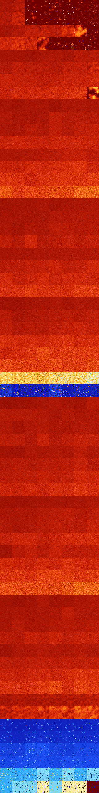

# B013468 (177664-178175)

<details>
    <summary>Initial Grid</summary>
    
</details>


<details>
    <summary>Initial Grid RLE</summary>

```
#C Exported from GoGoL (https://github.com/marrow16/gogol)
#C Wrap mode: Toroidal
#C Boundary mode: Dead
#C Step: 0
x = 100, y = 100, rule = B013468/S
46bo7bo4bo29bo$bo59bo9bo12bo8bo$17bo7bo7bo25b2o33bo$54bo25b2o15bo$7bo
33bo5bo11bobo$25bo8bobo21bo3bo14bo3bo4bo3bo$53bo3bo18bo4bo$12bo11bo27bo
4bo8b2o4bo$13bo15bo20bo15bo14bo10bo$15bo7bo18bo44bo3bo$3bo60bo$16bo50bo
b2o5bo5bo2bo$25bo$bo11bo17bo31bo10bo7bo5bo6bo$3bo5bo9bo45bo$14bo10bo3bo
38bo$2bo24b2o36bo$4bo17bo36bo9bo3bo17bo$34bo28bo33bo$8bo44bo$38bo$14bo
21bo23bo14bo$6bo17bo15bo13bo2b2o4bo18bo$o16bo15bobo8bo3bo35bo2bo$22bo
39bo4bo30bo$21bo4bo46bo15bo$5bo21bo$25bo20bo13bo8bo20bo$3bo10bo57bo$bob
o31bo4bo35bo5b2o3bo$11bo12bo14bo27bo$17bo17bo5bo8bo27bo$4bo90bo$25bo3bo
19bo7bo$b3o18bobo7bo11bo$o18bo24bo11bob2o5bo28bo$5bo6bo43bo3bo4bo12bo4b
o6bo$11bo6bo24bo40bo2bo4bo$21bo11bo36bo10bo2bo6bo3bobo$21bo64bo8bo$25bo
9bo13bo32bobo13bo$38bo20bo2bob2o3bo$57b2o3bo31bo$21bo4bo4bo13bo7bo6bo
17bo$2bo27bo32bo$33bo8bo3bo3bo7bo32bobo5bo$11bo25bo32bo3bo5bo5bo$7b2o
26bo12bo8bo10bo7bo11b2o$45bo15bo12bo8bo$7bo34bo4bo42bo$2bo43bo29bo13bo$
38bo22bo15bo6bo$37bo$27bo6bo6bo14bo15bo5bo2bo$8bo24bo2bobo4bo3bo15bo16b
o$23bo15b2obo14bo15b2o14bo$35bo25bo4bo6bo$o14bo5bo42bo$9bobo9bo8bo7bo2b
obo8bo30bo2bo8bo$71bo13bo2bo7bo$o11bo21bo36b2o$79bo$bo8b2o8bo4bo34bo$5b
obo34bo30bo$4bo11bo13bo42bo8bo14bo$15bo6bo3bobo37bo$38bo10bo17bo17bo$
14bo26bo$10bo4bo15bo31bo5bo$15bo16bo2bo5bo6bo10bo6bo$15bo12bo33bo$4bo
16bo6bo8bobo14bo$11bobo12bobo34bo34bo$2b2o13bo8bo11bobo26bo18bobo$8bo
26bo9bo8bo25bo$25bo9bo4bo32bo$bo8bo25bo27bo30bo$3bo34bo$23bo8bo5bo$18bo
bo9bo9bo23bo13bo10bo$9bo6bo16bo23bo32bo3bo$29bo2bo31bo6bo8bo8bo4bo$14bo
6bo15bo6bo32bobobo$4bo13bo8bo34bo19bo7b2o7bo$12bobo5bo49bo7bo$32bo30bo
3bo$bo4bo35bo13bo3bo27bo$13bo11b2o10bo45bo9bo$o12bo31bo8bo3bo33bo$23bo
16bo6bo36bo13bo$32bo13bo45bo$39bo38bo$12bo44bo7bo$8bo5bo19bo11bo20bo22b
2o$57bo11bo16bo4bo4bo$44b3o13bo24bo4bo$17bo16bo20bo2bo$52bo14bo12bo7bo$
6b2o4bo10bo62bo4bo5bo$31bo14bo44bo!
```
</details>
<details>
    <summary>Thumbnail</summary>

</details>
<table>
<tr>
    <td><a href="./177664%20S%20Heat%20Map%20Activity.png"></a><br>S (177664)<br>G>1000</td>    <td><a href="./177665%20S0%20Heat%20Map%20Activity.png"></a><br>S0 (177665)<br>G>1000</td>    <td><a href="./177666%20S1%20Heat%20Map%20Activity.png"></a><br>S1 (177666)<br>R@334,p4</td>    <td><a href="./177667%20S01%20Heat%20Map%20Activity.png"></a><br>S01 (177667)<br>R@52,p4</td>    <td><a href="./177668%20S2%20Heat%20Map%20Activity.png"></a><br>S2 (177668)<br>R@354,p12</td>    <td><a href="./177669%20S02%20Heat%20Map%20Activity.png"></a><br>S02 (177669)<br>R@502,p444</td>    <td><a href="./177670%20S12%20Heat%20Map%20Activity.png"></a><br>S12 (177670)<br>R@70,p4</td>    <td><a href="./177671%20S012%20Heat%20Map%20Activity.png"></a><br>S012 (177671)<br>R@17,p2</td></tr>
<tr>
    <td><a href="./177672%20S3%20Heat%20Map%20Activity.png"></a><br>S3 (177672)<br>G>1000</td>    <td><a href="./177673%20S03%20Heat%20Map%20Activity.png"></a><br>S03 (177673)<br>G>1000</td>    <td><a href="./177674%20S13%20Heat%20Map%20Activity.png"></a><br>S13 (177674)<br>R@698,p12</td>    <td><a href="./177675%20S013%20Heat%20Map%20Activity.png"></a><br>S013 (177675)<br>R@34,p12</td>    <td><a href="./177676%20S23%20Heat%20Map%20Activity.png"></a><br>S23 (177676)<br>R@148,p4</td>    <td><a href="./177677%20S023%20Heat%20Map%20Activity.png"></a><br>S023 (177677)<br>R@114,p4</td>    <td><a href="./177678%20S123%20Heat%20Map%20Activity.png"></a><br>S123 (177678)<br>R@40,p4</td>    <td><a href="./177679%20S0123%20Heat%20Map%20Activity.png"></a><br>S0123 (177679)<br>R@21,p2</td></tr>
<tr>
    <td><a href="./177680%20S4%20Heat%20Map%20Activity.png"></a><br>S4 (177680)<br>G>1000</td>    <td><a href="./177681%20S04%20Heat%20Map%20Activity.png"></a><br>S04 (177681)<br>G>1000</td>    <td><a href="./177682%20S14%20Heat%20Map%20Activity.png"></a><br>S14 (177682)<br>G>1000</td>    <td><a href="./177683%20S014%20Heat%20Map%20Activity.png"></a><br>S014 (177683)<br>G>1000</td>    <td><a href="./177684%20S24%20Heat%20Map%20Activity.png"></a><br>S24 (177684)<br>G>1000</td>    <td><a href="./177685%20S024%20Heat%20Map%20Activity.png"></a><br>S024 (177685)<br>G>1000</td>    <td><a href="./177686%20S124%20Heat%20Map%20Activity.png"></a><br>S124 (177686)<br>G>1000</td>    <td><a href="./177687%20S0124%20Heat%20Map%20Activity.png"></a><br>S0124 (177687)<br>R@81,p8</td></tr>
<tr>
    <td><a href="./177688%20S34%20Heat%20Map%20Activity.png"></a><br>S34 (177688)<br>G>1000</td>    <td><a href="./177689%20S034%20Heat%20Map%20Activity.png"></a><br>S034 (177689)<br>G>1000</td>    <td><a href="./177690%20S134%20Heat%20Map%20Activity.png"></a><br>S134 (177690)<br>G>1000</td>    <td><a href="./177691%20S0134%20Heat%20Map%20Activity.png"></a><br>S0134 (177691)<br>G>1000</td>    <td><a href="./177692%20S234%20Heat%20Map%20Activity.png"></a><br>S234 (177692)<br>R@98,p4</td>    <td><a href="./177693%20S0234%20Heat%20Map%20Activity.png"></a><br>S0234 (177693)<br>R@75,p24</td>    <td><a href="./177694%20S1234%20Heat%20Map%20Activity.png"></a><br>S1234 (177694)<br>R@42,p8</td>    <td><a href="./177695%20S01234%20Heat%20Map%20Activity.png"></a><br>S01234 (177695)<br>R@38,p8</td></tr>
<tr>
    <td><a href="./177696%20S5%20Heat%20Map%20Activity.png"></a><br>S5 (177696)<br>G>1000</td>    <td><a href="./177697%20S05%20Heat%20Map%20Activity.png"></a><br>S05 (177697)<br>G>1000</td>    <td><a href="./177698%20S15%20Heat%20Map%20Activity.png"></a><br>S15 (177698)<br>G>1000</td>    <td><a href="./177699%20S015%20Heat%20Map%20Activity.png"></a><br>S015 (177699)<br>G>1000</td>    <td><a href="./177700%20S25%20Heat%20Map%20Activity.png"></a><br>S25 (177700)<br>G>1000</td>    <td><a href="./177701%20S025%20Heat%20Map%20Activity.png"></a><br>S025 (177701)<br>G>1000</td>    <td><a href="./177702%20S125%20Heat%20Map%20Activity.png"></a><br>S125 (177702)<br>G>1000</td>    <td><a href="./177703%20S0125%20Heat%20Map%20Activity.png"></a><br>S0125 (177703)<br>G>1000</td></tr>
<tr>
    <td><a href="./177704%20S35%20Heat%20Map%20Activity.png"></a><br>S35 (177704)<br>G>1000</td>    <td><a href="./177705%20S035%20Heat%20Map%20Activity.png"></a><br>S035 (177705)<br>G>1000</td>    <td><a href="./177706%20S135%20Heat%20Map%20Activity.png"></a><br>S135 (177706)<br>G>1000</td>    <td><a href="./177707%20S0135%20Heat%20Map%20Activity.png"></a><br>S0135 (177707)<br>G>1000</td>    <td><a href="./177708%20S235%20Heat%20Map%20Activity.png"></a><br>S235 (177708)<br>G>1000</td>    <td><a href="./177709%20S0235%20Heat%20Map%20Activity.png"></a><br>S0235 (177709)<br>G>1000</td>    <td><a href="./177710%20S1235%20Heat%20Map%20Activity.png"></a><br>S1235 (177710)<br>G>1000</td>    <td><a href="./177711%20S01235%20Heat%20Map%20Activity.png"></a><br>S01235 (177711)<br>G>1000</td></tr>
<tr>
    <td><a href="./177712%20S45%20Heat%20Map%20Activity.png"></a><br>S45 (177712)<br>G>1000</td>    <td><a href="./177713%20S045%20Heat%20Map%20Activity.png"></a><br>S045 (177713)<br>G>1000</td>    <td><a href="./177714%20S145%20Heat%20Map%20Activity.png"></a><br>S145 (177714)<br>G>1000</td>    <td><a href="./177715%20S0145%20Heat%20Map%20Activity.png"></a><br>S0145 (177715)<br>G>1000</td>    <td><a href="./177716%20S245%20Heat%20Map%20Activity.png"></a><br>S245 (177716)<br>G>1000</td>    <td><a href="./177717%20S0245%20Heat%20Map%20Activity.png"></a><br>S0245 (177717)<br>G>1000</td>    <td><a href="./177718%20S1245%20Heat%20Map%20Activity.png"></a><br>S1245 (177718)<br>G>1000</td>    <td><a href="./177719%20S01245%20Heat%20Map%20Activity.png"></a><br>S01245 (177719)<br>G>1000</td></tr>
<tr>
    <td><a href="./177720%20S345%20Heat%20Map%20Activity.png"></a><br>S345 (177720)<br>G>1000</td>    <td><a href="./177721%20S0345%20Heat%20Map%20Activity.png"></a><br>S0345 (177721)<br>G>1000</td>    <td><a href="./177722%20S1345%20Heat%20Map%20Activity.png"></a><br>S1345 (177722)<br>G>1000</td>    <td><a href="./177723%20S01345%20Heat%20Map%20Activity.png"></a><br>S01345 (177723)<br>G>1000</td>    <td><a href="./177724%20S2345%20Heat%20Map%20Activity.png"></a><br>S2345 (177724)<br>G>1000</td>    <td><a href="./177725%20S02345%20Heat%20Map%20Activity.png"></a><br>S02345 (177725)<br>G>1000</td>    <td><a href="./177726%20S12345%20Heat%20Map%20Activity.png"></a><br>S12345 (177726)<br>G>1000</td>    <td><a href="./177727%20S012345%20Heat%20Map%20Activity.png"></a><br>S012345 (177727)<br>G>1000</td></tr>
<tr>
    <td><a href="./177728%20S6%20Heat%20Map%20Activity.png"></a><br>S6 (177728)<br>G>1000</td>    <td><a href="./177729%20S06%20Heat%20Map%20Activity.png"></a><br>S06 (177729)<br>G>1000</td>    <td><a href="./177730%20S16%20Heat%20Map%20Activity.png"></a><br>S16 (177730)<br>G>1000</td>    <td><a href="./177731%20S016%20Heat%20Map%20Activity.png"></a><br>S016 (177731)<br>G>1000</td>    <td><a href="./177732%20S26%20Heat%20Map%20Activity.png"></a><br>S26 (177732)<br>G>1000</td>    <td><a href="./177733%20S026%20Heat%20Map%20Activity.png"></a><br>S026 (177733)<br>G>1000</td>    <td><a href="./177734%20S126%20Heat%20Map%20Activity.png"></a><br>S126 (177734)<br>G>1000</td>    <td><a href="./177735%20S0126%20Heat%20Map%20Activity.png"></a><br>S0126 (177735)<br>G>1000</td></tr>
<tr>
    <td><a href="./177736%20S36%20Heat%20Map%20Activity.png"></a><br>S36 (177736)<br>G>1000</td>    <td><a href="./177737%20S036%20Heat%20Map%20Activity.png"></a><br>S036 (177737)<br>G>1000</td>    <td><a href="./177738%20S136%20Heat%20Map%20Activity.png"></a><br>S136 (177738)<br>G>1000</td>    <td><a href="./177739%20S0136%20Heat%20Map%20Activity.png"></a><br>S0136 (177739)<br>G>1000</td>    <td><a href="./177740%20S236%20Heat%20Map%20Activity.png"></a><br>S236 (177740)<br>G>1000</td>    <td><a href="./177741%20S0236%20Heat%20Map%20Activity.png"></a><br>S0236 (177741)<br>G>1000</td>    <td><a href="./177742%20S1236%20Heat%20Map%20Activity.png"></a><br>S1236 (177742)<br>G>1000</td>    <td><a href="./177743%20S01236%20Heat%20Map%20Activity.png"></a><br>S01236 (177743)<br>G>1000</td></tr>
<tr>
    <td><a href="./177744%20S46%20Heat%20Map%20Activity.png"></a><br>S46 (177744)<br>G>1000</td>    <td><a href="./177745%20S046%20Heat%20Map%20Activity.png"></a><br>S046 (177745)<br>G>1000</td>    <td><a href="./177746%20S146%20Heat%20Map%20Activity.png"></a><br>S146 (177746)<br>G>1000</td>    <td><a href="./177747%20S0146%20Heat%20Map%20Activity.png"></a><br>S0146 (177747)<br>G>1000</td>    <td><a href="./177748%20S246%20Heat%20Map%20Activity.png"></a><br>S246 (177748)<br>G>1000</td>    <td><a href="./177749%20S0246%20Heat%20Map%20Activity.png"></a><br>S0246 (177749)<br>G>1000</td>    <td><a href="./177750%20S1246%20Heat%20Map%20Activity.png"></a><br>S1246 (177750)<br>G>1000</td>    <td><a href="./177751%20S01246%20Heat%20Map%20Activity.png"></a><br>S01246 (177751)<br>G>1000</td></tr>
<tr>
    <td><a href="./177752%20S346%20Heat%20Map%20Activity.png"></a><br>S346 (177752)<br>G>1000</td>    <td><a href="./177753%20S0346%20Heat%20Map%20Activity.png"></a><br>S0346 (177753)<br>G>1000</td>    <td><a href="./177754%20S1346%20Heat%20Map%20Activity.png"></a><br>S1346 (177754)<br>G>1000</td>    <td><a href="./177755%20S01346%20Heat%20Map%20Activity.png"></a><br>S01346 (177755)<br>G>1000</td>    <td><a href="./177756%20S2346%20Heat%20Map%20Activity.png"></a><br>S2346 (177756)<br>G>1000</td>    <td><a href="./177757%20S02346%20Heat%20Map%20Activity.png"></a><br>S02346 (177757)<br>G>1000</td>    <td><a href="./177758%20S12346%20Heat%20Map%20Activity.png"></a><br>S12346 (177758)<br>G>1000</td>    <td><a href="./177759%20S012346%20Heat%20Map%20Activity.png"></a><br>S012346 (177759)<br>G>1000</td></tr>
<tr>
    <td><a href="./177760%20S56%20Heat%20Map%20Activity.png"></a><br>S56 (177760)<br>G>1000</td>    <td><a href="./177761%20S056%20Heat%20Map%20Activity.png"></a><br>S056 (177761)<br>G>1000</td>    <td><a href="./177762%20S156%20Heat%20Map%20Activity.png"></a><br>S156 (177762)<br>G>1000</td>    <td><a href="./177763%20S0156%20Heat%20Map%20Activity.png"></a><br>S0156 (177763)<br>G>1000</td>    <td><a href="./177764%20S256%20Heat%20Map%20Activity.png"></a><br>S256 (177764)<br>G>1000</td>    <td><a href="./177765%20S0256%20Heat%20Map%20Activity.png"></a><br>S0256 (177765)<br>G>1000</td>    <td><a href="./177766%20S1256%20Heat%20Map%20Activity.png"></a><br>S1256 (177766)<br>G>1000</td>    <td><a href="./177767%20S01256%20Heat%20Map%20Activity.png"></a><br>S01256 (177767)<br>G>1000</td></tr>
<tr>
    <td><a href="./177768%20S356%20Heat%20Map%20Activity.png"></a><br>S356 (177768)<br>G>1000</td>    <td><a href="./177769%20S0356%20Heat%20Map%20Activity.png"></a><br>S0356 (177769)<br>G>1000</td>    <td><a href="./177770%20S1356%20Heat%20Map%20Activity.png"></a><br>S1356 (177770)<br>G>1000</td>    <td><a href="./177771%20S01356%20Heat%20Map%20Activity.png"></a><br>S01356 (177771)<br>G>1000</td>    <td><a href="./177772%20S2356%20Heat%20Map%20Activity.png"></a><br>S2356 (177772)<br>G>1000</td>    <td><a href="./177773%20S02356%20Heat%20Map%20Activity.png"></a><br>S02356 (177773)<br>G>1000</td>    <td><a href="./177774%20S12356%20Heat%20Map%20Activity.png"></a><br>S12356 (177774)<br>G>1000</td>    <td><a href="./177775%20S012356%20Heat%20Map%20Activity.png"></a><br>S012356 (177775)<br>G>1000</td></tr>
<tr>
    <td><a href="./177776%20S456%20Heat%20Map%20Activity.png"></a><br>S456 (177776)<br>G>1000</td>    <td><a href="./177777%20S0456%20Heat%20Map%20Activity.png"></a><br>S0456 (177777)<br>G>1000</td>    <td><a href="./177778%20S1456%20Heat%20Map%20Activity.png"></a><br>S1456 (177778)<br>G>1000</td>    <td><a href="./177779%20S01456%20Heat%20Map%20Activity.png"></a><br>S01456 (177779)<br>G>1000</td>    <td><a href="./177780%20S2456%20Heat%20Map%20Activity.png"></a><br>S2456 (177780)<br>G>1000</td>    <td><a href="./177781%20S02456%20Heat%20Map%20Activity.png"></a><br>S02456 (177781)<br>G>1000</td>    <td><a href="./177782%20S12456%20Heat%20Map%20Activity.png"></a><br>S12456 (177782)<br>G>1000</td>    <td><a href="./177783%20S012456%20Heat%20Map%20Activity.png"></a><br>S012456 (177783)<br>G>1000</td></tr>
<tr>
    <td><a href="./177784%20S3456%20Heat%20Map%20Activity.png"></a><br>S3456 (177784)<br>G>1000</td>    <td><a href="./177785%20S03456%20Heat%20Map%20Activity.png"></a><br>S03456 (177785)<br>G>1000</td>    <td><a href="./177786%20S13456%20Heat%20Map%20Activity.png"></a><br>S13456 (177786)<br>G>1000</td>    <td><a href="./177787%20S013456%20Heat%20Map%20Activity.png"></a><br>S013456 (177787)<br>G>1000</td>    <td><a href="./177788%20S23456%20Heat%20Map%20Activity.png"></a><br>S23456 (177788)<br>G>1000</td>    <td><a href="./177789%20S023456%20Heat%20Map%20Activity.png"></a><br>S023456 (177789)<br>G>1000</td>    <td><a href="./177790%20S123456%20Heat%20Map%20Activity.png"></a><br>S123456 (177790)<br>G>1000</td>    <td><a href="./177791%20S0123456%20Heat%20Map%20Activity.png"></a><br>S0123456 (177791)<br>G>1000</td></tr>
<tr>
    <td><a href="./177792%20S7%20Heat%20Map%20Activity.png"></a><br>S7 (177792)<br>G>1000</td>    <td><a href="./177793%20S07%20Heat%20Map%20Activity.png"></a><br>S07 (177793)<br>G>1000</td>    <td><a href="./177794%20S17%20Heat%20Map%20Activity.png"></a><br>S17 (177794)<br>G>1000</td>    <td><a href="./177795%20S017%20Heat%20Map%20Activity.png"></a><br>S017 (177795)<br>G>1000</td>    <td><a href="./177796%20S27%20Heat%20Map%20Activity.png"></a><br>S27 (177796)<br>G>1000</td>    <td><a href="./177797%20S027%20Heat%20Map%20Activity.png"></a><br>S027 (177797)<br>G>1000</td>    <td><a href="./177798%20S127%20Heat%20Map%20Activity.png"></a><br>S127 (177798)<br>G>1000</td>    <td><a href="./177799%20S0127%20Heat%20Map%20Activity.png"></a><br>S0127 (177799)<br>G>1000</td></tr>
<tr>
    <td><a href="./177800%20S37%20Heat%20Map%20Activity.png"></a><br>S37 (177800)<br>G>1000</td>    <td><a href="./177801%20S037%20Heat%20Map%20Activity.png"></a><br>S037 (177801)<br>G>1000</td>    <td><a href="./177802%20S137%20Heat%20Map%20Activity.png"></a><br>S137 (177802)<br>G>1000</td>    <td><a href="./177803%20S0137%20Heat%20Map%20Activity.png"></a><br>S0137 (177803)<br>G>1000</td>    <td><a href="./177804%20S237%20Heat%20Map%20Activity.png"></a><br>S237 (177804)<br>G>1000</td>    <td><a href="./177805%20S0237%20Heat%20Map%20Activity.png"></a><br>S0237 (177805)<br>G>1000</td>    <td><a href="./177806%20S1237%20Heat%20Map%20Activity.png"></a><br>S1237 (177806)<br>G>1000</td>    <td><a href="./177807%20S01237%20Heat%20Map%20Activity.png"></a><br>S01237 (177807)<br>G>1000</td></tr>
<tr>
    <td><a href="./177808%20S47%20Heat%20Map%20Activity.png"></a><br>S47 (177808)<br>G>1000</td>    <td><a href="./177809%20S047%20Heat%20Map%20Activity.png"></a><br>S047 (177809)<br>G>1000</td>    <td><a href="./177810%20S147%20Heat%20Map%20Activity.png"></a><br>S147 (177810)<br>G>1000</td>    <td><a href="./177811%20S0147%20Heat%20Map%20Activity.png"></a><br>S0147 (177811)<br>G>1000</td>    <td><a href="./177812%20S247%20Heat%20Map%20Activity.png"></a><br>S247 (177812)<br>G>1000</td>    <td><a href="./177813%20S0247%20Heat%20Map%20Activity.png"></a><br>S0247 (177813)<br>G>1000</td>    <td><a href="./177814%20S1247%20Heat%20Map%20Activity.png"></a><br>S1247 (177814)<br>G>1000</td>    <td><a href="./177815%20S01247%20Heat%20Map%20Activity.png"></a><br>S01247 (177815)<br>G>1000</td></tr>
<tr>
    <td><a href="./177816%20S347%20Heat%20Map%20Activity.png"></a><br>S347 (177816)<br>G>1000</td>    <td><a href="./177817%20S0347%20Heat%20Map%20Activity.png"></a><br>S0347 (177817)<br>G>1000</td>    <td><a href="./177818%20S1347%20Heat%20Map%20Activity.png"></a><br>S1347 (177818)<br>G>1000</td>    <td><a href="./177819%20S01347%20Heat%20Map%20Activity.png"></a><br>S01347 (177819)<br>G>1000</td>    <td><a href="./177820%20S2347%20Heat%20Map%20Activity.png"></a><br>S2347 (177820)<br>G>1000</td>    <td><a href="./177821%20S02347%20Heat%20Map%20Activity.png"></a><br>S02347 (177821)<br>G>1000</td>    <td><a href="./177822%20S12347%20Heat%20Map%20Activity.png"></a><br>S12347 (177822)<br>G>1000</td>    <td><a href="./177823%20S012347%20Heat%20Map%20Activity.png"></a><br>S012347 (177823)<br>G>1000</td></tr>
<tr>
    <td><a href="./177824%20S57%20Heat%20Map%20Activity.png"></a><br>S57 (177824)<br>G>1000</td>    <td><a href="./177825%20S057%20Heat%20Map%20Activity.png"></a><br>S057 (177825)<br>G>1000</td>    <td><a href="./177826%20S157%20Heat%20Map%20Activity.png"></a><br>S157 (177826)<br>G>1000</td>    <td><a href="./177827%20S0157%20Heat%20Map%20Activity.png"></a><br>S0157 (177827)<br>G>1000</td>    <td><a href="./177828%20S257%20Heat%20Map%20Activity.png"></a><br>S257 (177828)<br>G>1000</td>    <td><a href="./177829%20S0257%20Heat%20Map%20Activity.png"></a><br>S0257 (177829)<br>G>1000</td>    <td><a href="./177830%20S1257%20Heat%20Map%20Activity.png"></a><br>S1257 (177830)<br>G>1000</td>    <td><a href="./177831%20S01257%20Heat%20Map%20Activity.png"></a><br>S01257 (177831)<br>G>1000</td></tr>
<tr>
    <td><a href="./177832%20S357%20Heat%20Map%20Activity.png"></a><br>S357 (177832)<br>G>1000</td>    <td><a href="./177833%20S0357%20Heat%20Map%20Activity.png"></a><br>S0357 (177833)<br>G>1000</td>    <td><a href="./177834%20S1357%20Heat%20Map%20Activity.png"></a><br>S1357 (177834)<br>G>1000</td>    <td><a href="./177835%20S01357%20Heat%20Map%20Activity.png"></a><br>S01357 (177835)<br>G>1000</td>    <td><a href="./177836%20S2357%20Heat%20Map%20Activity.png"></a><br>S2357 (177836)<br>G>1000</td>    <td><a href="./177837%20S02357%20Heat%20Map%20Activity.png"></a><br>S02357 (177837)<br>G>1000</td>    <td><a href="./177838%20S12357%20Heat%20Map%20Activity.png"></a><br>S12357 (177838)<br>G>1000</td>    <td><a href="./177839%20S012357%20Heat%20Map%20Activity.png"></a><br>S012357 (177839)<br>G>1000</td></tr>
<tr>
    <td><a href="./177840%20S457%20Heat%20Map%20Activity.png"></a><br>S457 (177840)<br>G>1000</td>    <td><a href="./177841%20S0457%20Heat%20Map%20Activity.png"></a><br>S0457 (177841)<br>G>1000</td>    <td><a href="./177842%20S1457%20Heat%20Map%20Activity.png"></a><br>S1457 (177842)<br>G>1000</td>    <td><a href="./177843%20S01457%20Heat%20Map%20Activity.png"></a><br>S01457 (177843)<br>G>1000</td>    <td><a href="./177844%20S2457%20Heat%20Map%20Activity.png"></a><br>S2457 (177844)<br>G>1000</td>    <td><a href="./177845%20S02457%20Heat%20Map%20Activity.png"></a><br>S02457 (177845)<br>G>1000</td>    <td><a href="./177846%20S12457%20Heat%20Map%20Activity.png"></a><br>S12457 (177846)<br>G>1000</td>    <td><a href="./177847%20S012457%20Heat%20Map%20Activity.png"></a><br>S012457 (177847)<br>G>1000</td></tr>
<tr>
    <td><a href="./177848%20S3457%20Heat%20Map%20Activity.png"></a><br>S3457 (177848)<br>G>1000</td>    <td><a href="./177849%20S03457%20Heat%20Map%20Activity.png"></a><br>S03457 (177849)<br>G>1000</td>    <td><a href="./177850%20S13457%20Heat%20Map%20Activity.png"></a><br>S13457 (177850)<br>G>1000</td>    <td><a href="./177851%20S013457%20Heat%20Map%20Activity.png"></a><br>S013457 (177851)<br>G>1000</td>    <td><a href="./177852%20S23457%20Heat%20Map%20Activity.png"></a><br>S23457 (177852)<br>G>1000</td>    <td><a href="./177853%20S023457%20Heat%20Map%20Activity.png"></a><br>S023457 (177853)<br>G>1000</td>    <td><a href="./177854%20S123457%20Heat%20Map%20Activity.png"></a><br>S123457 (177854)<br>G>1000</td>    <td><a href="./177855%20S0123457%20Heat%20Map%20Activity.png"></a><br>S0123457 (177855)<br>G>1000</td></tr>
<tr>
    <td><a href="./177856%20S67%20Heat%20Map%20Activity.png"></a><br>S67 (177856)<br>G>1000</td>    <td><a href="./177857%20S067%20Heat%20Map%20Activity.png"></a><br>S067 (177857)<br>G>1000</td>    <td><a href="./177858%20S167%20Heat%20Map%20Activity.png"></a><br>S167 (177858)<br>G>1000</td>    <td><a href="./177859%20S0167%20Heat%20Map%20Activity.png"></a><br>S0167 (177859)<br>G>1000</td>    <td><a href="./177860%20S267%20Heat%20Map%20Activity.png"></a><br>S267 (177860)<br>G>1000</td>    <td><a href="./177861%20S0267%20Heat%20Map%20Activity.png"></a><br>S0267 (177861)<br>G>1000</td>    <td><a href="./177862%20S1267%20Heat%20Map%20Activity.png"></a><br>S1267 (177862)<br>G>1000</td>    <td><a href="./177863%20S01267%20Heat%20Map%20Activity.png"></a><br>S01267 (177863)<br>G>1000</td></tr>
<tr>
    <td><a href="./177864%20S367%20Heat%20Map%20Activity.png"></a><br>S367 (177864)<br>G>1000</td>    <td><a href="./177865%20S0367%20Heat%20Map%20Activity.png"></a><br>S0367 (177865)<br>G>1000</td>    <td><a href="./177866%20S1367%20Heat%20Map%20Activity.png"></a><br>S1367 (177866)<br>G>1000</td>    <td><a href="./177867%20S01367%20Heat%20Map%20Activity.png"></a><br>S01367 (177867)<br>G>1000</td>    <td><a href="./177868%20S2367%20Heat%20Map%20Activity.png"></a><br>S2367 (177868)<br>G>1000</td>    <td><a href="./177869%20S02367%20Heat%20Map%20Activity.png"></a><br>S02367 (177869)<br>G>1000</td>    <td><a href="./177870%20S12367%20Heat%20Map%20Activity.png"></a><br>S12367 (177870)<br>G>1000</td>    <td><a href="./177871%20S012367%20Heat%20Map%20Activity.png"></a><br>S012367 (177871)<br>G>1000</td></tr>
<tr>
    <td><a href="./177872%20S467%20Heat%20Map%20Activity.png"></a><br>S467 (177872)<br>G>1000</td>    <td><a href="./177873%20S0467%20Heat%20Map%20Activity.png"></a><br>S0467 (177873)<br>G>1000</td>    <td><a href="./177874%20S1467%20Heat%20Map%20Activity.png"></a><br>S1467 (177874)<br>G>1000</td>    <td><a href="./177875%20S01467%20Heat%20Map%20Activity.png"></a><br>S01467 (177875)<br>G>1000</td>    <td><a href="./177876%20S2467%20Heat%20Map%20Activity.png"></a><br>S2467 (177876)<br>G>1000</td>    <td><a href="./177877%20S02467%20Heat%20Map%20Activity.png"></a><br>S02467 (177877)<br>G>1000</td>    <td><a href="./177878%20S12467%20Heat%20Map%20Activity.png"></a><br>S12467 (177878)<br>G>1000</td>    <td><a href="./177879%20S012467%20Heat%20Map%20Activity.png"></a><br>S012467 (177879)<br>G>1000</td></tr>
<tr>
    <td><a href="./177880%20S3467%20Heat%20Map%20Activity.png"></a><br>S3467 (177880)<br>G>1000</td>    <td><a href="./177881%20S03467%20Heat%20Map%20Activity.png"></a><br>S03467 (177881)<br>G>1000</td>    <td><a href="./177882%20S13467%20Heat%20Map%20Activity.png"></a><br>S13467 (177882)<br>G>1000</td>    <td><a href="./177883%20S013467%20Heat%20Map%20Activity.png"></a><br>S013467 (177883)<br>G>1000</td>    <td><a href="./177884%20S23467%20Heat%20Map%20Activity.png"></a><br>S23467 (177884)<br>G>1000</td>    <td><a href="./177885%20S023467%20Heat%20Map%20Activity.png"></a><br>S023467 (177885)<br>G>1000</td>    <td><a href="./177886%20S123467%20Heat%20Map%20Activity.png"></a><br>S123467 (177886)<br>G>1000</td>    <td><a href="./177887%20S0123467%20Heat%20Map%20Activity.png"></a><br>S0123467 (177887)<br>G>1000</td></tr>
<tr>
    <td><a href="./177888%20S567%20Heat%20Map%20Activity.png"></a><br>S567 (177888)<br>G>1000</td>    <td><a href="./177889%20S0567%20Heat%20Map%20Activity.png"></a><br>S0567 (177889)<br>G>1000</td>    <td><a href="./177890%20S1567%20Heat%20Map%20Activity.png"></a><br>S1567 (177890)<br>G>1000</td>    <td><a href="./177891%20S01567%20Heat%20Map%20Activity.png"></a><br>S01567 (177891)<br>G>1000</td>    <td><a href="./177892%20S2567%20Heat%20Map%20Activity.png"></a><br>S2567 (177892)<br>G>1000</td>    <td><a href="./177893%20S02567%20Heat%20Map%20Activity.png"></a><br>S02567 (177893)<br>G>1000</td>    <td><a href="./177894%20S12567%20Heat%20Map%20Activity.png"></a><br>S12567 (177894)<br>G>1000</td>    <td><a href="./177895%20S012567%20Heat%20Map%20Activity.png"></a><br>S012567 (177895)<br>G>1000</td></tr>
<tr>
    <td><a href="./177896%20S3567%20Heat%20Map%20Activity.png"></a><br>S3567 (177896)<br>G>1000</td>    <td><a href="./177897%20S03567%20Heat%20Map%20Activity.png"></a><br>S03567 (177897)<br>G>1000</td>    <td><a href="./177898%20S13567%20Heat%20Map%20Activity.png"></a><br>S13567 (177898)<br>G>1000</td>    <td><a href="./177899%20S013567%20Heat%20Map%20Activity.png"></a><br>S013567 (177899)<br>G>1000</td>    <td><a href="./177900%20S23567%20Heat%20Map%20Activity.png"></a><br>S23567 (177900)<br>G>1000</td>    <td><a href="./177901%20S023567%20Heat%20Map%20Activity.png"></a><br>S023567 (177901)<br>G>1000</td>    <td><a href="./177902%20S123567%20Heat%20Map%20Activity.png"></a><br>S123567 (177902)<br>G>1000</td>    <td><a href="./177903%20S0123567%20Heat%20Map%20Activity.png"></a><br>S0123567 (177903)<br>G>1000</td></tr>
<tr>
    <td><a href="./177904%20S4567%20Heat%20Map%20Activity.png"></a><br>S4567 (177904)<br>G>1000</td>    <td><a href="./177905%20S04567%20Heat%20Map%20Activity.png"></a><br>S04567 (177905)<br>G>1000</td>    <td><a href="./177906%20S14567%20Heat%20Map%20Activity.png"></a><br>S14567 (177906)<br>G>1000</td>    <td><a href="./177907%20S014567%20Heat%20Map%20Activity.png"></a><br>S014567 (177907)<br>G>1000</td>    <td><a href="./177908%20S24567%20Heat%20Map%20Activity.png"></a><br>S24567 (177908)<br>G>1000</td>    <td><a href="./177909%20S024567%20Heat%20Map%20Activity.png"></a><br>S024567 (177909)<br>G>1000</td>    <td><a href="./177910%20S124567%20Heat%20Map%20Activity.png"></a><br>S124567 (177910)<br>G>1000</td>    <td><a href="./177911%20S0124567%20Heat%20Map%20Activity.png"></a><br>S0124567 (177911)<br>G>1000</td></tr>
<tr>
    <td><a href="./177912%20S34567%20Heat%20Map%20Activity.png"></a><br>S34567 (177912)<br>R@80,p24</td>    <td><a href="./177913%20S034567%20Heat%20Map%20Activity.png"></a><br>S034567 (177913)<br>G>1000</td>    <td><a href="./177914%20S134567%20Heat%20Map%20Activity.png"></a><br>S134567 (177914)<br>R@550,p504</td>    <td><a href="./177915%20S0134567%20Heat%20Map%20Activity.png"></a><br>S0134567 (177915)<br>R@468,p420</td>    <td><a href="./177916%20S234567%20Heat%20Map%20Activity.png"></a><br>S234567 (177916)<br>R@51,p12</td>    <td><a href="./177917%20S0234567%20Heat%20Map%20Activity.png"></a><br>S0234567 (177917)<br>G>1000</td>    <td><a href="./177918%20S1234567%20Heat%20Map%20Activity.png"></a><br>S1234567 (177918)<br>R@204,p168</td>    <td><a href="./177919%20S01234567%20Heat%20Map%20Activity.png"></a><br>S01234567 (177919)<br>R@230,p180</td></tr>
<tr>
    <td><a href="./177920%20S8%20Heat%20Map%20Activity.png"></a><br>S8 (177920)<br>G>1000</td>    <td><a href="./177921%20S08%20Heat%20Map%20Activity.png"></a><br>S08 (177921)<br>G>1000</td>    <td><a href="./177922%20S18%20Heat%20Map%20Activity.png"></a><br>S18 (177922)<br>G>1000</td>    <td><a href="./177923%20S018%20Heat%20Map%20Activity.png"></a><br>S018 (177923)<br>G>1000</td>    <td><a href="./177924%20S28%20Heat%20Map%20Activity.png"></a><br>S28 (177924)<br>G>1000</td>    <td><a href="./177925%20S028%20Heat%20Map%20Activity.png"></a><br>S028 (177925)<br>G>1000</td>    <td><a href="./177926%20S128%20Heat%20Map%20Activity.png"></a><br>S128 (177926)<br>G>1000</td>    <td><a href="./177927%20S0128%20Heat%20Map%20Activity.png"></a><br>S0128 (177927)<br>G>1000</td></tr>
<tr>
    <td><a href="./177928%20S38%20Heat%20Map%20Activity.png"></a><br>S38 (177928)<br>G>1000</td>    <td><a href="./177929%20S038%20Heat%20Map%20Activity.png"></a><br>S038 (177929)<br>G>1000</td>    <td><a href="./177930%20S138%20Heat%20Map%20Activity.png"></a><br>S138 (177930)<br>G>1000</td>    <td><a href="./177931%20S0138%20Heat%20Map%20Activity.png"></a><br>S0138 (177931)<br>G>1000</td>    <td><a href="./177932%20S238%20Heat%20Map%20Activity.png"></a><br>S238 (177932)<br>G>1000</td>    <td><a href="./177933%20S0238%20Heat%20Map%20Activity.png"></a><br>S0238 (177933)<br>G>1000</td>    <td><a href="./177934%20S1238%20Heat%20Map%20Activity.png"></a><br>S1238 (177934)<br>G>1000</td>    <td><a href="./177935%20S01238%20Heat%20Map%20Activity.png"></a><br>S01238 (177935)<br>G>1000</td></tr>
<tr>
    <td><a href="./177936%20S48%20Heat%20Map%20Activity.png"></a><br>S48 (177936)<br>G>1000</td>    <td><a href="./177937%20S048%20Heat%20Map%20Activity.png"></a><br>S048 (177937)<br>G>1000</td>    <td><a href="./177938%20S148%20Heat%20Map%20Activity.png"></a><br>S148 (177938)<br>G>1000</td>    <td><a href="./177939%20S0148%20Heat%20Map%20Activity.png"></a><br>S0148 (177939)<br>G>1000</td>    <td><a href="./177940%20S248%20Heat%20Map%20Activity.png"></a><br>S248 (177940)<br>G>1000</td>    <td><a href="./177941%20S0248%20Heat%20Map%20Activity.png"></a><br>S0248 (177941)<br>G>1000</td>    <td><a href="./177942%20S1248%20Heat%20Map%20Activity.png"></a><br>S1248 (177942)<br>G>1000</td>    <td><a href="./177943%20S01248%20Heat%20Map%20Activity.png"></a><br>S01248 (177943)<br>G>1000</td></tr>
<tr>
    <td><a href="./177944%20S348%20Heat%20Map%20Activity.png"></a><br>S348 (177944)<br>G>1000</td>    <td><a href="./177945%20S0348%20Heat%20Map%20Activity.png"></a><br>S0348 (177945)<br>G>1000</td>    <td><a href="./177946%20S1348%20Heat%20Map%20Activity.png"></a><br>S1348 (177946)<br>G>1000</td>    <td><a href="./177947%20S01348%20Heat%20Map%20Activity.png"></a><br>S01348 (177947)<br>G>1000</td>    <td><a href="./177948%20S2348%20Heat%20Map%20Activity.png"></a><br>S2348 (177948)<br>G>1000</td>    <td><a href="./177949%20S02348%20Heat%20Map%20Activity.png"></a><br>S02348 (177949)<br>G>1000</td>    <td><a href="./177950%20S12348%20Heat%20Map%20Activity.png"></a><br>S12348 (177950)<br>G>1000</td>    <td><a href="./177951%20S012348%20Heat%20Map%20Activity.png"></a><br>S012348 (177951)<br>G>1000</td></tr>
<tr>
    <td><a href="./177952%20S58%20Heat%20Map%20Activity.png"></a><br>S58 (177952)<br>G>1000</td>    <td><a href="./177953%20S058%20Heat%20Map%20Activity.png"></a><br>S058 (177953)<br>G>1000</td>    <td><a href="./177954%20S158%20Heat%20Map%20Activity.png"></a><br>S158 (177954)<br>G>1000</td>    <td><a href="./177955%20S0158%20Heat%20Map%20Activity.png"></a><br>S0158 (177955)<br>G>1000</td>    <td><a href="./177956%20S258%20Heat%20Map%20Activity.png"></a><br>S258 (177956)<br>G>1000</td>    <td><a href="./177957%20S0258%20Heat%20Map%20Activity.png"></a><br>S0258 (177957)<br>G>1000</td>    <td><a href="./177958%20S1258%20Heat%20Map%20Activity.png"></a><br>S1258 (177958)<br>G>1000</td>    <td><a href="./177959%20S01258%20Heat%20Map%20Activity.png"></a><br>S01258 (177959)<br>G>1000</td></tr>
<tr>
    <td><a href="./177960%20S358%20Heat%20Map%20Activity.png"></a><br>S358 (177960)<br>G>1000</td>    <td><a href="./177961%20S0358%20Heat%20Map%20Activity.png"></a><br>S0358 (177961)<br>G>1000</td>    <td><a href="./177962%20S1358%20Heat%20Map%20Activity.png"></a><br>S1358 (177962)<br>G>1000</td>    <td><a href="./177963%20S01358%20Heat%20Map%20Activity.png"></a><br>S01358 (177963)<br>G>1000</td>    <td><a href="./177964%20S2358%20Heat%20Map%20Activity.png"></a><br>S2358 (177964)<br>G>1000</td>    <td><a href="./177965%20S02358%20Heat%20Map%20Activity.png"></a><br>S02358 (177965)<br>G>1000</td>    <td><a href="./177966%20S12358%20Heat%20Map%20Activity.png"></a><br>S12358 (177966)<br>G>1000</td>    <td><a href="./177967%20S012358%20Heat%20Map%20Activity.png"></a><br>S012358 (177967)<br>G>1000</td></tr>
<tr>
    <td><a href="./177968%20S458%20Heat%20Map%20Activity.png"></a><br>S458 (177968)<br>G>1000</td>    <td><a href="./177969%20S0458%20Heat%20Map%20Activity.png"></a><br>S0458 (177969)<br>G>1000</td>    <td><a href="./177970%20S1458%20Heat%20Map%20Activity.png"></a><br>S1458 (177970)<br>G>1000</td>    <td><a href="./177971%20S01458%20Heat%20Map%20Activity.png"></a><br>S01458 (177971)<br>G>1000</td>    <td><a href="./177972%20S2458%20Heat%20Map%20Activity.png"></a><br>S2458 (177972)<br>G>1000</td>    <td><a href="./177973%20S02458%20Heat%20Map%20Activity.png"></a><br>S02458 (177973)<br>G>1000</td>    <td><a href="./177974%20S12458%20Heat%20Map%20Activity.png"></a><br>S12458 (177974)<br>G>1000</td>    <td><a href="./177975%20S012458%20Heat%20Map%20Activity.png"></a><br>S012458 (177975)<br>G>1000</td></tr>
<tr>
    <td><a href="./177976%20S3458%20Heat%20Map%20Activity.png"></a><br>S3458 (177976)<br>G>1000</td>    <td><a href="./177977%20S03458%20Heat%20Map%20Activity.png"></a><br>S03458 (177977)<br>G>1000</td>    <td><a href="./177978%20S13458%20Heat%20Map%20Activity.png"></a><br>S13458 (177978)<br>G>1000</td>    <td><a href="./177979%20S013458%20Heat%20Map%20Activity.png"></a><br>S013458 (177979)<br>G>1000</td>    <td><a href="./177980%20S23458%20Heat%20Map%20Activity.png"></a><br>S23458 (177980)<br>G>1000</td>    <td><a href="./177981%20S023458%20Heat%20Map%20Activity.png"></a><br>S023458 (177981)<br>G>1000</td>    <td><a href="./177982%20S123458%20Heat%20Map%20Activity.png"></a><br>S123458 (177982)<br>G>1000</td>    <td><a href="./177983%20S0123458%20Heat%20Map%20Activity.png"></a><br>S0123458 (177983)<br>G>1000</td></tr>
<tr>
    <td><a href="./177984%20S68%20Heat%20Map%20Activity.png"></a><br>S68 (177984)<br>G>1000</td>    <td><a href="./177985%20S068%20Heat%20Map%20Activity.png"></a><br>S068 (177985)<br>G>1000</td>    <td><a href="./177986%20S168%20Heat%20Map%20Activity.png"></a><br>S168 (177986)<br>G>1000</td>    <td><a href="./177987%20S0168%20Heat%20Map%20Activity.png"></a><br>S0168 (177987)<br>G>1000</td>    <td><a href="./177988%20S268%20Heat%20Map%20Activity.png"></a><br>S268 (177988)<br>G>1000</td>    <td><a href="./177989%20S0268%20Heat%20Map%20Activity.png"></a><br>S0268 (177989)<br>G>1000</td>    <td><a href="./177990%20S1268%20Heat%20Map%20Activity.png"></a><br>S1268 (177990)<br>G>1000</td>    <td><a href="./177991%20S01268%20Heat%20Map%20Activity.png"></a><br>S01268 (177991)<br>G>1000</td></tr>
<tr>
    <td><a href="./177992%20S368%20Heat%20Map%20Activity.png"></a><br>S368 (177992)<br>G>1000</td>    <td><a href="./177993%20S0368%20Heat%20Map%20Activity.png"></a><br>S0368 (177993)<br>G>1000</td>    <td><a href="./177994%20S1368%20Heat%20Map%20Activity.png"></a><br>S1368 (177994)<br>G>1000</td>    <td><a href="./177995%20S01368%20Heat%20Map%20Activity.png"></a><br>S01368 (177995)<br>G>1000</td>    <td><a href="./177996%20S2368%20Heat%20Map%20Activity.png"></a><br>S2368 (177996)<br>G>1000</td>    <td><a href="./177997%20S02368%20Heat%20Map%20Activity.png"></a><br>S02368 (177997)<br>G>1000</td>    <td><a href="./177998%20S12368%20Heat%20Map%20Activity.png"></a><br>S12368 (177998)<br>G>1000</td>    <td><a href="./177999%20S012368%20Heat%20Map%20Activity.png"></a><br>S012368 (177999)<br>G>1000</td></tr>
<tr>
    <td><a href="./178000%20S468%20Heat%20Map%20Activity.png"></a><br>S468 (178000)<br>G>1000</td>    <td><a href="./178001%20S0468%20Heat%20Map%20Activity.png"></a><br>S0468 (178001)<br>G>1000</td>    <td><a href="./178002%20S1468%20Heat%20Map%20Activity.png"></a><br>S1468 (178002)<br>G>1000</td>    <td><a href="./178003%20S01468%20Heat%20Map%20Activity.png"></a><br>S01468 (178003)<br>G>1000</td>    <td><a href="./178004%20S2468%20Heat%20Map%20Activity.png"></a><br>S2468 (178004)<br>G>1000</td>    <td><a href="./178005%20S02468%20Heat%20Map%20Activity.png"></a><br>S02468 (178005)<br>G>1000</td>    <td><a href="./178006%20S12468%20Heat%20Map%20Activity.png"></a><br>S12468 (178006)<br>G>1000</td>    <td><a href="./178007%20S012468%20Heat%20Map%20Activity.png"></a><br>S012468 (178007)<br>G>1000</td></tr>
<tr>
    <td><a href="./178008%20S3468%20Heat%20Map%20Activity.png"></a><br>S3468 (178008)<br>G>1000</td>    <td><a href="./178009%20S03468%20Heat%20Map%20Activity.png"></a><br>S03468 (178009)<br>G>1000</td>    <td><a href="./178010%20S13468%20Heat%20Map%20Activity.png"></a><br>S13468 (178010)<br>G>1000</td>    <td><a href="./178011%20S013468%20Heat%20Map%20Activity.png"></a><br>S013468 (178011)<br>G>1000</td>    <td><a href="./178012%20S23468%20Heat%20Map%20Activity.png"></a><br>S23468 (178012)<br>G>1000</td>    <td><a href="./178013%20S023468%20Heat%20Map%20Activity.png"></a><br>S023468 (178013)<br>G>1000</td>    <td><a href="./178014%20S123468%20Heat%20Map%20Activity.png"></a><br>S123468 (178014)<br>G>1000</td>    <td><a href="./178015%20S0123468%20Heat%20Map%20Activity.png"></a><br>S0123468 (178015)<br>G>1000</td></tr>
<tr>
    <td><a href="./178016%20S568%20Heat%20Map%20Activity.png"></a><br>S568 (178016)<br>G>1000</td>    <td><a href="./178017%20S0568%20Heat%20Map%20Activity.png"></a><br>S0568 (178017)<br>G>1000</td>    <td><a href="./178018%20S1568%20Heat%20Map%20Activity.png"></a><br>S1568 (178018)<br>G>1000</td>    <td><a href="./178019%20S01568%20Heat%20Map%20Activity.png"></a><br>S01568 (178019)<br>G>1000</td>    <td><a href="./178020%20S2568%20Heat%20Map%20Activity.png"></a><br>S2568 (178020)<br>G>1000</td>    <td><a href="./178021%20S02568%20Heat%20Map%20Activity.png"></a><br>S02568 (178021)<br>G>1000</td>    <td><a href="./178022%20S12568%20Heat%20Map%20Activity.png"></a><br>S12568 (178022)<br>G>1000</td>    <td><a href="./178023%20S012568%20Heat%20Map%20Activity.png"></a><br>S012568 (178023)<br>G>1000</td></tr>
<tr>
    <td><a href="./178024%20S3568%20Heat%20Map%20Activity.png"></a><br>S3568 (178024)<br>G>1000</td>    <td><a href="./178025%20S03568%20Heat%20Map%20Activity.png"></a><br>S03568 (178025)<br>G>1000</td>    <td><a href="./178026%20S13568%20Heat%20Map%20Activity.png"></a><br>S13568 (178026)<br>G>1000</td>    <td><a href="./178027%20S013568%20Heat%20Map%20Activity.png"></a><br>S013568 (178027)<br>G>1000</td>    <td><a href="./178028%20S23568%20Heat%20Map%20Activity.png"></a><br>S23568 (178028)<br>G>1000</td>    <td><a href="./178029%20S023568%20Heat%20Map%20Activity.png"></a><br>S023568 (178029)<br>G>1000</td>    <td><a href="./178030%20S123568%20Heat%20Map%20Activity.png"></a><br>S123568 (178030)<br>G>1000</td>    <td><a href="./178031%20S0123568%20Heat%20Map%20Activity.png"></a><br>S0123568 (178031)<br>G>1000</td></tr>
<tr>
    <td><a href="./178032%20S4568%20Heat%20Map%20Activity.png"></a><br>S4568 (178032)<br>G>1000</td>    <td><a href="./178033%20S04568%20Heat%20Map%20Activity.png"></a><br>S04568 (178033)<br>G>1000</td>    <td><a href="./178034%20S14568%20Heat%20Map%20Activity.png"></a><br>S14568 (178034)<br>G>1000</td>    <td><a href="./178035%20S014568%20Heat%20Map%20Activity.png"></a><br>S014568 (178035)<br>G>1000</td>    <td><a href="./178036%20S24568%20Heat%20Map%20Activity.png"></a><br>S24568 (178036)<br>G>1000</td>    <td><a href="./178037%20S024568%20Heat%20Map%20Activity.png"></a><br>S024568 (178037)<br>G>1000</td>    <td><a href="./178038%20S124568%20Heat%20Map%20Activity.png"></a><br>S124568 (178038)<br>G>1000</td>    <td><a href="./178039%20S0124568%20Heat%20Map%20Activity.png"></a><br>S0124568 (178039)<br>G>1000</td></tr>
<tr>
    <td><a href="./178040%20S34568%20Heat%20Map%20Activity.png"></a><br>S34568 (178040)<br>G>1000</td>    <td><a href="./178041%20S034568%20Heat%20Map%20Activity.png"></a><br>S034568 (178041)<br>G>1000</td>    <td><a href="./178042%20S134568%20Heat%20Map%20Activity.png"></a><br>S134568 (178042)<br>G>1000</td>    <td><a href="./178043%20S0134568%20Heat%20Map%20Activity.png"></a><br>S0134568 (178043)<br>G>1000</td>    <td><a href="./178044%20S234568%20Heat%20Map%20Activity.png"></a><br>S234568 (178044)<br>G>1000</td>    <td><a href="./178045%20S0234568%20Heat%20Map%20Activity.png"></a><br>S0234568 (178045)<br>G>1000</td>    <td><a href="./178046%20S1234568%20Heat%20Map%20Activity.png"></a><br>S1234568 (178046)<br>G>1000</td>    <td><a href="./178047%20S01234568%20Heat%20Map%20Activity.png"></a><br>S01234568 (178047)<br>G>1000</td></tr>
<tr>
    <td><a href="./178048%20S78%20Heat%20Map%20Activity.png"></a><br>S78 (178048)<br>G>1000</td>    <td><a href="./178049%20S078%20Heat%20Map%20Activity.png"></a><br>S078 (178049)<br>G>1000</td>    <td><a href="./178050%20S178%20Heat%20Map%20Activity.png"></a><br>S178 (178050)<br>G>1000</td>    <td><a href="./178051%20S0178%20Heat%20Map%20Activity.png"></a><br>S0178 (178051)<br>G>1000</td>    <td><a href="./178052%20S278%20Heat%20Map%20Activity.png"></a><br>S278 (178052)<br>G>1000</td>    <td><a href="./178053%20S0278%20Heat%20Map%20Activity.png"></a><br>S0278 (178053)<br>G>1000</td>    <td><a href="./178054%20S1278%20Heat%20Map%20Activity.png"></a><br>S1278 (178054)<br>G>1000</td>    <td><a href="./178055%20S01278%20Heat%20Map%20Activity.png"></a><br>S01278 (178055)<br>G>1000</td></tr>
<tr>
    <td><a href="./178056%20S378%20Heat%20Map%20Activity.png"></a><br>S378 (178056)<br>G>1000</td>    <td><a href="./178057%20S0378%20Heat%20Map%20Activity.png"></a><br>S0378 (178057)<br>G>1000</td>    <td><a href="./178058%20S1378%20Heat%20Map%20Activity.png"></a><br>S1378 (178058)<br>G>1000</td>    <td><a href="./178059%20S01378%20Heat%20Map%20Activity.png"></a><br>S01378 (178059)<br>G>1000</td>    <td><a href="./178060%20S2378%20Heat%20Map%20Activity.png"></a><br>S2378 (178060)<br>G>1000</td>    <td><a href="./178061%20S02378%20Heat%20Map%20Activity.png"></a><br>S02378 (178061)<br>G>1000</td>    <td><a href="./178062%20S12378%20Heat%20Map%20Activity.png"></a><br>S12378 (178062)<br>G>1000</td>    <td><a href="./178063%20S012378%20Heat%20Map%20Activity.png"></a><br>S012378 (178063)<br>G>1000</td></tr>
<tr>
    <td><a href="./178064%20S478%20Heat%20Map%20Activity.png"></a><br>S478 (178064)<br>G>1000</td>    <td><a href="./178065%20S0478%20Heat%20Map%20Activity.png"></a><br>S0478 (178065)<br>G>1000</td>    <td><a href="./178066%20S1478%20Heat%20Map%20Activity.png"></a><br>S1478 (178066)<br>G>1000</td>    <td><a href="./178067%20S01478%20Heat%20Map%20Activity.png"></a><br>S01478 (178067)<br>G>1000</td>    <td><a href="./178068%20S2478%20Heat%20Map%20Activity.png"></a><br>S2478 (178068)<br>G>1000</td>    <td><a href="./178069%20S02478%20Heat%20Map%20Activity.png"></a><br>S02478 (178069)<br>G>1000</td>    <td><a href="./178070%20S12478%20Heat%20Map%20Activity.png"></a><br>S12478 (178070)<br>G>1000</td>    <td><a href="./178071%20S012478%20Heat%20Map%20Activity.png"></a><br>S012478 (178071)<br>G>1000</td></tr>
<tr>
    <td><a href="./178072%20S3478%20Heat%20Map%20Activity.png"></a><br>S3478 (178072)<br>G>1000</td>    <td><a href="./178073%20S03478%20Heat%20Map%20Activity.png"></a><br>S03478 (178073)<br>G>1000</td>    <td><a href="./178074%20S13478%20Heat%20Map%20Activity.png"></a><br>S13478 (178074)<br>G>1000</td>    <td><a href="./178075%20S013478%20Heat%20Map%20Activity.png"></a><br>S013478 (178075)<br>G>1000</td>    <td><a href="./178076%20S23478%20Heat%20Map%20Activity.png"></a><br>S23478 (178076)<br>G>1000</td>    <td><a href="./178077%20S023478%20Heat%20Map%20Activity.png"></a><br>S023478 (178077)<br>G>1000</td>    <td><a href="./178078%20S123478%20Heat%20Map%20Activity.png"></a><br>S123478 (178078)<br>G>1000</td>    <td><a href="./178079%20S0123478%20Heat%20Map%20Activity.png"></a><br>S0123478 (178079)<br>G>1000</td></tr>
<tr>
    <td><a href="./178080%20S578%20Heat%20Map%20Activity.png"></a><br>S578 (178080)<br>G>1000</td>    <td><a href="./178081%20S0578%20Heat%20Map%20Activity.png"></a><br>S0578 (178081)<br>G>1000</td>    <td><a href="./178082%20S1578%20Heat%20Map%20Activity.png"></a><br>S1578 (178082)<br>G>1000</td>    <td><a href="./178083%20S01578%20Heat%20Map%20Activity.png"></a><br>S01578 (178083)<br>G>1000</td>    <td><a href="./178084%20S2578%20Heat%20Map%20Activity.png"></a><br>S2578 (178084)<br>G>1000</td>    <td><a href="./178085%20S02578%20Heat%20Map%20Activity.png"></a><br>S02578 (178085)<br>G>1000</td>    <td><a href="./178086%20S12578%20Heat%20Map%20Activity.png"></a><br>S12578 (178086)<br>G>1000</td>    <td><a href="./178087%20S012578%20Heat%20Map%20Activity.png"></a><br>S012578 (178087)<br>G>1000</td></tr>
<tr>
    <td><a href="./178088%20S3578%20Heat%20Map%20Activity.png"></a><br>S3578 (178088)<br>G>1000</td>    <td><a href="./178089%20S03578%20Heat%20Map%20Activity.png"></a><br>S03578 (178089)<br>G>1000</td>    <td><a href="./178090%20S13578%20Heat%20Map%20Activity.png"></a><br>S13578 (178090)<br>G>1000</td>    <td><a href="./178091%20S013578%20Heat%20Map%20Activity.png"></a><br>S013578 (178091)<br>G>1000</td>    <td><a href="./178092%20S23578%20Heat%20Map%20Activity.png"></a><br>S23578 (178092)<br>G>1000</td>    <td><a href="./178093%20S023578%20Heat%20Map%20Activity.png"></a><br>S023578 (178093)<br>G>1000</td>    <td><a href="./178094%20S123578%20Heat%20Map%20Activity.png"></a><br>S123578 (178094)<br>G>1000</td>    <td><a href="./178095%20S0123578%20Heat%20Map%20Activity.png"></a><br>S0123578 (178095)<br>G>1000</td></tr>
<tr>
    <td><a href="./178096%20S4578%20Heat%20Map%20Activity.png"></a><br>S4578 (178096)<br>G>1000</td>    <td><a href="./178097%20S04578%20Heat%20Map%20Activity.png"></a><br>S04578 (178097)<br>G>1000</td>    <td><a href="./178098%20S14578%20Heat%20Map%20Activity.png"></a><br>S14578 (178098)<br>G>1000</td>    <td><a href="./178099%20S014578%20Heat%20Map%20Activity.png"></a><br>S014578 (178099)<br>G>1000</td>    <td><a href="./178100%20S24578%20Heat%20Map%20Activity.png"></a><br>S24578 (178100)<br>G>1000</td>    <td><a href="./178101%20S024578%20Heat%20Map%20Activity.png"></a><br>S024578 (178101)<br>G>1000</td>    <td><a href="./178102%20S124578%20Heat%20Map%20Activity.png"></a><br>S124578 (178102)<br>G>1000</td>    <td><a href="./178103%20S0124578%20Heat%20Map%20Activity.png"></a><br>S0124578 (178103)<br>G>1000</td></tr>
<tr>
    <td><a href="./178104%20S34578%20Heat%20Map%20Activity.png"></a><br>S34578 (178104)<br>G>1000</td>    <td><a href="./178105%20S034578%20Heat%20Map%20Activity.png"></a><br>S034578 (178105)<br>G>1000</td>    <td><a href="./178106%20S134578%20Heat%20Map%20Activity.png"></a><br>S134578 (178106)<br>G>1000</td>    <td><a href="./178107%20S0134578%20Heat%20Map%20Activity.png"></a><br>S0134578 (178107)<br>G>1000</td>    <td><a href="./178108%20S234578%20Heat%20Map%20Activity.png"></a><br>S234578 (178108)<br>G>1000</td>    <td><a href="./178109%20S0234578%20Heat%20Map%20Activity.png"></a><br>S0234578 (178109)<br>G>1000</td>    <td><a href="./178110%20S1234578%20Heat%20Map%20Activity.png"></a><br>S1234578 (178110)<br>G>1000</td>    <td><a href="./178111%20S01234578%20Heat%20Map%20Activity.png"></a><br>S01234578 (178111)<br>G>1000</td></tr>
<tr>
    <td><a href="./178112%20S678%20Heat%20Map%20Activity.png"></a><br>S678 (178112)<br>G>1000</td>    <td><a href="./178113%20S0678%20Heat%20Map%20Activity.png"></a><br>S0678 (178113)<br>G>1000</td>    <td><a href="./178114%20S1678%20Heat%20Map%20Activity.png"></a><br>S1678 (178114)<br>G>1000</td>    <td><a href="./178115%20S01678%20Heat%20Map%20Activity.png"></a><br>S01678 (178115)<br>G>1000</td>    <td><a href="./178116%20S2678%20Heat%20Map%20Activity.png"></a><br>S2678 (178116)<br>G>1000</td>    <td><a href="./178117%20S02678%20Heat%20Map%20Activity.png"></a><br>S02678 (178117)<br>G>1000</td>    <td><a href="./178118%20S12678%20Heat%20Map%20Activity.png"></a><br>S12678 (178118)<br>G>1000</td>    <td><a href="./178119%20S012678%20Heat%20Map%20Activity.png"></a><br>S012678 (178119)<br>G>1000</td></tr>
<tr>
    <td><a href="./178120%20S3678%20Heat%20Map%20Activity.png"></a><br>S3678 (178120)<br>G>1000</td>    <td><a href="./178121%20S03678%20Heat%20Map%20Activity.png"></a><br>S03678 (178121)<br>G>1000</td>    <td><a href="./178122%20S13678%20Heat%20Map%20Activity.png"></a><br>S13678 (178122)<br>G>1000</td>    <td><a href="./178123%20S013678%20Heat%20Map%20Activity.png"></a><br>S013678 (178123)<br>G>1000</td>    <td><a href="./178124%20S23678%20Heat%20Map%20Activity.png"></a><br>S23678 (178124)<br>G>1000</td>    <td><a href="./178125%20S023678%20Heat%20Map%20Activity.png"></a><br>S023678 (178125)<br>G>1000</td>    <td><a href="./178126%20S123678%20Heat%20Map%20Activity.png"></a><br>S123678 (178126)<br>G>1000</td>    <td><a href="./178127%20S0123678%20Heat%20Map%20Activity.png"></a><br>S0123678 (178127)<br>G>1000</td></tr>
<tr>
    <td><a href="./178128%20S4678%20Heat%20Map%20Activity.png"></a><br>S4678 (178128)<br>R@97,p2</td>    <td><a href="./178129%20S04678%20Heat%20Map%20Activity.png"></a><br>S04678 (178129)<br>R@132,p40</td>    <td><a href="./178130%20S14678%20Heat%20Map%20Activity.png"></a><br>S14678 (178130)<br>R@102,p40</td>    <td><a href="./178131%20S014678%20Heat%20Map%20Activity.png"></a><br>S014678 (178131)<br>R@49,p2</td>    <td><a href="./178132%20S24678%20Heat%20Map%20Activity.png"></a><br>S24678 (178132)<br>R@84,p12</td>    <td><a href="./178133%20S024678%20Heat%20Map%20Activity.png"></a><br>S024678 (178133)<br>R@44,p2</td>    <td><a href="./178134%20S124678%20Heat%20Map%20Activity.png"></a><br>S124678 (178134)<br>R@63,p12</td>    <td><a href="./178135%20S0124678%20Heat%20Map%20Activity.png"></a><br>S0124678 (178135)<br>R@32,p6</td></tr>
<tr>
    <td><a href="./178136%20S34678%20Heat%20Map%20Activity.png"></a><br>S34678 (178136)<br>R@36,p2</td>    <td><a href="./178137%20S034678%20Heat%20Map%20Activity.png"></a><br>S034678 (178137)<br>R@46,p4</td>    <td><a href="./178138%20S134678%20Heat%20Map%20Activity.png"></a><br>S134678 (178138)<br>R@26,p2</td>    <td><a href="./178139%20S0134678%20Heat%20Map%20Activity.png"></a><br>S0134678 (178139)<br>R@23,p2</td>    <td><a href="./178140%20S234678%20Heat%20Map%20Activity.png"></a><br>S234678 (178140)<br>R@34,p4</td>    <td><a href="./178141%20S0234678%20Heat%20Map%20Activity.png"></a><br>S0234678 (178141)<br>R@23,p4</td>    <td><a href="./178142%20S1234678%20Heat%20Map%20Activity.png"></a><br>S1234678 (178142)<br>R@27,p2</td>    <td><a href="./178143%20S01234678%20Heat%20Map%20Activity.png"></a><br>S01234678 (178143)<br>R@24,p2</td></tr>
<tr>
    <td><a href="./178144%20S5678%20Heat%20Map%20Activity.png"></a><br>S5678 (178144)<br>R@13,p2</td>    <td><a href="./178145%20S05678%20Heat%20Map%20Activity.png"></a><br>S05678 (178145)<br>R@14,p2</td>    <td><a href="./178146%20S15678%20Heat%20Map%20Activity.png"></a><br>S15678 (178146)<br>R@11,p2</td>    <td><a href="./178147%20S015678%20Heat%20Map%20Activity.png"></a><br>S015678 (178147)<br>R@9,p2</td>    <td><a href="./178148%20S25678%20Heat%20Map%20Activity.png"></a><br>S25678 (178148)<br>R@13,p2</td>    <td><a href="./178149%20S025678%20Heat%20Map%20Activity.png"></a><br>S025678 (178149)<br>R@14,p2</td>    <td><a href="./178150%20S125678%20Heat%20Map%20Activity.png"></a><br>S125678 (178150)<br>R@13,p2</td>    <td><a href="./178151%20S0125678%20Heat%20Map%20Activity.png"></a><br>S0125678 (178151)<br>R@11,p2</td></tr>
<tr>
    <td><a href="./178152%20S35678%20Heat%20Map%20Activity.png"></a><br>S35678 (178152)<br>R@11,p2</td>    <td><a href="./178153%20S035678%20Heat%20Map%20Activity.png"></a><br>S035678 (178153)<br>R@10,p2</td>    <td><a href="./178154%20S135678%20Heat%20Map%20Activity.png"></a><br>S135678 (178154)<br>R@10,p2</td>    <td><a href="./178155%20S0135678%20Heat%20Map%20Activity.png"></a><br>S0135678 (178155)<br>R@10,p2</td>    <td><a href="./178156%20S235678%20Heat%20Map%20Activity.png"></a><br>S235678 (178156)<br>R@12,p2</td>    <td><a href="./178157%20S0235678%20Heat%20Map%20Activity.png"></a><br>S0235678 (178157)<br>R@10,p2</td>    <td><a href="./178158%20S1235678%20Heat%20Map%20Activity.png"></a><br>S1235678 (178158)<br>R@10,p2</td>    <td><a href="./178159%20S01235678%20Heat%20Map%20Activity.png"></a><br>S01235678 (178159)<br>R@10,p2</td></tr>
<tr>
    <td><a href="./178160%20S45678%20Heat%20Map%20Activity.png"></a><br>S45678 (178160)<br>S@6</td>    <td><a href="./178161%20S045678%20Heat%20Map%20Activity.png"></a><br>S045678 (178161)<br>S@6</td>    <td><a href="./178162%20S145678%20Heat%20Map%20Activity.png"></a><br>S145678 (178162)<br>S@5</td>    <td><a href="./178163%20S0145678%20Heat%20Map%20Activity.png"></a><br>S0145678 (178163)<br>S@5</td>    <td><a href="./178164%20S245678%20Heat%20Map%20Activity.png"></a><br>S245678 (178164)<br>S@5</td>    <td><a href="./178165%20S0245678%20Heat%20Map%20Activity.png"></a><br>S0245678 (178165)<br>S@5</td>    <td><a href="./178166%20S1245678%20Heat%20Map%20Activity.png"></a><br>S1245678 (178166)<br>S@5</td>    <td><a href="./178167%20S01245678%20Heat%20Map%20Activity.png"></a><br>S01245678 (178167)<br>S@5</td></tr>
<tr>
    <td><a href="./178168%20S345678%20Heat%20Map%20Activity.png"></a><br>S345678 (178168)<br>S@6</td>    <td><a href="./178169%20S0345678%20Heat%20Map%20Activity.png"></a><br>S0345678 (178169)<br>S@6</td>    <td><a href="./178170%20S1345678%20Heat%20Map%20Activity.png"></a><br>S1345678 (178170)<br>S@5</td>    <td><a href="./178171%20S01345678%20Heat%20Map%20Activity.png"></a><br>S01345678 (178171)<br>S@4</td>    <td><a href="./178172%20S2345678%20Heat%20Map%20Activity.png"></a><br>S2345678 (178172)<br>S@5</td>    <td><a href="./178173%20S02345678%20Heat%20Map%20Activity.png"></a><br>S02345678 (178173)<br>S@5</td>    <td><a href="./178174%20S12345678%20Heat%20Map%20Activity.png"></a><br>S12345678 (178174)<br>S@4</td>    <td><a href="./178175%20S012345678%20Heat%20Map%20Activity.png"></a><br>S012345678 (178175)<br>S@4</td></tr>
</table>
