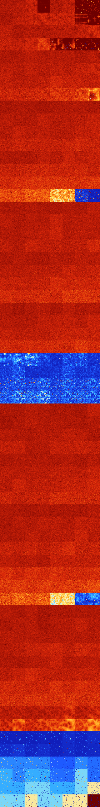

# B01356 (54784-55295)

<details>
    <summary>Initial Grid</summary>
    
</details>


<details>
    <summary>Initial Grid RLE</summary>

```
#C Exported from GoGoL (https://github.com/marrow16/gogol)
#C Wrap mode: Toroidal
#C Boundary mode: Dead
#C Step: 0
x = 100, y = 100, rule = B01356/S
15bo17bo42bo$79bo$11b3o28bo8bobo5bo15bo5bo4bo$37bo28bo18bo2bo8bo$19bo
44bo22bo$98bo$2bo57bo20bo9bo$15bo16bo13bo15bo10bo$o5bo19bo11bo12bo7bo5b
o16bo12bo$15bo4bo40bo11bo12bo2bo2bo$18bo41bo5bo$5bo29bo28bo17bo5bo$11bo
15bo3bo9bo14bo15bo15bo$8bo9bo9b2o23bo19bo5bo$17bo7bo$8bo8bo29bo29bo12bo
$o11bo15bo3bo42bo$4bo6bo4bo30bo12bo33bo$3bo24bo10bo5bo2bo3bo22bobo12bo$
17bo54bo16bo$6bo50bo29bo4bo$30bo51bo$16bo8bo48bo3bo$2bo33bo41bobo$28bo
4b2o50bo$5bo26bo32bo21bo$4bo15bo10bo21bo4bo19bo$16bo50bo25bo4bo$2bo5bo
30bo6bo42bo6bo$o18bo15bo$22bo16bo4bo3bo12bo17b3o8bobo$12bo18bo13bo$19bo
8bo21bo45bo$14bo15bo19bobo$23bo6bo43bo$30bo9bobo12b2o3bo21bo$39bo18bo
10bobo$24bo18bo55bo$34bo12bo6bo2bo$4bo5bo28bo4bo$13bo30bo8bo4bo29bo$15b
o16bo3bo$17bo12bo5bo20bo3bo11b2o2bo$14bo23bo$15bo16bo18b2o$12bo42bobo
24bo$66bo12bo2bo$3bo8bo5bo3bo13bo17bo41bo$5bo21bo3bo$10bo15bo4bo5bo34bo
4bo18bo$11bo2bo15bo14bo3bo22bo5bo9bo$28bo16bo47bo$8bo3bo16bo53bo3bobo$
7bo7bo31bo42bo$19bo11bo10bobo23bo16bo10bo$8bo25b2o25bo$5bo16bo2bo18bo
16b2o17bo7bo10bo$11bo6bobo17bo33bo$30bo33b2o6bo$26bo40bo15bo$49bo4bo5bo
$32bo27bo$100b$6bo51bo10bo24bo$58bo$2bo5bobo13bo72bo$11bo49b2obo14bo6bo
9bo$23bo22bo10bobobo27bo$14bo25bo28bo20bo$56bo25bo12bo3bo$6bo28bo12bo$
19bo7bo60bobobo$24bo10bo15bo4bo11bo13bobo8bo$53bo11bo11bo12b2o$6bo49bo$
11bo12bo5b2obo22bo4bo4bo7bo$11bo60bo9bob2o$21bo7bo52bo13bo$90bo3bo4bo$o
20b2o17bobo15bo30bo4bo$11bo21bo31bo$13bo5bo6bo2bo11bo10bo20bo10bo13bo$
11bo36bo4bo4bo9bo20bobo$21bo23bo2bo15bo20bobo$3bobo24b2o31bo10bo5bo$10b
o24bo7bo9bo16bo7bo11bo$bo7bo17bo18bo14bo12bo$22bo65bobo$12bo11bo7bobobo
49bo$bo37bo23bo13bo2bo10bo$21bo29bo27bo$21bo29bo8bo18bo$38bo10bo3bo33bo
8bo$7bo2bo17bo23bo25bo6bo3bo$27bo11bo53bo$b2o3bo3bo$8bo3bo38bo11bo7bo
19bo6bo$33bo10bo39bo11bo$23bo12bo15bo15bo7bo18bo$24bo19bo!
```
</details>
<details>
    <summary>Thumbnail</summary>

</details>
<table>
<tr>
    <td><a href="./54784%20S%20Heat%20Map%20Activity.png"></a><br>S (54784)<br>G>1000</td>    <td><a href="./54785%20S0%20Heat%20Map%20Activity.png"></a><br>S0 (54785)<br>G>1000</td>    <td><a href="./54786%20S1%20Heat%20Map%20Activity.png"></a><br>S1 (54786)<br>G>1000</td>    <td><a href="./54787%20S01%20Heat%20Map%20Activity.png"></a><br>S01 (54787)<br>R@422,p200</td>    <td><a href="./54788%20S2%20Heat%20Map%20Activity.png"></a><br>S2 (54788)<br>G>1000</td>    <td><a href="./54789%20S02%20Heat%20Map%20Activity.png"></a><br>S02 (54789)<br>G>1000</td>    <td><a href="./54790%20S12%20Heat%20Map%20Activity.png"></a><br>S12 (54790)<br>R@106,p12</td>    <td><a href="./54791%20S012%20Heat%20Map%20Activity.png"></a><br>S012 (54791)<br>R@24,p2</td></tr>
<tr>
    <td><a href="./54792%20S3%20Heat%20Map%20Activity.png"></a><br>S3 (54792)<br>G>1000</td>    <td><a href="./54793%20S03%20Heat%20Map%20Activity.png"></a><br>S03 (54793)<br>G>1000</td>    <td><a href="./54794%20S13%20Heat%20Map%20Activity.png"></a><br>S13 (54794)<br>G>1000</td>    <td><a href="./54795%20S013%20Heat%20Map%20Activity.png"></a><br>S013 (54795)<br>G>1000</td>    <td><a href="./54796%20S23%20Heat%20Map%20Activity.png"></a><br>S23 (54796)<br>G>1000</td>    <td><a href="./54797%20S023%20Heat%20Map%20Activity.png"></a><br>S023 (54797)<br>G>1000</td>    <td><a href="./54798%20S123%20Heat%20Map%20Activity.png"></a><br>S123 (54798)<br>G>1000</td>    <td><a href="./54799%20S0123%20Heat%20Map%20Activity.png"></a><br>S0123 (54799)<br>R@239,p126</td></tr>
<tr>
    <td><a href="./54800%20S4%20Heat%20Map%20Activity.png"></a><br>S4 (54800)<br>G>1000</td>    <td><a href="./54801%20S04%20Heat%20Map%20Activity.png"></a><br>S04 (54801)<br>G>1000</td>    <td><a href="./54802%20S14%20Heat%20Map%20Activity.png"></a><br>S14 (54802)<br>G>1000</td>    <td><a href="./54803%20S014%20Heat%20Map%20Activity.png"></a><br>S014 (54803)<br>G>1000</td>    <td><a href="./54804%20S24%20Heat%20Map%20Activity.png"></a><br>S24 (54804)<br>G>1000</td>    <td><a href="./54805%20S024%20Heat%20Map%20Activity.png"></a><br>S024 (54805)<br>G>1000</td>    <td><a href="./54806%20S124%20Heat%20Map%20Activity.png"></a><br>S124 (54806)<br>G>1000</td>    <td><a href="./54807%20S0124%20Heat%20Map%20Activity.png"></a><br>S0124 (54807)<br>G>1000</td></tr>
<tr>
    <td><a href="./54808%20S34%20Heat%20Map%20Activity.png"></a><br>S34 (54808)<br>G>1000</td>    <td><a href="./54809%20S034%20Heat%20Map%20Activity.png"></a><br>S034 (54809)<br>G>1000</td>    <td><a href="./54810%20S134%20Heat%20Map%20Activity.png"></a><br>S134 (54810)<br>G>1000</td>    <td><a href="./54811%20S0134%20Heat%20Map%20Activity.png"></a><br>S0134 (54811)<br>G>1000</td>    <td><a href="./54812%20S234%20Heat%20Map%20Activity.png"></a><br>S234 (54812)<br>G>1000</td>    <td><a href="./54813%20S0234%20Heat%20Map%20Activity.png"></a><br>S0234 (54813)<br>G>1000</td>    <td><a href="./54814%20S1234%20Heat%20Map%20Activity.png"></a><br>S1234 (54814)<br>R@78,p4</td>    <td><a href="./54815%20S01234%20Heat%20Map%20Activity.png"></a><br>S01234 (54815)<br>R@51,p4</td></tr>
<tr>
    <td><a href="./54816%20S5%20Heat%20Map%20Activity.png"></a><br>S5 (54816)<br>G>1000</td>    <td><a href="./54817%20S05%20Heat%20Map%20Activity.png"></a><br>S05 (54817)<br>G>1000</td>    <td><a href="./54818%20S15%20Heat%20Map%20Activity.png"></a><br>S15 (54818)<br>G>1000</td>    <td><a href="./54819%20S015%20Heat%20Map%20Activity.png"></a><br>S015 (54819)<br>G>1000</td>    <td><a href="./54820%20S25%20Heat%20Map%20Activity.png"></a><br>S25 (54820)<br>G>1000</td>    <td><a href="./54821%20S025%20Heat%20Map%20Activity.png"></a><br>S025 (54821)<br>G>1000</td>    <td><a href="./54822%20S125%20Heat%20Map%20Activity.png"></a><br>S125 (54822)<br>G>1000</td>    <td><a href="./54823%20S0125%20Heat%20Map%20Activity.png"></a><br>S0125 (54823)<br>G>1000</td></tr>
<tr>
    <td><a href="./54824%20S35%20Heat%20Map%20Activity.png"></a><br>S35 (54824)<br>G>1000</td>    <td><a href="./54825%20S035%20Heat%20Map%20Activity.png"></a><br>S035 (54825)<br>G>1000</td>    <td><a href="./54826%20S135%20Heat%20Map%20Activity.png"></a><br>S135 (54826)<br>G>1000</td>    <td><a href="./54827%20S0135%20Heat%20Map%20Activity.png"></a><br>S0135 (54827)<br>G>1000</td>    <td><a href="./54828%20S235%20Heat%20Map%20Activity.png"></a><br>S235 (54828)<br>G>1000</td>    <td><a href="./54829%20S0235%20Heat%20Map%20Activity.png"></a><br>S0235 (54829)<br>G>1000</td>    <td><a href="./54830%20S1235%20Heat%20Map%20Activity.png"></a><br>S1235 (54830)<br>G>1000</td>    <td><a href="./54831%20S01235%20Heat%20Map%20Activity.png"></a><br>S01235 (54831)<br>G>1000</td></tr>
<tr>
    <td><a href="./54832%20S45%20Heat%20Map%20Activity.png"></a><br>S45 (54832)<br>G>1000</td>    <td><a href="./54833%20S045%20Heat%20Map%20Activity.png"></a><br>S045 (54833)<br>G>1000</td>    <td><a href="./54834%20S145%20Heat%20Map%20Activity.png"></a><br>S145 (54834)<br>G>1000</td>    <td><a href="./54835%20S0145%20Heat%20Map%20Activity.png"></a><br>S0145 (54835)<br>G>1000</td>    <td><a href="./54836%20S245%20Heat%20Map%20Activity.png"></a><br>S245 (54836)<br>G>1000</td>    <td><a href="./54837%20S0245%20Heat%20Map%20Activity.png"></a><br>S0245 (54837)<br>G>1000</td>    <td><a href="./54838%20S1245%20Heat%20Map%20Activity.png"></a><br>S1245 (54838)<br>G>1000</td>    <td><a href="./54839%20S01245%20Heat%20Map%20Activity.png"></a><br>S01245 (54839)<br>G>1000</td></tr>
<tr>
    <td><a href="./54840%20S345%20Heat%20Map%20Activity.png"></a><br>S345 (54840)<br>G>1000</td>    <td><a href="./54841%20S0345%20Heat%20Map%20Activity.png"></a><br>S0345 (54841)<br>G>1000</td>    <td><a href="./54842%20S1345%20Heat%20Map%20Activity.png"></a><br>S1345 (54842)<br>G>1000</td>    <td><a href="./54843%20S01345%20Heat%20Map%20Activity.png"></a><br>S01345 (54843)<br>G>1000</td>    <td><a href="./54844%20S2345%20Heat%20Map%20Activity.png"></a><br>S2345 (54844)<br>G>1000</td>    <td><a href="./54845%20S02345%20Heat%20Map%20Activity.png"></a><br>S02345 (54845)<br>G>1000</td>    <td><a href="./54846%20S12345%20Heat%20Map%20Activity.png"></a><br>S12345 (54846)<br>G>1000</td>    <td><a href="./54847%20S012345%20Heat%20Map%20Activity.png"></a><br>S012345 (54847)<br>G>1000</td></tr>
<tr>
    <td><a href="./54848%20S6%20Heat%20Map%20Activity.png"></a><br>S6 (54848)<br>G>1000</td>    <td><a href="./54849%20S06%20Heat%20Map%20Activity.png"></a><br>S06 (54849)<br>G>1000</td>    <td><a href="./54850%20S16%20Heat%20Map%20Activity.png"></a><br>S16 (54850)<br>G>1000</td>    <td><a href="./54851%20S016%20Heat%20Map%20Activity.png"></a><br>S016 (54851)<br>G>1000</td>    <td><a href="./54852%20S26%20Heat%20Map%20Activity.png"></a><br>S26 (54852)<br>G>1000</td>    <td><a href="./54853%20S026%20Heat%20Map%20Activity.png"></a><br>S026 (54853)<br>G>1000</td>    <td><a href="./54854%20S126%20Heat%20Map%20Activity.png"></a><br>S126 (54854)<br>G>1000</td>    <td><a href="./54855%20S0126%20Heat%20Map%20Activity.png"></a><br>S0126 (54855)<br>G>1000</td></tr>
<tr>
    <td><a href="./54856%20S36%20Heat%20Map%20Activity.png"></a><br>S36 (54856)<br>G>1000</td>    <td><a href="./54857%20S036%20Heat%20Map%20Activity.png"></a><br>S036 (54857)<br>G>1000</td>    <td><a href="./54858%20S136%20Heat%20Map%20Activity.png"></a><br>S136 (54858)<br>G>1000</td>    <td><a href="./54859%20S0136%20Heat%20Map%20Activity.png"></a><br>S0136 (54859)<br>G>1000</td>    <td><a href="./54860%20S236%20Heat%20Map%20Activity.png"></a><br>S236 (54860)<br>G>1000</td>    <td><a href="./54861%20S0236%20Heat%20Map%20Activity.png"></a><br>S0236 (54861)<br>G>1000</td>    <td><a href="./54862%20S1236%20Heat%20Map%20Activity.png"></a><br>S1236 (54862)<br>G>1000</td>    <td><a href="./54863%20S01236%20Heat%20Map%20Activity.png"></a><br>S01236 (54863)<br>G>1000</td></tr>
<tr>
    <td><a href="./54864%20S46%20Heat%20Map%20Activity.png"></a><br>S46 (54864)<br>G>1000</td>    <td><a href="./54865%20S046%20Heat%20Map%20Activity.png"></a><br>S046 (54865)<br>G>1000</td>    <td><a href="./54866%20S146%20Heat%20Map%20Activity.png"></a><br>S146 (54866)<br>G>1000</td>    <td><a href="./54867%20S0146%20Heat%20Map%20Activity.png"></a><br>S0146 (54867)<br>G>1000</td>    <td><a href="./54868%20S246%20Heat%20Map%20Activity.png"></a><br>S246 (54868)<br>G>1000</td>    <td><a href="./54869%20S0246%20Heat%20Map%20Activity.png"></a><br>S0246 (54869)<br>G>1000</td>    <td><a href="./54870%20S1246%20Heat%20Map%20Activity.png"></a><br>S1246 (54870)<br>G>1000</td>    <td><a href="./54871%20S01246%20Heat%20Map%20Activity.png"></a><br>S01246 (54871)<br>G>1000</td></tr>
<tr>
    <td><a href="./54872%20S346%20Heat%20Map%20Activity.png"></a><br>S346 (54872)<br>G>1000</td>    <td><a href="./54873%20S0346%20Heat%20Map%20Activity.png"></a><br>S0346 (54873)<br>G>1000</td>    <td><a href="./54874%20S1346%20Heat%20Map%20Activity.png"></a><br>S1346 (54874)<br>G>1000</td>    <td><a href="./54875%20S01346%20Heat%20Map%20Activity.png"></a><br>S01346 (54875)<br>G>1000</td>    <td><a href="./54876%20S2346%20Heat%20Map%20Activity.png"></a><br>S2346 (54876)<br>G>1000</td>    <td><a href="./54877%20S02346%20Heat%20Map%20Activity.png"></a><br>S02346 (54877)<br>G>1000</td>    <td><a href="./54878%20S12346%20Heat%20Map%20Activity.png"></a><br>S12346 (54878)<br>G>1000</td>    <td><a href="./54879%20S012346%20Heat%20Map%20Activity.png"></a><br>S012346 (54879)<br>G>1000</td></tr>
<tr>
    <td><a href="./54880%20S56%20Heat%20Map%20Activity.png"></a><br>S56 (54880)<br>G>1000</td>    <td><a href="./54881%20S056%20Heat%20Map%20Activity.png"></a><br>S056 (54881)<br>G>1000</td>    <td><a href="./54882%20S156%20Heat%20Map%20Activity.png"></a><br>S156 (54882)<br>G>1000</td>    <td><a href="./54883%20S0156%20Heat%20Map%20Activity.png"></a><br>S0156 (54883)<br>G>1000</td>    <td><a href="./54884%20S256%20Heat%20Map%20Activity.png"></a><br>S256 (54884)<br>G>1000</td>    <td><a href="./54885%20S0256%20Heat%20Map%20Activity.png"></a><br>S0256 (54885)<br>G>1000</td>    <td><a href="./54886%20S1256%20Heat%20Map%20Activity.png"></a><br>S1256 (54886)<br>G>1000</td>    <td><a href="./54887%20S01256%20Heat%20Map%20Activity.png"></a><br>S01256 (54887)<br>G>1000</td></tr>
<tr>
    <td><a href="./54888%20S356%20Heat%20Map%20Activity.png"></a><br>S356 (54888)<br>G>1000</td>    <td><a href="./54889%20S0356%20Heat%20Map%20Activity.png"></a><br>S0356 (54889)<br>G>1000</td>    <td><a href="./54890%20S1356%20Heat%20Map%20Activity.png"></a><br>S1356 (54890)<br>G>1000</td>    <td><a href="./54891%20S01356%20Heat%20Map%20Activity.png"></a><br>S01356 (54891)<br>G>1000</td>    <td><a href="./54892%20S2356%20Heat%20Map%20Activity.png"></a><br>S2356 (54892)<br>G>1000</td>    <td><a href="./54893%20S02356%20Heat%20Map%20Activity.png"></a><br>S02356 (54893)<br>G>1000</td>    <td><a href="./54894%20S12356%20Heat%20Map%20Activity.png"></a><br>S12356 (54894)<br>G>1000</td>    <td><a href="./54895%20S012356%20Heat%20Map%20Activity.png"></a><br>S012356 (54895)<br>G>1000</td></tr>
<tr>
    <td><a href="./54896%20S456%20Heat%20Map%20Activity.png"></a><br>S456 (54896)<br>G>1000</td>    <td><a href="./54897%20S0456%20Heat%20Map%20Activity.png"></a><br>S0456 (54897)<br>G>1000</td>    <td><a href="./54898%20S1456%20Heat%20Map%20Activity.png"></a><br>S1456 (54898)<br>G>1000</td>    <td><a href="./54899%20S01456%20Heat%20Map%20Activity.png"></a><br>S01456 (54899)<br>G>1000</td>    <td><a href="./54900%20S2456%20Heat%20Map%20Activity.png"></a><br>S2456 (54900)<br>G>1000</td>    <td><a href="./54901%20S02456%20Heat%20Map%20Activity.png"></a><br>S02456 (54901)<br>G>1000</td>    <td><a href="./54902%20S12456%20Heat%20Map%20Activity.png"></a><br>S12456 (54902)<br>G>1000</td>    <td><a href="./54903%20S012456%20Heat%20Map%20Activity.png"></a><br>S012456 (54903)<br>G>1000</td></tr>
<tr>
    <td><a href="./54904%20S3456%20Heat%20Map%20Activity.png"></a><br>S3456 (54904)<br>G>1000</td>    <td><a href="./54905%20S03456%20Heat%20Map%20Activity.png"></a><br>S03456 (54905)<br>G>1000</td>    <td><a href="./54906%20S13456%20Heat%20Map%20Activity.png"></a><br>S13456 (54906)<br>G>1000</td>    <td><a href="./54907%20S013456%20Heat%20Map%20Activity.png"></a><br>S013456 (54907)<br>G>1000</td>    <td><a href="./54908%20S23456%20Heat%20Map%20Activity.png"></a><br>S23456 (54908)<br>G>1000</td>    <td><a href="./54909%20S023456%20Heat%20Map%20Activity.png"></a><br>S023456 (54909)<br>G>1000</td>    <td><a href="./54910%20S123456%20Heat%20Map%20Activity.png"></a><br>S123456 (54910)<br>R@359,p180</td>    <td><a href="./54911%20S0123456%20Heat%20Map%20Activity.png"></a><br>S0123456 (54911)<br>G>1000</td></tr>
<tr>
    <td><a href="./54912%20S7%20Heat%20Map%20Activity.png"></a><br>S7 (54912)<br>G>1000</td>    <td><a href="./54913%20S07%20Heat%20Map%20Activity.png"></a><br>S07 (54913)<br>G>1000</td>    <td><a href="./54914%20S17%20Heat%20Map%20Activity.png"></a><br>S17 (54914)<br>G>1000</td>    <td><a href="./54915%20S017%20Heat%20Map%20Activity.png"></a><br>S017 (54915)<br>G>1000</td>    <td><a href="./54916%20S27%20Heat%20Map%20Activity.png"></a><br>S27 (54916)<br>G>1000</td>    <td><a href="./54917%20S027%20Heat%20Map%20Activity.png"></a><br>S027 (54917)<br>G>1000</td>    <td><a href="./54918%20S127%20Heat%20Map%20Activity.png"></a><br>S127 (54918)<br>G>1000</td>    <td><a href="./54919%20S0127%20Heat%20Map%20Activity.png"></a><br>S0127 (54919)<br>G>1000</td></tr>
<tr>
    <td><a href="./54920%20S37%20Heat%20Map%20Activity.png"></a><br>S37 (54920)<br>G>1000</td>    <td><a href="./54921%20S037%20Heat%20Map%20Activity.png"></a><br>S037 (54921)<br>G>1000</td>    <td><a href="./54922%20S137%20Heat%20Map%20Activity.png"></a><br>S137 (54922)<br>G>1000</td>    <td><a href="./54923%20S0137%20Heat%20Map%20Activity.png"></a><br>S0137 (54923)<br>G>1000</td>    <td><a href="./54924%20S237%20Heat%20Map%20Activity.png"></a><br>S237 (54924)<br>G>1000</td>    <td><a href="./54925%20S0237%20Heat%20Map%20Activity.png"></a><br>S0237 (54925)<br>G>1000</td>    <td><a href="./54926%20S1237%20Heat%20Map%20Activity.png"></a><br>S1237 (54926)<br>G>1000</td>    <td><a href="./54927%20S01237%20Heat%20Map%20Activity.png"></a><br>S01237 (54927)<br>G>1000</td></tr>
<tr>
    <td><a href="./54928%20S47%20Heat%20Map%20Activity.png"></a><br>S47 (54928)<br>G>1000</td>    <td><a href="./54929%20S047%20Heat%20Map%20Activity.png"></a><br>S047 (54929)<br>G>1000</td>    <td><a href="./54930%20S147%20Heat%20Map%20Activity.png"></a><br>S147 (54930)<br>G>1000</td>    <td><a href="./54931%20S0147%20Heat%20Map%20Activity.png"></a><br>S0147 (54931)<br>G>1000</td>    <td><a href="./54932%20S247%20Heat%20Map%20Activity.png"></a><br>S247 (54932)<br>G>1000</td>    <td><a href="./54933%20S0247%20Heat%20Map%20Activity.png"></a><br>S0247 (54933)<br>G>1000</td>    <td><a href="./54934%20S1247%20Heat%20Map%20Activity.png"></a><br>S1247 (54934)<br>G>1000</td>    <td><a href="./54935%20S01247%20Heat%20Map%20Activity.png"></a><br>S01247 (54935)<br>G>1000</td></tr>
<tr>
    <td><a href="./54936%20S347%20Heat%20Map%20Activity.png"></a><br>S347 (54936)<br>G>1000</td>    <td><a href="./54937%20S0347%20Heat%20Map%20Activity.png"></a><br>S0347 (54937)<br>G>1000</td>    <td><a href="./54938%20S1347%20Heat%20Map%20Activity.png"></a><br>S1347 (54938)<br>G>1000</td>    <td><a href="./54939%20S01347%20Heat%20Map%20Activity.png"></a><br>S01347 (54939)<br>G>1000</td>    <td><a href="./54940%20S2347%20Heat%20Map%20Activity.png"></a><br>S2347 (54940)<br>G>1000</td>    <td><a href="./54941%20S02347%20Heat%20Map%20Activity.png"></a><br>S02347 (54941)<br>G>1000</td>    <td><a href="./54942%20S12347%20Heat%20Map%20Activity.png"></a><br>S12347 (54942)<br>G>1000</td>    <td><a href="./54943%20S012347%20Heat%20Map%20Activity.png"></a><br>S012347 (54943)<br>G>1000</td></tr>
<tr>
    <td><a href="./54944%20S57%20Heat%20Map%20Activity.png"></a><br>S57 (54944)<br>G>1000</td>    <td><a href="./54945%20S057%20Heat%20Map%20Activity.png"></a><br>S057 (54945)<br>G>1000</td>    <td><a href="./54946%20S157%20Heat%20Map%20Activity.png"></a><br>S157 (54946)<br>G>1000</td>    <td><a href="./54947%20S0157%20Heat%20Map%20Activity.png"></a><br>S0157 (54947)<br>G>1000</td>    <td><a href="./54948%20S257%20Heat%20Map%20Activity.png"></a><br>S257 (54948)<br>G>1000</td>    <td><a href="./54949%20S0257%20Heat%20Map%20Activity.png"></a><br>S0257 (54949)<br>G>1000</td>    <td><a href="./54950%20S1257%20Heat%20Map%20Activity.png"></a><br>S1257 (54950)<br>G>1000</td>    <td><a href="./54951%20S01257%20Heat%20Map%20Activity.png"></a><br>S01257 (54951)<br>G>1000</td></tr>
<tr>
    <td><a href="./54952%20S357%20Heat%20Map%20Activity.png"></a><br>S357 (54952)<br>G>1000</td>    <td><a href="./54953%20S0357%20Heat%20Map%20Activity.png"></a><br>S0357 (54953)<br>G>1000</td>    <td><a href="./54954%20S1357%20Heat%20Map%20Activity.png"></a><br>S1357 (54954)<br>G>1000</td>    <td><a href="./54955%20S01357%20Heat%20Map%20Activity.png"></a><br>S01357 (54955)<br>G>1000</td>    <td><a href="./54956%20S2357%20Heat%20Map%20Activity.png"></a><br>S2357 (54956)<br>G>1000</td>    <td><a href="./54957%20S02357%20Heat%20Map%20Activity.png"></a><br>S02357 (54957)<br>G>1000</td>    <td><a href="./54958%20S12357%20Heat%20Map%20Activity.png"></a><br>S12357 (54958)<br>G>1000</td>    <td><a href="./54959%20S012357%20Heat%20Map%20Activity.png"></a><br>S012357 (54959)<br>G>1000</td></tr>
<tr>
    <td><a href="./54960%20S457%20Heat%20Map%20Activity.png"></a><br>S457 (54960)<br>G>1000</td>    <td><a href="./54961%20S0457%20Heat%20Map%20Activity.png"></a><br>S0457 (54961)<br>G>1000</td>    <td><a href="./54962%20S1457%20Heat%20Map%20Activity.png"></a><br>S1457 (54962)<br>G>1000</td>    <td><a href="./54963%20S01457%20Heat%20Map%20Activity.png"></a><br>S01457 (54963)<br>G>1000</td>    <td><a href="./54964%20S2457%20Heat%20Map%20Activity.png"></a><br>S2457 (54964)<br>G>1000</td>    <td><a href="./54965%20S02457%20Heat%20Map%20Activity.png"></a><br>S02457 (54965)<br>G>1000</td>    <td><a href="./54966%20S12457%20Heat%20Map%20Activity.png"></a><br>S12457 (54966)<br>G>1000</td>    <td><a href="./54967%20S012457%20Heat%20Map%20Activity.png"></a><br>S012457 (54967)<br>G>1000</td></tr>
<tr>
    <td><a href="./54968%20S3457%20Heat%20Map%20Activity.png"></a><br>S3457 (54968)<br>G>1000</td>    <td><a href="./54969%20S03457%20Heat%20Map%20Activity.png"></a><br>S03457 (54969)<br>G>1000</td>    <td><a href="./54970%20S13457%20Heat%20Map%20Activity.png"></a><br>S13457 (54970)<br>G>1000</td>    <td><a href="./54971%20S013457%20Heat%20Map%20Activity.png"></a><br>S013457 (54971)<br>G>1000</td>    <td><a href="./54972%20S23457%20Heat%20Map%20Activity.png"></a><br>S23457 (54972)<br>G>1000</td>    <td><a href="./54973%20S023457%20Heat%20Map%20Activity.png"></a><br>S023457 (54973)<br>G>1000</td>    <td><a href="./54974%20S123457%20Heat%20Map%20Activity.png"></a><br>S123457 (54974)<br>G>1000</td>    <td><a href="./54975%20S0123457%20Heat%20Map%20Activity.png"></a><br>S0123457 (54975)<br>G>1000</td></tr>
<tr>
    <td><a href="./54976%20S67%20Heat%20Map%20Activity.png"></a><br>S67 (54976)<br>G>1000</td>    <td><a href="./54977%20S067%20Heat%20Map%20Activity.png"></a><br>S067 (54977)<br>G>1000</td>    <td><a href="./54978%20S167%20Heat%20Map%20Activity.png"></a><br>S167 (54978)<br>G>1000</td>    <td><a href="./54979%20S0167%20Heat%20Map%20Activity.png"></a><br>S0167 (54979)<br>G>1000</td>    <td><a href="./54980%20S267%20Heat%20Map%20Activity.png"></a><br>S267 (54980)<br>G>1000</td>    <td><a href="./54981%20S0267%20Heat%20Map%20Activity.png"></a><br>S0267 (54981)<br>G>1000</td>    <td><a href="./54982%20S1267%20Heat%20Map%20Activity.png"></a><br>S1267 (54982)<br>G>1000</td>    <td><a href="./54983%20S01267%20Heat%20Map%20Activity.png"></a><br>S01267 (54983)<br>G>1000</td></tr>
<tr>
    <td><a href="./54984%20S367%20Heat%20Map%20Activity.png"></a><br>S367 (54984)<br>G>1000</td>    <td><a href="./54985%20S0367%20Heat%20Map%20Activity.png"></a><br>S0367 (54985)<br>G>1000</td>    <td><a href="./54986%20S1367%20Heat%20Map%20Activity.png"></a><br>S1367 (54986)<br>G>1000</td>    <td><a href="./54987%20S01367%20Heat%20Map%20Activity.png"></a><br>S01367 (54987)<br>G>1000</td>    <td><a href="./54988%20S2367%20Heat%20Map%20Activity.png"></a><br>S2367 (54988)<br>G>1000</td>    <td><a href="./54989%20S02367%20Heat%20Map%20Activity.png"></a><br>S02367 (54989)<br>G>1000</td>    <td><a href="./54990%20S12367%20Heat%20Map%20Activity.png"></a><br>S12367 (54990)<br>G>1000</td>    <td><a href="./54991%20S012367%20Heat%20Map%20Activity.png"></a><br>S012367 (54991)<br>G>1000</td></tr>
<tr>
    <td><a href="./54992%20S467%20Heat%20Map%20Activity.png"></a><br>S467 (54992)<br>G>1000</td>    <td><a href="./54993%20S0467%20Heat%20Map%20Activity.png"></a><br>S0467 (54993)<br>G>1000</td>    <td><a href="./54994%20S1467%20Heat%20Map%20Activity.png"></a><br>S1467 (54994)<br>G>1000</td>    <td><a href="./54995%20S01467%20Heat%20Map%20Activity.png"></a><br>S01467 (54995)<br>G>1000</td>    <td><a href="./54996%20S2467%20Heat%20Map%20Activity.png"></a><br>S2467 (54996)<br>G>1000</td>    <td><a href="./54997%20S02467%20Heat%20Map%20Activity.png"></a><br>S02467 (54997)<br>G>1000</td>    <td><a href="./54998%20S12467%20Heat%20Map%20Activity.png"></a><br>S12467 (54998)<br>G>1000</td>    <td><a href="./54999%20S012467%20Heat%20Map%20Activity.png"></a><br>S012467 (54999)<br>G>1000</td></tr>
<tr>
    <td><a href="./55000%20S3467%20Heat%20Map%20Activity.png"></a><br>S3467 (55000)<br>G>1000</td>    <td><a href="./55001%20S03467%20Heat%20Map%20Activity.png"></a><br>S03467 (55001)<br>G>1000</td>    <td><a href="./55002%20S13467%20Heat%20Map%20Activity.png"></a><br>S13467 (55002)<br>G>1000</td>    <td><a href="./55003%20S013467%20Heat%20Map%20Activity.png"></a><br>S013467 (55003)<br>G>1000</td>    <td><a href="./55004%20S23467%20Heat%20Map%20Activity.png"></a><br>S23467 (55004)<br>G>1000</td>    <td><a href="./55005%20S023467%20Heat%20Map%20Activity.png"></a><br>S023467 (55005)<br>G>1000</td>    <td><a href="./55006%20S123467%20Heat%20Map%20Activity.png"></a><br>S123467 (55006)<br>G>1000</td>    <td><a href="./55007%20S0123467%20Heat%20Map%20Activity.png"></a><br>S0123467 (55007)<br>G>1000</td></tr>
<tr>
    <td><a href="./55008%20S567%20Heat%20Map%20Activity.png"></a><br>S567 (55008)<br>R@801,p12</td>    <td><a href="./55009%20S0567%20Heat%20Map%20Activity.png"></a><br>S0567 (55009)<br>R@361,p12</td>    <td><a href="./55010%20S1567%20Heat%20Map%20Activity.png"></a><br>S1567 (55010)<br>R@277,p4</td>    <td><a href="./55011%20S01567%20Heat%20Map%20Activity.png"></a><br>S01567 (55011)<br>R@305,p12</td>    <td><a href="./55012%20S2567%20Heat%20Map%20Activity.png"></a><br>S2567 (55012)<br>R@251,p60</td>    <td><a href="./55013%20S02567%20Heat%20Map%20Activity.png"></a><br>S02567 (55013)<br>R@178,p6</td>    <td><a href="./55014%20S12567%20Heat%20Map%20Activity.png"></a><br>S12567 (55014)<br>R@144,p12</td>    <td><a href="./55015%20S012567%20Heat%20Map%20Activity.png"></a><br>S012567 (55015)<br>R@254,p84</td></tr>
<tr>
    <td><a href="./55016%20S3567%20Heat%20Map%20Activity.png"></a><br>S3567 (55016)<br>R@113,p10</td>    <td><a href="./55017%20S03567%20Heat%20Map%20Activity.png"></a><br>S03567 (55017)<br>R@110,p10</td>    <td><a href="./55018%20S13567%20Heat%20Map%20Activity.png"></a><br>S13567 (55018)<br>R@162,p14</td>    <td><a href="./55019%20S013567%20Heat%20Map%20Activity.png"></a><br>S013567 (55019)<br>R@170,p60</td>    <td><a href="./55020%20S23567%20Heat%20Map%20Activity.png"></a><br>S23567 (55020)<br>R@139,p10</td>    <td><a href="./55021%20S023567%20Heat%20Map%20Activity.png"></a><br>S023567 (55021)<br>R@93,p10</td>    <td><a href="./55022%20S123567%20Heat%20Map%20Activity.png"></a><br>S123567 (55022)<br>R@120,p12</td>    <td><a href="./55023%20S0123567%20Heat%20Map%20Activity.png"></a><br>S0123567 (55023)<br>R@138,p12</td></tr>
<tr>
    <td><a href="./55024%20S4567%20Heat%20Map%20Activity.png"></a><br>S4567 (55024)<br>R@37,p12</td>    <td><a href="./55025%20S04567%20Heat%20Map%20Activity.png"></a><br>S04567 (55025)<br>R@41,p12</td>    <td><a href="./55026%20S14567%20Heat%20Map%20Activity.png"></a><br>S14567 (55026)<br>R@34,p12</td>    <td><a href="./55027%20S014567%20Heat%20Map%20Activity.png"></a><br>S014567 (55027)<br>R@36,p12</td>    <td><a href="./55028%20S24567%20Heat%20Map%20Activity.png"></a><br>S24567 (55028)<br>R@35,p12</td>    <td><a href="./55029%20S024567%20Heat%20Map%20Activity.png"></a><br>S024567 (55029)<br>R@37,p12</td>    <td><a href="./55030%20S124567%20Heat%20Map%20Activity.png"></a><br>S124567 (55030)<br>R@31,p12</td>    <td><a href="./55031%20S0124567%20Heat%20Map%20Activity.png"></a><br>S0124567 (55031)<br>R@35,p12</td></tr>
<tr>
    <td><a href="./55032%20S34567%20Heat%20Map%20Activity.png"></a><br>S34567 (55032)<br>R@25,p6</td>    <td><a href="./55033%20S034567%20Heat%20Map%20Activity.png"></a><br>S034567 (55033)<br>R@25,p6</td>    <td><a href="./55034%20S134567%20Heat%20Map%20Activity.png"></a><br>S134567 (55034)<br>R@20,p6</td>    <td><a href="./55035%20S0134567%20Heat%20Map%20Activity.png"></a><br>S0134567 (55035)<br>R@22,p6</td>    <td><a href="./55036%20S234567%20Heat%20Map%20Activity.png"></a><br>S234567 (55036)<br>R@24,p6</td>    <td><a href="./55037%20S0234567%20Heat%20Map%20Activity.png"></a><br>S0234567 (55037)<br>R@28,p12</td>    <td><a href="./55038%20S1234567%20Heat%20Map%20Activity.png"></a><br>S1234567 (55038)<br>R@18,p6</td>    <td><a href="./55039%20S01234567%20Heat%20Map%20Activity.png"></a><br>S01234567 (55039)<br>R@28,p12</td></tr>
<tr>
    <td><a href="./55040%20S8%20Heat%20Map%20Activity.png"></a><br>S8 (55040)<br>G>1000</td>    <td><a href="./55041%20S08%20Heat%20Map%20Activity.png"></a><br>S08 (55041)<br>G>1000</td>    <td><a href="./55042%20S18%20Heat%20Map%20Activity.png"></a><br>S18 (55042)<br>G>1000</td>    <td><a href="./55043%20S018%20Heat%20Map%20Activity.png"></a><br>S018 (55043)<br>G>1000</td>    <td><a href="./55044%20S28%20Heat%20Map%20Activity.png"></a><br>S28 (55044)<br>G>1000</td>    <td><a href="./55045%20S028%20Heat%20Map%20Activity.png"></a><br>S028 (55045)<br>G>1000</td>    <td><a href="./55046%20S128%20Heat%20Map%20Activity.png"></a><br>S128 (55046)<br>G>1000</td>    <td><a href="./55047%20S0128%20Heat%20Map%20Activity.png"></a><br>S0128 (55047)<br>G>1000</td></tr>
<tr>
    <td><a href="./55048%20S38%20Heat%20Map%20Activity.png"></a><br>S38 (55048)<br>G>1000</td>    <td><a href="./55049%20S038%20Heat%20Map%20Activity.png"></a><br>S038 (55049)<br>G>1000</td>    <td><a href="./55050%20S138%20Heat%20Map%20Activity.png"></a><br>S138 (55050)<br>G>1000</td>    <td><a href="./55051%20S0138%20Heat%20Map%20Activity.png"></a><br>S0138 (55051)<br>G>1000</td>    <td><a href="./55052%20S238%20Heat%20Map%20Activity.png"></a><br>S238 (55052)<br>G>1000</td>    <td><a href="./55053%20S0238%20Heat%20Map%20Activity.png"></a><br>S0238 (55053)<br>G>1000</td>    <td><a href="./55054%20S1238%20Heat%20Map%20Activity.png"></a><br>S1238 (55054)<br>G>1000</td>    <td><a href="./55055%20S01238%20Heat%20Map%20Activity.png"></a><br>S01238 (55055)<br>G>1000</td></tr>
<tr>
    <td><a href="./55056%20S48%20Heat%20Map%20Activity.png"></a><br>S48 (55056)<br>G>1000</td>    <td><a href="./55057%20S048%20Heat%20Map%20Activity.png"></a><br>S048 (55057)<br>G>1000</td>    <td><a href="./55058%20S148%20Heat%20Map%20Activity.png"></a><br>S148 (55058)<br>G>1000</td>    <td><a href="./55059%20S0148%20Heat%20Map%20Activity.png"></a><br>S0148 (55059)<br>G>1000</td>    <td><a href="./55060%20S248%20Heat%20Map%20Activity.png"></a><br>S248 (55060)<br>G>1000</td>    <td><a href="./55061%20S0248%20Heat%20Map%20Activity.png"></a><br>S0248 (55061)<br>G>1000</td>    <td><a href="./55062%20S1248%20Heat%20Map%20Activity.png"></a><br>S1248 (55062)<br>G>1000</td>    <td><a href="./55063%20S01248%20Heat%20Map%20Activity.png"></a><br>S01248 (55063)<br>G>1000</td></tr>
<tr>
    <td><a href="./55064%20S348%20Heat%20Map%20Activity.png"></a><br>S348 (55064)<br>G>1000</td>    <td><a href="./55065%20S0348%20Heat%20Map%20Activity.png"></a><br>S0348 (55065)<br>G>1000</td>    <td><a href="./55066%20S1348%20Heat%20Map%20Activity.png"></a><br>S1348 (55066)<br>G>1000</td>    <td><a href="./55067%20S01348%20Heat%20Map%20Activity.png"></a><br>S01348 (55067)<br>G>1000</td>    <td><a href="./55068%20S2348%20Heat%20Map%20Activity.png"></a><br>S2348 (55068)<br>G>1000</td>    <td><a href="./55069%20S02348%20Heat%20Map%20Activity.png"></a><br>S02348 (55069)<br>G>1000</td>    <td><a href="./55070%20S12348%20Heat%20Map%20Activity.png"></a><br>S12348 (55070)<br>G>1000</td>    <td><a href="./55071%20S012348%20Heat%20Map%20Activity.png"></a><br>S012348 (55071)<br>G>1000</td></tr>
<tr>
    <td><a href="./55072%20S58%20Heat%20Map%20Activity.png"></a><br>S58 (55072)<br>G>1000</td>    <td><a href="./55073%20S058%20Heat%20Map%20Activity.png"></a><br>S058 (55073)<br>G>1000</td>    <td><a href="./55074%20S158%20Heat%20Map%20Activity.png"></a><br>S158 (55074)<br>G>1000</td>    <td><a href="./55075%20S0158%20Heat%20Map%20Activity.png"></a><br>S0158 (55075)<br>G>1000</td>    <td><a href="./55076%20S258%20Heat%20Map%20Activity.png"></a><br>S258 (55076)<br>G>1000</td>    <td><a href="./55077%20S0258%20Heat%20Map%20Activity.png"></a><br>S0258 (55077)<br>G>1000</td>    <td><a href="./55078%20S1258%20Heat%20Map%20Activity.png"></a><br>S1258 (55078)<br>G>1000</td>    <td><a href="./55079%20S01258%20Heat%20Map%20Activity.png"></a><br>S01258 (55079)<br>G>1000</td></tr>
<tr>
    <td><a href="./55080%20S358%20Heat%20Map%20Activity.png"></a><br>S358 (55080)<br>G>1000</td>    <td><a href="./55081%20S0358%20Heat%20Map%20Activity.png"></a><br>S0358 (55081)<br>G>1000</td>    <td><a href="./55082%20S1358%20Heat%20Map%20Activity.png"></a><br>S1358 (55082)<br>G>1000</td>    <td><a href="./55083%20S01358%20Heat%20Map%20Activity.png"></a><br>S01358 (55083)<br>G>1000</td>    <td><a href="./55084%20S2358%20Heat%20Map%20Activity.png"></a><br>S2358 (55084)<br>G>1000</td>    <td><a href="./55085%20S02358%20Heat%20Map%20Activity.png"></a><br>S02358 (55085)<br>G>1000</td>    <td><a href="./55086%20S12358%20Heat%20Map%20Activity.png"></a><br>S12358 (55086)<br>G>1000</td>    <td><a href="./55087%20S012358%20Heat%20Map%20Activity.png"></a><br>S012358 (55087)<br>G>1000</td></tr>
<tr>
    <td><a href="./55088%20S458%20Heat%20Map%20Activity.png"></a><br>S458 (55088)<br>G>1000</td>    <td><a href="./55089%20S0458%20Heat%20Map%20Activity.png"></a><br>S0458 (55089)<br>G>1000</td>    <td><a href="./55090%20S1458%20Heat%20Map%20Activity.png"></a><br>S1458 (55090)<br>G>1000</td>    <td><a href="./55091%20S01458%20Heat%20Map%20Activity.png"></a><br>S01458 (55091)<br>G>1000</td>    <td><a href="./55092%20S2458%20Heat%20Map%20Activity.png"></a><br>S2458 (55092)<br>G>1000</td>    <td><a href="./55093%20S02458%20Heat%20Map%20Activity.png"></a><br>S02458 (55093)<br>G>1000</td>    <td><a href="./55094%20S12458%20Heat%20Map%20Activity.png"></a><br>S12458 (55094)<br>G>1000</td>    <td><a href="./55095%20S012458%20Heat%20Map%20Activity.png"></a><br>S012458 (55095)<br>G>1000</td></tr>
<tr>
    <td><a href="./55096%20S3458%20Heat%20Map%20Activity.png"></a><br>S3458 (55096)<br>G>1000</td>    <td><a href="./55097%20S03458%20Heat%20Map%20Activity.png"></a><br>S03458 (55097)<br>G>1000</td>    <td><a href="./55098%20S13458%20Heat%20Map%20Activity.png"></a><br>S13458 (55098)<br>G>1000</td>    <td><a href="./55099%20S013458%20Heat%20Map%20Activity.png"></a><br>S013458 (55099)<br>G>1000</td>    <td><a href="./55100%20S23458%20Heat%20Map%20Activity.png"></a><br>S23458 (55100)<br>G>1000</td>    <td><a href="./55101%20S023458%20Heat%20Map%20Activity.png"></a><br>S023458 (55101)<br>G>1000</td>    <td><a href="./55102%20S123458%20Heat%20Map%20Activity.png"></a><br>S123458 (55102)<br>G>1000</td>    <td><a href="./55103%20S0123458%20Heat%20Map%20Activity.png"></a><br>S0123458 (55103)<br>G>1000</td></tr>
<tr>
    <td><a href="./55104%20S68%20Heat%20Map%20Activity.png"></a><br>S68 (55104)<br>G>1000</td>    <td><a href="./55105%20S068%20Heat%20Map%20Activity.png"></a><br>S068 (55105)<br>G>1000</td>    <td><a href="./55106%20S168%20Heat%20Map%20Activity.png"></a><br>S168 (55106)<br>G>1000</td>    <td><a href="./55107%20S0168%20Heat%20Map%20Activity.png"></a><br>S0168 (55107)<br>G>1000</td>    <td><a href="./55108%20S268%20Heat%20Map%20Activity.png"></a><br>S268 (55108)<br>G>1000</td>    <td><a href="./55109%20S0268%20Heat%20Map%20Activity.png"></a><br>S0268 (55109)<br>G>1000</td>    <td><a href="./55110%20S1268%20Heat%20Map%20Activity.png"></a><br>S1268 (55110)<br>G>1000</td>    <td><a href="./55111%20S01268%20Heat%20Map%20Activity.png"></a><br>S01268 (55111)<br>G>1000</td></tr>
<tr>
    <td><a href="./55112%20S368%20Heat%20Map%20Activity.png"></a><br>S368 (55112)<br>G>1000</td>    <td><a href="./55113%20S0368%20Heat%20Map%20Activity.png"></a><br>S0368 (55113)<br>G>1000</td>    <td><a href="./55114%20S1368%20Heat%20Map%20Activity.png"></a><br>S1368 (55114)<br>G>1000</td>    <td><a href="./55115%20S01368%20Heat%20Map%20Activity.png"></a><br>S01368 (55115)<br>G>1000</td>    <td><a href="./55116%20S2368%20Heat%20Map%20Activity.png"></a><br>S2368 (55116)<br>G>1000</td>    <td><a href="./55117%20S02368%20Heat%20Map%20Activity.png"></a><br>S02368 (55117)<br>G>1000</td>    <td><a href="./55118%20S12368%20Heat%20Map%20Activity.png"></a><br>S12368 (55118)<br>G>1000</td>    <td><a href="./55119%20S012368%20Heat%20Map%20Activity.png"></a><br>S012368 (55119)<br>G>1000</td></tr>
<tr>
    <td><a href="./55120%20S468%20Heat%20Map%20Activity.png"></a><br>S468 (55120)<br>G>1000</td>    <td><a href="./55121%20S0468%20Heat%20Map%20Activity.png"></a><br>S0468 (55121)<br>G>1000</td>    <td><a href="./55122%20S1468%20Heat%20Map%20Activity.png"></a><br>S1468 (55122)<br>G>1000</td>    <td><a href="./55123%20S01468%20Heat%20Map%20Activity.png"></a><br>S01468 (55123)<br>G>1000</td>    <td><a href="./55124%20S2468%20Heat%20Map%20Activity.png"></a><br>S2468 (55124)<br>G>1000</td>    <td><a href="./55125%20S02468%20Heat%20Map%20Activity.png"></a><br>S02468 (55125)<br>G>1000</td>    <td><a href="./55126%20S12468%20Heat%20Map%20Activity.png"></a><br>S12468 (55126)<br>G>1000</td>    <td><a href="./55127%20S012468%20Heat%20Map%20Activity.png"></a><br>S012468 (55127)<br>G>1000</td></tr>
<tr>
    <td><a href="./55128%20S3468%20Heat%20Map%20Activity.png"></a><br>S3468 (55128)<br>G>1000</td>    <td><a href="./55129%20S03468%20Heat%20Map%20Activity.png"></a><br>S03468 (55129)<br>G>1000</td>    <td><a href="./55130%20S13468%20Heat%20Map%20Activity.png"></a><br>S13468 (55130)<br>G>1000</td>    <td><a href="./55131%20S013468%20Heat%20Map%20Activity.png"></a><br>S013468 (55131)<br>G>1000</td>    <td><a href="./55132%20S23468%20Heat%20Map%20Activity.png"></a><br>S23468 (55132)<br>G>1000</td>    <td><a href="./55133%20S023468%20Heat%20Map%20Activity.png"></a><br>S023468 (55133)<br>G>1000</td>    <td><a href="./55134%20S123468%20Heat%20Map%20Activity.png"></a><br>S123468 (55134)<br>G>1000</td>    <td><a href="./55135%20S0123468%20Heat%20Map%20Activity.png"></a><br>S0123468 (55135)<br>G>1000</td></tr>
<tr>
    <td><a href="./55136%20S568%20Heat%20Map%20Activity.png"></a><br>S568 (55136)<br>G>1000</td>    <td><a href="./55137%20S0568%20Heat%20Map%20Activity.png"></a><br>S0568 (55137)<br>G>1000</td>    <td><a href="./55138%20S1568%20Heat%20Map%20Activity.png"></a><br>S1568 (55138)<br>G>1000</td>    <td><a href="./55139%20S01568%20Heat%20Map%20Activity.png"></a><br>S01568 (55139)<br>G>1000</td>    <td><a href="./55140%20S2568%20Heat%20Map%20Activity.png"></a><br>S2568 (55140)<br>G>1000</td>    <td><a href="./55141%20S02568%20Heat%20Map%20Activity.png"></a><br>S02568 (55141)<br>G>1000</td>    <td><a href="./55142%20S12568%20Heat%20Map%20Activity.png"></a><br>S12568 (55142)<br>G>1000</td>    <td><a href="./55143%20S012568%20Heat%20Map%20Activity.png"></a><br>S012568 (55143)<br>G>1000</td></tr>
<tr>
    <td><a href="./55144%20S3568%20Heat%20Map%20Activity.png"></a><br>S3568 (55144)<br>G>1000</td>    <td><a href="./55145%20S03568%20Heat%20Map%20Activity.png"></a><br>S03568 (55145)<br>G>1000</td>    <td><a href="./55146%20S13568%20Heat%20Map%20Activity.png"></a><br>S13568 (55146)<br>G>1000</td>    <td><a href="./55147%20S013568%20Heat%20Map%20Activity.png"></a><br>S013568 (55147)<br>G>1000</td>    <td><a href="./55148%20S23568%20Heat%20Map%20Activity.png"></a><br>S23568 (55148)<br>G>1000</td>    <td><a href="./55149%20S023568%20Heat%20Map%20Activity.png"></a><br>S023568 (55149)<br>G>1000</td>    <td><a href="./55150%20S123568%20Heat%20Map%20Activity.png"></a><br>S123568 (55150)<br>G>1000</td>    <td><a href="./55151%20S0123568%20Heat%20Map%20Activity.png"></a><br>S0123568 (55151)<br>G>1000</td></tr>
<tr>
    <td><a href="./55152%20S4568%20Heat%20Map%20Activity.png"></a><br>S4568 (55152)<br>G>1000</td>    <td><a href="./55153%20S04568%20Heat%20Map%20Activity.png"></a><br>S04568 (55153)<br>G>1000</td>    <td><a href="./55154%20S14568%20Heat%20Map%20Activity.png"></a><br>S14568 (55154)<br>G>1000</td>    <td><a href="./55155%20S014568%20Heat%20Map%20Activity.png"></a><br>S014568 (55155)<br>G>1000</td>    <td><a href="./55156%20S24568%20Heat%20Map%20Activity.png"></a><br>S24568 (55156)<br>G>1000</td>    <td><a href="./55157%20S024568%20Heat%20Map%20Activity.png"></a><br>S024568 (55157)<br>G>1000</td>    <td><a href="./55158%20S124568%20Heat%20Map%20Activity.png"></a><br>S124568 (55158)<br>G>1000</td>    <td><a href="./55159%20S0124568%20Heat%20Map%20Activity.png"></a><br>S0124568 (55159)<br>G>1000</td></tr>
<tr>
    <td><a href="./55160%20S34568%20Heat%20Map%20Activity.png"></a><br>S34568 (55160)<br>G>1000</td>    <td><a href="./55161%20S034568%20Heat%20Map%20Activity.png"></a><br>S034568 (55161)<br>G>1000</td>    <td><a href="./55162%20S134568%20Heat%20Map%20Activity.png"></a><br>S134568 (55162)<br>G>1000</td>    <td><a href="./55163%20S0134568%20Heat%20Map%20Activity.png"></a><br>S0134568 (55163)<br>G>1000</td>    <td><a href="./55164%20S234568%20Heat%20Map%20Activity.png"></a><br>S234568 (55164)<br>G>1000</td>    <td><a href="./55165%20S0234568%20Heat%20Map%20Activity.png"></a><br>S0234568 (55165)<br>G>1000</td>    <td><a href="./55166%20S1234568%20Heat%20Map%20Activity.png"></a><br>S1234568 (55166)<br>G>1000</td>    <td><a href="./55167%20S01234568%20Heat%20Map%20Activity.png"></a><br>S01234568 (55167)<br>G>1000</td></tr>
<tr>
    <td><a href="./55168%20S78%20Heat%20Map%20Activity.png"></a><br>S78 (55168)<br>G>1000</td>    <td><a href="./55169%20S078%20Heat%20Map%20Activity.png"></a><br>S078 (55169)<br>G>1000</td>    <td><a href="./55170%20S178%20Heat%20Map%20Activity.png"></a><br>S178 (55170)<br>G>1000</td>    <td><a href="./55171%20S0178%20Heat%20Map%20Activity.png"></a><br>S0178 (55171)<br>G>1000</td>    <td><a href="./55172%20S278%20Heat%20Map%20Activity.png"></a><br>S278 (55172)<br>G>1000</td>    <td><a href="./55173%20S0278%20Heat%20Map%20Activity.png"></a><br>S0278 (55173)<br>G>1000</td>    <td><a href="./55174%20S1278%20Heat%20Map%20Activity.png"></a><br>S1278 (55174)<br>G>1000</td>    <td><a href="./55175%20S01278%20Heat%20Map%20Activity.png"></a><br>S01278 (55175)<br>G>1000</td></tr>
<tr>
    <td><a href="./55176%20S378%20Heat%20Map%20Activity.png"></a><br>S378 (55176)<br>G>1000</td>    <td><a href="./55177%20S0378%20Heat%20Map%20Activity.png"></a><br>S0378 (55177)<br>G>1000</td>    <td><a href="./55178%20S1378%20Heat%20Map%20Activity.png"></a><br>S1378 (55178)<br>G>1000</td>    <td><a href="./55179%20S01378%20Heat%20Map%20Activity.png"></a><br>S01378 (55179)<br>G>1000</td>    <td><a href="./55180%20S2378%20Heat%20Map%20Activity.png"></a><br>S2378 (55180)<br>G>1000</td>    <td><a href="./55181%20S02378%20Heat%20Map%20Activity.png"></a><br>S02378 (55181)<br>G>1000</td>    <td><a href="./55182%20S12378%20Heat%20Map%20Activity.png"></a><br>S12378 (55182)<br>G>1000</td>    <td><a href="./55183%20S012378%20Heat%20Map%20Activity.png"></a><br>S012378 (55183)<br>G>1000</td></tr>
<tr>
    <td><a href="./55184%20S478%20Heat%20Map%20Activity.png"></a><br>S478 (55184)<br>G>1000</td>    <td><a href="./55185%20S0478%20Heat%20Map%20Activity.png"></a><br>S0478 (55185)<br>G>1000</td>    <td><a href="./55186%20S1478%20Heat%20Map%20Activity.png"></a><br>S1478 (55186)<br>G>1000</td>    <td><a href="./55187%20S01478%20Heat%20Map%20Activity.png"></a><br>S01478 (55187)<br>G>1000</td>    <td><a href="./55188%20S2478%20Heat%20Map%20Activity.png"></a><br>S2478 (55188)<br>G>1000</td>    <td><a href="./55189%20S02478%20Heat%20Map%20Activity.png"></a><br>S02478 (55189)<br>G>1000</td>    <td><a href="./55190%20S12478%20Heat%20Map%20Activity.png"></a><br>S12478 (55190)<br>G>1000</td>    <td><a href="./55191%20S012478%20Heat%20Map%20Activity.png"></a><br>S012478 (55191)<br>G>1000</td></tr>
<tr>
    <td><a href="./55192%20S3478%20Heat%20Map%20Activity.png"></a><br>S3478 (55192)<br>G>1000</td>    <td><a href="./55193%20S03478%20Heat%20Map%20Activity.png"></a><br>S03478 (55193)<br>G>1000</td>    <td><a href="./55194%20S13478%20Heat%20Map%20Activity.png"></a><br>S13478 (55194)<br>G>1000</td>    <td><a href="./55195%20S013478%20Heat%20Map%20Activity.png"></a><br>S013478 (55195)<br>G>1000</td>    <td><a href="./55196%20S23478%20Heat%20Map%20Activity.png"></a><br>S23478 (55196)<br>G>1000</td>    <td><a href="./55197%20S023478%20Heat%20Map%20Activity.png"></a><br>S023478 (55197)<br>G>1000</td>    <td><a href="./55198%20S123478%20Heat%20Map%20Activity.png"></a><br>S123478 (55198)<br>G>1000</td>    <td><a href="./55199%20S0123478%20Heat%20Map%20Activity.png"></a><br>S0123478 (55199)<br>G>1000</td></tr>
<tr>
    <td><a href="./55200%20S578%20Heat%20Map%20Activity.png"></a><br>S578 (55200)<br>G>1000</td>    <td><a href="./55201%20S0578%20Heat%20Map%20Activity.png"></a><br>S0578 (55201)<br>G>1000</td>    <td><a href="./55202%20S1578%20Heat%20Map%20Activity.png"></a><br>S1578 (55202)<br>G>1000</td>    <td><a href="./55203%20S01578%20Heat%20Map%20Activity.png"></a><br>S01578 (55203)<br>G>1000</td>    <td><a href="./55204%20S2578%20Heat%20Map%20Activity.png"></a><br>S2578 (55204)<br>G>1000</td>    <td><a href="./55205%20S02578%20Heat%20Map%20Activity.png"></a><br>S02578 (55205)<br>G>1000</td>    <td><a href="./55206%20S12578%20Heat%20Map%20Activity.png"></a><br>S12578 (55206)<br>G>1000</td>    <td><a href="./55207%20S012578%20Heat%20Map%20Activity.png"></a><br>S012578 (55207)<br>G>1000</td></tr>
<tr>
    <td><a href="./55208%20S3578%20Heat%20Map%20Activity.png"></a><br>S3578 (55208)<br>G>1000</td>    <td><a href="./55209%20S03578%20Heat%20Map%20Activity.png"></a><br>S03578 (55209)<br>G>1000</td>    <td><a href="./55210%20S13578%20Heat%20Map%20Activity.png"></a><br>S13578 (55210)<br>G>1000</td>    <td><a href="./55211%20S013578%20Heat%20Map%20Activity.png"></a><br>S013578 (55211)<br>G>1000</td>    <td><a href="./55212%20S23578%20Heat%20Map%20Activity.png"></a><br>S23578 (55212)<br>G>1000</td>    <td><a href="./55213%20S023578%20Heat%20Map%20Activity.png"></a><br>S023578 (55213)<br>G>1000</td>    <td><a href="./55214%20S123578%20Heat%20Map%20Activity.png"></a><br>S123578 (55214)<br>G>1000</td>    <td><a href="./55215%20S0123578%20Heat%20Map%20Activity.png"></a><br>S0123578 (55215)<br>G>1000</td></tr>
<tr>
    <td><a href="./55216%20S4578%20Heat%20Map%20Activity.png"></a><br>S4578 (55216)<br>G>1000</td>    <td><a href="./55217%20S04578%20Heat%20Map%20Activity.png"></a><br>S04578 (55217)<br>G>1000</td>    <td><a href="./55218%20S14578%20Heat%20Map%20Activity.png"></a><br>S14578 (55218)<br>G>1000</td>    <td><a href="./55219%20S014578%20Heat%20Map%20Activity.png"></a><br>S014578 (55219)<br>G>1000</td>    <td><a href="./55220%20S24578%20Heat%20Map%20Activity.png"></a><br>S24578 (55220)<br>G>1000</td>    <td><a href="./55221%20S024578%20Heat%20Map%20Activity.png"></a><br>S024578 (55221)<br>G>1000</td>    <td><a href="./55222%20S124578%20Heat%20Map%20Activity.png"></a><br>S124578 (55222)<br>G>1000</td>    <td><a href="./55223%20S0124578%20Heat%20Map%20Activity.png"></a><br>S0124578 (55223)<br>G>1000</td></tr>
<tr>
    <td><a href="./55224%20S34578%20Heat%20Map%20Activity.png"></a><br>S34578 (55224)<br>G>1000</td>    <td><a href="./55225%20S034578%20Heat%20Map%20Activity.png"></a><br>S034578 (55225)<br>G>1000</td>    <td><a href="./55226%20S134578%20Heat%20Map%20Activity.png"></a><br>S134578 (55226)<br>G>1000</td>    <td><a href="./55227%20S0134578%20Heat%20Map%20Activity.png"></a><br>S0134578 (55227)<br>G>1000</td>    <td><a href="./55228%20S234578%20Heat%20Map%20Activity.png"></a><br>S234578 (55228)<br>G>1000</td>    <td><a href="./55229%20S0234578%20Heat%20Map%20Activity.png"></a><br>S0234578 (55229)<br>G>1000</td>    <td><a href="./55230%20S1234578%20Heat%20Map%20Activity.png"></a><br>S1234578 (55230)<br>G>1000</td>    <td><a href="./55231%20S01234578%20Heat%20Map%20Activity.png"></a><br>S01234578 (55231)<br>G>1000</td></tr>
<tr>
    <td><a href="./55232%20S678%20Heat%20Map%20Activity.png"></a><br>S678 (55232)<br>G>1000</td>    <td><a href="./55233%20S0678%20Heat%20Map%20Activity.png"></a><br>S0678 (55233)<br>G>1000</td>    <td><a href="./55234%20S1678%20Heat%20Map%20Activity.png"></a><br>S1678 (55234)<br>G>1000</td>    <td><a href="./55235%20S01678%20Heat%20Map%20Activity.png"></a><br>S01678 (55235)<br>G>1000</td>    <td><a href="./55236%20S2678%20Heat%20Map%20Activity.png"></a><br>S2678 (55236)<br>G>1000</td>    <td><a href="./55237%20S02678%20Heat%20Map%20Activity.png"></a><br>S02678 (55237)<br>G>1000</td>    <td><a href="./55238%20S12678%20Heat%20Map%20Activity.png"></a><br>S12678 (55238)<br>G>1000</td>    <td><a href="./55239%20S012678%20Heat%20Map%20Activity.png"></a><br>S012678 (55239)<br>G>1000</td></tr>
<tr>
    <td><a href="./55240%20S3678%20Heat%20Map%20Activity.png"></a><br>S3678 (55240)<br>G>1000</td>    <td><a href="./55241%20S03678%20Heat%20Map%20Activity.png"></a><br>S03678 (55241)<br>G>1000</td>    <td><a href="./55242%20S13678%20Heat%20Map%20Activity.png"></a><br>S13678 (55242)<br>G>1000</td>    <td><a href="./55243%20S013678%20Heat%20Map%20Activity.png"></a><br>S013678 (55243)<br>G>1000</td>    <td><a href="./55244%20S23678%20Heat%20Map%20Activity.png"></a><br>S23678 (55244)<br>G>1000</td>    <td><a href="./55245%20S023678%20Heat%20Map%20Activity.png"></a><br>S023678 (55245)<br>G>1000</td>    <td><a href="./55246%20S123678%20Heat%20Map%20Activity.png"></a><br>S123678 (55246)<br>G>1000</td>    <td><a href="./55247%20S0123678%20Heat%20Map%20Activity.png"></a><br>S0123678 (55247)<br>G>1000</td></tr>
<tr>
    <td><a href="./55248%20S4678%20Heat%20Map%20Activity.png"></a><br>S4678 (55248)<br>R@72,p4</td>    <td><a href="./55249%20S04678%20Heat%20Map%20Activity.png"></a><br>S04678 (55249)<br>R@69,p4</td>    <td><a href="./55250%20S14678%20Heat%20Map%20Activity.png"></a><br>S14678 (55250)<br>R@83,p4</td>    <td><a href="./55251%20S014678%20Heat%20Map%20Activity.png"></a><br>S014678 (55251)<br>R@54,p2</td>    <td><a href="./55252%20S24678%20Heat%20Map%20Activity.png"></a><br>S24678 (55252)<br>R@90,p4</td>    <td><a href="./55253%20S024678%20Heat%20Map%20Activity.png"></a><br>S024678 (55253)<br>R@26,p2</td>    <td><a href="./55254%20S124678%20Heat%20Map%20Activity.png"></a><br>S124678 (55254)<br>R@57,p2</td>    <td><a href="./55255%20S0124678%20Heat%20Map%20Activity.png"></a><br>S0124678 (55255)<br>R@27,p2</td></tr>
<tr>
    <td><a href="./55256%20S34678%20Heat%20Map%20Activity.png"></a><br>S34678 (55256)<br>R@31,p8</td>    <td><a href="./55257%20S034678%20Heat%20Map%20Activity.png"></a><br>S034678 (55257)<br>R@19,p2</td>    <td><a href="./55258%20S134678%20Heat%20Map%20Activity.png"></a><br>S134678 (55258)<br>R@42,p2</td>    <td><a href="./55259%20S0134678%20Heat%20Map%20Activity.png"></a><br>S0134678 (55259)<br>R@24,p2</td>    <td><a href="./55260%20S234678%20Heat%20Map%20Activity.png"></a><br>S234678 (55260)<br>R@58,p2</td>    <td><a href="./55261%20S0234678%20Heat%20Map%20Activity.png"></a><br>S0234678 (55261)<br>R@28,p2</td>    <td><a href="./55262%20S1234678%20Heat%20Map%20Activity.png"></a><br>S1234678 (55262)<br>R@49,p2</td>    <td><a href="./55263%20S01234678%20Heat%20Map%20Activity.png"></a><br>S01234678 (55263)<br>R@32,p8</td></tr>
<tr>
    <td><a href="./55264%20S5678%20Heat%20Map%20Activity.png"></a><br>S5678 (55264)<br>S@6</td>    <td><a href="./55265%20S05678%20Heat%20Map%20Activity.png"></a><br>S05678 (55265)<br>S@7</td>    <td><a href="./55266%20S15678%20Heat%20Map%20Activity.png"></a><br>S15678 (55266)<br>S@5</td>    <td><a href="./55267%20S015678%20Heat%20Map%20Activity.png"></a><br>S015678 (55267)<br>S@5</td>    <td><a href="./55268%20S25678%20Heat%20Map%20Activity.png"></a><br>S25678 (55268)<br>R@8,p2</td>    <td><a href="./55269%20S025678%20Heat%20Map%20Activity.png"></a><br>S025678 (55269)<br>R@8,p2</td>    <td><a href="./55270%20S125678%20Heat%20Map%20Activity.png"></a><br>S125678 (55270)<br>S@6</td>    <td><a href="./55271%20S0125678%20Heat%20Map%20Activity.png"></a><br>S0125678 (55271)<br>R@7,p2</td></tr>
<tr>
    <td><a href="./55272%20S35678%20Heat%20Map%20Activity.png"></a><br>S35678 (55272)<br>S@5</td>    <td><a href="./55273%20S035678%20Heat%20Map%20Activity.png"></a><br>S035678 (55273)<br>S@5</td>    <td><a href="./55274%20S135678%20Heat%20Map%20Activity.png"></a><br>S135678 (55274)<br>S@5</td>    <td><a href="./55275%20S0135678%20Heat%20Map%20Activity.png"></a><br>S0135678 (55275)<br>S@5</td>    <td><a href="./55276%20S235678%20Heat%20Map%20Activity.png"></a><br>S235678 (55276)<br>R@7,p2</td>    <td><a href="./55277%20S0235678%20Heat%20Map%20Activity.png"></a><br>S0235678 (55277)<br>R@7,p2</td>    <td><a href="./55278%20S1235678%20Heat%20Map%20Activity.png"></a><br>S1235678 (55278)<br>S@4</td>    <td><a href="./55279%20S01235678%20Heat%20Map%20Activity.png"></a><br>S01235678 (55279)<br>R@7,p2</td></tr>
<tr>
    <td><a href="./55280%20S45678%20Heat%20Map%20Activity.png"></a><br>S45678 (55280)<br>S@4</td>    <td><a href="./55281%20S045678%20Heat%20Map%20Activity.png"></a><br>S045678 (55281)<br>S@4</td>    <td><a href="./55282%20S145678%20Heat%20Map%20Activity.png"></a><br>S145678 (55282)<br>S@5</td>    <td><a href="./55283%20S0145678%20Heat%20Map%20Activity.png"></a><br>S0145678 (55283)<br>S@4</td>    <td><a href="./55284%20S245678%20Heat%20Map%20Activity.png"></a><br>S245678 (55284)<br>S@4</td>    <td><a href="./55285%20S0245678%20Heat%20Map%20Activity.png"></a><br>S0245678 (55285)<br>S@4</td>    <td><a href="./55286%20S1245678%20Heat%20Map%20Activity.png"></a><br>S1245678 (55286)<br>S@4</td>    <td><a href="./55287%20S01245678%20Heat%20Map%20Activity.png"></a><br>S01245678 (55287)<br>S@4</td></tr>
<tr>
    <td><a href="./55288%20S345678%20Heat%20Map%20Activity.png"></a><br>S345678 (55288)<br>S@4</td>    <td><a href="./55289%20S0345678%20Heat%20Map%20Activity.png"></a><br>S0345678 (55289)<br>S@4</td>    <td><a href="./55290%20S1345678%20Heat%20Map%20Activity.png"></a><br>S1345678 (55290)<br>S@3</td>    <td><a href="./55291%20S01345678%20Heat%20Map%20Activity.png"></a><br>S01345678 (55291)<br>S@3</td>    <td><a href="./55292%20S2345678%20Heat%20Map%20Activity.png"></a><br>S2345678 (55292)<br>S@3</td>    <td><a href="./55293%20S02345678%20Heat%20Map%20Activity.png"></a><br>S02345678 (55293)<br>S@3</td>    <td><a href="./55294%20S12345678%20Heat%20Map%20Activity.png"></a><br>S12345678 (55294)<br>S@3</td>    <td><a href="./55295%20S012345678%20Heat%20Map%20Activity.png"></a><br>S012345678 (55295)<br>S@3</td></tr>
</table>
