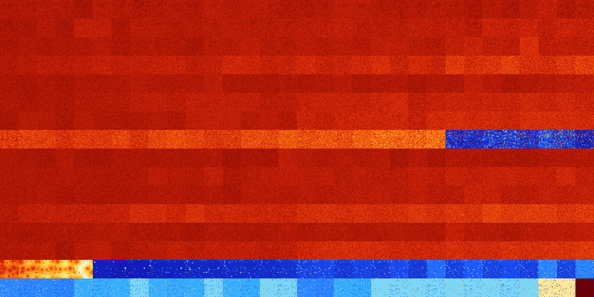

# B013567 (120320-120831)

<details>
    <summary>Initial Grid</summary>
    
</details>


<details>
    <summary>Initial Grid RLE</summary>

```
#C Exported from GoGoL (https://github.com/marrow16/gogol)
#C Wrap mode: Toroidal
#C Boundary mode: Dead
#C Step: 0
x = 100, y = 100, rule = B013567/S
2bobo19bo6bo25bo41bo$10bo26bo3bo3bo3bo22bo19bo$2o7bo8bo33b2o32bo4bo$12b
o51bo17bobo$9bo6bo53bo16bobo4bobo$3bo9bo7b2o11bo21bo11bo$70bo17bo$67bo
5bo20bo$2bo4bo2bobobo23bo13bo15bo$9bo18b2o5bo16bo$2bo34bo3b2obobo39bo8b
o$51bo22bo8b2o6bo5bo$7bo2bo16bo26bo40bo$27bo13bo51bo$8bo2bo34bo45bo$19b
2o13bo45bo$4bo5bo20bo8bo11bo$35bo2bo39bo3bo$25bo4bo26bo10bo$6bo27bo15bo
3bo9bo$83bo$62bo$13bo2bo34bo25bo10bo$24bo40bo11bo$2bo2bo24bo40bo$14b2o
4bo75bo$2bo62bo12bo19bo$23bo18bo51bo$5bo14bo$o61bo20bo$8bo3bo2bo37bo18b
o10bobo$bo3bo2bo28bo43bo2bo$13bo25bo9bo30bo6bo$10bo2bo54bo$57bo35bo$67b
2o12bo5bo8bobo$6bo27bo44bo$84bo$11bobo10bo6bo11bo3bo2bo16bo28bo$21bo4bo
47bo20bo$2bo3bo9bo64bo$bo19bo10bo5bo15bo38bo$12bo5bo27bo36bo5bo$bo15bo
3bo43bo2bo3bo3bob2o$6bo4bo15bo31bobo12bo4bo16bo$17bo54bo12bo4bo2bo3bo$
2bo26bo$10bo11b2o18bo3bo26bo9bo14bo$5bo8bo20bo21bo16bo11bo$4bo2bo5bo23b
o17bo18bo23bo$5bo19b3o21bo48bo$12bo12bo21bob2o2bo15bo6bo$o20bo7bo22bo$
36bo2bo11bo5bo30bo6bo$21bo3bo6bo19bo17bo13bo$37bo14bo37bo$41bo2bo$16b2o
15bo5bo8bo27bo$3bo44bo25bo$60bo25bo$9bobo2bo14bo10bobo29b2o24bo$6bo26bo
8bo8bo2bo$23bo34bobo20b2o7bo7bo$2bo20bo7bo13bo41bo$9bo13bo9bo16bo9bo4bo
$17bob2o30bo20b2o23bo$7bo5bo32bo45bo2bo$3bo30bo7bo2bo12bo9bo25bo3bo$o7b
o4bo56bo$7b2o14bo2bobo$11bo5bo16bo7bo31bo6bo5bo9bo$36bo3bo28bo3bo$36bo
5bo20bo5bo17bo$6bo75bo14bo$17b2o6bo13bobobo7bo12bo6b2o$32bo$19bo31bo26b
o14bo$9bo2bo8bo21bo25bo24bo2bo$5bo32bo25bo6bo21bobo$48bo35bobo$21bo40bo
7bo$29bo13bo6bo41bo$33bo65bo$bo11bo14bo15b2o40bo7bo$15bo56bo$5bo19bo29b
o$8bo41bo19bo15bo6bobo$20bo10bo6bo14bo18bo7bob2o8bo$4bo4bo35bobob2o33bo
$45bo35bo$4bo12bo3bo2bo2bo3bo6bobo52bo$26bo20bo49bo$20bo15bo2bo4bo7bo5b
o8bo9bo11bo$16bo$12bo5bo4bo$13bo27bobo6bo12bo32bo$35bo22bo31bo5bo$19bo
9bo3bo16bo11bo4bo14bo12bo$3bo29bo33bo5bo12bo$49bo4bo!
```
</details>
<details>
    <summary>Thumbnail</summary>

</details>
<table>
<tr>
    <td><a href="./120320%20S%20Heat%20Map%20Activity.png"></a><br>S (120320)<br>G>1000</td>    <td><a href="./120321%20S0%20Heat%20Map%20Activity.png"></a><br>S0 (120321)<br>G>1000</td>    <td><a href="./120322%20S1%20Heat%20Map%20Activity.png"></a><br>S1 (120322)<br>G>1000</td>    <td><a href="./120323%20S01%20Heat%20Map%20Activity.png"></a><br>S01 (120323)<br>G>1000</td>    <td><a href="./120324%20S2%20Heat%20Map%20Activity.png"></a><br>S2 (120324)<br>G>1000</td>    <td><a href="./120325%20S02%20Heat%20Map%20Activity.png"></a><br>S02 (120325)<br>G>1000</td>    <td><a href="./120326%20S12%20Heat%20Map%20Activity.png"></a><br>S12 (120326)<br>G>1000</td>    <td><a href="./120327%20S012%20Heat%20Map%20Activity.png"></a><br>S012 (120327)<br>G>1000</td>    <td><a href="./120328%20S3%20Heat%20Map%20Activity.png"></a><br>S3 (120328)<br>G>1000</td>    <td><a href="./120329%20S03%20Heat%20Map%20Activity.png"></a><br>S03 (120329)<br>G>1000</td>    <td><a href="./120330%20S13%20Heat%20Map%20Activity.png"></a><br>S13 (120330)<br>G>1000</td>    <td><a href="./120331%20S013%20Heat%20Map%20Activity.png"></a><br>S013 (120331)<br>G>1000</td>    <td><a href="./120332%20S23%20Heat%20Map%20Activity.png"></a><br>S23 (120332)<br>G>1000</td>    <td><a href="./120333%20S023%20Heat%20Map%20Activity.png"></a><br>S023 (120333)<br>G>1000</td>    <td><a href="./120334%20S123%20Heat%20Map%20Activity.png"></a><br>S123 (120334)<br>G>1000</td>    <td><a href="./120335%20S0123%20Heat%20Map%20Activity.png"></a><br>S0123 (120335)<br>G>1000</td>    <td><a href="./120336%20S4%20Heat%20Map%20Activity.png"></a><br>S4 (120336)<br>G>1000</td>    <td><a href="./120337%20S04%20Heat%20Map%20Activity.png"></a><br>S04 (120337)<br>G>1000</td>    <td><a href="./120338%20S14%20Heat%20Map%20Activity.png"></a><br>S14 (120338)<br>G>1000</td>    <td><a href="./120339%20S014%20Heat%20Map%20Activity.png"></a><br>S014 (120339)<br>G>1000</td>    <td><a href="./120340%20S24%20Heat%20Map%20Activity.png"></a><br>S24 (120340)<br>G>1000</td>    <td><a href="./120341%20S024%20Heat%20Map%20Activity.png"></a><br>S024 (120341)<br>G>1000</td>    <td><a href="./120342%20S124%20Heat%20Map%20Activity.png"></a><br>S124 (120342)<br>G>1000</td>    <td><a href="./120343%20S0124%20Heat%20Map%20Activity.png"></a><br>S0124 (120343)<br>G>1000</td>    <td><a href="./120344%20S34%20Heat%20Map%20Activity.png"></a><br>S34 (120344)<br>G>1000</td>    <td><a href="./120345%20S034%20Heat%20Map%20Activity.png"></a><br>S034 (120345)<br>G>1000</td>    <td><a href="./120346%20S134%20Heat%20Map%20Activity.png"></a><br>S134 (120346)<br>G>1000</td>    <td><a href="./120347%20S0134%20Heat%20Map%20Activity.png"></a><br>S0134 (120347)<br>G>1000</td>    <td><a href="./120348%20S234%20Heat%20Map%20Activity.png"></a><br>S234 (120348)<br>G>1000</td>    <td><a href="./120349%20S0234%20Heat%20Map%20Activity.png"></a><br>S0234 (120349)<br>G>1000</td>    <td><a href="./120350%20S1234%20Heat%20Map%20Activity.png"></a><br>S1234 (120350)<br>G>1000</td>    <td><a href="./120351%20S01234%20Heat%20Map%20Activity.png"></a><br>S01234 (120351)<br>G>1000</td></tr>
<tr>
    <td><a href="./120352%20S5%20Heat%20Map%20Activity.png"></a><br>S5 (120352)<br>G>1000</td>    <td><a href="./120353%20S05%20Heat%20Map%20Activity.png"></a><br>S05 (120353)<br>G>1000</td>    <td><a href="./120354%20S15%20Heat%20Map%20Activity.png"></a><br>S15 (120354)<br>G>1000</td>    <td><a href="./120355%20S015%20Heat%20Map%20Activity.png"></a><br>S015 (120355)<br>G>1000</td>    <td><a href="./120356%20S25%20Heat%20Map%20Activity.png"></a><br>S25 (120356)<br>G>1000</td>    <td><a href="./120357%20S025%20Heat%20Map%20Activity.png"></a><br>S025 (120357)<br>G>1000</td>    <td><a href="./120358%20S125%20Heat%20Map%20Activity.png"></a><br>S125 (120358)<br>G>1000</td>    <td><a href="./120359%20S0125%20Heat%20Map%20Activity.png"></a><br>S0125 (120359)<br>G>1000</td>    <td><a href="./120360%20S35%20Heat%20Map%20Activity.png"></a><br>S35 (120360)<br>G>1000</td>    <td><a href="./120361%20S035%20Heat%20Map%20Activity.png"></a><br>S035 (120361)<br>G>1000</td>    <td><a href="./120362%20S135%20Heat%20Map%20Activity.png"></a><br>S135 (120362)<br>G>1000</td>    <td><a href="./120363%20S0135%20Heat%20Map%20Activity.png"></a><br>S0135 (120363)<br>G>1000</td>    <td><a href="./120364%20S235%20Heat%20Map%20Activity.png"></a><br>S235 (120364)<br>G>1000</td>    <td><a href="./120365%20S0235%20Heat%20Map%20Activity.png"></a><br>S0235 (120365)<br>G>1000</td>    <td><a href="./120366%20S1235%20Heat%20Map%20Activity.png"></a><br>S1235 (120366)<br>G>1000</td>    <td><a href="./120367%20S01235%20Heat%20Map%20Activity.png"></a><br>S01235 (120367)<br>G>1000</td>    <td><a href="./120368%20S45%20Heat%20Map%20Activity.png"></a><br>S45 (120368)<br>G>1000</td>    <td><a href="./120369%20S045%20Heat%20Map%20Activity.png"></a><br>S045 (120369)<br>G>1000</td>    <td><a href="./120370%20S145%20Heat%20Map%20Activity.png"></a><br>S145 (120370)<br>G>1000</td>    <td><a href="./120371%20S0145%20Heat%20Map%20Activity.png"></a><br>S0145 (120371)<br>G>1000</td>    <td><a href="./120372%20S245%20Heat%20Map%20Activity.png"></a><br>S245 (120372)<br>G>1000</td>    <td><a href="./120373%20S0245%20Heat%20Map%20Activity.png"></a><br>S0245 (120373)<br>G>1000</td>    <td><a href="./120374%20S1245%20Heat%20Map%20Activity.png"></a><br>S1245 (120374)<br>G>1000</td>    <td><a href="./120375%20S01245%20Heat%20Map%20Activity.png"></a><br>S01245 (120375)<br>G>1000</td>    <td><a href="./120376%20S345%20Heat%20Map%20Activity.png"></a><br>S345 (120376)<br>G>1000</td>    <td><a href="./120377%20S0345%20Heat%20Map%20Activity.png"></a><br>S0345 (120377)<br>G>1000</td>    <td><a href="./120378%20S1345%20Heat%20Map%20Activity.png"></a><br>S1345 (120378)<br>G>1000</td>    <td><a href="./120379%20S01345%20Heat%20Map%20Activity.png"></a><br>S01345 (120379)<br>G>1000</td>    <td><a href="./120380%20S2345%20Heat%20Map%20Activity.png"></a><br>S2345 (120380)<br>G>1000</td>    <td><a href="./120381%20S02345%20Heat%20Map%20Activity.png"></a><br>S02345 (120381)<br>G>1000</td>    <td><a href="./120382%20S12345%20Heat%20Map%20Activity.png"></a><br>S12345 (120382)<br>G>1000</td>    <td><a href="./120383%20S012345%20Heat%20Map%20Activity.png"></a><br>S012345 (120383)<br>G>1000</td></tr>
<tr>
    <td><a href="./120384%20S6%20Heat%20Map%20Activity.png"></a><br>S6 (120384)<br>G>1000</td>    <td><a href="./120385%20S06%20Heat%20Map%20Activity.png"></a><br>S06 (120385)<br>G>1000</td>    <td><a href="./120386%20S16%20Heat%20Map%20Activity.png"></a><br>S16 (120386)<br>G>1000</td>    <td><a href="./120387%20S016%20Heat%20Map%20Activity.png"></a><br>S016 (120387)<br>G>1000</td>    <td><a href="./120388%20S26%20Heat%20Map%20Activity.png"></a><br>S26 (120388)<br>G>1000</td>    <td><a href="./120389%20S026%20Heat%20Map%20Activity.png"></a><br>S026 (120389)<br>G>1000</td>    <td><a href="./120390%20S126%20Heat%20Map%20Activity.png"></a><br>S126 (120390)<br>G>1000</td>    <td><a href="./120391%20S0126%20Heat%20Map%20Activity.png"></a><br>S0126 (120391)<br>G>1000</td>    <td><a href="./120392%20S36%20Heat%20Map%20Activity.png"></a><br>S36 (120392)<br>G>1000</td>    <td><a href="./120393%20S036%20Heat%20Map%20Activity.png"></a><br>S036 (120393)<br>G>1000</td>    <td><a href="./120394%20S136%20Heat%20Map%20Activity.png"></a><br>S136 (120394)<br>G>1000</td>    <td><a href="./120395%20S0136%20Heat%20Map%20Activity.png"></a><br>S0136 (120395)<br>G>1000</td>    <td><a href="./120396%20S236%20Heat%20Map%20Activity.png"></a><br>S236 (120396)<br>G>1000</td>    <td><a href="./120397%20S0236%20Heat%20Map%20Activity.png"></a><br>S0236 (120397)<br>G>1000</td>    <td><a href="./120398%20S1236%20Heat%20Map%20Activity.png"></a><br>S1236 (120398)<br>G>1000</td>    <td><a href="./120399%20S01236%20Heat%20Map%20Activity.png"></a><br>S01236 (120399)<br>G>1000</td>    <td><a href="./120400%20S46%20Heat%20Map%20Activity.png"></a><br>S46 (120400)<br>G>1000</td>    <td><a href="./120401%20S046%20Heat%20Map%20Activity.png"></a><br>S046 (120401)<br>G>1000</td>    <td><a href="./120402%20S146%20Heat%20Map%20Activity.png"></a><br>S146 (120402)<br>G>1000</td>    <td><a href="./120403%20S0146%20Heat%20Map%20Activity.png"></a><br>S0146 (120403)<br>G>1000</td>    <td><a href="./120404%20S246%20Heat%20Map%20Activity.png"></a><br>S246 (120404)<br>G>1000</td>    <td><a href="./120405%20S0246%20Heat%20Map%20Activity.png"></a><br>S0246 (120405)<br>G>1000</td>    <td><a href="./120406%20S1246%20Heat%20Map%20Activity.png"></a><br>S1246 (120406)<br>G>1000</td>    <td><a href="./120407%20S01246%20Heat%20Map%20Activity.png"></a><br>S01246 (120407)<br>G>1000</td>    <td><a href="./120408%20S346%20Heat%20Map%20Activity.png"></a><br>S346 (120408)<br>G>1000</td>    <td><a href="./120409%20S0346%20Heat%20Map%20Activity.png"></a><br>S0346 (120409)<br>G>1000</td>    <td><a href="./120410%20S1346%20Heat%20Map%20Activity.png"></a><br>S1346 (120410)<br>G>1000</td>    <td><a href="./120411%20S01346%20Heat%20Map%20Activity.png"></a><br>S01346 (120411)<br>G>1000</td>    <td><a href="./120412%20S2346%20Heat%20Map%20Activity.png"></a><br>S2346 (120412)<br>G>1000</td>    <td><a href="./120413%20S02346%20Heat%20Map%20Activity.png"></a><br>S02346 (120413)<br>G>1000</td>    <td><a href="./120414%20S12346%20Heat%20Map%20Activity.png"></a><br>S12346 (120414)<br>G>1000</td>    <td><a href="./120415%20S012346%20Heat%20Map%20Activity.png"></a><br>S012346 (120415)<br>G>1000</td></tr>
<tr>
    <td><a href="./120416%20S56%20Heat%20Map%20Activity.png"></a><br>S56 (120416)<br>G>1000</td>    <td><a href="./120417%20S056%20Heat%20Map%20Activity.png"></a><br>S056 (120417)<br>G>1000</td>    <td><a href="./120418%20S156%20Heat%20Map%20Activity.png"></a><br>S156 (120418)<br>G>1000</td>    <td><a href="./120419%20S0156%20Heat%20Map%20Activity.png"></a><br>S0156 (120419)<br>G>1000</td>    <td><a href="./120420%20S256%20Heat%20Map%20Activity.png"></a><br>S256 (120420)<br>G>1000</td>    <td><a href="./120421%20S0256%20Heat%20Map%20Activity.png"></a><br>S0256 (120421)<br>G>1000</td>    <td><a href="./120422%20S1256%20Heat%20Map%20Activity.png"></a><br>S1256 (120422)<br>G>1000</td>    <td><a href="./120423%20S01256%20Heat%20Map%20Activity.png"></a><br>S01256 (120423)<br>G>1000</td>    <td><a href="./120424%20S356%20Heat%20Map%20Activity.png"></a><br>S356 (120424)<br>G>1000</td>    <td><a href="./120425%20S0356%20Heat%20Map%20Activity.png"></a><br>S0356 (120425)<br>G>1000</td>    <td><a href="./120426%20S1356%20Heat%20Map%20Activity.png"></a><br>S1356 (120426)<br>G>1000</td>    <td><a href="./120427%20S01356%20Heat%20Map%20Activity.png"></a><br>S01356 (120427)<br>G>1000</td>    <td><a href="./120428%20S2356%20Heat%20Map%20Activity.png"></a><br>S2356 (120428)<br>G>1000</td>    <td><a href="./120429%20S02356%20Heat%20Map%20Activity.png"></a><br>S02356 (120429)<br>G>1000</td>    <td><a href="./120430%20S12356%20Heat%20Map%20Activity.png"></a><br>S12356 (120430)<br>G>1000</td>    <td><a href="./120431%20S012356%20Heat%20Map%20Activity.png"></a><br>S012356 (120431)<br>G>1000</td>    <td><a href="./120432%20S456%20Heat%20Map%20Activity.png"></a><br>S456 (120432)<br>G>1000</td>    <td><a href="./120433%20S0456%20Heat%20Map%20Activity.png"></a><br>S0456 (120433)<br>G>1000</td>    <td><a href="./120434%20S1456%20Heat%20Map%20Activity.png"></a><br>S1456 (120434)<br>G>1000</td>    <td><a href="./120435%20S01456%20Heat%20Map%20Activity.png"></a><br>S01456 (120435)<br>G>1000</td>    <td><a href="./120436%20S2456%20Heat%20Map%20Activity.png"></a><br>S2456 (120436)<br>G>1000</td>    <td><a href="./120437%20S02456%20Heat%20Map%20Activity.png"></a><br>S02456 (120437)<br>G>1000</td>    <td><a href="./120438%20S12456%20Heat%20Map%20Activity.png"></a><br>S12456 (120438)<br>G>1000</td>    <td><a href="./120439%20S012456%20Heat%20Map%20Activity.png"></a><br>S012456 (120439)<br>G>1000</td>    <td><a href="./120440%20S3456%20Heat%20Map%20Activity.png"></a><br>S3456 (120440)<br>G>1000</td>    <td><a href="./120441%20S03456%20Heat%20Map%20Activity.png"></a><br>S03456 (120441)<br>G>1000</td>    <td><a href="./120442%20S13456%20Heat%20Map%20Activity.png"></a><br>S13456 (120442)<br>G>1000</td>    <td><a href="./120443%20S013456%20Heat%20Map%20Activity.png"></a><br>S013456 (120443)<br>G>1000</td>    <td><a href="./120444%20S23456%20Heat%20Map%20Activity.png"></a><br>S23456 (120444)<br>G>1000</td>    <td><a href="./120445%20S023456%20Heat%20Map%20Activity.png"></a><br>S023456 (120445)<br>G>1000</td>    <td><a href="./120446%20S123456%20Heat%20Map%20Activity.png"></a><br>S123456 (120446)<br>G>1000</td>    <td><a href="./120447%20S0123456%20Heat%20Map%20Activity.png"></a><br>S0123456 (120447)<br>G>1000</td></tr>
<tr>
    <td><a href="./120448%20S7%20Heat%20Map%20Activity.png"></a><br>S7 (120448)<br>G>1000</td>    <td><a href="./120449%20S07%20Heat%20Map%20Activity.png"></a><br>S07 (120449)<br>G>1000</td>    <td><a href="./120450%20S17%20Heat%20Map%20Activity.png"></a><br>S17 (120450)<br>G>1000</td>    <td><a href="./120451%20S017%20Heat%20Map%20Activity.png"></a><br>S017 (120451)<br>G>1000</td>    <td><a href="./120452%20S27%20Heat%20Map%20Activity.png"></a><br>S27 (120452)<br>G>1000</td>    <td><a href="./120453%20S027%20Heat%20Map%20Activity.png"></a><br>S027 (120453)<br>G>1000</td>    <td><a href="./120454%20S127%20Heat%20Map%20Activity.png"></a><br>S127 (120454)<br>G>1000</td>    <td><a href="./120455%20S0127%20Heat%20Map%20Activity.png"></a><br>S0127 (120455)<br>G>1000</td>    <td><a href="./120456%20S37%20Heat%20Map%20Activity.png"></a><br>S37 (120456)<br>G>1000</td>    <td><a href="./120457%20S037%20Heat%20Map%20Activity.png"></a><br>S037 (120457)<br>G>1000</td>    <td><a href="./120458%20S137%20Heat%20Map%20Activity.png"></a><br>S137 (120458)<br>G>1000</td>    <td><a href="./120459%20S0137%20Heat%20Map%20Activity.png"></a><br>S0137 (120459)<br>G>1000</td>    <td><a href="./120460%20S237%20Heat%20Map%20Activity.png"></a><br>S237 (120460)<br>G>1000</td>    <td><a href="./120461%20S0237%20Heat%20Map%20Activity.png"></a><br>S0237 (120461)<br>G>1000</td>    <td><a href="./120462%20S1237%20Heat%20Map%20Activity.png"></a><br>S1237 (120462)<br>G>1000</td>    <td><a href="./120463%20S01237%20Heat%20Map%20Activity.png"></a><br>S01237 (120463)<br>G>1000</td>    <td><a href="./120464%20S47%20Heat%20Map%20Activity.png"></a><br>S47 (120464)<br>G>1000</td>    <td><a href="./120465%20S047%20Heat%20Map%20Activity.png"></a><br>S047 (120465)<br>G>1000</td>    <td><a href="./120466%20S147%20Heat%20Map%20Activity.png"></a><br>S147 (120466)<br>G>1000</td>    <td><a href="./120467%20S0147%20Heat%20Map%20Activity.png"></a><br>S0147 (120467)<br>G>1000</td>    <td><a href="./120468%20S247%20Heat%20Map%20Activity.png"></a><br>S247 (120468)<br>G>1000</td>    <td><a href="./120469%20S0247%20Heat%20Map%20Activity.png"></a><br>S0247 (120469)<br>G>1000</td>    <td><a href="./120470%20S1247%20Heat%20Map%20Activity.png"></a><br>S1247 (120470)<br>G>1000</td>    <td><a href="./120471%20S01247%20Heat%20Map%20Activity.png"></a><br>S01247 (120471)<br>G>1000</td>    <td><a href="./120472%20S347%20Heat%20Map%20Activity.png"></a><br>S347 (120472)<br>G>1000</td>    <td><a href="./120473%20S0347%20Heat%20Map%20Activity.png"></a><br>S0347 (120473)<br>G>1000</td>    <td><a href="./120474%20S1347%20Heat%20Map%20Activity.png"></a><br>S1347 (120474)<br>G>1000</td>    <td><a href="./120475%20S01347%20Heat%20Map%20Activity.png"></a><br>S01347 (120475)<br>G>1000</td>    <td><a href="./120476%20S2347%20Heat%20Map%20Activity.png"></a><br>S2347 (120476)<br>G>1000</td>    <td><a href="./120477%20S02347%20Heat%20Map%20Activity.png"></a><br>S02347 (120477)<br>G>1000</td>    <td><a href="./120478%20S12347%20Heat%20Map%20Activity.png"></a><br>S12347 (120478)<br>G>1000</td>    <td><a href="./120479%20S012347%20Heat%20Map%20Activity.png"></a><br>S012347 (120479)<br>G>1000</td></tr>
<tr>
    <td><a href="./120480%20S57%20Heat%20Map%20Activity.png"></a><br>S57 (120480)<br>G>1000</td>    <td><a href="./120481%20S057%20Heat%20Map%20Activity.png"></a><br>S057 (120481)<br>G>1000</td>    <td><a href="./120482%20S157%20Heat%20Map%20Activity.png"></a><br>S157 (120482)<br>G>1000</td>    <td><a href="./120483%20S0157%20Heat%20Map%20Activity.png"></a><br>S0157 (120483)<br>G>1000</td>    <td><a href="./120484%20S257%20Heat%20Map%20Activity.png"></a><br>S257 (120484)<br>G>1000</td>    <td><a href="./120485%20S0257%20Heat%20Map%20Activity.png"></a><br>S0257 (120485)<br>G>1000</td>    <td><a href="./120486%20S1257%20Heat%20Map%20Activity.png"></a><br>S1257 (120486)<br>G>1000</td>    <td><a href="./120487%20S01257%20Heat%20Map%20Activity.png"></a><br>S01257 (120487)<br>G>1000</td>    <td><a href="./120488%20S357%20Heat%20Map%20Activity.png"></a><br>S357 (120488)<br>G>1000</td>    <td><a href="./120489%20S0357%20Heat%20Map%20Activity.png"></a><br>S0357 (120489)<br>G>1000</td>    <td><a href="./120490%20S1357%20Heat%20Map%20Activity.png"></a><br>S1357 (120490)<br>G>1000</td>    <td><a href="./120491%20S01357%20Heat%20Map%20Activity.png"></a><br>S01357 (120491)<br>G>1000</td>    <td><a href="./120492%20S2357%20Heat%20Map%20Activity.png"></a><br>S2357 (120492)<br>G>1000</td>    <td><a href="./120493%20S02357%20Heat%20Map%20Activity.png"></a><br>S02357 (120493)<br>G>1000</td>    <td><a href="./120494%20S12357%20Heat%20Map%20Activity.png"></a><br>S12357 (120494)<br>G>1000</td>    <td><a href="./120495%20S012357%20Heat%20Map%20Activity.png"></a><br>S012357 (120495)<br>G>1000</td>    <td><a href="./120496%20S457%20Heat%20Map%20Activity.png"></a><br>S457 (120496)<br>G>1000</td>    <td><a href="./120497%20S0457%20Heat%20Map%20Activity.png"></a><br>S0457 (120497)<br>G>1000</td>    <td><a href="./120498%20S1457%20Heat%20Map%20Activity.png"></a><br>S1457 (120498)<br>G>1000</td>    <td><a href="./120499%20S01457%20Heat%20Map%20Activity.png"></a><br>S01457 (120499)<br>G>1000</td>    <td><a href="./120500%20S2457%20Heat%20Map%20Activity.png"></a><br>S2457 (120500)<br>G>1000</td>    <td><a href="./120501%20S02457%20Heat%20Map%20Activity.png"></a><br>S02457 (120501)<br>G>1000</td>    <td><a href="./120502%20S12457%20Heat%20Map%20Activity.png"></a><br>S12457 (120502)<br>G>1000</td>    <td><a href="./120503%20S012457%20Heat%20Map%20Activity.png"></a><br>S012457 (120503)<br>G>1000</td>    <td><a href="./120504%20S3457%20Heat%20Map%20Activity.png"></a><br>S3457 (120504)<br>G>1000</td>    <td><a href="./120505%20S03457%20Heat%20Map%20Activity.png"></a><br>S03457 (120505)<br>G>1000</td>    <td><a href="./120506%20S13457%20Heat%20Map%20Activity.png"></a><br>S13457 (120506)<br>G>1000</td>    <td><a href="./120507%20S013457%20Heat%20Map%20Activity.png"></a><br>S013457 (120507)<br>G>1000</td>    <td><a href="./120508%20S23457%20Heat%20Map%20Activity.png"></a><br>S23457 (120508)<br>G>1000</td>    <td><a href="./120509%20S023457%20Heat%20Map%20Activity.png"></a><br>S023457 (120509)<br>G>1000</td>    <td><a href="./120510%20S123457%20Heat%20Map%20Activity.png"></a><br>S123457 (120510)<br>G>1000</td>    <td><a href="./120511%20S0123457%20Heat%20Map%20Activity.png"></a><br>S0123457 (120511)<br>G>1000</td></tr>
<tr>
    <td><a href="./120512%20S67%20Heat%20Map%20Activity.png"></a><br>S67 (120512)<br>G>1000</td>    <td><a href="./120513%20S067%20Heat%20Map%20Activity.png"></a><br>S067 (120513)<br>G>1000</td>    <td><a href="./120514%20S167%20Heat%20Map%20Activity.png"></a><br>S167 (120514)<br>G>1000</td>    <td><a href="./120515%20S0167%20Heat%20Map%20Activity.png"></a><br>S0167 (120515)<br>G>1000</td>    <td><a href="./120516%20S267%20Heat%20Map%20Activity.png"></a><br>S267 (120516)<br>G>1000</td>    <td><a href="./120517%20S0267%20Heat%20Map%20Activity.png"></a><br>S0267 (120517)<br>G>1000</td>    <td><a href="./120518%20S1267%20Heat%20Map%20Activity.png"></a><br>S1267 (120518)<br>G>1000</td>    <td><a href="./120519%20S01267%20Heat%20Map%20Activity.png"></a><br>S01267 (120519)<br>G>1000</td>    <td><a href="./120520%20S367%20Heat%20Map%20Activity.png"></a><br>S367 (120520)<br>G>1000</td>    <td><a href="./120521%20S0367%20Heat%20Map%20Activity.png"></a><br>S0367 (120521)<br>G>1000</td>    <td><a href="./120522%20S1367%20Heat%20Map%20Activity.png"></a><br>S1367 (120522)<br>G>1000</td>    <td><a href="./120523%20S01367%20Heat%20Map%20Activity.png"></a><br>S01367 (120523)<br>G>1000</td>    <td><a href="./120524%20S2367%20Heat%20Map%20Activity.png"></a><br>S2367 (120524)<br>G>1000</td>    <td><a href="./120525%20S02367%20Heat%20Map%20Activity.png"></a><br>S02367 (120525)<br>G>1000</td>    <td><a href="./120526%20S12367%20Heat%20Map%20Activity.png"></a><br>S12367 (120526)<br>G>1000</td>    <td><a href="./120527%20S012367%20Heat%20Map%20Activity.png"></a><br>S012367 (120527)<br>G>1000</td>    <td><a href="./120528%20S467%20Heat%20Map%20Activity.png"></a><br>S467 (120528)<br>G>1000</td>    <td><a href="./120529%20S0467%20Heat%20Map%20Activity.png"></a><br>S0467 (120529)<br>G>1000</td>    <td><a href="./120530%20S1467%20Heat%20Map%20Activity.png"></a><br>S1467 (120530)<br>G>1000</td>    <td><a href="./120531%20S01467%20Heat%20Map%20Activity.png"></a><br>S01467 (120531)<br>G>1000</td>    <td><a href="./120532%20S2467%20Heat%20Map%20Activity.png"></a><br>S2467 (120532)<br>G>1000</td>    <td><a href="./120533%20S02467%20Heat%20Map%20Activity.png"></a><br>S02467 (120533)<br>G>1000</td>    <td><a href="./120534%20S12467%20Heat%20Map%20Activity.png"></a><br>S12467 (120534)<br>G>1000</td>    <td><a href="./120535%20S012467%20Heat%20Map%20Activity.png"></a><br>S012467 (120535)<br>G>1000</td>    <td><a href="./120536%20S3467%20Heat%20Map%20Activity.png"></a><br>S3467 (120536)<br>G>1000</td>    <td><a href="./120537%20S03467%20Heat%20Map%20Activity.png"></a><br>S03467 (120537)<br>G>1000</td>    <td><a href="./120538%20S13467%20Heat%20Map%20Activity.png"></a><br>S13467 (120538)<br>G>1000</td>    <td><a href="./120539%20S013467%20Heat%20Map%20Activity.png"></a><br>S013467 (120539)<br>G>1000</td>    <td><a href="./120540%20S23467%20Heat%20Map%20Activity.png"></a><br>S23467 (120540)<br>G>1000</td>    <td><a href="./120541%20S023467%20Heat%20Map%20Activity.png"></a><br>S023467 (120541)<br>G>1000</td>    <td><a href="./120542%20S123467%20Heat%20Map%20Activity.png"></a><br>S123467 (120542)<br>G>1000</td>    <td><a href="./120543%20S0123467%20Heat%20Map%20Activity.png"></a><br>S0123467 (120543)<br>G>1000</td></tr>
<tr>
    <td><a href="./120544%20S567%20Heat%20Map%20Activity.png"></a><br>S567 (120544)<br>G>1000</td>    <td><a href="./120545%20S0567%20Heat%20Map%20Activity.png"></a><br>S0567 (120545)<br>G>1000</td>    <td><a href="./120546%20S1567%20Heat%20Map%20Activity.png"></a><br>S1567 (120546)<br>G>1000</td>    <td><a href="./120547%20S01567%20Heat%20Map%20Activity.png"></a><br>S01567 (120547)<br>G>1000</td>    <td><a href="./120548%20S2567%20Heat%20Map%20Activity.png"></a><br>S2567 (120548)<br>G>1000</td>    <td><a href="./120549%20S02567%20Heat%20Map%20Activity.png"></a><br>S02567 (120549)<br>G>1000</td>    <td><a href="./120550%20S12567%20Heat%20Map%20Activity.png"></a><br>S12567 (120550)<br>G>1000</td>    <td><a href="./120551%20S012567%20Heat%20Map%20Activity.png"></a><br>S012567 (120551)<br>G>1000</td>    <td><a href="./120552%20S3567%20Heat%20Map%20Activity.png"></a><br>S3567 (120552)<br>G>1000</td>    <td><a href="./120553%20S03567%20Heat%20Map%20Activity.png"></a><br>S03567 (120553)<br>G>1000</td>    <td><a href="./120554%20S13567%20Heat%20Map%20Activity.png"></a><br>S13567 (120554)<br>G>1000</td>    <td><a href="./120555%20S013567%20Heat%20Map%20Activity.png"></a><br>S013567 (120555)<br>G>1000</td>    <td><a href="./120556%20S23567%20Heat%20Map%20Activity.png"></a><br>S23567 (120556)<br>G>1000</td>    <td><a href="./120557%20S023567%20Heat%20Map%20Activity.png"></a><br>S023567 (120557)<br>G>1000</td>    <td><a href="./120558%20S123567%20Heat%20Map%20Activity.png"></a><br>S123567 (120558)<br>G>1000</td>    <td><a href="./120559%20S0123567%20Heat%20Map%20Activity.png"></a><br>S0123567 (120559)<br>G>1000</td>    <td><a href="./120560%20S4567%20Heat%20Map%20Activity.png"></a><br>S4567 (120560)<br>G>1000</td>    <td><a href="./120561%20S04567%20Heat%20Map%20Activity.png"></a><br>S04567 (120561)<br>G>1000</td>    <td><a href="./120562%20S14567%20Heat%20Map%20Activity.png"></a><br>S14567 (120562)<br>G>1000</td>    <td><a href="./120563%20S014567%20Heat%20Map%20Activity.png"></a><br>S014567 (120563)<br>G>1000</td>    <td><a href="./120564%20S24567%20Heat%20Map%20Activity.png"></a><br>S24567 (120564)<br>G>1000</td>    <td><a href="./120565%20S024567%20Heat%20Map%20Activity.png"></a><br>S024567 (120565)<br>G>1000</td>    <td><a href="./120566%20S124567%20Heat%20Map%20Activity.png"></a><br>S124567 (120566)<br>G>1000</td>    <td><a href="./120567%20S0124567%20Heat%20Map%20Activity.png"></a><br>S0124567 (120567)<br>G>1000</td>    <td><a href="./120568%20S34567%20Heat%20Map%20Activity.png"></a><br>S34567 (120568)<br>R@271,p144</td>    <td><a href="./120569%20S034567%20Heat%20Map%20Activity.png"></a><br>S034567 (120569)<br>R@296,p120</td>    <td><a href="./120570%20S134567%20Heat%20Map%20Activity.png"></a><br>S134567 (120570)<br>R@170,p48</td>    <td><a href="./120571%20S0134567%20Heat%20Map%20Activity.png"></a><br>S0134567 (120571)<br>R@168,p36</td>    <td><a href="./120572%20S234567%20Heat%20Map%20Activity.png"></a><br>S234567 (120572)<br>R@76,p30</td>    <td><a href="./120573%20S0234567%20Heat%20Map%20Activity.png"></a><br>S0234567 (120573)<br>R@55,p12</td>    <td><a href="./120574%20S1234567%20Heat%20Map%20Activity.png"></a><br>S1234567 (120574)<br>R@49,p12</td>    <td><a href="./120575%20S01234567%20Heat%20Map%20Activity.png"></a><br>S01234567 (120575)<br>R@223,p180</td></tr>
<tr>
    <td><a href="./120576%20S8%20Heat%20Map%20Activity.png"></a><br>S8 (120576)<br>G>1000</td>    <td><a href="./120577%20S08%20Heat%20Map%20Activity.png"></a><br>S08 (120577)<br>G>1000</td>    <td><a href="./120578%20S18%20Heat%20Map%20Activity.png"></a><br>S18 (120578)<br>G>1000</td>    <td><a href="./120579%20S018%20Heat%20Map%20Activity.png"></a><br>S018 (120579)<br>G>1000</td>    <td><a href="./120580%20S28%20Heat%20Map%20Activity.png"></a><br>S28 (120580)<br>G>1000</td>    <td><a href="./120581%20S028%20Heat%20Map%20Activity.png"></a><br>S028 (120581)<br>G>1000</td>    <td><a href="./120582%20S128%20Heat%20Map%20Activity.png"></a><br>S128 (120582)<br>G>1000</td>    <td><a href="./120583%20S0128%20Heat%20Map%20Activity.png"></a><br>S0128 (120583)<br>G>1000</td>    <td><a href="./120584%20S38%20Heat%20Map%20Activity.png"></a><br>S38 (120584)<br>G>1000</td>    <td><a href="./120585%20S038%20Heat%20Map%20Activity.png"></a><br>S038 (120585)<br>G>1000</td>    <td><a href="./120586%20S138%20Heat%20Map%20Activity.png"></a><br>S138 (120586)<br>G>1000</td>    <td><a href="./120587%20S0138%20Heat%20Map%20Activity.png"></a><br>S0138 (120587)<br>G>1000</td>    <td><a href="./120588%20S238%20Heat%20Map%20Activity.png"></a><br>S238 (120588)<br>G>1000</td>    <td><a href="./120589%20S0238%20Heat%20Map%20Activity.png"></a><br>S0238 (120589)<br>G>1000</td>    <td><a href="./120590%20S1238%20Heat%20Map%20Activity.png"></a><br>S1238 (120590)<br>G>1000</td>    <td><a href="./120591%20S01238%20Heat%20Map%20Activity.png"></a><br>S01238 (120591)<br>G>1000</td>    <td><a href="./120592%20S48%20Heat%20Map%20Activity.png"></a><br>S48 (120592)<br>G>1000</td>    <td><a href="./120593%20S048%20Heat%20Map%20Activity.png"></a><br>S048 (120593)<br>G>1000</td>    <td><a href="./120594%20S148%20Heat%20Map%20Activity.png"></a><br>S148 (120594)<br>G>1000</td>    <td><a href="./120595%20S0148%20Heat%20Map%20Activity.png"></a><br>S0148 (120595)<br>G>1000</td>    <td><a href="./120596%20S248%20Heat%20Map%20Activity.png"></a><br>S248 (120596)<br>G>1000</td>    <td><a href="./120597%20S0248%20Heat%20Map%20Activity.png"></a><br>S0248 (120597)<br>G>1000</td>    <td><a href="./120598%20S1248%20Heat%20Map%20Activity.png"></a><br>S1248 (120598)<br>G>1000</td>    <td><a href="./120599%20S01248%20Heat%20Map%20Activity.png"></a><br>S01248 (120599)<br>G>1000</td>    <td><a href="./120600%20S348%20Heat%20Map%20Activity.png"></a><br>S348 (120600)<br>G>1000</td>    <td><a href="./120601%20S0348%20Heat%20Map%20Activity.png"></a><br>S0348 (120601)<br>G>1000</td>    <td><a href="./120602%20S1348%20Heat%20Map%20Activity.png"></a><br>S1348 (120602)<br>G>1000</td>    <td><a href="./120603%20S01348%20Heat%20Map%20Activity.png"></a><br>S01348 (120603)<br>G>1000</td>    <td><a href="./120604%20S2348%20Heat%20Map%20Activity.png"></a><br>S2348 (120604)<br>G>1000</td>    <td><a href="./120605%20S02348%20Heat%20Map%20Activity.png"></a><br>S02348 (120605)<br>G>1000</td>    <td><a href="./120606%20S12348%20Heat%20Map%20Activity.png"></a><br>S12348 (120606)<br>G>1000</td>    <td><a href="./120607%20S012348%20Heat%20Map%20Activity.png"></a><br>S012348 (120607)<br>G>1000</td></tr>
<tr>
    <td><a href="./120608%20S58%20Heat%20Map%20Activity.png"></a><br>S58 (120608)<br>G>1000</td>    <td><a href="./120609%20S058%20Heat%20Map%20Activity.png"></a><br>S058 (120609)<br>G>1000</td>    <td><a href="./120610%20S158%20Heat%20Map%20Activity.png"></a><br>S158 (120610)<br>G>1000</td>    <td><a href="./120611%20S0158%20Heat%20Map%20Activity.png"></a><br>S0158 (120611)<br>G>1000</td>    <td><a href="./120612%20S258%20Heat%20Map%20Activity.png"></a><br>S258 (120612)<br>G>1000</td>    <td><a href="./120613%20S0258%20Heat%20Map%20Activity.png"></a><br>S0258 (120613)<br>G>1000</td>    <td><a href="./120614%20S1258%20Heat%20Map%20Activity.png"></a><br>S1258 (120614)<br>G>1000</td>    <td><a href="./120615%20S01258%20Heat%20Map%20Activity.png"></a><br>S01258 (120615)<br>G>1000</td>    <td><a href="./120616%20S358%20Heat%20Map%20Activity.png"></a><br>S358 (120616)<br>G>1000</td>    <td><a href="./120617%20S0358%20Heat%20Map%20Activity.png"></a><br>S0358 (120617)<br>G>1000</td>    <td><a href="./120618%20S1358%20Heat%20Map%20Activity.png"></a><br>S1358 (120618)<br>G>1000</td>    <td><a href="./120619%20S01358%20Heat%20Map%20Activity.png"></a><br>S01358 (120619)<br>G>1000</td>    <td><a href="./120620%20S2358%20Heat%20Map%20Activity.png"></a><br>S2358 (120620)<br>G>1000</td>    <td><a href="./120621%20S02358%20Heat%20Map%20Activity.png"></a><br>S02358 (120621)<br>G>1000</td>    <td><a href="./120622%20S12358%20Heat%20Map%20Activity.png"></a><br>S12358 (120622)<br>G>1000</td>    <td><a href="./120623%20S012358%20Heat%20Map%20Activity.png"></a><br>S012358 (120623)<br>G>1000</td>    <td><a href="./120624%20S458%20Heat%20Map%20Activity.png"></a><br>S458 (120624)<br>G>1000</td>    <td><a href="./120625%20S0458%20Heat%20Map%20Activity.png"></a><br>S0458 (120625)<br>G>1000</td>    <td><a href="./120626%20S1458%20Heat%20Map%20Activity.png"></a><br>S1458 (120626)<br>G>1000</td>    <td><a href="./120627%20S01458%20Heat%20Map%20Activity.png"></a><br>S01458 (120627)<br>G>1000</td>    <td><a href="./120628%20S2458%20Heat%20Map%20Activity.png"></a><br>S2458 (120628)<br>G>1000</td>    <td><a href="./120629%20S02458%20Heat%20Map%20Activity.png"></a><br>S02458 (120629)<br>G>1000</td>    <td><a href="./120630%20S12458%20Heat%20Map%20Activity.png"></a><br>S12458 (120630)<br>G>1000</td>    <td><a href="./120631%20S012458%20Heat%20Map%20Activity.png"></a><br>S012458 (120631)<br>G>1000</td>    <td><a href="./120632%20S3458%20Heat%20Map%20Activity.png"></a><br>S3458 (120632)<br>G>1000</td>    <td><a href="./120633%20S03458%20Heat%20Map%20Activity.png"></a><br>S03458 (120633)<br>G>1000</td>    <td><a href="./120634%20S13458%20Heat%20Map%20Activity.png"></a><br>S13458 (120634)<br>G>1000</td>    <td><a href="./120635%20S013458%20Heat%20Map%20Activity.png"></a><br>S013458 (120635)<br>G>1000</td>    <td><a href="./120636%20S23458%20Heat%20Map%20Activity.png"></a><br>S23458 (120636)<br>G>1000</td>    <td><a href="./120637%20S023458%20Heat%20Map%20Activity.png"></a><br>S023458 (120637)<br>G>1000</td>    <td><a href="./120638%20S123458%20Heat%20Map%20Activity.png"></a><br>S123458 (120638)<br>G>1000</td>    <td><a href="./120639%20S0123458%20Heat%20Map%20Activity.png"></a><br>S0123458 (120639)<br>G>1000</td></tr>
<tr>
    <td><a href="./120640%20S68%20Heat%20Map%20Activity.png"></a><br>S68 (120640)<br>G>1000</td>    <td><a href="./120641%20S068%20Heat%20Map%20Activity.png"></a><br>S068 (120641)<br>G>1000</td>    <td><a href="./120642%20S168%20Heat%20Map%20Activity.png"></a><br>S168 (120642)<br>G>1000</td>    <td><a href="./120643%20S0168%20Heat%20Map%20Activity.png"></a><br>S0168 (120643)<br>G>1000</td>    <td><a href="./120644%20S268%20Heat%20Map%20Activity.png"></a><br>S268 (120644)<br>G>1000</td>    <td><a href="./120645%20S0268%20Heat%20Map%20Activity.png"></a><br>S0268 (120645)<br>G>1000</td>    <td><a href="./120646%20S1268%20Heat%20Map%20Activity.png"></a><br>S1268 (120646)<br>G>1000</td>    <td><a href="./120647%20S01268%20Heat%20Map%20Activity.png"></a><br>S01268 (120647)<br>G>1000</td>    <td><a href="./120648%20S368%20Heat%20Map%20Activity.png"></a><br>S368 (120648)<br>G>1000</td>    <td><a href="./120649%20S0368%20Heat%20Map%20Activity.png"></a><br>S0368 (120649)<br>G>1000</td>    <td><a href="./120650%20S1368%20Heat%20Map%20Activity.png"></a><br>S1368 (120650)<br>G>1000</td>    <td><a href="./120651%20S01368%20Heat%20Map%20Activity.png"></a><br>S01368 (120651)<br>G>1000</td>    <td><a href="./120652%20S2368%20Heat%20Map%20Activity.png"></a><br>S2368 (120652)<br>G>1000</td>    <td><a href="./120653%20S02368%20Heat%20Map%20Activity.png"></a><br>S02368 (120653)<br>G>1000</td>    <td><a href="./120654%20S12368%20Heat%20Map%20Activity.png"></a><br>S12368 (120654)<br>G>1000</td>    <td><a href="./120655%20S012368%20Heat%20Map%20Activity.png"></a><br>S012368 (120655)<br>G>1000</td>    <td><a href="./120656%20S468%20Heat%20Map%20Activity.png"></a><br>S468 (120656)<br>G>1000</td>    <td><a href="./120657%20S0468%20Heat%20Map%20Activity.png"></a><br>S0468 (120657)<br>G>1000</td>    <td><a href="./120658%20S1468%20Heat%20Map%20Activity.png"></a><br>S1468 (120658)<br>G>1000</td>    <td><a href="./120659%20S01468%20Heat%20Map%20Activity.png"></a><br>S01468 (120659)<br>G>1000</td>    <td><a href="./120660%20S2468%20Heat%20Map%20Activity.png"></a><br>S2468 (120660)<br>G>1000</td>    <td><a href="./120661%20S02468%20Heat%20Map%20Activity.png"></a><br>S02468 (120661)<br>G>1000</td>    <td><a href="./120662%20S12468%20Heat%20Map%20Activity.png"></a><br>S12468 (120662)<br>G>1000</td>    <td><a href="./120663%20S012468%20Heat%20Map%20Activity.png"></a><br>S012468 (120663)<br>G>1000</td>    <td><a href="./120664%20S3468%20Heat%20Map%20Activity.png"></a><br>S3468 (120664)<br>G>1000</td>    <td><a href="./120665%20S03468%20Heat%20Map%20Activity.png"></a><br>S03468 (120665)<br>G>1000</td>    <td><a href="./120666%20S13468%20Heat%20Map%20Activity.png"></a><br>S13468 (120666)<br>G>1000</td>    <td><a href="./120667%20S013468%20Heat%20Map%20Activity.png"></a><br>S013468 (120667)<br>G>1000</td>    <td><a href="./120668%20S23468%20Heat%20Map%20Activity.png"></a><br>S23468 (120668)<br>G>1000</td>    <td><a href="./120669%20S023468%20Heat%20Map%20Activity.png"></a><br>S023468 (120669)<br>G>1000</td>    <td><a href="./120670%20S123468%20Heat%20Map%20Activity.png"></a><br>S123468 (120670)<br>G>1000</td>    <td><a href="./120671%20S0123468%20Heat%20Map%20Activity.png"></a><br>S0123468 (120671)<br>G>1000</td></tr>
<tr>
    <td><a href="./120672%20S568%20Heat%20Map%20Activity.png"></a><br>S568 (120672)<br>G>1000</td>    <td><a href="./120673%20S0568%20Heat%20Map%20Activity.png"></a><br>S0568 (120673)<br>G>1000</td>    <td><a href="./120674%20S1568%20Heat%20Map%20Activity.png"></a><br>S1568 (120674)<br>G>1000</td>    <td><a href="./120675%20S01568%20Heat%20Map%20Activity.png"></a><br>S01568 (120675)<br>G>1000</td>    <td><a href="./120676%20S2568%20Heat%20Map%20Activity.png"></a><br>S2568 (120676)<br>G>1000</td>    <td><a href="./120677%20S02568%20Heat%20Map%20Activity.png"></a><br>S02568 (120677)<br>G>1000</td>    <td><a href="./120678%20S12568%20Heat%20Map%20Activity.png"></a><br>S12568 (120678)<br>G>1000</td>    <td><a href="./120679%20S012568%20Heat%20Map%20Activity.png"></a><br>S012568 (120679)<br>G>1000</td>    <td><a href="./120680%20S3568%20Heat%20Map%20Activity.png"></a><br>S3568 (120680)<br>G>1000</td>    <td><a href="./120681%20S03568%20Heat%20Map%20Activity.png"></a><br>S03568 (120681)<br>G>1000</td>    <td><a href="./120682%20S13568%20Heat%20Map%20Activity.png"></a><br>S13568 (120682)<br>G>1000</td>    <td><a href="./120683%20S013568%20Heat%20Map%20Activity.png"></a><br>S013568 (120683)<br>G>1000</td>    <td><a href="./120684%20S23568%20Heat%20Map%20Activity.png"></a><br>S23568 (120684)<br>G>1000</td>    <td><a href="./120685%20S023568%20Heat%20Map%20Activity.png"></a><br>S023568 (120685)<br>G>1000</td>    <td><a href="./120686%20S123568%20Heat%20Map%20Activity.png"></a><br>S123568 (120686)<br>G>1000</td>    <td><a href="./120687%20S0123568%20Heat%20Map%20Activity.png"></a><br>S0123568 (120687)<br>G>1000</td>    <td><a href="./120688%20S4568%20Heat%20Map%20Activity.png"></a><br>S4568 (120688)<br>G>1000</td>    <td><a href="./120689%20S04568%20Heat%20Map%20Activity.png"></a><br>S04568 (120689)<br>G>1000</td>    <td><a href="./120690%20S14568%20Heat%20Map%20Activity.png"></a><br>S14568 (120690)<br>G>1000</td>    <td><a href="./120691%20S014568%20Heat%20Map%20Activity.png"></a><br>S014568 (120691)<br>G>1000</td>    <td><a href="./120692%20S24568%20Heat%20Map%20Activity.png"></a><br>S24568 (120692)<br>G>1000</td>    <td><a href="./120693%20S024568%20Heat%20Map%20Activity.png"></a><br>S024568 (120693)<br>G>1000</td>    <td><a href="./120694%20S124568%20Heat%20Map%20Activity.png"></a><br>S124568 (120694)<br>G>1000</td>    <td><a href="./120695%20S0124568%20Heat%20Map%20Activity.png"></a><br>S0124568 (120695)<br>G>1000</td>    <td><a href="./120696%20S34568%20Heat%20Map%20Activity.png"></a><br>S34568 (120696)<br>G>1000</td>    <td><a href="./120697%20S034568%20Heat%20Map%20Activity.png"></a><br>S034568 (120697)<br>G>1000</td>    <td><a href="./120698%20S134568%20Heat%20Map%20Activity.png"></a><br>S134568 (120698)<br>G>1000</td>    <td><a href="./120699%20S0134568%20Heat%20Map%20Activity.png"></a><br>S0134568 (120699)<br>G>1000</td>    <td><a href="./120700%20S234568%20Heat%20Map%20Activity.png"></a><br>S234568 (120700)<br>G>1000</td>    <td><a href="./120701%20S0234568%20Heat%20Map%20Activity.png"></a><br>S0234568 (120701)<br>G>1000</td>    <td><a href="./120702%20S1234568%20Heat%20Map%20Activity.png"></a><br>S1234568 (120702)<br>G>1000</td>    <td><a href="./120703%20S01234568%20Heat%20Map%20Activity.png"></a><br>S01234568 (120703)<br>G>1000</td></tr>
<tr>
    <td><a href="./120704%20S78%20Heat%20Map%20Activity.png"></a><br>S78 (120704)<br>G>1000</td>    <td><a href="./120705%20S078%20Heat%20Map%20Activity.png"></a><br>S078 (120705)<br>G>1000</td>    <td><a href="./120706%20S178%20Heat%20Map%20Activity.png"></a><br>S178 (120706)<br>G>1000</td>    <td><a href="./120707%20S0178%20Heat%20Map%20Activity.png"></a><br>S0178 (120707)<br>G>1000</td>    <td><a href="./120708%20S278%20Heat%20Map%20Activity.png"></a><br>S278 (120708)<br>G>1000</td>    <td><a href="./120709%20S0278%20Heat%20Map%20Activity.png"></a><br>S0278 (120709)<br>G>1000</td>    <td><a href="./120710%20S1278%20Heat%20Map%20Activity.png"></a><br>S1278 (120710)<br>G>1000</td>    <td><a href="./120711%20S01278%20Heat%20Map%20Activity.png"></a><br>S01278 (120711)<br>G>1000</td>    <td><a href="./120712%20S378%20Heat%20Map%20Activity.png"></a><br>S378 (120712)<br>G>1000</td>    <td><a href="./120713%20S0378%20Heat%20Map%20Activity.png"></a><br>S0378 (120713)<br>G>1000</td>    <td><a href="./120714%20S1378%20Heat%20Map%20Activity.png"></a><br>S1378 (120714)<br>G>1000</td>    <td><a href="./120715%20S01378%20Heat%20Map%20Activity.png"></a><br>S01378 (120715)<br>G>1000</td>    <td><a href="./120716%20S2378%20Heat%20Map%20Activity.png"></a><br>S2378 (120716)<br>G>1000</td>    <td><a href="./120717%20S02378%20Heat%20Map%20Activity.png"></a><br>S02378 (120717)<br>G>1000</td>    <td><a href="./120718%20S12378%20Heat%20Map%20Activity.png"></a><br>S12378 (120718)<br>G>1000</td>    <td><a href="./120719%20S012378%20Heat%20Map%20Activity.png"></a><br>S012378 (120719)<br>G>1000</td>    <td><a href="./120720%20S478%20Heat%20Map%20Activity.png"></a><br>S478 (120720)<br>G>1000</td>    <td><a href="./120721%20S0478%20Heat%20Map%20Activity.png"></a><br>S0478 (120721)<br>G>1000</td>    <td><a href="./120722%20S1478%20Heat%20Map%20Activity.png"></a><br>S1478 (120722)<br>G>1000</td>    <td><a href="./120723%20S01478%20Heat%20Map%20Activity.png"></a><br>S01478 (120723)<br>G>1000</td>    <td><a href="./120724%20S2478%20Heat%20Map%20Activity.png"></a><br>S2478 (120724)<br>G>1000</td>    <td><a href="./120725%20S02478%20Heat%20Map%20Activity.png"></a><br>S02478 (120725)<br>G>1000</td>    <td><a href="./120726%20S12478%20Heat%20Map%20Activity.png"></a><br>S12478 (120726)<br>G>1000</td>    <td><a href="./120727%20S012478%20Heat%20Map%20Activity.png"></a><br>S012478 (120727)<br>G>1000</td>    <td><a href="./120728%20S3478%20Heat%20Map%20Activity.png"></a><br>S3478 (120728)<br>G>1000</td>    <td><a href="./120729%20S03478%20Heat%20Map%20Activity.png"></a><br>S03478 (120729)<br>G>1000</td>    <td><a href="./120730%20S13478%20Heat%20Map%20Activity.png"></a><br>S13478 (120730)<br>G>1000</td>    <td><a href="./120731%20S013478%20Heat%20Map%20Activity.png"></a><br>S013478 (120731)<br>G>1000</td>    <td><a href="./120732%20S23478%20Heat%20Map%20Activity.png"></a><br>S23478 (120732)<br>G>1000</td>    <td><a href="./120733%20S023478%20Heat%20Map%20Activity.png"></a><br>S023478 (120733)<br>G>1000</td>    <td><a href="./120734%20S123478%20Heat%20Map%20Activity.png"></a><br>S123478 (120734)<br>G>1000</td>    <td><a href="./120735%20S0123478%20Heat%20Map%20Activity.png"></a><br>S0123478 (120735)<br>G>1000</td></tr>
<tr>
    <td><a href="./120736%20S578%20Heat%20Map%20Activity.png"></a><br>S578 (120736)<br>G>1000</td>    <td><a href="./120737%20S0578%20Heat%20Map%20Activity.png"></a><br>S0578 (120737)<br>G>1000</td>    <td><a href="./120738%20S1578%20Heat%20Map%20Activity.png"></a><br>S1578 (120738)<br>G>1000</td>    <td><a href="./120739%20S01578%20Heat%20Map%20Activity.png"></a><br>S01578 (120739)<br>G>1000</td>    <td><a href="./120740%20S2578%20Heat%20Map%20Activity.png"></a><br>S2578 (120740)<br>G>1000</td>    <td><a href="./120741%20S02578%20Heat%20Map%20Activity.png"></a><br>S02578 (120741)<br>G>1000</td>    <td><a href="./120742%20S12578%20Heat%20Map%20Activity.png"></a><br>S12578 (120742)<br>G>1000</td>    <td><a href="./120743%20S012578%20Heat%20Map%20Activity.png"></a><br>S012578 (120743)<br>G>1000</td>    <td><a href="./120744%20S3578%20Heat%20Map%20Activity.png"></a><br>S3578 (120744)<br>G>1000</td>    <td><a href="./120745%20S03578%20Heat%20Map%20Activity.png"></a><br>S03578 (120745)<br>G>1000</td>    <td><a href="./120746%20S13578%20Heat%20Map%20Activity.png"></a><br>S13578 (120746)<br>G>1000</td>    <td><a href="./120747%20S013578%20Heat%20Map%20Activity.png"></a><br>S013578 (120747)<br>G>1000</td>    <td><a href="./120748%20S23578%20Heat%20Map%20Activity.png"></a><br>S23578 (120748)<br>G>1000</td>    <td><a href="./120749%20S023578%20Heat%20Map%20Activity.png"></a><br>S023578 (120749)<br>G>1000</td>    <td><a href="./120750%20S123578%20Heat%20Map%20Activity.png"></a><br>S123578 (120750)<br>G>1000</td>    <td><a href="./120751%20S0123578%20Heat%20Map%20Activity.png"></a><br>S0123578 (120751)<br>G>1000</td>    <td><a href="./120752%20S4578%20Heat%20Map%20Activity.png"></a><br>S4578 (120752)<br>G>1000</td>    <td><a href="./120753%20S04578%20Heat%20Map%20Activity.png"></a><br>S04578 (120753)<br>G>1000</td>    <td><a href="./120754%20S14578%20Heat%20Map%20Activity.png"></a><br>S14578 (120754)<br>G>1000</td>    <td><a href="./120755%20S014578%20Heat%20Map%20Activity.png"></a><br>S014578 (120755)<br>G>1000</td>    <td><a href="./120756%20S24578%20Heat%20Map%20Activity.png"></a><br>S24578 (120756)<br>G>1000</td>    <td><a href="./120757%20S024578%20Heat%20Map%20Activity.png"></a><br>S024578 (120757)<br>G>1000</td>    <td><a href="./120758%20S124578%20Heat%20Map%20Activity.png"></a><br>S124578 (120758)<br>G>1000</td>    <td><a href="./120759%20S0124578%20Heat%20Map%20Activity.png"></a><br>S0124578 (120759)<br>G>1000</td>    <td><a href="./120760%20S34578%20Heat%20Map%20Activity.png"></a><br>S34578 (120760)<br>G>1000</td>    <td><a href="./120761%20S034578%20Heat%20Map%20Activity.png"></a><br>S034578 (120761)<br>G>1000</td>    <td><a href="./120762%20S134578%20Heat%20Map%20Activity.png"></a><br>S134578 (120762)<br>G>1000</td>    <td><a href="./120763%20S0134578%20Heat%20Map%20Activity.png"></a><br>S0134578 (120763)<br>G>1000</td>    <td><a href="./120764%20S234578%20Heat%20Map%20Activity.png"></a><br>S234578 (120764)<br>G>1000</td>    <td><a href="./120765%20S0234578%20Heat%20Map%20Activity.png"></a><br>S0234578 (120765)<br>G>1000</td>    <td><a href="./120766%20S1234578%20Heat%20Map%20Activity.png"></a><br>S1234578 (120766)<br>G>1000</td>    <td><a href="./120767%20S01234578%20Heat%20Map%20Activity.png"></a><br>S01234578 (120767)<br>G>1000</td></tr>
<tr>
    <td><a href="./120768%20S678%20Heat%20Map%20Activity.png"></a><br>S678 (120768)<br>G>1000</td>    <td><a href="./120769%20S0678%20Heat%20Map%20Activity.png"></a><br>S0678 (120769)<br>G>1000</td>    <td><a href="./120770%20S1678%20Heat%20Map%20Activity.png"></a><br>S1678 (120770)<br>G>1000</td>    <td><a href="./120771%20S01678%20Heat%20Map%20Activity.png"></a><br>S01678 (120771)<br>G>1000</td>    <td><a href="./120772%20S2678%20Heat%20Map%20Activity.png"></a><br>S2678 (120772)<br>G>1000</td>    <td><a href="./120773%20S02678%20Heat%20Map%20Activity.png"></a><br>S02678 (120773)<br>R@72,p20</td>    <td><a href="./120774%20S12678%20Heat%20Map%20Activity.png"></a><br>S12678 (120774)<br>R@184,p20</td>    <td><a href="./120775%20S012678%20Heat%20Map%20Activity.png"></a><br>S012678 (120775)<br>R@87,p20</td>    <td><a href="./120776%20S3678%20Heat%20Map%20Activity.png"></a><br>S3678 (120776)<br>R@51,p4</td>    <td><a href="./120777%20S03678%20Heat%20Map%20Activity.png"></a><br>S03678 (120777)<br>R@46,p12</td>    <td><a href="./120778%20S13678%20Heat%20Map%20Activity.png"></a><br>S13678 (120778)<br>R@33,p4</td>    <td><a href="./120779%20S013678%20Heat%20Map%20Activity.png"></a><br>S013678 (120779)<br>R@32,p4</td>    <td><a href="./120780%20S23678%20Heat%20Map%20Activity.png"></a><br>S23678 (120780)<br>R@30,p4</td>    <td><a href="./120781%20S023678%20Heat%20Map%20Activity.png"></a><br>S023678 (120781)<br>R@27,p4</td>    <td><a href="./120782%20S123678%20Heat%20Map%20Activity.png"></a><br>S123678 (120782)<br>R@26,p4</td>    <td><a href="./120783%20S0123678%20Heat%20Map%20Activity.png"></a><br>S0123678 (120783)<br>R@19,p4</td>    <td><a href="./120784%20S4678%20Heat%20Map%20Activity.png"></a><br>S4678 (120784)<br>R@13,p2</td>    <td><a href="./120785%20S04678%20Heat%20Map%20Activity.png"></a><br>S04678 (120785)<br>S@11</td>    <td><a href="./120786%20S14678%20Heat%20Map%20Activity.png"></a><br>S14678 (120786)<br>R@16,p4</td>    <td><a href="./120787%20S014678%20Heat%20Map%20Activity.png"></a><br>S014678 (120787)<br>S@12</td>    <td><a href="./120788%20S24678%20Heat%20Map%20Activity.png"></a><br>S24678 (120788)<br>R@15,p4</td>    <td><a href="./120789%20S024678%20Heat%20Map%20Activity.png"></a><br>S024678 (120789)<br>S@12</td>    <td><a href="./120790%20S124678%20Heat%20Map%20Activity.png"></a><br>S124678 (120790)<br>R@16,p4</td>    <td><a href="./120791%20S0124678%20Heat%20Map%20Activity.png"></a><br>S0124678 (120791)<br>S@8</td>    <td><a href="./120792%20S34678%20Heat%20Map%20Activity.png"></a><br>S34678 (120792)<br>R@13,p4</td>    <td><a href="./120793%20S034678%20Heat%20Map%20Activity.png"></a><br>S034678 (120793)<br>S@9</td>    <td><a href="./120794%20S134678%20Heat%20Map%20Activity.png"></a><br>S134678 (120794)<br>R@12,p4</td>    <td><a href="./120795%20S0134678%20Heat%20Map%20Activity.png"></a><br>S0134678 (120795)<br>S@10</td>    <td><a href="./120796%20S234678%20Heat%20Map%20Activity.png"></a><br>S234678 (120796)<br>R@13,p4</td>    <td><a href="./120797%20S0234678%20Heat%20Map%20Activity.png"></a><br>S0234678 (120797)<br>S@7</td>    <td><a href="./120798%20S1234678%20Heat%20Map%20Activity.png"></a><br>S1234678 (120798)<br>R@12,p4</td>    <td><a href="./120799%20S01234678%20Heat%20Map%20Activity.png"></a><br>S01234678 (120799)<br>S@7</td></tr>
<tr>
    <td><a href="./120800%20S5678%20Heat%20Map%20Activity.png"></a><br>S5678 (120800)<br>S@6</td>    <td><a href="./120801%20S05678%20Heat%20Map%20Activity.png"></a><br>S05678 (120801)<br>S@5</td>    <td><a href="./120802%20S15678%20Heat%20Map%20Activity.png"></a><br>S15678 (120802)<br>S@5</td>    <td><a href="./120803%20S015678%20Heat%20Map%20Activity.png"></a><br>S015678 (120803)<br>S@5</td>    <td><a href="./120804%20S25678%20Heat%20Map%20Activity.png"></a><br>S25678 (120804)<br>S@5</td>    <td><a href="./120805%20S025678%20Heat%20Map%20Activity.png"></a><br>S025678 (120805)<br>S@5</td>    <td><a href="./120806%20S125678%20Heat%20Map%20Activity.png"></a><br>S125678 (120806)<br>S@4</td>    <td><a href="./120807%20S0125678%20Heat%20Map%20Activity.png"></a><br>S0125678 (120807)<br>S@4</td>    <td><a href="./120808%20S35678%20Heat%20Map%20Activity.png"></a><br>S35678 (120808)<br>S@5</td>    <td><a href="./120809%20S035678%20Heat%20Map%20Activity.png"></a><br>S035678 (120809)<br>S@5</td>    <td><a href="./120810%20S135678%20Heat%20Map%20Activity.png"></a><br>S135678 (120810)<br>S@5</td>    <td><a href="./120811%20S0135678%20Heat%20Map%20Activity.png"></a><br>S0135678 (120811)<br>S@4</td>    <td><a href="./120812%20S235678%20Heat%20Map%20Activity.png"></a><br>S235678 (120812)<br>S@5</td>    <td><a href="./120813%20S0235678%20Heat%20Map%20Activity.png"></a><br>S0235678 (120813)<br>S@5</td>    <td><a href="./120814%20S1235678%20Heat%20Map%20Activity.png"></a><br>S1235678 (120814)<br>S@4</td>    <td><a href="./120815%20S01235678%20Heat%20Map%20Activity.png"></a><br>S01235678 (120815)<br>S@4</td>    <td><a href="./120816%20S45678%20Heat%20Map%20Activity.png"></a><br>S45678 (120816)<br>S@5</td>    <td><a href="./120817%20S045678%20Heat%20Map%20Activity.png"></a><br>S045678 (120817)<br>S@5</td>    <td><a href="./120818%20S145678%20Heat%20Map%20Activity.png"></a><br>S145678 (120818)<br>S@4</td>    <td><a href="./120819%20S0145678%20Heat%20Map%20Activity.png"></a><br>S0145678 (120819)<br>S@4</td>    <td><a href="./120820%20S245678%20Heat%20Map%20Activity.png"></a><br>S245678 (120820)<br>S@4</td>    <td><a href="./120821%20S0245678%20Heat%20Map%20Activity.png"></a><br>S0245678 (120821)<br>S@4</td>    <td><a href="./120822%20S1245678%20Heat%20Map%20Activity.png"></a><br>S1245678 (120822)<br>S@4</td>    <td><a href="./120823%20S01245678%20Heat%20Map%20Activity.png"></a><br>S01245678 (120823)<br>S@3</td>    <td><a href="./120824%20S345678%20Heat%20Map%20Activity.png"></a><br>S345678 (120824)<br>S@4</td>    <td><a href="./120825%20S0345678%20Heat%20Map%20Activity.png"></a><br>S0345678 (120825)<br>S@4</td>    <td><a href="./120826%20S1345678%20Heat%20Map%20Activity.png"></a><br>S1345678 (120826)<br>S@4</td>    <td><a href="./120827%20S01345678%20Heat%20Map%20Activity.png"></a><br>S01345678 (120827)<br>S@4</td>    <td><a href="./120828%20S2345678%20Heat%20Map%20Activity.png"></a><br>S2345678 (120828)<br>S@4</td>    <td><a href="./120829%20S02345678%20Heat%20Map%20Activity.png"></a><br>S02345678 (120829)<br>S@4</td>    <td><a href="./120830%20S12345678%20Heat%20Map%20Activity.png"></a><br>S12345678 (120830)<br>S@3</td>    <td><a href="./120831%20S012345678%20Heat%20Map%20Activity.png"></a><br>S012345678 (120831)<br>S@3</td></tr>
</table>
