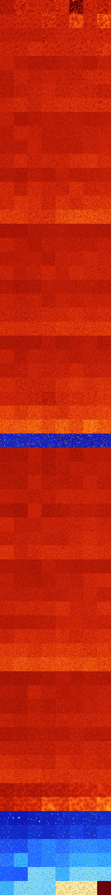

# B013578 (218624-219135)

<details>
    <summary>Initial Grid</summary>
    
</details>


<details>
    <summary>Initial Grid RLE</summary>

```
#C Exported from GoGoL (https://github.com/marrow16/gogol)
#C Wrap mode: Toroidal
#C Boundary mode: Dead
#C Step: 0
x = 100, y = 100, rule = B013578/S
40bo6b2o3bo23bo5bo$45bo$33bobobo18bo12bo19bo$68bo16bo8b2o$13bo33bo$13bo
$2bo19bo35bo11bo$21bo3bo42bo3bo19bo$27bo50bo10bo7bo$15bo22bo20bo16bo19b
o$3bo40bo12bo39bo$bo6bo12bo9b2o2bo47bo$22bo35bo4bo3bo7bobo11bo$25bo3bo
6bo25bo15bo$4bo11bo23bo$34bo7bo$18bo30bo48bo$11bo9bo36bo$40bo35b2o10bo
10bo$6bo6bo50bo10bo21bobo$31bo14bo17bo$14b3o53bo8bo15bo$7bobo8bo27bo20b
o7bob2o8bo$7bo2bo9bo29bo3bo10bo18bo2bo$53bo6bo35bo$27bo4bo21bo14bo6bo7b
o$38bobo4bo9bo7bo21bo$67b2o3bo12bo6bo$10bo18bo20bo5bobo38bo$13bo19bo3bo
2bo52bo$6bo50bo$2bo40b2o47bo$4bo10bo17bo9bo16bo30bo$9bo65bo9bo$20bo19bo
5bo2bo6bo8b2o$36bobo54bo$3bo2bo28bo14bo18b2o26bo$15bo16bo58bo5bo$25bo
19bo2bo9bo$5bo15bo26bo42bo$41bo12bo40b2o2bo$18bo38bo8bo$7bo3bobo46bo6bo
14bo6bo$11bo32bo5bo15bo28bo$3bo12bo39bo3bobo21bo13bo$24b2o21bo21bo$bo$
5bo17bo19bo14bo2bo$11bo29bo18bo11bo23bobo$10bo23bo2bo21bo28bo$14bobo17b
o59bo$bo5bo32bo21bo5bo$bo22bo7b2o51bo5bo$o19bo6bo3bo30bo24bo$14bo10bo2b
o20bo23bo$4b2o8bo37bo14bo$2bo5bo12bo$o52bo13bo9bobo9bo$22bo48bo4bo2bo8b
o5b2o$20bo18bo4bo52bo$29bobo9bo4bo14bo3bo6bo12bo$bo8bobobo7bo24bo30bo
17bo$20bo5bo13bo8bo3bo10bo23bo$72bo13bo$4bo2bo7bo12bo2bo12bo8bo$40bo3bo
15bo36bo$37bo17bo19bo$4bo12bo34bo7b2o12bo$41bo5bo$2bo8bo34bo35bo$42bo
37bo$6bo31bo2bo11bo44bo$40bo22bo17bo$41bo15bo19bo4bo9bo$28bo27bo37bo$
44bo33bo3bo$7bo15bo10bo25bo13bo$41bo14bo28bo$5bo11bo16bo30bo7bo7bo4bo$
26bo19bo8bo4bo30bo$9bo8bo29bo7bo2bo3bo4bo$44bo8bo19bo22bo$16bo44bo9bo$
17bobo22bo30bo6bo13bo$5bo$14bo62bo13bo6bo$13bo12bobo4bo48bobo6bo$bobo
26bo6bo12bo40bo$31bo14bobo6b2o$o25bo49bo22bo$21bo23bo15bo3bo6bo4bo$17bo
56bo14bo2bo2bo$16bo28bo8bo2bo$23bo22bo8bo29bo8bo$20bo46bo7bo$bo15bo13bo
3b3o18bo4bo24bo$27bo40bo20bo$27bo5bo18bo6bo9bo18bo$7bo13bo3bo27bo35bo9b
o$7bo23bo8bo4bo6bo20bo!
```
</details>
<details>
    <summary>Thumbnail</summary>

</details>
<table>
<tr>
    <td><a href="./218624%20S%20Heat%20Map%20Activity.png"></a><br>S (218624)<br>G>1000</td>    <td><a href="./218625%20S0%20Heat%20Map%20Activity.png"></a><br>S0 (218625)<br>G>1000</td>    <td><a href="./218626%20S1%20Heat%20Map%20Activity.png"></a><br>S1 (218626)<br>G>1000</td>    <td><a href="./218627%20S01%20Heat%20Map%20Activity.png"></a><br>S01 (218627)<br>G>1000</td>    <td><a href="./218628%20S2%20Heat%20Map%20Activity.png"></a><br>S2 (218628)<br>G>1000</td>    <td><a href="./218629%20S02%20Heat%20Map%20Activity.png"></a><br>S02 (218629)<br>R@498,p12</td>    <td><a href="./218630%20S12%20Heat%20Map%20Activity.png"></a><br>S12 (218630)<br>G>1000</td>    <td><a href="./218631%20S012%20Heat%20Map%20Activity.png"></a><br>S012 (218631)<br>G>1000</td></tr>
<tr>
    <td><a href="./218632%20S3%20Heat%20Map%20Activity.png"></a><br>S3 (218632)<br>G>1000</td>    <td><a href="./218633%20S03%20Heat%20Map%20Activity.png"></a><br>S03 (218633)<br>G>1000</td>    <td><a href="./218634%20S13%20Heat%20Map%20Activity.png"></a><br>S13 (218634)<br>G>1000</td>    <td><a href="./218635%20S013%20Heat%20Map%20Activity.png"></a><br>S013 (218635)<br>G>1000</td>    <td><a href="./218636%20S23%20Heat%20Map%20Activity.png"></a><br>S23 (218636)<br>G>1000</td>    <td><a href="./218637%20S023%20Heat%20Map%20Activity.png"></a><br>S023 (218637)<br>G>1000</td>    <td><a href="./218638%20S123%20Heat%20Map%20Activity.png"></a><br>S123 (218638)<br>G>1000</td>    <td><a href="./218639%20S0123%20Heat%20Map%20Activity.png"></a><br>S0123 (218639)<br>G>1000</td></tr>
<tr>
    <td><a href="./218640%20S4%20Heat%20Map%20Activity.png"></a><br>S4 (218640)<br>G>1000</td>    <td><a href="./218641%20S04%20Heat%20Map%20Activity.png"></a><br>S04 (218641)<br>G>1000</td>    <td><a href="./218642%20S14%20Heat%20Map%20Activity.png"></a><br>S14 (218642)<br>G>1000</td>    <td><a href="./218643%20S014%20Heat%20Map%20Activity.png"></a><br>S014 (218643)<br>G>1000</td>    <td><a href="./218644%20S24%20Heat%20Map%20Activity.png"></a><br>S24 (218644)<br>G>1000</td>    <td><a href="./218645%20S024%20Heat%20Map%20Activity.png"></a><br>S024 (218645)<br>G>1000</td>    <td><a href="./218646%20S124%20Heat%20Map%20Activity.png"></a><br>S124 (218646)<br>G>1000</td>    <td><a href="./218647%20S0124%20Heat%20Map%20Activity.png"></a><br>S0124 (218647)<br>G>1000</td></tr>
<tr>
    <td><a href="./218648%20S34%20Heat%20Map%20Activity.png"></a><br>S34 (218648)<br>G>1000</td>    <td><a href="./218649%20S034%20Heat%20Map%20Activity.png"></a><br>S034 (218649)<br>G>1000</td>    <td><a href="./218650%20S134%20Heat%20Map%20Activity.png"></a><br>S134 (218650)<br>G>1000</td>    <td><a href="./218651%20S0134%20Heat%20Map%20Activity.png"></a><br>S0134 (218651)<br>G>1000</td>    <td><a href="./218652%20S234%20Heat%20Map%20Activity.png"></a><br>S234 (218652)<br>G>1000</td>    <td><a href="./218653%20S0234%20Heat%20Map%20Activity.png"></a><br>S0234 (218653)<br>G>1000</td>    <td><a href="./218654%20S1234%20Heat%20Map%20Activity.png"></a><br>S1234 (218654)<br>G>1000</td>    <td><a href="./218655%20S01234%20Heat%20Map%20Activity.png"></a><br>S01234 (218655)<br>G>1000</td></tr>
<tr>
    <td><a href="./218656%20S5%20Heat%20Map%20Activity.png"></a><br>S5 (218656)<br>G>1000</td>    <td><a href="./218657%20S05%20Heat%20Map%20Activity.png"></a><br>S05 (218657)<br>G>1000</td>    <td><a href="./218658%20S15%20Heat%20Map%20Activity.png"></a><br>S15 (218658)<br>G>1000</td>    <td><a href="./218659%20S015%20Heat%20Map%20Activity.png"></a><br>S015 (218659)<br>G>1000</td>    <td><a href="./218660%20S25%20Heat%20Map%20Activity.png"></a><br>S25 (218660)<br>G>1000</td>    <td><a href="./218661%20S025%20Heat%20Map%20Activity.png"></a><br>S025 (218661)<br>G>1000</td>    <td><a href="./218662%20S125%20Heat%20Map%20Activity.png"></a><br>S125 (218662)<br>G>1000</td>    <td><a href="./218663%20S0125%20Heat%20Map%20Activity.png"></a><br>S0125 (218663)<br>G>1000</td></tr>
<tr>
    <td><a href="./218664%20S35%20Heat%20Map%20Activity.png"></a><br>S35 (218664)<br>G>1000</td>    <td><a href="./218665%20S035%20Heat%20Map%20Activity.png"></a><br>S035 (218665)<br>G>1000</td>    <td><a href="./218666%20S135%20Heat%20Map%20Activity.png"></a><br>S135 (218666)<br>G>1000</td>    <td><a href="./218667%20S0135%20Heat%20Map%20Activity.png"></a><br>S0135 (218667)<br>G>1000</td>    <td><a href="./218668%20S235%20Heat%20Map%20Activity.png"></a><br>S235 (218668)<br>G>1000</td>    <td><a href="./218669%20S0235%20Heat%20Map%20Activity.png"></a><br>S0235 (218669)<br>G>1000</td>    <td><a href="./218670%20S1235%20Heat%20Map%20Activity.png"></a><br>S1235 (218670)<br>G>1000</td>    <td><a href="./218671%20S01235%20Heat%20Map%20Activity.png"></a><br>S01235 (218671)<br>G>1000</td></tr>
<tr>
    <td><a href="./218672%20S45%20Heat%20Map%20Activity.png"></a><br>S45 (218672)<br>G>1000</td>    <td><a href="./218673%20S045%20Heat%20Map%20Activity.png"></a><br>S045 (218673)<br>G>1000</td>    <td><a href="./218674%20S145%20Heat%20Map%20Activity.png"></a><br>S145 (218674)<br>G>1000</td>    <td><a href="./218675%20S0145%20Heat%20Map%20Activity.png"></a><br>S0145 (218675)<br>G>1000</td>    <td><a href="./218676%20S245%20Heat%20Map%20Activity.png"></a><br>S245 (218676)<br>G>1000</td>    <td><a href="./218677%20S0245%20Heat%20Map%20Activity.png"></a><br>S0245 (218677)<br>G>1000</td>    <td><a href="./218678%20S1245%20Heat%20Map%20Activity.png"></a><br>S1245 (218678)<br>G>1000</td>    <td><a href="./218679%20S01245%20Heat%20Map%20Activity.png"></a><br>S01245 (218679)<br>G>1000</td></tr>
<tr>
    <td><a href="./218680%20S345%20Heat%20Map%20Activity.png"></a><br>S345 (218680)<br>G>1000</td>    <td><a href="./218681%20S0345%20Heat%20Map%20Activity.png"></a><br>S0345 (218681)<br>G>1000</td>    <td><a href="./218682%20S1345%20Heat%20Map%20Activity.png"></a><br>S1345 (218682)<br>G>1000</td>    <td><a href="./218683%20S01345%20Heat%20Map%20Activity.png"></a><br>S01345 (218683)<br>G>1000</td>    <td><a href="./218684%20S2345%20Heat%20Map%20Activity.png"></a><br>S2345 (218684)<br>G>1000</td>    <td><a href="./218685%20S02345%20Heat%20Map%20Activity.png"></a><br>S02345 (218685)<br>G>1000</td>    <td><a href="./218686%20S12345%20Heat%20Map%20Activity.png"></a><br>S12345 (218686)<br>G>1000</td>    <td><a href="./218687%20S012345%20Heat%20Map%20Activity.png"></a><br>S012345 (218687)<br>G>1000</td></tr>
<tr>
    <td><a href="./218688%20S6%20Heat%20Map%20Activity.png"></a><br>S6 (218688)<br>G>1000</td>    <td><a href="./218689%20S06%20Heat%20Map%20Activity.png"></a><br>S06 (218689)<br>G>1000</td>    <td><a href="./218690%20S16%20Heat%20Map%20Activity.png"></a><br>S16 (218690)<br>G>1000</td>    <td><a href="./218691%20S016%20Heat%20Map%20Activity.png"></a><br>S016 (218691)<br>G>1000</td>    <td><a href="./218692%20S26%20Heat%20Map%20Activity.png"></a><br>S26 (218692)<br>G>1000</td>    <td><a href="./218693%20S026%20Heat%20Map%20Activity.png"></a><br>S026 (218693)<br>G>1000</td>    <td><a href="./218694%20S126%20Heat%20Map%20Activity.png"></a><br>S126 (218694)<br>G>1000</td>    <td><a href="./218695%20S0126%20Heat%20Map%20Activity.png"></a><br>S0126 (218695)<br>G>1000</td></tr>
<tr>
    <td><a href="./218696%20S36%20Heat%20Map%20Activity.png"></a><br>S36 (218696)<br>G>1000</td>    <td><a href="./218697%20S036%20Heat%20Map%20Activity.png"></a><br>S036 (218697)<br>G>1000</td>    <td><a href="./218698%20S136%20Heat%20Map%20Activity.png"></a><br>S136 (218698)<br>G>1000</td>    <td><a href="./218699%20S0136%20Heat%20Map%20Activity.png"></a><br>S0136 (218699)<br>G>1000</td>    <td><a href="./218700%20S236%20Heat%20Map%20Activity.png"></a><br>S236 (218700)<br>G>1000</td>    <td><a href="./218701%20S0236%20Heat%20Map%20Activity.png"></a><br>S0236 (218701)<br>G>1000</td>    <td><a href="./218702%20S1236%20Heat%20Map%20Activity.png"></a><br>S1236 (218702)<br>G>1000</td>    <td><a href="./218703%20S01236%20Heat%20Map%20Activity.png"></a><br>S01236 (218703)<br>G>1000</td></tr>
<tr>
    <td><a href="./218704%20S46%20Heat%20Map%20Activity.png"></a><br>S46 (218704)<br>G>1000</td>    <td><a href="./218705%20S046%20Heat%20Map%20Activity.png"></a><br>S046 (218705)<br>G>1000</td>    <td><a href="./218706%20S146%20Heat%20Map%20Activity.png"></a><br>S146 (218706)<br>G>1000</td>    <td><a href="./218707%20S0146%20Heat%20Map%20Activity.png"></a><br>S0146 (218707)<br>G>1000</td>    <td><a href="./218708%20S246%20Heat%20Map%20Activity.png"></a><br>S246 (218708)<br>G>1000</td>    <td><a href="./218709%20S0246%20Heat%20Map%20Activity.png"></a><br>S0246 (218709)<br>G>1000</td>    <td><a href="./218710%20S1246%20Heat%20Map%20Activity.png"></a><br>S1246 (218710)<br>G>1000</td>    <td><a href="./218711%20S01246%20Heat%20Map%20Activity.png"></a><br>S01246 (218711)<br>G>1000</td></tr>
<tr>
    <td><a href="./218712%20S346%20Heat%20Map%20Activity.png"></a><br>S346 (218712)<br>G>1000</td>    <td><a href="./218713%20S0346%20Heat%20Map%20Activity.png"></a><br>S0346 (218713)<br>G>1000</td>    <td><a href="./218714%20S1346%20Heat%20Map%20Activity.png"></a><br>S1346 (218714)<br>G>1000</td>    <td><a href="./218715%20S01346%20Heat%20Map%20Activity.png"></a><br>S01346 (218715)<br>G>1000</td>    <td><a href="./218716%20S2346%20Heat%20Map%20Activity.png"></a><br>S2346 (218716)<br>G>1000</td>    <td><a href="./218717%20S02346%20Heat%20Map%20Activity.png"></a><br>S02346 (218717)<br>G>1000</td>    <td><a href="./218718%20S12346%20Heat%20Map%20Activity.png"></a><br>S12346 (218718)<br>G>1000</td>    <td><a href="./218719%20S012346%20Heat%20Map%20Activity.png"></a><br>S012346 (218719)<br>G>1000</td></tr>
<tr>
    <td><a href="./218720%20S56%20Heat%20Map%20Activity.png"></a><br>S56 (218720)<br>G>1000</td>    <td><a href="./218721%20S056%20Heat%20Map%20Activity.png"></a><br>S056 (218721)<br>G>1000</td>    <td><a href="./218722%20S156%20Heat%20Map%20Activity.png"></a><br>S156 (218722)<br>G>1000</td>    <td><a href="./218723%20S0156%20Heat%20Map%20Activity.png"></a><br>S0156 (218723)<br>G>1000</td>    <td><a href="./218724%20S256%20Heat%20Map%20Activity.png"></a><br>S256 (218724)<br>G>1000</td>    <td><a href="./218725%20S0256%20Heat%20Map%20Activity.png"></a><br>S0256 (218725)<br>G>1000</td>    <td><a href="./218726%20S1256%20Heat%20Map%20Activity.png"></a><br>S1256 (218726)<br>G>1000</td>    <td><a href="./218727%20S01256%20Heat%20Map%20Activity.png"></a><br>S01256 (218727)<br>G>1000</td></tr>
<tr>
    <td><a href="./218728%20S356%20Heat%20Map%20Activity.png"></a><br>S356 (218728)<br>G>1000</td>    <td><a href="./218729%20S0356%20Heat%20Map%20Activity.png"></a><br>S0356 (218729)<br>G>1000</td>    <td><a href="./218730%20S1356%20Heat%20Map%20Activity.png"></a><br>S1356 (218730)<br>G>1000</td>    <td><a href="./218731%20S01356%20Heat%20Map%20Activity.png"></a><br>S01356 (218731)<br>G>1000</td>    <td><a href="./218732%20S2356%20Heat%20Map%20Activity.png"></a><br>S2356 (218732)<br>G>1000</td>    <td><a href="./218733%20S02356%20Heat%20Map%20Activity.png"></a><br>S02356 (218733)<br>G>1000</td>    <td><a href="./218734%20S12356%20Heat%20Map%20Activity.png"></a><br>S12356 (218734)<br>G>1000</td>    <td><a href="./218735%20S012356%20Heat%20Map%20Activity.png"></a><br>S012356 (218735)<br>G>1000</td></tr>
<tr>
    <td><a href="./218736%20S456%20Heat%20Map%20Activity.png"></a><br>S456 (218736)<br>G>1000</td>    <td><a href="./218737%20S0456%20Heat%20Map%20Activity.png"></a><br>S0456 (218737)<br>G>1000</td>    <td><a href="./218738%20S1456%20Heat%20Map%20Activity.png"></a><br>S1456 (218738)<br>G>1000</td>    <td><a href="./218739%20S01456%20Heat%20Map%20Activity.png"></a><br>S01456 (218739)<br>G>1000</td>    <td><a href="./218740%20S2456%20Heat%20Map%20Activity.png"></a><br>S2456 (218740)<br>G>1000</td>    <td><a href="./218741%20S02456%20Heat%20Map%20Activity.png"></a><br>S02456 (218741)<br>G>1000</td>    <td><a href="./218742%20S12456%20Heat%20Map%20Activity.png"></a><br>S12456 (218742)<br>G>1000</td>    <td><a href="./218743%20S012456%20Heat%20Map%20Activity.png"></a><br>S012456 (218743)<br>G>1000</td></tr>
<tr>
    <td><a href="./218744%20S3456%20Heat%20Map%20Activity.png"></a><br>S3456 (218744)<br>G>1000</td>    <td><a href="./218745%20S03456%20Heat%20Map%20Activity.png"></a><br>S03456 (218745)<br>G>1000</td>    <td><a href="./218746%20S13456%20Heat%20Map%20Activity.png"></a><br>S13456 (218746)<br>G>1000</td>    <td><a href="./218747%20S013456%20Heat%20Map%20Activity.png"></a><br>S013456 (218747)<br>G>1000</td>    <td><a href="./218748%20S23456%20Heat%20Map%20Activity.png"></a><br>S23456 (218748)<br>G>1000</td>    <td><a href="./218749%20S023456%20Heat%20Map%20Activity.png"></a><br>S023456 (218749)<br>G>1000</td>    <td><a href="./218750%20S123456%20Heat%20Map%20Activity.png"></a><br>S123456 (218750)<br>G>1000</td>    <td><a href="./218751%20S0123456%20Heat%20Map%20Activity.png"></a><br>S0123456 (218751)<br>G>1000</td></tr>
<tr>
    <td><a href="./218752%20S7%20Heat%20Map%20Activity.png"></a><br>S7 (218752)<br>G>1000</td>    <td><a href="./218753%20S07%20Heat%20Map%20Activity.png"></a><br>S07 (218753)<br>G>1000</td>    <td><a href="./218754%20S17%20Heat%20Map%20Activity.png"></a><br>S17 (218754)<br>G>1000</td>    <td><a href="./218755%20S017%20Heat%20Map%20Activity.png"></a><br>S017 (218755)<br>G>1000</td>    <td><a href="./218756%20S27%20Heat%20Map%20Activity.png"></a><br>S27 (218756)<br>G>1000</td>    <td><a href="./218757%20S027%20Heat%20Map%20Activity.png"></a><br>S027 (218757)<br>G>1000</td>    <td><a href="./218758%20S127%20Heat%20Map%20Activity.png"></a><br>S127 (218758)<br>G>1000</td>    <td><a href="./218759%20S0127%20Heat%20Map%20Activity.png"></a><br>S0127 (218759)<br>G>1000</td></tr>
<tr>
    <td><a href="./218760%20S37%20Heat%20Map%20Activity.png"></a><br>S37 (218760)<br>G>1000</td>    <td><a href="./218761%20S037%20Heat%20Map%20Activity.png"></a><br>S037 (218761)<br>G>1000</td>    <td><a href="./218762%20S137%20Heat%20Map%20Activity.png"></a><br>S137 (218762)<br>G>1000</td>    <td><a href="./218763%20S0137%20Heat%20Map%20Activity.png"></a><br>S0137 (218763)<br>G>1000</td>    <td><a href="./218764%20S237%20Heat%20Map%20Activity.png"></a><br>S237 (218764)<br>G>1000</td>    <td><a href="./218765%20S0237%20Heat%20Map%20Activity.png"></a><br>S0237 (218765)<br>G>1000</td>    <td><a href="./218766%20S1237%20Heat%20Map%20Activity.png"></a><br>S1237 (218766)<br>G>1000</td>    <td><a href="./218767%20S01237%20Heat%20Map%20Activity.png"></a><br>S01237 (218767)<br>G>1000</td></tr>
<tr>
    <td><a href="./218768%20S47%20Heat%20Map%20Activity.png"></a><br>S47 (218768)<br>G>1000</td>    <td><a href="./218769%20S047%20Heat%20Map%20Activity.png"></a><br>S047 (218769)<br>G>1000</td>    <td><a href="./218770%20S147%20Heat%20Map%20Activity.png"></a><br>S147 (218770)<br>G>1000</td>    <td><a href="./218771%20S0147%20Heat%20Map%20Activity.png"></a><br>S0147 (218771)<br>G>1000</td>    <td><a href="./218772%20S247%20Heat%20Map%20Activity.png"></a><br>S247 (218772)<br>G>1000</td>    <td><a href="./218773%20S0247%20Heat%20Map%20Activity.png"></a><br>S0247 (218773)<br>G>1000</td>    <td><a href="./218774%20S1247%20Heat%20Map%20Activity.png"></a><br>S1247 (218774)<br>G>1000</td>    <td><a href="./218775%20S01247%20Heat%20Map%20Activity.png"></a><br>S01247 (218775)<br>G>1000</td></tr>
<tr>
    <td><a href="./218776%20S347%20Heat%20Map%20Activity.png"></a><br>S347 (218776)<br>G>1000</td>    <td><a href="./218777%20S0347%20Heat%20Map%20Activity.png"></a><br>S0347 (218777)<br>G>1000</td>    <td><a href="./218778%20S1347%20Heat%20Map%20Activity.png"></a><br>S1347 (218778)<br>G>1000</td>    <td><a href="./218779%20S01347%20Heat%20Map%20Activity.png"></a><br>S01347 (218779)<br>G>1000</td>    <td><a href="./218780%20S2347%20Heat%20Map%20Activity.png"></a><br>S2347 (218780)<br>G>1000</td>    <td><a href="./218781%20S02347%20Heat%20Map%20Activity.png"></a><br>S02347 (218781)<br>G>1000</td>    <td><a href="./218782%20S12347%20Heat%20Map%20Activity.png"></a><br>S12347 (218782)<br>G>1000</td>    <td><a href="./218783%20S012347%20Heat%20Map%20Activity.png"></a><br>S012347 (218783)<br>G>1000</td></tr>
<tr>
    <td><a href="./218784%20S57%20Heat%20Map%20Activity.png"></a><br>S57 (218784)<br>G>1000</td>    <td><a href="./218785%20S057%20Heat%20Map%20Activity.png"></a><br>S057 (218785)<br>G>1000</td>    <td><a href="./218786%20S157%20Heat%20Map%20Activity.png"></a><br>S157 (218786)<br>G>1000</td>    <td><a href="./218787%20S0157%20Heat%20Map%20Activity.png"></a><br>S0157 (218787)<br>G>1000</td>    <td><a href="./218788%20S257%20Heat%20Map%20Activity.png"></a><br>S257 (218788)<br>G>1000</td>    <td><a href="./218789%20S0257%20Heat%20Map%20Activity.png"></a><br>S0257 (218789)<br>G>1000</td>    <td><a href="./218790%20S1257%20Heat%20Map%20Activity.png"></a><br>S1257 (218790)<br>G>1000</td>    <td><a href="./218791%20S01257%20Heat%20Map%20Activity.png"></a><br>S01257 (218791)<br>G>1000</td></tr>
<tr>
    <td><a href="./218792%20S357%20Heat%20Map%20Activity.png"></a><br>S357 (218792)<br>G>1000</td>    <td><a href="./218793%20S0357%20Heat%20Map%20Activity.png"></a><br>S0357 (218793)<br>G>1000</td>    <td><a href="./218794%20S1357%20Heat%20Map%20Activity.png"></a><br>S1357 (218794)<br>G>1000</td>    <td><a href="./218795%20S01357%20Heat%20Map%20Activity.png"></a><br>S01357 (218795)<br>G>1000</td>    <td><a href="./218796%20S2357%20Heat%20Map%20Activity.png"></a><br>S2357 (218796)<br>G>1000</td>    <td><a href="./218797%20S02357%20Heat%20Map%20Activity.png"></a><br>S02357 (218797)<br>G>1000</td>    <td><a href="./218798%20S12357%20Heat%20Map%20Activity.png"></a><br>S12357 (218798)<br>G>1000</td>    <td><a href="./218799%20S012357%20Heat%20Map%20Activity.png"></a><br>S012357 (218799)<br>G>1000</td></tr>
<tr>
    <td><a href="./218800%20S457%20Heat%20Map%20Activity.png"></a><br>S457 (218800)<br>G>1000</td>    <td><a href="./218801%20S0457%20Heat%20Map%20Activity.png"></a><br>S0457 (218801)<br>G>1000</td>    <td><a href="./218802%20S1457%20Heat%20Map%20Activity.png"></a><br>S1457 (218802)<br>G>1000</td>    <td><a href="./218803%20S01457%20Heat%20Map%20Activity.png"></a><br>S01457 (218803)<br>G>1000</td>    <td><a href="./218804%20S2457%20Heat%20Map%20Activity.png"></a><br>S2457 (218804)<br>G>1000</td>    <td><a href="./218805%20S02457%20Heat%20Map%20Activity.png"></a><br>S02457 (218805)<br>G>1000</td>    <td><a href="./218806%20S12457%20Heat%20Map%20Activity.png"></a><br>S12457 (218806)<br>G>1000</td>    <td><a href="./218807%20S012457%20Heat%20Map%20Activity.png"></a><br>S012457 (218807)<br>G>1000</td></tr>
<tr>
    <td><a href="./218808%20S3457%20Heat%20Map%20Activity.png"></a><br>S3457 (218808)<br>G>1000</td>    <td><a href="./218809%20S03457%20Heat%20Map%20Activity.png"></a><br>S03457 (218809)<br>G>1000</td>    <td><a href="./218810%20S13457%20Heat%20Map%20Activity.png"></a><br>S13457 (218810)<br>G>1000</td>    <td><a href="./218811%20S013457%20Heat%20Map%20Activity.png"></a><br>S013457 (218811)<br>G>1000</td>    <td><a href="./218812%20S23457%20Heat%20Map%20Activity.png"></a><br>S23457 (218812)<br>G>1000</td>    <td><a href="./218813%20S023457%20Heat%20Map%20Activity.png"></a><br>S023457 (218813)<br>G>1000</td>    <td><a href="./218814%20S123457%20Heat%20Map%20Activity.png"></a><br>S123457 (218814)<br>G>1000</td>    <td><a href="./218815%20S0123457%20Heat%20Map%20Activity.png"></a><br>S0123457 (218815)<br>G>1000</td></tr>
<tr>
    <td><a href="./218816%20S67%20Heat%20Map%20Activity.png"></a><br>S67 (218816)<br>G>1000</td>    <td><a href="./218817%20S067%20Heat%20Map%20Activity.png"></a><br>S067 (218817)<br>G>1000</td>    <td><a href="./218818%20S167%20Heat%20Map%20Activity.png"></a><br>S167 (218818)<br>G>1000</td>    <td><a href="./218819%20S0167%20Heat%20Map%20Activity.png"></a><br>S0167 (218819)<br>G>1000</td>    <td><a href="./218820%20S267%20Heat%20Map%20Activity.png"></a><br>S267 (218820)<br>G>1000</td>    <td><a href="./218821%20S0267%20Heat%20Map%20Activity.png"></a><br>S0267 (218821)<br>G>1000</td>    <td><a href="./218822%20S1267%20Heat%20Map%20Activity.png"></a><br>S1267 (218822)<br>G>1000</td>    <td><a href="./218823%20S01267%20Heat%20Map%20Activity.png"></a><br>S01267 (218823)<br>G>1000</td></tr>
<tr>
    <td><a href="./218824%20S367%20Heat%20Map%20Activity.png"></a><br>S367 (218824)<br>G>1000</td>    <td><a href="./218825%20S0367%20Heat%20Map%20Activity.png"></a><br>S0367 (218825)<br>G>1000</td>    <td><a href="./218826%20S1367%20Heat%20Map%20Activity.png"></a><br>S1367 (218826)<br>G>1000</td>    <td><a href="./218827%20S01367%20Heat%20Map%20Activity.png"></a><br>S01367 (218827)<br>G>1000</td>    <td><a href="./218828%20S2367%20Heat%20Map%20Activity.png"></a><br>S2367 (218828)<br>G>1000</td>    <td><a href="./218829%20S02367%20Heat%20Map%20Activity.png"></a><br>S02367 (218829)<br>G>1000</td>    <td><a href="./218830%20S12367%20Heat%20Map%20Activity.png"></a><br>S12367 (218830)<br>G>1000</td>    <td><a href="./218831%20S012367%20Heat%20Map%20Activity.png"></a><br>S012367 (218831)<br>G>1000</td></tr>
<tr>
    <td><a href="./218832%20S467%20Heat%20Map%20Activity.png"></a><br>S467 (218832)<br>G>1000</td>    <td><a href="./218833%20S0467%20Heat%20Map%20Activity.png"></a><br>S0467 (218833)<br>G>1000</td>    <td><a href="./218834%20S1467%20Heat%20Map%20Activity.png"></a><br>S1467 (218834)<br>G>1000</td>    <td><a href="./218835%20S01467%20Heat%20Map%20Activity.png"></a><br>S01467 (218835)<br>G>1000</td>    <td><a href="./218836%20S2467%20Heat%20Map%20Activity.png"></a><br>S2467 (218836)<br>G>1000</td>    <td><a href="./218837%20S02467%20Heat%20Map%20Activity.png"></a><br>S02467 (218837)<br>G>1000</td>    <td><a href="./218838%20S12467%20Heat%20Map%20Activity.png"></a><br>S12467 (218838)<br>G>1000</td>    <td><a href="./218839%20S012467%20Heat%20Map%20Activity.png"></a><br>S012467 (218839)<br>G>1000</td></tr>
<tr>
    <td><a href="./218840%20S3467%20Heat%20Map%20Activity.png"></a><br>S3467 (218840)<br>G>1000</td>    <td><a href="./218841%20S03467%20Heat%20Map%20Activity.png"></a><br>S03467 (218841)<br>G>1000</td>    <td><a href="./218842%20S13467%20Heat%20Map%20Activity.png"></a><br>S13467 (218842)<br>G>1000</td>    <td><a href="./218843%20S013467%20Heat%20Map%20Activity.png"></a><br>S013467 (218843)<br>G>1000</td>    <td><a href="./218844%20S23467%20Heat%20Map%20Activity.png"></a><br>S23467 (218844)<br>G>1000</td>    <td><a href="./218845%20S023467%20Heat%20Map%20Activity.png"></a><br>S023467 (218845)<br>G>1000</td>    <td><a href="./218846%20S123467%20Heat%20Map%20Activity.png"></a><br>S123467 (218846)<br>G>1000</td>    <td><a href="./218847%20S0123467%20Heat%20Map%20Activity.png"></a><br>S0123467 (218847)<br>G>1000</td></tr>
<tr>
    <td><a href="./218848%20S567%20Heat%20Map%20Activity.png"></a><br>S567 (218848)<br>G>1000</td>    <td><a href="./218849%20S0567%20Heat%20Map%20Activity.png"></a><br>S0567 (218849)<br>G>1000</td>    <td><a href="./218850%20S1567%20Heat%20Map%20Activity.png"></a><br>S1567 (218850)<br>G>1000</td>    <td><a href="./218851%20S01567%20Heat%20Map%20Activity.png"></a><br>S01567 (218851)<br>G>1000</td>    <td><a href="./218852%20S2567%20Heat%20Map%20Activity.png"></a><br>S2567 (218852)<br>G>1000</td>    <td><a href="./218853%20S02567%20Heat%20Map%20Activity.png"></a><br>S02567 (218853)<br>G>1000</td>    <td><a href="./218854%20S12567%20Heat%20Map%20Activity.png"></a><br>S12567 (218854)<br>G>1000</td>    <td><a href="./218855%20S012567%20Heat%20Map%20Activity.png"></a><br>S012567 (218855)<br>G>1000</td></tr>
<tr>
    <td><a href="./218856%20S3567%20Heat%20Map%20Activity.png"></a><br>S3567 (218856)<br>G>1000</td>    <td><a href="./218857%20S03567%20Heat%20Map%20Activity.png"></a><br>S03567 (218857)<br>G>1000</td>    <td><a href="./218858%20S13567%20Heat%20Map%20Activity.png"></a><br>S13567 (218858)<br>G>1000</td>    <td><a href="./218859%20S013567%20Heat%20Map%20Activity.png"></a><br>S013567 (218859)<br>G>1000</td>    <td><a href="./218860%20S23567%20Heat%20Map%20Activity.png"></a><br>S23567 (218860)<br>G>1000</td>    <td><a href="./218861%20S023567%20Heat%20Map%20Activity.png"></a><br>S023567 (218861)<br>G>1000</td>    <td><a href="./218862%20S123567%20Heat%20Map%20Activity.png"></a><br>S123567 (218862)<br>G>1000</td>    <td><a href="./218863%20S0123567%20Heat%20Map%20Activity.png"></a><br>S0123567 (218863)<br>G>1000</td></tr>
<tr>
    <td><a href="./218864%20S4567%20Heat%20Map%20Activity.png"></a><br>S4567 (218864)<br>G>1000</td>    <td><a href="./218865%20S04567%20Heat%20Map%20Activity.png"></a><br>S04567 (218865)<br>G>1000</td>    <td><a href="./218866%20S14567%20Heat%20Map%20Activity.png"></a><br>S14567 (218866)<br>G>1000</td>    <td><a href="./218867%20S014567%20Heat%20Map%20Activity.png"></a><br>S014567 (218867)<br>G>1000</td>    <td><a href="./218868%20S24567%20Heat%20Map%20Activity.png"></a><br>S24567 (218868)<br>G>1000</td>    <td><a href="./218869%20S024567%20Heat%20Map%20Activity.png"></a><br>S024567 (218869)<br>G>1000</td>    <td><a href="./218870%20S124567%20Heat%20Map%20Activity.png"></a><br>S124567 (218870)<br>G>1000</td>    <td><a href="./218871%20S0124567%20Heat%20Map%20Activity.png"></a><br>S0124567 (218871)<br>G>1000</td></tr>
<tr>
    <td><a href="./218872%20S34567%20Heat%20Map%20Activity.png"></a><br>S34567 (218872)<br>G>1000</td>    <td><a href="./218873%20S034567%20Heat%20Map%20Activity.png"></a><br>S034567 (218873)<br>G>1000</td>    <td><a href="./218874%20S134567%20Heat%20Map%20Activity.png"></a><br>S134567 (218874)<br>G>1000</td>    <td><a href="./218875%20S0134567%20Heat%20Map%20Activity.png"></a><br>S0134567 (218875)<br>G>1000</td>    <td><a href="./218876%20S234567%20Heat%20Map%20Activity.png"></a><br>S234567 (218876)<br>G>1000</td>    <td><a href="./218877%20S0234567%20Heat%20Map%20Activity.png"></a><br>S0234567 (218877)<br>G>1000</td>    <td><a href="./218878%20S1234567%20Heat%20Map%20Activity.png"></a><br>S1234567 (218878)<br>G>1000</td>    <td><a href="./218879%20S01234567%20Heat%20Map%20Activity.png"></a><br>S01234567 (218879)<br>G>1000</td></tr>
<tr>
    <td><a href="./218880%20S8%20Heat%20Map%20Activity.png"></a><br>S8 (218880)<br>G>1000</td>    <td><a href="./218881%20S08%20Heat%20Map%20Activity.png"></a><br>S08 (218881)<br>G>1000</td>    <td><a href="./218882%20S18%20Heat%20Map%20Activity.png"></a><br>S18 (218882)<br>G>1000</td>    <td><a href="./218883%20S018%20Heat%20Map%20Activity.png"></a><br>S018 (218883)<br>G>1000</td>    <td><a href="./218884%20S28%20Heat%20Map%20Activity.png"></a><br>S28 (218884)<br>G>1000</td>    <td><a href="./218885%20S028%20Heat%20Map%20Activity.png"></a><br>S028 (218885)<br>G>1000</td>    <td><a href="./218886%20S128%20Heat%20Map%20Activity.png"></a><br>S128 (218886)<br>G>1000</td>    <td><a href="./218887%20S0128%20Heat%20Map%20Activity.png"></a><br>S0128 (218887)<br>G>1000</td></tr>
<tr>
    <td><a href="./218888%20S38%20Heat%20Map%20Activity.png"></a><br>S38 (218888)<br>G>1000</td>    <td><a href="./218889%20S038%20Heat%20Map%20Activity.png"></a><br>S038 (218889)<br>G>1000</td>    <td><a href="./218890%20S138%20Heat%20Map%20Activity.png"></a><br>S138 (218890)<br>G>1000</td>    <td><a href="./218891%20S0138%20Heat%20Map%20Activity.png"></a><br>S0138 (218891)<br>G>1000</td>    <td><a href="./218892%20S238%20Heat%20Map%20Activity.png"></a><br>S238 (218892)<br>G>1000</td>    <td><a href="./218893%20S0238%20Heat%20Map%20Activity.png"></a><br>S0238 (218893)<br>G>1000</td>    <td><a href="./218894%20S1238%20Heat%20Map%20Activity.png"></a><br>S1238 (218894)<br>G>1000</td>    <td><a href="./218895%20S01238%20Heat%20Map%20Activity.png"></a><br>S01238 (218895)<br>G>1000</td></tr>
<tr>
    <td><a href="./218896%20S48%20Heat%20Map%20Activity.png"></a><br>S48 (218896)<br>G>1000</td>    <td><a href="./218897%20S048%20Heat%20Map%20Activity.png"></a><br>S048 (218897)<br>G>1000</td>    <td><a href="./218898%20S148%20Heat%20Map%20Activity.png"></a><br>S148 (218898)<br>G>1000</td>    <td><a href="./218899%20S0148%20Heat%20Map%20Activity.png"></a><br>S0148 (218899)<br>G>1000</td>    <td><a href="./218900%20S248%20Heat%20Map%20Activity.png"></a><br>S248 (218900)<br>G>1000</td>    <td><a href="./218901%20S0248%20Heat%20Map%20Activity.png"></a><br>S0248 (218901)<br>G>1000</td>    <td><a href="./218902%20S1248%20Heat%20Map%20Activity.png"></a><br>S1248 (218902)<br>G>1000</td>    <td><a href="./218903%20S01248%20Heat%20Map%20Activity.png"></a><br>S01248 (218903)<br>G>1000</td></tr>
<tr>
    <td><a href="./218904%20S348%20Heat%20Map%20Activity.png"></a><br>S348 (218904)<br>G>1000</td>    <td><a href="./218905%20S0348%20Heat%20Map%20Activity.png"></a><br>S0348 (218905)<br>G>1000</td>    <td><a href="./218906%20S1348%20Heat%20Map%20Activity.png"></a><br>S1348 (218906)<br>G>1000</td>    <td><a href="./218907%20S01348%20Heat%20Map%20Activity.png"></a><br>S01348 (218907)<br>G>1000</td>    <td><a href="./218908%20S2348%20Heat%20Map%20Activity.png"></a><br>S2348 (218908)<br>G>1000</td>    <td><a href="./218909%20S02348%20Heat%20Map%20Activity.png"></a><br>S02348 (218909)<br>G>1000</td>    <td><a href="./218910%20S12348%20Heat%20Map%20Activity.png"></a><br>S12348 (218910)<br>G>1000</td>    <td><a href="./218911%20S012348%20Heat%20Map%20Activity.png"></a><br>S012348 (218911)<br>G>1000</td></tr>
<tr>
    <td><a href="./218912%20S58%20Heat%20Map%20Activity.png"></a><br>S58 (218912)<br>G>1000</td>    <td><a href="./218913%20S058%20Heat%20Map%20Activity.png"></a><br>S058 (218913)<br>G>1000</td>    <td><a href="./218914%20S158%20Heat%20Map%20Activity.png"></a><br>S158 (218914)<br>G>1000</td>    <td><a href="./218915%20S0158%20Heat%20Map%20Activity.png"></a><br>S0158 (218915)<br>G>1000</td>    <td><a href="./218916%20S258%20Heat%20Map%20Activity.png"></a><br>S258 (218916)<br>G>1000</td>    <td><a href="./218917%20S0258%20Heat%20Map%20Activity.png"></a><br>S0258 (218917)<br>G>1000</td>    <td><a href="./218918%20S1258%20Heat%20Map%20Activity.png"></a><br>S1258 (218918)<br>G>1000</td>    <td><a href="./218919%20S01258%20Heat%20Map%20Activity.png"></a><br>S01258 (218919)<br>G>1000</td></tr>
<tr>
    <td><a href="./218920%20S358%20Heat%20Map%20Activity.png"></a><br>S358 (218920)<br>G>1000</td>    <td><a href="./218921%20S0358%20Heat%20Map%20Activity.png"></a><br>S0358 (218921)<br>G>1000</td>    <td><a href="./218922%20S1358%20Heat%20Map%20Activity.png"></a><br>S1358 (218922)<br>G>1000</td>    <td><a href="./218923%20S01358%20Heat%20Map%20Activity.png"></a><br>S01358 (218923)<br>G>1000</td>    <td><a href="./218924%20S2358%20Heat%20Map%20Activity.png"></a><br>S2358 (218924)<br>G>1000</td>    <td><a href="./218925%20S02358%20Heat%20Map%20Activity.png"></a><br>S02358 (218925)<br>G>1000</td>    <td><a href="./218926%20S12358%20Heat%20Map%20Activity.png"></a><br>S12358 (218926)<br>G>1000</td>    <td><a href="./218927%20S012358%20Heat%20Map%20Activity.png"></a><br>S012358 (218927)<br>G>1000</td></tr>
<tr>
    <td><a href="./218928%20S458%20Heat%20Map%20Activity.png"></a><br>S458 (218928)<br>G>1000</td>    <td><a href="./218929%20S0458%20Heat%20Map%20Activity.png"></a><br>S0458 (218929)<br>G>1000</td>    <td><a href="./218930%20S1458%20Heat%20Map%20Activity.png"></a><br>S1458 (218930)<br>G>1000</td>    <td><a href="./218931%20S01458%20Heat%20Map%20Activity.png"></a><br>S01458 (218931)<br>G>1000</td>    <td><a href="./218932%20S2458%20Heat%20Map%20Activity.png"></a><br>S2458 (218932)<br>G>1000</td>    <td><a href="./218933%20S02458%20Heat%20Map%20Activity.png"></a><br>S02458 (218933)<br>G>1000</td>    <td><a href="./218934%20S12458%20Heat%20Map%20Activity.png"></a><br>S12458 (218934)<br>G>1000</td>    <td><a href="./218935%20S012458%20Heat%20Map%20Activity.png"></a><br>S012458 (218935)<br>G>1000</td></tr>
<tr>
    <td><a href="./218936%20S3458%20Heat%20Map%20Activity.png"></a><br>S3458 (218936)<br>G>1000</td>    <td><a href="./218937%20S03458%20Heat%20Map%20Activity.png"></a><br>S03458 (218937)<br>G>1000</td>    <td><a href="./218938%20S13458%20Heat%20Map%20Activity.png"></a><br>S13458 (218938)<br>G>1000</td>    <td><a href="./218939%20S013458%20Heat%20Map%20Activity.png"></a><br>S013458 (218939)<br>G>1000</td>    <td><a href="./218940%20S23458%20Heat%20Map%20Activity.png"></a><br>S23458 (218940)<br>G>1000</td>    <td><a href="./218941%20S023458%20Heat%20Map%20Activity.png"></a><br>S023458 (218941)<br>G>1000</td>    <td><a href="./218942%20S123458%20Heat%20Map%20Activity.png"></a><br>S123458 (218942)<br>G>1000</td>    <td><a href="./218943%20S0123458%20Heat%20Map%20Activity.png"></a><br>S0123458 (218943)<br>G>1000</td></tr>
<tr>
    <td><a href="./218944%20S68%20Heat%20Map%20Activity.png"></a><br>S68 (218944)<br>G>1000</td>    <td><a href="./218945%20S068%20Heat%20Map%20Activity.png"></a><br>S068 (218945)<br>G>1000</td>    <td><a href="./218946%20S168%20Heat%20Map%20Activity.png"></a><br>S168 (218946)<br>G>1000</td>    <td><a href="./218947%20S0168%20Heat%20Map%20Activity.png"></a><br>S0168 (218947)<br>G>1000</td>    <td><a href="./218948%20S268%20Heat%20Map%20Activity.png"></a><br>S268 (218948)<br>G>1000</td>    <td><a href="./218949%20S0268%20Heat%20Map%20Activity.png"></a><br>S0268 (218949)<br>G>1000</td>    <td><a href="./218950%20S1268%20Heat%20Map%20Activity.png"></a><br>S1268 (218950)<br>G>1000</td>    <td><a href="./218951%20S01268%20Heat%20Map%20Activity.png"></a><br>S01268 (218951)<br>G>1000</td></tr>
<tr>
    <td><a href="./218952%20S368%20Heat%20Map%20Activity.png"></a><br>S368 (218952)<br>G>1000</td>    <td><a href="./218953%20S0368%20Heat%20Map%20Activity.png"></a><br>S0368 (218953)<br>G>1000</td>    <td><a href="./218954%20S1368%20Heat%20Map%20Activity.png"></a><br>S1368 (218954)<br>G>1000</td>    <td><a href="./218955%20S01368%20Heat%20Map%20Activity.png"></a><br>S01368 (218955)<br>G>1000</td>    <td><a href="./218956%20S2368%20Heat%20Map%20Activity.png"></a><br>S2368 (218956)<br>G>1000</td>    <td><a href="./218957%20S02368%20Heat%20Map%20Activity.png"></a><br>S02368 (218957)<br>G>1000</td>    <td><a href="./218958%20S12368%20Heat%20Map%20Activity.png"></a><br>S12368 (218958)<br>G>1000</td>    <td><a href="./218959%20S012368%20Heat%20Map%20Activity.png"></a><br>S012368 (218959)<br>G>1000</td></tr>
<tr>
    <td><a href="./218960%20S468%20Heat%20Map%20Activity.png"></a><br>S468 (218960)<br>G>1000</td>    <td><a href="./218961%20S0468%20Heat%20Map%20Activity.png"></a><br>S0468 (218961)<br>G>1000</td>    <td><a href="./218962%20S1468%20Heat%20Map%20Activity.png"></a><br>S1468 (218962)<br>G>1000</td>    <td><a href="./218963%20S01468%20Heat%20Map%20Activity.png"></a><br>S01468 (218963)<br>G>1000</td>    <td><a href="./218964%20S2468%20Heat%20Map%20Activity.png"></a><br>S2468 (218964)<br>G>1000</td>    <td><a href="./218965%20S02468%20Heat%20Map%20Activity.png"></a><br>S02468 (218965)<br>G>1000</td>    <td><a href="./218966%20S12468%20Heat%20Map%20Activity.png"></a><br>S12468 (218966)<br>G>1000</td>    <td><a href="./218967%20S012468%20Heat%20Map%20Activity.png"></a><br>S012468 (218967)<br>G>1000</td></tr>
<tr>
    <td><a href="./218968%20S3468%20Heat%20Map%20Activity.png"></a><br>S3468 (218968)<br>G>1000</td>    <td><a href="./218969%20S03468%20Heat%20Map%20Activity.png"></a><br>S03468 (218969)<br>G>1000</td>    <td><a href="./218970%20S13468%20Heat%20Map%20Activity.png"></a><br>S13468 (218970)<br>G>1000</td>    <td><a href="./218971%20S013468%20Heat%20Map%20Activity.png"></a><br>S013468 (218971)<br>G>1000</td>    <td><a href="./218972%20S23468%20Heat%20Map%20Activity.png"></a><br>S23468 (218972)<br>G>1000</td>    <td><a href="./218973%20S023468%20Heat%20Map%20Activity.png"></a><br>S023468 (218973)<br>G>1000</td>    <td><a href="./218974%20S123468%20Heat%20Map%20Activity.png"></a><br>S123468 (218974)<br>G>1000</td>    <td><a href="./218975%20S0123468%20Heat%20Map%20Activity.png"></a><br>S0123468 (218975)<br>G>1000</td></tr>
<tr>
    <td><a href="./218976%20S568%20Heat%20Map%20Activity.png"></a><br>S568 (218976)<br>G>1000</td>    <td><a href="./218977%20S0568%20Heat%20Map%20Activity.png"></a><br>S0568 (218977)<br>G>1000</td>    <td><a href="./218978%20S1568%20Heat%20Map%20Activity.png"></a><br>S1568 (218978)<br>G>1000</td>    <td><a href="./218979%20S01568%20Heat%20Map%20Activity.png"></a><br>S01568 (218979)<br>G>1000</td>    <td><a href="./218980%20S2568%20Heat%20Map%20Activity.png"></a><br>S2568 (218980)<br>G>1000</td>    <td><a href="./218981%20S02568%20Heat%20Map%20Activity.png"></a><br>S02568 (218981)<br>G>1000</td>    <td><a href="./218982%20S12568%20Heat%20Map%20Activity.png"></a><br>S12568 (218982)<br>G>1000</td>    <td><a href="./218983%20S012568%20Heat%20Map%20Activity.png"></a><br>S012568 (218983)<br>G>1000</td></tr>
<tr>
    <td><a href="./218984%20S3568%20Heat%20Map%20Activity.png"></a><br>S3568 (218984)<br>G>1000</td>    <td><a href="./218985%20S03568%20Heat%20Map%20Activity.png"></a><br>S03568 (218985)<br>G>1000</td>    <td><a href="./218986%20S13568%20Heat%20Map%20Activity.png"></a><br>S13568 (218986)<br>G>1000</td>    <td><a href="./218987%20S013568%20Heat%20Map%20Activity.png"></a><br>S013568 (218987)<br>G>1000</td>    <td><a href="./218988%20S23568%20Heat%20Map%20Activity.png"></a><br>S23568 (218988)<br>G>1000</td>    <td><a href="./218989%20S023568%20Heat%20Map%20Activity.png"></a><br>S023568 (218989)<br>G>1000</td>    <td><a href="./218990%20S123568%20Heat%20Map%20Activity.png"></a><br>S123568 (218990)<br>G>1000</td>    <td><a href="./218991%20S0123568%20Heat%20Map%20Activity.png"></a><br>S0123568 (218991)<br>G>1000</td></tr>
<tr>
    <td><a href="./218992%20S4568%20Heat%20Map%20Activity.png"></a><br>S4568 (218992)<br>G>1000</td>    <td><a href="./218993%20S04568%20Heat%20Map%20Activity.png"></a><br>S04568 (218993)<br>G>1000</td>    <td><a href="./218994%20S14568%20Heat%20Map%20Activity.png"></a><br>S14568 (218994)<br>G>1000</td>    <td><a href="./218995%20S014568%20Heat%20Map%20Activity.png"></a><br>S014568 (218995)<br>G>1000</td>    <td><a href="./218996%20S24568%20Heat%20Map%20Activity.png"></a><br>S24568 (218996)<br>G>1000</td>    <td><a href="./218997%20S024568%20Heat%20Map%20Activity.png"></a><br>S024568 (218997)<br>G>1000</td>    <td><a href="./218998%20S124568%20Heat%20Map%20Activity.png"></a><br>S124568 (218998)<br>G>1000</td>    <td><a href="./218999%20S0124568%20Heat%20Map%20Activity.png"></a><br>S0124568 (218999)<br>G>1000</td></tr>
<tr>
    <td><a href="./219000%20S34568%20Heat%20Map%20Activity.png"></a><br>S34568 (219000)<br>G>1000</td>    <td><a href="./219001%20S034568%20Heat%20Map%20Activity.png"></a><br>S034568 (219001)<br>G>1000</td>    <td><a href="./219002%20S134568%20Heat%20Map%20Activity.png"></a><br>S134568 (219002)<br>G>1000</td>    <td><a href="./219003%20S0134568%20Heat%20Map%20Activity.png"></a><br>S0134568 (219003)<br>G>1000</td>    <td><a href="./219004%20S234568%20Heat%20Map%20Activity.png"></a><br>S234568 (219004)<br>G>1000</td>    <td><a href="./219005%20S0234568%20Heat%20Map%20Activity.png"></a><br>S0234568 (219005)<br>G>1000</td>    <td><a href="./219006%20S1234568%20Heat%20Map%20Activity.png"></a><br>S1234568 (219006)<br>G>1000</td>    <td><a href="./219007%20S01234568%20Heat%20Map%20Activity.png"></a><br>S01234568 (219007)<br>G>1000</td></tr>
<tr>
    <td><a href="./219008%20S78%20Heat%20Map%20Activity.png"></a><br>S78 (219008)<br>G>1000</td>    <td><a href="./219009%20S078%20Heat%20Map%20Activity.png"></a><br>S078 (219009)<br>G>1000</td>    <td><a href="./219010%20S178%20Heat%20Map%20Activity.png"></a><br>S178 (219010)<br>G>1000</td>    <td><a href="./219011%20S0178%20Heat%20Map%20Activity.png"></a><br>S0178 (219011)<br>G>1000</td>    <td><a href="./219012%20S278%20Heat%20Map%20Activity.png"></a><br>S278 (219012)<br>G>1000</td>    <td><a href="./219013%20S0278%20Heat%20Map%20Activity.png"></a><br>S0278 (219013)<br>G>1000</td>    <td><a href="./219014%20S1278%20Heat%20Map%20Activity.png"></a><br>S1278 (219014)<br>G>1000</td>    <td><a href="./219015%20S01278%20Heat%20Map%20Activity.png"></a><br>S01278 (219015)<br>G>1000</td></tr>
<tr>
    <td><a href="./219016%20S378%20Heat%20Map%20Activity.png"></a><br>S378 (219016)<br>G>1000</td>    <td><a href="./219017%20S0378%20Heat%20Map%20Activity.png"></a><br>S0378 (219017)<br>G>1000</td>    <td><a href="./219018%20S1378%20Heat%20Map%20Activity.png"></a><br>S1378 (219018)<br>G>1000</td>    <td><a href="./219019%20S01378%20Heat%20Map%20Activity.png"></a><br>S01378 (219019)<br>G>1000</td>    <td><a href="./219020%20S2378%20Heat%20Map%20Activity.png"></a><br>S2378 (219020)<br>G>1000</td>    <td><a href="./219021%20S02378%20Heat%20Map%20Activity.png"></a><br>S02378 (219021)<br>G>1000</td>    <td><a href="./219022%20S12378%20Heat%20Map%20Activity.png"></a><br>S12378 (219022)<br>G>1000</td>    <td><a href="./219023%20S012378%20Heat%20Map%20Activity.png"></a><br>S012378 (219023)<br>G>1000</td></tr>
<tr>
    <td><a href="./219024%20S478%20Heat%20Map%20Activity.png"></a><br>S478 (219024)<br>G>1000</td>    <td><a href="./219025%20S0478%20Heat%20Map%20Activity.png"></a><br>S0478 (219025)<br>G>1000</td>    <td><a href="./219026%20S1478%20Heat%20Map%20Activity.png"></a><br>S1478 (219026)<br>G>1000</td>    <td><a href="./219027%20S01478%20Heat%20Map%20Activity.png"></a><br>S01478 (219027)<br>G>1000</td>    <td><a href="./219028%20S2478%20Heat%20Map%20Activity.png"></a><br>S2478 (219028)<br>G>1000</td>    <td><a href="./219029%20S02478%20Heat%20Map%20Activity.png"></a><br>S02478 (219029)<br>G>1000</td>    <td><a href="./219030%20S12478%20Heat%20Map%20Activity.png"></a><br>S12478 (219030)<br>G>1000</td>    <td><a href="./219031%20S012478%20Heat%20Map%20Activity.png"></a><br>S012478 (219031)<br>G>1000</td></tr>
<tr>
    <td><a href="./219032%20S3478%20Heat%20Map%20Activity.png"></a><br>S3478 (219032)<br>G>1000</td>    <td><a href="./219033%20S03478%20Heat%20Map%20Activity.png"></a><br>S03478 (219033)<br>G>1000</td>    <td><a href="./219034%20S13478%20Heat%20Map%20Activity.png"></a><br>S13478 (219034)<br>G>1000</td>    <td><a href="./219035%20S013478%20Heat%20Map%20Activity.png"></a><br>S013478 (219035)<br>G>1000</td>    <td><a href="./219036%20S23478%20Heat%20Map%20Activity.png"></a><br>S23478 (219036)<br>G>1000</td>    <td><a href="./219037%20S023478%20Heat%20Map%20Activity.png"></a><br>S023478 (219037)<br>G>1000</td>    <td><a href="./219038%20S123478%20Heat%20Map%20Activity.png"></a><br>S123478 (219038)<br>G>1000</td>    <td><a href="./219039%20S0123478%20Heat%20Map%20Activity.png"></a><br>S0123478 (219039)<br>G>1000</td></tr>
<tr>
    <td><a href="./219040%20S578%20Heat%20Map%20Activity.png"></a><br>S578 (219040)<br>G>1000</td>    <td><a href="./219041%20S0578%20Heat%20Map%20Activity.png"></a><br>S0578 (219041)<br>G>1000</td>    <td><a href="./219042%20S1578%20Heat%20Map%20Activity.png"></a><br>S1578 (219042)<br>G>1000</td>    <td><a href="./219043%20S01578%20Heat%20Map%20Activity.png"></a><br>S01578 (219043)<br>G>1000</td>    <td><a href="./219044%20S2578%20Heat%20Map%20Activity.png"></a><br>S2578 (219044)<br>G>1000</td>    <td><a href="./219045%20S02578%20Heat%20Map%20Activity.png"></a><br>S02578 (219045)<br>G>1000</td>    <td><a href="./219046%20S12578%20Heat%20Map%20Activity.png"></a><br>S12578 (219046)<br>G>1000</td>    <td><a href="./219047%20S012578%20Heat%20Map%20Activity.png"></a><br>S012578 (219047)<br>G>1000</td></tr>
<tr>
    <td><a href="./219048%20S3578%20Heat%20Map%20Activity.png"></a><br>S3578 (219048)<br>G>1000</td>    <td><a href="./219049%20S03578%20Heat%20Map%20Activity.png"></a><br>S03578 (219049)<br>G>1000</td>    <td><a href="./219050%20S13578%20Heat%20Map%20Activity.png"></a><br>S13578 (219050)<br>G>1000</td>    <td><a href="./219051%20S013578%20Heat%20Map%20Activity.png"></a><br>S013578 (219051)<br>G>1000</td>    <td><a href="./219052%20S23578%20Heat%20Map%20Activity.png"></a><br>S23578 (219052)<br>G>1000</td>    <td><a href="./219053%20S023578%20Heat%20Map%20Activity.png"></a><br>S023578 (219053)<br>G>1000</td>    <td><a href="./219054%20S123578%20Heat%20Map%20Activity.png"></a><br>S123578 (219054)<br>G>1000</td>    <td><a href="./219055%20S0123578%20Heat%20Map%20Activity.png"></a><br>S0123578 (219055)<br>G>1000</td></tr>
<tr>
    <td><a href="./219056%20S4578%20Heat%20Map%20Activity.png"></a><br>S4578 (219056)<br>G>1000</td>    <td><a href="./219057%20S04578%20Heat%20Map%20Activity.png"></a><br>S04578 (219057)<br>G>1000</td>    <td><a href="./219058%20S14578%20Heat%20Map%20Activity.png"></a><br>S14578 (219058)<br>G>1000</td>    <td><a href="./219059%20S014578%20Heat%20Map%20Activity.png"></a><br>S014578 (219059)<br>G>1000</td>    <td><a href="./219060%20S24578%20Heat%20Map%20Activity.png"></a><br>S24578 (219060)<br>G>1000</td>    <td><a href="./219061%20S024578%20Heat%20Map%20Activity.png"></a><br>S024578 (219061)<br>G>1000</td>    <td><a href="./219062%20S124578%20Heat%20Map%20Activity.png"></a><br>S124578 (219062)<br>G>1000</td>    <td><a href="./219063%20S0124578%20Heat%20Map%20Activity.png"></a><br>S0124578 (219063)<br>G>1000</td></tr>
<tr>
    <td><a href="./219064%20S34578%20Heat%20Map%20Activity.png"></a><br>S34578 (219064)<br>G>1000</td>    <td><a href="./219065%20S034578%20Heat%20Map%20Activity.png"></a><br>S034578 (219065)<br>G>1000</td>    <td><a href="./219066%20S134578%20Heat%20Map%20Activity.png"></a><br>S134578 (219066)<br>G>1000</td>    <td><a href="./219067%20S0134578%20Heat%20Map%20Activity.png"></a><br>S0134578 (219067)<br>G>1000</td>    <td><a href="./219068%20S234578%20Heat%20Map%20Activity.png"></a><br>S234578 (219068)<br>G>1000</td>    <td><a href="./219069%20S0234578%20Heat%20Map%20Activity.png"></a><br>S0234578 (219069)<br>G>1000</td>    <td><a href="./219070%20S1234578%20Heat%20Map%20Activity.png"></a><br>S1234578 (219070)<br>G>1000</td>    <td><a href="./219071%20S01234578%20Heat%20Map%20Activity.png"></a><br>S01234578 (219071)<br>G>1000</td></tr>
<tr>
    <td><a href="./219072%20S678%20Heat%20Map%20Activity.png"></a><br>S678 (219072)<br>G>1000</td>    <td><a href="./219073%20S0678%20Heat%20Map%20Activity.png"></a><br>S0678 (219073)<br>G>1000</td>    <td><a href="./219074%20S1678%20Heat%20Map%20Activity.png"></a><br>S1678 (219074)<br>G>1000</td>    <td><a href="./219075%20S01678%20Heat%20Map%20Activity.png"></a><br>S01678 (219075)<br>G>1000</td>    <td><a href="./219076%20S2678%20Heat%20Map%20Activity.png"></a><br>S2678 (219076)<br>G>1000</td>    <td><a href="./219077%20S02678%20Heat%20Map%20Activity.png"></a><br>S02678 (219077)<br>G>1000</td>    <td><a href="./219078%20S12678%20Heat%20Map%20Activity.png"></a><br>S12678 (219078)<br>G>1000</td>    <td><a href="./219079%20S012678%20Heat%20Map%20Activity.png"></a><br>S012678 (219079)<br>G>1000</td></tr>
<tr>
    <td><a href="./219080%20S3678%20Heat%20Map%20Activity.png"></a><br>S3678 (219080)<br>G>1000</td>    <td><a href="./219081%20S03678%20Heat%20Map%20Activity.png"></a><br>S03678 (219081)<br>G>1000</td>    <td><a href="./219082%20S13678%20Heat%20Map%20Activity.png"></a><br>S13678 (219082)<br>G>1000</td>    <td><a href="./219083%20S013678%20Heat%20Map%20Activity.png"></a><br>S013678 (219083)<br>G>1000</td>    <td><a href="./219084%20S23678%20Heat%20Map%20Activity.png"></a><br>S23678 (219084)<br>G>1000</td>    <td><a href="./219085%20S023678%20Heat%20Map%20Activity.png"></a><br>S023678 (219085)<br>G>1000</td>    <td><a href="./219086%20S123678%20Heat%20Map%20Activity.png"></a><br>S123678 (219086)<br>G>1000</td>    <td><a href="./219087%20S0123678%20Heat%20Map%20Activity.png"></a><br>S0123678 (219087)<br>G>1000</td></tr>
<tr>
    <td><a href="./219088%20S4678%20Heat%20Map%20Activity.png"></a><br>S4678 (219088)<br>R@119,p4</td>    <td><a href="./219089%20S04678%20Heat%20Map%20Activity.png"></a><br>S04678 (219089)<br>R@447,p4</td>    <td><a href="./219090%20S14678%20Heat%20Map%20Activity.png"></a><br>S14678 (219090)<br>R@77,p4</td>    <td><a href="./219091%20S014678%20Heat%20Map%20Activity.png"></a><br>S014678 (219091)<br>R@53,p12</td>    <td><a href="./219092%20S24678%20Heat%20Map%20Activity.png"></a><br>S24678 (219092)<br>R@45,p4</td>    <td><a href="./219093%20S024678%20Heat%20Map%20Activity.png"></a><br>S024678 (219093)<br>R@31,p4</td>    <td><a href="./219094%20S124678%20Heat%20Map%20Activity.png"></a><br>S124678 (219094)<br>R@31,p4</td>    <td><a href="./219095%20S0124678%20Heat%20Map%20Activity.png"></a><br>S0124678 (219095)<br>R@27,p4</td></tr>
<tr>
    <td><a href="./219096%20S34678%20Heat%20Map%20Activity.png"></a><br>S34678 (219096)<br>R@28,p4</td>    <td><a href="./219097%20S034678%20Heat%20Map%20Activity.png"></a><br>S034678 (219097)<br>R@32,p2</td>    <td><a href="./219098%20S134678%20Heat%20Map%20Activity.png"></a><br>S134678 (219098)<br>R@21,p4</td>    <td><a href="./219099%20S0134678%20Heat%20Map%20Activity.png"></a><br>S0134678 (219099)<br>R@26,p2</td>    <td><a href="./219100%20S234678%20Heat%20Map%20Activity.png"></a><br>S234678 (219100)<br>R@20,p4</td>    <td><a href="./219101%20S0234678%20Heat%20Map%20Activity.png"></a><br>S0234678 (219101)<br>R@13,p2</td>    <td><a href="./219102%20S1234678%20Heat%20Map%20Activity.png"></a><br>S1234678 (219102)<br>R@19,p4</td>    <td><a href="./219103%20S01234678%20Heat%20Map%20Activity.png"></a><br>S01234678 (219103)<br>R@12,p2</td></tr>
<tr>
    <td><a href="./219104%20S5678%20Heat%20Map%20Activity.png"></a><br>S5678 (219104)<br>R@10,p2</td>    <td><a href="./219105%20S05678%20Heat%20Map%20Activity.png"></a><br>S05678 (219105)<br>R@10,p2</td>    <td><a href="./219106%20S15678%20Heat%20Map%20Activity.png"></a><br>S15678 (219106)<br>S@7</td>    <td><a href="./219107%20S015678%20Heat%20Map%20Activity.png"></a><br>S015678 (219107)<br>S@8</td>    <td><a href="./219108%20S25678%20Heat%20Map%20Activity.png"></a><br>S25678 (219108)<br>S@9</td>    <td><a href="./219109%20S025678%20Heat%20Map%20Activity.png"></a><br>S025678 (219109)<br>S@6</td>    <td><a href="./219110%20S125678%20Heat%20Map%20Activity.png"></a><br>S125678 (219110)<br>S@7</td>    <td><a href="./219111%20S0125678%20Heat%20Map%20Activity.png"></a><br>S0125678 (219111)<br>S@7</td></tr>
<tr>
    <td><a href="./219112%20S35678%20Heat%20Map%20Activity.png"></a><br>S35678 (219112)<br>S@7</td>    <td><a href="./219113%20S035678%20Heat%20Map%20Activity.png"></a><br>S035678 (219113)<br>S@6</td>    <td><a href="./219114%20S135678%20Heat%20Map%20Activity.png"></a><br>S135678 (219114)<br>S@6</td>    <td><a href="./219115%20S0135678%20Heat%20Map%20Activity.png"></a><br>S0135678 (219115)<br>S@6</td>    <td><a href="./219116%20S235678%20Heat%20Map%20Activity.png"></a><br>S235678 (219116)<br>S@7</td>    <td><a href="./219117%20S0235678%20Heat%20Map%20Activity.png"></a><br>S0235678 (219117)<br>S@7</td>    <td><a href="./219118%20S1235678%20Heat%20Map%20Activity.png"></a><br>S1235678 (219118)<br>S@6</td>    <td><a href="./219119%20S01235678%20Heat%20Map%20Activity.png"></a><br>S01235678 (219119)<br>S@7</td></tr>
<tr>
    <td><a href="./219120%20S45678%20Heat%20Map%20Activity.png"></a><br>S45678 (219120)<br>R@8,p2</td>    <td><a href="./219121%20S045678%20Heat%20Map%20Activity.png"></a><br>S045678 (219121)<br>R@8,p2</td>    <td><a href="./219122%20S145678%20Heat%20Map%20Activity.png"></a><br>S145678 (219122)<br>S@5</td>    <td><a href="./219123%20S0145678%20Heat%20Map%20Activity.png"></a><br>S0145678 (219123)<br>S@5</td>    <td><a href="./219124%20S245678%20Heat%20Map%20Activity.png"></a><br>S245678 (219124)<br>S@5</td>    <td><a href="./219125%20S0245678%20Heat%20Map%20Activity.png"></a><br>S0245678 (219125)<br>S@5</td>    <td><a href="./219126%20S1245678%20Heat%20Map%20Activity.png"></a><br>S1245678 (219126)<br>S@6</td>    <td><a href="./219127%20S01245678%20Heat%20Map%20Activity.png"></a><br>S01245678 (219127)<br>S@5</td></tr>
<tr>
    <td><a href="./219128%20S345678%20Heat%20Map%20Activity.png"></a><br>S345678 (219128)<br>S@6</td>    <td><a href="./219129%20S0345678%20Heat%20Map%20Activity.png"></a><br>S0345678 (219129)<br>S@5</td>    <td><a href="./219130%20S1345678%20Heat%20Map%20Activity.png"></a><br>S1345678 (219130)<br>S@5</td>    <td><a href="./219131%20S01345678%20Heat%20Map%20Activity.png"></a><br>S01345678 (219131)<br>S@5</td>    <td><a href="./219132%20S2345678%20Heat%20Map%20Activity.png"></a><br>S2345678 (219132)<br>S@6</td>    <td><a href="./219133%20S02345678%20Heat%20Map%20Activity.png"></a><br>S02345678 (219133)<br>S@5</td>    <td><a href="./219134%20S12345678%20Heat%20Map%20Activity.png"></a><br>S12345678 (219134)<br>S@5</td>    <td><a href="./219135%20S012345678%20Heat%20Map%20Activity.png"></a><br>S012345678 (219135)<br>S@4</td></tr>
</table>
