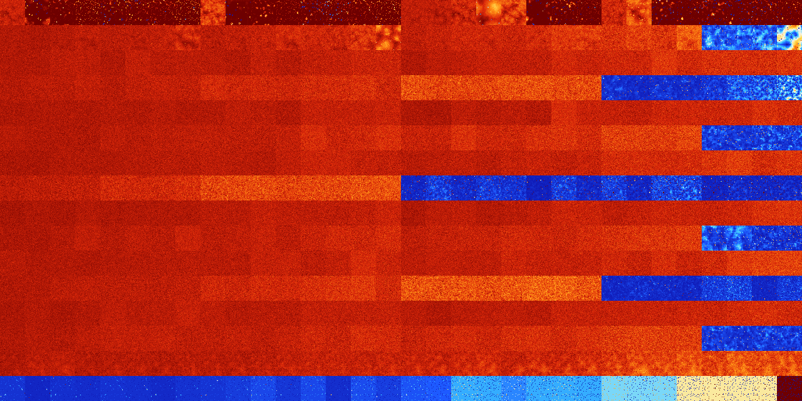

# B01358 (153088-153599)

<details>
    <summary>Initial Grid</summary>
    
</details>


<details>
    <summary>Initial Grid RLE</summary>

```
#C Exported from GoGoL (https://github.com/marrow16/gogol)
#C Wrap mode: Toroidal
#C Boundary mode: Dead
#C Step: 0
x = 100, y = 100, rule = B01358/S
14bo18bobo15bo19bo5bo$43bo2bo5bo3bo24bo$12bo4bo29bo14bo$36bo2bo29bo8bo
11bo2bo$13bo18bo7bo3bo19bo2bo26bo$13bo38bo3bobo2bo10bo8bo12bo$6bobo25bo
bo48bo$o5bo5bo2bo2bo3bo3bo12bo20bo13bo$o81bo8bo$5bo10bo3bo11bo29bo18bo
3bo$14bo13bo9bobo12bo14bo2bo3bo6bobo$4bo15bo27bo28bo3bo$20bo3bo2bo13bo
2bo13bo30bo$17bo39bo4bo3bo23bo$11bo27bo4bo4bo4bo21bo10bo3bo$24bo12bo4bo
6bo17bo17bo7bo$2bo30bo29bobo12bo4bo13bo$6bo6bo10b2o10bo45bo12bo$5bo39bo
18bo3bo2bo5bo19bo$20bo46bo4bo7bo$17bo7bo8bo33bo$6bo9bo16b2o37bobo3bo12b
o3bo$9bo55bo31bo$8bo65bo$38bo54bobo$53bo22bo7bo$15bo10bo2b2o35bo7bo5bo
11bo$8bo4bo23bo2bo11bo9bo32bo$6bo40bo31bo$23bo23bo24bobo6b2o6b2o7bo$3bo
16bob2o7bo30bo10bobo10bo$3bo23bo8bo27bo26b2o$48bo34bo8bo4bo$22bo4bo23bo
bo5bo$10bo9bo21bo3bo13b2o5bo31bo$18bo15bo5bo21bo16bo$68bo3bo$5bo16bo15b
o33bo$40bo33bo3bo$4b2o15bo39bo14bo9bo$16bo7bo14bobo49bo$2bo40bo14bo13bo
2bo9bo$14bo$12b2o14bo6bo29bo13b2o10bo$2bobo17bo10bo31bobo3bo5bo19bo$18b
o21bo10bo2bo4b2o20b2o16bo$64bo24bo4bo$o53bo3bo29bo$3b2o6bo11bo24bo4bo
14bo4bo13bo$55bo3bo32bo$6bo79bo12bo$35bo17bo21bobo7bo$10bo31bo19bo4bo$
17bo22bo11bo32bo2bo$12bo11bo22bo3bo29bo4bobo$2bo51bo6bo30bo4bo$13bo3bo
26b2o19bo5bo12bo$4bo12bo2bo67bobo$2b2o$37bo4bo5bo5bo6bobo6bo27bo$28bo
17bo$27bo9bobo2bo9bo$58bo$29bo65bo$54bo3bo9bo17bo12bo$24bo8bo18bo33bo5b
o$62bo$19bo8bo2bo7bo17bo41bo$6b2o2bo54bo21bo11bo$7bo16bo43bo30bo$12bo
11bo5bo9bo11bo3bo33bo$21bo36bo7bo29bo$86b2o$3bo18bo23bo5bo6bo4bo6bo11bo
2bo3bo$37bo15bo16bo$5bo7bo4bo3bo16bo10bo5bo28bo9bo$5bo2bo7bo2bo3bo35bo
6bo23bo$2bo18bo2bo15bo38bo11bo$12bo16bo10bo58bo$3bo57b2o15bo7bo11bo$35b
o15bo3bo17bo13bo3bo$4bo34bo16bo17bo$40bo6bo$4bo23bo5bo46bo6bo5bo$2b2o
28bo5bo5bo21bo10bo$17bo30bo16bo$15bo3bo4bo11bo33bo13bo$15bo39bo7bo$24bo
24bo$o6bo21bo6bo6bo38bo$75bo8bo$28bo63bo$61bo30bo$13bobo28bo9bobo33bo$o
10bo5bo37bo22bo$20bo32bo19bo20b2o$3bo5bo31bo4bo12bo$35bo2bo51bo$10bo10b
o37bo7bo3bo24bo$2bo5bo5bo9b2obo12bo11bo3bo34bo!
```
</details>
<details>
    <summary>Thumbnail</summary>

</details>
<table>
<tr>
    <td><a href="./153088%20S%20Heat%20Map%20Activity.png"></a><br>S (153088)<br>G>1000</td>    <td><a href="./153089%20S0%20Heat%20Map%20Activity.png"></a><br>S0 (153089)<br>G>1000</td>    <td><a href="./153090%20S1%20Heat%20Map%20Activity.png"></a><br>S1 (153090)<br>R@62,p4</td>    <td><a href="./153091%20S01%20Heat%20Map%20Activity.png"></a><br>S01 (153091)<br>R@10,p2</td>    <td><a href="./153092%20S2%20Heat%20Map%20Activity.png"></a><br>S2 (153092)<br>R@96,p6</td>    <td><a href="./153093%20S02%20Heat%20Map%20Activity.png"></a><br>S02 (153093)<br>R@22,p6</td>    <td><a href="./153094%20S12%20Heat%20Map%20Activity.png"></a><br>S12 (153094)<br>R@22,p2</td>    <td><a href="./153095%20S012%20Heat%20Map%20Activity.png"></a><br>S012 (153095)<br>R@9,p2</td>    <td><a href="./153096%20S3%20Heat%20Map%20Activity.png"></a><br>S3 (153096)<br>G>1000</td>    <td><a href="./153097%20S03%20Heat%20Map%20Activity.png"></a><br>S03 (153097)<br>R@803,p400</td>    <td><a href="./153098%20S13%20Heat%20Map%20Activity.png"></a><br>S13 (153098)<br>R@59,p2</td>    <td><a href="./153099%20S013%20Heat%20Map%20Activity.png"></a><br>S013 (153099)<br>R@20,p2</td>    <td><a href="./153100%20S23%20Heat%20Map%20Activity.png"></a><br>S23 (153100)<br>R@48,p4</td>    <td><a href="./153101%20S023%20Heat%20Map%20Activity.png"></a><br>S023 (153101)<br>R@17,p4</td>    <td><a href="./153102%20S123%20Heat%20Map%20Activity.png"></a><br>S123 (153102)<br>R@24,p4</td>    <td><a href="./153103%20S0123%20Heat%20Map%20Activity.png"></a><br>S0123 (153103)<br>R@10,p2</td>    <td><a href="./153104%20S4%20Heat%20Map%20Activity.png"></a><br>S4 (153104)<br>G>1000</td>    <td><a href="./153105%20S04%20Heat%20Map%20Activity.png"></a><br>S04 (153105)<br>G>1000</td>    <td><a href="./153106%20S14%20Heat%20Map%20Activity.png"></a><br>S14 (153106)<br>G>1000</td>    <td><a href="./153107%20S014%20Heat%20Map%20Activity.png"></a><br>S014 (153107)<br>G>1000</td>    <td><a href="./153108%20S24%20Heat%20Map%20Activity.png"></a><br>S24 (153108)<br>G>1000</td>    <td><a href="./153109%20S024%20Heat%20Map%20Activity.png"></a><br>S024 (153109)<br>R@388,p4</td>    <td><a href="./153110%20S124%20Heat%20Map%20Activity.png"></a><br>S124 (153110)<br>R@42,p2</td>    <td><a href="./153111%20S0124%20Heat%20Map%20Activity.png"></a><br>S0124 (153111)<br>R@25,p8</td>    <td><a href="./153112%20S34%20Heat%20Map%20Activity.png"></a><br>S34 (153112)<br>G>1000</td>    <td><a href="./153113%20S034%20Heat%20Map%20Activity.png"></a><br>S034 (153113)<br>G>1000</td>    <td><a href="./153114%20S134%20Heat%20Map%20Activity.png"></a><br>S134 (153114)<br>R@158,p40</td>    <td><a href="./153115%20S0134%20Heat%20Map%20Activity.png"></a><br>S0134 (153115)<br>R@48,p4</td>    <td><a href="./153116%20S234%20Heat%20Map%20Activity.png"></a><br>S234 (153116)<br>R@210,p4</td>    <td><a href="./153117%20S0234%20Heat%20Map%20Activity.png"></a><br>S0234 (153117)<br>R@69,p4</td>    <td><a href="./153118%20S1234%20Heat%20Map%20Activity.png"></a><br>S1234 (153118)<br>R@34,p4</td>    <td><a href="./153119%20S01234%20Heat%20Map%20Activity.png"></a><br>S01234 (153119)<br>R@24,p4</td></tr>
<tr>
    <td><a href="./153120%20S5%20Heat%20Map%20Activity.png"></a><br>S5 (153120)<br>G>1000</td>    <td><a href="./153121%20S05%20Heat%20Map%20Activity.png"></a><br>S05 (153121)<br>G>1000</td>    <td><a href="./153122%20S15%20Heat%20Map%20Activity.png"></a><br>S15 (153122)<br>G>1000</td>    <td><a href="./153123%20S015%20Heat%20Map%20Activity.png"></a><br>S015 (153123)<br>G>1000</td>    <td><a href="./153124%20S25%20Heat%20Map%20Activity.png"></a><br>S25 (153124)<br>G>1000</td>    <td><a href="./153125%20S025%20Heat%20Map%20Activity.png"></a><br>S025 (153125)<br>G>1000</td>    <td><a href="./153126%20S125%20Heat%20Map%20Activity.png"></a><br>S125 (153126)<br>G>1000</td>    <td><a href="./153127%20S0125%20Heat%20Map%20Activity.png"></a><br>S0125 (153127)<br>G>1000</td>    <td><a href="./153128%20S35%20Heat%20Map%20Activity.png"></a><br>S35 (153128)<br>G>1000</td>    <td><a href="./153129%20S035%20Heat%20Map%20Activity.png"></a><br>S035 (153129)<br>G>1000</td>    <td><a href="./153130%20S135%20Heat%20Map%20Activity.png"></a><br>S135 (153130)<br>G>1000</td>    <td><a href="./153131%20S0135%20Heat%20Map%20Activity.png"></a><br>S0135 (153131)<br>G>1000</td>    <td><a href="./153132%20S235%20Heat%20Map%20Activity.png"></a><br>S235 (153132)<br>G>1000</td>    <td><a href="./153133%20S0235%20Heat%20Map%20Activity.png"></a><br>S0235 (153133)<br>G>1000</td>    <td><a href="./153134%20S1235%20Heat%20Map%20Activity.png"></a><br>S1235 (153134)<br>G>1000</td>    <td><a href="./153135%20S01235%20Heat%20Map%20Activity.png"></a><br>S01235 (153135)<br>G>1000</td>    <td><a href="./153136%20S45%20Heat%20Map%20Activity.png"></a><br>S45 (153136)<br>G>1000</td>    <td><a href="./153137%20S045%20Heat%20Map%20Activity.png"></a><br>S045 (153137)<br>G>1000</td>    <td><a href="./153138%20S145%20Heat%20Map%20Activity.png"></a><br>S145 (153138)<br>G>1000</td>    <td><a href="./153139%20S0145%20Heat%20Map%20Activity.png"></a><br>S0145 (153139)<br>G>1000</td>    <td><a href="./153140%20S245%20Heat%20Map%20Activity.png"></a><br>S245 (153140)<br>G>1000</td>    <td><a href="./153141%20S0245%20Heat%20Map%20Activity.png"></a><br>S0245 (153141)<br>G>1000</td>    <td><a href="./153142%20S1245%20Heat%20Map%20Activity.png"></a><br>S1245 (153142)<br>G>1000</td>    <td><a href="./153143%20S01245%20Heat%20Map%20Activity.png"></a><br>S01245 (153143)<br>G>1000</td>    <td><a href="./153144%20S345%20Heat%20Map%20Activity.png"></a><br>S345 (153144)<br>G>1000</td>    <td><a href="./153145%20S0345%20Heat%20Map%20Activity.png"></a><br>S0345 (153145)<br>G>1000</td>    <td><a href="./153146%20S1345%20Heat%20Map%20Activity.png"></a><br>S1345 (153146)<br>G>1000</td>    <td><a href="./153147%20S01345%20Heat%20Map%20Activity.png"></a><br>S01345 (153147)<br>G>1000</td>    <td><a href="./153148%20S2345%20Heat%20Map%20Activity.png"></a><br>S2345 (153148)<br>G>1000</td>    <td><a href="./153149%20S02345%20Heat%20Map%20Activity.png"></a><br>S02345 (153149)<br>G>1000</td>    <td><a href="./153150%20S12345%20Heat%20Map%20Activity.png"></a><br>S12345 (153150)<br>R@393,p6</td>    <td><a href="./153151%20S012345%20Heat%20Map%20Activity.png"></a><br>S012345 (153151)<br>R@653,p6</td></tr>
<tr>
    <td><a href="./153152%20S6%20Heat%20Map%20Activity.png"></a><br>S6 (153152)<br>G>1000</td>    <td><a href="./153153%20S06%20Heat%20Map%20Activity.png"></a><br>S06 (153153)<br>G>1000</td>    <td><a href="./153154%20S16%20Heat%20Map%20Activity.png"></a><br>S16 (153154)<br>G>1000</td>    <td><a href="./153155%20S016%20Heat%20Map%20Activity.png"></a><br>S016 (153155)<br>G>1000</td>    <td><a href="./153156%20S26%20Heat%20Map%20Activity.png"></a><br>S26 (153156)<br>G>1000</td>    <td><a href="./153157%20S026%20Heat%20Map%20Activity.png"></a><br>S026 (153157)<br>G>1000</td>    <td><a href="./153158%20S126%20Heat%20Map%20Activity.png"></a><br>S126 (153158)<br>G>1000</td>    <td><a href="./153159%20S0126%20Heat%20Map%20Activity.png"></a><br>S0126 (153159)<br>G>1000</td>    <td><a href="./153160%20S36%20Heat%20Map%20Activity.png"></a><br>S36 (153160)<br>G>1000</td>    <td><a href="./153161%20S036%20Heat%20Map%20Activity.png"></a><br>S036 (153161)<br>G>1000</td>    <td><a href="./153162%20S136%20Heat%20Map%20Activity.png"></a><br>S136 (153162)<br>G>1000</td>    <td><a href="./153163%20S0136%20Heat%20Map%20Activity.png"></a><br>S0136 (153163)<br>G>1000</td>    <td><a href="./153164%20S236%20Heat%20Map%20Activity.png"></a><br>S236 (153164)<br>G>1000</td>    <td><a href="./153165%20S0236%20Heat%20Map%20Activity.png"></a><br>S0236 (153165)<br>G>1000</td>    <td><a href="./153166%20S1236%20Heat%20Map%20Activity.png"></a><br>S1236 (153166)<br>G>1000</td>    <td><a href="./153167%20S01236%20Heat%20Map%20Activity.png"></a><br>S01236 (153167)<br>G>1000</td>    <td><a href="./153168%20S46%20Heat%20Map%20Activity.png"></a><br>S46 (153168)<br>G>1000</td>    <td><a href="./153169%20S046%20Heat%20Map%20Activity.png"></a><br>S046 (153169)<br>G>1000</td>    <td><a href="./153170%20S146%20Heat%20Map%20Activity.png"></a><br>S146 (153170)<br>G>1000</td>    <td><a href="./153171%20S0146%20Heat%20Map%20Activity.png"></a><br>S0146 (153171)<br>G>1000</td>    <td><a href="./153172%20S246%20Heat%20Map%20Activity.png"></a><br>S246 (153172)<br>G>1000</td>    <td><a href="./153173%20S0246%20Heat%20Map%20Activity.png"></a><br>S0246 (153173)<br>G>1000</td>    <td><a href="./153174%20S1246%20Heat%20Map%20Activity.png"></a><br>S1246 (153174)<br>G>1000</td>    <td><a href="./153175%20S01246%20Heat%20Map%20Activity.png"></a><br>S01246 (153175)<br>G>1000</td>    <td><a href="./153176%20S346%20Heat%20Map%20Activity.png"></a><br>S346 (153176)<br>G>1000</td>    <td><a href="./153177%20S0346%20Heat%20Map%20Activity.png"></a><br>S0346 (153177)<br>G>1000</td>    <td><a href="./153178%20S1346%20Heat%20Map%20Activity.png"></a><br>S1346 (153178)<br>G>1000</td>    <td><a href="./153179%20S01346%20Heat%20Map%20Activity.png"></a><br>S01346 (153179)<br>G>1000</td>    <td><a href="./153180%20S2346%20Heat%20Map%20Activity.png"></a><br>S2346 (153180)<br>G>1000</td>    <td><a href="./153181%20S02346%20Heat%20Map%20Activity.png"></a><br>S02346 (153181)<br>G>1000</td>    <td><a href="./153182%20S12346%20Heat%20Map%20Activity.png"></a><br>S12346 (153182)<br>G>1000</td>    <td><a href="./153183%20S012346%20Heat%20Map%20Activity.png"></a><br>S012346 (153183)<br>G>1000</td></tr>
<tr>
    <td><a href="./153184%20S56%20Heat%20Map%20Activity.png"></a><br>S56 (153184)<br>G>1000</td>    <td><a href="./153185%20S056%20Heat%20Map%20Activity.png"></a><br>S056 (153185)<br>G>1000</td>    <td><a href="./153186%20S156%20Heat%20Map%20Activity.png"></a><br>S156 (153186)<br>G>1000</td>    <td><a href="./153187%20S0156%20Heat%20Map%20Activity.png"></a><br>S0156 (153187)<br>G>1000</td>    <td><a href="./153188%20S256%20Heat%20Map%20Activity.png"></a><br>S256 (153188)<br>G>1000</td>    <td><a href="./153189%20S0256%20Heat%20Map%20Activity.png"></a><br>S0256 (153189)<br>G>1000</td>    <td><a href="./153190%20S1256%20Heat%20Map%20Activity.png"></a><br>S1256 (153190)<br>G>1000</td>    <td><a href="./153191%20S01256%20Heat%20Map%20Activity.png"></a><br>S01256 (153191)<br>G>1000</td>    <td><a href="./153192%20S356%20Heat%20Map%20Activity.png"></a><br>S356 (153192)<br>G>1000</td>    <td><a href="./153193%20S0356%20Heat%20Map%20Activity.png"></a><br>S0356 (153193)<br>G>1000</td>    <td><a href="./153194%20S1356%20Heat%20Map%20Activity.png"></a><br>S1356 (153194)<br>G>1000</td>    <td><a href="./153195%20S01356%20Heat%20Map%20Activity.png"></a><br>S01356 (153195)<br>G>1000</td>    <td><a href="./153196%20S2356%20Heat%20Map%20Activity.png"></a><br>S2356 (153196)<br>G>1000</td>    <td><a href="./153197%20S02356%20Heat%20Map%20Activity.png"></a><br>S02356 (153197)<br>G>1000</td>    <td><a href="./153198%20S12356%20Heat%20Map%20Activity.png"></a><br>S12356 (153198)<br>G>1000</td>    <td><a href="./153199%20S012356%20Heat%20Map%20Activity.png"></a><br>S012356 (153199)<br>G>1000</td>    <td><a href="./153200%20S456%20Heat%20Map%20Activity.png"></a><br>S456 (153200)<br>G>1000</td>    <td><a href="./153201%20S0456%20Heat%20Map%20Activity.png"></a><br>S0456 (153201)<br>G>1000</td>    <td><a href="./153202%20S1456%20Heat%20Map%20Activity.png"></a><br>S1456 (153202)<br>G>1000</td>    <td><a href="./153203%20S01456%20Heat%20Map%20Activity.png"></a><br>S01456 (153203)<br>G>1000</td>    <td><a href="./153204%20S2456%20Heat%20Map%20Activity.png"></a><br>S2456 (153204)<br>G>1000</td>    <td><a href="./153205%20S02456%20Heat%20Map%20Activity.png"></a><br>S02456 (153205)<br>G>1000</td>    <td><a href="./153206%20S12456%20Heat%20Map%20Activity.png"></a><br>S12456 (153206)<br>G>1000</td>    <td><a href="./153207%20S012456%20Heat%20Map%20Activity.png"></a><br>S012456 (153207)<br>G>1000</td>    <td><a href="./153208%20S3456%20Heat%20Map%20Activity.png"></a><br>S3456 (153208)<br>R@256,p24</td>    <td><a href="./153209%20S03456%20Heat%20Map%20Activity.png"></a><br>S03456 (153209)<br>R@351,p156</td>    <td><a href="./153210%20S13456%20Heat%20Map%20Activity.png"></a><br>S13456 (153210)<br>R@259,p24</td>    <td><a href="./153211%20S013456%20Heat%20Map%20Activity.png"></a><br>S013456 (153211)<br>R@309,p12</td>    <td><a href="./153212%20S23456%20Heat%20Map%20Activity.png"></a><br>S23456 (153212)<br>R@97,p60</td>    <td><a href="./153213%20S023456%20Heat%20Map%20Activity.png"></a><br>S023456 (153213)<br>R@57,p12</td>    <td><a href="./153214%20S123456%20Heat%20Map%20Activity.png"></a><br>S123456 (153214)<br>R@54,p24</td>    <td><a href="./153215%20S0123456%20Heat%20Map%20Activity.png"></a><br>S0123456 (153215)<br>R@41,p12</td></tr>
<tr>
    <td><a href="./153216%20S7%20Heat%20Map%20Activity.png"></a><br>S7 (153216)<br>G>1000</td>    <td><a href="./153217%20S07%20Heat%20Map%20Activity.png"></a><br>S07 (153217)<br>G>1000</td>    <td><a href="./153218%20S17%20Heat%20Map%20Activity.png"></a><br>S17 (153218)<br>G>1000</td>    <td><a href="./153219%20S017%20Heat%20Map%20Activity.png"></a><br>S017 (153219)<br>G>1000</td>    <td><a href="./153220%20S27%20Heat%20Map%20Activity.png"></a><br>S27 (153220)<br>G>1000</td>    <td><a href="./153221%20S027%20Heat%20Map%20Activity.png"></a><br>S027 (153221)<br>G>1000</td>    <td><a href="./153222%20S127%20Heat%20Map%20Activity.png"></a><br>S127 (153222)<br>G>1000</td>    <td><a href="./153223%20S0127%20Heat%20Map%20Activity.png"></a><br>S0127 (153223)<br>G>1000</td>    <td><a href="./153224%20S37%20Heat%20Map%20Activity.png"></a><br>S37 (153224)<br>G>1000</td>    <td><a href="./153225%20S037%20Heat%20Map%20Activity.png"></a><br>S037 (153225)<br>G>1000</td>    <td><a href="./153226%20S137%20Heat%20Map%20Activity.png"></a><br>S137 (153226)<br>G>1000</td>    <td><a href="./153227%20S0137%20Heat%20Map%20Activity.png"></a><br>S0137 (153227)<br>G>1000</td>    <td><a href="./153228%20S237%20Heat%20Map%20Activity.png"></a><br>S237 (153228)<br>G>1000</td>    <td><a href="./153229%20S0237%20Heat%20Map%20Activity.png"></a><br>S0237 (153229)<br>G>1000</td>    <td><a href="./153230%20S1237%20Heat%20Map%20Activity.png"></a><br>S1237 (153230)<br>G>1000</td>    <td><a href="./153231%20S01237%20Heat%20Map%20Activity.png"></a><br>S01237 (153231)<br>G>1000</td>    <td><a href="./153232%20S47%20Heat%20Map%20Activity.png"></a><br>S47 (153232)<br>G>1000</td>    <td><a href="./153233%20S047%20Heat%20Map%20Activity.png"></a><br>S047 (153233)<br>G>1000</td>    <td><a href="./153234%20S147%20Heat%20Map%20Activity.png"></a><br>S147 (153234)<br>G>1000</td>    <td><a href="./153235%20S0147%20Heat%20Map%20Activity.png"></a><br>S0147 (153235)<br>G>1000</td>    <td><a href="./153236%20S247%20Heat%20Map%20Activity.png"></a><br>S247 (153236)<br>G>1000</td>    <td><a href="./153237%20S0247%20Heat%20Map%20Activity.png"></a><br>S0247 (153237)<br>G>1000</td>    <td><a href="./153238%20S1247%20Heat%20Map%20Activity.png"></a><br>S1247 (153238)<br>G>1000</td>    <td><a href="./153239%20S01247%20Heat%20Map%20Activity.png"></a><br>S01247 (153239)<br>G>1000</td>    <td><a href="./153240%20S347%20Heat%20Map%20Activity.png"></a><br>S347 (153240)<br>G>1000</td>    <td><a href="./153241%20S0347%20Heat%20Map%20Activity.png"></a><br>S0347 (153241)<br>G>1000</td>    <td><a href="./153242%20S1347%20Heat%20Map%20Activity.png"></a><br>S1347 (153242)<br>G>1000</td>    <td><a href="./153243%20S01347%20Heat%20Map%20Activity.png"></a><br>S01347 (153243)<br>G>1000</td>    <td><a href="./153244%20S2347%20Heat%20Map%20Activity.png"></a><br>S2347 (153244)<br>G>1000</td>    <td><a href="./153245%20S02347%20Heat%20Map%20Activity.png"></a><br>S02347 (153245)<br>G>1000</td>    <td><a href="./153246%20S12347%20Heat%20Map%20Activity.png"></a><br>S12347 (153246)<br>G>1000</td>    <td><a href="./153247%20S012347%20Heat%20Map%20Activity.png"></a><br>S012347 (153247)<br>G>1000</td></tr>
<tr>
    <td><a href="./153248%20S57%20Heat%20Map%20Activity.png"></a><br>S57 (153248)<br>G>1000</td>    <td><a href="./153249%20S057%20Heat%20Map%20Activity.png"></a><br>S057 (153249)<br>G>1000</td>    <td><a href="./153250%20S157%20Heat%20Map%20Activity.png"></a><br>S157 (153250)<br>G>1000</td>    <td><a href="./153251%20S0157%20Heat%20Map%20Activity.png"></a><br>S0157 (153251)<br>G>1000</td>    <td><a href="./153252%20S257%20Heat%20Map%20Activity.png"></a><br>S257 (153252)<br>G>1000</td>    <td><a href="./153253%20S0257%20Heat%20Map%20Activity.png"></a><br>S0257 (153253)<br>G>1000</td>    <td><a href="./153254%20S1257%20Heat%20Map%20Activity.png"></a><br>S1257 (153254)<br>G>1000</td>    <td><a href="./153255%20S01257%20Heat%20Map%20Activity.png"></a><br>S01257 (153255)<br>G>1000</td>    <td><a href="./153256%20S357%20Heat%20Map%20Activity.png"></a><br>S357 (153256)<br>G>1000</td>    <td><a href="./153257%20S0357%20Heat%20Map%20Activity.png"></a><br>S0357 (153257)<br>G>1000</td>    <td><a href="./153258%20S1357%20Heat%20Map%20Activity.png"></a><br>S1357 (153258)<br>G>1000</td>    <td><a href="./153259%20S01357%20Heat%20Map%20Activity.png"></a><br>S01357 (153259)<br>G>1000</td>    <td><a href="./153260%20S2357%20Heat%20Map%20Activity.png"></a><br>S2357 (153260)<br>G>1000</td>    <td><a href="./153261%20S02357%20Heat%20Map%20Activity.png"></a><br>S02357 (153261)<br>G>1000</td>    <td><a href="./153262%20S12357%20Heat%20Map%20Activity.png"></a><br>S12357 (153262)<br>G>1000</td>    <td><a href="./153263%20S012357%20Heat%20Map%20Activity.png"></a><br>S012357 (153263)<br>G>1000</td>    <td><a href="./153264%20S457%20Heat%20Map%20Activity.png"></a><br>S457 (153264)<br>G>1000</td>    <td><a href="./153265%20S0457%20Heat%20Map%20Activity.png"></a><br>S0457 (153265)<br>G>1000</td>    <td><a href="./153266%20S1457%20Heat%20Map%20Activity.png"></a><br>S1457 (153266)<br>G>1000</td>    <td><a href="./153267%20S01457%20Heat%20Map%20Activity.png"></a><br>S01457 (153267)<br>G>1000</td>    <td><a href="./153268%20S2457%20Heat%20Map%20Activity.png"></a><br>S2457 (153268)<br>G>1000</td>    <td><a href="./153269%20S02457%20Heat%20Map%20Activity.png"></a><br>S02457 (153269)<br>G>1000</td>    <td><a href="./153270%20S12457%20Heat%20Map%20Activity.png"></a><br>S12457 (153270)<br>G>1000</td>    <td><a href="./153271%20S012457%20Heat%20Map%20Activity.png"></a><br>S012457 (153271)<br>G>1000</td>    <td><a href="./153272%20S3457%20Heat%20Map%20Activity.png"></a><br>S3457 (153272)<br>G>1000</td>    <td><a href="./153273%20S03457%20Heat%20Map%20Activity.png"></a><br>S03457 (153273)<br>G>1000</td>    <td><a href="./153274%20S13457%20Heat%20Map%20Activity.png"></a><br>S13457 (153274)<br>G>1000</td>    <td><a href="./153275%20S013457%20Heat%20Map%20Activity.png"></a><br>S013457 (153275)<br>G>1000</td>    <td><a href="./153276%20S23457%20Heat%20Map%20Activity.png"></a><br>S23457 (153276)<br>R@489,p60</td>    <td><a href="./153277%20S023457%20Heat%20Map%20Activity.png"></a><br>S023457 (153277)<br>R@573,p60</td>    <td><a href="./153278%20S123457%20Heat%20Map%20Activity.png"></a><br>S123457 (153278)<br>R@251,p24</td>    <td><a href="./153279%20S0123457%20Heat%20Map%20Activity.png"></a><br>S0123457 (153279)<br>R@270,p6</td></tr>
<tr>
    <td><a href="./153280%20S67%20Heat%20Map%20Activity.png"></a><br>S67 (153280)<br>G>1000</td>    <td><a href="./153281%20S067%20Heat%20Map%20Activity.png"></a><br>S067 (153281)<br>G>1000</td>    <td><a href="./153282%20S167%20Heat%20Map%20Activity.png"></a><br>S167 (153282)<br>G>1000</td>    <td><a href="./153283%20S0167%20Heat%20Map%20Activity.png"></a><br>S0167 (153283)<br>G>1000</td>    <td><a href="./153284%20S267%20Heat%20Map%20Activity.png"></a><br>S267 (153284)<br>G>1000</td>    <td><a href="./153285%20S0267%20Heat%20Map%20Activity.png"></a><br>S0267 (153285)<br>G>1000</td>    <td><a href="./153286%20S1267%20Heat%20Map%20Activity.png"></a><br>S1267 (153286)<br>G>1000</td>    <td><a href="./153287%20S01267%20Heat%20Map%20Activity.png"></a><br>S01267 (153287)<br>G>1000</td>    <td><a href="./153288%20S367%20Heat%20Map%20Activity.png"></a><br>S367 (153288)<br>G>1000</td>    <td><a href="./153289%20S0367%20Heat%20Map%20Activity.png"></a><br>S0367 (153289)<br>G>1000</td>    <td><a href="./153290%20S1367%20Heat%20Map%20Activity.png"></a><br>S1367 (153290)<br>G>1000</td>    <td><a href="./153291%20S01367%20Heat%20Map%20Activity.png"></a><br>S01367 (153291)<br>G>1000</td>    <td><a href="./153292%20S2367%20Heat%20Map%20Activity.png"></a><br>S2367 (153292)<br>G>1000</td>    <td><a href="./153293%20S02367%20Heat%20Map%20Activity.png"></a><br>S02367 (153293)<br>G>1000</td>    <td><a href="./153294%20S12367%20Heat%20Map%20Activity.png"></a><br>S12367 (153294)<br>G>1000</td>    <td><a href="./153295%20S012367%20Heat%20Map%20Activity.png"></a><br>S012367 (153295)<br>G>1000</td>    <td><a href="./153296%20S467%20Heat%20Map%20Activity.png"></a><br>S467 (153296)<br>G>1000</td>    <td><a href="./153297%20S0467%20Heat%20Map%20Activity.png"></a><br>S0467 (153297)<br>G>1000</td>    <td><a href="./153298%20S1467%20Heat%20Map%20Activity.png"></a><br>S1467 (153298)<br>G>1000</td>    <td><a href="./153299%20S01467%20Heat%20Map%20Activity.png"></a><br>S01467 (153299)<br>G>1000</td>    <td><a href="./153300%20S2467%20Heat%20Map%20Activity.png"></a><br>S2467 (153300)<br>G>1000</td>    <td><a href="./153301%20S02467%20Heat%20Map%20Activity.png"></a><br>S02467 (153301)<br>G>1000</td>    <td><a href="./153302%20S12467%20Heat%20Map%20Activity.png"></a><br>S12467 (153302)<br>G>1000</td>    <td><a href="./153303%20S012467%20Heat%20Map%20Activity.png"></a><br>S012467 (153303)<br>G>1000</td>    <td><a href="./153304%20S3467%20Heat%20Map%20Activity.png"></a><br>S3467 (153304)<br>G>1000</td>    <td><a href="./153305%20S03467%20Heat%20Map%20Activity.png"></a><br>S03467 (153305)<br>G>1000</td>    <td><a href="./153306%20S13467%20Heat%20Map%20Activity.png"></a><br>S13467 (153306)<br>G>1000</td>    <td><a href="./153307%20S013467%20Heat%20Map%20Activity.png"></a><br>S013467 (153307)<br>G>1000</td>    <td><a href="./153308%20S23467%20Heat%20Map%20Activity.png"></a><br>S23467 (153308)<br>G>1000</td>    <td><a href="./153309%20S023467%20Heat%20Map%20Activity.png"></a><br>S023467 (153309)<br>G>1000</td>    <td><a href="./153310%20S123467%20Heat%20Map%20Activity.png"></a><br>S123467 (153310)<br>G>1000</td>    <td><a href="./153311%20S0123467%20Heat%20Map%20Activity.png"></a><br>S0123467 (153311)<br>G>1000</td></tr>
<tr>
    <td><a href="./153312%20S567%20Heat%20Map%20Activity.png"></a><br>S567 (153312)<br>G>1000</td>    <td><a href="./153313%20S0567%20Heat%20Map%20Activity.png"></a><br>S0567 (153313)<br>G>1000</td>    <td><a href="./153314%20S1567%20Heat%20Map%20Activity.png"></a><br>S1567 (153314)<br>G>1000</td>    <td><a href="./153315%20S01567%20Heat%20Map%20Activity.png"></a><br>S01567 (153315)<br>G>1000</td>    <td><a href="./153316%20S2567%20Heat%20Map%20Activity.png"></a><br>S2567 (153316)<br>G>1000</td>    <td><a href="./153317%20S02567%20Heat%20Map%20Activity.png"></a><br>S02567 (153317)<br>G>1000</td>    <td><a href="./153318%20S12567%20Heat%20Map%20Activity.png"></a><br>S12567 (153318)<br>G>1000</td>    <td><a href="./153319%20S012567%20Heat%20Map%20Activity.png"></a><br>S012567 (153319)<br>G>1000</td>    <td><a href="./153320%20S3567%20Heat%20Map%20Activity.png"></a><br>S3567 (153320)<br>G>1000</td>    <td><a href="./153321%20S03567%20Heat%20Map%20Activity.png"></a><br>S03567 (153321)<br>G>1000</td>    <td><a href="./153322%20S13567%20Heat%20Map%20Activity.png"></a><br>S13567 (153322)<br>G>1000</td>    <td><a href="./153323%20S013567%20Heat%20Map%20Activity.png"></a><br>S013567 (153323)<br>G>1000</td>    <td><a href="./153324%20S23567%20Heat%20Map%20Activity.png"></a><br>S23567 (153324)<br>G>1000</td>    <td><a href="./153325%20S023567%20Heat%20Map%20Activity.png"></a><br>S023567 (153325)<br>G>1000</td>    <td><a href="./153326%20S123567%20Heat%20Map%20Activity.png"></a><br>S123567 (153326)<br>G>1000</td>    <td><a href="./153327%20S0123567%20Heat%20Map%20Activity.png"></a><br>S0123567 (153327)<br>G>1000</td>    <td><a href="./153328%20S4567%20Heat%20Map%20Activity.png"></a><br>S4567 (153328)<br>R@131,p72</td>    <td><a href="./153329%20S04567%20Heat%20Map%20Activity.png"></a><br>S04567 (153329)<br>R@63,p12</td>    <td><a href="./153330%20S14567%20Heat%20Map%20Activity.png"></a><br>S14567 (153330)<br>R@110,p60</td>    <td><a href="./153331%20S014567%20Heat%20Map%20Activity.png"></a><br>S014567 (153331)<br>R@73,p12</td>    <td><a href="./153332%20S24567%20Heat%20Map%20Activity.png"></a><br>S24567 (153332)<br>R@64,p30</td>    <td><a href="./153333%20S024567%20Heat%20Map%20Activity.png"></a><br>S024567 (153333)<br>R@248,p210</td>    <td><a href="./153334%20S124567%20Heat%20Map%20Activity.png"></a><br>S124567 (153334)<br>R@46,p6</td>    <td><a href="./153335%20S0124567%20Heat%20Map%20Activity.png"></a><br>S0124567 (153335)<br>R@135,p90</td>    <td><a href="./153336%20S34567%20Heat%20Map%20Activity.png"></a><br>S34567 (153336)<br>R@34,p12</td>    <td><a href="./153337%20S034567%20Heat%20Map%20Activity.png"></a><br>S034567 (153337)<br>R@108,p84</td>    <td><a href="./153338%20S134567%20Heat%20Map%20Activity.png"></a><br>S134567 (153338)<br>R@29,p12</td>    <td><a href="./153339%20S0134567%20Heat%20Map%20Activity.png"></a><br>S0134567 (153339)<br>R@36,p12</td>    <td><a href="./153340%20S234567%20Heat%20Map%20Activity.png"></a><br>S234567 (153340)<br>R@105,p84</td>    <td><a href="./153341%20S0234567%20Heat%20Map%20Activity.png"></a><br>S0234567 (153341)<br>R@79,p60</td>    <td><a href="./153342%20S1234567%20Heat%20Map%20Activity.png"></a><br>S1234567 (153342)<br>R@75,p60</td>    <td><a href="./153343%20S01234567%20Heat%20Map%20Activity.png"></a><br>S01234567 (153343)<br>R@85,p60</td></tr>
<tr>
    <td><a href="./153344%20S8%20Heat%20Map%20Activity.png"></a><br>S8 (153344)<br>G>1000</td>    <td><a href="./153345%20S08%20Heat%20Map%20Activity.png"></a><br>S08 (153345)<br>G>1000</td>    <td><a href="./153346%20S18%20Heat%20Map%20Activity.png"></a><br>S18 (153346)<br>G>1000</td>    <td><a href="./153347%20S018%20Heat%20Map%20Activity.png"></a><br>S018 (153347)<br>G>1000</td>    <td><a href="./153348%20S28%20Heat%20Map%20Activity.png"></a><br>S28 (153348)<br>G>1000</td>    <td><a href="./153349%20S028%20Heat%20Map%20Activity.png"></a><br>S028 (153349)<br>G>1000</td>    <td><a href="./153350%20S128%20Heat%20Map%20Activity.png"></a><br>S128 (153350)<br>G>1000</td>    <td><a href="./153351%20S0128%20Heat%20Map%20Activity.png"></a><br>S0128 (153351)<br>G>1000</td>    <td><a href="./153352%20S38%20Heat%20Map%20Activity.png"></a><br>S38 (153352)<br>G>1000</td>    <td><a href="./153353%20S038%20Heat%20Map%20Activity.png"></a><br>S038 (153353)<br>G>1000</td>    <td><a href="./153354%20S138%20Heat%20Map%20Activity.png"></a><br>S138 (153354)<br>G>1000</td>    <td><a href="./153355%20S0138%20Heat%20Map%20Activity.png"></a><br>S0138 (153355)<br>G>1000</td>    <td><a href="./153356%20S238%20Heat%20Map%20Activity.png"></a><br>S238 (153356)<br>G>1000</td>    <td><a href="./153357%20S0238%20Heat%20Map%20Activity.png"></a><br>S0238 (153357)<br>G>1000</td>    <td><a href="./153358%20S1238%20Heat%20Map%20Activity.png"></a><br>S1238 (153358)<br>G>1000</td>    <td><a href="./153359%20S01238%20Heat%20Map%20Activity.png"></a><br>S01238 (153359)<br>G>1000</td>    <td><a href="./153360%20S48%20Heat%20Map%20Activity.png"></a><br>S48 (153360)<br>G>1000</td>    <td><a href="./153361%20S048%20Heat%20Map%20Activity.png"></a><br>S048 (153361)<br>G>1000</td>    <td><a href="./153362%20S148%20Heat%20Map%20Activity.png"></a><br>S148 (153362)<br>G>1000</td>    <td><a href="./153363%20S0148%20Heat%20Map%20Activity.png"></a><br>S0148 (153363)<br>G>1000</td>    <td><a href="./153364%20S248%20Heat%20Map%20Activity.png"></a><br>S248 (153364)<br>G>1000</td>    <td><a href="./153365%20S0248%20Heat%20Map%20Activity.png"></a><br>S0248 (153365)<br>G>1000</td>    <td><a href="./153366%20S1248%20Heat%20Map%20Activity.png"></a><br>S1248 (153366)<br>G>1000</td>    <td><a href="./153367%20S01248%20Heat%20Map%20Activity.png"></a><br>S01248 (153367)<br>G>1000</td>    <td><a href="./153368%20S348%20Heat%20Map%20Activity.png"></a><br>S348 (153368)<br>G>1000</td>    <td><a href="./153369%20S0348%20Heat%20Map%20Activity.png"></a><br>S0348 (153369)<br>G>1000</td>    <td><a href="./153370%20S1348%20Heat%20Map%20Activity.png"></a><br>S1348 (153370)<br>G>1000</td>    <td><a href="./153371%20S01348%20Heat%20Map%20Activity.png"></a><br>S01348 (153371)<br>G>1000</td>    <td><a href="./153372%20S2348%20Heat%20Map%20Activity.png"></a><br>S2348 (153372)<br>G>1000</td>    <td><a href="./153373%20S02348%20Heat%20Map%20Activity.png"></a><br>S02348 (153373)<br>G>1000</td>    <td><a href="./153374%20S12348%20Heat%20Map%20Activity.png"></a><br>S12348 (153374)<br>G>1000</td>    <td><a href="./153375%20S012348%20Heat%20Map%20Activity.png"></a><br>S012348 (153375)<br>G>1000</td></tr>
<tr>
    <td><a href="./153376%20S58%20Heat%20Map%20Activity.png"></a><br>S58 (153376)<br>G>1000</td>    <td><a href="./153377%20S058%20Heat%20Map%20Activity.png"></a><br>S058 (153377)<br>G>1000</td>    <td><a href="./153378%20S158%20Heat%20Map%20Activity.png"></a><br>S158 (153378)<br>G>1000</td>    <td><a href="./153379%20S0158%20Heat%20Map%20Activity.png"></a><br>S0158 (153379)<br>G>1000</td>    <td><a href="./153380%20S258%20Heat%20Map%20Activity.png"></a><br>S258 (153380)<br>G>1000</td>    <td><a href="./153381%20S0258%20Heat%20Map%20Activity.png"></a><br>S0258 (153381)<br>G>1000</td>    <td><a href="./153382%20S1258%20Heat%20Map%20Activity.png"></a><br>S1258 (153382)<br>G>1000</td>    <td><a href="./153383%20S01258%20Heat%20Map%20Activity.png"></a><br>S01258 (153383)<br>G>1000</td>    <td><a href="./153384%20S358%20Heat%20Map%20Activity.png"></a><br>S358 (153384)<br>G>1000</td>    <td><a href="./153385%20S0358%20Heat%20Map%20Activity.png"></a><br>S0358 (153385)<br>G>1000</td>    <td><a href="./153386%20S1358%20Heat%20Map%20Activity.png"></a><br>S1358 (153386)<br>G>1000</td>    <td><a href="./153387%20S01358%20Heat%20Map%20Activity.png"></a><br>S01358 (153387)<br>G>1000</td>    <td><a href="./153388%20S2358%20Heat%20Map%20Activity.png"></a><br>S2358 (153388)<br>G>1000</td>    <td><a href="./153389%20S02358%20Heat%20Map%20Activity.png"></a><br>S02358 (153389)<br>G>1000</td>    <td><a href="./153390%20S12358%20Heat%20Map%20Activity.png"></a><br>S12358 (153390)<br>G>1000</td>    <td><a href="./153391%20S012358%20Heat%20Map%20Activity.png"></a><br>S012358 (153391)<br>G>1000</td>    <td><a href="./153392%20S458%20Heat%20Map%20Activity.png"></a><br>S458 (153392)<br>G>1000</td>    <td><a href="./153393%20S0458%20Heat%20Map%20Activity.png"></a><br>S0458 (153393)<br>G>1000</td>    <td><a href="./153394%20S1458%20Heat%20Map%20Activity.png"></a><br>S1458 (153394)<br>G>1000</td>    <td><a href="./153395%20S01458%20Heat%20Map%20Activity.png"></a><br>S01458 (153395)<br>G>1000</td>    <td><a href="./153396%20S2458%20Heat%20Map%20Activity.png"></a><br>S2458 (153396)<br>G>1000</td>    <td><a href="./153397%20S02458%20Heat%20Map%20Activity.png"></a><br>S02458 (153397)<br>G>1000</td>    <td><a href="./153398%20S12458%20Heat%20Map%20Activity.png"></a><br>S12458 (153398)<br>G>1000</td>    <td><a href="./153399%20S012458%20Heat%20Map%20Activity.png"></a><br>S012458 (153399)<br>G>1000</td>    <td><a href="./153400%20S3458%20Heat%20Map%20Activity.png"></a><br>S3458 (153400)<br>G>1000</td>    <td><a href="./153401%20S03458%20Heat%20Map%20Activity.png"></a><br>S03458 (153401)<br>G>1000</td>    <td><a href="./153402%20S13458%20Heat%20Map%20Activity.png"></a><br>S13458 (153402)<br>G>1000</td>    <td><a href="./153403%20S013458%20Heat%20Map%20Activity.png"></a><br>S013458 (153403)<br>G>1000</td>    <td><a href="./153404%20S23458%20Heat%20Map%20Activity.png"></a><br>S23458 (153404)<br>G>1000</td>    <td><a href="./153405%20S023458%20Heat%20Map%20Activity.png"></a><br>S023458 (153405)<br>G>1000</td>    <td><a href="./153406%20S123458%20Heat%20Map%20Activity.png"></a><br>S123458 (153406)<br>R@490,p60</td>    <td><a href="./153407%20S0123458%20Heat%20Map%20Activity.png"></a><br>S0123458 (153407)<br>R@455,p60</td></tr>
<tr>
    <td><a href="./153408%20S68%20Heat%20Map%20Activity.png"></a><br>S68 (153408)<br>G>1000</td>    <td><a href="./153409%20S068%20Heat%20Map%20Activity.png"></a><br>S068 (153409)<br>G>1000</td>    <td><a href="./153410%20S168%20Heat%20Map%20Activity.png"></a><br>S168 (153410)<br>G>1000</td>    <td><a href="./153411%20S0168%20Heat%20Map%20Activity.png"></a><br>S0168 (153411)<br>G>1000</td>    <td><a href="./153412%20S268%20Heat%20Map%20Activity.png"></a><br>S268 (153412)<br>G>1000</td>    <td><a href="./153413%20S0268%20Heat%20Map%20Activity.png"></a><br>S0268 (153413)<br>G>1000</td>    <td><a href="./153414%20S1268%20Heat%20Map%20Activity.png"></a><br>S1268 (153414)<br>G>1000</td>    <td><a href="./153415%20S01268%20Heat%20Map%20Activity.png"></a><br>S01268 (153415)<br>G>1000</td>    <td><a href="./153416%20S368%20Heat%20Map%20Activity.png"></a><br>S368 (153416)<br>G>1000</td>    <td><a href="./153417%20S0368%20Heat%20Map%20Activity.png"></a><br>S0368 (153417)<br>G>1000</td>    <td><a href="./153418%20S1368%20Heat%20Map%20Activity.png"></a><br>S1368 (153418)<br>G>1000</td>    <td><a href="./153419%20S01368%20Heat%20Map%20Activity.png"></a><br>S01368 (153419)<br>G>1000</td>    <td><a href="./153420%20S2368%20Heat%20Map%20Activity.png"></a><br>S2368 (153420)<br>G>1000</td>    <td><a href="./153421%20S02368%20Heat%20Map%20Activity.png"></a><br>S02368 (153421)<br>G>1000</td>    <td><a href="./153422%20S12368%20Heat%20Map%20Activity.png"></a><br>S12368 (153422)<br>G>1000</td>    <td><a href="./153423%20S012368%20Heat%20Map%20Activity.png"></a><br>S012368 (153423)<br>G>1000</td>    <td><a href="./153424%20S468%20Heat%20Map%20Activity.png"></a><br>S468 (153424)<br>G>1000</td>    <td><a href="./153425%20S0468%20Heat%20Map%20Activity.png"></a><br>S0468 (153425)<br>G>1000</td>    <td><a href="./153426%20S1468%20Heat%20Map%20Activity.png"></a><br>S1468 (153426)<br>G>1000</td>    <td><a href="./153427%20S01468%20Heat%20Map%20Activity.png"></a><br>S01468 (153427)<br>G>1000</td>    <td><a href="./153428%20S2468%20Heat%20Map%20Activity.png"></a><br>S2468 (153428)<br>G>1000</td>    <td><a href="./153429%20S02468%20Heat%20Map%20Activity.png"></a><br>S02468 (153429)<br>G>1000</td>    <td><a href="./153430%20S12468%20Heat%20Map%20Activity.png"></a><br>S12468 (153430)<br>G>1000</td>    <td><a href="./153431%20S012468%20Heat%20Map%20Activity.png"></a><br>S012468 (153431)<br>G>1000</td>    <td><a href="./153432%20S3468%20Heat%20Map%20Activity.png"></a><br>S3468 (153432)<br>G>1000</td>    <td><a href="./153433%20S03468%20Heat%20Map%20Activity.png"></a><br>S03468 (153433)<br>G>1000</td>    <td><a href="./153434%20S13468%20Heat%20Map%20Activity.png"></a><br>S13468 (153434)<br>G>1000</td>    <td><a href="./153435%20S013468%20Heat%20Map%20Activity.png"></a><br>S013468 (153435)<br>G>1000</td>    <td><a href="./153436%20S23468%20Heat%20Map%20Activity.png"></a><br>S23468 (153436)<br>G>1000</td>    <td><a href="./153437%20S023468%20Heat%20Map%20Activity.png"></a><br>S023468 (153437)<br>G>1000</td>    <td><a href="./153438%20S123468%20Heat%20Map%20Activity.png"></a><br>S123468 (153438)<br>G>1000</td>    <td><a href="./153439%20S0123468%20Heat%20Map%20Activity.png"></a><br>S0123468 (153439)<br>G>1000</td></tr>
<tr>
    <td><a href="./153440%20S568%20Heat%20Map%20Activity.png"></a><br>S568 (153440)<br>G>1000</td>    <td><a href="./153441%20S0568%20Heat%20Map%20Activity.png"></a><br>S0568 (153441)<br>G>1000</td>    <td><a href="./153442%20S1568%20Heat%20Map%20Activity.png"></a><br>S1568 (153442)<br>G>1000</td>    <td><a href="./153443%20S01568%20Heat%20Map%20Activity.png"></a><br>S01568 (153443)<br>G>1000</td>    <td><a href="./153444%20S2568%20Heat%20Map%20Activity.png"></a><br>S2568 (153444)<br>G>1000</td>    <td><a href="./153445%20S02568%20Heat%20Map%20Activity.png"></a><br>S02568 (153445)<br>G>1000</td>    <td><a href="./153446%20S12568%20Heat%20Map%20Activity.png"></a><br>S12568 (153446)<br>G>1000</td>    <td><a href="./153447%20S012568%20Heat%20Map%20Activity.png"></a><br>S012568 (153447)<br>G>1000</td>    <td><a href="./153448%20S3568%20Heat%20Map%20Activity.png"></a><br>S3568 (153448)<br>G>1000</td>    <td><a href="./153449%20S03568%20Heat%20Map%20Activity.png"></a><br>S03568 (153449)<br>G>1000</td>    <td><a href="./153450%20S13568%20Heat%20Map%20Activity.png"></a><br>S13568 (153450)<br>G>1000</td>    <td><a href="./153451%20S013568%20Heat%20Map%20Activity.png"></a><br>S013568 (153451)<br>G>1000</td>    <td><a href="./153452%20S23568%20Heat%20Map%20Activity.png"></a><br>S23568 (153452)<br>G>1000</td>    <td><a href="./153453%20S023568%20Heat%20Map%20Activity.png"></a><br>S023568 (153453)<br>G>1000</td>    <td><a href="./153454%20S123568%20Heat%20Map%20Activity.png"></a><br>S123568 (153454)<br>G>1000</td>    <td><a href="./153455%20S0123568%20Heat%20Map%20Activity.png"></a><br>S0123568 (153455)<br>G>1000</td>    <td><a href="./153456%20S4568%20Heat%20Map%20Activity.png"></a><br>S4568 (153456)<br>G>1000</td>    <td><a href="./153457%20S04568%20Heat%20Map%20Activity.png"></a><br>S04568 (153457)<br>G>1000</td>    <td><a href="./153458%20S14568%20Heat%20Map%20Activity.png"></a><br>S14568 (153458)<br>G>1000</td>    <td><a href="./153459%20S014568%20Heat%20Map%20Activity.png"></a><br>S014568 (153459)<br>G>1000</td>    <td><a href="./153460%20S24568%20Heat%20Map%20Activity.png"></a><br>S24568 (153460)<br>G>1000</td>    <td><a href="./153461%20S024568%20Heat%20Map%20Activity.png"></a><br>S024568 (153461)<br>G>1000</td>    <td><a href="./153462%20S124568%20Heat%20Map%20Activity.png"></a><br>S124568 (153462)<br>G>1000</td>    <td><a href="./153463%20S0124568%20Heat%20Map%20Activity.png"></a><br>S0124568 (153463)<br>G>1000</td>    <td><a href="./153464%20S34568%20Heat%20Map%20Activity.png"></a><br>S34568 (153464)<br>R@159,p30</td>    <td><a href="./153465%20S034568%20Heat%20Map%20Activity.png"></a><br>S034568 (153465)<br>R@113,p12</td>    <td><a href="./153466%20S134568%20Heat%20Map%20Activity.png"></a><br>S134568 (153466)<br>R@132,p24</td>    <td><a href="./153467%20S0134568%20Heat%20Map%20Activity.png"></a><br>S0134568 (153467)<br>R@149,p30</td>    <td><a href="./153468%20S234568%20Heat%20Map%20Activity.png"></a><br>S234568 (153468)<br>R@41,p12</td>    <td><a href="./153469%20S0234568%20Heat%20Map%20Activity.png"></a><br>S0234568 (153469)<br>R@34,p2</td>    <td><a href="./153470%20S1234568%20Heat%20Map%20Activity.png"></a><br>S1234568 (153470)<br>R@94,p60</td>    <td><a href="./153471%20S01234568%20Heat%20Map%20Activity.png"></a><br>S01234568 (153471)<br>R@44,p10</td></tr>
<tr>
    <td><a href="./153472%20S78%20Heat%20Map%20Activity.png"></a><br>S78 (153472)<br>G>1000</td>    <td><a href="./153473%20S078%20Heat%20Map%20Activity.png"></a><br>S078 (153473)<br>G>1000</td>    <td><a href="./153474%20S178%20Heat%20Map%20Activity.png"></a><br>S178 (153474)<br>G>1000</td>    <td><a href="./153475%20S0178%20Heat%20Map%20Activity.png"></a><br>S0178 (153475)<br>G>1000</td>    <td><a href="./153476%20S278%20Heat%20Map%20Activity.png"></a><br>S278 (153476)<br>G>1000</td>    <td><a href="./153477%20S0278%20Heat%20Map%20Activity.png"></a><br>S0278 (153477)<br>G>1000</td>    <td><a href="./153478%20S1278%20Heat%20Map%20Activity.png"></a><br>S1278 (153478)<br>G>1000</td>    <td><a href="./153479%20S01278%20Heat%20Map%20Activity.png"></a><br>S01278 (153479)<br>G>1000</td>    <td><a href="./153480%20S378%20Heat%20Map%20Activity.png"></a><br>S378 (153480)<br>G>1000</td>    <td><a href="./153481%20S0378%20Heat%20Map%20Activity.png"></a><br>S0378 (153481)<br>G>1000</td>    <td><a href="./153482%20S1378%20Heat%20Map%20Activity.png"></a><br>S1378 (153482)<br>G>1000</td>    <td><a href="./153483%20S01378%20Heat%20Map%20Activity.png"></a><br>S01378 (153483)<br>G>1000</td>    <td><a href="./153484%20S2378%20Heat%20Map%20Activity.png"></a><br>S2378 (153484)<br>G>1000</td>    <td><a href="./153485%20S02378%20Heat%20Map%20Activity.png"></a><br>S02378 (153485)<br>G>1000</td>    <td><a href="./153486%20S12378%20Heat%20Map%20Activity.png"></a><br>S12378 (153486)<br>G>1000</td>    <td><a href="./153487%20S012378%20Heat%20Map%20Activity.png"></a><br>S012378 (153487)<br>G>1000</td>    <td><a href="./153488%20S478%20Heat%20Map%20Activity.png"></a><br>S478 (153488)<br>G>1000</td>    <td><a href="./153489%20S0478%20Heat%20Map%20Activity.png"></a><br>S0478 (153489)<br>G>1000</td>    <td><a href="./153490%20S1478%20Heat%20Map%20Activity.png"></a><br>S1478 (153490)<br>G>1000</td>    <td><a href="./153491%20S01478%20Heat%20Map%20Activity.png"></a><br>S01478 (153491)<br>G>1000</td>    <td><a href="./153492%20S2478%20Heat%20Map%20Activity.png"></a><br>S2478 (153492)<br>G>1000</td>    <td><a href="./153493%20S02478%20Heat%20Map%20Activity.png"></a><br>S02478 (153493)<br>G>1000</td>    <td><a href="./153494%20S12478%20Heat%20Map%20Activity.png"></a><br>S12478 (153494)<br>G>1000</td>    <td><a href="./153495%20S012478%20Heat%20Map%20Activity.png"></a><br>S012478 (153495)<br>G>1000</td>    <td><a href="./153496%20S3478%20Heat%20Map%20Activity.png"></a><br>S3478 (153496)<br>G>1000</td>    <td><a href="./153497%20S03478%20Heat%20Map%20Activity.png"></a><br>S03478 (153497)<br>G>1000</td>    <td><a href="./153498%20S13478%20Heat%20Map%20Activity.png"></a><br>S13478 (153498)<br>G>1000</td>    <td><a href="./153499%20S013478%20Heat%20Map%20Activity.png"></a><br>S013478 (153499)<br>G>1000</td>    <td><a href="./153500%20S23478%20Heat%20Map%20Activity.png"></a><br>S23478 (153500)<br>G>1000</td>    <td><a href="./153501%20S023478%20Heat%20Map%20Activity.png"></a><br>S023478 (153501)<br>G>1000</td>    <td><a href="./153502%20S123478%20Heat%20Map%20Activity.png"></a><br>S123478 (153502)<br>G>1000</td>    <td><a href="./153503%20S0123478%20Heat%20Map%20Activity.png"></a><br>S0123478 (153503)<br>G>1000</td></tr>
<tr>
    <td><a href="./153504%20S578%20Heat%20Map%20Activity.png"></a><br>S578 (153504)<br>G>1000</td>    <td><a href="./153505%20S0578%20Heat%20Map%20Activity.png"></a><br>S0578 (153505)<br>G>1000</td>    <td><a href="./153506%20S1578%20Heat%20Map%20Activity.png"></a><br>S1578 (153506)<br>G>1000</td>    <td><a href="./153507%20S01578%20Heat%20Map%20Activity.png"></a><br>S01578 (153507)<br>G>1000</td>    <td><a href="./153508%20S2578%20Heat%20Map%20Activity.png"></a><br>S2578 (153508)<br>G>1000</td>    <td><a href="./153509%20S02578%20Heat%20Map%20Activity.png"></a><br>S02578 (153509)<br>G>1000</td>    <td><a href="./153510%20S12578%20Heat%20Map%20Activity.png"></a><br>S12578 (153510)<br>G>1000</td>    <td><a href="./153511%20S012578%20Heat%20Map%20Activity.png"></a><br>S012578 (153511)<br>G>1000</td>    <td><a href="./153512%20S3578%20Heat%20Map%20Activity.png"></a><br>S3578 (153512)<br>G>1000</td>    <td><a href="./153513%20S03578%20Heat%20Map%20Activity.png"></a><br>S03578 (153513)<br>G>1000</td>    <td><a href="./153514%20S13578%20Heat%20Map%20Activity.png"></a><br>S13578 (153514)<br>G>1000</td>    <td><a href="./153515%20S013578%20Heat%20Map%20Activity.png"></a><br>S013578 (153515)<br>G>1000</td>    <td><a href="./153516%20S23578%20Heat%20Map%20Activity.png"></a><br>S23578 (153516)<br>G>1000</td>    <td><a href="./153517%20S023578%20Heat%20Map%20Activity.png"></a><br>S023578 (153517)<br>G>1000</td>    <td><a href="./153518%20S123578%20Heat%20Map%20Activity.png"></a><br>S123578 (153518)<br>G>1000</td>    <td><a href="./153519%20S0123578%20Heat%20Map%20Activity.png"></a><br>S0123578 (153519)<br>G>1000</td>    <td><a href="./153520%20S4578%20Heat%20Map%20Activity.png"></a><br>S4578 (153520)<br>G>1000</td>    <td><a href="./153521%20S04578%20Heat%20Map%20Activity.png"></a><br>S04578 (153521)<br>G>1000</td>    <td><a href="./153522%20S14578%20Heat%20Map%20Activity.png"></a><br>S14578 (153522)<br>G>1000</td>    <td><a href="./153523%20S014578%20Heat%20Map%20Activity.png"></a><br>S014578 (153523)<br>G>1000</td>    <td><a href="./153524%20S24578%20Heat%20Map%20Activity.png"></a><br>S24578 (153524)<br>G>1000</td>    <td><a href="./153525%20S024578%20Heat%20Map%20Activity.png"></a><br>S024578 (153525)<br>G>1000</td>    <td><a href="./153526%20S124578%20Heat%20Map%20Activity.png"></a><br>S124578 (153526)<br>G>1000</td>    <td><a href="./153527%20S0124578%20Heat%20Map%20Activity.png"></a><br>S0124578 (153527)<br>G>1000</td>    <td><a href="./153528%20S34578%20Heat%20Map%20Activity.png"></a><br>S34578 (153528)<br>G>1000</td>    <td><a href="./153529%20S034578%20Heat%20Map%20Activity.png"></a><br>S034578 (153529)<br>G>1000</td>    <td><a href="./153530%20S134578%20Heat%20Map%20Activity.png"></a><br>S134578 (153530)<br>G>1000</td>    <td><a href="./153531%20S0134578%20Heat%20Map%20Activity.png"></a><br>S0134578 (153531)<br>G>1000</td>    <td><a href="./153532%20S234578%20Heat%20Map%20Activity.png"></a><br>S234578 (153532)<br>R@859,p84</td>    <td><a href="./153533%20S0234578%20Heat%20Map%20Activity.png"></a><br>S0234578 (153533)<br>G>1000</td>    <td><a href="./153534%20S1234578%20Heat%20Map%20Activity.png"></a><br>S1234578 (153534)<br>R@470,p60</td>    <td><a href="./153535%20S01234578%20Heat%20Map%20Activity.png"></a><br>S01234578 (153535)<br>R@487,p60</td></tr>
<tr>
    <td><a href="./153536%20S678%20Heat%20Map%20Activity.png"></a><br>S678 (153536)<br>G>1000</td>    <td><a href="./153537%20S0678%20Heat%20Map%20Activity.png"></a><br>S0678 (153537)<br>G>1000</td>    <td><a href="./153538%20S1678%20Heat%20Map%20Activity.png"></a><br>S1678 (153538)<br>G>1000</td>    <td><a href="./153539%20S01678%20Heat%20Map%20Activity.png"></a><br>S01678 (153539)<br>G>1000</td>    <td><a href="./153540%20S2678%20Heat%20Map%20Activity.png"></a><br>S2678 (153540)<br>G>1000</td>    <td><a href="./153541%20S02678%20Heat%20Map%20Activity.png"></a><br>S02678 (153541)<br>G>1000</td>    <td><a href="./153542%20S12678%20Heat%20Map%20Activity.png"></a><br>S12678 (153542)<br>G>1000</td>    <td><a href="./153543%20S012678%20Heat%20Map%20Activity.png"></a><br>S012678 (153543)<br>G>1000</td>    <td><a href="./153544%20S3678%20Heat%20Map%20Activity.png"></a><br>S3678 (153544)<br>G>1000</td>    <td><a href="./153545%20S03678%20Heat%20Map%20Activity.png"></a><br>S03678 (153545)<br>G>1000</td>    <td><a href="./153546%20S13678%20Heat%20Map%20Activity.png"></a><br>S13678 (153546)<br>G>1000</td>    <td><a href="./153547%20S013678%20Heat%20Map%20Activity.png"></a><br>S013678 (153547)<br>G>1000</td>    <td><a href="./153548%20S23678%20Heat%20Map%20Activity.png"></a><br>S23678 (153548)<br>G>1000</td>    <td><a href="./153549%20S023678%20Heat%20Map%20Activity.png"></a><br>S023678 (153549)<br>G>1000</td>    <td><a href="./153550%20S123678%20Heat%20Map%20Activity.png"></a><br>S123678 (153550)<br>G>1000</td>    <td><a href="./153551%20S0123678%20Heat%20Map%20Activity.png"></a><br>S0123678 (153551)<br>G>1000</td>    <td><a href="./153552%20S4678%20Heat%20Map%20Activity.png"></a><br>S4678 (153552)<br>G>1000</td>    <td><a href="./153553%20S04678%20Heat%20Map%20Activity.png"></a><br>S04678 (153553)<br>G>1000</td>    <td><a href="./153554%20S14678%20Heat%20Map%20Activity.png"></a><br>S14678 (153554)<br>G>1000</td>    <td><a href="./153555%20S014678%20Heat%20Map%20Activity.png"></a><br>S014678 (153555)<br>G>1000</td>    <td><a href="./153556%20S24678%20Heat%20Map%20Activity.png"></a><br>S24678 (153556)<br>G>1000</td>    <td><a href="./153557%20S024678%20Heat%20Map%20Activity.png"></a><br>S024678 (153557)<br>G>1000</td>    <td><a href="./153558%20S124678%20Heat%20Map%20Activity.png"></a><br>S124678 (153558)<br>G>1000</td>    <td><a href="./153559%20S0124678%20Heat%20Map%20Activity.png"></a><br>S0124678 (153559)<br>G>1000</td>    <td><a href="./153560%20S34678%20Heat%20Map%20Activity.png"></a><br>S34678 (153560)<br>G>1000</td>    <td><a href="./153561%20S034678%20Heat%20Map%20Activity.png"></a><br>S034678 (153561)<br>G>1000</td>    <td><a href="./153562%20S134678%20Heat%20Map%20Activity.png"></a><br>S134678 (153562)<br>G>1000</td>    <td><a href="./153563%20S0134678%20Heat%20Map%20Activity.png"></a><br>S0134678 (153563)<br>G>1000</td>    <td><a href="./153564%20S234678%20Heat%20Map%20Activity.png"></a><br>S234678 (153564)<br>G>1000</td>    <td><a href="./153565%20S0234678%20Heat%20Map%20Activity.png"></a><br>S0234678 (153565)<br>G>1000</td>    <td><a href="./153566%20S1234678%20Heat%20Map%20Activity.png"></a><br>S1234678 (153566)<br>G>1000</td>    <td><a href="./153567%20S01234678%20Heat%20Map%20Activity.png"></a><br>S01234678 (153567)<br>G>1000</td></tr>
<tr>
    <td><a href="./153568%20S5678%20Heat%20Map%20Activity.png"></a><br>S5678 (153568)<br>R@19,p4</td>    <td><a href="./153569%20S05678%20Heat%20Map%20Activity.png"></a><br>S05678 (153569)<br>R@33,p12</td>    <td><a href="./153570%20S15678%20Heat%20Map%20Activity.png"></a><br>S15678 (153570)<br>R@22,p6</td>    <td><a href="./153571%20S015678%20Heat%20Map%20Activity.png"></a><br>S015678 (153571)<br>R@24,p12</td>    <td><a href="./153572%20S25678%20Heat%20Map%20Activity.png"></a><br>S25678 (153572)<br>R@20,p4</td>    <td><a href="./153573%20S025678%20Heat%20Map%20Activity.png"></a><br>S025678 (153573)<br>R@21,p6</td>    <td><a href="./153574%20S125678%20Heat%20Map%20Activity.png"></a><br>S125678 (153574)<br>R@30,p6</td>    <td><a href="./153575%20S0125678%20Heat%20Map%20Activity.png"></a><br>S0125678 (153575)<br>R@20,p6</td>    <td><a href="./153576%20S35678%20Heat%20Map%20Activity.png"></a><br>S35678 (153576)<br>R@18,p4</td>    <td><a href="./153577%20S035678%20Heat%20Map%20Activity.png"></a><br>S035678 (153577)<br>R@14,p4</td>    <td><a href="./153578%20S135678%20Heat%20Map%20Activity.png"></a><br>S135678 (153578)<br>R@11,p2</td>    <td><a href="./153579%20S0135678%20Heat%20Map%20Activity.png"></a><br>S0135678 (153579)<br>R@16,p4</td>    <td><a href="./153580%20S235678%20Heat%20Map%20Activity.png"></a><br>S235678 (153580)<br>R@11,p2</td>    <td><a href="./153581%20S0235678%20Heat%20Map%20Activity.png"></a><br>S0235678 (153581)<br>R@22,p4</td>    <td><a href="./153582%20S1235678%20Heat%20Map%20Activity.png"></a><br>S1235678 (153582)<br>R@11,p2</td>    <td><a href="./153583%20S01235678%20Heat%20Map%20Activity.png"></a><br>S01235678 (153583)<br>R@13,p4</td>    <td><a href="./153584%20S45678%20Heat%20Map%20Activity.png"></a><br>S45678 (153584)<br>R@9,p2</td>    <td><a href="./153585%20S045678%20Heat%20Map%20Activity.png"></a><br>S045678 (153585)<br>R@8,p2</td>    <td><a href="./153586%20S145678%20Heat%20Map%20Activity.png"></a><br>S145678 (153586)<br>S@8</td>    <td><a href="./153587%20S0145678%20Heat%20Map%20Activity.png"></a><br>S0145678 (153587)<br>S@6</td>    <td><a href="./153588%20S245678%20Heat%20Map%20Activity.png"></a><br>S245678 (153588)<br>S@7</td>    <td><a href="./153589%20S0245678%20Heat%20Map%20Activity.png"></a><br>S0245678 (153589)<br>S@6</td>    <td><a href="./153590%20S1245678%20Heat%20Map%20Activity.png"></a><br>S1245678 (153590)<br>S@7</td>    <td><a href="./153591%20S01245678%20Heat%20Map%20Activity.png"></a><br>S01245678 (153591)<br>S@6</td>    <td><a href="./153592%20S345678%20Heat%20Map%20Activity.png"></a><br>S345678 (153592)<br>S@5</td>    <td><a href="./153593%20S0345678%20Heat%20Map%20Activity.png"></a><br>S0345678 (153593)<br>S@5</td>    <td><a href="./153594%20S1345678%20Heat%20Map%20Activity.png"></a><br>S1345678 (153594)<br>S@5</td>    <td><a href="./153595%20S01345678%20Heat%20Map%20Activity.png"></a><br>S01345678 (153595)<br>S@5</td>    <td><a href="./153596%20S2345678%20Heat%20Map%20Activity.png"></a><br>S2345678 (153596)<br>S@4</td>    <td><a href="./153597%20S02345678%20Heat%20Map%20Activity.png"></a><br>S02345678 (153597)<br>S@5</td>    <td><a href="./153598%20S12345678%20Heat%20Map%20Activity.png"></a><br>S12345678 (153598)<br>S@5</td>    <td><a href="./153599%20S012345678%20Heat%20Map%20Activity.png"></a><br>S012345678 (153599)<br>S@4</td></tr>
</table>
