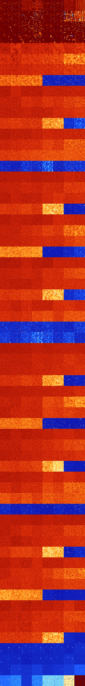

# B0137 (71168-71679)

<details>
    <summary>Initial Grid</summary>
    
</details>


<details>
    <summary>Initial Grid RLE</summary>

```
#C Exported from GoGoL (https://github.com/marrow16/gogol)
#C Wrap mode: Toroidal
#C Boundary mode: Dead
#C Step: 0
x = 100, y = 100, rule = B0137/S
21bo26bo23bo$7bo6bo59b2o20bo$13bo22bo19bo7bo9bo16bo$20bo58bo$14bo6bo9bo
62bo$24bo18b2o8bo24bo$17bo54bo$7bo34bo13bo6bo8bo10bo6bo$53bo31bo12bo$8b
2o24bo49b2o$25bo3bo27bo6bo25bo4bo3bo$5bo7bo6bo$6bo5bo18bo6bo2bo13bo$20b
o29bo25bo7bo5bo$10bo26bo41bo16bo$o22bo5bo25bo$51bo20bo5bo$5bo8bo4bo48bo
b2o9bo$16bo27bo32bo15bo$3bo34bo6bo7bo34bo7bo$10bo27bo5b2o11bo17bo$14bo
58bo2bo11bo10bo$6bo$5bo15bo18bobobo10bo4bo38bo$o12bo11bobo2bo7bo35bo22b
o$36b2o18bo15bo18b2o$76bo4bo2bo4bo$33bo23b2o15bo4bo$26bo15bo3bo16bo9bo$
10bo9bo11bo30bo17bo$52bo19bo$17bo17bo5bo9bo9bo2bo25bo4bo$18bo17bobo5bo
4bo2bo$58bo27bo2bo3bo$34bo11bo5bo17bo16bo$18bo8bo8bo23bo4bo$2bo8bo2bo6b
o11bo14bo33bobo$12bo8bo15bobo3bo15bo24bo$50bo13bo9bo7bo5bo3bo$8bo2bo16b
o9b2o4bo23bo15bo9bo$39bo35bo4bo2bo13bo$8bo36bo28bo6bo$83bo$7bo10bo5bo5b
o40bo7bo2bo$7bo2bo40bo15bo28bo$3bo4bo32bo28bo4bo3bo5bo$13bo15b2o12bo8bo
27bo9bo$36bo38bo5bo$o2bo65bo11bo13bo$6bo2bo15bo58bo$17bo3bo48b2o20bo$
39bo29bo$3bo29bo6bo9bo14bo12bo7bo$28bo38bo26bo3bo$94bo3bo$11b2o44bo4bo
3bo19bo$7bobobobo21bo6bo3bo30bo$20bo10bo14b2o22bo25bo$30bo15bo18bo10bob
o$11bo10bo15bo41bo2bo5bo$6bo10bo28bo4bo2bo9bo6bo$2bo17bo77bo$11bo45bo
27bo$9bo6bo10bo20bo11bo11bo$3bo22bo17bo22bo$o4bo74bob2o2bobo2b2o$25bo$
8bo34bo21bo14bo14b2o$2bo36bo3bo20bo17bo$7bobo28bo29bo15bo$7bo5bo7bo31b
2o37bo$9bo2bo16bo30bo$9b2o7bo15bo35bo2bo$2bo11bo70bo$2bo5bo13bo21bo37bo
$13bo21bo35bo22bo$o21bo6bo69bo$2bo22bo25bobo16bo7bo$4bo11bo18bo31bo$37b
o6bo8bo27bo$14bo20bo7bo19bo3bo28bo$14bo9bo2bo2bo7bo2bo$3bobo14bo11bo17b
o5bo12bo14bo3bo$16bo31bo24bo9bo5bo$8bo2bo3bo6bo54bo$4bo11bo31bo$7bo13bo
3bo10bo26bo9bo$8bo7bo55bo3bo14bo$5bo67bo7bobo$36bo7bo37bobo$3bo59bo19bo
$6bo23bo12bo31bo$11bo17bo9bo6bo15bo$8bo6bo21bo29bo12bobo$3bo11bo12bo19b
o8bo22bo$17bo12bo52bo$11bobobo11bo20bo29bobo6bo$16bo61bo$24bo15bo40bo$
4bo25bo16bo7bo8bo4bo!
```
</details>
<details>
    <summary>Thumbnail</summary>

</details>
<table>
<tr>
    <td><a href="./71168%20S%20Heat%20Map%20Activity.png"></a><br>S (71168)<br>R@10,p2</td>    <td><a href="./71169%20S0%20Heat%20Map%20Activity.png"></a><br>S0 (71169)<br>R@10,p4</td>    <td><a href="./71170%20S1%20Heat%20Map%20Activity.png"></a><br>S1 (71170)<br>G>1000</td>    <td><a href="./71171%20S01%20Heat%20Map%20Activity.png"></a><br>S01 (71171)<br>G>1000</td>    <td><a href="./71172%20S2%20Heat%20Map%20Activity.png"></a><br>S2 (71172)<br>R@12,p2</td>    <td><a href="./71173%20S02%20Heat%20Map%20Activity.png"></a><br>S02 (71173)<br>R@12,p4</td>    <td><a href="./71174%20S12%20Heat%20Map%20Activity.png"></a><br>S12 (71174)<br>G>1000</td>    <td><a href="./71175%20S012%20Heat%20Map%20Activity.png"></a><br>S012 (71175)<br>G>1000</td></tr>
<tr>
    <td><a href="./71176%20S3%20Heat%20Map%20Activity.png"></a><br>S3 (71176)<br>R@14,p2</td>    <td><a href="./71177%20S03%20Heat%20Map%20Activity.png"></a><br>S03 (71177)<br>R@14,p4</td>    <td><a href="./71178%20S13%20Heat%20Map%20Activity.png"></a><br>S13 (71178)<br>R@146,p12</td>    <td><a href="./71179%20S013%20Heat%20Map%20Activity.png"></a><br>S013 (71179)<br>R@55,p12</td>    <td><a href="./71180%20S23%20Heat%20Map%20Activity.png"></a><br>S23 (71180)<br>R@20,p4</td>    <td><a href="./71181%20S023%20Heat%20Map%20Activity.png"></a><br>S023 (71181)<br>R@14,p4</td>    <td><a href="./71182%20S123%20Heat%20Map%20Activity.png"></a><br>S123 (71182)<br>R@876,p20</td>    <td><a href="./71183%20S0123%20Heat%20Map%20Activity.png"></a><br>S0123 (71183)<br>G>1000</td></tr>
<tr>
    <td><a href="./71184%20S4%20Heat%20Map%20Activity.png"></a><br>S4 (71184)<br>R@58,p4</td>    <td><a href="./71185%20S04%20Heat%20Map%20Activity.png"></a><br>S04 (71185)<br>R@41,p4</td>    <td><a href="./71186%20S14%20Heat%20Map%20Activity.png"></a><br>S14 (71186)<br>R@52,p4</td>    <td><a href="./71187%20S014%20Heat%20Map%20Activity.png"></a><br>S014 (71187)<br>R@34,p4</td>    <td><a href="./71188%20S24%20Heat%20Map%20Activity.png"></a><br>S24 (71188)<br>R@30,p2</td>    <td><a href="./71189%20S024%20Heat%20Map%20Activity.png"></a><br>S024 (71189)<br>R@83,p20</td>    <td><a href="./71190%20S124%20Heat%20Map%20Activity.png"></a><br>S124 (71190)<br>R@252,p4</td>    <td><a href="./71191%20S0124%20Heat%20Map%20Activity.png"></a><br>S0124 (71191)<br>R@79,p4</td></tr>
<tr>
    <td><a href="./71192%20S34%20Heat%20Map%20Activity.png"></a><br>S34 (71192)<br>R@44,p4</td>    <td><a href="./71193%20S034%20Heat%20Map%20Activity.png"></a><br>S034 (71193)<br>R@154,p4</td>    <td><a href="./71194%20S134%20Heat%20Map%20Activity.png"></a><br>S134 (71194)<br>R@138,p4</td>    <td><a href="./71195%20S0134%20Heat%20Map%20Activity.png"></a><br>S0134 (71195)<br>R@320,p4</td>    <td><a href="./71196%20S234%20Heat%20Map%20Activity.png"></a><br>S234 (71196)<br>R@174,p4</td>    <td><a href="./71197%20S0234%20Heat%20Map%20Activity.png"></a><br>S0234 (71197)<br>R@153,p4</td>    <td><a href="./71198%20S1234%20Heat%20Map%20Activity.png"></a><br>S1234 (71198)<br>R@400,p180</td>    <td><a href="./71199%20S01234%20Heat%20Map%20Activity.png"></a><br>S01234 (71199)<br>R@58,p4</td></tr>
<tr>
    <td><a href="./71200%20S5%20Heat%20Map%20Activity.png"></a><br>S5 (71200)<br>G>1000</td>    <td><a href="./71201%20S05%20Heat%20Map%20Activity.png"></a><br>S05 (71201)<br>G>1000</td>    <td><a href="./71202%20S15%20Heat%20Map%20Activity.png"></a><br>S15 (71202)<br>G>1000</td>    <td><a href="./71203%20S015%20Heat%20Map%20Activity.png"></a><br>S015 (71203)<br>G>1000</td>    <td><a href="./71204%20S25%20Heat%20Map%20Activity.png"></a><br>S25 (71204)<br>G>1000</td>    <td><a href="./71205%20S025%20Heat%20Map%20Activity.png"></a><br>S025 (71205)<br>G>1000</td>    <td><a href="./71206%20S125%20Heat%20Map%20Activity.png"></a><br>S125 (71206)<br>G>1000</td>    <td><a href="./71207%20S0125%20Heat%20Map%20Activity.png"></a><br>S0125 (71207)<br>G>1000</td></tr>
<tr>
    <td><a href="./71208%20S35%20Heat%20Map%20Activity.png"></a><br>S35 (71208)<br>G>1000</td>    <td><a href="./71209%20S035%20Heat%20Map%20Activity.png"></a><br>S035 (71209)<br>G>1000</td>    <td><a href="./71210%20S135%20Heat%20Map%20Activity.png"></a><br>S135 (71210)<br>G>1000</td>    <td><a href="./71211%20S0135%20Heat%20Map%20Activity.png"></a><br>S0135 (71211)<br>G>1000</td>    <td><a href="./71212%20S235%20Heat%20Map%20Activity.png"></a><br>S235 (71212)<br>G>1000</td>    <td><a href="./71213%20S0235%20Heat%20Map%20Activity.png"></a><br>S0235 (71213)<br>G>1000</td>    <td><a href="./71214%20S1235%20Heat%20Map%20Activity.png"></a><br>S1235 (71214)<br>G>1000</td>    <td><a href="./71215%20S01235%20Heat%20Map%20Activity.png"></a><br>S01235 (71215)<br>G>1000</td></tr>
<tr>
    <td><a href="./71216%20S45%20Heat%20Map%20Activity.png"></a><br>S45 (71216)<br>G>1000</td>    <td><a href="./71217%20S045%20Heat%20Map%20Activity.png"></a><br>S045 (71217)<br>G>1000</td>    <td><a href="./71218%20S145%20Heat%20Map%20Activity.png"></a><br>S145 (71218)<br>G>1000</td>    <td><a href="./71219%20S0145%20Heat%20Map%20Activity.png"></a><br>S0145 (71219)<br>G>1000</td>    <td><a href="./71220%20S245%20Heat%20Map%20Activity.png"></a><br>S245 (71220)<br>G>1000</td>    <td><a href="./71221%20S0245%20Heat%20Map%20Activity.png"></a><br>S0245 (71221)<br>G>1000</td>    <td><a href="./71222%20S1245%20Heat%20Map%20Activity.png"></a><br>S1245 (71222)<br>G>1000</td>    <td><a href="./71223%20S01245%20Heat%20Map%20Activity.png"></a><br>S01245 (71223)<br>G>1000</td></tr>
<tr>
    <td><a href="./71224%20S345%20Heat%20Map%20Activity.png"></a><br>S345 (71224)<br>G>1000</td>    <td><a href="./71225%20S0345%20Heat%20Map%20Activity.png"></a><br>S0345 (71225)<br>G>1000</td>    <td><a href="./71226%20S1345%20Heat%20Map%20Activity.png"></a><br>S1345 (71226)<br>G>1000</td>    <td><a href="./71227%20S01345%20Heat%20Map%20Activity.png"></a><br>S01345 (71227)<br>G>1000</td>    <td><a href="./71228%20S2345%20Heat%20Map%20Activity.png"></a><br>S2345 (71228)<br>G>1000</td>    <td><a href="./71229%20S02345%20Heat%20Map%20Activity.png"></a><br>S02345 (71229)<br>G>1000</td>    <td><a href="./71230%20S12345%20Heat%20Map%20Activity.png"></a><br>S12345 (71230)<br>R@907,p840</td>    <td><a href="./71231%20S012345%20Heat%20Map%20Activity.png"></a><br>S012345 (71231)<br>G>1000</td></tr>
<tr>
    <td><a href="./71232%20S6%20Heat%20Map%20Activity.png"></a><br>S6 (71232)<br>G>1000</td>    <td><a href="./71233%20S06%20Heat%20Map%20Activity.png"></a><br>S06 (71233)<br>G>1000</td>    <td><a href="./71234%20S16%20Heat%20Map%20Activity.png"></a><br>S16 (71234)<br>G>1000</td>    <td><a href="./71235%20S016%20Heat%20Map%20Activity.png"></a><br>S016 (71235)<br>G>1000</td>    <td><a href="./71236%20S26%20Heat%20Map%20Activity.png"></a><br>S26 (71236)<br>G>1000</td>    <td><a href="./71237%20S026%20Heat%20Map%20Activity.png"></a><br>S026 (71237)<br>G>1000</td>    <td><a href="./71238%20S126%20Heat%20Map%20Activity.png"></a><br>S126 (71238)<br>G>1000</td>    <td><a href="./71239%20S0126%20Heat%20Map%20Activity.png"></a><br>S0126 (71239)<br>G>1000</td></tr>
<tr>
    <td><a href="./71240%20S36%20Heat%20Map%20Activity.png"></a><br>S36 (71240)<br>G>1000</td>    <td><a href="./71241%20S036%20Heat%20Map%20Activity.png"></a><br>S036 (71241)<br>G>1000</td>    <td><a href="./71242%20S136%20Heat%20Map%20Activity.png"></a><br>S136 (71242)<br>G>1000</td>    <td><a href="./71243%20S0136%20Heat%20Map%20Activity.png"></a><br>S0136 (71243)<br>G>1000</td>    <td><a href="./71244%20S236%20Heat%20Map%20Activity.png"></a><br>S236 (71244)<br>G>1000</td>    <td><a href="./71245%20S0236%20Heat%20Map%20Activity.png"></a><br>S0236 (71245)<br>G>1000</td>    <td><a href="./71246%20S1236%20Heat%20Map%20Activity.png"></a><br>S1236 (71246)<br>G>1000</td>    <td><a href="./71247%20S01236%20Heat%20Map%20Activity.png"></a><br>S01236 (71247)<br>G>1000</td></tr>
<tr>
    <td><a href="./71248%20S46%20Heat%20Map%20Activity.png"></a><br>S46 (71248)<br>G>1000</td>    <td><a href="./71249%20S046%20Heat%20Map%20Activity.png"></a><br>S046 (71249)<br>G>1000</td>    <td><a href="./71250%20S146%20Heat%20Map%20Activity.png"></a><br>S146 (71250)<br>G>1000</td>    <td><a href="./71251%20S0146%20Heat%20Map%20Activity.png"></a><br>S0146 (71251)<br>G>1000</td>    <td><a href="./71252%20S246%20Heat%20Map%20Activity.png"></a><br>S246 (71252)<br>G>1000</td>    <td><a href="./71253%20S0246%20Heat%20Map%20Activity.png"></a><br>S0246 (71253)<br>G>1000</td>    <td><a href="./71254%20S1246%20Heat%20Map%20Activity.png"></a><br>S1246 (71254)<br>G>1000</td>    <td><a href="./71255%20S01246%20Heat%20Map%20Activity.png"></a><br>S01246 (71255)<br>G>1000</td></tr>
<tr>
    <td><a href="./71256%20S346%20Heat%20Map%20Activity.png"></a><br>S346 (71256)<br>G>1000</td>    <td><a href="./71257%20S0346%20Heat%20Map%20Activity.png"></a><br>S0346 (71257)<br>G>1000</td>    <td><a href="./71258%20S1346%20Heat%20Map%20Activity.png"></a><br>S1346 (71258)<br>G>1000</td>    <td><a href="./71259%20S01346%20Heat%20Map%20Activity.png"></a><br>S01346 (71259)<br>G>1000</td>    <td><a href="./71260%20S2346%20Heat%20Map%20Activity.png"></a><br>S2346 (71260)<br>G>1000</td>    <td><a href="./71261%20S02346%20Heat%20Map%20Activity.png"></a><br>S02346 (71261)<br>G>1000</td>    <td><a href="./71262%20S12346%20Heat%20Map%20Activity.png"></a><br>S12346 (71262)<br>R@153,p60</td>    <td><a href="./71263%20S012346%20Heat%20Map%20Activity.png"></a><br>S012346 (71263)<br>R@91,p20</td></tr>
<tr>
    <td><a href="./71264%20S56%20Heat%20Map%20Activity.png"></a><br>S56 (71264)<br>G>1000</td>    <td><a href="./71265%20S056%20Heat%20Map%20Activity.png"></a><br>S056 (71265)<br>G>1000</td>    <td><a href="./71266%20S156%20Heat%20Map%20Activity.png"></a><br>S156 (71266)<br>G>1000</td>    <td><a href="./71267%20S0156%20Heat%20Map%20Activity.png"></a><br>S0156 (71267)<br>G>1000</td>    <td><a href="./71268%20S256%20Heat%20Map%20Activity.png"></a><br>S256 (71268)<br>G>1000</td>    <td><a href="./71269%20S0256%20Heat%20Map%20Activity.png"></a><br>S0256 (71269)<br>G>1000</td>    <td><a href="./71270%20S1256%20Heat%20Map%20Activity.png"></a><br>S1256 (71270)<br>G>1000</td>    <td><a href="./71271%20S01256%20Heat%20Map%20Activity.png"></a><br>S01256 (71271)<br>G>1000</td></tr>
<tr>
    <td><a href="./71272%20S356%20Heat%20Map%20Activity.png"></a><br>S356 (71272)<br>G>1000</td>    <td><a href="./71273%20S0356%20Heat%20Map%20Activity.png"></a><br>S0356 (71273)<br>G>1000</td>    <td><a href="./71274%20S1356%20Heat%20Map%20Activity.png"></a><br>S1356 (71274)<br>G>1000</td>    <td><a href="./71275%20S01356%20Heat%20Map%20Activity.png"></a><br>S01356 (71275)<br>G>1000</td>    <td><a href="./71276%20S2356%20Heat%20Map%20Activity.png"></a><br>S2356 (71276)<br>G>1000</td>    <td><a href="./71277%20S02356%20Heat%20Map%20Activity.png"></a><br>S02356 (71277)<br>G>1000</td>    <td><a href="./71278%20S12356%20Heat%20Map%20Activity.png"></a><br>S12356 (71278)<br>G>1000</td>    <td><a href="./71279%20S012356%20Heat%20Map%20Activity.png"></a><br>S012356 (71279)<br>G>1000</td></tr>
<tr>
    <td><a href="./71280%20S456%20Heat%20Map%20Activity.png"></a><br>S456 (71280)<br>G>1000</td>    <td><a href="./71281%20S0456%20Heat%20Map%20Activity.png"></a><br>S0456 (71281)<br>G>1000</td>    <td><a href="./71282%20S1456%20Heat%20Map%20Activity.png"></a><br>S1456 (71282)<br>G>1000</td>    <td><a href="./71283%20S01456%20Heat%20Map%20Activity.png"></a><br>S01456 (71283)<br>G>1000</td>    <td><a href="./71284%20S2456%20Heat%20Map%20Activity.png"></a><br>S2456 (71284)<br>G>1000</td>    <td><a href="./71285%20S02456%20Heat%20Map%20Activity.png"></a><br>S02456 (71285)<br>G>1000</td>    <td><a href="./71286%20S12456%20Heat%20Map%20Activity.png"></a><br>S12456 (71286)<br>G>1000</td>    <td><a href="./71287%20S012456%20Heat%20Map%20Activity.png"></a><br>S012456 (71287)<br>G>1000</td></tr>
<tr>
    <td><a href="./71288%20S3456%20Heat%20Map%20Activity.png"></a><br>S3456 (71288)<br>R@259,p60</td>    <td><a href="./71289%20S03456%20Heat%20Map%20Activity.png"></a><br>S03456 (71289)<br>R@440,p264</td>    <td><a href="./71290%20S13456%20Heat%20Map%20Activity.png"></a><br>S13456 (71290)<br>R@137,p12</td>    <td><a href="./71291%20S013456%20Heat%20Map%20Activity.png"></a><br>S013456 (71291)<br>R@219,p12</td>    <td><a href="./71292%20S23456%20Heat%20Map%20Activity.png"></a><br>S23456 (71292)<br>R@36,p12</td>    <td><a href="./71293%20S023456%20Heat%20Map%20Activity.png"></a><br>S023456 (71293)<br>R@194,p168</td>    <td><a href="./71294%20S123456%20Heat%20Map%20Activity.png"></a><br>S123456 (71294)<br>R@86,p60</td>    <td><a href="./71295%20S0123456%20Heat%20Map%20Activity.png"></a><br>S0123456 (71295)<br>R@91,p60</td></tr>
<tr>
    <td><a href="./71296%20S7%20Heat%20Map%20Activity.png"></a><br>S7 (71296)<br>G>1000</td>    <td><a href="./71297%20S07%20Heat%20Map%20Activity.png"></a><br>S07 (71297)<br>G>1000</td>    <td><a href="./71298%20S17%20Heat%20Map%20Activity.png"></a><br>S17 (71298)<br>G>1000</td>    <td><a href="./71299%20S017%20Heat%20Map%20Activity.png"></a><br>S017 (71299)<br>G>1000</td>    <td><a href="./71300%20S27%20Heat%20Map%20Activity.png"></a><br>S27 (71300)<br>G>1000</td>    <td><a href="./71301%20S027%20Heat%20Map%20Activity.png"></a><br>S027 (71301)<br>G>1000</td>    <td><a href="./71302%20S127%20Heat%20Map%20Activity.png"></a><br>S127 (71302)<br>G>1000</td>    <td><a href="./71303%20S0127%20Heat%20Map%20Activity.png"></a><br>S0127 (71303)<br>G>1000</td></tr>
<tr>
    <td><a href="./71304%20S37%20Heat%20Map%20Activity.png"></a><br>S37 (71304)<br>G>1000</td>    <td><a href="./71305%20S037%20Heat%20Map%20Activity.png"></a><br>S037 (71305)<br>G>1000</td>    <td><a href="./71306%20S137%20Heat%20Map%20Activity.png"></a><br>S137 (71306)<br>G>1000</td>    <td><a href="./71307%20S0137%20Heat%20Map%20Activity.png"></a><br>S0137 (71307)<br>G>1000</td>    <td><a href="./71308%20S237%20Heat%20Map%20Activity.png"></a><br>S237 (71308)<br>G>1000</td>    <td><a href="./71309%20S0237%20Heat%20Map%20Activity.png"></a><br>S0237 (71309)<br>G>1000</td>    <td><a href="./71310%20S1237%20Heat%20Map%20Activity.png"></a><br>S1237 (71310)<br>G>1000</td>    <td><a href="./71311%20S01237%20Heat%20Map%20Activity.png"></a><br>S01237 (71311)<br>G>1000</td></tr>
<tr>
    <td><a href="./71312%20S47%20Heat%20Map%20Activity.png"></a><br>S47 (71312)<br>G>1000</td>    <td><a href="./71313%20S047%20Heat%20Map%20Activity.png"></a><br>S047 (71313)<br>G>1000</td>    <td><a href="./71314%20S147%20Heat%20Map%20Activity.png"></a><br>S147 (71314)<br>G>1000</td>    <td><a href="./71315%20S0147%20Heat%20Map%20Activity.png"></a><br>S0147 (71315)<br>G>1000</td>    <td><a href="./71316%20S247%20Heat%20Map%20Activity.png"></a><br>S247 (71316)<br>G>1000</td>    <td><a href="./71317%20S0247%20Heat%20Map%20Activity.png"></a><br>S0247 (71317)<br>G>1000</td>    <td><a href="./71318%20S1247%20Heat%20Map%20Activity.png"></a><br>S1247 (71318)<br>G>1000</td>    <td><a href="./71319%20S01247%20Heat%20Map%20Activity.png"></a><br>S01247 (71319)<br>G>1000</td></tr>
<tr>
    <td><a href="./71320%20S347%20Heat%20Map%20Activity.png"></a><br>S347 (71320)<br>G>1000</td>    <td><a href="./71321%20S0347%20Heat%20Map%20Activity.png"></a><br>S0347 (71321)<br>G>1000</td>    <td><a href="./71322%20S1347%20Heat%20Map%20Activity.png"></a><br>S1347 (71322)<br>G>1000</td>    <td><a href="./71323%20S01347%20Heat%20Map%20Activity.png"></a><br>S01347 (71323)<br>G>1000</td>    <td><a href="./71324%20S2347%20Heat%20Map%20Activity.png"></a><br>S2347 (71324)<br>G>1000</td>    <td><a href="./71325%20S02347%20Heat%20Map%20Activity.png"></a><br>S02347 (71325)<br>G>1000</td>    <td><a href="./71326%20S12347%20Heat%20Map%20Activity.png"></a><br>S12347 (71326)<br>G>1000</td>    <td><a href="./71327%20S012347%20Heat%20Map%20Activity.png"></a><br>S012347 (71327)<br>R@572,p504</td></tr>
<tr>
    <td><a href="./71328%20S57%20Heat%20Map%20Activity.png"></a><br>S57 (71328)<br>G>1000</td>    <td><a href="./71329%20S057%20Heat%20Map%20Activity.png"></a><br>S057 (71329)<br>G>1000</td>    <td><a href="./71330%20S157%20Heat%20Map%20Activity.png"></a><br>S157 (71330)<br>G>1000</td>    <td><a href="./71331%20S0157%20Heat%20Map%20Activity.png"></a><br>S0157 (71331)<br>G>1000</td>    <td><a href="./71332%20S257%20Heat%20Map%20Activity.png"></a><br>S257 (71332)<br>G>1000</td>    <td><a href="./71333%20S0257%20Heat%20Map%20Activity.png"></a><br>S0257 (71333)<br>G>1000</td>    <td><a href="./71334%20S1257%20Heat%20Map%20Activity.png"></a><br>S1257 (71334)<br>G>1000</td>    <td><a href="./71335%20S01257%20Heat%20Map%20Activity.png"></a><br>S01257 (71335)<br>G>1000</td></tr>
<tr>
    <td><a href="./71336%20S357%20Heat%20Map%20Activity.png"></a><br>S357 (71336)<br>G>1000</td>    <td><a href="./71337%20S0357%20Heat%20Map%20Activity.png"></a><br>S0357 (71337)<br>G>1000</td>    <td><a href="./71338%20S1357%20Heat%20Map%20Activity.png"></a><br>S1357 (71338)<br>G>1000</td>    <td><a href="./71339%20S01357%20Heat%20Map%20Activity.png"></a><br>S01357 (71339)<br>G>1000</td>    <td><a href="./71340%20S2357%20Heat%20Map%20Activity.png"></a><br>S2357 (71340)<br>G>1000</td>    <td><a href="./71341%20S02357%20Heat%20Map%20Activity.png"></a><br>S02357 (71341)<br>G>1000</td>    <td><a href="./71342%20S12357%20Heat%20Map%20Activity.png"></a><br>S12357 (71342)<br>G>1000</td>    <td><a href="./71343%20S012357%20Heat%20Map%20Activity.png"></a><br>S012357 (71343)<br>G>1000</td></tr>
<tr>
    <td><a href="./71344%20S457%20Heat%20Map%20Activity.png"></a><br>S457 (71344)<br>G>1000</td>    <td><a href="./71345%20S0457%20Heat%20Map%20Activity.png"></a><br>S0457 (71345)<br>G>1000</td>    <td><a href="./71346%20S1457%20Heat%20Map%20Activity.png"></a><br>S1457 (71346)<br>G>1000</td>    <td><a href="./71347%20S01457%20Heat%20Map%20Activity.png"></a><br>S01457 (71347)<br>G>1000</td>    <td><a href="./71348%20S2457%20Heat%20Map%20Activity.png"></a><br>S2457 (71348)<br>G>1000</td>    <td><a href="./71349%20S02457%20Heat%20Map%20Activity.png"></a><br>S02457 (71349)<br>G>1000</td>    <td><a href="./71350%20S12457%20Heat%20Map%20Activity.png"></a><br>S12457 (71350)<br>G>1000</td>    <td><a href="./71351%20S012457%20Heat%20Map%20Activity.png"></a><br>S012457 (71351)<br>G>1000</td></tr>
<tr>
    <td><a href="./71352%20S3457%20Heat%20Map%20Activity.png"></a><br>S3457 (71352)<br>G>1000</td>    <td><a href="./71353%20S03457%20Heat%20Map%20Activity.png"></a><br>S03457 (71353)<br>G>1000</td>    <td><a href="./71354%20S13457%20Heat%20Map%20Activity.png"></a><br>S13457 (71354)<br>G>1000</td>    <td><a href="./71355%20S013457%20Heat%20Map%20Activity.png"></a><br>S013457 (71355)<br>G>1000</td>    <td><a href="./71356%20S23457%20Heat%20Map%20Activity.png"></a><br>S23457 (71356)<br>R@443,p360</td>    <td><a href="./71357%20S023457%20Heat%20Map%20Activity.png"></a><br>S023457 (71357)<br>R@596,p504</td>    <td><a href="./71358%20S123457%20Heat%20Map%20Activity.png"></a><br>S123457 (71358)<br>R@109,p84</td>    <td><a href="./71359%20S0123457%20Heat%20Map%20Activity.png"></a><br>S0123457 (71359)<br>R@67,p36</td></tr>
<tr>
    <td><a href="./71360%20S67%20Heat%20Map%20Activity.png"></a><br>S67 (71360)<br>G>1000</td>    <td><a href="./71361%20S067%20Heat%20Map%20Activity.png"></a><br>S067 (71361)<br>G>1000</td>    <td><a href="./71362%20S167%20Heat%20Map%20Activity.png"></a><br>S167 (71362)<br>G>1000</td>    <td><a href="./71363%20S0167%20Heat%20Map%20Activity.png"></a><br>S0167 (71363)<br>G>1000</td>    <td><a href="./71364%20S267%20Heat%20Map%20Activity.png"></a><br>S267 (71364)<br>G>1000</td>    <td><a href="./71365%20S0267%20Heat%20Map%20Activity.png"></a><br>S0267 (71365)<br>G>1000</td>    <td><a href="./71366%20S1267%20Heat%20Map%20Activity.png"></a><br>S1267 (71366)<br>G>1000</td>    <td><a href="./71367%20S01267%20Heat%20Map%20Activity.png"></a><br>S01267 (71367)<br>G>1000</td></tr>
<tr>
    <td><a href="./71368%20S367%20Heat%20Map%20Activity.png"></a><br>S367 (71368)<br>G>1000</td>    <td><a href="./71369%20S0367%20Heat%20Map%20Activity.png"></a><br>S0367 (71369)<br>G>1000</td>    <td><a href="./71370%20S1367%20Heat%20Map%20Activity.png"></a><br>S1367 (71370)<br>G>1000</td>    <td><a href="./71371%20S01367%20Heat%20Map%20Activity.png"></a><br>S01367 (71371)<br>G>1000</td>    <td><a href="./71372%20S2367%20Heat%20Map%20Activity.png"></a><br>S2367 (71372)<br>G>1000</td>    <td><a href="./71373%20S02367%20Heat%20Map%20Activity.png"></a><br>S02367 (71373)<br>G>1000</td>    <td><a href="./71374%20S12367%20Heat%20Map%20Activity.png"></a><br>S12367 (71374)<br>G>1000</td>    <td><a href="./71375%20S012367%20Heat%20Map%20Activity.png"></a><br>S012367 (71375)<br>G>1000</td></tr>
<tr>
    <td><a href="./71376%20S467%20Heat%20Map%20Activity.png"></a><br>S467 (71376)<br>G>1000</td>    <td><a href="./71377%20S0467%20Heat%20Map%20Activity.png"></a><br>S0467 (71377)<br>G>1000</td>    <td><a href="./71378%20S1467%20Heat%20Map%20Activity.png"></a><br>S1467 (71378)<br>G>1000</td>    <td><a href="./71379%20S01467%20Heat%20Map%20Activity.png"></a><br>S01467 (71379)<br>G>1000</td>    <td><a href="./71380%20S2467%20Heat%20Map%20Activity.png"></a><br>S2467 (71380)<br>G>1000</td>    <td><a href="./71381%20S02467%20Heat%20Map%20Activity.png"></a><br>S02467 (71381)<br>G>1000</td>    <td><a href="./71382%20S12467%20Heat%20Map%20Activity.png"></a><br>S12467 (71382)<br>G>1000</td>    <td><a href="./71383%20S012467%20Heat%20Map%20Activity.png"></a><br>S012467 (71383)<br>G>1000</td></tr>
<tr>
    <td><a href="./71384%20S3467%20Heat%20Map%20Activity.png"></a><br>S3467 (71384)<br>G>1000</td>    <td><a href="./71385%20S03467%20Heat%20Map%20Activity.png"></a><br>S03467 (71385)<br>G>1000</td>    <td><a href="./71386%20S13467%20Heat%20Map%20Activity.png"></a><br>S13467 (71386)<br>G>1000</td>    <td><a href="./71387%20S013467%20Heat%20Map%20Activity.png"></a><br>S013467 (71387)<br>G>1000</td>    <td><a href="./71388%20S23467%20Heat%20Map%20Activity.png"></a><br>S23467 (71388)<br>G>1000</td>    <td><a href="./71389%20S023467%20Heat%20Map%20Activity.png"></a><br>S023467 (71389)<br>G>1000</td>    <td><a href="./71390%20S123467%20Heat%20Map%20Activity.png"></a><br>S123467 (71390)<br>R@167,p90</td>    <td><a href="./71391%20S0123467%20Heat%20Map%20Activity.png"></a><br>S0123467 (71391)<br>R@97,p10</td></tr>
<tr>
    <td><a href="./71392%20S567%20Heat%20Map%20Activity.png"></a><br>S567 (71392)<br>G>1000</td>    <td><a href="./71393%20S0567%20Heat%20Map%20Activity.png"></a><br>S0567 (71393)<br>G>1000</td>    <td><a href="./71394%20S1567%20Heat%20Map%20Activity.png"></a><br>S1567 (71394)<br>G>1000</td>    <td><a href="./71395%20S01567%20Heat%20Map%20Activity.png"></a><br>S01567 (71395)<br>G>1000</td>    <td><a href="./71396%20S2567%20Heat%20Map%20Activity.png"></a><br>S2567 (71396)<br>G>1000</td>    <td><a href="./71397%20S02567%20Heat%20Map%20Activity.png"></a><br>S02567 (71397)<br>G>1000</td>    <td><a href="./71398%20S12567%20Heat%20Map%20Activity.png"></a><br>S12567 (71398)<br>G>1000</td>    <td><a href="./71399%20S012567%20Heat%20Map%20Activity.png"></a><br>S012567 (71399)<br>G>1000</td></tr>
<tr>
    <td><a href="./71400%20S3567%20Heat%20Map%20Activity.png"></a><br>S3567 (71400)<br>G>1000</td>    <td><a href="./71401%20S03567%20Heat%20Map%20Activity.png"></a><br>S03567 (71401)<br>G>1000</td>    <td><a href="./71402%20S13567%20Heat%20Map%20Activity.png"></a><br>S13567 (71402)<br>G>1000</td>    <td><a href="./71403%20S013567%20Heat%20Map%20Activity.png"></a><br>S013567 (71403)<br>G>1000</td>    <td><a href="./71404%20S23567%20Heat%20Map%20Activity.png"></a><br>S23567 (71404)<br>G>1000</td>    <td><a href="./71405%20S023567%20Heat%20Map%20Activity.png"></a><br>S023567 (71405)<br>G>1000</td>    <td><a href="./71406%20S123567%20Heat%20Map%20Activity.png"></a><br>S123567 (71406)<br>G>1000</td>    <td><a href="./71407%20S0123567%20Heat%20Map%20Activity.png"></a><br>S0123567 (71407)<br>G>1000</td></tr>
<tr>
    <td><a href="./71408%20S4567%20Heat%20Map%20Activity.png"></a><br>S4567 (71408)<br>R@161,p60</td>    <td><a href="./71409%20S04567%20Heat%20Map%20Activity.png"></a><br>S04567 (71409)<br>R@199,p84</td>    <td><a href="./71410%20S14567%20Heat%20Map%20Activity.png"></a><br>S14567 (71410)<br>R@120,p12</td>    <td><a href="./71411%20S014567%20Heat%20Map%20Activity.png"></a><br>S014567 (71411)<br>R@184,p66</td>    <td><a href="./71412%20S24567%20Heat%20Map%20Activity.png"></a><br>S24567 (71412)<br>R@85,p12</td>    <td><a href="./71413%20S024567%20Heat%20Map%20Activity.png"></a><br>S024567 (71413)<br>R@170,p84</td>    <td><a href="./71414%20S124567%20Heat%20Map%20Activity.png"></a><br>S124567 (71414)<br>R@158,p84</td>    <td><a href="./71415%20S0124567%20Heat%20Map%20Activity.png"></a><br>S0124567 (71415)<br>R@82,p12</td></tr>
<tr>
    <td><a href="./71416%20S34567%20Heat%20Map%20Activity.png"></a><br>S34567 (71416)<br>R@36,p12</td>    <td><a href="./71417%20S034567%20Heat%20Map%20Activity.png"></a><br>S034567 (71417)<br>R@86,p60</td>    <td><a href="./71418%20S134567%20Heat%20Map%20Activity.png"></a><br>S134567 (71418)<br>R@31,p12</td>    <td><a href="./71419%20S0134567%20Heat%20Map%20Activity.png"></a><br>S0134567 (71419)<br>R@29,p6</td>    <td><a href="./71420%20S234567%20Heat%20Map%20Activity.png"></a><br>S234567 (71420)<br>R@26,p6</td>    <td><a href="./71421%20S0234567%20Heat%20Map%20Activity.png"></a><br>S0234567 (71421)<br>R@83,p60</td>    <td><a href="./71422%20S1234567%20Heat%20Map%20Activity.png"></a><br>S1234567 (71422)<br>R@27,p6</td>    <td><a href="./71423%20S01234567%20Heat%20Map%20Activity.png"></a><br>S01234567 (71423)<br>R@104,p84</td></tr>
<tr>
    <td><a href="./71424%20S8%20Heat%20Map%20Activity.png"></a><br>S8 (71424)<br>G>1000</td>    <td><a href="./71425%20S08%20Heat%20Map%20Activity.png"></a><br>S08 (71425)<br>G>1000</td>    <td><a href="./71426%20S18%20Heat%20Map%20Activity.png"></a><br>S18 (71426)<br>G>1000</td>    <td><a href="./71427%20S018%20Heat%20Map%20Activity.png"></a><br>S018 (71427)<br>G>1000</td>    <td><a href="./71428%20S28%20Heat%20Map%20Activity.png"></a><br>S28 (71428)<br>G>1000</td>    <td><a href="./71429%20S028%20Heat%20Map%20Activity.png"></a><br>S028 (71429)<br>G>1000</td>    <td><a href="./71430%20S128%20Heat%20Map%20Activity.png"></a><br>S128 (71430)<br>G>1000</td>    <td><a href="./71431%20S0128%20Heat%20Map%20Activity.png"></a><br>S0128 (71431)<br>G>1000</td></tr>
<tr>
    <td><a href="./71432%20S38%20Heat%20Map%20Activity.png"></a><br>S38 (71432)<br>G>1000</td>    <td><a href="./71433%20S038%20Heat%20Map%20Activity.png"></a><br>S038 (71433)<br>G>1000</td>    <td><a href="./71434%20S138%20Heat%20Map%20Activity.png"></a><br>S138 (71434)<br>G>1000</td>    <td><a href="./71435%20S0138%20Heat%20Map%20Activity.png"></a><br>S0138 (71435)<br>G>1000</td>    <td><a href="./71436%20S238%20Heat%20Map%20Activity.png"></a><br>S238 (71436)<br>G>1000</td>    <td><a href="./71437%20S0238%20Heat%20Map%20Activity.png"></a><br>S0238 (71437)<br>G>1000</td>    <td><a href="./71438%20S1238%20Heat%20Map%20Activity.png"></a><br>S1238 (71438)<br>G>1000</td>    <td><a href="./71439%20S01238%20Heat%20Map%20Activity.png"></a><br>S01238 (71439)<br>G>1000</td></tr>
<tr>
    <td><a href="./71440%20S48%20Heat%20Map%20Activity.png"></a><br>S48 (71440)<br>G>1000</td>    <td><a href="./71441%20S048%20Heat%20Map%20Activity.png"></a><br>S048 (71441)<br>G>1000</td>    <td><a href="./71442%20S148%20Heat%20Map%20Activity.png"></a><br>S148 (71442)<br>G>1000</td>    <td><a href="./71443%20S0148%20Heat%20Map%20Activity.png"></a><br>S0148 (71443)<br>G>1000</td>    <td><a href="./71444%20S248%20Heat%20Map%20Activity.png"></a><br>S248 (71444)<br>G>1000</td>    <td><a href="./71445%20S0248%20Heat%20Map%20Activity.png"></a><br>S0248 (71445)<br>G>1000</td>    <td><a href="./71446%20S1248%20Heat%20Map%20Activity.png"></a><br>S1248 (71446)<br>G>1000</td>    <td><a href="./71447%20S01248%20Heat%20Map%20Activity.png"></a><br>S01248 (71447)<br>G>1000</td></tr>
<tr>
    <td><a href="./71448%20S348%20Heat%20Map%20Activity.png"></a><br>S348 (71448)<br>G>1000</td>    <td><a href="./71449%20S0348%20Heat%20Map%20Activity.png"></a><br>S0348 (71449)<br>G>1000</td>    <td><a href="./71450%20S1348%20Heat%20Map%20Activity.png"></a><br>S1348 (71450)<br>G>1000</td>    <td><a href="./71451%20S01348%20Heat%20Map%20Activity.png"></a><br>S01348 (71451)<br>G>1000</td>    <td><a href="./71452%20S2348%20Heat%20Map%20Activity.png"></a><br>S2348 (71452)<br>G>1000</td>    <td><a href="./71453%20S02348%20Heat%20Map%20Activity.png"></a><br>S02348 (71453)<br>G>1000</td>    <td><a href="./71454%20S12348%20Heat%20Map%20Activity.png"></a><br>S12348 (71454)<br>G>1000</td>    <td><a href="./71455%20S012348%20Heat%20Map%20Activity.png"></a><br>S012348 (71455)<br>R@399,p336</td></tr>
<tr>
    <td><a href="./71456%20S58%20Heat%20Map%20Activity.png"></a><br>S58 (71456)<br>G>1000</td>    <td><a href="./71457%20S058%20Heat%20Map%20Activity.png"></a><br>S058 (71457)<br>G>1000</td>    <td><a href="./71458%20S158%20Heat%20Map%20Activity.png"></a><br>S158 (71458)<br>G>1000</td>    <td><a href="./71459%20S0158%20Heat%20Map%20Activity.png"></a><br>S0158 (71459)<br>G>1000</td>    <td><a href="./71460%20S258%20Heat%20Map%20Activity.png"></a><br>S258 (71460)<br>G>1000</td>    <td><a href="./71461%20S0258%20Heat%20Map%20Activity.png"></a><br>S0258 (71461)<br>G>1000</td>    <td><a href="./71462%20S1258%20Heat%20Map%20Activity.png"></a><br>S1258 (71462)<br>G>1000</td>    <td><a href="./71463%20S01258%20Heat%20Map%20Activity.png"></a><br>S01258 (71463)<br>G>1000</td></tr>
<tr>
    <td><a href="./71464%20S358%20Heat%20Map%20Activity.png"></a><br>S358 (71464)<br>G>1000</td>    <td><a href="./71465%20S0358%20Heat%20Map%20Activity.png"></a><br>S0358 (71465)<br>G>1000</td>    <td><a href="./71466%20S1358%20Heat%20Map%20Activity.png"></a><br>S1358 (71466)<br>G>1000</td>    <td><a href="./71467%20S01358%20Heat%20Map%20Activity.png"></a><br>S01358 (71467)<br>G>1000</td>    <td><a href="./71468%20S2358%20Heat%20Map%20Activity.png"></a><br>S2358 (71468)<br>G>1000</td>    <td><a href="./71469%20S02358%20Heat%20Map%20Activity.png"></a><br>S02358 (71469)<br>G>1000</td>    <td><a href="./71470%20S12358%20Heat%20Map%20Activity.png"></a><br>S12358 (71470)<br>G>1000</td>    <td><a href="./71471%20S012358%20Heat%20Map%20Activity.png"></a><br>S012358 (71471)<br>G>1000</td></tr>
<tr>
    <td><a href="./71472%20S458%20Heat%20Map%20Activity.png"></a><br>S458 (71472)<br>G>1000</td>    <td><a href="./71473%20S0458%20Heat%20Map%20Activity.png"></a><br>S0458 (71473)<br>G>1000</td>    <td><a href="./71474%20S1458%20Heat%20Map%20Activity.png"></a><br>S1458 (71474)<br>G>1000</td>    <td><a href="./71475%20S01458%20Heat%20Map%20Activity.png"></a><br>S01458 (71475)<br>G>1000</td>    <td><a href="./71476%20S2458%20Heat%20Map%20Activity.png"></a><br>S2458 (71476)<br>G>1000</td>    <td><a href="./71477%20S02458%20Heat%20Map%20Activity.png"></a><br>S02458 (71477)<br>G>1000</td>    <td><a href="./71478%20S12458%20Heat%20Map%20Activity.png"></a><br>S12458 (71478)<br>G>1000</td>    <td><a href="./71479%20S012458%20Heat%20Map%20Activity.png"></a><br>S012458 (71479)<br>G>1000</td></tr>
<tr>
    <td><a href="./71480%20S3458%20Heat%20Map%20Activity.png"></a><br>S3458 (71480)<br>G>1000</td>    <td><a href="./71481%20S03458%20Heat%20Map%20Activity.png"></a><br>S03458 (71481)<br>G>1000</td>    <td><a href="./71482%20S13458%20Heat%20Map%20Activity.png"></a><br>S13458 (71482)<br>G>1000</td>    <td><a href="./71483%20S013458%20Heat%20Map%20Activity.png"></a><br>S013458 (71483)<br>G>1000</td>    <td><a href="./71484%20S23458%20Heat%20Map%20Activity.png"></a><br>S23458 (71484)<br>R@522,p420</td>    <td><a href="./71485%20S023458%20Heat%20Map%20Activity.png"></a><br>S023458 (71485)<br>G>1000</td>    <td><a href="./71486%20S123458%20Heat%20Map%20Activity.png"></a><br>S123458 (71486)<br>R@876,p840</td>    <td><a href="./71487%20S0123458%20Heat%20Map%20Activity.png"></a><br>S0123458 (71487)<br>G>1000</td></tr>
<tr>
    <td><a href="./71488%20S68%20Heat%20Map%20Activity.png"></a><br>S68 (71488)<br>G>1000</td>    <td><a href="./71489%20S068%20Heat%20Map%20Activity.png"></a><br>S068 (71489)<br>G>1000</td>    <td><a href="./71490%20S168%20Heat%20Map%20Activity.png"></a><br>S168 (71490)<br>G>1000</td>    <td><a href="./71491%20S0168%20Heat%20Map%20Activity.png"></a><br>S0168 (71491)<br>G>1000</td>    <td><a href="./71492%20S268%20Heat%20Map%20Activity.png"></a><br>S268 (71492)<br>G>1000</td>    <td><a href="./71493%20S0268%20Heat%20Map%20Activity.png"></a><br>S0268 (71493)<br>G>1000</td>    <td><a href="./71494%20S1268%20Heat%20Map%20Activity.png"></a><br>S1268 (71494)<br>G>1000</td>    <td><a href="./71495%20S01268%20Heat%20Map%20Activity.png"></a><br>S01268 (71495)<br>G>1000</td></tr>
<tr>
    <td><a href="./71496%20S368%20Heat%20Map%20Activity.png"></a><br>S368 (71496)<br>G>1000</td>    <td><a href="./71497%20S0368%20Heat%20Map%20Activity.png"></a><br>S0368 (71497)<br>G>1000</td>    <td><a href="./71498%20S1368%20Heat%20Map%20Activity.png"></a><br>S1368 (71498)<br>G>1000</td>    <td><a href="./71499%20S01368%20Heat%20Map%20Activity.png"></a><br>S01368 (71499)<br>G>1000</td>    <td><a href="./71500%20S2368%20Heat%20Map%20Activity.png"></a><br>S2368 (71500)<br>G>1000</td>    <td><a href="./71501%20S02368%20Heat%20Map%20Activity.png"></a><br>S02368 (71501)<br>G>1000</td>    <td><a href="./71502%20S12368%20Heat%20Map%20Activity.png"></a><br>S12368 (71502)<br>G>1000</td>    <td><a href="./71503%20S012368%20Heat%20Map%20Activity.png"></a><br>S012368 (71503)<br>G>1000</td></tr>
<tr>
    <td><a href="./71504%20S468%20Heat%20Map%20Activity.png"></a><br>S468 (71504)<br>G>1000</td>    <td><a href="./71505%20S0468%20Heat%20Map%20Activity.png"></a><br>S0468 (71505)<br>G>1000</td>    <td><a href="./71506%20S1468%20Heat%20Map%20Activity.png"></a><br>S1468 (71506)<br>G>1000</td>    <td><a href="./71507%20S01468%20Heat%20Map%20Activity.png"></a><br>S01468 (71507)<br>G>1000</td>    <td><a href="./71508%20S2468%20Heat%20Map%20Activity.png"></a><br>S2468 (71508)<br>G>1000</td>    <td><a href="./71509%20S02468%20Heat%20Map%20Activity.png"></a><br>S02468 (71509)<br>G>1000</td>    <td><a href="./71510%20S12468%20Heat%20Map%20Activity.png"></a><br>S12468 (71510)<br>G>1000</td>    <td><a href="./71511%20S012468%20Heat%20Map%20Activity.png"></a><br>S012468 (71511)<br>G>1000</td></tr>
<tr>
    <td><a href="./71512%20S3468%20Heat%20Map%20Activity.png"></a><br>S3468 (71512)<br>G>1000</td>    <td><a href="./71513%20S03468%20Heat%20Map%20Activity.png"></a><br>S03468 (71513)<br>G>1000</td>    <td><a href="./71514%20S13468%20Heat%20Map%20Activity.png"></a><br>S13468 (71514)<br>G>1000</td>    <td><a href="./71515%20S013468%20Heat%20Map%20Activity.png"></a><br>S013468 (71515)<br>G>1000</td>    <td><a href="./71516%20S23468%20Heat%20Map%20Activity.png"></a><br>S23468 (71516)<br>G>1000</td>    <td><a href="./71517%20S023468%20Heat%20Map%20Activity.png"></a><br>S023468 (71517)<br>G>1000</td>    <td><a href="./71518%20S123468%20Heat%20Map%20Activity.png"></a><br>S123468 (71518)<br>R@302,p180</td>    <td><a href="./71519%20S0123468%20Heat%20Map%20Activity.png"></a><br>S0123468 (71519)<br>R@954,p840</td></tr>
<tr>
    <td><a href="./71520%20S568%20Heat%20Map%20Activity.png"></a><br>S568 (71520)<br>G>1000</td>    <td><a href="./71521%20S0568%20Heat%20Map%20Activity.png"></a><br>S0568 (71521)<br>G>1000</td>    <td><a href="./71522%20S1568%20Heat%20Map%20Activity.png"></a><br>S1568 (71522)<br>G>1000</td>    <td><a href="./71523%20S01568%20Heat%20Map%20Activity.png"></a><br>S01568 (71523)<br>G>1000</td>    <td><a href="./71524%20S2568%20Heat%20Map%20Activity.png"></a><br>S2568 (71524)<br>G>1000</td>    <td><a href="./71525%20S02568%20Heat%20Map%20Activity.png"></a><br>S02568 (71525)<br>G>1000</td>    <td><a href="./71526%20S12568%20Heat%20Map%20Activity.png"></a><br>S12568 (71526)<br>G>1000</td>    <td><a href="./71527%20S012568%20Heat%20Map%20Activity.png"></a><br>S012568 (71527)<br>G>1000</td></tr>
<tr>
    <td><a href="./71528%20S3568%20Heat%20Map%20Activity.png"></a><br>S3568 (71528)<br>G>1000</td>    <td><a href="./71529%20S03568%20Heat%20Map%20Activity.png"></a><br>S03568 (71529)<br>G>1000</td>    <td><a href="./71530%20S13568%20Heat%20Map%20Activity.png"></a><br>S13568 (71530)<br>G>1000</td>    <td><a href="./71531%20S013568%20Heat%20Map%20Activity.png"></a><br>S013568 (71531)<br>G>1000</td>    <td><a href="./71532%20S23568%20Heat%20Map%20Activity.png"></a><br>S23568 (71532)<br>G>1000</td>    <td><a href="./71533%20S023568%20Heat%20Map%20Activity.png"></a><br>S023568 (71533)<br>G>1000</td>    <td><a href="./71534%20S123568%20Heat%20Map%20Activity.png"></a><br>S123568 (71534)<br>G>1000</td>    <td><a href="./71535%20S0123568%20Heat%20Map%20Activity.png"></a><br>S0123568 (71535)<br>G>1000</td></tr>
<tr>
    <td><a href="./71536%20S4568%20Heat%20Map%20Activity.png"></a><br>S4568 (71536)<br>G>1000</td>    <td><a href="./71537%20S04568%20Heat%20Map%20Activity.png"></a><br>S04568 (71537)<br>G>1000</td>    <td><a href="./71538%20S14568%20Heat%20Map%20Activity.png"></a><br>S14568 (71538)<br>G>1000</td>    <td><a href="./71539%20S014568%20Heat%20Map%20Activity.png"></a><br>S014568 (71539)<br>G>1000</td>    <td><a href="./71540%20S24568%20Heat%20Map%20Activity.png"></a><br>S24568 (71540)<br>G>1000</td>    <td><a href="./71541%20S024568%20Heat%20Map%20Activity.png"></a><br>S024568 (71541)<br>G>1000</td>    <td><a href="./71542%20S124568%20Heat%20Map%20Activity.png"></a><br>S124568 (71542)<br>G>1000</td>    <td><a href="./71543%20S0124568%20Heat%20Map%20Activity.png"></a><br>S0124568 (71543)<br>G>1000</td></tr>
<tr>
    <td><a href="./71544%20S34568%20Heat%20Map%20Activity.png"></a><br>S34568 (71544)<br>R@146,p60</td>    <td><a href="./71545%20S034568%20Heat%20Map%20Activity.png"></a><br>S034568 (71545)<br>R@548,p420</td>    <td><a href="./71546%20S134568%20Heat%20Map%20Activity.png"></a><br>S134568 (71546)<br>R@260,p120</td>    <td><a href="./71547%20S0134568%20Heat%20Map%20Activity.png"></a><br>S0134568 (71547)<br>R@546,p420</td>    <td><a href="./71548%20S234568%20Heat%20Map%20Activity.png"></a><br>S234568 (71548)<br>R@883,p840</td>    <td><a href="./71549%20S0234568%20Heat%20Map%20Activity.png"></a><br>S0234568 (71549)<br>R@131,p84</td>    <td><a href="./71550%20S1234568%20Heat%20Map%20Activity.png"></a><br>S1234568 (71550)<br>R@195,p168</td>    <td><a href="./71551%20S01234568%20Heat%20Map%20Activity.png"></a><br>S01234568 (71551)<br>R@124,p84</td></tr>
<tr>
    <td><a href="./71552%20S78%20Heat%20Map%20Activity.png"></a><br>S78 (71552)<br>G>1000</td>    <td><a href="./71553%20S078%20Heat%20Map%20Activity.png"></a><br>S078 (71553)<br>G>1000</td>    <td><a href="./71554%20S178%20Heat%20Map%20Activity.png"></a><br>S178 (71554)<br>G>1000</td>    <td><a href="./71555%20S0178%20Heat%20Map%20Activity.png"></a><br>S0178 (71555)<br>G>1000</td>    <td><a href="./71556%20S278%20Heat%20Map%20Activity.png"></a><br>S278 (71556)<br>G>1000</td>    <td><a href="./71557%20S0278%20Heat%20Map%20Activity.png"></a><br>S0278 (71557)<br>G>1000</td>    <td><a href="./71558%20S1278%20Heat%20Map%20Activity.png"></a><br>S1278 (71558)<br>G>1000</td>    <td><a href="./71559%20S01278%20Heat%20Map%20Activity.png"></a><br>S01278 (71559)<br>G>1000</td></tr>
<tr>
    <td><a href="./71560%20S378%20Heat%20Map%20Activity.png"></a><br>S378 (71560)<br>G>1000</td>    <td><a href="./71561%20S0378%20Heat%20Map%20Activity.png"></a><br>S0378 (71561)<br>G>1000</td>    <td><a href="./71562%20S1378%20Heat%20Map%20Activity.png"></a><br>S1378 (71562)<br>G>1000</td>    <td><a href="./71563%20S01378%20Heat%20Map%20Activity.png"></a><br>S01378 (71563)<br>G>1000</td>    <td><a href="./71564%20S2378%20Heat%20Map%20Activity.png"></a><br>S2378 (71564)<br>G>1000</td>    <td><a href="./71565%20S02378%20Heat%20Map%20Activity.png"></a><br>S02378 (71565)<br>G>1000</td>    <td><a href="./71566%20S12378%20Heat%20Map%20Activity.png"></a><br>S12378 (71566)<br>G>1000</td>    <td><a href="./71567%20S012378%20Heat%20Map%20Activity.png"></a><br>S012378 (71567)<br>G>1000</td></tr>
<tr>
    <td><a href="./71568%20S478%20Heat%20Map%20Activity.png"></a><br>S478 (71568)<br>G>1000</td>    <td><a href="./71569%20S0478%20Heat%20Map%20Activity.png"></a><br>S0478 (71569)<br>G>1000</td>    <td><a href="./71570%20S1478%20Heat%20Map%20Activity.png"></a><br>S1478 (71570)<br>G>1000</td>    <td><a href="./71571%20S01478%20Heat%20Map%20Activity.png"></a><br>S01478 (71571)<br>G>1000</td>    <td><a href="./71572%20S2478%20Heat%20Map%20Activity.png"></a><br>S2478 (71572)<br>G>1000</td>    <td><a href="./71573%20S02478%20Heat%20Map%20Activity.png"></a><br>S02478 (71573)<br>G>1000</td>    <td><a href="./71574%20S12478%20Heat%20Map%20Activity.png"></a><br>S12478 (71574)<br>G>1000</td>    <td><a href="./71575%20S012478%20Heat%20Map%20Activity.png"></a><br>S012478 (71575)<br>G>1000</td></tr>
<tr>
    <td><a href="./71576%20S3478%20Heat%20Map%20Activity.png"></a><br>S3478 (71576)<br>G>1000</td>    <td><a href="./71577%20S03478%20Heat%20Map%20Activity.png"></a><br>S03478 (71577)<br>G>1000</td>    <td><a href="./71578%20S13478%20Heat%20Map%20Activity.png"></a><br>S13478 (71578)<br>G>1000</td>    <td><a href="./71579%20S013478%20Heat%20Map%20Activity.png"></a><br>S013478 (71579)<br>G>1000</td>    <td><a href="./71580%20S23478%20Heat%20Map%20Activity.png"></a><br>S23478 (71580)<br>G>1000</td>    <td><a href="./71581%20S023478%20Heat%20Map%20Activity.png"></a><br>S023478 (71581)<br>G>1000</td>    <td><a href="./71582%20S123478%20Heat%20Map%20Activity.png"></a><br>S123478 (71582)<br>G>1000</td>    <td><a href="./71583%20S0123478%20Heat%20Map%20Activity.png"></a><br>S0123478 (71583)<br>R@147,p84</td></tr>
<tr>
    <td><a href="./71584%20S578%20Heat%20Map%20Activity.png"></a><br>S578 (71584)<br>G>1000</td>    <td><a href="./71585%20S0578%20Heat%20Map%20Activity.png"></a><br>S0578 (71585)<br>G>1000</td>    <td><a href="./71586%20S1578%20Heat%20Map%20Activity.png"></a><br>S1578 (71586)<br>G>1000</td>    <td><a href="./71587%20S01578%20Heat%20Map%20Activity.png"></a><br>S01578 (71587)<br>G>1000</td>    <td><a href="./71588%20S2578%20Heat%20Map%20Activity.png"></a><br>S2578 (71588)<br>G>1000</td>    <td><a href="./71589%20S02578%20Heat%20Map%20Activity.png"></a><br>S02578 (71589)<br>G>1000</td>    <td><a href="./71590%20S12578%20Heat%20Map%20Activity.png"></a><br>S12578 (71590)<br>G>1000</td>    <td><a href="./71591%20S012578%20Heat%20Map%20Activity.png"></a><br>S012578 (71591)<br>G>1000</td></tr>
<tr>
    <td><a href="./71592%20S3578%20Heat%20Map%20Activity.png"></a><br>S3578 (71592)<br>G>1000</td>    <td><a href="./71593%20S03578%20Heat%20Map%20Activity.png"></a><br>S03578 (71593)<br>G>1000</td>    <td><a href="./71594%20S13578%20Heat%20Map%20Activity.png"></a><br>S13578 (71594)<br>G>1000</td>    <td><a href="./71595%20S013578%20Heat%20Map%20Activity.png"></a><br>S013578 (71595)<br>G>1000</td>    <td><a href="./71596%20S23578%20Heat%20Map%20Activity.png"></a><br>S23578 (71596)<br>G>1000</td>    <td><a href="./71597%20S023578%20Heat%20Map%20Activity.png"></a><br>S023578 (71597)<br>G>1000</td>    <td><a href="./71598%20S123578%20Heat%20Map%20Activity.png"></a><br>S123578 (71598)<br>G>1000</td>    <td><a href="./71599%20S0123578%20Heat%20Map%20Activity.png"></a><br>S0123578 (71599)<br>G>1000</td></tr>
<tr>
    <td><a href="./71600%20S4578%20Heat%20Map%20Activity.png"></a><br>S4578 (71600)<br>G>1000</td>    <td><a href="./71601%20S04578%20Heat%20Map%20Activity.png"></a><br>S04578 (71601)<br>G>1000</td>    <td><a href="./71602%20S14578%20Heat%20Map%20Activity.png"></a><br>S14578 (71602)<br>G>1000</td>    <td><a href="./71603%20S014578%20Heat%20Map%20Activity.png"></a><br>S014578 (71603)<br>G>1000</td>    <td><a href="./71604%20S24578%20Heat%20Map%20Activity.png"></a><br>S24578 (71604)<br>G>1000</td>    <td><a href="./71605%20S024578%20Heat%20Map%20Activity.png"></a><br>S024578 (71605)<br>G>1000</td>    <td><a href="./71606%20S124578%20Heat%20Map%20Activity.png"></a><br>S124578 (71606)<br>G>1000</td>    <td><a href="./71607%20S0124578%20Heat%20Map%20Activity.png"></a><br>S0124578 (71607)<br>G>1000</td></tr>
<tr>
    <td><a href="./71608%20S34578%20Heat%20Map%20Activity.png"></a><br>S34578 (71608)<br>G>1000</td>    <td><a href="./71609%20S034578%20Heat%20Map%20Activity.png"></a><br>S034578 (71609)<br>G>1000</td>    <td><a href="./71610%20S134578%20Heat%20Map%20Activity.png"></a><br>S134578 (71610)<br>G>1000</td>    <td><a href="./71611%20S0134578%20Heat%20Map%20Activity.png"></a><br>S0134578 (71611)<br>G>1000</td>    <td><a href="./71612%20S234578%20Heat%20Map%20Activity.png"></a><br>S234578 (71612)<br>R@179,p120</td>    <td><a href="./71613%20S0234578%20Heat%20Map%20Activity.png"></a><br>S0234578 (71613)<br>R@918,p840</td>    <td><a href="./71614%20S1234578%20Heat%20Map%20Activity.png"></a><br>S1234578 (71614)<br>R@205,p168</td>    <td><a href="./71615%20S01234578%20Heat%20Map%20Activity.png"></a><br>S01234578 (71615)<br>R@208,p168</td></tr>
<tr>
    <td><a href="./71616%20S678%20Heat%20Map%20Activity.png"></a><br>S678 (71616)<br>G>1000</td>    <td><a href="./71617%20S0678%20Heat%20Map%20Activity.png"></a><br>S0678 (71617)<br>G>1000</td>    <td><a href="./71618%20S1678%20Heat%20Map%20Activity.png"></a><br>S1678 (71618)<br>G>1000</td>    <td><a href="./71619%20S01678%20Heat%20Map%20Activity.png"></a><br>S01678 (71619)<br>G>1000</td>    <td><a href="./71620%20S2678%20Heat%20Map%20Activity.png"></a><br>S2678 (71620)<br>G>1000</td>    <td><a href="./71621%20S02678%20Heat%20Map%20Activity.png"></a><br>S02678 (71621)<br>G>1000</td>    <td><a href="./71622%20S12678%20Heat%20Map%20Activity.png"></a><br>S12678 (71622)<br>G>1000</td>    <td><a href="./71623%20S012678%20Heat%20Map%20Activity.png"></a><br>S012678 (71623)<br>G>1000</td></tr>
<tr>
    <td><a href="./71624%20S3678%20Heat%20Map%20Activity.png"></a><br>S3678 (71624)<br>G>1000</td>    <td><a href="./71625%20S03678%20Heat%20Map%20Activity.png"></a><br>S03678 (71625)<br>G>1000</td>    <td><a href="./71626%20S13678%20Heat%20Map%20Activity.png"></a><br>S13678 (71626)<br>G>1000</td>    <td><a href="./71627%20S013678%20Heat%20Map%20Activity.png"></a><br>S013678 (71627)<br>G>1000</td>    <td><a href="./71628%20S23678%20Heat%20Map%20Activity.png"></a><br>S23678 (71628)<br>G>1000</td>    <td><a href="./71629%20S023678%20Heat%20Map%20Activity.png"></a><br>S023678 (71629)<br>G>1000</td>    <td><a href="./71630%20S123678%20Heat%20Map%20Activity.png"></a><br>S123678 (71630)<br>G>1000</td>    <td><a href="./71631%20S0123678%20Heat%20Map%20Activity.png"></a><br>S0123678 (71631)<br>G>1000</td></tr>
<tr>
    <td><a href="./71632%20S4678%20Heat%20Map%20Activity.png"></a><br>S4678 (71632)<br>G>1000</td>    <td><a href="./71633%20S04678%20Heat%20Map%20Activity.png"></a><br>S04678 (71633)<br>G>1000</td>    <td><a href="./71634%20S14678%20Heat%20Map%20Activity.png"></a><br>S14678 (71634)<br>G>1000</td>    <td><a href="./71635%20S014678%20Heat%20Map%20Activity.png"></a><br>S014678 (71635)<br>G>1000</td>    <td><a href="./71636%20S24678%20Heat%20Map%20Activity.png"></a><br>S24678 (71636)<br>G>1000</td>    <td><a href="./71637%20S024678%20Heat%20Map%20Activity.png"></a><br>S024678 (71637)<br>G>1000</td>    <td><a href="./71638%20S124678%20Heat%20Map%20Activity.png"></a><br>S124678 (71638)<br>G>1000</td>    <td><a href="./71639%20S0124678%20Heat%20Map%20Activity.png"></a><br>S0124678 (71639)<br>G>1000</td></tr>
<tr>
    <td><a href="./71640%20S34678%20Heat%20Map%20Activity.png"></a><br>S34678 (71640)<br>G>1000</td>    <td><a href="./71641%20S034678%20Heat%20Map%20Activity.png"></a><br>S034678 (71641)<br>G>1000</td>    <td><a href="./71642%20S134678%20Heat%20Map%20Activity.png"></a><br>S134678 (71642)<br>G>1000</td>    <td><a href="./71643%20S0134678%20Heat%20Map%20Activity.png"></a><br>S0134678 (71643)<br>G>1000</td>    <td><a href="./71644%20S234678%20Heat%20Map%20Activity.png"></a><br>S234678 (71644)<br>G>1000</td>    <td><a href="./71645%20S0234678%20Heat%20Map%20Activity.png"></a><br>S0234678 (71645)<br>G>1000</td>    <td><a href="./71646%20S1234678%20Heat%20Map%20Activity.png"></a><br>S1234678 (71646)<br>R@343,p240</td>    <td><a href="./71647%20S01234678%20Heat%20Map%20Activity.png"></a><br>S01234678 (71647)<br>R@491,p372</td></tr>
<tr>
    <td><a href="./71648%20S5678%20Heat%20Map%20Activity.png"></a><br>S5678 (71648)<br>R@69,p6</td>    <td><a href="./71649%20S05678%20Heat%20Map%20Activity.png"></a><br>S05678 (71649)<br>R@57,p6</td>    <td><a href="./71650%20S15678%20Heat%20Map%20Activity.png"></a><br>S15678 (71650)<br>R@45,p6</td>    <td><a href="./71651%20S015678%20Heat%20Map%20Activity.png"></a><br>S015678 (71651)<br>R@31,p6</td>    <td><a href="./71652%20S25678%20Heat%20Map%20Activity.png"></a><br>S25678 (71652)<br>R@57,p12</td>    <td><a href="./71653%20S025678%20Heat%20Map%20Activity.png"></a><br>S025678 (71653)<br>R@36,p2</td>    <td><a href="./71654%20S125678%20Heat%20Map%20Activity.png"></a><br>S125678 (71654)<br>R@50,p2</td>    <td><a href="./71655%20S0125678%20Heat%20Map%20Activity.png"></a><br>S0125678 (71655)<br>R@24,p2</td></tr>
<tr>
    <td><a href="./71656%20S35678%20Heat%20Map%20Activity.png"></a><br>S35678 (71656)<br>R@41,p6</td>    <td><a href="./71657%20S035678%20Heat%20Map%20Activity.png"></a><br>S035678 (71657)<br>R@37,p6</td>    <td><a href="./71658%20S135678%20Heat%20Map%20Activity.png"></a><br>S135678 (71658)<br>R@73,p4</td>    <td><a href="./71659%20S0135678%20Heat%20Map%20Activity.png"></a><br>S0135678 (71659)<br>R@40,p2</td>    <td><a href="./71660%20S235678%20Heat%20Map%20Activity.png"></a><br>S235678 (71660)<br>R@43,p2</td>    <td><a href="./71661%20S0235678%20Heat%20Map%20Activity.png"></a><br>S0235678 (71661)<br>R@39,p2</td>    <td><a href="./71662%20S1235678%20Heat%20Map%20Activity.png"></a><br>S1235678 (71662)<br>R@47,p2</td>    <td><a href="./71663%20S01235678%20Heat%20Map%20Activity.png"></a><br>S01235678 (71663)<br>R@33,p2</td></tr>
<tr>
    <td><a href="./71664%20S45678%20Heat%20Map%20Activity.png"></a><br>S45678 (71664)<br>R@35,p12</td>    <td><a href="./71665%20S045678%20Heat%20Map%20Activity.png"></a><br>S045678 (71665)<br>R@17,p6</td>    <td><a href="./71666%20S145678%20Heat%20Map%20Activity.png"></a><br>S145678 (71666)<br>R@22,p6</td>    <td><a href="./71667%20S0145678%20Heat%20Map%20Activity.png"></a><br>S0145678 (71667)<br>R@15,p6</td>    <td><a href="./71668%20S245678%20Heat%20Map%20Activity.png"></a><br>S245678 (71668)<br>R@26,p10</td>    <td><a href="./71669%20S0245678%20Heat%20Map%20Activity.png"></a><br>S0245678 (71669)<br>R@19,p2</td>    <td><a href="./71670%20S1245678%20Heat%20Map%20Activity.png"></a><br>S1245678 (71670)<br>R@15,p2</td>    <td><a href="./71671%20S01245678%20Heat%20Map%20Activity.png"></a><br>S01245678 (71671)<br>R@9,p2</td></tr>
<tr>
    <td><a href="./71672%20S345678%20Heat%20Map%20Activity.png"></a><br>S345678 (71672)<br>S@10</td>    <td><a href="./71673%20S0345678%20Heat%20Map%20Activity.png"></a><br>S0345678 (71673)<br>S@9</td>    <td><a href="./71674%20S1345678%20Heat%20Map%20Activity.png"></a><br>S1345678 (71674)<br>R@18,p4</td>    <td><a href="./71675%20S01345678%20Heat%20Map%20Activity.png"></a><br>S01345678 (71675)<br>S@14</td>    <td><a href="./71676%20S2345678%20Heat%20Map%20Activity.png"></a><br>S2345678 (71676)<br>S@7</td>    <td><a href="./71677%20S02345678%20Heat%20Map%20Activity.png"></a><br>S02345678 (71677)<br>S@8</td>    <td><a href="./71678%20S12345678%20Heat%20Map%20Activity.png"></a><br>S12345678 (71678)<br>S@8</td>    <td><a href="./71679%20S012345678%20Heat%20Map%20Activity.png"></a><br>S012345678 (71679)<br>S@6</td></tr>
</table>
