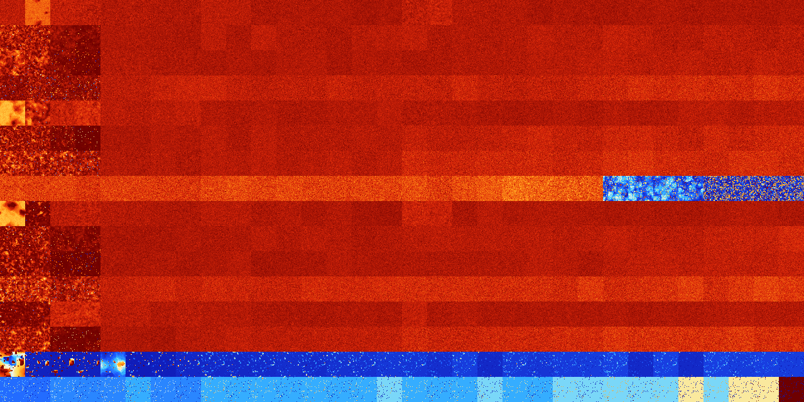

# B014567 (124416-124927)

<details>
    <summary>Initial Grid</summary>
    
</details>


<details>
    <summary>Initial Grid RLE</summary>

```
#C Exported from GoGoL (https://github.com/marrow16/gogol)
#C Wrap mode: Toroidal
#C Boundary mode: Dead
#C Step: 0
x = 100, y = 100, rule = B014567/S
4bo26bo27bo2bo12bo12bo9bo$17bo13bo3b2o2bo6bo21bo8bo$3bo38bo18bo13bo$o6b
o19b2o6bo10bo13bo23b2o3bo7bo$5bo7bo28bo13bo37bo$22bo43bo13bo$17bo21bo4b
o4bo5bo6bo19bo16bo$8bo10bo28bo13bo$7bo10bo5bo19bob2o9bo6b2o9bo$21bo2bo
4bo3bo2bo52bo$22bo76bo$27bo15bo40bo$3bo8bo21bo13bo13bo$b2o27bo57bo$37bo
3bo6bo6bo6bo$4bobo8bo4bo2b2o5bo8bo30bo14bo2bo10bo$o36bo19bo16bo12bo$9bo
56bo27bo$8bo56bobobo6bo21bo$6bo24bo49bo$100b$18bo42bo18bo6b2o$4bo5bo20b
o2bo$17bo49bo3b2o$10bo18bob2obo6bo51bo$35bo57bo$18bo15bo16bo34bo4bobo$b
o25bo5bo7bo14bo$19bo15bo32bo2bo7bo16bo$4bobo19bo8bo6bo2bo28bo16bo$2bo
17bo8bo21bo2bo9bo12bobo$4bo9bobo81bo$77bo5bo13bo$26bo2bo37b2o$7bo7bo10b
o26bo18bo3bo19bo$7b2o11bo38bo9bo18bo$14bo2b2o35bo15bo16bo$4bo34bo8bo3bo
34b2o$8bo24bo7bo10bo$5bo10bo13b2o16bo41bo$38bo42bo3bo$bo12bo8bo6bo37bo
23b2o3bo$10bo10bo22bo3bo7bo2bo$5bo49bo2bo11bo4bo4bo$59bo14bobo20bo$13bo
8bo4bo14bo5bo7bo23bo10b2o$3bo41bo11bo14bo$6bo16bo43bo$12bo44bo7bo25bobo
$5bo11bo71bo$17bo33bo27bo$19bo5bo16bo26bo15bo4bo$24b3o53bo2bo5bo$19bo
16bo4bo28bo5bo3bo4bobo$10b2o24bo10bo$29bo18bo22bo10bo10bo4bo$3bo4bo2bo
18bo7bo19bo2bo2bobo5bo$12bo22bo18bo3bo$bo6bo62bo6bobo$16bo28bo29bo23bo$
4bo4bo15bo34bo$14bo7bo3bo31bo30bo$4bo30bo13bo6bo9bo$5bo31bo14b2o16bo23b
o$o10bo18bo33bo8bo$28bo9bo3bo9bobo12bo13bo2bo$3bo6bo4bo51bo25bo$11bo10b
o15bo28bo11bo8bo$22b2o4bo2bo17bo10bo$43bo19bo8bo$56bo$3bo3b2o5bo$3bo3bo
39bo11bobo2bo20bo6bo6bo$18bo2bo2bo4bo11bo32bo$89bo$13bobo14b2o15b2o23bo
2bo9bo9bo$16bo25bob2o41bo10bo$17bo18bo18bo7bo3bo28bo$5b2o9bo4bobo40bo$
8bo3bo12b2o2bo26bo34bo$28bo8b2o19bo19bo3bo13bo$8bo3bo11bo23bo3bo$o17bo
12bo11b2o16bo$16bo3bo23bo4bo38bo6bo$bo3bo14bo46bo$30bo8bo22bo29bo$37b2o
50bo3bo$bo18bo9bo$o26bo51bo5bo11bo$56bo15bo25bo$14bo4b2o18bo51bo$9bo42b
o34bo$bo19bo23bo3bo3bo3bo$10bo7bobo23bo50bo$20bobo12bo15bo8bo$2bo10bo
13b2o8bo10bo18bo4bo$11bo83bo$31bo3bob2o3bo15bo4bo8bo4bo$30bo50bo$9bo10b
o22bo5bo2bo21bo7bo5bo5bo!
```
</details>
<details>
    <summary>Thumbnail</summary>

</details>
<table>
<tr>
    <td><a href="./124416%20S%20Heat%20Map%20Activity.png"></a><br>S (124416)<br>G>1000</td>    <td><a href="./124417%20S0%20Heat%20Map%20Activity.png"></a><br>S0 (124417)<br>G>1000</td>    <td><a href="./124418%20S1%20Heat%20Map%20Activity.png"></a><br>S1 (124418)<br>G>1000</td>    <td><a href="./124419%20S01%20Heat%20Map%20Activity.png"></a><br>S01 (124419)<br>G>1000</td>    <td><a href="./124420%20S2%20Heat%20Map%20Activity.png"></a><br>S2 (124420)<br>G>1000</td>    <td><a href="./124421%20S02%20Heat%20Map%20Activity.png"></a><br>S02 (124421)<br>G>1000</td>    <td><a href="./124422%20S12%20Heat%20Map%20Activity.png"></a><br>S12 (124422)<br>G>1000</td>    <td><a href="./124423%20S012%20Heat%20Map%20Activity.png"></a><br>S012 (124423)<br>G>1000</td>    <td><a href="./124424%20S3%20Heat%20Map%20Activity.png"></a><br>S3 (124424)<br>G>1000</td>    <td><a href="./124425%20S03%20Heat%20Map%20Activity.png"></a><br>S03 (124425)<br>G>1000</td>    <td><a href="./124426%20S13%20Heat%20Map%20Activity.png"></a><br>S13 (124426)<br>G>1000</td>    <td><a href="./124427%20S013%20Heat%20Map%20Activity.png"></a><br>S013 (124427)<br>G>1000</td>    <td><a href="./124428%20S23%20Heat%20Map%20Activity.png"></a><br>S23 (124428)<br>G>1000</td>    <td><a href="./124429%20S023%20Heat%20Map%20Activity.png"></a><br>S023 (124429)<br>G>1000</td>    <td><a href="./124430%20S123%20Heat%20Map%20Activity.png"></a><br>S123 (124430)<br>G>1000</td>    <td><a href="./124431%20S0123%20Heat%20Map%20Activity.png"></a><br>S0123 (124431)<br>G>1000</td>    <td><a href="./124432%20S4%20Heat%20Map%20Activity.png"></a><br>S4 (124432)<br>G>1000</td>    <td><a href="./124433%20S04%20Heat%20Map%20Activity.png"></a><br>S04 (124433)<br>G>1000</td>    <td><a href="./124434%20S14%20Heat%20Map%20Activity.png"></a><br>S14 (124434)<br>G>1000</td>    <td><a href="./124435%20S014%20Heat%20Map%20Activity.png"></a><br>S014 (124435)<br>G>1000</td>    <td><a href="./124436%20S24%20Heat%20Map%20Activity.png"></a><br>S24 (124436)<br>G>1000</td>    <td><a href="./124437%20S024%20Heat%20Map%20Activity.png"></a><br>S024 (124437)<br>G>1000</td>    <td><a href="./124438%20S124%20Heat%20Map%20Activity.png"></a><br>S124 (124438)<br>G>1000</td>    <td><a href="./124439%20S0124%20Heat%20Map%20Activity.png"></a><br>S0124 (124439)<br>G>1000</td>    <td><a href="./124440%20S34%20Heat%20Map%20Activity.png"></a><br>S34 (124440)<br>G>1000</td>    <td><a href="./124441%20S034%20Heat%20Map%20Activity.png"></a><br>S034 (124441)<br>G>1000</td>    <td><a href="./124442%20S134%20Heat%20Map%20Activity.png"></a><br>S134 (124442)<br>G>1000</td>    <td><a href="./124443%20S0134%20Heat%20Map%20Activity.png"></a><br>S0134 (124443)<br>G>1000</td>    <td><a href="./124444%20S234%20Heat%20Map%20Activity.png"></a><br>S234 (124444)<br>G>1000</td>    <td><a href="./124445%20S0234%20Heat%20Map%20Activity.png"></a><br>S0234 (124445)<br>G>1000</td>    <td><a href="./124446%20S1234%20Heat%20Map%20Activity.png"></a><br>S1234 (124446)<br>G>1000</td>    <td><a href="./124447%20S01234%20Heat%20Map%20Activity.png"></a><br>S01234 (124447)<br>G>1000</td></tr>
<tr>
    <td><a href="./124448%20S5%20Heat%20Map%20Activity.png"></a><br>S5 (124448)<br>R@84,p12</td>    <td><a href="./124449%20S05%20Heat%20Map%20Activity.png"></a><br>S05 (124449)<br>R@92,p12</td>    <td><a href="./124450%20S15%20Heat%20Map%20Activity.png"></a><br>S15 (124450)<br>G>1000</td>    <td><a href="./124451%20S015%20Heat%20Map%20Activity.png"></a><br>S015 (124451)<br>G>1000</td>    <td><a href="./124452%20S25%20Heat%20Map%20Activity.png"></a><br>S25 (124452)<br>G>1000</td>    <td><a href="./124453%20S025%20Heat%20Map%20Activity.png"></a><br>S025 (124453)<br>G>1000</td>    <td><a href="./124454%20S125%20Heat%20Map%20Activity.png"></a><br>S125 (124454)<br>G>1000</td>    <td><a href="./124455%20S0125%20Heat%20Map%20Activity.png"></a><br>S0125 (124455)<br>G>1000</td>    <td><a href="./124456%20S35%20Heat%20Map%20Activity.png"></a><br>S35 (124456)<br>G>1000</td>    <td><a href="./124457%20S035%20Heat%20Map%20Activity.png"></a><br>S035 (124457)<br>G>1000</td>    <td><a href="./124458%20S135%20Heat%20Map%20Activity.png"></a><br>S135 (124458)<br>G>1000</td>    <td><a href="./124459%20S0135%20Heat%20Map%20Activity.png"></a><br>S0135 (124459)<br>G>1000</td>    <td><a href="./124460%20S235%20Heat%20Map%20Activity.png"></a><br>S235 (124460)<br>G>1000</td>    <td><a href="./124461%20S0235%20Heat%20Map%20Activity.png"></a><br>S0235 (124461)<br>G>1000</td>    <td><a href="./124462%20S1235%20Heat%20Map%20Activity.png"></a><br>S1235 (124462)<br>G>1000</td>    <td><a href="./124463%20S01235%20Heat%20Map%20Activity.png"></a><br>S01235 (124463)<br>G>1000</td>    <td><a href="./124464%20S45%20Heat%20Map%20Activity.png"></a><br>S45 (124464)<br>G>1000</td>    <td><a href="./124465%20S045%20Heat%20Map%20Activity.png"></a><br>S045 (124465)<br>G>1000</td>    <td><a href="./124466%20S145%20Heat%20Map%20Activity.png"></a><br>S145 (124466)<br>G>1000</td>    <td><a href="./124467%20S0145%20Heat%20Map%20Activity.png"></a><br>S0145 (124467)<br>G>1000</td>    <td><a href="./124468%20S245%20Heat%20Map%20Activity.png"></a><br>S245 (124468)<br>G>1000</td>    <td><a href="./124469%20S0245%20Heat%20Map%20Activity.png"></a><br>S0245 (124469)<br>G>1000</td>    <td><a href="./124470%20S1245%20Heat%20Map%20Activity.png"></a><br>S1245 (124470)<br>G>1000</td>    <td><a href="./124471%20S01245%20Heat%20Map%20Activity.png"></a><br>S01245 (124471)<br>G>1000</td>    <td><a href="./124472%20S345%20Heat%20Map%20Activity.png"></a><br>S345 (124472)<br>G>1000</td>    <td><a href="./124473%20S0345%20Heat%20Map%20Activity.png"></a><br>S0345 (124473)<br>G>1000</td>    <td><a href="./124474%20S1345%20Heat%20Map%20Activity.png"></a><br>S1345 (124474)<br>G>1000</td>    <td><a href="./124475%20S01345%20Heat%20Map%20Activity.png"></a><br>S01345 (124475)<br>G>1000</td>    <td><a href="./124476%20S2345%20Heat%20Map%20Activity.png"></a><br>S2345 (124476)<br>G>1000</td>    <td><a href="./124477%20S02345%20Heat%20Map%20Activity.png"></a><br>S02345 (124477)<br>G>1000</td>    <td><a href="./124478%20S12345%20Heat%20Map%20Activity.png"></a><br>S12345 (124478)<br>G>1000</td>    <td><a href="./124479%20S012345%20Heat%20Map%20Activity.png"></a><br>S012345 (124479)<br>G>1000</td></tr>
<tr>
    <td><a href="./124480%20S6%20Heat%20Map%20Activity.png"></a><br>S6 (124480)<br>R@250,p8</td>    <td><a href="./124481%20S06%20Heat%20Map%20Activity.png"></a><br>S06 (124481)<br>R@163,p36</td>    <td><a href="./124482%20S16%20Heat%20Map%20Activity.png"></a><br>S16 (124482)<br>R@576,p336</td>    <td><a href="./124483%20S016%20Heat%20Map%20Activity.png"></a><br>S016 (124483)<br>G>1000</td>    <td><a href="./124484%20S26%20Heat%20Map%20Activity.png"></a><br>S26 (124484)<br>G>1000</td>    <td><a href="./124485%20S026%20Heat%20Map%20Activity.png"></a><br>S026 (124485)<br>G>1000</td>    <td><a href="./124486%20S126%20Heat%20Map%20Activity.png"></a><br>S126 (124486)<br>G>1000</td>    <td><a href="./124487%20S0126%20Heat%20Map%20Activity.png"></a><br>S0126 (124487)<br>G>1000</td>    <td><a href="./124488%20S36%20Heat%20Map%20Activity.png"></a><br>S36 (124488)<br>G>1000</td>    <td><a href="./124489%20S036%20Heat%20Map%20Activity.png"></a><br>S036 (124489)<br>G>1000</td>    <td><a href="./124490%20S136%20Heat%20Map%20Activity.png"></a><br>S136 (124490)<br>G>1000</td>    <td><a href="./124491%20S0136%20Heat%20Map%20Activity.png"></a><br>S0136 (124491)<br>G>1000</td>    <td><a href="./124492%20S236%20Heat%20Map%20Activity.png"></a><br>S236 (124492)<br>G>1000</td>    <td><a href="./124493%20S0236%20Heat%20Map%20Activity.png"></a><br>S0236 (124493)<br>G>1000</td>    <td><a href="./124494%20S1236%20Heat%20Map%20Activity.png"></a><br>S1236 (124494)<br>G>1000</td>    <td><a href="./124495%20S01236%20Heat%20Map%20Activity.png"></a><br>S01236 (124495)<br>G>1000</td>    <td><a href="./124496%20S46%20Heat%20Map%20Activity.png"></a><br>S46 (124496)<br>G>1000</td>    <td><a href="./124497%20S046%20Heat%20Map%20Activity.png"></a><br>S046 (124497)<br>G>1000</td>    <td><a href="./124498%20S146%20Heat%20Map%20Activity.png"></a><br>S146 (124498)<br>G>1000</td>    <td><a href="./124499%20S0146%20Heat%20Map%20Activity.png"></a><br>S0146 (124499)<br>G>1000</td>    <td><a href="./124500%20S246%20Heat%20Map%20Activity.png"></a><br>S246 (124500)<br>G>1000</td>    <td><a href="./124501%20S0246%20Heat%20Map%20Activity.png"></a><br>S0246 (124501)<br>G>1000</td>    <td><a href="./124502%20S1246%20Heat%20Map%20Activity.png"></a><br>S1246 (124502)<br>G>1000</td>    <td><a href="./124503%20S01246%20Heat%20Map%20Activity.png"></a><br>S01246 (124503)<br>G>1000</td>    <td><a href="./124504%20S346%20Heat%20Map%20Activity.png"></a><br>S346 (124504)<br>G>1000</td>    <td><a href="./124505%20S0346%20Heat%20Map%20Activity.png"></a><br>S0346 (124505)<br>G>1000</td>    <td><a href="./124506%20S1346%20Heat%20Map%20Activity.png"></a><br>S1346 (124506)<br>G>1000</td>    <td><a href="./124507%20S01346%20Heat%20Map%20Activity.png"></a><br>S01346 (124507)<br>G>1000</td>    <td><a href="./124508%20S2346%20Heat%20Map%20Activity.png"></a><br>S2346 (124508)<br>G>1000</td>    <td><a href="./124509%20S02346%20Heat%20Map%20Activity.png"></a><br>S02346 (124509)<br>G>1000</td>    <td><a href="./124510%20S12346%20Heat%20Map%20Activity.png"></a><br>S12346 (124510)<br>G>1000</td>    <td><a href="./124511%20S012346%20Heat%20Map%20Activity.png"></a><br>S012346 (124511)<br>G>1000</td></tr>
<tr>
    <td><a href="./124512%20S56%20Heat%20Map%20Activity.png"></a><br>S56 (124512)<br>R@110,p60</td>    <td><a href="./124513%20S056%20Heat%20Map%20Activity.png"></a><br>S056 (124513)<br>R@67,p12</td>    <td><a href="./124514%20S156%20Heat%20Map%20Activity.png"></a><br>S156 (124514)<br>R@187,p60</td>    <td><a href="./124515%20S0156%20Heat%20Map%20Activity.png"></a><br>S0156 (124515)<br>R@192,p24</td>    <td><a href="./124516%20S256%20Heat%20Map%20Activity.png"></a><br>S256 (124516)<br>G>1000</td>    <td><a href="./124517%20S0256%20Heat%20Map%20Activity.png"></a><br>S0256 (124517)<br>G>1000</td>    <td><a href="./124518%20S1256%20Heat%20Map%20Activity.png"></a><br>S1256 (124518)<br>G>1000</td>    <td><a href="./124519%20S01256%20Heat%20Map%20Activity.png"></a><br>S01256 (124519)<br>G>1000</td>    <td><a href="./124520%20S356%20Heat%20Map%20Activity.png"></a><br>S356 (124520)<br>G>1000</td>    <td><a href="./124521%20S0356%20Heat%20Map%20Activity.png"></a><br>S0356 (124521)<br>G>1000</td>    <td><a href="./124522%20S1356%20Heat%20Map%20Activity.png"></a><br>S1356 (124522)<br>G>1000</td>    <td><a href="./124523%20S01356%20Heat%20Map%20Activity.png"></a><br>S01356 (124523)<br>G>1000</td>    <td><a href="./124524%20S2356%20Heat%20Map%20Activity.png"></a><br>S2356 (124524)<br>G>1000</td>    <td><a href="./124525%20S02356%20Heat%20Map%20Activity.png"></a><br>S02356 (124525)<br>G>1000</td>    <td><a href="./124526%20S12356%20Heat%20Map%20Activity.png"></a><br>S12356 (124526)<br>G>1000</td>    <td><a href="./124527%20S012356%20Heat%20Map%20Activity.png"></a><br>S012356 (124527)<br>G>1000</td>    <td><a href="./124528%20S456%20Heat%20Map%20Activity.png"></a><br>S456 (124528)<br>G>1000</td>    <td><a href="./124529%20S0456%20Heat%20Map%20Activity.png"></a><br>S0456 (124529)<br>G>1000</td>    <td><a href="./124530%20S1456%20Heat%20Map%20Activity.png"></a><br>S1456 (124530)<br>G>1000</td>    <td><a href="./124531%20S01456%20Heat%20Map%20Activity.png"></a><br>S01456 (124531)<br>G>1000</td>    <td><a href="./124532%20S2456%20Heat%20Map%20Activity.png"></a><br>S2456 (124532)<br>G>1000</td>    <td><a href="./124533%20S02456%20Heat%20Map%20Activity.png"></a><br>S02456 (124533)<br>G>1000</td>    <td><a href="./124534%20S12456%20Heat%20Map%20Activity.png"></a><br>S12456 (124534)<br>G>1000</td>    <td><a href="./124535%20S012456%20Heat%20Map%20Activity.png"></a><br>S012456 (124535)<br>G>1000</td>    <td><a href="./124536%20S3456%20Heat%20Map%20Activity.png"></a><br>S3456 (124536)<br>G>1000</td>    <td><a href="./124537%20S03456%20Heat%20Map%20Activity.png"></a><br>S03456 (124537)<br>G>1000</td>    <td><a href="./124538%20S13456%20Heat%20Map%20Activity.png"></a><br>S13456 (124538)<br>G>1000</td>    <td><a href="./124539%20S013456%20Heat%20Map%20Activity.png"></a><br>S013456 (124539)<br>G>1000</td>    <td><a href="./124540%20S23456%20Heat%20Map%20Activity.png"></a><br>S23456 (124540)<br>G>1000</td>    <td><a href="./124541%20S023456%20Heat%20Map%20Activity.png"></a><br>S023456 (124541)<br>G>1000</td>    <td><a href="./124542%20S123456%20Heat%20Map%20Activity.png"></a><br>S123456 (124542)<br>G>1000</td>    <td><a href="./124543%20S0123456%20Heat%20Map%20Activity.png"></a><br>S0123456 (124543)<br>G>1000</td></tr>
<tr>
    <td><a href="./124544%20S7%20Heat%20Map%20Activity.png"></a><br>S7 (124544)<br>G>1000</td>    <td><a href="./124545%20S07%20Heat%20Map%20Activity.png"></a><br>S07 (124545)<br>R@500,p60</td>    <td><a href="./124546%20S17%20Heat%20Map%20Activity.png"></a><br>S17 (124546)<br>G>1000</td>    <td><a href="./124547%20S017%20Heat%20Map%20Activity.png"></a><br>S017 (124547)<br>G>1000</td>    <td><a href="./124548%20S27%20Heat%20Map%20Activity.png"></a><br>S27 (124548)<br>G>1000</td>    <td><a href="./124549%20S027%20Heat%20Map%20Activity.png"></a><br>S027 (124549)<br>G>1000</td>    <td><a href="./124550%20S127%20Heat%20Map%20Activity.png"></a><br>S127 (124550)<br>G>1000</td>    <td><a href="./124551%20S0127%20Heat%20Map%20Activity.png"></a><br>S0127 (124551)<br>G>1000</td>    <td><a href="./124552%20S37%20Heat%20Map%20Activity.png"></a><br>S37 (124552)<br>G>1000</td>    <td><a href="./124553%20S037%20Heat%20Map%20Activity.png"></a><br>S037 (124553)<br>G>1000</td>    <td><a href="./124554%20S137%20Heat%20Map%20Activity.png"></a><br>S137 (124554)<br>G>1000</td>    <td><a href="./124555%20S0137%20Heat%20Map%20Activity.png"></a><br>S0137 (124555)<br>G>1000</td>    <td><a href="./124556%20S237%20Heat%20Map%20Activity.png"></a><br>S237 (124556)<br>G>1000</td>    <td><a href="./124557%20S0237%20Heat%20Map%20Activity.png"></a><br>S0237 (124557)<br>G>1000</td>    <td><a href="./124558%20S1237%20Heat%20Map%20Activity.png"></a><br>S1237 (124558)<br>G>1000</td>    <td><a href="./124559%20S01237%20Heat%20Map%20Activity.png"></a><br>S01237 (124559)<br>G>1000</td>    <td><a href="./124560%20S47%20Heat%20Map%20Activity.png"></a><br>S47 (124560)<br>G>1000</td>    <td><a href="./124561%20S047%20Heat%20Map%20Activity.png"></a><br>S047 (124561)<br>G>1000</td>    <td><a href="./124562%20S147%20Heat%20Map%20Activity.png"></a><br>S147 (124562)<br>G>1000</td>    <td><a href="./124563%20S0147%20Heat%20Map%20Activity.png"></a><br>S0147 (124563)<br>G>1000</td>    <td><a href="./124564%20S247%20Heat%20Map%20Activity.png"></a><br>S247 (124564)<br>G>1000</td>    <td><a href="./124565%20S0247%20Heat%20Map%20Activity.png"></a><br>S0247 (124565)<br>G>1000</td>    <td><a href="./124566%20S1247%20Heat%20Map%20Activity.png"></a><br>S1247 (124566)<br>G>1000</td>    <td><a href="./124567%20S01247%20Heat%20Map%20Activity.png"></a><br>S01247 (124567)<br>G>1000</td>    <td><a href="./124568%20S347%20Heat%20Map%20Activity.png"></a><br>S347 (124568)<br>G>1000</td>    <td><a href="./124569%20S0347%20Heat%20Map%20Activity.png"></a><br>S0347 (124569)<br>G>1000</td>    <td><a href="./124570%20S1347%20Heat%20Map%20Activity.png"></a><br>S1347 (124570)<br>G>1000</td>    <td><a href="./124571%20S01347%20Heat%20Map%20Activity.png"></a><br>S01347 (124571)<br>G>1000</td>    <td><a href="./124572%20S2347%20Heat%20Map%20Activity.png"></a><br>S2347 (124572)<br>G>1000</td>    <td><a href="./124573%20S02347%20Heat%20Map%20Activity.png"></a><br>S02347 (124573)<br>G>1000</td>    <td><a href="./124574%20S12347%20Heat%20Map%20Activity.png"></a><br>S12347 (124574)<br>G>1000</td>    <td><a href="./124575%20S012347%20Heat%20Map%20Activity.png"></a><br>S012347 (124575)<br>G>1000</td></tr>
<tr>
    <td><a href="./124576%20S57%20Heat%20Map%20Activity.png"></a><br>S57 (124576)<br>R@64,p12</td>    <td><a href="./124577%20S057%20Heat%20Map%20Activity.png"></a><br>S057 (124577)<br>R@64,p12</td>    <td><a href="./124578%20S157%20Heat%20Map%20Activity.png"></a><br>S157 (124578)<br>R@301,p24</td>    <td><a href="./124579%20S0157%20Heat%20Map%20Activity.png"></a><br>S0157 (124579)<br>G>1000</td>    <td><a href="./124580%20S257%20Heat%20Map%20Activity.png"></a><br>S257 (124580)<br>G>1000</td>    <td><a href="./124581%20S0257%20Heat%20Map%20Activity.png"></a><br>S0257 (124581)<br>G>1000</td>    <td><a href="./124582%20S1257%20Heat%20Map%20Activity.png"></a><br>S1257 (124582)<br>G>1000</td>    <td><a href="./124583%20S01257%20Heat%20Map%20Activity.png"></a><br>S01257 (124583)<br>G>1000</td>    <td><a href="./124584%20S357%20Heat%20Map%20Activity.png"></a><br>S357 (124584)<br>G>1000</td>    <td><a href="./124585%20S0357%20Heat%20Map%20Activity.png"></a><br>S0357 (124585)<br>G>1000</td>    <td><a href="./124586%20S1357%20Heat%20Map%20Activity.png"></a><br>S1357 (124586)<br>G>1000</td>    <td><a href="./124587%20S01357%20Heat%20Map%20Activity.png"></a><br>S01357 (124587)<br>G>1000</td>    <td><a href="./124588%20S2357%20Heat%20Map%20Activity.png"></a><br>S2357 (124588)<br>G>1000</td>    <td><a href="./124589%20S02357%20Heat%20Map%20Activity.png"></a><br>S02357 (124589)<br>G>1000</td>    <td><a href="./124590%20S12357%20Heat%20Map%20Activity.png"></a><br>S12357 (124590)<br>G>1000</td>    <td><a href="./124591%20S012357%20Heat%20Map%20Activity.png"></a><br>S012357 (124591)<br>G>1000</td>    <td><a href="./124592%20S457%20Heat%20Map%20Activity.png"></a><br>S457 (124592)<br>G>1000</td>    <td><a href="./124593%20S0457%20Heat%20Map%20Activity.png"></a><br>S0457 (124593)<br>G>1000</td>    <td><a href="./124594%20S1457%20Heat%20Map%20Activity.png"></a><br>S1457 (124594)<br>G>1000</td>    <td><a href="./124595%20S01457%20Heat%20Map%20Activity.png"></a><br>S01457 (124595)<br>G>1000</td>    <td><a href="./124596%20S2457%20Heat%20Map%20Activity.png"></a><br>S2457 (124596)<br>G>1000</td>    <td><a href="./124597%20S02457%20Heat%20Map%20Activity.png"></a><br>S02457 (124597)<br>G>1000</td>    <td><a href="./124598%20S12457%20Heat%20Map%20Activity.png"></a><br>S12457 (124598)<br>G>1000</td>    <td><a href="./124599%20S012457%20Heat%20Map%20Activity.png"></a><br>S012457 (124599)<br>G>1000</td>    <td><a href="./124600%20S3457%20Heat%20Map%20Activity.png"></a><br>S3457 (124600)<br>G>1000</td>    <td><a href="./124601%20S03457%20Heat%20Map%20Activity.png"></a><br>S03457 (124601)<br>G>1000</td>    <td><a href="./124602%20S13457%20Heat%20Map%20Activity.png"></a><br>S13457 (124602)<br>G>1000</td>    <td><a href="./124603%20S013457%20Heat%20Map%20Activity.png"></a><br>S013457 (124603)<br>G>1000</td>    <td><a href="./124604%20S23457%20Heat%20Map%20Activity.png"></a><br>S23457 (124604)<br>G>1000</td>    <td><a href="./124605%20S023457%20Heat%20Map%20Activity.png"></a><br>S023457 (124605)<br>G>1000</td>    <td><a href="./124606%20S123457%20Heat%20Map%20Activity.png"></a><br>S123457 (124606)<br>G>1000</td>    <td><a href="./124607%20S0123457%20Heat%20Map%20Activity.png"></a><br>S0123457 (124607)<br>G>1000</td></tr>
<tr>
    <td><a href="./124608%20S67%20Heat%20Map%20Activity.png"></a><br>S67 (124608)<br>R@115,p8</td>    <td><a href="./124609%20S067%20Heat%20Map%20Activity.png"></a><br>S067 (124609)<br>R@96,p12</td>    <td><a href="./124610%20S167%20Heat%20Map%20Activity.png"></a><br>S167 (124610)<br>R@95,p12</td>    <td><a href="./124611%20S0167%20Heat%20Map%20Activity.png"></a><br>S0167 (124611)<br>R@101,p6</td>    <td><a href="./124612%20S267%20Heat%20Map%20Activity.png"></a><br>S267 (124612)<br>G>1000</td>    <td><a href="./124613%20S0267%20Heat%20Map%20Activity.png"></a><br>S0267 (124613)<br>G>1000</td>    <td><a href="./124614%20S1267%20Heat%20Map%20Activity.png"></a><br>S1267 (124614)<br>G>1000</td>    <td><a href="./124615%20S01267%20Heat%20Map%20Activity.png"></a><br>S01267 (124615)<br>G>1000</td>    <td><a href="./124616%20S367%20Heat%20Map%20Activity.png"></a><br>S367 (124616)<br>G>1000</td>    <td><a href="./124617%20S0367%20Heat%20Map%20Activity.png"></a><br>S0367 (124617)<br>G>1000</td>    <td><a href="./124618%20S1367%20Heat%20Map%20Activity.png"></a><br>S1367 (124618)<br>G>1000</td>    <td><a href="./124619%20S01367%20Heat%20Map%20Activity.png"></a><br>S01367 (124619)<br>G>1000</td>    <td><a href="./124620%20S2367%20Heat%20Map%20Activity.png"></a><br>S2367 (124620)<br>G>1000</td>    <td><a href="./124621%20S02367%20Heat%20Map%20Activity.png"></a><br>S02367 (124621)<br>G>1000</td>    <td><a href="./124622%20S12367%20Heat%20Map%20Activity.png"></a><br>S12367 (124622)<br>G>1000</td>    <td><a href="./124623%20S012367%20Heat%20Map%20Activity.png"></a><br>S012367 (124623)<br>G>1000</td>    <td><a href="./124624%20S467%20Heat%20Map%20Activity.png"></a><br>S467 (124624)<br>G>1000</td>    <td><a href="./124625%20S0467%20Heat%20Map%20Activity.png"></a><br>S0467 (124625)<br>G>1000</td>    <td><a href="./124626%20S1467%20Heat%20Map%20Activity.png"></a><br>S1467 (124626)<br>G>1000</td>    <td><a href="./124627%20S01467%20Heat%20Map%20Activity.png"></a><br>S01467 (124627)<br>G>1000</td>    <td><a href="./124628%20S2467%20Heat%20Map%20Activity.png"></a><br>S2467 (124628)<br>G>1000</td>    <td><a href="./124629%20S02467%20Heat%20Map%20Activity.png"></a><br>S02467 (124629)<br>G>1000</td>    <td><a href="./124630%20S12467%20Heat%20Map%20Activity.png"></a><br>S12467 (124630)<br>G>1000</td>    <td><a href="./124631%20S012467%20Heat%20Map%20Activity.png"></a><br>S012467 (124631)<br>G>1000</td>    <td><a href="./124632%20S3467%20Heat%20Map%20Activity.png"></a><br>S3467 (124632)<br>G>1000</td>    <td><a href="./124633%20S03467%20Heat%20Map%20Activity.png"></a><br>S03467 (124633)<br>G>1000</td>    <td><a href="./124634%20S13467%20Heat%20Map%20Activity.png"></a><br>S13467 (124634)<br>G>1000</td>    <td><a href="./124635%20S013467%20Heat%20Map%20Activity.png"></a><br>S013467 (124635)<br>G>1000</td>    <td><a href="./124636%20S23467%20Heat%20Map%20Activity.png"></a><br>S23467 (124636)<br>G>1000</td>    <td><a href="./124637%20S023467%20Heat%20Map%20Activity.png"></a><br>S023467 (124637)<br>G>1000</td>    <td><a href="./124638%20S123467%20Heat%20Map%20Activity.png"></a><br>S123467 (124638)<br>G>1000</td>    <td><a href="./124639%20S0123467%20Heat%20Map%20Activity.png"></a><br>S0123467 (124639)<br>G>1000</td></tr>
<tr>
    <td><a href="./124640%20S567%20Heat%20Map%20Activity.png"></a><br>S567 (124640)<br>G>1000</td>    <td><a href="./124641%20S0567%20Heat%20Map%20Activity.png"></a><br>S0567 (124641)<br>G>1000</td>    <td><a href="./124642%20S1567%20Heat%20Map%20Activity.png"></a><br>S1567 (124642)<br>G>1000</td>    <td><a href="./124643%20S01567%20Heat%20Map%20Activity.png"></a><br>S01567 (124643)<br>G>1000</td>    <td><a href="./124644%20S2567%20Heat%20Map%20Activity.png"></a><br>S2567 (124644)<br>G>1000</td>    <td><a href="./124645%20S02567%20Heat%20Map%20Activity.png"></a><br>S02567 (124645)<br>G>1000</td>    <td><a href="./124646%20S12567%20Heat%20Map%20Activity.png"></a><br>S12567 (124646)<br>G>1000</td>    <td><a href="./124647%20S012567%20Heat%20Map%20Activity.png"></a><br>S012567 (124647)<br>G>1000</td>    <td><a href="./124648%20S3567%20Heat%20Map%20Activity.png"></a><br>S3567 (124648)<br>G>1000</td>    <td><a href="./124649%20S03567%20Heat%20Map%20Activity.png"></a><br>S03567 (124649)<br>G>1000</td>    <td><a href="./124650%20S13567%20Heat%20Map%20Activity.png"></a><br>S13567 (124650)<br>G>1000</td>    <td><a href="./124651%20S013567%20Heat%20Map%20Activity.png"></a><br>S013567 (124651)<br>G>1000</td>    <td><a href="./124652%20S23567%20Heat%20Map%20Activity.png"></a><br>S23567 (124652)<br>G>1000</td>    <td><a href="./124653%20S023567%20Heat%20Map%20Activity.png"></a><br>S023567 (124653)<br>G>1000</td>    <td><a href="./124654%20S123567%20Heat%20Map%20Activity.png"></a><br>S123567 (124654)<br>G>1000</td>    <td><a href="./124655%20S0123567%20Heat%20Map%20Activity.png"></a><br>S0123567 (124655)<br>G>1000</td>    <td><a href="./124656%20S4567%20Heat%20Map%20Activity.png"></a><br>S4567 (124656)<br>G>1000</td>    <td><a href="./124657%20S04567%20Heat%20Map%20Activity.png"></a><br>S04567 (124657)<br>G>1000</td>    <td><a href="./124658%20S14567%20Heat%20Map%20Activity.png"></a><br>S14567 (124658)<br>G>1000</td>    <td><a href="./124659%20S014567%20Heat%20Map%20Activity.png"></a><br>S014567 (124659)<br>G>1000</td>    <td><a href="./124660%20S24567%20Heat%20Map%20Activity.png"></a><br>S24567 (124660)<br>G>1000</td>    <td><a href="./124661%20S024567%20Heat%20Map%20Activity.png"></a><br>S024567 (124661)<br>G>1000</td>    <td><a href="./124662%20S124567%20Heat%20Map%20Activity.png"></a><br>S124567 (124662)<br>G>1000</td>    <td><a href="./124663%20S0124567%20Heat%20Map%20Activity.png"></a><br>S0124567 (124663)<br>G>1000</td>    <td><a href="./124664%20S34567%20Heat%20Map%20Activity.png"></a><br>S34567 (124664)<br>G>1000</td>    <td><a href="./124665%20S034567%20Heat%20Map%20Activity.png"></a><br>S034567 (124665)<br>G>1000</td>    <td><a href="./124666%20S134567%20Heat%20Map%20Activity.png"></a><br>S134567 (124666)<br>G>1000</td>    <td><a href="./124667%20S0134567%20Heat%20Map%20Activity.png"></a><br>S0134567 (124667)<br>G>1000</td>    <td><a href="./124668%20S234567%20Heat%20Map%20Activity.png"></a><br>S234567 (124668)<br>R@117,p36</td>    <td><a href="./124669%20S0234567%20Heat%20Map%20Activity.png"></a><br>S0234567 (124669)<br>R@165,p90</td>    <td><a href="./124670%20S1234567%20Heat%20Map%20Activity.png"></a><br>S1234567 (124670)<br>R@116,p18</td>    <td><a href="./124671%20S01234567%20Heat%20Map%20Activity.png"></a><br>S01234567 (124671)<br>R@150,p90</td></tr>
<tr>
    <td><a href="./124672%20S8%20Heat%20Map%20Activity.png"></a><br>S8 (124672)<br>G>1000</td>    <td><a href="./124673%20S08%20Heat%20Map%20Activity.png"></a><br>S08 (124673)<br>R@192,p20</td>    <td><a href="./124674%20S18%20Heat%20Map%20Activity.png"></a><br>S18 (124674)<br>G>1000</td>    <td><a href="./124675%20S018%20Heat%20Map%20Activity.png"></a><br>S018 (124675)<br>G>1000</td>    <td><a href="./124676%20S28%20Heat%20Map%20Activity.png"></a><br>S28 (124676)<br>G>1000</td>    <td><a href="./124677%20S028%20Heat%20Map%20Activity.png"></a><br>S028 (124677)<br>G>1000</td>    <td><a href="./124678%20S128%20Heat%20Map%20Activity.png"></a><br>S128 (124678)<br>G>1000</td>    <td><a href="./124679%20S0128%20Heat%20Map%20Activity.png"></a><br>S0128 (124679)<br>G>1000</td>    <td><a href="./124680%20S38%20Heat%20Map%20Activity.png"></a><br>S38 (124680)<br>G>1000</td>    <td><a href="./124681%20S038%20Heat%20Map%20Activity.png"></a><br>S038 (124681)<br>G>1000</td>    <td><a href="./124682%20S138%20Heat%20Map%20Activity.png"></a><br>S138 (124682)<br>G>1000</td>    <td><a href="./124683%20S0138%20Heat%20Map%20Activity.png"></a><br>S0138 (124683)<br>G>1000</td>    <td><a href="./124684%20S238%20Heat%20Map%20Activity.png"></a><br>S238 (124684)<br>G>1000</td>    <td><a href="./124685%20S0238%20Heat%20Map%20Activity.png"></a><br>S0238 (124685)<br>G>1000</td>    <td><a href="./124686%20S1238%20Heat%20Map%20Activity.png"></a><br>S1238 (124686)<br>G>1000</td>    <td><a href="./124687%20S01238%20Heat%20Map%20Activity.png"></a><br>S01238 (124687)<br>G>1000</td>    <td><a href="./124688%20S48%20Heat%20Map%20Activity.png"></a><br>S48 (124688)<br>G>1000</td>    <td><a href="./124689%20S048%20Heat%20Map%20Activity.png"></a><br>S048 (124689)<br>G>1000</td>    <td><a href="./124690%20S148%20Heat%20Map%20Activity.png"></a><br>S148 (124690)<br>G>1000</td>    <td><a href="./124691%20S0148%20Heat%20Map%20Activity.png"></a><br>S0148 (124691)<br>G>1000</td>    <td><a href="./124692%20S248%20Heat%20Map%20Activity.png"></a><br>S248 (124692)<br>G>1000</td>    <td><a href="./124693%20S0248%20Heat%20Map%20Activity.png"></a><br>S0248 (124693)<br>G>1000</td>    <td><a href="./124694%20S1248%20Heat%20Map%20Activity.png"></a><br>S1248 (124694)<br>G>1000</td>    <td><a href="./124695%20S01248%20Heat%20Map%20Activity.png"></a><br>S01248 (124695)<br>G>1000</td>    <td><a href="./124696%20S348%20Heat%20Map%20Activity.png"></a><br>S348 (124696)<br>G>1000</td>    <td><a href="./124697%20S0348%20Heat%20Map%20Activity.png"></a><br>S0348 (124697)<br>G>1000</td>    <td><a href="./124698%20S1348%20Heat%20Map%20Activity.png"></a><br>S1348 (124698)<br>G>1000</td>    <td><a href="./124699%20S01348%20Heat%20Map%20Activity.png"></a><br>S01348 (124699)<br>G>1000</td>    <td><a href="./124700%20S2348%20Heat%20Map%20Activity.png"></a><br>S2348 (124700)<br>G>1000</td>    <td><a href="./124701%20S02348%20Heat%20Map%20Activity.png"></a><br>S02348 (124701)<br>G>1000</td>    <td><a href="./124702%20S12348%20Heat%20Map%20Activity.png"></a><br>S12348 (124702)<br>G>1000</td>    <td><a href="./124703%20S012348%20Heat%20Map%20Activity.png"></a><br>S012348 (124703)<br>G>1000</td></tr>
<tr>
    <td><a href="./124704%20S58%20Heat%20Map%20Activity.png"></a><br>S58 (124704)<br>R@66,p4</td>    <td><a href="./124705%20S058%20Heat%20Map%20Activity.png"></a><br>S058 (124705)<br>R@63,p12</td>    <td><a href="./124706%20S158%20Heat%20Map%20Activity.png"></a><br>S158 (124706)<br>G>1000</td>    <td><a href="./124707%20S0158%20Heat%20Map%20Activity.png"></a><br>S0158 (124707)<br>G>1000</td>    <td><a href="./124708%20S258%20Heat%20Map%20Activity.png"></a><br>S258 (124708)<br>G>1000</td>    <td><a href="./124709%20S0258%20Heat%20Map%20Activity.png"></a><br>S0258 (124709)<br>G>1000</td>    <td><a href="./124710%20S1258%20Heat%20Map%20Activity.png"></a><br>S1258 (124710)<br>G>1000</td>    <td><a href="./124711%20S01258%20Heat%20Map%20Activity.png"></a><br>S01258 (124711)<br>G>1000</td>    <td><a href="./124712%20S358%20Heat%20Map%20Activity.png"></a><br>S358 (124712)<br>G>1000</td>    <td><a href="./124713%20S0358%20Heat%20Map%20Activity.png"></a><br>S0358 (124713)<br>G>1000</td>    <td><a href="./124714%20S1358%20Heat%20Map%20Activity.png"></a><br>S1358 (124714)<br>G>1000</td>    <td><a href="./124715%20S01358%20Heat%20Map%20Activity.png"></a><br>S01358 (124715)<br>G>1000</td>    <td><a href="./124716%20S2358%20Heat%20Map%20Activity.png"></a><br>S2358 (124716)<br>G>1000</td>    <td><a href="./124717%20S02358%20Heat%20Map%20Activity.png"></a><br>S02358 (124717)<br>G>1000</td>    <td><a href="./124718%20S12358%20Heat%20Map%20Activity.png"></a><br>S12358 (124718)<br>G>1000</td>    <td><a href="./124719%20S012358%20Heat%20Map%20Activity.png"></a><br>S012358 (124719)<br>G>1000</td>    <td><a href="./124720%20S458%20Heat%20Map%20Activity.png"></a><br>S458 (124720)<br>G>1000</td>    <td><a href="./124721%20S0458%20Heat%20Map%20Activity.png"></a><br>S0458 (124721)<br>G>1000</td>    <td><a href="./124722%20S1458%20Heat%20Map%20Activity.png"></a><br>S1458 (124722)<br>G>1000</td>    <td><a href="./124723%20S01458%20Heat%20Map%20Activity.png"></a><br>S01458 (124723)<br>G>1000</td>    <td><a href="./124724%20S2458%20Heat%20Map%20Activity.png"></a><br>S2458 (124724)<br>G>1000</td>    <td><a href="./124725%20S02458%20Heat%20Map%20Activity.png"></a><br>S02458 (124725)<br>G>1000</td>    <td><a href="./124726%20S12458%20Heat%20Map%20Activity.png"></a><br>S12458 (124726)<br>G>1000</td>    <td><a href="./124727%20S012458%20Heat%20Map%20Activity.png"></a><br>S012458 (124727)<br>G>1000</td>    <td><a href="./124728%20S3458%20Heat%20Map%20Activity.png"></a><br>S3458 (124728)<br>G>1000</td>    <td><a href="./124729%20S03458%20Heat%20Map%20Activity.png"></a><br>S03458 (124729)<br>G>1000</td>    <td><a href="./124730%20S13458%20Heat%20Map%20Activity.png"></a><br>S13458 (124730)<br>G>1000</td>    <td><a href="./124731%20S013458%20Heat%20Map%20Activity.png"></a><br>S013458 (124731)<br>G>1000</td>    <td><a href="./124732%20S23458%20Heat%20Map%20Activity.png"></a><br>S23458 (124732)<br>G>1000</td>    <td><a href="./124733%20S023458%20Heat%20Map%20Activity.png"></a><br>S023458 (124733)<br>G>1000</td>    <td><a href="./124734%20S123458%20Heat%20Map%20Activity.png"></a><br>S123458 (124734)<br>G>1000</td>    <td><a href="./124735%20S0123458%20Heat%20Map%20Activity.png"></a><br>S0123458 (124735)<br>G>1000</td></tr>
<tr>
    <td><a href="./124736%20S68%20Heat%20Map%20Activity.png"></a><br>S68 (124736)<br>R@124,p8</td>    <td><a href="./124737%20S068%20Heat%20Map%20Activity.png"></a><br>S068 (124737)<br>R@154,p60</td>    <td><a href="./124738%20S168%20Heat%20Map%20Activity.png"></a><br>S168 (124738)<br>G>1000</td>    <td><a href="./124739%20S0168%20Heat%20Map%20Activity.png"></a><br>S0168 (124739)<br>G>1000</td>    <td><a href="./124740%20S268%20Heat%20Map%20Activity.png"></a><br>S268 (124740)<br>G>1000</td>    <td><a href="./124741%20S0268%20Heat%20Map%20Activity.png"></a><br>S0268 (124741)<br>G>1000</td>    <td><a href="./124742%20S1268%20Heat%20Map%20Activity.png"></a><br>S1268 (124742)<br>G>1000</td>    <td><a href="./124743%20S01268%20Heat%20Map%20Activity.png"></a><br>S01268 (124743)<br>G>1000</td>    <td><a href="./124744%20S368%20Heat%20Map%20Activity.png"></a><br>S368 (124744)<br>G>1000</td>    <td><a href="./124745%20S0368%20Heat%20Map%20Activity.png"></a><br>S0368 (124745)<br>G>1000</td>    <td><a href="./124746%20S1368%20Heat%20Map%20Activity.png"></a><br>S1368 (124746)<br>G>1000</td>    <td><a href="./124747%20S01368%20Heat%20Map%20Activity.png"></a><br>S01368 (124747)<br>G>1000</td>    <td><a href="./124748%20S2368%20Heat%20Map%20Activity.png"></a><br>S2368 (124748)<br>G>1000</td>    <td><a href="./124749%20S02368%20Heat%20Map%20Activity.png"></a><br>S02368 (124749)<br>G>1000</td>    <td><a href="./124750%20S12368%20Heat%20Map%20Activity.png"></a><br>S12368 (124750)<br>G>1000</td>    <td><a href="./124751%20S012368%20Heat%20Map%20Activity.png"></a><br>S012368 (124751)<br>G>1000</td>    <td><a href="./124752%20S468%20Heat%20Map%20Activity.png"></a><br>S468 (124752)<br>G>1000</td>    <td><a href="./124753%20S0468%20Heat%20Map%20Activity.png"></a><br>S0468 (124753)<br>G>1000</td>    <td><a href="./124754%20S1468%20Heat%20Map%20Activity.png"></a><br>S1468 (124754)<br>G>1000</td>    <td><a href="./124755%20S01468%20Heat%20Map%20Activity.png"></a><br>S01468 (124755)<br>G>1000</td>    <td><a href="./124756%20S2468%20Heat%20Map%20Activity.png"></a><br>S2468 (124756)<br>G>1000</td>    <td><a href="./124757%20S02468%20Heat%20Map%20Activity.png"></a><br>S02468 (124757)<br>G>1000</td>    <td><a href="./124758%20S12468%20Heat%20Map%20Activity.png"></a><br>S12468 (124758)<br>G>1000</td>    <td><a href="./124759%20S012468%20Heat%20Map%20Activity.png"></a><br>S012468 (124759)<br>G>1000</td>    <td><a href="./124760%20S3468%20Heat%20Map%20Activity.png"></a><br>S3468 (124760)<br>G>1000</td>    <td><a href="./124761%20S03468%20Heat%20Map%20Activity.png"></a><br>S03468 (124761)<br>G>1000</td>    <td><a href="./124762%20S13468%20Heat%20Map%20Activity.png"></a><br>S13468 (124762)<br>G>1000</td>    <td><a href="./124763%20S013468%20Heat%20Map%20Activity.png"></a><br>S013468 (124763)<br>G>1000</td>    <td><a href="./124764%20S23468%20Heat%20Map%20Activity.png"></a><br>S23468 (124764)<br>G>1000</td>    <td><a href="./124765%20S023468%20Heat%20Map%20Activity.png"></a><br>S023468 (124765)<br>G>1000</td>    <td><a href="./124766%20S123468%20Heat%20Map%20Activity.png"></a><br>S123468 (124766)<br>G>1000</td>    <td><a href="./124767%20S0123468%20Heat%20Map%20Activity.png"></a><br>S0123468 (124767)<br>G>1000</td></tr>
<tr>
    <td><a href="./124768%20S568%20Heat%20Map%20Activity.png"></a><br>S568 (124768)<br>R@67,p6</td>    <td><a href="./124769%20S0568%20Heat%20Map%20Activity.png"></a><br>S0568 (124769)<br>R@89,p12</td>    <td><a href="./124770%20S1568%20Heat%20Map%20Activity.png"></a><br>S1568 (124770)<br>R@213,p24</td>    <td><a href="./124771%20S01568%20Heat%20Map%20Activity.png"></a><br>S01568 (124771)<br>R@197,p24</td>    <td><a href="./124772%20S2568%20Heat%20Map%20Activity.png"></a><br>S2568 (124772)<br>G>1000</td>    <td><a href="./124773%20S02568%20Heat%20Map%20Activity.png"></a><br>S02568 (124773)<br>G>1000</td>    <td><a href="./124774%20S12568%20Heat%20Map%20Activity.png"></a><br>S12568 (124774)<br>G>1000</td>    <td><a href="./124775%20S012568%20Heat%20Map%20Activity.png"></a><br>S012568 (124775)<br>G>1000</td>    <td><a href="./124776%20S3568%20Heat%20Map%20Activity.png"></a><br>S3568 (124776)<br>G>1000</td>    <td><a href="./124777%20S03568%20Heat%20Map%20Activity.png"></a><br>S03568 (124777)<br>G>1000</td>    <td><a href="./124778%20S13568%20Heat%20Map%20Activity.png"></a><br>S13568 (124778)<br>G>1000</td>    <td><a href="./124779%20S013568%20Heat%20Map%20Activity.png"></a><br>S013568 (124779)<br>G>1000</td>    <td><a href="./124780%20S23568%20Heat%20Map%20Activity.png"></a><br>S23568 (124780)<br>G>1000</td>    <td><a href="./124781%20S023568%20Heat%20Map%20Activity.png"></a><br>S023568 (124781)<br>G>1000</td>    <td><a href="./124782%20S123568%20Heat%20Map%20Activity.png"></a><br>S123568 (124782)<br>G>1000</td>    <td><a href="./124783%20S0123568%20Heat%20Map%20Activity.png"></a><br>S0123568 (124783)<br>G>1000</td>    <td><a href="./124784%20S4568%20Heat%20Map%20Activity.png"></a><br>S4568 (124784)<br>G>1000</td>    <td><a href="./124785%20S04568%20Heat%20Map%20Activity.png"></a><br>S04568 (124785)<br>G>1000</td>    <td><a href="./124786%20S14568%20Heat%20Map%20Activity.png"></a><br>S14568 (124786)<br>G>1000</td>    <td><a href="./124787%20S014568%20Heat%20Map%20Activity.png"></a><br>S014568 (124787)<br>G>1000</td>    <td><a href="./124788%20S24568%20Heat%20Map%20Activity.png"></a><br>S24568 (124788)<br>G>1000</td>    <td><a href="./124789%20S024568%20Heat%20Map%20Activity.png"></a><br>S024568 (124789)<br>G>1000</td>    <td><a href="./124790%20S124568%20Heat%20Map%20Activity.png"></a><br>S124568 (124790)<br>G>1000</td>    <td><a href="./124791%20S0124568%20Heat%20Map%20Activity.png"></a><br>S0124568 (124791)<br>G>1000</td>    <td><a href="./124792%20S34568%20Heat%20Map%20Activity.png"></a><br>S34568 (124792)<br>G>1000</td>    <td><a href="./124793%20S034568%20Heat%20Map%20Activity.png"></a><br>S034568 (124793)<br>G>1000</td>    <td><a href="./124794%20S134568%20Heat%20Map%20Activity.png"></a><br>S134568 (124794)<br>G>1000</td>    <td><a href="./124795%20S0134568%20Heat%20Map%20Activity.png"></a><br>S0134568 (124795)<br>G>1000</td>    <td><a href="./124796%20S234568%20Heat%20Map%20Activity.png"></a><br>S234568 (124796)<br>G>1000</td>    <td><a href="./124797%20S0234568%20Heat%20Map%20Activity.png"></a><br>S0234568 (124797)<br>G>1000</td>    <td><a href="./124798%20S1234568%20Heat%20Map%20Activity.png"></a><br>S1234568 (124798)<br>G>1000</td>    <td><a href="./124799%20S01234568%20Heat%20Map%20Activity.png"></a><br>S01234568 (124799)<br>G>1000</td></tr>
<tr>
    <td><a href="./124800%20S78%20Heat%20Map%20Activity.png"></a><br>S78 (124800)<br>R@158,p12</td>    <td><a href="./124801%20S078%20Heat%20Map%20Activity.png"></a><br>S078 (124801)<br>R@113,p4</td>    <td><a href="./124802%20S178%20Heat%20Map%20Activity.png"></a><br>S178 (124802)<br>G>1000</td>    <td><a href="./124803%20S0178%20Heat%20Map%20Activity.png"></a><br>S0178 (124803)<br>G>1000</td>    <td><a href="./124804%20S278%20Heat%20Map%20Activity.png"></a><br>S278 (124804)<br>G>1000</td>    <td><a href="./124805%20S0278%20Heat%20Map%20Activity.png"></a><br>S0278 (124805)<br>G>1000</td>    <td><a href="./124806%20S1278%20Heat%20Map%20Activity.png"></a><br>S1278 (124806)<br>G>1000</td>    <td><a href="./124807%20S01278%20Heat%20Map%20Activity.png"></a><br>S01278 (124807)<br>G>1000</td>    <td><a href="./124808%20S378%20Heat%20Map%20Activity.png"></a><br>S378 (124808)<br>G>1000</td>    <td><a href="./124809%20S0378%20Heat%20Map%20Activity.png"></a><br>S0378 (124809)<br>G>1000</td>    <td><a href="./124810%20S1378%20Heat%20Map%20Activity.png"></a><br>S1378 (124810)<br>G>1000</td>    <td><a href="./124811%20S01378%20Heat%20Map%20Activity.png"></a><br>S01378 (124811)<br>G>1000</td>    <td><a href="./124812%20S2378%20Heat%20Map%20Activity.png"></a><br>S2378 (124812)<br>G>1000</td>    <td><a href="./124813%20S02378%20Heat%20Map%20Activity.png"></a><br>S02378 (124813)<br>G>1000</td>    <td><a href="./124814%20S12378%20Heat%20Map%20Activity.png"></a><br>S12378 (124814)<br>G>1000</td>    <td><a href="./124815%20S012378%20Heat%20Map%20Activity.png"></a><br>S012378 (124815)<br>G>1000</td>    <td><a href="./124816%20S478%20Heat%20Map%20Activity.png"></a><br>S478 (124816)<br>G>1000</td>    <td><a href="./124817%20S0478%20Heat%20Map%20Activity.png"></a><br>S0478 (124817)<br>G>1000</td>    <td><a href="./124818%20S1478%20Heat%20Map%20Activity.png"></a><br>S1478 (124818)<br>G>1000</td>    <td><a href="./124819%20S01478%20Heat%20Map%20Activity.png"></a><br>S01478 (124819)<br>G>1000</td>    <td><a href="./124820%20S2478%20Heat%20Map%20Activity.png"></a><br>S2478 (124820)<br>G>1000</td>    <td><a href="./124821%20S02478%20Heat%20Map%20Activity.png"></a><br>S02478 (124821)<br>G>1000</td>    <td><a href="./124822%20S12478%20Heat%20Map%20Activity.png"></a><br>S12478 (124822)<br>G>1000</td>    <td><a href="./124823%20S012478%20Heat%20Map%20Activity.png"></a><br>S012478 (124823)<br>G>1000</td>    <td><a href="./124824%20S3478%20Heat%20Map%20Activity.png"></a><br>S3478 (124824)<br>G>1000</td>    <td><a href="./124825%20S03478%20Heat%20Map%20Activity.png"></a><br>S03478 (124825)<br>G>1000</td>    <td><a href="./124826%20S13478%20Heat%20Map%20Activity.png"></a><br>S13478 (124826)<br>G>1000</td>    <td><a href="./124827%20S013478%20Heat%20Map%20Activity.png"></a><br>S013478 (124827)<br>G>1000</td>    <td><a href="./124828%20S23478%20Heat%20Map%20Activity.png"></a><br>S23478 (124828)<br>G>1000</td>    <td><a href="./124829%20S023478%20Heat%20Map%20Activity.png"></a><br>S023478 (124829)<br>G>1000</td>    <td><a href="./124830%20S123478%20Heat%20Map%20Activity.png"></a><br>S123478 (124830)<br>G>1000</td>    <td><a href="./124831%20S0123478%20Heat%20Map%20Activity.png"></a><br>S0123478 (124831)<br>G>1000</td></tr>
<tr>
    <td><a href="./124832%20S578%20Heat%20Map%20Activity.png"></a><br>S578 (124832)<br>R@58,p12</td>    <td><a href="./124833%20S0578%20Heat%20Map%20Activity.png"></a><br>S0578 (124833)<br>R@60,p20</td>    <td><a href="./124834%20S1578%20Heat%20Map%20Activity.png"></a><br>S1578 (124834)<br>R@767,p120</td>    <td><a href="./124835%20S01578%20Heat%20Map%20Activity.png"></a><br>S01578 (124835)<br>R@890,p420</td>    <td><a href="./124836%20S2578%20Heat%20Map%20Activity.png"></a><br>S2578 (124836)<br>G>1000</td>    <td><a href="./124837%20S02578%20Heat%20Map%20Activity.png"></a><br>S02578 (124837)<br>G>1000</td>    <td><a href="./124838%20S12578%20Heat%20Map%20Activity.png"></a><br>S12578 (124838)<br>G>1000</td>    <td><a href="./124839%20S012578%20Heat%20Map%20Activity.png"></a><br>S012578 (124839)<br>G>1000</td>    <td><a href="./124840%20S3578%20Heat%20Map%20Activity.png"></a><br>S3578 (124840)<br>G>1000</td>    <td><a href="./124841%20S03578%20Heat%20Map%20Activity.png"></a><br>S03578 (124841)<br>G>1000</td>    <td><a href="./124842%20S13578%20Heat%20Map%20Activity.png"></a><br>S13578 (124842)<br>G>1000</td>    <td><a href="./124843%20S013578%20Heat%20Map%20Activity.png"></a><br>S013578 (124843)<br>G>1000</td>    <td><a href="./124844%20S23578%20Heat%20Map%20Activity.png"></a><br>S23578 (124844)<br>G>1000</td>    <td><a href="./124845%20S023578%20Heat%20Map%20Activity.png"></a><br>S023578 (124845)<br>G>1000</td>    <td><a href="./124846%20S123578%20Heat%20Map%20Activity.png"></a><br>S123578 (124846)<br>G>1000</td>    <td><a href="./124847%20S0123578%20Heat%20Map%20Activity.png"></a><br>S0123578 (124847)<br>G>1000</td>    <td><a href="./124848%20S4578%20Heat%20Map%20Activity.png"></a><br>S4578 (124848)<br>G>1000</td>    <td><a href="./124849%20S04578%20Heat%20Map%20Activity.png"></a><br>S04578 (124849)<br>G>1000</td>    <td><a href="./124850%20S14578%20Heat%20Map%20Activity.png"></a><br>S14578 (124850)<br>G>1000</td>    <td><a href="./124851%20S014578%20Heat%20Map%20Activity.png"></a><br>S014578 (124851)<br>G>1000</td>    <td><a href="./124852%20S24578%20Heat%20Map%20Activity.png"></a><br>S24578 (124852)<br>G>1000</td>    <td><a href="./124853%20S024578%20Heat%20Map%20Activity.png"></a><br>S024578 (124853)<br>G>1000</td>    <td><a href="./124854%20S124578%20Heat%20Map%20Activity.png"></a><br>S124578 (124854)<br>G>1000</td>    <td><a href="./124855%20S0124578%20Heat%20Map%20Activity.png"></a><br>S0124578 (124855)<br>G>1000</td>    <td><a href="./124856%20S34578%20Heat%20Map%20Activity.png"></a><br>S34578 (124856)<br>G>1000</td>    <td><a href="./124857%20S034578%20Heat%20Map%20Activity.png"></a><br>S034578 (124857)<br>G>1000</td>    <td><a href="./124858%20S134578%20Heat%20Map%20Activity.png"></a><br>S134578 (124858)<br>G>1000</td>    <td><a href="./124859%20S0134578%20Heat%20Map%20Activity.png"></a><br>S0134578 (124859)<br>G>1000</td>    <td><a href="./124860%20S234578%20Heat%20Map%20Activity.png"></a><br>S234578 (124860)<br>G>1000</td>    <td><a href="./124861%20S0234578%20Heat%20Map%20Activity.png"></a><br>S0234578 (124861)<br>G>1000</td>    <td><a href="./124862%20S1234578%20Heat%20Map%20Activity.png"></a><br>S1234578 (124862)<br>G>1000</td>    <td><a href="./124863%20S01234578%20Heat%20Map%20Activity.png"></a><br>S01234578 (124863)<br>G>1000</td></tr>
<tr>
    <td><a href="./124864%20S678%20Heat%20Map%20Activity.png"></a><br>S678 (124864)<br>R@524,p4</td>    <td><a href="./124865%20S0678%20Heat%20Map%20Activity.png"></a><br>S0678 (124865)<br>R@47,p4</td>    <td><a href="./124866%20S1678%20Heat%20Map%20Activity.png"></a><br>S1678 (124866)<br>R@115,p12</td>    <td><a href="./124867%20S01678%20Heat%20Map%20Activity.png"></a><br>S01678 (124867)<br>R@55,p12</td>    <td><a href="./124868%20S2678%20Heat%20Map%20Activity.png"></a><br>S2678 (124868)<br>G>1000</td>    <td><a href="./124869%20S02678%20Heat%20Map%20Activity.png"></a><br>S02678 (124869)<br>R@111,p4</td>    <td><a href="./124870%20S12678%20Heat%20Map%20Activity.png"></a><br>S12678 (124870)<br>R@79,p12</td>    <td><a href="./124871%20S012678%20Heat%20Map%20Activity.png"></a><br>S012678 (124871)<br>R@31,p4</td>    <td><a href="./124872%20S3678%20Heat%20Map%20Activity.png"></a><br>S3678 (124872)<br>R@30,p4</td>    <td><a href="./124873%20S03678%20Heat%20Map%20Activity.png"></a><br>S03678 (124873)<br>R@30,p4</td>    <td><a href="./124874%20S13678%20Heat%20Map%20Activity.png"></a><br>S13678 (124874)<br>R@26,p4</td>    <td><a href="./124875%20S013678%20Heat%20Map%20Activity.png"></a><br>S013678 (124875)<br>R@22,p4</td>    <td><a href="./124876%20S23678%20Heat%20Map%20Activity.png"></a><br>S23678 (124876)<br>R@26,p4</td>    <td><a href="./124877%20S023678%20Heat%20Map%20Activity.png"></a><br>S023678 (124877)<br>R@19,p4</td>    <td><a href="./124878%20S123678%20Heat%20Map%20Activity.png"></a><br>S123678 (124878)<br>R@20,p4</td>    <td><a href="./124879%20S0123678%20Heat%20Map%20Activity.png"></a><br>S0123678 (124879)<br>R@16,p4</td>    <td><a href="./124880%20S4678%20Heat%20Map%20Activity.png"></a><br>S4678 (124880)<br>R@19,p4</td>    <td><a href="./124881%20S04678%20Heat%20Map%20Activity.png"></a><br>S04678 (124881)<br>R@26,p10</td>    <td><a href="./124882%20S14678%20Heat%20Map%20Activity.png"></a><br>S14678 (124882)<br>R@15,p4</td>    <td><a href="./124883%20S014678%20Heat%20Map%20Activity.png"></a><br>S014678 (124883)<br>R@29,p20</td>    <td><a href="./124884%20S24678%20Heat%20Map%20Activity.png"></a><br>S24678 (124884)<br>R@16,p4</td>    <td><a href="./124885%20S024678%20Heat%20Map%20Activity.png"></a><br>S024678 (124885)<br>R@17,p4</td>    <td><a href="./124886%20S124678%20Heat%20Map%20Activity.png"></a><br>S124678 (124886)<br>R@16,p4</td>    <td><a href="./124887%20S0124678%20Heat%20Map%20Activity.png"></a><br>S0124678 (124887)<br>R@14,p4</td>    <td><a href="./124888%20S34678%20Heat%20Map%20Activity.png"></a><br>S34678 (124888)<br>R@13,p4</td>    <td><a href="./124889%20S034678%20Heat%20Map%20Activity.png"></a><br>S034678 (124889)<br>R@29,p20</td>    <td><a href="./124890%20S134678%20Heat%20Map%20Activity.png"></a><br>S134678 (124890)<br>R@13,p4</td>    <td><a href="./124891%20S0134678%20Heat%20Map%20Activity.png"></a><br>S0134678 (124891)<br>R@28,p20</td>    <td><a href="./124892%20S234678%20Heat%20Map%20Activity.png"></a><br>S234678 (124892)<br>R@13,p4</td>    <td><a href="./124893%20S0234678%20Heat%20Map%20Activity.png"></a><br>S0234678 (124893)<br>R@14,p4</td>    <td><a href="./124894%20S1234678%20Heat%20Map%20Activity.png"></a><br>S1234678 (124894)<br>R@13,p4</td>    <td><a href="./124895%20S01234678%20Heat%20Map%20Activity.png"></a><br>S01234678 (124895)<br>R@14,p4</td></tr>
<tr>
    <td><a href="./124896%20S5678%20Heat%20Map%20Activity.png"></a><br>S5678 (124896)<br>S@6</td>    <td><a href="./124897%20S05678%20Heat%20Map%20Activity.png"></a><br>S05678 (124897)<br>S@6</td>    <td><a href="./124898%20S15678%20Heat%20Map%20Activity.png"></a><br>S15678 (124898)<br>S@5</td>    <td><a href="./124899%20S015678%20Heat%20Map%20Activity.png"></a><br>S015678 (124899)<br>S@5</td>    <td><a href="./124900%20S25678%20Heat%20Map%20Activity.png"></a><br>S25678 (124900)<br>S@5</td>    <td><a href="./124901%20S025678%20Heat%20Map%20Activity.png"></a><br>S025678 (124901)<br>S@4</td>    <td><a href="./124902%20S125678%20Heat%20Map%20Activity.png"></a><br>S125678 (124902)<br>S@5</td>    <td><a href="./124903%20S0125678%20Heat%20Map%20Activity.png"></a><br>S0125678 (124903)<br>S@5</td>    <td><a href="./124904%20S35678%20Heat%20Map%20Activity.png"></a><br>S35678 (124904)<br>S@5</td>    <td><a href="./124905%20S035678%20Heat%20Map%20Activity.png"></a><br>S035678 (124905)<br>S@5</td>    <td><a href="./124906%20S135678%20Heat%20Map%20Activity.png"></a><br>S135678 (124906)<br>S@4</td>    <td><a href="./124907%20S0135678%20Heat%20Map%20Activity.png"></a><br>S0135678 (124907)<br>S@5</td>    <td><a href="./124908%20S235678%20Heat%20Map%20Activity.png"></a><br>S235678 (124908)<br>S@5</td>    <td><a href="./124909%20S0235678%20Heat%20Map%20Activity.png"></a><br>S0235678 (124909)<br>S@4</td>    <td><a href="./124910%20S1235678%20Heat%20Map%20Activity.png"></a><br>S1235678 (124910)<br>S@4</td>    <td><a href="./124911%20S01235678%20Heat%20Map%20Activity.png"></a><br>S01235678 (124911)<br>S@4</td>    <td><a href="./124912%20S45678%20Heat%20Map%20Activity.png"></a><br>S45678 (124912)<br>S@4</td>    <td><a href="./124913%20S045678%20Heat%20Map%20Activity.png"></a><br>S045678 (124913)<br>S@4</td>    <td><a href="./124914%20S145678%20Heat%20Map%20Activity.png"></a><br>S145678 (124914)<br>S@4</td>    <td><a href="./124915%20S0145678%20Heat%20Map%20Activity.png"></a><br>S0145678 (124915)<br>S@3</td>    <td><a href="./124916%20S245678%20Heat%20Map%20Activity.png"></a><br>S245678 (124916)<br>S@4</td>    <td><a href="./124917%20S0245678%20Heat%20Map%20Activity.png"></a><br>S0245678 (124917)<br>S@4</td>    <td><a href="./124918%20S1245678%20Heat%20Map%20Activity.png"></a><br>S1245678 (124918)<br>S@4</td>    <td><a href="./124919%20S01245678%20Heat%20Map%20Activity.png"></a><br>S01245678 (124919)<br>S@4</td>    <td><a href="./124920%20S345678%20Heat%20Map%20Activity.png"></a><br>S345678 (124920)<br>S@4</td>    <td><a href="./124921%20S0345678%20Heat%20Map%20Activity.png"></a><br>S0345678 (124921)<br>S@4</td>    <td><a href="./124922%20S1345678%20Heat%20Map%20Activity.png"></a><br>S1345678 (124922)<br>S@4</td>    <td><a href="./124923%20S01345678%20Heat%20Map%20Activity.png"></a><br>S01345678 (124923)<br>S@3</td>    <td><a href="./124924%20S2345678%20Heat%20Map%20Activity.png"></a><br>S2345678 (124924)<br>S@4</td>    <td><a href="./124925%20S02345678%20Heat%20Map%20Activity.png"></a><br>S02345678 (124925)<br>S@4</td>    <td><a href="./124926%20S12345678%20Heat%20Map%20Activity.png"></a><br>S12345678 (124926)<br>S@4</td>    <td><a href="./124927%20S012345678%20Heat%20Map%20Activity.png"></a><br>S012345678 (124927)<br>S@3</td></tr>
</table>
