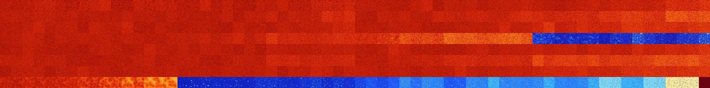

# B01457 (91648-92159)

<details>
    <summary>Initial Grid</summary>
    
</details>


<details>
    <summary>Initial Grid RLE</summary>

```
#C Exported from GoGoL (https://github.com/marrow16/gogol)
#C Wrap mode: Toroidal
#C Boundary mode: Dead
#C Step: 0
x = 100, y = 100, rule = B01457/S
91bo$2bo76bo$5bo17bo21bo12bo8bo19bo$12bo3bobo9bo19bo5bo12bo$13bo27bo12b
o10bo7bo21bo$4bo11bo15bo13bo10bobo17bo9bo$16bo23bo57bo$22bo28bo9bo$2bo
46bo6bo30bo9bo$bo12bo12bo48bo$19bo5bo$5bo8bo9bo23bo$3b2o3bo56bo6bo16bo$
2bo4bo27bo20bo22bo13bo$17bo17bo11bo7bo3bo28bo2bo7bo$17bo28bo45bo$17bo
15bo$13bo22bo11b2o9bo13bo$41bo13bo10bo4bo15bo6b2o$5bo4bo14bo38bo34bo$
15bo16bo21bo4bo14bo4bo12bo$31bo10bo28bo3bobo$7bo5bo12bo19bo6bo36bo2bo$
6bo14b2o15bo18bo36bo$10bo44bo23bo14bo$32bo5bo7bo45b2o$62bo17bo16bo$11bo
46bo17bo4bo3bo$61bo2bo12bo$3bo14bo24bo3bo22bo16bo$8bo11bo5b2o23b2o11b2o
20bo$o18bo3bo12bo7bo12bo5bo4bo22bo6bo$23bo12bo51bo$3bo34bo47bo10bo$32bo
22bo32bo$2bo5bo24bobo41bo5bo$21bo27bo3b2o$20bo24bo17bo5b2o$o$9bo54bo$7b
o16bo9b2o23bo$24bo2bobo6bo15bo2bo18bo7bo$o12bo17bobo17bo5bo11bo17bo$15b
o41bo18bo6bo$9bo37bo40bo4bo$60bo4bo3bo24bo3bo$9bo18bo34bo13bo$29bo3bo
22bo5bo12bo11bobo$bo16bobo7bo8bo48bo$26bo29bo12bo$54bo3bo12bo$8bo43bo
13bo11bo$37bo2bo9bo$31bo31bo12bobo14bo$bo19bo15bo16bo16bo24bo$48bo32bo$
20bo5bo21bo44bobo$26bo45bo$10bobo3b2o36bo10bo14bo3bo$27bo23bo19bo$14bo
43bo18bo5bo$6bo22bo4bobo16bo29bo$16bo19bo17bo40bo$4bo5bo8bo16bo15bo6b2o
bo12bo8bo7bo$18bo5bo6bo65bobo$o37bo10b2o2bo7bo28bo$12bo6bo17bo18bo8bo
23bo$100b$15bo7b2o3bo10bo56bo$28bo38bo$24b2o40bo$37bo3b2o24bo2b2o$41bo
14bo9bo12bo$30bo21b2o34bo$4bo18bo6bo12bo2bo6bo23bobo13bo$7bo22bo6bo14bo
37bo$14bo6bo30bo11bo$53bo19bo3bo2bo$28bo7bo34bo4bo2bo$19bo5bo6bo4bo5bo
27bo4bo3bobo$6bo6bo35b2ob2o17bo2bo8bo5bo6bo$11bo13bo27bo22b2o$bo23bo3bo
54bo5bo2bo$18bo13bo10bo12bo27bo$9bo2b2o8bo45bo$2bo19bo17bo17bo10bo3bo
12bo2bo4bo$15bo3bo9bo4bo11bo26bo15bo3bo$25bo$bo12bobo8bo58bo11bo$6bo65b
o20bo$49bo2bo$3bo25bo11bo31bo22bo$4bo15bo18bo11bo4bo13bo6bo16bo$3b2o48b
o11bo$32bo12bo7bo4bo10bo23bo$22bo14bo13bo$62bo$3b2o4bo7bo3bo3bo12bo3bo
6bo16bo$10bo9bo$23bo16bo54bo!
```
</details>
<details>
    <summary>Thumbnail</summary>

</details>
<table>
<tr>
    <td><a href="./91648%20S%20Heat%20Map%20Activity.png"></a><br>S (91648)<br>G>1000</td>    <td><a href="./91649%20S0%20Heat%20Map%20Activity.png"></a><br>S0 (91649)<br>G>1000</td>    <td><a href="./91650%20S1%20Heat%20Map%20Activity.png"></a><br>S1 (91650)<br>G>1000</td>    <td><a href="./91651%20S01%20Heat%20Map%20Activity.png"></a><br>S01 (91651)<br>G>1000</td>    <td><a href="./91652%20S2%20Heat%20Map%20Activity.png"></a><br>S2 (91652)<br>G>1000</td>    <td><a href="./91653%20S02%20Heat%20Map%20Activity.png"></a><br>S02 (91653)<br>G>1000</td>    <td><a href="./91654%20S12%20Heat%20Map%20Activity.png"></a><br>S12 (91654)<br>G>1000</td>    <td><a href="./91655%20S012%20Heat%20Map%20Activity.png"></a><br>S012 (91655)<br>G>1000</td>    <td><a href="./91656%20S3%20Heat%20Map%20Activity.png"></a><br>S3 (91656)<br>G>1000</td>    <td><a href="./91657%20S03%20Heat%20Map%20Activity.png"></a><br>S03 (91657)<br>G>1000</td>    <td><a href="./91658%20S13%20Heat%20Map%20Activity.png"></a><br>S13 (91658)<br>G>1000</td>    <td><a href="./91659%20S013%20Heat%20Map%20Activity.png"></a><br>S013 (91659)<br>G>1000</td>    <td><a href="./91660%20S23%20Heat%20Map%20Activity.png"></a><br>S23 (91660)<br>G>1000</td>    <td><a href="./91661%20S023%20Heat%20Map%20Activity.png"></a><br>S023 (91661)<br>G>1000</td>    <td><a href="./91662%20S123%20Heat%20Map%20Activity.png"></a><br>S123 (91662)<br>G>1000</td>    <td><a href="./91663%20S0123%20Heat%20Map%20Activity.png"></a><br>S0123 (91663)<br>G>1000</td>    <td><a href="./91664%20S4%20Heat%20Map%20Activity.png"></a><br>S4 (91664)<br>G>1000</td>    <td><a href="./91665%20S04%20Heat%20Map%20Activity.png"></a><br>S04 (91665)<br>G>1000</td>    <td><a href="./91666%20S14%20Heat%20Map%20Activity.png"></a><br>S14 (91666)<br>G>1000</td>    <td><a href="./91667%20S014%20Heat%20Map%20Activity.png"></a><br>S014 (91667)<br>G>1000</td>    <td><a href="./91668%20S24%20Heat%20Map%20Activity.png"></a><br>S24 (91668)<br>G>1000</td>    <td><a href="./91669%20S024%20Heat%20Map%20Activity.png"></a><br>S024 (91669)<br>G>1000</td>    <td><a href="./91670%20S124%20Heat%20Map%20Activity.png"></a><br>S124 (91670)<br>G>1000</td>    <td><a href="./91671%20S0124%20Heat%20Map%20Activity.png"></a><br>S0124 (91671)<br>G>1000</td>    <td><a href="./91672%20S34%20Heat%20Map%20Activity.png"></a><br>S34 (91672)<br>G>1000</td>    <td><a href="./91673%20S034%20Heat%20Map%20Activity.png"></a><br>S034 (91673)<br>G>1000</td>    <td><a href="./91674%20S134%20Heat%20Map%20Activity.png"></a><br>S134 (91674)<br>G>1000</td>    <td><a href="./91675%20S0134%20Heat%20Map%20Activity.png"></a><br>S0134 (91675)<br>G>1000</td>    <td><a href="./91676%20S234%20Heat%20Map%20Activity.png"></a><br>S234 (91676)<br>G>1000</td>    <td><a href="./91677%20S0234%20Heat%20Map%20Activity.png"></a><br>S0234 (91677)<br>G>1000</td>    <td><a href="./91678%20S1234%20Heat%20Map%20Activity.png"></a><br>S1234 (91678)<br>G>1000</td>    <td><a href="./91679%20S01234%20Heat%20Map%20Activity.png"></a><br>S01234 (91679)<br>G>1000</td>    <td><a href="./91680%20S5%20Heat%20Map%20Activity.png"></a><br>S5 (91680)<br>G>1000</td>    <td><a href="./91681%20S05%20Heat%20Map%20Activity.png"></a><br>S05 (91681)<br>G>1000</td>    <td><a href="./91682%20S15%20Heat%20Map%20Activity.png"></a><br>S15 (91682)<br>G>1000</td>    <td><a href="./91683%20S015%20Heat%20Map%20Activity.png"></a><br>S015 (91683)<br>G>1000</td>    <td><a href="./91684%20S25%20Heat%20Map%20Activity.png"></a><br>S25 (91684)<br>G>1000</td>    <td><a href="./91685%20S025%20Heat%20Map%20Activity.png"></a><br>S025 (91685)<br>G>1000</td>    <td><a href="./91686%20S125%20Heat%20Map%20Activity.png"></a><br>S125 (91686)<br>G>1000</td>    <td><a href="./91687%20S0125%20Heat%20Map%20Activity.png"></a><br>S0125 (91687)<br>G>1000</td>    <td><a href="./91688%20S35%20Heat%20Map%20Activity.png"></a><br>S35 (91688)<br>G>1000</td>    <td><a href="./91689%20S035%20Heat%20Map%20Activity.png"></a><br>S035 (91689)<br>G>1000</td>    <td><a href="./91690%20S135%20Heat%20Map%20Activity.png"></a><br>S135 (91690)<br>G>1000</td>    <td><a href="./91691%20S0135%20Heat%20Map%20Activity.png"></a><br>S0135 (91691)<br>G>1000</td>    <td><a href="./91692%20S235%20Heat%20Map%20Activity.png"></a><br>S235 (91692)<br>G>1000</td>    <td><a href="./91693%20S0235%20Heat%20Map%20Activity.png"></a><br>S0235 (91693)<br>G>1000</td>    <td><a href="./91694%20S1235%20Heat%20Map%20Activity.png"></a><br>S1235 (91694)<br>G>1000</td>    <td><a href="./91695%20S01235%20Heat%20Map%20Activity.png"></a><br>S01235 (91695)<br>G>1000</td>    <td><a href="./91696%20S45%20Heat%20Map%20Activity.png"></a><br>S45 (91696)<br>G>1000</td>    <td><a href="./91697%20S045%20Heat%20Map%20Activity.png"></a><br>S045 (91697)<br>G>1000</td>    <td><a href="./91698%20S145%20Heat%20Map%20Activity.png"></a><br>S145 (91698)<br>G>1000</td>    <td><a href="./91699%20S0145%20Heat%20Map%20Activity.png"></a><br>S0145 (91699)<br>G>1000</td>    <td><a href="./91700%20S245%20Heat%20Map%20Activity.png"></a><br>S245 (91700)<br>G>1000</td>    <td><a href="./91701%20S0245%20Heat%20Map%20Activity.png"></a><br>S0245 (91701)<br>G>1000</td>    <td><a href="./91702%20S1245%20Heat%20Map%20Activity.png"></a><br>S1245 (91702)<br>G>1000</td>    <td><a href="./91703%20S01245%20Heat%20Map%20Activity.png"></a><br>S01245 (91703)<br>G>1000</td>    <td><a href="./91704%20S345%20Heat%20Map%20Activity.png"></a><br>S345 (91704)<br>G>1000</td>    <td><a href="./91705%20S0345%20Heat%20Map%20Activity.png"></a><br>S0345 (91705)<br>G>1000</td>    <td><a href="./91706%20S1345%20Heat%20Map%20Activity.png"></a><br>S1345 (91706)<br>G>1000</td>    <td><a href="./91707%20S01345%20Heat%20Map%20Activity.png"></a><br>S01345 (91707)<br>G>1000</td>    <td><a href="./91708%20S2345%20Heat%20Map%20Activity.png"></a><br>S2345 (91708)<br>G>1000</td>    <td><a href="./91709%20S02345%20Heat%20Map%20Activity.png"></a><br>S02345 (91709)<br>G>1000</td>    <td><a href="./91710%20S12345%20Heat%20Map%20Activity.png"></a><br>S12345 (91710)<br>G>1000</td>    <td><a href="./91711%20S012345%20Heat%20Map%20Activity.png"></a><br>S012345 (91711)<br>G>1000</td></tr>
<tr>
    <td><a href="./91712%20S6%20Heat%20Map%20Activity.png"></a><br>S6 (91712)<br>G>1000</td>    <td><a href="./91713%20S06%20Heat%20Map%20Activity.png"></a><br>S06 (91713)<br>G>1000</td>    <td><a href="./91714%20S16%20Heat%20Map%20Activity.png"></a><br>S16 (91714)<br>G>1000</td>    <td><a href="./91715%20S016%20Heat%20Map%20Activity.png"></a><br>S016 (91715)<br>G>1000</td>    <td><a href="./91716%20S26%20Heat%20Map%20Activity.png"></a><br>S26 (91716)<br>G>1000</td>    <td><a href="./91717%20S026%20Heat%20Map%20Activity.png"></a><br>S026 (91717)<br>G>1000</td>    <td><a href="./91718%20S126%20Heat%20Map%20Activity.png"></a><br>S126 (91718)<br>G>1000</td>    <td><a href="./91719%20S0126%20Heat%20Map%20Activity.png"></a><br>S0126 (91719)<br>G>1000</td>    <td><a href="./91720%20S36%20Heat%20Map%20Activity.png"></a><br>S36 (91720)<br>G>1000</td>    <td><a href="./91721%20S036%20Heat%20Map%20Activity.png"></a><br>S036 (91721)<br>G>1000</td>    <td><a href="./91722%20S136%20Heat%20Map%20Activity.png"></a><br>S136 (91722)<br>G>1000</td>    <td><a href="./91723%20S0136%20Heat%20Map%20Activity.png"></a><br>S0136 (91723)<br>G>1000</td>    <td><a href="./91724%20S236%20Heat%20Map%20Activity.png"></a><br>S236 (91724)<br>G>1000</td>    <td><a href="./91725%20S0236%20Heat%20Map%20Activity.png"></a><br>S0236 (91725)<br>G>1000</td>    <td><a href="./91726%20S1236%20Heat%20Map%20Activity.png"></a><br>S1236 (91726)<br>G>1000</td>    <td><a href="./91727%20S01236%20Heat%20Map%20Activity.png"></a><br>S01236 (91727)<br>G>1000</td>    <td><a href="./91728%20S46%20Heat%20Map%20Activity.png"></a><br>S46 (91728)<br>G>1000</td>    <td><a href="./91729%20S046%20Heat%20Map%20Activity.png"></a><br>S046 (91729)<br>G>1000</td>    <td><a href="./91730%20S146%20Heat%20Map%20Activity.png"></a><br>S146 (91730)<br>G>1000</td>    <td><a href="./91731%20S0146%20Heat%20Map%20Activity.png"></a><br>S0146 (91731)<br>G>1000</td>    <td><a href="./91732%20S246%20Heat%20Map%20Activity.png"></a><br>S246 (91732)<br>G>1000</td>    <td><a href="./91733%20S0246%20Heat%20Map%20Activity.png"></a><br>S0246 (91733)<br>G>1000</td>    <td><a href="./91734%20S1246%20Heat%20Map%20Activity.png"></a><br>S1246 (91734)<br>G>1000</td>    <td><a href="./91735%20S01246%20Heat%20Map%20Activity.png"></a><br>S01246 (91735)<br>G>1000</td>    <td><a href="./91736%20S346%20Heat%20Map%20Activity.png"></a><br>S346 (91736)<br>G>1000</td>    <td><a href="./91737%20S0346%20Heat%20Map%20Activity.png"></a><br>S0346 (91737)<br>G>1000</td>    <td><a href="./91738%20S1346%20Heat%20Map%20Activity.png"></a><br>S1346 (91738)<br>G>1000</td>    <td><a href="./91739%20S01346%20Heat%20Map%20Activity.png"></a><br>S01346 (91739)<br>G>1000</td>    <td><a href="./91740%20S2346%20Heat%20Map%20Activity.png"></a><br>S2346 (91740)<br>G>1000</td>    <td><a href="./91741%20S02346%20Heat%20Map%20Activity.png"></a><br>S02346 (91741)<br>G>1000</td>    <td><a href="./91742%20S12346%20Heat%20Map%20Activity.png"></a><br>S12346 (91742)<br>G>1000</td>    <td><a href="./91743%20S012346%20Heat%20Map%20Activity.png"></a><br>S012346 (91743)<br>G>1000</td>    <td><a href="./91744%20S56%20Heat%20Map%20Activity.png"></a><br>S56 (91744)<br>G>1000</td>    <td><a href="./91745%20S056%20Heat%20Map%20Activity.png"></a><br>S056 (91745)<br>G>1000</td>    <td><a href="./91746%20S156%20Heat%20Map%20Activity.png"></a><br>S156 (91746)<br>G>1000</td>    <td><a href="./91747%20S0156%20Heat%20Map%20Activity.png"></a><br>S0156 (91747)<br>G>1000</td>    <td><a href="./91748%20S256%20Heat%20Map%20Activity.png"></a><br>S256 (91748)<br>G>1000</td>    <td><a href="./91749%20S0256%20Heat%20Map%20Activity.png"></a><br>S0256 (91749)<br>G>1000</td>    <td><a href="./91750%20S1256%20Heat%20Map%20Activity.png"></a><br>S1256 (91750)<br>G>1000</td>    <td><a href="./91751%20S01256%20Heat%20Map%20Activity.png"></a><br>S01256 (91751)<br>G>1000</td>    <td><a href="./91752%20S356%20Heat%20Map%20Activity.png"></a><br>S356 (91752)<br>G>1000</td>    <td><a href="./91753%20S0356%20Heat%20Map%20Activity.png"></a><br>S0356 (91753)<br>G>1000</td>    <td><a href="./91754%20S1356%20Heat%20Map%20Activity.png"></a><br>S1356 (91754)<br>G>1000</td>    <td><a href="./91755%20S01356%20Heat%20Map%20Activity.png"></a><br>S01356 (91755)<br>G>1000</td>    <td><a href="./91756%20S2356%20Heat%20Map%20Activity.png"></a><br>S2356 (91756)<br>G>1000</td>    <td><a href="./91757%20S02356%20Heat%20Map%20Activity.png"></a><br>S02356 (91757)<br>G>1000</td>    <td><a href="./91758%20S12356%20Heat%20Map%20Activity.png"></a><br>S12356 (91758)<br>G>1000</td>    <td><a href="./91759%20S012356%20Heat%20Map%20Activity.png"></a><br>S012356 (91759)<br>G>1000</td>    <td><a href="./91760%20S456%20Heat%20Map%20Activity.png"></a><br>S456 (91760)<br>G>1000</td>    <td><a href="./91761%20S0456%20Heat%20Map%20Activity.png"></a><br>S0456 (91761)<br>G>1000</td>    <td><a href="./91762%20S1456%20Heat%20Map%20Activity.png"></a><br>S1456 (91762)<br>G>1000</td>    <td><a href="./91763%20S01456%20Heat%20Map%20Activity.png"></a><br>S01456 (91763)<br>G>1000</td>    <td><a href="./91764%20S2456%20Heat%20Map%20Activity.png"></a><br>S2456 (91764)<br>G>1000</td>    <td><a href="./91765%20S02456%20Heat%20Map%20Activity.png"></a><br>S02456 (91765)<br>G>1000</td>    <td><a href="./91766%20S12456%20Heat%20Map%20Activity.png"></a><br>S12456 (91766)<br>G>1000</td>    <td><a href="./91767%20S012456%20Heat%20Map%20Activity.png"></a><br>S012456 (91767)<br>G>1000</td>    <td><a href="./91768%20S3456%20Heat%20Map%20Activity.png"></a><br>S3456 (91768)<br>G>1000</td>    <td><a href="./91769%20S03456%20Heat%20Map%20Activity.png"></a><br>S03456 (91769)<br>G>1000</td>    <td><a href="./91770%20S13456%20Heat%20Map%20Activity.png"></a><br>S13456 (91770)<br>G>1000</td>    <td><a href="./91771%20S013456%20Heat%20Map%20Activity.png"></a><br>S013456 (91771)<br>G>1000</td>    <td><a href="./91772%20S23456%20Heat%20Map%20Activity.png"></a><br>S23456 (91772)<br>G>1000</td>    <td><a href="./91773%20S023456%20Heat%20Map%20Activity.png"></a><br>S023456 (91773)<br>G>1000</td>    <td><a href="./91774%20S123456%20Heat%20Map%20Activity.png"></a><br>S123456 (91774)<br>G>1000</td>    <td><a href="./91775%20S0123456%20Heat%20Map%20Activity.png"></a><br>S0123456 (91775)<br>G>1000</td></tr>
<tr>
    <td><a href="./91776%20S7%20Heat%20Map%20Activity.png"></a><br>S7 (91776)<br>G>1000</td>    <td><a href="./91777%20S07%20Heat%20Map%20Activity.png"></a><br>S07 (91777)<br>G>1000</td>    <td><a href="./91778%20S17%20Heat%20Map%20Activity.png"></a><br>S17 (91778)<br>G>1000</td>    <td><a href="./91779%20S017%20Heat%20Map%20Activity.png"></a><br>S017 (91779)<br>G>1000</td>    <td><a href="./91780%20S27%20Heat%20Map%20Activity.png"></a><br>S27 (91780)<br>G>1000</td>    <td><a href="./91781%20S027%20Heat%20Map%20Activity.png"></a><br>S027 (91781)<br>G>1000</td>    <td><a href="./91782%20S127%20Heat%20Map%20Activity.png"></a><br>S127 (91782)<br>G>1000</td>    <td><a href="./91783%20S0127%20Heat%20Map%20Activity.png"></a><br>S0127 (91783)<br>G>1000</td>    <td><a href="./91784%20S37%20Heat%20Map%20Activity.png"></a><br>S37 (91784)<br>G>1000</td>    <td><a href="./91785%20S037%20Heat%20Map%20Activity.png"></a><br>S037 (91785)<br>G>1000</td>    <td><a href="./91786%20S137%20Heat%20Map%20Activity.png"></a><br>S137 (91786)<br>G>1000</td>    <td><a href="./91787%20S0137%20Heat%20Map%20Activity.png"></a><br>S0137 (91787)<br>G>1000</td>    <td><a href="./91788%20S237%20Heat%20Map%20Activity.png"></a><br>S237 (91788)<br>G>1000</td>    <td><a href="./91789%20S0237%20Heat%20Map%20Activity.png"></a><br>S0237 (91789)<br>G>1000</td>    <td><a href="./91790%20S1237%20Heat%20Map%20Activity.png"></a><br>S1237 (91790)<br>G>1000</td>    <td><a href="./91791%20S01237%20Heat%20Map%20Activity.png"></a><br>S01237 (91791)<br>G>1000</td>    <td><a href="./91792%20S47%20Heat%20Map%20Activity.png"></a><br>S47 (91792)<br>G>1000</td>    <td><a href="./91793%20S047%20Heat%20Map%20Activity.png"></a><br>S047 (91793)<br>G>1000</td>    <td><a href="./91794%20S147%20Heat%20Map%20Activity.png"></a><br>S147 (91794)<br>G>1000</td>    <td><a href="./91795%20S0147%20Heat%20Map%20Activity.png"></a><br>S0147 (91795)<br>G>1000</td>    <td><a href="./91796%20S247%20Heat%20Map%20Activity.png"></a><br>S247 (91796)<br>G>1000</td>    <td><a href="./91797%20S0247%20Heat%20Map%20Activity.png"></a><br>S0247 (91797)<br>G>1000</td>    <td><a href="./91798%20S1247%20Heat%20Map%20Activity.png"></a><br>S1247 (91798)<br>G>1000</td>    <td><a href="./91799%20S01247%20Heat%20Map%20Activity.png"></a><br>S01247 (91799)<br>G>1000</td>    <td><a href="./91800%20S347%20Heat%20Map%20Activity.png"></a><br>S347 (91800)<br>G>1000</td>    <td><a href="./91801%20S0347%20Heat%20Map%20Activity.png"></a><br>S0347 (91801)<br>G>1000</td>    <td><a href="./91802%20S1347%20Heat%20Map%20Activity.png"></a><br>S1347 (91802)<br>G>1000</td>    <td><a href="./91803%20S01347%20Heat%20Map%20Activity.png"></a><br>S01347 (91803)<br>G>1000</td>    <td><a href="./91804%20S2347%20Heat%20Map%20Activity.png"></a><br>S2347 (91804)<br>G>1000</td>    <td><a href="./91805%20S02347%20Heat%20Map%20Activity.png"></a><br>S02347 (91805)<br>G>1000</td>    <td><a href="./91806%20S12347%20Heat%20Map%20Activity.png"></a><br>S12347 (91806)<br>G>1000</td>    <td><a href="./91807%20S012347%20Heat%20Map%20Activity.png"></a><br>S012347 (91807)<br>G>1000</td>    <td><a href="./91808%20S57%20Heat%20Map%20Activity.png"></a><br>S57 (91808)<br>G>1000</td>    <td><a href="./91809%20S057%20Heat%20Map%20Activity.png"></a><br>S057 (91809)<br>G>1000</td>    <td><a href="./91810%20S157%20Heat%20Map%20Activity.png"></a><br>S157 (91810)<br>G>1000</td>    <td><a href="./91811%20S0157%20Heat%20Map%20Activity.png"></a><br>S0157 (91811)<br>G>1000</td>    <td><a href="./91812%20S257%20Heat%20Map%20Activity.png"></a><br>S257 (91812)<br>G>1000</td>    <td><a href="./91813%20S0257%20Heat%20Map%20Activity.png"></a><br>S0257 (91813)<br>G>1000</td>    <td><a href="./91814%20S1257%20Heat%20Map%20Activity.png"></a><br>S1257 (91814)<br>G>1000</td>    <td><a href="./91815%20S01257%20Heat%20Map%20Activity.png"></a><br>S01257 (91815)<br>G>1000</td>    <td><a href="./91816%20S357%20Heat%20Map%20Activity.png"></a><br>S357 (91816)<br>G>1000</td>    <td><a href="./91817%20S0357%20Heat%20Map%20Activity.png"></a><br>S0357 (91817)<br>G>1000</td>    <td><a href="./91818%20S1357%20Heat%20Map%20Activity.png"></a><br>S1357 (91818)<br>G>1000</td>    <td><a href="./91819%20S01357%20Heat%20Map%20Activity.png"></a><br>S01357 (91819)<br>G>1000</td>    <td><a href="./91820%20S2357%20Heat%20Map%20Activity.png"></a><br>S2357 (91820)<br>G>1000</td>    <td><a href="./91821%20S02357%20Heat%20Map%20Activity.png"></a><br>S02357 (91821)<br>G>1000</td>    <td><a href="./91822%20S12357%20Heat%20Map%20Activity.png"></a><br>S12357 (91822)<br>G>1000</td>    <td><a href="./91823%20S012357%20Heat%20Map%20Activity.png"></a><br>S012357 (91823)<br>G>1000</td>    <td><a href="./91824%20S457%20Heat%20Map%20Activity.png"></a><br>S457 (91824)<br>G>1000</td>    <td><a href="./91825%20S0457%20Heat%20Map%20Activity.png"></a><br>S0457 (91825)<br>G>1000</td>    <td><a href="./91826%20S1457%20Heat%20Map%20Activity.png"></a><br>S1457 (91826)<br>G>1000</td>    <td><a href="./91827%20S01457%20Heat%20Map%20Activity.png"></a><br>S01457 (91827)<br>G>1000</td>    <td><a href="./91828%20S2457%20Heat%20Map%20Activity.png"></a><br>S2457 (91828)<br>G>1000</td>    <td><a href="./91829%20S02457%20Heat%20Map%20Activity.png"></a><br>S02457 (91829)<br>G>1000</td>    <td><a href="./91830%20S12457%20Heat%20Map%20Activity.png"></a><br>S12457 (91830)<br>G>1000</td>    <td><a href="./91831%20S012457%20Heat%20Map%20Activity.png"></a><br>S012457 (91831)<br>G>1000</td>    <td><a href="./91832%20S3457%20Heat%20Map%20Activity.png"></a><br>S3457 (91832)<br>G>1000</td>    <td><a href="./91833%20S03457%20Heat%20Map%20Activity.png"></a><br>S03457 (91833)<br>G>1000</td>    <td><a href="./91834%20S13457%20Heat%20Map%20Activity.png"></a><br>S13457 (91834)<br>G>1000</td>    <td><a href="./91835%20S013457%20Heat%20Map%20Activity.png"></a><br>S013457 (91835)<br>G>1000</td>    <td><a href="./91836%20S23457%20Heat%20Map%20Activity.png"></a><br>S23457 (91836)<br>G>1000</td>    <td><a href="./91837%20S023457%20Heat%20Map%20Activity.png"></a><br>S023457 (91837)<br>G>1000</td>    <td><a href="./91838%20S123457%20Heat%20Map%20Activity.png"></a><br>S123457 (91838)<br>G>1000</td>    <td><a href="./91839%20S0123457%20Heat%20Map%20Activity.png"></a><br>S0123457 (91839)<br>G>1000</td></tr>
<tr>
    <td><a href="./91840%20S67%20Heat%20Map%20Activity.png"></a><br>S67 (91840)<br>G>1000</td>    <td><a href="./91841%20S067%20Heat%20Map%20Activity.png"></a><br>S067 (91841)<br>G>1000</td>    <td><a href="./91842%20S167%20Heat%20Map%20Activity.png"></a><br>S167 (91842)<br>G>1000</td>    <td><a href="./91843%20S0167%20Heat%20Map%20Activity.png"></a><br>S0167 (91843)<br>G>1000</td>    <td><a href="./91844%20S267%20Heat%20Map%20Activity.png"></a><br>S267 (91844)<br>G>1000</td>    <td><a href="./91845%20S0267%20Heat%20Map%20Activity.png"></a><br>S0267 (91845)<br>G>1000</td>    <td><a href="./91846%20S1267%20Heat%20Map%20Activity.png"></a><br>S1267 (91846)<br>G>1000</td>    <td><a href="./91847%20S01267%20Heat%20Map%20Activity.png"></a><br>S01267 (91847)<br>G>1000</td>    <td><a href="./91848%20S367%20Heat%20Map%20Activity.png"></a><br>S367 (91848)<br>G>1000</td>    <td><a href="./91849%20S0367%20Heat%20Map%20Activity.png"></a><br>S0367 (91849)<br>G>1000</td>    <td><a href="./91850%20S1367%20Heat%20Map%20Activity.png"></a><br>S1367 (91850)<br>G>1000</td>    <td><a href="./91851%20S01367%20Heat%20Map%20Activity.png"></a><br>S01367 (91851)<br>G>1000</td>    <td><a href="./91852%20S2367%20Heat%20Map%20Activity.png"></a><br>S2367 (91852)<br>G>1000</td>    <td><a href="./91853%20S02367%20Heat%20Map%20Activity.png"></a><br>S02367 (91853)<br>G>1000</td>    <td><a href="./91854%20S12367%20Heat%20Map%20Activity.png"></a><br>S12367 (91854)<br>G>1000</td>    <td><a href="./91855%20S012367%20Heat%20Map%20Activity.png"></a><br>S012367 (91855)<br>G>1000</td>    <td><a href="./91856%20S467%20Heat%20Map%20Activity.png"></a><br>S467 (91856)<br>G>1000</td>    <td><a href="./91857%20S0467%20Heat%20Map%20Activity.png"></a><br>S0467 (91857)<br>G>1000</td>    <td><a href="./91858%20S1467%20Heat%20Map%20Activity.png"></a><br>S1467 (91858)<br>G>1000</td>    <td><a href="./91859%20S01467%20Heat%20Map%20Activity.png"></a><br>S01467 (91859)<br>G>1000</td>    <td><a href="./91860%20S2467%20Heat%20Map%20Activity.png"></a><br>S2467 (91860)<br>G>1000</td>    <td><a href="./91861%20S02467%20Heat%20Map%20Activity.png"></a><br>S02467 (91861)<br>G>1000</td>    <td><a href="./91862%20S12467%20Heat%20Map%20Activity.png"></a><br>S12467 (91862)<br>G>1000</td>    <td><a href="./91863%20S012467%20Heat%20Map%20Activity.png"></a><br>S012467 (91863)<br>G>1000</td>    <td><a href="./91864%20S3467%20Heat%20Map%20Activity.png"></a><br>S3467 (91864)<br>G>1000</td>    <td><a href="./91865%20S03467%20Heat%20Map%20Activity.png"></a><br>S03467 (91865)<br>G>1000</td>    <td><a href="./91866%20S13467%20Heat%20Map%20Activity.png"></a><br>S13467 (91866)<br>G>1000</td>    <td><a href="./91867%20S013467%20Heat%20Map%20Activity.png"></a><br>S013467 (91867)<br>G>1000</td>    <td><a href="./91868%20S23467%20Heat%20Map%20Activity.png"></a><br>S23467 (91868)<br>G>1000</td>    <td><a href="./91869%20S023467%20Heat%20Map%20Activity.png"></a><br>S023467 (91869)<br>G>1000</td>    <td><a href="./91870%20S123467%20Heat%20Map%20Activity.png"></a><br>S123467 (91870)<br>G>1000</td>    <td><a href="./91871%20S0123467%20Heat%20Map%20Activity.png"></a><br>S0123467 (91871)<br>G>1000</td>    <td><a href="./91872%20S567%20Heat%20Map%20Activity.png"></a><br>S567 (91872)<br>G>1000</td>    <td><a href="./91873%20S0567%20Heat%20Map%20Activity.png"></a><br>S0567 (91873)<br>G>1000</td>    <td><a href="./91874%20S1567%20Heat%20Map%20Activity.png"></a><br>S1567 (91874)<br>G>1000</td>    <td><a href="./91875%20S01567%20Heat%20Map%20Activity.png"></a><br>S01567 (91875)<br>G>1000</td>    <td><a href="./91876%20S2567%20Heat%20Map%20Activity.png"></a><br>S2567 (91876)<br>G>1000</td>    <td><a href="./91877%20S02567%20Heat%20Map%20Activity.png"></a><br>S02567 (91877)<br>G>1000</td>    <td><a href="./91878%20S12567%20Heat%20Map%20Activity.png"></a><br>S12567 (91878)<br>G>1000</td>    <td><a href="./91879%20S012567%20Heat%20Map%20Activity.png"></a><br>S012567 (91879)<br>G>1000</td>    <td><a href="./91880%20S3567%20Heat%20Map%20Activity.png"></a><br>S3567 (91880)<br>G>1000</td>    <td><a href="./91881%20S03567%20Heat%20Map%20Activity.png"></a><br>S03567 (91881)<br>G>1000</td>    <td><a href="./91882%20S13567%20Heat%20Map%20Activity.png"></a><br>S13567 (91882)<br>G>1000</td>    <td><a href="./91883%20S013567%20Heat%20Map%20Activity.png"></a><br>S013567 (91883)<br>G>1000</td>    <td><a href="./91884%20S23567%20Heat%20Map%20Activity.png"></a><br>S23567 (91884)<br>G>1000</td>    <td><a href="./91885%20S023567%20Heat%20Map%20Activity.png"></a><br>S023567 (91885)<br>G>1000</td>    <td><a href="./91886%20S123567%20Heat%20Map%20Activity.png"></a><br>S123567 (91886)<br>G>1000</td>    <td><a href="./91887%20S0123567%20Heat%20Map%20Activity.png"></a><br>S0123567 (91887)<br>G>1000</td>    <td><a href="./91888%20S4567%20Heat%20Map%20Activity.png"></a><br>S4567 (91888)<br>R@202,p12</td>    <td><a href="./91889%20S04567%20Heat%20Map%20Activity.png"></a><br>S04567 (91889)<br>R@256,p24</td>    <td><a href="./91890%20S14567%20Heat%20Map%20Activity.png"></a><br>S14567 (91890)<br>R@515,p120</td>    <td><a href="./91891%20S014567%20Heat%20Map%20Activity.png"></a><br>S014567 (91891)<br>R@400,p30</td>    <td><a href="./91892%20S24567%20Heat%20Map%20Activity.png"></a><br>S24567 (91892)<br>R@233,p36</td>    <td><a href="./91893%20S024567%20Heat%20Map%20Activity.png"></a><br>S024567 (91893)<br>R@202,p12</td>    <td><a href="./91894%20S124567%20Heat%20Map%20Activity.png"></a><br>S124567 (91894)<br>R@528,p420</td>    <td><a href="./91895%20S0124567%20Heat%20Map%20Activity.png"></a><br>S0124567 (91895)<br>R@180,p12</td>    <td><a href="./91896%20S34567%20Heat%20Map%20Activity.png"></a><br>S34567 (91896)<br>R@96,p60</td>    <td><a href="./91897%20S034567%20Heat%20Map%20Activity.png"></a><br>S034567 (91897)<br>R@42,p6</td>    <td><a href="./91898%20S134567%20Heat%20Map%20Activity.png"></a><br>S134567 (91898)<br>R@61,p24</td>    <td><a href="./91899%20S0134567%20Heat%20Map%20Activity.png"></a><br>S0134567 (91899)<br>R@121,p72</td>    <td><a href="./91900%20S234567%20Heat%20Map%20Activity.png"></a><br>S234567 (91900)<br>R@147,p120</td>    <td><a href="./91901%20S0234567%20Heat%20Map%20Activity.png"></a><br>S0234567 (91901)<br>R@75,p36</td>    <td><a href="./91902%20S1234567%20Heat%20Map%20Activity.png"></a><br>S1234567 (91902)<br>R@52,p24</td>    <td><a href="./91903%20S01234567%20Heat%20Map%20Activity.png"></a><br>S01234567 (91903)<br>R@39,p6</td></tr>
<tr>
    <td><a href="./91904%20S8%20Heat%20Map%20Activity.png"></a><br>S8 (91904)<br>G>1000</td>    <td><a href="./91905%20S08%20Heat%20Map%20Activity.png"></a><br>S08 (91905)<br>G>1000</td>    <td><a href="./91906%20S18%20Heat%20Map%20Activity.png"></a><br>S18 (91906)<br>G>1000</td>    <td><a href="./91907%20S018%20Heat%20Map%20Activity.png"></a><br>S018 (91907)<br>G>1000</td>    <td><a href="./91908%20S28%20Heat%20Map%20Activity.png"></a><br>S28 (91908)<br>G>1000</td>    <td><a href="./91909%20S028%20Heat%20Map%20Activity.png"></a><br>S028 (91909)<br>G>1000</td>    <td><a href="./91910%20S128%20Heat%20Map%20Activity.png"></a><br>S128 (91910)<br>G>1000</td>    <td><a href="./91911%20S0128%20Heat%20Map%20Activity.png"></a><br>S0128 (91911)<br>G>1000</td>    <td><a href="./91912%20S38%20Heat%20Map%20Activity.png"></a><br>S38 (91912)<br>G>1000</td>    <td><a href="./91913%20S038%20Heat%20Map%20Activity.png"></a><br>S038 (91913)<br>G>1000</td>    <td><a href="./91914%20S138%20Heat%20Map%20Activity.png"></a><br>S138 (91914)<br>G>1000</td>    <td><a href="./91915%20S0138%20Heat%20Map%20Activity.png"></a><br>S0138 (91915)<br>G>1000</td>    <td><a href="./91916%20S238%20Heat%20Map%20Activity.png"></a><br>S238 (91916)<br>G>1000</td>    <td><a href="./91917%20S0238%20Heat%20Map%20Activity.png"></a><br>S0238 (91917)<br>G>1000</td>    <td><a href="./91918%20S1238%20Heat%20Map%20Activity.png"></a><br>S1238 (91918)<br>G>1000</td>    <td><a href="./91919%20S01238%20Heat%20Map%20Activity.png"></a><br>S01238 (91919)<br>G>1000</td>    <td><a href="./91920%20S48%20Heat%20Map%20Activity.png"></a><br>S48 (91920)<br>G>1000</td>    <td><a href="./91921%20S048%20Heat%20Map%20Activity.png"></a><br>S048 (91921)<br>G>1000</td>    <td><a href="./91922%20S148%20Heat%20Map%20Activity.png"></a><br>S148 (91922)<br>G>1000</td>    <td><a href="./91923%20S0148%20Heat%20Map%20Activity.png"></a><br>S0148 (91923)<br>G>1000</td>    <td><a href="./91924%20S248%20Heat%20Map%20Activity.png"></a><br>S248 (91924)<br>G>1000</td>    <td><a href="./91925%20S0248%20Heat%20Map%20Activity.png"></a><br>S0248 (91925)<br>G>1000</td>    <td><a href="./91926%20S1248%20Heat%20Map%20Activity.png"></a><br>S1248 (91926)<br>G>1000</td>    <td><a href="./91927%20S01248%20Heat%20Map%20Activity.png"></a><br>S01248 (91927)<br>G>1000</td>    <td><a href="./91928%20S348%20Heat%20Map%20Activity.png"></a><br>S348 (91928)<br>G>1000</td>    <td><a href="./91929%20S0348%20Heat%20Map%20Activity.png"></a><br>S0348 (91929)<br>G>1000</td>    <td><a href="./91930%20S1348%20Heat%20Map%20Activity.png"></a><br>S1348 (91930)<br>G>1000</td>    <td><a href="./91931%20S01348%20Heat%20Map%20Activity.png"></a><br>S01348 (91931)<br>G>1000</td>    <td><a href="./91932%20S2348%20Heat%20Map%20Activity.png"></a><br>S2348 (91932)<br>G>1000</td>    <td><a href="./91933%20S02348%20Heat%20Map%20Activity.png"></a><br>S02348 (91933)<br>G>1000</td>    <td><a href="./91934%20S12348%20Heat%20Map%20Activity.png"></a><br>S12348 (91934)<br>G>1000</td>    <td><a href="./91935%20S012348%20Heat%20Map%20Activity.png"></a><br>S012348 (91935)<br>G>1000</td>    <td><a href="./91936%20S58%20Heat%20Map%20Activity.png"></a><br>S58 (91936)<br>G>1000</td>    <td><a href="./91937%20S058%20Heat%20Map%20Activity.png"></a><br>S058 (91937)<br>G>1000</td>    <td><a href="./91938%20S158%20Heat%20Map%20Activity.png"></a><br>S158 (91938)<br>G>1000</td>    <td><a href="./91939%20S0158%20Heat%20Map%20Activity.png"></a><br>S0158 (91939)<br>G>1000</td>    <td><a href="./91940%20S258%20Heat%20Map%20Activity.png"></a><br>S258 (91940)<br>G>1000</td>    <td><a href="./91941%20S0258%20Heat%20Map%20Activity.png"></a><br>S0258 (91941)<br>G>1000</td>    <td><a href="./91942%20S1258%20Heat%20Map%20Activity.png"></a><br>S1258 (91942)<br>G>1000</td>    <td><a href="./91943%20S01258%20Heat%20Map%20Activity.png"></a><br>S01258 (91943)<br>G>1000</td>    <td><a href="./91944%20S358%20Heat%20Map%20Activity.png"></a><br>S358 (91944)<br>G>1000</td>    <td><a href="./91945%20S0358%20Heat%20Map%20Activity.png"></a><br>S0358 (91945)<br>G>1000</td>    <td><a href="./91946%20S1358%20Heat%20Map%20Activity.png"></a><br>S1358 (91946)<br>G>1000</td>    <td><a href="./91947%20S01358%20Heat%20Map%20Activity.png"></a><br>S01358 (91947)<br>G>1000</td>    <td><a href="./91948%20S2358%20Heat%20Map%20Activity.png"></a><br>S2358 (91948)<br>G>1000</td>    <td><a href="./91949%20S02358%20Heat%20Map%20Activity.png"></a><br>S02358 (91949)<br>G>1000</td>    <td><a href="./91950%20S12358%20Heat%20Map%20Activity.png"></a><br>S12358 (91950)<br>G>1000</td>    <td><a href="./91951%20S012358%20Heat%20Map%20Activity.png"></a><br>S012358 (91951)<br>G>1000</td>    <td><a href="./91952%20S458%20Heat%20Map%20Activity.png"></a><br>S458 (91952)<br>G>1000</td>    <td><a href="./91953%20S0458%20Heat%20Map%20Activity.png"></a><br>S0458 (91953)<br>G>1000</td>    <td><a href="./91954%20S1458%20Heat%20Map%20Activity.png"></a><br>S1458 (91954)<br>G>1000</td>    <td><a href="./91955%20S01458%20Heat%20Map%20Activity.png"></a><br>S01458 (91955)<br>G>1000</td>    <td><a href="./91956%20S2458%20Heat%20Map%20Activity.png"></a><br>S2458 (91956)<br>G>1000</td>    <td><a href="./91957%20S02458%20Heat%20Map%20Activity.png"></a><br>S02458 (91957)<br>G>1000</td>    <td><a href="./91958%20S12458%20Heat%20Map%20Activity.png"></a><br>S12458 (91958)<br>G>1000</td>    <td><a href="./91959%20S012458%20Heat%20Map%20Activity.png"></a><br>S012458 (91959)<br>G>1000</td>    <td><a href="./91960%20S3458%20Heat%20Map%20Activity.png"></a><br>S3458 (91960)<br>G>1000</td>    <td><a href="./91961%20S03458%20Heat%20Map%20Activity.png"></a><br>S03458 (91961)<br>G>1000</td>    <td><a href="./91962%20S13458%20Heat%20Map%20Activity.png"></a><br>S13458 (91962)<br>G>1000</td>    <td><a href="./91963%20S013458%20Heat%20Map%20Activity.png"></a><br>S013458 (91963)<br>G>1000</td>    <td><a href="./91964%20S23458%20Heat%20Map%20Activity.png"></a><br>S23458 (91964)<br>G>1000</td>    <td><a href="./91965%20S023458%20Heat%20Map%20Activity.png"></a><br>S023458 (91965)<br>G>1000</td>    <td><a href="./91966%20S123458%20Heat%20Map%20Activity.png"></a><br>S123458 (91966)<br>G>1000</td>    <td><a href="./91967%20S0123458%20Heat%20Map%20Activity.png"></a><br>S0123458 (91967)<br>G>1000</td></tr>
<tr>
    <td><a href="./91968%20S68%20Heat%20Map%20Activity.png"></a><br>S68 (91968)<br>G>1000</td>    <td><a href="./91969%20S068%20Heat%20Map%20Activity.png"></a><br>S068 (91969)<br>G>1000</td>    <td><a href="./91970%20S168%20Heat%20Map%20Activity.png"></a><br>S168 (91970)<br>G>1000</td>    <td><a href="./91971%20S0168%20Heat%20Map%20Activity.png"></a><br>S0168 (91971)<br>G>1000</td>    <td><a href="./91972%20S268%20Heat%20Map%20Activity.png"></a><br>S268 (91972)<br>G>1000</td>    <td><a href="./91973%20S0268%20Heat%20Map%20Activity.png"></a><br>S0268 (91973)<br>G>1000</td>    <td><a href="./91974%20S1268%20Heat%20Map%20Activity.png"></a><br>S1268 (91974)<br>G>1000</td>    <td><a href="./91975%20S01268%20Heat%20Map%20Activity.png"></a><br>S01268 (91975)<br>G>1000</td>    <td><a href="./91976%20S368%20Heat%20Map%20Activity.png"></a><br>S368 (91976)<br>G>1000</td>    <td><a href="./91977%20S0368%20Heat%20Map%20Activity.png"></a><br>S0368 (91977)<br>G>1000</td>    <td><a href="./91978%20S1368%20Heat%20Map%20Activity.png"></a><br>S1368 (91978)<br>G>1000</td>    <td><a href="./91979%20S01368%20Heat%20Map%20Activity.png"></a><br>S01368 (91979)<br>G>1000</td>    <td><a href="./91980%20S2368%20Heat%20Map%20Activity.png"></a><br>S2368 (91980)<br>G>1000</td>    <td><a href="./91981%20S02368%20Heat%20Map%20Activity.png"></a><br>S02368 (91981)<br>G>1000</td>    <td><a href="./91982%20S12368%20Heat%20Map%20Activity.png"></a><br>S12368 (91982)<br>G>1000</td>    <td><a href="./91983%20S012368%20Heat%20Map%20Activity.png"></a><br>S012368 (91983)<br>G>1000</td>    <td><a href="./91984%20S468%20Heat%20Map%20Activity.png"></a><br>S468 (91984)<br>G>1000</td>    <td><a href="./91985%20S0468%20Heat%20Map%20Activity.png"></a><br>S0468 (91985)<br>G>1000</td>    <td><a href="./91986%20S1468%20Heat%20Map%20Activity.png"></a><br>S1468 (91986)<br>G>1000</td>    <td><a href="./91987%20S01468%20Heat%20Map%20Activity.png"></a><br>S01468 (91987)<br>G>1000</td>    <td><a href="./91988%20S2468%20Heat%20Map%20Activity.png"></a><br>S2468 (91988)<br>G>1000</td>    <td><a href="./91989%20S02468%20Heat%20Map%20Activity.png"></a><br>S02468 (91989)<br>G>1000</td>    <td><a href="./91990%20S12468%20Heat%20Map%20Activity.png"></a><br>S12468 (91990)<br>G>1000</td>    <td><a href="./91991%20S012468%20Heat%20Map%20Activity.png"></a><br>S012468 (91991)<br>G>1000</td>    <td><a href="./91992%20S3468%20Heat%20Map%20Activity.png"></a><br>S3468 (91992)<br>G>1000</td>    <td><a href="./91993%20S03468%20Heat%20Map%20Activity.png"></a><br>S03468 (91993)<br>G>1000</td>    <td><a href="./91994%20S13468%20Heat%20Map%20Activity.png"></a><br>S13468 (91994)<br>G>1000</td>    <td><a href="./91995%20S013468%20Heat%20Map%20Activity.png"></a><br>S013468 (91995)<br>G>1000</td>    <td><a href="./91996%20S23468%20Heat%20Map%20Activity.png"></a><br>S23468 (91996)<br>G>1000</td>    <td><a href="./91997%20S023468%20Heat%20Map%20Activity.png"></a><br>S023468 (91997)<br>G>1000</td>    <td><a href="./91998%20S123468%20Heat%20Map%20Activity.png"></a><br>S123468 (91998)<br>G>1000</td>    <td><a href="./91999%20S0123468%20Heat%20Map%20Activity.png"></a><br>S0123468 (91999)<br>G>1000</td>    <td><a href="./92000%20S568%20Heat%20Map%20Activity.png"></a><br>S568 (92000)<br>G>1000</td>    <td><a href="./92001%20S0568%20Heat%20Map%20Activity.png"></a><br>S0568 (92001)<br>G>1000</td>    <td><a href="./92002%20S1568%20Heat%20Map%20Activity.png"></a><br>S1568 (92002)<br>G>1000</td>    <td><a href="./92003%20S01568%20Heat%20Map%20Activity.png"></a><br>S01568 (92003)<br>G>1000</td>    <td><a href="./92004%20S2568%20Heat%20Map%20Activity.png"></a><br>S2568 (92004)<br>G>1000</td>    <td><a href="./92005%20S02568%20Heat%20Map%20Activity.png"></a><br>S02568 (92005)<br>G>1000</td>    <td><a href="./92006%20S12568%20Heat%20Map%20Activity.png"></a><br>S12568 (92006)<br>G>1000</td>    <td><a href="./92007%20S012568%20Heat%20Map%20Activity.png"></a><br>S012568 (92007)<br>G>1000</td>    <td><a href="./92008%20S3568%20Heat%20Map%20Activity.png"></a><br>S3568 (92008)<br>G>1000</td>    <td><a href="./92009%20S03568%20Heat%20Map%20Activity.png"></a><br>S03568 (92009)<br>G>1000</td>    <td><a href="./92010%20S13568%20Heat%20Map%20Activity.png"></a><br>S13568 (92010)<br>G>1000</td>    <td><a href="./92011%20S013568%20Heat%20Map%20Activity.png"></a><br>S013568 (92011)<br>G>1000</td>    <td><a href="./92012%20S23568%20Heat%20Map%20Activity.png"></a><br>S23568 (92012)<br>G>1000</td>    <td><a href="./92013%20S023568%20Heat%20Map%20Activity.png"></a><br>S023568 (92013)<br>G>1000</td>    <td><a href="./92014%20S123568%20Heat%20Map%20Activity.png"></a><br>S123568 (92014)<br>G>1000</td>    <td><a href="./92015%20S0123568%20Heat%20Map%20Activity.png"></a><br>S0123568 (92015)<br>G>1000</td>    <td><a href="./92016%20S4568%20Heat%20Map%20Activity.png"></a><br>S4568 (92016)<br>G>1000</td>    <td><a href="./92017%20S04568%20Heat%20Map%20Activity.png"></a><br>S04568 (92017)<br>G>1000</td>    <td><a href="./92018%20S14568%20Heat%20Map%20Activity.png"></a><br>S14568 (92018)<br>G>1000</td>    <td><a href="./92019%20S014568%20Heat%20Map%20Activity.png"></a><br>S014568 (92019)<br>G>1000</td>    <td><a href="./92020%20S24568%20Heat%20Map%20Activity.png"></a><br>S24568 (92020)<br>G>1000</td>    <td><a href="./92021%20S024568%20Heat%20Map%20Activity.png"></a><br>S024568 (92021)<br>G>1000</td>    <td><a href="./92022%20S124568%20Heat%20Map%20Activity.png"></a><br>S124568 (92022)<br>G>1000</td>    <td><a href="./92023%20S0124568%20Heat%20Map%20Activity.png"></a><br>S0124568 (92023)<br>G>1000</td>    <td><a href="./92024%20S34568%20Heat%20Map%20Activity.png"></a><br>S34568 (92024)<br>G>1000</td>    <td><a href="./92025%20S034568%20Heat%20Map%20Activity.png"></a><br>S034568 (92025)<br>G>1000</td>    <td><a href="./92026%20S134568%20Heat%20Map%20Activity.png"></a><br>S134568 (92026)<br>G>1000</td>    <td><a href="./92027%20S0134568%20Heat%20Map%20Activity.png"></a><br>S0134568 (92027)<br>G>1000</td>    <td><a href="./92028%20S234568%20Heat%20Map%20Activity.png"></a><br>S234568 (92028)<br>G>1000</td>    <td><a href="./92029%20S0234568%20Heat%20Map%20Activity.png"></a><br>S0234568 (92029)<br>G>1000</td>    <td><a href="./92030%20S1234568%20Heat%20Map%20Activity.png"></a><br>S1234568 (92030)<br>G>1000</td>    <td><a href="./92031%20S01234568%20Heat%20Map%20Activity.png"></a><br>S01234568 (92031)<br>G>1000</td></tr>
<tr>
    <td><a href="./92032%20S78%20Heat%20Map%20Activity.png"></a><br>S78 (92032)<br>G>1000</td>    <td><a href="./92033%20S078%20Heat%20Map%20Activity.png"></a><br>S078 (92033)<br>G>1000</td>    <td><a href="./92034%20S178%20Heat%20Map%20Activity.png"></a><br>S178 (92034)<br>G>1000</td>    <td><a href="./92035%20S0178%20Heat%20Map%20Activity.png"></a><br>S0178 (92035)<br>G>1000</td>    <td><a href="./92036%20S278%20Heat%20Map%20Activity.png"></a><br>S278 (92036)<br>G>1000</td>    <td><a href="./92037%20S0278%20Heat%20Map%20Activity.png"></a><br>S0278 (92037)<br>G>1000</td>    <td><a href="./92038%20S1278%20Heat%20Map%20Activity.png"></a><br>S1278 (92038)<br>G>1000</td>    <td><a href="./92039%20S01278%20Heat%20Map%20Activity.png"></a><br>S01278 (92039)<br>G>1000</td>    <td><a href="./92040%20S378%20Heat%20Map%20Activity.png"></a><br>S378 (92040)<br>G>1000</td>    <td><a href="./92041%20S0378%20Heat%20Map%20Activity.png"></a><br>S0378 (92041)<br>G>1000</td>    <td><a href="./92042%20S1378%20Heat%20Map%20Activity.png"></a><br>S1378 (92042)<br>G>1000</td>    <td><a href="./92043%20S01378%20Heat%20Map%20Activity.png"></a><br>S01378 (92043)<br>G>1000</td>    <td><a href="./92044%20S2378%20Heat%20Map%20Activity.png"></a><br>S2378 (92044)<br>G>1000</td>    <td><a href="./92045%20S02378%20Heat%20Map%20Activity.png"></a><br>S02378 (92045)<br>G>1000</td>    <td><a href="./92046%20S12378%20Heat%20Map%20Activity.png"></a><br>S12378 (92046)<br>G>1000</td>    <td><a href="./92047%20S012378%20Heat%20Map%20Activity.png"></a><br>S012378 (92047)<br>G>1000</td>    <td><a href="./92048%20S478%20Heat%20Map%20Activity.png"></a><br>S478 (92048)<br>G>1000</td>    <td><a href="./92049%20S0478%20Heat%20Map%20Activity.png"></a><br>S0478 (92049)<br>G>1000</td>    <td><a href="./92050%20S1478%20Heat%20Map%20Activity.png"></a><br>S1478 (92050)<br>G>1000</td>    <td><a href="./92051%20S01478%20Heat%20Map%20Activity.png"></a><br>S01478 (92051)<br>G>1000</td>    <td><a href="./92052%20S2478%20Heat%20Map%20Activity.png"></a><br>S2478 (92052)<br>G>1000</td>    <td><a href="./92053%20S02478%20Heat%20Map%20Activity.png"></a><br>S02478 (92053)<br>G>1000</td>    <td><a href="./92054%20S12478%20Heat%20Map%20Activity.png"></a><br>S12478 (92054)<br>G>1000</td>    <td><a href="./92055%20S012478%20Heat%20Map%20Activity.png"></a><br>S012478 (92055)<br>G>1000</td>    <td><a href="./92056%20S3478%20Heat%20Map%20Activity.png"></a><br>S3478 (92056)<br>G>1000</td>    <td><a href="./92057%20S03478%20Heat%20Map%20Activity.png"></a><br>S03478 (92057)<br>G>1000</td>    <td><a href="./92058%20S13478%20Heat%20Map%20Activity.png"></a><br>S13478 (92058)<br>G>1000</td>    <td><a href="./92059%20S013478%20Heat%20Map%20Activity.png"></a><br>S013478 (92059)<br>G>1000</td>    <td><a href="./92060%20S23478%20Heat%20Map%20Activity.png"></a><br>S23478 (92060)<br>G>1000</td>    <td><a href="./92061%20S023478%20Heat%20Map%20Activity.png"></a><br>S023478 (92061)<br>G>1000</td>    <td><a href="./92062%20S123478%20Heat%20Map%20Activity.png"></a><br>S123478 (92062)<br>G>1000</td>    <td><a href="./92063%20S0123478%20Heat%20Map%20Activity.png"></a><br>S0123478 (92063)<br>G>1000</td>    <td><a href="./92064%20S578%20Heat%20Map%20Activity.png"></a><br>S578 (92064)<br>G>1000</td>    <td><a href="./92065%20S0578%20Heat%20Map%20Activity.png"></a><br>S0578 (92065)<br>G>1000</td>    <td><a href="./92066%20S1578%20Heat%20Map%20Activity.png"></a><br>S1578 (92066)<br>G>1000</td>    <td><a href="./92067%20S01578%20Heat%20Map%20Activity.png"></a><br>S01578 (92067)<br>G>1000</td>    <td><a href="./92068%20S2578%20Heat%20Map%20Activity.png"></a><br>S2578 (92068)<br>G>1000</td>    <td><a href="./92069%20S02578%20Heat%20Map%20Activity.png"></a><br>S02578 (92069)<br>G>1000</td>    <td><a href="./92070%20S12578%20Heat%20Map%20Activity.png"></a><br>S12578 (92070)<br>G>1000</td>    <td><a href="./92071%20S012578%20Heat%20Map%20Activity.png"></a><br>S012578 (92071)<br>G>1000</td>    <td><a href="./92072%20S3578%20Heat%20Map%20Activity.png"></a><br>S3578 (92072)<br>G>1000</td>    <td><a href="./92073%20S03578%20Heat%20Map%20Activity.png"></a><br>S03578 (92073)<br>G>1000</td>    <td><a href="./92074%20S13578%20Heat%20Map%20Activity.png"></a><br>S13578 (92074)<br>G>1000</td>    <td><a href="./92075%20S013578%20Heat%20Map%20Activity.png"></a><br>S013578 (92075)<br>G>1000</td>    <td><a href="./92076%20S23578%20Heat%20Map%20Activity.png"></a><br>S23578 (92076)<br>G>1000</td>    <td><a href="./92077%20S023578%20Heat%20Map%20Activity.png"></a><br>S023578 (92077)<br>G>1000</td>    <td><a href="./92078%20S123578%20Heat%20Map%20Activity.png"></a><br>S123578 (92078)<br>G>1000</td>    <td><a href="./92079%20S0123578%20Heat%20Map%20Activity.png"></a><br>S0123578 (92079)<br>G>1000</td>    <td><a href="./92080%20S4578%20Heat%20Map%20Activity.png"></a><br>S4578 (92080)<br>G>1000</td>    <td><a href="./92081%20S04578%20Heat%20Map%20Activity.png"></a><br>S04578 (92081)<br>G>1000</td>    <td><a href="./92082%20S14578%20Heat%20Map%20Activity.png"></a><br>S14578 (92082)<br>G>1000</td>    <td><a href="./92083%20S014578%20Heat%20Map%20Activity.png"></a><br>S014578 (92083)<br>G>1000</td>    <td><a href="./92084%20S24578%20Heat%20Map%20Activity.png"></a><br>S24578 (92084)<br>G>1000</td>    <td><a href="./92085%20S024578%20Heat%20Map%20Activity.png"></a><br>S024578 (92085)<br>G>1000</td>    <td><a href="./92086%20S124578%20Heat%20Map%20Activity.png"></a><br>S124578 (92086)<br>G>1000</td>    <td><a href="./92087%20S0124578%20Heat%20Map%20Activity.png"></a><br>S0124578 (92087)<br>G>1000</td>    <td><a href="./92088%20S34578%20Heat%20Map%20Activity.png"></a><br>S34578 (92088)<br>G>1000</td>    <td><a href="./92089%20S034578%20Heat%20Map%20Activity.png"></a><br>S034578 (92089)<br>G>1000</td>    <td><a href="./92090%20S134578%20Heat%20Map%20Activity.png"></a><br>S134578 (92090)<br>G>1000</td>    <td><a href="./92091%20S0134578%20Heat%20Map%20Activity.png"></a><br>S0134578 (92091)<br>G>1000</td>    <td><a href="./92092%20S234578%20Heat%20Map%20Activity.png"></a><br>S234578 (92092)<br>G>1000</td>    <td><a href="./92093%20S0234578%20Heat%20Map%20Activity.png"></a><br>S0234578 (92093)<br>G>1000</td>    <td><a href="./92094%20S1234578%20Heat%20Map%20Activity.png"></a><br>S1234578 (92094)<br>G>1000</td>    <td><a href="./92095%20S01234578%20Heat%20Map%20Activity.png"></a><br>S01234578 (92095)<br>G>1000</td></tr>
<tr>
    <td><a href="./92096%20S678%20Heat%20Map%20Activity.png"></a><br>S678 (92096)<br>G>1000</td>    <td><a href="./92097%20S0678%20Heat%20Map%20Activity.png"></a><br>S0678 (92097)<br>G>1000</td>    <td><a href="./92098%20S1678%20Heat%20Map%20Activity.png"></a><br>S1678 (92098)<br>G>1000</td>    <td><a href="./92099%20S01678%20Heat%20Map%20Activity.png"></a><br>S01678 (92099)<br>G>1000</td>    <td><a href="./92100%20S2678%20Heat%20Map%20Activity.png"></a><br>S2678 (92100)<br>G>1000</td>    <td><a href="./92101%20S02678%20Heat%20Map%20Activity.png"></a><br>S02678 (92101)<br>G>1000</td>    <td><a href="./92102%20S12678%20Heat%20Map%20Activity.png"></a><br>S12678 (92102)<br>G>1000</td>    <td><a href="./92103%20S012678%20Heat%20Map%20Activity.png"></a><br>S012678 (92103)<br>G>1000</td>    <td><a href="./92104%20S3678%20Heat%20Map%20Activity.png"></a><br>S3678 (92104)<br>G>1000</td>    <td><a href="./92105%20S03678%20Heat%20Map%20Activity.png"></a><br>S03678 (92105)<br>G>1000</td>    <td><a href="./92106%20S13678%20Heat%20Map%20Activity.png"></a><br>S13678 (92106)<br>G>1000</td>    <td><a href="./92107%20S013678%20Heat%20Map%20Activity.png"></a><br>S013678 (92107)<br>G>1000</td>    <td><a href="./92108%20S23678%20Heat%20Map%20Activity.png"></a><br>S23678 (92108)<br>G>1000</td>    <td><a href="./92109%20S023678%20Heat%20Map%20Activity.png"></a><br>S023678 (92109)<br>G>1000</td>    <td><a href="./92110%20S123678%20Heat%20Map%20Activity.png"></a><br>S123678 (92110)<br>G>1000</td>    <td><a href="./92111%20S0123678%20Heat%20Map%20Activity.png"></a><br>S0123678 (92111)<br>G>1000</td>    <td><a href="./92112%20S4678%20Heat%20Map%20Activity.png"></a><br>S4678 (92112)<br>R@95,p4</td>    <td><a href="./92113%20S04678%20Heat%20Map%20Activity.png"></a><br>S04678 (92113)<br>R@46,p12</td>    <td><a href="./92114%20S14678%20Heat%20Map%20Activity.png"></a><br>S14678 (92114)<br>R@40,p4</td>    <td><a href="./92115%20S014678%20Heat%20Map%20Activity.png"></a><br>S014678 (92115)<br>R@35,p12</td>    <td><a href="./92116%20S24678%20Heat%20Map%20Activity.png"></a><br>S24678 (92116)<br>R@41,p12</td>    <td><a href="./92117%20S024678%20Heat%20Map%20Activity.png"></a><br>S024678 (92117)<br>R@38,p4</td>    <td><a href="./92118%20S124678%20Heat%20Map%20Activity.png"></a><br>S124678 (92118)<br>R@42,p4</td>    <td><a href="./92119%20S0124678%20Heat%20Map%20Activity.png"></a><br>S0124678 (92119)<br>R@20,p4</td>    <td><a href="./92120%20S34678%20Heat%20Map%20Activity.png"></a><br>S34678 (92120)<br>R@24,p2</td>    <td><a href="./92121%20S034678%20Heat%20Map%20Activity.png"></a><br>S034678 (92121)<br>R@26,p2</td>    <td><a href="./92122%20S134678%20Heat%20Map%20Activity.png"></a><br>S134678 (92122)<br>R@31,p6</td>    <td><a href="./92123%20S0134678%20Heat%20Map%20Activity.png"></a><br>S0134678 (92123)<br>R@19,p6</td>    <td><a href="./92124%20S234678%20Heat%20Map%20Activity.png"></a><br>S234678 (92124)<br>R@17,p2</td>    <td><a href="./92125%20S0234678%20Heat%20Map%20Activity.png"></a><br>S0234678 (92125)<br>R@26,p4</td>    <td><a href="./92126%20S1234678%20Heat%20Map%20Activity.png"></a><br>S1234678 (92126)<br>R@18,p2</td>    <td><a href="./92127%20S01234678%20Heat%20Map%20Activity.png"></a><br>S01234678 (92127)<br>R@20,p2</td>    <td><a href="./92128%20S5678%20Heat%20Map%20Activity.png"></a><br>S5678 (92128)<br>R@13,p2</td>    <td><a href="./92129%20S05678%20Heat%20Map%20Activity.png"></a><br>S05678 (92129)<br>S@11</td>    <td><a href="./92130%20S15678%20Heat%20Map%20Activity.png"></a><br>S15678 (92130)<br>R@12,p2</td>    <td><a href="./92131%20S015678%20Heat%20Map%20Activity.png"></a><br>S015678 (92131)<br>R@9,p2</td>    <td><a href="./92132%20S25678%20Heat%20Map%20Activity.png"></a><br>S25678 (92132)<br>S@7</td>    <td><a href="./92133%20S025678%20Heat%20Map%20Activity.png"></a><br>S025678 (92133)<br>S@7</td>    <td><a href="./92134%20S125678%20Heat%20Map%20Activity.png"></a><br>S125678 (92134)<br>S@7</td>    <td><a href="./92135%20S0125678%20Heat%20Map%20Activity.png"></a><br>S0125678 (92135)<br>S@7</td>    <td><a href="./92136%20S35678%20Heat%20Map%20Activity.png"></a><br>S35678 (92136)<br>S@8</td>    <td><a href="./92137%20S035678%20Heat%20Map%20Activity.png"></a><br>S035678 (92137)<br>S@7</td>    <td><a href="./92138%20S135678%20Heat%20Map%20Activity.png"></a><br>S135678 (92138)<br>S@7</td>    <td><a href="./92139%20S0135678%20Heat%20Map%20Activity.png"></a><br>S0135678 (92139)<br>S@7</td>    <td><a href="./92140%20S235678%20Heat%20Map%20Activity.png"></a><br>S235678 (92140)<br>S@6</td>    <td><a href="./92141%20S0235678%20Heat%20Map%20Activity.png"></a><br>S0235678 (92141)<br>S@6</td>    <td><a href="./92142%20S1235678%20Heat%20Map%20Activity.png"></a><br>S1235678 (92142)<br>S@5</td>    <td><a href="./92143%20S01235678%20Heat%20Map%20Activity.png"></a><br>S01235678 (92143)<br>S@5</td>    <td><a href="./92144%20S45678%20Heat%20Map%20Activity.png"></a><br>S45678 (92144)<br>R@7,p2</td>    <td><a href="./92145%20S045678%20Heat%20Map%20Activity.png"></a><br>S045678 (92145)<br>S@5</td>    <td><a href="./92146%20S145678%20Heat%20Map%20Activity.png"></a><br>S145678 (92146)<br>R@7,p2</td>    <td><a href="./92147%20S0145678%20Heat%20Map%20Activity.png"></a><br>S0145678 (92147)<br>R@7,p2</td>    <td><a href="./92148%20S245678%20Heat%20Map%20Activity.png"></a><br>S245678 (92148)<br>R@7,p2</td>    <td><a href="./92149%20S0245678%20Heat%20Map%20Activity.png"></a><br>S0245678 (92149)<br>S@5</td>    <td><a href="./92150%20S1245678%20Heat%20Map%20Activity.png"></a><br>S1245678 (92150)<br>S@5</td>    <td><a href="./92151%20S01245678%20Heat%20Map%20Activity.png"></a><br>S01245678 (92151)<br>S@5</td>    <td><a href="./92152%20S345678%20Heat%20Map%20Activity.png"></a><br>S345678 (92152)<br>S@5</td>    <td><a href="./92153%20S0345678%20Heat%20Map%20Activity.png"></a><br>S0345678 (92153)<br>S@5</td>    <td><a href="./92154%20S1345678%20Heat%20Map%20Activity.png"></a><br>S1345678 (92154)<br>S@5</td>    <td><a href="./92155%20S01345678%20Heat%20Map%20Activity.png"></a><br>S01345678 (92155)<br>S@4</td>    <td><a href="./92156%20S2345678%20Heat%20Map%20Activity.png"></a><br>S2345678 (92156)<br>S@5</td>    <td><a href="./92157%20S02345678%20Heat%20Map%20Activity.png"></a><br>S02345678 (92157)<br>S@4</td>    <td><a href="./92158%20S12345678%20Heat%20Map%20Activity.png"></a><br>S12345678 (92158)<br>S@6</td>    <td><a href="./92159%20S012345678%20Heat%20Map%20Activity.png"></a><br>S012345678 (92159)<br>S@6</td></tr>
</table>
